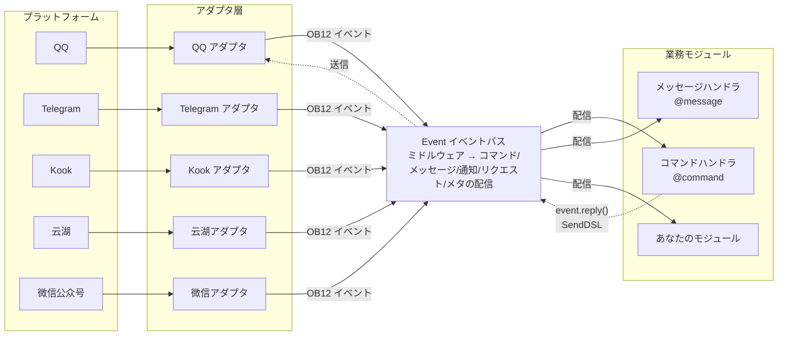
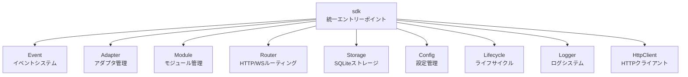

[English](README.md) | [简体中文](README.zh-CN.md) | [繁體中文](README.zh-TW.md) | **日本語** | [Русский](README.ru.md)

# ErisPulse

**一次编写，部署到 QQ / Telegram / Kook / Yunhu / 微信公众号 / OneBot12 / ... 多个平台。**

イベント駆動型のマルチプラットフォームチャットボット開発フレームワーク。

OneBot12 標準インターフェースを基に、一度コードを書けば複数のプラットフォームにデプロイ可能。柔軟なプラグインシステム、ホットリロードサポート、そして包括的な開発者ツールチェーンにより、シンプルなチャットボットから複雑な自動化システムまで、あらゆるシナリオに対応します。

<p>
  <a href="https://pypi.org/project/ErisPulse/"></a>
  <a href="https://pypi.org/project/ErisPulse/"></a>
  <a href="https://github.com/botuniverse/onebot-11"></a>
  <a href="https://12.onebot.dev/"></a>
  <a href="https://hub.docker.com/r/erispulse/erispulse"></a>
  <a href="https://github.com/ErisPulse/ErisPulse/blob/main/LICENSE"></a>
  <a href="https://pepy.tech/project/ErisPulse"></a>
  <a href="https://github.com/astral-sh/ruff"></a>
  <a href="https://socket.dev/pypi/package/erispulse"></a>
  <a href="https://www.erisdev.com"></a>
  <a href="https://deepwiki.com/ErisPulse/ErisPulse"></a>
  <a href="https://www.erisdev.com/#market"></a>
  <a href="https://github.com/ErisPulse/ErisPulse/discussions"></a>
</p>

<br clear="both">

---

<div align="center">

### 核心特性

</div>

<table>
<tr>
<td width="33%" align="center" valign="top">
<br/>


### イベント駆動アーキテクチャ

OneBot12 の統一イベントモデルに基づき、1つのハンドラで全てのアダプタに対応

</td>
<td width="33%" align="center" valign="top">
<br/>


### クロスプラットフォーム互換性

QQ / Telegram / Kook / 云湖 等 15+ プラットフォーム、業務コードは一切変更不要

</td>
<td width="33%" align="center" valign="top">
<br/>


### モジュール化設計

プラグインのホットプラグイン/アンプラグインで再起動なし、プラットフォーム / Bot / セッションごとの作用域管理

</td>
</tr>
<tr>
<td width="33%" align="center" valign="top">
<br/>


### ホットリロード

保存即有効、軽量で感覚的なホットリロード

</td>
<td width="33%" align="center" valign="top">
<br/>


### AI支援

自然言語で要望を記述し、直接利用可能なモジュールを生成

</td>
<td width="33%" align="center" valign="top">
<br/>


### 簡潔でエレガント

チェーン式API：@ユーザー、返信、再試行、一括送信を1行で完了

</td>
</tr>
</table>

---

## 動作原理

ErisPulse はアダプタ層によりプラットフォームの差異を抽象化し、業務コードはイベント自体にのみ注目するようにします：



- **アダプタ層**は各プラットフォームのネイティブプロトコルを OneBot12 標準イベントに変換し、業務モジュールはプラットフォームの差異を見ない
- **Event バス**はミドルウェアチェーンを実行した後、イベントタイプに応じて5種類のハンドラに配信
- **あなたのコード**はデコレータでイベントをサブスクライブし、`event.reply()` または SendDSL で返信する——返信メッセージは同じ経路を逆流してプラットフォームに送信される

モジュールの構成、初期化プロセス、ライフサイクルイベントなどの設計詳細は[アーキテクチャ概要](docs/ja/architecture.md)をご覧ください。

---

## 速習

### 1タップインストールスクリプト（推奨）

インストールスクリプトは、Docker、Python、uv の環境を自動検出し、最適なインストール方法を導き、多言語（中国語/English/日本語/Русский/繁体中国語）をサポートします。

Windows (PowerShell):
```powershell
irm https://get.erisdev.com/install.ps1 -OutFile install.ps1; powershell -ExecutionPolicy Bypass -File install.ps1
```

macOS / Linux:
```bash
curl -fsSL https://get.erisdev.com/install.sh -o install.sh && chmod +x install.sh && ./install.sh
```

<table>
<tr>
<td align="center" width="50%">

**Dockerインストールデモ**

<video src="https://github.com/user-attachments/assets/a367a466-4678-46a9-b101-073a86388ede" controls width="100%"></video>

</td>
<td align="center" width="50%">

**pipインストールデモ**

<video src="https://github.com/user-attachments/assets/a2df4009-dba6-411e-b79d-4454a168d063" controls width="100%"></video>

</td>
</tr>
</table>

### Dockerを使用する（推奨）

```bash
docker pull erispulse/erispulse:latest
```

<details>
<summary>Docker Hubが利用できない？</summary>

Docker Hub にアクセスできない場合は、GitHub Container Registry を使用できます：

```bash
docker pull ghcr.io/erispulse/erispulse:latest
```

ghcr.io のイメージを使用する場合は、`docker-compose.yml` の image を変更する必要があります：
```yaml
image: ghcr.io/erispulse/erispulse:latest
```

</details>

<details>
<summary>クイック起動</summary>

```bash
# docker-compose.yml をダウンロード
curl -O https://raw.githubusercontent.com/ErisPulse/ErisPulse/main/docker-compose.yml

# Dashboardのログイントークンを設定して起動
ERISPULSE_DASHBOARD_TOKEN=your-token docker compose up -d
```

起動後、`http://<host>:8000/Dashboard` にアクセスし、設定したトークンで Dashboard 管理パネルにログインします。

> イメージには ErisPulse フレームワークと Dashboard 管理パネルが内蔵されており、`linux/amd64` と `linux/arm64` アーキテクチャをサポートします。
>
> **永続化**：設定ファイルとインストールされたモジュール/アダプタはボリュームマウントでホストに永続化され、コンテナの再起動後も失われません。フレームワークの更新は Dashboard でホットアップデートで完了します。

</details>

<details>
<summary>Docker環境変数</summary>

| 変数 | デフォルト値 | 説明 |
|------|--------|------|
| `ERISPULSE_DASHBOARD_TOKEN` | 空 | Dashboardログイントークン（設定すると自動的に設定ファイルに書き込まれる）|
| `ERISPULSE_PORT` | `8000` | Dashboardポートマッピング |
| `ERISPULSE_TAG` | `latest` | イメージタグ、`dev` に設定するとプレリリースイメージを使用可能 |
| `ERISPULSE_BUILD_TARGET` | `production` | ビルドターゲット：`production`（安定版）または `dev`（プレリリース版）|
| `CONTAINER_NAME` | `erispulse` | コンテナ名 |
| `TZ` | `Asia/Shanghai` | コンテナタイムゾーン |
| `LANG` | `en_US.UTF-8` | システム言語、起動画面の言語を自動検出 |
| `ERISPULSE_LANG` | 空 | 起動画面の言語を強制設定：`zh` / `zh_TW` / `en` / `ja` / `ru`（`LANG` を上書き）|

</details>

### 1Panel アプリストア

[1Panel](https://1panel.cn) アプリストアから ErisPulse をワンクリックでインストールできます。詳しくは[ErisPulse-1Panel](https://github.com/ErisPulse/ErisPulse-1Panel)をご覧ください。

```bash
bash <(curl -sL https://get-1panel.erisdev.com/install.sh)
```

ErisPulse は 1Panel 第三者アプリストアに登録されており、[okxlin/appstore](https://github.com/okxlin/appstore) 第三者リポジトリを使用してインストールできます。

### pipを使用する

```bash
pip install ErisPulse
```

> 上記のワンクリックインストールスクリプトを使用することもでき、環境を自動検出し、設定を導くことができます。

### プロジェクトの初期化

```bash
# インタラクティブな初期化
epsdk init

# 快速初期化（プロジェクト名を指定）
epsdk init -q -n my_bot
```

### 最初のボットを作成する

`main.py` ファイルを作成します：

<table>
<tr>
<td width="50%" valign="top">

**コマンドハンドラ**

```python
from ErisPulse import sdk
from ErisPulse.Core.Event import command

@command("hello", help="挨拶メッセージを送信")
async def hello_handler(event):
    user_name = event.get_user_nickname() or "友達"
    await event.reply(f"こんにちは、{user_name}！")

@command("ping", help="ボットがオンラインかテスト")
async def ping_handler(event):
    await event.reply("Pong！ボットは正常に動作しています。")

if __name__ == "__main__":
    import asyncio
    asyncio.run(sdk.run(keep_running=True))
```

</td>
<td width="50%" valign="top">

**効果説明**

`/hello` を送信

ボットの返信：`こんにちは、{ユーザー名}！`

---

`/ping` を送信

ボットの返信：`Pong！ボットは正常に動作しています。`

---

**実行方法**

```bash
epsdk run main.py
# または開発モード
epsdk run main.py --reload
```

</td>
</tr>
</table>

詳細な説明は以下のドキュメントをご覧ください：
- [速習ガイド](docs/ja/quick-start.md)
- [入門ガイド](docs/ja/getting-started/)

---

## 同じコード、複数のプラットフォーム

*全く同じコマンドハンドラ。異なるプラットフォーム。ビジネスロジックを一切変更する必要なし。*

<table>
<tr>
<td align="center" width="33%">

**Kook**


</td>
<td align="center" width="33%">

**QQ**


</td>
<td align="center" width="33%">

**云湖**


</td>
</tr>
</table>

---

## チェーン式送信 DSL

`@ユーザー`、返信、再試行、タイムアウト、コールバックなどの送信ロジックを1つのチェーンで完了します：

```python
yunhu = sdk.adapter.get("yunhu")

# 単発送信：@ユーザー + 返信 + 再試行 + 成功コールバック
await (yunhu.Send.To("group", "123")
       .At("456").Reply("msg_789")
       .Retry(3).Timeout(10)
       .Hook(lambda r: print("送信成功！"))
       .Text("こんにちは"))

# 一括送信：1つのチェーンで複数のメッセージを送信
results = await (yunhu.Send.To("user", "123")
                .Build()
                .Text("通知1")
                .Image("pic.jpg")
                .Retry(2)
                .send_all())
```

> Hook（成功コールバック）、Retry（失敗再試行）、Timeout（タイムアウト取消）、OnProgress（進行状況監視）、Defer（遅延送信）、Build（一括構築）などのチェーンメソッドをサポートしています。詳細は[SendDSL ドキュメント](docs/ja/developer-guide/adapters/send-dsl.md)をご覧ください。

---

## 複数回対話の例

ErisPulse には強力な複数回対話エンジンが内蔵されており、誘導操作や情報収集などのインタラクティブなシナリオを簡単に実現できます：

```python
from ErisPulse.Core.Event import command, request

@command("register")
async def register_handler(event):
    conv = event.conversation(timeout=60)
    
    await conv.say("ようこそ登録へ！")
    
    # 複数ステップでユーザー情報を収集し、自動的に検証
    data = await conv.collect([
        {"key": "name", "prompt": "名前を入力してください"},
        {"key": "age", "prompt": "年齢を入力してください",
         "validator": lambda e: e.get_text().strip().isdigit(),
         "retry_prompt": "年齢は数字でなければなりません。再度入力してください"},
    ])
    
    if data and await conv.confirm(f"登録を確認しますか？名前: {data['name']}, 年齢: {data['age']}"):
        # SendDSL を使って通知を送信
        await sdk.adapter.get(event.get_platform()).Send.To(
            "user", event.get_user_id()
        ).Text(f"登録成功！ようこそ {data['name']}")
        # または await event.reply("登録成功！")

# フレンドリクエストを自動処理
@request.on_friend_request()
async def handle_friend_request(event):
    user_name = event.get_user_nickname() or event.get_user_id()
    
    # リクエストを承認
    result = await event.approve()
    if result.get("status") == "ok":
        await event.reply(f"自動でフレンドリクエストを承認しました。ようこそ {user_name}")
```

<details>
<summary>Conversation APIの詳細（分岐/選択/永続化）</summary>

```python
@command("quiz")
async def quiz_handler(event):
    conv = event.conversation(timeout=30)
    
    # 選択式質問
    answer = await conv.choose("Pythonの作成者は誰ですか？", [
        "Guido van Rossum",
        "James Gosling", 
        "Dennis Ritchie",
    ])
    
    if answer == 0:
        await conv.say("正解です！")
    elif answer is None:
        await conv.say("タイムアウトしました。また次回お越しください！")
    else:
        await conv.say("間違っています。正解はGuido van Rossumです")

@command("menu")
async def menu_handler(event):
    conv = event.conversation(timeout=60)
    
    # 分岐遷移、複雑なインタラクティブフローの構築
    @conv.branch("main")
    async def main_menu():
        await conv.say("=== メインメニュー ===\n1. 本人情報\n2. 設定\n3. 退出")
        resp = await conv.wait()
        if resp and resp.get_text().strip() == "1":
            await conv.goto("profile")
    
    @conv.branch("profile")
    async def profile():
        await conv.say("名前: Alice\n0. 戻る")
        resp = await conv.wait()
        if resp and resp.get_text().strip() == "0":
            await conv.goto("main")
    
    await conv.start()
```

[Conversation 多回対話](docs/ja/advanced/conversation.md)をご覧ください。

</details>

---

## コアモジュール

ErisPulse は包括的なマルチプラットフォームボット開発ツールチェーンを提供し、コアモジュールはそれぞれ役割を果たします：



| モジュール | 説明 |
|------|------|
| **Event** | イベントシステム、command / message / notice / request / meta 5種類のイベントと Conversation 多回対話 |
| **Adapter** | アダプタ管理、BaseAdapter 基底クラスによるイベント変換と SendDSL 送信、QQ / Telegram / Kook / 云湖 / 微信公众号 等 15+ プラットフォームをサポート |
| **Module** | モジュール管理、BaseModule 基底クラス + 依存関係宣言とトポロジカルソートによるロード |
| **SendDSL** | チェーン式送信、@/返信/再試行/タイムアウト/一括送信等の複雑なロジックを1行で完了 |
| **Router** | HTTP/WebSocketルーティングシステム（FastAPI + Uvicorn）|
| **Storage** | SQLiteを基にしたキーバリューストレージ + 一般的なSQLチェーン式クエリ |
| **Config** | TOMLによる設定管理 |
| **Lifecycle** | ライフサイクルイベントフック（core.init / adapter.* / module.*）|
| **Logger** | モジュール化されたログシステム、サブロガーをサポート |
| **HttpClient** | 統一HTTP/WSクライアント（aiohttpに基づく）、内部に再試行とErisPulseの例外体系を内蔵 |

初期化プロセス、ライフサイクルイベント、モジュールロード戦略などの詳細設計は[アーキテクチャ概要](docs/ja/architecture.md)をご覧ください。

---

## スコープ（Scope）——3次元の権限制御

モジュールコードを一切変更することなく、設定で「どの範囲で有効か」を一括宣言します：

```toml
[ErisPulse.scope.platforms.onebot11]
modules = ["Chat", "Tool*"]           # ① モジュール次元：このプラットフォームではこれらのモジュールのみ有効（glob / 正規表現）

[ErisPulse.scope.identity.users.onebot11]
deny = ["u_bad", "spam_*"]            # ② 身元次元：ブラックリストのユーザーのイベントは直接破棄

[ErisPulse.scope.actions.MyModule]
send = { allow = ["Text"] }           # ③ 出力次元：このモジュールはテキストのみ送信可能
api = { deny = ["set_*", "leave_*"] } #    管理系APIは禁止
```

```python
# 実行時にも呼び出し可能、即時有効（ピリオド区切りのパスによる辞書式読み書きが可能）
sdk.scope.set_action("MyModule", "api", deny=["set_*"])
```

> [スコープ（scope）](docs/ja/advanced/scope.md)をご覧ください。

---

## イベント上書き——モジュールコードを変更せず、任意のイベントタイプの動作を上書き

```toml
# メッセージハンドラのトリガ条件を上書き（コード内の条件とAND；meta/message/notice/request/command全タイプ対応）
[ErisPulse.event.overrides.message.ChatModule]
pattern = "雑談*"

# コマンドの実装パラメータを上書き（master / hidden / aliases / prefix等、ユーザー優先）
[ErisPulse.event.overrides.command.MyModule.restart]
master = true
```

> [イベント上書き](docs/ja/getting-started/event-handling.md)をご覧ください。

---

## エコシステム

ErisPulse はフレームワークに過ぎません。インストールしてすぐに始められます。ゼロから車輪を作ることはありません。

<table>
<tr>
<td align="center" width="25%">

**フレームワーク**

コアランタイム

統一イベント & メッセージモデル

</td>
<td align="center" width="25%">

**Dashboard**

可視化管理

プラグイン · ログ · 設定

[オンラインデモ →](https://dashdemo.erisdev.com/)

</td>
<td align="center" width="25%">

**AI Builder**

自然言語 → 利用可能なモジュール

[体験する →](https://builder.erisdev.com)

</td>
<td align="center" width="25%">

**モジュール市場**

即座に使えるプラグイン

[モジュールを閲覧 →](https://www.erisdev.com/#market)

</td>
</tr>
<tr>
<td align="center" width="25%">

**アダプタ**

15+ プラットフォーム接続

</td>
<td align="center" width="25%">

**ErisPulse-App**

公式マルチ端末クライアント

スマホで直接実行 · デスクトップトレイ常駐

[ダウンロードインストール →](https://github.com/ErisPulse/ErisPulse-App/releases)

</td>
<td align="center" width="25%">

**Docker**

多アーキテクチャ対応

`erispulse/erispulse`

</td>
<td align="center" width="25%">

**ドキュメント & CLI**

[erisdev.com](https://www.erisdev.com)

`epsdk` フッターツール

</td>
</tr>
</table>

---

## 対応プラットフォーム

アダプタの貢献をお待ちしています！どこから始めればよいか分からない？[貢献ガイド](docs/ja/contributing/README.md)をご覧ください。

| アダプタ | 説明 |
|--------|------|
|  [Kook](https://github.com/shanfishapp/ErisPulse-KookAdapter) | Kook（開黒啦）即時通信プラットフォーム |
|  [Matrix](https://github.com/ErisPulse/ErisPulse-MatrixAdapter) | Matrix分散型通信プロトコル |
|  [OneBot11](https://github.com/ErisPulse/ErisPulse-OneBot11Adapter) | OneBot v11 一般的なロボットプロトコル |
|  [OneBot12](https://github.com/ErisPulse/ErisPulse-OneBot12Adapter) | OneBot v12 標準プロトコル |
|  [QQ](https://github.com/ErisPulse/ErisPulse-QQBotAdapter) | QQ公式ロボットプラットフォーム |
|  [沙箱](https://github.com/ErisPulse/ErisPulse-SandboxAdapter) | ウェブ端末デバッグ、実際のプラットフォームに接続せずに |
|  [Terminal](https://github.com/ErisPulse/ErisPulse-TerminalAdapter) | コマンドライン即チャット、設定ゼロで開発・デバッグ |
|  [Telegram](https://github.com/ErisPulse/ErisPulse-TelegramAdapter) | グローバル即時通信プラットフォーム |
|  [メール](https://github.com/ErisPulse/ErisPulse-EmailAdapter) | メールプロトコル送受信アダプタ |
|  [云湖](https://github.com/ErisPulse/ErisPulse-YunhuAdapter) | 企業向け即時通信プラットフォーム（ロボット接続） |
|  [云湖用户](https://github.com/wsu2059q/ErisPulse-YunhuUserAdapter) | 云湖ユーザー協定に基づく接続アダプタ |
| [花枫咖啡馆](https://github.com/ErisPulse/ErisPulse-Ideaura/) | Allons! \(・ω・) / |
|  [Discord](https://github.com/ErisPulse/ErisPulse-DiscordAdapter) | グローバルコミュニティ通信プラットフォーム、サーバー、チャンネル、プライベートメッセージをサポート |
|  [Webhook](https://github.com/ErisPulse/ErisPulse-WebhookAdapter) | 一般的なHTTPブリッジアダプタ、任意のシステムに接続 |
|  [微信公众号](https://github.com/ErisPulse/ErisPulse-WechatMpAdapter) | 微信公式公众号プラットフォーム |

アダプタの詳細は[プラットフォームガイド](docs/ja/platform-guide/README.md)をご覧ください。

---

## コミュニティ

私たちと交流しましょう：

- Telegram：<https://t.me/ErisPulse>
- QQ群：<https://qm.qq.com/q/TOwnCmypcy>
- 云湖群：<https://yhfx.jwznb.com/share?key=VWJL4fTWXepa&ts=1781889199>

---

### 貢献ガイド

ErisPulseプロジェクトの健全性は、あなたの貢献によってさらに進化します！あらゆる形式の貢献を歓迎します：

1. **問題報告** — [GitHub Issues](https://github.com/ErisPulse/ErisPulse/issues) にバグ報告を投稿
2. **機能リクエスト** — [コミュニティ議論](https://github.com/ErisPulse/ErisPulse/discussions) で新アイデアを提案
3. **コード貢献** — PRを提出する前に[コードスタイル](docs/ja/styleguide/)と[貢献ガイド](CONTRIBUTING.md)を読む
4. **ドキュメント改善** — ドキュメントとサンプルコードの改善を手伝う

**初めて貢献する？** ここから始めましょう 👉 [初めての貢献実践](docs/ja/contributing/first-contribution.md)

[コミュニティ議論に参加する](https://github.com/ErisPulse/ErisPulse/discussions)

---

<div align="center">

### 謝辞


本プロジェクトの一部のコードは[sdkFrame](https://github.com/runoneall/sdkFrame)に基づいています。

コアアダプタ標準化層は[OneBot12規格](https://12.onebot.dev/)を参考にし、その恩恵を受けています。

特に云湖エコシステムとコミュニティに感謝します。

ErisPulseの初期探索と成長は云湖開発者コミュニティのサポートに大きく支えられてきました。
多くのアイデア、アダプタ、実践的な経験がここで生まれました。

また、ErisPulse、OneBotエコシステム、およびオープンソースコミュニティに貢献したすべての開発者とプロジェクト作者に感謝します。

</div>