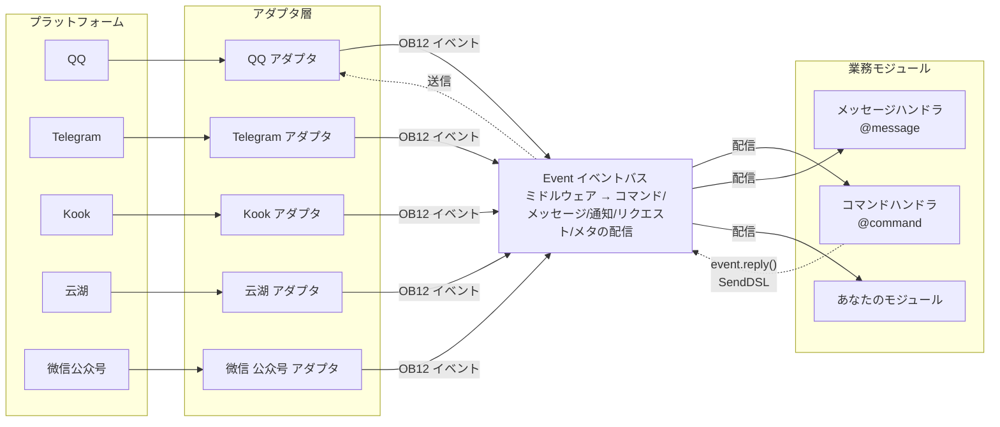
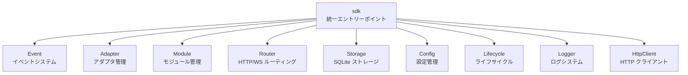

[English](README.md) | [简体中文](README.zh-CN.md) | [繁體中文](README.zh-TW.md) | **日本語** | [Русский](README.ru.md)

# ErisPulse

**一次编写，部署到 QQ / Telegram / Kook / Yunhu / 微信公众号 / OneBot12 / ... 多个平台。**

イベント駆動型の多プラットフォームチャットボット開発フレームワーク。

OneBot12 標準インターフェースに基づき、一度のコードで複数プラットフォームに展開可能。柔軟なプラグインシステム、ホットリロード対応、そして完全な開発者ツールチェーンを備え、シンプルなチャットボットから複雑な自動化システムまで、あらゆるシナリオに対応。

<p>
  <a href="https://pypi.org/project/ErisPulse/"></a>
  <a href="https://pypi.org/project/ErisPulse/"></a>
  <a href="https://hub.docker.com/r/erispulse/erispulse"></a>
  <a href="https://github.com/ErisPulse/ErisPulse/blob/main/LICENSE"></a>
  <a href="https://github.com/ErisPulse/ErisPulse"></a>
  <a href="https://pepy.tech/project/ErisPulse"></a>
  <a href="https://github.com/astral-sh/ruff"></a>
  <a href="https://socket.dev/pypi/package/erispulse"></a>
  <a href="https://www.erisdev.com"></a>
  <a href="https://deepwiki.com/ErisPulse/ErisPulse"></a>
  <a href="https://www.erisdev.com/#market"></a>
  <a href="https://github.com/ErisPulse/ErisPulse/discussions"></a>
</p>

<br clear="both">

---

<div align="center">

### 核心特性

</div>

<table>
<tr>
<td width="33%" align="center" valign="top">
<br/>


### イベント駆動アーキテクチャ

OneBot12 標準に基づく統一イベントモデル——各プラットフォームごとに if/elif を書く必要がなく、一つのハンドラで全てのアダプタに対応

</td>
<td width="33%" align="center" valign="top">
<br/>


### クロスプラットフォーム互換性

同一の業務コードが全てのプラットフォームで動作する——一度の開発で QQ / Telegram / Kook / Yunhu / 微信公众号 など 15+ プラットフォームに対応可能、再開発の必要なし

</td>
<td width="33%" align="center" valign="top">
<br/>


### モジュール化設計

柔軟なプラグインシステムによる実行時ホットプラグイン対応——モジュールのインストール/アンインストール/有効化/無効化がプロセス再起動なしで可能、ブロックのようにボット機能を組み立てられる

</td>
</tr>
<tr>
<td width="33%" align="center" valign="top">
<br/>


### ホットリロード

開発サイクルが再起動10秒から0.5秒に短縮される——ファイルを保存するだけで有効、開発デバッグ体験はインタプリタ言語に近い

</td>
<td width="33%" align="center" valign="top">
<br/>


### AI支援

自然言語による要件説明から直接使えるモジュールを生成する——アダプタの書き方が分からない？AIにどのプラットフォームを接続したいか伝えれば、自動でコードを生成してくれる

</td>
<td width="33%" align="center" valign="top">
<br/>


### 簡潔でエレガント

直感的なチェーン式API設計——@ユーザー、返信、再試行、一括送信などの複雑なロジックを一行で実現、コードは羽毛のように軽く読みやすい

</td>
</tr>
</table>

---

## 動作原理

ErisPulse はアダプタ層を介してプラットフォームの差異を隠蔽し、業務コードはイベント自体にのみ関心を持つようにする：



- **アダプタ層**は各プラットフォームのネイティブプロトコルを OneBot12 標準イベントに変換し、業務モジュールはプラットフォームの差異を見えないようにする
- **Event バス**はミドルウェアチェーンを実行した後、イベントの種類に応じて5種類のハンドラに配信する
- **あなたのコード**はデコレータを使ってイベントをサブスクライブし、`event.reply()` または SendDSL で返信する——返信メッセージは同じ経路を逆流してプラットフォームに戻る

モジュールの構成、初期化フロー、ライフサイクルイベントなどの設計詳細は、[アーキテクチャ概要](docs/ja/architecture.md)を参照してください。

---

## 快速开始

### 一键安装脚本（推荐）

インストールスクリプトは環境（Docker、Python、uv）を自動検出し、最適なインストール方法を選択する。多言語（中国語/English/日本語/Русский/繁體中文）をサポートする。

Windows (PowerShell):
```powershell
irm https://get.erisdev.com/install.ps1 -OutFile install.ps1; powershell -ExecutionPolicy Bypass -File install.ps1
```

macOS / Linux:
```bash
curl -fsSL https://get.erisdev.com/install.sh -o install.sh && chmod +x install.sh && ./install.sh
```

<table>
<tr>
<td align="center" width="50%">

**Docker 安装演示**

<video src="https://github.com/user-attachments/assets/a367a466-4678-46a9-b101-073a86388ede" controls width="100%"></video>

</td>
<td align="center" width="50%">

**pip 安装演示**

<video src="https://github.com/user-attachments/assets/a2df4009-dba6-411e-b79d-4454a168d063" controls width="100%"></video>

</td>
</tr>
</table>

### 使用 Docker (推荐)

```bash
docker pull erispulse/erispulse:latest
```

<details>
<summary>Docker Hub不可用？</summary>

Docker Hub にアクセスできない場合は、GitHub Container Registry を使用できます：

```bash
docker pull ghcr.io/erispulse/erispulse:latest
```

ghcr.io のイメージを使用する場合は、`docker-compose.yml` の image を修正する必要があります：
```yaml
image: ghcr.io/erispulse/erispulse:latest
```

</details>

<details>
<summary>快速启动</summary>

```bash
# docker-compose.yml をダウンロード
curl -O https://raw.githubusercontent.com/ErisPulse/ErisPulse/main/docker-compose.yml

# Dashboard のログイントークンを設定して起動
ERISPULSE_DASHBOARD_TOKEN=your-token docker compose up -d
```

起動後、`http://<host>:8000/Dashboard` にアクセスし、設定したトークンで Dashboard 管理パネルにログインします。

> イメージには ErisPulse フレームワークと Dashboard 管理パネルが内蔵されており、`linux/amd64` および `linux/arm64` アーキテクチャをサポートします。
>
> **永続化**：設定ファイルとインストールされたモジュール/アダプタはボリュームマウントによりホストに永続化され、コンテナの再起動後も失われません。フレームワーク自体の更新は Dashboard でホットアップデートされます。

</details>

<details>

</details>

<details>
<summary>Docker 環境変数</summary>

| 変数 | デフォルト値 | 説明 |
|------|--------|------|
| `ERISPULSE_DASHBOARD_TOKEN` | 空 | Dashboard のログイントークン（設定すると自動的に設定ファイルに書き込まれる）|
| `ERISPULSE_PORT` | `8000` | Dashboard のポートマッピング |
| `ERISPULSE_TAG` | `latest` | イメージタグ、`dev` に設定するとプレリリースイメージを使用可能 |
| `ERISPULSE_BUILD_TARGET` | `production` | ビルドターゲット：`production`（安定版）または `dev`（プレリリース版）|
| `CONTAINER_NAME` | `erispulse` | コンテナ名 |
| `TZ` | `Asia/Shanghai` | コンテナのタイムゾーン |
| `LANG` | `en_US.UTF-8` | システム言語、起動時のインターフェース言語を自動検出 |
| `ERISPULSE_LANG` | 空 | 起動時のインターフェース言語を強制設定：`zh` / `zh_TW` / `en` / `ja` / `ru`（`LANG` を上書き）|

</details>

### 1Panel アプリストア

[1Panel](https://1panel.cn) アプリストアから ErisPulse をワンクリックでインストールできます。詳しくは [ErisPulse-1Panel](https://github.com/ErisPulse/ErisPulse-1Panel) を参照してください。

```bash
bash <(curl -sL https://get-1panel.erisdev.com/install.sh)
```

ErisPulse は 1Panel 第三者アプリストアに登録されており、[okxlin/appstore](https://github.com/okxlin/appstore) 第三者リポジトリを使用してインストールできます。

### 使用 pip 安装

```bash
pip install ErisPulse
```

> 上記のワンクリックインストールスクリプトを使用することもでき、環境を自動検出して設定を誘導します。

### プロジェクトの初期化

```bash
# 対話形式で初期化
epsdk init

# 簡易初期化（プロジェクト名を指定）
epsdk init -q -n my_bot
```

### 最初のボットを作成する

`main.py` ファイルを作成します：

<table>
<tr>
<td width="50%" valign="top">

**コマンドハンドラ**

```python
from ErisPulse import sdk
from ErisPulse.Core.Event import command

@command("hello", help="送信する挨拶メッセージ")
async def hello_handler(event):
    user_name = event.get_user_nickname() or "朋友"
    await event.reply(f"你好，{user_name}！")

@command("ping", help="ロボットがオンラインかどうかをテストする")
async def ping_handler(event):
    await event.reply("Pong！ロボットは正常に動作しています。")

if __name__ == "__main__":
    import asyncio
    asyncio.run(sdk.run(keep_running=True))
```

</td>
<td width="50%" valign="top">

**効果の説明**

`/hello` を送信

ロボットは返信：`你好，{ユーザー名}！`

---

`/ping` を送信

ロボットは返信：`Pong！ロボットは正常に動作しています。`

---

**実行方法**

```bash
epsdk run main.py
# または開発モード
epsdk run main.py --reload
```

</td>
</tr>
</table>

詳細な説明は以下のドキュメントを参照してください：
- [快速开始指南](docs/ja/quick-start.md)
- [入门指南](docs/ja/getting-started/)

---

## 同一份代码。多个平台。

*完全相同的コマンドハンドラ。異なるプラットフォーム。ビジネスロジックを一切変更する必要なし。*

<table>
<tr>
<td align="center" width="33%">

**Kook**


</td>
<td align="center" width="33%">

**QQ**


</td>
<td align="center" width="33%">

**云湖**


</td>
</tr>
</table>

---

## 链式发送 DSL

@ユーザー、返信、再試行、タイムアウト、コールバックなど、すべての送信ロジックを1つのチェーン呼び出しで完了する：

```python
yunhu = sdk.adapter.get("yunhu")

# 単発送信：@ユーザー + 返信 + 再試行 + 成功コールバック
await (yunhu.Send.To("group", "123")
       .At("456").Reply("msg_789")
       .Retry(3).Timeout(10)
       .Hook(lambda r: print("送信成功！"))
       .Text("你好"))

# 一括送信：1つのチェーンで複数メッセージを送信
results = await (yunhu.Send.To("user", "123")
                .Build()
                .Text("通知一")
                .Image("pic.jpg")
                .Retry(2)
                .send_all())
```

> Hook（成功コールバック）、Retry（失敗再試行）、Timeout（タイムアウトキャンセル）、OnProgress（進捗監視）、Defer（遅延送信）、Build（一括構築）などのチェーンメソッドをサポート。詳細は [SendDSL 文档](docs/ja/developer-guide/adapters/send-dsl.md) を参照してください。

---

## 多轮对话示例

ErisPulse には強力なマルチホップ対話エンジンが内蔵されており、誘導操作、情報収集などのインタラクティブなシナリオを簡単に実現できます：

```python
from ErisPulse.Core.Event import command, request

@command("register")
async def register_handler(event):
    conv = event.conversation(timeout=60)
    
    await conv.say("欢迎注册！")
    
    # 複数ステップでユーザー情報を収集し、自動的に検証
    data = await conv.collect([
        {"key": "name", "prompt": "请输入姓名"},
        {"key": "age", "prompt": "请输入年龄",
         "validator": lambda e: e.get_text().strip().isdigit(),
         "retry_prompt": "年龄必须是数字，请重新输入"},
    ])
    
    if data and await conv.confirm(f"确认注册？姓名: {data['name']}, 年龄: {data['age']}"):
        # SendDSL を使って通知を送信
        await sdk.adapter.get(event.get_platform()).Send.To(
            "user", event.get_user_id()
        ).Text(f"注册成功！欢迎 {data['name']}")
        # または await event.reply("注册成功！")

# フレンドリクエストを自動処理
@request.on_friend_request()
async def handle_friend_request(event):
    user_name = event.get_user_nickname() or event.get_user_id()
    
    # リクエストを承認
    result = await event.approve()
    if result.get("status") == "ok":
        await event.reply(f"已自动通过好友请求，欢迎 {user_name}")
```

<details>
<summary>Conversation API の詳細（分岐/選択/永続化）</summary>

```python
@command("quiz")
async def quiz_handler(event):
    conv = event.conversation(timeout=30)
    
    # 選択式の質問
    answer = await conv.choose("Python 的创造者是谁？", [
        "Guido van Rossum",
        "James Gosling", 
        "Dennis Ritchie",
    ])
    
    if answer == 0:
        await conv.say("正确！")
    elif answer is None:
        await conv.say("超时了，下次再来吧！")
    else:
        await conv.say("错误了，正确答案是 Guido van Rossum")

@command("menu")
async def menu_handler(event):
    conv = event.conversation(timeout=60)
    
    # 分岐遷移、複雑なインタラクティブフローの構築
    @conv.branch("main")
    async def main_menu():
        await conv.say("=== 主菜单 ===\n1. 个人信息\n2. 设置\n3. 退出")
        resp = await conv.wait()
        if resp and resp.get_text().strip() == "1":
            await conv.goto("profile")
    
    @conv.branch("profile")
    async def profile():
        await conv.say("姓名: Alice\n0. 返回")
        resp = await conv.wait()
        if resp and resp.get_text().strip() == "0":
            await conv.goto("main")
    
    await conv.start()
```

[Conversation 多轮对话](docs/ja/advanced/conversation.md) を参照してください。

</details>

---

## 核心模块

ErisPulse は包括的な多プラットフォームボット開発ツールチェーンを提供し、各コアモジュールはそれぞれの役割を果たします：



| モジュール | 説明 |
|------|------|
| **Event** | イベントシステム、command / message / notice / request / meta 五種類のイベントと Conversation 多輪対話機能を提供 |
| **Adapter** | アダプタ管理、BaseAdapter 基底クラスによる統一イベント変換と SendDSL 送信、QQ / Telegram / Kook / 云湖 / 微信公众号 など 15+ プラットフォームをサポート |
| **Module** | モジュール管理、BaseModule 基底クラス + 依存関係の宣言とトポロジカルソートによるロード |
| **SendDSL** | チェーン式送信、@/返信/再試行/タイムアウト/一括などの複雑なロジックを一行で実現 |
| **Router** | HTTP/WebSocket ルーティングシステム（FastAPI + Uvicorn）|
| **Storage** | SQLite を基にしたキーバリューストレージ + 一般的な SQL チェーン式クエリ |
| **Config** | TOML 設定管理 |
| **Lifecycle** | ライフサイクルイベントフック（core.init / adapter.* / module.*）|
| **Logger** | モジュール化されたログシステム、サブロガーをサポート |
| **HttpClient** | 統一 HTTP/WS クライアント（aiohttp を基に）、内部に再試行と ErisPulse の例外体系を備える |

初期化フロー、ライフサイクルイベント、モジュールロード戦略などの設計詳細は、[アーキテクチャ概要](docs/ja/architecture.md)を参照してください。

---

## 生态

ErisPulse は単なるフレームワークではありません。インストールしてすぐに始められます。ゼロから車輪を作成する必要はありません。

<table>
<tr>
<td align="center" width="25%">

**フレームワーク**

コアランタイム

統一イベント & メッセージモデル

</td>
<td align="center" width="25%">

**Dashboard**

可視化管理

プラグイン · ログ · 設定

[オンラインデモ →](https://dashdemo.erisdev.com/)

</td>
<td align="center" width="25%">

**AI Builder**

自然言語 → 使用可能なモジュール

[今すぐ体験 →](https://builder.erisdev.com)

</td>
<td align="center" width="25%">

**モジュール市場**

即座に使えるプラグイン

[モジュールを閲覧 →](https://www.erisdev.com/#market)

</td>
</tr>
<tr>
<td align="center" width="25%">

**アダプタ**

15+ プラットフォーム接続

</td>
<td align="center" width="25%">

**ドキュメント**

[erisdev.com](https://www.erisdev.com)

</td>
<td align="center" width="25%">

**Docker**

多アーキテクチャ対応

`erispulse/erispulse`

</td>
<td align="center" width="25%">

**CLI**

`epsdk` フッターツール

</td>
</tr>
</table>

---

## 支持的平台

アダプタの貢献を歓迎します！どこから始めればいいか分からない？[贡献指南](docs/ja/contributing/README.md)をご覧ください。

| アダプタ | 説明 |
|--------|------|
|  [Kook](https://github.com/shanfishapp/ErisPulse-KookAdapter) | Kook（开黑啦）即时通讯平台 |
|  [Matrix](https://github.com/ErisPulse/ErisPulse-MatrixAdapter) | Matrix 去中心化通讯协议 |
|  [OneBot11](https://github.com/ErisPulse/ErisPulse-OneBot11Adapter) | OneBot v11 通用机器人协议 |
|  [OneBot12](https://github.com/ErisPulse/ErisPulse-OneBot12Adapter) | OneBot v12 标准协议 |
|  [QQ](https://github.com/ErisPulse/ErisPulse-QQBotAdapter) | QQ 官方机器人平台 |
|  [沙箱](https://github.com/ErisPulse/ErisPulse-SandboxAdapter) | 网页端调试，无需接入真实平台 |
|  [Telegram](https://github.com/ErisPulse/ErisPulse-TelegramAdapter) | 全球性即时通讯平台 |
|  [邮件](https://github.com/ErisPulse/ErisPulse-EmailAdapter) | 邮件协议收发适配器 |
|  [云湖](https://github.com/ErisPulse/ErisPulse-YunhuAdapter) | 企业级即时通讯平台（机器人接入） |
|  [云湖用户](https://github.com/wsu2059q/ErisPulse-YunhuUserAdapter) | 基于云湖用户协议的接入适配器 |
| [花枫咖啡馆](https://github.com/ErisPulse/ErisPulse-Ideaura/) | Allons! \(・ω・) / |
|  [Discord](https://github.com/ErisPulse/ErisPulse-DiscordAdapter) | 全球性社区通讯平台，支持服务器、频道、私信 |
|  [Webhook](https://github.com/ErisPulse/ErisPulse-WebhookAdapter) | 通用 HTTP 桥接适配器，对接任意系统 |
|  [微信公众号](https://github.com/ErisPulse/ErisPulse-WechatMpAdapter) | 微信官方公众号平台 |

アダプタの詳細については [适配器详情介绍](docs/ja/platform-guide/README.md) をご覧ください。

---

## 社区

私たちと交流しましょう：

- Telegram：<https://t.me/ErisPulse>
- QQ 群：<https://qm.qq.com/q/TOwnCmypcy>
- 云湖群：<https://yhfx.jwznb.com/share?key=VWJL4fTWXepa&ts=1781889199>

---

### 贡献指南

ErisPulse プロジェクトの健全性には、皆様の力が必要です！あらゆる形態の貢献を歓迎します：

1. **問題報告** — [GitHub Issues](https://github.com/ErisPulse/ErisPulse/issues) にバグ報告を提出
2. **機能リクエスト** — [コミュニティ議論](https://github.com/ErisPulse/ErisPulse/discussions) で新アイデアを提案
3. **コード貢献** — PR を提出する前に [コードスタイル](docs/ja/styleguide/) と [贡献指南](CONTRIBUTING.md) を読む
4. **ドキュメント改善** — ドキュメントとサンプルコードの改善を手伝う

**初めての貢献？** ここから始めましょう 👉 [首次贡献实战](docs/ja/contributing/first-contribution.md)

[コミュニティ議論に参加](https://github.com/ErisPulse/ErisPulse/discussions)

---

<div align="center">

### 致谢


本プロジェクトの一部のコードは [sdkFrame](https://github.com/runoneall/sdkFrame) に基づいています。

コアアダプタの標準化層は [OneBot12 規格](https://12.onebot.dev/) を参考にしており、その恩恵を受けています。

特に云湖エコシステムとコミュニティに感謝します。

ErisPulse の初期の探求と成長は云湖開発者コミュニティのサポートに欠かせません。多くのアイデア、アダプタ、実践的な経験はここから生まれました。

また、ErisPulse、OneBot エコシステム、そしてオープンソースコミュニティに貢献したすべての開発者とプロジェクト作者に感謝します。

</div>