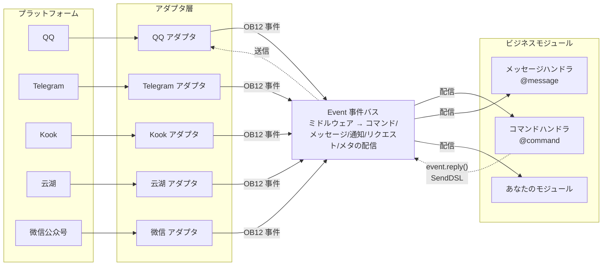
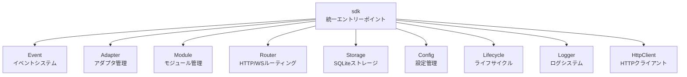

[English](README.md) | [简体中文](README.zh-CN.md) | [繁體中文](README.zh-TW.md) | **日本語** | [Русский](README.ru.md)

# ErisPulse

**一度書くだけで、QQ / Telegram / Kook / Yunhu / 微信公众号 / OneBot12 / ... など複数のプラットフォームに展開できる。**

イベント駆動型のマルチプラットフォームチャットボット開発フレームワーク。

OneBot12標準インターフェースに基づき、一度書けば複数のプラットフォームに展開可能。柔軟なプラグインシステム、ホットリロードのサポート、そして完全な開発者ツールチェーンにより、シンプルなチャットボットから複雑な自動化システムまで、あらゆるシナリオに対応。

<p>
  <a href="https://pypi.org/project/ErisPulse/"></a>
  <a href="https://pypi.org/project/ErisPulse/"></a>
  <a href="https://hub.docker.com/r/erispulse/erispulse"></a>
  <a href="https://github.com/ErisPulse/ErisPulse/blob/main/LICENSE"></a>
  <a href="https://github.com/ErisPulse/ErisPulse"></a>
  <a href="https://pepy.tech/project/ErisPulse"></a>
  <a href="https://github.com/astral-sh/ruff"></a>
  <a href="https://socket.dev/pypi/package/erispulse"></a>
  <a href="https://www.erisdev.com"></a>
  <a href="https://deepwiki.com/ErisPulse/ErisPulse"></a>
  <a href="https://www.erisdev.com/#market"></a>
  <a href="https://github.com/ErisPulse/ErisPulse/discussions"></a>
</p>

<br clear="both">

---

<div align="center">

### 核心特性

</div>

<table>
<tr>
<td width="33%" align="center" valign="top">
<br/>


### イベント駆動アーキテクチャ

OneBot12標準に基づく統一イベントモデル—各プラットフォームごとにif/elifでメッセージタイプを判断する必要がなく、1つのハンドラで全てのアダプタに自動的に適応

</td>
<td width="33%" align="center" valign="top">
<br/>


### マルチプラットフォーム互換

同一のビジネスコードを全てのプラットフォームで実行可能—一度書けば、QQ / Telegram / Kook / Yunhu / 微信公众号など15以上のプラットフォームをサービス化でき、再開発の必要がない

</td>
<td width="33%" align="center" valign="top">
<br/>


### モジュール化設計

柔軟なプラグインシステムにより、実行時のホットプラグインが可能—モジュールのインストール/アンインストール/有効化/無効化はプロセスの再起動なしで可能、ブロックのようにロボットの機能を組み立てられる

</td>
</tr>
<tr>
<td width="33%" align="center" valign="top">
<br/>


### ホットリロード

開発サイクルが10秒から0.5秒に短縮—ファイルを保存すると即座に有効化され、開発・デバッグ体験はインタプリタ言語に近い

</td>
<td width="33%" align="center" valign="top">
<br/>


### AI補助

自然言語で要件を記述して直接使えるモジュールを生成—アダプタの書き方が分からない？AIにどのプラットフォームを接続したいかを伝え、AIが作成する

</td>
<td width="33%" align="center" valign="top">
<br/>


### 簡潔でエレガント

直感的なチェーンAPI設計—@ユーザー、返信、再試行、バッチ送信などの複雑なロジックを一行で完了、コードは羽毛のように軽く読みやすい

</td>
</tr>
</table>

---

## 動作原理

ErisPulseはアダプタ層を介してプラットフォームの差異を隠蔽し、ビジネスコードはイベント自体だけを気にすればよいようになっています：



- **アダプタ層**は各プラットフォームのネイティブプロトコルをOneBot12標準イベントに変換し、ビジネスモジュールはプラットフォームの差異を見ない
- **Event バス**はミドルウェアチェーンを実行した後、イベントタイプに応じて5種類のハンドラに配信する
- **あなたのコード**はデコレータでイベントをサブスクライブし、`event.reply()`またはSendDSLで返信する—返信メッセージは同じ経路をたどってプラットフォームに戻る

モジュールの完全な構成、初期化プロセス、ライフサイクルイベントなどの設計詳細は、[アーキテクチャ概要](docs/ja/architecture.md)を参照してください。

---

## 速習

### 1クリックインストールスクリプト（推奨）

インストールスクリプトは、Docker、Python、uvなどの環境を自動的に検出し、最適なインストール方法を導き、中国語/English/日本語/Русский/繁體中文の多言語に対応しています。

Windows (PowerShell):
```powershell
irm https://get.erisdev.com/install.ps1 -OutFile install.ps1; powershell -ExecutionPolicy Bypass -File install.ps1
```

macOS / Linux:
```bash
curl -fsSL https://get.erisdev.com/install.sh -o install.sh && chmod +x install.sh && ./install.sh
```

<table>
<tr>
<td align="center" width="50%">

**Docker インストールデモ**

<video src="https://github.com/user-attachments/assets/a367a466-4678-46a9-b101-073a86388ede" controls width="100%"></video>

</td>
<td align="center" width="50%">

**pip インストールデモ**

<video src="https://github.com/user-attachments/assets/a2df4009-dba6-411e-b79d-4454a168d063" controls width="100%"></video>

</td>
</tr>
</table>

### Docker を使用する（推奨）

```bash
docker pull erispulse/erispulse:latest
```

<details>
<summary>Docker Hubが利用できない？</summary>

Docker Hubにアクセスできない場合は、GitHub Container Registryを使用できます：

```bash
docker pull ghcr.io/erispulse/erispulse:latest
```

ghcr.ioのイメージを使用する場合は、`docker-compose.yml`のimageを変更する必要があります：
```yaml
image: ghcr.io/erispulse/erispulse:latest
```

</details>

<details>
<summary>クイックスタート</summary>

```bash
# docker-compose.ymlをダウンロード
curl -O https://raw.githubusercontent.com/ErisPulse/ErisPulse/main/docker-compose.yml

# Dashboardのログイントークンを設定して起動
ERISPULSE_DASHBOARD_TOKEN=your-token docker compose up -d
```

> イメージにはErisPulseフレームワークとDashboard管理パネルが内蔵されており、`linux/amd64`と`linux/arm64`アーキテクチャをサポートしています。

起動後、`http://<host>:<port>/Dashboard`にアクセスし、設定したトークンをパスワードとして使用してDashboard管理パネルにログインします。

</details>

<details>
<summary>プレリリース版（Dev）を使用する</summary>

`ERISPULSE_CHANNEL=dev`を設定すると、プレリリース版を使用できます：

```bash
# 方法1：環境変数を使用（推奨）
ERISPULSE_CHANNEL=dev ERISPULSE_DASHBOARD_TOKEN=your-token docker compose up -d

# 方法2：devイメージをビルド
ERISPULSE_BUILD_TARGET=dev docker compose up -d --build
```

起動時に最新バージョンに自動的に更新する場合は、`ERISPULSE_UPDATE_ON_START=true`を明示的に設定します：

```bash
ERISPULSE_CHANNEL=dev ERISPULSE_UPDATE_ON_START=true docker compose up -d
```

また、事前にビルドされたdevイメージを取得することもできます：

```bash
docker pull erispulse/erispulse:dev
```

</details>

<details>
<summary>Docker環境変数</summary>

| 変数 | デフォルト値 | 説明 |
|------|--------|------|
| `ERISPULSE_CHANNEL` | `stable` | バージョンチャネル：`stable`（安定版）または `dev`（プレリリース版） |
| `ERISPULSE_UPDATE_ON_START` | `false` | コンテナ起動時に自動的に最新バージョンに更新するかどうか（明示的に有効化する必要あり） |
| `ERISPULSE_DASHBOARD_TOKEN` | 空 | Dashboardログイントークン |
| `ERISPULSE_PORT` | `8000` | Dashboardポートマッピング |
| `TZ` | `Asia/Shanghai` | コンテナタイムゾーン |

> `ERISPULSE_UPDATE_ON_START=true`を有効にすることで、イメージが古くても、コンテナ起動時に自動的に最新バージョンを取得することができます。

</details>

### 1Panel アプリストア

[1Panel](https://1panel.cn)アプリストアからErisPulseをワンクリックでインストールできます。詳しくは[ErisPulse-1Panel](https://github.com/ErisPulse/ErisPulse-1Panel)を参照してください。

```bash
bash <(curl -sL https://get-1panel.erisdev.com/install.sh)
```

ErisPulseは1Panelのサードパーティアプリストアに登録されており、[okxlin/appstore](https://github.com/okxlin/appstore)サードパーティリポジトリを使用してインストールできます。

### pipを使用する

```bash
pip install ErisPulse
```

> 上記のワンクリックインストールスクリプトを使用することもでき、環境を自動的に検出し、設定を誘導します。

### プロジェクトの初期化

```bash
# インタラクティブな初期化
epsdk init

# ファーストイニシャライズ（プロジェクト名を指定）
epsdk init -q -n my_bot
```

### 最初のロボットを作成する

`main.py`ファイルを作成します：

<table>
<tr>
<td width="50%" valign="top">

**コマンドハンドラ**

```python
from ErisPulse import sdk
from ErisPulse.Core.Event import command

@command("hello", help="挨拶メッセージを送信")
async def hello_handler(event):
    user_name = event.get_user_nickname() or "友達"
    await event.reply(f"こんにちは、{user_name}！")

@command("ping", help="ロボットがオンラインかどうかをテスト")
async def ping_handler(event):
    await event.reply("Pong！ロボットは正常に動作しています。")

if __name__ == "__main__":
    import asyncio
    asyncio.run(sdk.run(keep_running=True))
```

</td>
<td width="50%" valign="top">

**効果説明**

`/hello`を送信

ロボットは返信します：`こんにちは、{ユーザー名}！`

---

`/ping`を送信

ロボットは返信します：`Pong！ロボットは正常に動作しています。`

---

**実行方法**

```bash
epsdk run main.py
# または開発モード
epsdk run main.py --reload
```

</td>
</tr>
</table>

詳細な説明は以下のドキュメントを参照してください：
- [速習ガイド](docs/ja/quick-start.md)
- [入門ガイド](docs/ja/getting-started/)

---

## 同じコードで、複数のプラットフォーム

*完全に同じコマンドハンドラ。異なるプラットフォーム。ビジネスロジックを一切変更する必要がない。*

<table>
<tr>
<td align="center" width="33%">

**Kook**


</td>
<td align="center" width="33%">

**QQ**


</td>
<td align="center" width="33%">

**云湖**


</td>
</tr>
</table>

---

## チェーン送信DSL

1つのチェーン呼び出しで、@ユーザー、返信、再試行、タイムアウト、コールバックなどのすべての送信ロジックを完了します：

```python
yunhu = sdk.adapter.get("yunhu")

# 単発送信：@ユーザー + 返信 + 再試行 + 成功コールバック
await (yunhu.Send.To("group", "123")
       .At("456").Reply("msg_789")
       .Retry(3).Timeout(10)
       .Hook(lambda r: print("送信成功！"))
       .Text("こんにちは"))

# バッチ送信：1つのチェーンで複数のメッセージを送信
results = await (yunhu.Send.To("user", "123")
                .Build()
                .Text("通知1")
                .Image("pic.jpg")
                .Retry(2)
                .send_all())
```

> Hook（成功コールバック）、Retry（失敗再試行）、Timeout（タイムアウトキャンセル）、OnProgress（進捗監視）、Defer（遅延送信）、Build（バッチ構築）などのチェーンメソッドをサポートしています。詳細は [SendDSLドキュメント](docs/ja/developer-guide/adapters/send-dsl.md)を参照してください。

---

## マルチホップ対話の例

ErisPulseには強力なマルチホップ対話エンジンが内蔵されており、誘導操作、情報収集などのインタラクティブなシナリオを簡単に実現できます：

```python
from ErisPulse.Core.Event import command, request

@command("register")
async def register_handler(event):
    conv = event.conversation(timeout=60)
    
    await conv.say("ようこそ登録！")
    
    # 複数ステップでユーザー情報を収集し、自動的に検証
    data = await conv.collect([
        {"key": "name", "prompt": "名前を入力してください"},
        {"key": "age", "prompt": "年齢を入力してください",
         "validator": lambda e: e.get_text().strip().isdigit(),
         "retry_prompt": "年齢は数字でなければなりません。もう一度入力してください"},
    ])
    
    if data and await conv.confirm(f"登録を確認しますか？名前: {data['name']}, 年齢: {data['age']}"):
        # SendDSLを使用して通知を送信
        await sdk.adapter.get(event.get_platform()).Send.To(
            "user", event.get_user_id()
        ).Text(f"登録成功！ようこそ {data['name']}")
        # または await event.reply("登録成功！")

# フレンドリクエストを自動処理
@request.on_friend_request()
async def handle_friend_request(event):
    user_name = event.get_user_nickname() or event.get_user_id()
    
    # リクエストを承認
    result = await event.approve()
    if result.get("status") == "ok":
        await event.reply(f"自動でフレンドリクエストを承認しました。ようこそ {user_name}")
```

<details>
<summary>Conversation APIの詳細（分岐/選択/永続化）をもっと見る</summary>

```python
@command("quiz")
async def quiz_handler(event):
    conv = event.conversation(timeout=30)
    
    # 選択肢付きの質問
    answer = await conv.choose("Pythonの作成者は誰ですか？", [
        "Guido van Rossum",
        "James Gosling", 
        "Dennis Ritchie",
    ])
    
    if answer == 0:
        await conv.say("正解です！")
    elif answer is None:
        await conv.say("タイムアウトしました。また次回！")
    else:
        await conv.say("間違いです。正解はGuido van Rossumです")

@command("menu")
async def menu_handler(event):
    conv = event.conversation(timeout=60)
    
    # 分岐移動、複雑なインタラクティブフローを構築
    @conv.branch("main")
    async def main_menu():
        await conv.say("=== メインメニュー ===\n1. 情報\n2. 設定\n3. 退出")
        resp = await conv.wait()
        if resp and resp.get_text().strip() == "1":
            await conv.goto("profile")
    
    @conv.branch("profile")
    async def profile():
        await conv.say("名前: Alice\n0. 戻る")
        resp = await conv.wait()
        if resp and resp.get_text().strip() == "0":
            await conv.goto("main")
    
    await conv.start()
```

[Conversationマルチホップ対話](docs/ja/advanced/conversation.md)を参照してください。

</details>

---

## コアモジュール

ErisPulseは完全なマルチプラットフォームロボット開発ツールチェーンを提供し、コアモジュールはそれぞれの役割を果たします：



| モジュール | 説明 |
|------|------|
| **Event** | イベントシステム、command / message / notice / request / meta 5種類のイベント + Conversationマルチホップ対話 |
| **Adapter** | アダプタ管理、BaseAdapter基底クラスでイベント変換とSendDSL送信を統一、QQ / Telegram / Kook / 云湖 / 微信公众号など15以上のプラットフォームをサポート |
| **Module** | モジュール管理、BaseModule基底クラス + 依存関係の宣言とトポロジカルソートによるロード |
| **SendDSL** | チェーン送信、@/返信/再試行/タイムアウト/バッチ送信などの複雑なロジックを1行で完了 |
| **Router** | HTTP/WebSocketルーティングシステム（FastAPI + Uvicorn）|
| **Storage** | SQLiteをベースとしたキー/値ストレージ + 一般的なSQLチェーンクエリ |
| **Config** | TOML形式の設定管理 |
| **Lifecycle** | ライフサイクルイベントフック（core.init / adapter.* / module.*）|
| **Logger** | モジュール化されたログシステム、サブロガーをサポート |
| **HttpClient** | 統一されたHTTP/WSクライアント（aiohttpをベース）、再試行とErisPulseの例外体系を内蔵 |

初期化プロセス、ライフサイクルイベント、モジュールロード戦略などの詳細設計は、[アーキテクチャ概要](docs/ja/architecture.md)を参照してください。

---

## エコシステム

ErisPulseはフレームワークにとどまらず、すぐに使えるように装備されています。ゼロから車輪を作らなくてもよい。

<table>
<tr>
<td align="center" width="25%">

**フレームワーク**

コアランタイム

統一イベント & メッセージモデル

</td>
<td align="center" width="25%">

**Dashboard**

可視化管理

プラグイン・ログ・設定

[オンラインデモ →](https://dashdemo.erisdev.com/)

</td>
<td align="center" width="25%">

**AI Builder**

自然言語 → 使用可能なモジュール

[今すぐ体験 →](https://builder.erisdev.com)

</td>
<td align="center" width="25%">

**モジュール市場**

すぐに使えるプラグイン

[モジュールを閲覧 →](https://www.erisdev.com/#market)

</td>
</tr>
<tr>
<td align="center" width="25%">

**アダプタ**

15以上のプラットフォーム接続

</td>
<td align="center" width="25%">

**ドキュメント**

[erisdev.com](https://www.erisdev.com)

</td>
<td align="center" width="25%">

**Docker**

多アーキテクチャサポート

`erispulse/erispulse`

</td>
<td align="center" width="25%">

**CLI**

`epsdk`フットスターター・ツール

</td>
</tr>
</table>

---

## 対応プラットフォーム

アダプタの貢献をお待ちしています！

| アダプタ | 説明 |
|--------|------|
|  [Kook](https://github.com/shanfishapp/ErisPulse-KookAdapter) | Kook（开黑啦）即时通讯平台 |
|  [Matrix](https://github.com/ErisPulse/ErisPulse-MatrixAdapter) | Matrix 去中心化通讯协议 |
|  [OneBot11](https://github.com/ErisPulse/ErisPulse-OneBot11Adapter) | OneBot v11 通用机器人协议 |
|  [OneBot12](https://github.com/ErisPulse/ErisPulse-OneBot12Adapter) | OneBot v12 标准协议 |
|  [QQ](https://github.com/ErisPulse/ErisPulse-QQBotAdapter) | QQ 官方机器人平台 |
|  [沙箱](https://github.com/ErisPulse/ErisPulse-SandboxAdapter) | 网页端调试，无需接入真实平台 |
|  [Telegram](https://github.com/ErisPulse/ErisPulse-TelegramAdapter) | 全球性即时通讯平台 |
|  [邮件](https://github.com/ErisPulse/ErisPulse-EmailAdapter) | 邮件协议收发适配器 |
|  [云湖](https://github.com/ErisPulse/ErisPulse-YunhuAdapter) | 企业级即时通讯平台（机器人接入） |
|  [云湖用户](https://github.com/wsu2059q/ErisPulse-YunhuUserAdapter) | 基于云湖用户协议的接入适配器 |
| [花枫咖啡馆](https://github.com/ErisPulse/ErisPulse-Ideaura/) | Allons! \(・ω・) / |
|  [Discord](https://github.com/ErisPulse/ErisPulse-DiscordAdapter) | 全球性社区通讯平台，支持服务器、频道、私信 |
|  [Webhook](https://github.com/ErisPulse/ErisPulse-WebhookAdapter) | 通用 HTTP 桥接适配器，对接任意系统 |
|  [微信公众号](https://github.com/ErisPulse/ErisPulse-WechatMpAdapter) | 微信官方公众号平台 |

アダプタの詳細は[アダプタガイド](docs/ja/platform-guide/README.md)を参照してください。

---

## コミュニティ

私たちと交流しましょう：

- Telegram: <https://t.me/ErisPulse>
- QQ群: <https://qm.qq.com/q/TOwnCmypcy>
- 云湖群: <https://yhfx.jwznb.com/share?key=VWJL4fTWXepa&ts=1781889199>

---

### 貢献ガイド

ErisPulseプロジェクトの健全性には、あなたの力が必要です！さまざまな形での貢献を歓迎します：

1. **問題報告** — [GitHub Issues](https://github.com/ErisPulse/ErisPulse/issues)にバグ報告を提出
2. **機能リクエスト** — [コミュニティディスカッション](https://github.com/ErisPulse/ErisPulse/discussions)で新アイデアを提案
3. **コード貢献** — PRを提出する前に[コードスタイル](docs/ja/styleguide/)および[貢献ガイド](CONTRIBUTING.md)を読んでください
4. **ドキュメント改善** — ドキュメントやサンプルコードの改善を手伝ってください

[コミュニティディスカッションに参加](https://github.com/ErisPulse/ErisPulse/discussions)

---

<div align="center">

### 謝辞


本プロジェクトの一部のコードは [sdkFrame](https://github.com/runoneall/sdkFrame) に基づいています。

コアアダプタの標準化層は [OneBot12規格](https://12.onebot.dev/)を参考にしており、その恩恵を受けています。

特に云湖エコシステムとコミュニティに感謝します。

ErisPulseの初期の探求と成長は、云湖開発者コミュニティの支援に欠かせません。多くのアイデア、アダプタ、実践的な経験はここで生まれました。

また、ErisPulse、OneBotエコシステム、およびオープンソースコミュニティに貢献したすべての開発者やプロジェクト作者に感謝します。

</div>