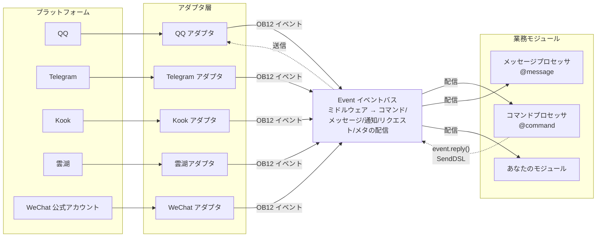
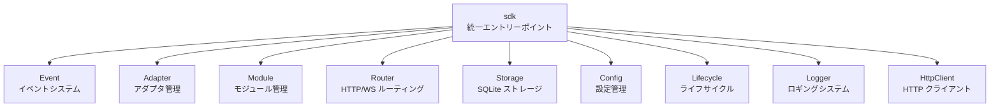

[English](README.md) | [简体中文](README.zh-CN.md) | [繁體中文](README.zh-TW.md) | **日本語** | [Русский](README.ru.md)

# ErisPulse

**一度のコード作成で、QQ / Telegram / Kook / Yunhu / 微信公众号 / OneBot12 / ... といった複数のプラットフォームに展開可能。**

イベント駆動型の多プラットフォームチャットボット開発フレームワーク。

OneBot12 標準インターフェースに基づき、一度のコード作成で複数のプラットフォームに展開可能。柔軟なプラグインシステム、ホットリロードのサポート、そして包括的な開発者ツールチェーンにより、シンプルなチャットボットから複雑な自動化システムまで、あらゆるシナリオに対応します。

<p>
  <a href="https://pypi.org/project/ErisPulse/"></a>
  <a href="https://pypi.org/project/ErisPulse/"></a>
  <a href="https://hub.docker.com/r/erispulse/erispulse"></a>
  <a href="https://github.com/ErisPulse/ErisPulse/blob/main/LICENSE"></a>
  <a href="https://github.com/ErisPulse/ErisPulse"></a>
  <a href="https://pepy.tech/project/ErisPulse"></a>
  <a href="https://github.com/astral-sh/ruff"></a>
  <a href="https://socket.dev/pypi/package/erispulse"></a>
  <a href="https://www.erisdev.com"></a>
  <a href="https://deepwiki.com/ErisPulse/ErisPulse"></a>
  <a href="https://www.erisdev.com/#market"></a>
  <a href="https://github.com/ErisPulse/ErisPulse/discussions"></a>
</p>

<br clear="both">

---

<div align="center">

### 主要機能

</div>

<table>
<tr>
<td width="33%" align="center" valign="top">
<br/>


### イベント駆動アーキテクチャ

OneBot12 標準に基づく統一されたイベントモデル——各プラットフォームごとに if/elif でメッセージタイプを判断する必要がなく、ハンドラはすべてのアダプタに自動的に適応されます。

</td>
<td width="33%" align="center" valign="top">
<br/>


### クロスプラットフォーム互換性

すべてのプラットフォームで同一のビジネスコードを実行可能——一度のコード作成で QQ / Telegram / Kook / Yunhu / 微信公众号 など 15+ のプラットフォームをサポートし、開発の重複がありません。

</td>
<td width="33%" align="center" valign="top">
<br/>


### モジュール化設計

柔軟なプラグインシステムにより実行時ホットプラグインが可能——モジュールのインストール/アンインストール/有効化/無効化はプロセスの再起動なしで可能。まるでブロックを組み立てるようにボットの機能を構築できます。

</td>
</tr>
<tr>
<td width="33%" align="center" valign="top">
<br/>


### ホットリロード

開発サイクルが 10 秒から 0.5 秒に短縮される——ファイルを保存するだけで有効になり、開発・デバッグ体験はインタプリタ言語に近いです。

</td>
<td width="33%" align="center" valign="top">
<br/>


### AI アシスタント

自然言語での要望記述から直接使用可能なモジュールを生成可能——アダプタの書き方が分からない？AI にどのプラットフォームを接続したいかを伝えれば、AI がコードを生成します。

</td>
<td width="33%" align="center" valign="top">
<br/>


### シンプルでエレガント

直感的なチェーン式 API 設計——@ユーザー、返信、再試行、一括送信などの複雑なロジックを一行で実現可能。コードは羽毛のように軽やかで読みやすいです。

</td>
</tr>
</table>

---

**重要：パスの置換ルール**
- ドキュメント内のリンクにある `docs/ja/` を `docs/ja/` に置き換えます。
- 例：`docs/ja/quick-start.md` は `docs/ja/quick-start.md` に変更します。
- `README.xx.md` 形式のリンクは、現在の言語バージョン以外を指すものであるため、変更しないでください。
- これにより、リンクが正しい言語のドキュメントバージョンを指すようになります。

## 動作原理

ErisPulse はアダプタ層によってプラットフォームの差異を抽象化し、業務コードはイベントそのものにのみ関心を持つようにします。



- **アダプタ層**は各プラットフォームのネイティブプロトコルを OneBot12 標準イベントに変換し、業務モジュールはプラットフォームの差異を見えないようにします
- **Event バス**はまずミドルウェアチェーンを実行し、次にイベントの種類に応じて5種類のプロセッサに配信します
- **あなたのコード**はデコレータを使ってイベントをサブスクライブし、`event.reply()` または SendDSL を使って返信します。返信メッセージは同じ経路を逆流してプラットフォームに戻ります

モジュールの完全な構成、初期化プロセス、ライフサイクルイベントなどの設計詳細は、[アーキテクチャ概要](docs/ja/architecture.md)をご覧ください。

## 快速開始

### 1クリックインストールスクリプト（推奨）

インストールスクリプトは、環境（Docker、Python、uv）を自動的に検出し、最も適したインストール方法を導き、多言語（中国語/English/日本語/Русский/繁體中文）をサポートします。

Windows (PowerShell):
```powershell
irm https://get.erisdev.com/install.ps1 -OutFile install.ps1; powershell -ExecutionPolicy Bypass -File install.ps1
```

macOS / Linux:
```bash
curl -fsSL https://get.erisdev.com/install.sh -o install.sh && chmod +x install.sh && ./install.sh
```

<table>
<tr>
<td align="center" width="50%">

**Docker インストールデモ**

<video src="https://github.com/user-attachments/assets/a367a466-4678-46a9-b101-073a86388ede" controls width="100%"></video>

</td>
<td align="center" width="50%">

**pip インストールデモ**

<video src="https://github.com/user-attachments/assets/a2df4009-dba6-411e-b79d-4454a168d063" controls width="100%"></video>

</td>
</tr>
</table>

### Docker を使用する（推奨）

```bash
docker pull erispulse/erispulse:latest
```

<details>
<summary>Docker Hubが利用できない？</summary>

Docker Hubにアクセスできない場合は、GitHub Container Registryを使用できます：

```bash
docker pull ghcr.io/erispulse/erispulse:latest
```

ghcr.ioのイメージを使用する場合は、`docker-compose.yml`のimageを変更する必要があります：
```yaml
image: ghcr.io/erispulse/erispulse:latest
```

</details>

<details>
<summary>クイックスタート</summary>

```bash
# docker-compose.ymlをダウンロード
curl -O https://raw.githubusercontent.com/ErisPulse/ErisPulse/main/docker-compose.yml

# Dashboardログイントークンを設定して起動
ERISPULSE_DASHBOARD_TOKEN=your-token docker compose up -d
```

起動後、`http://<host>:8000/Dashboard`にアクセスし、設定したトークンでDashboard管理パネルにログインします。

> イメージにはErisPulseフレームワークとDashboard管理パネルが内蔵されており、`linux/amd64`および`linux/arm64`アーキテクチャをサポートしています。
>
> **永続化**：設定ファイルとインストール済みのモジュール/アダプターは、ボリュームマウントによりホストに永続化され、コンテナの再起動後も失われません。フレームワーク自体の更新はDashboardのホットアップデートで完了します。

</details>

<details>
<summary>Docker環境変数</summary>

| 変数 | デフォルト値 | 説明 |
|------|--------|------|
| `ERISPULSE_DASHBOARD_TOKEN` | 空 | Dashboardログイントークン（設定後、自動的に設定ファイルに書き込まれます）|
| `ERISPULSE_PORT` | `8000` | Dashboardポートマッピング |
| `ERISPULSE_TAG` | `latest` | イメージタグ、`dev`に設定するとプレリリースイメージを使用します |
| `ERISPULSE_BUILD_TARGET` | `production` | ビルドターゲット：`production`（安定版）または `dev`（プレリリース版）|
| `CONTAINER_NAME` | `erispulse` | コンテナ名 |
| `TZ` | `Asia/Shanghai` | コンテナのタイムゾーン |
| `LANG` | `en_US.UTF-8` | システム言語、起動画面の言語を自動検出します |
| `ERISPULSE_LANG` | 空 | 起動画面の言語を強制設定：`zh` / `zh_TW` / `en` / `ja` / `ru`（`LANG`を上書きします）|

</details>

### 1Panel アプリストア

[1Panel](https://1panel.cn) アプリストアからErisPulseを1クリックでインストールできます。詳細は[ErisPulse-1Panel](https://github.com/ErisPulse/ErisPulse-1Panel)をご覧ください。

```bash
bash <(curl -sL https://get-1panel.erisdev.com/install.sh)
```

ErisPulseは1Panelのサードパーティアプリストアに登録されており、[okxlin/appstore](https://github.com/okxlin/appstore)サードパーティリポジトリを使用してインストールできます。

### pipを使用したインストール

```bash
pip install ErisPulse
```

> 上記の1クリックインストールスクリプトを使用することもでき、環境を自動的に検出し、設定を導きます。

### プロジェクトの初期化

```bash
# 対話形式での初期化
epsdk init

# プロジェクト名を指定した高速初期化
epsdk init -q -n my_bot
```

### 最初のロボットを作成する

`main.py`ファイルを作成します：

<table>
<tr>
<td width="50%" valign="top">

**コマンドハンドラ**

```python
from ErisPulse import sdk
from ErisPulse.Core.Event import command

@command("hello", help="挨拶メッセージを送信")
async def hello_handler(event):
    user_name = event.get_user_nickname() or "友達"
    await event.reply(f"こんにちは、{user_name}！")

@command("ping", help="ロボットがオンラインかどうかをテスト")
async def ping_handler(event):
    await event.reply("Pong！ロボットは正常に動作しています。")

if __name__ == "__main__":
    import asyncio
    asyncio.run(sdk.run(keep_running=True))
```

</td>
<td width="50%" valign="top">

**動作の説明**

`/hello`を送信

ロボットの返信：`こんにちは、{ユーザー名}！`

---

`/ping`を送信

ロボットの返信：`Pong！ロボットは正常に動作しています。`

---

**実行方法**

```bash
epsdk run main.py
# または開発モード
epsdk run main.py --reload
```

</td>
</tr>
</table>

詳細な説明については、以下のドキュメントをご覧ください：
- [クイックスタートガイド](docs/ja/quick-start.md)
- [入門ガイド](docs/ja/getting-started/)

## 同じコード。複数のプラットフォーム。

*まったく同じコマンドハンドラ。異なるプラットフォーム。ビジネスロジックを一切変更することなく使用可能。*

<table>
<tr>
<td align="center" width="33%">

**Kook**


</td>
<td align="center" width="33%">

**QQ**


</td>
<td align="center" width="33%">

**云湖**


</td>
</tr>
</table>

---

[**English**](/docs/ja/README.md) | [**日本語**](/docs/ja/README.md)

## 鏈式送信 DSL

1 つのチェーン呼び出しで、@、返信、再試行、タイムアウト、コールバックなどの送信ロジックをすべて完了します：

```python
yunhu = sdk.adapter.get("yunhu")

# 単発送信：ユーザーへのメンション + 返信 + 再試行 + 成功時のコールバック
await (yunhu.Send.To("group", "123")
       .At("456").Reply("msg_789")
       .Retry(3).Timeout(10)
       .Hook(lambda r: print("送信成功！"))
       .Text("こんにちは"))

# バッチ送信：1 つのチェーンで複数のメッセージを送信
results = await (yunhu.Send.To("user", "123")
                .Build()
                .Text("通知1")
                .Image("pic.jpg")
                .Retry(2)
                .send_all())
```

> Hook（成功時のコールバック）、Retry（失敗時の再試行）、Timeout（タイムアウトによるキャンセル）、OnProgress（進捗監視）、Defer（遅延送信）、Build（バッチ構築）などのチェーンメソッドがサポートされています。詳細は [SendDSL ドキュメント](docs/ja/developer-guide/adapters/send-dsl.md) を参照してください。

## 多ラウンド対話の例

ErisPulse には強力な多ラウンド対話エンジンが内蔵されており、誘導型操作、情報収集などのインタラクティブなシナリオを簡単に実現できます。

```python
from ErisPulse.Core.Event import command, request

@command("register")
async def register_handler(event):
    conv = event.conversation(timeout=60)
    
    await conv.say("登録へようこそ！")
    
    # 複数ステップでユーザー情報を収集し、自動的に検証
    data = await conv.collect([
        {"key": "name", "prompt": "名前を入力してください"},
        {"key": "age", "prompt": "年齢を入力してください",
         "validator": lambda e: e.get_text().strip().isdigit(),
         "retry_prompt": "年齢は数字でなければなりません。再度入力してください"},
    ])
    
    if data and await conv.confirm(f"登録を確認しますか？名前: {data['name']}, 年齢: {data['age']}"):
        # SendDSL を使って通知を送信
        await sdk.adapter.get(event.get_platform()).Send.To(
            "user", event.get_user_id()
        ).Text(f"登録が完了しました！{data['name']}さん、ようこそ")
        # または await event.reply("登録が完了しました！")

# フレンドリクエストを自動処理
@request.on_friend_request()
async def handle_friend_request(event):
    user_name = event.get_user_nickname() or event.get_user_id()
    
    # リクエストを承認
    result = await event.approve()
    if result.get("status") == "ok":
        await event.reply(f"自動でフレンドリクエストを承認しました。{user_name}さん、ようこそ")
```

<details>
<summary>Conversation API の詳細（分岐 / 選択 / 永続化）</summary>

```python
@command("quiz")
async def quiz_handler(event):
    conv = event.conversation(timeout=30)
    
    # 選択肢付きの質問
    answer = await conv.choose("Python の開発者は誰ですか？", [
        "Guido van Rossum",
        "James Gosling", 
        "Dennis Ritchie",
    ])
    
    if answer == 0:
        await conv.say("正解です！")
    elif answer is None:
        await conv.say("時間切れです。また挑戦してください！")
    else:
        await conv.say("不正解です。正解は Guido van Rossum です。")

@command("menu")
async def menu_handler(event):
    conv = event.conversation(timeout=60)
    
    # 分岐処理で複雑な対話フローを構築
    @conv.branch("main")
    async def main_menu():
        await conv.say("=== メインメニュー ===\n1. 本人情報\n2. 設定\n3. 終了")
        resp = await conv.wait()
        if resp and resp.get_text().strip() == "1":
            await conv.goto("profile")
    
    @conv.branch("profile")
    async def profile():
        await conv.say("名前: Alice\n0. 戻る")
        resp = await conv.wait()
        if resp and resp.get_text().strip() == "0":
            await conv.goto("main")
    
    await conv.start()
```

[Conversation 多ラウンド対話](docs/ja/advanced/conversation.md) を参照してください。

</details>

## コアモジュール

ErisPulse は、包括的なマルチプラットフォームロボット開発ツールチェーンを提供し、各コアモジュールはそれぞれ異なる役割を担います。



| モジュール | 説明 |
|------|------|
| **Event** | イベントシステム。command / message / notice / request / meta 5種類のイベント + Conversation 多段対話機能を提供 |
| **Adapter** | アダプタ管理。BaseAdapter 基底クラスがイベント変換と SendDSL 発送を統一。QQ / Telegram / Kook / 雲湖 / 微信公式アカウントなど15以上のプラットフォームに対応 |
| **Module** | モジュール管理。BaseModule 基底クラス + 依存関係宣言とトポロジカルソートによるロード |
| **SendDSL** | チェーン式送信。@/返信/再試行/タイムアウト/一括送信などの複雑なロジックを1行で実現 |
| **Router** | HTTP/WebSocket ルーティングシステム（FastAPI + Uvicorn）|
| **Storage** | SQLite に基づくキー/値ストレージ + 一般的な SQL チェーン式クエリ |
| **Config** | TOML 設定管理 |
| **Lifecycle** | ライフサイクルイベントフック（core.init / adapter.* / module.*）|
| **Logger** | モジュール化されたロギングシステム。サブロガーをサポート |
| **HttpClient** | 統一 HTTP/WS クライアント（aiohttp に基づく）。内部で再試行処理と ErisPulse の例外体系を備えている |

初期化プロセス、ライフサイクルイベント、モジュールロード戦略などの詳細設計については、[アーキテクチャ概要](docs/ja/architecture.md)をご覧ください。

## エコシステム

ErisPulse は単なるフレームワークではありません。インストールしてすぐに始められ、ゼロから車輪を作り直す必要はありません。

<table>
<tr>
<td align="center" width="25%">

**フレームワーク**

コアランタイム

統一されたイベント & メッセージモデル

</td>
<td align="center" width="25%">

**ダッシュボード**

可視化管理

プラグイン · ログ · 設定

[オンラインデモ →](https://dashdemo.erisdev.com/)

</td>
<td align="center" width="25%">

**AI Builder**

自然言語 → 使用可能なモジュール

[今すぐ体験 →](https://builder.erisdev.com)

</td>
<td align="center" width="25%">

**モジュールマーケット**

すぐに使えるプラグイン

[モジュールを閲覧 →](https://www.erisdev.com/#market)

</td>
</tr>
<tr>
<td align="center" width="25%">

**アダプター**

15+ のプラットフォーム接続

</td>
<td align="center" width="25%">

**ErisPulse-App**

公式のマルチデバイスクライアント

スマートフォンで直接実行 · デスクトップのトレイに常駐

[ダウンロード & インストール →](https://github.com/ErisPulse/ErisPulse-App/releases)

</td>
<td align="center" width="25%">

**Docker**

マルチアーキテクチャ対応

`erispulse/erispulse`

</td>
<td align="center" width="25%">

**ドキュメント & CLI**

[erisdev.com](https://www.erisdev.com)

`epsdk` フッターツール

</td>
</tr>
</table>

---

## サポートされるプラットフォーム

アダプターの貢献を歓迎します！どこから始めたらよいか分からない？ [貢献ガイド](docs/ja/contributing/README.md) をご覧ください。

| アダプター | 説明 |
|--------|------|
|  [Kook](https://github.com/shanfishapp/ErisPulse-KookAdapter) | Kook（開黒啦）即時メッセージングプラットフォーム |
|  [Matrix](https://github.com/ErisPulse/ErisPulse-MatrixAdapter) | Matrix  decentralized 通信プロトコル |
|  [OneBot11](https://github.com/ErisPulse/ErisPulse-OneBot11Adapter) | OneBot v11 一般的なロボットプロトコル |
|  [OneBot12](https://github.com/ErisPulse/ErisPulse-OneBot12Adapter) | OneBot v12 標準プロトコル |
|  [QQ](https://github.com/ErisPulse/ErisPulse-QQBotAdapter) | QQ 公式ロボットプラットフォーム |
|  [サンドボックス](https://github.com/ErisPulse/ErisPulse-SandboxAdapter) | ウェブ端末でのデバッグ、実際のプラットフォームに接続する必要なし |
|  [ターミナル](https://github.com/ErisPulse/ErisPulse-TerminalAdapter) | コマンドライン上でチャット、ゼロ設定で開発とデバッグ |
|  [Telegram](https://github.com/ErisPulse/ErisPulse-TelegramAdapter) | グローバルな即時メッセージングプラットフォーム |
|  [メール](https://github.com/ErisPulse/ErisPulse-EmailAdapter) | メールプロトコルの送受信アダプター |
|  [雲湖](https://github.com/ErisPulse/ErisPulse-YunhuAdapter) | 企業向け即時メッセージングプラットフォーム（ロボット接続） |
|  [雲湖人](https://github.com/wsu2059q/ErisPulse-YunhuUserAdapter) | 雲湖人プロトコルに基づく接続アダプター |
| [花楓カフェ](https://github.com/ErisPulse/ErisPulse-Ideaura/) | Allons! \(・ω・) / |
|  [Discord](https://github.com/ErisPulse/ErisPulse-DiscordAdapter) | グローバルなコミュニティコミュニケーションプラットフォーム、サーバー、チャンネル、プライベートメッセージに対応 |
|  [Webhook](https://github.com/ErisPulse/ErisPulse-WebhookAdapter) | 一般的な HTTP ブリッジアダプター、任意のシステムと接続 |
|  [微信公众号](https://github.com/ErisPulse/ErisPulse-WechatMpAdapter) | 微信公式の公众号プラットフォーム |

[アダプターの詳細](docs/ja/platform-guide/README.md) をご覧ください。

## コミュニティ

私たちと交流しましょう：

- Telegram：<https://t.me/ErisPulse>
- QQ 群：<https://qm.qq.com/q/TOwnCmypcy>
- 雲湖群：<https://yhfx.jwznb.com/share?key=VWJL4fTWXepa&ts=1781889199>

---

### 貢献ガイド

ErisPulse プロジェクトの健全性には、皆さんの力が必要です！私たちはあらゆる形態の貢献を歓迎します：

1. **問題の報告** — [GitHub Issues](https://github.com/ErisPulse/ErisPulse/issues) にバグ報告を投稿してください
2. **機能リクエスト** — [コミュニティの議論](https://github.com/ErisPulse/ErisPulse/discussions) で新アイデアを提案してください
3. **コードの貢献** — PR を提出する前に [コードスタイル](docs/ja/styleguide/) および [貢献ガイド](CONTRIBUTING.md) を読んでください
4. **ドキュメントの改善** — ドキュメントやサンプルコードを完璧にするお手伝いをしてください

**初めて貢献しますか？** ここから始めましょう 👉 [初めての貢献実践](docs/ja/contributing/first-contribution.md)

[コミュニティの議論に参加する](https://github.com/ErisPulse/ErisPulse/discussions)

---

<div align="center">

### 謝意


このプロジェクトの一部のコードは [sdkFrame](https://github.com/runoneall/sdkFrame) を基にしています。

コアアダプターの標準化層は [OneBot12 規格](https://12.onebot.dev/) を参考にしており、その恩恵を受けています。

特に雲湖エコシステムとコミュニティに感謝します。

ErisPulse の初期の探求と成長は、雲湖開発者コミュニティの支援に欠かせませんでした。多くのアイデア、アダプター、実践的な経験がここから生まれました。

また、ErisPulse、OneBot エコシステム、およびオープンソースコミュニティに貢献したすべての開発者やプロジェクト作者に感謝します。

</div>