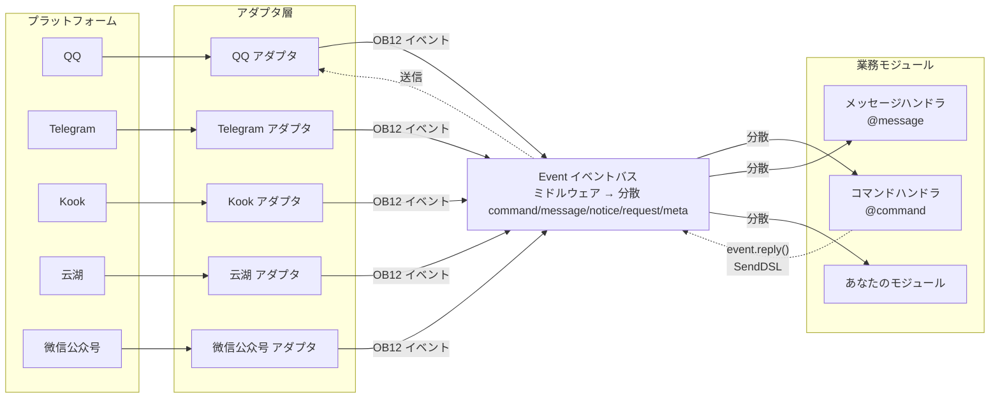
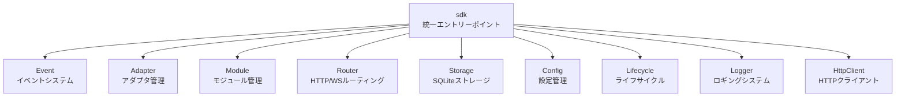

[English](README.md) | [简体中文](README.zh-CN.md) | [繁體中文](README.zh-TW.md) | **日本語** | [Русский](README.ru.md)

# ErisPulse

**一次编写，部署到 QQ / Telegram / Kook / Yunhu / 微信公众号 / OneBot12 / ... 多个平台。**

イベント駆動型のマルチプラットフォームチャットボット開発フレームワーク。

OneBot12 標準インターフェースに基づき、一度コードを書けば複数プラットフォームに展開可能。柔軟なプラグインシステム、ホットリロード対応、そして完全な開発者ツールチェーンにより、シンプルなチャットボットから複雑な自動化システムまで、あらゆるシナリオに対応します。

<p>
  <a href="https://pypi.org/project/ErisPulse/"></a>
  <a href="https://pypi.org/project/ErisPulse/"></a>
  <a href="https://github.com/botuniverse/onebot-11"></a>
  <a href="https://12.onebot.dev/"></a>
  <a href="https://hub.docker.com/r/erispulse/erispulse"></a>
  <a href="https://github.com/ErisPulse/ErisPulse/blob/main/LICENSE"></a>
  <a href="https://pepy.tech/project/ErisPulse"></a>
  <a href="https://github.com/astral-sh/ruff"></a>
  <a href="https://socket.dev/pypi/package/erispulse"></a>
  <a href="https://www.erisdev.com"></a>
  <a href="https://deepwiki.com/ErisPulse/ErisPulse"></a>
  <a href="https://www.erisdev.com/#market"></a>
  <a href="https://github.com/ErisPulse/ErisPulse/discussions"></a>
</p>

<br clear="both">

---

<div align="center">

### 核心特性

</div>

<table>
<tr>
<td width="33%" align="center" valign="top">
<br/>


### イベント駆動アーキテクチャ

OneBot12 の統一イベントモデルに基づき、1つのハンドラで全てのアダプタに対応

</td>
<td width="33%" align="center" valign="top">
<br/>


### クロスプラットフォーム互換

QQ / Telegram / Kook / 云湖 等 15+ プラットフォーム、業務コードの変更なし

</td>
<td width="33%" align="center" valign="top">
<br/>


### モジュラーデザイン

プラグインのホットプラグイン/プラグアウトで再起動不要、プラットフォーム / Bot / セッションごとのスコープで制御

</td>
</tr>
<tr>
<td width="33%" align="center" valign="top">
<br/>


### ホットリロード

保存即有効、軽量で無感覚なリロード

</td>
<td width="33%" align="center" valign="top">
<br/>


### AIアシスタント

自然言語で要望を記述し、直接利用可能なモジュールを生成

</td>
<td width="33%" align="center" valign="top">
<br/>


### シンプルでエレガント

チェーン式API：@ユーザー、返信、再試行、バッチ送信を1行で完了

</td>
</tr>
</table>

---

## 動作原理

ErisPulse はアダプタ層でプラットフォームの差異を抽象化し、業務コードはイベントそのものにのみ関心を持ちます：


```mermaid
graph LR
    subgraph Platforms[プラットフォーム]
        QQ["QQ"]
        TG["Telegram"]
        Kook["Kook"]
        YH["云湖"]
        WX["微信公众号"]
    end

    subgraph Adapters[アダプタ層]
        A1["QQ アダプタ"]
        A2["Telegram アダプタ"]
        A3["Kook アダプタ"]
        A4["云湖 アダプタ"]
        A5["微信公众号 アダプタ"]
    end

    Event["Event イベントバス<br/>ミドルウェア → 分散 command/message/notice/request/meta"]

    subgraph Modules[業務モジュール]
        M1["コマンドハンドラ<br/>@command"]
        M2["メッセージハンドラ<br/>@message"]
        M3["あなたのモジュール"]
    end

    QQ --> A1
    TG --> A2
    Kook --> A3
    YH --> A4
    WX --> A5

    A1 -->|"OB12 イベント"| Event
    A2 -->|"OB12 イベント"| Event
    A3 -->|"OB12 イベント"| Event
    A4 -->|"OB12 イベント"| Event
    A5 -->|"OB12 イベント"| Event

    Event -->|"分散"| M1
    Event -->|"分散"| M2
    Event -->|"分散"| M3

    M1 -.->|"event.reply()<br/>SendDSL"| Event
    Event -.->|"送信"| A1
```

- **アダプタ層**は、各プラットフォームのネイティブプロトコルを OneBot12 標準イベントに変換し、業務モジュールはプラットフォームの差異を意識しません。
- **Event バス**は、まずミドルウェアチェーンを実行し、イベントの種類に応じて5種類のハンドラに分散します。
- **あなたのコード**は、デコレータを使ってイベントをサブスクライブし、`event.reply()` または SendDSL で返信します。返信メッセージは、同じ経路を逆流してプラットフォームに送信されます。

モジュールの構成、初期化プロセス、ライフサイクルイベントなどの設計詳細は、[アーキテクチャ概要](docs/ja/architecture.md)をご覧ください。

---

## 快速开始

### 1クリックインストールスクリプト（推奨）

インストールスクリプトは、環境（Docker、Python、uv）を自動検出し、最適なインストール方法を導き、多言語（日本語/English/日本語/Русский/繁體中文）をサポートします。

Windows (PowerShell):
```powershell
irm https://get.erisdev.com/install.ps1 -OutFile install.ps1; powershell -ExecutionPolicy Bypass -File install.ps1
```

macOS / Linux:
```bash
curl -fsSL https://get.erisdev.com/install.sh -o install.sh && chmod +x install.sh && ./install.sh
```

<table>
<tr>
<td align="center" width="50%">

**Dockerインストールデモ**

<video src="https://github.com/user-attachments/assets/a367a466-4678-46a9-b101-073a86388ede" controls width="100%"></video>

</td>
<td align="center" width="50%">

**pipインストールデモ**

<video src="https://github.com/user-attachments/assets/a2df4009-dba6-411e-b79d-4454a168d063" controls width="100%"></video>

</td>
</tr>
</table>

### Dockerを使用する（推奨）

```bash
docker pull erispulse/erispulse:latest
```

<details>
<summary>Docker Hubが利用できない？</summary>

Docker Hubにアクセスできない場合は、GitHub Container Registryを使用できます：

```bash
docker pull ghcr.io/erispulse/erispulse:latest
```

ghcr.ioのイメージを使用する場合、`docker-compose.yml`のimageを変更する必要があります：
```yaml
image: ghcr.io/erispulse/erispulse:latest
```

</details>

<details>
<summary>クイックスタート</summary>

```bash
# docker-compose.ymlをダウンロード
curl -O https://raw.githubusercontent.com/ErisPulse/ErisPulse/main/docker-compose.yml

# Dashboardのログイントークンを設定して起動
ERISPULSE_DASHBOARD_TOKEN=your-token docker compose up -d
```

起動後、`http://<host>:8000/Dashboard`にアクセスし、設定したトークンでDashboard管理パネルにログインします。

> イメージにはErisPulseフレームワークとDashboard管理パネルが内蔵されており、`linux/amd64`と`linux/arm64`アーキテクチャをサポートします。
>
> **永続化**：設定ファイルとインストールされたモジュール/アダプタは、ボリュームマウントによりホストに永続化され、コンテナの再起動後も失われません。フレームワークの更新はDashboardのホットアップデートで完了します。

</details>

<details>
<summary>Docker環境変数</summary>

| 変数 | デフォルト値 | 説明 |
|------|--------|------|
| `ERISPULSE_DASHBOARD_TOKEN` | 空 | Dashboardのログイントークン（設定すると自動的に設定ファイルに書き込まれます）|
| `ERISPULSE_PORT` | `8000` | Dashboardのポートマッピング |
| `ERISPULSE_TAG` | `latest` | イメージタグ、`dev`に設定するとプレリリースイメージを使用します |
| `CONTAINER_NAME` | `erispulse` | コンテナ名 |
| `TZ` | `Asia/Shanghai` | コンテナのタイムゾーン |
| `LANG` | `en_US.UTF-8` | システム言語、起動時のインターフェース言語を自動検出します |
| `ERISPULSE_LANG` | 空 | 起動時のインターフェース言語を強制します：`zh` / `zh_TW` / `en` / `ja` / `ru`（`LANG`を上書きします）|

</details>

### 1Panelアプリストア

[1Panel](https://1panel.cn)アプリストアからErisPulseを1クリックでインストールできます。詳しくは[ErisPulse-1Panel](https://github.com/ErisPulse/ErisPulse-1Panel)をご覧ください。

```bash
bash <(curl -sL https://get-1panel.erisdev.com/install.sh)
```

ErisPulseは1Panelのサードパーティアプリストアに掲載されており、[okxlin/appstore](https://github.com/okxlin/appstore)サードパーティリポジトリを使用してインストールできます。

### pipを使用する

```bash
pip install ErisPulse
```

`epsdk`をグローバルなコマンドラインツールとして使用し、仮想環境にインストールしない場合は、`uv tool install`が推奨されます：

```bash
uv tool install ErisPulse
```

> 上記の1クリックインストールスクリプトを使用して、環境を自動検出し、設定を導き出すこともできます（スクリプトメニューには「グローバルCLIインストール（uv tool）」の方法も用意されています）。

### プロジェクトの初期化

```bash
# インタラクティブな初期化
epsdk init

# プロジェクト名を指定したクイック初期化
epsdk init -q -n my_bot
```

### 最初のロボットを作成する

`main.py`ファイルを作成します：

<table>
<tr>
<td width="50%" valign="top">

**コマンドハンドラ**

```python
from ErisPulse import sdk
from ErisPulse.Core.Event import command

@command("hello", help="挨拶メッセージを送信")
async def hello_handler(event):
    user_name = event.get_user_nickname() or "友達"
    await event.reply(f"こんにちは、{user_name}！")

@command("ping", help="ロボットがオンラインかどうかをテスト")
async def ping_handler(event):
    await event.reply("Pong！ロボットは正常に動作しています。")

if __name__ == "__main__":
    import asyncio
    asyncio.run(sdk.run(keep_running=True))
```

</td>
<td width="50%" valign="top">

**効果説明**

`/hello`を送信

ロボットは返信します：`こんにちは、{ユーザー名}！`

---

`/ping`を送信

ロボットは返信します：`Pong！ロボットは正常に動作しています。`

---

**実行方法**

```bash
epsdk run main.py
# または開発モード
epsdk run main.py --reload
```

</td>
</tr>
</table>

詳細な説明は以下のドキュメントをご覧ください：
- [快速开始指南](docs/ja/quick-start.md)
- [入门指南](docs/ja/getting-started/)

---

## 同じコードで複数のプラットフォーム

*全く同じコマンドハンドラ。異なるプラットフォーム。業務ロジックを一切変更しない。*

<table>
<tr>
<td align="center" width="33%">

**Kook**


</td>
<td align="center" width="33%">

**QQ**


</td>
<td align="center" width="33%">

**云湖**


</td>
</tr>
</table>

---

## チェーン式送信DSL

`@`ユーザー、返信、再試行、タイムアウト、コールバックなどの送信ロジックを1行で実現します：

```python
yunhu = sdk.adapter.get("yunhu")

# 単発送信：@ユーザー + 返信 + 再試行 + 成功コールバック
await (yunhu.Send.To("group", "123")
       .At("456").Reply("msg_789")
       .Retry(3).Timeout(10)
       .Hook(lambda r: print("送信成功！"))
       .Text("こんにちは"))

# バッチ送信：1つのチェーンで複数メッセージを送信
results = await (yunhu.Send.To("user", "123")
                .Build()
                .Text("通知1")
                .Image("pic.jpg")
                .Retry(2)
                .send_all())
```

> Hook（成功コールバック）、Retry（失敗再試行）、Timeout（タイムアウトキャンセル）、OnProgress（進行状況監視）、Defer（遅延送信）、Build（バッチ構築）などのチェーンメソッドがサポートされています。詳細は[SendDSLドキュメント](docs/ja/developer-guide/adapters/send-dsl.md)をご覧ください。

---

## 多段対話の例

ErisPulseには強力な多段対話エンジンが内蔵されており、誘導型操作や情報収集などのインタラクティブなシナリオを簡単に実現できます：

```python
from ErisPulse.Core.Event import command, request

@command("register")
async def register_handler(event):
    conv = event.conversation(timeout=60)
    
    await conv.say("ようこそ登録へ！")
    
    # 複数ステップでユーザー情報を収集し、自動的に検証
    data = await conv.collect([
        {"key": "name", "prompt": "名前を入力してください"},
        {"key": "age", "prompt": "年齢を入力してください",
         "validator": lambda e: e.get_text().strip().isdigit(),
         "retry_prompt": "年齢は数字でなければなりません。再度入力してください"},
    ])
    
    if data and await conv.confirm(f"登録を確認しますか？名前: {data['name']}, 年齢: {data['age']}"):
        # SendDSLを使って通知を送信
        await sdk.adapter.get(event.get_platform()).Send.To(
            "user", event.get_user_id()
        ).Text(f"登録成功！ようこそ {data['name']} さん")
        # または await event.reply("登録成功！")

# フレンドリクエストの自動処理
@request.on_friend_request()
async def handle_friend_request(event):
    user_name = event.get_user_nickname() or event.get_user_id()
    
    # リクエストを承認
    result = await event.approve()
    if result.get("status") == "ok":
        await event.reply(f"自動でフレンドリクエストを承認しました。ようこそ {user_name} さん")
```

<details>
<summary>Conversational APIの詳細（分岐/選択/永続化）</summary>

```python
@command("quiz")
async def quiz_handler(event):
    conv = event.conversation(timeout=30)
    
    # 選択式の質問
    answer = await conv.choose("Pythonの作成者は誰ですか？", [
        "Guido van Rossum",
        "James Gosling", 
        "Dennis Ritchie",
    ])
    
    if answer == 0:
        await conv.say("正解です！")
    elif answer is None:
        await conv.say("タイムアウトしました。また次回お越しください！")
    else:
        await conv.say("間違っています。正解はGuido van Rossumです")

@command("menu")
async def menu_handler(event):
    conv = event.conversation(timeout=60)
    
    # 分岐移動、複雑なインタラクティブフローの構築
    @conv.branch("main")
    async def main_menu():
        await conv.say("=== メインメニュー ===\n1. 本人情報\n2. 設定\n3. 終了")
        resp = await conv.wait()
        if resp and resp.get_text().strip() == "1":
            await conv.goto("profile")
    
    @conv.branch("profile")
    async def profile():
        await conv.say("名前: Alice\n0. 戻る")
        resp = await conv.wait()
        if resp and resp.get_text().strip() == "0":
            await conv.goto("main")
    
    await conv.start()
```

[Conversational Multi-turn Dialogue](docs/ja/advanced/conversation.md)をご覧ください。

</details>

---

## 核心モジュール

ErisPulseは、完全なマルチプラットフォームロボット開発ツールチェーンを提供し、各モジュールはそれぞれの役割を果たします：


```mermaid
graph TB
    SDK["sdk<br/>統一エントリーポイント"]

    SDK --> Event["Event<br/>イベントシステム"]
    SDK --> AdapterMgr["Adapter<br/>アダプタ管理"]
    SDK --> ModuleMgr["Module<br/>モジュール管理"]
    SDK --> Router["Router<br/>HTTP/WSルーティング"]
    SDK --> Storage["Storage<br/>SQLiteストレージ"]
    SDK --> Config["Config<br/>設定管理"]
    SDK --> Lifecycle["Lifecycle<br/>ライフサイクル"]
    SDK --> Logger["Logger<br/>ロギングシステム"]
    SDK --> Client["HttpClient<br/>HTTPクライアント"]
```

| モジュール | 説明 |
|------|------|
| **Event** | イベントシステム、command / message / notice / request / meta 5種類のイベントとConversational Multi-turn Dialogueを提供 |
| **Adapter** | アダプタ管理、BaseAdapter基底クラスでイベントの変換とSendDSL送信を統一、QQ / Telegram / Kook / 云湖 / 微信公众号など15+プラットフォームをサポート |
| **Module** | モジュール管理、BaseModule基底クラス + 依存関係の宣言とトポロジカルソートによるロード |
| **SendDSL** | チェーン式送信、@/返信/再試行/タイムアウト/バッチ送信などの複雑なロジックを1行で実現 |
| **Router** | HTTP/WebSocketルーティングシステム（FastAPI + Uvicorn）|
| **Storage** | SQLiteを基盤としたキーバリュー保存 + 一般的なSQLチェーン式クエリ |
| **Config** | TOML形式の設定管理 |
| **Lifecycle** | ライフサイクルイベントフック（core.init / adapter.* / module.*）|
| **Logger** | モジュール化されたロギングシステム、サブロガーをサポート |
| **HttpClient** | 統一HTTP/WSクライアント（aiohttpをベース）、内部に再試行とErisPulseの例外体系を備えている |

初期化プロセス、ライフサイクルイベント、モジュールロード戦略などの設計詳細は、[アーキテクチャ概要](docs/ja/architecture.md)をご覧ください。

---

## スコープ（Scope）——3次元の権限制御

モジュールコードを一切変更することなく、設定で「どの範囲で有効か」を一括宣言します：

```toml
[ErisPulse.scope.platforms.onebot11]
modules = ["Chat", "Tool*"]           # ① モジュール次元：このプラットフォームではこれらのモジュールのみを開放（glob / 正則）

[ErisPulse.scope.identity.users.onebot11]
deny = ["u_bad", "spam_*"]            # ② アイデンティティ次元：ブラックリストのユーザーのイベントは直接破棄

[ErisPulse.scope.actions.MyModule]
send = { allow = ["Text"] }           # ③ 出力次元：このモジュールはテキストのみを許可
api = { deny = ["set_*", "leave_*"] } #    管理系APIは禁止
```

```python
# 実行時でも呼び出し可能、即時有効（ドット区切りパスの辞書式読み書きをサポート）
sdk.scope.set_action("MyModule", "api", deny=["set_*"])
```

> 詳細は[スコープ（scope）](docs/ja/advanced/scope.md)をご覧ください。

---

## イベントのオーバーライド——モジュールコードを変更せずに、任意のイベントタイプの動作をオーバーライド

```toml
# メッセージハンドラのトリガ条件をオーバーライド（コード内の条件とAND；meta/message/notice/request/command全タイプに対応）
[ErisPulse.event.overrides.message.ChatModule]
pattern = "雑談*"

# コマンド実装のパラメータをオーバーライド（master / hidden / aliases / prefixなど、ユーザー優先）
[ErisPulse.event.overrides.command.MyModule.restart]
master = true
```

> 詳細は[イベントのオーバーライド](docs/ja/getting-started/event-handling.md)をご覧ください。

---

## エコシステム

ErisPulseはフレームワークにとどまりません。インストールしてすぐに始められる、ゼロから車輪を作らない設計です。

<table>
<tr>
<td align="center" width="25%">

**フレームワーク**

コアランタイム

統一イベント & メッセージモデル

</td>
<td align="center" width="25%">

**Dashboard**

ビジュアル管理

プラグイン・ログ・設定

[オンラインデモ →](https://dashdemo.erisdev.com/)

</td>
<td align="center" width="25%">

**AI Builder**

自然言語 → 利用可能なモジュール

[体験する →](https://builder.erisdev.com)

</td>
<td align="center" width="25%">

**モジュール市場**

即座に使えるプラグイン

[モジュールを見る →](https://www.erisdev.com/#market)

</td>
</tr>
<tr>
<td align="center" width="25%">

**アダプタ**

15+プラットフォーム接続

</td>
<td align="center" width="25%">

**ErisPulse-App**

公式マルチデバイスクライアント

スマホで直接実行・デスクトップに常駐

[ダウンロードインストール →](https://github.com/ErisPulse/ErisPulse-App/releases)

</td>
<td align="center" width="25%">

**Docker**

多アーキテクチャ対応

`erispulse/erispulse`

</td>
<td align="center" width="25%">

**ドキュメント & CLI**

[erisdev.com](https://www.erisdev.com)

`epsdk`フッターツール

</td>
</tr>
</table>

---

## 対応プラットフォーム

プラットフォームのアダプタを貢献していただけることを歓迎します！どこから始めればよいかわからない場合は、[貢献ガイド](docs/ja/contributing/README.md)をご覧ください。

| アダプタ | 説明 |
|--------|------|
|  [Kook](https://github.com/shanfishapp/ErisPulse-KookAdapter) | Kook（开黑啦）即时通讯平台 |
|  [Matrix](https://github.com/ErisPulse/ErisPulse-MatrixAdapter) | Matrix 去中心化通讯协议 |
|  [OneBot11](https://github.com/ErisPulse/ErisPulse-OneBot11Adapter) | OneBot v11 通用机器人协议 |
|  [OneBot12](https://github.com/ErisPulse/ErisPulse-OneBot12Adapter) | OneBot v12 标准协议 |
|  [QQ](https://github.com/ErisPulse/ErisPulse-QQBotAdapter) | QQ 官方机器人平台 |
|  [沙箱](https://github.com/ErisPulse/ErisPulse-SandboxAdapter) | 网页端调试，无需接入真实平台 |
|  [终端](https://github.com/ErisPulse/ErisPulse-TerminalAdapter) | 命令行即聊天，零配置开发调试 |
|  [Telegram](https://github.com/ErisPulse/ErisPulse-TelegramAdapter) | 全球性即时通讯平台 |
|  [邮件](https://github.com/ErisPulse/ErisPulse-EmailAdapter) | 邮件协议收发适配器 |
|  [云湖](https://github.com/ErisPulse/ErisPulse-YunhuAdapter) | 企业级即时通讯平台（机器人接入） |
|  [云湖用户](https://github.com/wsu2059q/ErisPulse-YunhuUserAdapter) | 基于云湖用户协议的接入适配器 |
| [花枫咖啡馆](https://github.com/ErisPulse/ErisPulse-Ideaura/) | Allons! \(・ω・) / |
|  [Discord](https://github.com/ErisPulse/ErisPulse-DiscordAdapter) | 全球性社区通讯平台，支持服务器、频道、私信 |
|  [Webhook](https://github.com/ErisPulse/ErisPulse-WebhookAdapter) | 通用 HTTP 桥接适配器，对接任意系统 |
|  [微信公众号](https://github.com/ErisPulse/ErisPulse-WechatMpAdapter) | 微信官方公众号平台 |

アダプタの詳細は[プラットフォームガイド](docs/ja/platform-guide/README.md)をご覧ください。

---

## コミュニティ

私たちと交流しましょう：

- Telegram：<https://t.me/ErisPulse>
- QQ群：<https://qm.qq.com/q/TOwnCmypcy>
- 云湖群：<https://yhfx.jwznb.com/share?key=VWJL4fTWXepa&ts=1781889199>

---

### 貢献ガイド

ErisPulseプロジェクトの健全性は、あなたの貢献によってさらに充実します！私たちはあらゆる形態の貢献を歓迎します：

1. **問題報告** — [GitHub Issues](https://github.com/ErisPulse/ErisPulse/issues) にバグ報告を提出してください
2. **機能リクエスト** — [コミュニティ議論](https://github.com/ErisPulse/ErisPulse/discussions) で新アイデアを提案してください
3. **コード貢献** — PRを提出する前に[コードスタイル](docs/ja/styleguide/)および[貢献ガイド](CONTRIBUTING.md)を読んでください
4. **ドキュメント改善** — ドキュメントやサンプルコードの改善を手伝ってください

**初めての貢献？** ここから始めましょう 👉 [初めての貢献実戦](docs/ja/contributing/first-contribution.md)

[コミュニティ議論に参加する](https://github.com/ErisPulse/ErisPulse/discussions)

---

<div align="center">

### 謝辞


本プロジェクトの一部のコードは [sdkFrame](https://github.com/runoneall/sdkFrame) に基づいています。

コアアダプタの標準化層は [OneBot12規格](https://12.onebot.dev/) を参考にしており、その恩恵を受けています。

特に云湖エコシステムとコミュニティに感謝します。

ErisPulseの初期探索と成長は、云湖開発者コミュニティの支援に大きく依存しており、多くのアイデア、アダプタ、実践的な経験がここから生まれました。

また、ErisPulse、OneBotエコシステム、そしてオープンソースコミュニティに貢献してくださったすべての開発者やプロジェクト作者に感謝します。

</div>