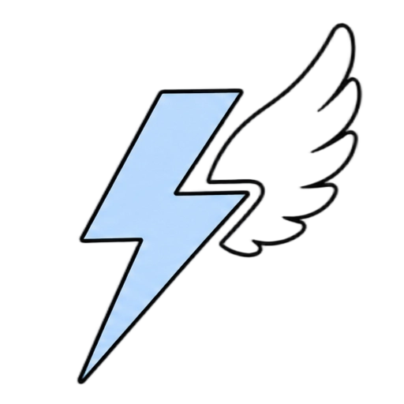
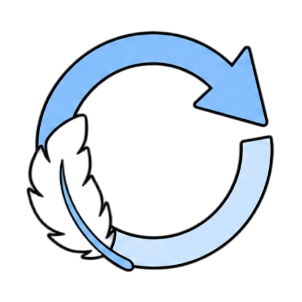
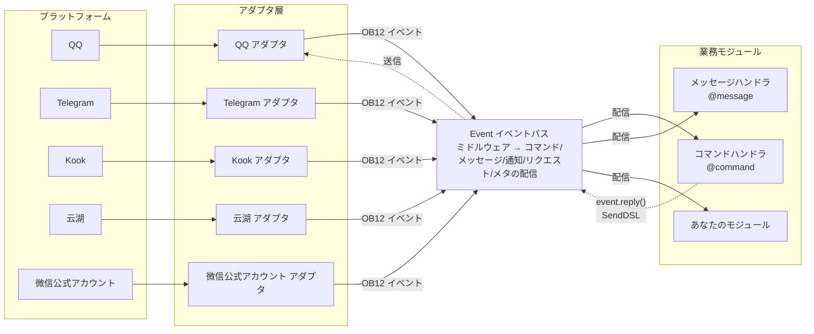
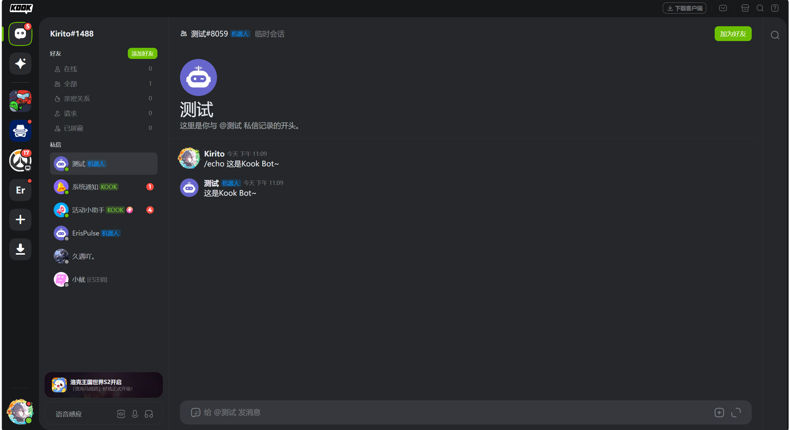
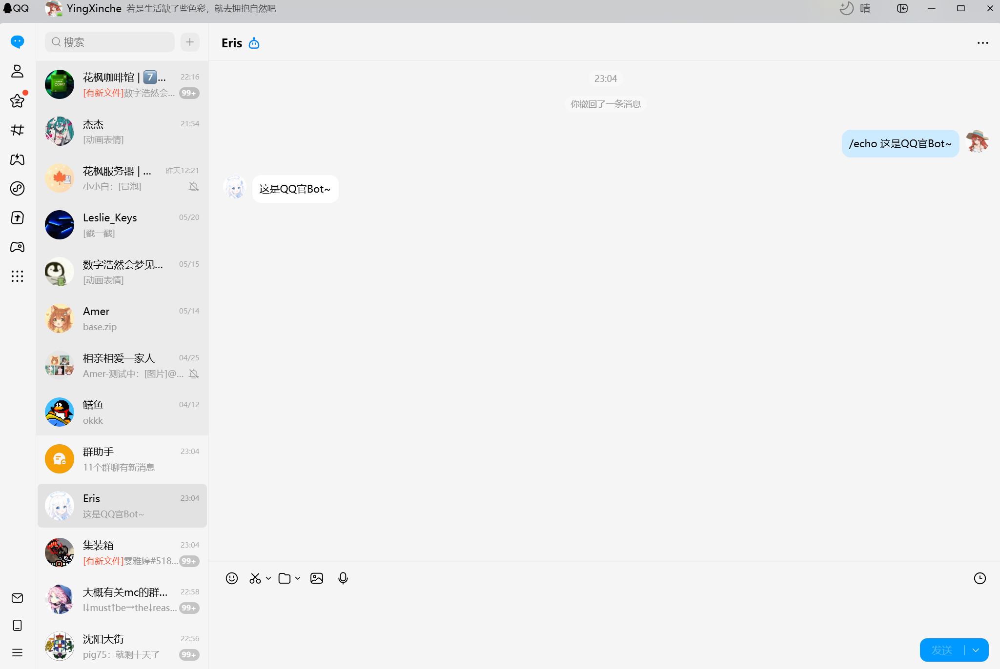
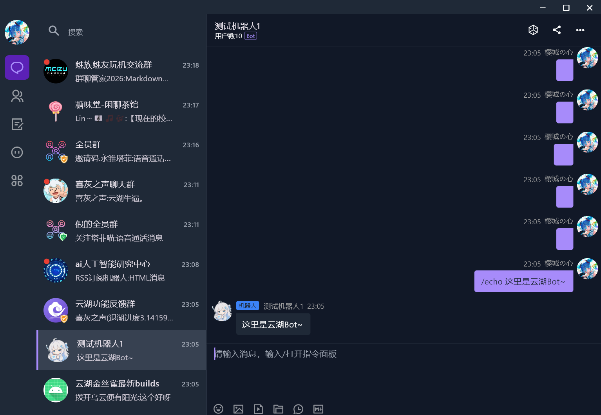
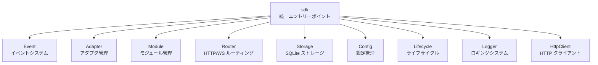
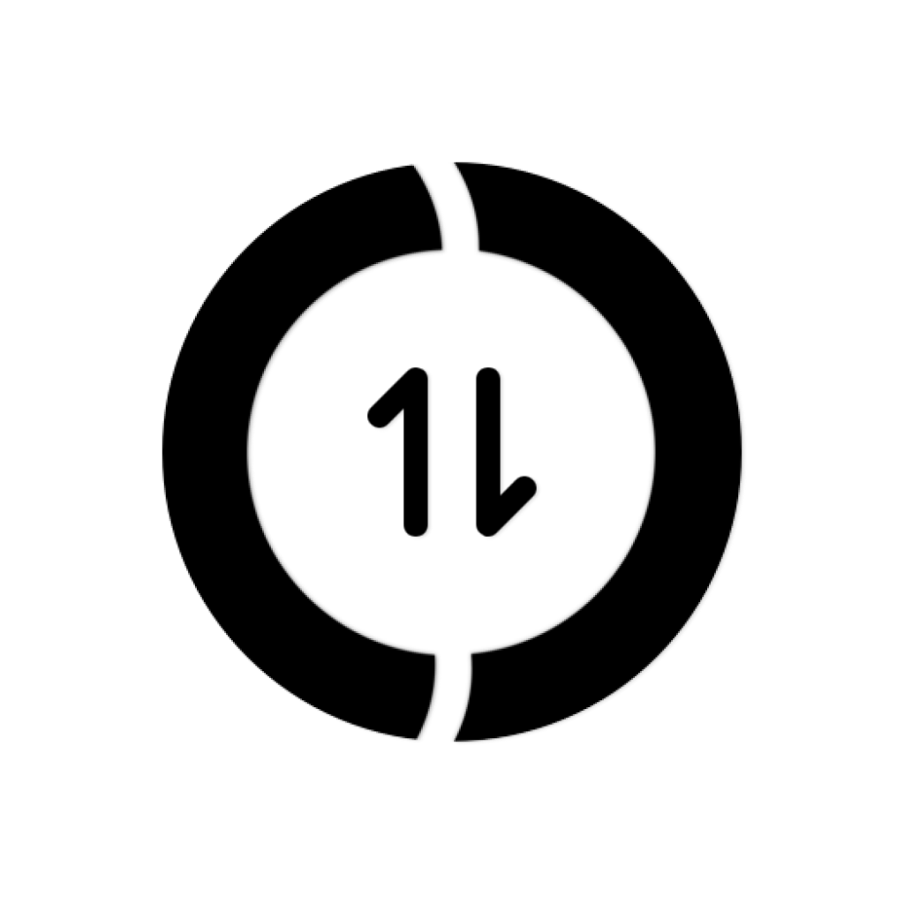

[English](README.md) | [简体中文](README.zh-CN.md) | [繁體中文](README.zh-TW.md) | **日本語** | [Русский](README.ru.md)

# ErisPulse

**一次書き込み、QQ / Telegram / Kook / Yunhu / 微信公式アカウント / OneBot12 / ... など複数プラットフォームに展開。**

イベント駆動型の多プラットフォームチャットボット開発フレームワーク。

OneBot12 標準インターフェースに基づき、一度書き込みで複数プラットフォームに展開可能。柔軟なプラグインシステム、ホットリロード対応、そして完全な開発者ツールチェーンにより、シンプルなチャットボットから複雑な自動化システムまで、あらゆるシナリオに対応します。

<p>
  <a href="https://pypi.org/project/ErisPulse/"></a>
  <a href="https://pypi.org/project/ErisPulse/"></a>
  <a href="https://github.com/botuniverse/onebot-11"></a>
  <a href="https://12.onebot.dev/"></a>
  <a href="https://hub.docker.com/r/erispulse/erispulse"></a>
  <a href="https://github.com/ErisPulse/ErisPulse/blob/main/LICENSE"></a>
  <a href="https://pepy.tech/project/ErisPulse"></a>
  <a href="https://github.com/astral-sh/ruff"></a>
  <a href="https://socket.dev/pypi/package/erispulse"></a>
  <a href="https://www.erisdev.com"></a>
  <a href="https://deepwiki.com/ErisPulse/ErisPulse"></a>
  <a href="https://www.erisdev.com/#market"></a>
  <a href="https://github.com/ErisPulse/ErisPulse/discussions"></a>
</p>

<br clear="both">

---

<div align="center">

### 主な特徴

</div>

<table>
<tr>
<td width="33%" align="center" valign="top">
<br/>



### イベント駆動アーキテクチャ

OneBot12 の統一イベントモデルに基づき、一つのハンドラで全てのアダプタに対応

</td>
<td width="33%" align="center" valign="top">
<br/>


### クロスプラットフォーム対応

QQ / Telegram / Kook / 云湖 など 15+ プラットフォーム、業務コードを一切変更せずに利用可能

</td>
<td width="33%" align="center" valign="top">
<br/>


### モジュール設計

プラグインのホットプラグイン/プラグアウトが可能、リスタート不要、プラットフォーム / Bot / セッションごとのスコープで制御

</td>
</tr>
<tr>
<td width="33%" align="center" valign="top">
<br/>



### ホットリロード

保存即有効、軽量で無感覚なホットリロード

</td>
<td width="33%" align="center" valign="top">
<br/>


### AIアシスタント

自然言語で要件を記述し、直接使用可能なモジュールを生成

</td>
<td width="33%" align="center" valign="top">
<br/>


### シンプルで洗練された

チェーン式API：@ユーザー、返信、再試行、一括送信を一行で完了

</td>
</tr>
</table>

---

## 動作原理

ErisPulse はアダプタ層を介してプラットフォームの差異を抽象化し、業務コードはイベント自体のみを意識します：


```mermaid
graph LR
    subgraph Platforms[プラットフォーム]
        QQ["QQ"]
        TG["Telegram"]
        Kook["Kook"]
        YH["云湖"]
        WX["微信公式アカウント"]
    end

    subgraph Adapters[アダプタ層]
        A1["QQ アダプタ"]
        A2["Telegram アダプタ"]
        A3["Kook アダプタ"]
        A4["云湖 アダプタ"]
        A5["微信公式アカウント アダプタ"]
    end

    Event["Event イベントバス<br/>ミドルウェア → コマンド/メッセージ/通知/リクエスト/メタの配信"]

    subgraph Modules[業務モジュール]
        M1["コマンドハンドラ<br/>@command"]
        M2["メッセージハンドラ<br/>@message"]
        M3["あなたのモジュール"]
    end

    QQ --> A1
    TG --> A2
    Kook --> A3
    YH --> A4
    WX --> A5

    A1 -->|"OB12 イベント"| Event
    A2 -->|"OB12 イベント"| Event
    A3 -->|"OB12 イベント"| Event
    A4 -->|"OB12 イベント"| Event
    A5 -->|"OB12 イベント"| Event

    Event -->|"配信"| M1
    Event -->|"配信"| M2
    Event -->|"配信"| M3

    M1 -.->|"event.reply()<br/>SendDSL"| Event
    Event -.->|"送信"| A1
```

- **アダプタ層**は各プラットフォームの原生プロトコルを OneBot12 標準イベントに変換し、業務モジュールはプラットフォームの差異を意識しません。
- **Event バス**はまずミドルウェアチェーンを実行し、イベントタイプに応じて5種類のハンドラに配信します。
- **あなたのコード**はデコレータでイベントをサブスクライブし、`event.reply()` または SendDSL で返信します。返信メッセージは同じ経路を逆流してプラットフォームに送信されます。

モジュールの完全な構成、初期化フロー、ライフサイクルイベントなどの設計詳細は、[アーキテクチャ概要](docs/ja/architecture.md)をご覧ください。

---

## 速習

### 1クリックインストールスクリプト（推奨）

インストールスクリプトは環境（Docker、Python、uv）を自動検出し、最も適したインストール方法を案内します。多言語（中国語/English/日本語/Русский/繁體中文）に対応しています。

Windows (PowerShell):
```powershell
irm https://get.erisdev.com/install.ps1 -OutFile install.ps1; powershell -ExecutionPolicy Bypass -File install.ps1
```

macOS / Linux:
```bash
curl -fsSL https://get.erisdev.com/install.sh -o install.sh && chmod +x install.sh && ./install.sh
```

<table>
<tr>
<td align="center" width="50%">

**Docker インストールデモ**

<video src="https://github.com/user-attachments/assets/a367a466-4678-46a9-b101-073a86388ede" controls width="100%"></video>

</td>
<td align="center" width="50%">

**pip インストールデモ**

<video src="https://github.com/user-attachments/assets/a2df4009-dba6-411e-b79d-4454a168d063" controls width="100%"></video>

</td>
</tr>
</table>

### Docker を使用する（推奨）

```bash
docker pull erispulse/erispulse:latest
```

<details>
<summary>Docker Hub が使用できない場合</summary>

Docker Hub にアクセスできない場合は、GitHub Container Registry を使用できます：

```bash
docker pull ghcr.io/erispulse/erispulse:latest
```

ghcr.io のイメージを使用する場合は、`docker-compose.yml` の image を変更する必要があります：
```yaml
image: ghcr.io/erispulse/erispulse:latest
```

</details>

<details>
<summary>クイックスタート</summary>

```bash
# docker-compose.yml をダウンロード
curl -O https://raw.githubusercontent.com/ErisPulse/ErisPulse/main/docker-compose.yml

# Dashboard ログイントークンを設定して起動
ERISPULSE_DASHBOARD_TOKEN=your-token docker compose up -d
```

起動後、`http://<host>:8000/Dashboard` にアクセスし、設定したトークンで Dashboard 管理パネルにログインします。

> イメージには ErisPulse フレームワークと Dashboard 管理パネルが内蔵されており、`linux/amd64` および `linux/arm64` アーキテクチャをサポートします。
>
> **永続化**：設定ファイルとインストールされたモジュール/アダプタはボリュームマウントによってホストに永続化され、コンテナの再起動後も失われません。フレームワーク自体の更新は Dashboard によるホットアップデートで完了します。

</details>

<details>
<summary>Docker 環境変数</summary>

| 変数 | デフォルト値 | 説明 |
|------|--------|------|
| `ERISPULSE_DASHBOARD_TOKEN` | 空 | Dashboard ログイントークン（設定すると自動的に設定ファイルに書き込まれます）|
| `ERISPULSE_PORT` | `8000` | Dashboard ポートマッピング |
| `ERISPULSE_TAG` | `latest` | イメージタグ、`dev` に設定するとプレリリースイメージを使用します |
| `ERISPULSE_BUILD_TARGET` | `production` | ビルドターゲット：`production`（安定版）または `dev`（プレリリース版）|
| `CONTAINER_NAME` | `erispulse` | コンテナ名 |
| `TZ` | `Asia/Shanghai` | コンテナのタイムゾーン |
| `LANG` | `en_US.UTF-8` | システム言語、起動時のインターフェース言語を自動検出します |
| `ERISPULSE_LANG` | 空 | 起動時のインターフェース言語を強制指定：`zh` / `zh_TW` / `en` / `ja` / `ru`（`LANG` を上書きします）|

</details>

### 1Panel アプリストア

[1Panel](https://1panel.cn) アプリストアから ErisPulse をワンクリックでインストールできます。詳しくは [ErisPulse-1Panel](https://github.com/ErisPulse/ErisPulse-1Panel) をご覧ください。

```bash
bash <(curl -sL https://get-1panel.erisdev.com/install.sh)
```

ErisPulse は 1Panel 第三者アプリストアに登録されており、[okxlin/appstore](https://github.com/okxlin/appstore) 第三者リポジトリを使用してインストールできます。

### pip を使用する

```bash
pip install ErisPulse
```

`epsdk` をグローバルコマンドラインツールとして使用し、仮想環境にインストールしたくない場合は、`uv tool install` を推奨します：

```bash
uv tool install ErisPulse
```

> 上記の1クリックインストールスクリプトを使用することもでき、環境を自動検出して設定を案内します（スクリプトメニューには「グローバル CLI インストール（uv tool）」の方法も用意されています）。

### プロジェクトの初期化

```bash
# インタラクティブな初期化
epsdk init

# ファスト初期化（プロジェクト名を指定）
epsdk init -q -n my_bot
```

### 最初のボットを作成する

`main.py` ファイルを作成します：

<table>
<tr>
<td width="50%" valign="top">

**コマンドハンドラ**

```python
from ErisPulse import sdk
from ErisPulse.Core.Event import command

@command("hello", help="挨拶メッセージを送信")
async def hello_handler(event):
    user_name = event.get_user_nickname() or "友人"
    await event.reply(f"こんにちは、{user_name}！")

@command("ping", help="ボットがオンラインかどうかをテスト")
async def ping_handler(event):
    await event.reply("Pong！ボットは正常に動作しています。")

if __name__ == "__main__":
    import asyncio
    asyncio.run(sdk.run(keep_running=True))
```

</td>
<td width="50%" valign="top">

**効果説明**

`/hello` を送信

ボットは返信：`こんにちは、{ユーザー名}！`

---

`/ping` を送信

ボットは返信：`Pong！ボットは正常に動作しています。`

---

**実行方法**

```bash
epsdk run main.py
# または開発モード
epsdk run main.py --reload
```

</td>
</tr>
</table>

詳細な説明は以下のドキュメントをご覧ください：
- [速習ガイド](docs/ja/quick-start.md)
- [入門ガイド](docs/ja/getting-started/)

---

## 同じコードで複数のプラットフォーム

*全く同じコマンドハンドラ。異なるプラットフォーム。業務ロジックは一切変更不要。*

<table>
<tr>
<td align="center" width="33%">

**Kook**



</td>
<td align="center" width="33%">

**QQ**



</td>
<td align="center" width="33%">

**云湖**



</td>
</tr>
</table>

---

## チェーン式送信 DSL

`@ユーザー`、返信、再試行、タイムアウト、コールバックなどのすべての送信ロジックを1つのチェーン呼び出しで完了します：

```python
yunhu = sdk.adapter.get("yunhu")

# 単発送信：@ユーザー + 返信 + 再試行 + 成功コールバック
await (yunhu.Send.To("group", "123")
       .At("456").Reply("msg_789")
       .Retry(3).Timeout(10)
       .Hook(lambda r: print("送信成功！"))
       .Text("こんにちは"))

# 一括送信：1つのチェーンで複数のメッセージを送信
results = await (yunhu.Send.To("user", "123")
                .Build()
                .Text("通知1")
                .Image("pic.jpg")
                .Retry(2)
                .send_all())
```

> Hook（成功コールバック）、Retry（失敗再試行）、Timeout（タイムアウトキャンセル）、OnProgress（進行状況監視）、Defer（遅延送信）、Build（一括構築）などのチェーンメソッドがサポートされており、[SendDSL ドキュメント](docs/ja/developer-guide/adapters/send-dsl.md)をご覧ください。

---

## 複数の対話例

ErisPulse には強力な複数対話エンジンが内蔵されており、誘導操作、情報収集などのインタラクティブなシナリオを簡単に実現できます：

```python
from ErisPulse.Core.Event import command, request

@command("register")
async def register_handler(event):
    conv = event.conversation(timeout=60)
    
    await conv.say("ようこそ登録！")
    
    # 複数ステップでユーザー情報を収集し、自動で検証
    data = await conv.collect([
        {"key": "name", "prompt": "名前を入力してください"},
        {"key": "age", "prompt": "年齢を入力してください",
         "validator": lambda e: e.get_text().strip().isdigit(),
         "retry_prompt": "年齢は数字でなければなりません、再度入力してください"},
    ])
    
    if data and await conv.confirm(f"登録を確認しますか？名前: {data['name']}, 年齢: {data['age']}"):
        # SendDSL を使って通知を送信
        await sdk.adapter.get(event.get_platform()).Send.To(
            "user", event.get_user_id()
        ).Text(f"登録成功！{data['name']}さん、ようこそ")
        # または await event.reply("登録成功！")

# フレンドリクエストを自動処理
@request.on_friend_request()
async def handle_friend_request(event):
    user_name = event.get_user_nickname() or event.get_user_id()
    
    # リクエストを承認
    result = await event.approve()
    if result.get("status") == "ok":
        await event.reply(f"自動でフレンドリクエストを承認しました、ようこそ {user_name}")
```

<details>
<summary>Conversation API の詳細（分岐/選択/永続化）</summary>

```python
@command("quiz")
async def quiz_handler(event):
    conv = event.conversation(timeout=30)
    
    # 選択式の質問
    answer = await conv.choose("Pythonの作成者は誰ですか？", [
        "Guido van Rossum",
        "James Gosling", 
        "Dennis Ritchie",
    ])
    
    if answer == 0:
        await conv.say("正解です！")
    elif answer is None:
        await conv.say("タイムアウトしました、次回また来てください！")
    else:
        await conv.say("間違っています、正解はGuido van Rossumです")

@command("menu")
async def menu_handler(event):
    conv = event.conversation(timeout=60)
    
    # 分岐移動、複雑なインタラクティブフローを構築
    @conv.branch("main")
    async def main_menu():
        await conv.say("=== メインメニュー ===\n1. 本人情報\n2. 設定\n3. 終了")
        resp = await conv.wait()
        if resp and resp.get_text().strip() == "1":
            await conv.goto("profile")
    
    @conv.branch("profile")
    async def profile():
        await conv.say("名前: Alice\n0. 戻る")
        resp = await conv.wait()
        if resp and resp.get_text().strip() == "0":
            await conv.goto("main")
    
    await conv.start()
```

[Conversation 多輪対話](docs/ja/advanced/conversation.md)をご覧ください。

</details>

---

## コアモジュール

ErisPulse は完全な多プラットフォームチャットボット開発ツールチェーンを提供し、コアモジュールはそれぞれ役割を果たします：


```mermaid
graph TB
    SDK["sdk<br/>統一エントリーポイント"]

    SDK --> Event["Event<br/>イベントシステム"]
    SDK --> AdapterMgr["Adapter<br/>アダプタ管理"]
    SDK --> ModuleMgr["Module<br/>モジュール管理"]
    SDK --> Router["Router<br/>HTTP/WS ルーティング"]
    SDK --> Storage["Storage<br/>SQLite ストレージ"]
    SDK --> Config["Config<br/>設定管理"]
    SDK --> Lifecycle["Lifecycle<br/>ライフサイクル"]
    SDK --> Logger["Logger<br/>ロギングシステム"]
    SDK --> Client["HttpClient<br/>HTTP クライアント"]
```

| モジュール | 説明 |
|------|------|
| **Event** | イベントシステム、command / message / notice / request / meta 五種類のイベント + Conversation 多輪対話 |
| **Adapter** | アダプタ管理、BaseAdapter 基底クラスによるイベント変換と SendDSL 送信、QQ / Telegram / Kook / 云湖 / 微信公式アカウント 等 15+ プラットフォームをサポート |
| **Module** | モジュール管理、BaseModule 基底クラス + 依存関係の宣言とトポロジカルソートによるロード |
| **SendDSL** | チェーン式送信、@/返信/再試行/タイムアウト/一括送信などの複雑なロジックを一行で完了 |
| **Router** | HTTP/WebSocket ルーティングシステム（FastAPI + Uvicorn）|
| **Storage** | SQLite に基づくキーバリュー ストレージ + 一般的な SQL チェーン式クエリ |
| **Config** | TOML 設定管理 |
| **Lifecycle** | ライフサイクルイベントフック（core.init / adapter.* / module.*）|
| **Logger** | モジュール化されたロギングシステム、サブロガーをサポート |
| **HttpClient** | 統一 HTTP/WS クライアント（aiohttp に基づく）、内部に再試行と ErisPulse の例外体系を備えています |

初期化フロー、ライフサイクルイベント、モジュールロード戦略などの設計詳細は、[アーキテクチャ概要](docs/ja/architecture.md)をご覧ください。

---

## スコープ（Scope）——3次元の権限制御

モジュールコードを一切変更することなく、設定で「どの範囲で有効か」を一括宣言できます：

```toml
[ErisPulse.scope.platforms.onebot11]
modules = ["Chat", "Tool*"]           # ① モジュール次元：このプラットフォームではこれらのモジュールのみを開放（glob / 正規表現）

[ErisPulse.scope.identity.users.onebot11]
deny = ["u_bad", "spam_*"]            # ② 身分次元：ブラックリストのユーザーのイベントは直接破棄

[ErisPulse.scope.actions.MyModule]
send = { allow = ["Text"] }           # ③ 出力次元：このモジュールはテキスト送信のみを許可
api = { deny = ["set_*", "leave_*"] } #    そして管理系 API は禁止
```

```python
# 実行時にも呼び出し可能、即座に有効（点分パスの辞書読み書きが可能）
sdk.scope.set_action("MyModule", "api", deny=["set_*"])
```

> [スコープ（scope）](docs/ja/advanced/scope.md)をご覧ください。

---

## イベントオーバーライド——モジュールコードを変更することなく、任意のイベントタイプの動作をオーバーライド

```toml
# メッセージハンドラのトリガ条件をオーバーライド（コード内の条件と AND する、meta/message/notice/request/command 全タイプに対応）
[ErisPulse.event.overrides.message.ChatModule]
pattern = "雑談*"

# コマンド実装のパラメータをオーバーライド（master / hidden / aliases / prefix など、ユーザー優先）
[ErisPulse.event.overrides.command.MyModule.restart]
master = true
```

> [イベントオーバーライド](docs/ja/getting-started/event-handling.md)をご覧ください。

---

## エコシステム

ErisPulse はフレームワークにとどまりません。インストールしてすぐに始められ、ゼロから車輪を作らなくてもよいです。

<table>
<tr>
<td align="center" width="25%">

**フレームワーク**

コアランタイム

イベント & メッセージモデルの統一

</td>
<td align="center" width="25%">

**Dashboard**

可視化管理

プラグイン · ログ · 設定

[オンラインデモ →](https://dashdemo.erisdev.com/)

</td>
<td align="center" width="25%">

**AI Builder**

自然言語 → 使用可能なモジュール

[体験する →](https://builder.erisdev.com)

</td>
<td align="center" width="25%">

**モジュール市場**

即座に使えるプラグイン

[モジュールを見る →](https://www.erisdev.com/#market)

</td>
</tr>
<tr>
<td align="center" width="25%">

**アダプタ**

15+ プラットフォーム接続

</td>
<td align="center" width="25%">

**ErisPulse-App**

公式マルチデバイスクライアント

スマホで直接実行 · デスクトップトレイ常駐

[ダウンロード・インストール →](https://github.com/ErisPulse/ErisPulse-App/releases)

</td>
<td align="center" width="25%">

**Docker**

多アーキテクチャ対応

`erispulse/erispulse`

</td>
<td align="center" width="25%">

**ドキュメント & CLI**

[erisdev.com](https://www.erisdev.com)

`epsdk` フッターツール

</td>
</tr>
</table>

---

## 対応プラットフォーム

アダプタの貢献をお待ちしています！どこから始めたらよいか分からない？[貢献ガイド](docs/ja/contributing/README.md)をご覧ください。

| アダプタ | 説明 |
|--------|------|
|  [Kook](https://github.com/shanfishapp/ErisPulse-KookAdapter) | Kook（開黑啦）インスタントメッセージングプラットフォーム |
|  [Matrix](https://github.com/ErisPulse/ErisPulse-MatrixAdapter) | Matrix 仮想化通信プロトコル |
|  [OneBot11](https://github.com/ErisPulse/ErisPulse-OneBot11Adapter) | OneBot v11 一般ロボットプロトコル |
|  [OneBot12](https://github.com/ErisPulse/ErisPulse-OneBot12Adapter) | OneBot v12 標準プロトコル |
|  [QQ](https://github.com/ErisPulse/ErisPulse-QQBotAdapter) | QQ 公式ロボットプラットフォーム |
|  [Sandbox](https://github.com/ErisPulse/ErisPulse-SandboxAdapter) | ウェブ端末デバッグ、実際のプラットフォームに接続する必要なし |
|  [Terminal](https://github.com/ErisPulse/ErisPulse-TerminalAdapter) | コマンドライン即チャット、ゼロ設定開発・デバッグ |
|  [Telegram](https://github.com/ErisPulse/ErisPulse-TelegramAdapter) | 世界的なインスタントメッセージングプラットフォーム |
|  [メール](https://github.com/ErisPulse/ErisPulse-EmailAdapter) | メールプロトコル送受信アダプタ |
|  [云湖](https://github.com/ErisPulse/ErisPulse-YunhuAdapter) | 企業向けインスタントメッセージングプラットフォーム（ロボット接続） |
|  [云湖ユーザー](https://github.com/wsu2059q/ErisPulse-YunhuUserAdapter) | 云湖ユーザープロトコルに基づく接続アダプタ |
| [花枫咖啡馆](https://github.com/ErisPulse/ErisPulse-Ideaura/) | Allons! \(・ω・) / |
|  [Discord](https://github.com/ErisPulse/ErisPulse-DiscordAdapter) | 世界的なコミュニティコミュニケーションプラットフォーム、サーバー、チャンネル、プライベートメッセージに対応 |
|  [Webhook](https://github.com/ErisPulse/ErisPulse-WebhookAdapter) | 一般的な HTTP ブリッジアダプタ、任意のシステムに接続 |
|  [微信公式アカウント](https://github.com/ErisPulse/ErisPulse-WechatMpAdapter) | 微信公式アカウントプラットフォーム |

アダプタの詳細は [アダプタ詳細](docs/ja/platform-guide/README.md) をご覧ください。

---

## コミュニティ

私たちと交流しましょう：

- Telegram：<https://t.me/ErisPulse>
- QQ グループ：<https://qm.qq.com/q/TOwnCmypcy>
- 云湖グループ：<https://yhfx.jwznb.com/share?key=VWJL4fTWXepa&ts=1781889199>

---

### 貢献ガイド

ErisPulse プロジェクトの健全性は、あなたの貢献によってさらに向上します！さまざまな形での貢献を歓迎します：

1. **問題報告** — [GitHub Issues](https://github.com/ErisPulse/ErisPulse/issues) にバグ報告を提出
2. **機能リクエスト** — [コミュニティディスカッション](https://github.com/ErisPulse/ErisPulse/discussions) で新しいアイデアを提案
3. **コード貢献** — PR を提出する前に [コードスタイル](docs/ja/styleguide/) と [貢献ガイド](CONTRIBUTING.md) をご確認ください
4. **ドキュメント改善** — ドキュメントとサンプルコードの改善を手伝ってください

**初めての貢献？** ここから始めましょう 👉 [初めての貢献実践](docs/ja/contributing/first-contribution.md)

[コミュニティディスカッションに参加する](https://github.com/ErisPulse/ErisPulse/discussions)

---

<div align="center">

### 感謝


本プロジェクトの一部のコードは [sdkFrame](https://github.com/runoneall/sdkFrame) に基づいています。

コアアダプタの標準化層は [OneBot12 規格](https://12.onebot.dev/) を参考にしており、その恩恵を受けています。

特に云湖エコシステムとコミュニティに感謝します。

ErisPulse の初期探索と成長は云湖開発者コミュニティのサポートに大きく依存しており、多くのアイデア、アダプタ、実践経験がここから生まれました。

また、ErisPulse、OneBot エコシステム、そしてオープンソースコミュニティに貢献したすべての開発者やプロジェクト作者に感謝します。

</div>