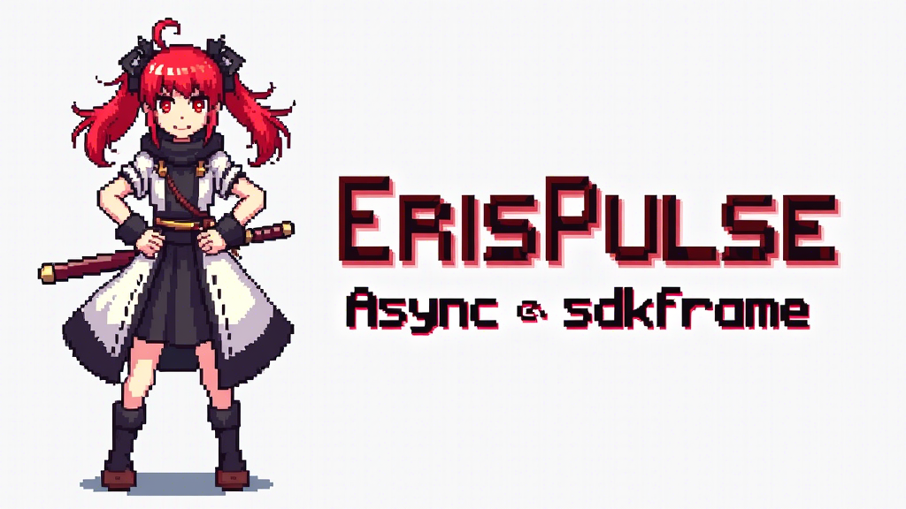

# ErisPulse - 异步机器人开发框架



[](https://github.com/FramerOrg)
[](https://github.com/ErisPulse/ErisPulse/blob/main/LICENSE)
[](https://pypi.org/project/ErisPulse/)

> 文档站: 
[](https://www.erisdev.com/docs.html)
[](https://erispulse.pages.dev/docs.html)
[](https://erispulse.github.io/docs.html)
[](https://erispulse.netlify.app/docs.htm)


## 核心特性

| 特性 | 描述 |
|------|------|
| **异步架构** | 完全基于 async/await 的异步设计 |
| **模块化系统** | 灵活的插件和模块管理 |
| **热重载** | 开发时自动重载，无需重启 |
| **错误管理** | 统一的错误处理和报告系统 |
| **配置管理** | 灵活的配置存储和访问 |

---

## 快速开始

### 框架选型指南

| 需求 | 推荐框架 | 理由 |
|------|---------|------|
| 轻量化/底层模块化 | [Framer](https://github.com/FramerOrg/Framer) | 高度解耦的模块化设计 |
| 全功能机器人开发 | ErisPulse | 开箱即用的完整解决方案 |

---

## 安装指南

我们全面采用 [`uv`](https://github.com/astral-sh/uv) 作为 Python 工具链，提供更快速可靠的安装体验。

> ℹ️ **uv** 是由 Astral 开发的新一代 Python 包管理工具，比传统 pip 快 10-100 倍，并具有更好的依赖解析能力。

### 1. 安装 uv

#### 通用方法 (pip):
```bash
pip install uv
```

#### macOS/Linux:
```bash
curl -LsSf https://astral.sh/uv/install.sh | sh
```

#### Windows (PowerShell):
```powershell
powershell -ExecutionPolicy ByPass -c "irm https://astral.sh/uv/install.ps1 | iex"
```

验证安装:
```bash
uv --version
```

### 2. 安装 ErisPulse

```bash
uv python install 3.12          # 安装 Python 3.12
uv venv                         # 创建虚拟环境
source .venv/bin/activate       # 激活环境 (Windows: .venv\Scripts\activate)
uv pip install ErisPulse --upgrade  # 安装框架
```

---

## 测试与开发

### 运行测试套件
```bash
uv run devs/test.py
```

测试功能包括:
- 日志系统测试
- 环境配置测试
- 错误管理测试
- 工具函数测试
- 适配器功能测试

### 开发模式 (热重载)
```bash
epsdk run your_script.py --reload
```

---

## 🤝 贡献指南

我们欢迎各种形式的贡献，包括但不限于:

1. **报告问题**  
   在 [GitHub Issues](https://github.com/ErisPulse/ErisPulse/issues) 提交bug报告

2. **功能请求**  
   通过 [社区讨论](https://github.com/ErisPulse/ErisPulse/discussions) 提出新想法

3. **代码贡献**  
   提交 Pull Request 前请阅读我们的 [开发指南](docs/DEVELOPMENT.md)

4. **文档改进**  
   帮助完善文档和示例代码

---

[加入社区讨论 →](https://github.com/ErisPulse/ErisPulse/discussions)