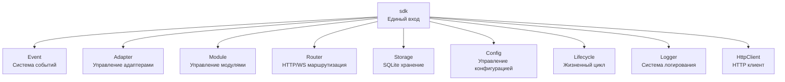

[English](README.md) | [简体中文](README.zh-CN.md) | [繁體中文](README.zh-TW.md) | [日本語](README.ja.md) | **Русский**

# ErisPulse

**Написать один раз, развернуть на QQ / Telegram / Kook / Yunhu / WeChat Public Account / OneBot12 / ... на нескольких платформах.**

Фреймворк для разработки мультиплатформенных чат-ботов на основе событий.

Основан на стандарте OneBot12, один раз написать, развернуть на нескольких платформах; гибкая система плагинов, поддержка горячей перезагрузки и полный набор инструментов для разработчиков, подходит для различных сценариев, от простых чат-ботов до сложных автоматизированных систем.

<p>
  <a href="https://pypi.org/project/ErisPulse/"></a>
  <a href="https://pypi.org/project/ErisPulse/"></a>
  <a href="https://github.com/botuniverse/onebot-11"></a>
  <a href="https://12.onebot.dev/"></a>
  <a href="https://hub.docker.com/r/erispulse/erispulse"></a>
  <a href="https://github.com/ErisPulse/ErisPulse/blob/main/LICENSE"></a>
  <a href="https://pepy.tech/project/ErisPulse"></a>
  <a href="https://github.com/astral-sh/ruff"></a>
  <a href="https://socket.dev/pypi/package/erispulse"></a>
  <a href="https://www.erisdev.com"></a>
  <a href="https://deepwiki.com/ErisPulse/ErisPulse"></a>
  <a href="https://www.erisdev.com/#market"></a>
  <a href="https://github.com/ErisPulse/ErisPulse/discussions"></a>
</p>

<br clear="both">

---

<div align="center">

### Ключевые особенности

</div>

<table>
<tr>
<td width="33%" align="center" valign="top">
<br/>


### Архитектура на основе событий

Единая модель событий на базе OneBot12, один обработчик подходит для всех адаптеров

</td>
<td width="33%" align="center" valign="top">
<br/>


### Кроссплатформенная совместимость

QQ / Telegram / Kook / Yunhu и 15+ других платформ, бизнес-код не требует изменений

</td>
<td width="33%" align="center" valign="top">
<br/>


### Модульная архитектура

Плагины можно подключать и отключать без перезапуска, управление областью действия по платформе / боту / сессии

</td>
</tr>
<tr>
<td width="33%" align="center" valign="top">
<br/>


### Горячая перезагрузка

Сохранение кода приводит к немедленному применению, горячая перезагрузка бесшовна

</td>
<td width="33%" align="center" valign="top">
<br/>


### Помощь ИИ

Описание требований естественным языком, генерация готовых модулей

</td>
<td width="33%" align="center" valign="top">
<br/>


### Простота и элегантность

Цепочечный API: @пользователя, ответ, повтор, массовая отправка — всё в одной строке

</td>
</tr>
</table>

---

## Принцип работы

ErisPulse скрывает различия платформ через слой адаптеров, позволяя бизнес-коду сосредоточиться только на событиях:


- **Слой адаптеров** преобразует протоколы платформ в стандартные события OneBot12, бизнес-модули не видят различий платформ
- **Событийный шин** сначала выполняет цепочку промежуточных обработчиков, затем рассылает события по типу в пять типов обработчиков
- **Ваш код** подписывается на события через декораторы, использует `event.reply()` или SendDSL для ответа — сообщения отправляются по тому же пути обратно на платформу

Детали архитектуры (состав модулей, процесс инициализации, жизненный цикл событий и т.д.), см. [Обзор архитектуры](docs/ru/architecture.md).

---

## Быстрый старт

### Скрипт установки (рекомендуется)

Скрипт автоматически определяет среду (Docker, Python, uv), предлагает подходящий способ установки, поддерживает несколько языков (китайский/English/日本語/Русский/繁體中文).

Windows (PowerShell):
```powershell
irm https://get.erisdev.com/install.ps1 -OutFile install.ps1; powershell -ExecutionPolicy Bypass -File install.ps1
```

macOS / Linux:
```bash
curl -fsSL https://get.erisdev.com/install.sh -o install.sh && chmod +x install.sh && ./install.sh
```

<table>
<tr>
<td align="center" width="50%">

**Демонстрация установки через Docker**

<video src="https://github.com/user-attachments/assets/a367a466-4678-46a9-b101-073a86388ede" controls width="100%"></video>

</td>
<td align="center" width="50%">

**Демонстрация установки через pip**

<video src="https://github.com/user-attachments/assets/a2df4009-dba6-411e-b79d-4454a168d063" controls width="100%"></video>

</td>
</tr>
</table>

### Использование Docker (рекомендуется)

```bash
docker pull erispulse/erispulse:latest
```

<details>
<summary>Недоступен Docker Hub?</summary>

Если Docker Hub недоступен, можно использовать GitHub Container Registry:

```bash
docker pull ghcr.io/erispulse/erispulse:latest
```

При использовании образа ghcr.io, необходимо изменить `docker-compose.yml`:
```yaml
image: ghcr.io/erispulse/erispulse:latest
```

</details>

<details>
<summary>Быстрый запуск</summary>

```bash
# Скачать docker-compose.yml
curl -O https://raw.githubusercontent.com/ErisPulse/ErisPulse/main/docker-compose.yml

# Установить токен для панели управления и запустить
ERISPULSE_DASHBOARD_TOKEN=your-token docker compose up -d
```

После запуска перейдите по адресу `http://<host>:8000/Dashboard`, используя установленный токен для входа в панель управления.

> Образ содержит фреймворк ErisPulse и панель управления Dashboard, поддерживает архитектуры `linux/amd64` и `linux/arm64`.
>
> **Персистентность**: конфигурационные файлы и установленные модули/адаптеры сохраняются в томах хоста, при перезапуске контейнера не теряются. Обновление фреймворка выполняется через панель управления.

</details>

<details>
<summary>Переменные окружения Docker</summary>

| Переменная | Значение по умолчанию | Описание |
|------|--------|------|
| `ERISPULSE_DASHBOARD_TOKEN` | пусто | Токен для входа в панель управления (автоматически записывается в конфигурацию) |
| `ERISPULSE_PORT` | `8000` | Порт панели управления |
| `ERISPULSE_TAG` | `latest` | Тег образа, можно установить `dev` для предварительного выпуска |
| `ERISPULSE_BUILD_TARGET` | `production` | Цель сборки: `production` (стабильный) или `dev` (предварительный) |
| `CONTAINER_NAME` | `erispulse` | Имя контейнера |
| `TZ` | `Asia/Shanghai` | Часовой пояс контейнера |
| `LANG` | `en_US.UTF-8` | Язык системы, автоматически определяется язык интерфейса запуска |
| `ERISPULSE_LANG` | пусто | Принудительный язык интерфейса запуска: `zh` / `zh_TW` / `en` / `ja` / `ru` (переопределяет `LANG`) |

</details>

### Магазин приложений 1Panel

Установите ErisPulse через [1Panel](https://1panel.cn) магазин приложений, см. [ErisPulse-1Panel](https://github.com/ErisPulse/ErisPulse-1Panel).

```bash
bash <(curl -sL https://get-1panel.erisdev.com/install.sh)
```

ErisPulse уже доступен в магазине приложений 1Panel, можно использовать сторонний репозиторий [okxlin/appstore](https://github.com/okxlin/appstore) для установки.

### Установка через pip

```bash
pip install ErisPulse
```

> Также можно использовать скрипт установки выше, который автоматически определяет среду и настраивает.

### Инициализация проекта

```bash
# Интерактивная инициализация
epsdk init

# Быстрая инициализация (указать имя проекта)
epsdk init -q -n my_bot
```

### Создание первого бота

Создайте файл `main.py`:

<table>
<tr>
<td width="50%" valign="top">

**Обработчик команд**

```python
from ErisPulse import sdk
from ErisPulse.Core.Event import command

@command("hello", help="Отправить приветственное сообщение")
async def hello_handler(event):
    user_name = event.get_user_nickname() or "друг"
    await event.reply(f"Привет, {user_name}!")

@command("ping", help="Проверить, работает ли бот")
async def ping_handler(event):
    await event.reply("Pong! Бот работает нормально.")

if __name__ == "__main__":
    import asyncio
    asyncio.run(sdk.run(keep_running=True))
```

</td>
<td width="50%" valign="top">

**Описание результатов**

Отправка `/hello`

Бот отвечает: `Привет, {имя пользователя}!`

---

Отправка `/ping`

Бот отвечает: `Pong! Бот работает нормально.`

---

**Способы запуска**

```bash
epsdk run main.py
# или в режиме разработки
epsdk run main.py --reload
```

</td>
</tr>
</table>

Дополнительные подробности см.:
- [Руководство по быстрому старту](docs/ru/quick-start.md)
- [Введение](docs/ru/getting-started/)

---

## Один и тот же код. Множество платформ.

*Идентичные обработчики команд. Разные платформы. Без изменений бизнес-логики.*

<table>
<tr>
<td align="center" width="33%">

**Kook**


</td>
<td align="center" width="33%">

**QQ**


</td>
<td align="center" width="33%">

**Yunhu**


</td>
</tr>
</table>

---

## Цепочка отправки DSL

Одна цепочка вызовов для выполнения @пользователя, ответа, повтора, таймаута, обратного вызова и других отправок:

```python
yunhu = sdk.adapter.get("yunhu")

# Одиночная отправка: @пользователя + ответ + повтор + успешный обратный вызов
await (yunhu.Send.To("group", "123")
       .At("456").Reply("msg_789")
       .Retry(3).Timeout(10)
       .Hook(lambda r: print("Отправка успешна!"))
       .Text("Привет"))

# Массовая отправка: одна цепочка отправляет несколько сообщений
results = await (yunhu.Send.To("user", "123")
                .Build()
                .Text("Уведомление 1")
                .Image("pic.jpg")
                .Retry(2)
                .send_all())
```

> Поддержка Hook (успешный обратный вызов), Retry (повтор при ошибке), Timeout (отмена по таймауту), OnProgress (мониторинг прогресса), Defer (отложенная отправка), Build (построение пакета) и других методов цепочки, см. [Документацию SendDSL](docs/ru/developer-guide/adapters/send-dsl.md).

---

## Примеры многоконтактного диалога

ErisPulse включает мощный движок многоконтактных диалогов, легко реализовать интерактивные сценарии, такие как навигация и сбор информации:

```python
from ErisPulse.Core.Event import command, request

@command("register")
async def register_handler(event):
    conv = event.conversation(timeout=60)
    
    await conv.say("Добро пожаловать! Регистрация началась.")
    
    # Сбор информации в несколько шагов, автоматическая валидация
    data = await conv.collect([
        {"key": "name", "prompt": "Введите имя"},
        {"key": "age", "prompt": "Введите возраст",
         "validator": lambda e: e.get_text().strip().isdigit(),
         "retry_prompt": "Возраст должен быть числом, попробуйте ещё раз"},
    ])
    
    if data and await conv.confirm(f"Подтвердить регистрацию? Имя: {data['name']}, возраст: {data['age']}"):
        # Активная отправка уведомления через SendDSL
        await sdk.adapter.get(event.get_platform()).Send.To(
            "user", event.get_user_id()
        ).Text(f"Регистрация успешна! Добро пожаловать, {data['name']}")
        # или await event.reply("Регистрация успешна!")

# Обработка запросов на добавление в друзья
@request.on_friend_request()
async def handle_friend_request(event):
    user_name = event.get_user_nickname() or event.get_user_id()
    
    # Принятие запроса
    result = await event.approve()
    if result.get("status") == "ok":
        await event.reply(f"Запрос на добавление в друзья принят, добро пожаловать, {user_name}")
```

<details>
<summary>Больше примеров API Conversation (ветвление / выбор / сохранение)</summary>

```python
@command("quiz")
async def quiz_handler(event):
    conv = event.conversation(timeout=30)
    
    # Вопрос с вариантами ответа
    answer = await conv.choose("Кто создатель Python?", [
        "Guido van Rossum",
        "James Gosling", 
        "Dennis Ritchie",
    ])
    
    if answer == 0:
        await conv.say("Правильно!")
    elif answer is None:
        await conv.say("Время вышло, попробуйте ещё раз!")
    else:
        await conv.say("Неверно, правильный ответ — Guido van Rossum")

@command("menu")
async def menu_handler(event):
    conv = event.conversation(timeout=60)
    
    # Ветвление, построение сложного интерактивного процесса
    @conv.branch("main")
    async def main_menu():
        await conv.say("=== Главное меню ===\n1. Информация\n2. Настройки\n3. Выход")
        resp = await conv.wait()
        if resp and resp.get_text().strip() == "1":
            await conv.goto("profile")
    
    @conv.branch("profile")
    async def profile():
        await conv.say("Имя: Alice\n0. Вернуться")
        resp = await conv.wait()
        if resp and resp.get_text().strip() == "0":
            await conv.goto("main")
    
    await conv.start()
```

См. [Многоконтактный диалог Conversation](docs/ru/advanced/conversation.md)

</details>

---

## Основные модули

ErisPulse предоставляет полный набор инструментов для разработки мультиплатформенных ботов, основные модули выполняют свои функции:



| Модуль | Описание |
|------|------|
| **Event** | Система событий, предоставляет пять типов событий (command / message / notice / request / meta) и многоконтактные диалоги |
| **Adapter** | Управление адаптерами, базовый класс BaseAdapter для унифицированного преобразования событий и SendDSL, поддержка 15+ платформ (QQ / Telegram / Kook / Yunhu / WeChat Public Account и др.) |
| **Module** | Управление модулями, базовый класс BaseModule + декларация зависимостей и топологическая сортировка при загрузке |
| **SendDSL** | Цепочка отправки, @пользователя / ответ / повтор / таймаут / массовая отправка — всё в одной строке |
| **Router** | Система маршрутизации HTTP/WebSocket (FastAPI + Uvicorn) |
| **Storage** | Хранение на основе SQLite + общие SQL цепочные запросы |
| **Config** | Управление конфигурацией в формате TOML |
| **Lifecycle** | События жизненного цикла (core.init / adapter.* / module.*) |
| **Logger** | Модульная система логирования, поддержка под-логгеров |
| **HttpClient** | Единый HTTP/WS клиент (на основе aiohttp), встроенные повторы и исключения ErisPulse |

Детали архитектуры (процесс инициализации, события жизненного цикла, стратегия загрузки модулей), см. [Обзор архитектуры](docs/ru/architecture.md).

---

## Области действия (Scope) — трёхмерное управление правами

Без изменения кода модуля, в конфигурации можно объявить "в каком контексте действует модуль":

```toml
[ErisPulse.scope.platforms.onebot11]
modules = ["Chat", "Tool*"]           # ① по модулям: на этой платформе доступны только эти модули (glob / регулярные выражения)

[ErisPulse.scope.identity.users.onebot11]
deny = ["u_bad", "spam_*"]            # ② по идентичности: события от чёрного списка пользователей игнорируются

[ErisPulse.scope.actions.MyModule]
send = { allow = ["Text"] }           # ③ по действиям: этот модуль может отправлять только текстовые сообщения
api = { deny = ["set_*", "leave_*"] } #    и запрещён доступ к управляющим API
```

```python
# Время выполнения также можно настроить, сразу применяется (поддержка точечных путей в виде словаря)
sdk.scope.set_action("MyModule", "api", deny=["set_*"])
```

> Подробнее см. [Области действия (scope)](docs/ru/advanced/scope.md)

---

## Переопределение событий — без изменения кода модуля, переопределить поведение любого типа событий

```toml
# Переопределение условия запуска обработчика сообщений (AND с условиями в коде; поддержка всех типов: meta/message/notice/request/command)
[ErisPulse.event.overrides.message.ChatModule]
pattern = "闲聊*"

# Переопределение реализации команды (приоритет пользователя над кодом: master / hidden / aliases / prefix и т.д.)
[ErisPulse.event.overrides.command.MyModule.restart]
master = true
```

> Подробнее см. [Переопределение событий](docs/ru/getting-started/event-handling.md)

---

## Экосистема

ErisPulse — это не просто фреймворк. Установите и начните работать, не нужно создавать колёса с нуля.

<table>
<tr>
<td align="center" width="25%">

**Фреймворк**

Ядро выполнения

Единая модель событий и сообщений

</td>
<td align="center" width="25%">

**Dashboard**

Визуальное управление

Плагины · Логи · Конфигурация

[Онлайн демонстрация →](https://dashdemo.erisdev.com/)

</td>
<td align="center" width="25%">

**AI Builder**

Естественный язык → готовые модули

[Онлайн демонстрация →](https://builder.erisdev.com)

</td>
<td align="center" width="25%">

**Модульный магазин**

Готовые плагины для установки

[Просмотр модулей →](https://www.erisdev.com/#market)

</td>
</tr>
<tr>
<td align="center" width="25%">

**Адаптеры**

Поддержка 15+ платформ

</td>
<td align="center" width="25%">

**ErisPulse-App**

Официальный клиент для нескольких платформ

Работает на телефоне · Запускается в трее

[Скачать и установить →](https://github.com/ErisPulse/ErisPulse-App/releases)

</td>
<td align="center" width="25%">

**Docker**

Поддержка нескольких архитектур

`erispulse/erispulse`

</td>
<td align="center" width="25%">

**Документация и CLI**

[erisdev.com](https://www.erisdev.com)

`epsdk` инструмент для создания проектов

</td>
</tr>
</table>

---

## Поддерживаемые платформы

Приглашаем к участию в разработке адаптеров! Не знаете, с чего начать? Смотрите [руководство по вкладу](docs/ru/contributing/README.md).

| Адаптер | Описание |
|--------|------|
|  [Kook](https://github.com/shanfishapp/ErisPulse-KookAdapter) | Платформа мгновенных сообщений Kook (开黑啦) |
|  [Matrix](https://github.com/ErisPulse/ErisPulse-MatrixAdapter) | Децентрализованный протокол обмена сообщениями Matrix |
|  [OneBot11](https://github.com/ErisPulse/ErisPulse-OneBot11Adapter) | Общий протокол роботов OneBot v11 |
|  [OneBot12](https://github.com/ErisPulse/ErisPulse-OneBot12Adapter) | Стандартный протокол OneBot v12 |
|  [QQ](https://github.com/ErisPulse/ErisPulse-QQBotAdapter) | Платформа официальных роботов QQ |
|  [Sandbox](https://github.com/ErisPulse/ErisPulse-SandboxAdapter) | Веб-среда для отладки, без подключения к реальной платформе |
|  [Terminal](https://github.com/ErisPulse/ErisPulse-TerminalAdapter) | Командная строка как чат, нулевая настройка для разработки и отладки |
|  [Telegram](https://github.com/ErisPulse/ErisPulse-TelegramAdapter) | Глобальная платформа мгновенных сообщений Telegram |
|  [Email](https://github.com/ErisPulse/ErisPulse-EmailAdapter) | Адаптер для протокола электронной почты |
|  [Yunhu](https://github.com/ErisPulse/ErisPulse-YunhuAdapter) | Корпоративная платформа мгновенных сообщений Yunhu (подключение роботов) |
|  [YunhuUser](https://github.com/wsu2059q/ErisPulse-YunhuUserAdapter) | Адаптер на основе протокола Yunhu для пользователей |
| [花枫咖啡馆](https://github.com/ErisPulse/ErisPulse-Ideaura/) | Allons! \(・ω・) / |
|  [Discord](https://github.com/ErisPulse/ErisPulse-DiscordAdapter) | Глобальная платформа сообществ Discord, поддержка серверов, каналов и личных сообщений |
|  [Webhook](https://github.com/ErisPulse/ErisPulse-WebhookAdapter) | Общий адаптер HTTP-моста, интеграция с любыми системами |
|  [WeChat Public Account](https://github.com/ErisPulse/ErisPulse-WechatMpAdapter) | Платформа официальных аккаунтов WeChat Public Account |

Смотрите [детальное описание адаптеров](docs/ru/platform-guide/README.md)

---

## Сообщество

Общайтесь с нами:

- Telegram: <https://t.me/ErisPulse>
- QQ группа: <https://qm.qq.com/q/TOwnCmypcy>
- Yunhu группа: <https://yhfx.jwznb.com/share?key=VWJL4fTWXepa&ts=1781889199>

---

### Руководство по вкладу

Здоровье ErisPulse зависит от вашей помощи! Мы приветствуем любые формы вклада:

1. **Сообщение об ошибках** — отправьте отчёт об ошибке в [GitHub Issues](https://github.com/ErisPulse/ErisPulse/issues)
2. **Запрос функций** — предложите новые идеи через [общие обсуждения](https://github.com/ErisPulse/ErisPulse/discussions)
3. **Кодовый вклад** — перед отправкой PR ознакомьтесь с [стилем кода](docs/ru/styleguide/) и [руководством по вкладу](CONTRIBUTING.md)
4. **Улучшение документации** — помогите улучшить документацию и примеры кода

**Первый вклад?** Начните здесь 👉 [Практическое руководство по первому вкладу](docs/ru/contributing/first-contribution.md)

[Участвуйте в обсуждениях сообщества](https://github.com/ErisPulse/ErisPulse/discussions)

---

<div align="center">

### Благодарности


Некоторый код проекта основан на [sdkFrame](https://github.com/runoneall/sdkFrame).

Стандартизированный слой адаптеров основывается на и вдохновляется [спецификации OneBot12](https://12.onebot.dev/).

Особая благодарность экосистеме и сообществу Yunhu.

Ранние исследования и развитие ErisPulse были поддержаны сообществом разработчиков Yunhu, многие идеи, адаптеры и практический опыт родились здесь.

Также благодарим всех, кто внес вклад в ErisPulse, OneBot и открытые сообщества.

</div>