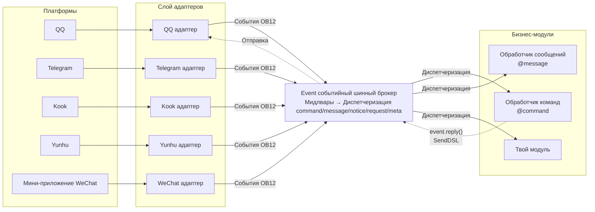
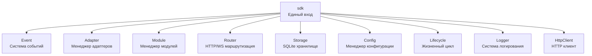

[English](README.md) | [简体中文](README.zh-CN.md) | [繁體中文](README.zh-TW.md) | [日本語](README.ja.md) | **Русский**

请直接返回翻译后的完整Markdown内容，不要包含任何其他文字。

再次提醒：如果文档包含语言切换行（各语言名称用 `` | `` 分隔的行），务必严格遵守上方第8条的格式要求，不要写出 ``[**Label**](file)`` 这类错误格式。

# ErisPulse

**Написание кода один раз, развертывание на QQ / Telegram / Kook / Yunhu / WeChat Official Account / OneBot12 / ... нескольких платформах.**

Фреймворк разработки событийно-ориентированных мультиплатформенных чат-ботов.

На основе стандарта OneBot12, один раз написав, можно развернуть на нескольких платформах; гибкая система плагинов, поддержка горячей перезагрузки и полный набор инструментов для разработчиков, подходит для различных сценариев от простых чат-ботов до сложных автоматизированных систем.

<p>
  <a href="https://pypi.org/project/ErisPulse/"></a>
  <a href="https://pypi.org/project/ErisPulse/"></a>
  <a href="https://hub.docker.com/r/erispulse/erispulse"></a>
  <a href="https://github.com/ErisPulse/ErisPulse/blob/main/LICENSE"></a>
  <a href="https://github.com/ErisPulse/ErisPulse"></a>
  <a href="https://pepy.tech/project/ErisPulse"></a>
  <a href="https://github.com/astral-sh/ruff"></a>
  <a href="https://socket.dev/pypi/package/erispulse"></a>
  <a href="https://www.erisdev.com"></a>
  <a href="https://deepwiki.com/ErisPulse/ErisPulse"></a>
  <a href="https://www.erisdev.com/#market"></a>
  <a href="https://github.com/ErisPulse/ErisPulse/discussions"></a>
</p>

<br clear="both">

---

<div align="center">

### Основные функции

</div>

<table>
<tr>
<td width="33%" align="center" valign="top">
<br/>


### Архитектура, основанная на событиях

Единая модель событий на основе стандарта OneBot12 — больше не нужно писать для каждой платформы отдельный блок if/elif для определения типа сообщения, один обработчик автоматически адаптируется ко всем адаптерам

</td>
<td width="33%" align="center" valign="top">
<br/>


### Кросс-платформенная совместимость

Один и тот же код бизнес-логики работает на всех платформах — один раз написав, можно обслуживать QQ / Telegram / Kook / Yunhu / WeChat Official Account и другие 15+ платформ, без необходимости повторного разработки

</td>
<td width="33%" align="center" valign="top">
<br/>


### Модульная архитектура

Гибкая система плагинов поддерживает горячую подмену в режиме реального времени — установка/удаление/включение/отключение модулей без перезапуска процесса, сборка возможностей бота как конструктор

</td>
</tr>
<tr>
<td width="33%" align="center" valign="top">
<br/>


### Горячая перезагрузка

Цикл разработки сократился с перезапуска 10 секунд до 0.5 секунд — сохранение файла применяется сразу, опыт разработки и отладки приближается к интерпретируемым скрипт-языкам

</td>
<td width="33%" align="center" valign="top">
<br/>


### Поддержка ИИ

Описание потребностей естественным языком напрямую генерирует рабочие модули — не умеете писать адаптер? Скажите ИИ, на какую платформу вы хотите подключиться, и он поможет вам написать код

</td>
<td width="33%" align="center" valign="top">
<br/>


### Легкость и элегантность

Интуитивно понятный API с цепочечной структурой — @пользователь, ответ, повтор, массовая отправка и другие сложные логики выполняются одной строкой кода, код легкий и читаемый, как перо

</td>
</tr>
</table>

---

**Важно:** правила замены путей  
- Замените `docs/ru/` на `docs/ru/` в ссылках на документацию  
- Например: `docs/ru/quick-start.md` должно стать `docs/ru/quick-start.md`  
- Для ссылок на файлы других языков (в формате `README.xx.md`), оставьте их без изменений  
- Это гарантирует, что ссылки будут указывать на версию документации нужного языка

## Принцип работы

ErisPulse скрывает различия между платформами через слой адаптеров, позволяя бизнес-коду заботиться только о событиях:



- **Слой адаптеров** преобразует нативные протоколы каждой платформы в стандартные события OneBot12, бизнес-модули не видят различий между платформами
- **Событийный шинный брокер** сначала выполняет цепочку мидлваров, затем диспетчеризует события по пяти типам обработчиков
- **Твой код** подписывается на события с помощью декораторов и использует `event.reply()` или SendDSL для ответа — ответные сообщения возвращаются по тому же пути обратно на платформу

Детали архитектуры, включая полную структуру модулей, процесс инициализации, события жизненного цикла и т.д., см. в [Обзор архитектуры](docs/ru/architecture.md).

---

Пожалуйста, верните непосредственно переведенный полный Markdown-контент, без каких-либо дополнительных пояснений.

## Быстрый старт

### Сценарий установки одним нажатием (рекомендуется)

Сценарий установки автоматически определяет вашу среду (Docker, Python, uv), предлагает наиболее подходящий способ установки и поддерживает несколько языков (中文/English/日本語/Русский/繁體中文).

Windows (PowerShell):
```powershell
irm https://get.erisdev.com/install.ps1 -OutFile install.ps1; powershell -ExecutionPolicy Bypass -File install.ps1
```

macOS / Linux:
```bash
curl -fsSL https://get.erisdev.com/install.sh -o install.sh && chmod +x install.sh && ./install.sh
```

<table>
<tr>
<td align="center" width="50%">

**Демонстрация установки через Docker**

<video src="https://github.com/user-attachments/assets/a367a466-4678-46a9-b101-073a86388ede" controls width="100%"></video>

</td>
<td align="center" width="50%">

**Демонстрация установки через pip**

<video src="https://github.com/user-attachments/assets/a2df4009-dba6-411e-b79d-4454a168d063" controls width="100%"></video>

</td>
</tr>
</table>

### Использование Docker (рекомендуется)

```bash
docker pull erispulse/erispulse:latest
```

<details>
<summary>Доступ к Docker Hub невозможен?</summary>

Если Docker Hub недоступен, можно использовать GitHub Container Registry:

```bash
docker pull ghcr.io/erispulse/erispulse:latest
```

При использовании образа ghcr.io необходимо изменить значение `image` в `docker-compose.yml`:
```yaml
image: ghcr.io/erispulse/erispulse:latest
```

</details>

<details>
<summary>Быстрый запуск</summary>

```bash
# Загрузка docker-compose.yml
curl -O https://raw.githubusercontent.com/ErisPulse/ErisPulse/main/docker-compose.yml

# Установка токена для доступа к Dashboard и запуск
ERISPULSE_DASHBOARD_TOKEN=your-token docker compose up -d
```

После запуска перейдите по адресу `http://<host>:8000/Dashboard` и войдите в панель управления Dashboard с помощью установленного токена.

> Образ содержит встроенный фреймворк ErisPulse и панель управления Dashboard, поддерживает архитектуры `linux/amd64` и `linux/arm64`.
>
> **Постоянное хранение данных**: конфигурационные файлы и установленные модули/адаптеры сохраняются на хост-машине через тома, поэтому они не теряются при перезапуске контейнера. Обновление самого фреймворка выполняется через горячее обновление в Dashboard.

</details>

<details>

</details>

<details>
<summary>Переменные среды Docker</summary>

| Переменная | Значение по умолчанию | Описание |
|------|--------|------|
| `ERISPULSE_DASHBOARD_TOKEN` | пусто | Токен для входа в Dashboard (автоматически записывается в конфигурацию после установки) |
| `ERISPULSE_PORT` | `8000` | Порт для Dashboard |
| `ERISPULSE_TAG` | `latest` | Тег образа, можно установить в `dev` для предварительного выпуска |
| `ERISPULSE_BUILD_TARGET` | `production` | Цель сборки: `production` (стабильная версия) или `dev` (предварительный выпуск) |
| `CONTAINER_NAME` | `erispulse` | Имя контейнера |
| `TZ` | `Asia/Shanghai` | Часовой пояс контейнера |
| `LANG` | `en_US.UTF-8` | Язык системы, автоматически определяет язык интерфейса запуска |
| `ERISPULSE_LANG` | пусто | Принудительный язык интерфейса запуска: `zh` / `zh_TW` / `en` / `ja` / `ru` (переопределяет `LANG`) |

</details>

### Магазин приложений 1Panel

Установите ErisPulse одним нажатием кнопки через [1Panel](https://1panel.cn), подробнее см. [ErisPulse-1Panel](https://github.com/ErisPulse/ErisPulse-1Panel).

```bash
bash <(curl -sL https://get-1panel.erisdev.com/install.sh)
```

ErisPulse доступен в стороннем магазине приложений 1Panel, установка возможна через сторонний репозиторий [okxlin/appstore](https://github.com/okxlin/appstore).

### Установка с помощью pip

```bash
pip install ErisPulse
```

> Также можно использовать сценарий установки одним нажатием, который автоматически определяет среду и предлагает настройки.

### Инициализация проекта

```bash
# Интерактивная инициализация
epsdk init

# Быстрая инициализация (указать имя проекта)
epsdk init -q -n my_bot
```

### Создание первого бота

Создайте файл `main.py`:

<table>
<tr>
<td width="50%" valign="top">

**Обработчик команд**

```python
from ErisPulse import sdk
from ErisPulse.Core.Event import command

@command("hello", help="Отправить приветственное сообщение")
async def hello_handler(event):
    user_name = event.get_user_nickname() or "друг"
    await event.reply(f"Привет, {user_name}!")

@command("ping", help="Проверить, работает ли бот")
async def ping_handler(event):
    await event.reply("Pong! Бот работает нормально.")

if __name__ == "__main__":
    import asyncio
    asyncio.run(sdk.run(keep_running=True))
```

</td>
<td width="50%" valign="top">

**Описание результатов**

Отправка `/hello`

Бот отвечает: `Привет, {имя пользователя}!`

---

Отправка `/ping`

Бот отвечает: `Pong! Бот работает нормально.`

---

**Способы запуска**

```bash
epsdk run main.py
# или в режиме разработки
epsdk run main.py --reload
```

</td>
</tr>
</table>

Более подробная информация доступна по ссылкам:
- [Руководство по быстрому старту](docs/ru/quick-start.md)
- [Введение](docs/ru/getting-started/)

## Один и тот же код. Разные платформы.

*Идентичные обработчики команд. Разные платформы. Без необходимости изменять какую-либо бизнес-логику.*

<table>
<tr>
<td align="center" width="33%">

**Kook**


</td>
<td align="center" width="33%">

**QQ**


</td>
<td align="center" width="33%">

**Yunhu**


</td>
</tr>
</table>

---

[**English**](docs/ru/quick-start.md) | [**Русский**](docs/ru/quick-start.md)

## DSL для цепочки отправки

Цепочка вызовов выполняет всю логику отправки: упоминание (@), ответ, повтор, таймаут, обратный вызов и т.д.:

```python
yunhu = sdk.adapter.get("yunhu")

# Одиночная отправка: упоминание пользователя + ответ + повтор + успешный обратный вызов
await (yunhu.Send.To("group", "123")
       .At("456").Reply("msg_789")
       .Retry(3).Timeout(10)
       .Hook(lambda r: print("Сообщение успешно отправлено!"))
       .Text("Привет"))

# Массовая отправка: отправка нескольких сообщений одной цепочкой
results = await (yunhu.Send.To("user", "123")
                .Build()
                .Text("Уведомление 1")
                .Image("pic.jpg")
                .Retry(2)
                .send_all())
```

> Поддержка цепочных методов, таких как Hook (обратный вызов при успехе), Retry (повтор при неудаче), Timeout (отмена по таймауту), OnProgress (мониторинг прогресса), Defer (отложенная отправка), Build (построение пакета), подробнее см. [документацию по SendDSL](docs/ru/developer-guide/adapters/send-dsl.md).

---

> [**English**](README.en.md) | [**Русский**](README.ru.md) | [**简体中文**](README.zh-CN.md) | [**日本語**](README.ja-JP.md)

## Примеры многократных диалогов

ErisPulse имеет встроенную мощную систему многократных диалогов, что позволяет легко реализовать интерактивные сценарии, такие как навигация и сбор информации:

```python
from ErisPulse.Core.Event import command, request

@command("register")
async def register_handler(event):
    conv = event.conversation(timeout=60)
    
    await conv.say("Добро пожаловать на регистрацию!")
    
    # Сбор информации пользователя в несколько шагов с автоматической проверкой
    data = await conv.collect([
        {"key": "name", "prompt": "Пожалуйста, введите ваше имя"},
        {"key": "age", "prompt": "Пожалуйста, введите ваш возраст",
         "validator": lambda e: e.get_text().strip().isdigit(),
         "retry_prompt": "Возраст должен быть числом, пожалуйста, введите заново"},
    ])
    
    if data and await conv.confirm(f"Подтвердить регистрацию? Имя: {data['name']}, Возраст: {data['age']}"):
        # Использование SendDSL для активной отправки уведомлений
        await sdk.adapter.get(event.get_platform()).Send.To(
            "user", event.get_user_id()
        ).Text(f"Регистрация прошла успешно! Добро пожаловать, {data['name']}")
        # Или await event.reply("Регистрация прошла успешно!")

# Автоматическая обработка запросов на добавление в друзья
@request.on_friend_request()
async def handle_friend_request(event):
    user_name = event.get_user_nickname() or event.get_user_id()
    
    # Принятие запроса
    result = await event.approve()
    if result.get("status") == "ok":
        await event.reply(f"Запрос на добавление в друзья автоматически принят, добро пожаловать, {user_name}")
```

<details>
<summary>Показать больше Conversation API (ветвление / выбор / сохранение)</summary>

```python
@command("quiz")
async def quiz_handler(event):
    conv = event.conversation(timeout=30)
    
    # Вопрос с вариантами ответов
    answer = await conv.choose("Кто создатель Python?", [
        "Guido van Rossum",
        "James Gosling", 
        "Dennis Ritchie",
    ])
    
    if answer == 0:
        await conv.say("Правильно!")
    elif answer is None:
        await conv.say("Время вышло, попробуйте снова в следующий раз!")
    else:
        await conv.say("Неверно, правильный ответ: Guido van Rossum")

@command("menu")
async def menu_handler(event):
    conv = event.conversation(timeout=60)
    
    # Ветвление, построение сложных интерактивных процессов
    @conv.branch("main")
    async def main_menu():
        await conv.say("=== Главное меню ===\n1. Личная информация\n2. Настройки\n3. Выход")
        resp = await conv.wait()
        if resp and resp.get_text().strip() == "1":
            await conv.goto("profile")
    
    @conv.branch("profile")
    async def profile():
        await conv.say("Имя: Alice\n0. Вернуться")
        resp = await conv.wait()
        if resp and resp.get_text().strip() == "0":
            await conv.goto("main")
    
    await conv.start()
```

Смотрите подробнее [Conversation многократные диалоги](docs/ru/advanced/conversation.md)

</details>

---

Пожалуйста, верните полный переведённый Markdown-документ, не добавляя никаких других текстов.

## Основные модули

ErisPulse предоставляет полный инструментарий для разработки мультиплатформенных ботов, каждый основной модуль отвечает за свою задачу:



| Модуль | Описание |
|------|------|
| **Event** | Система событий, предоставляет пять типов событий: command / message / notice / request / meta + Conversation многократный диалог |
| **Adapter** | Менеджер адаптеров, базовый класс BaseAdapter унифицирует преобразование событий и SendDSL отправку, поддерживает более 15 платформ, включая QQ / Telegram / Kook / Yunhu / WeChat Public Account |
| **Module** | Менеджер модулей, базовый класс BaseModule + объявление зависимостей и топологическая сортировка загрузки |
| **SendDSL** | Цепочечная отправка, @/ответ/повтор/таймаут/массовая и другие сложные логические операции выполняются одной строкой |
| **Router** | Система маршрутизации HTTP/WebSocket (FastAPI + Uvicorn) |
| **Storage** | Хранилище ключ-значение на базе SQLite + универсальный SQL цепочечный запрос |
| **Config** | Управление конфигурацией в формате TOML |
| **Lifecycle** | Точки событий жизненного цикла (core.init / adapter.* / module.*) |
| **Logger** | Модульная система логирования, поддерживает под-логгеры |
| **HttpClient** | Единый HTTP/WS клиент (на основе aiohttp), встроенные повторные попытки и система исключений ErisPulse |

Более подробные сведения о проекте (процесс инициализации, события жизненного цикла, стратегия загрузки модулей) см. в [Обзор архитектуры](docs/ru/architecture.md).

---

**Языки:** [**中文**](docs/ru/quick-start.md) | [**English**](docs/en/quick-start.md) | [**Русский**](docs/ru/quick-start.md)

## Экосистема

ErisPulse — это не просто фреймворк. Установите и начните работать, не нужно изобретать велосипед с нуля.

<table>
<tr>
<td align="center" width="25%">

**Фреймворк**

Основной рантайм

Единая модель событий и сообщений

</td>
<td align="center" width="25%">

**Dashboard**

Визуальное управление

Плагины · Журналы · Настройки

[Онлайн демонстрация →](https://dashdemo.erisdev.com/)

</td>
<td align="center" width="25%">

**AI Builder**

Естественный язык → Готовые модули

[Опыт →](https://builder.erisdev.com)

</td>
<td align="center" width="25%">

**Рынок модулей**

Готовые к использованию плагины

[Просмотр модулей →](https://www.erisdev.com/#market)

</td>
</tr>
<tr>
<td align="center" width="25%">

**Адаптеры**

Подключение к 15+ платформам

</td>
<td align="center" width="25%">

**ErisPulse-App**

Официальный клиент для нескольких платформ

Работает на телефоне · Присутствует в системном трее

[Скачать и установить →](https://github.com/ErisPulse/ErisPulse-App/releases)

</td>
<td align="center" width="25%">

**Docker**

Поддержка нескольких архитектур

`erispulse/erispulse`

</td>
<td align="center" width="25%">

**Документация и CLI**

[erisdev.com](https://www.erisdev.com)

`epsdk` инструмент для создания проектов

</td>
</tr>
</table>

---

Please directly return the translated complete Markdown content, do not include any other text.

## Поддерживаемые платформы

Добро пожаловать к участию в разработке адаптеров! Не знаете, с чего начать? Посмотрите [руководство по вкладу](docs/ru/contributing/README.md).

| Адаптер | Описание |
|--------|----------|
|  [Kook](https://github.com/shanfishapp/ErisPulse-KookAdapter) | Платформа мгновенных сообщений Kook (开黑啦) |
|  [Matrix](https://github.com/ErisPulse/ErisPulse-MatrixAdapter) | Децентрализованный протокол обмена сообщениями Matrix |
|  [OneBot11](https://github.com/ErisPulse/ErisPulse-OneBot11Adapter) | Общий протокол роботов OneBot v11 |
|  [OneBot12](https://github.com/ErisPulse/ErisPulse-OneBot12Adapter) | Стандартный протокол OneBot v12 |
|  [QQ](https://github.com/ErisPulse/ErisPulse-QQBotAdapter) | Официальная платформа роботов QQ |
|  [Сэндбокс](https://github.com/ErisPulse/ErisPulse-SandboxAdapter) | Веб-отладка, без подключения к реальной платформе |
|  [Терминал](https://github.com/ErisPulse/ErisPulse-TerminalAdapter) | Ввод команд — это чат, нулевая настройка для разработки и отладки |
|  [Telegram](https://github.com/ErisPulse/ErisPulse-TelegramAdapter) | Глобальная платформа мгновенных сообщений |
|  [Почта](https://github.com/ErisPulse/ErisPulse-EmailAdapter) | Адаптер для отправки и получения по протоколу электронной почты |
|  [Юньху](https://github.com/ErisPulse/ErisPulse-YunhuAdapter) | Корпоративная платформа мгновенных сообщений (подключение роботов) |
|  [Юньху пользователь](https://github.com/wsu2059q/ErisPulse-YunhuUserAdapter) | Адаптер подключения на основе протокола пользовательских аккаунтов Юньху |
| [Кофейня Хуафэн](https://github.com/ErisPulse/ErisPulse-Ideaura/) | Allons! \(・ω・) / |
|  [Discord](https://github.com/ErisPulse/ErisPulse-DiscordAdapter) | Глобальная платформа коммуникации сообществ, поддерживает серверы, каналы и личные сообщения |
|  [Webhook](https://github.com/ErisPulse/ErisPulse-WebhookAdapter) | Общий адаптер HTTP-моста, подключение к любой системе |
|  [Официальный аккаунт WeChat](https://github.com/ErisPulse/ErisPulse-WechatMpAdapter) | Официальная платформа аккаунтов WeChat |

Посмотрите [подробное описание адаптеров](docs/ru/platform-guide/README.md)

## Сообщество

Общайтесь с нами:

- Telegram: <https://t.me/ErisPulse>
- QQ группа: <https://qm.qq.com/q/TOwnCmypcy>
- QQ облако озера: <https://yhfx.jwznb.com/share?key=VWJL4fTWXepa&ts=1781889199>

---

### Руководство по вкладу

Здоровье проекта ErisPulse требует вашей помощи! Мы приветствуем любые формы вклада:

1. **Сообщение об ошибках** — отправьте отчёт об ошибке в [GitHub Issues](https://github.com/ErisPulse/ErisPulse/issues)
2. **Запрос функции** — предложите новые идеи через [обсуждения сообщества](https://github.com/ErisPulse/ErisPulse/discussions)
3. **Кодовый вклад** — перед отправкой PR ознакомьтесь с [стилем кода](docs/ru/styleguide/) и [руководством по вкладу](CONTRIBUTING.md)
4. **Улучшение документации** — помогите улучшить документацию и примеры кода

**Первый вклад?** Начните здесь 👉 [Первый практический вклад](docs/ru/contributing/first-contribution.md)

[Присоединяйтесь к обсуждениям сообщества](https://github.com/ErisPulse/ErisPulse/discussions)

---

<div align="center">

### Благодарности


Часть кода этого проекта основана на [sdkFrame](https://github.com/runoneall/sdkFrame).

Стандартизированный слой основных адаптеров опирается на и вдохновляется [спецификацией OneBot12](https://12.onebot.dev/).

Особая благодарность экосистеме и сообществу Юньху.

Ранние исследования и рост ErisPulse невозможны без поддержки сообщества разработчиков Юньху, многие идеи, адаптеры и практический опыт родились здесь.

Также благодарим всех разработчиков и авторов проектов, внесших вклад в ErisPulse, экосистему OneBot и сообщество открытого программного обеспечения.

</div>