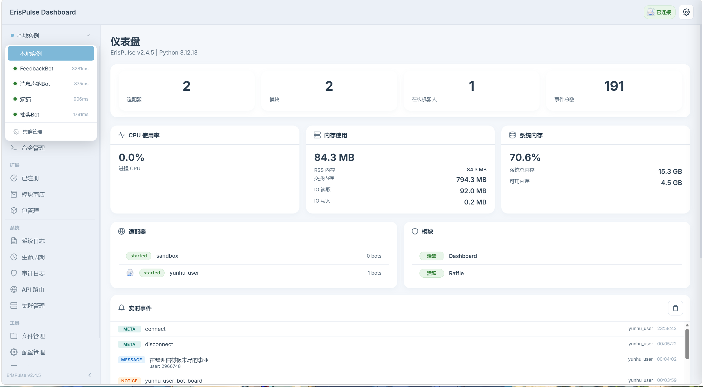

<table>
<tr>
<td width="35%" valign="middle" align="center">


</td>
<td valign="middle">

> [English](README.md) | [简体中文](README.zh-CN.md) | [繁體中文](README.zh-TW.md) | [日本語](README.ja.md) | **Русский**

> 🎉 **v2.5.0-dev.1 теперь поддерживает многоязычность!** Ядро фреймворка и интерфейс CLI уже включают поддержку китайского (упрощённого/традиционного), английского, японского и русского языков. Система автоматически определяет язык вашей операционной системы и переключает интерфейс!

# ErisPulse

**Событийно-ориентированный фреймворк для разработки мультиплатформенных ботов**

На основе стандартного интерфейса OneBot12 — напишите один раз, разверните на нескольких платформах. Гибкая система плагинов, поддержка горячей перезагрузки и полный набор инструментов для разработчиков.

> Поддерживает рабочий процесс Vibe Coding — ИИ напрямую генерирует готовые модули — [Подробнее](docs/ru/ai-support/README.md)

[](https://pypi.org/project/ErisPulse/)
[](https://pypi.org/project/ErisPulse/)
[](https://hub.docker.com/r/erispulse/erispulse)
[](https://github.com/ErisPulse/ErisPulse/blob/main/LICENSE)
[](https://github.com/ErisPulse/ErisPulse)
[](https://pypi.org/project/ErisPulse/)
[](https://github.com/astral-sh/ruff)
[](https://socket.dev/pypi/package/erispulse)

[](https://www.erisdev.com)
[](https://www.erisdev.com/#market)
[](https://github.com/ErisPulse/ErisPulse/discussions)

</td>
</tr>
</table>

---

<div align="center">

### Ключевые особенности

</div>

<table>
<tr>
<td width="50%" align="center" valign="top">
<br/>

### ⚡ Событийно-ориентированная архитектура

Четкая модель событий на основе OneBot12, упрощающая и повышающая эффективность обработки логики сообщений

</td>
<td width="50%" align="center" valign="top">
<br/>

### 🌐 Кроссплатформенная совместимость

Модули написанные один раз, можно использовать на всех платформах, без необходимости повторной разработки для каждой из них

</td>
</tr>
<tr>
<td width="50%" align="center" valign="top">
<br/>

### 🧩 Модульный дизайн

Гибкая система плагинов, легко масштабируемая и интегрируемая, поддерживающая горячее подключение модулей

</td>
<td width="50%" align="center" valign="top">
<br/>

### 🔄 Поддержка горячей перезагрузки

Перезагружайте код без перезапуска во время разработки, значительно повышая эффективность итеративного развития

</td>
</tr>
</table>

---

### Быстрый старт

#### Скрипт автоматической установки (Рекомендуется)

Скрипт автоматически определяет вашу среду (Docker, Python, uv), предлагает выбрать наиболее подходящий способ установки и поддерживает несколько языков (китайский/English/日本語/Русский/繁體中文).

Windows (PowerShell):
```powershell
irm https://get.erisdev.com/install.ps1 -OutFile install.ps1; powershell -ExecutionPolicy Bypass -File install.ps1
```

macOS / Linux:
```bash
curl -fsSL https://get.erisdev.com/install.sh -o install.sh && chmod +x install.sh && ./install.sh
```

<table>
<tr>
<td align="center" width="50%">

**Демонстрация установки Docker**

<video src="https://github.com/user-attachments/assets/a367a466-4678-46a9-b101-073a86388ede" controls width="100%"></video>

</td>
<td align="center" width="50%">

**Демонстрация установки pip**

<video src="https://github.com/user-attachments/assets/a2df4009-dba6-411e-b79d-4454a168d063" controls width="100%"></video>

</td>
</tr>
</table>

#### Использование Docker (Рекомендуется)

```bash
docker pull erispulse/erispulse:latest
```

<details>
<summary>Docker Hub недоступен?</summary>

Если Docker Hub недоступен, можно использовать GitHub Container Registry:

```bash
docker pull ghcr.io/erispulse/erispulse:latest
```

При использовании зеркала ghcr.io, нужно изменить image в `docker-compose.yml`:
```yaml
image: ghcr.io/erispulse/erispulse:latest
```

</details>

<details>
<summary>Быстрый запуск</summary>

```bash
# Скачайте docker-compose.yml
curl -O https://raw.githubusercontent.com/ErisPulse/ErisPulse/main/docker-compose.yml

# Настройте токен для входа в Dashboard и запустите
ERISPULSE_DASHBOARD_TOKEN=your-token docker compose up -d
```

> Образ содержит фреймворк ErisPulse и панель управления Dashboard, поддерживает архитектуры `linux/amd64` и `linux/arm64`.

После запуска перейдите по адресу `http://<host>:<port>/Dashboard` и войдите в панель управления Dashboard, используя установленный токен в качестве пароля.

</details>

<details>
<summary>Использование предрелизной версии (Dev)</summary>

Установите `ERISPULSE_CHANNEL=dev` для использования предрелизной версии:

```bash
# Способ 1: использование переменных окружения (рекомендуется)
ERISPULSE_CHANNEL=dev ERISPULSE_DASHBOARD_TOKEN=your-token docker compose up -d

# Способ 2: сборка образа dev
ERISPULSE_BUILD_TARGET=dev docker compose up -d --build
```

Если вы хотите автоматически обновиться до последней версии при запуске (stable или dev), явно установите `ERISPULSE_UPDATE_ON_START=true`:

```bash
ERISPULSE_CHANNEL=dev ERISPULSE_UPDATE_ON_START=true docker compose up -d
```

Также можно скачать уже собранный образ dev:

```bash
docker pull erispulse/erispulse:dev
```

</details>

<details>
<summary>Переменные окружения Docker</summary>

| Переменная | Значение по умолчанию | Описание |
|------|--------|------|
| `ERISPULSE_CHANNEL` | `stable` | Канал версии: `stable` (стабильная) или `dev` (предрелизная) |
| `ERISPULSE_UPDATE_ON_START` | `false` | Автоматическое обновление до последней версии при запуске контейнера (требуется явное включение) |
| `ERISPULSE_DASHBOARD_TOKEN` | пусто | Токен для входа в Dashboard |
| `ERISPULSE_PORT` | `8000` | Порт для Dashboard |
| `TZ` | `Asia/Shanghai` | Часовой пояс контейнера |

> Включение `ERISPULSE_UPDATE_ON_START=true` гарантирует, что контейнер сможет автоматически получить последнюю версию, даже если образ устарел.

</details>

#### Магазин приложений 1Panel

Установите ErisPulse через [1Panel](https://1panel.cn) за один клик, подробности в [ErisPulse-1Panel](https://github.com/ErisPulse/ErisPulse-1Panel).

```bash
bash <(curl -sL https://get-1panel.erisdev.com/install.sh)
```

#### Установка через pip

```bash
pip install ErisPulse
```

> Также можно использовать скрипт автоматической установки выше, он автоматически определит среду и направит на конфигурацию.

#### Результат работы


##### Панель управления (Dashboard):

<table>
<tr>
<td width="50%">



</td>
<td width="50%">

<video src="https://github.com/user-attachments/assets/157191c4-9a84-433c-b311-0c57e3a21151" controls width="100%"></video>

</td>
</tr>
</table>


##### Один код, ответы на нескольких платформах:

<table>
<tr>
<td align="center" width="33%">

**Kook**


</td>
<td align="center" width="33%">

**QQ**


</td>
<td align="center" width="33%">

**Yunhu**


</td>
</tr>
</table>

#### Инициализация проекта

```bash
# Интерактивная инициализация
epsdk init

# Быстрая инициализация (с указанием имени проекта)
epsdk init -q -n my_bot
```

#### Создание первого бота

Создайте файл `main.py`:

<table>
<tr>
<td width="50%" valign="top">

**Обработчик команд**

```python
from ErisPulse import sdk
from ErisPulse.Core.Event import command

@command("hello", help="Отправляет приветственное сообщение")
async def hello_handler(event):
    user_name = event.get_user_nickname() or "друг"
    await event.reply(f"Привет, {user_name}!")

@command("ping", help="Проверка доступности бота")
async def ping_handler(event):
    await event.reply("Pong! Бот работает нормально.")

if __name__ == "__main__":
    import asyncio
    asyncio.run(sdk.run(keep_running=True))
```

</td>
<td width="50%" valign="top">

**Описание результата**

Отправьте `/hello`

Ответ бота: `Привет, {имя}!`

---

Отправьте `/ping`

Ответ бота: `Pong! Бот работает нормально.`

---

**Способ запуска**

```bash
epsdk run main.py
# или в режиме разработки
epsdk run main.py --reload
```

</td>
</tr>
</table>

Более подробное описание см.:
- [Руководство по быстрому началу](docs/ru/quick-start.md)
- [Руководство для начинающих](docs/ru/getting-started/)

#### Пример многоразового диалога

ErisPulse включает в себя мощный движок многоразовых диалогов, легко реализующий интерактивные сценарии, такие как пошаговые инструкции и сбор информации:

```python
from ErisPulse.Core.Event import command, request

@command("register")
async def register_handler(event):
    conv = event.conversation(timeout=60)
    
    await conv.say("Добро пожаловать в регистрацию!")
    
    # Сбор информации о пользователе в несколько шагов с автоматической проверкой
    data = await conv.collect([
        {"key": "name", "prompt": "Пожалуйста, введите имя"},
        {"key": "age", "prompt": "Пожалуйста, введите возраст",
         "validator": lambda e: e.get_text().strip().isdigit(),
         "retry_prompt": "Возраст должен быть числом, попробуйте снова"},
    ])
    
    if data and await conv.confirm(f"Подтвердить регистрацию? Имя: {data['name']}, Возраст: {data['age']}"):
        # Активная отправка уведомлений через SendDSL
        await sdk.adapter.get(event.get_platform()).Send.To(
            "user", event.get_user_id()
        ).Text(f"Регистрация успешна! Добро пожаловать, {data['name']}")
        # или await event.reply("Регистрация успешна!")

# Автоматическая обработка запросов в друзья
@request.on_friend_request()
async def handle_friend_request(event):
    user_name = event.get_user_nickname() or event.get_user_id()
    
    # Принятие запроса
    result = await event.approve()
    if result.get("status") == "ok":
        await event.reply(f"Другский запрос автоматически принят, добро пожаловать {user_name}")
```

<details>
<summary>Подробнее об API бесед (ветвление / выбор / сохранение)</summary>

```python
@command("quiz")
async def quiz_handler(event):
    conv = event.conversation(timeout=30)
    
    # Вопрос с выбором варианта ответа
    answer = await conv.choose("Кто создатель Python?", [
        "Guido van Rossum",
        "James Gosling", 
        "Dennis Ritchie",
    ])
    
    if answer == 0:
        await conv.say("Верно!")
    elif answer is None:
        await conv.say("Время вышло, приходите еще!")
    else:
        await conv.say("Ошибка, верный ответ Guido van Rossum")

@command("menu")
async def menu_handler(event):
    conv = event.conversation(timeout=60)
    
    # Ветвление для построения сложных сценариев взаимодействия
    @conv.branch("main")
    async def main_menu():
        await conv.say("=== Главное меню ===\n1. Личная информация\n2. Настройки\n3. Выход")
        resp = await conv.wait()
        if resp and resp.get_text().strip() == "1":
            await conv.goto("profile")
    
    @conv.branch("profile")
    async def profile():
        await conv.say("Имя: Alice\n0. Назад")
        resp = await conv.wait()
        if resp and resp.get_text().strip() == "0":
            await conv.goto("main")
    
    await conv.start()
```

Подробнее в [Conversation (Многоразовый диалог)](docs/ru/advanced/conversation.md)

</details>

---

### Поддерживаемые адаптеры

Мы приветствуем вклад в адаптеры!

| Адаптер | Описание |
|--------|------|
|  [Kook](https://github.com/shanfishapp/ErisPulse-KookAdapter) | Мгновенное сообщение Kook (开黑啦) |
|  [Matrix](https://github.com/ErisPulse/ErisPulse-MatrixAdapter) | Децентрализованный протокол связи Matrix |
|  [OneBot11](https://github.com/ErisPulse/ErisPulse-OneBot11Adapter) | Универсальный протокол роботов OneBot v11 |
|  [OneBot12](https://github.com/ErisPulse/ErisPulse-OneBot12Adapter) | Стандартный протокол OneBot v12 |
|  [QQ](https://github.com/ErisPulse/ErisPulse-QQBotAdapter) | Официальная платформа роботов QQ |
|  [Sandbox](https://github.com/ErisPulse/ErisPulse-SandboxAdapter) | Отладка в браузере без подключения к реальной платформе |
|  [Telegram](https://github.com/ErisPulse/ErisPulse-TelegramAdapter) | Глобальная мессенджер-платформа Telegram |
|  [Email](https://github.com/ErisPulse/ErisPulse-EmailAdapter) | Адаптер для отправки и получения по почтовым протоколам |
|  [Yunhu](https://github.com/ErisPulse/ErisPulse-YunhuAdapter) | Корпоративная мессенджер-платформа (для подключения роботов) |
| [Yunhu User](https://github.com/wsu2059q/ErisPulse-YunhuUserAdapter) | Адаптер для подключения на основе пользовательского протокола Yunhu |
| [Ideaura Cafe](https://github.com/ErisPulse/ErisPulse-Ideaura/) | Allons! \(・ω・) / |

См. [Подробное описание адаптеров](docs/ru/platform-guide/README.md)

---

### Сценарии использования

<div align="center">

| Мультиплатформенные роботы | Чат-помощник | Автоматизация | Пересылка сообщений |
|:---:|:---:|:---:|:---:|
| Развертывание робота<br>с одинаковыми функциями<br>на нескольких платформах | Интеграция модулей<br>чат-помощника<br>для развлечения и взаимодействия | Уведомления о сообщения, управление задачами<br>сбор данных | Синхронизация и пересылка сообщений<br>между платформами |

</div>

---

### Руководство по вкладу

Целостность проекта ErisPulse зависит от вашего вклада! Мы приветствуем различные формы вклада:

1. **Сообщить о проблеме** — отправляйте отчеты об ошибках в [GitHub Issues](https://github.com/ErisPulse/ErisPulse/issues)
2. **Запросить функцию** — предлагайте новые идеи через [обсуждения сообщества](https://github.com/ErisPulse/ErisPulse/discussions)
3. **Кодовый вклад** — перед отправкой PR ознакомьтесь с [стилем кода](docs/ru/styleguide/) и [руководством по вкладу](CONTRIBUTING.md)
4. **Улучшение документации** — помогите улучшить документацию и примеры кода

[Присоединиться к обсуждениям сообщества](https://github.com/ErisPulse/ErisPulse/discussions)

---

## История звезд

[](https://star-history.com/#ErisPulse/ErisPulse&Date)

---

<div align="center">

### Благодарности


Часть кода этого проекта основана на [sdkFrame](https://github.com/runoneall/sdkFrame) · Стандартный слой адаптеров основан на [OneBot12 спецификации](https://12.onebot.dev/) · Спасибо всем разработчикам и авторам, внесшим вклад в открытое сообщество

</div>