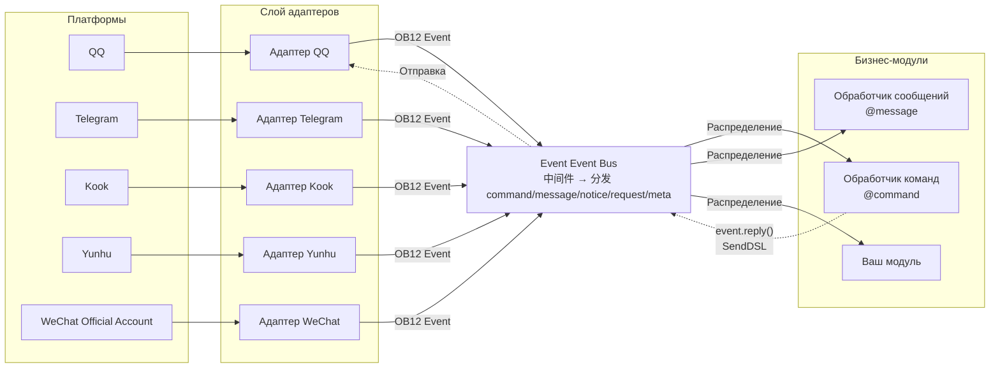
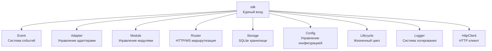

[English](README.md) | [简体中文](README.zh-CN.md) | [繁體中文](README.zh-TW.md) | [日本語](README.ja.md) | **Русский**

# ErisPulse

**Написание один раз, развертывание на QQ / Telegram / Kook / Yunhu / WeChat Official Account / OneBot12 / ... на нескольких платформах.**

Событийно-ориентированная многофункциональная платформа для разработки чат-ботов.

Основанная на стандарте OneBot12, возможность развертывания на нескольких платформах с одним кодом; гибкая система плагинов, поддержка горячей перезагрузки и полный инструментарий для разработчиков, подходит для различных сценариев от простых чат-ботов до сложных автоматизированных систем.

<p>
  <a href="https://pypi.org/project/ErisPulse/"></a>
  <a href="https://pypi.org/project/ErisPulse/"></a>
  <a href="https://github.com/botuniverse/onebot-11"></a>
  <a href="https://12.onebot.dev/"></a>
  <a href="https://hub.docker.com/r/erispulse/erispulse"></a>
  <a href="https://github.com/ErisPulse/ErisPulse/blob/main/LICENSE"></a>
  <a href="https://pepy.tech/project/ErisPulse"></a>
  <a href="https://github.com/astral-sh/ruff"></a>
  <a href="https://socket.dev/pypi/package/erispulse"></a>
  <a href="https://www.erisdev.com"></a>
  <a href="https://deepwiki.com/ErisPulse/ErisPulse"></a>
  <a href="https://www.erisdev.com/#market"></a>
  <a href="https://github.com/ErisPulse/ErisPulse/discussions"></a>
</p>

<br clear="both">

---

<div align="center">

### Основные особенности

</div>

<table>
<tr>
<td width="33%" align="center" valign="top">
<br/>


### Архитектура, основанная на событиях

Единая модель событий на базе OneBot12, один обработчик подходит для всех адаптеров

</td>
<td width="33%" align="center" valign="top">
<br/>


### Кроссплатформенная совместимость

QQ / Telegram / Kook / Yunhu и более 15 платформ, бизнес-код без изменений

</td>
<td width="33%" align="center" valign="top">
<br/>


### Модульная архитектура

Плагины подключаются и отключаются без перезапуска, управление с помощью платформ / ботов / сессий

</td>
</tr>
<tr>
<td width="33%" align="center" valign="top">
<br/>


### Горячая перезагрузка

Сохранение изменений сразу активно, легкая и бесшовная перезагрузка

</td>
<td width="33%" align="center" valign="top">
<br/>


### Помощь ИИ

Описание требований естественным языком, генерация готовых модулей

</td>
<td width="33%" align="center" valign="top">
<br/>


### Простота и элегантность

Цепочечный API: @пользователя, ответ, повтор, массовая отправка — все в одной строке

</td>
</tr>
</table>

---

## Принцип работы

ErisPulse скрывает различия между платформами через слой адаптеров, позволяя бизнес-коду сосредоточиться только на событиях:


```mermaid
graph LR
    subgraph Platforms[Платформы]
        QQ["QQ"]
        TG["Telegram"]
        Kook["Kook"]
        YH["Yunhu"]
        WX["WeChat Official Account"]
    end

    subgraph Adapters[Слой адаптеров]
        A1["Адаптер QQ"]
        A2["Адаптер Telegram"]
        A3["Адаптер Kook"]
        A4["Адаптер Yunhu"]
        A5["Адаптер WeChat"]
    end

    Event["Event Event Bus<br/>中间件 → 分发 command/message/notice/request/meta"]

    subgraph Modules[Бизнес-модули]
        M1["Обработчик команд<br/>@command"]
        M2["Обработчик сообщений<br/>@message"]
        M3["Ваш модуль"]
    end

    QQ --> A1
    TG --> A2
    Kook --> A3
    YH --> A4
    WX --> A5

    A1 -->|"OB12 Event"| Event
    A2 -->|"OB12 Event"| Event
    A3 -->|"OB12 Event"| Event
    A4 -->|"OB12 Event"| Event
    A5 -->|"OB12 Event"| Event

    Event -->|"Распределение"| M1
    Event -->|"Распределение"| M2
    Event -->|"Распределение"| M3

    M1 -.->|"event.reply()<br/>SendDSL"| Event
    Event -.->|"Отправка"| A1
```

- **Слой адаптеров** преобразует протоколы каждой платформы в стандартные события OneBot12, бизнес-модули не видят различий между платформами
- **Event Bus** сначала выполняет цепочку промежуточных обработчиков, затем распределяет события по пяти типам обработчиков
- **Ваш код** подписывается на события с помощью декораторов, используя `event.reply()` или SendDSL для ответа — ответы посылаются обратно на платформу по тому же пути

Детали архитектуры, структуры модулей, процесса инициализации, жизненного цикла и т.д., см. в [Обзоре архитектуры](docs/ru/architecture.md).

---

## Быстрый старт

### Сценарий установки с помощью скрипта (рекомендуется)

Скрипт автоматически определит вашу среду (Docker, Python, uv), предложит наиболее подходящий способ установки, поддерживает несколько языков (китайский / English / 日本語 / Русский / 繁體中文).

Windows (PowerShell):
```powershell
irm https://get.erisdev.com/install.ps1 -OutFile install.ps1; powershell -ExecutionPolicy Bypass -File install.ps1
```

macOS / Linux:
```bash
curl -fsSL https://get.erisdev.com/install.sh -o install.sh && chmod +x install.sh && ./install.sh
```

<table>
<tr>
<td align="center" width="50%">

**Демонстрация установки с помощью Docker**

<video src="https://github.com/user-attachments/assets/a367a466-4678-46a9-b101-073a86388ede" controls width="100%"></video>

</td>
<td align="center" width="50%">

**Демонстрация установки с помощью pip**

<video src="https://github.com/user-attachments/assets/a2df4009-dba6-411e-b79d-4454a168d063" controls width="100%"></video>

</td>
</tr>
</table>

### Использование Docker (рекомендуется)

```bash
docker pull erispulse/erispulse:latest
```

<details>
<summary>Невозможно использовать Docker Hub?</summary>

Если Docker Hub недоступен, можно использовать GitHub Container Registry:

```bash
docker pull ghcr.io/erispulse/erispulse:latest
```

При использовании образа ghcr.io необходимо изменить `docker-compose.yml`, указав image:
```yaml
image: ghcr.io/erispulse/erispulse:latest
```

</details>

<details>
<summary>Быстрый запуск</summary>

```bash
# Скачать docker-compose.yml
curl -O https://raw.githubusercontent.com/ErisPulse/ErisPulse/main/docker-compose.yml

# Установить токен для входа в Dashboard и запустить
ERISPULSE_DASHBOARD_TOKEN=your-token docker compose up -d
```

После запуска перейдите на `http://<host>:8000/Dashboard` и войдите в панель управления, используя установленный токен.

> В образе встроен фреймворк ErisPulse и панель управления Dashboard, поддерживает архитектуры `linux/amd64` и `linux/arm64`.
>
> **Персистентность**: Конфигурационные файлы и установленные модули/адаптеры сохраняются в хост-систему через тома, при перезапуске контейнера данные не теряются. Обновления фреймворка выполняются через горячую перезагрузку в Dashboard.

</details>

<details>
<summary>Переменные среды Docker</summary>

| Переменная | Значение по умолчанию | Описание |
|------|--------|------|
| `ERISPULSE_DASHBOARD_TOKEN` | пусто | Токен для входа в Dashboard (автоматически записывается в конфигурацию)|
| `ERISPULSE_PORT` | `8000` | Порт для Dashboard |
| `ERISPULSE_TAG` | `latest` | Тег образа, можно установить в `dev` для предварительного выпуска |
| `CONTAINER_NAME` | `erispulse` | Имя контейнера |
| `TZ` | `Asia/Shanghai` | Часовой пояс контейнера |
| `LANG` | `en_US.UTF-8` | Язык системы, автоматически определяется язык интерфейса запуска |
| `ERISPULSE_LANG` | пусто | Принудительный язык интерфейса запуска: `zh` / `zh_TW` / `en` / `ja` / `ru` (переопределяет `LANG`) |

</details>

### 1Panel приложения

Установите ErisPulse через [1Panel](https://1panel.cn) приложения, подробнее смотрите [ErisPulse-1Panel](https://github.com/ErisPulse/ErisPulse-1Panel).

```bash
bash <(curl -sL https://get-1panel.erisdev.com/install.sh)
```

ErisPulse уже добавлен в сторонний магазин приложений 1Panel, можно использовать сторонний репозиторий [okxlin/appstore](https://github.com/okxlin/appstore) для установки.

### Установка с помощью pip

```bash
pip install ErisPulse
```

Если вы хотите использовать `epsdk` как глобальный инструмент командной строки, не в виртуальной среде, рекомендуется использовать `uv tool install`:

```bash
uv tool install ErisPulse
```

> Также можно использовать вышеуказанный сценарий установки, который автоматически определяет среду и направляет настройку (в меню сценария также есть способ «Глобальная установка CLI (uv tool)»).

### Инициализация проекта

```bash
# Интерактивная инициализация
epsdk init

# Быстрая инициализация (указать имя проекта)
epsdk init -q -n my_bot
```

### Создание первого бота

Создайте файл `main.py`:

<table>
<tr>
<td width="50%" valign="top">

**Обработчик команд**

```python
from ErisPulse import sdk
from ErisPulse.Core.Event import command

@command("hello", help="Отправить приветственное сообщение")
async def hello_handler(event):
    user_name = event.get_user_nickname() or "друг"
    await event.reply(f"Привет, {user_name}!")

@command("ping", help="Проверить, онлайн ли бот")
async def ping_handler(event):
    await event.reply("Pong! Бот работает нормально.")

if __name__ == "__main__":
    import asyncio
    asyncio.run(sdk.run(keep_running=True))
```

</td>
<td width="50%" valign="top">

**Описание эффекта**

Отправка `/hello`

Бот отвечает: `Привет, {имя пользователя}!`

---

Отправка `/ping`

Бот отвечает: `Pong! Бот работает нормально.`

---

**Способы запуска**

```bash
epsdk run main.py
# или в режиме разработки
epsdk run main.py --reload
```

</td>
</tr>
</table>

Более подробную информацию смотрите:
- [Руководство по быстрому старту](docs/ru/quick-start.md)
- [Введение](docs/ru/getting-started/)

---

## Один и тот же код. Разные платформы.

*Идентичные обработчики команд. Разные платформы. Без изменения бизнес-логики.*

<table>
<tr>
<td align="center" width="33%">

**Kook**


</td>
<td align="center" width="33%">

**QQ**


</td>
<td align="center" width="33%">

**Yunhu**


</td>
</tr>
</table>

---

## Цепочечный DSL отправки

Одной цепочечной командой можно выполнить @пользователя, ответ, повтор, таймаут, обратный вызов и другие логики отправки:

```python
yunhu = sdk.adapter.get("yunhu")

# Одиночная отправка: @пользователя + ответ + повтор + успешный обратный вызов
await (yunhu.Send.To("group", "123")
       .At("456").Reply("msg_789")
       .Retry(3).Timeout(10)
       .Hook(lambda r: print("Отправка успешна!"))
       .Text("Привет"))

# Массовая отправка: одной цепочкой отправить несколько сообщений
results = await (yunhu.Send.To("user", "123")
                .Build()
                .Text("Сообщение 1")
                .Image("pic.jpg")
                .Retry(2)
                .send_all())
```

> Поддержка Hook (успешный обратный вызов), Retry (повтор при ошибке), Timeout (отмена по таймауту), OnProgress (мониторинг прогресса), Defer (отложенная отправка), Build (массовое построение), подробнее смотрите [Документацию SendDSL](docs/ru/developer-guide/adapters/send-dsl.md).

---

## Пример многошагового диалога

ErisPulse включает мощный движок многошагового диалога, легко реализовать интерактивные сценарии, такие как навигация, сбор информации и т.д.:

```python
from ErisPulse.Core.Event import command, request

@command("register")
async def register_handler(event):
    conv = event.conversation(timeout=60)
    
    await conv.say("Добро пожаловать на регистрацию!")
    
    # Многошаговый сбор информации пользователя, автоматическая валидация
    data = await conv.collect([
        {"key": "name", "prompt": "Введите имя"},
        {"key": "age", "prompt": "Введите возраст",
         "validator": lambda e: e.get_text().strip().isdigit(),
         "retry_prompt": "Возраст должен быть числом, пожалуйста, введите заново"},
    ])
    
    if data and await conv.confirm(f"Подтвердить регистрацию? Имя: {data['name']}, возраст: {data['age']}"):
        # Использовать SendDSL для активной отправки уведомлений
        await sdk.adapter.get(event.get_platform()).Send.To(
            "user", event.get_user_id()
        ).Text(f"Регистрация успешна! Добро пожаловать {data['name']}")
        # или await event.reply("Регистрация успешна!")

# Автоматическая обработка запросов на добавление в друзья
@request.on_friend_request()
async def handle_friend_request(event):
    user_name = event.get_user_nickname() or event.get_user_id()
    
    # Подтверждение запроса
    result = await event.approve()
    if result.get("status") == "ok":
        await event.reply(f"Запрос на добавление в друзья успешно принят, добро пожаловать {user_name}")
```

<details>
<summary>Больше примеров API Conversation (ветвление / выбор / сохранение)</summary>

```python
@command("quiz")
async def quiz_handler(event):
    conv = event.conversation(timeout=30)
    
    # Вариантный вопрос
    answer = await conv.choose("Кто создатель Python?", [
        "Guido van Rossum",
        "James Gosling", 
        "Dennis Ritchie",
    ])
    
    if answer == 0:
        await conv.say("Правильно!")
    elif answer is None:
        await conv.say("Время вышло, приходите в другой раз!")
    else:
        await conv.say("Неверно, правильный ответ — Guido van Rossum")

@command("menu")
async def menu_handler(event):
    conv = event.conversation(timeout=60)
    
    # Ветвление, построение сложной интерактивной последовательности
    @conv.branch("main")
    async def main_menu():
        await conv.say("=== Главное меню ===\n1. Личная информация\n2. Настройки\n3. Выйти")
        resp = await conv.wait()
        if resp and resp.get_text().strip() == "1":
            await conv.goto("profile")
    
    @conv.branch("profile")
    async def profile():
        await conv.say("Имя: Alice\n0. Вернуться")
        resp = await conv.wait()
        if resp and resp.get_text().strip() == "0":
            await conv.goto("main")
    
    await conv.start()
```

Смотрите [Многошаговый диалог Conversation](docs/ru/advanced/conversation.md)

</details>

---

## Основные модули

ErisPulse предоставляет полный инструментарий для разработки многофункциональных ботов, каждый модуль выполняет свою функцию:


```mermaid
graph TB
    SDK["sdk<br/>Единый вход"]

    SDK --> Event["Event<br/>Система событий"]
    SDK --> AdapterMgr["Adapter<br/>Управление адаптерами"]
    SDK --> ModuleMgr["Module<br/>Управление модулями"]
    SDK --> Router["Router<br/>HTTP/WS маршрутизация"]
    SDK --> Storage["Storage<br/>SQLite хранилище"]
    SDK --> Config["Config<br/>Управление конфигурацией"]
    SDK --> Lifecycle["Lifecycle<br/>Жизненный цикл"]
    SDK --> Logger["Logger<br/>Система логирования"]
    SDK --> Client["HttpClient<br/>HTTP клиент"]
```

| Модуль | Описание |
|------|------|
| **Event** | Система событий, предоставляющая пять типов событий: command / message / notice / request / meta + многократный диалог Conversation |
| **Adapter** | Управление адаптерами, базовый класс BaseAdapter унифицирует преобразование событий и SendDSL отправку, поддерживает более 15 платформ, таких как QQ / Telegram / Kook / Yunhu / WeChat Official Account |
| **Module** | Управление модулями, базовый класс BaseModule + декларация зависимостей и топологическая сортировка загрузки |
| **SendDSL** | Цепочечная отправка, @пользователя / ответ / повтор / таймаут / массовая отправка — все логики в одной строке |
| **Router** | Система маршрутизации HTTP/WebSocket (FastAPI + Uvicorn) |
| **Storage** | Хранилище на базе SQLite + общие SQL цепочечные запросы |
| **Config** | Управление конфигурацией в формате TOML |
| **Lifecycle** | Хуки событий жизненного цикла (core.init / adapter.* / module.*) |
| **Logger** | Модульная система логирования, поддерживает подлоггеры |
| **HttpClient** | Единый HTTP/WS клиент (на базе aiohttp), встроены повторы и исключения ErisPulse |

Детали архитектуры (процесс инициализации, события жизненного цикла, стратегия загрузки модулей), смотрите в [Обзоре архитектуры](docs/ru/architecture.md).

---

## Области действия (Scope) — трехмерная система управления правами

Без изменения кода модуля, в конфигурации можно объявить "в каком диапазоне действует":

```toml
[ErisPulse.scope.platforms.onebot11]
modules = ["Chat", "Tool*"]           # ① Модульный уровень: на этой платформе доступны только эти модули (glob / регулярное выражение)

[ErisPulse.scope.identity.users.onebot11]
deny = ["u_bad", "spam_*"]            # ② Уровень идентификации: события пользователей из черного списка игнорируются

[ErisPulse.scope.actions.MyModule]
send = { allow = ["Text"] }           # ③ Уровень исходящих действий: этот модуль может отправлять только текстовые сообщения
api = { deny = ["set_*", "leave_*"] } #    и запрещены API-действия управления
```

```python
# Время выполнения также можно вызывать, немедленно применяя изменения (поддержка по точечным путям словарного доступа)
sdk.scope.set_action("MyModule", "api", deny=["set_*"])
```

> Подробнее смотрите [Области действия (scope)](docs/ru/advanced/scope.md)

---

## Переопределение событий — без изменения кода модуля, переопределить поведение любого типа событий

```toml
# Переопределение условия срабатывания обработчика сообщений (AND с условиями в коде; поддержка всех типов: meta/message/notice/request/command)
[ErisPulse.event.overrides.message.ChatModule]
pattern = "闲聊*"

# Переопределение реализации команды (master / hidden / aliases / prefix и т.д., приоритет у пользователя)
[ErisPulse.event.overrides.command.MyModule.restart]
master = true
```

> Подробнее смотрите [Переопределение событий](docs/ru/getting-started/event-handling.md)

---

## Экосистема

ErisPulse — это не просто фреймворк. Можно начать сразу, не нужно создавать колесо с нуля.

<table>
<tr>
<td align="center" width="25%">

**Фреймворк**

Основной исполняемый модуль

Единая модель событий и сообщений

</td>
<td align="center" width="25%">

**Dashboard**

Визуальное управление

Плагины · Журналы · Конфигурация

[Онлайн демонстрация →](https://dashdemo.erisdev.com/)

</td>
<td align="center" width="25%">

**AI Builder**

Естественный язык → готовый модуль

[Опыт использования →](https://builder.erisdev.com)

</td>
<td align="center" width="25%">

**Модульный рынок**

Готовые плагины для установки

[Просмотр модулей →](https://www.erisdev.com/#market)

</td>
</tr>
<tr>
<td align="center" width="25%">

**Адаптеры**

Подключение к 15+ платформам

</td>
<td align="center" width="25%">

**ErisPulse-App**

Официальный мультиплатформенный клиент

Работает на телефоне · Панель задач на рабочем столе

[Скачать и установить →](https://github.com/ErisPulse/ErisPulse-App/releases)

</td>
<td align="center" width="25%">

**Docker**

Поддержка нескольких архитектур

`erispulse/erispulse`

</td>
<td align="center" width="25%">

**Документация и CLI**

[erisdev.com](https://www.erisdev.com)

`epsdk` инструментарий для создания проектов

</td>
</tr>
</table>

---

## Поддерживаемые платформы

Приглашаем внести свой вклад в адаптеры! Не знаете, с чего начать? Смотрите [Руководство по вкладу](docs/ru/contributing/README.md).

| Адаптер | Описание |
|--------|------|
|  [Kook](https://github.com/shanfishapp/ErisPulse-KookAdapter) | Платформа мгновенных сообщений Kook (开黑啦) |
|  [Matrix](https://github.com/ErisPulse/ErisPulse-MatrixAdapter) | Децентрализованный протокол обмена сообщениями Matrix |
|  [OneBot11](https://github.com/ErisPulse/ErisPulse-OneBot11Adapter) | Общий протокол роботов OneBot v11 |
|  [OneBot12](https://github.com/ErisPulse/ErisPulse-OneBot12Adapter) | Стандартный протокол OneBot v12 |
|  [QQ](https://github.com/ErisPulse/ErisPulse-QQBotAdapter) | Платформа официальных роботов QQ |
|  [Sandbox](https://github.com/ErisPulse/ErisPulse-SandboxAdapter) | Веб-дебаг, без подключения к реальной платформе |
|  [Terminal](https://github.com/ErisPulse/ErisPulse-TerminalAdapter) | Чат через командную строку, нулевая конфигурация для разработки и отладки |
|  [Telegram](https://github.com/ErisPulse/ErisPulse-TelegramAdapter) | Глобальная платформа мгновенных сообщений Telegram |
|  [Email](https://github.com/ErisPulse/ErisPulse-EmailAdapter) | Адаптер для протокола электронной почты |
|  [Yunhu](https://github.com/ErisPulse/ErisPulse-YunhuAdapter) | Корпоративная платформа мгновенных сообщений (подключение роботов) |
|  [YunhuUser](https://github.com/wsu2059q/ErisPulse-YunhuUserAdapter) | Адаптер для подключения по протоколу YunhuUser |
| [花枫咖啡馆](https://github.com/ErisPulse/ErisPulse-Ideaura/) | Allons! \(・ω・) / |
|  [Discord](https://github.com/ErisPulse/ErisPulse-DiscordAdapter) | Глобальная платформа коммуникации Discord, поддержка серверов, каналов, личных сообщений |
|  [Webhook](https://github.com/ErisPulse/ErisPulse-WebhookAdapter) | Общий адаптер HTTP-моста, подключение к любой системе |
|  [WeChat Official Account](https://github.com/ErisPulse/ErisPulse-WechatMpAdapter) | Платформа официальных аккаунтов WeChat |

Смотрите [Описание адаптеров](docs/ru/platform-guide/README.md)

---

## Сообщество

Обратитесь к нам:

- Telegram: <https://t.me/ErisPulse>
- QQ группа: <https://qm.qq.com/q/TOwnCmypcy>
- Yunhu группа: <https://yhfx.jwznb.com/share?key=VWJL4fTWXepa&ts=1781889199>

---

### Руководство по вкладу

Здоровье проекта ErisPulse также нуждается в вашем вкладе! Мы приветствуем различные формы участия:

1. **Сообщение об ошибках** — отправьте отчет об ошибке в [GitHub Issues](https://github.com/ErisPulse/ErisPulse/issues)
2. **Запрос функций** — предложите новые идеи через [Обсуждения сообщества](https://github.com/ErisPulse/ErisPulse/discussions)
3. **Кодовый вклад** — перед отправкой PR ознакомьтесь с [Стилем кода](docs/ru/styleguide/) и [Руководством по вкладу](CONTRIBUTING.md)
4. **Улучшение документации** — помогите улучшить документацию и примеры кода

**Первый вклад?** Начните здесь 👉 [Практический опыт первого вклада](docs/ru/contributing/first-contribution.md)

[Присоединиться к обсуждению сообщества](https://github.com/ErisPulse/ErisPulse/discussions)

---

<div align="center">

### Благодарности


Часть кода этого проекта основана на [sdkFrame](https://github.com/runoneall/sdkFrame).

Стандартизированный слой основных адаптеров вдохновлен и опирается на [спецификацию OneBot12](https://12.onebot.dev/).

Особая благодарность экосистеме и сообществу Yunhu.

Ранние исследования и развитие ErisPulse обязаны поддержке сообщества разработчиков Yunhu, многие идеи, адаптеры и практический опыт возникли здесь.

Также благодарим всех разработчиков и авторов проектов, внесших вклад в ErisPulse, OneBot и в сообщество открытого исходного кода.

</div>