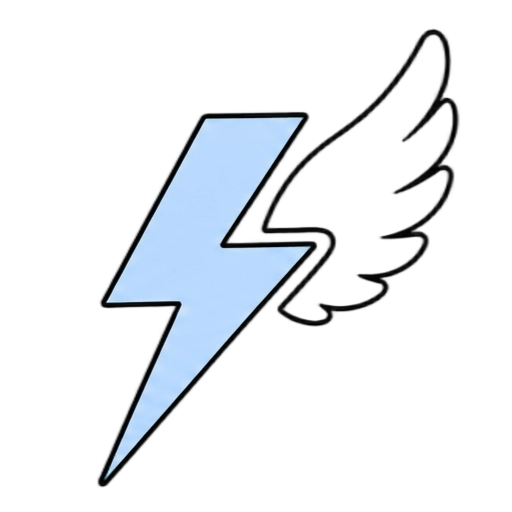
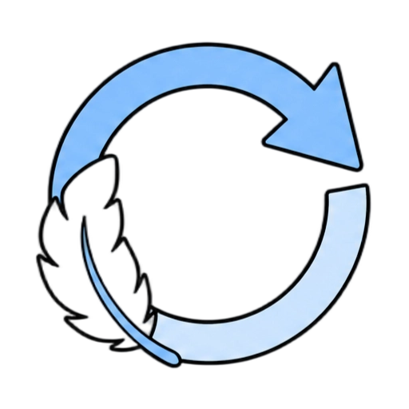
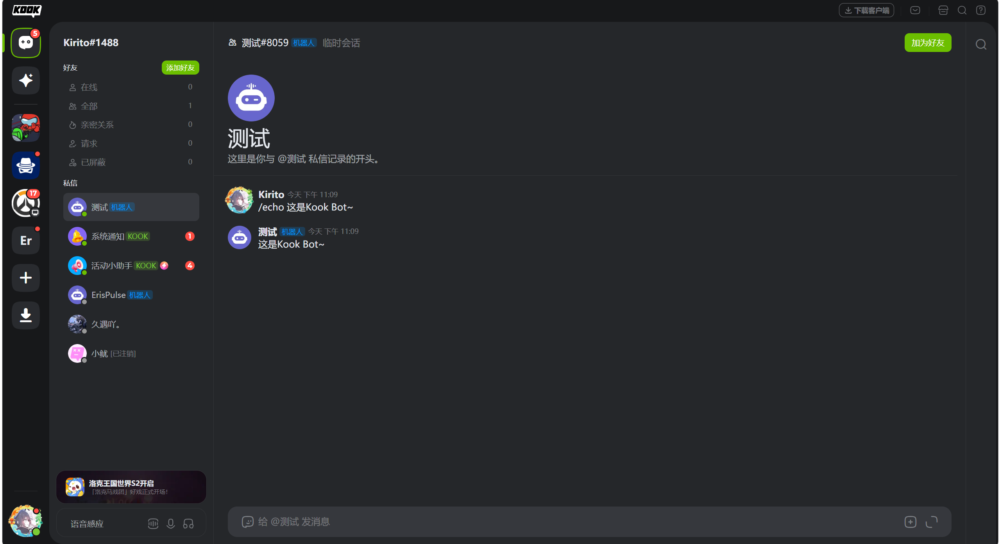
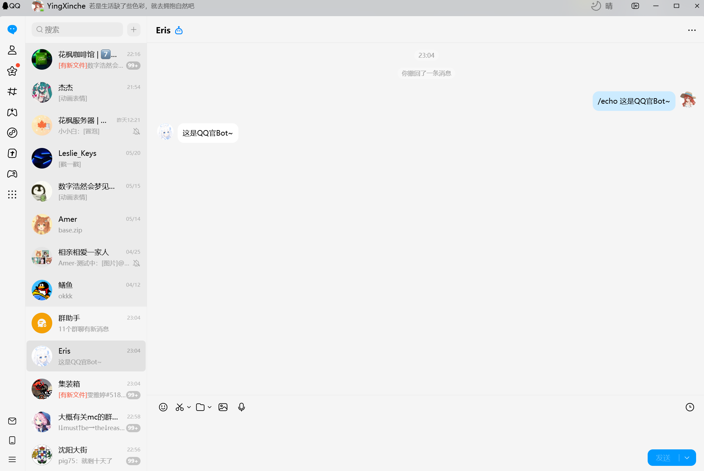
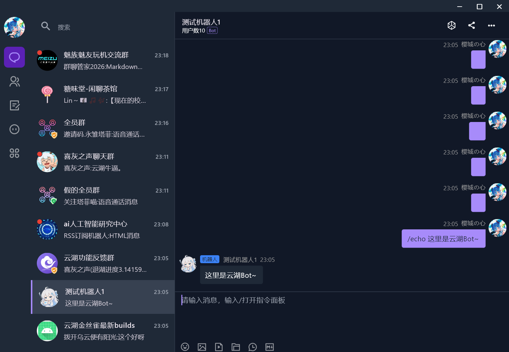
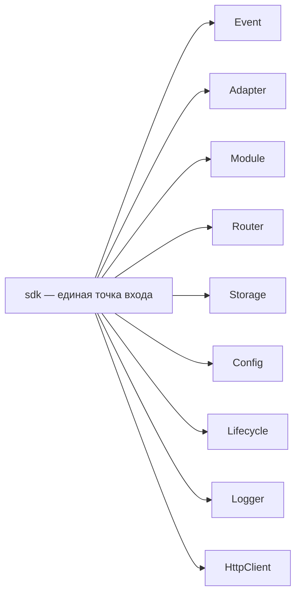

[English](README.md) | [简体中文](README.zh-CN.md) | [繁體中文](README.zh-TW.md) | [日本語](README.ja.md) | [Русский](README.ru.md)

# ErisPulse

**Пишите один раз — развертывайте на множестве платформ: QQ / Telegram / Kook / Yunhu / WeChat Official Account / OneBot12 / ...**

Событийно-ориентированный модульный асинхронный фреймворк для ботов на основе стандартного интерфейса OneBot12. Бизнес-код пишется один раз, а адаптеры скрывают различия между платформами; система плагинов, горячая перезагрузка и полный набор инструментов разработчика — всё «из коробки».

<p>
  <a href="https://pypi.org/project/ErisPulse/"></a>
  <a href="https://pypi.org/project/ErisPulse/"></a>
  <a href="https://github.com/botuniverse/onebot-11"></a>
  <a href="https://12.onebot.dev/"></a>
  <a href="https://hub.docker.com/r/erispulse/erispulse"></a>
  <a href="https://github.com/ErisPulse/ErisPulse/blob/main/LICENSE"></a>
  <a href="https://pepy.tech/project/ErisPulse"></a>
  <a href="https://github.com/ErisPulse/ErisPulse/stargazers"></a>
  <a href="https://github.com/astral-sh/ruff"></a>
  <a href="https://socket.dev/pypi/package/erispulse"></a>
  <a href="https://www.erisdev.com"></a>
  <a href="https://deepwiki.com/ErisPulse/ErisPulse"></a>
  <a href="https://www.erisdev.com/#market"></a>
  <a href="https://github.com/ErisPulse/ErisPulse/discussions"></a>
</p>

<br clear="both">

---

<div align="center">

### Ключевые особенности

</div>

<table>
<tr>
<td width="33%" align="center" valign="top">
<br/>



### Событийно-ориентированная архитектура

На основе единой модели событий OneBot12: один handler работает со всеми адаптерами

</td>
<td width="33%" align="center" valign="top">
<br/>


### Кроссплатформенность

15+ платформ, включая QQ / Telegram / Kook / Yunhu, — без единого изменения в бизнес-коде

</td>
<td width="33%" align="center" valign="top">
<br/>


### Модульный дизайн

Плагины подключаются и отключаются на ходу без перезапуска; scope управляется по платформе / боту / сессии

</td>
</tr>
<tr>
<td width="33%" align="center" valign="top">
<br/>



### Горячая перезагрузка

Сохранили — и уже работает: горячая перезагрузка лёгкая и незаметная

</td>
<td width="33%" align="center" valign="top">
<br/>


### ИИ-ассистент

Опишите требования на естественном языке — и сразу получите готовый к использованию модуль

</td>
<td width="33%" align="center" valign="top">
<br/>


### Простота и элегантность

Цепочечный API: упоминание пользователя, ответ, повторы, массовая отправка — всё одной строкой

</td>
</tr>
</table>

---

## Как это работает

ErisPulse скрывает различия платформ на уровне адаптеров, позволяя бизнес-коду заниматься только событиями:


```mermaid
graph LR
    P["15+ платформ<br/>QQ · Telegram · Kook · Yunhu · WeChat Official Account · Email · Webhook ..."]
    A["Слой адаптеров<br/>нативные протоколы → стандартные события OneBot12"]
    Event["Шина событий Event<br/>middleware → dispatch command/message/notice/request/meta"]
    M["Бизнес-модули<br/>обработчики @command / @message · ваши модули"]
    P --> A --> Event --> M
    M -.->|"event.reply() / SendDSL"| Event
```

- **Слой адаптеров** преобразует нативные протоколы платформ в стандартные события OneBot12 — бизнес-модули не видят различий между платформами
- **Шина Event** сначала выполняет цепочку middleware, затем распределяет события по типам между пятью категориями обработчиков
- **Ваш код** подписывается на события через декораторы и отвечает с помощью `event.reply()` или SendDSL — ответное сообщение идёт обратно к платформе по тому же пути

Подробности дизайна — состав модулей, процесс инициализации, события жизненного цикла и т. д. — смотрите в [обзоре архитектуры](docs/ru/architecture.md).

---

## Быстрый старт

### Скрипт установки в один клик (рекомендуется)

Скрипт установки автоматически определит ваше окружение (Docker, Python, uv), поможет выбрать наиболее подходящий способ установки и поддерживает несколько языков (китайский / английский / японский / русский / традиционный китайский).

Windows (PowerShell):
```powershell
irm https://get.erisdev.com/install.ps1 -OutFile install.ps1; powershell -ExecutionPolicy Bypass -File install.ps1
```

macOS / Linux:
```bash
curl -fsSL https://get.erisdev.com/install.sh -o install.sh && chmod +x install.sh && ./install.sh
```

<table>
<tr>
<td align="center" width="50%">

**Демонстрация установки через Docker**

<video src="https://github.com/user-attachments/assets/a367a466-4678-46a9-b101-073a86388ede" controls width="100%"></video>

</td>
<td align="center" width="50%">

**Демонстрация установки через pip**

<video src="https://github.com/user-attachments/assets/a2df4009-dba6-411e-b79d-4454a168d063" controls width="100%"></video>

</td>
</tr>
</table>

### Использование Docker (рекомендуется)

```bash
docker pull erispulse/erispulse:latest
```

<details>
<summary>Docker Hub недоступен?</summary>

Если Docker Hub недоступен, можно использовать GitHub Container Registry:

```bash
docker pull ghcr.io/erispulse/erispulse:latest
```

При использовании образа из ghcr.io необходимо изменить image в `docker-compose.yml`:
```yaml
image: ghcr.io/erispulse/erispulse:latest
```

</details>

<details>
<summary>Быстрый запуск</summary>

```bash
# Скачать docker-compose.yml
curl -O https://raw.githubusercontent.com/ErisPulse/ErisPulse/main/docker-compose.yml

# Задать токен входа в Dashboard и запустить
ERISPULSE_DASHBOARD_TOKEN=your-token docker compose up -d
```

После запуска откройте `http://<host>:8000/Dashboard` и войдите в панель управления Dashboard с помощью заданного токена.

> Образ включает фреймворк ErisPulse и панель управления Dashboard, поддерживает архитектуры `linux/amd64` и `linux/arm64`.
>
> **Персистентность**: файлы конфигурации и установленные модули/адаптеры сохраняются на хост-машину через монтирование томов и не теряются при перезапуске контейнера. Обновление самого фреймворка выполняется через горячее обновление в Dashboard.

</details>

<details>
<summary>Переменные окружения Docker</summary>

| Переменная | По умолчанию | Описание |
|------|--------|------|
| `ERISPULSE_DASHBOARD_TOKEN` | пусто | Токен входа в Dashboard (после установки автоматически записывается в конфигурацию)|
| `ERISPULSE_PORT` | `8000` | Проброс порта Dashboard |
| `ERISPULSE_TAG` | `latest` | Тег образа; можно задать `dev` для использования предрелизного образа |
| `CONTAINER_NAME` | `erispulse` | Имя контейнера |
| `TZ` | `Asia/Shanghai` | Часовой пояс контейнера |
| `LANG` | `en_US.UTF-8` | Язык системы; язык стартового интерфейса определяется автоматически |
| `ERISPULSE_LANG` | пусто | Принудительно задаёт язык стартового интерфейса: `zh` / `zh_TW` / `en` / `ja` / `ru` (переопределяет `LANG`)|

</details>

### Магазин приложений 1Panel

Установка ErisPulse в один клик через магазин приложений [1Panel](https://1panel.cn); подробности в [ErisPulse-1Panel](https://github.com/ErisPulse/ErisPulse-1Panel).

```bash
bash <(curl -sL https://get-1panel.erisdev.com/install.sh)
```

ErisPulse также добавлен в сторонний магазин приложений 1Panel — установить можно из стороннего репозитория [okxlin/appstore](https://github.com/okxlin/appstore).

### Установка через pip

```bash
pip install ErisPulse
```

Если хотите использовать `epsdk` как глобальный инструмент командной строки без виртуального окружения, рекомендуется `uv tool install`:

```bash
uv tool install ErisPulse
```

> Также можно воспользоваться скриптом установки в один клик выше — он автоматически определит окружение и проведёт вас по настройке (в меню скрипта доступен и вариант «Глобальная установка CLI (uv tool)»).

### Инициализация проекта

```bash
# Интерактивная инициализация
epsdk init

# Быстрая инициализация (с указанием имени проекта)
epsdk init -q -n my_bot
```

### Создание первого бота

Создайте файл `main.py`:

<table>
<tr>
<td width="50%" valign="top">

**Обработчики команд**

```python
from ErisPulse import sdk
from ErisPulse.Core.Event import command

@command("hello", help="Отправляет приветственное сообщение")
async def hello_handler(event):
    user_name = event.get_user_nickname() or "друг"
    await event.reply(f"Привет, {user_name}!")

@command("ping", help="Проверяет, в сети ли бот")
async def ping_handler(event):
    await event.reply("Pong! Бот работает нормально.")

if __name__ == "__main__":
    import asyncio
    asyncio.run(sdk.run(keep_running=True))
```

</td>
<td width="50%" valign="top">

**Результат**

Отправьте `/hello`

Бот отвечает: `Привет, {имя пользователя}!`

---

Отправьте `/ping`

Бот отвечает: `Pong! Бот работает нормально.`

---

**Запуск**

```bash
epsdk run main.py
# или режим разработки
epsdk run main.py --reload
```

</td>
</tr>
</table>

Подробнее смотрите:
- [Руководство по быстрому старту](docs/ru/quick-start.md)
- [Руководство для начинающих](docs/ru/getting-started/)

---

## Один и тот же код. Множество платформ.

*Абсолютно одинаковые обработчики команд. Разные платформы. Без изменения какой-либо бизнес-логики.*

<table>
<tr>
<td align="center" width="33%">

**Kook**



</td>
<td align="center" width="33%">

**QQ**



</td>
<td align="center" width="33%">

**Yunhu**



</td>
</tr>
</table>

---

## Цепочечный DSL отправки

Упоминание пользователя, ответ, повторы, таймаут, колбэк успешной отправки — сложная логика отправки записывается одной цепочкой:

```python
yunhu = sdk.adapter.get("yunhu")

# Одиночная отправка: @пользователь + ответ + повторы + колбэк успеха
await (yunhu.Send.To("group", "123").At("456").Reply("msg_789")
       .Retry(3).Timeout(10)
       .Hook(lambda r: print("Отправлено успешно!")).Text("Привет"))

# Массовая отправка: несколько сообщений одной цепочкой
results = await (yunhu.Send.To("user", "123").Build()
                 .Text("Уведомление 1").Image("pic.jpg").Retry(2).send_all())
```

> Все цепочечные методы — Hook / Retry / Timeout / OnProgress / Defer / Build и другие — описаны в [документации SendDSL](docs/ru/developer-guide/adapters/send-dsl.md).

---

## Пример многошагового диалога

Сбор информации, валидация ввода, подтверждение отправки — без ручного управления состоянием диалога:

```python
from ErisPulse.Core.Event import command

@command("register")
async def register_handler(event):
    conv = event.conversation(timeout=60)
    await conv.say("Добро пожаловать! Начинаем регистрацию.")
    data = await conv.collect([
        {"key": "name", "prompt": "Введите имя"},
        {"key": "age", "prompt": "Введите возраст",
         "validator": lambda e: e.get_text().strip().isdigit(),
         "retry_prompt": "Возраст должен быть числом, введите ещё раз"},
    ])
    if data and await conv.confirm(f"Подтвердить регистрацию? Имя: {data['name']}, возраст: {data['age']}"):
        await event.reply(f"Регистрация успешна! Добро пожаловать, {data['name']}")
```

> Полные возможности — вопросы с вариантами (choose), ветвления и переходы (branch / goto), персистентность и др. — в [документации Conversation (многошаговые диалоги)](docs/ru/advanced/conversation.md).

---

## Основные модули

Единая точка входа `sdk` связывает воедино все ключевые возможности:


```mermaid
graph LR
    SDK["sdk — единая точка входа"] --> Event & Adapter & Module & Router & Storage
    SDK --> Config & Lifecycle & Logger & HttpClient
```

| Модуль | Описание |
|------|------|
| **Event** | Система событий: пять типов событий command / message / notice / request / meta + Conversation для многошаговых диалогов |
| **Adapter** | Управление адаптерами: базовый класс BaseAdapter унифицирует преобразование событий и отправку через SendDSL; поддержка 15+ платформ, включая QQ / Telegram / Kook / Yunhu / WeChat Official Account |
| **Module** | Управление модулями: базовый класс BaseModule + декларация зависимостей и загрузка в топологическом порядке |
| **SendDSL** | Цепочечная отправка: упоминание / ответ / повторы / таймаут / массовая отправка и другая сложная логика — одной строкой |
| **Router** | Система маршрутизации HTTP/WebSocket (FastAPI + Uvicorn)|
| **Storage** | Хранилище «ключ–значение» на базе SQLite + универсальные цепочечные SQL-запросы |
| **Config** | Управление конфигурацией TOML |
| **Lifecycle** | Хуки событий жизненного цикла (core.init / adapter.* / module.*)|
| **Logger** | Модульная система логирования с поддержкой дочерних логгеров |
| **HttpClient** | Унифицированный HTTP/WS-клиент (на базе aiohttp) со встроенными повторами и системой исключений ErisPulse |

Подробнее о дизайне (процесс инициализации, события жизненного цикла, стратегия загрузки модулей) — см. [обзор архитектуры](docs/ru/architecture.md).

---

## Scope (области действия) — трёхмерная плоскость контроля доступа

Не меняя ни строчки кода модулей, декларируйте в конфигурации, «что действует и в каких пределах»:

```toml
[ErisPulse.scope.platforms.onebot11]
modules = ["Chat", "Tool*"]           # ① Измерение модулей: на данной платформе открыты только эти модули (glob / regex)

[ErisPulse.scope.identity.users.onebot11]
deny = ["u_bad", "spam_*"]            # ② Измерение идентичности: события пользователей из чёрного списка отбрасываются сразу

[ErisPulse.scope.actions.MyModule]
send = { allow = ["Text"] }           # ③ Измерение исходящих действий: этому модулю разрешена только отправка текста
api = { deny = ["set_*", "leave_*"] } #    и запрещены административные API
```

```python
# Можно настраивать и во время выполнения — изменения применяются сразу (словарный доступ с точечными путями)
sdk.scope.set_action("MyModule", "api", deny=["set_*"])
```

> Подробнее в [Scope (области действия)](docs/ru/advanced/scope.md)

---

## Переопределение событий — меняйте поведение любого типа событий, не трогая код модулей

Смените триггерную фразу или добавьте команде ограничение для администраторов — исходный код модуля остаётся нетронутым, достаточно конфигурации:

```toml
# Переопределение условий срабатывания обработчиков сообщений (объединяется с условиями в коде через AND; поддерживаются все типы: meta/message/notice/request/command)
[ErisPulse.event.overrides.message.ChatModule]
pattern = "болталка*"

# Переопределение параметров команд (master / hidden / aliases / prefix и др.; значения пользователя имеют приоритет)
[ErisPulse.event.overrides.command.MyModule.restart]
master = true
```

> Подробнее в [Переопределении событий](docs/ru/getting-started/event-handling.md)

---

## Экосистема

ErisPulse — это не просто фреймворк. Установили — и уже можно начинать, изобретать велосипеды с нуля не нужно.

<table>
<tr>
<td align="center" width="25%">

**Фреймворк**

Базовый runtime

Единые модели событий и сообщений

</td>
<td align="center" width="25%">

**Dashboard**

Визуальное управление

Плагины · Логи · Конфигурация

[Онлайн-демо →](https://dashdemo.erisdev.com/)

</td>
<td align="center" width="25%">

**AI Builder**

Естественный язык → готовый модуль

[Попробовать сейчас →](https://builder.erisdev.com)

</td>
<td align="center" width="25%">

**Маркет модулей**

Плагины, работающие сразу после установки

[Просмотреть модули →](https://www.erisdev.com/#market)

</td>
</tr>
<tr>
<td align="center" width="25%">

**Адаптеры**

Поддержка 15+ платформ

</td>
<td align="center" width="25%">

**ErisPulse-App**

Официальный мультиплатформенный клиент

Работа прямо на телефоне · постоянное присутствие в трее на десктопе

[Скачать и установить →](https://github.com/ErisPulse/ErisPulse-App/releases)

</td>
<td align="center" width="25%">

**Docker**

Мультиархитектурная поддержка

`erispulse/erispulse`

</td>
<td align="center" width="25%">

**Документация и CLI**

[erisdev.com](https://www.erisdev.com)

Инструмент скаффолдинга `epsdk`

</td>
</tr>
</table>

---

## Поддерживаемые платформы

Будем рады вашему вкладу в адаптеры! Не знаете, с чего начать? Читайте [руководство по контрибуции](docs/ru/contributing/README.md).

| Адаптер | Описание |
|--------|------|
|  [Kook](https://github.com/shanfishapp/ErisPulse-KookAdapter) | Мессенджер Kook (KaiHeiLa) |
|  [Matrix](https://github.com/ErisPulse/ErisPulse-MatrixAdapter) | Децентрализованный протокол связи Matrix |
|  [OneBot11](https://github.com/ErisPulse/ErisPulse-OneBot11Adapter) | Универсальный протокол ботов OneBot v11 |
|  [OneBot12](https://github.com/ErisPulse/ErisPulse-OneBot12Adapter) | Стандартный протокол OneBot v12 |
|  [QQ](https://github.com/ErisPulse/ErisPulse-QQBotAdapter) | Официальная платформа ботов QQ |
|  [Песочница](https://github.com/ErisPulse/ErisPulse-SandboxAdapter) | Отладка в браузере без подключения к реальной платформе |
|  [Терминал](https://github.com/ErisPulse/ErisPulse-TerminalAdapter) | Командная строка как чат — разработка и отладка без настройки |
|  [Telegram](https://github.com/ErisPulse/ErisPulse-TelegramAdapter) | Глобальная платформа мгновенных сообщений |
|  [Email](https://github.com/ErisPulse/ErisPulse-EmailAdapter) | Адаптер приёма и отправки электронной почты |
|  [Yunhu](https://github.com/ErisPulse/ErisPulse-YunhuAdapter) | Корпоративная платформа мгновенных сообщений (подключение ботов) |
|  [Yunhu (пользовательский)](https://github.com/wsu2059q/ErisPulse-YunhuUserAdapter) | Адаптер подключения на основе пользовательского протокола Yunhu |
| [花枫咖啡馆](https://github.com/ErisPulse/ErisPulse-Ideaura/) | Allons! \(・ω・) / |
|  [Discord](https://github.com/ErisPulse/ErisPulse-DiscordAdapter) | Глобальная платформа для сообществ с поддержкой серверов, каналов и личных сообщений |
|  [Webhook](https://github.com/ErisPulse/ErisPulse-WebhookAdapter) | Универсальный HTTP-адаптер-мост для интеграции с любыми системами |
|  [WeChat Official Account](https://github.com/ErisPulse/ErisPulse-WechatMpAdapter) | Официальная платформа публичных аккаунтов WeChat |

Смотрите [подробное описание адаптеров](docs/ru/platform-guide/README.md)

---

## Сообщество

Свяжитесь с нами:

- Telegram: <https://t.me/ErisPulse>
- QQ-группа: <https://qm.qq.com/q/TOwnCmypcy>
- Группа Yunhu: <https://yhfx.jwznb.com/share?key=VWJL4fTWXepa&ts=1781889199>

Проект оказался полезным? Поддержите нашу дальнейшую разработку на [Afdian](https://ifdian.net/a/YingXinche)!

---

## Star History

Если ErisPulse был вам полезен, поставьте Star ⭐ — это самый прямой способ помочь проекту увидеть большее число разработчиков.

[](https://star-history.com/#ErisPulse/ErisPulse&Date)

---

### Руководство по контрибуции

Здоровье проекта ErisPulse зависит и от вас! Мы приветствуем любые формы вклада:

1. **Сообщения об ошибках** — создавайте отчёты о багах в [GitHub Issues](https://github.com/ErisPulse/ErisPulse/issues)
2. **Запросы функций** — предлагайте новые идеи через [обсуждения сообщества](https://github.com/ErisPulse/ErisPulse/discussions)
3. **Вклад в код** — перед отправкой PR прочитайте [стиль кода](docs/ru/styleguide/) и [руководство по контрибуции](CONTRIBUTING.md)
4. **Улучшение документации** — помогайте развивать документацию и примеры кода

**Первый вклад?** Начните отсюда 👉 [Первый вклад на практике](docs/ru/contributing/first-contribution.md)

[Присоединяйтесь к обсуждениям сообщества](https://github.com/ErisPulse/ErisPulse/discussions)

---

<div align="center">

### Благодарности


Часть кода этого проекта основана на [sdkFrame](https://github.com/runoneall/sdkFrame); слой стандартизации ключевых адаптеров опирается на [спецификацию OneBot12](https://12.onebot.dev/) и обязан ей многим.

Раннее развитие и рост ErisPulse были бы невозможны без поддержки сообщества разработчиков Yunhu — многие идеи, адаптеры и практические наработки родились именно там.

Также благодарим всех разработчиков и авторов проектов, внёсших вклад в ErisPulse, экосистему OneBot и open source-сообщество.

</div>