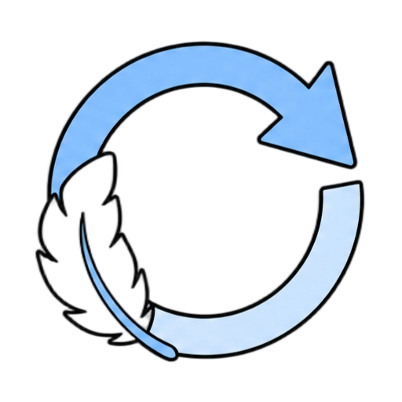
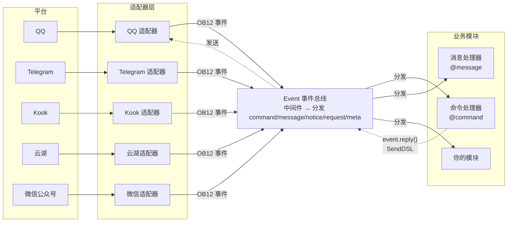
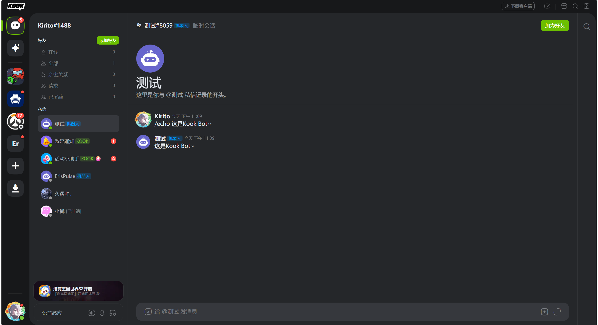
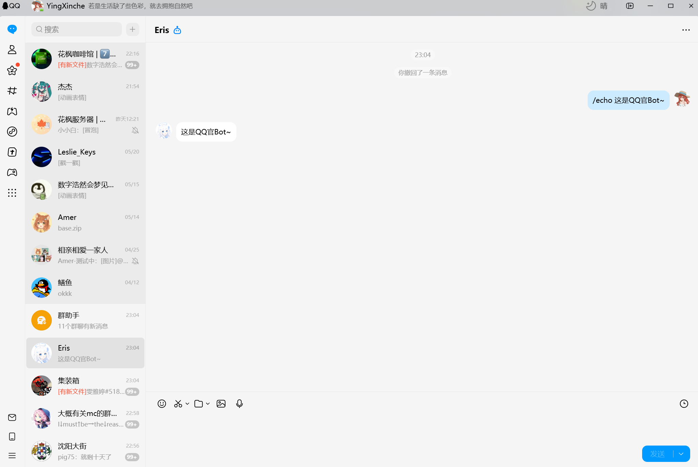
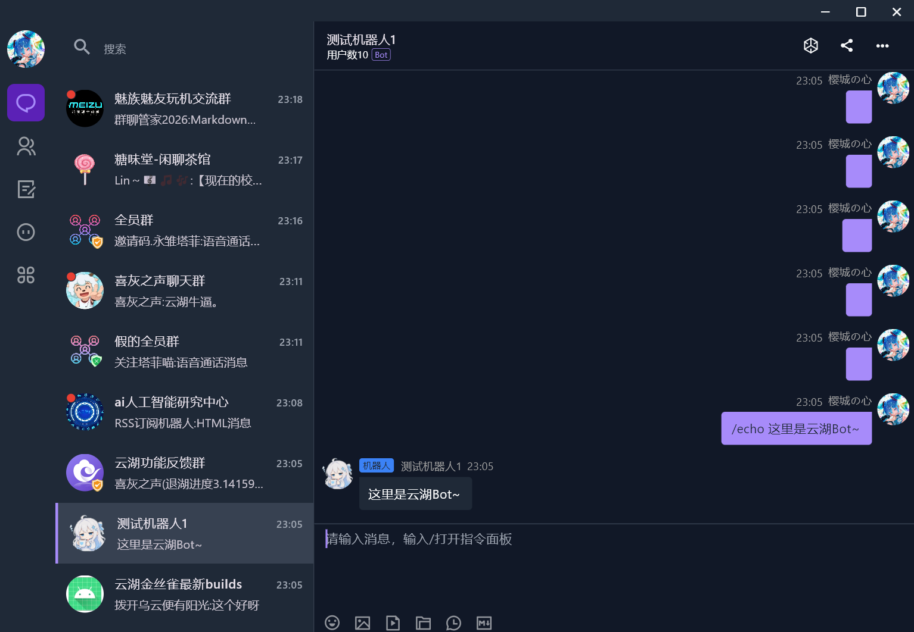
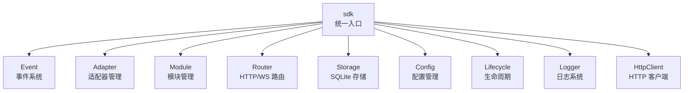

[English](README.md) | **简体中文** | [繁體中文](README.zh-TW.md) | [日本語](README.ja.md) | [Русский](README.ru.md)

# ErisPulse

**一次编写，部署到 QQ / Telegram / Kook / Yunhu / 微信公众号 / OneBot12 / ... 多个平台。**

事件驱动的多平台聊天机器人开发框架。

基于 OneBot12 标准接口，一次编写多平台部署；灵活的插件系统、热重载支持和完整的开发者工具链，适用于从简单聊天机器人到复杂自动化系统的各种场景。

<p>
  <a href="https://pypi.org/project/ErisPulse/"></a>
  <a href="https://pypi.org/project/ErisPulse/"></a>
  <a href="https://hub.docker.com/r/erispulse/erispulse"></a>
  <a href="https://github.com/ErisPulse/ErisPulse/blob/main/LICENSE"></a>
  <a href="https://github.com/ErisPulse/ErisPulse"></a>
  <a href="https://pepy.tech/project/ErisPulse"></a>
  <a href="https://github.com/astral-sh/ruff"></a>
  <a href="https://socket.dev/pypi/package/erispulse"></a>
  <a href="https://www.erisdev.com"></a>
  <a href="https://deepwiki.com/ErisPulse/ErisPulse"></a>
  <a href="https://www.erisdev.com/#market"></a>
  <a href="https://github.com/ErisPulse/ErisPulse/discussions"></a>
</p>

<br clear="both">

---

<div align="center">

### 核心特性

</div>

<table>
<tr>
<td width="33%" align="center" valign="top">
<br/>


### 事件驱动架构

基于 OneBot12 标准的统一事件模型——不再为每个平台写一套 if/elif 判断消息类型，一份 handler 自动适配所有适配器

</td>
<td width="33%" align="center" valign="top">
<br/>


### 跨平台兼容

同一份业务代码在所有平台运行——一次编写即可服务 QQ / Telegram / Kook / Yunhu / 微信公众号 等 15+ 平台，无需重复开发

</td>
<td width="33%" align="center" valign="top">
<br/>


### 模块化设计

灵活的插件系统支持运行时热插拔——安装/卸载/启用/禁用模块无需重启进程，像搭积木一样组装机器人能力

</td>
</tr>
<tr>
<td width="33%" align="center" valign="top">
<br/>



### 热重载

开发循环从重启 10 秒缩短到 0.5 秒——保存文件即生效，开发调试体验接近解释型脚本语言

</td>
<td width="33%" align="center" valign="top">
<br/>


### AI 辅助

自然语言描述需求直接生成可用模块——不会写适配器？告诉 AI 你要接入什么平台，它帮你写

</td>
<td width="33%" align="center" valign="top">
<br/>


### 简洁优雅

直觉化的链式 API 设计——@用户、回复、重试、批量发送等复杂逻辑一行代码完成，代码如羽毛般轻盈可读

</td>
</tr>
</table>

---

## 工作原理

ErisPulse 通过适配器层屏蔽平台差异，让业务代码只关心事件本身：



- **适配器层**将各平台原生协议转换为 OneBot12 标准事件，业务模块看不到平台差异
- **Event 总线**先执行中间件链，再按事件类型分发到五类处理器
- **你的代码**通过装饰器订阅事件，用 `event.reply()` 或 SendDSL 回复——回复消息沿同一条路径逆流回平台

完整的模块组成、初始化流程、生命周期事件等设计详情，见[架构概览](docs/zh-CN/architecture.md)。

---

## 快速开始

### 一键安装脚本（推荐）

安装脚本会自动检测您的环境（Docker、Python、uv），引导选择最适合的安装方式，支持多语言（中文/English/日本語/Русский/繁體中文）。

Windows (PowerShell):
```powershell
irm https://get.erisdev.com/install.ps1 -OutFile install.ps1; powershell -ExecutionPolicy Bypass -File install.ps1
```

macOS / Linux:
```bash
curl -fsSL https://get.erisdev.com/install.sh -o install.sh && chmod +x install.sh && ./install.sh
```

<table>
<tr>
<td align="center" width="50%">

**Docker 安装演示**

<video src="https://github.com/user-attachments/assets/a367a466-4678-46a9-b101-073a86388ede" controls width="100%"></video>

</td>
<td align="center" width="50%">

**pip 安装演示**

<video src="https://github.com/user-attachments/assets/a2df4009-dba6-411e-b79d-4454a168d063" controls width="100%"></video>

</td>
</tr>
</table>

### 使用 Docker (推荐)

```bash
docker pull erispulse/erispulse:latest
```

<details>
<summary>Docker Hub不可用？</summary>

如果 Docker Hub 无法访问，可以使用 GitHub Container Registry：

```bash
docker pull ghcr.io/erispulse/erispulse:latest
```

使用 ghcr.io 镜像时，需要修改 `docker-compose.yml` 中的 image：
```yaml
image: ghcr.io/erispulse/erispulse:latest
```

</details>

<details>
<summary>快速启动</summary>

```bash
# 下载 docker-compose.yml
curl -O https://raw.githubusercontent.com/ErisPulse/ErisPulse/main/docker-compose.yml

# 设置 Dashboard 登录令牌并启动
ERISPULSE_DASHBOARD_TOKEN=your-token docker compose up -d
```

启动后访问 `http://<host>:8000/Dashboard`，使用设置的令牌登录 Dashboard 管理面板。

> 镜像内置 ErisPulse 框架和 Dashboard 管理面板，支持 `linux/amd64` 和 `linux/arm64` 架构。
>
> **持久化**：配置文件和已安装的模块/适配器通过卷挂载持久化到宿主机，容器重启后不会丢失。框架自身的更新通过 Dashboard 热更新完成。

</details>

<details>

</details>

<details>
<summary>Docker 环境变量</summary>

| 变量 | 默认值 | 说明 |
|------|--------|------|
| `ERISPULSE_DASHBOARD_TOKEN` | 空 | Dashboard 登录令牌（设置后自动写入配置）|
| `ERISPULSE_PORT` | `8000` | Dashboard 端口映射 |
| `ERISPULSE_TAG` | `latest` | 镜像 tag，可设为 `dev` 使用预发布镜像 |
| `ERISPULSE_BUILD_TARGET` | `production` | 构建目标：`production`（稳定版）或 `dev`（预发布版）|
| `CONTAINER_NAME` | `erispulse` | 容器名称 |
| `TZ` | `Asia/Shanghai` | 容器时区 |
| `LANG` | `en_US.UTF-8` | 系统语言，自动检测启动界面语言 |
| `ERISPULSE_LANG` | 空 | 强制启动界面语言：`zh` / `zh_TW` / `en` / `ja` / `ru`（覆盖 `LANG`）|

</details>

### 1Panel 应用商店

通过 [1Panel](https://1panel.cn) 应用商店一键安装 ErisPulse，详见 [ErisPulse-1Panel](https://github.com/ErisPulse/ErisPulse-1Panel)。

```bash
bash <(curl -sL https://get-1panel.erisdev.com/install.sh)
```

ErisPulse 已上架 1Panel 第三方应用商店，可使用 [okxlin/appstore](https://github.com/okxlin/appstore) 第三方仓库安装。

### 使用 pip 安装

```bash
pip install ErisPulse
```

> 也可以使用上方的一键安装脚本，自动检测环境并引导配置。

### 初始化项目

```bash
# 交互式初始化
epsdk init

# 快速初始化（指定项目名称）
epsdk init -q -n my_bot
```

### 创建第一个机器人

创建 `main.py` 文件：

<table>
<tr>
<td width="50%" valign="top">

**命令处理器**

```python
from ErisPulse import sdk
from ErisPulse.Core.Event import command

@command("hello", help="发送问候消息")
async def hello_handler(event):
    user_name = event.get_user_nickname() or "朋友"
    await event.reply(f"你好，{user_name}！")

@command("ping", help="测试机器人是否在线")
async def ping_handler(event):
    await event.reply("Pong！机器人运行正常。")

if __name__ == "__main__":
    import asyncio
    asyncio.run(sdk.run(keep_running=True))
```

</td>
<td width="50%" valign="top">

**效果说明**

发送 `/hello`

机器人回复：`你好，{用户名}！`

---

发送 `/ping`

机器人回复：`Pong！机器人运行正常。`

---

**运行方式**

```bash
epsdk run main.py
# 或开发模式
epsdk run main.py --reload
```

</td>
</tr>
</table>

更多详细说明请参阅：
- [快速开始指南](docs/zh-CN/quick-start.md)
- [入门指南](docs/zh-CN/getting-started/)

---

## 同一份代码。多个平台。

*完全相同的命令处理器。不同的平台。无需修改任何业务逻辑。*

<table>
<tr>
<td align="center" width="33%">

**Kook**



</td>
<td align="center" width="33%">

**QQ**



</td>
<td align="center" width="33%">

**云湖**



</td>
</tr>
</table>

---

## 链式发送 DSL

一条链式调用完成 @、回复、重试、超时、回调等全部发送逻辑：

```python
yunhu = sdk.adapter.get("yunhu")

# 单发：@用户 + 回复 + 重试 + 成功回调
await (yunhu.Send.To("group", "123")
       .At("456").Reply("msg_789")
       .Retry(3).Timeout(10)
       .Hook(lambda r: print("发送成功！"))
       .Text("你好"))

# 批量发送：一条链发多条消息
results = await (yunhu.Send.To("user", "123")
                .Build()
                .Text("通知一")
                .Image("pic.jpg")
                .Retry(2)
                .send_all())
```

> 支持 Hook（成功回调）、Retry（失败重试）、Timeout（超时取消）、OnProgress（进度监控）、Defer（延迟发送）、Build（批量构建）等链式方法，详见 [SendDSL 文档](docs/zh-CN/developer-guide/adapters/send-dsl.md)。

---

## 多轮对话示例

ErisPulse 内置了强大的多轮对话引擎，轻松实现引导式操作、信息收集等交互场景：

```python
from ErisPulse.Core.Event import command, request

@command("register")
async def register_handler(event):
    conv = event.conversation(timeout=60)
    
    await conv.say("欢迎注册！")
    
    # 多步骤收集用户信息，自动验证
    data = await conv.collect([
        {"key": "name", "prompt": "请输入姓名"},
        {"key": "age", "prompt": "请输入年龄",
         "validator": lambda e: e.get_text().strip().isdigit(),
         "retry_prompt": "年龄必须是数字，请重新输入"},
    ])
    
    if data and await conv.confirm(f"确认注册？姓名: {data['name']}, 年龄: {data['age']}"):
        # 通过 SendDSL 主动推送通知
        await sdk.adapter.get(event.get_platform()).Send.To(
            "user", event.get_user_id()
        ).Text(f"注册成功！欢迎 {data['name']}")
        # 或 await event.reply("注册成功！")

# 自动处理好友请求
@request.on_friend_request()
async def handle_friend_request(event):
    user_name = event.get_user_nickname() or event.get_user_id()
    
    # 同意请求
    result = await event.approve()
    if result.get("status") == "ok":
        await event.reply(f"已自动通过好友请求，欢迎 {user_name}")
```

<details>
<summary>查看更多 Conversation API（分支跳转 / 选择 / 持久化）</summary>

```python
@command("quiz")
async def quiz_handler(event):
    conv = event.conversation(timeout=30)
    
    # 选项式问答
    answer = await conv.choose("Python 的创造者是谁？", [
        "Guido van Rossum",
        "James Gosling", 
        "Dennis Ritchie",
    ])
    
    if answer == 0:
        await conv.say("正确！")
    elif answer is None:
        await conv.say("超时了，下次再来吧！")
    else:
        await conv.say("错误了，正确答案是 Guido van Rossum")

@command("menu")
async def menu_handler(event):
    conv = event.conversation(timeout=60)
    
    # 分支跳转，构建复杂交互流程
    @conv.branch("main")
    async def main_menu():
        await conv.say("=== 主菜单 ===\n1. 个人信息\n2. 设置\n3. 退出")
        resp = await conv.wait()
        if resp and resp.get_text().strip() == "1":
            await conv.goto("profile")
    
    @conv.branch("profile")
    async def profile():
        await conv.say("姓名: Alice\n0. 返回")
        resp = await conv.wait()
        if resp and resp.get_text().strip() == "0":
            await conv.goto("main")
    
    await conv.start()
```

详见 [Conversation 多轮对话](docs/zh-CN/advanced/conversation.md)

</details>

---

## 核心模块

ErisPulse 提供完整的多平台机器人开发工具链，核心模块各司其职：



| 模块 | 说明 |
|------|------|
| **Event** | 事件系统，提供 command / message / notice / request / meta 五类事件 + Conversation 多轮对话 |
| **Adapter** | 适配器管理，BaseAdapter 基类统一事件转换与 SendDSL 发送，支持 QQ / Telegram / Kook / 云湖 / 微信公众号 等 15+ 平台 |
| **Module** | 模块管理，BaseModule 基类 + 依赖声明与拓扑排序加载 |
| **SendDSL** | 链式发送，@/回复/重试/超时/批量等复杂逻辑一行完成 |
| **Router** | HTTP/WebSocket 路由系统（FastAPI + Uvicorn）|
| **Storage** | 基于 SQLite 的键值存储 + 通用 SQL 链式查询 |
| **Config** | TOML 配置管理 |
| **Lifecycle** | 生命周期事件钩子（core.init / adapter.* / module.*）|
| **Logger** | 模块化日志系统，支持子日志器 |
| **HttpClient** | 统一 HTTP/WS 客户端（基于 aiohttp），内置重试与 ErisPulse 异常体系 |

更多设计详情（初始化流程、生命周期事件、模块加载策略），见[架构概览](docs/zh-CN/architecture.md)。

---

## 生态

ErisPulse 不仅仅是框架。装上就能开始，不需要从零造轮子。

<table>
<tr>
<td align="center" width="25%">

**框架**

核心运行时

统一事件 & 消息模型

</td>
<td align="center" width="25%">

**Dashboard**

可视化管理

插件 · 日志 · 配置

[在线演示 →](https://dashdemo.erisdev.com/)

</td>
<td align="center" width="25%">

**AI Builder**

自然语言 → 可用模块

[立即体验 →](https://builder.erisdev.com)

</td>
<td align="center" width="25%">

**模块市场**

即装即用的插件

[浏览模块 →](https://www.erisdev.com/#market)

</td>
</tr>
<tr>
<td align="center" width="25%">

**适配器**

15+ 平台接入

</td>
<td align="center" width="25%">

**ErisPulse-App**

官方多端客户端

手机直接运行 · 桌面托盘常驻

[下载安装 →](https://github.com/ErisPulse/ErisPulse-App/releases)

</td>
<td align="center" width="25%">

**Docker**

多架构支持

`erispulse/erispulse`

</td>
<td align="center" width="25%">

**文档 & CLI**

[erisdev.com](https://www.erisdev.com)

`epsdk` 脚手架工具

</td>
</tr>
</table>

---

## 支持的平台

欢迎您贡献适配器！不知道从哪入手？看 [贡献指南](docs/zh-CN/contributing/README.md)。

| 适配器 | 说明 |
|--------|------|
|  [Kook](https://github.com/shanfishapp/ErisPulse-KookAdapter) | Kook（开黑啦）即时通讯平台 |
|  [Matrix](https://github.com/ErisPulse/ErisPulse-MatrixAdapter) | Matrix 去中心化通讯协议 |
|  [OneBot11](https://github.com/ErisPulse/ErisPulse-OneBot11Adapter) | OneBot v11 通用机器人协议 |
|  [OneBot12](https://github.com/ErisPulse/ErisPulse-OneBot12Adapter) | OneBot v12 标准协议 |
|  [QQ](https://github.com/ErisPulse/ErisPulse-QQBotAdapter) | QQ 官方机器人平台 |
|  [沙箱](https://github.com/ErisPulse/ErisPulse-SandboxAdapter) | 网页端调试，无需接入真实平台 |
|  [终端](https://github.com/ErisPulse/ErisPulse-TerminalAdapter) | 命令行即聊天，零配置开发调试 |
|  [Telegram](https://github.com/ErisPulse/ErisPulse-TelegramAdapter) | 全球性即时通讯平台 |
|  [邮件](https://github.com/ErisPulse/ErisPulse-EmailAdapter) | 邮件协议收发适配器 |
|  [云湖](https://github.com/ErisPulse/ErisPulse-YunhuAdapter) | 企业级即时通讯平台（机器人接入） |
|  [云湖用户](https://github.com/wsu2059q/ErisPulse-YunhuUserAdapter) | 基于云湖用户协议的接入适配器 |
| [花枫咖啡馆](https://github.com/ErisPulse/ErisPulse-Ideaura/) | Allons! \(・ω・) / |
|  [Discord](https://github.com/ErisPulse/ErisPulse-DiscordAdapter) | 全球性社区通讯平台，支持服务器、频道、私信 |
|  [Webhook](https://github.com/ErisPulse/ErisPulse-WebhookAdapter) | 通用 HTTP 桥接适配器，对接任意系统 |
|  [微信公众号](https://github.com/ErisPulse/ErisPulse-WechatMpAdapter) | 微信官方公众号平台 |

查看 [适配器详情介绍](docs/zh-CN/platform-guide/README.md)

---

## 社区

与我们交流：

- Telegram：<https://t.me/ErisPulse>
- QQ 群：<https://qm.qq.com/q/TOwnCmypcy>
- 云湖群：<https://yhfx.jwznb.com/share?key=VWJL4fTWXepa&ts=1781889199>

---

### 贡献指南

ErisPulse 项目的健全性还需要您的一份力！我们欢迎各种形式的贡献：

1. **报告问题** — 在 [GitHub Issues](https://github.com/ErisPulse/ErisPulse/issues) 提交 bug 报告
2. **功能请求** — 通过 [社区讨论](https://github.com/ErisPulse/ErisPulse/discussions) 提出新想法
3. **代码贡献** — 提交 PR 前请阅读 [代码风格](docs/zh-CN/styleguide/) 及 [贡献指南](CONTRIBUTING.md)
4. **文档改进** — 帮助完善文档和示例代码

**第一次贡献？** 从这里开始 👉 [首次贡献实战](docs/zh-CN/contributing/first-contribution.md)

[加入社区讨论](https://github.com/ErisPulse/ErisPulse/discussions)

---

<div align="center">

### 致谢


本项目部分代码基于 [sdkFrame](https://github.com/runoneall/sdkFrame)。

核心适配器标准化层参考并受益于 [OneBot12 规范](https://12.onebot.dev/)。

特别感谢云湖生态与社区。

ErisPulse 的早期探索与成长离不开云湖开发者社区的支持，
许多想法、适配器和实践经验都诞生于此。

同时感谢所有为 ErisPulse、OneBot 生态以及开源社区做出贡献的开发者与项目作者。

</div>
