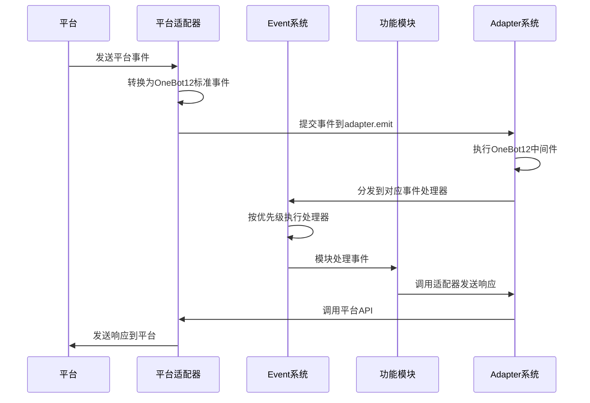
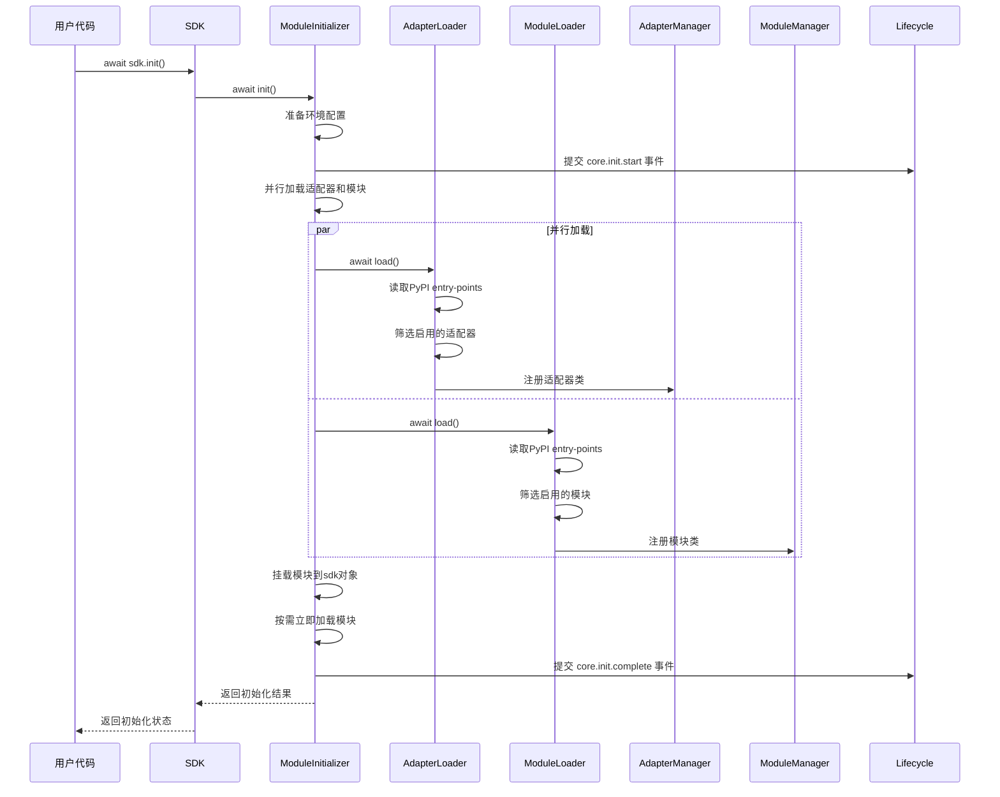
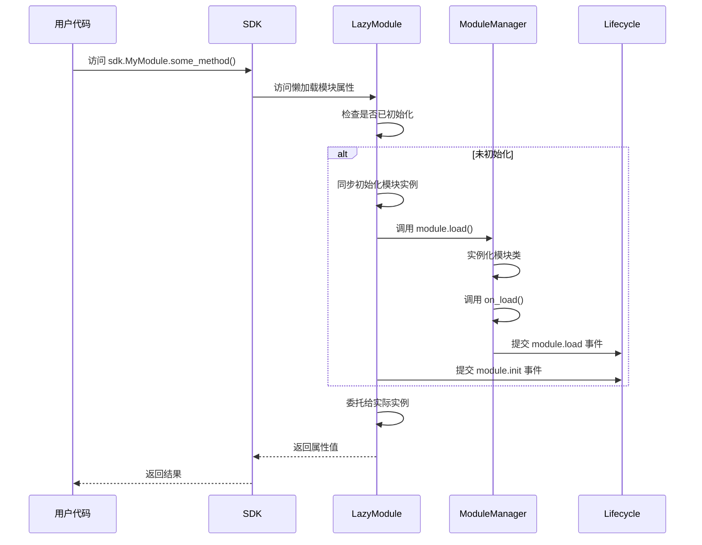

# ErisPulse 适配器开发文档

**生成时间**: 2026-02-11 14:48:33

本文件由多个开发文档合并而成，用于辅助开发者理解 ErisPulse 的相关功能。

## 目录

1. [文档总览](#READMEmd)
2. [快速开始指南](#quick-startmd)
3. [核心概念](#conceptsmd)
4. [核心模块](#modulesmd)
5. [适配器系统](#adaptersmd)
6. [事件系统](#event-systemmd)
7. [生命周期系统](#lifecyclemd)
8. [最佳实践](#best-practicesmd)
9. [开发者指南列表](#READMEmd)
10. [适配器开发指南](#adaptermd)
11. [标准规范总览](#READMEmd)
12. [事件转换标准](#event-conversionmd)
13. [API响应标准](#api-responsemd)
14. [平台特性总览](#READMEmd)
15. [云湖平台特性](#yunhumd)
16. [Telegram平台特性](#telegrammd)
17. [OneBot11平台特性](#onebot11md)
18. [邮件平台特性](#emailmd)

## 各文件对应内容说明

| 文件名 | 作用 |
|--------|------|
| [README.md](#READMEmd) | 文档总览 |
| [quick-start.md](#quick-startmd) | 快速开始指南 |
| [concepts.md](#conceptsmd) | 核心概念 |
| [modules.md](#modulesmd) | 核心模块 |
| [adapters.md](#adaptersmd) | 适配器系统 |
| [event-system.md](#event-systemmd) | 事件系统 |
| [lifecycle.md](#lifecyclemd) | 生命周期系统 |
| [best-practices.md](#best-practicesmd) | 最佳实践 |
| [README.md](#READMEmd) | 开发者指南列表 |
| [adapter.md](#adaptermd) | 适配器开发指南 |
| [README.md](#READMEmd) | 标准规范总览 |
| [event-conversion.md](#event-conversionmd) | 事件转换标准 |
| [api-response.md](#api-responsemd) | API响应标准 |
| [README.md](#READMEmd) | 平台特性总览 |
| [yunhu.md](#yunhumd) | 云湖平台特性 |
| [telegram.md](#telegrammd) | Telegram平台特性 |
| [onebot11.md](#onebot11md) | OneBot11平台特性 |
| [email.md](#emailmd) | 邮件平台特性 |

---

<a id="READMEmd"></a>
## 文档总览

# ErisPulse Documentation

欢迎阅读 ErisPulse 文档。ErisPulse 是一个可扩展的多平台消息处理框架，支持通过适配器与不同平台进行交互。

## 文档目录

### 快速开始
- [快速开始指南](quick-start.md)            - 安装和运行 ErisPulse 的入门指南

### AI相关文档
- [AI模块生成](ai/module-generation.md)        - 快速使用AIDocs生成一个AI模块/适配器
- 所有AI物料（注意，不推荐直接使用Full投喂给AI，除非这个模型具有强大的上下文能力）:
  - [模块开发物料](ai/AIDocs/ErisPulse-ModuleDev.md)
  - [适配器开发物料](ai/AIDocs/ErisPulse-AdapterDev.md)
  - [物料集合](ai/AIDocs/ErisPulse-Full.md)

### 核心功能
- [命令行接口](core/cli.md)              - 使用命令行界面管理 ErisPulse
- [核心概念](core/concepts.md)      - ErisPulse 的基础架构和设计理念
- [核心模块](core/modules.md)       - 存储、配置、日志等核心组件详解
- [适配器系统](core/adapters.md)    - 平台适配器的使用和开发
- [事件系统](core/event-system.md)  - Event 模块的使用(事件监听、事件处理、事件分发)
- [懒加载模块系统](core/lazy-loading.md) - 懒加载模块系统的使用和配置
- [路由管理器](core/router.md)     - HTTP和WebSocket路由管理
- [框架配置](core/self-config.md)  - 框架默认配置说明
- [最佳实践](core/best-practices.md) - 开发和部署建议

### 开发指南
- [开发入门](development/README.md)     - 开发环境搭建和基本概念
- [模块开发](development/module.md)     - 开发自定义功能模块
- [适配器开发](development/adapter.md)  - 开发一个平台适配器
- [CLI 开发](development/cli.md)        - 扩展命令行工具功能

### 标准规范
- [标准规范](standards/README.md)           - ErisPulse 技术标准总览
- [事件转换](standards/event-conversion.md) - 平台事件到 OneBot12 标准的转换规范
- [API 响应](standards/api-response.md)     - 适配器 API 响应格式标准

### 平台特性
- [平台特性总览](platform-features/README.md) - 平台适配器通用接口和功能说明
- [平台维护说明](platform-features/maintain-notes.md)
- 各个平台特性:
  - [云湖平台特性](platform-features/yunhu.md) - 云湖适配器特有功能说明
  - [Telegram平台特性](platform-features/telegram.md) - Telegram适配器特有功能说明
  - [OneBot11平台特性](platform-features/onebot11.md) - OneBot11适配器特有功能说明
  - [OneBot12平台特性](platform-features/onebot12.md) - OneBot12适配器特有功能说明
  - [邮件平台特性](platform-features/email.md) - 邮件适配器特有功能说明

### API 参考
- [API 文档](api/) - 自动生成的详细 API 参考


---

<a id="quick-startmd"></a>
## 快速开始指南

# 快速开始

## 安装ErisPulse

### 使用 pip 安装
确保你的 Python 版本 >= 3.10，然后使用 pip 安装 ErisPulse：
```bash
pip install ErisPulse
```

### 更先进的安装方法
> 采用 [`uv`](https://github.com/astral-sh/uv) 作为 Python 工具链
> 这不是必须的，但推荐使用，因为它可以帮助你管理 Python 环境和依赖。

### 1. 安装 uv

#### 通用方法 (pip):
```bash
pip install uv
```

#### macOS/Linux:
```bash
curl -LsSf https://astral.sh/uv/install.sh | sh
```

#### Windows (PowerShell):
```powershell
powershell -ExecutionPolicy ByPass -c "irm https://astral.sh/uv/install.ps1 | iex"
```

验证安装:
```bash
uv --version
```

### 2. 创建虚拟环境,并安装 ErisPulse

```bash
uv python install 3.12              # 安装 Python 3.12
uv venv                             # 创建虚拟环境
source .venv/bin/activate           # 激活环境 (Windows: .venv\Scripts\activate)
uv pip install ErisPulse --upgrade  # 安装框架
```

---

## 初始化项目

有两种方式初始化项目：

### 交互式初始化（推荐）

1. 使用 epsdk init 启动交互式初始化：

```bash
epsdk init
```

这将启动一个交互式向导，引导您完成：
- 项目名称设置
- 日志级别配置
- 服务器配置（主机和端口）
- 适配器选择和配置
- 项目结构创建

### 快速初始化

如果您只需要快速创建项目结构，可以使用快速模式：

```bash
# 指定项目名称的快速模式
epsdk init -q -n my_bot

# 或者只指定项目名称，仍然会有基本交互
epsdk init -n my_bot
```

### 传统方式

如果您更喜欢传统方式：

1. 创建项目目录并进入：

```bash
mkdir my_bot && cd my_bot
```

2. 初始化 SDK 并生成配置文件：

```bash
ep-init
```
这将在当前目录下生成 `config.toml` 和 `main.py` 入口。

### 查看系统状态

在项目目录中，你可以使用以下命令查看系统状态：

```bash
# 查看所有组件状态
epsdk status

# 查看详细模块信息
epsdk status -t modules

# 查看详细适配器信息
epsdk status -t adapters
```

### 查看系统状态

在项目目录中，你可以使用以下命令查看系统状态：

```bash
# 查看所有组件状态
epsdk status

# 查看详细模块信息
epsdk status -t modules

# 查看详细适配器信息
epsdk status -t adapters
```

---

## 安装模块

你可以通过 CLI 安装所需模块：

```bash
epsdk install Yunhu AIChat
```

你也可以手动编写模块逻辑，参考开发者文档进行模块开发。

---

## 运行你的机器人
运行我们自动生成的程序入口：
```bash
epsdk run main.py
```

或者使用热重载模式（开发时推荐）：

```bash
epsdk run main.py --reload
```


---

<a id="conceptsmd"></a>
## 核心概念

# ErisPulse 的基础架构和设计理念

## 设计理念
- 模块化架构：通过模块化设计实现功能的解耦和复用
- 事件驱动模型：基于事件驱动的架构提高系统的响应性和扩展性
- 跨平台支持：通过适配器系统实现对多种平台的支持
- 用户/AI体验优先：简化开发流程，提供友好的API接口

## 核心组件

### 事件处理流程


### SDK 初始化流程


### 模块懒加载流程


## 工作流程

### 事件处理流程
1. **事件接收**：平台适配器接收来自平台的原始事件
2. **事件标准化**：适配器将原始事件转换为OneBot12标准事件格式
3. **事件提交**：通过`adapter.emit`方法将标准化事件提交到适配器系统
4. **中间件处理**：执行注册的OneBot12中间件对事件进行预处理
5. **事件分发**：适配器系统将事件分发到对应的事件处理器
6. **事件处理**：Event系统按照优先级顺序执行注册的事件处理器
7. **模块响应**：功能模块处理事件并生成响应
8. **响应发送**：模块通过适配器系统发送响应到平台

### SDK 初始化流程
1. **环境准备**：加载框架配置，检查并创建必要的配置文件
2. **并行加载**：`ModuleInitializer` 并行调用 `AdapterLoader` 和 `ModuleLoader`
3. **entry-points 解析**：从 PyPI 包的 entry-points 读取适配器和模块信息
4. **状态筛选**：根据配置筛选启用的适配器和模块
5. **注册阶段**：将适配器类和模块类注册到对应的管理器
6. **实例化阶段**：根据配置决定立即加载还是懒加载
7. **生命周期事件**：提交初始化完成事件到生命周期系统

### 模块加载架构

ErisPulse 采用分层的模块加载架构，将加载逻辑与核心功能分离：

#### 架构层次

```
┌─────────────────────────────────────────────────────────────┐
│                        SDK 对象                          │
│  (统一入口，包含所有核心模块和管理器)                      │
└─────────────────────────────────────────────────────────────┘
                            │
                            │ init()
                            ▼
┌─────────────────────────────────────────────────────────────┐
│                   ModuleInitializer                        │
│  (初始化协调器，统一管理加载流程)                         │
└─────────────────────────────────────────────────────────────┘
                            │
                ┌───────────┴───────────┐
                ▼                       ▼
┌───────────────────┐      ┌───────────────────┐
│  AdapterLoader    │      │  ModuleLoader    │
│  (适配器加载器)    │      │  (模块加载器)      │
└───────────────────┘      └───────────────────┘
         │                         │
         ▼                         ▼
┌───────────────────┐      ┌───────────────────┐
│ AdapterManager    │      │ ModuleManager    │
│  (适配器管理器)    │      │  (模块管理器)      │
│ - 继承ManagerBase  │      │ - 继承ManagerBase  │
└───────────────────┘      └───────────────────┘
```

#### 职责分离

| 层级 | 组件 | 职责 |
|------|------|------|
| 入口层 | SDK | 提供统一的 API 接口，对外暴露所有功能 |
| 协调层 | ModuleInitializer | 协调整个初始化流程，管理加载顺序 |
| 加载层 | AdapterLoader/ModuleLoader | 从 PyPI entry-points 加载模块和适配器 |
| 管理层 | AdapterManager/ModuleManager | 管理模块/适配器的注册、加载、卸载 |
| 基础层 | ManagerBase | 提供统一的配置管理和状态查询接口 |

#### 关键设计原则

1. **单一职责**：每个组件只负责一个核心功能
2. **分层清晰**：加载逻辑与业务逻辑分离
3. **配置统一**：所有管理器通过 ManagerBase 继承统一的配置接口
4. **职责分离**：ManagerBase 只关注接口定义，具体实现由子类完成
5. **兼容性**：保留旧接口，确保向后兼容


---

<a id="modulesmd"></a>
## 核心模块

# ErisPulse 核心模块

ErisPulse 提供了多个核心模块，为开发者提供基础功能支持。

## 0. 核心模块概览

| 名称 | 用途 |
|------|------|
| `sdk` | SDK对象（包含所有核心功能） |
| `storage`/`sdk.storage` | 获取/设置数据库配置 |
| `config`/`sdk.config` | 获取/设置模块配置 |
| `adapter`/`sdk.adapter` | 适配器管理/获取实例 |
| `module`/`sdk.module` | 模块管理器 |
| `logger`/`sdk.logger` | 日志记录器 |
| `BaseAdapter`/`sdk.BaseAdapter` | 适配器基类 |
| `Event`/`sdk.Event` | 事件处理模块 |
| `lifecycle`/`sdk.lifecycle` | 生命周期事件管理器 |
| `router`/`sdk.router` | 路由管理器 |

> 注意: `Event` 模块是 ErisPulse 2.2.0 弹簧的新模块,发布模块时请注意提醒用户兼容性问题

### 模块加载架构

ErisPulse 采用现代化的模块加载架构，将加载逻辑与核心功能分离：

#### 加载器组件

| 组件 | 文件位置 | 用途 |
|------|---------|------|
| `BaseLoader` | `loaders/base_loader.py` | 加载器抽象基类，定义标准接口 |
| `AdapterLoader` | `loaders/adapter_loader.py` | 从 PyPI entry-points 加载适配器 |
| `ModuleLoader` | `loaders/module_loader.py` | 从 PyPI entry-points 加载模块 |
| `ModuleInitializer` | `loaders/initializer.py` | 初始化协调器，统一管理加载流程 |

#### 懒加载机制

ErisPulse 默认启用懒加载模块系统，这意味着模块只有在第一次被访问时才会实际加载和初始化。这样可以显著提升应用启动速度和内存效率。

详细说明请参考：[懒加载模块系统](./lazy-loading.md)

```python
# 全局配置懒加载
[ErisPulse.framework]
enable_lazy_loading = true  # true=启用懒加载(默认)，false=禁用懒加载

# 模块级别控制
class MyModule(BaseModule):
    @staticmethod
    def get_load_strategy():
        """返回模块加载策略"""
        from ErisPulse.loaders import ModuleLoadStrategy
        return ModuleLoadStrategy(
            lazy_load=False,  # 立即加载
            priority=100
        )
```

#### 加载流程

1. SDK 初始化时，`ModuleInitializer` 协调加载流程
2. 并行调用 `AdapterLoader` 和 `ModuleLoader` 从 PyPI entry-points 加载
3. 按顺序注册适配器和模块
4. 根据配置和模块特性决定是否立即加载或懒加载

### 事件系统子模块

Event 模块包含以下子模块：

| 子模块 | 用途 |
|-------|------|
| `Event.command` | 命令处理 |
| `Event.message` | 消息事件处理 |
| `Event.notice` | 通知事件处理 |
| `Event.request` | 请求事件处理 |
| `Event.meta` | 元事件处理 |
| `Event.exceptions` | 事件异常处理 |

```python
# 直接导入方式
from ErisPulse.Core import (
        storage, config, module_registry,
        adapter, module, logger,
        BaseAdapter, Event, lifecycle
    )

# 通过SDK对象方式
from ErisPulse import sdk
sdk.storage  # 等同于直接导入的storage
```

## 1. 存储系统 (storage)

基于 SQLite 的键值存储系统，支持复杂数据类型的持久化存储。

### 主要功能

- 键值存储：`storage.set(key, value)` / `storage.get(key, default)`
- 事务支持：通过 `storage.transaction()` 上下文管理器
- 数据快照和恢复
- 自动备份机制
- 批量操作：`storage.set_multi(dict)` / `storage.delete_multi(list)`

### 使用示例

```python
from ErisPulse import sdk

# 设置存储项
sdk.storage.set("user.settings", {"theme": "dark", "language": "zh-CN"})

# 获取存储项
settings = sdk.storage.get("user.settings", {})

# 使用事务
with sdk.storage.transaction():
    sdk.storage.set("key1", "value1")
    sdk.storage.set("key2", "value2")

# 批量操作
sdk.storage.set_multi({
    "key1": "value1",
    "key2": "value2"
})
sdk.storage.delete_multi(["key1", "key2"])
```

## 2. 配置管理 (config)

TOML 格式配置文件管理器，用于管理模块和适配器配置。

### 主要功能

- 模块配置读取：`config.getConfig(key, default)`
- 配置项设置：`config.setConfig(key, value)`
- 支持嵌套配置结构

### 使用示例

```python
from ErisPulse import sdk

# 获取模块配置
module_config = sdk.config.getConfig("MyModule", {})

# 设置默认配置
if not module_config:
    default_config = {
        "api_url": "https://api.example.com",
        "timeout": 30
    }
    sdk.config.setConfig("MyModule", default_config)

# 嵌套配置访问
nested_value = sdk.config.getConfig("MyModule.subkey.value", "default")
sdk.config.setConfig("MyModule.subkey.value", "new_value")
```

## 3. 日志系统 (logger)

模块化日志系统，支持多级日志和内存存储。

### 主要功能

- 模块级日志级别控制
- 内存日志存储
- 文件日志输出
- 丰富的日志格式
- 子模块日志记录器

### 使用示例

```python
from ErisPulse import sdk

# 记录日志
sdk.logger.info("模块已加载")
sdk.logger.error("发生错误: %s", str(error))

# 设置模块日志级别
sdk.logger.set_module_level("MyModule", "DEBUG")

# 获取子日志记录器
child_logger = sdk.logger.get_child("submodule")
child_logger.info("子模块日志")

# 更多日志级别
sdk.logger.debug("调试信息")
sdk.logger.info("运行状态")
sdk.logger.warning("警告信息")
sdk.logger.error("错误信息")
sdk.logger.critical("致命错误")  # 会触发程序崩溃

# 保存日志到文件
sdk.logger.save_logs("log.txt")
sdk.logger.set_output_file("app.log")
```

## 4. 异常处理 (exceptions)

统一的异常处理机制。

### 主要功能

- 全局异常捕获
- 异步异常处理
- 格式化的错误信息输出

### 使用示例

```python
from ErisPulse import sdk
import asyncio

# 为事件循环设置异常处理器
loop = asyncio.get_running_loop()
sdk.exceptions.setup_async_loop(loop)
```

## 5. 模块管理 (module)

模块管理系统，提供模块的注册、加载和状态管理功能。

### 主要功能

- 模块类注册：`module.register(name, class, info)`
- 模块实例管理：`module.load()` / `module.unload()`
- 模块状态管理：`module.exists()` / `module.is_enabled()` / `module.enable()` / `module.disable()`
- 模块实例获取：`module.get(name)` / `module.list_loaded()` / `module.list_registered()`
- 配置管理：继承自 ManagerBase，提供统一的配置接口

### 使用示例

```python
from ErisPulse import sdk

# 模块注册（通常由加载器自动完成）
from ErisPulse.Core.Bases import BaseModule

class MyModule(BaseModule):
    def on_load(self, data):
        sdk.logger.info("模块已加载")
    
    def on_unload(self, data):
        sdk.logger.info("模块已卸载")

# 手动注册模块类
sdk.module.register("MyModule", MyModule, {"meta": {"version": "1.0.0"}})

# 加载模块
await sdk.module.load("MyModule")

# 获取模块实例
my_module = sdk.module.get("MyModule")

# 通过属性访问获取模块实例
my_module = sdk.module.MyModule

# 检查模块是否已加载
if sdk.module.is_loaded("MyModule"):
    my_module.do_something()

# 检查模块是否存在且启用
if "MyModule" in sdk.module:
    sdk.logger.info("模块可用")

# 列出已注册和已加载的模块
registered = sdk.module.list_registered()
loaded = sdk.module.list_loaded()

# 模块配置管理
sdk.module.enable("MyModule")      # 启用模块
sdk.module.disable("MyModule")     # 禁用模块
sdk.module.is_enabled("MyModule") # 检查是否启用

# 卸载模块
await sdk.module.unload("MyModule")  # 卸载指定模块
await sdk.module.unload()           # 卸载所有模块
```

## 6. 适配器管理 (adapter)

适配器管理系统，提供适配器的注册、启动和状态管理功能。

### 主要功能

- 适配器类注册：`adapter.register(platform, class, info)`
- 适配器实例管理：`adapter.startup()` / `adapter.shutdown()`
- 适配器状态管理：`adapter.exists()` / `adapter.is_enabled()` / `adapter.enable()` / `adapter.disable()`
- 适配器实例获取：`adapter.get(platform)` / `adapter.platforms`
- 配置管理：继承自 ManagerBase，提供统一的配置接口
- 事件处理：`adapter.on()` / `adapter.emit()` / `adapter.middleware()`

### 使用示例

```python
from ErisPulse import sdk
from ErisPulse.Core.Bases import BaseAdapter

class MyPlatformAdapter(BaseAdapter):
    async def start(self):
        sdk.logger.info("适配器已启动")
    
    async def shutdown(self):
        sdk.logger.info("适配器已关闭")

# 注册适配器类
sdk.adapter.register("MyPlatform", MyPlatformAdapter)

# 启动所有适配器
await sdk.adapter.startup()

# 启动指定适配器
await sdk.adapter.startup(["MyPlatform"])

# 获取适配器实例
adapter_instance = sdk.adapter.get("MyPlatform")
adapter_instance = sdk.adapter.MyPlatform

# 发送消息
sdk.adapter.MyPlatform.Send.To("user", "U1001").Text("Hello")

# 监听标准事件（所有平台）
@sdk.adapter.on("message")
async def handler(data):
    sdk.logger.info(f"收到消息: {data}")

# 监听特定平台的标准事件
@sdk.adapter.on("message", platform="MyPlatform")
async def handler(data):
    sdk.logger.info(f"收到 MyPlatform 消息: {data}")

# 监听平台原生事件
@sdk.adapter.on("message", raw=True, platform="MyPlatform")
async def handler(data):
    sdk.logger.info(f"收到 MyPlatform 原生事件: {data}")

# 提交事件
await sdk.adapter.emit({
    "id": "123",
    "time": 1620000000,
    "type": "message",
    "detail_type": "private",
    "message": [{"type": "text", "data": {"text": "Hello"}}],
    "platform": "MyPlatform",
    "myplatform_raw": {...平台原生事件数据...},
    "myplatform_raw_type": "text_message"
})

# 添加中间件
@sdk.adapter.middleware
async def my_middleware(data):
    sdk.logger.info(f"中间件处理: {data}")
    return data

# 获取所有已注册平台
platforms = sdk.adapter.platforms

# 启用/禁用适配器
sdk.adapter.enable("MyPlatform")
sdk.adapter.disable("MyPlatform")

# 关闭所有适配器
await sdk.adapter.shutdown()
```

## 7. 事件处理 (Event)
> 更完整的事件处理示例，请参考 docs/core/event-system.md 文档

事件处理模块，提供了一套完整的事件处理机制。

### 主要功能

- 命令处理
- 消息事件处理
- 通知事件处理
- 请求事件处理
- 元事件处理
- 事件异常处理

### 使用示例

```python
from ErisPulse.Core.Event import message, command, notice, request, meta

# 消息事件处理
@message.on_message()
async def message_handler(event):
    sdk.logger.info(f"收到消息事件: {event}")

# 命令处理
@command(["help", "h"], aliases=["帮助"], help="显示帮助信息")
async def help_handler(event):
    sdk.logger.info(f"收到命令事件: {event}")

# 通知事件处理
@notice.on_group_increase()
async def notice_handler(event):
    sdk.logger.info(f"收到群成员增加事件: {event}")

# 请求事件处理
@request.on_friend_request()
async def request_handler(event):
    sdk.logger.info(f"收到好友请求事件: {event}")

# 元事件处理
@meta.on_connect()
async def connect_handler(event):
    sdk.logger.info(f"平台连接成功: {event['platform']}")
```

## 8. 生命周期管理 (lifecycle)

生命周期管理模块提供了统一的生命周期事件管理和触发机制。所有核心组件和第三方模块都可以通过此模块提交和监听生命周期事件。

### 主要功能

- 生命周期事件注册和监听
- 标准化生命周期事件格式
- 点式结构事件监听（例如 `module.init` 可以被 `module` 监听到）
- 自定义事件支持
- 事件计时器功能

### 事件标准格式

所有生命周期事件都遵循以下标准格式：

```json
{
    "event": "事件名称",
    "timestamp": 1234567890,
    "data": {
        // 事件相关数据
    },
    "source": "事件来源模块",
    "msg": "事件描述"
}
```

### 事件处理机制

#### 点式结构事件
ErisPulse 支持点式结构的事件命名，例如 `module.init`。当触发具体事件时，也会触发其父级事件：
- 触发 `module.init` 事件时，也会触发 `module` 事件
- 触发 `adapter.status.change` 事件时，也会触发 `adapter.status` 和 `adapter` 事件

#### 通配符事件处理器
可以注册 `*` 事件处理器来捕获所有事件。

### 标准生命周期事件

#### 核心初始化事件

| 事件名称 | 触发时机 | 数据结构 |
|---------|---------|---------|
| `core.init.start` | 核心初始化开始时 | `{}` |
| `core.init.complete` | 核心初始化完成时 | `{"duration": "初始化耗时(秒)", "success": true/false}` |

#### 模块生命周期事件

| 事件名称 | 触发时机 | 数据结构 |
|---------|---------|---------|
| `module.load` | 模块加载完成时 | `{"module_name": "模块名", "success": true/false}` |
| `module.init` | 模块初始化完成时 | `{"module_name": "模块名", "success": true/false}` |
| `module.unload` | 模块卸载时 | `{"module_name": "模块名", "success": true/false}` |

#### 适配器生命周期事件

| 事件名称 | 触发时机 | 数据结构 |
|---------|---------|---------|
| `adapter.load` | 适配器加载完成时 | `{"platform": "平台名", "success": true/false}` |
| `adapter.start` | 适配器开始启动时 | `{"platforms": ["平台名列表"]}` |
| `adapter.status.change` | 适配器状态发生变化时 | `{"platform": "平台名", "status": "状态(starting/started/start_failed/stopping/stopped)", "retry_count": 重试次数(可选), "error": "错误信息(可选)"}` |
| `adapter.stop` | 适配器开始关闭时 | `{}` |
| `adapter.stopped` | 适配器关闭完成时 | `{}` |

#### 服务器生命周期事件

| 事件名称 | 触发时机 | 数据结构 |
|---------|---------|---------|
| `server.start` | 服务器启动时 | `{"base_url": "基础url","host": "主机地址", "port": "端口号"}` |
| `server.stop` | 服务器停止时 | `{}` |

### 使用示例

```python
from ErisPulse import sdk

# 监听模块初始化事件
@sdk.lifecycle.on("module.init")
async def module_init_handler(event_data):
    print(f"模块 {event_data['data']['module_name']} 初始化完成")

# 监听适配器状态变化事件
@sdk.lifecycle.on("adapter.status.change")
async def adapter_status_handler(event_data):
    status_data = event_data['data']
    print(f"适配器 {status_data['platform']} 状态变化为: {status_data['status']}")

# 提交自定义生命周期事件
await sdk.lifecycle.submit_event(
    "custom.event",
    data={"custom_field": "custom_value"},
    source="MyModule",
    msg="自定义事件描述"
)

# 使用计时器功能
sdk.lifecycle.start_timer("my_operation")
# ... 执行一些操作 ...
duration = sdk.lifecycle.stop_timer("my_operation")
print(f"操作耗时: {duration} 秒")
```

### 第三方模块集成

生命周期模块是第三方模块也可以使用的核心模块。第三方模块可以通过此模块：

1. 提交自定义生命周期事件
2. 监听标准或自定义生命周期事件
3. 利用计时器功能测量操作耗时

## 模块使用规范

- 所有模块通过 `sdk` 对象统一管理
- 每个模块拥有独立命名空间，使用 `sdk` 进行调用
- 可以在模块间使用 `sdk.<module_name>.<func>` 的方式调用其他模块中的方法
- 生命周期事件可用于模块间通信和状态同步

## 配置管理

### 1. 命令前缀配置
```toml
[ErisPulse]
[ErisPulse.event]
[ErisPulse.event.command]
prefix = "/"
case_sensitive = true
allow_space_prefix = false

[ErisPulse.event.message]
ignore_self = true
```

### 2. 框架配置
```toml
[ErisPulse]
[ErisPulse.server]
host = "0.0.0.0"
port = 8000
ssl_certfile = ""
ssl_keyfile = ""

[ErisPulse.logger]
level = "INFO"
log_files = []
memory_limit = 1000
```


---

<a id="adaptersmd"></a>
## 适配器系统

# ErisPulse 适配器系统

适配器系统是 ErisPulse 实现跨平台支持的核心组件，负责将不同平台的事件转换为统一的 OneBot12 标准事件。

## 适配器职责

1. **事件转换**：将平台特定事件转换为 OneBot12 标准事件
2. **响应发送**：将 OneBot12 标准响应转换为平台特定格式
3. **连接管理**：管理与平台的连接和通信


### 1. SendDSL 消息发送

适配器通过 SendDSL 实现链式调用风格的消息发送接口。

#### 1.1 基础调用方式

**To 方法 - 设置消息目标**

`To` 方法用于设置消息的接收者。支持两种调用方式：

1. **指定类型和ID**：`To(type, id)` - 设置 `_target_type` 和 `_target_id`
2. **仅指定ID**：`To(id)` - 设置 `_target_to`

```python
from ErisPulse.Core import adapter

my_platform = adapter.get("MyPlatform")

# 指定类型和ID
my_platform.Send.To('user', '123').Text("hello world")

# 仅指定ID（适用于某些平台，如邮件）
my_platform.Send.To('123').Text("hello world")
```

**Using/Account 方法 - 设置发送账号**

`Using` 和 `Account` 方法用于指定发送消息的机器人账号。

```python
# 使用 Using 方法
my_platform.Send.Using('account_id').Text("hello world")

# 使用 Account 方法（与 Using 等价）
my_platform.Send.Account('account_id').Text("hello world")
```

**组合使用**

中间方法可以组合使用，顺序不限：

```python
# Using + To
my_platform.Send.Using('bot1').To('user', '123').Text("hello world")

# To + Using
my_platform.Send.To('user', '123').Using('bot1').Text("hello world")
```

#### 1.2 发送方法调用

```python
from ErisPulse.Core import adapter

my_platform = adapter.get("MyPlatform")

# 不等待结果，消息在后台发送
my_platform.Send.To("user", "123").Text("Hello")

# 等待结果，消息在发送后返回结果
task = my_platform.Send.To("user", "123").Text("Hello")

# 等待结果，并获取结果
result = await task

# 直接 await 获取结果
result = await my_platform.Send.To("user", "123").Text("Hello")
```
> **提示**：返回的 Task 维持了协程的完整状态机，因此可以将其存储在变量中供后续使用。对于大多数消息发送场景，您不需要等待发送结果。只有在需要确认消息是否成功发送或获取特定返回信息时，才需要 `await` Task 对象。

#### 1.3 链式修饰方法

链式修饰方法用于在发送消息前设置额外的参数（如 @用户、回复消息等）。这些方法返回 `self`，支持连续调用。

```python
# @单个用户
await my_platform.Send.To('group', '123').At('456').Text("你好")

# @多个用户
await my_platform.Send.To('group', '123').At('456').At('789').Text("你们好")

# @全体成员
await my_platform.Send.To('group', '123').AtAll().Text("大家好")

# 回复消息
await my_platform.Send.To('group', '123').Reply('msg_id').Text("回复内容")

# 组合使用
await my_platform.Send.Using('bot1').To('group', '123').At('456').Reply('789').Text("你好")
```

#### 1.4 发送原始消息

某些适配器提供了直接发送原始格式消息的方法：

```python
# 发送 OneBot12 格式的消息段
await my_platform.Send.To('user', '123').Raw_ob12({
    "type": "text",
    "data": {"text": "Hello"}
})

# 发送消息段数组
await my_platform.Send.To('group', '123').Raw_ob12([
    {"type": "text", "data": {"text": "Hello"}},
    {"type": "image", "data": {"file_id": "xxx"}}
])
```

#### 1.5 方法命名规范

详细的发送方法命名规范请参考 [发送方法命名规范](../standards/send-type-naming.md)。


### 2. 事件监听

有三种事件监听方式：

1. 平台原生事件监听：
   ```python
   from ErisPulse.Core import adapter, logger
   
   @adapter.on("event_type", raw=True, platform="yunhu")
   async def handler_1(data):
       logger.info(f"收到原生事件: {data}")

   @adapter.on("event_type")
   async def handler_2(data):
      platform = data.get("self").get("platform")
      raw_data = data.get(f"{platform}_raw")
      logger.info(f"收到 {platform} 原生事件: {raw_data}")
   ```

2. OneBot12标准事件监听：
   ```python
   from ErisPulse.Core import adapter, logger

   @adapter.on("event_type")  # 所有平台的标准事件
   async def handler(data):
       if data.get("self").get("platform") == "yunhu":
           logger.info(f"收到云湖标准事件: {data}")
   ```

3. 使用 `ErisPulse` 内置的 `Event` 模块进行事件监听（OneBot12标准事件）
    ```python
    from ErisPulse.Core.Event import message, command, notice, request

    @message.on_message()
    async def message_handler(event):
      logger.info(f"收到消息事件: {event}")

    @command(["help", "h"], aliases=["帮助"], help="显示帮助信息")
    async def help_handler(event):
      logger.info(f"收到命令事件: {event}")

    @notice.on_group_increase()
    async def notice_handler(event):
      logger.info(f"收到群成员增加事件: {event}")
    
    @request.on_friend_request()
    async def request_handler(event):
      logger.info(f"收到好友请求事件: {event}")
    ```

ErisPulse对于OneBot12协议进行了一些修改，你可能需要先阅读 `docs/standards` 下的转换标准和api返回规则。


更建议你使用 `Event` 模块来处理事件，它提供了更丰富的功能和语法。


---

<a id="event-systemmd"></a>
## 事件系统

# ErisPulse 事件系统

事件系统是 ErisPulse 的核心组件之一，负责处理各种类型的事件，包括消息、命令、通知、请求和元事件。

> **注意**：生命周期事件系统已独立到 [lifecycle.md](./lifecycle.md) 文档。

## 事件类型

ErisPulse 支持以下事件类型：

- **消息事件**：处理用户发送的消息
- **命令事件**：处理用户输入的命令
- **通知事件**：处理系统通知（如好友添加、群成员变化等）
- **请求事件**：处理请求（如好友请求、群邀请等）
- **元事件**：处理系统级事件（如连接、断开连接等）

## 命令处理

ErisPulse 提供了强大的命令处理系统，支持基本命令、命令组、权限检查和等待用户回复等高级功能。

### 基本命令

```python
from ErisPulse.Core.Event import command

# 基本命令
@command("hello", help="发送问候消息")
async def hello_command(event):
    platform = event["platform"]
    user_id = event["user_id"]
    
    # 发送回复消息
    adapter_instance = getattr(sdk.adapter, platform)
    await adapter_instance.Send.To("user", user_id).Text("Hello World!")

# 带别名的命令
@command(["help", "h"], aliases=["帮助"], help="显示帮助信息")
async def help_command(event):
    help_text = command.help()
    await event.reply(help_text)

# 带权限检查的命令
def is_admin(event):
    """检查是否为管理员"""
    user_id = event.get("user_id")
    return user_id in ["admin_id_1", "admin_id_2"]

@command("admin", permission=is_admin, help="管理员命令")
async def admin_command(event):
    # 只有管理员才能执行
    pass

# 隐藏命令
@command("secret", hidden=True, help="秘密命令")
async def secret_command(event):
    # 不会在帮助中显示
    pass

# 命令组
@command("admin.reload", group="admin", help="重新加载模块")
async def reload_command(event):
    # 管理员命令逻辑
    pass
```

### 等待用户回复

```python
@command("ask", help="询问用户信息")
async def ask_command(event):
    platform = event["platform"]
    user_id = event["user_id"]
    detail_type = "group" if event.get("detail_type") == "group" else "user"
    target_id = event.get("group_id") or user_id
    
    adapter_instance = getattr(sdk.adapter, platform)
    
    # 等待用户回复
    reply_event = await command.wait_reply(
        event, 
        prompt="请输入您的姓名:", 
        timeout=30.0
    )
    
    if reply_event:
        # 提取用户回复内容
        user_reply = ""
        for segment in reply_event.get("message", []):
            if segment.get("type") == "text":
                user_reply = segment.get("data", {}).get("text", "")
                break
        
        if user_reply:
            await adapter_instance.Send.To(detail_type, target_id).Text(f"您好，{user_reply}！")
        else:
            await adapter_instance.Send.To(detail_type, target_id).Text("我没有收到有效的回复。")
    else:
        await adapter_instance.Send.To(detail_type, target_id).Text("您没有在规定时间内回复。")
```

### 带验证和回调的交互命令

```python
@command("confirm", help="确认操作")
async def confirm_command(event):
    platform = event["platform"]
    user_id = event["user_id"]
    detail_type = "group" if event.get("detail_type") == "group" else "user"
    target_id = event.get("group_id") or user_id
    
    adapter_instance = getattr(sdk.adapter, platform)
    
    # 定义验证函数
    def validate_yes_no(reply_event):
        text_content = ""
        for segment in reply_event.get("message", []):
            if segment.get("type") == "text":
                text_content = segment.get("data", {}).get("text", "").strip().lower()
                break
        return text_content in ["是", "否", "yes", "no", "y", "n"]
    
    # 定义回调函数
    async def handle_confirmation(reply_event):
        text_content = ""
        for segment in reply_event.get("message", []):
            if segment.get("type") == "text":
                text_content = segment.get("data", {}).get("text", "").strip().lower()
                break
        
        if text_content in ["是", "yes", "y"]:
            await adapter_instance.Send.To(detail_type, target_id).Text("操作已确认！")
        else:
            await adapter_instance.Send.To(detail_type, target_id).Text("操作已取消。")
    
    # 等待用户确认
    await command.wait_reply(
        event,
        prompt="您确定要执行此操作吗？请输入'是'或'否':",
        timeout=30.0,
        callback=handle_confirmation,
        validator=validate_yes_no
    )
```

### 命令组

命令组允许您将相关命令组织在一起，便于管理和权限控制：

```python
# 管理员命令组
@command("admin.reload", group="admin", help="重新加载模块")
async def reload_command(event):
    # 管理员命令逻辑
    await sdk.module.reload(event["args"][0] if event["args"] else "all")

@command("admin.stop", group="admin", help="停止机器人")
async def stop_command(event):
    # 停止机器人逻辑
    await sdk.adapter.shutdown()

# 用户命令组
@command("user.profile", group="user", help="查看个人资料")
async def profile_command(event):
    # 查看个人资料逻辑
    pass

# 获取命令组中的所有命令
admin_commands = command.get_group_commands("admin")
```

### 权限检查系统

ErisPulse 提供了灵活的权限检查系统：

```python
# 定义权限检查函数
def is_admin(event):
    """检查是否为管理员"""
    user_id = event.get("user_id")
    return user_id in ["admin_id_1", "admin_id_2"]

def is_whitelist(event):
    """检查用户是否在白名单中"""
    user_id = event.get("user_id")
    return user_id in sdk.config.getConfig("whitelist", [])

# 为单个命令设置权限
@command("admin", permission=is_admin, help="管理员命令")
async def admin_command(event):
    # 只有管理员才能执行
    pass

# 为命令组设置全局权限
command.permissions["admin"] = is_admin

# 复杂权限检查
@command("group.manage", permission=lambda e: is_admin(e), help="群管理")
async def group_manage_command(event):
    # 管理员可执行
    pass
```

### 命令帮助系统

```python
# 获取命令帮助信息
help_text = command.help()

# 获取特定命令信息
cmd_info = command.get_command("admin")

# 获取所有可见命令
visible_commands = command.get_visible_commands()

# 在命令中显示帮助
@command("help", help="显示帮助信息")
async def help_command(event):
    help_text = command.help()
    await event.reply(help_text)
```

## 消息处理

```python
from ErisPulse.Core.Event import message

# 处理所有消息
@message.on_message()
async def handle_message(event):
    sdk.logger.info(f"收到消息: {event['alt_message']}")

# 处理私聊消息
@message.on_private_message()
async def handle_private_message(event):
    user_id = event["user_id"]
    sdk.logger.info(f"收到私聊消息，来自用户: {user_id}")

# 处理群聊消息
@message.on_group_message()
async def handle_group_message(event):
    group_id = event["group_id"]
    user_id = event["user_id"]
    sdk.logger.info(f"收到群消息，群: {group_id}，用户: {user_id}")

# 处理@消息
@message.on_at_message()
async def handle_at_message(event):
    user_id = event["user_id"]
    sdk.logger.info(f"收到@消息，来自用户: {user_id}")
```

## 通知处理

```python
from ErisPulse.Core.Event import notice

# 处理好友添加通知
@notice.on_friend_add()
async def handle_friend_add(event):
    user_id = event["user_id"]
    sdk.logger.info(f"新好友添加: {user_id}")
    
    # 发送欢迎消息
    await event.reply("欢迎添加我为好友！")

# 处理群成员增加通知
@notice.on_group_increase()
async def handle_group_increase(event):
    group_id = event["group_id"]
    user_id = event["user_id"]
    sdk.logger.info(f"新成员加入群: {group_id}，用户: {user_id}")

# 处理好友删除通知
@notice.on_friend_remove()
async def handle_friend_remove(event):
    user_id = event["user_id"]
    sdk.logger.info(f"好友删除: {user_id}")

# 处理群成员减少通知
@notice.on_group_decrease()
async def handle_group_decrease(event):
    group_id = event["group_id"]
    user_id = event["user_id"]
    sdk.logger.info(f"群成员减少，群: {group_id}，用户: {user_id}")
```

## 请求处理

```python
from ErisPulse.Core.Event import request

# 处理好友请求
@request.on_friend_request()
async def handle_friend_request(event):
    user_id = event["user_id"]
    sdk.logger.info(f"收到好友请求，来自用户: {user_id}")

# 处理群邀请请求
@request.on_group_request()
async def handle_group_request(event):
    group_id = event["group_id"]
    user_id = event["user_id"]
    sdk.logger.info(f"收到群邀请请求，群: {group_id}，用户: {user_id}")
```

## 元事件处理

```python
from ErisPulse.Core.Event import meta

# 处理连接事件
@meta.on_connect()
async def handle_connect(event):
    platform = event["platform"]
    sdk.logger.info(f"平台 {platform} 连接成功")

# 处理断开连接事件
@meta.on_disconnect()
async def handle_disconnect(event):
    platform = event["platform"]
    sdk.logger.info(f"平台 {platform} 断开连接")

# 处理心跳事件
@meta.on_heartbeat()
async def handle_heartbeat(event):
    platform = event["platform"]
    sdk.logger.debug(f"平台 {platform} 心跳")
```

## 高级功能

### 优先级控制

```python
# 设置处理器优先级（数值越小优先级越高）
@message.on_message(priority=10)
async def high_priority_handler(event):
    # 高优先级处理器先执行
    pass

@message.on_message(priority=1)
async def low_priority_handler(event):
    # 低优先级处理器后执行
    pass
```

### 条件处理器

```python
# 定义条件函数
def keyword_condition(event):
    message_segments = event.get("message", [])
    for segment in message_segments:
        if segment.get("type") == "text":
            text = segment.get("data", {}).get("text", "")
            return "关键词" in text
    return False

# 注册条件处理器
@message.on_message(condition=keyword_condition)
async def keyword_handler(event):
    # 只有消息包含"关键词"时才会执行
    pass
```

## Event 包装类

Event 模块提供了便捷的事件包装类，简化事件处理。详见 [模块开发指南](../development/module.md) 中的 Event 事件包装类章节。


---

<a id="lifecyclemd"></a>
## 生命周期系统

# ErisPulse 生命周期管理

ErisPulse 提供完整的生命周期事件系统，用于监控系统各组件的运行状态。生命周期事件支持点式结构事件监听，例如可以监听 `module.init` 来捕获所有模块初始化事件。

## 标准生命周期事件

系统定义了以下标准事件类别：

```python
STANDARD_EVENTS = {
    "core": ["init.start", "init.complete"],
    "module": ["load", "init", "unload"],
    "adapter": ["load", "start", "status.change", "stop", "stopped"],
    "server": ["start", "stop"]
}
```

## 事件数据格式

所有生命周期事件都遵循标准格式：

```json
{
    "event": "事件名称",      // 必填
    "timestamp": 1234567890,   // 必填，Unix时间戳
    "data": {},              // 可选，事件相关数据
    "source": "ErisPulse",    // 必填，事件来源
    "msg": "事件描述"          // 可选，事件描述
}
```

## 事件处理机制

### 点式结构事件
ErisPulse 支持点式结构的事件命名，例如 `module.init`。当触发具体事件时，也会触发其父级事件：
- 触发 `module.init` 事件时，也会触发 `module` 事件
- 触发 `adapter.status.change` 事件时，也会触发 `adapter.status` 和 `adapter` 事件

### 通配符事件处理器
可以注册 `*` 事件处理器来捕获所有事件。

## 标准生命周期事件

### 核心初始化事件

| 事件名称 | 触发时机 | 数据结构 |
|---------|---------|---------|
| `core.init.start` | 核心初始化开始时 | `{}` |
| `core.init.complete` | 核心初始化完成时 | `{"duration": "初始化耗时(秒)", "success": true/false}` |

### 模块生命周期事件

| 事件名称 | 触发时机 | 数据结构 |
|---------|---------|---------|
| `module.load` | 模块加载完成时 | `{"module_name": "模块名", "success": true/false}` |
| `module.init` | 模块初始化完成时 | `{"module_name": "模块名", "success": true/false}` |
| `module.unload` | 模块卸载时 | `{"module_name": "模块名", "success": true/false}` |

### 适配器生命周期事件

| 事件名称 | 触发时机 | 数据结构 |
|---------|---------|---------|
| `adapter.load` | 适配器加载完成时 | `{"platform": "平台名", "success": true/false}` |
| `adapter.start` | 适配器开始启动时 | `{"platforms": ["平台名列表"]}` |
| `adapter.status.change` | 适配器状态发生变化时 | `{"platform": "平台名", "status": "状态(starting/started/start_failed/stopping/stopped)", "retry_count": 重试次数(可选), "error": "错误信息(可选)"}` |
| `adapter.stop` | 适配器开始关闭时 | `{}` |
| `adapter.stopped` | 适配器关闭完成时 | `{}` |

### 服务器生命周期事件

| 事件名称 | 触发时机 | 数据结构 |
|---------|---------|---------|
| `server.start` | 服务器启动时 | `{"base_url": "基础url","host": "主机地址", "port": "端口号"}` |
| `server.stop` | 服务器停止时 | `{}` |

## 使用示例

### 生命周期事件监听

```python
from ErisPulse.Core import lifecycle

# 监听特定事件
@lifecycle.on("module.init")
async def module_init_handler(event_data):
    print(f"模块 {event_data['data']['module_name']} 初始化完成")

# 监听父级事件（点式结构）
@lifecycle.on("module")
async def on_any_module_event(event_data):
    print(f"模块事件: {event_data['event']}")

# 监听所有事件（通配符）
@lifecycle.on("*")
async def on_any_event(event_data):
    print(f"系统事件: {event_data['event']}")

# 监听适配器状态变化事件
@lifecycle.on("adapter.status.change")
async def adapter_status_handler(event_data):
    status_data = event_data['data']
    print(f"适配器 {status_data['platform']} 状态变化为: {status_data['status']}")
```

### 提交生命周期事件

```python
from ErisPulse.Core import lifecycle

# 基本事件提交
await lifecycle.submit_event(
    "custom.event",
    data={"custom_field": "custom_value"},
    source="MyModule",
    msg="自定义事件描述"
)

# 使用默认值
await lifecycle.submit_event(
    "my.module.loaded",
    data={"module_name": "MyModule"}
)
```

### 计时器功能

生命周期系统提供计时器功能，用于性能测量：

```python
from ErisPulse.Core import lifecycle

# 开始计时
lifecycle.start_timer("my_operation")

# 执行一些操作...

# 获取持续时间（不停止计时器）
elapsed = lifecycle.get_duration("my_operation")
print(f"已运行 {elapsed} 秒")

# 停止计时并获取持续时间
total_time = lifecycle.stop_timer("my_operation")
print(f"操作完成，总耗时 {total_time} 秒")
```

### 第三方模块集成

生命周期模块是第三方模块也可以使用的核心模块。第三方模块可以通过此模块：

1. 提交自定义生命周期事件
2. 监听标准或自定义生命周期事件
3. 利用计时器功能测量操作耗时

#### 模块中使用生命周期事件

```python
from ErisPulse.Core.Bases import BaseModule
from ErisPulse import sdk

class Main(BaseModule):
    async def on_load(self, event):
        # 监听模块生命周期事件
        @sdk.lifecycle.on("module.load")
        async def on_module_load(event_data):
            module_name = event_data['data'].get('module_name')
            if module_name != "MyModule":
                sdk.logger.info(f"其他模块加载: {module_name}")
        
        # 提交自定义事件
        await sdk.lifecycle.submit_event(
            "custom.ready",
            source="MyModule",
            msg="MyModule 已准备好接收事件"
        )
    
    async def process_with_timer(self):
        """使用计时器测量处理时间"""
        # 开始计时
        sdk.lifecycle.start_timer("custom_process")
        
        # 执行处理
        result = await self._do_work()
        
        # 停止计时并记录
        duration = sdk.lifecycle.stop_timer("custom_process")
        sdk.logger.info(f"处理完成，耗时: {duration} 秒")
        
        return result
    
    async def _do_work(self):
        """模拟工作"""
        import asyncio
        await asyncio.sleep(0.5)
        return "done"
```

### 监听特定组件事件

```python
from ErisPulse.Core import lifecycle

# 监听所有模块事件
@lifecycle.on("module")
async def module_watcher(event_data):
    event_name = event_data['event']
    module_name = event_data['data'].get('module_name', 'unknown')
    print(f"模块事件 [{event_name}]: {module_name}")

# 监听所有适配器事件
@lifecycle.on("adapter")
async def adapter_watcher(event_data):
    event_name = event_data['event']
    platform = event_data['data'].get('platform', 'unknown')
    print(f"适配器事件 [{event_name}]: {platform}")

# 监听服务器事件
@lifecycle.on("server.start")
async def on_server_start(event_data):
    print(f"服务器已启动: {event_data['data']['base_url']}")

@lifecycle.on("server.stop")
async def on_server_stop(event_data):
    print("服务器已停止")
```

## 注意事项

1. **事件来源标识**：提交自定义事件时，建议设置明确的 `source` 值，便于追踪事件来源

2. **事件命名规范**：建议使用点式结构命名事件，便于使用父级监听

3. **计时器命名**：计时器 ID 应具有描述性，避免与其他组件冲突

4. **异步处理**：所有生命周期事件处理器都是异步的，不要阻塞事件循环

5. **错误处理**：在事件处理器中应该做好异常处理，避免影响其他监听器

```python
@lifecycle.on("module.init")
async def safe_handler(event_data):
    try:
        # 处理逻辑
        module_name = event_data['data'].get('module_name')
        print(f"模块 {module_name} 已加载")
    except Exception as e:
        # 记录错误但不抛出，避免影响其他监听器
        sdk.logger.error(f"处理生命周期事件时出错: {e}")


---

<a id="best-practicesmd"></a>
## 最佳实践

# ErisPulse 最佳实践

本文档提供了 ErisPulse 开发和部署的最佳实践建议。

> **架构更新说明**：本文档已根据 ErisPulse 新架构进行更新，包括：
> - 懒加载模块系统（ErisPulse 2.2.0+）
> - 独立的生命周期事件系统
> - Event 包装类（ErisPulse 2.3.3+）

## 1. 模块开发最佳实践

### 1.1 模块结构设计

```python
from ErisPulse.Core.Bases import BaseModule
from ErisPulse import sdk
from ErisPulse.Core.Event import command, message, notice

class Main(BaseModule):
    def __init__(self):
        self.sdk = sdk
        self.logger = sdk.logger.get_child("MyModule")
        self.storage = sdk.storage
        self.config = sdk.config
        self.module_config = self._load_config()
        
    @staticmethod
    def get_load_strategy():
        """
        控制模块加载策略
        
        使用 ModuleLoadStrategy 定义模块的加载行为：
        - lazy_load: False 表示立即加载，True 表示懒加载（默认）
        - priority: 加载优先级，数值越大优先级越高（默认为 0）
        
        适用场景（lazy_load=False）：
        - 监听生命周期事件的模块
        - 定时任务模块
        - 需要在应用启动时就初始化的模块
        """
        from ErisPulse.loaders import ModuleLoadStrategy
        return ModuleLoadStrategy(
            lazy_load=False,  # 立即加载
            priority=100      # 高优先级
        )
    
    async def on_load(self, event):
        """模块加载时调用"""
        # 注册事件处理器（框架会自动管理注销）
        @command("hello", help="发送问候消息")
        async def hello_command(event):
            await event.reply("你好！")
        
        # 注册消息处理器
        @message.on_group_message()
        async def group_handler(event):
            self.logger.info(f"收到群消息: {event.get_alt_message()}")
        
        self.logger.info("模块已加载")
    
    async def on_unload(self, event):
        """模块卸载时调用"""
        # 清理资源
        await self._cleanup_resources()
        self.logger.info("模块已卸载")

    def _load_config(self):
        config = self.config.getConfig("MyModule")
        if not config:
            default_config = self._get_default_config()
            self.config.setConfig("MyModule", default_config)
            return default_config
        return config
        
    def _get_default_config(self):
        return {
            "api_url": "https://api.example.com",
            "timeout": 30,
            "retry_count": 3
        }
    
    async def _cleanup_resources(self):
        """清理资源"""
        # 在这里执行清理逻辑，如关闭连接、释放缓存等
        pass
```

### 1.2 懒加载模块系统

ErisPulse 2.2.0 引入了懒加载模块系统，可以显著提升应用启动速度和内存效率。

#### 配置懒加载

```toml
# config.toml - 全局配置
[ErisPulse.framework]
enable_lazy_loading = true  # true=启用懒加载(默认)，false=禁用懒加载
```

#### 模块级别控制

```python
from ErisPulse.Core.Bases import BaseModule
from ErisPulse.loaders import ModuleLoadStrategy

class MyModule(BaseModule):
    @staticmethod
    def get_load_strategy():
        """返回模块加载策略"""
        return ModuleLoadStrategy(
            lazy_load=False,  # 立即加载
            priority=100
        )
```

#### 推荐使用懒加载的场景（lazy_load=True）

- ✅ 大多数功能模块
- ✅ 命令处理模块
- ✅ 按需加载的扩展功能

#### 推荐禁用懒加载的场景（lazy_load=False）

- ❌ 生命周期事件监听器
- ❌ 定时任务模块
- ❌ 需要早期初始化的模块

### 1.3 Event 包装类的使用

> **适用于 ErisPulse 2.3.3 及以上版本**

Event 包装类继承自 `dict`，在保持完全向后兼容的同时，提供了大量便捷方法。

#### 基本使用

```python
from ErisPulse.Core.Event import command, message

@command("info", help="获取用户信息")
async def info_command(event):
    # 获取核心事件信息
    event_id = event.get_id()
    event_time = event.get_time()
    platform = event.get_platform()
    
    # 获取发送者信息
    user_id = event.get_user_id()
    nickname = event.get_user_nickname()
    
    # 获取消息内容
    text = event.get_text()
    message_segments = event.get_message()
    
    # 判断消息类型
    is_private = event.is_private_message()
    is_group = event.is_group_message()
    
    await event.reply(
        f"用户: {nickname}({user_id}), "
        f"类型: {'私聊' if is_private else '群聊'}, "
        f"平台: {platform}"
    )
```

#### 便捷回复方法

```python
@command("test", help="测试回复方法")
async def test_command(event):
    # 文本回复（默认）
    await event.reply("这是一条文本消息")
    
    # 发送图片
    await event.reply("http://example.com/image.jpg", method="Image")
    
    # 发送语音
    await event.reply("http://example.com/voice.mp3", method="Voice")
    
    # 发送视频
    await event.reply("http://example.com/video.mp4", method="Video")
    
    # 发送文件
    await event.reply("http://example.com/file.pdf", method="File")
```

#### 等待用户回复

```python
@command("ask", help="询问用户姓名")
async def ask_command(event):
    # 发送提示并等待用户回复
    await event.reply("请输入您的姓名:")
    
    # 等待用户回复，超时时间 30 秒
    reply = await event.wait_reply(timeout=30)
    
    if reply:
        name = reply.get_text()
        await event.reply(f"你好，{name}！")
    else:
        await event.reply("等待超时")

# 带验证的等待回复
@command("age", help="询问用户年龄")
async def age_command(event):
    def validate_age(event_data):
        """验证年龄是否有效"""
        try:
            age = int(event_data.get_text())
            return 0 <= age <= 150
        except ValueError:
            return False
    
    await event.reply("请输入您的年龄（0-150岁）:")
    
    # 等待回复并验证
    reply = await event.wait_reply(timeout=60, validator=validate_age)
    
    if reply:
        age = int(reply.get_text())
        await event.reply(f"您的年龄是 {age} 岁")
```

#### 命令信息获取

```python
@command("cmdinfo", help="获取命令信息")
async def cmdinfo_command(event):
    # 获取命令信息
    cmd_name = event.get_command_name()
    cmd_args = event.get_command_args()
    cmd_raw = event.get_command_raw()
    
    await event.reply(
        f"命令: {cmd_name}\n"
        f"参数: {cmd_args}\n"
        f"原始文本: {cmd_raw}"
    )
```

#### 通知事件处理

```python
from ErisPulse.Core.Event import notice

@notice.on_friend_add()
async def friend_add_handler(event):
    # 获取通知事件信息
    operator_id = event.get_operator_id()
    operator_nickname = event.get_operator_nickname()
    
    # 自动回复
    await event.reply(f"欢迎添加我为好友，{operator_nickname}！")

@notice.on_group_member_increase()
async def group_increase_handler(event):
    # 群成员增加事件
    user_id = event.get_user_id()
    await event.reply(f"欢迎新成员加入！")
```

### 1.4 生命周期事件监听

> **重要**：生命周期事件已独立到 `sdk.lifecycle` 模块，与普通事件系统分离。

```python
from ErisPulse import sdk

class Main(BaseModule):
    async def on_load(self, event):
        # 监听模块初始化事件
        @sdk.lifecycle.on("module.init")
        async def on_module_init(event_data):
            print(f"模块 {event_data['data']['module_name']} 初始化完成")
        
        # 监听适配器状态变化事件
        @sdk.lifecycle.on("adapter.status.change")
        async def on_adapter_status(event_data):
            status = event_data['data']['status']
            platform = event_data['data']['platform']
            print(f"适配器 {platform} 状态变化为: {status}")
        
        # 监听所有生命周期事件（通配符）
        @sdk.lifecycle.on("*")
        async def on_any_event(event_data):
            print(f"生命周期事件: {event_data['event']}")
```

详细的生命周期事件使用请参考：[lifecycle.md](./lifecycle.md)

### 1.5 异步编程模型

优先使用异步库，避免阻塞主线程：

```python
import aiohttp

class Main(BaseModule):
    async def on_load(self, event):
        # 使用 aiohttp 创建异步 HTTP 会话
        self.session = aiohttp.ClientSession()
    
    async def fetch_data(self, url):
        async with self.session.get(url) as response:
            return await response.json()
    
    async def on_unload(self, event):
        # 关闭会话
        await self.session.close()
```

### 1.6 异常处理

统一异常处理机制，记录详细日志：

```python
import traceback

class Main(BaseModule):
    async def handle_event(self, event):
        try:
            # 业务逻辑
            await self.process_event(event)
        except ValueError as e:
            # 预期的业务错误
            self.logger.warning(f"事件处理警告: {e}")
            await event.reply(f"参数错误: {e}")
        except Exception as e:
            # 未预期的错误
            self.logger.error(f"处理事件时出错: {e}")
            self.logger.debug(f"错误详情: {traceback.format_exc()}")
            raise
```

## 2. 适配器开发最佳实践

### 2.1 连接管理

实现连接重试机制，确保服务稳定性：

```python
import asyncio

class MyAdapter(BaseAdapter):
    async def start(self):
        retry_count = 0
        max_retries = 5
        
        while retry_count < max_retries:
            try:
                await self._connect_to_platform()
                self.logger.info("连接成功")
                break
            except Exception as e:
                retry_count += 1
                if retry_count < max_retries:
                    # 指数退避策略
                    wait_time = min(60 * (2 ** retry_count), 600)
                    self.logger.warning(
                        f"连接失败，{wait_time}秒后重试 ({retry_count}/{max_retries}): {e}"
                    )
                    await asyncio.sleep(wait_time)
                else:
                    self.logger.error(f"连接失败，已达到最大重试次数")
                    raise
```

### 2.2 事件转换

严格按照 OneBot12 标准进行事件转换，并保留原始数据：

```python
import time
import uuid

class MyPlatformConverter:
    def convert(self, raw_event):
        """将平台原生事件转换为 OneBot12 标准格式"""
        if not isinstance(raw_event, dict):
            return None
        
        onebot_event = {
            "id": self._generate_event_id(raw_event),
            "time": self._convert_timestamp(raw_event.get("timestamp")),
            "type": self._convert_event_type(raw_event.get("type")),
            "detail_type": self._convert_detail_type(raw_event),
            "platform": "myplatform",
            "self": {
                "platform": "myplatform",
                "user_id": str(raw_event.get("bot_id", ""))
            },
            "myplatform_raw": raw_event,          # 保留原始数据（必须）
            "myplatform_raw_type": raw_event.get("type", "")  # 保留原始事件类型（必须）
        }
        return onebot_event
    
    def _generate_event_id(self, raw_event):
        """生成事件 ID"""
        event_id = raw_event.get("event_id")
        if event_id:
            return str(event_id)
        return str(uuid.uuid4())
    
    def _convert_timestamp(self, timestamp):
        """转换时间戳为 10 位秒级时间戳"""
        if not timestamp:
            return int(time.time())
        # 如果是毫秒级时间戳，转换为秒级
        if timestamp > 10**12:
            return int(timestamp / 1000)
        return int(timestamp)
```

### 2.3 SendDSL 使用

适配器支持链式调用风格的消息发送，返回的是 `asyncio.Task` 对象：

```python
# 不等待结果，消息在后台发送
my_adapter = adapter.get("MyPlatform")
task = my_adapter.Send.To("user", "123").Text("Hello")

# 等待结果，获取发送结果
result = await task

# 直接 await
result = await my_adapter.Send.To("user", "123").Text("Hello")

# 指定发送账号（多账户适配器）
await my_adapter.Send.Using("account_id").To("user", "123").Text("Hello")
```

## 3. 配置管理最佳实践

### 3.1 配置结构化

使用结构化配置，便于管理和维护：

```toml
# config.toml
[MyModule]
api_url = "https://api.example.com"
timeout = 30

[MyModule.database]
host = "localhost"
port = 5432
name = "mymodule"

[MyModule.features]
enable_cache = true
cache_ttl = 3600
```

### 3.2 配置验证

对配置进行验证，确保配置正确性：

```python
def _validate_config(self, config):
    required_fields = ["api_url", "timeout"]
    for field in required_fields:
        if field not in config:
            raise ValueError(f"缺少必要配置项: {field}")
    
    if not isinstance(config["timeout"], int) or config["timeout"] <= 0:
        raise ValueError("timeout 配置必须为正整数")
    
    if not config["api_url"].startswith(("http://", "https://")):
        raise ValueError("api_url 必须以 http:// 或 https:// 开头")
```

### 3.3 全局数据库配置

ErisPulse 支持两种数据库模式：

```toml
[ErisPulse.storage]
# 使用全局数据库（包内的 ../data/config.db）
# 默认使用项目数据库（项目目录下的 config/config.db）
use_global_db = false
```

## 4. 存储系统最佳实践

### 4.1 事务使用

在关键操作中使用事务，确保数据一致性：

```python
async def update_user_data(self, user_id, data):
    with self.sdk.storage.transaction():
        self.sdk.storage.set(f"user:{user_id}:profile", data["profile"])
        self.sdk.storage.set(f"user:{user_id}:settings", data["settings"])
        # 如果任何操作失败，所有更改都会回滚
```

### 4.2 批量操作

使用批量操作提高性能：

```python
# 批量设置
self.sdk.storage.set_multi({
    "key1": "value1",
    "key2": "value2",
    "key3": "value3"
})

# 批量获取
values = self.sdk.storage.get_multi(["key1", "key2", "key3"])

# 批量删除
self.sdk.storage.delete_multi(["key1", "key2", "key3"])
```

## 5. 日志系统最佳实践

### 5.1 日志级别使用

合理使用不同日志级别：

```python
class Main(BaseModule):
    def __init__(self):
        self.logger = sdk.logger.get_child("MyModule")
    
    async def process_event(self, event):
        # DEBUG: 调试信息，生产环境通常关闭
        self.logger.debug(f"开始处理事件: {event.get_id()}")
        
        try:
            result = await self._handle_event(event)
            # INFO: 正常运行信息
            self.logger.info(f"事件处理成功: {event.get_id()}")
            return result
        except ValueError as e:
            # WARNING: 警告信息，不影响主要功能
            self.logger.warning(f"事件处理警告: {e}")
        except Exception as e:
            # ERROR: 错误信息
            self.logger.error(f"事件处理失败: {e}")
            raise
    
    async def _handle_event(self, event):
        # CRITICAL: 严重错误，需要立即处理
        if event.get_text() == "critical":
            self.logger.critical("检测到严重错误！")
```

### 5.2 日志输出配置

配置日志输出到文件，便于问题排查：

```python
class Main(BaseModule):
    async def on_load(self, event):
        # 设置模块日志级别
        self.sdk.logger.set_module_level("MyModule", "DEBUG")
        
        # 设置日志输出文件（可以是单个文件或列表）
        self.sdk.logger.set_output_file([
            "logs/app.log",
            "logs/module.log"
        ])
```

## 6. 性能优化最佳实践

### 6.1 缓存使用

对频繁查询的数据使用缓存：

```python
import asyncio

class Main(BaseModule):
    def __init__(self):
        self._cache = {}
        self._cache_lock = asyncio.Lock()
    
    async def get_user_info(self, user_id):
        async with self._cache_lock:
            if user_id in self._cache:
                # 检查缓存是否过期
                if self._cache[user_id]["expires"] > asyncio.get_event_loop().time():
                    return self._cache[user_id]["data"]
                else:
                    del self._cache[user_id]
        
        # 从数据库获取数据
        user_info = await self._fetch_user_info_from_db(user_id)
        
        # 缓存数据
        async with self._cache_lock:
            self._cache[user_id] = {
                "data": user_info,
                "expires": asyncio.get_event_loop().time() + 3600  # 1小时过期
            }
        
        return user_info
```

### 6.2 资源管理

及时释放资源，避免内存泄漏：

```python
class Main(BaseModule):
    def __init__(self):
        self.resources = []
        self._connections = {}
    
    async def create_resource(self):
        resource = await self._create_new_resource()
        self.resources.append(resource)
        return resource
    
    async def on_unload(self, event):
        # 清理所有资源
        for resource in self.resources:
            await resource.close()
        self.resources.clear()
        
        # 清理所有连接
        for conn in self._connections.values():
            await conn.close()
        self._connections.clear()
```

## 7. 路由注册最佳实践

模块可以注册 HTTP 和 WebSocket 路由，提供 Web API 或实时通信功能。

### 7.1 HTTP 路由注册

```python
from fastapi import Request, HTTPException

class Main(BaseModule):
    async def on_load(self, event):
        # 注册 HTTP 路由
        self.sdk.router.register_http_route(
            module_name="MyModule",
            path="/info",
            handler=self.get_info,
            methods=["GET"]
        )
        
        self.sdk.router.register_http_route(
            module_name="MyModule",
            path="/process",
            handler=self.process_data,
            methods=["POST"]
        )
    
    async def get_info(self):
        """获取模块信息"""
        return {
            "module": "MyModule",
            "version": "1.0.0",
            "status": "running"
        }
    
    async def process_data(self, request: Request):
        """处理数据"""
        data = await request.json()
        
        if "key" not in data:
            raise HTTPException(status_code=400, detail="缺少必要参数: key")
        
        self.logger.info(f"处理数据: {data}")
        
        return {
            "status": "success",
            "received": data
        }
```

### 7.2 WebSocket 路由注册

```python
from fastapi import WebSocket, WebSocketDisconnect

class Main(BaseModule):
    def __init__(self):
        self._connections = set()
    
    async def on_load(self, event):
        # 注册 WebSocket 路由
        self.sdk.router.register_websocket(
            module_name="MyModule",
            path="/ws",
            handler=self.websocket_handler,
            auth_handler=self.auth_handler  # 可选的认证函数
        )
    
    async def auth_handler(self, websocket: WebSocket) -> bool:
        """WebSocket 认证"""
        token = websocket.headers.get("authorization")
        # 实现认证逻辑
        return token == "Bearer valid-token"
    
    async def websocket_handler(self, websocket: WebSocket):
        """WebSocket 连接处理器"""
        await websocket.accept()
        self._connections.add(websocket)
        self.logger.info(f"新的 WebSocket 连接: {websocket.client}")
        
        try:
            while True:
                data = await websocket.receive_text()
                self.logger.info(f"收到消息: {data}")
                
                # 处理消息
                response = self._process_message(data)
                await websocket.send_text(response)
                
                # 广播给所有连接
                await self._broadcast(f"广播: {data}")
                
        except WebSocketDisconnect:
            self.logger.info(f"WebSocket 连接断开: {websocket.client}")
        finally:
            self._connections.discard(websocket)
    
    async def _broadcast(self, message: str):
        """向所有连接广播消息"""
        disconnected = set()
        for connection in self._connections:
            try:
                await connection.send_text(message)
            except:
                disconnected.add(connection)
        
        # 移除断开的连接
        self._connections -= disconnected
    
    async def on_unload(self, event):
        """清理所有 WebSocket 连接"""
        for connection in self._connections:
            try:
                await connection.close()
            except:
                pass
        self._connections.clear()
```

> **注意**：注册的路由会自动添加模块名称作为前缀。例如：
> - HTTP 路由 `/info` 可通过 `/MyModule/info` 访问
> - WebSocket 路由 `/ws` 可通过 `/MyModule/ws` 连接

## 8. 安全最佳实践

### 8.1 敏感数据保护

避免将密钥、密码等硬编码在代码中：

```toml
# config.toml
[MyModule]
api_key = "YOUR_API_KEY_HERE"  # 用户需要替换为实际值
```

```python
# 代码中
class Main(BaseModule):
    def __init__(self):
        config = self.sdk.config.getConfig("MyModule")
        self.api_key = config.get("api_key")
        if not self.api_key or self.api_key == "YOUR_API_KEY_HERE":
            raise ValueError("请在 config.toml 中配置 API 密钥")
```

### 8.2 输入验证

对所有用户输入进行验证，防止注入攻击：

```python
@command("exec", help="执行命令")
async def exec_command(event):
    command = event.get_text().split(maxsplit=1)[1] if len(event.get_text().split(maxsplit=1)) > 1 else ""
    
    # 验证命令
    if not command:
        await event.reply("请提供要执行的命令")
        return
    
    # 白名单验证
    allowed_commands = ["status", "info", "help"]
    if command not in allowed_commands:
        await event.reply(f"不允许的命令: {command}")
        return
    
    # 执行命令
    result = await self._execute_safe_command(command)
    await event.reply(result)
```

## 9. 部署最佳实践

### 9.1 健康检查

实现健康检查接口，便于监控：

```python
import time

class Main(BaseModule):
    async def on_load(self, event):
        self._register_health_check()
    
    def _register_health_check(self):
        self.sdk.router.register_http_route(
            module_name="MyModule",
            path="/health",
            handler=self.health_check,
            methods=["GET"]
        )
    
    async def health_check(self):
        """健康检查接口"""
        return {
            "status": "ok",
            "module": "MyModule",
            "version": "1.0.0",
            "timestamp": int(time.time())
        }
```

### 9.2 优雅关闭

实现优雅关闭机制：

```python
import asyncio

class Main(BaseModule):
    def __init__(self):
        self._running = False
    
    async def on_load(self, event):
        self._running = True
        # 启动后台任务
        asyncio.create_task(self._background_task())
    
    async def on_unload(self, event):
        """优雅关闭"""
        self._running = False
        
        # 等待后台任务完成
        self.logger.info("等待后台任务完成...")
        await asyncio.sleep(2)
        
        # 清理资源
        await self._cleanup_resources()
        self.logger.info("优雅关闭完成")
    
    async def _background_task(self):
        """后台任务"""
        while self._running:
            # 执行周期性任务
            await self._do_periodic_task()
            await asyncio.sleep(60)
```

## 10. 开发工作流建议

### 10.1 热重载开发模式

使用热重载模式进行开发，自动监控文件变化：

```bash
# 启动热重载模式
epsdk run main.py --reload
```

### 10.2 项目初始化

使用官方初始化工具创建项目：

```bash
# 交互式初始化
epsdk init

# 快速初始化
epsdk init -q -n my_bot
```

### 10.3 模块管理

使用 CLI 工具管理模块：

```bash
# 安装模块
epsdk install MyModule

# 列出已安装模块
epsdk list --type=modules

# 升级模块
epsdk upgrade MyModule
```

遵循这些最佳实践可以帮助您开发出高质量、稳定可靠的 ErisPulse 模块和适配器。


---

<a id="READMEmd"></a>
## 开发者指南列表

# ErisPulse 开发者指南

本文档包含 ErisPulse 的模块和适配器开发指南，帮助开发者快速上手开发自定义功能。

## 开发文档列表

- [模块开发指南](module.md) - 开发自定义功能模块
- [适配器开发指南](adapter.md) - 开发一个平台适配器
- [CLI 开发指南](cli.md) - 扩展命令行工具功能

## 开发准备

在开始开发之前，请确保您已经：

1. 阅读了 [核心概念](../core/concepts.md) 文档，了解 ErisPulse 的基础架构
2. 熟悉了 [事件系统](../core/event-system.md) 的工作原理
3. 了解了 [适配器系统](../core/adapters.md) 的设计模式
4. 安装了必要的开发环境和依赖

## 开发类型选择

根据您的需求选择合适的开发类型：

### 模块开发
适用于扩展 ErisPulse 的功能，如命令处理、业务逻辑等。
- 参考文档：[模块开发指南](module.md)
- 典型应用：聊天机器人功能、数据处理模块等

### 适配器开发
适用于连接新的消息平台，实现跨平台消息处理。
- 参考文档：[适配器开发指南](adapter.md)
- 典型应用：连接新的聊天平台、邮件系统等

### CLI 扩展开发
适用于扩展命令行工具功能，提供额外的管理命令。
- 参考文档：[CLI 开发指南](cli.md)
- 典型应用：自定义管理命令、工具脚本等

## 开发最佳实践

1. 遵循 [标准规范](../standards/README.md) 确保兼容性
2. 使用 [事件系统](../core/event-system.md) 进行事件处理
3. 合理使用 [核心模块](../core/modules.md) 提供的功能
4. 参考 [最佳实践](../core/best-practices.md) 提高代码质量


---

<a id="adaptermd"></a>
## 适配器开发指南

# ErisPulse 适配器开发指南

## 1. 目录结构
一个标准的适配器包结构应该是：

```
MyAdapter/
├── pyproject.toml
├── README.md
├── LICENSE
└── MyAdapter/
    ├── __init__.py
    ├── Core.py
    └── Converter.py
```

### 1.1 `pyproject.toml` 文件
```toml
[project]
name = "ErisPulse-MyAdapter"
version = "1.0.0"
description = "MyAdapter是一个非常酷的平台，这个适配器可以帮你绽放更亮的光芒"
readme = "README.md"
requires-python = ">=3.9"
license = { file = "LICENSE" }
authors = [ { name = "yourname", email = "your@mail.com" } ]

dependencies = [
    
]

[project.urls]
"homepage" = "https://github.com/yourname/MyAdapter"

[project.entry-points]
"erispulse.adapter" = { "MyAdapter" = "MyAdapter:MyAdapter" }
```

### 1.2 `MyAdapter/__init__.py` 文件

顾名思义,这只是使你的模块变成一个Python包, 你可以在这里导入模块核心逻辑, 当然也可以让他保持空白

示例这里导入了模块核心逻辑

```python
from .Core import MyAdapter
```

### 1.3 `MyAdapter/Core.py`
实现适配器主类 `MyAdapter`，并提供适配器类继承 `BaseAdapter`, 实现嵌套类Send以实现例如 Send.To(type, id).Text("hello world") 的语法

```python
from ErisPulse import sdk
from ErisPulse.Core import BaseAdapter
from ErisPulse.Core import router, logger, config as config_manager, adapter

# 这里仅你使用 websocket 作为通信协议时需要 | 第一个作为参数的类型是 WebSocket, 第二个是 WebSocketDisconnect，当 ws 连接断开时触发你的捕捉
# 一般来说你不用在依赖中添加 fastapi, 因为它已经内置在 ErisPulse 中了
# from fastapi import WebSocket, WebSocketDisconnect

class MyAdapter(BaseAdapter):
    def __init__(self, sdk=None):    # 这里是不强制传入sdk的，你可以选择不传入 
        self.sdk = sdk
        self.logger = logger.get_child("MyAdapter")
        self.config_manager = config_manager
        self.adapter = adapter
        
        if self.logger:
            self.logger.info("MyAdapter 初始化完成")
        self.config = self._get_config()
        self.converter = self._setup_converter()  # 获取转换器实例
        self.convert = self.converter.convert

    def _setup_converter(self):
        from .Converter import MyPlatformConverter
        return MyPlatformConverter()

    def _get_config(self):
        # 加载配置方法，你需要在这里进行必要的配置加载逻辑
        if not self.config_manager:
            return {}
            
        config = self.config_manager.getConfig("MyAdapter", {})

        if config is None:
            default_config = {
                # 在这里定义默认配置
            }
            # 这里默认配置会生成到用户的 config.toml 文件中
            self.config_manager.setConfig("MyAdapter", default_config)
            return default_config
        return config

    class Send(BaseAdapter.Send):  # 继承BaseAdapter内置的Send类
        """
        Send消息发送DSL，支持四种调用方式(继承的Send类包含了To和Using方法):
        1. 指定类型和ID: To(type,id).Func() -> 设置_target_type和_target_id/_target_to
           示例: Send.To("group",123).Text("hi")
        2. 指定发送账号: Using(account_id).Func() -> 设置_account_id
           示例: Send.Using("bot1").Text("hi")
        3. 组合使用: Using(account_id).To(type,id).Func()
           示例: Send.Using("bot1").To("user","123").Text("hi")
        4. 直接调用: Func() -> 不设置目标属性
           示例: Send.Text("broadcast")
        """
        
        def Text(self, text: str):
            """发送文本消息（可重写实现）"""
            import asyncio
            return asyncio.create_task(
                self._adapter.call_api(
                    endpoint="/send",
                    content=text,
                    recvId=self._target_id,    # 来自To()设置的属性
                    recvType=self._target_type # 来自To(type,id)设置的属性
                )
            )
            
        def Image(self, file: bytes):
            """发送图片消息"""
            import asyncio
            return asyncio.create_task(
                self._adapter.call_api(
                    endpoint="/send_image",
                    file=file,
                    recvId=self._target_id,    # 自动使用To()设置的属性
                    recvType=self._target_type
                )
            )

    # 这里的call_api方法需要被实现, 哪怕他是类似邮箱时一个轮询一个发送stmp无需请求api的实现
    # 因为这是必须继承的方法
    async def call_api(self, endpoint: str, **params):
        raise NotImplementedError("需要实现平台特定的API调用")

    # 适配器设定了启动和停止的方法，用户可以直接通过 adapter.setup() 来启动所有适配器，
    # 当然在底层捕捉到adapter的错误时我们会尝试停止适配器再进行重启等操作
    # 启动方法，你需要在这里定义你的adapter启动时候的逻辑
    async def start(self):
        raise NotImplementedError("需要实现适配器启动逻辑")
    # 停止方法，你需要在这里进行必要的释放资源等逻辑
    async def shutdown(self):
        raise NotImplementedError("需要实现适配器关闭逻辑")
```

## 2. 接口规范说明

### 必须实现的方法

| 方法 | 描述 |
|------|------|
| `call_api(endpoint: str, **params)` | 调用平台 API |
| `start()` | 启动适配器 |
| `shutdown()` | 关闭适配器资源 |
| `Send` 嵌套类 | 继承 `BaseAdapter.Send`，实现消息发送方法 |

> ⚠⚠⚠️ 注意：
> - 适配器类必须继承 `BaseAdapter` 基类
> - 必须实现 `call_api`, `start`, `shutdown` 方法和 `Send` 嵌套类
> - To 中的接受者类型不允许使用 "private" 格式，应使用 "user" / "group" / "channel" 等标准格式

## 3. Send 类实现

Send 嵌套类继承自 `BaseAdapter.Send`，用于实现链式调用风格的消息发送接口。

### 3.1 基本实现

```python
class Send(BaseAdapter.Send):
    def Text(self, text: str):
        """发送文本消息"""
        import asyncio
        return asyncio.create_task(
            self._adapter.call_api(
                endpoint="/send",
                content=text,
                recvId=self._target_id,
                recvType=self._target_type
            )
        )
```

### 3.2 重要规范

- **返回值**：所有发送方法必须返回 `asyncio.Task` 对象
- **链式修饰方法**：如 `At()`, `Reply()` 等必须返回 `self` 以支持链式调用
- **命名规范**：方法名使用大驼峰命名法（PascalCase）。详见 [发送方法命名规范](../standards/send-type-naming.md)

### 3.3 可用属性

Send 类在调用时会自动设置以下属性，可在实现方法中访问：

| 属性 | 说明 | 设置方法 |
|-----|------|---------|
| `_target_id` | 目标ID | `To(id)` 或 `To(type, id)` |
| `_target_type` | 目标类型 | `To(type, id)` |
| `_target_to` | 简化目标ID | `To(id)` |
| `_account_id` | 发送账号ID | `Using(account_id)` 或 `Account(account_id)` |
| `_adapter` | 适配器实例 | 自动设置 |

### 3.4 链式修饰方法

需要支持链式调用时，可添加修饰方法：

```python
class Send(BaseAdapter.Send):
    def __init__(self, adapter, target_type=None, target_id=None, account_id=None):
        super().__init__(adapter, target_type, target_id, account_id)
        self._at_user_ids = []       # @的用户列表
        self._reply_message_id = None # 回复的消息ID
        self._at_all = False         # 是否@全体
    
    def At(self, user_id: str) -> 'Send':
        """@用户（可多次调用）"""
        self._at_user_ids.append(user_id)
        return self  # 必须返回 self
    
    def AtAll(self) -> 'Send':
        """@全体成员"""
        self._at_all = True
        return self
    
    def Reply(self, message_id: str) -> 'Send':
        """回复消息"""
        self._reply_message_id = message_id
        return self
```

### 3.5 原始消息发送（推荐实现）

建议实现 `Raw_ob12` 方法以支持用户直接发送 OneBot12 格式消息：

```python
class Send(BaseAdapter.Send):
    def Raw_ob12(self, message, **kwargs):
        """
        发送原始 OneBot12 格式的消息
        
        :param message: OneBot12 格式的消息段或消息段数组
        :param kwargs: 额外参数
        :return: asyncio.Task 对象
        """
        import asyncio
        return asyncio.create_task(
            self._adapter.call_api(
                endpoint="/send_raw",
                message=message,
                target_type=self._target_type,
                target_id=self._target_id,
                **kwargs
            )
        )
```

> **详细的 SendDSL 使用说明和更多示例请参考：**
> - [适配器系统 - SendDSL 详解](../core/adapters.md) - 查看所有调用方式和使用示例
> - [发送方法命名规范](../standards/send-type-naming.md) - 查看标准方法命名规则

## 4. 事件转换与路由注册

适配器需要处理平台原生事件并转换为OneBot12标准格式，同时需要向底层框架注册路由。以下是两种典型实现方式：

### 4.1 WebSocket 方式实现

```python
async def _ws_handler(self, websocket: WebSocket):
    """WebSocket连接处理器"""
    self.connection = websocket
    self.logger.info("客户端已连接")

    try:
        while True:
            data = await websocket.receive_text()
            try:
                # 转换为OneBot12标准事件
                onebot_event = self.convert(data)
                if onebot_event and self.adapter:
                    await self.adapter.emit(onebot_event)
            except json.JSONDecodeError:
                self.logger.error(f"JSON解析失败: {data}")
    except WebSocketDisconnect:
        self.logger.info("客户端断开连接")
    finally:
        self.connection = None

async def start(self):
    """注册WebSocket路由"""
    from ErisPulse.Core import router
    router.register_websocket(
        module_name="myplatform",  # 适配器名
        path="/ws",  # 路由路径
        handler=self._ws_handler,  # 处理器
        auth_handler=self._auth_handler  # 认证处理器(可选)
    )
```

### 4.2 WebHook 方式实现

```python
async def _webhook_handler(self, request: Request):
    """WebHook请求处理器"""
    try:
        data = await request.json()

        # 转换为OneBot12标准事件
        onebot_event = self.convert(data)
        if onebot_event and self.adapter:
            # 提交标准事件到框架 
            await self.adapter.emit(onebot_event)
        return JSONResponse({"status": "ok"})
    except Exception as e:
        if self.logger:
            self.logger.error(f"处理WebHook失败: {str(e)}")
        return JSONResponse({"status": "failed"}, status_code=400)

async def start(self):
    """注册WebHook路由"""
    from ErisPulse.Core import router
    router.register_http_route(
        module_name="myplatform",  # 适配器名
        path="/webhook",  # 路由路径
        handler=self._webhook_handler,  # 处理器
        methods=["POST"]  # 支持的HTTP方法
    )
```

### 4.3 事件转换器实现

适配器应提供标准的事件转换器，将平台原生事件转换为OneBot12格式 具体实现请参考[适配器标准化转换规范](../standards/event-conversion.md)：

```python
class MyPlatformConverter:
    def convert(self, raw_event: Dict) -> Optional[Dict]:
        """将平台原生事件转换为OneBot12标准格式"""
        if not isinstance(raw_event, dict):
            return None

        # 基础事件结构
        onebot_event = {
            "id": str(raw_event.get("event_id", uuid.uuid4())),
            "time": int(time.time()),
            "type": "",  # message/notice/request/meta_event
            "detail_type": "",
            "platform": "myplatform",
            "self": {
                "platform": "myplatform",
                "user_id": str(raw_event.get("bot_id", ""))
            },
            "myplatform_raw": raw_event,  # 保留原始数据
            "myplatform_raw_type": raw_event.get("type", "")    # 原始数据类型
        }

        # 根据事件类型分发处理
        event_type = raw_event.get("type")
        if event_type == "message":
            return self._handle_message(raw_event, onebot_event)
        elif event_type == "notice":
            return self._handle_notice(raw_event, onebot_event)
        
        return None
```

### 4.4 原始事件类型字段

从 ErisPulse 2.3.0 版本开始，适配器需要在转换的事件中包含原始事件类型字段：

```python
class MyPlatformConverter:
    def convert(self, raw_event):
        onebot_event = {
            "id": self._generate_event_id(raw_event),
            "time": self._convert_timestamp(raw_event.get("timestamp")),
            "type": self._convert_event_type(raw_event.get("type")),
            "detail_type": self._convert_detail_type(raw_event),
            "platform": "myplatform",
            "self": {
                "platform": "myplatform",
                "user_id": str(raw_event.get("bot_id", ""))
            },
            "myplatform_raw": raw_event,  # 保留原始数据
            "myplatform_raw_type": raw_event.get("type", "")  # 原始事件类型
        }
        return onebot_event
```

### 4.5 事件监听方式

适配器现在支持两种事件监听方式：

1. 监听 OneBot12 标准事件：
```python
from ErisPulse.Core import adapter

@adapter.on("message")
async def handle_message(event):
    # 处理标准消息事件
    pass

# 监听特定平台的事件
@adapter.on("message", platform="myplatform")
async def handle_platform_message(event):
    # 只处理来自 myplatform 的消息事件
    pass
```

2. 监听平台原始事件：
```python
from ErisPulse.Core import adapter

@adapter.on("text_message", raw=True, platform="myplatform")
async def handle_raw_message(raw_event):
    # 处理平台原始事件
    pass
```

## 5. API响应标准

适配器的`call_api`方法必须返回符合以下标准的响应结构（具体实现请参考[适配器标准化返回规范](../standards/api-response.md)：）：

### 5.1 成功响应格式

```python
{
    "status": "ok",  # 必须
    "retcode": 0,  # 必须，0表示成功
    "data": {  # 必须，成功时返回的数据
        "message_id": "123456",  # 消息ID(如果有)
        "time": 1632847927.599013  # 时间戳(如果有)
    },
    "message": "",  # 必须，成功时为空字符串
    "message_id": "123456",  # 可选，消息ID
    "echo": "1234",  # 可选，当请求中包含echo时返回
    "myplatform_raw": {...}  # 可选，原始响应数据
}
```

### 5.2 失败响应格式

```python
{
    "status": "failed",  # 必须
    "retcode": 10003,  # 必须，非0错误码
    "data": None,  # 必须，失败时为null
    "message": "缺少必要参数",  # 必须，错误描述
    "message_id": "",  # 可选，失败时为空字符串
    "echo": "1234",  # 可选，当请求中包含echo时返回
    "myplatform_raw": {...}  # 可选，原始响应数据
}
```

### 5.3 实现示例

```python
async def call_api(self, endpoint: str, **params):
    try:
        # 调用平台API
        raw_response = await self._platform_api_call(endpoint, **params)
        
        # 标准化响应
        standardized = {
            "status": "ok" if raw_response.get("success", False) else "failed",
            "retcode": 0 if raw_response.get("success", False) else raw_response.get("code", 10001),
            "data": raw_response.get("data"),
            "message": raw_response.get("message", ""),
            "message_id": raw_response.get("data", {}).get("message_id", ""),
            "myplatform_raw": raw_response
        }
        
        if "echo" in params:
            standardized["echo"] = params["echo"]
            
        return standardized
        
    except Exception as e:
        return {
            "status": "failed",
            "retcode": 34000,  # 平台错误代码段
            "data": None,
            "message": str(e),
            "message_id": ""
        }
```

## 6. 平台特性文档维护

请参考 [平台特性文档维护说明](../platform-features/maintain-notes.md) 来维护你的适配器平台特性文档。

主要需要包含以下内容：
1. 平台简介和适配器基本信息
2. 支持的消息发送类型和参数说明
3. 特有事件类型和格式说明
4. 扩展字段说明
5. OneBot12协议转换说明
6. API响应格式
7. 最佳实践和注意事项

感谢您的支持！


---

<a id="READMEmd"></a>
## 标准规范总览

# ErisPulse 标准规范

本文档包含 ErisPulse 的技术标准规范，确保各组件间的一致性和兼容性。

## 标准文档列表

- [事件转换标准](event-conversion.md) - 平台事件到 OneBot12 标准的转换规范
- [API 响应标准](api-response.md) - 适配器 API 响应格式标准
- [发送方法命名规范](send-type-naming.md) - 适配器 Send 类发送方法的命名规范

## 标准概述

ErisPulse 采用 OneBot12 作为核心事件标准，并在此基础上进行了扩展和细化，以适应不同平台的特性需求。所有适配器和模块都应遵循这些标准规范，确保系统的一致性和可扩展性。

### 核心原则

1. **兼容性**：所有标准都必须与 OneBot12 标准保持兼容
2. **扩展性**：平台特有功能通过前缀方式扩展，避免冲突
3. **一致性**：时间戳、ID 格式等关键字段需要统一处理
4. **可追溯性**：保留原始数据以便调试和问题排查


---

<a id="event-conversionmd"></a>
## 事件转换标准

# 适配器标准化转换规范

## 1. 核心原则
1. 严格兼容：所有标准字段必须完全遵循OneBot12规范
2. 明确扩展：平台特有功能必须添加 {platform}_ 前缀（如 yunhu_form）
3. 数据完整：原始事件数据必须保留在 {platform}_raw 字段中，原始事件类型必须保留在 {platform}_raw_type 字段中
4. 时间统一：所有时间戳必须转换为10位Unix时间戳（秒级）
5. 平台统一：platform项命名必须与你在ErisPulse中注册的名称/别称一致

## 2. 标准字段要求

### 2.1 必须字段
| 字段 | 类型 | 说明 |
|------|------|------|
| id | string | 事件唯一标识符 |
| time | integer | Unix时间戳（秒级） |
| type | string | 事件类型 |
| detail_type | string | 事件详细类型 |
| platform | string | 平台名称 |
| self | object | 机器人自身信息 |
| self.platform | string | 平台名称 |
| self.user_id | string | 机器人用户ID |

### 2.2 消息事件字段
| 字段 | 类型 | 说明 |
|------|------|------|
| message | array | 消息段数组 |
| alt_message | string | 消息段备用文本 |
| user_id | string | 用户ID |
| user_nickname | string | 用户昵称（可选） |

### 2.3 通知事件字段
| 字段 | 类型 | 说明 |
|------|------|------|
| user_id | string | 用户ID |
| user_nickname | string | 用户昵称（可选） |
| operator_id | string | 操作者ID（可选） |

### 2.4 请求事件字段
| 字段 | 类型 | 说明 |
|------|------|------|
| user_id | string | 用户ID |
| user_nickname | string | 用户昵称（可选） |
| comment | string | 请求附言（可选） |

## 3. 事件格式示例

### 3.1 消息事件 (message)
```json
{
  "id": "1234567890",
  "time": 1752241223,
  "type": "message",
  "detail_type": "group",
  "platform": "yunhu",
  "self": {
    "platform": "yunhu",
    "user_id": "bot_123"
  },
  "message": [
    {
      "type": "text",
      "data": {
        "text": "抽奖 超级大奖"
      }
    }
  ],
  "alt_message": "抽奖 超级大奖",
  "user_id": "user_456",
  "user_nickname": "YingXinche",
  "group_id": "group_789",
  "yunhu_raw": {...},
  "yunhu_raw_type": "message.receive.normal",
  "yunhu_command": {
    "name": "抽奖",
    "args": "超级大奖"
  }
}
```

### 3.2 通知事件 (notice)
```json
{
  "id": "1234567891",
  "time": 1752241224,
  "type": "notice",
  "detail_type": "group_member_increase",
  "platform": "yunhu",
  "self": {
    "platform": "yunhu",
    "user_id": "bot_123"
  },
  "user_id": "user_456",
  "user_nickname": "YingXinche",
  "group_id": "group_789",
  "operator_id": "",
  "yunhu_raw": {...},
  "yunhu_raw_type": "bot.followed"
}
```

### 3.3 请求事件 (request)
```json
{
  "id": "1234567892",
  "time": 1752241225,
  "type": "request",
  "detail_type": "friend",
  "platform": "onebot11",
  "self": {
    "platform": "onebot11",
    "user_id": "bot_123"
  },
  "user_id": "user_456",
  "user_nickname": "YingXinche",
  "comment": "请加好友",
  "onebot11_raw": {...},
  "onebot11_raw_type": "request"  // onebot11原始事件类型就是 `request`
}
```

## 4. 消息段标准

### 4.1 通用消息段
```json
{
  "type": "text",
  "data": {
    "text": "Hello World"
  }
}
```

### 4.2 特殊消息段
平台特有的消息段需要添加平台前缀：
```json
{
  "type": "yunhu_form",
  "data": {
    "form_id": "123456"
  }
}
```

## 5. 未知事件处理

对于无法识别的事件类型，应生成警告事件：
```json
{
  "id": "1234567893",
  "time": 1752241223,
  "type": "unknown",
  "platform": "yunhu",
  "yunhu_raw": {...},
  "yunhu_raw_type": "unknown",
  "warning": "Unsupported event type: special_event",
  "alt_message": "This event type is not supported by this system."
}
```

## 6. 平台特性字段

所有平台特有字段必须以平台名称作为前缀

比如:
- 云湖平台：`yunhu_`
- Telegram平台：`telegram_`
- OneBot11平台：`onebot11_`

### 6.1 特有字段示例
```json
{
  "yunhu_command": {
    "name": "抽奖",
    "args": "超级大奖"
  },
  "yunhu_form": {
    "form_id": "123456"
  },
  "telegram_sticker": {
    "file_id": "CAACAgIAAxkBAA..."
  }
}
```

## 7. 适配器实现检查清单
- [ ] 所有标准字段已正确映射
- [ ] 平台特有字段已添加前缀
- [ ] 时间戳已转换为10位秒级
- [ ] 原始数据保存在 {platform}_raw, 原始事件类型已经保存到 {platform}_raw_type
- [ ] 消息段的 alt_message 已生成
- [ ] 所有事件类型已通过单元测试
- [ ] 文档包含完整示例和说明


---

<a id="api-responsemd"></a>
## API响应标准

# ErisPulse 适配器标准化返回规范

## 1. 说明
为什么会有这个规范？

为了确保各平台发送接口返回统一性与OneBot12兼容性，ErisPulse适配器在API响应格式上采用了OneBot12定义的消息发送返回结构标准。

但ErisPulse的协议有一些特殊性定义:
- 1. 基础字段中，message_id是必须的，但OneBot12标准中无此字段
- 2. 返回内容中需要添加 {platform_name}_raw 字段，用于存放原始响应数据

## 2. 基础返回结构
所有动作响应必须包含以下基础字段：

| 字段名 | 数据类型 | 必选 | 说明 |
|-------|---------|------|------|
| status | string | 是 | 执行状态，必须是"ok"或"failed" |
| retcode | int64 | 是 | 返回码，遵循OneBot12返回码规则 |
| data | any | 是 | 响应数据，成功时包含请求结果，失败时为null |
| message_id | string | 是 | 消息ID，用于标识消息, 没有则为空字符串 |
| message | string | 是 | 错误信息，成功时为空字符串 |
| {platform_name}_raw | any | 否 | 原始响应数据 |

可选字段：
| 字段名 | 数据类型 | 必选 | 说明 |
|-------|---------|------|------|
| echo | string | 否 | 当请求中包含echo字段时，原样返回 |

## 3. 完整字段规范

### 3.1 通用字段

#### 成功响应示例
```json
{
    "status": "ok",
    "retcode": 0,
    "data": {
        "message_id": "1234",
        "time": 1632847927.599013
    },
    "message_id": "1234",
    "message": "",
    "echo": "1234",
    "telegram_raw": {...}
}
```

#### 失败响应示例
```json
{
    "status": "failed",
    "retcode": 10003,
    "data": null,
    "message_id": "",
    "message": "缺少必要参数: user_id",
    "echo": "1234",
    "telegram_raw": {...}
}
```

### 3.2 返回码规范

#### 0 成功（OK）
- 0: 成功（OK）

#### 1xxxx 动作请求错误（Request Error）
| 错误码 | 错误名 | 说明 |
|-------|-------|------|
| 10001 | Bad Request | 无效的动作请求 |
| 10002 | Unsupported Action | 不支持的动作请求 |
| 10003 | Bad Param | 无效的动作请求参数 |
| 10004 | Unsupported Param | 不支持的动作请求参数 |
| 10005 | Unsupported Segment | 不支持的消息段类型 |
| 10006 | Bad Segment Data | 无效的消息段参数 |
| 10007 | Unsupported Segment Data | 不支持的消息段参数 |
| 10101 | Who Am I | 未指定机器人账号 |
| 10102 | Unknown Self | 未知的机器人账号 |

#### 2xxxx 动作处理器错误（Handler Error）
| 错误码 | 错误名 | 说明 |
|-------|-------|------|
| 20001 | Bad Handler | 动作处理器实现错误 |
| 20002 | Internal Handler Error | 动作处理器运行时抛出异常 |

#### 3xxxx 动作执行错误（Execution Error）
| 错误码范围 | 错误类型 | 说明 |
|-----------|---------|------|
| 31xxx | Database Error | 数据库错误 |
| 32xxx | Filesystem Error | 文件系统错误 |
| 33xxx | Network Error | 网络错误 |
| 34xxx | Platform Error | 机器人平台错误 |
| 35xxx | Logic Error | 动作逻辑错误 |
| 36xxx | I Am Tired | 实现决定罢工 |

#### 保留错误段
- 4xxxx、5xxxx: 保留段，不应使用
- 6xxxx～9xxxx: 其他错误段，供实现自定义使用

## 4. 实现要求
1. 所有响应必须包含status、retcode、data和message字段
2. 当请求中包含非空echo字段时，响应必须包含相同值的echo字段
3. 返回码必须严格遵循OneBot12规范
4. 错误信息(message)应当是人类可读的描述

## 5. 注意事项
- 对于3xxxx错误码，低三位可由实现自行定义
- 避免使用保留错误段(4xxxx、5xxxx)
- 错误信息应当简洁明了，便于调试


---

<a id="READMEmd"></a>
## 平台特性总览

# ErisPulse PlatformFeatures 文档

> 基线协议：[OneBot12](https://12.onebot.dev/) 
> 
> 本文档为**平台特定功能指南**，包含：
> - 各适配器支持的Send方法链式调用示例
> - 平台特有的事件/消息格式说明
> 
> 通用使用方法请参考：
> - [使用核心模块](docs/core/)
> - [事件转换标准](docs/standards/event-conversion.md)  
> - [API响应规范](docs/standards/api-response.md)

---

## 平台特定功能

此部分由各适配器开发者维护，用于说明该适配器与 OneBot12 标准的差异和扩展功能。请参考以下各平台的详细文档：

- [维护说明](maintain-notes.md)

- [云湖平台特性](yunhu.md)
- [Telegram平台特性](telegram.md)
- [OneBot11平台特性](onebot11.md)
- [OneBot12平台特性](onebot12.md)]
- [邮件平台特性](email.md)

---

## 通用接口

### Send 链式调用
所有适配器都支持以下标准调用方式：

> **注意：** 文档中的 `{AdapterName}` 需替换为实际适配器名称（如 `yunhu`、`telegram`、`onebot11`、`email` 等）。

1. 指定类型和ID: `To(type,id).Func()`
   ```python
   # 获取适配器实例
   my_adapter = adapter.get("{AdapterName}")
   
   # 发送消息
   await my_adapter.Send.To("user", "U1001").Text("Hello")
   
   # 例如：
   yunhu = adapter.get("yunhu")
   await yunhu.Send.To("user", "U1001").Text("Hello")
   ```
2. 仅指定ID: `To(id).Func()`
   ```python
   my_adapter = adapter.get("{AdapterName}")
   await my_adapter.Send.To("U1001").Text("Hello")
   
   # 例如：
   telegram = adapter.get("telegram")
   await telegram.Send.To("U1001").Text("Hello")
   ```
3. 指定发送账号: `Using(account_id)`
   ```python
   my_adapter = adapter.get("{AdapterName}")
   await my_adapter.Send.Using("bot1").To("U1001").Text("Hello")
   
   # 例如：
   onebot11 = adapter.get("onebot11")
   await onebot11.Send.Using("bot1").To("U1001").Text("Hello")
   ```
4. 直接调用: `Func()`
   ```python
   my_adapter = adapter.get("{AdapterName}")
   await my_adapter.Send.Text("Broadcast message")
   
   # 例如：
   email = adapter.get("email")
   await email.Send.Text("Broadcast message")
   ```

#### 异步发送与结果处理

Send DSL 的方法返回 `asyncio.Task` 对象，这意味着您可以选择是否立即等待结果：

```python
# 获取适配器实例
my_adapter = adapter.get("{AdapterName}")

# 不等待结果，消息在后台发送
task = my_adapter.Send.To("user", "123").Text("Hello")

# 如果需要获取发送结果，稍后可以等待
result = await task
```

### 事件监听
有三种事件监听方式：

1. 平台原生事件监听：
   ```python
   from ErisPulse.Core import adapter, logger
   
   @adapter.on("event_type", raw=True, platform="{AdapterName}")
   async def handler(data):
       logger.info(f"收到{AdapterName}原生事件: {data}")
   ```

2. OneBot12标准事件监听：
   ```python
   from ErisPulse.Core import adapter, logger

   # 监听OneBot12标准事件
   @adapter.on("event_type")
   async def handler(data):
       logger.info(f"收到标准事件: {data}")

   # 监听特定平台的标准事件
   @adapter.on("event_type", platform="{AdapterName}")
   async def handler(data):
       logger.info(f"收到{AdapterName}标准事件: {data}")
   ```

3. Event模块监听：
    `Event`的事件基于 `adapter.on()` 函数，因此`Event`提供的事件格式是一个OneBot12标准事件

    ```python
    from ErisPulse.Core.Event import message, notice, request, command

    message.on_message()(message_handler)
    notice.on_notice()(notice_handler)
    request.on_request()(request_handler)
    command("hello", help="发送问候消息", usage="hello")(command_handler)

    async def message_handler(event):
        logger.info(f"收到消息: {event}")
    async def notice_handler(event):
        logger.info(f"收到通知: {event}")
    async def request_handler(event):
        logger.info(f"收到请求: {event}")
    async def command_handler(event):
        logger.info(f"收到命令: {event}")
    ```

其中，最推荐的是使用 `Event` 模块进行事件处理，因为 `Event` 模块提供了丰富的事件类型，以及丰富的事件处理方法。

---

## 标准格式
为方便参考，这里给出了简单的事件格式，如果需要详细信息，请参考上方的链接。

> **注意：** 以下格式为基础 OneBot12 标准格式，各适配器可能在此基础上有扩展字段。具体请参考各适配器的特定功能说明。

### 标准事件格式
所有适配器必须实现的事件转换格式：
```json
{
  "id": "event_123",
  "time": 1752241220,
  "type": "message",
  "detail_type": "group",
  "platform": "example_platform",
  "self": {"platform": "example_platform", "user_id": "bot_123"},
  "message_id": "msg_abc",
  "message": [
    {"type": "text", "data": {"text": "你好"}}
  ],
  "alt_message": "你好",
  "user_id": "user_456",
  "user_nickname": "ExampleUser",
  "group_id": "group_789"
}
```

### 标准响应格式
#### 消息发送成功
```json
{
  "status": "ok",
  "retcode": 0,
  "data": {
    "message_id": "1234",
    "time": 1632847927.599013
  },
  "message_id": "1234",
  "message": "",
  "echo": "1234",
  "{platform}_raw": {...}
}
```

#### 消息发送失败
```json
{
  "status": "failed",
  "retcode": 10003,
  "data": null,
  "message_id": "",
  "message": "缺少必要参数",
  "echo": "1234",
  "{platform}_raw": {...}
}
```

---

## 参考链接
ErisPulse 项目：
- [主库](https://github.com/ErisPulse/ErisPulse/)
- [Yunhu 适配器库](https://github.com/ErisPulse/ErisPulse-YunhuAdapter)
- [Telegram 适配器库](https://github.com/ErisPulse/ErisPulse-TelegramAdapter)
- [OneBot 适配器库](https://github.com/ErisPulse/ErisPulse-OneBotAdapter)

相关官方文档：
- [OneBot V11 协议文档](https://github.com/botuniverse/onebot-11)
- [Telegram Bot API 官方文档](https://core.telegram.org/bots/api)
- [云湖官方文档](https://www.yhchat.com/document/1-3)

## 参与贡献

我们欢迎更多开发者参与编写和维护适配器文档！请按照以下步骤提交贡献：
1. Fork [ErisPuls](https://github.com/ErisPulse/ErisPulse) 仓库。
2. 在 `docs/platform-features/` 目录下创建一个 Markdown 文件，并命名格式为 `<平台名称>.md`。
3. 在本 `README.md` 文件中添加对您贡献的适配器的链接以及相关官方文档。
4. 提交 Pull Request。

感谢您的支持！


---

<a id="yunhumd"></a>
## 云湖平台特性

# 云湖平台特性文档

YunhuAdapter 是基于云湖协议构建的适配器，整合了所有云湖功能模块，提供统一的事件处理和消息操作接口。

---

## 文档信息

- 对应模块版本: 3.2.0
- 维护者: ErisPulse

## 支持的消息发送类型

所有发送方法均通过链式语法实现，例如：
```python
from ErisPulse.Core import adapter
yunhu = adapter.get("yunhu")

await yunhu.Send.To("user", user_id).Text("Hello World!")
```

支持的发送类型包括：
- `.Text(text: str, buttons: List = None, parent_id: str = "")`：发送纯文本消息，可选添加按钮和父消息ID。
- `.Html(html: str, buttons: List = None, parent_id: str = "")`：发送HTML格式消息。
- `.Markdown(markdown: str, buttons: List = None, parent_id: str = "")`：发送Markdown格式消息。
- `.Image(file: bytes, buttons: List = None, parent_id: str = "", stream: bool = False, filename: str = None)`：发送图片消息，支持流式上传和自定义文件名。
- `.Video(file: bytes, buttons: List = None, parent_id: str = "", stream: bool = False, filename: str = None)`：发送视频消息，支持流式上传和自定义文件名。
- `.File(file: bytes, buttons: List = None, parent_id: str = "", stream: bool = False, filename: str = None)`：发送文件消息，支持流式上传和自定义文件名。
- `.Batch(target_ids: List[str], message: str, content_type: str = "text", **kwargs)`：批量发送消息。
- `.Edit(msg_id: str, text: str, content_type: str = "text", buttons: List = None)`：编辑已有消息。
- `.Recall(msg_id: str)`：撤回消息。
- `.Board(scope: str, content: str, **kwargs)`：发布公告看板，scope支持`local`和`global`。
- `.DismissBoard(scope: str, **kwargs)`：撤销公告看板。
- `.Stream(content_type: str, content_generator: AsyncGenerator, **kwargs)`：发送流式消息。

Board board_type 支持以下类型：
- `local`：指定用户看板
- `global`：全局看板

### 按钮参数说明

`buttons` 参数是一个嵌套列表，表示按钮的布局和功能。每个按钮对象包含以下字段：

| 字段         | 类型   | 是否必填 | 说明                                                                 |
|--------------|--------|----------|----------------------------------------------------------------------|
| `text`       | string | 是       | 按钮上的文字                                                         |
| `actionType` | int    | 是       | 动作类型：<br>`1`: 跳转 URL<br>`2`: 复制<br>`3`: 点击汇报            |
| `url`        | string | 否       | 当 `actionType=1` 时使用，表示跳转的目标 URL                         |
| `value`      | string | 否       | 当 `actionType=2` 时，该值会复制到剪贴板<br>当 `actionType=3` 时，该值会发送给订阅端 |

示例：
```python
buttons = [
    [
        {"text": "复制", "actionType": 2, "value": "xxxx"},
        {"text": "点击跳转", "actionType": 1, "url": "http://www.baidu.com"},
        {"text": "汇报事件", "actionType": 3, "value": "xxxxx"}
    ]
]
await yunhu.Send.To("user", user_id).Text("带按钮的消息", buttons=buttons)
```
> **注意：**
> - 只有用户点击了**按钮汇报事件**的按钮才会收到推送，**复制**和**跳转URL**均无法收到推送。

## 特有事件类型

需要 platform=="yunhu" 检测再使用本平台特性

### 核心差异点

1. 特有事件类型：
    - 表单（如表单指令）：yunhu_form
    - 按钮点击：yunhu_button_click
    - 机器人设置：yunhu_bot_setting
    - 快捷菜单：yunhu_shortcut_menu
2. 扩展字段：
    - 所有特有字段均以yunhu_前缀标识
    - 保留原始数据在yunhu_raw字段
    - 私聊中self.user_id表示机器人ID

### 特殊字段示例

```python
# 表单命令
{
  "type": "message",
  "detail_type": "private",
  "yunhu_command": {
    "name": "表单指令名",
    "id": "指令ID",
    "form": {
      "字段ID1": {
        "id": "字段ID1",
        "type": "input/textarea/select/radio/checkbox/switch",
        "label": "字段标签",
        "value": "字段值"
      }
    }
  }
}

# 按钮事件
{
  "type": "notice",
  "detail_type": "yunhu_button_click",
  "user_id": "点击按钮的用户ID",
  "user_nickname": "用户昵称",
  "message_id": "消息ID",
  "yunhu_button": {
    "id": "按钮ID（可能为空）",
    "value": "按钮值"
  }
}

# 机器人设置
{
  "type": "notice",
  "detail_type": "yunhu_bot_setting",
  "group_id": "群组ID（可能为空）",
  "user_nickname": "用户昵称",
  "yunhu_setting": {
    "设置项ID": {
      "id": "设置项ID",
      "type": "input/radio/checkbox/select/switch",
      "value": "设置值"
    }
  }
}

# 快捷菜单
{
  "type": "notice",
  "detail_type": "yunhu_shortcut_menu",
  "user_id": "触发菜单的用户ID",
  "user_nickname": "用户昵称",
  "group_id": "群组ID（如果是群聊）",
  "yunhu_menu": {
    "id": "菜单ID",
    "type": "菜单类型(整数)",
    "action": "菜单动作(整数)"
  }
}
```

## 扩展字段说明

- 所有特有字段均以 `yunhu_` 前缀标识，避免与标准字段冲突
- 保留原始数据在 `yunhu_raw` 字段，便于访问云湖平台的完整原始数据
- 私聊中 `self.user_id` 表示机器人ID，群聊中表示群ID
- 表单指令通过 `yunhu_command` 字段提供结构化数据
- 按钮点击事件通过 `yunhu_button` 字段提供按钮相关信息
- 机器人设置变更通过 `yunhu_setting` 字段提供设置项数据
- 快捷菜单操作通过 `yunhu_menu` 字段提供菜单相关信息


---

<a id="telegrammd"></a>
## Telegram平台特性

# Telegram平台特性文档

TelegramAdapter 是基于 Telegram Bot API 构建的适配器，支持多种消息类型和事件处理。

---

## 文档信息

- 对应模块版本: 3.3.0
- 维护者: ErisPulse

## 基本信息

- 平台简介：Telegram 是一个跨平台的即时通讯软件
- 适配器名称：TelegramAdapter
- 支持的协议/API版本：Telegram Bot API

## 支持的消息发送类型

所有发送方法均通过链式语法实现，例如：
```python
from ErisPulse.Core import adapter
telegram = adapter.get("telegram")

await telegram.Send.To("user", user_id).Text("Hello World!")
```

支持的发送类型包括：
- `.Text(text: str)`：发送纯文本消息，不包含任何格式。
- `.Markdown(text: str, content_type: str = "MarkdownV2")`：发送Markdown格式消息。
- `.Html(text: str, content_type: str = "HTML")`：发送HTML格式消息。
- `.Image(file: bytes, caption: str = "", content_type: str = None)`：发送图片消息，支持说明文字和格式。
- `.Video(file: bytes, caption: str = "", content_type: str = None)`：发送视频消息，支持说明文字和格式。
- `.Audio(file: bytes, caption: str = "", content_type: str = None)`：发送音频消息，支持说明文字和格式。
- `.Document(file: bytes, caption: str = "", content_type: str = None)`：发送文件消息，支持说明文字和格式。
- `.Edit(message_id: int, text: str, content_type: str = None)`：编辑已有消息。
- `.Recall(message_id: int)`：删除指定消息。
- `.CheckExist(message_id: int)`：检查消息是否存在。

## 特有事件类型

Telegram事件转换到OneBot12协议，其中标准字段完全遵守OneBot12协议，但存在以下差异：

### 核心差异点

1. 特有事件类型：
   - 内联查询：telegram_inline_query
   - 回调查询：telegram_callback_query
   - 投票事件：telegram_poll
   - 投票答案：telegram_poll_answer

2. 扩展字段：
   - 所有特有字段均以telegram_前缀标识
   - 保留原始数据在telegram_raw字段
   - 频道消息使用detail_type="channel"

### 事件监听方式

Telegram适配器支持两种方式监听事件：

```python
# 使用原始事件名
@sdk.adapter.Telegram.on("message")
async def handle_message(event):
    pass

# 使用映射后的事件名
@sdk.adapter.Telegram.on("message")
async def handle_message(event):
    pass
```

### 特殊字段示例

```python
# 回调查询事件
{
  "type": "notice",
  "detail_type": "telegram_callback_query",
  "user_id": "123456",
  "user_nickname": "YingXinche",
  "telegram_callback_data": {
    "id": "cb_123",
    "data": "callback_data",
    "message_id": "msg_456"
  }
}

# 内联查询事件
{
  "type": "notice",
  "detail_type": "telegram_inline_query",
  "user_id": "789012",
  "user_nickname": "YingXinche",
  "telegram_inline_query": {
    "id": "iq_789",
    "query": "search_text",
    "offset": "0"
  }
}

# 频道消息
{
  "type": "message",
  "detail_type": "channel",
  "message_id": "msg_345",
  "channel_id": "channel_123",
  "telegram_chat": {
    "title": "News Channel",
    "username": "news_official"
  }
}
```

## 扩展字段说明

- 所有特有字段均以 `telegram_` 前缀标识
- 保留原始数据在 `telegram_raw` 字段
- 频道消息使用 `detail_type="channel"`
- 消息内容中的实体（如粗体、链接等）会转换为相应的消息段
- 回复消息会添加 `telegram_reply` 类型的消息段

## 配置选项

Telegram 适配器支持以下配置选项：

### 基本配置
- `token`: Telegram Bot Token
- `mode`: 运行模式 ("webhook" 或 "polling")
- `proxy_enabled`: 是否启用代理

### Webhook 配置
- `webhook.path`: Webhook 路径
- `webhook.domain`: 外部可访问域名

### 代理配置
- `proxy.host`: 代理服务器地址
- `proxy.port`: 代理端口
- `proxy.type`: 代理类型 ("socks4" 或 "socks5")


---

<a id="onebot11md"></a>
## OneBot11平台特性

# OneBot11平台特性文档

OneBot11Adapter 是基于 OneBot V11 协议构建的适配器。

---

## 文档信息

- 对应模块版本: 3.5.0
- 维护者: ErisPulse

## 基本信息

- 平台简介：OneBot 是一个聊天机器人应用接口标准
- 适配器名称：OneBotAdapter
- 支持的协议/API版本：OneBot V11
- 多账户支持：默认多账户架构，支持同时配置和运行多个OneBot账户
- 旧配置兼容：兼容旧版本配置格式，提供迁移提醒（非自动迁移）

## 支持的消息发送类型

所有发送方法均通过链式语法实现，例如：
```python
from ErisPulse.Core import adapter
onebot = adapter.get("onebot11")

# 使用默认账户发送
await onebot.Send.To("group", group_id).Text("Hello World!")

# 指定特定账户发送
await onebot.Send.To("group", group_id).Account("main").Text("来自主账户的消息")
```

支持的发送类型包括：
- `.Text(text: str)`：发送纯文本消息。
- `.Image(file: Union[str, bytes])`：发送图片消息（支持 URL、Base64 或 bytes）。
- `.Voice(file: Union[str, bytes])`：发送语音消息。
- `.Video(file: Union[str, bytes])`：发送视频消息。
- `.Face(id: Union[str, int])`：发送表情。
- `.At(user_id: Union[str, int], name: str = None)`：发送@消息。
- `.Rps()`：发送猜拳魔法表情。
- `.Dice()`：发送掷骰子魔法表情。
- `.Shake()`：发送窗口抖动（戳一戳）。
- `.Location(lat: float, lon: float, title: str = "", content: str = "")`：发送位置。
- `.Music(type: str, ...)`：发送音乐分享。
- `.Reply(message_id: Union[str, int])`：发送回复消息。
- `.Xml(data: str)`：发送XML消息。
- `.Json(data: str)`：发送JSON消息。
- `.Poke(type: str, id: Union[str, int] = None, name: str = None)`：发送戳一戳。
- `.Raw(message_list: List[Dict])`：发送原生 OneBot 消息结构。
- `.Recall(message_id: Union[str, int])`：撤回消息。
- `.Edit(message_id: Union[str, int], new_text: str)`：编辑消息。
- `.Batch(target_ids: List[str], text: str)`：批量发送消息。

## 特有事件类型

OneBot11事件转换到OneBot12协议，其中标准字段完全遵守OneBot12协议，但存在以下差异：

### 核心差异点

1. 特有事件类型：
   - CQ码扩展事件：onebot11_cq_{type}
   - 荣誉变更事件：onebot11_honor
   - 戳一戳事件：onebot11_poke
   - 群红包运气王事件：onebot11_lucky_king

2. 扩展字段：
   - 所有特有字段均以onebot11_前缀标识
   - 保留原始CQ码消息在onebot11_raw_message字段
   - 保留原始事件数据在onebot11_raw字段

### 事件监听方式

OneBot适配器支持两种方式监听事件：

```python
# 使用原始事件名
@sdk.adapter.OneBot.on("message")
async def handle_message(event):
    pass

# 使用映射后的事件名
@sdk.adapter.OneBot.on("message")
async def handle_message(event):
    pass
```

### 特殊字段示例

```python
// 荣誉变更事件
{
  "type": "notice",
  "detail_type": "onebot11_honor",
  "group_id": "123456",
  "user_id": "789012",
  "onebot11_honor_type": "talkative",
  "onebot11_operation": "set"
}

// 戳一戳事件
{
  "type": "notice",
  "detail_type": "onebot11_poke",
  "group_id": "123456",
  "user_id": "789012",
  "target_id": "345678",
  "onebot11_poke_type": "normal"
}

// 群红包运气王事件
{
  "type": "notice",
  "detail_type": "onebot11_lucky_king",
  "group_id": "123456",
  "user_id": "789012",
  "target_id": "345678"
}

// CQ码消息段
{
  "type": "message",
  "message": [
    {
      "type": "onebot11_face",
      "data": {"id": "123"}
    },
    {
      "type": "onebot11_shake",
      "data": {} 
    }
  ]
}
```

## 扩展字段说明

- 所有特有字段均以 `onebot11_` 前缀标识
- 保留原始CQ码消息在 `onebot11_raw_message` 字段
- 保留原始事件数据在 `onebot11_raw` 字段
- 消息内容中的CQ码会转换为相应的消息段
- 回复消息会添加 `reply` 类型的消息段
- @消息会添加 `mention` 类型的消息段

## 配置选项

OneBot 适配器每个账户独立配置以下选项：

### 账户配置
- `mode`: 该账户的运行模式 ("server" 或 "client")
- `server_path`: Server模式下的WebSocket路径
- `server_token`: Server模式下的认证Token（可选）
- `client_url`: Client模式下要连接的WebSocket地址
- `client_token`: Client模式下的认证Token（可选）
- `enabled`: 是否启用该账户

### 内置默认值
- 重连间隔：30秒
- API调用超时：30秒
- 最大重试次数：3次

### 配置示例
```toml
[OneBotv11_Adapter.accounts.main]
mode = "server"
server_path = "/onebot-main"
server_token = "main_token"
enabled = true

[OneBotv11_Adapter.accounts.backup]
mode = "client"
client_url = "ws://127.0.0.1:3002"
client_token = "backup_token"
enabled = true

[OneBotv11_Adapter.accounts.test]
mode = "client"
client_url = "ws://127.0.0.1:3003"
enabled = false
```

### 默认配置
如果未配置任何账户，适配器会自动创建：
```toml
[OneBotv11_Adapter.accounts.default]
mode = "server"
server_path = "/"
enabled = true
```

## 发送方法返回值

所有发送方法均返回一个 Task 对象，可以直接 await 获取发送结果。返回结果遵循 ErisPulse 适配器标准化返回规范：

```python
{
    "status": "ok",           // 执行状态
    "retcode": 0,             // 返回码
    "data": {...},            // 响应数据
    "self": {...},            // 自身信息
    "message_id": "123456",   // 消息ID
    "message": "",            // 错误信息
    "onebot_raw": {...}       // 原始响应数据
}
```

### 多账户发送语法

```python
# 账户选择方法
await onebot.Send.Using("main").To("group", 123456).Text("主账户消息")
await onebot.Send.Using("backup").To("group", 123456).Image("http://example.com/image.jpg")

# API调用方式
await onebot.call_api("send_msg", account_id="main", group_id=123456, message="Hello")
```

## 异步处理机制

OneBot 适配器采用异步非阻塞设计，确保：
1. 消息发送不会阻塞事件处理循环
2. 多个并发发送操作可以同时进行
3. API 响应能够及时处理
4. WebSocket 连接保持活跃状态
5. 多账户并发处理，每个账户独立运行

## 错误处理

适配器提供完善的错误处理机制：
1. 网络连接异常自动重连（支持每个账户独立重连，间隔30秒）
2. API 调用超时处理（固定30秒超时）
3. 消息发送失败重试（最多3次重试）

## 事件处理增强

多账户模式下，所有事件都会自动添加账户信息：
```python
{
    "type": "message",
    "detail_type": "private",
    "self": {"user_id": "main"},  // 新增：发送事件的账户ID（标准字段）
    "platform": "onebot11",
    // ... 其他事件字段
}
```

## 管理接口

```python
# 获取所有账户信息
accounts = onebot.accounts

# 检查账户连接状态
connection_status = {
    account_id: connection is not None and not connection.closed
    for account_id, connection in onebot.connections.items()
}

# 动态启用/禁用账户（需要重启适配器）
onebot.accounts["test"].enabled = False
```


---

<a id="emailmd"></a>
## 邮件平台特性

# 邮件平台特性文档

MailAdapter 是基于SMTP/IMAP协议的邮件适配器，支持邮件发送、接收和处理。

---

## 文档信息

- 对应模块版本: 1.0.0
- 维护者: ErisPulse


## 支持的消息发送类型

所有发送方法均通过链式语法实现，例如：
```python
from ErisPulse.Core import adapter
mail = adapter.get("email")

# 简单文本邮件
await mail.Send.Using("from@example.com").To("to@example.com").Subject("测试").Text("内容")

# 带附件的HTML邮件
await mail.Send.Using("from@example.com")
    .To("to@example.com")
    .Subject("HTML邮件")
    .Cc(["cc1@example.com", "cc2@example.com"])
    .Attachment("report.pdf")
    .Html("<h1>HTML内容</h1>")

# 注意：使用链式语法时，参数方法必须在发送方法（Text，Html）之前设置
```

支持的发送类型包括：
- `.Text(text: str)`：发送纯文本邮件
- `.Html(html: str)`：发送HTML格式邮件
- `.Attachment(file: str, filename: str = None)`：添加附件
- `.Cc(emails: Union[str, List[str]])`：设置抄送
- `.Bcc(emails: Union[str, List[str]])`：设置密送
- `.ReplyTo(email: str)`：设置回复地址

### 特有参数说明

| 参数       | 类型               | 说明                          |
|------------|--------------------|-----------------------------|
| Subject    | str                | 邮件主题                      |
| From       | str                | 发件人地址(通过Using设置)      |
| To         | str                | 收件人地址                    |
| Cc         | str 或 List[str]   | 抄送地址列表                  |
| Bcc        | str 或 List[str]   | 密送地址列表                  |
| Attachment | str 或 Path        | 附件文件路径                 |

## 特有事件类型

邮件接收事件格式：
```python
{
  "type": "message",
  "detail_type": "private",  # 邮件默认为私聊
  "platform": "email",
  "self": {"platform": "email", "user_id": account_id},
  "message": [
    {
      "type": "text",
      "data": {
        "text": f"Subject: {subject}\nFrom: {from_}\n\n{text_content}"
      }
    }
  ],
  "email_raw": {
    "subject": subject,
    "from": from_,
    "to": to,
    "date": date,
    "text_content": text_content,
    "html_content": html_content,
    "attachments": [att["filename"] for att in attachments]
  },
  "attachments": [  # 附件数据列表
    {
      "filename": "document.pdf",
      "content_type": "application/pdf",
      "size": 1024,
      "data": b"..."  # 附件二进制数据
    }
  ]
}
```

## 扩展字段说明

- `email_raw`: 包含原始邮件数据
- `attachments`: 附件数据列表

## OneBot12协议转换说明

邮件事件转换到OneBot12协议，主要差异点：

### 核心差异点

1. 特有字段：
   - `email_raw`: 包含原始邮件数据
   - `attachments`: 附件数据列表

2. 特殊处理：
   - 邮件主题和发件人信息会包含在消息文本中
   - 附件数据会以二进制形式提供
   - HTML内容会保留在email_raw字段中

### 示例

```python
{
  "type": "message",
  "platform": "email",
  "message": [
    {
      "type": "text",
      "data": {
        "text": "Subject: 会议通知\nFrom: sender@example.com\n\n请查收附件"
      }
    }
  ],
  "email_raw": {
    "subject": "会议通知",
    "from": "sender@example.com",
    "to": "receiver@example.com",
    "html_content": "<p>请查收附件</p>",
    "attachments": ["document.pdf"]
  },
  "attachments": [
    {
      "filename": "document.pdf",
      "data": b"...",  # 附件二进制数据
      "size": 1024
    }
  ]
}


---

# API参考

## API文档目录

- [ErisPulse/CLI/__init__.md](#ErisPulse_CLI___init__)
- [ErisPulse/CLI/base.md](#ErisPulse_CLI_base)
- [ErisPulse/CLI/cli.md](#ErisPulse_CLI_cli)
- [ErisPulse/CLI/commands/__init__.md](#ErisPulse_CLI_commands___init__)
- [ErisPulse/CLI/commands/init.md](#ErisPulse_CLI_commands_init)
- [ErisPulse/CLI/commands/install.md](#ErisPulse_CLI_commands_install)
- [ErisPulse/CLI/commands/list.md](#ErisPulse_CLI_commands_list)
- [ErisPulse/CLI/commands/list_remote.md](#ErisPulse_CLI_commands_list_remote)
- [ErisPulse/CLI/commands/run.md](#ErisPulse_CLI_commands_run)
- [ErisPulse/CLI/commands/self_update.md](#ErisPulse_CLI_commands_self_update)
- [ErisPulse/CLI/commands/uninstall.md](#ErisPulse_CLI_commands_uninstall)
- [ErisPulse/CLI/commands/upgrade.md](#ErisPulse_CLI_commands_upgrade)
- [ErisPulse/CLI/console.md](#ErisPulse_CLI_console)
- [ErisPulse/CLI/registry.md](#ErisPulse_CLI_registry)
- [ErisPulse/CLI/utils/__init__.md](#ErisPulse_CLI_utils___init__)
- [ErisPulse/CLI/utils/package_manager.md](#ErisPulse_CLI_utils_package_manager)
- [ErisPulse/CLI/utils/reload_handler.md](#ErisPulse_CLI_utils_reload_handler)
- [ErisPulse/Core/Bases/__init__.md](#ErisPulse_Core_Bases___init__)
- [ErisPulse/Core/Bases/adapter.md](#ErisPulse_Core_Bases_adapter)
- [ErisPulse/Core/Bases/manager.md](#ErisPulse_Core_Bases_manager)
- [ErisPulse/Core/Bases/module.md](#ErisPulse_Core_Bases_module)
- [ErisPulse/Core/Event/__init__.md](#ErisPulse_Core_Event___init__)
- [ErisPulse/Core/Event/base.md](#ErisPulse_Core_Event_base)
- [ErisPulse/Core/Event/command.md](#ErisPulse_Core_Event_command)
- [ErisPulse/Core/Event/exceptions.md](#ErisPulse_Core_Event_exceptions)
- [ErisPulse/Core/Event/message.md](#ErisPulse_Core_Event_message)
- [ErisPulse/Core/Event/meta.md](#ErisPulse_Core_Event_meta)
- [ErisPulse/Core/Event/notice.md](#ErisPulse_Core_Event_notice)
- [ErisPulse/Core/Event/request.md](#ErisPulse_Core_Event_request)
- [ErisPulse/Core/Event/wrapper.md](#ErisPulse_Core_Event_wrapper)
- [ErisPulse/Core/_self_config.md](#ErisPulse_Core__self_config)
- [ErisPulse/Core/adapter.md](#ErisPulse_Core_adapter)
- [ErisPulse/Core/config.md](#ErisPulse_Core_config)
- [ErisPulse/Core/exceptions.md](#ErisPulse_Core_exceptions)
- [ErisPulse/Core/lifecycle.md](#ErisPulse_Core_lifecycle)
- [ErisPulse/Core/logger.md](#ErisPulse_Core_logger)
- [ErisPulse/Core/module.md](#ErisPulse_Core_module)
- [ErisPulse/Core/router.md](#ErisPulse_Core_router)
- [ErisPulse/Core/storage.md](#ErisPulse_Core_storage)
- [ErisPulse/__init__.md](#ErisPulse___init__)
- [ErisPulse/__main__.md](#ErisPulse___main__)
- [ErisPulse/finders/__init__.md](#ErisPulse_finders___init__)
- [ErisPulse/finders/adapter.md](#ErisPulse_finders_adapter)
- [ErisPulse/finders/bases/finder.md](#ErisPulse_finders_bases_finder)
- [ErisPulse/finders/cli.md](#ErisPulse_finders_cli)
- [ErisPulse/finders/module.md](#ErisPulse_finders_module)
- [ErisPulse/loaders/__init__.md](#ErisPulse_loaders___init__)
- [ErisPulse/loaders/adapter.md](#ErisPulse_loaders_adapter)
- [ErisPulse/loaders/bases/loader.md](#ErisPulse_loaders_bases_loader)
- [ErisPulse/loaders/initializer.md](#ErisPulse_loaders_initializer)
- [ErisPulse/loaders/module.md](#ErisPulse_loaders_module)
- [ErisPulse/loaders/strategy.md](#ErisPulse_loaders_strategy)
- [ErisPulse/sdk.md](#ErisPulse_sdk)
- [README.md](#README)

---

<a id="ErisPulse_CLI___init__"></a>
## ErisPulse/CLI/__init__.md


> 最后更新：2026-02-03 22:38:11

---

## 模块概述


CLI 模块

ErisPulse 命令行接口

---


<a id="ErisPulse_CLI_base"></a>
## ErisPulse/CLI/base.md


> 最后更新：2026-02-03 22:38:11

---

## 模块概述


CLI 命令基类

定义所有命令的统一接口

---

## 类列表


### `class Command(ABC)`

命令基类

所有 CLI 命令都应继承此类并实现抽象方法

> **提示**
> 1. 每个命令类必须实现 add_arguments 和 execute 方法
> 2. name 和 description 为类属性，必须在子类中定义
> 3. execute 方法接收解析后的 args 对象


#### 方法列表


##### `add_arguments(parser: ArgumentParser)`

添加命令参数

:param parser: ArgumentParser 实例

---


##### `execute(args)`

执行命令

:param args: 解析后的参数对象

---


##### `help()`

获取帮助信息

:return: 命令描述

---


<a id="ErisPulse_CLI_cli"></a>
## ErisPulse/CLI/cli.md


> 最后更新：2026-02-03 22:38:11

---

## 模块概述


主 CLI 类

ErisPulse 命令行接口主入口

---

## 类列表


### `class CLI`

ErisPulse 命令行接口主类

提供完整的命令行交互功能，支持动态加载第三方命令


#### 方法列表


##### `__init__()`

初始化 CLI

---


##### `_create_parser()`

创建命令行参数解析器

:return: 配置好的 ArgumentParser 实例

---


##### `_auto_discover_commands()`

自动发现并注册 commands 目录中的所有命令

动态扫描 commands 目录，查找所有继承自 Command 基类的命令类
并自动注册到命令注册表中。

---


##### `_register_builtin_commands()`

注册所有内置命令（通过自动发现）

---


##### `_load_external_commands()`

加载第三方 CLI 命令

---


##### `_print_version()`

打印版本信息

---


##### `run()`

运行 CLI

**异常**: `KeyboardInterrupt` - 用户中断时抛出
**异常**: `Exception` - 命令执行失败时抛出

---


##### `_execute_external_command(args)`

执行第三方命令

:param args: 解析后的参数

---


<a id="ErisPulse_CLI_commands___init__"></a>
## ErisPulse/CLI/commands/__init__.md


> 最后更新：2026-02-03 22:38:11

---

## 模块概述


命令模块

自动发现 commands 目录中的所有 CLI 命令。
所有继承自 Command 基类的命令类都会被自动加载和注册。

---


<a id="ErisPulse_CLI_commands_init"></a>
## ErisPulse/CLI/commands/init.md


> 最后更新：2026-02-03 22:38:11

---

## 模块概述


Init 命令实现

交互式初始化 ErisPulse 项目

---

## 类列表


### `class InitCommand(Command)`

InitCommand 类提供相关功能。


#### 方法列表


##### `_init_project(project_name: str, adapter_list: list = None)`

初始化新项目

:param project_name: 项目名称
:param adapter_list: 需要初始化的适配器列表
:return: 是否初始化成功

---


##### `async async _fetch_available_adapters()`

从云端获取可用适配器列表

:return: 适配器名称到描述的映射

---


##### `_configure_adapters_interactive_sync(project_path: str = None)`

交互式配置适配器的同步版本

:param project_path: 项目路径

---


##### `_install_adapters(adapter_names, adapters_info)`

安装选中的适配器

:param adapter_names: 适配器名称列表
:param adapters_info: 适配器信息字典

---


##### `_interactive_init(project_name: str = None, force: bool = False)`

交互式初始化项目

:param project_name: 项目名称
:param force: 是否强制覆盖
:return: 是否初始化成功

---


<a id="ErisPulse_CLI_commands_install"></a>
## ErisPulse/CLI/commands/install.md


> 最后更新：2026-02-03 22:38:11

---

## 模块概述


Install 命令实现

支持交互式和批量安装模块、适配器、CLI 扩展

---

## 类列表


### `class InstallCommand(Command)`

InstallCommand 类提供相关功能。


#### 方法列表


##### `_interactive_install(upgrade: bool = False, pre: bool = False)`

交互式安装界面

:param upgrade: 是否升级模式
:param pre: 是否包含预发布版本

---


##### `_install_adapters(remote_packages: dict, upgrade: bool, pre: bool)`

安装适配器

---


##### `_install_modules(remote_packages: dict, upgrade: bool, pre: bool)`

安装模块

---


##### `_install_cli_extensions(remote_packages: dict, upgrade: bool, pre: bool)`

安装 CLI 扩展

---


##### `_install_custom(upgrade: bool, pre: bool)`

自定义安装

---


<a id="ErisPulse_CLI_commands_list"></a>
## ErisPulse/CLI/commands/list.md


> 最后更新：2026-02-03 22:38:11

---

## 模块概述


List 命令实现

列出已安装的组件

---

## 类列表


### `class ListCommand(Command)`

ListCommand 类提供相关功能。


#### 方法列表


##### `_print_installed_packages(pkg_type: str, outdated_only: bool = False)`

打印已安装包信息

:param pkg_type: 包类型 (modules/adapters/cli)
:param outdated_only: 是否只显示可升级的包

---


##### `_is_package_outdated(package_name: str, current_version: str)`

检查包是否过时

:param package_name: 包名
:param current_version: 当前版本
:return: 是否有新版本可用

---


<a id="ErisPulse_CLI_commands_list_remote"></a>
## ErisPulse/CLI/commands/list_remote.md


> 最后更新：2026-02-03 22:38:11

---

## 模块概述


List-Remote 命令实现

列出远程可用的组件

---

## 类列表


### `class ListRemoteCommand(Command)`

ListRemoteCommand 类提供相关功能。


#### 方法列表


##### `_print_remote_packages(pkg_type: str, force_refresh: bool = False)`

打印远程包信息

:param pkg_type: 包类型 (modules/adapters/cli)
:param force_refresh: 是否强制刷新缓存

---


<a id="ErisPulse_CLI_commands_run"></a>
## ErisPulse/CLI/commands/run.md


> 最后更新：2026-02-04 07:22:15

---

## 模块概述


Run 命令实现

运行主程序

---

## 类列表


### `class ReloadHandler(FileSystemEventHandler)`

文件系统事件处理器

实现热重载功能，监控文件变化并重启进程

> **提示**
> 1. 支持.py文件修改重载
> 2. 支持配置文件修改重载


#### 方法列表


##### `__init__(script_path: str, reload_mode: bool = False)`

初始化处理器

:param script_path: 要监控的脚本路径
:param reload_mode: 是否启用重载模式

---


##### `start_process()`

启动监控进程

---


##### `_terminate_process()`

终止当前进程

:raises subprocess.TimeoutExpired: 进程终止超时时抛出

---


##### `on_modified(event)`

文件修改事件处理

:param event: 文件系统事件

---


##### `_handle_reload(event, reason: str)`

处理热重载逻辑
:param event: 文件系统事件
:param reason: 重载原因

---


### `class RunCommand(Command)`

RunCommand 类提供相关功能。


#### 方法列表


##### `_setup_watchdog(script_path: str, reload_mode: bool)`

设置文件监控

:param script_path: 要监控的脚本路径
:param reload_mode: 是否启用重载模式

---


##### `_cleanup()`

清理资源

---


<a id="ErisPulse_CLI_commands_self_update"></a>
## ErisPulse/CLI/commands/self_update.md


> 最后更新：2026-02-03 22:38:11

---

## 模块概述


Self-Update 命令实现

更新 ErisPulse SDK 本身

---

## 类列表


### `class SelfUpdateCommand(Command)`

SelfUpdateCommand 类提供相关功能。


#### 方法列表


##### `_select_target_version(versions, specified_version: str = None, include_pre: bool = False)`

选择目标版本

:param versions: 版本列表
:param specified_version: 用户指定的版本
:param include_pre: 是否包含预发布版本
:return: 目标版本号

---


##### `_select_from_version_list(versions, include_pre: bool = False)`

从版本列表中选择

:param versions: 版本列表
:param include_pre: 是否包含预发布版本
:return: 选中的版本号

---


<a id="ErisPulse_CLI_commands_uninstall"></a>
## ErisPulse/CLI/commands/uninstall.md


> 最后更新：2026-02-03 22:38:11

---

## 模块概述


Uninstall 命令实现

支持卸载模块、适配器、CLI 扩展

---


<a id="ErisPulse_CLI_commands_upgrade"></a>
## ErisPulse/CLI/commands/upgrade.md


> 最后更新：2026-02-03 22:38:11

---

## 模块概述


Upgrade 命令实现

升级组件

---


<a id="ErisPulse_CLI_console"></a>
## ErisPulse/CLI/console.md


> 最后更新：2026-02-03 22:38:11

---

## 模块概述


该模块暂无概述信息。

---

## 类列表


### `class CommandHighlighter(RegexHighlighter)`

高亮CLI命令和参数

> **提示**
> 使用正则表达式匹配命令行参数和选项


<a id="ErisPulse_CLI_registry"></a>
## ErisPulse/CLI/registry.md


> 最后更新：2026-02-03 22:38:11

---

## 模块概述


CLI 命令注册器

负责命令的注册、查找和管理

---

## 类列表


### `class CommandRegistry`

命令注册器

管理所有已注册的 CLI 命令

> **提示**
> 1. 使用单例模式确保全局唯一
> 2. 支持命令的动态注册和查找
> 3. 支持第三方命令的兼容

:ivar _commands: 已注册的命令字典 {name: Command}


#### 方法列表


##### `__new__()`

实现单例模式

---


##### `register(command: Command)`

注册命令

:param command: 要注册的命令实例
**异常**: `ValueError` - 命令名称已存在时抛出

---


##### `register_external(name: str, command: Command)`

注册第三方命令

:param name: 命令名称
:param command: 命令实例

---


##### `get(name: str)`

获取命令

:param name: 命令名称
:return: 命令实例，未找到返回 None

---


##### `get_all()`

获取所有命令（包括外部命令）

:return: 所有命令列表

---


##### `list_all()`

列出所有命令名称

:return: 命令名称列表

---


##### `list_builtin()`

列出内置命令名称

:return: 内置命令名称列表

---


##### `list_external()`

列出外部命令名称

:return: 外部命令名称列表

---


##### `exists(name: str)`

检查命令是否存在

:param name: 命令名称
:return: 命令是否存在

---


##### `clear_external()`

清空外部命令

---


<a id="ErisPulse_CLI_utils___init__"></a>
## ErisPulse/CLI/utils/__init__.md


> 最后更新：2026-02-03 22:38:11

---

## 模块概述


ErisPulse SDK 工具模块

包含各种辅助工具和实用程序。

---


<a id="ErisPulse_CLI_utils_package_manager"></a>
## ErisPulse/CLI/utils/package_manager.md


> 最后更新：2026-02-04 08:04:59

---

## 模块概述


ErisPulse SDK 包管理器

提供包安装、卸载、升级和查询功能

---

## 类列表


### `class PackageManager`

ErisPulse包管理器

提供包安装、卸载、升级和查询功能

> **提示**
> 1. 支持本地和远程包管理
> 2. 包含1小时缓存机制


#### 方法列表


##### `__init__()`

初始化包管理器

---


##### `async async _fetch_remote_packages(url: str)`

从指定URL获取远程包数据

:param url: 远程包数据URL
:return: 解析后的JSON数据，失败返回None

**异常**: `ClientError` - 网络请求失败时抛出
**异常**: `JSONDecodeError` - JSON解析失败时抛出

---


##### `async async get_remote_packages(force_refresh: bool = False)`

获取远程包列表，带缓存机制

:param force_refresh: 是否强制刷新缓存
:return: 包含模块和适配器的字典

:return:
    dict: {
        "modules": {模块名: 模块信息},
        "adapters": {适配器名: 适配器信息},
        "cli_extensions": {扩展名: 扩展信息}
    }

---


##### `get_installed_packages()`

获取已安装的包信息（使用 Finder）

:return: 已安装包字典，包含模块、适配器和CLI扩展

:return:
    dict: {
        "modules": {模块名: 模块信息},
        "adapters": {适配器名: 适配器信息},
        "cli_extensions": {扩展名: 扩展信息}
    }

---


##### `_is_module_enabled(module_name: str)`

检查模块是否启用

:param module_name: 模块名称
:return: 模块是否启用

**异常**: `ImportError` - 核心模块不可用时抛出

---


##### `_normalize_name(name: str)`

标准化包名，统一转为小写以实现大小写不敏感比较

:param name: 原始名称
:return: 标准化后的名称

---


##### `async async _find_package_by_alias(alias: str)`

通过别名查找实际包名（大小写不敏感）
支持查找已安装包和远程包

:param alias: 包别名或PyPI包名
:return: 实际包名，未找到返回None

---


##### `_find_installed_package_by_name(name: str)`

在已安装包中查找实际包名（大小写不敏感）

:param name: 包名或别名
:return: 实际包名，未找到返回None

---


##### `async async check_package_updates()`

检查包更新，对比本地版本和远程版本

:return: {包名: (当前版本, 最新版本)}，仅包含有新版本的包

---


##### `async async _get_pypi_package_version(package_name: str, force_refresh: bool = False)`

从PyPI获取包的最新版本，带缓存机制

:param package_name: PyPI包名
:param force_refresh: 是否强制刷新缓存
:return: 最新版本号，失败返回None

---


##### `_run_pip_command_with_output(args: List[str], description: str)`

执行pip命令并捕获输出

:param args: pip命令参数列表
:param description: 进度条描述
:return: (是否成功, 标准输出, 标准错误)

---


##### `_compare_versions(version1: str, version2: str)`

比较两个版本号

:param version1: 版本号1
:param version2: 版本号2
:return: 1 if version1 > version2, -1 if version1 < version2, 0 if equal

---


##### `_check_sdk_compatibility(min_sdk_version: str)`

检查SDK版本兼容性

:param min_sdk_version: 所需的最小SDK版本
:return: (是否兼容, 当前版本信息)

---


##### `async async _get_package_info(package_name: str)`

获取包的详细信息（包括min_sdk_version等）

:param package_name: 包名或别名
:return: 包信息字典

---


##### `install_package(package_names: List[str], upgrade: bool = False, pre: bool = False)`

安装指定包（支持多个包）

:param package_names: 要安装的包名或别名列表
:param upgrade: 是否升级已安装的包
:param pre: 是否包含预发布版本
:return: 安装是否成功

---


##### `uninstall_package(package_names: List[str])`

卸载指定包（支持多个包，支持别名）

:param package_names: 要卸载的包名或别名列表
:return: 卸载是否成功

---


##### `upgrade_all()`

升级所有有新版本的ErisPulse包

:return: 升级是否成功

**异常**: `KeyboardInterrupt` - 用户取消操作时抛出

---


##### `upgrade_package(package_names: List[str], pre: bool = False)`

升级指定包（支持多个包）

:param package_names: 要升级的包名或别名列表
:param pre: 是否包含预发布版本
:return: 升级是否成功

---


##### `search_package(query: str)`

搜索包（本地和远程）

:param query: 搜索关键词
:return: 匹配的包信息

---


##### `get_installed_version()`

获取当前安装的ErisPulse版本

:return: 当前版本号

---


##### `async async get_pypi_versions()`

从PyPI获取ErisPulse的所有可用版本

:return: 版本信息列表

---


##### `_is_pre_release(version: str)`

判断版本是否为预发布版本

:param version: 版本号
:return: 是否为预发布版本

---


##### `update_self(target_version: str = None, force: bool = False)`

更新ErisPulse SDK本身

:param target_version: 目标版本号，None表示更新到最新版本
:param force: 是否强制更新
:return: 更新是否成功

---


<a id="ErisPulse_CLI_utils_reload_handler"></a>
## ErisPulse/CLI/utils/reload_handler.md


> 最后更新：2026-02-03 22:38:11

---

## 模块概述


ErisPulse SDK 热重载处理器

实现热重载功能，监控文件变化并重启进程

---

## 类列表


### `class ReloadHandler(FileSystemEventHandler)`

文件系统事件处理器

实现热重载功能，监控文件变化并重启进程

> **提示**
> 1. 支持.py文件修改重载
> 2. 支持配置文件修改重载


#### 方法列表


##### `__init__(script_path: str, reload_mode: bool = False)`

初始化处理器

:param script_path: 要监控的脚本路径
:param reload_mode: 是否启用重载模式

---


##### `start_process()`

启动监控进程

---


##### `_terminate_process()`

终止当前进程

:raises subprocess.TimeoutExpired: 进程终止超时时抛出

---


##### `on_modified(event)`

文件修改事件处理

:param event: 文件系统事件

---


##### `_handle_reload(event, reason: str)`

处理热重载逻辑
:param event: 文件系统事件
:param reason: 重载原因

---


<a id="ErisPulse_Core_Bases___init__"></a>
## ErisPulse/Core/Bases/__init__.md


> 最后更新：2026-02-03 22:38:11

---

## 模块概述


ErisPulse 基础模块

提供核心基类定义，包括适配器和模块基类

---


<a id="ErisPulse_Core_Bases_adapter"></a>
## ErisPulse/Core/Bases/adapter.md


> 最后更新：2026-02-03 22:38:11

---

## 模块概述


ErisPulse 适配器基础模块

提供适配器和消息发送DSL的基类实现

> **提示**
> 1. 用于实现与不同平台的交互接口
> 2. 提供统一的消息发送DSL风格接口

---

## 类列表


### `class SendDSL`

消息发送DSL基类

用于实现 Send.To(...).Func(...) 风格的链式调用接口

> **提示**
> 1. 子类应实现具体的消息发送方法(如Text, Image等)
> 2. 通过__getattr__实现动态方法调用


#### 方法列表


##### `__init__(adapter: 'BaseAdapter', target_type: Optional[str] = None, target_id: Optional[str] = None, account_id: Optional[str] = None)`

初始化DSL发送器

:param adapter: 所属适配器实例
:param target_type: 目标类型(可选)
:param target_id: 目标ID(可选)
:param _account_id: 发送账号(可选)

---


##### `To(target_type: str = None, target_id: Union[str, int] = None)`

设置消息目标

:param target_type: 目标类型(可选)
:param target_id: 目标ID(可选)
:return: SendDSL实例

**示例**:
```python
>>> adapter.Send.To("user", "123").Text("Hello")
>>> adapter.Send.To("123").Text("Hello")  # 简化形式
```

---


##### `Using(account_id: Union[str, int])`

设置发送账号

:param _account_id: 发送账号
:return: SendDSL实例

**示例**:
```python
>>> adapter.Send.Using("bot1").To("123").Text("Hello")
>>> adapter.Send.To("123").Using("bot1").Text("Hello")  # 支持乱序
```

---


##### `Account(account_id: Union[str, int])`

设置发送账号

:param _account_id: 发送账号
:return: SendDSL实例

**示例**:
```python
>>> adapter.Send.Account("bot1").To("123").Text("Hello")
>>> adapter.Send.To("123").Account("bot1").Text("Hello")  # 支持乱序
```

---


### `class BaseAdapter`

适配器基类

提供与外部平台交互的标准接口，子类必须实现必要方法

> **提示**
> 1. 必须实现call_api, start和shutdown方法
> 2. 可以自定义Send类实现平台特定的消息发送逻辑
> 3. 通过on装饰器注册事件处理器
> 4. 支持OneBot12协议的事件处理


#### 方法列表


##### `async async call_api(endpoint: str)`

调用平台API的抽象方法

:param endpoint: API端点
:param params: API参数
:return: API调用结果
**异常**: `NotImplementedError` - 必须由子类实现

---


##### `async async start()`

启动适配器的抽象方法

**异常**: `NotImplementedError` - 必须由子类实现

---


##### `async async shutdown()`

关闭适配器的抽象方法

**异常**: `NotImplementedError` - 必须由子类实现

---


##### `send(target_type: str, target_id: str, message: Any)`

发送消息的便捷方法，返回一个 asyncio Task

:param target_type: 目标类型
:param target_id: 目标ID
:param message: 消息内容
:param kwargs: 其他参数
    - method: 发送方法名(默认为"Text")
:return: asyncio.Task 对象，用户可以自主决定是否等待

**异常**: `AttributeError` - 当发送方法不存在时抛出
    

**示例**:
```python
>>> task = adapter.send("user", "123", "Hello")
>>> # 用户可以选择等待: result = await task
>>> # 或者不等待让其在后台执行
>>> await adapter.send("group", "456", "Hello", method="Markdown")  # 直接等待
```

---


<a id="ErisPulse_Core_Bases_manager"></a>
## ErisPulse/Core/Bases/manager.md


> 最后更新：2026-02-03 22:38:11

---

## 模块概述


ErisPulse 管理器基类

提供适配器和模块管理器的统一接口定义

> **提示**
> 适配器管理器和模块管理器都应继承此基类以保持接口一致性

---

## 类列表


### `class ManagerBase(ABC)`

管理器基类

定义适配器和模块管理器的统一接口

> **提示**
> 统一方法：
> - register(): 注册类
> - unregister(): 取消注册
> - get(): 获取实例
> - exists(): 检查是否存在
> - enable()/disable(): 启用/禁用
> - is_enabled(): 检查是否启用
> - list_*(): 列出相关项


#### 方法列表


##### `register(name: str, class_type: Type, info: Optional[Dict] = None)`

注册类

:param name: 名称
:param class_type: 类类型
:param info: 额外信息
:return: 是否注册成功

---


##### `unregister(name: str)`

取消注册

:param name: 名称
:return: 是否取消成功

---


##### `get(name: str)`

获取实例

:param name: 名称
:return: 实例或 None

---


##### `exists(name: str)`

检查是否存在（在配置中注册）

:param name: 名称
:return: 是否存在

---


##### `is_enabled(name: str)`

检查是否启用

:param name: 名称
:return: 是否启用

---


##### `enable(name: str)`

启用

:param name: 名称
:return: 是否成功

---


##### `disable(name: str)`

禁用

:param name: 名称
:return: 是否成功

---


##### `list_registered()`

列出所有已注册的项

:return: 名称列表

---


##### `list_items()`

列出所有项及其状态

:return: {名称: 是否启用} 字典

---


<a id="ErisPulse_Core_Bases_module"></a>
## ErisPulse/Core/Bases/module.md


> 最后更新：2026-02-04 14:28:57

---

## 模块概述


ErisPulse 模块基础模块

提供模块基类定义和标准接口

---

## 类列表


### `class BaseModule`

模块基类

提供模块加载和卸载的标准接口


#### 方法列表


##### `get_load_strategy()`

获取模块加载策略

支持返回 ModuleLoadStrategy 对象或字典
所有属性统一处理，没有任何预定义字段

:return: 加载策略对象或字典

> **提示**
> 常用配置项：
> - lazy_load: bool, 是否懒加载（默认 True）
> - priority: int, 加载优先级（默认 0，数值越大优先级越高）
> 使用方式：
> >>> class MyModule(BaseModule):
> ...     @staticmethod
> ...     def get_load_strategy() -> ModuleLoadStrategy:
> ...         return ModuleLoadStrategy(
> ...             lazy_load=False,
> ...             priority=100
> ...         )
> 或使用字典：
> >>> class MyModule(BaseModule):
> ...     @staticmethod
> ...     def get_load_strategy() -> dict:
> ...         return {
> ...             "lazy_load": False,
> ...             "priority": 100
> ...         }

---


##### `async async on_load(event: dict)`

当模块被加载时调用

:param event: 事件内容
:return: 处理结果

> **提示**
> 其中，event事件内容为:
> `{ "module_name": "模块名" }`

---


##### `async async on_unload(event: dict)`

当模块被卸载时调用

:param event: 事件内容
:return: 处理结果

> **提示**
> 其中，event事件内容为:
> `{ "module_name": "模块名" }`

---


<a id="ErisPulse_Core_Event___init__"></a>
## ErisPulse/Core/Event/__init__.md


> 最后更新：2026-02-03 22:38:11

---

## 模块概述


ErisPulse 事件处理模块

提供统一的事件处理接口，支持命令、消息、通知、请求和元事件处理

> **提示**
> 1. 所有事件处理都基于OneBot12标准事件格式
> 2. 通过装饰器方式注册事件处理器
> 3. 支持优先级和条件过滤

---

## 函数列表


### `_clear_all_handlers()`

> **内部方法** 
清除所有已注册的事件处理器和命令

---


### `_setup_default_config()`

> **内部方法** 
设置默认配置

---


<a id="ErisPulse_Core_Event_base"></a>
## ErisPulse/Core/Event/base.md


> 最后更新：2026-02-03 22:38:11

---

## 模块概述


ErisPulse 事件处理基础模块

提供事件处理的核心功能，包括事件注册和处理

> **提示**
> 1. 所有事件处理都基于OneBot12标准事件格式
> 2. 通过适配器系统进行事件分发和接收

---

## 类列表


### `class BaseEventHandler`

基础事件处理器

提供事件处理的基本功能，包括处理器注册和注销


#### 方法列表


##### `__init__(event_type: str, module_name: str = None)`

初始化事件处理器

:param event_type: 事件类型
:param module_name: 模块名称

---


##### `register(handler: Callable, priority: int = 0, condition: Callable = None)`

注册事件处理器

:param handler: 事件处理器函数
:param priority: 处理器优先级，数值越小优先级越高
:param condition: 处理器条件函数，返回True时才会执行处理器

---


##### `unregister(handler: Callable)`

注销事件处理器

:param handler: 要注销的事件处理器
:return: 是否成功注销

---


##### `__call__(priority: int = 0, condition: Callable = None)`

装饰器方式注册事件处理器

:param priority: 处理器优先级
:param condition: 处理器条件函数
:return: 装饰器函数

---


##### `async async _process_event(event: Dict[str, Any])`

处理事件

> **内部方法** 
内部使用的方法，用于处理事件

:param event: 事件数据

---


##### `_clear_handlers()`

> **内部方法** 
清除所有已注册的事件处理器

:return: 被清除的处理器数量

---


<a id="ErisPulse_Core_Event_command"></a>
## ErisPulse/Core/Event/command.md


> 最后更新：2026-02-03 22:38:11

---

## 模块概述


ErisPulse 命令处理模块

提供基于装饰器的命令注册和处理功能

> **提示**
> 1. 支持命令别名和命令组
> 2. 支持命令权限控制
> 3. 支持命令帮助系统
> 4. 支持等待用户回复交互

---

## 类列表


### `class CommandHandler`

命令处理器

提供命令注册、处理和管理功能


#### 方法列表


##### `__call__(name: Union[str, List[str]] = None, aliases: List[str] = None, group: str = None, priority: int = 0, permission: Callable = None, help: str = None, usage: str = None, hidden: bool = False)`

命令装饰器

:param name: 命令名称，可以是字符串或字符串列表
:param aliases: 命令别名列表
:param group: 命令组名称
:param priority: 处理器优先级
:param permission: 权限检查函数，返回True时允许执行命令
:param help: 命令帮助信息
:param usage: 命令使用方法
:param hidden: 是否在帮助中隐藏命令
:return: 装饰器函数

---


##### `unregister(handler: Callable)`

注销命令处理器

:param handler: 要注销的命令处理器
:return: 是否成功注销

---


##### `async async wait_reply(event: Dict[str, Any], prompt: str = None, timeout: float = 60.0, callback: Callable[[Dict[str, Any]], Awaitable[Any]] = None, validator: Callable[[Dict[str, Any]], bool] = None)`

等待用户回复

:param event: 原始事件数据
:param prompt: 提示消息，如果提供会发送给用户
:param timeout: 等待超时时间(秒)
:param callback: 回调函数，当收到回复时执行
:param validator: 验证函数，用于验证回复是否有效
:return: 用户回复的事件数据，如果超时则返回None

---


##### `async async _handle_message(event: Dict[str, Any])`

处理消息事件中的命令

> **内部方法** 
内部使用的方法，用于从消息中解析并执行命令

:param event: 消息事件数据

---


##### `async async _try_execute_command(event: Dict[str, Any], original_text: str, check_text: str)`

尝试执行命令

> **内部方法** 
内部使用的方法，用于尝试解析和执行命令

:param event: 消息事件数据
:param original_text: 原始文本内容
:param check_text: 用于检查的文本内容（可能已转换为小写）
:return: 是否成功执行命令

---


##### `async async _check_pending_reply(event: Dict[str, Any])`

检查是否是等待回复的消息

:param event: 消息事件数据

---


##### `async async _send_permission_denied(event: Dict[str, Any])`

发送权限拒绝消息

> **内部方法** 
内部使用的方法

:param event: 事件数据

---


##### `async async _send_command_error(event: Dict[str, Any], error: str)`

发送命令错误消息

> **内部方法** 
内部使用的方法

:param event: 事件数据
:param error: 错误信息

---


##### `_clear_commands()`

> **内部方法** 
清除所有已注册的命令

:return: 被清除的命令数量

---


##### `get_command(name: str)`

获取命令信息

:param name: 命令名称
:return: 命令信息字典，如果不存在则返回None

---


##### `get_commands()`

获取所有命令

:return: 命令信息字典

---


##### `get_group_commands(group: str)`

获取命令组中的命令

:param group: 命令组名称
:return: 命令名称列表

---


##### `get_visible_commands()`

获取所有可见命令（非隐藏命令）

:return: 可见命令信息字典

---


##### `help(command_name: str = None, show_hidden: bool = False)`

生成帮助信息

:param command_name: 命令名称，如果为None则生成所有命令的帮助
:param show_hidden: 是否显示隐藏命令
:return: 帮助信息字符串

---


<a id="ErisPulse_Core_Event_exceptions"></a>
## ErisPulse/Core/Event/exceptions.md


> 最后更新：2026-02-03 22:38:11

---

## 模块概述


ErisPulse 事件系统异常处理模块

提供事件系统中可能发生的各种异常类型定义

---

## 类列表


### `class EventException(Exception)`

事件系统基础异常

所有事件系统相关异常的基类


### `class CommandException(EventException)`

命令处理异常

当命令处理过程中发生错误时抛出


### `class EventHandlerException(EventException)`

事件处理器异常

当事件处理器执行过程中发生错误时抛出


### `class EventNotFoundException(EventException)`

事件未找到异常

当尝试获取不存在的事件处理器时抛出


<a id="ErisPulse_Core_Event_message"></a>
## ErisPulse/Core/Event/message.md


> 最后更新：2026-02-03 22:38:11

---

## 模块概述


ErisPulse 消息处理模块

提供基于装饰器的消息事件处理功能

> **提示**
> 1. 支持私聊、群聊消息分类处理
> 2. 支持@消息特殊处理
> 3. 支持自定义条件过滤

---

## 类列表


### `class MessageHandler`

消息事件处理器

提供不同类型消息事件的处理功能


#### 方法列表


##### `on_message(priority: int = 0)`

消息事件装饰器

:param priority: 处理器优先级
:return: 装饰器函数

---


##### `remove_message_handler(handler: Callable)`

取消注册消息事件处理器

:param handler: 要取消注册的处理器
:return: 是否成功取消注册

---


##### `on_private_message(priority: int = 0)`

私聊消息事件装饰器

:param priority: 处理器优先级
:return: 装饰器函数

---


##### `remove_private_message_handler(handler: Callable)`

取消注册私聊消息事件处理器

:param handler: 要取消注册的处理器
:return: 是否成功取消注册

---


##### `on_group_message(priority: int = 0)`

群聊消息事件装饰器

:param priority: 处理器优先级
:return: 装饰器函数

---


##### `remove_group_message_handler(handler: Callable)`

取消注册群聊消息事件处理器

:param handler: 要取消注册的处理器
:return: 是否成功取消注册

---


##### `on_at_message(priority: int = 0)`

@消息事件装饰器

:param priority: 处理器优先级
:return: 装饰器函数

---


##### `remove_at_message_handler(handler: Callable)`

取消注册@消息事件处理器

:param handler: 要取消注册的处理器
:return: 是否成功取消注册

---


##### `_clear_message_handlers()`

> **内部方法** 
清除所有已注册的消息处理器

:return: 被清除的处理器数量

---


<a id="ErisPulse_Core_Event_meta"></a>
## ErisPulse/Core/Event/meta.md


> 最后更新：2026-02-03 22:38:11

---

## 模块概述


ErisPulse 元事件处理模块

提供基于装饰器的元事件处理功能

> **提示**
> 1. 支持连接、断开连接等生命周期事件
> 2. 适用于系统状态监控和初始化操作

---

## 类列表


### `class MetaHandler`

元事件处理器

提供元事件处理功能，如连接、断开连接等


#### 方法列表


##### `on_meta(priority: int = 0)`

通用元事件装饰器

:param priority: 处理器优先级
:return: 装饰器函数

---


##### `remove_meta_handler(handler: Callable)`

取消注册通用元事件处理器

:param handler: 要取消注册的处理器
:return: 是否成功取消注册

---


##### `on_connect(priority: int = 0)`

连接事件装饰器

:param priority: 处理器优先级
:return: 装饰器函数

---


##### `remove_connect_handler(handler: Callable)`

取消注册连接事件处理器

:param handler: 要取消注册的处理器
:return: 是否成功取消注册

---


##### `on_disconnect(priority: int = 0)`

断开连接事件装饰器

:param priority: 处理器优先级
:return: 装饰器函数

---


##### `remove_disconnect_handler(handler: Callable)`

取消注册断开连接事件处理器

:param handler: 要取消注册的处理器
:return: 是否成功取消注册

---


##### `on_heartbeat(priority: int = 0)`

心跳事件装饰器

:param priority: 处理器优先级
:return: 装饰器函数

---


##### `remove_heartbeat_handler(handler: Callable)`

取消注册心跳事件处理器

:param handler: 要取消注册的处理器
:return: 是否成功取消注册

---


##### `_clear_meta_handlers()`

> **内部方法** 
清除所有已注册的元事件处理器

:return: 被清除的处理器数量

---


<a id="ErisPulse_Core_Event_notice"></a>
## ErisPulse/Core/Event/notice.md


> 最后更新：2026-02-03 22:38:11

---

## 模块概述


ErisPulse 通知处理模块

提供基于装饰器的通知事件处理功能

> **提示**
> 1. 支持好友、群组等不同类型通知
> 2. 支持成员变动等细粒度事件

---

## 类列表


### `class NoticeHandler`

通知事件处理器

提供通知事件处理功能


#### 方法列表


##### `on_notice(priority: int = 0)`

通用通知事件装饰器

:param priority: 处理器优先级
:return: 装饰器函数

---


##### `remove_notice_handler(handler: Callable)`

取消注册通用通知事件处理器

:param handler: 要取消注册的处理器
:return: 是否成功取消注册

---


##### `on_friend_add(priority: int = 0)`

好友添加通知事件装饰器

:param priority: 处理器优先级
:return: 装饰器函数

---


##### `remove_friend_add_handler(handler: Callable)`

取消注册好友添加通知事件处理器

:param handler: 要取消注册的处理器
:return: 是否成功取消注册

---


##### `on_friend_remove(priority: int = 0)`

好友删除通知事件装饰器

:param priority: 处理器优先级
:return: 装饰器函数

---


##### `remove_friend_remove_handler(handler: Callable)`

取消注册好友删除通知事件处理器

:param handler: 要取消注册的处理器
:return: 是否成功取消注册

---


##### `on_group_increase(priority: int = 0)`

群成员增加通知事件装饰器

:param priority: 处理器优先级
:return: 装饰器函数

---


##### `remove_group_increase_handler(handler: Callable)`

取消注册群成员增加通知事件处理器

:param handler: 要取消注册的处理器
:return: 是否成功取消注册

---


##### `on_group_decrease(priority: int = 0)`

群成员减少通知事件装饰器

:param priority: 处理器优先级
:return: 装饰器函数

---


##### `remove_group_decrease_handler(handler: Callable)`

取消注册群成员减少通知事件处理器

:param handler: 要取消注册的处理器
:return: 是否成功取消注册

---


##### `_clear_notice_handlers()`

> **内部方法** 
清除所有已注册的通知处理器

:return: 被清除的处理器数量

---


<a id="ErisPulse_Core_Event_request"></a>
## ErisPulse/Core/Event/request.md


> 最后更新：2026-02-03 22:38:11

---

## 模块概述


ErisPulse 请求处理模块

提供基于装饰器的请求事件处理功能

> **提示**
> 1. 支持好友请求、群邀请等不同类型请求
> 2. 可以通过返回特定值来同意或拒绝请求

---

## 类列表


### `class RequestHandler`

请求事件处理器

提供请求事件处理功能


#### 方法列表


##### `on_request(priority: int = 0)`

通用请求事件装饰器

:param priority: 处理器优先级
:return: 装饰器函数

---


##### `remove_request_handler(handler: Callable)`

取消注册通用请求事件处理器

:param handler: 要取消注册的处理器
:return: 是否成功取消注册

---


##### `on_friend_request(priority: int = 0)`

好友请求事件装饰器

:param priority: 处理器优先级
:return: 装饰器函数

---


##### `remove_friend_request_handler(handler: Callable)`

取消注册好友请求事件处理器

:param handler: 要取消注册的处理器
:return: 是否成功取消注册

---


##### `on_group_request(priority: int = 0)`

群邀请请求事件装饰器

:param priority: 处理器优先级
:return: 装饰器函数

---


##### `remove_group_request_handler(handler: Callable)`

取消注册群邀请请求事件处理器

:param handler: 要取消注册的处理器
:return: 是否成功取消注册

---


##### `_clear_request_handlers()`

> **内部方法** 
清除所有已注册的请求处理器

:return: 被清除的处理器数量

---


<a id="ErisPulse_Core_Event_wrapper"></a>
## ErisPulse/Core/Event/wrapper.md


> 最后更新：2026-02-04 14:52:46

---

## 模块概述


ErisPulse 事件包装类

提供便捷的事件访问方法

> **提示**
> 1. 继承自dict，完全兼容字典访问
> 2. 提供便捷方法简化事件处理
> 3. 支持点式访问 event.platform

---

## 类列表


### `class Event(dict)`

事件包装类

提供便捷的事件访问方法

> **提示**
> 所有方法都是可选的，不影响原有字典访问方式


#### 方法列表


##### `__init__(event_data: Dict[str, Any])`

初始化事件包装器

:param event_data: 原始事件数据

---


##### `get_id()`

获取事件ID

:return: 事件ID

---


##### `get_time()`

获取事件时间戳

:return: Unix时间戳（秒级）

---


##### `get_type()`

获取事件类型

:return: 事件类型（message/notice/request/meta等）

---


##### `get_detail_type()`

获取事件详细类型

:return: 事件详细类型（private/group/friend等）

---


##### `get_platform()`

获取平台名称

:return: 平台名称

---


##### `get_self_platform()`

获取机器人平台

:return: 机器人平台名称

---


##### `get_self_user_id()`

获取机器人用户ID

:return: 机器人用户ID

---


##### `get_self_info()`

获取机器人完整信息

:return: 机器人信息字典

---


##### `get_message()`

获取消息段数组

:return: 消息段数组

---


##### `get_alt_message()`

获取消息备用文本

:return: 消息备用文本

---


##### `get_text()`

获取纯文本内容

:return: 纯文本内容

---


##### `get_message_text()`

获取纯文本内容（别名）

:return: 纯文本内容

---


##### `has_mention()`

是否包含@消息

:return: 是否包含@消息

---


##### `get_mentions()`

获取所有被@的用户ID列表

:return: 被@的用户ID列表

---


##### `get_user_id()`

获取发送者ID

:return: 发送者用户ID

---


##### `get_user_nickname()`

获取发送者昵称

:return: 发送者昵称

---


##### `get_group_id()`

获取群组ID

:return: 群组ID（群聊消息）

---


##### `get_channel_id()`

获取频道ID

:return: 频道ID（频道消息）

---


##### `get_guild_id()`

获取服务器ID

:return: 服务器ID（服务器消息）

---


##### `get_thread_id()`

获取话题/子频道ID

:return: 话题ID（话题消息）

---


##### `get_sender()`

获取发送者信息字典

:return: 发送者信息字典

---


##### `is_message()`

是否为消息事件

:return: 是否为消息事件

---


##### `is_private_message()`

是否为私聊消息

:return: 是否为私聊消息

---


##### `is_group_message()`

是否为群聊消息

:return: 是否为群聊消息

---


##### `is_at_message()`

是否为@消息

:return: 是否为@消息

---


##### `get_operator_id()`

获取操作者ID

:return: 操作者ID

---


##### `get_operator_nickname()`

获取操作者昵称

:return: 操作者昵称

---


##### `is_notice()`

是否为通知事件

:return: 是否为通知事件

---


##### `is_group_member_increase()`

群成员增加

:return: 是否为群成员增加事件

---


##### `is_group_member_decrease()`

群成员减少

:return: 是否为群成员减少事件

---


##### `is_friend_add()`

好友添加

:return: 是否为好友添加事件

---


##### `is_friend_delete()`

好友删除

:return: 是否为好友删除事件

---


##### `get_comment()`

获取请求附言

:return: 请求附言

---


##### `is_request()`

是否为请求事件

:return: 是否为请求事件

---


##### `is_friend_request()`

是否为好友请求

:return: 是否为好友请求

---


##### `is_group_request()`

是否为群组请求

:return: 是否为群组请求

---


##### `_get_adapter_and_target()`

获取适配器实例和目标信息

基于 OneBot12 标准，直接使用事件的 detail_type 字段

:return: (适配器实例, 发送目标类型, 目标ID)

---


##### `async async reply(content: str, method: str = 'Text')`

通用回复方法

基于适配器的Text方法，但可以通过method参数指定其他发送方法

:param content: 发送内容（文本、URL等，取决于method参数）
:param method: 适配器发送方法，默认为"Text"
               可选值: "Text", "Image", "Voice", "Video", "File" 等
:param kwargs: 额外参数，例如Mention方法的user_id
:return: 适配器发送方法的返回值

**示例**:
```python
>>> await event.reply("你好")  # 发送文本
>>> await event.reply("http://example.com/image.jpg", method="Image")  # 发送图片
>>> await event.reply("回复内容", method="Mention", user_id="123456")  # @用户并发送
>>> await event.reply("http://example.com/voice.mp3", method="Voice")  # 发送语音
```

---


##### `async async forward_to_group(group_id: str)`

转发到群组

:param group_id: 目标群组ID

---


##### `async async forward_to_user(user_id: str)`

转发给用户

:param user_id: 目标用户ID

---


##### `async async wait_reply(prompt: str = None, timeout: float = 60.0, callback: Callable[[Dict[str, Any]], Awaitable[Any]] = None, validator: Callable[[Dict[str, Any]], bool] = None)`

等待用户回复

:param prompt: 提示消息，如果提供会发送给用户
:param timeout: 等待超时时间(秒)
:param callback: 回调函数，当收到回复时执行
:param validator: 验证函数，用于验证回复是否有效
:return: 用户回复的事件数据，如果超时则返回None

---


##### `get_raw()`

获取原始事件数据

:return: 原始事件数据字典

---


##### `get_raw_type()`

获取原始事件类型

:return: 原始事件类型

---


##### `get_command_name()`

获取命令名称

:return: 命令名称

---


##### `get_command_args()`

获取命令参数

:return: 命令参数列表

---


##### `get_command_raw()`

获取命令原始文本

:return: 命令原始文本

---


##### `get_command_info()`

获取完整命令信息

:return: 命令信息字典

---


##### `is_command()`

是否为命令

:return: 是否为命令

---


##### `to_dict()`

转换为字典

:return: 事件数据字典

---


##### `is_processed()`

是否已被处理

:return: 是否已被处理

---


##### `mark_processed()`

标记为已处理

---


##### `__getattr__(name: str)`

支持点式访问字典键

:param name: 属性名
:return: 属性值

---


##### `__repr__()`

字符串表示

:return: 字符串表示

---


<a id="ErisPulse_Core__self_config"></a>
## ErisPulse/Core/_self_config.md


> 最后更新：2026-02-03 22:38:11

---

## 模块概述


ErisPulse 框架配置管理

专门管理 ErisPulse 框架自身的配置项。

---

## 函数列表


### `_ensure_erispulse_config_structure(config_dict: Dict[str, Any])`

确保 ErisPulse 配置结构完整，补全缺失的配置项

:param config_dict: 当前配置
:return: 补全后的完整配置

---


### `get_erispulse_config()`

获取 ErisPulse 框架配置，自动补全缺失的配置项并保存

:return: 完整的 ErisPulse 配置字典

---


### `update_erispulse_config(new_config: Dict[str, Any])`

更新 ErisPulse 配置，自动补全缺失的配置项

:param new_config: 新的配置字典
:return: 是否更新成功

---


### `get_server_config()`

获取服务器配置，确保结构完整

:return: 服务器配置字典

---


### `get_logger_config()`

获取日志配置，确保结构完整

:return: 日志配置字典

---


### `get_storage_config()`

获取存储模块配置

:return: 存储配置字典

---


### `get_framework_config()`

获取框架配置

:return: 框架配置字典

---


<a id="ErisPulse_Core_adapter"></a>
## ErisPulse/Core/adapter.md


> 最后更新：2026-02-04 14:28:57

---

## 模块概述


ErisPulse 适配器系统

提供平台适配器管理功能。支持多平台消息处理、事件驱动和生命周期管理。

---

## 类列表


### `class AdapterManager(ManagerBase)`

适配器管理器

管理多个平台适配器的注册、启动和关闭，提供与模块管理器一致的接口

> **提示**
> 1. 通过register方法注册适配器
> 2. 通过startup方法启动适配器
> 3. 通过shutdown方法关闭所有适配器
> 4. 通过on装饰器注册OneBot12协议事件处理器


#### 方法列表


##### `register(platform: str, adapter_class: Type[BaseAdapter], adapter_info: Optional[Dict] = None)`

注册新的适配器类（标准化注册方法）

:param platform: 平台名称
:param adapter_class: 适配器类
:param adapter_info: 适配器信息
:return: 注册是否成功

**异常**: `TypeError` - 当适配器类无效时抛出

**示例**:
```python
>>> adapter.register("MyPlatform", MyPlatformAdapter)
```

---


##### `_register_platform_attributes(platform: str, instance: BaseAdapter)`

注册平台名称的多种大小写形式作为属性

:param platform: 平台名称
:param instance: 适配器实例

---


##### `async async startup(platforms = None)`

启动指定的适配器

:param platforms: 要启动的平台列表，None表示所有平台

**异常**: `ValueError` - 当平台未注册时抛出

**示例**:
```python
>>> # 启动所有适配器
>>> await adapter.startup()
>>> # 启动指定适配器
>>> await adapter.startup(["Platform1", "Platform2"])
```

---


##### `async async _run_adapter(adapter: BaseAdapter, platform: str)`

> **内部方法** 
运行适配器实例

:param adapter: 适配器实例
:param platform: 平台名称

---


##### `async async shutdown()`

关闭所有适配器

---


##### `clear()`

清除所有适配器实例和信息

> **内部方法** 
此方法用于反初始化时完全重置适配器管理器状态

---


##### `_config_register(platform: str, enabled: bool = False)`

注册新平台适配器（仅当平台不存在时注册）

:param platform: 平台名称
- **enabled** (`bool`): 是否启用适配器
**返回值** (`bool`): 操作是否成功

---


##### `exists(platform: str)`

检查平台是否存在

:param platform: 平台名称
**返回值** (`bool`): 平台是否存在

---


##### `is_enabled(platform: str)`

检查平台适配器是否启用

:param platform: 平台名称
**返回值** (`bool`): 平台适配器是否启用

---


##### `enable(platform: str)`

启用平台适配器

:param platform: 平台名称
**返回值** (`bool`): 操作是否成功

---


##### `disable(platform: str)`

禁用平台适配器

:param platform: 平台名称
**返回值** (`bool`): 操作是否成功

---


##### `unregister(platform: str)`

取消注册适配器

:param platform: 平台名称
:return: 是否取消成功

> **内部方法** 
注意：此方法仅取消注册，不关闭已启动的适配器

---


##### `list_registered()`

列出所有已注册的平台

:return: 平台名称列表

---


##### `list_items()`

列出所有平台适配器状态

:return: {平台名: 是否启用} 字典

---


##### `list_adapters()`

列出所有平台适配器状态

> **已弃用** 请使用 list_items() 代替

**返回值** (`Dict[str, bool`): ] 平台适配器状态字典

---


##### `on(event_type: str = '*')`

OneBot12协议事件监听装饰器

:param event_type: OneBot12事件类型
:param raw: 是否监听原生事件
:param platform: 指定平台，None表示监听所有平台
:return: 装饰器函数

**示例**:
```python
>>> # 监听OneBot12标准事件（所有平台）
>>> @sdk.adapter.on("message")
>>> async def handle_message(data):
>>>     print(f"收到OneBot12消息: {data}")
>>>
>>> # 监听特定平台的OneBot12标准事件
>>> @sdk.adapter.on("message", platform="onebot11")
>>> async def handle_onebot11_message(data):
>>>     print(f"收到OneBot11标准消息: {data}")
>>>
>>> # 监听平台原生事件
>>> @sdk.adapter.on("message", raw=True, platform="onebot11")
>>> async def handle_raw_message(data):
>>>     print(f"收到OneBot11原生事件: {data}")
>>>
>>> # 监听所有平台的原生事件
>>> @sdk.adapter.on("message", raw=True)
>>> async def handle_all_raw_message(data):
>>>     print(f"收到原生事件: {data}")
```

---


##### `middleware(func: Callable)`

添加OneBot12中间件处理器

:param func: 中间件函数
:return: 中间件函数

**示例**:
```python
>>> @sdk.adapter.middleware
>>> async def onebot_middleware(data):
>>>     print("处理OneBot12数据:", data)
>>>     return data
```

---


##### `async async emit(data: Any)`

提交OneBot12协议事件到指定平台

:param data: 符合OneBot12标准的事件数据

**示例**:
```python
>>> await sdk.adapter.emit({
>>>     "id": "123",
>>>     "time": 1620000000,
>>>     "type": "message",
>>>     "detail_type": "private",
>>>     "message": [{"type": "text", "data": {"text": "Hello"}}],
>>>     "platform": "myplatform",
>>>     "myplatform_raw": {...平台原生事件数据...},
>>>     "myplatform_raw_type": "text_message"
>>> })
```

---


##### `get(platform: str)`

获取指定平台的适配器实例

:param platform: 平台名称
:return: 适配器实例或None

**示例**:
```python
>>> adapter = adapter.get("MyPlatform")
```

---


##### `platforms()`

获取所有已注册的平台列表

:return: 平台名称列表

**示例**:
```python
>>> print("已注册平台:", adapter.platforms)
```

---


##### `__getattr__(platform: str)`

通过属性访问获取适配器实例

:param platform: 平台名称
:return: 适配器实例
**异常**: `AttributeError` - 当平台不存在或未启用时

---


##### `__contains__(platform: str)`

检查平台是否存在且处于启用状态

:param platform: 平台名称
**返回值** (`bool`): 平台是否存在且启用

---


<a id="ErisPulse_Core_config"></a>
## ErisPulse/Core/config.md


> 最后更新：2026-02-03 22:38:11

---

## 模块概述


ErisPulse 配置中心

集中管理所有配置项，避免循环导入问题
提供自动补全缺失配置项的功能
添加内存缓存和延迟写入机制以提高性能

---

## 类列表


### `class ConfigManager`

ConfigManager 类提供相关功能。


#### 方法列表


##### `_load_config()`

从文件加载配置到缓存

---


##### `_flush_config()`

将待写入的配置刷新到文件

---


##### `_schedule_write()`

安排延迟写入

---


##### `_check_cache_validity()`

检查缓存有效性，必要时重新加载

---


##### `getConfig(key: str, default: Any = None)`

获取模块/适配器配置项（优先从缓存获取）
:param key: 配置项的键(支持点分隔符如"module.sub.key")
:param default: 默认值
:return: 配置项的值

---


##### `setConfig(key: str, value: Any, immediate: bool = False)`

设置模块/适配器配置（缓存+延迟写入）
:param key: 配置项键名(支持点分隔符如"module.sub.key")
:param value: 配置项值
:param immediate: 是否立即写入磁盘（默认为False，延迟写入）
:return: 操作是否成功

---


##### `force_save()`

强制立即保存所有待写入的配置到磁盘

---


##### `reload()`

重新从磁盘加载配置，丢弃所有未保存的更改

---


<a id="ErisPulse_Core_exceptions"></a>
## ErisPulse/Core/exceptions.md


> 最后更新：2026-02-03 22:38:11

---

## 模块概述


ErisPulse 全局异常处理系统

提供统一的异常捕获和格式化功能，支持同步和异步代码的异常处理。

---

## 函数列表


### `global_exception_handler(exc_type: Type[Exception], exc_value: Exception, exc_traceback: Any)`

全局异常处理器

:param exc_type: 异常类型
:param exc_value: 异常值
:param exc_traceback: 追踪信息

---


### `async_exception_handler(loop: asyncio.AbstractEventLoop, context: Dict[str, Any])`

异步异常处理器

:param loop: 事件循环
:param context: 上下文字典

---


### `setup_async_loop(loop: asyncio.AbstractEventLoop = None)`

为指定的事件循环设置异常处理器

:param loop: 事件循环实例，如果为None则使用当前事件循环

---


## 类列表


### `class ExceptionHandler`

ExceptionHandler 类提供相关功能。


#### 方法列表


##### `format_exception(exc_type: Type[Exception], exc_value: Exception, exc_traceback: Any)`

:param exc_type: 异常类型
:param exc_value: 异常值
:param exc_traceback: 追踪信息
:return: 格式化后的异常信息

---


##### `format_async_exception(exception: Exception)`

:param exception: 异常对象
:return: 格式化后的异常信息

---


<a id="ErisPulse_Core_lifecycle"></a>
## ErisPulse/Core/lifecycle.md


> 最后更新：2026-02-03 22:38:11

---

## 模块概述


ErisPulse 生命周期管理模块

提供统一的生命周期事件管理和触发机制

事件标准格式:
{
    "event": "事件名称",  # 必填
    "timestamp": float,  # 必填，Unix时间戳
    "data": dict,        # 可选，事件相关数据
    "source": str,       # 必填，事件来源
    "msg": str           # 可选，事件描述
}

---

## 类列表


### `class LifecycleManager`

生命周期管理器

管理SDK的生命周期事件，提供事件注册和触发功能
支持点式结构事件监听，例如 module.init 可以被 module 监听到


#### 方法列表


##### `_validate_event(event_data: Dict[str, Any])`

验证事件数据格式

:param event_data: 事件数据字典
:return: 是否有效

---


##### `on(event: str)`

注册生命周期事件处理器

:param event: 事件名称，支持点式结构如 module.init
:return: 装饰器函数

**异常**: `ValueError` - 当事件名无效时抛出

---


##### `start_timer(timer_id: str)`

开始计时

:param timer_id: 计时器ID

---


##### `get_duration(timer_id: str)`

获取指定计时器的持续时间

:param timer_id: 计时器ID
:return: 持续时间(秒)

---


##### `stop_timer(timer_id: str)`

停止计时并返回持续时间

:param timer_id: 计时器ID
:return: 持续时间(秒)

---


##### `async async submit_event(event_type: str)`

提交生命周期事件

:param event: 事件名称
:param event_data: 事件数据字典

---


##### `async async _execute_handlers(event: str, event_data: Dict[str, Any])`

执行事件处理器

:param event: 事件名称
:param event_data: 事件数据

---


<a id="ErisPulse_Core_logger"></a>
## ErisPulse/Core/logger.md


> 最后更新：2026-02-03 22:38:11

---

## 模块概述


ErisPulse 日志系统

提供模块化日志记录功能，支持多级日志、模块过滤和内存存储。

> **提示**
> 1. 支持按模块设置不同日志级别
> 2. 日志可存储在内存中供后续分析
> 3. 自动识别调用模块名称

---

## 类列表


### `class Logger`

日志管理器

提供模块化日志记录和存储功能

> **提示**
> 1. 使用set_module_level设置模块日志级别
> 2. 使用get_logs获取历史日志
> 3. 支持标准日志级别(DEBUG, INFO等)


#### 方法列表


##### `set_memory_limit(limit: int)`

设置日志内存存储上限

:param limit: 日志存储上限
:return: bool 设置是否成功

---


##### `set_level(level: str)`

设置全局日志级别

:param level: 日志级别(DEBUG/INFO/WARNING/ERROR/CRITICAL)
:return: bool 设置是否成功

---


##### `set_module_level(module_name: str, level: str)`

设置指定模块日志级别

:param module_name: 模块名称
:param level: 日志级别(DEBUG/INFO/WARNING/ERROR/CRITICAL)
:return: bool 设置是否成功

---


##### `set_output_file(path)`

设置日志输出

:param path: 日志文件路径 Str/List
:return: bool 设置是否成功

---


##### `save_logs(path)`

保存所有在内存中记录的日志

:param path: 日志文件路径 Str/List
:return: bool 设置是否成功

---


##### `get_logs(module_name: str = None)`

获取日志内容

:param module_name (可选): 模块名称，None表示获取所有日志
:return: dict 日志内容

---


##### `get_child(child_name: str = 'UnknownChild')`

获取子日志记录器

:param child_name: 子模块名称(可选)
:param relative: 是否相对于调用者模块（默认True），False表示使用完整名称
:return: LoggerChild 子日志记录器实例

---


##### `critical(msg)`

记录 CRITICAL 级别日志
这是最高级别的日志，表示严重的系统错误
注意：此方法不会触发程序崩溃，仅记录日志

> **提示**
> 1. 这是最高级别的日志，表示严重系统错误
> 2. 不会触发程序崩溃，如需终止程序请显式调用 sys.exit()
> 3. 会在日志文件中添加 CRITICAL 标记便于后续分析

---


### `class LoggerChild`

子日志记录器

用于创建具有特定名称的子日志记录器，仅改变模块名称，其他功能全部委托给父日志记录器


#### 方法列表


##### `__init__(parent_logger: Logger, name: str)`

初始化子日志记录器

:param parent_logger: 父日志记录器实例
:param name: 子日志记录器名称

---


##### `critical(msg)`

记录 CRITICAL 级别日志
这是最高级别的日志，表示严重的系统错误
注意：此方法不会触发程序崩溃，仅记录日志

> **提示**
> 1. 这是最高级别的日志，表示严重系统错误
> 2. 不会触发程序崩溃，如需终止程序请显式调用 sys.exit()
> 3. 会在日志文件中添加 CRITICAL 标记便于后续分析

---


##### `get_child(child_name: str)`

获取子日志记录器的子记录器

:param child_name: 子模块名称
:return: LoggerChild 子日志记录器实例

---


<a id="ErisPulse_Core_module"></a>
## ErisPulse/Core/module.md


> 最后更新：2026-02-04 14:28:57

---

## 模块概述


ErisPulse 模块系统

提供标准化的模块注册、加载和管理功能，与适配器系统保持一致的设计模式

---

## 类列表


### `class ModuleManager(ManagerBase)`

模块管理器

提供标准化的模块注册、加载和管理功能，模仿适配器管理器的模式

> **提示**
> 1. 使用register方法注册模块类
> 2. 使用load/unload方法加载/卸载模块
> 3. 通过get方法获取模块实例


#### 方法列表


##### `register(module_name: str, module_class: Type, module_info: Optional[Dict] = None)`

注册模块类

:param module_name: 模块名称
:param module_class: 模块类
:param module_info: 模块信息
:return: 是否注册成功

**异常**: `TypeError` - 当模块类无效时抛出
    

**示例**:
```python
>>> module.register("MyModule", MyModuleClass)
```

---


##### `async async load(module_name: str)`

加载指定模块（标准化加载逻辑）

:param module_name: 模块名称
:return: 是否加载成功
    

**示例**:
```python
>>> await module.load("MyModule")
```

---


##### `async async unload(module_name: str = 'Unknown')`

卸载指定模块或所有模块

:param module_name: 模块名称，如果为None则卸载所有模块
:return: 是否卸载成功
    

**示例**:
```python
>>> await module.unload("MyModule")
>>> await module.unload()  # 卸载所有模块
```

---


##### `async async _unload_single_module(module_name: str)`

> **内部方法** 
卸载单个模块

:param module_name: 模块名称
:return: 是否卸载成功

---


##### `get(module_name: str)`

获取模块实例

:param module_name: 模块名称
:return: 模块实例或None
    

**示例**:
```python
>>> my_module = module.get("MyModule")
```

---


##### `exists(module_name: str)`

检查模块是否存在（在配置中注册）

- **module_name** (`str`): 模块名称
**返回值** (`bool`): 模块是否存在

---


##### `is_loaded(module_name: str)`

检查模块是否已加载

:param module_name: 模块名称
:return: 模块是否已加载
    

**示例**:
```python
>>> if module.is_loaded("MyModule"): ...
```

---


##### `list_registered()`

列出所有已注册的模块

:return: 模块名称列表
    

**示例**:
```python
>>> registered = module.list_registered()
```

---


##### `list_loaded()`

列出所有已加载的模块

:return: 模块名称列表
    

**示例**:
```python
>>> loaded = module.list_loaded()
```

---


##### `_config_register(module_name: str, enabled: bool = False)`

注册新模块信息

- **module_name** (`str`): 模块名称
- **enabled** (`bool`): 是否启用模块
**返回值** (`bool`): 操作是否成功

---


##### `is_enabled(module_name: str)`

检查模块是否启用

- **module_name** (`str`): 模块名称
**返回值** (`bool`): 模块是否启用

---


##### `enable(module_name: str)`

启用模块

- **module_name** (`str`): 模块名称
**返回值** (`bool`): 操作是否成功

---


##### `disable(module_name: str)`

禁用模块

- **module_name** (`str`): 模块名称
**返回值** (`bool`): 操作是否成功

---


##### `unregister(module_name: str)`

取消注册模块

:param module_name: 模块名称
:return: 是否取消成功

> **内部方法** 
注意：此方法仅取消注册，不卸载已加载的模块

---


##### `clear()`

清除所有模块实例和类

> **内部方法** 
此方法用于反初始化时完全重置模块管理器状态

---


##### `list_items()`

列出所有模块状态

:return: {模块名: 是否启用} 字典

---


##### `list_modules()`

列出所有模块状态

> **已弃用** 请使用 list_items() 代替

**返回值** (`Dict[str, bool`): ] 模块状态字典

---


##### `__getattr__(module_name: str)`

通过属性访问获取模块实例

- **module_name** (`str`): 模块名称
**返回值** (`Any`): 模块实例
**异常**: `AttributeError` - 当模块不存在或未启用时

---


##### `__contains__(module_name: str)`

检查模块是否存在且处于启用状态

- **module_name** (`str`): 模块名称
**返回值** (`bool`): 模块是否存在且启用

---


<a id="ErisPulse_Core_router"></a>
## ErisPulse/Core/router.md


> 最后更新：2026-02-04 14:28:57

---

## 模块概述


ErisPulse 路由系统

提供统一的HTTP和WebSocket路由管理，支持多适配器路由注册和生命周期管理。

> **提示**
> 1. 适配器只需注册路由，无需自行管理服务器
> 2. WebSocket支持自定义认证逻辑

---

## 类列表


### `class RouterManager`

路由管理器

> **提示**
> 核心功能：
> - HTTP/WebSocket路由注册
> - 生命周期管理
> - 统一错误处理


#### 方法列表


##### `__init__()`

初始化路由管理器

> **提示**
> 会自动创建FastAPI实例并设置核心路由

---


##### `_setup_core_routes()`

设置系统核心路由

> **内部方法** 
此方法仅供内部使用

---


##### `register_http_route(module_name: str, path: str, handler: Callable, methods: List[str] = ['POST'])`

注册HTTP路由

:param module_name: str 模块名称
:param path: str 路由路径
:param handler: Callable 处理函数
:param methods: List[str] HTTP方法列表(默认["POST"])

**异常**: `ValueError` - 当路径已注册时抛出

---


##### `register_webhook()`

兼容性方法：注册HTTP路由（适配器旧接口）

---


##### `unregister_http_route(module_name: str, path: str)`

取消注册HTTP路由

:param module_name: 模块名称
:param path: 路由路径

:return: Bool

---


##### `register_websocket(module_name: str, path: str, handler: Callable[[WebSocket], Awaitable[Any]], auth_handler: Optional[Callable[[WebSocket], Awaitable[bool]]] = None)`

注册WebSocket路由

:param module_name: str 模块名称
:param path: str WebSocket路径
:param handler: Callable[[WebSocket], Awaitable[Any]] 主处理函数
:param auth_handler: Optional[Callable[[WebSocket], Awaitable[bool]]] 认证函数

**异常**: `ValueError` - 当路径已注册时抛出

---


##### `get_app()`

获取FastAPI应用实例

:return: FastAPI应用实例

---


##### `async async start(host: str = '0.0.0.0', port: int = 8000, ssl_certfile: Optional[str] = None, ssl_keyfile: Optional[str] = None)`

启动路由服务器

:param host: str 监听地址(默认"0.0.0.0")
:param port: int 监听端口(默认8000)
:param ssl_certfile: Optional[str] SSL证书路径
:param ssl_keyfile: Optional[str] SSL密钥路径

**异常**: `RuntimeError` - 当服务器已在运行时抛出

---


##### `async async stop()`

停止服务器并清理所有路由

---


##### `_format_display_url(url: str)`

格式化URL显示，将回环地址转换为更友好的格式

:param url: 原始URL
:return: 格式化后的URL

---


<a id="ErisPulse_Core_storage"></a>
## ErisPulse/Core/storage.md


> 最后更新：2026-02-03 22:38:11

---

## 模块概述


ErisPulse 存储管理模块

提供键值存储和事务支持，用于管理框架运行时数据。
基于SQLite实现持久化存储，支持复杂数据类型和原子操作。

支持两种数据库模式：
1. 项目数据库（默认）：位于项目目录下的 config/config.db
2. 全局数据库：位于包内的 ../data/config.db

用户可通过在 config.toml 中配置以下选项来选择使用全局数据库：
```toml
[ErisPulse.storage]
use_global_db = true
```

> **提示**
> 1. 支持JSON序列化存储复杂数据类型
> 2. 提供事务支持确保数据一致性

---

## 类列表


### `class StorageManager`

存储管理器

单例模式实现，提供键值存储的增删改查和事务管理

支持两种数据库模式：
1. 项目数据库（默认）：位于项目目录下的 config/config.db
2. 全局数据库：位于包内的 ../data/config.db

用户可通过在 config.toml 中配置以下选项来选择使用全局数据库：
```toml
[ErisPulse.storage]
use_global_db = true
```

> **提示**
> 1. 使用get/set方法操作存储项
> 2. 使用transaction上下文管理事务


#### 方法列表


##### `_get_connection()`

获取数据库连接（支持事务）

如果在事务中，返回事务的连接
否则创建新连接

---


##### `_ensure_directories()`

确保必要的目录存在

---


##### `_init_db()`

> **内部方法** 
初始化数据库

---


##### `get(key: str, default: Any = None)`

获取存储项的值

:param key: 存储项键名
:param default: 默认值(当键不存在时返回)
:return: 存储项的值

**示例**:
```python
>>> timeout = storage.get("network.timeout", 30)
>>> user_settings = storage.get("user.settings", {})
```

---


##### `get_all_keys()`

获取所有存储项的键名

:return: 键名列表

**示例**:
```python
>>> all_keys = storage.get_all_keys()
>>> print(f"共有 {len(all_keys)} 个存储项")
```

---


##### `set(key: str, value: Any)`

设置存储项的值

:param key: 存储项键名
:param value: 存储项的值
:return: 操作是否成功

**示例**:
```python
>>> storage.set("app.name", "MyApp")
>>> storage.set("user.settings", {"theme": "dark"})
```

---


##### `set_multi(items: Dict[str, Any])`

批量设置多个存储项

:param items: 键值对字典
:return: 操作是否成功

**示例**:
```python
>>> storage.set_multi({
>>>     "app.name": "MyApp",
>>>     "app.version": "1.0.0",
>>>     "app.debug": True
>>> })
```

---


##### `getConfig(key: str, default: Any = None)`

获取模块/适配器配置项（委托给config模块）
:param key: 配置项的键(支持点分隔符如"module.sub.key")
:param default: 默认值
:return: 配置项的值

---


##### `setConfig(key: str, value: Any)`

设置模块/适配器配置（委托给config模块）
:param key: 配置项键名(支持点分隔符如"module.sub.key")
:param value: 配置项值
:return: 操作是否成功

---


##### `delete(key: str)`

删除存储项

:param key: 存储项键名
:return: 操作是否成功

**示例**:
```python
>>> storage.delete("temp.session")
```

---


##### `delete_multi(keys: List[str])`

批量删除多个存储项

:param keys: 键名列表
:return: 操作是否成功

**示例**:
```python
>>> storage.delete_multi(["temp.key1", "temp.key2"])
```

---


##### `get_multi(keys: List[str])`

批量获取多个存储项的值

:param keys: 键名列表
:return: 键值对字典

**示例**:
```python
>>> settings = storage.get_multi(["app.name", "app.version"])
```

---


##### `transaction()`

创建事务上下文

:return: 事务上下文管理器

**示例**:
```python
>>> with storage.transaction():
>>>     storage.set("key1", "value1")
>>>     storage.set("key2", "value2")
```

---


##### `clear()`

清空所有存储项

:return: 操作是否成功

**示例**:
```python
>>> storage.clear()  # 清空所有存储
```

---


##### `__getattr__(key: str)`

通过属性访问存储项

:param key: 存储项键名
:return: 存储项的值

**异常**: `AttributeError` - 当存储项不存在时抛出
    

**示例**:
```python
>>> app_name = storage.app_name
```

---


##### `__setattr__(key: str, value: Any)`

通过属性设置存储项

:param key: 存储项键名
:param value: 存储项的值
    

**示例**:
```python
>>> storage.app_name = "MyApp"
```

---


<a id="ErisPulse___init__"></a>
## ErisPulse/__init__.md


> 最后更新：2026-02-04 14:28:57

---

## 模块概述


ErisPulse SDK 主模块

提供SDK核心功能模块加载和初始化功能

> **提示**
> 1. 使用前请确保已正确安装所有依赖
> 2. 调用await sdk.init()进行初始化
> 3. 模块加载采用懒加载机制

---

## 函数列表


### `async async init()`

SDK 初始化入口

:return: bool SDK 初始化是否成功

**示例**:
```python
>>> success = await sdk.init()
>>> if success:
>>>     await sdk.adapter.startup()
```

---


### `async async _prepare_environment()`

> **内部方法** 
准备运行环境

初始化项目环境文件和配置

:return: bool 环境准备是否成功

---


### `async async _init_progress()`

> **内部方法** 
初始化项目环境文件

:return: bool 是否创建了新的 main.py 文件

---


### `init_sync()`

SDK 初始化入口（同步版本）

用于命令行直接调用，自动在事件循环中运行异步初始化

:return: bool SDK 初始化是否成功

---


### `init_task()`

SDK 初始化入口，返回 Task 对象

:return: asyncio.Task 初始化任务

---


### `async async load_module(module_name: str)`

手动加载指定模块

:param module_name: str 要加载的模块名称
:return: bool 加载是否成功

**示例**:
```python
>>> await sdk.load_module("MyModule")
```

---


### `async async run(keep_running: bool = True)`

无头模式运行 ErisPulse

:param keep_running: bool 是否保持运行

**示例**:
```python
>>> await sdk.run(keep_running=True)
```

---


### `async async _restart_task()`

> **内部方法** 
实际执行重启逻辑的独立任务

此函数在后台任务中运行，与调用 restart() 的事件处理器解耦
确保即使调用者被取消，重启流程也能完整执行

:return: bool 重新加载是否成功

---


### `async async restart()`

SDK 重新启动

执行完整的反初始化后再初始化过程

注意：此函数使用后台任务执行重启流程，确保即使当前事件处理器被取消，
重启流程仍能完整执行。因此调用此函数后，重启会在后台异步进行。

:return: bool 重新加载是否成功（后台任务完成时返回）

**示例**:
```python
>>> await sdk.restart()
```

---


### `async async uninit()`

SDK 反初始化

执行以下操作：
1. 关闭所有适配器
2. 卸载所有模块
3. 清理所有事件处理器
4. 清理适配器管理器和模块管理器
5. 清理 SDK 对象上的模块属性

:return: bool 反初始化是否成功

**示例**:
```python
>>> await sdk.uninit()
```

---


<a id="ErisPulse___main__"></a>
## ErisPulse/__main__.md


> 最后更新：2026-02-03 22:38:11

---

## 模块概述


ErisPulse SDK 命令行工具

提供ErisPulse生态系统的包管理、模块控制和开发工具功能。

---

## 函数列表


### `main()`

CLI入口点

> **提示**
> 1. 创建CLI实例并运行
> 2. 处理全局异常

---


<a id="ErisPulse_finders___init__"></a>
## ErisPulse/finders/__init__.md


> 最后更新：2026-02-04 08:04:59

---

## 模块概述


ErisPulse 发现器模块

提供模块、适配器和 CLI 扩展的发现功能

> **提示**
> 1. 每个 Finder 专门负责一类资源的发现
> 2. 统一继承自 BaseFinder，接口一致
> 3. 支持缓存机制，避免重复查询
> 4. Loader 和 PackageManager 应使用这些 Finder 来发现资源

---


<a id="ErisPulse_finders_adapter"></a>
## ErisPulse/finders/adapter.md


> 最后更新：2026-02-04 08:04:59

---

## 模块概述


ErisPulse 适配器发现器

专门用于发现和查找 ErisPulse 适配器的 entry-points

> **提示**
> 1. 查找 erispulse.adapter 组的 entry-points
> 2. 支持缓存机制，避免重复查询
> 3. 提供便捷的查询接口

---

## 类列表


### `class AdapterFinder(BaseFinder)`

适配器发现器

负责发现 ErisPulse 适配器的 entry-points

> **提示**
> 使用方式：
> >>> finder = AdapterFinder()
> >>> # 查找所有适配器
> >>> adapters = finder.find_all()
> >>> # 按名称查找
> >>> adapter = finder.find_by_name("my_adapter")
> >>> # 获取适配器映射
> >>> adapter_map = finder.get_entry_point_map()
> >>> # 检查适配器是否存在
> >>> if "my_adapter" in finder:
> ...     print("适配器存在")


#### 方法列表


##### `_get_entry_point_group()`

获取 entry-point 组名

:return: "erispulse.adapter"

---


##### `get_all_names()`

获取所有适配器名称

:return: 适配器名称列表

---


##### `get_all_packages()`

获取所有适配器所属的 PyPI 包名

:return: PyPI 包名列表

---


##### `get_package_for_adapter(adapter_name: str)`

获取指定适配器所属的 PyPI 包名

:param adapter_name: 适配器名称
:return: PyPI 包名，未找到返回 None

---


##### `get_adapter_info(adapter_name: str)`

获取适配器的完整信息

:param adapter_name: 适配器名称
:return: 适配器信息字典，未找到返回 None

:return:
    Dict: {
        "name": 适配器名称,
        "package": PyPI 包名,
        "version": 版本号,
        "entry_point": entry-point 对象
    }

---


##### `get_adapters_by_package(package_name: str)`

获取指定 PyPI 包下的所有适配器名称

:param package_name: PyPI 包名
:return: 适配器名称列表

---


<a id="ErisPulse_finders_bases_finder"></a>
## ErisPulse/finders/bases/finder.md


> 最后更新：2026-02-04 08:04:59

---

## 模块概述


ErisPulse 基础发现器

定义发现器的抽象基类，提供通用的发现器接口和结构

> **提示**
> 1. 所有具体发现器应继承自 BaseFinder
> 2. 子类需实现 _get_entry_point_group 方法
> 3. 支持缓存机制，避免重复查询

---

## 类列表


### `class BaseFinder(ABC)`

基础发现器抽象类

提供通用的发现器接口和缓存功能

> **提示**
> 子类需要实现：
> - _get_entry_point_group: 返回 entry-point 组名

> **内部方法** 
此类仅供内部使用，不应直接实例化


#### 方法列表


##### `__init__()`

初始化基础发现器

---


##### `_get_entry_point_group()`

获取 entry-point 组名

:return: entry-point 组名

> **内部方法** 
子类必须实现此方法

---


##### `_get_entry_points()`

获取所有 entry-points

:return: entry-point 对象列表

> **内部方法** 
内部方法，使用缓存机制获取 entry-points

---


##### `find_all()`

查找所有 entry-points

:return: entry-point 对象列表

---


##### `find_by_name(name: str)`

按名称查找 entry-point

:param name: entry-point 名称
:return: entry-point 对象，未找到返回 None

---


##### `get_entry_point_map()`

获取 entry-point 映射字典

:return: {name: entry_point} 字典

---


##### `get_group_name()`

获取 entry-point 组名

:return: entry-point 组名

---


##### `clear_cache()`

清除缓存

> **提示**
> 当安装/卸载包后调用此方法清除缓存

---


##### `set_cache_expiry(expiry: int)`

设置缓存过期时间

:param expiry: 过期时间（秒）

> **内部方法** 
内部方法，用于调整缓存策略

---


##### `__iter__()`

迭代器接口

:return: entry-point 迭代器

---


##### `__len__()`

返回 entry-point 数量

:return: entry-point 数量

---


##### `__contains__(name: str)`

检查 entry-point 是否存在

:param name: entry-point 名称
:return: 是否存在

---


##### `__repr__()`

返回发现器的字符串表示

:return: 字符串表示

---


<a id="ErisPulse_finders_cli"></a>
## ErisPulse/finders/cli.md


> 最后更新：2026-02-04 08:04:59

---

## 模块概述


ErisPulse CLI扩展发现器

专门用于发现和查找 ErisPulse CLI 扩展的 entry-points

> **提示**
> 1. 查找 erispulse.cli 组的 entry-points
> 2. 支持缓存机制，避免重复查询
> 3. 提供便捷的查询接口

---

## 类列表


### `class CLIFinder(BaseFinder)`

CLI扩展发现器

负责发现 ErisPulse CLI 扩展的 entry-points

> **提示**
> 使用方式：
> >>> finder = CLIFinder()
> >>> # 查找所有CLI扩展
> >>> cli_extensions = finder.find_all()
> >>> # 按名称查找
> >>> extension = finder.find_by_name("my_extension")
> >>> # 获取CLI扩展映射
> >>> extension_map = finder.get_entry_point_map()
> >>> # 检查CLI扩展是否存在
> >>> if "my_extension" in finder:
> ...     print("CLI扩展存在")


#### 方法列表


##### `_get_entry_point_group()`

获取 entry-point 组名

:return: "erispulse.cli"

---


##### `get_all_names()`

获取所有CLI扩展名称

:return: CLI扩展名称列表

---


##### `get_all_packages()`

获取所有CLI扩展所属的 PyPI 包名

:return: PyPI 包名列表

---


##### `get_package_for_extension(extension_name: str)`

获取指定CLI扩展所属的 PyPI 包名

:param extension_name: CLI扩展名称
:return: PyPI 包名，未找到返回 None

---


##### `get_extension_info(extension_name: str)`

获取CLI扩展的完整信息

:param extension_name: CLI扩展名称
:return: CLI扩展信息字典，未找到返回 None

:return:
    Dict: {
        "name": CLI扩展名称,
        "package": PyPI 包名,
        "version": 版本号,
        "entry_point": entry-point 对象
    }

---


##### `get_extensions_by_package(package_name: str)`

获取指定 PyPI 包下的所有CLI扩展名称

:param package_name: PyPI 包名
:return: CLI扩展名称列表

---


<a id="ErisPulse_finders_module"></a>
## ErisPulse/finders/module.md


> 最后更新：2026-02-04 08:04:59

---

## 模块概述


ErisPulse 模块发现器

专门用于发现和查找 ErisPulse 模块的 entry-points

> **提示**
> 1. 查找 erispulse.module 组的 entry-points
> 2. 支持缓存机制，避免重复查询
> 3. 提供便捷的查询接口

---

## 类列表


### `class ModuleFinder(BaseFinder)`

模块发现器

负责发现 ErisPulse 模块的 entry-points

> **提示**
> 使用方式：
> >>> finder = ModuleFinder()
> >>> # 查找所有模块
> >>> modules = finder.find_all()
> >>> # 按名称查找
> >>> module = finder.find_by_name("my_module")
> >>> # 获取模块映射
> >>> module_map = finder.get_entry_point_map()
> >>> # 检查模块是否存在
> >>> if "my_module" in finder:
> ...     print("模块存在")


#### 方法列表


##### `_get_entry_point_group()`

获取 entry-point 组名

:return: "erispulse.module"

---


##### `get_all_names()`

获取所有模块名称

:return: 模块名称列表

---


##### `get_all_packages()`

获取所有模块所属的 PyPI 包名

:return: PyPI 包名列表

---


##### `get_package_for_module(module_name: str)`

获取指定模块所属的 PyPI 包名

:param module_name: 模块名称
:return: PyPI 包名，未找到返回 None

---


##### `get_module_info(module_name: str)`

获取模块的完整信息

:param module_name: 模块名称
:return: 模块信息字典，未找到返回 None

:return:
    Dict: {
        "name": 模块名称,
        "package": PyPI 包名,
        "version": 版本号,
        "entry_point": entry-point 对象
    }

---


##### `get_modules_by_package(package_name: str)`

获取指定 PyPI 包下的所有模块名称

:param package_name: PyPI 包名
:return: 模块名称列表

---


<a id="ErisPulse_loaders___init__"></a>
## ErisPulse/loaders/__init__.md


> 最后更新：2026-02-04 06:11:34

---

## 模块概述


ErisPulse 加载器模块

提供适配器和模块的加载功能

> **提示**
> 1. 此模块由 SDK 内部使用
> 2. 一般不需要手动导入这些加载器

---


<a id="ErisPulse_loaders_adapter"></a>
## ErisPulse/loaders/adapter.md


> 最后更新：2026-02-04 08:04:59

---

## 模块概述


ErisPulse 适配器加载器

专门用于从 PyPI 包加载和初始化适配器

> **提示**
> 1. 适配器必须通过 entry-points 机制注册到 erispulse.adapter 组
> 2. 适配器类必须继承 BaseAdapter
> 3. 适配器不适用懒加载

---

## 类列表


### `class AdapterLoader(BaseLoader)`

适配器加载器

负责从 PyPI entry-points 加载适配器

> **提示**
> 使用方式：
> >>> loader = AdapterLoader()
> >>> adapter_objs, enabled, disabled = await loader.load(adapter_manager)


#### 方法列表


##### `__init__()`

初始化适配器加载器

---


##### `_get_entry_point_group()`

获取 entry-point 组名

:return: "erispulse.adapter"

---


##### `async async load(manager_instance: Any)`

从 entry-points 加载对象（使用 AdapterFinder）

:param manager_instance: 管理器实例
:return: 
    Dict[str, Any]: 对象字典
    List[str]: 启用列表
    List[str]: 禁用列表
    
**异常**: `ImportError` - 当加载失败时抛出

---


##### `async async _process_entry_point(entry_point: Any, objs: Dict[str, Any], enabled_list: List[str], disabled_list: List[str], manager_instance: Any)`

处理单个适配器 entry-point

:param entry_point: entry-point 对象
:param objs: 适配器对象字典
:param enabled_list: 启用的适配器列表
:param disabled_list: 停用的适配器列表
:param manager_instance: 适配器管理器实例

:return: 
    Dict[str, Any]: 更新后的适配器对象字典
    List[str]: 更新后的启用适配器列表 
    List[str]: 更新后的禁用适配器列表
    
**异常**: `ImportError` - 当适配器加载失败时抛出

---


##### `async async register_to_manager(adapters: List[str], adapter_objs: Dict[str, Any], manager_instance: Any)`

将适配器注册到管理器

:param adapters: 适配器名称列表
:param adapter_objs: 适配器对象字典
:param manager_instance: 适配器管理器实例
:return: 适配器注册是否成功

> **提示**
> 此方法由初始化协调器调用

---


<a id="ErisPulse_loaders_bases_loader"></a>
## ErisPulse/loaders/bases/loader.md


> 最后更新：2026-02-10 14:07:04

---

## 模块概述


ErisPulse 基础加载器

定义加载器的抽象基类，提供通用的加载器接口和结构

> **提示**
> 1. 所有具体加载器应继承自 BaseLoader
> 2. 子类需实现 _process_entry_point 方法
> 3. 支持启用/禁用配置管理

---

## 类列表


### `class BaseLoader(ABC)`

基础加载器抽象类

提供通用的加载器接口和配置管理功能

> **提示**
> 子类需要实现：
> - _get_entry_point_group: 返回 entry-point 组名
> - _process_entry_point: 处理单个 entry-point

> **内部方法** 
此类仅供内部使用，不应直接实例化


#### 方法列表


##### `__init__(config_prefix: str)`

初始化基础加载器

:param config_prefix: 配置前缀（如 "ErisPulse.adapters" 或 "ErisPulse.modules"）

---


##### `_get_entry_point_group()`

获取 entry-point 组名

:return: entry-point 组名

> **内部方法** 
子类必须实现此方法

---


##### `async async _process_entry_point(entry_point: Any, objs: Dict[str, Any], enabled_list: List[str], disabled_list: List[str], manager_instance: Any)`

处理单个 entry-point

:param entry_point: entry-point 对象
:param objs: 对象字典
:param enabled_list: 启用列表
:param disabled_list: 禁用列表
:param manager_instance: 管理器实例（用于调用 exists/is_enabled 等方法）
:return: (更新后的对象字典, 更新后的启用列表, 更新后的禁用列表)

> **内部方法** 
子类必须实现此方法

---


##### `async async load(manager_instance: Any)`

从 entry-points 加载对象

:param manager_instance: 管理器实例
:return: 
    Dict[str, Any]: 对象字典
    List[str]: 启用列表
    List[str]: 禁用列表
    
**异常**: `ImportError` - 当加载失败时抛出

---


##### `_register_config(name: str, enabled: bool = False)`

注册配置项

:param name: 名称
:param enabled: 是否启用
:return: 操作是否成功

> **内部方法** 
内部方法，用于注册新的配置项

---


##### `_get_config_status(name: str)`

获取配置状态

:param name: 名称
:return: 是否启用

> **内部方法** 
内部方法，用于获取配置状态

---


<a id="ErisPulse_loaders_initializer"></a>
## ErisPulse/loaders/initializer.md


> 最后更新：2026-02-04 06:11:34

---

## 模块概述


ErisPulse 初始化协调器

负责协调适配器和模块的加载流程

> **提示**
> 1. 初始化顺序：适配器 → 模块
> 2. 支持并行加载优化
> 3. 统一的错误处理和事件提交

---

## 类列表


### `class Initializer`

初始化协调器

协调适配器和模块的加载流程，提供统一的初始化接口

> **提示**
> 使用方式：
> >>> initializer = Initializer(sdk_instance)
> >>> success = await initializer.init()


#### 方法列表


##### `__init__(sdk_instance: Any)`

初始化协调器

:param sdk_instance: SDK 实例

---


##### `async async init()`

初始化所有模块和适配器

执行步骤:
1. 从 PyPI 包加载适配器
2. 从 PyPI 包加载模块
3. 注册适配器
4. 注册模块
5. 初始化模块

:return: bool 初始化是否成功

**异常**: `ImportError` - 当加载失败时抛出

---


<a id="ErisPulse_loaders_module"></a>
## ErisPulse/loaders/module.md


> 最后更新：2026-02-11 14:48:33

---

## 模块概述


ErisPulse 模块加载器

专门用于从 PyPI 包加载和初始化普通模块

> **提示**
> 1. 模块必须通过 entry-points 机制注册到 erispulse.module 组
> 2. 模块类名应与 entry-point 名称一致
> 3. 模块支持懒加载机制

---

## 类列表


### `class ModuleLoader(BaseLoader)`

模块加载器

负责从 PyPI entry-points 加载模块，支持懒加载

> **提示**
> 使用方式：
> >>> loader = ModuleLoader()
> >>> module_objs, enabled, disabled = await loader.load(module_manager)


#### 方法列表


##### `__init__()`

初始化模块加载器

---


##### `_get_entry_point_group()`

获取 entry-point 组名

:return: "erispulse.module"

---


##### `async async load(manager_instance: Any)`

从 entry-points 加载对象（使用 ModuleFinder）

:param manager_instance: 管理器实例
:return: 
    Dict[str, Any]: 对象字典
    List[str]: 启用列表
    List[str]: 禁用列表
    
**异常**: `ImportError` - 当加载失败时抛出

---


##### `async async _process_entry_point(entry_point: Any, objs: Dict[str, Any], enabled_list: List[str], disabled_list: List[str], manager_instance: Any)`

处理单个模块 entry-point

:param entry_point: entry-point 对象
:param objs: 模块对象字典
:param enabled_list: 启用的模块列表
:param disabled_list: 停用的模块列表
:param manager_instance: 模块管理器实例

:return: 
    Dict[str, Any]: 更新后的模块对象字典
    List[str]: 更新后的启用模块列表 
    List[str]: 更新后的禁用模块列表
    
**异常**: `ImportError` - 当模块加载失败时抛出

---


##### `_get_load_strategy(module_class: Type)`

获取模块加载策略

优先级：
1. 模块的 should_eager_load() 方法（旧版兼容）
2. 模块的 get_load_strategy() 方法
3. 全局配置
4. 默认策略

全局配置会覆盖模块策略中的 lazy_load 设置

:param module_class: Type 模块类
:return: 加载策略对象或字典

> **内部方法** 
内部方法，用于获取模块的加载策略

---


##### `_strategy_with_lazy_load(strategy: Any, lazy_load: bool)`

创建修改 lazy_load 的新策略副本

:param strategy: 原始策略
:param lazy_load: 懒加载值
:return: 新策略

> **内部方法** 
内部方法，用于创建修改后的策略副本

---


##### `async async register_to_manager(modules: List[str], module_objs: Dict[str, Any], manager_instance: Any)`

将模块类注册到管理器

:param modules: 模块名称列表
:param module_objs: 模块对象字典
:param manager_instance: 模块管理器实例
:return: 模块注册是否成功

> **提示**
> 此方法由初始化协调器调用，仅注册模块类，不进行实例化

---


##### `async async initialize_modules(modules: List[str], module_objs: Dict[str, Any], manager_instance: Any, sdk_instance: Any)`

初始化模块（创建实例并挂载到 SDK）

:param modules: 模块名称列表
:param module_objs: 模块对象字典
:param manager_instance: 模块管理器实例
:param sdk_instance: SDK 实例
:return: 模块初始化是否成功

> **提示**
> 此方法处理模块的实际初始化和挂载

并行注册所有模块类（已在 register_to_manager 中完成）
这里处理模块的实例化和挂载

---


### `class LazyModule`

懒加载模块包装器

当模块第一次被访问时才进行实例化

> **提示**
> 1. 模块的实际实例化会在第一次属性访问时进行
> 2. 依赖模块会在被使用时自动初始化
> 3. 对于继承自 BaseModule 的模块，会自动调用生命周期方法


#### 方法列表


##### `__init__(module_name: str, module_class: Type, sdk_ref: Any, module_info: Dict[str, Any], manager_instance: Any)`

初始化懒加载包装器

:param module_name: str 模块名称
:param module_class: Type 模块类
:param sdk_ref: Any SDK 引用
:param module_info: Dict[str, Any] 模块信息字典
:param manager_instance: 模块管理器实例

---


##### `async async _initialize()`

实际初始化模块

**异常**: `Exception` - 当模块初始化失败时抛出

> **内部方法** 
内部方法，执行实际的模块初始化

---


##### `_ensure_initialized()`

确保模块已初始化

**异常**: `RuntimeError` - 当模块需要异步初始化时抛出

> **内部方法** 
内部方法，检查并确保模块已初始化

---


##### `_initialize_sync()`

同步初始化模块

> **内部方法** 
内部方法，在同步上下文中初始化模块

---


##### `async async _complete_async_init()`

完成异步初始化部分

> **内部方法** 
内部方法，处理模块的异步初始化部分

---


##### `__getattr__(name: str)`

属性访问时触发初始化

:param name: str 属性名
:return: Any 属性值

---


##### `__setattr__(name: str, value: Any)`

属性设置

:param name: str 属性名
:param value: Any 属性值

---


##### `__delattr__(name: str)`

属性删除

:param name: str 属性名

---


##### `__getattribute__(name: str)`

属性访问，初始化后直接委托给实际实例

:param name: str 属性名
:return: Any 属性值

---


##### `__dir__()`

返回模块属性列表

:return: List[str] 属性列表

---


##### `__repr__()`

返回模块表示字符串

:return: str 表示字符串

---


##### `__call__()`

代理函数调用

:param args: 位置参数
:param kwargs: 关键字参数
:return: 调用结果

---


<a id="ErisPulse_loaders_strategy"></a>
## ErisPulse/loaders/strategy.md


> 最后更新：2026-02-04 06:11:34

---

## 模块概述


ErisPulse 模块加载策略

提供统一的模块加载策略配置类

> **提示**
> 1. 所有属性统一处理，没有预定义字段
> 2. 支持通过构造函数传入任意参数
> 3. 支持字典方式创建

---

## 类列表


### `class ModuleLoadStrategy`

模块加载策略配置

所有属性统一处理，通过魔术方法实现动态访问
没有预定义属性，完全由用户传入的内容决定

> **提示**
> 使用方式：
> >>> strategy = ModuleLoadStrategy(
> ...     lazy_load=False,
> ...     priority=100,
> ...     custom_option=123
> ... )
> eager_load 也是一个合法的属性，但不建议使用，其的han'y
> >>> strategy.lazy_load
> False
> >>> strategy.priority
> 100
> >>> strategy.custom_option
> 123
> 从字典创建：
> >>> config = {"lazy_load": False, "priority": 100}
> >>> strategy = ModuleLoadStrategy.from_dict(config)


#### 方法列表


##### `__init__()`

初始化策略，所有参数统一存储

:param kwargs: 策略配置项，任意键值对

> **提示**
> 常用配置项：
> - lazy_load: bool, 是否懒加载（默认 True）
> - priority: int, 加载优先级（默认 0，数值越大优先级越高）

---


##### `__getattr__(name: str)`

获取属性值

:param name: 属性名
:return: 属性值，如果不存在则返回 None

> **内部方法** 
内部方法，用于动态属性访问

---


##### `__setattr__(name: str, value: Any)`

设置属性值

:param name: 属性名
:param value: 属性值

> **内部方法** 
内部方法，用于动态属性设置

---


##### `__contains__(name: str)`

检查属性是否存在

:param name: 属性名
:return: 是否存在该属性

---


##### `__repr__()`

返回策略的字符串表示

:return: 字符串表示

---


##### `from_dict(config: Dict[str, Any])`

从字典创建策略实例

:param config: 配置字典
:return: 策略实例

> **提示**
> 示例：
> >>> config = {"lazy_load": False, "priority": 100}
> >>> strategy = ModuleLoadStrategy.from_dict(config)

---


<a id="ErisPulse_sdk"></a>
## ErisPulse/sdk.md


> 最后更新：2026-02-04 07:22:14

---

## 模块概述


ErisPulse SDK 主类

提供统一的 SDK 接口，整合所有核心模块和加载器

> **提示**
> example:
> >>> from ErisPulse import sdk
> >>> await sdk.init()
> >>> await sdk.adapter.startup()

---

## 类列表


### `class SDK`

ErisPulse SDK 主类

整合所有核心模块和加载器，提供统一的初始化和管理接口

> **提示**
> SDK 提供以下核心属性：
> - Event: 事件系统
> - lifecycle: 生命周期管理器
> - logger: 日志管理器
> - exceptions: 异常处理模块
> - storage: 存储管理器
> - env: 存储管理器别名
> - config: 配置管理器
> - adapter: 适配器管理器
> - AdapterFather: 适配器基类别名
> - BaseAdapter: 适配器基类
> - SendDSL: DSL 发送接口基类
> - module: 模块管理器
> - router: 路由管理器
> - adapter_server: 路由管理器别名


#### 方法列表


##### `__init__()`

初始化 SDK 实例

挂载所有核心模块到 SDK 实例

---


##### `__repr__()`

返回 SDK 的字符串表示

:return: str SDK 的字符串表示

---


<a id="README"></a>
## README.md


> 最后更新：2026-02-04 14:52:46

---

## 概述

本文档包含 ErisPulse SDK 的所有 API 参考文档。

- **模块总数**: 52
- **类总数**: 47
- **函数总数**: 23
- **方法总数**: 363

---

## 模块列表


### [ErisPulse.CLI.__init__](ErisPulse/CLI/__init__.md)

📄 模块文档


### [ErisPulse.CLI.base](ErisPulse/CLI/base.md)

📦 1 个类 | 🔧 3 个方法


### [ErisPulse.CLI.cli](ErisPulse/CLI/cli.md)

📦 1 个类 | 🔧 8 个方法


### [ErisPulse.CLI.commands.__init__](ErisPulse/CLI/commands/__init__.md)

📄 模块文档


### [ErisPulse.CLI.commands.init](ErisPulse/CLI/commands/init.md)

📦 1 个类 | 🔧 5 个方法


### [ErisPulse.CLI.commands.install](ErisPulse/CLI/commands/install.md)

📦 1 个类 | 🔧 5 个方法


### [ErisPulse.CLI.commands.list](ErisPulse/CLI/commands/list.md)

📦 1 个类 | 🔧 2 个方法


### [ErisPulse.CLI.commands.list_remote](ErisPulse/CLI/commands/list_remote.md)

📦 1 个类 | 🔧 1 个方法


### [ErisPulse.CLI.commands.run](ErisPulse/CLI/commands/run.md)

📦 2 个类 | 🔧 7 个方法


### [ErisPulse.CLI.commands.self_update](ErisPulse/CLI/commands/self_update.md)

📦 1 个类 | 🔧 2 个方法


### [ErisPulse.CLI.commands.uninstall](ErisPulse/CLI/commands/uninstall.md)

📄 模块文档


### [ErisPulse.CLI.commands.upgrade](ErisPulse/CLI/commands/upgrade.md)

📄 模块文档


### [ErisPulse.CLI.console](ErisPulse/CLI/console.md)

📦 1 个类


### [ErisPulse.CLI.registry](ErisPulse/CLI/registry.md)

📦 1 个类 | 🔧 10 个方法


### [ErisPulse.CLI.utils.__init__](ErisPulse/CLI/utils/__init__.md)

📄 模块文档


### [ErisPulse.CLI.utils.package_manager](ErisPulse/CLI/utils/package_manager.md)

📦 1 个类 | 🔧 23 个方法


### [ErisPulse.Core.Bases.__init__](ErisPulse/Core/Bases/__init__.md)

📄 模块文档


### [ErisPulse.Core.Bases.adapter](ErisPulse/Core/Bases/adapter.md)

📦 2 个类 | 🔧 8 个方法


### [ErisPulse.Core.Bases.manager](ErisPulse/Core/Bases/manager.md)

📦 1 个类 | 🔧 9 个方法


### [ErisPulse.Core.Bases.module](ErisPulse/Core/Bases/module.md)

📦 1 个类 | 🔧 3 个方法


### [ErisPulse.Core.Event.__init__](ErisPulse/Core/Event/__init__.md)

⚙️ 2 个函数


### [ErisPulse.Core.Event.base](ErisPulse/Core/Event/base.md)

📦 1 个类 | 🔧 6 个方法


### [ErisPulse.Core.Event.command](ErisPulse/Core/Event/command.md)

📦 1 个类 | 🔧 14 个方法


### [ErisPulse.Core.Event.exceptions](ErisPulse/Core/Event/exceptions.md)

📦 4 个类


### [ErisPulse.Core.Event.message](ErisPulse/Core/Event/message.md)

📦 1 个类 | 🔧 9 个方法


### [ErisPulse.Core.Event.meta](ErisPulse/Core/Event/meta.md)

📦 1 个类 | 🔧 9 个方法


### [ErisPulse.Core.Event.notice](ErisPulse/Core/Event/notice.md)

📦 1 个类 | 🔧 11 个方法


### [ErisPulse.Core.Event.request](ErisPulse/Core/Event/request.md)

📦 1 个类 | 🔧 7 个方法


### [ErisPulse.Core.Event.wrapper](ErisPulse/Core/Event/wrapper.md)

📦 1 个类 | 🔧 54 个方法


### [ErisPulse.Core._self_config](ErisPulse/Core/_self_config.md)

⚙️ 7 个函数


### [ErisPulse.Core.adapter](ErisPulse/Core/adapter.md)

📦 1 个类 | 🔧 22 个方法


### [ErisPulse.Core.config](ErisPulse/Core/config.md)

📦 1 个类 | 🔧 8 个方法


### [ErisPulse.Core.exceptions](ErisPulse/Core/exceptions.md)

📦 1 个类 | 🔧 2 个方法 | ⚙️ 3 个函数


### [ErisPulse.Core.lifecycle](ErisPulse/Core/lifecycle.md)

📦 1 个类 | 🔧 7 个方法


### [ErisPulse.Core.logger](ErisPulse/Core/logger.md)

📦 2 个类 | 🔧 11 个方法


### [ErisPulse.Core.module](ErisPulse/Core/module.md)

📦 1 个类 | 🔧 19 个方法


### [ErisPulse.Core.router](ErisPulse/Core/router.md)

📦 1 个类 | 🔧 10 个方法


### [ErisPulse.Core.storage](ErisPulse/Core/storage.md)

📦 1 个类 | 🔧 16 个方法


### [ErisPulse.__init__](ErisPulse/__init__.md)

⚙️ 10 个函数


### [ErisPulse.__main__](ErisPulse/__main__.md)

⚙️ 1 个函数


### [ErisPulse.finders.__init__](ErisPulse/finders/__init__.md)

📄 模块文档


### [ErisPulse.finders.adapter](ErisPulse/finders/adapter.md)

📦 1 个类 | 🔧 6 个方法


### [ErisPulse.finders.bases.finder](ErisPulse/finders/bases/finder.md)

📦 1 个类 | 🔧 13 个方法


### [ErisPulse.finders.cli](ErisPulse/finders/cli.md)

📦 1 个类 | 🔧 6 个方法


### [ErisPulse.finders.module](ErisPulse/finders/module.md)

📦 1 个类 | 🔧 6 个方法


### [ErisPulse.loaders.__init__](ErisPulse/loaders/__init__.md)

📄 模块文档


### [ErisPulse.loaders.adapter](ErisPulse/loaders/adapter.md)

📦 1 个类 | 🔧 5 个方法


### [ErisPulse.loaders.bases.loader](ErisPulse/loaders/bases/loader.md)

📦 1 个类 | 🔧 6 个方法


### [ErisPulse.loaders.initializer](ErisPulse/loaders/initializer.md)

📦 1 个类 | 🔧 2 个方法


### [ErisPulse.loaders.module](ErisPulse/loaders/module.md)

📦 2 个类 | 🔧 20 个方法


### [ErisPulse.loaders.strategy](ErisPulse/loaders/strategy.md)

📦 1 个类 | 🔧 6 个方法


### [ErisPulse.sdk](ErisPulse/sdk.md)

📦 1 个类 | 🔧 2 个方法


---
