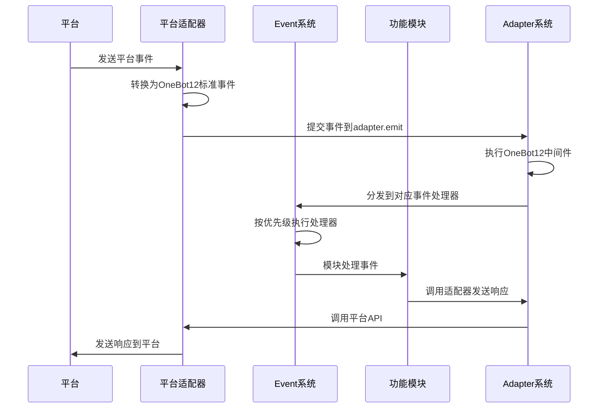
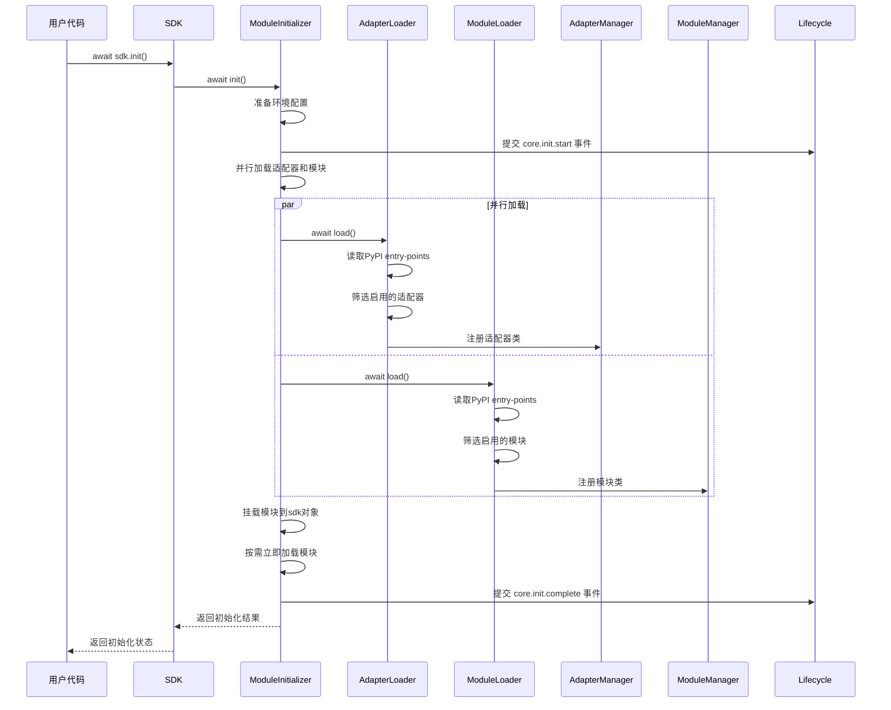
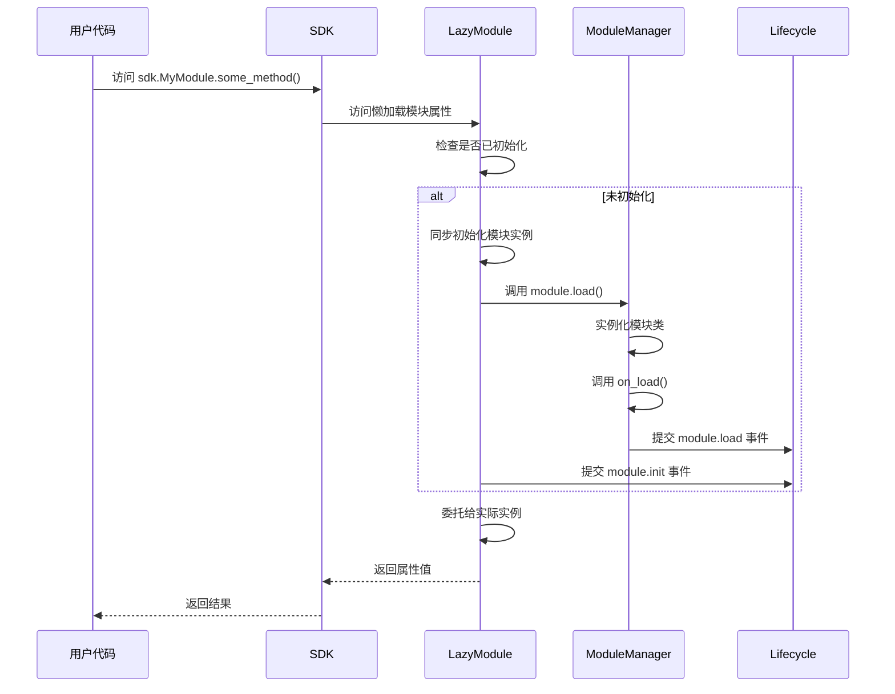

# ErisPulse 的基础架构和设计理念

## 设计理念
- 模块化架构：通过模块化设计实现功能的解耦和复用
- 事件驱动模型：基于事件驱动的架构提高系统的响应性和扩展性
- 跨平台支持：通过适配器系统实现对多种平台的支持
- 用户/AI体验优先：简化开发流程，提供友好的API接口

## 核心组件

### 事件处理流程


### SDK 初始化流程


### 模块懒加载流程


## 工作流程

### 事件处理流程
1. **事件接收**：平台适配器接收来自平台的原始事件
2. **事件标准化**：适配器将原始事件转换为OneBot12标准事件格式
3. **事件提交**：通过`adapter.emit`方法将标准化事件提交到适配器系统
4. **中间件处理**：执行注册的OneBot12中间件对事件进行预处理
5. **事件分发**：适配器系统将事件分发到对应的事件处理器
6. **事件处理**：Event系统按照优先级顺序执行注册的事件处理器
7. **模块响应**：功能模块处理事件并生成响应
8. **响应发送**：模块通过适配器系统发送响应到平台

### SDK 初始化流程
1. **环境准备**：加载框架配置，检查并创建必要的配置文件
2. **并行加载**：`ModuleInitializer` 并行调用 `AdapterLoader` 和 `ModuleLoader`
3. **entry-points 解析**：从 PyPI 包的 entry-points 读取适配器和模块信息
4. **状态筛选**：根据配置筛选启用的适配器和模块
5. **注册阶段**：将适配器类和模块类注册到对应的管理器
6. **实例化阶段**：根据配置决定立即加载还是懒加载
7. **生命周期事件**：提交初始化完成事件到生命周期系统

### 模块加载架构

ErisPulse 采用分层的模块加载架构，将加载逻辑与核心功能分离：

#### 架构层次

```
┌─────────────────────────────────────────────────────────────┐
│                        SDK 对象                          │
│  (统一入口，包含所有核心模块和管理器)                      │
└─────────────────────────────────────────────────────────────┘
                            │
                            │ init()
                            ▼
┌─────────────────────────────────────────────────────────────┐
│                   ModuleInitializer                        │
│  (初始化协调器，统一管理加载流程)                         │
└─────────────────────────────────────────────────────────────┘
                            │
                ┌───────────┴───────────┐
                ▼                       ▼
┌───────────────────┐      ┌───────────────────┐
│  AdapterLoader    │      │  ModuleLoader    │
│  (适配器加载器)    │      │  (模块加载器)      │
└───────────────────┘      └───────────────────┘
         │                         │
         ▼                         ▼
┌───────────────────┐      ┌───────────────────┐
│ AdapterManager    │      │ ModuleManager    │
│  (适配器管理器)    │      │  (模块管理器)      │
│ - 继承ManagerBase  │      │ - 继承ManagerBase  │
└───────────────────┘      └───────────────────┘
```

#### 职责分离

| 层级 | 组件 | 职责 |
|------|------|------|
| 入口层 | SDK | 提供统一的 API 接口，对外暴露所有功能 |
| 协调层 | ModuleInitializer | 协调整个初始化流程，管理加载顺序 |
| 加载层 | AdapterLoader/ModuleLoader | 从 PyPI entry-points 加载模块和适配器 |
| 管理层 | AdapterManager/ModuleManager | 管理模块/适配器的注册、加载、卸载 |
| 基础层 | ManagerBase | 提供统一的配置管理和状态查询接口 |

#### 关键设计原则

1. **单一职责**：每个组件只负责一个核心功能
2. **分层清晰**：加载逻辑与业务逻辑分离
3. **配置统一**：所有管理器通过 ManagerBase 继承统一的配置接口
4. **职责分离**：ManagerBase 只关注接口定义，具体实现由子类完成
5. **兼容性**：保留旧接口，确保向后兼容
