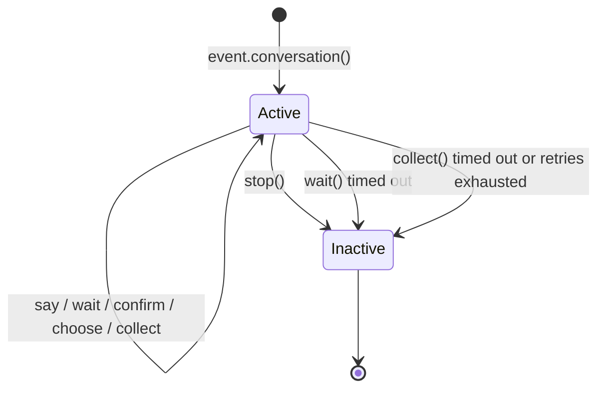

# Conversation Multi-turn Conversations

The `Conversation` class provides convenient methods for multi-turn interactions within the same session, suitable for scenarios such as guided operations, information collection, and conversational question-answering.

## Creating a Conversation

Create a conversation using the `conversation()` method of the `Event` object:

```python
from ErisPulse.Core.Event import command

@command("quiz")
async def quiz_handler(event):
    conv = event.conversation(timeout=30)

    await conv.say("🎮 Welcome to the quiz!")

    answer = await conv.choose("Question 1: Who is the creator of Python?", [
        "Guido van Rossum",
        "James Gosling",
        "Dennis Ritchie",
    ])

    if answer is None:
        await conv.say("Time's up, try again next time!")
        return

    if answer == 0:
        await conv.say("Correct!")
    else:
        await conv.say("Incorrect, the correct answer is Guido van Rossum")

    conv.stop()
```

## Core API

### say(content, **kwargs)

Send a message and return `self` to support method chaining:

```python
await conv.say("First line").say("Second line").say("Third line")
```

You can also specify the sending method:

```python
await conv.say("https://example.com/image.jpg", method="Image")
```

### wait(prompt=None, timeout=None)

Wait for user reply and return an `Event` object or `None` (if timeout occurs):

```python
# Simple wait
resp = await conv.wait()
if resp:
    text = resp.get_text()

# Wait after sending a prompt
resp = await conv.wait(prompt="Please enter your name:")

# Use custom timeout (overrides the default conversation timeout)
resp = await conv.wait(prompt="Please reply within 10 seconds:", timeout=10)
```

### confirm(prompt=None, **kwargs)

Wait for user confirmation (yes/no), return `True` / `False` / `None` (timeout):

```python
result = await conv.confirm("Are you sure you want to delete all data?")
if result is True:
    await conv.say("Deleted")
elif result is False:
    await conv.say("Cancelled")
else:
    await conv.say("Timed out")
```

Built-in recognized confirmation words: `是/yes/y/确认/确定/好/ok/true/对/嗯/行/同意/没问题/可以/当然...`

Built-in recognized negation words: `否/no/n/取消/不/不要/不行/cancel/false/错/不对/别/拒绝...`

### choose(prompt, options, **kwargs)

Wait for user selection from options and return the option index (0-based) or `None`:

```python
choice = await conv.choose("Please select a color:", ["Red", "Green", "Blue"])
if choice is not None:
    colors = ["Red", "Green", "Blue"]
    await conv.say(f"You selected {colors[choice]}")
```

Users can select by entering a number (`1`/`2`/`3`) or the option text (`Red`).

`options_format="auto"` (default) automatically selects the built-in style based on the method: Markdown→unordered list, Html→ordered list, others→plain text list.  
Also supports `"list"`, `"inline"`, `"md"`, `"html"`, or a custom function.

Supports `merge_prompt=True` to merge into a single message, and placeholders to control the option insertion position (default `{options}`, customizable via `placeholder`):

```python
choice = await conv.choose(
    "## Please select\n{options}",
    ["Option A", "Option B"],
    method="Markdown",
    merge_prompt=True,
)

# Custom placeholder
choice = await conv.choose(
    "Please select: [choices]",
    ["Option A", "Option B"],
    placeholder="[choices]",
)
```

### collect(fields, **kwargs)

Collect information in multiple steps and return a data dictionary or `None`:

```python
data = await conv.collect([
    {"key": "name", "prompt": "Please enter your name"},
    {"key": "age", "prompt": "Please enter your age",
     "validator": lambda e: e.get("alt_message", "").strip().isdigit(),
     "retry_prompt": "Age must be a number, please re-enter"},
    {"key": "city", "prompt": "Please enter your city"},
])

if data:
    await conv.say(f"Registration successful!\nName: {data['name']}\nAge: {data['age']}\nCity: {data['city']}")
else:
    await conv.say("Registration interrupted")
```

Field configuration:

| Parameter | Description | Default |
|-----------|-------------|---------|
| `key` | Field key name (required) | - |
| `prompt` | Prompt message | `"Please enter {key}"` |
| `validator` | Validation function, receives Event, returns bool | None |
| `retry_prompt` | Retry prompt on validation failure | `"Invalid input, please re-enter"` |
| `max_retries` | Maximum retry attempts | 3 |
| `condition` | Condition function, receives collected data dict, returns bool | None |

**Conditional fields**: Using `condition` allows dynamic forms, where fields are collected only if the condition is met:

```python
data = await conv.collect([
    {"key": "has_car", "prompt": "Do you have a car? (Yes/No)"},
    {"key": "car_brand", "prompt": "Please enter your car brand",
     "condition": lambda d: d.get("has_car", "").lower() in ("yes", "y", "是")},
])
```

### stop()

Manually end the conversation and set `is_active` to `False`:

```python
conv.stop()
```

### is_active

Check if the conversation is active:

```python
if conv.is_active:
    await conv.say("The conversation is still active")
```

## Active State Management



A conversation automatically transitions to the inactive state under the following conditions:

1. The `stop()` method is called
2. `wait()` times out and returns `None`
3. `collect()` returns `None` due to any step timing out or exhausting retries

After becoming inactive, all interaction methods (`wait`/`confirm`/`choose`/`collect`) will immediately return `None` and will not continue waiting for user input.

## Branches and Transitions

### @conv.branch(name) Decorator

Use `branch()` to register a conversation branch, and use `goto()` to jump between branches:

```python
@command("menu")
async def menu_handler(event):
    conv = event.conversation(timeout=60)

    @conv.branch("main")
    async def main_menu():
        await conv.say("=== Main Menu ===\n1. Personal Info\n2. Settings\n3. Exit")
        resp = await conv.wait()
        if resp is None:
            return
        text = resp.get_text().strip()
        if text == "1":
            await conv.goto("profile")
        elif text == "2":
            await conv.goto("settings")
        elif text == "3":
            await conv.say("Goodbye!")
            conv.stop()

    @conv.branch("profile")
    async def profile():
        await conv.say("=== Personal Info ===\nName: Alice\n0. Back")
        resp = await conv.wait()
        if resp and resp.get_text().strip() == "0":
            await conv.goto("main")

    @conv.branch("settings")
    async def settings():
        await conv.say("=== Settings ===\n1. Notification Toggle\n0. Back")
        resp = await conv.wait()
        if resp and resp.get_text().strip() == "0":
            await conv.goto("main")

    await conv.start()  # Start from the first registered branch
```

### conv.start(name=None)

Start the conversation, defaulting to the first registered branch:

```python
await conv.start()          # Start from the first branch
await conv.start("settings") # Start from the specified branch
```

## Context and Persistence

### conv.context

Each conversation instance has a built-in `context` dictionary to share state across branches:

```python
@conv.branch("step1")
async def step1():
    conv.context["username"] = resp.get_text().strip()
    await conv.goto("step2")

@conv.branch("step2")
async def step2():
    name = conv.context.get("username", "Unknown")
    await conv.say(f"Hello, {name}!")
```

### save() / resume() / clear_saved()

Conversations support persistence, allowing them to be resumed after timeout or interruption:

```python
# Save conversation state
conv_id = conv.save()
# conv_id = "user_123_group_456"  # Automatically generated based on user and group

# ... Later, resume in the same session ...
conv2 = event.conversation()
if conv2.resume():
    await conv2.say("Welcome back! Continuing the previous conversation")
else:
    await conv2.say("No previous conversation found")

# Clear saved conversation
conv.clear_saved()
```

## Typical Flow Patterns

### Guided Registration

```python
@command("register")
async def register_handler(event):
    conv = event.conversation(timeout=60)

    await conv.say("Welcome to registration!")

    data = await conv.collect([
        {"key": "username", "prompt": "Please enter a username (3-20 characters)",
         "validator": lambda e: 3 <= len(e.get_text().strip()) <= 20},
        {"key": "email", "prompt": "Please enter your email address",
         "validator": lambda e: "@" in e.get_text() and "." in e.get_text(),
         "retry_prompt": "Invalid email format, please try again"},
    ])

    if not data:
        await event.reply("Registration cancelled")
        return

    confirmed = await conv.confirm(
        f"Confirm registration details?\nUsername: {data['username']}\nEmail: {data['email']}"
    )

    if confirmed:
        await conv.say("✅ Registration successful!")
    else:
        await conv.say("❌ Registration cancelled")
```

### Looping Conversation

```python
@command("chat")
async def chat_handler(event):
    conv = event.conversation(timeout=120)
    await conv.say("Entering chat mode, type 'exit' to end")

    while conv.is_active:
        resp = await conv.wait()
        if resp is None:
            await conv.say("Timeout, conversation ended")
            break

        text = resp.get_text().strip()

        if text == "exit":
            await conv.say("Goodbye!")
            conv.stop()
        elif text == "help":
            await conv.say("Available commands: exit, help, status")
        elif text == "status":
            await conv.say("Conversation is active")
        else:
            await conv.say(f"You said: {text}")
```

## Related Documents

- [Event Wrapper Class](../developer-guide/modules/event-wrapper.md) - All methods of the Event object
- [Event Handling Getting Started](../getting-started/event-handling.md) - Event handling basics