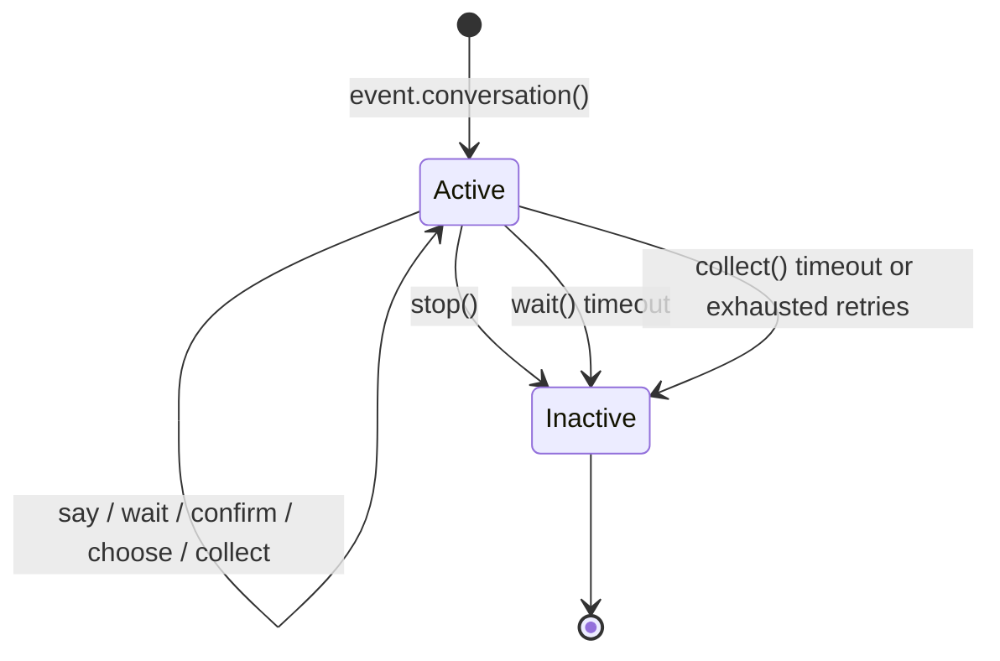

# Conversation Multi-turn Conversations

The `Conversation` class provides convenient methods for multi-turn interactions within the same session, suitable for scenarios such as guided operations, information collection, and conversational question-answering.

## Creating a Conversation

Create a conversation using the `conversation()` method of an `Event` object:

```python
from ErisPulse.Core.Event import command

@command("quiz")
async def quiz_handler(event):
    conv = event.conversation(timeout=30)

    await conv.say("🎮 Welcome to the quiz!")

    answer = await conv.choose("Question 1: Who is the creator of Python?", [
        "Guido van Rossum",
        "James Gosling",
        "Dennis Ritchie",
    ])

    if answer is None:
        await conv.say("Timeout, try again next time!")
        return

    if answer == 0:
        await conv.say("Correct!")
    else:
        await conv.say("Incorrect, the correct answer is Guido van Rossum")

    conv.stop()
```

## Core API

### say(content, **kwargs)

Send a message and return `self` to support method chaining:

```python
await conv.say("First line").say("Second line").say("Third line")
```

You can also specify the sending method:

```python
await conv.say("https://example.com/image.jpg", method="Image")
```

### wait(prompt=None, timeout=None)

Wait for a user reply and return an `Event` object or `None` (timeout):

```python
# Simple waiting
resp = await conv.wait()
if resp:
    text = resp.get_text()

# Send a prompt and wait
resp = await conv.wait(prompt="Please enter your name:")

# Use custom timeout (overrides the default conversation timeout)
resp = await conv.wait(prompt="Please reply within 10 seconds:", timeout=10)
```

### confirm(prompt=None, **kwargs)

Wait for user confirmation (Yes/No), return `True` / `False` / `None` (timeout):

```python
result = await conv.confirm("Are you sure you want to delete all data?")
if result is True:
    await conv.say("Deleted")
elif result is False:
    await conv.say("Cancelled")
else:
    await conv.say("No reply within timeout")
```

Built-in recognized confirmation words: `是/yes/y/确认/确定/好/ok/true/对/嗯/行/同意/没问题/可以/当然...`

Built-in recognized negation words: `否/no/n/取消/不/不要/不行/cancel/false/错/不对/别/拒绝...`

### choose(prompt, options, **kwargs)

Wait for the user to select from options, return the option index (0-based) or `None`:

```python
choice = await conv.choose("Please select a color:", ["Red", "Green", "Blue"])
if choice is not None:
    colors = ["Red", "Green", "Blue"]
    await conv.say(f"You selected {colors[choice]}")
```

Users can select by entering a number (`1`/`2`/`3`) or the option text (`Red`).

`options_format="auto"` (default) automatically selects the built-in style based on method: Markdown→unordered list, Html→ordered list, others→plain text list.
Also supports `"list"`、`"inline"`、`"md"`、`"html"` or a custom function.

Supports `merge_prompt=True` to merge into a single message, and placeholder control for option insertion position (default `{options}`, customizable via `placeholder`):

```python
choice = await conv.choose(
    "## Please select\n{options}",
    ["Option A", "Option B"],
    method="Markdown",
    merge_prompt=True,
)

# Custom placeholder
choice = await conv.choose(
    "Please select: [choices]",
    ["Option A", "Option B"],
    placeholder="[choices]",
)
```

### collect(fields, **kwargs)

Collect information in multiple steps, return a data dictionary or `None`:

```python
data = await conv.collect([
    {"key": "name", "prompt": "Please enter your name"},
    {"key": "age", "prompt": "Please enter your age",
     "validator": lambda e: e.get("alt_message", "").strip().isdigit(),
     "retry_prompt": "Age must be a number, please re-enter"},
    {"key": "city", "prompt": "Please enter your city"},
])

if data:
    await conv.say(f"Registration successful!\nName: {data['name']}\nAge: {data['age']}\nCity: {data['city']}")
else:
    await conv.say("Registration interrupted")
```

Field configuration:

| Parameter | Description | Default |
|-----------|-------------|---------|
| `key` | Field key (required) | - |
| `prompt` | Prompt message | `"Please enter {key}"` |
| `validator` | Validation function, receives Event, returns bool | None |
| `retry_prompt` | Retry prompt on validation failure | `"Invalid input, please re-enter"` |
| `max_retries` | Maximum retry attempts | 3 |
| `condition` | Condition function, receives collected data dict, returns bool | None |

**Conditional fields**: Use `condition` to implement dynamic forms, collecting only when the condition is met:

```python
data = await conv.collect([
    {"key": "has_car", "prompt": "Do you have a car? (Yes/No)"},
    {"key": "car_brand", "prompt": "Please enter car model",
     "condition": lambda d: d.get("has_car", "").lower() in ("yes", "y", "是")},
])
```

### stop()

Manually end the conversation, set `is_active` to `False`:

```python
conv.stop()
```

### is_active

Whether the conversation is active:

```python
if conv.is_active:
    await conv.say("The conversation is still active")
```

## Active State Management


```mermaid
stateDiagram-v2
    state "Active" as active
    state "Inactive" as inactive
    [*] --> active: event.conversation()
    active --> active: say / wait / confirm / choose / collect
    active --> inactive: stop()
    active --> inactive: wait() timeout
    active --> inactive: collect() timeout or exhausted retries
    inactive --> [*]
```

The conversation automatically becomes inactive in the following cases:

1. `stop()` method is called
2. `wait()` returns `None` due to timeout
3. `collect()` returns `None` due to timeout or exhausted retries in any step

After becoming inactive, all interactive methods (`wait`/`confirm`/`choose`/`collect`) immediately return `None` without waiting for user input.

## Branching and Jumping

### @conv.branch(name) Decorator

Use `branch()` to register conversation branches and `goto()` to jump between them:

```python
@command("menu")
async def menu_handler(event):
    conv = event.conversation(timeout=60)

    @conv.branch("main")
    async def main_menu():
        await conv.say("=== Main Menu ===\n1. Personal Info\n2. Settings\n3. Exit")
        resp = await conv.wait()
        if resp is None:
            return
        text = resp.get_text().strip()
        if text == "1":
            await conv.goto("profile")
        elif text == "2":
            await conv.goto("settings")
        elif text == "3":
            await conv.say("Goodbye!")
            conv.stop()

    @conv.branch("profile")
    async def profile():
        await conv.say("=== Personal Info ===\nName: Alice\n0. Back")
        resp = await conv.wait()
        if resp and resp.get_text().strip() == "0":
            await conv.goto("main")

    @conv.branch("settings")
    async def settings():
        await conv.say("=== Settings ===\n1. Notification Toggle\n0. Back")
        resp = await conv.wait()
        if resp and resp.get_text().strip() == "0":
            await conv.goto("main")

    await conv.start()  # Start from the first registered branch
```

### conv.start(name=None)

Start the conversation, defaulting to the first registered branch:

```python
await conv.start()          # Start from the first branch
await conv.start("settings") # Start from a specified branch
```

## Context and Persistence

### conv.context

Each conversation instance has a built-in `context` dictionary for sharing state across branches:

```python
@conv.branch("step1")
async def step1():
    conv.context["username"] = resp.get_text().strip()
    await conv.goto("step2")

@conv.branch("step2")
async def step2():
    name = conv.context.get("username", "Unknown")
    await conv.say(f"Hello, {name}!")
```

### save() / resume() / clear_saved()

Conversations support persistence, allowing recovery after timeout or interruption:

```python
# Save conversation state (usually not called manually, see "Automatic Checkpoints" below)
await conv.save()

# ... later in the same session ...
conv2 = event.conversation()
if await conv2.resume():
    await conv2.say("Welcome back! Continuing previous conversation")
else:
    await conv2.say("No previous conversation found")

# Clear saved conversation
await conv.clear_saved()
```

Storage keys include target dimension (`conversation:{platform}:{user_id}:{target_id}`), ensuring conversations for the same user in different sessions do not overlap; old format (without target) archives are automatically migrated during `resume()`.

## Automatic Checkpoints and Restart Recovery

### Automatic Archiving

The framework automatically maintains checkpoints at the following times, usually without manual `save()` calls:

| Time | Behavior |
|------|----------|
| `goto()` / `start()` branch jump | Automatic save (current branch + context) |
| `stop()` / `wait()` timeout / `collect()` failure | Automatic clear (conversation terminal state) |

### Checkpoint TTL

Archives include timestamps, and those exceeding `ErisPulse.interaction.checkpoint_ttl` (default 24 hours) are cleaned up:

- **Lazy discard**: If an archive is found expired during resume, it is automatically discarded
- **Background proactive cleanup**: The framework has a periodic GC task (lazy-started after first use of checkpoints) that actively enumerates and deletes expired archives, preventing indefinite accumulation of expired checkpoints in storage during long-running operations. Archives cleaned up by the background task are treated as "no checkpoint" if messages are received later

```toml
[ErisPulse.interaction]
checkpoint_ttl = 86400  # seconds
```

### Automatic Recovery on Restart

After a framework restart, in-progress conversations (waiting coroutines in memory) are lost, but checkpoints remain. Register a **resume factory** using `register_resume_handler` so the framework can automatically resume conversations when the first message from that session is received:

```python
from ErisPulse.Core.Event.wrapper import Conversation

@Conversation.register_resume_handler()  # Optional: can pass platform="onebot11" to limit platform
def make_conversation(event) -> Conversation:
    # Factory responsibility: rebuild conversation and re-register all branches
    conv = event.conversation(timeout=60)

    @conv.branch("menu")
    async def menu(conv, event):
        ...

    return conv
```

After registration, when a user previously in the `menu` branch sends the first message after a restart, the framework automatically: restores context → claims the message → continues the conversation from the archived branch. Without a registered factory, this mechanism incurs zero overhead.

### Resume Equals Takeover

When `resume()` succeeds, the framework automatically performs two actions:

1. **Session takeover**: Automatically acquire the session's mutual exclusion lease—other modules can detect "this user is currently in conversation" via `sdk.interaction.get_owner_of(event)`; if the session is already occupied, resume is abandoned (returns False), preventing conflicts between conversations
2. **History retrieval**: Retrieve the last 10 messages from the session inbox into `conv.recent_history` (ensuring continuous context for AI modules after recovery); `resume(with_history=0)` can disable this

```python
if await conv.resume(with_history=20):
    for m in conv.recent_history:
        print(m["role"], ":", m["text"])
```

### Manual Resume (Without Automatic Mechanism)

```python
@command("continue")
async def continue_handler(event):
    conv = event.conversation()
    # ... register branches ...
    if await conv.resume():
        conv.goto(conv.get_current_branch())
```

## Typical Workflow Patterns

### Guided Registration

```python
@command("register")
async def register_handler(event):
    conv = event.conversation(timeout=60)

    await conv.say("Welcome to registration!")

    data = await conv.collect([
        {"key": "username", "prompt": "Please enter username (3-20 characters)",
         "validator": lambda e: 3 <= len(e.get_text().strip()) <= 20},
        {"key": "email", "prompt": "Please enter email address",
         "validator": lambda e: "@" in e.get_text() and "." in e.get_text(),
         "retry_prompt": "Invalid email format, please re-enter"},
    ])

    if not data:
        await event.reply("Registration cancelled")
        return

    confirmed = await conv.confirm(
        f"Confirm registration information?\nUsername: {data['username']}\nEmail: {data['email']}"
    )

    if confirmed:
        await conv.say("✅ Registration successful!")
    else:
        await conv.say("❌ Registration cancelled")
```

### Looping Conversation

```python
@command("chat")
async def chat_handler(event):
    conv = event.conversation(timeout=120)
    await conv.say("Entering conversation mode, type 'exit' to end")

    while conv.is_active:
        resp = await conv.wait()
        if resp is None:
            await conv.say("Timeout, conversation ended")
            break

        text = resp.get_text().strip()

        if text == "exit":
            await conv.say("Goodbye!")
            conv.stop()
        elif text == "help":
            await conv.say("Available commands: exit, help, status")
        elif text == "status":
            await conv.say("Conversation is active")
        else:
            await conv.say(f"You said: {text}")
```

## Related Documentation

- [Event Wrapper Class](../developer-guide/modules/event-wrapper.md) - All methods of the Event object
- [Event Handling Introduction](../getting-started/event-handling.md) - Basics of event handling