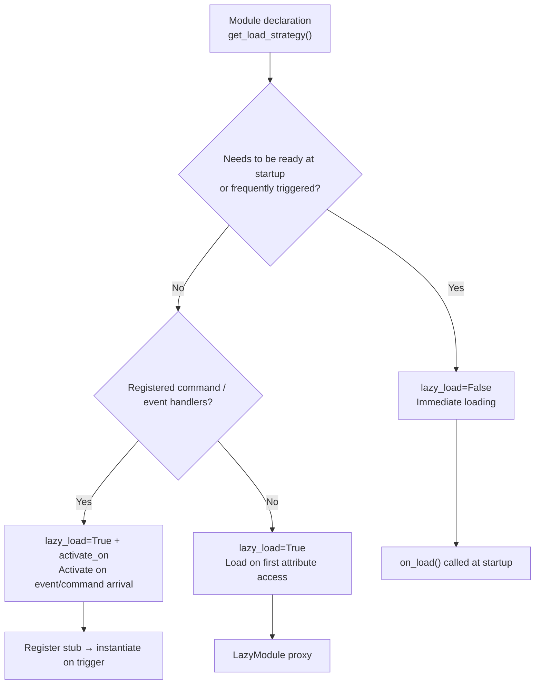

# Lazy-Loaded Module System

The ErisPulse SDK provides a powerful lazy-loaded module system, allowing modules to be initialized only when they are actually needed, significantly improving application startup speed and memory efficiency.

## Overview

The lazy-loaded module system is one of the core features of ErisPulse. It works in the following ways:

- **Delayed Initialization**: Modules are only loaded and initialized when they are first accessed.
- **Transparent Usage**: For developers, lazy-loaded modules are almost indistinguishable from regular modules in usage.
- **Automatic Dependency Management**: Module dependencies are automatically initialized when they are used.
- **Lifecycle Support**: For modules that inherit from `BaseModule`, lifecycle methods are automatically called.

## How It Works

### The `LazyModule` Class

The core of the lazy-loading system is the `LazyModule` class, which is a wrapper that actually initializes the module only on the first access.

### Initialization Process

When a module is first accessed, `LazyModule` performs the following steps:

1. Retrieves the `__init__` parameter information of the module class.
2. Determines whether to pass a `sdk` reference based on the parameters.
3. Sets the `moduleInfo` property of the module.
4. For modules that inherit from `BaseModule`, calls the `on_load` method.
5. Triggers the `module.init` lifecycle event.

## Event-Driven Lazy Activation (`activate_on`)

> [!NOTE]
> This feature requires ErisPulse **2.8.0+**.

Modules with `lazy_load=True` are loaded only on the **first attribute access** by default. If a module registers command/event handlers, the traditional approach is to set `lazy_load=False` to load immediately. `activate_on` provides a third option: **declare triggers so that the module is automatically activated when the first matching event/command arrives**—the module is neither kept in memory nor loses its trigger entry.

```python
from ErisPulse.loaders import ModuleLoadStrategy

class MyModule(BaseModule):
    @staticmethod
    def get_load_strategy():
        return ModuleLoadStrategy(
            lazy_load=True,
            activate_on=[
                # ---- Event Triggers (passive arrival, no user awareness required)----
                "message",                                    # Type-level: any message event
                {"notice": "group_member_increase"},          # Type + single detail_type
                {"message": ["private", "group"]},            # Type + multiple detail_types

                # ---- Command Triggers (active input, placeholder commands visible in Help)----
                {"command": "roll"},                          # Shorthand: command name
                {"command": ["roll", "dice"]},                # List of command names
                {"command": {                                 # Dict declaration (name is required)
                    "name": "dice",
                    "help": "Roll a dice",
                    "usage": "/dice",
                    "group": "Entertainment",
                    "aliases": ["d"],
                    "hidden": False,
                }},
            ],
        )
```

### Command Dict Declaration Parameters

The dict form mirrors the user-level parameters of the `@command()` decorator, used to register placeholder commands before the module is loaded:

| Parameter | Type | Default | Description |
|-----------|------|---------|-------------|
| `name` | `str` | **Required** | Command name; must match the `@command(name)` in `on_load`, otherwise the placeholder is unregistered after activation, and the command will not exist |
| `help` | `str` | Fallback chain | Description shown in Help; if not declared, the value is taken from the fallback chain (see below) |
| `usage` | `str` | Auto-generated | Usage line, defaulting to `{prefix}{name}` |
| `group` | `str` | `None` | Command group |
| `aliases` | `list[str]` | `[]` | Aliases are also registered; **inputting an alias will also trigger activation** |
| `hidden` | `bool` | `False` | If `True`, the placeholder command is hidden (aligned with the hidden semantics of the real command after activation); users who know the command name can still trigger it by input |

**Not supported** `priority` / `permission` / `master`: The placeholder command's role is only to trigger activation; permission checks are performed by the real command after activation (blocking permissions at the placeholder stage would make "input command to activate" ineffective).

### Placeholder Command Help Fallback Chain

When the module is not loaded, the Help displays the command description according to the following priority (the first found is used):

1. The command-level `help` declared in the dict (most precise)
2. The `description` from the module's `get_meta()`
3. The `__description__` attribute of the module
4. The `Summary` from the package metadata (PyPI package summary)
5. A generic message: "This command comes from the lazy-loaded module X. The module will be automatically loaded on first use."

### Trigger Semantics

- **Event stub**: Registered to the corresponding event manager with very low priority (`ACTIVATION_STUB_PRIORITY`), acting as a fallback after all regular handlers; after activation, the current event is forwarded to the module's real handler
- **Command stub**: Registers a placeholder command; after activation, the placeholder is unregistered, and the real command takes over the current trigger
- **Reentrancy Prevention**: An `asyncio.Lock` ensures only one activation occurs in concurrent triggers
- **Scope Filtering**: The stub includes the module owner identity, and does not trigger if the module is not enabled for the Bot / session / platform
- **Failure Semantics**: If activation fails, it is not retried, and the stub is also unregistered
- **Deduplication**: When the same command is declared using both shorthand and dict forms, deduplication occurs (dict takes precedence); if the dict lacks `name` or the event `detail_type` is incorrectly written as a dict, a warning is issued and the entry is ignored

> For architecture diagrams and complete semantics, see [Architecture Overview](../architecture.md#event-driven-lazy-activationactivate_on-trigger-architecture).

## Configuring Lazy Loading

### Global Configuration

Enable or disable global lazy loading in the configuration file:

```toml
[ErisPulse.framework]
enable_lazy_loading = true  # true=enable lazy loading (default), false=disable lazy loading
```

### Module-Level Control

Modules can control their loading strategy by implementing the `get_load_strategy()` static method:

```python
from ErisPulse.Core.Bases import BaseModule
from ErisPulse.loaders import ModuleLoadStrategy

class MyModule(BaseModule):
    @staticmethod
    def get_load_strategy():
        """Returns the module loading strategy"""
        return ModuleLoadStrategy(
            lazy_load=False,  # Returning False means immediate loading
            priority=100      # Loading priority, higher values mean higher priority
        )
```

## Using Lazy-Loaded Modules

### Basic Usage

For developers, lazy-loaded modules are almost indistinguishable from regular modules in usage:

```python
# Accessing a lazy-loaded module through the SDK
from ErisPulse import sdk

# The following access will trigger module lazy loading
result = await sdk.my_module.my_method()
```

### Unified Module Access Entry

Whether accessed via SDK attributes, module manager attributes, or through `module.get()`, for "registered but not yet loaded" lazy-loaded modules, the same lazy-loaded proxy is returned. Accessing its attributes will actually trigger initialization:

```python
# All three methods return the same lazy-loaded proxy (when the module is not loaded), with consistent behavior and transparency to the user
sdk.my_module          # Entry point that triggers loading
sdk.module.my_module   # Also returns the lazy-loaded proxy
sdk.module.get("my_module")  # Also returns the lazy-loaded proxy, itself does not trigger loading

# Accessing any attribute of the proxy will actually initialize the module
result = await sdk.my_module.my_method()
```

`module.get()` is a **query** interface and does not trigger loading:
- If the module is loaded → returns the real instance
- If the module is registered but not loaded → returns the lazy-loaded proxy (initialization occurs on attribute access)
- If the module is not registered → returns `None`

To explicitly trigger loading, use `await sdk.load_module("my_module")`.

### Asynchronous Initialization

For modules requiring asynchronous initialization, it is recommended to load them explicitly first:

```python
# Load the module explicitly first
await sdk.load_module("my_module")

# Then use the module
result = await sdk.my_module.my_method()
```

### Synchronous Initialization

For modules that do not require asynchronous initialization, they can be accessed directly:

```python
# Direct access will automatically initialize synchronously
result = sdk.my_module.some_sync_method()
```

## Best Practices

When choosing a loading strategy, refer to the following decision flow:



### Recommended Scenarios for Lazy Loading (`lazy_load=True`)

- Passive utility modules (such as data query modules, format converters, etc., which are only needed when called by other modules)
- Modules that register command/event handlers but are not frequently used—combine with `activate_on` to declare triggers, so the module is automatically activated when the first matching event/command arrives, without sacrificing lazy loading

### Recommended Scenarios for Disabling Lazy Loading (`lazy_load=False`)

- Modules that need to be ready immediately at startup (such as core modules providing basic services to other modules)
- High-frequency listeners (each message needs to be processed)—`activate_on` forwarding has an activation overhead; immediate loading is more direct in high-frequency scenarios
- Scheduled task modules
- Modules that need to be initialized at application startup

> The `priority` parameter controls the initialization order of immediately loaded modules, with higher values meaning earlier initialization. Modules with the same priority are loaded in registration order.

## Notes

1. If your module uses lazy loading and other modules never call it within ErisPulse, your module will never be initialized.
2. If your module contains listeners for Events or similar active listeners, there are two options: declare `activate_on` triggers (keep lazy loading, activate automatically when events arrive), or declare that it needs to be loaded immediately (`lazy_load=False`), otherwise it may affect your module's normal operations.
3. We do not recommend disabling lazy loading unless there is a special need, as it may cause issues such as dependency management and lifecycle events.
4. In the command dict declaration of `activate_on`, `name` must match the real command name registered in `@command()` in the module's `on_load`—otherwise, after module activation, the placeholder command is unregistered, and the command with inconsistent declaration and implementation will not exist.

## Related Documentation

- [Module Development Guide](../developer-guide/modules/getting-started.md) - Learn how to develop modules
- [Best Practices](../developer-guide/modules/best-practices.md) - Learn more best practices