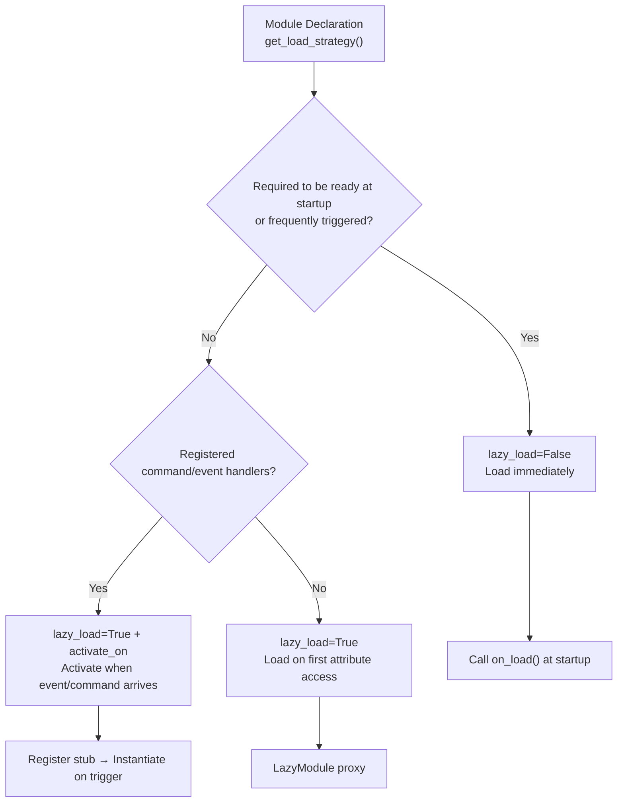

# Lazy-Loaded Module System

The ErisPulse SDK provides a powerful lazy-loaded module system that allows modules to be initialized only when needed, significantly improving application startup speed and memory efficiency.

Please directly return the complete translated Markdown content without any additional text.

Once again, please note: if the document contains a language switch line (with language names separated by `` | ``), strictly adhere to the format requirements outlined above in point 8. Do not write incorrect formats such as ``[**Label**](file)``.

## Overview

The lazy loading module system is one of the core features of ErisPulse. It works in the following ways:

- **Lazy Initialization**: Modules are only actually loaded and initialized when first accessed.
- **Transparent Usage**: For developers, lazy-loaded modules are almost indistinguishable from regular modules in terms of usage.
- **Automatic Dependency Management**: Module dependencies are automatically initialized when used.
- **Lifecycle Support**: For modules that inherit from `BaseModule`, lifecycle methods are automatically invoked.

Please replace all `docs/en/` in document links with `docs/en/`. For example, `docs/en/quick-start.md` should be changed to `docs/en/quick-start.md`. For links pointing to non-current language version files (e.g., `README.xx.md` format), keep them unchanged to ensure links point to the correct language version of the document.

## How It Works

### LazyModule Class

The core of the lazy loading system is the `LazyModule` class, which is a wrapper that actually initializes the module only when it is first accessed.

### Initialization Process

When the module is first accessed, `LazyModule` performs the following operations:

1. Retrieves the `__init__` parameter information of the module class
2. Determines whether to pass a `sdk` reference based on the parameters
3. Sets the `moduleInfo` property of the module
4. For modules that inherit from `BaseModule`, calls the `on_load` method
5. Triggers the `module.init` lifecycle event

The following is the translated content without any additional text or formatting:

## Event-Driven Lazy Activation (`activate_on`)

> [!NOTE]
> This feature requires ErisPulse **2.8.0+**.

Modules with `lazy_load=True` are loaded by default only on the **first attribute access**. If a module registers command/event handlers, the traditional approach would require `lazy_load=False` to load immediately. `activate_on` provides a third option: **declare triggers, and automatically activate the module when the first matching event/command arrives**—it neither stays in memory nor loses the trigger entry point.

```python
from ErisPulse.loaders import ModuleLoadStrategy

class MyModule(BaseModule):
    @staticmethod
    def get_load_strategy():
        return ModuleLoadStrategy(
            lazy_load=True,
            activate_on=[
                # ---- Event triggers (passive arrival, no user awareness required) ----
                "message",                                    # Type-level: any message event
                {"notice": "group_member_increase"},          # Type + single detail_type
                {"message": ["private", "group"]},            # Type + multiple detail_types

                # ---- Command triggers (active input, placeholder commands visible to Help) ----
                {"command": "roll"},                          # Shorthand: command name
                {"command": ["roll", "dice"]},                # List of command names
                {"command": {                                 # Dict declaration (name is required)
                    "name": "dice",
                    "help": "Roll a die",
                    "usage": "/dice",
                    "group": "Entertainment",
                    "aliases": ["d"],
                    "hidden": False,
                }},
            ],
        )
```

### Command Dict Declaration Parameters

The dict format mirrors the user-level parameters of the `@command()` decorator, used to register placeholder commands before the module loads:

| Parameter | Type | Default | Description |
|-----------|------|---------|-------------|
| `name` | `str` | **Required** | Command name; must match `@command(name)` in `on_load`, otherwise the placeholder is unregistered after activation, and the command does not exist |
| `help` | `str` | Fallback chain | Description displayed in Help; if not declared, it falls back to the chain (see below) |
| `usage` | `str` | Auto-generated | Usage line, defaulting to `{prefix}{name}` |
| `group` | `str` | `None` | Command group |
| `aliases` | `list[str]` | `[]` | Aliases are registered simultaneously; **activating the module is triggered by inputting aliases** |
| `hidden` | `bool` | `False` | If `True`, the placeholder command is also hidden (aligned with the hidden semantics of the real command after activation); users who know the command name can still trigger activation by inputting it |

**Not supported**: `priority` / `permission` / `master`: The placeholder command's mission is only to trigger activation; permission checks are performed by the real command after activation (blocking permissions during the placeholder stage would make "activating by inputting a command" ineffective).

### Placeholder Command Help Fallback Chain

When the module is not loaded, the command description displayed in Help is taken in the following order (the first match is used):

1. The command-level `help` declared in the dict (most precise)
2. The `description` from the module's `get_meta()`
3. The module's `__description__` attribute
4. The `Summary` from package metadata (PyPI package summary)
5. A generic prompt: "This command comes from a lazy-loaded module X; the module will be automatically loaded on first use"

### Trigger Semantics

- **Event stub**: Registered to the corresponding event manager with very low priority (`ACTIVATION_STUB_PRIORITY`), acting as a fallback trigger after all ordinary handlers; after activation, the current event is forwarded to the module's real handler
- **Command stub**: Registers a placeholder command; after activation, the placeholder is unregistered, and the real command takes over the current trigger
- **Reentrancy protection**: An `asyncio.Lock` ensures activation occurs only once, even under concurrent triggers
- **Scope filtering**: The stub carries the module owner's identity, so it does not trigger if the module is not enabled for the Bot / session / platform
- **Failure semantics**: If activation fails, it is not retried, and the stub is also unregistered
- **Deduplication**: When the same command name is declared using a mix of shorthand and dict forms, deduplication occurs (dict takes precedence); if the dict lacks `name` or the event `detail_type` is incorrectly written as a dict, a warning is issued and it is ignored

> For the architecture diagram and complete semantics, see [Architecture Overview](../architecture.md#event-driven-lazy-activation-activate_on-trigger-architecture).

## Configure Lazy Loading

### Global Configuration

Enable/disable lazy loading in the configuration file:

```toml
[ErisPulse.framework]
enable_lazy_loading = true  # true=enable lazy loading (default), false=disable lazy loading
```

### Module-Level Control

Modules can control their loading strategy by implementing the `get_load_strategy()` static method:

```python
from ErisPulse.Core.Bases import BaseModule
from ErisPulse.loaders import ModuleLoadStrategy

class MyModule(BaseModule):
    @staticmethod
    def get_load_strategy():
        """Return the module loading strategy"""
        return ModuleLoadStrategy(
            lazy_load=False,  # Return False to indicate immediate loading
            priority=100      # Loading priority, higher value means higher priority
        )
```

7. **Important: Path Replacement Rule**
   - Replace `docs/en/` in document links with `docs/en/`
   - For example: `docs/en/quick-start.md` should be changed to `docs/en/quick-start.md`
   - For links pointing to non-current language version files (e.g., `README.xx.md` format links), keep them unchanged
   - This ensures that links point to the correct language version of the document

## Using Lazy-Loaded Modules

### Basic Usage

For developers, lazy-loaded modules are almost indistinguishable from regular modules in usage:

```python
# Accessing a lazy-loaded module through the SDK
from ErisPulse import sdk

# The following access will trigger the lazy loading of the module
result = await sdk.my_module.my_method()
```

### Unified Module Access Entry

Whether accessed through the SDK attribute, the module manager attribute, or queried via `module.get()`, for "registered but not yet loaded" lazy-loaded modules, the same lazy-loading proxy is returned. The module is only truly initialized when its attributes are accessed:

```python
# All three methods return the same lazy-loading proxy (when the module is not loaded), with consistent behavior and transparent to the user
sdk.my_module          # Entry point that triggers loading
sdk.module.my_module   # Also returns the lazy-loading proxy
sdk.module.get("my_module")  # Also returns the lazy-loading proxy; itself does not trigger loading

# Accessing any attribute of the proxy will truly initialize the module
result = await sdk.my_module.my_method()
```

`module.get()` is a **query** interface and does not trigger loading by itself:
- If the module is already loaded → returns the real instance
- If the module is registered but not loaded → returns the lazy-loading proxy (module is initialized only when attributes are accessed)
- If the module is not registered → returns `None`

To explicitly trigger loading, use `await sdk.load_module("my_module")`.

### Asynchronous Initialization

For modules requiring asynchronous initialization, it is recommended to load them explicitly first:

```python
# First, explicitly load the module
await sdk.load_module("my_module")

# Then use the module
result = await sdk.my_module.my_method()
```

### Synchronous Initialization

For modules that do not require asynchronous initialization, you can directly access them:

```python
# Direct access will automatically trigger synchronous initialization
result = sdk.my_module.some_sync_method()

## Best Practices

When choosing a loading strategy, refer to the following decision flow:



### Recommended Scenarios for Lazy Loading (lazy_load=True)

- Passive utility classes (e.g., data query modules, format converters, etc., which are only needed when called by other modules)
- Modules that register command/event handlers but are not used frequently — use `activate_on` to declare triggers, and automatically activate when the first matching event/command arrives, without abandoning lazy loading

### Recommended Scenarios for Disabling Lazy Loading (lazy_load=False)

- Modules that need to be ready at startup (e.g., core modules providing basic services to other modules)
- High-frequency listeners (each message needs to be processed) — `activate_on` forwarding has an activation overhead, so immediate loading is more direct in high-frequency scenarios
- Scheduled task modules
- Modules that need to be initialized at application startup

> The `priority` parameter controls the initialization order among immediately loaded modules; higher values initialize earlier. Modules with the same priority are loaded in registration order.

docs/en/best-practices.md

## Notes

1. If your module uses lazy loading, and other modules have never been called within ErisPulse, your module will never be initialized.
2. If your module contains modules that listen to Events, or other actively listening modules, there are two options: declare an `activate_on` trigger (maintain lazy loading, activate automatically when the event arrives), or declare that it needs to be loaded immediately (`lazy_load=False`), otherwise it will affect the normal operation of your module.
3. We do not recommend disabling lazy loading unless there are special requirements, otherwise it may bring you problems such as dependency management and lifecycle events.
4. In the command dict declaration of `activate_on`, `name` must be consistent with the real command name registered by `@command()` in the module's `on_load` — otherwise, after the module is activated, the placeholder command will be unregistered, and the declared command inconsistent with the implementation will not exist.

Please directly return the complete translated Markdown content, without including any other text.

Once again, if the document contains a language switch line (with each language name separated by `` | ``), be sure to strictly follow the format requirements above in item 8, and do not write incorrect formats such as ``[**Label**](file)``.

## Related Documents

- [Module Development Guide](../developer-guide/modules/getting-started.md) - Learn how to develop modules
- [Best Practices](../developer-guide/modules/best-practices.md) - Learn more about best practices