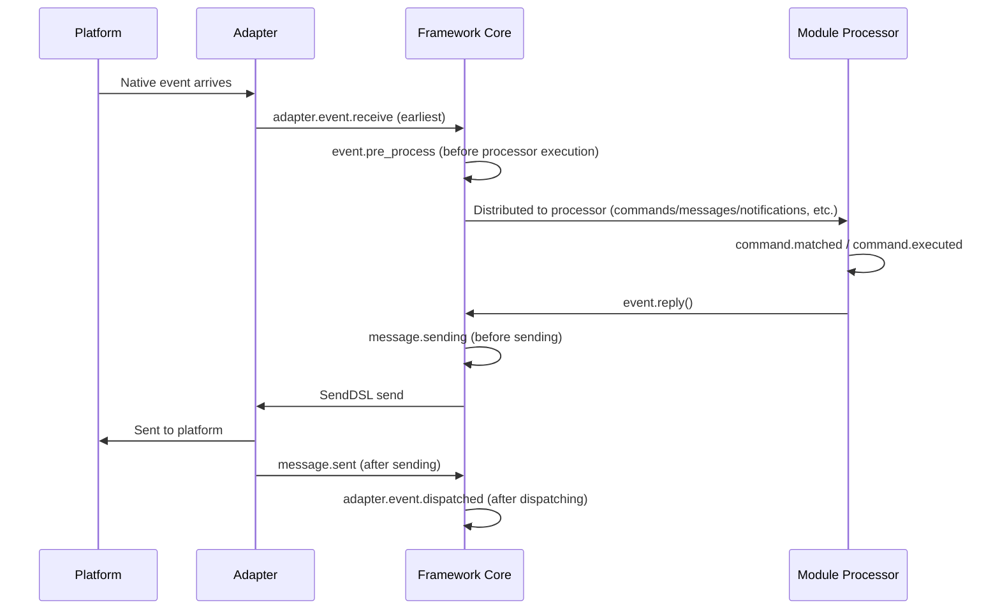

# Lifecycle Management

ErisPulse provides a unified hook/lifecycle system for monitoring the operational status of various system components and enabling extended features such as auditing, statistics, and custom logic.

The system supports three types of trigger methods:
- `await lifecycle.emit("event", data)` — A concise version that passes arbitrary data (when `to="Owner"`, the data is directed to a specific recipient)
- `lifecycle.emit_sync("event", data)` — A synchronous version (used in non-asynchronous contexts)
- `await lifecycle.submit_event("event", ...)` — Compatible with the legacy version, automatically constructs a standard event format

## Event Handling Mechanism

### Registering Handlers

```python
from ErisPulse import sdk

# Decorator pattern
@sdk.lifecycle.on("module.load")
async def on_module_load(data):
    print(f"Module loaded: {data}")

# Programmatic registration
sdk.lifecycle.register("module.load", on_module_load, priority=10)

# Unregister
sdk.lifecycle.unregister("module.load", on_module_load)

# Batch unregister by owner (automatically called by framework when module/unloader)
removed = sdk.lifecycle.unregister_by_owner("MyModule")
print(f"Cleaned up {removed} lifecycle hooks")
```

### Priority

Handlers support the `priority` parameter, where higher values execute first (consistent with the module loader):

```python
@sdk.lifecycle.on("adapter.event.receive", priority=10)  # Executes first
async def first_handler(data):
    pass

@sdk.lifecycle.on("adapter.event.receive", priority=0)  # Executes later
async def second_handler(data):
    pass
```

### Dot-Structure Events

When triggering a specific event, its parent events are also triggered:
- Triggering `module.load` also triggers `module`
- Triggering `adapter.event.receive` also triggers `adapter.event` and `adapter`

### Wildcards

Register `*` to capture all events:

```python
@sdk.lifecycle.on("*")
async def on_anything(data):
    print(f"Received event: {data}")
```

###定向传播（emit to=）

> [!NOTE]
> This feature requires ErisPulse **2.8.0+**.

When `emit()` specifies the `to` parameter, it enters directed propagation: events are only distributed to handlers registered with that owner (hooks registered by modules in `on_load` are automatically assigned to the module), and other modules and wildcard `*` handlers are not notified.

```python
# Emitter: Events are only sent to hooks registered by the Chat module
await sdk.lifecycle.emit("message_received", {"text": "hi"}, to="Chat")

# Subscriber (inside Chat module): Register hooks with the same name, owner is automatically recorded during registration
@sdk.lifecycle.on("message_received")
async def on_message_received(data): ...

@sdk.lifecycle.on("message")   # Dot-structure parent prefixes also apply (filtered by owner)
async def on_any(data): ...
```

- If the target owner has no registered hooks → the event is **silently discarded** (use `has_handlers()` to check beforehand)
- When `data` is a dict, it automatically carries `_trace_id` (without overwriting existing values)
- `emit_sync` / `submit_event` also support the `to=` parameter
- Three-layer model for inter-module communication (RPC / directed / broadcast) is detailed in [Inter-Module Communication](module-communication.md)

### One-Time Registration (once)

Since 2.7.0, handlers registered with `lifecycle.once()` are automatically unregistered after being triggered once, suitable for one-time hooks such as "first ready":

```python
@sdk.lifecycle.once("core.init.complete")
async def on_first_ready(data):
    print("First ready, will not trigger again")
```

- Same priority semantics as `on()` (higher `priority` values execute first)
- Automatically unregistered, no need for manual `unregister`
- Supports both synchronous and asynchronous handlers

### Listener Query (has_handlers)

In hot-path short-circuit scenarios, use `has_handlers()` to check if listeners exist beforehand, avoiding unnecessary event traversal and task scheduling:

```python
if sdk.lifecycle.has_handlers("message.sending"):
    await sdk.lifecycle.emit("message.sending", send_ctx)
```

- Covers three matching types: exact event names, wildcards `*`, and parent events
- Returns `False` if there are no listeners, allowing safe skipping of `emit`

## Hook Breakpoint Overview

A typical lifecycle event sequence diagram of a message from the platform entering the framework to completion:



The framework includes the following built-in hook breakpoints, and users can listen to any breakpoint to implement custom logic using `@sdk.lifecycle.on()`.

### Core Initialization

| Hook Name | Trigger Timing | Data |
|---------|---------|------|
| `core.init.start` | SDK initialization starts | `{}` |
| `core.init.complete` | SDK initialization completes | `{"duration": float, "success": bool, "adapters": {"enabled": [str], "disabled": [str]}, "modules": {"enabled": [str], "disabled": [str]}, "error": str (only on failure)}` |
| `core.uninit.complete` | SDK deinitialization completes | `{"duration": float, "success": bool, "adapters_closed": int, "modules_unloaded": int, "module_properties_cleared": int, "module_properties_to_clear": [str], "error": str (only on failure)}` |

### Configuration Changes

| Hook Name | Trigger Timing | Data |
|---------|---------|------|
| `config.set` | A configuration item is modified | `{"key": str, "old_value": Any, "new_value": Any}` |
| `config.updated` | The entire configuration tree is detected as changed after editing config.toml externally | `{"old_config": dict, "new_config": dict, "config_file": str}` |

**Example: Configuration Audit**

```python
@sdk.lifecycle.on("config.set")
def audit_config(data):
    print(f"[Audit] {data['key']}: {data['old_value']} -> {data['new_value']}")
```

### Module Lifecycle

| Hook Name | Trigger Timing | Data |
|---------|---------|------|
| `module.register` | Module class registered to manager | `{"module_name": str, "success": bool}` |
| `module.load` | Module loaded (successful instantiation) | `{"module_name": str, "success": bool}` |
| `module.init` | Module initialized (including lazy loading) | `{"module_name": str, "success": bool}` |
| `module.unload` | Module unloaded | `{"module_name": str, "success": bool}` |

### Adapter Lifecycle

| Hook Name | Trigger Timing | Data |
|---------|---------|------|
| `adapter.load` | Adapter registration completes | `{"platform": str, "success": bool}` |
| `adapter.start` | Adapter starts | `{"platforms": [str]}` |
| `adapter.status.change` | Adapter status changes | `{"platform": str, "status": str, "retry_count": int, "error": str (only on failure)}` |
| `adapter.stop` | Adapter stops | `{"platforms": [str]}` |
| `adapter.stopped` | Adapter shutdown completes | `{"platforms": [str]}` |
| `adapter.bot.online` | Bot goes online | `{"platform": str, "bot_id": str, "info": dict, "status": str}` |
| `adapter.bot.offline` | Bot goes offline | `{"platform": str, "bot_id": str, "status": str}` |

### Event Reception and Processing

| Hook Name | Trigger Timing | Data |
|---------|---------|------|
| `adapter.event.receive` | External platform event received (earliest) | `{"platform": str, "event_type": str, "raw_event_type": str}` |
| `adapter.event.dispatched` | Event dispatching completes | `{"platform": str, "event_type": str, "raw_event_type": str, "onebot_handlers_count": int}` |
| `event.pre_process` | Event processor begins execution | `{"event_type": str, "platform": str, "detail_type": str}` |

**Example: Event Counting**

```python
event_counter = {}

@sdk.lifecycle.on("adapter.event.receive")
def count_events(data):
    platform = data["platform"]
    event_counter[platform] = event_counter.get(platform, 0) + 1

@sdk.lifecycle.on("adapter.event.dispatched")
def log_unhandled(data):
    if data["onebot_handlers_count"] == 0:
        print(f"[Unhandled] {data['platform']}/{data['event_type']}")
```

### Message Sending

| Hook Name | Trigger Timing | Data |
|---------|---------|------|
| `message.sending` | Message about to be sent | `{"platform": str, "method": str, "detail_type": str, "target_id": str, "bot_id": str}` |
| `message.sent` | Message sending completes | `{"platform": str, "method": str, "detail_type": str, "target_id": str, "bot_id": str}` |

**Example: Message Sending Audit**

```python
@sdk.lifecycle.on("message.sending")
def log_sending(data):
    print(f"[Sending] -> {data['platform']}/{data['detail_type']}/{data['target_id']} via {data['method']}")
```

### Command System

| Hook Name | Trigger Timing | Data |
|---------|---------|------|
| `command.matched` | Command matched and about to execute | `{"command": str, "args": list[str], "platform": str, "user_id": str}` |
| `command.executed` | Command execution completes | `{"command": str, "args": list[str], "platform": str, "user_id": str, "success": bool, "error": str (only on failure)}` |

**Example: Command Counting**

```python
@sdk.lifecycle.on("command.matched")
def count_commands(data):
    print(f"[Command] /{data['command']} from {data['user_id']}@{data['platform']}")
```

### HTTP Routing

| Hook Name | Trigger Timing | Data |
|---------|---------|------|
| `server.request` | HTTP request received | `{"method": str, "path": str, "client_ip": str}` |
| `server.response` | HTTP response sent | `{"method": str, "path": str, "status_code": int, "client_ip": str}` |

**Example: Request Logging**

```python
@sdk.lifecycle.on("server.response")
def log_http(data):
    print(f"[HTTP] {data['method']} {data['path']} -> {data['status_code']}")
```

### WebSocket

| Hook Name | Trigger Timing | Data |
|---------|---------|------|
| `server.start` | Router server starts | `{"base_url": str, "host": str, "port": int}` |
| `server.stop` | Router server stops | `{}` |
| `server.websocket.connect` | WebSocket connection established | `{"path": str, "module_name": str, "client_ip": str}` |
| `server.websocket.disconnect` | WebSocket connection broken | `{"path": str, "module_name": str, "reason": str, "error": str (only on abnormal disconnection)}` |

**Example: WebSocket Connection Monitoring**

```python
@sdk.lifecycle.on("server.websocket.connect")
def on_ws_connect(data):
    print(f"[WS] Connected: {data['path']} from {data['client_ip']}")

@sdk.lifecycle.on("server.websocket.disconnect")
def on_ws_disconnect(data):
    print(f"[WS] Disconnected: {data['path']} ({data['reason']})")
```

## Standard Event Definitions

```python
STANDARD_EVENTS = {
    "core": ["init.start", "init.complete", "uninit.complete"],
    "module": ["load", "init", "unload", "register"],
    "adapter": [
        "load", "start", "status.change", "stop", "stopped",
        "event.receive", "event.dispatched",
        "bot.online", "bot.offline",
    ],
    "server": [
        "start", "stop",
        "request", "response",
        "websocket.connect", "websocket.disconnect",
    ],
    "event": ["pre_process"],
    "message": ["sending", "sent"],
    "command": ["matched", "executed"],
    "config": ["set"],
}
```

## Complete API Reference

### Registration and Unregistration

| Method | Description |
|--------|-------------|
| `@lifecycle.on(event, *, priority=0)` | Decorator to register a handler |
| `lifecycle.register(event, handler, *, priority=0)` | Register programmatically |
| `lifecycle.unregister(event, handler=None)` | Unregister (removes all handlers for the event if handler=None) |

### Triggering

| Method | Description |
|--------|-------------|
| `await lifecycle.emit(event, data=None, *, to=None)` | Asynchronously trigger, handlers returning non-None can modify data; `to` specifies the owner for targeted delivery |
| `lifecycle.emit_sync(event, data=None, *, to=None)` | Synchronously trigger, asynchronous handlers are scheduled with create_task |
| `await lifecycle.submit_event(event_type, *, source, msg, data, to=None)` | Backward compatible, automatically constructs standard event format |

### Utilities

| Method | Description |
|--------|-------------|
| `lifecycle.start_timer(timer_id)` | Start timing |
| `lifecycle.get_duration(timer_id)` | Get elapsed duration (in seconds) |
| `lifecycle.stop_timer(timer_id)` | Stop timing and return elapsed duration |
| `lifecycle.list_hooks()` | List all registered hooks and their handler counts |
| `lifecycle.clear()` | Clear all handlers and timers |

## Example Usage in a Module

```python
from ErisPulse.Core.Bases import BaseModule
from ErisPulse import sdk

class Main(BaseModule):
    async def on_load(self, event):
        # Implement simple message counting
        self.msg_count = 0
        
        @sdk.lifecycle.on("adapter.event.receive")
        async def count(data):
            if data["event_type"] == "message":
                self.msg_count += 1
        
        # Monitor all commands
        @sdk.lifecycle.on("command.matched")
        async def log_cmd(data):
            sdk.logger.info(f"Command executed: /{data['command']} by {data['user_id']}")
        
        # Audit configuration changes
        @sdk.lifecycle.on("config.set")
        def audit(data):
            sdk.logger.info(f"Configuration change: {data['key']} = {data['new_value']}")
```

## Background Task Ownership and Automatic Cancellation

> [!NOTE]
> This feature requires ErisPulse **2.8.0+**.

If asyncio background tasks created by a module are not cancelled in `on_unload`, they will hold a reference to `self`, preventing the module instance from being garbage collected (leading to old instances lingering after hot reload). The framework provides the following fallback mechanisms:

- **`self.spawn(coro)`** (recommended within modules): Tasks are automatically assigned to the module name, and when the module is unloaded, the framework cancels unfinished tasks after `on_unload` and logs a warning.
- **`spawn_background(coro)`** (`ErisPulse.runtime`): Automatically captures the current `owner_scope` context; `cancel_owner_tasks(owner)` cancels tasks by ownership, and `cancel_all_background_tasks()` serves as a fallback for `sdk.uninit()`.
- **Adapters**: When closing, they also automatically cancel background tasks under the platform name.

```python
async def on_load(self, event):
    # Recommended: Use self.spawn() for background tasks, and the framework automatically cancels them after unload.
    self.spawn(self._poll())

async def on_unload(self, event):
    # For scenarios requiring fine control, it is still recommended to manually cancel and wait for cleanup.
    if self._poll_task:
        self._poll_task.cancel()
        await asyncio.gather(self._poll_task, return_exceptions=True)

async def _poll(self):
    while True:
        await asyncio.sleep(60)
        ...
```

> [!IMPORTANT]
> The framework's fallback mechanism is a **forced cancel** (`cancel_owner_tasks`), which occurs after `on_unload` returns. Therefore, tasks that require graceful cleanup (flushing buffers, persisting state, closing connections) **must** manually `cancel()` and `await` completion within `on_unload`—do not rely on the fallback to preserve cleanup logic. The framework only guarantees that tasks holding a reference to `self` are not left behind, not that they are cancelled gracefully. For tasks that require awaiting results, directly `await` them instead of delegating them to background tasks.

## Notes

1. **Processors can be synchronous or asynchronous**: The system automatically recognizes and correctly invokes them.
2. **Data passing**: In `emit()` mode, if a processor returns a non-None value, it modifies the data passed to subsequent processors.
3. **Event naming convention**: It is recommended to use dot-structured naming for events, which facilitates listening at the parent level.
4. **Error isolation**: An exception in a single processor does not affect the execution of other processors.
5. **Synchronous triggering limitation**: In `emit_sync()`, asynchronous processors are scheduled in a fire-and-forget manner, and their return values cannot be returned.
6. **Lifecycle cleanup**: When `sdk.uninit()` is called, all registered processors and timers are cleared.
7. **Loading priority**: If you need to listen to events during the framework initialization phase, it is recommended to set a high priority and disable lazy loading.

## Related Documentation

- [Module Development Guide](../developer-guide/modules/getting-started.md) - Learn about module lifecycle methods
- [Best Practices](../developer-guide/modules/best-practices.md) - Lifecycle event usage recommendations