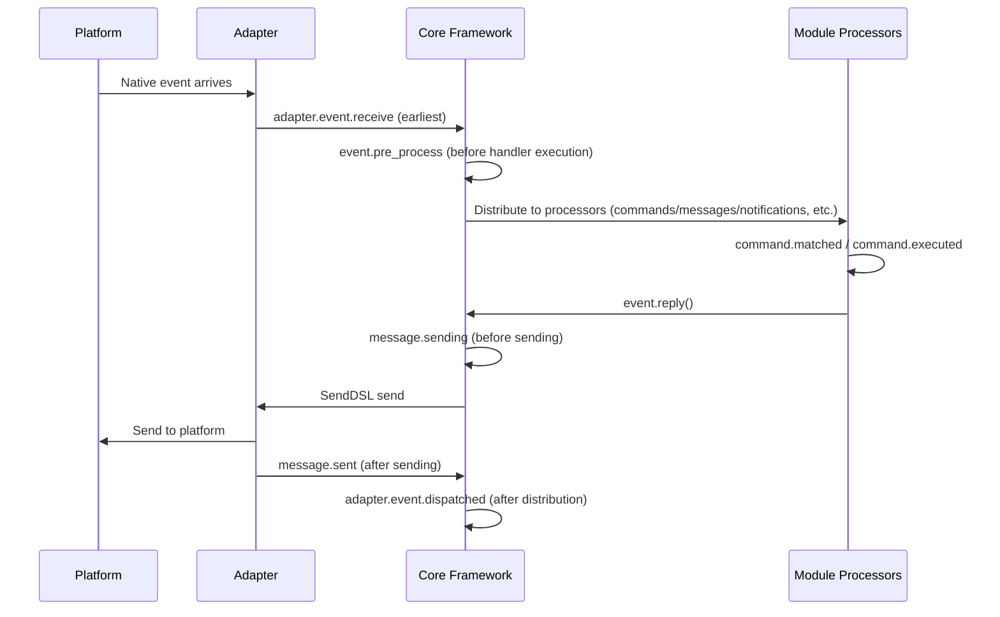

# Lifecycle Management

> [!TIP]
> **When to read this**: When you need to subscribe to framework lifecycle events (startup / load / state changes). Skip if not needed, as it does not affect other features.

ErisPulse provides a unified hook/lifecycle system for monitoring the runtime status of system components and implementing extension features such as auditing, statistics, and custom logic.

The system supports three triggering methods:
- `await lifecycle.emit("event", data)` — A concise version that passes arbitrary data (direct delivery when `to="Owner"`)
- `lifecycle.emit_sync("event", data)` — A synchronous version (for non-async contexts)
- `await lifecycle.submit_event("event", ...)` — Backward compatible, automatically builds standard event format

## Event Handling Mechanism

### Registering Handlers

```python
from ErisPulse import sdk

# Decorator pattern
@sdk.lifecycle.on("module.load")
async def on_module_load(data):
    print(f"Module loaded: {data}")

# Programmatic registration
sdk.lifecycle.register("module.load", on_module_load, priority=10)

# Unregister
sdk.lifecycle.unregister("module.load", on_module_load)

# Batch unregister by owner (automatically called by framework on module/adapter unload)
removed = sdk.lifecycle.unregister_by_owner("MyModule")
print(f"Cleaned up {removed} lifecycle hooks")
```

### Priority

Handlers support `priority` parameter. The higher the value, the earlier the execution (consistent with module loader):

```python
@sdk.lifecycle.on("adapter.event.receive", priority=10)  # First to execute
async def first_handler(data):
    pass

@sdk.lifecycle.on("adapter.event.receive", priority=0)  # Later execution
async def second_handler(data):
    pass
```

### Dot-Structure Events

When a specific event is triggered, its parent events are also triggered:
- Triggering `module.load` also triggers `module`
- Triggering `adapter.event.receive` also triggers `adapter.event` and `adapter`

### Wildcards

Register `*` to capture all events:

```python
@sdk.lifecycle.on("*")
async def on_anything(data):
    print(f"Received event: {data}")
```

### Directed Propagation (`emit to=`)

> [!NOTE]
> This feature requires ErisPulse **2.8.0+**.

When `emit()` is specified with the `to` parameter, it enters directed propagation: the event is only distributed to handlers registered by the owner (hooks registered by a module in `on_load` are automatically assigned to the module), and other modules and wildcard `*` handlers are not notified.

```python
# Sender: Event only delivered to hooks registered by Chat module
await sdk.lifecycle.emit("message_received", {"text": "hi"}, to="Chat")

# Subscriber (within Chat module): Register hooks with the same name, owner is automatically recorded during registration
@sdk.lifecycle.on("message_received")
async def on_message_received(data): ...

@sdk.lifecycle.on("message")   # Dot-structure parent prefixes also apply (filtered by owner)
async def on_any(data): ...
```

- If the target owner has no registered hooks → the event is **not consumed** (can be probed in advance using `has_handlers()`)
- When `data` is a dict, it automatically carries `_trace_id` (does not overwrite existing values)
- `emit_sync` / `submit_event` also support `to=` parameter
- Three-layer model for inter-module communication (RPC / directed / broadcast) is described in [Inter-Module Communication](module-communication.md)

### One-Time Registration (`once`)

Since 2.7.0, handlers registered with `lifecycle.once()` are automatically unregistered after being triggered once, suitable for "first ready" type one-time hooks:

```python
@sdk.lifecycle.once("core.init.complete")
async def on_first_ready(data):
    print("First ready, will not trigger again")
```

- Same priority semantics as `on()` (higher `priority` value means earlier execution)
- Automatically unregistered, no need to manually `unregister`
- Both synchronous and asynchronous handlers are supported

### Listener Query (`has_handlers`)

For hot-path short-circuit scenarios, use `has_handlers()` to check if there are listeners in advance, avoiding unnecessary event traversal and task scheduling:

```python
if sdk.lifecycle.has_handlers("message.sending"):
    await sdk.lifecycle.emit("message.sending", send_ctx)
```

- Covers **exact event name**, wildcard `*`, and parent event matching
- Returns `False` if there are no listeners, allowing safe skipping of `emit`

## Hook Breakpoints Overview

A typical lifecycle event sequence for a message from platform entry to processing completion in the framework:


```mermaid
sequenceDiagram
    participant P as Platform
    participant A as Adapter
    participant F as Core Framework
    participant M as Module Processors

    P->>A: Native event arrives
    A->>F: adapter.event.receive (earliest)
    F->>F: event.pre_process (before handler execution)
    F->>M: Distribute to processors (commands/messages/notifications, etc.)
    M->>M: command.matched / command.executed
    M->>F: event.reply()
    F->>F: message.sending (before sending)
    F->>A: SendDSL send
    A->>P: Send to platform
    A->>F: message.sent (after sending)
    F->>F: adapter.event.dispatched (after distribution)
```

The framework includes the following built-in hook breakpoints, which users can listen to via `@sdk.lifecycle.on()` to implement custom logic.

### Core Initialization

| Hook Name | Trigger Timing | Data |
|---------|---------|------|
| `core.init.start` | SDK initialization begins | `{}` |
| `core.init.stage` | Each initialization stage begins (emitted in background) | `{"stage": str}`, values: `discovery` / `adapter_register` / `adapter_start` / `module_register` / `module_init` / `adapter_start_deferred` / `router_start` |
| `core.init.complete` | SDK initialization completes | `{"duration": float, "success": bool, "stages": {stage: float}, "adapters": {"enabled": [str], "disabled": [str]}, "modules": {"enabled": [str], "disabled": [str]}, "error": str (only if failed)}` |
| `core.uninit.complete` | SDK deinitialization completes | `{"duration": float, "success": bool, "adapters_closed": int, "modules_unloaded": int, "module_properties_cleared": int, "module_properties_to_clear": [str], "error": str (only if failed)}` |

**Example: Displaying Startup Progress**

```python
@sdk.lifecycle.on("core.init.stage")
def show_stage(data):
    print(f"[Startup] Entering stage: {data['stage']}")
```

### Configuration Changes

| Hook Name | Trigger Timing | Data |
|---------|---------|------|
| `config.set` | A configuration item is modified | `{"key": str, "old_value": Any, "new_value": Any}` |
| `config.updated` | Entire config tree change detected after external edit to config.toml | `{"old_config": dict, "new_config": dict, "config_file": str}` |

**Example: Configuration Audit**

```python
@sdk.lifecycle.on("config.set")
def audit_config(data):
    print(f"[Audit] {data['key']}: {data['old_value']} -> {data['new_value']}")
```

### Module Lifecycle

| Hook Name | Trigger Timing | Data |
|---------|---------|------|
| `module.register` | Module class registered to manager | `{"module_name": str, "success": bool}` |
| `module.load` | Module loaded (instantiation successful) | `{"module_name": str, "success": bool}` |
| `module.init` | Module initialization complete (including lazy loading) | `{"module_name": str, "success": bool}` |
| `module.unload` | Module unloaded | `{"module_name": str, "success": bool}` |
| `module.reload` | Module hot-reloaded (including cascading reload of dependencies) | `{"module_name": str, "success": bool, "full": bool}`; for full reload (`reload_all`), `module_name` is `"All"`, payload additionally carries `"results": dict[str, bool]` |

### Adapter Lifecycle

| Hook Name | Trigger Timing | Data |
|---------|---------|------|
| `adapter.load` | Adapter registered | `{"platform": str, "success": bool}` |
| `adapter.start` | Adapter started | `{"platforms": [str]}` |
| `adapter.status.change` | Adapter status changed | `{"platform": str, "status": str, "retry_count": int, "error": str (only if failed)}`; status values: `starting` / `started` / `start_failed` / `stopping` / `stopped` / `stop_failed` / `skipped-dependency` / `disabled` |
| `adapter.stop` | Adapter stopped | `{"platforms": [str]}` |
| `adapter.stopped` | Adapter stopped completely | `{"platforms": [str]}` |
| `adapter.bot.online` | Bot online | `{"platform": str, "bot_id": str, "info": dict, "status": str}` |
| `adapter.bot.offline` | Bot offline | `{"platform": str, "bot_id": str, "status": str}` |

### Event Reception and Processing

| Hook Name | Trigger Timing | Data |
|---------|---------|------|
| `adapter.event.receive` | External platform event received (earliest) | `{"platform": str, "event_type": str, "raw_event_type": str}` |
| `adapter.event.blocked` | Middleware blocks event (returns `False`, event discarded and not delivered to any processor) | `{"middleware": str, "platform": str, "event_type": str, "detail_type": str, "event": dict, "_trace_id": str}` |
| `adapter.event.dispatched` | Event distribution completed | `{"platform": str, "event_type": str, "raw_event_type": str, "onebot_handlers_count": int}` |
| `event.pre_process` | Before event processor execution begins | `{"event_type": str, "platform": str, "detail_type": str}` |

**Example: Event Counting**

```python
event_counter = {}

@sdk.lifecycle.on("adapter.event.receive")
def count_events(data):
    platform = data["platform"]
    event_counter[platform] = event_counter.get(platform, 0) + 1

@sdk.lifecycle.on("adapter.event.dispatched")
def log_unhandled(data):
    if data["onebot_handlers_count"] == 0:
        print(f"[Unprocessed] {data['platform']}/{data['event_type']}")
```

### Message Sending

| Hook Name | Trigger Timing | Data |
|---------|---------|------|
| `message.sending` | Message about to be sent | `{"platform": str, "method": str, "detail_type": str, "target_id": str, "bot_id": str}` |
| `message.sent` | Message sent successfully | `{"platform": str, "method": str, "detail_type": str, "target_id": str, "bot_id": str}` |

**Example: Message Sending Audit**

```python
@sdk.lifecycle.on("message.sending")
def log_sending(data):
    print(f"[Sending] -> {data['platform']}/{data['detail_type']}/{data['target_id']} via {data['method']}")
```

### Command System

| Hook Name | Trigger Timing | Data |
|---------|---------|------|
| `command.matched` | Command matched and about to execute | `{"command": str, "args": list[str], "platform": str, "user_id": str}` |
| `command.executed` | Command execution completed | `{"command": str, "args": list[str], "platform": str, "user_id": str, "success": bool, "error": str (only if failed)}` |

**Example: Command Counting**

```python
@sdk.lifecycle.on("command.matched")
def count_commands(data):
    print(f"[Command] /{data['command']} from {data['user_id']}@{data['platform']}")
```

### HTTP Routing

| Hook Name | Trigger Timing | Data |
|---------|---------|------|
| `server.request` | HTTP request received | `{"method": str, "path": str, "client_ip": str}` |
| `server.response` | HTTP response sent | `{"method": str, "path": str, "status_code": int, "client_ip": str}` |

**Example: Request Logging**

```python
@sdk.lifecycle.on("server.response")
def log_http(data):
    print(f"[HTTP] {data['method']} {data['path']} -> {data['status_code']}")
```

### WebSocket

| Hook Name | Trigger Timing | Data |
|---------|---------|------|
| `server.start` | Router server started | `{"base_url": str, "host": str, "port": int, "success": bool, "error": str (only if failed)}` |
| `server.stop` | Router server stopped | `{}` |
| `server.websocket.connect` | WebSocket connection established | `{"path": str, "module_name": str, "client_ip": str}` |
| `server.websocket.disconnect` | WebSocket connection disconnected | `{"path": str, "module_name": str, "reason": str, "error": str (only if failed)}` |

**Example: WebSocket Connection Monitoring**

```python
@sdk.lifecycle.on("server.websocket.connect")
def on_ws_connect(data):
    print(f"[WS] Connected: {data['path']} from {data['client_ip']}")

@sdk.lifecycle.on("server.websocket.disconnect")
def on_ws_disconnect(data):
    print(f"[WS] Disconnected: {data['path']} ({data['reason']})")
```

### Storage Connection Status

Backend storage connection pool establishment, failure, and recovery (all emitted in background, not blocking storage operations):

| Hook Name | Trigger Timing | Data |
|---------|---------|------|
| `storage.ready` | Storage backend connection pool ready (first pool creation successful in each event loop) | `{"backend": str}` |
| `storage.unreachable` | Retry exhaustion leads to cooldown period (during which operations fail quickly) | `{"backend": str, "error": str, "cooldown": float}` |
| `storage.recovered` | Cool-down ends, reconnection successful, storage becomes available | `{"backend": str}` |

**Example: Storage Failure Alert**

```python
@sdk.lifecycle.on("storage.unreachable")
def alert_storage_down(data):
    print(f"[Alert] Storage backend {data['backend']} unreachable: {data['error']}, will automatically reconnect in {data['cooldown']}s")

@sdk.lifecycle.on("storage.recovered")
def notify_storage_back(data):
    print(f"[Recovery] Storage backend {data['backend']} is back online")
```

### HTTP Client

`sdk.client` request and connection events (all emitted in background):

| Hook Name | Trigger Timing | Data |
|---------|---------|------|
| `client.request.success` | HTTP request successful | `{"method": str, "url": str, "status": int, "elapsed": float}` |
| `client.request.failed` | HTTP request failed after exhausting retries | `{"method": str, "url": str, "error": str, "attempts": int, "elapsed": float}` |
| `client.ws.connect` | WebSocket connection established | `{"url": str}` |

### Internationalization

| Hook Name | Trigger Timing | Data |
|---------|---------|------|
| `i18n.language.changed` | Framework language switched (via `i18n.set_language`) | `{"language": str, "previous": str}` |

## Standard Event Definitions

```python
STANDARD_EVENTS = {
    "core": ["init.start", "init.stage", "init.complete", "uninit.complete"],
    "module": ["load", "init", "unload", "register", "reload"],
    "adapter": [
        "load", "start", "status.change", "stop", "stopped",
        "event.receive", "event.dispatched",
        "bot.online", "bot.offline",
    ],
    "server": [
        "start", "stop",
        "request", "response",
        "websocket.connect", "websocket.disconnect",
    ],
    "event": ["pre_process"],
    "message": ["sending", "sent"],
    "command": ["matched", "executed"],
    "config": ["set", "updated"],
    "storage": ["ready", "unreachable", "recovered"],
    "client": ["request.success", "request.failed", "ws.connect"],
    "i18n": ["language.changed"],
}
```

## Complete API Reference

### Registration and Unregistration

| Method | Description |
|------|------|
| `@lifecycle.on(event, *, priority=0)` | Decorator registration of handler |
| `lifecycle.register(event, handler, *, priority=0)` | Programmatic registration |
| `lifecycle.unregister(event, handler=None)` | Unregister (if handler=None, unregister all handlers for this event) |

### Triggering

| Method | Description |
|------|------|
| `await lifecycle.emit(event, data=None, *, to=None)` | Asynchronous trigger, handlers execute **in parallel** (non-blocking each other, returns when all complete), returns non-None values in order of priority to chain-replace data; `to` specifies owner for directed delivery |
| `lifecycle.fire(event, data=None, *, to=None)` | **Background emission (fire-and-forget)**: handlers execute in background tasks in parallel, no waiting, no return value; zero overhead if no listeners; suitable for high-frequency hot paths and pure observation events; for shutdown sequences and ordered consumption (e.g., `config.set`) use `emit` |
| `lifecycle.emit_sync(event, data=None, *, to=None)` | Synchronous trigger, asynchronous handlers scheduled with create_task |
| `await lifecycle.submit_event(event_type, *, source, msg, data, to=None, background=False)` | Backward compatible, automatically builds standard event format; `background=True` uses `fire` background emission |

### Utilities

| Method | Description |
|------|------|
| `lifecycle.start_timer(timer_id)` | Start timing |
| `lifecycle.get_duration(timer_id)` | Get elapsed time (seconds) |
| `lifecycle.stop_timer(timer_id)` | Stop timing and return elapsed time |
| `lifecycle.list_hooks()` | List all registered hooks and handler counts |
| `lifecycle.clear()` | Clear all handlers and timers |

## Module Usage Example

```python
from ErisPulse.Core.Bases import BaseModule
from ErisPulse import sdk

class Main(BaseModule):
    async def on_load(self, event):
        # Implement simple message counting
        self.msg_count = 0
        
        @sdk.lifecycle.on("adapter.event.receive")
        async def count(data):
            if data["event_type"] == "message":
                self.msg_count += 1
        
        # Monitor all commands
        @sdk.lifecycle.on("command.matched")
        async def log_cmd(data):
            sdk.logger.info(f"Command executed: /{data['command']} by {data['user_id']}")
        
        # Configuration change audit
        @sdk.lifecycle.on("config.set")
        def audit(data):
            sdk.logger.info(f"Configuration changed: {data['key']} = {data['new_value']}")
```

## Background Task Ownership and Automatic Cancellation

> [!NOTE]
> This feature requires ErisPulse **2.8.0+**.

Background tasks created by modules, if not cancelled in `on_unload`, will hold a reference to `self`, preventing the module instance from being garbage collected (residual old instances after hot reload). The framework provides the following fallback mechanism:

- **`self.spawn(coro)`** (recommended within modules): Tasks are automatically assigned to the module name. When the module is unloaded, the framework automatically cancels unfinished tasks after `on_unload` and logs a warning.
- **`spawn_background(coro)`** (in `ErisPulse.runtime`): Automatically captures the current `owner_scope` context; `cancel_owner_tasks(owner)` cancels by assignment, `cancel_all_background_tasks()` is provided for `sdk.uninit()` fallback.
- **Adapters**: Background tasks under platform names are also automatically cancelled on shutdown.

```python
async def on_load(self, event):
    # Recommended: Use self.spawn() for background tasks, framework automatically cancels on unload
    self.spawn(self._poll())

async def on_unload(self, event):
    # For fine control, still recommend manually cancelling and awaiting completion
    if self._poll_task:
        self._poll_task.cancel()
        await asyncio.gather(self._poll_task, return_exceptions=True)

async def _poll(self):
    while True:
        await asyncio.sleep(60)
        ...
```

> [!IMPORTANT]
> The framework's fallback is **forced cancellation** (`cancel_owner_tasks`), which occurs after `on_unload` returns. Therefore, tasks requiring graceful completion (flush buffers, persist state, close connections) **must** be manually cancelled and awaited in `on_unload`—don't expect the fallback to preserve cleanup logic. The framework only guarantees "no residual tasks holding `self`", not "graceful". For tasks requiring `await` results, directly `await` instead of dropping them into background tasks.

## Notes

1. **Handlers can be synchronous or asynchronous**: The system automatically identifies and calls them correctly.
2. **Data passing**: In `emit()` mode, if a handler returns a non-None value, it modifies the data passed to subsequent handlers.
3. **Event naming conventions**: Use dot-structure event names for easier parent event listening.
4. **Error isolation**: An exception in a single handler does not affect the execution of other handlers.
5. **Synchronous trigger limitation**: In `emit_sync()`, asynchronous handlers are scheduled fire-and-forget, and return values cannot be returned.
6. **Lifecycle cleanup**: When `sdk.uninit()` is called, all registered handlers and timers are cleared.
7. **Loading priority**: If you need to listen to events during the framework initialization phase, set a high priority and disable lazy loading.

## Related Documentation

- [Module Development Guide](../developer-guide/modules/getting-started.md) - Learn about module lifecycle methods
- [Best Practices](../developer-guide/modules/best-practices.md) - Lifecycle event usage recommendations