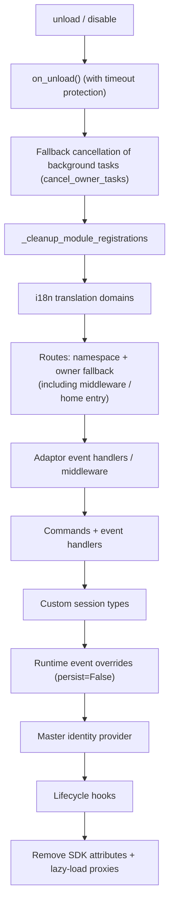

# Ownership (owner) System

Ownership is the cornerstone of plug-and-play modules: all framework resources registered during module loading are automatically named, and automatically reclaimed when the module is unloaded/disabled. Module authors only need to declare resources, without writing cleanup logic manually.

> **Related systems**: Scope determines whether a resource is effective during event dispatching, while ownership determines "who owns the resource and who reclaims it during unloading." Scope is detailed in [Unified Control Plane (scope)](scope.md), and background tasks are covered in [Lifecycle Management](lifecycle.md#background-task-ownership-and-automatic-cancellation).

{!--< tips >!--}
1. Ownership is automatically recorded at the moment of registration via `current_owner`, requiring zero changes to module code.
2. Unload and disable use the same cleanup chain (`_cleanup_module_registrations`), where each step failure only logs a warning and does not interrupt the process.
3. Resources with user configuration semantics (persistent overrides / scope rules / command ACLs) are **not** cleaned up when the module is unloaded.
{!--< /tips >!--}

## Owner Context Mechanism

The owner is passed through the context variable `current_owner` (`ErisPulse.runtime.context`):

```python
from ErisPulse.runtime import owner_scope, get_current_owner

with owner_scope("MyModule"):
    # All resources registered in this interval are automatically assigned to MyModule
    assert get_current_owner() == "MyModule"
```

The framework automatically injects the owner at the following points (module/adaptor code does not need manual wrapping):

| Timing | Owner Value | Location |
|--------|-------------|----------|
| Module `load()` | Module name | Throughout instantiation + `on_load` |
| Adaptor `start()` / `restart()` | Platform name | Throughout adaptor startup |
| `activate_on` lazy-load stub registration | Module name | Placeholder command/processor registration |
| Event handler execution | Module name of handler | Re-injected at handler/command entry |

Re-injection during execution means that command handlers declared in `on_load` that call registration APIs (e.g., `sdk.adapter.on()`, `overrides.*.set(persist=False)`) during runtime are still automatically assigned to the module.

## Full Overview of Owned Resources

All resources registered within the module's loading context are recorded with ownership and automatically reclaimed upon unloading/disabling:

| Resource | Registration Method | Cleanup Call |
|----------|---------------------|--------------|
| Commands | `@command()` / command dict declaration | `command.unregister_by_owner()` |
| Event Handlers | `@message` / `@notice` / `@request` / `@meta` | `handler.unregister_by_owner()` |
| Adaptor Event Listeners | `sdk.adapter.on()` / `raw=True` | `adapter.unregister_handlers_by_owner()` |
| Adaptor Middleware | `@sdk.adapter.middleware` | Same as above |
| Routes (HTTP/WS/SSE) | `router.http()` / `websocket()` / `sse()` | Double fallback by namespace + owner |
| Route Middleware | `@router.middleware()` / `add_middleware()` | `router.unregister_all_by_owner()` |
| Dashboard Home Entry | `router.register_home_entry()` | `unregister_home_entries_by_owner()` |
| Custom Session Types | `register_custom_type()` | `unregister_custom_types_by_owner()` |
| Background Tasks | `self.spawn()` | `cancel_owner_tasks()` |
| Lifecycle Hooks | `lifecycle.register()` | `lifecycle.unregister_by_owner()` |
| Master Identity Provider | `master.provider` | `master.unregister_by_owner()` |
| i18n Translation Keys | `I18nClass` declaration (domain=module name) | `i18n.unregister_domain()` |
| Runtime Event Overrides | `overrides.*.set(persist=False)` | `overrides.unregister_by_owner()` |
| Context Data | Recorded by owner in `runtime/context` | Cleaned up precisely by module |

Corresponding resources on the adaptor side (with platform name as owner) are reclaimed by `_cleanup_adapter_resources` during adaptor `shutdown()` / `restart()`, including:

| Resource | Cleanup Call |
|----------|--------------|
| Adaptor-specific `on()` handlers and middleware | `adapter.unregister_handlers_by_owner(platform)` |
| Platform event method extensions (`EventMixin`) | `unregister_platform_event_methods(platform)` |
| Custom session types | `unregister_custom_types_by_owner(platform)` |
| i18n translation domains (domain=config key) | `i18n.unregister_domain(config key)` |
| Fine-grained named-space routes | `router.unregister_all_by_owner(platform)` |

## Unload/Disable Cleanup Sequence

`unload()` and `disable()` share the same cleanup chain (each step is independently wrapped in try/except, failures are logged but do not interrupt subsequent cleanup):



`sdk.uninit()` at exit has global fallback: all adaptors shutdown → all modules unload → `router.stop()` (clear routes/middleware/home entries) → `cancel_all_background_tasks()` → clear event handlers and hooks.

## Design Boundaries: Resources Not Cleaned on Unload

Ownership only recovers **runtime resources registered by module code**. The following resources belong to **user configuration semantics** (controlled by the user, possibly intentionally configured), and persist after module unloading:

| Resource | Semantics | Description |
|----------|-----------|-------------|
| `overrides.*.set(persist=True)` | Persistent overrides | Written to config file, effective across restarts; not deleted on module unloading (explicitly configured by user) |
| `scope.set_action()` and other scope rules | Permission control plane | Managed by user/Dashboard; rules are not reclaimed on module unloading |
| `overrides.acl.set(persist=True)` | Command ACL | Same as above |
| Conversation `save()` persistence | Multi-turn conversation archive | Data assets are not cleaned up |

Runtime temporary writes (`persist=False`) are reclaimed with the owner—**persistence or not is the boundary between "user assets" and "module runtime state."**

## Module Author Guide

### Recommended Style

```python
from ErisPulse import sdk
from ErisPulse.Core.Event import command
from ErisPulse.runtime import owner_scope, spawn_background

class MyModule(BaseModule):
    async def on_load(self, event):
        # Framework resources: automatically assigned, no manual cleanup needed
        self.task = self.spawn(self.polling())      # Background task
        sdk.router.register_home_entry("MyModule", "/my")  # Home entry

        # Module-specific resources: include in owner_scope to integrate into ownership system
        with owner_scope("MyModule"):
            self.client.on_event(self._handle)      # Hypothetical custom registration

    async def on_unload(self, event):
        # Framework resources have been automatically reclaimed; only clean up resources not covered by owner_scope
        await self.client.close()
```

### Notes

- **Registration during import has no ownership**: Hooks/handlers registered at module top level (during import) occur before `owner_scope`, and are treated as framework-level resources (owner=None) and **not cleaned up**. Always register inside `on_load()`.
- **Custom domain i18n registration**: When `i18n.register(domain=...)` uses a domain different from the module name, it won't be automatically reclaimed. Keep the domain equal to the module name.
- **Background tasks must use `self.spawn()`**: Raw `asyncio.create_task` is not assigned to the module and will not be cancelled on unloading (see [Lifecycle Management](lifecycle.md#background-task-ownership-and-automatic-cancellation)).
- Cleanup chain "failure only logs warnings": Single-step cleanup exceptions do not block other resource cleanup, and are visible at DEBUG/WARNING log levels; enable TRACE for troubleshooting.