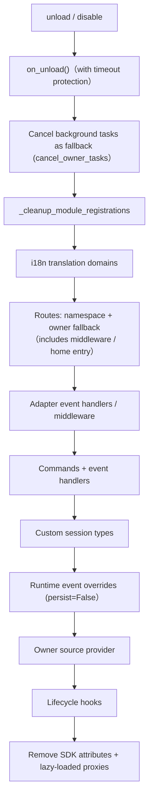

# Ownership (Owner) System

Ownership is the cornerstone of the plug-and-play functionality of modules: all framework resources registered during module loading are automatically named, and are automatically reclaimed when the module is unloaded or disabled—module authors only need to declare resources, without manually writing cleanup logic.

> **Related Systems**: Scope determines whether a resource is active during event dispatching, while ownership determines "who owns the resource and who will reclaim it upon unload." See [Unified Control Plane (Scope)](scope.md) for more details on scope, and [Lifecycle Management](lifecycle.md#Background_Task_Ownership_and_Automatic_Cancellation) for background task ownership and automatic cancellation.

{!--< tips >!--}
1. Ownership is automatically recorded at the moment of registration based on `current_owner`, requiring zero changes to module code.
2. Unloading and disabling share the same cleanup chain (`_cleanup_module_registrations`), where each step failure only triggers a warning without interruption.
3. Resources defined by user configuration (persistent overrides, scope rules, command ACLs) are **not** cleaned up when the module is unloaded.
{!--< /tips >!--}

## Owner Context Mechanism

The owner is passed through the context variable `current_owner` (`ErisPulse.runtime.context`):

```python
from ErisPulse.runtime import owner_scope, get_current_owner

with owner_scope("MyModule"):
    # All resources registered within this block are automatically assigned to MyModule
    assert get_current_owner() == "MyModule"
```

The framework automatically injects the owner at the following points (module/adapter code does not need manual wrapping):

| Timing | Owner Value | Location |
|--------|-------------|----------|
| Module `load()` | Module name | Throughout instantiation + `on_load` |
| Adapter `start()` / `restart()` | Platform name | Throughout adapter startup |
| `activate_on` lazy-load stub registration | Module name | During placeholder command/processor registration |
| Event handler execution | Module name of handler | Re-injected at handler/command entry |

Re-injection during execution means that if a module declares command handlers in `on_load` and calls registration APIs (such as `sdk.adapter.on()` or `overrides.*.set(persist=False)`) during their execution, these will also be automatically assigned to the same module.

## Resource Ownership Overview

All resources registered by a module within its loading context are recorded with ownership and automatically reclaimed upon unloading/disabling:

| Resource | Registration Method | Cleanup Call |
|----------|---------------------|--------------|
| Command | `@command()` / Command dict declaration | `command.unregister_by_owner()` |
| Event Handler | `@message` / `@notice` / `@request` / `@meta` | `handler.unregister_by_owner()` |
| Adapter Event Listener | `sdk.adapter.on()` / `raw=True` | `adapter.unregister_handlers_by_owner()` |
| Adapter Middleware | `@sdk.adapter.middleware` | Same as above |
| Route (HTTP/WS/SSE) | `router.http()` / `websocket()` / `sse()` | Double fallback by namespace + owner |
| Route Middleware | `@router.middleware()` / `add_middleware()` | `router.unregister_all_by_owner()` |
| Dashboard Home Entry | `router.register_home_entry()` | `unregister_home_entries_by_owner()` |
| Custom Session Type | `register_custom_type()` | `unregister_custom_types_by_owner()` |
| Background Task | `self.spawn()` | `cancel_owner_tasks()` |
| Lifecycle Hook | `lifecycle.register()` | `lifecycle.unregister_by_owner()` |
| Master Source Provider | `master.provider` | `master.unregister_by_owner()` |
| i18n Translation Key | `I18nClass` declaration (domain=module name) | `i18n.unregister_domain()` |
| Event Override (Runtime) | `overrides.*.set(persist=False)` | `overrides.unregister_by_owner()` |
| Context Data | `runtime/context` recorded by owner | Precise cleanup by module |

On the adapter side, corresponding resources (with platform name as owner) are reclaimed by `_cleanup_adapter_resources` during adapter `shutdown()` / `restart()`, including:

| Resource | Cleanup Call |
|----------|--------------|
| Adapter-specific `on()` handlers and middleware | `adapter.unregister_handlers_by_owner(platform)` |
| Platform event method extension (`EventMixin`) | `unregister_platform_event_methods(platform)` |
| Custom session type | `unregister_custom_types_by_owner(platform)` |
| i18n translation domain (domain=config key) | `i18n.unregister_domain(config key)` |
| Fine-grained named route | `router.unregister_all_by_owner(platform)` |

## Unload/Disable Cleanup Sequence

`unload()` and `disable()` share the same cleanup chain (with independent try/except for each step; failures are only logged and **do not interrupt subsequent cleanup**):



`sdk.uninit()` also has a global fallback on exit: all adapters shutdown → all modules unload → `router.stop()` (clear routes/middleware/home entry) → `cancel_all_background_tasks()` → clear event handlers and hooks.

## Design Boundary: Which Resources Are Not Cleared on Uninstallation

Ownership only recovers **runtime resources registered by module code**. The following resources belong to **user configuration semantics** (controlled by the user, possibly intentionally configured), and persist after module uninstallation with their configurations:

| Resource | Semantics | Description |
|------|------|------|
| `overrides.*.set(persist=True)` | Persistent Override | Written to configuration files, effective across restarts; not deleted after module uninstallation (explicitly configured by the user) |
| `scope.set_action()` and other scope rules | Permission Control | Managed by the user/Dashboard; rules are not reclaimed after module uninstallation |
| `overrides.acl.set(persist=True)` | Command ACL | Same as above |
| Conversation `save()` persistence | Multi-turn Conversation Archive | Data assets are not cleared |

Runtime temporary writes (with `persist=False`) are reclaimed along with the owner—**persistence or not is the boundary between "user assets" and "module runtime state."**

## Module Author Guide

### Recommended Style

```python
from ErisPulse import sdk
from ErisPulse.Core.Event import command
from ErisPulse.runtime import owner_scope, spawn_background

class MyModule(BaseModule):
    async def on_load(self, event):
        # Framework resources: automatically owned, no manual cleanup needed
        self.task = self.spawn(self.polling())      # Background task
        sdk.router.register_home_entry("My Module", "/my")  # Home page entry

        # Module-specific resources: include in owner_scope to integrate into ownership system
        with owner_scope("MyModule"):
            self.client.on_event(self._handle)      # Hypothetical custom registration

    async def on_unload(self, event):
        # Framework resources have been automatically cleaned up; only clean up module-specific resources not covered by owner_scope
        await self.client.close()
```

### Notes

- **Registration during import has no ownership**: Hooks/handlers registered at the module level (during import) occur before `owner_scope`, and are treated as framework-level resources (owner=None) and **will not be cleaned up**. Always register them inside `on_load()`.
- **i18n registration for custom domain**: When `i18n.register(domain=...)` uses a domain different from the module name, it will not be automatically cleaned up. Please ensure `domain=module name`.
- **Background tasks must use `self.spawn()`**: Raw `asyncio.create_task` is not owned by the module and will not be cancelled during unload (see [Lifecycle Management](lifecycle.md#background-task-ownership-and-automatic-cancellation)).
- **Cleanup chain "failure only logs warning"**: If a single cleanup step fails, it will not block the cleanup of other resources. Errors will be logged at DEBUG/WARNING level and can be enabled at TRACE level for troubleshooting.