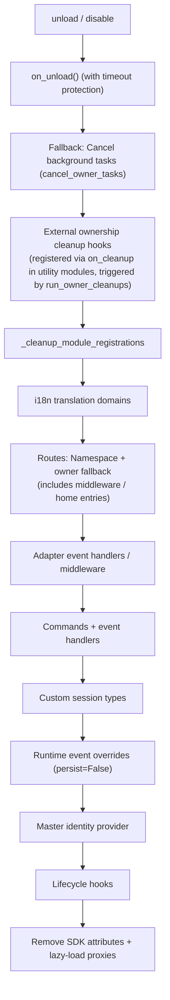

# Ownership (owner) System

Ownership is the cornerstone of the "plug-and-play" nature of modules: all framework resources registered during module loading are automatically attributed, and automatically reclaimed when the module is unloaded or disabled. Module authors only need to declare resources, without writing manual cleanup logic.

> **Related Systems**: Scope determines "whether a resource is active" during event dispatching, while ownership determines "who owns the resource and who is responsible for reclaiming it during lifecycle events." For more details on scope, see [Unified Control Plane (scope)](scope.md). For background tasks, see [Lifecycle Management](lifecycle.md#Background Task Ownership and Automatic Cancellation).

{!--< tips >!--}
1. Ownership is automatically recorded at the **moment of registration** based on `current_owner`, requiring zero code changes from the module.
2. Unload and disable share the same cleanup chain (`_cleanup_module_registrations`), where each step only logs a warning if it fails, without interrupting the process.
3. Resources with user-configured semantics (persistent overrides / scope rules / command ACLs) are **not** cleaned up when the module is unloaded.
4. External handles managed by utility modules can be attached to the cleanup chain via `on_cleanup(cb)`, which will be automatically called when the dependent module is unloaded (see [Guide to Utility Modules: Managing Handles of Other Modules](#Guide-to-Utility-Modules-Managing-Handles-of-Other-Modules)).
{!--< /tips >!--}

## Owner Context Mechanism

The `owner` is passed through the context variable `current_owner` (`ErisPulse.runtime.context`):

```python
from ErisPulse.runtime import owner_scope, get_current_owner

with owner_scope("MyModule"):
    # All resources registered within this context are automatically attributed to MyModule
    assert get_current_owner() == "MyModule"
```

The framework automatically injects the `owner` at the following points (module/adapter code does not need to manually wrap these):

| Timing | Owner Value | Location |
|--------|-------------|----------|
| Module `load()` | Module name | Throughout instantiation + `on_load` |
| Adapter `start()` / `restart()` | Platform name | Throughout adapter startup |
| `activate_on` lazy-load stub registration | Module name | During placeholder command/handler registration |
| Event handler execution | Module name of handler's owner | Re-injected at handler/command entry |

Re-injection during execution means that command handlers declared in `on_load` will still be automatically attributed to the module if they call registration APIs (such as `sdk.adapter.on()` or `overrides.*.set(persist=False)`) during runtime.

## Overview of Owned Resources

All resources registered within the module's loading context are recorded with ownership and automatically reclaimed during unload/disable:

| Resource | Registration Method | Cleanup Call |
|----------|---------------------|--------------|
| Commands | `@command()` / command dict declaration | `command.unregister_by_owner()` |
| Event Handlers | `@message` / `@notice` / `@request` / `@meta` | `handler.unregister_by_owner()` |
| Adapter Event Listeners | `sdk.adapter.on()` / `raw=True` | `adapter.unregister_handlers_by_owner()` |
| Adapter Middleware | `@sdk.adapter.middleware` | Same as above |
| Routes (HTTP/WS/SSE) | `router.http()` / `websocket()` / `sse()` | Double fallback by namespace + owner |
| Route Middleware | `@router.middleware()` / `add_middleware()` | `router.unregister_all_by_owner()` |
| Dashboard Home Entry | `router.register_home_entry()` | `unregister_home_entries_by_owner()` |
| Custom Session Types | `register_custom_type()` | `unregister_custom_types_by_owner()` |
| Background Tasks | `self.spawn()` | `cancel_owner_tasks()` |
| External Cleanup Hooks (Utility Module Managed) | `runtime.on_cleanup(cb)` | `run_owner_cleanups()` (triggered in unload/disable/adapter shutdown chain) |
| Lifecycle Hooks | `lifecycle.register()` | `lifecycle.unregister_by_owner()` |
| Master Identity Provider | `master.provider` | `master.unregister_by_owner()` |
| i18n Translation Keys | `I18nClass` declaration (domain=module name) | `i18n.unregister_domain()` |
| Runtime Event Overrides | `overrides.*.set(persist=False)` | `overrides.unregister_by_owner()` |
| Interactive Sessions (wait_reply / leases) | `event.wait_reply()` / `sdk.interaction.acquire()` | `interaction.cancel_by_owner()` (waiters immediately receive cancellation) |
| Context Data | `runtime/context` recorded by owner | Precise cleanup by module |

Corresponding adapter-side resources (with platform name as owner) are reclaimed during adapter `shutdown()` / `restart()` by `_cleanup_adapter_resources`, plus:

| Resource | Cleanup Call |
|----------|--------------|
| Adapter-specific `on()` handlers and middleware | `adapter.unregister_handlers_by_owner(platform)` |
| Platform event method extensions (`EventMixin`) | `unregister_platform_event_methods(platform)` |
| Custom session types | `unregister_custom_types_by_owner(platform)` |
| Interactive sessions (platform-pending wait_reply / leases) | `interaction.cancel_by_platform(platform)` |
| i18n translation domains (domain=configuration key) | `i18n.unregister_domain(configuration key)` |
| Fine-grained named route | `router.unregister_all_by_owner(platform)` |

## Unload/Disable Cleanup Sequence

`unload()` and `disable()` share the same cleanup chain (each step is independently wrapped in try/except, failures only log warnings, **not interrupting subsequent cleanup**):



`sdk.uninit()` also triggers global fallback cleanup: all adapters shutdown → all modules unload → `router.stop()` (clear routes/middleware/home entries) → `cancel_all_background_tasks()` → clear event handlers and hooks.

## Design Boundaries: Resources Not Cleaned on Unload

Ownership only recovers **runtime resources registered by module code**. The following resources are **user-configured semantics** (controlled by the user, possibly intentionally configured), and persist after module unload:

| Resource | Semantics | Description |
|----------|-----------|-------------|
| `overrides.*.set(persist=True)` | Persistent overrides | Written to configuration file, effective across restarts; not deleted on module unload (user explicitly configured) |
| `scope.set_action()` and other scope rules | Permission control plane | Managed by user/Dashboard; rules are not reclaimed when the module is unloaded |
| `overrides.acl.set(persist=True)` | Command ACLs | Same as above |
| `Conversation.save()` persistence | Multi-turn conversation archives | Data assets are not cleaned up |

Runtime temporary writes (`persist=False`) are reclaimed by owner—**persistence is the boundary between "user assets" and "module runtime state."**

## Internal Implementation: How Ownership Works

The ownership system consists of **two independent chains**. Understanding their division of labor is essential for troubleshooting ownership issues:

### Attribution Chain (contextvar Propagation)

The `ContextVar`s in `runtime/context.py`, such as `current_owner`, are responsible for **attribution** — "whom does the resource registered or the call initiated by the code at this moment belong to?" The propagation rules follow the semantics of Python's `contextvars`:

| Execution Path | Context Propagated? | Attribution Result |
|----------------|---------------------|---------------------|
| Synchronous call chain / `await` chain | ✅ Propagated | Correct attribution |
| `asyncio.create_task` within `owner_scope` | ✅ Propagated (task copies context at creation) | Framework calls **inside** the task are correctly attributed |
| `run_in_executor` / bare thread | ❌ Not propagated | Attribution lost |
| Custom event loop | ❌ Not propagated | Attribution lost |

> Attribution ≠ Registration: Context propagation only affects "to whom it is attributed." Whether the resource is cleaned up depends on whether it enters the subsequent cancellation chain.

### Cancellation Chain (Task Registry)

The `_owner_tasks` registry in `runtime/tasks.py` manages **lifecycle** — "which unfinished tasks belong to the owner, and cancel them all together during unload." Tasks enter the registry through:

1. **Explicit Scheduling**: `spawn_background()` / `self.spawn()` → captures `current_owner` at creation (or explicitly via `owner=` parameter) → registers into the table;
2. **Task Factory Automatic Registration** (2.8.3): `install_owner_task_factory()` is installed into the main event loop at framework startup — **any** task creation (including `create_task` inside third-party libraries) is processed by the factory, reading `current_owner`; if not None, it registers.

Registry self-cleans: Each task includes a `done_callback`, and once completed, it is removed from the table, preventing leaks.

### Cancellation Timing (Module Unload)

```
module.unload()
  → on_unload(event)                    # Module self-cleans (fallback timeout protection)
  → Framework deregisters commands/events/hooks/routes for this owner
  → cancel_owner_tasks(owner)           # Registry fallback cancellation
      → cancel each task.cancel()       # Excludes the task itself executing cancellation logic
      → await gather(pending, timeout)  # Wait for cleanup (no blocking after timeout)
```

### Troubleshooting Approach

- **Resources not cleaned up** → Check the registry: `get_owner_tasks("MyModule")` whether it contains the task; if not, the registration path did not pass through the ownership chain (import phase / thread / independent loop), refer to the table above for identification.
- **Incorrect attribution** → Check the value of `get_current_owner()` at the time of error; for asynchronously delayed execution (callbacks/tasks), attribution is taken from the context at creation, not at execution time.

## Module Author Guide

### Recommended Practices

```python
from ErisPulse import sdk
from ErisPulse.Core.Event import command
from ErisPulse.runtime import owner_scope, spawn_background

class MyModule(BaseModule):
    async def on_load(self, event):
        # Framework resources: automatically owned, no manual cleanup required
        self.task = self.spawn(self.polling())      # Background task
        sdk.router.register_home_entry("My Module", "/my")  # Home entry

        # Module-specific resources: include in owner_scope to integrate into ownership system
        with owner_scope("MyModule"):
            self.client.on_event(self._handle)      # Hypothetical custom registration

    async def on_unload(self, event):
        # Framework resources have been automatically cleaned up, only clean up non-owner_scope covered resources
        await self.client.close()
```

### Notes

- **Registration during import has no ownership**: Hooks/handlers registered at the module's top level (during import) occur before `owner_scope`, and are considered framework-level resources (owner=None) and **will not be cleaned up**. Always register inside `on_load()`.
- **Custom domain i18n registration**: When `i18n.register(domain=...)` uses a domain different from the module name, it won't be automatically cleaned up. Please ensure domain=module name.
- **Background tasks recommended via `self.spawn()`**: As of 2.8.3, raw `asyncio.create_task` will also **automatically register ownership** (Task Factory automatically registers, cancels on unload as a fallback). However, `self.spawn()` remains the recommended approach—supporting non-main loop thread scheduling back to the main loop, explicit `owner=` assignment, and fire-and-forget to prevent GC. **For versions before 2.8.3**, raw tasks are not owned, and `self.spawn()` must be used.
- **Cleanup chain "failure only logs warning"**: Single-step cleanup exceptions will not block other resource releases, visible in DEBUG/WARNING log levels; enable TRACE for troubleshooting.

### Registration Timing → Ownership Result Comparison Table

| Registration Scenario | Ownership Result | Explanation |
|-----------------------|------------------|-------------|
| Registered inside `on_load()` via framework APIs (commands/events/lifecycle/routing decorators) | Owned by module | Automatically unregistered on unload |
| Registered at module top level (during import) | **No ownership** (owner=None) | Not cleaned up, do not use |
| Background tasks created via `self.spawn()` | Owned by module | Automatically cancelled on unload |
| Registered inside `owner_scope("Name")` via third-party APIs | Owned by module | Depends on third-party callbacks executing synchronously within scope |
| Raw `asyncio.create_task` (including `loop.create_task` / `ensure_future`) | **Automatic ownership** (Task Factory, 2.8.3+) | Instantly reads `current_owner` on creation, automatically registers within owner context, cancels on unload as a fallback; see [Internal Implementation](#internal-implementation-how-ownership-works) below |
| Tasks created internally within third-party library asynchronous callbacks (e.g., aiohttp / APScheduler) | **Automatic ownership** (Task Factory, 2.8.3+) | If `current_owner` is injected (e.g., during framework handler execution), the task automatically registers |
| `run_in_executor` (thread pool) | **No ownership** (not asyncio.Task) | Threads are not managed by Task Factory, lifecycle must be managed manually |
| Registration within an independent event loop (self-created loop) | **No ownership** | Task Factory is only installed in the main loop; contextvars do not propagate across event loops |

> Principle: **Ownership follows the `current_owner` context at the moment of registration**; any asynchronous delay, thread pools, or independent loops will detach from this context—explicitly enter `owner_scope` when ownership is required.

## Guide to Utility Modules: Managing Handles for Other Modules

**Scenario**: Modules such as timers, registries, or connection pools act as "utility modules" that hold things for other modules—e.g., another module calls `sdk.Cron.on_trigger(handler)`, and your container stores a callback pointing to the other module's instance. The framework automatically cleans up all framework resources registered by the other module, but it cannot clean up your **private container's references**: after the other module unloads, your container still holds its instance, preventing it from being garbage collected (memory leak, `purge` leak diagnosis reports "unreachable").

**Solution**: In the same function where you register the other module's things, call `on_cleanup()`, and the framework will automatically invoke your cleanup function when the other module unloads or disables:

```python
from ErisPulse.Core.Bases import BaseModule
from ErisPulse.runtime import off_cleanup, on_cleanup

class CronModule(BaseModule):
    def __init__(self):
        self._entries = {}  # {module name: list of callbacks for that module}

    def on_trigger(self, handler):
        # Automatically identifies the calling module's name (whether called directly in on_load or via module.call), returns the resolved owner, which can be used as a naming key
        owner = on_cleanup(self._drop)
        self._entries.setdefault(owner, []).append(handler)

    def _drop(self, owner: str):
        """Automatically called by the framework when the other module is unloaded/disabled: simply discard its handles"""
        self._entries.pop(owner, None)

    async def on_unload(self, event):
        off_cleanup(self._drop)  # ③ Unregister the hook before unloading to prevent the hook table from holding a reference to self
```

Framework guarantees:

| Concern | Behavior |
|---------|----------|
| Trigger Timing | When the other module unloads/disables, or when the adapter shuts down—the framework's cleanup chain triggers before `purge` leak diagnosis |
| Caller Identification | Direct calls use `current_owner`; calls via `module.call()` use the caller (`current_caller`); `on_cleanup(cb, owner="module name")` can also explicitly specify the owner |
| Callback Signature | `cb(owner: str)`, synchronous or asynchronous; asynchronous callbacks have timeout protection (`CLEANUP_CALLBACK_TIMEOUT_SECS`, default 10 seconds) |
| Fault Tolerance | Individual callback exceptions/timeouts only log warnings, not affecting other hooks or the cleanup chain |
| Duplicate Registration | Same `(owner, callback)` is idempotently de-duplicated |

**When Not Needed**: If the other module registers framework resources (commands, event handlers, routes, background tasks, etc.), the framework already handles automatic cleanup (see [Overview of Owned Resources](#Ownership-Resource-Overview)). Only private container references to other module handles require `on_cleanup`. A quick reference for module developers is available in [Best Practices · Utility Modules](../developer-guide/modules/best-practices.md#Utility-Modules-Handling-Other-Modules-Handles-Need-to-Catch-Unload-Notifications).