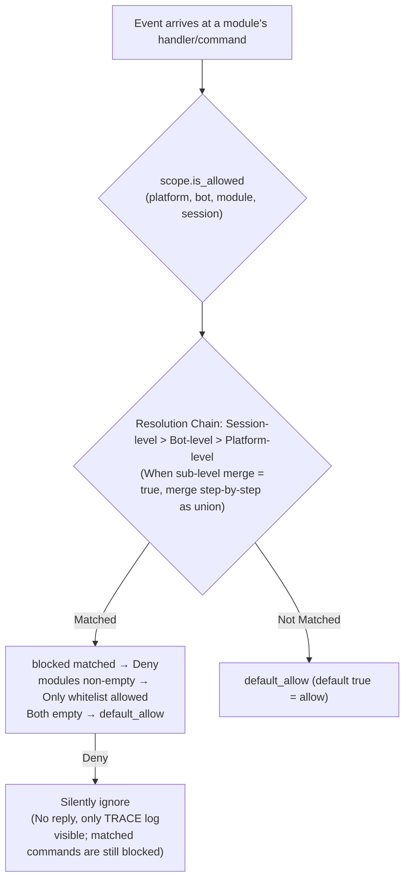

# Scope

> [!NOTE]
> This feature requires ErisPulse **2.8.0+**.

The scope answers four questions: **which modules are available, whether events are received, what text a module processes, and what a module can do externally**.  
The control is entirely given to the user: at the **upper level** (configured via `ErisPulse.scope` or dynamically via `sdk.scope`) during module / adapter / processor / outbound call registration, the event pipeline automatically reads and executes the configuration at the entry, processor filtering, and outbound gate.

| Dimension | Controls | Rejection Behavior | Configuration Path |
|-----------|----------|--------------------|--------------------|
| **① Module** | Which modules are available (platform / Bot / session three levels) | Silently ignored (no reply; matched commands are still claimed and blocked) | `scope.platforms / bots / sessions` |
| **② Identity** | Whether events are received (adapter / Bot / session / user four levels) | Completely discarded at entry (silent) | `scope.identity.*` |
| **③ Outbound** | Which outbound calls a module can initiate (message / API / request, method-level white/black list) | Failed response (`retcode=34601`) | `scope.actions` |

> **Related systems**: Commands are special message event processors, and their user white/black lists (ACL) and implementation parameter overrides are managed by the command system (`ErisPulse.event.command`). See [Getting Started with Event Handling](../getting-started/event-handling.md) and [Configuration Guide](../user-guide/configuration.md).

{!--< tips >!--}
1. Import the singleton via `from ErisPulse.Core import scope` (same object as `sdk.scope`)
2. Check permissions: `scope.is_allowed(...)` / `scope.is_identity_allowed(...)` / `scope.is_action_allowed(...)` correspond to the three gates ①②③
3. Read/Write: Dimensional parameter methods (IDE can auto-complete) — `scope.set_module(...)` / `scope.set_identity(...)` / `scope.set_action(...)`; there are also dictionary-style fallback methods `scope.get(path)` / `scope.set(path, v)` / `scope.delete(path)`
4. Event handler text condition overrides are described in [Getting Started with Event Handling · Event Overriding](../getting-started/event-handling.md#event-overriding-do-not-modify-module-code-to-override-behavior-of-any-event-type); command ACL / parameter overrides are described in [Getting Started with Event Handling](../getting-started/event-handling.md)
{!--< /tips >!--}

## Matching Entry Syntax (Unified Across the System)

All "name lists" in scope (module names, identity keys, outbound entries) share the same matching syntax (`ErisPulse.Core.text_match`):

| Syntax | Example | Description |
|--------|---------|-------------|
| Exact name | `"Chat"` | Full value comparison, **case-insensitive** |
| Glob | `"Tool*"`、`"spam_*"` | `*` for any string / `?` for single character / `[seq]` for character set, case-insensitive |
| Regular expression | `"re:^Danger.*"` | Declared with `re:` prefix, matches using regex `search`, default case-insensitive |

- Invalid regex **silently degrades** to "no match" (no error thrown, no crash)
- Decorator parameters (`pattern=` / `regex=`) have fixed semantics: `pattern` is glob, `regex` is raw regex (without `re:` prefix); regex entries in scope configuration **must** have the `re:` prefix

## Global Fallback: `default_allow`

`default_allow` is the **single global fallback switch** (default `true`), affecting two decision dimensions:

- **Module dimension**: If no binding is matched → `default_allow` decides allow/deny
- **Identity dimension**: If no policy is matched → `default_allow` decides allow/deny

Setting it to `false` enables "implicit deny" strict mode: whitelisting management, **any not explicitly allowed is denied**.

> **Exception**: The outbound dimension is **not** affected by `default_allow`—it is an independent tightening switch, defaulting to full allow, restricting only with explicit rules (framework-level owner-empty calls are always allowed). This strict global mode won't accidentally cut off all module message replies. Command ACL has a separate `ErisPulse.event.command.default_allow` fallback, independent of this.

## Configuration File

```toml
[ErisPulse.scope]
default_allow = true        # Global fallback (false = implicit deny strict mode)
cache_size = 1024           # LRU cache size

# ── ① Module dimension (priority: session > Bot > platform) ──
[ErisPulse.scope.platforms.onebot11]
modules = ["Chat", "Tool*"]   # Whitelist: exact name / glob / re: regex
blocked = ["re:^Danger"]
[ErisPulse.scope.bots.onebot11."123456"]
modules = ["Chat"]
merge = true                  # Append on top of platform-level binding (default is overall override)
[ErisPulse.scope.sessions.onebot11."789012345"]
modules = ["Chat"]

# ── ② Identity dimension (priority: user > session > Bot > adapter) ──
[ErisPulse.scope.identity.adapters.onebot11]
deny = true                   # Discard all events from this adapter
[ErisPulse.scope.identity.bots.onebot11."123456"]
deny = true
[ErisPulse.scope.identity.sessions.onebot11."g_blocked"]
deny = true
[ErisPulse.scope.identity.users.onebot11]
allow = ["u_admin"]           # User keys support glob / re: regex
deny = ["u_bad", "spam_*"]

# ── ③ Outbound dimension (default all allowed, only explicitly tighten) ──
[ErisPulse.scope.actions.MyModule]
send = { deny = true }                                    # Disable all sending
api = { allow = ["get_*"] }                               # Only allow standard query APIs
request = { deny = true }                                 # Disable request handling
```

## ① Module Level

Answer the question: "In a certain context, which modules are available?" By default, all modules are allowed; filtering only begins after configuration binding. **No changes are required for modules or adapters.**



- **Resolution Priority: Session-level > Bot-level > Platform-level**, higher priority bindings **completely override** lower priority ones. When a sub-level binding sets `merge = true`, it instead performs a **per-item union** with the lower priority (both `modules` and `blocked` are merged individually; `merge` itself is a control key and not counted as an item).
- **Silent Semantics**: Commands and handlers from filtered modules are not triggered or replied to, only TRACE-level logs are visible (`core.scope.denied`). **Matched commands** are still blocked from being claimed—command text is no longer passed to lower-level message handlers, eliminating the ambiguity of "double response" where a command is rejected but then the message handler responds again.
- **Framework-level handlers** (`scope_exempt=True` or owner is empty) are unaffected; modules with empty names (framework-level resources) are always allowed.
- **Session-aware help and command queries**: Command query APIs (`command.help` / `get_command` / `get_commands` / `get_group_commands` / `get_visible_commands`, and `module.get_commands_overview`) all support optional `event=` or explicit `platform=` / `bot_id=` / `session_id=` keywords—commands from modules unavailable in the current session no longer appear in the results (`get_command` returns None, single command help is treated as "not registered", consistent with silent semantics). If no context is provided, the behavior remains full.

### Binding Inheritance (merge)

The default semantics of complete override are clear and predictable; when you need to **add** to the parent level, set `merge = true` in the sub-level:

```toml
[ErisPulse.scope.platforms.onebot11]
modules = ["Chat", "Tool"]      # Platform-level: allow Chat, Tool

[ErisPulse.scope.bots.onebot11."123456"]
modules = ["Music"]
merge = true                    # The effective modules for this Bot = ["Chat", "Tool", "Music"]
```

- **Merge Rules**: `modules` and `blocked` are merged individually as **unions**; within the binding, `blocked` still takes precedence over `modules`.
- **Chained Merging**: Platform → Bot → Session are merged step-by-step, with each level independently deciding whether to merge or override.

## ② Identity Dimension (Event Admission)

Answers "whose events are received or not." Events rejected at the **distribution entry are completely discarded**—they do not enter middleware or any processor (including framework-level), visible only in TRACE-level logs (`core.scope.identity_denied`).

- **Parse priority**: user > session > Bot > adapter, taking the most specific configured policy; deny takes precedence over allow
- Each level's binding is a binary policy: `{ allow = true }` or `{ deny = true }`
- User keys support glob / regex (e.g., `"spam_*"` to block a batch of spam users)
- Typical usage—上级 deny, individual allow for "exceptional allowance":

```toml
[ErisPulse.scope.identity.adapters.onebot11]
deny = true
[ErisPulse.scope.identity.users.onebot11]
allow = ["u_admin"]   # Even if adapter-level is denied, events from u_admin are still allowed
```

## ③ Outbound Dimension (Limiting Module Initiated Outbound Calls)

Restricts the **outbound actions** initiated by a module: message sending / standard API actions / request operations. The three action types correspond to the underlying DSL: `Event.reply` and `Send` (send), `Api` / `call_api` (api), `Request`'s accept/reject (request). Outbound calls initiated by a module during event handler execution carry the module owner, and are uniformly judged by this dimension.

### Rule Forms (Inline Table)

Each action's rule is an inline table: `{ allow = [...], deny = true|[...] }`. Only one rule per action is allowed (TOML keys cannot be repeated, choose either full deny or fine-grained):

```toml
[ErisPulse.scope.actions.MyModule]
send = { deny = true }                                  # Disable all sending (Event.reply / Send DSL)
# Or fine-grained method-level: send = { allow = ["Text", "Image*"], deny = ["File"] }
api = { allow = ["get_*"] }                             # Only allow standard query APIs
# Or action-level blacklist: api = { deny = ["set_*", "leave_*"] }
request = { deny = true }                               # Disable request handling accept/reject
```

- `send` entries match **send method names** (`Text` / `Image` / `File` ...), `api` entries match **standard action names** (`get_group_info` / `set_group_name` ...)
- Entries support exact names / glob / `re:` regex (consistent with the unified system syntax, case-insensitive)
- Writing a single string in `allow` is equivalent to a single-entry list: `send = { allow = "Text" }`

### Decision Semantics

**Default is full allow**—unconfigured, or owner is empty (internal framework calls) are all allowed. After configuration, the following order is used for judgment:

1. `deny = true` → deny
2. `deny` list matches the call name → deny
3. `allow` list is non-empty and the call name is not matched (or the call has no name) → deny
4. Otherwise allow

Denied calls do not initiate any network requests, directly returning the standard failure response (`retcode = 34601`, see [api-response §5.3](../standards/api-response.md#53-framework-extended-return-code-34xxx-platform-error-segment-low-three-digits-custom)).

```python
# Runtime API
sdk.scope.set_action("MyModule", "send", deny=True)              # Disable all message sending
sdk.scope.set_action("MyModule", "send", allow=["Text"])         # Allow only text sending
sdk.scope.is_action_allowed("MyModule", "send", name="Image")    # False
sdk.scope.is_action_allowed("MyModule", "api", name="get_user_info")  # Judged by rules
sdk.scope.delete_action("MyModule", "send")                      # Restore allow
sdk.scope.get_action("MyModule", "send")                         # Current rule for this action
```

## Runtime API

The runtime API for scope is layered into three parts: **decision** (three questions), **dimensional read/write** (each dimension has `set`/`get`/`delete` parameterized methods, fully type-annotated, IDE-completable), and **dictionary-style fallback** (dot-path access to any section).

```python
from ErisPulse import sdk

scope = sdk.scope
```

### Decision (Three Questions)

```python
scope.is_allowed("onebot11", "123456", "Chat")                 # ① Module dimension
scope.is_allowed("onebot11", "123456", "Chat", "789012345")    # With session-level
scope.is_allowed("onebot11", "123456", None)                   # Framework-level resource -> True

scope.is_identity_allowed("onebot11", "123456", "group_9", "u1")   # ② Identity dimension

scope.is_action_allowed("MyModule", "send")                    # ④ Outbound dimension
scope.is_action_allowed("MyModule", "send", name="Image")      # Fine-grained method-level
```

### ① Module Dimension

```python
# Binding (hierarchy determined by parameters: session_id > bot_id > platform-level)
scope.set_module("onebot11", bot_id="123456", modules=["Chat", "Tool*"])
scope.set_module("onebot11", blocked=["re:^Danger"])                       # Platform-level
scope.set_module("onebot11", bot_id="123456", session_id="g9", modules=["Chat"])  # Session-level
scope.set_module("onebot11", bot_id="123456", modules=["Music"], merge=True)      # Union with existing entries
scope.set_module("onebot11", bot_id="123456", modules=["Chat"], persist=False)    # Runtime only

# Read / Delete
scope.get_module("onebot11", bot_id="123456")   # {"modules": ["Chat"], "blocked": []}
scope.delete_module("onebot11", bot_id="123456")
```

> `merge=True` is **write-time union** (merges entries with existing bindings at this level); `merge = true` configuration at parse time across levels is described in the previous section on [Binding Inheritance](#绑定继承merge)—these are independent mechanisms.

> **Runtime binding (persist=False) semantics**: Runtime bindings are saved in a separate overlay layer, **not overwritten by any subsequent configuration writes or hot reloads of the configuration file** (the configuration tree is rebuilt and automatically reapplied in the order of writes, including runtime deletions). They are not persisted, lost on process restart; when a module is unloaded, runtime bindings written by that module are cleared by fallback. Subsequent `persist=True` writes (user-persistent semantics) to the same path will replace runtime rules.

### ② Identity Dimension

```python
# Binding policies (hierarchy determined by parameters: user > session > Bot > adapter; allow / deny is binary)
scope.set_identity("onebot11", user_id="u_bad", deny=True)
scope.set_identity("onebot11", user_id="spam_*", deny=True)    # Key supports glob / re: regex
scope.set_identity("onebot11", bot_id="123456", session_id="g9", allow=True)

# Read / Delete
scope.get_identity("onebot11", user_id="u_bad")   # {"deny": True}
scope.delete_identity("onebot11", user_id="u_bad")
```

### ③ Outbound Dimension

```python
# Set restriction rules (allow: str|list; deny: bool|str|list; whole rule replacement semantics)
scope.set_action("MyModule", "send", deny=True)                    # Disable all sending
scope.set_action("MyModule", "send", allow=["Text"])               # Allow only text sending
scope.set_action("MyModule", "api", deny=["set_*", "leave_*"])     # Disable management APIs

# Read / Delete
scope.get_action("MyModule", "send")       # {"allow": ["Text"]} original rule
scope.delete_action("MyModule", "send")    # Remove single action
scope.delete_action("MyModule")            # Remove all action restrictions for this module
```

### General

```python
scope.get("platforms")   # Dictionary-style fallback: dot-path read any section
scope.topology()         # Full configuration tree (for Dashboard)
scope.stats()
# {"module_calls": .., "module_filtered": .., "identity_checks": .., "identity_denied": ..,
#  "action_checks": .., "action_denied": .., "cache_hits": .., "cache_misses": ..}
scope.reset_stats()
scope.clear()           # Clear all configurations (memory-only)
```

### Advanced: Dictionary-style Dot-Path Fallback

Dimensional methods cover daily scenarios; when you need direct access to any node (or future added dimensions), use the dictionary-style API—`get` / `set` / `delete` accepts dot-path (deep dict merge, immediate read after write), and provides `scope[path]` / `scope[path] = v` / `del scope[path]` / `path in scope` protocols:

```python
scope.set("bots.onebot11.123456", {"modules": ["Chat"], "blocked": []})
scope.set("identity.users.onebot11.u_bad", {"deny": True})
scope.get("actions.MyModule.send")

scope["platforms.onebot11"]        # Read (raises KeyError if not exists)
scope["platforms.onebot11"] = {...}  # Write
del scope["platforms.onebot11"]      # Delete
"actions.MyModule" in scope          # Existence check
```

## Cache and Hot Reload

- `is_allowed` / `is_identity_allowed` / `is_action_allowed` results include **LRU cache** (`scope.cache_size` is adjustable), and `set` / `delete` / configuration hot reload (`config.updated` / `config.set`) automatically invalidate
- All dimension configurations take effect **immediately**, no restart required
- Scope is "per-event" judgment, does not cross-event state: if configuration changes, the next event follows new rules

## Configuration Format Validation

Configuration format is validated per section during loading / hot reload: sections with type errors (e.g., `platforms` written as a string), invalid outbound rules (e.g., `allow` written as a number), unknown action names, or unknown top-level keys (e.g., `alow` with a typo) will output a **WARNING** and ignore the corresponding section / entry, while other valid configurations remain effective—mistakes no longer silently fail.

## Common Issues and Considerations

### 1. Configuration Hierarchy and Overriding

- Module dimension: session-level > Bot-level > platform-level, **full override** (with `merge = true` at sub-levels, entries are merged step-by-step). To "platform allows Chat, Bot adds Music," set `merge = true` at Bot level, or list both at once
- Identity dimension: user > session > Bot > adapter, taking the **most specific** configured policy (can be used for exceptional allowance)
- Command user whitelist/blacklist: exact command name takes precedence over glob keys (see `event.command.acl`)

### 2. Module/Command Not Responding

First suspect scope rather than the module itself:

```python
from ErisPulse import sdk

print(sdk.scope.is_allowed(event.get_platform(), bot_id, "MyModule", session_id))
print(sdk.scope.is_identity_allowed(event.get_platform(), bot_id, session_id, user_id))
print(sdk.scope.stats())   # If module_filtered / identity_denied > 0, it means it was silently filtered
```

Filtered is **silent** (module and identity dimensions do not reply, preventing rule exposure), but statistics accumulate; ACL-rejected command dimensions reply "permission denied" explicitly.

### 3. Outbound Action Denied When Troubleshooting

```python
from ErisPulse import sdk

print(sdk.scope.get("actions.MyModule"))
print(sdk.scope.stats())   # If action_denied > 0, some calls were blocked
```

Block is **explicit**: denied calls return the standard failure response (`retcode = 34601`, no network request initiated).

### 4. Session Identifier Isolation Across Platforms

The `(platform, session_id)` combination is the unique identifier. `scope.sessions.onebot11."789"` only applies to onebot11, not affecting a session with the same `789` on Telegram. The same applies to identity dimension user keys.

## Topology API

`ModuleManager.get_topology()` and `AdapterManager.get_topology()` provide data on module/adapter ownership relationships. `sdk.get_topology()` offers a one-click aggregation (including scope `scope`):

```python
from ErisPulse import sdk

topology = sdk.get_topology()
# {
#   "modules": {                                   # Module → owned resources
#     "Chat": {
#       "loaded": True, "enabled": True,
#       "commands": ["chat", "translate"],
#       "handlers": {"message": 2, "notice": 1},
#       "routes": {"http": ["/Chat/api"], "ws": [], "sse": []},
#       "lifecycle_hooks": 3,
#     }
#   },
#   "adapters": {                                  # Adapter → Bot → scope
#     "onebot11": {
#       "status": "started", "enabled": True,
#       "bots": {"123456": {"status": "online", "scope": {...}}},
#       "scope": {"modules": [...], "blocked": [...]},
#     }
#   },
#   "scope": {                                     # Scope (module / identity / outbound action)
#     "platforms": {...}, "bots": {...}, "sessions": {...},
#     "identity": {"adapters": {...}, "bots": {...}, "sessions": {...}, "users": {...}},
#     "actions": {...},
#   },
# }
```

- The module topology aggregates commands, event handlers, HTTP/WS/SSE routes, and lifecycle hooks registered by the module, which is useful for drawing a module resource tree.
- The adapter topology aggregates the status of each adapter, the status of its subordinate Bots, and platform-level/Bot-level scope bindings (at the module level).
- **JSON-safe output**: `get_topology(json_safe=...)` is `True` by default, and the returned structure can be directly `json.dumps`—the module's `info` retains only the pure data sub-table `meta` (discarding runtime objects like `module_class` / `strategy`), and other nodes (including arbitrary objects inserted by adapter authors into Bot `info`) are sanitized by default (class objects use `__name__`, non-serializable objects are converted to `str()`). Dashboard/WebUI can directly serialize the returned data; for raw objects, pass `json_safe=False`.