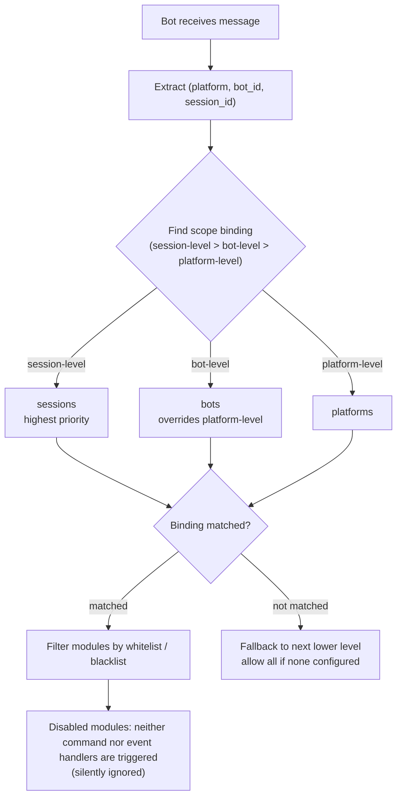

# Module Scope System

> [!NOTE]
> This feature requires ErisPulse **2.8.0+**.

The module scope system is used to control which modules a "certain Bot" can use, achieving module isolation in multi-Bot scenarios. By default, all modules are available to all Bots; filtering only begins after configuration binding, and **no changes are required for modules or adapters** to adapt.

{!--< tips >!--}
1. The scope is bound to modules based on the dimension of 「adapter platform + Bot identifier + session identifier」
2. Supports both whitelist (`modules`) and blacklist (`blocked`) methods
3. Modules disabled by scope silently ignore messages and do not reply with prompts
4. Supports dynamic addition and removal at runtime via `sdk.scope.bind()` / `unbind()`, which can be persisted
{!--< /tips >!--}

Please directly return the complete translated Markdown content without including any other text.

Once again, if the document contains a language switch line (with language names separated by `` | ``), strictly follow the format requirement in point 8 above, and do not write incorrect formats such as ``[**Label**](file)``.

## How It Works



- **Resolution priority: session-level > bot-level > platform-level**, if a higher priority has no binding rules, fall back to the next lower level; if none is configured, allow all modules.
- When event data lacks `self` (Bot cannot be identified), skip bot-level and determine based on session-level / platform-level.
- Framework-level resources (handlers with empty owner, command dispatcher, event bus) are always allowed, unaffected by scope.

Please directly return the complete translated Markdown content, without any additional text.

## Configuration File

```toml
[ErisPulse.scope]
default_allow = true        # Allow all by default (false = implicit strict mode)
cache_size = 1024           # LRU cache size for is_allowed

# Platform-level bindings (applies to all Bots / Sessions on this platform)
[ErisPulse.scope.platforms.onebot11]
modules = ["Chat", "Translate"]   # Whitelist: only these modules can be used on this platform
blocked = ["Danger"]              # Blacklist: these modules are disabled on this platform

# Bot-level bindings (applies to all sessions for this Bot, overrides platform-level)
[ErisPulse.scope.bots.onebot11."123456"]
modules = ["Chat"]
blocked = []

# Session-level bindings (applies to a specific group / channel / private chat, most specific)
[ErisPulse.scope.sessions.onebot11."789012345"]
modules = ["Chat"]                # Only Chat is allowed for this group
blocked = []
```

Semantics (module names match **case-insensitively**):

| Config | Effect |
|--------|--------|
| Only `modules` (whitelist) | Only listed modules are allowed |
| Only `blocked` (blacklist) | Listed modules are blocked, everything else is allowed |
| Both configured | Whitelist restricts the scope, then Blacklist removes items from the whitelist |
| Both empty / not configured | Follows `default_allow`: `true` (default) allows all; `false` implicitly denies |

> `modules` and `blocked` both support strings or string lists. Module names are case-insensitive (`"Chat"` is equivalent to `"chat"`).
> Session identifiers are the event's Group ID (`group_id`), Channel ID (`channel_id`), or Private chat User ID (`user_id`).
> **Session identifiers are isolated across platforms**: The `(platform, session_id)` combination uniquely identifies a session. `789` for `onebot11` does not affect `789` for `telegram`.

## Runtime API

### Checking if a module is allowed

```python
from ErisPulse import sdk

# Check if a certain Bot is allowed to use a certain module
allowed = sdk.scope.is_allowed("onebot11", "123456", "Chat")

# Check for a specific session (Group / Channel / Direct Message)
allowed = sdk.scope.is_allowed("onebot11", "123456", "Chat", "789012345")
```

### Dynamic Binding / Unbinding

```python
# Bind Bot-level whitelist (persisted to config)
sdk.scope.bind("onebot11", "123456", modules=["Chat", "Translate"])

# Bind session-level whitelist (3rd parameter is session_id)
sdk.scope.bind("onebot11", "123456", "789012345", modules=["Chat"])

# Bind platform-level blacklist
sdk.scope.bind("onebot11", blocked=["Danger"])

# Only effective at runtime (invalidated after restart)
sdk.scope.bind("onebot11", "123456", modules=["Chat"], persist=False)

# Merge instead of replace: add Music to existing whitelist (default bind is replace)
sdk.scope.bind("onebot11", "123456", modules=["Music"], merge=True)

# Remove bindings (restore allow all); you can specify session_id to remove session-level bindings
sdk.scope.unbind("onebot11", "123456")
sdk.scope.unbind("onebot11", "123456", "789012345")
```

> `bind()` **replaces** the entire binding for the target by default; when `merge=True`, it merges new modules/disables into existing bindings.

### Query Bindings

```python
# Get active bindings (can specify session)
sdk.scope.get("onebot11", "123456")              # {"modules": ["Chat"], "blocked": []}
sdk.scope.get("onebot11", "123456", "789012345") # Session-level active bindings
sdk.scope.get("onebot11")                        # Platform-level bindings, None if not exists

# List all bindings (platforms / bots / sessions buckets)
sdk.scope.list_bindings()
```

### Filtering Statistics (Debug)

```python
# View the count of bindings silently filtered by the scope and cache hit status
sdk.scope.get_stats()
# {"is_allowed_calls": 10, "filtered_count": 3, "cache_hits": 5, "cache_misses": 5}

sdk.scope.reset_stats()
```

### Topology Tree Data

```python
# Scope part (for Dashboard display)
sdk.scope.get_topology()

## FAQ and Considerations

### 1. Configuration Hierarchy

Parsing Priority: **Session > Bot > Platform**. Higher priority bindings **completely override** lower priority ones.

```toml
# Platform level only allows Chat
[ErisPulse.scope.platforms.onebot11]
modules = ["Chat"]

# But Bot level only allows Music → This bot can ultimately only use Music, cannot use Chat!
[ErisPulse.scope.bots.onebot11."123456"]
modules = ["Music"]
```

- To "allow Chat at platform level and add Music at Bot level", you must **list both at Bot level simultaneously**: `modules = ["Chat", "Music"]`.
- Similarly, the lower-level blacklist is overridden by the upper-level whitelist: Platform level `blocked=["Danger"]` + Bot level `modules=["Danger"]` → Bot level completely overrides, Danger is usable. The higher the hierarchy and the more specific it is, the more it takes precedence.

### 2. It is "Event-by-Event" Judgment, not "Sticky"

Scope judgment applies **only to the current event**, without cross-event memory:
- Session g1 has module A disabled → For this **message** on g1, A does not trigger; the **next** message is judged independently, if the binding hasn't changed it still won't trigger, if the binding changes it takes effect immediately (LRU cache will automatically invalidate).
- Session g2 has no binding configured → Falls back to Bot level / Platform level judgment; if neither exists, follows `default_allow`.

### 3. Module Not Responding

When you send a message and the module doesn't react, suspect the scope first rather than the module / adapter:

```python
# Add a line in the module code or a temporary script to locate
from ErisPulse import sdk
print(sdk.scope.is_allowed(event.get_platform(), <bot_id>, "MyModule", <session_id>))
print(sdk.scope.get_stats())          # filtered_count > 0 indicates it was indeed filtered
```

Being filtered is **silent** (no reply, to avoid exposing scope rules to users), but `filtered_count` will accumulate.

### 4. Session Identifier Cross-Platform Isolation

The `(platform, session_id)` combination is the unique identifier. `[ErisPulse.scope.sessions.onebot11."789"]` only applies to the onebot11 platform and does not affect a telegram session with the same `789`.

### 5. Performance

`is_allowed()` results are cached with **LRU Cache** (default 1024 entries, `scope.cache_size` is adjustable),
config changes / `bind()` / `unbind()` automatically invalidate the cache, making the overhead for high-frequency event paths extremely small.

## Topology Tree API

`ModuleManager.get_topology()` and `AdapterManager.get_topology()` provide data on module/adapter ownership, while `sdk.get_topology()` aggregates all three:

```python
from ErisPulse import sdk

topology = sdk.get_topology()
# {
#   "modules": {                                   # Module -> Owned Resources
#     "Chat": {
#       "loaded": True, "enabled": True,
#       "load_strategy": {"lazy": False, "priority": 50},
#       "info": {...},
#       "commands": ["chat", "translate"],
#       "handlers": {"message": 2, "notice": 1},
#       "routes": {"http": ["/Chat/api"], "ws": [], "sse": []},
#       "lifecycle_hooks": 3,
#       "scope_applies": True,
#     }
#   },
#   "adapters": {                                  # Adapter -> Bot -> Scope
#     "onebot11": {
#       "status": "started", "enabled": True,
#       "bots": {"123456": {"status": "online", "last_active": ..., "info": {...}, "scope": {...}}},
#       "scope": {"modules": [...], "blocked": [...]},
#     }
#   },
#   "scope": {"platforms": {...}, "bots": {...}, "sessions": {...}}   # All scopes bound
# }
```

- Module topology aggregates commands, event handlers, HTTP/WS/SSE routes, and lifecycle hooks registered by the module, facilitating the drawing of the module resource tree.
- Adapter topology aggregates adapter status, subordinate Bot status, and platform-level/Bot-level scope bindings.