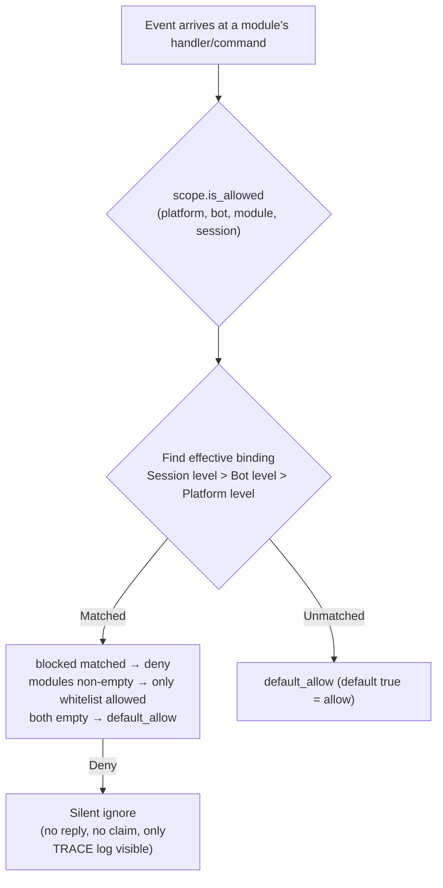

# Unified Control Plane (scope)

> [!NOTE]
> This feature requires ErisPulse **2.8.0+**.

The unified control plane answers five questions: **which modules are available, whether events from whom should be received, who can execute a specific command, what text a module processes, and which implementation parameters are overridden**. The control authority is entirely given to the user: all configurations are declared at the **top level** of module / adapter / command / processor registration (`ErisPulse.scope` or `sdk.scope` at runtime), and the event pipeline automatically reads and executes these configurations at each level.

The control plane consolidates the original multiple permission systems and serves as the **only** entry point for permission/access control in version 2.8.0:

| Dimension | What is controlled | Rejection behavior | Configuration path |
|------|---------|---------|---------|
| **① Module** | Which modules are available (platform / Bot / session three levels) | Silent ignore (no reply, no claim) | `scope.platforms / bots / sessions` |
| **② Identity** | Whether to receive events (adapter / Bot / session / user four levels) | Complete discard at entry (silent) | `scope.identity.*` |
| **③ Command** | Who can execute a specific command (command names support glob) | Reply "insufficient permissions" (explicit) | `scope.commands` |
| **④ Handler** | Which text a module's event handler processes | No trigger (silent) | `scope.handlers` |
| **⑤ Override** | Override module/command implementation parameters (master/hidden/aliases/prefix) | —— (only change parameters) | `scope.overrides` |

{!--< tips >!--}
1. Import the singleton via `from ErisPulse.Core import scope` (`sdk.scope` refers to the same object)
2. `scope.is_allowed(platform, bot_id, module, session_id)` checks if a module is available
3. `scope.is_identity_allowed(platform, bot_id, session_id, user_id)` checks if an event is allowed
4. `scope.allow_user("roll*", platform, uid)` / `deny_user(...)` for command ACL (supports glob)
5. `scope.override("MyModule", "restart", master=True)` overrides implementation parameters
6. `scope.get_stats()` checks filtering statistics; `scope.get_topology()` checks the five-dimensional topology
{!--< /tips >!--}

## Matching Entry Syntax (Unified Across the Entire System)

All "name lists" in the control plane (module names, identity keys, command names) use the same matching syntax (`ErisPulse.Core.text_match`):

| Syntax | Example | Description |
|------|------|------|
| Exact name | `"Chat"` | Full value comparison, **case-insensitive** |
| Glob | `"Tool*"`、`"spam_*"` | `*` matches any string / `?` matches a single character / `[seq]` matches a character set, case-insensitive |
| Regex | `"re:^Danger.*"` | Declared with `re:` prefix, matches via `search`, default case-insensitive |

- Invalid regex **silently falls back** to "no match" (no error thrown, no crash)
- Decorator parameters (`pattern=` / `regex=`) have fixed semantics: `pattern` is glob, `regex` is the raw regex code (without `re:` prefix); regex entries in control plane configurations **must** have the `re:` prefix

## Global Default: `default_allow`

`default_allow` is the **single global** default switch (default `true`), uniformly affecting three decision dimensions:

- **Module dimension**: If no binding is matched → `default_allow` determines allow / deny
- **Identity dimension**: If no policy is matched → `default_allow` determines allow / deny
- **Command dimension**: If no ACL is configured → `default_allow=true` passes to the developer's default permission chain; `false` (strict mode) denies commands with no ACL configured

Setting it to `false` enables "implicit deny" strict mode: white-list management, **all unexplicitly allowed are denied**.

## Configuration File

```toml
[ErisPulse.scope]
default_allow = true        # Global default (false = implicit deny strict mode)
cache_size = 1024           # LRU cache size

# ── ① Module dimension (priority: session > Bot > platform) ──
[ErisPulse.scope.platforms.onebot11]
modules = ["Chat", "Tool*"]   # Whitelist: exact name / glob / re: regex
blocked = ["re:^Danger"]
[ErisPulse.scope.bots.onebot11."123456"]
modules = ["Chat"]
[ErisPulse.scope.sessions.onebot11."789012345"]
modules = ["Chat"]

# ── ② Identity dimension (priority: user > session > Bot > adapter) ──
[ErisPulse.scope.identity.adapters.onebot11]
deny = true                   # Discard all events from this adapter
[ErisPulse.scope.identity.bots.onebot11."123456"]
deny = true
[ErisPulse.scope.identity.sessions.onebot11."g_blocked"]
deny = true
[ErisPulse.scope.identity.users.onebot11]
allow = ["u_admin"]           # User keys support glob / re: regex
deny = ["u_bad", "spam_*"]

# ── ③ Command dimension (command names support glob) ──
[ErisPulse.scope.commands."roll*"]
allow = ["onebot11:u_vip"]    # User identifier "platform:user_id"
deny = ["onebot11:u_bad"]

# ── ④ Handler/text dimension ──
[ErisPulse.scope.handlers.MyModule]
pattern = "签到*"             # AND with code-level pattern/regex conditions
regex = "re:\\d+\\s*元"

# ── ⑤ Implementation parameter override ──
[ErisPulse.scope.overrides.MyModule.restart]
master = true                 # Only framework owner can use
hidden = true                 # Hidden in help
aliases = ["rs"]              # Append alias
prefix = "!"                  # Append trigger prefix
```

## ① Module Dimension

Answers "which modules are available in a given context." By default, all are open; filtering starts only after configuration binding. **No changes are needed for modules or adapters.**



- **Resolution priority**: Session level > Bot level > Platform level, higher priority bindings **fully override** lower ones
- **Silent semantics**: Filtered modules' commands and handlers do not trigger, reply, or claim (prevents cross-command mis-matching), only TRACE-level logs are visible (`core.scope.denied`)
- **Framework-level handlers** (`scope_exempt=True` or owner is empty) are unaffected; module names empty (framework-level resources) are always allowed

## ② Identity Dimension (Event Admission)

Answers "whose events are received." Events denied at this dimension are **completely discarded at the distribution entry**—they do not enter middleware or any handler (including framework-level), only TRACE-level logs are visible (`core.scope.identity_denied`).

- **Resolution priority**: User > Session > Bot > Adapter, take the most specific configured policy; deny takes precedence over allow
- Each level's binding is a binary policy: `{ allow = true }` or `{ deny = true }`
- User keys support glob / regex (e.g., `"spam_*"` blocks a batch of spam users)
- Typical use case—上级 deny, individual allow for "exceptional allow":

```toml
[ErisPulse.scope.identity.adapters.onebot11]
deny = true
[ErisPulse.scope.identity.users.onebot11]
allow = ["u_admin"]   # Even if adapter-level denied, u_admin's events are allowed
```

## ③ Command Dimension (Command ACL)

Answers "who can execute a specific command." Decision order: **deny matched → deny; allow whitelist non-empty and not matched → deny; neither configured → follow `default_allow`** (`true` passes to the developer's default permission chain). Denied commands reply with "insufficient permissions" explicitly.

- Command names support glob: `"roll*"` covers `roll`, `roll_dice`, etc., in one rule
- Exact keys take precedence over glob keys (`commands.roll` matched, then `commands."roll*"` is not checked)
- User identifier format `"platform:user_id"` (consistent with the framework owner system)
- This dimension is **only an additional gate on the user side**, and is chained with the command's `master` / `permission` parameters: ACL passes, then the developer's declared default permission chain is followed

## ④ Handler/Text Dimension

Filters "what text a module processes": After configuring `pattern` / `regex` for a module, all its event handlers only trigger when the text matches (AND with code-level conditions, both must be satisfied). Suitable for narrowing its trigger scope without changing module code.

```toml
[ErisPulse.scope.handlers.ChatModule]
pattern = "闲聊*"     # ChatModule's handlers only respond to messages starting with "闲聊"
```

## ⑤ Implementation Parameter Override

Overrides implementation parameters at the **top level** of module/command registration, without modifying module code:

```toml
[ErisPulse.scope.overrides.MyModule.restart]
master = true      # Override to only framework owner
hidden = true      # Hidden in help list
aliases = ["rs"]   #生效别名
```

> Overriding only changes **implementation parameters** (master / hidden / aliases / prefix / help / usage, etc.). **Disabling a command is not done here**—use command dimension deny (`scope.commands` or `scope.deny_user()`), to avoid conflicting "disable" semantics.

## Runtime API

### Module Dimension

```python
from ErisPulse import sdk

# Check
sdk.scope.is_allowed("onebot11", "123456", "Chat")
sdk.scope.is_allowed("onebot11", "123456", "Chat", "789012345")
sdk.scope.is_allowed("onebot11", "123456", None)      # Framework-level resource -> True

# Bind / Unbind
sdk.scope.bind_module("onebot11", "123456", modules=["Chat", "Tool*"])
sdk.scope.bind_module("onebot11", blocked=["Danger"])             # Platform level
sdk.scope.bind_module("onebot11", "123456", "789012345", modules=["Chat"])  # Session level
sdk.scope.bind_module("onebot11", "123456", modules=["Music"], merge=True)  # Merge
sdk.scope.bind_module("onebot11", "123456", modules=["Chat"], persist=False)  # Runtime only
sdk.scope.unbind_module("onebot11", "123456")

# Query
sdk.scope.get("onebot11", "123456")   # {"modules": ["Chat"], "blocked": []}
```

### Identity Dimension

```python
# Check if event is allowed
sdk.scope.is_identity_allowed("onebot11", "123456", "group_9", "u1")

# Bind policy (hierarchy determined by parameters: user > session > bot > adapter)
sdk.scope.bind_identity("onebot11", user_id="u_bad", deny=True)
sdk.scope.bind_identity("onebot11", user_id="spam_*", deny=True)   # glob
sdk.scope.bind_identity("onebot11", "123456", "group_9", allow=True)
sdk.scope.unbind_identity("onebot11", user_id="u_bad")

# User blacklist convenience API
sdk.scope.block_user("onebot11", "u_bad")
sdk.scope.is_user_blocked("onebot11", "u_bad")
sdk.scope.get_blocked_users()        # {"onebot11": ["u_bad"]}
sdk.scope.unblock_user("onebot11", "u_bad")
```

### Command Dimension

```python
sdk.scope.is_command_allowed("roll", "onebot11", "u1")
sdk.scope.allow_user("roll*", "onebot11", "u_vip")   # Command names support glob
sdk.scope.deny_user("roll*", "onebot11", "u_bad")
sdk.scope.get_acl("roll*")
sdk.scope.remove_acl("roll*")

# Can also use command system facade (equivalent delegation)
from ErisPulse.Core.Event import command
command.allow_user("restart", "onebot11", "123456")
```

### Handler and Override Dimensions

```python
sdk.scope.bind_handler("MyModule", pattern="签到*", regex=r"\d+号")
sdk.scope.unbind_handler("MyModule")

sdk.scope.override("MyModule", "restart", master=True, hidden=True)
sdk.scope.get_override("MyModule", "restart")
sdk.scope.remove_override("MyModule", "restart")
```

### General

```python
sdk.scope.list_bindings()   # All five-dimensional bindings
sdk.scope.get_topology()    # Five-dimensional topology (for Dashboard)
sdk.scope.get_stats()
# {"module_calls": .., "module_filtered": .., "identity_checks": .., "identity_denied": ..,
#  "command_checks": .., "command_denied": .., "cache_hits": .., "cache_misses": ..}
sdk.scope.reset_stats()
sdk.scope.clear()           # Clear all bindings (in-memory only)
```

## Cache and Hot Update

- `is_allowed` / `is_identity_allowed` results are cached with **LRU** (configurable via `scope.cache_size`), and `bind_*` / `unbind_*` / configuration hot updates (`config.updated` / `config.set`) automatically invalidate the cache
- All dimension configurations take effect **immediately**, no restart required
- The control plane makes decisions **per event**, with no cross-event memory: if the configuration changes, the next event follows the new rule

## Common Issues and Notes

### 1. Configuration Hierarchy and Overriding

- Module dimension: Session level > Bot level > Platform level, **full override**. To "allow Chat at platform level, add Music at Bot level," both must be listed at the Bot level
- Identity dimension: User > Session > Bot > Adapter, take the **most specific** configured policy (can be used for exceptional allow)
- Command dimension: Exact command names take precedence over glob keys

### 2. Prefer Control Plane Over Module Code Changes

Modules declare "developer defaults" (`master=True`, `permission=...`, `pattern=...`); the control plane declares "user final decisions." When conflicts arise, the **more restrictive control plane** takes precedence (e.g., if the developer does not set master, the user can override `master = true` to tighten; the user cannot loosen the developer's explicit restrictions via override—disable/allow control goes through command deny / identity allow).

### 3. Module/Command Not Responding

First suspect the control plane rather than the module itself:

```python
from ErisPulse import sdk

print(sdk.scope.is_allowed(event.get_platform(), bot_id, "MyModule", session_id))
print(sdk.scope.is_identity_allowed(event.get_platform(), bot_id, session_id, user_id))
print(sdk.scope.get_stats())   # module_filtered / identity_denied > 0 indicates silent filtering
```

Filtering is **silent** (module dimension and identity dimension do not reply, to avoid exposing rules), but statistics accumulate; command dimension ACL denial replies explicitly with "insufficient permissions."

### 4. Session Identifier Isolation Across Platforms

`(platform, session_id)` is the unique identifier. `scope.sessions.onebot11."789"` only applies to onebot11, not affecting the session with `789` on telegram. The same applies to identity dimension user keys.

## Topology Tree API

`ModuleManager.get_topology()` and `AdapterManager.get_topology()` provide module/adapter ownership relationship data; `sdk.get_topology()` aggregates all (including control plane `scope` five dimensions):

```python
from ErisPulse import sdk

topology = sdk.get_topology()
# {
#   "modules": {                                   # Module → owned resources
#     "Chat": {
#       "loaded": True, "enabled": True,
#       "commands": ["chat", "translate"],
#       "handlers": {"message": 2, "notice": 1},
#       "routes": {"http": ["/Chat/api"], "ws": [], "sse": []},
#       "lifecycle_hooks": 3,
#     }
#   },
#   "adapters": {                                  # Adapter → Bot → scope
#     "onebot11": {
#       "status": "started", "enabled": True,
#       "bots": {"123456": {"status": "online", "scope": {...}}},
#       "scope": {"modules": [...], "blocked": [...]},
#     }
#   },
#   "scope": {                                     # Unified control plane (five dimensions)
#     "platforms": {...}, "bots": {...}, "sessions": {...},
#     "identity": {"adapters": {...}, "bots": {...}, "sessions": {...}, "users": {...}},
#     "commands": {...}, "handlers": {...}, "overrides": {...},
#   },
# }
```

- Module topology aggregates commands, event handlers, HTTP/WS/SSE routes, and lifecycle hooks registered by the module, facilitating the drawing of the module resource tree.
- Adapter topology aggregates the status of each adapter, the status of subordinate Bots, and platform-level/Bot-level scope bindings.