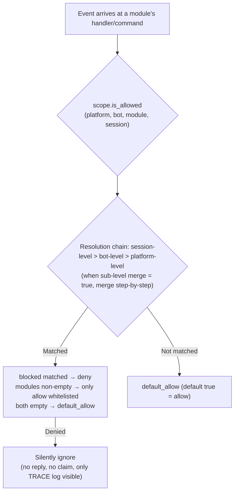

# Scope

> [!NOTE]
> This feature requires ErisPulse **2.8.0+**.

Scope answers four questions: **which modules are available, who receives events, what text a module processes, and what a module can do externally**.  
The control is entirely given to the user: the **upper layer** (configured via `ErisPulse.scope` or runtime `sdk.scope`) that registers modules / adapters / processors / outbound calls declares these uniformly. The event pipeline automatically reads and executes these configurations at entry, processor filtering, and outbound gateways.

| Dimension | Controls What | Rejection Behavior | Configuration Path |
|-----------|---------------|--------------------|--------------------|
| **① Module** | Which modules are available (platform / Bot / session three levels) | Silent ignore (no reply, no claim) | `scope.platforms / bots / sessions` |
| **② Identity** | Whether to receive events (adapter / Bot / session / user four levels) | Complete discard at entry (silent) | `scope.identity.*` |
| **③ Outbound** | Which outbound calls a module can initiate (messages / API / requests, method-level white/blacklists) | Failure response (`retcode=34601`) | `scope.actions` |

> **Related Systems**: Commands are special message event processors, and their user allow/deny lists (ACL) and implementation parameter overrides are self-managed by the command system (`ErisPulse.event.command`). See [Event Handling Introduction](../getting-started/event-handling.md) and [Configuration Guide](../user-guide/configuration.md).

{!--< tips >!--}
1. Import the singleton via `from ErisPulse.Core import scope` (same object as `sdk.scope`)
2. Check permissions: `scope.is_allowed(...)` / `scope.is_identity_allowed(...)` / `scope.is_action_allowed(...)` correspond to the three gates ①②③
3. Read/Write: Dimensional parameter methods (IDE can auto-complete) — `scope.set_module(...)` / `scope.set_identity(...)` / `scope.set_action(...)`; there are also dictionary-style fallback methods `scope.get(path)` / `scope.set(path, v)` / `scope.delete(path)`
4. Event processor text condition overrides are described in [Event Handling Introduction · Event Overriding](../getting-started/event-handling.md#event-overriding-does-not-change-module-code-to-override-the-behavior-of-any-event-type); command ACL / parameter overrides are described in [Event Handling Introduction](../getting-started/event-handling.md)
{!--< /tips >!--}

## Matching Entry Syntax (Unified Across the System)

All "name lists" (module names, identity keys, outbound entries) across the scope share the same matching syntax (`ErisPulse.Core.text_match`):

| Syntax | Example | Description |
|--------|---------|-------------|
| Exact Name | `"Chat"` | Full value comparison, **case-insensitive** |
| Glob | `"Tool*"` or `"spam_*"` | `*` matches any string / `?` matches any single character / `[seq]` matches any character in the set, case-insensitive |
| Regular Expression | `"re:^Danger.*"` | Declared with `re:` prefix, uses regex `search` matching, case-insensitive by default |

- Invalid regular expressions **silently degrade** to "no match" (no error thrown, no crash)
- Decorator parameters (`pattern=` / `regex=`) have fixed semantics: `pattern` is glob, `regex` is the raw regex source (without `re:` prefix); regular expression entries in scope configurations **must** include the `re:` prefix

## Global Fallback: `default_allow`

`default_allow` is the **single global** fallback switch (default `true`), which uniformly affects both decision dimensions:

- **Module dimension**: If no binding is matched → `default_allow` determines whether to allow or deny.
- **Identity dimension**: If no policy is matched → `default_allow` determines whether to allow or deny.

Setting it to `false` enables the "implicit deny" strict mode: whitelist-based management, where **anything not explicitly allowed is denied**.

> **Exception**: The **outbound dimension** is **not affected** by `default_allow` — it is an independent tightening switch. By default, all outbound traffic is allowed, and only explicit rules impose restrictions (calls owned by the framework layer with an empty owner are always allowed). This ensures that strict global mode does not accidentally block all module message responses. Command ACL has its own `ErisPulse.event.command.default_allow` fallback, which does not interfere with this mechanism.

## Configuration File

```toml
[ErisPulse.scope]
default_allow = true        # Global fallback (false = strict implicit deny mode)
cache_size = 1024           # LRU cache size

# ── ① Module Level (Priority: Session > Bot > Platform) ──
[ErisPulse.scope.platforms.onebot11]
modules = ["Chat", "Tool*"]   # Whitelist: exact names / globs / re: regex
blocked = ["re:^Danger"]
[ErisPulse.scope.bots.onebot11."123456"]
modules = ["Chat"]
merge = true                  # Append to platform-level bindings (default is full override)
[ErisPulse.scope.sessions.onebot11."789012345"]
modules = ["Chat"]

# ── ② Identity Level (Priority: User > Session > Bot > Adapter) ──
[ErisPulse.scope.identity.adapters.onebot11]
deny = true                   # Drop all events from this adapter
[ErisPulse.scope.identity.bots.onebot11."123456"]
deny = true
[ErisPulse.scope.identity.sessions.onebot11."g_blocked"]
deny = true
[ErisPulse.scope.identity.users.onebot11]
allow = ["u_admin"]           # User keys support globs / re: regex
deny = ["u_bad", "spam_*"]

# ── ③ Outbound Level (Default: allow all, only explicitly deny) ──
[ErisPulse.scope.actions.MyModule]
send = { deny = true }                                    # Deny all sending
api = { allow = ["get_*"] }                               # Only allow standard query APIs
request = { deny = true }                                 # Deny processing requests
```

## ① Module-level

Answer: "In a given context, which modules are available?" By default, all modules are open; filtering starts only after configuration binding.  
**No changes are required for modules or adapters.**



- **Resolution priority: session-level > bot-level > platform-level**, higher priority bindings **fully override** lower ones;  
  When a sub-level binding specifies `merge = true`, it instead performs a **step-by-step union** with lower levels (merge `modules` and `blocked` individually, `merge` itself is a control key, not counted as an entry)
- **Silent semantics**: Commands and handlers from filtered modules are not triggered, replied to, or claimed (to prevent cross-command mis-matching),  
  visible only in TRACE-level logs (`core.scope.denied`)
- **Framework-level handlers** (`scope_exempt=True` or owner is empty) are unaffected; modules with empty names (framework-level resources) are always allowed
- **Session-aware help and command queries**: Command query APIs (`command.help` / `get_command` / `get_commands` / `get_group_commands` / `get_visible_commands`,  
  and `module.get_commands_overview`) all support optional `event=` or explicit `platform=` / `bot_id=` / `session_id=` keywords — commands from modules unavailable in the current session  
  no longer appear in results (`get_command` returns None, single command help is treated as "not registered",  
  consistent with silent semantics); if no context is provided, full behavior is retained

### Binding Inheritance (merge)

By default, the semantics of full override are clear and predictable; when you need to **append** to an upper-level binding, specify `merge = true` in the sub-level:

```toml
[ErisPulse.scope.platforms.onebot11]
modules = ["Chat", "Tool"]      # Platform-level: allow Chat, Tool

[ErisPulse.scope.bots.onebot11."123456"]
modules = ["Music"]
merge = true                    # The effective modules for this bot = ["Chat", "Tool", "Music"]
```

- **Merge rules**: `modules` and `blocked` each take the **union**; within a binding, `blocked` still takes precedence over `modules`
- **Chained merge**: Platform → Bot → Session, each level independently decides whether to merge or override

## ② Identity Dimension (Event Admission)

Answer "Whose events are accepted or rejected." Rejected events are **completely discarded at the distribution entry point**—they do not enter middleware or any processor (including framework-level), and are only visible in TRACE-level logs (`core.scope.identity_denied`).

- **Resolution Priority: User > Session > Bot > Adapter**, taking the most specific configured policy; deny takes precedence over allow
- Each level binding is a binary policy: `{ allow = true }` or `{ deny = true }`
- User keys support glob / regex (e.g., `"spam_*"` to block a batch of spam users)
- Typical usage — deny at an upper level, allow for specific individuals to make "exceptional passes":

```toml
[ErisPulse.scope.identity.adapters.onebot11]
deny = true
[ErisPulse.scope.identity.users.onebot11]
allow = ["u_admin"]   # Even if the adapter-level denies, events from u_admin are still passed
```

## ③ Outbound Dimension (Limiting Modules Initiating Outbound Calls)

Constraints on **outbound actions initiated by modules**: message sending / standard API actions / request handling.  
The three types of actions correspond to underlying DSLs: `Event.reply` and `Send` (send), `Api` / `call_api` (api), and `Request`'s accept/reject (request). Outbound calls initiated by modules during event handler execution carry the module owner, which are uniformly judged by this dimension.

### Rule Format (Inline Table)

Each action's rule is an inline table: `{ allow = [...], deny = true|[...] }`. Only one rule per action is allowed (TOML keys cannot be repeated; either full denial or fine-grained control is chosen):

```toml
[ErisPulse.scope.actions.MyModule]
send = { deny = true }                                  # Deny all sending (Event.reply / Send DSL)
# Or method-level granularity: send = { allow = ["Text", "Image*"], deny = ["File"] }
api = { allow = ["get_*"] }                             # Only allow query-type standard APIs
# Or action-level blacklist: api = { deny = ["set_*", "leave_*"] }
request = { deny = true }                               # Prohibit handling request accept/reject
```

- `send` entries match **method names** (`Text` / `Image` / `File` ...),  
  `api` entries match **standard action names** (`get_group_info` / `set_group_name` ...)
- Entries support exact names / glob / `re:` regex (consistent with the global system syntax, case-insensitive)
- Writing a single string in `allow` is equivalent to a single-entry list: `send = { allow = "Text" }`

### Judgment Semantics

**Default: Allow All** — Calls without configuration or with an empty owner (internal framework calls) are allowed.  
After configuration, rules are judged in the following order:

1. `deny = true` → Reject  
2. The called name matches an entry in the `deny` list → Reject  
3. The `allow` list is non-empty and the called name does not match (or the call has no name) → Reject  
4. All others are allowed

Rejected calls do not initiate any network requests and directly return a standard failure response  
(`retcode = 34601`, see [api-response §5.3](../standards/api-response.md#53-framework-extension-response-codes-34xxx-customization-in-the-lowest-three-digits-of-the-platform-error-segment)).  
The three actions are independent and can be limited individually.

```python
# Runtime API
sdk.scope.set_action("MyModule", "send", deny=True)              # Deny all message sending
sdk.scope.set_action("MyModule", "send", allow=["Text"])         # Allow only text messages
sdk.scope.is_action_allowed("MyModule", "send", name="Image")    # False
sdk.scope.is_action_allowed("MyModule", "api", name="get_user_info")  # Judged by rules
sdk.scope.delete_action("MyModule", "send")                      # Restore allowed
sdk.scope.get_action("MyModule", "send")                         # Get current rule for this action
```

## Runtime API

The scope runtime API consists of three layers: **Decision** (Three Questions), **Dimensional Read/Write** (per-dimension `set` / `get` / `delete` parametric methods with full type annotations, IDE auto-complete), and **Dictionary-style Fallback** (dot-path access to any section).

```python
from ErisPulse import sdk

scope = sdk.scope
```

### Decision (Three Questions)

```python
scope.is_allowed("onebot11", "123456", "Chat")                 # ① Module Dimension
scope.is_allowed("onebot11", "123456", "Chat", "789012345")    # With session-level
scope.is_allowed("onebot11", "123456", None)                   # Framework-level resource -> True

scope.is_identity_allowed("onebot11", "123456", "group_9", "u1")   # ② Identity Dimension

scope.is_action_allowed("MyModule", "send")                    # ④ Outbound Dimension
scope.is_action_allowed("MyModule", "send", name="Image")      # Fine-grained method level
```

### ① Module Dimension

```python
# Binding (hierarchy determined by parameters: session_id > bot_id > platform-level)
scope.set_module("onebot11", bot_id="123456", modules=["Chat", "Tool*"])
scope.set_module("onebot11", blocked=["re:^Danger"])                       # Platform-level
scope.set_module("onebot11", bot_id="123456", session_id="g9", modules=["Chat"])  # Session-level
scope.set_module("onebot11", bot_id="123456", modules=["Music"], merge=True)      # Union with existing entries
scope.set_module("onebot11", bot_id="123456", modules=["Chat"], persist=False)    # Runtime-only

# Read / Delete
scope.get_module("onebot11", bot_id="123456")   # {"modules": ["Chat"], "blocked": []}
scope.delete_module("onebot11", bot_id="123456")
```

> `merge=True` is **write-time union** (merges with existing bindings at this level); cross-level merge during resolution is controlled by the `merge = true` configuration key described in [Binding Inheritance](#binding-inheritance-merge)—these are independent mechanisms.

### ② Identity Dimension

```python
# Binding strategy (hierarchy determined by parameters: user > session > bot > adapter; allow / deny only)
scope.set_identity("onebot11", user_id="u_bad", deny=True)
scope.set_identity("onebot11", user_id="spam_*", deny=True)    # Keys support glob / re: regex
scope.set_identity("onebot11", bot_id="123456", session_id="g9", allow=True)

# Read / Delete
scope.get_identity("onebot11", user_id="u_bad")   # {"deny": True}
scope.delete_identity("onebot11", user_id="u_bad")
```

### ③ Outbound Dimension

```python
# Set restriction rules (allow: str|list; deny: bool|str|list; complete rule replacement semantics)
scope.set_action("MyModule", "send", deny=True)                    # Disable all sending
scope.set_action("MyModule", "send", allow=["Text"])               # Allow only text messages
scope.set_action("MyModule", "api", deny=["set_*", "leave_*"])     # Disable management APIs

# Read / Delete
scope.get_action("MyModule", "send")       # {"allow": ["Text"]} original rule
scope.delete_action("MyModule", "send")    # Remove single action
scope.delete_action("MyModule")            # Remove all action restrictions for this module
```

### General

```python
scope.get("platforms")   # Dictionary-style fallback: dot-path read any section
scope.topology()         # Full configuration tree (for Dashboard)
scope.stats()
# {"module_calls": .., "module_filtered": .., "identity_checks": .., "identity_denied": ..,
#  "action_checks": .., "action_denied": .., "cache_hits": .., "cache_misses": ..}
scope.reset_stats()
scope.clear()           # Clear all configuration (memory-only)
```

### Advanced: Dictionary-style Dot-Path Fallback

Dimensional methods cover daily scenarios; when you need direct access to any node (or future added dimensions), use dictionary-style API—`get` / `set` / `delete` accepts dot-paths (deep dict merge, immediate read after write), and provides `scope[path]` / `scope[path] = v` / `del scope[path]` / `path in scope` protocol:

```python
scope.set("bots.onebot11.123456", {"modules": ["Chat"], "blocked": []})
scope.set("identity.users.onebot11.u_bad", {"deny": True})
scope.get("actions.MyModule.send")

scope["platforms.onebot11"]        # Read (throws KeyError if not exists)
scope["platforms.onebot11"] = {...}  # Write
del scope["platforms.onebot11"]      # Delete
"actions.MyModule" in scope          # Existence check
```

## Caching and Hot Updates

- `is_allowed` / `is_identity_allowed` / `is_action_allowed` results are cached with **LRU caching** (configurable via `scope.cache_size`), and become invalid automatically on `set` / `delete` or configuration hot updates (`config.updated` / `config.set`)
- All dimension configurations take effect **immediately**, no restart required
- Scopes are evaluated "per event" and do not retain memory across events: if the configuration changes, the next event will be evaluated according to the new rules

## Configuration Format Validation

During loading or hot reloading, the configuration format is validated section by section: sections with incorrect types (e.g., `platforms` written as a string), invalid outbound rules (e.g., `allow` written as a number), unknown action names, and unknown top-level keys (e.g., `alow` with a typo) will output a **WARNING** and the corresponding section or entry will be ignored, while other valid configurations will still take effect—mistakes will no longer silently fail.

## Frequently Asked Questions and Precautions

### 1. Configuration Hierarchy and Overriding

- Module level: Session level > Bot level > Platform level, **overall override** (when `merge = true` at sub-level, merge entries as a union).
  To allow "Chat on platform, then Music on Bot", you can set `merge = true` at Bot level, or list both.
- Identity level: User > Session > Bot > Adapter, take the **most specific** configured policy (exceptions can be allowed).
- Command user allow/deny lists: Exact command name takes precedence over glob keys (see `event.command.acl`).

### 2. Module/Command Not Responding

First suspect the scope rather than the module itself:

```python
from ErisPulse import sdk

print(sdk.scope.is_allowed(event.get_platform(), bot_id, "MyModule", session_id))
print(sdk.scope.is_identity_allowed(event.get_platform(), bot_id, session_id, user_id))
print(sdk.scope.stats())   # module_filtered / identity_denied > 0 indicates silent filtering
```

Filtering is **silent** (no reply at module and identity levels to avoid exposing rules), but statistics are accumulated;
ACL rejection at command level will explicitly reply "insufficient permissions".

### 3. Outbound Action Rejection Troubleshooting

```python
from ErisPulse import sdk

print(sdk.scope.get("actions.MyModule"))
print(sdk.scope.stats())   # action_denied > 0 indicates intercepted calls
```

Interruption is **explicit**: rejected calls return a standard failure response with `retcode = 34601` (no network request initiated).

### 4. Session Identifier Cross-Platform Isolation

The combination `(platform, session_id)` is the unique identifier. `scope.sessions.onebot11."789"` only applies to onebot11, and does not affect a session with the same `789` on telegram. The same applies to user keys at the identity level.

## Topology Tree API

`ModuleManager.get_topology()` and `AdapterManager.get_topology()` provide data about module/adapter ownership relationships. `sdk.get_topology()` provides a one-click aggregation (including scope `scope`):

```python
from ErisPulse import sdk

topology = sdk.get_topology()
# {
#   "modules": {                                   # Module → Owned resources
#     "Chat": {
#       "loaded": True, "enabled": True,
#       "commands": ["chat", "translate"],
#       "handlers": {"message": 2, "notice": 1},
#       "routes": {"http": ["/Chat/api"], "ws": [], "sse": []},
#       "lifecycle_hooks": 3,
#     }
#   },
#   "adapters": {                                  # Adapter → Bot → Scope
#     "onebot11": {
#       "status": "started", "enabled": True,
#       "bots": {"123456": {"status": "online", "scope": {...}}},
#       "scope": {"modules": [...], "blocked": [...]},
#     }
#   },
#   "scope": {                                     # Scope (modules / identity / outbound actions)
#     "platforms": {...}, "bots": {...}, "sessions": {...},
#     "identity": {"adapters": {...}, "bots": {...}, "sessions": {...}, "users": {...}},
#     "actions": {...},
#   },
# }
```

- The module topology aggregates commands, event handlers, HTTP/WS/SSE routes, and lifecycle hooks registered by the module, which is helpful for drawing a module resource tree.
- The adapter topology aggregates the status of each adapter, the status of its subordinate Bots, and the platform-level/Bot-level scope binding (at the module level).