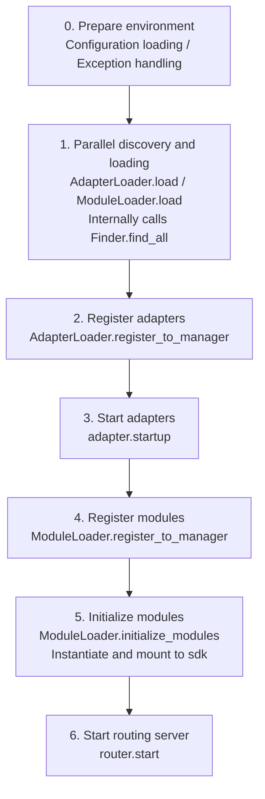

# Startup Flow and Manual Control

ErisPulse's `await sdk.run()` / `await sdk.init()` encapsulates the entire startup chain into a single line of code. However, when you need to fully customize the startup process (e.g., partial loading, dynamic registration, hot-plugging, injecting custom loading strategies), you need to understand what happens inside this chain and how to manually drive each step.

This article breaks down the startup chain into independent components, explains their respective responsibilities and call order, and provides an example of manually initiating the complete startup process.

> This article assumes you have already run through [the first bot](../getting-started/first-bot.md) and understand the two modes of `sdk.run(keep_running=True/False)`. This article focuses on the internal breakdown of the `init()` chain and lower-level entry points such as `init()`/`init_task()`/`init_sync()`.

## Overview of SDK Top-Level Entry Points

In addition to the two `keep_running` modes of `run()`, the SDK also provides several lower-level initialization entry points, which differ in **asynchrony, return value, and whether exceptions are wrapped**:

| Entry Point | Asynchrony | Return Value | Exception Handling | Use Case |
|-------------|------------|--------------|--------------------|----------|
| `await sdk.run(True)` | async, blocks to maintain | `None` (automatically `uninit` on shutdown) | Module/adapter errors are intercepted, not crashing the process | Pure bot application |
| `await sdk.run(False)` | async, non-blocking | `None` (does not automatically unload) | Same as above | Execute custom logic after initialization |
| `await sdk.init()` | async, requires `await` | `bool` | **Does not wrap**, exceptions are thrown upwards | Manual lifecycle control (paired with `uninit()`) |
| `sdk.init_task()` | async, returns `Task` without blocking | `asyncio.Task` | Same as `init()` | Concurrent initialization or event loop not yet running |
| `sdk.init_sync()` | **Synchronous**, blocks the current thread | `bool` | Same as `init()` | Command-line script, synchronous entry without event loop |

> **Common Misconception**: `await sdk.init()` **is not equivalent to** `await sdk.run(keep_running=False)`. There are two differences: ① `init()` returns `bool`, `run()` returns `None`; ② `run()` wraps the initialization and running process with try/except (intercepts module/adapter exceptions to prevent crashes), while `init()` does not wrap, and exceptions are thrown directly upwards. Use `init()` + `uninit()` when you need paired unloading or custom exception handling.

## Overview of the Startup Chain

`sdk.init()` (specifically its internal `Initializer.init()`) initiates the entire framework in the following order:



Corresponding core components:

| Layer | Component | Responsibility |
|-------|-----------|----------------|
| Discovery | `AdapterFinder` / `ModuleFinder` | **Discover** adapters/modules from entry-points of installed packages |
| Loading | `AdapterLoader` / `ModuleLoader` | Discover + import + read metadata + determine enable/disable, return object list |
| Registration | `*Loader.register_to_manager` | Register objects to corresponding managers |
| Management | `sdk.adapter` / `sdk.module` | Maintain adapter/module instances, provide start/stop interfaces |
| Initialization | `ModuleLoader.initialize_modules` | Create module instances and mount to `sdk` (handle dependency topological sorting) |
| Routing | `sdk.router` | HTTP / WebSocket server |

> **Important**: `Finder` and `Loader` are two layers. The `Loader` internally **already holds** a `Finder` (e.g., `AdapterLoader` comes with `AdapterFinder`, `ModuleLoader` comes with `ModuleFinder`). In most scenarios, you only need to use `Loader`; `Finder` is only used when you need "list without importing".

## Detailed Explanation of Each Component

### 1. Discovery Layer: Finder

The Finder is only responsible for "finding which packages provide adapters/modules," without importing or instantiating.

```python
from ErisPulse.finders import AdapterFinder, ModuleFinder

adapter_finder = AdapterFinder()
module_finder = ModuleFinder()

# Find all installed adapters/modules entry-points
adapter_entries = adapter_finder.find_all()    # list[EntryPoint]
module_entries = module_finder.find_all()      # list[EntryPoint]

# Find a single by name
entry = module_finder.find_by_name("MyModule")  # EntryPoint | None
```

Each `EntryPoint` can be `.load()` to get the corresponding class, but usually you don't need to manually call it—Loader will handle it.

### 2. Loading Layer: Loader

The Loader, on top of Finder, does "import + read metadata + determine enable/disable."

```python
from ErisPulse.loaders import AdapterLoader, ModuleLoader
from ErisPulse import sdk

adapter_loader = AdapterLoader()
module_loader = ModuleLoader()

# load() internally: calls finder.find_all() → processes each entry-point → returns a triple
adapter_objs, enabled_adapters, disabled_adapters = await adapter_loader.load(sdk.adapter)
module_objs, enabled_modules, disabled_modules = await module_loader.load(sdk.module)
```

The three-tuple returned by `load()`:

| Return Value | Meaning |
|--------------|---------|
| `objs` (`dict`) | Name → Object (adapter class / module wrapper object) |
| `enabled` (`list[str]`) | Enabled names (not disabled in configuration) |
| `disabled` (`list[str]`) | Disabled names |

#### Diagnostic Information on Loading Failures

When a module/adapter throws an exception during loading or initialization, the framework skips that component and continues loading other components, while outputting a **user code frame summary**, allowing you to locate the error position at the default INFO level without manually re-enabling DEBUG:

```
[ERROR] [ModuleLoader] Failed to load module MyModule from entry-point, skipped: 'NoneType' object has no attribute 'platform'
  → MyModule/Core.py:42 in on_load
      adapter = sdk.platform
  → AttributeError: 'NoneType' object has no attribute 'platform'
  → Hint: Increase log level to DEBUG to view full stack trace; check implementation code of module MyModule
```

The diagnostic information is generated by the `ErisPulse.runtime.diagnostics` module, which automatically filters out internal framework frames and retains only your code frames. If you need to reuse it in custom loading logic:

```python
from ErisPulse.runtime import log_diagnostic

try:
    risky_init()
except Exception as e:
    log_diagnostic(e)  # Automatically extract user code frames and write to ERROR log
```

This module also provides two low-level functions: `extract_user_frame()` (returns structured frame information) and `format_diagnostic_block()` (returns multi-line text).

### 3. Registration Layer: register_to_manager

Register the objects produced by the Loader to the manager so that `sdk.adapter` / `sdk.module` can recognize them.

```python
# Register adapters (returns bool, indicating whether all succeeded)
await adapter_loader.register_to_manager(enabled_adapters, adapter_objs, sdk.adapter)

# Register modules
await module_loader.register_to_manager(enabled_modules, module_objs, sdk.module)
```

After registration, adapters enter `sdk.adapter._adapters`, and module classes enter `sdk.module`, but **they are not yet started/initialized**.

### 4. Start Adapters

```python
# Start all registered adapters
await sdk.adapter.startup()
# Or specify platform
await sdk.adapter.startup("yunhu")
await sdk.adapter.startup(["yunhu", "telegram"])
```

> Registration ≠ Startup. `register_to_manager` only registers; `startup` calls the adapter's `start()` to establish a connection with the platform.

### 5. Initialize Modules

Modules have an additional step—**instantiation** and mounting to `sdk` (so you can call `sdk.MyModule.xxx`). This step also handles module dependencies and topological sorting.

```python
success = await module_loader.initialize_modules(
    enabled_modules, module_objs, sdk.module, sdk
)
```

After successful instantiation, the module appears on `sdk.<ModuleName>`.

### 6. Start Routing Server

```python
await sdk.router.start(
    host="0.0.0.0",
    port=8000,
    ssl_certfile=None,
    ssl_keyfile=None,
)
```

The routing server is responsible for receiving webhooks/ WebSocket callbacks from adapters. Without starting it, server-mode adapters cannot receive messages.

## Complete Manual Startup Example

The following code **equivalent to** the core flow of `await sdk.init()`, but each step is exposed to you, allowing you to insert custom logic at any stage:

```python
import asyncio
from ErisPulse import sdk
from ErisPulse.loaders import AdapterLoader, ModuleLoader

async def manual_startup():
    # 0. Prepare environment (load configuration, register global exception handler)
    #    _prepare_environment is a pre-step inside init(); manual flow must call it first,
    #    otherwise Loader cannot read configuration and will misjudge all adapters/modules as disabled.
    if not await sdk._prepare_environment():
        print("Environment preparation failed")
        return False

    # 1. Create loaders (each internally holds a Finder)
    adapter_loader = AdapterLoader()
    module_loader = ModuleLoader()

    # 2. Parallel discovery and loading (consistent with init() internals using gather)
    (adapter_objs, enabled_adapters, disabled_adapters), \
    (module_objs, enabled_modules, disabled_modules) = await asyncio.gather(
        adapter_loader.load(sdk.adapter),
        module_loader.load(sdk.module),
    )

    # 3. Register adapters
    await adapter_loader.register_to_manager(
        enabled_adapters, adapter_objs, sdk.adapter
    )

    # 4. Start adapters
    if enabled_adapters:
        await sdk.adapter.startup()

    # 5. Register modules
    await module_loader.register_to_manager(
        enabled_modules, module_objs, sdk.module
    )

    # 6. Initialize modules (instantiation + mount to sdk)
    if enabled_modules:
        await module_loader.initialize_modules(
            enabled_modules, module_objs, sdk.module, sdk
        )

    # 7. Start routing server
    await sdk.router.start(host="0.0.0.0", port=8000)

    print("Manual startup complete")
    return True

async def main():
    ok = await manual_startup()
    if ok:
        # Block to maintain running (manual flow does not automatically block)
        await asyncio.Event().wait()

if __name__ == "__main__":
    asyncio.run(main())
```

### When to Use Manual Startup?

In most cases, manual startup is **not needed**—`await sdk.run()` already handles all of the above. Manual startup is only valuable in the following scenarios:

- **Partial Loading**: Load only specified adapters/modules, skipping others
- **Dynamic Registration**: Register new adapters/modules at runtime based on conditions
- **Custom Order**: Need to disrupt the default loading order (e.g., start a module before an adapter)
- **Inject Strategies**: Inject custom strict mode managers, loading strategies, etc. into Loader
- **Debugging/Diagnosis**: Manually drive at a specific step to locate issues when something fails

## Fine-Grained Runtime Control

Even after using `sdk.run()` to complete startup, you can still individually control subsystems at runtime without restarting the entire SDK:

### Hot Restart of Adapters

```python
# Hot restart a specific adapter (repair connection, does not affect other platforms)
await sdk.adapter.shutdown("yunhu")
await sdk.adapter.startup("yunhu")

# Bring up a new platform at runtime
await sdk.adapter.startup("telegram")

# Temporarily take down a platform
await sdk.adapter.shutdown("telegram")
```

> `adapter.startup()` requires the adapter to have been **registered** to the manager. Registration occurs within `init()`/`run()`, so this is fine-grained control **after** startup.

### Routing Server

```python
# Temporarily take down webhook server
await sdk.router.stop()

# Restart (e.g., after changing port)
await sdk.router.start(host="0.0.0.0", port=9000)
```

### Module On-Demand Loading

```python
# Manually load a (possibly lazy-loaded) module
await sdk.load_module("MyModule")
```

## Unload Process

The reverse operation of startup is `await sdk.uninit()`, which cleans up in the opposite order:

1. Shut down all adapters (`adapter.shutdown()`)
2. Unload all modules
3. Clean up all event handlers
4. Clean up managers and module attributes on SDK

In manual startup scenarios, remember to call `uninit()` before exiting to ensure graceful shutdown:

```python
try:
    await asyncio.Event().wait()   # Maintain running
finally:
    await sdk.uninit()
```

## Restart

The SDK provides two restart methods, neither of which requires you to manually unload first—the framework handles it automatically:

| Method | Call | Behavior | Use Case |
|--------|------|----------|----------|
| Hot Restart | `await sdk.restart()` | Re-initialize within the same process after `uninit()`, reloading adapters/modules | Reload configuration, hot update modules |
| Hard Restart | `await sdk.hard_restart()` | Exit the entire process after `uninit()`, then restart a new process via parent process (`epsdk run`) | Suspected memory/resource leaks, need a completely clean restart |

```python
# Hot restart: re-initialize within the same process (most commonly used)
await sdk.restart()

# Hard restart: exit process, must be started via `epsdk run main.py` to take effect
await sdk.hard_restart()
```

> **Two Points to Note**:
> 1. Both methods execute the restart in a background task, **immediately returning `True` to indicate "restart task has been scheduled"**, not "restart has completed." The actual restart happens in the background to avoid interrupting the current event chain.
> 2. `hard_restart()` **must be started via `epsdk run main.py` to take effect**. Its principle is: after unloading, the process exits with exit code 42, and the parent process of `epsdk run` detects the code 42 to restart a new process; if started directly via `python main.py`, the process exits with code 42 and ends directly without automatic restart.

### When to Use Hard Restart?

Hard restart is not just a "more thorough restart," it is more suitable and even more efficient in the following scenarios than hot restart:

- **Binary Library (C Extension) Side Effects**: Hot restart occurs within the same process and cannot release C extensions, opened file descriptors, threads, and other process-level resources; hard restart switches to a brand new process, thoroughly clearing these side effects.
- **Resource Leak Diagnosis**: When suspected memory or handle leaks exist, hard restart provides a clean environment.
- **Performance-Sensitive Frequent Restarts**: Hard restart avoids the overhead of unloading and reloading within the same process, making it more efficient than hot restart in practice.

> The "Framework Restart" feature in the Dashboard management panel internally calls `hard_restart()`.
> Additionally, hard restart requires that `epsdk run` is used for startup; otherwise, the program will just throw exit code 42 and exit, since `epsdk run` checks for the 42 exit code to restart the process. This must be noted carefully!!!

## Related Documentation

- [Create the First Bot](../getting-started/first-bot.md) - Introduction to the two basic modes of `keep_running`
- [Lifecycle Management](lifecycle.md) - Listen to startup events such as `core.init.start` / `core.init.complete`
- [Lazy Loading System](lazy-loading.md) - Module lazy loading mechanism and `load_module`