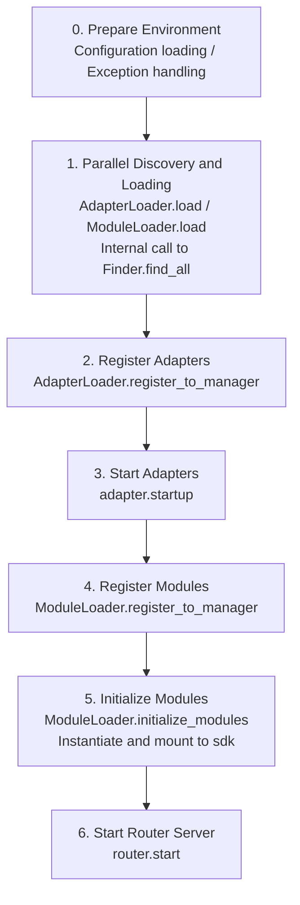

# Startup Flow and Manual Control

The `await sdk.run()` / `await sdk.init()` of ErisPulse encapsulates the entire startup chain into a single line of code. However, when you need full customization of the startup process (e.g., partial loading, dynamic registration, hot-plugging, injecting custom loading strategies), you need to understand what happens inside this chain and how to manually drive each step.

This article breaks down the startup chain into independent components, explains their respective responsibilities and call order, and provides an example of manual full startup.

> This article assumes you have already run through [the first bot](../getting-started/first-bot.md) and understand the two modes of `sdk.run(keep_running=True/False)`. This article focuses on the internal breakdown of the chain within `init()`, as well as lower-level entry points such as `init()`/`init_task()`/`init_sync()`.

## Overview of SDK Top-Level Entry Points

In addition to the two `keep_running` modes of `run()`, the SDK also provides several lower-level initialization entry points, which differ in **asynchronicity, return value, and whether exceptions are wrapped**:

| Entry Point | Asynchronous | Return Value | Exception Handling | Applicable Scenarios |
|-------------|--------------|--------------|--------------------|----------------------|
| `await sdk.run(True)` | async, blocks to maintain | `None` (automatically `uninit` on shutdown) | Module/adapter errors are intercepted, not crashing the process | Pure bot application |
| `await sdk.run(False)` | async, non-blocking | `None` (no automatic unloading) | Same as above | Execute custom logic after initialization |
| `await sdk.init()` | async, requires `await` | `bool` | **Does not wrap**, exceptions are thrown upwards | Manual lifecycle control (paired with `uninit()`) |
| `sdk.init_task()` | async, returns `Task` without blocking | `asyncio.Task` | Same as `init()` | Concurrently execute other initializations or when event loop is not running |
| `sdk.init_sync()` | **Synchronous**, blocks current thread | `bool` | Same as `init()` | Command-line scripts, synchronous entry without event loop |

> **Common misconception**: `await sdk.init()` **is not equivalent to** `await sdk.run(keep_running=False)`. Two differences: ① `init()` returns `bool`, `run()` returns `None`; ② `run()` wraps the initialization and running process with try/except (intercepts module/adapter exceptions to prevent crashes), while `init()` does not wrap, and exceptions are thrown directly upwards. Use `init()` + `uninit()` when you need paired unloading or custom exception handling.

## Overview of the Startup Chain

`sdk.init()` (specifically its internal `Initializer.init()`) launches the entire framework in the following order:



Corresponding core components:

| Layer | Component | Responsibility |
|-------|-----------|----------------|
| Discovery | `AdapterFinder` / `ModuleFinder` | **Discover** adapters/modules from entry-points of installed packages |
| Loading | `AdapterLoader` / `ModuleLoader` | Discovery + import + read metadata + determine enable/disable, return object list |
| Registration | `*Loader.register_to_manager` | Register objects to corresponding managers |
| Management | `sdk.adapter` / `sdk.module` | Maintain adapter/module instances, provide start/stop interfaces |
| Initialization | `ModuleLoader.initialize_modules` | Create module instances and mount to `sdk` (handle dependency topological sorting) |
| Routing | `sdk.router` | HTTP / WebSocket server |

> **Important**: `Finder` and `Loader` are two layers. The `Loader` internally **already holds** a `Finder` (`AdapterLoader` comes with `AdapterFinder`, `ModuleLoader` comes with `ModuleFinder`). In most scenarios, you only need to use `Loader`; only when you need "list without importing" will you use `Finder` alone.

## Detailed Explanation of Each Component

### 1. Discovery Layer: Finder

The Finder is responsible only for "finding which packages provide adapters/modules," without importing or instantiating.

```python
from ErisPulse.finders import AdapterFinder, ModuleFinder

adapter_finder = AdapterFinder()
module_finder = ModuleFinder()

# Find all installed adapters/modules entry-points
adapter_entries = adapter_finder.find_all()    # list[EntryPoint]
module_entries = module_finder.find_all()      # list[EntryPoint]

# Find a single one by name
entry = module_finder.find_by_name("MyModule")  # EntryPoint | None
```

Each `EntryPoint` can be loaded using `.load()` to get the corresponding class, but usually, you don't need to call it manually—the Loader will handle it.

### 2. Loading Layer: Loader

The Loader does "import + read metadata + determine enable/disable" on top of the Finder.

```python
from ErisPulse.loaders import AdapterLoader, ModuleLoader
from ErisPulse import sdk

adapter_loader = AdapterLoader()
module_loader = ModuleLoader()

# load() internally: calls finder.find_all() → processes each entry-point → returns a triple
adapter_objs, enabled_adapters, disabled_adapters = await adapter_loader.load(sdk.adapter)
module_objs, enabled_modules, disabled_modules = await module_loader.load(sdk.module)
```

The triple returned by `load()`:

| Return Value | Meaning |
|--------------|---------|
| `objs` (`dict`) | Name → object (adapter class / module wrapper object) |
| `enabled` (`list[str]`) | Names that are enabled (not disabled in configuration) |
| `disabled` (`list[str]`) | Names that are disabled |

#### Diagnostic Information When Loading Fails

When a module/adapter throws an exception during loading or initialization, the framework skips that component and continues loading other components, while outputting a **summary of user code frames** so you can locate the error position at the default INFO level without manually enabling DEBUG:

```
[ERROR] [ModuleLoader] Failed to load module MyModule from entry-point, skipped: 'NoneType' object has no attribute 'platform'
  → MyModule/Core.py:42 in on_load
      adapter = sdk.platform
  → AttributeError: 'NoneType' object has no attribute 'platform'
  → Hint: Increase log level to DEBUG to view full stack; check implementation code of module MyModule
```

The diagnostic information is generated by the `ErisPulse.runtime.diagnostics` module and automatically filters out internal framework frames, retaining only your code frames. If you need to reuse it in custom loading logic:

```python
from ErisPulse.runtime import log_diagnostic

try:
    risky_init()
except Exception as e:
    log_diagnostic(e)  # Automatically extract user code frames and write to ERROR log
```

This module also provides two low-level functions: `extract_user_frame()` (returns structured frame information) and `format_diagnostic_block()` (returns multi-line text).

### 3. Registration Layer: register_to_manager

Registers the objects produced by the Loader to the managers so that `sdk.adapter` / `sdk.module` can recognize them.

```python
# Register adapters (returns bool, indicating whether all succeeded)
await adapter_loader.register_to_manager(enabled_adapters, adapter_objs, sdk.adapter)

# Register modules
await module_loader.register_to_manager(enabled_modules, module_objs, sdk.module)
```

After registration, adapters enter `sdk.adapter._adapters`, and module classes enter `sdk.module`, but **they are not yet started/initialized**.

### 4. Start Adapters

```python
# Start all registered adapters
await sdk.adapter.startup()
# Or specify platform
await sdk.adapter.startup("yunhu")
await sdk.adapter.startup(["yunhu", "telegram"])
```

> Registration ≠ Startup. `register_to_manager` only registers; `startup` calls the adapter's `start()`, establishing a connection with the platform.

### 5. Initialize Modules

Modules have one extra step compared to adapters—they need to be **instantiated** and mounted to `sdk` (so you can call `sdk.MyModule.xxx`). This step also handles module dependencies and topological sorting.

```python
success = await module_loader.initialize_modules(
    enabled_modules, module_objs, sdk.module, sdk
)
```

After successful instantiation, the module appears on `sdk.<ModuleName>`.

### 6. Start Router Server

```python
await sdk.router.start(
    host="0.0.0.0",
    port=8000,
    ssl_certfile=None,
    ssl_keyfile=None,
)
```

The router server is responsible for receiving webhook/WebSocket callbacks from adapters. Without starting it, server-mode adapters cannot receive messages.

## Full Manual Startup Example

The following code is **equivalent to** the core process of `await sdk.init()`, but each step is exposed to you, allowing you to insert custom logic at any step:

```python
import asyncio
from ErisPulse import sdk
from ErisPulse.loaders import AdapterLoader, ModuleLoader

async def manual_startup():
    # 0. Prepare Environment (load configuration, register global exception handler)
    #    _prepare_environment is a pre-step inside init(); manual flow also needs to call it first,
    #    otherwise Loader cannot read configuration and will misjudge all adapters/modules as disabled.
    if not await sdk._prepare_environment():
        print("Environment preparation failed")
        return False

    # 1. Create loaders (each internally holds a Finder)
    adapter_loader = AdapterLoader()
    module_loader = ModuleLoader()

    # 2. Parallel discovery and loading (consistent with init() using gather)
    (adapter_objs, enabled_adapters, disabled_adapters), \
    (module_objs, enabled_modules, disabled_modules) = await asyncio.gather(
        adapter_loader.load(sdk.adapter),
        module_loader.load(sdk.module),
    )

    # 3. Register adapters
    await adapter_loader.register_to_manager(
        enabled_adapters, adapter_objs, sdk.adapter
    )

    # 4. Start adapters
    if enabled_adapters:
        await sdk.adapter.startup()

    # 5. Register modules
    await module_loader.register_to_manager(
        enabled_modules, module_objs, sdk.module
    )

    # 6. Initialize modules (instantiation + mount to sdk)
    if enabled_modules:
        await module_loader.initialize_modules(
            enabled_modules, module_objs, sdk.module, sdk
        )

    # 7. Start router server
    await sdk.router.start(host="0.0.0.0", port=8000)

    print("Manual startup complete")
    return True

async def main():
    ok = await manual_startup()
    if ok:
        # Block to maintain running (manual flow does not automatically block)
        await asyncio.Event().wait()

if __name__ == "__main__":
    asyncio.run(main())
```

### When to Use Manual Startup?

In most cases, manual startup is **not needed**—`await sdk.run()` has already done all of the above. Manual startup is only valuable in these scenarios:

- **Partial loading**: Load only specified adapters/modules, skipping others
- **Dynamic registration**: Register new adapters/modules at runtime based on conditions
- **Custom order**: Need to disrupt the default loading order (e.g., start a module before an adapter)
- **Inject strategies**: Inject custom strict mode managers, loading strategies, etc., into the Loader
- **Debugging/diagnosis**: Manually drive to locate issues when a step fails

## Fine-Grained Runtime Control

Even after using `sdk.run()` to complete the startup, you can still individually control each subsystem at runtime without restarting the entire SDK:

### Hot Restart/Stop Adapters

```python
# Hot restart an adapter (fix connection, does not affect other platforms)
await sdk.adapter.shutdown("yunhu")
await sdk.adapter.startup("yunhu")

# Bring up a new platform at runtime
await sdk.adapter.startup("telegram")

# Temporarily take a platform offline
await sdk.adapter.shutdown("telegram")
```

> `adapter.startup()` requires the adapter to be **registered** to the manager. Registration happens inside `init()`/`run()`, so this is fine-grained control **after** startup.

### Router Server

```python
# Temporarily take the webhook server offline
await sdk.router.stop()

# Restart (e.g., after changing the port)
await sdk.router.start(host="0.0.0.0", port=9000)
```

### Lazy Module Loading

```python
# Manually load a (possibly lazily loaded) module
await sdk.load_module("MyModule")
```

## Graceful Shutdown

Since version 2.7.0, `sdk.shutdown()` provides **programmatic graceful shutdown**: set a shutdown event to allow the main loop, which is suspended by `await sdk.run(keep_running=True)`, to return, thus triggering `uninit()` to complete resource cleanup.

```python
# Call from any coroutine to trigger graceful exit (run() suspends and returns, automatically uninit)
sdk.shutdown()
```

Typical use cases:

```python
async def shutdown_after_idle():
    await asyncio.sleep(3600)
    sdk.shutdown()  # Gracefully exit after 1 hour of idle
```

**Signal Handling**: `run()` internally registers `SIGTERM` / `SIGHUP` handlers, converting system signals into graceful shutdown—when container orchestration (Docker `docker stop`) or `systemd` stops the service, the process will go through `uninit()` cleanup instead of being forcibly killed.

- Windows does not support `loop.add_signal_handler`, so the signal handler is automatically skipped (still use `sdk.shutdown()` or Ctrl+C to trigger shutdown)
- Repeatedly calling `sdk.shutdown()` is safe (no operation after the event is set)

## Unload Process

The reverse operation of startup is `await sdk.uninit()`, which cleans up in reverse order:

1. Shut down all adapters (`adapter.shutdown()`)
2. Unload all modules
3. Clean up all event handlers
4. Clean up managers and module attributes on SDK

In manual startup scenarios, remember to call `uninit()` before exiting to ensure graceful shutdown:

```python
try:
    await asyncio.Event().wait()   # Maintain running
finally:
    await sdk.uninit()
```

## Restart

The SDK provides two restart methods, neither of which requires you to unload first—the framework handles it automatically:

| Method | Call | Behavior | Applicable Scenarios |
|--------|------|----------|----------------------|
| Hot Restart | `await sdk.restart()` | Same process `uninit()` then re-`init()`, reload adapters/modules | Reload configuration, hot-update modules |
| Hard Restart | `await sdk.hard_restart()` | `uninit()` then exit the entire process, pulled up by parent process (`epsdk run`) | Suspected memory/resource leaks, need a completely clean restart |

```python
# Hot Restart: Reload within the same process (most commonly used)
await sdk.restart()

# Hard Restart: Exit process, must be started via `epsdk run main.py` to take effect
await sdk.hard_restart()
```

> **Two points to note**:
> 1. These methods execute restarts in the background task and **immediately return `True` indicating "restart task scheduled"**, not "restart completed." Actual restart happens in the background to avoid interrupting the current event chain.
> 2. `hard_restart()` **must be started via `epsdk run main.py` to take effect**. Its principle is: after uninit, exit the process with exit code 42; the parent process of `epsdk run` detects code 42 and pulls up a new process; if started directly via `python main.py`, the process exits with code 42 and ends directly, without automatic restart.

### When to Use Hard Restart?

Hard restart is not just a "more thorough restart," it is more suitable, and even more efficient, in the following scenarios:

- **Binary library (C extension) side effects**: Hot restart occurs within the same process and cannot release C extensions, open file descriptors, threads, and other process-level resources; hard restart switches to a new process, thoroughly clearing these side effects.
- **Resource leak diagnosis**: When suspected memory or handle leaks exist, hard restart provides a clean environment.
- **Performance-sensitive frequent restarts**: Hard restart avoids the overhead of unloading and reloading within the same process, making it more efficient than hot restart in practice.

> The "Framework Restart" function in the Dashboard management panel internally calls `hard_restart()`.
> Additionally, hard restart requires the use of the `epsdk` `run` command for startup; otherwise, the program will only throw exit code 42 and exit, because the `run` command checks for exit code 42 to restart the process. This must be noted carefully!!!

## Related Documentation

- [Create the First Bot](../getting-started/first-bot.md) - Introduction to the two basic modes of `keep_running`
- [Lifecycle Management](lifecycle.md) - Listen to startup events such as `core.init.start` / `core.init.complete`
- [Lazy Loading System](lazy-loading.md) - Module lazy loading mechanism and `load_module`