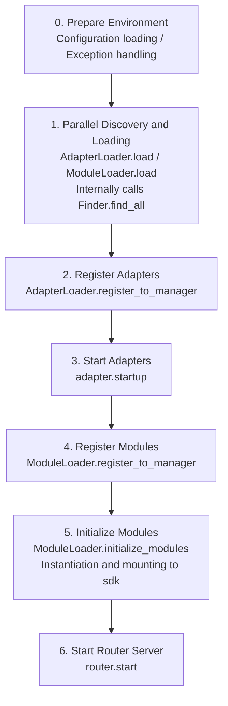

# Startup Process and Manual Control

The `await sdk.run()` / `await sdk.init()` methods of ErisPulse encapsulate the entire startup chain into a single line of code. However, when you need complete customization of the startup process (e.g., partial loading, dynamic registration, hot plugging, injecting custom loading strategies), you need to understand what happens inside this chain and how to manually drive each step.

This document breaks down the startup chain into independent components, explains their respective responsibilities and call order, and provides an example of manually performing the complete startup process.

> This document assumes you have already run through [the first bot](../getting-started/first-bot.md) and understand the two `keep_running` modes of `sdk.run()`. This document focuses on the internal breakdown of the `init()` chain, as well as lower-level entry points such as `init()`/`init_task()`/`init_sync()`.

## Overview of SDK Top-Level Entry Points

In addition to the two `keep_running` modes of `run()`, the SDK provides several lower-level initialization entry points, which differ in **asynchronicity, return values, and whether exceptions are wrapped**:

| Entry Point | Asynchronicity | Return Value | Exception Handling | Use Case |
|-------------|----------------|--------------|--------------------|----------|
| `await sdk.run(True)` | async, blocks to maintain | `None` (uninit automatically on shutdown) | Module/adapter errors are intercepted, not crashing the process | Pure bot application |
| `await sdk.run(False)` | async, does not block | `None` (no automatic unloading) | Same as above | Initialize and then execute custom logic |
| `await sdk.init()` | async, requires await | `bool` | Internal capture of component exceptions, returns `False` on failure | Manual control of lifecycle (paired with `uninit()`) |
| `sdk.init_task()` | async, returns Task without blocking | `asyncio.Task` | Same as `init()` | Concurrently execute other initializations, or when event loop is not running |
| `sdk.init_sync()` | **Synchronous**, blocks current thread | `bool` | Same as `init()` | Command-line scripts, synchronous entry without event loop |

> **Common Misconception**: `await sdk.init()` **is not equivalent to** `await sdk.run(keep_running=False)`. Two differences: ① `init()` returns `bool` (returns `False` on failure), `run()` returns `None`; ② `init()` only performs initialization, **does not automatically unload**, while `run()` automatically calls `uninit()` when the event loop ends. Therefore, when you need to manually pair unloading or customize the lifecycle, use `init()` + `uninit()`.

## Overview of the Startup Chain

`sdk.init()` (specifically its internal `Initializer.init()`) initiates the entire framework in the following order:



Corresponding core components:

| Layer | Component | Responsibility |
|-------|-----------|----------------|
| Discovery | `AdapterFinder` / `ModuleFinder` | **Discover** adapters/modules from entry-points of installed packages |
| Loading | `AdapterLoader` / `ModuleLoader` | Discovery + Import + Reading metadata + Determining enabled/disabled, returning object lists |
| Registration | `*Loader.register_to_manager` | Register objects to corresponding managers |
| Management | `sdk.adapter` / `sdk.module` | Maintain adapter/module instances, provide start/stop interfaces |
| Initialization | `ModuleLoader.initialize_modules` | Create module instances and mount to `sdk` (handling dependency topological sorting) |
| Routing | `sdk.router` | HTTP / WebSocket server |

> **Important**: `Finder` and `Loader` are two layers. The `Loader` internally **already holds** a `Finder` (e.g., `AdapterLoader` has its own `AdapterFinder`, `ModuleLoader` has its own `ModuleFinder`). In most scenarios, you only need to use `Loader`; `Finder` is only used when you need "list without importing."

## Detailed Explanation of Each Component

### 1. Discovery Layer: Finder

The `Finder` is responsible only for "finding which packages provide adapters/modules," without importing or instantiating.

```python
from ErisPulse.finders import AdapterFinder, ModuleFinder

adapter_finder = AdapterFinder()
module_finder = ModuleFinder()

# Find all installed adapters/modules entry-points
adapter_entries = adapter_finder.find_all()    # list[EntryPoint]
module_entries = module_finder.find_all()      # list[EntryPoint]

# Find a single by name
entry = module_finder.find_by_name("MyModule")  # EntryPoint | None
```

Each `EntryPoint` can be loaded via `.load()` to get the corresponding class, but usually you don't need to manually call it—`Loader` handles it.

### 2. Loading Layer: Loader

The `Loader` performs "importing + reading metadata + determining enabled/disabled" on top of the `Finder`.

```python
from ErisPulse.loaders import AdapterLoader, ModuleLoader
from ErisPulse import sdk

adapter_loader = AdapterLoader()
module_loader = ModuleLoader()

# load() internally: calls finder.find_all() → processes each entry-point → returns a triple
adapter_objs, enabled_adapters, disabled_adapters = await adapter_loader.load(sdk.adapter)
module_objs, enabled_modules, disabled_modules = await module_loader.load(sdk.module)
```

The three values returned by `load()`:

| Return Value | Meaning |
|--------------|---------|
| `objs` (`dict`) | Name → Object (adapter class / module wrapper object) |
| `enabled` (`list[str]`) | Names that are enabled (not disabled in configuration) |
| `disabled` (`list[str]`) | Names that are disabled |

#### Diagnostic Information on Loading Failures

When an exception is thrown during the loading or initialization phase of a module/adapter, the framework skips that component and continues loading others, while outputting a **summary of user code frames**, allowing you to locate the error position at the default INFO level without manually re-enabling DEBUG:

```
[ERROR] [ModuleLoader] Failed to load module MyModule from entry-point, skipped: 'NoneType' object has no attribute 'platform'
  → MyModule/Core.py:42 in on_load
      adapter = sdk.platform
  → AttributeError: 'NoneType' object has no attribute 'platform'
  → Note: Increase log level to DEBUG to view full stack trace; check implementation code of module MyModule
```

The diagnostic information is generated by the `ErisPulse.runtime.diagnostics` module, automatically filtering out internal framework frames and retaining only your code frames. If you need to reuse it in custom loading logic:

```python
from ErisPulse.runtime import log_diagnostic

try:
    risky_init()
except Exception as e:
    log_diagnostic(e)  # Automatically extract user code frames and write to ERROR log
```

This module also provides two low-level functions: `extract_user_frame()` (returns structured frame information) and `format_diagnostic_block()` (returns multi-line text).

### 3. Registration Layer: register_to_manager

Register the objects produced by the `Loader` to the manager, so that `sdk.adapter` / `sdk.module` can recognize them.

```python
# Register adapters (returns bool, indicating whether all succeeded)
await adapter_loader.register_to_manager(enabled_adapters, adapter_objs, sdk.adapter)

# Register modules
await module_loader.register_to_manager(enabled_modules, module_objs, sdk.module)
```

After registration, adapters are registered to the adapter manager, and modules are registered to the module manager, but **they are not started/instantiated yet**.

### 4. Start Adapters

```python
# Start all registered adapters
await sdk.adapter.startup()
# Or specify a platform
await sdk.adapter.startup("yunhu")
await sdk.adapter.startup(["yunhu", "telegram"])
```

> Registration ≠ Startup. `register_to_manager` only registers; `startup` calls the adapter's `start()`, establishing a connection with the platform.

### 5. Initialize Modules

Modules have one additional step—they need to be **instantiated** and mounted to `sdk` (so you can call `sdk.MyModule.xxx`). This step also handles module dependencies and topological sorting.

```python
success = await module_loader.initialize_modules(
    enabled_modules, module_objs, sdk.module, sdk
)
```

After successful instantiation, the module appears on `sdk.<ModuleName>`.

### 6. Start Router Server

```python
await sdk.router.start(
    host="0.0.0.0",
    port=8000,
    ssl_certfile=None,
    ssl_keyfile=None,
)
```

The router server is responsible for receiving webhook / WebSocket callbacks from adapters. Without starting it, server-mode adapters cannot receive messages.

## Complete Manual Startup Example

The following code **equivalent to** the core process of `await sdk.init()`, but exposes each step, allowing you to insert custom logic at any step:

```python
import asyncio
from ErisPulse import sdk
from ErisPulse.loaders import AdapterLoader, ModuleLoader

async def manual_startup():
    # 0. Prepare Environment (load configuration, register global exception handling)
    #    _prepare_environment is a pre-step inside init(); manual flow must call it first,
    #    otherwise Loader won't read configuration and will misjudge all adapters/modules as disabled.
    if not await sdk._prepare_environment():
        print("Environment preparation failed")
        return False

    # 1. Create Loaders (each internally holds a Finder)
    adapter_loader = AdapterLoader()
    module_loader = ModuleLoader()

    # 2. Parallel Discovery and Loading (consistent with init() internal gather)
    (adapter_objs, enabled_adapters, disabled_adapters), \
    (module_objs, enabled_modules, disabled_modules) = await asyncio.gather(
        adapter_loader.load(sdk.adapter),
        module_loader.load(sdk.module),
    )

    # 3. Register Adapters
    await adapter_loader.register_to_manager(
        enabled_adapters, adapter_objs, sdk.adapter
    )

    # 4. Start Adapters
    if enabled_adapters:
        await sdk.adapter.startup()

    # 5. Register Modules
    await module_loader.register_to_manager(
        enabled_modules, module_objs, sdk.module
    )

    # 6. Initialize Modules (instantiation + mounting to sdk)
    if enabled_modules:
        await module_loader.initialize_modules(
            enabled_modules, module_objs, sdk.module, sdk
        )

    # 7. Start Router Server
    await sdk.router.start(host="0.0.0.0", port=8000)

    print("Manual startup completed")
    return True

async def main():
    ok = await manual_startup()
    if ok:
        # Block to maintain running (manual flow does not automatically block)
        await asyncio.Event().wait()

if __name__ == "__main__":
    asyncio.run(main())
```

### When to Use Manual Startup?

In most cases, **manual startup is not needed**—`await sdk.run()` already handles all the above steps. Manual startup is only valuable in these scenarios:

- **Partial loading**: Load only specified adapters/modules, skipping others
- **Dynamic registration**: Register new adapters/modules at runtime based on conditions
- **Custom order**: Need to disrupt the default loading order (e.g., start a module before an adapter)
- **Inject strategies**: Inject custom strict mode managers, loading strategies, etc., into Loader
- **Debugging/diagnosis**: Manually drive at a certain step to locate issues when failure occurs

## Runtime Fine-Grained Control

Even after using `sdk.run()` to complete startup, you can still individually control subsystems at runtime without restarting the entire SDK:

### Hot Restart/Stop of Adapters

```python
# Hot restart a specific adapter (repair connection, does not affect other platforms)
await sdk.adapter.shutdown("yunhu")
await sdk.adapter.startup("yunhu")

# Bring up a new platform at runtime
await sdk.adapter.startup("telegram")

# Temporarily take down a platform
await sdk.adapter.shutdown("telegram")
```

> `adapter.startup()` requires the adapter to be **registered** to the manager. Registration occurs inside `init()`/`run()`, so this is fine-grained control after startup.

### Router Server

```python
# Temporarily take down webhook server
await sdk.router.stop()

# Restart (e.g., after changing port)
await sdk.router.start(host="0.0.0.0", port=9000)
```

### Modules on Demand

```python
# Manually load a (possibly lazy-loaded) module
await sdk.load_module("MyModule")
```

## Graceful Shutdown

As of version 2.7.0, `sdk.shutdown()` provides **programmatic graceful shutdown**: set a shutdown event to allow the main loop hanging on `await sdk.run(keep_running=True)` to return, triggering `uninit()` to complete resource cleanup.

```python
# Call from any coroutine to trigger graceful exit (run() hangs and returns, then automatically uninit)
sdk.shutdown()
```

Typical use cases:

```python
async def shutdown_after_idle():
    await asyncio.sleep(3600)
    sdk.shutdown()  # Gracefully exit after 1 hour of idle
```

**Signal Handling**: `run()` internally registers `SIGTERM` / `SIGHUP` handlers, converting system signals into graceful shutdown—when container orchestration (Docker `docker stop`) or `systemd` stops the service, the process completes `uninit()` cleanup instead of being forcibly killed.

- Windows does not support `loop.add_signal_handler`, so the signal handler is automatically skipped (still use `sdk.shutdown()` or Ctrl+C to trigger shutdown)
- Repeatedly calling `sdk.shutdown()` is safe (no operation after the event is set)

## Unload Process

The reverse operation of startup is `await sdk.uninit()`, which cleans up in reverse order:

1. Close all adapters (`adapter.shutdown()`)
2. Unload all modules
3. Clean up all event handlers
4. Clean up managers and module attributes on SDK

In manual startup scenarios, remember to call `uninit()` before exiting to ensure graceful shutdown:

```python
try:
    await asyncio.Event().wait()   # Maintain running
finally:
    await sdk.uninit()
```

## Restart

The SDK provides two restart methods, both do not require you to manually unload first—the framework handles it itself:

| Method | Call | Behavior | Use Case |
|--------|------|----------|----------|
| Hot Restart | `await sdk.restart()` | Same process `uninit()` then `init()` again, reload adapters/modules | Reload configuration, hot update modules |
| Hard Restart | `await sdk.hard_restart()` | `uninit()` then exit process with **exit code 42**, restarted by external supervisor | Suspected memory/resource leaks, need thorough clean restart |

```python
# Hot Restart: Reload within the same process (most commonly used)
await sdk.restart()

# Hard Restart: Exit process, handed over to external supervisor for restarting (see below "Supervisor Guide")
await sdk.hard_restart()
```

> **Two Notes**:
> 1. Both methods execute the restart in a background task, **immediately returning `True` to indicate "restart task scheduled"**, not "restart completed." Actual restart happens in the background to avoid interrupting the current event chain.
> 2. The principle of `hard_restart()` is: uninit and flush configuration, then exit the process with **exit code 42** (`HARD_RESTART_EXIT_CODE`)—**it does not start a new process itself**. It must be restarted by an external supervisor detecting exit code 42. If you directly run `python main.py` without any supervisor, the process exits with code 42 and **does not automatically restart** (the framework will warn).

### When to Use Hard Restart?

Hard restart is not just "a more thorough restart," it is more suitable and even more efficient than hot restart in the following scenarios:

- **Binary library (C extension) side effects**: Hot restart occurs within the same process and cannot release C extensions, open file descriptors, threads, and other process-level resources; hard restart switches to a new process, thoroughly clearing these side effects.
- **Resource leak diagnosis**: Suspected memory or handle leaks, hard restart provides a clean environment.
- **Frequent restarts sensitive to performance**: Hard restart avoids the overhead of unloading and reloading within the same process, actually being more efficient than hot restart.

> The "Framework Restart" feature in the Dashboard management panel internally calls `hard_restart()`.

### Exit Code 42 Contract

Hard restart is cross-process collaboration: **SDK is responsible for exiting (code 42), supervisor is responsible for restarting**.

| Role | Behavior |
|------|----------|
| SDK (when hard restarted) | `uninit()` → flush configuration → `os._exit(42)` |
| Supervisor | Detect child process exit code 42 → restart the same command |

> `sdk.is_supervised()` can query whether the current process is started by a supervisor (detecting environment variable `ERISPULSE_SUPERVISED`). The CLI `run` command injects this marker automatically when starting a subprocess; external supervisors like systemd / Docker do not inject it, so `is_supervised()` returns `False`, and the framework will warn "supervisor not detected" after hard restart.

### Supervisor Guide

Choose a supervisor suitable for you to make hard restart truly effective:

#### 1. CLI run command (development/simple deployment, recommended)

`epsdk run main.py` includes an internal supervision loop: detects child process exit code, restarts immediately if 42; other abnormal exit codes retry with exponential backoff; `Ctrl+C` first gracefully terminates the child process (code 0 is considered normal exit, no restart).

```bash
epsdk run main.py
```

#### 2. systemd (Linux server)

`RestartForceExitStatus=42` makes exit code 42 trigger a restart (default `on-failure` only applies to non-zero codes):

```ini
[Service]
ExecStart=/usr/bin/python3 /opt/mybot/main.py
Restart=on-failure
RestartForceExitStatus=42
RestartSec=2
User=mybot
```

#### 3. Docker / docker-compose

Inside the container, PID 1 is the application process, and exit code 42 causes the container to exit—use the `restart` policy to automatically restart it:

```yaml
services:
  bot:
    build: .
    restart: unless-stopped   # Restart on any exit (including 42)
```

#### 4. PM2 (Node ecosystem operations)

```bash
pm2 start main.py --name mybot --interpreter python3
# 42 is treated as an exit code, PM2 defaults to restart; set restart_delay for debouncing
pm2 set mybot.restart_delay 2000
```

#### 5. supervisord

```ini
[program:mybot]
command=python3 /opt/mybot/main.py
autorestart=true
exitcodes=0,2,42    # 42 also considered "normal exit requiring restart"
```

#### 6. Pure Python Custom Supervisor

```python
import subprocess, sys, time

while True:
    p = subprocess.Popen([sys.executable, "main.py"])
    code = p.wait()
    if code == 42:          # Hard restart request
        time.sleep(0.5)
        continue
    if code == 0:           # Normal exit
        break
    time.sleep(3)           # Abnormal exit, backoff retry
```

> **Behavior without a supervisor**: Running directly with `python main.py`, calling `hard_restart()` exits the process with code 42 and does not restart. In this case, you should integrate any of the supervisors above.

## Related Documentation

- [Creating the First Bot](../getting-started/first-bot.md) - Introduction to the two basic `keep_running` modes
- [Lifecycle Management](lifecycle.md) - Listen to startup events like `core.init.start` / `core.init.complete`
- [Lazy Loading System](lazy-loading.md) - Module lazy loading mechanism and `load_module`