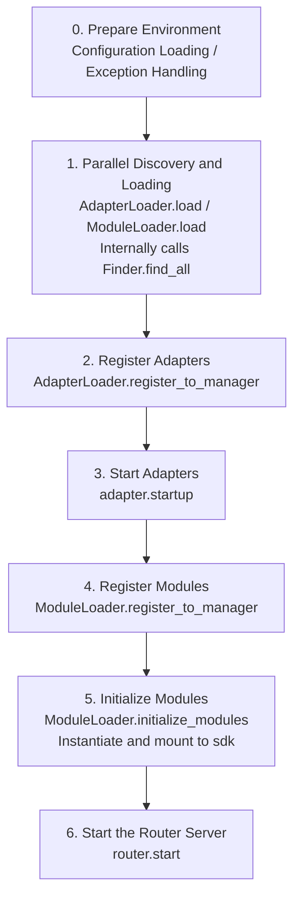

# Startup Flow and Manual Control

ErisPulse's `await sdk.run()` / `await sdk.init()` encapsulates the entire startup chain into a single line of code. However, when you need to fully customize the startup process (for example, partial loading, dynamic registration, hot plugging, or injecting custom loading strategies), you need to understand what happens inside this chain and how to manually drive each step.

This article breaks down the startup chain into independent components, explains their respective responsibilities, call order, and provides an example of manually initiating the full startup process.

> This article assumes you have already run through [the first bot](../getting-started/first-bot.md) and understand the two modes of `sdk.run(keep_running=True/False)`. This article focuses on the internal breakdown of the chain within `init()`, as well as lower-level entry points such as `init()` / `init_task()` / `init_sync()`.

7. **Important: Path Replacement Rules**
   - Replace `docs/en/` in document links with `docs/en/`
   - For example: `docs/en/quick-start.md` should be changed to `docs/en/quick-start.md`
   - For links pointing to non-current language version files (such as links in the form of `README.xx.md`), keep them unchanged
   - This ensures that links point to the correct language version of the document

## SDK Top-Level Entry Overview

In addition to the two `keep_running` modes of `run()`, the SDK provides several lower-level initialization entries, which differ in **asynchronicity, return value, and whether exceptions are wrapped**:

| Entry | Asynchronicity | Return Value | Exception Handling | Use Case |
|------|--------|--------|----------|----------|
| `await sdk.run(True)` | async, blocking | `None` (automatically `uninit` on shutdown) | Module/adapter errors are intercepted, not crashing the process | Pure bot applications |
| `await sdk.run(False)` | async, non-blocking | `None` (not automatically unloaded) | Same as above | Execute custom logic after initialization |
| `await sdk.init()` | async, requires await | `bool` | Internal component exceptions are caught, returns `False` on failure | Manual lifecycle control (paired with `uninit()`) |
| `sdk.init_task()` | async, returns Task without blocking | `asyncio.Task` | Same as `init()` | Concurrently execute other initialization tasks, or when event loop is not yet running |
| `sdk.init_sync()` | **Synchronous**, blocks current thread | `bool` | Same as `init()` | Command-line scripts, synchronous entry points without event loop |

> **Common Misunderstanding**: `await sdk.init()` is **not equivalent** to `await sdk.run(keep_running=False)`. Two differences: ① `init()` returns `bool` (returns `False` on failure), `run()` returns `None`; ② `init()` only performs initialization, **does not automatically unload**, while `run()` automatically calls `uninit()` when the event loop ends. Therefore, when manual pairing of unloading or custom lifecycle control is needed, use `init()` + `uninit()`.

docs/en/sdk-overview.md

## Overview of the Startup Process

`sdk.init()` (specifically its internal `Initializer.init()`) initiates the entire framework in the following sequence:



Corresponding core components:

| Layer | Component | Responsibility |
|----|------|------|
| Discovery | `AdapterFinder` / `ModuleFinder` | **Discover** adapters/modules from entry-points of installed packages |
| Loading | `AdapterLoader` / `ModuleLoader` | Discovery + Import + Read metadata + Determine enable/disable, return object list |
| Registration | `*Loader.register_to_manager` | Register objects to corresponding managers |
| Management | `sdk.adapter` / `sdk.module` | Maintain adapter/module instances, provide start/stop interfaces |
| Initialization | `ModuleLoader.initialize_modules` | Create module instances and mount to `sdk` (handle dependency topological sorting) |
| Routing | `sdk.router` | HTTP / WebSocket server |

> **Important**: `Finder` and `Loader` are two layers. The `Loader` internally **already holds** a `Finder` (e.g., `AdapterLoader` comes with its own `AdapterFinder`, `ModuleLoader` comes with its own `ModuleFinder`). In most scenarios, you only need to use the `Loader`; only when you need "list without importing" would you use `Finder` alone.

[**English**](docs/en/quick-start.md)

## Detailed Explanation of Each Step

### 1. Discovery Layer: Finder

The Finder is only responsible for "finding which packages provide adapters/modules", without importing or instantiating them.

```python
from ErisPulse.finders import AdapterFinder, ModuleFinder

adapter_finder = AdapterFinder()
module_finder = ModuleFinder()

# Find all installed adapters/modules entry-points
adapter_entries = adapter_finder.find_all()    # list[EntryPoint]
module_entries = module_finder.find_all()      # list[EntryPoint]

# Find a single one by name
entry = module_finder.find_by_name("MyModule")  # EntryPoint | None
```

Each `EntryPoint` can be loaded using `.load()` to get the corresponding class, but usually you don't need to do this manually — the Loader will handle it.

### 2. Loading Layer: Loader

The Loader performs "importing + reading metadata + determining enable/disable" on top of the Finder.

```python
from ErisPulse.loaders import AdapterLoader, ModuleLoader
from ErisPulse import sdk

adapter_loader = AdapterLoader()
module_loader = ModuleLoader()

# Internally, load() calls finder.find_all() → processes each entry-point → returns a triple
adapter_objs, enabled_adapters, disabled_adapters = await adapter_loader.load(sdk.adapter)
module_objs, enabled_modules, disabled_modules = await module_loader.load(sdk.module)
```

The triple returned by `load()`:

| Return Value | Meaning |
|--------------|---------|
| `objs` (`dict`) | Name → Object (adapter class / module wrapper object) |
| `enabled` (`list[str]`) | Names that are enabled (not disabled in configuration) |
| `disabled` (`list[str]`) | Names that are disabled |

#### Diagnostic Information on Loading Failure

When a module/adapter throws an exception during loading or initialization, the framework skips that component and continues loading others, while outputting a **summary of user code frames**. This allows you to locate the error position at the default INFO level, without manually switching to DEBUG:

```
[ERROR] [ModuleLoader] Failed to load module MyModule from entry-point, skipped: 'NoneType' object has no attribute 'platform'
  → MyModule/Core.py:42 in on_load
      adapter = sdk.platform
  → AttributeError: 'NoneType' object has no attribute 'platform'
  → Note: Increase the log level to DEBUG to view the full stack trace; check the implementation code of module MyModule
```

Diagnostic information is generated through the `ErisPulse.runtime.diagnostics` module, which automatically filters out internal framework frames and retains only your code frames. If you need to reuse this in custom loading logic:

```python
from ErisPulse.runtime import log_diagnostic

try:
    risky_init()
except Exception as e:
    log_diagnostic(e)  # Automatically extracts user code frames and writes to ERROR log
```

This module also provides two low-level functions: `extract_user_frame()` (returns structured frame information) and `format_diagnostic_block()` (returns multi-line text).

### 3. Registration Layer: register_to_manager

Registers the objects produced by the Loader into the manager, allowing `sdk.adapter` / `sdk.module` to recognize them.

```python
# Register adapters (returns bool, indicating whether all succeeded)
await adapter_loader.register_to_manager(enabled_adapters, adapter_objs, sdk.adapter)

# Register modules
await module_loader.register_to_manager(enabled_modules, module_objs, sdk.module)
```

After registration, adapters enter `sdk.adapter._adapters`, and module classes enter `sdk.module`, but **they are not yet started/instantiated**.

### 4. Starting Adapters

```python
# Start all registered adapters
await sdk.adapter.startup()
# Or specify a platform
await sdk.adapter.startup("yunhu")
await sdk.adapter.startup(["yunhu", "telegram"])
```

> Registration ≠ Startup. `register_to_manager` only registers; `startup` calls the adapter's `start()` method to establish a connection with the platform.

### 5. Initializing Modules

Modules have one extra step compared to adapters — they need to be **instantiated** and mounted onto `sdk` (so you can call `sdk.MyModule.xxx`). This step also handles module dependencies and topological sorting.

```python
success = await module_loader.initialize_modules(
    enabled_modules, module_objs, sdk.module, sdk
)
```

After successful instantiation, the module appears on `sdk.<ModuleName>`.

### 6. Starting the Routing Server

```python
await sdk.router.start(
    host="0.0.0.0",
    port=8000,
    ssl_certfile=None,
    ssl_keyfile=None,
)
```

The routing server is responsible for receiving webhook/WebSocket callbacks from adapters. Without starting it, server-mode adapters cannot receive messages.

---

[**English**](docs/en/quick-start.md)

## Complete Manual Startup Example

The following code is **equivalent** to the core flow of `await sdk.init()`, but each step is exposed to you, allowing you to insert custom logic at any point:

```python
import asyncio
from ErisPulse import sdk
from ErisPulse.loaders import AdapterLoader, ModuleLoader

async def manual_startup():
    # 0. Prepare environment (load configuration, register global exception handling)
    #    _prepare_environment is a pre-step within init(); in manual flow, it must be called first,
    #    otherwise Loader will not read the configuration and will misjudge all adapters/modules as disabled.
    if not await sdk._prepare_environment():
        print("Environment preparation failed")
        return False

    # 1. Create loaders (each internally holds a Finder)
    adapter_loader = AdapterLoader()
    module_loader = ModuleLoader()

    # 2. Parallel discovery and loading (consistent with internal gather in init())
    (adapter_objs, enabled_adapters, disabled_adapters), \
    (module_objs, enabled_modules, disabled_modules) = await asyncio.gather(
        adapter_loader.load(sdk.adapter),
        module_loader.load(sdk.module),
    )

    # 3. Register adapters
    await adapter_loader.register_to_manager(
        enabled_adapters, adapter_objs, sdk.adapter
    )

    # 4. Start adapters
    if enabled_adapters:
        await sdk.adapter.startup()

    # 5. Register modules
    await module_loader.register_to_manager(
        enabled_modules, module_objs, sdk.module
    )

    # 6. Initialize modules (instantiation + mount to sdk)
    if enabled_modules:
        await module_loader.initialize_modules(
            enabled_modules, module_objs, sdk.module, sdk
        )

    # 7. Start route server
    await sdk.router.start(host="0.0.0.0", port=8000)

    print("Manual startup completed")
    return True

async def main():
    ok = await manual_startup()
    if ok:
        # Block to maintain running (manual flow does not automatically block)
        await asyncio.Event().wait()

if __name__ == "__main__":
    asyncio.run(main())
```

### When to Use Manual Startup?

In most cases, manual startup is **not required**, as `await sdk.run()` already handles all the above steps. Manual startup is valuable only in these scenarios:

- **Partial loading**: Load only specified adapters/modules, skipping others
- **Dynamic registration**: Register new adapters/modules at runtime based on conditions
- **Custom order**: Need to disrupt the default loading order (e.g., start a specific module before starting adapters)
- **Injection strategies**: Inject custom strict mode managers, loading strategies, etc., into the Loader
- **Debugging/diagnosis**: When failure occurs at a certain step, manually drive the process to locate the issue

## Runtime Fine-grained Control

Even after using `sdk.run()` to complete the startup, you can still control individual subsystems at runtime without restarting the entire SDK:

### Hot Restart of Adapters

```python
# Hot restart a specific adapter (to fix connection, without affecting other platforms)
await sdk.adapter.shutdown("yunhu")
await sdk.adapter.startup("yunhu")

# Bring up a new platform during runtime
await sdk.adapter.startup("telegram")

# Temporarily take a platform offline
await sdk.adapter.shutdown("telegram")
```

> `adapter.startup()` requires the adapter to be **registered** with the manager. Registration occurs internally within `init()`/`run()`, so this allows fine-grained control after startup.

### Router Server

```python
# Temporarily take the webhook server offline
await sdk.router.stop()

# Restart it (for example, after changing the port)
await sdk.router.start(host="0.0.0.0", port=9000)
```

### On-demand Module Loading

```python
# Manually load a (possibly lazily loaded) module
await sdk.load_module("MyModule")
```

[**English**](docs/en/quick-start.md)

## Graceful Shutdown

Starting from version 2.7.0, `sdk.shutdown()` provides **programmatic graceful shutdown**: it sets a shutdown event, allowing the main loop that is suspended by `await sdk.run(keep_running=True)` to return, which in turn triggers `uninit()` to complete resource cleanup.

```python
# Call from any coroutine to trigger graceful exit (run() suspends and returns, and uninit() is automatically called)
sdk.shutdown()
```

Typical use cases:

```python
async def shutdown_after_idle():
    await asyncio.sleep(3600)
    sdk.shutdown()  # Gracefully exit after being idle for 1 hour
```

**Signal Handling**: `run()` internally registers `SIGTERM` / `SIGHUP` handlers, converting system signals into graceful shutdown—when stopping services via container orchestration (Docker `docker stop`) or `systemd`, the process will complete `uninit()` cleanup instead of being forcefully killed.

- Windows does not support `loop.add_signal_handler`, so the signal handler is automatically skipped (graceful shutdown can still be triggered using `sdk.shutdown()` or Ctrl+C)
- Repeatedly calling `sdk.shutdown()` is safe (subsequent calls after the event is set are no-ops)

docs/en/quick-start.md

## Uninstall Process

The reverse operation of startup is `await sdk.uninit()`, which cleans up in the reverse order:

1. Shut down all adapters (`adapter.shutdown()`)
2. Unload all modules
3. Clean up all event handlers
4. Clean up module properties on managers and the SDK

In manual startup scenarios, remember to call `uninit()` before exiting to ensure a graceful shutdown:

```python
try:
    await asyncio.Event().wait()   # Keep running
finally:
    await sdk.uninit()

## Restart

The SDK provides two restart methods, both of which do not require you to uninstall first—the framework will handle it automatically:

| Method | Call | Behavior | Applicable Scenarios |
|------|------|------|----------|
| Hot Restart | `await sdk.restart()` | `uninit()` within the same process, then re-`init()`, reloading adapters/modules | Reload configuration, hot update modules |
| Hard Restart | `await sdk.hard_restart()` | After `uninit()`, exit the entire process and start a new process by the parent process (`epsdk run`) | Suspected memory/resource leaks, requiring a completely clean restart |

```python
# Hot restart: reload within the same process (most commonly used)
await sdk.restart()

# Hard restart: exit the process, effective only when started via `epsdk run`
await sdk.hard_restart()
```

> **Two points to note**:
> 1. Both methods execute the restart in a background task, **immediately returning `True` to indicate that the "restart task has been scheduled,"** not that the restart has completed. The actual restart occurs in the background to avoid interrupting the current event chain.
> 2. `hard_restart()` **must be executed through `epsdk run main.py` to take effect.** The principle is: after unloading, the process exits with **exit code 42**; the parent process of `epsdk run` detects code 42 and restarts a new process; if started directly via `python main.py`, the process exits with code 42 and terminates without automatic restart.

### When to Use Hard Restart?

Hard restart is not just a "more thorough restart," it is more suitable and even more efficient than hot restart in the following scenarios:

- **Side effects of binary libraries (C extensions):** Hot restart occurs within the same process and cannot release C extensions, open file descriptors, threads, and other process-level resources; hard restart uses a new process, thus thoroughly clearing these side effects.
- **Resource leak troubleshooting:** When suspected memory or handle leaks exist, hard restart provides a clean environment.
- **Frequent restarts sensitive to performance:** Hard restart eliminates the overhead of uninstalling and reloading within the same process, making it more efficient than hot restart in practice.

> The "Framework Restart" function in the Dashboard management panel internally calls `hard_restart()`.
> Additionally, hard restart has a requirement: it must be started using the `epsdk run` command, otherwise the program will just throw exit code 42 and exit. The `run` command checks for exit code 42 to restart the process, which must be noted carefully!!!

## Restart

The SDK provides two restart methods, both of which do not require you to uninstall first—the framework will handle it automatically:

| Method | Call | Behavior | Applicable Scenarios |
|------|------|------|----------|
| Hot Restart | `await sdk.restart()` | `uninit()` within the same process, then re-`init()`, reloading adapters/modules | Reload configuration, hot update modules |
| Hard Restart | `await sdk.hard_restart()` | After `uninit()`, exit the entire process and start a new process by the parent process (`epsdk run`) | Suspected memory/resource leaks, requiring a completely clean restart |

```python
# Hot restart: reload within the same process (most commonly used)
await sdk.restart()

# Hard restart: exit the process, effective only when started via `epsdk run`
await sdk.hard_restart()
```

> **Two points to note**:
> 1. Both methods execute the restart in a background task, **immediately returning `True` to indicate that the "restart task has been scheduled,"** not that the restart has completed. The actual restart occurs in the background to avoid interrupting the current event chain.
> 2. `hard_restart()` **must be executed through `epsdk run main.py` to take effect.** The principle is: after unloading, the process exits with **exit code 42**; the parent process of `epsdk run` detects code 42 and restarts a new process; if started directly via `python main.py`, the process exits with code 42 and terminates without automatic restart.

### When to Use Hard Restart?

Hard restart is not just a "more thorough restart," it is more suitable and even more efficient than hot restart in the following scenarios:

- **Side effects of binary libraries (C extensions):** Hot restart occurs within the same process and cannot release C extensions, open file descriptors, threads, and other process-level resources; hard restart uses a new process, thus thoroughly clearing these side effects.
- **Resource leak troubleshooting:** When suspected memory or handle leaks exist, hard restart provides a clean environment.
- **Frequent restarts sensitive to performance:** Hard restart eliminates the overhead of uninstalling and reloading within the same process, making it more efficient than hot restart in practice.

> The "Framework Restart" function in the Dashboard management panel internally calls `hard_restart()`.
> Additionally, hard restart has a requirement: it must be started using the `epsdk run` command, otherwise the program will just throw exit code 42 and exit. The `run` command checks for exit code 42 to restart the process, which must be noted carefully!!!

## Related Documents

- [Create Your First Bot](../getting-started/first-bot.md) - Introduction to the two basic modes of `keep_running`
- [Lifecycle Management](lifecycle.md) - Listen for startup events such as `core.init.start` / `core.init.complete`
- [Lazy Loading System](lazy-loading.md) - Module lazy loading mechanism and `load_module`