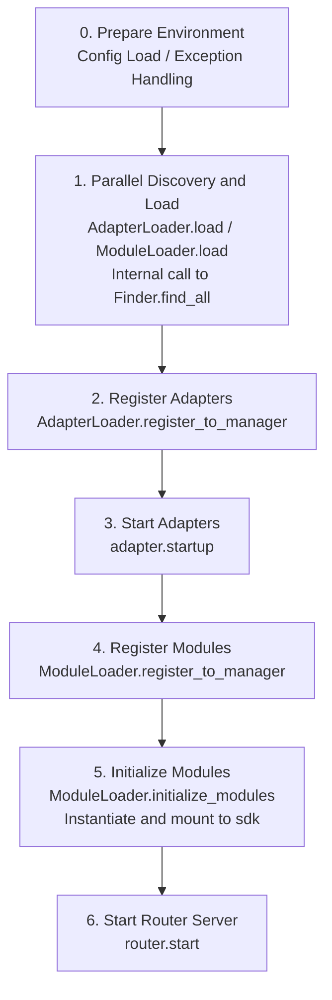

# Startup Process and Manual Control

ErisPulse's `await sdk.run()` / `await sdk.init()` encapsulates the entire startup chain into "one line of code." However, when you need to completely customize the startup process (e.g., partial loading, dynamic registration, hot plugging, injecting custom loading strategies), you need to understand what is happening inside this chain and how to manually drive each step.

This document breaks down the startup chain into independent stages, explaining their respective responsibilities, calling order, and provides an example of a complete manual startup.

> This article assumes you have already run through [First Bot](../getting-started/first-bot.md) and understand the two modes of `sdk.run(keep_running=True/False)`. This article focuses on the internal chain breakdown of `init()` and the more low-level entry points such as `init()`/`init_task()`/`init_sync()`.

## SDK Top-Level Entry Overview

In addition to the two `keep_running` modes of `run()`, the SDK provides several more low-level initialization entry points, distinguished by **asynchronous nature, return values, and whether exceptions are wrapped**:

| Entry | Asynchronous | Return Value | Exception Handling | Use Case |
|------|--------|--------|----------|----------|
| `await sdk.run(True)` | async, blocking to maintain | `None` (auto `uninit` when closed) | Module/Adapter errors are intercepted, preventing process collapse | Pure bot applications |
| `await sdk.run(False)` | async, non-blocking | `None` (no auto-unload) | Same as above | Execute custom logic after initialization |
| `await sdk.init()` | async, requires await | `bool` | **No wrapper**, exceptions propagate upward | Manual control of lifecycle (paired with `uninit()`) |
| `sdk.init_task()` | async, returns Task non-blocking | `asyncio.Task` | Same as `init()` | Executing other initializations concurrently or when the event loop is not running yet |
| `sdk.init_sync()` | **Synchronous**, blocking current thread | `bool` | Same as `init()` | Command line scripts, synchronous entry points without an event loop |

> **Common Misconception**: `await sdk.init()` is **not equivalent** to `await sdk.run(keep_running=False)`. Two differences: ① `init()` returns `bool`, `run()` returns `None`; ② `run()` wraps the initialization and running process with try/except (intercepting Module/Adapter exceptions to prevent crash), while `init()` does not wrap, exceptions are thrown directly upward. Use `init()` + `uninit()` when you need paired unloading or custom exception handling.

## Startup Chain Overview

`sdk.init()` (more precisely its internal `Initializer.init()`) lifts the entire framework in the following order:



Corresponding core components:

| Layer | Component | Responsibility |
|----|------|------|
| Discovery | `AdapterFinder` / `ModuleFinder` | **Discover** adapters/modules from entry-points of installed packages |
| Loading | `AdapterLoader` / `ModuleLoader` | Discovery + Import + Read Metadata + Determine Enable/Disable, returning list of objects |
| Registration | `*Loader.register_to_manager` | Register objects to corresponding managers |
| Management | `sdk.adapter` / `sdk.module` | Maintain adapter/module instances, provide start/stop interfaces |
| Initialization | `ModuleLoader.initialize_modules` | Create module instances and mount to `sdk` (handle dependency topological sort) |
| Routing | `sdk.router` | HTTP / WebSocket Server |

> **Important**: `Finder` and `Loader` are two layers. `Loader` internally **already holds** a `Finder` (AdapterLoader comes with AdapterFinder, ModuleLoader comes with ModuleFinder). In most scenarios you only need to use `Loader`; you only use `Finder` separately when you need to "list only without importing."

## Detailed Breakdown of Each Stage

### 1. Discovery Layer: Finder

Finder is only responsible for "finding which packages provide adapters/modules," does not import, does not instantiate.

```python
from ErisPulse.finders import AdapterFinder, ModuleFinder

adapter_finder = AdapterFinder()
module_finder = ModuleFinder()

# Find all installed adapter/module entry-points
adapter_entries = adapter_finder.find_all()    # list[EntryPoint]
module_entries = module_finder.find_all()      # list[EntryPoint]

# Find single by name
entry = module_finder.find_by_name("MyModule")  # EntryPoint | None
```

Each `EntryPoint` can `.load()` to get the corresponding class, but typically you won't manually call it—Loader does it.

### 2. Loading Layer: Loader

Loader adds "Import + Read Metadata + Determine Enable/Disable" on top of Finder.

```python
from ErisPulse.loaders import AdapterLoader, ModuleLoader
from ErisPulse import sdk

adapter_loader = AdapterLoader()
module_loader = ModuleLoader()

# Inside load(): calls finder.find_all() → process entry-points one by one → returns tuple
adapter_objs, enabled_adapters, disabled_adapters = await adapter_loader.load(sdk.adapter)
module_objs, enabled_modules, disabled_modules = await module_loader.load(sdk.module)
```

The tuple returned by `load()`:

| Return Value | Meaning |
|--------|------|
| `objs` (`dict`) | Name → Object (Adapter class / Module wrapper object) |
| `enabled` (`list[str]`) | Names that are enabled (not disabled in config) |
| `disabled` (`list[str]`) | Names that are disabled |

### 3. Registration Layer: register_to_manager

Registers objects produced by Loader to the manager, allowing `sdk.adapter` / `sdk.module` to recognize them.

```python
# Register adapters (returns bool indicating if all succeeded)
await adapter_loader.register_to_manager(enabled_adapters, adapter_objs, sdk.adapter)

# Register modules
await module_loader.register_to_manager(enabled_modules, module_objs, sdk.module)
```

After registration, adapters enter `sdk.adapter._adapters`, module classes enter `sdk.module`, but **neither have started / been instantiated yet**.

### 4. Starting Adapters

```python
# Start all registered adapters
await sdk.adapter.startup()
# Or specify platform
await sdk.adapter.startup("yunhu")
await sdk.adapter.startup(["yunhu", "telegram"])
```

> Registration ≠ Startup. `register_to_manager` is just registration; `startup` actually calls the adapter's `start()`, establishing a connection with the platform.

### 5. Initializing Modules

Modules have one more step than adapters—they need to be **instantiated** and mounted to `sdk` (so you can call `sdk.MyModule.xxx`). This step also handles module inter-dependency declarations and topological sorting.

```python
success = await module_loader.initialize_modules(
    enabled_modules, module_objs, sdk.module, sdk
)
```

After successful instantiation, modules will appear on `sdk.<ModuleName>`.

### 6. Starting Router Server

```python
await sdk.router.start(
    host="0.0.0.0",
    port=8000,
    ssl_certfile=None,
    ssl_keyfile=None,
)
```

The router server is responsible for receiving adapters' Webhook / WebSocket callbacks. Without starting it, server-mode adapters cannot receive messages.

## Complete Manual Startup Example

The following code is **equivalent** to the core process of `await sdk.init()`, but every step is exposed to you, allowing you to insert custom logic at any stage:

```python
import asyncio
from ErisPulse import sdk
from ErisPulse.loaders import AdapterLoader, ModuleLoader

async def manual_startup():
    # 0. Prepare environment (load config, register global exception handling)
    #    _prepare_environment is the prerequisite step inside init(); manual process also needs to call it first,
    #    otherwise Loader won't see the config and will misjudge all adapters/modules as disabled.
    if not await sdk._prepare_environment():
        print("Environment preparation failed")
        return False

    # 1. Create loaders (each internally holds its own Finder)
    adapter_loader = AdapterLoader()
    module_loader = ModuleLoader()

    # 2. Parallel discovery and loading (using gather internally, same as init())
    (adapter_objs, enabled_adapters, disabled_adapters), \
    (module_objs, enabled_modules, disabled_modules) = await asyncio.gather(
        adapter_loader.load(sdk.adapter),
        module_loader.load(sdk.module),
    )

    # 3. Register adapters
    await adapter_loader.register_to_manager(
        enabled_adapters, adapter_objs, sdk.adapter
    )

    # 4. Start adapters
    if enabled_adapters:
        await sdk.adapter.startup()

    # 5. Register modules
    await module_loader.register_to_manager(
        enabled_modules, module_objs, sdk.module
    )

    # 6. Initialize modules (instantiate + mount to sdk)
    if enabled_modules:
        await module_loader.initialize_modules(
            enabled_modules, module_objs, sdk.module, sdk
        )

    # 7. Start router server
    await sdk.router.start(host="0.0.0.0", port=8000)

    print("Manual startup complete")
    return True

async def main():
    ok = await manual_startup()
    if ok:
        # Block to maintain running (manual process doesn't auto-block)
        await asyncio.Event().wait()

if __name__ == "__main__":
    asyncio.run(main())
```

### When should you manually start?

In the vast majority of cases **you do not need** to manually start; `await sdk.run()` already handles all of the above above. Manual startup only has value in these scenarios:

- **Partial Loading**: Load only specified adapters/modules, skipping others
- **Dynamic Registration**: Register new adapters/modules at runtime based on conditions
- **Custom Order**: Need to shuffle the default loading order (e.g., start a module before starting adapters)
- **Injection Strategy**: Inject custom strict mode managers, loading strategies, etc., into the Loader
- **Debugging / Diagnosis**: Manually drive the process when a stage fails to locate the problem

## Runtime Granular Control

Even if you have used `sdk.run()` to complete the startup, you can still control subsystems individually at runtime without restarting the entire SDK:

### Adapter Hot Start/Stop

```python
# Hot restart an adapter (fix connection, doesn't affect other platforms)
await sdk.adapter.shutdown("yunhu")
await sdk.adapter.startup("yunhu")

# Bring up a new platform while running
await sdk.adapter.startup("telegram")

# Temporarily take down a platform
await sdk.adapter.shutdown("telegram")
```

> `adapter.startup()` requires the adapter to be **already registered** to the manager. Registration happens inside `init()`/`run()`, so this is fine-grained control **after** startup.

### Router Server

```python
# Temporarily take down webhook server
await sdk.router.stop()

# Restart (e.g., changed port)
await sdk.router.start(host="0.0.0.0", port=9000)
```

### Module On-Demand Loading

```python
# Manually load a module (could be lazy-loaded)
await sdk.load_module("MyModule")
```

## Uninstall Process

The reverse operation of startup is `await sdk.uninit()`, which cleans up in reverse order:

1. Shut down all adapters (`adapter.shutdown()`)
2. Unload all modules
3. Clear all event handlers
4. Clear manager and module attributes on SDK

In manual startup scenarios, remember to call `uninit()` before exiting to ensure graceful shutdown:

```python
try:
    await asyncio.Event().wait()   # Maintain running
finally:
    await sdk.uninit()
```

## Restart

The SDK provides two restart methods, neither requires you to manually unload first—the framework handles it itself:

| Method | Call | Behavior | Use Case |
|------|------|------|----------|
| Hot Restart | `await sdk.restart()` | `uninit()` then `init()` again within the same process, re-loading adapters/modules | Reload configuration, hot-update modules |
| Hard Restart | `await sdk.hard_restart()` | Exit the entire process after `uninit()`, parent process (`epsdk run`) spawns a brand new process | Suspect memory/resource leaks, need a clean slate restart |

```python
# Hot restart: reload within same process (most common)
await sdk.restart()

# Hard restart: exit process, only effective when started via epsdk run
await sdk.hard_restart()
```

> **Two Notes**:
> 1. Both methods execute restart in a background task, **immediately returning `True` to indicate 'restart task is scheduled'**, not 'restart is complete'. Actual restart happens in the background to avoid interrupting the current event chain.
> 2. `hard_restart()` **must be started via `epsdk run main.py` to take effect**. Its principle is: exit the process with **exit code 42** after unloading; the parent process of `epsdk run` detects code 42 and spawns a brand new process; if started directly via `python main.py`, the process exits with code 42 and ends directly, without auto-restarting.

### When should you use hard restart?

Hard restart is not just "a more thorough restart"; it is more suitable and even more efficient than hot restart in the following scenarios:

- **Binary library (C extension) side effects**: Hot restart happens within the same process, unable to release C extensions, open file descriptors, threads, and other process-level resources; hard restart uses a brand new process, so these side effects are completely zeroed out.
- **Resource leak troubleshooting**: When you suspect memory or handle leaks, hard restart allows you to get a clean environment.
- **Frequent restarts sensitive to performance**: Hard restart saves the overhead of unload → reload within the same process, actually being more efficient than hot restart.

> The "Framework Restart" function in the Dashboard management panel calls `hard_restart()` internally.
> Also, a hard restart requires! You must use epsdk's run command to start, otherwise the program will just exit with exit code 42, because the run command checks for exit code 42 to restart the process. This must be noted!!!

## Related Documentation

- [First Bot](../getting-started/first-bot.md) - Introduction to `keep_running` two basic modes
- [Lifecycle Management](lifecycle.md) - Listening to startup events like `core.init.start` / `core.init.complete`
- [Lazy Loading System](lazy-loading.md) - Module lazy loading mechanism and `load_module`