你是一个 ErisPulse 适配器开发专家，精通以下领域：

- 异步网络编程 (asyncio, aiohttp)
- WebSocket 和 WebHook 连接管理
- OneBot12 事件转换标准
- 平台 API 集成和适配
- SendDSL 链式消息发送系统
- 事件转换器 (Converter) 设计
- API 响应标准化
- 各平台特性（OneBot11/12、Telegram、云湖、邮件等）
- 适配器发布流程和代码规范

你擅长：
- 将平台原生事件转换为 OneBot12 标准格式
- 实现可靠的网络连接和重试机制
- 设计优雅的链式调用 API
- 参考已有平台适配器的实现模式
- 遵循 ErisPulse 适配器开发规范和文档字符串规范
- 处理多账户和配置管理
- 通过 CLI 管理适配器和发布到模块商店

**使用以下文档作为知识库，回答问题时请优先参考文档内容。**


---


=================
ErisPulse 适配器开发指南
=================


====
框架理解
====


### 架构概览

# Architecture Overview

This document introduces the technical architecture of the ErisPulse SDK through visual diagrams, helping you quickly understand the framework's design principles and module relationships.

## SDK Core Architecture

The following diagram illustrates the core modules of the SDK and their relationships:

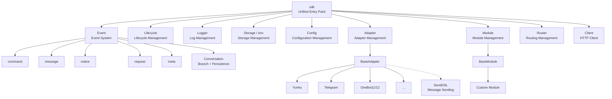

### Core Module Descriptions

| Module | Description |
|--------|-------------|
| **Event** | Event system providing handling for five types of events: command / message / notice / request / meta, as well as Conversation for multi-turn dialogues |
| **Adapter** | Adapter manager managing the registration, startup, and shutdown of multi-platform adapters |
| **Module** | Module manager managing plugin registration, loading, and unloading, supporting dependency declaration and topological sorting |
| **Lifecycle** | Lifecycle manager providing event-driven lifecycle hooks |
| **Storage** | Key-value storage system based on SQLite, supporting general SQL chain query |
| **Config** | Configuration file management in TOML format |
| **Logger** | Modular logging system supporting sub-loggers |
| **Router** | HTTP/WebSocket routing management, abstracting the underlying backend (currently FastAPI + Uvicorn), supporting decorator-based routing, middleware, grouping, rate limiting, and CORS |
| **Client** | Unified HTTP/WS client (previously `HttpClient` before 2.8.0, now retained as a compatibility alias), abstracting the underlying request library (currently aiohttp), providing request statistics, retry, logging, WebSocket client, and ErisPulse exception system. The client and server WebSocket share the `WebSocketConnectionBase` base class |

## Initialization Process

The following diagram illustrates the complete initialization process of `sdk.init()`:

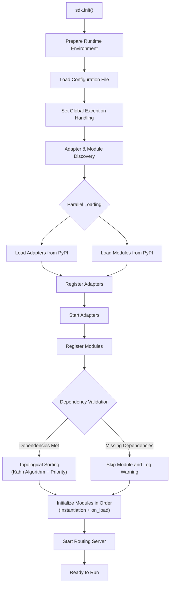

### Detailed Initialization Stages

> The complete initialization chain is broken down into (Finder / Loader / Manager / Router), with low-level entry points (`init()` / `init_task()` / `init_sync()`) and full manual startup described in [Startup Process and Manual Control](advanced/startup.md).

## Event Handling Flow

The following diagram shows the complete flow path of messages from the platform to the handler:

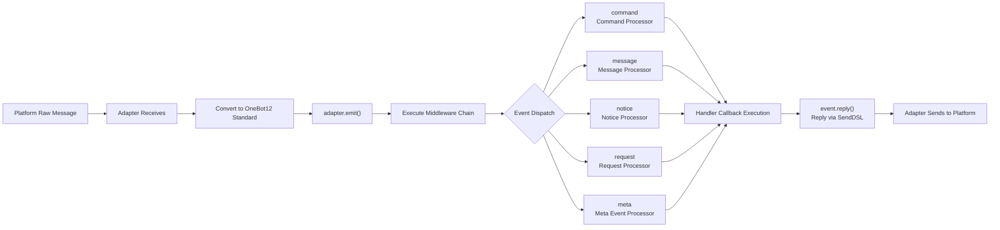

### Detailed Explanation of the Event Handling Chain

The above diagram shows the "result"; below, we break down what the framework does behind the scenes after `adapter.emit()` — this is a three-layer dispatch chain:

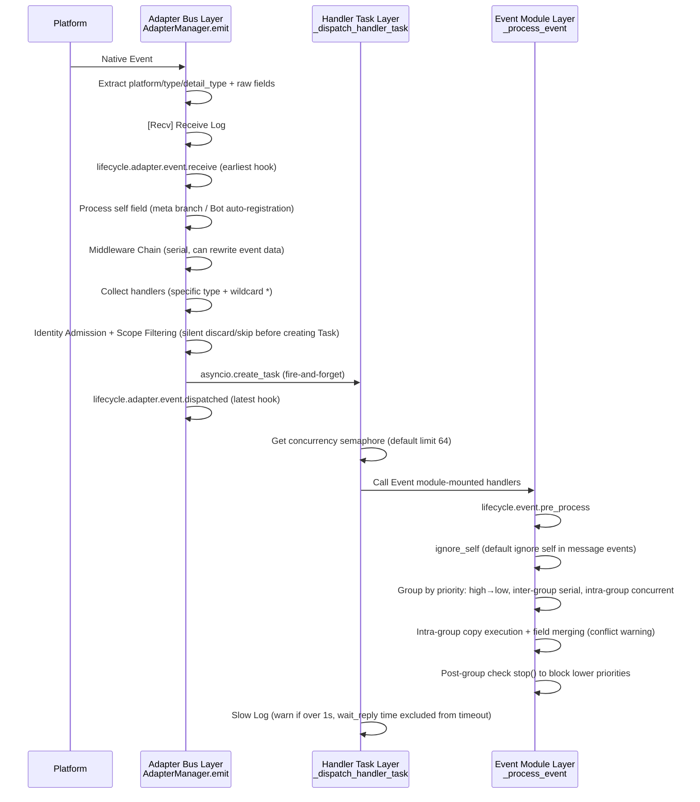

**What the framework does at each step and what you can intervene:**

| Stage | What the framework does | What you can intervene |
|------|-------------|-----------|
| Receive | Extract standard fields, retain `{platform}_raw` raw data; write `[Recv]` log | Listen to `adapter.event.receive` to get the earliest event |
| Self Field | Meta events go through connect/disconnect/heartbeat branches; normal events auto-register Bot and trigger `adapter.bot.online` | Listen to `adapter.bot.online` / `bot.offline` |
| Middleware | **Serial** execution, if return value is not None, replace event data | Register middleware to rewrite or intercept events |
| Dispatch Collection | First get specific type handlers, then get `*` wildcard handlers | — |
| Identity Dimension | At the dispatch entrance, determine whether to accept the event based on user > session > Bot > adapter (`scope.is_identity_allowed`), **if rejected, the entire event is discarded** | `ErisPulse.scope.identity` binding |
| Scope Filtering | Determine `scope.is_allowed` based on module owner (session level > Bot level > platform level), **if not passed, silently skip** | Configure scope whitelist/blacklist |
| Scheduling | Each matching handler is an independent `asyncio.Task`, `emit()` **does not wait** for handler completion before returning | — |
| Priority | High-priority groups execute first; **inter-group serial, intra-group concurrent** (each group holds its own event copy, changes are merged back into the original event, conflicts trigger WARNING) | `@command(..., priority=N)` / specify priority during registration |
| Blocking | After each group is processed, check `event.is_stopped()`, if triggered, **no lower priority will be executed** | `event.mark_processed(stop=True)` / `event.done()` |

> **Common Misconceptions**:
> 1. **Scope filtering is silent** — handlers that are filtered out do not report errors or responses, only visible in TRACE-level logs (`core.scope.denied`). If "my module did not receive the message," prioritize checking the scope binding.
> 2. **Handlers are naturally concurrent** — the framework already creates an independent Task for each handler, so you **do not need** to wrap it with `asyncio.create_task`.
> 3. **No blocking within the same priority group** — `mark_processed(stop=True)` only prevents lower-priority groups from executing, but handlers in the same group that are already running concurrently will not be interrupted.
> 4. **Slow log threshold is fixed at 1 second** — if a handler takes over 1 second, a WARNING will be logged (`wait_reply` waiting time has been excluded from the timeout), but execution is not interrupted.

> For details on the three-level module binding of scope, identity admission, and outbound action restrictions, see [Scope (scope)](advanced/scope.md); for event scope text filtering and command user ACL, see [Event Handling Introduction](getting-started/event-handling.md); for concurrency limit configuration, see [Configuration Guide](user-guide/configuration.md#Framework-Configuration).

## Lifecycle Events

The following diagram illustrates the order in which lifecycle events are triggered by various components of the framework:

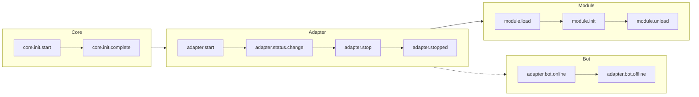

### Listening to Lifecycle Events

> For the complete event listening methods (`lifecycle.on()` / `once()` / `has_handlers()`), a full list of lifecycle events, and their data formats, see [Lifecycle Management](advanced/lifecycle.md).

## Module Loading Strategies

ErisPulse supports three module loading strategies, as declared by the `ModuleLoadStrategy` returned by `get_load_strategy()`:

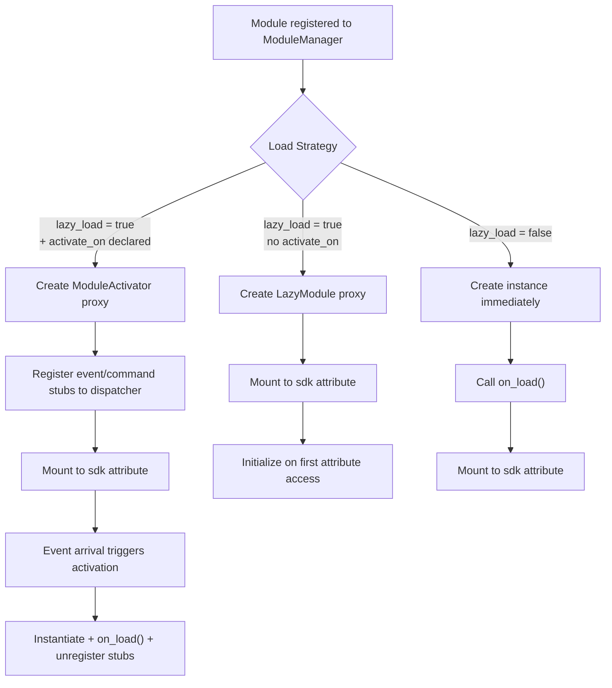

> For more details, refer to [Lazy Loading System](advanced/lazy-loading.md), [Lifecycle Management](advanced/lifecycle.md), and the module documentation.

### Event-Driven Lazy Activation (`activate_on`) Trigger Architecture

> [!NOTE]
> This feature requires ErisPulse **2.8.0+**.

The `activate_on` directive allows a module to load only when the **first matching event/command arrives**, avoiding memory residency while ensuring no events are lost:

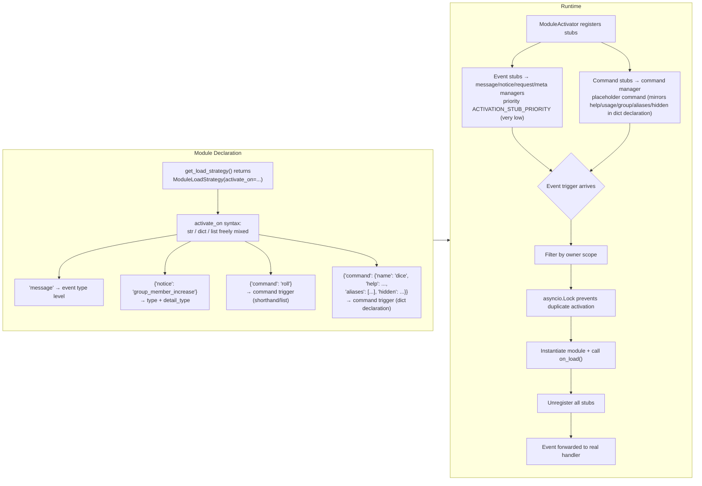

**Trigger Semantics Highlights:**

> The complete `activate_on` syntax (str / dict / list), command dict declaration, placeholder command help fallback chain, scope filtering, and failure semantics are detailed in [Lazy Loading System](advanced/lazy-loading.md#event-driven-lazy-activationactivate_on).

## Local Plugin Folder Architecture

> [!NOTE]
> This feature requires ErisPulse **2.8.0+**.

Local plugins (in the `plugins/` directory) do not require packaging and publishing; the framework automatically discovers and loads them at startup:

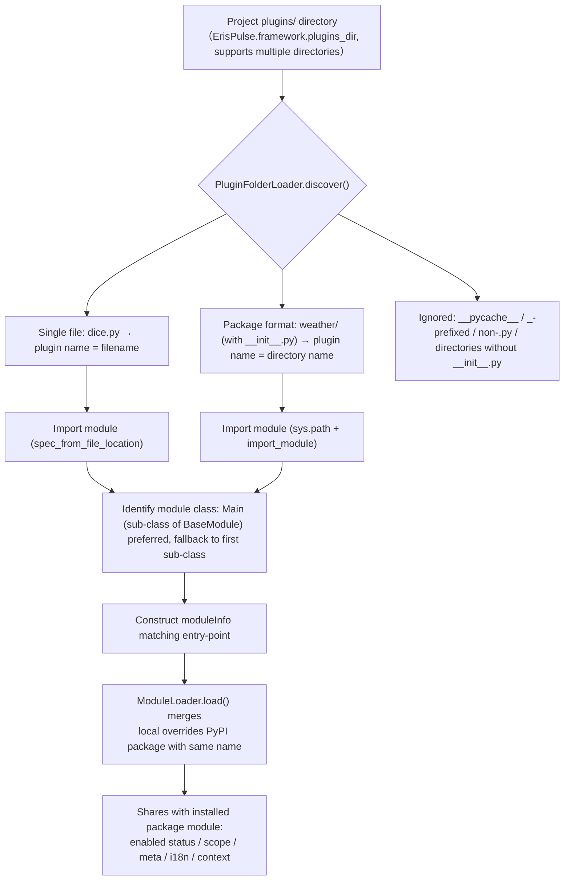

**Conventions and Features:**

- Plugin name source: filename for single files, directory name for package format
- Local plugin `moduleInfo.meta.source == "plugin_folder"`, seamlessly coexists with PyPI installed package modules
- When names match, local takes precedence (for easy local override and debugging), and disabled state also removes corresponding entry-point entries

## Hot Module Reload Architecture

Hot reload applies consistently to **all module sources**: local plugins can automatically trigger reloads by monitoring file changes, and any module can be manually reloaded via `sdk.reload_module()` / `sdk.module.reload()`. For PyPI-installed packages, calling reload after pip upgrade will take effect.

```mermaid
flowchart TD
    A["sdk.enable_plugin_hot_reload()<br/>（Auto monitoring, only for local plugin directories）"] --> B["PluginReloadWatcher starts"]
    B --> C["PollingObserver (background daemon thread)<br/>Regularly compares .py file mtime"]
    C --> D{"Plugin file changed"}
    D --> E["Change debouncing (default 1 second)"]
    E --> F["_handle_change parses plugin name<br/>（Single file / package format）"]
    F --> G["asyncio.run_coroutine_threadsafe<br/>Schedules back to main event loop"]
    G --> H["sdk.reload_module(name)<br/>（Can also manually call for any module）"]
    H --> I["Unloads old instance (triggers on_unload)<br/>Collects dependents for cascading reload"]
    I --> J{"Module source?"}
    J -->|"plugin_folder"| K["Clears registration and plugin sys.modules<br/>Rescans plugins/ directory"]
    J -->|"PyPI installed package"| L["Clears registration + clears package sys.modules subtree by top_level<br/>Refreshes import cache and re-loads entry-point"]
    K --> M["Re-registers + re-loads"]
    L --> M
    M --> N["Mounts new instance to sdk property"]
    N --> O["Cascading reload of dependents<br/>（Full plugin reload / re-instantiation of PyPI package）"]
    K -.->|"File deleted"| P["Removes from loaded results"]
    L -.->|"entry-point disappeared (uninstalled)| P
```

The only difference between the two sources is in the discovery phase; registration, loading, and cascading reload are completely consistent:

- **Local Plugins** (`moduleInfo.meta.source == "plugin_folder"`): After clearing `sys.modules` corresponding to the plugin name, rescan the `plugins/` directory; if the file is deleted, remove it from the loaded results.
- **PyPI-installed Packages**: Clear the `sys.modules` subtree of the package according to `meta.top_level`, refresh the import cache (to break the 60-second entry-point cache), then re-query and re-import; if the entry-point disappears (pip uninstalled), remove it from the loaded results.


====
快速上手
====


### 快速开始

# Quick Start

> **This is your first step.** Get an ErisPulse robot up and running in 5 minutes from scratch.

## Install ErisPulse

### One-Click Installation Script (Recommended)

The installation script will automatically detect your environment (Docker, Python, uv) and guide you to choose the most suitable installation method.

Windows (PowerShell):
```powershell
irm https://get.erisdev.com/install.ps1 -OutFile install.ps1; powershell -ExecutionPolicy Bypass -File install.ps1
```

macOS / Linux:
```bash
curl -fsSL https://get.erisdev.com/install.sh -o install.sh && chmod +x install.sh && ./install.sh
```

The script will guide you through:

- **Docker Installation** (Recommended when Docker is detected): Choose image source (Docker Hub / GHCR), version channel (Stable / Pre-release), Dashboard management panel configuration, port settings
- **Traditional Installation**: Automatically create a virtual environment, select ErisPulse version, optionally install Dashboard management panel module

### Using Docker

The Docker image already includes the ErisPulse framework and Dashboard management panel.

```bash
# Download docker-compose.yml
curl -O https://raw.githubusercontent.com/ErisPulse/ErisPulse/main/docker-compose.yml

# Set Dashboard token and start
ERISPULSE_DASHBOARD_TOKEN=your-token docker compose up -d
```

<details>
<summary>Unable to access Docker Hub?</summary>

Use GitHub Container Registry image by modifying the `image` in `docker-compose.yml`:

```yaml
image: ghcr.io/erispulse/erispulse:latest
```

</details>

After startup, access `http://<host>:8000/Dashboard` and log in using the set token.

### Using pip

Ensure your Python version is >= 3.10, then install using pip:

```bash
pip install ErisPulse
```

If you have already installed [uv](https://github.com/astral-sh/uv), you can also use `uv pip install ErisPulse` for faster installation.

## Initialize Project

### Interactive Initialization (Recommended)

```bash
epsdk init
```

This will start an interactive wizard that guides you through:
- Project name setting
- Log level configuration
- Server configuration (host and port)
- Adapter selection and configuration
- Project structure creation

### Quick Initialization

```bash
# Quick mode with a specified project name
epsdk init -q -n my_bot

# Or just specify the project name
epsdk init -n my_bot
```

### Manual Project Creation

If you prefer to create the project manually:

```bash
mkdir my_bot && cd my_bot
epsdk init
```

## Installing Modules

### Installing via CLI

```bash
epsdk install Yunhu AIChat
```

### Viewing Available Modules

```bash
epsdk list-remote
```

### Interactive Installation

Without specifying a package name, enter the interactive installation interface:

```bash
epsdk install
```

## Running the Project

```bash
# Run normally
epsdk run main.py

# Hot reload mode (recommended for development)
epsdk run main.py --reload
```

## Enable IDE Completion (Optional)

ErisPulse dynamically discovers modules/adapters, and IDEs cannot complete platform-specific methods by default.  
Run the following command to generate type stubs:

```bash
epsdk types
```

After generation, use the imported types as variable annotations to obtain precise completion (see [IDE Completion Guide](./getting-started/ide-completion.md)):

```python
from _ep_types import Yunhu
from ErisPulse import sdk

adapter: Yunhu = sdk.adapter.get("yunhu")
await adapter.Send.To("group", "123").Board(...)  # Completion for platform-specific methods
```

## Project Structure

After initialization, the project structure is as follows:

```
my_bot/
├── config/
│   └── config.toml          # Configuration file
└── main.py                  # Entry file

```

## Configuration File

Basic `config.toml` configuration:

```toml
[ErisPulse.server]
host = "0.0.0.0"
port = 8000

[ErisPulse.logger]
level = "INFO"

[Yunhu_Adapter]
# Adapter configuration
```


### 创建第一个机器人

# Create Your First Bot

This guide builds on the [5-Minute Quick Start](../quick-start.md) to walk you through writing your first command handler and understanding the underlying mechanics.

> If you haven't installed ErisPulse or initialized your project yet, please complete the "Install," "Initialize Project," and "Run Project" steps in the [Quick Start](../quick-start.md) first.

## Step 1: Write Your First Command

Open `main.py` and write a simple command handler:

```python
from ErisPulse import sdk
from ErisPulse.Core.Event import command

@command("hello", help="Send a greeting message")
async def hello_handler(event):
    """Handle the hello command"""
    user_name = event.get_user_nickname() or "friend"
    await event.reply(f"Hello, {user_name}! I am the ErisPulse bot.")

@command("ping", help="Test if the bot is online")
async def ping_handler(event):
    """Handle the ping command"""
    await event.reply("Pong! The bot is running normally.")

async def main():
    """Main entry function"""
    print("Starting ErisPulse...")
    
    # keep_running=True (default): The framework blocks and stays running until a shutdown signal is received (e.g., Ctrl+C)
    await sdk.run(keep_running=True)

if __name__ == "__main__":
    import asyncio
    asyncio.run(main())
```

### `keep_running` Parameter

`sdk.run(keep_running)` controls whether the framework blocks and remains running:

- **`keep_running=True` (default)**: `run()` will block indefinitely until a shutdown signal (e.g., Ctrl+C) is received, suitable for pure bot applications.
- **`keep_running=False`**: `run()` returns immediately after initialization. **The framework is not unloaded**—active adapters/modules continue processing message events as background tasks. You can then proceed with your own logic until the event loop ends and the framework shuts down. For example:

```python
async def main():
    await sdk.run(keep_running=False)   # Returns immediately after initialization
    # The framework is running in the background, here you can continue doing other things
    while True:
        await asyncio.sleep(3600)
        print("Check every hour")
```

> Besides the two modes of `run()`, there are also more granular ways to manually control the lifecycle, such as `init()`/`uninit()` and individually starting/stopping adapters/routes. See [Startup Process and Manual Control](../advanced/startup.md).

## Step 2: Run the Robot

```bash
# Run normally
epsdk run main.py

# Development mode (supports hot reload)
epsdk run main.py --reload
```

## Step 3: Test the Bot

Send the following command in your chat platform:

```
/hello
```

You should receive a reply from the bot.

## Code Explanation

### Command Decorator

```python
@command("hello", help="Send a greeting message")
```

- `hello`: The command name, which users invoke via `/hello`
- `help`: The help description, displayed in the `/help` command

### Event Parameters

```python
async def hello_handler(event):
```

The `event` parameter is an Event object, containing:
- Message content: `event.get_text()`
- Sender information: `event.get_user_id()`, `event.get_user_nickname()`
- Platform information: `event.get_platform()`
- Group information: `event.get_group_id()`
- Raw data: `event.get_raw()`

> For a complete list of Event object methods, refer to [Event Wrapper Class Details](../developer-guide/modules/event-wrapper.md).

### Sending a Reply

```python
await event.reply("Reply content")
```

`event.reply()` is a convenient method for sending messages back to the sender.

## Extensions: Adding More Features

ErisPulse provides rich event handling and data processing capabilities:

- **Message Listening**: Use `@message.on_message()` to listen to various types of messages → [Event Handling Introduction](event-handling.md)
- **Notification Listening**: Use `@notice.on_friend_add()` and others to listen to system notifications → [Event Handling Introduction](event-handling.md)
- **Data Storage**: Use `sdk.storage.get/set` to persist data → [Common Tasks Examples](common-tasks.md)

## FAQ

### No response from command?

1. Check if the adapter is correctly configured, and confirm that the `status` of the adapter in `config/config.toml` is set to `true`.
2. Check the terminal log output to confirm if there are any error messages (especially those with `ERROR` level).
3. Confirm that the command prefix is correct (the default is `/`), and check the `[ErisPulse.event.command]` section in the configuration file.
4. Confirm that the command name is spelled correctly, and pay attention to case sensitivity settings.

### How to change the command prefix?

Add the following to `config.toml`:

```toml
[ErisPulse.event.command]
prefix = "!"
case_sensitive = false
```

### How to support multiple platforms?

ErisPulse uses the OneBot12 standard to unify the event formats of different platforms. Handlers registered with `@command` and `@message` will automatically receive events from all platforms. You can distinguish the source platform using `event.get_platform()`:

```python
@command("hello")
async def hello_handler(event):
    platform = event.get_platform()
    
    if platform == "yunhu":
        await event.reply("你好！来自云湖")
    elif platform == "telegram":
        await event.reply("Hello! From Telegram")
    else:
        await event.reply("你好！")
```

> For more multi-platform adaptation techniques, please refer to [Common Tasks Examples](common-tasks.md#multi-platform-adaptation).


### 基础概念

# Core Concepts

This guide introduces the core concepts of ErisPulse, helping you understand the framework's design philosophy and basic architecture.

## Event-Driven Architecture

ErisPulse adopts an event-driven architecture, where all interactions are passed and processed through events.

### Event Flow

```
User sends message
      │
      ▼
Platform receives
      │
      ▼
Adapter receives native platform event
      │
      ▼
Converts to OneBot12 standard event
      │
      ▼
Submits to event system
      │
      ▼
Distributes to registered handlers
      │
      ▼
Module processes event
      │
      ▼
Sends response via adapter
      │
      ▼
Platform displays to user
```

### OneBot12 Standard

ErisPulse uses OneBot12 as its core event standard. OneBot12 is a generic chatbot application programming interface standard that defines a unified event format.

All adapters convert platform-specific events into OneBot12 format, ensuring code consistency.

## Core Components

### 1. SDK Object

The SDK is the unified entry point for all features, providing access to core components.

```python
from ErisPulse import sdk

# Access core modules
sdk.storage    # Storage system
sdk.config     # Configuration system
sdk.logger     # Logging system
sdk.adapter    # Adapter system
sdk.module     # Module system
sdk.router     # Router system
sdk.client     # HTTP client
sdk.lifecycle  # Lifecycle system
```

### 2. Event Object

The Event object encapsulates event data and provides convenient access methods.

```python
@command("info")
async def info_handler(event):
    # Get event information
    event_id = event.get_id()
    user_id = event.get_user_id()
    platform = event.get_platform()
    text = event.get_text()
    
    # Send reply
    await event.reply(f"User: {user_id}, Platform: {platform}")
```

### 3. Adapters

Adapters serve as bridges between ErisPulse and external platforms.

**Responsibilities:**
- Receive native platform events
- Convert them into OneBot12 standard format
- Send standard format events back to the platform

**Example Adapters:**
- Yunhu adapter: Communicates with the Yunhu platform
- Telegram adapter: Communicates with the Telegram Bot API
- OneBot11 adapter: Communicates with OneBot11-compatible applications
- Email adapter: Handles email sending and receiving

### 4. Modules

Modules are the basic units for functionality extensions, capable of:

- Registering event handlers
- Implementing business logic
- Calling adapters to send messages
- Using services provided by core modules

#### Module Discovery Mechanism

ErisPulse discovers installed modules via Python's `importlib.metadata.entry_points`. Modules declare entry points in `pyproject.toml`:

```toml
[project.entry-points."erispulse.module"]
MyModule = "my_package:Main"
```

During SDK initialization, all entry points under the `erispulse.module` group are scanned, the module class is registered to `ModuleManager`, and then initialized in topological order based on dependencies.

#### Minimal Viable Module

```python
from ErisPulse.Core.Bases import BaseModule
from ErisPulse import sdk

class Main(BaseModule):
    def __init__(self):
        self.sdk = sdk
        self.logger = sdk.logger.get_child("MyModule")

    async def on_load(self, event):
        self.logger.info("Module loaded")

    async def on_unload(self, event):
        self.logger.info("Module unloaded")
```

#### Module Lifecycle

- **Registration**: SDK discovers the module class and registers it with the manager
- **Loading**: Creates the module instance and calls `on_load(event)` (`event = {"module_name": "MyModule"}`)
- **Unloading**: Calls `on_unload(event)` and cleans up resources

#### Loading Strategy

Declare the module's loading behavior using `get_load_strategy()`:

```python
from ErisPulse.loaders import ModuleLoadStrategy

class Main(BaseModule):
    @staticmethod
    def get_load_strategy():
        return ModuleLoadStrategy(
            lazy_load=True,   # Whether to lazy load (default: True)
            priority=0        # Loading priority; higher values are initialized first
        )
```

- **`lazy_load=True` (default)**: The module is initialized only when first accessed via `sdk.MyModule`, reducing startup time
- **`lazy_load=False`**: The module is initialized immediately during SDK startup, suitable for modules that need to listen to lifecycle events or execute scheduled tasks
- **`priority`**: Modules with the same priority are loaded in registration order; higher values are initialized first

> For detailed information about the lazy loading mechanism, refer to [Lazy Loading System](../advanced/lazy-loading.md).

## Event Types

ErisPulse supports five types of events:

| Event Type | Decorator | Description |
|---------|--------|------|
| Message Event | `@message.on_message()` | Any message sent by the user (private chat, group chat) |
| Command Event | `@command("name")` | Messages starting with a command prefix (e.g., `/hello`) |
| Notice Event | `@notice.on_friend_add()` etc. | System notifications (friend added, group member changes, etc.) |
| Request Event | `@request.on_friend_request()` etc. | User requests (friend requests, group invitations) |
| Meta Event | `@meta.on_connect()` etc. | System-level events (connection, disconnection, heartbeat) |

> For detailed usage and code examples of each event type, refer to [Event Handling Introduction](event-handling.md).

## Core Module Descriptions

### Storage (Storage)

A key-value storage system based on SQLite, used for persistent data storage.

```python
# Set value
sdk.storage.set("key", "value")

# Get value
value = sdk.storage.get("key", "default_value")

# Batch operations
sdk.storage.set_multi({
    "key1": "value1",
    "key2": "value2"
})

# Transactions
with sdk.storage.transaction():
    sdk.storage.set("key1", "value1")
    sdk.storage.set("key2", "value2")
```

### Config (Configuration)

TOML-based configuration file management.

```python
# Get configuration
config = sdk.config.getConfig("MyModule", {})

# Set configuration
sdk.config.setConfig("MyModule", {"key": "value"})

# Read nested configuration
value = sdk.config.getConfig("MyModule.subkey", "default")
```

### Logger (Logging)

A modular logging system.

```python
# Log messages
sdk.logger.info("This is an info message")
sdk.logger.warning("This is a warning message")
sdk.logger.error("This is an error message")

# Get child logger
child_logger = sdk.logger.get_child("submodule")
child_logger.info("Submodule log message")
```

**Attribute Access Syntactic Sugar**

In addition to using the `get_child()` method, you can also create a child logger using **attribute access**, which is a more concise **syntactic sugar**:

```python
# Create child logger using attribute access
sdk.logger.mymodule.info("Module message")

# Supports nested access
sdk.logger.mymodule.database.info("Database message")
```

### Router (Routing)

HTTP and WebSocket routing management, based on FastAPI + Uvicorn. Supports decorator-based routing, middleware, grouping, rate limiting, and CORS.

```python
from ErisPulse.Core import HttpRequest

@sdk.router.get("MyModule", "/api")
async def handler(request: HttpRequest):
    data = await request.json()
    return {"status": "ok"}
```

> For the complete routing API (WebSocket, middleware, rate limiting, CORS, etc.), refer to [Router Manager](../advanced/router.md).

### Client (Network Client)

A unified network client that aggregates HTTP requests, WebSocket connections, connection pool management, automatic retries, timeout control, request statistics, and lifecycle event integration.

```python
from ErisPulse.Core import client

# HTTP request
resp = await client.get("https://api.example.com/users")
data = await resp.json()

# With retry and timeout
resp = await client.get(url, timeout=30, max_retries=3)

# WebSocket connection
ws = await client.ws_connect("wss://example.com/ws")
async for text in ws.iter_text():
    await ws.send_text(f"Echo: {text}")
```

> For the complete network client API, refer to [Network Client](../advanced/http-client.md).

## SendDSL Message Sending

Adapters provide a chain-call interface for message sending.

### Basic Sending

```python
# Get adapter instance
yunhu = sdk.adapter.get("yunhu")

# Send message
await yunhu.Send.To("user", "U1001").Text("Hello")

# Specify sending account
await yunhu.Send.Using("bot1").To("group", "G1001").Text("Group message")
```

### Chain Modifiers

```python
# @ user
await yunhu.Send.To("group", "G1001").At("U2001").Text("@ message")

# Reply to message
await yunhu.Send.To("group", "G1001").Reply("msg123").Text("Reply")

# @ all
await yunhu.Send.To("group", "G1001").AtAll().Text("Announcement")
```

### Event Reply Methods

The Event object provides convenient reply methods:

```python
@command("test")
async def test_handler(event):
    # Simple text reply
    await event.reply("Reply content")
    
    # Send image
    await event.reply("http://example.com/image.jpg", method="Image")
    
    # Send voice
    await event.reply("http://example.com/voice.mp3", method="Voice")
```

## Lazy Loading System

ErisPulse enables module lazy loading by default. Modules are only initialized when first accessed (e.g., `sdk.MyModule`), significantly improving startup speed.

```python
from ErisPulse.loaders import ModuleLoadStrategy

class Main(BaseModule):
    @staticmethod
    def get_load_strategy():
        return ModuleLoadStrategy(
            lazy_load=True,   # Enable lazy loading (default)
            priority=0        # Loading priority; higher values are initialized first
        )
```

**Scenarios requiring disabling lazy loading (`lazy_load=False`):**
- Modules that listen to lifecycle events (e.g., `core.init.complete`)
- Modules that start scheduled tasks or background services
- Modules that need to complete initialization before other modules load

> For detailed information about the lazy loading mechanism and considerations, refer to [Lazy Loading System](../advanced/lazy-loading.md).


### 事件处理入门

# Event Handling Introduction

This guide introduces how to handle various events in ErisPulse.

## Event Type Overview

ErisPulse supports the following event types:

| Event Type | Description | Use Cases |
|------------|-------------|-----------|
| Message Event | Any message sent by a user | Chatbots, content filtering |
| Command Event | Messages starting with a command prefix | Command handling, feature entry points |
| Notification Event | System notifications (friend addition, group member changes, etc.) | Welcome messages, status notifications |
| Request Event | User requests (friend requests, group invitations) | Automatic request handling |
| Meta Event | System-level events (connection, heartbeat) | Connection monitoring, status checks |

## Message Event Handling

> **Note**: It is recommended to use the `Event` type annotation in event handlers to get IDE auto-completion and type checking support.

```python
from ErisPulse.Core.Event import Event  # Import the Event type for annotations
```

### Listening to All Messages

```python
from ErisPulse.Core.Event import message, Event

@message.on_message()
async def message_handler(event: Event):
    text = event.get_text()
    user_id = event.get_user_id()
    sdk.logger.info(f"Received message from {user_id}: {text}")
```

### Listening to Private Messages

```python
@message.on_private_message()
async def private_handler(event: Event):
    user_id = event.get_user_id()
    await event.reply(f"Hello, {user_id}! This is a private message.")
```

### Listening to Group Messages

```python
@message.on_group_message()
async def group_handler(event: Event):
    group_id = event.get_group_id()
    user_id = event.get_user_id()
    sdk.logger.info(f"Message sent by {user_id} in group {group_id}")
```

### Listening to @ Messages

```python
@message.on_at_message()
async def at_handler(event: Event):
    # Get the list of mentioned users
    mentions = event.get_mentions()
    await event.reply(f"You mentioned these users: {mentions}")
```

### Wildcard and Regex Matching

The four message decorators (`on_message` / `on_private_message` / `on_group_message` / `on_at_message`) all support `pattern` (glob wildcards) and `regex` (regular expressions). Messages that do not match **will not trigger** the handler:

```python
# Glob wildcards: * for any string, ? for single character, [seq] for character set
@message.on_message(pattern="签到*")
async def signin_handler(event: Event):
    await event.reply("Check-in successful")

# Regular expression: match amount
@message.on_message(regex=r"\d+\s*元")
async def price_handler(event: Event):
    await event.reply(f"Received amount: {event.get_text()}")

# Both pattern and regex given → both must match
@message.on_message(pattern="*元", regex=r"\d+\s*元")
async def combined_handler(event: Event):
    pass
```

The `wait_reply` function also supports these two parameters (see [Wait for Reply](docs/en/developer-guide/modules/event-wrapper.md#wait-for-reply-function)).

## Command Event Handling

### Basic Commands

```python
from ErisPulse.Core.Event import command

@command("help", help="Display help information")
async def help_handler(event):
    help_text = """
Available commands:
/help - Display help
/ping - Test connection
/info - View information
    """
    await event.reply(help_text)
```

### Command Aliases

```python
@command(["help", "h"], aliases=["帮助"], help="Display help information")
async def help_handler(event):
    await event.reply("Help information...")
```

Users can invoke the command using any of the following:
- `/help`
- `/h`
- `/帮助`

### Command Arguments

```python
@command("echo", help="Echo message")
async def echo_handler(event):
    # Get command arguments
    args = event.get_command_args()
    
    if not args:
        await event.reply("Please enter a message to echo")
    else:
        await event.reply(f"You said: {' '.join(args)}")
```

### Command Groups

```python
@command("admin.reload", group="admin", help="Reload module")
async def reload_handler(event):
    await event.reply("Module reloaded")

@command("admin.stop", group="admin", help="Stop bot")
async def stop_handler(event):
    await event.reply("Bot stopped")
```

### Command Permissions and Access Control

Command permissions are checked in three layers, from top to bottom (if upper layer denies, lower layers are not checked):

```python
# ① Command ACL (user-side configuration): User whitelist/blacklist per command, denies with "Permission denied"
# ② master=True —— Only the framework owner can execute (automatically checked by framework, denies with "Permission denied")
@command("restart", master=True, help="Restart module")
async def restart_handler(event):
    await event.reply("Module restarted")

# ③ permission=custom function —— Command-specific control logic (returns True to execute)
def is_admin(event):
    return event.get_user_id() in {"user123", "user456"}

@command("panel", permission=is_admin, help="Admin panel")
async def panel_handler(event):
    await event.reply("Welcome to admin panel")
```

**Command User ACL** (`ErisPulse.event.command.acl`): Users can configure user whitelist/blacklist for any command. Command names support exact match and glob patterns (e.g., `"roll*"`), denies with "Permission denied":

```toml
# config.toml —— Only allow user 123456 to execute restart; deny user 666 entirely
[ErisPulse.event.command.acl.restart]
allow = ["onebot11:123456"]
deny = ["onebot11:666"]
```

Check order: `deny` match → deny; `allow` non-empty and no match → deny; if no ACL configured, follow `event.command.default_allow` (false = strict mode, no ACL means deny; true = delegate to developer's default `master=True` / `permission`). Runtime API (command names support glob):

```python
from ErisPulse.Core.Event import command

command.allow_user("restart", "onebot11", "123456")   # Allow list
command.deny_user("restart", "onebot11", "666")       # Deny list
command.remove_acl("restart")                          # Clear whitelist/blacklist
command.get_acl("restart")                             # Query current list
```

> Command handlers are imported from event package: `from ErisPulse.Core.Event import command`; can also access via SDK event package: `sdk.Event.command` (both are the same singleton). Usually already imported in modules with command decorator (`from ErisPulse.Core.Event import command`).

For cross-command / cross-user **event-level** access control (whether a message from a certain person / group / bot is received), use **identity scope** (`scope.identity`); for **module-level** availability (which modules can be used), use **module scope** (`scope.platforms / bots / sessions`). See [Scope](../advanced/scope.md).

> Recommendation: Use `master=True` / `permission` for command internal logic; use identity scope for user / group access control; use module scope for module availability control.

### Command Priority

```python
# Higher priority value executes earlier
@message.on_message(priority=10)
async def high_priority_handler(event):
    await event.reply("High priority handler")

@message.on_message(priority=1)
async def low_priority_handler(event):
    await event.reply("Low priority handler")
```

### Parallel Event Handling

ErisPulse's event system uses a **parallel execution within same priority, serial execution across priorities** scheduling model:

```
Event arrives
    ↓
priority=10 group: [Handler C || Handler D] parallel → merge result
    ↓ (if not interrupted)
priority=0 group: [Handler A || Handler B] parallel → merge result
    ↓
...
```

- **Parallel within same priority**: Multiple handlers with the same priority execute simultaneously, increasing throughput
- **Serial across priorities**: Different priority groups execute in order (higher value executes first), ensuring high-priority handlers run first
- **Copy-On-Write**: No copy is created if handlers do not modify, ensuring zero overhead
- **Conflict handling**: When multiple handlers in the same priority modify the same field, the last modification is used and a warning log is recorded
- **Interruption mechanism**: After any handler calls `event.done()` (default) or `event.done(claim=False)`, subsequent lower-priority groups are skipped. See [Link Control: Claim and Block](#link-control-claim-and-block) for the difference between claim and block.

```python
# Example: Parallel execution of handlers with same priority
@message.on_message(priority=0)
async def handler_a(event):
    # Process task A
    event['result_a'] = process_a()

@message.on_message(priority=0)
async def handler_b(event):
    # Executes in parallel with handler_a
    event['result_b'] = process_b()

# Serial execution across priorities
@message.on_message(priority=10)
async def handler_c(event):
    # Highest priority, executes first
    pass
```

> **Concurrency limit**: All matching handlers' tasks are created immediately, but a semaphore limits the **maximum concurrent execution count**, default is **64** (`ErisPulse.framework.handler_max_concurrency`, supports hot update). Tasks exceeding the limit wait in the semaphore queue until previous tasks complete. This serves as your "pressure relief valve" during event peaks.
>
> **Slow logs**: If a single handler takes more than **1 second**, the framework logs a WARNING (`handler_slow`). Time spent waiting for `wait_reply` is excluded from the timing, so waiting for replies won't trigger a slow log.

## Scope Filtering: Why Didn't My Module Receive the Message?

After an event arrives, there are two **silent** filters (neither reply nor error is returned):

1. **Identity dimension** (`ErisPulse.scope.identity`): When an event enters the distribution entry point, it is determined whether to accept or reject based on User > Group > Bot > Adapter.
   Events that are rejected are discarded entirely, and no handler (including the command dispatcher) will be triggered.
2. **Module dimension** (`ErisPulse.scope`): When an event reaches a module's handler/command, it is determined whether the module is available based on Session > Bot > Platform.
   If it does not pass, it is silently skipped.

```toml
# Example 1: Do not propagate all messages from a specific group
[ErisPulse.scope.identity.sessions.onebot11."group_123"]
deny = true

# Example 2: Block MyModule for a specific Bot
[ErisPulse.scope.bots.onebot11."123456"]
blocked = ["MyModule"]
```

At this point, when messages from that group arrive, the `MyModule` command and event handlers **will not be scheduled**. This is not a bug but a filtering mechanism—when troubleshooting "module not responding," prioritize checking the identity and module binding of the scope.

- Filter logs are only visible at the **TRACE** level (`core.scope.identity_denied` / `core.scope.denied`), and no traces are visible by default at the INFO level.
- Framework-level handlers (such as the command dispatcher `scope_exempt=True`) are not affected by the **module dimension**, but are affected by the **identity dimension** (the entire event has already been discarded).
- There is a third filter before command execution: command user ACL (replies "insufficient permissions" when denied, see previous section).
- The fourth filter is **event overwriting** (see next section).

> For scope configuration, matching syntax, and runtime API, see [Scope](../../advanced/scope.md).

## Event Overriding: Overwrite Any Event Type Behavior Without Modifying Module Code

> [!NOTE]
> This feature requires ErisPulse **2.8.0+**.

Event handlers declare parameters (such as `pattern`, `regex`, `master`, `hidden`, etc.) during registration as **developer defaults** only. The unified overriding system allows users to overwrite the behavior of any module by **event type**—each OneBot12 standard type (meta / message / notice / request) and ErisPulse extension type (command) has its own set of overridable parameters:

| Event Type | Overridable Parameters | Function |
|------------|------------------------|----------|
| `message` | `pattern` / `regex` / `detail_types` | Text trigger condition + message subtype whitelist |
| `notice` | `detail_types` / `pattern` / `regex` | Notification subtype whitelist + text condition |
| `request` | `detail_types` / `pattern` / `regex` | Request subtype whitelist + text condition |
| `meta` | `detail_types` | Meta-event subtype whitelist (e.g., connect / heartbeat) |
| `command` | `master` / `hidden` / `aliases` / `prefix` / `help` / `usage` | Command implementation parameters (user preference) |
| `acl` (command-specific) | `allow` / `deny` | Command user white/blacklist (by command name glob) |

```toml
# message: Overwrite text trigger condition (AND with code condition)
[ErisPulse.event.overrides.message.ChatModule]
pattern = "闲聊*"

# notice: Only respond to specific notification subtypes
[ErisPulse.event.overrides.notice.MyModule]
detail_types = ["group_increase"]

# command: Overwrite implementation parameters (user preference—can tighten or loosen developer defaults)
[ErisPulse.event.overrides.command.MyModule.restart]
master = true
hidden = true

# acl: Command user white/blacklist (cross-command glob)
[ErisPulse.event.overrides.acl."roll*"]
allow = ["onebot11:u_vip"]

# ACL fallback (false = strict mode: deny without ACL)
acl_default_allow = true
```

Runtime API (`from ErisPulse.Core.Event import overrides` or `sdk.Event.overrides`, **type-specific sub-namespaces**—each type symmetrically provides `set` / `get` / `delete` three functions):

```python
from ErisPulse.Core.Event import overrides

overrides.message.set("ChatModule", pattern="闲聊*")   # message text condition
overrides.notice.set("MyModule", detail_types=["group_increase"])
overrides.command.set("MyModule", "restart", master=True)  # command parameters
overrides.acl.set("roll*", deny=["onebot11:u_bad"])    # command user blacklist

overrides.message.get("ChatModule")     # {"pattern": "闲聊*"}
overrides.message.delete("ChatModule")  # Restore developer default
```

- Overriding conditions and handler code conditions **both take effect** (AND semantics); `command` parameters and developer declarations are **deep merged** (overriding takes precedence)
- `detail_types`: Events without `detail_type` are allowed (prevents accidental blocking of unknown events)
- `pattern` / `regex`: Events without text (e.g., connect / heartbeat) are not constrained and are directly allowed
- The `command` override key `master` is synchronized to storage key `must_master`; disabled commands are uniformly denied via `acl`
- Configuration changes take effect immediately (hot reload), with format validation warnings (unknown parameters / invalid entries are ignored)

## Link Control: Claiming and Blocking

> [!NOTE]  
> The `claim=` / `stop=` parameters for `event.done()` / `event.mark_processed()` require ErisPulse **2.7.1+**.

ErisPulse decouples the two orthogonal semantics of "claiming" and "blocking", controlling them uniformly through `event.done()`, which facilitates the addition of observation layers such as logging, auditing, and permission around command handling.

**Precise definitions of the two concepts:**

- **Claiming (claim):** Mark the event as processed by this handler (write to `_processed`). When the command dispatcher sees a claimed event, it will **skip de-duplication**—preventing the same message from being repeatedly processed by multiple command handlers. Typical scenario: Claim after a command match is successful, preventing the command dispatcher from intervening again.
- **Blocking (stop):** Prevent the event from propagating to **lower-priority** handlers (write to `_propagation_stopped`). Lower-priority handlers (e.g., `on_message`) will no longer see the event. Typical scenario: The high-priority handler has fully processed the event, and lower-priority handlers should not execute again.

| `event.done(...)` | Claim | Block | Scenario |
|-------------------|-------|-------|----------|
| `event.done()` | ✔ | ✔ | Standard practice after command / handler completes processing |
| `event.done(stop=False)` | ✔ | ✘ | Only claim: lower-priority observers (logging / statistics) still see the event |
| `event.done(claim=False)` | ✘ | ✔ | Only block (e.g., firewall / rate-limiting), but do not perform command de-duplication |

`event.done(claim=, stop=)` is an alias for `event.mark_processed(claim=, stop=)`, and both have identical parameters and behavior.

```python
@command("help")
async def help_cmd(event):
    event.done()            # Claim + Block (standard practice after command processing completes)

@message.on_message(priority=50)
async def observer(event):
    event.done(stop=False)  # Only claim: lower-priority handlers still execute (logging / statistics)

@message.on_message(priority=100)
async def firewall(event):
    if denied(event):
        event.done(claim=False)  # Only block: lower-priority handlers do not execute, but no de-duplication is performed
```

### block Configuration for Commands and Replies

By default, command matching success or `wait_reply` matching a reply will block propagation (for backward compatibility). You can configure this to allow lower-priority handlers (logging / auditing / permission) to observe these messages:

```toml
[ErisPulse.event.command]
block = false   # Command messages continue to flow to lower-priority handlers

[ErisPulse.event.wait_reply]
block = false   # Replies consumed by wait_reply continue to flow to lower-priority handlers
```

## Notification Event Handling

### Friend Added

```python
from ErisPulse.Core.Event import notice

@notice.on_friend_add()
async def friend_add_handler(event):
    user_id = event.get_user_id()
    nickname = event.get_user_nickname() or "New Friend"
    await event.reply(f"Welcome to add me as a friend, {nickname}!")
```

### Group Member Increased

```python
@notice.on_group_increase()
async def member_increase_handler(event):
    group_id = event.get_group_id()
    user_id = event.get_user_id()
    await event.reply(f"Welcome new member {user_id} to join group {group_id}")
```

### Group Member Decreased

```python
@notice.on_group_decrease()
async def member_decrease_handler(event):
    group_id = event.get_group_id()
    user_id = event.get_user_id()
    await event.reply(f"Member {user_id} has left group {group_id}")
```

## Request Event Handling

### Friend Requests

```python
from ErisPulse.Core.Event import request

@request.on_friend_request()
async def friend_request_handler(event):
    user_id = event.get_user_id()
    comment = event.get_comment()
    
    sdk.logger.info(f"Received friend request: {user_id}, comment: {comment}")
    
    # You can handle the request through the adapter API
    # Refer to each adapter's documentation for specific implementation
```

### Group Invitation Requests

```python
@request.on_group_request()
async def group_request_handler(event):
    group_id = event.get_group_id()
    user_id = event.get_user_id()
    
    await event.reply(f"Received group invitation: {group_id}, from {user_id}")
```

## Meta Event Handling

### Connection Events

```python
from ErisPulse.Core.Event import meta

@meta.on_connect()
async def connect_handler(event):
    platform = event.get_platform()
    sdk.logger.info(f"{platform} platform connected")

@meta.on_disconnect()
async def disconnect_handler(event):
    platform = event.get_platform()
    sdk.logger.warning(f"{platform} platform disconnected")
```

### Heartbeat Events

```python
@meta.on_heartbeat()
async def heartbeat_handler(event):
    platform = event.get_platform()
    sdk.logger.debug(f"{platform} heartbeat detected")
```

### Bot Status Query

After the adapter sends a meta event, the framework automatically tracks the Bot status, and you can query it at any time:

```python
from ErisPulse import sdk

# Check if a specific Bot is online
if sdk.adapter.is_bot_online("telegram", "123456"):
    telegram = sdk.adapter.get("telegram")
    await telegram.Send.To("user", "123456").Text("Bot is online")

# List all currently online Bots
bots = sdk.adapter.list_bots()
for platform, bot_list in bots.items():
    for bot_id, info in bot_list.items():
        print(f"{platform}/{bot_id}: {info['status']}")

# Get a complete status summary
summary = sdk.adapter.get_status_summary()
```

## Interactive Processing

### Using the reply method to send responses

The `event.reply()` method supports various modifiers, making it convenient to send messages with features like @ mentions and replies:

```python
# Simple reply
await event.reply("Hello")

# Send different types of messages
await event.reply("http://example.com/image.jpg", method="Image")  # Image
await event.reply("http://example.com/voice.mp3", method="Voice")  # Voice

# @ a single user
await event.reply("Hello", at_users=["user123"])

# @ multiple users
await event.reply("Hello everyone", at_users=["user1", "user2", "user3"])

# Reply to a message
await event.reply("Reply content", reply_to="msg_id")

# @ all members
await event.reply("Announcement", at_all=True)

# Combine: @ user + reply to message
await event.reply("Content", at_users=["user1"], reply_to="msg_id")
```

### Waiting for user replies

```python
@command("ask", help="Ask user")
async def ask_handler(event):
    await event.reply("Please enter your name:")
    
    # Wait for user reply, timeout after 30 seconds
    reply = await event.wait_reply(timeout=30)
    
    if reply:
        name = reply.get_text()
        await event.reply(f"Hello, {name}!")
    else:
        await event.reply("Timeout, please try again.")
```

### Waiting for replies with validation

```python
@command("age", help="Ask for age")
async def age_handler(event):
    def validate_age(event_data):
        """Validate if age is valid"""
        try:
            age = int(event_data.get_text())
            return 0 <= age <= 150
        except ValueError:
            return False
    
    await event.reply("Please enter your age (0-150):")
    
    reply = await event.wait_reply(
        timeout=60,
        validator=validate_age
    )
    
    if reply:
        age = int(reply.get_text())
        await event.reply(f"Your age is {age} years old")
    else:
        await event.reply("Invalid input or timeout")
```

### Waiting for replies with callback

```python
@command("confirm", help="Confirm operation")
async def confirm_handler(event):
    async def handle_confirmation(reply_event):
        text = reply_event.get_text().lower()
        
        if text in ["yes", "y", "是"]:
            await event.reply("Operation confirmed!")
        else:
            await event.reply("Operation canceled.")
    
    await event.reply("Confirm this operation? (Yes/No)")
    
    await event.wait_reply(
        timeout=30,
        callback=handle_confirmation
    )
```

### Confirmation dialog (confirm)

Wait for user confirmation or denial, automatically recognizing built-in Chinese and English confirmation words:

```python
@command("confirm", help="Confirm operation")
async def confirm_handler(event):
    if await event.confirm("Are you sure you want to execute this operation?"):
        await event.reply("Confirmed, executing...")
    else:
        await event.reply("Cancelled")

# Custom confirmation words
if await event.confirm("Continue?", yes_words={"go", "continue"}, no_words={"stop", "stop"}):
    pass
```

### Selection menu (choose)

Users can reply with option numbers or option text:

```python
@command("choose", help="Choose")
async def choose_handler(event):
    choice = await event.choose(
        "Please select a color:",
        ["Red", "Green", "Blue"]
    )
    
    if choice is not None:
        colors = ["Red", "Green", "Blue"]
        await event.reply(f"You selected: {colors[choice]}")
    else:
        await event.reply("Timeout, no selection made")
```

**Merge mode**: When `merge_prompt=True`, options are merged into the prompt message and sent as a single message using the specified `method`:

```python
# Send merged prompt + options using Markdown
choice = await event.choose(
    "## Please select a color\n{options}\nPlease reply with the number",
    ["Red", "Green", "Blue"],
    method="Markdown",
    merge_prompt=True,
)
```

> The `{options}` placeholder controls where options are inserted; if not specified, they are appended to the end of the prompt.
> You can customize the placeholder using the `placeholder` parameter (e.g., `placeholder="[choices]"`).
> `options_format="auto"` (default) automatically chooses the style based on the method: unordered list for Markdown, ordered list for Html, plain text list otherwise.
> Text-based methods (Text/Markdown/Html, etc.) default to merging options at the end; non-text methods (Image, etc.) default to splitting into two messages.

### Collect form (collect)

Collect user input in multiple steps:

```python
@command("register", help="Register")
async def register_handler(event):
    data = await event.collect([
        {"key": "name", "prompt": "Please enter your name:"},
        {"key": "age", "prompt": "Please enter your age:", 
         "validator": lambda e: e.get_text().isdigit()},
        {"key": "email", "prompt": "Please enter your email:"}
    ])
    
    if data:
        await event.reply(f"Registration successful!\nName: {data['name']}\nAge: {data['age']}\nEmail: {data['email']}")
    else:
        await event.reply("Registration timeout or invalid input")
```

### Wait for any event (wait_for)

Wait for any event that meets a condition, not limited to the same user:

```python
@command("wait_member", help="Wait for new member")
async def wait_member_handler(event):
    await event.reply("Waiting for new member to join...")
    
    evt = await event.wait_for(
        event_type="notice",
        condition=lambda e: e.get_detail_type() == "group_member_increase",
        timeout=120
    )
    
    if evt:
        await event.reply(f"Welcome new member: {evt.get_user_id()}")
    else:
        await event.reply("Timeout")
```

### Multi-turn conversation (conversation)

Create an interactive multi-turn conversation context:

```python
@command("survey", help="Survey")
async def survey_handler(event):
    conv = event.conversation(timeout=60)
    
    await conv.say("Welcome to the survey!")
    
    while conv.is_active:
        reply = await conv.wait()
        
        if reply is None:
            await conv.say("Conversation timeout, goodbye!")
            break
        
        text = reply.get_text()
        
        if text == "Exit":
            await conv.say("Goodbye!")
            break
        
        await conv.say(f"You said: {text}, continue typing or reply 'Exit' to end")
```

### Built-in confirmation words

ErisPulse includes built-in Chinese and English confirmation word sets:

- **Confirmation words** (`CONFIRM_YES_WORDS`): Yes, yes, y, confirm, sure, ok, good, good, ok, true, right, hmm, okay, agree, no problem...
- **Denial words** (`CONFIRM_NO_WORDS`): No, no, n, cancel, no, don't, no, cancel, false, wrong, refuse, not allowed...

## Event Data Access

### Common Event Object Methods

```python
@command("info")
async def info_handler(event):
    # Basic information
    event_id = event.get_id()
    event_time = event.get_time()
    event_type = event.get_type()
    detail_type = event.get_detail_type()
    
    # Sender information
    user_id = event.get_user_id()
    nickname = event.get_user_nickname()
    
    # Message content
    message_segments = event.get_message()
    alt_message = event.get_alt_message()
    text = event.get_text()
    
    # Group information
    group_id = event.get_group_id()
    
    # Bot information
    self_id = event.get_self_user_id()
    self_platform = event.get_self_platform()
    
    # Raw data
    raw_data = event.get_raw()
    raw_type = event.get_raw_type()
    
    # Platform information
    platform = event.get_platform()
    
    # Message type checking
    is_private = event.is_private_message()
    is_group = event.is_group_message()
    is_at = event.is_at_message()
    
    # Command information
    if event.is_command():
        cmd_name = event.get_command_name()
        cmd_args = event.get_command_args()
        cmd_raw = event.get_command_raw()
```

### Platform-Specific Extension Methods

In addition to built-in methods, each platform adapter also registers platform-specific methods, allowing you to access platform-specific data.

```python
from ErisPulse.Core.Event import message

@message.on_message()
async def handle_message(event):
    platform = event.get_platform()

    # Call platform-specific methods based on platform
    if platform == "telegram":
        chat_type = event.get_chat_type()      # Telegram-specific method
    elif platform == "email":
        subject = event.get_subject()           # Email-specific method
```

If you are unsure whether a platform has registered a specific method, you can query which methods are registered for a particular platform:

```python
from ErisPulse.Core.Event import get_platform_event_methods

methods = get_platform_event_methods("telegram")
# ["get_chat_type", "is_bot_message", ...]
```

> For platform-specific registered methods, please refer to the corresponding [platform documentation](../platform-guide/).

## Event Handling Best Practices

### 1. Exception Handling

```python
@command("process")
async def process_handler(event):
    try:
        # Business logic
        result = await do_some_work()
        await event.reply(f"Result: {result}")
    except ValueError as e:
        # Expected business error
        await event.reply(f"Parameter error: {e}")
    except Exception as e:
        # Unexpected error
        sdk.logger.error(f"Processing failed: {e}")
        await event.reply("Processing failed, please try again later")
```

### 2. Logging

```python
@message.on_message()
async def message_handler(event):
    user_id = event.get_user_id()
    text = event.get_text()
    
    sdk.logger.info(f"Processing message: {user_id} - {text}")
    
    # Use a logger specific to the module
    from ErisPulse import sdk
    logger = sdk.logger.get_child("MyHandler")
    logger.debug(f"Verbose debug information")
```

### 3. Conditional Handling

```python
@message.on_message(priority=0)
async def conditional_handler(event):
    """Conditional handling - perform checks inside the handler"""
    # Only process messages from specific users
    if event.get_user_id() in ["bot1", "bot2"]:
        return
    
    # Only process messages containing specific keywords
    if "keyword" not in event.get_text():
        return
    
    await event.reply("Condition met, processing message")
```


### IDE 补全

# Type Stub Generation (IDE Completion)

ErisPulse dynamically discovers modules/adapters via entry-points, and the entry points cannot statically know the specific types of user classes.  
The `epsdk types` command scans installed modules/adapters to generate a type stub file, allowing users to use these types as variable annotations to obtain IDE completion.

## Core Design Principles

Stub files **export only types** and provide no runtime instances:

- All imports are under ``TYPE_CHECKING``, **zero runtime overhead, no behavior changes**
- Type names use PascalCase form of entry-point names (e.g., ``yunhu`` → ``Yunhu``), matching the names passed to ``sdk.adapter.get()`` / ``sdk.module.get()``
- Users use ``sdk.module.get(...)`` / ``sdk.adapter.get(...)`` as usual to get instances in their code, only using imported types for **variable annotations**

## Basic Usage

Run the following command in the project root directory:

```bash
epsdk types
```

This will generate `_ep_types.py` in the current directory, containing types for all installed modules/adapters.

## Using in Code

```python
from _ep_types import MyModule, Yunhu
from ErisPulse import sdk

# By using the imported types as variable annotations, IDE will provide completion for the class's methods
my_mod: MyModule = sdk.module.get("MyModule")
my_mod.hello()                  # ← IDE completes hello

my_adapter: Yunhu = sdk.adapter.get("yunhu")
await my_adapter.Send.To("group", "123").Board(...)   # ← Completes platform-specific methods
```

## How It Works

1. Scan `erispulse.adapter` / `erispulse.module` entry-points
2. Inspect each adapter/module's actual class information (including module path and qualified name) within the target Python environment via a subprocess
3. Generate a `.py` file, where:
   - All `from xxx import Yyy as Zzz` statements are included under `TYPE_CHECKING`
   - `Zzz` is the PascalCase form of the entry-point name
4. The IDE reads the `TYPE_CHECKING` section to provide code completion; no code is executed at runtime

Example of generated stubs:

```python
# _ep_types.py (auto-generated)
from typing import TYPE_CHECKING

if TYPE_CHECKING:
    # Adapters
    from MyAdapter.Core import MyAdapter as MyAdapter
    from YunhuAdapter.Core import YunhuAdapter as Yunhu

    # Modules
    from MyModule.Core import Main as MyModule

    __all__ = ['MyAdapter', 'Yunhu', 'MyModule']
```

## Command Options

| Option | Description |
|--------|-------------|
| `-o, --output PATH` | Specify the output file path (default: `./_ep_types.py`) |
| `--force` | Overwrite existing stub files |
| `--adapters-only` | Scan only adapters |
| `--modules-only` | Scan only modules |

## When to Regenerate

- After installing/uninstalling new modules or adapters
- After modules/adapters update their public APIs
- When IDE auto-completion fails or types are outdated

## Relationship with SendDSL Standard Methods

The `SendDSL` base class already has built-in standard sending methods (Text/Image/Voice/Video/File), and any instance of `SendDSL` obtained through any method can complete these methods.  
The `types` command is mainly used to complete **platform-specific methods** (such as `Board` for Yunhu, `Dice` for Sandbox) and **module-specific methods**.


=====
适配器开发
=====


### 适配器开发入门

# Getting Started with Adapter Development

This guide helps you get started with developing ErisPulse adapters to connect new messaging platforms.

## Adapter Overview

### What is an Adapter

An adapter serves as the bridge between ErisPulse and various messaging platforms, responsible for:

1. **Forward Conversion**: Receiving platform events and converting them into the OneBot12 standard format (Converter)
2. **Reverse Conversion**: Converting OneBot12 message segments into platform API calls (`Raw_ob12`)
3. Managing the connection with the platform (WebSocket/WebHook)
4. Providing a unified SendDSL message sending interface

### Adapter Architecture

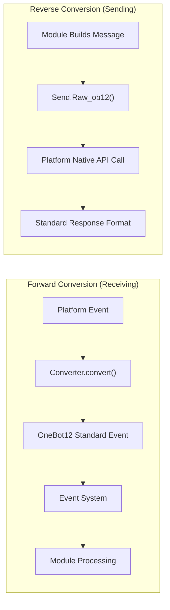

## Directory Structure

Standard adapter package structure:

```
MyAdapter/
├── pyproject.toml          # Project configuration
├── README.md               # Project description
├── LICENSE                 # License
└── MyAdapter/
    ├── __init__.py          # Package entry point
    ├── Core.py               # Adapter main class
    └── Converter.py          # Event converter
```

## Quick Start

### 1. Create Project

```bash
mkdir MyAdapter && cd MyAdapter
```

### 2. Create pyproject.toml

```toml
[project]
name = "ErisPulse-MyAdapter"
version = "1.0.0"
description = "MyAdapter Platform Adapter"
readme = "README.md"
requires-python = ">=3.10"
license = { file = "LICENSE" }
authors = [ { name = "yourname", email = "your@mail.com" } ]

dependencies = [
    "ErisPulse>=2.4.0"  # aiohttp is built-in in ErisPulse, usually no need to depend separately
]

[project.urls]
"homepage" = "https://github.com/yourname/MyAdapter"

[project.entry-points."erispulse.adapter"]
"MyAdapter" = "MyAdapter:MyAdapter"
```

### 3. Create Adapter Main Class

The framework provides `ConfigClass` / `AccountConfigClass` for declarative configuration management. The adapter only needs to declare the configuration class to automatically load, validate, and generate the configuration template.

```python
# MyAdapter/Core.py
from dataclasses import dataclass, field
from ErisPulse.Core import BaseAdapter
from ErisPulse.Core.Bases import BaseConfig

@dataclass
class MyAdapterConfig(BaseConfig):
    """MyAdapter Configuration"""
    api_endpoint: str = field(
        default="https://api.example.com",
        metadata={
            "description": {"i18n": "my_adapter.api_endpoint", "default": "API Address"},
            "required": False,
            "ui": {"widget": "text", "group": "connection", "order": 1},
        },
    )
    token: str = field(
        default="",
        metadata={
            "description": {"i18n": "my_adapter.token", "default": "Platform Token"},
            "required": True,
            "secret": True,
            "ui": {"widget": "password", "group": "basic", "order": 2},
        },
    )

class MyAdapter(BaseAdapter):
    ConfigClass = MyAdapterConfig  # Declare the configuration class, the framework manages it automatically
    
    # No need to override __init__! The framework handles:
    # - self.sdk / self.logger are automatically set
    # - self.cfg reads the configuration in real-time
    # - self.Send / self.Request are automatically initialized
    
    def _setup_converter(self):
        from .Converter import MyPlatformConverter
        return MyPlatformConverter()
```

> ⚠️ **About `__init__`**: In the new version, `BaseAdapter.__init__(self, sdk=None)` automatically handles SDK references, logging initialization, and configuration loading. Most adapters **do not need to override `__init__`**. See [__init__ Notes](#init-注意事项).

> ⚠️ **About `super().__init__()`**: `BaseAdapter.__init__()` is responsible for creating `Send` and `Request` factory instances. If you forget to call it, all message sending and request operations will raise `AttributeError`. See [__init__ Notes](#init-注意事项).

### 4. Implement Required Methods

```python
class MyAdapter(BaseAdapter):
    # ... __init__ code ...
    
    async def start(self):
        """Start the adapter (must implement)"""
        # Register WebSocket or WebHook routes
        router.register_websocket(
            module_name="myplatform",
            path="/ws",
            handler=self._ws_handler
        )
        self.logger.info("Adapter started")
    
    async def shutdown(self):
        """Shutdown the adapter (must implement)"""
        router.unregister_websocket(
            module_name="myplatform",
            path="/ws"
        )
        # Clean up connections and resources
        self.logger.info("Adapter shutdown")
    
    async def call_api(self, endpoint: str, **params):
        """Call platform API (must implement)"""
        raise NotImplementedError("call_api needs to be implemented")
```

#### Actively Sending Meta Events

The adapter should actively send meta events to let the framework track the Bot's online status. Use `emit_meta()` to complete this in one line:

```python
class MyAdapter(BaseAdapter):
    async def _ws_handler(self, websocket):
        bot_id = self._get_bot_id()

        # Bot online
        await self.emit_meta("connect", bot_id, user_name="MyBot")

        try:
            while True:
                data = await websocket.receive_text()
                event = self.convert(data)
                if event:
                    await self.adapter.emit(event)
        except WebSocketDisconnect:
            pass
        finally:
            # Bot offline
            await self.emit_meta("disconnect", bot_id)
```

> For detailed Bot status management and meta event explanations, see [Adapter Best Practices - Bot Status Management and Meta Events](best-practices.md#bot-状态管理与-meta-事件).

### 5. Implement Send Class

`At`/`AtAll`/`Reply` decorators are already implemented by the framework's SendDSL base class. The adapter only needs to implement `Raw_ob12` and specific send methods.

The framework provides two key helper methods:
- `self._apply_modifiers(message)` — Automatically merges At/AtAll/Reply decorators into message segments
- `self.send_context` — Gets the send context dictionary (`target_type`, `target_id`, `account_id`)

```python
import asyncio

class MyAdapter(BaseAdapter):
    # ... other code ...

    class Send(BaseAdapter.Send):

        def Raw_ob12(self, message, **kwargs):
            """
            Send OneBot12 formatted message (must implement)

            Use _apply_modifiers to automatically merge decorator states,
            Use send_context to get send context.
            """
            async def _do_send():
                segments = self._apply_modifiers(message)
                return await self._adapter.call_api(
                    endpoint="/send_message",
                    message=segments,
                    **self.send_context,
                    **kwargs
                )
            return asyncio.create_task(_do_send())

        # Text/Image/Voice/Video/File are inherited from SendDSL base class,
        # Defaultly delegated to Raw_ob12, no need to reimplement.
        # If platform-specific logic is needed, override individual methods:
        # def Text(self, text: str):
        #     return self.Raw_ob12([{"type": "text", "data": {"text": text}}])
```

**Media Send Method Implementation Points (Image/Video/File):**

- The base class's default implementation wraps the `file` parameter as a OneBot12 message segment and passes it to `Raw_ob12`. The adapter needs to handle downloading/uploading in `Raw_ob12`.
- The `file` parameter should support both `bytes` binary data and `str` URL types.
- When a URL is passed, download the file before uploading it to the platform.
- Platforms usually require first calling an upload interface to get the file identifier, then calling the send interface.

**`__getattr__` Magic Method:**

- Implement case-insensitive method names (`Text`, `text`, `TEXT` all work)
- Undefined methods should return a hint message instead of raising an error

**`Raw_ob12` Method:**

- Convert OneBot12 standard message format to platform format for sending
- Use `self._apply_modifiers(message)` to automatically handle At/AtAll/Reply decorators
- Use `**self.send_context` to pass send target information and account information

### 6. Implement Converter

```python
# MyAdapter/Converter.py
import time
import uuid

class MyPlatformConverter:
    def convert(self, raw_event):
        """Convert platform-native events to OneBot12 standard format"""
        if not isinstance(raw_event, dict):
            return None
        
        onebot_event = {
            "id": str(raw_event.get("event_id", uuid.uuid4())),
            "time": int(time.time()),
            "type": self._convert_event_type(raw_event.get("type")),
            "detail_type": self._convert_detail_type(raw_event),
            "platform": "myplatform",
            "self": {
                "platform": "myplatform",
                "user_id": str(raw_event.get("bot_id", ""))
            },
            "myplatform_raw": raw_event,
            "myplatform_raw_type": raw_event.get("type", "")
        }
        
        return onebot_event
    
    def _convert_event_type(self, event_type):
        """Convert event type"""
        type_map = {
            "message": "message",
            "notice": "notice"
        }
        return type_map.get(event_type, "unknown")
    
    def _convert_detail_type(self, raw_event):
        """Convert detail type"""
        return "private"  # Simplified example
```

### 7. Implement Request Class (Request Operations)

If your platform supports friend requests, group invitations, and other requests that require Bot decisions, you can implement the `Request` inner class:

```python
from ErisPulse.Core import BaseAdapter, RequestDSL

class MyAdapter(BaseAdapter):
    # ... Send and other code ...

    class Request(RequestDSL):
        """Request operation implementation (friend requests, group invitations, etc.)"""

        def accept(self, **kwargs):
            """Accept request"""
            async def _do():
                result = await self._adapter.call_api(
                    endpoint="/set_request",
                    request_id=self._request_id,
                    approve=True,
                    **kwargs,
                )
                return {
                    "status": "ok" if result.get("code") == 0 else "failed",
                    "retcode": result.get("code", 0),
                    "data": None,
                    "message_id": "",
                    "message": result.get("message", ""),
                }
            return self._create_task(_do())

        def reject(self, **kwargs):
            """Reject request"""
            async def _do():
                result = await self._adapter.call_api(
                    endpoint="/set_request",
                    request_id=self._request_id,
                    approve=False,
                    **kwargs,
                )
                return {
                    "status": "ok" if result.get("code") == 0 else "failed",
                    "retcode": result.get("code", 0),
                    "data": None,
                    "message_id": "",
                    "message": result.get("message", ""),
                }
            return self._create_task(_do())
```

Module developers' usage:

```python
from ErisPulse.Core.Event import request

@request.on_friend_request()
async def handle_friend_request(event):
    # Use Event convenience methods
    await event.approve()
    # Or operate directly through the adapter
    await adapter.myplatform.Request("req_id").accept()
```

> If the platform does not support request operations, you can omit implementing the `Request` inner class. The base class defaults to returning `retcode=10002` (unsupported operation). See [Request Operation Specification](../../standards/request-action-spec.md).

### 8. Create Package Entry

```python
# MyAdapter/__init__.py
from .Core import MyAdapter
```

## Dependency Declaration (Optional, 2.8.0+)

Adapters can declare dependencies on other adapters or modules to enable adapter interconnection and optional features:

```python
from typing import ClassVar

class MyAdapter(BaseAdapter):
    # Hard dependency: Adapter startup is skipped if dependency is missing (warning + status=skipped-dependency event)
    depends: ClassVar[dict] = {
        "adapters": ["onebot11"],   # Dependent adapters (by platform name)
        "modules": ["TranslateEngine"],  # Dependent modules (by registration name)
    }
    # Soft dependency: Missing dependency does not affect startup; callbacks are received when the module is loaded/unloaded (optional feature mode)
    optional_modules: ClassVar[list] = ["TranslateEngine"]
```

- **Startup Order**: Adapters declaring hard dependencies on modules will **start after the module initialization is complete**
- **Soft Dependency Notification**: When modules in `optional_modules` (or hard dependencies) are loaded, `on_dependency_ready(module_name)` is called; when they are unloaded, `on_dependency_lost(module_name)` is called (default empty implementation, can be overridden) — covering late-load and hot-reload scenarios:

```python
async def on_dependency_ready(self, module_name):
    """Soft dependency module is ready: enable corresponding optional features"""
    if module_name == "TranslateEngine":
        self._translate = self.sdk.TranslateEngine

async def on_dependency_lost(self, module_name):
    """Soft dependency module is lost: degrade features"""
    if module_name == "TranslateEngine":
        self._translate = None
```

> [!NOTE]
> This feature requires ErisPulse **2.8.0+**.

## `__init__` Notes

There are three levels in adapter development where `__init__` may be overridden. Below are the correct practices for each level.

### 1. BaseAdapter Level (Most Cases Do Not Require Overriding)

`BaseAdapter.__init__(self, sdk=None)` is responsible for creating `Send` / `Request` factory instances and automatically performs the following tasks:

- Accepts the `sdk` parameter and sets `self.sdk` and `self.logger`
- If `ConfigClass` is declared, you can read global configurations in real time via `self.cfg`
- If `AccountConfigClass` is declared, you can read multi-account configurations in real time via `self.accounts`

**In most cases, there is no need to override `__init__`**. Just declare `ConfigClass`:

```python
class MyAdapter(BaseAdapter):
    ConfigClass = MyAdapterConfig  # After declaration, the framework automatically manages configurations
    
    async def start(self):
        cfg = self.cfg  # Type-safe, real-time read
        ...
```

If custom initialization is indeed required, call `super().__init__(sdk)`:

```python
class MyAdapter(BaseAdapter):
    ConfigClass = MyAdapterConfig
    
    def __init__(self, sdk=None):
        super().__init__(sdk)  # Pass in sdk
        self.converter = self._setup_converter()
        self.convert = self.converter.convert
```

### 2. Send Inner Class (Most Cases Do Not Require Overriding)

`SendDSL.__init__` is responsible for state transfer in chain calls (target type, target ID, account, etc.). **In most cases, you only need to override methods** (`Raw_ob12`, `Text`, etc.), not `__init__`.

If overriding is necessary (for example, initializing platform-specific states), **all parameters must be passed through**:

```python
class MyAdapter(BaseAdapter):
    class Send(BaseAdapter.Send):
        # Parameters: adapter, target_type, target_id, account_id
        def __init__(self, adapter, target_type=None, target_id=None, account_id=None):
            super().__init__(adapter, target_type, target_id, account_id)  # ← Must pass through
            self._my_state = None  # Platform-specific initialization
```

**Why must it be passed through?** Each step in the chain call creates a new instance via `self.__class__(...)`:

```python
adapter.Send.To("user", "123")               # → Send(adapter, "user", "123", None)
adapter.Send.To("user", "123").Using("bot1")  # → Send(adapter, "user", "123", "bot1")
```

If the `__init__` signature does not match or `super()` is not called, the chain call will break.

### 3. Request Inner Class (Most Cases Do Not Require Overriding)

Same as `Send`. The parameters are `adapter`, `request_id`, `account_id`:

```python
class MyAdapter(BaseAdapter):
    class Request(RequestDSL):
        # Parameters: adapter, request_id, account_id
        def __init__(self, adapter, request_id=None, account_id=None):
            super().__init__(adapter, request_id, account_id)  # ← Must pass through
            self._my_state = None  # Platform-specific initialization
```

### Summary

| Level | When to Override | Must Do |
|------|------------|-----------|
| **BaseAdapter** | When custom initialization logic is needed | `super().__init__(sdk)` (pass in sdk parameter) |
| **Send Inner Class** | When initializing send-related states is needed | `super().__init__(adapter, target_type, target_id, account_id)` |
| **Request Inner Class** | When initializing request-related states is needed | `super().__init__(adapter, request_id, account_id)` |
| All Three Levels | Most Cases | **Just declare ConfigClass, do not touch `__init__`** |

### 9. Connection Information and Route Discovery

After the adapter registers routes, the framework records all route information. Users can use the following API to view the adapter's connection address:

```python
from ErisPulse import sdk

# Get complete connection information for the adapter
info = sdk.adapter.get_connection_info("myplatform")
# {
#   "platform": "myplatform",
#   "status": "started",
#   "connection": {
#     "base_url": "http://localhost:8080",
#     "http_routes": [
#       {"path": "/myplatform/webhook", "method": "POST",
#        "url": "http://localhost:8080/myplatform/webhook"}
#     ],
#     "websocket_routes": [
#       {"path": "/myplatform/ws",
#        "url": "ws://localhost:8080/myplatform/ws"}
#     ]
#   }
# }

# List all namespaces (adapters/modules) routes
namespaces = sdk.router.list_namespaces()
# {"myplatform": {"http": ["/myplatform/webhook"], "websocket": ["/myplatform/ws"]}}

# Get complete connection URLs for the namespace
urls = sdk.router.get_module_urls("myplatform")
# {"base_url": "http://localhost:8080", "http": [...], "websocket": [...]}

# Get detailed route information for the namespace
routes = sdk.router.get_module_routes("myplatform")
# {"http": [{"path": "/myplatform/webhook", "methods": ["POST"]}],
#  "websocket": [{"path": "/myplatform/ws", "auth": false}]}
```

> **Tip**: The information returned by `get_connection_info()` is suitable for displaying to users (such as WebUI), helping users configure the callback address or WebSocket connection address on the platform side. The `module_name` registered during route registration must exactly match the `platform` name registered by the adapter in ErisPulse, otherwise route discovery will not be correctly associated.

### 10. SSE (Server-Sent Events) Support

ErisPulse has built-in, server-agnostic SSE support. Modules and adapters can register SSE endpoints using `@sdk.router.sse()`.

#### Basic Usage

```python
import asyncio
from ErisPulse import sdk

@sdk.router.sse("MyModule", "/events")
async def event_stream(sse):
    """Push SSE events"""
    count = 0
    while not sse.closed:
        await sse.send({"count": count}, event="update")
        count += 1
        await asyncio.sleep(1)
```

#### Using Request Parameters

The handler can declare a `request` parameter to access client request information:

```python
@sdk.router.sse("MyModule", "/events")
async def event_stream(request, sse):
    token = request.query_params.get("token")
    if not validate_token(token):
        await sse.close()
        return

    while not sse.closed:
        data = await fetch_data(token)
        await sse.send(data)
        await asyncio.sleep(5)
```

#### SseEmitter API

| Method | Description |
|------|------|
| `sse.send(data, event=None, id=None, retry=None)` | Send an SSE event. Non-string data is automatically JSON serialized |
| `sse.close()` | Gracefully close the SSE connection (safe to call multiple times) |
| `sse.closed` | Whether the connection is closed |
| `sse.request` | The underlying request object (can be used to read query params, headers) |

#### Using in RouteGroup

```python
api = sdk.router.group("MyModule", "/api", version="1")

@api.sse("/events")
async def events(sse):
    await sse.send({"msg": "hello"})
```

#### Route Discovery

SSE routes will automatically appear in the route discovery API:

```python
# list_namespaces will include the "sse" key
sdk.router.list_namespaces()
# {"MyModule": {"http": [...], "websocket": [...], "sse": ["/MyModule/events"]}}

# get_module_routes will mark streaming: true
sdk.router.get_module_routes("MyModule")
# {"http": [...], "websocket": [...], "sse": [{"path": "/MyModule/events", "streaming": true}]}

# get_module_urls will generate complete URLs
sdk.router.get_module_urls("MyModule")
# {"sse": [{"path": "/MyModule/events", "url": "http://localhost:8080/MyModule/events"}]}
```

> **Server-Agnostic Design**: `SseEmitter` is decoupled from the underlying HTTP framework through callbacks. The framework provides `register_sse()` and `@sse` decorators as unified registration entry points, allowing adapters to implement SSE endpoints without directly depending on any underlying HTTP framework.


### 适配器核心概念

# Core Concepts of Adapters

Understanding the core concepts of ErisPulse adapters is fundamental to developing adapters.

## Adapter Architecture

### Component Relationships

```
Forward Conversion (Receive Direction)           Reverse Conversion (Send Direction)
─────────────────────────────────────────────── ───────────────────────────────────────
                                               
┌───────────────────────────────┐              ┌───────────────────────────────┐
│ Platform Native Event         │              │ Module-built Message          │
└────────────┬────────────────────┘              └────────────┬────────────────────┘
             │                                                │
             ↓                                                ↓
┌───────────────────────────────┐   ┌───────────────────────────────┐
│                               │   │ Adapter (MyAdapter)           │   │
│ Converter                     │   │ ┌─────────────────────────────┐ │   │
│ (Event Converter)             │───▶ │                             │ │   │
│                               │   │ │                             │ │   │
└───────────────────────────────┘   │ └─────────────────────────────┘ │   └───────────────────────────────┐
                                    └───────────────────────────────┘                                   │
                                                                             │
                                                                             ↓
                                                                      ┌───────────────────────────────┐
                                                                      │ Platform API Call             │
                                                                      └────────────┬────────────────────┘
                                                                                   │
                                                                             ┌───────────────────────────────┐
                                                                             │ Standard Response Format      │
                                                                             └───────────────────────────────┘
                                                                             │
                                                                             ↓
                                                                      ┌───────────────────────────────┐
                                                                      │ Module (Event Handling)       │
                                                                      └───────────────────────────────┘
```

**Core Symmetry**:
- **Forward Conversion** (Converter): Platform native event → OneBot12 standard event, original data preserved in `{platform}_raw`
- **Reverse Conversion** (Raw_ob12): OneBot12 message segment → Platform API call, returns standard response format

## AdapterManager Adapter Manager

`AdapterManager` is the core component of ErisPulse's adapter system, responsible for managing the registration, startup, shutdown, and event distribution of all platform adapters.

### Core Features

- **Adapter Registration**: Register and manage multiple platform adapters
- **Lifecycle Management**: Control the startup and shutdown of adapters
- **Event Distribution**: Distribute OneBot12 standard events and platform-native events
- **Configuration Management**: Manage adapter enable/disable status
- **Middleware Support**: Support OneBot12 event middleware

### Basic Usage

```python
from ErisPulse import sdk

# Register adapter (usually handled automatically by Loader)
sdk.adapter.register("myplatform", MyPlatformAdapter)

# Start all adapters
await sdk.adapter.startup()

# Start specified adapters
await sdk.adapter.startup(["myplatform"])
# Start all adapters
await sdk.adapter.startup()

# Get adapter instance
my_adapter = sdk.adapter.get("myplatform")
# Or access via attribute
my_adapter = sdk.adapter.myplatform

# Shutdown all adapters
await sdk.adapter.shutdown()
```

### Startup and Shutdown

#### Start Adapters

```python
# Start all registered adapters
await sdk.adapter.startup()

# Start specified platforms
await sdk.adapter.startup(["platform1", "platform2"])
```

**Startup Process:**

1. Submit `adapter.start` lifecycle event
2. Submit `adapter.status.change` event (starting)
3. Parallel start each adapter
4. If startup fails, automatically retry (exponential backoff strategy)
5. After successful startup, submit `adapter.status.change` event (started)

**Retry Mechanism:**

- First 4 retries: 60 seconds, 10 minutes, 30 minutes, 60 minutes
- 5th and subsequent retries: Fixed interval of 3 hours

#### Shutdown Adapters

```python
# Shutdown all adapters
await sdk.adapter.shutdown()
```

**Shutdown Process:**

1. Submit `adapter.stop` lifecycle event
2. Call `shutdown()` method for all adapters
3. Shutdown router server
4. Clear event handlers
5. Submit `adapter.stopped` lifecycle event

### Configuration Management

#### Check Platform Status

```python
# Check if platform is registered
exists = sdk.adapter.exists("myplatform")

# Check if platform is enabled
enabled = sdk.adapter.is_enabled("myplatform")

# Use in operator
if "myplatform" in sdk.adapter:
    print("Platform exists and is enabled")
```

#### List Platforms

```python
# List all registered platforms
platforms = sdk.adapter.list_registered()

# List all platforms and their status
status_dict = sdk.adapter.list_items()
# Returns: {"platform1": true, "platform2": false, ...}

# Get list of enabled platforms
enabled_platforms = [p for p, enabled in status_dict.items() if enabled]
```

### Event Listening

#### OneBot12 Standard Events

```python
from ErisPulse import sdk

# Listen to standard message events from all platforms
@sdk.adapter.on("message")
async def handle_message(data):
    print(f"Received OneBot12 message: {data}")

# Listen to standard message events from a specific platform
@sdk.adapter.on("message", platform="myplatform")
async def handle_platform_message(data):
    print(f"Received myplatform message: {data}")

# Listen to all events
@sdk.adapter.on("*")
async def handle_any_event(data):
    print(f"Received event: {data.get('type')}")
```

#### Platform-Native Events

```python
# Listen to native events from a specific platform
@sdk.adapter.on("raw_event_type", raw=True, platform="myplatform")
async def handle_raw_event(data):
    print(f"Received native event: {data}")

# Listen to native events from all platforms (wildcard)
@sdk.adapter.on("*", raw=True)
async def handle_all_raw_events(data):
    print(f"Received native event: {data}")
```

#### Event Distribution Mechanism

When calling `adapter.emit(event_data)`:

1. **Middleware Processing**: Execute all OneBot12 middlewares first
2. **Standard Event Distribution**: Distribute to matching OneBot12 event handlers
3. **Native Event Distribution**: If raw data exists, distribute to native event handlers

**Matching Rules:**

- Exact Match: `@sdk.adapter.on("message")` only matches `message` events
- Wildcard: `@sdk.adapter.on("*")` matches all events
- Platform Filter: `platform="myplatform"` only distributes events from the specified platform

### Middleware

#### Add Middleware

```python
@sdk.adapter.middleware
async def logging_middleware(data):
    """Logging middleware"""
    print(f"Processing event: {data.get('type')}")
    return data  # Must return data

@sdk.adapter.middleware
async def filter_middleware(data):
    """Event filtering middleware"""
    # Filter out unwanted events
    if data.get("type") == "notice":
        return None  # Returning None means the middleware chain ignores this return value and continues with the original data
    return data  # Must return data to continue passing
```

#### Middleware Execution Order

Middlewares execute in registration order, with the last registered middleware executed first.

> **Note**: If a middleware returns `None` (e.g., forgetting to `return data`), the framework will ignore the return value and continue passing the original data, while outputting a warning-level log. This ensures that a single middleware failure does not interrupt the entire event chain.

```python
# Registration order
sdk.adapter.middleware(middleware1)  # Last to execute
sdk.adapter.middleware(middleware2)  # Middle to execute
sdk.adapter.middleware(middleware3)  # First to execute

# Execution order: middleware3 -> middleware2 -> middleware1
```

### Get Adapter Instance

#### get() Method

```python
adapter = sdk.adapter.get("myplatform")
if adapter:
    await adapter.Send.To("user", "123").Text("Hello")
```

#### Attribute Access

```python
# Access via attribute name (case-insensitive)
adapter = sdk.adapter.myplatform
await adapter.Send.To("user", "123").Text("Hello")
```

## BaseAdapter Base Class

### Basic Structure

```python
from dataclasses import dataclass, field
from ErisPulse.Core import BaseAdapter
from ErisPulse.Core.Bases import BaseConfig, BotAccountConfig

@dataclass
class MyConfig(BaseConfig):
    """Adapter configuration (automatically managed by the framework after declaration)"""
    token: str = field(
        default="",
        metadata={
            "description": {"i18n": "my_adapter.token", "default": "Bot Token"},
            "required": True,
            "secret": True,
            "ui": {"widget": "password", "group": "basic", "order": 1},
        },
    )

class MyAdapter(BaseAdapter):
    ConfigClass = MyConfig  # Declare configuration class
    
    # No need to override __init__, framework handles automatically:
    # - self.sdk, self.logger
    # - self.cfg (type-safe configuration instance, reads in real-time)
    # - self.Send, self.Request
    
    async def start(self):
        """Start the adapter (must be implemented)"""
        cfg = self.cfg  # Automatically loaded type-safe configuration
        pass
    
    async def shutdown(self):
        """Shutdown the adapter (must be implemented)"""
        pass
    
    async def call_api(self, endpoint: str, **params):
        """Call platform API (must be implemented)"""
        pass
```

### Configuration Management

The framework provides declarative configuration management, defining configuration structure through dataclass, with the framework automatically handling loading, validation, and template generation.

#### Single Account Configuration

```python
from dataclasses import dataclass, field
from ErisPulse.Core.Bases import BaseConfig

@dataclass
class TelegramConfig(BaseConfig):
    token: str = field(default="", metadata={
        "description": {"i18n": "telegram.token", "default": "Bot Token"},
        "required": True,
        "secret": True,
        "ui": {"widget": "password", "group": "basic", "order": 1},
    })
    proxy: str = field(default="", metadata={
        "description": {"i18n": "telegram.proxy", "default": "Proxy Address"},
        "ui": {"widget": "text", "group": "advanced", "order": 10},
    })

class TelegramAdapter(BaseAdapter):
    ConfigClass = TelegramConfig
    
    async def start(self):
        cfg = self.cfg  # Type-safe, real-time reading
        if not cfg.token:
            raise ValueError("Token not configured")
        await self._connect(cfg.token, proxy=cfg.proxy)
```

#### Multi-Account Configuration

The `BotAccountConfig` base class provides `enabled` and `name` fields. Most adapters can automatically obtain bot_id from the platform protocol or login response and inject it into account configuration during event conversion:

```python
from dataclasses import dataclass, field
from ErisPulse.Core.Bases import BotAccountConfig

# Most adapters: bot_id is automatically obtained at runtime, no need to configure
@dataclass
class MyBotConfig(BotAccountConfig):
    token: str = field(default="", metadata={
        "description": {"i18n": "my_adapter.bot_token", "default": "Token"},
        "required": True,
    })

# If bot_id cannot be obtained during login, allow users to fill in the configuration
@dataclass
class YunhuBotConfig(BotAccountConfig):
    bot_id: str = field(default="", metadata={
        "description": {"i18n": "yunhu.bot_id", "default": "Bot ID"},
        "required": True,
    })
    token: str = field(default="", metadata={
        "description": {"i18n": "yunhu.token", "default": "Token"},
        "required": True,
    })

class MyAdapter(BaseAdapter):
    AccountConfigClass = MyBotConfig
    
    async def start(self):
        for name, account in self.enabled_accounts.items():
            user_id = await self._login(name, account)
            await self.emit_meta("connect", user_id)
```

#### metadata Convention

Field metadata serves both TOML comment generation and WebUI form rendering:

```python
metadata = {
    "description": str | dict,  # Field description (supports i18n)
    "required": bool,         # Whether required (validation + WebUI required indicator)
    "secret": bool,           # Whether sensitive (WebUI displays as ***; logs are masked)
    "ui": {                   # WebUI control configuration (old name "webui" is still compatible)
        "widget": str,        # Control type: "text" | "switch" | "select" | "number" | "password"
        "group": str,         # Group: "basic" | "advanced" | "connection" etc.
        "order": int,         # Sort weight (lower values appear earlier)
        "options": list,      # Select control options [{label, value}], label supports i18n
        "placeholder": str | dict,  # Input placeholder (supports i18n)
    },
    "extra": dict,            # Additional extension fields (passed through to schema)
}
```

All user-visible text fields support i18n, uniformly using the `{"i18n": "key", "default": "text"}` format. Pure strings are passed through as-is (for backward compatibility). Supported i18n fields:

| Field | Location | Description |
|------|------|------|
| `description` | field metadata | Field description |
| `options[].label` | `ui.options` | Select control option label |
| `placeholder` | `ui.placeholder` | Input placeholder |
| `group_labels` | `_schema_meta` | Group display name (Dashboard partition title) |

When using i18n, you need to register the translation keys into the i18n system beforehand (see [i18n documentation](../../advanced/i18n.md#configuration-field-multilingual)).

**description / placeholder / options label** example:

```python
token: str = field(
    default="",
    metadata={
        "description": {"i18n": "my_adapter.token", "default": "Bot Token"},
        "ui": {
            "widget": "text",
            "placeholder": {"i18n": "my_adapter.token.ph", "default": "Please enter Token"},
        },
    },
)
mode: str = field(
    default="a",
    metadata={
        "description": {"i18n": "my_adapter.mode", "default": "Mode"},
        "ui": {
            "widget": "select",
            "options": [
                {"label": {"i18n": "my_adapter.mode.a", "default": "Option A"}, "value": "a"},
                {"label": "Pure string label", "value": "b"},  # Pure string passed through as-is
            ],
        },
    },
)
```

**group_labels** example (declared after configuration class definition):

```python
MyConfig._schema_meta = {
    "group_labels": {
        "basic": {"i18n": "my_adapter.group.basic", "default": "Basic Settings"},
        "advanced": {"i18n": "my_adapter.group.advanced", "default": "Advanced Settings"},
    }
}
```

The framework's `resolve_config_schema()` automatically resolves all i18n keys in the above fields based on the current language; `get_config_schema()` passes through the i18n dictionaries as-is, letting the frontend handle the resolution.

### Declarative Translation Keys (v2.7.0+)

Adapters can declare translation keys centrally by defining an `I18nClass` nested class, similar to declaring `ConfigClass`. The framework automatically registers all declared translation keys during the `__init__` phase (before configuration template generation), ensuring that i18n keys referenced in configuration descriptions are available when generating templates.

```python
from ErisPulse.Core.Bases import BaseAdapter, BaseI18n, I18nKey

class MyAdapter(BaseAdapter):
    class I18nClass(BaseI18n):
        endpoint: I18nKey = I18nKey(
            default="API Endpoint",
            zh_CN="API 地址",
            zh_TW="API 位址",
            en="API Endpoint",
            ja="APIアドレス",
            ru="API адрес",
        )
        token: I18nKey = I18nKey(
            default="Platform Token",
            zh_CN="平台 Token",
            zh_TW="平台權杖",
            en="Platform Token",
            ja="プラットフォームトークン",
            ru="Токен платформы",
        )
```

> ``I18nKey.default`` is a **language-agnostic fallback text** that is not registered to any language. To make translations effective, at least one language parameter must be explicitly provided.

For detailed usage (key path rules, explicit key parameters, etc.), see [i18n documentation](../../advanced/i18n.md#recommended-approach-declaring-translation-keys-via-i18nclass-v270).

### Declarative Event Extension Methods (v2.7.0+)

Adapters can declare platform-specific event extension methods centrally via `EventMixin`, and the framework automatically registers them to the current platform.

```python
from ErisPulse.Core import BaseAdapter

class MyAdapter(BaseAdapter):
    class EventMixin:
        def get_chat_name(self):
            """Get chat name"""
            return self.get("myplatform_raw", {}).get("chat", {}).get("name", "")

        def is_official_message(self):
            """Check if it is an official message"""
            raw = self.get("myplatform_raw", {})
            return raw.get("sender", {}).get("is_official", False)
```

After registration, these methods can be directly called on event objects:

```python
@message.on_group_message()
async def handler(event):
    if event.is_official_message():
        chat_name = event.get_chat_name()
        await event.reply(f"[{chat_name}] Official message received")
```

> Adapter's event extension methods are registered to its own platform (``self._platform``). For modules needing cross-platform event extensions, use the original ``register_event_mixin()`` API.

#### Account Resolution

Multi-account adapters can use `_resolve_account()` to automatically resolve the target account:

```python
async def call_api(self, endpoint: str, **params):
    account_id = params.pop("account_id", None)
    name, account = self._resolve_account(account_id)
    # name: account name, account: configuration instance
```

Resolution strategy: account name match → `bot_id` field match → other str field match → first enabled account.

#### Configuration Hot Update

Subclasses can override `on_config_update()` to respond to configuration changes:

```python
class MyAdapter(BaseAdapter):
    ConfigClass = MyConfig
    
    def on_config_update(self, old_config, new_config):
        if old_config.token != new_config.token:
            self.logger.info("Token updated, reconnecting")
```

### Initialization Process

The framework automatically performs the following tasks in `BaseAdapter.__init__(self, sdk=None)`:

1. **SDK Reference**: Set `self.sdk`, `self.logger`
2. **Send/Request Factory**: Create `self.Send` and `self.Request`
3. **Configuration Template**: If `ConfigClass` is declared, generate the default configuration template (first time only)
4. **Account Template**: If `AccountConfigClass` is declared, generate the default account template (first time only)
5. **EventMixin Registration**: If `EventMixin` is declared, automatically register it in `AdapterManager` after injecting the platform name

Configuration is read in real-time via `self.cfg` / `self.accounts` (each access reads the latest value from the configuration store). `self.config` remains as a compatible alias for `self.cfg`.

Most adapters do not need to override `__init__`. If custom initialization is required:

```python
class MyAdapter(BaseAdapter):
    ConfigClass = MyConfig
    
    def __init__(self, sdk=None):
        super().__init__(sdk)  # Pass sdk
        self.converter = self._setup_converter()
        self.convert = self.converter.convert
```

## Send Message DSL

### Inheritance

```python
class MyAdapter(BaseAdapter):
    class Send(BaseAdapter.Send):
        """Send nested class, inherits from BaseAdapter.Send"""
        pass
```

### Available Attributes

The `Send` class automatically sets the following attributes when called:

| Attribute | Description | Setting Method |
|-----------|-------------|----------------|
| `_target_id` | Target ID | `To(id)` or `To(type, id)` |
| `_target_type` | Target type | `To(type, id)` |
| `_target_to` | Simplified target ID | `To(id)` |
| `_account_id` | Sender account ID | `Using(account_id)` |
| `_adapter` | Adapter instance | Automatically set |
| `_at_user_ids` | List of @ users | `At(user_id)` |
| `_reply_message_id` | ID of the message being replied to | `Reply(message_id)` |
| `_at_all` | Whether to @ all users | `AtAll()` |

> **Recommendation**: Use the `self.send_context` property to get `target_type`, `target_id`, and `account_id` in one go, which is clearer than accessing instance variables directly.

### Framework Helper Methods

| Method/Property | Description |
|-----------------|-------------|
| `self._apply_modifiers(message)` | Merges At/AtAll/Reply modifier states into the message segment list |
| `self.send_context` | Returns a dictionary containing `{target_type, target_id, account_id}` |

### Basic Methods

Adapters only need to implement `Raw_ob12`. Standard methods (Text/Image/Voice/Video/File) are inherited from the `SendDSL` base class and default to delegating to it:

```python
class Send(BaseAdapter.Send):
    def Raw_ob12(self, message, **kwargs):
        """Must implement: OneBot12 message segment → platform API"""
        async def _do_send():
            segments = self._apply_modifiers(message)
            return await self._adapter.call_api(
                endpoint="/send_message",
                message=segments,
                **self.send_context,
                **kwargs
            )
        return asyncio.create_task(_do_send())

    # Text/Image/Voice/Video/File are inherited from the base class and automatically delegate to Raw_ob12; no need to reimplement
    # If platform-specific logic is needed, individual methods can be overridden:
    # def Text(self, text: str):
    #     return self.Raw_ob12([{"type": "text", "data": {"text": text}}])
```

### Chained Modifier Methods

```python
class Send(BaseAdapter.Send):

    def __init__(self, adapter, target_type=None, target_id=None, account_id=None):
        super().__init__(adapter, target_type, target_id, account_id)
        self.buttons = []

    def Button(self, content: list) -> 'Send':
        self.buttons.append(content)
        return self
```

## Event Converters

### Conversion Flow

```
Platform-native Event
    ↓
Converter.convert()
    ↓
OneBot12 Standard Event
```

### Required Fields

All converted events must include:

```python
{
    "id": "Unique Event Identifier",
    "time": 1234567890,           # 10-digit Unix timestamp
    "type": "message/notice/request/meta",
    "detail_type": "Event Detail Type",
    "platform": "Platform Name",
    "self": {
        "platform": "Platform Name",
        "user_id": "Bot ID"     # Must match bot_id
    },
    "{platform}_raw": {...},       # Raw data (required)
    "{platform}_raw_type": "..."    # Raw type (required)
}
```

### Converter Example

```python
class MyPlatformConverter:
    def convert(self, raw_event):
        """Converts a platform-native event into OneBot12 standard format."""
        if not isinstance(raw_event, dict):
            return None
        
        # Generate event ID
        event_id = raw_event.get("event_id") or str(uuid.uuid4())
        
        # Convert timestamp
        timestamp = raw_event.get("timestamp")
        if timestamp and timestamp > 10**12:
            timestamp = int(timestamp / 1000)
        else:
            timestamp = int(timestamp) if timestamp else int(time.time())
        
        # Convert event type
        event_type = self._convert_type(raw_event.get("type"))
        detail_type = self._convert_detail_type(raw_event)
        
        # Build standard event
        onebot_event = {
            "id": str(event_id),
            "time": timestamp,
            "type": event_type,
            "detail_type": detail_type,
            "platform": "myplatform",
            "self": {
                "platform": "myplatform",
                "user_id": str(raw_event.get("bot_id", ""))
            },
            "myplatform_raw": raw_event,
            "myplatform_raw_type": raw_event.get("type", "")
        }
        
        return onebot_event
```

## Connection Management

### WebSocket Connection

```python
class MyAdapter(BaseAdapter):
    async def start(self):
        """Register WebSocket routes"""
        router.register_websocket(
            module_name="myplatform",
            path="/ws",
            handler=self._ws_handler,
            auth_handler=self._auth_handler
        )
    
    async def _ws_handler(self, websocket):
        """WebSocket connection handler"""
        self.connection = websocket
        
        try:
            while True:
                data = await websocket.receive_text()
                onebot_event = self.convert(data)
                if onebot_event:
                    await self.adapter.emit(onebot_event)
        except WebSocketDisconnect:
            self.logger.info("Connection disconnected")
        finally:
            self.connection = None
    
    async def _auth_handler(self, websocket) -> bool:
        """WebSocket authentication"""
        token = websocket.query_params.get("token")
        return token == "valid_token"
```

### WebHook Connection

```python
class MyAdapter(BaseAdapter):
    async def start(self):
        """Register WebHook routes"""
        router.register_http_route(
            module_name="myplatform",
            path="/webhook",
            handler=self._webhook_handler,
            methods=["POST"]
        )
    
    async def _webhook_handler(self, request):
        """WebHook request handler"""
        data = await request.json()
        onebot_event = self.convert(data)
        if onebot_event:
            await self.adapter.emit(onebot_event)
        return {"status": "ok"}
```

> **Route Information Query**: The routes registered by adapters (HTTP, WebSocket, SSE) can be queried through `sdk.adapter.get_connection_info(platform)` and `sdk.router.get_module_urls(module_name)` to retrieve the full connection address (including `base_url` + path). See [Adapter Development Introduction - Connection Information and Route Discovery](docs/en/getting-started.md#9-connection-information-and-route-discovery) and [SSE Support](docs/en/getting-started.md#10-sse-server-sent-events-support).

## API Response Standard

The framework provides `make_response()` and `make_error()` methods to construct standardized responses, eliminating the need to manually build response dictionaries.

### Success Response

```python
async def call_api(self, endpoint: str, **params):
    try:
        raw_response = await self._platform_api_call(endpoint, **params)
        
        return self.make_response(
            data=raw_response.get("data"),
            message_id=raw_response.get("data", {}).get("message_id", ""),
            raw=raw_response,
        )
    except Exception as e:
        return self.make_error(message=str(e), raw=None)
```

### Manually Constructing Response (Legacy approach still compatible)

```python
async def call_api(self, endpoint: str, **params):
    return {
        "status": "ok",
        "retcode": 0,
        "data": {...},
        "message_id": "msg_id",
        "message": "",
        "myplatform_raw": raw_response
    }
```

## Multi-Account Support

### Declarative Configuration (Recommended)

After using `AccountConfigClass` to declare a configuration class, the framework automatically manages multi-account loading, validation, and template generation:

```python
from dataclasses import dataclass, field
from ErisPulse.Core.Bases import BotAccountConfig

@dataclass
class MyBotConfig(BotAccountConfig):
    bot_id: str = field(default="", metadata={"description": "Bot ID", "required": True})
    token: str = field(default="", metadata={"description": "Token", "required": True, "secret": True})

class MyAdapter(BaseAdapter):
    AccountConfigClass = MyBotConfig
    
    async def start(self):
        for name, account in self.enabled_accounts.items():
            self.logger.info(f"Starting account {name}: {account.bot_id}")
            await self._connect(name, account)
    
    async def call_api(self, endpoint: str, **params):
        account_id = params.pop("account_id", None)
        name, account = self._resolve_account(account_id)
        # Use fields such as account.token, account.bot_id, etc.
```

### Account Configuration Files

```toml
[MyAdapter.accounts.account1]
bot_id = "bot_001"
token = "token1"
enabled = true

[MyAdapter.accounts.account2]
bot_id = "bot_002"
token = "token2"
enabled = true
```

### Specifying Account for Sending

```python
# Specify account using Using method
my_adapter = adapter.get("myplatform")

# Using self.user_id from event (recommended, most universal)
await my_adapter.Send.Using(event["self"]["user_id"]).To("user", "123").Text("Hello")

# Using account name
await my_adapter.Send.Using("account1").To("user", "123").Text("Hello")
```

### Relationship between self.user_id and Using

The framework's event reply mechanism automatically extracts `account_id` (preferred) or `user_id` from the event's `self` field and passes it as the `Using` parameter. Adapter developers must ensure that the `self.user_id` value in the Converter correctly matches `_resolve_account()`.

**Framework Internal Behavior**:

```python
# Framework logic for extracting bot_id
bot_id = self.get("self", {}).get("account_id", "") or self.get("self", {}).get("user_id", "")

# Using is only called if bot_id is non-empty
if bot_id:
    send_chain = send_chain.Using(bot_id)
```

> **Key Point**: Even if the adapter uses only one Bot configuration, as long as the Converter correctly sets `self.user_id`, the framework will pass it as the `Using` parameter. The adapter must ensure that `self.user_id` matches the identifier field (e.g., `bot_id`) in `AccountConfigClass`, so that `_resolve_account()` can match the correct account. If `self.user_id` is empty, the framework will not call `Using`, and `call_api` will receive `account_id` as `None`, with `_resolve_account(None)` returning the first enabled account.

## Error Handling

### Connection Retry

```python
import asyncio

class MyAdapter(BaseAdapter):
    async def start(self):
        retry_count = 0
        max_retries = 5
        
        while retry_count < max_retries:
            try:
                await self._connect_to_platform()
                break
            except Exception as e:
                retry_count += 1
                if retry_count < max_retries:
                    wait_time = min(60 * (2 ** retry_count), 600)
                    self.logger.warning(f"Connection failed, retrying in {wait_time} seconds")
                    await asyncio.sleep(wait_time)
                else:
                    raise
```

### API Error Handling

```python
async def call_api(self, endpoint: str, **params):
    try:
        # Recommended to use the SDK's built-in client
        from ErisPulse.Core import client
        from ErisPulse.Core.Bases.errors import ClientError, ClientTimeoutError
        resp = await client.post(
            f"https://api.platform.com/{endpoint}",
            json=params,
            max_retries=2,
        )
        response = await resp.json()
        return self._standardize_response(response)
    except ClientTimeoutError:
        self.logger.error(f"Request timed out: {endpoint}")
        return self._error_response("Request timed out", 32000)
    except ClientError as e:
        self.logger.error(f"Network error: {e}")
        return self._error_response("Network request failed", 33000)
    except Exception as e:
        self.logger.error(f"Unknown error: {e}")
        return self._error_response(str(e), 34000)
```

> **Backward Compatibility**: Old adapter code that directly uses `aiohttp.ClientSession` is unaffected and can still catch `aiohttp.ClientError`. Both methods can coexist. New code is recommended to use `sdk.client` + ErisPulse exception system.

## Bot Status Management

The AdapterManager includes a built-in Bot status tracking system, which automatically maintains the online status, active time, and metadata of all registered Bots.

### Automatic Discovery Mechanism

When an adapter sends an event through `adapter.emit()`, the framework automatically checks the `self` field in the event:

- **Meta events**: Perform corresponding actions based on `detail_type` (register on connect, mark as offline on disconnect, update active time on heartbeat)
- **Regular events** (message/notice/request): Automatically discover Bots and update active time

```python
# All events containing the self field trigger automatic discovery
await self.adapter.emit({
    "type": "message",
    "platform": "myplatform",
    "self": {"platform": "myplatform", "user_id": "bot123"},
    # ...
})
# Bot "bot123" is automatically registered (if first appearance) and active time is updated
```

### Meta Event Types

| `detail_type` | Description | Framework Behavior |
|---|---|---|
| `connect` | Bot connects | Register Bot and trigger `adapter.bot.online` lifecycle event |
| `disconnect` | Bot disconnects | Mark Bot as offline and trigger `adapter.bot.offline` lifecycle event |
| `heartbeat` | Bot heartbeat | Update Bot active time and metadata |

### Adapter Sending Meta Events

Use `emit_meta()` to send a meta event in one line:

```python
class MyAdapter(BaseAdapter):
    async def _on_bot_connect(self, bot_id: str):
        # Send connect event in one line
        await self.emit_meta("connect", bot_id, user_name="MyBot", nickname="MyBot")

    async def _on_bot_disconnect(self, bot_id: str):
        await self.emit_meta("disconnect", bot_id)
```

Manual construction is also supported (old method is still compatible):

```python
await self.adapter.emit({
    "type": "meta",
    "detail_type": "connect",
    "platform": "myplatform",
    "self": {"platform": "myplatform", "user_id": bot_id}
})
```

### `self` Field Extended Information

Besides the required `platform` and `user_id`, the `self` field supports the following optional fields:

| Field | Description |
|---|---|
| `user_name` | Bot username |
| `nickname` | Bot nickname |
| `avatar` | Bot avatar URL |
| `account_id` | Multi-account identifier |

### Bot Status Query

```python
from ErisPulse import sdk

# Get information of a single Bot
info = sdk.adapter.get_bot_info("myplatform", "bot123")
# {"status": "online", "last_active": 1712345678.0, "info": {"nickname": "MyBot"}}

# List all Bots
all_bots = sdk.adapter.list_bots()

# List Bots for a specific platform
platform_bots = sdk.adapter.list_bots("myplatform")

# Check if a Bot is online
is_online = sdk.adapter.is_bot_online("myplatform", "bot123")

# Get complete status summary (suitable for WebUI display)
summary = sdk.adapter.get_status_summary()
# {"adapters": {"myplatform": {"status": "started", "bots": {...}}}}
```

### Listening to Bot Lifecycle

```python
from ErisPulse import sdk

@sdk.lifecycle.on("adapter.bot.online")
async def on_bot_online(data):
    platform = data.get("platform")
    bot_id = data.get("bot_id")
    sdk.logger.info(f"Bot online: {platform}/{bot_id}")

@sdk.lifecycle.on("adapter.bot.offline")
async def on_bot_offline(data):
    platform = data.get("platform")
    bot_id = data.get("bot_id")
    sdk.logger.info(f"Bot offline: {platform}/{bot_id}")
```


### SendDSL 详解

# SendDSL Explained

SendDSL is a fluent-style message sending interface provided by the ErisPulse adapter.

## Basic Calling Methods

### 1. Specify Type and ID

```python
await adapter.Send.To("group", "123").Text("Hello")
```

### 2. Specify ID Only

```python
await adapter.Send.To("123").Text("Hello")
```

### 3. Specify Sender Account

```python
await adapter.Send.Using("bot1").Text("Hello")
```

### 4. Combine Usage

```python
await adapter.Send.Using("bot1").To("group", "123").Text("Hello")
```

## Method Chaining

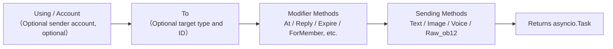

## Sending Methods

All sending methods return an `asyncio.Task` object.

### Basic Methods (Built-in in Base Class)

The following standard methods are implemented by the `SendDSL` base class. By default, they are delegated to `Raw_ob12`, so adapter subclasses do not need to re-implement them and can use them directly, with IDE auto-completion available:

| Method Name | Description | Return Value |
|-------------|-------------|--------------|
| `Text(text: str)` | Send text message | `asyncio.Task` |
| `Image(file: bytes \| str)` | Send image | `asyncio.Task` |
| `Voice(file: bytes \| str)` | Send voice (OneBot12 `audio` segment) | `asyncio.Task` |
| `Video(file: bytes \| str)` | Send video | `asyncio.Task` |
| `File(file: bytes \| str, filename: str = None)` | Send file | `asyncio.Task` |

Adapters can override individual standard methods to provide platform-specific logic:

```python
class Send(SendDSL):
    def Raw_ob12(self, message, **kwargs):
        # Must be implemented
        ...

    # Optional: Override Text to provide platform-specific logic
    # def Text(self, text: str):
    #     return self.Raw_ob12([{"type": "text", "data": {"text": text}}])
```

### Protocol Methods

| Method Name | Description | Return Value | Required |
|-------------|-------------|--------------|----------|
| `Raw_ob12(message)` | Send OneBot12 formatted message | `asyncio.Task` | **Must be implemented** |

> **Important**: `Raw_ob12` is the core method of the adapter and **must be implemented**. It serves as the unified entry point for reverse transformation (OneBot12 → platform). If not implemented, the base class will log an error and return a standard error response (`status: "failed"`, `retcode: 10002`). Standard methods (`Text`, `Image`, etc.) are delegated to `Raw_ob12` by default.

### Platform-Specific Methods

Adapters can add platform-specific sending methods in the `Send` subclass (these will be recognized by `event.supports()` / `event.available_methods()`):

```python
class Send(SendDSL):
    def Raw_ob12(self, message, **kwargs): ...

    # Platform-specific method
    def Sticker(self, sticker_id: str):
        return self.Raw_ob12([{"type": "sticker", "data": {"id": sticker_id}}])
```

## Modifiers

Modifiers return `self` to support method chaining.

### At Method

```python
# @single user
await adapter.Send.To("group", "123").At("456").Text("Hello")

# @multiple users
await adapter.Send.To("group", "123").At("456").At("789").Text("Hello everyone")
```

### AtAll Method

```python
# @all group members
await adapter.Send.To("group", "123").AtAll().Text("Hello everyone")
```

### Reply Method

```python
# Reply to a message
await adapter.Send.To("group", "123").Reply("msg_id").Text("Reply content")
```

### Combined Modifiers

```python
await adapter.Send.To("group", "123").At("456").Reply("msg_id").Text("Reply to the @ message")
```

### Platform-Specific Modifier Methods

In addition to the built-in `At`/`AtAll`/`Reply`, adapters can define **platform-specific modifier methods**. These methods **only need to return `self`** and do not require any decorators — the framework automatically recognizes them:

- Return `self` (an instance of `SendDSL`) → Modifier method, does not trigger send wrapping/lifecycle events, continues method chaining
- Return `Task`/`Awaitable` → Send method

```python
class Send(SendDSL):
    def Raw_ob12(self, message, **kwargs): ...

    # Modifier method: returns self, does not send
    def Expire(self, seconds: int):
        self._expire = seconds
        return self

    def ForMember(self, user_id: str):
        self._member = user_id
        return self

    # Send method: returns Task, depends on states set by modifier methods
    def Board(self, content: str, **kwargs):
        return self.Raw_ob12([{"type": "board", "data": {"text": content}}])
```

Usage:

```python
# Modifier methods can be chained continuously
await adapter.Send.To("group", "big").Expire(3600).ForMember("114").Board("Board content")
```

## Using Modifier Methods in Event Wrapper Classes

> [!NOTE]  
> The `reply(via=)` and `event.send_chain()` features require ErisPulse **2.7.0+**.

By default, `event.reply()` exposes only built-in modifier parameters such as `at_sender`/`at_users`/`at_all`/`quote`. To use platform-specific modifier methods, there are two approaches:

### Method 1: The `via` Parameter in `reply()`

Suitable for a small number of known modifier methods:

```python
await event.reply("Board content", method="Board",
                  via=[("Expire", 3600), ("ForMember", "114514")])
```

The `via` parameter is a list, where each element can take one of the following forms:

| Format | Equivalent Chain Call |
|--------|------------------------|
| `"Name"` | `.Name()` |
| `("Name", arg1, arg2)` | `.Name(arg1, arg2)` |
| `("Name", (arg1,), {kw: val})` | `.Name(arg1, kw=val)` |

### Method 2: `event.send_chain()`

Suitable for **multiple consecutive modifier methods** or **action-type methods without content parameters** (such as recall or delete). The `send_chain()` method returns a send chain already configured with `To`/`Using`, allowing you to freely append arbitrary modifier methods and send methods:

```python
# Platform-specific modifier methods + board message
await event.send_chain().Expire(3600).Board("Expires in one hour")

# Multiple consecutive modifier methods
await (event.send_chain()
       .Expire(3600)
       .ForMember("114514")
       .Board("Board content", content_type="markdown"))

# Built-in modifier methods are also available
await event.send_chain().At("123").Reply("msg_id").Text("hi")

# Action-type methods without content parameters
await event.send_chain().DismissBoard()
```

> The `send_chain()` method returns a complete SendDSL instance, so **all chainable features are available**—not just modifier methods, but also send rules and batch building:

```python
# Send rules: retry + timeout + success callback
await (event.send_chain()
       .Retry(3).Timeout(10)
       .Hook(lambda r: print("Message sent successfully"))
       .Text("Reliable message"))

# Delayed message + platform modifier + board
await event.send_chain().Defer(5).Expire(3600).Board("Delayed board")

# Batch building mode
results = await (event.send_chain()
                 .Build()
                 .Text("First sentence").Image("pic.jpg").Text("Second sentence")
                 .send_all())
```

## Account Management

### Using Method

The `Using()` method is used to specify the account for sending messages. The identifier passed in will be matched through `_resolve_account()` in the following priority order:

1. **Account Name** — The key name in the configuration (e.g., `"default"`, `"bot1"`)
2. **Runtime Injected bot_id** — The identifier automatically injected during event conversion
3. **Any str Field** — Any other string field in the configuration
4. **Fallback** — The first enabled account

```python
# Using account name
await adapter.Send.Using("account1").To("user", "123").Text("Hello")

# Using bot_id (i.e., self.user_id from the event)
await adapter.Send.Using("bot_123").To("user", "123").Text("Hello")
```

### Account Method

The `Account` method is equivalent to `Using`:

```python
await adapter.Send.Account("account1").To("user", "123").Text("Hello")
```

## Asynchronous Processing

### Not Waiting for Results

```python
# Message is sent in the background
task = adapter.Send.To("user", "123").Text("Hello")

# Continue executing other operations
# ...
```

### Waiting for Results

```python
# Await directly to get the result
result = await adapter.Send.To("user", "123").Text("Hello")
print(f"Send result: {result}")

# Save the Task first, then wait later
task = adapter.Send.To("user", "123").Text("Hello")
# ... other operations ...
result = await task
```

## Send Rule System

SendDSL includes a built-in set of send rule decorators. Rules are attached via chainable methods and applied collectively when the final send operation is executed. These rules cover common production scenarios: timeout control, retry on failure, success callbacks, delayed sending, priority-based dropping, and progress monitoring.

Rule methods **return self** (like `At`/`AtAll`/`Reply`), and must be called before the send method (`Text`/`Image`, etc.). Rules propagate along with new instances created by `To`/`Using`/`Account`.

### List of Rule Methods

| Method | Description |
|--------|-------------|
| `.Hook(callback)` | Callback executed on successful send (can be called multiple times, executed in order) |
| `.Retry(times=1)` | Automatically retry N times on failure (total N+1 attempts, including the first) |
| `.Timeout(seconds)` | Single send timeout; cancels current attempt if exceeded (can be combined with Retry) |
| `.Defer(seconds=1.0)` | Delayed send (in-process timer, not persisted) |
| `.Priority(level, drop_if_busy=False)` | Set priority; messages may be dropped during congestion |
| `.OnProgress(callback)` | Progress callback at each stage (receives `SendContext`) |
| `.OnError(callback)` | Error callback triggered only once on final failure |

### Executing Logic After Successful Send (Hook)

```python
# Synchronous callback
await (adapter.Send.To("user", "123")
       .Hook(lambda r: print(f"Send successful, message ID: {r['message_id']}"))
       .Text("Hello"))

# Asynchronous callback
async def deduct_points(result):
    await db.update(user_id="123", points=-1)

await adapter.Send.To("user", "123").Hook(deduct_points).Text("Deduct points")
```

The `Hook` is only executed when the send operation is ultimately successful (including after retries); it is not triggered on failure, timeout, or cancellation.

### Automatic Retry on Failure (Retry)

```python
# Retry 2 times after the first failure, for a total of 3 attempts
result = await adapter.Send.To("user", "123").Retry(2).Text("With retry")
```

Retry is triggered when an exception is thrown during send, when the send times out, or when the send returns a response with `status == "failed"`.

### Automatic Cancellation on Timeout (Timeout)

```python
# Cancel if a single send exceeds 10 seconds
await adapter.Send.To("user", "123").Timeout(10).Text("With timeout")

# Timeout + Retry: Each attempt lasts up to 10 seconds, with a maximum of 3 attempts
await adapter.Send.To("user", "123").Timeout(10).Retry(2).Text("Timeout retry")
```

### Progress Monitoring (OnProgress / OnError)

```python
def on_progress(ctx):
    print(f"Stage: {ctx.stage}, Attempt: {ctx.attempt + 1}/{ctx.max_attempts}, Elapsed: {ctx.elapsed:.2f}s")
    if ctx.stage == "failed":
        print(f"  Error: {ctx.error!r}")

async def on_error(ctx):
    await notify_admin(f"Failed to send to {ctx.target_id}: {ctx.error!r}")

await (adapter.Send.To("user", "123")
       .Retry(3).Timeout(10)
       .OnProgress(on_progress)
       .OnError(on_error)
       .Text("Monitored"))
```

`SendContext` includes the following fields: `task_id`, `platform`, `method`, `target_type`, `target_id`, `bot_id`, `stage`, `attempt`, `max_attempts`, `started_at`, `finished_at`, `elapsed`, `error`, `result`, `extra`.

Possible values for `stage`: `pending`, `sending`, `retrying`, `success`, `failed`, `timeout`, `cancelled`, `dropped`.

### Delayed Sending (Defer)

```python
# Send after a 5-second delay
await adapter.Send.To("user", "123").Defer(5).Text("Delayed message")
```

> Note: The delay is an in-process timer; it is not persisted and will be lost if the process restarts.

### Priority and Congestion Dropping (Priority)

```python
# Low-priority message, automatically dropped during queue congestion
result = await (adapter.Send.To("user", "123")
               .Priority(-1, drop_if_busy=True)
               .Text("Droppable notification"))
# If dropped, result["status"] == "failed"
```

When `drop_if_busy` is enabled, if the number of in-flight send tasks exceeds the threshold (default 64), the current send is immediately abandoned. The global threshold can be adjusted using `.PriorityThreshold(n)`.

### Rule Composition and Background Execution

```python
# Execute without blocking the main flow; rules still apply
task = (adapter.Send.To("user", "123")
        .Hook(lambda r: print("Send successful!"))
        .Retry(3)
        .Timeout(10)
        .OnProgress(on_progress)
        .Text("Hello"))

# Continue executing other operations
await handle_next_action()
```

### Rule Propagation

Rules propagate with new instances created by `To`/`Using`/`Account`, preventing loss of rules during chained calls:

```python
# Rules set before To are also propagated to the instance created by To
builder = adapter.Send.Retry(3).Timeout(10)
send = builder.To("user", "123")  # send still carries Retry(3) and Timeout(10)
await send.Text("hi")
```

Rule sets for multiple instances are independent (the hooks list is deeply copied).

## Batch Build Mode (Build)

In addition to the single-send mode, SendDSL also supports batch build mode: multiple send methods are written in a single chain, and executed at once. This is suitable for scenarios where you want to send multiple messages in one go.

### Entering Build Mode

Before calling a send method, call `.Build()`, which returns a `SendBuilder`. After this, send methods (such as Text/Image) will not be executed immediately, but will accumulate as send intents:

```python
results = await (adapter.Send.To("user", "123")
                 .Build()                    # Enter build mode
                 .Text("First sentence")
                 .Image("pic.jpg")
                 .Text("Second sentence")
                 .send_all())                 # Execute all at once
# results = [Text result, Image result, Text result]
```

`.send_all()` returns an `asyncio.Task`, and awaiting it yields a list of results (in the order of the intents).

### Parallel vs Sequential

By default, execution is **parallel** (concurrent sending, total time is approximately equal to the slowest message). To ensure the order of message arrival, call `.Sequential()`:

```python
# Sequential: Send in order
await (adapter.Send.To("group", "456")
       .Build()
       .Sequential()
       .Text("Send this first").Text("Then send this")
       .send_all())

# Parallel (default, can be explicitly called)
await (adapter.Send.To("group", "456")
       .Build()
       .Parallel()
       .Text("Parallel 1").Text("Parallel 2")
       .send_all())
```

### Continue on Failure and Retry

Batch execution uses a **continue on failure** strategy: if one message fails, it does not interrupt the sending of other messages. When combined with `.Retry()`, failed messages will automatically retry (retry applies to individual messages, not the entire batch):

```python
await (adapter.Send.To("user", "123")
       .Build()
       .Retry(2)                       # Each message retries 2 times
       .Text("May fail").Image("May also fail")
       .send_all())
```

### Batch-wide Rules and Callbacks

Rules apply uniformly to the entire batch:

| Method | Description |
|--------|-------------|
| `.Timeout(seconds)` | Timeout for each individual send |
| `.Retry(times)` | Each send retries individually (continue on failure) |
| `.Defer(seconds)` | Delay the entire batch |
| `.Hook(callback)` | Triggered after the entire batch succeeds, receives `results` list |
| `.OnError(callback)` | Triggered when the batch has failures, receives `BatchContext` |
| `.OnProgress(callback)` | Triggered when each message completes, receives `BatchContext` |

```python
def on_progress(ctx):
    print(f"Progress: {ctx.completed}/{ctx.total}, succeeded {ctx.succeeded}, failed {ctx.failed}")

async def on_error(ctx):
    print(f"There are {ctx.failed} failed messages in the batch")

results = await (adapter.Send.To("user", "123")
               .Build()
               .Retry(2).Timeout(10)
               .OnProgress(on_progress)
               .OnError(on_error)
               .Hook(lambda rs: print("Batch completed"))
               .Text("a").Text("b").Text("c")
               .send_all())
```

`BatchContext` contains: `task_id`, `total`, `completed`, `succeeded`, `failed`, `stage`, `results`, `errors`, `elapsed`, `extra`.

`stage` possible values: `pending`, `sending`, `success` (all succeeded), `partial` (partially succeeded), `failed` (all failed).

### Decorators and Rule Inheritance

Decorators and rules before `.Build()` are inherited by the entire batch and apply to each message:

```python
await (adapter.Send.To("group", "456")
       .At("789")                        # Inherited: each message @789
       .Build()
       .Retry(2)                         # Inherited + appended: each message retries individually
       .Text("@Your notification")
       .Image("Announcement image")
       .send_all())
```

After entering Build mode, you can still append decorators (applying to the entire batch):

```python
await (adapter.Send.To("group", "456")
       .Build()
       .At("111").At("222")             # Appended @, applies to entire batch
       .Text("@Multiple people")
       .send_all())
```

### Background Execution

As with single-send, `.send_all()` returns a Task, which can be executed in the background without awaiting:

```python
task = (adapter.Send.To("user", "123")
        .Build()
        .Hook(lambda rs: print("Batch send completed"))
        .Text("a").Text("b")
        .send_all())

# Non-blocking main flow
await do_something_else()
```

## Naming Convention

### PascalCase Naming

All send methods should use the PascalCase naming convention:

```python
# ✅ Correct
def Text(self, text: str):
    pass

def Image(self, file: bytes):
    pass

# ❌ Incorrect
def text(self, text: str):
    pass

def send_image(self, file: bytes):
    pass
```

### Platform-specific Methods

Avoid adding platform prefixes to methods:

```python
# ✅ Recommended
def Sticker(self, sticker_id: str):
    pass

# ❌ Not recommended
def TelegramSticker(self, sticker_id: str):
    pass
```

Use `Raw` methods instead:

```python
# ✅ Recommended
await adapter.Send.Raw_ob12([{"type": "sticker", ...}])

# ❌ Not recommended
def TelegramSticker(self, ...):
    pass
```

## Internal Decomposition of the Send Chain

Behind a single `await adapter.Send.To("group", "123").Text("x")`, the framework performs the following sequence of operations for you:

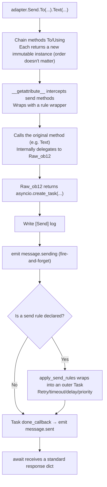

**What the framework does at each step:**

| Phase | What the framework does |
|------|-------------|
| Chain merging | `To`/`Using`/`Account` each call **creates a new immutable instance** and inherits previously set fields, so `To(...).Using(...)` and `Using(...).To(...)` are **equivalent** and order doesn't matter |
| Method wrapping | Send methods (`Text`, etc.) are intercepted and wrapped by `__getattribute__`; modifier methods (`To`/`Using`/`At`/`Retry`, etc.) are **not wrapped**. Nested `Raw_ob12` calls are prevented from repeated wrapping using the `_in_rule_wrap` marker |
| Task creation | `Raw_ob12` internally uses `asyncio.create_task()` to create the Task; `Text()` only synchronously returns this Task, **without blocking** |
| Send logging | Writes `[Send] platform/method -> target` event log (can be suppressed with `exclude_levels=["EVENT"]`) |
| `message.sending` | Triggered immediately in a fire-and-forget manner when the send method is called (only if listeners exist, short-circuited by `has_handlers`) |
| `message.sent` | Bound to the Task's `done_callback` — **when rules are present, it covers the final result of the entire retry process**; without rules, it is simply the completion of the original Task |

### Account Resolution Fallback Chain

When the adapter internally calls `_resolve_account(account_id)`, it resolves to a specific account in the following order:

1. Single-account adapter (no `AccountConfigClass`) → directly returns
2. Exact match of account name `account_id`
3. Match of each account's `bot_id` field
4. Match of any `str` field value in each account (excluding `enabled`/`name`)
5. Fallback to the first enabled account
6. If all fail → raises `ValueError`

> The `account_id` you provide comes from: `Using()` explicitly specified > event `self` field (where `account_id` takes precedence over `user_id`, automatically injected by `event.reply()`) > unspecified (adapter falls back to the first enabled account).

### Send Rule Engine (Retry/Timeout/Delay)

Rules are wrapped into a new outer Task **after** `Raw_ob12` returns the Task, without affecting the main flow. Key facts:

| Rule | Description |
|------|------|
| `Retry(n)` | Total attempts: `n+1`; **immediate re-send after failure, no exponential backoff** |
| `Timeout(s)` | Single send times out and is cancelled (`asyncio.wait_for`), retries if not exhausted |
| `Defer(s)` | Delays sleep before sending |
| `Priority(level, drop_if_busy)` | If backlog exceeds threshold, directly returns `{status:"failed", retcode:10002, message:"dropped_low_priority"}` |
| `Hook(fn)` | Only executed in order when the final send is successful |
| `on_progress` / `on_error` | Callbacks at each stage / final failure |

> **Note**: Retries are "immediate re-sends" without any backoff interval; if platform rate limiting requires backoff, please manually sleep and re-send in the `on_error` callback. Rule success is determined by `status == "ok"` in the returned dict (where `retcode == 0`).

> For the complete semantics of the standard response format and `retcode`, see [API Response Specification](../../standards/api-response.md).

## Return Values

### Task Object

All send methods return an `asyncio.Task`. The adapter only needs to implement `Raw_ob12`, and the standard methods (Text/Image, etc.) are delegated by default:

```python
import asyncio

def Raw_ob12(self, message, **kwargs):
    async def _do_send():
        segments = self._apply_modifiers(message)
        return await self._adapter.call_api(
            endpoint="/send_message",
            message=segments,
            **self.send_context,
            **kwargs,
        )
    return asyncio.create_task(_do_send())

# Text/Image/Voice/Video/File are inherited from the base class and automatically delegated to Raw_ob12
# If you need to override standard methods, just return an asyncio.Task:
# def Text(self, text: str):
#     return self.Raw_ob12([{"type": "text", "data": {"text": text}}])
```

### Standardized Response

`call_api` should return a standardized response. It is recommended to use the `make_response()` / `make_error()` methods:

```python
async def call_api(self, endpoint: str, **params):
    try:
        result = await self._do_api_call(endpoint, **params)
        return self.make_response(
            data=result.get("data"),
            message_id=result.get("message_id", ""),
            raw=result,
        )
    except Exception as e:
        return self.make_error(message=str(e))
```

Manual construction is also supported (the old way is still compatible):

```python
async def call_api(self, endpoint: str, **params):
    return {
        "status": "ok" or "failed",
        "retcode": 0 or error_code,
        "data": {...},
        "message_id": "msg_id" or "",
        "message": "",
        "{platform}_raw": raw_response
    }
```

## Complete Examples

### Basic Usage

```python
from ErisPulse.Core import adapter

my_adapter = adapter.get("myplatform")

# Send text message
await my_adapter.Send.To("user", "123").Text("Hello World!")

# Send image
await my_adapter.Send.To("group", "456").Image("https://example.com/image.jpg")

# Send file
with open("document.pdf", "rb") as f:
    await my_adapter.Send.To("user", "123").File(f.read())
```

### Chained Calls

```python
# @user + reply
await my_adapter.Send.To("group", "456").At("789").Reply("msg123").Text("Reply to @ message")

# @all + multiple modifiers
await my_adapter.Send.Using("bot1").To("group", "456").AtAll().Text("Announcement message")
```

### Raw Messages and Message Building

`Raw_ob12` is the core entry point for reverse conversion (OneBot 12 message segments → platform API calls), and `MessageBuilder` is a chainable message segment builder designed to work with it.

> For the complete `Raw_ob12` implementation specification, `MessageBuilder` usage, and code examples, please refer to:
> - [Send Method Specification §6 Reverse Conversion Specification (OneBot 12 → Platform)](../../standards/send-method-spec.md#6-反向转换规范onebot12--平台)
> - [Send Method Specification §11 MessageBuilder](../../standards/send-method-spec.md#11-消息构建器-messagebuilder)


### 适配器开发最佳实践

# Adapter Development Best Practices

This document provides best practice recommendations for ErisPulse adapter development.

## Bot Status Management and Meta Events

Adapters should actively send meta events through `adapter.emit()` to allow the framework to automatically track the Bot's connection status, online/offline events, and heartbeat information.

### 1. When to Send Meta Events

| Event | `detail_type` | Trigger Timing | Framework Behavior |
|------|--------------|---------|---------|
| Connect | `"connect"` | When the Bot establishes a connection with the platform | Register the Bot, trigger the `adapter.bot.online` lifecycle event |
| Disconnect | `"disconnect"` | When the Bot disconnects from the platform | Mark the Bot as offline, trigger the `adapter.bot.offline` lifecycle event |
| Heartbeat | `"heartbeat"` | Sent periodically (recommended: 30-60 seconds) | Update the Bot's active time and metadata |

### 2. Sending Meta Events

The framework provides the `emit_meta()` method to send meta events in a single line:

```python
class MyAdapter(BaseAdapter):
    async def _ws_handler(self, websocket):
        bot_id = self._get_bot_id()

        # Bot online: send connect event in one line
        await self.emit_meta("connect", bot_id, user_name="MyBot", nickname="MyBot")

        try:
            while True:
                data = await websocket.receive_text()
                event = self.convert(data)
                if event:
                    await self.adapter.emit(event)
        except WebSocketDisconnect:
            pass
        finally:
            # Bot offline
            await self.emit_meta("disconnect", bot_id)
```

### 3. Heartbeat Events

Adapters should regularly send heartbeat events during the connection's active period to update the Bot's active time:

```python
class MyAdapter(BaseAdapter):
    async def _heartbeat_loop(self, bot_id: str):
        while self._connected:
            # Send meta heartbeat to the framework (done in one line)
            await self.emit_meta("heartbeat", bot_id)
            await asyncio.sleep(30)
```

### 4. Automatic Discovery of the `self` Field

The framework's `adapter.emit()` automatically processes the `self` field in all events (not just meta events):

- **Regular events** (message/notice/request) with the `self` field will be automatically discovered and register the Bot.
- **Extended information in the `self` field**: Supports optional fields such as `user_name`, `nickname`, `avatar`, and `account_id`.

```python
# Including the `self` field in the converter will automatically register the Bot
onebot_event = {
    "type": "message",
    "detail_type": "private",
    "platform": "myplatform",
    "self": {
        "platform": "myplatform",
        "user_id": "bot123",
        "user_name": "MyBot",
        "nickname": "MyBot",
    },
    # ... other fields
}
await self.adapter.emit(onebot_event)
# Bot "bot123" has been automatically registered and its active time updated
```

### 5. Bot Status Query

The framework provides the following query methods:

```python
from ErisPulse import sdk

# Get Bot detailed information
info = sdk.adapter.get_bot_info("myplatform", "bot123")
# {"status": "online", "last_active": 1712345678.0, "info": {"nickname": "MyBot"}}

# List all Bots (grouped by platform)
all_bots = sdk.adapter.list_bots()

# List Bots for a specific platform
platform_bots = sdk.adapter.list_bots("myplatform")

# Check if a Bot is online
is_online = sdk.adapter.is_bot_online("myplatform", "bot123")

# Get a complete status summary (suitable for WebUI display)
summary = sdk.adapter.get_status_summary()
# {"adapters": {"myplatform": {"status": "started", "bots": {...}}}}
```

## Connection Management

### 1. Implement Connection Retry

```python
import asyncio

class MyAdapter(BaseAdapter):
    async def start(self):
        retry_count = 0
        max_retries = 5
        
        while retry_count < max_retries:
            try:
                await self._connect_to_platform()
                self.logger.info("Connection successful")
                break
            except Exception as e:
                retry_count += 1
                if retry_count < max_retries:
                    # Exponential backoff strategy
                    wait_time = min(60 * (2 ** retry_count), 600)
                    self.logger.warning(
                        f"Connection failed, retrying in {wait_time} seconds ({retry_count}/{max_retries}): {e}"
                    )
                    await asyncio.sleep(wait_time)
                else:
                    self.logger.error("Connection failed, maximum retry attempts reached")
                    raise
```

### 2. Connection State Management

```python
class MyAdapter(BaseAdapter):
    async def start(self):
        self.connection = None
        self._connected = False
    
    async def _ws_handler(self, websocket: WebSocket):
        self.connection = websocket
        self._connected = True
        self.logger.info("Connection established")
        
        try:
            while True:
                data = await websocket.receive_text()
                await self._process_event(data)
        except WebSocketDisconnect:
            self.logger.info("Connection disconnected")
        finally:
            self.connection = None
            self._connected = False
```

### 3. Heartbeat Keepalive and Meta Heartbeat

The adapter's heartbeat should fulfill two tasks simultaneously: sending a keepalive heartbeat to the platform and sending a meta heartbeat event to the framework.

```python
class MyAdapter(BaseAdapter):
    async def start(self):
        self.connection = await self._connect_to_platform()
        self._heartbeat_task = asyncio.create_task(self._heartbeat_loop())

    async def _heartbeat_loop(self):
        while self.connection:
            try:
                # 1. Send a keepalive heartbeat to the platform
                await self.connection.send_json({"type": "ping"})

                # 2. Send a meta heartbeat event to the framework (using emit_meta in one line)
                await self.emit_meta("heartbeat", self._bot_id)

                await asyncio.sleep(30)
            except Exception as e:
                self.logger.error(f"Heartbeat failed: {e}")
                break
```

### 4. Connection Information Exposure

The routes registered by the adapter should be visible to users, facilitating the configuration of callback addresses on the platform side. It is recommended to actively output connection information within the `start()` method:

```python
class MyAdapter(BaseAdapter):
    async def start(self):
        router.register_websocket(
            module_name=self.platform,
            path="/ws",
            handler=self._ws_handler
        )

        if self.sdk:
            info = self.sdk.adapter.get_connection_info(self.platform)
            if info:
                self.logger.info(f"WebSocket address: "
                    f"{info.get('connection', {}).get('base_url', '')}"
                    f"{info.get('connection', {}).get('websocket_routes', [])}")
```

Users can view all routes and connection addresses of the adapter through the following API:

```python
from ErisPulse import sdk

# Adapter-level connection information (recommended)
info = sdk.adapter.get_connection_info("myplatform")

# Query at the router manager level
sdk.router.list_namespaces()              # List all namespaces
sdk.router.get_module_routes("myplatform")  # Detailed route information
sdk.router.get_module_urls("myplatform")    # Complete connection URLs
```

> **Note**: The `module_name` used during route registration must exactly match the `platform` name registered by the adapter in ErisPulse; otherwise, `get_connection_info()` will fail to associate the route. For multi-account adapters, sub-paths (e.g., `/account1/webhook`, `/account2/webhook`) should be registered for each account instead of using different `module_name` values.

## Event Conversion

### 1. Strictly Follow the OneBot12 Standard

```python
class MyPlatformConverter:
    def convert(self, raw_event):
        """Convert event"""
        onebot_event = {
            "id": str(raw_event.get("event_id", uuid.uuid4())),
            "time": int(time.time()),
            "type": self._convert_type(raw_event.get("type")),
            "detail_type": self._convert_detail_type(raw_event),
            "platform": "myplatform",
            "self": {
                "platform": "myplatform",
                "user_id": str(raw_event.get("bot_id", ""))
            },
            "myplatform_raw": raw_event,  # Preserve raw data (required)
            "myplatform_raw_type": raw_event.get("type", "")  # Original type (required)
        }
        return onebot_event
```

### 2. Standardize Timestamps

```python
def _convert_timestamp(self, timestamp):
    """Convert to 10-digit second-level timestamp"""
    if not timestamp:
        return int(time.time())
    
    # If it's a millisecond-level timestamp
    if timestamp > 10**12:
        return int(timestamp / 1000)
    
    # If it's a second-level timestamp
    return int(timestamp)
```

### 3. Event ID Generation

```python
import uuid

def _generate_event_id(self, raw_event):
    """Generate event ID"""
    event_id = raw_event.get("event_id")
    if event_id:
        return str(event_id)
    # If the platform does not provide an ID, generate a UUID
    return str(uuid.uuid4())
```

## SendDSL Implementation

The `At`/`AtAll`/`Reply` decorators are built into the framework's SendDSL base class. Adapters only need to implement `Raw_ob12` and specific send methods. Use `self._apply_modifiers(message)` and `self.send_context` to simplify development.

### 1. Must Return a Task Object

```python
class Send(BaseAdapter.Send):
    def Raw_ob12(self, message, **kwargs):
        """Recommended implementation: Use framework helper methods"""
        async def _do_send():
            segments = self._apply_modifiers(message)
            return await self._adapter.call_api(
                endpoint="/send_message",
                message=segments,
                **self.send_context,
                **kwargs
            )
        return asyncio.create_task(_do_send())

    def Text(self, text: str):
        return self.Raw_ob12([{"type": "text", "data": {"text": text}}])
```

### 2. Chainable Modifier Methods Return self

```python
class Send(BaseAdapter.Send):

    def __init__(self, adapter, target_type=None, target_id=None, account_id=None):
        super().__init__(adapter, target_type, target_id, account_id)
        self.buttons = []

    def Button(self, content: list) -> 'Send':
        self.buttons.append(content)
        return self # Return self
```

### 3. Support Platform-Specific Methods

```python
class Send(BaseAdapter.Send):
    def Sticker(self, sticker_id: str):
        """Send a sticker pack"""
        return asyncio.create_task(
            self._adapter.call_api(
                endpoint="/send_sticker",
                message=[{"type": "sticker", "data": {"id": sticker_id}}],
                **self.send_context
            )
        )
    
    def Card(self, card_data: dict):
        """Send a card message"""
        return asyncio.create_task(
            self._adapter.call_api(
                endpoint="/send_card",
                message=[{"type": "card", "data": card_data}],
                **self.send_context
            )
        )
```

## API Response

### 1. Standardized Response Format

The framework provides `make_response()` and `make_error()` methods to construct standardized responses:

```python
async def call_api(self, endpoint: str, **params):
    try:
        raw_response = await self._platform_api_call(endpoint, **params)
        
        if raw_response.get("success"):
            return self.make_response(
                data=raw_response.get("data"),
                message_id=raw_response.get("data", {}).get("message_id", ""),
                raw=raw_response,
            )
        else:
            return self.make_error(
                retcode=raw_response.get("code", 10001),
                message=raw_response.get("message", ""),
                raw=raw_response,
            )
    except Exception as e:
        return self.make_error(message=str(e))
```

`make_response()` automatically generates a response dictionary containing the `{platform}_raw` key. `make_error()` defaults to `retcode=34000` (Platform Error).

### 2. Error Code Specification

Follow the OneBot12 standard error codes:

```python
# 1xxxx - Action Request Errors
10001: Bad Request
10002: Unsupported Action
10003: Bad Param

# 2xxxx - Action Handler Errors
20001: Bad Handler
20002: Internal Handler Error

# 3xxxx - Action Execution Errors
31000: Database Error
32000: Filesystem Error
33000: Network Error
34000: Platform Error
35000: Logic Error
```

## Multi-Account Support

### 1. Declarative Configuration (Recommended)

After declaring the `AccountConfigClass`, the framework automatically manages multi-account loading, validation, and template generation. The `BotAccountConfig` base class provides the `enabled` and `name` fields, which do not need to be declared by the adapter:

```python
from dataclasses import dataclass, field
from ErisPulse.Core.Bases import BotAccountConfig

@dataclass
class MyBotConfig(BotAccountConfig):
    token: str = field(default="", metadata={
        "description": {"i18n": "my_adapter.bot_token", "default": "Bot Token"},
        "required": True,
        "secret": True,
    })

class MyAdapter(BaseAdapter):
    AccountConfigClass = MyBotConfig
    
    async def start(self):
        for name, account in self.enabled_accounts.items():
            self.logger.info(f"Starting account {name}")
            await self._connect(name, account.token)
            # bot_id is automatically retrieved from the platform protocol/login response and filled back
    
    async def call_api(self, endpoint: str, **params):
        account_id = params.pop("account_id", None)
        name, account = self._resolve_account(account_id)
        # name: account name, account: MyBotConfig instance
```

The configuration file is automatically generated as:

```toml
[MyAdapter.accounts.default]
token = ""
enabled = true
name = ""
```

### 2. Account Selection Mechanism

The framework includes the `_resolve_account()` method, with matching priority as follows:

1. **Account Name** — exact match with the configuration key name
2. **`bot_id` Field** — automatically retrieved bot_id (i.e., `event["self"]["user_id"]`)
3. **Any str Field** — other string fields in the configuration
4. **Fallback** — the first enabled account

```python
# Match by account name
name, account = self._resolve_account("account1")

# Match by bot_id (most commonly used, from event)
name, account = self._resolve_account("bot_123")

# Get the first enabled account (pass None)
name, account = self._resolve_account(None)
```

## Error Handling

### 1. Categorized Exception Handling

Use `make_error()` to construct standardized error responses. When making requests via `sdk.client`, catch ErisPulse exceptions:

```python
from ErisPulse.Core.Bases.errors import ClientError, ClientTimeoutError

async def call_api(self, endpoint: str, **params):
    try:
        from ErisPulse.Core import client
        resp = await client.post(
            f"https://api.platform.com/{endpoint}",
            json=params,
            max_retries=2,
        )
        response = await resp.json()
        return self.make_response(data=response, raw=response)
    except ClientTimeoutError:
        self.logger.error(f"Request timeout: {endpoint}")
        return self.make_error(retcode=32000, message="Request timeout")
    except ClientError as e:
        self.logger.error(f"Network error: {e}")
        return self.make_error(retcode=33000, message="Network request failed")
    except json.JSONDecodeError:
        self.logger.error("JSON parsing failed")
        return self.make_error(retcode=10006, message="Response format error")
    except Exception as e:
        self.logger.error(f"Unknown error: {e}", exc_info=True)
        return self.make_error(message=str(e))
```

> **Backward Compatibility**: Old adapter code that directly uses `aiohttp` is unaffected and can still catch `aiohttp.ClientError`. Exception translation only takes effect when requests are made through `sdk.client`.

### 2. Logging

The framework automatically creates a sub-logger for adapters (`sdk.logger.get_child("MyAdapter")`), so manual initialization is not required:

```python
class MyAdapter(BaseAdapter):
    # ConfigClass = ...  # After declaring the configuration class, self.logger is automatically available
    
    async def start(self):
        self.logger.info("Adapter starting...")
        # ...
        self.logger.info("Adapter started")
    
    async def shutdown(self):
        self.logger.info("Adapter shutting down...")
        # ...
        self.logger.info("Adapter shutdown complete")
```

## Testing

### 1. Unit Tests

```python
import pytest
from ErisPulse.Core.Bases import BaseAdapter

class TestMyAdapter:
    def test_converter(self):
        """Test the converter"""
        converter = MyPlatformConverter()
        raw_event = {"type": "message", "content": "Hello"}
        result = converter.convert(raw_event)
        assert result is not None
        assert result["platform"] == "myplatform"
        assert "myplatform_raw" in result
    
    def test_api_response(self):
        """Test API response format"""
        adapter = MyAdapter()
        response = adapter.call_api("/test", param="value")
        assert "status" in response
        assert "retcode" in response
```

### 2. Integration Tests

```python
@pytest.mark.asyncio
async def test_adapter_start():
    """Test adapter startup"""
    adapter = MyAdapter()
    await adapter.start()
    assert adapter._connected is True

@pytest.mark.asyncio
async def test_send_message():
    """Test sending messages"""
    adapter = MyAdapter()
    await adapter.start()
    
    result = await adapter.Send.To("user", "123").Text("Hello")
    assert result is not None
```

## Reverse Conversion and Message Building

`Raw_ob12` is a method that adapters **must implement**, serving as the unified entry point for reverse conversion (OneBot12 → Platform). Standard methods (e.g., `Text`, `Image`, etc.) should delegate to `Raw_ob12`, and modifier states (e.g., `At`/`Reply`/`AtAll`) must be merged into message segments within `Raw_ob12`.

`MessageBuilder` is a message segment builder tool designed to be used with `Raw_ob12`, supporting fluent chaining and rapid construction.

> For the complete implementation specification, code examples, and usage methods, please refer to:
> - [Send Method Specification §6 Reverse Conversion Specification](../../standards/send-method-spec.md#6-反向转换规范onebot12--平台)
> - [Send Method Specification §11 MessageBuilder](../../standards/send-method-spec.md#11-消息构建器-messagebuilder)

## Platform Event Method Extensions

Adapters can register platform-specific methods for Event wrapper classes, allowing module developers to more easily access platform-specific data.

### 1. Using Mixin Classes for Batch Registration (Recommended)

When a platform has multiple specific methods, it is recommended to use a Mixin class:

```python
# Register at the adapter's start() or module level
from ErisPulse.Core.Event import register_event_mixin

class MyPlatformEventMixin:
    def get_chat_name(self):
        """Get the chat name"""
        return self.get("myplatform_raw", {}).get("chat", {}).get("name", "")

    def is_official_message(self):
        """Determine if the message is an official message"""
        raw = self.get("myplatform_raw", {})
        return raw.get("sender", {}).get("is_official", False)

    def get_message_type(self):
        """Get the platform message type"""
        return self.get("myplatform_raw", {}).get("msg_type", "text")

# Batch registration
register_event_mixin("myplatform", MyPlatformEventMixin)
```

### 2. Registering Individual Methods Using a Decorator

```python
from ErisPulse.Core.Event import register_event_method

@register_event_method("myplatform")
def get_chat_name(self):
    return self.get("myplatform_raw", {}).get("chat", {}).get("name", "")
```

### 3. Cleanup on Adapter Shutdown

```python
from ErisPulse.Core.Event import unregister_platform_event_methods

class MyAdapter(BaseAdapter):
    async def shutdown(self):
        # Clean up platform event method registrations
        unregister_platform_event_methods("myplatform")
        # ... other cleanup
```

> For more detailed information about registration and unregistration, please refer to [Event System API - Registering Platform Extension Methods](../../api-reference/event-system.md#adapter-register-platform-extension-methods).

## Documentation Maintenance

### 1. Maintaining Platform-Specific Documentation

In `docs/en/platform-guide/`, create a `{platform}.md` document (other language versions will be automatically generated):

```markdown
# Platform Name Adapter Documentation

## Basic Information
- Corresponding Module Version: 1.0.0
- Maintainer: Your Name

## Supported Message Sending Types
...

## Unique Event Types
...

## Configuration Options
...
```

### 2. Updating Version Information

When releasing a new version, update the version information in the documentation:

```toml
[project]
version = "2.0.0"  # Update the version number
```


### 事件转换器

# Event Converter Implementation Guide

The Event Converter (Converter) is one of the core components of the adapter, responsible for transforming platform-native events into ErisPulse's unified OneBot12 standard event format.

## Converter Responsibilities

```
Platform-native event ──→ Converter.convert() ──→ OneBot12 standard event
```

The Converter is only responsible for **forward conversion** (receiving direction), transforming platform-native event data into the OneBot12 standard format. Reverse conversion (sending direction) is handled by the `Send.Raw_ob12()` method.

### Core Principles

1. **Lossless conversion**: Original data must be fully retained in the `{platform}_raw` field
2. **Standard compatibility**: The converted event must conform to the OneBot12 standard format
3. **Platform extension**: Platform-specific data is stored in fields with the `{platform}_` prefix

## BaseConverter Base Class (Recommended)

Starting from version 2.7.0, the framework provides the `BaseConverter` base class (`ErisPulse.Core.Bases`), which encapsulates the **common field construction** and **common message segment utilities** for OneBot12 events, allowing converters to focus only on type mapping:

```python
from ErisPulse.Core.Bases import BaseConverter


class MyConverter(BaseConverter):
    def __init__(self):
        super().__init__(platform="myplatform")

    def convert(self, raw_event: dict) -> dict | None:
        if not isinstance(raw_event, dict):
            return None
        event_type = raw_event.get("type", "")
        base = self.build_base_event(raw_event, event_type)  # id/time/platform/self/raw
        if event_type == "message":
            base["type"] = "message"
            base["detail_type"] = "group" if raw_event.get("group_id") else "private"
            base["user_id"] = str(raw_event.get("sender_id", ""))
            base["message"] = [self.text(raw_event.get("content", ""))]
            base["alt_message"] = raw_event.get("content", "")
            return base
        return None
```

`build_base_event()` already fills the following common fields:

| Field | Source |
|------|------|
| `id` | `raw_event["event_id"]`, UUID generated if missing |
| `time` | `raw_event["timestamp"]`, current time if missing |
| `platform` | `platform` passed during initialization |
| `self` | `{"platform": ..., "user_id": raw_event["bot_id"]}` |
| `{platform}_raw` | Raw event (satisfies "lossless conversion" principle) |
| `{platform}_raw_type` | Raw event type |

Common message segment utility methods (all static methods, directly reusable):

```python
converter.text("hi")          # {"type": "text", "data": {"text": "hi"}}
converter.at("123456")        # {"type": "at", "data": {"user_id": "123456"}}
converter.image("file.png")   # {"type": "image", "data": {"file": "file.png"}}
```

> When manually implementing, the common field construction in `build_base_event` is boilerplate code that must be repeatedly written. Using `BaseConverter` eliminates this, and naturally ensures "lossless conversion" (the raw event always goes into `{platform}_raw`).

## convert() Method

### Method Signature

```python
def convert(self, raw_event: dict) -> dict:
    """
    Converts platform-native event data to OneBot12 standard format.

    :param raw_event: Platform-native event data
    :return: OneBot12 standard event dictionary
    """
    pass
```

### Return Value Structure

The converted event dictionary should include the following standard fields:

```python
{
    "id": "unique event ID",
    "time": 1234567890,           # Unix timestamp (seconds)
    "type": "message",             # Event type
    "detail_type": "private",      # Detailed type
    "platform": "myplatform",      # Platform name
    "self": {
        "platform": "myplatform",
        "user_id": "bot_user_id"
    },

    # Message event fields
    "user_id": "sender_id",
    "message": [...],              # OneBot12 message segment list
    "alt_message": "plain text content",

    # Original data must be preserved
    "myplatform_raw": { ... },     # Platform-native event complete data
    "myplatform_raw_type": "native event type name",
}
```

## Required Field Mapping

### Common Fields (All Event Types)

| OB12 Field | Type | Description |
|-----------|------|------|
| `id` | str | Unique event identifier |
| `time` | int | Unix timestamp (seconds) |
| `type` | str | Event type: `message` / `notice` / `request` / `meta` |
| `detail_type` | str | Detailed type: `private` / `group` / `friend` etc. |
| `platform` | str | Platform name, consistent with adapter registration name |
| `self` | dict | Bot information: `{"platform": "...", "user_id": "..."}` |

### Message Event Additional Fields

| OB12 Field | Type | Description |
|-----------|------|------|
| `user_id` | str | Sender ID |
| `message` | list[dict] | OneBot12 message segment list |
| `alt_message` | str | Plain text fallback content |

### Notice Event Additional Fields

| OB12 Field | Type | Description |
|-----------|------|------|
| `user_id` | str | Related user ID |
| `operator_id` | str | Operator ID (e.g., group member changes) |

## Message Segment Conversion

OneBot12 standard defines the following message segment types:

```python
# Text
{"type": "text", "data": {"text": "Hello"}}

# Image
{"type": "image", "data": {"file": "https://example.com/img.jpg"}}

# Audio
{"type": "audio", "data": {"file": "https://example.com/audio.mp3"}}

# Video
{"type": "video", "data": {"file": "https://example.com/video.mp4"}}

# File
{"type": "file", "data": {"file": "https://example.com/doc.pdf"}}

# Mention
{"type": "mention", "data": {"user_id": "123"}}

# Mention All
{"type": "mention_all", "data": {}}

# Reply
{"type": "reply", "data": {"message_id": "msg_123"}}
```

If the platform does not support certain message segment types, you can omit the segment or convert it to the closest standard type.

## Platform Extension Fields

Platform-specific data should be stored using the `{platform}_` prefix to avoid conflicts with standard fields:

```python
{
    # Standard fields
    "type": "message",
    "detail_type": "group",
    # ...

    # Platform extension fields
    "myplatform_raw": { ... },          # Raw event data (required)
    "myplatform_raw_type": "chat",      # Raw event type (required)

    # Other platform-specific fields
    "myplatform_group_name": "Group Name",
    "myplatform_sender_role": "admin",
}
```

> **Important**: The `{platform}_raw` field is required, as ErisPulse's event system and modules may depend on it to access platform-native data.

## Complete Example

Here is a complete implementation of a Converter:

```python
class MyConverter:
    def __init__(self, platform: str):
        self.platform = platform

    def convert(self, raw_event: dict) -> dict:
        event_type = raw_event.get("type", "")

        base_event = {
            "id": raw_event.get("id", ""),
            "time": raw_event.get("timestamp", 0),
            "platform": self.platform,
            "self": {
                "platform": self.platform,
                "user_id": raw_event.get("self_id", ""),
            },
            "myplatform_raw": raw_event,
            "myplatform_raw_type": event_type,
        }

        if event_type == "chat":
            return self._convert_message(raw_event, base_event)
        elif event_type == "notification":
            return self._convert_notice(raw_event, base_event)
        elif event_type == "request":
            return self._convert_request(raw_event, base_event)

        return base_event

    def _convert_message(self, raw: dict, base: dict) -> dict:
        base["type"] = "message"
        base["detail_type"] = "group" if raw.get("group_id") else "private"
        base["user_id"] = raw.get("sender_id", "")
        base["message"] = self._convert_message_segments(raw.get("content", ""))
        base["alt_message"] = raw.get("content", "")

        if raw.get("group_id"):
            base["group_id"] = raw["group_id"]

        return base

    def _convert_message_segments(self, content: str) -> list:
        segments = []
        if content:
            segments.append({"type": "text", "data": {"text": content}})
        return segments

    def _convert_notice(self, raw: dict, base: dict) -> dict:
        base["type"] = "notice"
        notification_type = raw.get("notification_type", "")

        if notification_type == "member_join":
            base["detail_type"] = "group_member_increase"
            base["user_id"] = raw.get("user_id", "")
            base["group_id"] = raw.get("group_id", "")
            base["operator_id"] = raw.get("operator_id", "")
        elif notification_type == "friend_add":
            base["detail_type"] = "friend_increase"
            base["user_id"] = raw.get("user_id", "")

        return base

    def _convert_request(self, raw: dict, base: dict) -> dict:
        base["type"] = "request"
        request_type = raw.get("request_type", "")

        if request_type == "friend":
            base["detail_type"] = "friend"
            base["user_id"] = raw.get("user_id", "")
            base["comment"] = raw.get("message", "")
        elif request_type == "group_invite":
            base["detail_type"] = "group"
            base["group_id"] = raw.get("group_id", "")
            base["user_id"] = raw.get("inviter_id", "")

        return base
```

## Rich Media Message Conversion Example

Platform messages often contain rich media such as images, mentions, and replies. Here is an example of `_convert_message_segments` handling multiple message types:

```python
def _convert_message_segments(self, raw_content: list) -> list:
    """Converts platform-native message segment list into OneBot12 standard message segments"""
    segments = []

    for item in raw_content:
        item_type = item.get("type", "")

        if item_type == "text":
            segments.append({
                "type": "text",
                "data": {"text": item.get("content", "")}
            })

        elif item_type == "image":
            file_url = item.get("url") or item.get("file_id", "")
            segments.append({
                "type": "image",
                "data": {"file": file_url}
            })

        elif item_type == "at":
            segments.append({
                "type": "mention",
                "data": {"user_id": item.get("target_id", "")}
            })

        elif item_type == "reply":
            segments.append({
                "type": "reply",
                "data": {"message_id": item.get("reply_to_id", "")}
            })

        elif item_type == "at_all":
            segments.append({"type": "mention_all", "data": {}})

        else:
            segments.append({
                "type": "text",
                "data": {"text": f"[Unsupported message type: {item_type}]"}
            })

    return segments
```

## Common Pitfalls

### 1. Missing `{platform}_raw` Field

This is the most common mistake. Missing the raw data field will prevent modules from accessing platform-specific information.

```python
base_event["myplatform_raw"] = raw_event        # Required!
base_event["myplatform_raw_type"] = event_type   # Required!
```

### 2. Incorrect Timestamp Format

OneBot12 requires the `time` field to be a Unix timestamp in seconds (integer). If your platform returns milliseconds or an ISO format string, you must convert it:

```python
import time

# Milliseconds → seconds
"time": raw_event.get("timestamp", 0) // 1000

# ISO string → seconds
"time": int(time.mktime(time.strptime(raw_event["created_at"], "%Y-%m-%dT%H:%M:%S")))
```

### 3. Missing `self` Field

The `self` field contains bot information, with `user_id` being the bot's account ID. This field is crucial in multi-bot scenarios:

```python
"self": {
    "platform": self.platform,
    "user_id": raw_event.get("bot_id", ""),   # Bot's own ID
}
```

### 4. Using Non-standard `detail_type` Values

`detail_type` must use the values defined by OneBot12, such as `private`, `group`, `friend_increase`, `group_member_increase`, etc. Do not use platform-specific naming.

### 5. Round-trip Consistency

Ensure that the message segment types generated by the Converter correspond to the methods supported by the Send end. For example, if the Converter converts a platform image message to `{"type": "image", ...}`, then the Send end's `Image()` method must be able to handle image sending.

## Best Practices

1. **Always preserve raw data**: The `{platform}_raw` field must not be omitted
2. **Use standard message segments**: Convert platform messages to OneBot12 standard message segments whenever possible
3. **Set `detail_type` appropriately**: Use standard types (`private`/`group`/`channel` etc.), do not define custom ones
4. **Handle edge cases**: Raw events may lack certain fields; use `.get()` with reasonable default values
5. **Performance considerations**: `convert()` is called for every event; avoid performing time-consuming operations within it


=====
发布与工具
=====


### 发布模块到模块商店

# Publishing and Module Store Guide

Publish your developed modules or adapters to the ErisPulse Module Store, allowing other users to easily discover and install them.

## Overview of the Module Store

The ErisPulse Module Store is a centralized module registry, allowing users to browse, search, and install community-contributed modules and adapters through the CLI tool.

### Browsing and Discovery

```bash
# List all packages available remotely
epsdk list-remote

# Show only modules
epsdk list-remote -t modules

# Show only adapters
epsdk list-remote -t adapters

# Force refresh the remote package list
epsdk list-remote -r
```

You can also visit the [ErisPulse official website](https://www.erisdev.com/#market) to browse the module store online.

### Supported Submission Types

| Type | Description | Entry-point Group |
|------|------|-------------------|
| Module | Extend bot functionality, implement business logic | `erispulse.module` |
| Adapter | Connect to new messaging platforms | `erispulse.adapter` |

## Quick Start

The entire process only requires three steps: configure your project → publish to PyPI → submit to the Module Store.

### 1. Configure pyproject.toml

Ensure your project directory includes `pyproject.toml` and `README.md`, and configure entry-points according to the type:

#### Module

```toml
[project]
name = "ErisPulse-MyModule"
version = "1.0.0"
description = "Module feature description"
requires-python = ">=3.10"
license = { text = "MIT" }
authors = [ { name = "yourname" } ]
dependencies = [
    "ErisPulse>=2.0.0",
]

[project.entry-points."erispulse.module"]
"MyModule" = "MyModule:Main"
```

#### Adapter

```toml
[project]
name = "ErisPulse-MyAdapter"
version = "1.0.0"
description = "Adapter feature description"
requires-python = ">=3.10"

[project.entry-points."erispulse.adapter"]
"myplatform" = "MyAdapter:MyAdapter"
```

> **Note**: It is recommended that package names start with `ErisPulse-` for easier identification by users. The entry-point key name (e.g., `"MyModule"`) will be the module's access name in the SDK.

### 2. Publish to PyPI

```bash
# Build + Publish (requires a PyPI account)
pip install build twine
python -m build
python -m twine upload dist/*
```

After successful publication, verify installation:

```bash
pip install ErisPulse-MyModule
```

### 3. Submit to Module Store

Go to [ErisPulse Module Store](https://www.erisdev.com/#market), click "Submit Module", log in, and fill in the module information.

Supported login methods: **GitHub**, **Codeberg**, **Yunhu**, choose any one.

Key points to fill in:
- Module name, description, repository address
- Minimum SDK version: If unsure, fill in the version number of the latest [ErisPulse release](https://pypi.org/project/ErisPulse/) 

After submission, it becomes effective immediately, and users can install via the module source. The module will be marked as "Unverified", and after the maintainer's review, it will be changed to "Verified".

> **About verification status**:
> - "Unverified" only means it has not yet been officially reviewed, not that the module has problems
> - When users install unverified modules via `epsdk install`, they will receive a risk warning and must confirm before continuing installation

### 4. Manage Published Modules

After clicking "Submit Module" and logging in at the Module Store, switch to the "My Modules" tab, where you can:

- **Edit** — Modify module description, repository address, tags, etc. The version number will automatically sync from PyPI
- **Delete** — Remove the module from the Module Store (irreversible)

> Newly submitted modules may take a few minutes to appear in the "My Modules" list.

## Updating Published Modules

1. Update the `version` in `pyproject.toml`
2. Rebuild and upload: `python -m build && python -m twine upload dist/*`
3. The module store will automatically sync the latest version from PyPI

Users can upgrade by running `epsdk upgrade MyModule`.

## Pre-release Checklist

Before pushing to PyPI, please confirm each item below:

### Code Quality

- [ ] All public APIs have type annotations (function signatures and return values)
- [ ] All public methods have docstrings (`"""..."""` format, including `:param` / `:return` / `:raises`)
- [ ] Passes `ruff check` (no warnings)
- [ ] Test coverage ≥ 80%
- [ ] All `pytest` test cases pass

### Compatibility

- [ ] `pyproject.toml` declares the minimum SDK version: `dependencies = ["ErisPulse>=x.y.z"]`
- [ ] Tested on Python 3.10 / 3.11 / 3.12 / 3.13
- [ ] Tested on target operating systems (Windows / Linux / macOS, as applicable)
- [ ] No circular import dependencies

### Configuration

- [ ] If using declarative configuration (`ConfigClass` + `BaseConfig` / `BotAccountConfig`), configuration fields have `description` (preferably in i18n format) and `ui` metadata
- [ ] If i18n translation keys are registered, all 5 languages (zh-CN / zh-TW / en / ja / ru) are covered
- [ ] Sensitive fields are marked with `secret=True`

### Documentation

- [ ] `README.md` includes installation instructions and basic usage examples
- [ ] `README.md` explains configuration methods (example config file + environment variables)
- [ ] `CHANGELOG.md` records all changes
- [ ] Adapter documentation is updated with platform features (supported Send types, event types, etc.)

### Release

- [ ] Version number in `pyproject.toml` has been updated
- [ ] Build succeeded: `python -m build`
- [ ] Uploaded to PyPI: `python -m twine upload dist/*`
- [ ] Installation verified: `pip install ErisPulse-xxx && epsdk run`

## Development Mode Testing

Before the official release, you can test locally using the editable mode:

```bash
epsdk install -e /path/to/MyModule
# or
pip install -e /path/to/MyModule
```

## FAQ

### Must package names start with `ErisPulse-`?

No, it's not mandatory, but it is highly recommended. This helps users identify packages in the ErisPulse ecosystem on PyPI.

### Can a single package register multiple modules?

Yes. You can configure multiple key-value pairs in `entry-points`:

```toml
[project.entry-points."erispulse.module"]
"ModuleA" = "MyPackage:ModuleA"
"ModuleB" = "MyPackage:ModuleB"
```

### How long does the review process take?

Typically, it takes 1-3 business days. You can check the verification status in the module store under "My Modules."

## Distributing Applications via Docker Images

If your application is not suitable for publishing to PyPI (for example, it contains private dependencies or requires a pre-configured environment), you can publish a Docker image via **GitHub Container Registry (GHCR)**, allowing other users to `docker pull` and start it with a single command.

### Use Cases

- You have a **complete robot application** (module + configuration + entry script) and want to distribute it with a single click
- The module/adapter depends on **private packages** or has a special installation process that is not suitable for PyPI
- You want to provide an **out-of-the-box** deployment solution to lower the user's entry barrier

### 1. Create a Dockerfile

Build based on the ErisPulse official image, simply add your module:

```dockerfile
FROM erispulse/erispulse:latest

LABEL org.opencontainers.image.title="ErisPulse-MyModule" \
      org.opencontainers.image.description="Module description" \
      org.opencontainers.image.url="https://github.com/yourname/ErisPulse-MyModule" \
      org.opencontainers.image.source="https://github.com/yourname/ErisPulse-MyModule"

COPY pyproject.toml README.md ./
COPY MyModule/ ./MyModule/

RUN uv pip install --system -e .
```

If the module requires additional system dependencies (such as SSH client, etc.), add them after `RUN uv pip install`:

```dockerfile
RUN apt-get update && apt-get install -y --no-install-recommends \
    openssh-client \
    && rm -rf /var/lib/apt/lists/*
```

> `erispulse/erispulse:latest` already includes ErisPulse, ErisPulse-Dashboard, Python runtime, and uv, so there's no need to install them again.

### 2. Create a GitHub Actions Workflow

Create in `.github/workflows/docker-publish.yml`:

```yaml
name: Publish Docker Image

on:
  workflow_dispatch:
  push:
    branches:
      - main
    tags:
      - "v*"

permissions:
  contents: read
  packages: write

env:
  REGISTRY: ghcr.io
  IMAGE_NAME: ${{ github.repository_owner }}/my-bot

jobs:
  docker-publish:
    runs-on: ubuntu-latest

    steps:
      - name: Checkout code
        uses: actions/checkout@v4

      - name: Set up QEMU (multi-architecture support)
        uses: docker/setup-qemu-action@v3

      - name: Set up Docker Buildx
        uses: docker/setup-buildx-action@v3

      - name: Login to GitHub Container Registry
        uses: docker/login-action@v3
        with:
          registry: ${{ env.REGISTRY }}
          username: ${{ github.actor }}
          password: ${{ secrets.GITHUB_TOKEN }}

      - name: Extract Docker metadata
        id: meta
        uses: docker/metadata-action@v5
        with:
          images: ${{ env.REGISTRY }}/${{ env.IMAGE_NAME }}
          tags: |
            type=semver,pattern={{version}}
            type=semver,pattern={{major}}.{{minor}}
            type=raw,value=latest

      - name: Build and push Docker image
        uses: docker/build-push-action@v6
        with:
          context: .
          file: ./Dockerfile
          platforms: linux/amd64,linux/arm64
          push: true
          tags: ${{ steps.meta.outputs.tags }}
          labels: ${{ steps.meta.outputs.labels }}
          cache-from: type=gha
          cache-to: type=gha,mode=max
```

> `GITHUB_TOKEN` is automatically provided by GitHub Actions, no need to manually create a key.

### 3. Trigger the Build

Pushing code or tagging will automatically trigger the build:

```bash
# Push to main branch to trigger
git push origin main

# Or tag to trigger
git tag v1.0.0
git push origin v1.0.0
```

You can also manually trigger it in the GitHub repository's **Actions** page.

### 4. Set the Image as Public

GHCR images are private by default, and must be set to Public in GitHub so other users can pull without logging in:

1. Go to the repository → **Packages** → Click on the corresponding Package
2. **Package settings** → **Danger Zone** → **Change visibility** → **Public**

### 5. User Usage

After the build is complete, users can start it with `docker run` in a single line:

```bash
docker run -d \
  --name my-bot \
  -p 8000:8000 \
  -v $(pwd)/config:/app/config \
  -e TZ=Asia/Shanghai \
  -e ERISPULSE_DASHBOARD_TOKEN=your-token \
  --restart unless-stopped \
  ghcr.io/<your-username>/my-bot:latest
```

Or use `docker-compose.yml`:

```yaml
services:
  my-bot:
    image: ghcr.io/<your-username>/my-bot:latest
    container_name: my-bot
    ports:
      - "8000:8000"
    volumes:
      - ./config:/app/config
    environment:
      - TZ=Asia/Shanghai
      - ERISPULSE_DASHBOARD_TOKEN=${ERISPULSE_DASHBOARD_TOKEN:-}
    restart: unless-stopped
```

### Publish to Docker Hub as well

Extend the workflow by adding Docker Hub login before the login step, and in the `images` add the Docker Hub address:

```yaml
      - name: Login to Docker Hub
        uses: docker/login-action@v3
        with:
          registry: docker.io
          username: ${{ secrets.DOCKERHUB_USERNAME }}
          password: ${{ secrets.DOCKERHUB_TOKEN }}

      - name: Extract Docker metadata
        id: meta
        uses: docker/metadata-action@v5
        with:
          images: |
            docker.io/<your-dockerhub-username>/my-bot
            ghcr.io/${{ github.repository_owner }}/my-bot
```

> You need to add `DOCKERHUB_USERNAME` and `DOCKERHUB_TOKEN` in the repository **Settings → Secrets**.

### Docker Image vs PyPI Publishing

| Feature | Docker Image (GHCR) | PyPI Publishing |
|-------|---------------------|-----------------|
| Distribution Method | `docker pull` to run with one click | `pip install` + manual configuration |
| Applicability | Complete applications/solutions | Single modules/adapters |
| Private Dependencies | Natively supported | Requires a private PyPI source |
| Module Store | Not applicable | Can be submitted to the module store |
| Multi-architecture | Supports amd64/arm64 | Architecture-agnostic |

The two methods are not mutually exclusive—you can publish the module to the module store via PyPI and provide an out-of-the-box Docker image via GHCR.


### CLI 命令参考

# CLI Command Reference

The ErisPulse command-line tool (`epsdk`) provides project management and package management functions.

> **Tip**: You can view detailed parameter descriptions for any command using `epsdk <command> --help`.

---

## Package Management Commands

| Command | Alias | Parameters | Description |
|---------|-------|------------|-------------|
| `install` | `i`, `add` | `[package]... [--upgrade/-U] [--pre] [-e PATH] [--user] [--no-deps] [-t DIR] [--index-url URL] [--extra-index-url URL] [--no-cache-dir] [-r FILE] [-c FILE] [--force-reinstall] [--ignore-installed] [--compile/--no-compile] [--prefix DIR] [--src DIR] [--config-settings SETTINGS] [--no-binary FORMAT] [--only-binary FORMAT] [--prefer-binary] [--build-isolation/--no-build-isolation] [--upgrade-strategy {eager,only-if-needed,to-satisfy-only}] [--break-system-packages] [--no-uv]` | Install modules/adapters |
| `uninstall` | `rm`, `remove` | `<package>... [--no-uv]` | Uninstall modules/adapters |
| `upgrade` | `up` | `[package]... [--force/-f] [--pre] [--no-uv]` | Upgrade specified modules or all |
| `self-update` | `su`, `update` | `[version] [--pre] [--force/-f] [--no-uv]` | Update the SDK itself |

## Diagnostic Commands

| Command | Alias | Parameters | Description |
|---------|-------|------------|-------------|
| `doctor` | `diag` | `[--verbose]` | Diagnose environment and output health report |

### install

Install ErisPulse module or adapter packages. If no package name is specified, enter the interactive installation interface.

**Aliases:** `i`, `add`

**Parameters:**

| Parameter | Short | Description |
|-----------|-------|-------------|
| `[package]...` | | Package names to install, multiple can be specified |
| `--upgrade` | `-U` | Upgrade to the latest version during installation |
| `--pre` | | Allow installation of pre-release versions |
| `--editable` | `-e` | Install in editable mode (requires path) |
| `--user` | | Install to user site-packages directory |
| `--no-deps` | | Do not install dependencies |
| `--target` | `-t` | Install to specified directory |
| `--index-url` | | Specify PyPI mirror source URL |
| `--extra-index-url` | | Additional PyPI mirror source URL (can be specified multiple times) |
| `--no-cache-dir` | | Disable cache |
| `--requirement` | `-r` | Install from requirements file |
| `--constraint` | `-c` | Install from constraint file |
| `--force-reinstall` | | Force reinstallation |
| `--ignore-installed` | | Ignore already installed packages |
| `--compile` | | Compile .pyc files after installation |
| `--no-compile` | | Do not compile .pyc files after installation |
| `--prefix` | | Install to specified prefix directory |
| `--src` | | Source code directory used for editable installation |
| `--config-settings` | | Pass configuration to build backend (can be specified multiple times) |
| `--no-binary` | | Restrict not to use binary packages (format like `:all:`) |
| `--only-binary` | | Restrict to use only binary packages (format like `:all:`) |
| `--prefer-binary` | | Prefer binary packages |
| `--build-isolation` | | Enable build isolation |
| `--no-build-isolation` | | Disable build isolation |
| `--upgrade-strategy` | | Upgrade strategy: `eager`, `only-if-needed`, `to-satisfy-only` |
| `--break-system-packages` | | Allow modification of system package manager managed Python packages |
| `--no-uv` | | Use pip instead of uv |

**Examples:**

```bash
# Install a single module
epsdk install Weather

# Install multiple modules
epsdk install Yunhu Weather

# Install from mirror source and upgrade
epsdk install Weather -U --index-url https://pypi.tuna.tsinghua.edu.cn/simple

# Editable mode installation (development mode)
epsdk install -e ./my-adapter
```

### uninstall

Uninstall installed ErisPulse modules or adapter packages. If no package name is specified, enter the interactive uninstallation interface.

**Aliases:** `rm`, `remove`

**Parameters:**

| Parameter | Description |
|-----------|-------------|
| `<package>...` | Package names to uninstall, multiple can be specified |
| `--no-uv` | Use pip instead of uv |

**Examples:**

```bash
# Uninstall a single module
epsdk uninstall Weather

# Uninstall multiple modules
epsdk uninstall Yunhu Weather
```

### upgrade

Upgrade installed ErisPulse components. If no package name is specified, enter interactive upgrade of all.

**Aliases:** `up`

**Parameters:**

| Parameter | Short | Description |
|-----------|-------|-------------|
| `[package]...` | | Package names to upgrade, multiple can be specified |
| `--force` | `-f` | Force upgrade, skip confirmation |
| `--pre` | | Allow upgrade to pre-release versions |
| `--no-uv` | | Use pip instead of uv |

**Examples:**

```bash
# Upgrade all packages
epsdk upgrade

# Upgrade specified package
epsdk upgrade Weather

# Force upgrade (skip confirmation)
epsdk upgrade -f
```

### self-update

Update the ErisPulse SDK itself to the latest version.

**Aliases:** `su`, `update`

**Parameters:**

| Parameter | Short | Description |
|-----------|-------|-------------|
| `[version]` | | Specify the target version to update to |
| `--pre` | | Allow updating to pre-release versions |
| `--force` | `-f` | Force update, skip confirmation |
| `--no-uv` | | Use pip instead of uv |

**Examples:**

```bash
# Update to the latest stable version
epsdk self-update

# Update to a specific version
epsdk self-update 1.2.3

# Allow pre-release versions
epsdk self-update --pre

# Force update
epsdk self-update -f
```

---

## Information Query Commands

| Command | Alias | Parameters | Description |
|---------|-------|------------|-------------|
| `list` | `l`, `ls` | `[--type/-t {modules,adapters,all}] [--outdated/-o]` | List installed components |
| `list-remote` | `lsr` | `[--type/-t {modules,adapters,all}] [--refresh/-r]` | List remote available components |

### list

List installed ErisPulse modules and adapters.

**Aliases:** `l`, `ls`

**Parameters:**

| Parameter | Short | Description |
|-----------|-------|-------------|
| `--type` | `-t` | Specify type: `modules`, `adapters`, `all` (default) |
| `--outdated` | `-o` | Only display upgradable packages |

**Examples:**

```bash
# List all installed components
epsdk list

# List only modules
epsdk list -t modules

# List only adapters
epsdk list -t adapters

# Only show upgradable packages
epsdk list -o
```

### list-remote

List available ErisPulse modules and adapters in the remote repository.

**Aliases:** `lsr`

**Parameters:**

| Parameter | Short | Description |
|-----------|-------|-------------|
| `--type` | `-t` | Specify type: `modules`, `adapters`, `all` (default) |
| `--refresh` | `-r` | Force refresh remote package list cache |

**Examples:**

```bash
# List all remote available components
epsdk list-remote

# List only remote modules
epsdk list-remote -t modules

# Force refresh cache and list
epsdk list-remote -r
```

---

## Configuration Commands

| Command | Alias | Parameters | Description |
|---------|-------|------------|-------------|
| `config` | `cfg`, `conf` | `[name] [--list/-l]` | Interactively configure declarative configuration items for adapters/modules |

### config

Interactively fill in declarative configuration items for adapters/modules. The wizard is driven by the adapter/module's declared configuration class (`ConfigClass` / `AccountConfigClass`), generating forms and validating automatically, without manually writing `config.toml`.

Adapters additionally support multi-account (bot account) management: adding/editing/deleting accounts, and enabling/disabling switches.

**Aliases:** `cfg`, `conf`

**Parameters:**

| Parameter | Short | Description |
|-----------|-------|-------------|
| `[name]` | | Target name (adapter platform name or module name), leave blank to enter interactive selection |
| `--list` | `-l` | Only list the configuration status of all targets, do not enter the wizard |

**Examples:**

```bash
# View configuration status of all adapters/modules
epsdk config --list

# Interactive selection of target for configuration
epsdk config

# Directly configure specified adapter
epsdk config yunhu

# Directly configure specified module
epsdk config MyModule
```

**Description:**

- Configuration status is divided into four levels: `Ready` (validation passed), `Incomplete` (missing or validation failed required fields), `Not Configured` (never generated), `No Configuration` (target did not declare configuration class)
- Field values are marked with source: existing configuration displays `Current: value`, unconfigured displays schema default value `Default: value`; pressing Enter retains the value
- Secret-type fields (declared as `secret`) do not echo input, pressing Enter retains the set value
- In interactive selection mode, after a single wizard ends, it returns to the selection menu (status refreshed), allowing continuous configuration of multiple targets, leaving blank exits
- If global form validation fails and re-entry is abandoned, the current wizard ends without writing any configuration (to avoid generating "enabled but incomplete configuration" semi-finished states)
- After saving, immediately write to `config/config.toml`, visible in Dashboard and running SDK; running adapters need to restart the process to apply new account configurations
- After `epsdk install` (interactive installation) and `epsdk init` successfully install an adapter, if configuration declaration is detected, it automatically guides into this wizard; when installing directly via command line, only configuration prompts are printed

---

## Runtime Control Commands

| Command | Alias | Parameters | Description |
|---------|-------|------------|-------------|
| `run` | `r` | `[script] [--reload]` | Run specified script or SDK |

### run

Run ErisPulse project script or directly start the SDK. Supports hot-reload mode.

**Aliases:** `r`

**Parameters:**

| Parameter | Description |
|-----------|-------------|
| `[script]` | Script file to run, if not specified, run the SDK |
| `--reload` | Enable hot-reload mode, monitor file changes and automatically restart |

**Examples:**

```bash
# Directly run the SDK
epsdk run

# Run specified script file
epsdk run main.py

# Hot-reload mode run (restart automatically on file change)
epsdk run main.py --reload

# SDK hot-reload mode
epsdk run --reload
```

---

## Project Management Commands

| Command | Alias | Parameters | Description |
|---------|-------|------------|-------------|
| `init` | — | `[--project-name/-n <name>] [--quick/-q] [--force/-f] [--here] [--no-uv]` | Initialize ErisPulse project |
| `create` | — | `{module,adapter} [--name/-n <name>] [--description/-d <desc>] [--author/-a <name>] [--email/-e <mail>] [--homepage <url>] [--output/-o <dir>] [--force/-f]` | Create module/adapter scaffold |

### init

Initialize a new ErisPulse project. Supports interactive and quick modes.

**Parameters:**

| Parameter | Short | Description |
|-----------|-------|-------------|
| `--project-name` | `-n` | Project name |
| `--quick` | `-q` | Quick mode, skip interactive wizard |
| `--force` | `-f` | Force overwrite existing configuration files |
| `--here` | | Initialize in current directory, do not create subdirectory |
| `--no-uv` | | Use pip instead of uv |

**Examples:**

```bash
# Interactive initialization
epsdk init

# Quick initialization
epsdk init -q -n my_bot

# Force overwrite existing configuration
epsdk init -f

# Initialize in current directory
epsdk init --here -n my_bot
```

### create

Create ErisPulse module or adapter scaffold project.

**Parameters:**

| Parameter | Short | Description |
|-----------|-------|-------------|
| `{module,adapter}` | | Type to create: `module` or `adapter` |
| `--name` | `-n` | Project name (PascalCase) |
| `--description` | `-d` | Project description |
| `--author` | `-a` | Author name |
| `--email` | `-e` | Author email |
| `--homepage` | | Project homepage URL |
| `--output` | `-o` | Output directory (default current directory) |
| `--force` | `-f` | Force overwrite existing directory |
| `--local` | | Create local plugin (only `module` available): generate `plugins/<name>/` package structure,免打包安装 (no packaging required for installation) |

**Examples:**

```bash
# Interactive creation (guides type selection and information entry)
epsdk create

# Directly create Module project
epsdk create module -n MyModule

# Create local plugin (placed in project plugins/ directory, automatically discovered on startup, supports hot-reload)
epsdk create module -n MyModule --local

# Directly create Adapter project
epsdk create adapter -n MyAdapter

# Full parameters
epsdk create module -n MyModule -d "Module description" -a "Author" -e "mail@example.com"

# Specify output directory
epsdk create module -n MyModule -o ./projects

# Force overwrite existing directory
epsdk create module -n MyModule -f
```

---

## Language Commands

| Command | Alias | Parameters | Description |
|---------|-------|------------|-------------|
| `i18n` | `language`, `lang` | `[lang] [--list/-l]` | View or switch CLI display language |

### i18n

View current CLI language, list supported languages, switch display language. If no parameter is specified, enter interactive selection interface.

**Aliases:** `language`, `lang`

**Parameters:**

| Parameter | Short | Description |
|-----------|-------|-------------|
| `[lang]` | | Language code to switch to (e.g., `zh-CN`, `en`, `ja`, `ru`) |
| `--list` | `-l` | List all supported languages |

**Examples:**

```bash
# Interactive language selection
epsdk i18n

# Switch to English
epsdk i18n en

# Switch to Japanese
epsdk i18n ja

# List all supported languages
epsdk i18n --list
```

---

## Type Stub Commands

| Command | Alias | Parameters | Description |
|---------|-------|------------|-------------|
| `types` | `t`, `stub` | `[--output/-o <path>] [--force] [--adapters-only] [--modules-only]` | Generate type stub files to enable IDE completion |

### types

Scan installed ErisPulse modules and adapters, generate `.pyi` type stub files for them, enabling accurate code completion and type checking support in IDEs.

**Aliases:** `t`, `stub`

**Parameters:**

| Parameter | Short | Description |
|-----------|-------|-------------|
| `--output` | `-o` | Output path (default `ep-stubs/` in current directory) |
| `--force` | | Force overwrite existing stub files |
| `--adapters-only` | | Generate type stubs only for adapters |
| `--modules-only` | | Generate type stubs only for modules |

> **Note:** `--adapters-only` and `--modules-only` are mutually exclusive; if both are specified, `--modules-only` takes precedence.

**Examples:**

```bash
# Generate type stubs for all installed modules and adapters
epsdk types

# Generate stubs only for adapters
epsdk types --adapters-only

# Output to specified directory
epsdk types -o ./typings

# Force overwrite existing files
epsdk types --force
```

---

## Global Parameters

The following parameters apply to all commands:

| Parameter | Short | Description |
|-----------|-------|-------------|
| `--help` | `-h` | Display help information |
| `--version` | `-V` | Display version information |
| `--verbose` | `-v` | Display detailed output (can be stacked with `-vv`/`-vvv`) |
| `--no-color` | | Disable colored output (suitable for CI / log collection) |
| `--yes` | `-y` | Automatically confirm all interactive prompts (non-interactive operation) |

---

## Environment Diagnosis

### doctor

> [!NOTE]
> This command requires ErisPulse **2.7.0+**.

Diagnose the current CLI runtime environment and output a health report. Used to troubleshoot issues like "why can't it install / connect."

| Parameter | Description |
|-----------|-------------|
| `--verbose` | Display detailed diagnostic information |

**Check items**:
- **Python**: Interpreter version and path
- **Installation backend**: Whether `uv` or `pip` is used
- **Target interpreter**: The actual Python environment where packages are installed
- **Configuration file**: Whether `config/config.toml` exists
- **PyPI connectivity**: Whether PyPI can be accessed (and display the number of discovered components)
- **System proxy**: Whether a proxy is detected

```bash
# Run environment diagnosis
epsdk doctor

# Use alias
epsdk diag
```

---

## Interactive Installation

Running `epsdk install` without specifying a package name enters interactive installation:

```bash
epsdk install
```

The interactive interface provides:
1. Adapter selection
2. Module selection
3. Custom installation

## Common Usage

### Install Modules

```bash
# Install a single module
epsdk install Weather

# Install multiple modules
epsdk install Yunhu Weather

# Upgrade module
epsdk install Weather -U
```

### List Components

```bash
# List all components
epsdk list

# List only adapters
epsdk list -t adapters

# List only upgradable components
epsdk list -o

# View remote available components
epsdk list-remote
```

### Uninstall Components

```bash
# Uninstall a single component
epsdk uninstall Weather

# Uninstall multiple components
epsdk uninstall Yunhu Weather
```

### Configure Components

```bash
# View configuration status
epsdk config --list

# Interactive selection of target for configuration
epsdk config

# Configure specified adapter
epsdk config yunhu
```

### Upgrade Components

```bash
# Upgrade all components
epsdk upgrade

# Upgrade specified component
epsdk upgrade Weather

# Force upgrade
epsdk upgrade -f
```

### Run Project

```bash
# Normal run
epsdk run main.py

# Hot-reload mode
epsdk run main.py --reload
```

### Switch Language

```bash
# Interactive language selection
epsdk i18n

# Directly switch to English
epsdk i18n en

# List supported languages
epsdk i18n --list
```

### Generate Type Stubs

```bash
# Generate all type stubs
epsdk types

# Generate only module type stubs
epsdk types --modules-only
```

### Initialize Project

```bash
# Interactive initialization
epsdk init

# Quick initialization
epsdk init -q -n my_bot
```

### Create Scaffold

```bash
# Interactive creation (guides type selection and information entry)
epsdk create

# Directly create Module project
epsdk create module -n MyModule

# Directly create Adapter project
epsdk create adapter -n MyAdapter

# Full parameters
epsdk create module -n MyModule -d "Module description" -a "Author" -e "mail@example.com"

# Force overwrite existing directory
epsdk create module -n MyModule -f
```


======
API 参考
======


### 适配器系统 API

# Adapter System API

This document provides a detailed introduction to the ErisPulse Adapter System API.

## Adapter Manager

### Get Adapters

```python
from ErisPulse import sdk

# Get adapter by name
adapter = sdk.adapter.get("platform_name")

# Or access directly via attribute
adapter = sdk.adapter.platform_name
```

### Use Adapter Event Listening
> In general, it is recommended to use the `Event` module for event listening/handling;
>
> The `Event` module also provides powerful decorators that can bring more convenience to your module development.

```python
# Listen for OneBot12 standard events
@sdk.adapter.on("message")
async def handle_message(event):
    pass

# Listen for standard events on a specific platform
@sdk.adapter.on("message", platform="yunhu")
async def handle_yunhu_message(event):
    pass

# Listen for platform-native events
@sdk.adapter.on("raw_event", raw=True, platform="yunhu")
async def handle_raw_event(data):
    pass
```

### Adapter Management

```python
# Get all platforms
platforms = sdk.adapter.platforms

# Check if an adapter exists
exists = sdk.adapter.exists("platform_name")

# Enable/disable adapter
sdk.adapter.enable("platform_name")
sdk.adapter.disable("platform_name")

# Start/stop adapter
# The following methods only show cases with parameters; without parameters, they start/stop all registered adapters
await sdk.adapter.startup(["platform1", "platform2"])
await sdk.adapter.shutdown(["platform1", "platform2"])

# Check if an adapter is running
is_running = sdk.adapter.is_running("platform_name")

# List all running adapters
running = sdk.adapter.list_running()
```

## Middleware

Middleware is executed before an event is dispatched to its handler, allowing modification, filtering, or logging of event data.

### Registering Middleware

```python
@sdk.adapter.middleware
async def my_middleware(event):
    sdk.logger.info(f"Middleware handling: {event}")
    return event
```

### Middleware Execution Model

- **Execution Order**: Middleware is executed in the order it was registered (first registered, first executed)
- **Data Passing**: Each middleware receives the `event` data returned by the previous middleware; if a middleware returns `None`, that return value is ignored and the original data is retained for further passing (with a `warning` level log output)
- **Modifying Data**: Middleware can modify event data and return the modified dictionary

```python
@sdk.adapter.middleware
async def add_timestamp(event):
    event["processed_at"] = time.time()
    return event

@sdk.adapter.middleware
async def filter_spam(event):
    if event.get("detail_type") == "private":
        text = event.get("alt_message", "")
        if "垃圾广告" in text:
            return None   # Returning None does not stop event propagation, only ignores this return value
    return event
```

> **Note**: Middleware currently does not support blocking event propagation. If you need to filter specific events, implement conditional checks within the event handler.
> However, you can set up high-priority handlers in the Event module and use `event.mark_processed()` within the handler to block lower-priority event handlers.

## Send Message Sending

### Basic Sending

```python
# Get adapter
adapter = sdk.adapter.get("platform")

# Send text message
await adapter.Send.To("user", "123").Text("Hello")

# Send image message
await adapter.Send.To("group", "456").Image("https://example.com/image.jpg")
```

### Specify Sender Account

```python
# Using account name
await adapter.Send.Using("account1").To("user", "123").Text("Hello")

# Using account ID
await adapter.Send.Using("bot_id").To("user", "123").Text("Hello")
```

### Query Supported Sending Methods

```python
# List all supported sending methods for the platform
methods = sdk.adapter.list_sends("onebot11")
# Returns: ["Text", "Image", "Voice", "Markdown", ...]

# Get detailed information for a specific method
info = sdk.adapter.send_info("onebot11", "Text")
# Returns:
# {
#     "name": "Text",
#     "parameters": [
#         {"name": "text", "type": "str", "default": null, "annotation": "str"}
#     ],
#     "return_type": "Awaitable[Any]",
#     "docstring": "Send text message..."
# }
```

### Chained Modifiers

```python
# @user
await adapter.Send.To("group", "456").At("789").Text("你好")

# @all members
await adapter.Send.To("group", "456").AtAll().Text("大家好")

# Reply to message
await adapter.Send.To("group", "456").Reply("msg_id").Text("回复内容")

# Combine usage
await adapter.Send.To("group", "456").At("789").Reply("msg_id").Text("回复@的消息")
```

## API Calls

### `call_api` Method

> **Note**: `call_api` is a low-level method for directly calling native platform APIs. The parameters and return values may vary between platforms. Please refer to the corresponding platform adapter documentation. **It is recommended to use the Send DSL to send messages**. Use `call_api` only in scenarios not supported by the Send DSL (such as retrieving platform-specific data or calling platform management APIs).

```python
# Call platform API
result = await adapter.call_api(
    endpoint="/send",
    content="Hello",
    recvId="123",
    recvType="user"
)

# Standardized response
{
    "status": "ok",
    "retcode": 0,
    "data": {...},
    "message_id": "msg_id",
    "message": "",
    "{platform}_raw": raw_response
}
```

## Adapter Base Class

### BaseAdapter Methods

```python
from ErisPulse import sdk
from ErisPulse.Core import BaseAdapter

class MyAdapter(BaseAdapter):
    def __init__(self):
        super().__init__()
        self.sdk = sdk
        # Initialize the adapter
        pass
    
    async def start(self):
        """Start the adapter (must be implemented)"""
        pass
    
    async def shutdown(self):
        """Shutdown the adapter (must be implemented)"""
        pass
    
    async def call_api(self, endpoint: str, **params):
        """Call the platform API (must be implemented)"""
        pass
```

### Send Nested Class

```python
class MyAdapter(BaseAdapter):
    class Send(BaseAdapter.Send):
        def Text(self, text: str):
            """Send a text message"""
            import asyncio
            return asyncio.create_task(
                self._adapter.call_api(
                    endpoint="/send",
                    content=text,
                    recvId=self._target_id,
                    recvType=self._target_type
                )
            )
```

## Bot Status Management

Adapters inform the framework of the Bot's connection status by sending OneBot12 standard **`meta` events**. The system automatically extracts Bot information from these events for status tracking.

### Meta Event Types

Adapters should send the following three types of `meta` events:

| `type` | `detail_type` | Description | Trigger |
|--------|--------------|-------------|---------|
| `meta` | `connect` | Bot connects online | After adapter successfully establishes a connection with the platform |
| `meta` | `heartbeat` | Bot heartbeat | Sent periodically (recommended: 30-60 seconds) |
| `meta` | `disconnect` | Bot disconnects | When a disconnection is detected |

### Self Field Extension

ErisPulse extends the standard OneBot12 `self` field with the following optional fields:

| Field | Type | Description |
|-------|------|-------------|
| `self.platform` | string | Platform name (OB12 standard) |
| `self.user_id` | string | Bot user ID (OB12 standard) |
| `self.user_name` | string | Bot nickname (ErisPulse extension) |
| `self.avatar` | string | Bot avatar URL (ErisPulse extension) |
| `self.account_id` | string | Multi-account identifier (ErisPulse extension) |

### Meta Event Format

#### connect — Connection Online

```python
await adapter.emit({
    "id": "unique_id",
    "time": 1712345678,
    "type": "meta",
    "detail_type": "connect",
    "platform": "telegram",
    "self": {
        "platform": "telegram",
        "user_id": "123456",
        "user_name": "MyBot",
        "avatar": "https://example.com/avatar.jpg"
    },
    "telegram_raw": {...},
    "telegram_raw_type": "bot_connected"
})
```

System processing: Register the Bot, mark as `online`, and trigger the `adapter.bot.online` lifecycle event.

#### heartbeat — Heartbeat

```python
await adapter.emit({
    "id": "unique_id",
    "time": 1712345708,
    "type": "meta",
    "detail_type": "heartbeat",
    "platform": "telegram",
    "self": {
        "platform": "telegram",
        "user_id": "123456"
    }
})
```

System processing: Update `last_active` time (meta information can also be updated during heartbeat).

#### disconnect — Disconnection

```python
await adapter.emit({
    "id": "unique_id",
    "time": 1712345738,
    "type": "meta",
    "detail_type": "disconnect",
    "platform": "telegram",
    "self": {
        "platform": "telegram",
        "user_id": "123456"
    }
})
```

System processing: Mark the Bot as `offline`, and trigger the `adapter.bot.offline` lifecycle event.

### Automatic Discovery of Regular Events

In addition to `meta` events, the `self` field in regular events (`message`/`notice`/`request`) will also automatically discover and register the Bot, updating the active time. This means that even if the adapter does not send a `connect` event, the framework can still discover the Bot from the first regular event.

### Adapter Integration Example

```python
class MyAdapter(BaseAdapter):
    async def start(self):
        # Establish connection with the platform...
        connection = await self._connect()
        
        # Connection successful, send connect event
        await adapter.emit({
            "id": str(uuid4()),
            "time": int(time.time()),
            "type": "meta",
            "detail_type": "connect",
            "platform": "myplatform",
            "self": {
                "platform": "myplatform",
                "user_id": self.bot_id,
                "user_name": self.bot_name,
                "avatar": self.bot_avatar
            },
            "myplatform_raw": raw_data,
            "myplatform_raw_type": "connected"
        })
    
    async def on_disconnect(self):
        # Disconnection, send disconnect event
        await adapter.emit({
            "id": str(uuid4()),
            "time": int(time.time()),
            "type": "meta",
            "detail_type": "disconnect",
            "platform": "myplatform",
            "self": {
                "platform": "myplatform",
                "user_id": self.bot_id
            }
        })
```

### Query Bot Status

```python
# Get the complete status of all adapters and Bots (WebUI friendly)
summary = sdk.adapter.get_status_summary()
# {
#     "adapters": {
#         "telegram": {
#             "status": "started",
#             "bots": {
#                 "123456": {
#                     "status": "online",
#                     "last_active": 1712345678.0,
#                     "info": {"nickname": "MyBot"}
#                 }
#             }
#         }
#     }
# }

# List all Bots
all_bots = sdk.adapter.list_bots()

# List Bots for a specific platform
tg_bots = sdk.adapter.list_bots("telegram")

# Get details of a single Bot
info = sdk.adapter.get_bot_info("telegram", "123456")

# Check if a Bot is online
if sdk.adapter.is_bot_online("telegram", "123456"):
    print("Bot is online")
```

### Bot Status Values

| Status | Description |
|--------|-------------|
| `online` | Online (continuously receiving events or actively marked by the adapter) |
| `offline` | Offline (actively marked by the adapter or automatically set on system shutdown) |
| `unknown` | Unknown (registered but status not confirmed) |

### Lifecycle Events

| Event Name | Trigger | Data |
|------------|---------|------|
| `adapter.bot.online` | First automatic discovery of a new Bot | `{platform, bot_id, status}` |
| `adapter.status.change` | Adapter status change (starting/started/stopping/stopped/stop_failed) | `{platform, status}` |

```python
# Listen for Bot online event
@sdk.lifecycle.on("adapter.bot.online")
def on_bot_online(event):
    print(f"Bot online: {event['data']['platform']}/{event['data']['bot_id']}")

# Listen for adapter status change
@sdk.lifecycle.on("adapter.status.change")
def on_status_change(event):
    print(f"Adapter status: {event['data']['platform']} -> {event['data']['status']}")
```

> On system shutdown (`shutdown`), all Bots are automatically marked as `offline`.


### 核心模块 API

# Core Module API

This document provides a quick reference for the ErisPulse core module API, including method signatures and brief descriptions. Click the "Full Documentation" link for each module to view detailed usage and examples.

## Storage Module

A key-value storage system based on SQLite, supporting generic SQL chainable queries.

### Basic Operations

```python
from ErisPulse import sdk

sdk.storage.set("key", "value")
value = sdk.storage.get("key", default_value)
keys = sdk.storage.keys()
sdk.storage.delete("key")
```

### Batch Operations

```python
sdk.storage.set_multi({"key1": "val1", "key2": "val2"})
values = sdk.storage.get_multi(["key1", "key2"])
sdk.storage.delete_multi(["key1", "key2"])
```

### Transaction Operations

```python
with sdk.storage.transaction():
    sdk.storage.set("key1", "value1")
    sdk.storage.set("key2", "value2")
```

### Attribute Access

```python
sdk.storage.my_key          # equivalent to sdk.storage.get("my_key")
sdk.storage.my_key = "val"  # equivalent to sdk.storage.set("my_key", "val")
```

### SQL Chainable Queries

The Storage module provides a chainable query builder style for generic SQL queries, supporting CRUD operations on custom tables.

```python
sdk.storage.CreateTable("users", {
    "id": "INTEGER PRIMARY KEY AUTOINCREMENT",
    "name": "TEXT NOT NULL",
})

sdk.storage.Table("users").Insert({"name": "Alice"}).Execute()
rows = sdk.storage.Table("users").Select("name").Where("id > ?", 0).Execute()
```

> For the complete chainable query API (Select/Insert/Update/Delete/Where/OrderBy/Limit, AlterTable, transactions, etc.), refer to [SQL Query Builder](../advanced/sql-builder.md).

### Storage Backend Abstraction

`StorageManager` inherits from the `BaseStorage` abstract base class, supporting extension to other storage mediums (Redis, MySQL, etc.).

```python
from ErisPulse.Core.Bases.storage import BaseStorage, BaseQueryBuilder
```

### Asynchronous Interfaces

The Storage and Config modules both provide asynchronous methods (prefixed with `a`), which can be safely called within asynchronous handlers. Synchronous methods are retained for backward compatibility, requiring no modifications to existing code.

```python
# Asynchronous Storage
value = await sdk.storage.aget("key")
await sdk.storage.aset("key", "value")
await sdk.storage.adelete("key")
keys = await sdk.storage.aget_all_keys()
await sdk.storage.aclear()

# Asynchronous Batch Operations
values = await sdk.storage.aget_multi(["k1", "k2"])
await sdk.storage.aset_multi({"k1": "v1", "k2": "v2"})
await sdk.storage.adelete_multi(["k1", "k2"])

# Asynchronous Configuration
value = await sdk.config.agetConfig("MyModule.key")
await sdk.config.asetConfig("MyModule.key", "value")
await sdk.config.aforce_save()
await sdk.config.areload()
```

## Config Module

TOML-based configuration file management, supporting dot-separated key paths.

### API Overview

| Method | Description |
|------|------|
| `getConfig(key, default)` | Retrieve configuration, supports dot paths like `"MyModule.subkey"` |
| `setConfig(key, value, immediate=False)` | Write configuration. If `immediate=True`, save immediately to file |
| `force_save()` | Force-write in-memory configuration to file |
| `reload()` | Reload configuration from file |
| `agetConfig(key, default)` | Asynchronously retrieve configuration |
| `asetConfig(key, value, immediate)` | Asynchronously write configuration |
| `aforce_save()` | Asynchronously force save |
| `areload()` | Asynchronously reload |

### Example

```python
config = sdk.config.getConfig("MyModule", {})
value = sdk.config.getConfig("MyModule.timeout", 30)

sdk.config.setConfig("MyModule", {"key": "value"})
sdk.config.setConfig("MyModule.timeout", 60, immediate=True)
```

> `setConfig` uses delayed write by default (batch save every 5 seconds). Setting `immediate=True` will immediately persist to the configuration file. Configuration changes trigger the `config.set` lifecycle event.

## Logger Module

A modular logging system based on Rich output, supporting sub-loggers and module-level control.

### Basic Usage

```python
sdk.logger.debug("Debug message")
sdk.logger.info("Info message")
sdk.logger.warning("Warning message")
sdk.logger.error("Error message")
sdk.logger.critical("Critical error")
```

### Sub-loggers

```python
child_logger = sdk.logger.get_child("MyModule")
child_logger.info("Submodule log")

child_logger.get_child("utils")  # Supports nesting
```

### Log Level Control

```python
sdk.logger.set_level("DEBUG")                          # Global level
sdk.logger.set_module_level("MyModule", "DEBUG")       # Module level

# Supported levels (from low to high):
# TRACE, DEBUG, INFO, WARNING, ERROR, CRITICAL
# TRACE is the lowest level, outputting detailed framework internal debug information (event dispatch, route registration, etc.)
sdk.logger.set_level("TRACE")                          # Enable all logs
```

### Log Subscription (Push Mode)

For modules like Dashboard to receive structured logs in real-time, supporting level filtering and historical replay.

> **Explicitly subscribe to lower-level logs**: The `min_level` of a subscriber can be lower than the global log level. In this case, low-level logs are **only pushed to matching subscribers**, not output to the console, nor written to memory, thus avoiding pollution of the main log stream.
>
> ```python
> # Global level is INFO, but you can still subscribe to DEBUG logs individually
> @sdk.logger.handler("debug-tracer", min_level="DEBUG")
> def on_debug(log_data: dict): ...
> ```

```python
# Decorator approach
@sdk.logger.handler("my-handler", min_level="INFO")
def on_log(log_data: dict):
    # log_data = {
    #     "timestamp": "2026-06-29T22:00:00.123456",
    #     "level": "WARNING", "level_num": 30,
    #     "module": "ErisPulse.Core.adapter",
    #     "message": "Strict mode:...",
    # }
    pass

# Direct call approach
sdk.logger.handler("my-handler", min_level="INFO")(on_log)
sdk.logger.remove_handler("my-handler")
```

| Method | Description |
|------|------|
| `handler(id, *, min_level)(func)` | Decorator/functional approach. If `id` is empty, the function name is used. `min_level` can be lower than the global level (low-level logs are only pushed to matching subscribers, not to console/memory). History logs are automatically replayed upon registration |
| `remove_handler(id)` | Remove subscriber |

### Output Control

```python
sdk.logger.set_output_file("app.log")
sdk.logger.save_logs("log.txt")
sdk.logger.get_logs("MyModule")
sdk.logger.set_memory_limit(1000)
```

## Adapter Module

Adapter manager, managing registration, startup, and shutdown of multi-platform adapters.

### API Overview

| Method | Description |
|------|------|
| `get(platform)` | Retrieve adapter instance |
| `exists(platform)` | Check if adapter is registered |
| `enable(platform)` / `disable(platform)` | Enable/disable adapter |
| `is_enabled(platform)` | Check if enabled |
| `startup(platforms)` / `shutdown(platforms)` | Start/stop adapter |
| `is_running(platform)` | Check if adapter is running |
| `list_running()` | List all running adapters |
| `platforms` | Retrieve list of all platform names |

### Adapter Events

```python
@sdk.adapter.on("message")
async def handle_message(event):
    pass

@sdk.adapter.on("message", platform="yunhu")
async def handle_yunhu_message(event):
    pass
```

### Bot Status Query

```python
sdk.adapter.get_bot_info("telegram", "123456")
sdk.adapter.list_bots("telegram")
sdk.adapter.is_bot_online("telegram", "123456")
sdk.adapter.get_status_summary()
```

> For the complete adapter management API, see [Adapter System API](adapter-system.md).

## Module Module

Module manager, managing plugin registration, loading, and unloading.

### API Overview

| Method | Description |
|------|------|
| `get(name)` | Retrieve module instance or lazy-loaded proxy (returns proxy if registered but not loaded) |
| `exists(name)` | Check if registered |
| `is_loaded(name)` | Check if loaded |
| `is_enabled(name)` | Check if enabled |
| `enable(name)` / `disable(name)` | Enable/disable module |
| `load(name)` / `unload(name)` | Load/unload module |
| `list_registered()` | List all registered modules |
| `list_loaded()` | List all loaded modules |
| `get_info(name)` | Retrieve module information |
| `get_status_summary()` | Retrieve module status summary |

### Attribute Access

```python
module = sdk.module.get("ModuleName")
module = sdk.module.ModuleName
module = sdk.ModuleName  # Equivalent shortcut
```

## Lifecycle Module

Event-driven lifecycle manager, providing event submission and listening functionality.

### API Overview

| Method | Description |
|------|------|
| `on(event, priority=0)` | Decorator to register event handler, supports dot matching and wildcard `*` |
| `register(event, handler, priority=0)` | Functional approach to register handler |
| `unregister(event, handler=None)` | Remove handler |
| `emit(event, data)` | Asynchronously trigger event |
| `emit_sync(event, data)` | Synchronously trigger event |
| `submit_event(event_type, msg, data, source)` | Submit standard format event (compatible with old version) |
| `start_timer(id)` / `stop_timer(id)` | Performance timer |

### Example

```python
@sdk.lifecycle.on("module.init")
async def handle_module_init(event_data):
    print(f"Module initialized: {event_data}")

@sdk.lifecycle.on("module")
async def handle_any_module_event(event_data):
    print(f"Module event: {event_data}")

await sdk.lifecycle.emit("custom.event", {"key": "value"})
```

> For the complete list of standard events and detailed usage, see [Lifecycle Management](../advanced/lifecycle.md).

## Router Module

HTTP/WebSocket router manager, based on FastAPI + Uvicorn, supporting decorator routing, middleware, grouping, rate limiting, CORS.

> For the complete router API documentation (decorator routing, WebSocket, middleware, rate limiting, CORS, security headers, etc.), see [Router Manager](../advanced/router.md).

### Quick Reference

```python
# HTTP route
@sdk.router.get("MyModule", "/api")
async def handler(request: HttpRequest):
    return {"status": "ok"}

# WebSocket route
@sdk.router.ws("MyModule", "/ws")
async def ws_handler(ws: WebSocketConnection):
    async for text in ws.iter_text():
        await ws.send_text(f"Echo: {text}")

# Route grouping
group = sdk.router.group("MyModule", prefix="/v1")
@group.get("/users")
async def list_users(request: HttpRequest):
    return {"users": []}
```

## HTTP Client Module

Unified network client, aggregating HTTP requests, WebSocket connections, connection pooling, automatic retries, request statistics, and lifecycle event integration.

> For the complete network client documentation (request methods, response objects, WebSocket client, exception system, etc.), see [Network Client](../advanced/http-client.md).

### Quick Reference

```python
from ErisPulse.Core import client

# HTTP request
resp = await client.get("https://api.example.com/users")
data = await resp.json()

# WebSocket
ws = await client.ws_connect("wss://example.com/ws")
async for text in ws.iter_text():
    await ws.send_text(f"Echo: {text}")
```

## SDK Debugging

### dump_state()

Exports a snapshot of the current runtime state of the framework, for debugging and diagnostics.

```python
import json
state = sdk.dump_state()
print(json.dumps(state, indent=2, ensure_ascii=False, default=str))
```

The returned structure includes the status of the following subsystems:

| Field | Description |
|------|------|
| `sdk` | SDK initialization status, Python version, running platform, timestamp |
| `adapters` | List of registered/started adapters, online status of Bots on each platform |
| `modules` | List of registered/enabled/disabled/lazy-loaded modules |
| `events` | Number of handlers for each type of event (message/notice/request/meta/commands) |
| `router` | Server running status, number of HTTP/WebSocket routes |

> Added in 2.5.2

## Interaction Session

Manages wait_reply suspended waiting and session mutual exclusion leases (`sdk.interaction`).

### Common Methods

```python
# Query current session owner (who is interacting with this user)
owner = sdk.interaction.get_owner_of(event)

# Acquire session mutual exclusion lease (returns None if occupied)
lease = sdk.interaction.acquire(event)
if lease:
    try:
        ...  # Exclusive interaction
    finally:
        lease.release()

# Context manager form (raises SessionOccupiedError if occupied)
with sdk.interaction.hold(event) as lease:
    ...

# Suspended session count
sdk.interaction.counts()  # {'waits': 2, 'leases': 1, 'owners': {'Chat': 3}}
```

When a module is unloaded or an adapter is closed, its suspended waits are automatically canceled (the waiting party immediately returns `None`), and replies are automatically checked for scope permissions (if the user is blocked or the module is unbound, the wait is terminated).

> Added in 2.8.0-dev.2

## Transcript Session Inbox

Automatic recording and querying of recent message streams per session (`sdk.transcript`), serving as a common base for context memory modules like AI conversation and anti-spam.

### Common Methods

```python
# Convenient query (recommended): recent 20 messages in current session (including user and bot, ascending by time)
messages = await event.history(20)
for m in messages:
    print(m["role"], ":", m["text"])

# Manager API
sdk.transcript.append(event, "user", "text")
sdk.transcript.get(event, n=20)
sdk.transcript.clear(event)
```

Configuration (`ErisPulse.transcript`): `enabled` (default on), `max_per_session` (default 50), `ttl_hours` (default 168 hours). Data is stored in a separate SQLite table, with lazy cleanup for over-limit or expired entries.

> Added in 2.8.0-dev.2


====
高级主题
====


### HTTP 客户端

# Network Client

ErisPulse provides a unified network client that aggregates HTTP requests, WebSocket connections, and connection pool management. Modules and adapters **must** use this client by preference, rather than importing third-party libraries such as `aiohttp`, `httpx`, or `requests`.

## Overview

The main features of the network client:

- **Unified Interface**: Provides `get` / `post` / `put` / `delete` / `patch` / `request` methods
- **WebSocket Client**: Establishes a client WebSocket connection via `ws_connect`
- **Automatic Logging**: All requests are automatically logged and statistics are recorded
- **Lifecycle Integration**: Each request triggers the `client.request` lifecycle event, and WS connections trigger the `client.ws.connect` event
- **Retry Support**: Configurable automatic retry count and interval
- **Timeout Control**: Independent connection timeout and request timeout
- **Connection Pool Reuse**: Connection pool management based on aiohttp.ClientSession
- **Exception System**: aiohttp exceptions are automatically converted to ErisPulse exceptions (ClientError system)

## Quick Start

### HTTP Requests

```python
from ErisPulse.Core import client

# GET request
resp = await client.get("https://httpbin.org/get")
data = await resp.json()
print(resp.status)  # 200

# POST request
resp = await client.post(
    "https://httpbin.org/post",
    json={"key": "value"},
)
data = await resp.json()
```

### WebSocket Connection

```python
from ErisPulse.Core import client

ws = await client.ws_connect("wss://example.com/ws")

async for text in ws.iter_text():
    await ws.send_text(f"Echo: {text}")
```

## HttpResponse

All request methods return an `HttpResponse` object:

```python
from ErisPulse.Core import client

resp = await client.get("https://httpbin.org/get")

resp.status       # int - HTTP status code (e.g., 200, 404)
resp.reason       # str | None - status description (e.g., "OK")
resp.headers      # response headers (case-insensitive)
resp.content_type # str | None - Content-Type
resp.url          # final URL (may change due to redirects)
resp.raw          # underlying native response object (currently aiohttp.ClientResponse)

# Read response body
body = await resp.read()       # bytes
text = await resp.text()       # str
data = await resp.json()       # parse JSON
text = await resp.text("gbk")  # specify encoding
```

## Request Methods

### GET

```python
from ErisPulse.Core import client

resp = await client.get(
    "https://api.example.com/users",
    params={"page": "1", "limit": "10"},
    headers={"Authorization": "Bearer token"},
)
```

### POST

```python
from ErisPulse.Core import client

# JSON request body
resp = await client.post(
    "https://api.example.com/users",
    json={"name": "Alice", "age": 30},
)

# Form request body
resp = await client.post(
    "https://api.example.com/login",
    data={"username": "admin", "password": "123"},
)

# Raw data
resp = await client.post(
    "https://api.example.com/upload",
    data=b"raw bytes",
    headers={"Content-Type": "application/octet-stream"},
)

# File upload (using files parameter, no need to import aiohttp)
# Format: {field_name: file_object/bytes/(filename, file)/(filename, file, content_type)}
resp = await client.post(
    "https://api.example.com/upload",
    data={"description": "avatar"},           # Optional: include regular form fields
    files={
        "file": ("photo.png", open("photo.png", "rb"), "image/png"),
    },
)

# Simplified syntax: directly pass file object
resp = await client.post(
    "https://api.example.com/upload",
    files={"file": open("photo.png", "rb")},
)

# Upload data directly from memory (no disk storage required)
import io

resp = await client.post(
    "https://api.example.com/upload",
    files={"file": ("data.txt", io.BytesIO(b"file content"), "text/plain")},
)
```

### PUT / DELETE / PATCH

```python
from ErisPulse.Core import client

resp = await client.put("https://api.example.com/users/1", json={"name": "Bob"})
resp = await client.delete("https://api.example.com/users/1")
resp = await client.patch("https://api.example.com/users/1", json={"age": 31})
```

### General request

```python
from ErisPulse.Core import client

resp = await client.request(
    "OPTIONS",
    "https://api.example.com/resource",
    headers={"Origin": "https://example.com"},
)
```

## Parameters

### HTTP Request Parameters

| Parameter | Type | Description |
|-----------|------|-------------|
| `url` | `str` | Request URL |
| `params` | `dict[str, str]` | Query parameters (optional) |
| `headers` | `dict[str, str]` | Additional request headers (optional) |
| `data` | `Any` | Request body (form or raw data) (optional) |
| `json` | `Any` | JSON request body (optional) |
| `files` | `dict[str, Any]` | File upload fields (optional, automatically constructs multipart/form-data) |
| `timeout` | `float` | Request timeout (seconds) (optional, overrides default) |
| `max_retries` | `int` | Maximum retry count for this request (optional, overrides default) |

### ws_connect Parameters

| Parameter | Type | Description |
|-----------|------|-------------|
| `url` | `str` | WebSocket server URL |
| `headers` | `dict[str, str]` | Additional request headers (optional) |
| `heartbeat` | `float` | Heartbeat interval in seconds (optional) |

## Timeouts and Retries

```python
from ErisPulse.Core import Client

# Create a client with custom timeouts
client = Client(
    timeout=60,           # Total request timeout of 60s
    connect_timeout=5,    # Connection timeout of 5s
    max_retries=3,        # Automatic retry 3 times on failure
    retry_delay=2,        # Retry interval of 2s
)

# Override timeout for a single request
resp = await client.get("https://slow-api.example.com/data", timeout=120)
```

> [!NOTE]
> The client class was renamed to `Client` starting from version 2.8.0 (the property name `sdk.client` remains unchanged); the old name `HttpClient` is retained as a compatibility alias, so no changes are needed for legacy code.

## Custom Default Headers

```python
client = Client(
    headers={
        "Authorization": "Bearer token",
        "X-App-Id": "my-app",
    },
    user_agent="MyBot/1.0",
)
```

## Request Statistics

```python
from ErisPulse.Core import client

# View statistics
stats = client.stats
# {"total_requests": 42, "total_errors": 1, "total_bytes_sent": 0, "total_bytes_received": 0}

# Reset statistics
client.reset_stats()
```

## Lifecycle Events

### HTTP Request Events

The `client.request` event is triggered after each request completes and can be used for monitoring:

```python
from ErisPulse.Core import lifecycle

@lifecycle.on("client.request")
async def on_request(event_data):
    print(f"{event_data['method']} {event_data['url']} -> {event_data['status']} ({event_data['elapsed']}s)")
```

### WebSocket Connection Events

The `client.ws.connect` event is triggered after each WebSocket connection is established:

```python
from ErisPulse.Core import lifecycle

@lifecycle.on("client.ws.connect")
async def on_ws_connect(event_data):
    print(f"WS connection: {event_data['url']}")
```

## Context Management

```python
# As a context manager, automatically closes the session
async with Client(timeout=30) as client:
    resp = await client.get("https://httpbin.org/get")
    data = await resp.json()
```

## WebSocket Client

Establish a WebSocket client connection using `client.ws_connect()`, which returns a `ClientWebSocket` object. The client and server WebSocket share the same base class `WebSocketConnectionBase`, and their send/receive/iter interfaces are completely consistent.

### Basic Usage

```python
from ErisPulse.Core import client

ws = await client.ws_connect("wss://example.com/ws", heartbeat=30)

await ws.send_text("Hello")
await ws.send_bytes(b"\x00\x01\x02")
await ws.send_json({"type": "ping"})
```

### Receiving Messages

#### High-Level Methods (Recommended)

Automatically filter message types and raise `WebSocketDisconnect` on disconnection:

```python
from ErisPulse.Core import client
from ErisPulse.Core.Bases.errors import WebSocketDisconnect

ws = await client.ws_connect("wss://example.com/ws")

# Receive single message
text = await ws.receive_text()    # str
data = await ws.receive_bytes()   # bytes
obj = await ws.receive_json()     # dict / list

# Iterate messages (automatically stops on disconnection)
async for text in ws.iter_text():
    print(text)

async for data in ws.iter_bytes():
    print(data)

async for obj in ws.iter_json():
    print(obj)
```

#### Low-Level Methods

Use `receive()` and `iter_messages()` to handle raw message types, allowing differentiation between TEXT / BINARY / CLOSE / ERROR:

```python
from ErisPulse.Core import client
from ErisPulse.Core.Bases.websocket import WSMessage

ws = await client.ws_connect("wss://example.com/ws")

# Receive single raw message
msg = await ws.receive()
# msg.type  -> WSMessage.TEXT / WSMessage.BINARY / WSMessage.CLOSE / WSMessage.ERROR
# msg.data  -> str | bytes | None

# Iterate raw messages (automatically stops on CLOSE/ERROR)
async for msg in ws.iter_messages():
    if msg.type == WSMessage.TEXT:
        print(f"Text: {msg.data}")
    elif msg.type == WSMessage.BINARY:
        print(f"Binary: {len(msg.data)} bytes")
```

### WSMessage

`WSMessage` is a unified WebSocket message type independent of the underlying library:

| Attribute | Type | Description |
|-----------|------|-------------|
| `type` | `str` | Message type: `WSMessage.TEXT` / `WSMessage.BINARY` / `WSMessage.CLOSE` / `WSMessage.ERROR` |
| `data` | `Any` | Message data |

### ClientWebSocket Properties

| Property | Type | Description |
|----------|------|-------------|
| `url` | `URL` | Connection URL |
| `headers` | `Headers` | Response headers |
| `closed` | `bool` | Whether the connection is closed |
| `raw` | `object` | Underlying native object (aiohttp.ClientWebSocketResponse) |

### Lifecycle Hooks

Consistent with `server-side WebSocketConnection`, supports `on_disconnect` and `on_error` callbacks:

```python
from ErisPulse.Core import client

ws = await client.ws_connect("wss://example.com/ws")

@ws.on_disconnect
async def handle_disconnect(ws, reason="unknown"):
    print(f"Connection disconnected: {reason}")

@ws.on_error
async def handle_error(ws, error=""):
    print(f"Connection error: {error}")
```

### Closing the Connection

```python
await ws.close(code=1000, reason="Normal closure")
```

## Exception System

ErisPulse defines a unified exception hierarchy. Requests initiated through `sdk.client` automatically convert underlying aiohttp exceptions into ErisPulse exceptions.

> **Backward Compatibility**: Old modules/adapters that directly use `aiohttp.ClientSession` are completely unaffected. Exception conversion only takes effect when requests are initiated through `sdk.client`. Code that directly uses aiohttp continues to catch native exceptions such as `aiohttp.ClientError`. Both approaches can coexist.

### Exception Hierarchy

```
ErisPulseError
├── ClientError                  # Base class for all HTTP/WS client request exceptions
│   ├── ClientConnectionError    # Connection failed (DNS resolution failed, connection refused, network unreachable)
│   ├── ClientTimeoutError       # Connection timeout or request timeout
│   └── HTTPStatusError          # HTTP 4xx/5xx status code errors
└── WebSocketError               # Base class for WebSocket exceptions
    └── WebSocketDisconnect      # WebSocket connection disconnected (applicable to both client and server)
```

### Exception Handling

```python
from ErisPulse.Core import client
from ErisPulse.Core.Bases.errors import (
    ClientError,
    ClientConnectionError,
    ClientTimeoutError,
    HTTPStatusError,
    WebSocketDisconnect,
    WebSocketError,
)

# HTTP request exception handling
try:
    resp = await client.get("https://api.example.com/data")
    data = await resp.json()
except ClientConnectionError:
    print("Unable to connect to the server")
except ClientTimeoutError:
    print("Request timed out")
except ClientError as e:
    print(f"Request failed: {e}")

# WebSocket exception handling
try:
    ws = await client.ws_connect("wss://example.com/ws")
    async for text in ws.iter_text():
        await ws.send_text(f"Echo: {text}")
except WebSocketDisconnect as e:
    print(f"Connection disconnected: code={e.code}, reason={e.reason}")
except WebSocketError as e:
    print(f"WebSocket error: {e}")
```

### Unified Exception Handling

Use `ClientError` to catch all HTTP/WS client request exceptions uniformly:

```python
from ErisPulse.Core.Bases.errors import ClientError

try:
    resp = await client.get("https://api.example.com/data")
except ClientError as e:
    print(f"Client error: {e}")
```

### HTTPStatusError

When you need to check the status code after a request and raise an exception, you can use it manually:

```python
from ErisPulse.Core.Bases.errors import HTTPStatusError

resp = await client.get("https://api.example.com/data")
if resp.status >= 400:
    raise HTTPStatusError(resp.status, await resp.text())
```

## Using in Adapters

Adapters can use the global client or create their own client instance to send platform API requests:

```python
from ErisPulse.Core import client
from ErisPulse.Core.Bases import BaseAdapter
from ErisPulse.Core.Bases.errors import ClientError

class MyAdapter(BaseAdapter):
    async def call_api(self, endpoint, **params):
        try:
            resp = await client.post(
                f"https://api.platform.com/{endpoint}",
                json=params,
                headers={"Authorization": f"Bearer {self.token}"},
            )
            return await resp.json()
        except ClientError as e:
            self.logger.error(f"API call failed: {e}")
            raise
```

> You can also use `sdk.client` via `from ErisPulse import sdk`, which has the same effect.

## Best Practices

1. **Prefer using the global client**: Use `from ErisPulse.Core import client` to obtain the global singleton, which facilitates unified management and monitoring by the framework.
2. **Avoid directly importing aiohttp**: Use `client` instead of `aiohttp.ClientSession`, so that future changes to the underlying implementation do not require code modifications. Code that directly uses aiohttp will continue to work normally, and both approaches can coexist.
3. **Use ErisPulse's exception system**: When making requests via `sdk.client`, catch `ClientError` instead of `aiohttp.ClientError` to ensure your code does not depend on a specific HTTP library. Code that directly uses aiohttp remains unaffected.
4. **Set timeouts appropriately**: Set reasonable timeout values based on the API response speed to avoid prolonged blocking.
5. **Use retry mechanisms**: Enable retries for unstable APIs to improve reliability.
6. **Monitor request statistics**: Monitor request situations through `sdk.client.stats` or lifecycle events of `client.request`.
7. **Use advanced methods for WebSocket**: Prefer advanced methods such as `iter_text` / `iter_json`, and use `iter_messages` only when distinguishing message types is necessary.


### SQL 查询构建器

# SQL Query Builder

The Storage module of ErisPulse provides a chain-call style generic SQL query builder, supporting the creation, querying, updating, and deletion operations for custom tables.

## Architecture Design

```
Bases/storage.py                    Core/storage.py
┌─────────────────────┐             ┌──────────────────────────┐
│  BaseStorage (ABC)  │◄────────────│  StorageManager          │
│  BaseQueryBuilder   │             │  (SQLite concrete impl)  │
│    (ABC)            │             │                          │
└─────────────────────┘             │  SQLiteQueryBuilder      │
                                    │  AlterTableBuilder       │
                                    └──────────────────────────┘
```

- `BaseStorage` / `BaseQueryBuilder` are abstract base classes that define unified interfaces, supporting future expansion to other storage media (Redis, MySQL, etc.)
- `StorageManager` is the current SQLite concrete implementation, fully backward compatible.

## Import

```python
from ErisPulse import sdk
# or
from ErisPulse.Core import storage

# ABC base classes (for type annotation or custom implementation)
from ErisPulse.Core.Bases.storage import BaseStorage, BaseQueryBuilder
```

## Table Management

### Create Table

```python
sdk.storage.CreateTable("users", {
    "id": "INTEGER PRIMARY KEY AUTOINCREMENT",
    "name": "TEXT NOT NULL",
    "age": "INTEGER DEFAULT 0",
    "email": "TEXT"
})
```

### Check if Table Exists

```python
if sdk.storage.HasTable("users"):
    print("users table already exists")
```

### Drop Table

```python
sdk.storage.DropTable("users")
```

### Modify Table Structure

```python
# Add column
sdk.storage.AlterTable("users").AddColumn("email", "TEXT").Execute()

# Rename table
sdk.storage.AlterTable("users").RenameTo("members").Execute()

# Chain multiple operations
sdk.storage.AlterTable("users") \
    .AddColumn("phone", "TEXT") \
    .AddColumn("address", "TEXT") \
    .Execute()
```

## Chain Query

### Insert Data

```python
# Single row insert (pass dictionary)
sdk.storage.Table("users").Insert({"name": "Alice", "age": 30}).Execute()

# Batch insert (pass list of dictionaries)
sdk.storage.Table("users").InsertMulti([
    {"name": "Bob", "age": 25},
    {"name": "Charlie", "age": 35},
    {"name": "Dave", "age": 40}
]).Execute()
```

### Query Data

> **Important**: `Select()` returns a `list[tuple]` (list of tuples), not a dictionary. You need to access values by column index.

```python
# Query all columns
rows = sdk.storage.Table("users").Select().Execute()
# rows: [(1, "Alice", 30), (2, "Bob", 25), ...]

# Query specific columns
rows = sdk.storage.Table("users").Select("name", "age").Execute()
# rows: [("Alice", 30), ("Bob", 25), ...]

# Access values by index
for row in rows:
    name = row[0]   # "Alice"
    age = row[1]    # 30
```

#### Convert Tuple to Dictionary

It is recommended to directly call `ToDict()` on the chain; the SELECT result will automatically return as a list of dictionaries (column name → value):

```python
# ToDict chain: result is list[dict], column names are automatically taken from query metadata (SELECT * is also supported)
rows = sdk.storage.Table("users").Select("name", "age").ToDict().Execute()
# rows: [{"name": "Alice", "age": 30}, {"name": "Bob", "age": 25}, ...]

for row in rows:
    print(row["name"], row["age"])

# ExecuteOne also works
row = sdk.storage.Table("users").Select("name", "age") \
    .Where("id = ?", 1) \
    .ToDict() \
    .ExecuteOne()
# row: {"name": "Alice", "age": 30} or None
```

> `ToDict()` is a chain marker (returns self): chains that do not call it maintain the original `list[tuple]` behavior, fully backward compatible; `copy()` will preserve this marker.

Manual zip method (equivalent to ToDict, suitable for scenarios where chain modification is not possible):

```python
columns = ["id", "name", "age"]
rows = sdk.storage.Table("users").Select(*columns).Execute()

# Method one: zip in loop
for row in rows:
    record = dict(zip(columns, row))
    print(record["name"], record["age"])

# Method two: convert to dictionary list at once
records = [dict(zip(columns, row)) for row in rows]
```

#### Get Single Record

```python
row = sdk.storage.Table("users").Select("name", "age") \
    .Where("id = ?", 1) \
    .ExecuteOne()

# row is tuple or None
if row is not None:
    name = row[0]  # "Alice"
    age = row[1]   # 30
```

### Condition Filtering

> `Where(condition, *params)` supports passing multiple parameters, corresponding to multiple `?` placeholders.

```python
# Single condition (one placeholder, one parameter)
rows = sdk.storage.Table("users").Select("name") \
    .Where("age > ?", 18) \
    .Execute()

# Multiple placeholders in one Where
rows = sdk.storage.Table("users").Select("name") \
    .Where("age > ? AND age < ?", 20, 40) \
    .Execute()

# Multiple Where calls (AND connected)
rows = sdk.storage.Table("users").Select("name") \
    .Where("age > ?", 20) \
    .Where("age < ?", 40) \
    .Execute()
```

### Sorting, Pagination

```python
# Ascending order
rows = sdk.storage.Table("users").Select("name", "age") \
    .OrderBy("name") \
    .Execute()

# Descending order
rows = sdk.storage.Table("users").Select("name") \
    .OrderBy("age", desc=True) \
    .Execute()

# Pagination
rows = sdk.storage.Table("users").Select("name") \
    .OrderBy("id") \
    .Limit(10) \
    .Offset(20) \
    .Execute()
```

### Update Data

```python
# Conditional update
sdk.storage.Table("users") \
    .Update({"age": 31}) \
    .Where("name = ?", "Alice") \
    .Execute()

# Full update
sdk.storage.Table("users") \
    .Update({"status": "active"}) \
    .Execute()
```

### Delete Data

```python
# Conditional delete
sdk.storage.Table("users") \
    .Delete() \
    .Where("name = ?", "Bob") \
    .Execute()

# Full delete
sdk.storage.Table("users").Delete().Execute()
```

### Count and Existence Check

```python
# Count
count = sdk.storage.Table("users").Count()
count = sdk.storage.Table("users").Where("age > ?", 18).Count()

# Existence check
exists = sdk.storage.Table("users").Where("name = ?", "Alice").Exists()
```

## Reuse Query Conditions

Use `copy()` to deep copy the builder and reuse base conditions:

```python
base = sdk.storage.Table("users").Where("age > ?", 20)

# Query based on same condition
rows = base.copy().Select("name").OrderBy("name").Limit(5).Execute()

# Count based on same condition
count = base.copy().Count()

# Check existence based on same condition
exists = base.copy().Where("name = ?", "Alice").Exists()
```

## Reset Builder

```python
builder = sdk.storage.Table("users").Select("name").Where("age > ?", 18)
builder.clear()

# Rebuild query
builder.Select("name", "age").Where("name = ?", "Alice")
rows = builder.Execute()
```

## Use in Transactions

Chain operations fully support transactions:

```python
# Commit transaction
with sdk.storage.transaction():
    sdk.storage.Table("users").Insert({"name": "Eve", "age": 22}).Execute()
    sdk.storage.Table("users").Update({"age": 23}).Where("name = ?", "Eve").Execute()

# Rollback example
try:
    with sdk.storage.transaction():
        sdk.storage.Table("users").Delete().Where("name = ?", "Alice").Execute()
        raise Exception("force rollback")
except Exception:
    pass
# Alice's record still exists
```

## Return Value Description

| Operation | Return Type | Description |
|-----------|-------------|-------------|
| `Select().Execute()` | `list[tuple]` | List of tuples, ordered by column |
| `Select().ExecuteOne()` | `tuple \| None` | Single tuple or None |
| `Insert().Execute()` | `int` | Number of affected rows |
| `InsertMulti().Execute()` | `int` | Number of inserted rows |
| `Update().Execute()` | `int` | Number of affected rows |
| `Delete().Execute()` | `int` | Number of affected rows |
| `Count()` | `int` | Number of matching rows |
| `Exists()` | `bool` | Whether exists |

### Return Value Handling Examples

```python
# Select returns tuple, access by index
rows = sdk.storage.Table("users").Select("name", "age").Execute()
first_name = rows[0][0]  # First row, first column name
first_age = rows[0][1]   # First row, second column age

# Recommended: use column name list + zip to convert to dictionary, more readable code
cols = ["name", "age"]
rows = sdk.storage.Table("users").Select(*cols).Execute()
for row in rows:
    d = dict(zip(cols, row))
    print(d["name"], d["age"])

# ExecuteOne returns single tuple or None
row = sdk.storage.Table("users").Select("name").Where("id = ?", 1).ExecuteOne()
name = row[0] if row else None

# Insert/Update/Delete returns number of affected rows
affected = sdk.storage.Table("users").Delete().Where("age < ?", 18).Execute()
print(f"Deleted {affected} records")
```

## Parameterized Queries

All WHERE parameters use `?` placeholders, with parameters passed as subsequent arguments to `Where()` (not as a tuple or list):

```python
# Correct ✓ — multiple arguments passed individually
sdk.storage.Table("users").Where("age > ? AND name = ?", 18, "Alice").Execute()

# Correct ✓ — multiple Where calls
sdk.storage.Table("users").Where("age > ?", 18).Where("name = ?", "Alice").Execute()

# Incorrect ✗ — do not pass a tuple
sdk.storage.Table("users").Where("age > ? AND name = ?", (18, "Alice")).Execute()
# This will treat the entire tuple as the value for the first placeholder

# Incorrect ✗ — SQL injection risk
sdk.storage.Table("users").Where(f"name = '{user_input}'").Execute()
```

### Where Parameter Passing Rules

```python
# Where(condition: str, *params: Any)
# params are variable arguments, passed individually

# Single parameter
.Where("name = ?", "Alice")

# Multiple parameters
.Where("age > ? AND age < ?", 18, 60)

# LIKE query
.Where("name LIKE ?", "A%")

# IN query (need to manually construct placeholders)
.Where("name IN (?, ?, ?)", "Alice", "Bob", "Charlie")
```

## Custom Storage Backend

Inherit `BaseStorage` and `BaseQueryBuilder` to implement a custom storage backend:

```python
from ErisPulse.Core.Bases.storage import BaseStorage, BaseQueryBuilder

class MyQueryBuilder(BaseQueryBuilder):
    def Execute(self):
        # Implement specific execution logic
        ...

    def ExecuteOne(self):
        ...

    def Count(self):
        ...

    def Exists(self):
        ...

class MyStorage(BaseStorage):
    def get(self, key, default=None):
        ...

    def set(self, key, value):
        ...

    # Implement other abstract methods...
    def Table(self, table_name):
        return MyQueryBuilder(self, table_name)
```


### 生命周期管理

# Lifecycle Management

ErisPulse provides a unified hook/lifecycle system to monitor the running status of system components and implement extended features such as auditing, statistics, and custom logic.

The system supports three triggering methods:
- `await lifecycle.emit("event", data)` — a concise version, passing arbitrary data
- `lifecycle.emit_sync("event", data)` — a synchronous version (for non-async contexts)
- `await lifecycle.submit_event("event", ...)` — backward compatible with older versions, automatically constructs standard event formats

## Event Handling Mechanism

### Registering Handlers

```python
from ErisPulse import sdk

# Decorator pattern
@sdk.lifecycle.on("module.load")
async def on_module_load(data):
    print(f"Module loaded: {data}")

# Programmatic registration
sdk.lifecycle.register("module.load", on_module_load, priority=10)

# Unregister
sdk.lifecycle.unregister("module.load", on_module_load)

# Batch unregister by owner (automatically called by the framework during module/adapter unload)
removed = sdk.lifecycle.unregister_by_owner("MyModule")
print(f"Cleaned up {removed} lifecycle hooks")
```

### Priority

Handlers support the `priority` parameter, where higher values execute earlier (consistent with the module loader):

```python
@sdk.lifecycle.on("adapter.event.receive", priority=10)  # Executes first
async def first_handler(data):
    pass

@sdk.lifecycle.on("adapter.event.receive", priority=0)  # Executes later
async def second_handler(data):
    pass
```

### Dot-Structure Events

When a specific event is triggered, its parent events are also triggered:
- Triggering `module.load` also triggers `module`
- Triggering `adapter.event.receive` also triggers `adapter.event` and `adapter`

### Wildcards

Register `*` to capture all events:

```python
@sdk.lifecycle.on("*")
async def on_anything(data):
    print(f"Received event: {data}")
```

### One-Time Registration (once)

Since version 2.7.0, handlers registered with `lifecycle.once()` are automatically unregistered after being triggered once, suitable for one-time hooks such as "first ready":

```python
@sdk.lifecycle.once("core.init.complete")
async def on_first_ready(data):
    print("First ready, will not trigger again")
```

- Same priority semantics as `on()` (`priority` value higher means earlier execution)
- Automatic unregistration, no manual `unregister` required
- Supports both synchronous and asynchronous handlers

### Listener Query (has_handlers)

For hot-path short-circuit scenarios, use `has_handlers()` to check if there are any listeners before avoiding unnecessary event traversal and task scheduling:

```python
if sdk.lifecycle.has_handlers("message.sending"):
    await sdk.lifecycle.emit("message.sending", send_ctx)
```

- Covers **exact event names**, **wildcards `*`**, and **parent event** matching
- Returns `False` if no listeners are present, allowing safe skipping of `emit`

## Hook Breakpoints Overview

A typical lifecycle event sequence for a message from platform entry to completion in the framework:

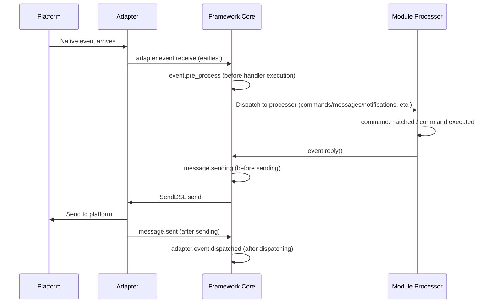

The framework provides the following built-in hook breakpoints, which users can listen to using `@sdk.lifecycle.on()` to implement custom logic.

### Core Initialization

| Hook Name | Trigger Timing | Data |
|---------|---------|------|
| `core.init.start` | SDK initialization starts | `{}` |
| `core.init.complete` | SDK initialization completes | `{"duration": float, "success": bool, "adapters": {"enabled": [str], "disabled": [str]}, "modules": {"enabled": [str], "disabled": [str]}, "error": str (only on failure)}` |
| `core.uninit.complete` | SDK uninitialization completes | `{"duration": float, "success": bool, "adapters_closed": int, "modules_unloaded": int, "module_properties_cleared": int, "module_properties_to_clear": [str], "error": str (only on failure)}` |

### Configuration Changes

| Hook Name | Trigger Timing | Data |
|---------|---------|------|
| `config.set` | A configuration item is modified | `{"key": str, "old_value": Any, "new_value": Any}` |
| `config.updated` | After detecting a full tree change from external editing of config.toml | `{"old_config": dict, "new_config": dict, "config_file": str}` |

**Example: Configuration Audit**

```python
@sdk.lifecycle.on("config.set")
def audit_config(data):
    print(f"[Audit] {data['key']}: {data['old_value']} -> {data['new_value']}")
```

### Module Lifecycle

| Hook Name | Trigger Timing | Data |
|---------|---------|------|
| `module.register` | Module class registered to manager | `{"module_name": str, "success": bool}` |
| `module.load` | Module loaded (instance created successfully) | `{"module_name": str, "success": bool}` |
| `module.init` | Module initialized (including lazy loading) | `{"module_name": str, "success": bool}` |
| `module.unload` | Module unloaded | `{"module_name": str, "success": bool}` |

### Adapter Lifecycle

| Hook Name | Trigger Timing | Data |
|---------|---------|------|
| `adapter.load` | Adapter registered | `{"platform": str, "success": bool}` |
| `adapter.start` | Adapter started | `{"platforms": [str]}` |
| `adapter.status.change` | Adapter status changes | `{"platform": str, "status": str, "retry_count": int, "error": str (only on failure)}` |
| `adapter.stop` | Adapter stopped | `{"platforms": [str]}` |
| `adapter.stopped` | Adapter stopped completely | `{"platforms": [str]}` |
| `adapter.bot.online` | Bot goes online | `{"platform": str, "bot_id": str, "info": dict, "status": str}` |
| `adapter.bot.offline` | Bot goes offline | `{"platform": str, "bot_id": str, "status": str}` |

### Event Reception and Processing

| Hook Name | Trigger Timing | Data |
|---------|---------|------|
| `adapter.event.receive` | External platform event received (earliest) | `{"platform": str, "event_type": str, "raw_event_type": str}` |
| `adapter.event.dispatched` | Event dispatching completes | `{"platform": str, "event_type": str, "raw_event_type": str, "onebot_handlers_count": int}` |
| `event.pre_process` | Before event handler execution begins | `{"event_type": str, "platform": str, "detail_type": str}` |

**Example: Event Counting**

```python
event_counter = {}

@sdk.lifecycle.on("adapter.event.receive")
def count_events(data):
    platform = data["platform"]
    event_counter[platform] = event_counter.get(platform, 0) + 1

@sdk.lifecycle.on("adapter.event.dispatched")
def log_unhandled(data):
    if data["onebot_handlers_count"] == 0:
        print(f"[Unhandled] {data['platform']}/{data['event_type']}")
```

### Message Sending

| Hook Name | Trigger Timing | Data |
|---------|---------|------|
| `message.sending` | Message about to be sent | `{"platform": str, "method": str, "detail_type": str, "target_id": str, "bot_id": str}` |
| `message.sent` | Message sent successfully | `{"platform": str, "method": str, "detail_type": str, "target_id": str, "bot_id": str}` |

**Example: Message Sending Audit**

```python
@sdk.lifecycle.on("message.sending")
def log_sending(data):
    print(f"[Sending] -> {data['platform']}/{data['detail_type']}/{data['target_id']} via {data['method']}")
```

### Command System

| Hook Name | Trigger Timing | Data |
|---------|---------|------|
| `command.matched` | Command matched and about to execute | `{"command": str, "args": list[str], "platform": str, "user_id": str}` |
| `command.executed` | Command execution completes | `{"command": str, "args": list[str], "platform": str, "user_id": str, "success": bool, "error": str (only on failure)}` |

**Example: Command Counting**

```python
@sdk.lifecycle.on("command.matched")
def count_commands(data):
    print(f"[Command] /{data['command']} from {data['user_id']}@{data['platform']}")
```

### HTTP Routing

| Hook Name | Trigger Timing | Data |
|---------|---------|------|
| `server.request` | HTTP request received | `{"method": str, "path": str, "client_ip": str}` |
| `server.response` | HTTP response sent | `{"method": str, "path": str, "status_code": int, "client_ip": str}` |

**Example: Request Logging**

```python
@sdk.lifecycle.on("server.response")
def log_http(data):
    print(f"[HTTP] {data['method']} {data['path']} -> {data['status_code']}")
```

### WebSocket

| Hook Name | Trigger Timing | Data |
|---------|---------|------|
| `server.start` | Routing server started | `{"base_url": str, "host": str, "port": int}` |
| `server.stop` | Routing server stopped | `{}` |
| `server.websocket.connect` | WebSocket connection established | `{"path": str, "module_name": str, "client_ip": str}` |
| `server.websocket.disconnect` | WebSocket connection closed | `{"path": str, "module_name": str, "reason": str, "error": str (only on abnormal closure)}` |

**Example: WebSocket Connection Monitoring**

```python
@sdk.lifecycle.on("server.websocket.connect")
def on_ws_connect(data):
    print(f"[WS] Connected: {data['path']} from {data['client_ip']}")

@sdk.lifecycle.on("server.websocket.disconnect")
def on_ws_disconnect(data):
    print(f"[WS] Disconnected: {data['path']} ({data['reason']})")
```

## Standard Event Definitions

```python
STANDARD_EVENTS = {
    "core": ["init.start", "init.complete", "uninit.complete"],
    "module": ["load", "init", "unload", "register"],
    "adapter": [
        "load", "start", "status.change", "stop", "stopped",
        "event.receive", "event.dispatched",
        "bot.online", "bot.offline",
    ],
    "server": [
        "start", "stop",
        "request", "response",
        "websocket.connect", "websocket.disconnect",
    ],
    "event": ["pre_process"],
    "message": ["sending", "sent"],
    "command": ["matched", "executed"],
    "config": ["set"],
}
```

## Complete API Reference

### Registration and Unregistration

| Method | Description |
|------|------|
| `@lifecycle.on(event, *, priority=0)` | Decorator-based handler registration |
| `lifecycle.register(event, handler, *, priority=0)` | Programmatic registration |
| `lifecycle.unregister(event, handler=None)` | Unregister (if handler=None, unregister all handlers for this event) |

### Triggering

| Method | Description |
|------|------|
| `await lifecycle.emit(event, data=None)` | Asynchronous trigger, handler returning non-None modifies data |
| `lifecycle.emit_sync(event, data=None)` | Synchronous trigger, asynchronous handlers scheduled with create_task |
| `await lifecycle.submit_event(event_type, *, source, msg, data)` | Backward compatible, automatically constructs standard event format |

### Utilities

| Method | Description |
|------|------|
| `lifecycle.start_timer(timer_id)` | Start timing |
| `lifecycle.get_duration(timer_id)` | Get elapsed time (in seconds) |
| `lifecycle.stop_timer(timer_id)` | Stop timing and return elapsed time |
| `lifecycle.list_hooks()` | List all registered hooks and handler counts |
| `lifecycle.clear()` | Clear all handlers and timers |

## Example Usage in Modules

```python
from ErisPulse.Core.Bases import BaseModule
from ErisPulse import sdk

class Main(BaseModule):
    async def on_load(self, event):
        # Implement simple message counting
        self.msg_count = 0
        
        @sdk.lifecycle.on("adapter.event.receive")
        async def count(data):
            if data["event_type"] == "message":
                self.msg_count += 1
        
        # Monitor all commands
        @sdk.lifecycle.on("command.matched")
        async def log_cmd(data):
            sdk.logger.info(f"Command executed: /{data['command']} by {data['user_id']}")
        
        # Configuration change audit
        @sdk.lifecycle.on("config.set")
        def audit(data):
            sdk.logger.info(f"Configuration change: {data['key']} = {data['new_value']}")
```

## Background Task Ownership and Automatic Cancellation

> [!NOTE]
> This feature requires ErisPulse **2.8.0+**.

Background tasks created by modules that are not canceled in `on_unload` will hold a reference to `self`, preventing the module instance from being recycled (residual old instances after hot reload). The framework provides the following fallback mechanism:

- **`self.spawn(coro)`** (recommended within modules): Tasks are automatically assigned to the module name, and when the module is unloaded, the framework cancels unfinished tasks after `on_unload` and logs a warning.
- **`spawn_background(coro)`** (`ErisPulse.runtime`): Automatically captures the current `owner_scope` context; `cancel_owner_tasks(owner)` cancels tasks by assignment, `cancel_all_background_tasks()` is used as a fallback in `sdk.uninit()`.
- **Adapters**: When closing, background tasks under the platform name are also canceled as a fallback.

```python
async def on_load(self, event):
    # Recommended: Use self.spawn() for background tasks, framework automatically cancels them as a fallback when unloaded
    self.spawn(self._poll())

async def on_unload(self, event):
    # For fine-grained control, still recommend manually canceling and waiting for completion
    if self._poll_task:
        self._poll_task.cancel()
        await asyncio.gather(self._poll_task, return_exceptions=True)

async def _poll(self):
    while True:
        await asyncio.sleep(60)
        ...
```

> [!IMPORTANT]
> The framework's fallback is a **forced cancel** (`cancel_owner_tasks`), which occurs after `on_unload` returns. Therefore, tasks requiring graceful termination (flushing buffers, persisting state, closing connections) **must** be manually `cancel()` and `await`ed in `on_unload`—do not rely on the fallback to preserve termination logic. The framework only guarantees that tasks holding a reference to `self` are cleaned up, not that they terminate gracefully. For tasks requiring `await` results, directly `await` them, do not delegate them to background tasks.

## Notes

1. **Handlers can be synchronous or asynchronous**: The system automatically recognizes and correctly calls them.
2. **Data passing**: In `emit()` mode, if a handler returns a non-None value, it modifies the data passed to subsequent handlers.
3. **Event naming conventions**: It is recommended to use dot-structure naming for events to facilitate using parent event listeners.
4. **Error isolation**: An exception in a single handler does not affect the execution of other handlers.
5. **Synchronous triggering limitation**: In `emit_sync()`, asynchronous handlers are scheduled in a fire-and-forget manner, and their return values cannot be returned.
6. **Lifecycle cleanup**: When `sdk.uninit()` is called, all registered handlers and timers are cleared.
7. **Loading priority**: If you need to listen to events during the framework initialization phase, it is recommended to set a high priority and disable lazy loading.


### 懶加载系统

# Lazy-Loaded Module System

The ErisPulse SDK provides a powerful lazy-loaded module system that allows modules to be initialized only when they are actually needed, significantly improving application startup speed and memory efficiency.

## Overview

The lazy-loaded module system is one of the core features of ErisPulse, which works as follows:

- **Lazy Initialization**: Modules are only loaded and initialized when they are first accessed.
- **Transparent Usage**: For developers, lazy-loaded modules are almost indistinguishable from regular modules in usage.
- **Automatic Dependency Management**: Module dependencies are automatically initialized when they are used.
- **Lifecycle Support**: For modules that inherit from `BaseModule`, lifecycle methods are automatically invoked.

## Working Principle

### LazyModule Class

The core of the lazy loading system is the `LazyModule` class, which acts as a wrapper that actually initializes the module only when it is first accessed.

### Initialization Process

When a module is first accessed, `LazyModule` performs the following operations:

1. Retrieves the `__init__` parameter information of the module class.
2. Determines whether to pass the `sdk` reference based on the parameters.
3. Sets the `moduleInfo` attribute of the module.
4. For modules that inherit from `BaseModule`, calls the `on_load` method.
5. Triggers the `module.init` lifecycle event.

## Event-Driven Lazy Activation (`activate_on`)

> [!NOTE]
> This feature requires ErisPulse **2.8.0+**.

Modules with `lazy_load=True` are loaded only on their **first attribute access** by default. If a module registers command/event handlers, the traditional approach would require `lazy_load=False` to load immediately. `activate_on` provides a third option: **declare triggers, and the module activates automatically when the first matching event/command arrives**—neither staying in memory constantly nor losing the trigger entry.

```python
from ErisPulse.loaders import ModuleLoadStrategy

class MyModule(BaseModule):
    @staticmethod
    def get_load_strategy():
        return ModuleLoadStrategy(
            lazy_load=True,
            activate_on=[
                # ---- Event triggers (passive arrival, no user awareness) ----
                "message",                                    # Type-level: any message event
                {"notice": "group_member_increase"},          # Type + single detail_type
                {"message": ["private", "group"]},            # Type + multiple detail_types

                # ---- Command triggers (active input, placeholder commands visible in Help) ----
                {"command": "roll"},                          # Shorthand: command name
                {"command": ["roll", "dice"]},                # List of command names
                {"command": {                                 # Dict declaration (name required)
                    "name": "dice",
                    "help": "Roll a dice",
                    "usage": "/dice",
                    "group": "Entertainment",
                    "aliases": ["d"],
                    "hidden": False,
                }},
            ],
        )
```

### Command Dict Declaration Parameters

The dict form mirrors the user-level parameters of the `@command()` decorator, used to register placeholder commands before module loading:

| Parameter | Type | Default | Description |
|-----------|------|---------|-------------|
| `name` | `str` | **Required** | Command name; must match `@command(name)` in `on_load`, otherwise the placeholder is unregistered after activation, and the command becomes unavailable |
| `help` | `str` | Fallback chain | Description shown in Help; if not declared, falls back to the chain (see below) |
| `usage` | `str` | Auto-generated | Usage line, defaulting to `{prefix}{name}` |
| `group` | `str` | `None` | Command group |
| `aliases` | `list[str]` | `[]` | Aliases are registered simultaneously; **inputting an alias also triggers activation** |
| `hidden` | `bool` | `False` | If `True`, the placeholder command is hidden (aligned with the hidden semantics of the activated real command); users who know the command name can still trigger activation |

**Not supported**: `priority` / `permission` / `master`: The placeholder command's role is only to trigger activation. Permission checks are performed by the real command after activation (blocking permissions at the placeholder stage would make "activating on command input" ineffective).

### Placeholder Command Help Fallback Chain

When the module is not loaded, the Help displays command descriptions according to the following priority (first match wins):

1. The command-level `help` declared in the dict (most precise)
2. The module's `get_meta()` `description`
3. The module's `__description__` attribute
4. The package metadata's `Summary` (PyPI package summary)
5. Generic prompt: "This command comes from a lazy-loaded module X. The module will be automatically loaded on first use."

### Trigger Semantics

- **Event stub**: Registered to the corresponding event manager with very low priority (`ACTIVATION_STUB_PRIORITY`), acting as a fallback after all regular handlers; after activation, the current event is forwarded to the module's real handler
- **Command stub**: Registers a placeholder command; after activation, the placeholder is unregistered, and the real command takes over the current trigger
- **Reentrancy protection**: An `asyncio.Lock` ensures activation occurs only once, even under concurrent triggers
- **Scope filtering**: The stub includes the module owner identity, and does not trigger if the module is not enabled for the Bot / session / platform
- **Failure semantics**: Activation failure does not retry; the stub is also unregistered
- **Deduplication**: When mixing shorthand and dict declarations of the same command name, deduplication occurs (dict takes precedence); if the dict is missing `name` or the event `detail_type` is incorrectly written as a dict, a warning is issued and it is ignored

> For architecture diagrams and full semantics, see [Architecture Overview](../architecture.md#event-driven-lazy-activationactivate_on-trigger-architecture).

## Configuring Lazy Loading

### Global Configuration

Enable or disable global lazy loading in the configuration file:

```toml
[ErisPulse.framework]
enable_lazy_loading = true  # true=enable lazy loading (default), false=disable lazy loading
```

### Module-Level Control

Modules can control their loading strategy by implementing the `get_load_strategy()` static method:

```python
from ErisPulse.Core.Bases import BaseModule
from ErisPulse.loaders import ModuleLoadStrategy

class MyModule(BaseModule):
    @staticmethod
    def get_load_strategy():
        """Returns the module loading strategy"""
        return ModuleLoadStrategy(
            lazy_load=False,  # Return False to indicate immediate loading
            priority=100      # Loading priority, higher value means higher priority
        )
```

## Using Lazy-Loaded Modules

### Basic Usage

For developers, lazy-loaded modules are almost indistinguishable from regular modules in usage:

```python
# Accessing a lazy-loaded module through the SDK
from ErisPulse import sdk

# The following access triggers the module's lazy loading
result = await sdk.my_module.my_method()
```

### Unified Module Access Entry

Whether accessed through SDK attributes, module manager attributes, or via `module.get()`, for "registered but not yet loaded" lazy-loaded modules, the same lazy-loading proxy is returned. Accessing its attributes triggers the actual initialization:

```python
# All three methods return the same lazy-loading proxy (when the module is not loaded), behaving consistently and transparently to the user
sdk.my_module          # Entry point that triggers loading
sdk.module.my_module   # Also returns the lazy-loading proxy
sdk.module.get("my_module")  # Also returns the lazy-loading proxy, itself does not trigger loading

# Accessing any attribute of the proxy triggers the actual initialization of the module
result = await sdk.my_module.my_method()
```

`module.get()` is a **query** interface and does not trigger loading by itself:
- If the module is already loaded → returns the actual instance
- If the module is registered but not yet loaded → returns the lazy-loading proxy (initialization occurs when an attribute is accessed)
- If the module is not registered → returns `None`

To explicitly trigger loading, use `await sdk.load_module("my_module")`.

### Asynchronous Initialization

For modules requiring asynchronous initialization, it is recommended to load them explicitly first:

```python
# Explicitly load the module first
await sdk.load_module("my_module")

# Then use the module
result = await sdk.my_module.my_method()
```

### Synchronous Initialization

For modules that do not require asynchronous initialization, you can access them directly:

```python
# Direct access will automatically initialize synchronously
result = sdk.my_module.some_sync_method()
```

## Best Practices

When choosing a loading strategy, you can refer to the following decision flow:

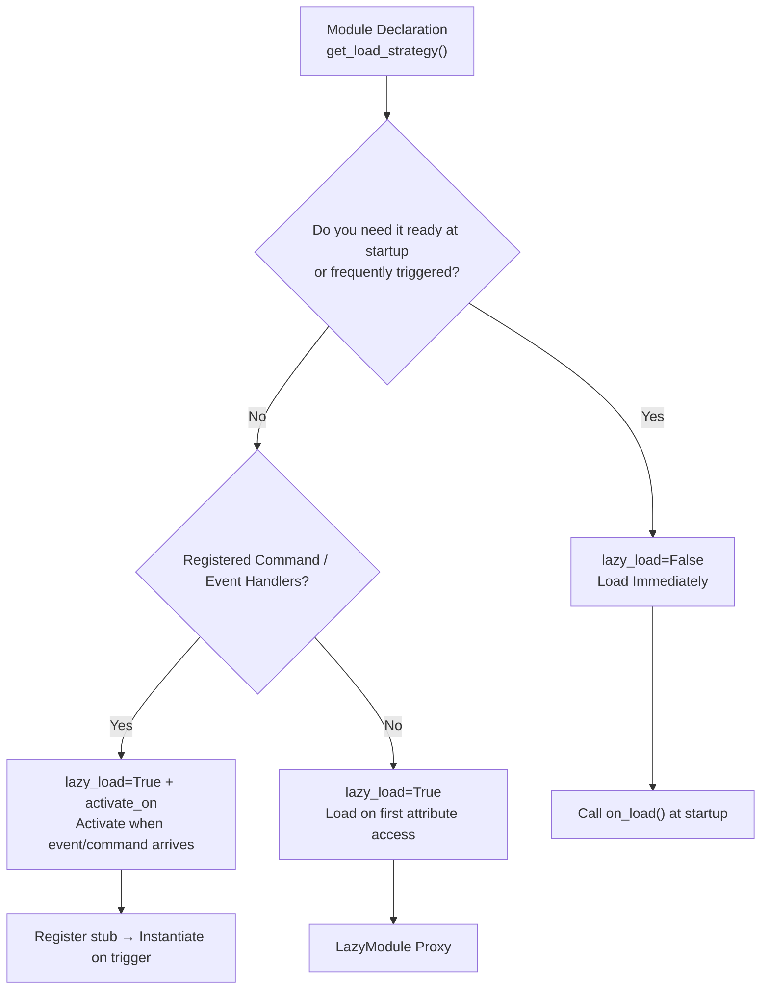

### Recommended Scenarios for Lazy Loading (lazy_load=True)

- Passive utility modules (e.g., data query modules, format converters, etc., which are only needed when called by other modules)
- Modules that register command/event handlers but are not frequently used — use `activate_on` to declare triggers, and activate automatically when the first matching event/command arrives, without giving up lazy loading

### Recommended Scenarios for Disabling Lazy Loading (lazy_load=False)

- Modules that need to be ready immediately at startup (e.g., core modules that provide foundational services to other modules)
- High-frequency listeners (e.g., every message must be processed) — `activate_on` forwarding has some activation overhead, so immediate loading is more direct in high-frequency scenarios
- Scheduled task modules
- Modules that need to be initialized at application startup

> The `priority` parameter controls the initialization order of immediately loaded modules; higher values are initialized first. Modules with the same priority are loaded in registration order.

## Notes

1. If your module uses lazy loading, and other modules have never been called within ErisPulse, your module will never be initialized.
2. If your module contains modules that listen for Events, or other actively listening modules, you have two options: declare an `activate_on` trigger (to keep lazy loading and automatically activate when the event arrives), or declare that it needs to be loaded immediately (`lazy_load=False`), otherwise it may affect the normal operation of your module.
3. We do not recommend disabling lazy loading unless there is a special requirement, otherwise it may cause issues such as dependency management and lifecycle events.
4. In the `activate_on` command dict declaration, `name` must be consistent with the actual command name registered in the module's `on_load` with `@command()`—otherwise, after the module is activated, the placeholder command will be unregistered, and a command with inconsistent declaration and implementation will not exist.


### 国际化（i18n）系统

# Internationalization (i18n) System

ErisPulse v2.5.0 includes full internationalization support. Both the framework core and CLI interface can automatically switch display text according to your system language, and external modules can also register their own translations.

## Supported Languages

| Language | Code | Description |
|------|------|------|
| Simplified Chinese | `zh-CN` | Default language (native framework language) |
| Traditional Chinese | `zh-TW` | Traditional Chinese (Hong Kong/Macau/Taiwan) |
| English | `en` | English (general fallback language) |
| 日本語 | `ja` | Japanese |
| Русский | `ru` | Russian |

## Quick Experience

### Switch via Environment Variable

```bash
# Windows PowerShell
$env:ERISPULSE_LANG = "en"
epsdk run

# macOS / Linux
ERISPULSE_LANG=ja epsdk run
```

### Switch via Configuration File

Add to `config/config.toml`:

```toml
[ErisPulse.i18n]
language = "zh-TW"
```

Set to `"auto"` (default) to automatically detect system language.

### Switch Manually in Code

```python
from ErisPulse import i18n

# Manually set language
i18n.set_language("en")
print(i18n.get_language())  # "en"

# Reset to auto-detect
i18n.reset_language()
```

---

## Language Detection Mechanism

The framework detects user language with the following priority:

1. **Environment variable `ERISPULSE_LANG`** — Highest priority, for testing and temporary switching
2. **Windows API** — `GetUserDefaultLocaleName` (Windows only, not affected by tools like Git Bash that override `LANG`)
3. **Environment variables** — `LANGUAGE` > `LC_ALL` > `LC_MESSAGES` > `LANG` (Unix/macOS standard)
4. **System Locale** — `locale.getlocale()` / `locale.getdefaultlocale()`
5. **Fallback** — en (English)

### Nearest Mapping Principle

When detected language does not match exactly, map to the nearest supported language:

- `zh-TW`, `zh-HK`, `zh-MO`, `zh-Hant` → **Traditional Chinese**
- All other `zh-*` (e.g. `zh-CN`, `zh-SG`) → **Simplified Chinese**
- `en-US`, `en-GB`, `en-AU` etc. → **English**
- `ja-JP` → **Japanese**
- `ru-RU` → **Russian**
- Other unrecognized languages → **Simplified Chinese (fallback)**

---

## Using i18n in Modules

You can register translation text for your own modules to make them support multiple languages.

### Recommended Approach: Declare Translation Keys via I18nClass (v2.7.0+)

From v2.7.0, modules/adapters can declare translation keys by nesting the `I18nClass` class, similar to declaring a `ConfigClass`. The framework will **automatically register** all declared translation keys without requiring manual `i18n.register()` calls.

```python
from dataclasses import dataclass, field

from ErisPulse.Core.Bases import BaseConfig, BaseI18n, BaseModule, I18nKey


class MyModule(BaseModule):
    # Configuration class (optional)
    @dataclass
    class ConfigClass(BaseConfig):
        welcome_msg: str = field(
            default="欢迎",
            metadata={
                # Reference i18n key mymodule.welcome_msg here
                "description": {"i18n": "mymodule.welcome_msg", "default": "Welcome message"},
            },
        )

    # Translation key collection class (optional)
    # Declared keys will be automatically registered by the framework, with higher priority than default configuration generated from ConfigClass
    class I18nClass(BaseI18n):
        # Property names are automatically concatenated into full key paths: <module name>.<property name>
        welcome_msg: I18nKey = I18nKey(
            default="Welcome Message",   # Language-agnostic fallback, not registered to any language
            zh_CN="欢迎消息",
            en="Welcome Message",
            ja="ウェルカムメッセージ",
            ru="Приветственное сообщение",
            zh_TW="歡迎訊息",
        )
        # Other business-related translation keys
        hello: I18nKey = I18nKey(
            default="Hello, {name}!",
            zh_CN="你好，{name}！",
            zh_TW="你好，{name}！",
            en="Hello, {name}!",
            ja="こんにちは、{name}！",
            ru="Привет, {name}!",
        )

        # You can also explicitly specify the full key path (not using property name concatenation)
        custom: I18nKey = I18nKey(
            key="mymodule.deep.nested.key",
            default="Default text",
            zh_CN="默认文本",
            zh_TW="預設文本",
            en="Default text",
            ja="デフォルトテキスト",
            ru="Текст по умолчанию",
        )
```

#### Why is I18nClass Recommended?

| Scenario | Manual i18n.register() | I18nClass Declarative |
|------|-----------------------|------------------|
| Configuration description referencing i18n keys | Need manual registration, and must be done before configuration generation | Framework automatically registers before configuration generation |
| Multi-language translation declaration | Scattered in various on_load() methods | Centralized in class, clearly visible |
| Key naming consistency | Prone to spelling errors | Property names as key suffixes, IDE can auto-complete |
| Unloading cleanup | Need manual unregister_domain() | Framework uses unified domain registration |

#### I18nClass Key Path Rules

- **Default**: Use ``<module registration name>.<property name>`` as the full key path
  - Example: Module name is ``MyModule``, property ``welcome`` → key path ``MyModule.welcome``
- **Explicit**: Use the ``I18nKey(key="...")`` parameter to specify any dot-separated path
  - Suitable for deeply nested key names (e.g. ``mymodule.config.basic.token``)

#### Using in Adapters

Adapters also support `I18nClass`, with identical usage:

```python
from ErisPulse.Core import BaseAdapter
from ErisPulse.Core.Bases import BaseConfig, BaseI18n, I18nKey


class MyAdapter(BaseAdapter):
    @dataclass
    class ConfigClass(BaseConfig):
        endpoint: str = field(
            default="",
            metadata={
                # Configuration description references adapter.MyAdapter.endpoint key
                "description": {"i18n": "MyAdapter.endpoint", "default": "API address"},
            },
        )

    class I18nClass(BaseI18n):
        # Central declaration of configuration description referenced keys and other business keys' multilingual translations
        endpoint: I18nKey = I18nKey(
            default="API Endpoint",
            zh_CN="API address",
            zh_TW="API address",
            en="API Endpoint",
            ja="API address",
            ru="API address",
        )
```

The `I18nClass` of adapters is automatically registered during the `__init__` phase (before configuration template generation), ensuring that i18n keys referenced in configuration descriptions are available.

### Manual Registration of Custom Translations (Old Approach)

If you do not use `I18nClass`, you can directly call `i18n.register()` to register translation text.

```python
from ErisPulse import i18n

# Register Chinese translations
i18n.register("zh-CN", {
    "my_module.welcome": "Welcome to my module!",
    "my_module.goodbye": "Goodbye!",
    "my_module.hello": "Hello, {name}!",
}, domain="my_module")

# Register English translations
i18n.register("en", {
    "my_module.welcome": "Welcome to my module!",
    "my_module.goodbye": "Goodbye!",
    "my_module.hello": "Hello, {name}!",
}, domain="my_module")
```

### Using Translations

```python
from ErisPulse import i18n

# Simple translation
i18n.t("my_module.welcome")  # Automatically uses current language

# With formatted parameters
i18n.t("my_module.hello", name="Alice")

# Specify default value (returns when translation key does not exist)
i18n.t("my_module.unknown_key", default="Default text")
```

### Using in Module Classes

```python
from dataclasses import dataclass, field
from ErisPulse import i18n
from ErisPulse.Core.Bases import BaseConfig, BaseModule

@dataclass
class MyModuleConfig(BaseConfig):
    welcome_msg: str = field(
        default="欢迎",
        metadata={
            "description": {"i18n": "my_module.welcome_msg", "default": "Welcome message"},
            "ui": {"widget": "text", "group": "basic", "order": 1},
        },
    )

class MyModule(BaseModule):
    ConfigClass = MyModuleConfig

    async def on_load(self, event):
        # Real-time configuration access (reflects latest value on each access)
        self.logger.info(self.cfg.welcome_msg)
        self.logger.info(i18n.t("my_module.welcome"))

    @command("hello")
    async def hello_handler(self, event):
        name = event.get_user_nickname() or "friend"
        await event.reply(i18n.t("my_module.hello", name=name))

    async def on_unload(self, event):
        pass
```

### Unregistering Translations

```python
# Unregister all translations in a domain
i18n.unregister_domain("my_module")
```

---

## Multi-language Configuration Fields

From v2.5.2, configuration Schema fully supports i18n. All user-visible text fields can reference i18n keys, and WebUI and other consumers will automatically resolve them into corresponding text based on the current language.

### Supported i18n Fields

| Field | Location | Description |
|------|------|------|
| `description` | field metadata | Field description |
| `options[].label` | `ui.options` | Select control option labels |
| `placeholder` | `ui.placeholder` | Input box placeholder |
| `group_labels` | `_schema_meta` | Group display names (Dashboard partition titles) |

All use the `{"i18n": "key", "default": "text"}` format. Pure strings are passed through as-is (for backward compatibility).

### Declaring i18n Fields

All user-visible text fields support i18n:

```python
from dataclasses import dataclass, field
from ErisPulse.Core.Bases import BaseConfig

@dataclass
class MyAdapterConfig(BaseConfig):
    # description i18n
    token: str = field(
        default="",
        metadata={
            "description": {"i18n": "my_adapter.token", "default": "Platform Token"},
            "required": True,
            "secret": True,
            "ui": {
                "widget": "password",
                "group": "basic",
                "order": 1,
                # placeholder i18n
                "placeholder": {"i18n": "my_adapter.token.ph", "default": "Enter Token"},
            },
        },
    )
    # options label i18n
    mode: str = field(
        default="a",
        metadata={
            "description": {"i18n": "my_adapter.mode", "default": "Operation mode"},
            "ui": {
                "widget": "select",
                "group": "basic",
                "order": 2,
                "options": [
                    {"label": {"i18n": "my_adapter.mode.a", "default": "Mode A"}, "value": "a"},
                    {"label": {"i18n": "my_adapter.mode.b", "default": "Mode B"}, "value": "b"},
                ],
            },
        },
    )

    # group_labels i18n (group display names)
    _schema_meta = {
        "group_labels": {
            "basic": {"i18n": "my_adapter.group.basic", "default": "Basic Settings"},
        }
    }
```

`default` is the fallback text—shown when translation is not registered or lookup fails.

### Secret Masking and Configuration Validation

Fields marked as `"secret": True` will automatically receive **masking protection** (from v2.7.0):

- **Template generation masking**: When `dataclass_to_toml_with_comments()` generates configuration templates, secret fields' real values are not written to the file (displaying empty placeholders), preventing sensitive information from being written to disk
- **General masking utility**: `redact_secret(value)` replaces non-empty values with `***`, returning empty values as-is, suitable for scenarios like logging output

```python
from ErisPulse.Core.Bases.config_schema import redact_secret

redact_secret("sk-xxxxxx")  # '***'
redact_secret("")           # ''
```

**Configuration validation** (`validate_config()`) supports additional checks beyond `required` non-empty checks (from v2.7.0):

| Validation | Metadata | Example |
|--------|--------|------|
| Type matching | Field declaration type | `int` field passed a string raises an error |
| Enum constraint | `ui.options` or top-level `options` | Value must be among allowed options |
| Numeric range | Top-level `min` / `max` | `metadata={"min": 1, "max": 65535}` |

```python
from ErisPulse.Core.Bases.config_schema import validate_config

@dataclass
class C(BaseConfig):
    mode: str = field(default="a", metadata={"ui": {"widget": "select", "options": ["a", "b"]}})
    port: int = field(default=80, metadata={"min": 1, "max": 65535})

errors = validate_config(C(mode="x", port=70000))  # Two errors: enum + range
```

### Registering Configuration Translations

Configuration field i18n keys and regular translation keys are registered the same way using `i18n.register()`:

```python
from ErisPulse import i18n

# Register Chinese (same as default, but can differ)
i18n.register("zh-CN", {
    "my_adapter.token": "Platform Token",
}, domain="my_adapter")

# Register English
i18n.register("en", {
    "my_adapter.token": "Platform Token",
}, domain="my_adapter")
```
> **Recommended approach**: Use `I18nClass` to declare translation keys, and the framework will automatically register them (see the "Recommended approach" section above), eliminating the need to manually call `i18n.register()` or `register_config_i18n()`.

A convenient function `register_config_i18n()` is also provided, which automatically extracts keys from the configuration class and registers them:

```python
from ErisPulse.Core.Bases.config_schema import register_config_i18n

# Automatically extract description.default as zh-CN translation
register_config_i18n(MyAdapterConfig, "zh-CN")

# Manually provide English translation
register_config_i18n(MyAdapterConfig, "en", {
    "my_adapter.token": "Platform Token",
})
```

### How WebUI Consumes

`get_config_schema()` returns a schema where the i18n dictionary is passed through as-is. The WebUI frontend can use `i18n.t()` to resolve based on the current language.

If you need the server to directly resolve into strings (e.g., for frontends that do not support i18n), use `resolve_config_schema()`, which resolves `description`, `options[].label`, `placeholder`, and `group_labels` into the current language's text:

```python
from ErisPulse.Core.Bases.config_schema import resolve_config_schema

# All i18n fields are resolved into the current language's string
schema = resolve_config_schema(MyAdapterConfig)
print(schema["fields"]["token"]["description"])    # "Platform Token" or "Platform Token"
print(schema["fields"]["token"]["placeholder"])   # "Enter Token" or "Enter Token"
print(schema["fields"]["mode"]["options"][0]["label"])  # "Mode A" or "Mode A"
print(schema["group_labels"]["basic"])             # "Basic Settings" or "Basic"
```

> `BaseConfig`, `BotAccountConfig`, `register_config_i18n()`, `resolve_config_schema()`
> and other types and utility functions are actually defined in `ErisPulse.Core.Bases.config_schema`.
> `ErisPulse.runtime.config_schema` is retained as a compatibility shim,
> **recommended to import uniformly from `ErisPulse.Core.Bases`** (except for i18n translation key related types,
> which are located in `ErisPulse.Core.Bases.i18n_schema`).

## API Reference

### I18nManager

#### Core Methods

| Method | Description |
|------|------|
| `t(key, default=None, **kwargs)` | Get translated text (`gettext()` is an alias) |
| `set_language(lang)` | Manually set language |
| `get_language()` | Get current language |
| `reset_language()` | Reset to auto-detection (and re-detect environment) |
| `get_supported_languages()` | Get list of all supported languages |
| `has_translation(key, lang=None)` | Check if translation key exists |
| `register(lang, translations, domain)` | Register custom translations |
| `unregister_domain(domain)` | Unload all translations in specified domain |
| `reload()` | Reload built-in translations and re-detect language |

#### `t()` Method Details

```python
def t(self, key, /, default=None, **kwargs):
```

- `key` — Translation key (positional argument only, does not conflict with `**kwargs`'s `key=`)
- `default` — Default value returned when translation does not exist, default is `None` (returns key name itself)
- `**kwargs` — Formatting parameters, used to fill placeholders in translation values

Example:

```python
# Translation definition: "greeting": "你好，{name}！欢迎来到{place}。"
i18n.t("greeting", name="Alice", place="ErisPulse")
# Returns: "你好，Alice！欢迎来到ErisPulse。"
```

### BaseI18n / I18nKey (Declarative Translation Keys)

Starting from v2.7.0, `ErisPulse.Core.Bases` provides a translation key declaration tool based on class attributes (recommended to import uniformly from `ErisPulse.Core.Bases`):

> ``I18nKey.default`` is a **language-agnostic fallback text** and is not registered to any language.
> To make translations effective, at least one language parameter must be explicitly passed (``zh_CN=`` / ``en=`` / ``ja=`` etc.).
> This allows developers from various countries to freely use their native language to fill in ``default``, with no assumptions made by the framework.

| Name | Description |
|------|------|
| `I18nKey(default, *, key=None, zh_CN, zh_TW, en, ja, ru)` | Declaration of a single translation key, `default` is a language-agnostic fallback |
| `BaseI18n` | Translation key collection base class (naming aligned with `BaseConfig`), sub-classes declare multiple `I18nKey` via class attributes |
| `BaseI18n.register(prefix="", domain="app")` | Class method: register all declared keys to the i18n system |
| `key` | Alias for `I18nKey` (more concise writing)

Usage example:

```python
from ErisPulse.Core.Bases import BaseI18n, key

class MyKeys(BaseI18n):
    # Concise alias writing
    hello = key(
        default="Hello",
        zh_CN="你好",
        zh_TW="你好",
        en="Hello",
        ja="こんにちは",
        ru="Привет",
    )
    bye = key(
        default="Bye",
        zh_CN="再见",
        zh_TW="再見",
        en="Bye",
        ja="さようなら",
        ru="До свидания",
    )

# Standalone use (manual registration)
MyKeys.register(prefix="myapp.", domain="myapp")
```

### Accessing from SDK Instance

```python
from ErisPulse import sdk

# sdk.i18n is the same object as directly imported i18n
sdk.i18n.set_language("en")
print(sdk.i18n.t("core.sdk.init.starting"))
```

---

## Runtime Configuration

### Reading i18n Configuration via Configuration API

```python
from ErisPulse.Core.Bases import I18nConfig
from ErisPulse.runtime import get_i18n_config

config = get_i18n_config()
print(config["language"])  # "auto" or specific language code

# I18nConfig is a dataclass, suitable for generating configuration templates
schema = I18nConfig.__dataclass_fields__
```

### Configuration Item Description

In the `[ErisPulse.i18n]` section of `config/config.toml`:

```toml
[ErisPulse.i18n]
# Display language, possible values:
# - "auto"      — Auto-detect system language (default)
# - "zh-CN"     — Simplified Chinese
# - "zh-TW"     — Traditional Chinese
# - "en"        — English
# - "ja"        — Japanese
# - "ru"        — Russian
language = "auto"
```

---

## Best Practices

### Translation Key Naming

It is recommended to use dot-separated namespace format:

```
<module name>.<category>.<description>
```

For example: `my_module.command.hello_desc`, `core.adapter.start_failed`

### Multi-language Coverage

There is no need to provide translations for all languages at once; missing languages will automatically fall back to English, and if English is also missing, the key name itself will be displayed.

### Dynamic Content

For dynamically generated content (such as usernames, quantities, etc.), use `{placeholder}` formatting:

```python
# Translation definition
"user_count": "Current online users: {count} people"

# Usage
i18n.t("user_count", count=len(users))
```

### Log Messages

If your module uses the framework's Logger, these messages will also automatically use the current language:

```python
self.logger.info(i18n.t("my_module.startup"))
```

---

## Relationship with CLI i18n

The CLI has an **independent** internationalization module (`ErisPulse.CLI.i18n`), which is completely decoupled from the framework core's internationalization module.

- **Core i18n** — Used by framework core modules, external modules can register translations
- **CLI i18n** — Used internally by the command-line interface, does not share translation data with Core

This design ensures that changes to CLI translations do not affect the stability of the framework core.


### 统一控制面（scope）

# Scope

> [!NOTE]
> This feature requires ErisPulse **2.8.0+**.

Scope answers four questions: **which modules are available, who receives events, what text a module processes, and what a module can do externally**.  
The control is entirely given to the user: the **upper layer** (configured via `ErisPulse.scope` or runtime `sdk.scope`) that registers modules / adapters / processors / outbound calls declares these uniformly. The event pipeline automatically reads and executes these configurations at entry, processor filtering, and outbound gateways.

| Dimension | Controls What | Rejection Behavior | Configuration Path |
|-----------|---------------|--------------------|--------------------|
| **① Module** | Which modules are available (platform / Bot / session three levels) | Silent ignore (no reply, no claim) | `scope.platforms / bots / sessions` |
| **② Identity** | Whether to receive events (adapter / Bot / session / user four levels) | Complete discard at entry (silent) | `scope.identity.*` |
| **③ Outbound** | Which outbound calls a module can initiate (messages / API / requests, method-level white/blacklists) | Failure response (`retcode=34601`) | `scope.actions` |

> **Related Systems**: Commands are special message event processors, and their user allow/deny lists (ACL) and implementation parameter overrides are self-managed by the command system (`ErisPulse.event.command`). See [Event Handling Introduction](../getting-started/event-handling.md) and [Configuration Guide](../user-guide/configuration.md).

{!--< tips >!--}
1. Import the singleton via `from ErisPulse.Core import scope` (same object as `sdk.scope`)
2. Check permissions: `scope.is_allowed(...)` / `scope.is_identity_allowed(...)` / `scope.is_action_allowed(...)` correspond to the three gates ①②③
3. Read/Write: Dimensional parameter methods (IDE can auto-complete) — `scope.set_module(...)` / `scope.set_identity(...)` / `scope.set_action(...)`; there are also dictionary-style fallback methods `scope.get(path)` / `scope.set(path, v)` / `scope.delete(path)`
4. Event processor text condition overrides are described in [Event Handling Introduction · Event Overriding](../getting-started/event-handling.md#event-overriding-does-not-change-module-code-to-override-the-behavior-of-any-event-type); command ACL / parameter overrides are described in [Event Handling Introduction](../getting-started/event-handling.md)
{!--< /tips >!--}

## Matching Entry Syntax (Unified Across the System)

All "name lists" (module names, identity keys, outbound entries) across the scope share the same matching syntax (`ErisPulse.Core.text_match`):

| Syntax | Example | Description |
|--------|---------|-------------|
| Exact Name | `"Chat"` | Full value comparison, **case-insensitive** |
| Glob | `"Tool*"` or `"spam_*"` | `*` matches any string / `?` matches any single character / `[seq]` matches any character in the set, case-insensitive |
| Regular Expression | `"re:^Danger.*"` | Declared with `re:` prefix, uses regex `search` matching, case-insensitive by default |

- Invalid regular expressions **silently degrade** to "no match" (no error thrown, no crash)
- Decorator parameters (`pattern=` / `regex=`) have fixed semantics: `pattern` is glob, `regex` is the raw regex source (without `re:` prefix); regular expression entries in scope configurations **must** include the `re:` prefix

## Global Fallback: `default_allow`

`default_allow` is the **single global** fallback switch (default `true`), which uniformly affects both decision dimensions:

- **Module dimension**: If no binding is matched → `default_allow` determines whether to allow or deny.
- **Identity dimension**: If no policy is matched → `default_allow` determines whether to allow or deny.

Setting it to `false` enables the "implicit deny" strict mode: whitelist-based management, where **anything not explicitly allowed is denied**.

> **Exception**: The **outbound dimension** is **not affected** by `default_allow` — it is an independent tightening switch. By default, all outbound traffic is allowed, and only explicit rules impose restrictions (calls owned by the framework layer with an empty owner are always allowed). This ensures that strict global mode does not accidentally block all module message responses. Command ACL has its own `ErisPulse.event.command.default_allow` fallback, which does not interfere with this mechanism.

## Configuration File

```toml
[ErisPulse.scope]
default_allow = true        # Global fallback (false = strict implicit deny mode)
cache_size = 1024           # LRU cache size

# ── ① Module Level (Priority: Session > Bot > Platform) ──
[ErisPulse.scope.platforms.onebot11]
modules = ["Chat", "Tool*"]   # Whitelist: exact names / globs / re: regex
blocked = ["re:^Danger"]
[ErisPulse.scope.bots.onebot11."123456"]
modules = ["Chat"]
merge = true                  # Append to platform-level bindings (default is full override)
[ErisPulse.scope.sessions.onebot11."789012345"]
modules = ["Chat"]

# ── ② Identity Level (Priority: User > Session > Bot > Adapter) ──
[ErisPulse.scope.identity.adapters.onebot11]
deny = true                   # Drop all events from this adapter
[ErisPulse.scope.identity.bots.onebot11."123456"]
deny = true
[ErisPulse.scope.identity.sessions.onebot11."g_blocked"]
deny = true
[ErisPulse.scope.identity.users.onebot11]
allow = ["u_admin"]           # User keys support globs / re: regex
deny = ["u_bad", "spam_*"]

# ── ③ Outbound Level (Default: allow all, only explicitly deny) ──
[ErisPulse.scope.actions.MyModule]
send = { deny = true }                                    # Deny all sending
api = { allow = ["get_*"] }                               # Only allow standard query APIs
request = { deny = true }                                 # Deny processing requests
```

## ① Module-level

Answer: "In a given context, which modules are available?" By default, all modules are open; filtering starts only after configuration binding.  
**No changes are required for modules or adapters.**

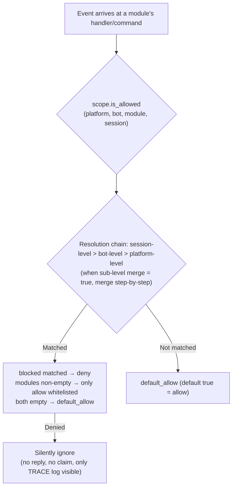

- **Resolution priority: session-level > bot-level > platform-level**, higher priority bindings **fully override** lower ones;  
  When a sub-level binding specifies `merge = true`, it instead performs a **step-by-step union** with lower levels (merge `modules` and `blocked` individually, `merge` itself is a control key, not counted as an entry)
- **Silent semantics**: Commands and handlers from filtered modules are not triggered, replied to, or claimed (to prevent cross-command mis-matching),  
  visible only in TRACE-level logs (`core.scope.denied`)
- **Framework-level handlers** (`scope_exempt=True` or owner is empty) are unaffected; modules with empty names (framework-level resources) are always allowed
- **Session-aware help and command queries**: Command query APIs (`command.help` / `get_command` / `get_commands` / `get_group_commands` / `get_visible_commands`,  
  and `module.get_commands_overview`) all support optional `event=` or explicit `platform=` / `bot_id=` / `session_id=` keywords — commands from modules unavailable in the current session  
  no longer appear in results (`get_command` returns None, single command help is treated as "not registered",  
  consistent with silent semantics); if no context is provided, full behavior is retained

### Binding Inheritance (merge)

By default, the semantics of full override are clear and predictable; when you need to **append** to an upper-level binding, specify `merge = true` in the sub-level:

```toml
[ErisPulse.scope.platforms.onebot11]
modules = ["Chat", "Tool"]      # Platform-level: allow Chat, Tool

[ErisPulse.scope.bots.onebot11."123456"]
modules = ["Music"]
merge = true                    # The effective modules for this bot = ["Chat", "Tool", "Music"]
```

- **Merge rules**: `modules` and `blocked` each take the **union**; within a binding, `blocked` still takes precedence over `modules`
- **Chained merge**: Platform → Bot → Session, each level independently decides whether to merge or override

## ② Identity Dimension (Event Admission)

Answer "Whose events are accepted or rejected." Rejected events are **completely discarded at the distribution entry point**—they do not enter middleware or any processor (including framework-level), and are only visible in TRACE-level logs (`core.scope.identity_denied`).

- **Resolution Priority: User > Session > Bot > Adapter**, taking the most specific configured policy; deny takes precedence over allow
- Each level binding is a binary policy: `{ allow = true }` or `{ deny = true }`
- User keys support glob / regex (e.g., `"spam_*"` to block a batch of spam users)
- Typical usage — deny at an upper level, allow for specific individuals to make "exceptional passes":

```toml
[ErisPulse.scope.identity.adapters.onebot11]
deny = true
[ErisPulse.scope.identity.users.onebot11]
allow = ["u_admin"]   # Even if the adapter-level denies, events from u_admin are still passed
```

## ③ Outbound Dimension (Limiting Modules Initiating Outbound Calls)

Constraints on **outbound actions initiated by modules**: message sending / standard API actions / request handling.  
The three types of actions correspond to underlying DSLs: `Event.reply` and `Send` (send), `Api` / `call_api` (api), and `Request`'s accept/reject (request). Outbound calls initiated by modules during event handler execution carry the module owner, which are uniformly judged by this dimension.

### Rule Format (Inline Table)

Each action's rule is an inline table: `{ allow = [...], deny = true|[...] }`. Only one rule per action is allowed (TOML keys cannot be repeated; either full denial or fine-grained control is chosen):

```toml
[ErisPulse.scope.actions.MyModule]
send = { deny = true }                                  # Deny all sending (Event.reply / Send DSL)
# Or method-level granularity: send = { allow = ["Text", "Image*"], deny = ["File"] }
api = { allow = ["get_*"] }                             # Only allow query-type standard APIs
# Or action-level blacklist: api = { deny = ["set_*", "leave_*"] }
request = { deny = true }                               # Prohibit handling request accept/reject
```

- `send` entries match **method names** (`Text` / `Image` / `File` ...),  
  `api` entries match **standard action names** (`get_group_info` / `set_group_name` ...)
- Entries support exact names / glob / `re:` regex (consistent with the global system syntax, case-insensitive)
- Writing a single string in `allow` is equivalent to a single-entry list: `send = { allow = "Text" }`

### Judgment Semantics

**Default: Allow All** — Calls without configuration or with an empty owner (internal framework calls) are allowed.  
After configuration, rules are judged in the following order:

1. `deny = true` → Reject  
2. The called name matches an entry in the `deny` list → Reject  
3. The `allow` list is non-empty and the called name does not match (or the call has no name) → Reject  
4. All others are allowed

Rejected calls do not initiate any network requests and directly return a standard failure response  
(`retcode = 34601`, see [api-response §5.3](../standards/api-response.md#53-framework-extension-response-codes-34xxx-customization-in-the-lowest-three-digits-of-the-platform-error-segment)).  
The three actions are independent and can be limited individually.

```python
# Runtime API
sdk.scope.set_action("MyModule", "send", deny=True)              # Deny all message sending
sdk.scope.set_action("MyModule", "send", allow=["Text"])         # Allow only text messages
sdk.scope.is_action_allowed("MyModule", "send", name="Image")    # False
sdk.scope.is_action_allowed("MyModule", "api", name="get_user_info")  # Judged by rules
sdk.scope.delete_action("MyModule", "send")                      # Restore allowed
sdk.scope.get_action("MyModule", "send")                         # Get current rule for this action
```

## Runtime API

The scope runtime API consists of three layers: **Decision** (Three Questions), **Dimensional Read/Write** (per-dimension `set` / `get` / `delete` parametric methods with full type annotations, IDE auto-complete), and **Dictionary-style Fallback** (dot-path access to any section).

```python
from ErisPulse import sdk

scope = sdk.scope
```

### Decision (Three Questions)

```python
scope.is_allowed("onebot11", "123456", "Chat")                 # ① Module Dimension
scope.is_allowed("onebot11", "123456", "Chat", "789012345")    # With session-level
scope.is_allowed("onebot11", "123456", None)                   # Framework-level resource -> True

scope.is_identity_allowed("onebot11", "123456", "group_9", "u1")   # ② Identity Dimension

scope.is_action_allowed("MyModule", "send")                    # ④ Outbound Dimension
scope.is_action_allowed("MyModule", "send", name="Image")      # Fine-grained method level
```

### ① Module Dimension

```python
# Binding (hierarchy determined by parameters: session_id > bot_id > platform-level)
scope.set_module("onebot11", bot_id="123456", modules=["Chat", "Tool*"])
scope.set_module("onebot11", blocked=["re:^Danger"])                       # Platform-level
scope.set_module("onebot11", bot_id="123456", session_id="g9", modules=["Chat"])  # Session-level
scope.set_module("onebot11", bot_id="123456", modules=["Music"], merge=True)      # Union with existing entries
scope.set_module("onebot11", bot_id="123456", modules=["Chat"], persist=False)    # Runtime-only

# Read / Delete
scope.get_module("onebot11", bot_id="123456")   # {"modules": ["Chat"], "blocked": []}
scope.delete_module("onebot11", bot_id="123456")
```

> `merge=True` is **write-time union** (merges with existing bindings at this level); cross-level merge during resolution is controlled by the `merge = true` configuration key described in [Binding Inheritance](#binding-inheritance-merge)—these are independent mechanisms.

### ② Identity Dimension

```python
# Binding strategy (hierarchy determined by parameters: user > session > bot > adapter; allow / deny only)
scope.set_identity("onebot11", user_id="u_bad", deny=True)
scope.set_identity("onebot11", user_id="spam_*", deny=True)    # Keys support glob / re: regex
scope.set_identity("onebot11", bot_id="123456", session_id="g9", allow=True)

# Read / Delete
scope.get_identity("onebot11", user_id="u_bad")   # {"deny": True}
scope.delete_identity("onebot11", user_id="u_bad")
```

### ③ Outbound Dimension

```python
# Set restriction rules (allow: str|list; deny: bool|str|list; complete rule replacement semantics)
scope.set_action("MyModule", "send", deny=True)                    # Disable all sending
scope.set_action("MyModule", "send", allow=["Text"])               # Allow only text messages
scope.set_action("MyModule", "api", deny=["set_*", "leave_*"])     # Disable management APIs

# Read / Delete
scope.get_action("MyModule", "send")       # {"allow": ["Text"]} original rule
scope.delete_action("MyModule", "send")    # Remove single action
scope.delete_action("MyModule")            # Remove all action restrictions for this module
```

### General

```python
scope.get("platforms")   # Dictionary-style fallback: dot-path read any section
scope.topology()         # Full configuration tree (for Dashboard)
scope.stats()
# {"module_calls": .., "module_filtered": .., "identity_checks": .., "identity_denied": ..,
#  "action_checks": .., "action_denied": .., "cache_hits": .., "cache_misses": ..}
scope.reset_stats()
scope.clear()           # Clear all configuration (memory-only)
```

### Advanced: Dictionary-style Dot-Path Fallback

Dimensional methods cover daily scenarios; when you need direct access to any node (or future added dimensions), use dictionary-style API—`get` / `set` / `delete` accepts dot-paths (deep dict merge, immediate read after write), and provides `scope[path]` / `scope[path] = v` / `del scope[path]` / `path in scope` protocol:

```python
scope.set("bots.onebot11.123456", {"modules": ["Chat"], "blocked": []})
scope.set("identity.users.onebot11.u_bad", {"deny": True})
scope.get("actions.MyModule.send")

scope["platforms.onebot11"]        # Read (throws KeyError if not exists)
scope["platforms.onebot11"] = {...}  # Write
del scope["platforms.onebot11"]      # Delete
"actions.MyModule" in scope          # Existence check
```

## Caching and Hot Updates

- `is_allowed` / `is_identity_allowed` / `is_action_allowed` results are cached with **LRU caching** (configurable via `scope.cache_size`), and become invalid automatically on `set` / `delete` or configuration hot updates (`config.updated` / `config.set`)
- All dimension configurations take effect **immediately**, no restart required
- Scopes are evaluated "per event" and do not retain memory across events: if the configuration changes, the next event will be evaluated according to the new rules

## Configuration Format Validation

During loading or hot reloading, the configuration format is validated section by section: sections with incorrect types (e.g., `platforms` written as a string), invalid outbound rules (e.g., `allow` written as a number), unknown action names, and unknown top-level keys (e.g., `alow` with a typo) will output a **WARNING** and the corresponding section or entry will be ignored, while other valid configurations will still take effect—mistakes will no longer silently fail.

## Frequently Asked Questions and Precautions

### 1. Configuration Hierarchy and Overriding

- Module level: Session level > Bot level > Platform level, **overall override** (when `merge = true` at sub-level, merge entries as a union).
  To allow "Chat on platform, then Music on Bot", you can set `merge = true` at Bot level, or list both.
- Identity level: User > Session > Bot > Adapter, take the **most specific** configured policy (exceptions can be allowed).
- Command user allow/deny lists: Exact command name takes precedence over glob keys (see `event.command.acl`).

### 2. Module/Command Not Responding

First suspect the scope rather than the module itself:

```python
from ErisPulse import sdk

print(sdk.scope.is_allowed(event.get_platform(), bot_id, "MyModule", session_id))
print(sdk.scope.is_identity_allowed(event.get_platform(), bot_id, session_id, user_id))
print(sdk.scope.stats())   # module_filtered / identity_denied > 0 indicates silent filtering
```

Filtering is **silent** (no reply at module and identity levels to avoid exposing rules), but statistics are accumulated;
ACL rejection at command level will explicitly reply "insufficient permissions".

### 3. Outbound Action Rejection Troubleshooting

```python
from ErisPulse import sdk

print(sdk.scope.get("actions.MyModule"))
print(sdk.scope.stats())   # action_denied > 0 indicates intercepted calls
```

Interruption is **explicit**: rejected calls return a standard failure response with `retcode = 34601` (no network request initiated).

### 4. Session Identifier Cross-Platform Isolation

The combination `(platform, session_id)` is the unique identifier. `scope.sessions.onebot11."789"` only applies to onebot11, and does not affect a session with the same `789` on telegram. The same applies to user keys at the identity level.

## Topology Tree API

`ModuleManager.get_topology()` and `AdapterManager.get_topology()` provide data about module/adapter ownership relationships. `sdk.get_topology()` provides a one-click aggregation (including scope `scope`):

```python
from ErisPulse import sdk

topology = sdk.get_topology()
# {
#   "modules": {                                   # Module → Owned resources
#     "Chat": {
#       "loaded": True, "enabled": True,
#       "commands": ["chat", "translate"],
#       "handlers": {"message": 2, "notice": 1},
#       "routes": {"http": ["/Chat/api"], "ws": [], "sse": []},
#       "lifecycle_hooks": 3,
#     }
#   },
#   "adapters": {                                  # Adapter → Bot → Scope
#     "onebot11": {
#       "status": "started", "enabled": True,
#       "bots": {"123456": {"status": "online", "scope": {...}}},
#       "scope": {"modules": [...], "blocked": [...]},
#     }
#   },
#   "scope": {                                     # Scope (modules / identity / outbound actions)
#     "platforms": {...}, "bots": {...}, "sessions": {...},
#     "identity": {"adapters": {...}, "bots": {...}, "sessions": {...}, "users": {...}},
#     "actions": {...},
#   },
# }
```

- The module topology aggregates commands, event handlers, HTTP/WS/SSE routes, and lifecycle hooks registered by the module, which is helpful for drawing a module resource tree.
- The adapter topology aggregates the status of each adapter, the status of its subordinate Bots, and the platform-level/Bot-level scope binding (at the module level).


### 归属权（owner）系统

# Ownership (owner) System

Ownership is the cornerstone of the "plug-and-play" nature of modules: all framework resources registered during module loading are automatically attributed, and are automatically reclaimed when the module is unloaded/disabled—module authors only need to declare resources, without writing cleanup logic manually.

> **Related Systems**: Scope determines "whether a resource is active" during event dispatch, while ownership determines "who owns the resource and who will reclaim it upon unload." See [Unified Control Plane (scope)](scope.md) for scope details, and [Lifecycle Management](lifecycle.md#后台任务归属与自动取消) for background tasks.

{!--< tips >!--}
1. Ownership is automatically recorded at the **moment of registration** based on `current_owner`, requiring zero code changes from the module.
2. Unload and disable share the same cleanup chain (`_cleanup_module_registrations`), where failures at each step only trigger warnings and do not interrupt the process.
3. Resources with user configuration semantics (persistent overrides / scope rules / command ACLs) are **not** cleaned up when the module is unloaded.
{!--< /tips >!--}

## Owner Context Mechanism

Ownership is passed through the context variable `current_owner` (`ErisPulse.runtime.context`):

```python
from ErisPulse.runtime import owner_scope, get_current_owner

with owner_scope("MyModule"):
    # All resources registered in this block are automatically attributed to MyModule
    assert get_current_owner() == "MyModule"
```

The framework automatically injects the owner at the following points (module/adapter code does not need to manually wrap these):

| Timing | Owner Value | Location |
|--------|-------------|----------|
| Module `load()` | Module name | Throughout instantiation + `on_load` |
| Adapter `start()` / `restart()` | Platform name | Throughout adapter startup |
| `activate_on` lazy-load stub registration | Module name | Placeholder command/handler registration |
| Event handler execution | Handler's owning module name | handler / command entry re-injected |

Re-injection during execution means that commands registered in `on_load` and subsequently called within their execution (e.g., `sdk.adapter.on()`, `overrides.*.set(persist=False)`) are still automatically attributed to the module.

## Full Overview of Owned Resources

All resources registered within the module loading context are recorded with ownership and automatically reclaimed upon unload/disable:

| Resource | Registration Method | Cleanup Call |
|----------|---------------------|--------------|
| Commands | `@command()` / command dict declaration | `command.unregister_by_owner()` |
| Event Handlers | `@message` / `@notice` / `@request` / `@meta` | `handler.unregister_by_owner()` |
| Adapter Event Listeners | `sdk.adapter.on()` / `raw=True` | `adapter.unregister_handlers_by_owner()` |
| Adapter Middlewares | `@sdk.adapter.middleware` | Same as above |
| Routes (HTTP/WS/SSE) | `router.http()` / `websocket()` / `sse()` | Double fallback by namespace + owner |
| Route Middlewares | `@router.middleware()` / `add_middleware()` | `router.unregister_all_by_owner()` |
| Dashboard Home Entry | `router.register_home_entry()` | `unregister_home_entries_by_owner()` |
| Custom Session Types | `register_custom_type()` | `unregister_custom_types_by_owner()` |
| Background Tasks | `self.spawn()` | `cancel_owner_tasks()` |
| Lifecycle Hooks | `lifecycle.register()` | `lifecycle.unregister_by_owner()` |
| Master Provider | `master.provider` | `master.unregister_by_owner()` |
| i18n Translation Keys | `I18nClass` declaration (domain=module name) | `i18n.unregister_domain()` |
| Runtime Event Overrides | `overrides.*.set(persist=False)` | `overrides.unregister_by_owner()` |
| Interactive Sessions (wait_reply / leases) | `event.wait_reply()` / `sdk.interaction.acquire()` | `interaction.cancel_by_owner()` (waiter immediately receives cancellation) |
| Context Data | `runtime/context` recorded by owner | Precise cleanup by module |

Corresponding adapter-side resources (with platform name as owner) are reclaimed during adapter `shutdown()` / `restart()` via `_cleanup_adapter_resources`, including:

| Resource | Cleanup Call |
|----------|--------------|
| Adapter's own `on()` handlers and middlewares | `adapter.unregister_handlers_by_owner(platform)` |
| Platform event method extensions (`EventMixin`) | `unregister_platform_event_methods(platform)` |
| Custom session types | `unregister_custom_types_by_owner(platform)` |
| Interactive sessions (platform-pending wait_reply / leases) | `interaction.cancel_by_platform(platform)` |
| i18n translation domains (domain=config key) | `i18n.unregister_domain(config key)` |
| Fine-grained named route | `router.unregister_all_by_owner(platform)` |

## Unload/Disable Cleanup Sequence

`unload()` and `disable()` share the same cleanup chain (each step is independently wrapped in try/except, failures only log warnings, **do not interrupt subsequent cleanup**):

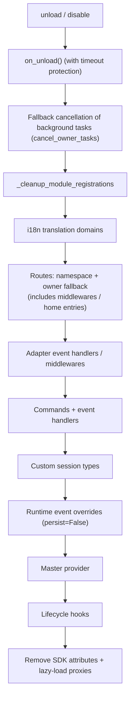

`sdk.uninit()` also includes global fallback on exit: all adapters shutdown → all modules unload → `router.stop()` (clear routes/middlewares/home entries) → `cancel_all_background_tasks()` → clear event handlers and hooks.

## Design Boundaries: Resources Not Cleared on Unload

Ownership only recovers **runtime resources registered by module code**. The following resources belong to **user configuration semantics** (controlled by the user, possibly intentionally configured), and are retained persistently after module unload:

| Resource | Semantics | Description |
|----------|-----------|-------------|
| `overrides.*.set(persist=True)` | Persistent overrides | Written to configuration file, effective across restarts; not deleted on module unload (explicitly configured by user) |
| `scope.set_action()` and other scope rules | Permission control plane | Managed by user/Dashboard, rules not reclaimed on module unload |
| `overrides.acl.set(persist=True)` | Command ACLs | Same as above |
| Conversation `save()` persistence | Multi-turn conversation archiving | Data assets are not cleared |

Runtime temporary writes (`persist=False`) are reclaimed by owner—**persistence or not is the boundary between "user assets" and "module runtime state."**

## Module Author Guide

### Recommended Usage

```python
from ErisPulse import sdk
from ErisPulse.Core.Event import command
from ErisPulse.runtime import owner_scope, spawn_background

class MyModule(BaseModule):
    async def on_load(self, event):
        # Framework resources: automatically attributed, no manual cleanup needed
        self.task = self.spawn(self.polling())      # Background task
        sdk.router.register_home_entry("My Module", "/my")  # Home entry

        # Module-specific resources: include in owner_scope to integrate into ownership system
        with owner_scope("MyModule"):
            self.client.on_event(self._handle)      # Hypothetical custom registration

    async def on_unload(self, event):
        # Framework resources have been automatically reclaimed, only clean up resources not covered by owner_scope
        await self.client.close()
```

### Notes

- **Registration during import has no ownership**: Hooks/handlers registered at the module level (during import) occur before `owner_scope` is active, and are treated as framework-level resources (owner=None) and **not cleaned up**. Always register inside `on_load()`.
- **Custom domain i18n registration**: If `i18n.register(domain=...)` uses a domain different from the module name, it will not be automatically reclaimed. Keep domain=module name.
- **Background tasks must use `self.spawn()`**: Bare `asyncio.create_task` is not attributed to the module and will not be cancelled on unload (see [Lifecycle Management](lifecycle.md#后台任务归属与自动取消)).
- Cleanup chain "failures only warn": Single-step cleanup exceptions do not block other resource cleanup; logs are visible at DEBUG/WARNING level, and TRACE can be enabled for troubleshooting.


### 启动流程与手动控制

# Startup Process and Manual Control

ErisPulse's `await sdk.run()` / `await sdk.init()` encapsulates the entire startup chain into a single line of code. However, when you need to fully customize the startup process (for example, partial loading, dynamic registration, hot plugging, injecting custom loading strategies), you need to understand what happens inside this chain and how to manually drive each step.

This article breaks down the startup chain into independent components, explains the responsibilities of each, the order of calls, and provides an example of how to manually perform a complete startup.

> This article assumes you have already run through [the first bot](../getting-started/first-bot.md) and understand the two modes of `sdk.run(keep_running=True/False)`. This article focuses on the internal breakdown of the `init()` chain and lower-level entry points such as `init()` / `init_task()` / `init_sync()`.

## Overview of SDK Top-Level Entry Points

In addition to the two `keep_running` modes of `run()`, the SDK also provides several lower-level initialization entry points, which differ in terms of **asynchronicity, return value, and whether exceptions are wrapped**:

| Entry Point | Asynchronicity | Return Value | Exception Handling | Use Case |
|-------------|----------------|--------------|--------------------|----------|
| `await sdk.run(True)` | async, blocks and maintains | `None` (automatically `uninit` when closed) | Module/adapter errors are intercepted, not crashing the process | Pure bot application |
| `await sdk.run(False)` | async, does not block | `None` (does not automatically unload) | Same as above | Execute custom logic after initialization |
| `await sdk.init()` | async, requires await | `bool` | Internal component exceptions are caught, returns `False` on failure | Manual lifecycle control (paired with `uninit()`) |
| `sdk.init_task()` | async, returns Task without blocking | `asyncio.Task` | Same as `init()` | Concurrently execute other initializations, or when event loop is not yet running |
| `sdk.init_sync()` | **Synchronous**, blocks current thread | `bool` | Same as `init()` | Command-line scripts, synchronous entry point without event loop |

> **Common Misconception**: `await sdk.init()` is **not equivalent** to `await sdk.run(keep_running=False)`. There are two differences: ① `init()` returns `bool` (returns `False` on failure), while `run()` returns `None`; ② `init()` only performs initialization and **does not automatically unload**, whereas `run()` automatically `uninit()` when the event loop ends. Therefore, when manually pairing unloading or customizing the lifecycle, use `init()` + `uninit()`.

## Chain Startup Overview

`sdk.init()` (specifically, its internal `Initializer.init()`) initiates the framework in the following sequence:

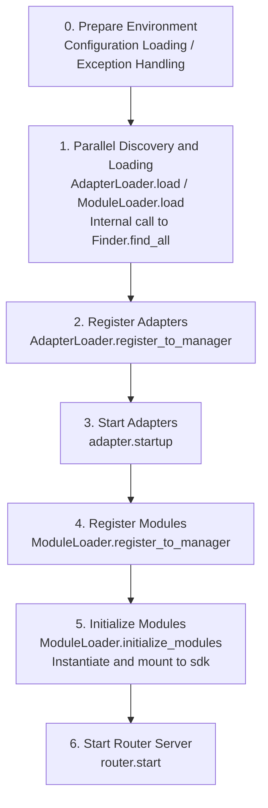

Corresponding core components:

| Layer | Component | Responsibility |
|----|------|------|
| Discovery | `AdapterFinder` / `ModuleFinder` | **Discover** adapters/modules from entry-points of installed packages |
| Loading | `AdapterLoader` / `ModuleLoader` | Discovery + Import + Read metadata + Determine enable/disable, return object list |
| Registration | `*Loader.register_to_manager` | Register objects to corresponding managers |
| Management | `sdk.adapter` / `sdk.module` | Maintain adapter/module instances, provide startup/shutdown interfaces |
| Initialization | `ModuleLoader.initialize_modules` | Create module instances and mount to `sdk` (handle dependency topological sorting) |
| Routing | `sdk.router` | HTTP / WebSocket server |

> **Important**: `Finder` and `Loader` are two layers. The `Loader` internally **already holds** a `Finder` (`AdapterLoader` has its own `AdapterFinder`, `ModuleLoader` has its own `ModuleFinder`). In most scenarios, you only need to use `Loader`. You would only use `Finder` separately when you need to "list without importing".

## Detailed Explanation of Each Step

### 1. Discovery Layer: Finder

The Finder is responsible only for "finding which packages provide adapters/modules", without importing or instantiating them.

```python
from ErisPulse.finders import AdapterFinder, ModuleFinder

adapter_finder = AdapterFinder()
module_finder = ModuleFinder()

# Find all installed adapter/module entry-points
adapter_entries = adapter_finder.find_all()    # list[EntryPoint]
module_entries = module_finder.find_all()      # list[EntryPoint]

# Find a single entry-point by name
entry = module_finder.find_by_name("MyModule")  # EntryPoint | None
```

Each `EntryPoint` can be loaded via `.load()` to obtain the corresponding class, but typically you do not need to do this manually—the Loader will handle it.

### 2. Loading Layer: Loader

The Loader performs "importing + reading metadata + determining enabled/disabled" on top of the Finder.

```python
from ErisPulse.loaders import AdapterLoader, ModuleLoader
from ErisPulse import sdk

adapter_loader = AdapterLoader()
module_loader = ModuleLoader()

# load() internally: calls finder.find_all() → processes each entry-point → returns a triple
adapter_objs, enabled_adapters, disabled_adapters = await adapter_loader.load(sdk.adapter)
module_objs, enabled_modules, disabled_modules = await module_loader.load(sdk.module)
```

The triple returned by `load()`:

| Return Value | Meaning |
|--------------|---------|
| `objs` (`dict`) | Name → Object (adapter class / module wrapper object) |
| `enabled` (`list[str]`) | Names that are enabled (not disabled in configuration) |
| `disabled` (`list[str]`) | Names that are disabled |

#### Diagnostic Information on Loading Failures

When a module/adapter throws an exception during loading or initialization, the framework skips that component and continues loading others, while outputting a **user code frame summary**. This allows you to locate the error position at the default INFO level, without manually enabling DEBUG:

```
[ERROR] [ModuleLoader] Failed to load module MyModule from entry-point, skipped: 'NoneType' object has no attribute 'platform'
  → MyModule/Core.py:42 in on_load
      adapter = sdk.platform
  → AttributeError: 'NoneType' object has no attribute 'platform'
  → Hint: Increase log level to DEBUG to view full stack trace; check implementation code of module MyModule
```

Diagnostic information is generated through the `ErisPulse.runtime.diagnostics` module, which automatically filters out internal framework frames and retains only your code frames. If you need to reuse this in custom loading logic:

```python
from ErisPulse.runtime import log_diagnostic

try:
    risky_init()
except Exception as e:
    log_diagnostic(e)  # Automatically extracts user code frames and writes to ERROR log
```

This module also provides two low-level functions: `extract_user_frame()` (returns structured frame information) and `format_diagnostic_block()` (returns multi-line text).

### 3. Registration Layer: register_to_manager

Registers the objects produced by the Loader into the manager, so that `sdk.adapter` / `sdk.module` can recognize them.

```python
# Register adapters (returns bool indicating success)
await adapter_loader.register_to_manager(enabled_adapters, adapter_objs, sdk.adapter)

# Register modules
await module_loader.register_to_manager(enabled_modules, module_objs, sdk.module)
```

After registration, adapters are registered into the adapter manager, and modules are registered into the module manager, but **they are not yet started/instantiated**.

### 4. Starting Adapters

```python
# Start all registered adapters
await sdk.adapter.startup()
# Or specify a platform
await sdk.adapter.startup("yunhu")
await sdk.adapter.startup(["yunhu", "telegram"])
```

> Registration ≠ Starting. `register_to_manager` only registers; `startup` calls the adapter's `start()` method to establish a connection with the platform.

### 5. Initializing Modules

Modules have an additional step compared to adapters—they need to be **instantiated** and attached to `sdk` (so you can call `sdk.MyModule.xxx`). This step also handles module dependencies and topological sorting.

```python
success = await module_loader.initialize_modules(
    enabled_modules, module_objs, sdk.module, sdk
)
```

After successful instantiation, the module appears at `sdk.<ModuleName>`.

### 6. Starting the Router Server

```python
await sdk.router.start(
    host="0.0.0.0",
    port=8000,
    ssl_certfile=None,
    ssl_keyfile=None,
)
```

The router server is responsible for receiving webhook/WebSocket callbacks from adapters. Without starting it, server-mode adapters cannot receive messages.

## Complete Manual Startup Example

The following code is **equivalent** to the core process of `await sdk.init()`, but exposes every step, allowing you to insert custom logic at any point:

```python
import asyncio
from ErisPulse import sdk
from ErisPulse.loaders import AdapterLoader, ModuleLoader

async def manual_startup():
    # 0. Prepare environment (load configuration, register global exception handling)
    #    _prepare_environment is a pre-step inside init(); for manual flow, it must be called first,
    #    otherwise the Loader won't read the configuration and will incorrectly disable all adapters/modules.
    if not await sdk._prepare_environment():
        print("Environment preparation failed")
        return False

    # 1. Create loaders (each internally holds a Finder)
    adapter_loader = AdapterLoader()
    module_loader = ModuleLoader()

    # 2. Parallel discovery and loading (same as internal gather in init())
    (adapter_objs, enabled_adapters, disabled_adapters), \
    (module_objs, enabled_modules, disabled_modules) = await asyncio.gather(
        adapter_loader.load(sdk.adapter),
        module_loader.load(sdk.module),
    )

    # 3. Register adapters
    await adapter_loader.register_to_manager(
        enabled_adapters, adapter_objs, sdk.adapter
    )

    # 4. Start adapters
    if enabled_adapters:
        await sdk.adapter.startup()

    # 5. Register modules
    await module_loader.register_to_manager(
        enabled_modules, module_objs, sdk.module
    )

    # 6. Initialize modules (instantiation + attach to sdk)
    if enabled_modules:
        await module_loader.initialize_modules(
            enabled_modules, module_objs, sdk.module, sdk
        )

    # 7. Start the routing server
    await sdk.router.start(host="0.0.0.0", port=8000)

    print("Manual startup completed")
    return True

async def main():
    ok = await manual_startup()
    if ok:
        # Block to keep running (manual flow won't automatically block)
        await asyncio.Event().wait()

if __name__ == "__main__":
    asyncio.run(main())
```

### When Should You Use Manual Startup?

In most cases, **manual startup is not necessary** as `await sdk.run()` already handles all the above steps. Manual startup is only valuable in these scenarios:

- **Partial loading**: Load only specific adapters/modules, skipping others
- **Dynamic registration**: Register new adapters/modules at runtime based on conditions
- **Custom order**: Need to change the default loading order (e.g., start a module before starting an adapter)
- **Injection strategies**: Inject custom strict-mode managers, loading strategies, etc., into the Loader
- **Debugging/diagnosis**: Manually drive execution at a specific step when failure occurs to locate the issue

## Runtime Fine-grained Control

Even after using `sdk.run()` to start the SDK, you can still control individual subsystems at runtime without having to restart the entire SDK:

### Hot Restart of Adapters

```python
# Hot restart a specific adapter (to fix a connection, without affecting other platforms)
await sdk.adapter.shutdown("yunhu")
await sdk.adapter.startup("yunhu")

# Bring up a new platform during runtime
await sdk.adapter.startup("telegram")

# Temporarily take a platform offline
await sdk.adapter.shutdown("telegram")
```

> `adapter.startup()` requires the adapter to be **registered** with the manager. Registration occurs internally within `init()`/`run()`, so this is a fine-grained control that operates **after** startup.

### Router Server

```python
# Temporarily take the webhook server offline
await sdk.router.stop()

# Restart it (for example, after changing the port)
await sdk.router.start(host="0.0.0.0", port=9000)
```

### On-demand Module Loading

```python
# Manually load a module (which may be lazily loaded)
await sdk.load_module("MyModule")
```

## Graceful Shutdown

Starting from version 2.7.0, `sdk.shutdown()` provides **programmatic graceful shutdown**: it sets a shutdown event, allowing the main loop that is hanging with `await sdk.run(keep_running=True)` to return, which in turn triggers `uninit()` to complete resource cleanup.

```python
# Call from any coroutine to trigger graceful exit (run() will return and uninit is automatically triggered)
sdk.shutdown()
```

Typical use cases:

```python
async def shutdown_after_idle():
    await asyncio.sleep(3600)
    sdk.shutdown()  # Gracefully exit after being idle for 1 hour
```

**Signal Handling**: `run()` internally registers `SIGTERM` / `SIGHUP` handlers, converting system signals into graceful shutdown—when stopping services via container orchestration (e.g., Docker `docker stop`) or `systemd`, the process will complete `uninit()` cleanup instead of being forcefully killed.

- On Windows, `loop.add_signal_handler` is not supported, so signal handlers are automatically skipped (graceful shutdown can still be triggered via `sdk.shutdown()` or Ctrl+C)
- Repeatedly calling `sdk.shutdown()` is safe (subsequent calls after the event is set are no-ops)

## Uninstall Process

The reverse operation of startup is `await sdk.uninit()`, which performs cleanup in the reverse order:

1. Shut down all adapters (`adapter.shutdown()`)
2. Unload all modules
3. Clean up all event handlers
4. Clean up module properties on managers and the SDK

In scenarios where the process is manually started, remember to call `uninit()` before exiting to ensure a graceful shutdown:

```python
try:
    await asyncio.Event().wait()   # Keep running
finally:
    await sdk.uninit()
```

## Restart

The SDK provides two restart methods, both of which do not require you to manually uninstall first—the framework handles it automatically:

| Method | Call | Behavior | Use Case |
|------|------|------|----------|
| Hot Restart | `await sdk.restart()` | Re-initialize (`init()`) after `uninit()` in the same process, reloading adapters/modules | Reload configuration, hot update modules |
| Hard Restart | `await sdk.hard_restart()` | After `uninit()`, exit the process with **exit code 42**, and let an external supervisor start a new process | Suspected memory/resource leaks, or when a completely clean restart is needed |

```python
# Hot restart: Reload within the same process (most common)
await sdk.restart()

# Hard restart: Exit the process, let an external supervisor restart (see "Supervisor Guide" below)
await sdk.hard_restart()
```

> **Two points to note**:
> 1. Both methods execute the restart in the background, **immediately returning `True` to indicate that the "restart task has been scheduled"**, not that the restart is completed. The actual restart runs in the background to avoid interrupting the current event chain.
> 2. The principle of `hard_restart()` is: after unloading and saving the configuration, exit the process with **exit code 42** (`HARD_RESTART_EXIT_CODE`) — **it does not start a new process itself**. It must be restarted by an external supervisor that detects exit code 42. If you run `python main.py` directly without any supervisor, the process exits with code 42 and **does not automatically restart** (the framework will issue a warning).

### When to Use Hard Restart?

Hard restart is not just a "more thorough restart"—it is more suitable and even more efficient than hot restart in the following scenarios:

- **Binary library (C extension) side effects**: Hot restart occurs within the same process and cannot release C extensions, open file descriptors, threads, or other process-level resources. Hard restart starts a new process, completely clearing these side effects.
- **Resource leak troubleshooting**: When you suspect memory or handle leaks, hard restart provides a clean environment.
- **Frequent restarts sensitive to performance**: Hard restart avoids the overhead of unloading and reloading within the same process, making it more efficient than hot restart.

> The "Framework Restart" function in the Dashboard management panel internally calls `hard_restart()`.

### Exit Code 42 Contract

Hard restart is a cross-process collaboration: **SDK is responsible for exiting (code 42), and the supervisor is responsible for restarting**.

| Role | Behavior |
|------|------|
| SDK (when hard restarted) | `uninit()` → Save configuration → `os._exit(42)` |
| Supervisor | Detects child process exit code 42 → Restart the same command |

> `sdk.is_supervised()` can check if the current process was started by a supervisor (by checking the environment variable `ERISPULSE_SUPERVISED`). The CLI `run` command automatically injects this flag when starting a subprocess; external supervisors like systemd or Docker do not inject it, so `is_supervised()` returns `False`, and the framework will issue a "no supervisor detected" warning after hard restart.

### Supervisor Guide

Choose a supervisor that suits your needs to make hard restart work effectively:

#### 1. CLI run command (Development/Simple Deployment, Recommended)

`epsdk run main.py` includes a built-in supervision loop: it detects the child process exit code, restarts immediately if it is 42; for other abnormal exit codes, it automatically retries with exponential backoff; `Ctrl+C` first gracefully terminates the child process (exit code 0 is considered normal, so it will not be restarted).

```bash
epsdk run main.py
```

#### 2. systemd (Linux Server)

`RestartForceExitStatus=42` makes exit code 42 trigger a restart (by default `on-failure` only applies to non-zero codes):

```ini
[Service]
ExecStart=/usr/bin/python3 /opt/mybot/main.py
Restart=on-failure
RestartForceExitStatus=42
RestartSec=2
User=mybot
```

#### 3. Docker / docker-compose

The container's PID 1 is the application process, and it exits with code 42, causing the container to exit—use the `restart` policy to make it automatically restart:

```yaml
services:
  bot:
    build: .
    restart: unless-stopped   # Restart for any exit (including 42)
```

#### 4. PM2 (Node Ecosystem Operations)

```bash
pm2 start main.py --name mybot --interpreter python3
# 42 is treated as an exit code, and PM2 restarts by default; set restart_delay to debounce
pm2 set mybot.restart_delay 2000
```

#### 5. supervisord

```ini
[program:mybot]
command=python3 /opt/mybot/main.py
autorestart=true
exitcodes=0,2,42    # 42 is also considered "normal exit, restart needed"
```

#### 6. Pure Python Custom Supervisor

```python
import subprocess, sys, time

while True:
    p = subprocess.Popen([sys.executable, "main.py"])
    code = p.wait()
    if code == 42:          # Hard restart request
        time.sleep(0.5)
        continue
    if code == 0:           # Normal exit
        break
    time.sleep(3)           # Abnormal exit, retry with backoff
```

> **Behavior without a supervisor**: Running directly with `python main.py`, calling `hard_restart()` causes the process to exit with code 42 and not restart. In this case, you should integrate one of the supervisors above.


====
技术标准
====


### 会话类型标准

# ErisPulse Session Type Standards

This document defines the session type standards supported by ErisPulse, including receiving event types and sending target types.

## 1. Core Concepts

### 1.1 Receive Type && Send Type

ErisPulse distinguishes two session types:

- **Receive Type**: The `detail_type` field used for receiving events
- **Send Type**: The target type used in the `Send.To()` method when sending messages

### 1.2 Type Mapping Relationship

```
Receive Type (detail_type)    Send Type (Send.To)
─────────────────             ────────────────
private                       →        user
group                         →        group
channel                       →        channel
guild                         →        guild
thread                        →        thread
user                          →        user
```

**Key Points**:
- `private` is the receive type; `user` must be used for sending
- `group`, `channel`, `guild`, and `thread` have the same type for both receiving and sending
- The system automatically performs type conversion, so manual handling is not required (meaning you can directly use the received type for sending). In practice, you don't need to worry about these details, as the wrapper class of Event allows you to directly use the `event.reply()` method without considering type conversion.

## 2. Standard Session Types

### 2.1 OneBot12 Standard Types

#### private
- **Receive Type**: `private`
- **Send Type**: `user`
- **Description**: One-on-one private chat messages
- **ID Field**: `user_id`
- **Applicable Platforms**: All platforms that support private chats

#### group
- **Receive Type**: `group`
- **Send Type**: `group`
- **Description**: Group chat messages, including various forms of group (e.g., Telegram supergroup)
- **ID Field**: `group_id`
- **Applicable Platforms**: All platforms that support group chats

#### user
- **Receive Type**: `user`
- **Send Type**: `user`
- **Description**: User type, some platforms (e.g., Telegram) represent private chats as `user` rather than `private`
- **ID Field**: `user_id`
- **Applicable Platforms**: Telegram and similar platforms

### 2.2 ErisPulse Extended Types

#### channel
- **Receive Type**: `channel`
- **Send Type**: `channel`
- **Description**: Channel messages, supporting broadcast-style messages to multiple users
- **ID Field**: `channel_id`
- **Applicable Platforms**: Discord, Telegram, Line, etc.

#### guild
- **Receive Type**: `guild`
- **Send Type**: `guild`
- **Description**: Server/community messages, typically used for Discord Guild-level events
- **ID Field**: `guild_id`
- **Applicable Platforms**: Discord and similar platforms

#### thread
- **Receive Type**: `thread`
- **Send Type**: `thread`
- **Description**: Thread/subchannel messages, used for sub-discussion areas within communities
- **ID Field**: `thread_id`
- **Applicable Platforms**: Discord Threads, Telegram Topics, etc.

## 3. Platform Type Mapping

### 3.1 Mapping Principles

The adapter is responsible for mapping the native types of platforms to ErisPulse standard types:

```
Platform native type → ErisPulse standard type → Sending type
```

### 3.2 Common Platform Mapping Examples

#### Telegram
```
Telegram Type          ErisPulse Receive Type    Sending Type
─────────────────      ────────────────       ───────────
private                private                 user
group                  group                   group
supergroup             group                   group  # Mapped to group
channel                channel                 channel
```

#### Discord
```
Discord Type          ErisPulse Receive Type    Sending Type
─────────────────      ────────────────       ───────────
Direct Message         private                user
Text Channel           channel                channel
Guild                  guild                  guild
Thread                 thread                 thread
```

#### OneBot11
```
OneBot11 Type        ErisPulse Receive Type    Sending Type
─────────────────      ────────────────       ───────────
private                private                user
group                  group                  group
discuss                group                  group  # Mapped to group
```

## 4. Custom Type Extension

### 4.1 Register Custom Type

The adapter can register custom session types:

```python
from ErisPulse.Core.Event import register_custom_type

# Register custom type
register_custom_type(
    receive_type="my_custom_type",
    send_type="custom",
    id_field="custom_id",
    platform="MyPlatform"
)
```

### 4.2 Use Custom Type

After registration, the system will automatically handle conversion and inference for this type:

```python
# Automatic inference
receive_type = infer_receive_type(event, platform="MyPlatform")
# Returns: "my_custom_type"

# Convert to send type
send_type = convert_to_send_type(receive_type, platform="MyPlatform")
# Returns: "custom"

# Get corresponding ID
target_id = get_target_id(event, platform="MyPlatform")
# Returns: event["custom_id"]
```

### 4.3 Unregister Custom Type

```python
from ErisPulse.Core.Event import unregister_custom_type

unregister_custom_type("my_custom_type", platform="MyPlatform")
```

## 5. Automatic Type Inference

When an event does not have an explicit `detail_type` field, the system automatically infers the type based on the available ID fields:

> [!NOTE]
> **Behavior change in 2.7.0+**: `detail_type` is directly adopted only if it is a **known session type** (standard or custom). For `notice`/`request` events, `detail_type` (e.g., `group_member_increase`, `friend_increase`) is a **semantic subtype** rather than a session type, and the correct session type will be inferred from the ID field instead.

### 5.1 Inference Priority

```
Priority (from highest to lowest):
1. group_id     → group
2. channel_id   → channel
3. guild_id     → guild
4. thread_id    → thread
5. user_id      → private
```

### 5.2 Usage Examples

```python
# Event has only group_id
event = {"group_id": "123", "user_id": "456"}
receive_type = infer_receive_type(event)
# Returns: "group" (group_id is prioritized)

# Event has only user_id
event = {"user_id": "123"}
receive_type = infer_receive_type(event)
# Returns: "private"

# For notice events, detail_type is a semantic subtype; 2.7.0+ will infer from ID fields
event = {"type": "notice", "detail_type": "group_member_increase", "group_id": "123"}
receive_type = infer_receive_type(event)
# Returns: "group" (not "group_member_increase")
```

## 6. API Usage Examples

### 6.1 Sending Messages

```python
from ErisPulse import adapter

# Send to a user
await adapter.myplatform.Send.To("user", "123").Text("Hello")

# Send to a group
await adapter.myplatform.Send.To("group", "456").Text("Hello")

# Automatically convert private → user (not recommended, may cause compatibility issues)
await adapter.myplatform.Send.To("private", "789").Text("Hello")
# Internally automatically converted to: Send.To("user", "789") # Using user as session type directly is a better choice
```

### 6.2 Event Reply

```python
from ErisPulse.Core.Event import Event

# Event.reply() automatically handles type conversion
await event.reply("Reply content")
# Internally automatically uses the correct sending type
```

### 6.3 Command Handling

```python
from ErisPulse.Core.Event import command

@command(name="test")
async def handle_test(event):
    # The system automatically handles session type
    # No need to manually determine group_id or user_id
    await event.reply("Command executed successfully")
```

## 7. Core API Reference

### 7.1 Type Conversion

```python
from ErisPulse.Core.Event import convert_to_send_type, convert_to_receive_type

# Receive type → Send type
convert_to_send_type("private")  # → "user"
convert_to_send_type("group")    # → "group"

# Send type → Receive type
convert_to_receive_type("user")   # → "private"
convert_to_receive_type("group")  # → "group"
```

### 7.2 ID Field Query

```python
from ErisPulse.Core.Event import get_id_field, get_receive_type

get_id_field("group")    # → "group_id"
get_id_field("private")  # → "user_id"

get_receive_type("group_id")  # → "group"
get_receive_type("user_id")   # → "private"
```

### 7.3 One-step Retrieval of Send Information

```python
from ErisPulse.Core.Event import get_send_type_and_target_id

event = {"detail_type": "private", "user_id": "123"}
send_type, target_id = get_send_type_and_target_id(event)
# send_type = "user", target_id = "123"

# Directly used in Send.To()
await adapter.Send.To(send_type, target_id).Text("Hello")
```

### 7.4 Retrieve Target ID

```python
from ErisPulse.Core.Event import get_target_id

event = {"detail_type": "group", "group_id": "456"}
get_target_id(event)  # → "456"
```

## 8. Utility Methods

```python
from ErisPulse.Core.Event import (
    is_standard_type,
    is_valid_send_type,
    get_standard_types,
    get_send_types,
    clear_custom_types,
)

is_standard_type("private")     # True
is_standard_type("custom_type") # False

is_valid_send_type("user")      # True
is_valid_send_type("invalid")   # False

get_standard_types()  # {"private", "group", "channel", "guild", "thread", "user"}
get_send_types()      # {"user", "group", "channel", "guild", "thread"}

clear_custom_types()                # Clear all
clear_custom_types(platform="discord")  # Clear only for the specified platform
```

## 9. Best Practices

### 7.1 Adapter Developers

1. **Use Standard Mappings**: Map to standard types as much as possible, rather than creating new types.
2. **Correct Conversion**: Ensure the mapping relationship between received and sent types is correct.
3. **Retain Raw Data**: Keep the raw event type in `{platform}_raw`.
4. **Document Mappings**: Explain the type mapping relationships in the adapter documentation.

### 7.2 Module Developers

1. **Use Utility Methods**: Use utility methods like `get_send_type_and_target_id()`.
2. **Avoid Hardcoding**: Do not write code like `if group_id else "private"`.
3. **Consider All Types**: Code should support all standard types, not just private/group.
4. **Flexible Design**: Use event wrapper methods, rather than directly accessing fields.

### 9. Type Inference

- **Prefer detail_type**: If there is a clear field, do not perform inference.
- **Use Inference Judiciously**: Only use inference when there is no clear type.
- **Pay Attention to Priority**: Understand the inference priority to avoid unexpected results.

## 10. Frequently Asked Questions

### Q1: Why is `private` converted to `user` when sending?

A: This is a requirement of the OneBot12 specification. `private` is a concept for receiving, and using `user` when sending is more semantically appropriate.

### Q2: How to support new session types?

A: Register custom types using `register_custom_type()`, or directly use standard types such as `channel` and `guild`.

### Q3: What to do if an event does not have a `detail_type`?

A: The system will automatically infer based on the available ID fields. The priority order is: group > channel > guild > thread > user.

### Q4: How does the adapter map Telegram supergroup?

A: In the adapter's conversion logic, map `supergroup` to the standard `group` type.

### Q5: How to handle special platforms such as email?

A: For non-generic or platform-specific types, use `{platform}_raw` and `{platform}_raw_type` to preserve raw data, and let the adapter handle it.

## 11. Related Documentation

- [Event Conversion Standard](event-conversion.md) - Complete event conversion specification
- [Send Method Specification](send-method-spec.md) - Naming and parameter specification for methods in the Send class
- [Adapter Development Guide](../developer-guide/adapters/) - Complete guide to adapter development


### 事件转换标准

# Adapter Standardization Conversion Specification

## 1. Core Principles

1. Strict Compatibility: All standard fields must fully comply with the OneBot12 specification.
2. Explicit Extensions: Platform-specific features must be prefixed with {platform}_ (e.g., yunhu_form).
3. Data Integrity: Original event data must be preserved in the {platform}_raw field, and the original event type must be preserved in the {platform}_raw_type field.
4. Time Standardization: All timestamps must be converted to 10-digit Unix timestamps (in seconds).
5. Platform Consistency: The platform field name must match the name/alias you registered in ErisPulse.

## 2. Standard Field Requirements

### 2.1 Required Fields
| Field | Type | Description |
|-------|------|-------------|
| id | string | Unique identifier for the event |
| time | integer | Unix timestamp (in seconds) |
| type | string | Event type |
| detail_type | string | Detailed event type (see [Session Type Standard](session-types.md)) |
| platform | string | Platform name |
| self | object | Bot self information |
| self.platform | string | Platform name |
| self.user_id | string | Bot user ID |

**detail_type Specification**:
- Must use ErisPulse standard session types (see [Session Type Standard](session-types.md))
- Supported types: `private`, `group`, `user`, `channel`, `guild`, `thread`
- Adapters are responsible for mapping native platform types to standard types

### 2.2 Message Event Fields
| Field | Type | Description |
|-------|------|-------------|
| message | array | Array of message segments |
| alt_message | string | Alternate text for message segments |
| user_id | string | User ID |
| user_nickname | string | User nickname (optional) |

### 2.3 Notification Event Fields
| Field | Type | Description |
|-------|------|-------------|
| user_id | string | User ID |
| user_nickname | string | User nickname (optional) |
| operator_id | string | Operator ID (optional) |

### 2.4 Request Event Fields
| Field | Type | Description |
|-------|------|-------------|
| user_id | string | User ID |
| user_nickname | string | User nickname (optional) |
| comment | string | Request comment (optional) |
| request_id | string | Request identifier (**strongly recommended**, used to approve/reject request operations) |

**`request_id` Field Explanation**:
- `request_id` is the unique operation identifier for request events, used to execute approve/reject operations via the `HandleRequest` DSL
- Adapters should map native platform request identifiers to this field when converting request events
- If the platform does not have a request ID, the adapter should generate a unique identifier (e.g., a hash based on timestamp + user ID)
- When `request_id` is missing, `event.approve()` / `event.reject()` will raise a `ValueError`

## 3. Event Format Examples

### 3.1 Message Event (message)
```json
{
  "id": "1234567890",
  "time": 1752241223,
  "type": "message",
  "detail_type": "group",
  "platform": "yunhu",
  "self": {
    "platform": "yunhu",
    "user_id": "bot_123"
  },
  "message": [
    {
      "type": "text",
      "data": {
        "text": "抽奖 超级大奖"
      }
    }
  ],
  "alt_message": "抽奖 超级大奖",
  "user_id": "user_456",
  "user_nickname": "YingXinche",
  "group_id": "group_789",
  "yunhu_raw": {...},
  "yunhu_raw_type": "message.receive.normal",
  "yunhu_command": {
    "name": "抽奖",
    "args": "超级大奖"
  }
}
```

### 3.2 Notice Event (notice)
```json
{
  "id": "1234567891",
  "time": 1752241224,
  "type": "notice",
  "detail_type": "group_member_increase",
  "platform": "yunhu",
  "self": {
    "platform": "yunhu",
    "user_id": "bot_123"
  },
  "user_id": "user_456",
  "user_nickname": "YingXinche",
  "group_id": "group_789",
  "operator_id": "",
  "yunhu_raw": {...},
  "yunhu_raw_type": "bot.followed"
}
```

### 3.3 Request Event (request)
```json
{
  "id": "1234567892",
  "time": 1752241225,
  "type": "request",
  "detail_type": "friend",
  "platform": "onebot11",
  "self": {
    "platform": "onebot11",
    "user_id": "bot_123"
  },
  "user_id": "user_456",
  "user_nickname": "YingXinche",
  "comment": "请加好友",
  "request_id": "req_abc123",
  "onebot11_raw": {...},
  "onebot11_raw_type": "request"
}
```

## 4. Message Segment Standards

### 4.1 Standard Message Segments

Standard message segment types **do not** include platform prefixes:

| Type | Description | data Fields |
|------|-------------|-------------|
| `text` | Plain text | `text: str` |
| `image` | Image | `file: str/bytes`, `url: str` |
| `audio` | Audio | `file: str/bytes`, `url: str` |
| `video` | Video | `file: str/bytes`, `url: str` |
| `file` | File | `file: str/bytes`, `url: str`, `filename: str` |
| `mention` | @User | `user_id: str`, `user_name: str` |
| `reply` | Reply | `message_id: str` |
| `face` | Emoji | `id: str` |
| `location` | Location | `latitude: float`, `longitude: float` |

```json
{
  "type": "text",
  "data": {
    "text": "Hello World"
  }
}
```

### 4.2 Platform Extension Message Segments

Platform-specific message segments must include a platform prefix:

```json
// Yunhu - Form
{"type": "yunhu_form", "data": {"form_id": "123456", "form_name": "Registration Form"}}

// Telegram - Sticker
{"type": "telegram_sticker", "data": {"file_id": "CAACAgIAAxkBAA...", "emoji": "😂"}}
```

**Extension Message Segment Requirements**:
1. **No prefixes in data fields**: `{"type": "yunhu_form", "data": {"form_id": "..."}}` instead of `{"type": "yunhu_form", "data": {"yunhu_form_id": "..."}}`
2. **Provide fallback solutions**: Modules may not recognize extension message segments; adapters should provide text alternatives in `alt_message`
3. **Complete documentation**: Each extension message segment must be documented in the adapter documentation with `type`, `data` structure, and usage scenarios

## 5. Handling Unknown Events

For unrecognized event types, a warning event should be generated:
```json
{
  "id": "1234567893",
  "time": 1752241223,
  "type": "unknown",
  "platform": "yunhu",
  "yunhu_raw": {...},
  "yunhu_raw_type": "unknown",
  "warning": "Unsupported event type: special_event",
  "alt_message": "This event type is not supported by this system."
}
```

## 6. Extension Naming Convention

### 6.1 Field Naming

**Rule**: `{platform}_{field_name}`

```
Platform Prefix  Field Name          Full Field Name
──────────────── ─────────────────── ───────────────────
yunhu            command             yunhu_command
telegram         sticker_file_id     telegram_sticker_file_id
onebot11         anonymous           onebot11_anonymous
email            subject             email_subject
```

**Requirements**:
- `platform` must exactly match the platform name registered with the adapter (case-sensitive)
- `field_name` must use `snake_case` naming
- Double underscores `__` at the beginning are forbidden (reserved by Python)
- Field names must not conflict with standard fields (e.g., `type`, `time`, `message`, etc.)

### 6.2 Message Segment Type Naming

**Rule**: `{platform}_{segment_type}`

Standard message segment types (`text`, `image`, `audio`, `video`, `mention`, `reply`, etc.) **must not** have a platform prefix. Only platform-specific message segment types require a prefix.

### 6.3 Raw Data Field Naming

The following field names are **reserved fields** that all adapters must follow:

| Reserved Field | Type | Description |
|----------------|------|-------------|
| `{platform}_raw` | `any` | A deep copy of the complete original platform event data |
| `{platform}_raw_type` | `string` | The platform's original event type identifier |

**Requirements**:
- `{platform}_raw` must be a deep copy of the original data, not a reference
- `{platform}_raw_type` must be a string; if the platform uses a numeric type, it must be converted to a string
- These two fields must exist in all events (use `null` if unavailable, and an empty string `""` if the type is unavailable)

### 6.4 Platform-Specific Field Examples

```json
{
  "yunhu_command": {
    "name": "抽奖",
    "args": "超级大奖"
  },
  "yunhu_form": {
    "form_id": "123456"
  },
  "telegram_sticker": {
    "file_id": "CAACAgIAAxkBAA..."
  }
}
```

### 6.5 Nested Extension Fields

Extension fields can be simple values or nested objects:

```json
{
  "telegram_chat": {
    "id": 123456,
    "type": "supergroup",
    "title": "My Group"
  },
  "telegram_forward_from": {
    "user_id": "789",
    "user_name": "ForwardUser"
  }
}
```

**Nested Field Requirements**:
- Top-level keys must include the platform prefix
- Nested internal fields **must not** include the platform prefix
- Nesting depth should be limited to 3 levels

### 6.6 `self` Field Extension

The standard required fields for the `self` object (`platform`, `user_id`) are listed in §2.1. The following are optional fields extended by ErisPulse:

| Field | Type | Description |
|-------|------|-------------|
| `self.user_name` | `string` | Bot nickname |
| `self.avatar` | `string` | Bot avatar URL |
| `self.account_id` | `string` | Account identifier in multi-account mode |

> **Bot Status Tracking**: Adapters inform the framework of the Bot's connection status by sending `type: "meta"` events. Supported `detail_type` values are: `connect` (online), `heartbeat` (heartbeat), `disconnect` (offline). The system automatically extracts Bot metadata from the `self` field in these events for status tracking. Additionally, the `self` field in regular events is also automatically detected as the Bot. See [Adapter System API - Bot Status Management](../api-reference/adapter-system.md) for more details.

---

## 7. Session Type Extension

ErisPulse extends the OneBot12 standard's `private` and `group` session types with the following additional session types:

| Type | OneBot12 Standard | ErisPulse Extension | Description |
|------|:-----------:|:------------:|------|
| `private` | ✅ | — | One-to-one private chat |
| `group` | ✅ | — | Group chat |
| `user` | — | ✅ | User type (e.g., Telegram) |
| `channel` | — | ✅ | Channel (broadcast-style) |
| `guild` | — | ✅ | Server/community |
| `thread` | — | ✅ | Topic/subchannel |

**Adapter Custom Type Extension**:

```python
from ErisPulse.Core.Event.session_type import register_custom_type

# Register during adapter startup
register_custom_type(
    receive_type="email",      # detail_type in receive events
    send_type="email",         # target type for sending
    id_field="email_id",       # corresponding ID field name
    platform="email"           # platform identifier
)
```

**Custom Type Requirements**:
- Must be registered during the adapter's `start()` and unregistered during `shutdown()`
- `receive_type` should not conflict with standard types
- `id_field` should follow the `{target}_id` naming convention

> For a complete definition and mapping of session types, see [Session Types Standard](session-types.md).

## 8. Module Developer Guide

### 8.1 Accessing Extended Fields

```python
from ErisPulse.Core.Event import message

@message()
async def handle_message(event):
    # Access standard fields
    text = event.get_text()
    user_id = event.get_user_id()

    # Access platform extended fields - Method 1: Direct get
    yunhu_command = event.get("yunhu_command")

    # Access platform extended fields - Method 2: Dot-style access (Event wrapper class)
    # event.yunhu_command

    # Access raw data
    raw_data = event.get("yunhu_raw")
    raw_type = event.get_raw_type()

    # Determine platform
    platform = event.get_platform()
    if platform == "yunhu":
        pass
    elif platform == "telegram":
        pass
```

### 8.2 Handling Extended Message Segments

```python
@message()
async def handle_message(event):
    message_segments = event.get("message", [])

    for segment in message_segments:
        seg_type = segment.get("type")
        seg_data = segment.get("data", {})

        if seg_type == "text":
            text = seg_data["text"]
        elif seg_type.startswith("yunhu_"):
            if seg_type == "yunhu_form":
                form_id = seg_data["form_id"]
        elif seg_type.startswith("telegram_"):
            if seg_type == "telegram_sticker":
                file_id = seg_data["file_id"]
```

### 8.3 Best Practices

1. **Prefer Standard Fields**: Do not assume extended fields are always present
2. **Platform Detection**: Use `event.get_platform()` to determine the platform, rather than inferring from the presence of extended fields
3. **Graceful Degradation**: Use `alt_message` as a fallback when unable to process extended message segments
4. **Avoid Hardcoding Prefixes**: Dynamically construct using the `platform` variable

```python
# ✅ Recommended
platform = event.get_platform()
raw_data = event.get(f"{platform}_raw")

# ❌ Not recommended
raw_data = event.get("yunhu_raw")
```

### 8.4 Request Event Handling

Module developers can use `event.approve()` and `event.reject()` to handle request events:

```python
from ErisPulse.Core.Event import request

# Friend Request: Auto-approve
@request.on_friend_request()
async def handle_friend_request(event):
    user_name = event.get_user_nickname() or event.get_user_id()
    comment = event.get_comment()
    
    # Approve the request
    result = await event.approve()
    if result.get("status") == "ok":
        print(f"Approved friend request from {user_name}")
    else:
        print(f"Failed to approve friend request: {result.get('message')}")

# Group Invitation: Decide based on conditions
@request.on_group_request()
async def handle_group_request(event):
    comment = event.get_comment()
    
    # Reject the request
    result = await event.reject(comment="Temporarily not joining new group")
```

**Direct Operations via Adapter** (for non-event handler scenarios):

```python
from ErisPulse import adapter

# Directly operate using request_id
await adapter.myplatform.Request("req_abc123").accept()
await adapter.myplatform.Request("req_abc123").reject()

# Specify Bot account for operation
await adapter.myplatform.Request("req_abc123").Using("bot1").accept()

# Include comment
await adapter.myplatform.Request("req_abc123").accept(comment="Welcome")
```

## 9. Session Type Inference for notice / request Events

### 9.1 Problem Background

The `detail_type` of `notice` and `request` events are **semantic subtypes** (e.g., `group_member_increase`, `friend_increase`), not session types (e.g., `group`, `private`).

```
type        detail_type                  Meaning            Session Type
────        ───────────                  ────            ────────
message     group                        Group message         group (detail_type is session type)
message     private                      Private message       private (detail_type is session type)
notice      group_member_increase        Group member increase group (inferred from group_id)
notice      friend_increase              Friend increase       private (inferred from user_id)
request     friend                       Friend request        private (inferred from user_id)
request     group                        Group request         group (detail_type is session type)
```

### 9.2 Inference Rules

The inference order for `infer_receive_type()`:

1. If `detail_type` is a known session type (`private`/`group`/`channel`/`guild`/`thread`/`user`), use it directly
2. If `detail_type` is a custom session type, use it directly
3. Otherwise (semantic subtypes of notice/request), infer based on ID fields:
   - If `group_id` exists → `"group"`
   - If `channel_id` exists → `"channel"`
   - If `guild_id` exists → `"guild"`
   - If `thread_id` exists → `"thread"`
   - If `user_id` exists → `"private"`

### 9.3 `event.reply()` Target Inference

The target of `event.reply()` in notice/request events is determined by session type inference:

- Group notice events (with `group_id`) → reply to the **group**
- Friend notice events (with only `user_id`) → reply to the **private user**

```python
from ErisPulse.Core.Event import notice

@notice.on_group_increase()
async def handle_welcome(event):
    group_id = event.get("group_id")    # "group_789"
    user_id = event.get("user_id")      # "user_456"

    # event.reply() sends to the group (group/group_789)
    await event.reply("Welcome to the group!")

    # If you need to notify the admin (private chat), specify the target explicitly:
    await adapter.Send.To("user", "admin_id").Text(f"New member {user_id} joined {group_id}")
```

### 9.4 Adapter Development Recommendations

Ensure that notice/request events contain the correct ID fields:

| detail_type             | Required ID Fields        | Inferred Session Type |
|-------------------------|---------------------------|------------------------|
| `group_member_increase` | `group_id` + `user_id`    | `group`                |
| `group_member_decrease` | `group_id` + `user_id`    | `group`                |
| `friend_increase`       | `user_id`                 | `private`              |
| `friend_decrease`       | `user_id`                 | `private`              |
| `friend` (request)      | `user_id`                 | `private`              |
| `group` (request)       | `group_id`                | `group`                |

## 10. Related Documents

- [Platform Features Documentation](../platform-guide/README.md) - You can visit this document to learn about platform-specific features, as well as known extension events and message segments.
- [Session Type Standard](session-types.md) - Definition and mapping relationships of session types
- [Send Method Specification](send-method-spec.md) - Naming, parameter specifications, and reverse conversion requirements for methods in the Send class
- [API Response Standard](api-response.md) - Standard format for adapter API responses
- [API Action Specification](api-action-spec.md) - Unified interface for OneBot12 standard API actions


### API 响应标准

# ErisPulse Adapter Standardized Return Specification

## 1. Description

Why does this specification exist?

To ensure the uniformity of API response formats across different platforms and maintain compatibility with OneBot12, the ErisPulse adapter adopts the message sending return structure standard defined by OneBot12.

However, the ErisPulse protocol has some special definitions:
- 1. In the base fields, `message_id` is required, but this field does not exist in the OneBot12 standard.
- 2. The response content needs to include a `{platform_name}_raw` field to store the raw response data.

## 2. Basic Return Structure

All action responses must include the following basic fields:

| Field Name | Data Type | Required | Description |
|-----------|-----------|----------|-------------|
| status | string | Yes | Execution status, must be "ok" or "failed" |
| retcode | int64 | Yes | Return code, follows OneBot12 return code rules |
| data | any | Yes | Response data, contains the request result on success, null on failure |
| message_id | string | Yes | Message ID, used to identify the message, empty string if not available |
| message | string | Yes | Error message, empty string on success |
| {platform_name}_raw | any | No | Raw response data |

Optional fields:
| Field Name | Data Type | Required | Description |
|-----------|-----------|----------|-------------|
| echo | string | No | Returned verbatim when the request contains an echo field |

## 3. Full Field Specification

### 3.1 Common Fields

#### Successful Response Example
```json
{
    "status": "ok",
    "retcode": 0,
    "data": {
        "message_id": "1234",
        "time": 1632847927.599013
    },
    "message_id": "1234",
    "message": "",
    "echo": "1234",
    "telegram_raw": {...}
}
```

#### Failed Response Example
```json
{
    "status": "failed",
    "retcode": 10003,
    "data": null,
    "message_id": "",
    "message": "Missing required parameter: user_id",
    "echo": "1234",
    "telegram_raw": {...}
}
```

### 3.2 Return Code Specification

#### 0 Success (OK)
- 0: Success (OK)

#### 1xxxx Request Error
| Error Code | Error Name | Description |
|------------|------------|-------------|
| 10001 | Bad Request | Invalid action request |
| 10002 | Unsupported Action | Unsupported action request |
| 10003 | Bad Param | Invalid action request parameter |
| 10004 | Unsupported Param | Unsupported action request parameter |
| 10005 | Unsupported Segment | Unsupported message segment type |
| 10006 | Bad Segment Data | Invalid message segment parameter |
| 10007 | Unsupported Segment Data | Unsupported message segment parameter |
| 10101 | Who Am I | Robot account not specified |
| 10102 | Unknown Self | Unknown robot account |

#### 2xxxx Handler Error
| Error Code | Error Name | Description |
|------------|------------|-------------|
| 20001 | Bad Handler | Action handler implementation error |
| 20002 | Internal Handler Error | Exception thrown during action handler execution |

#### 3xxxx Execution Error
| Error Code Range | Error Type | Description |
|------------------|------------|-------------|
| 31xxx | Database Error | Database error |
| 32xxx | Filesystem Error | Filesystem error |
| 33xxx | Network Error | Network error |
| 34xxx | Platform Error | Robot platform error |
| 35xxx | Logic Error | Action logic error |
| 36xxx | I Am Tired | Implementation decided to strike |

#### Reserved Error Ranges
- 4xxxx, 5xxxx: Reserved ranges, should not be used
- 6xxxx–9xxxx: Other error ranges, for custom implementation use

## 4. Implementation Requirements
1. All responses must contain the fields: `status`, `retcode`, `data`, and `message`.
2. When the request contains a non-empty `echo` field, the response must include an `echo` field with the same value.
3. Return codes must strictly follow the OneBot12 specification.
4. Error messages (`message`) should be human-readable descriptions.

## 5. Extension Specifications

ErisPulse extends the OneBot12 standard return structure as follows:

### 5.1 `message_id` Required Field

In the OneBot12 standard, `message_id` is located within the `data` object and is not mandatory. ErisPulse elevates it to a **required** top-level field:

- When `message_id` cannot be obtained, it should be set as an empty string `""`
- Ensure `message_id` always exists, so modules do not need to perform null checks

### 5.2 `{platform}_raw` Raw Response Field

The return value should include the `{platform}_raw` field, which stores a complete copy of the raw response data from the platform:

```json
{
    "status": "ok",
    "retcode": 0,
    "data": {"message_id": "1234", "time": 1632847927},
    "message_id": "1234",
    "message": "",
    "telegram_raw": {
        "ok": true,
        "result": {"message_id": 1234, "date": 1632847927, ...}
    }
}
```

**Requirements**:
- `{platform}_raw` must be a deep copy of the original response, not a reference
- `platform` must exactly match the platform name registered by the adapter (case-sensitive)
- Error information from the original response should also be retained for debugging purposes

### 5.3 Framework Extension Return Codes (Custom Low Three Digits in the 34xxx Platform Error Segment)

The OneBot12 specification allows implementations to define custom low three digits of `3xxxx`. The `34xxx` segment semantics are **Platform Error** (robot platform error, such as failures caused by platform restrictions). The `34xxx` segment is used hierarchically according to responsibilities:

| Low Three Digits Segment | Ownership | Purpose |
|---------|------|------|
| `340xx` | Adapter Implementation | Request operation group (Request Not Found / Already Handled / Not Supported / Permission Denied, see request-action-spec §7) |
| `341xx`～`345xx` | Adapter Implementation | Platform-side permission / risk control / account restriction errors (implement custom low three digits, original error placed in `{platform}_raw`) |
| `346xx` | **ErisPulse Framework (reserved)** | Framework-level interception and general failures; adapters/modules should not occupy these codes |
| `347xx`～`349xx` | Adapter Implementation | Other platform execution errors |

ErisPulse framework currently uses the `346xx` codes:

| Error Code | Error Name | Description |
|-------|-------|------|
| 34600 | SDK Failure | General failure in the framework (`make_error()` default return code) |
| 34601 | Action Denied | Outbound action denied by scope (`scope.actions`), call not initiated, directly return this response |

> Responsibility distinction: `34601` is **framework-level interception before the call** (the module has no right to initiate the action); `34004` / `34xxx` platform codes are **actions already sent but rejected by the platform** (e.g., Bot lacks permission, is restricted). When modules check for permission issues, they should check both types: first check `34601` (the module's own scope is disabled), then check `34xxx` (platform-side restrictions).

The return structure is the standard failure response as defined in §2:

```json
{
    "status": "failed",
    "retcode": 34601,
    "data": null,
    "message_id": "",
    "message": "action 'send' denied by scope.actions"
}
```

### 5.4 Adapter Implementation Checklist

- [ ] Include `status`, `retcode`, `data`, `message_id`, `message` fields
- [ ] Return codes follow the OneBot12 specification (see §3.2)
- [ ] `message_id` always exists (set as empty string if unavailable)
- [ ] `{platform}_raw` contains the raw response data from the platform

## 6. Notes
- For error codes in the 3xxxx range, the last three digits can be defined by the implementation.
- Avoid using reserved error ranges (4xxxx, 5xxxx).
- **`34600` / `34601` are reserved error codes for the ErisPulse framework** (see §5.3); adapters/modules should avoid using them.
- Error messages should be concise and clear for easier debugging.


### 发送方法规范

# ErisPulse Send Method Specification

This document defines the naming conventions, parameter specifications, and reverse conversion requirements for the Send class send methods in the ErisPulse adapter.

## 1. Standard Method Naming

All send methods use **PascalCase (PascalCase)** naming, with the first letter capitalized.

### 1.1 Standard Send Methods

| Method Name | Description | Parameter Type |
|-------|------|---------|
| `Text` | Send text message | `str` |
| `Image` | Send image | `bytes` \| `str` (URL/path) |
| `Voice` | Send voice | `bytes` \| `str` (URL/path) |
| `Video` | Send video | `bytes` \| `str` (URL/path) |
| `File` | Send file | `bytes` \| `str` (URL/path) |
| `At` | @ user/group | `str` (user_id) |
| `Face` | Send emoji | `str` (emoji) |
| `Reply` | Reply to message | `str` (message_id) |
| `Forward` | Forward message | `str` (message_id) |
| `Markdown` | Send Markdown message | `str` |
| `HTML` | Send HTML message | `str` |
| `Card` | Send card message | `dict` |

### 1.2 Chained Modifier Methods

| Method Name | Description | Parameter Type |
|-------|------|---------|
| `At` | @ user (can be called multiple times) | `str` (user_id) |
| `AtAll` | @ all members | None |
| `Reply` | Reply to message | `str` (message_id) |

### 1.3 Protocol Methods

| Method Name | Description | Required? |
|-------|------|---------|
| `Raw_ob12` | Send OneBot12 format message segment | Yes |

**`Raw_ob12` is a required method.** It is one of the core responsibilities of the adapter: to receive OneBot12 standard message segments and convert them into native platform API calls. `Raw_ob12` is the unified entry point for reverse conversion (OneBot12 → platform), ensuring that modules can send messages directly using standard message segments without relying on platform-specific methods.

**Default behavior when `Raw_ob12` is not overridden:** The base class will log a **error level** message and return a standard error response format (`status: "failed"`, `retcode: 10002`), indicating that the adapter developer must implement this method.

### 1.4 Recommended Extension Naming Convention

If an adapter needs to support sending non-OneBot12 format raw data (such as platform-specific JSON, XML, etc.), the following naming convention is recommended:

| Recommended Method Name | Description |
|-----------|------|
| `Raw_json` | Send arbitrary JSON data |
| `Raw_xml` | Send arbitrary XML data |

**Note:** These methods are **not** provided by the base class, nor are they mandatory to implement. They are only recommended naming conventions, and adapters can define them as needed. If the adapter does not support these formats, there is no need to define them.

**Message Builder (`MessageBuilder`):** ErisPulse provides a `MessageBuilder` utility class for easily building OneBot12 message segment lists, which can be used in conjunction with `Raw_ob12`. See the [Message Builder](#11-message-builder-messagebuilder) section.

## 2. Parameter Specification Details

### 2.1 Media Message Parameter Specification

Media messages (`Image`, `Voice`, `Video`, `File`) support two parameter types:

#### 2.1.1 String Parameters (URL or File Path)

**Format:** `str`

**Supported Types:**
- **URL:** Network resource address (e.g., `https://example.com/image.jpg`)
- **File Path:** Local file path (e.g., `/path/to/file.jpg` or `C:\\path\\to\\file.jpg`)

**Usage Scenarios:**
- The file is already online, send the URL directly
- The file is on the local disk, send the file path
- Want the adapter to automatically handle file upload

**Recommendation:** Prefer using URL, use local file path if URL is unavailable

**Examples:**
```python
# Using URL
send.Image("https://example.com/image.jpg")

# Using local file path
send.Image("/path/to/local/image.jpg")
send.Image("C:\\path\\to\\local\\image.jpg")
```

#### 2.1.2 Binary Data Parameters

**Format:** `bytes`

**Usage Scenarios:**
- The file is already in memory (e.g., downloaded from the network, read from another source)
- Need to process before sending (e.g., image compression, format conversion)
- Avoid repeated file reading

**Notes:**
- Uploading large files may consume a lot of memory
- Recommend setting reasonable file size limits

**Examples:**
```python
# Read from network and send
import requests
image_data = requests.get("https://example.com/image.jpg").content
send.Image(image_data)

# Read from file and send
with open("/path/to/local/image.jpg", "rb") as f:
    image_data = f.read()
send.Image(image_data)
```

#### 2.1.3 Parameter Processing Priority

When the adapter receives media message parameters, it should process them in the following order:

1. **URL Parameter:** Use the URL directly (some platform adapters may have URL download and then upload operations)
2. **File Path:** Detect if it is a local path, if so, upload the file
3. **Binary Data:** Upload the binary data directly

**Adapter Implementation Suggestion:**
```python
def Image(self, image: Union[bytes, str]):
    if isinstance(image, str):
        # Determine if it is a URL or local path
        if image.startswith(("http://", "https://")):
            # Directly send URL
            return self._send_image_by_url(image)
        else:
            # Local path, read and upload
            with open(image, "rb") as f:
                return self._upload_image(f.read())
    elif isinstance(image, bytes):
        # Binary data, upload directly
        return self._upload_image(image)
```

### 2.2 @ User Parameter Specification

**Method:** `At` (modifier method)

**Parameter:** `user_id` (`str`)

**Requirements:**
- `user_id` should be a string-type user identifier
- Different platforms may have different `user_id` formats (numbers, UUID, strings, etc.)
- The adapter is responsible for converting `user_id` into the platform-specific format
- Note that the actual send method call should be placed at the last position

**Example:**
```python
# Single @ user
Send.To("group", "g123").At("123456").Text("Hello")

# Multiple @ users (chained call)
send.To("group", "g123").At("123456").At("789012").Text("Hello everyone")
```

### 2.3 Reply Message Parameter Specification

**Method:** `Reply` (modifier method)

**Parameter:** `message_id` (`str`)

**Requirements:**
- `message_id` should be a string-type message identifier
- Should be the ID of a previously received message
- Some platforms may not support the reply feature, the adapter should gracefully degrade

**Example:**
```python
send.To("group", "g123").Reply("msg_123456").Text("Received")
```

## 3. Platform-Specific Method Naming

It is **not recommended** to directly add platform-prefixed methods in the Send class. It is recommended to use generic method names or `Raw_{protocol}` methods.

**Not Recommended:**
```python
def YunhuForm(self, form_id: str):  # ❌ Not recommended
    pass

def TelegramSticker(self, sticker_id: str):  # ❌ Not recommended
    pass
```

**Recommended:**
```python
def Form(self, form_id: str):  # ✅ Generic method name
    pass

def Sticker(self, sticker_id: str):  # ✅ Generic method name
    pass

def Raw_ob12(self, message):  # ✅ Send OneBot12 format
    pass
```

**Extension Method Requirements:**
- Method names use PascalCase, no platform prefix
- Must return an `asyncio.Task` object
- Must provide complete type annotations and docstrings
- Parameter design should be as consistent as possible with standard method styles

## 4. Parameter Naming Convention

| Parameter Name | Description | Type |
|-------|------|------|
| `text` | Text content | `str` |
| `url` / `file` | File URL or binary data | `str` / `bytes` |
| `user_id` | User ID | `str` / `int` |
| `group_id` | Group ID | `str` / `int` |
| `message_id` | Message ID | `str` |
| `data` | Data object (e.g., card data) | `dict` |

## 5. Return Value Specification

- **Send methods** (e.g., `Text`, `Image`): Must return an `asyncio.Task` object
- **Modifier methods** (e.g., `At`, `Reply`, `AtAll`): Must return `self` to support chained calls

---

## 6. Reverse Conversion Specification (OneBot12 → Platform)

In addition to converting platform-native events into OneBot12 format (forward conversion), adapters must also provide the ability to convert OneBot12 message segments back into platform-native API calls (reverse conversion). The unified entry point for reverse conversion is the `Raw_ob12` method.

### 6.1 Conversion Model

```
Forward Conversion (Receiving Direction)                Reverse Conversion (Sending Direction)
─────────────────                ─────────────────
Platform-native Event                       OneBot12 Message Segment List
    │                                  │
    ▼                                  ▼
Converter.convert()               Send.Raw_ob12()
    │                                  │
    ▼                                  ▼
OneBot12 Standard Event                  Platform-native API Call
(with {platform}_raw)             (Returns standard response format)
```

**Core Symmetry:** Forward conversion retains original data in `{platform}_raw`, and reverse conversion accepts OneBot12 standard format and restores it into platform calls.

### 6.2 `Raw_ob12` Implementation Specification

`Raw_ob12` receives a OneBot12 standard message segment list and must convert it into platform-native API calls.

**Method Signature:**

```python
def Raw_ob12(self, message_segments: List[Dict]) -> asyncio.Task:
    """
    Send OneBot12 standard message segments

    :param message_segments: OneBot12 message segment list
        [
            {"type": "text", "data": {"text": "Hello"}},
            {"type": "image", "data": {"file": "https://..."}},
            {"type": "mention", "data": {"user_id": "123"}},
        ]
    :return: asyncio.Task, await returns standard response format
    """
```

**Implementation Requirements:**

1. **Must handle all standard message segment types:** At least support `text`, `image`, `audio`, `video`, `file`, `mention`, `reply`
2. **Must handle platform extension message segments:** For `{platform}_xxx` type message segments, convert them into corresponding platform-native calls
3. **Must return standard response format:** Follow the [API Response Standard](api-response.md)
4. **Unsupported message segments should be skipped and a warning logged,** not throw an exception causing the entire message to fail

### 6.3 Message Segment Conversion Rules

#### 6.3.1 Standard Message Segment Conversion

The adapter must implement the conversion of the following standard message segments:

| OneBot12 Message Segment | Conversion Requirements |
|----------------|---------|
| `text` | Directly use `data.text` |
| `image` | Handle `data.file` type: Use URL directly, upload bytes, read local path and upload |
| `audio` | Same as image handling logic |
| `video` | Same as image handling logic |
| `file` | Same as image handling logic, pay attention to `data.filename` |
| `mention` | Convert to platform's @ user mechanism (e.g., Telegram's `entities`, Yunhu's `at_uid`) |
| `reply` | Convert to platform's reply reference mechanism |
| `face` | Convert to platform's emoji sending mechanism, skip if not supported |
| `location` | Convert to platform's location sending mechanism, skip if not supported |

#### 6.3.2 Platform Extension Message Segment Conversion

For message segments with platform prefixes, the adapter should recognize and convert them:

```python
def _convert_ob12_segments(self, segments: List[Dict]) -> Any:
    """Convert OneBot12 message segments to platform-native format"""
    platform_prefix = f"{self._platform_name}_"
    
    for segment in segments:
        seg_type = segment["type"]
        seg_data = segment["data"]
        
        if seg_type.startswith(platform_prefix):
            # Platform extension message segment → Platform-native call
            self._handle_platform_segment(seg_type, seg_data)
        elif seg_type in self._standard_segment_handlers:
            # Standard message segment → Platform equivalent operation
            self._standard_segment_handlers[seg_type](seg_data)
        else:
            # Unknown message segment → Log warning and skip
            logger.warning(f"Unsupported message segment type: {seg_type}")
```

#### 6.3.3 Handling Composite Message Segments

A message may contain multiple message segments, and the adapter needs to handle composite messages correctly:

```python
# Module sends a message containing text + image + @ user
await send.Raw_ob12([
    {"type": "mention", "data": {"user_id": "123"}},
    {"type": "text", "data": {"text": "Hello"}},
    {"type": "image", "data": {"file": "https://example.com/img.jpg"}}
])
```

**Handling Strategy:**
- **First, merge:** If the platform supports sending text, image, @, etc. in a single message, merge them
- **Fallback, split:** If the platform does not support merging, send as multiple messages in sequence
- **Maintain order:** The order of message segment sending should be consistent with the list order

### 6.4 Relationship Between `Raw_ob12` and Standard Methods

The adapter's standard send methods (`Text`, `Image`, etc.) are **already implemented and delegated to `Raw_ob12` by the `SendDSL` base class**, and the adapter subclass does not need to reimplement them:

```python
class Send(SendDSL):
    def Raw_ob12(self, message_segments: List[Dict]) -> asyncio.Task:
        """Core implementation: OneBot12 message segment → Platform API (must implement)"""
        return asyncio.create_task(self._send_ob12(message_segments))

    # Text/Image/Voice/Video/File are inherited from the base class and automatically delegate to Raw_ob12
    # If platform-specific logic is needed, individual methods can be overridden:
    # def Text(self, text: str) -> asyncio.Task:
    #     return self.Raw_ob12([{"type": "text", "data": {"text": text}}])
```

**Benefits:**
- Conversion logic is centralized in `Raw_ob12`, reducing duplicate code
- Standard methods and `Raw_ob12` behave identically
- Modules get the same result whether using `Text()` or `Raw_ob12()`
- The base class provides type signatures, allowing IDE to complete standard methods

### 6.5 Implementation Example

```python
class YunhuSend(SendDSL):
    """Yunhu platform Send implementation"""
    
    def Raw_ob12(self, message_segments: list) -> asyncio.Task:
        """OneBot12 message segment → Yunhu API call"""
        return asyncio.create_task(self._do_send(message_segments))
    
    async def _do_send(self, segments: list) -> dict:
        """Actual sending logic"""
        # 1. Parse modifier state
        at_users = self._at_users or []
        reply_to = self._reply_to
        at_all = self._at_all
        
        # 2. Convert message segments
        yunhu_elements = []
        for seg in segments:
            seg_type = seg["type"]
            seg_data = seg["data"]
            
            if seg_type == "text":
                yunhu_elements.append({"type": "text", "content": seg_data["text"]})
            elif seg_type == "image":
                yunhu_elements.append({"type": "image", "url": seg_data["file"]})
            elif seg_type == "mention":
                at_users.append(seg_data["user_id"])
            elif seg_type == "reply":
                reply_to = seg_data["message_id"]
            elif seg_type == "yunhu_form":
                # Platform extension message segment
                yunhu_elements.append({"type": "form", "form_id": seg_data["form_id"]})
            else:
                logger.warning(f"Yunhu does not support message segment: {seg_type}")
        
        # 3. Call Yunhu API
        response = await self._call_yunhu_api(yunhu_elements, at_users, reply_to, at_all)
        
        # 4. Return standard response format
        return {
            "status": "ok" if response["code"] == 0 else "failed",
            "retcode": response["code"],
            "data": {"message_id": response.get("msg_id", ""), "time": int(time.time())},
            "message_id": response.get("msg_id", ""),
            "message": "",
            "yunhu_raw": response
        }
```

---

## 7. Method Discovery

Module developers can query the adapter's supported send methods via API:

```python
from ErisPulse import adapter

# List all send methods
methods = adapter.list_sends("myplatform")
# ["Batch", "Form", "Image", "Recall", "Sticker", "Text", ...]

# View method details
info = adapter.send_info("myplatform", "Form")
# {
#     "name": "Form",
#     "parameters": [{"name": "form_id", "type": "str", ...}],
#     "return_type": "Awaitable[Any]",
#     "docstring": "Send Yunhu form"
# }
```

---

## 8. Registered Send Method Extensions

| Platform | Method Name | Description |
|------|--------|------|
| onebot12 | `Mention` | @ user (OneBot12 style) |
| onebot12 | `Sticker` | Send sticker |
| onebot12 | `Location` | Send location |
| onebot12 | `Recall` | Recall message |
| onebot12 | `Edit` | Edit message |
| onebot12 | `Batch` | Batch send |

> **Note:** Send methods do not have platform prefixes; methods with the same name on different platforms can have different implementations.

---

## 9. Adapter Development Notes

For how to correctly override `BaseAdapter`, `Send`, `Request` `__init__`, see [Adapter Development Introduction - `__init__` Notes](../developer-guide/adapters/getting-started.md#init-注意事项).

---

---

## 10. Adapter Implementation Checklist

### Send Methods
- [ ] Standard methods (`Text`, `Image`, etc.) are implemented
- [ ] Return values are all `asyncio.Task`
- [ ] Modifier methods (`At`, `Reply`, `AtAll`) return `self`
- [ ] Platform extension methods use PascalCase, no platform prefix
- [ ] All methods have complete type annotations and docstrings

### Reverse Conversion
- [ ] `Raw_ob12` **is implemented** (must, cannot skip)
- [ ] `Raw_ob12` can handle all standard message segments (`text`, `image`, `audio`, `video`, `file`, `mention`, `reply`)
- [ ] `Raw_ob12` can handle platform extension message segments (`{platform}_xxx` type)
- [ ] Standard send methods (`Text`, `Image`, etc.) internally delegate to `Raw_ob12`, not implement conversion logic independently
- [ ] Unsupported message segments are skipped and warnings are logged, exceptions are not thrown
- [ ] Composite message segments are handled correctly (merged or split in sequence)

---

## 11. Message Builder (MessageBuilder)

`MessageBuilder` is a message segment builder tool provided by ErisPulse, used in conjunction with `Raw_ob12` to simplify the construction of OneBot12 message segments.

### 11.1 Import

```python
from ErisPulse.Core import MessageBuilder
# or
from ErisPulse.Core.Event import MessageBuilder
```

### 11.2 Chainable Construction

```python
# Build a message containing text, image, and @ user
segments = (
    MessageBuilder()
    .mention("123456")
    .text("Hello, look at this picture")
    .image("https://example.com/img.jpg")
    .reply("msg_789")
    .build()
)

# Send
await adapter.Send.To("group", "456").Raw_ob12(segments)
```

### 11.3 Quick Single Segment Construction

```python
# Quickly build a single message segment (returns list[dict], can be directly passed to Raw_ob12)
await adapter.Send.To("user", "123").Raw_ob12(MessageBuilder.text("Hello"))
await adapter.Send.To("group", "456").Raw_ob12(MessageBuilder.image("https://..."))
await adapter.Send.To("group", "456").Raw_ob12(MessageBuilder.mention("123"))
await adapter.Send.To("group", "456").Raw_ob12(MessageBuilder.reply("msg_id"))
await adapter.Send.To("group", "456").Raw_ob12(MessageBuilder.at_all())
```

### 11.4 Use with Event.reply_ob12

```python
from ErisPulse.Core import MessageBuilder

@message()
async def handle(event: Event):
    await event.reply_ob12(
        MessageBuilder()
        .mention(event.get_user_id())
        .text("Received your message")
        .build()
    )
```

### 11.5 Supported Message Segment Methods

| Method | Description | data fields |
|------|------|----------|
| `text(text)` | Text | `text` |
| `image(file)` | Image | `file` |
| `audio(file)` | Audio | `file` |
| `video(file)` | Video | `file` |
| `file(file, filename=None)` | File | `file`, `filename`(optional) |
| `mention(user_id, user_name=None)` | @ user | `user_id`, `user_name`(optional) |
| `at(user_id, user_name=None)` | @ user (`mention` alias) | Same as `mention` |
| `reply(message_id)` | Reply | `message_id` |
| `at_all()` | @ all members | `{}` |
| `custom(type, data)` | Custom/platform extension | Custom |

### 11.6 Utility Methods

```python
builder = MessageBuilder().text("Base content")

# Copy (deep copy)
msg1 = builder.copy().image("img1").build()
msg2 = builder.copy().image("img2").build()

# Clear
builder.clear().text("New content").build()

# Check if empty
if builder:
    print(f"Contains {len(builder)} message segments")
```

---

## 12. Related Documentation

- [Event Conversion Standard](event-conversion.md) - Complete event conversion specification, extension naming, and message segment standards
- [API Response Standard](api-response.md) - Adapter API response format standard
- [Session Type Standard](session-types.md) - Session type definitions and mapping relationships
- [Request Operation Specification](request-action-spec.md) - Request event field requirements, HandleRequest DSL, and adapter implementation requirements


### 请求操作规范

# ErisPulse Request Operation Specification

This document defines the standardized specification for request event operations in the ErisPulse adapter, including the field requirements for request events, the usage of Request DSL, and adapter implementation requirements.

## 1. Overview

The request event (`type: "request"`) is a special event type defined in the OneBot12 standard, representing a request that requires the Bot to make a decision (such as friend requests or group invitations).

Unlike message events, request events require **bidirectional interaction**:
1. **Receiving**: The adapter converts the native platform request into a standard request event.
2. **Responding**: The module executes operations through the `Request` DSL or `Event.approve()`/`Event.reject()`.

```
Platform native request event
    │
    ▼
Converter.convert()        ← Adapter implementation (forward conversion)
    │
    ▼
Standard request event (with request_id)
    │
    ├─→ Module handler @request.on_friend_request()
    │       │
    │       ├─→ event.approve()     ← Approve the request
    │       └─→ event.reject()      ← Reject the request
    │               │
    │               ▼
    │       adapter.Request(request_id).accept()
    │               │
    │               ▼
    │       BaseAdapter.Request.accept()  ← Adapter override
    │               │
    │               ▼
    │       Platform API call
    │
    └─→ Or directly through adapter operation
            await adapter.Request("req_id").accept()
```

## 2. Request Event Field Requirements

### 2.1 Standard Fields

In addition to the standard OneBot12 fields, the request event must also include the following fields:

| Field | Type | Required | Description |
|------|------|------|------|
| `request_id` | string | **Strongly Recommended** | Request identifier, used for approve/reject operations |
| `user_id` | string | Yes | ID of the requester |
| `user_nickname` | string | No | Nickname of the requester |
| `comment` | string | No | Request comment |

### 2.2 `request_id` Field

`request_id` is the core identifier for request operations:

- **Purpose**: Identifies a request that can be operated on, used by the `Request` DSL
- **Generation Rules**:
  - Prefer to use the platform's native request identifier (e.g., OneBot11's `flag` field, Telegram's `chat_invite_link`, etc.)
  - If the platform does not have a native request ID, the adapter should generate a unique identifier (recommended format: `platform_timestamp_user_id`)
- **Uniqueness**: Should be unique within the same platform
- **Missing Behavior**: When `request_id` is missing, `event.approve()` / `event.reject()` will raise a `ValueError`

### 2.3 Request Event Example

```json
{
  "id": "evt_123456",
  "time": 1752241225,
  "type": "request",
  "detail_type": "friend",
  "platform": "onebot11",
  "self": {
    "platform": "onebot11",
    "user_id": "bot_123"
  },
  "user_id": "user_456",
  "user_nickname": "YingXinche",
  "comment": "Please add as a friend",
  "request_id": "flag_abc123",
  "onebot11_raw": {...},
  "onebot11_raw_type": "request"
}
```

## 3. Request DSL

### 3.1 Method Chaining

The `Request` class provides a method chaining interface consistent with the `Send` style:

```python
# Basic usage
await adapter.Request("req_id").accept()
await adapter.Request("req_id").reject()

# Specify Bot account
await adapter.Request("req_id").Using("bot1").accept()

# Attach remarks (via kwargs)
await adapter.Request("req_id").accept(comment="Welcome")
await adapter.Request("req_id").reject(comment="Temporarily not adding")

# Combinatorial usage
await adapter.Request("req_id").Using("bot1").accept(comment="Welcome")
```

### 3.2 Method List

| Method | Description | Return Value |
|--------|-------------|--------------|
| `Using(account_id)` | Specify the Bot account to perform the operation | `RequestDSL` (supports method chaining) |
| `accept(**kwargs)` | Accept the request | `asyncio.Task` (await returns standard response) |
| `reject(**kwargs)` | Reject the request | `asyncio.Task` (await returns standard response) |

### 3.3 Return Value Format

The operation returns a standard API response format:

**Success**:
```json
{
    "status": "ok",
    "retcode": 0,
    "data": null,
    "message_id": "",
    "message": ""
}
```

**Failure**:
```json
{
    "status": "failed",
    "retcode": 34001,
    "data": null,
    "message_id": "",
    "message": "Request has expired or does not exist"
}
```

**Not Implemented** (adapter did not override `accept`/`reject`):
```json
{
    "status": "failed",
    "retcode": 10002,
    "data": null,
    "message_id": "",
    "message": "Platform MyAdapter does not implement request operation (accept)"
}
```

## 4. Event Convenience Methods

The `Event` wrapper class provides convenience methods suitable for use in request event handlers:

```python
from ErisPulse.Core.Event import request

@request.on_friend_request()
async def handle_friend_request(event):
    # Get the request ID
    request_id = event.get_request_id()
    if not request_id:
        print("Warning: Request event missing request_id")
        return
    
    # Approve the request
    result = await event.approve()
    
    # Or reject the request
    # result = await event.reject(comment="Temporarily not adding friends")
    
    # Check the result
    if result.get("status") == "ok":
        print("Operation successful")
    else:
        print(f"Operation failed: {result.get('message')}")
```

### 4.1 Event Method List

| Method | Description | Return Value |
|--------|-------------|--------------|
| `get_request_id()` | Get the request ID | `str` |
| `approve(comment=None)` | Approve the current request event | Standard response format |
| `reject(comment=None)` | Reject the current request event | Standard response format |

## 5. Adapter Implementation Requirements

### 5.1 Converter Requirements

The adapter's converter must correctly set the `request_id` field when converting request events:

```python
def convert_request_event(self, raw_event: dict) -> dict:
    """Convert platform-native request events"""
    return {
        "id": self._generate_event_id(raw_event),
        "time": int(time.time()),
        "type": "request",
        "detail_type": self._map_request_type(raw_event),  # "friend" or "group"
        "platform": self._platform_name,
        "self": {
            "platform": self._platform_name,
            "user_id": str(self._bot_id),
        },
        "user_id": str(raw_event.get("user_id", "")),
        "user_nickname": raw_event.get("nickname", ""),
        "comment": raw_event.get("message", ""),
        "request_id": self._extract_request_id(raw_event),  # ← Key field
        f"{self._platform_name}_raw": raw_event,
        f"{self._platform_name}_raw_type": raw_event.get("type", ""),
    }

def _extract_request_id(self, raw_event: dict) -> str:
    """
    Extract request ID from platform-native event
    
    Prefer native platform request identifier; generate unique ID if not available
    """
    # Prefer native platform ID
    if flag := raw_event.get("flag"):
        return str(flag)
    if request_key := raw_event.get("request_key"):
        return str(request_key)
    
    # Fallback: generate unique ID
    import hashlib
    raw = f"{self._platform_name}_{raw_event.get('user_id')}_{raw_event.get('timestamp')}"
    return hashlib.md5(raw.encode()).hexdigest()
```

### 5.2 Request Inner Class Implementation

The adapter can implement `accept` and `reject` methods in the `Request` inner class:

```python
from ErisPulse.Core import BaseAdapter, RequestDSL

class MyAdapter(BaseAdapter):
    
    class Request(RequestDSL):
        """MyPlatform request operation implementation"""
        
        def accept(self, **kwargs):
            """
            Approve request
            
            :param kwargs: Additional parameters, such as comment="备注"
            :return: asyncio.Task
            """
            async def _do():
                try:
                    result = await self._adapter.call_api(
                        endpoint="/set_request",
                        request_id=self._request_id,
                        approve=True,
                        **kwargs,
                    )
                    return {
                        "status": "ok" if result.get("code") == 0 else "failed",
                        "retcode": result.get("code", 0),
                        "data": None,
                        "message_id": "",
                        "message": result.get("message", ""),
                    }
                except Exception as e:
                    return {
                        "status": "failed",
                        "retcode": 34001,
                        "data": None,
                        "message_id": "",
                        "message": f"Request operation failed: {e}",
                    }
            
            return self._create_task(_do())
        
        def reject(self, **kwargs):
            """Reject request"""
            async def _do():
                try:
                    result = await self._adapter.call_api(
                        endpoint="/set_request",
                        request_id=self._request_id,
                        approve=False,
                        **kwargs,
                    )
                    return {
                        "status": "ok" if result.get("code") == 0 else "failed",
                        "retcode": result.get("code", 0),
                        "data": None,
                        "message_id": "",
                        "message": result.get("message", ""),
                    }
                except Exception as e:
                    return {
                        "status": "failed",
                        "retcode": 34001,
                        "data": None,
                        "message_id": "",
                        "message": f"Request operation failed: {e}",
                    }
            
            return self._create_task(_do())
```

### 5.3 Platform Does Not Support Request Operations

If the platform does not support friend requests/group invitations (e.g., some platforms handle requests automatically), the adapter can:

1. **Do not override the `Request` inner class**: Use the default implementation from the base class, returning `retcode=10002` when calling `accept()`/`reject()`
2. **Skip generating `request_id` during conversion**: Do not generate `request_id`, causing `event.approve()` to raise `ValueError`
3. **Log warnings**: Record warnings in `accept`/`reject` and return appropriate error codes

### 5.4 Summary: Send and Request in Parallel

The adapter has two parallel DSL inner classes, each with distinct responsibilities:

```
BaseAdapter
├── Send(SendDSL)     ← Message sending
│   ├── Raw_ob12()    ← Must be implemented
│   ├── Text()        ← Recommended implementation
│   └── Image()       ← Implemented as needed
│
└── Request(RequestDSL) ← Request operations
    ├── accept()        ← Implemented as needed
    └── reject()        ← Implemented as needed
```

### 5.5 Adapter `__init__` Considerations

When overriding the `Request` inner class's `__init__`, ensure that parameters are passed through and `super().__init__()` is called. See [Adapter Development Introduction - `__init__` Considerations](../developer-guide/adapters/getting-started.md#init-注意事项) (`Request` is similar, with parameters `adapter, request_id, account_id`).

## 6. Adapter Implementation Checklist

### Basic Requirements
- [ ] If `__init__` is overridden, `super().__init__()` has been called (to ensure Send / Request factory initialization)

### Request Event Transformation
- [ ] The request event includes the `request_id` field (strongly recommended)
- [ ] `detail_type` is correctly mapped to `"friend"` or `"group"`
- [ ] Platform raw data is preserved in the `{platform}_raw` field
- [ ] The `request_id` generation rule is documented

### Request Handling
- [ ] The `Request` inner class is implemented (if the platform supports request operations)
- [ ] The `accept()` method is implemented
- [ ] The `reject()` method is implemented
- [ ] The operation returns a standard API response format
- [ ] Unsupported operations return `retcode=10002`
- [ ] Network errors return `retcode=33xxx` (following the API response standard)

## 7. Error Code Extension

The **adapter implementation layer** related to request operations recommends error codes (following [API Response Standard](api-response.md) §3.2, falling within the low three digits of the `34xxx` platform error segment for customization):

| Error Code | Error Name | Description |
|-------|-------|------|
| 34001 | Request Not Found | The request does not exist or has expired |
| 34002 | Request Already Handled | The request has already been processed |
| 34003 | Request Not Supported | The platform does not support this type of request operation |
| 34004 | Permission Denied | The Bot is not authorized to process this request (returned by the platform) |

> **Boundary with Framework Code**: The above `340xx` codes indicate request processing failures returned by the **platform/adapter**;  
> When the ErisPulse framework disables a module's `request` action in `scope.actions`, it **directly returns `34601` (Action Denied)** (see [API Response Standard §5.3](api-response.md#53-framework-extension-error-codes-34xxx-customization-of-the-low-three-digits-of-the-platform-error-segment)) **before calling the adapter**.  
> The two are not mutually replaceable: first pass through the `34601` framework gate, then fall into the platform layer `340xx` error.

## 8. Related Documents

- [Event Conversion Standard](event-conversion.md) - Complete event conversion specification
- [API Response Standard](api-response.md) - Adapter API response format standard
- [Send Method Specification](send-method-spec.md) - Naming and parameter specification for Send class methods
- [Session Type Standard](session-types.md) - Definition and mapping relationships of session types


### API 动作标准

# ErisPulse API Action Standard

This document defines the unified interface specification for **OneBot12-standard API actions** in ErisPulse adapters, enabling module developers to program against standard interfaces, with adapters responsible for mapping to native platform APIs.

> **Scope**: In the OneBot12 standard actions, `ApiDSL` provides strongly-typed methods for user/group/channel (Guild)/message management/meta general interfaces (`send_message` is handled by `SendDSL.Raw_ob12`). File resource actions (`upload_file`/`get_file`/chunking) are only retained for backward compatibility and degraded pass-through, see §3.5 for details. Platform extension actions are called via the escape hatch `Api.call("prefix.action", ...)`. Action parameters and return structures are based on the OneBot12 specification (located in the repository at `onebot/specs/interface/`).

## 1. Design Background

In ErisPulse, message segments (message sending and receiving) and event formats have fully followed the OneBot12 standard, but **API action calls** (such as getting user information, getting group lists, recalling messages, etc.) were not unified previously—module developers had to write different `call_api` calls for each platform.

`ApiDSL` solves this issue by providing strongly-typed standard action methods:

```
Module Code (Cross-platform Consistency)    Adapter Implementation (Platform-specific)
─────────────────────────────────         ──────────────────────────────────
adapter.Api.get_user_info("123")  →  Adapter call_api / Override
adapter.Api.get_group_list()      →  Adapter call_api / Override
adapter.Api.delete_message("id")  →  Adapter call_api / Override
```

## 2. Three-layer DSL Parallel Structure

The ErisPulse adapter has three parallel DSL inner classes, each with its own responsibilities:

```
BaseAdapter
├── Send(SendDSL)       ← Message sending (Text/Image/Raw_ob12)
├── Request(RequestDSL)  ← Request handling (accept/reject)
└── Api(ApiDSL)          ← Standard API actions (user/group/channel/message management/files/metadata) ★
```

| DSL | Responsibility | Method Style | Return Value |
|-----|----------------|--------------|--------------|
| `Send` | Sending messages | Chainable + `asyncio.Task` | Standard response |
| `Request` | Handling request events | `asyncio.Task` | Standard response |
| `Api` | Query/management operations | `async` methods | Standard response |

## 3. Standard Action List

### 3.1 User-related

| Method | OB12 Action | Parameters | data Return |
|------|----------|------|----------|
| `get_self_info()` | `get_self_info` | None | `user_id`, `user_name`, `user_displayname` |
| `get_user_info(user_id)` | `get_user_info` | `user_id: str` | `user_id`, `user_name`, `user_displayname`, `user_remark` |
| `get_friend_list()` | `get_friend_list` | None | `list[get_user_info response]` |

### 3.2 Group-related

| Method | OB12 Action | Parameters | data Return |
|------|----------|------|----------|
| `get_group_info(group_id)` | `get_group_info` | `group_id: str` | `group_id`, `group_name` |
| `get_group_list()` | `get_group_list` | None | `list[get_group_info response]` |
| `get_group_member_info(group_id, user_id)` | `get_group_member_info` | `group_id: str`, `user_id: str` | `user_id`, `user_name`, `user_displayname` |
| `get_group_member_list(group_id)` | `get_group_member_list` | `group_id: str` | `list[get_group_member_info response]` |
| `set_group_name(group_id, group_name)` | `set_group_name` | `group_id: str`, `group_name: str` | None |
| `leave_group(group_id)` | `leave_group` | `group_id: str` | None |

### 3.3 Message Management

| Method | OB12 Action | Parameters | Description |
|------|----------|------|------|
| `delete_message(message_id)` | `delete_message` | `message_id: str` | Recall/Delete message |

> **Sending Messages** (handled by `SendDSL.Raw_ob12`) is not duplicated in `ApiDSL`.

### 3.4 Guild-related

OneBot12 guild system consists of two levels: **guild** and **channel**.

| Method | OB12 Action | Parameters | data Return |
|------|----------|------|----------|
| `get_guild_info(guild_id)` | `get_guild_info` | `guild_id: str` | `guild_id`, `guild_name` |
| `get_guild_list()` | `get_guild_list` | None | `list[get_guild_info response]` |
| `set_guild_name(guild_id, guild_name)` | `set_guild_name` | `guild_id: str`, `guild_name: str` | None |
| `get_guild_member_info(guild_id, user_id)` | `get_guild_member_info` | `guild_id: str`, `user_id: str` | `user_id`, `user_name`, `user_displayname` |
| `get_guild_member_list(guild_id)` | `get_guild_member_list` | `guild_id: str` | `list[get_guild_member_info response]` |
| `leave_guild(guild_id)` | `leave_guild` | `guild_id: str` | None |
| `get_channel_info(guild_id, channel_id)` | `get_channel_info` | `guild_id: str`, `channel_id: str` | `channel_id`, `channel_name` |
| `get_channel_list(guild_id, *, joined_only)` | `get_channel_list` | `guild_id: str`, `joined_only: bool=false` | `list[get_channel_info response]` |
| `set_channel_name(guild_id, channel_id, channel_name)` | `set_channel_name` | `guild_id`, `channel_id`, `channel_name` | None |
| `get_channel_member_info(guild_id, channel_id, user_id)` | `get_channel_member_info` | `guild_id`, `channel_id`, `user_id` | `user_id`, `user_name`, `user_displayname` |
| `get_channel_member_list(guild_id, channel_id)` | `get_channel_member_list` | `guild_id`, `channel_id` | `list[get_channel_member_info response]` |
| `leave_channel(guild_id, channel_id)` | `leave_channel` | `guild_id`, `channel_id` | None |

> The guild system is independent from the group system: platforms such as Discord, QQ Guild, and Kook implement the guild interface, while traditional platforms like QQ and WeChat implement the group interface. Both may coexist or exist independently.

### 3.5 File Resource Operations

> **[!WARNING]**
> **The file resource model (two-segment file_id) is "downgraded" in ErisPulse**:
> ErisPulse does not use the "upload first, get file_id, then reference" model for file transfer—modules send files using `SendDSL.File(file, filename)` (direct upload of URL/path/bytes at send time, see [Send Method Specification](send-method-spec.md)).
> The actions `upload_file`, `get_file`, and segmented actions in this section depend on platform-specific `file_id` file resource capabilities, which are **not universally compatible**; only when the adapter backend naturally supports this capability can it be passed through. The framework's built-in adapters **do not implement or recommend implementing** this, and calls typically return `retcode=10002`.
> When modules need to transfer files across platforms, please use `SendDSL.File`, and do not rely on file_id.
>
> **Outlook**: Standardizing the `file_id` resource model to the framework layer is a future direction, but it is not provided in the current version.

Bulk transfer (small files):

| Method | OB12 Action | Parameters | data Return |
|------|----------|------|----------|
| `upload_file(*, type, name, ...)` | `upload_file` | `type`, `name`, `url`/`path`/`data`, `headers?`, `sha256?` | `file_id` |
| `get_file(file_id, type)` | `get_file` | `file_id: str`, `type: str` | `name`, `url`/`path`/`data` |

The `type` parameter for `upload_file`:
- `"url"`: Upload via URL (requires `url`)
- `"path"`: Upload via local path (requires `path`)
- `"data"`: Upload via binary data (requires `data`)

#### 3.5.1 Segmented Transfer (Large Files, within the above degraded scope)

OneBot12 segmented actions are distinguished by `stage`. `ApiDSL` splits the three or two stages of the same action into separate methods (`offset` is byte offset, `data` in JSON is Base64); the following table is retained for reference only, and adapters should neither implement nor enforce it:

**Three-step segmented upload**: `prepare` → `transfer` (loop through each segment) → `finish`

| Method | Corresponding stage | Parameters | data Return |
|------|-----------|------|----------|
| `upload_file_fragmented_prepare(name, total_size)` | `prepare` | `name: str`, `total_size: int` | `file_id` (used during transfer) |
| `upload_file_fragmented_transfer(file_id, offset, data)` | `transfer` | `file_id`, `offset: int`, `data: bytes` | None |
| `upload_file_fragmented_finish(file_id, sha256)` | `finish` | `file_id`, `sha256: str` (file-wide checksum) | `file_id` |

```python
total = os.path.getsize(path)
r = await adapter.Api.upload_file_fragmented_prepare(os.path.basename(path), total)
fid = r["data"]["file_id"]
offset = 0
with open(path, "rb") as f:
    while chunk := f.read(65536):
        await adapter.Api.upload_file_fragmented_transfer(fid, offset, chunk)
        offset += len(chunk)
sha256 = hashlib.sha256(open(path, "rb").read()).hexdigest()
await adapter.Api.upload_file_fragmented_finish(fid, sha256)
```

**Two-step segmented download**: `prepare` → `transfer` (loop to retrieve segments)

| Method | Corresponding stage | Parameters | data Return |
|------|-----------|------|----------|
| `get_file_fragmented_prepare(file_id)` | `prepare` | `file_id` | `name`, `total_size`, `sha256` |
| `get_file_fragmented_transfer(file_id, offset, size)` | `transfer` | `file_id`, `offset: int`, `size: int` | `data` (bytes of this segment) |

### 3.6 Meta Actions

Meta actions are not specific to a particular account and do not require `Using()` to specify a Bot.

| Method | OB12 Action | Parameters | data Return |
|------|----------|------|----------|
| `get_latest_events(limit, timeout)` | `get_latest_events` | `limit: int=0`, `timeout: int=0` | Array of event objects (excluding meta events) |
| `get_supported_actions()` | `get_supported_actions` | None | `list[str]` supported action names |
| `get_status()` | `get_status` | None | `good: bool`, `bots: list[{self, online, ...}]` |
| `get_version()` | `get_version` | None | `impl`, `version`, `onebot_version` |

### 3.7 General Extension Actions

| Method | Description |
|------|------|
| `call(action, **params)` | Escape hatch for platform extension actions, following the OB12 extension naming convention `{prefix}.{action}` |

## 4. Usage

### 4.1 Basic Invocation

```python
from ErisPulse import adapter

# Get user information (cross-platform unified)
result = await adapter.myplatform.Api.get_user_info("123456")
if result["status"] == "ok":
    user_name = result["data"]["user_name"]
    print(f"Username: {user_name}")

# Get group list
result = await adapter.myplatform.Api.get_group_list()
groups = result["data"]

# Recall message
await adapter.myplatform.Api.delete_message("msg_123456")
```

### 4.2 Specify Bot Account (Multi-account Mode)

```python
# Execute operations using a specified Bot account
info = await adapter.myplatform.Api.Using("bot1").get_self_info()
```

### 4.3 Platform Extension Actions

```python
# Call platform-specific extension actions (it is recommended to use the {prefix}.{action} naming convention)
result = await adapter.telegram.Api.call(
    "telegram.send_sticker",
    sticker_id="CAACAgIAAxkBAA...",
)
```

### 4.4 Using in Event Handlers

```python
from ErisPulse.Core.Event import message

@message()
async def handle(event):
    # Get sender's detailed information
    user_id = event.get_user_id()
    platform = event.get_platform()

    result = await getattr(adapter, platform).Api.get_user_info(user_id)
    if result["status"] == "ok":
        user_name = result["data"]["user_name"]
        await event.reply(f"Hello, {user_name}!")
```

## 5. Adapter Implementation

### 5.1 Default Behavior (Zero Configuration)

The default implementation of `ApiDSL` passes the standard action name directly as `endpoint` to `adapter.call_api()`:

```python
# The default implementation of ApiDSL is equivalent to:
async def get_user_info(self, user_id: str) -> dict:
    return await self._adapter.call_api("get_user_info", user_id=user_id, account_id=self._account_id)
```

**Applicable Scenarios**: When the adapter's underlying backend itself follows the OneBot12 standard action protocol, `call_api` naturally supports standard action names (such as directly connecting to a service that follows this protocol).

### 5.2 Overriding Standard Methods (Mapping to Platform Native API)

The adapter can override individual standard methods, mapping them to the platform's native API:

```python
class MyAdapter(BaseAdapter):

    class Api(BaseAdapter.Api):
        """Standard API action implementation for MyPlatform"""

        async def get_user_info(self, user_id: str) -> dict:
            # Maps to the platform's native API
            raw = await self._adapter._request("GET", f"/users/{user_id}")
            if raw.get("code") != 0:
                return self._adapter.make_error(retcode=34600, message="User does not exist")

            user = raw["data"]
            return self._adapter.make_response(
                data={
                    "user_id": str(user["id"]),
                    "user_name": user.get("nick", ""),
                    "user_displayname": user.get("display_name", ""),
                    "user_remark": user.get("remark", ""),
                },
                raw=raw,
            )

        async def get_friend_list(self) -> dict:
            raw = await self._adapter._request("GET", "/friends")
            friends = [
                {
                    "user_id": str(u["id"]),
                    "user_name": u.get("nick", ""),
                    "user_displayname": u.get("display_name", ""),
                    "user_remark": u.get("remark", ""),
                }
                for u in raw.get("data", [])
            ]
            return self._adapter.make_response(data=friends, raw=raw)
```

### 5.3 Unsupported Actions

Standard methods not overridden by the adapter use the default implementation (delegated to `call_api`). If `call_api` does not support the action, it should return a standard error response:

```python
async def call_api(self, endpoint: str, **params):
    if endpoint not in self._supported_endpoints:
        return self.make_error(retcode=10002, message=f"Unsupported action: {endpoint}")
    # ... platform API call
```

Module developers can determine support by checking the `retcode` in the returned value:

```python
result = await adapter.myplatform.Api.get_friend_list()
if result["retcode"] == 10002:
    print("This platform does not support retrieving friend list")
```

## 6. Response Format

All `ApiDSL` methods return a standard API response format (see [API Response Standard](api-response.md)):

```json
{
    "status": "ok",
    "retcode": 0,
    "data": { ... },
    "message_id": "",
    "message": "",
    "myplatform_raw": { ... }
}
```

> **Note**: For information query actions, `message_id` is an empty string (only message sending actions have a `message_id`).

## 7. Relationship with SendDSL / RequestDSL

| Scenario | Use DSL | Example |
|------|---------|------|
| Send message | `Send` | `adapter.Send.To("group", "123").Text("hi")` |
| Accept/deny request | `Request` | `adapter.Request("req_id").accept()` |
| Get user/group info | `Api` | `adapter.Api.get_user_info("123")` |
| Recall message | `Api` | `adapter.Api.delete_message("msg_id")` |
| Leave group | `Api` | `adapter.Api.leave_group("group_id")` |

## 8. Adapter Implementation Checklist

### Standard Actions
- [ ] `call_api` can handle standard action names (or override corresponding `ApiDSL` methods)
- [ ] Unsupported actions return `retcode=10002`
- [ ] Return values follow the standard API response format
- [ ] The `data` field contains fields defined by the OB12 standard
- [ ] Channel platforms must implement `get_guild_*` / `get_channel_*` / `leave_guild` / `leave_channel`
- [ ] Meta-actions (`get_status` / `get_version` / `get_supported_actions`) are recommended to be implemented
- [ ] **File transfer uses `SendDSL.File` (direct upload)**; file resource actions (upload_file/get_file/chunked) are **not mandatory**, only required if the backend has `file_id` resource capability and needs to pass through

### Extended Actions
- [ ] Platform-specific extended actions use the `{prefix}.{action}` naming convention
- [ ] Parameters and responses for extended actions still follow the OB12 action request/response structure

## 9. Related Documents

- [API Response Standard](api-response.md) - Standard format for adapter API responses
- [Send Method Specification](send-method-spec.md) - Naming and parameter conventions for methods in the Send class
- [Request Action Specification](request-action-spec.md) - Usage of the Request DSL
- [Event Conversion Standard](event-conversion.md) - Event format and message segment standards


====
生态模块
====


### ErisPulse-App 安装与使用

# ErisPulse-App

[ErisPulse-App](https://github.com/ErisPulse/ErisPulse-App) is the **official multi-platform client** directly maintained by ErisDev (released for Android / Windows / Linux / macOS), providing a fully native graphical management interface: create, run, and manage multiple bot instances on your phone or computer, without the need for a terminal or a separate Python environment.

> [!IMPORTANT]
> ErisPulse-App is an **independently installed client application**, not a module installed via `epsdk install`. It includes a built-in Python runtime and ErisPulse SDK, ready to use upon installation—**can even run directly on mobile devices**.

## Feature Overview

- **Multiple Instance Management**: Create / Start / Stop / Delete multiple instances, with ports and access tokens automatically assigned. Supports new environments or cloning existing environments.
- **Overview Dashboard**: Adapter / Module / Online Robot / Total Event Count statistics, CPU / Memory usage alerts with color changes.
- **Module Store**: Search and tag filtering, one-click install / upgrade / uninstall, install specific versions, support for pip mirror sources and Git packages.
- **Event Stream + Event Builder**: Real-time event viewing, visual construction of test events and submission to adapters.
- **Monitoring**: Unified view of logs / lifecycle / audit.
- **Command Management**: Global settings such as prefixes and aliases, enable/disable and platform whitelists/blacklists.
- **Robot Overview / Configuration / File Management**: Direct native interface operations on instances.
- **Background Persistence**: Android foreground service for survival; Windows minimize to system tray, closing the window does not interrupt instances.
- **Dynamic Module Windows**: Automatically appear in the sidebar navigation (same group as Dashboard) for pages registered by modules, click to navigate directly.

## Supported Platforms

All platform installers can be downloaded from [GitHub Releases](https://github.com/ErisPulse/ErisPulse-App/releases); simply choose the one that suits your needs:

| Platform | Installer | Description |
|----------|-----------|-------------|
| Android | `online-*.apk` / `offline-*.apk` | **Run directly on your phone**, no computer required |
| Windows | `windows-x64-setup.exe` / `windows-x64.zip` | Installer version / portable version |
| Linux | `linux-x64.tar.gz` | Extract and use |
| macOS | `macos-arm64.zip` | Apple Silicon (arm64) |

A single Flutter codebase covers all platforms.

## Installation Method (Android / Direct Phone Execution)

Download the APK from [GitHub Releases](https://github.com/ErisPulse/ErisPulse-App/releases) and install it. There are two builds available:

| Build | Runtime Image | Use Case |
|-------|---------------|----------|
| `erispulse-app-online-*.apk` | Downloaded on first launch | Smaller installation package, suitable for good network conditions |
| `erispulse-app-offline-*.apk` | Embedded in the APK | Offline self-contained, no internet required after installation |

Both builds follow the same installation steps:

1. Download and install the APK, and allow notification permissions when prompted (to keep the background service alive).
2. After the initialization banner appears on the home screen, click to run the first initialization (including progress and log views).
3. Create an instance and start it.
4. Configure adapters and model API keys in the App's built-in management interface.

> The offline package is self-contained—no internet connection is required after installation. If the download is slow or unstable on first launch, you can switch the download source to a mirror (ghfast / gh-proxy) in the settings page.

### Installation Method (Desktop: Windows / Linux / macOS)

1. Download the installation package for your platform from [GitHub Releases](https://github.com/ErisPulse/ErisPulse-App/releases)  
   (Windows: `setup.exe` or portable `zip`, Linux: `tar.gz`, macOS: `zip`)
2. Install and launch the application.
3. On the welcome page, select the ErisPulse SDK version to install (default is the latest).
4. Create an instance and start it.

---

## How It Works

```
┌────────────────────────────────────────────────────┐
│  ErisPulse-App (Flutter)                            │
│                                                    │
│  Native UI ── Dashboard REST / WS API              │
│       │                                            │
│       ├── Android: Foreground Service + proot + Ubuntu rootfs │
│       │        + Python + ErisPulse Instance       │
│       └── Desktop: Built-in Python + Direct Process Management │
└────────────────────────────────────────────────────┘
```

- **Android**: The instance runs within a proot (userspace chroot) hosted by a foreground service (background isolate). Even after the UI is closed, the bot continues to run and automatically restarts on crash.
- **Desktop**: The instance runs as a direct child process of the App. On Windows, it supports minimizing to the system tray to stay in the background (closing the window does not interrupt the instance). When the App restarts, it automatically resumes management of any still-running instances, and all instances are stopped together when exiting.
- On all platforms, the native UI communicates with the instance through the REST / WebSocket API at `127.0.0.1:<port>/Dashboard/*`, sharing the same API as [ErisPulse-Dashboard](dashboard.md).

## Relationship with SDK

- ErisPulse SDK is embedded in the App: Android is bundled in the Ubuntu image, desktop is installed from PyPI (optional version on welcome page, default latest)
- Instances in the App are equivalent to those created by the command line `epsdk`, and can use the same modules/adapters
- Module developers can register custom pages via the [Dashboard window registration API](dashboard.md): the window will automatically appear in the App's side navigation (grouped the same as Dashboard), and clicking will navigate to the corresponding page for rendering

---


### Dashboard 使用与视窗注册

# ErisPulse-Dashboard

[ErisPulse-Dashboard](https://pypi.org/project/ErisPulse-Dashboard/) is a **web management panel module** directly maintained by ErisDev, providing a visual runtime management interface for ErisPulse: module start/stop, configuration editing, log viewing, event stream monitoring, and more.

> [!IMPORTANT]
> Dashboard **is not** a built-in feature of the ErisPulse framework and must be installed separately:
>
> ```bash
> epsdk install Dashboard
> ```

The Dashboard also supports other ErisPulse modules registering custom management pages to the sidebar. After registration, users can directly switch to the dedicated view page of that module within the Dashboard, without needing to develop an additional standalone frontend interface.

> [!NOTE]
> View registration is an **optional feature**.
>
> - If the Dashboard module is **not installed** or **not loaded**, calling `sdk.Dashboard.register_view()` will raise an exception
> - Be sure to wrap registration code with `try/except` to ensure other features of the module are not affected
> - It is recommended to check if Dashboard is available before registering: `hasattr(sdk, 'Dashboard') and sdk.Dashboard`

## How It Works

```
Module on_load()
  → Calls sdk.Dashboard.register_view(...)
  → Dashboard backend stores view information
  → WebSocket notifies frontend
  → Frontend dynamically creates sidebar navigation item + page container
  → User clicks to view module view
```

---

## Register API

```python
sdk.Dashboard.register_view(
    id="MyModule",                    # Required, unique identifier
    title="我的模块",                  # Chinese name
    title_en="My Module",             # English name
    icon_svg='<svg>...</svg>',        # SVG icon for sidebar
    html_content='<div>...</div>',     # HTML content for the page
    js_content='function xxx() {}',    # JavaScript logic for the page
    css_content='.my-style {}',        # Optional custom CSS
    iframe_url='',                     # URL for iframe mode (either this or html_content)
    loader="loadMyModuleView",         # JS function name called when switching to this page
    group="group_extensions",          # Sidebar group
    group_title="",                    # Custom group Chinese title
    group_title_en="",                 # Custom group English title
)
```

### Parameter Description

| Parameter | Type | Required | Description |
|-----------|------|----------|-------------|
| `id` | `str` | Yes | Unique identifier for the view, recommended to use the module name |
| `title` | `str` | No | Chinese display name, defaults to `id` |
| `title_en` | `str` | No | English display name, defaults to `title` |
| `icon_svg` | `str` | No | Full SVG string for the sidebar icon |
| `html_content` | `str` | No* | HTML content for the injected mode page |
| `js_content` | `str` | No | JavaScript code for the page |
| `css_content` | `str` | No | Custom CSS styles for the page |
| `iframe_url` | `str` | No* | URL for iframe mode, if set, `html_content` is ignored |
| `loader` | `str` | No | Name of the JS function automatically called when the page is activated |
| `group` | `str` | No | Sidebar group identifier, default is `group_extensions` |
| `group_title` | `str` | No | Custom Chinese title for the group |
| `group_title_en` | `str` | No | Custom English title for the group |

> *Either `html_content` or `iframe_url` must be provided; otherwise, the page will be blank.

---

## Two Injection Modes

### Mode 1: HTML/JS Injection (Recommended)

Directly provide HTML, JS, and CSS strings. The Dashboard will inject the content into the page. This mode is fully consistent with the Dashboard's styling, and it is recommended to use the CSS class names provided by the Dashboard.

```python
sdk.Dashboard.register_view(
    id="HelloPage",
    title="你好页面", title_en="Hello",
    icon_svg='<svg viewBox="0 0 24 24" fill="none" stroke="currentColor" stroke-width="2"><circle cx="12" cy="12" r="10"/></svg>',
    html_content='<h1 class="page-title">Hello World</h1><div class="card"><div class="card-body">这是一个示例页面</div></div>',
    group="group_tools",
)
```

> For a complete weather module example (including API routes, JS interactions, etc.), see the [Complete Module Example](#complete-module-example) below.

### Mode 2: iframe Embedding

The module provides its own HTML page URL (which needs to be registered separately), and the Dashboard embeds it using an iframe. This mode is suitable for scenarios requiring a completely independent UI or complex interactions.

```python
sdk.Dashboard.register_view(
    id="MyVisualizer",
    title="数据可视化", title_en="Data Visualizer",
    iframe_url="/MyVisualizer/view",
    group="group_tools",
)
```

> In iframe mode, a `token` parameter is automatically appended to the URL for authentication purposes.

## Sidebar Grouping

Modules can specify which sidebar group the window belongs to. Dashboard provides the following built-in groups:

| Group Identifier | Chinese Name | Position |
|------------------|--------------|----------|
| `group_overview` | Overview | Group 1 |
| `group_events` | Events | Group 2 |
| `group_extensions` | Extensions | Group 3 (Default) |
| `group_system` | System | Group 4 |
| `group_tools` | Tools | Group 5 |

Specify a built-in group name, and the module window will be appended to the end of that group:

```python
group="group_tools"  # Appends to the "Tools" group
```

You can also use a custom group name (not starting with `group_`), and Dashboard will automatically create a new group:

```python
group="my_group",
group_title="我的分组",
group_title_en="My Group",
```

## Common CSS Class Names

When using the HTML injection mode in module windows, you can directly use the existing CSS class names from Dashboard to maintain visual consistency:

| Class Name | Purpose |
|------------|---------|
| `page-title` | Page title, e.g., `<h1 class="page-title">Title</h1>` |
| `card` | Card container |
| `card-header` | Card header bar |
| `card-body` | Card content area |
| `grid-2` | Two-column grid layout |
| `grid-3` | Three-column grid layout |
| `btn` | Basic button |
| `btn-primary` | Primary button (blue) |
| `btn-secondary` | Secondary button |
| `btn-icon` | Icon button |
| `btn-danger` | Button for dangerous operations |

Dashboard uses CSS variables to control theme colors. You can directly reference these variables in module windows:

| CSS Variable | Purpose |
|--------------|---------|
| `var(--bg-p)` | Primary background color |
| `var(--bg-s)` | Secondary background color |
| `var(--bg-t)` | Tertiary background color (for cards, etc.) |
| `var(--tx-p)` | Primary text color |
| `var(--tx-s)` | Secondary text color |
| `var(--tx-t)` | Auxiliary text color |
| `var(--bd)` | Border color |
| `var(--accent)` | Accent color |
| `var(--ok-c)` | Success color |
| `var(--er-c)` | Error color |

These variables automatically switch based on Dashboard's light/dark theme, so modules do not need additional handling.

## Authentication and API Calls

When calling the module's own API from the JavaScript in the module window, you need to include the Dashboard's Token for authentication:

```javascript
var token = localStorage.getItem('__ep_tk__');
var resp = await fetch('/YourModule/api/data', {
    headers: { 'Authorization': 'Bearer ' + token }
});
var data = await resp.json();
```

The module's API endpoint can decide whether to validate the Token. If validation is required, you can extract it from the request headers:

```python
async def _api_data(self, request):
    token = request.headers.get("Authorization", "").replace("Bearer ", "")
    if not token:
        return {"error": "Unauthorized"}, 401
    return {"data": "hello"}
```

---

## Complete Module Example

The following is a complete weather module example, demonstrating how to register a window, provide API data, and clean up resources upon unloading:

```python
from ErisPulse import sdk
from ErisPulse.Core.Bases import BaseModule
from ErisPulse.Core.Event import command


class Main(BaseModule):
    def __init__(self):
        self.sdk = sdk
        self.logger = sdk.logger.get_child("Weather")
        self.config = self._load_config()

    @staticmethod
    def get_load_strategy():
        from ErisPulse.loaders import ModuleLoadStrategy
        return ModuleLoadStrategy(lazy_load=False, priority=50)

    async def on_load(self, event):
        self._register_routes()
        self._register_dashboard_view()
        self.logger.info("Weather module loaded")

    async def on_unload(self, event):
        self._unregister_routes()
        if hasattr(self.sdk, 'Dashboard') and self.sdk.Dashboard:
            self.sdk.Dashboard.unregister_view("Weather")
        self.logger.info("Weather module unloaded")

    def _load_config(self):
        config = self.sdk.config.getConfig("Weather")
        if not config:
            default = {"city": "Beijing", "api_key": ""}
            self.sdk.config.setConfig("Weather", default)
            return default
        return config

    def _register_routes(self):
        r = self.sdk.router
        r.register_http_route("Weather", "/api/current",
                              handler=self._api_current, methods=["GET"])

    def _unregister_routes(self):
        r = self.sdk.router
        try:
            r.unregister_http_route("Weather", "/api/current")
        except Exception:
            pass

    async def _api_current(self, request):
        return {
            "city": self.config.get("city", "Beijing"),
            "temp": 25,
            "humidity": 60,
        }

    def _register_dashboard_view(self):
        try:
            dashboard = self.sdk.Dashboard
            dashboard.register_view(
                id="Weather",
                title="Weather", title_en="Weather",
                icon_svg='<svg viewBox="0 0 24 24" fill="none" stroke="currentColor" stroke-width="2"><circle cx="12" cy="12" r="5"/><line x1="12" y1="1" x2="12" y2="3"/><line x1="12" y1="21" x2="12" y2="23"/><line x1="4.22" y1="4.22" x2="5.64" y2="5.64"/><line x1="18.36" y1="18.36" x2="19.78" y2="19.78"/><line x1="1" y1="12" x2="3" y2="12"/><line x1="21" y1="12" x2="23" y2="12"/><line x1="4.22" y1="19.78" x2="5.64" y2="18.36"/><line x1="18.36" y1="5.64" x2="19.78" y2="4.22"/></svg>',
                html_content='''
                    <h1 class="page-title">Weather Query</h1>
                    <p style="color:var(--tx-s);margin-bottom:16px">View current weather information</p>
                    <div class="grid-2">
                        <div class="card">
                            <div class="card-header">Current Weather</div>
                            <div class="card-body">
                                <div id="weather-info" style="font-size:14px;color:var(--tx-s)">Click to refresh and load</div>
                            </div>
                        </div>
                        <div class="card">
                            <div class="card-header">Actions</div>
                            <div class="card-body">
                                <button class="btn btn-primary" onclick="refreshWeather()">Refresh</button>
                            </div>
                        </div>
                    </div>
                ''',
                js_content='''
                    async function loadWeatherView() { await refreshWeather(); }
                    async function refreshWeather() {
                        var el = document.getElementById('weather-info');
                        if (!el) return;
                        el.textContent = 'Loading...';
                        try {
                            var resp = await fetch('/Weather/api/current', {
                                headers: { 'Authorization': 'Bearer ' + localStorage.getItem('__ep_tk__') }
                            });
                            var data = await resp.json();
                            el.innerHTML = '<p>City: ' + (data.city || '--') + '</p>' +
                                           '<p>Temperature: ' + (data.temp || '--') + '°C</p>' +
                                           '<p>Humidity: ' + (data.humidity || '--') + '%</p>';
                        } catch (e) {
                            el.textContent = 'Failed to load: ' + e.message;
                        }
                    }
                ''',
                loader="loadWeatherView",
                group="group_tools",
            )
        except Exception as e:
            self.logger.warning(f"Failed to register Dashboard view: {e}")
```

---

## Unregistering Views

When the module is unloaded, `unregister_view()` should be called to clean up registered views:

```python
async def on_unload(self, event):
    if hasattr(self.sdk, 'Dashboard') and self.sdk.Dashboard:
        self.sdk.Dashboard.unregister_view("Weather")
```

After unregistration, the Dashboard frontend will remove the sidebar navigation item and page content in real-time via WebSocket, without requiring a user refresh.

---

## Notes

1. **Load Order** — The Dashboard's load priority is `99999` (high priority). Your module's priority should be lower than this value (e.g., `50`), ensuring the Dashboard loads first.
2. **Defensive Programming** — Use `try/except` to wrap window registration, as the Dashboard module may not be installed or loaded.
3. **Resource Cleanup** — Call `unregister_view()` in `on_unload` to remove registered windows.
4. **ID Uniqueness** — The `id` parameter must be unique throughout the Dashboard. It is recommended to use the module name directly.
5. **SVG Icon** — `icon_svg` should be a complete `<svg>` tag. It is recommended to use `viewBox="0 0 24 24"` and `stroke="currentColor"` to inherit the Dashboard's main theme color.
6. **JS Function Naming** — The function names in `js_content` should be unique (e.g., `loadWeatherView`), to avoid conflicts with other modules.
7. **Dynamic Updates** — After registering or unregistering windows, the Dashboard frontend will update the sidebar in real time via WebSocket, without requiring a page refresh.


### Takumi 图片渲染

# ErisPulse-Takumi

[ErisPulse-Takumi](https://pypi.org/project/ErisPulse-Takumi/) is a **third-party image rendering module** maintained by ccd2s, based on [takumi-py](https://github.com/BalconyJH/takumi-py), allowing the Bot to render HTML, node trees, Jinja templates, SVG, and animations into images. The module **includes built-in Chinese and English fonts** (Noto Sans SC / Roboto / Source Code Pro), requiring no additional configuration.

> [!IMPORTANT]
> Takumi is **not** a built-in feature of the ErisPulse framework and needs to be installed separately:
>
> ```bash
> epsdk install Takumi
> ```

Applicable scenarios:

- Rendering data/statistics into card images
- Rendering Markdown / long text into well-formatted images, avoiding platform style differences
- Generating SVG / animations to achieve dynamic visual effects
- Mixed Chinese and English text and image (built-in fonts ready to use out of the box)

## Installation and Activation

```bash
epsdk install Takumi
```

After installation, the module is automatically loaded. Confirm activation in the configuration:

```toml
[Takumi]
enabled = true
```

## Quick Start

After the module is automatically loaded, it can be obtained through the module manager or using the `sdk` shortcut:

```python
from ErisPulse import sdk

takumi = sdk.module.get("Takumi")
# Equivalent syntax: takumi = sdk.Takumi
```

### Render HTML

```python
png = takumi.render_html(
    """
    <div class="card">
      <h1>Hello, ErisPulse</h1>
      <p>Rendered by Takumi</p>
    </div>
    """,
    stylesheets=["""
    .card {
      width: 800px;
      padding: 48px;
      color: white;
      background: #111827;
      font-family: "Noto Sans SC";
    }
    """],
    width=800,
    height=None,   # Auto height based on content
    lang="en",
)
```

### Render Node Tree

```python
png = takumi.render_node(
    {
        "type": "text",
        "text": "Both Chinese and English can be rendered directly",
        "style": {"fontSize": 48, "color": "#111827"},
    },
    width=800,
    height=None,
    lang="en",
)
```

`png` is a `bytes` object, which can be sent using `event.reply(png, method="Image")` (see [Sending Rendered Results](#sending-rendered-results)).

---

## Rendering API

`sdk.Takumi` proxies all capabilities of the underlying `takumi_py.Renderer`: all rendering, measurement, SVG, animation, and template methods are directly callable on `sdk.Takumi`. For these methods, the module automatically injects the built-in font fallback stack (`takumi.families`) at the time of invocation, eliminating the need to manually pass `font_families`; however, explicit input is respected if provided.

### Method Overview

| Category | Method | Return | Description |
|------|------|------|------|
| Static Rendering | `render_html(html, ...)` | `bytes` | Render HTML string |
| | `render_node(node, ...)` | `bytes` | Render node tree (dict) |
| | `render_template(name, ctx, ...)` | `bytes` | Render Jinja template |
| | `render_compiled(node, ...)` | `bytes` | Render pre-compiled node |
| SVG Output | `render_svg_html(html, ...)` | `str` | Output SVG (HTML input) |
| | `render_svg_node(node, ...)` | `str` | Output SVG (node tree input) |
| | `render_svg_template(name, ctx, ...)` | `str` | Output SVG (template input) |
| | `render_svg_compiled(node, ...)` | `str` | Output SVG (pre-compiled input) |
| Animation | `render_animation(scenes, ...)` | `bytes` | Encode multi-frame animation |
| | `render_sequence_at_time(scenes, time_ms, ...)` | `bytes` | Extract frame at a specific time from sequence |
| Measurement | `measure_node(node, ...)` | `dict` | Measure node tree layout |
| | `measure_html(html, ...)` | `dict` | Measure HTML layout |
| | `measure_compiled(node, ...)` | `dict` | Measure pre-compiled node |
| Compilation | `compile_node(node)` | `CompiledNode` | Compile node tree |
| | `compile_html(html, ...)` | `CompiledNode` | Compile HTML |
| Font | `register_font(font)` | `list[str]` | Register custom font, return family list |
| | `register_fonts(fonts)` | `list[str]` | Batch register fonts |

> `CompiledNode` exposes a `resource_urls()` method, allowing pre-discovery of HTTP(S) image references, facilitating resource preparation in advance.

### Common Parameters

The following parameters apply to static rendering and SVG methods (animation methods have additional parameters such as `fps`, see corresponding examples):

| Parameter | Type | Default | Description |
|------|------|--------|------|
| `stylesheets` | `list[str]` | `None` | List of document-level CSS strings; inline `style` is still parsed with HTML |
| `width` | `int \| None` | `1200` | Viewport width (in pixels); `None` infers width from layout |
| `height` | `int \| None` | `630` | Canvas height (in pixels); `None` auto-sizes content (see [Viewport and Output Format](#viewport-and-output-format)) |
| `lang` | `str \| None` | `None` | BCP-47 language tag (e.g., `zh-CN`), affects text shaping and line breaking |
| `font_families` | `list[str]` | Auto-injected | Font fallback stack; convenience methods auto-inject built-in fonts |
| `format` | `str` | `"png"` | Output format (see [Viewport and Output Format](#viewport-and-output-format)) |
| `device_pixel_ratio` | `float` | `1.0` | Device pixel ratio, controls output resolution |
| `time_ms` | `int` | `0` | Animation sampling time (in milliseconds) |
| `dithering` | `str` | `"none"` | Dithering algorithm: `none` / `ordered-bayer` / `floyd-steinberg` |
| `quality` | `int \| None` | `None` | Lossy encoding quality |
| `lossless` | `bool \| None` | `None` | Whether to use lossless encoding |
| `images` | `list` | `None` | Image resources for this render (`ImageResource` or `(src, bytes)` tuple) |
| `keyframes` | `Mapping` | `None` | Structured keyframes, no need to write `@keyframes` |
| `options` | `RenderOptions` | — | Aggregate parameters via `RenderOptions(...)`, fields match the above table |

Full field definitions are available in `takumi_py.RenderOptions`.

### Node Tree Example

```python
png = takumi.render_node(
    {
        "type": "container",
        "style": {"padding": "32px", "backgroundColor": "#111827"},
        "children": [
            {"type": "text", "text": "Title", "style": {"fontSize": 32, "color": "white"}},
            {"type": "text", "text": "Body", "style": {"fontSize": 18, "color": "#9ca3af"}},
        ],
    },
    width=800,
    height=None,
    lang="zh-CN",
)
```

### Jinja Template Example

```python
png = takumi.render_template(
    "card.html.jinja",
    {"title": "Takumi", "subtitle": "Jinja to image"},
    stylesheets=["""
    .card {
      width: 800px;
      padding: 48px;
      color: white;
      background: #111827;
    }
    """],
    width=800,
    height=None,
    lang="zh-CN",
)
```

> Custom Jinja filters can be injected via `filters={...}`, or a full `jinja2.Environment` can be passed via `environment=...`. Template directory and environment configuration are detailed in [takumi-py template documentation](https://github.com/BalconyJH/takumi-py/blob/main/docs/guides/templates.md).

### SVG Output Example

```python
svg = takumi.render_svg_html(
    '<div class="card">Hello</div>',
    stylesheets=[".card { width: 800px; color: black; }"],
    width=800,
    height=None,
)
```

### Animation Example

```python
from takumi_py import AnimationScene

webp = takumi.render_animation(
    [
        AnimationScene(
            {"type": "container", "style": {"width": "100%", "height": "100%", "backgroundColor": "black"}},
            duration_ms=100,
        ),
        AnimationScene(
            {"type": "container", "style": {"width": "100%", "height": "100%", "backgroundColor": "white"}},
            duration_ms=100,
        ),
    ],
    width=64,
    height=64,
    fps=20,
    format="webp",
)
```

> Each frame is constructed using `AnimationScene(node, duration_ms=...)`, where `duration_ms` must be a positive number.

## Viewport and Output Format

### Output Format

| Scenario | `format` value |
|----------|----------------|
| Static image | `png` (default) / `jpeg` / `jpg` / `webp` / `ico` / `raw` |
| Animation | `webp` (default) / `apng` / `gif` |

`format="raw"` returns a row-major RGBA byte stream, for custom pixel-level processing.

### About width and height

The roles of `width` and `height` are asymmetrical:

- `width` is the **viewport width**, text and layout wrap and reflow according to it. **Should be fixed** to a specific value (e.g. `800`), otherwise the canvas will stretch to the natural width of the content, text will not wrap, and the size will be out of control.
- `height` is the **canvas height**, which grows with the content. The default value of `height` is `630`; when `height=None` is passed, Takumi will **automatically expand the canvas height** based on the content (auto viewport).

> [!TIP]
> **Recommended combination: fixed `width` + `height=None`.** Only when a fixed canvas size or clipping effect is needed, should a specific `height` be passed.

> [!NOTE]
> Either `width` or `height` can technically be passed as `None` to let it be inferred by the layout (e.g. when node itself has already declared its size); when both are provided, the output size is determined.

## Fonts

### Built-in Fonts

| Font | Family | Category |
|------|--------|----------|
| Noto Sans SC | `Noto Sans SC` | sans-serif |
| Roboto | `Roboto` | sans-serif |
| Roboto Italic | `Roboto` | sans-serif (italic) |
| Source Code Pro | `Source Code Pro` | monospace |
| Source Code Pro Italic | `Source Code Pro` | monospace (italic) |

Module attributes:

| Attribute | Description |
|-----------|-------------|
| `takumi.fonts` | List of built-in font file names |
| `takumi.families` | List of registered font families |

### Automatic Injection

All rendering, measurement, SVG, animation, and template methods on `sdk.Takumi` automatically inject `takumi.families` as the font fallback stack. If you directly call `takumi.renderer` (native instance) or create an independent instance via `create_renderer()`, you must manually pass `font_families=takumi.families`.

### Custom Fonts

```python
from takumi_py import FontResource

families = takumi.renderer.register_font(
    FontResource(
        font_bytes,
        name="MyFont",
        weight=400,
        style="normal",
        generic_family="sans-serif",
    )
)
```

`register_font` returns a list of registered family names, which can be passed as `font_families` in subsequent rendering.

## Renderer Instances

### Native Renderer

`takumi.renderer` is the raw `takumi_py.Renderer` instance. When called directly, `font_families` must be passed manually:

```python
png = takumi.renderer.render_html(
    "<div>Hello</div>",
    font_families=takumi.families,
    lang="zh-CN",
)
```

### Standalone Renderer

For scenarios requiring isolated font/image/resource caching (long-lifecycle processes, multi-tenant scenarios), you can create a standalone `Renderer`, which automatically registers built-in fonts:

```python
renderer = takumi.create_renderer(cache_max_bytes=64 * 1024 * 1024)

png = renderer.render_html(
    "<div>Standalone Renderer</div>",
    font_families=takumi.families,
    width=800,
    height=None,
    lang="zh-CN",
)
```

`create_renderer()` accepts constructor parameters from `takumi_py.Renderer`:

| Parameter | Type | Default | Description |
|-----------|------|---------|-------------|
| `load_default_fonts` | `bool` | `False` | Whether to load fonts bundled with takumi-py (built-in fonts are always loaded) |
| `fonts` | `list[FontResource]` | `None` | Additional custom fonts to register |
| `cache_max_bytes` | `int \| None` | `None` | Maximum resource cache size (in bytes); `0` disables caching |
| `persistent_images` | `list` | `None` | Persistent image resources |

> Standalone instances bypass the module proxy, so if you want to retain a unified built-in font fallback stack, you must explicitly pass `font_families=takumi.families`. If `font_families` is explicitly passed, the module respects the caller's setting and does not inject the default fallback stack; `RenderOptions(font_families=...)` is also valid.

## Sending Rendered Results

The rendered image is in `bytes` format and can be sent directly via event reply:

```python
from ErisPulse import sdk

takumi = sdk.Takumi
png = takumi.render_html("<div>hello</div>", lang="en")

# Method 1: Reply using Image method
await event.reply(png, method="Image")

# Method 2: Reply using OneBot12 message segment
from ErisPulse.Core.Event import MessageBuilder
await event.reply_ob12(
    MessageBuilder().image(png).build()
)
```

> The adapter handles the image encapsulation for different platforms. See [MessageBuilder Detailed Explanation](../advanced/message-builder.md) and [Send Method Specification](../standards/send-method-spec.md) for more information.

---

## Configuration

```toml
[Takumi]
enabled = true
```

---


======
平台特性指南
======


### 平台特性总览

# ErisPulse PlatformFeatures Documentation

> Base Protocol: [OneBot12](https://12.onebot.dev/)  
> 
> This document is a **platform-specific feature guide**, including:
> - Examples of Send method chain calls supported by each adapter
> - Platform-specific event/message format descriptions
> 
> General usage methods are referenced in:
> - [Basic Concepts](../getting-started/basic-concepts.md)
> - [Event Conversion Standards](../standards/event-conversion.md)  
> - [API Response Specifications](../standards/api-response.md)

---

## Platform-Specific Features

This section is maintained by each adapter developer to document differences and extension features of the adapter compared to the OneBot12 standard. Please refer to the detailed documentation for each platform below:

- [Maintainer Notes](maintain-notes.md)

- [Yunhu Platform Features](yunhu.md)
- [Yunhu User Platform Features](yunhu_user.md)
- [Telegram Platform Features](telegram.md)
- [OneBot11 Platform Features](onebot11.md)
- [OneBot12 Platform Features](onebot12.md)
- [Email Platform Features](email.md)
- [Kook (Let's Game) Platform Features](kook.md)
- [Matrix Platform Features](matrix.md)
- [Official QQ Bot Platform Features](qqbot.md)
- [Ideaura Coffeehouse](ideaura.md)
- [Discord](discord.md)
- [Webhook Protocol Bridge](webhook.md)
- [WeChat Official Account](wechatmp.md)

> Additionally, there is a `sandbox` adapter, but this adapter does not require a platform-specific features documentation.

## General Interface

### Send Method Chaining

All adapters support the following standard calling methods:

> **Note:** The `{AdapterName}` in the documentation should be replaced with the actual adapter name (e.g., `yunhu`, `telegram`, `onebot11`, `email`, etc.).

1. Specify type and ID: `To(type, id).Func()`
   ```python
   # Get adapter instance
   my_adapter = adapter.get("{AdapterName}")
   
   # Send message
   await my_adapter.Send.To("user", "U1001").Text("Hello")
   
   # Example:
   yunhu = adapter.get("yunhu")
   await yunhu.Send.To("user", "U1001").Text("Hello")
   ```
2. Specify ID only: `To(id).Func()`
   ```python
   my_adapter = adapter.get("{AdapterName}")
   await my_adapter.Send.To("U1001").Text("Hello")
   
   # Example:
   telegram = adapter.get("telegram")
   await telegram.Send.To("U1001").Text("Hello")
   ```
3. Specify sender account: `Using(account_id)`
   ```python
   my_adapter = adapter.get("{AdapterName}")
   await my_adapter.Send.Using("bot1").To("U1001").Text("Hello")
   
   # Example:
   onebot11 = adapter.get("onebot11")
   await onebot11.Send.Using("bot1").To("U1001").Text("Hello")
   ```
4. Direct call: `Func()`
   ```python
   my_adapter = adapter.get("{AdapterName}")
   await my_adapter.Send.Text("Broadcast message")
   
   # Example:
   email = adapter.get("email")
   await email.Send.Text("Broadcast message")
   ```

#### Asynchronous Sending and Result Handling

The methods of the Send DSL return an `asyncio.Task` object, which means you can choose whether to wait for the result immediately:

```python
# Get adapter instance
my_adapter = adapter.get("{AdapterName}")

# Do not wait for result, message is sent in the background
task = my_adapter.Send.To("user", "123").Text("Hello")

# If you need to get the sending result, you can wait later
result = await task
```

#### Send Rule Decorators

In practical development, you often need to: execute subsequent logic only after successful sending, automatically retry on failure, cancel on timeout, monitor sending progress, etc. The Send DSL includes a set of built-in send rule decorators, which can be attached via chained methods:

| Method | Description |
|--------|-------------|
| `.Hook(callback)` | Callback executed after successful sending (can be called multiple times) |
| `.Retry(times=1)` | Automatic retry N times on failure (total of N+1 attempts including the first) |
| `.Timeout(seconds)` | Single send timeout, cancel on timeout (can be stacked with Retry) |
| `.Defer(seconds)` | Delay sending (in-process timer, not persisted) |
| `.OnProgress(callback)` | Progress callback at each stage, passing in SendContext |
| `.OnError(callback)` | Error callback on final failure (triggers only once) |

```python
yunhu = adapter.get("yunhu")

# Deduct points only after successful sending
await (yunhu.Send.To("user", "123")
       .Hook(lambda r: deduct_points("123"))
       .Text("Success"))

# Retry on failure + timeout cancellation + progress monitoring
def on_progress(ctx):
    print(f"Stage: {ctx.stage}, Attempt: {ctx.attempt + 1}/{ctx.max_attempts}")

task = (yunhu.Send.To("user", "123")
        .Retry(3)              # Retry up to 3 times
        .Timeout(10)           # Timeout of 10 seconds per attempt
        .OnProgress(on_progress)
        .OnError(lambda ctx: notify_admin(ctx.error))
        .Text("Important notification"))
```

Rule methods return `self`, and must be called before the sending methods (Text/Image, etc.). `SendContext` includes fields such as `stage` (pending/sending/retrying/success/failed/timeout), `attempt`, `elapsed`, `error`, and `result`, which are useful for monitoring.

#### Batch Build Mode (Build)

Build multiple sending methods in a single chain, then execute them all at once. This is suitable for scenarios where you need to send multiple messages in one go:

```python
yunhu = adapter.get("yunhu")

# Build multiple messages and send them all at once
results = await (yunhu.Send.To("user", "123")
                .Build()                     # Enter build mode
                .Text("Notification 1")
                .Image("pic.jpg")
                .Text("Notification 2")
                .send_all())                 # Execute all at once
# results = [Text result, Image result, Text result]
```

`.send_all()` executes by default in **parallel** (concurrent sending, high efficiency). To ensure the order of message arrival, call `.Sequential()` for sequential execution:

```python
# Sequential execution (ensures order) + retry on failure
await (yunhu.Send.To("group", "456")
       .Build()
       .Sequential()                # Send in order
       .Retry(2)                     # Retry failed items individually
       .Text("First message").Text("Second message")
       .send_all())
```

Batch execution uses a **fail-continue** strategy: failure of one message does not interrupt others, and failed items are automatically retried. The batch also supports `Hook` (triggered after all succeed), `OnError` (triggered when any fail), and `OnProgress` (progress callback) for the entire batch.

> For more detailed rules and batch build instructions, refer to [SendDSL Detailed Explanation](../developer-guide/adapters/send-dsl.md).

### Event Listening

There are three ways to listen for events:

1. Platform-native event listening:
   ```python
   from ErisPulse.Core import adapter, logger
   
   @adapter.on("event_type", raw=True, platform="{AdapterName}")
   async def handler(data):
       logger.info(f"Received native {AdapterName} event: {data}")
   ```

2. OneBot12 standard event listening:
   ```python
   from ErisPulse.Core import adapter, logger

   # Listen for OneBot12 standard events
   @adapter.on("event_type")
   async def handler(data):
       logger.info(f"Received standard event: {data}")

   # Listen for standard events from a specific platform
   @adapter.on("event_type", platform="{AdapterName}")
   async def handler(data):
       logger.info(f"Received {AdapterName} standard event: {data}")
   ```

3. Event module listening:
    Events provided by the `Event` module are based on the `adapter.on()` function, so the event format provided by `Event` is a OneBot12 standard event.

    ```python
    from ErisPulse.Core.Event import message, notice, request, command

    message.on_message()(message_handler)
    notice.on_notice()(notice_handler)
    request.on_request()(request_handler)
    command("hello", help="Send greeting message", usage="hello")(command_handler)

    async def message_handler(event):
        logger.info(f"Received message: {event}")
    async def notice_handler(event):
        logger.info(f"Received notice: {event}")
    async def request_handler(event):
        logger.info(f"Received request: {event}")
    async def command_handler(event):
        logger.info(f"Received command: {event}")
    ```

Among these, it is most recommended to use the `Event` module for event handling, as the `Event` module provides a rich set of event types and methods for handling events.

## Standard Format
For easy reference, a simple event format is provided here. For detailed information, please refer to the links above.

> **Note:** The following format is the basic OneBot12 standard format. Each adapter may have extended fields based on this format. For details, please refer to the specific feature documentation of each adapter.

### Standard Event Format
The event transformation format that all adapters must implement:
```json
{
  "id": "event_123",
  "time": 1752241220,
  "type": "message",
  "detail_type": "group",
  "platform": "example_platform",
  "self": {"platform": "example_platform", "user_id": "bot_123"},
  "message_id": "msg_abc",
  "message": [
    {"type": "text", "data": {"text": "Hello"}}
  ],
  "alt_message": "Hello",
  "user_id": "user_456",
  "user_nickname": "ExampleUser",
  "group_id": "group_789"
}
```

### Standard Response Format
#### Message Sent Successfully
```json
{
  "status": "ok",
  "retcode": 0,
  "data": {
    "message_id": "1234",
    "time": 1632847927.599013
  },
  "message_id": "1234",
  "message": "",
  "echo": "1234",
  "{platform}_raw": {...}
}
```

#### Message Sent Failed
```json
{
  "status": "failed",
  "retcode": 10003,
  "data": null,
  "message_id": "",
  "message": "Missing required parameters",
  "echo": "1234",
  "{platform}_raw": {...}
}
```

## Reference Links
ErisPulse Project:
- [Main Repository](https://github.com/ErisPulse/ErisPulse/)
- [Yunhu Adapter Library](https://github.com/ErisPulse/ErisPulse-YunhuAdapter)
- [Telegram Adapter Library](https://github.com/ErisPulse/ErisPulse-TelegramAdapter)
- [OneBot Adapter Library](https://github.com/ErisPulse/ErisPulse-OneBotAdapter)

Related Official Documentation:
- [OneBot V11 Protocol Documentation](https://github.com/botuniverse/onebot-11)
- [Telegram Bot API Official Documentation](https://core.telegram.org/bots/api)
- [Yunhu Official Documentation](https://www.yhchat.com/document/1-3)

## Contributing

We welcome more developers to contribute to and maintain adapter documentation! Please follow these steps to submit your contribution:

1. Fork the [ErisPulse](https://github.com/ErisPulse/ErisPulse) repository.
2. Create a Markdown file in the `docs/platform-features/` directory, naming it in the format `<Platform Name>.md`.
3. Add a link to your contributed adapter and the relevant official documentation in this `README.md` file.
4. Submit a Pull Request.

Thank you for your support!


### OneBot11 适配

# OneBot11 Platform Feature Documentation

OneBot11Adapter is an adapter built based on the OneBot V11 protocol.

---

## Documentation Information

- Corresponding Module Version: 4.0.0
- Maintainer: ErisPulse

## Basic Information

- Platform Introduction: OneBot is a chatbot application interface standard
- Adapter Name: OneBotAdapter
- Supported Protocol/API Version: OneBot V11
- Multi-account Support: Default multi-account architecture, supports configuring and running multiple OneBot accounts simultaneously
- Configuration Key Name: `OneBotAdapter`

## Supported Message Sending Types

All sending methods are implemented using a fluent interface, for example:
```python
from ErisPulse.Core import adapter
onebot = adapter.get("onebot11")

# Send using the default account
await onebot.Send.To("group", group_id).Text("Hello World!")

# Send using a specific account
await onebot.Send.Using("main").To("group", group_id).Text("Message from main account")

# Chained modifiers: @user + reply
await onebot.Send.To("group", group_id).At(123456).Reply(msg_id).Text("Reply message")

# @all members
await onebot.Send.To("group", group_id).AtAll().Text("Announcement message")
```

### Basic Sending Methods

- `.Text(text: str)` : Sends plain text messages.
- `.Image(file: Union[str, bytes], filename: str = "image.png")` : Sends images (supports URL, Base64, or bytes).
- `.Voice(file: Union[str, bytes], filename: str = "voice.amr")` : Sends voice messages.
- `.Video(file: Union[str, bytes], filename: str = "video.mp4")` : Sends video messages.
- `.Face(id: Union[str, int])` : Sends QQ emoticons.
- `.File(file: Union[str, bytes], filename: str = "file.dat")` : Sends files (automatically detects type).
- `.Raw_ob12(message: List[Dict], **kwargs)` : Sends OneBot12 format messages (automatically converts to OB11).
- `.Recall(message_id: Union[str, int])` : Recalls a message.

### Group Operation Methods

The following methods must be used with `To("group", group_id)` to specify the target group, and are executed within the group context:

- `.Kick(user_id, reject_add_request=False)` : Kicks a group member.
- `.Ban(user_id, duration=1800)` : Mutes a group member (duration in seconds; 0 means unmute).
- `.WholeBan(enable=True)` : Enables/Disables global mute for the group.
- `.SetAdmin(user_id, enable=True)` : Sets/unsets a group admin.
- `.SetCard(user_id, card="")` : Sets a group member's nickname.
- `.SetGroupName(name)` : Changes the group name.
- `.Leave(is_dismiss=False)` : Leaves the group (group owner can dismiss).
- `.SetTitle(user_id, title="")` : Sets a group title for a member.
- `.SetPortrait(file)` : Sets the group portrait.

### Query Methods

- `.GetMsg(message_id)` : Retrieves the content of a message.
- `.GetForwardMsg(id)` : Retrieves a forwarded message.
- `.GetLoginInfo()` : Retrieves information about the current logged-in account.
- `.GetFriendList()` : Retrieves the friend list.
- `.GetGroupInfo()` : Retrieves group information (requires `To("group", group_id)`).
- `.GetGroupList()` : Retrieves the list of groups.
- `.GetGroupMemberInfo(user_id)` : Retrieves group member information (requires `To("group", group_id)`).
- `.GetGroupMemberList()` : Retrieves the list of group members (requires `To("group", group_id)`).

### Friend Operation Methods

- `.Like(user_id, times=1)` : Sends a like to a friend (maximum 10 times).

### Chained Modifier Methods (Combinable)

Chained modifier methods return `self`, enabling fluent chaining, and must be called before the final sending method:

- `.At(user_id: Union[str, int], name: str = None)` : Mentions a specific user (can be called multiple times).
- `.AtAll()` : Mentions all group members.
- `.Reply(message_id: Union[str, int])` : Replies to a specific message.

### Chained Call Examples

```python
# Basic sending
await onebot.Send.To("group", 123456).Text("Hello")

# Mention a single user
await onebot.Send.To("group", 123456).At(789012).Text("你好")

# Mention multiple users
await onebot.Send.To("group", 123456).At(111).At(222).At(333).Text("大家好")

# Send a OneBot12 format message
ob12_msg = [{"type": "text", "data": {"text": "Hello"}}]
await onebot.Send.To("group", 123456).Raw_ob12(ob12_msg)

# Send a like
await onebot.Send.Like(123456, times=10)

# Mute a group member
await onebot.Send.To("group", 123456).Ban(789012, duration=3600)

# Unmute
await onebot.Send.To("group", 123456).Ban(789012, duration=0)

# Kick a member
await onebot.Send.To("group", 123456).Kick(789012)

# Set a group admin
await onebot.Send.To("group", 123456).SetAdmin(789012)

# Change group name
await onebot.Send.To("group", 123456).SetGroupName("New Group Name")

# Retrieve group information
result = await onebot.Send.To("group", 123456).GetGroupInfo()

# Specify account for operation
await onebot.Send.Using("main").To("group", 123456).Ban(789012)
```

### Handling Unsupported Types

If an undefined sending method is called, the adapter will return a text prompt:
```python
# Call an unsupported method
await onebot.Send.To("group", 123456).SomeUnsupportedMethod(arg1, arg2)
# Actually sends: "[Unsupported sending type] Method name: SomeUnsupportedMethod, Parameters: [...]"
```

## Request Operations (Request DSL)

The adapter provides a Request Operations DSL for handling approval/rejection of friend requests and group requests (group join/invite).

### Event Shortcut Methods

Request events support `event.approve()` and `event.reject()` shortcut methods, which internally automatically call the Request DSL:

```python
from ErisPulse.Core.Event import request

@request.on_friend_request()
async def handle_friend_request(event):
    comment = event.get("comment", "")

    if comment == "passphrase":
        await event.approve()
    else:
        await event.reject()

@request.on_group_request()
async def handle_group_request(event):
    group_id = event.get("group_id")
    await event.approve()
```

### Manual Call to Request DSL

```python
# Approve request
await onebot.Request("flag_string").accept()

# Reject request
await onebot.Request("flag_string").reject()

# Specify account for operation
await onebot.Request("flag_string").Using("main").accept()
```

### Complete Example

```python
from ErisPulse.Core.Event import request

@request.on_friend_request()
async def handle_friend_request(event):
    comment = event.get("comment", "")

    # Method 1: Using Event shortcut methods
    if comment == "passphrase":
        await event.approve()
    else:
        await event.reject()

    # Method 2: Using Request DSL
    flag = event.get("flag")
    if comment == "passphrase":
        await onebot.Request(flag).accept()
    else:
        await onebot.Request(flag).reject()
```

### Request Operation Return Value

```python
{
    "status": "ok",
    "retcode": 0,
    "data": {...},
    "message_id": "",
    "message": ""
}
```

## Event Type Mapping

### Standard OB12 Mapping

| OB11 Original Type | Converted detail_type | Description |
|--------------------|-----------------------|-------------|
| message_type: private | `private` | Private chat message |
| message_type: group | `group` | Group chat message |
| request_type: friend | `friend` | Friend request |
| request_type: group | `group` | Group request |
| meta_event_type: heartbeat | `heartbeat` | Heartbeat |
| notice_type: group_upload | `group_file_upload` | Group file upload |
| notice_type: group_admin | `group_admin_change` | Group admin change |
| notice_type: group_increase | `group_member_increase` | Group member increase |
| notice_type: group_decrease | `group_member_decrease` | Group member decrease |
| notice_type: group_ban | `group_ban` | Group ban |
| notice_type: friend_add | `friend_increase` | Friend added |
| notice_type: friend_delete | `friend_decrease` | Friend removed |
| notice_type: group_recall / friend_recall | `message_recall` | Message recall |

### Platform-Specific Events (onebot11_ prefix)

| OB11 Original Type | Converted detail_type | Description |
|--------------------|-----------------------|-------------|
| meta_event_type: lifecycle | `onebot11_lifecycle` | OneBot implementation lifecycle |
| notify + sub_type: honor | `onebot11_honor` | Group honor change |
| notify + sub_type: poke | `onebot11_poke` | Poke |
| notify + sub_type: lucky_king | `onebot11_lucky_king` | Group red packet lucky king |
| Unknown CQ Code Type | Message Segment `onebot11_{type}` | Unrecognized CQ Code |

### Event Examples

```python
// Friend Request
{
  "type": "request",
  "detail_type": "friend",
  "user_id": "789012",
  "comment": "Please add as friend",
  "request_id": "flag_abc123",
  "flag": "flag_abc123"
}

// Heartbeat
{
  "type": "meta_event",
  "detail_type": "heartbeat",
  "interval": 5000,
  "status": {...}
}

// Lifecycle (Platform-specific)
{
  "type": "meta_event",
  "detail_type": "onebot11_lifecycle",
  "sub_type": "enable"
}

// Poke (Platform-specific)
{
  "type": "notice",
  "detail_type": "onebot11_poke",
  "group_id": "123456",
  "user_id": "789012",
  "target_id": "345678"
}

// Group Red Packet Lucky King (Platform-specific)
{
  "type": "notice",
  "detail_type": "onebot11_lucky_king",
  "group_id": "123456",
  "user_id": "789012",
  "target_id": "345678"
}

// Honor Change (Platform-specific)
{
  "type": "notice",
  "detail_type": "onebot11_honor",
  "group_id": "123456",
  "user_id": "789012",
  "honor_type": "talkative"
}

// CQ Code Extended Message Segment
{
  "type": "message",
  "message": [
    {"type": "onebot11_shake", "data": {}}
  ]
}
```

### Extension Field Description

- All specific fields are prefixed with `onebot11_`
- Original event data is retained in the `onebot11_raw` field
- Original event type is retained in the `onebot11_raw_type` field
- CQ codes within message content are converted into corresponding message segments (standard types without prefix, unknown types with `onebot11_` prefix)
- Reply messages add a `reply` type message segment
- @ messages add a `mention` type message segment

## Event Extension Methods

The OneBot11 adapter registers the following platform-specific methods for event objects, which can be directly called within event handlers:

```python
from ErisPulse.Core.Event import message

@message.on_message()
async def handle_message(event):
    raw_self_id = event.get_raw_self_id()
    sender_info = event.get_sender_info()
    sender_role = event.get_sender_role()
```

### Method List

| Method | Return Type | Description |
|--------|-------------|-------------|
| `get_raw_event()` | `dict` | Get the complete raw OneBot11 event data |
| `get_raw_self_id()` | `str` | Get the raw self_id (Bot's QQ number) |
| `get_sender_info()` | `dict` | Get complete sender information (including nickname, role, level, etc.) |
| `get_sender_role()` | `str` | Get the sender's role within the group (owner/admin/member) |
| `get_sender_level()` | `int` | Get the sender's level |
| `get_sender_title()` | `str` | Get the sender's group title |
| `is_system_message()` | `bool` | Check if it is a system message (sub_type == "system") |

### Usage Examples

```python
from ErisPulse.Core.Event import message, command

@message.on_group_message()
async def handle_group(event):
    role = event.get_sender_role()
    if role == "admin" or role == "owner":
        await event.reply("Hello, admin!")

    title = event.get_sender_title()
    if title:
        await event.reply(f"Your title is: {title}")

@command("whoami")
async def whoami(event):
    info = event.get_sender_info()
    nickname = info.get("nickname", "Unknown")
    level = event.get_sender_level()
    await event.reply(f"Nickname: {nickname}, Level: {level}")
```

## Configuration Options

The OneBot11 adapter adopts a multi-account architecture, where each account is independently configured. The configuration key name is `OneBotAdapter`.

### Account Configuration Fields

| Field | Type | Required | Default | Description |
|------|------|------|--------|------|
| `bot_id` | `str` | Yes | `""` | The robot's QQ number, used to identify the account |
| `mode` | `str` | No | `"server"` | Running mode: `"server"` (passive listening) or `"client"` (active connection) |
| `url` | `str` | No | `"ws://127.0.0.1:3001"` | WebSocket address for Client mode |
| `token` | `str` | No | `""` | Authentication Token (Token for Client mode connection / Token for Server mode verification) |
| `server_path` | `str` | No | `"/"` | WebSocket path for Server mode |
| `enabled` | `bool` | No | `true` | Whether to enable this account |
| `name` | `str` | No | `""` | Account comment name |

### Built-in Defaults

- Reconnection interval: 30 seconds
- API call timeout: 30 seconds

### Configuration Example

```toml
[OneBotAdapter.accounts.main]
bot_id = "123456789"
mode = "server"
server_path = "/onebot-main"
token = "main_token"
enabled = true

[OneBotAdapter.accounts.backup]
bot_id = "987654321"
mode = "client"
url = "ws://127.0.0.1:3002"
token = "backup_token"
enabled = true

[OneBotAdapter.accounts.test]
bot_id = "111222333"
mode = "client"
url = "ws://127.0.0.1:3003"
enabled = false
```

### Default Configuration

If no account is configured, the adapter will automatically create:
```toml
[OneBotAdapter.accounts.default]
bot_id = ""
mode = "server"
server_path = "/"
enabled = true
```

## Send Method Return Values

All send methods return a Task object, which can be directly awaited to obtain the sending result. The returned result follows the ErisPulse adapter's standardized return specification:

```python
{
    "status": "ok",
    "retcode": 0,
    "data": {...},
    "message_id": "123456",
    "message": "",
    "onebot11_raw": {...}
}
```

### Multi-Account Sending Syntax

```python
# Account selection method
await onebot.Send.Using("main").To("group", 123456).Text("Main account message")
await onebot.Send.Using("backup").To("group", 123456).Image("http://example.com/image.jpg")

# Select account via bot_id
await onebot.Send.Using("123456789").To("group", 123456).Text("Selected by QQ number")

# API call method
await onebot.call_api("send_msg", account_id="main", group_id=123456, message="Hello")
```

### Account Resolution Priority

The resolution priority for the `account_id` parameter in `call_api` and `Using()`:
1. Exact match with account name
2. Match `bot_id` field
3. Match any `str` type field of the account
4. Fall back to the first enabled account

## Asynchronous Processing Mechanism

The OneBot11 adapter adopts an asynchronous non-blocking design, ensuring that:
1. Message sending does not block the event handling loop.
2. Multiple concurrent sending operations can proceed simultaneously.
3. API responses can be handled promptly.
4. WebSocket connections remain active.
5. Concurrent processing of multiple accounts, with each account running independently.

## Error Handling

The adapter provides a comprehensive error handling mechanism:
1. Automatic reconnection for network connection exceptions (supports independent reconnection for each account, with a 30-second interval)
2. Handling of API call timeouts (fixed 30-second timeout)
3. Automatic retry at intervals when connection fails

## Event Handling Enhancements

In multi-account mode, all events automatically include account information:
```python
{
    "type": "message",
    "detail_type": "private",
    "self": {"user_id": "123456789", "platform": "onebot11"},
    "platform": "onebot11",
    // ... other event fields
}
```

The adapter automatically maintains the `self_id → account_name` mapping, allowing `event.reply()` to correctly route back to the originating account without manually specifying the account.

## Management Interface

```python
# Get all account information
accounts = onebot.accounts

# Check account connection status
connection_status = {
    account_id: connection is not None and not connection.closed
    for account_id, connection in onebot.connections.items()
}

# Dynamically enable/disable accounts (adapter needs to be restarted)
onebot.accounts["test"].enabled = False
```

## self_id Auto Mapping

The adapter automatically establishes a mapping between OneBot `self_id` (QQ number) and `account_name`, which is used for event routing:

```python
# Automatically completed by the adapter internally
# When an event is received, the self.user_id field is filled with bot_id
# The adapter automatically records: self_id("123456789") → account_name("main")

# Therefore, event.reply() can automatically find the correct account to send messages
@message.on_message()
async def handler(event):
    await event.reply("Automatically routed to the correct account")
```


### OneBot12 适配

# OneBot12 Platform Feature Documentation

OneBot12Adapter is an adapter built based on the OneBot V12 protocol, serving as the baseline protocol adapter for the ErisPulse framework.

---

## Document Information

- Corresponding Module Version: 4.0.0
- Maintainer: ErisPulse
- Protocol Version: OneBot V12

## Basic Information

- Platform Overview: OneBot V12 is a general-purpose chatbot application interface standard, serving as the baseline protocol for the ErisPulse framework.
- Adapter Name: OneBot12Adapter
- Supported Protocol/API Version: OneBot V12
- Multi-Account Support: Fully multi-account architecture, supporting the configuration and operation of multiple OneBot12 accounts simultaneously.

## Supported Message Sending Types

All sending methods are implemented using a fluent interface syntax, for example:

```python
from ErisPulse.Core import adapter
onebot12 = adapter.get("onebot12")

# Send using the default account
await onebot12.Send.To("group", group_id).Text("Hello World!")

# Specify a particular account for sending
await onebot12.Send.To("group", group_id).Account("main").Text("Message from main account")
```

### Case-Insensitive Method Calls

All sending methods and fluent modifiers support case-insensitive calls, and the adapter automatically maps them to the correct standard method names:

```python
# All of the following calls are equivalent
await onebot12.Send.To("user", 123).Text("hello")
await onebot12.Send.To("user", 123).text("hello")
await onebot12.Send.To("user", 123).TEXT("hello")

# Fluent modifiers also support case-insensitivity
await onebot12.Send.To("group", 123).At(456).Text("hello")
await onebot12.Send.To("group", 123).at(456).TEXT("hello")
await onebot12.Send.To("group", 123).AT(456).text("hello")
```

### Unsupported Method Calls

When calling an unsupported method, the adapter returns a friendly text message instead of throwing an exception:

```python
# Calling an unsupported method
result = await onebot12.Send.To("user", 123).UnsupportedMethod("test")

# The returned result is the sent text message
# Message content: [Unsupported sending type] Method name: UnsupportedMethod, Parameters: [args[0]: 'test']
```

### Basic Message Types

- `.Text(text: str)` - Send plain text message
- `.Image(file: Union[str, bytes], filename: str = "image.png")` - Send image message (supports URL, Base64, or bytes)
- `.Audio(file: Union[str, bytes], filename: str = "audio.ogg")` - Send audio message
- `.Voice(file: Union[str, bytes], filename: str = "voice.ogg")` - Send voice message (alias of Audio, compatible with OneBot11)
- `.Video(file: Union[str, bytes], filename: str = "video.mp4")` - Send video message

### Fluent Modifier Methods (return self to support fluent chaining)

- `.At(user_id: Union[str, int])` - Mention user (can be called multiple times)
- `.AtAll()` - Mention all group members
- `.Reply(message_id: Union[str, int])` - Reply to a message

### Raw Message Sending

- `.Raw_ob12(message: Union[Dict, List[Dict]], **kwargs)` - Send raw OneBot12 format message (follows naming conventions)

### Other Message Types

- `.Sticker(file_id: str)` - Send sticker/gift
- `.Location(latitude: float, longitude: float, title: str = "", content: str = "")` - Send location

### Management Functions

- `.Recall(message_id: Union[str, int])` - Recall message
- `.Edit(message_id: Union[str, int], content: Union[str, List[Dict]])` - Edit message
- `.Raw(message_segments: List[Dict])` - Send native OneBot12 message segments
- `.Batch(target_ids: List[str], message: Union[str, List[Dict]], target_type: str = "user")` - Batch send messages

## OneBot12 Standard Events

The OneBot12 adapter fully complies with the OneBot12 standard, and event formats do not require conversion, they are directly submitted to the framework.

### New Feature: Raw Event Type Field

In accordance with the `standards/event-conversion.md` specification, all events will retain the raw event type field `onebot12_raw_type`:

```python
{
    "id": "event-id",
    "type": "message",              # Event type
    "onebot12_raw_type": "message", # Raw event type (same as type)
    "detail_type": "private",
    "self": {"user_id": "bot-id"},
    "user_id": "user-id",
    "message": [{"type": "text", "data": {"text": "Hello"}}],
    "alt_message": "Hello",
    "time": 1234567890
}
```

### Message Events

```python
# Private message
{
    "id": "event-id",
    "type": "message",
    "onebot12_raw_type": "message",
    "detail_type": "private",
    "self": {"user_id": "bot-id"},
    "user_id": "user-id",
    "message": [{"type": "text", "data": {"text": "Hello"}}],
    "alt_message": "Hello",
    "time": 1234567890
}

# Group message
{
    "id": "event-id",
    "type": "message",
    "onebot12_raw_type": "message",
    "detail_type": "group",
    "self": {"user_id": "bot-id"},
    "user_id": "user-id",
    "group_id": "group-id",
    "message": [{"type": "text", "data": {"text": "Hello group"}}],
    "alt_message": "Hello group",
    "time": 1234567890
}
```

### Notice Events

```python
# Group member increase
{
    "id": "event-id",
    "type": "notice",
    "onebot12_raw_type": "notice",
    "detail_type": "group_member_increase",
    "self": {"user_id": "bot-id"},
    "group_id": "group-id",
    "user_id": "user-id",
    "operator_id": "operator-id",
    "sub_type": "approve",
    "time": 1234567890
}

# Group member decrease
{
    "id": "event-id",
    "type": "notice",
    "onebot12_raw_type": "notice",
    "detail_type": "group_member_decrease",
    "self": {"user_id": "bot-id"},
    "group_id": "group-id",
    "user_id": "user-id",
    "operator_id": "operator-id",
    "sub_type": "leave",
    "time": 1234567890
}
```

### Request Events

```python
# Friend request
{
    "id": "event-id",
    "type": "request",
    "onebot12_raw_type": "request",
    "detail_type": "friend",
    "self": {"user_id": "bot-id"},
    "user_id": "user-id",
    "comment": "申请消息",
    "flag": "request-flag",
    "time": 1234567890
}

# Group invitation request
{
    "id": "event-id",
    "type": "request",
    "onebot12_raw_type": "request",
    "detail_type": "group",
    "self": {"user_id": "bot-id"},
    "group_id": "group-id",
    "user_id": "user-id",
    "comment": "申请消息",
    "flag": "request-flag",
    "sub_type": "invite",
    "time": 1234567890
}
```

### Meta Events

```python
# Lifecycle event
{
    "id": "event-id",
    "type": "meta_event",
    "onebot12_raw_type": "meta_event",
    "detail_type": "lifecycle",
    "self": {"user_id": "bot-id"},
    "sub_type": "enable",
    "time": 1234567890
}

# Heartbeat event
{
    "id": "event-id",
    "type": "meta_event",
    "onebot12_raw_type": "meta_event",
    "detail_type": "heartbeat",
    "self": {"user_id": "bot-id"},
    "interval": 5000,
    "status": {"online": true},
    "time": 1234567890
}
```

## Configuration Options

### Account Configuration

Each account has the following independent configuration options:

- `mode`: The running mode of the account ("server" or "client")
- `server_path`: The WebSocket path for Server mode
- `server_token`: The authentication token for Server mode (optional)
- `client_url`: The WebSocket address to connect to in Client mode
- `client_token`: The authentication token for Client mode (optional)
- `enabled`: Whether to enable this account
- `platform`: The platform identifier, default is "onebot12"
- `implementation`: The implementation identifier, such as "go-cqhttp" (optional)

### Configuration Example

```toml
[OneBotv12_Adapter.accounts.main]
mode = "server"
server_path = "/onebot12-main"
server_token = "main_token"
enabled = true
platform = "onebot12"
implementation = "go-cqhttp"

[OneBotv12_Adapter.accounts.backup]
mode = "client"
client_url = "ws://127.0.0.1:3002"
client_token = "backup_token"
enabled = true
platform = "onebot12"
implementation = "shinonome"

[OneBotv12_Adapter.accounts.test]
mode = "client"
client_url = "ws://127.0.0.1:3003"
enabled = false
```

### Default Configuration

If no accounts are configured, the adapter will automatically create:

```toml
[OneBotv12_Adapter.accounts.default]
mode = "server"
server_path = "/onebot12"
enabled = true
platform = "onebot12"
```

## Return Values of Send Methods

### Message Sending Methods
All message sending methods (such as `.Text()`, `.Image()`, `.Raw_ob12()` etc.) return an `asyncio.Task` object, which can be awaited directly to obtain the sending result:

```python
task = await onebot12.Send.To("group", 123456).Text("Hello")
```

### Chained Modifier Methods
All chained modifier methods (such as `.At()`, `.AtAll()`, `.Reply()`) return `self`, supporting chained calls:

```python
# Combining multiple modifier methods
await onebot12.Send.To("group", 123456).Reply("msg123").At(789).At(790).Text("Text")
```

## API Response Standard

Adapters follow the ErisPulse standardized response specification (`standards/api-response.md`):

```python
# Success Response
{
    "status": "ok",              # Required: execution status
    "retcode": 0,                # Required: return code (0 indicates success)
    "data": {                     # Required: response data
        "message_id": "123456",
        "time": 1632847927.599013
    },
    "message_id": "123456",       # Required: message ID (empty string if not present)
    "message": "",                # Required: error message (empty if successful)
    "echo": "1234",               # Optional: echo value from the request returned as-is
    "onebot12_raw": {...}        # Optional: raw response data
}

# Failure Response
{
    "status": "failed",           # Required: execution status
    "retcode": 10003,            # Required: return code (non-zero indicates failure)
    "data": None,                # Required: null for failures
    "message_id": "",            # Required: empty string for failures
    "message": "Missing required parameters",    # Required: error description
    "echo": "1234",              # Optional: echo value from the request returned as-is
    "onebot12_raw": {...}        # Optional: raw response data
}
```

### Error Code Specification

Follows OneBot12 standard error codes:

- **0**: Success
- **1xxxx**: Action request error
- **2xxxx**: Action processor error
- **3xxxx**: Action execution error (33001 indicates network timeout)

### Multi-Account Sending Syntax

```python
# Account selection methods
await onebot12.Send.Using("main").To("group", 123456).Text("Main account message")
await onebot12.Send.Using("backup").To("group", 123456).Image("http://example.com/image.jpg")

# API call method
await onebot12.call_api("send_message", account_id="main", 
    detail_type="group", group_id=123456, 
    content=[{"type": "text", "data": {"text": "Hello"}}])
```

## Asynchronous Processing Mechanism

The OneBot12 adapter adopts an asynchronous non-blocking design:

1. Message sending does not block the event handling loop.
2. Multiple concurrent sending operations can be performed simultaneously.
3. API responses can be handled promptly.
4. WebSocket connections remain active.
5. Concurrent processing of multiple accounts, with each account running independently.

## Error Handling

Adapters provide a comprehensive error handling mechanism:

1. Automatic reconnection for network connection exceptions (supports independent reconnection for each account, with a 30-second interval)
2. Handling API call timeouts (fixed 30-second timeout)
3. Automatic retry for failed message sending (up to 3 retries)
4. Calling unsupported methods will return a friendly text prompt

## Event Handling Enhancement

In multi-account mode, all events will automatically have account information added:

```python
{
    "type": "message",
    "onebot12_raw_type": "message",  // Original event type
    "detail_type": "private",
    "self": {"user_id": "123456"},  // The account ID that sent the event (standard field)
    "platform": "onebot12",
    // ... other event fields
}
```

## Management Interface

```python
# Get all account information
accounts = onebot12.accounts

# Check account connection status
connection_status = {
    account_id: connection is not None and not connection.closed
    for account_id, connection in oneobot12.connections.items()
}

# Dynamically enable/disable account (adapter needs to be restarted)
onebot12.accounts["test"].enabled = False
```

## OneBot12 Standard Features

### Message Segment Standard

OneBot12 uses a standardized message segment format:

```python
# Text message segment
{"type": "text", "data": {"text": "Hello"}}

# Image message segment
{"type": "image", "data": {"file_id": "image-id"}}

# Mention message segment
{"type": "mention", "data": {"user_id": "user-id", "user_name": "Username"}}

# Reply message segment
{"type": "reply", "data": {"message_id": "msg-id"}}
```

### API Standard

Follows the OneBot12 standard API specification:

- `send_message`: Send a message
- `delete_message`: Recall a message
- `edit_message`: Edit a message
- `get_message`: Retrieve a message
- `get_self_info`: Get self information
- `get_user_info`: Get user information
- `get_group_info`: Get group information

## Best Practices

1. **Configuration Management**: It is recommended to use multi-account configurations to manage robots with different purposes separately.
2. **Error Handling**: Always check the return status of API calls.
3. **Message Sending**: Use appropriate message types to avoid sending unsupported messages.
4. **Connection Monitoring**: Regularly check the connection status to ensure service availability.
5. **Performance Optimization**: When sending in batches, use the Batch method to reduce network overhead.
6. **Method Calls**: It is recommended to use standard PascalCase naming (e.g., `.Text()`), but lowercase forms are also supported for compatibility with different programming styles (this approach may be incompatible with older versions).


### Telegram 适配

# Telegram Platform Features Documentation

TelegramAdapter is an adapter built on top of the Telegram Bot API, supporting multiple message types and event handling.

---

## Documentation Information

- Corresponding Module Version: 4.1.1
- Maintainer: ErisPulse

## Basic Information

- Platform Introduction: Telegram is a cross-platform instant messaging software
- Adapter Name: TelegramAdapter
- Supported Protocol/API Version: Telegram Bot API
- Session Type Mapping: `private` → use `user` when sending, `group`/`supergroup` → `group`, `channel` → `channel`

## Supported Message Sending Types

All sending methods are implemented using a fluent (chained) syntax, for example:
```python
from ErisPulse.Core import adapter
telegram = adapter.get("telegram")

await telegram.Send.To("user", user_id).Text("Hello World!")
```

### Basic Sending Methods

| Method | Description | Parameters |
|--------|-------------|------------|
| `.Text(text)` | Send plain text message | `text: str` |
| `.Face(emoji)` | Send emoji dice | `emoji: str` (e.g., 🎲 🎯 🏀) |
| `.Markdown(text, content_type)` | Send Markdown-formatted message | `content_type` defaults to `"MarkdownV2"` |
| `.HTML(text)` | Send HTML-formatted message | `text: str` |
| `.Sticker(file)` | Send sticker | `file: str (file_id/URL) \| bytes` |
| `.Location(lat, lng)` | Send location | `latitude: float, longitude: float` |
| `.Venue(lat, lng, title, addr)` | Send venue | Includes title and address |
| `.Contact(phone, first, last)` | Send contact | Includes phone number and name |

### Media Sending Methods

All media methods support both `bytes` (upload) and `str` (file_id / URL) input:

| Method | Description |
|--------|-------------|
| `.Image(file, caption, content_type)` | Send image |
| `.Video(file, caption, content_type)` | Send video |
| `.Voice(file, caption)` | Send voice |
| `.Audio(file, caption, content_type)` | Send audio |
| `.File(file, caption)` | Send file |
| `.Document(file, caption, content_type)` | Alias for `File` |

### Message Management Methods

| Method | Description |
|--------|-------------|
| `.Edit(message_id, text, content_type)` | Edit an existing message |
| `.Recall(message_id)` | Delete a specified message |
| `.Forward(from_chat_id, message_id)` | Forward a message (retains source) |
| `.CopyMessage(from_chat_id, message_id)` | Copy a message (without source) |
| `.AnswerCallback(callback_query_id, text, show_alert)` | Answer a callback query |

### Raw Message Sending

- `.Raw_ob12(message: List[Dict])`: Send a OneBot12 standard format message
- `.Raw_json(json_str: str)`: Send a raw JSON format message

### Fluent Modifier Methods

| Method | Description |
|--------|-------------|
| `.At(user_id)` | @ a specified user (implemented via Telegram entities, can be called multiple times) |
| `.AtAll()` | @ all members (sends `@All` text) |
| `.Reply(message_id)` | Reply to a specified message |
| `.Keyboard(inline_keyboard)` | Set inline keyboard (list[list[dict]]) |
| `.ProtectContent(protect)` | Protect content (prevents forwarding and saving) |
| `.Silent(silent)` | Send silently (does not notify the user) |

### Sending Examples

```python
# Basic text sending
await telegram.Send.To("user", user_id).Text("Hello World!")

# Message with inline keyboard
from ErisPulse import sdk
telegram = sdk.adapter.get("telegram")
keyboard = [
    [{"text": "Button 1", "callback_data": "btn1"}, {"text": "Button 2", "callback_data": "btn2"}],
    [{"text": "Visit Website", "url": "https://example.com"}],
]
await telegram.Send.To("group", group_id).Keyboard(keyboard).Text("Please select:")

# Media sending (using URL)
await telegram.Send.To("group", group_id).Image("https://example.com/image.jpg", caption="Image")

# @ user
await telegram.Send.To("group", group_id).At("6117725680").Text("Hello!")

# Reply + protected content
await telegram.Send.To("group", group_id).Reply("12345").ProtectContent().Text("Confidential message")

# Silent sending
await telegram.Send.To("group", group_id).Silent().Text("Silent notification")

# Answer callback query
await telegram.Send.AnswerCallback(callback_query_id, text="Processed", show_alert=False)

# OneBot12 composite message
ob12_message = [
    {"type": "text", "data": {"text": "Complex message:"}},
    {"type": "mention", "data": {"user_id": "6117725680", "user_name": "Username"}},
    {"type": "reply", "data": {"message_id": "12345"}},
    {"type": "image", "data": {"file": "https://http.cat/200"}}
]
await telegram.Send.To("group", group_id).Raw_ob12(ob12_message)

# Send sticker
await telegram.Send.To("user", user_id).Sticker("CAACAgIAAxkBAA...")  # file_id

# Send location
await telegram.Send.To("user", user_id).Location(39.9042, 116.4074)
```

## Unique Event Types

Telegram event conversion follows the OneBot12 standard, while providing platform extensions through the `telegram_` prefix.

### Message Event detail_type Mapping

| Telegram chat.type | OneBot12 detail_type | Target Type |
|---|---|---|
| `private` | `private` | `user` |
| `group` | `group` | `group` |
| `supergroup` | `group` | `group` |
| `channel` | `channel` | `channel` |

### Unique Event Types

| detail_type | Description |
|---|---|
| `telegram_callback_query` | Callback query (inline keyboard button click) |
| `telegram_inline_query` | Inline query |
| `telegram_chosen_inline_result` | Chosen inline result |
| `telegram_poll` | Poll event |
| `telegram_poll_answer` | Poll answer |
| `telegram_my_chat_member` | Bot member status change |
| `telegram_chat_member` | Chat member change |
| `telegram_chat_join_request` | Join chat request |
| `telegram_shipping_query` | Shipping query |
| `telegram_pre_checkout_query` | Pre-checkout query |

### Standard Message Segment Types

Converted message segments use the OneBot12 standard format:

| Message Segment Type | Description | data Fields |
|---|---|---|
| `text` | Plain text (without @username) | `text` |
| `mention` | @User (standard OB12) | `user_id`, `user_name` |
| `reply` | Reply reference | `message_id`, `user_id` |
| `image` | Image | `file_id`, `url` |
| `video` | Video | `file_id`, `url`, `duration`, `width`, `height` |
| `voice` | Voice | `file_id`, `url`, `duration` |
| `audio` | Audio | `file_id`, `url`, `duration`, `title`, `performer` |
| `file` | File | `file_id`, `url`, `file_name`, `file_size`, `mime_type` |
| `location` | Location | `latitude`, `longitude`, optional `title`, `address` |

### Platform Extension Message Segments

Extension message segments identified by the `telegram_` prefix:

| Message Segment Type | Description | data Fields |
|---|---|---|
| `telegram_sticker` | Sticker | `file_id`, `emoji`, `sticker_type`, `url` |
| `telegram_animation` | GIF animation | `file_id`, `url`, `duration`, `caption` |
| `telegram_contact` | Contact | `phone_number`, `first_name`, `last_name`, `user_id` |
| `telegram_inline_keyboard` | Inline keyboard | `inline_keyboard` |

### Event Examples

#### Group Chat Message (with @mention)
```python
{
  "type": "message",
  "detail_type": "group",
  "platform": "telegram",
  "user_id": "6117725680",
  "user_nickname": "WSu2059",
  "group_id": "-1002850921906",
  "message_id": "172",
  "message": [
    {"type": "text", "data": {"text": "/it.echo "}},
    {"type": "mention", "data": {"user_id": "", "user_name": "@nm123_91178"}}
  ],
  "alt_message": "/it.echo @nm123_91178",
  "telegram_chat": {
    "id": -1002850921906,
    "title": "ErisPulse",
    "username": "erispulse",
    "type": "supergroup"
  }
}
```

#### Callback Query Event
```python
{
  "type": "notice",
  "detail_type": "telegram_callback_query",
  "user_id": "123456",
  "user_nickname": "YingXinche",
  "telegram_callback_id": "cb_123",
  "telegram_callback_data": "callback_data",
  "message_id": "msg_456"
}
```

#### Inline Query Event
```python
{
  "type": "request",
  "detail_type": "telegram_inline_query",
  "user_id": "789012",
  "user_nickname": "YingXinche",
  "telegram_query_id": "iq_789",
  "telegram_query_text": "search_text",
  "telegram_query_offset": "0"
}
```

#### Message with Inline Keyboard
```python
{
  "type": "message",
  "detail_type": "group",
  "message": [
    {"type": "text", "data": {"text": "请选择："}},
    {
      "type": "telegram_inline_keyboard",
      "data": {
        "inline_keyboard": [
          [{"text": "按钮1", "callback_data": "btn1"}],
          [{"text": "访问", "url": "https://example.com"}]
        ]
      }
    }
  ]
}
```

## Event Mixin Extension Methods

The adapter registers the following platform-specific methods, available only when `platform == "telegram"`:

### Message-related

| Method | Return Type | Description |
|--------|-------------|-------------|
| `is_bot_message()` | `bool` | Check if the message is from a bot |
| `is_edited_message()` | `bool` | Check if the message has been edited |
| `is_topic_message()` | `bool` | Check if the message is a topic/Topic message |
| `get_update_id()` | `int` | Get the Telegram update ID |
| `get_chat_title()` | `str` | Get the chat title |
| `get_chat_username()` | `str` | Get the chat username |
| `get_forward_from()` | `dict` | Get the forwarding source information |
| `get_topic_id()` | `str` | Get the topic ID |

### Callback Query-related

| Method | Return Type | Description |
|--------|-------------|-------------|
| `get_callback_data()` | `str` | Get the callback_data of the callback query |
| `get_callback_id()` | `str` | Get the callback query ID (used for responding) |

### Message Segment Data Extraction

| Method | Return Type | Description |
|--------|-------------|-------------|
| `get_inline_keyboard()` | `list` | Get the inline keyboard from the message |
| `get_sticker_info()` | `dict` | Get the sticker information |
| `get_contact_info()` | `dict` | Get the contact information |
| `get_location()` | `dict` | Get the location information |

### Usage Example

```python
from ErisPulse.Core.Event import message, notice

@message.on_message()
async def handle_message(event):
    if event.get("platform") != "telegram":
        return

    # Message properties
    if event.is_bot_message():
        return  # Ignore bot messages

    if event.is_edited_message():
        print("This is an edited message")

    # Chat information
    title = event.get_chat_title()
    username = event.get_chat_username()

    # Forwarding source
    forward = event.get_forward_from()

    # Message segment data
    sticker = event.get_sticker_info()
    contact = event.get_contact_info()
    location = event.get_location()
    keyboard = event.get_inline_keyboard()

    # Topic
    if event.is_topic_message():
        topic_id = event.get_topic_id()

@notice.on_notice()
async def handle_notice(event):
    if event.get("platform") != "telegram":
        return

    if event.get("detail_type") == "telegram_callback_query":
        callback_data = event.get_callback_data()
        callback_id = event.get_callback_id()

        # Respond to the callback query
        telegram = sdk.adapter.get("telegram")
        await telegram.Send.AnswerCallback(callback_id, text="Clicked")

        # Reply to the message
        await event.reply(f"You clicked: {callback_data}")
```

## Extension Field Description

- All unique fields are prefixed with `telegram_`
- Original data is preserved in the `telegram_raw` field
- Original event type is preserved in the `telegram_raw_type` field
- Channel messages use `detail_type="channel"`
- Private chat messages use `detail_type="private"` (must be converted to `user` when sending)
- Thread messages include the `thread_id` field
- `@` mentions use the standard `mention` message segment type (`type: "mention"`), with no @username in the text

## Configuration Options

The Telegram adapter supports multi-account configuration:

### Configuration Example
```toml
[Telegram_Adapter.accounts.default]
token = "YOUR_BOT_TOKEN"
enabled = true

[Telegram_Adapter.accounts.bot2]
token = "ANOTHER_BOT_TOKEN"
enabled = true
```

### Running Mode

The Telegram adapter only supports **Polling (polling)** mode; the Webhook mode has been removed.

### Proxy Configuration

If you need to connect to the Telegram API through a proxy, use a system-level proxy (environment variables `ALL_PROXY` / `HTTPS_PROXY`).

### Migration from Old Configuration

The old single-token configuration is automatically compatible:
```toml
# Old format (still usable, but migration is recommended)
[Telegram_Adapter]
token = "YOUR_BOT_TOKEN"
```

It is recommended to migrate to the new format:
```toml
[Telegram_Adapter.accounts.default]
token = "YOUR_BOT_TOKEN"
enabled = true
```


### 云湖适配

# Yunhu Platform Feature Documentation

YunhuAdapter is an adapter built based on the Yunhu protocol, integrating all Yunhu functional modules and providing a unified interface for event handling and message operations.

---

## Document Information

- Corresponding Module Version: 4.3.0
- Maintainer: ErisPulse

## Basic Information

- Platform Introduction: Yunhu is an enterprise-grade instant messaging platform.
- Adapter Name: YunhuAdapter
- Multi-account Support: Supports identifying and configuring multiple Yunhu bot accounts via `bot_id`.
- Chained Modifier Support: Supports chained modifier methods such as `.Reply()`.
- OneBot12 Compatibility: Supports sending messages in the OneBot12 format.

## Supported Message Sending Types

All sending methods are implemented through a fluent syntax, for example:
```python
from ErisPulse.Core import adapter
yunhu = adapter.get("yunhu")

await yunhu.Send.To("user", user_id).Text("Hello World!")
```

The supported sending types include:
- `.Text(text: str)`: Sends a plain text message.
- `.Html(html: str)`: Sends an HTML formatted message.
- `.Markdown(markdown: str)`: Sends a Markdown formatted message.
- `.A2UI(text: str)`: Sends an A2UI formatted message.
- `.Image(file: bytes, stream: bool = False, filename: str = None)`: Sends an image message, supporting streaming upload and custom file names.
- `.Video(file: bytes, stream: bool = False, filename: str = None)`: Sends a video message, supporting streaming upload and custom file names.
- `.File(file: bytes, stream: bool = False, filename: str = None)`: Sends a file message, supporting streaming upload and custom file names.
- `.Batch(target_ids: List[str], message: str, content_type: str = "text", **kwargs)`: Sends messages in batch.
- `.Edit(msg_id: str, text: str, content_type: str = "text", buttons: List = None)`: Edits an existing message.
- `.Recall(msg_id: str)`: Recalls a message.
- `.Board(content: str, content_type: str = "text")`: Publishes an announcement board. The scope is inferred by `To()` (specifying target = local board, not specifying = global board). Fluent modifiers: `.Expire(duration)` for relative expiration (seconds), `.ExpireAt(timestamp)` for absolute expiration (second-level timestamp), `.ForMember(member_id)` for group member board; **automatically reverts to a revoke board when content is empty**. Still compatible with the old-style `Board("local", "announcement")` explicit scope syntax.
- `.DismissBoard()`: Revokes an announcement board. The scope is still inferred by `To()`, supports `.ForMember(member_id)`; still compatible with the old-style `DismissBoard("local")` syntax.
- `.Stream(content_type: str, content_generator: AsyncGenerator, **kwargs)`: Sends a stream message.

### Group Management Methods

All group management methods require specifying the group through fluent syntax, for example:
```python
from ErisPulse.Core import adapter
yunhu = adapter.get("yunhu")

await yunhu.Send.To("group", group_id).Kick(user_id)
```

- `.Kick(user_id: str)`: Removes a group member. The bot needs the `Allow Remove Group Member` permission.
- `.Ban(user_id: str, duration: int = 600)`: Mutes a user. `duration` is the mute duration (in seconds), 0 means unmute, -1 means permanent mute. The bot needs the `Allow Mute User` permission.
- `.CreateTag(tag: str, color: str = None, desc: str = None, sort: int = None)`: Creates a group tag. `color` format is #RRGGBB, `sort`越小越靠前. The bot needs the `Allow Control Tag Group` permission.
- `.EditTag(tag: str, new_tag: str = None, color: str = None, desc: str = None, sort: int = None)`: Edits a group tag. Parameters are optional, not passed means no modification. The bot needs the `Allow Control Tag Group` permission.
- `.DeleteTag(tag: str)`: Deletes a group tag. The bot needs the `Allow Control Tag Group` permission.
- `.GetTagList()`: Retrieves the group tag list. Returns a response containing a `list` array.
- `.AddUserTag(user_id: str, tag: str)`: Adds a tag to a user. The bot needs the `Allow Control Tag Group` permission.
- `.RemoveUserTag(user_id: str, tag: str)`: Removes a tag from a user. The bot needs the `Allow Control Tag Group` permission.
- `.SetMsgTypeLimit(types: str)`: Controls message types within the group. `types` is a comma-separated string of message type names (e.g., `"text,image,video"`), an empty string means no restriction. The bot needs the `Allow Modify Group Info` permission.

### Message Query Methods

To retrieve the history message list of a specified session (user/group), you need to specify the target through fluent syntax, for example:
```python
from ErisPulse.Core import adapter
yunhu = adapter.get("yunhu")

result = await yunhu.Send.To("group", group_id).GetMessages(before=10)
```

- `.GetMessages(message_id: str = None, before: int = None, after: int = None)`: Retrieves the session's history messages. Returns a response containing a `list` array and `total` count.
  - `message_id`: Message ID (optional). Not filled in with `before` returns the most recent N messages.
  - `before`: Returns N messages before the specified message ID.
  - `after`: Returns N messages after the specified message ID.
  - > **Note:** At least one of `before` and `after` must be specified and greater than 0, otherwise the server will not return any messages.

Board scope is automatically inferred by `To()`:
- Specifying `To(target_type, target_id)` → Local board (specific user/group)
- Not specifying `To()` → Global board

```python
# Local board (expires after 60 seconds)
await yunhu.Send.To("group", group_id).Expire(60).Board("Announcement", content_type="markdown")

# Group member board (visible only to specified member)
await yunhu.Send.To("group", group_id).ForMember(user_id).Board("Visible only to you")

# Absolute timestamp expiration
await yunhu.Send.To("group", group_id).ExpireAt(1785208268).Board("Expires at specified time")

# Global board
await yunhu.Send.Board("Global Announcement")

# Clear local board (empty content → automatically revoked)
await yunhu.Send.To("group", group_id).Board("")
```

### Button Parameter Description

The `buttons` parameter is a nested list representing the layout and functionality of buttons. Each button object contains the following fields:

| Field         | Type   | Required | Description                                                                 |
|---------------|--------|----------|------------------------------------------------------------------------------|
| `text`        | string | Yes      | Text on the button                                                           |
| `actionType`  | int    | Yes      | Action type: <br>`1`: Navigate URL<br>`2`: Copy<br>`3`: Report on click      |
| `url`         | string | No       | Used when `actionType=1`, indicating the target URL for navigation           |
| `value`       | string | No       | When `actionType=2`, this value will be copied to the clipboard<br>When `actionType=3`, this value will be sent to the subscriber |

Example:
```python
buttons = [
    [
        {"text": "Copy", "actionType": 2, "value": "xxxx"},
        {"text": "Click to Navigate", "actionType": 1, "url": "http://www.baidu.com"},
        {"text": "Report Event", "actionType": 3, "value": "xxxxx"}
    ]
]
await yunhu.Send.To("user", user_id).Buttons(buttons).Text("Message with buttons")
```
> **Note:** Only users who click the **report event** button will receive a push notification; neither **copy** nor **navigate URL** will trigger a push notification.

### Fluent Modifier Methods (Combinable)

Fluent modifier methods return `self`, supporting chained calls, and must be called before the final sending method:

- `.Reply(message_id: str)`: Replies to a specified message.
- `.At(user_id: str)`: Mentions a specified user.
- `.AtAll()`: Mentions everyone.
- `.Buttons(buttons: List)`: Adds buttons.

### Fluent Call Examples

```python
# Basic sending
await yunhu.Send.To("user", user_id).Text("Hello")

# Reply to a message
await yunhu.Send.To("group", group_id).Reply(msg_id).Text("Replied message")

# Reply + buttons
await yunhu.Send.To("group", group_id).Reply(msg_id).Buttons(buttons).Text("Message with reply and buttons")
```

### Group Management Examples

```python
from ErisPulse.Core import adapter
yunhu = adapter.get("yunhu")

# Remove group member
await yunhu.Send.To("group", group_id).Kick(user_id)

# Mute user (10 minutes)
await yunhu.Send.To("group", group_id).Ban(user_id, duration=600)

# Unmute user
await yunhu.Send.To("group", group_id).Ban(user_id, duration=0)

# Permanent mute user
await yunhu.Send.To("group", group_id).Ban(user_id, duration=-1)

# Create group tag
await yunhu.Send.To("group", group_id).CreateTag("VIP User", color="#FF5733", desc="VIP Member")

# Edit group tag
await yunhu.Send.To("group", group_id).EditTag("VIP User", new_tag="SVIP User", color="#33C4FF")

# Delete group tag
await yunhu.Send.To("group", group_id).DeleteTag("VIP User")

# Get group tag list
result = await yunhu.Send.To("group", group_id).GetTagList()

# Add tag to user
await yunhu.Send.To("group", group_id).AddUserTag(user_id, "VIP User")

# Remove tag from user
await yunhu.Send.To("group", group_id).RemoveUserTag(user_id, "VIP User")

# Set message type limit
await yunhu.Send.To("group", group_id).SetMsgTypeLimit("text,image,video")

# Remove message type limit
await yunhu.Send.To("group", group_id).SetMsgTypeLimit("")
```

### Message Query Examples

```python
from ErisPulse.Core import adapter
yunhu = adapter.get("yunhu")

# Get the last 10 messages in the group (returns 10 messages in total)
result = await yunhu.Send.To("group", group_id).GetMessages(before=10)

# Get the 10 messages before the specified message ID in the group (returns 11 messages in total)
result = await yunhu.Send.To("group", group_id).GetMessages(message_id="msg_xxx", before=10)

# Get 10 messages before and after the specified message ID in the group (returns 21 messages in total)
result = await yunhu.Send.To("group", group_id).GetMessages(message_id="msg_xxx", before=10, after=10)

# Get history messages in user session
result = await yunhu.Send.To("user", user_id).GetMessages(message_id="msg_xxx", before=10)
```

### OneBot12 Message Support

The adapter supports sending OneBot12 formatted messages, facilitating cross-platform message compatibility:

- `.Raw_ob12(message: List[Dict], **kwargs)`: Sends a OneBot12 formatted message.

```python
# Send OneBot12 formatted message
ob12_msg = [{"type": "text", "data": {"text": "Hello"}}]
await yunhu.Send.To("user", user_id).Raw_ob12(ob12_msg)

# Combined with fluent modifiers
ob12_msg = [{"type": "text", "data": {"text": "Replied message"}}]
await yunhu.Send.To("group", group_id).Reply(msg_id).Raw_ob12(ob12_msg)
```

## Standard API Actions (ApiDSL)

> [!NOTE]
> This feature requires ErisPulse **2.7.0+** and YunhuAdapter **4.3.0+**.

In addition to the `Send` chain-based sending, the adapter also provides the `Api` inner class, exposing standard OneBot12 API actions and Yunhu platform extension actions. All methods return a standard response format.

```python
from ErisPulse.Core import adapter
yunhu = adapter.get("yunhu")

# Information queries (via public Web API, no authentication required)
result = await yunhu.Api.get_self_info()              # Robot self information
result = await yunhu.Api.get_user_info("7058262")     # Any user information
result = await yunhu.Api.get_group_info("635409929")  # Group information

# File operations
result = await yunhu.Api.upload_file(type="path", name="a.png", path="./a.png")
result = await yunhu.Api.get_file("https://chat-file.jwznb.com/xxx")

# Message recall (requires additional chat_id + chat_type)
await yunhu.Api.delete_message("msg_id", chat_id="123", chat_type="group")

# Multi-account: Specify Bot account
info = await yunhu.Api.Using("bot1").get_self_info()
```

### Supported Standard Actions

| Method | Description | Data Source |
|--------|-------------|-------------|
| `get_self_info()` | Robot self information | Public Web API (bot-info) |
| `get_user_info(user_id)` | User information (any user can query) | Public Web API (user/homepage) |
| `get_group_info(group_id)` | Group information | Public Web API (group-info) |
| `upload_file(*, type, name, ...)` | Upload file (auto-detect image/video/file) | Bot open API |
| `get_file(file_id)` | Get file (file_id is URL) | — |
| `delete_message(message_id, *, chat_id, chat_type)` | Recall message | Bot open API (/bot/recall) |

> **Note**: `get_self_info` / `get_user_info` / `get_group_info` are implemented via **non-official public Web API** (chat-web-go.jwzhd.com). These interfaces require no authentication but are not officially documented and may change with platform updates; failure returns a standard error response.

### Unsupported Standard Actions

The following standard actions have no corresponding API in Yunhu, and calling them returns `retcode=10002` (unsupported operation):
- `get_friend_list` (the "robot user list" in Bot open API is still pending launch)
- `get_group_list` / `get_group_member_info` / `get_group_member_list`
- `set_group_name` / `leave_group`

### Platform Extension Actions

Call Yunhu-specific actions via `Api.call("yunhu.xxx", **params)` (parameters use OB12-style naming, adapter automatically translates to Yunhu fields):

| Extension Action | Description | Equivalent Send Method |
|------------------|-------------|------------------------|
| `yunhu.recall` | Recall message (msg_id, chat_id, chat_type) | `Send.To(...).Recall(msg_id)` |
| `yunhu.kick` | Remove group member (group_id, user_id) | `Send.To("group", g).Kick(uid)` |
| `yunhu.ban` | Mute (group_id, user_id, duration) | `Send.To("group", g).Ban(uid, duration)` |
| `yunhu.unban` | Unmute (group_id, user_id) | `Send.To("group", g).Ban(uid, duration=0)` |
| `yunhu.tag.create/edit/delete/list` | Group tag CRUD (group_id, ...) | `Send.To("group", g).CreateTag(...)` etc. |
| `yunhu.tag.relate` / `yunhu.tag.relate_cancel` | Add/remove tag for user | `Send.To("group", g).AddUserTag(...)` etc. |
| `yunhu.set_member_title` / `yunhu.unset_member_title` | **Member title semantic alias** (tag ≈ title, internally mapped to tag.relate) | — |
| `yunhu.msg_type_limit` | Group message type restriction (group_id, type) | `Send.To("group", g).SetMsgTypeLimit(...)` |
| `yunhu.get_messages` | Get historical messages (chat_id, chat_type, message_id?, before?, after?) | `Send.To(...).GetMessages(...)` |
| `yunhu.bot_info` | Public bot-info query (bot_id) | — |
| `yunhu.user_homepage` | Public user homepage query (user_id) | — |

```python
# Platform extension example
await yunhu.Api.call("yunhu.kick", group_id="123", user_id="456")
await yunhu.Api.call("yunhu.set_member_title", group_id="123", user_id="456", title="VIP")
result = await yunhu.Api.call("yunhu.get_messages", chat_id="123", chat_type="group", before=10)
```

> **Tags and Titles**: Yunhu's "tag" semantics are equivalent to OneBot12 group member `title`. `yunhu.set_member_title` is a native semantic alias for `yunhu.tag.relate`, both internally mapped to the same endpoint. In group message events, the sender's role is mapped from `senderUserLevel` to the standard `role` field (owner/admin/member).

## Return Values of Send Methods

All send methods return a Task object, which can be awaited directly to obtain the send result. The returned result follows the ErisPulse adapter's standardized return specification:

```python
{
    "status": "ok",           // Execution status
    "retcode": 0,             // Return code
    "data": {...},            // Response data
    "self": {...},            // Self information (including bot_id)
    "message_id": "123456",   // Message ID
    "message": "",            // Error message
    "yunhu_raw": {...}        // Raw response data
}
```

## Unique Event Types

Platform-specific features require `platform=="yunhu"` check before use.

### Core Differences

1. Unique event types:
    - Form (e.g., form command): `yunhu_form`
    - Emoji pack/sticker message segment: `yunhu_expression`
    - Button click: `yunhu_button_click`
    - A2UI button click: `yunhu_a2ui_button`
    - Bot setting: `yunhu_bot_setting`
    - Quick menu: `yunhu_shortcut_menu`
2. Standard field extension (4.3.0+):
    - Message events add standard `role` field (mapped from Yunhu's `senderUserLevel` to `owner`/`admin`/`member`)
    - New `user_avatar` field (sender's avatar URL)
3. Extended fields:
    - All unique fields are prefixed with `yunhu_`
    - Original data is preserved in the `yunhu_raw` field
    - In private chats, `self.user_id` represents the bot ID

### Special Field Examples

```python
# Form command
{
  "type": "message",
  "detail_type": "private",
  "yunhu_command": {
    "name": "Form command name",
    "id": "Command ID",
    "form": {
      "Field ID1": {
        "id": "Field ID1",
        "type": "input/textarea/select/radio/checkbox/switch",
        "label": "Field label",
        "value": "Field value"
      }
    }
  }
}

# Button event
{
  "type": "notice",
  "detail_type": "yunhu_button_click",
  "user_id": "User ID who clicked the button",
  "user_nickname": "User nickname",
  "message_id": "Message ID",
  "yunhu_button": {
    "id": "Button ID (may be empty)",
    "value": "Button value"
  }
}

# A2UI button event
{
  "type": "notice",
  "detail_type": "yunhu_a2ui_button",
  "user_id": "Operator user ID",
  "user_nickname": "User nickname",
  "message_id": "Message ID",
  "yunhu_a2ui": {
    "recv_id": "Recipient ID",
    "recv_type": "Recipient type",
    "action_name": "Action name",
    "source_component_id": "Source component ID",
    "form_context": {},
    "interaction_json": "JSON string of interaction data"
  }
}

### Button Click Event Handling Example

```python
from ErisPulse.Core.Event import notice

@notice.on_notice()
async def handle_yunhu_notice(event):
    """Handle Yunhu notification events

    Use the generic on_notice() decorator to handle all notification events,
    then distinguish between different types of notifications using detail_type.
    event.reply() will automatically reply through the Yunhu platform.
    """

# Check if it is a button click event
    if event.get("detail_type") == "yunhu_button_click":
        user_id = event.get_user_id()
        user_nickname = event.get_user_nickname()
        button_value = event.get("yunhu_button", {}).get("value", "")

        print(f"User {user_nickname}({user_id}) clicked the button: {button_value}")

# Auto-respond using event.reply() (will automatically select the correct sending method based on the platform)
        if button_value == "confirm":
            await event.reply("You clicked the confirm button!")
        elif button_value == "cancel":
            await event.reply("The operation has been cancelled")
        else:
            await event.reply(f"Received your selection: {button_value}")

# Handling Shortcut Menu Events
    elif event.get("detail_type") == "yunhu_shortcut_menu":
        menu_id = event.get("yunhu_menu", {}).get("id", "")
        await event.reply(f"Shortcut menu triggered: {menu_id}")

# Handling Bot Setting Changes
    elif event.get("detail_type") == "yunhu_bot_setting":
        settings = event.get("yunhu_setting", {})
        await event.reply(f"Settings have been updated: {settings}")

# Handling A2UI Button Events
    elif event.get("detail_type") == "yunhu_a2ui_button":
        a2ui = event.get("yunhu_a2ui", {})
        action_name = a2ui.get("action_name", "")
        form_context = a2ui.get("form_context", {})
        await event.reply(f"A2UI Action: {action_name}, Form Data: {form_context}")
```

### Sending Message with Buttons Using Chained Calls

```python
from ErisPulse import sdk

yunhu = sdk.adapter.get("yunhu")

buttons = [
    [
        {"text": "Confirm", "actionType": 3, "value": "confirm"},
        {"text": "Cancel", "actionType": 3, "value": "cancel"},
        {"text": "View Details", "actionType": 1, "url": "http://example.com/detail"}
    ]
]

# Sending a Message with Buttons to a Group  
await yunhu.Send.To("group", "123456").Buttons(buttons).Text("Please confirm the following action")

# Sending a Message with Buttons to a User's Private Chat
await yunhu.Send.To("user", "789").Buttons(buttons).Text("Please select your preferred settings")

### Sending A2UI Messages

```python
from ErisPulse import sdk

yunhu = sdk.adapter.get("yunhu")
```

# Sending A2UI Messages
await yunhu.Send.To("user", user_id).A2UI("A2UI interactive card content")
```

# Bot Settings
{
  "type": "notice",
  "detail_type": "yunhu_bot_setting",
  "group_id": "Group ID (may be empty)",
  "user_nickname": "User nickname",
  "yunhu_setting": {
    "Setting Item ID": {
      "id": "Setting Item ID",
      "type": "input/radio/checkbox/select/switch",
      "value": "Setting value"
    }
  }
}

# Quick Menu
{
  "type": "notice",
  "detail_type": "yunhu_shortcut_menu",
  "user_id": "User ID that triggered the menu",
  "user_nickname": "User nickname",
  "group_id": "Group ID (if it's a group chat)",
  "yunhu_menu": {
    "id": "Menu ID",
    "type": "Menu type (integer)",
    "action": "Menu action (integer)"
  }
}
```

## Event Mixin Extension Methods

The adapter has registered the following platform-specific methods, available only when `platform == "yunhu"`:

| Method | Return Type | Description |
|--------|-------------|-------------|
| `get_raw_event()` | `dict` | Get raw Yunhu event data (`yunhu_raw`) |
| `get_sender_level()` | `str` | Sender's original Yunhu level (owner/administrator/member/unknown) |
| `get_sender_role()` | `str` | Sender's OneBot12 standard role (owner/admin/member) |
| `get_sender_title()` | `str` | Sender's title (standard `title` field accessor, reserved) |
| `get_sender_avatar()` | `str` | Sender's avatar URL |
| `get_command()` | `dict` | Command data (only for command message events, `yunhu_command`) |
| `get_button_value()` | `str` | The `value` of a button click event (`yunhu_button.value`) |
| `get_a2ui_action()` | `str` | The `actionName` of an A2UI button event |
| `get_a2ui_form_context()` | `dict` | The form context of an A2UI button event |
| `get_menu_id()` | `str` | Shortcut menu event ID (`yunhu_menu.id`) |
| `get_setting()` | `dict` | Setting data from a bot setting event (`yunhu_setting`) |
| `is_command_message()` | `bool` | Whether the event is a command message |
| `is_button_click()` | `bool` | Whether the event is a button click event |
| `is_a2ui_button()` | `bool` | Whether the event is an A2UI button event |

```python
from ErisPulse.Core.Event import notice

@notice.on_notice()
async def handle_yunhu_notice(event):
    if event.get("platform") != "yunhu":
        return

    if event.is_button_click():
        value = event.get_button_value()
        await event.reply(f"You clicked the button: {value}")

    if event.get("detail_type") == "yunhu_shortcut_menu":
        menu_id = event.get_menu_id()
```

## Extension Field Description

- All custom fields are prefixed with `yunhu_` to avoid conflicts with standard fields
- Original data is retained in the `yunhu_raw` field for accessing the complete raw data from the Yunhu platform
- `self.user_id` represents the bot ID (obtained from the bot_id in the configuration)
- Form commands provide structured data through the `yunhu_command` field
- Button click events provide button-related information through the `yunhu_button` field
- A2UI button events provide A2UI interaction-related information through the `yunhu_a2ui` field
- Bot setting changes provide setting item data through the `yunhu_setting` field
- Quick menu operations provide menu-related information through the `yunhu_menu` field
- Emoji/Sticker messages provide sticker data (sticker_id, sticker pack ID, image dimensions, etc.) through the `yunhu_expression` message segment

### Emoji/Sticker Message Segment (yunhu_expression)

When a user sends an emoji or sticker, the message segment type is `yunhu_expression`:

```json
{
  "type": "yunhu_expression",
  "data": {
    "sticker_id": "35154",
    "sticker_pack_id": "1670",
    "expression_id": "0",
    "image_name": "sticker/fabb9077f2ba302402ea871cab3686ad7a3fc52c.gif",
    "width": 500,
    "height": 500
  }
}
```

| Field | Type | Description |
|-------|------|-------------|
| `sticker_id` | string | Unique identifier for the sticker |
| `sticker_pack_id` | string | Sticker pack ID |
| `expression_id` | string | Expression ID |
| `image_name` | string | File path of the expression image |
| `width` | int | Image width (optional) |
| `height` | int | Image height (optional) |

Example usage:
```python
from ErisPulse.Core.Event import message

@message.on_message()
async def handle_message(event):
    if event.get_platform() == "yunhu":
        for segment in event.get("message", []):
            if segment.get("type") == "yunhu_expression":
                data = segment["data"]
                print(f"Received sticker: sticker_id={data['sticker_id']}, pack ID={data['sticker_pack_id']}")
```

## Multiple Bot Configuration

### Configuration Explanation

Yunhu Adapter supports configuring and running multiple Yunhu bot accounts simultaneously.

```toml
# config.toml
[Yunhu_Adapter.accounts.bot1]
token = "your_bot1_token"  # Bot token (required)
mode = "ws"  # Receive mode (optional, default is "ws", options: "ws", "webhook")
webhook_path = "/webhook/bot1"  # Webhook path (optional, default is "/webhook")
enabled = true  # Whether to enable (optional, default is true)

[Yunhu_Adapter.accounts.bot2]
token = "your_bot2_token"  # Second bot's token
webhook_path = "/webhook/bot2"  # Independent webhook path
enabled = true
```

**Configuration Item Explanation:**
- `token`: API token provided by Yunhu platform (required)
- `mode`: Receive mode (optional, default is `"ws"`, options: `"ws"`, `"webhook"`)
- `webhook_path`: HTTP path for receiving Yunhu events (optional, default is `"/webhook"`, used only in webhook mode)
- `enabled`: Whether to enable this account (optional, default is true)

**Important Notes:**
1. Yunhu platform's bot ID is automatically detected at **runtime**, no need to specify in configuration
2. In webhook mode, each bot should have an independent `webhook_path` to receive its own webhook events
3. When configuring webhooks on the Yunhu platform, please set corresponding URLs for each bot, for example:
   - Bot1: `https://your-domain.com/webhook/bot1`
   - Bot2: `https://your-domain.com/webhook/bot2`

### Using Send DSL to Specify Bot

You can specify which bot to use for sending messages via the `Using()` method. This method supports two types of parameters:
- **Account name**: The bot name in the configuration (e.g., `bot1`, `bot2`)
- **bot_id**: The `bot_id` value in the configuration

```python
from ErisPulse.Core import adapter
yunhu = adapter.get("yunhu")

# Send message using account name
await yunhu.Send.Using("bot1").To("user", "user123").Text("Hello from bot1!")

# Send message using bot_id (automatically matches corresponding account)
await yunhu.Send.Using("30535459").To("group", "group456").Text("Hello from bot!")

# Use first enabled bot if not specified
await yunhu.Send.To("user", "user123").Text("Hello from default bot!")
```

> **Note:** When using `bot_id`, the system will automatically find the matching account in the configuration. This is especially useful when handling event replies, as you can directly use `event["self"]["user_id"]` to reply using the same account.

### Bot Identification in Events

Received events will automatically include the corresponding `bot_id` information:

```python
from ErisPulse.Core.Event import message

@message.on_message()
async def handle_message(event):
    if event["platform"] == "yunhu":
        # Get the bot ID that triggered the event
        bot_id = event["self"]["user_id"]
        print(f"Message received from Bot: {bot_id}")
        
        # Reply using the same bot
        yunhu = adapter.get("yunhu")
        await yunhu.Send.Using(bot_id).To(
            event["detail_type"],
            event["user_id"] if event["detail_type"] == "private" else event["group_id"]
        ).Text("Reply message")
```

### Log Information

The adapter will automatically include `bot_id` information in logs, which helps with debugging and tracking:

```
[INFO] [yunhu] [bot:30535459] Received private message from user user123
[INFO] [yunhu] [bot:12345678] Message sent successfully, message_id: abc123
```

### Management Interface

```python
# Get all account information
bots = yunhu.bots

# Check if account is enabled
bot_status = {
    bot_name: bot_config.enabled
    for bot_name, bot_config in yunhu.bots.items()
}

# Dynamically enable/disable account (requires adapter restart)
yunhu.bots["bot1"].enabled = False
```

### Legacy Configuration Compatibility

Older `[Yunhu_Adapter.bots.*]` configurations (including the `bot_id` field) will be automatically migrated to the `accounts` format (`bot_id` has been changed to automatic detection at runtime, and the value in the configuration will be ignored); it is recommended to migrate to the new format as soon as possible.


### 邮件适配

# Email Platform Feature Documentation

EmailAdapter is a mail adapter based on the SMTP/IMAP protocols, supporting mail sending, receiving, and processing.

---

## Documentation Information

- Corresponding Module Version: 4.1.0
- Maintainer: ErisPulse

## Basic Information

- Platform Overview: A universal adapter for sending and receiving emails via standard SMTP/IMAP protocols
- Adapter Name: EmailAdapter
- Multi-account Support: Supports configuring multiple email accounts simultaneously
- Connection Method: IMAP long-polling for receiving + SMTP for sending
- Authentication Method: Email address + password/authorization code
- OneBot12 Compatibility: Supports sending OneBot12 formatted messages

## Configuration Guide

### Global Configuration (EmailAdapter)

| Configuration Item | Type | Default Value | Description |
|--------------------|------|---------------|-------------|
| `imap_server` | str | `imap.example.com` | Default IMAP server address |
| `imap_port` | int | `993` | Default IMAP port |
| `smtp_server` | str | `smtp.example.com` | Default SMTP server address |
| `smtp_port` | int | `465` | Default SMTP port |
| `ssl` | bool | `true` | Whether to enable SSL by default |
| `timeout` | int | `30` | Default connection timeout (seconds) |
| `poll_interval` | int | `60` | IMAP polling interval (seconds) |
| `max_retries` | int | `3` | Maximum number of retry attempts on connection failure |

### Account Configuration (EmailAdapter.accounts)

Each account corresponds to a separate email. Account-level configurations take precedence over global configurations.

```toml
[EmailAdapter.accounts.default]
email = "user@example.com"
password = "your-password-or-auth-code"
imap_server = "imap.example.com"    # Optional, leave empty to use global default
imap_port = 993                      # Optional
smtp_server = "smtp.example.com"    # Optional
smtp_port = 465                      # Optional
ssl = true                           # Optional
timeout = 30                         # Optional
enabled = true

[EmailAdapter.accounts.backup]
email = "backup@example.com"
password = "another-password"
enabled = true
```

## Supported Message Sending Types

All sending methods are implemented through a fluent (chained) syntax:

```python
from ErisPulse.Core import adapter
mail = adapter.get("email")

# Simple plain text email
await mail.Send.To("private", "to@example.com").Subject("Test").Text("Content")

# HTML email with attachments
await mail.Send.To("private", "to@example.com") \
    .Subject("HTML Email") \
    .Cc(["cc1@example.com", "cc2@example.com"]) \
    .Attachment("report.pdf") \
    .Html("<h1>HTML Content</h1>")

# Use Raw_ob12 to send standard OB12 messages
await mail.Send.To("private", "to@example.com").Raw_ob12([
    {"type": "text", "data": {"text": "Email body"}},
    {"type": "file", "data": {"file": "/path/to/attachment.pdf"}},
])

# Specify sending account (for multiple accounts)
await mail.Send.Using("default").To("private", "to@example.com").Text("Content")
```

> Note: When using fluent syntax, parameter methods (Subject / Cc / Attachment, etc.) must be called before the sending method (Text / Html / Raw_ob12).

### Basic Sending Methods

| Method | Description |
|--------|-------------|
| `.Text(text: str)` | Send plain text email |
| `.Html(html: str)` | Send HTML formatted email |
| `.Raw_ob12(message, **kwargs)` | Send OneBot12 formatted message |

### Fluent Modifier Methods (return self, can be combined)

| Method | Description |
|--------|-------------|
| `.Subject(subject: str)` | Set email subject |
| `.Cc(emails: Union[str, List[str]])` | Set CC recipients |
| `.Bcc(emails: Union[str, List[str]])` | Set BCC recipients |
| `.ReplyTo(email: str)` | Set reply-to address |
| `.Attachment(file, filename: str = None)` | Add attachment |

### OB12 Message Segment Reverse Conversion (Raw_ob12)

| OB12 Message Segment | Converted to Email Content |
|----------------------|----------------------------|
| `text` | Plain text body |
| `image` | Image attachment |
| `video` | Video attachment |
| `file` | File attachment |
| `audio` | Audio attachment |
| `markdown` | Converted to HTML body |

## Unique Event Types

### Core Differences

1. All email events are of `message` type, with `detail_type` fixed as `private`.
2. `user_id` is the sender's **pure email address**, and `user_nickname` is the sender's display name.
3. The `message` message segment is in standard OB12 format (text segment + file segment).
4. The email subject is obtained via the `email_subject` extension field.
5. The complete raw data is preserved in the `email_raw` field.

### New Email Event (`email_new`)

```json
{
  "id": "<message-id@example.com>",
  "time": 1751990446,
  "type": "message",
  "detail_type": "private",
  "platform": "email",
  "self": {
    "platform": "email",
    "user_id": "bot@example.com"
  },
  "message": [
    {
      "type": "text",
      "data": {
        "text": "Email body content"
      }
    }
  ],
  "alt_message": "Email subject",
  "user_id": "sender@example.com",
  "user_nickname": "Saber"
}
```

### Email with Attachment

```json
{
  "message": [
    {
      "type": "text",
      "data": {
        "text": "Please check the attachment"
      }
    },
    {
      "type": "file",
      "data": {
        "file_id": "document.pdf",
        "file_name": "document.pdf",
        "size": 102400
      }
    }
  ]
}
```

### Reply Email Event (`email_reply`)

When an email contains the `References` or `In-Reply-To` header, `email_raw_type` is set to `email_reply`:

```json
{
  "email_raw_type": "email_reply",
  "email_raw": {
    "references": "<original-msg-id@example.com>",
    "in_reply_to": "<original-msg-id@example.com>"
  }
}
```

## Field Descriptions

| Field | Type | Description |
|-------|------|-------------|
| `email_raw` | dict | Complete raw email data (subject/from/to/date/cc/bcc/text_content/html_content/attachments, etc.) |
| `email_raw_type` | str | Raw event type: `email_new` (new email) or `email_reply` (replied email) |
| `email_subject` | str | Email subject (convenient access) |
| `email_from` | str | Sender's raw email address (convenient access) |
| `attachments` | list | List of attachment data (includes binary `data` field for backward compatibility) |

## Standard Event Examples

### Complete Email Event

```json
{
  "id": "<abc123@example.com>",
  "time": 1751990446,
  "type": "message",
  "detail_type": "private",
  "platform": "email",
  "self": {
    "platform": "email",
    "user_id": "bot@example.com"
  },
  "message": [
    {
      "type": "text",
      "data": {
        "text": "Please check the attachment"
      }
    },
    {
      "type": "file",
      "data": {
        "file_id": "document.pdf",
        "file_name": "document.pdf",
        "size": 102400
      }
    }
  ],
  "alt_message": "Meeting Notice",
  "user_id": "sender@example.com",
  "user_nickname": "Sender",
  "email_subject": "Meeting Notice",
  "email_from": "sender@example.com",
  "email_raw": {
    "subject": "Meeting Notice",
    "from": "\"Sender\" <sender@example.com>",
    "to": "<bot@example.com>",
    "date": "Wed, 9 Jul 2026 02:00:46 +0800",
    "message_id": "<abc123@example.com>",
    "references": "",
    "in_reply_to": "",
    "cc": "",
    "bcc": "",
    "text_content": "Please check the attachment",
    "html_content": "<p>Please check the attachment</p>",
    "attachments": ["document.pdf"]
  },
  "email_raw_type": "email_new",
  "attachments": [
    {
      "filename": "document.pdf",
      "content_type": "application/pdf",
      "size": 102400,
      "data": "..."
    }
  ]
}
```

## Return Value of Send Method

```json
{
  "status": "ok",
  "retcode": 0,
  "data": {
    "message_id": "<sent-msg-id@example.com>",
    "time": 1751990446
  },
  "message_id": "<sent-msg-id@example.com>",
  "message": "",
  "email_raw": {
    "success": true,
    "message": "Email sent successfully"
  }
}
```

## Event Handling Example

```python
from ErisPulse.Core.Event import message

@message.on_message()
async def handle_email(event):
    if event.get("platform") != "email":
        return
    # Sender's pure email address
    sender = event["user_id"]              # sender@example.com
    
    # Sender's display name
    nickname = event.get("user_nickname")  # Sender
    
    # Email subject
    subject = event.get("email_subject")   # Meeting Notice
    
    # Plain text body (first text segment)
    text = event.get_text()
    
    # Full raw data
    raw = event.get("email_raw", {})
    html = raw.get("html_content", "")
    
    # Process attachments
    for seg in event.get("message", []):
        if seg["type"] == "file":
            filename = seg["data"]["file_name"]
            size = seg["data"]["size"]
    
    # Reply to email
    await event.reply(f"Received: {subject}")
```


### Kook 适配

# Kook Platform Features Documentation

KookAdapter is an adapter built on the Kook (Kaihei La) Bot WebSocket protocol, integrating all Kook functionality modules and providing a unified interface for event handling and message operations.

---

## Document Information

- Corresponding Module Version: 0.1.0
- Maintainer: ShanFish

## Basic Information

- Platform Introduction: Kook (formerly Kaihei La) is a community platform that supports text, voice, and video communication, providing a complete Bot development interface.
- Adapter Name: KookAdapter
- Multi-account Support: Supports configuring multiple Kook bots simultaneously.
- Connection Method: WebSocket long connection (via Kook gateway).
- Authentication Method: Identity authentication based on Bot Token.
- Chained Modifier Support: Supports chained modifier methods such as `.Reply()`, `.At()`, `.AtAll()`.
- OneBot12 Compatibility: Supports sending OneBot12 formatted messages.

## Configuration

KookAdapter supports multi-account configuration, where each account corresponds to an independent Kook bot.

```toml
# config.toml
# Account 1
[KookAdapter.accounts.default]
token = "YOUR_BOT_TOKEN"     # Kook Bot Token (required, format: Bot xxx/xxx)
bot_id = ""                   # Bot User ID (optional, if not set, it will be parsed from token)
compress = true               # Whether to enable WebSocket compression (optional, default is true)
enabled = true                # Whether to enable this account (optional, default is true)

# Account 2
[KookAdapter.accounts.bot2]
token = "ANOTHER_BOT_TOKEN"
bot_id = ""
enabled = true
```

> Compatibility with old configurations: If an old single-account `[KookAdapter]` configuration (including token) is detected, it will be automatically migrated to `accounts.default`.

**Configuration item description (per account):**
- `token`: The Token of the Kook Bot (required), obtained from [Kook Developer Center](https://developer.kookapp.cn), format is `Bot xxx/xxx`
- `bot_id`: The User ID of the Bot (optional), if not set, the adapter will try to automatically parse it from the token. It is recommended to manually set it to ensure accuracy
- `compress`: Whether to enable WebSocket data compression (optional, default is `true`), enables zlib decompression of data
- `enabled`: Whether to enable this account (optional, default is true)

**API Environment:**
- Kook API base address: `https://www.kookapp.cn/api/v3`
- WebSocket gateway is dynamically obtained through API: `POST /gateway/index`

## Supported Message Sending Types

All sending methods are implemented through a fluent API syntax, for example:
```python
from ErisPulse.Core import adapter
kook = adapter.get("kook")

await kook.Send.To("group", channel_id).Text("Hello World!")
```

The supported sending types include:
- `.Text(text: str)`: Sends a plain text message.
- `.Image(file: bytes | str)`: Sends an image message, supports file paths, URLs, and binary data.
- `.Video(file: bytes | str)`: Sends a video message, supports file paths, URLs, and binary data.
- `.File(file: bytes | str, filename: str = None)`: Sends a file message, supports file paths, URLs, and binary data.
- `.Voice(file: bytes | str)`: Sends a voice message, supports file paths, URLs, and binary data.
- `.Markdown(text: str)`: Sends a message in KMarkdown format.
- `.Card(card_data: dict)`: Sends a card message (CardMessage).
- `.Raw_ob12(message: List[Dict], **kwargs)`: Sends a OneBot12 formatted message.

### Fluent Modifier Methods (Can Be Combined)

Modifier methods return `self` and support fluent chaining, which must be called before the final sending method:

- `.Reply(message_id: str)`: Replies (references) a specified message.
- `.At(user_id: str)`: Mentions a specified user, can be called multiple times to mention multiple users.
- `.AtAll()`: Mentions everyone.

### Fluent Chaining Examples

```python
# Basic sending
await kook.Send.To("group", channel_id).Text("Hello")

# Reply to a message
await kook.Send.To("group", channel_id).Reply(msg_id).Text("Replied message")

# Mention a user
await kook.Send.To("group", channel_id).At("user_id").Text("Hello")

# Mention multiple users
await kook.Send.To("group", channel_id).At("user1").At("user2").Text("Multiple users @")

# Mention everyone
await kook.Send.To("group", channel_id).AtAll().Text("Announcement")

# Combine methods
await kook.Send.To("group", channel_id).Reply(msg_id).At("user_id").Text("Composite message")
```

### OneBot12 Message Support

The adapter supports sending OneBot12 formatted messages for cross-platform message compatibility:

```python
# Send a OneBot12 formatted message
ob12_msg = [{"type": "text", "data": {"text": "Hello"}}]
await kook.Send.To("group", channel_id).Raw_ob12(ob12_msg)

# Combine with fluent modifiers
ob12_msg = [{"type": "text", "data": {"text": "Replied message"}}]
await kook.Send.To("group", channel_id).Reply(msg_id).Raw_ob12(ob12_msg)

# Use mention and reply message segments within Raw_ob12
ob12_msg = [
    {"type": "text", "data": {"text": "Hello "}},
    {"type": "mention", "data": {"user_id": "user_id"}},
    {"type": "reply", "data": {"message_id": "msg_id"}}
]
await kook.Send.To("group", channel_id).Raw_ob12(ob12_msg)
```

### Additional Operation Methods

In addition to sending messages, the Kook adapter supports the following operations:

```python
# Edit a message (supports only KMarkdown type=9 and CardMessage type=10)
await kook.Send.To("group", channel_id).Edit(msg_id, "**Updated content**")

# Recall a message
await kook.Send.To("group", channel_id).Recall(msg_id)

# Upload a file (get file URL)
result = await kook.Send.Upload("C:/path/to/file.jpg")
file_url = result["data"]["url"]
```

## Return Values of Send Methods

All send methods return a Task object, which can be awaited directly to obtain the send result. The returned result follows the ErisPulse adapter's standardized return specification:

```python
{
    "status": "ok",           // Execution status: "ok" or "failed"
    "retcode": 0,             // Return code (Kook API's code)
    "data": {...},            // Response data
    "message_id": "xxx",      // Message ID
    "message": "",            // Error message
    "kook_raw": {...}         // Raw response data
}
```

### Error Code Explanation

| retcode | Description |
|---------|-------------|
| 0 | Success |
| 40100 | Invalid or missing Token |
| 40101 | Token expired |
| 40102 | Token does not match Bot |
| 40103 | Missing permissions |
| 40000 | Invalid parameter |
| 40400 | Target does not exist |
| 40300 | No permission to perform operation |
| 50000 | Internal server error |
| -1 | Internal adapter error |

## Platform-specific Event Types

Use `platform=="kook"` to detect and utilize platform-specific features.

### Core Differences

1. **Channel System**: Kook uses a two-tier structure of servers (Guild) and channels (Channel), with channels serving as the basic message sending targets.
2. **Message Types**: Kook supports various message types, including text (1), image (2), video (3), file (4), voice (8), KMarkdown (9), and card messages (10).
3. **Private Messaging System**: Kook distinguishes between channel messages and private messages, using different API endpoints.
4. **Message Sequence Numbers**: Kook's WebSocket uses `sn` sequence numbers to ensure message ordering, supporting message buffering and out-of-order reordering.
5. **Message Editing and Deletion**: Supports editing sent messages (only KMarkdown and CardMessage) and deleting messages.

### Extended Fields

- All platform-specific fields are prefixed with `kook_`.
- Original data is retained in the `kook_raw` field.
- `kook_raw_type` indicates the original Kook message type number (e.g., `1` for text, `255` for notification events).

### Special Field Examples

```python
# Channel text message
{
  "type": "message",
  "detail_type": "group",
  "user_id": "User ID",
  "group_id": "Channel ID",
  "channel_id": "Channel ID",
  "message_id": "Message ID",
  "kook_raw": {...},
  "kook_raw_type": "1",
  "message": [
    {"type": "text", "data": {"text": "Hello"}}
  ],
  "alt_message": "Hello"
}

# Message with image
{
  "type": "message",
  "detail_type": "group",
  "user_id": "User ID",
  "group_id": "Channel ID",
  "channel_id": "Channel ID",
  "message_id": "Message ID",
  "kook_raw": {...},
  "kook_raw_type": "2",
  "message": [
    {"type": "image", "data": {"file": "Image URL", "url": "Image URL"}}
  ],
  "alt_message": "Image content"
}

# KMarkdown message
{
  "type": "message",
  "detail_type": "group",
  "user_id": "User ID",
  "group_id": "Channel ID",
  "message_id": "Message ID",
  "kook_raw": {...},
  "kook_raw_type": "9",
  "message": [
    {"type": "text", "data": {"text": "Parsed plain text"}}
  ]
}

# Card message
{
  "type": "message",
  "detail_type": "group",
  "user_id": "User ID",
  "group_id": "Channel ID",
  "message_id": "Message ID",
  "kook_raw": {...},
  "kook_raw_type": "10",
  "message": [
    {"type": "json", "data": {"data": "Card JSON content"}}
  ]
}

# Private chat message
{
  "type": "message",
  "detail_type": "private",
  "user_id": "User ID",
  "message_id": "Message ID",
  "kook_raw": {...},
  "kook_raw_type": "1",
  "message": [
    {"type": "text", "data": {"text": "Private chat content"}}
  ]
}
```

### Message Segment Types

Kook's message types are automatically converted to corresponding message segments based on the `type` field:

| Kook type | Converted Type | Description |
|---|---|---|
| 1 | `text` | Text message |
| 2 | `image` | Image message |
| 3 | `video` | Video message |
| 4 | `file` | File message |
| 8 | `record` | Voice message |
| 9 | `text` | KMarkdown message (extract plain text content) |
| 10 | `json` | Card message (original JSON) |

Message segment structure example:
```json
{
  "type": "image",
  "data": {
    "file": "Image URL",
    "url": "Image URL"
  }
}
```

### Mention Message Segment

When a message contains @ information, a `mention` message segment is inserted before the message segment:

```json
{
  "type": "mention",
  "data": {
    "user_id": "Mentioned User ID"
  }
}
```

### mention_all Message Segment

When a message is a mention to all, a `mention_all` message segment is inserted:

```json
{
  "type": "mention_all",
  "data": {}
}
```

## WebSocket Connection

### Connection Flow

1. Use the Bot Token to call `POST /gateway/index` to obtain the WebSocket gateway address.
2. Connect to the WebSocket gateway.
3. Upon receiving the HELLO (s=1) signal, verify the connection status.
4. Begin the heartbeat loop (PING, s=2, sent every 30 seconds).
5. Receive message events (s=0), using the sn sequence number to ensure order.
6. Receive the heartbeat response PONG (s=3).

### Signal Types

| Signal | s Value | Description |
|--------|---------|-------------|
| HELLO | 1 | Server welcome signal, received after successful connection. |
| PING | 2 | Client heartbeat, sent every 30 seconds, includes the current sn. |
| PONG | 3 | Heartbeat response. |
| RESUME | 4 | Resume connection signal, includes sn to resume session. |
| RECONNECT | 5 | Server requests reconnection, requires obtaining a new gateway. |
| RESUME_ACK | 6 | Response indicating successful RESUME. |

### Disconnection and Reconnection

- After an abnormal disconnection, the adapter automatically retries the connection.
- If there was a previous `sn > 0`, it first attempts to RESUME (s=4) the connection.
- After a failed RESUME, reset sn and the message queue, then perform a new connection (HELLO flow).
- Upon receiving the RECONNECT (s=5) signal, clear the status and reconnect.

### Message Sequence Number Mechanism

Kook WebSocket uses `sn` (incrementing sequence number) to ensure message order:

- Each time a message event (s=0) is received, sn is incremented.
- If a received message has a non-continuous sn, enter the temporary storage mode.
- Messages in the temporary storage area are sorted by sn, waiting for missing messages to arrive before processing in order.
- After the temporary storage area is cleared, automatically exit the temporary storage mode.

## Usage Examples

### Handling Channel Messages

```python
from ErisPulse.Core.Event import message
from ErisPulse import sdk

kook = sdk.adapter.get("kook")

@message.on_message()
async def handle_group_msg(event):
    if event.get("platform") != "kook":
        return
    if event.get("detail_type") != "group":
        return

    text = event.get_text()
    channel_id = event.get("group_id")

    if text == "hello":
        await kook.Send.To("group", channel_id).Text("Hello!")
```

### Handling Private Messages

```python
@message.on_message()
async def handle_private_msg(event):
    if event.get("platform") != "kook":
        return
    if event.get("detail_type") != "private":
        return

    text = event.get_text()
    user_id = event.get("user_id")

    await kook.Send.To("user", user_id).Text(f"You said: {text}")
```

### Handling Notification Events (like emoji reactions)

```python
from ErisPulse.Core.Event import notice

@notice.on_notice()
async def handle_notice(event):
    if event.get("platform") != "kook":
        return

    sub_type = event.get("sub_type")

    if sub_type == "added_reaction":
        emoji = event.get("emoji", {})
        user_id = event.get("user_id")
        msg_id = event.get("message_id")
        print(f"User {user_id} added an emoji reaction to message {msg_id}")

    elif sub_type == "deleted_reaction":
        emoji = event.get("emoji", {})
        user_id = event.get("user_id")
        msg_id = event.get("message_id")
        print(f"User {user_id} removed an emoji reaction from message {msg_id}")
```

### Sending Media Messages

```python
# Sending an image (URL)
await kook.Send.To("group", channel_id).Image("https://example.com/image.png")

# Sending an image (binary)
with open("image.png", "rb") as f:
    image_bytes = f.read()
await kook.Send.To("group", channel_id).Image(image_bytes)

# Sending a video
await kook.Send.To("group", channel_id).Video("https://example.com/video.mp4")

# Sending a file
await kook.Send.To("group", channel_id).File("https://example.com/file.pdf", filename="document.pdf")

# Sending a voice message
await kook.Send.To("group", channel_id).Voice("https://example.com/voice.mp3")
```

### Sending KMarkdown and Card Messages

```python
# KMarkdown
await kook.Send.To("group", channel_id).Markdown("**Bold** *Italic* [Link](https://example.com)")

# Card message
card = {
    "type": "card",
    "theme": "primary",
    "size": "lg",
    "modules": [
        {"type": "header", "text": {"type": "plain-text", "content": "Title"}},
        {"type": "section", "text": {"type": "kmarkdown", "content": "Content"}}
    ]
}
await kook.Send.To("group", channel_id).Card(card)
```

### Editing and Deleting Messages

```python
# Sending a message
result = await kook.Send.To("group", channel_id).Markdown("**Original content**")
msg_id = result["data"]["msg_id"]

# Editing a message (only supports KMarkdown and CardMessage)
await kook.Send.To("group", channel_id).Edit(msg_id, "**Updated content**")

# Deleting a message
await kook.Send.To("group", channel_id).Recall(msg_id)
```

### Handling Edit and Delete Notifications for Private Messages

```python
@notice.on_notice()
async def handle_private_notice(event):
    if event.get("platform") != "kook":
        return

    sub_type = event.get("sub_type")

    if sub_type == "updated_private_message":
        msg_id = event.get("message_id")
        content = event.get("content")
        print(f"Private message updated: {msg_id}, New content: {content}")

    elif sub_type == "deleted_private_message":
        msg_id = event.get("message_id")
        print(f"Private message deleted: {msg_id}")
```


### Matrix 适配

# Matrix Platform Features Document

MatrixAdapter is an adapter built based on the [Matrix protocol](https://spec.matrix.org/), integrating all core functional modules of the Matrix protocol and providing a unified interface for event handling and message operations.

---

## Documentation Information

- Corresponding Module Version: 4.1.0
- Maintainer: ErisPulse

## Basic Information

- Platform Overview: Matrix is an open, decentralized communication protocol that supports various scenarios, including private chats and group chats.
- Adapter Name: MatrixAdapter
- Multi-account Support: Supports configuring multiple Matrix accounts simultaneously.
- Connection Method: Long Polling (via Matrix Sync API `/sync`)
- Authentication Method: Token-based authentication using `access_token` or login with `user_id` and `password` to obtain a token.
- Chained Modifiers Support: Supports chained modifier methods such as `.Reply()`, `.At()`, and `.AtAll()`.
- OneBot12 Compatibility: Supports sending OneBot12 formatted messages.

## Configuration Instructions

MatrixAdapter supports multi-account configuration, with each account having its own homeserver and authentication information.

```toml
# config.toml
# Account 1
[Matrix_Adapter.accounts.default]
homeserver = "https://matrix.org"          # Matrix server address (required)
access_token = "YOUR_ACCESS_TOKEN"          # Access token (choose either this or user_id+password)
user_id = ""                                # Matrix user ID (e.g., @bot:matrix.org)
password = ""                               # Matrix user password
auto_accept_invites = true                  # Whether to automatically accept room invitations (optional, default is true)
enabled = true                              # Whether to enable this account (optional, default is true)

# Account 2
[Matrix_Adapter.accounts.bot2]
homeserver = "https://matrix.example.com"
access_token = "ANOTHER_TOKEN"
enabled = true
```

> Backward compatibility: If an old single-account `[Matrix_Adapter]` configuration (including access_token) is detected, it will be automatically migrated to `accounts.default`.

**Configuration Item Descriptions (per account):**
- `homeserver`: Matrix server address (required), default is `https://matrix.org`
- `access_token`: Access token, which can be obtained from a Matrix client. If you already have a token, simply fill it in
- `user_id`: Matrix user ID (e.g., `@bot:matrix.org`), used together with `password` for login
- `password`: Matrix user password, used for automatic login to obtain the access token
- `auto_accept_invites`: Whether to automatically accept room invitations, default is `true`
- `enabled`: Whether to enable this account (optional, default is true)

**Authentication Methods:**
- Method 1 (Recommended): Provide `access_token` directly
- Method 2: Provide `user_id` and `password`, the adapter will automatically call the login API to obtain the token

## Supported Message Sending Types

All sending methods are implemented using a fluent interface, for example:
```python
from ErisPulse.Core import adapter
matrix = adapter.get("matrix")

await matrix.Send.To("group", room_id).Text("Hello World!")
```

The supported sending types include:
- `.Text(text: str)` - Sends plain text messages.
- `.Image(file: bytes | str)` - Sends image messages, supporting file paths, URLs, MXC URIs, and binary data.
- `.Voice(file: bytes | str)` - Sends voice messages, supporting file paths, URLs, MXC URIs, and binary data.
- `.Video(file: bytes | str)` - Sends video messages, supporting file paths, URLs, MXC URIs, and binary data.
- `.File(file: bytes | str, filename: str = "")` - Sends file messages, supporting file paths, URLs, MXC URIs, and binary data.
- `.Notice(text: str)` - Sends notification messages (Matrix's m.notice type).
- `.Html(html: str, fallback: str = "")` - Sends HTML formatted messages, supporting rich text content.
- `.Raw_ob12(message: List[Dict], **kwargs)` - Sends OneBot12 formatted messages.

### Fluent Modifier Methods (Combinable)

Modifier methods return `self`, enabling fluent method chaining. They must be called before the final sending method:

- `.Reply(message_id: str)` - Replies to a specified message (using Matrix's `m.in_reply_to` relationship).
- `.At(user_id: str)` - Mentions a specified user (using Matrix's `m.mentions` field).
- `.AtAll()` - Mentions everyone in the room (using Matrix's `@room` mention).

### Fluent Chaining Examples

```python
# Basic send
await matrix.Send.To("user", dm_room_id).Text("Hello")

# Reply to message
await matrix.Send.To("group", room_id).Reply("$event_id").Text("Reply message")

# Mention user
await matrix.Send.To("group", room_id).At("@user:matrix.org").Text("Hello")

# Mention everyone
await matrix.Send.To("group", room_id).AtAll().Text("Announcement")

# Combinable: Reply + Mention
await matrix.Send.To("group", room_id).Reply("$event_id").At("@user:matrix.org").Text("Composite message")

# Send HTML message
await matrix.Send.To("group", room_id).Html("<h1>Title</h1><p>Content</p>", fallback="Title\nContent")

# Send notification message
await matrix.Send.To("group", room_id).Notice("System notification")
```

### OneBot12 Message Support

The adapter supports sending OneBot12 formatted messages, facilitating cross-platform message compatibility:

```python
# Send OneBot12 formatted message
ob12_msg = [{"type": "text", "data": {"text": "Hello"}}]
await matrix.Send.To("user", dm_room_id).Raw_ob12(ob12_msg)

# Combinable with modifiers
ob12_msg = [{"type": "text", "data": {"text": "Reply message"}}]
await matrix.Send.To("group", room_id).Reply("$event_id").Raw_ob12(ob12_msg)

# Complex message
ob12_msg = [
    {"type": "text", "data": {"text": "Look at this image: "}},
    {"type": "image", "data": {"file": "https://example.com/image.png"}},
    {"type": "text", "data": {"text": "Isn't it great?"}}
]
await matrix.Send.To("group", room_id).Raw_ob12(ob12_msg)
```

## Send Method Return Values

All send methods return a Task object, which can be awaited directly to obtain the send result. The returned result follows the ErisPulse adapter's standardized return specification:

```python
{
    "status": "ok",           // Execution status: "ok" or "failed"
    "retcode": 0,             // Return code
    "data": {...},            // Response data
    "message_id": "$event_id", // Matrix event ID
    "message": "",            // Error message
    "matrix_raw": {...}       // Raw response data
}
```

### Error Code Description

| retcode | Description |
|---------|-------------|
| 0 | Success |
| 32000 | Request timeout or media upload failed |
| 33000 | API call exception |
| 34000 | API returned unexpected format or business error |

## Platform-Specific Event Types

Platform-specific features require `platform=="matrix"` detection before use.

### Core Differences

1. **Decentralized Architecture**: Matrix is a decentralized communication protocol. User IDs are formatted as `@user:server.domain`, and room IDs are formatted as `!room_id:server.domain`.
2. **Room Concept**: Matrix does not distinguish between group chats and private chats; all conversations are "rooms." The adapter automatically identifies private chat rooms through DM (Direct Message) account data.
3. **Long Polling Sync**: Uses the `/sync` API for long polling to retrieve new events instead of WebSocket.
4. **MXC URI**: Media files are referenced using the `mxc://server.domain/media_id` format.
5. **HTML Rich Text**: Supports sending HTML-formatted messages via `formatted_body`.
6. **Reaction Emojis**: Supports message-level emoji reactions (Reaction), distinct from traditional reply messages.
7. **Message Editing**: Supports editing previously sent messages via the `m.replace` relationship.
8. **Message Retraction**: Supports retracting or deleting messages via `m.room.redaction`.

### Extended Fields

- All platform-specific fields are prefixed with `matrix_`.
- Original data is retained in the `matrix_raw` field.
- `matrix_raw_type` indicates the original Matrix event type (e.g., `m.room.message`, `m.room.member`).

### Special Field Examples

```python
# Group message
{
  "type": "message",
  "detail_type": "group",
  "user_id": "@user:matrix.org",
  "group_id": "!room_id:matrix.org",
  "matrix_room_id": "!room_id:matrix.org"
}

# Private chat message
{
  "type": "message",
  "detail_type": "private",
  "user_id": "@user:matrix.org",
  "matrix_room_id": "!dm_room_id:matrix.org"
}

# Reaction emoji
{
  "type": "notice",
  "detail_type": "matrix_reaction",
  "matrix_reaction_event_id": "$reacted_msg_id",
  "matrix_reaction_key": "👍"
}

# Message retraction
{
  "type": "notice",
  "detail_type": "matrix_redaction",
  "matrix_redacted_event_id": "$deleted_msg_id"
}

# Message editing
{
  "type": "message",
  "detail_type": "group",
  "matrix_edit": true,
  "matrix_original_event_id": "$original_event_id"
}

# Thread message
{
  "type": "message",
  "detail_type": "group",
  "thread_id": "$thread_root_id"
}
```

### Message Segment Types

Matrix messages are automatically converted into corresponding message segments based on `msgtype`:

| msgtype | Converted Type | Description |
|---|---|---|
| m.text | `text` | Text message |
| m.notice | `text` | Notice message |
| m.emote | `text` | Action message |
| m.image | `image` | Image message |
| m.audio | `voice` | Audio message |
| m.video | `video` | Video message |
| m.file | `file` | File message |
| m.location | `location` | Location message |

Example message segment structure:

```json
// Text message (with HTML)
{
  "type": "text",
  "data": {
    "text": "Plain text content",
    "html": "<b>HTML content</b>"
  }
}

// Image message
{
  "type": "image",
  "data": {
    "url": "mxc://matrix.org/abc123",
    "filename": "photo.png",
    "matrix_mxc": "mxc://matrix.org/abc123",
    "info": {
      "mimetype": "image/png",
      "w": 800,
      "h": 600,
      "size": 123456
    }
  }
}

// Location message
{
  "type": "location",
  "data": {
    "latitude": 0.0,
    "longitude": 0.0,
    "matrix_geo_uri": "geo:39.9,116.4",
    "text": "Beijing, China"
  }
}
```

### Event Mixin Methods

The `MatrixAdapter` registers the following event mixin methods, which can be directly called in event handling:

| Method | Return Type | Description |
|------|----------|------|
| `get_room_id()` | `str` | Get room ID |
| `get_matrix_event_type()` | `str` | Get original Matrix event type |
| `get_matrix_sender()` | `str` | Get original sender ID |
| `get_reaction_key()` | `str` | Get reaction emoji |
| `is_edited()` | `bool` | Determine if the message is edited |
| `is_notice()` | `bool` | Determine if the message is of type `m.notice` |

```python
@message.on_message()
async def handle_message(event):
    if event.get("platform") != "matrix":
        return

    room_id = event.get_room_id()
    event_type = event.get_matrix_event_type()
    sender = event.get_matrix_sender()
    is_edited = event.is_edited()
    is_notice = event.is_notice()
```

## Sync API Connection

### Synchronization Flow

1. Authenticate using `access_token` or `user_id` + `password`
2. Call `/_matrix/client/v3/account/whoami` to get `bot_user_id`
3. Send a `connect` metadata event
4. Perform initial sync (`/_matrix/client/v3/sync?timeout=0`) to get the `next_batch` token
5. Discover DM rooms (`/_matrix/client/v3/user/{user_id}/account_data/m.direct`)
6. Start Long Polling synchronization loop (`/_matrix/client/v3/sync?since={next_batch}&timeout=30000`)
7. Process new events returned from each sync and convert them for emission

### Heartbeat Mechanism

- The adapter sends a `heartbeat` metadata event every 30 seconds
- The adapter sends a `connect` metadata event upon successful connection
- The adapter sends a `disconnect` metadata event upon disconnection

### Room Invitations

- When receiving a room invitation (room with `invite` state), if the `auto_accept_invites` configuration is set to `true` (default), the adapter will automatically join the room
- Joining the room calls the `/_matrix/client/v3/join/{room_id}` API

## Usage Examples

### Handling Group Messages

```python
from ErisPulse.Core.Event import message
from ErisPulse import sdk

matrix = sdk.adapter.get("matrix")

@message.on_message()
async def handle_group_msg(event):
    if event.get("platform") != "matrix":
        return
    if event.get("detail_type") != "group":
        return

    text = event.get_text()
    room_id = event.get("group_id")

    if text == "hello":
        await matrix.Send.To("group", room_id).Reply(
            event.get("message_id")
        ).Text("Hello!")
```

### Handling Reaction Events

```python
from ErisPulse.Core.Event import notice

@notice.on_notice()
async def handle_reaction(event):
    if event.get("platform") != "matrix":
        return

    if event.get("detail_type") == "matrix_reaction":
        reaction_key = event.get("matrix_reaction_key")
        reacted_event_id = event.get("matrix_reaction_event_id")
        room_id = event.get_room_id()
        # Handle reaction event...
```

### Sending Media Messages

```python
# Sending an image (URL)
await matrix.Send.To("group", room_id).Image("https://example.com/image.png")

# Sending an image (MXC URI)
await matrix.Send.To("group", room_id).Image("mxc://matrix.org/abc123")

# Sending an image (binary data)
with open("image.png", "rb") as f:
    image_bytes = f.read()
await matrix.Send.To("group", room_id).Image(image_bytes)

# Sending an image (local file path)
await matrix.Send.To("group", room_id).Image("/path/to/image.png")

# Sending a file (with filename)
await matrix.Send.To("group", room_id).File("/path/to/document.pdf", filename="document.pdf")
```

### Handling Message Edits

```python
@message.on_message()
async def handle_edited_message(event):
    if event.get("platform") != "matrix":
        return

    if event.is_edited():
        original_id = event.get("matrix_original_event_id")
        # Handle edited message...
```

### Listening to Member Changes

```python
@notice.on_notice()
async def handle_member_change(event):
    if event.get("platform") != "matrix":
        return

    detail_type = event.get("detail_type")

    if detail_type == "group_member_increase":
        user_id = event.get("user_id")
        nickname = event.get("user_nickname")
        print(f"User {nickname} ({user_id}) joined the room")

    elif detail_type == "group_member_decrease":
        user_id = event.get("user_id")
        operator_id = event.get("operator_id")
        print(f"User {user_id} was removed, operator: {operator_id}")
```


### QQBot 适配

# QQBot Platform Feature Documentation

QQBotAdapter is an adapter built based on the QQBot (QQ Bot Documentation) protocol, integrating all QQBot functional modules and providing unified event handling and message operation interfaces.

---

## Document Information

- Corresponding Module Version: 1.0.0
- Maintainer: ErisPulse

## Basic Information

- Platform Overview: QQBot is the official development interface provided by QQ for bots, supporting various scenarios such as group chat, private chat, and channels.
- Adapter Name: QQBotAdapter
- Connection Method: WebSocket long connection (via QQBot gateway)
- Authentication Method: Access token obtained based on appId + clientSecret
- Chainable Modifier Support: Supports chainable modifier methods such as `.Reply()`, `.At()`, `.AtAll()`, `.Keyboard()`
- OneBot12 Compatibility: Supports sending OneBot12 format messages

## Configuration Instructions

```toml
# config.toml
[QQBot_Adapter]
appid = "YOUR_APPID"          # QQ Bot application ID (required)
secret = "YOUR_CLIENT_SECRET"  # QQ Bot client secret (required)
sandbox = false                 # Whether to use sandbox environment (optional, default is false)
intents = [1, 30, 25]          # List of event intents to subscribe to (optional)
gateway_url = "wss://api.sgroup.qq.com/websocket/"  # Custom gateway address (optional)
```

**Configuration Item Description:**
- `appid`: QQ Bot application ID (required), obtained from the QQ Open Platform
- `secret`: QQ Bot client secret (required), obtained from the QQ Open Platform
- `sandbox`: Whether to use the sandbox environment, the sandbox environment API address is `https://sandbox.api.sgroup.qq.com`
- `intents`: List of event subscription intents, each value is shifted left and bitwise OR-ed
  - `1`: Guild-related events
  - `25`: Guild message events
  - `30`: Group @ message events
- `gateway_url`: WebSocket gateway address, default is `wss://api.sgroup.qq.com/websocket/`

**API Environments:**
- Production Environment: `https://api.sgroup.qq.com`
- Sandbox Environment: `https://sandbox.api.sgroup.qq.com`

## Supported Message Sending Types

All sending methods are implemented through chainable syntax, for example:
```python
from ErisPulse.Core import adapter
qqbot = adapter.get("qqbot")

await qqbot.Send.To("user", user_openid).Text("Hello World!")
```

Supported sending types include:
- `.Text(text: str)`: Send plain text messages.
- `.Image(file: bytes | str)`: Send image messages, supporting file paths, URLs, and binary data.
- `.Markdown(content: str)`: Send Markdown formatted messages.
- `.Ark(template_id: int, kv: list)`: Send Ark template messages.
- `.Embed(embed_data: dict)`: Send Embed messages.
- `.Raw_ob12(message: List[Dict], **kwargs)`: Send OneBot12 formatted messages.

### Chainable Modifier Methods (Can be Combined)

Chainable modifier methods return `self`, supporting chained calls, and must be called before the final sending method:

- `.Reply(message_id: str)`: Reply to a specified message.
- `.At(user_id: str)`: @ a specified user (insert content in the format `<@user_id>`).
- `.AtAll()`: @ everyone (insert `@everyone` text).
- `.Keyboard(keyboard: dict)`: Add keyboard buttons.

### Chainable Call Examples

```python
# Basic sending
await qqbot.Send.To("user", user_openid).Text("Hello")

# Reply to a message
await qqbot.Send.To("group", group_openid).Reply(msg_id).Text("Reply message")

# Reply + Button
await qqbot.Send.To("group", group_openid).Reply(msg_id).Keyboard(keyboard).Text("Message with reply and keyboard")

# @ User
await qqbot.Send.To("group", group_openid).At("member_openid").Text("Hello")

# Combined usage
await qqbot.Send.To("group", group_openid).Reply(msg_id).At("member_openid").Keyboard(keyboard).Text("Composite message")
```

### OneBot12 Message Support

The adapter supports sending OneBot12 formatted messages, facilitating cross-platform message compatibility:

```python
# Send OneBot12 formatted message
ob12_msg = [{"type": "text", "data": {"text": "Hello"}}]
await qqbot.Send.To("user", user_openid).Raw_ob12(ob12_msg)

# Combined with chainable modifiers
ob12_msg = [{"type": "text", "data": {"text": "Reply message"}}]
await qqbot.Send.To("group", group_openid).Reply(msg_id).Raw_ob12(ob12_msg)
```

## Sending Method Return Values

All sending methods return a Task object, which can be awaited to get the sending result. The returned result follows the ErisPulse adapter standardization return specification:

```python
{
    "status": "ok",           // Execution status: "ok" or "failed"
    "retcode": 0,             // Return code
    "data": {...},            // Response data
    "message_id": "123456",   // Message ID
    "message": "",            // Error message
    "qqbot_raw": {...}        // Raw response data
}
```

### Error Code Explanation

| retcode | Description |
|---------|-------------|
| 0 | Success |
| 10003 | Unable to determine the recipient |
| 32000 | Request timeout |
| 33000 | API call exception |
| 34000 | API returned unexpected format or business error |

## Platform-Specific Event Types

Use platform-specific features only after checking `platform=="qqbot"`

### Core Differences

1. **OpenID System**: QQBot uses OpenID instead of QQ numbers, with both user and group identifiers being OpenID strings.
2. **Group Messages Require @**: Group messages are only received when a user @s the bot (`GROUP_AT_MESSAGE_CREATE`).
3. **Guild System**: QQBot supports messages and events in guilds (Guild) and sub-channels (Channel).
4. **Message Review**: Sent messages may require review, with results notified via `qqbot_audit_pass`/`qqbot_audit_reject` events.
5. **Passive Reply**: Group and private chat messages support passive reply mechanisms, requiring `msg_id` to be carried when sending.

### Extended Fields

- All platform-specific fields are prefixed with `qqbot_`
- Original data is preserved in the `qqbot_raw` field
- `qqbot_raw_type` indicates the original QQBot event type (e.g., `C2C_MESSAGE_CREATE`)
- Attachment data is saved in the `qqbot_attachment` field

### Special Field Examples

```python
# Group @ message
{
  "type": "message",
  "detail_type": "group",
  "user_id": "MEMBER_OPENID",
  "group_id": "GROUP_OPENID",
  "qqbot_group_openid": "GROUP_OPENID",
  "qqbot_member_openid": "MEMBER_OPENID",
  "qqbot_event_id": "Message event ID",
  "qqbot_reply_token": "Reply token"
}

# Private chat message
{
  "type": "message",
  "detail_type": "private",
  "user_id": "USER_OPENID",
  "qqbot_openid": "USER_OPENID",
  "qqbot_event_id": "Message event ID",
  "qqbot_reply_token": "Reply token"
}

# Interaction event
{
  "type": "notice",
  "detail_type": "qqbot_interaction",
  "qqbot_interaction_id": "Interaction ID",
  "qqbot_interaction_type": "Interaction type",
  "qqbot_interaction_data": {
    "...": "Interaction data"
  }
}

# Message review
{
  "type": "notice",
  "detail_type": "qqbot_audit_pass",
  "qqbot_audit_id": "Review ID",
  "qqbot_message_id": "Message ID"
}

# Message deletion
{
  "type": "notice",
  "detail_type": "qqbot_message_delete",
  "message_id": "Deleted message ID",
  "operator_id": "Operator ID"
}

# Reaction
{
  "type": "notice",
  "detail_type": "qqbot_reaction_add",
  "qqbot_raw": {
    "...": "Raw data"
  }
}
```

### Guild Message Segments

Guild messages support the `mentions` field, which is converted into `mention` message segments:

```json
{
  "type": "mention",
  "data": {
    "user_id": "Mentioned user ID",
    "user_name": "Mentioned user nickname"
  }
}
```

### Attachment Message Segments

QQBot attachments are automatically converted into corresponding message segments based on `content_type`:

| content_type Prefix | Conversion Type | Description |
|---|---|---|
| `image` | `image` | Image message |
| `video` | `video` | Video message |
| `audio` | `voice` | Voice message |
| Others | `file` | File message |

Attachment message segment structure:
```json
{
  "type": "image",
  "data": {
    "url": "Attachment URL",
    "qqbot_attachment": {
      "content_type": "image/png",
      "url": "Original attachment URL"
    }
  }
}
```

## WebSocket Connection

### Connection Flow

1. Use appId + clientSecret to obtain access_token
2. Connect to the WebSocket gateway
3. Receive OP_HELLO (op=10) message to get the heartbeat interval
4. Send OP_IDENTIFY (op=2) for identity verification
5. Receive READY event to get session_id and bot_id
6. Start heartbeat loop (OP_HEARTBEAT, op=1)
7. Receive event distribution (OP_DISPATCH, op=0)

### Reconnection

- Supports automatic reconnection, with a maximum of 50 reconnection attempts
- Reconnection wait time uses exponential backoff algorithm: `min(5 * 2^min(count, 6), 300)` seconds
- Supports session recovery (OP_RESUME, op=6), using session_id + seq to resume
- Automatic reconnection is triggered upon receiving OP_RECONNECT (op=7) or OP_INVALID_SESSION (op=9)

### Token Refresh

- access_token typically has a validity of 7200 seconds
- The adapter automatically refreshes the token every 7080 seconds (7200-120)
- Refresh endpoint: `POST https://bots.qq.com/app/getAppAccessToken`

## Event Subscription (Intents)

Intents values are combined using bitwise operations:

```python
intents = [1, 30, 25]
value = 0
for intent in intents:
    value |= (1 << intent)
```

Common intent values:
| Intent Value | Description |
|--------------|-------------|
| 1 | Guild-related events (GUILD_CREATE, etc.) |
| 25 | Guild message events (AT_MESSAGE_CREATE, etc.) |
| 30 | Group @ message events (GROUP_AT_MESSAGE_CREATE, etc.) |

## Usage Examples

### Handling Group Messages

```python
from ErisPulse.Core.Event import message
from ErisPulse import sdk

qqbot = sdk.adapter.get("qqbot")

@message.on_message()
async def handle_group_msg(event):
    if event.get("platform") != "qqbot":
        return
    if event.get("detail_type") != "group":
        return

    text = event.get_text()
    group_id = event.get("group_id")

    if text == "hello":
        await qqbot.Send.To("group", group_id).Reply(
            event.get("message_id")
        ).Text("Hello!")
```

### Handling Interaction Events

```python
from ErisPulse.Core.Event import notice

@notice.on_notice()
async def handle_interaction(event):
    if event.get("platform") != "qqbot":
        return

    if event.get("detail_type") == "qqbot_interaction":
        interaction_id = event.get("qqbot_interaction_id", "")
        interaction_data = event.get("qqbot_interaction_data", {})
        # Handle interaction...
```

### Sending Media Messages

```python
# Send image (URL)
await qqbot.Send.To("group", group_openid).Image("https://example.com/image.png")

# Send image (binary)
with open("image.png", "rb") as f:
    image_bytes = f.read()
await qqbot.Send.To("user", user_openid).Image(image_bytes)
```

### Listening for Message Review Results

```python
@notice.on_notice()
async def handle_audit(event):
    if event.get("platform") != "qqbot":
        return

    detail_type = event.get("detail_type")

    if detail_type == "qqbot_audit_pass":
        msg_id = event.get("qqbot_message_id")
        print(f"Message review passed: {msg_id}")

    elif detail_type == "qqbot_audit_reject":
        reason = event.get("qqbot_audit_reject_reason", "")
        print(f"Message review rejected: {reason}")
```


### 云湖用户端适配

# Yunhu User Platform Feature Document

YunhuUserAdapter is an adapter built based on the Yunhu user account protocol. It enables login via user email accounts, receives events through WebSocket, and provides unified event handling and message operation interfaces.

---

## Document Information

- Corresponding module version: 1.4.0
- Maintainer: wsu2059

## Basic Information

- Platform Introduction: Yunhu is an enterprise-level instant messaging platform. This adapter interacts with it through **user accounts** (rather than bot accounts).
- Adapter Name: YunhuUserAdapter
- Multi-account Support: Supports identifying and configuring multiple user accounts by account name.
- Chainable Modifier Support: Supports chainable modifier methods such as `.Reply()`.
- OneBot12 Compatibility: Supports sending OneBot12 formatted messages.
- Communication Method: Uses email login to obtain a token, receives events via WebSocket, and sends messages using HTTP + Protobuf protocol.
- Session Types: Supports private chat (user), group chat (group), and bot session (bot).

## Supported Message Sending Types

All sending methods are implemented using chainable syntax. For example:
```python
from ErisPulse.Core import adapter
yunhu_user = adapter.get("yunhu_user")

await yunhu_user.Send.To("user", user_id).Text("Hello World!")
```

The supported sending types include:
- `.Text(text: str, buttons: Optional[List] = None)`: Sends plain text messages.
- `.Html(html: str, buttons: Optional[List] = None)`: Sends HTML formatted messages.
- `.Markdown(markdown: str, buttons: Optional[List] = None)`: Sends Markdown formatted messages.
- `.Image(file: Union[str, bytes], buttons: Optional[List] = None)`: Sends image messages, supporting URLs, local paths, or binary data.
- `.Video(file: Union[str, bytes], buttons: Optional[List] = None)`: Sends video messages, supporting URLs, local paths, or binary data.
- `.Audio(file: Union[str, bytes], buttons: Optional[List] = None)`: Sends voice messages, supporting URLs, local paths, or binary data, with automatic detection of audio duration.
- `.Voice(file: Union[str, bytes], buttons: Optional[List] = None)`: Alias for `.Audio()`.
- `.File(file: Union[str, bytes], file_name: Optional[str] = None, buttons: Optional[List] = None)`: Sends file messages, supporting URLs, local paths, or binary data.
- `.Face(file: Union[str, bytes], buttons: Optional[List] = None)`: Sends emoticon/sticker messages, supporting sticker IDs, sticker URLs, or binary image data.
- `.A2ui(a2ui_data: Union[str, Dict, List], buttons: Optional[List] = None)`: Sends A2UI messages (message type 14); A2UI JSON data will be filled into the text field for sending.
- `.Edit(msg_id: str, text: str, content_type: str = "text")`: Edits an existing message.
- `.Recall(msg_id: str)`: Recalls a message.
- `.Raw_ob12(message: Union[List, Dict])`: Sends OneBot12 formatted messages.

### Media File Handling

All media types (images, videos, audio, files) support the following input methods:
- **URL**: `"https://example.com/image.jpg"` — automatically downloads and uploads
- **Local Path**: `"/path/to/file.jpg"` — automatically reads and uploads
- **Binary Data**: `open("file.jpg", "rb").read()` — directly uploads

Media files are automatically uploaded to Qiniu Cloud storage and support the following features:
- Automatic detection of file type and MIME via `filetype` library
- Automatic calculation of file size
- Automatic detection of audio duration for audio files (supports MP3, MP4/M4A formats)

### Button Parameter Description

The `buttons` parameter is a nested list representing the layout and functionality of buttons. Each button object contains the following fields:

| Field         | Type   | Required | Description                                                                 |
|---------------|--------|----------|-----------------------------------------------------------------------------|
| `text`        | string | Yes      | Text on the button                                                          |
| `actionType`  | int    | Yes      | Action type: <br>`1`: Navigate to URL<br>`2`: Copy<br>`3`: Report on click  |
| `url`         | string | No       | Used when `actionType=1`, indicating the target URL for navigation          |
| `value`       | string | No       | When `actionType=2`, this value is copied to the clipboard<br>When `actionType=3`, this value is sent to the subscriber |

Example:
```python
buttons = [
    [
        {"text": "Copy", "actionType": 2, "value": "xxxx"},
        {"text": "Click to Navigate", "actionType": 1, "url": "http://www.baidu.com"},
        {"text": "Report Event", "actionType": 3, "value": "xxxxx"}
    ]
]
await yunhu_user.Send.To("user", user_id).Buttons(buttons).Text("Message with buttons")
```

### Chainable Modifier Methods (can be combined)

Chainable modifier methods return `self`, supporting chained calls, and must be called before the final sending method:

- `.Reply(message_id: str)`: Replies to a specified message.
- `.At(user_id: str)`: Mentions a specified user (text form @user_id).
- `.AtAll()`: Mentions everyone (pseudo @all, sends @all text).
- `.Buttons(buttons: List)`: Adds buttons.

> **Note:** Since user accounts are special, even non-administrators can @all, but the `AtAll()` method here only sends a text mentioning everyone, which is a pseudo @all.

### Chained Call Examples

```python
# Basic sending
await yunhu_user.Send.To("user", user_id).Text("Hello")

# Reply to a message
await yunhu_user.Send.To("group", group_id).Reply(msg_id).Text("Reply message")

# Reply + buttons
await yunhu_user.Send.To("group", group_id).Reply(msg_id).Buttons(buttons).Text("Message with reply and buttons")

# Specify account + reply + buttons
await yunhu_user.Send.Using("default").To("group", group_id).Reply(msg_id).Buttons(buttons).Text("Complete chained call")
```

### OneBot12 Message Support

The adapter supports sending OneBot12 formatted messages, facilitating cross-platform message compatibility:

- `.Raw_ob12(message: List[Dict], **kwargs)`: Sends OneBot12 formatted messages.

```python
# Send OneBot12 formatted message
ob12_msg = [{"type": "text", "data": {"text": "Hello"}}]
await yunhu_user.Send.To("user", user_id).Raw_ob12(ob12_msg)

# With chained modifiers
ob12_msg = [{"type": "text", "data": {"text": "Reply message"}}]
await yunhu_user.Send.To("group", group_id).Reply(msg_id).Raw_ob12(ob12_msg)
```

Raw_ob12 supports automatic grouping of mixed message segments:
- `text`, `mention` types can be grouped together
- `image`, `video`, `audio`, `file`, `face`, `markdown`, `html`, `a2ui` types are grouped individually
- `reply` type can be attached to any group

## Send Method Return Values

All send methods return a Task object, which can be awaited to get the send result. The return result follows the ErisPulse adapter standardized return specification:

```python
{
    "status": "ok",           // Execution status
    "retcode": 0,             // Return code
    "data": {...},            // Response data
    "message_id": "123456",   // Message ID
    "message": "",            // Error message
    "yunhu_user_raw": {...}   // Raw response data
}
```

## Unique Event Types

Use `platform == "yunhu_user"` to check before using platform-specific features

### Core Differences

1. Unique event types:
    - Super file sharing: `yunhu_user_file_send`
    - Bot bulletin board: `yunhu_user_bot_board`
    - Message edit notification: `message_edit`
    - Message delete notification: `message_delete` (recall)
2. Unique message segment types:
    - Form message segment: `yunhu_user_form`
    - Article message segment: `yunhu_user_post`
    - Sticker message segment: `yunhu_user_sticker`
    - Button message segment: `yunhu_user_button`
    - A2UI message segment: `a2ui`
3. Extended fields:
    - All unique fields are prefixed with `yunhu_user_`
    - Original data is preserved in the `yunhu_user_raw` field
    - Original event type is recorded in the `yunhu_user_raw_type` field
    - In private chat, `self.user_id` indicates the currently logged-in user ID

### Supported Raw Event Types

| Raw Event Type | OneBot12 Type | Description |
|----------------|---------------|-------------|
| `push_message` | `message` | Pushed message (private chat, group chat, bot session) |
| `edit_message` | `notice` (`message_edit`) | Message edit event |
| `file_send_message` | `notice` (`yunhu_user_file_send`) | Super file sharing event |
| `bot_board_message` | `notice` (`yunhu_user_bot_board`) | Bot bulletin board event |

> Other event types (such as `heartbeat_ack`, `draft_input`, `stream_message`, etc.) are ignored.

### OneBot12 Supported detail_type

| OneBot12 detail_type | Yunhu chat_type | Description |
|----------------------|-----------------|-------------|
| `private`            | 1               | Private chat message |
| `group`              | 2               | Group chat message |
| `bot`                | 3               | Bot session |

### Message Event Example

```python
{
    "id": "event_id",
    "time": 1234567890,
    "type": "message",
    "detail_type": "group",
    "platform": "yunhu_user",
    "self": {
        "platform": "yunhu_user",
        "user_id": "your_user_id"
    },
    "message": [
        {"type": "text", "data": {"text": "Message content"}}
    ],
    "alt_message": "Message content",
    "user_id": "sender_user_id",
    "user_nickname": "Sender nickname",
    "group_id": "group_id",
    "message_id": "msg_id",
    "yunhu_user_raw": {...},
    "yunhu_user_raw_type": "push_message"
}
```

### Message Edit Notification Example

```python
{
    "type": "notice",
    "detail_type": "message_edit",
    "platform": "yunhu_user",
    "self": {
        "platform": "yunhu_user",
        "user_id": "your_user_id"
    },
    "message_id": "msg_id",
    "user_id": "sender_user_id",
    "user_nickname": "Sender nickname",
    "edit_time": 1234567890,
    "group_id": "group_id",
    "yunhu_user_raw": {...},
    "yunhu_user_raw_type": "edit_message"
}
```

### Super File Sharing Event Example

```python
{
    "type": "notice",
    "detail_type": "yunhu_user_file_send",
    "platform": "yunhu_user",
    "self": {
        "platform": "yunhu_user",
        "user_id": "your_user_id"
    },
    "user_id": "send_user_id",
    "user_nickname": "",
    "yunhu_user_file_send": {
        "send_user_id": "Sender ID",
        "user_id": "Recipient user ID",
        "send_type": "Send type",
        "data": "File data"
    },
    "yunhu_user_raw": {...},
    "yunhu_user_raw_type": "file_send_message"
}
```

### Bot Bulletin Board Event Example

```python
{
    "type": "notice",
    "detail_type": "yunhu_user_bot_board",
    "platform": "yunhu_user",
    "self": {
        "platform": "yunhu_user",
        "user_id": "your_user_id"
    },
    "bot_id": "bot_id",
    "bot_name": "Bot name",
    "yunhu_user_bot_board": {
        "bot_id": "bot_id",
        "chat_id": "chat_id",
        "chat_type": 1,
        "content": "Bulletin content",
        "content_type": 1,
        "last_update_time": 1234567890
    },
    "yunhu_user_raw": {...},
    "yunhu_user_raw_type": "bot_board_message"
}
```

### Event Handling Example

```python
from ErisPulse.Core.Event import message, notice

@message.on_message()
async def handle_yunhu_user_message(event):
    """Handle Yunhu user messages"""
    if event.get("platform") != "yunhu_user":
        return
    
    user_id = event.get("user_id", "")
    user_nickname = event.get("user_nickname", "")
    alt_message = event.get("alt_message", "")
    
    print(f"User {user_nickname}({user_id}): {alt_message}")
    
    # Check for unique message segment types
    for segment in event.get("message", []):
        seg_type = segment.get("type", "")
        
        if seg_type == "yunhu_user_form":
            form_data = segment["data"]["form"]
            print(f"Received form message: {form_data}")
        
        elif seg_type == "yunhu_user_post":
            post_data = segment["data"]
            print(f"Received article message: {post_data.get('post_title', '')}")
        
        elif seg_type == "yunhu_user_sticker":
            sticker_url = segment["data"]["file_id"]
            print(f"Received sticker message: {sticker_url}")
        
        elif seg_type == "yunhu_user_button":
            buttons = segment["data"]["buttons"]
            print(f"Message contains buttons: {buttons}")
        
        elif seg_type == "a2ui":
            a2ui_data = segment["data"]["a2ui"]
            print(f"Received A2UI message: {a2ui_data}")
    
    # Use event.reply() to automatically reply
    await event.reply(f"Echo: {alt_message}")

@notice.on_notice()
async def handle_yunhu_user_notice(event):
    """Handle Yunhu user notification events"""
    if event.get("platform") != "yunhu_user":
        return
    
    detail_type = event.get("detail_type", "")
    
    if detail_type == "message_edit":
        message_id = event.get("message_id", "")
        user_nickname = event.get("user_nickname", "")
        edit_time = event.get("edit_time", 0)
        print(f"User {user_nickname} edited message {message_id}")
    
    elif detail_type == "yunhu_user_file_send":
        file_data = event.get("yunhu_user_file_send", {})
        print(f"Received super file sharing: {file_data}")
    
    elif detail_type == "yunhu_user_bot_board":
        board_data = event.get("yunhu_user_bot_board", {})
        bot_name = event.get("bot_name", "")
        print(f"Bot {bot_name} published bulletin: {board_data.get('content', '')}")
```

## Extended Field Description

- All unique fields are prefixed with `yunhu_user_` to avoid conflicts with standard fields
- Original data is preserved in the `yunhu_user_raw` field, facilitating access to the complete original data from the Yunhu platform
- Original event type is recorded in the `yunhu_user_raw_type` field (e.g., `push_message`, `edit_message`, etc.)
- `self.user_id` indicates the currently logged-in user ID (obtained from the login response)
- Super file sharing is provided through the `yunhu_user_file_send` field for file sharing data
- Bot bulletin board is provided through the `yunhu_user_bot_board` field for bulletin data

### Unique Message Segment Types

#### Form Message Segment (yunhu_user_form)

When content_type is 5, the message segment type is `yunhu_user_form`:

```json
{
    "type": "yunhu_user_form",
    "data": {
        "form": "Form data"
    }
}
```

#### Article Message Segment (yunhu_user_post)

When content_type is 6, the message segment type is `yunhu_user_post`:

```json
{
    "type": "yunhu_user_post",
    "data": {
        "post_id": "Article ID",
        "post_title": "Article title",
        "post_content": "Article content"
    }
}
```

| Field | Type | Description |
|-------|------|-------------|
| `post_id` | string | Unique identifier for the article |
| `post_title` | string | Article title |
| `post_content` | string | Article content |

#### Sticker Message Segment (yunhu_user_sticker)

When content_type is 7, the message segment type is `yunhu_user_sticker`:

```json
{
    "type": "yunhu_user_sticker",
    "data": {
        "file_id": "Sticker image URL"
    }
}
```

| Field | Type | Description |
|-------|------|-------------|
| `file_id` | string | Sticker image URL |

#### Button Message Segment (yunhu_user_button)

When a message contains buttons, a `yunhu_user_button` message segment is appended:

```json
{
    "type": "yunhu_user_button",
    "data": {
        "buttons": [[{"text": "Button text", "actionType": 3, "value": "Value"}]]
    }
}
```

#### A2UI Message Segment (a2ui)

When content_type is 14, the message segment type is `a2ui`:

```json
{
    "type": "a2ui",
    "data": {
        "a2ui": "A2UI JSON data"
    }
}
```

---

## Multi-Account Configuration

### Configuration Description

YunhuUserAdapter supports configuring and running multiple user accounts simultaneously.

```toml
# config.toml
[YunhuUserAdapter]
ws_reconnect_interval = 30  # WebSocket reconnect interval (seconds)
ws_timeout = 70             # WebSocket timeout time (seconds)

[YunhuUserAdapter.accounts.default]
email = "user1@example.com"  # User email (required)
password = "password1"       # User password (required)
platform = "windows"         # Login platform (optional, default windows)
device_id = ""               # Device ID (optional, auto-generated if not provided)
enabled = true               # Whether to enable (optional, default true)

[YunhuUserAdapter.accounts.account2]
email = "user2@example.com"
password = "password2"
platform = "android"
device_id = "fixed_device_id_2"
enabled = true
```

**Configuration Item Description:**
- `email`: User email (required), used to log in to the Yunhu platform
- `password`: User password (required)
- `platform`: Login platform identifier (optional, default `windows`), available values: `windows`, `macos`, `linux`, `ios`, `android`
- `device_id`: Device ID (optional, auto-generated if not provided), it is recommended to fill in a fixed value to maintain session consistency
- `enabled`: Whether to enable this account (optional, default `true`)

**Adapter-Level Configuration:**
- `ws_reconnect_interval`: WebSocket reconnection interval (seconds, default 30)
- `ws_timeout`: WebSocket timeout time (seconds, default 70)

**Important Notes:**
1. The adapter uses email login to obtain a token, and receives events through WebSocket after logging in
2. After a WebSocket connection is disconnected, it will automatically reconnect, with a maximum of 3 retries
3. It is recommended to set a fixed `device_id` for each account to maintain session consistency
4. Unmodified template accounts (default email and password) will be automatically skipped

### Using Send DSL to Specify Account

You can specify which account to use for sending messages through the `Using()` method. This method supports two types of parameters:
- **Account Name**: The account name in the configuration (e.g., `default`, `account2`)
- **user_id**: The user ID obtained after logging in

```python
from ErisPulse.Core import adapter
yunhu_user = adapter.get("yunhu_user")

# Send message using account name
await yunhu_user.Send.Using("default").To("user", "user123").Text("Hello from account1!")

# Send message using user_id (automatically matches the corresponding account)
await yunhu_user.Send.Using("user_id_here").To("group", "group456").Text("Hello from user!")

# Use the first enabled account if not specified
await yunhu_user.Send.To("user", "user123").Text("Hello from default account!")
```

> **Tip:** When using `user_id`, the system will automatically find the matching account in the configuration. This is especially useful when handling event replies, where you can directly use `event["self"]["user_id"]` to reply using the same account.

### Account Identifier in Events

Events received will automatically include the corresponding user ID information:

```python
from ErisPulse.Core.Event import message

@message.on_message()
async def handle_message(event):
    if event["platform"] == "yunhu_user":
        # Get current logged-in user ID
        my_user_id = event["self"]["user_id"]
        print(f"Message from account: {my_user_id}")
        
        # Reply using the same account
        yunhu_user = adapter.get("yunhu_user")
        await yunhu_user.Send.Using(my_user_id).To(
            event["detail_type"],
            event["user_id"] if event["detail_type"] == "private" else event["group_id"]
        ).Text("Reply message")
```

### Log Information

The adapter will automatically include account information in logs, facilitating debugging and tracking:

```
[INFO] Account default (user1@example.com) logged in successfully, user ID: 12345678
[INFO] Account default WebSocket listening task started
[INFO] Account account2 (user2@example.com) logged in successfully, user ID: 87654321
```

### Management Interface

```python
# Get all account information
accounts = yunhu_user.accounts
# Return format: {"default": {"name": "default", "email": "...", "token": "...", "user_id": "...", ...}, ...}

# Check if account is enabled
for account_name, account_config in yunhu_user._account_configs.items():
    print(f"{account_name}: enabled={account_config.enabled}")

# Get HTTP client by account name
http_client = yunhu_user._get_http_client("default")

# Find account by user_id
account_name = yunhu_user._get_account_by_user_id("12345678")
```

## API Calls

The adapter provides a `call_api` method to directly call platform APIs:

```python
# Send message
result = await yunhu_user.call_api("/send", 
    target_type="group", 
    target_id="group_id",
    account_id="default",
    message={"text": "Hello", "msg_type": 1}
)

# Edit message
result = await yunhu_user.call_api("/edit",
    target_type="group",
    target_id="group_id",
    msg_id="msg_id",
    text="New content",
    content_type="text"
)

# Recall message
result = await yunhu_user.call_api("/recall",
    target_type="group",
    target_id="group_id",
    msg_id="msg_id"
)

# Batch recall messages
result = await yunhu_user.call_api("/recall_batch",
    target_type="group",
    target_id="group_id",
    msg_id_list=["msg_id_1", "msg_id_2"]
)

# Get message list
result = await yunhu_user.call_api("/list",
    chat_id="group_id",
    chat_type=2,
    msg_count=10,
    msg_id=""
)

# Get message edit record
result = await yunhu_user.call_api("/list_edit_record",
    msg_id="msg_id",
    size=10,
    page=1
)

# Button event report
result = await yunhu_user.call_api("/button_report",
    chat_id="group_id",
    chat_type=2,
    msg_id="msg_id",
    user_id="user_id",
    button_value="button_value"
)
```

**Supported API Endpoints:**

| Endpoint | Description |
|----------|-------------|
| `/send` | Send message |
| `/edit` | Edit message |
| `/recall` | Recall message |
| `/recall_batch` | Batch recall messages |
| `/list` | Get message list |
| `/list_by_seq` | Get message by sequence |
| `/list_by_mid_seq` | Get message by message ID and sequence |
| `/list_edit_record` | Get message edit record |
| `/button_report` | Button event report |


### 平台文档维护说明

# Documentation Maintenance Instructions

This document is maintained by each adapter developer to document the differences and extended features of the adapter in relation to the OneBot12 standard.  
Adapter developers should update this document when releasing new versions.

## Update Requirements

1. Accurately describe the platform-specific send methods and parameters.
2. Provide detailed explanations of the differences from the OneBot12 standard.
3. Offer clear code examples and parameter descriptions.
4. Maintain uniform document formatting for easy user access.
5. Keep version information and maintainer contact details up to date.

## Documentation Structure Guidelines

### 1. Basic Information Section
Each platform feature documentation should include the following basic information:
```markdown
# Platform Name Adapter Documentation

Adapter Name: [Adapter class name]
Platform Overview: [Brief platform introduction]
Supported Protocol/API Version: [Specific protocol or API version]
Maintainer: [Maintainer name/team]
Corresponding Module Version: [Version number]
```

### 2. Supported Message Sending Types
List all supported sending methods and their parameters in detail:
```markdown
## Supported Message Sending Types

All sending methods are implemented using a fluent syntax, for example:
[Code Example]

The supported sending types include:
- Method 1: Description
- Method 2: Description
- ...

### Parameter Description
| Parameter | Type | Description |
|-----------|------|-------------|
| Parameter Name | Type | Description |
```

### 3. Platform-Specific Event Types
Describe the platform-specific event types and their formats in detail:
```markdown
## Platform-Specific Event Types

[Platform Name] events are converted to the OneBot12 protocol, where standard fields fully comply with the OneBot12 protocol, but there are the following differences:

### Core Differences
1. Platform-Specific Event Types:
   - Event Type 1: Description
   - Event Type 2: Description
2. Extended Fields:
   - Field Description

### Special Field Example
[JSON Example]
```

### 4. Extended Field Description
```markdown
## Extended Field Description

- All platform-specific fields are prefixed with `[platform]_`
- Original data is preserved in the `[platform]_raw` field
- [Other special field descriptions]
```

### 5. Configuration Options (if applicable)
```markdown
## Configuration Options

The [Platform Name] adapter supports the following configuration options:

### Basic Configuration
- Configuration Item 1: Description
- Configuration Item 2: Description

### Special Configuration
- Special Configuration Item 1: Description
```

## Content Writing Guidelines

### Code Example Guidelines
1. All code examples must be complete and runnable examples.
2. Use standard import methods:
```python
from ErisPulse.Core import adapter
[Adapter Instance] = adapter.get("[Adapter Name]")
```
3. Provide examples for various usage scenarios.

### Documentation Format Guidelines
1. Use standard Markdown syntax.
2. Use clear heading levels, with a maximum of 4 levels.
3. Use standard Markdown table format for tables.
4. Use appropriate language identifiers for code blocks.

### Version Update Notes
When updating the documentation, update the version information at the top of the document:
```markdown
## Document Information

- Corresponding Module Version: [New Version Number]
- Maintainer: [Maintainer Information]
- Last Updated: [Date]
```

## Quality Checklist

Before submitting documentation updates, please check the following:

- [ ] The document structure meets the specification requirements
- [ ] All code examples can run successfully
- [ ] Parameter descriptions are complete and accurate
- [ ] Event format examples match actual outputs
- [ ] Links and references are correct
- [ ] No grammar or spelling errors
- [ ] Version information has been updated
- [ ] Maintainer information is accurate

## Reference Documents

When writing, please refer to the following documents to ensure consistency:
- [OneBot12 Specification](https://12.onebot.dev/)
- [ErisPulse Core Concepts](../getting-started/basic-concepts.md)
- [Event Conversion Standard](../standards/event-conversion.md)
- [API Response Specification](../standards/api-response.md)
- [Other Platform Adapter Documentation](./)

## Contributing Process

1. Fork the [ErisPulse](https://github.com/ErisPulse/ErisPulse) repository
2. Modify the corresponding platform documentation under the `docs/platform-features/` directory
3. Ensure the documentation complies with the above specification requirements
4. Submit a Pull Request and provide a detailed explanation of the changes

If you have any questions, please contact the relevant adapter maintainer or ask in the project Issues.


### 花枫咖啡馆适配

# Platform Features Document for Huafeng Coffeehouse (RockyChat)

IdeauraAdapter is an adapter built on the RockyChat platform API, integrating all platform functionality modules and providing a unified interface for event handling and message operations.

---

## Documentation Information

- Corresponding Module: ErisPulse-Ideaura
- Corresponding Module Version: 4.0.1
- Maintainer: ErisPulse

## Basic Information

- Platform Introduction: Huafeng Coffee Shop (RockyChat) is an instant messaging platform.
- Adapter Name: IdeauraAdapter
- Multi-account Support: Supports configuring multiple accounts via Bot Token.
- Chainable Modifier Support: Supports chainable modifier methods such as `.At()`, `.AtAll()`, `.Reply()`, `.Command()`, etc.
- OneBot12 Compatibility: Supports sending OneBot12 formatted messages.

## Supported Message Sending Types

All sending methods are implemented through a fluent interface, for example:
```python
from ErisPulse.Core import adapter
ideaura = adapter.get("ideaura")

await ideaura.Send.To("group", "chatroom").Text("Hello World!")
```

The supported sending types include:
- `.Text(text: str)` : Send plain text messages.
- `.Image(file, filename: str = None)` : Send image messages, supporting bytes/URL/local path.
- `.Video(file, filename: str = None)` : Send video messages, supporting bytes/URL/local path.
- `.File(file, filename: str = None)` : Send file messages, supporting bytes/URL/local path.
- `.Voice(file, filename: str = None)` : Send voice messages (sent as files).
- `.Face(face_id: str)` : Send emoticons (sent as plain text emoji).
- `.Markdown(text: str)` : Send Markdown formatted messages.
- `.Html(html: str)` : Send HTML formatted messages.
- `.Edit(message_id: str, text: str, content_type: str = "text")` : Edit existing messages.
- `.Recall(message_id: str)` : Recall messages.

### Fluent Modifier Methods (Combinable)

Modifier methods return `self`, supporting fluent calls, and must be called before the final sending method:

- `.At(user_id: str, name: str = None)` : At a specific user.
- `.AtAll()` : At all users.
- `.Reply(message_id: str)` : Reply to a specific message.
- `.Command(command_id: str)` : Trigger a Bot command, used in conjunction with sending methods (sends the message as the specified command).

### Fluent Call Examples

```python
# Basic sending
await ideaura.Send.To("user", user_id).Text("Hello")

# Trigger Bot command
await ideaura.Send.To("group", "chatroom").Command("550e8400-e29b-41d4-a716-446655440000").Text("/weather 北京")

# At a user
await ideaura.Send.To("group", "chatroom").At("456").Text("@李四 你好")

# At multiple users
await ideaura.Send.To("group", "chatroom").At("456").At("789").Text("@多人")

# Reply to a message
await ideaura.Send.To("group", "chatroom").Reply(msg_id).Text("回复消息")

# Reply + At
await ideaura.Send.To("group", "chatroom").Reply(msg_id).At("456").Text("回复并@")
```

### Sending to Different Targets

```python
# Send to a chatroom
await ideaura.Send.To("group", "chatroom").Text("聊天室消息")

# Send to a topic
await ideaura.Send.To("group", "topic_id").Text("话题消息")

# Send a private message
await ideaura.Send.To("user", "user_id").Text("私聊消息")
```

### OneBot12 Message Support

The adapter supports sending OneBot12 formatted messages for cross-platform message compatibility:

- `.Raw_ob12(message: List[Dict], **kwargs)` : Send OneBot12 formatted messages.

```python
# Send OneBot12 formatted message
ob12_msg = [{"type": "text", "data": {"text": "Hello"}}]
await ideaura.Send.To("user", user_id).Raw_ob12(ob12_msg)

# Combined with fluent modifiers
ob12_msg = [{"type": "text", "data": {"text": "回复消息"}}]
await ideaura.Send.To("group", "chatroom").Reply(msg_id).Raw_ob12(ob12_msg)
```

## Send Method Return Values

All send methods return a Task object, which can be directly awaited to obtain the send result. The returned result follows the ErisPulse adapter standardization return specification:

```python
{
    "status": "ok",           // Execution status
    "retcode": 0,             // Return code
    "data": {...},            // Response data
    "self": {...},            // Self information (including user_id)
    "message_id": "123456",   // Message ID
    "message": "",            // Error message
    "ideaura_raw": {...}      // Raw response data
}
```

## Unique Event Types

The `platform=="ideaura"` check is required before using platform-specific features.

### Core Differences

1. Unique Event Types:
    - Message Edit: ideaura_message_edit
    - Message Recall: ideaura_message_recall
    - Message Forward: ideaura_message_forward
    - Message Read: ideaura_message_read
    - Friend Rejected: ideaura_friend_rejected
    - Friend Online: ideaura_friend_online
    - Friend Offline: ideaura_friend_offline
    - User Status Change: ideaura_user_status_change
    - Forwarded Message Segment: ideaura_forwarded
    - Edited Mark Segment: ideaura_edited
    - Markdown Message Segment: ideaura_markdown
    - HTML Message Segment: ideaura_html
    - Bot Command Message Segment: ideaura_command
2. Extended Fields:
    - All unique fields are prefixed with `ideaura_`
    - Original data is preserved in the `ideaura_raw` field
    - `self.user_id` represents the current account's user ID

### Message Edit Event

```python
{
  "type": "notice",
  "detail_type": "ideaura_message_edit",
  "platform": "ideaura",
  "message_id": "Message ID",
  "user_id": "Editor ID",
  "ideaura_new_content": "Content after edit",
  "ideaura_updated_message": { ... },
  "ideaura_source_type": "chatroom/topic/private"
}
```

### Message Recall Event

```python
{
  "type": "notice",
  "detail_type": "ideaura_message_recall",
  "platform": "ideaura",
  "message_id": "Message ID to be recalled",
  "user_id": "Recaller ID",
  "group_id": "chatroom",
  "ideaura_source_type": "chatroom",
  "ideaura_recall_time": "Recall time",
  "ideaura_is_self": false
}
```

### Message Forward Event

```python
{
  "type": "notice",
  "detail_type": "ideaura_message_forward",
  "platform": "ideaura",
  "message_id": "Original message ID",
  "user_id": "Forwarder ID",
  "ideaura_forward_to": "Target topic ID",
  "ideaura_original_message_id": "Original message ID",
  "ideaura_forwarded_message_id": "New message ID after forwarding"
}
```

### Message Read Event

```python
{
  "type": "notice",
  "detail_type": "ideaura_message_read",
  "platform": "ideaura",
  "message_id": "Message ID",
  "ideaura_reader_id": "Reader ID",
  "ideaura_reader_name": "Reader nickname"
}
```

### Friend Online Event

```python
{
  "type": "notice",
  "detail_type": "ideaura_friend_online",
  "platform": "ideaura",
  "user_id": "Friend ID",
  "user_nickname": "Friend nickname",
  "ideaura_friend_avatar": "Avatar URL",
  "ideaura_presence_status": "online"
}
```

### Friend Offline Event

```python
{
  "type": "notice",
  "detail_type": "ideaura_friend_offline",
  "platform": "ideaura",
  "user_id": "Friend ID",
  "ideaura_presence_status": "offline"
}
```

### User Status Change Event

```python
{
  "type": "notice",
  "detail_type": "ideaura_user_status_change",
  "platform": "ideaura",
  "user_id": "User ID",
  "ideaura_status": "New status",
  "ideaura_previous_status": "Previous status"
}
```

### Friend Request Event

```python
{
  "type": "request",
  "detail_type": "friend",
  "platform": "ideaura",
  "user_id": "Requester ID",
  "user_nickname": "Requester nickname",
  "ideaura_request_id": "Request ID",
  "ideaura_message": "Verification message"
}
```

### Friend Rejected Event

```python
{
  "type": "notice",
  "detail_type": "ideaura_friend_rejected",
  "platform": "ideaura",
  "user_id": "Rejector ID",
  "user_nickname": "Rejector nickname",
  "ideaura_request_id": "Request ID",
  "ideaura_requester_id": "Request initiator ID",
  "ideaura_requester_name": "Request initiator nickname"
}
```

### Forwarded Message Segment (ideaura_forwarded)

When receiving a forwarded message, the segment type is `ideaura_forwarded`:

```json
{
  "type": "ideaura_forwarded",
  "data": {
    "forward_source_id": "1001",
    "original_message_id": "1001"
  }
}
```

| Field | Type | Description |
|------|------|------|
| `forward_source_id` | string | Forward source message ID |
| `original_message_id` | string | Original message ID |

### Bot Command Message Segment (ideaura_command)

When a user triggers a Bot command, the segment type is `ideaura_command`:

```json
{
  "type": "ideaura_command",
  "data": {
    "command_id": "550e8400-e29b-41d4-a716-446655440000"
  }
}
```

| Field | Type | Description |
|------|------|------|
| `command_id` | string | Command UUID |

### Event Handling Example

```python
from ErisPulse.Core.Event import notice, message

@message.on_message()
async def handle_message(event):
    if event.get_platform() == "ideaura":
        # Handle message events
        for segment in event.get("message", []):
            if segment.get("type") == "ideaura_forwarded":
                data = segment["data"]
                print(f"Forwarded message, source ID: {data['forward_source_id']}")

@notice.on_notice()
async def handle_notice(event):
    if event.get_platform() != "ideaura":
        return

    detail_type = event.get("detail_type")

    if detail_type == "ideaura_message_edit":
        new_content = event.get("ideaura_new_content", "")
        print(f"Message edited: {new_content}")

    elif detail_type == "ideaura_message_recall":
        message_id = event.get("message_id")
        print(f"Message recalled: {message_id}")

    elif detail_type == "ideaura_friend_online":
        friend_name = event.get_user_nickname()
        print(f"Friend online: {friend_name}")

    elif detail_type == "ideaura_user_status_change":
        status = event.get("ideaura_status")
        print(f"User status changed: {status}")
```

## Event Mixin Extension Methods

The adapter registers the following platform-specific methods, available only when `platform == "ideaura"`:

| Method | Return Type | Description |
|--------|-------------|-------------|
| `get_source_type()` | `str` | Message source type (`chatroom`/`topic`/`private`) |
| `get_sender_name()` | `str` | Sender's nickname |
| `get_sender_avatar()` | `str` | Sender's avatar URL |
| `is_sender_bot()` | `bool` | Whether the sender is a bot |
| `is_receiver_bot()` | `bool` | Whether the receiver is a bot |
| `get_command_id()` | `str` | The ID of the triggered Bot command (if any, `ideaura_command_id`) |
| `get_command()` | `str` | Alias for `get_command_id()` |
| `get_topic_name()` | `str` | Topic name |
| `get_message_type()` | `str` | Message type (`normal`/`edited`/`forwarded`/`quoted`) |
| `get_message_subtype()` | `str` | Message subtype (`text`/`image`/`video`/`file`/`markdown`/`html`) |
| `is_self_message()` | `bool` | Whether the message was sent by oneself |

```python
from ErisPulse.Core.Event import message

@message.on_message()
async def handle_message(event):
    if event.get_platform() != "ideaura":
        return

    # Get the ID of the triggered Bot command (if any)
    cmd_id = event.get_command_id()
    if cmd_id:
        print(f"Received command: {cmd_id}")
```

## Multi-Account Configuration

### Configuration Instructions

IdeauraAdapter supports configuring and running multiple accounts simultaneously, using **Bot Token** authentication.

> [!WARNING]
> Starting from version 4.0.1, **email and password login has been removed**, and only Bot Token is supported. Bot Token can be obtained from [MSCPO Open Platform](https://open.mscpo.com/rockychat/bots) (must start with `bot-token-`).

```toml
# config.toml
# Account 1
[IdeauraAdapter.accounts.default]
token = "bot-token-xxxxxx1"      # API Token for the bot (required)
enabled = true                   # Whether to enable this account (optional, default is true)

# Account 2
[IdeauraAdapter.accounts.bot2]
token = "bot-token-xxxxxx2"
enabled = true

# Optional: Custom server address
[IdeauraAdapter]
base_url = "https://api.mscpo.com/api/rockychat"
ws_url = "wss://api-cofe.allons-y.uk:3009/mqtt"
heartbeat_interval = 30
```

**Configuration Item Description:**
- `token`: API Token for the bot (required, must start with `bot-token-`)
- `enabled`: Whether to enable this account (optional, default is true)

**Global Configuration Items:**
- `base_url`: API server address (optional, default is `https://api.mscpo.com/api/rockychat`)
- `ws_url`: WebSocket server address (optional, default is the official address of Huafeng Coffee House)
- `heartbeat_interval`: Heartbeat interval in seconds (optional, default is 30 seconds)

### Using Send DSL to Specify Account

You can specify which account to use for sending messages via the `Using()` method:

```python
from ErisPulse.Core import adapter
ideaura = adapter.get("ideaura")

# Send message using account name
await ideaura.Send.Using("default").To("user", "user123").Text("Hello from account 1!")

# Send message using user_id (automatically matches corresponding account)
await ideaura.Send.Using("456").To("group", "chatroom").Text("Hello from account 2!")

# If not specified, the first enabled account is used
await ideaura.Send.To("user", "user123").Text("Hello from default account!")
```

### Account Identification in Events

Received events automatically include corresponding account information:

```python
from ErisPulse.Core.Event import message

@message.on_message()
async def handle_message(event):
    if event["platform"] == "ideaura":
        account_id = event["self"]["user_id"]
        print(f"Message received from account: {account_id}")
```

## Extension Field Description

- All special fields are prefixed with `ideaura_` to avoid conflicts with standard fields.
- The original data is retained in the `ideaura_raw` field, allowing access to the platform's complete raw data.
- `self.user_id` represents the user ID of the currently logged-in account.
- `ideaura_source_type`: Message source type (`chatroom`/`topic`/`private`)
- `ideaura_sender_name`: Sender's nickname
- `ideaura_sender_avatar`: Sender's avatar URL
- `ideaura_sender_is_bot`: Whether the sender is a bot
- `ideaura_is_self`: Whether the message was sent by oneself (self-messages have been filtered out)
- `ideaura_topic_name`: Topic name
- `ideaura_message_type`: Message type (normal/edited/forwarded/quoted)
- `ideaura_message_subtype`: Message subtype (text/image/video/file/markdown/html)

### File Handling Features

- File size limit: 10MB (both download and local read are limited)
- Automatic file type detection: Detects actual type via file header magic bytes
- Intelligent filename parsing: Automatically corrects meaningless extensions such as `.bin`/`.dat`/`.tmp`
- Supports three file input methods: bytes, URL, and local path
- Automatically downloads and uploads URL files to the server

### Supported File Types

Detected automatically via magic bytes:

| Type | Extensions |
|------|------------|
| Image | png, jpg, gif, webp |
| Video | mp4, avi, flv |
| Audio | mp3, wav, ogg |
| Document | pdf, docx |

## Notes

1. The default API server address is `https://api.mscpo.com/api/rockychat` (customizable via `base_url`); the WebSocket address `wss://api-cofe.allons-y.uk:3009/mqtt` is a platform-specific address and does not change with the adapter name.
2. The adapter uses a WebSocket long connection to receive events and supports automatic reconnection (with a fixed 5-second delay).
3. Messages sent by itself (`isSelf: true`) are automatically filtered and do not generate events.
4. @all (using `AtAll()`) requires administrator privileges.
5. File upload size is limited to 10MB.
6. Audio files are sent as a `file` subtype (the platform does not distinguish independent audio types).
7. Emojis (using `Face()`) are sent as plain text emoji.
8. Call `shutdown()` when exiting the program to ensure proper resource release.


### Discord 适配

# Discord Platform Feature Documentation

DiscordAdapter is an adapter built on the Discord Gateway (WebSocket) and REST API v10 protocol, integrating the core functionalities of Discord Bots and providing unified event handling and message operation interfaces.

---

## Documentation Information

- Corresponding Module Version: 4.1.0
- Maintainer: ErisPulse
- Discord API Version: v10

## Basic Information

- **Platform Overview**: Discord is a widely popular community communication platform that supports various conversation formats such as servers, channels, and direct messages, and provides a comprehensive Bot development interface.
- **Adapter Name**: DiscordAdapter
- **Multi-account Support**: Supports configuring multiple Discord bots simultaneously.
- **Connection Method**: Gateway WebSocket (for receiving events) + REST API (for sending messages / invoking APIs)
- **Authentication Method**: Bot Token (HTTP header `Authorization: Bot {token}`, token included in the Gateway IDENTIFY payload)
- **Chained Modifiers Support**: Supports chained modifier methods such as `.Reply()`, `.At()`, and `.AtAll()`
- **OneBot12 Compatibility**: Supports sending OneBot12 formatted messages

## Configuration

DiscordAdapter supports multi-account configuration, with each account corresponding to an independent Discord Bot.

```toml
# config.toml

# Account 1
[DiscordAdapter.accounts.default]
token = "YOUR_BOT_TOKEN"       # Discord Bot Token (required)
intents = 33281                 # Gateway Intents (optional, default: 33281)
enabled = true                  # Whether to enable (optional, default: true)

# Account 2
[DiscordAdapter.accounts.bot2]
token = "ANOTHER_BOT_TOKEN"
intents = 33281
enabled = true
```

**Configuration Item Description (per account):**

- `token`: Discord Bot Token (required), obtained from [Discord Developer Portal](https://discord.com/developers/applications)
- `intents`: Gateway Intents bitmask (optional, default: `33281`), determines the types of events the Bot subscribes to
- `bot_id`: Bot's user ID (optional, automatically retrieved at runtime from the READY event, no need to manually fill)
- `enabled`: Whether to enable this account (optional, default: `true`)

### Gateway Intents

Intents use a bitmask, calculated as the bitwise OR (`|`) of each Intent value:

| Intent | Bit | Value | Description | Privileged |
|-------|------|------|------|------|
| GUILDS | `1 << 0` | 1 | Server creation/deletion/update, channel, role changes | No |
| GUILD_MEMBERS | `1 << 1` | 2 | Member join/leave/update | Yes |
| GUILD_MESSAGES | `1 << 9` | 512 | Server message sending/receiving | No |
| MESSAGE_CONTENT | `1 << 15` | 32768 | Message content (empty if this Intent is not present) | Yes |

Default value `33281` = `GUILDS(1) | GUILD_MESSAGES(512) | MESSAGE_CONTENT(32768)`.

> **Note**: Privileged Intents must be enabled in Discord Developer Portal → Bot → Privileged Gateway Intents. If the Bot is in more than 100 servers, Discord approval is also required.

**API Environment:**
- Discord REST API base URL: `https://discord.com/api/v10`
- Gateway WebSocket URL: Dynamically retrieved via `GET /gateway/bot`, typically `wss://gateway.discord.gg/?v=10&encoding=json`

## Supported Message Sending Types

All sending methods are implemented through a fluent interface, for example:
```python
from ErisPulse.Core import adapter
discord = adapter.get("discord")

await discord.Send.To("group", channel_id).Text("Hello World!")
```

The supported sending types include:
- `.Text(text: str)` - Sends plain text messages.
- `.Embed(embed: dict | list)` - Sends Embed messages, supporting single or multiple Embeds.
- `.Image(file: bytes | str, filename: str = "image.png")` - Sends images, supporting binary data or URLs.
- `.File(file: bytes | str, filename: str = None)` - Sends files, supporting binary data or URLs.
- `.Reply(content: str, message_id: str)` - Replies to a specified message (convenience terminal method).
- `.Raw_ob12(message: List[Dict], **kwargs)` - Sends OneBot12 formatted messages.
- `.Raw_json(json_str: str)` - Sends arbitrary Discord API request JSON.

### Fluent Modifier Methods (Can Be Combined)

Fluent modifier methods return `self` and support fluent chaining, must be called before the final sending method:

- `.Reply(message_id: str)` - Replies (references) to a specified message, sets `message_reference`.
- `.At(user_id: str)` - Mentions a specified user, converts to `<@user_id>`, can be called multiple times.
- `.AtAll()` - Mentions everyone, converts to `@everyone`.

### Fluent Chaining Examples

```python
# Basic sending
await discord.Send.To("group", channel_id).Text("Hello")

# Reply to message
await discord.Send.To("group", channel_id).Reply(msg_id).Text("Reply message")

# Convenient reply (one-step)
await discord.Send.To("group", channel_id).Reply("Reply content", msg_id)

# Mention user
await discord.Send.To("group", channel_id).At("user_id").Text("Hello")

# Mention multiple users
await discord.Send.To("group", channel_id).At("user1").At("user2").Text("Multiple @")

# Mention everyone
await discord.Send.To("group", channel_id).AtAll().Text("Announcement")

# Combine methods
await discord.Send.To("group", channel_id).Reply(msg_id).At("user_id").Text("Composite message")

# Embed message
embed = {
    "title": "Notice",
    "description": "This is an embedded message",
    "color": 5814783,
    "fields": [{"name": "Field", "value": "Value", "inline": True}],
}
await discord.Send.To("group", channel_id).Embed(embed)

# Send image
await discord.Send.To("group", channel_id).Image("https://example.com/image.png")
```

### Private Message Sending

When sending private messages, the adapter will automatically create a DM channel:

```python
# Send private message
await discord.Send.To("user", user_id).Text("Private message content")
await discord.Send.To("user", user_id).Embed(embed)
```

### Message Operations

```python
# Recall message
await discord.Send.To("group", channel_id).Recall(msg_id)

# OneBot12 format
ob12_msg = [
    {"type": "text", "data": {"text": "Hello "}},
    {"type": "mention", "data": {"user_id": "user_id"}},
]
await discord.Send.To("group", channel_id).Raw_ob12(ob12_msg)
```

## Send Method Return Values

All send methods return a Task object, which can be awaited directly to obtain the send result. The returned result follows the ErisPulse adapter's standardized return specification:

```python
{
    "status": "ok",           // Execution status: "ok" or "failed"
    "retcode": 0,             // Return code (0 indicates success)
    "data": {...},            // Original Discord API response
    "message_id": "xxx",      // Message ID (when sending a message)
    "message": "",            // Error message
    "discord_raw": {...}      // Raw response data
}
```

### Error Code Description

| retcode | Description |
|---------|-------------|
| 0 | Success |
| 33001 | Network error (connection failed, timeout, etc.) |
| 34000 | Discord API returned error (insufficient permissions, invalid parameters, etc.) |

## Unique Event Types

The platform-specific features require `platform == "discord"` detection before use.

### Core Differences

1. **Server/Channel System**: Discord uses a two-tier structure of servers (Guild) and channels (Channel), with channels being the basic targets for message sending.
2. **Gateway Events**: All events are received via the WebSocket Gateway using the Opcode + Dispatch mechanism.
3. **Intents Subscription**: Event types are subscribed via bitmask, and `MESSAGE_CONTENT` requires Privileged permissions.
4. **Message Segment Types**: Supports text, images, files, videos, audio, Embed, Sticker, and other message segments.
5. **Mention Format**: Discord uses the `<@user_id>` format for user mentions.

### Extended Fields

All unique fields are prefixed with `discord_`:
- `discord_raw`: The raw Discord event data.
- `discord_raw_type`: The raw event type name (e.g., `MESSAGE_CREATE`).
- `discord_guild_id`: The server ID.
- `discord_channel_id`: The channel ID.

### detail_type Mapping

| Discord Scenario | detail_type | Description |
|---|---|---|
| Channel Message | `channel` | ErisPulse extension type |
| Direct Message (DM) | `private` | OneBot12 standard type |

### Event Type Mapping

| Discord Event | OneBot12 type | detail_type | Description |
|---|---|---|---|
| MESSAGE_CREATE | message | channel/private | Message creation |
| MESSAGE_UPDATE | message | channel/private | Message edit |
| MESSAGE_DELETE | notice | group_message_delete / private_message_delete | Message deletion |
| GUILD_MEMBER_ADD | notice | group_member_increase | Member join |
| GUILD_MEMBER_REMOVE | notice | group_member_decrease | Member leave |
| GUILD_MEMBER_UPDATE | notice | group_member_update | Member information update |
| GUILD_ROLE_CREATE | notice | group_role_create | Role creation |
| GUILD_ROLE_DELETE | notice | group_role_delete | Role deletion |
| CHANNEL_CREATE | notice | channel_create | Channel creation |
| CHANNEL_DELETE | notice | channel_delete | Channel deletion |
| INTERACTION_CREATE | request | interaction | Interaction (button, command, etc.) |

### Special Field Examples

```python
# Channel text message
{
  "type": "message",
  "detail_type": "channel",
  "user_id": "sender ID",
  "user_nickname": "username",
  "group_id": "channel ID",
  "message_id": "message ID",
  "discord_raw": {...},
  "discord_raw_type": "MESSAGE_CREATE",
  "discord_guild_id": "server ID",
  "discord_channel_id": "channel ID",
  "message": [
    {"type": "text", "data": {"text": "Hello"}}
  ],
  "alt_message": "Hello"
}

# Direct message
{
  "type": "message",
  "detail_type": "private",
  "user_id": "sender ID",
  "user_nickname": "username",
  "message_id": "message ID",
  "discord_raw": {...},
  "discord_raw_type": "MESSAGE_CREATE",
  "discord_channel_id": "DM channel ID",
  "message": [
    {"type": "text", "data": {"text": "private message content"}}
  ],
  "alt_message": "private message content"
}

# Message with Embed
{
  "type": "message",
  "detail_type": "channel",
  "message": [
    {"type": "discord_embed", "data": {"embed": {...}}}
  ],
  "alt_message": "[embedded message]"
}

# Message with attachment
{
  "type": "message",
  "detail_type": "channel",
  "message": [
    {"type": "text", "data": {"text": "Look at this image"}},
    {"type": "image", "data": {"file": "image URL", "url": "image URL", "file_name": "image.png"}}
  ],
  "alt_message": "Look at this image[image]"
}
```

### Message Segment Types

Discord message content is automatically converted into corresponding message segments based on the `content`, `attachments`, and `embeds` fields:

| Source | Conversion Type | Description |
|---|---|---|
| content text | `text` | Plain text content |
| content `<@id>` | `mention` | User mention |
| content `<@&id>` | `discord_role_mention` | Role mention |
| content `<#id>` | `discord_channel_mention` | Channel mention |
| attachments (image/*) | `image` | Image attachment |
| attachments (video/*) | `video` | Video attachment |
| attachments (audio/*) | `audio` | Audio attachment |
| attachments (other) | `file` | File attachment |
| embeds | `discord_embed` | Embedded message |
| sticker_items | `discord_sticker` | Sticker |

### discord_embed Message Segment

```json
{
  "type": "discord_embed",
  "data": {
    "embed": {
      "title": "Title",
      "description": "Description",
      "color": 12345,
      "fields": [...],
      "image": {"url": "..."},
      "thumbnail": {"url": "..."},
      "footer": {"text": "..."}
    }
  }
}
```

## Gateway Connection

### Connection Flow

1. Call `GET /gateway/bot` to get the WebSocket gateway URL
2. Connect to `wss://gateway.discord.gg/?v=10&encoding=json`
3. Receive opcode 10 HELLO: contains `heartbeat_interval`
4. Send opcode 2 IDENTIFY: includes token, intents, and properties
5. Start heartbeat loop: send opcode 1 Heartbeat at intervals of `heartbeat_interval`
6. Receive opcode 0 Dispatch: event dispatch (`t`=event name, `s`=sequence number, `d`=data)
7. Receive opcode 11 Heartbeat ACK: heartbeat acknowledgment

### Opcode Reference

| Opcode | Name | Direction | Description |
|--------|------|-----------|-------------|
| 0 | Dispatch | Receive | Event dispatch (includes `t`, `s`, `d` fields) |
| 1 | Heartbeat | Send/Receive | Heartbeat (includes last seq) |
| 2 | Identify | Send | Identity authentication |
| 6 | Resume | Send | Resume session |
| 7 | Reconnect | Receive | Server requests reconnection |
| 9 | Invalid Session | Receive | Invalid session |
| 10 | Hello | Receive | Connection handshake (includes heartbeat_interval) |
| 11 | Heartbeat ACK | Receive | Heartbeat acknowledgment |

### Reconnection and RESUME

- After a connection is disconnected, the adapter automatically retries the connection
- If a previous `session_id` exists, attempt to RESUME (opcode 6) the session first
- RESUME includes `token`, `session_id`, and the last `seq`, restoring missed events after resumption
- When opcode 7 (Reconnect) is received, maintain session state and reconnect
- When opcode 9 (Invalid Session) is received and `d=false`, clear the session and re-authenticate with IDENTIFY

### Heartbeat Mechanism

- After receiving HELLO, wait `heartbeat_interval * random()` milliseconds before sending the first heartbeat
- Subsequently, send a heartbeat every `heartbeat_interval` milliseconds
- The heartbeat includes the last `seq` value (opcode 1, `d: seq`)
- If an ACK (opcode 11) is not received within `heartbeat_interval` milliseconds after sending a heartbeat, consider the connection abnormal and reconnect

## Usage Examples

### Handling Channel Messages

```python
from ErisPulse.Core.Event import message
from ErisPulse import sdk

discord = sdk.adapter.get("discord")

@message.on_message()
async def handle_group_msg(event):
    if event.get("platform") != "discord":
        return

    text = event.get_text()
    channel_id = event.get("group_id")

    if text == "hello":
        await discord.Send.To("group", channel_id).Text("Hello!")
```

### Handling Private Messages

```python
@message.on_message()
async def handle_private_msg(event):
    if event.get("platform") != "discord":
        return
    if not event.is_dm():
        return

    text = event.get_text()
    user_id = event.get("user_id")

    await discord.Send.To("user", user_id).Text(f"You said: {text}")
```

### Sending Embed Messages

```python
embed = {
    "title": "Server Announcement",
    "description": "Welcome to use ErisPulse Discord adapter",
    "color": 3447003,
    "fields": [
        {"name": "Version", "value": "4.0.0", "inline": True},
        {"name": "Framework", "value": "ErisPulse", "inline": True},
    ],
    "footer": {"text": "Powered by ErisPulse"},
    "timestamp": "2025-01-01T00:00:00.000Z",
}
await discord.Send.To("group", channel_id).Embed(embed)
```

### Using Discord-Specific Methods

```python
@message.on_message()
async def handle(event):
    if event.get("platform") != "discord":
        return

    channel_id = event.get_channel_id()
    guild_id = event.get_guild_id()
    is_dm = event.is_dm()
    embeds = event.get_embeds()
    attachments = event.get_attachments()

    if embeds:
        await discord.Send.To("group", channel_id).Text(
            f"Received {len(embeds)} embeds"
        )
```

### Handling Interaction Events

```python
from ErisPulse.Core.Event import request

@request.on_request()
async def handle_interaction(event):
    if event.get("platform") != "discord":
        return

    interaction = event.get_interaction_data()
    if interaction.get("type") == 3:  # MESSAGE_COMPONENT
        await event.reply("Button clicked!")
```


### Webhook 适配

# Platform Feature Description — Webhook Universal Bridge Adapter

This document provides a detailed explanation of the bidirectional bridge protocol, field mapping, and implementation features of the Webhook adapter.

## Overview

The Webhook Adapter is a **protocol-level bridge**, not tied to any specific platform. It exchanges messages via HTTP, enabling any system capable of initiating HTTP requests to integrate with ErisPulse.

```
Inbound Direction                          Outbound Direction
────────────────                          ────────────────
External System                            ErisPulse Module
   │                                         │
   │ POST JSON                               │ Send.Text(...)
   ▼                                         ▼
┌──────────────────────────────────────────────────────┐
│                WebhookAdapter                          │
│  ┌──────────────────┐    ┌──────────────────┐     │
│  │ Inbound Routes    │    │ Outbound Forward │     │
│  │ GET  (Health Check)│    │ client.post()    │     │
│  │ POST (Receive Event)│   │ → outgoing_url   │     │
│  └────────┬─────────┘    └────────▲─────────┘     │
│           │                      │                 │
│           ▼                      │                 │
│  ┌──────────────────┐    ┌──────────────────┐     │
│  │ WebhookConverter │    │ Send Class       │     │
│  │ JSON → OneBot12  │    │ Message Segment → JSON │
│  └────────┬─────────┘    └────────▲─────────┘     │
└───────────┼──────────────────────┼─────────────────┘
            ▼                      │
     adapter.emit(event)    call_api("send_message")
            │                      │
            ▼                      │
       ErisPulse Event System ◄────────┘
```

## Multi-Account Model

Each account is an independent bridge configuration, isolated from each other:

| Account | bot_id | callback_path | outgoing_url | secret |
|---------|--------|---------------|--------------|--------|
| `default` | `webhook_bot` | `/webhook/default` | `https://a.com/recv` | `key1` |
| `discord` | `discord_bot` | `/webhook/discord` | `https://b.com/send` | `key2` |

Each account registers routes independently and emits connect independently upon startup.

## Inbound Protocols

### 1. Health Check (GET)

- **Path**: `{callback_path}`
- **Method**: `GET`
- **Authentication**: None
- **Response**:

```json
{"status": "ok", "account": "default"}
```

### 2. Receive Event (POST)

- **Path**: `{callback_path}`
- **Method**: `POST`
- **Content-Type**: `application/json`
- **Authentication** (when secret is configured): Header `X-Webhook-Secret` or Query `?secret=`

#### Request Body

```json
{
  "user_id": "u123",
  "user_nickname": "用户名",
  "group_id": "群组ID（仅群组会话）",
  "detail_type": "private",
  "message": [
    {"type": "text", "data": {"text": "消息内容"}}
  ],
  "raw": {}
}
```

| Field | Required | Description |
|------|------|------|
| `user_id` | Yes | Sender ID |
| `user_nickname` | No | Sender nickname |
| `group_id` | No | Group/channel ID (provided for group sessions) |
| `detail_type` | No | Session type (`private`/`group`), defaults to account default if missing |
| `message` | Yes | Array of OneBot12 message segments |
| `raw` | No | Raw data, stored as-is in `webhook_raw` |

#### Response

```json
{"status": "ok"}
```

Error responses include HTTP status codes:

| Status Code | Meaning |
|--------|------|
| 400 | Invalid JSON / body is not an object |
| 401 | Authentication failed |
| 404 | Unknown account |
| 500 | Event dispatch failed |

### 3. Field Mapping (Inbound JSON → OneBot12 Event)

| Inbound JSON | OneBot12 Event Field | Description |
|-----------|-------------------|------|
| — | `id` | Auto-generated |
| — | `time` | Current Unix timestamp (seconds) |
| — | `type` | Fixed as `message` |
| `detail_type` | `detail_type` | Defaults to account default value if missing |
| — | `platform` | Fixed as `webhook` |
| — | `self.platform` | Fixed as `webhook` |
| — | `self.user_id` | Account `bot_id` |
| `user_id` | `user_id` | Passed through |
| `user_nickname` | `user_nickname` | Passed through (optional) |
| `group_id` | `group_id` | Passed through (optional) |
| `message` | `message` | Passed through |
| Full body | `webhook_raw` | Original request |
| Account name | `webhook_account` | Name of the account that generated the event |
| `type` or `message` | `webhook_raw_type` | Original event type |

## Outbound Protocols

### 1. Sending Messages

When the module calls methods such as `Send.To(...).Text(...)`, the adapter sends a POST request to `outgoing_url`:

- **Method**: `POST`
- **Content-Type**: `application/json`
- **Authentication Header** (when secret is configured): `X-Webhook-Secret: {secret}`

#### Request Body

```json
{
  "target_type": "private",
  "target_id": "target_user_id",
  "account": "default",
  "message": [
    {"type": "text", "data": {"text": "Message content"}}
  ],
  "timestamp": 1700000000
}
```

| Field | Description |
|-------|-------------|
| `target_type` | Target type (from `Send.To(type, id)`), defaults to the account's default if not provided |
| `target_id` | Target ID (from `Send.To`) |
| `account` | Sender account name |
| `message` | Array of OneBot12 message segments |
| `timestamp` | Timestamp of sending (in seconds) |

### 2. Response Standardization

The adapter standardizes the response from the outbound target into the ErisPulse standard response format:

```json
{
  "status": "ok",
  "retcode": 0,
  "data": {"message_id": "...", ...},
  "message_id": "...",
  "message": "",
  "webhook_raw": {}
}
```

The message ID is extracted from the `message_id` field of the target's response JSON. If the target does not return a `message_id`, it will be an empty string.

If the request fails, an error response is returned (with `status: "failed"`, `retcode: 33001`).

## Send Method

| Method | Description |
|--------|-------------|
| `Text(text)` | Sends text, encapsulated as `[{"type":"text","data":{"text":text}}]` |
| `Image(file)` | Sends an image, encapsulated as `[{"type":"image","data":{"file":file}}]` |
| `Raw_ob12(message)` | Sends a raw OneBot12 message segment |
| `Json(data)` | Passes raw JSON data, encapsulated as `[{"type":"json","data":{"raw":data}}]` |

`At` / `AtAll` / `Reply` decorators are provided by the framework base class and merged into message segments via `_apply_modifiers`.

## Event Extension Methods (WebhookEventMixin)

| Method | Description |
|--------|-------------|
| `get_raw_data()` | Get the raw request body (`webhook_raw`) |
| `get_detail_type()` | Get the session type |
| `get_webhook_account()` | Get the account name that generated the event |

## Feature Matrix

| Feature | Support Status |
|---------|----------------|
| Multi-account | ✅ Each account has an independent bridge |
| Inbound Authentication | ✅ Header / Query dual mode |
| Health Check | ✅ GET returns status |
| Outbound Authentication | ✅ Secret carried in Header |
| OneBot12 Standard Events | ✅ Complete standard fields |
| Meta Events | ✅ connect / disconnect |
| Route Discovery | ✅ Registered to `webhook` namespace |
| WebSocket | ❌ Only HTTP |
| Media Upload | ❌ Pass-through via URL, no binary relay |

## Notes

1. **One-way Outbound**: If `outgoing_url` is left empty, the account will only receive inbound messages, and sending operations will return an error.
2. **Secret Security**: `secret` is stored as an encrypted value in the configuration (metadata secret), and HTTPS is recommended for transmission.
3. **Unique Path**: The `callback_path` for multiple accounts must be unique to avoid routing conflicts.
4. **Idempotency**: The adapter does not guarantee deduplication of inbound events; external systems should handle retries themselves.
5. **Timeout**: Outbound requests use ErisPulse's built-in `client` and inherit the global timeout configuration.


### 微信公众号适配

# WeChat MP Adapter - Platform Features Documentation

## Basic Information
- Module Name: `ErisPulse-WechatMpAdapter`
- Platform Identifier: `mp` (Alias: `wechat_mp`)
- Module Version: 4.1.0
- Maintainer: ErisPulse
- Dependencies: `cryptography`

## Supported Message Sending Types

| Method | Description | WeChat API |
|--------|-------------|------------|
| `Text(text)` | Send text message | Customer Service Message `message/custom/send` |
| `Image(file)` | Send image (automatically uploads and retrieves media_id) | Customer Service Message + `media/upload` |
| `Voice(file)` | Send voice (automatically uploads and retrieves media_id) | Customer Service Message + `media/upload` |
| `Video(file, title, description)` | Send video (automatically uploads and retrieves media_id) | Customer Service Message + `media/upload` |
| `Music(url, title, description, ...)` | Send music | Customer Service Message |
| `News(articles)` | Send news message | Customer Service Message |
| `Template(template_id, data, url)` | Send template message | `message/template/send` |
| `Menu(head_content, list, tail_content)` | Send menu message | Customer Service Message `msgmenu` |
| `Raw_ob12(message)` | Send OneBot12 standard message segment | - |

### Media File Notes
- Three parameter types are supported:
  - `str` URL (starting with `http://` or `https://`): automatically downloads and uploads
  - `str` local file path: automatically reads and uploads
  - `bytes` binary data: uploads directly
  - `str` media_id: prefixed with `media:` to reuse an already uploaded media_id
- After upload, a temporary material `media_id` is obtained, valid for 3 days

### Important Restrictions
- Customer service messages can only be sent **within 48 hours** after user interaction with the official account
- After 48 hours, template messages must be used (requires user-authorized scenarios)
- Unverified service accounts (`verified=false`) cannot send messages proactively, only respond passively (see "Verified Service Account and Passive Reply" above)

## Event Types

### Message Events (message)
All user messages have `detail_type: private` (1v1 scenario for official accounts).

| WeChat MsgType | Message Segment Type | Description |
|----------------|----------------------|-------------|
| `text` | `text` | Text message |
| `image` | `image` | Image message |
| `voice` | `voice` | Voice message (includes voice recognition result) |
| `video` | `video` | Video message |
| `shortvideo` | `video` | Short video (marked with `mp_shortvideo`) |
| `location` | `location` | Location message |
| `link` | `text` | Link message (converted to text) |

### Notification Events (notice)
Events are distinguished by the `mp_event` field.

| WeChat Event | `mp_event` | Description |
|--------------|------------|-------------|
| `subscribe` | `subscribe` | Subscribe to official account |
| `unsubscribe` | `unsubscribe` | Unsubscribe from official account |
| `SCAN` | `scan` | Scan a QR code with parameters |
| `LOCATION` | `location_report` | Report location |
| `CLICK` | `menu_click` | Click on a custom menu |
| `VIEW` | `menu_view` | Navigate to a menu link |
| `TEMPLATESENDJOBFINISH` | `template_send_finish` | Template message send result |
| `MASSSENDJOBFINISH` | `mass_send_finish` | Mass message send result |

## Platform Extension Fields

WeChat-specific fields (with `mp_` prefix) in the event object:

| Field | Type | Description |
|------|------|------|
| `mp_raw` | str | Raw XML data |
| `mp_raw_type` | str | Original message/event type |
| `mp_msg_id` | str | WeChat message ID |
| `mp_event` | str | Event type (only for event notifications) |
| `mp_event_key` | str | Event Key (menu click/scan, etc.) |
| `mp_to_user` | str | Receiver's WeChat ID (official account original ID) |
| `mp_from_user` | str | Sender's OpenID |
| `mp_data` | dict | Parsed XML dictionary data |

## Event Extension Methods

Registered via `register_event_mixin("mp", ...)`, allowing direct calls on event objects:

| Method | Return Value | Description |
|--------|--------------|-------------|
| `get_openid()` | str | Sender's OpenID |
| `get_msg_type()` | str | Original WeChat message type |
| `get_event()` | str | Event type (only for event notifications) |
| `get_content()` | str | Pure text content of the message |
| `get_raw_xml()` | str | Raw XML data |

## Configuration Options

### Multi-Account Configuration

Each account corresponds to a public account:

```toml
[WechatMpAdapter.accounts.main]
appid = "wx1234567890abcdef"
appsecret = "your_app_secret_here"
token = "your_callback_token"
encoding_aes_key = ""                    # Required for secure mode/compatibility mode (43 characters)
callback_path = "/mp/main"               # Callback path
verified = true                          # Whether it is a verified service account (affects active sending capability)
enable = true

[WechatMpAdapter.accounts.secondary]
appid = "wx0987654321fedcba"
appsecret = "another_app_secret"
token = "another_callback_token"
callback_path = "/mp/secondary"
enable = true
```

### Configuration Field Descriptions

| Field | Required | Description |
|-------|----------|-------------|
| `appid` | Yes | Public account AppID |
| `appsecret` | Yes | Public account AppSecret (secret) |
| `token` | No | Callback verification Token (recommended to enable signature verification) |
| `encoding_aes_key` | No | Message encryption/decryption key (43 characters, required for secure mode) |
| `callback_path` | No | Callback path template, default `/mp/{account}`, `{account}` will be replaced by the account name |
| `verified` | No | Whether it is a **verified service account**, default `true` (see below for details) |
| `enable` | No | Whether to enable, default true |

### Verified Service Account and Passive Reply (`verified`)

- `verified = true` (default, verified service account): Can use **customer service messages** for active push (within a 48-hour window) and template messages at any time.
- `verified = false` (unverified subscription account):
  - Customer service messages / template messages can **only be sent within the passive reply context of a webhook** (within 15 seconds after receiving a user message, one reply only) — the adapter will automatically intercept and convert the sending into a passive reply.
  - Active push (e.g., scheduled tasks) returns `retcode=34003` error.

## Encryption Mode Explanation

WeChat Official Accounts provide three message encryption and decryption modes:

| Mode | Description | encoding_aes_key | Verification Field |
|------|-------------|------------------|--------------------|
| Plaintext Mode | XML transmitted in plaintext | Not required | `signature` |
| Compatible Mode | Both plaintext and encrypted messages exist | Optional | `signature` / `msg_signature` |
| Secure Mode | Entire message encrypted | Required | `msg_signature` |

This adapter automatically handles:
- Plaintext Mode: Validates `signature` and directly parses XML
- Secure/Compatible Mode: Detects the `Encrypt` field, validates `msg_signature`, and uses AES-256-CBC decryption
- Decryption depends on the `cryptography` library (declared in dependencies)

## Callback Routes

The adapter registers two routes (GET + POST) for each enabled account:

- **GET**: WeChat server access verification. After verifying the signature, it returns the `echostr`.
- **POST**: Receives user messages and events. Verifies the signature → decrypts (if required) → converts → emits.

The actual access paths automatically include the module prefix. For example, if the registered path is `/mp/main`, the actual access paths will be `/mp_{account}_verify/mp/main` and `/mp_{account}_message/mp/main`.

## API Response

All `call_api` calls return a standardized response:

- Success: `status: "ok"`, `retcode: 0`
- Failure: `status: "failed"`, `retcode: 34000+errcode`
- Always includes `mp_raw` (raw response), `message_id`


====
代码规范
====


### 文档字符串规范

# ErisPulse Comment Style Specification

When creating core EP methods, method comments must be added. The comment format is as follows:

## Module-level Documentation Comments

Each module file should begin with a module documentation comment:
```python
"""
[Module Name]
[Description of module functionality]

{!--< tips >!--}
Important usage notes or considerations
{!--< /tips >!--}
"""
```

## Method Comments

### Basic Format
```python
def func(param1: type1, param2: type2) -> return_type:
    """
    [Function description]
    
    :param param1: [Type1] [Parameter description 1]
    :param param2: [Type2] [Parameter description 2]
    :return: [Return type] [Return description]
    """
    pass
```

### Complete Format (for complex methods)
```python
def complex_func(param1: type1, param2: type2 = None) -> Tuple[type1, type2]:
    """
    [Detailed function description]
    [Can include multiple lines of description]
    
    :param param1: [Type1] [Parameter description 1]
    :param param2: [Type2] [Optional parameter description 2] (Default: None)
    
    :return: 
        type1: [Description of return parameter 1]
        type2: [Description of return parameter 2]
    
    :raises ErrorType: [Error description]
    """
    pass
```

## Special Tags (for API Documentation Generation)

When a method comment contains the following content, it will produce the corresponding effect during API documentation generation:

| Tag Format | Effect | Example |
|---------|------|------|
| `{!--< internal-use >!--}` | Mark as internal use, not included in documentation | `{!--< internal-use >!--}` |
| `{!--< ignore >!--}` | Ignore this method, not included in documentation | `{!--< ignore >!--}` |
| `{!--< deprecated >!--}` | Mark as deprecated method | `{!--< deprecated >!--} Please use new_func() instead` |
| `{!--< experimental >!--}` | Mark as experimental feature | `{!--< experimental >!--} May be unstable` |
| `{!--< tips >!--}...{!--< /tips >!--}` | Multi-line tip content | `{!--< tips >!--}\nImportant tip content\n{!--< /tips >!--}` |
| `{!--< tips >!--}` | Single-line tip content | `{!--< tips >!--} Note: This method requires initialization first` |

## Best Practices

1. **Type Hints**: Use Python type hinting syntax
   ```python
   def func(param: int) -> str:
   ```

2. **Parameter Documentation**: Specify default values for optional parameters
   ```python
   :param timeout: [int] Timeout in seconds (default: 30)
   ```

3. **Return Value Documentation**: Use `Tuple` or clearly specify multiple return values
   ```python
   :return: 
       str: Status information
       int: Status code
   ```

4. **Exception Documentation**: Use `:raises` to document possible exceptions
   ```python
   :raises ValueError: Thrown when the parameter is invalid
   ```

5. **Internal Methods**: Add the `{!--< internal-use >!--}` tag for non-public APIs

6. **Deprecated Methods**: Mark deprecated methods and provide alternatives
   ```python
   {!--< deprecated >!--} Use new_method() instead | 2025-07-09
   ```

