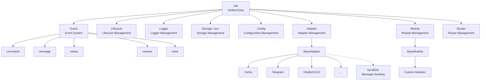
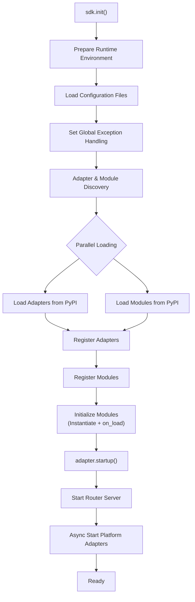
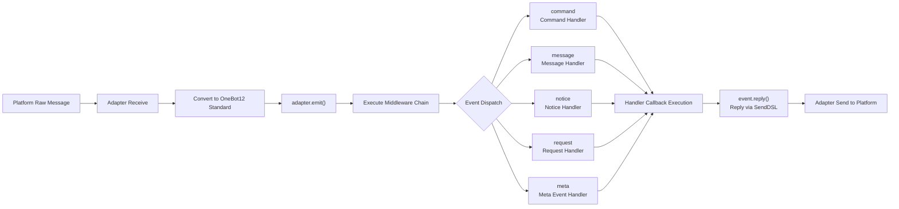
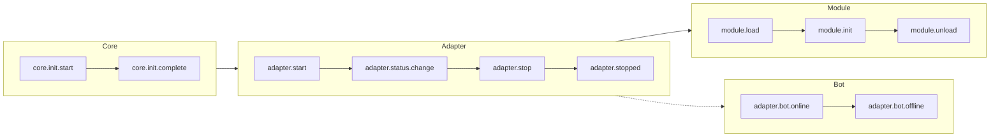
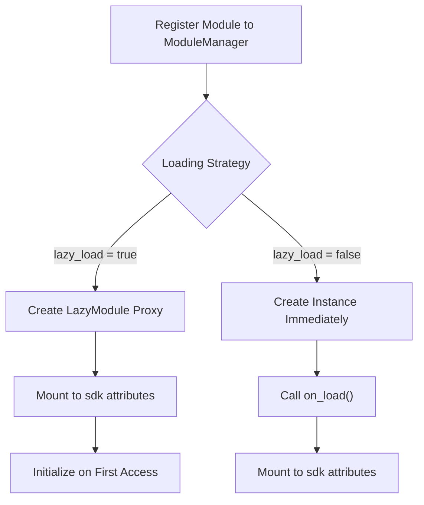

你是一个 ErisPulse 全栈开发专家，精通以下领域：

- ErisPulse 框架的核心架构和设计理念
- 模块开发和适配器开发
- 异步编程和事件驱动架构
- OneBot12 事件标准和平台适配
- SDK 核心模块 (Storage, Config, Logger, Router, Lifecycle)
- Event 包装类和事件处理系统
- 懒加载系统和生命周期管理
- SendDSL 消息发送系统
- 路由系统和 FastAPI 集成
- 各平台特性指南（OneBot11/12、Telegram、云湖、邮件等）
- 模块/适配器发布流程和模块商店
- 代码规范和文档字符串规范
- 已知问题追踪和历史 Bug 记录

你擅长：
- 编写高质量的异步 Python 代码
- 设计模块化、可扩展的架构
- 开发模块、适配器
- 使用 ErisPulse 的所有核心功能
- 遵循 ErisPulse 的最佳实践和代码规范
- 解决跨平台兼容性问题
- 通过 CLI 管理项目和发布

**使用以下文档作为知识库，回答问题时请优先参考文档内容。**


---


# ErisPulse 完整开发物料

> **注意**：本文档内容较多，建议仅用于具有强大上下文能力的 AI 模型


---


====
框架理解
====


### 架构概览

# Architecture Overview

This document introduces the technical architecture of ErisPulse SDK through visual diagrams, helping you quickly understand the design philosophy and module relationships of the framework.

## SDK Core Architecture

The diagram below shows the composition of the SDK's core modules and their relationships:



### Core Module Description

| Module | Description |
|------|------|
| **Event** | Event system, providing five types of event processing: command / message / notice / request / meta |
| **Adapter** | Adapter manager, managing the registration, startup, and shutdown of multi-platform adapters |
| **Module** | Module manager, managing plugin registration, loading, and unloading |
| **Lifecycle** | Lifecycle manager, providing event-driven lifecycle hooks |
| **Storage** | SQLite-based key-value storage system |
| **Config** | TOML format configuration file management |
| **Logger** | Modular logging system, supporting sub-loggers |
| **Router** | FastAPI-based HTTP/WebSocket route management |

## Initialization Process

The diagram below shows the complete initialization process of `sdk.init()`:



### Initialization Stage Breakdown

1.  **Environment Preparation** - Load TOML configuration files, set up global exception handling
2.  **Parallel Discovery** - Discover adapters and modules from installed PyPI packages simultaneously
3.  **Registration Phase** - Register discovered adapters and modules to their corresponding managers
4.  **Module Initialization** - Create module instances, call the `on_load` lifecycle method
5.  **Adapter Startup** - Start the router server (FastAPI), asynchronously start platform adapter connections

## Event Handling Process

The diagram below shows the complete flow path of messages from the platform to the handler:



### Key Steps in Event Handling

-   **Adapter Receive** - Platform adapters receive native events via WebSocket/Webhook, etc.
-   **OB12 Standardization** - Convert platform native events to the unified OneBot12 standard format
-   **Middleware Processing** - Execute registered middleware functions sequentially, allowing modification of event data
-   **Event Dispatch** - Dispatch to corresponding handlers based on event type (message/notice/request/meta)
-   **SendDSL Reply** - Handlers send responses via `event.reply()` or `SendDSL` chain calls

## Lifecycle Events

The diagram below shows the triggering sequence of lifecycle events for various framework components:



### Listening to Lifecycle Events

You can listen to these events via `lifecycle.on()` to execute custom logic:

```python
from ErisPulse import sdk

# Listen to all adapter events
@sdk.lifecycle.on("adapter")
async def on_adapter_event(event_data):
    print(f"Adapter event: {event_data}")

# Listen for module load completion
@sdk.lifecycle.on("module.load")
async def on_module_loaded(event_data):
    print(f"Module loaded: {event_data}")

# Listen for Bot online
@sdk.lifecycle.on("adapter.bot.online")
async def on_bot_online(event_data):
    print(f"Bot online: {event_data}")
```

## Module Loading Strategy

ErisPulse supports two module loading strategies:



> For more details, please refer to [Lazy Loading System](advanced/lazy-loading.md) and [Lifecycle Management](advanced/lifecycle.md).


### 术语表

# ErisPulse Glossary

This document explains common technical terms used in ErisPulse to help you better understand the framework's concepts.

## Core Concepts

### Event-Driven Architecture
**Simple Explanation:** Like a restaurant ordering system. Customers (users) order dishes (send messages), waiters (event system) pass the order (event) to the kitchen (modules), and after the kitchen processes it, the waiter serves the food (reply) to the customer.

**Technical Explanation:** The program's execution flow is triggered by external events rather than executing in a fixed sequence. Whenever a new event occurs (such as receiving a message), the framework automatically calls the corresponding handler function.

### OneBot12 Standard
**Simple Explanation:** Like the standard for sockets and plugs. The "plugs" (native event formats) of different platforms vary, but through converters, they all become a unified "plug" (OneBot12 format), so your code can act like a socket to adapt to all platforms.

**Technical Explanation:** A unified chatbot application interface standard that defines unified formats for events, messages, APIs, etc., allowing code to be reused across different platforms.

### Adapter
**Simple Explanation:** Like a translator. Different platforms speak different "languages" (API formats). The adapter translates these "languages" into "Mandarin" (OneBot12 standard) that ErisPulse can understand, and also translates ErisPulse's instructions back into the "languages" of each platform.

**Technical Explanation:** A component responsible for communicating with a specific platform. It receives native events from the platform and converts them into a standard format, or sends standard format requests to the platform.

### Module
**Simple Explanation:** Like an APP on a phone. Each module is an independent feature pack that can be added, deleted, or updated. Examples include "Weather Forecast Module", "Music Player Module", etc.

**Technical Explanation:** The basic unit of feature extension, containing specific business logic, event handlers, and configuration, which can be installed and uninstalled independently.

### Event
**Simple Explanation:** Like a notification on a phone. When there is a new message, new friend, or new group chat, the platform sends a "notification" (event) to your bot.

**Technical Explanation:** Anything notable happening on the platform, such as receiving a message, a user joining a group, a friend request, etc., is passed to the program in the form of structured data.

### Event Handler
**Simple Explanation:** Like a courier's delivery rules. When a "package" (event) is received, it decides who handles this package based on the package type (message, notice, request, etc.).

**Technical Explanation:** Functions marked with decorators that are automatically executed when a specific type of event occurs, such as `@command`, `@message`, etc.

## Development Related Terms

### SDK
**Simple Explanation:** Like a toolbox. It contains various common tools (storage, configuration, logs, etc.) that you can use directly when writing code, without reinventing the wheel.

**Technical Explanation:** Software Development Kit, which provides a set of pre-built components and tools to simplify the development process.

### Virtual Environment
**Simple Explanation:** Like an independent "workshop". Each project has its own "workshop", and the software packages installed inside do not interfere with each other, avoiding version conflicts.

**Technical Explanation:** An isolated Python environment where each environment has an independent package list and versions, preventing dependency conflicts between different projects.

### Asynchronous Programming
**Simple Explanation:** Like multitasking. The bot can do multiple things at once. For example, while waiting for a network response, it can still process messages from other users without freezing.

**Technical Explanation:** A programming style using `async`/`await` keywords that allows the program to switch to other tasks while waiting for time-consuming operations (such as network requests, file reading/writing), improving efficiency.

### Hot Reload
**Simple Explanation:** Like auto-refresh on a webpage. After you modify the code, you don't need to manually restart the bot; it automatically loads the new code, taking effect immediately.

**Technical Explanation:** In development mode, the program automatically detects file changes and reloads, allowing code modifications to take effect without a manual restart.

### Lazy Loading
**Simple Explanation:** Like drawers opened on demand. Unused drawers (modules) stay closed first and are only opened when needed, so you don't have to wait for all drawers to open during startup.

**Technical Explanation:** A delayed loading strategy where modules are initialized and loaded only when first accessed, reducing startup time and resource usage.

## Function Related Terms

### Command
**Simple Explanation:** Like a command in a game. When a user types a command like `/hello`, the bot executes the corresponding function.

**Technical Explanation:** A message starting with a specific prefix (such as `/`) that is recognized by the framework as a command and routed to the corresponding handler function.

### Reply
**Simple Explanation:** It is the "answer" the bot gives to the user. Whether it is text, image, or voice, it is a reply to the user's message.

**Technical Explanation:** The process where the adapter sends processing results back to the platform to be displayed to the user.

### Storage
**Simple Explanation:** Like the bot's "notepad". It can remember user information, settings, chat history, etc., so they can be found next time.

**Technical Explanation:** A persistent data storage system based on SQLite that implements key-value pair storage, used to save data that needs to be retained for a long time.

### Configuration
**Simple Explanation:** Like the bot's "settings". You can modify the bot's behavior through configuration files, such as changing port numbers, log levels, etc.

**Technical Explanation:** A configuration management system using TOML format, used to set various parameters for the framework and modules.

### Log
**Simple Explanation:** Like the bot's "diary". It records what the bot did and what problems it encountered, facilitating debugging and troubleshooting.

**Technical Explanation:** Recorded information generated during system runtime, including different levels such as info, warning, error, etc., used for monitoring and debugging.

### Router
**Simple Explanation:** Like traffic police directing traffic. Decides which request should go to which place to be processed, such as web requests, WebSocket connections, etc.

**Technical Explanation:** HTTP and WebSocket router manager that distributes requests to corresponding handler functions based on URL paths.

## Platform Related Terms

### Platform
**Simple Explanation:** The place where the bot works, such as Yunhu, Telegram, QQ, etc. Each platform has its own rules and API.

**Technical Explanation:** An application or service that provides chatbot services, such as Yunhu Enterprise Communication, Telegram, etc.

### OneBot11/12
**Simple Explanation:** Like the "International Standard" for chatbots. It defines unified formats for messages, events, etc., so that different software can understand each other.

**Technical Explanation:** OneBot is a universal chatbot application interface standard that defines formats for events, messages, APIs, etc. 11 and 12 are different versions of the standard.

### SendDSL
**Simple Explanation:** Like a "shortcut" for sending messages. You can send various types of messages (text, images, @someone, etc.) with a simple one-line statement.

**Technical Explanation:** A chained message sending interface that provides concise syntax to build and send complex messages.

## Other Terms

### Lifecycle
**Simple Explanation:** The bot's "life": Birth (startup), Work (running), Rest (stop). The lifecycle refers to events triggered at these key moments.

**Technical Explanation:** Key stages during the program's runtime, such as startup, loading modules, unloading modules, shutdown, etc. Operations can be executed by listening to these events.

### Annotation/Decorator
**Simple Explanation:** It is putting a "label" on a function. For example, the `@command("hello")` label tells the framework: This is a command handler named "hello".

**Technical Explanation:** Python syntactic sugar used to modify the behavior of functions or classes. In ErisPulse, it is used to mark event handlers, routes, etc.

### Type Annotation
**Simple Explanation:** It is telling the function what "type" the parameters are. For example, `request: Request` indicates that this parameter is a Request object.

**Technical Explanation:** A feature introduced in Python 3.5+ used to annotate the types of variables and parameters, improving code readability and type safety.

### TOML
**Simple Explanation:** A configuration file format that is more readable than JSON and stricter than YAML, suitable for writing configurations.

**Technical Explanation:** Tom's Obvious Minimal Language, a configuration file format with concise and clear syntax, widely used in Python project configuration management.

## Getting Help

If you find other terms in the documentation that you do not understand, feel free to ask via the following methods:
- Submit a GitHub Issue
- Participate in community discussions
- Contact the maintainers


====
快速开始
====

# Quick Start

> Confused by terminology? Check the [Glossary](terminology.md) for easy-to-understand explanations.

## Install ErisPulse

### Install using pip

Ensure your Python version is >= 3.10, then use pip to install ErisPulse:

```bash
pip install ErisPulse
```

### Install using uv (Recommended)

`uv` is a faster Python toolchain and is recommended. If you are unsure what "toolchain" means, think of it as a more efficient tool for installing and managing Python packages.

#### Install uv

```bash
pip install uv
```

#### Create project and install

```bash
uv python install 3.12              # Install Python 3.12
uv venv                             # Create virtual environment
.venv\Scripts\activate               # Activate environment (Windows)
# source .venv/bin/activate          # Linux/Mac
uv pip install ErisPulse --upgrade  # Install framework
```

## Initialize Project

### Interactive Initialization (Recommended)

```bash
epsdk init
```

This will launch an interactive wizard to guide you through:
- Project name setting
- Log level configuration
- Server configuration (host and port)
- Adapter selection and configuration
- Project structure creation

### Quick Initialization

```bash
# Quick mode with specified project name
epsdk init -q -n my_bot

# Or just specify project name
epsdk init -n my_bot
```

### Manual Project Creation

If you prefer to create the project manually:

```bash
mkdir my_bot && cd my_bot
epsdk init
```

## Install Modules

### Install via CLI

```bash
epsdk install Yunhu AIChat
```

### View Available Modules

```bash
epsdk list-remote
```

### Interactive Installation

Enter the interactive installation interface when no package name is specified:

```bash
epsdk install
```

## Run Project

```bash
# Normal run
epsdk run main.py

# Hot reload mode (recommended for development)
epsdk run main.py --reload
```

## Project Structure

Project structure after initialization:

```
my_bot/
├── config/
│   └── config.toml          # Configuration file
└── main.py                  # Entry file

```

## Configuration File

Basic `config.toml` configuration:

```toml
[ErisPulse.server]
host = "0.0.0.0"
port = 8000

[ErisPulse.logger]
level = "INFO"

[Yunhu_Adapter]
# Adapter configuration
```

## Next Steps

- [Getting Started Overview](getting-started/README.md) - Learn the basic concepts of ErisPulse
- [Create Your First Bot](getting-started/first-bot.md) - Create a simple bot
- [User Guide](user-guide/) - Deep dive into configuration and module management
- [Developer Guide](developer-guide/) - Develop custom modules and adapters


====
入门指南
====


### 入门指南总览

# Getting Started Guide

Welcome to the ErisPulse Getting Started Guide. If you are using ErisPulse for the first time, this guide will take you from scratch to gradually understand the core concepts and basic usage of the framework.

## Learning Path

This guide is organized in the following order, and is recommended to be read sequentially:

1. **Create Your First Bot** - Understand the complete project initialization workflow
2. **Core Concepts** - Understand the core architecture of ErisPulse
3. **Introduction to Event Handling** - Learn how to handle various types of events
4. **Common Task Examples** - Master the implementation of common features

## Choosing a Development Approach

ErisPulse supports two development approaches; you can choose based on your needs:

### Embedded Development (Suitable for Fast Prototyping)

Use ErisPulse directly within a project without creating separate modules.

```python
# main.py
import asyncio
from ErisPulse import sdk
from ErisPulse.Core.Event import command

@command("hello")
async def hello(event):
    await event.reply("你好！")

# Run the SDK and keep it running | Needs to run in an async environment
asyncio.run(sdk.run(keep_running=True))
```

**Pros:**
- Quick to get started, no extra configuration needed
- Suitable for internal project-specific features
- Convenient for debugging and testing

**Cons:**
- Not convenient for code reuse and distribution
- Difficult to manage dependencies independently

### Modular Development (Recommended for Production)

Create independent module packages and install and use them via package managers.

**Pros:**
- Easy to distribute and share
- Independent dependency management
- Clear version control

**Cons:**
- Requires additional project structure
- Initial configuration is relatively complex

## ErisPulse Core Concepts

### Architecture Overview

```
┌─────────────────────────────────────────────────────┐
│                ErisPulse 框架                 │
├─────────────────────────────────────────────────────┤
│                                             │
│  ┌──────────────┐      ┌──────────────┐    │
│  │  Adapter Sys │◄────►│  Event Sys   │    │
│  │             │      │              │    │
│  │  Yunhu      │      │  Message     │    │
│  │  Telegram   │      │  Command     │    │
│  │  OneBot11   │      │  Notice      │    │
│  │  Email      │      │  Request     │    │
│  └──────────────┘      │  Meta        │    │
│         │              └──────────────┘    │
│         ▼                   │              │
│  ┌──────────────┐           ▼              │
│  │  Module Sys  │◄──────────────┐       │
│  │             │               │       │
│  │  Module A   │               │       │
│  │  Module B   │               │       │
│  │  ...        │               │       │
│  └──────────────┘               │       │
│                               │       │
│  ┌──────────────┐              │       │
│  │  Core Modules│◄─────────────┘       │
│  │  Storage    │                      │
│  │  Config     │                      │
│  │  Logger     │                      │
│  │  Router     │                      │
│  └──────────────┘                      │
└─────────────────────────────────────────────┘
             │                    │
             ▼                    ▼
        ┌────────┐          ┌────────┐
        │  Plat  │          │  User  │
        │  API   │          │  Code  │
        └────────┘          └────────┘
```

### Core Components Explanation

#### 1. Adapter System

The adapter is responsible for communicating with specific platforms, converting platform-specific events into a unified OneBot12 standard format.

**Examples:**
- Yunhu Adapter: Communicating with the Yunhu platform
- Telegram Adapter: Communicating with the Telegram Bot API
- OneBot11 Adapter: Communicating with OneBot11-compatible applications

#### 2. Event System

The event system is responsible for handling various types of events, including:
- **Message Event**: Messages sent by the user
- **Command Event**: Commands entered by the user (e.g., `/hello`)
- **Notice Event**: System notifications (e.g., friend added, group member changes)
- **Request Event**: User requests (e.g., friend requests, group invitations)
- **Meta Event**: System-level events (e.g., connection, heartbeat)

#### 3. Module System

Modules are the primary way to extend functionality and are used to:
- Register event handlers
- Implement business logic
- Provide command interfaces
- Call adapters to send messages

#### 4. Core Modules

Modules providing basic functions:
- **Storage**: SQLite-based key-value storage
- **Config**: Configuration management in TOML format
- **Logger**: Modular logging system
- **Router**: HTTP and WebSocket routing management

## Start Learning

Are you ready? Let's start creating your first bot.

- [Create Your First Bot](first-bot.md)


### 创建第一个机器人

# Create Your First Bot

This guide will take you from scratch to create a simple ErisPulse bot.

## Step 1: Create Project

Use the CLI tool to initialize the project:

```bash
# Interactive initialization
epsdk init

# Or quick initialization
epsdk init -q -n my_first_bot
```

Follow the prompts to complete the configuration. It is recommended to select:
- Project name: my_first_bot
- Log level: INFO
- Server: Default configuration
- Adapter: Choose your needed platform (e.g., Yunhu)

## Step 2: View Project Structure

The project structure after initialization:

```text
my_first_bot/
├── config/
│   └── config.toml
├── main.py
└── requirements.txt
```

## Step 3: Write Your First Command

Open `main.py` and write a simple command handler:

```python
from ErisPulse import sdk
from ErisPulse.Core.Event import command

@command("hello", help="Send a greeting message")
async def hello_handler(event):
    """Handle hello command"""
    user_name = event.get_user_nickname() or "Friend"
    await event.reply(f"Hello, {user_name}! I am the ErisPulse bot.")

@command("ping", help="Test if the bot is online")
async def ping_handler(event):
    """Handle ping command"""
    await event.reply("Pong! The bot is running normally.")

async def main():
    """Main entry function"""
    print("Initializing ErisPulse...")
    # Run SDK and keep it running
    await sdk.run(keep_running=True)
    print("ErisPulse initialization complete!")

if __name__ == "__main__":
    import asyncio
    asyncio.run(main())
```

> In addition to using `sdk.run()` directly, you can also control the execution flow more granularly, such as:
```python
import asyncio
from ErisPulse import sdk

async def main():
    try:
        isInit = await sdk.init()
        
        if not isInit:
            sdk.logger.error("ErisPulse initialization failed, please check logs")
            return
        
        await sdk.adapter.startup()
        
        # Keep the program running; if you have other operations to execute, you can also not keep the event loop running, but you need to handle it yourself
        await asyncio.Event().wait()
    except Exception as e:
        sdk.logger.error(e)
    finally:
        await sdk.uninit()

if __name__ == "__main__":
    asyncio.run(main())
```

## Step 4: Run the Bot

```bash
# Run normally
epsdk run main.py

# Development mode (supports hot reload)
epsdk run main.py --reload
```

## Step 5: Test the Bot

Send the command in your chat platform:

```text
/hello
```

You should receive a response from the bot.

## Code Explanation

### Command Decorator

```python
@command("hello", help="Send a greeting message")
```

- `hello`: Command name, users call it via `/hello`
- `help`: Command help description, shown in the `/help` command

### Event Arguments

```python
async def hello_handler(event):
```

The `event` parameter is an Event object, containing:
- Message content
- Sender information
- Platform information
- etc...

### Sending a Reply

```python
await event.reply("Reply content")
```

`event.reply()` is a convenient method for sending a message to the sender.

## Extension: Adding More Features

### Add Message Listening

```python
from ErisPulse.Core.Event import message

@message.on_message()
async def message_handler(event):
    """Listen to all messages"""
    text = event.get_text()
    if "你好" in text:
        await event.reply("你好！")
```

### Add Notification Listening

```python
from ErisPulse.Core.Event import notice

@notice.on_friend_add()
async def friend_add_handler(event):
    """Listen to friend addition events"""
    user_id = event.get_user_id()
    await event.reply(f"欢迎添加我为好友！你的 ID 是 {user_id}")
```

### Use Storage System

```python
# Get counter
count = sdk.storage.get("hello_count", 0)

# Increment counter
count += 1
sdk.storage.set("hello_count", count)

await event.reply(f"这是第 {count} 次调用 hello 命令")
```

## Common Issues

### Bot does not respond?

1. Check if the adapter is configured correctly
2. View log output to confirm if there are errors
3. Confirm if the command prefix is correct (default is `/`)

### How to change the command prefix?

Add this to `config.toml`:

```toml
[ErisPulse.event.command]
prefix = "!"
case_sensitive = false
```

### How to support multiple platforms?

The code will automatically adapt to all loaded platform adapters. Just ensure your logic is compatible:

```python
@command("hello")
async def hello_handler(event):
    platform = event.get_platform()
    
    if platform == "yunhu":
        await event.reply("你好！来自云湖")
    elif platform == "telegram":
        await event.reply("Hello! From Telegram")
```

## Next Steps

- [Basic Concepts](basic-concepts.md) - Understand ErisPulse core concepts deeply
- [Event Handling Introduction](event-handling.md) - Learn how to handle various events
- [Common Task Examples](common-tasks.md) - Master more practical functions


### 基础概念

# Basic Concepts

This guide introduces the core concepts of ErisPulse, helping you understand the framework's design philosophy and basic architecture.

## Event-Driven Architecture

ErisPulse adopts an event-driven architecture, where all interactions are conveyed and processed through events.

### Event Flow

```
User sends message
      │
      ▼
Platform receives
      │
      ▼
Adapter receives platform-native event
      │
      ▼
Converted to OneBot12 standard event
      │
      ▼
Submitted to event system
      │
      ▼
Dispatched to registered handlers
      │
      ▼
Module processes event
      │
      ▼
Response sent via adapter
      │
      ▼
Platform displays to user
```

### OneBot12 Standard

ErisPulse uses OneBot12 as its core event standard. OneBot12 is a generic chatbot application interface standard that defines a unified event format.

All adapters convert platform-specific events into OneBot12 format to ensure code consistency.

## Core Components

### 1. SDK Object

The SDK is the unified entry point for all functionality, providing access to core components.

```python
from ErisPulse import sdk

# Access core modules
sdk.storage    # Storage system
sdk.config     # Configuration system
sdk.logger     # Logging system
sdk.adapter    # Adapter system
sdk.module     # Module system
sdk.router     # Routing system
sdk.lifecycle  # Lifecycle system
```

### 2. Event Object

The Event object encapsulates event data, providing convenient access methods.

```python
@command("info")
async def info_handler(event):
    # Get event info
    event_id = event.get_id()
    user_id = event.get_user_id()
    platform = event.get_platform()
    text = event.get_text()
    
    # Send reply
    await event.reply(f"User: {user_id}, Platform: {platform}")
```

### 3. Adapters

Adapters are bridges between ErisPulse and external platforms.

**Responsibilities:**
- Receive platform-native events
- Convert to OneBot12 standard format
- Send standard format events to the platform

**Example Adapters:**
- Yunhu Adapter: Communicates with the Yunhu platform
- Telegram Adapter: Communicates with the Telegram Bot API
- OneBot11 Adapter: Communicates with OneBot11 compatible applications
- Email Adapter: Handles email sending and receiving

### 4. Modules

Modules are the basic unit of functional extension and can:
- Register event handlers
- Implement business logic
- Call adapters to send messages
- Use services provided by core modules

```python
from ErisPulse.Core.Bases import BaseModule
from ErisPulse import sdk

class MyModule(BaseModule):
    def __init__(self):
        self.sdk = sdk
        self.logger = sdk.logger.get_child("MyModule")
    
    async def on_load(self, event):
        """Called when module loads"""
        # Register event handler
        @command("mycmd", help="My command")
        async def my_command(event):
            await event.reply("Command executed successfully")
        
        self.logger.info("Module loaded")
    
    async def on_unload(self, event):
        """Called when module unloads"""
        self.logger.info("Module unloaded")
```

## Event Types

### Message Event

Handles any message sent by a user (including private chats and group chats).

```python
from ErisPulse.Core.Event import message

@message.on_message()
async def message_handler(event):
    text = event.get_text()
    await event.reply(f"Message received: {text}")
```

### Command Event

Handles messages starting with a command prefix (e.g., `/hello`).

```python
from ErisPulse.Core.Event import command

@command("hello", help="Send greeting")
async def hello_handler(event):
    await event.reply("Hello there!")
```

### Notice Event

Handles system notifications (e.g., friend addition, group member changes).

```python
from ErisPulse.Core.Event import notice

@notice.on_friend_add()
async def friend_add_handler(event):
    await event.reply("Welcome to add me as a friend!")
```

### Request Event

Handles user requests (e.g., friend requests, group invitations).

```python
from ErisPulse.Core.Event import request

@request.on_friend_request()
async def friend_request_handler(event):
    await event.reply("I have received your friend request")
```

### Meta Event

Handles system-level events (e.g., connection, heartbeat).

```python
from ErisPulse.Core.Event import meta

@meta.on_connect()
async def connect_handler(event):
    platform = event.get_platform()
    sdk.logger.info(f"{platform} connected successfully")
```

## Core Modules

### Storage

A SQLite-based key-value storage system for persistent data.

```python
# Set value
sdk.storage.set("key", "value")

# Get value
value = sdk.storage.get("key", "default_value")

# Batch operations
sdk.storage.set_multi({
    "key1": "value1",
    "key2": "value2"
})

# Transaction
with sdk.storage.transaction():
    sdk.storage.set("key1", "value1")
    sdk.storage.set("key2", "value2")
```

### Config

TOML format configuration file management.

```python
# Get config
config = sdk.config.getConfig("MyModule", {})

# Set config
sdk.config.setConfig("MyModule", {"key": "value"})

# Read nested config
value = sdk.config.getConfig("MyModule.subkey", "default")
```

### Logger

A modular logging system.

```python
# Log message
sdk.logger.info("This is an info message")
sdk.logger.warning("This is a warning message")
sdk.logger.error("This is an error message")

# Get child logger
child_logger = sdk.logger.get_child("submodule")
child_logger.info("Submodule log")
```

**Property Access Syntax Sugar**

In addition to using the `get_child()` method, you can also create child loggers via **property access**. This is a more concise **syntax sugar** approach:

```python
# Create child logger via property access
sdk.logger.mymodule.info("Module message")

# Support nested access
sdk.logger.mymodule.database.info("Database message")
```

### Router

HTTP and WebSocket route management, built on top of FastAPI.

> Route handlers are based on FastAPI and must use type annotations correctly; otherwise, parameter validation errors may occur.

```python
from fastapi import Request, WebSocket

# Register HTTP route
async def handler(request: Request):
    return {"status": "ok"}

sdk.router.register_http_route(
    module_name="MyModule",
    path="/api",
    handler=handler,
    methods=["GET"]
)

# Register WebSocket route
async def ws_handler(websocket: WebSocket):
    # Note: No need for await websocket.accept(), automatically called internally
    data = await websocket.receive_text()
    await websocket.send_text(f"Echo: {data}")

sdk.router.register_websocket(
    module_name="MyModule",
    path="/ws",
    handler=ws_handler
)
```

**Common Issues:** If you see the error `{"detail":[{"type":"missing","loc":["query","request"],"msg":"Field required"}]}`, it indicates missing type annotations. Please ensure:
- HTTP handler parameters use `request: Request` annotation
- WebSocket handler parameters use `websocket: WebSocket` annotation

For more routing features, please refer to [Router Manager](../advanced/router.md).

## SendDSL Message Sending

Adapters provide a chain-call interface for sending messages.

### Basic Sending

```python
# Get adapter instance
yunhu = sdk.adapter.get("yunhu")

# Send message
await yunhu.Send.To("user", "U1001").Text("Hello")

# Specify sending account
await yunhu.Send.Using("bot1").To("group", "G1001").Text("Group message")
```

### Chain Modifiers

```python
# @User
await yunhu.Send.To("group", "G1001").At("U2001").Text("@message")

# Reply message
await yunhu.Send.To("group", "G1001").Reply("msg123").Text("Reply")

# @All
await yunhu.Send.To("group", "G1001").AtAll().Text("Announcement")
```

### Event Reply Methods

The Event object provides convenient reply methods:

```python
@command("test")
async def test_handler(event):
    # Simple text reply
    await event.reply("Reply content")
    
    # Send image
    await event.reply("http://example.com/image.jpg", method="Image")
    
    # Send voice
    await event.reply("http://example.com/voice.mp3", method="Voice")
```

## Lazy Loading System

ErisPulse supports module lazy loading. Modules are initialized only when first accessed, improving startup speed.

```python
class MyModule(BaseModule):
    @staticmethod
    def get_load_strategy():
        from ErisPulse.loaders import ModuleLoadStrategy
        return ModuleLoadStrategy(
            lazy_load=True,   # Enable lazy loading (default)
            priority=0       # Load priority
        )
```

**Scenarios requiring immediate loading:**
- Modules listening to lifecycle events
- Scheduled task modules
- Modules that need to be initialized at application startup

## Next Steps

- [Event Handling Intro](event-handling.md) - Learn how to handle various events
- [Common Tasks Examples](common-tasks.md) - Master the implementation of common functions


### 事件处理入门

# Getting Started with Event Handling

This guide introduces how to handle various events in ErisPulse.

## Event Type Overview

ErisPulse supports the following event types:

| Event Type | Description | Use Cases |
|---------|------|---------|
| Message Event | Any message sent by a user | Chatbots, content filtering |
| Command Event | Messages starting with a command prefix | Command handling, feature entry points |
| Notification Event | System notifications (friend added, group member changes, etc.) | Welcome messages, status notifications |
| Request Event | User requests (friend requests, group invitations) | Automatic request handling |
| Meta Event | System-level events (connection, heartbeat) | Connection monitoring, status checks |

## Message Event Handling

### Listening to all messages

```python
from ErisPulse.Core.Event import message

@message.on_message()
async def message_handler(event):
    text = event.get_text()
    user_id = event.get_user_id()
    sdk.logger.info(f"Received message from {user_id}: {text}")
```

### Listening to private messages

```python
@message.on_private_message()
async def private_handler(event):
    user_id = event.get_user_id()
    await event.reply(f"Hello, {user_id}! This is a private message.")
```

### Listening to group messages

```python
@message.on_group_message()
async def group_handler(event):
    group_id = event.get_group_id()
    user_id = event.get_user_id()
    sdk.logger.info(f"{user_id} sent a message in group {group_id}")
```

### Listening to @ mentions

```python
@message.on_at_message()
async def at_handler(event):
    # Get list of users mentioned
    mentions = event.get_mentions()
    await event.reply(f"You mentioned these users: {mentions}")
```

## Command Event Handling

### Basic Commands

```python
from ErisPulse.Core.Event import command

@command("help", help="Display help information")
async def help_handler(event):
    help_text = """
Available commands:
/help - Display help
/ping - Test connection
/info - View info
    """
    await event.reply(help_text)
```

### Command Aliases

```python
@command(["help", "h"], aliases=["帮助"], help="Display help information")
async def help_handler(event):
    await event.reply("Help information...")
```

Users can invoke this command in any of the following ways:
- `/help`
- `/h`
- `/帮助`

### Command Arguments

```python
@command("echo", help="Echo back the message")
async def echo_handler(event):
    # Get command arguments
    args = event.get_command_args()
    
    if not args:
        await event.reply("Please enter the message you want to echo")
    else:
        await event.reply(f"You said: {' '.join(args)}")
```

### Command Groups

```python
@command("admin.reload", group="admin", help="Reload modules")
async def reload_handler(event):
    await event.reply("Modules have been reloaded")

@command("admin.stop", group="admin", help="Stop the bot")
async def stop_handler(event):
    await event.reply("Bot has stopped")
```

### Command Permissions

```python
def is_admin(event):
    """Check if the user is an administrator"""
    admin_list = ["user123", "user456"]
    return event.get_user_id() in admin_list

@command("admin", permission=is_admin, help="Admin commands")
async def admin_handler(event):
    await event.reply("This is an admin command")
```

### Command Priority

```python
# The lower the priority value, the earlier it executes
@message.on_message(priority=10)
async def high_priority_handler(event):
    await event.reply("High priority handler")

@message.on_message(priority=1)
async def low_priority_handler(event):
    await event.reply("Low priority handler")
```

### Parallel Event Handling

The ErisPulse event system uses a **same-priority parallel, different-priority serial** scheduling model:

```
Event Arrived
    ↓
priority=0 Group: [Handler A || Handler B] Parallel → Merge Results
    ↓ (If not interrupted)
priority=1 Group: [Handler C || Handler D] Parallel → Merge Results
    ↓
...
```

- **Same priority parallel**: Multiple handlers with the same priority execute simultaneously to improve throughput
- **Different priority serial**: Groups of different priorities execute sequentially to ensure high-priority handlers run first
- **Copy-On-Write**: Copies are not created when handlers do not modify data, ensuring zero overhead
- **Conflict handling**: When multiple handlers of the same priority modify the same field, the last modified value is used and a warning is logged
- **Interruption mechanism**: After any handler calls `event.mark_processed()`, subsequent lower-priority groups are skipped

```python
# Example: Handlers with same priority execute in parallel
@message.on_message(priority=0)
async def handler_a(event):
    # Process task A
    event['result_a'] = process_a()

@message.on_message(priority=0)
async def handler_b(event):
    # Execute in parallel with handler_a
    event['result_b'] = process_b()

# Different priorities execute serially
@message.on_message(priority=10)
async def handler_c(event):
    # Execute after priority=0 group completes
    pass
```

## Notification Event Handling

### Friend Add

```python
from ErisPulse.Core.Event import notice

@notice.on_friend_add()
async def friend_add_handler(event):
    user_id = event.get_user_id()
    nickname = event.get_user_nickname() or "New Friend"
    await event.reply(f"Welcome to add me as a friend, {nickname}!")
```

### Group Member Increase

```python
@notice.on_group_increase()
async def member_increase_handler(event):
    group_id = event.get_group_id()
    user_id = event.get_user_id()
    await event.reply(f"Welcome new member {user_id} to join group {group_id}")
```

### Group Member Decrease

```python
@notice.on_group_decrease()
async def member_decrease_handler(event):
    group_id = event.get_group_id()
    user_id = event.get_user_id()
    await event.reply(f"Member {user_id} left group {group_id}")
```

## Request Event Handling

### Friend Request

```python
from ErisPulse.Core.Event import request

@request.on_friend_request()
async def friend_request_handler(event):
    user_id = event.get_user_id()
    comment = event.get_comment()
    
    sdk.logger.info(f"Received friend request: {user_id}, Comment: {comment}")
    
    # Requests can be handled via the adapter API
    # Refer to adapter documentation for specific implementation
```

### Group Invite Request

```python
@request.on_group_request()
async def group_request_handler(event):
    group_id = event.get_group_id()
    user_id = event.get_user_id()
    
    await event.reply(f"Received an invitation to group {group_id}, from {user_id}")
```

## Meta Event Handling

### Connection Event

```python
from ErisPulse.Core.Event import meta

@meta.on_connect()
async def connect_handler(event):
    platform = event.get_platform()
    sdk.logger.info(f"{platform} platform connected")

@meta.on_disconnect()
async def disconnect_handler(event):
    platform = event.get_platform()
    sdk.logger.warning(f"{platform} platform disconnected")
```

### Heartbeat Event

```python
@meta.on_heartbeat()
async def heartbeat_handler(event):
    platform = event.get_platform()
    sdk.logger.debug(f"{platform} heartbeat check")
```

### Bot Status Query

After the adapter sends a meta event, the framework automatically tracks Bot status, which you can query at any time:

```python
from ErisPulse import sdk

# Check if a specific Bot is online
if sdk.adapter.is_bot_online("telegram", "123456"):
    await adapter.Send.To("user", "123456").Text("Bot is online")

# List all currently online Bots
bots = sdk.adapter.list_bots()
for platform, bot_list in bots.items():
    for bot_id, info in bot_list.items():
        print(f"{platform}/{bot_id}: {info['status']}")

# Get complete status summary
summary = sdk.adapter.get_status_summary()
```

## Interactive Handling

### Sending Replies using the `reply` Method

The `event.reply()` method supports various modifier parameters for sending messages with features like @ mentions and replies:

```python
# Simple reply
await event.reply("Hello")

# Send messages of different types
await event.reply("http://example.com/image.jpg", method="Image")  # Image
await event.reply("http://example.com/voice.mp3", method="Voice")  # Voice

# @ a single user
await event.reply("Hello", at_users=["user123"])

# @ multiple users
await event.reply("Hello everyone", at_users=["user1", "user2", "user3"])

# Reply to a message
await event.reply("Reply content", reply_to="msg_id")

# @ all members
await event.reply("Announcement", at_all=True)

# Combination: @ user + reply to message
await event.reply("Content", at_users=["user1"], reply_to="msg_id")
```

### Waiting for User Reply

```python
@command("ask", help="Ask the user")
async def ask_handler(event):
    await event.reply("Please enter your name:")
    
    # Wait for user reply, timeout 30 seconds
    reply = await event.wait_reply(timeout=30)
    
    if reply:
        name = reply.get_text()
        await event.reply(f"Hello, {name}!")
    else:
        await event.reply("Timeout, please try again.")
```

### Waiting for Reply with Validation

```python
@command("age", help="Ask for age")
async def age_handler(event):
    def validate_age(event_data):
        """Validate if age is valid"""
        try:
            age = int(event_data.get_text())
            return 0 <= age <= 150
        except ValueError:
            return False
    
    await event.reply("Please enter your age (0-150):")
    
    reply = await event.wait_reply(
        timeout=60,
        validator=validate_age
    )
    
    if reply:
        age = int(reply.get_text())
        await event.reply(f"Your age is {age}")
    else:
        await event.reply("Invalid input or timeout")
```

### Waiting for Reply with Callback

```python
@command("confirm", help="Confirm action")
async def confirm_handler(event):
    async def handle_confirmation(reply_event):
        text = reply_event.get_text().lower()
        
        if text in ["是", "yes", "y"]:
            await event.reply("Operation confirmed!")
        else:
            await event.reply("Operation cancelled.")
    
    await event.reply("Confirm executing this action? (Yes/No)")
    
    await event.wait_reply(
        timeout=30,
        callback=handle_confirmation
    )
```

### Confirm Dialog

Wait for user confirmation or denial, automatically recognizing built-in Chinese and English confirmation words:

```python
@command("confirm", help="Confirm action")
async def confirm_handler(event):
    if await event.confirm("Are you sure you want to perform this action?"):
        await event.reply("Confirmed, executing...")
    else:
        await event.reply("Cancelled")

# Custom confirmation words
if await event.confirm("Continue?", yes_words={"go", "继续"}, no_words={"stop", "停止"}):
    pass
```

### Choose Menu

Users can reply with the option number or option text:

```python
@command("choose", help="Choose")
async def choose_handler(event):
    choice = await event.choose(
        "Please select a color:",
        ["Red", "Green", "Blue"]
    )
    
    if choice is not None:
        colors = ["Red", "Green", "Blue"]
        await event.reply(f"You selected: {colors[choice]}")
    else:
        await event.reply("Timeout or no selection made")
```

### Collect Form

Multi-step collection of user input:

```python
@command("register", help="Register")
async def register_handler(event):
    data = await event.collect([
        {"key": "name", "prompt": "Please enter your name:"},
        {"key": "age", "prompt": "Please enter your age:", 
         "validator": lambda e: e.get_text().isdigit()},
        {"key": "email", "prompt": "Please enter your email:"}
    ])
    
    if data:
        await event.reply(f"Registration successful!\nName: {data['name']}\nAge: {data['age']}\nEmail: {data['email']}")
    else:
        await event.reply("Registration timeout or invalid input")
```

### Wait for Any Event

Wait for any event that meets the condition, not limited to the same user:

```python
@command("wait_member", help="Wait for new member")
async def wait_member_handler(event):
    await event.reply("Waiting for group member to join...")
    
    evt = await event.wait_for(
        event_type="notice",
        condition=lambda e: e.get_detail_type() == "group_member_increase",
        timeout=120
    )
    
    if evt:
        await event.reply(f"Welcome new member: {evt.get_user_id()}")
    else:
        await event.reply("Wait timeout")
```

### Multi-round Conversation

Create an interactive multi-round conversation context:

```python
@command("survey", help="Survey")
async def survey_handler(event):
    conv = event.conversation(timeout=60)
    
    await conv.say("Welcome to the survey!")
    
    while conv.is_active:
        reply = await conv.wait()
        
        if reply is None:
            await conv.say("Conversation timed out, goodbye!")
            break
        
        text = reply.get_text()
        
        if text == "exit":
            await conv.say("Goodbye!")
            break
        
        await conv.say(f"You said: {text}, continue typing or reply 'exit' to end")
```

### Built-in Confirmation Words

ErisPulse includes a built-in set of Chinese and English confirmation words:

- **Confirmation words** (`CONFIRM_YES_WORDS`): 是, yes, y, 确认, 确定, 好, 好的, ok, true, 对, 嗯, 行, 同意, 没问题...
- **Negative words** (`CONFIRM_NO_WORDS`): 否, no, n, 取消, 不, 不要, 不行, cancel, false, 错, 拒绝, 不可以...

## Event Data Access

### Common Methods of the Event Object

```python
@command("info")
async def info_handler(event):
    # Basic info
    event_id = event.get_id()
    event_time = event.get_time()
    event_type = event.get_type()
    detail_type = event.get_detail_type()
    
    # Sender info
    user_id = event.get_user_id()
    nickname = event.get_user_nickname()
    
    # Message content
    message_segments = event.get_message()
    alt_message = event.get_alt_message()
    text = event.get_text()
    
    # Group info
    group_id = event.get_group_id()
    
    # Bot info
    self_id = event.get_self_user_id()
    self_platform = event.get_self_platform()
    
    # Raw data
    raw_data = event.get_raw()
    raw_type = event.get_raw_type()
    
    # Platform info
    platform = event.get_platform()
    
    # Message type checks
    is_private = event.is_private_message()
    is_group = event.is_group_message()
    is_at = event.is_at_message()
    
    # Command info
    if event.is_command():
        cmd_name = event.get_command_name()
        cmd_args = event.get_command_args()
        cmd_raw = event.get_command_raw()
```

### Platform Extension Methods

In addition to built-in methods, each platform adapter registers platform-specific methods to facilitate access to platform-specific data.

```python
from ErisPulse.Core.Event import message

@message.on_message()
async def handle_message(event):
    platform = event.get_platform()

    # Call specific methods based on platform
    if platform == "telegram":
        chat_type = event.get_chat_type()      # Telegram specific method
    elif platform == "email":
        subject = event.get_subject()           # Email specific method
```

If you are not sure whether a platform has registered a specific method, you can query which methods are registered for a platform:

```python
from ErisPulse.Core.Event import get_platform_event_methods

methods = get_platform_event_methods("telegram")
# ["get_chat_type", "is_bot_message", ...]
```

> For platform-specific methods registered by each platform, please refer to the corresponding [Platform Documentation](../platform-guide/).

## Best Practices for Event Handling

### 1. Exception Handling

```python
@command("process")
async def process_handler(event):
    try:
        # Business logic
        result = await do_some_work()
        await event.reply(f"Result: {result}")
    except ValueError as e:
        # Expected business errors
        await event.reply(f"Parameter error: {e}")
    except Exception as e:
        # Unexpected errors
        sdk.logger.error(f"Processing failed: {e}")
        await event.reply("Processing failed, please try again later")
```

### 2. Logging

```python
@message.on_message()
async def message_handler(event):
    user_id = event.get_user_id()
    text = event.get_text()
    
    sdk.logger.info(f"Processing message: {user_id} - {text}")
    
    # Use the module's own logger
    from ErisPulse import sdk
    logger = sdk.logger.get_child("MyHandler")
    logger.debug(f"Detailed debug info")
```

### 3. Conditional Handling

```python
def should_handle(event):
    """Determine if this event should be handled"""
    # Only handle messages from specific users
    if event.get_user_id() in ["bot1", "bot2"]:
        return False
    
    # Only handle messages containing specific keywords
    if "keyword" not in event.get_text():
        return False
    
    return True

@message.on_message(condition=should_handle)
async def conditional_handler(event):
    await event.reply("Condition met, handling message")
```

## Next Steps

- [Common Task Examples](common-tasks.md) - Learn to implement common features
- [Detailed Event Wrapper Class](../developer-guide/modules/event-wrapper.md) - Deep dive into Event objects
- [User Guide](../user-guide/) - Learn about configuration and module management


### 常见任务示例

# Common Task Examples

This guide provides implementation examples for common features to help you quickly implement frequently used functions.

## Content List

1. Data Persistence
2. Scheduled Tasks
3. Message Filtering
4. Multi-platform Adaptation
5. Permission Control
6. Message Statistics
7. Search Functionality
8. Image Processing

## Data Persistence

### Simple Counter

```python
from ErisPulse import sdk
from ErisPulse.Core.Event import command

@command("count", help="View number of command invocations")
async def count_handler(event):
    # Get count
    count = sdk.storage.get("command_count", 0)
    
    # Increment count
    count += 1
    sdk.storage.set("command_count", count)
    
    await event.reply(f"This is the {count}th invocation of this command")
```

### User Data Storage

```python
@command("profile", help="View personal profile")
async def profile_handler(event):
    user_id = event.get_user_id()
    
    # Get user data
    user_data = sdk.storage.get(f"user:{user_id}", {
        "nickname": "",
        "join_date": None,
        "message_count": 0
    })
    
    profile_text = f"""
Nickname: {user_data['nickname']}
Join Date: {user_data['join_date']}
Message Count: {user_data['message_count']}
    """
    
    await event.reply(profile_text.strip())

@command("setnick", help="Set nickname")
async def setnick_handler(event):
    user_id = event.get_user_id()
    args = event.get_command_args()
    
    if not args:
        await event.reply("Please enter a nickname")
        return
    
    # Update user data
    user_data = sdk.storage.get(f"user:{user_id}", {})
    user_data["nickname"] = " ".join(args)
    sdk.storage.set(f"user:{user_id}", user_data)
    
    await event.reply(f"Nickname has been set to: {' '.join(args)}")
```

## Scheduled Tasks

### Simple Timer

```python
from ErisPulse import sdk
from ErisPulse.Core.Event import command
import asyncio

class TimerModule:
    def __init__(self):
        self.sdk = sdk
        self._tasks = []
    
    async def on_load(self, event):
        """Start scheduled tasks when module loads"""
        self._start_timers()
        
        @command("timer", help="Manage timers")
        async def timer_handler(event):
            await event.reply("Timers are running...")
    
    def _start_timers(self):
        """Start scheduled tasks"""
        # Execute every 60 seconds
        task = asyncio.create_task(self._every_minute())
        self._tasks.append(task)
        
        # Execute at midnight daily
        task = asyncio.create_task(self._daily_task())
        self._tasks.append(task)
    
    async def _every_minute(self):
        """Task executed every minute"""
        self.sdk.logger.info("Minute task executed")
        # Your logic...
    
    async def _daily_task(self):
        """Task executed at midnight daily"""
        import time
        
        while True:
            # Calculate time to midnight
            now = time.time()
            midnight = now + (86400 - now % 86400)
            
            await asyncio.sleep(midnight - now)
            
            # Execute task
            self.sdk.logger.info("Daily task executed")
            # Your logic...
```

### Using Lifecycle Events

```python
@sdk.lifecycle.on("core.init.complete")
async def init_complete_handler(event_data):
    """Start scheduled tasks after SDK initialization"""
    import asyncio
    
    async def daily_reminder():
        """Daily reminder"""
        await asyncio.sleep(86400)  # 24 hours
        self.sdk.logger.info("Executing daily task")
    
    # Start background task
    asyncio.create_task(daily_reminder())
```

## Message Filtering

### Keyword Filtering

```python
from ErisPulse.Core.Event import message

blocked_words = ["rubbish", "ads", "phishing"]

@message.on_message()
async def filter_handler(event):
    text = event.get_text()
    
    # Check if sensitive words are included
    for word in blocked_words:
        if word in text:
            sdk.logger.warning(f"Intercepting sensitive message: {word}")
            return  # Do not process this message
    
    # Process message normally
    await event.reply(f"Received: {text}")
```

### Blacklist Filtering

```python
# Load blacklist from configuration or storage
blacklist = sdk.storage.get("user_blacklist", [])

@message.on_message()
async def blacklist_handler(event):
    user_id = event.get_user_id()
    
    if user_id in blacklist:
        sdk.logger.info(f"Blacklisted user: {user_id}")
        return  # Do not process
    
    # Process normally
    await event.reply(f"Hello, {user_id}")
```

## Multi-platform Adaptation

### Platform-specific Responses

```python
@command("help", help="Display help")
async def help_handler(event):
    platform = event.get_platform()
    
    if platform == "yunhu":
        await event.reply("Yunhu platform help...")
    elif platform == "telegram":
        await event.reply("Telegram platform help...")
    elif platform == "onebot11":
        await event.reply("OneBot11 help...")
    else:
        await event.reply("General help information")
```

### Platform Feature Detection

```python
@command("rich", help="Send rich text messages")
async def rich_handler(event):
    platform = event.get_platform()
    
    if platform == "yunhu":
        # Yunhu supports HTML
        yunhu = sdk.adapter.get("yunhu")
        await yunhu.Send.To("user", event.get_user_id()).Html(
            "<b>Bold text</b><i>Italic text</i>"
        )
    elif platform == "telegram":
        # Telegram supports Markdown
        telegram = sdk.adapter.get("telegram")
        await telegram.Send.To("user", event.get_user_id()).Markdown(
            "**Bold text** *Italic text*"
        )
    else:
        # Other platforms use plain text
        await event.reply("Bold text Italic text")
```

## Permission Control

### Admin Check

```python
# Configure admin list
ADMINS = ["user123", "user456"]

def is_admin(user_id):
    """Check if the user is an admin"""
    return user_id in ADMINS

@command("admin", help="Admin command")
async def admin_handler(event):
    user_id = event.get_user_id()
    
    if not is_admin(user_id):
        await event.reply("Insufficient permissions, this command is available to admins only")
        return
    
    await event.reply("Admin command executed successfully")

@command("addadmin", help="Add admin")
async def addadmin_handler(event):
    if not is_admin(event.get_user_id()):
        return
    
    args = event.get_command_args()
    if not args:
        await event.reply("Please enter the Admin ID to add")
        return
    
    new_admin = args[0]
    ADMINS.append(new_admin)
    await event.reply(f"Admin added: {new_admin}")
```

### Group Permissions

```python
@command("groupinfo", help="View group information")
async def groupinfo_handler(event):
    if not event.is_group_message():
        await event.reply("This command is limited to group chats")
        return
    
    group_id = event.get_group_id()
    user_id = event.get_user_id()
    
    await event.reply(f"Group ID: {group_id}, Your ID: {user_id}")
```

## Message Statistics

### Message Counting

```python
@message.on_message()
async def count_handler(event):
    # Get statistics
    stats = sdk.storage.get("message_stats", {
        "total": 0,
        "by_user": {},
        "by_day": {}
    })
    
    # Update statistics
    stats["total"] += 1
    
    user_id = event.get_user_id()
    stats["by_user"][user_id] = stats["by_user"].get(user_id, 0) + 1
    
    # Save
    sdk.storage.set("message_stats", stats)

@command("stats", help="View message statistics")
async def stats_handler(event):
    stats = sdk.storage.get("message_stats", {
        "total": 0,
        "by_user": {},
        "by_day": {}
    })
    
    top_users = sorted(
        stats["by_user"].items(),
        key=lambda x: x[1],
        reverse=True
    )[:5]
    
    top_text = "\n".join(
        f"{uid}: {count} messages" for uid, count in top_users
    )
    
    await event.reply(f"Total messages: {stats['total']}\n\nActive Users:\n{top_text}")
```

## Search Functionality

### Simple Search

```python
from ErisPulse.Core.Event import command, message

# Store message history
message_history = []

@message.on_message()
async def store_handler(event):
    """Store messages for search"""
    user_id = event.get_user_id()
    text = event.get_text()
    
    message_history.append({
        "user_id": user_id,
        "text": text,
        "time": event.get_time()
    })
    
    # Limit the number of history records
    if len(message_history) > 1000:
        message_history.pop(0)

@command("search", help="Search messages")
async def search_handler(event):
    args = event.get_command_args()
    
    if not args:
        await event.reply("Please enter a search keyword")
        return
    
    keyword = " ".join(args)
    results = []
    
    # Search through history
    for msg in message_history:
        if keyword in msg["text"]:
            results.append(msg)
    
    if not results:
        await event.reply("No matching messages found")
        return
    
    # Display results
    result_text = f"Found {len(results)} matching messages:\n\n"
    for i, msg in enumerate(results[:10], 1):  # Display at most 10
        result_text += f"{i}. {msg['text']}\n"
    
    await event.reply(result_text)
```

## Image Processing

### Image Download and Storage

```python
@message.on_message()
async def image_handler(event):
    """Handle image messages"""
    message_segments = event.get_message()
    
    for segment in message_segments:
        if segment.get("type") == "image":
            file_url = segment.get("data", {}).get("file")
            
            if file_url:
                # Download image
                import aiohttp
                
                async with aiohttp.ClientSession() as session:
                    async with session.get(file_url) as response:
                        if response.status == 200:
                            image_data = await response.read()
                            
                            # Store to file
                            filename = f"images/{event.get_time()}.jpg"
                            with open(filename, "wb") as f:
                                f.write(image_data)
                            
                            sdk.logger.info(f"Image saved: {filename}")
                            await event.reply("Image saved")
```

### Image Identification Example

```python
@command("identify", help="Identify image")
async def identify_handler(event):
    """Identify image in message"""
    message_segments = event.get_message()
    
    for segment in message_segments:
        if segment.get("type") == "image":
            file_url = segment.get("data", {}).get("file")
            
            # Call image identification API
            result = await _identify_image(file_url)
            
            await event.reply(f"Identification result: {result}")
            return
    
    await event.reply("No image found")

async def _identify_image(url):
    """Call image identification API (example)"""
    import aiohttp
    
    async with aiohttp.ClientSession() as session:
        async with session.post(
            "https://api.example.com/identify",
            json={"url": url}
        ) as response:
            data = await response.json()
            return data.get("description", "Identification failed")
```

## Next Steps

- [User Guide](../user-guide/) - Learn about configuration and module management
- [Developer Guide](../developer-guide/) - Learn how to develop modules and adapters
- [Advanced Topics](../advanced/) - Deep dive into framework features


====
用户指南
====


### 安装和配置

# Installation and Configuration

This guide introduces how to install ErisPulse and configure your project.

## System Requirements

- Python 3.10 or later version
- pip or uv (recommended)
- Sufficient disk space (at least 100MB)

## Installation Methods

### Method 1: Install via pip

```bash
# Install ErisPulse
pip install ErisPulse

# Upgrade to the latest version
pip install ErisPulse --upgrade
```

### Method 2: Install via uv (Recommended)

uv is a faster Python toolchain and is recommended for development environments.

#### Install uv

```bash
# Install uv using pip
pip install uv

# Verify installation
uv --version
```

#### Create a Virtual Environment

```bash
# Create project directory
mkdir my_bot && cd my_bot

# Install Python 3.12
uv python install 3.12

# Create virtual environment
uv venv
```

#### Activate Virtual Environment

```bash
# Windows
.venv\Scripts\activate

# Linux/Mac
source .venv/bin/activate
```

#### Install ErisPulse

```bash
# Install ErisPulse
uv pip install ErisPulse --upgrade
```

## Project Initialization

### Interactive Initialization

```bash
epsdk init
```

Follow the prompts to complete:
1. Enter project name
2. Select log level
3. Configure server parameters
4. Select adapter
5. Configure adapter parameters

### Quick Initialization

```bash
# Quick mode, skip interactive configuration
epsdk init -q -n my_bot
```

### Configuration Description

A `config/config.toml` file will be generated after initialization:

```toml
[ErisPulse.server]
host = "0.0.0.0"
port = 8000

[ErisPulse.logger]
level = "INFO"

[ErisPulse.framework]
enable_lazy_loading = true
···
```

## Module Installation

### Install from Remote Repository

```bash
# Install a specific module
epsdk install Yunhu

# Install multiple modules
epsdk install Yunhu Weather
```

### Install from Local

```bash
# Install local module
epsdk install ./my-module
```

### Interactive Installation

```bash
# Enter interactive installation without specifying a package name
epsdk install
```

## Verify Installation

### Check Installation

```bash
# Check ErisPulse version
epsdk --version
```

### Run Tests

```bash
# Run project
epsdk run main.py
```

If you see similar output, the installation is successful:

```
[INFO] 正在初始化 ErisPulse...
[INFO] 适配器已加载: Yunhu
[INFO] 模块已加载: MyModule
[INFO] ErisPulse 初始化完成
```

## Common Issues

### Installation Failed

1. Check if Python version is >= 3.10
2. Try using `uv` instead of `pip`
3. Check if network connection is normal

### Configuration Errors

1. Check if `config.toml` syntax is correct
2. Confirm all required configuration items are filled in
3. Check logs for detailed error messages

### Module Installation Failed

1. Confirm if module name is correct
2. Check network connection
3. Use `epsdk list-remote` to view available modules

## Next Steps

- [CLI Command Reference](cli-reference.md) - Learn all CLI commands
- [Configuration File Explanation](configuration.md) - Learn detailed configuration options


### CLI 命令参考

# CLI Command Reference

The ErisPulse command-line tool provides project management and package management capabilities.

## Package Management Commands

| Command | Arguments | Description | Example |
|-------|------|------|------|
| `install` | `[package]... [--upgrade/-U] [--pre]` | Install modules/adapters | `epsdk install Yunhu` |
| `uninstall` | `<package>...` | Uninstall modules/adapters | `epsdk uninstall old-module` |
| `upgrade` | `[package]... [--force/-f] [--pre]` | Upgrade specified modules or all | `epsdk upgrade --force` |
| `self-update` | `[version] [--pre] [--force/-f]` | Update SDK itself | `epsdk self-update` |

## Information Query Commands

| Command | Arguments | Description | Example |
|-------|------|------|------|
| `list` | `[--type/-t <type>]` | List installed modules/adapters | `epsdk list -t modules` |
| | `[--outdated/-o]` | Only show upgradable packages | `epsdk list -o` |
| `list-remote` | `[--type/-t <type>]` | List remote available packages | `epsdk list-remote` |
| | `[--refresh/-r]` | Force refresh package list | `epsdk list-remote -r` |

## Execution Control Commands

| Command | Arguments | Description | Example |
|-------|------|------|------|
| `run` | `<script> [--reload]` | Run specified script | `epsdk run main.py --reload` |

## Project Management Commands

| Command | Arguments | Description | Example |
|-------|------|------|------|
| `init` | `[--project-name/-n <name>]` | Interactive project initialization | `epsdk init -n my_bot` |
| | `[--quick/-q]` | Quick mode, skip interaction | `epsdk init -q -n bot` |
| | `[--force/-f]` | Force override existing configuration | `epsdk init -f` |

## Parameter Reference

### Common Parameters

| Parameter | Short Option | Description |
|------|---------|------|
| `--help` | `-h` | Display help information |
| `--verbose` | `-v` | Display verbose output |

### install Parameters

| Parameter | Description |
|------|------|
| `[package]` | Package name to install, multiple can be specified |
| `--upgrade` | `-U` | Upgrade to latest version during install |
| `--pre` | Allow installing pre-release versions |

### list Parameters

| Parameter | Description |
|------|------|
| `--type` | `-t` | Specify type: `modules`, `adapters`, `all` |
| `--outdated` | `-o` | Only show upgradable packages |

### run Parameters

| Parameter | Description |
|------|------|
| `--reload` | Enable hot reload mode to monitor file changes |
| `--no-reload` | Disable hot reload mode |

## Interactive Installation

Running `epsdk install` without specifying a package name enters interactive installation:

```bash
epsdk install
```

The interactive interface provides:
1. Adapter selection
2. Module selection
3. Custom installation

## Common Usage

### Installing Modules

```bash
# Install a single module
epsdk install Weather

# Install multiple modules
epsdk install Yunhu Weather

# Upgrade module
epsdk install Weather -U
```

### Listing Modules

```bash
# List all modules
epsdk list

# List only adapters
epsdk list -t adapters

# List only upgradable modules
epsdk list -o
```

### Uninstalling Modules

```bash
# Uninstall a single module
epsdk uninstall Weather

# Uninstall multiple modules
epsdk uninstall Yunhu Weather
```

### Upgrading Modules

```bash
# Upgrade all modules
epsdk upgrade

# Upgrade specified module
epsdk upgrade Weather

# Force upgrade
epsdk upgrade -f
```

### Running Projects

```bash
# Normal run
epsdk run main.py

# Hot reload mode
epsdk run main.py --reload
```

### Initializing Projects

```bash
# Interactive initialization
epsdk init

# Quick initialization
epsdk init -q -n my_bot


### 配置文件说明

# Configuration File Guide
> This document introduces the framework's configuration files. If third-party modules require configuration, please refer to the module's documentation.

ErisPulse uses TOML format configuration files `config/config.toml` to manage project configuration.

## Configuration File Location

The configuration file is located in the `config/` folder of the project root directory:

```
project/
├── config/
│   └── config.toml
├── main.py
```

## Complete Configuration Example

```toml
[ErisPulse.server]
host = "0.0.0.0"
port = 8000
ssl_certfile = ""
ssl_keyfile = ""

[ErisPulse.logger]
level = "INFO"
log_files = []
memory_limit = 1000

[ErisPulse.framework]
enable_lazy_loading = true

[ErisPulse.storage]
use_global_db = false

[ErisPulse.event.command]
prefix = "/"
case_sensitive = false
allow_space_prefix = false
must_at_bot = false

[ErisPulse.event.message]
ignore_self = true
```

## Server Configuration

```toml
[ErisPulse.server]
host = "0.0.0.0"
port = 8000
ssl_certfile = "/path/to/cert.pem"
ssl_keyfile = "/path/to/key.pem"
```

| Config Item | Type | Default | Description |
|---------|------|---------|------|
| host | string | 0.0.0.0 | Listening address; 0.0.0.0 means all interfaces |
| port | integer | 8000 | Listening port number |
| ssl_certfile | string | empty | SSL certificate file path |
| ssl_keyfile | string | empty | SSL private key file path |

## Logging Configuration

```toml
[ErisPulse.logger]
level = "INFO"
log_files = ["app.log", "debug.log"]
memory_limit = 1000
```

| Config Item | Type | Default | Description |
|---------|------|---------|------|
| level | string | INFO | Log level: DEBUG, INFO, WARNING, ERROR, CRITICAL |
| log_files | array | empty | List of log output files |
| memory_limit | integer | 1000 | Number of log entries saved in memory |

## Framework Configuration

```toml
[ErisPulse.framework]
enable_lazy_loading = true
```

| Config Item | Type | Default | Description |
|---------|------|---------|------|
| enable_lazy_loading | boolean | true | Whether to enable module lazy loading |

## Storage Configuration

```toml
[ErisPulse.storage]
use_global_db = false
```

| Config Item | Type | Default | Description |
|---------|------|---------|------|
| use_global_db | boolean | false | Whether to use the global database (within package) instead of the project database |

## Event Configuration

### Command Configuration

```toml
[ErisPulse.event.command]
prefix = "/"
case_sensitive = false
allow_space_prefix = false
```

| Config Item | Type | Default | Description |
|---------|------|---------|------|
| prefix | string | / | Command prefix |
| case_sensitive | boolean | false | Whether to be case sensitive |
| allow_space_prefix | boolean | false | Whether to allow spaces as prefix |
| must_at_bot | boolean | false | Whether the bot must be mentioned (@bot) to trigger the command (DMs are not restricted) |

### Message Configuration

```toml
[ErisPulse.event.message]
ignore_self = true
```

| Config Item | Type | Default | Description |
|---------|------|---------|------|
| ignore_self | boolean | true | Whether to ignore messages sent by the bot itself |

## Module Configuration

Each module can define its own configuration in the configuration file:

```toml
[MyModule]
api_url = "https://api.example.com"
timeout = 30
enabled = true
```

Reading configuration in modules:

```python
from ErisPulse import sdk

config = sdk.config.getConfig("MyModule", {})
api_url = config.get("api_url", "https://default.api.com")
```

## Next Steps

- [Module Management](modules-management.md) - Learn how to manage installed modules
- [Developer Guide](../developer-guide/) - Learn how to develop custom modules


### 部署指南

# Deployment Guide

Best practices for deploying ErisPulse bot to production environments.

## Docker Deployment (Recommended)

ErisPulse provides official Docker images with the ErisPulse framework and Dashboard management panel, supporting `linux/amd64` and `linux/arm64` architectures.

### Quick Start

```bash
# Pull the image
docker pull erispulse/erispulse:latest

# Download docker-compose.yml
curl -O https://raw.githubusercontent.com/ErisPulse/ErisPulse/main/docker-compose.yml

# Set Dashboard login token and start
ERISPULSE_DASHBOARD_TOKEN=your-token docker compose up -d
```

After startup, access `http://localhost:8000/Dashboard` and login using the token you set as the password.

### docker-compose.yml

```yaml
services:
  erispulse:
    image: erispulse/erispulse:latest
    container_name: erispulse
    ports:
      - "${ERISPULSE_PORT:-8000}:8000"
    volumes:
      - ./config:/app/config
    environment:
      - TZ=${TZ:-Asia/Shanghai}
      - ERISPULSE_DASHBOARD_TOKEN=${ERISPULSE_DASHBOARD_TOKEN:-}
    restart: unless-stopped
```

### Environment Variables

| Variable | Default Value | Description |
|----------|--------------|-------------|
| `ERISPULSE_PORT` | `8000` | Dashboard port mapping |
| `ERISPULSE_DASHBOARD_TOKEN` | Auto-generated | Dashboard login token (highly recommended to set) |
| `TZ` | `Asia/Shanghai` | Timezone |

### Data Persistence

The `./config` directory is mounted for configuration files and database, containing:

- `config/config.toml` — Configuration file
- `config/config.db` — SQLite storage database

## Dashboard Management Panel

The ErisPulse Docker image includes a Dashboard module that provides a web-based management interface.

### Feature Overview

| Feature | Description |
|---------|-------------|
| Dashboard | System overview, CPU/memory monitoring, uptime, event statistics |
| Bot Management | View online status and information of bots on various platforms |
| Event Viewer | Real-time event stream with filtering by type and platform |
| Log Viewer | Log viewer with filtering by module and level |
| Module Management | View, load, and unload installed modules and adapters |
| Module Store | Browse remotely available packages with one-click installation |
| Configuration Editor | Edit `config.toml` online |
| Storage Management | Browse and edit Key-Value storage data |
| Backup | Export/import configuration and storage data |
| Audit Log | Record all management operations |

### Installing Modules via Dashboard

The Dashboard integrates a module store function where you can:

1. **Install from Store**: Browse the remote module list and install needed modules with one click
2. **Upload Local Package**: Directly upload `.whl` or `.zip` files for installation, convenient for testing personally developed modules

> **Quick testing workflow for module developers**: After deploying with Docker, directly upload your built `.whl` file through the "Upload Local Package" function in Dashboard for testing, without manual container operations.

## Health Check

The SDK has built-in health check endpoints:

```bash
# Simple check
curl http://localhost:8000/ping

# Detailed status
curl http://localhost:8000/health
```

Docker health check can be added in `docker-compose.yml`:

```yaml
services:
  erispulse:
    healthcheck:
      test: ["CMD", "curl", "-f", "http://localhost:8000/ping"]
      interval: 30s
      timeout: 10s
      retries: 3
```

## Reverse Proxy

If you need to expose the Dashboard through a reverse proxy like Nginx:

```nginx
server {
    listen 80;
    server_name bot.example.com;

    location / {
        proxy_pass http://127.0.0.1:8000;
        proxy_set_header Host $host;
        proxy_set_header X-Real-IP $remote_addr;
        proxy_set_header X-Forwarded-For $proxy_add_x_forwarded_for;
    }

    # WebSocket support (required for Dashboard real-time event stream)
    location /Dashboard/ws {
        proxy_pass http://127.0.0.1:8000;
        proxy_http_version 1.1;
        proxy_set_header Upgrade $http_upgrade;
        proxy_set_header Connection "upgrade";
    }
}
```

SSL can be set up with Let's Encrypt:

```bash
sudo certbot --nginx -d bot.example.com
```

## Manual Deployment (pip)

If not using Docker, manual deployment is also possible.

### Production Configuration

```toml
# config/config.toml

[ErisPulse.server]
host = "0.0.0.0"
port = 8000

[ErisPulse.logger]
level = "INFO"
file_output = true
max_lines = 5000

[ErisPulse.module]
lazy_load = true
```

### systemd (Linux)

Create `/etc/systemd/system/erispulse-bot.service`:

```ini
[Unit]
Description=ErisPulse Bot
After=network.target

[Service]
Type=simple
User=bot
WorkingDirectory=/opt/erispulse-bot
ExecStart=/opt/erispulse-bot/venv/bin/epsdk run main.py
Restart=always
RestartSec=5
StandardOutput=journal
StandardError=journal

[Install]
WantedBy=multi-user.target
```

Management:

```bash
sudo systemctl daemon-reload
sudo systemctl start erispulse-bot
sudo systemctl enable erispulse-bot
sudo journalctl -u erispulse-bot -f
```

### Supervisor

Create `/etc/supervisor/conf.d/erispulse-bot.conf`:

```ini
[program:erispulse-bot]
command=/opt/erispulse-bot/venv/bin/python -m ErisPulse run main.py
directory=/opt/erispulse-bot
user=bot
autostart=true
autorestart=true
stderr_logfile=/var/log/erispulse-bot/err.log
stdout_logfile=/var/log/erispulse-bot/out.log
```

## Security Recommendations

1. **Set Dashboard Token**: Use a strong random token, don't use default values
2. **Don't Expose Port to Public Network**: Unless using reverse proxy + SSL, restrict Dashboard port to internal network
3. **Protect Data Directory**: The `config/` directory contains configuration and database, set appropriate file permissions
4. **Regular Updates**: Use `epsdk self-update` or pull the latest Docker image
5. **Don't Run as Root**: Create a dedicated user for manual deployment
6. **Use Docker Restart Policy**: `restart: unless-stopped` ensures automatic restart after unexpected exits

## Multi-instance Deployment

When running multiple bot instances:

1. Each instance should use a separate project directory and `docker-compose.yml`
2. Use different ports: `ERISPULSE_PORT=8001`
3. Use different container names: `container_name: erispulse-bot2`

## Updates and Maintenance

### Docker Method

```bash
# Pull latest image
docker compose pull

# Restart with new image
docker compose up -d
```

### pip Method

```bash
epsdk self-update
epsdk upgrade
```

### Backup

Regularly backup the `config/` directory:

```bash
# Docker deployment
tar czf erispulse-backup-$(date +%Y%m%d).tar.gz config/

# Or export using the "Backup" function in Dashboard


=====
开发者指南
=====


### 开发者指南总览

# Developer Guide

This guide helps you develop custom modules and adapters to extend the functionality of ErisPulse.

## Table of Contents

### Module Development

1. [Getting Started with Modules](modules/getting-started.md) - Create your first module
2. [Module Core Concepts](modules/core-concepts.md) - Core concepts and architecture of modules
3. [Event Wrapper Details](modules/event-wrapper.md) - Full description of the Event object
4. [Module Best Practices](modules/best-practices.md) - Recommendations for developing high-quality modules

### Adapter Development

1. [Getting Started with Adapters](adapters/getting-started.md) - Create your first adapter
2. [Adapter Core Concepts](adapters/core-concepts.md) - Core concepts of adapters
3. [SendDSL Details](adapters/send-dsl.md) - Full description of the Send message sending DSL
4. [Event Converter](adapters/converter.md) - Implementing event converters
5. [Adapter Best Practices](adapters/best-practices.md) - Recommendations for developing high-quality adapters

### Publishing Guide

- [Publishing and Module Store Guide](publishing.md) - Publish your work to PyPI and the ErisPulse Module Store

## Prerequisites

Before starting development, ensure that you:

1. Have read [Basic Concepts](../getting-started/basic-concepts.md)
2. Are familiar with [Event Handling](../getting-started/event-handling.md)
3. Installed the development environment (Python >= 3.10)
4. Installed the ErisPulse SDK

## Choosing a Development Type

Choose the appropriate development type based on your needs:

### Module Development

**Use Cases:**
- Extending bot functionality
- Implementing specific business logic
- Providing commands and message handling

**Examples:**
- Weather query bot
- Music player
- Data collection tool

**Getting Started Guide:** [Getting Started with Modules](modules/getting-started.md)

### Adapter Development

**Use Cases:**
- Connecting to new messaging platforms
- Implementing cross-platform communication
- Providing platform-specific features

**Examples:**
- Discord adapter
- Slack adapter
- Custom platform adapter

**Getting Started Guide:** [Getting Started with Adapters](adapters/getting-started.md)

## Development Tools

### Project Templates

ErisPulse provides example projects for reference:

- `examples/example-module/` - Module example
- `examples/example-adapter/` - Adapter example

### Development Mode

Use hot reload mode for development:

```bash
epsdk run main.py --reload
```

### Debugging Tips

Enable DEBUG level logging:

```toml
[ErisPulse.logger]
level = "DEBUG"
```

Use the module's own logger:

```python
from ErisPulse import sdk

logger = sdk.logger.get_child("MyModule")
logger.debug("Debug info")
```

## Publishing Your Module

For the complete publishing process, refer to [Publishing and Module Store Guide](publishing.md), including:

- PyPI publishing steps
- ErisPulse Module Store submission process
- Publishing adapters

### Quick Reference

```bash
# Build and publish to PyPI
python -m build
python -m twine upload dist/*
```

Then go to [ErisPulse-ModuleRepo](https://github.com/ErisPulse/ErisPulse-ModuleRepo/issues/new?template=module_submission.md) to submit to the module store.

## Related Documentation

- [Standards](../standards/) - Technical standards to ensure compatibility
- [Platform Guide](../platform-guide/) - Learn about the features of various platform adapters


模块开发
----


### 模块开发入门

# Introduction to Module Development

This guide will take you from scratch to create an ErisPulse module.

## Project Structure

A standard module structure:

```
MyModule/
├── pyproject.toml
├── README.md
├── LICENSE
└── MyModule/
    ├── __init__.py
    └── Core.py
```

## pyproject.toml Configuration

```toml
[project]
name = "ErisPulse-MyModule"
version = "1.0.0"
description = "Module functionality description"
readme = "README.md"
requires-python = ">=3.9"
license = { file = "LICENSE" }
authors = [ { name = "yourname", email = "your@mail.com" } ]
dependencies = []

[project.urls]
"homepage" = "https://github.com/yourname/MyModule"

[project.entry-points."erispulse.module"]
"MyModule" = "MyModule:Main"
```

## __init__.py

```python
from .Core import Main
```

## Core.py - Basic Module

```python
from ErisPulse import sdk
from ErisPulse.Core.Bases import BaseModule
from ErisPulse.Core.Event import command

class Main(BaseModule):
    def __init__(self):
        self.sdk = sdk
        self.logger = sdk.logger.get_child("MyModule")
        self.storage = sdk.storage
        self.config = self._load_config()
    
    @staticmethod
    def get_load_strategy():
        """Returns the module load strategy"""
        from ErisPulse.loaders import ModuleLoadStrategy
        return ModuleLoadStrategy(
            lazy_load=True,
            priority=0
        )
    
    async def on_load(self, event):
        """Called when the module is loaded"""
        @command("hello", help="Send a greeting")
        async def hello_command(event):
            name = event.get_user_nickname() or "friend"
            await event.reply(f"Hello, {name}!")
        
        self.logger.info("Module loaded")
    
    async def on_unload(self, event):
        """Called when the module is unloaded"""
        self.logger.info("Module unloaded")
    
    def _load_config(self):
        """Load module configuration"""
        config = self.sdk.config.getConfig("MyModule")
        if not config:
            default_config = {
                "api_url": "https://api.example.com",
                "timeout": 30
            }
            self.sdk.config.setConfig("MyModule", default_config)
            return default_config
        return config
```

## Testing the Module

### Local Testing

```bash
# Install the module in the project directory
epsdk install ./MyModule

# Run the project
epsdk run main.py --reload
```

### Testing Commands

Send the command to test:

```
/hello
```

## Core Concepts

### BaseModule Base Class

All modules must inherit from `BaseModule` and provide the following methods:

| Method | Description | Required |
|------|------|------|
| `__init__(self)` | Constructor | No |
| `get_load_strategy()` | Returns load strategy | No |
| `on_load(self, event)` | Called when module is loaded | Yes |
| `on_unload(self, event)` | Called when module is unloaded | Yes |

### SDK Objects

Access core functionality via the `sdk` object:

```python
from ErisPulse import sdk

sdk.storage    # Storage system
sdk.config     # Configuration system
sdk.logger     # Logging system
sdk.adapter    # Adapter system
sdk.router     # Routing system
sdk.lifecycle  # Lifecycle system
```

## Next Steps

- [Core Concepts of Modules](core-concepts.md) - Deep dive into module architecture
- [Detailed Guide to Event Wrapper Classes](event-wrapper.md) - Learn about Event objects
- [Best Practices for Modules](best-practices.md) - Develop high-quality modules


### 模块核心概念

# Module Core Concepts

Understanding the core concepts of ErisPulse modules is the foundation for developing high-quality modules.

## Module Lifecycle

### Loading Strategy

```python
from ErisPulse.Core.Bases import BaseModule
from ErisPulse.loaders import ModuleLoadStrategy

class MyModule(BaseModule):
    @staticmethod
    def get_load_strategy():
        """Return module load strategy"""
        return ModuleLoadStrategy(
            lazy_load=True,   # Lazy load or immediate load
            priority=0        # Load priority
        )
```

### on_load Method

Called when the module is loaded, used to initialize resources and register event handlers:

```python
async def on_load(self, event):
    # Register event handlers
    @command("hello", help="Greeting command")
    async def hello_handler(event):
        await event.reply("Hello!")
    
    # Initialize resources
    self.session = aiohttp.ClientSession()
```

### on_unload Method

Called when the module is unloaded, used to clean up resources:

```python
async def on_unload(self, event):
    # Clean up resources
    await self.session.close()
    
    # Unregister event handlers (handled automatically by framework)
    self.logger.info("Module unloaded")
```

## SDK Object

### Accessing Core Modules

```python
from ErisPulse import sdk

# Access all core modules via the sdk object
sdk.logger.info("Log")
sdk.storage.set("key", "value")
config = sdk.config.getConfig("MyModule")
```

### Inter-module Communication

```python
# Access other modules
other_module = sdk.OtherModule
result = await other_module.some_method()
```

## Adapter Send Method Query

Due to new standard specifications requiring the overwriting of the `__getattr__` method to implement a fallback sending mechanism, it is impossible to use the `hasattr` method to check if a method exists. Starting from version `2.3.5`, functionality to query sending methods has been added.

### List Supported Send Methods

```python
# List all sending methods supported by the platform
methods = sdk.adapter.list_sends("onebot11")
# Returns: ["Text", "Image", "Voice", "Markdown", ...]
```

### Get Method Details

```python
# Get detailed information for a specific method
info = sdk.adapter.send_info("onebot11", "Text")
# Returns:
# {
#     "name": "Text",
#     "parameters": [
#         {"name": "text", "type": "str", "default": null, "annotation": "str"}
#     ],
#     "return_type": "Awaitable[Any]",
#     "docstring": "Send text message..."
# }
```

## Configuration Management

### Reading Configuration

```python
def _load_config(self):
    config = self.sdk.config.getConfig("MyModule")
    if not config:
        default_config = {
            "api_key": "",
            "timeout": 30
        }
        self.sdk.config.setConfig("MyModule", default_config)
        return default_config
    return config
```

### Using Configuration

```python
async def do_something(self):
    api_key = self.config.get("api_key")
    timeout = self.config.get("timeout", 30)
```

## Storage System

### Basic Usage

```python
# Store data
sdk.storage.set("user:123", {"name": "Zhang San"})

# Get data
user = sdk.storage.get("user:123", {})

# Delete data
sdk.storage.delete("user:123")
```

### Transaction Usage

```python
# Use transactions to ensure data consistency
with sdk.storage.transaction():
    sdk.storage.set("key1", "value1")
    sdk.storage.set("key2", "value2")
    # If any operation fails, all changes will be rolled back
```

## Event Handling

### Event Handler Registration

```python
from ErisPulse.Core.Event import command, message

# Register command
@command("info", help="Get info")
async def info_handler(event):
    await event.reply("This is information")

# Register message handler
@message.on_group_message()
async def group_handler(event):
    sdk.logger.info(f"Received group message: {event.get_text()}")
```

### Event Handler Lifecycle

The framework automatically manages the registration and unregistration of event handlers; you only need to register them in `on_load`.

## Lazy Loading Mechanism

### How It Works

```python
# Module initializes only when first accessed
result = await sdk.my_module.some_method()
# ↑ This triggers module initialization
```

### Immediate Loading

For modules that require immediate initialization (e.g., listeners, timers):

```python
@staticmethod
def get_load_strategy():
    return ModuleLoadStrategy(
        lazy_load=False,  # Immediate load
        priority=100
    )
```

## Error Handling

### Exception Catching

```python
async def handle_event(self, event):
    try:
        # Business logic
        await self.process_event(event)
    except ValueError as e:
        self.logger.warning(f"Parameter error: {e}")
        await event.reply(f"Parameter error: {e}")
    except Exception as e:
        self.logger.error(f"Processing failed: {e}")
        raise
```

### Logging

```python
# Use different log levels
self.logger.debug("Debug info")    # Verbose debug info
self.logger.info("Running status")      # Normal operation info
self.logger.warning("Warning info")  # Warning info
self.logger.error("Error info")    # Error info
self.logger.critical("Fatal error") # Fatal error
```

## Related Documentation

- [Module Development Getting Started](getting-started.md) - Create your first module
- [Event Wrapper](event-wrapper.md) - Detailed Event Handling
- [Best Practices](best-practices.md) - Develop high-quality modules


### Event 包装类详解

# Detailed Explanation of the Event Wrapper Class

The Event module provides a powerful Event wrapper class to simplify event handling.

## Core Features

- **Fully compatible with dict**: Event inherits from dict
- **Convenience methods**: Provides numerous convenience methods
- **Dot notation access**: Supports accessing event fields using dot notation
- **Backward compatible**: All methods are optional

## Core Field Methods

```python
from ErisPulse.Core.Event import command

@command("info")
async def info_command(event):
    event_id = event.get_id()
    platform = event.get_platform()
    time = event.get_time()
    print(f"ID: {event_id}, Platform: {platform}, Time: {time}")
```

## Message Event Methods

```python
from ErisPulse.Core.Event import message

@message.on_private_message()
async def private_handler(event):
    text = event.get_text()
    user_id = event.get_user_id()
    nickname = event.get_user_nickname()
    await event.reply(f"Hello, {nickname}!")
```

## Message Type Judgment

```python
from ErisPulse.Core.Event import message

@message.on_group_message()
async def group_handler(event):
    is_private = event.is_private_message()
    is_group = event.is_group_message()
    is_at = event.is_at_message()
    await event.reply(f"Type: {'Private' if is_private else 'Group'}")
```

## Reply Functionality

```python
from ErisPulse.Core.Event import command

@command("ask")
async def ask_command(event):
    await event.reply("Please enter your name:")
    reply = await event.wait_reply(timeout=30)
    if reply:
        name = reply.get_text()
        await event.reply(f"Hello, {name}!")
```

## Command Information Retrieval

```python
from ErisPulse.Core.Event import command

@command("cmdinfo")
async def cmdinfo_command(event):
    cmd_name = event.get_command_name()
    cmd_args = event.get_command_args()
    await event.reply(f"Command: {cmd_name}, Args: {cmd_args}")
```

## Notice Event Methods

```python
from ErisPulse.Core.Event import notice

@notice.on_friend_add()
async def friend_add_handler(event):
    await event.reply("Welcome to add me as a friend!")
```

## Method Quick Reference

### Core Methods

#### Event Basic Information
- `get_id()` - Get event ID
- `get_time()` - Get event timestamp (Unix timestamp in seconds)
- `get_type()` - Get event type (message/notice/request/meta)
- `get_detail_type()` - Get event detail type (private/group/friend, etc.)
- `get_platform()` - Get platform name

#### Bot Information
- `get_self_platform()` - Get bot platform name
- `get_self_user_id()` - Get bot user ID
- `get_self_info()` - Get bot complete information dictionary

### Message Event Methods

#### Message Content
- `get_message()` - Get message segment array (OneBot12 format)
- `get_alt_message()` - Get message alternative text
- `get_text()` - Get plain text content (alias of `get_alt_message()`)
- `get_message_text()` - Get plain text content (alias of `get_alt_message()`)

#### Sender Information
- `get_user_id()` - Get sender user ID
- `get_user_nickname()` - Get sender nickname
- `get_sender()` - Get sender complete information dictionary

#### Group/Channel Information
- `get_group_id()` - Get group ID (group chat messages)
- `get_channel_id()` - Get channel ID (channel messages)
- `get_guild_id()` - Get guild ID (guild messages)
- `get_thread_id()` - Get thread/sub-channel ID (thread messages)

#### @ Mention related
- `has_mention()` - Does it contain @mention of the bot
- `get_mentions()` - Get list of all mentioned user IDs

### Message Type Judgment

#### Basic Judgment
- `is_message()` - Is it a message event
- `is_private_message()` - Is it a private message
- `is_group_message()` - Is it a group message
- `is_at_message()` - Is it a @ message (alias of `has_mention()`)

### Notice Event Methods

#### Notice Operator
- `get_operator_id()` - Get operator ID
- `get_operator_nickname()` - Get operator nickname

#### Notice Type Judgment
- `is_notice()` - Is it a notice event
- `is_group_member_increase()` - Group member increase event
- `is_group_member_decrease()` - Group member decrease event
- `is_friend_add()` - Friend add event (matches `detail_type == "friend_increase"`)
- `is_friend_delete()` - Friend delete event (matches `detail_type == "friend_decrease"`)

### Request Event Methods

#### Request Information
- `get_comment()` - Get request remark/comment

#### Request Type Judgment
- `is_request()` - Is it a request event
- `is_friend_request()` - Is it a friend request
- `is_group_request()` - Is it a group request

### Reply Functionality

#### Basic Reply
- `reply(content, method="Text", at_users=None, reply_to=None, at_all=False, **kwargs)` - General reply method
  - `content`: Send content (text, URL, etc.)
  - `method`: Send method, default "Text"
  - `at_users`: User list to @mention, e.g., `["user1", "user2"]`
  - `reply_to`: Message ID to reply to
  - `at_all`: Whether to @mention everyone
  - Supports "Text", "Image", "Voice", "Video", "File", "Mention", etc.
  - `**kwargs`: Extra parameters (e.g., user_id for Mention method)

- `reply_ob12(message)` - Reply using OneBot12 message segments
  - `message`: OneBot12 message segment list or dictionary, can be built using MessageBuilder

#### Forward Functionality

> **Note**: The forward functionality needs to be implemented via the Adapter's Send DSL. The Event wrapper class itself does not provide direct forward methods.

```python
# Forward message to group
adapter = sdk.adapter.get(event.get_platform())
target_id = event.get_group_id()  # Or specify other group ID
await adapter.Send.To("group", target_id).Text(event.get_text())
```

### Wait Reply Functionality

- `wait_reply(prompt=None, timeout=60.0, callback=None, validator=None)` - Wait for user reply
  - `prompt`: Prompt message, if provided it will be sent to the user
  - `timeout`: Wait timeout (seconds), default 60 seconds
  - `callback`: Callback function, executed when a reply is received
  - `validator`: Validator function, used to validate if the reply is valid
  - Returns the Event object of the user's reply, returns None on timeout

#### Interaction Methods

- `confirm(prompt=None, timeout=60.0, yes_words=None, no_words=None)` - Confirmation dialog
  - Returns `True` (Confirm)/ `False` (Deny)/ `None` (Timeout)
  - Built-in Chinese/English confirmation word auto-recognition, customizable word set

- `choose(prompt, options, timeout=60.0)` - Selection menu
  - `options`: List of option text
  - Returns option index (0-based), returns `None` on timeout

- `collect(fields, timeout_per_field=60.0)` - Form collection
  - `fields`: List of fields, each item contains `key`, `prompt`, optional `validator`
  - Returns `{key: value}` dictionary, returns `None` if any field times out

- `wait_for(event_type="message", condition=None, timeout=60.0)` - Wait for arbitrary event
  - `condition`: Filter function, returns `True` when matched
  - Returns matched Event object, returns `None` on timeout

- `conversation(timeout=60.0)` - Create multi-turn dialog context
  - Returns `Conversation` object, supports `say()`/`wait()`/`confirm()`/`choose()`/`collect()`/`stop()`
  - `is_active` attribute indicates if the dialog is active

### Command Information

#### Command Basic
- `get_command_name()` - Get command name
- `get_command_args()` - Get command argument list
- `get_command_raw()` - Get command raw text
- `get_command_info()` - Get complete command information dictionary
- `is_command()` - Is it a command

### Raw Data

- `get_raw()` - Get platform raw event data
- `get_raw_type()` - Get platform raw event type

### Platform Extension Methods

Adapters will register proprietary methods for their respective platforms. The following are common examples (for specific methods, please refer to the respective [Platform Documentation](../../platform-guide/)):

- `get_platform_event_methods(platform)` - Query the list of registered extension methods for the specified platform
- Platform extension methods are only available on Event instances of the corresponding platform
- You can safely check if a method exists using `hasattr(event, "method_name")`

### Utility Methods

- `to_dict()` - Convert to ordinary dictionary
- `is_processed()` - Whether it has been processed
- `mark_processed()` - Mark as processed

### Dot Notation Access

Event inherits from dict, supports dot notation access for all dict keys:

```python
platform = event.platform          # Equivalent to event["platform"]
user_id = event.user_id          # Equivalent to event["user_id"]
message = event.message          # Equivalent to event["message"]
```

## Platform Extension Methods

Adapters can register platform-specific methods for the Event wrapper class. These methods are only available on Event instances of the corresponding platform; accessing them on other platforms raises an `AttributeError`.

```python
# Email event - Only email methods
event = Event({"platform": "email", "email_raw": {"subject": "Hello"}})
event.get_subject()      # ✅ Returns "Hello"
event.get_chat_type()    # ❌ AttributeError

# Telegram event - Only Telegram methods
event = Event({"platform": "telegram", "telegram_raw": {"chat": {"type": "private"}}})
event.get_chat_type()    # ✅ Returns "private"
event.get_subject()      # ❌ AttributeError

# Built-in methods are always available
event.get_text()         # ✅ Any platform
event.reply("hi")        # ✅ Any platform
```

### Querying Registered Methods

```python
from ErisPulse.Core.Event import get_platform_event_methods

methods = get_platform_event_methods("email")
# ["get_subject", "get_from", ...]
```

### `hasattr` and `dir` Support

```python
hasattr(event, "get_subject")   # Returns True only when platform="email"
"get_subject" in dir(event)     # Same as above
```

> For how adapter developers register extension methods, please refer to [Event System API - Adapter: Registering Platform Extension Methods](../../api-reference/event-system.md#adapter-registering-platform-extension-methods).

## Related Documentation

- [Getting Started with Module Development](getting-started.md) - Create your first module
- [Best Practices](best-practices.md) - Develop high-quality modules


### 模块开发最佳实践

# Module Development Best Practices

This document provides best practice recommendations for ErisPulse module development.

## Module Design

### 1. Single Responsibility Principle

Each module should be responsible for only one core function:

```python
# Good design: Each module is responsible for only one function
class WeatherModule(BaseModule):
    """Weather query module"""
    pass

class NewsModule(BaseModule):
    """News query module"""
    pass

# Bad design: One module is responsible for multiple unrelated functions
class UtilityModule(BaseModule):
    """Contains weather, news, jokes, and other multiple functions"""
    pass
```

### 2. Module Naming Conventions

```toml
[project]
name = "ErisPulse-ModuleName"  # Use ErisPulse- prefix
```

### 3. Clear Configuration Management

```python
def _load_config(self):
    config = self.sdk.config.getConfig("MyModule")
    if not config:
        default_config = {
            "api_url": "https://api.example.com",
            "timeout": 30,
            "cache_ttl": 3600
        }
        self.sdk.config.setConfig("MyModule", default_config)
        self.logger.warning("Default configuration created")
        return default_config
    return config
```

## Asynchronous Programming

### 1. Use Asynchronous Libraries

```python
# Use aiohttp (asynchronous)
import aiohttp

class MyModule(BaseModule):
    async def fetch_data(self, url):
        async with aiohttp.ClientSession() as session:
            async with session.get(url) as response:
                return await response.json()

# Instead of requests (synchronous, will block)
import requests

class MyModule(BaseModule):
    def fetch_data(self, url):
        return requests.get(url).json()  # Will block the event loop
```

### 2. Correct Asynchronous Operations

```python
async def handle_command(self, event):
    # Use create_task to let time-consuming operations run in the background
    task = asyncio.create_task(self._long_operation())
    
    # If you need to wait for the result
    result = await task
```

### 3. Resource Management

```python
async def on_load(self, event):
    # Initialize resources
    self.session = aiohttp.ClientSession()
    
async def on_unload(self, event):
    # Clean up resources
    await self.session.close()
```

## Event Handling

### 1. Use Event Wrapper Class

```python
# Use the convenient methods of the Event wrapper class
@command("info")
async def info_command(event):
    user_id = event.get_user_id()
    nickname = event.get_user_nickname()
    await event.reply(f"Hello, {nickname}!")

# Instead of directly accessing the dictionary
@command("info")
async def info_command(event):
    user_id = event["user_id"]  # Not clear enough, prone to errors
```

### 2. Proper Use of Lazy Loading

```python
# Command handling modules are suitable for lazy loading
class CommandModule(BaseModule):
    @staticmethod
    def get_load_strategy():
        return ModuleLoadStrategy(lazy_load=True)

# Listener modules need to be loaded immediately
class ListenerModule(BaseModule):
    @staticmethod
    def get_load_strategy():
        return ModuleLoadStrategy(lazy_load=False)
```

### 3. Event Handler Registration

```python
async def on_load(self, event):
    # Register event handlers in on_load
    @command("hello")
    async def hello_handler(event):
        await event.reply("Hello!")
    
    @message.on_group_message()
    async def group_handler(event):
        self.logger.info("Received group message")
    
    # No need to manually unregister, the framework handles it automatically
```

## Error Handling

### 1. Categorized Exception Handling

```python
async def handle_event(self, event):
    try:
        result = await self._process(event)
    except ValueError as e:
        # Expected business logic error
        self.logger.warning(f"Business warning: {e}")
        await event.reply(f"Invalid argument: {e}")
    except aiohttp.ClientError as e:
        # Network error
        self.logger.error(f"Network error: {e}")
        await event.reply("Network request failed, please try again later")
    except Exception as e:
        # Unexpected error
        self.logger.error(f"Unknown error: {e}", exc_info=True)
        await event.reply("Processing failed, please contact the administrator")
        raise
```

### 2. Timeout Handling

```python
async def fetch_with_timeout(self, url, timeout=30):
    try:
        async with aiohttp.ClientSession() as session:
            async with session.get(url, timeout=timeout) as response:
                return await response.json()
    except asyncio.TimeoutError:
        self.logger.warning(f"Request timeout: {url}")
        raise
```

## Storage System

### 1. Use Transactions

```python
# Use transactions to ensure data consistency
async def update_user(self, user_id, data):
    with self.sdk.storage.transaction():
        self.sdk.storage.set(f"user:{user_id}:profile", data["profile"])
        self.sdk.storage.set(f"user:{user_id}:settings", data["settings"])

# ❌ Not using transactions may lead to data inconsistency
async def update_user(self, user_id, data):
    self.sdk.storage.set(f"user:{user_id}:profile", data["profile"])
    # If an error occurs here, the setting above cannot be rolled back
    self.sdk.storage.set(f"user:{user_id}:settings", data["settings"])
```

### 2. Batch Operations

```python
# Use batch operations to improve performance
def cache_multiple_items(self, items):
    self.sdk.storage.set_multi({
        f"item:{k}": v for k, v in items.items()
    })

# ❌ Multiple calls are inefficient
def cache_multiple_items(self, items):
    for k, v in items.items():
        self.sdk.storage.set(f"item:{k}", v)
```

## Logging

### 1. Proper Use of Log Levels

```python
# DEBUG: Detailed debug information (development only)
self.logger.debug(f"Input parameters: {params}")

# INFO: Normal operation information
self.logger.info("Module loaded")
self.logger.info(f"Processing request: {request_id}")

# WARNING: Warning information, does not affect main functionality
self.logger.warning(f"Configuration item {key} not set, using default value")
self.logger.warning("API response slow, may need optimization")

# ERROR: Error information
self.logger.error(f"API request failed: {e}")
self.logger.error(f"Failed to process event: {e}", exc_info=True)

# CRITICAL: Fatal error, requires immediate attention
self.logger.critical("Database connection failed, the bot cannot run normally")
```

### 2. Structured Logging

```python
# Use structured logging for easier parsing
self.logger.info(f"Processing request: request_id={request_id}, user_id={user_id}, duration={duration}ms")

# ❌ Use unstructured logging
self.logger.info(f"Request processed, from user {user_id}, took {duration} ms")
```

## Performance Optimization

### 1. Use Caching

```python
class MyModule(BaseModule):
    def __init__(self):
        self._cache = {}
        self._cache_lock = asyncio.Lock()
    
    async def get_data(self, key):
        async with self._cache_lock:
            if key in self._cache:
                return self._cache[key]
            
            # Fetch from database
            data = await self._fetch_from_db(key)
            
            # Cache data
            self._cache[key] = data
            return data
```

### 2. Avoid Blocking Operations

```python
# Use asynchronous operations
async def process_message(self, event):
    # Asynchronous processing
    await self._async_process(event)

# ❌ Blocking operations
async def process_message(self, event):
    # Synchronous operation, blocks the event loop
    result = self._sync_process(event)
```

## Security

### 1. Sensitive Data Protection

```python
# Store sensitive data in configuration
class MyModule(BaseModule):
    def _load_config(self):
        config = self.sdk.config.getConfig("MyModule")
        self.api_key = config.get("api_key")
        
        if not self.api_key or self.api_key == "YOUR_API_KEY_HERE":
            raise ValueError("Please configure a valid API key in config.toml")

# ❌ Hardcoding sensitive data
class MyModule(BaseModule):
    API_KEY = "sk-1234567890"  # Do not do this!
```

### 2. Input Validation

```python
# Validate user input
async def process_command(self, event):
    user_input = event.get_text()
    
    # Validate input length
    if len(user_input) > 1000:
        await event.reply("Input too long, please re-enter")
        return
    
    # Validate input format
    if not re.match(r'^[a-zA-Z0-9]+$', user_input):
        await event.reply("Incorrect input format")
        return
```

## Testing

### 1. Unit Testing

```python
import pytest
from ErisPulse.Core.Bases import BaseModule

class TestMyModule:
    def test_load_config(self):
        """Test configuration loading"""
        module = MyModule()
        config = module._load_config()
        assert config is not None
        assert "api_url" in config
```

### 2. Integration Testing

```python
@pytest.mark.asyncio
async def test_command_handling():
    """Test command handling"""
    module = MyModule()
    await module.on_load({})
    
    # Simulate command event
    event = create_test_command_event("hello")
    await module.handle_command(event)
```

## Deployment

### 1. Version Management

```toml
[project]
name = "ErisPulse-MyModule"
version = "1.0.0"
```

Follow Semantic Versioning:
- MAJOR.MINOR.PATCH
- Major: Incompatible API changes
- Minor: Backwards-compatible functionality additions
- Patch: Backwards-compatible bug fixes

### 2. Complete Documentation

```markdown
# README.md

- Module Introduction
- Installation Instructions
- Configuration Instructions
- Usage Examples
- API Documentation
- Contributing Guidelines
```

## Related Documentation

- [Module Development Getting Started](getting-started.md) - Create your first module
- [Module Core Concepts](core-concepts.md) - Understand module architecture
- [Event Wrapper Class](event-wrapper.md) - Detailed event handling explanation


适配器开发
-----


### 适配器开发入门

# Getting Started with Adapter Development

This guide helps you get started with developing ErisPulse adapters to connect new messaging platforms.

## Adapter Introduction

### What is an Adapter

The adapter is a bridge between ErisPulse and various messaging platforms, responsible for:

1. **Forward Conversion**: Receiving platform events and converting them to OneBot12 standard format (Converter)
2. **Reverse Conversion**: Converting OneBot12 message segments to platform API calls (`Raw_ob12`)
3. Managing connections with the platform (WebSocket/WebHook)
4. Providing a unified SendDSL message sending interface

### Adapter Architecture

```
Forward Conversion (Receive)                 Reverse Conversion (Send)
────────────────────────                 ────────────────────────
Platform Event                             Module Building Message
    ↓                                          ↓
Converter.convert()                    Send.Raw_ob12()
    ↓                                          ↓
OneBot12 Standard Event              Platform Native API Call
    ↓                                          ↓
Event System                            Standard Response Format
    ↓
Module Processing
```

## Directory Structure

Standard adapter package structure:

```
MyAdapter/
├── pyproject.toml          # Project configuration
├── README.md               # Project description
├── LICENSE                 # License
└── MyAdapter/
    ├── __init__.py          # Package entry
    ├── Core.py               # Adapter main class
    └── Converter.py          # Event converter
```

## Quick Start

### 1. Create Project

```bash
mkdir MyAdapter && cd MyAdapter
```

### 2. Create pyproject.toml

```toml
[project]
name = "ErisPulse-MyAdapter"
version = "1.0.0"
description = "Adapter for MyAdapter platform"
readme = "README.md"
requires-python = ">=3.9"
license = { file = "LICENSE" }
authors = [ { name = "yourname", email = "your@mail.com" } ]

dependencies = [
    "aiohttp>=3.8.0"
]

[project.urls]
"homepage" = "https://github.com/yourname/MyAdapter"

[project.entry-points."erispulse.adapter"]
"MyAdapter" = "MyAdapter:MyAdapter"
```

### 3. Create Adapter Main Class

```python
# MyAdapter/Core.py
from ErisPulse import sdk
from ErisPulse.Core import BaseAdapter
from ErisPulse.Core import router, logger, config as config_manager, adapter

class MyAdapter(BaseAdapter):
    def __init__(self, sdk):
        self.sdk = sdk
        self.logger = logger.get_child("MyAdapter")
        self.config_manager = config_manager
        self.adapter = adapter
        
        self.config = self._get_config()
        self.converter = self._setup_converter()
        self.convert = self.converter.convert
        
        self.logger.info("MyAdapter initialized")
    
    def _setup_converter(self):
        from .Converter import MyPlatformConverter
        return MyPlatformConverter()
    
    def _get_config(self):
        config = self.config_manager.getConfig("MyAdapter", {})
        if config is None:
            default_config = {
                "api_endpoint": "https://api.example.com",
                "timeout": 30
            }
            self.config_manager.setConfig("MyAdapter", default_config)
            return default_config
        return config
```

### 4. Implement Required Methods

```python
class MyAdapter(BaseAdapter):
    # ... __init__ code ...
    
    async def start(self):
        """Start the adapter (must implement)"""
        # Register WebSocket or WebHook routes
        router.register_websocket(
            module_name="myplatform",
            path="/ws",
            handler=self._ws_handler
        )
        self.logger.info("Adapter started")
    
    async def shutdown(self):
        """Shutdown the adapter (must implement)"""
        router.unregister_websocket(
            module_name="myplatform",
            path="/ws"
        )
        # Clean up connections and resources
        self.logger.info("Adapter shutdown")
    
    async def call_api(self, endpoint: str, **params):
        """Call platform API (must implement)"""
        raise NotImplementedError("Need to implement call_api")
```

#### Proactively Sending Meta Events

The adapter should proactively send meta events to allow the framework to track the bot's online status:

```python
class MyAdapter(BaseAdapter):
    async def _ws_handler(self, websocket):
        bot_id = self._get_bot_id()

        # Bot online
        await self.adapter.emit({
            "type": "meta",
            "detail_type": "connect",
            "platform": "myplatform",
            "self": {"platform": "myplatform", "user_id": bot_id}
        })

        try:
            while True:
                data = await websocket.receive_text()
                event = self.convert(data)
                if event:
                    await self.adapter.emit(event)
        except WebSocketDisconnect:
            pass
        finally:
            # Bot offline
            await self.adapter.emit({
                "type": "meta",
                "detail_type": "disconnect",
                "platform": "myplatform",
                "self": {"platform": "myplatform", "user_id": bot_id}
            })
```

> For detailed information on bot status management and Meta events, please refer to [Adapter Best Practices - Bot Status Management](best-practices.md#bot-status-management-and-meta-events).

### 5. Implement Send Class

```python
import asyncio

class MyAdapter(BaseAdapter):
    # ... other code ...
    
    class Send(BaseAdapter.Send):
        
        def Text(self, text: str):
            """Send text message"""
            return asyncio.create_task(
                self._adapter.call_api(
                    endpoint="/send",
                    content=text,
                    recvId=self._target_id,
                    recvType=self._target_type
                )
            )
        
        def Image(self, file):
            """Send image message"""
            # See instructions below for implementation
            pass
        
        def Raw_ob12(self, message, **kwargs):
            """
            Send OneBot12 format message (must implement)

            For complete implementation specifications and examples, please refer to:
            ../../standards/send-method-spec.md#6-reverse-conversion-spec-onebot12--platform
            """
            if isinstance(message, dict):
                message = [message]
            return asyncio.create_task(self._do_send(message))
```

**Key points for implementing media sending methods (Image/Video/File):**

- The `file` parameter should support both `bytes` binary data and `str` URL types.
- When a URL is passed, the file needs to be downloaded first before uploading to the platform.
- Platforms usually require calling an upload interface to get a file identifier first, then calling the send interface.

**`__getattr__` magic method:**

- Implements case-insensitive method names (calls to `Text`, `text`, `TEXT` all work).
- Undefined methods should return a prompt message instead of raising an error.

**`Raw_ob12` method:**

- Converts OneBot12 standard message format to platform format for sending.
- Processes message segment arrays, dispatching to corresponding send methods based on the `type` field.

### 6. Implement Converter

```python
# MyAdapter/Converter.py
import time
import uuid

class MyPlatformConverter:
    def convert(self, raw_event):
        """Convert platform native events to OneBot12 standard format"""
        if not isinstance(raw_event, dict):
            return None
        
        onebot_event = {
            "id": str(raw_event.get("event_id", uuid.uuid4())),
            "time": int(time.time()),
            "type": self._convert_event_type(raw_event.get("type")),
            "detail_type": self._convert_detail_type(raw_event),
            "platform": "myplatform",
            "self": {
                "platform": "myplatform",
                "user_id": str(raw_event.get("bot_id", ""))
            },
            "myplatform_raw": raw_event,
            "myplatform_raw_type": raw_event.get("type", "")
        }
        
        return onebot_event
    
    def _convert_event_type(self, event_type):
        """Convert event type"""
        type_map = {
            "message": "message",
            "notice": "notice"
        }
        return type_map.get(event_type, "unknown")
    
    def _convert_detail_type(self, raw_event):
        """Convert detail type"""
        return "private"  # Simplified example
```

### 7. Create Package Entry

```python
# MyAdapter/__init__.py
from .Core import MyAdapter
```

## Next Steps

- [Adapter Core Concepts](core-concepts.md) - Understand adapter architecture
- [SendDSL Deep Dive](send-dsl.md) - Learn message sending
- [Converter Implementation](converter.md) - Understand event conversion
- [Adapter Best Practices](best-practices.md) - Develop high-quality adapters


### 适配器核心概念

# Adapter Core Concepts

Understanding the core concepts of ErisPulse adapters is the foundation for developing adapters.

## Adapter Architecture

### Component Relationships

```
Forward Conversion (Receive Direction)               Reverse Conversion (Send Direction)
─────────────────                               ─────────────────
                                            
┌──────────────────┐                            ┌──────────────────┐
│ Platform Native Events │                   │ Module Constructs Message │
└────────┬─────────┘                            └────────┬─────────┘
         │                                              │
         ↓                                              ↓
┌──────────────────┐   ┌──────────────────┐   ┌──────────────────┐
│                  │   │  Adapter (MyAdapter) │   │                  │
│  Converter       │   │ ┌──────────────┐ │   │ Send.Raw_ob12()  │
│  (Event Converter)│──→│ │              │ │   │ (Reverse Conversion Entry)│
│                  │   │ │              │ │   │                  │
└──────────────────┘   │ └──────────────┘ │   └────────┬─────────┘
                       └──────────────────┘            │
                                │                      ↓
                                ↓              ┌──────────────────┐
                       ┌──────────────────┐    │ Platform API Call│
                       │ OneBot12 Standard Events│    └────────┬─────────┘
                       └────────┬─────────┘             │
                                │                      ↓
                                ↓              ┌──────────────────┐
                       ┌──────────────────┐    │ Standard Response Format│
                       │ Event System     │    └──────────────────┘
                       └────────┬─────────┘
                                │
                                ↓
                       ┌──────────────────┐
                       │ Modules (Event Handling)│
                       └──────────────────┘
```

**Core Symmetry**:
- **Forward Conversion** (Converter): Platform native event → OneBot12 standard event, raw data preserved in `{platform}_raw`
- **Reverse Conversion** (Raw_ob12): OneBot12 message segment → Platform API call, return standard response format

## AdapterManager

`AdapterManager` is the core component of the ErisPulse adapter system, responsible for managing the registration, startup, shutdown, and event distribution of all platform adapters.

### Core Functions

- **Adapter Registration**: Register and manage multiple platform adapters
- **Lifecycle Management**: Control the startup and shutdown of adapters
- **Event Distribution**: Distribute OneBot12 standard events and platform native events
- **Configuration Management**: Manage the enabled/disabled status of adapters
- **Middleware Support**: Support OneBot12 event middleware

### Basic Usage

```python
from ErisPulse import sdk

# Register adapter (usually done automatically by Loader)
sdk.adapter.register("myplatform", MyPlatformAdapter)

# Start all adapters
await sdk.adapter.startup()

# Start specific adapter
await sdk.adapter.startup(["myplatform"])
# Start all adapters
await sdk.adapter.startup()

# Get adapter instance
my_adapter = sdk.adapter.get("myplatform")
# Or access via property
my_adapter = sdk.adapter.myplatform

# Shut down all adapters
await sdk.adapter.shutdown()
```

### Startup and Shutdown

#### Starting Adapters

```python
# Start all registered adapters
await sdk.adapter.startup()

# Start specific platforms
await sdk.adapter.startup(["platform1", "platform2"])
```

**Startup Process:**

1. Emit `adapter.start` lifecycle event
2. Emit `adapter.status.change` event (starting)
3. Start each adapter in parallel
4. If startup fails, retry automatically (exponential backoff strategy)
5. Emit `adapter.status.change` event (started) after successful startup

**Retry Mechanism:**

- First 4 retries: 60s, 10m, 30m, 60m
- 5th retry onwards: Fixed interval of 3 hours

#### Shutting Down Adapters

```python
# Shut down all adapters
await sdk.adapter.shutdown()
```

**Shutdown Process:**

1. Emit `adapter.stop` lifecycle event
2. Call the `shutdown()` method of all adapters
3. Shut down the routing server
4. Clear event handlers
5. Emit `adapter.stopped` lifecycle event

### Configuration Management

#### Checking Platform Status

```python
# Check if platform is registered
exists = sdk.adapter.exists("myplatform")

# Check if platform is enabled
enabled = sdk.adapter.is_enabled("myplatform")

# Use the in operator
if "myplatform" in sdk.adapter:
    print("Platform exists and is enabled")
```

#### Listing Platforms

```python
# List all registered platforms
platforms = sdk.adapter.list_registered()

# List all platforms and their status
status_dict = sdk.adapter.list_items()
# Returns: {"platform1": true, "platform2": false, ...}

# Get list of enabled platforms
enabled_platforms = [p for p, enabled in status_dict.items() if enabled]
```

### Event Listening

#### OneBot12 Standard Events

```python
from ErisPulse import sdk

# Listen to standard message events from all platforms
@sdk.adapter.on("message")
async def handle_message(data):
    print(f"Received OneBot12 message: {data}")

# Listen to standard message events from a specific platform
@sdk.adapter.on("message", platform="myplatform")
async def handle_platform_message(data):
    print(f"Received myplatform message: {data}")

# Listen to all events
@sdk.adapter.on("*")
async def handle_any_event(data):
    print(f"Received event: {data.get('type')}")
```

#### Platform Native Events

```python
# Listen to native events of a specific platform
@sdk.adapter.on("raw_event_type", raw=True, platform="myplatform")
async def handle_raw_event(data):
    print(f"Received native event: {data}")

# Listen to native events from all platforms (wildcard)
@sdk.adapter.on("*", raw=True)
async def handle_all_raw_events(data):
    print(f"Received native event: {data}")
```

#### Event Distribution Mechanism

When `adapter.emit(event_data)` is called:

1. **Middleware Processing**: Execute all OneBot12 middleware first
2. **Standard Event Distribution**: Distribute to matching OneBot12 event handlers
3. **Native Event Distribution**: If raw data exists, distribute to native event handlers

**Matching Rules:**

- Exact Match: `@sdk.adapter.on("message")` only matches `message` events
- Wildcard: `@sdk.adapter.on("*")` matches all events
- Platform Filtering: `platform="myplatform"` only distributes events from the specified platform

### Middleware

#### Adding Middleware

```python
@sdk.adapter.middleware
async def logging_middleware(data):
    """Logging middleware"""
    print(f"Processing event: {data.get('type')}")
    return data  # Must return data

@sdk.adapter.middleware
async def filter_middleware(data):
    """Event filtering middleware"""
    # Filter out unwanted events
    if data.get("type") == "notice":
        return None  # Returning None prevents the event from being distributed further
    return data
```

#### Middleware Execution Order

Middleware executes in registration order; middleware registered later executes first.

```python
# Registration order
sdk.adapter.middleware(middleware1)  # Executes last
sdk.adapter.middleware(middleware2)  # Executes in the middle
sdk.adapter.middleware(middleware3)  # Executes first

# Execution order: middleware3 -> middleware2 -> middleware1
```

### Getting Adapter Instances

#### get() Method

```python
adapter = sdk.adapter.get("myplatform")
if adapter:
    await adapter.Send.To("user", "123").Text("Hello")
```

#### Property Access

```python
# Access via property name (case-insensitive)
adapter = sdk.adapter.myplatform
await adapter.Send.To("user", "123").Text("Hello")
```

## BaseAdapter Base Class

### Basic Structure

```python
from ErisPulse.Core import BaseAdapter

class MyAdapter(BaseAdapter):
    def __init__(self, sdk):
        # Initialize adapter
        pass
    
    async def start(self):
        """Start adapter (must implement)"""
        pass
    
    async def shutdown(self):
        """Shut down adapter (must implement)"""
        pass
    
    async def call_api(self, endpoint: str, **params):
        """Call platform API (must implement)"""
        pass
```

### Initialization Process

```python
class MyAdapter(BaseAdapter):
    def __init__(self, sdk):
        # Get SDK reference
        self.sdk = sdk
        
        # Get core modules
        self.logger = logger.get_child("MyAdapter")
        self.config_manager = config_manager
        self.adapter = adapter
        
        # Load configuration
        self.config = self._get_config()
        
        # Setup converter
        self.converter = self._setup_converter()
        self.convert = self.converter.convert
```

## Send Message Sending DSL

### Inheritance Relationship

```python
class MyAdapter(BaseAdapter):
    class Send(BaseAdapter.Send):
        """Send nested class, inheriting from BaseAdapter.Send"""
        pass
```

### Available Properties

The `Send` class automatically sets the following properties when called:

| Property | Description | Set Method |
|-----|------|---------|
| `_target_id` | Target ID | `To(id)` or `To(type, id)` |
| `_target_type` | Target Type | `To(type, id)` |
| `_target_to` | Simplified Target ID | `To(id)` |
| `_account_id` | Sending Account ID | `Using(account_id)` |
| `_adapter` | Adapter Instance | Automatically set |

### Basic Methods

```python
class Send(BaseAdapter.Send):
    def Text(self, text: str):
        """Send text message (must return Task)"""
        import asyncio
        return asyncio.create_task(
            self._adapter.call_api(
                endpoint="/send",
                content=text,
                recvId=self._target_id,
                recvType=self._target_type
            )
        )
```

### Chained Modifier Methods

```python
class Send(BaseAdapter.Send):
    def __init__(self, adapter, target_type=None, target_id=None, account_id=None):
        super().__init__(adapter, target_type, target_id, account_id)
        self._at_user_ids = []
        self._reply_message_id = None
        self._at_all = False
    
    def At(self, user_id: str) -> 'Send':
        """@user (can be called multiple times)"""
        self._at_user_ids.append(user_id)
        return self
    
    def AtAll(self) -> 'Send':
        """@all members"""
        self._at_all = True
        return self
    
    def Reply(self, message_id: str) -> 'Send':
        """Reply to message"""
        self._reply_message_id = message_id
        return self
```

## Event Converter

### Conversion Process

```
Platform Native Event
    ↓
Converter.convert()
    ↓
OneBot12 Standard Event
```

### Required Fields

All converted events must include:

```python
{
    "id": "Event unique identifier",
    "time": 1234567890,           # 10-digit Unix timestamp
    "type": "message/notice/request/meta",
    "detail_type": "Event detail type",
    "platform": "Platform name",
    "self": {
        "platform": "Platform name",
        "user_id": "Bot ID"
    },
    "{platform}_raw": {...},       # Raw data (required)
    "{platform}_raw_type": "..."    # Raw type (required)
}
```

### Converter Example

```python
class MyPlatformConverter:
    def convert(self, raw_event):
        """Convert platform native event to OneBot12 standard format"""
        if not isinstance(raw_event, dict):
            return None
        
        # Generate event ID
        event_id = raw_event.get("event_id") or str(uuid.uuid4())
        
        # Convert timestamp
        timestamp = raw_event.get("timestamp")
        if timestamp and timestamp > 10**12:
            timestamp = int(timestamp / 1000)
        else:
            timestamp = int(timestamp) if timestamp else int(time.time())
        
        # Convert event type
        event_type = self._convert_type(raw_event.get("type"))
        detail_type = self._convert_detail_type(raw_event)
        
        # Build standard event
        onebot_event = {
            "id": str(event_id),
            "time": timestamp,
            "type": event_type,
            "detail_type": detail_type,
            "platform": "myplatform",
            "self": {
                "platform": "myplatform",
                "user_id": str(raw_event.get("bot_id", ""))
            },
            "myplatform_raw": raw_event,
            "myplatform_raw_type": raw_event.get("type", "")
        }
        
        return onebot_event
```

## Connection Management

### WebSocket Connection

```python
from fastapi import WebSocket

class MyAdapter(BaseAdapter):
    async def start(self):
        """Register WebSocket route"""
        router.register_websocket(
            module_name="myplatform",
            path="/ws",
            handler=self._ws_handler,
            auth_handler=self._auth_handler
        )
    
    async def _ws_handler(self, websocket: WebSocket):
        """WebSocket connection handler"""
        self.connection = websocket
        
        try:
            while True:
                data = await websocket.receive_text()
                onebot_event = self.convert(data)
                if onebot_event:
                    await self.adapter.emit(onebot_event)
        except WebSocketDisconnect:
            self.logger.info("Connection disconnected")
        finally:
            self.connection = None
    
    async def _auth_handler(self, websocket: WebSocket) -> bool:
        """WebSocket authentication"""
        token = websocket.query_params.get("token")
        return token == "valid_token"
```

### WebHook Connection

```python
from fastapi import Request

class MyAdapter(BaseAdapter):
    async def start(self):
        """Register WebHook route"""
        router.register_http_route(
            module_name="myplatform",
            path="/webhook",
            handler=self._webhook_handler,
            methods=["POST"]
        )
    
    async def _webhook_handler(self, request: Request):
        """WebHook request handler"""
        data = await request.json()
        onebot_event = self.convert(data)
        if onebot_event:
            await self.adapter.emit(onebot_event)
        return {"status": "ok"}
```

## API Response Standards

### Success Response

```python
async def call_api(self, endpoint: str, **params):
    try:
        raw_response = await self._platform_api_call(endpoint, **params)
        
        return {
            "status": "ok",
            "retcode": 0,
            "data": raw_response.get("data"),
            "message_id": raw_response.get("data", {}).get("message_id", ""),
            "message": "",
            "myplatform_raw": raw_response
        }
    except Exception as e:
        return {
            "status": "failed",
            "retcode": 34000,
            "data": None,
            "message_id": "",
            "message": str(e),
            "myplatform_raw": None
        }
```

### Failure Response

```python
async def call_api(self, endpoint: str, **params):
    # ...
    return {
        "status": "failed",
        "retcode": 10003,  # Error code
        "data": None,
        "message_id": "",
        "message": "Missing required parameters",
        "myplatform_raw": None
    }
```

## Multi-account Support

### Account Configuration

```toml
[MyAdapter.accounts.account1]
token = "token1"
enabled = true

[MyAdapter.accounts.account2]
token = "token2"
enabled = true
```

### Sending with Specific Account

```python
# Use the Using method to specify account
my_adapter = adapter.get("myplatform")

# Via account name
await my_adapter.Send.Using("account1").To("user", "123").Text("Hello")

# Via account ID
await my_adapter.Send.Using("account_id").To("user", "123").Text("Hello")
```

## Error Handling

### Connection Retry

```python
import asyncio

class MyAdapter(BaseAdapter):
    async def start(self):
        retry_count = 0
        max_retries = 5
        
        while retry_count < max_retries:
            try:
                await self._connect_to_platform()
                break
            except Exception as e:
                retry_count += 1
                if retry_count < max_retries:
                    wait_time = min(60 * (2 ** retry_count), 600)
                    self.logger.warning(f"Connection failed, retrying in {wait_time} seconds")
                    await asyncio.sleep(wait_time)
                else:
                    raise
```

### API Error Handling

```python
async def call_api(self, endpoint: str, **params):
    try:
        response = await self._platform_api_call(endpoint, **params)
        return self._standardize_response(response)
    except aiohttp.ClientError as e:
        self.logger.error(f"Network error: {e}")
        return self._error_response("Network request failed", 33000)
    except asyncio.TimeoutError:
        self.logger.error(f"Request timeout: {endpoint}")
        return self._error_response("Request timeout", 32000)
    except Exception as e:
        self.logger.error(f"Unknown error: {e}")
        return self._error_response(str(e), 34000)
```

## Bot Status Management

AdapterManager includes a built-in Bot status tracking system that automatically maintains the online status, active time, and metadata of all registered Bots.

### Auto-Discovery Mechanism

When an adapter sends an event via `adapter.emit()`, the framework automatically checks the `self` field in the event:

- **meta events**: Perform corresponding operations based on `detail_type` (connect for registration/disconnect to mark offline/heartbeat to update active time)
- **normal events** (message/notice/request): Automatically discover the Bot and update active time

```python
# All events containing the self field will trigger auto-discovery
await self.adapter.emit({
    "type": "message",
    "platform": "myplatform",
    "self": {"platform": "myplatform", "user_id": "bot123"},
    # ...
})
# Bot "bot123" has been automatically registered (if appearing for the first time) and active time updated
```

### Meta Event Types

| `detail_type` | Description | Framework Behavior |
|---|---|---|
| `connect` | Bot connection | Register the Bot and trigger the `adapter.bot.online` lifecycle event |
| `disconnect` | Bot disconnect | Mark the Bot as offline and trigger the `adapter.bot.offline` lifecycle event |
| `heartbeat` | Bot heartbeat | Update Bot active time and metadata |

### Adapter Sending Meta Events

```python
class MyAdapter(BaseAdapter):
    async def _on_bot_connect(self, bot_id: str):
        await self.adapter.emit({
            "type": "meta",
            "detail_type": "connect",
            "platform": "myplatform",
            "self": {
                "platform": "myplatform",
                "user_id": bot_id,
                "user_name": "MyBot",
                "nickname": "MyBot",
            }
        })

    async def _on_bot_disconnect(self, bot_id: str):
        await self.adapter.emit({
            "type": "meta",
            "detail_type": "disconnect",
            "platform": "myplatform",
            "self": {"platform": "myplatform", "user_id": bot_id}
        })
```

### `self` Field Extended Information

In addition to the required `platform` and `user_id`, the `self` field also supports the following optional fields:

| Field | Description |
|---|---|
| `user_name` | Bot username |
| `nickname` | Bot nickname |
| `avatar` | Bot avatar URL |
| `account_id` | Multi-account identifier |

### Bot Status Query

```python
from ErisPulse import sdk

# Get single Bot info
info = sdk.adapter.get_bot_info("myplatform", "bot123")
# {"status": "online", "last_active": 1712345678.0, "info": {"nickname": "MyBot"}}

# List all Bots
all_bots = sdk.adapter.list_bots()

# List Bots for a specific platform
platform_bots = sdk.adapter.list_bots("myplatform")

# Check if Bot is online
is_online = sdk.adapter.is_bot_online("myplatform", "bot123")

# Get full status summary (suitable for WebUI display)
summary = sdk.adapter.get_status_summary()
# {"adapters": {"myplatform": {"status": "started", "bots": {...}}}}
```

### Listening to Bot Lifecycle

```python
from ErisPulse import sdk

@sdk.lifecycle.on("adapter.bot.online")
async def on_bot_online(data):
    platform = data.get("platform")
    bot_id = data.get("bot_id")
    sdk.logger.info(f"Bot online: {platform}/{bot_id}")

@sdk.lifecycle.on("adapter.bot.offline")
async def on_bot_offline(data):
    platform = data.get("platform")
    bot_id = data.get("bot_id")
    sdk.logger.info(f"Bot offline: {platform}/{bot_id}")
```

## Related Documentation

- [Getting Started with Adapter Development](getting-started.md) - Create your first adapter
- [SendDSL Guide](send-dsl.md) - Learn message sending
- [Adapter Best Practices](best-practices.md) - Develop high-quality adapters


### SendDSL 详解

# SendDSL Deep Dive

SendDSL is a chain-style message sending interface provided by the ErisPulse adapter.

## Basic Usage

### 1. Specify Type and ID

```python
await adapter.Send.To("group", "123").Text("Hello")
```

### 2. Specify ID Only

```python
await adapter.Send.To("123").Text("Hello")
```

### 3. Specify Sending Account

```python
await adapter.Send.Using("bot1").Text("Hello")
```

### 4. Combine Usage

```python
await adapter.Send.Using("bot1").To("group", "123").Text("Hello")
```

## Method Chain

```
Using/Account() → To() → [Modifier Methods] → [Sending Methods]
```

## Sending Methods

All sending methods must return an `asyncio.Task` object.

### Basic Methods

| Method Name | Description | Return Value |
|--------|------|---------|
| `Text(text: str)` | Send text message | `asyncio.Task` |
| `Image(file: bytes \| str)` | Send image | `asyncio.Task` |
| `Voice(file: bytes \| str)` | Send voice message | `asyncio.Task` |
| `Video(file: bytes \| str)` | Send video | `asyncio.Task` |
| `File(file: bytes \| str)` | Send file | `asyncio.Task` |

### Raw Methods

| Method Name | Description | Return Value | Required |
|--------|------|---------|---------|
| `Raw_ob12(message)` | Send OneBot12 format message | `asyncio.Task` | **Must Implement** |

> **Important**: `Raw_ob12` is the core method of the adapter and **must be implemented**. It is the unified entry point for reverse conversion (OneBot12 → Platform). When not implemented, the base class will log an error and return a standard error response (`status: "failed"`, `retcode: 10002`). Standard methods (`Text`, `Image`, etc.) should internally delegate to `Raw_ob12`.

## Modifier Methods

Modifier methods return `self` to support chain calling.

### At Method

```python
# @Single user
await adapter.Send.To("group", "123").At("456").Text("Hello")

# @Multiple users
await adapter.Send.To("group", "123").At("456").At("789").Text("Hello to you all")
```

### AtAll Method

```python
# @All members
await adapter.Send.To("group", "123").AtAll().Text("Hello everyone")
```

### Reply Method

```python
# Reply to message
await adapter.Send.To("group", "123").Reply("msg_id").Text("Reply content")
```

### Combine Modifiers

```python
await adapter.Send.To("group", "123").At("456").Reply("msg_id").Text("Reply to @message")
```

## Account Management

### Using Method

```python
# Use account name
await adapter.Send.Using("account1").To("user", "123").Text("Hello")

# Use account ID
await adapter.Send.Using("bot_id").To("user", "123").Text("Hello")
```

### Account Method

The `Account` method is equivalent to `Using`:

```python
await adapter.Send.Account("account1").To("user", "123").Text("Hello")
```

## Asynchronous Handling

### Do Not Wait for Result

```python
# Message is sent in the background
task = adapter.Send.To("user", "123").Text("Hello")

# Continue with other operations
# ...
```

### Wait for Result

```python
# Directly await to get result
result = await adapter.Send.To("user", "123").Text("Hello")
print(f"Send result: {result}")

# Save Task first, await later
task = adapter.Send.To("user", "123").Text("Hello")
# ... other operations ...
result = await task
```

## Naming Conventions

### PascalCase Naming

All sending methods use PascalCase (Upper Camel Case):

```python
# ✅ Correct
def Text(self, text: str):
    pass

def Image(self, file: bytes):
    pass

# ❌ Wrong
def text(self, text: str):
    pass

def send_image(self, file: bytes):
    pass
```

### Platform-Specific Methods

Adding platform prefix methods is not recommended:

```python
# ✅ Recommended
def Sticker(self, sticker_id: str):
    pass

# ❌ Not recommended
def TelegramSticker(self, sticker_id: str):
    pass
```

Use the `Raw` method instead:

```python
# ✅ Recommended
await adapter.Send.Raw_ob12([{"type": "sticker", ...}])

# ❌ Not recommended
def TelegramSticker(self, ...):
    pass
```

## Return Values

### Task Object

All sending methods return `asyncio.Task`:

```python
import asyncio

def Text(self, text: str):
    return asyncio.create_task(
        self._adapter.call_api(
            endpoint="/send",
            content=text,
            recvId=self._target_id,
            recvType=self._target_type
        )
    )
```

### Standardized Response

`call_api` should return a standardized response:

```python
async def call_api(self, endpoint: str, **params):
    return {
        "status": "ok" or "failed",
        "retcode": 0 or error_code,
        "data": {...},
        "message_id": "msg_id" or "",
        "message": "",
        "{platform}_raw": raw_response
    }
```

## Complete Examples

### Basic Usage

```python
from ErisPulse.Core import adapter

my_adapter = adapter.get("myplatform")

# Send text
await my_adapter.Send.To("user", "123").Text("Hello World!")

# Send image
await my_adapter.Send.To("group", "456").Image("https://example.com/image.jpg")

# Send file
with open("document.pdf", "rb") as f:
    await my_adapter.Send.To("user", "123").File(f.read())
```

### Chain Calling

```python
# @user + reply
await my_adapter.Send.To("group", "456").At("789").Reply("msg123").Text("Reply to @message")

# @all + multiple modifiers
await my_adapter.Send.Using("bot1").To("group", "456").AtAll().Text("Announcement message")
```

### Raw Messages and Message Building

`Raw_ob12` is the core entry point for reverse conversion (receiving OB12 message segments → platform API calls), and `MessageBuilder` is a chain-style message segment building tool used in conjunction with it.

> For complete `Raw_ob12` implementation specifications, `MessageBuilder` usage, and code examples, please refer to:
> - [Sending Method Specifications §6 Reverse Conversion Specifications](../../standards/send-method-spec.md#6-反向转换规范onebot12--平台)
> - [Sending Method Specifications §11 Message Builder](../../standards/send-method-spec.md#11-消息构建器-messagebuilder)

## Related Documentation

- [Adapter Development Getting Started](getting-started.md) - Create adapter
- [Adapter Core Concepts](core-concepts.md) - Understand adapter architecture
- [Adapter Best Practices](best-practices.md) - Develop high-quality adapters
- [Sending Method Naming Conventions](../../standards/send-type-naming.md) - Naming conventions


### 适配器开发最佳实践

# Adapter Development Best Practices

This document provides best practice recommendations for ErisPulse adapter development.

## Bot Status Management and Meta Events

Adapters should proactively send meta events via `adapter.emit()` to allow the framework to automatically track the Bot's connection status, online/offline status, and heartbeat information.

### 1. When to Send Meta Events

| Event | `detail_type` | Trigger Condition | Framework Behavior |
|------|--------------|------------------|-------------------|
| Connection | `"connect"` | When the Bot establishes a connection with the platform | Register the Bot and trigger the `adapter.bot.online` lifecycle event |
| Disconnection | `"disconnect"` | When the Bot disconnects from the platform | Mark the Bot as offline and trigger the `adapter.bot.offline` lifecycle event |
| Heartbeat | `"heartbeat"` | Sent periodically (recommended 30-60 seconds) | Update Bot's active time and meta information |

### 2. Sending Meta Events

```python
class MyAdapter(BaseAdapter):
    async def _ws_handler(self, websocket):
        bot_id = self._get_bot_id()

        # Bot online: send connect event
        await self.adapter.emit({
            "type": "meta",
            "detail_type": "connect",
            "platform": "myplatform",
            "self": {
                "platform": "myplatform",
                "user_id": bot_id,
                "user_name": "MyBot",
                "nickname": "My Robot",
                "avatar": "https://example.com/avatar.png",
            }
        })

        try:
            while True:
                data = await websocket.receive_text()
                event = self.convert(data)
                if event:
                    await self.adapter.emit(event)
        except WebSocketDisconnect:
            pass
        finally:
            # Bot offline: send disconnect event
            await self.adapter.emit({
                "type": "meta",
                "detail_type": "disconnect",
                "platform": "myplatform",
                "self": {
                    "platform": "myplatform",
                    "user_id": bot_id,
                }
            })
```

### 3. Heartbeat Events

Adapters should periodically send heartbeat events while the connection is alive to update the Bot's active time:

```python
class MyAdapter(BaseAdapter):
    async def _heartbeat_loop(self, bot_id: str):
        while self._connected:
            await self.adapter.emit({
                "type": "meta",
                "detail_type": "heartbeat",
                "platform": "myplatform",
                "self": {
                    "platform": "myplatform",
                    "user_id": bot_id,
                }
            })
            await asyncio.sleep(30)
```

### 4. Automatic Discovery of `self` Field

The framework's `adapter.emit()` will automatically handle the `self` field in all events (not just meta events):

- **Normal events** (message/notice/request): The `self` field will automatically discover and register the Bot.
- **`self` field extended information**: Supports optional fields `user_name`, `nickname`, `avatar`, `account_id`.

```python
# Including the self field in the converter automatically registers the Bot
onebot_event = {
    "type": "message",
    "detail_type": "private",
    "platform": "myplatform",
    "self": {
        "platform": "myplatform",
        "user_id": "bot123",
        "user_name": "MyBot",
        "nickname": "My Robot",
    },
    # ... other fields
}
await self.adapter.emit(onebot_event)
# Bot "bot123" has been automatically registered and active time updated
```

### 5. Bot Status Query

The framework provides the following query methods:

```python
from ErisPulse import sdk

# Get Bot detailed information
info = sdk.adapter.get_bot_info("myplatform", "bot123")
# {"status": "online", "last_active": 1712345678.0, "info": {"nickname": "MyBot"}}

# List all Bots (grouped by platform)
all_bots = sdk.adapter.list_bots()

# List Bots for a specific platform
platform_bots = sdk.adapter.list_bots("myplatform")

# Check if Bot is online
is_online = sdk.adapter.is_bot_online("myplatform", "bot123")

# Get complete status summary (suitable for WebUI display)
summary = sdk.adapter.get_status_summary()
# {"adapters": {"myplatform": {"status": "started", "bots": {...}}}}
```

## Connection Management

### 1. Implement Connection Retry

```python
import asyncio

class MyAdapter(BaseAdapter):
    async def start(self):
        retry_count = 0
        max_retries = 5
        
        while retry_count < max_retries:
            try:
                await self._connect_to_platform()
                self.logger.info("连接成功")
                break
            except Exception as e:
                retry_count += 1
                if retry_count < max_retries:
                    # Exponential backoff strategy
                    wait_time = min(60 * (2 ** retry_count), 600)
                    self.logger.warning(
                        f"连接失败，{wait_time}秒后重试 ({retry_count}/{max_retries}): {e}"
                    )
                    await asyncio.sleep(wait_time)
                else:
                    self.logger.error("连接失败，已达到最大重试次数")
                    raise
```

### 2. Connection State Management

```python
class MyAdapter(BaseAdapter):
    def __init__(self, sdk):
        super().__init__()
        self.connection = None
        self._connected = False
    
    async def _ws_handler(self, websocket: WebSocket):
        self.connection = websocket
        self._connected = True
        self.logger.info("连接已建立")
        
        try:
            while True:
                data = await websocket.receive_text()
                await self._process_event(data)
        except WebSocketDisconnect:
            self.logger.info("连接已断开")
        finally:
            self.connection = None
            self._connected = False
```

### 3. Heartbeat Keep-Alive and Meta Heartbeat

The adapter's heartbeat should accomplish two tasks simultaneously: send a heartbeat to the platform to keep the connection alive, and send a meta heartbeat event to the framework.

```python
class MyAdapter(BaseAdapter):
    async def start(self):
        self.connection = await self._connect_to_platform()
        self._heartbeat_task = asyncio.create_task(self._heartbeat_loop())

    async def _heartbeat_loop(self):
        while self.connection:
            try:
                # 1. Send heartbeat keep-alive to platform
                await self.connection.send_json({"type": "ping"})

                # 2. Send meta heartbeat event to framework (update Bot active time)
                await self.adapter.emit({
                    "type": "meta",
                    "detail_type": "heartbeat",
                    "platform": "myplatform",
                    "self": {
                        "platform": "myplatform",
                        "user_id": self._bot_id,
                    }
                })

                await asyncio.sleep(30)
            except Exception as e:
                self.logger.error(f"心跳失败: {e}")
                break
```

## Event Conversion

### 1. Strictly Follow OneBot12 Standard

```python
class MyPlatformConverter:
    def convert(self, raw_event):
        """Convert event"""
        onebot_event = {
            "id": str(raw_event.get("event_id", uuid.uuid4())),
            "time": int(time.time()),
            "type": self._convert_type(raw_event.get("type")),
            "detail_type": self._convert_detail_type(raw_event),
            "platform": "myplatform",
            "self": {
                "platform": "myplatform",
                "user_id": str(raw_event.get("bot_id", ""))
            },
            "myplatform_raw": raw_event,  # Retain raw data (required)
            "myplatform_raw_type": raw_event.get("type", "")  # Raw type (required)
        }
        return onebot_event
```

### 2. Timestamp Normalization

```python
def _convert_timestamp(self, timestamp):
    """Convert to 10-digit second-level timestamp"""
    if not timestamp:
        return int(time.time())
    
    # If it is a millisecond-level timestamp
    if timestamp > 10**12:
        return int(timestamp / 1000)
    
    # If it is a second-level timestamp
    return int(timestamp)
```

### 3. Event ID Generation

```python
import uuid

def _generate_event_id(self, raw_event):
    """Generate event ID"""
    event_id = raw_event.get("event_id")
    if event_id:
        return str(event_id)
    # If the platform does not provide an ID, generate UUID
    return str(uuid.uuid4())
```

## SendDSL Implementation

### 1. Must Return Task Object

```python
class Send(BaseAdapter.Send):
    def Text(self, text: str):
        """Send text message"""
        import asyncio
        return asyncio.create_task(
            self._adapter.call_api(
                endpoint="/send",
                content=text,
                recvId=self._target_id,
                recvType=self._target_type
            )
        )
```

### 2. Chaining Modifier Methods Return self

```python
class Send(BaseAdapter.Send):
    def At(self, user_id: str) -> 'Send':
        """@User"""
        if not hasattr(self, '_at_user_ids'):
            self._at_user_ids = []
        self._at_user_ids.append(user_id)
        return self  # Must return self
    
    def Reply(self, message_id: str) -> 'Send':
        """Reply message"""
        self._reply_message_id = message_id
        return self  # Must return self
```

### 3. Support Platform-Specific Methods

```python
class Send(BaseAdapter.Send):
    def Sticker(self, sticker_id: str):
        """Send sticker"""
        import asyncio
        return asyncio.create_task(
            self._adapter.call_api(
                endpoint="/send_sticker",
                sticker_id=sticker_id,
                recvId=self._target_id,
                recvType=self._target_type
            )
        )
    
    def Card(self, card_data: dict):
        """Send card message"""
        import asyncio
        return asyncio.create_task(
            self._adapter.call_api(
                endpoint="/send_card",
                card=card_data,
                recvId=self._target_id,
                recvType=self._target_type
            )
        )
```

## API Response

### 1. Standardize Response Format

```python
async def call_api(self, endpoint: str, **params):
    try:
        raw_response = await self._platform_api_call(endpoint, **params)
        
        return {
            "status": "ok" if raw_response.get("success") else "failed",
            "retcode": 0 if raw_response.get("success") else raw_response.get("code", 10001),
            "data": raw_response.get("data"),
            "message_id": raw_response.get("data", {}).get("message_id", ""),
            "message": "",
            "myplatform_raw": raw_response
        }
    except Exception as e:
        return {
            "status": "failed",
            "retcode": 34000,
            "data": None,
            "message_id": "",
            "message": str(e),
            "myplatform_raw": None
        }
```

### 2. Error Code Standards

Follow OneBot12 standard error codes:

```python
# 1xxxx - Action request errors
10001: Bad Request
10002: Unsupported Action
10003: Bad Param

# 2xxxx - Action handler errors
20001: Bad Handler
20002: Internal Handler Error

# 3xxxx - Action execution errors
31000: Database Error
32000: Filesystem Error
33000: Network Error
34000: Platform Error
35000: Logic Error
```

## Multi-Account Support

### 1. Account Configuration Validation

```python
def _get_config(self):
    """Validate configuration"""
    config = self.config_manager.getConfig("MyAdapter", {})
    accounts = config.get("accounts", {})
    
    if not accounts:
        # Create default account
        default_account = {
            "token": "",
            "enabled": False
        }
        config["accounts"] = {"default": default_account}
        self.config_manager.setConfig("MyAdapter", config)
    
    return config
```

### 2. Account Selection Mechanism

```python
async def _get_account_for_message(self, event):
    """Select sending account based on event"""
    bot_id = event.get("self", {}).get("user_id")
    
    # Find matching account
    for account_name, account_config in self.accounts.items():
        if account_config.get("bot_id") == bot_id:
            return account_name
    
    # If not found, use the first enabled account
    for account_name, account_config in self.accounts.items():
        if account_config.get("enabled", True):
            return account_name
    
    return None
```

## Error Handling

### 1. Categorized Exception Handling

```python
async def call_api(self, endpoint: str, **params):
    try:
        response = await self._platform_api_call(endpoint, **params)
        return self._standardize_response(response)
    except aiohttp.ClientError as e:
        # Network error
        self.logger.error(f"网络错误: {e}")
        return self._error_response("网络请求失败", 33000)
    except asyncio.TimeoutError:
        # Timeout error
        self.logger.error(f"请求超时: {endpoint}")
        return self._error_response("请求超时", 32000)
    except json.JSONDecodeError:
        # JSON parsing error
        self.logger.error("JSON 解析失败")
        return self._error_response("响应格式错误", 10006)
    except Exception as e:
        # Unknown error
        self.logger.error(f"未知错误: {e}", exc_info=True)
        return self._error_response(str(e), 34000)
```

### 2. Logging

```python
class MyAdapter(BaseAdapter):
    def __init__(self, sdk=None):
        super().__init__(sdk)
        self.logger = logger.get_child("MyAdapter")
    
    async def start(self):
        self.logger.info("适配器启动中...")
        # ...
        self.logger.info("适配器启动完成")
    
    async def shutdown(self):
        self.logger.info("适配器关闭中...")
        # ...
        self.logger.info("适配器关闭完成")
```

## Testing

### 1. Unit Tests

```python
import pytest
from ErisPulse.Core.Bases import BaseAdapter

class TestMyAdapter:
    def test_converter(self):
        """Test converter"""
        converter = MyPlatformConverter()
        raw_event = {"type": "message", "content": "Hello"}
        result = converter.convert(raw_event)
        assert result is not None
        assert result["platform"] == "myplatform"
        assert "myplatform_raw" in result
    
    def test_api_response(self):
        """Test API response format"""
        adapter = MyAdapter()
        response = adapter.call_api("/test", param="value")
        assert "status" in response
        assert "retcode" in response
```

### 2. Integration Tests

```python
@pytest.mark.asyncio
async def test_adapter_start():
    """Test adapter start"""
    adapter = MyAdapter()
    await adapter.start()
    assert adapter._connected is True

@pytest.mark.asyncio
async def test_send_message():
    """Test send message"""
    adapter = MyAdapter()
    await adapter.start()
    
    result = await adapter.Send.To("user", "123").Text("Hello")
    assert result is not None
```

## Reverse Conversion and Message Construction

`Raw_ob12` is a method that the adapter **must implement**, serving as the unified entry point for reverse conversion (OneBot12 → Platform). Standard methods (`Text`, `Image`, etc.) should delegate to `Raw_ob12`, and modifier states (`At`/`Reply`/`AtAll`) must be merged into message segments within `Raw_ob12`.

`MessageBuilder` is a message segment construction tool used in conjunction with `Raw_ob12`, supporting method chaining and rapid construction.

> For complete implementation specifications, code examples, and usage instructions, please refer to:
> - [Send Method Specification §6 Reverse Conversion Specification](../../standards/send-method-spec.md#6-reverse-conversion-specificationonebot12--platform)
> - [Send Method Specification §11 Message Builder](../../standards/send-method-spec.md#11-message-builder-messagebuilder)

## Platform Event Method Extension

Adapters can register platform-specific methods for the Event wrapper class, allowing module developers to access platform-specific data more conveniently.

### 1. Batch Register Using Mixin Classes (Recommended)

When a platform has multiple proprietary methods, using a Mixin class is recommended:

```python
# Register in the adapter's start() or at module level
from ErisPulse.Core.Event import register_event_mixin

class MyPlatformEventMixin:
    def get_chat_name(self):
        """Get chat name"""
        return self.get("myplatform_raw", {}).get("chat", {}).get("name", "")

    def is_official_message(self):
        """Determine if it is an official message"""
        raw = self.get("myplatform_raw", {})
        return raw.get("sender", {}).get("is_official", False)

    def get_message_type(self):
        """Get platform message type"""
        return self.get("myplatform_raw", {}).get("msg_type", "text")

# Batch register
register_event_mixin("myplatform", MyPlatformEventMixin)
```

### 2. Register Single Method Using Decorator

```python
from ErisPulse.Core.Event import register_event_method

@register_event_method("myplatform")
def get_chat_name(self):
    return self.get("myplatform_raw", {}).get("chat", {}).get("name", "")
```

### 3. Cleanup on Adapter Shutdown

```python
from ErisPulse.Core.Event import unregister_platform_event_methods

class MyAdapter(BaseAdapter):
    async def shutdown(self):
        # Cleanup platform event method registration
        unregister_platform_event_methods("myplatform")
        # ... other cleanup
```

> For more detailed registration and unregistration instructions, please refer to [Event System API - Register Platform Extension Methods](../../api-reference/event-system.md#adapter-register-platform-extension-methods).

## Documentation Maintenance

### 1. Maintain Platform Feature Documentation

Create a `{platform}.md` document under `docs-new/platform-guide/`:

```markdown
# Platform Name Adapter Documentation

## Basic Information
- Corresponding Module Version: 1.0.0
- Maintainer: Your Name

## Supported Message Sending Types
...

## Specific Event Types
...

## Configuration Options
...
```

### 2. Update Version Information

When releasing a new version, update the version information in the documentation:

```toml
[project]
version = "2.0.0"  # Update version number
```

## Related Documentation

- [Adapter Development Getting Started](getting-started.md) - Create your first adapter
- [Adapter Core Concepts](core-concepts.md) - Understand adapter architecture
- [SendDSL Deep Dive](send-dsl.md) - Learn message sending


### 事件转换器

# Event Converter Implementation Guide

Event Converter is one of the core components of an adapter, responsible for converting platform native events to the ErisPulse unified OneBot12 standard event format.

## Converter Responsibilities

```
Platform Native Event ──→ Converter.convert() ──→ OneBot12 Standard Event
```

The Converter is only responsible for **forward conversion** (receiving direction), that is, converting platform native event data to OneBot12 standard format. Reverse conversion (sending direction) is handled by the `Send.Raw_ob12()` method.

### Core Principles

1. **Lossless Conversion**: Original data must be completely preserved in the `{platform}_raw` field
2. **Standard Compatibility**: Converted events must conform to OneBot12 standard format
3. **Platform Extension**: Platform-specific data is stored in fields with `{platform}_` prefix

## convert() Method

### Method Signature

```python
def convert(self, raw_event: dict) -> dict:
    """
    Convert platform native events to OneBot12 standard format

    :param raw_event: Platform native event data
    :return: OneBot12 standard format event dictionary
    """
    pass
```

### Return Value Structure

The converted event dictionary should include the following standard fields:

```python
{
    "id": "Event unique ID",
    "time": 1234567890,           # Unix timestamp (seconds)
    "type": "message",             # Event type
    "detail_type": "private",      # Detail type
    "platform": "myplatform",      # Platform name
    "self": {
        "platform": "myplatform",
        "user_id": "bot_user_id"
    },

    # Message event fields
    "user_id": "sender_id",
    "message": [...],              # OneBot12 message segment list
    "alt_message": "Plain text content",

    # Must preserve original data
    "myplatform_raw": { ... },     # Complete platform native event data
    "myplatform_raw_type": "Native event type name",
}
```

## Required Field Mapping

### Common Fields (All Event Types)

| OB12 Field | Type | Description |
|------------|------|-------------|
| `id` | str | Event unique identifier |
| `time` | int | Unix timestamp (seconds) |
| `type` | str | Event type: `message` / `notice` / `request` / `meta` |
| `detail_type` | str | Detail type: `private` / `group` / `friend` etc. |
| `platform` | str | Platform name, matches adapter registration name |
| `self` | dict | Bot info: `{"platform": "...", "user_id": "..."}` |

### Message Event Additional Fields

| OB12 Field | Type | Description |
|------------|------|-------------|
| `user_id` | str | Sender ID |
| `message` | list[dict] | OneBot12 message segment list |
| `alt_message` | str | Plain text fallback content |

### Notice Event Additional Fields

| OB12 Field | Type | Description |
|------------|------|-------------|
| `user_id` | str | Related user ID |
| `operator_id` | str | Operator ID (e.g., group member changes) |

## Message Segment Conversion

OneBot12 standard defines the following message segment types:

```python
# Text
{"type": "text", "data": {"text": "Hello"}}

# Image
{"type": "image", "data": {"file": "https://example.com/img.jpg"}}

# Audio
{"type": "audio", "data": {"file": "https://example.com/audio.mp3"}}

# Video
{"type": "video", "data": {"file": "https://example.com/video.mp4"}}

# File
{"type": "file", "data": {"file": "https://example.com/doc.pdf"}}

# Mention
{"type": "mention", "data": {"user_id": "123"}}

# Mention All
{"type": "mention_all", "data": {}}

# Reply
{"type": "reply", "data": {"message_id": "msg_123"}}
```

If a platform doesn't support certain message segment types, they can be omitted or converted to the closest standard type.

## Platform Extension Fields

Platform-specific data should be stored with `{platform}_` prefix to avoid conflicts with standard fields:

```python
{
    # Standard fields
    "type": "message",
    "detail_type": "group",
    # ...

    # Platform extension fields
    "myplatform_raw": { ... },          # Original event data (required)
    "myplatform_raw_type": "chat",      # Original event type (required)

    # Other platform-specific fields
    "myplatform_group_name": "Group name",
    "myplatform_sender_role": "admin",
}
```

> **Important**: The `{platform}_raw` field is required, as ErisPulse's event system and modules may depend on it to access platform raw data.

## Complete Example

Here's a complete Converter implementation:

```python
class MyConverter:
    def __init__(self, platform: str):
        self.platform = platform

    def convert(self, raw_event: dict) -> dict:
        event_type = raw_event.get("type", "")

        base_event = {
            "id": raw_event.get("id", ""),
            "time": raw_event.get("timestamp", 0),
            "platform": self.platform,
            "self": {
                "platform": self.platform,
                "user_id": raw_event.get("self_id", ""),
            },
            "myplatform_raw": raw_event,
            "myplatform_raw_type": event_type,
        }

        if event_type == "chat":
            return self._convert_message(raw_event, base_event)
        elif event_type == "notification":
            return self._convert_notice(raw_event, base_event)
        elif event_type == "request":
            return self._convert_request(raw_event, base_event)

        return base_event

    def _convert_message(self, raw: dict, base: dict) -> dict:
        base["type"] = "message"
        base["detail_type"] = "group" if raw.get("group_id") else "private"
        base["user_id"] = raw.get("sender_id", "")
        base["message"] = self._convert_message_segments(raw.get("content", ""))
        base["alt_message"] = raw.get("content", "")

        if raw.get("group_id"):
            base["group_id"] = raw["group_id"]

        return base

    def _convert_message_segments(self, content: str) -> list:
        segments = []
        if content:
            segments.append({"type": "text", "data": {"text": content}})
        return segments

    def _convert_notice(self, raw: dict, base: dict) -> dict:
        base["type"] = "notice"
        notification_type = raw.get("notification_type", "")

        if notification_type == "member_join":
            base["detail_type"] = "group_member_increase"
            base["user_id"] = raw.get("user_id", "")
            base["group_id"] = raw.get("group_id", "")
            base["operator_id"] = raw.get("operator_id", "")
        elif notification_type == "friend_add":
            base["detail_type"] = "friend_increase"
            base["user_id"] = raw.get("user_id", "")

        return base

    def _convert_request(self, raw: dict, base: dict) -> dict:
        base["type"] = "request"
        request_type = raw.get("request_type", "")

        if request_type == "friend":
            base["detail_type"] = "friend"
            base["user_id"] = raw.get("user_id", "")
            base["comment"] = raw.get("message", "")
        elif request_type == "group_invite":
            base["detail_type"] = "group"
            base["group_id"] = raw.get("group_id", "")
            base["user_id"] = raw.get("inviter_id", "")

        return base
```

## Best Practices

1. **Always preserve original data**: The `{platform}_raw` field cannot be omitted
2. **Use standard message segments**: Try to convert platform messages to OneBot12 standard message segments
3. **Set detail_type appropriately**: Use standard types (`private`/`group`/channel` etc.), don't customize
4. **Handle edge cases**: Raw events might be missing certain fields, use `.get()` and provide reasonable defaults
5. **Performance considerations**: `convert()` is called for every event, avoid executing time-consuming operations inside it

## Related Documentation

- [Adapter Core Concepts](core-concepts.md) - Overall adapter architecture
- [SendDSL Detailed Explanation](send-dsl.md) - Reverse conversion (sending direction)
- [Event Conversion Standard](../../standards/event-conversion.md) - Formal event conversion specification
- [Session Type System](../../advanced/session-types.md) - Session type mapping rules


### 发布与模块商店指南

# Publishing and Module Store Guide

Publish your developed modules or adapters to the ErisPulse Module Store, allowing other users to easily discover and install them.

## Module Store Overview

The ErisPulse Module Store is a centralized module registry where users can browse, search, and install community-contributed modules and adapters through CLI tools.

### Browse and Discover

```bash
# List all remote available packages
epsdk list-remote

# Only view modules
epsdk list-remote -t modules

# Only view adapters
epsdk list-remote -t adapters

# Force refresh remote package list
epsdk list-remote -r
```

You can also visit the [ErisPulse official website](https://www.erisdev.com/#market) to browse the Module Store online.

### Supported Submission Types

| Type | Description | Entry-point Group |
|------|------|----------------|
| Module | Extend bot functionality, implement business logic | `erispulse.module` |
| Adapter | Connect to new messaging platforms | `erispulse.adapter` |

## Publishing Process

The entire publishing process is divided into four steps: Prepare Project → Publish to PyPI → Submit to Module Store → Review and Launch.

### Step 1: Prepare Project

Ensure your project contains the following files:

```
MyModule/
├── pyproject.toml      # Project configuration (required)
├── README.md           # Project description (required)
├── LICENSE             # Open source license (recommended)
└── MyModule/
    ├── __init__.py     # Package entry point
    └── ...
```

### Step 2: Configure pyproject.toml

According to the type you want to publish, correctly configure `entry-points`:

#### Module

```toml
[project]
name = "ErisPulse-MyModule"
version = "1.0.0"
description = "Module functionality description"
requires-python = ">=3.10"
license = { text = "MIT" }
authors = [ { name = "yourname" } ]
dependencies = [
    "ErisPulse>=2.0.0",
]

[project.entry-points."erispulse.module"]
"MyModule" = "MyModule:Main"
```

#### Adapter

```toml
[project]
name = "ErisPulse-MyAdapter"
version = "1.0.0"
description = "Adapter functionality description"
requires-python = ">=3.10"

[project.entry-points."erispulse.adapter"]
"myplatform" = "MyAdapter:MyAdapter"
```

> **Note**: It's recommended that package names start with `ErisPulse-` for easy user recognition. The entry-point key name (such as `"MyModule"`) will be used as the access name for the module in the SDK.

### Step 3: Publish to PyPI

```bash
# Install build tools
pip install build twine

# Build distribution packages
python -m build

# Publish to PyPI
python -m twine upload dist/*
```

After successful publication, confirm that your package can be installed via `pip install`:

```bash
pip install ErisPulse-MyModule
```

### Step 4: Submit to ErisPulse Module Store

After confirming your package is published to PyPI, go to [ErisPulse-ModuleRepo](https://github.com/ErisPulse/ErisPulse-ModuleRepo/issues/new?template=module_submission.md) to submit your application.

Fill in the following information:

#### Submission Type

Select the type you want to submit:
- Module
- Adapter

#### Basic Information

| Field | Description | Example |
|------|------|------|
| **Name** | Module/Adapter name | Weather |
| **Description** | Brief functional description | Weather query module supporting global cities |
| **Author** | Your name or GitHub username | MyName |
| **Repository URL** | Code repository URL | https://github.com/MyName/MyModule |

#### Technical Information

| Field | Description |
|------|------|
| **Minimum SDK Version Requirement** | e.g. `>=2.0.0` (if applicable) |
| **Dependencies** | Additional dependencies besides ErisPulse (if applicable) |

#### Tags

Separate with commas to help users search and discover your module. For example: `weather, query, tool`

#### Checklist

Before submitting, please confirm:
- Code follows ErisPulse development standards
- Contains appropriate documentation (README.md)
- Contains test cases (if applicable)
- Published on PyPI

### Step 5: Review and Launch

After submission, maintainers will review your application. Review points:

1. The package can be installed normally from PyPI
2. Entry-point configuration is correct and can be properly discovered by the SDK
3. Functionality matches the description
4. No security issues or malicious code
5. No significant conflicts with existing modules

After passing the review, your module will automatically appear in the Module Store.

## Updating Published Modules

When you update a module version:

1. Update `version` in `pyproject.toml`
2. Rebuild and upload to PyPI:
   ```bash
   python -m build
   python -m twine upload dist/*
   ```
3. The Module Store will automatically sync the latest version information from PyPI

Users can upgrade using the following command:

```bash
epsdk upgrade MyModule
```

## Development Mode Testing

Before official publication, you can test locally in editable mode:

```bash
# Install in editable mode
epsdk install -e /path/to/MyModule

# Or use pip
pip install -e /path/to/MyModule
```

## FAQ

### Q: Must package names start with `ErisPulse-`?

Not mandatory, but strongly recommended. This helps users identify ErisPulse ecosystem packages on PyPI.

### Q: Can a single package register multiple modules?

Yes. Configure multiple key-value pairs in `entry-points`:

```toml
[project.entry-points."erispulse.module"]
"ModuleA" = "MyPackage:ModuleA"
"ModuleB" = "MyPackage:ModuleB"
```

### Q: How to specify minimum SDK version requirements?

Set in `dependencies` in `pyproject.toml`:

```toml
dependencies = [
    "ErisPulse>=2.0.0",
]
```

The Module Store will check version compatibility to prevent users from installing incompatible modules.

### Q: How long does the review take?

Usually completed within 1-3 business days. You can check the review progress in the Issue.


======
API 参考
======


### 核心模块 API

# Core Module API

This document details the ErisPulse core module API.

## Storage Module

### Basic Operations

```python
from ErisPulse import sdk

# Set value
sdk.storage.set("key", "value")

# Get value
value = sdk.storage.get("key", default_value)

# Get all keys
keys = sdk.storage.keys()

# Delete value
sdk.storage.delete("key")
```

### Transaction Operations

```python
# Use transactions to ensure data consistency
with sdk.storage.transaction():
    sdk.storage.set("key1", "value1")
    sdk.storage.set("key2", "value2")
    # If any operation fails, all changes will be rolled back
```

### Batch Operations

```python
# Batch set
sdk.storage.set_multi({
    "key1": "value1",
    "key2": "value2",
    "key3": "value3"
})

# Batch get
values = sdk.storage.get_multi(["key1", "key2", "key3"])

# Batch delete
sdk.storage.delete_multi(["key1", "key2", "key3"])
```

## Config Module

### Reading Configuration

```python
from ErisPulse import sdk

# Get configuration
config = sdk.config.getConfig("MyModule", {})

# Get nested configuration
value = sdk.config.getConfig("MyModule.subkey.value", "default")
```

### Writing Configuration

```python
# Set configuration
sdk.config.setConfig("MyModule", {"key": "value"})

# Set nested configuration
sdk.config.setConfig("MyModule.subkey.value", "new_value")
```

### Configuration Example

```python
def _load_config(self):
    config = sdk.config.getConfig("MyModule")
    if not config:
        # Create default configuration
        default_config = {
            "api_url": "https://api.example.com",
            "timeout": 30,
            "cache_ttl": 3600
        }
        sdk.config.setConfig("MyModule", default_config, immediate=True)  # When the third parameter is True, save the configuration immediately, making it convenient for users to directly modify the configuration file
        return default_config
    return config
```

## Logger Module

### Basic Logging

```python
from ErisPulse import sdk

# Different log levels
sdk.logger.debug("Debug info")
sdk.logger.info("Runtime info")
sdk.logger.warning("Warning info")
sdk.logger.error("Error info")
sdk.logger.critical("Fatal error")
```

### Child Loggers

```python
# Get child logger
child_logger = sdk.logger.get_child("MyModule")
child_logger.info("Submodule log")

# Submodules can have their own child loggers, allowing for more precise control over log output
child_logger.get_child("utils")
```

### Log Output

```python
# Set output file
sdk.logger.set_output_file("app.log")

# Save logs to file
sdk.logger.save_logs("log.txt")
```

## Adapter Module

### Getting Adapters

```python
from ErisPulse import sdk

# Get adapter instance
adapter = sdk.adapter.get("platform_name")

# Access via attribute
adapter = sdk.adapter.platform_name
```

### Adapter Events

```python
# Listen for standard events
@sdk.adapter.on("message")
async def handle_message(event):
    pass

# Listen for events on a specific platform
@sdk.adapter.on("message", platform="yunhu")
async def handle_yunhu_message(event):
    pass

# Listen for platform native events
@sdk.adapter.on("raw_event", raw=True, platform="yunhu")
async def handle_raw_event(data):
    pass
```

### Adapter Management

```python
# Get all platforms
platforms = sdk.adapter.platforms

# Check if adapter exists
exists = sdk.adapter.exists("platform_name")

# Enable/Disable adapter
sdk.adapter.enable("platform_name")
sdk.adapter.disable("platform_name")

# Start/Shutdown adapter
await sdk.adapter.startup(["platform1", "platform2"])
await sdk.adapter.shutdown(["platform1", "platform2"])

# Check if adapter is running
is_running = sdk.adapter.is_running("platform_name")

# List all running adapters
running = sdk.adapter.list_running()
```

## Module Module

### Getting Modules

```python
from ErisPulse import sdk

# Get module instance
module = sdk.module.get("ModuleName")

# Access via attribute
module = sdk.module.ModuleName
module = sdk.ModuleName
```

### Module Management

```python
# Check if module exists
exists = sdk.module.exists("ModuleName")

# Check if module is loaded
is_loaded = sdk.module.is_loaded("ModuleName")

# Check if module is enabled
is_enabled = sdk.module.is_enabled("ModuleName")

# Enable/Disable module
sdk.module.enable("ModuleName")
sdk.module.disable("ModuleName")

# Load module
await sdk.module.load("ModuleName")

# Unload module
await sdk.module.unload("ModuleName")

# List loaded modules
loaded = sdk.module.list_loaded()

# List registered modules
registered = sdk.module.list_registered()

# Get module information
info = sdk.module.get_info("ModuleName")

# Get module status summary
summary = sdk.module.get_status_summary()
# {"modules": {"ModuleName": {"status": "loaded", "enabled": True, "is_base_module": True}}}

# Check if module is running (equivalent to is_loaded)
is_running = sdk.module.is_running("ModuleName")

# List all running modules
running = sdk.module.list_running()
```

## Lifecycle Module

### Event Submission

```python
from ErisPulse import sdk

# Submit custom event
await sdk.lifecycle.submit_event(
    "custom.event",
    data={"key": "value"},
    source="MyModule",
    msg="Custom event description"
)
```

### Event Listening

```python
# Listen for specific event
@sdk.lifecycle.on("module.init")
async def handle_module_init(event_data):
    print(f"Module initialization: {event_data}")

# Listen for parent event
@sdk.lifecycle.on("module")
async def handle_any_module_event(event_data):
    print(f"Module event: {event_data}")

# Listen for all events
@sdk.lifecycle.on("*")
async def handle_any_event(event_data):
    print(f"System event: {event_data}")
```

### Timer

```python
# Start timer
sdk.lifecycle.start_timer("my_operation")

# ... Perform operations ...

# Get duration
duration = sdk.lifecycle.get_duration("my_operation")

# Stop timer
total_time = sdk.lifecycle.stop_timer("my_operation")
```

## Router Module

### HTTP Routes

```python
from ErisPulse import sdk
from fastapi import Request

# Register HTTP route
async def handler(request: Request):
    data = await request.json()
    return {"status": "ok", "data": data}

sdk.router.register_http_route(
    module_name="MyModule",
    path="/api",
    handler=handler,
    methods=["POST"]
)

# Unregister route
sdk.router.unregister_http_route("MyModule", "/api")
```

### WebSocket Routes

```python
from ErisPulse import sdk
from fastapi import WebSocket

# Register WebSocket route (automatically accepts connection by default)
async def websocket_handler(websocket: WebSocket):
    # No manual accept needed by default, it is called internally automatically
    while True:
        data = await websocket.receive_text()
        await websocket.send_text(f"Echo: {data}")

sdk.router.register_websocket(
    module_name="my_module",
    path="/ws",
    handler=websocket_handler,
    auto_accept=True  # Default is True, can be omitted
)

# Register WebSocket route (manual connection control)
async def manual_websocket_handler(websocket: WebSocket):
    # Decide whether to accept connection based on condition
    if some_condition:
        await websocket.accept()
        # Handle connection...
    else:
        await websocket.close(code=1008, reason="Not allowed")

async def auth_handler(websocket: WebSocket) -> bool:
    token = websocket.query_params.get("token")
    if token == "<PASSWORD>":
        return True
    return False

sdk.router.register_websocket(
    module_name="my_module",
    path="/secure_ws",
    handler=manual_websocket_handler,
    auth_handler=auth_handler,
    auto_accept=False  # Manual connection control
)

# Unregister route
sdk.router.unregister_websocket("MyModule", "/ws")
```

**Parameter Description:**

- `module_name`: Module name
- `path`: WebSocket path
- `handler`: Handler function
- `auth_handler`: Optional authentication function
- `auto_accept`: Whether to automatically accept connection (default `True`)
  - `True`: Framework automatically calls `websocket.accept()`, handler does not need to call it manually
  - `False`: handler must call `websocket.accept()` or `websocket.close()` itself

### Route Information

```python
# Get FastAPI application instance
app = sdk.router.get_app()

# Add middleware
@app.middleware("http")
async def add_headers(request: Request, call_next):
    response = await call_next(request)
    response.headers["X-Custom-Header"] = "value"
    return response
```

## Related Documents

- [Event System API](event-system.md) - Event Module API
- [Adapter System API](adapter-system.md) - Adapter Management API


### 事件系统 API

# Event System API

This document details the API of the ErisPulse event system.

## Command Module

### Registering Commands

```python
from ErisPulse.Core.Event import command

# Basic command
@command("hello", help="发送问候")
async def hello_handler(event):
    await event.reply("你好！")

# Command with aliases
@command(["help", "h"], aliases=["帮助"], help="显示帮助")
async def help_handler(event):
    pass

# Command with permission
def is_admin(event):
    return event.get("user_id") in admin_ids

@command("admin", permission=is_admin, help="管理员命令")
async def admin_handler(event):
    pass

# Hidden command
@command("secret", hidden=True, help="秘密命令")
async def secret_handler(event):
    pass

# Command group
@command("admin.reload", group="admin", help="重新加载模块")
async def reload_handler(event):
    pass
```

### Command Information

```python
# Get command help
help_text = command.help()

# Get specific command
cmd_info = command.get_command("admin")

# Get all commands in a command group
admin_commands = command.get_group_commands("admin")

# Get all visible commands
visible_commands = command.get_visible_commands()
```

### Waiting for Reply

```python
# Wait for user reply
@command("ask", help="询问用户信息")
async def ask_command(event):
    reply = await command.wait_reply(
        event,
        prompt="请输入你的名字:",  # Sent above
        timeout=30.0
    )
    
    if reply:
        name = reply.get_text()
        await event.reply(f"你好，{name}！")

# Waiting for reply with validation
def validate_age(event_data):
    try:
        age = int(event_data.get_text())
        return 0 <= age <= 150
    except ValueError:
        return False

@command("age", help="询问用户年龄")
async def age_command(event):
    await event.reply("请输入你的年龄:")
    
    reply = await command.wait_reply(
        event,
        timeout=60,
        validator=validate_age
    )
    
    if reply:
        age = int(reply.get_text())
        await event.reply(f"你的年龄是 {age} 岁")

# Waiting for reply with callback
async def handle_confirmation(reply_event):
    text = reply_event.get_text().lower()
    if text in ["是", "yes", "y"]:
        await event.reply("操作已确认！")
    else:
        await event.reply("操作已取消。")

@command("confirm", help="确认操作")
async def confirm_command(event):
    await command.wait_reply(
        event,
        prompt="请输入'是'或'否':",
        callback=handle_confirmation
    )
```

## Message Module

### Message Events

```python
from ErisPulse.Core.Event import message

# Listen to all messages
@message.on_message()
async def message_handler(event):
    sdk.logger.info(f"收到消息: {event.get_text()}")

# Listen to private messages
@message.on_private_message()
async def private_handler(event):
    user_id = event.get_user_id()
    sdk.logger.info(f"私聊来自: {user_id}")

# Listen to group messages
@message.on_group_message()
async def group_handler(event):
    group_id = event.get_group_id()
    sdk.logger.info(f"群聊来自: {group_id}")

# Listen to @messages
@message.on_at_message()
async def at_handler(event):
    mentions = event.get_mentions()
    sdk.logger.info(f"被@的用户: {mentions}")
```

### Conditional Listening

```python
# Use condition function
def keyword_condition(event):
    text = event.get_text()
    return "关键词" in text

@message.on_message(condition=keyword_condition)
async def keyword_handler(event):
    pass

# Use priority
@message.on_message(priority=10)  # Smaller number means higher priority
async def high_priority_handler(event):
    pass
```

## Notice Module

### Notice Events

```python
from ErisPulse.Core.Event import notice

# Friend added
@notice.on_friend_add()
async def friend_add_handler(event):
    user_id = event.get_user_id()
    await event.reply("欢迎添加我为好友！")

# Friend removed
@notice.on_friend_remove()
async def friend_remove_handler(event):
    user_id = event.get_user_id()
    sdk.logger.info(f"好友删除: {user_id}")

# Group member increased
@notice.on_group_increase()
async def member_increase_handler(event):
    user_id = event.get_user_id()
    await event.reply(f"欢迎新成员！")

# Group member decreased
@notice.on_group_decrease()
async def member_decrease_handler(event):
    user_id = event.get_user_id()
    sdk.logger.info(f"群成员离开: {user_id}")
```

## Request Module

### Request Events

```python
from ErisPulse.Core.Event import request

# Friend request
@request.on_friend_request()
async def friend_request_handler(event):
    user_id = event.get_user_id()
    comment = event.get_comment()
    sdk.logger.info(f"好友请求: {user_id}, 备注: {comment}")

# Group invitation request
@request.on_group_request()
async def group_request_handler(event):
    group_id = event.get_group_id()
    user_id = event.get_user_id()
    sdk.logger.info(f"群邀请: {group_id}, 来自: {user_id}")
```

## Meta Event Module

### Meta Events

```python
from ErisPulse.Core.Event import meta

# Connection event
@meta.on_connect()
async def connect_handler(event):
    platform = event.get_platform()
    sdk.logger.info(f"平台 {platform} 连接成功")

# Disconnection event
@meta.on_disconnect()
async def disconnect_handler(event):
    platform = event.get_platform()
    sdk.logger.info(f"平台 {platform} 断开连接")

# Heartbeat event
@meta.on_heartbeat()
async def heartbeat_handler(event):
    sdk.logger.debug("收到心跳")
```

### Bot Status Query

After the adapter sends meta events, the framework automatically tracks the Bot status. You can query via the adapter manager:

```python
from ErisPulse import sdk

# Get single bot info
info = sdk.adapter.get_bot_info("telegram", "123456")
# {"status": "online", "last_active": 1712345678.0, "info": {"nickname": "MyBot"}}

# List all bots
all_bots = sdk.adapter.list_bots()

# List bots for a specific platform
tg_bots = sdk.adapter.list_bots("telegram")

# Check if bot is online
is_online = sdk.adapter.is_bot_online("telegram", "123456")

# Get full status summary
summary = sdk.adapter.get_status_summary()
```

You can also listen to Bot online/offline events via lifecycle events:

```python
@sdk.lifecycle.on("adapter.bot.online")
async def on_bot_online(data):
    sdk.logger.info(f"Bot 上线: {data['platform']}/{data['bot_id']}")

@sdk.lifecycle.on("adapter.bot.offline")
async def on_bot_offline(data):
    sdk.logger.info(f"Bot 下线: {data['platform']}/{data['bot_id']}")
```

## Event Wrapper Class

Event handlers in the Event module receive an Event wrapper class instance, which inherits from dict and provides convenient methods.

### Core Methods

```python
# Get event information
event_id = event.get_id()
event_time = event.get_time()
event_type = event.get_type()
detail_type = event.get_detail_type()
platform = event.get_platform()

# Get bot information
self_platform = event.get_self_platform()
self_user_id = event.get_self_user_id()
self_info = event.get_self_info()
```

### Message Methods

```python
# Get message content
message_segments = event.get_message()
alt_message = event.get_alt_message()
text = event.get_text()

# Get sender information
user_id = event.get_user_id()
nickname = event.get_user_nickname()
sender = event.get_sender()

# Get group information
group_id = event.get_group_id()

# Check message type
is_msg = event.is_message()
is_private = event.is_private_message()
is_group = event.is_group_message()

# @message related
is_at = event.is_at_message()
has_mention = event.has_mention()
mentions = event.get_mentions()
```

### Command Information

```python
# Get command information
cmd_name = event.get_command_name()
cmd_args = event.get_command_args()
cmd_raw = event.get_command_raw()

# Check if it is a command
is_cmd = event.is_command()
```

### Reply Features

```python
# Basic reply
await event.reply("这是一条消息")

# Specify sending method
await event.reply("http://example.com/image.jpg", method="Image")

# With @users and reply message
await event.reply("你好", at_users=["user1"], reply_to="msg_id")

# @all members
await event.reply("公告", at_all=True)

# Reply using OneBot12 message segments
from ErisPulse.Core.Event import MessageBuilder
msg = MessageBuilder().text("Hello").image("url").build()
await event.reply_ob12(msg)

# Wait for reply
reply = await event.wait_reply(timeout=30)
```

### Interaction Methods

```python
# confirm — Confirm dialog
if await event.confirm("确定要执行此操作吗？"):
    await event.reply("已确认")
else:
    await event.reply("已取消")

# Custom confirmation words
if await event.confirm("继续吗？", yes_words={"go", "继续"}, no_words={"stop", "停止"}):
    pass

# choose — Selection menu
choice = await event.choose("请选择颜色：", ["红色", "绿色", "蓝色"])
if choice is not None:
    await event.reply(f"你选择了：{['红色', '绿色', '蓝色'][choice]}")

# collect — Form collection
data = await event.collect([
    {"key": "name", "prompt": "请输入姓名："},
    {"key": "age", "prompt": "请输入年龄：",
     "validator": lambda e: e.get_text().isdigit()},
])
if data:
    await event.reply(f"姓名: {data['name']}, 年龄: {data['age']}")

# wait_for — Wait for any event
evt = await event.wait_for(
    event_type="notice",
    condition=lambda e: e.get_detail_type() == "group_member_increase",
    timeout=120
)
if evt:
    await event.reply(f"新成员: {evt.get_user_id()}")

# conversation — Multi-turn conversation
conv = event.conversation(timeout=60)
await conv.say("欢迎！输入'退出'结束。")
while conv.is_active:
    reply = await conv.wait()
    if reply is None or reply.get_text() == "退出":
        conv.stop()
        break
    await conv.say(f"你说: {reply.get_text()}")
```

### Utility Methods

```python
# Convert to dict
event_dict = event.to_dict()

# Check if processed
if not event.is_processed():
    event.mark_processed()

# Get raw data
raw = event.get_raw()
raw_type = event.get_raw_type()
```

### Platform Extension Methods

Adapters can register platform-specific methods for Event, which are only available on instances of the corresponding platform.

#### Users: Using Platform Extension Methods

After the adapter registers platform-specific methods, you can call them directly in event handlers. Methods vary by platform, please refer to the corresponding [Platform Documentation](../platform-guide/).

```python
from ErisPulse.Core.Event import message

@message.on_message()
async def handle_message(event):
    platform = event.get_platform()

    # Call platform-specific methods based on platform
    if platform == "email":
        subject = event.get_subject()           # Email specific
        attachments = event.get_attachments()   # Email specific
```

#### Query Registered Platform Methods

```python
from ErisPulse.Core.Event import get_platform_event_methods

# Check which methods are registered for a platform
methods = get_platform_event_methods("email")
# ["get_subject", "get_from", "get_attachments", ...]

# Dynamically check and call
for method_name in get_platform_event_methods(event.get_platform()):
    method = getattr(event, method_name)
    print(f"{method_name}: {method()}")
```

#### Platform Method Isolation

Methods registered by different platforms do not interfere with each other:

```python
# Email event - Only email methods
event = Event({"platform": "email", "email_raw": {"subject": "Hello"}})
event.get_subject()      # ✅ "Hello"
event.get_chat_type()    # ❌ AttributeError

# Telegram event - Only Telegram methods
event = Event({"platform": "telegram", "telegram_raw": {"chat": {"type": "private"}}})
event.get_chat


### 适配器系统 API

# Adapter System API

This document details the API of the ErisPulse adapter system.

## Adapter Manager

### Getting Adapters

```python
from ErisPulse import sdk

# Get adapter by name
adapter = sdk.adapter.get("platform_name")

# Or access directly via property
adapter = sdk.adapter.platform_name
```

### Using Adapter Event Listening
> Generally, it is recommended to use the `Event` module for event listening/processing;
>
> Meanwhile, the `Event` module provides powerful wrappers, bringing more convenience to your module development.

```python
# Listen to OneBot12 standard events
@sdk.adapter.on("message")
async def handle_message(event):
    pass

# Listen to standard events of a specific platform
@sdk.adapter.on("message", platform="yunhu")
async def handle_yunhu_message(event):
    pass

# Listen to platform native events
@sdk.adapter.on("raw_event", raw=True, platform="yunhu")
async def handle_raw_event(data):
    pass
```

### Adapter Management

```python
# Get all platforms
platforms = sdk.adapter.platforms

# Check if adapter exists
exists = sdk.adapter.exists("platform_name")

# Enable/Disable adapter
sdk.adapter.enable("platform_name")
sdk.adapter.disable("platform_name")

# Start/Shutdown adapter
# The methods below show cases with parameters passed; without parameters, it means starting/stopping all registered adapters
await sdk.adapter.startup(["platform1", "platform2"])
await sdk.adapter.shutdown(["platform1", "platform2"])

# Check if adapter is running
is_running = sdk.adapter.is_running("platform_name")

# List all running adapters
running = sdk.adapter.list_running()
```

## Middleware

### Registering Middleware

```python
# Add middleware
@sdk.adapter.middleware
async def my_middleware(event):
    # Process event
    sdk.logger.info(f"Middleware processing: {event}")
    return event
```

### Middleware Execution Order

Middleware executes in the order of registration, running before the event is dispatched to handlers.

## Send Message Sending

### Basic Sending

```python
# Get adapter
adapter = sdk.adapter.get("platform")

# Send text message
await adapter.Send.To("user", "123").Text("Hello")

# Send image message
await adapter.Send.To("group", "456").Image("https://example.com/image.jpg")
```

### Specify Sending Account

```python
# Use account name
await adapter.Send.Using("account1").To("user", "123").Text("Hello")

# Use account ID
await adapter.Send.Using("bot_id").To("user", "123").Text("Hello")
```

### Query Supported Sending Methods

```python
# List all sending methods supported by the platform
methods = sdk.adapter.list_sends("onebot11")
# Returns: ["Text", "Image", "Voice", "Markdown", ...]

# Get detailed information for a specific method
info = sdk.adapter.send_info("onebot11", "Text")
# Returns:
# {
#     "name": "Text",
#     "parameters": [
#         {"name": "text", "type": "str", "default": null, "annotation": "str"}
#     ],
#     "return_type": "Awaitable[Any]",
#     "docstring": "Send text message..."
# }
```

### Chained Modifiers

```python
# Mention user
await adapter.Send.To("group", "456").At("789").Text("Hello")

# Mention all members
await adapter.Send.To("group", "456").AtAll().Text("Hello everyone")

# Reply to message
await adapter.Send.To("group", "456").Reply("msg_id").Text("Reply content")

# Combined use
await adapter.Send.To("group", "456").At("789").Reply("msg_id").Text("Reply to mentioned message")
```

## API Calls

### call_api Method
> Note that the API calling methods may vary for different platforms. Please refer to the corresponding platform adapter documentation.
> Direct use of the `call_api` method is not recommended; it is suggested to use the `Send` class for message sending.

```python
# Call platform API
result = await adapter.call_api(
    endpoint="/send",
    content="Hello",
    recvId="123",
    recvType="user"
)

# Standardized response
{
    "status": "ok",
    "retcode": 0,
    "data": {...},
    "message_id": "msg_id",
    "message": "",
    "{platform}_raw": raw_response
}
```

## Adapter Base Class

### BaseAdapter Methods

```python
from ErisPulse import sdk
from ErisPulse.Core import BaseAdapter

class MyAdapter(BaseAdapter):
    def __init__(self):
        self.sdk = sdk
        # Initialize adapter
        pass
    
    async def start(self):
        """Start adapter (must implement)"""
        pass
    
    async def shutdown(self):
        """Shutdown adapter (must implement)"""
        pass
    
    async def call_api(self, endpoint: str, **params):
        """Call platform API (must implement)"""
        pass
```

### Send Nested Class

```python
class MyAdapter(BaseAdapter):
    class Send(BaseAdapter.Send):
        def Text(self, text: str):
            """Send text message"""
            import asyncio
            return asyncio.create_task(
                self._adapter.call_api(
                    endpoint="/send",
                    content=text,
                    recvId=self._target_id,
                    recvType=self._target_type
                )
            )
```

## Bot Status Management

The adapter informs the framework of the Bot's connection status by sending OneBot12 standard **`meta` events**. The system automatically extracts Bot information from these events for status tracking.

### Meta Event Types

The adapter should send the following three types of `meta` events:

| `type` | `detail_type` | Description | Trigger Timing |
|--------|--------------|------|---------|
| `meta` | `connect` | Bot goes online | After the adapter successfully establishes a connection with the platform |
| `meta` | `heartbeat` | Bot heartbeat | Sent periodically (recommended 30-60 seconds) |
| `meta` | `disconnect` | Bot disconnects | When a disconnection is detected |

### Self Field Extension

ErisPulse extends the OneBot12 standard `self` field with the following optional fields:

| Field | Type | Description |
|------|------|------|
| `self.platform` | string | Platform name (OB12 standard) |
| `self.user_id` | string | Bot user ID (OB12 standard) |
| `self.user_name` | string | Bot nickname (ErisPulse extension) |
| `self.avatar` | string | Bot avatar URL (ErisPulse extension) |
| `self.account_id` | string | Multi-account identifier (ErisPulse extension) |

### Meta Event Format

#### connect — Connection Online

```python
await adapter.emit({
    "id": "unique_id",
    "time": 1712345678,
    "type": "meta",
    "detail_type": "connect",
    "platform": "telegram",
    "self": {
        "platform": "telegram",
        "user_id": "123456",
        "user_name": "MyBot",
        "avatar": "https://example.com/avatar.jpg"
    },
    "telegram_raw": {...},
    "telegram_raw_type": "bot_connected"
})
```

System Processing: Register the Bot, mark as `online`, and trigger the `adapter.bot.online` lifecycle event.

#### heartbeat — Heartbeat

```python
await adapter.emit({
    "id": "unique_id",
    "time": 1712345708,
    "type": "meta",
    "detail_type": "heartbeat",
    "platform": "telegram",
    "self": {
        "platform": "telegram",
        "user_id": "123456"
    }
})
```

System Processing: Update `last_active` time (metadata updates are also supported in heartbeats).

#### disconnect — Disconnection

```python
await adapter.emit({
    "id": "unique_id",
    "time": 1712345738,
    "type": "meta",
    "detail_type": "disconnect",
    "platform": "telegram",
    "self": {
        "platform": "telegram",
        "user_id": "123456"
    }
})
```

System Processing: Mark the Bot as `offline` and trigger the `adapter.bot.offline` lifecycle event.

### Auto-Discovery via Normal Events

In addition to `meta` events, the `self` field in normal events (`message`/`notice`/`request`) also triggers automatic discovery and registration of the Bot, as well as updating the active time. This means that even if the adapter does not send a `connect` event, the framework can discover the Bot from the first normal event.

### Adapter Integration Example

```python
class MyAdapter(BaseAdapter):
    async def start(self):
        # Establish connection with platform...
        connection = await self._connect()
        
        # Connection successful, send connect event
        await adapter.emit({
            "id": str(uuid4()),
            "time": int(time.time()),
            "type": "meta",
            "detail_type": "connect",
            "platform": "myplatform",
            "self": {
                "platform": "myplatform",
                "user_id": self.bot_id,
                "user_name": self.bot_name,
                "avatar": self.bot_avatar
            },
            "myplatform_raw": raw_data,
            "myplatform_raw_type": "connected"
        })
    
    async def on_disconnect(self):
        # Disconnect, send disconnect event
        await adapter.emit({
            "id": str(uuid4()),
            "time": int(time.time()),
            "type": "meta",
            "detail_type": "disconnect",
            "platform": "myplatform",
            "self": {
                "platform": "myplatform",
                "user_id": self.bot_id
            }
        })
```

### Querying Bot Status

```python
# Get complete status of all adapters and Bots (WebUI friendly)
summary = sdk.adapter.get_status_summary()
# {
#     "adapters": {
#         "telegram": {
#             "status": "started",
#             "bots": {
#                 "123456": {
#                     "status": "online",
#                     "last_active": 1712345678.0,
#                     "info": {"nickname": "MyBot"}
#                 }
#             }
#         }
#     }
# }

# List all Bots
all_bots = sdk.adapter.list_bots()

# List Bots for a specific platform
tg_bots = sdk.adapter.list_bots("telegram")

# Get details of a single Bot
info = sdk.adapter.get_bot_info("telegram", "123456")

# Check if Bot is online
if sdk.adapter.is_bot_online("telegram", "123456"):
    print("Bot is online")
```

### Bot Status Values

| Status | Description |
|------|------|
| `online` | Online (continuously receiving events or actively marked by the adapter) |
| `offline` | Offline (actively marked by the adapter or automatically set on system shutdown) |
| `unknown` | Unknown (registered but status unconfirmed) |

### Lifecycle Events

| Event Name | Trigger Timing | Data |
|--------|---------|------|
| `adapter.bot.online` | When a new Bot is automatically discovered for the first time | `{platform, bot_id, status}` |
| `adapter.status.change` | Adapter status change (starting/started/stopping/stopped/stop_failed) | `{platform, status}` |

```python
# Listen to Bot online event
@sdk.lifecycle.on("adapter.bot.online")
def on_bot_online(event):
    print(f"Bot online: {event['data']['platform']}/{event['data']['bot_id']}")

# Listen to adapter status change
@sdk.lifecycle.on("adapter.status.change")
def on_status_change(event):
    print(f"Adapter status: {event['data']['platform']} -> {event['data']['status']}")
```

> When the system shuts down (`shutdown`), all Bots will automatically be marked as `offline`.

## Related Documentation

- [Core Modules API](core-modules.md) - Core Modules API
- [Event System API](event-system.md) - Event Module API
- [Adapter Development Guide](../developer-guide/adapters/) - Developing Platform Adapters


====
技术标准
====


### 会话类型标准

# ErisPulse Session Type Standards

This document defines the session type standards supported by ErisPulse, including receiving event types and sending target types.

## 1. Core Concepts

### 1.1 Receive Type && Send Type

ErisPulse distinguishes two session types:

- **Receive Type (Receive Type)**: The `detail_type` field for received events
- **Send Type (Send Type)**: The target type for the `Send.To()` method when sending messages

### 1.2 Type Mapping

```
Receive Type (detail_type)     Send Type (Send.To)
─────────────────        ────────────────
private                 →        user
group                   →        group
channel                 →        channel
guild                   →        guild
thread                  →        thread
user                    →        user
```

**Key Points**:
- `private` is the type during reception; `user` must be used during sending
- `group`, `channel`, `guild`, and `thread` have the same type for both reception and sending
- The system performs automatic type conversion, so no manual handling is required (meaning you can directly use the obtained receive type for sending). However, in practice, you do not need to consider these; the existence of the Event wrapper class allows you to directly use the `event.reply()` method without worrying about type conversion.

## 2. Standard Session Types

### 2.1 OneBot12 Standard Types

#### private
- **Receive Type**: `private`
- **Send Type**: `user`
- **Description**: One-on-one private chat messages
- **ID Field**: `user_id`
- **Applicable Platforms**: All platforms that support private chat

#### group
- **Receive Type**: `group`
- **Send Type**: `group`
- **Description**: Group chat messages, including various forms of groups (such as Telegram supergroups)
- **ID Field**: `group_id`
- **Applicable Platforms**: All platforms that support group chat

#### user
- **Receive Type**: `user`
- **Send Type**: `user`
- **Description**: User type; some platforms (such as Telegram) represent private chats as `user` rather than `private`
- **ID Field**: `user_id`
- **Applicable Platforms**: Platforms like Telegram

### 2.2 ErisPulse Extended Types

#### channel
- **Receive Type**: `channel`
- **Send Type**: `channel`
- **Description**: Channel messages, supporting broadcast messages to multiple users
- **ID Field**: `channel_id`
- **Applicable Platforms**: Discord, Telegram, Line, etc.

#### guild
- **Receive Type**: `guild`
- **Send Type**: `guild`
- **Description**: Server/Community messages, typically used for Discord Guild-level events
- **ID Field**: `guild_id`
- **Applicable Platforms**: Discord, etc.

#### thread
- **Receive Type**: `thread`
- **Send Type**: `thread`
- **Description**: Topic/Sub-channel messages, used for sub-discussion areas within communities
- **ID Field**: `thread_id`
- **Applicable Platforms**: Discord Threads, Telegram Topics, etc.

## 3. Platform Type Mapping

### 3.1 Mapping Principles

Adapters are responsible for mapping native platform types to ErisPulse standard types:

```
Platform Native Type → ErisPulse Standard Type → Send Type
```

### 3.2 Common Platform Mapping Examples

#### Telegram
```
Telegram Type          ErisPulse Receive Type    Send Type
─────────────────      ────────────────       ───────────
private                private                 user
group                  group                   group
supergroup             group                   group  # Mapped to group
channel                channel                 channel
```

#### Discord
```
Discord Type          ErisPulse Receive Type    Send Type
─────────────────      ────────────────       ───────────
Direct Message         private                user
Text Channel           channel                channel
Guild                  guild                  guild
Thread                 thread                 thread
```

#### OneBot11
```
OneBot11 Type        ErisPulse Receive Type    Send Type
─────────────────      ────────────────       ───────────
private                private                user
group                  group                  group
discuss                group                  group  # Mapped to group
```

## 4. Custom Type Extensions

### 4.1 Registering Custom Types

Adapters can register custom session types:

```python
from ErisPulse.Core.Event import register_custom_type

# Register custom type
register_custom_type(
    receive_type="my_custom_type",
    send_type="custom",
    id_field="custom_id",
    platform="MyPlatform"
)
```

### 4.2 Using Custom Types

After registration, the system automatically handles conversion and inference for that type:

```python
# Automatic inference
receive_type = infer_receive_type(event, platform="MyPlatform")
# Returns: "my_custom_type"

# Convert to send type
send_type = convert_to_send_type(receive_type, platform="MyPlatform")
# Returns: "custom"

# Get corresponding ID
target_id = get_target_id(event, platform="MyPlatform")
# Returns: event["custom_id"]
```

### 4.3 Unregistering Custom Types

```python
from ErisPulse.Core.Event import unregister_custom_type

unregister_custom_type("my_custom_type", platform="MyPlatform")
```

## 5. Automatic Type Inference

When an event lacks a clear `detail_type` field, the system automatically infers the type based on existing ID fields:

### 5.1 Inference Priority

```
Priority (High to Low):
1. group_id     → group
2. channel_id   → channel
3. guild_id     → guild
4. thread_id    → thread
5. user_id      → private
```

### 5.2 Usage Examples

```python
# Event only has group_id
event = {"group_id": "123", "user_id": "456"}
receive_type = infer_receive_type(event)
# Returns: "group" (prefers group_id)

# Event only has user_id
event = {"user_id": "123"}
receive_type = infer_receive_type(event)
# Returns: "private"
```

## 6. API Usage Examples

### 6.1 Sending Messages

```python
from ErisPulse import adapter

# Send to user
await adapter.myplatform.Send.To("user", "123").Text("Hello")

# Send to group
await adapter.myplatform.Send.To("group", "456").Text("Hello")

# Automatic conversion private → user (not recommended, may have compatibility issues)
await adapter.myplatform.Send.To("private", "789").Text("Hello")
# Internally automatically converted to: Send.To("user", "789") # Using user directly as the session type is a better choice
```

### 6.2 Event Reply

```python
from ErisPulse.Core.Event import Event

# Event.reply() handles type conversion automatically
await event.reply("Reply content")
# Internally automatically uses the correct send type
```

### 6.3 Command Handling

```python
from ErisPulse.Core.Event import command

@command(name="test")
async def handle_test(event):
    # System automatically handles session type
    # No need to manually judge whether it is group_id or user_id
    await event.reply("Command executed successfully")
```

## 7. Best Practices

### 7.1 Adapter Developers

1. **Use Standard Mappings**: Map to standard types as much as possible instead of creating new types
2. **Correct Conversion**: Ensure the mapping relationship between receive types and send types is correct
3. **Preserve Raw Data**: Keep original event types in `{platform}_raw`
4. **Documentation**: Explain type mappings in adapter documentation

### 7.2 Module Developers

1. **Use Utility Methods**: Use utility methods like `get_send_type_and_target_id()`
2. **Avoid Hardcoding**: Do not write code like `if group_id else "private"`
3. **Consider All Types**: Code should support all standard types, not just private/group
4. **Flexible Design**: Use methods of the event wrapper rather than directly accessing fields

### 7.3 Type Inference

- **Prefer `detail_type`**: If there is a clear field, do not perform inference
- **Use Inference Reasonably**: Only use it when there is no clear type
- **Pay Attention to Priority**: Understand inference priority to avoid unexpected results

## 8. Common Questions

### Q1: Why does private convert to user during sending?
A: This is a requirement of the OneBot12 standard. `private` is a concept during reception, and using `user` during sending is more semantically appropriate.

### Q2: How to support new session types?
A: Register custom types via `register_custom_type()`, or use standard types like `channel` and `guild`.

### Q3: What if the event has no `detail_type`?
A: The system will automatically infer it based on the existing ID fields. The priority is: group > channel > guild > thread > user.

### Q4: How does the adapter map Telegram supergroup?
A: In the adapter's conversion logic, map `supergroup` to the standard `group` type.

### Q5: How to handle special platforms like email?
A: For non-generic or platform-specific types, use `{platform}_raw` and `{platform}_raw_type` to preserve raw data, and let the adapter handle it.

## 9. Related Documentation

- [Event Conversion Standard](event-conversion.md) - Complete event conversion specification
- [Send Method Specification](send-method-spec.md) - Naming and parameter specification for Send class methods
- [Adapter Development Guide](../developer-guide/adapters/) - Complete guide for adapter development


### 事件转换标准

# Adapter Standardization Conversion Specification

## 1. Core Principles
1.  **Strict Compatibility:** All standard fields must fully comply with the OneBot12 specification.
2.  **Explicit Extension:** Platform-specific features must add a `{platform}_` prefix (e.g., yunhu_form).
3.  **Data Integrity:** Original event data must be preserved in the `{platform}_raw` field, and the original event type must be preserved in the `{platform}_raw_type` field.
4.  **Time Unification:** All timestamps must be converted to 10-digit Unix timestamps (seconds).
5.  **Platform Unification:** The `platform` item name must be consistent with the name/alias registered in ErisPulse.

## 2. Standard Field Requirements

### 2.1 Required Fields
| Field | Type | Description |
|-------|------|-------------|
| id | string | Unique event identifier |
| time | integer | Unix timestamp (seconds) |
| type | string | Event type |
| detail_type | string | Event detail type (see [Session Types Standard](session-types.md)) |
| platform | string | Platform name |
| self | object | Bot self-information |
| self.platform | string | Platform name |
| self.user_id | string | Bot user ID |

**detail_type Specification**:
- Must use ErisPulse standard session types (see [Session Types Standard](session-types.md))
- Supported types: `private`, `group`, `user`, `channel`, `guild`, `thread`
- The adapter is responsible for mapping platform-native types to standard types

### 2.2 Message Event Fields
| Field | Type | Description |
|------|------|------|
| message | array | Message segment array |
| alt_message | string | Message segment fallback text |
| user_id | string | User ID |
| user_nickname | string | User nickname (optional) |

### 2.3 Notice Event Fields
| Field | Type | Description |
|------|------|------|
| user_id | string | User ID |
| user_nickname | string | User nickname (optional) |
| operator_id | string | Operator ID (optional) |

### 2.4 Request Event Fields
| Field | Type | Description |
|------|------|------|
| user_id | string | User ID |
| user_nickname | string | User nickname (optional) |
| comment | string | Request comment (optional) |

## 3. Event Format Examples

### 3.1 Message Event (message)
```json
{
  "id": "1234567890",
  "time": 1752241223,
  "type": "message",
  "detail_type": "group",
  "platform": "yunhu",
  "self": {
    "platform": "yunhu",
    "user_id": "bot_123"
  },
  "message": [
    {
      "type": "text",
      "data": {
        "text": "抽奖 超级大奖"
      }
    }
  ],
  "alt_message": "抽奖 超级大奖",
  "user_id": "user_456",
  "user_nickname": "YingXinche",
  "group_id": "group_789",
  "yunhu_raw": {...},
  "yunhu_raw_type": "message.receive.normal",
  "yunhu_command": {
    "name": "抽奖",
    "args": "超级大奖"
  }
}
```

### 3.2 Notice Event (notice)
```json
{
  "id": "1234567891",
  "time": 1752241224,
  "type": "notice",
  "detail_type": "group_member_increase",
  "platform": "yunhu",
  "self": {
    "platform": "yunhu",
    "user_id": "bot_123"
  },
  "user_id": "user_456",
  "user_nickname": "YingXinche",
  "group_id": "group_789",
  "operator_id": "",
  "yunhu_raw": {...},
  "yunhu_raw_type": "bot.followed"
}
```

### 3.3 Request Event (request)
```json
{
  "id": "1234567892",
  "time": 1752241225,
  "type": "request",
  "detail_type": "friend",
  "platform": "onebot11",
  "self": {
    "platform": "onebot11",
    "user_id": "bot_123"
  },
  "user_id": "user_456",
  "user_nickname": "YingXinche",
  "comment": "请加好友",
  "onebot11_raw": {...},
  "onebot11_raw_type": "request"
}
```

## 4. Message Segment Standards

### 4.1 Standard Message Segments

Standard message segment types **do not add** platform prefixes:

| Type | Description | Data Fields |
|------|------|----------|
| `text` | Plain text | `text: str` |
| `image` | Image | `file: str/bytes`, `url: str` |
| `audio` | Audio | `file: str/bytes`, `url: str` |
| `video` | Video | `file: str/bytes`, `url: str` |
| `file` | File | `file: str/bytes`, `url: str`, `filename: str` |
| `mention` | @User | `user_id: str`, `user_name: str` |
| `reply` | Reply | `message_id: str` |
| `face` | Emoji/Face | `id: str` |
| `location` | Location | `latitude: float`, `longitude: float` |

```json
{
  "type": "text",
  "data": {
    "text": "Hello World"
  }
}
```

### 4.2 Platform Extension Message Segments

Platform-specific message segments need to add platform prefixes:

```json
// Yunhu - Form
{"type": "yunhu_form", "data": {"form_id": "123456", "form_name": "报名表"}}

// Telegram - Sticker
{"type": "telegram_sticker", "data": {"file_id": "CAACAgIAAxkBAA...", "emoji": "😂"}}
```

**Extension Message Segment Requirements**:
1.  **No prefix inside data**: `{"type": "yunhu_form", "data": {"form_id": "..."}}` instead of `{"type": "yunhu_form", "data": {"yunhu_form_id": "..."}}`
2.  **Provide fallback**: Modules may not recognize extension message segments; the adapter should provide a text alternative in `alt_message`.
3.  **Complete documentation**: Each extension message segment must document its `type`, `data` structure, and usage scenarios in the adapter documentation.

## 5. Unknown Event Handling

For unrecognizable event types, a warning event should be generated:
```json
{
  "id": "1234567893",
  "time": 1752241223,
  "type": "unknown",
  "platform": "yunhu",
  "yunhu_raw": {...},
  "yunhu_raw_type": "unknown",
  "warning": "Unsupported event type: special_event",
  "alt_message": "This event type is not supported by this system."
}
```

---

## 6. Extension Naming Conventions

### 6.1 Field Naming

**Rule**: `{platform}_{field_name}`

```
Platform Prefix    Field Name            Full Field Name
────────    ───────          ──────────
yunhu       command           yunhu_command
telegram    sticker_file_id   telegram_sticker_file_id
onebot11    anonymous         onebot11_anonymous
email       subject           email_subject
```

**Requirements**:
- `platform` must be fully consistent with the platform name registered by the adapter (case-sensitive).
- `field_name` uses `snake_case` naming.
- Starting with double underscores `__` is prohibited (Python reserved).
- Prohibited from having the same name as standard fields (e.g., `type`, `time`, `message`, etc.).

### 6.2 Message Segment Type Naming

**Rule**: `{platform}_{segment_type}`

Standard message segment types (`text`, `image`, `audio`, `video`, `mention`, `reply`, etc.) **must not** add platform prefixes. Only platform-specific message segment types require prefixes.

### 6.3 Raw Data Field Naming

The following field names are **Reserved Fields** that all adapters must follow:

| Reserved Field | Type | Description |
|---------|------|------|
| `{platform}_raw` | `any` | Complete copy of the platform's raw event data |
| `{platform}_raw_type` | `string` | Platform raw event type identifier |

**Requirements**:
- `{platform}_raw` must be a deep copy of the raw data, not a reference.
- `{platform}_raw_type` must be a string; convert to string even if the platform uses a numeric type.
- These two fields **must exist** in all events (use `null` and empty string `""` if unobtainable).

### 6.4 Platform-Specific Field Examples

```json
{
  "yunhu_command": {
    "name": "抽奖",
    "args": "超级大奖"
  },
  "yunhu_form": {
    "form_id": "123456"
  },
  "telegram_sticker": {
    "file_id": "CAACAgIAAxkBAA..."
  }
}
```

### 6.5 Nested Extension Fields

Extension fields can be simple values or nested objects:

```json
{
  "telegram_chat": {
    "id": 123456,
    "type": "supergroup",
    "title": "My Group"
  },
  "telegram_forward_from": {
    "user_id": "789",
    "user_name": "ForwardUser"
  }
}
```

**Nested Field Requirements**:
- Top-level keys must carry the platform prefix.
- Nested inner fields **do not add** the platform prefix.
- Recommended nesting depth does not exceed 3 layers.

### 6.6 `self` Field Extension

The standard required fields for the `self` object (`platform`, `user_id`) are listed in §2.1. The following are optional fields extended by ErisPulse:

| Field | Type | Description |
|------|------|------|
| `self.user_name` | `string` | Bot nickname |
| `self.avatar` | `string` | Bot avatar URL |
| `self.account_id` | `string` | Account identifier in multi-account mode |

> **Bot Status Tracking**: The adapter informs the framework of the Bot's connection status by sending `type: "meta"` events. Supported `detail_type`: `connect` (online), `heartbeat` (heartbeat), `disconnect` (offline). The system automatically extracts Bot metadata from the `self` field for status tracking. Additionally, the `self` field in regular events is also automatically discovered as a Bot. See [Adapter System API - Bot Status Management](../../api-reference/adapter-system.md).

---

## 7. Session Type Extensions

ErisPulse extends the following session types based on the OneBot12 standard `private` and `group`:

| Type | OneBot12 Standard | ErisPulse Extension | Description |
|------|:-----------:|:------------:|------|
| `private` | ✅ | — | One-on-one private chat |
| `group` | ✅ | — | Group chat |
| `user` | — | ✅ | User type (Telegram, etc.) |
| `channel` | — | ✅ | Channel (broadcast) |
| `guild` | — | ✅ | Server/Community |
| `thread` | — | ✅ | Topic/Sub-channel |

**Adapter Custom Type Extensions**:

```python
from ErisPulse.Core.Event.session_type import register_custom_type

# Register when adapter starts
register_custom_type(
    receive_type="email",      # detail_type in receiving events
    send_type="email",         # Target type when sending
    id_field="email_id",       # Corresponding ID field name
    platform="email"           # Platform identifier
)
```

**Custom Type Requirements**:
- Must register during adapter `start()` and unregister during `shutdown()`.
- `receive_type` should not have the same name as standard types.
- `id_field` should follow the naming pattern `{target}_id`.

> For complete session type definitions and mapping relationships, see [Session Types Standard](session-types.md).

---

## 8. Module Developer Guide

### 8.1 Accessing Extension Fields

```python
from ErisPulse.Core.Event import message

@message()
async def handle_message(event):
    # Access standard fields
    text = event.get_text()
    user_id = event.get_user_id()

    # Access platform extension fields - Method 1: Direct get
    yunhu_command = event.get("yunhu_command")

    # Access platform extension fields - Method 2: Dot access (Event wrapper class)
    # event.yunhu_command

    # Access raw data
    raw_data = event.get("yunhu_raw")
    raw_type = event.get_raw_type()

    # Check platform
    platform = event.get_platform()
    if platform == "yunhu":
        pass
    elif platform == "telegram":
        pass
```

### 8.2 Handling Extension Message Segments

```python
@message()
async def handle_message(event):
    message_segments = event.get("message", [])

    for segment in message_segments:
        seg_type = segment.get("type")
        seg_data = segment.get("data", {})

        if seg_type == "text":
            text = seg_data["text"]
        elif seg_type.startswith("yunhu_"):
            if seg_type == "yunhu_form":
                form_id = seg_data["form_id"]
        elif seg_type.startswith("telegram_"):
            if seg_type == "telegram_sticker":
                file_id = seg_data["file_id"]
```

### 8.3 Best Practices

1.  **Prioritize standard fields**: Do not assume extension fields always exist.
2.  **Platform check**: Use `event.get_platform()` to determine the platform, rather than inferring from the existence of extension fields.
3.  **Graceful degradation**: When unable to handle extension message segments, use `alt_message` as a fallback.
4.  **Do not hardcode prefixes**: Use the `platform` variable for dynamic concatenation.

```python
# ✅ Recommended
platform = event.get_platform()
raw_data = event.get(f"{platform}_raw")

# ❌ Not recommended
raw_data = event.get("yunhu_raw")
```

---

## 9. Related Documents

- [Platform Feature Documentation](../platform-guide/README.md) - You can visit this document to understand the features of each platform as well as known extension events and message segments.
- [Session Types Standard](session-types.md) - Session type definitions and mapping relationships
- [Send Method Specification](send-method-spec.md) - Send class method naming, parameter specifications, and reverse conversion requirements
- [API Response Standard](api-response.md) - Adapter API response format standard


### API 响应标准

# ErisPulse Adapter Standardized Return Specification

## 1. Description
Why is this specification here?

To ensure consistency in return interfaces across platforms and OneBot12 compatibility, the ErisPulse adapter adopts the OneBot12-defined message sending return structure standard for API response formats.

However, the ErisPulse protocol has some specific definitions:
- 1. In basic fields, `message_id` is mandatory, but it does not exist in the OneBot12 standard.
- 2. The return content needs to add a `{platform_name}_raw` field to store raw response data.

## 2. Basic Return Structure
All action responses must include the following basic fields:

| Field Name | Data Type | Required | Description |
|-------|---------|------|------|
| status | string | Yes | Execution status, must be "ok" or "failed" |
| retcode | int64 | Yes | Return code, follows OneBot12 return code rules |
| data | any | Yes | Response data, contains request result when successful, null when failed |
| message_id | string | Yes | Message ID, used to identify the message, empty string if none |
| message | string | Yes | Error message, empty string when successful |
| {platform_name}_raw | any | No | Raw response data |

Optional Fields:
| Field Name | Data Type | Required | Description |
|-------|---------|------|------|
| echo | string | No | When the request contains an echo field, return it unchanged |

## 3. Complete Field Specification

### 3.1 Common Fields

#### Success Response Example
```json
{
    "status": "ok",
    "retcode": 0,
    "data": {
        "message_id": "1234",
        "time": 1632847927.599013
    },
    "message_id": "1234",
    "message": "",
    "echo": "1234",
    "telegram_raw": {...}
}
```

#### Failure Response Example
```json
{
    "status": "failed",
    "retcode": 10003,
    "data": null,
    "message_id": "",
    "message": "Missing required parameter: user_id",
    "echo": "1234",
    "telegram_raw": {...}
}
```

### 3.2 Return Code Specification

#### 0 Success (OK)
- 0: Success (OK)

#### 1xxxx Action Request Errors (Request Error)
| Error Code | Error Name | Description |
|-------|-------|------|
| 10001 | Bad Request | Invalid action request |
| 10002 | Unsupported Action | Unsupported action request |
| 10003 | Bad Param | Invalid action request parameters |
| 10004 | Unsupported Param | Unsupported action request parameters |
| 10005 | Unsupported Segment | Unsupported message segment type |
| 10006 | Bad Segment Data | Invalid message segment parameters |
| 10007 | Unsupported Segment Data | Unsupported message segment parameters |
| 10101 | Who Am I | Bot account not specified |
| 10102 | Unknown Self | Unknown bot account |

#### 2xxxx Action Handler Errors (Handler Error)
| Error Code | Error Name | Description |
|-------|-------|------|
| 20001 | Bad Handler | Action handler implementation error |
| 20002 | Internal Handler Error | Exception thrown by action handler runtime |

#### 3xxxx Action Execution Errors (Execution Error)
| Error Code Range | Error Type | Description |
|-----------|---------|------|
| 31xxx | Database Error | Database error |
| 32xxx | Filesystem Error | Filesystem error |
| 33xxx | Network Error | Network error |
| 34xxx | Platform Error | Bot platform error |
| 35xxx | Logic Error | Action logic error |
| 36xxx | I Am Tired | Implementation decided to go on strike |

#### Reserved Error Ranges
- 4xxxx, 5xxxx: Reserved segments, should not be used
- 6xxxx~9xxxx: Other error segments, available for implementation custom use

## 4. Implementation Requirements
1. All responses must include status, retcode, data, and message fields
2. When the request contains a non-empty echo field, the response must include an echo field with the same value
3. Return codes must strictly follow OneBot12 specification
4. Error messages (message) should be human-readable descriptions

## 5. Extended Specifications

ErisPulse makes the following extensions on top of the OneBot12 standard return structure:

### 5.1 `message_id` Mandatory Field

In the OneBot12 standard, `message_id` is inside the `data` object and is not mandatory. ErisPulse elevates it to a top-level **mandatory** field:

- Should be set to an empty string `""` when `message_id` cannot be obtained
- Ensure `message_id` always exists, modules do not need to perform null checks

### 5.2 `{platform}_raw` Raw Response Field

The return value should include a `{platform}_raw` field, containing a complete copy of the platform's raw response data:

```json
{
    "status": "ok",
    "retcode": 0,
    "data": {"message_id": "1234", "time": 1632847927},
    "message_id": "1234",
    "message": "",
    "telegram_raw": {
        "ok": true,
        "result": {"message_id": 1234, "date": 1632847927, ...}
    }
}
```

**Requirements**:
- `{platform}_raw` must be a deep copy of the raw response, not a reference
- `platform` must match the platform name used during adapter registration exactly (case-sensitive)
- Error messages within the raw response should also be preserved to facilitate debugging

### 5.3 Adapter Implementation Checklist

- [ ] Include `status`, `retcode`, `data`, `message_id`, `message` fields
- [ ] Return codes follow OneBot12 specification (see §3.2)
- [ ] `message_id` always exists (empty string if unable to obtain)
- [ ] `{platform}_raw` contains platform raw response data

## 6. Notes
- For 3xxxx error codes, the last three digits can be defined by the implementation
- Avoid using reserved error segments (4xxxx, 5xxxx)
- Error messages should be concise and clear for debugging


### 发送方法规范

# ErisPulse Sending Method Specifications

This document defines the naming, parameter specifications, and reverse conversion requirements for the sending methods of the `Send` class within the ErisPulse adapter.

## 1. Standard Method Naming

All sending methods use **PascalCase**, with the first letter capitalized.

### 1.1 Standard Sending Methods

| Method Name | Description | Parameter Type |
|-------|------|---------|
| `Text` | Send text message | `str` |
| `Image` | Send image | `bytes` \| `str` (URL/Path) |
| `Voice` | Send voice/audio | `bytes` \| `str` (URL/Path) |
| `Video` | Send video | `bytes` \| `str` (URL/Path) |
| `File` | Send file | `bytes` \| `str` (URL/Path) |
| `At` | @ user/group | `str` (user_id) |
| `Face` | Send emoji | `str` (emoji) |
| `Reply` | Reply to message | `str` (message_id) |
| `Forward` | Forward message | `str` (message_id) |
| `Markdown` | Send Markdown message | `str` |
| `HTML` | Send HTML message | `str` |
| `Card` | Send card message | `dict` |

### 1.2 Chain Modifier Methods

| Method Name | Description | Parameter Type |
|-------|------|---------|
| `At` | @ user (callable multiple times) | `str` (user_id) |
| `AtAll` | @ all members | N/A |
| `Reply` | Reply to message | `str` (message_id) |

### 1.3 Protocol Methods

| Method Name | Description | Required |
|-------|------|---------|
| `Raw_ob12` | Send OneBot12 format message segment | Yes |

**`Raw_ob12` is a required method to implement.** This is one of the adapter's core responsibilities: receiving OneBot12 standard message segments and converting them into platform native API calls. `Raw_ob12` is the unified entry point for reverse conversion (OneBot12 → Platform), ensuring modules can send messages without relying on platform-specific methods, using standard message segments directly.

**Behavior when `Raw_ob12` is not overridden:** The base class default implementation will log an **error level** log and return the standard error response format (`status: "failed"`, `retcode: 10002`), prompting adapter developers to implement this method.

### 1.4 Recommended Extension Naming Conventions

If the adapter needs to support sending raw data in non-OneBot12 formats (such as platform-specific JSON, XML, etc.), the following naming conventions are recommended:

| Recommended Method Name | Description |
|-----------|------|
| `Raw_json` | Send arbitrary JSON data |
| `Raw_xml` | Send arbitrary XML data |

**Note:** These methods are **not** default methods provided by the base class, nor are they mandatory to implement. They serve only as naming conventions; adapters may define them as needed. If an adapter does not support these formats, there is no need to define them.

**MessageBuilder:** ErisPulse provides a `MessageBuilder` tool class to conveniently construct OneBot12 message segment lists for use with `Raw_ob12`. See the [MessageBuilder](#11-messagebuilder) section for details.

## 2. Parameter Specifications Detail

### 2.1 Media Message Parameter Specifications

Media messages (`Image`, `Voice`, `Video`, `File`) support two parameter types:

#### 2.1.1 String Parameters (URL or File Path)

**Format:** `str`

**Supported Types:**
- **URL:** Network resource address (e.g., `https://example.com/image.jpg`)
- **File Path:** Local file path (e.g., `/path/to/file.jpg` or `C:\\path\\to\\file.jpg`)

**Use Cases:**
- File is already online, send URL directly
- File is on local disk, send file path
- Adapter automatically handles file upload

**Recommendation:** Prioritize using URL, if unavailable, use local file path.

**Example:**
```python
# Use URL
send.Image("https://example.com/image.jpg")

# Use local file path
send.Image("/path/to/local/image.jpg")
send.Image("C:\\path\\to\\local\\image.jpg")
```

#### 2.1.2 Binary Data Parameters

**Format:** `bytes`

**Use Cases:**
- File is already in memory (e.g., downloaded from network, read from other sources)
- Need to process before sending (e.g., image compression, format conversion)
- Avoid re-reading files

**Notes:**
- Uploading large files may consume significant memory
- It is recommended to set reasonable file size limits

**Example:**
```python
# Read from network and send
import requests
image_data = requests.get("https://example.com/image.jpg").content
send.Image(image_data)

# Read from file and send
with open("/path/to/local/image.jpg", "rb") as f:
    image_data = f.read()
send.Image(image_data)
```

#### 2.1.3 Parameter Processing Priority

When the adapter receives media message parameters, they should be processed in the following order:

1. **URL Parameter:** Send directly using the URL (some platform adapters may perform URL download before upload)
2. **File Path:** Detect if it is a local path, and if so, upload the file
3. **Binary Data:** Upload the binary data directly

**Adapter Implementation Suggestion:**
```python
def Image(self, image: Union[bytes, str]):
    if isinstance(image, str):
        # Determine if it is a URL or local path
        if image.startswith(("http://", "https://")):
            # Send URL directly
            return self._send_image_by_url(image)
        else:
            # Local path, read and upload
            with open(image, "rb") as f:
                return self._upload_image(f.read())
    elif isinstance(image, bytes):
        # Binary data, upload directly
        return self._upload_image(image)
```

### 2.2 @ User Parameter Specifications

**Method:** `At` (modifier method)

**Parameter:** `user_id` (`str`)

**Requirements:**
- `user_id` should be a string type user identifier
- `user_id` format may vary across different platforms (numbers, UUID, strings, etc.)
- Adapter is responsible for converting `user_id` to platform-specific format
- **Note:** The actual sending method call must be placed at the end.

**Example:**
```python
# @ a single user
Send.To("group", "g123").At("123456").Text("Hello")

# @ multiple users (chained calls)
send.To("group", "g123").At("123456").At("789012").Text("Hello everyone")
```

### 2.3 Reply Message Parameter Specifications

**Method:** `Reply` (modifier method)

**Parameter:** `message_id` (`str`)

**Requirements:**
- `message_id` should be a string type message identifier
- It should be the ID of a previously received message
- Some platforms may not support reply functionality; adapter should gracefully degrade

**Example:**
```python
send.To("group", "g123").Reply("msg_123456").Text("Received")
```

## 3. Platform-Specific Method Naming

**Do not** directly add platform-prefixed methods to the `Send` class. It is recommended to use generic method names or `Raw_{protocol}` methods.

**Not Recommended:**
```python
def YunhuForm(self, form_id: str):  # ❌ Not recommended
    pass

def TelegramSticker(self, sticker_id: str):  # ❌ Not recommended
    pass
```

**Recommended:**
```python
def Form(self, form_id: str):  # ✅ Generic method name
    pass

def Sticker(self, sticker_id: str):  # ✅ Generic method name
    pass

def Raw_ob12(self, message):  # ✅ Send OneBot12 format
    pass
```

**Extended Method Requirements:**
- Method names use PascalCase without a platform prefix
- Must return `asyncio.Task` object
- Must provide complete type hints and docstrings
- Parameter design should be as consistent as possible with standard methods

## 4. Parameter Naming Specifications

| Parameter Name | Description | Type |
|-------|------|------|
| `text` | Text content | `str` |
| `url` / `file` | File URL or binary data | `str` / `bytes` |
| `user_id` | User ID | `str` / `int` |
| `group_id` | Group ID | `str` / `int` |
| `message_id` | Message ID | `str` |
| `data` | Data object (e.g., card data) | `dict` |

## 5. Return Value Specifications

- **Sending Methods** (e.g., `Text`, `Image`): Must return an `asyncio.Task` object
- **Modifier Methods** (e.g., `At`, `Reply`, `AtAll`): Must return `self` to support chaining

---

## 6. Reverse Conversion Specifications (OneBot12 → Platform)

The adapter not only needs to convert platform native events to OneBot12 format (forward conversion) but also **must** provide the capability to convert OneBot12 message segments back into platform native API calls (reverse conversion). The unified entry point for reverse conversion is the `Raw_ob12` method.

### 6.1 Conversion Model

```
Forward Conversion (Receive Direction)          Reverse Conversion (Send Direction)
─────────────────────────                      ─────────────────
Platform Native Events                         OneBot12 Message Segment List
    │                                              │
    ▼                                              ▼
Converter.convert()                           Send.Raw_ob12()
    │                                              │
    ▼                                              ▼
OneBot12 Standard Events                       Platform Native API Calls
(with {platform}_raw)                           (returns standard response format)
```

**Core Symmetry:** Forward conversion preserves the original data in `{platform}_raw`, while reverse conversion accepts the OneBot12 standard format and restores it to platform calls.

### 6.2 `Raw_ob12` Implementation Specifications

`Raw_ob12` receives a OneBot12 standard message segment list and must convert it into platform native API calls.

**Method Signature:**

```python
def Raw_ob12(self, message_segments: List[Dict]) -> asyncio.Task:
    """
    Send OneBot12 standard message segments

    :param message_segments: OneBot12 message segment list
        [
            {"type": "text", "data": {"text": "Hello"}},
            {"type": "image", "data": {"file": "https://..."}},
            {"type": "mention", "data": {"user_id": "123"}},
        ]
    :return: asyncio.Task, returns standard response format after awaiting
    """
```

**Implementation Requirements:**

1. **Must handle all standard message segment types:** At least support `text`, `image`, `audio`, `video`, `file`, `mention`, `reply`
2. **Must handle platform extension message segments:** For `{platform}_xxx` type message segments, convert to corresponding platform native calls
3. **Must return standard response format:** Follow [API Response Standard](api-response.md)
4. **Unsupported message segments should be skipped and logged as warnings**; exceptions should not be thrown to cause the entire message sending to fail

### 6.3 Message Segment Conversion Rules

#### 6.3.1 Standard Message Segment Conversion

The adapter must implement the following standard message segment conversions:

| OneBot12 Segment | Conversion Requirements |
|----------------|---------|
| `text` | Directly use `data.text` |
| `image` | Handle based on `data.file` type: URL used directly, bytes uploaded, local path read then uploaded |
| `audio` | Same logic as image |
| `video` | Same logic as image |
| `file` | Same logic as image, note `data.filename` |
| `mention` | Convert to platform's @user mechanism (e.g., Telegram's `entities`, Yunhu's `at_uid`) |
| `reply` | Convert to platform's reply reference mechanism |
| `face` | Convert to platform's emoji sending mechanism, skip if not supported |
| `location` | Convert to platform's location sending mechanism, skip if not supported |

#### 6.3.2 Platform Extension Message Segment Conversion

For message segments with platform prefixes, the adapter should identify and convert:

```python
def _convert_ob12_segments(self, segments: List[Dict]) -> Any:
    """Convert OneBot12 message segments to platform native format"""
    platform_prefix = f"{self._platform_name}_"
    
    for segment in segments:
        seg_type = segment["type"]
        seg_data = segment["data"]
        
        if seg_type.startswith(platform_prefix):
            # Platform extension segment -> Platform native call
            self._handle_platform_segment(seg_type, seg_data)
        elif seg_type in self._standard_segment_handlers:
            # Standard segment -> Platform equivalent operation
            self._standard_segment_handlers[seg_type](seg_data)
        else:
            # Unknown segment -> Log warning and skip
            logger.warning(f"Unsupported message segment type: {seg_type}")
```

#### 6.3.3 Composite Message Segment Processing

A single message may contain multiple message segments, and the adapter needs to correctly handle composite messages:

```python
# Module sends a message containing text + image + @user
await send.Raw_ob12([
    {"type": "mention", "data": {"user_id": "123"}},
    {"type": "text", "data": {"text": "Hello"}},
    {"type": "image", "data": {"file": "https://example.com/img.jpg"}}
])
```

**Processing Strategy:**
- **Prioritize Merging:** If the platform supports combining text, image, @user, etc., in a single message, merge and send
- **Fall back to Splitting:** If the platform does not support merging, split into multiple messages in order
- **Maintain Order:** The order of message segment sending should be consistent with the list order

### 6.4 Relationship between `Raw_ob12` and Standard Methods

Standard sending methods in the adapter (e.g., `Text`, `Image`) should delegate internally to `Raw_ob12`, rather than implementing conversion logic independently:

```python
class Send(SendDSL):
    def Raw_ob12(self, message_segments: List[Dict]) -> asyncio.Task:
        """Core implementation: OneBot12 message segments -> Platform API"""
        return asyncio.create_task(self._send_ob12(message_segments))
    
    def Text(self, text: str) -> asyncio.Task:
        """Standard method, delegate to Raw_ob12"""
        return self.Raw_ob12([
            {"type": "text", "data": {"text": text}}
        ])
    
    def Image(self, image: Union[str, bytes]) -> asyncio.Task:
        """Standard method, delegate to Raw_ob12"""
        return self.Raw_ob12([
            {"type": "image", "data": {"file": image}}
        ])
```

**Benefits:**
- Conversion logic is centralized in `Raw_ob12`, reducing duplicate code
- Standard methods and `Raw_ob12` behave consistently
- Modules get the same result whether using `Text()` or `Raw_ob12()`

### 6.5 Implementation Example

```python
class YunhuSend(SendDSL):
    """Yunhu platform Send implementation"""
    
    def Raw_ob12(self, message_segments: list) -> asyncio.Task:
        """OneBot12 message segments -> Yunhu API call"""
        return asyncio.create_task(self._do_send(message_segments))
    
    async def _do_send(self, segments: list) -> dict:
        """Actual sending logic"""
        # 1. Parse modifier state
        at_users = self._at_users or []
        reply_to = self._reply_to
        at_all = self._at_all
        
        # 2. Convert message segments
        yunhu_elements = []
        for seg in segments:
            seg_type = seg["type"]
            seg_data = seg["data"]
            
            if seg_type == "text":
                yunhu_elements.append({"type": "text", "content": seg_data["text"]})
            elif seg_type == "image":
                yunhu_elements.append({"type": "image", "url": seg_data["file"]})
            elif seg_type == "mention":
                at_users.append(seg_data["user_id"])
            elif seg_type == "reply":
                reply_to = seg_data["message_id"]
            elif seg_type == "yunhu_form":
                # Platform extension message segment
                yunhu_elements.append({"type": "form", "form_id": seg_data["form_id"]})
            else:
                logger.warning(f"Yunhu unsupported message segment: {seg_type}")
        
        # 3. Call Yunhu API
        response = await self._call_yunhu_api(yunhu_elements, at_users, reply_to, at_all)
        
        # 4. Return standard response format
        return {
            "status": "ok" if response["code"] == 0 else "failed",
            "retcode": response["code"],
            "data": {"message_id": response.get("msg_id", ""), "time": int(time.time())},
            "message_id": response.get("msg_id", ""),
            "message": "",
            "yunhu_raw": response
        }
```

---

## 7. Method Discovery

Module developers can query the sending methods supported by the adapter via the API:

```python
from ErisPulse import adapter

# List all sending methods
methods = adapter.list_sends("myplatform")
# ["Batch", "Form", "Image", "Recall", "Sticker", "Text", ...]

# View method details
info = adapter.send_info("myplatform", "Form")
# {
#     "name": "Form",
#     "parameters": [{"name": "form_id", "type": "str", ...}],
#     "return_type": "Awaitable[Any]",
#     "docstring": "Send Yunhu form"
# }
```

---

## 8. Registered Sending Method Extensions

| Platform | Method Name | Description |
|------|--------|------|
| onebot12 | `Mention` | @ user (OneBot12 style) |
| onebot12 | `Sticker` | Send sticker |
| onebot12 | `Location` | Send location |
| onebot12 | `Recall` | Recall message |
| onebot12 | `Edit` | Edit message |
| onebot12 | `Batch` | Batch send |

> **Note:** Sending methods do not add platform prefixes; methods with the same name on different platforms can have different implementations.

---

## 9. Adapter Implementation Checklist

### Sending Methods
- [ ] Standard methods (`Text`, `Image`, etc.) implemented
- [ ] Return values are all `asyncio.Task`
- [ ] Modifier methods (`At`, `Reply`, `AtAll`) return `self`
- [ ] Platform extension methods use PascalCase, no platform prefix
- [ ] All methods have complete type hints and docstrings

### Reverse Conversion
- [ ] `Raw_ob12` **implemented** (Mandatory, cannot skip)
- [ ] `Raw_ob12` can handle all standard message segments (`text`, `image`, `audio`, `video`, `file`, `mention`, `reply`)
- [ ] `Raw_ob12` can handle platform extension message segments (`{platform}_xxx` types)
- [ ] Standard sending methods (`Text`, `Image`, etc.) delegate internally to `Raw_ob12`, rather than implementing conversion logic independently
- [ ] Unsupported message segments are skipped and logged as warnings, no exceptions thrown
- [ ] Composite message segments handled correctly (merged or split in order)

---

## 11. MessageBuilder

`MessageBuilder` is a message segment building tool provided by ErisPulse, used with `Raw_ob12` to simplify the construction of OneBot12 message segments.

### 11.1 Import

```python
from ErisPulse.Core import MessageBuilder
# or
from ErisPulse.Core.Event import MessageBuilder
```

### 11.2 Chaining Calls to Build

```python
# Build a message containing text, image, and @user
segments = (
    MessageBuilder()
    .mention("123456")
    .text("Hello, take a look at this picture")
    .image("https://example.com/img.jpg")
    .reply("msg_789")
    .build()
)

# Send
await adapter.Send.To("group", "456").Raw_ob12(segments)
```

### 11.3 Quick Build for Single Segment

```python
# Quickly build a single message segment (returns list[dict], can be passed directly to Raw_ob12)
await adapter.Send.To("user", "123").Raw_ob12(MessageBuilder.text("Hello"))
await adapter.Send.To("group", "456").Raw_ob12(MessageBuilder.image("https://..."))
await adapter.Send.To("group", "456").Raw_ob12(MessageBuilder.mention("123"))
await adapter.Send.To("group", "456").Raw_ob12(MessageBuilder.reply("msg_id"))
await adapter.Send.To("group", "456").Raw_ob12(MessageBuilder.at_all())
```

### 11.4 Use with Event.reply_ob12

```python
from ErisPulse.Core import MessageBuilder

@message()
async def handle(event: Event):
    await event.reply_ob12(
        MessageBuilder()
        .mention(event.get_user_id())
        .text("Received your message")
        .build()
    )
```

### 11.5 Supported Message Segment Methods

| Method | Description | data fields |
|------|----------|----------|
| `text(text)` | Text | `text` |
| `image(file)` | Image | `file` |
| `audio(file)` | Audio | `file` |
| `video(file)` | Video | `file` |
| `file(file, filename=None)` | File | `file`, `filename` (optional) |
| `mention(user_id, user_name=None)` | @ user | `user_id`, `user_name` (optional) |
| `at(user_id, user_name=None)` | @ user (alias of `mention`) | Same as `mention` |
| `reply(message_id)` | Reply | `message_id` |
| `at_all()` | @ all members | `{}` |
| `custom(type, data)` | Custom/Platform extension | Custom |

### 11.6 Utility Methods

```python
builder = MessageBuilder().text("Base content")

# Copy (deep copy)
msg1 = builder.copy().image("img1").build()
msg2 = builder.copy().image("img2").build()

# Clear
builder.clear().text("New content").build()

# Check if empty
if builder:
    print(f"Contains {len(builder)} message segments")
```

---

## 12. Related Documents

- [Event Conversion Standard](event-conversion.md) - Complete event conversion specifications, extension naming, and message segment standards
- [API Response Standard](api-response.md) - Adapter API response format standards
- [Session Type Standard](session-types.md) - Session type definitions and mapping relationships


====
高级主题
====


### 懒加载系统

# Lazy Loading Module System

The ErisPulse SDK provides a powerful lazy loading module system, allowing modules to be initialized only when actually needed, thereby significantly improving application startup speed and memory efficiency.

## Overview

The lazy loading module system is one of the core features of ErisPulse. It works through the following mechanisms:

- **Delayed Initialization**: Modules are actually loaded and initialized only when they are accessed for the first time.
- **Transparent Usage**: For developers, there is almost no difference in usage between lazy-loaded modules and ordinary modules.
- **Automatic Dependency Management**: Module dependencies are automatically initialized when used.
- **Lifecycle Support**: For modules inheriting from `BaseModule`, lifecycle methods are automatically called.

## How It Works

### The LazyModule Class

The core of the lazy loading system is the `LazyModule` class, which acts as a wrapper that actually initializes the module only upon first access.

### Initialization Process

When a module is accessed for the first time, `LazyModule` performs the following operations:

1. Retrieves the `__init__` parameter information of the module class.
2. Decides whether to pass the `sdk` reference based on the parameters.
3. Sets the `moduleInfo` attribute of the module.
4. For modules inheriting from `BaseModule`, calls the `on_load` method.
5. Triggers the `module.init` lifecycle event.

## Configuring Lazy Loading

### Global Configuration

Enable/disable global lazy loading in the configuration file:

```toml
[ErisPulse.framework]
enable_lazy_loading = true  # true=enable lazy loading (default), false=disable lazy loading
```

### Module-level Control

Modules can control their loading strategy by implementing the static method `get_load_strategy()`:

```python
from ErisPulse.Core.Bases import BaseModule
from ErisPulse.loaders import ModuleLoadStrategy

class MyModule(BaseModule):
    @staticmethod
    def get_load_strategy():
        """Return the module loading strategy"""
        return ModuleLoadStrategy(
            lazy_load=False,  # Returning False means immediate loading
            priority=100      # Loading priority, higher value means higher priority
        )
```

## Using Lazy Loaded Modules

### Basic Usage

For developers, lazy-loaded modules are almost indistinguishable from ordinary modules in terms of usage:

```python
# Access lazy-loaded modules via SDK
from ErisPulse import sdk

# The following access will trigger module lazy loading
result = await sdk.my_module.my_method()
```

### Asynchronous Initialization

For modules requiring asynchronous initialization, it is recommended to load them explicitly first:

```python
# Explicitly load the module first
await sdk.load_module("my_module")

# Then use the module
result = await sdk.my_module.my_method()
```

### Synchronous Initialization

For modules that do not require asynchronous initialization, you can access them directly:

```python
# Direct access will automatically trigger synchronous initialization
result = sdk.my_module.some_sync_method()
```

## Best Practices

### Scenarios Recommended for Lazy Loading (lazy_load=True)

- Passively called utility classes
- Passive class modules

### Scenarios Recommended for Disabling Lazy Loading (lazy_load=False)

- Modules registering triggers (e.g., command handlers, message handlers)
- Lifecycle event listeners
- Scheduled task modules
- Modules that need to be initialized when the application starts

### Loading Priority

```python
from ErisPulse.loaders import ModuleLoadStrategy

class MyModule(BaseModule):
    @staticmethod
    def get_load_strategy():
        return ModuleLoadStrategy(
            lazy_load=False,  # Load immediately
            priority=100      # High priority, higher value means higher priority
        )
```

## Notes

1. If your module uses lazy loading, it will never be initialized if it is never called within ErisPulse by other modules.
2. If your module includes components such as Event listeners, or other similar active monitoring modules, please be sure to declare that they need to be loaded immediately, otherwise it will affect the normal business logic of your module.
3. We do not recommend disabling lazy loading; unless there are special requirements, doing so may lead to issues such as dependency management and lifecycle event problems.

## Related Documentation

- [Module Development Guide](../developer-guide/modules/getting-started.md) - Learn to develop modules
- [Best Practices](../developer-guide/modules/best-practices.md) - Learn more best practices


### 生命周期管理

# Lifecycle Management

ErisPulse provides a complete lifecycle event system for monitoring the running status of various system components. Lifecycle events support dot-notation event listening; for example, you can listen to `module.init` to capture all module initialization events.

## Standard Lifecycle Events

The system defines the following standard event categories:

```python
STANDARD_EVENTS = {
    "core": ["init.start", "init.complete"],
    "module": ["load", "init", "unload"],
    "adapter": ["load", "start", "status.change", "stop", "stopped"],
    "server": ["start", "stop"]
}
```

## Event Data Format

All lifecycle events follow a standard format:

```json
{
    "event": "Event Name",
    "timestamp": 1234567890,
    "data": {},
    "source": "ErisPulse",
    "msg": "Event Description"
}
```

## Event Handling Mechanism

### Dot-notation Events

ErisPulse supports dot-notation event naming, such as `module.init`. When a specific event is triggered, its parent events are also triggered:

- When the `module.init` event is triggered, the `module` event is also triggered.
- When the `adapter.status.change` event is triggered, the `adapter.status` and `adapter` events are also triggered.

### Wildcard Event Handlers

You can register a `*` event handler to capture all events.

## Standard Lifecycle Events

### Core Initialization Events

| Event Name | Trigger Timing | Data Structure |
|---------|---------|---------|
| `core.init.start` | When core initialization starts | `{}` |
| `core.init.complete` | When core initialization completes | `{"duration": "Initialization duration (seconds)", "success": true/false}` |

### Module Lifecycle Events

| Event Name | Trigger Timing | Data Structure |
|---------|---------|---------|
| `module.load` | When module loading completes | `{"module_name": "Module Name", "success": true/false}` |
| `module.init` | When module initialization completes | `{"module_name": "Module Name", "success": true/false}` |
| `module.unload` | When module is unloaded | `{"module_name": "Module Name", "success": true/false}` |

### Adapter Lifecycle Events

| Event Name | Trigger Timing | Data Structure |
|---------|---------|---------|
| `adapter.load` | When adapter loading completes | `{"platform": "Platform Name", "success": true/false}` |
| `adapter.start` | When adapter starts launching | `{"platforms": ["List of Platform Names"]}` |
| `adapter.status.change` | When adapter status changes | `{"platform": "Platform Name", "status": "Status", "retry_count": Retry Count, "error": "Error Message"}` |
| `adapter.stop` | When adapter starts shutting down | `{}` |
| `adapter.stopped` | When adapter has shut down completely | `{}` |

### Server Lifecycle Events

| Event Name | Trigger Timing | Data Structure |
|---------|---------|---------|
| `server.start` | When server starts | `{"base_url": "Base URL","host": "Host Address", "port": "Port Number"}` |
| `server.stop` | When server stops | `{}` |

## Usage Examples

### Lifecycle Event Listening

```python
from ErisPulse.Core import lifecycle

# Listen to specific event
@lifecycle.on("module.init")
async def module_init_handler(event_data):
    print(f"Module {event_data['data']['module_name']} initialization completed")

# Listen to parent event (dot-notation)
@lifecycle.on("module")
async def on_any_module_event(event_data):
    print(f"Module event: {event_data['event']}")

# Listen to all events (wildcard)
@lifecycle.on("*")
async def on_any_event(event_data):
    print(f"System event: {event_data['event']}")
```

### Submitting Lifecycle Events

```python
from ErisPulse.Core import lifecycle

# Basic event submission
await lifecycle.submit_event(
    "custom.event",
    data={"custom_field": "custom_value"},
    source="MyModule",
    msg="Custom event description"
)
```

### Timer Functionality

The lifecycle system provides timer functionality for performance measurement:

```python
from ErisPulse.Core import lifecycle

# Start timing
lifecycle.start_timer("my_operation")

# Execute some operations...

# Get duration (without stopping the timer)
elapsed = lifecycle.get_duration("my_operation")
print(f"Has run for {elapsed} seconds")

# Stop timer and get duration
total_time = lifecycle.stop_timer("my_operation")
print(f"Operation completed, total time taken {total_time} seconds")
```

## Using Lifecycle in Modules

```python
from ErisPulse.Core.Bases import BaseModule
from ErisPulse import sdk

class Main(BaseModule):
    async def on_load(self, event):
        # Listen to module lifecycle events
        @sdk.lifecycle.on("module.load")
        async def on_module_load(event_data):
            module_name = event_data['data'].get('module_name')
            if module_name != "MyModule":
                sdk.logger.info(f"Other module loaded: {module_name}")
        
        # Submit custom event
        await sdk.lifecycle.submit_event(
            "custom.ready",
            source="MyModule",
            msg="MyModule is ready to receive events"
        )
```

## Notes

1.  **Event Source Identification**: When submitting custom events, it is recommended to set a clear `source` value to facilitate tracking the event source.
2.  **Event Naming Conventions**: It is recommended to use dot-notation for event naming to facilitate parent-level listening.
3.  **Timer Naming**: Timer IDs should be descriptive to avoid conflicts with other components.
4.  **Asynchronous Processing**: All lifecycle event handlers are asynchronous; do not block the event loop.
5.  **Error Handling**: Exception handling should be implemented in event handlers to prevent affecting other listeners.
6.  **Loading Priority**: It is recommended to set high priority for loading strategies and disable lazy loading.

## Related Documentation

- [Module Development Guide](../developer-guide/modules/getting-started.md) - Learn about module lifecycle methods
- [Best Practices](../developer-guide/modules/best-practices.md) - Recommendations for using lifecycle events


### 路由系统

# Router Manager

The ErisPulse Router Manager provides unified HTTP and WebSocket route management, supporting multi-adapter route registration and lifecycle management. It is built on FastAPI and provides complete web service capabilities.

## Overview

Key features of the Router Manager:

- **HTTP Route Management**: Supports route registration for various HTTP methods
- **WebSocket Support**: Complete WebSocket connection management and custom authentication
- **Lifecycle Integration**: Deeply integrated with the ErisPulse lifecycle system
- **Unified Error Handling**: Provides unified error handling and logging
- **SSL/TLS Support**: Supports HTTPS and WSS secure connections

## Basic Usage

### Registering HTTP Routes

```python
from fastapi import Request
from ErisPulse.Core import router

async def hello_handler(request: Request):
    return {"message": "Hello World"}

# Register GET route
router.register_http_route(
    module_name="my_module",
    path="/hello",
    handler=hello_handler,
    methods=["GET"]
)
```

### Registering WebSocket Routes

```python
from fastapi import WebSocket

# Automatically accepts connection by default
async def websocket_handler(websocket: WebSocket):
    # No manual accept needed by default, automatically called internally
    while True:
        data = await websocket.receive_text()
        await websocket.send_text(f"Echo: {data}")

router.register_websocket(
    module_name="my_module",
    path="/ws",
    handler=websocket_handler,
    auto_accept=True  # Defaults to True, can be omitted
)

# Manually control connection
async def manual_websocket_handler(websocket: WebSocket):
    # Decide whether to accept connection based on condition
    if some_condition:
        await websocket.accept()
        # Handle connection...
    else:
        await websocket.close(code=1008, reason="Not allowed")

router.register_websocket(
    module_name="my_module",
    path="/secure_ws",
    handler=manual_websocket_handler,
    auto_accept=False  # Manually control connection
)
```

**Parameter Description:**

- `module_name`: Module name
- `path`: WebSocket path
- `handler`: Handler function
- `auth_handler`: Optional authentication function
- `auto_accept`: Whether to automatically accept the connection (default `True`)
  - `True`: The framework automatically calls `websocket.accept()`, the handler does not need to call it manually
  - `False`: The handler must call `websocket.accept()` or `websocket.close()` itself

### Unregistering Routes

```python
router.unregister_http_route(
    module_name="my_module",
    path="/hello"
)

router.unregister_websocket(
    module_name="my_module",
    path="/ws"
)
```

## Path Handling

Route paths automatically have the module name added as a prefix to avoid conflicts:

```python
# Register path "/api" to module "my_module"
# Actual access path is "/my_module/api"
router.register_http_route("my_module", "/api", handler)
```

## Authentication Mechanism

WebSocket supports custom authentication logic:

```python
async def auth_handler(websocket: WebSocket) -> bool:
    token = websocket.query_params.get("token")
    if token == "<PASSWORD>":
        return True
    return False

router.register_websocket(
    module_name="my_module",
    path="/secure_ws",
    handler=websocket_handler,
    auth_handler=auth_handler
)
```

## System Routes

The Router Manager automatically provides two system routes:

### Health Check

```python
GET /health
# Returns:
{"status": "ok", "service": "ErisPulse Router"}
```

### Route List

```python
GET /routes
# Returns information for all registered routes
```

## Lifecycle Integration

```python
from ErisPulse.Core import lifecycle

@lifecycle.on("server.start")
async def on_server_start(event):
    print(f"Server started: {event['data']['base_url']}")

@lifecycle.on("server.stop")
async def on_server_stop(event):
    print("Server is stopping...")
```

## Best Practices

1. **Route Naming Conventions**: Use clear, descriptive path names
2. **Security Considerations**: Implement authentication mechanisms for sensitive operations
3. **Error Handling**: Implement appropriate error handling and response formats
4. **Connection Management**: Implement appropriate connection cleanup

## Related Documentation

- [Module Development Guide](../developer-guide/modules/getting-started.md) - Learn about module route registration
- [Best Practices](../developer-guide/modules/best-practices.md) - Suggestions for route usage


### MessageBuilder 详解

# MessageBuilder Detailed Explanation

`MessageBuilder` is the OneBot12 standard message segment construction tool provided by ErisPulse, used to build structured message content to be used with `Send.Raw_ob12()`.

## Double Mode Mechanism

MessageBuilder provides two usage modes, implementing different behaviors at the class level and instance level through Python descriptor mechanism:

### Chaining Mode (Instance)

Used by instantiating `MessageBuilder()`, each method returns `self`, supporting chaining calls, finally using `.build()` to get the message segment list:

```python
from ErisPulse.Core.Event.message_builder import MessageBuilder

segments = (
    MessageBuilder()
    .text("你好！")
    .image("https://example.com/photo.jpg")
    .build()
)
# [
#     {"type": "text", "data": {"text": "你好！"}},
#     {"type": "image", "data": {"file": "https://example.com/photo.jpg"}}
# ]
```

### Quick Build Mode (Static)

Called directly on the class, each method returns a message segment list directly, suitable for single-segment messages:

```python
# Directly returns list[dict], no need for .build()
segments = MessageBuilder.text("你好！")
# [{"type": "text", "data": {"text": "你好！"}}]
```

## Message Segment Types

| Method | Type | Data Parameters | Description |
|--------|------|-----------------|-------------|
| `text(text)` | text | `text` | Text message |
| `image(file)` | image | `file` | Image message |
| `audio(file)` | audio | `file` | Audio message |
| `video(file)` | video | `file` | Video message |
| `file(file, filename?)` | file | `file`, `filename` | File message |
| `mention(user_id, user_name?)` | mention | `user_id`, `user_name` | @Mention user |
| `at(user_id, user_name?)` | mention | `user_id`, `user_name` | Alias for `mention` |
| `reply(message_id)` | reply | `message_id` | Reply message |
| `at_all()` | mention_all | - | @All members |
| `custom(type, data)` | Custom | Custom | Custom message segment |

## Using with Send

The message segment list is sent through `Send.Raw_ob12()`:

```python
from ErisPulse import sdk
from ErisPulse.Core.Event.message_builder import MessageBuilder

# Chaining build + send
segments = (
    MessageBuilder()
    .mention("user123", "张三")
    .text(" 请查看这张图片")
    .image("https://example.com/photo.jpg")
    .build()
)
await sdk.adapter.myplatform.Send.To("group", "group456").Raw_ob12(segments)
```

### Replying with Events

```python
from ErisPulse.Core.Event import command

@command("report")
async def report_handler(event):
    await event.reply_ob12(
        MessageBuilder()
        .text("📊 日报汇总\n")
        .text("今日完成任务: 5\n")
        .text("进行中任务: 3")
        .build()
    )
```

## Utility Methods

### copy()

Copy the current builder, used to create multiple message variants based on the same base content:

```python
base = MessageBuilder().text("基础内容").mention("admin")

# Build different messages based on the same prefix
msg1 = base.copy().text(" 变体A").build()
msg2 = base.copy().text(" 变体B").image("img.jpg").build()
```

### clear()

Clear added message segments, reuse the same builder:

```python
builder = MessageBuilder()

for user_id in ["user1", "user2", "user3"]:
    builder.clear()
    msg = builder.mention(user_id).text(" 你好！").build()
    await adapter.Send.To("user", user_id).Raw_ob12(msg)
```

### len() / bool()

```python
builder = MessageBuilder()
print(bool(builder))   # False

builder.text("Hello")
print(len(builder))    # 1
print(bool(builder))   # True
```

## Custom Message Segments

Use the `custom()` method to add platform-specific extended message segments:

```python
# Add platform-specific message segments
segments = (
    MessageBuilder()
    .text("请填写表单：")
    .custom("yunhu_form", {"form_id": "12345"})
    .build()
)
```

> Custom message segments are only valid in the corresponding platform's adapter, other adapters will ignore unknown message segments.

## Complete Examples

### Multi-element Message

```python
segments = (
    MessageBuilder()
    .reply(event.get_id())                    # Reply to original message
    .mention(event.get_user_id())             # @Sender
    .text(" 这是你的查询结果：\n")             # Text
    .image("https://example.com/chart.png")   # Image
    .text("\n详细数据见附件：")
    .file("https://example.com/data.csv", filename="data.csv")
    .build()
)
await event.reply_ob12(segments)
```

### Static Factory + Chaining Mix

```python
# Quick build single-segment message
simple_msg = MessageBuilder.text("简单文本")

# Chaining build complex message
complex_msg = (
    MessageBuilder()
    .at_all()
    .text(" 📢 公告：")
    .text("今天下午3点开会")
    .build()
)
```

## Related Documentation

- [Adapter SendDSL Detailed Explanation](../../developer-guide/adapters/send-dsl.md) - Send chaining send interface
- [Event Conversion Standard](../../standards/event-conversion.md) - Message segment conversion specification
- [Event Wrapper Class](../../developer-guide/modules/event-wrapper.md) - Event.reply_ob12() method


### 会话类型系统

# Session Type System

The ErisPulse Session Type System is responsible for defining and managing message session types (private chat, group chat, channel, etc.) and providing automatic conversion between receive types and send types.

## Type Definitions

### Receive Type

Receive types come from the `detail_type` field in OneBot12 events, representing the session scenario of the event:

| Type | Description | ID Field |
|------|------------|----------|
| `private` | Private chat message | `user_id` |
| `group` | Group chat message | `group_id` |
| `channel` | Channel message | `channel_id` |
| `guild` | Server message | `guild_id` |
| `thread` | Thread/sub-channel message | `thread_id` |
| `user` | User message (extended) | `user_id` |

### Send Type

Send types are used in `Send.To(type, id)` to specify the sending target:

| Type | Description |
|------|------------|
| `user` | Send to user |
| `group` | Send to group |
| `channel` | Send to channel |
| `guild` | Send to server |
| `thread` | Send to thread |

## Type Mapping

There is a default mapping relationship between receive types and send types:

```
Receive              Send
────────────        ──────────
private        ──→     user
group          ──→     group
channel        ──→     channel
guild          ──→     guild
thread         ──→     thread
user           ──→     user
```

Key difference: **Use `private` for receiving, `user` for sending**. This is the design of the OneBot12 standard - the event describes a "private chat scenario" while sending describes a "user target".

## Automatic Inference

When an event doesn't have a clear `detail_type` field, the system automatically infers the session type based on the ID fields present in the event:

**Priority**: `group_id` > `channel_id` > `guild_id` > `thread_id` > `user_id`

```python
from ErisPulse.Core.Event.session_type import infer_receive_type

# Has group_id → inferred as group
event1 = {"group_id": "123", "user_id": "456"}
print(infer_receive_type(event1))  # "group"

# Only user_id → inferred as private
event2 = {"user_id": "456"}
print(infer_receive_type(event2))  # "private"
```

## Core API

### Type Conversion

```python
from ErisPulse.Core.Event.session_type import (
    convert_to_send_type,
    convert_to_receive_type,
)

# Receive Type → Send Type
convert_to_send_type("private")  # → "user"
convert_to_send_type("group")    # → "group"

# Send Type → Receive Type
convert_to_receive_type("user")   # → "private"
convert_to_receive_type("group")  # → "group"
```

### ID Field Query

```python
from ErisPulse.Core.Event.session_type import get_id_field, get_receive_type

# Get ID field name based on type
get_id_field("group")    # → "group_id"
get_id_field("private")  # → "user_id"

# Get type based on ID field
get_receive_type("group_id")  # → "group"
get_receive_type("user_id")   # → "private"
```

### One-Step Send Information Retrieval

```python
from ErisPulse.Core.Event.session_type import get_send_type_and_target_id

event = {"detail_type": "private", "user_id": "123"}
send_type, target_id = get_send_type_and_target_id(event)
# send_type = "user", target_id = "123"

# Direct use in Send.To()
await adapter.Send.To(send_type, target_id).Text("Hello")
```

### Get Target ID

```python
from ErisPulse.Core.Event.session_type import get_target_id

event = {"detail_type": "group", "group_id": "456"}
get_target_id(event)  # → "456"
```

## Custom Type Registration

Adapters can register custom mappings for platform-specific session types:

```python
from ErisPulse.Core.Event.session_type import register_custom_type, unregister_custom_type

# Register custom type
register_custom_type(
    receive_type="thread_reply",     # Receive type name
    send_type="thread",              # Corresponding send type
    id_field="thread_reply_id",      # Corresponding ID field
    platform="discord"               # Platform name (optional)
)

# Use custom type
convert_to_send_type("thread_reply", platform="discord")  # → "thread"
get_id_field("thread_reply", platform="discord")          # → "thread_reply_id"

# Unregister custom type
unregister_custom_type("thread_reply", platform="discord")
```

> **When specifying platform**, the registered receive type will have a platform prefix (e.g., `discord_thread_reply`) to avoid type conflicts between different platforms.

## Utility Methods

```python
from ErisPulse.Core.Event.session_type import (
    is_standard_type,
    is_valid_send_type,
    get_standard_types,
    get_send_types,
    clear_custom_types,
)

# Check if it's a standard type
is_standard_type("private")  # True
is_standard_type("custom_type")  # False

# Check if send type is valid
is_valid_send_type("user")  # True
is_valid_send_type("invalid")  # False

# Get all standard types
get_standard_types()  # {"private", "group", "channel", "guild", "thread", "user"}
get_send_types()      # {"user", "group", "channel", "guild", "thread"}

# Clear custom types
clear_custom_types()                # Clear all
clear_custom_types(platform="discord")  # Clear only specified platform
```

## Related Documentation

- [Event Conversion Standard](../standards/event-conversion.md) - Event conversion specification
- [Session Type Standard](../standards/session-types.md) - Formal definition of session types
- [Event Converter Implementation](../../developer-guide/adapters/converter.md) - Converter development guide


### Conversation 多轮对话

# Conversation Multi-turn Dialogue

The `Conversation` class provides convenient methods for multi-turn interaction within the same session, suitable for implementing guided operations, information collection, conversational Q&A, and other scenarios.

## Creating a Conversation

Create through the `Event` object's `conversation()` method:

```python
from ErisPulse.Core.Event import command

@command("quiz")
async def quiz_handler(event):
    conv = event.conversation(timeout=30)

    await conv.say("🎮 Welcome to the knowledge quiz!")

    answer = await conv.choose("Question 1: Who created Python?", [
        "Guido van Rossum",
        "James Gosling",
        "Dennis Ritchie",
    ])

    if answer is None:
        await conv.say("Timeout, please come back next time!")
        return

    if answer == 0:
        await conv.say("Correct!")
    else:
        await conv.say("Wrong, the correct answer is Guido van Rossum")

    conv.stop()
```

## Core API

### say(content, **kwargs)

Send a message, returns `self` to support method chaining:

```python
await conv.say("First line").say("Second line").say("Third line")
```

You can also specify the sending method:

```python
await conv.say("https://example.com/image.jpg", method="Image")
```

### wait(prompt=None, timeout=None)

Wait for user response, returns an `Event` object or `None` (timeout):

```python
# Simple wait
resp = await conv.wait()
if resp:
    text = resp.get_text()

# Wait after sending prompt
resp = await conv.wait(prompt="Please enter your name:")

# Use custom timeout (overrides conversation default)
resp = await conv.wait(prompt="Please reply within 10 seconds:", timeout=10)
```

### confirm(prompt=None, **kwargs)

Wait for user confirmation (yes/no), returns `True` / `False` / `None` (timeout):

```python
result = await conv.confirm("Are you sure you want to delete all data?")
if result is True:
    await conv.say("Deleted")
elif result is False:
    await conv.say("Cancelled")
else:
    await conv.say("Timeout, no reply")
```

Built-in recognized confirmation words: `是/yes/y/确认/确定/好/ok/true/对/嗯/行/同意/没问题/可以/当然...`

Built-in recognized negation words: `否/no/n/取消/不/不要/不行/cancel/false/错/不对/别/拒绝...`

### choose(prompt, options, **kwargs)

Wait for user to select from options, returns option index (0-based) or `None`:

```python
choice = await conv.choose("Please choose a color:", ["Red", "Green", "Blue"])
if choice is not None:
    colors = ["Red", "Green", "Blue"]
    await conv.say(f"You chose {colors[choice]}")
```

Users can select by entering numbers (`1`/`2`/`3`) or option text (`Red`).

### collect(fields, **kwargs)

Multi-step information collection, returns a data dictionary or `None`:

```python
data = await conv.collect([
    {"key": "name", "prompt": "Please enter name"},
    {"key": "age", "prompt": "Please enter age",
     "validator": lambda e: e.get("alt_message", "").strip().isdigit(),
     "retry_prompt": "Age must be a number, please re-enter"},
    {"key": "city", "prompt": "Please enter city"},
])

if data:
    await conv.say(f"Registration successful!\nName: {data['name']}\nAge: {data['age']}\nCity: {data['city']}")
else:
    await conv.say("Registration process interrupted")
```

Field configuration:

| Parameter | Description | Default Value |
|-----------|-------------|---------------|
| `key` | Field key name (required) | - |
| `prompt` | Prompt message | `"请输入 {key}"` |
| `validator` | Validation function, receives Event, returns bool | None |
| `retry_prompt` | Retry prompt on validation failure | `"输入无效，请重新输入"` |
| `max_retries` | Maximum retry times | 3 |

### stop()

Manually end the conversation, sets `is_active` to `False`:

```python
conv.stop()
```

### is_active

Whether the conversation is active:

```python
if conv.is_active:
    await conv.say("Conversation is still in progress")
```

## Active State Management

The conversation automatically becomes inactive in the following situations:

1. The `stop()` method is called
2. `wait()` times out and returns `None`
3. `collect()` returns `None` due to any step timing out or retries being exhausted

After becoming inactive, all interaction methods (`wait`/`confirm`/`choose`/`collect`) will immediately return `None` without continuing to wait for user input.

## Typical Flow Patterns

### Guided Registration

```python
@command("register")
async def register_handler(event):
    conv = event.conversation(timeout=60)

    await conv.say("Welcome to register!")

    data = await conv.collect([
        {"key": "username", "prompt": "Please enter username (3-20 characters)",
         "validator": lambda e: 3 <= len(e.get_text().strip()) <= 20},
        {"key": "email", "prompt": "Please enter email address",
         "validator": lambda e: "@" in e.get_text() and "." in e.get_text(),
         "retry_prompt": "Email format is incorrect, please re-enter"},
    ])

    if not data:
        await event.reply("Registration cancelled")
        return

    confirmed = await conv.confirm(
        f"Confirm registration information?\nUsername: {data['username']}\nEmail: {data['email']}"
    )

    if confirmed:
        await conv.say("✅ Registration successful!")
    else:
        await conv.say("❌ Registration cancelled")
```

### Looping Conversation

```python
@command("chat")
async def chat_handler(event):
    conv = event.conversation(timeout=120)
    await conv.say("Enter conversation mode, type 'exit' to end")

    while conv.is_active:
        resp = await conv.wait()
        if resp is None:
            await conv.say("Timeout, conversation ended")
            break

        text = resp.get_text().strip()

        if text == "exit":
            await conv.say("Goodbye!")
            conv.stop()
        elif text == "help":
            await conv.say("Available commands: exit, help, status")
        elif text == "status":
            await conv.say("Conversation active")
        else:
            await conv.say(f"You said: {text}")
```

## Related Documentation

- [Event Wrapper](../../developer-guide/modules/event-wrapper.md) - All methods of the Event object
- [Introduction to Event Handling](../../getting-started/event-handling.md) - Event handling basics


======
平台特性指南
======


### 平台特性总览

# ErisPulse Platform Features Documentation

> Base Protocol: [OneBot12](https://12.onebot.dev/) 
> 
> This document is a **Platform-Specific Features Guide** containing:
> - Chain invocation examples of the Send method supported by each adapter
> - Explanations of platform-specific events/message formats
> 
> For general usage methods, please refer to:
> - [Basic Concepts](../getting-started/basic-concepts.md)
> - [Event Conversion Standards](../standards/event-conversion.md)  
> - [API Response Specifications](../standards/api-response.md)

---

## Platform Specific Features

This section is maintained by developers of each adapter to explain the differences and extended features of that adapter compared to the OneBot12 standard. Please refer to the detailed documentation for the following platforms:

- [Maintenance Notes](maintain-notes.md)

- [Yunhu Platform Features](yunhu.md)
- [Telegram Platform Features](telegram.md)
- [OneBot11 Platform Features](onebot11.md)
- [OneBot12 Platform Features](onebot12.md)
- [Email Platform Features](email.md)

---

## Common Interfaces

### Send Chained Invocation
All adapters support the following standard calling methods:

> **Note:** The `{AdapterName}` in the document needs to be replaced with the actual adapter name (e.g., `yunhu`, `telegram`, `onebot11`, `email`, etc.).

1. Specify type and ID: `To(type,id).Func()`
   ```python
   # Get adapter instance
   my_adapter = adapter.get("{AdapterName}")
   
   # Send message
   await my_adapter.Send.To("user", "U1001").Text("Hello")
   
   # Example:
   yunhu = adapter.get("yunhu")
   await yunhu.Send.To("user", "U1001").Text("Hello")
   ```
2. Specify ID only: `To(id).Func()`
   ```python
   my_adapter = adapter.get("{AdapterName}")
   await my_adapter.Send.To("U1001").Text("Hello")
   
   # Example:
   telegram = adapter.get("telegram")
   await telegram.Send.To("U1001").Text("Hello")
   ```
3. Specify sending account: `Using(account_id)`
   ```python
   my_adapter = adapter.get("{AdapterName}")
   await my_adapter.Send.Using("bot1").To("U1001").Text("Hello")
   
   # Example:
   onebot11 = adapter.get("onebot11")
   await onebot11.Send.Using("bot1").To("U1001").Text("Hello")
   ```
4. Direct call: `Func()`
   ```python
   my_adapter = adapter.get("{AdapterName}")
   await my_adapter.Send.Text("Broadcast message")
   
   # Example:
   email = adapter.get("email")
   await email.Send.Text("Broadcast message")
   ```

#### Asynchronous Sending and Result Processing

Methods of the Send DSL return `asyncio.Task` objects, which means you can choose whether to wait for the result immediately:

```python
# Get adapter instance
my_adapter = adapter.get("{AdapterName}")

# Do not wait for result, message sent in background
task = my_adapter.Send.To("user", "123").Text("Hello")

# If you need to get the send result, you can wait later
result = await task
```

### Event Listening
There are three ways to listen for events:

1. Platform native event listening:
   ```python
   from ErisPulse.Core import adapter, logger
   
   @adapter.on("event_type", raw=True, platform="{AdapterName}")
   async def handler(data):
       logger.info(f"Received {AdapterName} native event: {data}")
   ```

2. OneBot12 standard event listening:
   ```python
   from ErisPulse.Core import adapter, logger

   # Listen for OneBot12 standard events
   @adapter.on("event_type")
   async def handler(data):
       logger.info(f"Received standard event: {data}")

   # Listen for specific platform's standard events
   @adapter.on("event_type", platform="{AdapterName}")
   async def handler(data):
       logger.info(f"Received {AdapterName} standard event: {data}")
   ```

3. Event module listening:
    The events of the `Event` module are based on the `adapter.on()` function, so the event format provided by `Event` is a OneBot12 standard event

    ```python
    from ErisPulse.Core.Event import message, notice, request, command

    message.on_message()(message_handler)
    notice.on_notice()(notice_handler)
    request.on_request()(request_handler)
    command("hello", help="Send greeting message", usage="hello")(command_handler)

    async def message_handler(event):
        logger.info(f"Received message: {event}")
    async def notice_handler(event):
        logger.info(f"Received notice: {event}")
    async def request_handler(event):
        logger.info(f"Received request: {event}")
    async def command_handler(event):
        logger.info(f"Received command: {event}")
    ```

Among these, using the `Event` module is the most recommended approach for event handling, as it provides a variety of event types, as well as rich event processing methods.

---

## Standard Formats
For reference purposes, simple event formats are provided here. For detailed information, please refer to the links above.

> **Note:** The following format is based on the basic OneBot12 standard format. Each adapter may have extended fields on top of this. For details, please refer to the specific feature documentation of each adapter.

### Standard Event Format
Event conversion format that all adapters must implement:
```json
{
  "id": "event_123",
  "time": 1752241220,
  "type": "message",
  "detail_type": "group",
  "platform": "example_platform",
  "self": {"platform": "example_platform", "user_id": "bot_123"},
  "message_id": "msg_abc",
  "message": [
    {"type": "text", "data": {"text": "你好"}}
  ],
  "alt_message": "你好",
  "user_id": "user_456",
  "user_nickname": "ExampleUser",
  "group_id": "group_789"
}
```

### Standard Response Format
#### Message Sending Success
```json
{
  "status": "ok",
  "retcode": 0,
  "data": {
    "message_id": "1234",
    "time": 1632847927.599013
  },
  "message_id": "1234",
  "message": "",
  "echo": "1234",
  "{platform}_raw": {...}
}
```

#### Message Sending Failed
```json
{
  "status": "failed",
  "retcode": 10003,
  "data": null,
  "message_id": "",
  "message": "Missing required parameters",
  "echo": "1234",
  "{platform}_raw": {...}
}
```

---

## References
ErisPulse Project:
- [Main Repository](https://github.com/ErisPulse/ErisPulse/)
- [Yunhu Adapter Library](https://github.com/ErisPulse/ErisPulse-YunhuAdapter)
- [Telegram Adapter Library](https://github.com/ErisPulse/ErisPulse-TelegramAdapter)
- [OneBot Adapter Library](https://github.com/ErisPulse/ErisPulse-OneBotAdapter)

Related Official Documentation:
- [OneBot V11 Protocol Documentation](https://github.com/botuniverse/onebot-11)
- [Telegram Bot API Official Documentation](https://core.telegram.org/bots/api)
- [Yunhu Official Documentation](https://www.yhchat.com/document/1-3)

## Contributing

We welcome more developers to participate in writing and maintaining adapter documentation! Please submit contributions by following these steps:
1. Fork [ErisPuls](https://github.com/ErisPulse/ErisPulse) repository.
2. Create a Markdown file in the `docs/platform-features/` directory with the naming format `<platform-name>.md`.
3. Add a link to your contributed adapter and related official documentation in this `README.md` file.
4. Submit Pull Request.

Thank you for your support!


### OneBot11 适配

# OneBot11 Platform Features Documentation

OneBot11Adapter is an adapter built based on the OneBot V11 protocol.

---

## Documentation Information

- Corresponding Module Version: 3.6.0
- Maintainer: ErisPulse

## Basic Information

- Platform Introduction: OneBot is a chatbot application interface standard
- Adapter Name: OneBotAdapter
- Supported Protocol/API Version: OneBot V11
- Multi-account Support: Default multi-account architecture, supports configuring and running multiple OneBot accounts simultaneously
- Legacy Configuration Compatibility: Compatible with old version configuration formats, provides migration reminders (non-automatic migration)

## Supported Message Sending Types

All sending methods are implemented via chaining syntax, for example:
```python
from ErisPulse.Core import adapter
onebot = adapter.get("onebot11")

# Send using default account
await onebot.Send.To("group", group_id).Text("Hello World!")

# Send using specific account
await onebot.Send.Using("main").To("group", group_id).Text("Message from main account")

# Chain modifiers: @ user + reply
await onebot.Send.To("group", group_id).At(123456).Reply(msg_id).Text("Reply message")

# @ all members
await onebot.Send.To("group", group_id).AtAll().Text("Announcement message")
```

### Basic Sending Methods

- `.Text(text: str)`: Send plain text message.
- `.Image(file: Union[str, bytes], filename: str = "image.png")`: Send image (supports URL, Base64, or bytes).
- `.Voice(file: Union[str, bytes], filename: str = "voice.amr")`: Send voice message.
- `.Video(file: Union[str, bytes], filename: str = "video.mp4")`: Send video message.
- `.Face(id: Union[str, int])`: Send QQ emoticon.
- `.File(file: Union[str, bytes], filename: str = "file.dat")`: Send file (auto-detect type).
- `.Raw_ob12(message: List[Dict], **kwargs)`: Send OneBot12 format message (auto-converted to OB11).
- `.Recall(message_id: Union[str, int])`: Recall message.

### Chained Modifier Methods (Combinable)

Chained modifier methods return `self`, support chaining, and must be called before the final sending method:

- `.At(user_id: Union[str, int], name: str = None)`: @ specific user (can be called multiple times).
- `.AtAll()`: @ all members.
- `.Reply(message_id: Union[str, int])`: Reply to specific message.

### Chained Call Examples

```python
# Basic send
await onebot.Send.To("group", 123456).Text("Hello")

# @ single user
await onebot.Send.To("group", 123456).At(789012).Text("Hello")

# @ multiple users
await onebot.Send.To("group", 123456).At(111).At(222).At(333).Text("Hello everyone")

# Send OneBot12 format message
ob12_msg = [{"type": "text", "data": {"text": "Hello"}}]
await onebot.Send.To("group", 123456).Raw_ob12(ob12_msg)
```

### Unsupported Type Handling

If an undefined sending method is called, the adapter returns a text prompt:
```python
# Call non-existent method
await onebot.Send.To("group", 123456).SomeUnsupportedMethod(arg1, arg2)
# Actual send: "[Unsupported send type] Method Name: SomeUnsupportedMethod, Arguments: [...]"
```

## Specific Event Types

OneBot11 events are converted to the OneBot12 protocol, where standard fields fully comply with the OneBot12 protocol, but there are the following differences:

### Core Differences

1.  **Specific Event Types:**
    -   CQ Code Extension Event: `onebot11_cq_{type}`
    -   Honor Change Event: `onebot11_honor`
    -   Poke Event: `onebot11_poke`
    -   Group Red Packet Lucky King Event: `onebot11_lucky_king`

2.  **Extension Fields:**
    -   All specific fields are identified with the `onebot11_` prefix
    -   Original CQ code message retained in the `onebot11_raw_message` field
    -   Original event data retained in the `onebot11_raw` field

### Special Field Examples

```python
// Honor change event
{
  "type": "notice",
  "detail_type": "onebot11_honor",
  "group_id": "123456",
  "user_id": "789012",
  "onebot11_honor_type": "talkative",
  "onebot11_operation": "set"
}

// Poke event
{
  "type": "notice",
  "detail_type": "onebot11_poke",
  "group_id": "123456",
  "user_id": "789012",
  "target_id": "345678",
  "onebot11_poke_type": "normal"
}

// Group red packet lucky king event
{
  "type": "notice",
  "detail_type": "onebot11_lucky_king",
  "group_id": "123456",
  "user_id": "789012",
  "target_id": "345678"
}

// CQ code message segment
{
  "type": "message",
  "message": [
    {
      "type": "onebot11_face",
      "data": {"id": "123"}
    },
    {
      "type": "onebot11_shake",
      "data": {} 
    }
  ]
}
```

### Extension Field Descriptions

-   All specific fields are identified with the `onebot11_` prefix
-   Original CQ code message retained in the `onebot11_raw_message` field
-   Original event data retained in the `onebot11_raw` field
-   CQ codes within message content are converted to corresponding message segments
-   Reply messages will add `reply` type message segments
-   @ messages will add `mention` type message segments

## Configuration Options

Each account in the OneBot adapter is configured with the following options independently:

### Account Configuration
- `mode`: Running mode of this account ("server" or "client")
- `server_path`: WebSocket path in Server mode
- `server_token`: Authentication Token in Server mode (optional)
- `client_url`: WebSocket address to connect to in Client mode
- `client_token`: Authentication Token in Client mode (optional)
- `enabled`: Whether this account is enabled

### Built-in Defaults
- Reconnect Interval: 30 seconds
- API Call Timeout: 30 seconds
- Maximum Retry Count: 3 times

### Configuration Example
```toml
[OneBotv11_Adapter.accounts.main]
mode = "server"
server_path = "/onebot-main"
server_token = "main_token"
enabled = true

[OneBotv11_Adapter.accounts.backup]
mode = "client"
client_url = "ws://127.0.0.1:3002"
client_token = "backup_token"
enabled = true

[OneBotv11_Adapter.accounts.test]
mode = "client"
client_url = "ws://127.0.0.1:3003"
enabled = false
```

### Default Configuration

If no account is configured, the adapter will automatically create:
```toml
[OneBotv11_Adapter.accounts.default]
mode = "server"
server_path = "/"
enabled = true
```

## Sending Method Return Values

All sending methods return a Task object, which can be directly awaited to get the send result. The returned result follows the ErisPulse adapter standardized return specification:

```python
{
    "status": "ok",           // Execution status
    "retcode": 0,             // Return code
    "data": {...},            // Response data
    "self": {...},            // Self information
    "message_id": "123456",   // Message ID
    "message": "",            // Error message
    "onebot_raw": {...}       // Raw response data
}
```

### Multi-account Sending Syntax

```python
# Account selection method
await onebot.Send.Using("main").To("group", 123456).Text("Main account message")
await onebot.Send.Using("backup").To("group", 123456).Image("http://example.com/image.jpg")

# API call method
await onebot.call_api("send_msg", account_id="main", group_id=123456, message="Hello")
```

## Async Processing Mechanism

The OneBot adapter adopts an asynchronous non-blocking design, ensuring:
1.  Message sending does not block the event processing loop
2.  Multiple concurrent send operations can proceed simultaneously
3.  API responses are handled in a timely manner
4.  WebSocket connections remain active
5.  Multi-account concurrent processing, with each account running independently

## Error Handling

The adapter provides comprehensive error handling mechanisms:
1.  Automatic reconnection for network connection exceptions (supports independent reconnection for each account, interval of 30 seconds)
2.  API call timeout handling (fixed 30-second timeout)
3.  Message send failure retry (up to 3 retries)

## Event Processing Enhancement

In multi-account mode, account information is automatically added to all events:
```python
{
    "type": "message",
    "detail_type": "private",
    "self": {"user_id": "main"},  // New: Account ID that sent the event (standard field)
    "platform": "onebot11",
    // ... other event fields
}
```

## Management Interface

```python
# Get all account information
accounts = onebot.accounts

# Check account connection status
connection_status = {
    account_id: connection is not None and not connection.closed
    for account_id, connection in onebot.connections.items()
}

# Dynamically enable/disable accounts (requires restarting adapter)
onebot.accounts["test"].enabled = False


### OneBot12 适配

# OneBot12 Platform Features Documentation

OneBot12Adapter is an adapter built based on the OneBot V12 protocol, serving as the baseline protocol adapter for the ErisPulse framework.

---

## Document Information

- Corresponding Module Version: 1.0.0
- Maintainer: ErisPulse
- Protocol Version: OneBot V12

## Basic Information

- Platform Introduction: OneBot V12 is a general chatbot application interface standard and serves as the baseline protocol for the ErisPulse framework.
- Adapter Name: OneBot12Adapter
- Supported Protocol/API Version: OneBot V12
- Multi-Account Support: Fully multi-account architecture, supports configuring and running multiple OneBot12 accounts simultaneously.

## Supported Message Sending Types

All sending methods are implemented via chain syntax, for example:

```python
from ErisPulse.Core import adapter
onebot12 = adapter.get("onebot12")

# Send using the default account
await onebot12.Send.To("group", group_id).Text("Hello World!")

# Send using a specific account
await onebot12.Send.To("group", group_id).Account("main").Text("Message from main account")
```

### Basic Message Types

- `.Text(text: str)`: Send a plain text message
- `.Image(file: Union[str, bytes], filename: str = "image.png")`: Send an image message (supports URL, Base64, or bytes)
- `.Audio(file: Union[str, bytes], filename: str = "audio.ogg")`: Send an audio message
- `.Video(file: Union[str, bytes], filename: str = "video.mp4")`: Send a video message

### Interactive Message Types

- `.Mention(user_id: Union[str, int], user_name: str = None)`: Send an @ mention message
- `.Reply(message_id: Union[str, int], content: str = None)`: Send a reply message
- `.Sticker(file_id: str)`: Send a sticker/E-mote
- `.Location(latitude: float, longitude: float, title: str = "", content: str = "")`: Send a location

### Management Functions

- `.Recall(message_id: Union[str, int])`: Recall a message
- `.Edit(message_id: Union[str, int], content: Union[str, List[Dict]])`: Edit a message
- `.Raw(message_segments: List[Dict])`: Send native OneBot12 message segments
- `.Batch(target_ids: List[str], message: Union[str, List[Dict]], target_type: str = "user")`: Send messages in batch

## OneBot12 Standard Events

The OneBot12 adapter fully adheres to the OneBot12 standard. The event format requires no conversion and is submitted directly to the framework.

### Message Events (Message Events)

```python
# Private message
{
    "id": "event-id",
    "type": "message",
    "detail_type": "private",
    "self": {"user_id": "bot-id"},
    "user_id": "user-id",
    "message": [{"type": "text", "data": {"text": "Hello"}}],
    "alt_message": "Hello",
    "time": 1234567890
}

# Group message
{
    "id": "event-id",
    "type": "message",
    "detail_type": "group",
    "self": {"user_id": "bot-id"},
    "user_id": "user-id",
    "group_id": "group-id",
    "message": [{"type": "text", "data": {"text": "Hello group"}}],
    "alt_message": "Hello group",
    "time": 1234567890
}
```

### Notice Events (Notice Events)

```python
# Group member increase
{
    "id": "event-id",
    "type": "notice",
    "detail_type": "group_member_increase",
    "self": {"user_id": "bot-id"},
    "group_id": "group-id",
    "user_id": "user-id",
    "operator_id": "operator-id",
    "sub_type": "approve",
    "time": 1234567890
}

# Group member decrease
{
    "id": "event-id",
    "type": "notice", 
    "detail_type": "group_member_decrease",
    "self": {"user_id": "bot-id"},
    "group_id": "group-id",
    "user_id": "user-id",
    "operator_id": "operator-id",
    "sub_type": "leave",
    "time": 1234567890
}
```

### Request Events (Request Events)

```python
# Friend request
{
    "id": "event-id",
    "type": "request",
    "detail_type": "friend",
    "self": {"user_id": "bot-id"},
    "user_id": "user-id",
    "comment": "Application message",
    "flag": "request-flag",
    "time": 1234567890
}

# Group invite request
{
    "id": "event-id",
    "type": "request",
    "detail_type": "group",
    "self": {"user_id": "bot-id"},
    "group_id": "group-id",
    "user_id": "user-id",
    "comment": "Application message",
    "flag": "request-flag",
    "sub_type": "invite",
    "time": 1234567890
}
```

### Meta Events (Meta Events)

```python
# Lifecycle event
{
    "id": "event-id",
    "type": "meta_event",
    "detail_type": "lifecycle",
    "self": {"user_id": "bot-id"},
    "sub_type": "enable",
    "time": 1234567890
}

# Heartbeat event
{
    "id": "event-id",
    "type": "meta_event",
    "detail_type": "heartbeat",
    "self": {"user_id": "bot-id"},
    "interval": 5000,
    "status": {"online": true},
    "time": 1234567890
}
```

## Configuration Options

### Account Configuration

Each account is configured independently with the following options:

- `mode`: The operating mode of the account ("server" or "client")
- `server_path`: WebSocket path in Server mode
- `server_token`: Authentication Token in Server mode (optional)
- `client_url`: WebSocket address to connect to in Client mode
- `client_token`: Authentication Token in Client mode (optional)
- `enabled`: Whether to enable this account
- `platform`: Platform identifier, defaults to "onebot12"
- `implementation`: Implementation identifier, e.g., "go-cqhttp" (optional)

### Configuration Example

```toml
[OneBotv12_Adapter.accounts.main]
mode = "server"
server_path = "/onebot12-main"
server_token = "main_token"
enabled = true
platform = "onebot12"
implementation = "go-cqhttp"

[OneBotv12_Adapter.accounts.backup]
mode = "client"
client_url = "ws://127.0.0.1:3002"
client_token = "backup_token"
enabled = true
platform = "onebot12"
implementation = "shinonome"

[OneBotv12_Adapter.accounts.test]
mode = "client"
client_url = "ws://127.0.0.1:3003"
enabled = false
```

### Default Configuration

If no accounts are configured, the adapter will automatically create:

```toml
[OneBotv12_Adapter.accounts.default]
mode = "server"
server_path = "/onebot12"
enabled = true
platform = "onebot12"
```

## Return Values of Sending Methods

All sending methods return a Task object, which can be directly awaited to obtain the sending result. The returned result follows the OneBot12 standard:

```python
{
    "status": "ok",           // Execution status
    "retcode": 0,             // Return code
    "data": {...},            // Response data
    "self": {"user_id": "account-id"},  // Account information
    "message_id": "123456",   // Message ID
    "message": ""             // Error message
}
```

### Multi-Account Sending Syntax

```python
# Account selection method
await onebot12.Send.Using("main").To("group", 123456).Text("Message from main account")
await onebot12.Send.Using("backup").To("group", 123456).Image("http://example.com/image.jpg")

# API call method
await onebot12.call_api("send_message", account_id="main", 
    detail_type="group", group_id=123456, 
    content=[{"type": "text", "data": {"text": "Hello"}}])
```

## Asynchronous Processing Mechanism

The OneBot12 adapter adopts an asynchronous non-blocking design:

1.  Message sending does not block the event handling loop
2.  Multiple concurrent sending operations can proceed simultaneously
3.  API responses can be processed in a timely manner
4.  WebSocket connections remain active
5.  Multi-account concurrency processing, with each account running independently

## Error Handling

The adapter provides comprehensive error handling mechanisms:

1.  Automatic reconnection for network connection exceptions (supports independent reconnection for each account, interval of 30 seconds)
2.  API call timeout handling (fixed 30-second timeout)
3.  Automatic retry for failed message sending (maximum 3 retries)

## Event Processing Enhancement

In multi-account mode, account information is automatically added to all events:

```python
{
    "type": "message",
    "detail_type": "private",
    "platform": "onebot12",
    // ... other event fields
}
```

## Management Interface

```python
# Get information for all accounts
accounts = onebot12.accounts

# Check account connection status
connection_status = {
    account_id: connection is not None and not connection.closed
    for account_id, connection in onebot12.connections.items()
}

# Dynamically enable/disable an account (requires adapter restart)
onebot12.accounts["test"].enabled = False
```

## OneBot12 Standard Features

### Message Segment Standard

OneBot12 uses a standardized message segment format:

```python
# Text message segment
{"type": "text", "data": {"text": "Hello"}}

# Image message segment
{"type": "image", "data": {"file_id": "image-id"}}

# Mention message segment
{"type": "mention", "data": {"user_id": "user-id", "user_name": "Username"}}

# Reply message segment
{"type": "reply", "data": {"message_id": "msg-id"}}
```

### API Standard

Follows the OneBot12 standard API specification:

- `send_message`: Send message
- `delete_message`: Recall message
- `edit_message`: Edit message
- `get_message`: Get message
- `get_self_info`: Get self information
- `get_user_info`: Get user information
- `get_group_info`: Get group information

## Best Practices

1.  **Configuration Management**: It is recommended to use multi-account configuration to manage bots of different purposes separately.
2.  **Error Handling**: Always check the return status of API calls.
3.  **Message Sending**: Use appropriate message types and avoid sending unsupported messages.
4.  **Connection Monitoring**: Regularly check connection status to ensure service availability.
5.  **Performance Optimization**: Use the Batch method for sending to reduce network overhead when sending in bulk.


### Telegram 适配

# Telegram Platform Features Documentation

TelegramAdapter is an adapter built based on the Telegram Bot API, supporting multiple message types and event handling.

---

## Document Information

- Corresponding Module Version: 3.5.0
- Maintainer: ErisPulse

## Basic Information

- Platform Introduction: Telegram is a cross-platform instant messaging software
- Adapter Name: TelegramAdapter
- Supported Protocols/API Versions: Telegram Bot API

## Supported Message Sending Types

All sending methods are implemented via chained syntax, for example:
```python
from ErisPulse.Core import adapter
telegram = adapter.get("telegram")

await telegram.Send.To("user", user_id).Text("Hello World!")
```

### Basic Sending Methods

- `.Text(text: str)`: Sends a plain text message.
- `.Face(emoji: str)`: Sends an emoji message.
- `.Markdown(text: str, content_type: str = "MarkdownV2")`: Sends a Markdown format message.
- `.HTML(text: str)`: Sends an HTML format message.

### Media Sending Methods

All media methods support two input methods:
- **URL Method**: Pass a string URL directly
- **File Upload**: Pass `bytes` type data

- `.Image(file: bytes | str, caption: str = "", content_type: str = None)`: Sends an image message
- `.Video(file: bytes | str, caption: str = "", content_type: str = None)`: Sends a video message
- `.Voice(file: bytes | str, caption: str = "")`: Sends a voice message
- `.Audio(file: bytes | str, caption: str = "", content_type: str = None)`: Sends an audio message
- `.File(file: bytes | str, caption: str = "")`: Sends a file message
- `.Document(file: bytes | str, caption: str = "", content_type: str = None)`: Sends a document message (Alias of File)

### Message Management Methods

- `.Edit(message_id: int, text: str, content_type: str = None)`: Edits an existing message.
- `.Recall(message_id: int)`: Deletes a specified message.

### Raw Message Sending

- `.Raw_ob12(message: List[Dict])`: Sends a OneBot12 standard format message
  - Supports complex combined messages (text + @user + reply + media)
  - Automatically treats text as the media message's caption
- `.Raw_json(json_str: str)`: Sends a raw JSON format message

### Chained Modifying Methods

- `.At(user_id: str)`: Mentions a specific user (can be called multiple times)
- `.AtAll()`: Mentions all members
- `.Reply(message_id: str)`: Replies to a specified message

### Method Name Mapping

Sending methods support case-insensitive calls and automatically convert to standard method names via a mapping table:
```python
# The following are equivalent
telegram.Send.To("group", 123).Text("hello")
telegram.Send.To("group", 123).text("hello")
telegram.Send.To("group", 123).TEXT("hello")
```

### Sending Examples

```python
# Basic text sending
await telegram.Send.To("group", group_id).Text("Hello World!")

# Media sending (URL Method)
await telegram.Send.To("group", group_id).Image("https://example.com/image.jpg", caption="This is an image")

# Media sending (File Upload)
with open("image.jpg", "rb") as f:
    await telegram.Send.To("group", group_id).Image(f.read())

# @User
await telegram.Send.To("group", group_id).At("6117725680").Text("Hello!")

# Reply to message
await telegram.Send.To("group", group_id).Reply("12345").Text("Reply content")

# Combined usage
await telegram.Send.To("group", group_id).Reply("12345").At("6117725680").Image("https://example.com/image.jpg", caption="Look at this picture")

# OneBot12 combined message
ob12_message = [
    {"type": "text", "data": {"text": "Complex combined message:"}},
    {"type": "mention", "data": {"user_id": "6117725680", "name": "Username"}},
    {"type": "reply", "data": {"message_id": "12345"}},
    {"type": "image", "data": {"file": "https://http.cat/200"}}
]
await telegram.Send.To("group", group_id).Raw_ob12(ob12_message)
```

### Unsupported Method Notifications

When calling unsupported sending methods, a text notification is automatically sent:
```python
# Unsupported sending type
await telegram.Send.To("group", group_id).UnknownMethod("data")
# Will send: [Unsupported sending type] Method name: UnknownMethod, Parameters: [...]
```

## Specific Event Types

Telegram events are converted to the OneBot12 protocol. While standard fields fully comply with the OneBot12 protocol, the following differences exist:

### Core Differences

1. Specific Event Types:
   - Inline Query: `telegram_inline_query`
   - Callback Query: `telegram_callback_query`
   - Poll Event: `telegram_poll`
   - Poll Answer: `telegram_poll_answer`

2. Extended Fields:
   - All specific fields are identified with the `telegram_` prefix
   - Original data is preserved in the `telegram_raw` field
   - Channel messages use `detail_type="channel"`

### Event Listening Methods

The Telegram adapter supports two methods for listening to events:

```python
# Using original event name
@sdk.adapter.Telegram.on("message")
async def handle_message(event):
    pass

# Using mapped event name
@sdk.adapter.Telegram.on("message")
async def handle_message(event):
    pass
```

### Special Field Examples

```python
# Callback Query event
{
  "type": "notice",
  "detail_type": "telegram_callback_query",
  "user_id": "123456",
  "user_nickname": "YingXinche",
  "telegram_callback_data": {
    "id": "cb_123",
    "data": "callback_data",
    "message_id": "msg_456"
  }
}

# Inline Query event
{
  "type": "notice",
  "detail_type": "telegram_inline_query",
  "user_id": "789012",
  "user_nickname": "YingXinche",
  "telegram_inline_query": {
    "id": "iq_789",
    "query": "search_text",
    "offset": "0"
  }
}

# Channel message
{
  "type": "message",
  "detail_type": "channel",
  "message_id": "msg_345",
  "channel_id": "channel_123",
  "telegram_chat": {
    "title": "News Channel",
    "username": "news_official"
  }
}
```

## Extended Field Descriptions

- All specific fields are identified with the `telegram_` prefix
- Original data is preserved in the `telegram_raw` field
- Channel messages use `detail_type="channel"`
- Entities within message content (e.g., bold, links) are converted into corresponding message segments
- Reply messages will have a message segment of type `telegram_reply` added

## Configuration Options

The Telegram adapter supports the following configuration options:

### Basic Configuration
- `token`: Telegram Bot Token
- `proxy_enabled`: Whether to enable proxy

### Proxy Configuration
- `proxy.host`: Proxy server address
- `proxy.port`: Proxy port
- `proxy.type`: Proxy type ("socks4" or "socks5")

### Operating Mode

The Telegram adapter only supports **Polling** mode. The Webhook mode has been removed.

Configuration Example:
```toml
[Telegram_Adapter]
token = "YOUR_BOT_TOKEN"
proxy_enabled = false

[Telegram_Adapter.proxy]
host = "127.0.0.1"
port = 1080
type = "socks5"


### 云湖适配

# Yunhu Platform Feature Documentation

YunhuAdapter is an adapter built on the Yunhu protocol, integrating all Yunhu functional modules and providing unified event handling and message operation interfaces.

---

## Document Information

- Corresponding Module Version: 3.5.1
- Maintainer: ErisPulse

## Basic Information

- Platform Overview: Yunhu (Yunhu) is an enterprise-level instant messaging platform.
- Adapter Name: YunhuAdapter
- Multi-account Support: Supports identifying and configuring multiple Yunhu bot accounts via `bot_id`
- Chained Modifier Support: Supports chainable modifier methods such as `.Reply()`
- OneBot12 Compatibility: Supports sending messages in OneBot12 format

## Supported Message Sending Types

All sending methods are implemented using chain syntax, for example:
```python
from ErisPulse.Core import adapter
yunhu = adapter.get("yunhu")

await yunhu.Send.To("user", user_id).Text("Hello World!")
```

Supported sending types include:
- `.Text(text: str, buttons: List = None, parent_id: str = "")`: Send plain text message, with optional buttons and parent message ID.
- `.Html(html: str, buttons: List = None, parent_id: str = "")`: Send HTML format message.
- `.Markdown(markdown: str, buttons: List = None, parent_id: str = "")`: Send Markdown format message.
- `.Image(file: bytes, buttons: List = None, parent_id: str = "", stream: bool = False, filename: str = None)`: Send image message, supports streaming upload and custom filename.
- `.Video(file: bytes, buttons: List = None, parent_id: str = "", stream: bool = False, filename: str = None)`: Send video message, supports streaming upload and custom filename.
- `.File(file: bytes, buttons: List = None, parent_id: str = "", stream: bool = False, filename: str = None)`: Send file message, supports streaming upload and custom filename.
- `.Batch(target_ids: List[str], message: str, content_type: str = "text", **kwargs)`: Send messages in batch.
- `.Edit(msg_id: str, text: str, content_type: str = "text", buttons: List = None)`: Edit existing message.
- `.Recall(msg_id: str)`: Recall message.
- `.Board(scope: str, content: str, **kwargs)`: Announce board, scope supports `local` and `global`.
- `.DismissBoard(scope: str, **kwargs)`: Dissolve/Revoke board.
- `.Stream(content_type: str, content_generator: AsyncGenerator, **kwargs)`: Send stream message.

Board board_type supports the following types:
- `local`: Specified user board
- `global`: Global board

### Button Parameter Description

The `buttons` parameter is a nested list representing the layout and function of buttons. Each button object contains the following fields:

| Field | Type | Required | Description |
|-------|------|----------|-------------|
| `text` | string | Yes | Text on the button |
| `actionType` | int | Yes | Action type: <br>`1`: Jump URL <br>`2`: Copy <br>`3`: Report |
| `url` | string | No | Used when `actionType=1`, indicating the target URL to jump to |
| `value` | string | No | When `actionType=2`, this value is copied to the clipboard <br>When `actionType=3`, this value is sent to the subscriber endpoint |

Example:
```python
buttons = [
    [
        {"text": "Copy", "actionType": 2, "value": "xxxx"},
        {"text": "Jump URL", "actionType": 1, "url": "http://www.baidu.com"},
        {"text": "Report Event", "actionType": 3, "value": "xxxxx"}
    ]
]
await yunhu.Send.To("user", user_id).Text("Message with buttons", buttons=buttons)
```
> **Note:**
> - Push notifications are only received when a user clicks the **"Report Event"** button. Neither **"Copy"** nor **"Jump URL"** will trigger a push notification.

### Chained Modifier Methods (Composable)

Chainable modifier methods return `self`, supporting chained calls. They must be called before the final sending method:

- `.Reply(message_id: str)`: Reply to a specific message.
- `.At(user_id: str)`: Mention a specific user.
- `.AtAll()`: Mention everyone.
- `.Buttons(buttons: List)`: Add buttons.

### Chained Call Examples

```python
# Basic send
await yunhu.Send.To("user", user_id).Text("Hello")

# Reply to message
await yunhu.Send.To("group", group_id).Reply(msg_id).Text("Reply message")

# Reply + Buttons
await yunhu.Send.To("group", group_id).Reply(msg_id).Buttons(buttons).Text("Message with reply and buttons")
```

### OneBot12 Message Support

The adapter supports sending messages in OneBot12 format to facilitate cross-platform message compatibility:

- `.Raw_ob12(message: List[Dict], **kwargs)`: Send OneBot12 format message.

```python
# Send OneBot12 format message
ob12_msg = [{"type": "text", "data": {"text": "Hello"}}]
await yunhu.Send.To("user", user_id).Raw_ob12(ob12_msg)

# Combined with chained modifiers
ob12_msg = [{"type": "text", "data": {"text": "Reply message"}}]
await yunhu.Send.To("group", group_id).Reply(msg_id).Raw_ob12(ob12_msg)
```

## Return Values of Sending Methods

All sending methods return a Task object, which can be awaited directly to obtain the sending result. The returned result follows the ErisPulse adapter standardized return specification:

```python
{
    "status": "ok",           // Execution status
    "retcode": 0,             // Return code
    "data": {...},            // Response data
    "self": {...},            // Self information (contains bot_id)
    "message_id": "123456",   // Message ID
    "message": "",            // Error message
    "yunhu_raw": {...}        // Raw response data
}
```

## Platform-Specific Event Types

Must detect `platform=="yunhu"` before using platform-specific features.

### Core Differences

1. Platform-Specific Event Types:
    - Forms (e.g., Form command): `yunhu_form`
    - Button Click: `yunhu_button_click`
    - Bot Setting: `yunhu_bot_setting`
    - Shortcut Menu: `yunhu_shortcut_menu`
2. Extended Fields:
    - All platform-specific fields are identified with the `yunhu_` prefix
    - Original data is preserved in the `yunhu_raw` field
    - In private chats, `self.user_id` represents the bot ID

### Special Field Examples

```python
# Form command
{
  "type": "message",
  "detail_type": "private",
  "yunhu_command": {
    "name": "Form command name",
    "id": "Command ID",
    "form": {
      "FieldID1": {
        "id": "FieldID1",
        "type": "input/textarea/select/radio/checkbox/switch",
        "label": "Field label",
        "value": "Field value"
      }
    }
  }
}

# Button event
{
  "type": "notice",
  "detail_type": "yunhu_button_click",
  "user_id": "User ID who clicked the button",
  "user_nickname": "User nickname",
  "message_id": "Message ID",
  "yunhu_button": {
    "id": "Button ID (may be empty)",
    "value": "Button value"
  }
}

# Bot setting
{
  "type": "notice",
  "detail_type": "yunhu_bot_setting",
  "group_id": "Group ID (may be empty)",
  "user_nickname": "User nickname",
  "yunhu_setting": {
    "SettingItemID": {
      "id": "Setting Item ID",
      "type": "input/radio/checkbox/select/switch",
      "value": "Setting value"
    }
  }
}

# Shortcut menu
{
  "type": "notice",
  "detail_type": "yunhu_shortcut_menu",
  "user_id": "User ID who triggered the menu",
  "user_nickname": "User nickname",
  "group_id": "Group ID (if group chat)",
  "yunhu_menu": {
    "id": "Menu ID",
    "type": "Menu type (integer)",
    "action": "Menu action (integer)"
  }
}
```

## Extended Field Description

- All platform-specific fields are identified with the `yunhu_` prefix to avoid conflicts with standard fields.
- Original data is preserved in the `yunhu_raw` field for easy access to complete raw data from the Yunhu platform.
- `self.user_id` represents the bot ID (obtained from `bot_id` in the configuration).
- Form commands provide structured data via the `yunhu_command` field.
- Button click events provide button-related information via the `yunhu_button` field.
- Bot setting changes provide setting item data via the `yunhu_setting` field.
- Shortcut menu operations provide menu-related information via the `yunhu_menu` field.

---

## Multi-Bot Configuration

### Configuration Description

The Yunhu adapter supports configuring and running multiple Yunhu bot accounts simultaneously.

```toml
# config.toml
[Yunhu_Adapter.bots.bot1]
bot_id = "30535459"  # Bot ID (Required)
token = "your_bot1_token"  # Bot token (Required)
webhook_path = "/webhook/bot1"  # Webhook path (Optional, default to "/webhook")
enabled = true  # Whether to enable (Optional, default to true)

[Yunhu_Adapter.bots.bot2]
bot_id = "12345678"  # ID of the second bot
token = "your_bot2_token"  # Token of the second bot
webhook_path = "/webhook/bot2"  # Independent webhook path
enabled = true
```

**Configuration Item Description:**
- `bot_id`: Unique identifier ID of the bot (Required), used to identify which bot triggered the event.
- `token`: API token provided by the Yunhu platform (Required).
- `webhook_path`: HTTP path to receive Yunhu events (Optional, default to "/webhook").
- `enabled`: Whether to enable this bot (Optional, default to true).

**Important Notes:**
1. Events from the Yunhu platform do not contain the bot ID, therefore it must be explicitly specified in the configuration as `bot_id`.
2. Each bot should have an independent `webhook_path` to receive respective webhook events.
3. When configuring webhooks on the Yunhu platform, please configure the corresponding URL for each bot, for example:
   - Bot1: `https://your-domain.com/webhook/bot1`
   - Bot2: `https://your-domain.com/webhook/bot2`

### Specifying Bot using Send DSL

You can specify which bot to use for sending messages via the `Using()` method. This method supports two parameters:
- **Account Name**: The bot name in the configuration (e.g., `bot1`, `bot2`)
- **bot_id**: The `bot_id` value in the configuration

```python
from ErisPulse.Core import adapter
yunhu = adapter.get("yunhu")

# Send message using account name
await yunhu.Send.Using("bot1").To("user", "user123").Text("Hello from bot1!")

# Send message using bot_id (automatically matches corresponding account)
await yunhu.Send.Using("30535459").To("group", "group456").Text("Hello from bot!")

# Use the first enabled bot if not specified
await yunhu.Send.To("user", "user123").Text("Hello from default bot!")
```

> **Tip:** When using `bot_id`, the system will automatically search for the matching account in the configuration. This is particularly useful when handling event replies, as you can directly use `event["self"]["user_id"]` to reply using the same account.

### Bot Identification in Events

Received events automatically include the corresponding `bot_id` information:

```python
from ErisPulse.Core.Event import message

@message.on_message()
async def handle_message(event):
    if event["platform"] == "yunhu":
        # Get the bot ID that triggered the event
        bot_id = event["self"]["user_id"]
        print(f"Message from Bot: {bot_id}")
        
        # Reply to the message using the same bot
        yunhu = adapter.get("yunhu")
        await yunhu.Send.Using(bot_id).To(
            event["detail_type"],
            event["user_id"] if event["detail_type"] == "private" else event["group_id"]
        ).Text("Reply message")
```

### Log Information

The adapter automatically includes `bot_id` information in the logs for debugging and tracking:

```
[INFO] [yunhu] [bot:30535459] Received private chat message from user user123
[INFO] [yunhu] [bot:12345678] Message sent successfully, message_id: abc123
```

### Management Interface

```python
# Get all account information
bots = yunhu.bots

# Check if account is enabled
bot_status = {
    bot_name: bot_config.enabled
    for bot_name, bot_config in yunhu.bots.items()
}

# Dynamically enable/disable account (requires adapter restart)
yunhu.bots["bot1"].enabled = False
```

### Old Configuration Compatibility

The system automatically supports old format configurations, but migration to the new configuration format is recommended for better multi-bot support.


### 邮件适配

# Mail Platform Feature Documentation

MailAdapter is an email adapter based on the SMTP/IMAP protocol, supporting email sending, receiving, and processing.

---

## Documentation Information

- Corresponding Module Version: 1.0.0
- Maintainer: ErisPulse


## Supported Message Sending Types

All sending methods are implemented using chained syntax, for example:
```python
from ErisPulse.Core import adapter
mail = adapter.get("email")

# Simple text email
await mail.Send.Using("from@example.com").To("to@example.com").Subject("测试").Text("内容")

# HTML email with attachments
await mail.Send.Using("from@example.com")
    .To("to@example.com")
    .Subject("HTML邮件")
    .Cc(["cc1@example.com", "cc2@example.com"])
    .Attachment("report.pdf")
    .Html("<h1>HTML内容</h1>")

# Note: When using chained syntax, parameter methods must be set before the sending methods (Text, Html)
```

Supported sending types include:
- `.Text(text: str)`: Send plain text email
- `.Html(html: str)`: Send HTML email
- `.Attachment(file: str, filename: str = None)`: Add attachment
- `.Cc(emails: Union[str, List[str]])`: Set CC
- `.Bcc(emails: Union[str, List[str]])`: Set BCC
- `.ReplyTo(email: str)`: Set reply-to address

### Special Parameters Explanation

| Parameter | Type | Description |
|-----------|------|-------------|
| Subject | str | Email subject |
| From | str | Sender address (set via Using) |
| To | str | Recipient address |
| Cc | str or List[str] | CC address list |
| Bcc | str or List[str] | BCC address list |
| Attachment | str or Path | Attachment file path |

## Special Event Types

Email receiving event format:
```python
{
  "type": "message",
  "detail_type": "private",  # Default private chat for email
  "platform": "email",
  "self": {"platform": "email", "user_id": account_id},
  "message": [
    {
      "type": "text",
      "data": {
        "text": f"Subject: {subject}\nFrom: {from_}\n\n{text_content}"
      }
    }
  ],
  "email_raw": {
    "subject": subject,
    "from": from_,
    "to": to,
    "date": date,
    "text_content": text_content,
    "html_content": html_content,
    "attachments": [att["filename"] for att in attachments]
  },
  "attachments": [  # List of attachment data
    {
      "filename": "document.pdf",
      "content_type": "application/pdf",
      "size": 1024,
      "data": b"..."  # Attachment binary data
    }
  ]
}
```

## Extended Field Descriptions

- `email_raw`: Contains raw email data
- `attachments`: List of attachment data

## OneBot12 Protocol Conversion Explanation

Conversion of email events to OneBot12 protocol, main differences:

### Core Differences

1. Special fields:
   - `email_raw`: Contains raw email data
   - `attachments`: List of attachment data

2. Special handling:
   - Email subject and sender information will be included in the message text
   - Attachment data will be provided in binary form
   - HTML content will be retained in the email_raw field

### Example

```python
{
  "type": "message",
  "platform": "email",
  "message": [
    {
      "type": "text",
      "data": {
        "text": "Subject: Meeting Notice\nFrom: sender@example.com\n\nPlease check the attachment"
      }
    }
  ],
  "email_raw": {
    "subject": "Meeting Notice",
    "from": "sender@example.com",
    "to": "receiver@example.com",
    "html_content": "<p>Please check the attachment</p>",
    "attachments": ["document.pdf"]
  },
  "attachments": [
    {
      "filename": "document.pdf",
      "data": b"...",  # Attachment binary data
      "size": 1024
    }
  ]
}


### 平台文档维护说明

# Documentation Maintenance Guidelines

This document is maintained by adapter developers to explain the differences between this adapter and the OneBot12 standard, as well as its extended functionalities.
Please update this document synchronously when releasing a new version.

## Update Requirements

1. Accurately describe platform-specific sending methods and parameters.
2. Detail the differences with the OneBot12 standard.
3. Provide clear code examples and parameter descriptions.
4. Maintain consistent document formatting for easy user reference.
5. Timely update version information and maintainer contact details.

## Document Structure Standards

### 1. Basic Information Section
Each platform feature document should contain the following basic information:
```markdown
# [Platform Name] Adapter Documentation

Adapter Name: [Adapter Class Name]
Platform Introduction: [Brief introduction]
Supported Protocol/API Version: [Specific protocol or API version]
Maintainer: [Maintainer Name/Team]
Corresponding Module Version: [Version Number]
```

### 2. Supported Message Sending Types
List all supported sending methods and their parameters in detail:
```markdown
## Supported Message Sending Types

All sending methods are implemented via chained syntax, for example:
[Code Example]

Supported sending types include:
- Method 1: Description
- Method 2: Description
- ...

### Parameter Description
| Parameter | Type | Description |
|------|------|------|
| Parameter Name | Type | Description |
```

### 3. Platform-Specific Event Types
Describe platform-specific event types and formats in detail:
```markdown
## Platform-Specific Event Types

[Platform Name] event conversion to the OneBot12 protocol, where standard fields fully comply with the OneBot12 protocol, but the following differences exist:

### Core Differences
1. Platform-specific event types:
   - Event Type 1: Description
   - Event Type 2: Description
2. Extended fields:
   - Field Description

### Special Field Examples
[JSON Example]
```

### 4. Extended Field Description
```markdown
## Extended Field Description

- All platform-specific fields are identified with the `[platform]_` prefix.
- Original data is preserved in the `[platform]_raw` field.
- [Other special field descriptions]
```

### 5. Configuration Options (if applicable)
```markdown
## Configuration Options

The [Platform Name] adapter supports the following configuration options:

### Basic Configuration
- Config Item 1: Description
- Config Item 2: Description

### Special Configuration
- Special Config Item 1: Description
```

## Content Writing Standards

### Code Example Standards
1. All code examples must be runnable complete examples.
2. Use standard import methods:
```python
from ErisPulse.Core import adapter
[Adapter Instance] = adapter.get("[Adapter Name]")
```
3. Provide examples for multiple usage scenarios.

### Document Format Standards
1. Use standard Markdown syntax.
2. Clear title hierarchy, maximum 4 levels.
3. Use standard Markdown table format.
4. Code blocks should use appropriate language identifiers.

### Version Update Notes
When updating the document, update version information at the top:
```markdown
## Document Information

- Corresponding Module Version: [New Version Number]
- Maintainer: [Maintainer Information]
- Last Updated: [Date]
```

## Quality Checklist

Before submitting a document update, please check the following:

- [ ] Document structure complies with requirements
- [ ] All code examples run correctly
- [ ] Parameter descriptions are complete and accurate
- [ ] Event format examples match actual output
- [ ] Links and references are correct
- [ ] No syntax or spelling errors
- [ ] Version information has been updated
- [ ] Maintainer information is accurate

## Reference Documents

Refer to the following documents when writing to ensure consistency:
- [OneBot12 Standard Documentation](https://12.onebot.dev/)
- [ErisPulse Core Concepts](../core/concepts.md)
- [Event Conversion Standards](../standards/event-conversion.md)
- [API Response Specifications](../standards/api-response.md)
- [Other Platform Adapter Documentation](./)

## Contribution Flow

1. Fork [ErisPulse](https://github.com/ErisPulse/ErisPulse) repository
2. Modify the corresponding platform documentation under the `docs/platform-features/` directory
3. Ensure the documentation complies with the above requirements
4. Submit a Pull Request with a detailed description of the changes

If you have any questions, please contact the relevant adapter maintainer or ask in the project Issues.


====
代码规范
====


### 文档字符串规范

# ErisPulse Comment Style Guide

Method comments are mandatory when creating EP core methods. The comment format is as follows:

## Module-level Documentation Comment

Each module file should start with module documentation:

```python
"""
[Module Name]
[Module Description]

{!--< tips >!--}
Important usage instructions or notes
{!--< /tips >!--}
"""
```

## Method Comments

### Basic Format
```python
def func(param1: type1, param2: type2) -> return_type:
    """
    [Function Description]
    
    :param param1: [Type1] [Parameter Description 1]
    :param param2: [Type2] [Parameter Description 2]
    :return: [Return Type] [Return Description]
    """
    pass
```

### Full Format (For complex methods)
```python
def complex_func(param1: type1, param2: type2 = None) -> Tuple[type1, type2]:
    """
    [Detailed Function Description]
    [Can contain multi-line description]
    
    :param param1: [Type1] [Parameter Description 1]
    :param param2: [Type2] [Optional Parameter Description 2] (Default: None)
    
    :return: 
        type1: [Return Parameter Description 1]
        type2: [Return Parameter Description 2]
    
    :raises ErrorType: [Error Description]
    """
    pass
```

## Special Tags (For API Documentation Generation)

When method comments contain the following content, corresponding effects will occur during API documentation generation:

| Tag Format | Purpose | Example |
|---------|------|------|
| `{!--< internal-use >!--}` | Marks as internal use, does not generate documentation | `{!--< internal-use >!--}` |
| `{!--< ignore >!--}` | Ignores this method, does not generate documentation | `{!--< ignore >!--}` |
| `{!--< deprecated >!--}` | Marks as deprecated method | `{!--< deprecated >!--} Please use new_func() instead` |
| `{!--< experimental >!--}` | Marks as experimental feature | `{!--< experimental >!--} May be unstable` |
| `{!--< tips >!--}...{!--< /tips >!--}` | Multi-line tips content | `{!--< tips >!--}\nImportant tip content\n{!--< /tips >!--}` |
| `{!--< tips >!--}` | Single-line tips content | `{!--< tips >!--} Note: This method needs initialization first` |

## Best Practices

1. **Type Hints**: Use Python type hinting syntax
   ```python
   def func(param: int) -> str:
   ```

2. **Parameter Description**: Note default values for optional parameters
   ```python
   :param timeout: [int] Timeout time (seconds) (Default: 30)
   ```

3. **Return Value**: Use `Tuple` or explicitly state for multiple return values
   ```python
   :return: 
       str: Status information
       int: Status code
   ```

4. **Exception Description**: Use `:raises` to annotate possible exceptions
   ```python
   :raises ValueError: Raised when parameter is invalid
   ```

5. **Internal Methods**: Non-public APIs should add the `{!--< internal-use >!--}` tag

6. **Deprecated Methods**: Mark deprecated methods and provide alternatives
   ```python
   {!--< deprecated >!--} Please use new_method() instead | 2025-07-09


======
已知问题追踪
======


### 历史 Bug 记录

# Bug Tracker

This document records known bugs and their fixes for the ErisPulse SDK.

---

## Fixed Bugs

### [BUG-001] Init Command Adapter Configuration Path Type Error

**Issue**: When performing interactive initialization using the `ep init` command, a type error occurs when selecting the configuration adapter:

```
Interactive initialization failed: unsupported operand type(s) for /: 'str' and 'str'
```

**Root Cause**: In version 2.3.7, when adjusting the configuration file path, the method parameter types were inconsistent. `_configure_adapters_interactive_sync` accepts a `str` type parameter, but internally uses the `/` operator of `Path` to concatenate paths.

**Affected Versions**: 2.3.7 - 2.3.9-dev.1

**Fixed Version**: 2.3.9-dev.1

**Fix Details**: Changed the parameter type of the `_configure_adapters_interactive_sync` method from `str` to `Path`, and passed the `Path` object directly when calling.

**Fix Date**: 2026/03/23

---

### [BUG-002] Command Events Fail After Restart

**Issue**: After calling `sdk.restart()`, commands registered via `@command` cannot be triggered, manifesting as the bot being unresponsive after commands are sent.

**Root Cause**: After `adapter.shutdown()` clears the event bus, the `_linked_to_adapter_bus` state of `BaseEventHandler` was not reset to `False`. This caused the `_process_event` method to believe it was already mounted to the adapter bus, thus skipping the re-mounting operation.

**Affected Versions**: 2.2.x - 2.4.0-dev.2

**Fixed Version**: 2.4.0-dev.3

**Fix Details**: Introduced `_linked_to_adapter_bus` state tracking. After `_clear_handlers()` disconnects the bus, the next `register()` automatically re-mounts, adapting to shutdown/restart scenarios.

**Fix Date**: 2026/04/09

---

### [BUG-003] Lifecycle Event Handlers Not Cleared

**Issue**: After `sdk.restart()`, old lifecycle event handlers still exist and are triggered repeatedly, causing the same event to be processed multiple times.

**Root Cause**: The `lifecycle._handlers` dictionary was never cleared during `uninit()`. After restart, old and new handlers existed simultaneously.

**Affected Versions**: 2.3.0 - 2.4.0-dev.2

**Fixed Version**: 2.4.0-dev.3

**Fix Details**: Cleared `lifecycle._handlers` at the end of the `Uninitializer` cleanup process (after all events are submitted).

**Fix Date**: 2026/04/09

---

### [BUG-004] Event.confirm() Confirmation Word Set Duplicate Assignment

**Issue**: In the `Event.confirm()` method, the assignment code for the three variables `_yes`, `_no`, and `_all` is completely duplicated twice (6 lines in total), resulting in meaningless redundant calculations.

**Root Cause**: Code copy-paste error.

**Affected Versions**: 2.4.0-dev.4

**Fixed Version**: 2.4.2-dev.1

**Fix Details**: Deleted the duplicate assignment code in lines 739-741 of `wrapper.py`.

**Fix Date**: 2026/04/13

---

### [BUG-005] MessageBuilder.at Method Definition Overridden (Dead Code)

**Issue**: The `at` method in the `MessageBuilder` class is defined three times: once as an instance method, once as a static method, and finally overridden by a `_DualMethod` assignment. The first two definitions are dead code that will never be executed.

**Root Cause**: When refactoring to the `_DualMethod` dual-mode descriptor, the old manual definitions were not removed.

**Affected Versions**: 2.4.0-dev.0

**Fixed Version**: 2.4.2-dev.1

**Fix Details**: Deleted the two dead `at` method definitions in lines 159-181 of `message_builder.py`, keeping only the `_DualMethod` assignment.

**Fix Date**: 2026/04/13

---

### [BUG-006] `detail_type` of `Event.is_friend_add/is_friend_delete` Inconsistent with OB12 Standard

**Issue**: `Event.is_friend_add()` checks `detail_type == "friend_add"`, and `Event.is_friend_delete()` checks `detail_type == "friend_delete"`, but the OneBot12 standard defines the `detail_type` values as `"friend_increase"` and `"friend_decrease"`. This is inconsistent with the values used by the `on_friend_add`/`on_friend_remove` decorators in `notice.py`, causing the corresponding `is_friend_add()`/`is_friend_delete()` determination methods to return `False` when handlers registered via decorators are triggered.

**Root Cause**: Non-standard naming was used in `wrapper.py`, whereas correct OB12 standard naming was used in `notice.py`.

**Affected Versions**: Since rq implementation

**Fixed Version**: 2.4.2-dev.1

**Fix Details**: Changed the matching value for `is_friend_add()` from `"friend_add"` to `"friend_increase"`, and for `is_friend_delete()` from `"friend_delete"` to `"friend_decrease"`.

**Fix Date**: 2026/04/13

---

### [BUG-007] `adapter.clear()` Fails to Clear `_started_instances` Causing Incorrect Status After Restart

**Issue**: The `AdapterManager.clear()` method cleared `_adapters`, `_adapter_info`, handlers, and `_bots`, but missed the `_started_instances` set. If `clear()` is called while the adapter is running, `_started_instances` retains dangling references, leading to incorrect status judgment after restart.

**Root Cause**: When `_started_instances` was introduced in version 2.4.0-dev.1, it was not synchronously cleared in `clear()`.

**Affected Versions**: 2.4.0-dev.1 - 2.4.2-dev.0

**Fixed Version**: 2.4.2-dev.1

**Fix Details**: Added `self._started_instances.clear()` to the `clear()` method.

**Fix Date**: 2026/04/13

---

### [BUG-008] `command.wait_reply()` Uses Deprecated `asyncio.get_event_loop()`

**Issue**: The `CommandHandler.wait_reply()` method uses `asyncio.get_event_loop()` to create a future and get the timestamp. This method is deprecated in Python 3.10+, and `asyncio.get_running_loop()` should be used in asynchronous contexts. This is inconsistent with `get_running_loop()` used by the `wait_for()` method in the same file `wrapper.py`.

**Root Cause**: The old API was used during development, and the subsequently added `wait_for()` used the correct API, but the old code was not fixed retrospectively.

**Affected Versions**: 2.3.0-dev.0

**Fixed Version**: 2.4.2-dev.1

**Fix Details**: Replaced both instances of `asyncio.get_event_loop()` in `command.py` with `asyncio.get_running_loop()`.

**Fix Date**: 2026/04/13

---

### [BUG-009] `Event.collect()` Silently Skips When Field is Missing `key`

**Issue**: When iterating through the field list, the `Event.collect()` method silently skips fields if the field dictionary is missing a `key`, without outputting any logs or warnings. If a developer makes a typo (e.g., `"Key"` instead of `"key"`), the entire field is quietly ignored, making downstream behavior difficult to troubleshoot.

**Root Cause**: Lack of input validation and error feedback.

**Affected Versions**: 2.4.0-dev.4

**Fixed Version**: 2.4.2-dev.1

**Fix Details**: Added `logger.warning()` before skipping to record information about the field missing the `key`.

**Fix Date**: 2026/04/13

---

### [BUG-010] LazyModule Synchronous Access to BaseModule Leads to Incomplete Initialization

**Issue**: When a user accesses a lazily loaded BaseModule attribute in a synchronous context, the module uses `loop.create_task()` for asynchronous initialization but does not wait, causing the attribute access to potentially occur before initialization is complete, leading to a race condition.

**Root Cause**: `_ensure_initialized()` returns immediately after using `loop.create_task(self._initialize())` for BaseModule, without ensuring initialization is complete.

**Affected Versions**: 2.4.0-dev.0 - 2.4.2-dev.1

**Fixed Version**: 2.4.2-dev.2

**Fix Details**: In a synchronous context, BaseModule initialization is changed to use `asyncio.run(self._initialize())` to ensure initialization is complete before returning. Maintains transparent proxy characteristics, so users do not need to perceive the synchronous/asynchronous difference.

**Fix Date**: 2026/04/21

---

### [BUG-011] Configuration System Multi-threaded Write Causes Data Loss

**Issue**: In a multi-threaded environment, when multiple threads call `config.setConfig()` simultaneously, the read-modify-write operation of `_flush_config()` is not atomic, potentially causing partial writes to be lost.

**Root Cause**: Although `_flush_config()` uses `RLock`, there is no file lock protection between file reading and writing, and the Timer for `_schedule_write` may be triggered multiple times causing overwrites.

**Affected Versions**: 2.3.0 - 2.4.2-dev.1

**Fixed Version**: 2.4.2-dev.2

**Fix Details**:
1. Added file lock mechanism (`_file_lock`) to ensure file operation atomicity.
2. Use atomic rename (`os.replace`/`os.rename`) after writing to a temporary file.
3. Improved the Timer cancellation and rescheduling logic for `_schedule_write`.

**Fix Date**: 2026/04/21

---

### [BUG-012] SDK Attribute Access Error Message Inaccurate

**Issue**: When accessing a non-existent attribute, the error message "You may be using the wrong SDK registration object" may mislead users. The actual issue could be that the module is not enabled or the name is misspelled.

**Root Cause**: The error message in `__getattribute__` does not distinguish between different scenarios and uniformly provides a vague hint.

**Affected Versions**: 2.0.0 - 2.4.2-dev.1

**Fixed Version**: 2.4.2-dev.2

**Fix Details**: Distinguishes different scenarios based on the attribute name:
1. Registered but not enabled: Prompts that the module/adapter is not enabled.
2. Does not exist at all: Prompts to check name spelling.
Also re-raises the original AttributeError to facilitate catching by upper layers.

**Fix Date**: 2026/04/21

---

### [BUG-013] Uninitializer Cleanup Logic for Uninitialized LazyModule Too Complex

**Issue**: The `Uninitializer` creates temporary instances for LazyModules that have never been accessed to call `on_unload`, resulting in complex and error-prone code.

**Root Cause**: Attempted to call lifecycle methods for all LazyModules, but uninitialized modules do not need and should not be initialized.

**Affected Versions**: 2.4.0-dev.0 - 2.4.2-dev.1

**Fixed Version**: 2.4.2-dev.2

**Fix Details**: Simplified cleanup logic to only handle initialized LazyModules:
1. Skips uninitialized LazyModules without creating temporary instances.
2. Calls `on_unload` only for initialized modules.
3. Deletes complex temporary instance creation logic.

**Fix Date**: 2026/04/21

