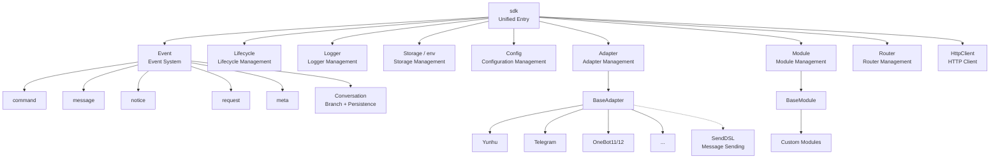
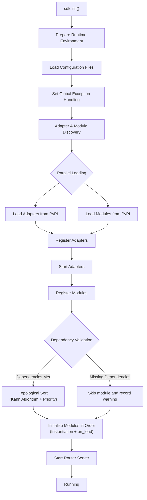
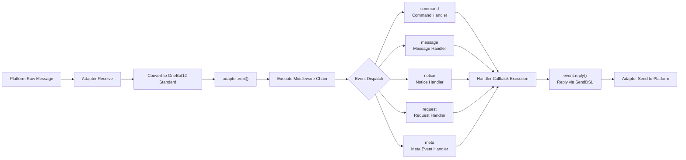
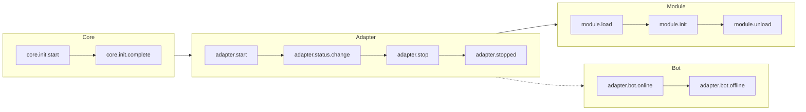
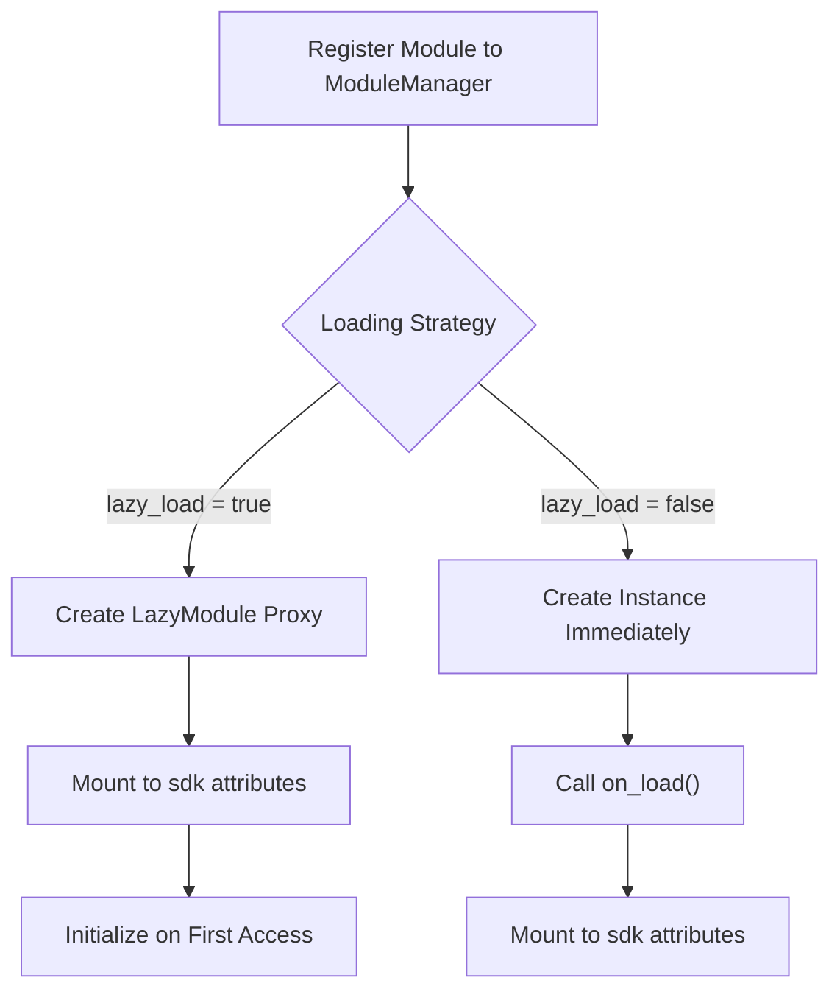
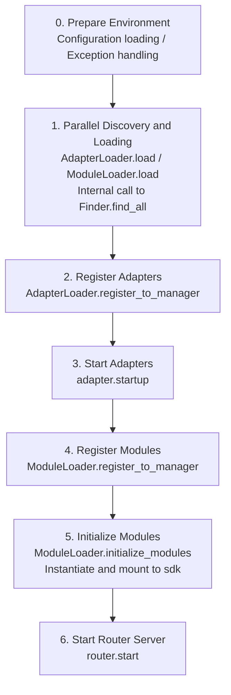

你是一个 ErisPulse 全栈开发专家，精通以下领域：

- ErisPulse 框架的核心架构和设计理念
- 模块开发和适配器开发
- 异步编程和事件驱动架构
- OneBot12 事件标准和平台适配
- SDK 核心模块 (Storage, Config, Logger, Router, Lifecycle)
- Event 包装类和事件处理系统
- 懒加载系统和生命周期管理
- SendDSL 消息发送系统
- 路由系统和 FastAPI 集成
- 各平台特性指南（OneBot11/12、Telegram、云湖、邮件等）
- 模块/适配器发布流程和模块商店
- 代码规范和文档字符串规范

你擅长：
- 编写高质量的异步 Python 代码
- 设计模块化、可扩展的架构
- 开发模块、适配器
- 使用 ErisPulse 的所有核心功能
- 遵循 ErisPulse 的最佳实践和代码规范
- 解决跨平台兼容性问题
- 通过 CLI 管理项目和发布

**使用以下文档作为知识库，回答问题时请优先参考文档内容。**


---


# ErisPulse 完整开发物料
> **注意**：本文档内容较多，建议仅用于具有强大上下文能力的 AI 模型


---


====
框架理解
====


### 架构概览

# Architecture Overview

This document introduces the technical architecture of ErisPulse SDK through visual diagrams, helping you quickly understand the design philosophy and module relationships of the framework.

## SDK Core Architecture

The diagram below shows the composition of the SDK's core modules and their relationships:


```mermaid
graph TB
    SDK["sdk<br/>Unified Entry"]

    SDK --> Event["Event<br/>Event System"]
    SDK --> Lifecycle["Lifecycle<br/>Lifecycle Management"]
    SDK --> Logger["Logger<br/>Logger Management"]
    SDK --> Storage["Storage / env<br/>Storage Management"]
    SDK --> Config["Config<br/>Configuration Management"]
    SDK --> AdapterMgr["Adapter<br/>Adapter Management"]
    SDK --> ModuleMgr["Module<br/>Module Management"]
    SDK --> Router["Router<br/>Router Management"]
    SDK --> Client["HttpClient<br/>HTTP Client"]
    Event --> Command["command"]
    Event --> Message["message"]
    Event --> Notice["notice"]
    Event --> Request["request"]
    Event --> Meta["meta"]
    Event --> Conversation["Conversation<br/>Branch + Persistence"]

    AdapterMgr --> BaseAdapter["BaseAdapter"]
    BaseAdapter --> P1["Yunhu"]
    BaseAdapter --> P2["Telegram"]
    BaseAdapter --> P3["OneBot11/12"]
    BaseAdapter --> PN["..."]

    ModuleMgr --> BaseModule["BaseModule"]
    BaseModule --> CM["Custom Modules"]

    BaseAdapter -.-> SendDSL["SendDSL<br/>Message Sending"]
```

### Core Module Description

| Module | Description |
|------|------|
| **Event** | Event system, providing five types of event processing: command / message / notice / request / meta, and Conversation multi-round dialogue |
| **Adapter** | Adapter manager, managing the registration, startup, and shutdown of multi-platform adapters |
| **Module** | Module manager, managing plugin registration, loading, and unloading, supporting dependency declaration and topological sorting |
| **Lifecycle** | Lifecycle manager, providing event-driven lifecycle hooks |
| **Storage** | SQLite-based key-value storage system, supporting general SQL chained queries |
| **Config** | TOML format configuration file management |
| **Logger** | Modular logging system, supporting sub-loggers |
| **Router** | HTTP/WebSocket route management, encapsulating the underlying backend via an abstraction layer (currently FastAPI + Uvicorn), supporting decorator routes, middleware, grouping, rate limiting, CORS |
| **HttpClient** | Unified HTTP/WS client, encapsulating the underlying request library via an abstraction layer (currently aiohttp), providing request statistics, retry, logging, WebSocket client, and ErisPulse exception hierarchy features. The client and server WebSocket share the `WebSocketConnectionBase` base class |

## Initialization Process

The diagram below shows the complete initialization process of `sdk.init()`:


```mermaid
flowchart TD
    A["sdk.init()"] --> B["Prepare Runtime Environment"]
    B --> B1["Load Configuration Files"]
    B1 --> B2["Set Global Exception Handling"]
    B2 --> C["Adapter & Module Discovery"]
    C --> D{"Parallel Loading"}
    D --> D1["Load Adapters from PyPI"]
    D --> D2["Load Modules from PyPI"]
    D1 & D2 --> E["Register Adapters"]
    E --> E1["Start Adapters"]
    E1 --> F["Register Modules"]
    F --> F1{"Dependency Validation"}
    F1 -->|"Missing Dependencies"| F2["Skip module and record warning"]
    F1 -->|"Dependencies Met"| F3["Topological Sort<br/> (Kahn Algorithm + Priority)"]
    F3 --> G["Initialize Modules in Order<br/> (Instantiation + on_load)"]
    F2 --> G
    G --> H["Start Router Server"]
    H --> K["Running"]
```

### Initialization Stage Breakdown

1. **Environment Preparation** - Load TOML configuration files, set up global exception handling
2. **Parallel Discovery** - Discover adapters and modules from installed PyPI packages simultaneously
3. **Adapter Registration** - Register discovered adapters to the adapter manager
4. **Adapter Startup** - Asynchronously start platform adapter connections (before module initialization, ensuring modules can immediately send messages)
5. **Module Registration** - Register discovered modules to the module manager
6. **Dependency Validation** - Check if the `depends` dependencies declared by modules are registered, skip modules with missing dependencies
7. **Topological Sorting** - Use Kahn algorithm to sort module loading order based on dependencies, same level in descending order of `priority`
8. **Module Initialization** - Create module instances in sorted order, call the `on_load` lifecycle method
9. **Start Router Server** - Start the FastAPI route server using Uvicorn

## Event Handling Process

The diagram below shows the complete flow path of messages from the platform to the handler:


```mermaid
flowchart LR
    A["Platform Raw Message"] --> B["Adapter Receive"]
    B --> C["Convert to OneBot12 Standard"]
    C --> D["adapter.emit()"]
    D --> E["Execute Middleware Chain"]
    E --> F{"Event Dispatch"}
    F --> G1["command<br/>Command Handler"]
    F --> G2["message<br/>Message Handler"]
    F --> G3["notice<br/>Notice Handler"]
    F --> G4["request<br/>Request Handler"]
    F --> G5["meta<br/>Meta Event Handler"]
    G1 & G2 & G3 & G4 & G5 --> H["Handler Callback Execution"]
    H --> I["event.reply()<br/>Reply via SendDSL"]
    I --> J["Adapter Send to Platform"]
```

### Key Steps in Event Handling

- **Adapter Receive** - Platform adapters receive native events via WebSocket/Webhook, etc.
- **OB12 Standardization** - Convert platform native events to the unified OneBot12 standard format
- **Middleware Processing** - Execute registered middleware functions sequentially, allowing modification of event data
- **Event Dispatch** - Dispatch to corresponding handlers based on event type (message/notice/request/meta)
- **SendDSL Reply** - Handlers send responses via `event.reply()` or `SendDSL` chain calls

## Lifecycle Events

The diagram below shows the triggering sequence of lifecycle events for various framework components:


```mermaid
flowchart LR
    subgraph Core["Core"]
        direction LR
        C1["core.init.start"] --> C2["core.init.complete"]
    end

    subgraph AdapterLife["Adapter"]
        direction LR
        A1["adapter.start"] --> A2["adapter.status.change"] --> A3["adapter.stop"] --> A4["adapter.stopped"]
    end

    subgraph ModuleLife["Module"]
        direction LR
        M1["module.load"] --> M2["module.init"] --> M3["module.unload"]
    end

    subgraph BotLife["Bot"]
        direction LR
        B1["adapter.bot.online"] --> B2["adapter.bot.offline"]
    end

    Core --> AdapterLife
    AdapterLife --> ModuleLife
    AdapterLife -.-> BotLife
```

### Listening to Lifecycle Events

You can listen to these events via `lifecycle.on()` to execute custom logic:

```python
from ErisPulse import sdk

# Listen to all adapter events
@sdk.lifecycle.on("adapter")
async def on_adapter_event(event_data):
    print(f"Adapter event: {event_data}")

# Listen for module load completion
@sdk.lifecycle.on("module.load")
async def on_module_loaded(event_data):
    print(f"Module loaded: {event_data}")

# Listen for Bot online
@sdk.lifecycle.on("adapter.bot.online")
async def on_bot_online(event_data):
    print(f"Bot online: {event_data}")
```

## Module Loading Strategy

ErisPulse supports two module loading strategies:


```mermaid
flowchart TD
    A["Register Module to ModuleManager"] --> B{"Loading Strategy"}
    B -->|"lazy_load = true"| C["Create LazyModule Proxy"]
    C --> D["Mount to sdk attributes"]
    D --> E["Initialize on First Access"]
    B -->|"lazy_load = false"| F["Create Instance Immediately"]
    F --> G["Call on_load()"]
    G --> D2["Mount to sdk attributes"]
```

> For more details, please refer to [Lazy Loading System](advanced/lazy-loading.md) and [Lifecycle Management](advanced/lifecycle.md).


### 术语表

# ErisPulse Glossary

This document explains common technical terms used in ErisPulse to help you better understand the framework's concepts.

## Core Concepts

### Event-Driven Architecture
**Simple Explanation:** Like a restaurant ordering system. Customers (users) order dishes (send messages), waiters (event system) pass the order (event) to the kitchen (modules), and after the kitchen processes it, the waiter serves the food (reply) to the customer.

**Technical Explanation:** The program's execution flow is triggered by external events rather than executing in a fixed sequence. Whenever a new event occurs (such as receiving a message), the framework automatically calls the corresponding handler function.

### OneBot12 Standard
**Simple Explanation:** Like the standard for sockets and plugs. The "plugs" (native event formats) of different platforms vary, but through converters, they all become a unified "plug" (OneBot12 format), so your code can act like a socket to adapt to all platforms.

**Technical Explanation:** A unified chatbot application interface standard that defines unified formats for events, messages, APIs, etc., allowing code to be reused across different platforms.

### Adapter
**Simple Explanation:** Like a translator. Different platforms speak different "languages" (API formats). The adapter translates these "languages" into "Mandarin" (OneBot12 standard) that ErisPulse can understand, and also translates ErisPulse's instructions back into the "languages" of each platform.

**Technical Explanation:** A component responsible for communicating with a specific platform. It receives native events from the platform and converts them into a standard format, or sends standard format requests to the platform.

### Module
**Simple Explanation:** Like an APP on a phone. Each module is an independent feature pack that can be added, deleted, or updated. Examples include "Weather Forecast Module", "Music Player Module", etc.

**Technical Explanation:** The basic unit of feature extension, containing specific business logic, event handlers, and configuration, which can be installed and uninstalled independently.

### Event
**Simple Explanation:** Like a notification on a phone. When there is a new message, new friend, or new group chat, the platform sends a "notification" (event) to your bot.

**Technical Explanation:** Anything notable happening on the platform, such as receiving a message, a user joining a group, a friend request, etc., is passed to the program in the form of structured data.

### Event Handler
**Simple Explanation:** Like a courier's delivery rules. When a "package" (event) is received, it decides who handles this package based on the package type (message, notice, request, etc.).

**Technical Explanation:** Functions marked with decorators that are automatically executed when a specific type of event occurs, such as `@command`, `@message`, etc.

## Development Related Terms

### SDK
**Simple Explanation:** Like a toolbox. It contains various common tools (storage, configuration, logs, etc.) that you can use directly when writing code, without reinventing the wheel.

**Technical Explanation:** Software Development Kit, which provides a set of pre-built components and tools to simplify the development process.

### Virtual Environment
**Simple Explanation:** Like an independent "workshop". Each project has its own "workshop", and the software packages installed inside do not interfere with each other, avoiding version conflicts.

**Technical Explanation:** An isolated Python environment where each environment has an independent package list and versions, preventing dependency conflicts between different projects.

### Asynchronous Programming
**Simple Explanation:** Like multitasking. The bot can do multiple things at once. For example, while waiting for a network response, it can still process messages from other users without freezing.

**Technical Explanation:** A programming style using `async`/`await` keywords that allows the program to switch to other tasks while waiting for time-consuming operations (such as network requests, file reading/writing), improving efficiency.

### Hot Reload
**Simple Explanation:** Like auto-refresh on a webpage. After you modify the code, you don't need to manually restart the bot; it automatically loads the new code, taking effect immediately.

**Technical Explanation:** In development mode, the program automatically detects file changes and reloads, allowing code modifications to take effect without a manual restart.

### Lazy Loading
**Simple Explanation:** Like drawers opened on demand. Unused drawers (modules) stay closed first and are only opened when needed, so you don't have to wait for all drawers to open during startup.

**Technical Explanation:** A delayed loading strategy where modules are initialized and loaded only when first accessed, reducing startup time and resource usage.

## Function Related Terms

### Command
**Simple Explanation:** Like a command in a game. When a user types a command like `/hello`, the bot executes the corresponding function.

**Technical Explanation:** A message starting with a specific prefix (such as `/`) that is recognized by the framework as a command and routed to the corresponding handler function.

### Reply
**Simple Explanation:** It is the "answer" the bot gives to the user. Whether it is text, image, or voice, it is a reply to the user's message.

**Technical Explanation:** The process where the adapter sends processing results back to the platform to be displayed to the user.

### Storage
**Simple Explanation:** Like the bot's "notepad". It can remember user information, settings, chat history, etc., so they can be found next time.

**Technical Explanation:** A persistent data storage system based on SQLite that implements key-value pair storage, used to save data that needs to be retained for a long time.

### Configuration
**Simple Explanation:** Like the bot's "settings". You can modify the bot's behavior through configuration files, such as changing port numbers, log levels, etc.

**Technical Explanation:** A configuration management system using TOML format, used to set various parameters for the framework and modules.

### Log
**Simple Explanation:** Like the bot's "diary". It records what the bot did and what problems it encountered, facilitating debugging and troubleshooting.

**Technical Explanation:** Recorded information generated during system runtime, including different levels such as info, warning, error, etc., used for monitoring and debugging.

### Router
**Simple Explanation:** Like traffic police directing traffic. Decides which request should go to which place to be processed, such as web requests, WebSocket connections, etc.

**Technical Explanation:** HTTP and WebSocket router manager that distributes requests to corresponding handler functions based on URL paths.

## Platform Related Terms

### Platform
**Simple Explanation:** The place where the bot works, such as Yunhu, Telegram, QQ, etc. Each platform has its own rules and API.

**Technical Explanation:** An application or service that provides chatbot services, such as Yunhu Enterprise Communication, Telegram, etc.

### OneBot11/12
**Simple Explanation:** Like the "International Standard" for chatbots. It defines unified formats for messages, events, etc., so that different software can understand each other.

**Technical Explanation:** OneBot is a universal chatbot application interface standard that defines formats for events, messages, APIs, etc. 11 and 12 are different versions of the standard.

### SendDSL
**Simple Explanation:** Like a "shortcut" for sending messages. You can send various types of messages (text, images, @someone, etc.) with a simple one-line statement.

**Technical Explanation:** A chained message sending interface that provides concise syntax to build and send complex messages.

## Other Terms

### Lifecycle
**Simple Explanation:** The bot's "life": Birth (startup), Work (running), Rest (stop). The lifecycle refers to events triggered at these key moments.

**Technical Explanation:** Key stages during the program's runtime, such as startup, loading modules, unloading modules, shutdown, etc. Operations can be executed by listening to these events.

### Annotation/Decorator
**Simple Explanation:** It is putting a "label" on a function. For example, the `@command("hello")` label tells the framework: This is a command handler named "hello".

**Technical Explanation:** Python syntactic sugar used to modify the behavior of functions or classes. In ErisPulse, it is used to mark event handlers, routes, etc.

### Type Annotation
**Simple Explanation:** It is telling the function what "type" the parameters are. For example, `request: Request` indicates that this parameter is a Request object.

**Technical Explanation:** A feature introduced in Python 3.5+ used to annotate the types of variables and parameters, improving code readability and type safety.

### TOML
**Simple Explanation:** A configuration file format that is more readable than JSON and stricter than YAML, suitable for writing configurations.

**Technical Explanation:** Tom's Obvious Minimal Language, a configuration file format with concise and clear syntax, widely used in Python project configuration management.

## Getting Help

If you find other terms in the documentation that you do not understand, feel free to ask via the following methods:
- Submit a GitHub Issue
- Participate in community discussions
- Contact the maintainers


====
快速开始
====

# Getting Started

> **This is your first step.** Get an ErisPulse bot up and running from scratch in 5 minutes.
>
> Confused about terms? Check the [Glossary](terminology.md).

## Installing ErisPulse

### One-Click Install Script (Recommended)

The installation script automatically detects your environment (Docker, Python, uv) and guides you to select the best installation method for you.

Windows (PowerShell):
```powershell
irm https://get.erisdev.com/install.ps1 -OutFile install.ps1; powershell -ExecutionPolicy Bypass -File install.ps1
```

macOS / Linux:
```bash
curl -fsSL https://get.erisdev.com/install.sh -o install.sh && chmod +x install.sh && ./install.sh
```

The script will guide you through:

- **Docker Installation** (Recommended when Docker is detected): Select image source (Docker Hub / GHCR), version channel (Stable / Prerelease), Dashboard configuration, port settings
- **Traditional Installation**: Automatically create virtual environment, select ErisPulse version, optional Dashboard installation

### Using Docker

The Docker image comes with the ErisPulse framework and Dashboard pre-installed.

```bash
# Download docker-compose.yml
curl -O https://raw.githubusercontent.com/ErisPulse/ErisPulse/main/docker-compose.yml

# Set Dashboard token and start
ERISPULSE_DASHBOARD_TOKEN=your-token docker compose up -d
```

<details>
<summary>Docker Hub not available?</summary>

Use the GitHub Container Registry image and modify the `image` in `docker-compose.yml`:

```yaml
image: ghcr.io/erispulse/erispulse:latest
```

</details>

After starting, access `http://<host>:8000/Dashboard` and log in with the set token.

### Using pip

Ensure your Python version is >= 3.10, then install using pip:

```bash
pip install ErisPulse
```

If you have [uv](https://github.com/astral-sh/uv) installed, you can also use `uv pip install ErisPulse` for faster installation.

## Initializing Project

### Interactive Initialization (Recommended)

```bash
epsdk init
```

This launches an interactive wizard to guide you through:
- Project name setup
- Log level configuration
- Server configuration (host and port)
- Adapter selection and configuration
- Project structure creation

### Quick Initialization

```bash
# Quick mode specifying project name
epsdk init -q -n my_bot

# Or just specify project name
epsdk init -n my_bot
```

### Manual Project Creation

If you prefer to create the project manually:

```bash
mkdir my_bot && cd my_bot
epsdk init
```

## Installing Modules

### Install via CLI

```bash
epsdk install Yunhu AIChat
```

### List Available Modules

```bash
epsdk list-remote
```

### Interactive Installation

Entering the interactive installation interface when package names are not specified:

```bash
epsdk install
```

## Running Project

```bash
# Normal run
epsdk run main.py

# Hot reload mode (recommended for development)
epsdk run main.py --reload
```

## Enabling IDE Completion (Optional)

ErisPulse dynamically discovers modules/adapters, so IDEs cannot autocomplete platform-specific methods by default.
Run the following command to generate type stubs:

```bash
epsdk types
```

After generation, use the imported types as type annotations to get accurate completion (see [IDE Completion Guide](getting-started/ide-completion.md)):

```python
from _ep_types import Yunhu
from ErisPulse import sdk

adapter: Yunhu = sdk.adapter.get("yunhu")
await adapter.Send.To("group", "123").Board(...)  # Autocomplete platform-specific methods
```

## Project Structure

The project structure after initialization:

```
my_bot/
├── config/
│   └── config.toml          # Configuration file
└── main.py                  # Entry file

```

## Configuration File

Basic `config.toml` configuration:

```toml
[ErisPulse.server]
host = "0.0.0.0"
port = 8000

[ErisPulse.logger]
level = "INFO"

[Yunhu_Adapter]
# Adapter configuration
```

## Next Steps

After the bot is running, you can continue as needed:

**Want to understand how the framework works?**
- [Basic Concepts](getting-started/basic-concepts.md) — Design of adapters / modules / events
- [Architecture Overview](architecture.md) — Visual architecture diagrams

**Want to implement more features?**
- [Common Task Examples](getting-started/common-tasks.md) — Storage, scheduled tasks, permission control
- [Introduction to Event Handling](getting-started/event-handling.md) — Messages, notifications, request handling

**Want to develop your own module / adapter?**
- [Introduction to Module Development](developer-guide/modules/getting-started.md)
- [Introduction to Adapter Development](developer-guide/adapters/getting-started.md)

**For reference as needed:**
- [Configuration File Guide](user-guide/configuration.md) · [CLI Reference](user-guide/cli-reference.md) · [Deployment Guide](user-guide/deployment.md)


====
入门指南
====


### 入门指南总览

# Getting Started Guide

> This guide is a **detailed supplement** to the [5-Minute Quick Start](../quick-start.md). If you haven't yet started your first robot, please complete the quick start first.

After your robot is up and running, this guide will help you systematically understand the core concepts and common capabilities of the framework.

## Learning Path

We recommend reading in the following order:

| Step | Topic | Description |
|------|-------|-------------|
| 1 | [Create Your First Bot](first-bot.md) | Write command handlers and understand the execution mechanism |
| 2 | [Basic Concepts](basic-concepts.md) | Understand the core architecture and module design of ErisPulse |
| 3 | [Event Handling Introduction](event-handling.md) | Learn how to handle various types of events such as messages, commands, notifications, etc. |
| 4 | [Common Task Examples](common-tasks.md) | Master commonly used features like data persistence, scheduled tasks, and permission control |
| 5 | [IDE Completion Guide](ide-completion.md) | Generate type stubs to enable IDE auto-completion for platform-specific methods |

## Development Approach Selection

ErisPulse supports two development approaches:

| Approach | Use Case | Description |
|----------|----------|-------------|
| **Embedded Development** | Rapid prototyping, internal project features | Write handlers directly in `main.py`, no need to create a separate module |
| **Module Development** (Recommended) | Production environments, feature distribution | Create a separate Python package and install it using `epsdk install` |

> For a detailed comparison and examples of both approaches, refer to [Create Your First Bot](first-bot.md) and [Module Development Introduction](../developer-guide/modules/getting-started.md).

## Architecture Overview

ErisPulse adopts an event-driven architecture, with the core composed of the following systems:

- **Adapter System** — Communicates with various platforms, converting platform events into a unified OneBot12 standard format
- **Event System** — Handles five major types of events: messages, commands, notifications, requests, and meta-events
- **Module System** — Extends functionality through independent modules, supporting dependency management and lazy loading
- **Core Modules** — Provide foundational capabilities such as Storage (storage), Config (configuration), Logger (logging), and Router (routing)

> For a detailed architecture diagram and initialization process, see [Architecture Overview](../architecture.md).

## Start Learning

Ready to begin?

- [Create Your First Bot](first-bot.md) — Get started in 5 minutes


### 创建第一个机器人

# Creating Your First Bot

This guide builds upon the [5-Minute Quick Start](../quick-start.md), walking you through writing your first command handler and understanding the execution mechanism.

> If you haven't installed ErisPulse or initialized your project yet, please complete the "Install", "Initialize Project", and "Run Project" steps in the [Quick Start](../quick-start.md) first.

## Step 1: Writing Your First Command

Open `main.py` and write a simple command handler:

```python
from ErisPulse import sdk
from ErisPulse.Core.Event import command

@command("hello", help="Send a greeting message")
async def hello_handler(event):
    """Handle the hello command"""
    user_name = event.get_user_nickname() or "friend"
    await event.reply(f"Hello, {user_name}! I am the ErisPulse bot.")

@command("ping", help="Test if the bot is online")
async def ping_handler(event):
    """Handle the ping command"""
    await event.reply("Pong! The bot is running normally.")

async def main():
    """Main entry function"""
    print("Starting ErisPulse...")
    
    # keep_running=True (default): The framework blocks and maintains execution until a shutdown signal is received (such as Ctrl+C)
    await sdk.run(keep_running=True)

if __name__ == "__main__":
    import asyncio
    asyncio.run(main())
```

### `keep_running` Parameter

`sdk.run(keep_running)` controls whether the framework blocks and maintains execution:

- **`keep_running=True` (default)**: `run()` will block indefinitely until a shutdown signal is received (such as Ctrl+C), suitable for pure bot applications.
- **`keep_running=False`**: `run()` returns immediately after initialization; **the framework is not unloaded**—the started adapters/modules continue processing message events as background tasks, allowing you to proceed with your own logic until the event loop ends and the framework closes. For example:

```python
async def main():
    await sdk.run(keep_running=False)   # Return immediately after initialization
    # The framework is running in the background, here you can continue doing other things
    while True:
        await asyncio.sleep(3600)
        print("Check every hour")
```

> In addition to the two modes of `run()`, there are also more granular ways to manually control the lifecycle using `init()`/`uninit()`, and to start/stop adapters/routers independently; see [Startup Process and Manual Control](../advanced/startup.md).

## Step 2: Running the Bot

```bash
# Normal execution
epsdk run main.py

# Development mode (supports hot reload)
epsdk run main.py --reload
```

## Step 3: Testing the Bot

Send commands in your chat platform:

```
/hello
```

You should receive a reply from the bot.

## Code Explanation

### Command Decorator

```python
@command("hello", help="Send a greeting message")
```

- `hello`: Command name, users invoke it via `/hello`
- `help`: Command help description, displayed in the `/help` command

### Event Parameters

```python
async def hello_handler(event):
```

The `event` parameter is an Event object, containing:
- Message content: `event.get_text()`
- Sender information: `event.get_user_id()`, `event.get_user_nickname()`
- Platform information: `event.get_platform()`
- Group information: `event.get_group_id()`
- Raw data: `event.get_raw()`

> For a complete list of Event object methods, refer to [Event Wrapper Class Detailed Explanation](../developer-guide/modules/event-wrapper.md).

### Sending a Reply

```python
await event.reply("Reply content")
```

`event.reply()` is a convenient method for sending messages to the sender.

## Extension: Adding More Features

ErisPulse provides rich event handling and data processing capabilities:

- **Message Listening**: Use `@message.on_message()` to listen to various types of messages → [Introduction to Event Handling](event-handling.md)
- **Notification Listening**: Use `@notice.on_friend_add()` and others to listen to system notifications → [Introduction to Event Handling](event-handling.md)
- **Data Storage**: Use `sdk.storage.get/set` to persist data → [Common Tasks Examples](common-tasks.md)

## Frequently Asked Questions

### Command Not Responding?

1. Check if the adapter is correctly configured; confirm that the adapter's `status` in `config/config.toml` is set to `true`
2. Check the terminal log output to ensure there are no error messages (especially `ERROR` level logs)
3. Confirm the command prefix is correct (default is `/`), check the `[ErisPulse.event.command]` section in the configuration file
4. Ensure the command name is spelled correctly, and pay attention to case sensitivity settings

### How to Modify the Command Prefix?

Add the following to `config.toml`:

```toml
[ErisPulse.event.command]
prefix = "!"
case_sensitive = false
```

### How to Support Multiple Platforms?

ErisPulse uses the OneBot12 standard to unify event formats across different platforms. Handlers registered with `@command` and `@message` automatically receive events from all platforms. You can distinguish the source platform using `event.get_platform()`:

```python
@command("hello")
async def hello_handler(event):
    platform = event.get_platform()
    
    if platform == "yunhu":
        await event.reply("Hello! From Yunhu")
    elif platform == "telegram":
        await event.reply("Hello! From Telegram")
    else:
        await event.reply("Hello!")
```

> For more multi-platform adaptation techniques, see [Common Tasks Examples](common-tasks.md#multi-platform-adaptation).

## Next Steps

- [Basic Concepts](basic-concepts.md) - Deepen your understanding of ErisPulse's core concepts
- [Introduction to Event Handling](event-handling.md) - Learn how to handle various types of events
- [Common Tasks Examples](common-tasks.md) - Master more practical features


### 基础概念

# Basic Concepts

This guide introduces the core concepts of ErisPulse, helping you understand the framework's design philosophy and basic architecture.

## Event-Driven Architecture

ErisPulse adopts an event-driven architecture, where all interactions are passed and processed through events.

### Event Flow

```
User sends message
      │
      ▼
Platform receives
      │
      ▼
Adapter receives platform native event
      │
      ▼
Convert to OneBot12 standard event
      │
      ▼
Submit to event system
      │
      ▼
Dispatch to registered handlers
      │
      ▼
Module processes event
      │
      ▼
Send response through adapter
      │
      ▼
Platform displays to user
```

### OneBot12 Standard

ErisPulse uses OneBot12 as the core event standard. OneBot12 is a generic chatbot application interface standard that defines a unified event format.

All adapters convert platform-specific events into OneBot12 format to ensure code consistency.

## Core Components

### 1. SDK Object

The SDK is the unified entry point for all functionality, providing access to core components.

```python
from ErisPulse import sdk

# Access core modules
sdk.storage    # Storage system
sdk.config     # Configuration system
sdk.logger     # Logging system
sdk.adapter    # Adapter system
sdk.module     # Module system
sdk.router     # Routing system
sdk.client     # HTTP client
sdk.lifecycle  # Lifecycle system
```

### 2. Event Object

Event objects encapsulate event data and provide convenient access methods.

```python
@command("info")
async def info_handler(event):
    # Get event info
    event_id = event.get_id()
    user_id = event.get_user_id()
    platform = event.get_platform()
    text = event.get_text()
    
    # Send reply
    await event.reply(f"User: {user_id}, Platform: {platform}")
```

### 3. Adapter

Adapters are the bridge between ErisPulse and external platforms.

**Responsibilities:**
- Receive platform native events
- Convert to OneBot12 standard format
- Send standard format events to the platform

**Example Adapters:**
- Yunhu Adapter: Communicate with Yunhu platform
- Telegram Adapter: Communicate with Telegram Bot API
- OneBot11 Adapter: Communicate with OneBot11 compatible applications
- Email Adapter: Handle email sending and receiving

### 4. Module

Modules are the basic unit for functional extensions and can:

- Register event handlers
- Implement business logic
- Call adapters to send messages
- Use services provided by core modules

#### Module Discovery Mechanism

ErisPulse discovers installed modules via Python's `importlib.metadata.entry_points`. Modules declare entry points in `pyproject.toml`:

```toml
[project.entry-points."erispulse.module"]
MyModule = "my_package:Main"
```

When the SDK initializes, it scans all entry points in the `erispulse.module` group, registers module classes to `ModuleManager`, and then initializes them sequentially after topological sorting by dependencies.

#### Minimum Viable Module

```python
from ErisPulse.Core.Bases import BaseModule
from ErisPulse import sdk

class Main(BaseModule):
    def __init__(self):
        self.sdk = sdk
        self.logger = sdk.logger.get_child("MyModule")

    async def on_load(self, event):
        self.logger.info("Module loaded")

    async def on_unload(self, event):
        self.logger.info("Module unloaded")
```

#### Module Lifecycle

- **Registration**: SDK discovers module class and registers to manager
- **Loading**: Creates module instance, calls `on_load(event)` (`event = {"module_name": "MyModule"}`)
- **Unloading**: Calls `on_unload(event)`, cleans up resources

#### Load Strategy

Declare the module's loading behavior via `get_load_strategy()`:

```python
from ErisPulse.loaders import ModuleLoadStrategy

class Main(BaseModule):
    @staticmethod
    def get_load_strategy():
        return ModuleLoadStrategy(
            lazy_load=True,   # Whether to lazy load (default True)
            priority=0        # Load priority, larger numbers initialize earlier
        )
```

- **`lazy_load=True` (default)**: Module initializes only when first accessed (e.g., `sdk.MyModule`), reducing startup time
- **`lazy_load=False`**: Module initializes immediately when SDK starts, suitable for modules that need to listen to lifecycle events or execute scheduled tasks
- **`priority`**: Modules with the same priority load in registration order; larger numbers initialize earlier

> For a detailed explanation of the lazy loading mechanism, please refer to [Lazy Loading System](../advanced/lazy-loading.md).

## Event Types

ErisPulse supports 5 categories of events:

| Event Type | Decorator | Description |
|---------|--------|------|
| Message Event | `@message.on_message()` | Any message sent by the user (private chat, group chat) |
| Command Event | `@command("name")` | Messages starting with the command prefix (e.g., `/hello`) |
| Notice Event | `@notice.on_friend_add()` etc. | System notifications (friend added, group member changes, etc.) |
| Request Event | `@request.on_friend_request()` etc. | User requests (friend request, group invite) |
| Meta Event | `@meta.on_connect()` etc. | System-level events (connect, disconnect, heartbeat) |

> For detailed usage and code examples of each event type, please refer to [Getting Started with Event Handling](event-handling.md).

## Core Module Explanations

### Storage (Storage)

SQLite-based key-value storage system for persistent data.

```python
# Set value
sdk.storage.set("key", "value")

# Get value
value = sdk.storage.get("key", "default_value")

# Batch operations
sdk.storage.set_multi({
    "key1": "value1",
    "key2": "value2"
})

# Transaction
with sdk.storage.transaction():
    sdk.storage.set("key1", "value1")
    sdk.storage.set("key2", "value2")
```

### Config (Configuration)

TOML format configuration file management.

```python
# Get config
config = sdk.config.getConfig("MyModule", {})

# Set config
sdk.config.setConfig("MyModule", {"key": "value"})

# Read nested config
value = sdk.config.getConfig("MyModule.subkey", "default")
```

### Logger (Logging)

Modular logging system.

```python
# Log messages
sdk.logger.info("This is an info message")
sdk.logger.warning("This is a warning message")
sdk.logger.error("This is an error message")

# Get child logger
child_logger = sdk.logger.get_child("submodule")
child_logger.info("Submodule log")
```

**Property Access Syntax Sugar**

In addition to using the `get_child()` method, you can create child loggers via **property access**, which is a more concise **syntax sugar**:

```python
# Create child logger via property access
sdk.logger.mymodule.info("Module message")

# Support nested access
sdk.logger.mymodule.database.info("Database message")
```

### Router (Routing)

HTTP and WebSocket routing management, based on FastAPI + Uvicorn. Supports decorator routing, middleware, grouping, rate limiting, CORS.

```python
from ErisPulse.Core import HttpRequest

@sdk.router.get("MyModule", "/api")
async def handler(request: HttpRequest):
    data = await request.json()
    return {"status": "ok"}
```

> For the complete routing API (WebSocket, middleware, rate limiting, CORS, etc.), please refer to [Router Manager](../advanced/router.md).

### Client (Network Client)

Unified network client aggregating HTTP requests, WebSocket connections, connection pool management, automatic retry, timeout control, request statistics, and lifecycle event integration.

```python
from ErisPulse.Core import client

# HTTP request
resp = await client.get("https://api.example.com/users")
data = await resp.json()

# With retry and timeout
resp = await client.get(url, timeout=30, max_retries=3)

# WebSocket connection
ws = await client.ws_connect("wss://example.com/ws")
async for text in ws.iter_text():
    await ws.send_text(f"Echo: {text}")
```

> For the complete network client API, please refer to [Network Client](../advanced/http-client.md).

## SendDSL Message Sending

Adapters provide message sending interfaces with method chaining.

### Basic Sending

```python
# Get adapter instance
yunhu = sdk.adapter.get("yunhu")

# Send message
await yunhu.Send.To("user", "U1001").Text("Hello")

# Specify sending account
await yunhu.Send.Using("bot1").To("group", "G1001").Text("Group message")
```

### Chain Modifiers

```python
# @User
await yunhu.Send.To("group", "G1001").At("U2001").Text("@message")

# Reply to message
await yunhu.Send.To("group", "G1001").Reply("msg123").Text("reply")

# @All
await yunhu.Send.To("group", "G1001").AtAll().Text("announcement")
```

### Event Reply Methods

Event objects provide convenient reply methods:

```python
@command("test")
async def test_handler(event):
    # Simple text reply
    await event.reply("Reply content")
    
    # Send image
    await event.reply("http://example.com/image.jpg", method="Image")
    
    # Send voice
    await event.reply("http://example.com/voice.mp3", method="Voice")
```

## Lazy Loading System

ErisPulse enables module lazy loading by default. Modules are initialized only when first accessed (e.g., `sdk.MyModule`), significantly improving startup speed.

```python
from ErisPulse.loaders import ModuleLoadStrategy

class Main(BaseModule):
    @staticmethod
    def get_load_strategy():
        return ModuleLoadStrategy(
            lazy_load=True,   # Enable lazy loading (default)
            priority=0        # Load priority, larger numbers initialize earlier
        )
```

**Scenarios where lazy loading needs to be disabled (`lazy_load=False`):**
- Modules listening to lifecycle events (e.g., `core.init.complete`)
- Modules starting scheduled tasks or background services
- Modules that need to complete initialization before other modules load

> For a detailed description of the lazy loading mechanism and precautions, please refer to [Lazy Loading System](../advanced/lazy-loading.md).

## Next Steps

- [Getting Started with Event Handling](event-handling.md) - Learn how to handle various events
- [Common Task Examples](common-tasks.md) - Master the implementation of common features


### 事件处理入门

# Getting Started with Event Handling

This guide introduces how to handle various events in ErisPulse.

## Overview of Event Types

ErisPulse supports the following event types:

| Event Type | Description | Use Cases |
|---------|------|---------|
| Message Event | Any message sent by a user | Chatbots, content filtering |
| Command Event | Messages starting with a command prefix | Command processing, feature entry points |
| Notice Event | System notifications (friend additions, group member changes, etc.) | Welcome messages, status notifications |
| Request Event | User requests (friend requests, group invitations) | Automatic request handling |
| Meta Event | System-level events (connection, heartbeat) | Connection monitoring, status checks |

## Handling Message Events

> **Tip**: It is recommended to use the `Event` type annotation in event handlers to enable IDE auto-completion and type checking support.

```python
from ErisPulse.Core.Event import Event  # Import event type for annotation
```

### Listening to All Messages

```python
from ErisPulse.Core.Event import message, Event

@message.on_message()
async def message_handler(event: Event):
    text = event.get_text()
    user_id = event.get_user_id()
    sdk.logger.info(f"Received message from {user_id}: {text}")
```

### Listening to Private Messages

```python
@message.on_private_message()
async def private_handler(event: Event):
    user_id = event.get_user_id()
    await event.reply(f"Hello, {user_id}! This is a private message.")
```

### Listening to Group Messages

```python
@message.on_group_message()
async def group_handler(event: Event):
    group_id = event.get_group_id()
    user_id = event.get_user_id()
    sdk.logger.info(f"Message sent by {user_id} in group {group_id}")
```

### Listening to @ Messages

```python
@message.on_at_message()
async def at_handler(event: Event):
    # Get list of mentioned users
    mentions = event.get_mentions()
    await event.reply(f"You mentioned these users: {mentions}")
```

## Handling Command Events

### Basic Commands

```python
from ErisPulse.Core.Event import command

@command("help", help="Show help information")
async def help_handler(event):
    help_text = """
Available commands:
/help - Show help
/ping - Test connection
/info - View information
    """
    await event.reply(help_text)
```

### Command Aliases

```python
@command(["help", "h"], aliases=["帮助"], help="Show help information")
async def help_handler(event):
    await event.reply("Help information...")
```

Users can invoke the command using any of the following:
- `/help`
- `/h`
- `/帮助`

### Command Arguments

```python
@command("echo", help="Echo the message")
async def echo_handler(event):
    # Get command arguments
    args = event.get_command_args()
    
    if not args:
        await event.reply("Please enter a message to echo")
    else:
        await event.reply(f"You said: {' '.join(args)}")
```

### Command Groups

```python
@command("admin.reload", group="admin", help="Reload modules")
async def reload_handler(event):
    await event.reply("Modules have been reloaded")

@command("admin.stop", group="admin", help="Stop the bot")
async def stop_handler(event):
    await event.reply("Bot has been stopped")
```

### Command Permissions

```python
def is_master(event):
    """Check if the user is the framework owner"""
    master_list = ["user123", "user456"]
    return event.get_user_id() in master_list

@command("master", permission=is_master, help="Framework owner command")
async def master_handler(event):
    await event.reply("This is a framework owner command")
```

### Command Priorities

```python
# Higher priority number means earlier execution
@message.on_message(priority=10)
async def high_priority_handler(event):
    await event.reply("High priority handler")

@message.on_message(priority=1)
async def low_priority_handler(event):
    await event.reply("Low priority handler")
```

### Parallel Event Handling

ErisPulse's event system uses a **parallel execution for same priority, serial execution for different priorities** scheduling model:

```
Event arrives
    ↓
priority=10 group: [handler C || handler D] parallel → merge results
    ↓ (if not interrupted)
priority=0 group: [handler A || handler B] parallel → merge results
    ↓
...
```

- **Parallel Execution**: Multiple handlers with the same priority execute simultaneously, improving throughput
- **Cross-Level Serial Execution**: Groups with different priorities execute in order (higher priority numbers execute first), ensuring high-priority handlers run first
- **Copy-On-Write**: No copy is created unless the handler modifies data, ensuring zero overhead
- **Conflict Handling**: When multiple handlers with the same priority modify the same field, the last modification is used and a warning log is recorded
- **Interruption Mechanism**: If any handler calls `event.mark_processed()`, subsequent lower-priority groups are skipped

```python
# Example: Parallel execution of handlers with the same priority
@message.on_message(priority=0)
async def handler_a(event):
    # Process task A
    event['result_a'] = process_a()

@message.on_message(priority=0)
async def handler_b(event):
    # Executes in parallel with handler_a
    event['result_b'] = process_b()

# Serial execution of handlers with different priorities
@message.on_message(priority=10)
async def handler_c(event):
    # Highest priority, executes first
    pass
```

## Handling Notice Events

### Friend Addition

```python
from ErisPulse.Core.Event import notice

@notice.on_friend_add()
async def friend_add_handler(event):
    user_id = event.get_user_id()
    nickname = event.get_user_nickname() or "New friend"
    await event.reply(f"Welcome to add me as a friend, {nickname}!")
```

### Group Member Increase

```python
@notice.on_group_increase()
async def member_increase_handler(event):
    group_id = event.get_group_id()
    user_id = event.get_user_id()
    await event.reply(f"Welcome new member {user_id} to group {group_id}")
```

### Group Member Decrease

```python
@notice.on_group_decrease()
async def member_decrease_handler(event):
    group_id = event.get_group_id()
    user_id = event.get_user_id()
    await event.reply(f"Member {user_id} left group {group_id}")
```

## Handling Request Events

### Friend Request

```python
from ErisPulse.Core.Event import request

@request.on_friend_request()
async def friend_request_handler(event):
    user_id = event.get_user_id()
    comment = event.get_comment()
    
    sdk.logger.info(f"Received friend request: {user_id}, comment: {comment}")
    
    # You can handle the request through the adapter API
    # For specific implementation, please refer to each adapter's documentation
```

### Group Invitation Request

```python
@request.on_group_request()
async def group_request_handler(event):
    group_id = event.get_group_id()
    user_id = event.get_user_id()
    
    await event.reply(f"Received group {group_id} invitation from {user_id}")
```

## Handling Meta Events

### Connection Events

```python
from ErisPulse.Core.Event import meta

@meta.on_connect()
async def connect_handler(event):
    platform = event.get_platform()
    sdk.logger.info(f"{platform} platform connected")

@meta.on_disconnect()
async def disconnect_handler(event):
    platform = event.get_platform()
    sdk.logger.warning(f"{platform} platform disconnected")
```

### Heartbeat Events

```python
@meta.on_heartbeat()
async def heartbeat_handler(event):
    platform = event.get_platform()
    sdk.logger.debug(f"{platform} heartbeat detected")
```

### Bot Status Inquiry

After the adapter sends a meta event, the framework automatically tracks the Bot status, and you can query it anytime:

```python
from ErisPulse import sdk

# Check if a specific Bot is online
if sdk.adapter.is_bot_online("telegram", "123456"):
    telegram = sdk.adapter.get("telegram")
    await telegram.Send.To("user", "123456").Text("Bot is online")

# List all currently online Bots
bots = sdk.adapter.list_bots()
for platform, bot_list in bots.items():
    for bot_id, info in bot_list.items():
        print(f"{platform}/{bot_id}: {info['status']}")

# Get complete status summary
summary = sdk.adapter.get_status_summary()
```

## Interactive Handling

### Using the reply method to send replies

The `event.reply()` method supports various modifiers, making it convenient to send messages with @ mentions, replies, and more:

```python
# Simple reply
await event.reply("Hello")

# Send different types of messages
await event.reply("http://example.com/image.jpg", method="Image")  # Image
await event.reply("http://example.com/voice.mp3", method="Voice")  # Voice

# @ a single user
await event.reply("Hello", at_users=["user123"])

# @ multiple users
await event.reply("Hello everyone", at_users=["user1", "user2", "user3"])

# Reply to a message
await event.reply("Reply content", reply_to="msg_id")

# @ all members
await event.reply("Announcement", at_all=True)

# Combine: @ user + reply to message
await event.reply("Content", at_users=["user1"], reply_to="msg_id")
```

### Waiting for User Reply

```python
@command("ask", help="Ask user")
async def ask_handler(event):
    await event.reply("Please enter your name:")
    
    # Wait for user reply, timeout after 30 seconds
    reply = await event.wait_reply(timeout=30)
    
    if reply:
        name = reply.get_text()
        await event.reply(f"Hello, {name}!")
    else:
        await event.reply("Timeout, please re-enter.")
```

### Waiting for Reply with Validation

```python
@command("age", help="Ask age")
async def age_handler(event):
    def validate_age(event_data):
        """Validate if age is valid"""
        try:
            age = int(event_data.get_text())
            return 0 <= age <= 150
        except ValueError:
            return False
    
    await event.reply("Please enter your age (0-150):")
    
    reply = await event.wait_reply(
        timeout=60,
        validator=validate_age
    )
    
    if reply:
        age = int(reply.get_text())
        await event.reply(f"Your age is {age} years old")
    else:
        await event.reply("Invalid input or timeout")
```

### Waiting for Reply with Callback

```python
@command("confirm", help="Confirm operation")
async def confirm_handler(event):
    async def handle_confirmation(reply_event):
        text = reply_event.get_text().lower()
        
        if text in ["yes", "y", "是"]:
            await event.reply("Operation confirmed!")
        else:
            await event.reply("Operation cancelled.")
    
    await event.reply("Confirm execution of this operation? (Yes/No)")
    
    await event.wait_reply(
        timeout=30,
        callback=handle_confirmation
    )
```

### Confirmation Dialogue (confirm)

Wait for user confirmation or denial, automatically recognizing built-in Chinese and English confirmation words:

```python
@command("confirm", help="Confirm operation")
async def confirm_handler(event):
    if await event.confirm("Are you sure you want to execute this operation?"):
        await event.reply("Confirmed, executing...")
    else:
        await event.reply("Cancelled")

# Custom confirmation words
if await event.confirm("Continue?", yes_words={"go", "继续"}, no_words={"stop", "停止"}):
    pass
```

### Choice Menu (choose)

Users can reply with option numbers or option text:

```python
@command("choose", help="Choose")
async def choose_handler(event):
    choice = await event.choose(
        "Please select a color:",
        ["Red", "Green", "Blue"]
    )
    
    if choice is not None:
        colors = ["Red", "Green", "Blue"]
        await event.reply(f"You selected: {colors[choice]}")
    else:
        await event.reply("Timeout, no choice made")
```

**Merge Mode**: When `merge_prompt=True`, options are merged into the prompt message and sent in a single message using the specified `method`:

```python
# Send merged prompt + options using Markdown
choice = await event.choose(
    "## Please select a color\n{options}\nPlease reply with the number",
    ["Red", "Green", "Blue"],
    method="Markdown",
    merge_prompt=True,
)
```

> The `{options}` placeholder controls where options are inserted; if not specified, options are appended to the end of the prompt.
> You can customize the placeholder using the `placeholder` parameter (e.g., `placeholder="[choices]"`).
> `options_format="auto"` (default) automatically selects the style based on the method: unordered list for Markdown, ordered list for HTML, plain text list for others.
> For text-based methods (Text/Markdown/Html, etc.), options are merged to the end by default; for non-text methods (Image, etc.), options are split into separate messages by default.

### Collect Form (collect)

Collect user input in multiple steps:

```python
@command("register", help="Register")
async def register_handler(event):
    data = await event.collect([
        {"key": "name", "prompt": "Please enter your name:"},
        {"key": "age", "prompt": "Please enter your age:", 
         "validator": lambda e: e.get_text().isdigit()},
        {"key": "email", "prompt": "Please enter your email:"}
    ])
    
    if data:
        await event.reply(f"Registration successful!\nName: {data['name']}\nAge: {data['age']}\nEmail: {data['email']}")
    else:
        await event.reply("Registration timeout or invalid input")
```

### Waiting for Any Event (wait_for)

Wait for any event that meets the specified condition, not limited to the same user:

```python
@command("wait_member", help="Wait for new member")
async def wait_member_handler(event):
    await event.reply("Waiting for new member to join...")
    
    evt = await event.wait_for(
        event_type="notice",
        condition=lambda e: e.get_detail_type() == "group_member_increase",
        timeout=120
    )
    
    if evt:
        await event.reply(f"Welcome new member: {evt.get_user_id()}")
    else:
        await event.reply("Timeout")
```

### Multi-turn Dialogue (conversation)

Create an interactive multi-turn dialogue context:

```python
@command("survey", help="Survey")
async def survey_handler(event):
    conv = event.conversation(timeout=60)
    
    await conv.say("Welcome to the survey!")
    
    while conv.is_active:
        reply = await conv.wait()
        
        if reply is None:
            await conv.say("Dialogue timeout, goodbye!")
            break
        
        text = reply.get_text()
        
        if text == "Exit":
            await conv.say("Goodbye!")
            break
        
        await conv.say(f"You said: {text}, continue typing or reply 'Exit' to end")
```

### Built-in Confirmation Words

ErisPulse includes built-in Chinese and English confirmation word sets:

- **Confirmation words** (`CONFIRM_YES_WORDS`): 是, yes, y, 确认, 确定, 好, 好的, ok, true, 对, 嗯, 行, 同意, 没问题...
- **Denial words** (`CONFIRM_NO_WORDS`): 否, no, n, 取消, 不, 不要, 不行, cancel, false, 错, 拒绝, 不可以...

## Event Data Access

### Common Event Object Methods

```python
@command("info")
async def info_handler(event):
    # Basic information
    event_id = event.get_id()
    event_time = event.get_time()
    event_type = event.get_type()
    detail_type = event.get_detail_type()
    
    # Sender information
    user_id = event.get_user_id()
    nickname = event.get_user_nickname()
    
    # Message content
    message_segments = event.get_message()
    alt_message = event.get_alt_message()
    text = event.get_text()
    
    # Group information
    group_id = event.get_group_id()
    
    # Bot information
    self_id = event.get_self_user_id()
    self_platform = event.get_self_platform()
    
    # Raw data
    raw_data = event.get_raw()
    raw_type = event.get_raw_type()
    
    # Platform information
    platform = event.get_platform()
    
    # Message type checks
    is_private = event.is_private_message()
    is_group = event.is_group_message()
    is_at = event.is_at_message()
    
    # Command information
    if event.is_command():
        cmd_name = event.get_command_name()
        cmd_args = event.get_command_args()
        cmd_raw = event.get_command_raw()
```

### Platform-Specific Methods

In addition to the built-in methods, each platform adapter will register platform-specific methods, making it easy to access platform-specific data.

```python
from ErisPulse.Core.Event import message

@message.on_message()
async def handle_message(event):
    platform = event.get_platform()

    # Call platform-specific methods based on platform
    if platform == "telegram":
        chat_type = event.get_chat_type()      # Telegram-specific method
    elif platform == "email":
        subject = event.get_subject()           # Email-specific method
```

If you are unsure whether a platform has registered a specific method, you can query which methods have been registered for a specific platform:

```python
from ErisPulse.Core.Event import get_platform_event_methods

methods = get_platform_event_methods("telegram")
# ["get_chat_type", "is_bot_message", ...]
```

> For platform-specific methods registered by each platform, please refer to the corresponding [platform documentation](../platform-guide/).

## Best Practices for Event Handling

### 1. Exception Handling

```python
@command("process")
async def process_handler(event):
    try:
        # Business logic
        result = await do_some_work()
        await event.reply(f"Result: {result}")
    except ValueError as e:
        # Expected business error
        await event.reply(f"Parameter error: {e}")
    except Exception as e:
        # Unexpected error
        sdk.logger.error(f"Processing failed: {e}")
        await event.reply("Processing failed, please try again later")
```

### 2. Logging

```python
@message.on_message()
async def message_handler(event):
    user_id = event.get_user_id()
    text = event.get_text()
    
    sdk.logger.info(f"Processing message: {user_id} - {text}")
    
    # Use module-specific logging
    from ErisPulse import sdk
    logger = sdk.logger.get_child("MyHandler")
    logger.debug(f"Detailed debug information")
```

### 3. Conditional Handling

```python
@message.on_message(priority=0)
async def conditional_handler(event):
    """Conditional handling - check inside the handler"""
    # Only process messages from specific users
    if event.get_user_id() in ["bot1", "bot2"]:
        return
    
    # Only process messages containing specific keywords
    if "keyword" not in event.get_text():
        return
    
    await event.reply("Condition met, processing message")
```

## Next Steps

- [Common Task Examples](common-tasks.md) - Learn how to implement common features (including advanced message sending: retry/timeout/batch)
- [Platform Features Guide](../platform-guide/README.md) - Complete explanation of Send DSL chain sending, sending rules, and batch construction
- [Event Wrapper Class Details](../developer-guide/modules/event-wrapper.md) - In-depth understanding of the Event object
- [User Guide](../user-guide/) - Learn about configuration and module management


### 常见任务示例

# Common Task Examples

This guide provides implementation examples for common features to help you quickly implement frequently used functionalities.

## Content List

1. Data Persistence
2. Scheduled Tasks
3. Message Filtering
4. Multi-platform Adaptation
5. Advanced Message Sending (Retry/Timeout/Batch)
6. Permission Control
7. Message Statistics
8. Search Functionality
9. Image Processing

## Data Persistence

### Simple Counter

```python
from ErisPulse import sdk
from ErisPulse.Core.Event import command

@command("count", help="View command call count")
async def count_handler(event):
    # Get count
    count = sdk.storage.get("command_count", 0)
    
    # Increment count
    count += 1
    sdk.storage.set("command_count", count)
    
    await event.reply(f"This is the {count} time this command is called")
```

### User Data Storage

```python
@command("profile", help="View personal profile")
async def profile_handler(event):
    user_id = event.get_user_id()
    
    # Get user data
    user_data = sdk.storage.get(f"user:{user_id}", {
        "nickname": "",
        "join_date": None,
        "message_count": 0
    })
    
    profile_text = f"""
Nickname: {user_data['nickname']}
Join Date: {user_data['join_date']}
Message Count: {user_data['message_count']}
    """
    
    await event.reply(profile_text.strip())

@command("setnick", help="Set nickname")
async def setnick_handler(event):
    user_id = event.get_user_id()
    args = event.get_command_args()
    
    if not args:
        await event.reply("Please enter a nickname")
        return
    
    # Update user data
    user_data = sdk.storage.get(f"user:{user_id}", {})
    user_data["nickname"] = " ".join(args)
    sdk.storage.set(f"user:{user_id}", user_data)
    
    await event.reply(f"Nickname set to: {' '.join(args)}")
```

## Scheduled Tasks

### Simple Timer

```python
from ErisPulse import sdk
from ErisPulse.Core.Event import command
import asyncio

class TimerModule:
    def __init__(self):
        self.sdk = sdk
        self._tasks = []
    
    async def on_load(self, event):
        """Start scheduled tasks when module is loaded"""
        self._start_timers()
        
        @command("timer", help="Timer management")
        async def timer_handler(event):
            await event.reply("Timer is running...")
    
    def _start_timers(self):
        """Start scheduled tasks"""
        # Execute every 60 seconds
        task = asyncio.create_task(self._every_minute())
        self._tasks.append(task)
        
        # Execute at midnight
        task = asyncio.create_task(self._daily_task())
        self._tasks.append(task)
    
    async def _every_minute(self):
        """Task executed every minute"""
        self.sdk.logger.info("Task executed every minute")
        # Your logic...
    
    async def _daily_task(self):
        """Task executed every day at midnight (Note: calculated based on UTC time, please adjust for local time if needed)"""
        import time
        
        while True:
            # Calculate time to midnight
            now = time.time()
            midnight = now + (86400 - now % 86400)
            
            await asyncio.sleep(midnight - now)
            
            # Execute task
            self.sdk.logger.info("Daily task executed")
            # Your logic...
```

### Using Lifecycle Events

```python
@sdk.lifecycle.on("core.init.complete")
async def init_complete_handler(event_data):
    """Start scheduled tasks after SDK initialization completes"""
    import asyncio
    
    async def daily_reminder():
        """Daily reminder"""
        await asyncio.sleep(86400)  # 24 hours
        sdk.logger.info("Executing daily task")
    
    # Start background task
    asyncio.create_task(daily_reminder())
```

## Message Filtering

### Keyword Filtering

```python
from ErisPulse.Core.Event import message

blocked_words = ["garbage", "ad", "phishing"]

@message.on_message()
async def filter_handler(event):
    text = event.get_text()
    
    # Check if sensitive words are contained
    for word in blocked_words:
        if word in text:
            sdk.logger.warning(f"Block sensitive message: {word}")
            return  # Do not process this message
    
    # Process message normally
    await event.reply(f"Received: {text}")
```

### Blacklist Filtering

```python
# Load blacklist from config or storage
blacklist = sdk.storage.get("user_blacklist", [])

@message.on_message()
async def blacklist_handler(event):
    user_id = event.get_user_id()
    
    if user_id in blacklist:
        sdk.logger.info(f"Blacklisted user: {user_id}")
        return  # Do not process
    
    # Process normally
    await event.reply(f"Hello, {user_id}")
```

## Multi-platform Adaptation

### Platform-specific Response

```python
@command("help", help="Display help")
async def help_handler(event):
    platform = event.get_platform()
    
    if platform == "yunhu":
        await event.reply("Yunhu platform help...")
    elif platform == "telegram":
        await event.reply("Telegram platform help...")
    elif platform == "onebot11":
        await event.reply("OneBot11 help...")
    else:
        await event.reply("General help information")
```

### Platform Feature Detection

```python
@command("rich", help="Send rich text message")
async def rich_handler(event):
    platform = event.get_platform()
    
    if platform == "yunhu":
        # Yunhu supports HTML
        yunhu = sdk.adapter.get("yunhu")
        await yunhu.Send.To("user", event.get_user_id()).Html(
            "<b>Bold text</b><i>Italic text</i>"
        )
    elif platform == "telegram":
        # Telegram supports Markdown
        telegram = sdk.adapter.get("telegram")
        await telegram.Send.To("user", event.get_user_id()).Markdown(
            "**Bold text** *Italic text*"
        )
    else:
        # Other platforms use plain text
        await event.reply("Bold text Italic text")
```

## Advanced Message Sending (Retry/Timeout/Batch)

In addition to simple `event.reply()`, you can implement more complex sending scenarios via the adapter's Send DSL: automatic retry on failure, timeout cancellation, logic execution after success, and sending multiple messages in bulk.

> The following examples use `event.get_detail_type()` and `event.get_target_id()` to get target type and ID from the event (group chats automatically get group_id, private chats automatically get user_id), avoiding hardcoding.

### Logic Execution After Sending Success

```python
@command("pay", help="Simulate payment")
async def pay_handler(event):
    yunhu = sdk.adapter.get(event.get_platform())
    user_id = event.get_user_id()
    # Deduct points only after sending success
    await (yunhu.Send.To(event.get_detail_type(), event.get_target_id())
           .Hook(lambda r: sdk.storage.set(f"points:{user_id}", -10))
           .Text("Payment successful, 10 points deducted"))
```

### Failure Retry + Timeout Cancellation

```python
@command("notice", help="Send important notice")
async def notice_handler(event):
    adapter_inst = sdk.adapter.get(event.get_platform())
    # Retry at most 3 times, timeout 10 seconds each time
    task = (adapter_inst.Send.To(event.get_detail_type(), event.get_target_id())
            .Retry(3)
            .Timeout(10)
            .OnError(lambda ctx: sdk.logger.error(f"Notice send failed: {ctx.error}"))
            .Text("This is an important notice"))
    # Don't wait, send in background
```

### Bulk Sending Multiple Messages

Send multiple messages in a single chain, executed uniformly:

```python
@command("announce", help="Send announcement")
async def announce_handler(event):
    adapter_inst = sdk.adapter.get(event.get_platform())
    # Build multiple messages and send them together (parallel by default)
    results = await (adapter_inst.Send.To(event.get_detail_type(), event.get_target_id())
                    .Build()
                    .Text("📋 Today's Announcement")
                    .Image("https://example.com/banner.jpg")
                    .Text("See the image above for details")
                    .Retry(2)            # Failed items retry individually
                    .send_all())
    sdk.logger.info(f"Batch send completed, {len(results)} items in total")
```

> For more complete rules and batch sending documentation, please refer to [Platform Features Guide](../platform-guide/README.md#send-rule-decorators).

## Permission Control

### Admin Check

```python
# Configure master list
MASTERS = ["user123", "user456"]

def is_master(user_id):
    """Check if the framework master"""
    return user_id in MASTERS

@command("master", help="Framework master command")
async def master_handler(event):
    user_id = event.get_user_id()
    
    if not is_master(user_id):
        await event.reply("Insufficient permissions, this command is only available to framework masters")
        return
    
    await event.reply("Framework master command executed successfully")

@command("addmaster", help="Add framework master")
async def addmaster_handler(event):
    if not is_master(event.get_user_id()):
        return
    
    args = event.get("text", "").split()
    if len(args) < 2:
        await event.reply("Usage: /addmaster <user_id>")
        return
    
    new_master = args[0]
    MASTERS.append(new_master)
    await event.reply(f"Framework master added: {new_master}")
```

### Group Permissions

```python
@command("groupinfo", help="View group info")
async def groupinfo_handler(event):
    if not event.is_group_message():
        await event.reply("This command is limited to group chats only")
        return
    
    group_id = event.get_group_id()
    user_id = event.get_user_id()
    
    await event.reply(f"Group ID: {group_id}, Your ID: {user_id}")
```

## Message Statistics

### Message Counting

> **Note**: The following examples use `sdk.storage.get/set` for simple counting. In high-concurrency scenarios, it is recommended to use `sdk.storage.transaction()` to ensure atomicity.

```python
@message.on_message()
async def count_handler(event):
    # Get statistics
    stats = sdk.storage.get("message_stats", {
        "total": 0,
        "by_user": {},
        "by_day": {}
    })
    
    # Update statistics
    stats["total"] += 1
    
    user_id = event.get_user_id()
    stats["by_user"][user_id] = stats["by_user"].get(user_id, 0) + 1
    
    # Save
    sdk.storage.set("message_stats", stats)

@command("stats", help="View message statistics")
async def stats_handler(event):
    stats = sdk.storage.get("message_stats", {
        "total": 0,
        "by_user": {},
        "by_day": {}
    })
    
    top_users = sorted(
        stats["by_user"].items(),
        key=lambda x: x[1],
        reverse=True
    )[:5]
    
    top_text = "\n".join(
        f"{uid}: {count} messages" for uid, count in top_users
    )
    
    await event.reply(f"Total messages: {stats['total']}\n\nActive users:\n{top_text}")
```

## Search Functionality

### Simple Search

> **Note**: The following examples use in-memory list storage for message history, **data will be lost after program restart**. Production environments are recommended to use `sdk.storage` or SQLite tables for persistent storage.

```python
from ErisPulse.Core.Event import command, message

# Store message history
message_history = []

@message.on_message()
async def store_handler(event):
    """Store messages for searching"""
    user_id = event.get_user_id()
    text = event.get_text()
    
    message_history.append({
        "user_id": user_id,
        "text": text,
        "time": event.get_time()
    })
    
    # Limit number of history records
    if len(message_history) > 1000:
        message_history.pop(0)

@command("search", help="Search messages")
async def search_handler(event):
    args = event.get_command_args()
    
    if not args:
        await event.reply("Please enter search keywords")
        return
    
    keyword = " ".join(args)
    results = []
    
    # Search history
    for msg in message_history:
        if keyword in msg["text"]:
            results.append(msg)
    
    if not results:
        await event.reply("No matching messages found")
        return
    
    # Display results
    result_text = f"Found {len(results)} matching messages:\n\n"
    for i, msg in enumerate(results[:10], 1):  # Display at most 10
        result_text += f"{i}. {msg['text']}\n"
    
    await event.reply(result_text)
```

## Image Processing

### Image Download and Storage

```python
from ErisPulse.Core import client

@message.on_message()
async def image_handler(event):
    """Handle image messages"""
    message_segments = event.get_message()
    
    for segment in message_segments:
        if segment.get("type") == "image":
            file_url = segment.get("data", {}).get("file")
            
            if file_url:
                # Recommended to use SDK built-in client to download image
                resp = await client.get(file_url)
                if resp.status == 200:
                    image_data = await resp.read()
                    
                    # Save to file
                    filename = f"images/{event.get_time()}.jpg"
                    with open(filename, "wb") as f:
                        f.write(image_data)
                    
                    sdk.logger.info(f"Image saved: {filename}")
                    await event.reply("Image saved")
```

### Image Recognition Example

> **Note**: The following example uses a placeholder API address, please replace it with your own image recognition service when using it in production.

```python
from ErisPulse.Core import client

@command("identify", help="Identify image")
async def identify_handler(event):
    """Identify images in messages"""
    message_segments = event.get_message()
    
    for segment in message_segments:
        if segment.get("type") == "image":
            file_url = segment.get("data", {}).get("file")
            
            # Call image recognition API
            result = await _identify_image(file_url)
            
            await event.reply(f"Identification result: {result}")
            return
    
    await event.reply("No image found")

async def _identify_image(url):
    """Call image recognition API (example) - using SDK built-in client"""
    resp = await client.post(
        "https://api.example.com/identify",
        json={"url": url}
    )
    data = await resp.json()
    return data.get("description", "Identification failed")
```

## Next Steps

- [User Guide](../user-guide/) - Learn about configuration and module management
- [Developer Guide](../developer-guide/) - Learn to develop modules and adapters
- [Advanced Topics](../advanced/) - Deep dive into framework features


### IDE 补全

# Type Stub Generation (IDE Completion)

ErisPulse dynamically discovers modules/adapters via entry-points, and the exact types of user classes are not known at the static level. The `epsdk types` command scans installed modules/adapters and generates a type stub file, allowing users to use these types as variable annotations to obtain IDE completion.

## Core Design Principles

The stub file **only exports types**, without providing any runtime instances:

- All imports are under ``TYPE_CHECKING``, **zero runtime overhead, zero behavior change**
- Type names use the PascalCase form of the entry-point name (e.g., ``yunhu`` → ``Yunhu``), corresponding to the names passed into ``sdk.adapter.get()`` / ``sdk.module.get()``
- Users use ``sdk.module.get(...)`` / ``sdk.adapter.get(...)`` as usual to get instances, but use imported types for **variable annotations**

## Basic Usage

Run in the project root directory:

```bash
epsdk types
```

This generates `_ep_types.py` in the current directory, containing types for all installed modules/adapters.

## Using in Code

```python
from _ep_types import MyModule, Yunhu
from ErisPulse import sdk

# Using imported types as variable annotations enables IDE completion for the class methods
my_mod: MyModule = sdk.module.get("MyModule")
my_mod.hello()                  # ← IDE completes hello

my_adapter: Yunhu = sdk.adapter.get("yunhu")
await my_adapter.Send.To("group", "123").Board(...)   # ← Completes platform-specific methods
```

## How It Works

1. Scan `erispulse.adapter` / `erispulse.module` entry-points
2. Use a subprocess to introspect in the target Python environment, collecting actual class information for each adapter/module (including module path and qualified name)
3. Generate a `.py` file, where:
   - All ``from xxx import Yyy as Zzz`` are under ``TYPE_CHECKING``
   - ``Zzz`` is the PascalCase form of the entry-point name
4. The IDE reads the ``TYPE_CHECKING`` section to provide completion; no code is executed at runtime

Example of generated stub:

```python
# _ep_types.py (auto-generated)
from typing import TYPE_CHECKING

if TYPE_CHECKING:
    # Adapters
    from MyAdapter.Core import MyAdapter as MyAdapter
    from YunhuAdapter.Core import YunhuAdapter as Yunhu

    # Modules
    from MyModule.Core import Main as MyModule

    __all__ = ['MyAdapter', 'Yunhu', 'MyModule']
```

## Command Options

| Option | Description |
|--------|-------------|
| `-o, --output PATH` | Specify the output file path (default `./_ep_types.py`) |
| `--force` | Overwrite existing stub file |
| `--adapters-only` | Only scan adapters |
| `--modules-only` | Only scan modules |

## When to Regenerate

- After installing/uninstalling new modules or adapters
- After modules/adapters update their public API
- When IDE completion fails or types are outdated

## Relationship with SendDSL Standard Methods

The `SendDSL` base class already includes standard send methods (Text/Image/Voice/Video/File), so any way of obtaining a `SendDSL` instance can complete these methods. The `types` command is mainly used to complete **platform-specific methods** (e.g., Yunhu's `Board`, Sandbox's `Dice`) and **module-specific methods**.

## Related Documentation

- [SendDSL Detailed Explanation](../developer-guide/adapters/send-dsl.md) - Description of standard send methods
- [Getting Started with Adapter Development](../developer-guide/adapters/getting-started.md) - Creating adapters


====
用户指南
====


### 安装和配置

# Installation Reference

> This document is a **complete reference** for installation methods (pip / uv / Docker / troubleshooting).
> If you just want to get started quickly, [5-Minute Quick Start](../quick-start.md) covers the minimal process.

## System Requirements

- Python 3.10 or higher
- pip or uv (recommended)
- Sufficient disk space (at least 100MB)

## Installation Methods

### Method 1: Install with pip

```bash
# Install ErisPulse
pip install ErisPulse

# Upgrade to the latest version
pip install ErisPulse --upgrade
```

### Method 2: Install with uv (Recommended)

uv is a faster Python toolchain, recommended for development environments.

#### Install uv

```bash
# Install uv using pip
pip install uv

# Verify installation
uv --version
```

#### Create a Virtual Environment

```bash
# Create project directory
mkdir my_bot && cd my_bot

# Install Python 3.12
uv python install 3.12

# Create virtual environment
uv venv
```

#### Activate the Virtual Environment

```bash
# Windows
.venv\Scripts\activate

# Linux/Mac
source .venv/bin/activate
```

#### Install ErisPulse

```bash
# Install ErisPulse
uv pip install ErisPulse --upgrade
```

## Project Initialization and Module Installation

After installation, the complete workflow for project initialization, module installation, and running is covered in [5-Minute Quick Start](../quick-start.md).

## Verify Installation

### Check Installation

```bash
# Check ErisPulse version
epsdk --version
```

### Run a Test

```bash
# Run the project
epsdk run main.py
```

If you see output similar to the following, the installation was successful:

```
[INFO] Initializing ErisPulse...
[INFO] Adapter loaded: Yunhu
[INFO] Module loaded: MyModule
[INFO] ErisPulse initialization complete
```

## Common Issues

### Installation Failure

1. Check that Python version is >= 3.10 (recommended 3.10 - 3.13)
2. Try using `uv pip install ErisPulse` instead of `pip install`
3. If permission errors occur, try `pip install --user ErisPulse` or use a virtual environment
4. If SSL certificate errors occur in a corporate proxy environment, try `pip install --trusted-host pypi.org --trusted-host files.pythonhosted.org ErisPulse`
5. Ensure network connectivity is normal and the pip source is accessible

### Configuration Errors

1. Check that the `config.toml` syntax is correct (TOML format is sensitive to indentation and quotes)
2. Confirm all required configuration items are filled in
3. Check terminal logs for detailed error messages
4. Use `epsdk init` to regenerate the configuration file

### Module Installation Failure

1. Confirm the module name is spelled correctly (case-sensitive)
2. Check network connectivity
3. Use `epsdk list-remote` to view available module lists
4. Confirm the module is compatible with your current SDK version

### Windows PowerShell Execution Policy

If PowerShell prompts "Cannot load file... because running scripts is disabled on this system":

```powershell
Set-ExecutionPolicy -ExecutionPolicy RemoteSigned -Scope CurrentUser
```

## Next Steps

- [CLI Command Reference](cli-reference.md) - Learn about all command-line commands
- [Configuration File Guide](configuration.md) - Learn about configuration options in detail


### CLI 命令参考

# CLI Command Reference

The ErisPulse command-line tool (`epsdk`) provides project management and package management functionality.

> **Tip**: You can view detailed parameter descriptions for all commands using `epsdk <command> --help`.

---

## Package Management Commands

| Command | Aliases | Arguments | Description |
|---------|---------|-----------|-------------|
| `install` | `i`, `add` | `[package]... [--upgrade/-U] [--pre] [-e PATH] [--user] [--no-deps] [-t DIR] [--index-url URL] [--extra-index-url URL] [--no-cache-dir] [-r FILE] [-c FILE] [--force-reinstall] [--ignore-installed] [--compile/--no-compile] [--prefix DIR] [--src DIR] [--config-settings SETTINGS] [--no-binary FORMAT] [--only-binary FORMAT] [--prefer-binary] [--build-isolation/--no-build-isolation] [--upgrade-strategy {eager,only-if-needed,to-satisfy-only}] [--break-system-packages] [--no-uv]` | Install modules/adapters |
| `uninstall` | `rm`, `remove` | `<package>... [--no-uv]` | Uninstall modules/adapters |
| `upgrade` | `up` | `[package]... [--force/-f] [--pre] [--no-uv]` | Upgrade specified modules or all |
| `self-update` | `su`, `update` | `[version] [--pre] [--force/-f] [--no-uv]` | Update the SDK itself |

## Diagnostic Commands

| Command | Aliases | Arguments | Description |
|---------|---------|-----------|-------------|
| `doctor` | `diag` | `[--verbose]` | Diagnose the environment and output a health report |

### install

Install an ErisPulse module or adapter package. If no package name is specified, an interactive installation interface is entered.

**Aliases:** `i`, `add`

**Arguments:**

| Argument | Short Flag | Description |
|----------|------------|-------------|
| `[package]...` | | Package names to install, can specify multiple |
| `--upgrade` | `-U` | Upgrade to the latest version during installation |
| `--pre` | | Allow installing pre-release versions |
| `--editable` | `-e` | Install in editable mode (path required) |
| `--user` | | Install to user site-packages directory |
| `--no-deps` | | Do not install dependencies |
| `--target` | `-t` | Install to specified directory |
| `--index-url` | | Specify PyPI mirror source address |
| `--extra-index-url` | | Additional PyPI mirror source address (can be specified multiple times) |
| `--no-cache-dir` | | Disable cache |
| `--requirement` | `-r` | Install from requirements file |
| `--constraint` | `-c` | Install from constraint file |
| `--force-reinstall` | | Force reinstall |
| `--ignore-installed` | | Ignore already installed packages |
| `--compile` | | Compile .pyc files after installation |
| `--no-compile` | | Do not compile .pyc files after installation |
| `--prefix` | | Install to specified prefix directory |
| `--src` | | Source directory for editable installs |
| `--config-settings` | | Configuration to pass to build backend (can be specified multiple times) |
| `--no-binary` | | Restrict binary packages (format like `:all:`) |
| `--only-binary` | | Restrict to binary packages only (format like `:all:`) |
| `--prefer-binary` | | Prefer binary packages |
| `--build-isolation` | | Enable build isolation |
| `--no-build-isolation` | | Disable build isolation |
| `--upgrade-strategy` | | Upgrade strategy: `eager`, `only-if-needed`, `to-satisfy-only` |
| `--break-system-packages` | | Allow modifying Python packages managed by the system package manager |
| `--no-uv` | | Use pip instead of uv |

**Examples:**

```bash
# Install a single module
epsdk install Weather

# Install multiple modules
epsdk install Yunhu Weather

# Install from a mirror source and upgrade
epsdk install Weather -U --index-url https://pypi.tuna.tsinghua.edu.cn/simple

# Install in editable mode (development mode)
epsdk install -e ./my-adapter
```

### uninstall

Uninstall an installed ErisPulse module or adapter package. If no package name is specified, an interactive uninstallation interface is entered.

**Aliases:** `rm`, `remove`

**Arguments:**

| Argument | Description |
|----------|-------------|
| `<package>...` | Package names to uninstall, can specify multiple |
| `--no-uv` | Use pip instead of uv |

**Examples:**

```bash
# Uninstall a single module
epsdk uninstall Weather

# Uninstall multiple modules
epsdk uninstall Yunhu Weather
```

### upgrade

Upgrade installed ErisPulse components. If no package name is specified, interactive upgrade for all is performed.

**Aliases:** `up`

**Arguments:**

| Argument | Short Flag | Description |
|----------|------------|-------------|
| `[package]...` | | Package names to upgrade, can specify multiple |
| `--force` | `-f` | Force upgrade, skip confirmation |
| `--pre` | | Allow upgrading to pre-release versions |
| `--no-uv` | | Use pip instead of uv |

**Examples:**

```bash
# Upgrade all packages
epsdk upgrade

# Upgrade specified package
epsdk upgrade Weather

# Force upgrade (skip confirmation)
epsdk upgrade -f
```

### self-update

Update the ErisPulse SDK itself to the latest version.

**Aliases:** `su`, `update`

**Arguments:**

| Argument | Short Flag | Description |
|----------|------------|-------------|
| `[version]` | | Specify the target version number to update to |
| `--pre` | | Allow updating to pre-release versions |
| `--force` | `-f` | Force update, skip confirmation |
| `--no-uv` | | Use pip instead of uv |

**Examples:**

```bash
# Update to the latest stable version
epsdk self-update

# Update to a specific version
epsdk self-update 1.2.3

# Allow pre-release versions
epsdk self-update --pre

# Force update
epsdk self-update -f
```

---

## Information Query Commands

| Command | Aliases | Arguments | Description |
|---------|---------|-----------|-------------|
| `list` | `l`, `ls` | `[--type/-t {modules,adapters,all}] [--outdated/-o]` | List installed components |
| `list-remote` | `lsr` | `[--type/-t {modules,adapters,all}] [--refresh/-r]` | List remotely available components |

### list

List installed ErisPulse modules and adapters.

**Aliases:** `l`, `ls`

**Arguments:**

| Argument | Short Flag | Description |
|----------|------------|-------------|
| `--type` | `-t` | Specify type: `modules`, `adapters`, `all` (default) |
| `--outdated` | `-o` | Only show packages that can be upgraded |

**Examples:**

```bash
# List all installed components
epsdk list

# List only modules
epsdk list -t modules

# List only adapters
epsdk list -t adapters

# Only show packages that can be upgraded
epsdk list -o
```

### list-remote

List ErisPulse modules and adapters available in the remote repository.

**Aliases:** `lsr`

**Arguments:**

| Argument | Short Flag | Description |
|----------|------------|-------------|
| `--type` | `-t` | Specify type: `modules`, `adapters`, `all` (default) |
| `--refresh` | `-r` | Force refresh of the remote package list cache |

**Examples:**

```bash
# List all remotely available components
epsdk list-remote

# List only remote modules
epsdk list-remote -t modules

# List after forcing cache refresh
epsdk list-remote -r
```

---

## Runtime Control Commands

| Command | Aliases | Arguments | Description |
|---------|---------|-----------|-------------|
| `run` | `r` | `[script] [--reload]` | Run specified script or SDK |

### run

Run ErisPulse project scripts or start the SDK directly. Supports hot reload mode.

**Aliases:** `r`

**Arguments:**

| Argument | Description |
|----------|-------------|
| `[script]` | Script file to run, if not specified, SDK runs |
| `--reload` | Enable hot reload mode, automatically restart on file changes |

**Examples:**

```bash
# Run SDK directly
epsdk run

# Run specified script file
epsdk run main.py

# Run in hot reload mode (auto restart on file change)
epsdk run main.py --reload

# SDK in hot reload mode
epsdk run --reload
```

---

## Project Management Commands

| Command | Aliases | Arguments | Description |
|---------|---------|-----------|-------------|
| `init` | — | `[--project-name/-n <name>] [--quick/-q] [--force/-f] [--here] [--no-uv]` | Initialize ErisPulse project |
| `create` | — | `{module,adapter} [--name/-n <name>] [--description/-d <desc>] [--author/-a <name>] [--email/-e <mail>] [--homepage <url>] [--output/-o <dir>] [--force/-f]` | Create module/adapter scaffolding |

### init

Initialize a new ErisPulse project. Supports interactive and quick modes.

**Arguments:**

| Argument | Short Flag | Description |
|----------|------------|-------------|
| `--project-name` | `-n` | Project name |
| `--quick` | `-q` | Quick mode, skip interactive wizard |
| `--force` | `-f` | Force overwrite existing configuration files |
| `--here` | | Initialize in current directory, no subdirectory creation |
| `--no-uv` | | Use pip instead of uv |

**Examples:**

```bash
# Interactive initialization
epsdk init

# Quick initialization
epsdk init -q -n my_bot

# Force overwrite existing config
epsdk init -f

# Initialize in current directory
epsdk init --here -n my_bot
```

### create

Create scaffolding for an ErisPulse module or adapter.

**Arguments:**

| Argument | Short Flag | Description |
|----------|------------|-------------|
| `{module,adapter}` | | Type to create: `module` or `adapter` |
| `--name` | `-n` | Project name (PascalCase) |
| `--description` | `-d` | Project description |
| `--author` | `-a` | Author name |
| `--email` | `-e` | Author email |
| `--homepage` | | Project homepage URL |
| `--output` | `-o` | Output directory (default current directory) |
| `--force` | `-f` | Force overwrite existing directory |

**Examples:**

```bash
# Interactive creation (guided selection of type and input)
epsdk create

# Directly create Module project
epsdk create module -n MyModule

# Directly create Adapter project
epsdk create adapter -n MyAdapter

# Full arguments
epsdk create module -n MyModule -d "Module Description" -a "Author" -e "mail@example.com"

# Specify output directory
epsdk create module -n MyModule -o ./projects

# Force overwrite existing directory
epsdk create module -n MyModule -f
```

---

## Language Command

| Command | Aliases | Arguments | Description |
|---------|---------|-----------|-------------|
| `i18n` | `language`, `lang` | `[lang] [--list/-l]` | View or switch CLI display language |

### i18n

View current CLI language, list supported languages, and switch display language. If no argument is specified, an interactive selection interface is entered.

**Aliases:** `language`, `lang`

**Arguments:**

| Argument | Short Flag | Description |
|----------|------------|-------------|
| `[lang]` | | Language code to switch to (e.g., `zh-CN`, `en`, `ja`, `ru`) |
| `--list` | `-l` | List all supported languages |

**Examples:**

```bash
# Interactive language selection
epsdk i18n

# Switch to English
epsdk i18n en

# Switch to Japanese
epsdk i18n ja

# List all supported languages
epsdk i18n --list
```

---

## Type Stub Commands

| Command | Aliases | Arguments | Description |
|---------|---------|-----------|-------------|
| `types` | `t`, `stub` | `[--output/-o <path>] [--force] [--adapters-only] [--modules-only]` | Generate type stub files to enable IDE completion |

### types

Scan installed ErisPulse modules and adapters, generate `.pyi` type stub files for them, thereby obtaining accurate code completion and type checking support in IDEs.

**Aliases:** `t`, `stub`

**Arguments:**

| Argument | Short Flag | Description |
|----------|------------|-------------|
| `--output` | `-o` | Output path (default `ep-stubs/` in current directory) |
| `--force` | | Force overwrite existing stub files |
| `--adapters-only` | | Generate type stubs only for adapters |
| `--modules-only` | | Generate type stubs only for modules |

> **Note:** `--adapters-only` and `--modules-only` are mutually exclusive. The latter takes effect if specified simultaneously.

**Examples:**

```bash
# Generate type stubs for all installed modules and adapters
epsdk types

# Generate adapter stubs only
epsdk types --adapters-only

# Output to a specific directory
epsdk types -o ./typings

# Force overwrite existing files
epsdk types --force
```

---

## Global Arguments

The following arguments apply to all commands:

| Argument | Short Flag | Description |
|----------|------------|-------------|
| `--help` | `-h` | Display help information |
| `--version` | `-V` | Display version information |
| `--verbose` | `-v` | Display verbose output (can stack `-vv`/`-vvv`) |
| `--no-color` | | Disable colored output (suitable for CI / log collection) |
| `--yes` | `-y` | Auto-confirm all interactive prompts (non-interactive run) |

---

## Environment Diagnosis

### doctor

Diagnose the current CLI runtime environment and output a health report. Used to troubleshoot "why can't I install / connect" type issues.

| Argument | Description |
|----------|-------------|
| `--verbose` | Display detailed diagnostic information |

**Checks**:
- **Python**: Interpreter version and path
- **Install Backend**: Using `uv` or `pip`
- **Target Interpreter**: The target Python environment packages are actually installed to
- **Config File**: Whether `config/config.toml` exists
- **PyPI Connectivity**: Whether PyPI can be accessed (and displays number of components found)
- **System Proxy**: Whether a proxy is detected

```bash
# Run environment diagnosis
epsdk doctor

# Using alias
epsdk diag
```

---

## Interactive Installation

Running `epsdk install` without specifying a package name enters interactive installation:

```bash
epsdk install
```

The interactive interface provides:
1. Adapter selection
2. Module selection
3. Custom installation

## Common Usage

### Install Modules

```bash
# Install a single module
epsdk install Weather

# Install multiple modules
epsdk install Yunhu Weather

# Upgrade module
epsdk install Weather -U
```

### List Components

```bash
# List all components
epsdk list

# List only adapters
epsdk list -t adapters

# List only upgradable components
epsdk list -o

# View remotely available components
epsdk list-remote
```

### Uninstall Components

```bash
# Uninstall a single component
epsdk uninstall Weather

# Uninstall multiple components
epsdk uninstall Yunhu Weather
```

### Upgrade Components

```bash
# Upgrade all components
epsdk upgrade

# Upgrade specified component
epsdk upgrade Weather

# Force upgrade
epsdk upgrade -f
```

### Run Project

```bash
# Normal run
epsdk run main.py

# Hot reload mode
epsdk run main.py --reload
```

### Switch Language

```bash
# Interactive language selection
epsdk i18n

# Switch directly to English
epsdk i18n en

# List supported languages
epsdk i18n --list
```

### Generate Type Stubs

```bash
# Generate all type stubs
epsdk types

# Generate module type stubs only
epsdk types --modules-only
```

### Initialize Project

```bash
# Interactive initialization
epsdk init

# Quick initialization
epsdk init -q -n my_bot
```

### Create Scaffolding

```bash
# Interactive creation (guided selection of type and input)
epsdk create

# Directly create Module project
epsdk create module -n MyModule

# Directly create Adapter project
epsdk create adapter -n MyAdapter

# Full arguments
epsdk create module -n MyModule -d "Module Description" -a "Author" -e "mail@example.com"

# Force overwrite existing directory
epsdk create module -n MyModule -f


### 配置文件说明

# Configuration File Documentation
> This document will introduce the framework's configuration file. If third-party modules require configuration, please refer to their respective documentation.

ErisPulse uses a TOML-formatted configuration file `config/config.toml` to manage project configurations.

## Configuration File Location

The configuration file is located in the `config/` folder at the root of the project:

```
project/
├── config/
│   └── config.toml
├── main.py
```

## Configuration Loading Error Handling

The framework distinguishes three error states when loading `config.toml` and provides **actionable diagnostic information**, rather than silently falling back to default configurations:

| Error State | Trigger Condition | Framework Behavior |
|-------------|-------------------|--------------------|
| File Missing | `config.toml` does not exist | Normal first-time startup, silently uses empty configuration (no warning) |
| TOML Syntax Error | File exists but format is invalid (e.g., missing quotes, unclosed parentheses) | Outputs **line/column number and reason** of error, and indicates fallback to default configuration |
| Permission/Other Error | No read permission, IO error, etc. | Outputs **clear reason**, and indicates fallback to default configuration |

For example, if you accidentally write a configuration as `port = 8000` (missing quotes for a string), the log will output something like:

```
[ERROR] [Config] Syntax error in configuration file config/config.toml (line 3, column 1): ...
[WARNING] [Config] Fallback to default configuration, your custom settings did not take effect — please fix and restart
```

This allows you to immediately locate issues at the **default INFO level**, without confusion about why your modified configuration did not take effect.

> **Editing the configuration file during runtime?** If you manually edit `config.toml` during robot operation and introduce a syntax error, the framework will output "Configuration file is corrupted (syntax error, line X), unable to merge and write — please fix the configuration file and restart" during the next write (merge configuration), instead of a confusing "write failed". The configuration items to be written will be retained, and nothing will be lost.

## Environment Variable Override

The framework supports using environment variables to **override** `ErisPulse.*` configuration items (suitable for Docker / containerization / CI deployment, without modifying `config.toml`).

Naming rule: Convert the dot-separated path `ErisPulse.<section>.<key>` to all uppercase, replace `.` with `_`, and add the `ERISPULSE_` prefix:

| Configuration Item | Environment Variable | Example Value |
|----------------------|----------------------|---------------|
| `ErisPulse.server.port` | `ERISPULSE_SERVER_PORT` | `9000` |
| `ErisPulse.server.host` | `ERISPULSE_SERVER_HOST` | `0.0.0.0` |
| `ErisPulse.logger.level` | `ERISPULSE_LOGGER_LEVEL` | `DEBUG` |
| `ErisPulse.framework.strict_mode` | `ERISPULSE_FRAMEWORK_STRICT_MODE` | `false` |

Behavior description:
- **Highest priority**: Environment variables override "configuration file" and "default values", automatically converting to the original value type (`bool` / `int` / `float` / comma-separated `list` / string)
- **Non-persistent**: Overriding only takes effect during runtime, and will not be written back to `config.toml`
- **Supports hot updates**: After modifying environment variables during runtime, combined with configuration monitoring reload, changes will take effect

```bash
# Docker deployment example: Do not modify config.toml, directly override port
ERISPULSE_SERVER_PORT=9000 docker compose up -d
```

> Note: Framework configuration such as `ErisPulse.server.port` is read through APIs like `get_server_config()`, and is affected by environment variable overrides.

## Configuration Hot Update

Starting from version 2.7.0, the framework provides **systematic support** for configuration hot updates. After external modification of `config.toml` (background watcher checks every 5 seconds), or after code calls `setConfig()`, each component automatically responds:

| Component | Hot-updatable Configuration | Behavior |
|-----------|-----------------------------|----------|
| **Logger** | `logger.level` / `log_files` / `memory_limit` / `format` | Automatically reapply (with change detection) |
| **Command System CommandHandler** | `event.command.prefix` / `case_sensitive` / `allow_space_prefix` / `must_at_bot` | Takes effect on the next message |
| **Adapter Concurrency** | `framework.handler_max_concurrency` | Invalidates cached semaphores, rebuilds with new value |
| **Proactive GC** | `framework.proactive_gc_interval` | Reads each round, supports runtime adjustment/disable |
| **Module/Adapter Configuration** | Their own configuration items | Triggers `on_config_update(old, new)` callback |

**Configuration items requiring restart** (cannot be safely switched at runtime, warning is output when changed "requires process restart to take effect"):

| Configuration | Reason |
|---------------|--------|
| `router.cors.*` / `router.security.*` | Middleware is written into FastAPI at service startup, cannot be safely switched at runtime |
| `storage.use_global_db` | SQLite file handle is already open at runtime, switching path is unsafe |

> **Error during editing and saving?** If a transient syntax error occurs while editing `config.toml`, the framework will **retain the last valid configuration** and output diagnostic logs, and will not broadcast an empty configuration to each component (to avoid `on_config_update` receiving empty values and mistakenly reverting to default).

## Complete Configuration Example

```toml
[ErisPulse.server]
host = "0.0.0.0"
port = 8000
ssl_certfile = ""
ssl_keyfile = ""

[ErisPulse.logger]
level = "INFO"
format = "rich"
log_files = []
memory_limit = 1000

[ErisPulse.framework]
enable_lazy_loading = true
uninit_timeout = 30
strict_mode = 0

[ErisPulse.framework.strict_mode_exceptions]
modules = []
adapters = []

[ErisPulse.storage]
use_global_db = false

[ErisPulse.event.command]
prefix = "/"
case_sensitive = true
allow_space_prefix = false
must_at_bot = false

[ErisPulse.event.message]
ignore_self = true

[ErisPulse.i18n]
language = "auto"
```

## Server Configuration

```toml
[ErisPulse.server]
host = "0.0.0.0"
port = 8000
ssl_certfile = "/path/to/cert.pem"
ssl_keyfile = "/path/to/key.pem"
```

| Configuration Item | Type | Default Value | Description |
|----------------------|------|---------------|-------------|
| host | string | 0.0.0.0 | Listening address; 0.0.0.0 means all interfaces |
| port | integer | 8000 | Listening port number |
| ssl_certfile | string | empty | Path to SSL certificate file |
| ssl_keyfile | string | empty | Path to SSL private key file |

## Logging Configuration

```toml
[ErisPulse.logger]
level = "INFO"
log_files = ["app.log", "debug.log"]
memory_limit = 1000
```

| Configuration Item | Type | Default Value | Description |
|----------------------|------|---------------|-------------|
| level | string | INFO | Log level: TRACE, DEBUG, INFO, WARNING, ERROR, CRITICAL (TRACE is the lowest level, outputs detailed internal debugging information) |
| format | string | rich | Log output format; defaults to rich colored output |
| log_files | array | empty | List of log output files |
| memory_limit | integer | 1000 | Number of log entries saved in memory |

## Framework Configuration

```toml
[ErisPulse.framework]
enable_lazy_loading = true
uninit_timeout = 30
strict_mode = 0

[ErisPulse.framework.strict_mode_exceptions]
modules = []
adapters = []
```

| Configuration Item | Type | Default Value | Description |
|----------------------|------|---------------|-------------|
| enable_lazy_loading | boolean | true | Whether to enable lazy loading of modules |
| uninit_timeout | integer | 30 | Total timeout for graceful shutdown (seconds); if exceeded, forcibly terminate. 0 means no timeout is set |
| strict_mode | integer | 0 | Strict mode level; see "Strict Mode" description below |

### Strict Mode

Strict mode controls the handling strategy for modules/adapters that are non-compliant or fail during the loading phase. Modern modules/adapters should inherit corresponding base classes (`BaseModule`/`BaseAdapter`). Components that do not inherit base classes affect the framework's context system and fallback cleanup, potentially causing resource leaks.

> **Change in 2.5.2**: The default level is adjusted from `1` (skip) to `0` (lenient) to reduce loading issues for new users. Components that do not inherit base classes will be warned and still attempted to load, rather than directly rejected. To restore the old behavior, explicitly set `strict_mode = 1`.

| Level | Name | Behavior |
|-------|------|----------|
| 0 | Lenient (default) | Non-compliance only warns; components that do not inherit base classes will still be attempted to load (compatible with old components) |
| 1 | Strict-Skip | Rejects components that do not inherit base classes and skips them; other components start normally |
| 2 | Strict-Fatal | Collects all non-compliance and reports them together, then terminates the entire startup |

Under all levels, component crashes during the "loading/registration/initialization phase" are always skipped; the difference is:

- **0 → 1**: The only behavioral change is that "not inheriting base class" changes from "still loading" to "skipping".
- **1 → 2**: All non-compliance (not inheriting base class, loading failure, registration failure, initialization failure, etc.) is upgraded to fatal, and a list of non-compliant components is output at the startup checkpoint before termination.

#### Exemption List

If certain components cannot be migrated temporarily (e.g., depending on old modules), they can be added to the exemption list. Components listed will be treated leniently even if non-compliant, and continue loading:

```toml
[ErisPulse.framework.strict_mode_exceptions]
modules = ["SeTu", "SomeLegacyModule"]
adapters = ["OldAdapter"]
```

> When a component is rejected by strict mode, the log will clearly indicate how to restore loading (add to exemption list or lower the level).

## Storage Configuration

```toml
[ErisPulse.storage]
use_global_db = false
```

| Configuration Item | Type | Default Value | Description |
|----------------------|------|---------------|-------------|
| use_global_db | boolean | false | Whether to use a global database (within package) instead of the project database. When `true`, all projects share the SQLite database within the ErisPulse package; `false` (default) means each project uses an independent database in the `config/` directory |

## Event Configuration

### Command Configuration

```toml
[ErisPulse.event.command]
prefix = "/"
case_sensitive = false
allow_space_prefix = false
```

| Configuration Item | Type | Default Value | Description |
|----------------------|------|---------------|-------------|
| prefix | string | / | Command prefix |
| case_sensitive | boolean | true | Whether to distinguish case (`/Help` and `/help` as different commands) |
| allow_space_prefix | boolean | false | Whether to allow spaces as prefix |
| must_at_bot | boolean | false | Whether to require mentioning the bot to trigger commands (private chat is unrestricted) |

### Message Configuration

```toml
[ErisPulse.event.message]
ignore_self = true
```

| Configuration Item | Type | Default Value | Description |
|----------------------|------|---------------|-------------|
| ignore_self | boolean | true | Whether to ignore the robot's own messages |

## Internationalization Configuration

```toml
[ErisPulse.i18n]
language = "auto"
```

| Configuration Item | Type | Default Value | Description |
|----------------------|------|---------------|-------------|
| language | string | auto | Display language for framework built-in text. Set to `auto` to automatically detect system language, or set to specific codes: `zh-CN`, `zh-TW`, `en`, `ja`, `ru` |

## Module Configuration

Each module can define its own configuration in the configuration file:

```toml
[MyModule]
api_url = "https://api.example.com"
timeout = 30
enabled = true
```

In the module, read and write configuration:

```python
from ErisPulse import sdk

# Read configuration
config = sdk.config.getConfig("MyModule", {})
api_url = config.get("api_url", "https://default.api.com")

# Write configuration at runtime (delayed save)
sdk.config.setConfig("MyModule.timeout", 60)

# Save immediately to file
sdk.config.setConfig("MyModule.timeout", 60, immediate=True)
```

> `setConfig` defaults to delayed writing (batch saved to file approximately every 5 seconds). Setting `immediate=True` will persist immediately. Configuration changes will trigger the `config.set` lifecycle event.

## Next Steps

- [CLI Command Reference](cli-reference.md) - Learn all command-line commands
- [Developer Guide](../developer-guide/) - Learn how to develop custom modules


### 部署指南

# Deployment Guide

Best practices for deploying ErisPulse bot to production environments.

## Docker Deployment (Recommended)

ErisPulse provides official Docker images with the ErisPulse framework and Dashboard management panel, supporting `linux/amd64` and `linux/arm64` architectures.

### Quick Start

```bash
# Pull the image
docker pull erispulse/erispulse:latest

# Download docker-compose.yml
curl -O https://raw.githubusercontent.com/ErisPulse/ErisPulse/main/docker-compose.yml

# Set Dashboard login token and start
ERISPULSE_DASHBOARD_TOKEN=your-token docker compose up -d
```

After startup, access `http://localhost:8000/Dashboard` and login using the token you set as the password.

### Domestic Mirror Acceleration

If Docker Hub is not accessible, you can pull images from GitHub Container Registry:

```bash
docker pull ghcr.io/erispulse/erispulse:latest
```

When using ghcr.io images, you need to modify the `image` in `docker-compose.yml`:

```yaml
services:
  erispulse:
    image: ghcr.io/erispulse/erispulse:latest
```

### docker-compose.yml

```yaml
services:
  erispulse:
    image: erispulse/erispulse:latest
    container_name: erispulse
    ports:
      - "${ERISPULSE_PORT:-8000}:8000"
    volumes:
      - ./config:/app/config
    environment:
      - TZ=${TZ:-Asia/Shanghai}
      - ERISPULSE_DASHBOARD_TOKEN=${ERISPULSE_DASHBOARD_TOKEN:-}
    restart: unless-stopped
```

### Environment Variables

| Variable | Default Value | Description |
|----------|--------------|-------------|
| `ERISPULSE_PORT` | `8000` | Dashboard port mapping |
| `ERISPULSE_DASHBOARD_TOKEN` | Auto-generated | Dashboard login token (highly recommended to set) |
| `TZ` | `Asia/Shanghai` | Timezone |

### Data Persistence

The `./config` directory is mounted for configuration files and database, containing:

- `config/config.toml` — Configuration file
- `config/config.db` — SQLite storage database

## Dashboard Management Panel

The ErisPulse Docker image includes a Dashboard module that provides a web-based management interface.

### Feature Overview

| Feature | Description |
|---------|-------------|
| Dashboard | System overview, CPU/memory monitoring, uptime, event statistics |
| Bot Management | View online status and information of bots on various platforms |
| Event Viewer | Real-time event stream with filtering by type and platform |
| Log Viewer | Log viewer with filtering by module and level |
| Module Management | View, load, and unload installed modules and adapters |
| Module Store | Browse remotely available packages with one-click installation |
| Configuration Editor | Edit `config.toml` online |
| Storage Management | Browse and edit Key-Value storage data |
| Backup | Export/import configuration and storage data |
| Audit Log | Record all management operations |

### Installing Modules via Dashboard

The Dashboard integrates a module store function where you can:

1. **Install from Store**: Browse the remote module list and install needed modules with one click
2. **Upload Local Package**: Directly upload `.whl` or `.zip` files for installation, convenient for testing personally developed modules

> **Quick testing workflow for module developers**: After deploying with Docker, directly upload your built `.whl` file through the "Upload Local Package" function in Dashboard for testing, without manual container operations.

## Health Check

The SDK has built-in health check endpoints:

```bash
# Health check
curl http://localhost:8000/health
```

Docker health check can be added in `docker-compose.yml`:

```yaml
services:
  erispulse:
    healthcheck:
      test: ["CMD", "curl", "-f", "http://localhost:8000/health"]
      interval: 30s
      timeout: 10s
      retries: 3
```

## Reverse Proxy

If you need to expose the Dashboard through a reverse proxy like Nginx:

```nginx
server {
    listen 80;
    server_name bot.example.com;

    location / {
        proxy_pass http://127.0.0.1:8000;
        proxy_set_header Host $host;
        proxy_set_header X-Real-IP $remote_addr;
        proxy_set_header X-Forwarded-For $proxy_add_x_forwarded_for;
    }

    # WebSocket support (required for Dashboard real-time event stream)
    location /Dashboard/ws {
        proxy_pass http://127.0.0.1:8000;
        proxy_http_version 1.1;
        proxy_set_header Upgrade $http_upgrade;
        proxy_set_header Connection "upgrade";
    }
}
```

SSL can be set up with Let's Encrypt:

```bash
sudo certbot --nginx -d bot.example.com
```

## Manual Deployment (pip)

If not using Docker, manual deployment is also possible.

### Production Configuration

```toml
# config/config.toml

[ErisPulse.server]
host = "0.0.0.0"
port = 8000

[ErisPulse.logger]
level = "INFO"
log_files = ["app.log"]
memory_limit = 5000

[ErisPulse.framework]
enable_lazy_loading = true
```

### systemd (Linux)

Create `/etc/systemd/system/erispulse-bot.service`:

```ini
[Unit]
Description=ErisPulse Bot
After=network.target

[Service]
Type=simple
User=bot
WorkingDirectory=/opt/erispulse-bot
ExecStart=/opt/erispulse-bot/venv/bin/epsdk run main.py
Restart=always
RestartSec=5
StandardOutput=journal
StandardError=journal

[Install]
WantedBy=multi-user.target
```

Management:

```bash
sudo systemctl daemon-reload
sudo systemctl start erispulse-bot
sudo systemctl enable erispulse-bot
sudo journalctl -u erispulse-bot -f
```

### Supervisor

Create `/etc/supervisor/conf.d/erispulse-bot.conf`:

```ini
[program:erispulse-bot]
command=/opt/erispulse-bot/venv/bin/python -m ErisPulse run main.py
directory=/opt/erispulse-bot
user=bot
autostart=true
autorestart=true
stderr_logfile=/var/log/erispulse-bot/err.log
stdout_logfile=/var/log/erispulse-bot/out.log
```

## Security Recommendations

1. **Set Dashboard Token**: Use a strong random token, don't use default values
2. **Don't Expose Port to Public Network**: Unless using reverse proxy + SSL, restrict Dashboard port to internal network
3. **Protect Data Directory**: The `config/` directory contains configuration and database, set appropriate file permissions
4. **Regular Updates**: Use `epsdk self-update` or pull the latest Docker image
5. **Don't Run as Root**: Create a dedicated user for manual deployment
6. **Use Docker Restart Policy**: `restart: unless-stopped` ensures automatic restart after unexpected exits

## Multi-instance Deployment

When running multiple bot instances:

1. Each instance should use a separate project directory and `docker-compose.yml`
2. Use different ports: `ERISPULSE_PORT=8001`
3. Use different container names: `container_name: erispulse-bot2`

## Updates and Maintenance

### Docker Method

```bash
# Pull latest image
docker compose pull

# Restart with new image
docker compose up -d
```

### pip Method

```bash
epsdk self-update
epsdk upgrade
```

### Backup

Regularly backup the `config/` directory:

```bash
# Docker deployment
tar czf erispulse-backup-$(date +%Y%m%d).tar.gz config/

# Or export using the "Backup" function in Dashboard


=====
开发者指南
=====


### 开发者指南总览

# Developer Guide

This guide helps you develop custom modules and adapters to extend the functionality of ErisPulse.

## Table of Contents

### Module Development

1. [Getting Started with Module Development](modules/getting-started.md) - Create your first module
2. [Core Concepts of Modules](modules/core-concepts.md) - Core concepts and architecture of modules
3. [Event Wrapper Class Detailed Explanation](modules/event-wrapper.md) - Complete explanation of the Event object
4. [Best Practices for Module Development](modules/best-practices.md) - Recommendations for developing high-quality modules

### Adapter Development

1. [Getting Started with Adapter Development](adapters/getting-started.md) - Create your first adapter
2. [Core Concepts of Adapters](adapters/core-concepts.md) - Core concepts of adapters
3. [Detailed Explanation of SendDSL](adapters/send-dsl.md) - Complete explanation of the Send message sending DSL
4. [Event Converters](adapters/converter.md) - Implement event converters
5. [Best Practices for Adapter Development](adapters/best-practices.md) - Recommendations for developing high-quality adapters

### Publishing Guide

- [Publishing and Module Store Guide](publishing.md) - Publish your work to PyPI and the ErisPulse module store

## Development Preparation

Before starting development, ensure that you:

1. Read the [Basic Concepts](../getting-started/basic-concepts.md)
2. Familiarize yourself with [Event Handling](../getting-started/event-handling.md)
3. Install the development environment (Python >= 3.10)
4. Install the ErisPulse SDK

## Choosing a Development Type

Choose the appropriate development type based on your needs:

| Development Type | Use Case | Getting Started Guide |
|------------------|----------|-----------------------|
| **Module Development** | Extend robot functionality, implement business logic, provide commands and message handling | [Getting Started with Module Development](modules/getting-started.md) |
| **Adapter Development** | Connect to new messaging platforms, implement cross-platform communication, provide platform-specific features | [Getting Started with Adapter Development](adapters/getting-started.md) |

> If you want to extend the robot's functionality (such as adding commands or handling messages), choose **Module Development**. If you need to connect the robot to a new platform, choose **Adapter Development**.

## Development Tools

### Project Templates

ErisPulse provides example projects as references:

- [Module Example](https://github.com/ErisPulse/ErisPulse/tree/main/examples/example-module) - Complete project structure for modules
- [Adapter Example](https://github.com/ErisPulse/ErisPulse/tree/main/examples/example-adapter) - Complete project structure for adapters

### Development Mode

Use the hot-reload mode for development, where code changes automatically reload:

```bash
epsdk run main.py --reload
```

### Debugging Tips

Enable DEBUG or TRACE level logging in `config/config.toml`:

```toml
[ErisPulse.logger]
# DEBUG: Outputs development and debugging information such as module loading and route registration
# TRACE: The lowest level, outputs detailed internal framework processes such as event dispatching, storage writing, and lazy loading
level = "DEBUG"
```

## Publishing Your Module

For the complete publishing process, refer to the [Publishing and Module Store Guide](publishing.md), which includes PyPI publishing steps and the ErisPulse module store submission process.

## Related Documentation

- [Standards](../standards/) - Technical standards to ensure compatibility
- [Platform Features Guide](../platform-guide/) - Learn about the features of each platform adapter


====
模块开发
====


模块开发
----


### 模块开发入门

# Introduction to Module Development

This guide will take you from scratch to create an ErisPulse module.

## Project Structure

A standard module structure:

```
MyModule/
├── pyproject.toml
├── README.md
├── LICENSE
└── MyModule/
    ├── __init__.py
    └── Core.py
```

## pyproject.toml Configuration

```toml
[project]
name = "ErisPulse-MyModule"
version = "1.0.0"
description = "Module functionality description"
readme = "README.md"
requires-python = ">=3.10"
license = { file = "LICENSE" }
authors = [ { name = "yourname", email = "your@mail.com" } ]
dependencies = []

[project.urls]
"homepage" = "https://github.com/yourname/MyModule"

[project.entry-points."erispulse.module"]
"MyModule" = "MyModule:Main"
```

## __init__.py

```python
from .Core import Main
```

## Core.py - Basic Module

```python
from ErisPulse import sdk
from ErisPulse.Core.Bases import BaseModule
from ErisPulse.Core.Event import command

class Main(BaseModule):
    def __init__(self):
        self.sdk = sdk
        self.logger = sdk.logger.get_child("MyModule")
        self.storage = sdk.storage
        self.config = self._load_config()
    
    @staticmethod
    def get_load_strategy():
        """Returns the module load strategy"""
        from ErisPulse.loaders import ModuleLoadStrategy
        return ModuleLoadStrategy(
            lazy_load=True,
            priority=0,
            depends=[]  # Optional: List of other modules this module depends on
        )
    
    async def on_load(self, event):
        """Called when the module is loaded"""
        @command("hello", help="Send a greeting")
        async def hello_command(event):
            name = event.get_user_nickname() or "friend"
            await event.reply(f"Hello, {name}!")
        
        self.logger.info("Module loaded")
    
    async def on_unload(self, event):
        """Called when the module is unloaded"""
        self.logger.info("Module unloaded")
    
    def _load_config(self):
        """Load module configuration"""
        config = self.sdk.config.getConfig("MyModule")
        if not config:
            default_config = {
                "api_url": "https://api.example.com",
                "timeout": 30
            }
            self.sdk.config.setConfig("MyModule", default_config)
            return default_config
        return config
```

## Testing the Module

### Local Testing

```bash
# Install the module in the project directory
epsdk install ./MyModule

# Run the project
epsdk run main.py --reload
```

### Testing Commands

Send the command to test:

```
/hello
```

## Core Concepts

### BaseModule Base Class

All modules must inherit from `BaseModule` and provide the following methods:

| Method | Description | Required |
|------|------|------|
| `__init__(self)` | Constructor | No |
| `get_load_strategy()` | Returns load strategy | No |
| `on_load(self, event)` | Called when module is loaded | Yes |
| `on_unload(self, event)` | Called when module is unloaded | Yes |

### SDK Objects

Access core functionality via the `sdk` object:

```python
from ErisPulse import sdk

sdk.storage    # Storage system
sdk.config     # Configuration system
sdk.logger     # Logging system
sdk.adapter    # Adapter system
sdk.router     # Routing system
sdk.lifecycle  # Lifecycle system
```

## Next Steps

- [Core Concepts of Modules](core-concepts.md) - Deep dive into module architecture
- [Detailed Guide to Event Wrapper Classes](event-wrapper.md) - Learn about Event objects
- [Best Practices for Modules](best-practices.md) - Develop high-quality modules


### 模块核心概念

# Core Module Concepts

Understanding the core concepts of the ErisPulse module is the foundation for developing high-quality modules.

## Module Lifecycle

### Load Strategy

```python
from ErisPulse.Core.Bases import BaseModule
from ErisPulse.loaders import ModuleLoadStrategy

class MyModule(BaseModule):
    @staticmethod
    def get_load_strategy():
        """Returns the module load strategy"""
        return ModuleLoadStrategy(
            lazy_load=True,   # lazy load or eager load
            priority=0,       # load priority (higher value loads first)
            depends=["OtherModule"]  # optional: declare dependencies
        )
```

> If a module declared in `depends` is not registered, the current module will be skipped and a warning will be logged. The loading order is determined by topological sorting; within the same level, it is sorted by `priority` in descending order.

### on_load Method

Called when the module is loaded, used to initialize resources and register event handlers:

```python
async def on_load(self, event):
    # Register event handlers
    @command("hello", help="Greeting command")
    async def hello_handler(event):
        await event.reply("Hello!")
    
    # Use SDK built-in HTTP client (automatically manages connection pool, no need to manually create session)
    # You can send requests via sdk.client
```

### on_unload Method

Called when the module is unloaded, used to clean up resources:

```python
async def on_unload(self, event):
    # Clean up custom resources
    # sdk.client is managed by the framework, no need to manually close
    
    # Unregister event handlers (framework handles this automatically)
    self.logger.info("Module unloaded")
```

## SDK Objects

### Accessing Core Modules

```python
from ErisPulse import sdk

# Access all core modules via the sdk object
sdk.logger.info("Log")
sdk.storage.set("key", "value")
config = sdk.config.getConfig("MyModule")
```

### Inter-Module Communication

```python
# Access other modules
other_module = sdk.OtherModule
result = await other_module.some_method()
```

## Adapter Send Method Query

Due to the new standard requiring the implementation of a fallback sending mechanism by overriding the `__getattr__` method, it is no longer possible to use the `hasattr` method to check if a method exists. Starting from `2.3.5`, a functionality to query send methods has been added.

### Listing Supported Send Methods

```python
# List all send methods supported by the platform
methods = sdk.adapter.list_sends("onebot11")
# Returns: ["Text", "Image", "Voice", "Markdown", ...]
```

### Getting Method Details

```python
# Get detailed information about a specific method
info = sdk.adapter.send_info("onebot11", "Text")
# Returns:
# {
#     "name": "Text",
#     "parameters": [
#         {"name": "text", "type": "str", "default": null, "annotation": "str"}
#     ],
#     "return_type": "Awaitable[Any]",
#     "docstring": "Send text message..."
# }
```

## Configuration Management

### Declarative Configuration (Recommended)

Starting from v2.5.2, modules can declare a `ConfigClass` to decouple configuration schema definition. Modules and adapters use the same configuration schema system. Configuration is read in real-time via `self.cfg` and takes effect immediately after modification:

```python
from dataclasses import dataclass, field
from ErisPulse.Core.Bases import BaseModule
from ErisPulse.runtime.config_schema import BaseConfig

@dataclass
class MyModuleConfig(BaseConfig):
    api_key: str = field(
        default="",
        metadata={
            "description": {"i18n": "my_module.api_key", "default": "API Key"},
            "required": True,
            "secret": True,
            "ui": {"widget": "password", "group": "basic", "order": 1},
        },
    )
    timeout: int = field(
        default=30,
        metadata={
            "description": {"i18n": "my_module.timeout", "default": "Timeout (seconds)"},
            "ui": {"widget": "number", "group": "advanced", "order": 2},
        },
    )

class MyModule(BaseModule):
    ConfigClass = MyModuleConfig

    async def on_load(self, event):
        self.logger.info("Module loaded")

    async def on_unload(self, event):
        pass

    async def do_something(self):
        cfg = self.cfg  # Real-time read, type safe
        api_key = cfg.api_key
        timeout = cfg.timeout
```

`BaseConfig` is a generic configuration base class suitable for adapters, modules, external projects, and any scenario. Configuration fields support i18n multilingual descriptions (see [i18n docs](../../advanced/i18n.md#configuration-fields-i18n) for details).

### Declarative Translation Keys (v2.7.0+)

Starting from v2.7.0, modules can also declare translation keys in a centralized way using the nested class `I18nClass`, similar to declaring `ConfigClass`. The framework will **automatically register** all declared translation keys at load time, eliminating the need to manually call `i18n.register()`. Additionally, registration occurs prior to configuration template generation, ensuring that i18n keys referenced in configuration descriptions are available.

```python
from ErisPulse.Core.Bases import BaseConfig, BaseI18n, I18nKey

class MyModule(BaseModule):
    # Configuration class (optional)
    @dataclass
    class ConfigClass(BaseConfig):
        welcome_msg: str = field(
            default="Welcome",
            metadata={
                "description": {"i18n": "mymodule.welcome_msg", "default": "Welcome Message"},
            },
        )

    # Translation key collection class (optional)
    class I18nClass(BaseI18n):
        # Property names are automatically concatenated into full key paths: <module_name>.<property_name>
        welcome_msg: I18nKey = I18nKey(
            default="Welcome Message",   # Language independent fallback
            zh_CN="欢迎消息",
            zh_TW="歡迎訊息",
            en="Welcome Message",
            ja="ウェルカムメッセージ",
            ru="Приветственное сообщение",
        )
        hello: I18nKey = I18nKey(
            default="Hello, {name}!",
            zh_CN="你好，{name}！",
            zh_TW="你好，{name}！",
            en="Hello, {name}!",
            ja="こんにちは、{name}！",
            ru="Привет, {name}!",
        )
```

For details, see [i18n Recommended Practices](../../advanced/i18n.md#recommended-practices-declaring-translation-keys-via-i18nclass-v270).

### Manual Configuration Reading (Compatibility Mode)

If you do not use declarative configuration, you can directly read and write the configuration store:

```python
def _load_config(self):
    config = self.sdk.config.getConfig("MyModule")
    if not config:
        default_config = {
            "api_key": "",
            "timeout": 30
        }
        self.sdk.config.setConfig("MyModule", default_config)
        return default_config
    return config
```

> **Note**: When using the manual method, avoid using `self.config` as the attribute name. It is recommended to use `self.cfg` or a custom name to avoid conflicts with future framework attributes.

## Storage System

### Basic Usage

```python
# Store data
sdk.storage.set("user:123", {"name": "Zhang San"})

# Get data
user = sdk.storage.get("user:123", {})

# Delete data
sdk.storage.delete("user:123")
```

### Transaction Usage

```python
# Use a transaction to ensure data consistency
with sdk.storage.transaction():
    sdk.storage.set("key1", "value1")
    sdk.storage.set("key2", "value2")
    # If any operation fails, all changes will be rolled back
```

## Event Handling

### Event Handler Registration

```python
from ErisPulse.Core.Event import command, message

# Register command
@command("info", help="Get information")
async def info_handler(event):
    await event.reply("This is information")

# Register message handler
@message.on_group_message()
async def group_handler(event):
    sdk.logger.info(f"Received group message: {event.get_text()}")
```

### Event Handler Lifecycle

The framework automatically manages the registration and unregistration of event handlers; you only need to register them in `on_load`.

## Lazy Loading Mechanism

### How It Works

```python
# Module is only initialized when first accessed
result = await sdk.my_module.some_method()
# ↑ This triggers module initialization
```

### Eager Loading

For modules that require immediate initialization (e.g., listeners, timers):

```python
@staticmethod
def get_load_strategy():
    return ModuleLoadStrategy(
        lazy_load=False,  # eager load
        priority=100
    )
```

## Error Handling

### Exception Handling

```python
async def handle_event(self, event):
    try:
        # Business logic
        await self.process_event(event)
    except ValueError as e:
        self.logger.warning(f"Parameter error: {e}")
        await event.reply(f"Parameter error: {e}")
    except Exception as e:
        self.logger.error(f"Processing failed: {e}")
        raise
```

### Logging

```python
# Use different log levels
self.logger.debug("Debug info")      # Detailed debug info
self.logger.info("Runtime status")   # Normal runtime info
self.logger.warning("Warning info")  # Warning info
self.logger.error("Error info")      # Error info
self.logger.critical("Fatal error")  # Fatal error
```

## Related Documentation

- [Getting Started with Module Development](getting-started.md) - Create your first module
- [Event Wrapper Class](event-wrapper.md) - Detailed event handling
- [Best Practices](best-practices.md) - Developing high-quality modules


### Event 包装类详解

# Event Wrapper Class Detailed Explanation

The Event module provides a powerful Event wrapper class that simplifies event handling.

## Core Features

- **Fully Compatible with Dictionary**: Event inherits from dict
- **Convenient Methods**: Provides a large number of convenient methods
- **Dot-style Access**: Supports accessing event fields using dot notation
- **Backward Compatibility**: All methods are optional

## Core Field Methods

```python
from ErisPulse.Core.Event import command

@command("info")
async def info_command(event):
    event_id = event.get_id()
    platform = event.get_platform()
    time = event.get_time()
    print(f"ID: {event_id}, Platform: {platform}, Time: {time}")
```

## Message Event Methods

```python
from ErisPulse.Core.Event import message

@message.on_private_message()
async def private_handler(event):
    text = event.get_text()
    user_id = event.get_user_id()
    nickname = event.get_user_nickname()
    await event.reply(f"Hello, {nickname}!")
```

## Message Type Detection

```python
from ErisPulse.Core.Event import message

@message.on_group_message()
async def group_handler(event):
    is_private = event.is_private_message()
    is_group = event.is_group_message()
    is_at = event.is_at_message()
    await event.reply(f"Type: {'Private' if is_private else 'Group'}")
```

## Reply Functionality

```python
from ErisPulse.Core.Event import command

@command("ask")
async def ask_command(event):
    await event.reply("Please enter your name:")
    reply = await event.wait_reply(timeout=30)
    if reply:
        name = reply.get_text()
        await event.reply(f"Hello, {name}!")
```

## Command Information Retrieval

```python
from ErisPulse.Core.Event import command

@command("cmdinfo")
async def cmdinfo_command(event):
    cmd_name = event.get_command_name()
    cmd_args = event.get_command_args()
    await event.reply(f"Command: {cmd_name}, Args: {cmd_args}")
```

## Notification Event Methods

```python
from ErisPulse.Core.Event import notice

@notice.on_friend_add()
async def friend_add_handler(event):
    await event.reply("Welcome to add me as a friend!")
```

## Method Quick Reference Table

### Core Methods

#### Event Basic Information
- `get_id()` - Get event ID
- `get_time()` - Get event timestamp (Unix seconds)
- `get_type()` - Get event type (message/notice/request/meta)
- `get_detail_type()` - Get event detailed type (private/group/friend etc.)
- `get_platform()` - Get platform name

#### Bot Information
- `get_self_platform()` - Get bot platform name
- `get_self_user_id()` - Get bot user ID
- `get_self_account_id()` - Get bot account ID (multi-Bot mode)
- `get_self_info()` - Get complete bot information dictionary

#### Session Identifiers
- `get_target_id()` - Get unified target ID (returns `group_id` for group chat, `channel_id` for channel, `user_id` for private chat, prioritizing non-empty values in order: group → channel → guild → thread → user)
- `get_session_id()` - Get unique session identifier, format is `{platform}:{detail_type}:{target_id}`

### Message Event Methods

#### Message Content
- `get_message()` - Get message segment array (OneBot12 format)
- `get_alt_message()` - Get alternative message text
- `get_text()` - Get plain text content (alias of `get_alt_message()`)
- `get_message_text()` - Get plain text content (alias of `get_alt_message()`)

#### Sender Information
- `get_user_id()` - Get sender user ID
- `get_user_nickname()` - Get sender nickname
- `get_sender()` - Get complete sender information dictionary

#### Group/Channel Information
- `get_group_id()` - Get group ID (group chat messages)
- `get_channel_id()` - Get channel ID (channel messages)
- `get_guild_id()` - Get server ID (server messages)
- `get_thread_id()` - Get topic/subchannel ID (topic messages)

#### @Message Related
- `has_mention()` - Whether it contains @bot
- `get_mentions()` - Get list of all mentioned user IDs

### Message Type Detection

#### Basic Detection
- `is_message()` - Whether it is a message event
- `is_private_message()` - Whether it is a private message
- `is_group_message()` - Whether it is a group message
- `is_at_message()` - Whether it is an @message (`has_mention()` alias)

### Notification Event Methods

#### Notification Operator
- `get_operator_id()` - Get operator ID
- `get_operator_nickname()` - Get operator nickname

#### Notification Type Detection
- `is_notice()` - Whether it is a notification event
- `is_group_member_increase()` - Group member increase event
- `is_group_member_decrease()` - Group member decrease event
- `is_friend_add()` - Friend add event (matches `detail_type == "friend_increase"`)
- `is_friend_delete()` - Friend delete event (matches `detail_type == "friend_decrease"`)

### Request Event Methods

#### Request Information
- `get_comment()` - Get request comment

#### Request Type Detection
- `is_request()` - Whether it is a request event
- `is_friend_request()` - Whether it is a friend request
- `is_group_request()` - Whether it is a group request

### Reply Functionality

#### Basic Reply
- `reply(content, method="Text", at_sender=False, reply_to_message=False, at_users=None, reply_to=None, at_all=False, **kwargs)` - General reply method
  - `content`: Send content (text, URL, etc.)
  - `method`: Send method, default "Text", optional "Image"/"Voice"/"Video"/"File" etc.
  - `at_sender`: Whether to @ sender (automatically extract user_id)
  - `quote`: Whether to quote reply current message (automatically extract message_id)
  - `at_users`: List of @ users, e.g. `["user1", "user2"]`
  - `reply_to`: Manually specify the message ID to reply to
  - `at_all`: Whether to @ all members
  - `**kwargs`: Additional parameters (e.g., user_id for Mention method)

- `reply_ob12(message)` - Reply using OneBot12 message segment
  - `message`: OneBot12 message segment list or dictionary, can be built with MessageBuilder

#### Platform Capability Query
- `supports(method)` - Check if current platform supports a send method (e.g., `"Image"`, `"Voice"`), returns `bool`
- `available_methods()` - List all available send methods of current platform, returns list of method names

#### Forward Functionality

> **Note**: Forward functionality needs to be implemented through the adapter's Send DSL; the Event wrapper class itself does not provide a direct forward method.

```python
# Forward message to group
adapter = sdk.adapter.get(event.get_platform())
target_id = event.get_group_id()  # or specify other group ID
await adapter.Send.To("group", target_id).Text(event.get_text())
```

### Wait Reply Functionality

- `wait_reply(prompt=None, timeout=60.0, callback=None, validator=None, method="Text")` - Wait for user reply
  - `prompt`: Prompt message, if provided will be sent to user
  - `timeout`: Timeout time (seconds), default 60 seconds
  - `callback`: Callback function, executed when reply is received
  - `validator`: Validation function, used to validate if reply is valid
  - `method`: Send prompt message method, default "Text"
  - Returns user reply Event object, returns None on timeout

#### Interaction Methods

- `confirm(prompt=None, timeout=60.0, yes_words=None, no_words=None, method="Text", hint=False)` - Confirmation dialog
  - Returns `True` (confirm) / `False` (deny) / `None` (timeout)
  - Built-in Chinese and English confirmation words automatically recognized, custom word sets can be defined
  - `method`: Send method, default "Text"; supports "Image"/"Markdown" and other non-text methods to send prompts
  - `hint`: Whether to automatically append confirmation word prompt at the end of the prompt (e.g., "（是/否）"), default False

- `choose(prompt, options, timeout=60.0, method="Text", options_format="auto", merge_prompt=False, placeholder="{options}")` - Selection menu
  - `options`: List of option texts
  - Returns option index (0-based), returns `None` on timeout
  - `method`: Send method, default "Text"; text-based methods (Text/Markdown/md/Html/h5) automatically merge options to the end
  - `options_format`: Option format (default: "auto", automatically select built-in style based on method)
    - `"auto"`: Markdown→unordered list (`- 1. Option`), Html→ordered list (`<ol>`), others→plain text list
    - `"list"`: Each line one, e.g. ``1. Option A\n2. Option B``
    - `"inline"`: Display in a single line, e.g. ``1.A | 2.B``
    - `"md"`: Markdown unordered list
    - `"html"`: Html ordered list
    - `callable`: Custom function, receives ``list[str]`` returns ``str``
  - `merge_prompt`: Whether to forcibly merge into a single message for sending, default False
    - `False` (default): Text-based methods automatically merge; non-text methods first send prompt then send Text options
    - `True`: Regardless of method, always merge into a single message and send with the user-specified method
  - `placeholder`: Option insertion placeholder, default `{options}`; the position where this marker appears in the prompt is replaced with option text, set to empty string to always append to the end

- `collect(fields, timeout_per_field=60.0)` - Form collection
  - `fields`: Field list, each item contains `key`, `prompt`, optional `validator`, optional `method`
  - Returns `{key: value}` dictionary, returns `None` if any field times out
  - Each field supports `method` key to specify send method, e.g. collecting image with `{"key": "avatar", "prompt": "Please send avatar", "method": "Image"}`
  - Each field can have optional `options` key (list), when provided this field becomes a multiple-choice question (automatically calls choose logic)
  - Each field can have optional `options_format`, `merge_prompt`, `placeholder` keys to control option format, message merge behavior, and placeholder

- `wait_for(event_type="message", condition=None, timeout=60.0)` - Wait for any event
  - `condition`: Filter function, returns `True` when matched
  - Returns matched Event object, returns `None` on timeout

- `conversation(timeout=60.0)` - Create multi-turn conversation context
  - Returns `Conversation` object, supports `say()`/`wait()`/`confirm()`/`choose()`/`collect()`/`stop()`
  - `is_active` property indicates whether the conversation is active

#### Interaction Method Examples

**confirm() - Confirmation dialog:**

```python
@command("delete", help="Delete data")
async def delete_handler(event):
    if await event.confirm("Are you sure to delete all data?"):
        sdk.storage.delete("all_data")
        await event.reply("Data has been deleted")
    else:
        await event.reply("Cancelled")
```

**confirm() - With prompt words:**

```python
# hint=True will append "（是/否）" at the end of the prompt
if await event.confirm("Continue?", hint=True):
    await event.reply("Continued")
# User sees: Continue?（是/否）
```

**choose() - Selection menu:**

```python
@command("color", help="Choose color")
async def color_handler(event):
    choice = await event.choose("Please choose color:", ["Red", "Green", "Blue"])
    if choice is not None:
        colors = ["Red", "Green", "Blue"]
        await event.reply(f"You chose: {colors[choice]}")
```

**choose() - Option formatting and message merging:**

```python
# inline format: options displayed on the same line
choice = await event.choose("Please choose:", ["A", "B", "C"], options_format="inline")
# Output: 1.A | 2.B | 3.C

# Custom format
choice = await event.choose("Please choose:", ["Cat", "Dog"],
    options_format=lambda opts: " / ".join(opts))
# Output: Cat / Dog

# options_format="auto" (default): Automatically select built-in style based on method
# Markdown → unordered list
choice = await event.choose(
    "## Please choose", ["Cat", "Dog"],
    method="Markdown",  # auto recognizes as md list
)
# Output:
# ## Please choose
# - 1. Cat
# - 2. Dog

# Html → ordered list
choice = await event.choose(
    "<h2>Please choose</h2>", ["Cat", "Dog"],
    method="Html", merge_prompt=True,  # auto recognizes as html list
)
# Output:
# <h2>Please choose</h2>
# <ol><li>1. Cat</li><li>2. Dog</li></ol>

# Merge mode + placeholder
choice = await event.choose(
    "## Please choose\n{options}\nPlease reply with number",
    ["Cat", "Dog"],
    method="Markdown", merge_prompt=True,
)

# Custom placeholder
choice = await event.choose(
    "Choose: [choices]",
    ["Cat", "Dog"],
    placeholder="[choices]",
)
```

**collect() - Form collection:**

```python
@command("register", help="Register")
async def register_handler(event):
    data = await event.collect([
        {"key": "name", "prompt": "Please enter your name:"},
        {"key": "age", "prompt": "Please enter your age:",
         "validator": lambda e: e.get_text().isdigit()},
    ])
    if data:
        await event.reply(f"Registration successful! {data['name']}, {data['age']} years old")
```

**Non-Text Method Reply:**

```python
await event.reply("http://example.com/img.jpg", method="Image")
await event.reply("http://example.com/audio.mp3", method="Voice")

from ErisPulse.Core.Event import MessageBuilder
segments = MessageBuilder.text("Look at this image:").image("http://example.com/img.jpg").build()
await event.reply_ob12(segments)
```

> Complete Conversation multi-turn dialog usage please refer to [Conversation Multi-turn Dialog](../../advanced/conversation.md).

### Command Information

#### Command Basics
- `get_command_name()` - Get command name
- `get_command_args()` - Get command argument list
- `get_command_raw()` - Get original command text
- `get_command_info()` - Get complete command information dictionary
- `is_command()` - Whether it is a command

### Raw Data

- `get_raw()` - Get platform raw event data
- `get_raw_type()` - Get platform raw event type

### Platform Extension Methods

Adapters can register platform-specific methods for the Event wrapper class. Methods are only available on Event instances of the corresponding platform, and an `AttributeError` is raised when accessed on other platforms.

Platform methods take precedence over built-in methods through `Event.__getattribute__`, allowing for overriding built-in interactive methods such as `confirm`, `choose`, `collect`, `wait_reply` to provide platform-specific implementations (e.g., buttons, cards). Built-in implementations are exported as `_builtin_*` functions for overriding.

```python
# Email event - only email methods
event = Event({"platform": "email", "email_raw": {"subject": "Hello"}})
event.get_subject()      # ✅ Returns "Hello"
event.get_chat_type()    # ❌ AttributeError

# Telegram event - only Telegram methods
event = Event({"platform": "telegram", "telegram_raw": {"chat": {"type": "private"}}})
event.get_chat_type()    # ✅ Returns "private"
event.get_subject()      # ❌ AttributeError

# Built-in methods always available
event.get_text()         # ✅ Any platform
event.reply("hi")        # ✅ Any platform
```

### Query Registered Methods

```python
from ErisPulse.Core.Event import get_platform_event_methods

methods = get_platform_event_methods("email")
# ["get_subject", "get_from", ...]
```

### `hasattr` and `dir` Support

```python
hasattr(event, "get_subject")   # Returns True only when platform="email"
"get_subject" in dir(event)     # Same as above
```

### Cross-platform Extension (Wildcard)

`register_event_method` and `register_event_mixin` support passing `"*"` as the platform name, registering methods that are available on Event instances of **all platforms**. Suitable for features that require cross-platform reuse, such as AI chat and context management.

```python
from ErisPulse.Core.Event.wrapper import register_event_method

@register_event_method("*")
async def ai_chat(self, prompt: str):
    # self is the Event instance, can access event data and built-in methods
    await self.reply(f"AI: {prompt}")
```

After registration, any platform's event handler can call `event.ai_chat(...)`.

Method resolution priority (from high to low): platform-specific methods → wildcard methods → built-in methods → dictionary key access.

> Adapter developers register extension methods as described in [Event System API - Cross-platform Extension Wildcard](../../api-reference/event-system.md#跨平台扩展通配符).

## Related Documentation

- [Module Development Introduction](getting-started.md) - Create your first module
- [Best Practices](best-practices.md) - Develop high-quality modules


### 模块开发最佳实践

# Module Development Best Practices

This document provides best practice recommendations for ErisPulse module development.

## Module Design

### 1. Single Responsibility Principle

Each module should be responsible for only one core function:

```python
# Good design: each module only responsible for one function
class WeatherModule(BaseModule):
    """Weather query module"""
    pass

class NewsModule(BaseModule):
    """News query module"""
    pass

# Bad design: a module responsible for multiple unrelated functions
class UtilityModule(BaseModule):
    """Contains weather, news, jokes, and other functions"""
    pass
```

### 2. Module Naming Conventions

```toml
[project]
name = "ErisPulse-ModuleName"  # Use ErisPulse- prefix
```

### 3. Clear Configuration Management

It is recommended to use declarative configuration (`ConfigClass` + `BaseConfig`) to gain capabilities such as type safety, automatic template generation, WebUI form support, etc.:

```python
from dataclasses import dataclass, field
from ErisPulse.runtime.config_schema import BaseConfig

@dataclass
class MyModuleConfig(BaseConfig):
    api_url: str = field(default="https://api.example.com", metadata={
        "description": {"i18n": "my_module.api_url", "default": "API Address"},
    })
    timeout: int = field(default=30, metadata={
        "description": {"i18n": "my_module.timeout", "default": "Timeout (seconds)"},
    })
    cache_ttl: int = field(default=3600, metadata={
        "description": {"i18n": "my_module.cache_ttl", "default": "Cache TTL (seconds)"},
    })

class MyModule(BaseModule):
    ConfigClass = MyModuleConfig

    async def do_something(self):
        cfg = self.cfg  # Type safe, reads in real time
        await self._fetch(cfg.api_url, timeout=cfg.timeout)
```

You can also continue to use manual methods to read/write configuration storage (see [Module Core Concepts](core-concepts.md#configuration-management)).

### Declarative Translation Keys (v2.7.0+)

Modules can declare translation keys centrally via `I18nClass`, and the framework automatically registers them to the i18n system without needing to manually call `i18n.register()`.

```python
from ErisPulse.Core.Bases import BaseI18n, I18nKey

class MyModule(BaseModule):
    class I18nClass(BaseI18n):
        # Business translation keys with placeholders
        welcome: I18nKey = I18nKey(
            default="Welcome, {name}!",
            zh_CN="欢迎你，{name}！",
            zh_TW="歡迎你，{name}！",
            en="Welcome, {name}!",
            ja="ようこそ、{name}！",
            ru="Добро пожаловать, {name}!",
        )
        # Translation for config field descriptions
        api_url: I18nKey = I18nKey(
            default="API URL",
            zh_CN="API 地址",
            zh_TW="API 位址",
            en="API URL",
            ja="API URL",
            ru="API URL",
        )
```

See [i18n Documentation](../../advanced/i18n.md#recommended-approach-declaring-translation-keys-via-i18nclass-v270) for detailed usage.

## Async Programming

### 1. Using Async Libraries

```python
# It is recommended to use the SDK's built-in HTTP client (async, auto-logs and statistics)
from ErisPulse.Core import client

class MyModule(BaseModule):
    async def fetch_data(self, url):
        resp = await client.get(url)
        return await resp.json()

# You can also use sdk.client (same effect)
from ErisPulse import sdk

class MyModule(BaseModule):
    async def fetch_data(self, url):
        resp = await sdk.client.get(url)
        return await resp.json()

# Do not import aiohttp directly (inconvenient for unified framework management)
import aiohttp

class MyModule(BaseModule):
    async def fetch_data(self, url):
        async with aiohttp.ClientSession() as session:
            async with session.get(url) as response:
                return await response.json()

# Do not use requests (synchronous, will block the event loop)
import requests

class MyModule(BaseModule):
    def fetch_data(self, url):
        return requests.get(url).json()  # Will block the event loop
```

### 2. Correct Async Operations

```python
async def handle_command(self, event):
    # Use create_task to let time-consuming operations run in the background
    task = asyncio.create_task(self._long_operation())
    
    # If you need to wait for the result
    result = await task
```

### 3. Resource Management

```python
async def on_load(self, event):
    # SDK client connection pool is automatically managed, no need to manually create session
    pass
    
async def on_unload(self, event):
    # If you need a custom client, remember to clean up resources
    pass
```

## Event Handling

### 1. Using Event Wrapper Classes

```python
# Convenient methods using Event wrapper classes
@command("info")
async def info_command(event):
    user_id = event.get_user_id()
    nickname = event.get_user_nickname()
    await event.reply(f"Hello, {nickname}!")

# Instead of directly accessing the dictionary
@command("info")
async def info_command(event):
    user_id = event["user_id"]  # Not clear enough, prone to errors
```

### 2. Reasonable Use of Lazy Loading

```python
# Command processing modules need to load immediately
class CommandModule(BaseModule):
    @staticmethod
    def get_load_strategy():
        return ModuleLoadStrategy(lazy_load=False)

# Listener modules need to load immediately
class ListenerModule(BaseModule):
    @staticmethod
    def get_load_strategy():
        return ModuleLoadStrategy(lazy_load=False)

# Utility modules are suitable for lazy loading
class UtilityModule(BaseModule):
    @staticmethod
    def get_load_strategy():
        return ModuleLoadStrategy(lazy_load=True)
```

### 3. Event Handler Registration

```python
async def on_load(self, event):
    # Register event handlers in on_load
    @command("hello")
    async def hello_handler(event):
        await event.reply("Hello!")
    
    @message.on_group_message()
    async def group_handler(event):
        self.logger.info("Received group message")
    
    # No need to manually unregister, the framework handles it automatically
```

## Error Handling

### 1. Categorized Exception Handling

```python
async def handle_event(self, event):
    try:
        result = await self._process(event)
    except ValueError as e:
        # Expected business error
        self.logger.warning(f"Business warning: {e}")
        await event.reply(f"Parameter error: {e}")
    except aiohttp.ClientError as e:
        # Network error (recommend using sdk.client + ClientError instead)
        # Old code using aiohttp directly still works, but new code recommends the ErisPulse exception hierarchy
        self.logger.error(f"Network error: {e}")
        await event.reply("Network request failed, please try again later")
    except Exception as e:
        # Unexpected error
        self.logger.error(f"Unknown error: {e}", exc_info=True)
        await event.reply("Processing failed, please contact administrator")
        raise
```

### 2. Timeout Handling

```python
# It is recommended to use the SDK's built-in client (with timeout and retry)
from ErisPulse.Core import client
from ErisPulse.Core.Bases.errors import ClientTimeoutError

async def fetch_with_timeout(self, url, timeout=30):
    try:
        resp = await client.get(url, timeout=timeout)
        return await resp.json()
    except ClientTimeoutError:
        self.logger.warning(f"Request timeout: {url}")
        raise
```

## Storage System

### 1. Using Transactions

```python
# Use transactions to ensure data consistency
async def update_user(self, user_id, data):
    with self.sdk.storage.transaction():
        self.sdk.storage.set(f"user:{user_id}:profile", data["profile"])
        self.sdk.storage.set(f"user:{user_id}:settings", data["settings"])

# ❌ Not using transactions may lead to data inconsistency
async def update_user(self, user_id, data):
    self.sdk.storage.set(f"user:{user_id}:profile", data["profile"])
    # If an error occurs here, the above set cannot be rolled back
    self.sdk.storage.set(f"user:{user_id}:settings", data["settings"])
```

### 2. Batch Operations

```python
# Use batch operations to improve performance
def cache_multiple_items(self, items):
    self.sdk.storage.set_multi({
        f"item:{k}": v for k, v in items.items()
    })

# ❌ Low efficiency due to multiple calls
def cache_multiple_items(self, items):
    for k, v in items.items():
        self.sdk.storage.set(f"item:{k}", v)
```

## Logging

### 1. Reasonable Use of Log Levels

```python
# DEBUG: Detailed debugging information (only during development)
self.logger.debug(f"Input parameters: {params}")

# INFO: Normal operation information
self.logger.info("Module loaded")
self.logger.info(f"Processing request: {request_id}")

# WARNING: Warning messages, does not affect main functionality
self.logger.warning(f"Configuration item {key} not set, using default value")
self.logger.warning("API response is slow, may need optimization")

# ERROR: Error messages
self.logger.error(f"API request failed: {e}")
self.logger.error(f"Failed to process event: {e}", exc_info=True)

# CRITICAL: Fatal errors, need immediate handling
self.logger.critical("Database connection failed, bot cannot run normally")
```

### 2. Structured Logging

```python
# Use structured logging for easier parsing
self.logger.info(f"Processing request: request_id={request_id}, user_id={user_id}, duration={duration}ms")

# ❌ Using unstructured logging
self.logger.info(f"Processed request from user {user_id} in {duration} milliseconds")
```

## Performance Optimization

### 1. Using Caching

```python
class MyModule(BaseModule):
    def __init__(self):
        self._cache = {}
        self._cache_lock = asyncio.Lock()
    
    async def get_data(self, key):
        async with self._cache_lock:
            if key in self._cache:
                return self._cache[key]
            
            # Fetch from database
            data = await self._fetch_from_db(key)
            
            # Cache data
            self._cache[key] = data
            return data
```

### 2. Avoiding Blocking Operations

```python
# Use async operations
async def process_message(self, event):
    # Async processing
    await self._async_process(event)

# ❌ Blocking operation
async def process_message(self, event):
    # Synchronous operation, blocks the event loop
    result = self._sync_process(event)
```

## Security

### 1. Sensitive Data Protection

```python
# Sensitive data stored in configuration
class MyModule(BaseModule):
    def _load_config(self):
        config = self.sdk.config.getConfig("MyModule")
        self.api_key = config.get("api_key")
        
        if not self.api_key or self.api_key == "YOUR_API_KEY_HERE":
            raise ValueError("Please configure a valid API key in config.toml")

# ❌ Hardcoded sensitive data
class MyModule(BaseModule):
    API_KEY = "sk-1234567890"  # Do not do this!
```

### 2. Input Validation

```python
# Validate user input
async def process_command(self, event):
    user_input = event.get_text()
    
    # Validate input length
    if len(user_input) > 1000:
        await event.reply("Input is too long, please re-enter")
        return
    
    # Validate input format
    if not re.match(r'^[a-zA-Z0-9]+$', user_input):
        await event.reply("Invalid input format")
        return
```

## Testing

### 1. Unit Tests

```python
import pytest
from ErisPulse.Core.Bases import BaseModule

class TestMyModule:
    def test_load_config(self):
        """Test configuration loading"""
        module = MyModule()
        config = module._load_config()
        assert config is not None
        assert "api_url" in config
```

### 2. Integration Tests

```python
@pytest.mark.asyncio
async def test_command_handling():
    """Test command handling"""
    module = MyModule()
    await module.on_load({})
    
    # Simulate command event
    event = create_test_command_event("hello")
    await module.handle_command(event)
```

## Deployment

### 1. Version Management

```toml
[project]
name = "ErisPulse-MyModule"
version = "1.0.0"
```

Follow semantic versioning:
- MAJOR.MINOR.PATCH
- Major version: Incompatible API changes
- Minor version: New features with downward compatibility
- Patch version: Bug fixes with downward compatibility

### 2. Documentation Completeness

```markdown
# README.md

- Module introduction
- Installation instructions
- Configuration instructions
- Usage examples
- API documentation
- Contribution guidelines
```

## Related Documentation

- [Getting Started with Module Development](getting-started.md) - Creating your first module
- [Module Core Concepts](core-concepts.md) - Understanding module architecture
- [Event Wrapper Class](event-wrapper.md) - Detailed explanation of event handling

Please return the translated complete Markdown content directly without any other text.


=====
适配器开发
=====


适配器开发
-----


### 适配器开发入门

# Getting Started with Adapter Development

This guide helps you start developing ErisPulse adapters to connect new messaging platforms.

## Introduction to Adapters

### What is an Adapter

An adapter serves as a bridge between ErisPulse and various messaging platforms, responsible for:

1. **Forward Conversion**: Receiving platform events and converting them into OneBot12 standard format (Converter)
2. **Reverse Conversion**: Converting OneBot12 message segments into platform API calls (Raw_ob12)
3. Managing connections with the platform (WebSocket/WebHook)
4. Providing a unified SendDSL message sending interface

### Adapter Architecture

```
Forward Conversion (Receive)                        Reverse Conversion (Send)
─────────────                        ─────────────
Platform Events                               Module-built Messages
    ↓                                    ↓
Converter.convert()               Send.Raw_ob12()
    ↓                                    ↓
OneBot12 Standard Events                   Platform Native API Calls
    ↓                                    ↓
Event System                             Standard Response Format
    ↓
Module Processing
```

## Directory Structure

Standard adapter package structure:

```
MyAdapter/
├── pyproject.toml          # Project configuration
├── README.md               # Project description
├── LICENSE                 # License
└── MyAdapter/
    ├── __init__.py          # Package entry point
    ├── Core.py               # Main adapter class
    └── Converter.py          # Event converter
```

## Quick Start

### 1. Create Project

```bash
mkdir MyAdapter && cd MyAdapter
```

### 2. Create pyproject.toml

```toml
[project]
name = "ErisPulse-MyAdapter"
version = "1.0.0"
description = "MyAdapter Platform Adapter"
readme = "README.md"
requires-python = ">=3.10"
license = { file = "LICENSE" }
authors = [ { name = "yourname", email = "your@mail.com" } ]

dependencies = [
    "ErisPulse>=2.4.0"  # aiohttp is already included in ErisPulse, usually no separate dependency needed
]

[project.urls]
"homepage" = "https://github.com/yourname/MyAdapter"

[project.entry-points."erispulse.adapter"]
"MyAdapter" = "MyAdapter:MyAdapter"
```

### 3. Create Adapter Main Class

The framework provides `ConfigClass` / `AccountConfigClass` for declarative configuration management. The adapter only needs to declare the configuration class to automatically load, validate, and generate the configuration template.

```python
# MyAdapter/Core.py
from dataclasses import dataclass, field
from ErisPulse.Core import BaseAdapter
from ErisPulse.runtime.config_schema import BaseConfig

@dataclass
class MyAdapterConfig(BaseConfig):
    """MyAdapter Configuration"""
    api_endpoint: str = field(
        default="https://api.example.com",
        metadata={
            "description": {"i18n": "my_adapter.api_endpoint", "default": "API Address"},
            "required": False,
            "ui": {"widget": "text", "group": "connection", "order": 1},
        },
    )
    token: str = field(
        default="",
        metadata={
            "description": {"i18n": "my_adapter.token", "default": "Platform Token"},
            "required": True,
            "secret": True,
            "ui": {"widget": "password", "group": "basic", "order": 2},
        },
    )

class MyAdapter(BaseAdapter):
    ConfigClass = MyAdapterConfig  # Declare configuration class, framework automatically manages it
    
    # No need to override __init__! Framework automatically handles:
    # - self.sdk / self.logger are automatically set
    # - self.cfg is read in real-time from configuration
    # - self.Send / self.Request are automatically initialized
    
    def _setup_converter(self):
        from .Converter import MyPlatformConverter
        return MyPlatformConverter()
```

> ⚠️ **About `__init__`**: In the new version, `BaseAdapter.__init__(self, sdk=None)` automatically handles SDK references, logging initialization, and configuration loading. Most adapters **do not need to override `__init__`**. See [__init__ Notes](#init-注意事项).

> ⚠️ **About `super().__init__()`**: `BaseAdapter.__init__()` is responsible for creating `Send` and `Request` factory instances. If you forget to call it, all message sending and request operations will raise `AttributeError`. See [__init__ Notes](#init-注意事项).

### 4. Implement Required Methods

```python
class MyAdapter(BaseAdapter):
    # ... __init__ code ...
    
    async def start(self):
        """Start the adapter (must implement)"""
        # Register WebSocket or WebHook routes
        router.register_websocket(
            module_name="myplatform",
            path="/ws",
            handler=self._ws_handler
        )
        self.logger.info("Adapter started")
    
    async def shutdown(self):
        """Shutdown the adapter (must implement)"""
        router.unregister_websocket(
            module_name="myplatform",
            path="/ws"
        )
        # Clean up connections and resources
        self.logger.info("Adapter stopped")
    
    async def call_api(self, endpoint: str, **params):
        """Call platform API (must implement)"""
        raise NotImplementedError("call_api must be implemented")
```

#### Actively Send Meta Events

The adapter should actively send meta events to let the framework track the Bot's online status. Use `emit_meta()` to complete this in one line:

```python
class MyAdapter(BaseAdapter):
    async def _ws_handler(self, websocket):
        bot_id = self._get_bot_id()

        # Bot online
        await self.emit_meta("connect", bot_id, user_name="MyBot")

        try:
            while True:
                data = await websocket.receive_text()
                event = self.convert(data)
                if event:
                    await self.adapter.emit(event)
        except WebSocketDisconnect:
            pass
        finally:
            # Bot offline
            await self.emit_meta("disconnect", bot_id)
```

> For detailed Bot status management and meta event explanations, please refer to [Adapter Best Practices - Bot Status Management](best-practices.md#bot-Status-Management-and-meta-Events).

### 5. Implement Send Class

`At`/`AtAll`/`Reply` decorators are already implemented by the framework's SendDSL base class. The adapter only needs to implement `Raw_ob12` and specific sending methods.

The framework provides two key helper methods:
- `self._apply_modifiers(message)` — Automatically merge At/AtAll/Reply decorators into message segments
- `self.send_context` — Get the sending context dictionary (`target_type`, `target_id`, `account_id`)

```python
import asyncio

class MyAdapter(BaseAdapter):
    # ... other code ...

    class Send(BaseAdapter.Send):

        def Raw_ob12(self, message, **kwargs):
            """
            Send OneBot12 formatted messages (must implement)

            Use _apply_modifiers to automatically merge decorator states,
            Use send_context to get sending context.
            """
            async def _do_send():
                segments = self._apply_modifiers(message)
                return await self._adapter.call_api(
                    endpoint="/send_message",
                    message=segments,
                    **self.send_context,
                    **kwargs
                )
            return asyncio.create_task(_do_send())

        # Text/Image/Voice/Video/File are inherited from SendDSL base class,
        # default delegation to Raw_ob12, no need to reimplement.
        # If platform-specific logic is needed, override individual methods:
        # def Text(self, text: str):
        #     return self.Raw_ob12([{"type": "text", "data": {"text": text}}])
```

**Media Sending Method Implementation Points (Image/Video/File):**

- The base class's default implementation will wrap the `file` parameter as a OneBot12 message segment and pass it to `Raw_ob12`. The adapter needs to handle downloading/uploading in `Raw_ob12`.
- The `file` parameter should support both `bytes` binary data and `str` URL types.
- When a URL is passed, the file must be downloaded first and then uploaded to the platform.
- The platform usually requires first calling the upload interface to get a file identifier, then calling the send interface.

**`__getattr__` Magic Method:**

- Implement case-insensitive method names (`Text`, `text`, `TEXT` can all be called)
- Undefined methods should return a prompt message rather than an error

**`Raw_ob12` Method:**

- Convert OneBot12 standard message format into platform format for sending
- Use `self._apply_modifiers(message)` to automatically handle At/AtAll/Reply decorators
- Use `**self.send_context` to pass sending target information and account information

### 6. Implement Converter

```python
# MyAdapter/Converter.py
import time
import uuid

class MyPlatformConverter:
    def convert(self, raw_event):
        """Convert platform native events into OneBot12 standard format"""
        if not isinstance(raw_event, dict):
            return None
        
        onebot_event = {
            "id": str(raw_event.get("event_id", uuid.uuid4())),
            "time": int(time.time()),
            "type": self._convert_event_type(raw_event.get("type")),
            "detail_type": self._convert_detail_type(raw_event),
            "platform": "myplatform",
            "self": {
                "platform": "myplatform",
                "user_id": str(raw_event.get("bot_id", ""))
            },
            "myplatform_raw": raw_event,
            "myplatform_raw_type": raw_event.get("type", "")
        }
        
        return onebot_event
    
    def _convert_event_type(self, event_type):
        """Convert event type"""
        type_map = {
            "message": "message",
            "notice": "notice"
        }
        return type_map.get(event_type, "unknown")
    
    def _convert_detail_type(self, raw_event):
        """Convert detail type"""
        return "private"  # Simplified example
```

### 7. Implement Request Class (Request Operations)

If your platform supports friend requests, group invitations, or other requests that require the Bot to make decisions, you can implement the `Request` inner class:

```python
from ErisPulse.Core import BaseAdapter, RequestDSL

class MyAdapter(BaseAdapter):
    # ... Send and other code ...

    class Request(RequestDSL):
        """Request operation implementation (friend requests, group invitations, etc.)"""

        def accept(self, **kwargs):
            """Accept request"""
            async def _do():
                result = await self._adapter.call_api(
                    endpoint="/set_request",
                    request_id=self._request_id,
                    approve=True,
                    **kwargs,
                )
                return {
                    "status": "ok" if result.get("code") == 0 else "failed",
                    "retcode": result.get("code", 0),
                    "data": None,
                    "message_id": "",
                    "message": result.get("message", ""),
                }
            return self._create_task(_do())

        def reject(self, **kwargs):
            """Reject request"""
            async def _do():
                result = await self._adapter.call_api(
                    endpoint="/set_request",
                    request_id=self._request_id,
                    approve=False,
                    **kwargs,
                )
                return {
                    "status": "ok" if result.get("code") == 0 else "failed",
                    "retcode": result.get("code", 0),
                    "data": None,
                    "message_id": "",
                    "message": result.get("message", ""),
                }
            return self._create_task(_do())
```

Module developers use it as follows:

```python
from ErisPulse.Core.Event import request

@request.on_friend_request()
async def handle_friend_request(event):
    # Using Event convenience methods
    await event.approve()
    # Or directly through the adapter
    await adapter.myplatform.Request("req_id").accept()
```

> If the platform does not support request operations, you can omit implementing the `Request` inner class. The base class defaults to returning `retcode=10002` (unsupported operation). See [Request Action Specification](../../standards/request-action-spec.md).

### 8. Create Package Entry Point

```python
# MyAdapter/__init__.py
from .Core import MyAdapter
```

## `__init__` Notes

In adapter development, there are three levels that may involve `__init__` overriding. Here are the correct practices for each level.

### 1. BaseAdapter Level (Most cases do not require overriding)

`BaseAdapter.__init__(self, sdk=None)` is responsible for creating `Send` / `Request` factory instances and automatically handles the following:

- Accepts the `sdk` parameter and sets `self.sdk`, `self.logger`
- If `ConfigClass` is declared, you can read global configuration in real-time via `self.cfg`
- If `AccountConfigClass` is declared, you can read multi-account configuration in real-time via `self.accounts`

**Most cases do not require overriding `__init__`**. Just declare `ConfigClass`:

```python
class MyAdapter(BaseAdapter):
    ConfigClass = MyAdapterConfig  # After declaration, the framework automatically manages configuration
    
    async def start(self):
        cfg = self.cfg  # Type-safe, real-time read
        ...
```

If you do need custom initialization, call `super().__init__(sdk)`:

```python
class MyAdapter(BaseAdapter):
    ConfigClass = MyAdapterConfig
    
    def __init__(self, sdk=None):
        super().__init__(sdk)  # Pass sdk
        self.converter = self._setup_converter()
        self.convert = self.converter.convert
```

### 2. Send Inner Class (Most cases do not require overriding)

`SendDSL.__init__` is responsible for passing chain-call states (target type, target ID, account, etc.). **Most cases, you only need to override methods** (`Raw_ob12`, `Text`, etc.), not `__init__`.

If you do need to (e.g., initializing platform-specific states), **you must pass all parameters**:

```python
class MyAdapter(BaseAdapter):
    class Send(BaseAdapter.Send):
        # Parameters: adapter, target_type, target_id, account_id
        def __init__(self, adapter, target_type=None, target_id=None, account_id=None):
            super().__init__(adapter, target_type, target_id, account_id)  # ← Must pass through
            self._my_state = None  # Platform-specific initialization
```

**Why must it be passed through?** Each step of chain calling creates a new instance through `self.__class__(...)`:

```python
adapter.Send.To("user", "123")               # → Send(adapter, "user", "123", None)
adapter.Send.To("user", "123").Using("bot1")  # → Send(adapter, "user", "123", "bot1")
```

If the `__init__` signature does not match or `super()` is not called, chain calling will break.

### 3. Request Inner Class (Most cases do not require overriding)

Same as Send. Parameters are `adapter`, `request_id`, `account_id`:

```python
class MyAdapter(BaseAdapter):
    class Request(RequestDSL):
        # Parameters: adapter, request_id, account_id
        def __init__(self, adapter, request_id=None, account_id=None):
            super().__init__(adapter, request_id, account_id)  # ← Must pass through
            self._my_state = None  # Platform-specific initialization
```

### Summary

| Level | When to Override | Must Do |
|------|------------|-----------|
| **BaseAdapter** | When custom initialization logic is needed | `super().__init__(sdk)` (pass sdk parameter) |
| **Send Inner Class** | When initializing sending-related states is needed | `super().__init__(adapter, target_type, target_id, account_id)` |
| **Request Inner Class** | When initializing request-related states is needed | `super().__init__(adapter, request_id, account_id)` |
| All Three Levels | Most cases | **Just declare ConfigClass, don't touch `__init__`** |

### 9. Connection Information and Route Discovery

After registering routes, the framework records all route information. Users can view the adapter's connection address through the following API:

```python
from ErisPulse import sdk

# Get complete connection information for the adapter
info = sdk.adapter.get_connection_info("myplatform")
# {
#   "platform": "myplatform",
#   "status": "started",
#   "connection": {
#     "base_url": "http://localhost:8080",
#     "http_routes": [
#       {"path": "/myplatform/webhook", "method": "POST",
#        "url": "http://localhost:8080/myplatform/webhook"}
#     ],
#     "websocket_routes": [
#       {"path": "/myplatform/ws",
#        "url": "ws://localhost:8080/myplatform/ws"}
#     ]
#   }
# }

# List routes for all namespaces (adapters/modules)
namespaces = sdk.router.list_namespaces()
# {"myplatform": {"http": ["/myplatform/webhook"], "websocket": ["/myplatform/ws"]}}

# Get complete connection URLs for the namespace
urls = sdk.router.get_module_urls("myplatform")
# {"base_url": "http://localhost:8080", "http": [...], "websocket": [...]}

# Get detailed route information for the namespace
routes = sdk.router.get_module_routes("myplatform")
# {"http": [{"path": "/myplatform/webhook", "methods": ["POST"]}],
#  "websocket": [{"path": "/myplatform/ws", "auth": false}]}
```

> **Tip**: The information returned by `get_connection_info()` is suitable for displaying to users (e.g., WebUI), helping users configure the callback address or WebSocket connection address on the platform side. The `module_name` registered when registering routes must exactly match the `platform` name registered by the adapter in ErisPulse, otherwise route discovery will not be correctly associated.

### 10. SSE (Server-Sent Events) Support

ErisPulse has built-in server-agnostic SSE support. Modules and adapters can register SSE endpoints through `@sdk.router.sse()`.

#### Basic Usage

```python
import asyncio
from ErisPulse import sdk

@sdk.router.sse("MyModule", "/events")
async def event_stream(sse):
    """Push SSE events"""
    count = 0
    while not sse.closed:
        await sse.send({"count": count}, event="update")
        count += 1
        await asyncio.sleep(1)
```

#### Using Request Parameters

The handler can declare a `request` parameter to access client request information:

```python
@sdk.router.sse("MyModule", "/events")
async def event_stream(request, sse):
    token = request.query_params.get("token")
    if not validate_token(token):
        await sse.close()
        return

    while not sse.closed:
        data = await fetch_data(token)
        await sse.send(data)
        await asyncio.sleep(5)
```

#### SseEmitter API

| Method | Description |
|------|------|
| `sse.send(data, event=None, id=None, retry=None)` | Send an SSE event. Non-str data is automatically JSON serialized |
| `sse.close()` | Gracefully close the SSE connection (safe to call, can be called multiple times) |
| `sse.closed` | Whether the connection is closed |
| `sse.request` | The underlying request object (can be used to read query params, headers) |

#### Using in RouteGroup

```python
api = sdk.router.group("MyModule", "/api", version="1")

@api.sse("/events")
async def events(sse):
    await sse.send({"msg": "hello"})
```

#### Route Discovery

SSE routes are automatically included in the route discovery API:

```python
# list_namespaces will include the "sse" key
sdk.router.list_namespaces()
# {"MyModule": {"http": [...], "websocket": [...], "sse": ["/MyModule/events"]}}

# get_module_routes will mark streaming: true
sdk.router.get_module_routes("MyModule")
# {"http": [...], "websocket": [...], "sse": [{"path": "/MyModule/events", "streaming": true}]}

# get_module_urls will generate complete URLs
sdk.router.get_module_urls("MyModule")
# {"sse": [{"path": "/MyModule/events", "url": "http://localhost:8080/MyModule/events"}]}
```

> **Server-agnostic Design**: `SseEmitter` decouples through callbacks from the underlying HTTP framework. The framework provides `register_sse()` and `@sse` decorators as unified registration entry points, allowing adapters to implement SSE endpoints without directly depending on any underlying HTTP framework.

## Next Steps

- [Adapter Core Concepts](core-concepts.md) - Understand adapter architecture
- [SendDSL Detailed Explanation](send-dsl.md) - Learn message sending
- [Converter Implementation](converter.md) - Understand event conversion
- [Adapter Best Practices](best-practices.md) - Develop high-quality adapters


### 适配器核心概念

# Core Concepts of Adapters

Understanding the core concepts of ErisPulse adapters is fundamental to adapter development.

## Adapter Architecture

### Component Relationships

```
Forward Conversion (Receive Direction)                          Reverse Conversion (Send Direction)
─────────────────                           ─────────────────
                                             
┌──────────────────┐                        ┌──────────────────┐
│ Platform Native Event │                        │ Module Constructed Message │
└────────┬─────────┘                        └────────┬─────────┘
         │                                           │
         ↓                                           ↓
┌──────────────────┐   ┌──────────────────┐   ┌──────────────────┐
│                  │   │ Adapter (MyAdapter) │   │ Send.Raw_ob12()  │
│  Converter       │──→│ │              │ │   │ (Reverse Conversion Entry)   │
│  (Event Converter)    │   │ │              │ │   │                  │
└──────────────────┘   │ └──────────────┘ │   └────────┬─────────┘
                       └──────────────────┘            │
                                │                      ↓
                                ↓              ┌──────────────────┐
                       ┌──────────────────┐    │ Platform API Call │
                       │ OneBot12 Standard Event │    └────────┬─────────┘
                       └────────┬─────────┘             │
                                │                      ↓
                                ↓              ┌──────────────────┐
                       ┌──────────────────┐    │ Standard Response Format │
                       │ Event System     │    └──────────────────┘
                       └────────┬─────────┘
                                │
                                ↓
                       ┌──────────────────┐
                       │ Module (Event Handler)  │
                       └──────────────────┘
```

**Core Symmetry**:
- **Forward Conversion** (Converter): Platform native event → OneBot12 standard event, original data preserved in `{platform}_raw`
- **Reverse Conversion** (Raw_ob12): OneBot12 message segment → Platform API call, returns standard response format

## AdapterManager Adapter Manager

`AdapterManager` is the core component of the ErisPulse adapter system, responsible for managing the registration, startup, shutdown, and event distribution of all platform adapters.

### Core Features

- **Adapter Registration**: Register and manage multiple platform adapters
- **Lifecycle Management**: Control adapter startup and shutdown
- **Event Distribution**: Distribute OneBot12 standard events and platform native events
- **Configuration Management**: Manage adapter enable/disable status
- **Middleware Support**: Support OneBot12 event middleware

### Basic Usage

```python
from ErisPulse import sdk

# Register adapter (usually done automatically by Loader)
sdk.adapter.register("myplatform", MyPlatformAdapter)

# Start all adapters
await sdk.adapter.startup()

# Start specified adapter
await sdk.adapter.startup(["myplatform"])
# Start all adapters
await sdk.adapter.startup()

# Get adapter instance
my_adapter = sdk.adapter.get("myplatform")
# Or access via attribute
my_adapter = sdk.adapter.myplatform

# Shutdown all adapters
await sdk.adapter.shutdown()
```

### Startup and Shutdown

#### Start Adapter

```python
# Start all registered adapters
await sdk.adapter.startup()

# Start specified platform
await sdk.adapter.startup(["platform1", "platform2"])
```

**Startup Process**:

1. Submit `adapter.start` lifecycle event
2. Submit `adapter.status.change` event (starting)
3. Parallel start each adapter
4. If startup fails, automatically retry (exponential backoff strategy)
5. After successful startup, submit `adapter.status.change` event (started)

**Retry Mechanism**:

- First 4 retries: 60 seconds, 10 minutes, 30 minutes, 60 minutes
- 5th and subsequent: Fixed 3-hour interval

#### Shutdown Adapter

```python
# Shutdown all adapters
await sdk.adapter.shutdown()
```

**Shutdown Process**:

1. Submit `adapter.stop` lifecycle event
2. Call `shutdown()` method for all adapters
3. Shutdown router server
4. Clear event handlers
5. Submit `adapter.stopped` lifecycle event

### Configuration Management

#### Check Platform Status

```python
# Check if platform is registered
exists = sdk.adapter.exists("myplatform")

# Check if platform is enabled
enabled = sdk.adapter.is_enabled("myplatform")

# Use in operator
if "myplatform" in sdk.adapter:
    print("Platform exists and is enabled")
```

#### List Platforms

```python
# List all registered platforms
platforms = sdk.adapter.list_registered()

# List all platforms and their status
status_dict = sdk.adapter.list_items()
# Returns: {"platform1": true, "platform2": false, ...}

# Get list of enabled platforms
enabled_platforms = [p for p, enabled in status_dict.items() if enabled]
```

### Event Listening

#### OneBot12 Standard Events

```python
from ErisPulse import sdk

# Listen to standard message events from all platforms
@sdk.adapter.on("message")
async def handle_message(data):
    print(f"Received OneBot12 message: {data}")

# Listen to standard message events from specific platform
@sdk.adapter.on("message", platform="myplatform")
async def handle_platform_message(data):
    print(f"Received myplatform message: {data}")

# Listen to all events
@sdk.adapter.on("*")
async def handle_any_event(data):
    print(f"Received event: {data.get('type')}")
```

#### Platform Native Events

```python
# Listen to native events from specific platform
@sdk.adapter.on("raw_event_type", raw=True, platform="myplatform")
async def handle_raw_event(data):
    print(f"Received native event: {data}")

# Listen to native events from all platforms (wildcard)
@sdk.adapter.on("*", raw=True)
async def handle_all_raw_events(data):
    print(f"Received native event: {data}")
```

#### Event Distribution Mechanism

When calling `adapter.emit(event_data)`:

1. **Middleware Processing**: Execute all OneBot12 middlewares first
2. **Standard Event Distribution**: Distribute to matching OneBot12 event handlers
3. **Native Event Distribution**: If raw data exists, distribute to native event handlers

**Matching Rules**:

- Exact match: `@sdk.adapter.on("message")` only matches `message` events
- Wildcard: `@sdk.adapter.on("*")` matches all events
- Platform filtering: `platform="myplatform"` only distributes events from specified platform

### Middleware

#### Add Middleware

```python
@sdk.adapter.middleware
async def logging_middleware(data):
    """Logging middleware"""
    print(f"Processing event: {data.get('type')}")
    return data  # Must return data

@sdk.adapter.middleware
async def filter_middleware(data):
    """Event filtering middleware"""
    # Filter out unwanted events
    if data.get("type") == "notice":
        return None  # When returning None, middleware chain ignores this return value, preserving original data and continuing propagation
    return data  # Must return data to continue propagation
```

#### Middleware Execution Order

Middlewares execute in registration order, with later registered middlewares executed first.

> **Note**: If a middleware returns `None` (e.g., forgetting to `return data`), the framework will ignore this return value and preserve the original data for continued propagation, while outputting a warning-level log. This ensures that a single middleware mistake does not cause the entire event chain to fail.

```python
# Registration order
sdk.adapter.middleware(middleware1)  # Last executed
sdk.adapter.middleware(middleware2)  # Middle executed
sdk.adapter.middleware(middleware3)  # First executed

# Execution order: middleware3 -> middleware2 -> middleware1
```

### Get Adapter Instance

#### get() Method

```python
adapter = sdk.adapter.get("myplatform")
if adapter:
    await adapter.Send.To("user", "123").Text("Hello")
```

#### Attribute Access

```python
# Access via attribute name (case-insensitive)
adapter = sdk.adapter.myplatform
await adapter.Send.To("user", "123").Text("Hello")
```

## BaseAdapter Base Class

### Basic Structure

```python
from dataclasses import dataclass, field
from ErisPulse.Core import BaseAdapter
from ErisPulse.runtime.config_schema import BaseConfig, BotAccountConfig

@dataclass
class MyConfig(BaseConfig):
    """Adapter configuration (declared, framework automatically manages)"""
    token: str = field(
        default="",
        metadata={
            "description": {"i18n": "my_adapter.token", "default": "Bot Token"},
            "required": True,
            "secret": True,
            "ui": {"widget": "password", "group": "basic", "order": 1},
        },
    )

class MyAdapter(BaseAdapter):
    ConfigClass = MyConfig  # Declare configuration class
    
    # No need to override __init__, framework automatically handles:
    # - self.sdk, self.logger
    # - self.cfg (type-safe configuration instance, real-time read)
    # - self.Send, self.Request
    
    async def start(self):
        """Start adapter (must implement)"""
        cfg = self.cfg  # Automatically loaded type-safe configuration
        pass
    
    async def shutdown(self):
        """Shutdown adapter (must implement)"""
        pass
    
    async def call_api(self, endpoint: str, **params):
        """Call platform API (must implement)"""
        pass
```

### Configuration Management

The framework provides declarative configuration management. Configuration structures are defined using dataclass, and the framework automatically handles loading, validation, and template generation.

#### Single Account Configuration

```python
from dataclasses import dataclass, field
from ErisPulse.runtime.config_schema import BaseConfig

@dataclass
class TelegramConfig(BaseConfig):
    token: str = field(default="", metadata={
        "description": {"i18n": "telegram.token", "default": "Bot Token"},
        "required": True,
        "secret": True,
        "ui": {"widget": "password", "group": "basic", "order": 1},
    })
    proxy: str = field(default="", metadata={
        "description": {"i18n": "telegram.proxy", "default": "Proxy Address"},
        "ui": {"widget": "text", "group": "advanced", "order": 10},
    })

class TelegramAdapter(BaseAdapter):
    ConfigClass = TelegramConfig
    
    async def start(self):
        cfg = self.cfg  # Type-safe, real-time read
        if not cfg.token:
            raise ValueError("Token not configured")
        await self._connect(cfg.token, proxy=cfg.proxy)
```

#### Multi-Account Configuration

The `BotAccountConfig` base class provides `enabled` and `name` fields. Most adapters can automatically obtain `bot_id` from the platform protocol or login response and inject it into the account configuration during event conversion:

```python
from dataclasses import dataclass, field
from ErisPulse.runtime.config_schema import BotAccountConfig

# Most adapters: bot_id is automatically obtained at runtime, no need to configure
@dataclass
class MyBotConfig(BotAccountConfig):
    token: str = field(default="", metadata={
        "description": {"i18n": "my_adapter.bot_token", "default": "Token"},
        "required": True,
    })

# If bot_id cannot be obtained during login, allow users to fill it in the configuration
@dataclass
class YunhuBotConfig(BotAccountConfig):
    bot_id: str = field(default="", metadata={
        "description": {"i18n": "yunhu.bot_id", "default": "Bot ID"},
        "required": True,
    })
    token: str = field(default="", metadata={
        "description": {"i18n": "yunhu.token", "default": "Token"},
        "required": True,
    })

class MyAdapter(BaseAdapter):
    AccountConfigClass = MyBotConfig
    
    async def start(self):
        for name, account in self.enabled_accounts.items():
            user_id = await self._login(name, account)
            await self.emit_meta("connect", user_id)
```

#### metadata Convention

Field metadata serves both TOML comment generation and WebUI form rendering:

```python
metadata = {
    "description": str | dict,  # Field description (supports i18n)
    "required": bool,         # Whether required (validation + WebUI required mark)
    "secret": bool,           # Whether sensitive (WebUI displays as ***, logs are masked)
    "ui": {                   # WebUI control configuration (old name "webui" is still compatible)
        "widget": str,        # Control type: "text" | "switch" | "select" | "number" | "password"
        "group": str,         # Group: "basic" | "advanced" | "connection" etc.
        "order": int,         # Sort weight (smaller values appear earlier)
        "options": list,      # Select control options [{label, value}], label supports i18n
        "placeholder": str | dict,  # Input placeholder (supports i18n)
    },
    "extra": dict,            # Additional extended fields (passed through to schema)
}
```

All user-visible text fields support i18n, uniformly using the format `{"i18n": "key", "default": "text"}`,
pure strings are passed through as-is (backward compatibility). Supported i18n fields:

| Field | Location | Description |
|------|------|------|
| `description` | field metadata | Field description |
| `options[].label` | `ui.options` | Select control option label |
| `placeholder` | `ui.placeholder` | Input placeholder |
| `group_labels` | `_schema_meta` | Group display name (Dashboard section title) |

When using i18n, you must register the translation keys into the i18n system in advance (see [i18n documentation](../../advanced/i18n.md#Configuration Field Multilingual)).

**Example for description / placeholder / options label**:

```python
token: str = field(
    default="",
    metadata={
        "description": {"i18n": "my_adapter.token", "default": "Bot Token"},
        "ui": {
            "widget": "text",
            "placeholder": {"i18n": "my_adapter.token.ph", "default": "Enter Token"},
        },
    },
)
mode: str = field(
    default="a",
    metadata={
        "description": {"i18n": "my_adapter.mode", "default": "Mode"},
        "ui": {
            "widget": "select",
            "options": [
                {"label": {"i18n": "my_adapter.mode.a", "default": "Option A"}, "value": "a"},
                {"label": "Pure string label", "value": "b"},  # Pure string is passed through as-is
            ],
        },
    },
)
```

**Example for group_labels** (declare after configuration class definition):

```python
MyConfig._schema_meta = {
    "group_labels": {
        "basic": {"i18n": "my_adapter.group.basic", "default": "Basic Settings"},
        "advanced": {"i18n": "my_adapter.group.advanced", "default": "Advanced Settings"},
    }
}
```

The framework's `resolve_config_schema()` automatically resolves all i18n keys in the above fields based on the current language;
`get_config_schema()` passes through the i18n dictionary as-is, allowing the frontend to parse it.

### Declarative Translation Keys (v2.7.0+)

Adapters can declare translation keys centrally, similar to declaring `ConfigClass`, by using the nested class `I18nClass`. The framework automatically registers all declared translation keys during the `__init__` phase (before configuration template generation), ensuring that i18n keys referenced in configuration descriptions are available when generating templates.

```python
from ErisPulse.Core.Bases import BaseAdapter, BaseI18n, I18nKey

class MyAdapter(BaseAdapter):
    class I18nClass(BaseI18n):
        endpoint: I18nKey = I18nKey(
            default="API Endpoint",
            zh_CN="API Address",
            zh_TW="API Address",
            en="API Endpoint",
            ja="API Address",
            ru="API Address",
        )
        token: I18nKey = I18nKey(
            default="Platform Token",
            zh_CN="Platform Token",
            zh_TW="Platform Token",
            en="Platform Token",
            ja="Platform Token",
            ru="Platform Token",
        )
```

> ``I18nKey.default`` is a language-agnostic fallback text and is not registered to any language.
> To make the translation effective, at least one language parameter must be explicitly passed.

For detailed usage (key path rules, explicit key parameters, etc.), see [i18n documentation](../../advanced/i18n.md#Recommended Method: Declaring Translation Keys via I18nClass v2.7.0).

### Declarative Event Extension Methods (v2.7.0+)

Adapters can centrally declare platform-specific event extension methods through `EventMixin`, and the framework automatically registers them to the current platform.

```python
from ErisPulse.Core import BaseAdapter

class MyAdapter(BaseAdapter):
    class EventMixin:
        def get_chat_name(self):
            """Get chat name"""
            return self.get("myplatform_raw", {}).get("chat", {}).get("name", "")

        def is_official_message(self):
            """Check if it is an official message"""
            raw = self.get("myplatform_raw", {})
            return raw.get("sender", {}).get("is_official", False)
```

After registration, event objects can directly call these methods:

```python
@message.on_group_message()
async def handler(event):
    if event.is_official_message():
        chat_name = event.get_chat_name()
        await event.reply(f"[{chat_name}] Official message received")
```

> Event extension methods of the adapter are registered to its own platform (``self._platform``).
> If modules need cross-platform event extensions, please use the original ``register_event_mixin()`` API.

#### Account Resolution

Multi-account adapters can use `_resolve_account()` to automatically resolve the target account:

```python
async def call_api(self, endpoint: str, **params):
    account_id = params.pop("account_id", None)
    name, account = self._resolve_account(account_id)
    # name: account name, account: configuration instance
```

Resolution strategy: account name match → `bot_id` field match → other str field match → first enabled account.

#### Configuration Hot Update

Subclasses can override `on_config_update()` to respond to configuration changes:

```python
class MyAdapter(BaseAdapter):
    ConfigClass = MyConfig
    
    def on_config_update(self, old_config, new_config):
        if old_config.token != new_config.token:
            self.logger.info("Token updated, reconnecting")
```

### Initialization Process

The framework automatically performs the following tasks in `BaseAdapter.__init__(self, sdk=None)`:

1. **SDK Reference**: Set `self.sdk`, `self.logger`
2. **Send/Request Factory**: Create `self.Send` and `self.Request`
3. **Configuration Template**: If `ConfigClass` is declared, automatically generate default configuration template (first time)
4. **Account Template**: If `AccountConfigClass` is declared, automatically generate default account template (first time)
5. **EventMixin Registration**: If `EventMixin` is declared, automatically register after `AdapterManager` injects platform name

Configuration is read in real-time through `self.cfg` / `self.accounts` (each access reads the latest value from the configuration store). `self.config` as a compatibility alias for `self.cfg` is still available.

Most adapters do not need to override `__init__`. If custom initialization is required:

```python
class MyAdapter(BaseAdapter):
    ConfigClass = MyConfig
    
    def __init__(self, sdk=None):
        super().__init__(sdk)  # Pass sdk
        self.converter = self._setup_converter()
        self.convert = self.converter.convert
```

## Send Message DSL

### Inheritance Relationship

```python
class MyAdapter(BaseAdapter):
    class Send(BaseAdapter.Send):
        """Send nested class, inherits from BaseAdapter.Send"""
        pass
```

### Available Properties

The `Send` class automatically sets the following properties when called:

| Property | Description | Setting Method |
|-----|------|---------|
| `_target_id` | Target ID | `To(id)` or `To(type, id)` |
| `_target_type` | Target Type | `To(type, id)` |
| `_target_to` | Simplified Target ID | `To(id)` |
| `_account_id` | Sending Account ID | `Using(account_id)` |
| `_adapter` | Adapter Instance | Automatically set |
| `_at_user_ids` | @ User List | `At(user_id)` |
| `_reply_message_id` | Reply Message ID | `Reply(message_id)` |
| `_at_all` | Whether to @ All | `AtAll()` |

> **Recommendation**: Use the `self.send_context` property to get `target_type`, `target_id`, `account_id` in one go, which is clearer than directly accessing instance variables.

### Framework Helper Methods

| Method/Property | Description |
|-----------|------|
| `self._apply_modifiers(message)` | Merge At/AtAll/Reply modifier states into message segment list |
| `self.send_context` | Return a dictionary of `{target_type, target_id, account_id}` |

### Basic Methods

The adapter only needs to implement `Raw_ob12`, standard methods (Text/Image/Voice/Video/File) are inherited from the `SendDSL` base class and default to delegating to it:

```python
class Send(BaseAdapter.Send):
    def Raw_ob12(self, message, **kwargs):
        """Must implement: OneBot12 message segment → platform API"""
        async def _do_send():
            segments = self._apply_modifiers(message)
            return await self._adapter.call_api(
                endpoint="/send_message",
                message=segments,
                **self.send_context,
                **kwargs
            )
        return asyncio.create_task(_do_send())

    # Text/Image/Voice/Video/File are inherited from the base class and automatically delegate to Raw_ob12, no need to repeat implementation
    # If platform-specific logic is needed, override individual methods:
    # def Text(self, text: str):
    #     return self.Raw_ob12([{"type": "text", "data": {"text": text}}])
```

### Chainable Modifier Methods

```python
class Send(BaseAdapter.Send):

    def __init__(self, adapter, target_type=None, target_id=None, account_id=None):
        super().__init__(adapter, target_type, target_id, account_id)
        self.buttons = []

    def Button(self, content: list) -> 'Send':
        self.buttons.append(content)
        return self
```

## Event Converter

### Conversion Process

```
Platform Raw Event
    ↓
Converter.convert()
    ↓
OneBot12 Standard Event
```

### Required Fields

All converted events must include:

```python
{
    "id": "Unique event identifier",
    "time": 1234567890,           # 10-digit Unix timestamp
    "type": "message/notice/request/meta",
    "detail_type": "Event detail type",
    "platform": "Platform name",
    "self": {
        "platform": "Platform name",
        "user_id": "Bot ID"     # Must match bot_id
    },
    "{platform}_raw": {...},       # Raw data (required)
    "{platform}_raw_type": "..."    # Raw type (required)
}
```

### Converter Example

```python
class MyPlatformConverter:
    def convert(self, raw_event):
        """Convert platform raw event to OneBot12 standard format"""
        if not isinstance(raw_event, dict):
            return None
        
        # Generate event ID
        event_id = raw_event.get("event_id") or str(uuid.uuid4())
        
        # Convert timestamp
        timestamp = raw_event.get("timestamp")
        if timestamp and timestamp > 10**12:
            timestamp = int(timestamp / 1000)
        else:
            timestamp = int(timestamp) if timestamp else int(time.time())
        
        # Convert event type
        event_type = self._convert_type(raw_event.get("type"))
        detail_type = self._convert_detail_type(raw_event)
        
        # Construct standard event
        onebot_event = {
            "id": str(event_id),
            "time": timestamp,
            "type": event_type,
            "detail_type": detail_type,
            "platform": "myplatform",
            "self": {
                "platform": "myplatform",
                "user_id": str(raw_event.get("bot_id", ""))
            },
            "myplatform_raw": raw_event,
            "myplatform_raw_type": raw_event.get("type", "")
        }
        
        return onebot_event
```

## Connection Management

### WebSocket Connection

```python
class MyAdapter(BaseAdapter):
    async def start(self):
        """Register WebSocket route"""
        router.register_websocket(
            module_name="myplatform",
            path="/ws",
            handler=self._ws_handler,
            auth_handler=self._auth_handler
        )
    
    async def _ws_handler(self, websocket):
        """WebSocket connection handler"""
        self.connection = websocket
        
        try:
            while True:
                data = await websocket.receive_text()
                onebot_event = self.convert(data)
                if onebot_event:
                    await self.adapter.emit(onebot_event)
        except WebSocketDisconnect:
            self.logger.info("Connection disconnected")
        finally:
            self.connection = None
    
    async def _auth_handler(self, websocket) -> bool:
        """WebSocket authentication"""
        token = websocket.query_params.get("token")
        return token == "valid_token"
```

### WebHook Connection

```python
class MyAdapter(BaseAdapter):
    async def start(self):
        """Register WebHook route"""
        router.register_http_route(
            module_name="myplatform",
            path="/webhook",
            handler=self._webhook_handler,
            methods=["POST"]
        )
    
    async def _webhook_handler(self, request):
        """WebHook request handler"""
        data = await request.json()
        onebot_event = self.convert(data)
        if onebot_event:
            await self.adapter.emit(onebot_event)
        return {"status": "ok"}
```

> **Route Information Query**: Adapter registered routes (HTTP, WebSocket, SSE) can query complete connection addresses (including `base_url` + path) through `sdk.adapter.get_connection_info(platform)` and `sdk.router.get_module_urls(module_name)`. See [Getting Started - Adapter Development - Connection Information and Route Discovery](getting-started.md#9-Connection Information and Route Discovery) and [SSE Support](getting-started.md#10-sse-server-sent-events-support).

## API Response Standard

The framework provides `make_response()` and `make_error()` methods to construct standardized responses, eliminating the need to manually build response dictionaries.

### Success Response

```python
async def call_api(self, endpoint: str, **params):
    try:
        raw_response = await self._platform_api_call(endpoint, **params)
        
        return self.make_response(
            data=raw_response.get("data"),
            message_id=raw_response.get("data", {}).get("message_id", ""),
            raw=raw_response,
        )
    except Exception as e:
        return self.make_error(message=str(e), raw=None)
```

### Manual Response Construction (Old Method Still Compatible)

```python
async def call_api(self, endpoint: str, **params):
    return {
        "status": "ok",
        "retcode": 0,
        "data": {...},
        "message_id": "msg_id",
        "message": "",
        "myplatform_raw": raw_response
    }
```

## Multi-Account Support

### Declarative Configuration (Recommended)

After declaring the configuration class with `AccountConfigClass`, the framework automatically manages multi-account loading, validation, and template generation:

```python
from dataclasses import dataclass, field
from ErisPulse.runtime.config_schema import BotAccountConfig

@dataclass
class MyBotConfig(BotAccountConfig):
    bot_id: str = field(default="", metadata={"description": "Bot ID", "required": True})
    token: str = field(default="", metadata={"description": "Token", "required": True, "secret": True})

class MyAdapter(BaseAdapter):
    AccountConfigClass = MyBotConfig
    
    async def start(self):
        for name, account in self.enabled_accounts.items():
            self.logger.info(f"Starting account {name}: {account.bot_id}")
            await self._connect(name, account)
    
    async def call_api(self, endpoint: str, **params):
        account_id = params.pop("account_id", None)
        name, account = self._resolve_account(account_id)
        # Use account.token, account.bot_id, etc.
```

### Account Configuration File

```toml
[MyAdapter.accounts.account1]
bot_id = "bot_001"
token = "token1"
enabled = true

[MyAdapter.accounts.account2]
bot_id = "bot_002"
token = "token2"
enabled = true
```

### Specifying Account for Sending

```python
# Use Using method to specify account
my_adapter = adapter.get("myplatform")

# Through event's self.user_id (recommended, most universal)
await my_adapter.Send.Using(event["self"]["user_id"]).To("user", "123").Text("Hello")

# Through account name
await my_adapter.Send.Using("account1").To("user", "123").Text("Hello")
```

### Relationship Between self.user_id and Using

The framework's event reply mechanism automatically extracts `account_id` (priority) or `user_id` from the event's `self` field as the `Using` parameter. Adapter developers need to ensure that the `self.user_id` value in the Converter correctly matches `_resolve_account()`.

**Framework Internal Behavior** (`Event._get_adapter_and_target`):

```python
# Framework extraction logic for bot_id
bot_id = self.get("self", {}).get("account_id", "") or self.get("self", {}).get("user_id", "")

# Only call Using if bot_id is non-empty
if bot_id:
    send_chain = send_chain.Using(bot_id)
```

> **Key Point**: Even if the adapter only uses a single Bot configuration, as long as the Converter correctly sets `self.user_id`, the framework will pass it as the `Using` parameter. The adapter must ensure that `self.user_id` matches the identifier field (e.g., `bot_id`) in `AccountConfigClass`, so that `_resolve_account()` can match the correct account. If `self.user_id` is empty, the framework will not call `Using`, at which point `call_api` receives `account_id` as `None`, and `_resolve_account(None)` returns the first enabled account.

## Error Handling

### Connection Retry

```python
import asyncio

class MyAdapter(BaseAdapter):
    async def start(self):
        retry_count = 0
        max_retries = 5
        
        while retry_count < max_retries:
            try:
                await self._connect_to_platform()
                break
            except Exception as e:
                retry_count += 1
                if retry_count < max_retries:
                    wait_time = min(60 * (2 ** retry_count), 600)
                    self.logger.warning(f"Connection failed, retrying in {wait_time} seconds")
                    await asyncio.sleep(wait_time)
                else:
                    raise
```

### API Error Handling

```python
async def call_api(self, endpoint: str, **params):
    try:
        # Recommended to use SDK built-in client
        from ErisPulse.Core import client
        from ErisPulse.Core.Bases.errors import ClientError, ClientTimeoutError
        resp = await client.post(
            f"https://api.platform.com/{endpoint}",
            json=params,
            max_retries=2,
        )
        response = await resp.json()
        return self._standardize_response(response)
    except ClientTimeoutError:
        self.logger.error(f"Request timeout: {endpoint}")
        return self._error_response("Request timeout", 32000)
    except ClientError as e:
        self.logger.error(f"Network error: {e}")
        return self._error_response("Network request failed", 33000)
    except Exception as e:
        self.logger.error(f"Unknown error: {e}")
        return self._error_response(str(e), 34000)
```

> **Backward Compatibility**: Adapters using `aiohttp.ClientSession` directly are unaffected and can still catch `aiohttp.ClientError`. Both methods can coexist. New code is recommended to use `sdk.client` + ErisPulse exception system.

## Bot Status Management

AdapterManager includes a built-in Bot status tracking system that automatically maintains the online status, active time, and metadata of all registered Bots.

### Automatic Discovery Mechanism

When an adapter sends an event through `adapter.emit()`, the framework automatically checks the `self` field in the event:

- **Meta Events**: Execute corresponding operations based on `detail_type` (register on connect, mark offline on disconnect, update active time on heartbeat)
- **Regular Events** (message/notice/request): Automatically discover Bots and update active time

```python
# All events containing self field trigger automatic discovery
await self.adapter.emit({
    "type": "message",
    "platform": "myplatform",
    "self": {"platform": "myplatform", "user_id": "bot123"},
    # ...
})
# Bot "bot123" is automatically registered (if first appearance) and active time is updated
```

### Meta Event Types

| `detail_type` | Description | Framework Behavior |
|---|---|---|
| `connect` | Bot connects | Register Bot and trigger `adapter.bot.online` lifecycle event |
| `disconnect` | Bot disconnects | Mark Bot as offline and trigger `adapter.bot.offline` lifecycle event |
| `heartbeat` | Bot heartbeat | Update Bot active time and metadata |

### Adapter Sending Meta Events

Use `emit_meta()` to send meta events in one line:

```python
class MyAdapter(BaseAdapter):
    async def _on_bot_connect(self, bot_id: str):
        # Send connect event in one line
        await self.emit_meta("connect", bot_id, user_name="MyBot", nickname="My Bot")

    async def _on_bot_disconnect(self, bot_id: str):
        await self.emit_meta("disconnect", bot_id)
```

Manual construction is also supported (old method still compatible):

```python
await self.adapter.emit({
    "type": "meta",
    "detail_type": "connect",
    "platform": "myplatform",
    "self": {"platform": "myplatform", "user_id": bot_id}
})
```

### Extended Information in `self` Field

In addition to the required `platform` and `user_id` fields, the `self` field supports the following optional fields:

| Field | Description |
|---|---|
| `user_name` | Bot username |
| `nickname` | Bot nickname |
| `avatar` | Bot avatar URL |
| `account_id` | Multi-account identifier |

### Bot Status Query

```python
from ErisPulse import sdk

# Get information for a single Bot
info = sdk.adapter.get_bot_info("myplatform", "bot123")
# {"status": "online", "last_active": 1712345678.0, "info": {"nickname": "MyBot"}}

# List all Bots
all_bots = sdk.adapter.list_bots()

# List Bots for a specific platform
platform_bots = sdk.adapter.list_bots("myplatform")

# Check if a Bot is online
is_online = sdk.adapter.is_bot_online("myplatform", "bot123")

# Get complete status summary (suitable for WebUI display)
summary = sdk.adapter.get_status_summary()
# {"adapters": {"myplatform": {"status": "started", "bots": {...}}}}
```

### Listen to Bot Lifecycle

```python
from ErisPulse import sdk

@sdk.lifecycle.on("adapter.bot.online")
async def on_bot_online(data):
    platform = data.get("platform")
    bot_id = data.get("bot_id")
    sdk.logger.info(f"Bot online: {platform}/{bot_id}")

@sdk.lifecycle.on("adapter.bot.offline")
async def on_bot_offline(data):
    platform = data.get("platform")
    bot_id = data.get("bot_id")
    sdk.logger.info(f"Bot offline: {platform}/{bot_id}")
```

## Related Documentation

- [Getting Started with Adapter Development](getting-started.md) - Create your first adapter
- [SendDSL Detailed Explanation](send-dsl.md) - Learn message sending
- [Adapter Best Practices](best-practices.md) - Develop high-quality adapters


### SendDSL 详解

# SendDSL Explained

SendDSL is the chained call style message sending interface provided by the ErisPulse adapter.

## Basic Usage

### 1. Specify Type and ID

```python
await adapter.Send.To("group", "123").Text("Hello")
```

### 2. Specify ID Only

```python
await adapter.Send.To("123").Text("Hello")
```

### 3. Specify Sending Account

```python
await adapter.Send.Using("bot1").Text("Hello")
```

### 4. Combination Usage

```python
await adapter.Send.Using("bot1").To("group", "123").Text("Hello")
```

## Method Chain

```
Using/Account() → To() → [Modifier Methods] → [Sending Methods]
```

## Sending Methods

All sending methods return `asyncio.Task` objects.

### Basic Methods (Built-in in Base Class)

The following standard methods are built-in to the `SendDSL` base class and **default to delegating to `Raw_ob12`**. Adapter subclasses do not need to implement them repeatedly and can use them directly, and IDE autocompletion works:

| Method Name | Description | Return Value |
|--------|------|---------|
| `Text(text: str)` | Send text message | `asyncio.Task` |
| `Image(file: bytes \| str)` | Send image | `asyncio.Task` |
| `Voice(file: bytes \| str)` | Send voice (OneBot12 `audio` segment) | `asyncio.Task` |
| `Video(file: bytes \| str)` | Send video | `asyncio.Task` |
| `File(file: bytes \| str, filename: str = None)` | Send file | `asyncio.Task` |

Adapters can override individual standard methods to provide platform-specific logic:

```python
class Send(SendDSL):
    def Raw_ob12(self, message, **kwargs):
        # Must be implemented
        ...

    # Optional: Override Text to provide platform-specific logic
    # def Text(self, text: str):
    #     return self.Raw_ob12([{"type": "text", "data": {"text": text}}])
```

### Protocol Methods

| Method Name | Description | Return Value | Required |
|--------|------|---------|---------|
| `Raw_ob12(message)` | Send OneBot12 format message | `asyncio.Task` | **Must be implemented** |

> **Important**: `Raw_ob12` is the core method of the adapter and **must be implemented**. It is the unified entry point for reverse conversion (OneBot12 → Platform). When not implemented, the base class logs an error and returns a standard error response (`status: "failed"`, `retcode: 10002`). Standard methods (`Text`, `Image`, etc.) default to delegating to `Raw_ob12`.

### Platform Specific Methods

Adapters can add platform-specific sending methods in `Send` subclasses (recognized by `event.supports()` / `event.available_methods()`):

```python
class Send(SendDSL):
    def Raw_ob12(self, message, **kwargs): ...

    # Platform-specific method
    def Sticker(self, sticker_id: str):
        return self.Raw_ob12([{"type": "sticker", "data": {"id": sticker_id}}])
```

## Modifier Methods

Modifier methods return `self` to support chaining.

### At Methods

```python
# @ single user
await adapter.Send.To("group", "123").At("456").Text("你好")

# @ multiple users
await adapter.Send.To("group", "123").At("456").At("789").Text("你们好")
```

### AtAll Method

```python
# @ all members
await adapter.Send.To("group", "123").AtAll().Text("大家好")
```

### Reply Method

```python
# reply to message
await adapter.Send.To("group", "123").Reply("msg_id").Text("回复内容")
```

### Combined Modifiers

```python
await adapter.Send.To("group", "123").At("456").Reply("msg_id").Text("回复@的消息")
```

### Platform Specific Modifier Methods

Besides the built-in `At`/`AtAll`/`Reply`, adapters can define **platform-specific modifier methods**. These methods only need to return `self`—no decorators required—the framework will automatically recognize them:

- Return `self` (SendDSL instance) → Modifier method, does not trigger send wrapper/lifecycle events, chain continues
- Return `Task`/`Awaitable` → Sending method

```python
class Send(SendDSL):
    def Raw_ob12(self, message, **kwargs): ...

    # Modifier method: returns self, does not send
    def Expire(self, seconds: int):
        self._expire = seconds
        return self

    def ForMember(self, user_id: str):
        self._member = user_id
        return self

    # Sending method: returns Task, depends on state set by modifier methods
    def Board(self, content: str, **kwargs):
        return self.Raw_ob12([{"type": "board", "data": {"text": content}}])
```

Usage:

```python
# Modifier methods can be chained together
await adapter.Send.To("group", "big").Expire(3600).ForMember("114").Board("看板内容")
```

## Using Modifier Methods in Event Wrapper Class

`event.reply()` only exposes built-in modifier parameters like `at_sender`/`at_users`/`at_all`/`quote` by default. To use platform-specific modifier methods, there are two ways:

### Method 1: reply() via parameter

Suitable for a small number of known modifier methods:

```python
await event.reply("看板内容", method="Board",
                  via=[("Expire", 3600), ("ForMember", "114514")])
```

`via` is a list, each element can be:

| Form | Equivalent chained call |
|------|-------------|
| `"Name"` | `.Name()` |
| `("Name", arg1, arg2)` | `.Name(arg1, arg2)` |
| `("Name", (arg1,), {kw: val})` | `.Name(arg1, kw=val)` |

### Method 2: event.send_chain()

Suitable for **multiple modifier methods in sequence** or **action-type methods without content parameters** (such as revoke, delete). `send_chain()` returns a configured sending chain with `To`/`Using` set, allowing arbitrary modifier and sending methods to be appended:

```python
# Platform-specific modifier methods + board sending
await event.send_chain().Expire(3600).Board("一小时后过期")

# Multiple modifier methods in sequence
await (event.send_chain()
       .Expire(3600)
       .ForMember("114514")
       .Board("看板内容", content_type="markdown"))

# Built-in modifier methods also work
await event.send_chain().At("123").Reply("msg_id").Text("hi")

# Action-type methods without content parameters
await event.send_chain().DismissBoard()
```

> `send_chain()` returns a complete SendDSL instance, so **all chaining features are available**—not just modifier methods, but also sending rules and bulk building:

```python
# Sending rules: retry + timeout + success callback
await (event.send_chain()
       .Retry(3).Timeout(10)
       .Hook(lambda r: print("发送成功"))
       .Text("可靠发送"))

# Deferred sending + platform modifiers + board
await event.send_chain().Defer(5).Expire(3600).Board("延迟看板")

# Bulk build mode
results = await (event.send_chain()
                 .Build()
                 .Text("第一句").Image("pic.jpg").Text("第二句")
                 .send_all())
```

## Account Management

### Using Method

`Using()` is used to specify the account for sending messages. The passed identifier will be matched with the following priority via `_resolve_account()`:

1. **Account Name** — Key name in configuration (e.g., `"default"`, `"bot1"`)
2. **Runtime injected bot_id** — Identifier automatically injected during event conversion
3. **Any str field** — Other string fields in configuration
4. **Fallback** — First enabled account

```python
# Use account name
await adapter.Send.Using("account1").To("user", "123").Text("Hello")

# Use bot_id (i.e., self.user_id in event)
await adapter.Send.Using("bot_123").To("user", "123").Text("Hello")
```

### Account Method

`Account` method is equivalent to `Using`:

```python
await adapter.Send.Account("account1").To("user", "123").Text("Hello")
```

## Asynchronous Handling

### Don't Wait for Result

```python
# Message sent in background
task = adapter.Send.To("user", "123").Text("Hello")

# Continue executing other operations
# ...
```

### Wait for Result

```python
# Direct await to get result
result = await adapter.Send.To("user", "123").Text("Hello")
print(f"发送结果: {result}")

# Save Task first, wait later
task = adapter.Send.To("user", "123").Text("Hello")
# ... other operations ...
result = await task
```

## Sending Rules System

SendDSL builds a set of sending rule decorators. Rules are attached via chained methods and applied uniformly at final sending time. Rules cover common production scenarios: timeout control, failure retry, success callback, deferred sending, priority drop, progress monitoring.

Rule methods **return self** (same as At/AtAll/Reply) and must be called before sending methods (Text/Image, etc.). Rules propagate with new instances created by `To`/`Using`/`Account`.

### Overview of Rule Methods

| Method | Description |
|--------|------|
| `.Hook(callback)` | Callback executed after send success (can be called multiple times, executed in order) |
| `.Retry(times=1)` | Automatically retry N times on failure (N+1 attempts including the first) |
| `.Timeout(seconds)` | Single send timeout, cancels current attempt if exceeded (can be stacked with Retry) |
| `.Defer(seconds=1.0)` | Deferred send (process timer, not persisted) |
| `.Priority(level, drop_if_busy=False)` | Set priority; can drop when backlog exists |
| `.OnProgress(callback)` | Progress callback for each stage (passing `SendContext`) |
| `.OnError(callback)` | Error callback on final failure (triggered only once) |

### Sending Success Logic (Hook)

```python
# Synchronous callback
await (adapter.Send.To("user", "123")
       .Hook(lambda r: print(f"发送成功，消息ID: {r['message_id']}"))
       .Text("你好"))

# Async callback
async def deduct_points(result):
    await db.update(user_id="123", points=-1)

await adapter.Send.To("user", "123").Hook(deduct_points).Text("扣积分")
```

Hook only executes when the send is ultimately successful (including retry success); failure, timeout, or cancellation does not trigger.

### Automatic Failure Retry (Retry)

```python
# Retry 2 times after first failure, total 3 attempts
result = await adapter.Send.To("user", "123").Retry(2).Text("带重试")
```

Retry triggers when sending throws an exception, sending times out, or sending returns a response with `status == "failed"`.

### Automatic Timeout Cancellation (Timeout)

```python
# Cancel if single send exceeds 10 seconds
await adapter.Send.To("user", "123").Timeout(10).Text("带超时")

# Timeout + Retry: 10 seconds per attempt, max 3 times
await adapter.Send.To("user", "123").Timeout(10).Retry(2).Text("超时重试")
```

### Progress Monitoring (OnProgress / OnError)

```python
def on_progress(ctx):
    print(f"阶段: {ctx.stage}, 尝试: {ctx.attempt + 1}/{ctx.max_attempts}, 耗时: {ctx.elapsed:.2f}s")
    if ctx.stage == "failed":
        print(f"  错误: {ctx.error!r}")

async def on_error(ctx):
    await notify_admin(f"发送给 {ctx.target_id} 失败: {ctx.error!r}")

await (adapter.Send.To("user", "123")
       .Retry(3).Timeout(10)
       .OnProgress(on_progress)
       .OnError(on_error)
       .Text("监控"))
```

Fields in `SendContext`: `task_id`, `platform`, `method`, `target_type`, `target_id`, `bot_id`, `stage`, `attempt`, `max_attempts`, `started_at`, `finished_at`, `elapsed`, `error`, `result`, `extra`.

Possible values of `stage`: `pending`, `sending`, `retrying`, `success`, `failed`, `timeout`, `cancelled`, `dropped`.

### Deferred Sending (Defer)

```python
# Send after 5 seconds
await adapter.Send.To("user", "123").Defer(5).Text("迟到消息")
```

> Note: Delay is a process timer; process restarts will lose it, no persistence provided.

### Priority and Backlog Drop (Priority)

```python
# Low priority message, dropped when queue is backed up
result = await (adapter.Send.To("user", "123")
               .Priority(-1, drop_if_busy=True)
               .Text("可放弃的通知"))
# If dropped, result["status"] == "failed"
```

When `drop_if_busy` is enabled, the current send is abandoned directly when the number of in-flight sending tasks exceeds the threshold (default 64). Global threshold can be adjusted via `.PriorityThreshold(n)`.

### Rule Combination and Background Execution

```python
# Don't block main flow, rules still work
task = (adapter.Send.To("user", "123")
        .Hook(lambda r: print("发送成功！"))
        .Retry(3)
        .Timeout(10)
        .OnProgress(on_progress)
        .Text("你好"))

# Continue executing other operations
await handle_next_action()
```

### Rule Propagation

Rules propagate with new instances created by `To`/`Using`/`Account`, preventing rules from being lost in the chain:

```python
# Rules set before To also propagate to instances created by To
builder = adapter.Send.Retry(3).Timeout(10)
send = builder.To("user", "123")  # send still carries Retry(3) and Timeout(10)
await send.Text("hi")
```

Rules of multiple instances are independent from each other (hooks list deep copied).

## Bulk Build Mode (Build)

Besides single-send mode, SendDSL also supports bulk build mode: writing multiple sending methods in one chain, executed uniformly at the end. Suitable for "send multiple messages at once" scenarios.

### Entering Build Mode

Call `.Build()` before sending methods to return a `SendBuilder`. Subsequent sending methods (Text/Image, etc.) will no longer execute immediately but accumulate as send intents:

```python
results = await (adapter.Send.To("user", "123")
                 .Build()                    # Enter build mode
                 .Text("第一句")
                 .Image("pic.jpg")
                 .Text("第二句")
                 .send_all())                 # Execute uniformly
# results = [Text result, Image result, Text result]
```

`.send_all()` returns `asyncio.Task`; await to get the list of results (in intent order).

### Parallel vs Sequential

Default **parallel** execution (concurrent sending, total time approx equal to the slowest one). Call `.Sequential()` when message arrival order must be guaranteed:

```python
# Sequential: send in order
await (adapter.Send.To("group", "456")
       .Build()
       .Sequential()
       .Text("先发这个").Text("再发这个")
       .send_all())

# Parallel (default, can be called explicitly)
await (adapter.Send.To("group", "456")
       .Build()
       .Parallel()
       .Text("并发1").Text("并发2")
       .send_all())
```

### Fail Continue and Retry

Bulk execution uses **fail-continue** strategy: failure of one item does not interrupt sending of others. Combined with `.Retry()`, failed items will retry automatically (retry applies to individual items, not the whole batch):

```python
await (adapter.Send.To("user", "123")
       .Build()
       .Retry(2)                       # Retry 2 times for each item
       .Text("可能失败的").Image("也可能失败的")
       .send_all())
```

### Batch Rules and Callbacks

Rules apply uniformly to the whole batch:

| Method | Description |
|--------|------|
| `.Timeout(seconds)` | Single send timeout per item |
| `.Retry(times)` | Retry each item individually (fail continue) |
| `.Defer(seconds)` | Defer the entire batch |
| `.Hook(callback)` | Triggered after all items in batch succeed, receiving `results` list |
| `.OnError(callback)` | Triggered when there is a failure in the batch, receiving `BatchContext` |
| `.OnProgress(callback)` | Triggered when each item completes, receiving `BatchContext` |

```python
def on_progress(ctx):
    print(f"进度: {ctx.completed}/{ctx.total}, 成功 {ctx.succeeded}, 失败 {ctx.failed}")

async def on_error(ctx):
    print(f"批次有 {ctx.failed} 条失败")

results = await (adapter.Send.To("user", "123")
               .Build()
               .Retry(2).Timeout(10)
               .OnProgress(on_progress)
               .OnError(on_error)
               .Hook(lambda rs: print("整批完成"))
               .Text("a").Text("b").Text("c")
               .send_all())
```

`BatchContext` contains: `task_id`, `total`, `completed`, `succeeded`, `failed`, `stage`, `results`, `errors`, `elapsed`, `extra`.

Possible values of `stage`: `pending`, `sending`, `success` (all succeeded), `partial` (some succeeded), `failed` (all failed).

### Inheritance of Modifiers and Rules

`At`/`AtAll`/`Reply` modifiers and rules set before `.Build()` are inherited to the whole batch, applied to each message:

```python
await (adapter.Send.To("group", "456")
       .At("789")                        # Inherited: every message @789
       .Build()
       .Retry(2)                         # Inherited + Appended: each retries individually
       .Text("@你的通知")
       .Image("公告图")
       .send_all())
```

Modifiers can still be appended after entering Build (applied to whole batch):

```python
await (adapter.Send.To("group", "456")
       .Build()
       .At("111").At("222")             # Append @, applied to whole batch
       .Text("@多人")
       .send_all())
```

### Background Execution

Like single-send, `.send_all()` returns Task and can be awaited to let it run in background:

```python
task = (adapter.Send.To("user", "123")
        .Build()
        .Hook(lambda rs: print("批量发送完成"))
        .Text("a").Text("b")
        .send_all())

# Don't block main flow
await do_something_else()
```

## Naming Conventions

### PascalCase Naming

All sending methods use PascalCase:

```python
# ✅ Correct
def Text(self, text: str):
    pass

def Image(self, file: bytes):
    pass

# ❌ Incorrect
def text(self, text: str):
    pass

def send_image(self, file: bytes):
    pass
```

### Platform Specific Methods

It is not recommended to add platform prefix methods:

```python
# ✅ Recommended
def Sticker(self, sticker_id: str):
    pass

# ❌ Not recommended
def TelegramSticker(self, sticker_id: str):
    pass
```

Use `Raw` methods instead:

```python
# ✅ Recommended
await adapter.Send.Raw_ob12([{"type": "sticker", ...}])

# ❌ Not recommended
def TelegramSticker(self, ...):
    pass
```

## Return Values

### Task Objects

All sending methods return `asyncio.Task`. Adapters only need to implement `Raw_ob12`, standard methods (Text/Image, etc.) default to delegating to it:

```python
import asyncio

def Raw_ob12(self, message, **kwargs):
    async def _do_send():
        segments = self._apply_modifiers(message)
        return await self._adapter.call_api(
            endpoint="/send_message",
            message=segments,
            **self.send_context,
            **kwargs,
        )
    return asyncio.create_task(_do_send())

# Text/Image/Voice/Video/File inherited from base class, automatically delegating to Raw_ob12
# To override standard methods, simply return asyncio.Task:
# def Text(self, text: str):
#     return self.Raw_ob12([{"type": "text", "data": {"text": text}}])
```

### Standardized Response

`call_api` should return a standardized response. It is recommended to use `make_response()` / `make_error()` methods:

```python
async def call_api(self, endpoint: str, **params):
    try:
        result = await self._do_api_call(endpoint, **params)
        return self.make_response(
            data=result.get("data"),
            message_id=result.get("message_id", ""),
            raw=result,
        )
    except Exception as e:
        return self.make_error(message=str(e))
```

Manually constructing is also supported (old style still compatible):

```python
async def call_api(self, endpoint: str, **params):
    return {
        "status": "ok" or "failed",
        "retcode": 0 or error_code,
        "data": {...},
        "message_id": "msg_id" or "",
        "message": "",
        "{platform}_raw": raw_response
    }
```

## Complete Example

### Basic Usage

```python
from ErisPulse.Core import adapter

my_adapter = adapter.get("myplatform")

# Send text
await my_adapter.Send.To("user", "123").Text("Hello World!")

# Send image
await my_adapter.Send.To("group", "456").Image("https://example.com/image.jpg")

# Send file
with open("document.pdf", "rb") as f:
    await my_adapter.Send.To("user", "123").File(f.read())
```

### Chained Calls

```python
# @ user + reply
await my_adapter.Send.To("group", "456").At("789").Reply("msg123").Text("回复@的消息")

# @ all + multiple modifiers
await my_adapter.Send.Using("bot1").To("group", "456").AtAll().Text("公告消息")
```

### Raw Messages and Message Building

`Raw_ob12` is the core entry point for reverse conversion (receives OB12 message segments → Platform API call), and `MessageBuilder` is the chained message segment building tool used in conjunction with it.

> For complete `Raw_ob12` implementation specs, `MessageBuilder` usage and code examples, see:
> - [Send Method Specification §6 Reverse Conversion Spec](../../standards/send-method-spec.md#6-反向转换规范onebot12--平台)
> - [Send Method Specification §11 Message Builder](../../standards/send-method-spec.md#11-消息构建器-messagebuilder)

## Related Documents

- [Getting Started with Adapters](getting-started.md) - Create adapters
- [Core Concepts of Adapters](core-concepts.md) - Understand adapter architecture
- [Best Practices for Adapters](best-practices.md) - Develop high-quality adapters
- [Send Method Specification](../../standards/send-method-spec.md) - Complete specification for sending methods


### 适配器开发最佳实践

# Adapter Development Best Practices

This document provides best practices for developing ErisPulse adapters.

## Bot State Management and Meta Events

Adapters should actively send meta events via `adapter.emit()` to allow the framework to automatically track the Bot's connection status, online/offline status, and heartbeat information.

### 1. When to Send Meta Events

| Event | `detail_type` | Trigger Timing | Framework Behavior |
|-------|---------------|----------------|--------------------|
| Connect | `"connect"` | When the Bot establishes a connection with the platform | Registers the Bot, triggers the `adapter.bot.online` lifecycle event |
| Disconnect | `"disconnect"` | When the Bot disconnects from the platform | Marks the Bot as offline, triggers the `adapter.bot.offline` lifecycle event |
| Heartbeat | `"heartbeat"` | Sent periodically (recommended: 30-60 seconds) | Updates the Bot's active time and metadata |

### 2. Sending Meta Events

The framework provides the `emit_meta()` method, which allows sending meta events in a single line:

```python
class MyAdapter(BaseAdapter):
    async def _ws_handler(self, websocket):
        bot_id = self._get_bot_id()

        # Bot online: send connect event in one line
        await self.emit_meta("connect", bot_id, user_name="MyBot", nickname="MyBot")

        try:
            while True:
                data = await websocket.receive_text()
                event = self.convert(data)
                if event:
                    await self.adapter.emit(event)
        except WebSocketDisconnect:
            pass
        finally:
            # Bot offline
            await self.emit_meta("disconnect", bot_id)
```

### 3. Heartbeat Events

Adapters should send heartbeat events periodically during the connection's active period to update the Bot's active time:

```python
class MyAdapter(BaseAdapter):
    async def _heartbeat_loop(self, bot_id: str):
        while self._connected:
            # Send meta heartbeat to the framework (one line)
            await self.emit_meta("heartbeat", bot_id)
            await asyncio.sleep(30)
```

### 4. Automatic Discovery of `self` Field

The framework's `adapter.emit()` automatically handles the `self` field in all events (not just meta events):

- The `self` field in **regular events** (message/notice/request) is automatically discovered and registers the Bot.
- **Extended `self` field information**: Supports optional fields such as `user_name`, `nickname`, `avatar`, and `account_id`.

```python
# The converter includes the `self` field to automatically register the Bot
onebot_event = {
    "type": "message",
    "detail_type": "private",
    "platform": "myplatform",
    "self": {
        "platform": "myplatform",
        "user_id": "bot123",
        "user_name": "MyBot",
        "nickname": "MyBot",
    },
    # ... other fields
}
await self.adapter.emit(onebot_event)
# Bot "bot123" is automatically registered and its active time is updated
```

### 5. Bot Status Query

The framework provides the following query methods:

```python
from ErisPulse import sdk

# Get Bot detailed information
info = sdk.adapter.get_bot_info("myplatform", "bot123")
# {"status": "online", "last_active": 1712345678.0, "info": {"nickname": "MyBot"}}

# List all Bots (grouped by platform)
all_bots = sdk.adapter.list_bots()

# List Bots for a specific platform
platform_bots = sdk.adapter.list_bots("myplatform")

# Check if a Bot is online
is_online = sdk.adapter.is_bot_online("myplatform", "bot123")

# Get a complete status summary (suitable for WebUI display)
summary = sdk.adapter.get_status_summary()
# {"adapters": {"myplatform": {"status": "started", "bots": {...}}}}
```

## Connection Management

### 1. Implement Connection Retry

```python
import asyncio

class MyAdapter(BaseAdapter):
    async def start(self):
        retry_count = 0
        max_retries = 5
        
        while retry_count < max_retries:
            try:
                await self._connect_to_platform()
                self.logger.info("Connection successful")
                break
            except Exception as e:
                retry_count += 1
                if retry_count < max_retries:
                    # Exponential backoff strategy
                    wait_time = min(60 * (2 ** retry_count), 600)
                    self.logger.warning(
                        f"Connection failed, retrying in {wait_time} seconds ({retry_count}/{max_retries}): {e}"
                    )
                    await asyncio.sleep(wait_time)
                else:
                    self.logger.error("Connection failed, maximum retry count reached")
                    raise
```

### 2. Connection State Management

```python
class MyAdapter(BaseAdapter):
    async def start(self):
        self.connection = None
        self._connected = False
    
    async def _ws_handler(self, websocket: WebSocket):
        self.connection = websocket
        self._connected = True
        self.logger.info("Connection established")
        
        try:
            while True:
                data = await websocket.receive_text()
                await self._process_event(data)
        except WebSocketDisconnect:
            self.logger.info("Connection disconnected")
        finally:
            self.connection = None
            self._connected = False
```

### 3. Heartbeat Keepalive and Meta Heartbeat

The adapter's heartbeat should simultaneously perform two tasks: sending a heartbeat keepalive to the platform and sending a meta heartbeat event to the framework.

```python
class MyAdapter(BaseAdapter):
    async def start(self):
        self.connection = await self._connect_to_platform()
        self._heartbeat_task = asyncio.create_task(self._heartbeat_loop())

    async def _heartbeat_loop(self):
        while self.connection:
            try:
                # 1. Send heartbeat keepalive to the platform
                await self.connection.send_json({"type": "ping"})

                # 2. Send meta heartbeat to the framework (using emit_meta in one line)
                await self.emit_meta("heartbeat", self._bot_id)

                await asyncio.sleep(30)
            except Exception as e:
                self.logger.error(f"Heartbeat failed: {e}")
                break
```

### 4. Connection Information Exposure

The routes registered by the adapter should be visible to users to facilitate the configuration of callback addresses on the platform side. It is recommended to proactively output connection information in `start()`:

```python
class MyAdapter(BaseAdapter):
    async def start(self):
        router.register_websocket(
            module_name=self.platform,
            path="/ws",
            handler=self._ws_handler
        )

        if self.sdk:
            info = self.sdk.adapter.get_connection_info(self.platform)
            if info:
                self.logger.info(f"WebSocket address: "
                    f"{info.get('connection', {}).get('base_url', '')}"
                    f"{info.get('connection', {}).get('websocket_routes', [])}")
```

Users can view all routes and connection addresses of the adapter through the following API:

```python
from ErisPulse import sdk

# Adapter-level connection information (recommended)
info = sdk.adapter.get_connection_info("myplatform")

# Query at the router manager level
sdk.router.list_namespaces()              # List all namespaces
sdk.router.get_module_routes("myplatform")  # Detailed route information
sdk.router.get_module_urls("myplatform")    # Complete connection URL
```

> **Note**: The `module_name` registered during routing must exactly match the `platform` name registered by the adapter in ErisPulse; otherwise, `get_connection_info()` will not associate the routes. For multi-account adapters, sub-paths (such as `/account1/webhook`, `/account2/webhook`) should be registered for each account, rather than using different `module_name`.

## Event Conversion

### 1. Strictly Follow the OneBot12 Standard

```python
class MyPlatformConverter:
    def convert(self, raw_event):
        """Convert events"""
        onebot_event = {
            "id": str(raw_event.get("event_id", uuid.uuid4())),
            "time": int(time.time()),
            "type": self._convert_type(raw_event.get("type")),
            "detail_type": self._convert_detail_type(raw_event),
            "platform": "myplatform",
            "self": {
                "platform": "myplatform",
                "user_id": str(raw_event.get("bot_id", ""))
            },
            "myplatform_raw": raw_event,  # Preserve raw data (required)
            "myplatform_raw_type": raw_event.get("type", "")  # Raw type (required)
        }
        return onebot_event
```

### 2. Standardize Timestamps

```python
def _convert_timestamp(self, timestamp):
    """Convert to 10-digit second-level timestamp"""
    if not timestamp:
        return int(time.time())
    
    # If it is a millisecond-level timestamp
    if timestamp > 10**12:
        return int(timestamp / 1000)
    
    # If it is a second-level timestamp
    return int(timestamp)
```

### 3. Event ID Generation

```python
import uuid

def _generate_event_id(self, raw_event):
    """Generate event ID"""
    event_id = raw_event.get("event_id")
    if event_id:
        return str(event_id)
    # If the platform does not provide an ID, generate a UUID
    return str(uuid.uuid4())
```

## SendDSL Implementation

The `At`/`AtAll`/`Reply` decorators are built into the framework's SendDSL base class, and adapters only need to implement `Raw_ob12` and specific send methods. Use `self._apply_modifiers(message)` and `self.send_context` to simplify development.

### 1. Must Return a Task Object

```python
class Send(BaseAdapter.Send):
    def Raw_ob12(self, message, **kwargs):
        """Recommended implementation: Use framework helper methods"""
        async def _do_send():
            segments = self._apply_modifiers(message)
            return await self._adapter.call_api(
                endpoint="/send_message",
                message=segments,
                **self.send_context,
                **kwargs
            )
        return asyncio.create_task(_do_send())

    def Text(self, text: str):
        return self.Raw_ob12([{"type": "text", "data": {"text": text}}])
```

### 2. Chainable Modifier Methods Return self

```python
class Send(BaseAdapter.Send):

    def __init__(self, adapter, target_type=None, target_id=None, account_id=None):
        super().__init__(adapter, target_type, target_id, account_id)
        self.buttons = []

    def Button(self, content: list) -> 'Send':
        self.buttons.append(content)
        return self # Return self
```

### 3. Support Platform-Specific Methods

```python
class Send(BaseAdapter.Send):
    def Sticker(self, sticker_id: str):
        """Send sticker"""
        return asyncio.create_task(
            self._adapter.call_api(
                endpoint="/send_sticker",
                message=[{"type": "sticker", "data": {"id": sticker_id}}],
                **self.send_context
            )
        )
    
    def Card(self, card_data: dict):
        """Send card message"""
        return asyncio.create_task(
            self._adapter.call_api(
                endpoint="/send_card",
                message=[{"type": "card", "data": {"card_data": card_data}}],
                **self.send_context
            )
        )
```

## API Response

### 1. Standardized Response Format

The framework provides `make_response()` and `make_error()` methods to construct standardized responses:

```python
async def call_api(self, endpoint: str, **params):
    try:
        raw_response = await self._platform_api_call(endpoint, **params)
        
        if raw_response.get("success"):
            return self.make_response(
                data=raw_response.get("data"),
                message_id=raw_response.get("data", {}).get("message_id", ""),
                raw=raw_response,
            )
        else:
            return self.make_error(
                retcode=raw_response.get("code", 10001),
                message=raw_response.get("message", ""),
                raw=raw_response,
            )
    except Exception as e:
        return self.make_error(message=str(e))
```

`make_response()` automatically generates a response dictionary containing the `{platform}_raw` key. `make_error()` defaults to `retcode=34000` (Platform Error).

### 2. Error Code Specification

Follow the OneBot12 standard error codes:

```python
# 1xxxx - Action request errors
10001: Bad Request
10002: Unsupported Action
10003: Bad Param

# 2xxxx - Action handler errors
20001: Bad Handler
20002: Internal Handler Error

# 3xxxx - Action execution errors
31000: Database Error
32000: Filesystem Error
33000: Network Error
34000: Platform Error
35000: Logic Error
```

## Multi-Account Support

### 1. Declarative Configuration (Recommended)

After declaring the configuration class with `AccountConfigClass`, the framework automatically manages multi-account loading, validation, and template generation. The `BotAccountConfig` base class provides the `enabled` and `name` fields, which the adapter does not need to declare:

```python
from dataclasses import dataclass, field
from ErisPulse.runtime.config_schema import BotAccountConfig

@dataclass
class MyBotConfig(BotAccountConfig):
    token: str = field(default="", metadata={
        "description": {"i18n": "my_adapter.bot_token", "default": "Bot Token"},
        "required": True,
        "secret": True,
    })

class MyAdapter(BaseAdapter):
    AccountConfigClass = MyBotConfig
    
    async def start(self):
        for name, account in self.enabled_accounts.items():
            self.logger.info(f"Starting account {name}")
            await self._connect(name, account.token)
            # bot_id is automatically filled by the framework from the platform protocol/login response
    
    async def call_api(self, endpoint: str, **params):
        account_id = params.pop("account_id", None)
        name, account = self._resolve_account(account_id)
        # name: account name, account: MyBotConfig instance
```

The configuration file is automatically generated as:

```toml
[MyAdapter.accounts.default]
token = ""
enabled = true
name = ""
```

### 2. Account Selection Mechanism

The framework provides the built-in `_resolve_account()` method with the following matching priorities:

1. **Account name** — Exact match with the configuration key
2. **`bot_id` field** — Automatically obtained bot_id (i.e., `event["self"]["user_id"]`)
3. **Any str field** — Other string fields in the configuration
4. **Fallback** — The first enabled account

```python
# Match by account name
name, account = self._resolve_account("account1")

# Match by bot_id (most commonly used, from event)
name, account = self._resolve_account("bot_123")

# Get the first enabled account (pass None)
name, account = self._resolve_account(None)
```

## Error Handling

### 1. Categorized Exception Handling

Use `make_error()` to construct standardized error responses. When using `sdk.client` for requests, catch ErisPulse exceptions:

```python
from ErisPulse.Core.Bases.errors import ClientError, ClientTimeoutError

async def call_api(self, endpoint: str, **params):
    try:
        from ErisPulse.Core import client
        resp = await client.post(
            f"https://api.platform.com/{endpoint}",
            json=params,
            max_retries=2,
        )
        response = await resp.json()
        return self.make_response(data=response, raw=response)
    except ClientTimeoutError:
        self.logger.error(f"Request timeout: {endpoint}")
        return self.make_error(retcode=32000, message="Request timeout")
    except ClientError as e:
        self.logger.error(f"Network error: {e}")
        return self.make_error(retcode=33000, message="Network request failed")
    except json.JSONDecodeError:
        self.logger.error("JSON parsing failed")
        return self.make_error(retcode=10006, message="Response format error")
    except Exception as e:
        self.logger.error(f"Unknown error: {e}", exc_info=True)
        return self.make_error(message=str(e))
```

> **Backward Compatibility**: Adapters using `aiohttp` directly are unaffected and can still catch `aiohttp.ClientError`. Exception conversion only applies when requests are made through `sdk.client`.

### 2. Logging

The framework automatically creates a sub-logger for the adapter (`sdk.logger.get_child("MyAdapter")`), so there is no need to manually initialize:

```python
class MyAdapter(BaseAdapter):
    # ConfigClass = ...  # After declaring the configuration class, self.logger is automatically available
    
    async def start(self):
        self.logger.info("Adapter starting...")
        # ...
        self.logger.info("Adapter started")
    
    async def shutdown(self):
        self.logger.info("Adapter shutting down...")
        # ...
        self.logger.info("Adapter shutdown complete")
```

## Testing

### 1. Unit Tests

```python
import pytest
from ErisPulse.Core.Bases import BaseAdapter

class TestMyAdapter:
    def test_converter(self):
        """Test converter"""
        converter = MyPlatformConverter()
        raw_event = {"type": "message", "content": "Hello"}
        result = converter.convert(raw_event)
        assert result is not None
        assert result["platform"] == "myplatform"
        assert "myplatform_raw" in result
    
    def test_api_response(self):
        """Test API response format"""
        adapter = MyAdapter()
        response = adapter.call_api("/test", param="value")
        assert "status" in response
        assert "retcode" in response
```

### 2. Integration Tests

```python
@pytest.mark.asyncio
async def test_adapter_start():
    """Test adapter start"""
    adapter = MyAdapter()
    await adapter.start()
    assert adapter._connected is True

@pytest.mark.asyncio
async def test_send_message():
    """Test sending message"""
    adapter = MyAdapter()
    await adapter.start()
    
    result = await adapter.Send.To("user", "123").Text("Hello")
    assert result is not None
```

## Reverse Conversion and Message Building

`Raw_ob12` is the method that adapters **must implement**, serving as the unified entry point for reverse conversion (OneBot12 → platform). Standard methods (`Text`, `Image`, etc.) should delegate to `Raw_ob12`, and modifier states (`At`/`Reply`/`AtAll`) must be merged into message segments within `Raw_ob12`.

`MessageBuilder` is a message segment construction tool used in conjunction with `Raw_ob12`, supporting chainable calls and rapid construction.

> For complete implementation specifications, code examples, and usage methods, please refer to:
> - [Send Method Specification §6 Reverse Conversion Specification](../../standards/send-method-spec.md#6-反向转换规范onebot12--平台)
> - [Send Method Specification §11 MessageBuilder](../../standards/send-method-spec.md#11-消息构建器-messagebuilder)

## Platform Event Method Extension

Adapters can register platform-specific methods for Event wrapper classes, allowing module developers to more easily access platform-specific data.

### 1. Use Mixin Class for Batch Registration (Recommended)

When the platform has multiple specific methods, it is recommended to use a Mixin class:

```python
# Register at the start() or module level of the adapter
from ErisPulse.Core.Event import register_event_mixin

class MyPlatformEventMixin:
    def get_chat_name(self):
        """Get chat name"""
        return self.get("myplatform_raw", {}).get("chat", {}).get("name", "")

    def is_official_message(self):
        """Check if it is an official message"""
        raw = self.get("myplatform_raw", {})
        return raw.get("sender", {}).get("is_official", False)

    def get_message_type(self):
        """Get platform message type"""
        return self.get("myplatform_raw", {}).get("msg_type", "text")

# Batch registration
register_event_mixin("myplatform", MyPlatformEventMixin)
```

### 2. Use Decorator to Register Single Method

```python
from ErisPulse.Core.Event import register_event_method

@register_event_method("myplatform")
def get_chat_name(self):
    return self.get("myplatform_raw", {}).get("chat", {}).get("name", "")
```

### 3. Clean Up on Adapter Shutdown

```python
from ErisPulse.Core.Event import unregister_platform_event_methods

class MyAdapter(BaseAdapter):
    async def shutdown(self):
        # Clean up platform event method registration
        unregister_platform_event_methods("myplatform")
        # ... other cleanup
```

> For more detailed registration and unregistration instructions, please refer to [Event System API - Register Platform Extension Methods](../../api-reference/event-system.md#适配器注册平台扩展方法).

## Documentation Maintenance

### 1. Maintain Platform Feature Documentation

Create a `{platform}.md` document under `docs/en/platform-guide/` (other language versions will be automatically generated):

```markdown
# Platform Name Adapter Documentation

## Basic Information
- Corresponding Module Version: 1.0.0
- Maintainer: Your Name

## Supported Message Sending Types
...

## Specific Event Types
...

## Configuration Options
...
```

### 2. Update Version Information

Update the version information in the documentation when releasing a new version:

```toml
[project]
version = "2.0.0"  # Update version number
```

## Related Documentation

- [Getting Started with Adapter Development](getting-started.md) - Create your first adapter
- [Core Concepts of Adapters](core-concepts.md) - Understand the adapter architecture
- [Detailed SendDSL Guide](send-dsl.md) - Learn message sending


### 事件转换器

# Event Converter Implementation Guide

The Event Converter (Converter) is one of the core components of the adapter, responsible for converting platform-native events into the unified OneBot12 standard event format of ErisPulse.

## Converter Responsibilities

```
Platform-native event ──→ Converter.convert() ──→ OneBot12 standard event
```

The Converter is only responsible for **forward conversion** (receive direction), which means converting the platform's native event data into the OneBot12 standard format. Reverse conversion (send direction) is handled by the `Send.Raw_ob12()` method.

### Core Principles

1. **Lossless conversion**: The original data must be fully retained in the `{platform}_raw` field
2. **Standard compatibility**: The converted event must conform to the OneBot12 standard format
3. **Platform extension**: Platform-specific data is stored in fields with the `{platform}_` prefix

## BaseConverter Base Class (Recommended)

Starting from version 2.7.0, the framework provides the `BaseConverter` base class (`ErisPulse.Core.Bases`), which encapsulates the **common field construction** and **common message segment utilities** for OneBot12 events, allowing the converter to focus solely on type mapping:

```python
from ErisPulse.Core.Bases import BaseConverter


class MyConverter(BaseConverter):
    def __init__(self):
        super().__init__(platform="myplatform")

    def convert(self, raw_event: dict) -> dict | None:
        if not isinstance(raw_event, dict):
            return None
        event_type = raw_event.get("type", "")
        base = self.build_base_event(raw_event, event_type)  # id/time/platform/self/raw
        if event_type == "message":
            base["type"] = "message"
            base["detail_type"] = "group" if raw_event.get("group_id") else "private"
            base["user_id"] = str(raw_event.get("sender_id", ""))
            base["message"] = [self.text(raw_event.get("content", ""))]
            base["alt_message"] = raw_event.get("content", "")
            return base
        return None
```

The `build_base_event()` method fills the following common fields:

| Field | Source |
|------|------|
| `id` | `raw_event["event_id"]`, UUID generated by default if missing |
| `time` | `raw_event["timestamp"]`, current time by default if missing |
| `platform` | Passed in during construction as `platform` |
| `self` | `{"platform": ..., "user_id": raw_event["bot_id"]}` |
| `{platform}_raw` | Original event (satisfies "lossless conversion" principle) |
| `{platform}_raw_type` | Original event type |

Common message segment utility methods (all are static methods, directly reusable):

```python
converter.text("hi")          # {"type": "text", "data": {"text": "hi"}}
converter.at("123456")        # {"type": "at", "data": {"user_id": "123456"}}
converter.image("file.png")   # {"type": "image", "data": {"file": "file.png"}}
```

> When implementing manually, the construction of common fields in `build_base_event` is repetitive boilerplate code that can be avoided by using `BaseConverter`, which naturally satisfies "lossless conversion" (the original event always goes into `{platform}_raw`).

## convert() Method

### Method Signature

```python
def convert(self, raw_event: dict) -> dict:
    """
    Converts platform-native event data into the OneBot12 standard format.

    :param raw_event: Platform-native event data
    :return: OneBot12 standard format event dictionary
    """
    pass
```

### Return Value Structure

The converted event dictionary should contain the following standard fields:

```python
{
    "id": "Unique event ID",
    "time": 1234567890,           # Unix timestamp (seconds)
    "type": "message",             # Event type
    "detail_type": "private",      # Detailed type
    "platform": "myplatform",      # Platform name
    "self": {
        "platform": "myplatform",
        "user_id": "bot_user_id"
    },

    # Message event fields
    "user_id": "sender_id",
    "message": [...],              # List of OneBot12 message segments
    "alt_message": "Plain text content",

    # Must retain original data
    "myplatform_raw": { ... },     # Complete platform-native event data
    "myplatform_raw_type": "Original event type name",
}
```

## Required Field Mapping

### Common Fields (All Event Types)

| OB12 Field | Type | Description |
|-----------|------|------|
| `id` | str | Unique event identifier |
| `time` | int | Unix timestamp (seconds) |
| `type` | str | Event type: `message` / `notice` / `request` / `meta` |
| `detail_type` | str | Detailed type: `private` / `group` / `friend` etc. |
| `platform` | str | Platform name, consistent with adapter registration name |
| `self` | dict | Bot information: `{"platform": "...", "user_id": "..."}` |

### Additional Fields for Message Events

| OB12 Field | Type | Description |
|-----------|------|------|
| `user_id` | str | Sender ID |
| `message` | list[dict] | List of OneBot12 message segments |
| `alt_message` | str | Plain text fallback content |

### Additional Fields for Notification Events

| OB12 Field | Type | Description |
|-----------|------|------|
| `user_id` | str | Related user ID |
| `operator_id` | str | Operator ID (e.g., group member changes) |

## Message Segment Conversion

OneBot12 standard defines the following message segment types:

```python
# Text
{"type": "text", "data": {"text": "Hello"}}

# Image
{"type": "image", "data": {"file": "https://example.com/img.jpg"}}

# Audio
{"type": "audio", "data": {"file": "https://example.com/audio.mp3"}}

# Video
{"type": "video", "data": {"file": "https://example.com/video.mp4"}}

# File
{"type": "file", "data": {"file": "https://example.com/doc.pdf"}}

# Mention
{"type": "mention", "data": {"user_id": "123"}}

# Mention All
{"type": "mention_all", "data": {}}

# Reply
{"type": "reply", "data": {"message_id": "msg_123"}}
```

If the platform does not support certain message segment types, you can omit the segment or convert it to the closest standard type.

## Platform Extension Fields

Platform-specific data should be stored using the `{platform}_` prefix to avoid conflicts with standard fields:

```python
{
    # Standard fields
    "type": "message",
    "detail_type": "group",
    # ...

    # Platform extension fields
    "myplatform_raw": { ... },          # Original event data (required)
    "myplatform_raw_type": "chat",      # Original event type (required)

    # Other platform-specific fields
    "myplatform_group_name": "Group Name",
    "myplatform_sender_role": "admin",
}
```

> **Important**: The `{platform}_raw` field is required, as ErisPulse's event system and modules may depend on it to access platform-native data.

## Complete Example

Here is a complete Converter implementation:

```python
class MyConverter:
    def __init__(self, platform: str):
        self.platform = platform

    def convert(self, raw_event: dict) -> dict:
        event_type = raw_event.get("type", "")

        base_event = {
            "id": raw_event.get("id", ""),
            "time": raw_event.get("timestamp", 0),
            "platform": self.platform,
            "self": {
                "platform": self.platform,
                "user_id": raw_event.get("self_id", ""),
            },
            "myplatform_raw": raw_event,
            "myplatform_raw_type": event_type,
        }

        if event_type == "chat":
            return self._convert_message(raw_event, base_event)
        elif event_type == "notification":
            return self._convert_notice(raw_event, base_event)
        elif event_type == "request":
            return self._convert_request(raw_event, base_event)

        return base_event

    def _convert_message(self, raw: dict, base: dict) -> dict:
        base["type"] = "message"
        base["detail_type"] = "group" if raw.get("group_id") else "private"
        base["user_id"] = raw.get("sender_id", "")
        base["message"] = self._convert_message_segments(raw.get("content", ""))
        base["alt_message"] = raw.get("content", "")

        if raw.get("group_id"):
            base["group_id"] = raw["group_id"]

        return base

    def _convert_message_segments(self, content: str) -> list:
        segments = []
        if content:
            segments.append({"type": "text", "data": {"text": content}})
        return segments

    def _convert_notice(self, raw: dict, base: dict) -> dict:
        base["type"] = "notice"
        notification_type = raw.get("notification_type", "")

        if notification_type == "member_join":
            base["detail_type"] = "group_member_increase"
            base["user_id"] = raw.get("user_id", "")
            base["group_id"] = raw.get("group_id", "")
            base["operator_id"] = raw.get("operator_id", "")
        elif notification_type == "friend_add":
            base["detail_type"] = "friend_increase"
            base["user_id"] = raw.get("user_id", "")

        return base

    def _convert_request(self, raw: dict, base: dict) -> dict:
        base["type"] = "request"
        request_type = raw.get("request_type", "")

        if request_type == "friend":
            base["detail_type"] = "friend"
            base["user_id"] = raw.get("user_id", "")
            base["comment"] = raw.get("message", "")
        elif request_type == "group_invite":
            base["detail_type"] = "group"
            base["group_id"] = raw.get("group_id", "")
            base["user_id"] = raw.get("inviter_id", "")

        return base
```

## Rich Media Message Conversion Example

Platform messages typically include rich media content such as images, mentions, and replies. Here is an example of `_convert_message_segments` handling various message types:

```python
def _convert_message_segments(self, raw_content: list) -> list:
    """Converts the platform-native message segment list into OneBot12 standard message segments"""
    segments = []

    for item in raw_content:
        item_type = item.get("type", "")

        if item_type == "text":
            segments.append({
                "type": "text",
                "data": {"text": item.get("content", "")}
            })

        elif item_type == "image":
            file_url = item.get("url") or item.get("file_id", "")
            segments.append({
                "type": "image",
                "data": {"file": file_url}
            })

        elif item_type == "at":
            segments.append({
                "type": "mention",
                "data": {"user_id": item.get("target_id", "")}
            })

        elif item_type == "reply":
            segments.append({
                "type": "reply",
                "data": {"message_id": item.get("reply_to_id", "")}
            })

        elif item_type == "at_all":
            segments.append({"type": "mention_all", "data": {}})

        else:
            segments.append({
                "type": "text",
                "data": {"text": f"[Unsupported message type: {item_type}]"}
            })

    return segments
```

## Common Pitfalls

### 1. Missing `{platform}_raw` Field

This is the most common error. Missing the original data field will prevent modules from accessing platform-specific information.

```python
base_event["myplatform_raw"] = raw_event        # Required!
base_event["myplatform_raw_type"] = event_type   # Required!
```

### 2. Incorrect Timestamp Format

OneBot12 standard requires the `time` field to be a Unix timestamp in seconds (integer). If your platform returns a millisecond timestamp or an ISO format string, you need to convert it:

```python
import time

# Milliseconds → seconds
"time": raw_event.get("timestamp", 0) // 1000

# ISO string → seconds
"time": int(time.mktime(time.strptime(raw_event["created_at"], "%Y-%m-%dT%H:%M:%S")))
```

### 3. Missing `self` Field

The `self` field contains information about the bot itself, with `user_id` being the bot's account ID. This field is crucial in multi-bot scenarios:

```python
"self": {
    "platform": self.platform,
    "user_id": raw_event.get("bot_id", ""),   # Bot's own ID
}
```

### 4. Using Non-standard `detail_type` Values

`detail_type` must use the standard OneBot12 defined values, such as `private`, `group`, `friend_increase`, `group_member_increase`, etc. Do not use platform-specific naming.

### 5. Round-trip Consistency

Ensure that the message segment types generated by the Converter correspond to the methods supported by the Send side. For example, if the Converter converts the platform's image message to `{"type": "image", ...}`, then the Send side's `Image()` method must be able to handle image sending.

## Best Practices

1. **Always retain original data**: The `{platform}_raw` field cannot be omitted
2. **Use standard message segments**: Try to convert platform messages into OneBot12 standard message segments
3. **Set `detail_type` appropriately**: Use standard types (`private`/`group`/`channel` etc.), do not customize
4. **Handle edge cases**: Original events may lack certain fields; use `.get()` and provide reasonable defaults
5. **Performance considerations**: `convert()` is called for every event; avoid performing time-consuming operations within it

## Related Documentation

- [Adapter Core Concepts](core-concepts.md) - Overall adapter architecture
- [SendDSL Detailed Explanation](send-dsl.md) - Reverse conversion (send direction)
- [Event Conversion Standard](../../standards/event-conversion.md) - Official event conversion specification
- [Session Type System](../../advanced/session-types.md) - Session type mapping rules


### 发布与模块商店指南

# Publishing and Module Store Guide

Publish your developed module or adapter to the ErisPulse Module Store, allowing other users to easily discover and install it.

## Module Store Overview

The ErisPulse Module Store is a centralized module registry where users can browse, search, and install community-contributed modules and adapters through the CLI tool.

### Browsing and Discovery

```bash
# List all available packages remotely
epsdk list-remote

# Show only modules
epsdk list-remote -t modules

# Show only adapters
epsdk list-remote -t adapters

# Force refresh remote package list
epsdk list-remote -r
```

You can also browse the module store online at [ErisPulse official website](https://www.erisdev.com/#market).

### Supported Submission Types

| Type | Description | Entry-point Group |
|------|-------------|-------------------|
| Module | Extend bot functionality, implement business logic | `erispulse.module` |
| Adapter | Connect to new messaging platforms | `erispulse.adapter` |

## Quick Publishing

The entire process only requires three steps: configure the project → publish to PyPI → submit to the module store.

### 1. Configure pyproject.toml

Ensure the project directory contains `pyproject.toml` and `README.md`, and configure entry-points according to the type:

#### Module

```toml
[project]
name = "ErisPulse-MyModule"
version = "1.0.0"
description = "Module functionality description"
requires-python = ">=3.10"
license = { text = "MIT" }
authors = [ { name = "yourname" } ]
dependencies = [
    "ErisPulse>=2.0.0",
]

[project.entry-points."erispulse.module"]
"MyModule" = "MyModule:Main"
```

#### Adapter

```toml
[project]
name = "ErisPulse-MyAdapter"
version = "1.0.0"
description = "Adapter functionality description"
requires-python = ">=3.10"

[project.entry-points."erispulse.adapter"]
"myplatform" = "MyAdapter:MyAdapter"
```

> **Note**: It is recommended that package names start with `ErisPulse-` for easy identification by users. The entry-point key (e.g., `"MyModule"`) will serve as the module's access name in the SDK.

### 2. Publish to PyPI

```bash
# Build + Publish (requires PyPI account)
pip install build twine
python -m build
python -m twine upload dist/*
```

After successful publication, verify installation:

```bash
pip install ErisPulse-MyModule
```

### 3. Submit to Module Store

Go to [ErisPulse Module Store](https://www.erisdev.com/#market), click "Submit Module", log in, and fill in the module information.

Supported login methods: **GitHub**, **Codeberg**, **Yunhu**, choose any one.

Key points to fill in:
- Module name, description, repository address
- Minimum SDK version: If unsure, fill in the version number of the latest [ErisPulse release](https://pypi.org/project/ErisPulse/)

After submission, it takes effect immediately, and users can install via the module source. The module will be marked as "unverified", and after the maintainer's review, it will be changed to "verified".

> **About verification status**:
> - "Unverified" only means it has not yet been officially reviewed, not that the module has problems
> - When users install unverified modules via `epsdk install`, they will receive a risk warning and must confirm before continuing installation

### 4. Manage Published Modules

After clicking "Submit Module" and logging in on the module store, switch to the "My Modules" tab to:

- **Edit** — Modify module description, repository address, tags, etc. The version number will automatically sync from PyPI
- **Delete** — Remove the module from the module store (irreversible)

> Newly submitted modules may take a few minutes to appear in the "My Modules" list.

## Update Published Modules

1. Update the `version` in `pyproject.toml`
2. Rebuild and upload: `python -m build && python -m twine upload dist/*`
3. The module store will automatically sync the latest version from PyPI

Users can upgrade via `epsdk upgrade MyModule`.

## Pre-release Checklist

Before pushing to PyPI, please confirm the following items one by one:

### Code Quality

- [ ] All public APIs have type annotations (function signatures and return values)
- [ ] All public methods have docstrings (`"""..."""` format, including `:param` / `:return` / `:raises`)
- [ ] Passed `ruff check` (no warnings)
- [ ] Test coverage ≥ 80%
- [ ] Passed all `pytest` cases

### Compatibility

- [ ] `pyproject.toml` declares the minimum SDK version: `dependencies = ["ErisPulse>=x.y.z"]`
- [ ] Tested on Python 3.10 / 3.11 / 3.12 / 3.13
- [ ] Tested on target operating systems (Windows / Linux / macOS, if applicable)
- [ ] No circular import dependencies

### Configuration

- [ ] If using declarative configuration (`ConfigClass` + `BaseConfig` / `BotAccountConfig`), configuration fields have `description` (recommended i18n format) and `ui` metadata
- [ ] If i18n translation keys are registered, all 5 languages (zh-CN / zh-TW / en / ja / ru) are covered
- [ ] Sensitive fields are marked with `secret=True`

### Documentation

- [ ] `README.md` has installation instructions and basic usage examples
- [ ] `README.md` explains configuration methods (configuration file examples + environment variables)
- [ ] `CHANGELOG.md` records all changes
- [ ] Adapter updates platform feature documentation (supported Send types, event types, etc.)

### Publishing

- [ ] `pyproject.toml` version number has been updated
- [ ] Build passed: `python -m build`
- [ ] Pushed to PyPI: `python -m twine upload dist/*`
- [ ] Installation verified: `pip install ErisPulse-xxx && epsdk run`

## Development Mode Testing

Before formal release, you can test locally using editable mode:

```bash
epsdk install -e /path/to/MyModule
# or
pip install -e /path/to/MyModule
```

## Frequently Asked Questions

### Must package names start with `ErisPulse-`?

Not mandatory, but strongly recommended. This helps users identify ErisPulse ecosystem packages on PyPI.

### Can a package register multiple modules?

Yes. Configure multiple key-value pairs in `entry-points`:

```toml
[project.entry-points."erispulse.module"]
"ModuleA" = "MyPackage:ModuleA"
"ModuleB" = "MyPackage:ModuleB"
```

### How long does the review take?

Typically completed within 1-3 working days. You can check the verification status in the "My Modules" section of the module store.

## Distributing Applications via Docker Images

If your application is not suitable for publishing to PyPI (e.g., contains private dependencies or requires pre-configured environments), you can publish Docker images via **GitHub Container Registry (GHCR)**, allowing other users to start with one click using `docker pull`.

### Applicable Scenarios

- You have a **complete robot application** (module + configuration + entry script) and want to distribute it with one click
- Modules/adapters depend on **private packages** or have special installation processes, making them unsuitable for PyPI
- You want to provide an **out-of-the-box deployment solution**, lowering the barrier to user adoption

### 1. Create Dockerfile

Build based on the ErisPulse official image, just add your module:

```dockerfile
FROM erispulse/erispulse:latest

LABEL org.opencontainers.image.title="ErisPulse-MyModule" \
      org.opencontainers.image.description="Module description" \
      org.opencontainers.image.url="https://github.com/yourname/ErisPulse-MyModule" \
      org.opencontainers.image.source="https://github.com/yourname/ErisPulse-MyModule"

COPY pyproject.toml README.md ./
COPY MyModule/ ./MyModule/

RUN uv pip install --system -e .
```

If the module requires additional system dependencies (e.g., SSH client, etc.), add them after `RUN uv pip install`:

```dockerfile
RUN apt-get update && apt-get install -y --no-install-recommends \
    openssh-client \
    && rm -rf /var/lib/apt/lists/*
```

> `erispulse/erispulse:latest` already includes ErisPulse, ErisPulse-Dashboard, Python runtime, and uv, no need to install repeatedly.

### 2. Create GitHub Actions Workflow

In `.github/workflows/docker-publish.yml`, create:

```yaml
name: Publish Docker Image

on:
  workflow_dispatch:
  push:
    branches:
      - main
    tags:
      - "v*"

permissions:
  contents: read
  packages: write

env:
  REGISTRY: ghcr.io
  IMAGE_NAME: ${{ github.repository_owner }}/my-bot

jobs:
  docker-publish:
    runs-on: ubuntu-latest

    steps:
      - name: Checkout code
        uses: actions/checkout@v4

      - name: Set up QEMU (multi-architecture support)
        uses: docker/setup-qemu-action@v3

      - name: Set up Docker Buildx
        uses: docker/setup-buildx-action@v3

      - name: Login to GitHub Container Registry
        uses: docker/login-action@v3
        with:
          registry: ${{ env.REGISTRY }}
          username: ${{ github.actor }}
          password: ${{ secrets.GITHUB_TOKEN }}

      - name: Extract Docker metadata
        id: meta
        uses: docker/metadata-action@v5
        with:
          images: ${{ env.REGISTRY }}/${{ env.IMAGE_NAME }}
          tags: |
            type=semver,pattern={{version}}
            type=semver,pattern={{major}}.{{minor}}
            type=raw,value=latest

      - name: Build and push Docker image
        uses: docker/build-push-action@v6
        with:
          context: .
          file: ./Dockerfile
          platforms: linux/amd64,linux/arm64
          push: true
          tags: ${{ steps.meta.outputs.tags }}
          labels: ${{ steps.meta.outputs.labels }}
          cache-from: type=gha
          cache-to: type=gha,mode=max
```

> `GITHUB_TOKEN` is automatically provided by GitHub Actions, no need to manually create a key.

### 3. Trigger Build

Push code or tag to trigger automatic build:

```bash
# Push to main branch to trigger
git push origin main

# Or tag to trigger
git tag v1.0.0
git push origin v1.0.0
```

You can also manually trigger it on the GitHub repository's **Actions** page.

### 4. Set Image as Public

GHCR images are private by default, and need to be set to Public in GitHub settings before other users can pull without logging in:

1. Go to repository → **Packages** → Click the corresponding Package
2. **Package settings** → **Danger Zone** → **Change visibility** → **Public**

### 5. User Usage

After building, users can start with one line using `docker run`:

```bash
docker run -d \
  --name my-bot \
  -p 8000:8000 \
  -v $(pwd)/config:/app/config \
  -e TZ=Asia/Shanghai \
  -e ERISPULSE_DASHBOARD_TOKEN=your-token \
  --restart unless-stopped \
  ghcr.io/<your-username>/my-bot:latest
```

Or use `docker-compose.yml`:

```yaml
services:
  my-bot:
    image: ghcr.io/<your-username>/my-bot:latest
    container_name: my-bot
    ports:
      - "8000:8000"
    volumes:
      - ./config:/app/config
    environment:
      - TZ=Asia/Shanghai
      - ERISPULSE_DASHBOARD_TOKEN=${ERISPULSE_DASHBOARD_TOKEN:-}
    restart: unless-stopped
```

### Publish to Docker Hub Simultaneously

Extend the workflow, add Docker Hub login before the login step, and add the Docker Hub address in `images`:

```yaml
      - name: Login to Docker Hub
        uses: docker/login-action@v3
        with:
          registry: docker.io
          username: ${{ secrets.DOCKERHUB_USERNAME }}
          password: ${{ secrets.DOCKERHUB_TOKEN }}

      - name: Extract Docker metadata
        id: meta
        uses: docker/metadata-action@v5
        with:
          images: |
            docker.io/<your-dockerhub-username>/my-bot
            ghcr.io/${{ github.repository_owner }}/my-bot
```

> You need to add `DOCKERHUB_USERNAME` and `DOCKERHUB_TOKEN` in the repository **Settings → Secrets**.

### Docker Image vs PyPI Publishing

| Feature | Docker Image (GHCR) | PyPI Publishing |
|---------|---------------------|-----------------|
| Distribution Method | `docker pull` one-click run | `pip install` + manual configuration |
| Applicability | Complete applications/solutions | Individual modules/adapters |
| Private Dependencies | Native support | Requires private PyPI source |
| Module Store | Not applicable | Can be submitted to module store |
| Multi-architecture | Supports amd64/arm64 | Architecture-agnostic |

These two methods are not contradictory—you can simultaneously publish modules to the module store via PyPI and provide ready-to-use Docker images via GHCR.


======
API 参考
======


### 核心模块 API

# Core Module API

This document provides a quick reference for the ErisPulse core module APIs, including method signatures and brief descriptions. For detailed usage and examples, please click the "Full Documentation" links for each module.

## Storage Module

A key-value storage system based on SQLite, supporting general SQL chainable queries.

### Basic Operations

```python
from ErisPulse import sdk

sdk.storage.set("key", "value")
value = sdk.storage.get("key", default_value)
keys = sdk.storage.keys()
sdk.storage.delete("key")
```

### Batch Operations

```python
sdk.storage.set_multi({"key1": "val1", "key2": "val2"})
values = sdk.storage.get_multi(["key1", "key2"])
sdk.storage.delete_multi(["key1", "key2"])
```

### Transaction Operations

```python
with sdk.storage.transaction():
    sdk.storage.set("key1", "value1")
    sdk.storage.set("key2", "value2")
```

### Attribute Access

```python
sdk.storage.my_key          # Equivalent to sdk.storage.get("my_key")
sdk.storage.my_key = "val"  # Equivalent to sdk.storage.set("my_key", "val")
```

### SQL Chainable Queries

The Storage module provides a chainable-style generic SQL query builder, supporting CRUD operations for custom tables.

```python
sdk.storage.CreateTable("users", {
    "id": "INTEGER PRIMARY KEY AUTOINCREMENT",
    "name": "TEXT NOT NULL",
})

sdk.storage.Table("users").Insert({"name": "Alice"}).Execute()
rows = sdk.storage.Table("users").Select("name").Where("id > ?", 0).Execute()
```

> For the complete chainable query API (Select/Insert/Update/Delete/Where/OrderBy/Limit, AlterTable, transactions, etc.), please refer to [SQL Query Builder](../advanced/sql-builder.md).

### Storage Backend Abstraction

`StorageManager` inherits from the `BaseStorage` abstract base class, supporting extension to other storage media (Redis, MySQL, etc.).

```python
from ErisPulse.Core.Bases.storage import BaseStorage, BaseQueryBuilder
```

### Asynchronous Interfaces

Both Storage and Config modules provide asynchronous methods (prefixed with `a`), which can be safely called in asynchronous handlers. Synchronous methods are retained and require no modification of existing code.

```python
# Asynchronous Storage
value = await sdk.storage.aget("key")
await sdk.storage.aset("key", "value")
await sdk.storage.adelete("key")
keys = await sdk.storage.aget_all_keys()
await sdk.storage.aclear()

# Asynchronous Batch Operations
values = await sdk.storage.aget_multi(["k1", "k2"])
await sdk.storage.aset_multi({"k1": "v1", "k2": "v2"})
await sdk.storage.adelete_multi(["k1", "k2"])

# Asynchronous Configuration
value = await sdk.config.agetConfig("MyModule.key")
await sdk.config.asetConfig("MyModule.key", "value")
await sdk.config.aforce_save()
await sdk.config.areload()
```

## Config Module

TOML-formatted configuration file management, supporting dot-separated key paths.

### API Overview

| Method | Description |
|--------|-------------|
| `getConfig(key, default)` | Read configuration, supports dot paths like `"MyModule.subkey"` |
| `setConfig(key, value, immediate=False)` | Write configuration. If `immediate=True`, save immediately to file |
| `force_save()` | Force saving in-memory configuration to file |
| `reload()` | Reload configuration from file |
| `agetConfig(key, default)` | Asynchronously read configuration |
| `asetConfig(key, value, immediate)` | Asynchronously write configuration |
| `aforce_save()` | Asynchronously force save |
| `areload()` | Asynchronously reload |

### Example

```python
config = sdk.config.getConfig("MyModule", {})
value = sdk.config.getConfig("MyModule.timeout", 30)

sdk.config.setConfig("MyModule", {"key": "value"})
sdk.config.setConfig("MyModule.timeout", 60, immediate=True)
```

> `setConfig` uses delayed writing by default (batch saving every 5 seconds). Setting `immediate=True` will persist to the configuration file immediately. Configuration changes trigger the `config.set` lifecycle event.

## Logger Module

A modular logging system based on Rich output, supporting child loggers and module-level control.

### Basic Usage

```python
sdk.logger.debug("Debug information")
sdk.logger.info("Runtime information")
sdk.logger.warning("Warning information")
sdk.logger.error("Error information")
sdk.logger.critical("Critical error")
```

### Child Loggers

```python
child_logger = sdk.logger.get_child("MyModule")
child_logger.info("Submodule log")

child_logger.get_child("utils")  # Supports nesting
```

### Log Level Control

```python
sdk.logger.set_level("DEBUG")                          # Global level
sdk.logger.set_module_level("MyModule", "DEBUG")       # Module level

# Supported levels (from low to high):
# TRACE, DEBUG, INFO, WARNING, ERROR, CRITICAL
# TRACE is the lowest level, outputting detailed internal framework debug information (event dispatch, route registration, etc.)
sdk.logger.set_level("TRACE")                          # Enable all logs
```

### Log Subscription (Push Mode)

For modules like Dashboard to receive structured logs in real-time, supporting level filtering and historical log replay.

```python
# Decorator approach
@sdk.logger.handler("my-handler", min_level="INFO")
def on_log(log_data: dict):
    # log_data = {
    #     "timestamp": "2026-06-29T22:00:00.123456",
    #     "level": "WARNING", "level_num": 30,
    #     "module": "ErisPulse.Core.adapter",
    #     "message": "Strict mode:...",
    # }
    pass

# Direct call approach
sdk.logger.handler("my-handler", min_level="INFO")(on_log)
sdk.logger.remove_handler("my-handler")
```

| Method | Description |
|--------|-------------|
| `handler(id, *, min_level)(func)` | Decorator/multi-use direct call. If `id` is empty, use function name. Registering automatically replays historical logs |
| `remove_handler(id)` | Remove subscriber |

### Output Control

```python
sdk.logger.set_output_file("app.log")
sdk.logger.save_logs("log.txt")
sdk.logger.get_logs("MyModule")
sdk.logger.set_memory_limit(1000)
```

## Adapter Module

Adapter manager, managing registration, startup, and shutdown of multi-platform adapters.

### API Overview

| Method | Description |
|--------|-------------|
| `get(platform)` | Get adapter instance |
| `exists(platform)` | Check if adapter is registered |
| `enable(platform)` / `disable(platform)` | Enable/disable adapter |
| `is_enabled(platform)` | Check if enabled |
| `startup(platforms)` / `shutdown(platforms)` | Startup/shutdown adapters |
| `is_running(platform)` | Check if adapter is running |
| `list_running()` | List all running adapters |
| `platforms` | Get list of all platform names |

### Adapter Events

```python
@sdk.adapter.on("message")
async def handle_message(event):
    pass

@sdk.adapter.on("message", platform="yunhu")
async def handle_yunhu_message(event):
    pass
```

### Bot Status Query

```python
sdk.adapter.get_bot_info("telegram", "123456")
sdk.adapter.list_bots("telegram")
sdk.adapter.is_bot_online("telegram", "123456")
sdk.adapter.get_status_summary()
```

> For the complete adapter management API, please refer to [Adapter System API](adapter-system.md).

## Module Module

Module manager, managing registration, loading, and unloading of plugins.

### API Overview

| Method | Description |
|--------|-------------|
| `get(name)` | Get module instance or lazy-loaded proxy (returns proxy if registered but not loaded) |
| `exists(name)` | Check if registered |
| `is_loaded(name)` | Check if loaded |
| `is_enabled(name)` | Check if enabled |
| `enable(name)` / `disable(name)` | Enable/disable module |
| `load(name)` / `unload(name)` | Load/unload module |
| `list_registered()` | List registered modules |
| `list_loaded()` | List loaded modules |
| `get_info(name)` | Get module information |
| `get_status_summary()` | Get module status summary |

### Attribute Access

```python
module = sdk.module.get("ModuleName")
module = sdk.module.ModuleName
module = sdk.ModuleName  # Equivalent shortcut
```

## Lifecycle Module

Event-driven lifecycle manager, providing event submission and listening functionality.

### API Overview

| Method | Description |
|--------|-------------|
| `on(event, priority=0)` | Decorator to register event handler, supports dot matching and wildcard `*` |
| `register(event, handler, priority=0)` | Functional registration of handler |
| `unregister(event, handler=None)` | Remove handler |
| `emit(event, data)` | Asynchronously trigger event |
| `emit_sync(event, data)` | Synchronously trigger event |
| `submit_event(event_type, msg, data, source)` | Submit standard format event (compatible with old version) |
| `start_timer(id)` / `stop_timer(id)` | Performance timer |

### Example

```python
@sdk.lifecycle.on("module.init")
async def handle_module_init(event_data):
    print(f"Module initialized: {event_data}")

@sdk.lifecycle.on("module")
async def handle_any_module_event(event_data):
    print(f"Module event: {event_data}")

await sdk.lifecycle.emit("custom.event", {"key": "value"})
```

> For the complete standard event list and detailed usage, please refer to [Lifecycle Management](../advanced/lifecycle.md).

## Router Module

HTTP/WebSocket router manager, based on FastAPI + Uvicorn, supporting decorator routing, middleware, grouping, rate limiting, CORS.

> For the complete router API documentation (decorator routing, WebSocket, middleware, rate limiting, CORS, security headers, etc.), please refer to [Router Manager](../advanced/router.md).

### Quick Reference

```python
# HTTP Route
@sdk.router.get("MyModule", "/api")
async def handler(request: HttpRequest):
    return {"status": "ok"}

# WebSocket Route
@sdk.router.ws("MyModule", "/ws")
async def ws_handler(ws: WebSocketConnection):
    async for text in ws.iter_text():
        await ws.send_text(f"Echo: {text}")

# Route Grouping
group = sdk.router.group("MyModule", prefix="/v1")
@group.get("/users")
async def list_users(request: HttpRequest):
    return {"users": []}
```

## HTTP Client Module

Unified network client, aggregating HTTP requests, WebSocket connections, connection pool management, automatic retries, request statistics, and lifecycle event integration.

> For the complete network client documentation (request methods, response objects, WebSocket client, exception system, etc.), please refer to [Network Client](../advanced/http-client.md).

### Quick Reference

```python
from ErisPulse.Core import client

# HTTP Request
resp = await client.get("https://api.example.com/users")
data = await resp.json()

# WebSocket
ws = await client.ws_connect("wss://example.com/ws")
async for text in ws.iter_text():
    await ws.send_text(f"Echo: {text}")
```

## SDK Debugging

### dump_state()

Exports a snapshot of the current running state of the framework, useful for debugging and diagnostics.

```python
import json
state = sdk.dump_state()
print(json.dumps(state, indent=2, ensure_ascii=False, default=str))
```

The returned structure contains the status of the following subsystems:

| Field | Description |
|-------|-------------|
| `sdk` | SDK initialization status, Python version, running platform, timestamp |
| `adapters` | List of registered/started adapters, online status of Bots on each platform |
| `modules` | List of registered/enabled/disabled/lazy-loaded modules |
| `events` | Number of handlers for each type of event (message/notice/request/meta/commands) |
| `router` | Server running status, number of HTTP/WebSocket routes |

> Added in 2.5.2

## Related Documentation

- [Event System API](event-system.md) - Event module API
- [Adapter System API](adapter-system.md) - Adapter management API
- [SQL Query Builder](../advanced/sql-builder.md) - Complete documentation for SQL chainable queries
- [Router Manager](../advanced/router.md) - Complete documentation for router manager
- [Network Client](../advanced/http-client.md) - Complete documentation for network client
- [Lifecycle Management](../advanced/lifecycle.md) - Complete documentation for lifecycle management


### 事件系统 API

# Event System API

This document details the Event System API of ErisPulse.

## Command Command Module

### Register Commands

```python
from ErisPulse.Core.Event import command

# Basic command
@command("hello", help="Send greeting")
async def hello_handler(event):
    await event.reply("Hello!")

# Command with aliases
@command(["help", "h"], aliases=["Help"], help="Display help")
async def help_handler(event):
    pass

# Command with permissions
def is_admin(event):
    return event.get("user_id") in admin_ids

@command("admin", permission=is_admin, help="Admin command")
async def admin_handler(event):
    pass

# Hidden command
@command("secret", hidden=True, help="Secret command")
async def secret_handler(event):
    pass

# Command group
@command("admin.reload", group="admin", help="Reload modules")
async def reload_handler(event):
    pass
```

### Command Info

```python
# Get command help
help_text = command.help()

# Get specific command
cmd_info = command.get_command("admin")

# Get all commands in a command group
admin_commands = command.get_group_commands("admin")

# Get all visible commands
visible_commands = command.get_visible_commands()
```

### Wait for Reply

```python
# Wait for user reply
@command("ask", help="Ask for user info")
async def ask_command(event):
    reply = await command.wait_reply(
        event,
        prompt="Please enter your name:",  # Sent above
        timeout=30.0
    )
    
    if reply:
        name = reply.get_text()
        await event.reply(f"Hello, {name}!")

# Wait for reply with validation
def validate_age(event_data):
    try:
        age = int(event_data.get_text())
        return 0 <= age <= 150
    except ValueError:
        return False

@command("age", help="Ask for user age")
async def age_command(event):
    await event.reply("Please enter your age:")
    
    reply = await command.wait_reply(
        event,
        timeout=60,
        validator=validate_age
    )
    
    if reply:
        age = int(reply.get_text())
        await event.reply(f"Your age is {age} years old")

# Wait for reply with callback
async def handle_confirmation(reply_event):
    text = reply_event.get_text().lower()
    if text in ["Yes", "yes", "y"]:
        await event.reply("Operation confirmed!")
    else:
        await event.reply("Operation cancelled.")

@command("confirm", help="Confirm operation")
async def confirm_command(event):
    await command.wait_reply(
        event,
        prompt="Please enter 'Yes' or 'No':",
        callback=handle_confirmation
    )
```

## Message Message Module

### Message Events

```python
from ErisPulse.Core.Event import message

# Listen for all messages
@message.on_message()
async def message_handler(event):
    sdk.logger.info(f"Received message: {event.get_text()}")

# Listen for private messages
@message.on_private_message()
async def private_handler(event):
    user_id = event.get_user_id()
    sdk.logger.info(f"Private chat from: {user_id}")

# Listen for group messages
@message.on_group_message()
async def group_handler(event):
    group_id = event.get_group_id()
    sdk.logger.info(f"Group chat from: {group_id}")

# Listen for @ mentions
@message.on_at_message()
async def at_handler(event):
    mentions = event.get_mentions()
    sdk.logger.info(f"User mentioned: {mentions}")
```

### Conditional Listeners

```python
# Use priority to control execution order
@message.on_message(priority=10)  # Higher numbers mean higher priority
async def high_priority_handler(event):
    pass

# Implement conditional filtering inside the handler
@message.on_message()
async def filtered_handler(event):
    if "keyword" not in event.get_text():
        return
    # Process messages containing keyword
    pass
```

## Notice Notice Module

### Notice Events

```python
from ErisPulse.Core.Event import notice

# Friend added
@notice.on_friend_add()
async def friend_add_handler(event):
    user_id = event.get_user_id()
    await event.reply("Welcome to add me as a friend!")

# Friend removed
@notice.on_friend_remove()
async def friend_remove_handler(event):
    user_id = event.get_user_id()
    sdk.logger.info(f"Friend removed: {user_id}")

# Group member increase
@notice.on_group_increase()
async def member_increase_handler(event):
    user_id = event.get_user_id()
    await event.reply(f"Welcome new member!")

# Group member decrease
@notice.on_group_decrease()
async def member_decrease_handler(event):
    user_id = event.get_user_id()
    sdk.logger.info(f"Group member left: {user_id}")
```

## Request Request Module

### Request Events

```python
from ErisPulse.Core.Event import request

# Friend request
@request.on_friend_request()
async def friend_request_handler(event):
    user_id = event.get_user_id()
    comment = event.get_comment()
    sdk.logger.info(f"Friend request: {user_id}, Comment: {comment}")

# Group invite request
@request.on_group_request()
async def group_request_handler(event):
    group_id = event.get_group_id()
    user_id = event.get_user_id()
    sdk.logger.info(f"Group invite: {group_id}, From: {user_id}")
```

## Meta Meta Event Module

### Meta Events

```python
from ErisPulse.Core.Event import meta

# Connect event
@meta.on_connect()
async def connect_handler(event):
    platform = event.get_platform()
    sdk.logger.info(f"Platform {platform} connected successfully")

# Disconnect event
@meta.on_disconnect()
async def disconnect_handler(event):
    platform = event.get_platform()
    sdk.logger.info(f"Platform {platform} disconnected")

# Heartbeat event
@meta.on_heartbeat()
async def heartbeat_handler(event):
    sdk.logger.debug("Heartbeat received")
```

### Bot Status Query

After the adapter sends a meta event, the framework automatically tracks the Bot status. For querying API and lifecycle event listening, please refer to [Adapter System API - Bot Status Management](adapter-system.md#bot-status-management).

## Event Wrapper Class

Event handlers in the Event module receive an instance of an Event wrapper class, which inherits from `dict` and provides convenient methods.

### Core Methods

```python
# Get event info
event_id = event.get_id()
event_time = event.get_time()
event_type = event.get_type()
detail_type = event.get_detail_type()
platform = event.get_platform()

# Get bot info
self_platform = event.get_self_platform()
self_user_id = event.get_self_user_id()
self_info = event.get_self_info()
```

### Session Identifiers

```python
# Unified target ID: returns group_id for groups, user_id for private chats, etc.
target_id = event.get_target_id()

# Unique session identifier, format: {platform}:{detail_type}:{target_id}
session_id = event.get_session_id()
# Example: "telegram:private:12345", "qq:group:67890"
```

`get_target_id()` returns the first non-empty value in the following order: `group_id` → `channel_id` → `guild_id` → `thread_id` → `user_id`. Suitable for scenarios requiring a unified session identifier, such as context management, state storage, etc.

### Message Methods

```python
# Get message content
message_segments = event.get_message()
alt_message = event.get_alt_message()
text = event.get_text()

# Get sender info
user_id = event.get_user_id()
nickname = event.get_user_nickname()
sender = event.get_sender()

# Get group info
group_id = event.get_group_id()

# Check message type
is_msg = event.is_message()
is_private = event.is_private_message()
is_group = event.is_group_message()

# @ mention related
is_at = event.is_at_message()
has_mention = event.has_mention()
mentions = event.get_mentions()
```

### Command Info

```python
# Get command info
cmd_name = event.get_command_name()
cmd_args = event.get_command_args()
cmd_raw = event.get_command_raw()

# Check if it is a command
is_cmd = event.is_command()
```

### Reply Methods

```python
# Basic reply
await event.reply("This is a message")

# Specify send method
await event.reply("http://example.com/image.jpg", method="Image")

# Reply with @user and reply to message
await event.reply("Hello", at_users=["user1"], reply_to="msg_id")

# @ all members
await event.reply("Announcement", at_all=True)

# Use platform-specific modifiers (via parameter)
await event.reply("Dashboard content", method="Board",
                  via=[("Expire", 3600), ("ForMember", "114514")])

# Get send chain for free appending of modifiers and send methods (suitable for multiple modifiers / action methods)
await event.send_chain().Expire(3600).Board("Dashboard content")
await event.send_chain().DismissBoard()

# Use OneBot12 message segment reply
from ErisPulse.Core.Event import MessageBuilder
msg = MessageBuilder().text("Hello").image("url").build()
await event.reply_ob12(msg)

# Wait for reply
reply = await event.wait_reply(timeout=30)
```

### Platform Capability Query

```python
# Check if current platform supports a certain send method
if event.supports("Image"):
    await event.reply(url, method="Image")

# List all available send methods for current platform
methods = event.available_methods()
# ["Text", "Image", "Voice", ...]
```

### Reply Method Details

The `reply()` method supports specifying the send type via the `method` parameter, as well as two convenient boolean parameters:

```python
# Simple text reply
await event.reply("Hello")

# Reply and @ sender
await event.reply("Hello", at_sender=True)

# Reply and quote the current message
await event.reply("Received", reply_to_message=True)

# Combined usage
await event.reply("Received", at_sender=True, reply_to_message=True)

# Send image (using method parameter)
if event.supports("Image"):
    await event.reply("http://example.com/img.jpg", method="Image")
else:
    await event.reply("[Image] http://example.com/img.jpg")
```

**Parameter Description**:

| Parameter | Type | Description |
|------|------|------|
| `content` | str | Content to send |
| `method` | str | Send method, default "Text", optional "Image"/"Voice"/"Video"/"File" etc. |
| `at_sender` | bool | Whether to @ the sender (automatically extracts user_id) |
| `quote` | bool | Whether to quote and reply to the current message (automatically extracts message_id) |
| `at_users` | list[str] | List of users to @ |
| `reply_to` | str | Manually specify the message ID to reply to |
| `at_all` | bool | Whether to @ everyone |

### Interaction Methods

```python
# confirm — Confirm conversation (returns True/False/None)
if await event.confirm("Are you sure you want to perform this action?"):
    await event.reply("Confirmed")

# Send confirmation prompt using non-Text method
if await event.confirm("http://example.com/image.jpg", method="Image"):
    await event.reply("Image prompt confirmed")

# choose — Select menu (returns option index or None)
choice = await event.choose("Please select a color:", ["Red", "Green", "Blue"])

# options_format="auto" (default) automatically selects style based on method:
# Markdown → Unordered list (- Option), Html → Ordered list (<ol>), Others → Plain text list
# Text-based methods (Markdown/Html, etc.) merge options by default
# merge_prompt=True can force any method to merge; placeholder can customize placeholder
choice = await event.choose(
    "## Please select\n{options}", ["A", "B"],
    method="Markdown", merge_prompt=True,
)

# collect — Form collection (returns {key: value} dict or None)
data = await event.collect([
    {"key": "name", "prompt": "Please enter your name:"},
    {"key": "age", "prompt": "Please enter your age:",
     "validator": lambda e: e.get_text().isdigit()},
    {"key": "avatar", "prompt": "Please send avatar:", "method": "Image"},
])

# wait_for — Wait for any event that meets conditions
evt = await event.wait_for(event_type="notice", condition=lambda e: ..., timeout=120)

# conversation — Multi-turn conversation context
conv = event.conversation(timeout=60)
await conv.say("Welcome!")
```

> For complete parameter descriptions and more examples for interaction methods, please refer to [Event Wrapper Class Details](../developer-guide/modules/event-wrapper.md) and [Conversation Multi-turn Dialogue](../advanced/conversation.md).

### Utility Methods

```python
# Convert to dict
event_dict = event.to_dict()

# Check if already processed
if not event.is_processed():
    event.mark_processed()

# Get raw data
raw = event.get_raw()
raw_type = event.get_raw_type()
```

### Platform Extension Methods

Adapters can register platform-specific methods for Events, which are only available on instances of the corresponding platform.

#### User: Using Platform Extension Methods

After an adapter registers platform-specific methods, you can call them directly in event handlers. Methods vary by platform; please refer to the corresponding [Platform Documentation](../platform-guide/).

```python
from ErisPulse.Core.Event import message

@message.on_message()
async def handle_message(event):
    platform = event.get_platform()

    # Call platform-specific methods based on platform
    if platform == "email":
        subject = event.get_subject()           # Email specific
        attachments = event.get_attachments()   # Email specific
```

#### Query Platform Registered Methods

```python
from ErisPulse.Core.Event import get_platform_event_methods

# View which methods are registered for a platform
methods = get_platform_event_methods("email")
# ["get_subject", "get_from", "get_attachments", ...]

# Dynamically determine and call
for method_name in get_platform_event_methods(event.get_platform()):
    method = getattr(event, method_name)
    print(f"{method_name}: {method()}")
```

#### Platform Method Isolation

Methods registered by different platforms do not interfere:

```python
# Email event - only email methods
event = Event({"platform": "email", "email_raw": {"subject": "Hello"}})
event.get_subject()      # ✅ "Hello"
event.get_chat_type()    # ❌ AttributeError

# Telegram event - only Telegram methods
event = Event({"platform": "telegram", "telegram_raw": {"chat": {"type": "private"}}})
event.get_chat_type()    # ✅ "private"
event.get_subject()      # ❌ AttributeError
```

#### `hasattr` / `dir` Support

```python
hasattr(event, "get_subject")   # Returns True only when platform="email"
"get_subject" in dir(event)     # Same as above
```

### Adapter: Registering Platform Extension Methods

Adapters can register platform-specific methods for Events via decorators. The first parameter of the method is `self` (the Event instance), allowing free access to event data.

#### Single Method Registration

```python
from ErisPulse.Core.Event import register_event_method

@register_event_method("email")
def get_subject(self):
    """Get email subject"""
    return self.get("email_raw", {}).get("subject", "")

@register_event_method("email")
def get_from(self):
    """Get sender"""
    return self.get("email_raw", {}).get("from", {})
```

#### Batch Registration (Mixin Class)

When there are many methods, it is recommended to use a Mixin class for batch registration:

```python
from ErisPulse.Core.Event import register_event_mixin

class EmailEventMixin:
    def get_subject(self):
        return self.get("email_raw", {}).get("subject", "")

    def get_from(self):
        return self.get("email_raw", {}).get("from", {})

    def get_attachments(self):
        return self.get("email_raw", {}).get("attachments", [])

# Register all methods at once
register_event_mixin("email", EmailEventMixin)
```

#### Return Value Specification

| Scenario | Return Value | User Usage |
|------|--------|------------|
| Return data (text, dict, etc.) | Direct return value | `subject = event.get_subject()` |
| Execute operations (send messages, etc.) | Return `asyncio.Task` | `task = event.do_something()` Optional `await` |

> **Recommendation**: Methods that return non-data should return `asyncio.Task`, allowing users to decide whether to `await`; the operation will complete even if not `await`ed.

```python
@register_event_method("email")
def forward_email(self, to_address: str):
    """Forward email — returns Task, user can decide to await"""
    import asyncio
    return asyncio.create_task(
        self._do_forward(to_address)
    )

# User can await to wait for result
await event.forward_email("user@example.com")

# Or don't await, operation runs in background
event.forward_email("user@example.com")
```

#### Unregister Methods

```python
from ErisPulse.Core.Event import unregister_event_method, unregister_platform_event_methods

# Unregister single method
unregister_event_method("email", "get_subject")

# Unregister all methods for a platform (call during adapter shutdown)
unregister_platform_event_methods("email")
```

#### Overriding Built-in Methods

`register_event_mixin` / `register_event_method` support overriding Event built-in methods (such as `confirm`, `choose`, `collect`, `wait_reply`, `reply`, etc.). Registered platform methods take precedence over built-in methods via `Event.__getattribute__`, allowing adapters to provide platform-specific interaction implementations.

The built-in implementation is exported as `_builtin_*` functions; override implementations can call them as a fallback:

```python
from ErisPulse.Core.Event import register_event_mixin, _builtin_choose

class YunhuEventMixin:
    async def choose(self, prompt, options, timeout=60, method="Text"):
        # Yunhu platform uses button components
        buttons = [[{"text": opt} for opt in options]]
        await self.reply(prompt)
        # ...wait for button callback or text reply...
        # Fallback to built-in logic
        return await _builtin_choose(self, None, options, timeout, "Text")

register_event_mixin("yunhu", YunhuEventMixin)
```

## Cross-Platform Extensions (Wildcard)

`register_event_method` and `register_event_mixin` support passing `"*"` as the platform name; methods registered are available on **all platform** Event instances. Suitable for AI dialogue and context management modules requiring cross-platform reuse.

### Register Cross-Platform Methods

```python
from ErisPulse.Core.Event.wrapper import register_event_method

@register_event_method("*")
async def ai_chat(self, prompt: str):
    """self is Event instance, can freely access event data and built-in methods"""
    await self.reply(f"AI: {prompt}")
```

After registration, event handlers on all platforms can call it:

```python
from ErisPulse.Core.Event import message

@message.on_message()
async def handler(event):
    await event.ai_chat(event.get_text())
```

### Method Resolution Priority

When accessing Event methods via attributes, the resolution order is:

1. **Platform-Specific Methods** (overridden for the current platform)
2. **Wildcard Methods** (cross-platform methods registered with `"*"`)
3. **Built-in Methods** (like `reply`, `confirm`, etc.)
4. **Dictionary Key Access**

> Therefore, wildcard methods can override built-in methods (like `reply`), but can be further overridden by platform-specific methods with the same name.

## Priority System

Event handlers support priorities; higher numbers mean higher priority:

```python
# High priority handler runs first
@message.on_message(priority=10)
async def high_priority_handler(event):
    pass

# Low priority handler runs last
@message.on_message(priority=0)
async def low_priority_handler(event):
    pass
```

## Related Documentation

- [Core Modules API](core-modules.md) - Core Modules API
- [Adapter System API](adapter-system.md) - Adapter Management API
- [Module Development Guide](../developer-guide/modules/) - Developing Custom Modules

Please return the translated Markdown content directly without including any other text.


### 适配器系统 API

# Adapter System API

This document details the API for the ErisPulse adapter system.

## Adapter Manager

### Get Adapter

```python
from ErisPulse import sdk

# Get adapter by name
adapter = sdk.adapter.get("platform_name")

# Or access directly via attribute
adapter = sdk.adapter.platform_name
```

### Use Adapter Event Listeners
> Generally, it is recommended to use the `Event` module for event listening/processing;
>
> The `Event` module also provides powerful wrappers to bring more convenience to your module development

```python
# Listen to OneBot12 standard events
@sdk.adapter.on("message")
async def handle_message(event):
    pass

# Listen to specific platform standard events
@sdk.adapter.on("message", platform="yunhu")
async def handle_yunhu_message(event):
    pass

# Listen to platform native events
@sdk.adapter.on("raw_event", raw=True, platform="yunhu")
async def handle_raw_event(data):
    pass
```

### Adapter Management

```python
# Get all platforms
platforms = sdk.adapter.platforms

# Check if adapter exists
exists = sdk.adapter.exists("platform_name")

# Enable/Disable adapter
sdk.adapter.enable("platform_name")
sdk.adapter.disable("platform_name")

# Start/Stop adapter
# The following methods only show the case where parameters are passed; when no parameters are passed, it represents starting/stopping all registered adapters
await sdk.adapter.startup(["platform1", "platform2"])
await sdk.adapter.shutdown(["platform1", "platform2"])

# Check if adapter is running
is_running = sdk.adapter.is_running("platform_name")

# List all running adapters
running = sdk.adapter.list_running()
```

## Middleware

Middleware executes before events are dispatched to handlers and can modify, filter, or log event data.

### Register Middleware

```python
@sdk.adapter.middleware
async def my_middleware(event):
    sdk.logger.info(f"Middleware processing: {event}")
    return event
```

### Middleware Execution Model

- **Execution Order**: Middleware executes in registration order (first registered, first executed).
- **Data Passing**: Each middleware receives the `event` data returned by the previous middleware; if a middleware returns `None`, the return value is ignored and the original data is passed along (while outputting a `warning` level log).
- **Modifying Data**: Middleware can modify event data and return the modified dictionary.

```python
@sdk.adapter.middleware
async def add_timestamp(event):
    event["processed_at"] = time.time()
    return event

@sdk.adapter.middleware
async def filter_spam(event):
    if event.get("detail_type") == "private":
        text = event.get("alt_message", "")
        if "junk ad" in text:  # 翻译了 '垃圾广告'
            return None   # Returning None does not block event propagation, only this return value is ignored
    return event
```

> **Note**: Middleware currently does not support blocking event propagation. If you need to filter specific events, please implement conditional judgment in the event handler.
> However, you can set high-priority processors in the Event module and then use `event.mark_processed()` inside the handler to block low-priority event handlers.

## Send Message Sending

### Basic Sending

```python
# Get adapter
adapter = sdk.adapter.get("platform")

# Send text message
await adapter.Send.To("user", "123").Text("Hello")

# Send image message
await adapter.Send.To("group", "456").Image("https://example.com/image.jpg")
```

### Specify Sending Account

```python
# Use account name
await adapter.Send.Using("account1").To("user", "123").Text("Hello")

# Use account ID
await adapter.Send.Using("bot_id").To("user", "123").Text("Hello")
```

### Query Supported Sending Methods

```python
# List all sending methods supported by the platform
methods = sdk.adapter.list_sends("onebot11")
# Returns: ["Text", "Image", "Voice", "Markdown", ...]

# Get detailed info for a specific method
info = sdk.adapter.send_info("onebot11", "Text")
# Returns:
# {
#     "name": "Text",
#     "parameters": [
#         {"name": "text", "type": "str", "default": null, "annotation": "str"}
#     ],
#     "return_type": "Awaitable[Any]",
#     "docstring": "Send text message..."
# }
```

### Chained Modifiers

```python
# @ User
await adapter.Send.To("group", "456").At("789").Text("Hello")

# @ All Members
await adapter.Send.To("group", "456").AtAll().Text("Hello everyone")

# Reply to message
await adapter.Send.To("group", "456").Reply("msg_id").Text("Reply content")

# Combination usage
await adapter.Send.To("group", "456").At("789").Reply("msg_id").Text("Reply to @ message")
```

## API Calling

### call_api Method

> **Note**: `call_api` is a low-level method for directly calling platform native APIs. Parameters and return values may vary across platforms, please refer to the corresponding platform adapter documentation. **It is recommended to use the Send DSL for sending messages**, and only use `call_api` in scenarios where the Send DSL does not support (e.g., getting platform-specific data, calling platform management interfaces, etc.).

```python
# Call platform API
result = await adapter.call_api(
    endpoint="/send",
    content="Hello",
    recvId="123",
    recvType="user"
)

# Standardized response
{
    "status": "ok",
    "retcode": 0,
    "data": {...},
    "message_id": "msg_id",
    "message": "",
    "{platform}_raw": raw_response
}
```

## Adapter Base Class

### BaseAdapter Methods

```python
from ErisPulse import sdk
from ErisPulse.Core import BaseAdapter

class MyAdapter(BaseAdapter):
    def __init__(self):
        super().__init__()
        self.sdk = sdk
        # Initialize adapter
        pass
    
    async def start(self):
        """Start adapter (Must implement)"""
        pass
    
    async def shutdown(self):
        """Shutdown adapter (Must implement)"""
        pass
    
    async def call_api(self, endpoint: str, **params):
        """Call platform API (Must implement)"""
        pass
```

### Send Nested Class

```python
class MyAdapter(BaseAdapter):
    class Send(BaseAdapter.Send):
        def Text(self, text: str):
            """Send text message"""
            import asyncio
            return asyncio.create_task(
                self._adapter.call_api(
                    endpoint="/send",
                    content=text,
                    recvId=self._target_id,
                    recvType=self._target_type
                )
            )
```

## Bot Status Management

Adapters notify the framework of the Bot's connection status by sending OneBot12 standard **`meta` events**. The system automatically extracts Bot information from them for status tracking.

### meta Event Types

Adapters should send the following three types of `meta` events:

| `type` | `detail_type` | Description | Trigger Time |
|--------|--------------|-------------|--------------|
| `meta` | `connect` | Bot connected online | After the adapter successfully establishes a connection with the platform |
| `meta` | `heartbeat` | Bot heartbeat | Sent periodically (recommended 30-60 seconds) |
| `meta` | `disconnect` | Bot disconnected | When connection loss is detected |

### self Field Extensions

ErisPulse extends the following optional fields on the OneBot12 standard `self` field:

| Field | Type | Description |
|-------|------|-------------|
| `self.platform` | string | Platform name (OB12 standard) |
| `self.user_id` | string | Bot user ID (OB12 standard) |
| `self.user_name` | string | Bot nickname (ErisPulse extension) |
| `self.avatar` | string | Bot avatar URL (ErisPulse extension) |
| `self.account_id` | string | Multi-account identifier (ErisPulse extension) |

### meta Event Format

#### connect — Connect Online

```python
await adapter.emit({
    "id": "unique_id",
    "time": 1712345678,
    "type": "meta",
    "detail_type": "connect",
    "platform": "telegram",
    "self": {
        "platform": "telegram",
        "user_id": "123456",
        "user_name": "MyBot",
        "avatar": "https://example.com/avatar.jpg"
    },
    "telegram_raw": {...},
    "telegram_raw_type": "bot_connected"
})
```

System Processing: Register Bot, mark as `online`, trigger `adapter.bot.online` lifecycle event.

#### heartbeat — Heartbeat

```python
await adapter.emit({
    "id": "unique_id",
    "time": 1712345708,
    "type": "meta",
    "detail_type": "heartbeat",
    "platform": "telegram",
    "self": {
        "platform": "telegram",
        "user_id": "123456"
    }
})
```

System Processing: Update `last_active` time (metadata update is also supported in heartbeat).

#### disconnect — Disconnect

```python
await adapter.emit({
    "id": "unique_id",
    "time": 1712345738,
    "type": "meta",
    "detail_type": "disconnect",
    "platform": "telegram",
    "self": {
        "platform": "telegram",
        "user_id": "123456"
    }
})
```

System Processing: Mark Bot as `offline`, trigger `adapter.bot.offline` lifecycle event.

### Automatic Discovery of Normal Events

In addition to `meta` events, the `self` field in normal events (`message`/`notice`/`request`) is also automatically discovered to register Bots and update active times. This means that even if the adapter does not send a `connect` event, the framework can discover the Bot from the first normal event.

### Adapter Integration Example

```python
class MyAdapter(BaseAdapter):
    async def start(self):
        # Establish connection with platform...
        connection = await self._connect()
        
        # Connection successful, send connect event
        await adapter.emit({
            "id": str(uuid4()),
            "time": int(time.time()),
            "type": "meta",
            "detail_type": "connect",
            "platform": "myplatform",
            "self": {
                "platform": "myplatform",
                "user_id": self.bot_id,
                "user_name": self.bot_name,
                "avatar": self.bot_avatar
            },
            "myplatform_raw": raw_data,
            "myplatform_raw_type": "connected"
        })
    
    async def on_disconnect(self):
        # Disconnected, send disconnect event
        await adapter.emit({
            "id": str(uuid4()),
            "time": int(time.time()),
            "type": "meta",
            "detail_type": "disconnect",
            "platform": "myplatform",
            "self": {
                "platform": "myplatform",
                "user_id": self.bot_id
            }
        })
```

### Query Bot Status

```python
# Get complete status of all adapters and bots (WebUI friendly)
summary = sdk.adapter.get_status_summary()
# {
#     "adapters": {
#         "telegram": {
#             "status": "started",
#             "bots": {
#                 "123456": {
#                     "status": "online",
#                     "last_active": 1712345678.0,
#                     "info": {"nickname": "MyBot"}
#                 }
#             }
#         }
#     }
# }

# List all Bots
all_bots = sdk.adapter.list_bots()

# List Bots for a specific platform
tg_bots = sdk.adapter.list_bots("telegram")

# Get details of a single Bot
info = sdk.adapter.get_bot_info("telegram", "123456")

# Check if Bot is online
if sdk.adapter.is_bot_online("telegram", "123456"):
    print("Bot is online")
```

### Bot Status Values

| Status | Description |
|--------|-------------|
| `online` | Online (receiving events continuously or marked by adapter) |
| `offline` | Offline (marked by adapter or automatically set when system is shutting down) |
| `unknown` | Unknown (registered but status not confirmed) |

### Lifecycle Events

| Event Name | Trigger Time | Data |
|------------|--------------|------|
| `adapter.bot.online` | First automatic discovery of a new Bot | `{platform, bot_id, status}` |
| `adapter.status.change` | Adapter status change (starting/started/stopping/stopped/stop_failed) | `{platform, status}` |

```python
# Listen to Bot online event
@sdk.lifecycle.on("adapter.bot.online")
def on_bot_online(event):
    print(f"Bot online: {event['data']['platform']}/{event['data']['bot_id']}")

# Listen to adapter status change
@sdk.lifecycle.on("adapter.status.change")
def on_status_change(event):
    print(f"Adapter status: {event['data']['platform']} -> {event['data']['status']}")
```

> When the system shuts down (`shutdown`), all Bots will be automatically marked as `offline`.

## Related Documentation

- [Core Modules API](core-modules.md) - Core Module API
- [Event System API](event-system.md) - Event Module API
- [Adapter Development Guide](../developer-guide/adapters/) - Developing platform adapters


====
技术标准
====


### 会话类型标准

# ErisPulse Session Type Standards

This document defines the session type standards supported by ErisPulse, including receiving event types and sending target types.

## 1. Core Concepts

### 1.1 Receive Type && Send Type

ErisPulse distinguishes two session types:

- **Receive Type (Receive Type)**: The `detail_type` field for received events
- **Send Type (Send Type)**: The target type for the `Send.To()` method when sending messages

### 1.2 Type Mapping

```
Receive Type (detail_type)     Send Type (Send.To)
─────────────────        ────────────────
private                 →        user
group                   →        group
channel                 →        channel
guild                   →        guild
thread                  →        thread
user                    →        user
```

**Key Points**:
- `private` is the type during reception; `user` must be used during sending
- `group`, `channel`, `guild`, and `thread` have the same type for both reception and sending
- The system performs automatic type conversion, so no manual handling is required (meaning you can directly use the obtained receive type for sending). However, in practice, you do not need to consider these; the existence of the Event wrapper class allows you to directly use the `event.reply()` method without worrying about type conversion.

## 2. Standard Session Types

### 2.1 OneBot12 Standard Types

#### private
- **Receive Type**: `private`
- **Send Type**: `user`
- **Description**: One-on-one private chat messages
- **ID Field**: `user_id`
- **Applicable Platforms**: All platforms that support private chat

#### group
- **Receive Type**: `group`
- **Send Type**: `group`
- **Description**: Group chat messages, including various forms of groups (such as Telegram supergroups)
- **ID Field**: `group_id`
- **Applicable Platforms**: All platforms that support group chat

#### user
- **Receive Type**: `user`
- **Send Type**: `user`
- **Description**: User type; some platforms (such as Telegram) represent private chats as `user` rather than `private`
- **ID Field**: `user_id`
- **Applicable Platforms**: Platforms like Telegram

### 2.2 ErisPulse Extended Types

#### channel
- **Receive Type**: `channel`
- **Send Type**: `channel`
- **Description**: Channel messages, supporting broadcast messages to multiple users
- **ID Field**: `channel_id`
- **Applicable Platforms**: Discord, Telegram, Line, etc.

#### guild
- **Receive Type**: `guild`
- **Send Type**: `guild`
- **Description**: Server/Community messages, typically used for Discord Guild-level events
- **ID Field**: `guild_id`
- **Applicable Platforms**: Discord, etc.

#### thread
- **Receive Type**: `thread`
- **Send Type**: `thread`
- **Description**: Topic/Sub-channel messages, used for sub-discussion areas within communities
- **ID Field**: `thread_id`
- **Applicable Platforms**: Discord Threads, Telegram Topics, etc.

## 3. Platform Type Mapping

### 3.1 Mapping Principles

Adapters are responsible for mapping native platform types to ErisPulse standard types:

```
Platform Native Type → ErisPulse Standard Type → Send Type
```

### 3.2 Common Platform Mapping Examples

#### Telegram
```
Telegram Type          ErisPulse Receive Type    Send Type
─────────────────      ────────────────       ───────────
private                private                 user
group                  group                   group
supergroup             group                   group  # Mapped to group
channel                channel                 channel
```

#### Discord
```
Discord Type          ErisPulse Receive Type    Send Type
─────────────────      ────────────────       ───────────
Direct Message         private                user
Text Channel           channel                channel
Guild                  guild                  guild
Thread                 thread                 thread
```

#### OneBot11
```
OneBot11 Type        ErisPulse Receive Type    Send Type
─────────────────      ────────────────       ───────────
private                private                user
group                  group                  group
discuss                group                  group  # Mapped to group
```

## 4. Custom Type Extensions

### 4.1 Registering Custom Types

Adapters can register custom session types:

```python
from ErisPulse.Core.Event import register_custom_type

# Register custom type
register_custom_type(
    receive_type="my_custom_type",
    send_type="custom",
    id_field="custom_id",
    platform="MyPlatform"
)
```

### 4.2 Using Custom Types

After registration, the system automatically handles conversion and inference for that type:

```python
# Automatic inference
receive_type = infer_receive_type(event, platform="MyPlatform")
# Returns: "my_custom_type"

# Convert to send type
send_type = convert_to_send_type(receive_type, platform="MyPlatform")
# Returns: "custom"

# Get corresponding ID
target_id = get_target_id(event, platform="MyPlatform")
# Returns: event["custom_id"]
```

### 4.3 Unregistering Custom Types

```python
from ErisPulse.Core.Event import unregister_custom_type

unregister_custom_type("my_custom_type", platform="MyPlatform")
```

## 5. Automatic Type Inference

When an event lacks a clear `detail_type` field, the system automatically infers the type based on existing ID fields:

### 5.1 Inference Priority

```
Priority (High to Low):
1. group_id     → group
2. channel_id   → channel
3. guild_id     → guild
4. thread_id    → thread
5. user_id      → private
```

### 5.2 Usage Examples

```python
# Event only has group_id
event = {"group_id": "123", "user_id": "456"}
receive_type = infer_receive_type(event)
# Returns: "group" (prefers group_id)

# Event only has user_id
event = {"user_id": "123"}
receive_type = infer_receive_type(event)
# Returns: "private"
```

## 6. API Usage Examples

### 6.1 Sending Messages

```python
from ErisPulse import adapter

# Send to user
await adapter.myplatform.Send.To("user", "123").Text("Hello")

# Send to group
await adapter.myplatform.Send.To("group", "456").Text("Hello")

# Automatic conversion private → user (not recommended, may have compatibility issues)
await adapter.myplatform.Send.To("private", "789").Text("Hello")
# Internally automatically converted to: Send.To("user", "789") # Using user directly as the session type is a better choice
```

### 6.2 Event Reply

```python
from ErisPulse.Core.Event import Event

# Event.reply() handles type conversion automatically
await event.reply("Reply content")
# Internally automatically uses the correct send type
```

### 6.3 Command Handling

```python
from ErisPulse.Core.Event import command

@command(name="test")
async def handle_test(event):
    # System automatically handles session type
    # No need to manually judge whether it is group_id or user_id
    await event.reply("Command executed successfully")
```

## 7. Best Practices

### 7.1 Adapter Developers

1. **Use Standard Mappings**: Map to standard types as much as possible instead of creating new types
2. **Correct Conversion**: Ensure the mapping relationship between receive types and send types is correct
3. **Preserve Raw Data**: Keep original event types in `{platform}_raw`
4. **Documentation**: Explain type mappings in adapter documentation

### 7.2 Module Developers

1. **Use Utility Methods**: Use utility methods like `get_send_type_and_target_id()`
2. **Avoid Hardcoding**: Do not write code like `if group_id else "private"`
3. **Consider All Types**: Code should support all standard types, not just private/group
4. **Flexible Design**: Use methods of the event wrapper rather than directly accessing fields

### 7.3 Type Inference

- **Prefer `detail_type`**: If there is a clear field, do not perform inference
- **Use Inference Reasonably**: Only use it when there is no clear type
- **Pay Attention to Priority**: Understand inference priority to avoid unexpected results

## 8. Common Questions

### Q1: Why does private convert to user during sending?
A: This is a requirement of the OneBot12 standard. `private` is a concept during reception, and using `user` during sending is more semantically appropriate.

### Q2: How to support new session types?
A: Register custom types via `register_custom_type()`, or use standard types like `channel` and `guild`.

### Q3: What if the event has no `detail_type`?
A: The system will automatically infer it based on the existing ID fields. The priority is: group > channel > guild > thread > user.

### Q4: How does the adapter map Telegram supergroup?
A: In the adapter's conversion logic, map `supergroup` to the standard `group` type.

### Q5: How to handle special platforms like email?
A: For non-generic or platform-specific types, use `{platform}_raw` and `{platform}_raw_type` to preserve raw data, and let the adapter handle it.

## 9. Related Documentation

- [Event Conversion Standard](event-conversion.md) - Complete event conversion specification
- [Send Method Specification](send-method-spec.md) - Naming and parameter specification for Send class methods
- [Adapter Development Guide](../developer-guide/adapters/) - Complete guide for adapter development


### 事件转换标准

# Adapter Standardization Conversion Specification

## 1. Core Principles
1.  **Strict Compatibility**: All standard fields must strictly follow the OneBot12 specification.
2.  **Explicit Extension**: Platform-specific features must add the {platform}_ prefix (e.g., yunhu_form).
3.  **Data Integrity**: Original event data must be retained in the {platform}_raw field, and the original event type must be retained in the {platform}_raw_type field.
4.  **Time Consistency**: All timestamps must be converted to 10-digit Unix timestamps (seconds).
5.  **Platform Consistency**: The `platform` item name must match the name/alias registered in ErisPulse.

## 2. Standard Field Requirements

### 2.1 Required Fields
| Field | Type | Description |
|------|------|------|
| id | string | Unique event identifier |
| time | integer | Unix timestamp (seconds) |
| type | string | Event type |
| detail_type | string | Event detail type (see [Session Types Standard](session-types.md)) |
| platform | string | Platform name |
| self | object | Bot's own information |
| self.platform | string | Platform name |
| self.user_id | string | Bot user ID |

**detail_type Specification**:
- Must use ErisPulse standard session types (see [Session Types Standard](session-types.md))
- Supported types: `private`, `group`, `user`, `channel`, `guild`, `thread`
- The adapter is responsible for mapping platform native types to standard types

### 2.2 Message Event Fields
| Field | Type | Description |
|------|------|------|
| message | array | Message segment array |
| alt_message | string | Alternative text for message segments |
| user_id | string | User ID |
| user_nickname | string | User nickname (optional) |

### 2.3 Notice Event Fields
| Field | Type | Description |
|------|------|------|
| user_id | string | User ID |
| user_nickname | string | User nickname (optional) |
| operator_id | string | Operator ID (optional) |

### 2.4 Request Event Fields
| Field | Type | Description |
|------|------|------|
| user_id | string | User ID |
| user_nickname | string | User nickname (optional) |
| comment | string | Request comment (optional) |
| request_id | string | Request identifier (**Strongly Recommended**, used for approve/reject operations) |

**`request_id` Field Description**:
- `request_id` is the unique operation identifier for the request event, used to execute approve/reject operations via the `HandleRequest` DSL
- When converting request events, the adapter should map the platform native request identifier to this field
- If the platform itself does not have a request ID, the adapter should generate a unique identifier (e.g., a hash based on timestamp + user_id)
- When `request_id` is missing, `event.approve()` / `event.reject()` will raise `ValueError`

## 3. Event Format Examples

### 3.1 Message Event (message)
```json
{
  "id": "1234567890",
  "time": 1752241223,
  "type": "message",
  "detail_type": "group",
  "platform": "yunhu",
  "self": {
    "platform": "yunhu",
    "user_id": "bot_123"
  },
  "message": [
    {
      "type": "text",
      "data": {
        "text": "抽奖 超级大奖"
      }
    }
  ],
  "alt_message": "抽奖 超级大奖",
  "user_id": "user_456",
  "user_nickname": "YingXinche",
  "group_id": "group_789",
  "yunhu_raw": {...},
  "yunhu_raw_type": "message.receive.normal",
  "yunhu_command": {
    "name": "抽奖",
    "args": "超级大奖"
  }
}
```

### 3.2 Notice Event (notice)
```json
{
  "id": "1234567891",
  "time": 1752241224,
  "type": "notice",
  "detail_type": "group_member_increase",
  "platform": "yunhu",
  "self": {
    "platform": "yunhu",
    "user_id": "bot_123"
  },
  "user_id": "user_456",
  "user_nickname": "YingXinche",
  "group_id": "group_789",
  "operator_id": "",
  "yunhu_raw": {...},
  "yunhu_raw_type": "bot.followed"
}
```

### 3.3 Request Event (request)
```json
{
  "id": "1234567892",
  "time": 1752241225,
  "type": "request",
  "detail_type": "friend",
  "platform": "onebot11",
  "self": {
    "platform": "onebot11",
    "user_id": "bot_123"
  },
  "user_id": "user_456",
  "user_nickname": "YingXinche",
  "comment": "请加好友",
  "request_id": "req_abc123",
  "onebot11_raw": {...},
  "onebot11_raw_type": "request"
}
```

## 4. Message Segment Standard

### 4.1 Standard Message Segment

Standard message segment types do **not** add platform prefixes:

| Type | Description | data Field |
|------|------|----------|
| `text` | Plain text | `text: str` |
| `image` | Image | `file: str/bytes`, `url: str` |
| `audio` | Audio | `file: str/bytes`, `url: str` |
| `video` | Video | `file: str/bytes`, `url: str` |
| `file` | File | `file: str/bytes`, `url: str`, `filename: str` |
| `mention` | @user | `user_id: str`, `user_name: str` |
| `reply` | Reply | `message_id: str` |
| `face` | Emoji | `id: str` |
| `location` | Location | `latitude: float`, `longitude: float` |

```json
{
  "type": "text",
  "data": {
    "text": "Hello World"
  }
}
```

### 4.2 Platform Extension Message Segment

Platform-specific message segments need to add platform prefixes:

```json
// Yunhu - Form
{"type": "yunhu_form", "data": {"form_id": "123456", "form_name": "报名表"}}

// Telegram - Sticker
{"type": "telegram_sticker", "data": {"file_id": "CAACAgIAAxkBAA...", "emoji": "😂"}}
```

**Extension Message Segment Requirements**:
1.  **No prefix for internal data fields**: `{"type": "yunhu_form", "data": {"form_id": "..."}}` and NOT `{"type": "yunhu_form", "data": {"yunhu_form_id": "..."}}`
2.  **Provide fallback**: Modules might not recognize extended message segments; the adapter should provide a text alternative in `alt_message`
3.  **Complete documentation**: Every extended message segment must describe the `type`, `data` structure, and use cases in the adapter documentation

## 5. Unknown Event Handling

For unrecognized event types, a warning event should be generated:
```json
{
  "id": "1234567893",
  "time": 1752241223,
  "type": "unknown",
  "platform": "yunhu",
  "yunhu_raw": {...},
  "yunhu_raw_type": "unknown",
  "warning": "Unsupported event type: special_event",
  "alt_message": "This event type is not supported by this system."
}
```

---

## 6. Extension Naming Convention

### 6.1 Field Naming

**Rule**: `{platform}_{field_name}`

```
Platform Prefix    Field Name            Full Field Name
────────            ────────              ────────────────
yunhu              command               yunhu_command
telegram            sticker_file_id       telegram_sticker_file_id
onebot11            anonymous             onebot11_anonymous
email               subject               email_subject
```

**Requirements**:
- `platform` must match the platform name exactly when registering the adapter (case sensitive)
- `field_name` uses `snake_case` naming
- Do not use double underscores `__` at the beginning (reserved for Python)
- Do not use the same name as standard fields (e.g., `type`, `time`, `message`, etc.)

### 6.2 Message Segment Type Naming

**Rule**: `{platform}_{segment_type}`

Standard message segment types (`text`, `image`, `audio`, `video`, `mention`, `reply`, etc.) must **not** add platform prefixes. Only platform-specific message segment types need the prefix.

### 6.3 Raw Data Field Naming

The following field names are **reserved fields** that all adapters must follow:

| Reserved Field | Type | Description |
|----------------|------|-------------|
| `{platform}_raw` | `any` | Complete copy of platform raw event data |
| `{platform}_raw_type` | `string` | Platform raw event type identifier |

**Requirements**:
- `{platform}_raw` must be a deep copy of the raw data, not a reference
- `{platform}_raw_type` must be a string, even if the platform uses numeric types, convert to string
- These two fields must exist in all events (as `null` and empty string `""` if unavailable)

### 6.4 Platform Specific Field Examples

```json
{
  "yunhu_command": {
    "name": "抽奖",
    "args": "超级大奖"
  },
  "yunhu_form": {
    "form_id": "123456"
  },
  "telegram_sticker": {
    "file_id": "CAACAgIAAxkBAA..."
  }
}
```

### 6.5 Nested Extension Fields

Extension fields can be simple values or nested objects:

```json
{
  "telegram_chat": {
    "id": 123456,
    "type": "supergroup",
    "title": "My Group"
  },
  "telegram_forward_from": {
    "user_id": "789",
    "user_name": "ForwardUser"
  }
}
```

**Nested Field Requirements**:
- Top-level keys must have platform prefixes
- Internal nested fields must **not** add platform prefixes
- Recommended nesting depth should not exceed 3 levels

### 6.6 `self` Field Extension

Standard required fields for the `self` object (platform, user_id) see §2.1. Below are the optional fields extended by ErisPulse:

| Field | Type | Description |
|------|------|------|
| `self.user_name` | `string` | Bot nickname |
| `self.avatar` | `string` | Bot avatar URL |
| `self.account_id` | `string` | Account identifier in multi-account mode |

> **Bot Status Tracking**: Adapters inform the framework of the Bot's connection status by sending `type: "meta"` events. Supported `detail_type`: `connect` (online), `heartbeat` (heartbeat), `disconnect` (offline). The system automatically extracts the Bot metadata from the `self` field for status tracking. Additionally, the `self` field in normal events is automatically discovered. See [Adapter System API - Bot Status Management](../api-reference/adapter-system.md).

---

## 7. Session Type Extension

ErisPulse extends the following session types on top of the OneBot12 standard `private`, `group`:

| Type | OneBot12 Standard | ErisPulse Extension | Description |
|------|:-----------:|:------------:|------|
| `private` | ✅ | — | One-to-one private chat |
| `group` | ✅ | — | Group chat |
| `user` | — | ✅ | User type (Telegram, etc.) |
| `channel` | — | ✅ | Channel (broadcast style) |
| `guild` | — | ✅ | Server / Community |
| `thread` | — | ✅ | Topic / Sub-channel |

**Adapter Custom Type Extension**:

```python
from ErisPulse.Core.Event.session_type import register_custom_type

# Register at adapter startup
register_custom_type(
    receive_type="email",      # detail_type in the receive event
    send_type="email",         # target type when sending
    id_field="email_id",       # corresponding ID field name
    platform="email"           # platform identifier
)
```

**Custom Type Requirements**:
- Must be registered at adapter `start()` and unregistered at `shutdown()`
- `receive_type` should not duplicate standard type names
- `id_field` should follow the `{target}_id` naming pattern

> For complete session type definitions and mapping relationships, see [Session Types Standard](session-types.md).

---

## 8. Module Developer Guide

### 8.1 Accessing Extension Fields

```python
from ErisPulse.Core.Event import message

@message()
async def handle_message(event):
    # Access standard fields
    text = event.get_text()
    user_id = event.get_user_id()

    # Access platform extension fields - Method 1: Direct get
    yunhu_command = event.get("yunhu_command")

    # Access platform extension fields - Method 2: Dot notation (Event wrapper class)
    # event.yunhu_command

    # Access raw data
    raw_data = event.get("yunhu_raw")
    raw_type = event.get_raw_type()

    # Determine platform
    platform = event.get_platform()
    if platform == "yunhu":
        pass
    elif platform == "telegram":
        pass
```

### 8.2 Handling Extension Message Segments

```python
@message()
async def handle_message(event):
    message_segments = event.get("message", [])

    for segment in message_segments:
        seg_type = segment.get("type")
        seg_data = segment.get("data", {})

        if seg_type == "text":
            text = seg_data["text"]
        elif seg_type.startswith("yunhu_"):
            if seg_type == "yunhu_form":
                form_id = seg_data["form_id"]
        elif seg_type.startswith("telegram_"):
            if seg_type == "telegram_sticker":
                file_id = seg_data["file_id"]
```

### 8.3 Best Practices

1.  **Prioritize Standard Fields**: Do not assume extension fields always exist
2.  **Platform Detection**: Determine platform via `event.get_platform()`, not by inferring from the existence of extension fields
3.  **Graceful Degradation**: If an extension message segment cannot be processed, use `alt_message` as a fallback
4.  **Do Not Hardcode Prefixes**: Dynamically concatenate using the `platform` variable

```python
# ✅ Recommended
platform = event.get_platform()
raw_data = event.get(f"{platform}_raw")

# ❌ Not Recommended
raw_data = event.get("yunhu_raw")
```

### 8.4 Request Event Handling

Module developers can operate on request events via `event.approve()` and `event.reject()`:

```python
from ErisPulse.Core.Event import request

# Friend Request: Auto-approve
@request.on_friend_request()
async def handle_friend_request(event):
    user_name = event.get_user_nickname() or event.get_user_id()
    comment = event.get_comment()
    
    # Approve request
    result = await event.approve()
    if result.get("status") == "ok":
        print(f"已同意 {user_name} 的好友请求")
    else:
        print(f"同意好友请求失败: {result.get('message')}")

# Group Invite: Decide based on conditions
@request.on_group_request()
async def handle_group_request(event):
    comment = event.get_comment()
    
    # Reject request
    result = await event.reject(comment="暂不加入新群")
```

**Direct Operation via Adapter** (Suitable for non-event handler scenarios):

```python
from ErisPulse import adapter

# Directly operate via request_id
await adapter.myplatform.Request("req_abc123").accept()
await adapter.myplatform.Request("req_abc123").reject()

# Specify Bot account for operation
await adapter.myplatform.Request("req_abc123").Using("bot1").accept()

# With remark/comment
await adapter.myplatform.Request("req_abc123").accept(comment="欢迎")
```

---

## 9. Session Type Inference for notice / request Events

### 9.1 Background

The `detail_type` of notice events and request events are **semantic subtypes** (e.g., `group_member_increase`, `friend_increase`), not session types (e.g., `group`, `private`).

```
type        detail_type                  Meaning          Session Type
────        ───────────                  ────            ────────
message     group                        Group message    group (detail_type is session type)
message     private                      Private message  private (detail_type is session type)
notice      group_member_increase        Member increase  group (inferred from group_id)
notice      friend_increase              Friend increase  private (inferred from user_id)
request     friend                       Friend request   private (inferred from user_id)
request     group                        Group request    group (detail_type is session type)
```

### 9.2 Inference Rules

The inference order of `infer_receive_type()`:

1. If `detail_type` is a known session type (`private`/`group`/`channel`/`guild`/`thread`/`user`), use directly
2. If `detail_type` is a custom session type, use directly
3. Otherwise (semantic subtypes of notice/request), infer based on ID fields:
   - Has `group_id` → `"group"`
   - Has `channel_id` → `"channel"`
   - Has `guild_id` → `"guild"`
   - Has `thread_id` → `"thread"`
   - Has `user_id` → `"private"`

### 9.3 `event.reply()` Target Inference

The target of `event.reply()` in notice/request events is determined by session type inference:

- Group notice events (containing `group_id`) → Reply to **Group**
- Friend notice events (containing only `user_id`) → Reply to **User Private Chat**

```python
from ErisPulse.Core.Event import notice

@notice.on_group_increase()
async def handle_welcome(event):
    group_id = event.get("group_id")    # "group_789"
    user_id = event.get("user_id")      # "user_456"

    # event.reply() sends to group (group/group_789)
    await event.reply("欢迎入群！")

    # To notify admin (private chat), explicitly specify target:
    await adapter.Send.To("user", "admin_id").Text(f"新成员 {user_id} 加入了 {group_id}")
```

### 9.4 Adapter Development Advice

Ensure notice/request events contain the correct ID fields:

| detail_type | Must contain ID fields | Inferred session type |
|-------------|------------------------|-----------------------|
| `group_member_increase` | `group_id` + `user_id` | `group` |
| `group_member_decrease` | `group_id` + `user_id` | `group` |
| `friend_increase` | `user_id` | `private` |
| `friend_decrease` | `user_id` | `private` |
| `friend` (request) | `user_id` | `private` |
| `group` (request) | `group_id` | `group` |

---

## 10. Related Documentation

- [Platform Features Guide](../platform-guide/README.md) - You can access this document to learn about platform features and known extended events and message segments.
- [Session Types Standard](session-types.md) - Session type definitions and mapping relationships
- [Send Method Specification](send-method-spec.md) - Naming, parameter specifications of Send class methods, and reverse conversion requirements
- [API Response Standard](api-response.md) - Adapter API response format standard
- [API Action Standard](api-action-spec.md) - Unified interface for OneBot12 standard API actions


### API 响应标准

# ErisPulse Adapter Standardized Return Specification

## 1. Description
Why is this specification here?

To ensure consistency in return interfaces across platforms and OneBot12 compatibility, the ErisPulse adapter adopts the OneBot12-defined message sending return structure standard for API response formats.

However, the ErisPulse protocol has some specific definitions:
- 1. In basic fields, `message_id` is mandatory, but it does not exist in the OneBot12 standard.
- 2. The return content needs to add a `{platform_name}_raw` field to store raw response data.

## 2. Basic Return Structure
All action responses must include the following basic fields:

| Field Name | Data Type | Required | Description |
|-------|---------|------|------|
| status | string | Yes | Execution status, must be "ok" or "failed" |
| retcode | int64 | Yes | Return code, follows OneBot12 return code rules |
| data | any | Yes | Response data, contains request result when successful, null when failed |
| message_id | string | Yes | Message ID, used to identify the message, empty string if none |
| message | string | Yes | Error message, empty string when successful |
| {platform_name}_raw | any | No | Raw response data |

Optional Fields:
| Field Name | Data Type | Required | Description |
|-------|---------|------|------|
| echo | string | No | When the request contains an echo field, return it unchanged |

## 3. Complete Field Specification

### 3.1 Common Fields

#### Success Response Example
```json
{
    "status": "ok",
    "retcode": 0,
    "data": {
        "message_id": "1234",
        "time": 1632847927.599013
    },
    "message_id": "1234",
    "message": "",
    "echo": "1234",
    "telegram_raw": {...}
}
```

#### Failure Response Example
```json
{
    "status": "failed",
    "retcode": 10003,
    "data": null,
    "message_id": "",
    "message": "Missing required parameter: user_id",
    "echo": "1234",
    "telegram_raw": {...}
}
```

### 3.2 Return Code Specification

#### 0 Success (OK)
- 0: Success (OK)

#### 1xxxx Action Request Errors (Request Error)
| Error Code | Error Name | Description |
|-------|-------|------|
| 10001 | Bad Request | Invalid action request |
| 10002 | Unsupported Action | Unsupported action request |
| 10003 | Bad Param | Invalid action request parameters |
| 10004 | Unsupported Param | Unsupported action request parameters |
| 10005 | Unsupported Segment | Unsupported message segment type |
| 10006 | Bad Segment Data | Invalid message segment parameters |
| 10007 | Unsupported Segment Data | Unsupported message segment parameters |
| 10101 | Who Am I | Bot account not specified |
| 10102 | Unknown Self | Unknown bot account |

#### 2xxxx Action Handler Errors (Handler Error)
| Error Code | Error Name | Description |
|-------|-------|------|
| 20001 | Bad Handler | Action handler implementation error |
| 20002 | Internal Handler Error | Exception thrown by action handler runtime |

#### 3xxxx Action Execution Errors (Execution Error)
| Error Code Range | Error Type | Description |
|-----------|---------|------|
| 31xxx | Database Error | Database error |
| 32xxx | Filesystem Error | Filesystem error |
| 33xxx | Network Error | Network error |
| 34xxx | Platform Error | Bot platform error |
| 35xxx | Logic Error | Action logic error |
| 36xxx | I Am Tired | Implementation decided to go on strike |

#### Reserved Error Ranges
- 4xxxx, 5xxxx: Reserved segments, should not be used
- 6xxxx~9xxxx: Other error segments, available for implementation custom use

## 4. Implementation Requirements
1. All responses must include status, retcode, data, and message fields
2. When the request contains a non-empty echo field, the response must include an echo field with the same value
3. Return codes must strictly follow OneBot12 specification
4. Error messages (message) should be human-readable descriptions

## 5. Extended Specifications

ErisPulse makes the following extensions on top of the OneBot12 standard return structure:

### 5.1 `message_id` Mandatory Field

In the OneBot12 standard, `message_id` is inside the `data` object and is not mandatory. ErisPulse elevates it to a top-level **mandatory** field:

- Should be set to an empty string `""` when `message_id` cannot be obtained
- Ensure `message_id` always exists, modules do not need to perform null checks

### 5.2 `{platform}_raw` Raw Response Field

The return value should include a `{platform}_raw` field, containing a complete copy of the platform's raw response data:

```json
{
    "status": "ok",
    "retcode": 0,
    "data": {"message_id": "1234", "time": 1632847927},
    "message_id": "1234",
    "message": "",
    "telegram_raw": {
        "ok": true,
        "result": {"message_id": 1234, "date": 1632847927, ...}
    }
}
```

**Requirements**:
- `{platform}_raw` must be a deep copy of the raw response, not a reference
- `platform` must match the platform name used during adapter registration exactly (case-sensitive)
- Error messages within the raw response should also be preserved to facilitate debugging

### 5.3 Adapter Implementation Checklist

- [ ] Include `status`, `retcode`, `data`, `message_id`, `message` fields
- [ ] Return codes follow OneBot12 specification (see §3.2)
- [ ] `message_id` always exists (empty string if unable to obtain)
- [ ] `{platform}_raw` contains platform raw response data

## 6. Notes
- For 3xxxx error codes, the last three digits can be defined by the implementation
- Avoid using reserved error segments (4xxxx, 5xxxx)
- Error messages should be concise and clear for debugging


### 发送方法规范

# ErisPulse Send Method Specification

This document defines the naming conventions, parameter specifications, and reverse conversion requirements for the Send class send methods in the ErisPulse adapter.

## 1. Standard Method Naming

All send methods use **PascalCase** naming, with the first letter capitalized.

### 1.1 Standard Send Methods

| Method Name | Description | Parameter Type |
|-------------|-------------|----------------|
| `Text` | Send text message | `str` |
| `Image` | Send image | `bytes` \| `str` (URL/Path) |
| `Voice` | Send voice | `bytes` \| `str` (URL/Path) |
| `Video` | Send video | `bytes` \| `str` (URL/Path) |
| `File` | Send file | `bytes` \| `str` (URL/Path) |
| `At` | @ user/group | `str` (user_id) |
| `Face` | Send emoji | `str` (emoji) |
| `Reply` | Reply to message | `str` (message_id) |
| `Forward` | Forward message | `str` (message_id) |
| `Markdown` | Send Markdown message | `str` |
| `HTML` | Send HTML message | `str` |
| `Card` | Send card message | `dict` |

### 1.2 Chainable Modifier Methods

| Method Name | Description | Parameter Type |
|-------------|-------------|----------------|
| `At` | @ user (can be called multiple times) | `str` (user_id) |
| `AtAll` | @ all members | None |
| `Reply` | Reply to message | `str` (message_id) |

### 1.3 Protocol Methods

| Method Name | Description | Required? |
|-------------|-------------|-----------|
| `Raw_ob12` | Send OneBot12 formatted message segment | Yes |

**`Raw_ob12` is a required method**. This is one of the core responsibilities of the adapter: receiving OneBot12 standard message segments and converting them into native platform API calls. `Raw_ob12` serves as the unified entry point for reverse conversion (OneBot12 → Platform), ensuring that modules can send messages directly using standard message segments without depending on platform-specific methods.

**Behavior when `Raw_ob12` is not overridden**: The base class default implementation will log a **error-level** message and return a standard error response format (`status: "failed"`, `retcode: 10002`), indicating that the adapter developer must implement this method.

### 1.4 Recommended Extension Naming Convention

If adapters need to support sending raw data in non-OneBot12 formats (such as platform-specific JSON, XML, etc.), the following naming convention is recommended:

| Recommended Method Name | Description |
|-------------------------|-------------|
| `Raw_json` | Send arbitrary JSON data |
| `Raw_xml` | Send arbitrary XML data |

**Note**: These methods are **not** provided by the base class and are not mandatory to implement. They are only provided as naming conventions, and adapters can define them as needed. If an adapter does not support these formats, there is no need to define them.

**Message Builder (`MessageBuilder`)**: ErisPulse provides a `MessageBuilder` utility class to conveniently build OneBot12 message segment lists, which can be used in conjunction with `Raw_ob12`. See the [Message Builder](#11-message-builder-messagebuilder) section.

## 2. Detailed Parameter Specification

### 2.1 Media Message Parameter Specification

Media messages (`Image`, `Voice`, `Video`, `File`) support two parameter types:

#### 2.1.1 String Parameters (URL or File Path)

**Format:** `str`

**Supported Types:**
- **URL**: Network resource address (e.g., `https://example.com/image.jpg`)
- **File Path**: Local file path (e.g., `/path/to/file.jpg` or `C:\\path\\to\\file.jpg`)

**Use Cases:**
- The file is already on the network, send the URL directly
- The file is on the local disk, send the file path
- Want the adapter to automatically handle file upload

**Recommendation:** Prefer using URL; if URL is unavailable, use local file path

**Examples:**
```python
# Using URL
send.Image("https://example.com/image.jpg")

# Using local file path
send.Image("/path/to/local/image.jpg")
send.Image("C:\\path\\to\\local\\image.jpg")
```

#### 2.1.2 Binary Data Parameters

**Format:** `bytes`

**Use Cases:**
- The file is already in memory (e.g., downloaded from the network, read from other sources)
- Need to process before sending (e.g., image compression, format conversion)
- Avoid repeated file reading

**Considerations:**
- Uploading large files may consume significant memory
- It is recommended to set reasonable file size limits

**Examples:**
```python
# Read from network and send
import requests
image_data = requests.get("https://example.com/image.jpg").content
send.Image(image_data)

# Read from file and send
with open("/path/to/local/image.jpg", "rb") as f:
    image_data = f.read()
send.Image(image_data)
```

#### 2.1.3 Parameter Processing Priority

When the adapter receives media message parameters, it should process them in the following order:

1. **URL Parameter**: Directly use the URL to send (some platform adapters may download the URL before uploading)
2. **File Path**: Check if it is a local path, if so, upload the file
3. **Binary Data**: Directly upload binary data

**Adapter Implementation Recommendation:**
```python
def Image(self, image: Union[bytes, str]):
    if isinstance(image, str):
        # Determine if it is a URL or local path
        if image.startswith(("http://", "https://")):
            # Directly send URL
            return self._send_image_by_url(image)
        else:
            # Local path, read and upload
            with open(image, "rb") as f:
                return self._upload_image(f.read())
    elif isinstance(image, bytes):
        # Binary data, directly upload
        return self._upload_image(image)
```

### 2.2 @User Parameter Specification

**Method:** `At` (modifier method)

**Parameter:** `user_id` (`str`)

**Requirements:**
- `user_id` should be a string-type user identifier
- Different platforms may have different `user_id` formats (numbers, UUID, strings, etc.)
- The adapter is responsible for converting `user_id` into the platform-specific format
- Note that the actual send method call should be placed at the end

**Example:**
```python
# Single @ user
Send.To("group", "g123").At("123456").Text("Hello")

# Multiple @ users (chainable call)
send.To("group", "g123").At("123456").At("789012").Text("Hello everyone")
```

### 2.3 Reply Message Parameter Specification

**Method:** `Reply` (modifier method)

**Parameter:** `message_id` (`str`)

**Requirements:**
- `message_id` should be a string-type message identifier
- Should be the ID of a previously received message
- Some platforms may not support reply functionality, the adapter should gracefully degrade

**Example:**
```python
send.To("group", "g123").Reply("msg_123456").Text("Received")
```

## 3. Platform-Specific Method Naming

**Not recommended** to directly add platform-prefixed methods in the Send class. It is recommended to use generic method names or `Raw_{protocol}` methods.

**Not Recommended:**
```python
def YunhuForm(self, form_id: str):  # ❌ Not recommended
    pass

def TelegramSticker(self, sticker_id: str):  # ❌ Not recommended
    pass
```

**Recommended:**
```python
def Form(self, form_id: str):  # ✅ Generic method name
    pass

def Sticker(self, sticker_id: str):  # ✅ Generic method name
    pass

def Raw_ob12(self, message):  # ✅ Send OneBot12 format
    pass
```

**Extension Method Requirements:**
- Method names use PascalCase, without platform prefix
- Must return an `asyncio.Task` object
- Must provide complete type annotations and docstrings
- Parameter design should be as consistent as possible with standard method styles

## 4. Parameter Naming Convention

| Parameter Name | Description | Type |
|----------------|-------------|------|
| `text` | Text content | `str` |
| `url` / `file` | File URL or binary data | `str` / `bytes` |
| `user_id` | User ID | `str` / `int` |
| `group_id` | Group ID | `str` / `int` |
| `message_id` | Message ID | `str` |
| `data` | Data object (e.g., card data) | `dict` |

## 5. Return Value Specification

- **Send Methods** (e.g., `Text`, `Image`): Must return an `asyncio.Task` object
- **Modifier Methods** (e.g., `At`, `Reply`, `AtAll`): Must return `self` to support chainable calls

---

## 6. Reverse Conversion Specification (OneBot12 → Platform)

The adapter not only needs to convert platform-native events into OneBot12 format (forward conversion), but must also provide the ability to convert OneBot12 message segments back into platform-native API calls (reverse conversion). The unified entry point for reverse conversion is the `Raw_ob12` method.

### 6.1 Conversion Model

```
Forward Conversion (Receive Direction)                Reverse Conversion (Send Direction)
─────────────────                ─────────────────
Platform-native Event                       OneBot12 Message Segment List
    │                                  │
    ▼                                  ▼
Converter.convert()               Send.Raw_ob12()
    │                                  │
    ▼                                  ▼
OneBot12 Standard Event                  Platform-native API Call
(with {platform}_raw)             (Return standard response format)
```

**Core Symmetry**: Forward conversion retains original data in `{platform}_raw`, while reverse conversion accepts OneBot12 standard format and restores it into platform calls.

### 6.2 `Raw_ob12` Implementation Specification

`Raw_ob12` receives a OneBot12 standard message segment list and must convert it into platform-native API calls.

**Method Signature**:

```python
def Raw_ob12(self, message_segments: List[Dict]) -> asyncio.Task:
    """
    Send OneBot12 standard message segments

    :param message_segments: OneBot12 message segment list
        [
            {"type": "text", "data": {"text": "Hello"}},
            {"type": "image", "data": {"file": "https://..."}},
            {"type": "mention", "data": {"user_id": "123"}},
        ]
    :return: asyncio.Task, await returns standard response format
    """
```

**Implementation Requirements**:

1. **Must handle all standard message segment types**: At least support `text`, `image`, `audio`, `video`, `file`, `mention`, `reply`
2. **Must handle platform extension message segments**: For message segments of type `{platform}_xxx`, convert them into corresponding platform-native calls
3. **Must return standard response format**: Follow the [API Response Standard](api-response.md)
4. **Unsupported message segments should be skipped and warnings logged**, not throw exceptions that cause the entire message to fail

### 6.3 Message Segment Conversion Rules

#### 6.3.1 Standard Message Segment Conversion

The adapter must implement the conversion of the following standard message segments:

| OneBot12 Message Segment | Conversion Requirements |
|--------------------------|-------------------------|
| `text` | Directly use `data.text` |
| `image` | Process based on `data.file` type: Use URL directly, upload bytes, read and upload local path |
| `audio` | Same processing logic as image |
| `video` | Same processing logic as image |
| `file` | Same processing logic as image, note `data.filename` |
| `mention` | Convert to platform @ user mechanism (e.g., Telegram's `entities`, Yunhu's `at_uid`) |
| `reply` | Convert to platform reply reference mechanism |
| `face` | Convert to platform emoji sending mechanism, skip if not supported |
| `location` | Convert to platform location sending mechanism, skip if not supported |

#### 6.3.2 Platform Extension Message Segment Conversion

For message segments with platform prefixes, the adapter should recognize and convert them:

```python
def _convert_ob12_segments(self, segments: List[Dict]) -> Any:
    """Convert OneBot12 message segments to platform-native format"""
    platform_prefix = f"{self._platform_name}_"
    
    for segment in segments:
        seg_type = segment["type"]
        seg_data = segment["data"]
        
        if seg_type.startswith(platform_prefix):
            # Platform extension message segment → Platform-native call
            self._handle_platform_segment(seg_type, seg_data)
        elif seg_type in self._standard_segment_handlers:
            # Standard message segment → Platform equivalent operation
            self._standard_segment_handlers[seg_type](seg_data)
        else:
            # Unknown message segment → Log warning and skip
            logger.warning(f"Unsupported message segment type: {seg_type}")
```

#### 6.3.3 Composite Message Segment Handling

A message may contain multiple message segments, and the adapter needs to correctly handle composite messages:

```python
# Module sends a message containing text + image + @ user
await send.Raw_ob12([
    {"type": "mention", "data": {"user_id": "123"}},
    {"type": "text", "data": {"text": "Hello"}},
    {"type": "image", "data": {"file": "https://example.com/img.jpg"}}
])
```

**Handling Strategy**:
- **Prefer merging**: If the platform supports sending text, image, @, etc. in a single message, merge and send
- **Fallback to splitting**: If the platform does not support merging, split into multiple messages and send in order
- **Maintain order**: The sending order of message segments should be consistent with the list order

### 6.4 Relationship between `Raw_ob12` and Standard Methods

The adapter's standard send methods (`Text`, `Image`, etc.) **are already implemented and default delegated to `Raw_ob12` by the `SendDSL` base class**, and adapter subclasses do not need to reimplement them:

```python
class Send(SendDSL):
    def Raw_ob12(self, message_segments: List[Dict]) -> asyncio.Task:
        """Core implementation: OneBot12 message segment → Platform API (must implement)"""
        return asyncio.create_task(self._send_ob12(message_segments))

    # Text/Image/Voice/Video/File are inherited from base class, automatically delegated to Raw_ob12
    # If platform-specific logic is needed, individual methods can be overridden:
    # def Text(self, text: str) -> asyncio.Task:
    #     return self.Raw_ob12([{"type": "text", "data": {"text": text}}])
```

**Benefits**:
- Conversion logic is centralized in `Raw_ob12`, reducing redundant code
- Standard methods and `Raw_ob12` have identical behavior
- Modules get the same result whether using `Text()` or `Raw_ob12()`
- The base class provides type signatures, and IDE can complete standard methods

### 6.5 Implementation Example

```python
class YunhuSend(SendDSL):
    """Yunhu Platform Send Implementation"""
    
    def Raw_ob12(self, message_segments: list) -> asyncio.Task:
        """OneBot12 message segment → Yunhu API call"""
        return asyncio.create_task(self._do_send(message_segments))
    
    async def _do_send(self, segments: list) -> dict:
        """Actual sending logic"""
        # 1. Parse modifier state
        at_users = self._at_users or []
        reply_to = self._reply_to
        at_all = self._at_all
        
        # 2. Convert message segments
        yunhu_elements = []
        for seg in segments:
            seg_type = seg["type"]
            seg_data = seg["data"]
            
            if seg_type == "text":
                yunhu_elements.append({"type": "text", "content": seg_data["text"]})
            elif seg_type == "image":
                yunhu_elements.append({"type": "image", "url": seg_data["file"]})
            elif seg_type == "mention":
                at_users.append(seg_data["user_id"])
            elif seg_type == "reply":
                reply_to = seg_data["message_id"]
            elif seg_type == "yunhu_form":
                # Platform extension message segment
                yunhu_elements.append({"type": "form", "form_id": seg_data["form_id"]})
            else:
                logger.warning(f"Yunhu does not support message segment: {seg_type}")
        
        # 3. Call Yunhu API
        response = await self._call_yunhu_api(yunhu_elements, at_users, reply_to, at_all)
        
        # 4. Return standard response format
        return {
            "status": "ok" if response["code"] == 0 else "failed",
            "retcode": response["code"],
            "data": {"message_id": response.get("msg_id", ""), "time": int(time.time())},
            "message_id": response.get("msg_id", ""),
            "message": "",
            "yunhu_raw": response
        }
```

---

## 7. Method Discovery

Module developers can query the adapter's supported send methods via API:

```python
from ErisPulse import adapter

# List all send methods
methods = adapter.list_sends("myplatform")
# ["Batch", "Form", "Image", "Recall", "Sticker", "Text", ...]

# View method details
info = adapter.send_info("myplatform", "Form")
# {
#     "name": "Form",
#     "parameters": [{"name": "form_id", "type": "str", ...}],
#     "return_type": "Awaitable[Any]",
#     "docstring": "Send Yunhu form"
# }
```

---

## 8. Registered Send Method Extensions

| Platform | Method Name | Description |
|----------|-------------|-------------|
| onebot12 | `Mention` | @ user (OneBot12 style) |
| onebot12 | `Sticker` | Send sticker |
| onebot12 | `Location` | Send location |
| onebot12 | `Recall` | Recall message |
| onebot12 | `Edit` | Edit message |
| onebot12 | `Batch` | Batch send |

> **Note**: Send methods do not use platform prefixes; methods with the same name on different platforms can have different implementations.

---

## 9. Adapter Development Notes

For guidance on correctly overriding `BaseAdapter`, `Send`, and `Request`'s `__init__`, see [Adapter Development Introduction - `__init__` Notes](../../developer-guide/adapters/getting-started.md#init-注意事项).

---

---

## 10. Adapter Implementation Checklist

### Send Methods
- [ ] Standard methods (`Text`, `Image`, etc.) are implemented
- [ ] Return values are all `asyncio.Task`
- [ ] Modifier methods (`At`, `Reply`, `AtAll`) return `self`
- [ ] Platform extension methods use PascalCase, without platform prefix
- [ ] All methods have complete type annotations and docstrings

### Reverse Conversion
- [ ] `Raw_ob12` **is implemented** (required, cannot be skipped)
- [ ] `Raw_ob12` can handle all standard message segments (`text`, `image`, `audio`, `video`, `file`, `mention`, `reply`)
- [ ] `Raw_ob12` can handle platform extension message segments (`{platform}_xxx` type)
- [ ] Standard send methods (`Text`, `Image`, etc.) internally delegate to `Raw_ob12`, rather than independently implementing conversion logic
- [ ] Unsupported message segments are skipped and warnings logged, exceptions are not thrown
- [ ] Composite message segments are correctly handled (merged or split in order)

---

## 10. Message Builder (`MessageBuilder`)

`MessageBuilder` is a message segment builder tool provided by ErisPulse, used in conjunction with `Raw_ob12` to simplify the construction of OneBot12 message segments.

### 11.1 Import

```python
from ErisPulse.Core import MessageBuilder
# or
from ErisPulse.Core.Event import MessageBuilder
```

### 11.2 Chainable Message Building

```python
# Build a message containing text, image, and @ user
segments = (
    MessageBuilder()
    .mention("123456")
    .text("Hello, look at this picture")
    .image("https://example.com/img.jpg")
    .reply("msg_789")
    .build()
)

# Send
await adapter.Send.To("group", "456").Raw_ob12(segments)
```

### 11.3 Quick Single Segment Building

```python
# Quickly build a single message segment (returns list[dict], can be directly passed to Raw_ob12)
await adapter.Send.To("user", "123").Raw_ob12(MessageBuilder.text("Hello"))
await adapter.Send.To("group", "456").Raw_ob12(MessageBuilder.image("https://..."))
await adapter.Send.To("group", "456").Raw_ob12(MessageBuilder.mention("123"))
await adapter.Send.To("group", "456").Raw_ob12(MessageBuilder.reply("msg_id"))
await adapter.Send.To("group", "456").Raw_ob12(MessageBuilder.at_all())
```

### 11.4 Use with Event.reply_ob12

```python
from ErisPulse.Core import MessageBuilder

@message()
async def handle(event: Event):
    await event.reply_ob12(
        MessageBuilder()
        .mention(event.get_user_id())
        .text("Received your message")
        .build()
    )
```

### 11.5 Supported Message Segment Methods

| Method | Description | Data Fields |
|--------|-------------|-------------|
| `text(text)` | Text | `text` |
| `image(file)` | Image | `file` |
| `audio(file)` | Audio | `file` |
| `video(file)` | Video | `file` |
| `file(file, filename=None)` | File | `file`, `filename`(optional) |
| `mention(user_id, user_name=None)` | @ user | `user_id`, `user_name`(optional) |
| `at(user_id, user_name=None)` | @ user (`mention` alias) | Same as `mention` |
| `reply(message_id)` | Reply | `message_id` |
| `at_all()` | @ all members | `{}` |
| `custom(type, data)` | Custom/platform extension | Custom |

### 11.6 Utility Methods

```python
builder = MessageBuilder().text("Base content")

# Copy (deep copy)
msg1 = builder.copy().image("img1").build()
msg2 = builder.copy().image("img2").build()

# Clear
builder.clear().text("New content").build()

# Check if empty
if builder:
    print(f"Contains {len(builder)} message segments")
```

---

## 11. Related Documentation

- [Event Conversion Standard](event-conversion.md) - Complete event conversion specification, extension naming, and message segment standards
- [API Response Standard](api-response.md) - Adapter API response format standard
- [Session Type Standard](session-types.md) - Session type definitions and mapping relationships
- [Request Operation Specification](request-action-spec.md) - Request event field requirements, HandleRequest DSL, and adapter implementation requirements


### 请求操作规范

# ErisPulse Request Operation Specification

This document defines the standardized specification for request event operations in the ErisPulse adapter, including field requirements for request events, usage of the Request DSL, and adapter implementation requirements.

## 1. Overview

Request events (`type: "request"`) are special event types defined in the OneBot12 standard, representing requests that require the Bot to make decisions (such as friend requests, group invitations, etc.).

Unlike message events, request events require **bidirectional interaction**:
1. **Receiving**: The adapter converts platform-native requests into standard request events
2. **Responding**: The module performs operations through the `Request` DSL or `Event.approve()`/`Event.reject()`

```
Platform-native request event
    │
    ▼
Converter.convert()        ← Adapter implementation (forward conversion)
    │
    ▼
Standard request event (with request_id)
    │
    ├─→ Module handler @request.on_friend_request()
    │       │
    │       ├─→ event.approve()     ← Approve request
    │       └─→ event.reject()      ← Reject request
    │               │
    │               ▼
    │       adapter.Request(request_id).accept()
    │               │
    │               ▼
    │       BaseAdapter.Request.accept()  ← Adapter override
    │               │
    │               ▼
    │       Platform API call
    │
    └─→ Or direct adapter operation
            await adapter.Request("req_id").accept()
```

## 2. Request Event Field Requirements

### 2.1 Standard Fields

In addition to the required OneBot12 standard fields, request events must include the following fields:

| Field | Type | Required | Description |
|------|------|----------|-------------|
| `request_id` | string | **Strongly Recommended** | Request identifier for approve/reject operations |
| `user_id` | string | Yes | Request initiator ID |
| `user_nickname` | string | No | Request initiator nickname |
| `comment` | string | No | Request message/comment |

### 2.2 `request_id` Field

The `request_id` is the core identifier for request operations:

- **Purpose**: Identifies an actionable request for use with the `Request` DSL
- **Generation Rules**:
  - Prefer platform-native request identifiers (e.g., OneBot11's `flag` field, Telegram's `chat_invite_link`, etc.)
  - If the platform has no native request ID, the adapter should generate a unique identifier (recommended format: `{platform}_{timestamp}_{user_id}`)
- **Uniqueness**: Should remain unique within the same platform scope
- **Missing Behavior**: When `request_id` is missing, `event.approve()` / `event.reject()` will raise `ValueError`

### 2.3 Request Event Example

```json
{
  "id": "evt_123456",
  "time": 1752241225,
  "type": "request",
  "detail_type": "friend",
  "platform": "onebot11",
  "self": {
    "platform": "onebot11",
    "user_id": "bot_123"
  },
  "user_id": "user_456",
  "user_nickname": "YingXinche",
  "comment": "Please add me as a friend",
  "request_id": "flag_abc123",
  "onebot11_raw": {...},
  "onebot11_raw_type": "request"
}
```

## 3. Request DSL

### 3.1 Chained Calls

`Request` provides a chained call interface consistent with the `Send` style:

```python
# Basic usage
await adapter.Request("req_id").accept()
await adapter.Request("req_id").reject()

# Specify bot account
await adapter.Request("req_id").Using("bot1").accept()

# Include comment (via kwargs)
await adapter.Request("req_id").accept(comment="Welcome")
await adapter.Request("req_id").reject(comment="Not adding at this time")

# Combined usage
await adapter.Request("req_id").Using("bot1").accept(comment="Welcome")
```

### 3.2 Method List

| Method | Description | Return Value |
|--------|-------------|--------------|
| `Using(account_id)` | Specify the bot account for operation | `RequestDSL` (supports chaining) |
| `accept(**kwargs)` | Approve request | `asyncio.Task` (returns standard response after awaiting) |
| `reject(**kwargs)` | Reject request | `asyncio.Task` (returns standard response after awaiting) |

### 3.3 Return Value Format

Operations return standard API response format:

**Success**:
```json
{
    "status": "ok",
    "retcode": 0,
    "data": null,
    "message_id": "",
    "message": ""
}
```

**Failure**:
```json
{
    "status": "failed",
    "retcode": 34001,
    "data": null,
    "message_id": "",
    "message": "Request expired or not found"
}
```

**Not Implemented** (adapter hasn't overridden `accept`/`reject`):
```json
{
    "status": "failed",
    "retcode": 10002,
    "data": null,
    "message_id": "",
    "message": "Platform MyAdapter has not implemented request operations (accept)"
}
```

## 4. Event Convenience Methods

The `Event` wrapper class provides convenience methods suitable for use in request event handlers:

```python
from ErisPulse.Core.Event import request

@request.on_friend_request()
async def handle_friend_request(event):
    # Check request ID
    request_id = event.get_request_id()
    if not request_id:
        print("Warning: Request event missing request_id")
        return
    
    # Approve request
    result = await event.approve()
    
    # Or reject request
    # result = await event.reject(comment="Not adding friends at this time")
    
    # Check result
    if result.get("status") == "ok":
        print("Operation successful")
    else:
        print(f"Operation failed: {result.get('message')}")
```

### 4.1 Event Method List

| Method | Description | Return Value |
|--------|-------------|--------------|
| `get_request_id()` | Get request ID | `str` |
| `approve(comment=None)` | Approve the current request event | Standard response format |
| `reject(comment=None)` | Reject the current request event | Standard response format |

## 5. Adapter Implementation Requirements

### 5.1 Converter Requirements

The adapter's converter must correctly set the `request_id` field when converting request events:

```python
def convert_request_event(self, raw_event: dict) -> dict:
    """Convert platform-native request event"""
    return {
        "id": self._generate_event_id(raw_event),
        "time": int(time.time()),
        "type": "request",
        "detail_type": self._map_request_type(raw_event),  # "friend" or "group"
        "platform": self._platform_name,
        "self": {
            "platform": self._platform_name,
            "user_id": str(self._bot_id),
        },
        "user_id": str(raw_event.get("user_id", "")),
        "user_nickname": raw_event.get("nickname", ""),
        "comment": raw_event.get("message", ""),
        "request_id": self._extract_request_id(raw_event),  # ← Critical field
        f"{self._platform_name}_raw": raw_event,
        f"{self._platform_name}_raw_type": raw_event.get("type", ""),
    }

def _extract_request_id(self, raw_event: dict) -> str:
    """
    Extract request ID from platform-native event
    
    Prefer platform-native request identifiers, generate unique ID if none available
    """
    # Prefer platform-native ID
    if flag := raw_event.get("flag"):
        return str(flag)
    if request_key := raw_event.get("request_key"):
        return str(request_key)
    
    # Fallback: Generate unique ID
    import hashlib
    raw = f"{self._platform_name}_{raw_event.get('user_id')}_{raw_event.get('timestamp')}"
    return hashlib.md5(raw.encode()).hexdigest()
```

### 5.2 Request Inner Class Implementation

Adapters can override `accept` and `reject` in the `Request` inner class:

```python
from ErisPulse.Core import BaseAdapter, RequestDSL

class MyAdapter(BaseAdapter):
    
    class Request(RequestDSL):
        """MyPlatform request operation implementation"""
        
        def accept(self, **kwargs):
            """
            Approve request
            
            :param kwargs: Extended parameters, e.g., comment="Note"
            :return: asyncio.Task
            """
            async def _do():
                try:
                    result = await self._adapter.call_api(
                        endpoint="/set_request",
                        request_id=self._request_id,
                        approve=True,
                        **kwargs,
                    )
                    return {
                        "status": "ok" if result.get("code") == 0 else "failed",
                        "retcode": result.get("code", 0),
                        "data": None,
                        "message_id": "",
                        "message": result.get("message", ""),
                    }
                except Exception as e:
                    return {
                        "status": "failed",
                        "retcode": 34001,
                        "data": None,
                        "message_id": "",
                        "message": f"Request operation failed: {e}",
                    }
            
            return self._create_task(_do())
        
        def reject(self, **kwargs):
            """Reject request"""
            async def _do():
                try:
                    result = await self._adapter.call_api(
                        endpoint="/set_request",
                        request_id=self._request_id,
                        approve=False,
                        **kwargs,
                    )
                    return {
                        "status": "ok" if result.get("code") == 0 else "failed",
                        "retcode": result.get("code", 0),
                        "data": None,
                        "message_id": "",
                        "message": result.get("message", ""),
                    }
                except Exception as e:
                    return {
                        "status": "failed",
                        "retcode": 34001,
                        "data": None,
                        "message_id": "",
                        "message": f"Request operation failed: {e}",
                    }
            
            return self._create_task(_do())
```

### 5.3 Platforms Without Request Operations

If the platform itself doesn't support friend requests/group invitation operations (some platforms auto-process requests), the adapter can:

1. **Not override the `Request` inner class**: Use the base class default implementation, returning `retcode=10002` when calling `accept()`/`reject()`
2. **Skip `request_id` during conversion**: Don't generate `request_id`, let `event.approve()` raise `ValueError`
3. **Log warnings**: Record warnings in `accept`/`reject` and return appropriate error codes

### 5.4 Summary: Send and Request in Parallel

The adapter has two parallel DSL inner classes, each with its own responsibilities:

```
BaseAdapter
├── Send(SendDSL)     ← Message sending
│   ├── Raw_ob12()    ← Must implement
│   ├── Text()        ← Recommended implementation
│   └── Image()       ← Implement as needed
│
└── Request(RequestDSL) ← Request operations
    ├── accept()        ← Implement as needed
    └── reject()        ← Implement as needed
```

### 5.5 Adapter `__init__` Considerations

When overriding the `__init__` of the `Request` inner class, you must pass through parameters and call `super().__init__()`, see [Getting Started with Adapter Development - `__init__` Considerations](../../developer-guide/adapters/getting-started.md#init-considerations) (same applies to `Request`, parameters are `adapter, request_id, account_id`).

## 6. Adapter Implementation Checklist

### Basic Requirements
- [ ] If `__init__` is overridden, `super().__init__()` has been called (ensuring Send / Request factory initialization)

### Request Event Conversion
- [ ] Request event includes `request_id` field (strongly recommended)
- [ ] `detail_type` correctly maps to `"friend"` or `"group"`
- [ ] Platform raw data is preserved in `{platform}_raw` field
- [ ] `request_id` generation rules are documented

### Request Operations
- [ ] `Request` inner class is implemented (if platform supports request operations)
- [ ] `accept()` method is implemented
- [ ] `reject()` method is implemented
- [ ] Operations return standard API response format
- [ ] Unsupported operations return `retcode=10002`
- [ ] Network errors return `retcode=33xxx` (following API response standards)

## 7. Error Code Extensions

Recommended error codes for request operations (following [API Response Standards](api-response.md) §3.2):

| Error Code | Error Name | Description |
|------------|------------|-------------|
| 34001 | Request Not Found | Request doesn't exist or has expired |
| 34002 | Request Already Handled | Request has already been processed |
| 34003 | Request Not Supported | Platform doesn't support this type of request operation |
| 34004 | Permission Denied | Bot has no permission to handle this request |

## 8. Related Documentation

- [Event Conversion Standards](event-conversion.md) - Complete event conversion specification
- [API Response Standards](api-response.md) - Adapter API response format standards
- [Send Method Specification](send-method-spec.md) - Send class method naming and parameter specifications
- [Session Type Standards](session-types.md) - Session type definitions and mapping relationships


### API 动作标准

# ErisPulse API Action Standards

This document defines the unified interface specification for **OneBot12 Standard API Actions** in the ErisPulse adapter, enabling module developers to program against a standard interface, with the adapter responsible for mapping to the platform's native API.

## 1. Design Background

In ErisPulse, message segments (message send/receive) and event formats already fully follow the OneBot12 standard, but **API Action Calls** (such as getting user info, getting group list, recalling messages) were previously not unified—module developers had to write different `call_api` calls for each platform.

`ApiDSL` resolves this issue by providing strongly-typed standard action methods:

```
Module code (Cross-platform unified)             Adapter implementation (Platform specific)
─────────────────              ──────────────────
adapter.Api.get_user_info("123")  →  adapter call_api / Override
adapter.Api.get_group_list()      →  adapter call_api / Override
adapter.Api.delete_message("id")  →  adapter call_api / Override
```

## 2. Three-Layer DSL Parallel Structure

The ErisPulse adapter has three parallel internal DSL classes, each with its specific duty:

```
BaseAdapter
├── Send(SendDSL)       ← Message sending (Text/Image/Raw_ob12)
├── Request(RequestDSL)  ← Request operations (accept/reject)
└── Api(ApiDSL)          ← Standard API Actions (Info query/Group management/Message management/File operations)★
```

| DSL | Duty | Method Style | Return Value |
|-----|------|-------------|--------------|
| `Send` | Sending messages | Chained + `asyncio.Task` | Standard response |
| `Request` | Handling request events | `asyncio.Task` | Standard response |
| `Api` | Query/Management operations | `async` methods | Standard response |

## 3. Standard Action List

### 3.1 User Related

| Method | OB12 Action | Params | data Return |
|--------|-------------|--------|-------------|
| `get_self_info()` | `get_self_info` | None | `user_id`, `user_name`, `user_displayname` |
| `get_user_info(user_id)` | `get_user_info` | `user_id: str` | `user_id`, `user_name`, `user_displayname`, `user_remark` |
| `get_friend_list()` | `get_friend_list` | None | `list[get_user_info response]` |

### 3.2 Group Related

| Method | OB12 Action | Params | data Return |
|--------|-------------|--------|-------------|
| `get_group_info(group_id)` | `get_group_info` | `group_id: str` | `group_id`, `group_name` |
| `get_group_list()` | `get_group_list` | None | `list[get_group_info response]` |
| `get_group_member_info(group_id, user_id)` | `get_group_member_info` | `group_id: str`, `user_id: str` | `user_id`, `user_name`, `user_displayname` |
| `get_group_member_list(group_id)` | `get_group_member_list` | `group_id: str` | `list[get_group_member_info response]` |
| `set_group_name(group_id, group_name)` | `set_group_name` | `group_id: str`, `group_name: str` | None |
| `leave_group(group_id)` | `leave_group` | `group_id: str` | None |

### 3.3 Message Management

| Method | OB12 Action | Params | Note |
|--------|-------------|--------|------|
| `delete_message(message_id)` | `delete_message` | `message_id: str` | Recall/Delete message |

> **Sending Messages** (`send_message`) is handled by `Raw_ob12` in `SendDSL` and is not repeated in `ApiDSL`.

### 3.4 File Operations

| Method | OB12 Action | Params | data Return |
|--------|-------------|--------|-------------|
| `upload_file(*, type, name, ...)` | `upload_file` | `type`, `name`, `url`/`path`/`data`, `headers?`, `sha256?` | `file_id` |
| `get_file(file_id, type)` | `get_file` | `file_id: str`, `type: str` | `name`, `url`/`path`/`data` |

`upload_file` `type` parameter:
- `"url"`: Upload via URL (must provide `url`)
- `"path"`: Upload via local path (must provide `path`)
- `"data"`: Upload via binary data (must provide `data`)

### 3.5 General Extension Actions

| Method | Note |
|--------|------|
| `call(action, **params)` | Escape hatch for platform extension actions, following OB12 extension naming rules `{prefix}.{action}` |

## 4. Usage

### 4.1 Basic Call

```python
from ErisPulse import adapter

# Get user info (Cross-platform unified)
result = await adapter.myplatform.Api.get_user_info("123456")
if result["status"] == "ok":
    user_name = result["data"]["user_name"]
    print(f"User Name: {user_name}")

# Get group list
result = await adapter.myplatform.Api.get_group_list()
groups = result["data"]

# Recall message
await adapter.myplatform.Api.delete_message("msg_123456")
```

### 4.2 Specify Bot Account (Multi-account mode)

```python
# Execute operations using a specific Bot account
info = await adapter.myplatform.Api.Using("bot1").get_self_info()
```

### 4.3 Platform Extension Actions

```python
# Call platform-specific extension actions (recommended using {prefix}.{action} naming)
result = await adapter.telegram.Api.call(
    "telegram.send_sticker",
    sticker_id="CAACAgIAAxkBAA...",
)
```

### 4.4 In Event Handlers

```python
from ErisPulse.Core.Event import message

@message()
async def handle(event):
    # Get sender detailed info
    user_id = event.get_user_id()
    platform = event.get_platform()

    result = await getattr(adapter, platform).Api.get_user_info(user_id)
    if result["status"] == "ok":
        user_name = result["data"]["user_name"]
        await event.reply(f"Hello, {user_name}!")
```

## 5. Adapter Implementation

### 5.1 Default Behavior (Zero Configuration)

The default implementation of `ApiDSL` passes the standard action name directly to `adapter.call_api()`:

```python
# ApiDSL default implementation is equivalent to:
async def get_user_info(self, user_id: str) -> dict:
    return await self._adapter.call_api("get_user_info", user_id=user_id, account_id=self._account_id)
```

**适用场景**：The adapter backend is itself a OneBot12 implementation (e.g., NapCat, Lagrange), and `call_api` natively supports standard action names.

### 5.2 Override Standard Methods (Map to Platform Native API)

Adapters can override individual standard methods to map them to platform native APIs:

```python
class MyAdapter(BaseAdapter):

    class Api(BaseAdapter.Api):
        """MyPlatform Standard API Action Implementation"""

        async def get_user_info(self, user_id: str) -> dict:
            # Map to platform native API
            raw = await self._adapter._request("GET", f"/users/{user_id}")
            if raw.get("code") != 0:
                return self._adapter.make_error(retcode=34001, message="User not found")

            user = raw["data"]
            return self._adapter.make_response(
                data={
                    "user_id": str(user["id"]),
                    "user_name": user.get("nick", ""),
                    "user_displayname": user.get("display_name", ""),
                    "user_remark": user.get("remark", ""),
                },
                raw=raw,
            )

        async def get_friend_list(self) -> dict:
            raw = await self._adapter._request("GET", "/friends")
            friends = [
                {
                    "user_id": str(u["id"]),
                    "user_name": u.get("nick", ""),
                    "user_displayname": u.get("display_name", ""),
                    "user_remark": u.get("remark", ""),
                }
                for u in raw.get("data", [])
            ]
            return self._adapter.make_response(data=friends, raw=raw)
```

### 5.3 Unsupported Actions

Standard methods not covered by the adapter go to the default implementation (delegated to `call_api`). If `call_api` also does not support the action, it should return a standard error response:

```python
async def call_api(self, endpoint: str, **params):
    if endpoint not in self._supported_endpoints:
        return self.make_error(retcode=10002, message=f"Unsupported action: {endpoint}")
    # ... Platform API call
```

Module developers can determine support via the `retcode` in the return value:

```python
result = await adapter.myplatform.Api.get_friend_list()
if result["retcode"] == 10002:
    print("This platform does not support getting friend list")
```

## 6. Response Format

All `ApiDSL` methods return the standard API response format (see [API Response Standard](docs/en/api-response.md)):

```json
{
    "status": "ok",
    "retcode": 0,
    "data": { ... },
    "message_id": "",
    "message": "",
    "myplatform_raw": { ... }
}
```

> **注意**：For info query actions, `message_id` is an empty string (only message sending actions have `message_id`).

## 7. Relationship with SendDSL / RequestDSL

| Scenario | Use DSL | Example |
|----------|---------|---------|
| Sending messages | `Send` | `adapter.Send.To("group", "123").Text("hi")` |
| Accept/Reject request | `Request` | `adapter.Request("req_id").accept()` |
| Get User/Group info | `Api` | `adapter.Api.get_user_info("123")` |
| Recall message | `Api` | `adapter.Api.delete_message("msg_id")` |
| Leave group | `Api` | `adapter.Api.leave_group("group_id")` |

## 8. Adapter Implementation Checklist

### Standard Actions
- [ ] `call_api` can handle standard action names (or override corresponding `ApiDSL` methods)
- [ ] Unsupported actions return `retcode=10002`
- [ ] Return values follow standard API response format
- [ ] `data` field contains OB12 standard defined fields

### Extension Actions
- [ ] Platform extension actions use `{prefix}.{action}` naming
- [ ] Extension action parameters and responses still follow OB12 action request/response structure

## 9. Related Documentation

- [API Response Standard](docs/en/api-response.md) - Adapter API response format standard
- [Sending Method Specification](docs/en/send-method-spec.md) - Send class method naming and parameter specification
- [Request Operation Specification](docs/en/request-action-spec.md) - Usage of Request DSL
- [Event Conversion Standard](docs/en/event-conversion.md) - Event format and message segment standards


====
高级主题
====


### HTTP 客户端

# Network Client

ErisPulse provides a unified network client that aggregates HTTP requests, WebSocket connections, and connection pool management. Modules and adapters **must prioritize** using this client instead of directly importing third-party libraries such as `aiohttp`, `httpx`, or `requests`.

## Overview

The main features of the network client are:

- **Unified interface**: Provides `get` / `post` / `put` / `delete` / `patch` / `request` methods
- **WebSocket client**: Establishes a client WebSocket connection via `ws_connect`
- **Automatic logging**: All requests are automatically logged and tracked for statistics
- **Lifecycle integration**: Each request triggers the `client.request` lifecycle event, and WebSocket connections trigger the `client.ws.connect` event
- **Retry support**: Configurable automatic retry count and interval
- **Timeout control**: Independent connection timeout and request timeout
- **Connection pool reuse**: Connection pool management based on aiohttp.ClientSession
- **Exception system**: aiohttp exceptions are automatically converted to ErisPulse exceptions (ClientError system)

## Quick Start

### HTTP Requests

```python
from ErisPulse.Core import client

# GET request
resp = await client.get("https://httpbin.org/get")
data = await resp.json()
print(resp.status)  # 200

# POST request
resp = await client.post(
    "https://httpbin.org/post",
    json={"key": "value"},
)
data = await resp.json()
```

### WebSocket Connection

```python
from ErisPulse.Core import client

ws = await client.ws_connect("wss://example.com/ws")

async for text in ws.iter_text():
    await ws.send_text(f"Echo: {text}")
```

## HttpResponse

All request methods return an `HttpResponse` object:

```python
from ErisPulse.Core import client

resp = await client.get("https://httpbin.org/get")

resp.status       # int - HTTP status code (e.g., 200, 404)
resp.reason       # str | None - status description (e.g., "OK")
resp.headers      # response headers (case-insensitive)
resp.content_type # str | None - Content-Type
resp.url          # final URL (may change due to redirects)
resp.raw          # underlying native response object (currently aiohttp.ClientResponse)

# Read response body
body = await resp.read()       # bytes
text = await resp.text()       # str
data = await resp.json()       # parse JSON
text = await resp.text("gbk")  # specify encoding
```

## Request Methods

### GET

```python
from ErisPulse.Core import client

resp = await client.get(
    "https://api.example.com/users",
    params={"page": "1", "limit": "10"},
    headers={"Authorization": "Bearer token"},
)
```

### POST

```python
from ErisPulse.Core import client

# JSON request body
resp = await client.post(
    "https://api.example.com/users",
    json={"name": "Alice", "age": 30},
)

# Form request body
resp = await client.post(
    "https://api.example.com/login",
    data={"username": "admin", "password": "123"},
)

# Raw data
resp = await client.post(
    "https://api.example.com/upload",
    data=b"raw bytes",
    headers={"Content-Type": "application/octet-stream"},
)

# File upload (using files parameter, no need to import aiohttp)
# Format: {field name: file object/bytes/(filename, file)/(filename, file, content_type)}
resp = await client.post(
    "https://api.example.com/upload",
    data={"description": "Avatar"},            # Optional: also carry regular form fields
    files={
        "file": ("photo.png", open("photo.png", "rb"), "image/png"),
    },
)

# Simplified syntax: directly pass file object
resp = await client.post(
    "https://api.example.com/upload",
    files={"file": open("photo.png", "rb")},
)

# Upload in-memory data directly (no need to write to disk)
import io

resp = await client.post(
    "https://api.example.com/upload",
    files={"file": ("data.txt", io.BytesIO(b"file content"), "text/plain")},
)
```

### PUT / DELETE / PATCH

```python
from ErisPulse.Core import client

resp = await client.put("https://api.example.com/users/1", json={"name": "Bob"})
resp = await client.delete("https://api.example.com/users/1")
resp = await client.patch("https://api.example.com/users/1", json={"age": 31})
```

### Generic request

```python
from ErisPulse.Core import client

resp = await client.request(
    "OPTIONS",
    "https://api.example.com/resource",
    headers={"Origin": "https://example.com"},
)
```

## Parameter Explanation

### HTTP Request Parameters

| Parameter | Type | Description |
|-----------|------|-------------|
| `url` | `str` | Request URL |
| `params` | `dict[str, str]` | Query parameters (optional) |
| `headers` | `dict[str, str]` | Additional request headers (optional) |
| `data` | `Any` | Request body (form or raw data) (optional) |
| `json` | `Any` | JSON request body (optional) |
| `files` | `dict[str, Any]` | File upload fields (optional, automatically builds multipart/form-data) |
| `timeout` | `float` | Timeout for this request (seconds) (optional, overrides default value) |
| `max_retries` | `int` | Maximum retry attempts for this request (optional, overrides default value) |

### ws_connect Parameters

| Parameter | Type | Description |
|-----------|------|-------------|
| `url` | `str` | WebSocket server URL |
| `headers` | `dict[str, str]` | Additional request headers (optional) |
| `heartbeat` | `float` | Heartbeat interval in seconds (optional) |

## Timeout and Retry

```python
from ErisPulse.Core import HttpClient

# Create a client with custom timeout
client = HttpClient(
    timeout=60,           # Total request timeout 60s
    connect_timeout=5,    # Connection timeout 5s
    max_retries=3,        # Automatic retry 3 times on failure
    retry_delay=2,        # Retry interval 2s
)

# Override timeout for a single request
resp = await client.get("https://slow-api.example.com/data", timeout=120)
```

## Custom Default Headers

```python
client = HttpClient(
    headers={
        "Authorization": "Bearer token",
        "X-App-Id": "my-app",
    },
    user_agent="MyBot/1.0",
)
```

## Request Statistics

```python
from ErisPulse.Core import client

# View statistics
stats = client.stats
# {"total_requests": 42, "total_errors": 1, "total_bytes_sent": 0, "total_bytes_received": 0}

# Reset statistics
client.reset_stats()
```

## Lifecycle Events

### HTTP Request Events

The `client.request` event is triggered after each request, which can be used for monitoring:

```python
from ErisPulse.Core import lifecycle

@lifecycle.on("client.request")
async def on_request(event_data):
    print(f"{event_data['method']} {event_data['url']} -> {event_data['status']} ({event_data['elapsed']}s)")
```

### WebSocket Connection Events

The `client.ws.connect` event is triggered after each WebSocket connection is established:

```python
from ErisPulse.Core import lifecycle

@lifecycle.on("client.ws.connect")
async def on_ws_connect(event_data):
    print(f"WS connection: {event_data['url']}")
```

## Context Management

```python
# As a context manager, automatically closes the session
async with HttpClient(timeout=30) as client:
    resp = await client.get("https://httpbin.org/get")
    data = await resp.json()
```

## WebSocket Client

Establish a WebSocket client connection via `client.ws_connect()`, returning a `ClientWebSocket` object. The client and server WebSocket share the same `WebSocketConnectionBase` base class, with identical send/receive/iter interfaces.

### Basic Usage

```python
from ErisPulse.Core import client

ws = await client.ws_connect("wss://example.com/ws", heartbeat=30)

await ws.send_text("Hello")
await ws.send_bytes(b"\x00\x01\x02")
await ws.send_json({"type": "ping"})
```

### Receiving Messages

#### Advanced Methods (Recommended)

Automatically filter message types and raise `WebSocketDisconnect` when disconnected:

```python
from ErisPulse.Core import client
from ErisPulse.Core.Bases.errors import WebSocketDisconnect

ws = await client.ws_connect("wss://example.com/ws")

# Single message receive
text = await ws.receive_text()    # str
data = await ws.receive_bytes()   # bytes
obj = await ws.receive_json()     # dict / list

# Iterative receive (automatically stops when disconnected)
async for text in ws.iter_text():
    print(text)

async for data in ws.iter_bytes():
    print(data)

async for obj in ws.iter_json():
    print(obj)
```

#### Low-Level Methods

Use `receive()` and `iter_messages()` to handle raw message types, distinguishing TEXT / BINARY / CLOSE / ERROR:

```python
from ErisPulse.Core import client
from ErisPulse.Core.Bases.websocket import WSMessage

ws = await client.ws_connect("wss://example.com/ws")

# Single raw message receive
msg = await ws.receive()
# msg.type  -> WSMessage.TEXT / WSMessage.BINARY / WSMessage.CLOSE / WSMessage.ERROR
# msg.data  -> str | bytes | None

# Iterative raw message receive (stops automatically on CLOSE/ERROR)
async for msg in ws.iter_messages():
    if msg.type == WSMessage.TEXT:
        print(f"Text: {msg.data}")
    elif msg.type == WSMessage.BINARY:
        print(f"Binary: {len(msg.data)} bytes")
```

### WSMessage

`WSMessage` is a unified WebSocket message type, independent of the underlying library:

| Attribute | Type | Description |
|-----------|------|-------------|
| `type` | `str` | Message type: `WSMessage.TEXT` / `WSMessage.BINARY` / `WSMessage.CLOSE` / `WSMessage.ERROR` |
| `data` | `Any` | Message data |

### ClientWebSocket Attributes

| Attribute | Type | Description |
|-----------|------|-------------|
| `url` | `URL` | Connection URL |
| `headers` | `Headers` | Response headers |
| `closed` | `bool` | Whether the connection is closed |
| `raw` | `object` | Underlying native object (aiohttp.ClientWebSocketResponse) |

### Lifecycle Hooks

Consistent with `server-side WebSocketConnection`, supports `on_disconnect` and `on_error` callbacks:

```python
from ErisPulse.Core import client

ws = await client.ws_connect("wss://example.com/ws")

@ws.on_disconnect
async def handle_disconnect(ws, reason="unknown"):
    print(f"Connection disconnected: {reason}")

@ws.on_error
async def handle_error(ws, error=""):
    print(f"Connection error: {error}")
```

### Closing Connection

```python
await ws.close(code=1000, reason="Normal closure")
```

## Exception System

ErisPulse defines a unified exception hierarchy. Requests initiated via `sdk.client` automatically convert underlying aiohttp exceptions into ErisPulse exceptions.

> **Backward Compatibility**: Old modules/adapters that directly use `aiohttp.ClientSession` are unaffected. Exception conversion only applies when requests are initiated via `sdk.client`. Code directly using aiohttp still catches `aiohttp.ClientError` and other native exceptions. Both methods can coexist.

### Exception Hierarchy

```
ErisPulseError
├── ClientError                  # Base class for all HTTP/WS client request exceptions
│   ├── ClientConnectionError    # Connection failed (DNS resolution failed, connection refused, network unreachable)
│   ├── ClientTimeoutError       # Connection timeout or request timeout
│   └── HTTPStatusError          # HTTP 4xx/5xx status code error
└── WebSocketError               # Base class for WebSocket exceptions
    └── WebSocketDisconnect      # WebSocket connection disconnected (common to client and server)
```

### Exception Handling

```python
from ErisPulse.Core import client
from ErisPulse.Core.Bases.errors import (
    ClientError,
    ClientConnectionError,
    ClientTimeoutError,
    HTTPStatusError,
    WebSocketDisconnect,
    WebSocketError,
)

# HTTP request exception handling
try:
    resp = await client.get("https://api.example.com/data")
    data = await resp.json()
except ClientConnectionError:
    print("Cannot connect to the server")
except ClientTimeoutError:
    print("Request timeout")
except ClientError as e:
    print(f"Request failed: {e}")

# WebSocket exception handling
try:
    ws = await client.ws_connect("wss://example.com/ws")
    async for text in ws.iter_text():
        await ws.send_text(f"Echo: {text}")
except WebSocketDisconnect as e:
    print(f"Connection disconnected: code={e.code}, reason={e.reason}")
except WebSocketError as e:
    print(f"WebSocket error: {e}")
```

### Unified Exception Handling

Use `ClientError` to catch all HTTP/WS client request exceptions:

```python
from ErisPulse.Core.Bases.errors import ClientError

try:
    resp = await client.get("https://api.example.com/data")
except ClientError as e:
    print(f"Client error: {e}")
```

### HTTPStatusError

When you need to check the status code after a request and raise an exception, you can manually use:

```python
from ErisPulse.Core.Bases.errors import HTTPStatusError

resp = await client.get("https://api.example.com/data")
if resp.status >= 400:
    raise HTTPStatusError(resp.status, await resp.text())
```

## Using in Adapters

Adapters can use the global client or create their own client instance to send platform API requests:

```python
from ErisPulse.Core import client
from ErisPulse.Core.Bases import BaseAdapter
from ErisPulse.Core.Bases.errors import ClientError

class MyAdapter(BaseAdapter):
    async def call_api(self, endpoint, **params):
        try:
            resp = await client.post(
                f"https://api.platform.com/{endpoint}",
                json=params,
                headers={"Authorization": f"Bearer {self.token}"},
            )
            return await resp.json()
        except ClientError as e:
            self.logger.error(f"API call failed: {e}")
            raise
```

> You can also use `from ErisPulse import sdk` to access `sdk.client`, which has the same effect.

## Best Practices

1. **Prefer the global client**: Use `from ErisPulse.Core import client` to obtain the global singleton, facilitating unified management and monitoring by the framework.
2. **Avoid directly importing aiohttp**: Use `client` instead of `aiohttp.ClientSession`, allowing seamless switching of the underlying implementation without code changes. Old code using aiohttp directly still works, and both methods can coexist.
3. **Use the ErisPulse exception system**: When making requests via `sdk.client`, catch `ClientError` instead of `aiohttp.ClientError`, ensuring code independence from specific HTTP libraries. Old code using aiohttp directly remains unaffected.
4. **Set reasonable timeouts**: Configure appropriate timeout values based on API response speed to avoid long blocking.
5. **Use retry mechanisms**: Enable retries for unstable APIs to improve reliability.
6. **Monitor request statistics**: Use `sdk.client.stats` or the `client.request` lifecycle event to monitor request status.
7. **Use advanced WebSocket methods**: Prefer advanced methods like `iter_text` / `iter_json`, and only use `iter_messages` when distinguishing message types is necessary.

## Related Documentation

- [Router Manager](docs/en/router.md) - HTTP/WebSocket server-side routing (server-side WebSocketConnection shares the same base class with the client)
- [Adapter Development Guide](docs/en/developer-guide/adapters/getting-started.md) - Using the HTTP client in adapters
- [Lifecycle Management](docs/en/lifecycle.md) - Listening to request events


### SQL 查询构建器

# SQL Query Builder

The Storage module of ErisPulse provides a chain-style generic SQL query builder, supporting creation, querying, updating, and deletion operations for custom tables.

## Architecture Design

```
Bases/storage.py                    Core/storage.py
┌─────────────────────┐             ┌──────────────────────────┐
│  BaseStorage (ABC)  │◄────────────│  StorageManager          │
│  BaseQueryBuilder   │             │  (SQLite concrete impl)  │
│    (ABC)            │             │                          │
└─────────────────────┘             │  SQLiteQueryBuilder      │
                                    │  AlterTableBuilder       │
                                    └──────────────────────────┘
```

- `BaseStorage` / `BaseQueryBuilder` are abstract base classes that define unified interfaces, supporting future expansion to other storage media (Redis, MySQL, etc.)
- `StorageManager` is the current concrete implementation for SQLite, fully backward compatible

## Import

```python
from ErisPulse import sdk
# or
from ErisPulse.Core import storage

# ABC base classes (for type hinting or custom implementations)
from ErisPulse.Core.Bases.storage import BaseStorage, BaseQueryBuilder
```

## Table Management

### Create Table

```python
sdk.storage.CreateTable("users", {
    "id": "INTEGER PRIMARY KEY AUTOINCREMENT",
    "name": "TEXT NOT NULL",
    "age": "INTEGER DEFAULT 0",
    "email": "TEXT"
})
```

### Check if Table Exists

```python
if sdk.storage.HasTable("users"):
    print("users table already exists")
```

### Drop Table

```python
sdk.storage.DropTable("users")
```

### Alter Table Structure

```python
# Add column
sdk.storage.AlterTable("users").AddColumn("email", "TEXT").Execute()

# Rename table
sdk.storage.AlterTable("users").RenameTo("members").Execute()

# Chain multiple operations
sdk.storage.AlterTable("users") \
    .AddColumn("phone", "TEXT") \
    .AddColumn("address", "TEXT") \
    .Execute()
```

## Chain-style Queries

### Insert Data

```python
# Single row insertion (pass dictionary)
sdk.storage.Table("users").Insert({"name": "Alice", "age": 30}).Execute()

# Batch insertion (pass list of dictionaries)
sdk.storage.Table("users").InsertMulti([
    {"name": "Bob", "age": 25},
    {"name": "Charlie", "age": 35},
    {"name": "Dave", "age": 40}
]).Execute()
```

### Query Data

> **Important**: `Select()` returns `list[tuple]` (list of tuples), not dictionaries. You need to access values by index following column order.

```python
# Query all columns
rows = sdk.storage.Table("users").Select().Execute()
# rows: [(1, "Alice", 30), (2, "Bob", 25), ...]

# Query specific columns
rows = sdk.storage.Table("users").Select("name", "age").Execute()
# rows: [("Alice", 30), ("Bob", 25), ...]

# Access by index
for row in rows:
    name = row[0]   # "Alice"
    age = row[1]    # 30
```

#### Convert tuples to dictionaries

```python
columns = ["id", "name", "age"]
rows = sdk.storage.Table("users").Select(*columns).Execute()

# Method 1: Using zip in loop
for row in rows:
    record = dict(zip(columns, row))
    print(record["name"], record["age"])

# Method 2: Convert to list of dictionaries in one go
records = [dict(zip(columns, row)) for row in rows]
```

#### Get single record

```python
row = sdk.storage.Table("users").Select("name", "age") \
    .Where("id = ?", 1) \
    .ExecuteOne()

# row is tuple or None
if row is not None:
    name = row[0]  # "Alice"
    age = row[1]   # 30
```

### Conditional Filtering

> `Where(condition, *params)` supports passing multiple parameters corresponding to multiple `?` placeholders.

```python
# Single condition (one placeholder, one parameter)
rows = sdk.storage.Table("users").Select("name") \
    .Where("age > ?", 18) \
    .Execute()

# Multiple placeholders in one Where
rows = sdk.storage.Table("users").Select("name") \
    .Where("age > ? AND age < ?", 20, 40) \
    .Execute()

# Multiple Where calls (AND connected)
rows = sdk.storage.Table("users").Select("name") \
    .Where("age > ?", 20) \
    .Where("age < ?", 40) \
    .Execute()
```

### Sorting, Pagination

```python
# Ascending order
rows = sdk.storage.Table("users").Select("name", "age") \
    .OrderBy("name") \
    .Execute()

# Descending order
rows = sdk.storage.Table("users").Select("name") \
    .OrderBy("age", desc=True) \
    .Execute()

# Pagination
rows = sdk.storage.Table("users").Select("name") \
    .OrderBy("id") \
    .Limit(10) \
    .Offset(20) \
    .Execute()
```

### Update Data

```python
# Conditional update
sdk.storage.Table("users") \
    .Update({"age": 31}) \
    .Where("name = ?", "Alice") \
    .Execute()

# Full update
sdk.storage.Table("users") \
    .Update({"status": "active"}) \
    .Execute()
```

### Delete Data

```python
# Conditional deletion
sdk.storage.Table("users") \
    .Delete() \
    .Where("name = ?", "Bob") \
    .Execute()

# Full deletion
sdk.storage.Table("users").Delete().Execute()
```

### Count and Existence Check

```python
# Count
count = sdk.storage.Table("users").Count()
count = sdk.storage.Table("users").Where("age > ?", 18).Count()

# Existence check
exists = sdk.storage.Table("users").Where("name = ?", "Alice").Exists()
```

## Reuse Query Conditions

Use `copy()` for deep copy of the builder to reuse base conditions:

```python
base = sdk.storage.Table("users").Where("age > ?", 20)

# Query based on same conditions
rows = base.copy().Select("name").OrderBy("name").Limit(5).Execute()

# Count based on same conditions
count = base.copy().Count()

# Check existence based on same conditions
exists = base.copy().Where("name = ?", "Alice").Exists()
```

## Reset Builder

```python
builder = sdk.storage.Table("users").Select("name").Where("age > ?", 18)
builder.clear()

# Rebuild query
builder.Select("name", "age").Where("name = ?", "Alice")
rows = builder.Execute()
```

## Using in Transactions

Chain-style operations fully support transactions:

```python
# Commit transaction
with sdk.storage.transaction():
    sdk.storage.Table("users").Insert({"name": "Eve", "age": 22}).Execute()
    sdk.storage.Table("users").Update({"age": 23}).Where("name = ?", "Eve").Execute()

# Rollback example
try:
    with sdk.storage.transaction():
        sdk.storage.Table("users").Delete().Where("name = ?", "Alice").Execute()
        raise Exception("force rollback")
except Exception:
    pass
# Alice's record still exists
```

## Return Value Explanation

| Operation | Return Type | Description |
|-----------|------------|-------------|
| `Select().Execute()` | `list[tuple]` | List of tuples, arranged in column order |
| `Select().ExecuteOne()` | `tuple \| None` | Single tuple or None |
| `Insert().Execute()` | `int` | Affected rows count |
| `InsertMulti().Execute()` | `int` | Inserted rows count |
| `Update().Execute()` | `int` | Affected rows count |
| `Delete().Execute()` | `int` | Affected rows count |
| `Count()` | `int` | Matching rows count |
| `Exists()` | `bool` | Whether it exists |

### Return Value Processing Examples

```python
# Select returns tuples, access by index
rows = sdk.storage.Table("users").Select("name", "age").Execute()
first_name = rows[0][0]  # First row, first column (name)
first_age = rows[0][1]   # First row, second column (age)

# Recommended: Use column names list + zip to convert to dictionary for better readability
cols = ["name", "age"]
rows = sdk.storage.Table("users").Select(*cols).Execute()
for row in rows:
    d = dict(zip(cols, row))
    print(d["name"], d["age"])

# ExecuteOne returns single tuple or None
row = sdk.storage.Table("users").Select("name").Where("id = ?", 1).ExecuteOne()
name = row[0] if row else None

# Insert/Update/Delete return affected rows count
affected = sdk.storage.Table("users").Delete().Where("age < ?", 18).Execute()
print(f"Deleted {affected} records")
```

## Parameterized Queries

All WHERE parameters use `?` placeholders, with parameters passed as subsequent arguments to `Where()` (**not** as tuples or lists):

```python
# Correct ✓ — Multiple parameters passed one by one
sdk.storage.Table("users").Where("age > ? AND name = ?", 18, "Alice").Execute()

# Correct ✓ — Multiple Where calls
sdk.storage.Table("users").Where("age > ?", 18).Where("name = ?", "Alice").Execute()

# Incorrect ✗ — Don't pass tuple
sdk.storage.Table("users").Where("age > ? AND name = ?", (18, "Alice")).Execute()
# This would treat the entire tuple as the value for the first placeholder

# Incorrect ✗ — Has SQL injection risk
sdk.storage.Table("users").Where(f"name = '{user_input}'").Execute()
```

### Where Parameter Passing Rules

```python
# Where(condition: str, *params: Any)
# params are variable arguments, pass them one by one

# Single parameter
.Where("name = ?", "Alice")

# Multiple parameters
.Where("age > ? AND age < ?", 18, 60)

# LIKE query
.Where("name LIKE ?", "A%")

# IN query (requires manually constructing placeholders)
.Where("name IN (?, ?, ?)", "Alice", "Bob", "Charlie")
```

## Custom Storage Backend

Inherit from `BaseStorage` and `BaseQueryBuilder` to implement custom storage backends:

```python
from ErisPulse.Core.Bases.storage import BaseStorage, BaseQueryBuilder

class MyQueryBuilder(BaseQueryBuilder):
    def Execute(self):
        # Implement specific execution logic
        ...

    def ExecuteOne(self):
        ...

    def Count(self):
        ...

    def Exists(self):
        ...


class MyStorage(BaseStorage):
    def get(self, key, default=None):
        ...

    def set(self, key, value):
        ...

    # Implement other abstract methods...
    def Table(self, table_name):
        return MyQueryBuilder(self, table_name)
```

## Related Documents

- [Core Module API](../api-reference/core-modules.md) - Complete API for Storage module
- [Storage Base Class API](../api-reference/auto_api/ErisPulse/Core/Bases/storage.md) - BaseStorage/BaseQueryBuilder abstract interfaces
- [Message Builder](message-builder.md) - MessageBuilder chain-style reference


### 懒加载系统

# Lazy-Loaded Module System

The ErisPulse SDK provides a powerful lazy-loaded module system, which allows modules to be initialized only when they are actually needed, significantly improving application startup speed and memory efficiency.

## Overview

The lazy-loaded module system is one of the core features of ErisPulse. It works in the following ways:

- **Delayed Initialization**: Modules are only loaded and initialized when they are first accessed.
- **Transparent Usage**: For developers, lazy-loaded modules are almost indistinguishable from regular modules in usage.
- **Automatic Dependency Management**: Module dependencies are automatically initialized when they are used.
- **Lifecycle Support**: For modules that inherit from `BaseModule`, lifecycle methods are automatically called.

## Working Principle

### LazyModule Class

The core of the lazy-loading system is the `LazyModule` class, which acts as a wrapper that actually initializes the module only on the first access.

### Initialization Process

When a module is first accessed, `LazyModule` performs the following operations:

1. Retrieves the `__init__` parameter information of the module class.
2. Determines whether to pass the `sdk` reference based on the parameters.
3. Sets the `moduleInfo` attribute of the module.
4. For modules that inherit from `BaseModule`, calls the `on_load` method.
5. Triggers the `module.init` lifecycle event.

## Configuring Lazy Loading

### Global Configuration

Enable/disable global lazy loading in the configuration file:

```toml
[ErisPulse.framework]
enable_lazy_loading = true  # true=enable lazy loading (default), false=disable lazy loading
```

### Module-Level Control

Modules can control their loading strategy by implementing the `get_load_strategy()` static method:

```python
from ErisPulse.Core.Bases import BaseModule
from ErisPulse.loaders import ModuleLoadStrategy

class MyModule(BaseModule):
    @staticmethod
    def get_load_strategy():
        """Returns the module loading strategy"""
        return ModuleLoadStrategy(
            lazy_load=False,  # Return False to indicate immediate loading
            priority=100      # Loading priority, higher values have higher priority
        )
```

## Using Lazy-Loaded Modules

### Basic Usage

For developers, lazy-loaded modules are almost indistinguishable from regular modules in usage:

```python
# Accessing lazy-loaded modules through SDK
from ErisPulse import sdk

# The following access triggers lazy loading of the module
result = await sdk.my_module.my_method()
```

### Unified Module Access Entry

Regardless of whether you access through SDK properties, module manager properties, or via `module.get()`, for "registered but not yet loaded" lazy-loaded modules, the same lazy-loaded proxy will be returned. Accessing its properties will trigger initialization:

```python
# All three methods return the same lazy-loaded proxy (when the module is not loaded), behavior is consistent and transparent to the user
sdk.my_module          # Entry point that triggers loading
sdk.module.my_module   # Also returns the lazy-loaded proxy
sdk.module.get("my_module")  # Also returns the lazy-loaded proxy, itself does not trigger loading

# Accessing any property of the proxy will actually initialize the module
result = await sdk.my_module.my_method()
```

`module.get()` is a **query** interface and does not trigger loading by itself:
- If the module is already loaded → returns the real instance
- If the module is registered but not loaded → returns the lazy-loaded proxy (initialization occurs when accessing properties)
- If the module is not registered → returns `None`

To explicitly trigger loading, use `await sdk.load_module("my_module")`.

### Asynchronous Initialization

For modules that require asynchronous initialization, it is recommended to load them explicitly first:

```python
# First, explicitly load the module
await sdk.load_module("my_module")

# Then use the module
result = await sdk.my_module.my_method()
```

### Synchronous Initialization

For modules that do not require asynchronous initialization, you can directly access them:

```python
# Direct access will automatically initialize synchronously
result = sdk.my_module.some_sync_method()
```

## Best Practices

### Recommended Scenarios for Lazy Loading (lazy_load=True)

- Passive utility classes (such as data query modules, format converters, etc., which are only needed when called by other modules)

### Recommended Scenarios for Disabling Lazy Loading (lazy_load=False)

- Modules that register triggers (such as command processors, message processors)
- Lifecycle event listeners
- Scheduled task modules
- Modules that need to be initialized at application startup

> The `priority` parameter controls the initialization order among modules that are loaded immediately. Higher values are initialized first. Modules with the same priority are loaded in registration order.

## Notes

1. If your module uses lazy loading, and other modules never call it within ErisPulse, your module will never be initialized.
2. If your module contains modules that listen to Events or other similar actively listening modules, be sure to declare that it needs to be loaded immediately, otherwise it may affect the normal operation of your module.
3. We do not recommend disabling lazy loading unless there is a special requirement, otherwise it may cause issues such as dependency management and lifecycle events.

## Related Documentation

- [Module Development Guide](../developer-guide/modules/getting-started.md) - Learn how to develop modules
- [Best Practices](../developer-guide/modules/best-practices.md) - Learn more about best practices


### 生命周期管理

# Lifecycle Management

ErisPulse provides a unified hook/lifecycle system for monitoring the runtime status of various system components, and implementing extension features such as auditing, statistics, and custom logic.

The system supports three trigger methods:
- `await lifecycle.emit("event", data)` — Simplified version, passing arbitrary data
- `lifecycle.emit_sync("event", data)` — Synchronous version (for non-async contexts)
- `await lifecycle.submit_event("event", ...)` — Compatible with old versions, automatically builds standard event format

## Event Handling Mechanism

### Registering Handlers

```python
from ErisPulse import sdk

# Decorator pattern
@sdk.lifecycle.on("module.load")
async def on_module_load(data):
    print(f"Module loaded: {data}")

# Programmatic registration
sdk.lifecycle.register("module.load", on_module_load, priority=10)

# Unregister
sdk.lifecycle.unregister("module.load", on_module_load)

# Batch unregister by owner (automatically called by framework when module/adapter is unloaded)
removed = sdk.lifecycle.unregister_by_owner("MyModule")
print(f"Cleaned up {removed} lifecycle hooks")
```

### Priority

Handlers support the `priority` parameter; larger values execute first (consistent with module loaders):

```python
@sdk.lifecycle.on("adapter.event.receive", priority=10)  # Executes first
async def first_handler(data):
    pass

@sdk.lifecycle.on("adapter.event.receive", priority=0)  # Executes later
async def second_handler(data):
    pass
```

### Dot-Named Events

Triggering a specific event also triggers its parent events:
- Triggering `module.load` also triggers `module`
- Triggering `adapter.event.receive` also triggers `adapter.event` and `adapter`

### Wildcard

Registering `*` captures all events:

```python
@sdk.lifecycle.on("*")
async def on_anything(data):
    print(f"Received event: {data}")
```

### One-time Registration (once)

Since 2.7.0, handlers registered via `lifecycle.once()` are **automatically unregistered after triggering once**, suitable for "first ready" type one-time hooks:

```python
@sdk.lifecycle.once("core.init.complete")
async def on_first_ready(data):
    print("First ready, will not trigger again")
```

- Same priority parameter semantics as `on()` (larger priority values execute first)
- Automatic unregistration, no need to manually `unregister`
- Supports both sync and async handlers

### Listener Query (has_handlers)

In hot path short-circuit scenarios, you can use `has_handlers()` to check if there are listeners first, avoiding unnecessary event traversal and task scheduling:

```python
if sdk.lifecycle.has_handlers("message.sending"):
    await sdk.lifecycle.emit("message.sending", send_ctx)
```

- Covers **exact event name, wildcard `*`, and parent events** matching
- Returns `False` when there are no listeners, allowing safe skip of `emit`

## Hook Breakpoints Overview

The framework has built-in the following hook breakpoints, and users can implement custom logic by monitoring any breakpoint via `@sdk.lifecycle.on()`.

### Core Initialization

| Hook Name | Trigger Time | Data |
|---------|-------------|------|
| `core.init.start` | SDK initialization starts | `{}` |
| `core.init.complete` | SDK initialization completes | `{"duration": float, "success": bool, "adapters": {"enabled": [str], "disabled": [str]}, "modules": {"enabled": [str], "disabled": [str]}, "error": str(only on failure)}` |
| `core.uninit.complete` | SDK uninitialization completes | `{"duration": float, "success": bool, "adapters_closed": int, "modules_unloaded": int, "module_properties_cleared": int, "module_properties_to_clear": [str], "error": str(only on failure)}` |

### Configuration Changes

| Hook Name | Trigger Time | Data |
|---------|-------------|------|
| `config.set` | A configuration item is modified | `{"key": str, "old_value": Any, "new_value": Any}` |

**Example: Configuration Audit**

```python
@sdk.lifecycle.on("config.set")
def audit_config(data):
    print(f"[Audit] {data['key']}: {data['old_value']} -> {data['new_value']}")
```

### Module Lifecycle

| Hook Name | Trigger Time | Data |
|---------|-------------|------|
| `module.register` | Module class registered to manager | `{"module_name": str, "success": bool}` |
| `module.load` | Module loading completed (instantiation successful) | `{"module_name": str, "success": bool}` |
| `module.init` | Module initialization completed (including lazy loading) | `{"module_name": str, "success": bool}` |
| `module.unload` | Module unloaded | `{"module_name": str, "success": bool}` |

### Adapter Lifecycle

| Hook Name | Trigger Time | Data |
|---------|-------------|------|
| `adapter.load` | Adapter registration completed | `{"platform": str, "success": bool}` |
| `adapter.start` | Adapter started | `{"platforms": [str]}` |
| `adapter.status.change` | Adapter status changed | `{"platform": str, "status": str, "retry_count": int, "error": str(only on failure)}` |
| `adapter.stop` | Adapter stopped | `{"platforms": [str]}` |
| `adapter.stopped` | Adapter stopped completed | `{"platforms": [str]}` |
| `adapter.bot.online` | Bot went online | `{"platform": str, "bot_id": str, "info": dict, "status": str}` |
| `adapter.bot.offline` | Bot went offline | `{"platform": str, "bot_id": str, "status": str}` |

### Event Reception and Processing

| Hook Name | Trigger Time | Data |
|---------|-------------|------|
| `adapter.event.receive` | External platform event received (earliest stage) | `{"platform": str, "event_type": str, "raw_event_type": str}` |
| `adapter.event.dispatched` | Event dispatch completed | `{"platform": str, "event_type": str, "raw_event_type": str, "onebot_handlers_count": int}` |
| `event.pre_process` | Before event handler starts executing | `{"event_type": str, "platform": str, "detail_type": str}` |

**Example: Event Statistics**

```python
event_counter = {}

@sdk.lifecycle.on("adapter.event.receive")
def count_events(data):
    platform = data["platform"]
    event_counter[platform] = event_counter.get(platform, 0) + 1

@sdk.lifecycle.on("adapter.event.dispatched")
def log_unhandled(data):
    if data["onebot_handlers_count"] == 0:
        print(f"[Unhandled] {data['platform']}/{data['event_type']}")
```

### Message Sending

| Hook Name | Trigger Time | Data |
|---------|-------------|------|
| `message.sending` | Message about to be sent | `{"platform": str, "method": str, "detail_type": str, "target_id": str, "bot_id": str}` |
| `message.sent` | Message sent completed | `{"platform": str, "method": str, "detail_type": str, "target_id": str, "bot_id": str}` |

**Example: Message Sending Audit**

```python
@sdk.lifecycle.on("message.sending")
def log_sending(data):
    print(f"[Sending] -> {data['platform']}/{data['detail_type']}/{data['target_id']} via {data['method']}")
```

### Command System

| Hook Name | Trigger Time | Data |
|---------|-------------|------|
| `command.matched` | Command matched and about to execute | `{"command": str, "args": list[str], "platform": str, "user_id": str}` |
| `command.executed` | Command execution completed | `{"command": str, "args": list[str], "platform": str, "user_id": str, "success": bool, "error": str(only on failure)}` |

**Example: Command Statistics**

```python
@sdk.lifecycle.on("command.matched")
def count_commands(data):
    print(f"[Command] /{data['command']} from {data['user_id']}@{data['platform']}")
```

### HTTP Routes

| Hook Name | Trigger Time | Data |
|---------|-------------|------|
| `server.request` | HTTP request received | `{"method": str, "path": str, "client_ip": str}` |
| `server.response` | HTTP response sent | `{"method": str, "path": str, "status_code": int, "client_ip": str}` |

**Example: Request Logging**

```python
@sdk.lifecycle.on("server.response")
def log_http(data):
    print(f"[HTTP] {data['method']} {data['path']} -> {data['status_code']}")
```

### WebSocket

| Hook Name | Trigger Time | Data |
|---------|-------------|------|
| `server.start` | Routing server started | `{"base_url": str, "host": str, "port": int}` |
| `server.stop` | Routing server stopped | `{}` |
| `server.websocket.connect` | WebSocket connection established | `{"path": str, "module_name": str, "client_ip": str}` |
| `server.websocket.disconnect` | WebSocket connection disconnected | `{"path": str, "module_name": str, "reason": str, "error": str(only on exception)}` |

**Example: WebSocket Connection Monitoring**

```python
@sdk.lifecycle.on("server.websocket.connect")
def on_ws_connect(data):
    print(f"[WS] Connection: {data['path']} from {data['client_ip']}")

@sdk.lifecycle.on("server.websocket.disconnect")
def on_ws_disconnect(data):
    print(f"[WS] Disconnection: {data['path']} ({data['reason']})")
```

## Standard Event Definition

```python
STANDARD_EVENTS = {
    "core": ["init.start", "init.complete", "uninit.complete"],
    "module": ["load", "init", "unload", "register"],
    "adapter": [
        "load", "start", "status.change", "stop", "stopped",
        "event.receive", "event.dispatched",
        "bot.online", "bot.offline",
    ],
    "server": [
        "start", "stop",
        "request", "response",
        "websocket.connect", "websocket.disconnect",
    ],
    "event": ["pre_process"],
    "message": ["sending", "sent"],
    "command": ["matched", "executed"],
    "config": ["set"],
}
```

## Complete API Reference

### Registration and Unregistration

| Method | Description |
|------|------|
| `@lifecycle.on(event, *, priority=0)` | Decorator to register a handler |
| `lifecycle.register(event, handler, *, priority=0)` | Programmatic registration |
| `lifecycle.unregister(event, handler=None)` | Unregister (when handler=None, unregisters all handlers for that event) |

### Triggering

| Method | Description |
|------|------|
| `await lifecycle.emit(event, data=None)` | Async trigger; if handler returns non-None, it modifies data passed to subsequent handlers |
| `lifecycle.emit_sync(event, data=None)` | Sync trigger; async handlers are scheduled via create_task |
| `await lifecycle.submit_event(event_type, *, source, msg, data)` | Compatible with old versions, automatically builds standard event format |

### Utilities

| Method | Description |
|------|------|
| `lifecycle.start_timer(timer_id)` | Start a timer |
| `lifecycle.get_duration(timer_id)` | Get elapsed duration (seconds) |
| `lifecycle.stop_timer(timer_id)` | Stop timer and return duration |
| `lifecycle.list_hooks()` | List all registered hooks and number of handlers |
| `lifecycle.clear()` | Clear all handlers and timers |

## Example Usage in Module

```python
from ErisPulse.Core.Bases import BaseModule
from ErisPulse import sdk

class Main(BaseModule):
    async def on_load(self, event):
        # Implement simple message counting
        self.msg_count = 0
        
        @sdk.lifecycle.on("adapter.event.receive")
        async def count(data):
            if data["event_type"] == "message":
                self.msg_count += 1
        
        # Monitor all commands
        @sdk.lifecycle.on("command.matched")
        async def log_cmd(data):
            sdk.logger.info(f"Command executed: /{data['command']} by {data['user_id']}")
        
        # Configuration change audit
        @sdk.lifecycle.on("config.set")
        def audit(data):
            sdk.logger.info(f"Config changed: {data['key']} = {data['new_value']}")
```

## Important Notes

1. **Handlers can be sync or async**: The system automatically detects and calls them correctly
2. **Data Passing**: In `emit()` mode, if a handler returns a non-None value, it modifies the data passed to subsequent handlers
3. **Event Naming Convention**: It is recommended to use dot-named events for easier parent event listening
4. **Error Isolation**: Exceptions in a single handler do not affect other handlers
5. **Sync Trigger Limitations**: In `emit_sync()`, async handlers are fired-and-forget, return values cannot be propagated back
6. **Lifecycle Cleanup**: When `sdk.uninit()` is called, all registered handlers and timers are cleaned up
7. **Loading Priority**: If you need to listen to events during framework initialization, it is recommended to set a high priority and disable lazy loading

## Related Documentation

- [Module Development Guide](../developer-guide/modules/getting-started.md) - Learn about module lifecycle methods
- [Best Practices](../developer-guide/modules/best-practices.md) - Suggestions for using lifecycle events


### 路由系统

# Router Manager

The ErisPulse Router Manager provides unified HTTP and WebSocket routing management, supporting multi-adapter route registration and lifecycle management. The underlying implementation uses an abstraction layer (currently FastAPI + Uvicorn).

## Overview

The main features of the Router Manager are:

- **Decorator Routes**: Supports `@http` / `@get` / `@post` / `@put` / `@delete` / `@ws` decorators for quick registration
- **Automatic Injection**: Route handlers do not require importing FastAPI types; the framework automatically injects abstract objects
- **Route Grouping**: Supports `RouteGroup` with prefixes and version numbers
- **Route Middleware**: Supports request interception with glob pattern matching
- **Rate Limiting**: Built-in sliding window rate limiting
- **CORS Support**: One-click enablement of cross-origin resource sharing
- **Security Headers**: Automatic addition of security response headers
- **Automatic Documentation**: Interactive documentation based on OpenAPI
- **WebSocket Support**: Complete WebSocket connection management, custom authentication, and lifecycle hooks
- **Lifecycle Integration**: Deep integration with ErisPulse lifecycle system
- **SSL/TLS Support**: Support for HTTPS and WSS secure connections
- **Homepage Entry**: Support for modules to register quick entry buttons on the root route `/`, with internationalization support

## Abstract Types

ErisPulse provides server-side abstraction types, allowing modules to avoid direct dependencies on FastAPI:

| Abstract Type | FastAPI Correspondence | Description |
|---------------|------------------------|-------------|
| `HttpRequest` | `fastapi.Request` | HTTP request encapsulation, fully compatible interface |
| `WebSocketConnection` | `fastapi.WebSocket` | WebSocket connection encapsulation, additional lifecycle hooks |
| `WebSocketDisconnect` | `fastapi.WebSocketDisconnect` | WebSocket disconnect exception |

> `WebSocketConnection` inherits from `WebSocketConnectionBase`, sharing the same send/receive/iter/close interface with the client-side WebSocket (`ClientWebSocket`). The same business logic code can be used for both client and server WebSocket.
>
> The underlying FastAPI native object is accessible via the `.raw` property. Code using FastAPI types directly is also fully compatible.

## Decorator Routes (Recommended)

### HTTP Decorators

```python
from ErisPulse.Core import router
@router.get("my_module", "/info")
async def get_info(request):
    return {"method": request.method, "path": str(request.url)}

# Also explicitly annotate with abstract types
from ErisPulse.Core import HttpRequest

@router.post("my_module", "/data")
async def post_data(request: HttpRequest):
    data = await request.json()
    return {"received": data}

@router.put("my_module", "/data/{item_id}")
async def update_data(request):
    return {"updated": True}

@router.delete("my_module", "/data/{item_id}")
async def delete_data(request):
    return {"deleted": True}
```

> **Automatic Injection Rule**: When the first parameter of a handler is named `request` or `req` and has no FastAPI type annotation, the framework automatically injects `HttpRequest`. Handlers without parameters or with non-request parameter names are unaffected.

### WebSocket Decorators

```python
from ErisPulse.Core import WebSocketConnection, WebSocketDisconnect

# Basic WebSocket
@router.ws("my_module", "/ws")
async def websocket_handler(ws):
    async for msg in ws.iter_text():
        await ws.send_text(f"Echo: {msg}")

# WebSocket with lifecycle hooks
@router.ws("my_module", "/ws/chat")
async def chat(ws: WebSocketConnection):
    @ws.on_disconnect
    async def on_disconnect(ws, reason="unknown"):
        print(f"User disconnected: {reason}")

    @ws.on_error
    async def on_error(ws, error=""):
        print(f"Connection error: {error}")

    async for msg in ws.iter_text():
        await ws.send_text(f"Echo: {msg}")

# WebSocket with authentication
async def ws_auth(ws: WebSocketConnection) -> bool:
    token = ws.query_params.get("token")
    return token == "secret"

@router.ws("my_module", "/secure_ws", auth_handler=ws_auth)
async def secure_ws_handler(ws):
    while True:
        data = await ws.receive_text()
        await ws.send_text(f"Echo: {data}")
```

> **Note**: WebSocket handlers and authentication handlers also support automatic injection. You can obtain `WebSocketConnection` without parameter annotations. Using `fastapi.WebSocket` also allows passing native objects, but abstract types are recommended.

## Traditional Registration Methods

```python
async def hello_handler(request):
    return {"message": "Hello World"}

# Basic registration
router.register_http_route(
    module_name="my_module",
    path="/hello",
    handler=hello_handler,
    methods=["GET"],
)

# With rate limiting and documentation information
router.register_http_route(
    module_name="my_module",
    path="/api/data",
    handler=data_handler,
    methods=["POST"],
    rate_limit="10/minute",
    summary="Data endpoint",
    tags=["API"],
)
```

### WebSocket Registration

```python
from ErisPulse.Core import WebSocketConnection

async def websocket_handler(ws: WebSocketConnection):
    async for msg in ws.iter_text():
        await ws.send_text(f"Echo: {msg}")

# Basic registration
router.register_websocket(
    module_name="my_module",
    path="/ws",
    handler=websocket_handler,
)

# Registration with authentication (recommended)
async def auth_handler(ws: WebSocketConnection) -> bool:
    token = ws.query_params.get("token")
    return token == "secret"

router.register_websocket(
    module_name="my_module",
    path="/secure_ws",
    handler=websocket_handler,
    auth_handler=auth_handler,
)
```

**Parameter Description:**

| Parameter | Description | Default Value |
|-----------|-------------|---------------|
| `module_name` | Module name (required) | - |
| `path` | WebSocket path | - |
| `handler` | Handler function | - |
| `auth_handler` | Authentication function, returning `False` will automatically close the connection | `None` |
| `auto_accept` | Whether to automatically `accept()` | `True` |

> **Recommendation**: Use `auth_handler` for connection confirmation, rather than setting `auto_accept=False`. Only set `auto_accept=False` if you need to fully control the connection process.

## WebSocket Lifecycle Hooks

`WebSocketConnection` provides callback registration for disconnection and errors, eliminating the need for manual try/catch:

```python
from ErisPulse.Core import WebSocketConnection

@router.ws("my_module", "/ws")
async def my_ws(ws: WebSocketConnection):
    # Decorator way to register
    @ws.on_disconnect
    async def on_close(ws, reason="unknown"):
        print(f"Disconnect reason: {reason}")

    # Can also call directly
    async def on_err(ws, error=""):
        print(f"Error: {error}")
    ws.on_error(on_err)

    # Normal business logic
    async for msg in ws.iter_text():
        await ws.send_text(f"Echo: {msg}")
```

## Route Grouping

```python
# Create a route group with a prefix
group = router.group("my_module", prefix="/v1")

@group.get("/users")
async def list_users(request):
    return {"users": []}

@group.post("/users")
async def create_user(request):
    return {"created": True}

# Actual path: /my_module/v1/users
```

## Route Middleware

Middleware supports glob pattern matching for paths:

```python
@router.middleware("/my_module/*")
async def auth_middleware(request, call_next):
    token = request.headers.get("Authorization")
    if not token:
        return {"error": "Unauthorized"}
    return await call_next(request)

@router.middleware("/my_module/admin/*")
async def admin_middleware(request, call_next):
    return await call_next(request)
```

## Request Correlation ID (X-Request-ID)

Starting from version 2.7.0, each HTTP request carries an `X-Request-ID` correlation ID for logging and trace linking:

- **Generation Rule**: Prioritize using the `X-Request-ID` header provided by the client (for distributed tracing scenarios); otherwise, generate a UUID automatically
- **Response Header**: The response will write back the `X-Request-ID`, making it easy for the client to match requests with logs
- **Lifecycle Events**: The `server.request` and `server.response` event data will include a new `request_id` field

```python
# Listen for request events in modules, linking requests and responses by request_id
@sdk.lifecycle.on("server.request")
async def on_request(data):
    print(f"[{data['request_id']}] {data['method']} {data['path']}")

@sdk.lifecycle.on("server.response")
async def on_response(data):
    print(f"[{data['request_id']}] -> {data['status_code']}")
```

Clients can customize the ID for cross-service tracing:

```bash
curl -H "X-Request-ID: my-trace-id" http://localhost:8080/my_module/health
```

## Rate Limiting

Sliding window algorithm is used for route rate limiting:

```python
@router.get("my_module", "/limited", rate_limit="10/minute")
async def limited_endpoint(request):
    return {"ok": True}

@router.post("my_module", "/submit", rate_limit="5/minute")
async def submit_data(request):
    return {"submitted": True}
```

Rate limiting format: `{count}/{time window}`, such as `10/minute`, `100/hour`.

## CORS Configuration

```python
router.setup_cors(
    allow_origins=["https://example.com"],
    allow_methods=["GET", "POST"],
    allow_headers=["*"],
)
```

CORS can also be configured via `config.toml`:

```toml
[router.cors]
allow_origins = ["https://example.com"]
allow_methods = ["GET", "POST"]
allow_headers = ["*"]
```

## Security Headers

```python
router.setup_security_headers()
```

Automatically adds security headers such as `X-Content-Type-Options`, `X-Frame-Options`, and `X-XSS-Protection`.

CORS can also be configured via `config.toml`:

```toml
[router.security]
enabled = true
```

## Automatic Documentation

The Router enables OpenAPI interactive documentation by default:

```python
# Disable documentation
router.disable_docs()

# Customize documentation information
router.set_docs_info(
    title="My API",
    description="API documentation",
    version="1.0.0"
)
```

## Path Handling

Route paths automatically add the module name as a prefix to avoid conflicts:

```python
# Register path "/api" to module "my_module"
# Actual access path is "/my_module/api"
router.register_http_route("my_module", "/api", handler)
```

## System Routes

The routing manager automatically provides the following system routes:

### Health Check

```
GET /health
# Returns:
{"status": "ok", "service": "ErisPulse Router"}
```

### Root Page

```
GET /
# Returns ErisPulse branded page
```

The root route `/` displays the ErisPulse branded page and automatically detects Dashboard availability, adding an entry button.

## Homepage Entry

The routing manager allows external modules to register quick entry buttons on the root route `/`, making it easier for users to access the management pages of various modules.

### Register Entry

```python
# Simple registration
router.register_home_entry(
    name="My Dashboard",
    url="/mymodule/admin",
)

# Registration with icon (SVG)
router.register_home_entry(
    name="Console",
    url="/console",
    icon_svg='<svg width="18" height="18" viewBox="0 0 24 24" fill="none" stroke="currentColor" stroke-width="1.8"><path d="M4 17l6-6-6-6"/><path d="M12 19h8"/></svg>',
)

# Internationalization support (project i18n dictionary format)
router.register_home_entry(
    name={"i18n": "mymodule.home.entry", "default": "My Dashboard"},
    url="/mymodule/admin",
)
```

**Parameter Description:**

| Parameter | Type | Description | Required |
|-----------|------|-------------|----------|
| `name` | `str` / `dict` | Button display text; use internationalization when passing a dictionary `{"i18n": "key", "default": "text"}` | Yes |
| `url` | `str` | Button link address | Yes |
| `icon_svg` | `str` | Optional SVG icon markup | No |

### Dashboard Auto-Registration

When `sdk.Dashboard` is detected as available, the routing manager automatically adds a Dashboard button at the beginning of the entry list, without manual registration.

## Lifecycle Integration

```python
from ErisPulse.Core import lifecycle

@lifecycle.on("server.start")
async def on_server_start(event):
    print(f"Server started: {event['data']['base_url']}")

@lifecycle.on("server.stop")
async def on_server_stop(event):
    print("Server is stopping...")
```

## Best Practices

1. **Prefer Abstract Types**: Use `HttpRequest` / `WebSocketConnection` instead of `fastapi.Request` / `fastapi.WebSocket` to avoid hard dependencies
2. **Leverage Automatic Injection**: Name the first parameter of a handler `request` or `req`, and obtain `HttpRequest` without any type annotation
3. **Explicitly Pass module_name**: The first parameter of a decorator must be the module name; it cannot be omitted
4. **Use Route Grouping**: Use `group()` to organize multiple routes for the same module
5. **Security Considerations**: Implement authentication mechanisms and security headers for sensitive operations
6. **Reasonable Rate Limiting**: Set rate limits for high-frequency endpoints
7. **Use Lifecycle Hooks**: Handle WebSocket exceptions via `@ws.on_disconnect` / `@ws.on_error` to avoid manual try/catch

## Related Documentation

- [HTTP Client](docs/en/http-client.md) - Using the built-in HTTP client to send requests
- [Module Development Guide](docs/en/developer-guide/modules/getting-started.md) - Learn about module route registration
- [Best Practices](docs/en/developer-guide/modules/best-practices.md) - Routing usage recommendations


### MessageBuilder 详解

# MessageBuilder Detailed Explanation

`MessageBuilder` is the OneBot12 standard message segment construction tool provided by ErisPulse, used to build structured message content to be used with `Send.Raw_ob12()`.

## Import Methods

`MessageBuilder` supports the following two import methods (the effects are the same, the first is recommended):

```python
from ErisPulse.Core.Event import MessageBuilder        # Recommended, through package export
from ErisPulse.Core.Event.message_builder import MessageBuilder  # Direct module import
```

## Double Mode Mechanism

MessageBuilder provides two usage modes, implementing different behaviors at the class level and instance level through Python descriptor mechanism (`__get__`): when calling methods through the class, `__get__` returns the execution result of the static method; when calling through the instance, it returns `self` to support chaining calls.

### Chaining Mode (Instance)

Used by instantiating `MessageBuilder()`, each method returns `self`, supporting chaining calls, finally using `.build()` to get the message segment list:

```python
from ErisPulse.Core.Event.message_builder import MessageBuilder

segments = (
    MessageBuilder()
    .text("Hello!")
    .image("https://example.com/photo.jpg")
    .build()
)
# [
#     {"type": "text", "data": {"text": "Hello!"}},
#     {"type": "image", "data": {"file": "https://example.com/photo.jpg"}}
# ]
```

### Quick Build Mode (Static)

Called directly on the class, each method returns a message segment list directly, suitable for single-segment messages:

```python
# Directly returns list[dict], no need for .build()
segments = MessageBuilder.text("Hello!")
# [{"type": "text", "data": {"text": "Hello!"}}]
```

## Message Segment Types

| Method | Type | Data Parameters | Description |
|--------|------|-----------------|-------------|
| `text(text)` | text | `text` | Text message |
| `image(file)` | image | `file` | Image message |
| `audio(file)` | audio | `file` | Audio message |
| `video(file)` | video | `file` | Video message |
| `file(file, filename?)` | file | `file`, `filename` | File message |
| `mention(user_id, user_name?)` | mention | `user_id`, `user_name` | @Mention user |
| `at(user_id, user_name?)` | mention | `user_id`, `user_name` | Alias for `mention` |
| `reply(message_id)` | reply | `message_id` | Reply message |
| `at_all()` | mention_all | - | @All members |
| `custom(type, data)` | Custom | Custom | Custom message segment |

## Using with Send

The message segment list is sent through `Send.Raw_ob12()`:

```python
from ErisPulse import sdk
from ErisPulse.Core.Event.message_builder import MessageBuilder

# Chaining build + send
segments = (
    MessageBuilder()
    .mention("user123", "Zhang San")
    .text(" Please check this image")
    .image("https://example.com/photo.jpg")
    .build()
)
await sdk.adapter.myplatform.Send.To("group", "group456").Raw_ob12(segments)
```

### Replying with Events

```python
from ErisPulse.Core.Event import command

@command("report")
async def report_handler(event):
    await event.reply_ob12(
        MessageBuilder()
        .text("📊 Daily Report Summary\n")
        .text("Tasks completed today: 5\n")
        .text("Tasks in progress: 3")
        .build()
    )
```

## Utility Methods

### copy()

Copy the current builder, used to create multiple message variants based on the same base content:

```python
base = MessageBuilder().text("Base content").mention("admin")

# Build different messages based on the same prefix
msg1 = base.copy().text(" Variant A").build()
msg2 = base.copy().text(" Variant B").image("img.jpg").build()
```

### clear()

Clear added message segments, reuse the same builder:

```python
builder = MessageBuilder()

for user_id in ["user1", "user2", "user3"]:
    builder.clear()
    msg = builder.mention(user_id).text(" Hello!").build()
    await adapter.Send.To("user", user_id).Raw_ob12(msg)
```

### len() / bool()

```python
builder = MessageBuilder()
print(bool(builder))   # False

builder.text("Hello")
print(len(builder))    # 1
print(bool(builder))   # True
```

## Custom Message Segments

Use the `custom()` method to add platform-specific extended message segments:

```python
# Add platform-specific message segments
segments = (
    MessageBuilder()
    .text("Please fill out the form:")
    .custom("yunhu_form", {"form_id": "12345"})
    .build()
)
```

> Custom message segments are only valid in the corresponding platform's adapter, other adapters will ignore unknown message segments.

## Complete Examples

### Multi-element Message

```python
segments = (
    MessageBuilder()
    .reply(event.get_id())                    # Reply to original message
    .mention(event.get_user_id())             # @Sender
    .text(" This is your query result:\n")             # Text
    .image("https://example.com/chart.png")   # Image
    .text("\nDetailed data is in the attachment:")
    .file("https://example.com/data.csv", filename="data.csv")
    .build()
)
await event.reply_ob12(segments)
```

### Static Factory + Chaining Mix

```python
# Quick build single-segment message
simple_msg = MessageBuilder.text("Simple text")

# Chaining build complex message
complex_msg = (
    MessageBuilder()
    .at_all()
    .text(" 📢 Announcement:")
    .text("Meeting at 3 PM today")
    .build()
)
```

## Related Documentation

- [Adapter SendDSL Detailed Explanation](../developer-guide/adapters/send-dsl.md) - Send chaining send interface
- [Event Conversion Standard](../standards/event-conversion.md) - Message segment conversion specification
- [Event Wrapper Class](../developer-guide/modules/event-wrapper.md) - Event.reply_ob12() method


### 会话类型系统

# Session Type System

The ErisPulse Session Type System is responsible for defining and managing message session types (private chat, group chat, channel, etc.) and providing automatic conversion between receive types and send types.

## Type Definitions

### Receive Type

Receive types come from the `detail_type` field in OneBot12 events, representing the session scenario of the event:

| Type | Description | ID Field |
|------|------------|----------|
| `private` | Private chat message | `user_id` |
| `group` | Group chat message | `group_id` |
| `channel` | Channel message | `channel_id` |
| `guild` | Server message | `guild_id` |
| `thread` | Thread/sub-channel message | `thread_id` |
| `user` | User message (extended) | `user_id` |

### Send Type

Send types are used in `Send.To(type, id)` to specify the sending target:

| Type | Description |
|------|------------|
| `user` | Send to user |
| `group` | Send to group |
| `channel` | Send to channel |
| `guild` | Send to server |
| `thread` | Send to thread |

## Type Mapping

There is a default mapping relationship between receive types and send types:

```
Receive              Send
────────────        ──────────
private        ──→     user
group          ──→     group
channel        ──→     channel
guild          ──→     guild
thread         ──→     thread
user           ──→     user
```

Key difference: **Use `private` for receiving, `user` for sending**. This is the design of the OneBot12 standard - the event describes a "private chat scenario" while sending describes a "user target".

## Automatic Inference

When an event doesn't have a clear `detail_type` field, the system automatically infers the session type based on the ID fields present in the event:

**Priority**: `group_id` > `channel_id` > `guild_id` > `thread_id` > `user_id`

```python
from ErisPulse.Core.Event.session_type import infer_receive_type

# Has group_id → inferred as group
event1 = {"group_id": "123", "user_id": "456"}
print(infer_receive_type(event1))  # "group"

# Only user_id → inferred as private
event2 = {"user_id": "456"}
print(infer_receive_type(event2))  # "private"
```

## Core API

### Type Conversion

```python
from ErisPulse.Core.Event.session_type import (
    convert_to_send_type,
    convert_to_receive_type,
)

# Receive Type → Send Type
convert_to_send_type("private")  # → "user"
convert_to_send_type("group")    # → "group"

# Send Type → Receive Type
convert_to_receive_type("user")   # → "private"
convert_to_receive_type("group")  # → "group"
```

### ID Field Query

```python
from ErisPulse.Core.Event.session_type import get_id_field, get_receive_type

# Get ID field name based on type
get_id_field("group")    # → "group_id"
get_id_field("private")  # → "user_id"

# Get type based on ID field
get_receive_type("group_id")  # → "group"
get_receive_type("user_id")   # → "private"
```

### One-Step Send Information Retrieval

```python
from ErisPulse.Core.Event.session_type import get_send_type_and_target_id

event = {"detail_type": "private", "user_id": "123"}
send_type, target_id = get_send_type_and_target_id(event)
# send_type = "user", target_id = "123"

# Direct use in Send.To()
await adapter.Send.To(send_type, target_id).Text("Hello")
```

### Get Target ID

```python
from ErisPulse.Core.Event.session_type import get_target_id

event = {"detail_type": "group", "group_id": "456"}
get_target_id(event)  # → "456"
```

## Custom Type Registration

Adapters can register custom mappings for platform-specific session types:

```python
from ErisPulse.Core.Event.session_type import register_custom_type, unregister_custom_type

# Register custom type
register_custom_type(
    receive_type="thread_reply",     # Receive type name
    send_type="thread",              # Corresponding send type
    id_field="thread_reply_id",      # Corresponding ID field
    platform="discord"               # Platform name (optional)
)

# Use custom type
convert_to_send_type("thread_reply", platform="discord")  # → "thread"
get_id_field("thread_reply", platform="discord")          # → "thread_reply_id"

# Unregister custom type
unregister_custom_type("thread_reply", platform="discord")
```

> **When specifying platform**, the registered receive type will have a platform prefix (e.g., `discord_thread_reply`) to avoid type conflicts between different platforms.

## Utility Methods

```python
from ErisPulse.Core.Event.session_type import (
    is_standard_type,
    is_valid_send_type,
    get_standard_types,
    get_send_types,
    clear_custom_types,
)

# Check if it's a standard type
is_standard_type("private")  # True
is_standard_type("custom_type")  # False

# Check if send type is valid
is_valid_send_type("user")  # True
is_valid_send_type("invalid")  # False

# Get all standard types
get_standard_types()  # {"private", "group", "channel", "guild", "thread", "user"}
get_send_types()      # {"user", "group", "channel", "guild", "thread"}

# Clear custom types
clear_custom_types()                # Clear all
clear_custom_types(platform="discord")  # Clear only specified platform
```

## Related Documentation

- [Event Conversion Standard](../standards/event-conversion.md) - Event conversion specification
- [Session Type Standard](../standards/session-types.md) - Formal definition of session types
- [Event Converter Implementation](../../developer-guide/adapters/converter.md) - Converter development guide


### Conversation 多轮对话

# Conversation Multi-turn Conversations

The `Conversation` class provides convenient methods for multi-turn interactions within the same session, suitable for scenarios such as guided operations, information collection, and conversational question-answering.

## Creating a Conversation

Create a conversation through the `conversation()` method of an `Event` object:

```python
from ErisPulse.Core.Event import command

@command("quiz")
async def quiz_handler(event):
    conv = event.conversation(timeout=30)

    await conv.say("🎮 Welcome to the knowledge quiz!")

    answer = await conv.choose("Question 1: Who created Python?", [
        "Guido van Rossum",
        "James Gosling",
        "Dennis Ritchie",
    ])

    if answer is None:
        await conv.say("Timeout, try again next time!")
        return

    if answer == 0:
        await conv.say("Correct!")
    else:
        await conv.say("Wrong, the correct answer is Guido van Rossum")

    conv.stop()
```

## Core API

### say(content, **kwargs)

Send a message, returning `self` to support method chaining:

```python
await conv.say("Line 1").say("Line 2").say("Line 3")
```

You can also specify the sending method:

```python
await conv.say("https://example.com/image.jpg", method="Image")
```

### wait(prompt=None, timeout=None)

Wait for user reply, returning an `Event` object or `None` (timeout):

```python
# Simple wait
resp = await conv.wait()
if resp:
    text = resp.get_text()

# Wait after sending a prompt
resp = await conv.wait(prompt="Please enter your name:")

# Use custom timeout (overrides conversation default timeout)
resp = await conv.wait(prompt="Please reply within 10 seconds:", timeout=10)
```

### confirm(prompt=None, **kwargs)

Wait for user confirmation (yes/no), returning `True` / `False` / `None` (timeout):

```python
result = await conv.confirm("Are you sure you want to delete all data?")
if result is True:
    await conv.say("Deleted")
elif result is False:
    await conv.say("Cancelled")
else:
    await conv.say("Timeout, no reply received")
```

Built-in recognized confirmation words: `yes/是/y/确认/确定/好/ok/true/对/嗯/行/同意/没问题/可以/当然...`

Built-in recognized denial words: `no/否/n/取消/不/不要/不行/cancel/false/错/不对/别/拒绝...`

### choose(prompt, options, **kwargs)

Wait for user to select from options, returning the option index (0-based) or `None`:

```python
choice = await conv.choose("Please select a color:", ["Red", "Green", "Blue"])
if choice is not None:
    colors = ["Red", "Green", "Blue"]
    await conv.say(f"You selected {colors[choice]}")
```

Users can select by entering a number (`1`/`2`/`3`) or the option text (`Red`).

`options_format="auto"` (default) automatically selects a built-in style based on the method: Markdown→unordered list, Html→ordered list, others→plain text list.  
Also supports `"list"`, `"inline"`, `"md"`, `"html"`, or a custom function.

Supports `merge_prompt=True` to merge into one message, and placeholders to control option insertion position (default `{options}`, customizable via `placeholder`):

```python
choice = await conv.choose(
    "## Please select\n{options}",
    ["Option A", "Option B"],
    method="Markdown",
    merge_prompt=True,
)

# Custom placeholder
choice = await conv.choose(
    "Please select: [choices]",
    ["Option A", "Option B"],
    placeholder="[choices]",
)
```

### collect(fields, **kwargs)

Collect information in multiple steps, returning a data dictionary or `None`:

```python
data = await conv.collect([
    {"key": "name", "prompt": "Please enter your name"},
    {"key": "age", "prompt": "Please enter your age",
     "validator": lambda e: e.get("alt_message", "").strip().isdigit(),
     "retry_prompt": "Age must be a number, please re-enter"},
    {"key": "city", "prompt": "Please enter your city"},
])

if data:
    await conv.say(f"Registration successful!\nName: {data['name']}\nAge: {data['age']}\nCity: {data['city']}")
else:
    await conv.say("Registration interrupted")
```

Field configuration:

| Parameter | Description | Default |
|-----------|-------------|---------|
| `key` | Field key name (required) | - |
| `prompt` | Prompt message | `"Please enter {key}"` |
| `validator` | Validation function, receives Event, returns bool | None |
| `retry_prompt` | Retry prompt on validation failure | `"Invalid input, please re-enter"` |
| `max_retries` | Maximum retry attempts | 3 |
| `condition` | Condition function, receives collected data dict, returns bool | None |

**Conditional fields**: Use `condition` to implement dynamic forms, collecting only when the condition is met:

```python
data = await conv.collect([
    {"key": "has_car", "prompt": "Do you have a car? (Yes/No)"},
    {"key": "car_brand", "prompt": "Please enter car model",
     "condition": lambda d: d.get("has_car", "").lower() in ("yes", "是", "y")},
])
```

### stop()

Manually end the conversation, setting `is_active` to `False`:

```python
conv.stop()
```

### is_active

Whether the conversation is active:

```python
if conv.is_active:
    await conv.say("The conversation is still ongoing")
```

## Active State Management

The conversation automatically becomes inactive in the following cases:

1. The `stop()` method is called
2. `wait()` returns `None` due to timeout
3. `collect()` returns `None` due to timeout or exhausted retries in any step

After becoming inactive, all interactive methods (`wait`/`confirm`/`choose`/`collect`) immediately return `None`, without waiting for further user input.

## Branching and Jumping

### @conv.branch(name) Decorator

Use `branch()` to register conversation branches and `goto()` to jump between them:

```python
@command("menu")
async def menu_handler(event):
    conv = event.conversation(timeout=60)

    @conv.branch("main")
    async def main_menu():
        await conv.say("=== Main Menu ===\n1. Personal Info\n2. Settings\n3. Exit")
        resp = await conv.wait()
        if resp is None:
            return
        text = resp.get_text().strip()
        if text == "1":
            await conv.goto("profile")
        elif text == "2":
            await conv.goto("settings")
        elif text == "3":
            await conv.say("Goodbye!")
            conv.stop()

    @conv.branch("profile")
    async def profile():
        await conv.say("=== Personal Info ===\nName: Alice\n0. Return")
        resp = await conv.wait()
        if resp and resp.get_text().strip() == "0":
            await conv.goto("main")

    @conv.branch("settings")
    async def settings():
        await conv.say("=== Settings ===\n1. Notification Toggle\n0. Return")
        resp = await conv.wait()
        if resp and resp.get_text().strip() == "0":
            await conv.goto("main")

    await conv.start()  # Start from the first registered branch
```

### conv.start(name=None)

Start the conversation, defaulting to the first registered branch:

```python
await conv.start()          # Start from the first branch
await conv.start("settings") # Start from the specified branch
```

## Context and Persistence

### conv.context

Each conversation instance has a built-in `context` dictionary for sharing state between branches:

```python
@conv.branch("step1")
async def step1():
    conv.context["username"] = resp.get_text().strip()
    await conv.goto("step2")

@conv.branch("step2")
async def step2():
    name = conv.context.get("username", "Unknown")
    await conv.say(f"Hello, {name}!")
```

### save() / resume() / clear_saved()

Conversations support persistence, allowing recovery after timeout or interruption:

```python
# Save conversation state
conv_id = conv.save()
# conv_id = "user_123_group_456"  # Automatically generated based on user and group

# ... later in the same session ...
conv2 = event.conversation()
if conv2.resume():
    await conv2.say("Welcome back! Continuing previous conversation")
else:
    await conv2.say("No previous conversation found")

# Clear saved conversation
conv.clear_saved()
```

## Typical Flow Patterns

### Guided Registration

```python
@command("register")
async def register_handler(event):
    conv = event.conversation(timeout=60)

    await conv.say("Welcome to registration!")

    data = await conv.collect([
        {"key": "username", "prompt": "Please enter username (3-20 characters)",
         "validator": lambda e: 3 <= len(e.get_text().strip()) <= 20},
        {"key": "email", "prompt": "Please enter email address",
         "validator": lambda e: "@" in e.get_text() and "." in e.get_text(),
         "retry_prompt": "Invalid email format, please re-enter"},
    ])

    if not data:
        await event.reply("Registration cancelled")
        return

    confirmed = await conv.confirm(
        f"Confirm registration details?\nUsername: {data['username']}\nEmail: {data['email']}"
    )

    if confirmed:
        await conv.say("✅ Registration successful!")
    else:
        await conv.say("❌ Registration cancelled")
```

### Looping Conversation

```python
@command("chat")
async def chat_handler(event):
    conv = event.conversation(timeout=120)
    await conv.say("Entering chat mode, type 'exit' to end")

    while conv.is_active:
        resp = await conv.wait()
        if resp is None:
            await conv.say("Timeout, conversation ended")
            break

        text = resp.get_text().strip()

        if text == "exit":
            await conv.say("Goodbye!")
            conv.stop()
        elif text == "help":
            await conv.say("Available commands: exit, help, status")
        elif text == "status":
            await conv.say("Conversation is active")
        else:
            await conv.say(f"You said: {text}")
```

## Related Documentation

- [Event Wrapper](../developer-guide/modules/event-wrapper.md) - All methods of the Event object
- [Getting Started with Event Handling](../getting-started/event-handling.md) - Basics of event handling


### 国际化（i18n）系统

# Internationalization (i18n) System

Since ErisPulse v2.5.0, a complete internationalization support has been built-in. The framework core and CLI interface can automatically switch display text based on your system language, and support for external modules to register their own translations is also available.

## Supported Languages

| Language | Code | Description |
|------|------|------|
| Simplified Chinese | `zh-CN` | Default language (native language of the framework) |
| Traditional Chinese | `zh-TW` | Traditional Chinese (Hong Kong / Macao / Taiwan) |
| English | `en` | English (general fallback language) |
| 日本語 | `ja` | Japanese |
| Русский | `ru` | Russian |

## Quick Experience

### Switch via Environment Variables

```bash
# Windows PowerShell
$env:ERISPULSE_LANG = "en"
epsdk run

# macOS / Linux
ERISPULSE_LANG=ja epsdk run
```

### Switch via Configuration File

Add the following to `config/config.toml`:

```toml
[ErisPulse.i18n]
language = "zh-TW"
```

Setting it to `"auto"` (default) will automatically detect the system language.

### Manually Switch in Code

```python
from ErisPulse import i18n

# Manually set language
i18n.set_language("en")
print(i18n.get_language())  # "en"

# Reset to auto detection
i18n.reset_language()
```

---

## Language Detection Mechanism

The framework detects the user language with the following priority:

1. **Environment variable `ERISPULSE_LANG`** — Highest priority, used for testing and temporary switching
2. **Windows API** — `GetUserDefaultLocaleName` (Windows only, not affected by tools like Git Bash overriding `LANG`)
3. **Environment variables** — `LANGUAGE` > `LC_ALL` > `LC_MESSAGES` > `LANG` (Unix/macOS standard)
4. **System Locale** — `locale.getlocale()` / `locale.getdefaultlocale()`
5. **Fallback** — en (English)

### Principle of Proximity Mapping

When the detected language is not an exact match, map it to a supported language according to the principle of proximity:

- `zh-TW`, `zh-HK`, `zh-MO`, `zh-Hant` → **Traditional Chinese**
- All other `zh-*` (e.g., `zh-CN`, `zh-SG`) → **Simplified Chinese**
- `en-US`, `en-GB`, `en-AU`, etc. → **English**
- `ja-JP` → **Japanese**
- `ru-RU` → **Russian**
- Other unrecognized languages → **Simplified Chinese (fallback)**

---

## Using i18n in Modules

You can register translation text for your own module, enabling your module to support multiple languages as well.

### Recommended Approach: Declare Translation Keys via I18nClass (v2.7.0+)

Starting from v2.7.0, modules/adapters can declare translation keys via the nested class `I18nClass`, just like declaring `ConfigClass`. The framework will **automatically register** all declared translation keys during loading, without the need to manually call `i18n.register()`.

```python
from dataclasses import dataclass, field

from ErisPulse.Core.Bases import BaseConfig, BaseI18n, BaseModule, I18nKey


class MyModule(BaseModule):
    # Config class (optional)
    @dataclass
    class ConfigClass(BaseConfig):
        welcome_msg: str = field(
            default="欢迎",
            metadata={
                # References i18n key mymodule.welcome_msg here
                "description": {"i18n": "mymodule.welcome_msg", "default": "Welcome Message"},
            },
        )

    # Translation keys collection class (optional)
    # Keys declared will be automatically registered by the framework, with higher priority than ConfigClass generating default config
    class I18nClass(BaseI18n):
        # Property names are automatically concatenated into the full key path: <ModuleName>.<PropertyName>
        welcome_msg: I18nKey = I18nKey(
            default="Welcome Message",   # Language-agnostic fallback, not registered to any language
            zh_CN="欢迎消息",
            en="Welcome Message",
            ja="ウェルカムメッセージ",
            ru="Приветственное сообщение",
            zh_TW="歡迎訊息",
        )
        # Other translation keys used by business logic
        hello: I18nKey = I18nKey(
            default="Hello, {name}!",
            zh_CN="你好，{name}！",
            zh_TW="你好，{name}！",
            en="Hello, {name}!",
            ja="こんにちは、{name}！",
            ru="Привет, {name}!",
        )

        # Can also explicitly specify the full key path (not using property name concatenation)
        custom: I18nKey = I18nKey(
            key="mymodule.deep.nested.key",
            default="Default text",
            zh_CN="默认文本",
            zh_TW="預設文本",
            en="Default text",
            ja="デフォルトテキスト",
            ru="Текст по умолчанию",
        )
```

#### Why Recommend I18nClass?

| Scenario | Manual i18n.register() | I18nClass Declarative |
|------|-----------------------|------------------|
| i18n keys referenced in config descriptions | Needs manual registration, and must be done before config generation | Framework automatically registers before config generation |
| Multi-language translation declarations | Scattered across various on_load() | Centralized in a class, clear at a glance |
| Naming consistency of keys | Prone to typos | Property name serves as suffix for key name, IDE can autocomplete |
| Cleanup on unload | Needs manual unregister_domain() | Framework uses unified domain registration |

#### I18nClass Key Path Rules

- **Default**: Use ``<ModuleName>.<PropertyName>`` as the full key path
  - Example: Module name is ``MyModule``, property ``welcome`` → key path ``MyModule.welcome``
- **Explicit**: Specify any dotted path via the ``I18nKey(key="...")`` parameter
  - Suitable for deeply nested key names (e.g., ``mymodule.config.basic.token``)

#### Usage in Adapters

Adapters also support `I18nClass`, with exactly the same usage:

```python
from ErisPulse.Core import BaseAdapter
from ErisPulse.Core.Bases import BaseConfig, BaseI18n, I18nKey


class MyAdapter(BaseAdapter):
    @dataclass
    class ConfigClass(BaseConfig):
        endpoint: str = field(
            default="",
            metadata={
                # Configuration description references the adapter.MyAdapter.endpoint key
                "description": {"i18n": "MyAdapter.endpoint", "default": "API Address"},
            },
        )

    class I18nClass(BaseI18n):
        # Centralize declarations of keys referenced by config descriptions and other business keys
        endpoint: I18nKey = I18nKey(
            default="API Endpoint",
            zh_CN="API 地址",
            zh_TW="API 位址",
            en="API Endpoint",
            ja="APIアドレス",
            ru="API адрес",
        )
```

The adapter's `I18nClass` will be automatically registered during the `__init__` phase (i.e., before configuration template generation), ensuring i18n keys referenced by configuration descriptions are available.

### Manually Register Custom Translations (Legacy Approach)

If you do not use `I18nClass`, you can also directly call `i18n.register()` to register translation text.

```python
from ErisPulse import i18n

# Register Chinese translations
i18n.register("zh-CN", {
    "my_module.welcome": "欢迎使用我的模块！",
    "my_module.goodbye": "再见！",
    "my_module.hello": "你好，{name}！",
}, domain="my_module")

# Register English translations
i18n.register("en", {
    "my_module.welcome": "Welcome to my module!",
    "my_module.goodbye": "Goodbye!",
    "my_module.hello": "Hello, {name}!",
}, domain="my_module")
```

### Using Translations

```python
from ErisPulse import i18n

# Simple translation
i18n.t("my_module.welcome")  # Automatically uses current language

# With formatted parameters
i18n.t("my_module.hello", name="Alice")

# Specify default value (returned when translation key does not exist)
i18n.t("my_module.unknown_key", default="默认文本")
```

### Using in Module Class

```python
from dataclasses import dataclass, field
from ErisPulse import i18n
from ErisPulse.Core.Bases import BaseConfig, BaseModule

@dataclass
class MyModuleConfig(BaseConfig):
    welcome_msg: str = field(
        default="欢迎",
        metadata={
            "description": {"i18n": "my_module.welcome_msg", "default": "欢迎消息"},
            "ui": {"widget": "text", "group": "basic", "order": 1},
        },
    )

class MyModule(BaseModule):
    ConfigClass = MyModuleConfig

    async def on_load(self, event):
        # Read config in real-time (reflects the latest value on every access)
        self.logger.info(self.cfg.welcome_msg)
        self.logger.info(i18n.t("my_module.welcome"))

    @command("hello")
    async def hello_handler(self, event):
        name = event.get_user_nickname() or "friend"
        await event.reply(i18n.t("my_module.hello", name=name))

    async def on_unload(self, event):
        pass
```

### Unloading Translations

```python
# Unload all translations for a specific domain
i18n.unregister_domain("my_module")
```

---

## Multi-language Support for Config Fields

Starting from v2.5.2, the config Schema fully supports i18n. All user-visible text fields can reference i18n keys, and WebUI and other consumers will automatically parse them into corresponding text based on the current language.

### Supported i18n Fields

| Field | Location | Description |
|------|------|------|
| `description` | field metadata | Field description |
| `options[].label` | `ui.options` | Select control option labels |
| `placeholder` | `ui.placeholder` | Input field placeholder |
| `group_labels` | `_schema_meta` | Group display names (Dashboard section titles) |

The unified format is `{"i18n": "key", "default": "text"}`, pure strings are passed through as-is (backward compatible).

### Declaring i18n Fields

All user-visible text fields support i18n:

```python
from dataclasses import dataclass, field
from ErisPulse.Core.Bases import BaseConfig

@dataclass
class MyAdapterConfig(BaseConfig):
    # description i18n
    token: str = field(
        default="",
        metadata={
            "description": {"i18n": "my_adapter.token", "default": "Platform Token"},
            "required": True,
            "secret": True,
            "ui": {
                "widget": "password",
                "group": "basic",
                "order": 1,
                # placeholder i18n
                "placeholder": {"i18n": "my_adapter.token.ph", "default": "Please enter Token"},
            },
        },
    )
    # options label i18n
    mode: str = field(
        default="a",
        metadata={
            "description": {"i18n": "my_adapter.mode", "default": "Operation Mode"},
            "ui": {
                "widget": "select",
                "group": "basic",
                "order": 2,
                "options": [
                    {"label": {"i18n": "my_adapter.mode.a", "default": "Mode A"}, "value": "a"},
                    {"label": {"i18n": "my_adapter.mode.b", "default": "Mode B"}, "value": "b"},
                ],
            },
        },
    )

    # group_labels i18n (group display names)
    _schema_meta = {
        "group_labels": {
            "basic": {"i18n": "my_adapter.group.basic", "default": "Basic Settings"},
        }
    }
```

`default` is the fallback text—it will be displayed when a translation is not registered or lookup fails.

### Secret Masking and Config Validation

Fields marked with `"secret": True` automatically gain **masked protection** (since v2.7.0):

- **Template generation masking**: When `dataclass_to_toml_with_comments()` generates a configuration template, the actual value of secret fields will not be written to the file (displayed as empty placeholders), preventing sensitive information from being persisted
- **General masking utility**: `redact_secret(value)` replaces non-empty values with `***`, returns empty values as-is, and can be used for scenarios like log output

```python
from ErisPulse.Core.Bases.config_schema import redact_secret

redact_secret("sk-xxxxxx")  # '***'
redact_secret("")           # ''
```

**Config Validation** (`validate_config()`) supports (in addition to the `required` non-empty check since v2.7.0):

| Validation Item | Metadata | Example |
|--------|--------|------|
| Type matching | Field declared type | Passing a string to an `int` field throws an error |
| Enum constraint | `ui.options` or top-level `options` | Value must belong to allowed options |
| Numeric range | Top-level `min` / `max` | `metadata={"min": 1, "max": 65535}` |

```python
from ErisPulse.Core.Bases.config_schema import validate_config

@dataclass
class C(BaseConfig):
    mode: str = field(default="a", metadata={"ui": {"widget": "select", "options": ["a", "b"]}})
    port: int = field(default=80, metadata={"min": 1, "max": 65535})

errors = validate_config(C(mode="x", port=70000))  # Two errors: enum + range
```

### Registering Config Translations

i18n keys for config fields are registered using `i18n.register()` just like regular translation keys:

```python
from ErisPulse import i18n

# Register Chinese (consistent with default, can also be different)
i18n.register("zh-CN", {
    "my_adapter.token": "平台 Token",
}, domain="my_adapter")

# Register English
i18n.register("en", {
    "my_adapter.token": "Platform Token",
}, domain="my_adapter")
```
> **Recommended Approach**: Use `I18nClass` to declare translation keys. The framework will automatically register them (see the "Recommended Approach" section above for details),
> eliminating the need to manually call `i18n.register()` or `register_config_i18n()`.

The convenience function `register_config_i18n()` is also provided to automatically extract keys from the config class and register them:

```python
from ErisPulse.runtime.config_schema import register_config_i18n

# Automatically extracts description.default as zh-CN translation
register_config_i18n(MyAdapterConfig, "zh-CN")

# Manually provide English translation
register_config_i18n(MyAdapterConfig, "en", {
    "my_adapter.token": "Platform Token",
})
```

### How WebUI Consumes

The i18n dictionary in the schema returned by `get_config_schema()` is passed through as-is. The WebUI frontend can call `i18n.t()` to resolve based on the current language.

If you need the server to directly resolve to a string (e.g., returning to a frontend that does not support i18n), use `resolve_config_schema()`, which will resolve `description`, `options[].label`, `placeholder`, and `group_labels` all into the text of the current language:

```python
from ErisPulse.runtime.config_schema import resolve_config_schema

# All i18n fields are resolved into strings of the current language
schema = resolve_config_schema(MyAdapterConfig)
print(schema["fields"]["token"]["description"])    # "平台 Token" or "Platform Token"
print(schema["fields"]["token"]["placeholder"])   # "请输入 Token" or "Enter Token"
print(schema["fields"]["mode"]["options"][0]["label"])  # "模式A" or "Mode A"
print(schema["group_labels"]["basic"])             # "基本设置" or "Basic"
```

> The actual definitions of types and utility functions like `BaseConfig`, `BotAccountConfig`, `register_config_i18n()`, and `resolve_config_schema()`
> are located in `ErisPulse.Core.Bases.config_schema`.
> `ErisPulse.runtime.config_schema` is kept as a compatibility shim,
> **it is recommended to import from `ErisPulse.Core.Bases` uniformly** (with the exception of i18n translation key related types,
> which are located in `ErisPulse.Core.Bases.i18n_schema`).

## API Reference

### I18nManager

#### Core Methods

| Method | Description |
|------|------|
| `t(key, default=None, **kwargs)` | Get translation text (`gettext()` is an alias) |
| `set_language(lang)` | Manually set language |
| `get_language()` | Get current language |
| `reset_language()` | Reset to auto detection (and re-detect environment) |
| `get_supported_languages()` | Get list of all supported languages |
| `has_translation(key, lang=None)` | Check if translation key exists |
| `register(lang, translations, domain)` | Register custom translations |
| `unregister_domain(domain)` | Unload all translations for a specific domain |
| `reload()` | Reload built-in translations and re-detect language |

#### `t()` Method Details

```python
def t(self, key, /, default=None, **kwargs):
```

- `key` — Translation key (positional argument only, does not conflict with `key=` in `**kwargs`)
- `default` — Default value returned when translation does not exist; defaults to `None` (returns the key name itself)
- `**kwargs` — Formatting parameters, used to fill in `{placeholder}` in the translation value

Example:

```python
# Translation definition: "greeting": "你好，{name}！欢迎来到{place}。"
i18n.t("greeting", name="Alice", place="ErisPulse")
# Returns: "你好，Alice！欢迎来到ErisPulse。"
```

### BaseI18n / I18nKey (Declarative Translation Keys)

Starting from v2.7.0, `ErisPulse.Core.Bases` provides a tool for declaring translation keys based on class properties (it is recommended to import uniformly from `ErisPulse.Core.Bases`):

> ``I18nKey.default`` is **language-agnostic fallback text** and will not be registered to any language.
> For translations to take effect, you must explicitly pass at least one language parameter (``zh_CN=`` / ``en=`` / ``ja=`` etc).
> This allows developers from different countries to freely use their native language to fill in ``default`` without the framework making any assumptions.

| Name | Description |
|------|------|
| `I18nKey(default, *, key=None, zh_CN, zh_TW, en, ja, ru)` | Declaration of a single translation key; `default` is language-agnostic fallback |
| `BaseI18n` | Base class for a collection of translation keys (naming aligned with `BaseConfig`); subclasses declare multiple `I18nKey` as class attributes |
| `BaseI18n.register(prefix="", domain="app")` | Class method: registers all declared keys to the i18n system |
| `key` | Alias of `I18nKey` (more concise to write) |

Usage Example:

```python
from ErisPulse.Core.Bases import BaseI18n, key

class MyKeys(BaseI18n):
    # Concise alias syntax
    hello = key(
        default="Hello",
        zh_CN="你好",
        zh_TW="你好",
        en="Hello",
        ja="こんにちは",
        ru="Привет",
    )
    bye = key(
        default="Bye",
        zh_CN="再见",
        zh_TW="再見",
        en="Bye",
        ja="さようなら",
        ru="До свидания",
    )

# Standalone usage (manual registration)
MyKeys.register(prefix="myapp.", domain="myapp")
```

### Accessing from SDK Instance

```python
from ErisPulse import sdk

# sdk.i18n is the same object as the directly imported i18n
sdk.i18n.set_language("en")
print(sdk.i18n.t("core.sdk.init.starting"))
```

---

## Runtime Configuration

### Reading i18n Config via Config API

```python
from ErisPulse.Core.Bases import I18nConfig
from ErisPulse.runtime import get_i18n_config

config = get_i18n_config()
print(config["language"])  # "auto" or a specific language code

# I18nConfig is a dataclass, usable for generating config templates
schema = I18nConfig.__dataclass_fields__
```

### Configuration Item Description

In the `[ErisPulse.i18n]` section of `config/config.toml`:

```toml
[ErisPulse.i18n]
# Display language, optional values:
# - "auto"      — Automatically detect system language (default)
# - "zh-CN"     — Simplified Chinese
# - "zh-TW"     — Traditional Chinese
# - "en"        — English
# - "ja"        — Japanese
# - "ru"        — Russian
language = "auto"
```

---

## Best Practices

### Translation Key Naming

It is recommended to use a namespaced format separated by dots:

```
<ModuleName>.<Category>.<Description>
```

Examples: `my_module.command.hello_desc`, `core.adapter.start_failed`

### Multi-language Coverage

You do not need to provide translations for all languages at once. Missing languages will automatically fall back to English, and if English is also missing, the key name itself will be displayed.

### Dynamic Content

For dynamically generated content (such as usernames, counts, etc.), use the `{placeholder}` format:

```python
# Translation definition
"user_count": "Current online users: {count} people"

# Usage
i18n.t("user_count", count=len(users))
```

### Log Messages

If your module uses the framework's Logger, these messages will also automatically use the current language:

```python
self.logger.info(i18n.t("my_module.startup"))
```

---

## Relationship with CLI i18n

The CLI has an **independent** internationalization module (`ErisPulse.CLI.i18n`), completely decoupled from the i18n module of the framework core.

- **Core i18n** — Used by the framework core module; external modules can register translations
- **CLI i18n** — Used internally by the command-line interface; does not share translation data with Core

This design ensures that changes to CLI translations do not affect the stability of the framework core.


### Dashboard 视窗注册

# Dashboard View Registration

Dashboard supports other ErisPulse modules to register custom management pages into the Dashboard sidebar. After registration, users can directly switch to the module's exclusive view page within Dashboard without needing to develop a separate frontend interface.

> **Prerequisites**
>
> Dashboard view registration is an **optional feature** that requires the installation and loading of the [ErisPulse-Dashboard](https://pypi.org/project/ErisPulse-Dashboard/) module.
>
> - If the Dashboard module is **not installed** or **not loaded**, calling `sdk.Dashboard.register_view()` will throw an exception
> - Be sure to wrap the registration code with `try/except` to ensure other functionality of the module itself is not affected
> - It is recommended to check if Dashboard is available before registration: `hasattr(sdk, 'Dashboard') and sdk.Dashboard`

---

## How It Works

```
Module on_load()
  → Call sdk.Dashboard.register_view(...)
  → Dashboard backend stores view information
  → WebSocket notifies frontend
  → Frontend dynamically creates sidebar navigation item + page container
  → User clicks to view module window
```

---

## Registration API

```python
sdk.Dashboard.register_view(
    id="MyModule",                    # Required, unique identifier
    title="My Module",                # Chinese display name
    title_en="My Module",             # English display name
    icon_svg='<svg>...</svg>',        # Sidebar icon SVG
    html_content='<div>...</div>',     # Page HTML content
    js_content='function xxx() {}',    # Page JavaScript logic
    css_content='.my-style {}',        # Optional custom CSS
    iframe_url='',                     # iframe mode URL (exclusive with html_content)
    loader="loadMyModuleView",         # JS function name to call when switching to this page
    group="group_extensions",          # Sidebar group
    group_title="",                    # Custom group Chinese name
    group_title_en="",                 # Custom group English name
)
```

### Parameter Description

| Parameter | Type | Required | Description |
|-----------|------|----------|-------------|
| `id` | `str` | Yes | Unique identifier for the view, module name recommended |
| `title` | `str` | No | Chinese display name, defaults to `id` |
| `title_en` | `str` | No | English display name, defaults to `title` |
| `icon_svg` | `str` | No | Complete SVG string for the sidebar icon |
| `html_content` | `str` | No* | Page HTML content for injection mode |
| `js_content` | `str` | No | Page JavaScript code |
| `css_content` | `str` | No | Page custom CSS styles |
| `iframe_url` | `str` | No* | URL for iframe mode, `html_content` will be ignored when set |
| `loader` | `str` | No | JavaScript function name that is automatically called when the page is activated |
| `group` | `str` | No | Sidebar group identifier, defaults to `group_extensions` |
| `group_title` | `str` | No | Custom group Chinese title |
| `group_title_en` | `str` | No | Custom group English title |

> *At least one of `html_content` or `iframe_url` must be provided, otherwise the page will be blank.

---

## Two Injection Modes

### Mode 1: HTML/JS Injection (Recommended)

Directly provide HTML, JS, and CSS strings, and Dashboard will inject the content into the page. This mode is fully consistent with Dashboard styles, and it is recommended to use the CSS class names provided by Dashboard.

```python
sdk.Dashboard.register_view(
    id="Weather",
    title="Weather", title_en="Weather",
    icon_svg='<svg viewBox="0 0 24 24" fill="none" stroke="currentColor" stroke-width="2"><circle cx="12" cy="12" r="5"/><line x1="12" y1="1" x2="12" y2="3"/><line x1="12" y1="21" x2="12" y2="23"/><line x1="4.22" y1="4.22" x2="5.64" y2="5.64"/><line x1="18.36" y1="18.36" x2="19.78" y2="19.78"/><line x1="1" y1="12" x2="3" y2="12"/><line x1="21" y1="12" x2="23" y2="12"/><line x1="4.22" y1="19.78" x2="5.64" y2="18.36"/><line x1="18.36" y1="5.64" x2="19.78" y2="4.22"/></svg>',
    html_content='''
        <h1 class="page-title">Weather Query</h1>
        <p style="color:var(--tx-s);margin-bottom:16px">View current weather information</p>
        <div class="grid-2">
            <div class="card">
                <div class="card-header">Current Weather</div>
                <div class="card-body">
                    <div id="weather-info" style="font-size:14px;color:var(--tx-s)">Click to refresh and load</div>
                </div>
            </div>
            <div class="card">
                <div class="card-header">Operations</div>
                <div class="card-body">
                    <button class="btn btn-primary" onclick="refreshWeather()">Refresh</button>
                </div>
            </div>
        </div>
    ''',
    js_content='''
        async function loadWeatherView() { await refreshWeather(); }
        async function refreshWeather() {
            var el = document.getElementById('weather-info');
            if (!el) return;
            el.textContent = 'Loading...';
            try {
                var resp = await fetch('/Weather/api/current', {
                    headers: { 'Authorization': 'Bearer ' + localStorage.getItem('__ep_tk__') }
                });
                var data = await resp.json();
                el.innerHTML = '<p>City: ' + (data.city || '--') + '</p>' +
                               '<p>Temperature: ' + (data.temp || '--') + '°C</p>' +
                               '<p>Humidity: ' + (data.humidity || '--') + '%</p>';
            } catch (e) {
                el.textContent = 'Failed to load: ' + e.message;
            }
        }
    ''',
    loader="loadWeatherView",
    group="group_tools",
)
```

### Mode 2: iframe Embedding

The module provides its own HTML page URL (which needs to register its own route), and Dashboard embeds it via iframe. Suitable for scenarios requiring completely independent UI or complex interactions.

```python
sdk.Dashboard.register_view(
    id="MyVisualizer",
    title="Data Visualizer", title_en="Data Visualizer",
    iframe_url="/MyVisualizer/view",
    group="group_tools",
)
```

> iframe mode will automatically append a `token` parameter to the URL for authentication.

---

## Sidebar Groups

Modules can specify the sidebar group where their view should be placed. Dashboard has the following built-in groups:

| Group ID | Chinese Name | Position |
|----------|--------------|----------|
| `group_overview` | Overview | Group 1 |
| `group_events` | Events | Group 2 |
| `group_extensions` | Extensions | Group 3 (Default) |
| `group_system` | System | Group 4 |
| `group_tools` | Tools | Group 5 |

Specifying a built-in group name will append the module view to the end of that group:

```python
group="group_tools"  # Appended to "Tools" group
```

Custom group names (not starting with `group_`) can also be used, and Dashboard will automatically create a new group:

```python
group="my_group",
group_title="My Group",
group_title_en="My Group",
```

---

## Common CSS Class Names

When module views use HTML injection mode, Dashboard's existing CSS class names can be used directly to maintain visual consistency:

| Class Name | Purpose |
|------------|---------|
| `page-title` | Page title, e.g., `<h1 class="page-title">Title</h1>` |
| `card` | Card container |
| `card-header` | Card title bar |
| `card-body` | Card content area |
| `grid-2` | Two-column grid layout |
| `grid-3` | Three-column grid layout |
| `btn` | Basic button |
| `btn-primary` | Primary button (blue) |
| `btn-secondary` | Secondary button |
| `btn-icon` | Icon button |
| `btn-danger` | Danger operation button |

Dashboard uses CSS variables to control theme colors, which can be directly referenced in module views:

| CSS Variable | Purpose |
|--------------|---------|
| `var(--bg-p)` | Primary background color |
| `var(--bg-s)` | Secondary background color |
| `var(--bg-t)` | Tertiary background color (cards, etc.) |
| `var(--tx-p)` | Primary text color |
| `var(--tx-s)` | Secondary text color |
| `var(--tx-t)` | Auxiliary text color |
| `var(--bd)` | Border color |
| `var(--accent)` | Accent color |
| `var(--ok-c)` | Success color |
| `var(--er-c)` | Error color |

These variables will automatically switch based on Dashboard's light/dark theme, and no additional processing is needed from the module.

---

## Authentication and API Calls

When calling the module's own API from JavaScript in a module view, you need to carry Dashboard's Token for authentication:

```javascript
var token = localStorage.getItem('__ep_tk__');
var resp = await fetch('/YourModule/api/data', {
    headers: { 'Authorization': 'Bearer ' + token }
});
var data = await resp.json();
```

The module's API endpoints can decide whether to validate the token. If validation is needed, it can be extracted from the request header:

```python
from fastapi.responses import JSONResponse

async def _api_data(self, request):
    token = request.headers.get("Authorization", "").replace("Bearer ", "")
    if not token:
        return JSONResponse({"error": "Unauthorized"}, status_code=401)
    return JSONResponse({"data": "hello"})
```

---

## Complete Module Example

Here is a complete weather module example showing how to register a view, provide API data, and clean up resources when unloading:

```python
from ErisPulse import sdk
from ErisPulse.Core.Bases import BaseModule
from ErisPulse.Core.Event import command


class Main(BaseModule):
    def __init__(self):
        self.sdk = sdk
        self.logger = sdk.logger.get_child("Weather")
        self.config = self._load_config()

    @staticmethod
    def get_load_strategy():
        from ErisPulse.loaders import ModuleLoadStrategy
        return ModuleLoadStrategy(lazy_load=False, priority=50)

    async def on_load(self, event):
        self._register_routes()
        self._register_dashboard_view()
        self.logger.info("Weather module loaded")

    async def on_unload(self, event):
        self._unregister_routes()
        if hasattr(self.sdk, 'Dashboard') and self.sdk.Dashboard:
            self.sdk.Dashboard.unregister_view("Weather")
        self.logger.info("Weather module unloaded")

    def _load_config(self):
        config = self.sdk.config.getConfig("Weather")
        if not config:
            default = {"city": "Beijing", "api_key": ""}
            self.sdk.config.setConfig("Weather", default)
            return default
        return config

    def _register_routes(self):
        r = self.sdk.router
        r.register_http_route("Weather", "/api/current",
                              handler=self._api_current, methods=["GET"])

    def _unregister_routes(self):
        r = self.sdk.router
        try:
            r.unregister_http_route("Weather", "/api/current")
        except Exception:
            pass

    async def _api_current(self, request):
        from fastapi.responses import JSONResponse
        return JSONResponse({
            "city": self.config.get("city", "Beijing"),
            "temp": 25,
            "humidity": 60,
        })

    def _register_dashboard_view(self):
        try:
            dashboard = self.sdk.Dashboard
            dashboard.register_view(
                id="Weather",
                title="Weather", title_en="Weather",
                icon_svg='<svg viewBox="0 0 24 24" fill="none" stroke="currentColor" stroke-width="2"><circle cx="12" cy="12" r="5"/><line x1="12" y1="1" x2="12" y2="3"/><line x1="12" y1="21" x2="12" y2="23"/><line x1="4.22" y1="4.22" x2="5.64" y2="5.64"/><line x1="18.36" y1="18.36" x2="19.78" y2="19.78"/><line x1="1" y1="12" x2="3" y2="12"/><line x1="21" y1="12" x2="23" y2="12"/><line x1="4.22" y1="19.78" x2="5.64" y2="18.36"/><line x1="18.36" y1="5.64" x2="19.78" y2="4.22"/></svg>',
                html_content='''
                    <h1 class="page-title">Weather Query</h1>
                    <p style="color:var(--tx-s);margin-bottom:16px">View current weather information</p>
                    <div class="grid-2">
                        <div class="card">
                            <div class="card-header">Current Weather</div>
                            <div class="card-body">
                                <div id="weather-info" style="font-size:14px;color:var(--tx-s)">Click to refresh and load</div>
                            </div>
                        </div>
                        <div class="card">
                            <div class="card-header">Operations</div>
                            <div class="card-body">
                                <button class="btn btn-primary" onclick="refreshWeather()">Refresh</button>
                            </div>
                        </div>
                    </div>
                ''',
                js_content='''
                    async function loadWeatherView() { await refreshWeather(); }
                    async function refreshWeather() {
                        var el = document.getElementById('weather-info');
                        if (!el) return;
                        el.textContent = 'Loading...';
                        try {
                            var resp = await fetch('/Weather/api/current', {
                                headers: { 'Authorization': 'Bearer ' + localStorage.getItem('__ep_tk__') }
                            });
                            var data = await resp.json();
                            el.innerHTML = '<p>City: ' + (data.city || '--') + '</p>' +
                                           '<p>Temperature: ' + (data.temp || '--') + '°C</p>' +
                                           '<p>Humidity: ' + (data.humidity || '--') + '%</p>';
                        } catch (e) {
                            el.textContent = 'Failed to load: ' + e.message;
                        }
                    }
                ''',
                loader="loadWeatherView",
                group="group_tools",
            )
        except Exception as e:
            self.logger.warning(f"Failed to register Dashboard view: {e}")
```

---

## Unregistering Views

When a module is unloaded, `unregister_view()` should be called to clean up registered views:

```python
async def on_unload(self, event):
    if hasattr(self.sdk, 'Dashboard') and self.sdk.Dashboard:
        self.sdk.Dashboard.unregister_view("Weather")
```

After unregistering, the Dashboard frontend will remove the sidebar navigation items and page content through WebSocket in real time, no page refresh needed.

---

## Considerations

1. **Loading Order** — Dashboard has a loading priority of `99999` (high priority). Your module's priority should be lower than this value (e.g., `50`) to ensure Dashboard loads first
2. **Defensive Programming** — Use `try/except` when registering views because the Dashboard module may not be installed or loaded
3. **Resource Cleanup** — Call `unregister_view()` in `on_unload` to remove registered views
4. **ID Uniqueness** — The `id` parameter must be unique throughout Dashboard. It is recommended to use the module name directly
5. **SVG Icons** — `icon_svg` should be a complete `<svg>` tag. It is recommended to use `viewBox="0 0 24 24"` and `stroke="currentColor"` to inherit Dashboard theme colors
6. **JS Function Naming** — Function names in `js_content` should be unique (e.g., `loadWeatherView`) to avoid conflicts with other modules
7. **Dynamic Updates** — After registering/unregistering module views, the Dashboard frontend will update the sidebar through WebSocket in real time, no page refresh needed


### 启动流程与手动控制

# Startup Flow and Manual Control

The `await sdk.run()` / `await sdk.init()` of ErisPulse encapsulates the entire startup chain into a single line of code. However, when you need full customization of the startup process (e.g., partial loading, dynamic registration, hot-plugging, injecting custom loading strategies), you need to understand what happens inside this chain and how to manually drive each step.

This article breaks down the startup chain into independent components, explains their respective responsibilities and call order, and provides an example of manual full startup.

> This article assumes you have already run through [the first bot](../getting-started/first-bot.md) and understand the two modes of `sdk.run(keep_running=True/False)`. This article focuses on the internal breakdown of the chain within `init()`, as well as lower-level entry points such as `init()`/`init_task()`/`init_sync()`.

## Overview of SDK Top-Level Entry Points

In addition to the two `keep_running` modes of `run()`, the SDK also provides several lower-level initialization entry points, which differ in **asynchronicity, return value, and whether exceptions are wrapped**:

| Entry Point | Asynchronous | Return Value | Exception Handling | Applicable Scenarios |
|-------------|--------------|--------------|--------------------|----------------------|
| `await sdk.run(True)` | async, blocks to maintain | `None` (automatically `uninit` on shutdown) | Module/adapter errors are intercepted, not crashing the process | Pure bot application |
| `await sdk.run(False)` | async, non-blocking | `None` (no automatic unloading) | Same as above | Execute custom logic after initialization |
| `await sdk.init()` | async, requires `await` | `bool` | **Does not wrap**, exceptions are thrown upwards | Manual lifecycle control (paired with `uninit()`) |
| `sdk.init_task()` | async, returns `Task` without blocking | `asyncio.Task` | Same as `init()` | Concurrently execute other initializations or when event loop is not running |
| `sdk.init_sync()` | **Synchronous**, blocks current thread | `bool` | Same as `init()` | Command-line scripts, synchronous entry without event loop |

> **Common misconception**: `await sdk.init()` **is not equivalent to** `await sdk.run(keep_running=False)`. Two differences: ① `init()` returns `bool`, `run()` returns `None`; ② `run()` wraps the initialization and running process with try/except (intercepts module/adapter exceptions to prevent crashes), while `init()` does not wrap, and exceptions are thrown directly upwards. Use `init()` + `uninit()` when you need paired unloading or custom exception handling.

## Overview of the Startup Chain

`sdk.init()` (specifically its internal `Initializer.init()`) launches the entire framework in the following order:


```mermaid
flowchart TD
    A[0. Prepare Environment<br/>Configuration loading / Exception handling] --> B
    B[1. Parallel Discovery and Loading<br/>AdapterLoader.load / ModuleLoader.load<br/>Internal call to Finder.find_all] --> C
    C[2. Register Adapters<br/>AdapterLoader.register_to_manager] --> D
    D[3. Start Adapters<br/>adapter.startup] --> E
    E[4. Register Modules<br/>ModuleLoader.register_to_manager] --> F
    F[5. Initialize Modules<br/>ModuleLoader.initialize_modules<br/>Instantiate and mount to sdk] --> G
    G[6. Start Router Server<br/>router.start]
```

Corresponding core components:

| Layer | Component | Responsibility |
|-------|-----------|----------------|
| Discovery | `AdapterFinder` / `ModuleFinder` | **Discover** adapters/modules from entry-points of installed packages |
| Loading | `AdapterLoader` / `ModuleLoader` | Discovery + import + read metadata + determine enable/disable, return object list |
| Registration | `*Loader.register_to_manager` | Register objects to corresponding managers |
| Management | `sdk.adapter` / `sdk.module` | Maintain adapter/module instances, provide start/stop interfaces |
| Initialization | `ModuleLoader.initialize_modules` | Create module instances and mount to `sdk` (handle dependency topological sorting) |
| Routing | `sdk.router` | HTTP / WebSocket server |

> **Important**: `Finder` and `Loader` are two layers. The `Loader` internally **already holds** a `Finder` (`AdapterLoader` comes with `AdapterFinder`, `ModuleLoader` comes with `ModuleFinder`). In most scenarios, you only need to use `Loader`; only when you need "list without importing" will you use `Finder` alone.

## Detailed Explanation of Each Component

### 1. Discovery Layer: Finder

The Finder is responsible only for "finding which packages provide adapters/modules," without importing or instantiating.

```python
from ErisPulse.finders import AdapterFinder, ModuleFinder

adapter_finder = AdapterFinder()
module_finder = ModuleFinder()

# Find all installed adapters/modules entry-points
adapter_entries = adapter_finder.find_all()    # list[EntryPoint]
module_entries = module_finder.find_all()      # list[EntryPoint]

# Find a single one by name
entry = module_finder.find_by_name("MyModule")  # EntryPoint | None
```

Each `EntryPoint` can be loaded using `.load()` to get the corresponding class, but usually, you don't need to call it manually—the Loader will handle it.

### 2. Loading Layer: Loader

The Loader does "import + read metadata + determine enable/disable" on top of the Finder.

```python
from ErisPulse.loaders import AdapterLoader, ModuleLoader
from ErisPulse import sdk

adapter_loader = AdapterLoader()
module_loader = ModuleLoader()

# load() internally: calls finder.find_all() → processes each entry-point → returns a triple
adapter_objs, enabled_adapters, disabled_adapters = await adapter_loader.load(sdk.adapter)
module_objs, enabled_modules, disabled_modules = await module_loader.load(sdk.module)
```

The triple returned by `load()`:

| Return Value | Meaning |
|--------------|---------|
| `objs` (`dict`) | Name → object (adapter class / module wrapper object) |
| `enabled` (`list[str]`) | Names that are enabled (not disabled in configuration) |
| `disabled` (`list[str]`) | Names that are disabled |

#### Diagnostic Information When Loading Fails

When a module/adapter throws an exception during loading or initialization, the framework skips that component and continues loading other components, while outputting a **summary of user code frames** so you can locate the error position at the default INFO level without manually enabling DEBUG:

```
[ERROR] [ModuleLoader] Failed to load module MyModule from entry-point, skipped: 'NoneType' object has no attribute 'platform'
  → MyModule/Core.py:42 in on_load
      adapter = sdk.platform
  → AttributeError: 'NoneType' object has no attribute 'platform'
  → Hint: Increase log level to DEBUG to view full stack; check implementation code of module MyModule
```

The diagnostic information is generated by the `ErisPulse.runtime.diagnostics` module and automatically filters out internal framework frames, retaining only your code frames. If you need to reuse it in custom loading logic:

```python
from ErisPulse.runtime import log_diagnostic

try:
    risky_init()
except Exception as e:
    log_diagnostic(e)  # Automatically extract user code frames and write to ERROR log
```

This module also provides two low-level functions: `extract_user_frame()` (returns structured frame information) and `format_diagnostic_block()` (returns multi-line text).

### 3. Registration Layer: register_to_manager

Registers the objects produced by the Loader to the managers so that `sdk.adapter` / `sdk.module` can recognize them.

```python
# Register adapters (returns bool, indicating whether all succeeded)
await adapter_loader.register_to_manager(enabled_adapters, adapter_objs, sdk.adapter)

# Register modules
await module_loader.register_to_manager(enabled_modules, module_objs, sdk.module)
```

After registration, adapters enter `sdk.adapter._adapters`, and module classes enter `sdk.module`, but **they are not yet started/initialized**.

### 4. Start Adapters

```python
# Start all registered adapters
await sdk.adapter.startup()
# Or specify platform
await sdk.adapter.startup("yunhu")
await sdk.adapter.startup(["yunhu", "telegram"])
```

> Registration ≠ Startup. `register_to_manager` only registers; `startup` calls the adapter's `start()`, establishing a connection with the platform.

### 5. Initialize Modules

Modules have one extra step compared to adapters—they need to be **instantiated** and mounted to `sdk` (so you can call `sdk.MyModule.xxx`). This step also handles module dependencies and topological sorting.

```python
success = await module_loader.initialize_modules(
    enabled_modules, module_objs, sdk.module, sdk
)
```

After successful instantiation, the module appears on `sdk.<ModuleName>`.

### 6. Start Router Server

```python
await sdk.router.start(
    host="0.0.0.0",
    port=8000,
    ssl_certfile=None,
    ssl_keyfile=None,
)
```

The router server is responsible for receiving webhook/WebSocket callbacks from adapters. Without starting it, server-mode adapters cannot receive messages.

## Full Manual Startup Example

The following code is **equivalent to** the core process of `await sdk.init()`, but each step is exposed to you, allowing you to insert custom logic at any step:

```python
import asyncio
from ErisPulse import sdk
from ErisPulse.loaders import AdapterLoader, ModuleLoader

async def manual_startup():
    # 0. Prepare Environment (load configuration, register global exception handler)
    #    _prepare_environment is a pre-step inside init(); manual flow also needs to call it first,
    #    otherwise Loader cannot read configuration and will misjudge all adapters/modules as disabled.
    if not await sdk._prepare_environment():
        print("Environment preparation failed")
        return False

    # 1. Create loaders (each internally holds a Finder)
    adapter_loader = AdapterLoader()
    module_loader = ModuleLoader()

    # 2. Parallel discovery and loading (consistent with init() using gather)
    (adapter_objs, enabled_adapters, disabled_adapters), \
    (module_objs, enabled_modules, disabled_modules) = await asyncio.gather(
        adapter_loader.load(sdk.adapter),
        module_loader.load(sdk.module),
    )

    # 3. Register adapters
    await adapter_loader.register_to_manager(
        enabled_adapters, adapter_objs, sdk.adapter
    )

    # 4. Start adapters
    if enabled_adapters:
        await sdk.adapter.startup()

    # 5. Register modules
    await module_loader.register_to_manager(
        enabled_modules, module_objs, sdk.module
    )

    # 6. Initialize modules (instantiation + mount to sdk)
    if enabled_modules:
        await module_loader.initialize_modules(
            enabled_modules, module_objs, sdk.module, sdk
        )

    # 7. Start router server
    await sdk.router.start(host="0.0.0.0", port=8000)

    print("Manual startup complete")
    return True

async def main():
    ok = await manual_startup()
    if ok:
        # Block to maintain running (manual flow does not automatically block)
        await asyncio.Event().wait()

if __name__ == "__main__":
    asyncio.run(main())
```

### When to Use Manual Startup?

In most cases, manual startup is **not needed**—`await sdk.run()` has already done all of the above. Manual startup is only valuable in these scenarios:

- **Partial loading**: Load only specified adapters/modules, skipping others
- **Dynamic registration**: Register new adapters/modules at runtime based on conditions
- **Custom order**: Need to disrupt the default loading order (e.g., start a module before an adapter)
- **Inject strategies**: Inject custom strict mode managers, loading strategies, etc., into the Loader
- **Debugging/diagnosis**: Manually drive to locate issues when a step fails

## Fine-Grained Runtime Control

Even after using `sdk.run()` to complete the startup, you can still individually control each subsystem at runtime without restarting the entire SDK:

### Hot Restart/Stop Adapters

```python
# Hot restart an adapter (fix connection, does not affect other platforms)
await sdk.adapter.shutdown("yunhu")
await sdk.adapter.startup("yunhu")

# Bring up a new platform at runtime
await sdk.adapter.startup("telegram")

# Temporarily take a platform offline
await sdk.adapter.shutdown("telegram")
```

> `adapter.startup()` requires the adapter to be **registered** to the manager. Registration happens inside `init()`/`run()`, so this is fine-grained control **after** startup.

### Router Server

```python
# Temporarily take the webhook server offline
await sdk.router.stop()

# Restart (e.g., after changing the port)
await sdk.router.start(host="0.0.0.0", port=9000)
```

### Lazy Module Loading

```python
# Manually load a (possibly lazily loaded) module
await sdk.load_module("MyModule")
```

## Graceful Shutdown

Since version 2.7.0, `sdk.shutdown()` provides **programmatic graceful shutdown**: set a shutdown event to allow the main loop, which is suspended by `await sdk.run(keep_running=True)`, to return, thus triggering `uninit()` to complete resource cleanup.

```python
# Call from any coroutine to trigger graceful exit (run() suspends and returns, automatically uninit)
sdk.shutdown()
```

Typical use cases:

```python
async def shutdown_after_idle():
    await asyncio.sleep(3600)
    sdk.shutdown()  # Gracefully exit after 1 hour of idle
```

**Signal Handling**: `run()` internally registers `SIGTERM` / `SIGHUP` handlers, converting system signals into graceful shutdown—when container orchestration (Docker `docker stop`) or `systemd` stops the service, the process will go through `uninit()` cleanup instead of being forcibly killed.

- Windows does not support `loop.add_signal_handler`, so the signal handler is automatically skipped (still use `sdk.shutdown()` or Ctrl+C to trigger shutdown)
- Repeatedly calling `sdk.shutdown()` is safe (no operation after the event is set)

## Unload Process

The reverse operation of startup is `await sdk.uninit()`, which cleans up in reverse order:

1. Shut down all adapters (`adapter.shutdown()`)
2. Unload all modules
3. Clean up all event handlers
4. Clean up managers and module attributes on SDK

In manual startup scenarios, remember to call `uninit()` before exiting to ensure graceful shutdown:

```python
try:
    await asyncio.Event().wait()   # Maintain running
finally:
    await sdk.uninit()
```

## Restart

The SDK provides two restart methods, neither of which requires you to unload first—the framework handles it automatically:

| Method | Call | Behavior | Applicable Scenarios |
|--------|------|----------|----------------------|
| Hot Restart | `await sdk.restart()` | Same process `uninit()` then re-`init()`, reload adapters/modules | Reload configuration, hot-update modules |
| Hard Restart | `await sdk.hard_restart()` | `uninit()` then exit the entire process, pulled up by parent process (`epsdk run`) | Suspected memory/resource leaks, need a completely clean restart |

```python
# Hot Restart: Reload within the same process (most commonly used)
await sdk.restart()

# Hard Restart: Exit process, must be started via `epsdk run main.py` to take effect
await sdk.hard_restart()
```

> **Two points to note**:
> 1. These methods execute restarts in the background task and **immediately return `True` indicating "restart task scheduled"**, not "restart completed." Actual restart happens in the background to avoid interrupting the current event chain.
> 2. `hard_restart()` **must be started via `epsdk run main.py` to take effect**. Its principle is: after uninit, exit the process with exit code 42; the parent process of `epsdk run` detects code 42 and pulls up a new process; if started directly via `python main.py`, the process exits with code 42 and ends directly, without automatic restart.

### When to Use Hard Restart?

Hard restart is not just a "more thorough restart," it is more suitable, and even more efficient, in the following scenarios:

- **Binary library (C extension) side effects**: Hot restart occurs within the same process and cannot release C extensions, open file descriptors, threads, and other process-level resources; hard restart switches to a new process, thoroughly clearing these side effects.
- **Resource leak diagnosis**: When suspected memory or handle leaks exist, hard restart provides a clean environment.
- **Performance-sensitive frequent restarts**: Hard restart avoids the overhead of unloading and reloading within the same process, making it more efficient than hot restart in practice.

> The "Framework Restart" function in the Dashboard management panel internally calls `hard_restart()`.
> Additionally, hard restart requires the use of the `epsdk` `run` command for startup; otherwise, the program will only throw exit code 42 and exit, because the `run` command checks for exit code 42 to restart the process. This must be noted carefully!!!

## Related Documentation

- [Create the First Bot](../getting-started/first-bot.md) - Introduction to the two basic modes of `keep_running`
- [Lifecycle Management](lifecycle.md) - Listen to startup events such as `core.init.start` / `core.init.complete`
- [Lazy Loading System](lazy-loading.md) - Module lazy loading mechanism and `load_module`


======
平台特性指南
======


### 平台特性总览

# ErisPulse Platform Features Documentation

> Baseline Protocol: [OneBot12](https://12.onebot.dev/)  
> This document is a **platform-specific features guide**, including:  
> - Examples of chainable `Send` method calls supported by each adapter  
> - Platform-specific event/message format explanations  
>  
> General usage methods can be found at:  
> - [Basic Concepts](../getting-started/basic-concepts.md)  
> - [Event Conversion Standards](../standards/event-conversion.md)  
> - [API Response Specifications](../standards/api-response.md)  

---

## Platform-Specific Features

This section is maintained by each adapter developer to explain differences and extended features between the adapter and the OneBot12 standard. Please refer to the detailed documentation for each platform below:

- [Maintenance Notes](maintain-notes.md)  
- [Yunhu Platform Features](docs/en/yunhu.md)  
- [Yunhu User Platform Features](docs/en/yunhu_user.md)  
- [Telegram Platform Features](docs/en/telegram.md)  
- [OneBot11 Platform Features](docs/en/onebot11.md)  
- [OneBot12 Platform Features](docs/en/onebot12.md)  
- [Email Platform Features](docs/en/email.md)  
- [Kook (Let's Play Together) Platform Features](docs/en/kook.md)  
- [Matrix Platform Features](docs/en/matrix.md)  
- [Official QQ Bot Platform Features](docs/en/qqbot.md)  
- [Huafeng Café](docs/en/ideaura.md)  
- [Discord](docs/en/discord.md)  
- [Webhook Protocol Bridge](docs/en/webhook.md)  
- [WeChat Official Account](docs/en/wechatmp.md)  

> Additionally, there is a `sandbox` adapter, but this adapter does not require a platform-specific features document.

---

## General Interfaces

### Chainable `Send` Calls  
All adapters support the following standard calling methods:

> **Note:** `{AdapterName}` in the documentation must be replaced with the actual adapter name (e.g., `yunhu`, `telegram`, `onebot11`, `email`, etc.).

1. Specify type and ID: `To(type, id).Func()`  
   ```python
   # Get adapter instance
   my_adapter = adapter.get("{AdapterName}")
   
   # Send message
   await my_adapter.Send.To("user", "U1001").Text("Hello")
   
   # Example:
   yunhu = adapter.get("yunhu")
   await yunhu.Send.To("user", "U1001").Text("Hello")
   ```
2. Specify only ID: `To(id).Func()`  
   ```python
   my_adapter = adapter.get("{AdapterName}")
   await my_adapter.Send.To("U1001").Text("Hello")
   
   # Example:
   telegram = adapter.get("telegram")
   await telegram.Send.To("U1001").Text("Hello")
   ```
3. Specify sending account: `Using(account_id)`  
   ```python
   my_adapter = adapter.get("{AdapterName}")
   await my_adapter.Send.Using("bot1").To("U1001").Text("Hello")
   
   # Example:
   onebot11 = adapter.get("onebot11")
   await onebot11.Send.Using("bot1").To("U1001").Text("Hello")
   ```
4. Direct call: `Func()`  
   ```python
   my_adapter = adapter.get("{AdapterName}")
   await my_adapter.Send.Text("Broadcast message")
   
   # Example:
   email = adapter.get("email")
   await email.Send.Text("Broadcast message")
   ```

#### Asynchronous Sending and Result Handling

The methods of the Send DSL return an `asyncio.Task` object, meaning you can choose whether to wait for the result immediately:

```python
# Get adapter instance
my_adapter = adapter.get("{AdapterName}")

# Send message in the background without waiting for result
task = my_adapter.Send.To("user", "123").Text("Hello")

# If you need to get the sending result, you can wait later
result = await task
```

#### Send Rule Decorators

In practical development, it is often necessary to: execute subsequent logic only after successful sending, automatically retry on failure, cancel on timeout, or monitor sending progress. The Send DSL includes a set of built-in send rule decorators that can be attached via chainable methods:

| Method | Description |
|--------|-------------|
| `.Hook(callback)` | Callback executed after successful sending (can be called multiple times) |
| `.Retry(times=1)` | Automatically retry N times on failure (total of N+1 attempts including the first) |
| `.Timeout(seconds)` | Single send timeout, cancel if exceeded (can be stacked with Retry) |
| `.Defer(seconds)` | Delay sending (in-process timing, not persisted) |
| `.OnProgress(callback)` | Progress callback at each stage, passing SendContext |
| `.OnError(callback)` | Error callback when final failure occurs (triggers only once) |

```python
yunhu = adapter.get("yunhu")

# Deduct points only after successful sending
await (yunhu.Send.To("user", "123")
       .Hook(lambda r: deduct_points("123"))
       .Text("Purchase successful"))

# Retry on failure + timeout cancellation + progress monitoring
def on_progress(ctx):
    print(f"Stage: {ctx.stage}, Attempt: {ctx.attempt + 1}/{ctx.max_attempts}")

task = (yunhu.Send.To("user", "123")
        .Retry(3)              # Retry up to 3 times
        .Timeout(10)           # 10-second timeout per attempt
        .OnProgress(on_progress)
        .OnError(lambda ctx: notify_admin(ctx.error))
        .Text("Important notification"))
```

Rule methods return `self`, so they must be called before the sending method (e.g., `Text`, `Image`, etc.). `SendContext` contains fields such as `stage` (pending/sending/retrying/success/failed/timeout), `attempt`, `elapsed`, `error`, `result`, etc., for monitoring purposes.

#### Batch Build Mode (Build)

Build multiple send methods in a single chain, then execute them all at once. This is suitable for scenarios where you need to send multiple messages at once:

```python
yunhu = adapter.get("yunhu")

# Build multiple messages and send them all at once
results = await (yunhu.Send.To("user", "123")
                .Build()                     # Enter build mode
                .Text("Notification 1")
                .Image("pic.jpg")
                .Text("Notification 2")
                .send_all())                 # Execute all at once
# results = [Text result, Image result, Text result]
```

`.send_all()` executes **in parallel** by default (high efficiency). To ensure message arrival order, call `.Sequential()` for sequential execution:

```python
# Sequential execution (ensures order) + retry on failure
await (yunhu.Send.To("group", "456")
       .Build()
       .Sequential()                # Send in order
       .Retry(2)                     # Retry failed items individually
       .Text("First message").Text("Second message")
       .send_all())
```

Batch execution uses a **fail-continue** strategy: if one message fails, it does not interrupt others, and failed items are automatically retried. The batch also supports batch-level `Hook` (triggered after all succeed), `OnError` (triggered when any fail), and `OnProgress` (progress callback).

> For more detailed rules and batch build instructions, see [SendDSL Detailed Explanation](../developer-guide/adapters/send-dsl.md).

### Event Listening  
There are three ways to listen for events:

1. Native platform event listening:
   ```python
   from ErisPulse.Core import adapter, logger
   
   @adapter.on("event_type", raw=True, platform="{AdapterName}")
   async def handler(data):
       logger.info(f"Received native {AdapterName} event: {data}")
   ```

2. OneBot12 standard event listening:
   ```python
   from ErisPulse.Core import adapter, logger

   # Listen for OneBot12 standard events
   @adapter.on("event_type")
   async def handler(data):
       logger.info(f"Received standard event: {data}")

   # Listen for standard events specific to a platform
   @adapter.on("event_type", platform="{AdapterName}")
   async def handler(data):
       logger.info(f"Received {AdapterName} standard event: {data}")
   ```

3. Event module listening:  
   Events based on the `Event` module use the `adapter.on()` function, so the event format provided by the `Event` module is a OneBot12 standard event.

   ```python
   from ErisPulse.Core.Event import message, notice, request, command

   message.on_message()(message_handler)
   notice.on_notice()(notice_handler)
   request.on_request()(request_handler)
   command("hello", help="Send a greeting message", usage="hello")(command_handler)

   async def message_handler(event):
       logger.info(f"Received message: {event}")
   async def notice_handler(event):
       logger.info(f"Received notice: {event}")
   async def request_handler(event):
       logger.info(f"Received request: {event}")
   async def command_handler(event):
       logger.info(f"Received command: {event}")
   ```

The most recommended approach is to use the `Event` module for event handling, as it provides a rich set of event types and various event handling methods.

---

## Standard Formats  
For easy reference, here are simple event formats. For detailed information, please refer to the links above.

> **Note:** The following formats are based on the OneBot12 standard. Each adapter may have extended fields based on this standard. For details, please refer to the specific features documentation for each adapter.

### Standard Event Format  
All adapters must implement the event conversion format:
```json
{
  "id": "event_123",
  "time": 1752241220,
  "type": "message",
  "detail_type": "group",
  "platform": "example_platform",
  "self": {"platform": "example_platform", "user_id": "bot_123"},
  "message_id": "msg_abc",
  "message": [
    {"type": "text", "data": {"text": "Hello"}}
  ],
  "alt_message": "Hello",
  "user_id": "user_456",
  "user_nickname": "ExampleUser",
  "group_id": "group_789"
}
```

### Standard Response Format  
#### Message Sent Successfully
```json
{
  "status": "ok",
  "retcode": 0,
  "data": {
    "message_id": "1234",
    "time": 1632847927.599013
  },
  "message_id": "1234",
  "message": "",
  "echo": "1234",
  "{platform}_raw": {...}
}
```

#### Message Sent Failed
```json
{
  "status": "failed",
  "retcode": 10003,
  "data": null,
  "message_id": "",
  "message": "Missing required parameters",
  "echo": "1234",
  "{platform}_raw": {...}
}
```

---

## References  
ErisPulse Project:  
- [Main Repository](https://github.com/ErisPulse/ErisPulse/)  
- [Yunhu Adapter Repository](https://github.com/ErisPulse/ErisPulse-YunhuAdapter)  
- [Telegram Adapter Repository](https://github.com/ErisPulse/ErisPulse-TelegramAdapter)  
- [OneBot Adapter Repository](https://github.com/ErisPulse/ErisPulse-OneBotAdapter)  

Related Official Documentation:  
- [OneBot V11 Protocol Documentation](https://github.com/botuniverse/onebot-11)  
- [Telegram Bot API Official Documentation](https://core.telegram.org/bots/api)  
- [Yunhu Official Documentation](https://www.yhchat.com/document/1-3)  

## Contributing  

We welcome more developers to contribute to writing and maintaining adapter documentation! Please follow these steps to submit contributions:  
1. Fork the [ErisPulse](https://github.com/ErisPulse/ErisPulse) repository.  
2. Create a Markdown file in the `docs/platform-features/` directory, naming it as `<Platform Name>.md`.  
3. Add a link to your contributed adapter and related official documentation in this `README.md` file.  
4. Submit a Pull Request.  

Thank you for your support!


### OneBot11 适配

# OneBot11 Platform Features Documentation

OneBot11Adapter is an adapter built based on the OneBot V11 protocol.

---

## Documentation Information

- Corresponding Module Version: 4.0.0
- Maintainer: ErisPulse

## Basic Information

- Platform Introduction: OneBot is a chatbot application interface standard
- Adapter Name: OneBotAdapter
- Supported Protocol/API Version: OneBot V11
- Multi-account Support: Default multi-account architecture, supports configuring and running multiple OneBot accounts simultaneously
- Configuration Key: `OneBotAdapter`

## Supported Message Sending Types

All sending methods are implemented via chaining syntax, for example:
```python
from ErisPulse.Core import adapter
onebot = adapter.get("onebot11")

# Send using default account
await onebot.Send.To("group", group_id).Text("Hello World!")

# Send using specific account
await onebot.Send.Using("main").To("group", group_id).Text("Message from main account")

# Chain modifiers: @ user + reply
await onebot.Send.To("group", group_id).At(123456).Reply(msg_id).Text("Reply message")

# @ all members
await onebot.Send.To("group", group_id).AtAll().Text("Announcement message")
```

### Basic Sending Methods

- `.Text(text: str)`: Send plain text message.
- `.Image(file: Union[str, bytes], filename: str = "image.png")`: Send image (supports URL, Base64, or bytes).
- `.Voice(file: Union[str, bytes], filename: str = "voice.amr")`: Send voice message.
- `.Video(file: Union[str, bytes], filename: str = "video.mp4")`: Send video message.
- `.Face(id: Union[str, int])`: Send QQ emoticon.
- `.File(file: Union[str, bytes], filename: str = "file.dat")`: Send file (auto-detect type).
- `.Raw_ob12(message: List[Dict], **kwargs)`: Send OneBot12 format message (auto-converted to OB11).
- `.Recall(message_id: Union[str, int])`: Recall message.

### Group Operation Methods

The following methods must be called within a group context using `To("group", group_id)`:

- `.Kick(user_id, reject_add_request=False)`: Kick out a group member.
- `.Ban(user_id, duration=1800)`: Mute a group member (in seconds), 0 means unmute.
- `.WholeBan(enable=True)`: Enable/disable all members mute.
- `.SetAdmin(user_id, enable=True)`: Set/unset group admin.
- `.SetCard(user_id, card="")`: Set group nickname.
- `.SetGroupName(name)`: Modify group name.
- `.Leave(is_dismiss=False)`: Leave group (group owner can dismiss).
- `.SetTitle(user_id, title="")`: Set group title.
- `.SetPortrait(file)`: Set group portrait.

### Query Methods

- `.GetMsg(message_id)`: Get message content.
- `.GetForwardMsg(id)`: Get forward message.
- `.GetLoginInfo()`: Get current login account info.
- `.GetFriendList()`: Get friend list.
- `.GetGroupInfo()`: Get group info (requires `To("group", group_id)`).
- `.GetGroupList()`: Get group list.
- `.GetGroupMemberInfo(user_id)`: Get group member info (requires `To("group", group_id)`).
- `.GetGroupMemberList()`: Get group member list (requires `To("group", group_id)`).

### Friend Operation Methods

- `.Like(user_id, times=1)`: Send friend like (max 10 times).

### Chained Modifier Methods (Combinable)

Chained modifier methods return `self`, support chaining, and must be called before the final sending method:

- `.At(user_id: Union[str, int], name: str = None)`: @ specific user (can be called multiple times).
- `.AtAll()`: @ all members.
- `.Reply(message_id: Union[str, int])`: Reply to specific message.

### Chained Call Examples

```python
# Basic send
await onebot.Send.To("group", 123456).Text("Hello")

# @ single user
await onebot.Send.To("group", 123456).At(789012).Text("Hello")

# @ multiple users
await onebot.Send.To("group", 123456).At(111).At(222).At(333).Text("Hello everyone")

# Send OneBot12 format message
ob12_msg = [{"type": "text", "data": {"text": "Hello"}}]
await onebot.Send.To("group", 123456).Raw_ob12(ob12_msg)

# Like
await onebot.Send.Like(123456, times=10)

# Mute group member
await onebot.Send.To("group", 123456).Ban(789012, duration=3600)

# Unmute
await onebot.Send.To("group", 123456).Ban(789012, duration=0)

# Kick member
await onebot.Send.To("group", 123456).Kick(789012)

# Set admin
await onebot.Send.To("group", 123456).SetAdmin(789012)

# Modify group name
await onebot.Send.To("group", 123456).SetGroupName("New Group Name")

# Get group info
result = await onebot.Send.To("group", 123456).GetGroupInfo()

# Specify account operation
await onebot.Send.Using("main").To("group", 123456).Ban(789012)
```

### Unsupported Type Handling

If an undefined sending method is called, the adapter returns a text prompt:
```python
# Call non-existent method
await onebot.Send.To("group", 123456).SomeUnsupportedMethod(arg1, arg2)
# Actual send: "[Unsupported send type] Method Name: SomeUnsupportedMethod, Arguments: [...]"
```

## Request Operations (Request DSL)

The adapter provides a request operation DSL for handling friend and group requests (add friend/group invite) approval/rejection operations.

### Event Shortcut Methods

Request events support `event.approve()` and `event.reject()` shortcut methods, which internally automatically call the Request DSL:

```python
from ErisPulse.Core.Event import request

@request.on_friend_request()
async def handle_friend_request(event):
    comment = event.get("comment", "")

    if comment == "passphrase":
        await event.approve()
    else:
        await event.reject()

@request.on_group_request()
async def handle_group_request(event):
    group_id = event.get("group_id")
    await event.approve()
```

### Manual Request DSL Calls

```python
# Approve request
await onebot.Request("flag_string").accept()

# Reject request
await onebot.Request("flag_string").reject()

# Specify account operation
await onebot.Request("flag_string").Using("main").accept()
```

### Complete Example

```python
from ErisPulse.Core.Event import request

@request.on_friend_request()
async def handle_friend_request(event):
    comment = event.get("comment", "")

    # Method 1: Use Event shortcut method
    if comment == "passphrase":
        await event.approve()
    else:
        await event.reject()

    # Method 2: Use Request DSL
    flag = event.get("flag")
    if comment == "passphrase":
        await onebot.Request(flag).accept()
    else:
        await onebot.Request(flag).reject()
```

### Request Operation Return Values

```python
{
    "status": "ok",
    "retcode": 0,
    "data": {...},
    "message_id": "",
    "message": ""
}
```

## Event Type Mapping

### Standard OB12 Mapping

| OB11 Original Type | Converted detail_type | Description |
|--------------------|-----------------------|-------------|
| message_type: private | `private` | Private message |
| message_type: group | `group` | Group message |
| request_type: friend | `friend` | Friend request |
| request_type: group | `group` | Group request |
| meta_event_type: heartbeat | `heartbeat` | Heartbeat |
| notice_type: group_upload | `group_file_upload` | Group file upload |
| notice_type: group_admin | `group_admin_change` | Group admin change |
| notice_type: group_increase | `group_member_increase` | Group member increase |
| notice_type: group_decrease | `group_member_decrease` | Group member decrease |
| notice_type: group_ban | `group_ban` | Group mute |
| notice_type: friend_add | `friend_increase` | Friend add |
| notice_type: friend_delete | `friend_decrease` | Friend delete |
| notice_type: group_recall / friend_recall | `message_recall` | Message recall |

### Platform-Specific Events (onebot11_ prefix)

| OB11 Original Type | Converted detail_type | Description |
|--------------------|-----------------------|-------------|
| meta_event_type: lifecycle | `onebot11_lifecycle` | OneBot implementation lifecycle |
| notify + sub_type: honor | `onebot11_honor` | Group honor change |
| notify + sub_type: poke | `onebot11_poke` | Poke |
| notify + sub_type: lucky_king | `onebot11_lucky_king` | Group red packet lucky king |
| CQ Code unknown type | Message segment `onebot11_{type}` | Unrecognized CQ code |

### Event Examples

```python
// Friend request
{
  "type": "request",
  "detail_type": "friend",
  "user_id": "789012",
  "comment": "Please add me as friend",
  "request_id": "flag_abc123",
  "flag": "flag_abc123"
}

// Heartbeat
{
  "type": "meta_event",
  "detail_type": "heartbeat",
  "interval": 5000,
  "status": {...}
}

// Lifecycle (platform-specific)
{
  "type": "meta_event",
  "detail_type": "onebot11_lifecycle",
  "sub_type": "enable"
}

// Poke (platform-specific)
{
  "type": "notice",
  "detail_type": "onebot11_poke",
  "group_id": "123456",
  "user_id": "789012",
  "target_id": "345678"
}

// Group red packet lucky king (platform-specific)
{
  "type": "notice",
  "detail_type": "onebot11_lucky_king",
  "group_id": "123456",
  "user_id": "789012",
  "target_id": "345678"
}

// Honor change (platform-specific)
{
  "type": "notice",
  "detail_type": "onebot11_honor",
  "group_id": "123456",
  "user_id": "789012",
  "honor_type": "talkative"
}

// CQ code extension message segment
{
  "type": "message",
  "message": [
    {"type": "onebot11_shake", "data": {}}
  ]
}
```

### Extension Field Descriptions

- All specific fields are identified with the `onebot11_` prefix
- Original event data retained in the `onebot11_raw` field
- Original event type retained in the `onebot11_raw_type` field
- CQ codes within message content are converted to corresponding message segments (standard types without prefix, unknown types with `onebot11_` prefix)
- Reply messages will add `reply` type message segments
- @ messages will add `mention` type message segments

## Event Extension Methods

OneBot11 Adapter registers the following platform-specific methods for event objects, which can be directly called in event handlers:

```python
from ErisPulse.Core.Event import message

@message.on_message()
async def handle_message(event):
    raw_self_id = event.get_raw_self_id()
    sender_info = event.get_sender_info()
    sender_role = event.get_sender_role()
```

### Method List

| Method | Return Type | Description |
|--------|-------------|-------------|
| `get_raw_self_id()` | `str` | Get original self_id (Bot's QQ number) |
| `get_sender_info()` | `dict` | Get complete sender information (including nickname, role, level, etc.) |
| `get_sender_role()` | `str` | Get sender's role in group (owner/admin/member) |
| `get_sender_level()` | `int` | Get sender's level |
| `get_sender_title()` | `str` | Get sender's group title |
| `is_system_message()` | `bool` | Check if it is a system message (sub_type == "system") |

### Usage Examples

```python
from ErisPulse.Core.Event import message, command

@message.on_group_message()
async def handle_group(event):
    role = event.get_sender_role()
    if role == "admin" or role == "owner":
        await event.reply("Hello admin!")

    title = event.get_sender_title()
    if title:
        await event.reply(f"Your title is: {title}")

@command("whoami")
async def whoami(event):
    info = event.get_sender_info()
    nickname = info.get("nickname", "Unknown")
    level = event.get_sender_level()
    await event.reply(f"Nickname: {nickname}, Level: {level}")
```

## Configuration Options

OneBot11 Adapter uses a multi-account architecture, with each account configured independently. The configuration key is `OneBotAdapter`.

### Account Configuration Fields

| Field | Type | Required | Default | Description |
|-------|------|----------|---------|-------------|
| `bot_id` | `str` | Yes | `""` | Bot's QQ number, used to identify the account |
| `mode` | `str` | No | `"server"` | Running mode: `"server"` (passive listening) or `"client"` (active connection) |
| `url` | `str` | No | `"ws://127.0.0.1:3001"` | WebSocket address for Client mode |
| `token` | `str` | No | `""` | Authentication token (Client mode connection token / Server mode verification token) |
| `server_path` | `str` | No | `"/"` | WebSocket path for Server mode |
| `enabled` | `bool` | No | `true` | Whether to enable this account |
| `name` | `str` | No | `""` | Account comment name |

### Built-in Defaults

- Reconnect Interval: 30 seconds
- API Call Timeout: 30 seconds

### Configuration Example

```toml
[OneBotAdapter.accounts.main]
bot_id = "123456789"
mode = "server"
server_path = "/onebot-main"
token = "main_token"
enabled = true

[OneBotAdapter.accounts.backup]
bot_id = "987654321"
mode = "client"
url = "ws://127.0.0.1:3002"
token = "backup_token"
enabled = true

[OneBotAdapter.accounts.test]
bot_id = "111222333"
mode = "client"
url = "ws://127.0.0.1:3003"
enabled = false
```

### Default Configuration

If no account is configured, the adapter will automatically create:
```toml
[OneBotAdapter.accounts.default]
bot_id = ""
mode = "server"
server_path = "/"
enabled = true
```

## Sending Method Return Values

All sending methods return a Task object, which can be directly awaited to get the send result. The returned result follows the ErisPulse adapter standardized return specification:

```python
{
    "status": "ok",
    "retcode": 0,
    "data": {...},
    "message_id": "123456",
    "message": "",
    "onebot11_raw": {...}
}
```

### Multi-account Sending Syntax

```python
# Account selection method
await onebot.Send.Using("main").To("group", 123456).Text("Main account message")
await onebot.Send.Using("backup").To("group", 123456).Image("http://example.com/image.jpg")

# Using bot_id to select account
await onebot.Send.Using("123456789").To("group", 123456).Text("Selected by QQ number")

# API call method
await onebot.call_api("send_msg", account_id="main", group_id=123456, message="Hello")
```

### Account Resolution Priority

The priority of `account_id` parameter resolution in `call_api` and `Using()`:
1. Exact match account name
2. Match `bot_id` field
3. Match any `str` type field of the account
4. Fall back to the first enabled account

## Async Processing Mechanism

OneBot11 Adapter adopts an asynchronous non-blocking design, ensuring:
1. Message sending does not block the event processing loop
2. Multiple concurrent send operations can proceed simultaneously
3. API responses are handled in a timely manner
4. WebSocket connections remain active
5. Multi-account concurrent processing, with each account running independently

## Error Handling

The adapter provides comprehensive error handling mechanisms:
1. Automatic reconnection for network connection exceptions (supports independent reconnection for each account, interval of 30 seconds)
2. API call timeout handling (fixed 30-second timeout)
3. Connection failure retries at fixed intervals

## Event Processing Enhancement

In multi-account mode, account information is automatically added to all events:
```python
{
    "type": "message",
    "detail_type": "private",
    "self": {"user_id": "123456789", "platform": "onebot11"},
    "platform": "onebot11",
    // ... other event fields
}
```

The adapter automatically maintains `self_id → account_name` mapping, so `event.reply()` can correctly route to the source account without manually specifying the account.

## Management Interface

```python
# Get all account information
accounts = onebot.accounts

# Check account connection status
connection_status = {
    account_id: connection is not None and not connection.closed
    for account_id, connection in onebot.connections.items()
}

# Dynamically enable/disable accounts (requires restarting adapter)
onebot.accounts["test"].enabled = False
```

## self_id Automatic Mapping

The adapter automatically establishes a mapping relationship between OneBot `self_id` (QQ number) and `account_name` for event routing:

```python
# Adapter automatically completes
# When receiving an event, the self.user_id field is filled with bot_id
# The adapter automatically records: self_id("123456789") → account_name("main")

# Therefore event.reply() can automatically find the correct account to send the message
@message.on_message()
async def handler(event):
    await event.reply("Automatically routed to the correct account")


### OneBot12 适配

# OneBot12 Platform Features Documentation

OneBot12Adapter is an adapter built based on the OneBot V12 protocol, serving as the baseline protocol adapter for the ErisPulse framework.

---

## Document Information

- Corresponding Module Version: 4.0.0
- Maintainer: ErisPulse
- Protocol Version: OneBot V12

## Basic Information

- Platform Introduction: OneBot V12 is a general chatbot application interface standard and serves as the baseline protocol for the ErisPulse framework.
- Adapter Name: OneBot12Adapter
- Supported Protocol/API Version: OneBot V12
- Multi-Account Support: Fully multi-account architecture, supports configuring and running multiple OneBot12 accounts simultaneously.

## Supported Message Sending Types

All sending methods are implemented via chain syntax, for example:

```python
from ErisPulse.Core import adapter
onebot12 = adapter.get("onebot12")

# Send using the default account
await onebot12.Send.To("group", group_id).Text("Hello World!")

# Send using a specific account
await onebot12.Send.To("group", group_id).Account("main").Text("Message from main account")
```

### Case-Insensitive Method Calls

All sending methods and chain modifiers support case-insensitive calls, and the adapter will automatically map them to the correct standard method names:

```python
# All the following calls are equivalent
await onebot12.Send.To("user", 123).Text("hello")
await onebot12.Send.To("user", 123).text("hello")
await onebot12.Send.To("user", 123).TEXT("hello")

# Chain modifier methods also support case-insensitivity
await onebot12.Send.To("group", 123).At(456).Text("hello")
await onebot12.Send.To("group", 123).at(456).TEXT("hello")
await onebot12.Send.To("group", 123).AT(456).text("hello")
```

### Unsupported Method Calls

When calling an unsupported method, the adapter will return a friendly text message instead of throwing an exception:

```python
# Call an unsupported method
result = await onebot12.Send.To("user", 123).UnsupportedMethod("test")

# The returned result is a text message
# Message content: [Unsupported sending type] Method name: UnsupportedMethod, arguments: [args[0]: 'test']
```

### Basic Message Types

- `.Text(text: str)`: Send a plain text message
- `.Image(file: Union[str, bytes], filename: str = "image.png")`: Send an image message (supports URL, Base64, or bytes)
- `.Audio(file: Union[str, bytes], filename: str = "audio.ogg")`: Send an audio message
- `.Voice(file: Union[str, bytes], filename: str = "voice.ogg")`: Send a voice message (alias for Audio, compatible with OneBot11)
- `.Video(file: Union[str, bytes], filename: str = "video.mp4")`: Send a video message

### Chain Modifier Methods (return self for chaining)

- `.At(user_id: Union[str, int])`: Mention a user (can be called multiple times)
- `.AtAll()`: Mention all members
- `.Reply(message_id: Union[str, int])`: Reply to a message

### Raw Message Sending

- `.Raw_ob12(message: Union[Dict, List[Dict]], **kwargs)`: Send OneBot12 raw format messages (follows naming conventions)

### Other Message Types

- `.Sticker(file_id: str)`: Send a sticker/E-mote
- `.Location(latitude: float, longitude: float, title: str = "", content: str = "")`: Send a location

### Management Functions

- `.Recall(message_id: Union[str, int])`: Recall a message
- `.Edit(message_id: Union[str, int], content: Union[str, List[Dict]])`: Edit a message
- `.Raw(message_segments: List[Dict])`: Send native OneBot12 message segments
- `.Batch(target_ids: List[str], message: Union[str, List[Dict]], target_type: str = "user")`: Send messages in batch

## OneBot12 Standard Events

The OneBot12 adapter fully adheres to the OneBot12 standard. The event format requires no conversion and is submitted directly to the framework.

### New Feature: Raw Event Type Field

Following the `standards/event-conversion.md` specification, all events will retain the raw event type field `onebot12_raw_type`:

```python
{
    "id": "event-id",
    "type": "message",              # Event type
    "onebot12_raw_type": "message", # Raw event type (same as type)
    "detail_type": "private",
    "self": {"user_id": "bot-id"},
    "user_id": "user-id",
    "message": [{"type": "text", "data": {"text": "Hello"}}],
    "alt_message": "Hello",
    "time": 1234567890
}
```

### Message Events (Message Events)

```python
# Private message
{
    "id": "event-id",
    "type": "message",
    "onebot12_raw_type": "message",
    "detail_type": "private",
    "self": {"user_id": "bot-id"},
    "user_id": "user-id",
    "message": [{"type": "text", "data": {"text": "Hello"}}],
    "alt_message": "Hello",
    "time": 1234567890
}

# Group message
{
    "id": "event-id",
    "type": "message",
    "onebot12_raw_type": "message",
    "detail_type": "group",
    "self": {"user_id": "bot-id"},
    "user_id": "user-id",
    "group_id": "group-id",
    "message": [{"type": "text", "data": {"text": "Hello group"}}],
    "alt_message": "Hello group",
    "time": 1234567890
}
```

### Notice Events (Notice Events)

```python
# Group member increase
{
    "id": "event-id",
    "type": "notice",
    "onebot12_raw_type": "notice",
    "detail_type": "group_member_increase",
    "self": {"user_id": "bot-id"},
    "group_id": "group-id",
    "user_id": "user-id",
    "operator_id": "operator-id",
    "sub_type": "approve",
    "time": 1234567890
}

# Group member decrease
{
    "id": "event-id",
    "type": "notice",
    "onebot12_raw_type": "notice",
    "detail_type": "group_member_decrease",
    "self": {"user_id": "bot-id"},
    "group_id": "group-id",
    "user_id": "user-id",
    "operator_id": "operator-id",
    "sub_type": "leave",
    "time": 1234567890
}
```

### Request Events (Request Events)

```python
# Friend request
{
    "id": "event-id",
    "type": "request",
    "onebot12_raw_type": "request",
    "detail_type": "friend",
    "self": {"user_id": "bot-id"},
    "user_id": "user-id",
    "comment": "Application message",
    "flag": "request-flag",
    "time": 1234567890
}

# Group invite request
{
    "id": "event-id",
    "type": "request",
    "onebot12_raw_type": "request",
    "detail_type": "group",
    "self": {"user_id": "bot-id"},
    "group_id": "group-id",
    "user_id": "user-id",
    "comment": "Application message",
    "flag": "request-flag",
    "sub_type": "invite",
    "time": 1234567890
}
```

### Meta Events (Meta Events)

```python
# Lifecycle event
{
    "id": "event-id",
    "type": "meta_event",
    "onebot12_raw_type": "meta_event",
    "detail_type": "lifecycle",
    "self": {"user_id": "bot-id"},
    "sub_type": "enable",
    "time": 1234567890
}

# Heartbeat event
{
    "id": "event-id",
    "type": "meta_event",
    "onebot12_raw_type": "meta_event",
    "detail_type": "heartbeat",
    "self": {"user_id": "bot-id"},
    "interval": 5000,
    "status": {"online": true},
    "time": 1234567890
}
```

## Configuration Options

### Account Configuration

Each account is configured independently with the following options:

- `mode`: The operating mode of the account ("server" or "client")
- `server_path`: WebSocket path in Server mode
- `server_token`: Authentication Token in Server mode (optional)
- `client_url`: WebSocket address to connect to in Client mode
- `client_token`: Authentication Token in Client mode (optional)
- `enabled`: Whether to enable this account
- `platform`: Platform identifier, defaults to "onebot12"
- `implementation`: Implementation identifier, e.g., "go-cqhttp" (optional)

### Configuration Example

```toml
[OneBotv12_Adapter.accounts.main]
mode = "server"
server_path = "/onebot12-main"
server_token = "main_token"
enabled = true
platform = "onebot12"
implementation = "go-cqhttp"

[OneBotv12_Adapter.accounts.backup]
mode = "client"
client_url = "ws://127.0.0.1:3002"
client_token = "backup_token"
enabled = true
platform = "onebot12"
implementation = "shinonome"

[OneBotv12_Adapter.accounts.test]
mode = "client"
client_url = "ws://127.0.0.1:3003"
enabled = false
```

### Default Configuration

If no accounts are configured, the adapter will automatically create:

```toml
[OneBotv12_Adapter.accounts.default]
mode = "server"
server_path = "/onebot12"
enabled = true
platform = "onebot12"
```

## Return Values of Sending Methods

### Message Sending Methods
All message sending methods (such as `.Text()`, `.Image()`, `.Raw_ob12()` etc.) return an `asyncio.Task` object, which can be directly awaited to obtain the sending result:

```python
task = await onebot12.Send.To("group", 123456).Text("Hello")
```

### Chain Modifier Methods
All chain modifier methods (such as `.At()`, `.AtAll()`, `.Reply()`) return `self`, supporting chain calls:

```python
# Combine multiple modifier methods
await onebot12.Send.To("group", 123456).Reply("msg123").At(789).At(790).Text("Text")
```

## API Response Standard

The adapter follows the ErisPulse standardized return specification (`standards/api-response.md`):

```python
# Success response
{
    "status": "ok",              // Required: execution status
    "retcode": 0,                // Required: return code (0 indicates success)
    "data": {                     // Required: response data
        "message_id": "123456",
        "time": 1632847927.599013
    },
    "message_id": "123456",       // Required: message ID (empty string if none)
    "message": "",                // Required: error message (empty if successful)
    "echo": "1234",               // Optional: echo returned from the original request
    "onebot12_raw": {...}        // Optional: raw response data
}

# Failure response
{
    "status": "failed",           // Required: execution status
    "retcode": 10003,            // Required: return code (non-zero indicates failure)
    "data": None,                // Required: null on failure
    "message_id": "",            // Required: empty string on failure
    "message": "Missing required parameter",    // Required: error description
    "echo": "1234",              // Optional: echo returned from the original request
    "onebot12_raw": {...}        // Optional: raw response data
}
```

### Error Code Specification

Follows OneBot12 standard error codes:

- **0**: Success
- **1xxxx**: Action request error
- **2xxxx**: Action handler error
- **3xxxx**: Action execution error (33001 for network timeout)

### Multi-Account Sending Syntax

```python
# Account selection method
await onebot12.Send.Using("main").To("group", 123456).Text("Message from main account")
await onebot12.Send.Using("backup").To("group", 123456).Image("http://example.com/image.jpg")

# API call method
await onebot12.call_api("send_message", account_id="main", 
    detail_type="group", group_id=123456, 
    content=[{"type": "text", "data": {"text": "Hello"}}])
```

## Asynchronous Processing Mechanism

The OneBot12 adapter adopts an asynchronous non-blocking design:

1. Message sending does not block the event handling loop
2. Multiple concurrent sending operations can proceed simultaneously
3. API responses can be processed in a timely manner
4. WebSocket connections remain active
5. Multi-account concurrency processing, with each account running independently

## Error Handling

The adapter provides comprehensive error handling mechanisms:

1. Automatic reconnection for network connection exceptions (supports independent reconnection for each account, interval of 30 seconds)
2. API call timeout handling (fixed 30-second timeout)
3. Automatic retry for failed message sending (maximum 3 retries)
4. Unsupported method calls will return a friendly text message

## Event Processing Enhancement

In multi-account mode, account information is automatically added to all events:

```python
{
    "type": "message",
    "onebot12_raw_type": "message",  // Raw event type
    "detail_type": "private",
    "self": {"user_id": "123456"},  // Account ID that sent the event (standard field)
    "platform": "onebot12",
    // ... other event fields
}
```

## Management Interface

```python
# Get information for all accounts
accounts = onebot12.accounts

# Check account connection status
connection_status = {
    account_id: connection is not None and not connection.closed
    for account_id, connection in onebot12.connections.items()
}

# Dynamically enable/disable an account (requires adapter restart)
onebot12.accounts["test"].enabled = False
```

## OneBot12 Standard Features

### Message Segment Standard

OneBot12 uses a standardized message segment format:

```python
# Text message segment
{"type": "text", "data": {"text": "Hello"}}

# Image message segment
{"type": "image", "data": {"file_id": "image-id"}}

# Mention message segment
{"type": "mention", "data": {"user_id": "user-id", "user_name": "Username"}}

# Reply message segment
{"type": "reply", "data": {"message_id": "msg-id"}}
```

### API Standard

Follows the OneBot12 standard API specification:

- `send_message`: Send message
- `delete_message`: Recall message
- `edit_message`: Edit message
- `get_message`: Get message
- `get_self_info`: Get self information
- `get_user_info`: Get user information
- `get_group_info`: Get group information

## Best Practices

1. **Configuration Management**: It is recommended to use multi-account configuration to manage bots of different purposes separately.
2. **Error Handling**: Always check the return status of API calls.
3. **Message Sending**: Use appropriate message types and avoid sending unsupported messages.
4. **Connection Monitoring**: Regularly check connection status to ensure service availability.
5. **Performance Optimization**: Use the Batch method for sending to reduce network overhead when sending in bulk.
6. **Method Calls**: It is recommended to use standard PascalCase naming (such as `.Text()`), but lowercase forms are also supported for compatibility with different coding styles (this approach may be incompatible with older versions)


### Telegram 适配

# Telegram Platform Features Documentation

TelegramAdapter is an adapter built based on the Telegram Bot API, supporting multiple message types and event handling.

---

## Document Information

- Corresponding Module Version: 4.0.0
- Maintainer: ErisPulse

## Basic Information

- Platform Introduction: Telegram is a cross-platform instant messaging software
- Adapter Name: TelegramAdapter
- Supported Protocols/API Versions: Telegram Bot API
- Session Type Mapping: `private` → Use `user` when sending, `group`/`supergroup` → `group`, `channel` → `channel`

## Supported Message Sending Types

All sending methods are implemented via chained syntax, for example:
```python
from ErisPulse.Core import adapter
telegram = adapter.get("telegram")

await telegram.Send.To("user", user_id).Text("Hello World!")
```

### Basic Sending Methods

| Method | Description | Parameters |
|--------|-------------|------------|
| `.Text(text)` | Sends a plain text message | `text: str` |
| `.Face(emoji)` | Sends a dice emoji | `emoji: str` (e.g., 🎲 🎯 🏀) |
| `.Markdown(text, content_type)` | Sends a Markdown format message | `content_type` defaults to `"MarkdownV2"` |
| `.HTML(text)` | Sends an HTML format message | `text: str` |
| `.Sticker(file)` | Sends a sticker | `file: str (file_id/URL) \| bytes` |
| `.Location(lat, lng)` | Sends a location | `latitude: float, longitude: float` |
| `.Venue(lat, lng, title, addr)` | Sends a venue | With title and address |
| `.Contact(phone, first, last)` | Sends a contact | With phone number and name |

### Media Sending Methods

All media methods support both `bytes` (upload) and `str` (file_id / URL) as input:

| Method | Description |
|--------|-------------|
| `.Image(file, caption, content_type)` | Sends an image |
| `.Video(file, caption, content_type)` | Sends a video |
| `.Voice(file, caption)` | Sends a voice message |
| `.Audio(file, caption, content_type)` | Sends an audio message |
| `.File(file, caption)` | Sends a file |
| `.Document(file, caption, content_type)` | Alias of File |

### Message Management Methods

| Method | Description |
|--------|-------------|
| `.Edit(message_id, text, content_type)` | Edits an existing message |
| `.Recall(message_id)` | Deletes a specified message |
| `.Forward(from_chat_id, message_id)` | Forwards a message (preserving source) |
| `.CopyMessage(from_chat_id, message_id)` | Copies a message (without source) |
| `.AnswerCallback(callback_query_id, text, show_alert)` | Answers a callback query |

### Raw Message Sending

- `.Raw_ob12(message: List[Dict])`: Sends a OneBot12 standard format message
- `.Raw_json(json_str: str)`: Sends a raw JSON format message

### Chained Modifying Methods

| Method | Description |
|--------|-------------|
| `.At(user_id)` | Mentions a specific user (implemented via Telegram entities, can be called multiple times) |
| `.AtAll()` | Mentions all members (sends `@All` text) |
| `.Reply(message_id)` | Replies to a specified message |
| `.Keyboard(inline_keyboard)` | Sets an inline keyboard (`list[list[dict]]`) |
| `.ProtectContent(protect)` | Protects content (prevents forwarding and saving) |
| `.Silent(silent)` | Sends silently (without notifying users) |

### Sending Examples

```python
# Basic text sending
await telegram.Send.To("user", user_id).Text("Hello World!")

# Message with inline keyboard
from ErisPulse import sdk
telegram = sdk.adapter.get("telegram")
keyboard = [
    [{"text": "Button 1", "callback_data": "btn1"}, {"text": "Button 2", "callback_data": "btn2"}],
    [{"text": "Visit Website", "url": "https://example.com"}],
]
await telegram.Send.To("group", group_id).Keyboard(keyboard).Text("Please choose:")

# Media sending (URL method)
await telegram.Send.To("group", group_id).Image("https://example.com/image.jpg", caption="Image")

# @User
await telegram.Send.To("group", group_id).At("6117725680").Text("Hello!")

# Reply + Protect content
await telegram.Send.To("group", group_id).Reply("12345").ProtectContent().Text("Confidential message")

# Silent sending
await telegram.Send.To("group", group_id).Silent().Text("Silent notification")

# Answer callback query
await telegram.Send.AnswerCallback(callback_query_id, text="Processed", show_alert=False)

# OneBot12 combined message
ob12_message = [
    {"type": "text", "data": {"text": "Complex message:"}},
    {"type": "mention", "data": {"user_id": "6117725680", "user_name": "Username"}},
    {"type": "reply", "data": {"message_id": "12345"}},
    {"type": "image", "data": {"file": "https://http.cat/200"}}
]
await telegram.Send.To("group", group_id).Raw_ob12(ob12_message)

# Send sticker
await telegram.Send.To("user", user_id).Sticker("CAACAgIAAxkBAA...")  # file_id

# Send location
await telegram.Send.To("user", user_id).Location(39.9042, 116.4074)
```

## Specific Event Types

Telegram events follow the OneBot12 standard, with platform extensions provided through the `telegram_` prefix.

### Message Event detail_type Mapping

| Telegram chat.type | OneBot12 detail_type | Target Type for Sending |
|---|---|---|
| `private` | `private` | `user` |
| `group` | `group` | `group` |
| `supergroup` | `group` | `group` |
| `channel` | `channel` | `channel` |

### Specific Event Types

| detail_type | Description |
|---|---|
| `telegram_callback_query` | Callback query (inline button click) |
| `telegram_inline_query` | Inline query |
| `telegram_chosen_inline_result` | Chosen inline result |
| `telegram_poll` | Poll event |
| `telegram_poll_answer` | Poll answer |
| `telegram_my_chat_member` | Bot's own chat member status change |
| `telegram_chat_member` | Chat member change |
| `telegram_chat_join_request` | Chat join request |
| `telegram_shipping_query` | Shipping query |
| `telegram_pre_checkout_query` | Pre-checkout query |

### Standard Message Segment Types

Converted message segments use OneBot12 standard format:

| Segment Type | Description | data field |
|---|---|---|
| `text` | Plain text (without @username) | `text` |
| `mention` | @mention (standard OB12) | `user_id`, `user_name` |
| `reply` | Reply reference | `message_id`, `user_id` |
| `image` | Image | `file_id`, `url` |
| `video` | Video | `file_id`, `url`, `duration`, `width`, `height` |
| `voice` | Voice message | `file_id`, `url`, `duration` |
| `audio` | Audio | `file_id`, `url`, `duration`, `title`, `performer` |
| `file` | File | `file_id`, `url`, `file_name`, `file_size`, `mime_type` |
| `location` | Location | `latitude`, `longitude`, optional `title`, `address` |

### Platform Extension Message Segments

Extension message segments identified with `telegram_` prefix:

| Segment Type | Description | data field |
|---|---|---|
| `telegram_sticker` | Sticker | `file_id`, `emoji`, `sticker_type`, `url` |
| `telegram_animation` | GIF animation | `file_id`, `url`, `duration`, `caption` |
| `telegram_contact` | Contact | `phone_number`, `first_name`, `last_name`, `user_id` |
| `telegram_inline_keyboard` | Inline keyboard | `inline_keyboard` |

### Event Examples

#### Group Chat Message (with @mention)
```python
{
  "type": "message",
  "detail_type": "group",
  "platform": "telegram",
  "user_id": "6117725680",
  "user_nickname": "WSu2059",
  "group_id": "-1002850921906",
  "message_id": "172",
  "message": [
    {"type": "text", "data": {"text": "/it.echo "}},
    {"type": "mention", "data": {"user_id": "", "user_name": "@nm123_91178"}}
  ],
  "alt_message": "/it.echo @nm123_91178",
  "telegram_chat": {
    "id": -1002850921906,
    "title": "ErisPulse",
    "username": "erispulse",
    "type": "supergroup"
  }
}
```

#### Callback Query Event
```python
{
  "type": "notice",
  "detail_type": "telegram_callback_query",
  "user_id": "123456",
  "user_nickname": "YingXinche",
  "telegram_callback_id": "cb_123",
  "telegram_callback_data": "callback_data",
  "message_id": "msg_456"
}
```

#### Inline Query Event
```python
{
  "type": "request",
  "detail_type": "telegram_inline_query",
  "user_id": "789012",
  "user_nickname": "YingXinche",
  "telegram_query_id": "iq_789",
  "telegram_query_text": "search_text",
  "telegram_query_offset": "0"
}
```

#### Message with Inline Keyboard
```python
{
  "type": "message",
  "detail_type": "group",
  "message": [
    {"type": "text", "data": {"text": "Please choose:"}},
    {
      "type": "telegram_inline_keyboard",
      "data": {
        "inline_keyboard": [
          [{"text": "Button 1", "callback_data": "btn1"}],
          [{"text": "Visit", "url": "https://example.com"}]
        ]
      }
    }
  ]
}
```

## Event Mixin Extension Methods

The adapter registers platform-specific methods that are only available when `platform == "telegram"`:

### Message-related

| Method | Return Type | Description |
|--------|-------------|-------------|
| `is_bot_message()` | `bool` | Checks if the message is from a bot |
| `is_edited_message()` | `bool` | Checks if the message was edited |
| `is_topic_message()` | `bool` | Checks if it's a topic/Topic message |
| `get_update_id()` | `int` | Gets Telegram update ID |
| `get_chat_title()` | `str` | Gets chat title |
| `get_chat_username()` | `str` | Gets chat username |
| `get_forward_from()` | `dict` | Gets forward source information |
| `get_topic_id()` | `str` | Gets topic ID |

### Callback Query-related

| Method | Return Type | Description |
|--------|-------------|-------------|
| `get_callback_data()` | `str` | Gets callback_data from callback query |
| `get_callback_id()` | `str` | Gets callback query ID (for answering) |

### Message Segment Data Extraction

| Method | Return Type | Description |
|--------|-------------|-------------|
| `get_inline_keyboard()` | `list` | Gets inline keyboard from message |
| `get_sticker_info()` | `dict` | Gets sticker information |
| `get_contact_info()` | `dict` | Gets contact information |
| `get_location()` | `dict` | Gets location information |

### Usage Examples

```python
from ErisPulse.Core.Event import message, notice

@message.on_message()
async def handle_message(event):
    if event.get("platform") != "telegram":
        return

    # Message properties
    if event.is_bot_message():
        return  # Ignore bot messages

    if event.is_edited_message():
        print("This is an edited message")

    # Chat information
    title = event.get_chat_title()
    username = event.get_chat_username()

    # Forward source
    forward = event.get_forward_from()

    # Message segment data
    sticker = event.get_sticker_info()
    contact = event.get_contact_info()
    location = event.get_location()
    keyboard = event.get_inline_keyboard()

    # Topic
    if event.is_topic_message():
        topic_id = event.get_topic_id()

@notice.on_notice()
async def handle_notice(event):
    if event.get("platform") != "telegram":
        return

    if event.get("detail_type") == "telegram_callback_query":
        callback_data = event.get_callback_data()
        callback_id = event.get_callback_id()

        # Answer callback query
        telegram = sdk.adapter.get("telegram")
        await telegram.Send.AnswerCallback(callback_id, text="Clicked")

        # Reply to message
        await event.reply(f"You clicked: {callback_data}")
```

## Extended Field Descriptions

- All specific fields are identified with the `telegram_` prefix
- Original data is preserved in the `telegram_raw` field
- Original event type is preserved in the `telegram_raw_type` field
- Channel messages use `detail_type="channel"`
- Private chat messages use `detail_type="private"` (must be converted to `user` when sending)
- Topic messages include a `thread_id` field
- `@` mentions use the standard `mention` message segment type (`type: "mention"`), without @username in the text

## Configuration Options

The Telegram adapter supports multi-account configuration:

### Configuration Example
```toml
[Telegram_Adapter.accounts.default]
token = "YOUR_BOT_TOKEN"
enabled = true

[Telegram_Adapter.accounts.bot2]
token = "ANOTHER_BOT_TOKEN"
enabled = true
```

### Operating Mode

The Telegram adapter only supports **Polling** mode. The Webhook mode has been removed.

### Proxy Configuration

If you need to connect to Telegram API via a proxy, please use a system-level proxy (environment variables `ALL_PROXY` or `HTTPS_PROXY`).

### Migration from Old Configuration

The old single token configuration is automatically compatible:
```toml
# Old format (still usable, but migration is recommended)
[Telegram_Adapter]
token = "YOUR_BOT_TOKEN"
```

It is recommended to migrate to the new format:
```toml
[Telegram_Adapter.accounts.default]
token = "YOUR_BOT_TOKEN"
enabled = true


### 云湖适配

# Yunhu Platform Feature Documentation

YunhuAdapter is an adapter built on the Yunhu protocol, integrating all Yunhu functional modules and providing unified event handling and message operation interfaces.

---

## Document Information

- Corresponding Module Version: 4.0.0
- Maintainer: ErisPulse

## Basic Information

- Platform Overview: Yunhu (Yunhu) is an enterprise-level instant messaging platform
- Adapter Name: YunhuAdapter
- Multi-account Support: Supports identifying and configuring multiple Yunhu bot accounts via `bot_id`
- Chained Modifier Support: Supports chainable modifier methods such as `.Reply()`
- OneBot12 Compatibility: Supports sending messages in OneBot12 format

## Supported Message Sending Types

All sending methods are implemented using chain syntax, for example:
```python
from ErisPulse.Core import adapter
yunhu = adapter.get("yunhu")

await yunhu.Send.To("user", user_id).Text("Hello World!")
```

Supported sending types include:
- `.Text(text: str)`: Send plain text message.
- `.Html(html: str)`: Send HTML format message.
- `.Markdown(markdown: str)`: Send Markdown format message.
- `.A2UI(text: str)`: Send A2UI format message.
- `.Image(file: bytes, stream: bool = False, filename: str = None)`: Send image message, supports streaming upload and custom filename.
- `.Video(file: bytes, stream: bool = False, filename: str = None)`: Send video message, supports streaming upload and custom filename.
- `.File(file: bytes, stream: bool = False, filename: str = None)`: Send file message, supports streaming upload and custom filename.
- `.Batch(target_ids: List[str], message: str, content_type: str = "text", **kwargs)`: Send messages in batch.
- `.Edit(msg_id: str, text: str, content_type: str = "text", buttons: List = None)`: Edit existing message.
- `.Recall(msg_id: str)`: Recall message.
- `.Board(scope: str, content: str, **kwargs)`: Announce board, scope supports `local` and `global`.
- `.DismissBoard(scope: str, **kwargs)`: Dissolve/Revoke board.
- `.Stream(content_type: str, content_generator: AsyncGenerator, **kwargs)`: Send stream message.

### Group Management Methods

All group management methods require specifying the group via chain syntax, for example:
```python
from ErisPulse.Core import adapter
yunhu = adapter.get("yunhu")

await yunhu.Send.To("group", group_id).Kick(user_id)
```

- `.Kick(user_id: str)`: Remove group member. Bot needs `Allow remove group members` permission.
- `.Ban(user_id: str, duration: int = 600)`: Mute user. `duration` is mute duration (seconds), 0 to unmute, -1 to permanently mute. Bot needs `Allow mute users` permission.
- `.CreateTag(tag: str, color: str = None, desc: str = None, sort: int = None)`: Create group tag. `color` format is #RRGGBB, smaller `sort` puts it at the front. Bot needs `Allow control tag groups` permission.
- `.EditTag(tag: str, new_tag: str = None, color: str = None, desc: str = None, sort: int = None)`: Modify group tag. Parameters are optional, not passed means no modification. Bot needs `Allow control tag groups` permission.
- `.DeleteTag(tag: str)`: Delete group tag. Bot needs `Allow control tag groups` permission.
- `.GetTagList()`: Get group tag list. Returns response data containing `list` array.
- `.AddUserTag(user_id: str, tag: str)`: Add tag to user. Bot needs `Allow control tag groups` permission.
- `.RemoveUserTag(user_id: str, tag: str)`: Remove tag from user. Bot needs `Allow control tag groups` permission.
- `.SetMsgTypeLimit(types: str)`: Control group message types. `types` is message type name, separated by commas (e.g., `"text,image,video"`), empty string means no restriction. Bot needs `Allow modify group info` permission.

### Message Query Methods

Get history message list for a specified session (user/group), need to specify target via chain syntax, for example:
```python
from ErisPulse.Core import adapter
yunhu = adapter.get("yunhu")

result = await yunhu.Send.To("group", group_id).GetMessages(before=10)
```

- `.GetMessages(message_id: str = None, before: int = None, after: int = None)`: Get session history messages. Returns response data containing `list` array and `total` total count.
  - `message_id`: Message ID (optional). When left blank, returns the nearest N messages combined with `before`.
  - `before`: Returns N messages before the specified message ID.
  - `after`: Returns N messages after the specified message ID.
  - > **Note:** `before` and `after` must specify at least one and be greater than 0, otherwise the server will not return any messages.

Board board_type supports the following types:
- `local`: Specified user board
- `global`: Global board

### Button Parameter Description

The `buttons` parameter is a nested list representing the layout and function of buttons. Each button object contains the following fields:

| Field | Type | Required | Description |
|-------|------|----------|-------------|
| `text` | string | Yes | Text on the button |
| `actionType` | int | Yes | Action type: <br>`1`: Jump URL <br>`2`: Copy <br>`3`: Report |
| `url` | string | No | Used when `actionType=1`, indicating the target URL to jump to |
| `value` | string | No | When `actionType=2`, this value is copied to the clipboard <br>When `actionType=3`, this value is sent to the subscriber endpoint |

Example:
```python
buttons = [
    [
        {"text": "Copy", "actionType": 2, "value": "xxxx"},
        {"text": "Jump URL", "actionType": 1, "url": "http://www.baidu.com"},
        {"text": "Report Event", "actionType": 3, "value": "xxxxx"}
    ]
]
await yunhu.Send.To("user", user_id).Buttons(buttons).Text("Message with buttons")
```
> **Note:**
> - Only users clicking the **"Report Event"** button will receive push notifications. Neither **"Copy"** nor **"Jump URL"** will trigger a push notification.

### Chained Modifier Methods (Composable)

Chainable modifier methods return `self`, supporting chained calls. They must be called before the final sending method:

- `.Reply(message_id: str)`: Reply to a specific message.
- `.At(user_id: str)`: Mention a specific user.
- `.AtAll()`: Mention everyone.
- `.Buttons(buttons: List)`: Add buttons.

### Chained Call Examples

```python
# Basic send
await yunhu.Send.To("user", user_id).Text("Hello")

# Reply to message
await yunhu.Send.To("group", group_id).Reply(msg_id).Text("Reply message")

# Reply + Buttons
await yunhu.Send.To("group", group_id).Reply(msg_id).Buttons(buttons).Text("Message with reply and buttons")
```

### Group Management Examples

```python
from ErisPulse.Core import adapter
yunhu = adapter.get("yunhu")

# Remove group member
await yunhu.Send.To("group", group_id).Kick(user_id)

# Mute user (10 minutes)
await yunhu.Send.To("group", group_id).Ban(user_id, duration=600)

# Unmute
await yunhu.Send.To("group", group_id).Ban(user_id, duration=0)

# Permanently mute
await yunhu.Send.To("group", group_id).Ban(user_id, duration=-1)

# Create group tag
await yunhu.Send.To("group", group_id).CreateTag("VIP User", color="#FF5733", desc="VIP Member")

# Modify group tag
await yunhu.Send.To("group", group_id).EditTag("VIP User", new_tag="SVIP User", color="#33C4FF")

# Delete group tag
await yunhu.Send.To("group", group_id).DeleteTag("VIP User")

# Get group tag list
result = await yunhu.Send.To("group", group_id).GetTagList()

# Add tag to user
await yunhu.Send.To("group", group_id).AddUserTag(user_id, "VIP User")

# Remove user tag
await yunhu.Send.To("group", group_id).RemoveUserTag(user_id, "VIP User")

# Set message type limit
await yunhu.Send.To("group", group_id).SetMsgTypeLimit("text,image,video")

# Cancel message type limit
await yunhu.Send.To("group", group_id).SetMsgTypeLimit("")
```

### Message Query Examples

```python
from ErisPulse.Core import adapter
yunhu = adapter.get("yunhu")

# Get latest 10 messages (total 10 returned)
result = await yunhu.Send.To("group", group_id).GetMessages(before=10)

# Get 10 messages before specified message ID (total 11 returned)
result = await yunhu.Send.To("group", group_id).GetMessages(message_id="msg_xxx", before=10)

# Get 10 messages before and after specified message ID (total 21 returned)
result = await yunhu.Send.To("group", group_id).GetMessages(message_id="msg_xxx", before=10, after=10)

# Get user session history messages
result = await yunhu.Send.To("user", user_id).GetMessages(message_id="msg_xxx", before=10)
```

### OneBot12 Message Support

The adapter supports sending messages in OneBot12 format to facilitate cross-platform message compatibility:

- `.Raw_ob12(message: List[Dict], **kwargs)`: Send OneBot12 format message.

```python
# Send OneBot12 format message
ob12_msg = [{"type": "text", "data": {"text": "Hello"}}]
await yunhu.Send.To("user", user_id).Raw_ob12(ob12_msg)

# Combined with chained modifiers
ob12_msg = [{"type": "text", "data": {"text": "Reply message"}}]
await yunhu.Send.To("group", group_id).Reply(msg_id).Raw_ob12(ob12_msg)
```

## Return Values of Sending Methods

All sending methods return a Task object, which can be awaited directly to obtain the sending result. The returned result follows the ErisPulse adapter standardized return specification:

```python
{
    "status": "ok",           // Execution status
    "retcode": 0,             // Return code
    "data": {...},            // Response data
    "self": {...},            // Self information (contains bot_id)
    "message_id": "123456",   // Message ID
    "message": "",            // Error message
    "yunhu_raw": {...}        // Raw response data
}
```

## Platform-Specific Event Types

Must detect `platform=="yunhu"` before using platform-specific features.

### Core Differences

1. Platform-Specific Event Types:
    - Forms (e.g., Form command): `yunhu_form`
    - Expression/Sticker Message Segment: `yunhu_expression`
    - Button Click: `yunhu_button_click`
    - A2UI Button Click: `yunhu_a2ui_button`
    - Bot Setting: `yunhu_bot_setting`
    - Shortcut Menu: `yunhu_shortcut_menu`
2. Extended Fields:
    - All platform-specific fields are identified with the `yunhu_` prefix
    - Original data is preserved in the `yunhu_raw` field
    - In private chats, `self.user_id` represents the bot ID

### Special Field Examples

```python
# Form command
{
  "type": "message",
  "detail_type": "private",
  "yunhu_command": {
    "name": "Form command name",
    "id": "Command ID",
    "form": {
      "FieldID1": {
        "id": "FieldID1",
        "type": "input/textarea/select/radio/checkbox/switch",
        "label": "Field label",
        "value": "Field value"
      }
    }
  }
}

# Button event
{
  "type": "notice",
  "detail_type": "yunhu_button_click",
  "user_id": "User ID who clicked the button",
  "user_nickname": "User nickname",
  "message_id": "Message ID",
  "yunhu_button": {
    "id": "Button ID (may be empty)",
    "value": "Button value"
  }
}

# A2UI Button event
{
  "type": "notice",
  "detail_type": "yunhu_a2ui_button",
  "user_id": "User ID who performed the action",
  "user_nickname": "User nickname",
  "message_id": "Message ID",
  "yunhu_a2ui": {
    "recv_id": "Receiver ID",
    "recv_type": "Receiver type",
    "action_name": "Action name",
    "source_component_id": "Source component ID",
    "form_context": {},
    "interaction_json": "Interaction data JSON string"
  }
}

### Button Click Event Handling Example

```python
from ErisPulse.Core.Event import notice

@notice.on_notice()
async def handle_yunhu_notice(event):
    """Handle Yunhu notice events

    Use the generic on_notice() decorator to handle all notice events,
    then distinguish different types through detail_type
    event.reply() will automatically reply via the Yunhu platform
    """
    # Check if it's a button click event
    if event.get("detail_type") == "yunhu_button_click":
        user_id = event.get_user_id()
        user_nickname = event.get_user_nickname()
        button_value = event.get("yunhu_button", {}).get("value", "")

        print(f"User {user_nickname}({user_id}) clicked button: {button_value}")

        # Use event.reply() to automatically reply (will automatically select the correct sending method based on platform)
        if button_value == "confirm":
            await event.reply("You clicked the confirm button!")
        elif button_value == "cancel":
            await event.reply("Operation cancelled")
        else:
            await event.reply(f"Received your choice: {button_value}")

    # Handle shortcut menu events
    elif event.get("detail_type") == "yunhu_shortcut_menu":
        menu_id = event.get("yunhu_menu", {}).get("id", "")
        await event.reply(f"Triggered shortcut menu: {menu_id}")

    # Handle bot setting changes
    elif event.get("detail_type") == "yunhu_bot_setting":
        settings = event.get("yunhu_setting", {})
        await event.reply(f"Settings updated: {settings}")

    # Handle A2UI button events
    elif event.get("detail_type") == "yunhu_a2ui_button":
        a2ui = event.get("yunhu_a2ui", {})
        action_name = a2ui.get("action_name", "")
        form_context = a2ui.get("form_context", {})
        await event.reply(f"A2UI Action: {action_name}, Form Data: {form_context}")
```

### Send Messages with Buttons Using Chained Call

```python
from ErisPulse import sdk

yunhu = sdk.adapter.get("yunhu")

buttons = [
    [
        {"text": "Confirm", "actionType": 3, "value": "confirm"},
        {"text": "Cancel", "actionType": 3, "value": "cancel"},
        {"text": "View Details", "actionType": 1, "url": "http://example.com/detail"}
    ]
]

# Send message with buttons to a group
await yunhu.Send.To("group", "123456").Buttons(buttons).Text("Please confirm the following operation")

# Send message with buttons to a user private chat
await yunhu.Send.To("user", "789").Buttons(buttons).Text("Please select your preference settings")
```

### Send A2UI Messages

```python
from ErisPulse import sdk

yunhu = sdk.adapter.get("yunhu")

# Send A2UI message
await yunhu.Send.To("user", user_id).A2UI("A2UI interactive card content")
```

# Bot Setting
{
  "type": "notice",
  "detail_type": "yunhu_bot_setting",
  "group_id": "Group ID (may be empty)",
  "user_nickname": "User nickname",
  "yunhu_setting": {
    "Setting Item ID": {
      "id": "Setting Item ID",
      "type": "input/radio/checkbox/select/switch",
      "value": "Setting value"
    }
  }
}

# Shortcut Menu
{
  "type": "notice",
  "detail_type": "yunhu_shortcut_menu",
  "user_id": "User ID who triggered the menu",
  "user_nickname": "User nickname",
  "group_id": "Group ID (if it's a group chat)",
  "yunhu_menu": {
    "id": "Menu ID",
    "type": "Menu type (integer)",
    "action": "Menu action (integer)"
  }
}
```

## Extended Field Description

- All platform-specific fields are identified with the `yunhu_` prefix to avoid conflicts with standard fields
- Original data is preserved in the `yunhu_raw` field for easy access to complete original data from the Yunhu platform
- `self.user_id` represents the bot ID (obtained from `bot_id` in configuration)
- Form commands provide structured data via the `yunhu_command` field
- Button click events provide button-related information via the `yunhu_button` field
- A2UI button events provide A2UI interaction-related information via the `yunhu_a2ui` field
- Bot setting changes provide setting item data via the `yunhu_setting` field
- Shortcut menu operations provide menu-related information via the `yunhu_menu` field
- Expression/Sticker messages provide sticker data (sticker_id, sticker pack ID, image dimensions, etc.) via the `yunhu_expression` message segment

### Expression/Sticker Message Segment (yunhu_expression)

When a user sends an expression or sticker, the message segment type is `yunhu_expression`:

```json
{
  "type": "yunhu_expression",
  "data": {
    "sticker_id": "35154",
    "sticker_pack_id": "1670",
    "expression_id": "0",
    "image_name": "sticker/fabb9077f2ba302402ea871cab3686ad7a3fc52c.gif",
    "width": 500,
    "height": 500
  }
}
```

| Field | Type | Description |
|-------|------|-------------|
| `sticker_id` | string | Unique identifier for the sticker |
| `sticker_pack_id` | string | Sticker pack ID |
| `expression_id` | string | Expression ID |
| `image_name` | string | Sticker image file path |
| `width` | int | Image width (optional) |
| `height` | int | Image height (optional) |

Usage Example:
```python
from ErisPulse.Core.Event import message

@message.on_message()
async def handle_message(event):
    if event.get_platform() == "yunhu":
        for segment in event.get("message", []):
            if segment.get("type") == "yunhu_expression":
                data = segment["data"]
                print(f"Received expression: sticker_id={data['sticker_id']}, pack_id={data['sticker_pack_id']}")
```

---

## Multi-Bot Configuration

### Configuration Explanation

The Yunhu adapter supports configuring and running multiple Yunhu bot accounts simultaneously.

```toml
# config.toml
[Yunhu_Adapter.bots.bot1]
bot_id = "30535459"  # Bot ID (Required)
token = "your_bot1_token"  # Bot token (Required)
webhook_path = "/webhook/bot1"  # Webhook path (Optional, defaults to "/webhook")
enabled = true  # Whether to enable (Optional, defaults to true)

[Yunhu_Adapter.bots.bot2]
bot_id = "12345678"  # ID of the second bot
token = "your_bot2_token"  # Token of the second bot
webhook_path = "/webhook/bot2"  # Independent webhook path
enabled = true
```

**Configuration Item Description:**
- `bot_id`: Unique identifier ID for the bot (Required), used to identify which bot triggered the event
- `token`: API token provided by the Yunhu platform (Required)
- `webhook_path`: HTTP path to receive Yunhu events (Optional, defaults to "/webhook")
- `enabled`: Whether to enable this bot (Optional, defaults to true)

**Important Tips:**
1. The Yunhu platform event does not include the bot ID, therefore `bot_id` must be explicitly specified in the configuration
2. Each bot should have an independent `webhook_path` to receive their respective webhook events
3. When configuring webhooks in the Yunhu platform, please configure the corresponding URL for each bot, for example:
   - Bot1: `https://your-domain.com/webhook/bot1`
   - Bot2: `https://your-domain.com/webhook/bot2`

### Use Send DSL to Specify Bot

You can specify which bot to use to send messages via the `Using()` method. This method supports two parameters:
- **Account Name**: The bot name in the configuration (e.g., `bot1`, `bot2`)
- **bot_id**: The `bot_id` value in the configuration

```python
from ErisPulse.Core import adapter
yunhu = adapter.get("yunhu")

# Send message using account name
await yunhu.Send.Using("bot1").To("user", "user123").Text("Hello from bot1!")

# Send message using bot_id (automatically matches corresponding account)
await yunhu.Send.Using("30535459").To("group", "group456").Text("Hello from bot!")

# If not specified, use the first enabled bot
await yunhu.Send.To("user", "user123").Text("Hello from default bot!")
```

> **Tip:** When using `bot_id`, the system will automatically search for the matching account in the configuration. This is especially useful when handling event replies, you can directly use `event["self"]["user_id"]` to reply using the same account.

### Bot Identification in Events

The received event automatically includes the corresponding `bot_id` information:

```python
from ErisPulse.Core.Event import message

@message.on_message()
async def handle_message(event):
    if event["platform"] == "yunhu":
        # Get the bot ID that triggered the event
        bot_id = event["self"]["user_id"]
        print(f"Message from Bot: {bot_id}")
        
        # Reply using the same bot
        yunhu = adapter.get("yunhu")
        await yunhu.Send.Using(bot_id).To(
            event["detail_type"],
            event["user_id"] if event["detail_type"] == "private" else event["group_id"]
        ).Text("Reply message")
```

### Log Information

The adapter automatically includes `bot_id` information in the logs for easier debugging and tracking:

```
[INFO] [yunhu] [bot:30535459] Received private chat message from user user123
[INFO] [yunhu] [bot:12345678] Message sent successfully, message_id: abc123
```

### Management Interface

```python
# Get all account information
bots = yunhu.bots

# Check if account is enabled
bot_status = {
    bot_name: bot_config.enabled
    for bot_name, bot_config in yunhu.bots.items()
}

# Dynamically enable/disable account (requires adapter restart)
yunhu.bots["bot1"].enabled = False
```

### Legacy Configuration Compatibility

The system automatically supports legacy format configurations, but migration to the new configuration format is recommended for better multi-bot support.


### 邮件适配

# Email Platform Feature Documentation

EmailAdapter is an email adapter based on the SMTP/IMAP protocol, supporting email sending, receiving, and processing.

---

## Document Information

- Corresponding Module Version: 4.1.0
- Maintainer: ErisPulse

## Basic Information

- Platform Overview: A general-purpose adapter for sending and receiving emails via standard SMTP/IMAP protocols
- Adapter Name: EmailAdapter
- Multi-Account Support: Supports simultaneous configuration of multiple email accounts
- Connection Method: IMAP long-polling for receiving + SMTP for sending
- Authentication Method: Email address + password/authorization code
- OneBot12 Compatibility: Supports sending OneBot12 formatted messages

## Configuration Instructions

### Global Configuration (EmailAdapter)

| Configuration Item | Type | Default Value | Description |
|--------------------|------|---------------|-------------|
| `imap_server` | str | `imap.example.com` | Default IMAP server address |
| `imap_port` | int | `993` | Default IMAP port |
| `smtp_server` | str | `smtp.example.com` | Default SMTP server address |
| `smtp_port` | int | `465` | Default SMTP port |
| `ssl` | bool | `true` | Whether SSL is enabled by default |
| `timeout` | int | `30` | Default connection timeout (seconds) |
| `poll_interval` | int | `60` | IMAP polling interval (seconds) |
| `max_retries` | int | `3` | Maximum number of retries for connection failures |

### Account Configuration (EmailAdapter.accounts)

Each account corresponds to an independent email. Account-level configurations take precedence over global configurations.

```toml
[EmailAdapter.accounts.default]
email = "user@example.com"
password = "your-password-or-auth-code"
imap_server = "imap.example.com"    # Optional, leave empty to use global default
imap_port = 993                      # Optional
smtp_server = "smtp.example.com"    # Optional
smtp_port = 465                      # Optional
ssl = true                           # Optional
timeout = 30                         # Optional
enabled = true

[EmailAdapter.accounts.backup]
email = "backup@example.com"
password = "another-password"
enabled = true
```

## Supported Message Sending Types

All sending methods are implemented using a fluent interface:

```python
from ErisPulse.Core import adapter
mail = adapter.get("email")

# Simple text email
await mail.Send.To("private", "to@example.com").Subject("Test").Text("Content")

# HTML email with attachments
await mail.Send.To("private", "to@example.com") \
    .Subject("HTML Email") \
    .Cc(["cc1@example.com", "cc2@example.com"]) \
    .Attachment("report.pdf") \
    .Html("<h1>HTML Content</h1>")

# Use Raw_ob12 to send standard OB12 messages
await mail.Send.To("private", "to@example.com").Raw_ob12([
    {"type": "text", "data": {"text": "Email body"}},
    {"type": "file", "data": {"file": "/path/to/attachment.pdf"}},
])

# Specify sending account (multi-account)
await mail.Send.Using("default").To("private", "to@example.com").Text("Content")
```

> Note: When using the fluent interface, parameter methods (Subject / Cc / Attachment, etc.) must be called before the sending method (Text / Html / Raw_ob12).

### Basic Sending Methods

| Method | Description |
|--------|-------------|
| `.Text(text: str)` | Send plain text email |
| `.Html(html: str)` | Send HTML formatted email |
| `.Raw_ob12(message, **kwargs)` | Send OneBot12 formatted message |

### Fluent Modifier Methods (return self, can be combined)

| Method | Description |
|--------|-------------|
| `.Subject(subject: str)` | Set the email subject |
| `.Cc(emails: Union[str, List[str]])` | Set the CC addresses |
| `.Bcc(emails: Union[str, List[str]])` | Set the BCC addresses |
| `.ReplyTo(email: str)` | Set the reply address |
| `.Attachment(file, filename: str = None)` | Add an attachment |

### OB12 Message Segment Reverse Conversion (Raw_ob12)

| OB12 Message Segment | Converted to Email Content |
|----------------------|----------------------------|
| `text` | Plain text body |
| `image` | Image attachment |
| `video` | Video attachment |
| `file` | File attachment |
| `audio` | Audio attachment |
| `markdown` | Converted to HTML body |

## Unique Event Types

### Core Differences

1. All email events are of type `message`, and `detail_type` is fixed as `private`
2. `user_id` is the sender's **pure email address**, `user_nickname` is the sender's display name
3. `message` message segments are in standard OB12 format (text segment + file segment)
4. The email subject is obtained through the `email_subject` extension field
5. The complete raw data is preserved in the `email_raw` field

### New Email Event (email_new)

```json
{
  "id": "<message-id@example.com>",
  "time": 1751990446,
  "type": "message",
  "detail_type": "private",
  "platform": "email",
  "self": {
    "platform": "email",
    "user_id": "bot@example.com"
  },
  "message": [
    {
      "type": "text",
      "data": {
        "text": "Email body content"
      }
    }
  ],
  "alt_message": "Email subject",
  "user_id": "sender@example.com",
  "user_nickname": "Saber"
}
```

### Email with Attachments

```json
{
  "message": [
    {
      "type": "text",
      "data": {
        "text": "Please check the attachment"
      }
    },
    {
      "type": "file",
      "data": {
        "file_id": "document.pdf",
        "file_name": "document.pdf",
        "size": 102400
      }
    }
  ]
}
```

### Reply Email Event (email_reply)

When the email contains `References` or `In-Reply-To` headers, `email_raw_type` is `email_reply`:

```json
{
  "email_raw_type": "email_reply",
  "email_raw": {
    "references": "<original-msg-id@example.com>",
    "in_reply_to": "<original-msg-id@example.com>"
  }
}
```

## Extension Field Descriptions

| Field | Type | Description |
|-------|------|-------------|
| `email_raw` | dict | Complete raw email data (subject/from/to/date/cc/bcc/text_content/html_content/attachments, etc.) |
| `email_raw_type` | str | Raw event type: `email_new` (new email) or `email_reply` (reply email) |
| `email_subject` | str | Email subject (convenient access) |
| `email_from` | str | Sender's pure email address (convenient access) |
| `attachments` | list | List of attachment data (including binary `data` field, backward compatible) |

## Standard Event Examples

### Complete Email Event

```json
{
  "id": "<abc123@example.com>",
  "time": 1751990446,
  "type": "message",
  "detail_type": "private",
  "platform": "email",
  "self": {
    "platform": "email",
    "user_id": "bot@example.com"
  },
  "message": [
    {
      "type": "text",
      "data": {
        "text": "Please check the attachment"
      }
    },
    {
      "type": "file",
      "data": {
        "file_id": "document.pdf",
        "file_name": "document.pdf",
        "size": 102400
      }
    }
  ],
  "alt_message": "Meeting Notice",
  "user_id": "sender@example.com",
  "user_nickname": "Sender",
  "email_subject": "Meeting Notice",
  "email_from": "sender@example.com",
  "email_raw": {
    "subject": "Meeting Notice",
    "from": "\"Sender\" <sender@example.com>",
    "to": "<bot@example.com>",
    "date": "Wed, 9 Jul 2026 02:00:46 +0800",
    "message_id": "<abc123@example.com>",
    "references": "",
    "in_reply_to": "",
    "cc": "",
    "bcc": "",
    "text_content": "Please check the attachment",
    "html_content": "<p>Please check the attachment</p>",
    "attachments": ["document.pdf"]
  },
  "email_raw_type": "email_new",
  "attachments": [
    {
      "filename": "document.pdf",
      "content_type": "application/pdf",
      "size": 102400,
      "data": "..."
    }
  ]
}
```

## Sending Method Return Values

```json
{
  "status": "ok",
  "retcode": 0,
  "data": {
    "message_id": "<sent-msg-id@example.com>",
    "time": 1751990446
  },
  "message_id": "<sent-msg-id@example.com>",
  "message": "",
  "email_raw": {
    "success": true,
    "message": "Email sent successfully"
  }
}
```

## Event Handling Example

```python
from ErisPulse import sdk

@sdk.on_message(platform="email")
async def handle_email(event):
    # Pure email address of the sender
    sender = event["user_id"]              # sender@example.com
    
    # Sender's display name
    nickname = event.get("user_nickname")  # Sender
    
    # Email subject
    subject = event.get("email_subject")   # Meeting Notice
    
    # Plain text body (first text segment)
    text = event.get_text()
    
    # Complete raw data
    raw = event.get("email_raw", {})
    html = raw.get("html_content", "")
    
    # Handling attachments
    for seg in event.get("message", []):
        if seg["type"] == "file":
            filename = seg["data"]["file_name"]
            size = seg["data"]["size"]
    
    # Reply to the email
    await event.reply(f"Received: {subject}")


### Kook 适配

# Kook Platform Features Documentation

KookAdapter is an adapter built on the Kook (Kaiheiya) Bot WebSocket protocol, integrating all functional modules of Kook and providing unified event handling and message operation interfaces.

---

## Document Information

- Module Version: 0.1.0
- Maintainer: ShanFish

## Basic Information

- Platform Introduction: Kook (formerly Kaiheiya) is a community platform that supports text, voice, and video communication, providing complete Bot development interfaces
- Adapter Name: KookAdapter
- Multi-account Support: Supports configuring multiple Kook Bots simultaneously
- Connection Method: WebSocket Long Connection (via Kook Gateway)
- Authentication Method: Bot Token-based authentication
- Chain Decoration Support: Supports chain decoration methods such as `.Reply()`, `.At()`, `.AtAll()`
- OneBot12 Compatibility: Supports sending OneBot12 format messages

## Configuration Instructions

KookAdapter supports multi-account configuration, with each account corresponding to an independent Kook Bot.

```toml
# config.toml
# Account 1
[KookAdapter.accounts.default]
token = "YOUR_BOT_TOKEN"     # Kook Bot Token (required, format: Bot xxx/xxx)
bot_id = ""                   # Bot User ID (optional, will be parsed from token if not filled)
compress = true               # Whether to enable WebSocket compression (optional, default: true)
enabled = true                # Whether to enable (optional, default: true)

# Account 2
[KookAdapter.accounts.bot2]
token = "ANOTHER_BOT_TOKEN"
bot_id = ""
enabled = true
```

> Backward Compatibility: If the old single-account `[KookAdapter]` configuration (including token) is detected, it will be automatically migrated to `accounts.default`.

**Configuration Item Description (per account):**
- `token`: Kook Bot Token (required), obtained from [Kook Developer Center](https://developer.kookapp.cn), format: `Bot xxx/xxx`
- `bot_id`: Bot User ID (optional), if not provided, the adapter will attempt to automatically parse from the token. It is recommended to fill in manually for accuracy
- `compress`: Whether to enable WebSocket data compression (optional, default: `true`), uses zlib to decompress data when enabled
- `enabled`: Whether to enable this account (optional, default: `true`)

**API Environment:**
- Kook API Base URL: `https://www.kookapp.cn/api/v3`
- WebSocket Gateway is dynamically obtained via API: `POST /gateway/index`

## Supported Message Sending Types

All sending methods are implemented through chain syntax, for example:
```python
from ErisPulse.Core import adapter
kook = adapter.get("kook")

await kook.Send.To("group", channel_id).Text("Hello World!")
```

Supported sending types include:
- `.Text(text: str)`: Send pure text messages.
- `.Image(file: bytes | str)`: Send image messages, supports file paths, URLs, and binary data.
- `.Video(file: bytes | str)`: Send video messages, supports file paths, URLs, and binary data.
- `.File(file: bytes | str, filename: str = None)`: Send file messages, supports file paths, URLs, and binary data.
- `.Voice(file: bytes | str)`: Send voice messages, supports file paths, URLs, and binary data.
- `.Markdown(text: str)`: Send KMarkdown format messages.
- `.Card(card_data: dict)`: Send card messages (CardMessage).
- `.Raw_ob12(message: List[Dict], **kwargs)`: Send OneBot12 format messages.

### Chain Decoration Methods (Can be used in combination)

Chain decoration methods return `self`, support chaining, and must be called before the final sending method:
- `.Reply(message_id: str)`: Reply (quote) to the specified message.
- `.At(user_id: str)`: @ the specified user, can be called multiple times to @ multiple users.
- `.AtAll()`: @ everyone.

### Chaining Example

```python
# Basic sending
await kook.Send.To("group", channel_id).Text("Hello")

# Reply to message
await kook.Send.To("group", channel_id).Reply(msg_id).Text("Reply message")

# @ user
await kook.Send.To("group", channel_id).At("user_id").Text("Hello")

# @ multiple users
await kook.Send.To("group", channel_id).At("user1").At("user2").Text("Multi-user@")

# @ everyone
await kook.Send.To("group", channel_id).AtAll().Text("Announcement")

# Combined usage
await kook.Send.To("group", channel_id).Reply(msg_id).At("user_id").Text("Composite message")
```

### OneBot12 Message Support

The adapter supports sending OneBot12 format messages for cross-platform message compatibility:

```python
# Send OneBot12 format message
ob12_msg = [{"type": "text", "data": {"text": "Hello"}}]
await kook.Send.To("group", channel_id).Raw_ob12(ob12_msg)

# With chain decoration
ob12_msg = [{"type": "text", "data": {"text": "Reply message"}}]
await kook.Send.To("group", channel_id).Reply(msg_id).Raw_ob12(ob12_msg)

# Use mention and reply message segments in Raw_ob12
ob12_msg = [
    {"type": "text", "data": {"text": "Hello "}},
    {"type": "mention", "data": {"user_id": "user_id"}},
    {"type": "reply", "data": {"message_id": "msg_id"}}
]
await kook.Send.To("group", channel_id).Raw_ob12(ob12_msg)
```

### Additional Operation Methods

In addition to sending messages, Kook adapter also supports the following operations:

```python
# Edit message (only supports KMarkdown type=9 and CardMessage type=10)
await kook.Send.To("group", channel_id).Edit(msg_id, "**Updated content**")

# Recall message
await kook.Send.To("group", channel_id).Recall(msg_id)

# Upload file (get file URL)
result = await kook.Send.Upload("C:/path/to/file.jpg")
file_url = result["data"]["url"]
```

## Sending Method Return Values

All sending methods return a Task object that can be directly awaited to get the sending result. The return result follows the ErisPulse adapter standardized return specification:

```python
{
    "status": "ok",           // Execution status: "ok" or "failed"
    "retcode": 0,             // Return code (Kook API's code)
    "data": {...},            // Response data
    "message_id": "xxx",      // Message ID
    "message": "",            // Error message
    "kook_raw": {...}         // Original response data
}
```

### Error Code Description

| retcode | Description |
|---------|-------------|
| 0 | Success |
| 40100 | Token invalid or not provided |
| 40101 | Token expired |
| 40102 | Token does not match Bot |
| 40103 | Missing permissions |
| 40000 | Parameter error |
| 40400 | Target not found |
| 40300 | No permission to operate |
| 50000 | Server internal error |
| -1 | Adapter internal error |

## Unique Event Types

Requires `platform=='kook'` check to use platform-specific features

### Core Differences

1. **Channel System**: Kook uses a two-tier structure of servers (Guilds) and channels, with channels being the basic target for message sending
2. **Message Types**: Kook supports multiple message types including text (1), image (2), video (3), file (4), voice (8), KMarkdown (9), and card messages (10)
3. **Private Message System**: Kook distinguishes between channel messages and private messages, using different API endpoints
4. **Message Sequence Number**: Kook WebSocket uses `sn` sequence numbers to ensure message ordering, supports message buffering and out-of-order reorganization
5. **Message Editing and Recall**: Supports editing sent messages (only KMarkdown and CardMessage) and recalling messages

### Extended Fields

- All proprietary fields are identified with a `kook_` prefix
- Original data is preserved in the `kook_raw` field
- `kook_raw_type` identifies the original Kook message type number (e.g., `1` for text, `255` for notification events)

### Special Field Examples

```python
# Channel text message
{
  "type": "message",
  "detail_type": "group",
  "user_id": "User ID",
  "group_id": "Channel ID",
  "channel_id": "Channel ID",
  "message_id": "Message ID",
  "kook_raw": {...},
  "kook_raw_type": "1",
  "message": [
    {"type": "text", "data": {"text": "Hello"}}
  ],
  "alt_message": "Hello"
}

# Message with image
{
  "type": "message",
  "detail_type": "group",
  "user_id": "User ID",
  "group_id": "Channel ID",
  "channel_id": "Channel ID",
  "message_id": "Message ID",
  "kook_raw": {...},
  "kook_raw_type": "2",
  "message": [
    {"type": "image", "data": {"file": "Image URL", "url": "Image URL"}}
  ],
  "alt_message": "Image content"
}

# KMarkdown message
{
  "type": "message",
  "detail_type": "group",
  "user_id": "User ID",
  "group_id": "Channel ID",
  "channel_id": "Channel ID",
  "message_id": "Message ID",
  "kook_raw": {...},
  "kook_raw_type": "9",
  "message": [
    {"type": "text", "data": {"text": "Parsed plain text content"}}
  ]
}

# Card message
{
  "type": "message",
  "detail_type": "group",
  "user_id": "User ID",
  "group_id": "Channel ID",
  "channel_id": "Channel ID",
  "message_id": "Message ID",
  "kook_raw": {...},
  "kook_raw_type": "10",
  "message": [
    {"type": "json", "data": {"data": "Card JSON content"}}
  ]
}

# Private message
{
  "type": "message",
  "detail_type": "private",
  "user_id": "User ID",
  "message_id": "Message ID",
  "kook_raw": {...},
  "kook_raw_type": "1",
  "message": [
    {"type": "text", "data": {"text": "Private message content"}}
  ]
}
```

### Message Segment Types

Kook's message types are automatically converted to corresponding message segments based on the `type` field:

| Kook type | Conversion Type | Description |
|---|---|---|
| 1 | `text` | Text message |
| 2 | `image` | Image message |
| 3 | `video` | Video message |
| 4 | `file` | File message |
| 8 | `record` | Voice message |
| 9 | `text` | KMarkdown message (extracts plain text content) |
| 10 | `json` | Card message (original JSON) |

Message segment structure example:
```json
{
  "type": "image",
  "data": {
    "file": "Image URL",
    "url": "Image URL"
  }
}
```

### Mention Message Segment

When messages contain @ information, a `mention` message segment is inserted before the message segments:

```json
{
  "type": "mention",
  "data": {
    "user_id": "mentioned user ID"
  }
}
```

### mention_all Message Segment

When the message is @ everyone, a `mention_all` message segment is inserted:

```json
{
  "type": "mention_all",
  "data": {}
}
```

## WebSocket Connection

### Connection Process

1. Use Bot Token to call `POST /gateway/index` to get WebSocket gateway address
2. Connect to the WebSocket gateway
3. Receive HELLO (s=1) signal to verify connection status
4. Start heartbeat loop (PING, s=2, every 30 seconds)
5. Receive message events (s=0), use sn sequence numbers to ensure ordering
6. Receive heartbeat response PONG (s=3)

### Signal Types

| Signal | s Value | Description |
|--------|---------|-------------|
| HELLO | 1 | Server welcome signal, received after successful connection |
| PING | 2 | Client heartbeat, sent every 30 seconds, carrying the current sn |
| PONG | 3 | Heartbeat response |
| RESUME | 4 | Connection resume signal, carrying sn to restore session |
| RECONNECT | 5 | Server requests reconnection, requires gateway re-obtainment |
| RESUME_ACK | 6 | RESUME success response |

### Disconnection and Reconnection

- After abnormal disconnection, the adapter automatically retries connection
- If there was a previous `sn > 0`, it will first try to restore connection via RESUME (s=4)
- After RESUME failure, reset sn and message queue, start fresh connection (HELLO process)
- When RECONNECT (s=5) signal is received, clear state and reconnect

### Message Sequence Number Mechanism

Kook WebSocket uses `sn` (incremental sequence number) to ensure message ordering:
- Each time a message event (s=0) is received, sn increments
- If the received message sn is not continuous, enter buffering mode
- Messages in the buffer are sorted by sn, waiting for missing messages to arrive before processing in order
- After the buffer is cleared, automatically exit buffering mode

## Usage Examples

### Handling Channel Messages

```python
from ErisPulse.Core.Event import message
from ErisPulse import sdk

kook = sdk.adapter.get("kook")

@message.on_message()
async def handle_group_msg(event):
    if event.get("platform") != "kook":
        return
    if event.get("detail_type") != "group":
        return

    text = event.get_text()
    channel_id = event.get("group_id")

    if text == "hello":
        await kook.Send.To("group", channel_id).Text("Hello!")
```

### Handling Private Messages

```python
@message.on_message()
async def handle_private_msg(event):
    if event.get("platform") != "kook":
        return
    if event.get("detail_type") != "private":
        return

    text = event.get_text()
    user_id = event.get("user_id")

    await kook.Send.To("user", user_id).Text(f"You said: {text}")
```

### Handling Notification Events (Reaction responses, etc.)

```python
from ErisPulse.Core.Event import notice

@notice.on_notice()
async def handle_notice(event):
    if event.get("platform") != "kook":
        return

    sub_type = event.get("sub_type")

    if sub_type == "added_reaction":
        emoji = event.get("emoji", {})
        user_id = event.get("user_id")
        msg_id = event.get("message_id")
        print(f"用户 {user_id} 对消息 {msg_id} 添加了表情回应")

    elif sub_type == "deleted_reaction":
        emoji = event.get("emoji", {})
        user_id = event.get("user_id")
        msg_id = event.get("message_id")
        print(f"用户 {user_id} 移除了消息 {msg_id} 的表情回应")
```

### Sending Media Messages

```python
# Send image (URL)
await kook.Send.To("group", channel_id).Image("https://example.com/image.png")

# Send image (binary)
with open("image.png", "rb") as f:
    image_bytes = f.read()
await kook.Send.To("group", channel_id).Image(image_bytes)

# Send video
await kook.Send.To("group", channel_id).Video("https://example.com/video.mp4")

# Send file
await kook.Send.To("group", channel_id).File("https://example.com/file.pdf", filename="document.pdf")

# Send voice
await kook.Send.To("group", channel_id).Voice("https://example.com/voice.mp3")
```

### Sending KMarkdown and Card Messages

```python
# KMarkdown
await kook.Send.To("group", channel_id).Markdown("**粗体** *斜体* [链接](https://example.com)")

# Card message
card = {
    "type": "card",
    "theme": "primary",
    "size": "lg",
    "modules": [
        {"type": "header", "text": {"type": "plain-text", "content": "标题"}},
        {"type": "section", "text": {"type": "kmarkdown", "content": "内容"}}
    ]
}
await kook.Send.To("group", channel_id).Card(card)
```

### Message Editing and Recall

```python
# Send message
result = await kook.Send.To("group", channel_id).Markdown("**原始内容**")
msg_id = result["data"]["msg_id"]

# Edit message (only supports KMarkdown and CardMessage)
await kook.Send.To("group", channel_id).Edit(msg_id, "**更新后的内容**")

# Recall message
await kook.Send.To("group", channel_id).Recall(msg_id)
```

### Handling Private Message Edit and Delete Notifications

```python
@notice.on_notice()
async def handle_private_notice(event):
    if event.get("platform") != "kook":
        return

    sub_type = event.get("sub_type")

    if sub_type == "updated_private_message":
        msg_id = event.get("message_id")
        content = event.get("content")
        print(f"私信消息已更新: {msg_id}, 新内容: {content}")

    elif sub_type == "deleted_private_message":
        msg_id = event.get("message_id")
        print(f"私信消息已删除: {msg_id}")


### Matrix 适配

# Matrix Platform Features Document

MatrixAdapter is an adapter built based on the [Matrix protocol](https://spec.matrix.org/), integrating all core functional modules of the Matrix protocol to provide a unified event handling and message operation interface.

---

## Document Information

- Corresponding module version: 1.0.0
- Maintainer: ErisPulse

## Basic Information

- Platform Introduction: Matrix is an open decentralized communication protocol supporting various scenarios such as private chats and group chats
- Adapter Name: MatrixAdapter
- Multi-account Support: Supports configuring multiple Matrix accounts simultaneously
- Connection Method: Long Polling (through Matrix Sync API `/sync`)
- Authentication Method: Login to obtain token based on access_token or user_id + password
- Chaining Modifier Support: Supports chaining modifier methods such as `.Reply()`, `.At()`, `.AtAll()`
- OneBot12 Compatibility: Supports sending OneBot12 format messages

## Configuration Instructions

MatrixAdapter supports multi-account configuration, with each account configured independently for homeserver and authentication information.

```toml
# config.toml
# Account 1
[Matrix_Adapter.accounts.default]
homeserver = "https://matrix.org"          # Matrix server address (required)
access_token = "YOUR_ACCESS_TOKEN"          # Access token (either this or user_id+password)
user_id = ""                                # Matrix user ID (e.g., @bot:matrix.org)
password = ""                               # Matrix user password
auto_accept_invites = true                  # Whether to automatically accept room invitations (optional, defaults to true)
enabled = true                              # Whether to enable (optional, defaults to true)

# Account 2
[Matrix_Adapter.accounts.bot2]
homeserver = "https://matrix.example.com"
access_token = "ANOTHER_TOKEN"
enabled = true
```

> **Compatibility Note:** If an old single-account configuration (containing `access_token`) is detected, it will be automatically migrated to `accounts.default`.

**Configuration Item Description (for each account):**
- `homeserver`: Matrix server address (required), defaults to `https://matrix.org`
- `access_token`: Access token, can be obtained from Matrix client. If you already have a token, just fill it in
- `user_id`: Matrix user ID (e.g., `@bot:matrix.org`), used with `password` for login
- `password`: Matrix user password, used for automatic login to obtain access_token
- `auto_accept_invites`: Whether to automatically accept room invitations, defaults to `true`
- `enabled`: Whether to enable this account (optional, defaults to true)

**Authentication Methods:**
- Method 1 (Recommended): Directly provide `access_token`
- Method 2: Provide `user_id` and `password`, the adapter will automatically call login interface to get token

## Supported Message Sending Types

All sending methods are implemented through chaining syntax, for example:
```python
from ErisPulse.Core import adapter
matrix = adapter.get("matrix")

await matrix.Send.To("group", room_id).Text("Hello World!")
```

Supported sending types include:
- `.Text(text: str)`: Send plain text messages.
- `.Image(file: bytes | str)`: Send image messages, supports file paths, URLs, MXC URIs, and binary data.
- `.Voice(file: bytes | str)`: Send voice messages, supports file paths, URLs, MXC URIs, and binary data.
- `.Video(file: bytes | str)`: Send video messages, supports file paths, URLs, MXC URIs, and binary data.
- `.File(file: bytes | str, filename: str = "")`: Send file messages, supports file paths, URLs, MXC URIs, and binary data.
- `.Notice(text: str)`: Send notification messages (Matrix's m.notice type).
- `.Html(html: str, fallback: str = "")`: Send HTML format messages, supports rich text content.
- `.Raw_ob12(message: List[Dict], **kwargs)`: Send OneBot12 format messages.

### Chaining Modifier Methods (Can be used in combination)

Chaining modifier methods return `self`, support chaining calls, and must be called before the final sending method:

- `.Reply(message_id: str)`: Reply to a specific message (through Matrix `m.in_reply_to` relationship).
- `.At(user_id: str)`: @ Mention a specific user (implemented through Matrix `m.mentions` field).
- `.AtAll()`: @ Mention everyone in the room (implemented through Matrix `@room` mention).

### Chaining Call Examples

```python
# Basic sending
await matrix.Send.To("user", dm_room_id).Text("Hello")

# Reply to message
await matrix.Send.To("group", room_id).Reply("$event_id").Text("Reply message")

# @ User
await matrix.Send.To("group", room_id).At("@user:matrix.org").Text("Hello")

# @ Everyone
await matrix.Send.To("group", room_id).AtAll().Text("Announcement")

# Combined usage: Reply + @
await matrix.Send.To("group", room_id).Reply("$event_id").At("@user:matrix.org").Text("Complex message")

# Send HTML message
await matrix.Send.To("group", room_id).Html("<h1>Title</h1><p>Content</p>", fallback="Title\nContent")

# Send notification message
await matrix.Send.To("group", room_id).Notice("System notification")
```

### OneBot12 Message Support

The adapter supports sending OneBot12 format messages for cross-platform message compatibility:

```python
# Send OneBot12 format message
ob12_msg = [{"type": "text", "data": {"text": "Hello"}}]
await matrix.Send.To("user", dm_room_id).Raw_ob12(ob12_msg)

# Combined with chaining modifiers
ob12_msg = [{"type": "text", "data": {"text": "Reply message"}}]
await matrix.Send.To("group", room_id).Reply("$event_id").Raw_ob12(ob12_msg)

# Complex message
ob12_msg = [
    {"type": "text", "data": {"text": "Look at this image:"}},
    {"type": "image", "data": {"file": "https://example.com/image.png"}},
    {"type": "text", "data": {"text": "Nice, isn't it?"}}
]
await matrix.Send.To("group", room_id).Raw_ob12(ob12_msg)
```

## Sending Method Return Values

All sending methods return a Task object, which can be directly awaited to get the sending result. The returned result follows the ErisPulse adapter standardized return specification:

```python
{
    "status": "ok",           # Execution status: "ok" or "failed"
    "retcode": 0,             # Return code
    "data": {...},            # Response data
    "message_id": "$event_id", # Matrix event ID
    "message": "",            # Error message
    "matrix_raw": {...}       # Original response data
}
```

### Error Code Description

| retcode | Description |
|---------|-------------|
| 0 | Success |
| 32000 | Request timeout or media upload failed |
| 33000 | API call exception |
| 34000 | API returned unexpected format or business error |

## Unique Event Types

Requires `platform=="matrix"` check to use platform-specific features

### Core Differences

1. **Decentralized Architecture**: Matrix is a decentralized communication protocol, user ID format is `@user:server.domain`, room ID format is `!room_id:server.domain`
2. **Room Concept**: Matrix does not distinguish between group chats and private chats, all sessions are "rooms". The adapter automatically identifies private chat rooms through DM (Direct Message) account data
3. **Long Polling Sync**: Uses `/sync` API for long polling to get new events, rather than WebSocket
4. **MXC URI**: Media files are referenced through `mxc://server.domain/media_id` format
5. **HTML Rich Text**: Supports sending HTML format messages through `formatted_body`
6. **Emoji Reactions**: Supports message-level emoji reactions (Reaction), different from traditional reply messages
7. **Message Editing**: Supports editing sent messages through `m.replace` relationship
8. **Message Recall**: Supports recalling/deleting messages through `m.room.redaction`

### Extended Fields

- All unique fields are prefixed with `matrix_`
- Original data is retained in the `matrix_raw` field
- `matrix_raw_type` identifies the original Matrix event type (e.g., `m.room.message`, `m.room.member`)

### Special Field Examples

```python
# Group message
{
  "type": "message",
  "detail_type": "group",
  "user_id": "@user:matrix.org",
  "group_id": "!room_id:matrix.org",
  "matrix_room_id": "!room_id:matrix.org"
}

# Private chat message
{
  "type": "message",
  "detail_type": "private",
  "user_id": "@user:matrix.org",
  "matrix_room_id": "!dm_room_id:matrix.org"
}

# Emoji reaction
{
  "type": "notice",
  "detail_type": "matrix_reaction",
  "matrix_reaction_event_id": "$reacted_msg_id",
  "matrix_reaction_key": "👍"
}

# Message recall
{
  "type": "notice",
  "detail_type": "matrix_redaction",
  "matrix_redacted_event_id": "$deleted_msg_id"
}

# Message edit
{
  "type": "message",
  "detail_type": "group",
  "matrix_edit": true,
  "matrix_original_event_id": "$original_event_id"
}

# Thread message
{
  "type": "message",
  "detail_type": "group",
  "thread_id": "$thread_root_id"
}
```

### Message Segment Types

Matrix messages are automatically converted to corresponding message segments based on `msgtype`:

| msgtype | Conversion Type | Description |
|---|---|---|
| m.text | `text` | Text message |
| m.notice | `text` | Notification message |
| m.emote | `text` | Action message |
| m.image | `image` | Image message |
| m.audio | `voice` | Audio message |
| m.video | `video` | Video message |
| m.file | `file` | File message |
| m.location | `location` | Location message |

Message segment structure examples:

```json
// Text message (with HTML)
{
  "type": "text",
  "data": {
    "text": "Plain text content",
    "html": "<b>HTML content</b>"
  }
}

// Image message
{
  "type": "image",
  "data": {
    "url": "mxc://matrix.org/abc123",
    "filename": "photo.png",
    "matrix_mxc": "mxc://matrix.org/abc123",
    "info": {
      "mimetype": "image/png",
      "w": 800,
      "h": 600,
      "size": 123456
    }
  }
}

// Location message
{
  "type": "location",
  "data": {
    "latitude": 0.0,
    "longitude": 0.0,
    "matrix_geo_uri": "geo:39.9,116.4",
    "text": "Beijing"
  }
}
```

### Event Mixin Methods

MatrixAdapter registers the following event mixin methods that can be directly called in event handling:

| Method | Return Type | Description |
|------|-------------|-------------|
| `get_room_id()` | `str` | Get room ID |
| `get_matrix_event_type()` | `str` | Get original Matrix event type |
| `get_matrix_sender()` | `str` | Get original sender ID |
| `get_reaction_key()` | `str` | Get reaction emoji |
| `is_edited()` | `bool` | Determine if message is edited |
| `is_notice()` | `bool` | Determine if message is m.notice type |

```python
@message.on_message()
async def handle_message(event):
    if event.get("platform") != "matrix":
        return

    room_id = event.get_room_id()
    event_type = event.get_matrix_event_type()
    sender = event.get_matrix_sender()
    is_edited = event.is_edited()
    is_notice = event.is_notice()
```

## Sync API Connection

### Sync Process

1. Authenticate using access_token or user_id + password
2. Call `/_matrix/client/v3/account/whoami` to get bot_user_id
3. Emit connect meta event
4. Perform initial sync (`/_matrix/client/v3/sync?timeout=0`) to get `next_batch` token
5. Discover DM rooms (`/_matrix/client/v3/user/{user_id}/account_data/m.direct`)
6. Start Long Polling sync loop (`/_matrix/client/v3/sync?since={next_batch}&timeout=30000`)
7. Process each sync returned new events and convert/emit them

### Heartbeat Mechanism

- The adapter emits a `heartbeat` meta event every 30 seconds
- Emits `connect` meta event when connection is successful
- Emits `disconnect` meta event when closing

### Room Invitation

- When receiving room invitations (rooms with `invite` status), if `auto_accept_invites` is configured as `true` (default), the adapter will automatically join the room
- Join room calls `/_matrix/client/v3/join/{room_id}` interface

## Usage Examples

### Handling Group Messages

```python
from ErisPulse.Core.Event import message
from ErisPulse import sdk

matrix = sdk.adapter.get("matrix")

@message.on_message()
async def handle_group_msg(event):
    if event.get("platform") != "matrix":
        return
    if event.get("detail_type") != "group":
        return

    text = event.get_text()
    room_id = event.get("group_id")

    if text == "hello":
        await matrix.Send.To("group", room_id).Reply(
            event.get("message_id")
        ).Text("Hello!")
```

### Handling Reactions

```python
from ErisPulse.Core.Event import notice

@notice.on_notice()
async def handle_reaction(event):
    if event.get("platform") != "matrix":
        return

    if event.get("detail_type") == "matrix_reaction":
        reaction_key = event.get("matrix_reaction_key")
        reacted_event_id = event.get("matrix_reaction_event_id")
        room_id = event.get_room_id()
        # Handle reaction...
```

### Sending Media Messages

```python
# Send image (URL)
await matrix.Send.To("group", room_id).Image("https://example.com/image.png")

# Send image (MXC URI)
await matrix.Send.To("group", room_id).Image("mxc://matrix.org/abc123")

# Send image (binary data)
with open("image.png", "rb") as f:
    image_bytes = f.read()
await matrix.Send.To("group", room_id).Image(image_bytes)

# Send image (local file path)
await matrix.Send.To("group", room_id).Image("/path/to/image.png")

# Send file (with filename)
await matrix.Send.To("group", room_id).File("/path/to/document.pdf", filename="Document.pdf")
```

### Handling Message Editing

```python
@message.on_message()
async def handle_edited_message(event):
    if event.get("platform") != "matrix":
        return

    if event.is_edited():
        original_id = event.get("matrix_original_event_id")
        # Handle edited message...
```

### Listening to Member Changes

```python
@notice.on_notice()
async def handle_member_change(event):
    if event.get("platform") != "matrix":
        return

    detail_type = event.get("detail_type")

    if detail_type == "group_member_increase":
        user_id = event.get("user_id")
        nickname = event.get("user_nickname")
        print(f"User {nickname} ({user_id}) joined the room")

    elif detail_type == "group_member_decrease":
        user_id = event.get("user_id")
        operator_id = event.get("operator_id")
        print(f"User {user_id} was removed, operator: {operator_id}")


### QQBot 适配

# QQBot Platform Features Documentation

QQBotAdapter is an adapter based on the QQBot (QQ Robot Documentation) protocol, integrating all functional modules of QQBot to provide a unified event handling and message operation interface.

---

## Document Information

- Corresponding module version: 1.0.0
- Maintainer: ErisPulse

## Basic Information

- Platform Introduction: QQBot is the official development interface for QQ robots, supporting group chats, private chats, channels and other scenarios
- Adapter Name: QQBotAdapter
- Connection Method: WebSocket long connection (via QQBot gateway)
- Authentication Method: Based on appId + clientSecret to obtain access_token
- Chaining Support: Supports chaining methods like `.Reply()`, `.At()`, `.AtAll()`, `.Keyboard()`
- OneBot12 Compatibility: Supports sending OneBot12 format messages

## Configuration Instructions

```toml
# config.toml
[QQBot_Adapter]
appid = "YOUR_APPID"          # QQ Bot application ID (required)
secret = "YOUR_CLIENT_SECRET"  # QQ Bot client secret (required)
sandbox = false                 # Whether to use sandbox environment (optional, default to false)
intents = [1, 30, 25]          # Subscribed event intents bit (optional)
gateway_url = "wss://api.sgroup.qq.com/websocket/"  # Custom gateway URL (optional)
```

**Configuration Items Description:**
- `appid`: QQ Bot application ID (required), obtained from QQ Open Platform
- `secret`: QQ Bot client secret (required), obtained from QQ Open Platform
- `sandbox`: Whether to use sandbox environment, sandbox environment API address is `https://sandbox.api.sgroup.qq.com`
- `intents`: Event subscription intents list, each value will be shifted left and then bitwise OR operated
  - `1`: Channel-related events
  - `25`: Channel message events
  - `30`: Group @ message events
- `gateway_url`: WebSocket gateway URL, default is `wss://api.sgroup.qq.com/websocket/`

**API Environment:**
- Production Environment: `https://api.sgroup.qq.com`
- Sandbox Environment: `https://sandbox.api.sgroup.qq.com`

## Supported Message Sending Types

All sending methods are implemented through chaining syntax, for example:
```python
from ErisPulse.Core import adapter
qqbot = adapter.get("qqbot")

await qqbot.Send.To("user", user_openid).Text("Hello World!")
```

Supported sending types include:
- `.Text(text: str)`: Send plain text messages.
- `.Image(file: bytes | str)`: Send image messages, supports file paths, URLs, and binary data.
- `.Markdown(content: str)`: Send Markdown format messages.
- `.Ark(template_id: int, kv: list)`: Send Ark template messages.
- `.Embed(embed_data: dict)`: Send Embed messages.
- `.Raw_ob12(message: List[Dict], **kwargs)`: Send OneBot12 format messages.

### Chaining Methods (Can be used in combination)

Chaining methods return `self`, support chained calls, and must be called before the final sending method:
- `.Reply(message_id: str)`: Reply to a specific message.
- `.At(user_id: str)`: @ a specific user (inserts content in `<@user_id>` format).
- `.AtAll()`: @ everyone (inserts `@everyone` text).
- `.Keyboard(keyboard: dict)`: Add keyboard buttons.

### Chaining Example

```python
# Basic sending
await qqbot.Send.To("user", user_openid).Text("Hello")

# Reply message
await qqbot.Send.To("group", group_openid).Reply(msg_id).Text("Reply message")

# Reply + Button
await qqbot.Send.To("group", group_openid).Reply(msg_id).Keyboard(keyboard).Text("Message with reply and keyboard")

# @ user
await qqbot.Send.To("group", group_openid).At("member_openid").Text("Hello")

# Combined usage
await qqbot.Send.To("group", group_openid).Reply(msg_id).At("member_openid").Keyboard(keyboard).Text("Complex message")
```

### OneBot12 Message Support

The adapter supports sending OneBot12 format messages for cross-platform compatibility:
```python
# Send OneBot12 format message
ob12_msg = [{"type": "text", "data": {"text": "Hello"}}]
await qqbot.Send.To("user", user_openid).Raw_ob12(ob12_msg)

# With chaining
ob12_msg = [{"type": "text", "data": {"text": "Reply message"}}]
await qqbot.Send.To("group", group_openid).Reply(msg_id).Raw_ob12(ob12_msg)
```

## Sending Method Return Values

All sending methods return a Task object, which can be directly awaited to get the sending result. The return result follows the ErisPulse adapter standardized return specification:

```python
{
    "status": "ok",           // Execution status: "ok" or "failed"
    "retcode": 0,             // Return code
    "data": {...},            // Response data
    "message_id": "123456",   // Message ID
    "message": "",            // Error message
    "qqbot_raw": {...}        // Original response data
}
```

### Error Code Description

| retcode | Description |
|---------|-------------|
| 0 | Success |
| 10003 | Cannot determine sending target |
| 32000 | Request timeout |
| 33000 | API call exception |
| 34000 | API returned unexpected format or business error |

## Special Event Types

Requires `platform=="qqbot"` detection before using platform-specific features

### Core Differences

1. **OpenID System**: QQBot uses openid instead of QQ numbers, with users and groups identified by openid strings
2. **Group Messages Must @**: In-group messages are only received when users @ the bot (`GROUP_AT_MESSAGE_CREATE`)
3. **Channel System**: QQBot supports channels (Guilds) and sub-channels (Channels) for messages and events
4. **Message Moderation**: Sent messages may require moderation, with results notified via `qqbot_audit_pass`/`qqbot_audit_reject` events
5. **Passive Reply**: Group and private chat messages support passive reply mechanism, requiring `msg_id` to be carried when sending

### Extended Fields

- All special fields are prefixed with `qqbot_`
- Raw data is preserved in the `qqbot_raw` field
- `qqbot_raw_type` identifies the original QQBot event type (e.g., `C2C_MESSAGE_CREATE`)
- Attachment data is saved in the `qqbot_attachment` field with original attachment information

### Special Field Examples

```python
# Group @ message
{
  "type": "message",
  "detail_type": "group",
  "user_id": "MEMBER_OPENID",
  "group_id": "GROUP_OPENID",
  "qqbot_group_openid": "GROUP_OPENID",
  "qqbot_member_openid": "MEMBER_OPENID"
}

# Private message
{
  "type": "message",
  "detail_type": "private",
  "user_id": "USER_OPENID",
  "qqbot_openid": "USER_OPENID",
  "qqbot_event_id": "Message Event ID",
  "qqbot_reply_token": "Reply token"
}

# Interaction event
{
  "type": "notice",
  "detail_type": "qqbot_interaction",
  "qqbot_interaction_id": "Interaction ID",
  "qqbot_interaction_type": "Interaction type",
  "qqbot_interaction_data": {
    "...": "Interaction data"
  }
}

# Message audit
{
  "type": "notice",
  "detail_type": "qqbot_audit_pass",
  "qqbot_audit_id": "Audit ID",
  "qqbot_message_id": "Message ID"
}

# Message delete
{
  "type": "notice",
  "detail_type": "qqbot_message_delete",
  "message_id": "ID of the deleted message",
  "operator_id": "Operator ID"
}

# Emoji reaction
{
  "type": "notice",
  "detail_type": "qqbot_reaction_add",
  "qqbot_raw": {
    "...": "Raw data"
  }
}
```

### Channel Message Segments

Channel messages support the `mentions` field, converted to `mention` message segments:

```json
{
  "type": "mention",
  "data": {
    "user_id": "Mentioned User ID",
    "user_name": "Mentioned User Nickname"
  }
}
```

### Attachment Message Segments

QQBot attachments are automatically converted to corresponding message segments based on `content_type`:

| content_type prefix | Conversion type | Description |
|---|---|---|
| `image` | `image` | Image message |
| `video` | `video` | Video message |
| `audio` | `voice` | Voice message |
| Other | `file` | File message |

Attachment message segment structure:
```json
{
  "type": "image",
  "data": {
    "url": "Attachment URL",
    "qqbot_attachment": {
      "content_type": "image/png",
      "url": "Original attachment URL"
    }
  }
}
```

## WebSocket Connection

### Connection Flow

1. Use appId + clientSecret to obtain access_token
2. Connect to WebSocket gateway
3. Receive OP_HELLO (op=10) message, get heartbeat interval
4. Send OP_IDENTIFY (op=2) for identification
5. Receive READY event, get session_id and bot_id
6. Start heartbeat loop (OP_HEARTBEAT, op=1)
7. Receive event dispatch (OP_DISPATCH, op=0)

### Disconnect Reconnection

- Automatic reconnection is supported, maximum reconnection attempts are 50
- Reconnection wait time uses exponential backoff algorithm: `min(5 * 2^min(count, 6), 300)` seconds
- Session resumption (OP_RESUME, op=6) is supported, using session_id + seq
- Automatically triggers reconnection upon receiving OP_RECONNECT (op=7) or OP_INVALID_SESSION (op=9)

### Token Refresh

- access_token validity period is usually 7200 seconds
- Adapter automatically refreshes token every 7080 seconds (7200-120)
- Refresh interface: `POST https://bots.qq.com/app/getAppAccessToken`

## Event Subscription (Intents)

intents values are combined via bit operations:

```python
intents = [1, 30, 25]
value = 0
for intent in intents:
    value |= (1 << intent)
```

Common intent bits:
| intent value | Description |
|--------------|-------------|
| 1 | Channel-related events (GUILD_CREATE, etc.) |
| 25 | Channel message events (AT_MESSAGE_CREATE, etc.) |
| 30 | Group @ message events (GROUP_AT_MESSAGE_CREATE, etc.) |

## Usage Examples

### Handling Group Messages

```python
from ErisPulse.Core.Event import message
from ErisPulse import sdk

qqbot = sdk.adapter.get("qqbot")

@message.on_message()
async def handle_group_msg(event):
    if event.get("platform") != "qqbot":
        return
    if event.get("detail_type") != "group":
        return

    text = event.get_text()
    group_id = event.get("group_id")

    if text == "hello":
        await qqbot.Send.To("group", group_id).Reply(
            event.get("message_id")
        ).Text("Hello!")
```

### Handling Interaction Events

```python
from ErisPulse.Core.Event import notice

@notice.on_notice()
async def handle_interaction(event):
    if event.get("platform") != "qqbot":
        return

    if event.get("detail_type") == "qqbot_interaction":
        interaction_id = event.get("qqbot_interaction_id", "")
        interaction_data = event.get("qqbot_interaction_data", {})
        # Handle interaction...
```

### Sending Media Messages

```python
# Sending image (URL)
await qqbot.Send.To("group", group_openid).Image("https://example.com/image.png")

# Sending image (binary)
with open("image.png", "rb") as f:
    image_bytes = f.read()
await qqbot.Send.To("user", user_openid).Image(image_bytes)
```

### Listening to Message Audit Results

```python
@notice.on_notice()
async def handle_audit(event):
    if event.get("platform") != "qqbot":
        return

    detail_type = event.get("detail_type")

    if detail_type == "qqbot_audit_pass":
        msg_id = event.get("qqbot_message_id")
        print(f"Message audit passed: {msg_id}")

    elif detail_type == "qqbot_audit_reject":
        reason = event.get("qqbot_audit_reject_reason", "")
        print(f"Message audit rejected: {reason}")


### 云湖用户端适配

# Yunhu User Platform Features Documentation

YunhuUserAdapter is an adapter based on the Yunhu user account protocol, allowing login through user email accounts, receiving events via WebSocket, and providing unified event processing and message operation interfaces.

---

## Document Information

- Corresponding Module Version: 1.4.0
- Maintainer: wsu2059

## Basic Information

- Platform Introduction: Yunhu is an enterprise-level instant messaging platform. This adapter interacts with it through **user accounts** (rather than bot accounts).
- Adapter Name: YunhuUserAdapter
- Multi-account Support: Supports identifying and configuring multiple user accounts through account names.
- Chain Decorator Support: Supports chained decorator methods like `.Reply()`.
- OneBot12 Compatibility: Supports sending OneBot12 format messages.
- Communication Method: Login via email to get token, use WebSocket to receive events, HTTP + Protobuf protocol to send messages.
- Session Types: Supports private chat (user), group chat (group), and bot chat (bot).

## Supported Message Sending Types

All sending methods are implemented through chained syntax, for example:
```python
from ErisPulse.Core import adapter
yunhu_user = adapter.get("yunhu_user")

await yunhu_user.Send.To("user", user_id).Text("Hello World!")
```

Supported sending types include:
- `.Text(text: str, buttons: Optional[List] = None)`: Send plain text messages.
- `.Html(html: str, buttons: Optional[List] = None)`: Send HTML format messages.
- `.Markdown(markdown: str, buttons: Optional[List] = None)`: Send Markdown format messages.
- `.Image(file: Union[str, bytes], buttons: Optional[List] = None)`: Send image messages, supporting URLs, local paths, or binary data.
- `.Video(file: Union[str, bytes], buttons: Optional[List] = None)`: Send video messages, supporting URLs, local paths, or binary data.
- `.Audio(file: Union[str, bytes], buttons: Optional[List] = None)`: Send voice messages, supporting URLs, local paths, or binary data, with automatic audio duration detection.
- `.Voice(file: Union[str, bytes], buttons: Optional[List] = None)`: Alias for `.Audio()`.
- `.File(file: Union[str, bytes], file_name: Optional[str] = None, buttons: Optional[List] = None)`: Send file messages, supporting URLs, local paths, or binary data.
- `.Face(file: Union[str, bytes], buttons: Optional[List] = None)`: Send emoji/sticker messages, supporting sticker IDs, sticker URLs, or binary image data.
- `.A2ui(a2ui_data: Union[str, Dict, List], buttons: Optional[List] = None)`: Send A2UI messages (message type 14), A2UI JSON data will be filled in the text field to send.
- `.Edit(msg_id: str, text: str, content_type: str = "text")`: Edit existing messages.
- `.Recall(msg_id: str)`: Recall messages.
- `.Raw_ob12(message: Union[List, Dict])`: Send OneBot12 format messages.

### Media File Processing

All media types (images, videos, audio, files) support the following input methods:
- **URL**: `"https://example.com/image.jpg"` — Automatically download and then upload
- **Local Path**: `"/path/to/file.jpg"` — Automatically read and then upload
- **Binary Data**: `open("file.jpg", "rb").read()` — Direct upload

Media files are automatically uploaded to Qiniu cloud storage, supporting the following features:
- Automatically detect file type and MIME using the `filetype` library
- Automatically calculate file size
- Automatically detect audio duration for audio files (supporting MP3, MP4/M4A formats)

### Button Parameter Description

The `buttons` parameter is a nested list representing the button layout and functionality. Each button object contains the following fields:

| Field         | Type   | Required | Description                                                                 |
|--------------|--------|----------|----------------------------------------------------------------------------|
| `text`       | string | Yes      | Text on the button                                                        |
| `actionType` | int    | Yes      | Action type:<br>`1`: Jump to URL<br>`2`: Copy<br>`3`: Click report           |
| `url`        | string | No       | Used when `actionType=1`, represents the target URL to jump to            |
| `value`      | string | No       | When `actionType=2`, this value will be copied to clipboard<br>When `actionType=3`, this value will be sent to the subscription end |

Example:
```python
buttons = [
    [
        {"text": "Copy", "actionType": 2, "value": "xxxx"},
        {"text": "Click to Jump", "actionType": 1, "url": "http://www.baidu.com"},
        {"text": "Report Event", "actionType": 3, "value": "xxxxx"}
    ]
]
await yunhu_user.Send.To("user", user_id).Buttons(buttons).Text("Message with buttons")
```

### Chained Decorator Methods (Combinable)

Chained decorator methods return `self`, supporting chained calls and must be called before the final sending method:

- `.Reply(message_id: str)`: Reply to a specific message.
- `.At(user_id: str)`: @mention a specific user (in text form @user_id).
- `.AtAll()`: @mention everyone (pseudo @all, sends @all text).
- `.Buttons(buttons: List)`: Add buttons.

> **Note:** Because user accounts are special, even non-admin users can @everyone, but `AtAll()` here only sends a @everyone text, which is a pseudo @everyone.

### Chained Call Examples

```python
# Basic sending
await yunhu_user.Send.To("user", user_id).Text("Hello")

# Reply to message
await yunhu_user.Send.To("group", group_id).Reply(msg_id).Text("Reply message")

# Reply + buttons
await yunhu_user.Send.To("group", group_id).Reply(msg_id).Buttons(buttons).Text("Message with reply and buttons")

# Specify account + reply + buttons
await yunhu_user.Send.Using("default").To("group", group_id).Reply(msg_id).Buttons(buttons).Text("Complete chained call")
```

### OneBot12 Message Support

The adapter supports sending OneBot12 format messages for cross-platform message compatibility:

- `.Raw_ob12(message: List[Dict], **kwargs)`: Send OneBot12 format messages.

```python
# Send OneBot12 format message
ob12_msg = [{"type": "text", "data": {"text": "Hello"}}]
await yunhu_user.Send.To("user", user_id).Raw_ob12(ob12_msg)

# With chained decorators
ob12_msg = [{"type": "text", "data": {"text": "Reply message"}}]
await yunhu_user.Send.To("group", group_id).Reply(msg_id).Raw_ob12(ob12_msg)
```

Raw_ob12 supports automatically grouping and processing mixed message segments:
- `text`, `mention` types can be merged into one group for sending
- `image`, `video`, `audio`, `file`, `face`, `markdown`, `html`, `a2ui` etc. types each form their own group
- `reply` type can be attached to any group

## Method Return Values

All sending methods return a Task object, which can be directly awaited to get the sending result. The return result follows the ErisPulse adapter standardized return specification:

```python
{
    "status": "ok",           // Execution status
    "retcode": 0,             // Return code
    "data": {...},            // Response data
    "message_id": "123456",   // Message ID
    "message": "",            // Error message
    "yunhu_user_raw": {...}   // Original response data
}
```

## Special Event Types

Requires checking `platform == "yunhu_user"` before using platform-specific features

### Core Differences

1. Special event types:
    - Super file sharing: `yunhu_user_file_send`
    - Bot announcement board: `yunhu_user_bot_board`
    - Message edit notification: `message_edit`
    - Message deletion notification: `message_delete` (recall)
2. Special message segment types:
    - Form message segment: `yunhu_user_form`
    - Article message segment: `yunhu_user_post`
    - Sticker message segment: `yunhu_user_sticker`
    - Button message segment: `yunhu_user_button`
    - A2UI message segment: `a2ui`
3. Extended fields:
    - All special fields are prefixed with `yunhu_user_`
    - Original data is retained in the `yunhu_user_raw` field
    - Original event type is recorded in the `yunhu_user_raw_type` field
    - In private chats, `self.user_id` represents the current logged-in user ID

### Supported Original Event Types

| Original Event Type | OneBot12 Type | Description |
|--------------------|--------------|-------------|
| `push_message` | `message` | Push message (private chat, group chat, bot chat) |
| `edit_message` | `notice` (`message_edit`) | Message edit event |
| `file_send_message` | `notice` (`yunhu_user_file_send`) | Super file sharing event |
| `bot_board_message` | `notice` (`yunhu_user_bot_board`) | Bot announcement board event |

> Other event types (such as `heartbeat_ack`, `draft_input`, `stream_message`, etc.) will be ignored.

### OneBot12 Supported detail_type

| OneBot12 detail_type | Yunhu chat_type | Description |
|---------------------|---------------|-------------|
| `private` | 1 | Private chat message |
| `group` | 2 | Group chat message |
| `bot` | 3 | Bot chat |

### Message Event Example

```python
{
    "id": "event_id",
    "time": 1234567890,
    "type": "message",
    "detail_type": "group",
    "platform": "yunhu_user",
    "self": {
        "platform": "yunhu_user",
        "user_id": "your_user_id"
    },
    "message": [
        {"type": "text", "data": {"text": "Message content"}}
    ],
    "alt_message": "Message content",
    "user_id": "sender_user_id",
    "user_nickname": "Sender nickname",
    "group_id": "group_id",
    "message_id": "msg_id",
    "yunhu_user_raw": {...},
    "yunhu_user_raw_type": "push_message"
}
```

### Message Edit Notification Example

```python
{
    "type": "notice",
    "detail_type": "message_edit",
    "platform": "yunhu_user",
    "self": {
        "platform": "yunhu_user",
        "user_id": "your_user_id"
    },
    "message_id": "msg_id",
    "user_id": "sender_user_id",
    "user_nickname": "Sender nickname",
    "edit_time": 1234567890,
    "group_id": "group_id",
    "yunhu_user_raw": {...},
    "yunhu_user_raw_type": "edit_message"
}
```

### Super File Sharing Event Example

```python
{
    "type": "notice",
    "detail_type": "yunhu_user_file_send",
    "platform": "yunhu_user",
    "self": {
        "platform": "yunhu_user",
        "user_id": "your_user_id"
    },
    "user_id": "send_user_id",
    "user_nickname": "",
    "yunhu_user_file_send": {
        "send_user_id": "Sender ID",
        "user_id": "Recipient user ID",
        "send_type": "Send type",
        "data": "File data"
    },
    "yunhu_user_raw": {...},
    "yunhu_user_raw_type": "file_send_message"
}
```

### Bot Announcement Board Event Example

```python
{
    "type": "notice",
    "detail_type": "yunhu_user_bot_board",
    "platform": "yunhu_user",
    "self": {
        "platform": "yunhu_user",
        "user_id": "your_user_id"
    },
    "bot_id": "bot_id",
    "bot_name": "Bot name",
    "yunhu_user_bot_board": {
        "bot_id": "bot_id",
        "chat_id": "chat_id",
        "chat_type": 1,
        "content": "Announcement content",
        "content_type": 1,
        "last_update_time": 1234567890
    },
    "yunhu_user_raw": {...},
    "yunhu_user_raw_type": "bot_board_message"
}
```

### Event Handling Example

```python
from ErisPulse.Core.Event import message, notice

@message.on_message()
async def handle_yunhu_user_message(event):
    """Handle Yunhu user messages"""
    if event.get("platform") != "yunhu_user":
        return
    
    user_id = event.get("user_id", "")
    user_nickname = event.get("user_nickname", "")
    alt_message = event.get("alt_message", "")
    
    print(f"User {user_nickname}({user_id}): {alt_message}")
    
    # Check for special types in message segments
    for segment in event.get("message", []):
        seg_type = segment.get("type", "")
        
        if seg_type == "yunhu_user_form":
            form_data = segment["data"]["form"]
            print(f"Received form message: {form_data}")
        
        elif seg_type == "yunhu_user_post":
            post_data = segment["data"]
            print(f"Received article message: {post_data.get('post_title', '')}")
        
        elif seg_type == "yunhu_user_sticker":
            sticker_url = segment["data"]["file_id"]
            print(f"Received sticker message: {sticker_url}")
        
        elif seg_type == "yunhu_user_button":
            buttons = segment["data"]["buttons"]
            print(f"Message contains buttons: {buttons}")
        
        elif seg_type == "a2ui":
            a2ui_data = segment["data"]["a2ui"]
            print(f"Received A2UI message: {a2ui_data}")
    
    # Use event.reply() to automatically reply
    await event.reply(f"Echo: {alt_message}")

@notice.on_notice()
async def handle_yunhu_user_notice(event):
    """Handle Yunhu user notification events"""
    if event.get("platform") != "yunhu_user":
        return
    
    detail_type = event.get("detail_type", "")
    
    if detail_type == "message_edit":
        message_id = event.get("message_id", "")
        user_nickname = event.get("user_nickname", "")
        edit_time = event.get("edit_time", 0)
        print(f"User {user_nickname} edited message {message_id}")
    
    elif detail_type == "yunhu_user_file_send":
        file_data = event.get("yunhu_user_file_send", {})
        print(f"Received super file sharing: {file_data}")
    
    elif detail_type == "yunhu_user_bot_board":
        board_data = event.get("yunhu_user_bot_board", {})
        bot_name = event.get("bot_name", "")
        print(f"Bot {bot_name} published announcement: {board_data.get('content', '')}")
```

## Extended Field Description

- All special fields are prefixed with `yunhu_user_` to avoid conflicts with standard fields
- Original data is retained in the `yunhu_user_raw` field for accessing complete original data from Yunhu platform
- Original event type is recorded in the `yunhu_user_raw_type` field (such as `push_message`, `edit_message`, etc.)
- `self.user_id` represents the current logged-in user ID (obtained from login response)
- Super file sharing provides file sharing data through the `yunhu_user_file_send` field
- Bot announcement board provides announcement data through the `yunhu_user_bot_board` field

### Special Message Segment Types

#### Form Message Segment (yunhu_user_form)

When content_type is 5, the message segment type is `yunhu_user_form`:

```json
{
    "type": "yunhu_user_form",
    "data": {
        "form": "Form data"
    }
}
```

#### Article Message Segment (yunhu_user_post)

When content_type is 6, the message segment type is `yunhu_user_post`:

```json
{
    "type": "yunhu_user_post",
    "data": {
        "post_id": "Article ID",
        "post_title": "Article title",
        "post_content": "Article content"
    }
}
```

| Field | Type | Description |
|------|------|-------------|
| `post_id` | string | Unique identifier for the article |
| `post_title` | string | Article title |
| `post_content` | string | Article content |

#### Sticker Message Segment (yunhu_user_sticker)

When content_type is 7, the message segment type is `yunhu_user_sticker`:

```json
{
    "type": "yunhu_user_sticker",
    "data": {
        "file_id": "Sticker image URL"
    }
}
```

| Field | Type | Description |
|------|------|-------------|
| `file_id` | string | Sticker image URL |

#### Button Message Segment (yunhu_user_button)

When the message contains buttons, a `yunhu_user_button` message segment is attached:

```json
{
    "type": "yunhu_user_button",
    "data": {
        "buttons": [[{"text": "Button text", "actionType": 3, "value": "Value"}]]
    }
}
```

#### A2UI Message Segment (a2ui)

When content_type is 14, the message segment type is `a2ui`:

```json
{
    "type": "a2ui",
    "data": {
        "a2ui": "A2UI JSON data"
    }
}
```

---

## Multi-Account Configuration

### Configuration Description

YunhuUserAdapter supports configuring and running multiple user accounts simultaneously.

```toml
# config.toml
[YunhuUserAdapter]
ws_reconnect_interval = 30  # WebSocket reconnect interval (seconds)
ws_timeout = 70             # WebSocket timeout (seconds)

[YunhuUserAdapter.accounts.default]
email = "user1@example.com"  # User email (required)
password = "password1"       # User password (required)
platform = "windows"         # Login platform (optional, default windows)
device_id = ""               # Device ID (optional, auto-generated if not specified)
enabled = true               # Whether to enable (optional, default true)

[YunhuUserAdapter.accounts.account2]
email = "user2@example.com"
password = "password2"
platform = "android"
device_id = "fixed_device_id_2"
enabled = true
```

**Configuration Item Description:**
- `email`: User email (required), used to login to Yunhu platform
- `password`: User password (required)
- `platform`: Login platform identifier (optional, default `windows`), optional values: `windows`, `macos`, `linux`, `ios`, `android`
- `device_id`: Device ID (optional, auto-generated if not specified), it is recommended to set a fixed value to maintain session consistency
- `enabled`: Whether to enable this account (optional, default `true`)

**Adapter Level Configuration:**
- `ws_reconnect_interval`: WebSocket reconnect interval (seconds, default 30)
- `ws_timeout`: WebSocket timeout (seconds, default 70)

**Important Notes:**
1. The adapter uses email login to get tokens, and receives events through WebSocket after login
2. WebSocket connection will automatically reconnect after disconnection, with a maximum of 3 retry attempts
3. It is recommended to set a fixed `device_id` for each account to maintain session consistency
4. Template accounts with unchanged default email and password will be automatically skipped

### Using Send DSL to Specify Accounts

You can specify which account to use for sending messages through the `Using()` method. This method supports two parameters:
- **Account name**: The account name in the configuration (such as `default`, `account2`)
- **user_id**: The user ID obtained after login

```python
from ErisPulse.Core import adapter
yunhu_user = adapter.get("yunhu_user")

# Send message using account name
await yunhu_user.Send.Using("default").To("user", "user123").Text("Hello from account1!")

# Send message using user_id (automatically matches corresponding account)
await yunhu_user.Send.Using("user_id_here").To("group", "group456").Text("Hello from user!")

# Use the first enabled account when not specified
await yunhu_user.Send.To("user", "user123").Text("Hello from default account!")
```

> **Tip:** When using `user_id`, the system will automatically find the matching account in the configuration. This is especially useful when handling event replies, where you can directly use `event["self"]["user_id"]` to reply to the same account.

### Account Identification in Events

Received events will automatically contain the corresponding user ID information:

```python
from ErisPulse.Core.Event import message

@message.on_message()
async def handle_message(event):
    if event["platform"] == "yunhu_user":
        # Get current logged-in user ID
        my_user_id = event["self"]["user_id"]
        print(f"Message from account: {my_user_id}")
        
        # Reply using the same account
        yunhu_user = adapter.get("yunhu_user")
        await yunhu_user.Send.Using(my_user_id).To(
            event["detail_type"],
            event["user_id"] if event["detail_type"] == "private" else event["group_id"]
        ).Text("Reply message")
```

### Log Information

The adapter will automatically include account information in logs for debugging and tracking:

```
[INFO] Account default (user1@example.com) login successful, user ID: 12345678
[INFO] Account default WebSocket listening task started
[INFO] Account account2 (user2@example.com) login successful, user ID: 87654321
```

### Management Interface

```python
# Get all account information
accounts = yunhu_user.accounts
# Return format: {"default": {"name": "default", "email": "...", "token": "...", "user_id": "...", ...}, ...}

# Check if account is enabled
for account_name, account_config in yunhu_user._account_configs.items():
    print(f"{account_name}: enabled={account_config.enabled}")

# Get HTTP client by account name
http_client = yunhu_user._get_http_client("default")

# Find account by user_id
account_name = yunhu_user._get_account_by_user_id("12345678")
```

## API Calls

The adapter provides a `call_api` method that supports direct platform API calls:

```python
# Send message
result = await yunhu_user.call_api("/send", 
    target_type="group", 
    target_id="group_id",
    account_id="default",
    message={"text": "Hello", "msg_type": 1}
)

# Edit message
result = await yunhu_user.call_api("/edit",
    target_type="group",
    target_id="group_id",
    msg_id="msg_id",
    text="New content",
    content_type="text"
)

# Recall message
result = await yunhu_user.call_api("/recall",
    target_type="group",
    target_id="group_id",
    msg_id="msg_id"
)

# Batch recall messages
result = await yunhu_user.call_api("/recall_batch",
    target_type="group",
    target_id="group_id",
    msg_id_list=["msg_id_1", "msg_id_2"]
)

# Get message list
result = await yunhu_user.call_api("/list",
    chat_id="group_id",
    chat_type=2,
    msg_count=10,
    msg_id=""
)

# Get message edit records
result = await yunhu_user.call_api("/list_edit_record",
    msg_id="msg_id",
    size=10,
    page=1
)

# Button event report
result = await yunhu_user.call_api("/button_report",
    chat_id="group_id",
    chat_type=2,
    msg_id="msg_id",
    user_id="user_id",
    button_value="button_value"
)
```

**Supported API Endpoints:**

| Endpoint | Description |
|----------|-------------|
| `/send` | Send message |
| `/edit` | Edit message |
| `/recall` | Recall message |
| `/recall_batch` | Batch recall messages |
| `/list` | Get message list |
| `/list_by_seq` | Get message by sequence |
| `/list_by_mid_seq` | Get message by message ID and sequence |
| `/list_edit_record` | Get message edit records |
| `/button_report` | Button event report |


### 平台文档维护说明

# Documentation Maintenance Guidelines

This document is maintained by adapter developers to explain the differences between this adapter and the OneBot12 standard, as well as its extended functionalities.
Please update this document synchronously when releasing a new version.

## Update Requirements

1. Accurately describe platform-specific sending methods and parameters.
2. Detail the differences with the OneBot12 standard.
3. Provide clear code examples and parameter descriptions.
4. Maintain consistent document formatting for easy user reference.
5. Timely update version information and maintainer contact details.

## Document Structure Standards

### 1. Basic Information Section
Each platform feature document should contain the following basic information:
```markdown
# [Platform Name] Adapter Documentation

Adapter Name: [Adapter Class Name]
Platform Introduction: [Brief introduction]
Supported Protocol/API Version: [Specific protocol or API version]
Maintainer: [Maintainer Name/Team]
Corresponding Module Version: [Version Number]
```

### 2. Supported Message Sending Types
List all supported sending methods and their parameters in detail:
```markdown
## Supported Message Sending Types

All sending methods are implemented via chained syntax, for example:
[Code Example]

Supported sending types include:
- Method 1: Description
- Method 2: Description
- ...

### Parameter Description
| Parameter | Type | Description |
|------|------|------|
| Parameter Name | Type | Description |
```

### 3. Platform-Specific Event Types
Describe platform-specific event types and formats in detail:
```markdown
## Platform-Specific Event Types

[Platform Name] event conversion to the OneBot12 protocol, where standard fields fully comply with the OneBot12 protocol, but the following differences exist:

### Core Differences
1. Platform-specific event types:
   - Event Type 1: Description
   - Event Type 2: Description
2. Extended fields:
   - Field Description

### Special Field Examples
[JSON Example]
```

### 4. Extended Field Description
```markdown
## Extended Field Description

- All platform-specific fields are identified with the `[platform]_` prefix.
- Original data is preserved in the `[platform]_raw` field.
- [Other special field descriptions]
```

### 5. Configuration Options (if applicable)
```markdown
## Configuration Options

The [Platform Name] adapter supports the following configuration options:

### Basic Configuration
- Config Item 1: Description
- Config Item 2: Description

### Special Configuration
- Special Config Item 1: Description
```

## Content Writing Standards

### Code Example Standards
1. All code examples must be runnable complete examples.
2. Use standard import methods:
```python
from ErisPulse.Core import adapter
[Adapter Instance] = adapter.get("[Adapter Name]")
```
3. Provide examples for multiple usage scenarios.

### Document Format Standards
1. Use standard Markdown syntax.
2. Clear title hierarchy, maximum 4 levels.
3. Use standard Markdown table format.
4. Code blocks should use appropriate language identifiers.

### Version Update Notes
When updating the document, update version information at the top:
```markdown
## Document Information

- Corresponding Module Version: [New Version Number]
- Maintainer: [Maintainer Information]
- Last Updated: [Date]
```

## Quality Checklist

Before submitting a document update, please check the following:

- [ ] Document structure complies with requirements
- [ ] All code examples run correctly
- [ ] Parameter descriptions are complete and accurate
- [ ] Event format examples match actual output
- [ ] Links and references are correct
- [ ] No syntax or spelling errors
- [ ] Version information has been updated
- [ ] Maintainer information is accurate

## Reference Documents

Refer to the following documents when writing to ensure consistency:
- [OneBot12 Standard Documentation](https://12.onebot.dev/)
- [ErisPulse Core Concepts](../getting-started/basic-concepts.md)
- [Event Conversion Standards](../standards/event-conversion.md)
- [API Response Specifications](../standards/api-response.md)
- [Other Platform Adapter Documentation](./)

## Contribution Flow

1. Fork [ErisPulse](https://github.com/ErisPulse/ErisPulse) repository
2. Modify the corresponding platform documentation under the `docs/platform-features/` directory
3. Ensure the documentation complies with the above requirements
4. Submit a Pull Request with a detailed description of the changes

If you have any questions, please contact the relevant adapter maintainer or ask in the project Issues.


### 花枫咖啡馆适配

# Ideaura Cafe Platform Features Documentation

IdeauraAdapter is an adapter built based on the Ideaura Cafe (Allons) platform API, integrating all platform function modules and providing unified event handling and message operation interfaces.

---

## Document Information

- Corresponding Module: ErisPulse-Ideaura
- Maintainer: ErisPulse

## Basic Information

- Platform Introduction: Ideaura Cafe (Allons) is an instant messaging platform
- Adapter Name: IdeauraAdapter
- Multi-account Support: Supports configuring multiple accounts via token or email/password (one of the two)
- Chaining Support: Supports chaining methods such as `.At()`, `.AtAll()`, `.Reply()`
- OneBot12 Compatibility: Supports sending OneBot12 format messages

## Supported Message Sending Types

All sending methods are implemented through chain syntax, for example:
```python
from ErisPulse.Core import adapter
ideaura = adapter.get("ideaura")

await ideaura.Send.To("group", "chatroom").Text("Hello World!")
```

Supported sending types include:
- `.Text(text: str)`: Send plain text messages.
- `.Image(file, filename: str = None)`: Send image messages, supporting bytes/URL/local paths.
- `.Video(file, filename: str = None)`: Send video messages, supporting bytes/URL/local paths.
- `.File(file, filename: str = None)`: Send file messages, supporting bytes/URL/local paths.
- `.Voice(file, filename: str = None)`: Send voice messages (sent as files).
- `.Face(face_id: str)`: Send emoticons (sends emoji as plain text).
- `.Markdown(text: str)`: Send Markdown format messages.
- `.Html(html: str)`: Send HTML format messages.
- `.Edit(message_id: str, text: str, content_type: str = "text")`: Edit existing messages.
- `.Recall(message_id: str)`: Recall messages.

### Chaining Methods (Can be used in combination)

Chaining methods return `self`, support method chaining, and must be called before the final sending method:
- `.At(user_id: str, name: str = None)`: @ specific user.
- `.AtAll()`: @ everyone.
- `.Reply(message_id: str)`: Reply to specific message.

### Chaining Examples

```python
# Basic sending
await ideaura.Send.To("user", user_id).Text("Hello")

# @ user
await ideaura.Send.To("group", "chatroom").At("456").Text("@Li Si 你好")

# @ multiple users
await ideaura.Send.To("group", "chatroom").At("456").At("789").Text("@多人")

# Reply to message
await ideaura.Send.To("group", "chatroom").Reply(msg_id).Text("回复消息")

# Reply + @
await ideaura.Send.To("group", "chatroom").Reply(msg_id).At("456").Text("回复并@")
```

### Sending to Different Targets

```python
# Send to chat room
await ideaura.Send.To("group", "chatroom").Text("聊天室消息")

# Send to topic
await ideaura.Send.To("group", "topic_id").Text("话题消息")

# Send private message
await ideaura.Send.To("user", "user_id").Text("私聊消息")
```

### OneBot12 Message Support

The adapter supports sending OneBot12 format messages for cross-platform message compatibility:
- `.Raw_ob12(message: List[Dict], **kwargs)`: Send OneBot12 format messages.

```python
# Send OneBot12 format message
ob12_msg = [{"type": "text", "data": {"text": "Hello"}}]
await ideaura.Send.To("user", user_id).Raw_ob12(ob12_msg)

# With chaining
ob12_msg = [{"type": "text", "data": {"text": "回复消息"}}]
await ideaura.Send.To("group", "chatroom").Reply(msg_id).Raw_ob12(ob12_msg)
```

## Return Values of Sending Methods

All sending methods return a Task object that can be directly awaited to get the sending result. The returned result follows the ErisPulse adapter standardized return specification:

```python
{
    "status": "ok",           // Execution status
    "retcode": 0,             // Return code
    "data": {...},            // Response data
    "self": {...},            // Self information (contains user_id)
    "message_id": "123456",   // Message ID
    "message": "",            // Error message
    "ideaura_raw": {...}      // Raw response data
}
```

## Special Event Types

Requires `platform=="ideaura"` detection before using platform-specific features

### Core Differences

1. Special event types:
   - Message edit: ideaura_message_edit
   - Message recall: ideaura_message_recall
   - Message forward: ideaura_message_forward
   - Message read: ideaura_message_read
   - Friend rejected: ideaura_friend_rejected
   - Friend online: ideaura_friend_online
   - Friend offline: ideaura_friend_offline
   - User status change: ideaura_user_status_change
   - Forwarded message segment: ideaura_forwarded
   - Edit marker segment: ideaura_edited
   - Markdown message segment: ideaura_markdown
   - HTML message segment: ideaura_html
2. Extended fields:
   - All special fields are prefixed with `ideaura_`
   - Raw data is preserved in the `ideaura_raw` field
   - `self.user_id` represents the current account's user ID

### Message Edit Event

```python
{
  "type": "notice",
  "detail_type": "ideaura_message_edit",
  "platform": "ideaura",
  "message_id": "消息ID",
  "user_id": "编辑者ID",
  "ideaura_new_content": "编辑后的内容",
  "ideaura_updated_message": { ... },
  "ideaura_source_type": "chatroom/topic/private"
}
```

### Message Recall Event

```python
{
  "type": "notice",
  "detail_type": "ideaura_message_recall",
  "platform": "ideaura",
  "message_id": "被撤回的消息ID",
  "user_id": "撤回者ID",
  "group_id": "chatroom",
  "ideaura_source_type": "chatroom",
  "ideaura_recall_time": "撤回时间",
  "ideaura_is_self": false
}
```

### Message Forward Event

```python
{
  "type": "notice",
  "detail_type": "ideaura_message_forward",
  "platform": "ideaura",
  "message_id": "原始消息ID",
  "user_id": "转发者ID",
  "ideaura_forward_to": "目标话题ID",
  "ideaura_original_message_id": "原始消息ID",
  "ideaura_forwarded_message_id": "转发后的新消息ID"
}
```

### Message Read Event

```python
{
  "type": "notice",
  "detail_type": "ideaura_message_read",
  "platform": "ideaura",
  "message_id": "消息ID",
  "ideaura_reader_id": "已读者ID",
  "ideaura_reader_name": "已读者昵称"
}
```

### Friend Online Event

```python
{
  "type": "notice",
  "detail_type": "ideaura_friend_online",
  "platform": "ideaura",
  "user_id": "好友ID",
  "user_nickname": "好友昵称",
  "ideaura_friend_avatar": "头像URL",
  "ideaura_presence_status": "online"
}
```

### Friend Offline Event

```python
{
  "type": "notice",
  "detail_type": "ideaura_friend_offline",
  "platform": "ideaura",
  "user_id": "好友ID",
  "ideaura_presence_status": "offline"
}
```

### User Status Change Event

```python
{
  "type": "notice",
  "detail_type": "ideaura_user_status_change",
  "platform": "ideaura",
  "user_id": "用户ID",
  "ideaura_status": "新状态",
  "ideaura_previous_status": "旧状态"
}
```

### Friend Request Event

```python
{
  "type": "request",
  "detail_type": "friend",
  "platform": "ideaura",
  "user_id": "请求者ID",
  "user_nickname": "请求者昵称",
  "ideaura_request_id": "请求ID",
  "ideaura_message": "验证消息"
}
```

### Friend Rejected Event

```python
{
  "type": "notice",
  "detail_type": "ideaura_friend_rejected",
  "platform": "ideaura",
  "user_id": "拒绝者ID",
  "user_nickname": "拒绝者昵称",
  "ideaura_request_id": "请求ID",
  "ideaura_requester_id": "请求发起者ID",
  "ideaura_requester_name": "请求发起者昵称"
}
```

### Forwarded Message Segment (ideaura_forwarded)

When receiving forwarded messages, the message segment type is `ideaura_forwarded`:

```json
{
  "type": "ideaura_forwarded",
  "data": {
    "forward_source_id": "1001",
    "original_message_id": "1001"
  }
}
```

| Field | Type | Description |
|------|------|------|
| `forward_source_id` | string | Forward source message ID |
| `original_message_id` | string | Original message ID |

### Event Handling Example

```python
from ErisPulse.Core.Event import notice, message

@message.on_message()
async def handle_message(event):
    if event.get_platform() == "ideaura":
        # Handle message events
        for segment in event.get("message", []):
            if segment.get("type") == "ideaura_forwarded":
                data = segment["data"]
                print(f"转发消息，源ID: {data['forward_source_id']}")

@notice.on_notice()
async def handle_notice(event):
    if event.get_platform() != "ideaura":
        return

    detail_type = event.get("detail_type")

    if detail_type == "ideaura_message_edit":
        new_content = event.get("ideaura_new_content", "")
        print(f"消息被编辑: {new_content}")

    elif detail_type == "ideaura_message_recall":
        message_id = event.get("message_id")
        print(f"消息被撤回: {message_id}")

    elif detail_type == "ideaura_friend_online":
        friend_name = event.get_user_nickname()
        print(f"好友上线: {friend_name}")

    elif detail_type == "ideaura_user_status_change":
        status = event.get("ideaura_status")
        print(f"用户状态变更: {status}")
```

---

## Multi-account Configuration

### Configuration

IdeauraAdapter supports configuring and running multiple accounts simultaneously, with each account able to choose between Token login or email/password login (one of the two).

```toml
# config.toml
# Account 1: Token login (recommended, no email/password required)
[IdeauraAdapter.accounts.default]
token = "your-token-here"        # Login Token (optional, if provided, email+password is not required)
enabled = true                   # Enable account (optional, default true)

# Account 2: Email/password login
[IdeauraAdapter.accounts.bot2]
email = "user2@example.com"      # Login email
password = "password2"           # Login password
enabled = true

# Optional: Custom server address
[IdeauraAdapter]
base_url = "https://api-cofe.allons-y.uk:3009"
ws_url = "wss://api-cofe.allons-y.uk:3009/mqtt"
heartbeat_interval = 30
```

**Configuration Description:**
- `token`: Login Token (optional, if provided, email+password is not required)
- `email`: Login email (optional for Token login, required for email/password login)
- `password`: Login password (optional for Token login, required for email/password login)
- `enabled`: Whether to enable this account (optional, default true)

**Global Configuration Items:**
- `base_url`: API server address (optional, default to Ideaura Cafe official address)
- `ws_url`: WebSocket server address (optional, default to Ideaura Cafe official address)
- `heartbeat_interval`: Heartbeat interval in seconds (optional, default 30 seconds)

### Use Send DSL to Specify Account

You can specify which account to use for sending messages through the `Using()` method:

```python
from ErisPulse.Core import adapter
ideaura = adapter.get("ideaura")

# Send message using account name
await ideaura.Send.Using("default").To("user", "user123").Text("Hello from account 1!")

# Send message using user_id (automatically matches corresponding account)
await ideaura.Send.Using("456").To("group", "chatroom").Text("Hello from account 2!")

# Use the first enabled account when not specified
await ideaura.Send.To("user", "user123").Text("Hello from default account!")
```

### Account Identification in Events

Received events automatically contain corresponding account information:

```python
from ErisPulse.Core.Event import message

@message.on_message()
async def handle_message(event):
    if event["platform"] == "ideaura":
        account_id = event["self"]["user_id"]
        print(f"Message from account: {account_id}")
```

---

## Extended Fields Description

- All special fields are prefixed with `ideaura_` to avoid conflicts with standard fields
- Raw data is preserved in the `ideaura_raw` field for easy access to the platform's complete raw data
- `self.user_id` represents the user ID of the currently logged-in account
- `ideaura_source_type`: Message source type (`chatroom`/`topic`/`private`)
- `ideaura_sender_name`: Sender nickname
- `ideaura_sender_avatar`: Sender avatar URL
- `ideaura_sender_is_bot`: Whether the sender is a bot
- `ideaura_is_self`: Whether the message was sent by the current account itself (self-messages are filtered out)
- `ideaura_topic_name`: Topic name
- `ideaura_message_type`: Message type (`normal`/`edited`/`forwarded`/`quoted`)
- `ideaura_message_subtype`: Message sub-type (`text`/`image`/`video`/`file`/`markdown`/`html`)

### File Handling Features

- File size limit: 10MB (both download and local reading have limits)
- Automatic file type detection: Detects actual type through file header magic bytes
- Intelligent filename parsing: Automatically corrects meaningless extensions like `.bin`/`.dat`/`.tmp`
- Supports bytes, URL, and local path as file input methods
- URL files are automatically downloaded and uploaded to the server

### Supported File Types

Automatically detected through magic bytes:

| Type | Extensions |
|------|------------|
| Image | png, jpg, gif, webp |
| Video | mp4, avi, flv |
| Audio | mp3, wav, ogg |
| Document | pdf, docx |

---

## Notes

1. Server address `api-cofe.allons-y.uk` is a built-in platform address and does not change with adapter name
2. The adapter uses WebSocket long connections to receive events, supports auto-reconnect (fixed 5-second delay)
3. Messages sent by the adapter itself (`isSelf: true`) are automatically filtered and will not generate events
4. `@everyone` (`AtAll()`) requires administrator privileges
5. File upload size limit is 10MB
6. Audio files are sent as `file` sub-type (the platform does not distinguish independent audio types)
7. Emoticons (`Face()`) are sent as plain text emoji
8. Please call `shutdown()` on program exit to ensure resource release


### Discord 适配

# Discord Platform Feature Documentation

The DiscordAdapter is an adapter built based on the Discord Gateway (WebSocket) and REST API v10 protocol. It integrates the core functionality of Discord Bots, providing a unified event handling and message operation interface.

---

## Document Information

- Corresponding Module Version: 4.0.0
- Maintainer: ErisPulse
- Discord API Version: v10

## Basic Information

- Platform Introduction: Discord is a widely popular community communication platform that supports various forms of sessions such as servers, channels, and direct messages (DMs), and provides a comprehensive Bot development interface.
- Adapter Name: DiscordAdapter
- Multi-Account Support: Supports configuring multiple Discord Bots simultaneously.
- Connection Method: Gateway WebSocket (receive events) + REST API (send messages/call interfaces).
- Authentication Method: Bot Token (HTTP Header `Authorization: Bot {token}`, Gateway IDENTIFY payload carries token).
- Chained Modifier Support: Supports chained modifier methods such as `.Reply()`, `.At()`, `.AtAll()`.
- OneBot12 Compatibility: Supports sending OneBot12 formatted messages.

## Configuration Description

The DiscordAdapter supports multi-account configuration, where each account corresponds to a separate Discord Bot.

```toml
# config.toml

# Account 1
[DiscordAdapter.accounts.default]
token = "YOUR_BOT_TOKEN"       # Discord Bot Token (Required)
intents = 33281                 # Gateway Intents (Optional, default 33281)
enabled = true                  # Enable (Optional, default true)

# Account 2
[DiscordAdapter.accounts.bot2]
token = "ANOTHER_BOT_TOKEN"
intents = 33281
enabled = true
```

**Configuration Item Descriptions (per account):**

- `token`: Discord Bot Token (Required), obtained from [Discord Developer Portal](https://discord.com/developers/applications).
- `intents`: Gateway Intents bit mask (Optional, default `33281`), determines the types of events the Bot subscribes to.
- `bot_id`: Bot's user ID (Optional, automatically obtained at runtime from the READY event, no need to manually fill in).
- `enabled`: Whether to enable this account (Optional, default `true`).

### Gateway Intents

Intents use a bit mask, calculated by bitwise ORing (`|`) the values of each Intent:

| Intent | Bit | Value | Description | Privileged |
|-------|------|------|------|------|
| GUILDS | `1 << 0` | 1 | Guild create/delete/update, channel, role changes | No |
| GUILD_MEMBERS | `1 << 1` | 2 | Member join/leave/update | Yes |
| GUILD_MESSAGES | `1 << 9` | 512 | Guild message send/receive | No |
| MESSAGE_CONTENT | `1 << 15` | 32768 | Message content (content is empty without this Intent) | Yes |

Default value `33281` = `GUILDS(1) | GUILD_MESSAGES(512) | MESSAGE_CONTENT(32768)`.

> **Note**: Privileged Intents must be enabled in Discord Developer Portal → Bot → Privileged Gateway Intents. If the Bot is in over 100 guilds, Discord audit is also required.

**API Environment:**
- Discord REST API Base URL: `https://discord.com/api/v10`
- Gateway WebSocket URL: Dynamically obtained via `GET /gateway/bot`, usually `wss://gateway.discord.gg/?v=10&encoding=json`

## Supported Message Sending Types

All sending methods are implemented via a chained syntax, for example:
```python
from ErisPulse.Core import adapter
discord = adapter.get("discord")

await discord.Send.To("group", channel_id).Text("Hello World!")
```

Supported sending types include:
- `.Text(text: str)`: Sends a plain text message.
- `.Embed(embed: dict | list)`: Sends an Embed message, supports single or multiple Embeds.
- `.Image(file: bytes | str, filename: str = "image.png")`: Sends an image, supports binary data or URL.
- `.File(file: bytes | str, filename: str = None)`: Sends a file, supports binary data or URL.
- `.Reply(content: str, message_id: str)`: Replies to a specific message (convenience terminal method).
- `.Raw_ob12(message: List[Dict], **kwargs)`: Sends a OneBot12 formatted message.
- `.Raw_json(json_str: str)`: Sends arbitrary Discord API request JSON.

### Chained Modifier Methods (Composable)

Chained modifier methods return `self`, supporting chaining calls. They must be called before the final sending method:

- `.Reply(message_id: str)`: Replies (references) to a specific message, sets `message_reference`.
- `.At(user_id: str)`: @mentions a specific user, converts to `<@user_id>`, can be called multiple times.
- `.AtAll()`: @mentions everyone, converts to `@everyone`.

### Chained Call Examples

```python
# Basic sending
await discord.Send.To("group", channel_id).Text("Hello")

# Reply to message
await discord.Send.To("group", channel_id).Reply(msg_id).Text("Reply content")

# Convenient reply (in one step)
await discord.Send.To("group", channel_id).Reply("Reply content", msg_id)

# @User
await discord.Send.To("group", channel_id).At("user_id").Text("Hello")

# @Multiple Users
await discord.Send.To("group", channel_id).At("user1").At("user2").Text("Multi-user @")

# @All
await discord.Send.To("group", channel_id).AtAll().Text("Announcement")

# Combined usage
await discord.Send.To("group", channel_id).Reply(msg_id).At("user_id").Text("Composite message")

# Embed message
embed = {
    "title": "Notification",
    "description": "This is an embedded message",
    "color": 5814783,
    "fields": [{"name": "Field", "value": "Value", "inline": True}],
}
await discord.Send.To("group", channel_id).Embed(embed)

# Send Image
await discord.Send.To("group", channel_id).Image("https://example.com/image.png")
```

### Direct Message Sending

When sending direct messages, the adapter automatically creates a DM channel:

```python
# Send DM
await discord.Send.To("user", user_id).Text("DM content")
await discord.Send.To("user", user_id).Embed(embed)
```

### Message Operations

```python
# Recall message
await discord.Send.To("group", channel_id).Recall(msg_id)

# OneBot12 format
ob12_msg = [
    {"type": "text", "data": {"text": "Hello "}},
    {"type": "mention", "data": {"user_id": "user_id"}},
]
await discord.Send.To("group", channel_id).Raw_ob12(ob12_msg)
```

## Sending Method Return Values

All sending methods return a Task object, which can be awaited directly to get the sending result. The return result follows the ErisPulse adapter standard return specification:

```python
{
    "status": "ok",           // Execution status: "ok" or "failed"
    "retcode": 0,             // Return code (0 for success)
    "data": {...},            // Discord API raw response
    "message_id": "xxx",      // Message ID (when sending a message)
    "message": "",            // Error message
    "discord_raw": {...}      // Raw response data
}
```

### Error Code Description

| retcode | Description |
|---------|------|
| 0 | Success |
| 33001 | Network error (connection failed, timeout, etc.) |
| 34000 | Discord API error (insufficient permissions, invalid parameters, etc.) |

## Unique Event Types

Use `platform == "discord"` check before using this platform's features.

### Core Differences

1. **Server/Channel System**: Discord uses a two-layer structure of Guilds (Servers) and Channels. Channels are the basic target for sending messages.
2. **Gateway Events**: All events are received via the WebSocket Gateway using Opcode + Dispatch mechanism.
3. **Intents Subscription**: Subscribe to event types via bit masks; `MESSAGE_CONTENT` requires Privileged permissions.
4. **Message Segment Types**: Supports message segments such as text, images, files, video, audio, Embeds, Stickers, etc.
5. **Mention Format**: Discord uses the `<@user_id>` format to represent user mentions.

### Extended Fields

All unique fields are prefixed with `discord_`:
- `discord_raw`: Raw Discord event data.
- `discord_raw_type`: Raw event type name (e.g., `MESSAGE_CREATE`).
- `discord_guild_id`: Guild ID.
- `discord_channel_id`: Channel ID.

### detail_type Mapping

| Discord Scenario | detail_type | Description |
|---|---|---|
| Channel Message | `channel` | ErisPulse extended type |
| Direct Message (DM) | `private` | OneBot12 standard type |

### Event Type Mapping

| Discord Event | OneBot12 type | detail_type | Description |
|---|---|---|---|
| MESSAGE_CREATE | message | channel/private | Message created |
| MESSAGE_UPDATE | message | channel/private | Message edited |
| MESSAGE_DELETE | notice | group_message_delete / private_message_delete | Message deleted |
| GUILD_MEMBER_ADD | notice | group_member_increase | Member joined |
| GUILD_MEMBER_REMOVE | notice | group_member_decrease | Member left |
| GUILD_MEMBER_UPDATE | notice | group_member_update | Member info updated |
| GUILD_ROLE_CREATE | notice | group_role_create | Role created |
| GUILD_ROLE_DELETE | notice | group_role_delete | Role deleted |
| CHANNEL_CREATE | notice | channel_create | Channel created |
| CHANNEL_DELETE | notice | channel_delete | Channel deleted |
| INTERACTION_CREATE | request | interaction | Interaction (buttons, commands, etc.) |

### Special Field Examples

```python
# Channel text message
{
  "type": "message",
  "detail_type": "channel",
  "user_id": "SenderID",
  "user_nickname": "Username",
  "group_id": "ChannelID",
  "message_id": "MessageID",
  "discord_raw": {...},
  "discord_raw_type": "MESSAGE_CREATE",
  "discord_guild_id": "GuildID",
  "discord_channel_id": "ChannelID",
  "message": [
    {"type": "text", "data": {"text": "Hello"}}
  ],
  "alt_message": "Hello"
}

# Private message
{
  "type": "message",
  "detail_type": "private",
  "user_id": "SenderID",
  "user_nickname": "Username",
  "message_id": "MessageID",
  "discord_raw": {...},
  "discord_raw_type": "MESSAGE_CREATE",
  "discord_channel_id": "DMChannelID",
  "message": [
    {"type": "text", "data": {"text": "DM content"}}
  ],
  "alt_message": "DM content"
}

# Message with Embed
{
  "type": "message",
  "detail_type": "channel",
  "message": [
    {"type": "discord_embed", "data": {"embed": {...}}}
  ],
  "alt_message": "[Embedded Message]"
}

# Message with attachment
{
  "type": "message",
  "detail_type": "channel",
  "message": [
    {"type": "text", "data": {"text": "Look at this picture"}},
    {"type": "image", "data": {"file": "ImageURL", "url": "ImageURL", "file_name": "image.png"}}
  ],
  "alt_message": "Look at this picture [Image]"
}
```

### Message Segment Types

Discord message content is automatically converted to corresponding message segments based on the `content`, `attachments`, and `embeds` fields:

| Source | Converted Type | Description |
|---|---|---|
| content text | `text` | Plain text content |
| content `<@id>` | `mention` | User mention |
| content `<@&id>` | `discord_role_mention` | Role mention |
| content `<#id>` | `discord_channel_mention` | Channel mention |
| attachments (image/*) | `image` | Image attachment |
| attachments (video/*) | `video` | Video attachment |
| attachments (audio/*) | `audio` | Audio attachment |
| attachments (other) | `file` | File attachment |
| embeds | `discord_embed` | Embedded message |
| sticker_items | `discord_sticker` | Sticker |

### discord_embed Message Segment

```json
{
  "type": "discord_embed",
  "data": {
    "embed": {
      "title": "Title",
      "description": "Description",
      "color": 12345,
      "fields": [...],
      "image": {"url": "..."},
      "thumbnail": {"url": "..."},
      "footer": {"text": "..."}
    }
  }
}
```

## Gateway Connection

### Connection Flow

1. Call `GET /gateway/bot` to obtain the WebSocket gateway URL
2. Connect to `wss://gateway.discord.gg/?v=10&encoding=json`
3. Receive opcode 10 HELLO: contains `heartbeat_interval`
4. Send opcode 2 IDENTIFY: carries token, intents, properties
5. Start heartbeat loop: send opcode 1 Heartbeat at intervals of `heartbeat_interval`
6. Receive opcode 0 Dispatch: event dispatch (`t`=event name, `s`=sequence, `d`=data)
7. Receive opcode 11 Heartbeat ACK: heartbeat confirmation

### Opcode Description

| Opcode | Name | Direction | Description |
|--------|------|------|------|
| 0 | Dispatch | Receive | Event dispatch (contains `t`, `s`, `d` fields) |
| 1 | Heartbeat | Send/Receive | Heartbeat (carries last `seq`) |
| 2 | Identify | Send | Authentication |
| 6 | Resume | Send | Resume session |
| 7 | Reconnect | Receive | Server requires reconnection |
| 9 | Invalid Session | Receive | Invalid session |
| 10 | Hello | Receive | Connection handshake (contains heartbeat_interval) |
| 11 | Heartbeat ACK | Receive | Heartbeat confirmation |

### Disconnect Reconnection and RESUME

- After disconnection, the adapter automatically retries connection
- If a `session_id` was previously available, RESUME (opcode 6) is attempted to restore the session
- RESUME carries `token`, `session_id`, and the last `seq`, and missed events are resent after restoration
- When opcode 7 (Reconnect) is received, keep session state and reconnect
- When opcode 9 (Invalid Session) is received and `d=false`, clear the session and re-IDENTIFY

### Heartbeat Mechanism

- After receiving HELLO, wait `heartbeat_interval * random()` milliseconds before sending the first heartbeat
- Subsequently, send a heartbeat every `heartbeat_interval` milliseconds
- The heartbeat carries the last `seq` value (opcode 1, `d: seq`)
- If no ACK (opcode 11) is received within `heartbeat_interval` after sending a heartbeat, the connection is considered abnormal and reconnection occurs

## Usage Examples

### Handling Channel Messages

```python
from ErisPulse.Core.Event import message
from ErisPulse import sdk

discord = sdk.adapter.get("discord")

@message.on_message()
async def handle_group_msg(event):
    if event.get("platform") != "discord":
        return

    text = event.get_text()
    channel_id = event.get("group_id")

    if text == "hello":
        await discord.Send.To("group", channel_id).Text("Hello!")
```

### Handling Direct Messages

```python
@message.on_message()
async def handle_private_msg(event):
    if event.get("platform") != "discord":
        return
    if not event.is_dm():
        return

    text = event.get_text()
    user_id = event.get("user_id")

    await discord.Send.To("user", user_id).Text(f"You said: {text}")
```

### Sending Embed Messages

```python
embed = {
    "title": "Server Announcement",
    "description": "Welcome to the ErisPulse Discord Adapter",
    "color": 3447003,
    "fields": [
        {"name": "Version", "value": "4.0.0", "inline": True},
        {"name": "Framework", "value": "ErisPulse", "inline": True},
    ],
    "footer": {"text": "Powered by ErisPulse"},
    "timestamp": "2025-01-01T00:00:00.000Z",
}
await discord.Send.To("group", channel_id).Embed(embed)
```

### Using Discord-Specific Methods

```python
@message.on_message()
async def handle(event):
    if event.get("platform") != "discord":
        return

    channel_id = event.get_channel_id()
    guild_id = event.get_guild_id()
    is_dm = event.is_dm()
    embeds = event.get_embeds()
    attachments = event.get_attachments()

    if embeds:
        await discord.Send.To("group", channel_id).Text(
            f"Received {len(embeds)} Embed(s)"
        )
```

### Handling Interaction Events

```python
from ErisPulse.Core.Event import request

@request.on_request()
async def handle_interaction(event):
    if event.get("platform") != "discord":
        return

    interaction = event.get_interaction_data()
    if interaction.get("type") == 3:  # MESSAGE_COMPONENT
        await event.reply("Button clicked!")


### Webhook 适配

# Platform Feature Description — Webhook Generic Bridge Adapter

This document provides a detailed explanation of the bidirectional bridge protocol, field mapping, and implementation features of the Webhook adapter.

## Overview

The Webhook adapter is a **protocol-level bridge**, not bound to any specific platform. It exchanges messages via HTTP, enabling any system capable of initiating HTTP requests to connect to ErisPulse.

```
Inbound direction                             Outbound direction
────────                                ────────
External System                                ErisPulse Module
   │                                       │
   │ POST JSON                             │ Send.Text(...)
   ▼                                       ▼
┌──────────────────────────────────────────────────┐
│              WebhookAdapter                       │
│  ┌──────────────────┐   ┌──────────────────┐    │
│  │ Inbound Routes   │   │ Outbound Forward │    │
│  │ GET  (Health Check)│   │ client.post()    │    │
│  │ POST (Receive Event)│   │ → outgoing_url   │    │
│  └────────┬─────────┘   └────────▲─────────┘    │
│           │                      │               │
│           ▼                      │               │
│  ┌──────────────────┐   ┌──────────────────┐    │
│  │ WebhookConverter │   │ Send Class       │    │
│  │ JSON → OneBot12  │   │ Message Segment → JSON │    │
│  └────────┬─────────┘   └────────▲─────────┘    │
└───────────┼──────────────────────┼───────────────┘
            ▼                      │
     adapter.emit(event)    call_api("send_message")
            │                      │
            ▼                      │
       ErisPulse Event System ◄────────┘
```

## Multi-Account Model

Each account is an independent bridge configuration, isolated from others:

| Account | bot_id | callback_path | outgoing_url | secret |
|---------|--------|---------------|--------------|--------|
| `default` | `webhook_bot` | `/webhook/default` | `https://a.com/recv` | `key1` |
| `discord` | `discord_bot` | `/webhook/discord` | `https://b.com/send` | `key2` |

Each account registers routes independently and emits connect events separately upon startup.

## Inbound Protocol

### 1. Health Check (GET)

- **Path**: `{callback_path}`
- **Method**: `GET`
- **Authentication**: None
- **Response**:

```json
{"status": "ok", "account": "default"}
```

### 2. Receive Event (POST)

- **Path**: `{callback_path}`
- **Method**: `POST`
- **Content-Type**: `application/json`
- **Authentication** (when secret is configured): Header `X-Webhook-Secret` or Query `?secret=`

#### Request Body

```json
{
  "user_id": "u123",
  "user_nickname": "用户名",
  "group_id": "群组ID（仅群组会话）",
  "detail_type": "private",
  "message": [
    {"type": "text", "data": {"text": "消息内容"}}
  ],
  "raw": {}
}
```

| Field | Required | Description |
|-------|----------|-------------|
| `user_id` | Yes | Sender ID |
| `user_nickname` | No | Sender nickname |
| `group_id` | No | Group/channel ID (provided for group conversations) |
| `detail_type` | No | Conversation type (`private`/`group`), defaults to account default |
| `message` | Yes | Array of OneBot12 message segments |
| `raw` | No | Raw data, stored as `webhook_raw` |

#### Response

```json
{"status": "ok"}
```

Error responses include HTTP status codes:

| Status Code | Meaning |
|-------------|---------|
| 400 | Invalid JSON / body is not an object |
| 401 | Authentication failed |
| 404 | Unknown account |
| 500 | Event dispatch failed |

### 3. Field Mapping (Inbound JSON → OneBot12 Event)

| Inbound JSON | OneBot12 Event Field | Description |
|--------------|----------------------|-------------|
| — | `id` | Auto-generated |
| — | `time` | Current Unix timestamp (seconds) |
| — | `type` | Fixed as `message` |
| `detail_type` | `detail_type` | Defaults to account default value |
| — | `platform` | Fixed as `webhook` |
| — | `self.platform` | Fixed as `webhook` |
| — | `self.user_id` | Account `bot_id` |
| `user_id` | `user_id` | Passthrough |
| `user_nickname` | `user_nickname` | Passthrough (optional) |
| `group_id` | `group_id` | Passthrough (optional) |
| `message` | `message` | Passthrough |
| Full body | `webhook_raw` | Original request |
| Account name | `webhook_account` | Name of the account that generated the event |
| `type` or `message` | `webhook_raw_type` | Original event type |

## Outbound Protocol

### 1. Send Message

When a module calls methods like `Send.To(...).Text(...)`, the adapter sends a POST request to `outgoing_url`:

- **Method**: `POST`
- **Content-Type**: `application/json`
- **Authentication Header** (when secret is configured): `X-Webhook-Secret: {secret}`

#### Request Body

```json
{
  "target_type": "private",
  "target_id": "target_user_id",
  "account": "default",
  "message": [
    {"type": "text", "data": {"text": "消息内容"}}
  ],
  "timestamp": 1700000000
}
```

| Field | Description |
|-------|-------------|
| `target_type` | Target type (from `Send.To(type, id)`), defaults to account default |
| `target_id` | Target ID (from `Send.To`) |
| `account` | Sending account name |
| `message` | Array of OneBot12 message segments |
| `timestamp` | Send timestamp (seconds) |

### 2. Response Standardization

The adapter standardizes the response from the outbound target into ErisPulse's standard response format:

```json
{
  "status": "ok",
  "retcode": 0,
  "data": {"message_id": "...", ...},
  "message_id": "...",
  "message": "",
  "webhook_raw": {}
}
```

The message ID is extracted from the `message_id` field of the target's JSON response. If the target does not return `message_id`, it is set to an empty string.

On request failure, an error response is returned (`status: "failed"`, `retcode: 33001`).

## Send Methods

| Method | Description |
|--------|-------------|
| `Text(text)` | Send text, wrapped as `[{"type":"text","data":{"text":text}}]` |
| `Image(file)` | Send image, wrapped as `[{"type":"image","data":{"file":file}}]` |
| `Raw_ob12(message)` | Send raw OneBot12 message segments |
| `Json(data)` | Pass-through raw JSON, wrapped as `[{"type":"json","data":{"raw":data}}]` |

`At` / `AtAll` / `Reply` modifiers are provided by the framework base class and merged into message segments via `_apply_modifiers`.

## Event Extension Methods (WebhookEventMixin)

| Method | Description |
|--------|-------------|
| `get_raw_data()` | Get the original request body (`webhook_raw`) |
| `get_detail_type()` | Get the conversation type |
| `get_webhook_account()` | Get the account name that generated the event |

## Feature Matrix

| Feature | Support Status |
|---------|----------------|
| Multi-account | ✅ Each account bridges independently |
| Inbound Authentication | ✅ Header / Query dual mode |
| Health Check | ✅ GET returns status |
| Outbound Authentication | ✅ Header carries secret |
| OneBot12 Standard Event | ✅ Full standard fields |
| Meta Events | ✅ connect / disconnect |
| Route Discovery | ✅ Registered to `webhook` namespace |
| WebSocket | ❌ Only HTTP |
| Media Upload | ❌ Media is passed via URL, not binary data |

## Notes

1. **Unidirectional Outbound**: If `outgoing_url` is empty, the account only receives inbound messages, and send operations will return an error.
2. **Secret Security**: `secret` is stored in configuration as encrypted metadata (metadata secret), and HTTPS is recommended for transmission.
3. **Path Uniqueness**: `callback_path` for multiple accounts must be unique to avoid routing conflicts.
4. **Idempotency**: The adapter does not guarantee deduplication of inbound events; external systems should handle retries themselves.
5. **Timeout**: Outbound requests use ErisPulse's built-in `client` and inherit global timeout settings.


### 微信公众号适配

# WechatMp Adapter - Platform Features Document

## Basic Information
- Module Name: `ErisPulse-WechatMpAdapter`
- Platform Identifier: `mp` (Alias: `wechat_mp`)
- Module Version: 4.0.0
- Maintainer: ErisPulse
- Dependency: `cryptography`

## Supported Message Sending Types

| Method | Description | WeChat API |
|--------|-------------|------------|
| `Text(text)` | Send text message | Customer Service Message `message/custom/send` |
| `Image(file)` | Send image (auto upload to get media_id) | Customer Service Message + `media/upload` |
| `Voice(file)` | Send voice (auto upload to get media_id) | Customer Service Message + `media/upload` |
| `Video(file, title, description)` | Send video (auto upload to get media_id) | Customer Service Message + `media/upload` |
| `Music(url, title, description, ...)` | Send music message | Customer Service Message |
| `News(articles)` | Send news article | Customer Service Message |
| `Template(template_id, data, url)` | Send template message | `message/template/send` |
| `Menu(head_content, list, tail_content)` | Send menu message | Customer Service Message `msgmenu` |
| `Raw_ob12(message)` | Send OneBot12 standard message segment | - |

### Media File Description
- Supports three parameter types:
  - `str` URL (starts with `http://` / `https://`): Auto download and upload
  - `str` Local file path: Auto read and upload
  - `bytes` Binary data: Upload directly
  - `str` media_id: Reuse uploaded media_id directly with `media:` prefix
- Temporary material `media_id` is obtained after upload, valid for 3 days

### Important Restrictions
- Customer Service Messages can only be actively sent within **48 hours** after user interaction with the Official Account
- For over 48 hours, Template Messages are required (requires user authorization scenarios)

## Event Types

### Message Event (message)
All user messages are `detail_type: private` (Official Account 1v1 scenario).

| WeChat MsgType | Segment Type | Description |
|---------------|--------------|-------------|
| `text` | `text` | Text message |
| `image` | `image` | Image message |
| `voice` | `voice` | Voice message (including voice recognition result) |
| `video` | `video` | Video message |
| `shortvideo` | `video` | Short video (marked `mp_shortvideo`) |
| `location` | `location` | Location message |
| `link` | `text` | Link message (converted to text) |

### Notification Event (notice)
Event type is distinguished by the `mp_event` field.

| WeChat Event | `mp_event` | Description |
|--------------|------------|-------------|
| `subscribe` | `subscribe` | Subscribe to Official Account |
| `unsubscribe` | `unsubscribe` | Unsubscribe from Official Account |
| `SCAN` | `scan` | Scan QR code with parameters |
| `LOCATION` | `location_report` | Report location |
| `CLICK` | `menu_click` | Custom menu click |
| `VIEW` | `menu_view` | Menu link jump |
| `TEMPLATESENDJOBFINISH` | `template_send_finish` | Template message send result |
| `MASSSENDJOBFINISH` | `mass_send_finish` | Mass send message result |

## Platform Extension Fields

WeChat specific fields in the event object (prefixed with `mp_`):

| Field | Type | Description |
|-------|------|-------------|
| `mp_raw` | str | Raw XML data |
| `mp_raw_type` | str | Raw message/event type |
| `mp_msg_id` | str | WeChat message ID |
| `mp_event` | str | Event type (for event notifications only) |
| `mp_event_key` | str | Event key (menu click/scan, etc.) |
| `mp_to_user` | str | Receiver WeChat ID (Official Account Original ID) |
| `mp_from_user` | str | Sender OpenID |
| `mp_data` | dict | Parsed XML dictionary data |

## Event Extension Methods

Registered via `register_event_mixin("mp", ...)` and can be called directly on the event object:

| Method | Return Value | Description |
|--------|--------------|-------------|
| `get_openid()` | str | Sender OpenID |
| `get_msg_type()` | str | WeChat raw message type |
| `get_event()` | str | Event type (for event notifications only) |
| `get_content()` | str | Message plain text content |
| `get_raw_xml()` | str | Raw XML data |

## Configuration Options

### Multi-Account Configuration

Each account corresponds to an Official Account:

```toml
[WechatMpAdapter.accounts.main]
appid = "wx1234567890abcdef"
appsecret = "your_app_secret_here"
token = "your_callback_token"
encoding_aes_key = ""                    # Required for Security/Compatibility modes only (43 chars)
callback_path = "/mp/main"               # Callback path
enable = true

[WechatMpAdapter.accounts.secondary]
appid = "wx0987654321fedcba"
appsecret = "another_app_secret"
token = "another_callback_token"
callback_path = "/mp/secondary"
enable = true
```

### Configuration Field Description

| Field | Required | Description |
|-------|----------|-------------|
| `appid` | Yes | Official Account AppID |
| `appsecret` | Yes | Official Account AppSecret |
| `token` | No | Callback verification Token (recommended to fill to enable signature verification) |
| `encoding_aes_key` | No | Message encryption/decryption key (43 chars, required for Security mode) |
| `callback_path` | No | Callback path template, default `/mp/{account}`, `{account}` will be replaced by account name |
| `enable` | No | Whether to enable, default true |

## Encryption Mode Description

WeChat Official Account provides three message encryption/decryption modes:

| Mode | Description | encoding_aes_key | Verification Field |
|------|-------------|------------------|--------------------|
| Plaintext Mode | XML in plaintext | Not required | `signature` |
| Compatibility Mode | Plaintext and encrypted content coexist | Optional | `signature` / `msg_signature` |
| Security Mode | Fully encrypted | Required | `msg_signature` |

This adapter automatically handles:
- Plaintext Mode: Verify `signature`, parse XML directly
- Security/Compatibility Mode: Detect `Encrypt` field, verify `msg_signature`, use AES-256-CBC to decrypt
- Decryption relies on `cryptography` library (declared in dependencies)

## Callback Routes

The adapter registers two routes (GET + POST) for each enabled account:

- **GET**: WeChat server access verification, returns `echostr` after verifying signature
- **POST**: Receive user messages and events, verify signature → decrypt (if needed) → transform → emit

The actual access path automatically adds the module prefix. For example, if the registered path is `/mp/main`,
the actual access paths are `/mp_{account}_verify/mp/main` and `/mp_{account}_message/mp/main`.

## API Response

All `call_api` calls return standardized response:

- Success: `status: "ok"`, `retcode: 0`
- Failure: `status: "failed"`, `retcode: 34000+errcode`
- Always contains `mp_raw` (raw response) and `message_id`


====
代码规范
====


### 文档字符串规范

# ErisPulse Comment Style Guide

Method comments are mandatory when creating EP core methods. The comment format is as follows:

## Module-level Documentation Comment

Each module file should start with module documentation:

```python
"""
[Module Name]
[Module Description]

{!--< tips >!--}
Important usage instructions or notes
{!--< /tips >!--}
"""
```

## Method Comments

### Basic Format
```python
def func(param1: type1, param2: type2) -> return_type:
    """
    [Function Description]
    
    :param param1: [Type1] [Parameter Description 1]
    :param param2: [Type2] [Parameter Description 2]
    :return: [Return Type] [Return Description]
    """
    pass
```

### Full Format (For complex methods)
```python
def complex_func(param1: type1, param2: type2 = None) -> Tuple[type1, type2]:
    """
    [Detailed Function Description]
    [Can contain multi-line description]
    
    :param param1: [Type1] [Parameter Description 1]
    :param param2: [Type2] [Optional Parameter Description 2] (Default: None)
    
    :return: 
        type1: [Return Parameter Description 1]
        type2: [Return Parameter Description 2]
    
    :raises ErrorType: [Error Description]
    """
    pass
```

## Special Tags (For API Documentation Generation)

When method comments contain the following content, corresponding effects will occur during API documentation generation:

| Tag Format | Purpose | Example |
|---------|------|------|
| `{!--< internal-use >!--}` | Marks as internal use, does not generate documentation | `{!--< internal-use >!--}` |
| `{!--< ignore >!--}` | Ignores this method, does not generate documentation | `{!--< ignore >!--}` |
| `{!--< deprecated >!--}` | Marks as deprecated method | `{!--< deprecated >!--} Please use new_func() instead` |
| `{!--< experimental >!--}` | Marks as experimental feature | `{!--< experimental >!--} May be unstable` |
| `{!--< tips >!--}...{!--< /tips >!--}` | Multi-line tips content | `{!--< tips >!--}\nImportant tip content\n{!--< /tips >!--}` |
| `{!--< tips >!--}` | Single-line tips content | `{!--< tips >!--} Note: This method needs initialization first` |

## Best Practices

1. **Type Hints**: Use Python type hinting syntax
   ```python
   def func(param: int) -> str:
   ```

2. **Parameter Description**: Note default values for optional parameters
   ```python
   :param timeout: [int] Timeout time (seconds) (Default: 30)
   ```

3. **Return Value**: Use `Tuple` or explicitly state for multiple return values
   ```python
   :return: 
       str: Status information
       int: Status code
   ```

4. **Exception Description**: Use `:raises` to annotate possible exceptions
   ```python
   :raises ValueError: Raised when parameter is invalid
   ```

5. **Internal Methods**: Non-public APIs should add the `{!--< internal-use >!--}` tag

6. **Deprecated Methods**: Mark deprecated methods and provide alternatives
   ```python
   {!--< deprecated >!--} Please use new_method() instead | 2025-07-09
