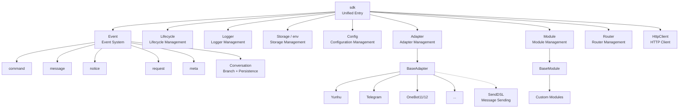
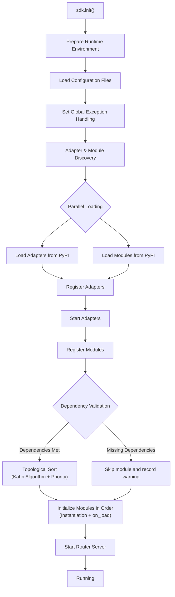
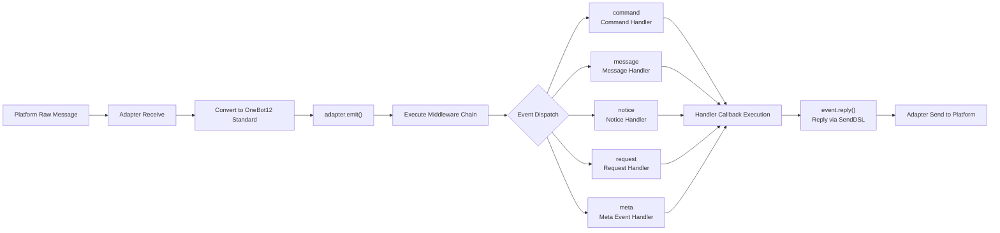
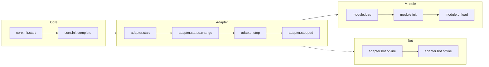
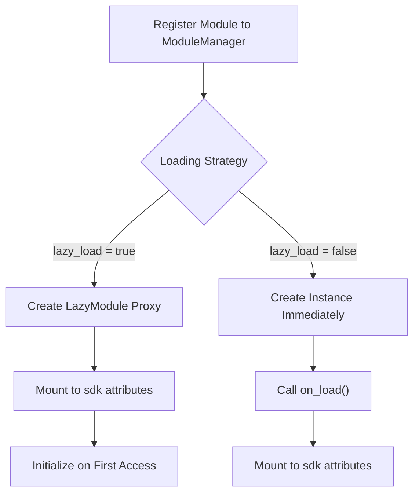

你是一个 ErisPulse 全栈开发专家，精通以下领域：

- ErisPulse 框架的核心架构和设计理念
- 模块开发和适配器开发
- 异步编程和事件驱动架构
- OneBot12 事件标准和平台适配
- SDK 核心模块 (Storage, Config, Logger, Router, Lifecycle)
- Event 包装类和事件处理系统
- 懒加载系统和生命周期管理
- SendDSL 消息发送系统
- 路由系统和 FastAPI 集成
- 各平台特性指南（OneBot11/12、Telegram、云湖、邮件等）
- 模块/适配器发布流程和模块商店
- 代码规范和文档字符串规范

你擅长：
- 编写高质量的异步 Python 代码
- 设计模块化、可扩展的架构
- 开发模块、适配器
- 使用 ErisPulse 的所有核心功能
- 遵循 ErisPulse 的最佳实践和代码规范
- 解决跨平台兼容性问题
- 通过 CLI 管理项目和发布

**使用以下文档作为知识库，回答问题时请优先参考文档内容。**


---


# ErisPulse 完整开发物料
> **注意**：本文档内容较多，建议仅用于具有强大上下文能力的 AI 模型


---


====
框架理解
====


### 架构概览

# Architecture Overview

This document introduces the technical architecture of ErisPulse SDK through visual diagrams, helping you quickly understand the design philosophy and module relationships of the framework.

## SDK Core Architecture

The diagram below shows the composition of the SDK's core modules and their relationships:


```mermaid
graph TB
    SDK["sdk<br/>Unified Entry"]

    SDK --> Event["Event<br/>Event System"]
    SDK --> Lifecycle["Lifecycle<br/>Lifecycle Management"]
    SDK --> Logger["Logger<br/>Logger Management"]
    SDK --> Storage["Storage / env<br/>Storage Management"]
    SDK --> Config["Config<br/>Configuration Management"]
    SDK --> AdapterMgr["Adapter<br/>Adapter Management"]
    SDK --> ModuleMgr["Module<br/>Module Management"]
    SDK --> Router["Router<br/>Router Management"]
    SDK --> Client["HttpClient<br/>HTTP Client"]
    Event --> Command["command"]
    Event --> Message["message"]
    Event --> Notice["notice"]
    Event --> Request["request"]
    Event --> Meta["meta"]
    Event --> Conversation["Conversation<br/>Branch + Persistence"]

    AdapterMgr --> BaseAdapter["BaseAdapter"]
    BaseAdapter --> P1["Yunhu"]
    BaseAdapter --> P2["Telegram"]
    BaseAdapter --> P3["OneBot11/12"]
    BaseAdapter --> PN["..."]

    ModuleMgr --> BaseModule["BaseModule"]
    BaseModule --> CM["Custom Modules"]

    BaseAdapter -.-> SendDSL["SendDSL<br/>Message Sending"]
```

### Core Module Description

| Module | Description |
|------|------|
| **Event** | Event system, providing five types of event processing: command / message / notice / request / meta, and Conversation multi-round dialogue |
| **Adapter** | Adapter manager, managing the registration, startup, and shutdown of multi-platform adapters |
| **Module** | Module manager, managing plugin registration, loading, and unloading, supporting dependency declaration and topological sorting |
| **Lifecycle** | Lifecycle manager, providing event-driven lifecycle hooks |
| **Storage** | SQLite-based key-value storage system, supporting general SQL chained queries |
| **Config** | TOML format configuration file management |
| **Logger** | Modular logging system, supporting sub-loggers |
| **Router** | HTTP/WebSocket route management, encapsulating the underlying backend via an abstraction layer (currently FastAPI + Uvicorn), supporting decorator routes, middleware, grouping, rate limiting, CORS |
| **HttpClient** | Unified HTTP/WS client, encapsulating the underlying request library via an abstraction layer (currently aiohttp), providing request statistics, retry, logging, WebSocket client, and ErisPulse exception hierarchy features. The client and server WebSocket share the `WebSocketConnectionBase` base class |

## Initialization Process

The diagram below shows the complete initialization process of `sdk.init()`:


```mermaid
flowchart TD
    A["sdk.init()"] --> B["Prepare Runtime Environment"]
    B --> B1["Load Configuration Files"]
    B1 --> B2["Set Global Exception Handling"]
    B2 --> C["Adapter & Module Discovery"]
    C --> D{"Parallel Loading"}
    D --> D1["Load Adapters from PyPI"]
    D --> D2["Load Modules from PyPI"]
    D1 & D2 --> E["Register Adapters"]
    E --> E1["Start Adapters"]
    E1 --> F["Register Modules"]
    F --> F1{"Dependency Validation"}
    F1 -->|"Missing Dependencies"| F2["Skip module and record warning"]
    F1 -->|"Dependencies Met"| F3["Topological Sort<br/> (Kahn Algorithm + Priority)"]
    F3 --> G["Initialize Modules in Order<br/> (Instantiation + on_load)"]
    F2 --> G
    G --> H["Start Router Server"]
    H --> K["Running"]
```

### Initialization Stage Breakdown

1. **Environment Preparation** - Load TOML configuration files, set up global exception handling
2. **Parallel Discovery** - Discover adapters and modules from installed PyPI packages simultaneously
3. **Adapter Registration** - Register discovered adapters to the adapter manager
4. **Adapter Startup** - Asynchronously start platform adapter connections (before module initialization, ensuring modules can immediately send messages)
5. **Module Registration** - Register discovered modules to the module manager
6. **Dependency Validation** - Check if the `depends` dependencies declared by modules are registered, skip modules with missing dependencies
7. **Topological Sorting** - Use Kahn algorithm to sort module loading order based on dependencies, same level in descending order of `priority`
8. **Module Initialization** - Create module instances in sorted order, call the `on_load` lifecycle method
9. **Start Router Server** - Start the FastAPI route server using Uvicorn

## Event Handling Process

The diagram below shows the complete flow path of messages from the platform to the handler:


```mermaid
flowchart LR
    A["Platform Raw Message"] --> B["Adapter Receive"]
    B --> C["Convert to OneBot12 Standard"]
    C --> D["adapter.emit()"]
    D --> E["Execute Middleware Chain"]
    E --> F{"Event Dispatch"}
    F --> G1["command<br/>Command Handler"]
    F --> G2["message<br/>Message Handler"]
    F --> G3["notice<br/>Notice Handler"]
    F --> G4["request<br/>Request Handler"]
    F --> G5["meta<br/>Meta Event Handler"]
    G1 & G2 & G3 & G4 & G5 --> H["Handler Callback Execution"]
    H --> I["event.reply()<br/>Reply via SendDSL"]
    I --> J["Adapter Send to Platform"]
```

### Key Steps in Event Handling

- **Adapter Receive** - Platform adapters receive native events via WebSocket/Webhook, etc.
- **OB12 Standardization** - Convert platform native events to the unified OneBot12 standard format
- **Middleware Processing** - Execute registered middleware functions sequentially, allowing modification of event data
- **Event Dispatch** - Dispatch to corresponding handlers based on event type (message/notice/request/meta)
- **SendDSL Reply** - Handlers send responses via `event.reply()` or `SendDSL` chain calls

## Lifecycle Events

The diagram below shows the triggering sequence of lifecycle events for various framework components:


```mermaid
flowchart LR
    subgraph Core["Core"]
        direction LR
        C1["core.init.start"] --> C2["core.init.complete"]
    end

    subgraph AdapterLife["Adapter"]
        direction LR
        A1["adapter.start"] --> A2["adapter.status.change"] --> A3["adapter.stop"] --> A4["adapter.stopped"]
    end

    subgraph ModuleLife["Module"]
        direction LR
        M1["module.load"] --> M2["module.init"] --> M3["module.unload"]
    end

    subgraph BotLife["Bot"]
        direction LR
        B1["adapter.bot.online"] --> B2["adapter.bot.offline"]
    end

    Core --> AdapterLife
    AdapterLife --> ModuleLife
    AdapterLife -.-> BotLife
```

### Listening to Lifecycle Events

You can listen to these events via `lifecycle.on()` to execute custom logic:

```python
from ErisPulse import sdk

# Listen to all adapter events
@sdk.lifecycle.on("adapter")
async def on_adapter_event(event_data):
    print(f"Adapter event: {event_data}")

# Listen for module load completion
@sdk.lifecycle.on("module.load")
async def on_module_loaded(event_data):
    print(f"Module loaded: {event_data}")

# Listen for Bot online
@sdk.lifecycle.on("adapter.bot.online")
async def on_bot_online(event_data):
    print(f"Bot online: {event_data}")
```

## Module Loading Strategy

ErisPulse supports two module loading strategies:


```mermaid
flowchart TD
    A["Register Module to ModuleManager"] --> B{"Loading Strategy"}
    B -->|"lazy_load = true"| C["Create LazyModule Proxy"]
    C --> D["Mount to sdk attributes"]
    D --> E["Initialize on First Access"]
    B -->|"lazy_load = false"| F["Create Instance Immediately"]
    F --> G["Call on_load()"]
    G --> D2["Mount to sdk attributes"]
```

> For more details, please refer to [Lazy Loading System](advanced/lazy-loading.md) and [Lifecycle Management](advanced/lifecycle.md).


### 术语表

# ErisPulse Glossary

This document explains common technical terms used in ErisPulse to help you better understand the framework's concepts.

## Core Concepts

### Event-Driven Architecture
**Simple Explanation:** Like a restaurant ordering system. Customers (users) order dishes (send messages), waiters (event system) pass the order (event) to the kitchen (modules), and after the kitchen processes it, the waiter serves the food (reply) to the customer.

**Technical Explanation:** The program's execution flow is triggered by external events rather than executing in a fixed sequence. Whenever a new event occurs (such as receiving a message), the framework automatically calls the corresponding handler function.

### OneBot12 Standard
**Simple Explanation:** Like the standard for sockets and plugs. The "plugs" (native event formats) of different platforms vary, but through converters, they all become a unified "plug" (OneBot12 format), so your code can act like a socket to adapt to all platforms.

**Technical Explanation:** A unified chatbot application interface standard that defines unified formats for events, messages, APIs, etc., allowing code to be reused across different platforms.

### Adapter
**Simple Explanation:** Like a translator. Different platforms speak different "languages" (API formats). The adapter translates these "languages" into "Mandarin" (OneBot12 standard) that ErisPulse can understand, and also translates ErisPulse's instructions back into the "languages" of each platform.

**Technical Explanation:** A component responsible for communicating with a specific platform. It receives native events from the platform and converts them into a standard format, or sends standard format requests to the platform.

### Module
**Simple Explanation:** Like an APP on a phone. Each module is an independent feature pack that can be added, deleted, or updated. Examples include "Weather Forecast Module", "Music Player Module", etc.

**Technical Explanation:** The basic unit of feature extension, containing specific business logic, event handlers, and configuration, which can be installed and uninstalled independently.

### Event
**Simple Explanation:** Like a notification on a phone. When there is a new message, new friend, or new group chat, the platform sends a "notification" (event) to your bot.

**Technical Explanation:** Anything notable happening on the platform, such as receiving a message, a user joining a group, a friend request, etc., is passed to the program in the form of structured data.

### Event Handler
**Simple Explanation:** Like a courier's delivery rules. When a "package" (event) is received, it decides who handles this package based on the package type (message, notice, request, etc.).

**Technical Explanation:** Functions marked with decorators that are automatically executed when a specific type of event occurs, such as `@command`, `@message`, etc.

## Development Related Terms

### SDK
**Simple Explanation:** Like a toolbox. It contains various common tools (storage, configuration, logs, etc.) that you can use directly when writing code, without reinventing the wheel.

**Technical Explanation:** Software Development Kit, which provides a set of pre-built components and tools to simplify the development process.

### Virtual Environment
**Simple Explanation:** Like an independent "workshop". Each project has its own "workshop", and the software packages installed inside do not interfere with each other, avoiding version conflicts.

**Technical Explanation:** An isolated Python environment where each environment has an independent package list and versions, preventing dependency conflicts between different projects.

### Asynchronous Programming
**Simple Explanation:** Like multitasking. The bot can do multiple things at once. For example, while waiting for a network response, it can still process messages from other users without freezing.

**Technical Explanation:** A programming style using `async`/`await` keywords that allows the program to switch to other tasks while waiting for time-consuming operations (such as network requests, file reading/writing), improving efficiency.

### Hot Reload
**Simple Explanation:** Like auto-refresh on a webpage. After you modify the code, you don't need to manually restart the bot; it automatically loads the new code, taking effect immediately.

**Technical Explanation:** In development mode, the program automatically detects file changes and reloads, allowing code modifications to take effect without a manual restart.

### Lazy Loading
**Simple Explanation:** Like drawers opened on demand. Unused drawers (modules) stay closed first and are only opened when needed, so you don't have to wait for all drawers to open during startup.

**Technical Explanation:** A delayed loading strategy where modules are initialized and loaded only when first accessed, reducing startup time and resource usage.

## Function Related Terms

### Command
**Simple Explanation:** Like a command in a game. When a user types a command like `/hello`, the bot executes the corresponding function.

**Technical Explanation:** A message starting with a specific prefix (such as `/`) that is recognized by the framework as a command and routed to the corresponding handler function.

### Reply
**Simple Explanation:** It is the "answer" the bot gives to the user. Whether it is text, image, or voice, it is a reply to the user's message.

**Technical Explanation:** The process where the adapter sends processing results back to the platform to be displayed to the user.

### Storage
**Simple Explanation:** Like the bot's "notepad". It can remember user information, settings, chat history, etc., so they can be found next time.

**Technical Explanation:** A persistent data storage system based on SQLite that implements key-value pair storage, used to save data that needs to be retained for a long time.

### Configuration
**Simple Explanation:** Like the bot's "settings". You can modify the bot's behavior through configuration files, such as changing port numbers, log levels, etc.

**Technical Explanation:** A configuration management system using TOML format, used to set various parameters for the framework and modules.

### Log
**Simple Explanation:** Like the bot's "diary". It records what the bot did and what problems it encountered, facilitating debugging and troubleshooting.

**Technical Explanation:** Recorded information generated during system runtime, including different levels such as info, warning, error, etc., used for monitoring and debugging.

### Router
**Simple Explanation:** Like traffic police directing traffic. Decides which request should go to which place to be processed, such as web requests, WebSocket connections, etc.

**Technical Explanation:** HTTP and WebSocket router manager that distributes requests to corresponding handler functions based on URL paths.

## Platform Related Terms

### Platform
**Simple Explanation:** The place where the bot works, such as Yunhu, Telegram, QQ, etc. Each platform has its own rules and API.

**Technical Explanation:** An application or service that provides chatbot services, such as Yunhu Enterprise Communication, Telegram, etc.

### OneBot11/12
**Simple Explanation:** Like the "International Standard" for chatbots. It defines unified formats for messages, events, etc., so that different software can understand each other.

**Technical Explanation:** OneBot is a universal chatbot application interface standard that defines formats for events, messages, APIs, etc. 11 and 12 are different versions of the standard.

### SendDSL
**Simple Explanation:** Like a "shortcut" for sending messages. You can send various types of messages (text, images, @someone, etc.) with a simple one-line statement.

**Technical Explanation:** A chained message sending interface that provides concise syntax to build and send complex messages.

## Other Terms

### Lifecycle
**Simple Explanation:** The bot's "life": Birth (startup), Work (running), Rest (stop). The lifecycle refers to events triggered at these key moments.

**Technical Explanation:** Key stages during the program's runtime, such as startup, loading modules, unloading modules, shutdown, etc. Operations can be executed by listening to these events.

### Annotation/Decorator
**Simple Explanation:** It is putting a "label" on a function. For example, the `@command("hello")` label tells the framework: This is a command handler named "hello".

**Technical Explanation:** Python syntactic sugar used to modify the behavior of functions or classes. In ErisPulse, it is used to mark event handlers, routes, etc.

### Type Annotation
**Simple Explanation:** It is telling the function what "type" the parameters are. For example, `request: Request` indicates that this parameter is a Request object.

**Technical Explanation:** A feature introduced in Python 3.5+ used to annotate the types of variables and parameters, improving code readability and type safety.

### TOML
**Simple Explanation:** A configuration file format that is more readable than JSON and stricter than YAML, suitable for writing configurations.

**Technical Explanation:** Tom's Obvious Minimal Language, a configuration file format with concise and clear syntax, widely used in Python project configuration management.

## Getting Help

If you find other terms in the documentation that you do not understand, feel free to ask via the following methods:
- Submit a GitHub Issue
- Participate in community discussions
- Contact the maintainers


====
快速开始
====

# Quick Start

> Confused by terminology? Check the [Glossary](terminology.md) for easy-to-understand explanations.

## Install ErisPulse

### One-click Installation Script (Recommended)

The installation script will automatically detect your environment (Docker, Python, uv) and guide you to choose the most suitable installation method.

Windows (PowerShell):
```powershell
irm https://get.erisdev.com/install.ps1 -OutFile install.ps1; powershell -ExecutionPolicy Bypass -File install.ps1
```

macOS / Linux:
```bash
curl -fsSL https://get.erisdev.com/install.sh -o install.sh && chmod +x install.sh && ./install.sh
```

The script will guide you through:

- **Docker installation** (Recommended when Docker is detected): Select image source (Docker Hub / GHCR), version channel (Stable / Pre-release), Dashboard management panel configuration, port settings
- **Traditional installation**: Automatically create virtual environment, select ErisPulse version, optionally install Dashboard management panel module

### Using Docker

Docker images come pre-built with the ErisPulse framework and Dashboard management panel.

```bash
# Download docker-compose.yml
curl -O https://raw.githubusercontent.com/ErisPulse/ErisPulse/main/docker-compose.yml

# Set Dashboard token and start
ERISPULSE_DASHBOARD_TOKEN=your-token docker compose up -d
```

<details>
<summary>Docker Hub Not Available?</summary>

Use the GitHub Container Registry image by modifying the `image` in `docker-compose.yml`:

```yaml
image: ghcr.io/erispulse/erispulse:latest
```

</details>

After starting, access `http://<host>:8000/Dashboard` and log in with the set token.

### Install using pip

Ensure your Python version is >= 3.10, then use pip to install:

```bash
pip install ErisPulse
```

If you have [uv](https://github.com/astral-sh/uv) installed, you can also use `uv pip install ErisPulse`, which is faster.

## Initialize Project

### Interactive Initialization (Recommended)

```bash
epsdk init
```

This will launch an interactive wizard to guide you through:
- Project name setting
- Log level configuration
- Server configuration (host and port)
- Adapter selection and configuration
- Project structure creation

### Quick Initialization

```bash
# Quick mode with specified project name
epsdk init -q -n my_bot

# Or just specify project name
epsdk init -n my_bot
```

### Manual Project Creation

If you prefer to create the project manually:

```bash
mkdir my_bot && cd my_bot
epsdk init
```

## Install Modules

### Install via CLI

```bash
epsdk install Yunhu AIChat
```

### View Available Modules

```bash
epsdk list-remote
```

### Interactive Installation

Enter the interactive installation interface when no package name is specified:

```bash
epsdk install
```

## Run Project

```bash
# Normal run
epsdk run main.py

# Hot reload mode (recommended for development)
epsdk run main.py --reload
```

## Project Structure

Project structure after initialization:

```
my_bot/
├── config/
│   └── config.toml          # Configuration file
└── main.py                  # Entry file

```

## Configuration File

Basic `config.toml` configuration:

```toml
[ErisPulse.server]
host = "0.0.0.0"
port = 8000

[ErisPulse.logger]
level = "INFO"

[Yunhu_Adapter]
# Adapter configuration
```

## Next Steps

- [Getting Started Overview](getting-started/README.md) - Learn the basic concepts of ErisPulse
- [Create Your First Bot](getting-started/first-bot.md) - Create a simple bot
- [User Guide](user-guide/) - Deep dive into configuration and module management
- [Developer Guide](developer-guide/) - Develop custom modules and adapters


====
入门指南
====


### 入门指南总览

# Getting Started Guide

Welcome to the ErisPulse Getting Started Guide. If you are using ErisPulse for the first time, this guide will take you from scratch to gradually understand the core concepts and basic usage of the framework.

## Learning Path

This guide is organized in the following order, and is recommended to be read sequentially:

| Step | Topic | Description |
|------|-------|-------------|
| 1 | [Create Your First Bot](first-bot.md) | From project initialization to running your first command |
| 2 | [Basic Concepts](basic-concepts.md) | Understanding ErisPulse's core architecture and module design |
| 3 | [Introduction to Event Handling](event-handling.md) | Learn how to handle various event types, such as messages, commands, and notices |
| 4 | [Common Task Examples](common-tasks.md) | Master common features such as data persistence, scheduled tasks, and permission control |

## Choosing a Development Approach

ErisPulse supports two development approaches:

| Approach | Suitable Scenarios | Description |
|----------|-------------------|-------------|
| **Embedded Development** | Fast prototyping, internal project features | Write handlers directly in `main.py` without creating separate modules |
| **Module Development** (Recommended) | Production environment, feature distribution | Create independent Python packages and install and use them via `epsdk install` |

> For a detailed comparison and examples of both approaches, please refer to [Create Your First Bot](first-bot.md) and [Getting Started with Module Development](../developer-guide/modules/getting-started.md).

## Architecture Overview

ErisPulse adopts an event-driven architecture and consists of the following core systems:

- **Adapter System** — Communicating with various platforms, converting platform events into a unified OneBot12 standard format
- **Event System** — Handling five major types of events: messages, commands, notices, requests, and meta events
- **Module System** — Extending functionality through independent modules, supporting dependency management and lazy loading
- **Core Modules** — Providing basic capabilities such as Storage (storage), Config (configuration), Logger (logging), and Router (routing)

> For detailed architecture diagrams and initialization flows, please refer to [Architecture Overview](../architecture.md).

## Start Learning

Are you ready to get started?

- [Create Your First Bot](first-bot.md) — Get up and running in 5 minutes


### 创建第一个机器人

# Create Your First Bot

This guide will take you from scratch to create a simple ErisPulse bot.

## Step 1: Create Project

Use the CLI tool to initialize the project:

```bash
# Interactive initialization
epsdk init

# Or quick initialization
epsdk init -q -n my_first_bot
```

Follow the prompts to complete the configuration. It is recommended to select:
- Project name: my_first_bot
- Log level: INFO
- Server: Default configuration
- Adapter: Choose your needed platform (e.g., Yunhu)

## Step 2: View Project Structure

The project structure after initialization:

```
my_first_bot/
├── config/
│   └── config.toml
├── main.py
└── requirements.txt
```

## Step 3: Write Your First Command

Open `main.py` and write a simple command handler:

```python
from ErisPulse import sdk
from ErisPulse.Core.Event import command

@command("hello", help="Send a greeting message")
async def hello_handler(event):
    """Handle hello command"""
    user_name = event.get_user_nickname() or "Friend"
    await event.reply(f"Hello, {user_name}! I am the ErisPulse bot.")

@command("ping", help="Test if the bot is online")
async def ping_handler(event):
    """Handle ping command"""
    await event.reply("Pong! The bot is running normally.")

async def main():
    """Main entry function"""
    print("Initializing ErisPulse...")
    # Run SDK and keep it running
    await sdk.run(keep_running=True)

    # Or
    # await sdk.run(keep_running=False)
    # ...Do Something
    # You can do whatever you want
    # Using await sdk.init() is equivalent to `sdk.run(keep_running=False)`

    print("ErisPulse initialization complete!")

if __name__ == "__main__":
    import asyncio
    asyncio.run(main())
```

## Step 4: Run the Bot

```bash
# Run normally
epsdk run main.py

# Development mode (supports hot reload)
epsdk run main.py --reload
```

## Step 5: Test the Bot

Send the command in your chat platform:

```
/hello
```

You should receive a response from the bot.

## Code Explanation

### Command Decorator

```python
@command("hello", help="Send a greeting message")
```

- `hello`: Command name, users call it via `/hello`
- `help`: Command help description, shown in the `/help` command

### Event Arguments

```python
async def hello_handler(event):
```

The `event` parameter is an Event object, containing:
- Message content: `event.get_text()`
- Sender information: `event.get_user_id()`, `event.get_user_nickname()`
- Platform information: `event.get_platform()`
- Group information: `event.get_group_id()`
- Raw data: `event.get_raw()`

> For a complete list of Event object methods, please refer to [Event Wrapper Class Details](../developer-guide/modules/event-wrapper.md).

### Sending a Reply

```python
await event.reply("Reply content")
```

`event.reply()` is a convenient method for sending a message to the sender.

## Extension: Adding More Features

ErisPulse provides rich event handling and data processing capabilities:

- **Message Listening**: Use `@message.on_message()` to listen for various messages → [Event Handling Introduction](event-handling.md)
- **Notification Listening**: Use `@notice.on_friend_add()` to listen for system notifications → [Event Handling Introduction](event-handling.md)
- **Data Storage**: Use `sdk.storage.get/set` to persist data → [Common Task Examples](common-tasks.md)

## Common Issues

### Bot does not respond?

1. Check if the adapter is configured correctly and confirm that the `status` in `config/config.toml` for the adapter is `true`
2. View terminal log output to confirm if there are error messages (especially `ERROR` level logs)
3. Confirm if the command prefix is correct (default is `/`), you can check the `[ErisPulse.event.command]` section in the configuration file
4. Confirm if the command name is spelled correctly, pay attention to the case sensitivity setting

### How to change the command prefix?

Add this to `config.toml`:

```toml
[ErisPulse.event.command]
prefix = "!"
case_sensitive = false
```

### How to support multiple platforms?

ErisPulse uses the OneBot12 standard to unify event formats across different platforms. Handlers registered with `@command` and `@message` will automatically receive events from all platforms. You can distinguish the source platform via `event.get_platform()`:

```python
@command("hello")
async def hello_handler(event):
    platform = event.get_platform()
    
    if platform == "yunhu":
        await event.reply("Hello! From Yunhu")
    elif platform == "telegram":
        await event.reply("Hello! From Telegram")
    else:
        await event.reply("Hello!")
```

> For more multi-platform adaptation tips, please refer to [Common Task Examples](common-tasks.md#multi-platform-adaptation).

## Next Steps

- [Basic Concepts](basic-concepts.md) - Understand ErisPulse core concepts deeply
- [Event Handling Introduction](event-handling.md) - Learn how to handle various events
- [Common Task Examples](common-tasks.md) - Master more practical functions


### 基础概念

# Basic Concepts

This guide introduces the core concepts of ErisPulse, helping you understand the framework's design philosophy and basic architecture.

## Event-Driven Architecture

ErisPulse adopts an event-driven architecture, where all interactions are conveyed and processed through events.

### Event Flow

```
User sends message
      │
      ▼
Platform receives
      │
      ▼
Adapter receives platform-native event
      │
      ▼
Converted to OneBot12 standard event
      │
      ▼
Submitted to event system
      │
      ▼
Dispatched to registered handlers
      │
      ▼
Module processes event
      │
      ▼
Response sent via adapter
      │
      ▼
Platform displays to user
```

### OneBot12 Standard

ErisPulse uses OneBot12 as its core event standard. OneBot12 is a generic chatbot application interface standard that defines a unified event format.

All adapters convert platform-specific events into OneBot12 format to ensure code consistency.

## Core Components

### 1. SDK Object

The SDK is the unified entry point for all functionality, providing access to core components.

```python
from ErisPulse import sdk

# Access core modules
sdk.storage    # Storage system
sdk.config     # Configuration system
sdk.logger     # Logging system
sdk.adapter    # Adapter system
sdk.module     # Module system
sdk.router     # Routing system
sdk.client     # HTTP Client
sdk.lifecycle  # Lifecycle system
```

### 2. Event Object

The Event object encapsulates event data, providing convenient access methods.

```python
@command("info")
async def info_handler(event):
    # Get event info
    event_id = event.get_id()
    user_id = event.get_user_id()
    platform = event.get_platform()
    text = event.get_text()
    
    # Send reply
    await event.reply(f"User: {user_id}, Platform: {platform}")
```

### 3. Adapters

Adapters are bridges between ErisPulse and external platforms.

**Responsibilities:**
- Receive platform-native events
- Convert to OneBot12 standard format
- Send standard format events to the platform

**Example Adapters:**
- Yunhu Adapter: Communicates with the Yunhu platform
- Telegram Adapter: Communicates with the Telegram Bot API
- OneBot11 Adapter: Communicates with OneBot11 compatible applications
- Email Adapter: Handles email sending and receiving

### 4. Modules

Modules are the basic unit of functional extension and can:
- Register event handlers
- Implement business logic
- Call adapters to send messages
- Use services provided by core modules

#### Module Discovery Mechanism

ErisPulse discovers installed modules through Python's `importlib.metadata.entry_points`. Modules declare entry points in `pyproject.toml`:

```toml
[project.entry-points."erispulse.module"]
MyModule = "my_package:Main"
```

When the SDK initializes, it scans all entry points in the `erispulse.module` group, registers the module classes to `ModuleManager`, and then initializes them in topological order based on dependencies.

#### Minimal Viable Module

```python
from ErisPulse.Core.Bases import BaseModule
from ErisPulse import sdk

class Main(BaseModule):
    def __init__(self):
        self.sdk = sdk
        self.logger = sdk.logger.get_child("MyModule")

    async def on_load(self, event):
        self.logger.info("Module loaded")

    async def on_unload(self, event):
        self.logger.info("Module unloaded")
```

#### Module Lifecycle

- **Registration**: The SDK discovers module classes and registers them with the manager
- **Loading**: Creates a module instance and calls `on_load(event)` (`event = {"module_name": "MyModule"}`)
- **Unloading**: Calls `on_unload(event)` to clean up resources

#### Load Strategy

Declare the module's loading behavior through `get_load_strategy()`:

```python
from ErisPulse.loaders import ModuleLoadStrategy

class Main(BaseModule):
    @staticmethod
    def get_load_strategy():
        return ModuleLoadStrategy(
            lazy_load=True,   # Whether to enable lazy loading (default True)
            priority=0        # Load priority, higher values initialize earlier
        )
```

- **`lazy_load=True` (default)**: The module is initialized only when first accessed via `sdk.MyModule`, reducing startup time
- **`lazy_load=False`**: The module is initialized immediately during SDK startup, suitable for modules that need to listen to lifecycle events or execute scheduled tasks
- **`priority`**: Modules with the same priority are loaded in registration order; higher values initialize earlier

> For detailed information on the lazy loading mechanism, please refer to [Lazy Loading System](../advanced/lazy-loading.md).

## Event Types

ErisPulse supports 5 types of events:

| Event Type | Decorator | Description |
|---------|--------|------|
| Message Event | `@message.on_message()` | Any message sent by a user (private chat, group chat) |
| Command Event | `@command("name")` | Messages starting with a command prefix (e.g., `/hello`) |
| Notice Event | `@notice.on_friend_add()` etc. | System notifications (e.g., friend addition, group member changes) |
| Request Event | `@request.on_friend_request()` etc. | User requests (e.g., friend requests, group invitations) |
| Meta Event | `@meta.on_connect()` etc. | System-level events (e.g., connection, heartbeat) |

> For detailed usage and code examples of each event type, please refer to [Event Handling Intro](event-handling.md).

## Core Module Explanations

### Storage（存储）

A SQLite-based key-value storage system for persistent data.

```python
# Set value
sdk.storage.set("key", "value")

# Get value
value = sdk.storage.get("key", "default_value")

# Batch operations
sdk.storage.set_multi({
    "key1": "value1",
    "key2": "value2"
})

# Transaction
with sdk.storage.transaction():
    sdk.storage.set("key1", "value1")
    sdk.storage.set("key2", "value2")
```

### Config（配置）

TOML format configuration file management.

```python
# Get config
config = sdk.config.getConfig("MyModule", {})

# Set config
sdk.config.setConfig("MyModule", {"key": "value"})

# Read nested config
value = sdk.config.getConfig("MyModule.subkey", "default")
```

### Logger（日志）

A modular logging system.

```python
# Log message
sdk.logger.info("This is an info message")
sdk.logger.warning("This is a warning message")
sdk.logger.error("This is an error message")

# Get child logger
child_logger = sdk.logger.get_child("submodule")
child_logger.info("Submodule log")
```

**Property Access Syntax Sugar**

In addition to using the `get_child()` method, you can also create child loggers via **property access**. This is a more concise **syntax sugar** approach:

```python
# Create child logger via property access
sdk.logger.mymodule.info("Module message")

# Support nested access
sdk.logger.mymodule.database.info("Database message")
```

### Router（路由）

HTTP and WebSocket route management, based on FastAPI + Uvicorn. Supports decorator routing, middleware, grouping, rate limiting, CORS.

```python
from ErisPulse.Core import HttpRequest

@sdk.router.get("MyModule", "/api")
async def handler(request: HttpRequest):
    data = await request.json()
    return {"status": "ok"}
```

> For the complete routing API (WebSocket, middleware, rate limiting, CORS, etc.), please refer to [Router Manager](../advanced/router.md).

### Client（HTTP 客户端）

A unified HTTP/WS client, providing automatic retries, timeout control, request statistics, and lifecycle event integration. Modules and adapters should prioritize using the global client (`sdk.client`) rather than directly importing `aiohttp`.

```python
from ErisPulse.Core import client

resp = await client.get("https://api.example.com/users")
data = await resp.json()

ws = await client.ws_connect("wss://example.com/ws")
async for text in ws.iter_text():
    await ws.send_text(f"Echo: {text}")
```

> For the complete HTTP client API, please refer to [HTTP Client](../advanced/http-client.md).

## SendDSL Message Sending

Adapters provide a chain-call interface for sending messages.

### Basic Sending

```python
# Get adapter instance
yunhu = sdk.adapter.get("yunhu")

# Send message
await yunhu.Send.To("user", "U1001").Text("Hello")

# Specify sending account
await yunhu.Send.Using("bot1").To("group", "G1001").Text("Group message")
```

### Chain Modifiers

```python
# @User
await yunhu.Send.To("group", "G1001").At("U2001").Text("@message")

# Reply message
await yunhu.Send.To("group", "G1001").Reply("msg123").Text("Reply")

# @All
await yunhu.Send.To("group", "G1001").AtAll().Text("Announcement")
```

### Event Reply Methods

The Event object provides convenient reply methods:

```python
@command("test")
async def test_handler(event):
    # Simple text reply
    await event.reply("Reply content")
    
    # Send image
    await event.reply("http://example.com/image.jpg", method="Image")
    
    # Send voice
    await event.reply("http://example.com/voice.mp3", method="Voice")
```

## Lazy Loading System

ErisPulse enables module lazy loading by default. Modules are initialized only when first accessed (e.g., `sdk.MyModule`), significantly improving startup speed.

```python
from ErisPulse.loaders import ModuleLoadStrategy

class Main(BaseModule):
    @staticmethod
    def get_load_strategy():
        return ModuleLoadStrategy(
            lazy_load=True,   # Enable lazy loading (default)
            priority=0        # Load priority, higher values initialize earlier
        )
```

**Scenarios requiring immediate loading (`lazy_load=False`):**
- Modules listening to lifecycle events (e.g., `core.init.complete`)
- Modules that execute scheduled tasks or run background services
- Modules that need to complete initialization before other modules load

> For detailed information on the lazy loading mechanism and best practices, please refer to [Lazy Loading System](../advanced/lazy-loading.md).

## Next Steps

- [Event Handling Intro](event-handling.md) - Learn how to handle various events
- [Common Tasks Examples](common-tasks.md) - Master the implementation of common functions


### 事件处理入门

# Getting Started with Event Handling

This guide introduces how to handle various events in ErisPulse.

## Event Type Overview

ErisPulse supports the following event types:

| Event Type | Description | Use Cases |
|---------|------|---------|
| Message Event | Any message sent by a user | Chatbots, content filtering |
| Command Event | Messages starting with a command prefix | Command handling, feature entry points |
| Notification Event | System notifications (friend added, group member changes, etc.) | Welcome messages, status notifications |
| Request Event | User requests (friend requests, group invitations) | Automatic request handling |
| Meta Event | System-level events (connection, heartbeat) | Connection monitoring, status checks |

## Message Event Handling

> **Tip**: It is recommended to use the `Event` type annotation in event handlers to get IDE autocomplete and type checking support.

```python
from ErisPulse.Core.Event import Event  # Import Event type for annotations
```

### Listening to all messages

```python
from ErisPulse.Core.Event import message, Event

@message.on_message()
async def message_handler(event: Event):
    text = event.get_text()
    user_id = event.get_user_id()
    sdk.logger.info(f"Received message from {user_id}: {text}")
```

### Listening to private messages

```python
@message.on_private_message()
async def private_handler(event: Event):
    user_id = event.get_user_id()
    await event.reply(f"Hello, {user_id}! This is a private message.")
```

### Listening to group messages

```python
@message.on_group_message()
async def group_handler(event: Event):
    group_id = event.get_group_id()
    user_id = event.get_user_id()
    sdk.logger.info(f"User {user_id} sent a message in group {group_id}")
```

### Listening to @ mentions

```python
@message.on_at_message()
async def at_handler(event: Event):
    # Get list of mentioned users
    mentions = event.get_mentions()
    await event.reply(f"You mentioned these users: {mentions}")
```

## Command Event Handling

### Basic Commands

```python
from ErisPulse.Core.Event import command

@command("help", help="Display help information")
async def help_handler(event):
    help_text = """
Available commands:
/help - Display help
/ping - Test connection
/info - View info
    """
    await event.reply(help_text)
```

### Command Aliases

```python
@command(["help", "h"], aliases=["帮助"], help="Display help information")
async def help_handler(event):
    await event.reply("Help information...")
```

Users can invoke this command in any of the following ways:
- `/help`
- `/h`
- `/帮助`

### Command Arguments

```python
@command("echo", help="Echo back the message")
async def echo_handler(event):
    # Get command arguments
    args = event.get_command_args()
    
    if not args:
        await event.reply("Please enter the message you want to echo")
    else:
        await event.reply(f"You said: {' '.join(args)}")
```

### Command Groups

```python
@command("admin.reload", group="admin", help="Reload modules")
async def reload_handler(event):
    await event.reply("Modules have been reloaded")

@command("admin.stop", group="admin", help="Stop the bot")
async def stop_handler(event):
    await event.reply("Bot has stopped")
```

### Command Permissions

```python
def is_admin(event):
    """Check if the user is an administrator"""
    admin_list = ["user123", "user456"]
    return event.get_user_id() in admin_list

@command("admin", permission=is_admin, help="Admin commands")
async def admin_handler(event):
    await event.reply("This is an admin command")
```

### Command Priority

```python
# The higher the priority value, the earlier it executes
@message.on_message(priority=10)
async def high_priority_handler(event):
    await event.reply("High priority handler")

@message.on_message(priority=1)
async def low_priority_handler(event):
    await event.reply("Low priority handler")
```

### Parallel Event Handling

ErisPulse event system adopts a **same-priority parallel, different-priority serial** scheduling model:

```
Event Arrived
    ↓
priority=10 Group: [Handler C || Handler D] Parallel → Merge Results
    ↓ (If not interrupted)
priority=0 Group: [Handler A || Handler B] Parallel → Merge Results
    ↓
...
```

- **Same priority parallel**: Multiple handlers with the same priority execute simultaneously to improve throughput
- **Cross-level serial**: Groups of different priorities execute sequentially (higher values execute first), ensuring high-priority handlers run first
- **Copy-On-Write**: No copies are created when handlers do not modify data, ensuring zero overhead
- **Conflict handling**: When multiple handlers of the same priority modify the same field, the last modified value is used and a warning is logged
- **Interruption mechanism**: After any handler calls `event.mark_processed()`, subsequent lower-priority groups are skipped

```python
# Example: Handlers with same priority execute in parallel
@message.on_message(priority=0)
async def handler_a(event):
    # Process task A
    event['result_a'] = process_a()

@message.on_message(priority=0)
async def handler_b(event):
    # Execute in parallel with handler_a
    event['result_b'] = process_b()

# Different priorities execute serially
@message.on_message(priority=10)
async def handler_c(event):
    # Executes first due to higher priority
    pass
```

## Notification Event Handling

### Friend Add

```python
from ErisPulse.Core.Event import notice

@notice.on_friend_add()
async def friend_add_handler(event):
    user_id = event.get_user_id()
    nickname = event.get_user_nickname() or "New Friend"
    await event.reply(f"Welcome to add me as a friend, {nickname}!")
```

### Group Member Increase

```python
@notice.on_group_increase()
async def member_increase_handler(event):
    group_id = event.get_group_id()
    user_id = event.get_user_id()
    await event.reply(f"Welcome new member {user_id} to join group {group_id}")
```

### Group Member Decrease

```python
@notice.on_group_decrease()
async def member_decrease_handler(event):
    group_id = event.get_group_id()
    user_id = event.get_user_id()
    await event.reply(f"Member {user_id} left group {group_id}")
```

## Request Event Handling

### Friend Request

```python
from ErisPulse.Core.Event import request

@request.on_friend_request()
async def friend_request_handler(event):
    user_id = event.get_user_id()
    comment = event.get_comment()
    
    sdk.logger.info(f"Received friend request: {user_id}, Comment: {comment}")
    
    # Requests can be handled via the adapter API
    # Refer to adapter documentation for specific implementation
```

### Group Invite Request

```python
@request.on_group_request()
async def group_request_handler(event):
    group_id = event.get_group_id()
    user_id = event.get_user_id()
    
    await event.reply(f"Received an invitation to group {group_id}, from {user_id}")
```

## Meta Event Handling

### Connection Event

```python
from ErisPulse.Core.Event import meta

@meta.on_connect()
async def connect_handler(event):
    platform = event.get_platform()
    sdk.logger.info(f"{platform} platform connected")

@meta.on_disconnect()
async def disconnect_handler(event):
    platform = event.get_platform()
    sdk.logger.warning(f"{platform} platform disconnected")
```

### Heartbeat Event

```python
@meta.on_heartbeat()
async def heartbeat_handler(event):
    platform = event.get_platform()
    sdk.logger.debug(f"{platform} heartbeat check")
```

### Bot Status Query

After the adapter sends a meta event, the framework automatically tracks Bot status, which you can query at any time:

```python
from ErisPulse import sdk

# Check if a specific Bot is online
if sdk.adapter.is_bot_online("telegram", "123456"):
    await adapter.Send.To("user", "123456").Text("Bot is online")

# List all currently online Bots
bots = sdk.adapter.list_bots()
for platform, bot_list in bots.items():
    for bot_id, info in bot_list.items():
        print(f"{platform}/{bot_id}: {info['status']}")

# Get complete status summary
summary = sdk.adapter.get_status_summary()
```

## Interactive Handling

### Sending Replies using the `reply` Method

The `event.reply()` method supports various modifier parameters for sending messages with features like @ mentions and replies:

```python
# Simple reply
await event.reply("Hello")

# Send messages of different types
await event.reply("http://example.com/image.jpg", method="Image")  # Image
await event.reply("http://example.com/voice.mp3", method="Voice")  # Voice

# @ a single user
await event.reply("Hello", at_users=["user123"])

# @ multiple users
await event.reply("Hello everyone", at_users=["user1", "user2", "user3"])

# Reply to a message
await event.reply("Reply content", reply_to="msg_id")

# @ all members
await event.reply("Announcement", at_all=True)

# Combination: @ user + reply to message
await event.reply("Content", at_users=["user1"], reply_to="msg_id")
```

### Waiting for User Reply

```python
@command("ask", help="Ask the user")
async def ask_handler(event):
    await event.reply("Please enter your name:")
    
    # Wait for user reply, timeout 30 seconds
    reply = await event.wait_reply(timeout=30)
    
    if reply:
        name = reply.get_text()
        await event.reply(f"Hello, {name}!")
    else:
        await event.reply("Timeout, please try again.")
```

### Waiting for Reply with Validation

```python
@command("age", help="Ask for age")
async def age_handler(event):
    def validate_age(event_data):
        """Validate if age is valid"""
        try:
            age = int(event_data.get_text())
            return 0 <= age <= 150
        except ValueError:
            return False
    
    await event.reply("Please enter your age (0-150):")
    
    reply = await event.wait_reply(
        timeout=60,
        validator=validate_age
    )
    
    if reply:
        age = int(reply.get_text())
        await event.reply(f"Your age is {age}")
    else:
        await event.reply("Invalid input or timeout")
```

### Waiting for Reply with Callback

```python
@command("confirm", help="Confirm action")
async def confirm_handler(event):
    async def handle_confirmation(reply_event):
        text = reply_event.get_text().lower()
        
        if text in ["是", "yes", "y"]:
            await event.reply("Operation confirmed!")
        else:
            await event.reply("Operation cancelled.")
    
    await event.reply("Confirm executing this action? (Yes/No)")
    
    await event.wait_reply(
        timeout=30,
        callback=handle_confirmation
    )
```

### Confirm Dialog

Wait for user confirmation or denial, automatically recognizing built-in Chinese and English confirmation words:

```python
@command("confirm", help="Confirm action")
async def confirm_handler(event):
    if await event.confirm("Are you sure you want to perform this action?"):
        await event.reply("Confirmed, executing...")
    else:
        await event.reply("Cancelled")

# Custom confirmation words
if await event.confirm("Continue?", yes_words={"go", "继续"}, no_words={"stop", "停止"}):
    pass
```

### Choose Menu

Users can reply with the option number or option text:

```python
@command("choose", help="Choose")
async def choose_handler(event):
    choice = await event.choose(
        "Please select a color:",
        ["Red", "Green", "Blue"]
    )
    
    if choice is not None:
        colors = ["Red", "Green", "Blue"]
        await event.reply(f"You selected: {colors[choice]}")
    else:
        await event.reply("Timeout or no selection made")
```

### Collect Form

Multi-step collection of user input:

```python
@command("register", help="Register")
async def register_handler(event):
    data = await event.collect([
        {"key": "name", "prompt": "Please enter your name:"},
        {"key": "age", "prompt": "Please enter your age:", 
         "validator": lambda e: e.get_text().isdigit()},
        {"key": "email", "prompt": "Please enter your email:"}
    ])
    
    if data:
        await event.reply(f"Registration successful!\nName: {data['name']}\nAge: {data['age']}\nEmail: {data['email']}")
    else:
        await event.reply("Registration timeout or invalid input")
```

### Wait for Any Event

Wait for any event that meets the condition, not limited to the same user:

```python
@command("wait_member", help="Wait for new member")
async def wait_member_handler(event):
    await event.reply("Waiting for group member to join...")
    
    evt = await event.wait_for(
        event_type="notice",
        condition=lambda e: e.get_detail_type() == "group_member_increase",
        timeout=120
    )
    
    if evt:
        await event.reply(f"Welcome new member: {evt.get_user_id()}")
    else:
        await event.reply("Wait timeout")
```

### Multi-round Conversation

Create an interactive multi-round conversation context:

```python
@command("survey", help="Survey")
async def survey_handler(event):
    conv = event.conversation(timeout=60)
    
    await conv.say("Welcome to the survey!")
    
    while conv.is_active:
        reply = await conv.wait()
        
        if reply is None:
            await conv.say("Conversation timed out, goodbye!")
            break
        
        text = reply.get_text()
        
        if text == "exit":
            await conv.say("Goodbye!")
            break
        
        await conv.say(f"You said: {text}, continue typing or reply 'exit' to end")
```

### Built-in Confirmation Words

ErisPulse includes a built-in set of Chinese and English confirmation words:

- **Confirmation words** (`CONFIRM_YES_WORDS`): 是, yes, y, 确认, 确定, 好, 好的, ok, true, 对, 嗯, 行, 同意, 没问题...
- **Negative words** (`CONFIRM_NO_WORDS`): 否, no, n, 取消, 不, 不要, 不行, cancel, false, 错, 拒绝, 不可以...

## Event Data Access

### Common Methods of the Event Object

```python
@command("info")
async def info_handler(event):
    # Basic info
    event_id = event.get_id()
    event_time = event.get_time()
    event_type = event.get_type()
    detail_type = event.get_detail_type()
    
    # Sender info
    user_id = event.get_user_id()
    nickname = event.get_user_nickname()
    
    # Message content
    message_segments = event.get_message()
    alt_message = event.get_alt_message()
    text = event.get_text()
    
    # Group info
    group_id = event.get_group_id()
    
    # Bot info
    self_id = event.get_self_user_id()
    self_platform = event.get_self_platform()
    
    # Raw data
    raw_data = event.get_raw()
    raw_type = event.get_raw_type()
    
    # Platform info
    platform = event.get_platform()
    
    # Message type checks
    is_private = event.is_private_message()
    is_group = event.is_group_message()
    is_at = event.is_at_message()
    
    # Command info
    if event.is_command():
        cmd_name = event.get_command_name()
        cmd_args = event.get_command_args()
        cmd_raw = event.get_command_raw()
```

### Platform Extension Methods

In addition to built-in methods, each platform adapter registers platform-specific methods to facilitate access to platform-specific data.

```python
from ErisPulse.Core.Event import message

@message.on_message()
async def handle_message(event):
    platform = event.get_platform()

    # Call specific methods based on platform
    if platform == "telegram":
        chat_type = event.get_chat_type()      # Telegram specific method
    elif platform == "email":
        subject = event.get_subject()           # Email specific method
```

If you are unsure whether a platform has registered a method, you can query which methods a platform has registered:

```python
from ErisPulse.Core.Event import get_platform_event_methods

methods = get_platform_event_methods("telegram")
# ["get_chat_type", "is_bot_message", ...]
```

> Refer to the corresponding [Platform Documentation](../platform-guide/) for platform-specific methods registered by each platform.

## Event Handling Best Practices

### 1. Exception Handling

```python
@command("process")
async def process_handler(event):
    try:
        # Business logic
        result = await do_some_work()
        await event.reply(f"Result: {result}")
    except ValueError as e:
        # Expected business error
        await event.reply(f"Parameter error: {e}")
    except Exception as e:
        # Unexpected error
        sdk.logger.error(f"Processing failed: {e}")
        await event.reply("Processing failed, please try again later")
```

### 2. Logging

```python
@message.on_message()
async def message_handler(event):
    user_id = event.get_user_id()
    text = event.get_text()
    
    sdk.logger.info(f"Processing message: {user_id} - {text}")
    
    # Use module's own logger
    from ErisPulse import sdk
    logger = sdk.logger.get_child("MyHandler")
    logger.debug(f"Detailed debug info")
```

### 3. Conditional Handling

```python
@message.on_message(priority=0)
async def conditional_handler(event):
    """Conditional handling - Judged within the handler"""
    # Only process messages from specific users
    if event.get_user_id() in ["bot1", "bot2"]:
        return
    
    # Only process messages containing specific keywords
    if "Keywords" not in event.get_text():
        return
    
    await event.reply("Condition met, processing message")
```

## Next Steps

- [Common Task Examples](common-tasks.md) - Learn how to implement common features
- [Event Wrapper Class Details](../developer-guide/modules/event-wrapper.md) - Deep dive into the Event object
- [User Guide](../user-guide/) - Learn about configuration and module management


### 常见任务示例

# Common Task Examples

This guide provides implementation examples for common features to help you quickly implement frequently used functions.

## Content List

1. Data Persistence
2. Scheduled Tasks
3. Message Filtering
4. Multi-platform Adaptation
5. Permission Control
6. Message Statistics
7. Search Functionality
8. Image Processing

## Data Persistence

### Simple Counter

```python
from ErisPulse import sdk
from ErisPulse.Core.Event import command

@command("count", help="View number of command invocations")
async def count_handler(event):
    # Get count
    count = sdk.storage.get("command_count", 0)
    
    # Increment count
    count += 1
    sdk.storage.set("command_count", count)
    
    await event.reply(f"This is the {count}th invocation of this command")
```

### User Data Storage

```python
@command("profile", help="View personal profile")
async def profile_handler(event):
    user_id = event.get_user_id()
    
    # Get user data
    user_data = sdk.storage.get(f"user:{user_id}", {
        "nickname": "",
        "join_date": None,
        "message_count": 0
    })
    
    profile_text = f"""
Nickname: {user_data['nickname']}
Join Date: {user_data['join_date']}
Message Count: {user_data['message_count']}
    """
    
    await event.reply(profile_text.strip())

@command("setnick", help="Set nickname")
async def setnick_handler(event):
    user_id = event.get_user_id()
    args = event.get_command_args()
    
    if not args:
        await event.reply("Please enter a nickname")
        return
    
    # Update user data
    user_data = sdk.storage.get(f"user:{user_id}", {})
    user_data["nickname"] = " ".join(args)
    sdk.storage.set(f"user:{user_id}", user_data)
    
    await event.reply(f"Nickname has been set to: {' '.join(args)}")
```

## Scheduled Tasks

### Simple Timer

```python
from ErisPulse import sdk
from ErisPulse.Core.Event import command
import asyncio

class TimerModule:
    def __init__(self):
        self.sdk = sdk
        self._tasks = []
    
    async def on_load(self, event):
        """Start scheduled tasks when module loads"""
        self._start_timers()
        
        @command("timer", help="Manage timers")
        async def timer_handler(event):
            await event.reply("Timers are running...")
    
    def _start_timers(self):
        """Start scheduled tasks"""
        # Execute every 60 seconds
        task = asyncio.create_task(self._every_minute())
        self._tasks.append(task)
        
        # Execute at midnight daily
        task = asyncio.create_task(self._daily_task())
        self._tasks.append(task)
    
    async def _every_minute(self):
        """Task executed every minute"""
        self.sdk.logger.info("Minute task executed")
        # Your logic...
    
    async def _daily_task(self):
        """Task executed at midnight daily"""
        import time
        
        while True:
            # Calculate time to midnight
            now = time.time()
            midnight = now + (86400 - now % 86400)
            
            await asyncio.sleep(midnight - now)
            
            # Execute task
            self.sdk.logger.info("Daily task executed")
            # Your logic...
```

### Using Lifecycle Events

```python
@sdk.lifecycle.on("core.init.complete")
async def init_complete_handler(event_data):
    """Start scheduled tasks after SDK initialization"""
    import asyncio
    
    async def daily_reminder():
        """Daily reminder"""
        await asyncio.sleep(86400)  # 24 hours
        self.sdk.logger.info("Executing daily task")
    
    # Start background task
    asyncio.create_task(daily_reminder())
```

## Message Filtering

### Keyword Filtering

```python
from ErisPulse.Core.Event import message

blocked_words = ["rubbish", "ads", "phishing"]

@message.on_message()
async def filter_handler(event):
    text = event.get_text()
    
    # Check if sensitive words are included
    for word in blocked_words:
        if word in text:
            sdk.logger.warning(f"Intercepting sensitive message: {word}")
            return  # Do not process this message
    
    # Process message normally
    await event.reply(f"Received: {text}")
```

### Blacklist Filtering

```python
# Load blacklist from configuration or storage
blacklist = sdk.storage.get("user_blacklist", [])

@message.on_message()
async def blacklist_handler(event):
    user_id = event.get_user_id()
    
    if user_id in blacklist:
        sdk.logger.info(f"Blacklisted user: {user_id}")
        return  # Do not process
    
    # Process normally
    await event.reply(f"Hello, {user_id}")
```

## Multi-platform Adaptation

### Platform-specific Responses

```python
@command("help", help="Display help")
async def help_handler(event):
    platform = event.get_platform()
    
    if platform == "yunhu":
        await event.reply("Yunhu platform help...")
    elif platform == "telegram":
        await event.reply("Telegram platform help...")
    elif platform == "onebot11":
        await event.reply("OneBot11 help...")
    else:
        await event.reply("General help information")
```

### Platform Feature Detection

```python
@command("rich", help="Send rich text messages")
async def rich_handler(event):
    platform = event.get_platform()
    
    if platform == "yunhu":
        # Yunhu supports HTML
        yunhu = sdk.adapter.get("yunhu")
        await yunhu.Send.To("user", event.get_user_id()).Html(
            "<b>Bold text</b><i>Italic text</i>"
        )
    elif platform == "telegram":
        # Telegram supports Markdown
        telegram = sdk.adapter.get("telegram")
        await telegram.Send.To("user", event.get_user_id()).Markdown(
            "**Bold text** *Italic text*"
        )
    else:
        # Other platforms use plain text
        await event.reply("Bold text Italic text")
```

## Permission Control

### Admin Check

```python
# Configure admin list
ADMINS = ["user123", "user456"]

def is_admin(user_id):
    """Check if the user is an admin"""
    return user_id in ADMINS

@command("admin", help="Admin command")
async def admin_handler(event):
    user_id = event.get_user_id()
    
    if not is_admin(user_id):
        await event.reply("Insufficient permissions, this command is available to admins only")
        return
    
    await event.reply("Admin command executed successfully")

@command("addadmin", help="Add admin")
async def addadmin_handler(event):
    if not is_admin(event.get_user_id()):
        return
    
    args = event.get_command_args()
    if not args:
        await event.reply("Please enter the Admin ID to add")
        return
    
    new_admin = args[0]
    ADMINS.append(new_admin)
    await event.reply(f"Admin added: {new_admin}")
```

### Group Permissions

```python
@command("groupinfo", help="View group information")
async def groupinfo_handler(event):
    if not event.is_group_message():
        await event.reply("This command is limited to group chats")
        return
    
    group_id = event.get_group_id()
    user_id = event.get_user_id()
    
    await event.reply(f"Group ID: {group_id}, Your ID: {user_id}")
```

## Message Statistics

### Message Counting

```python
@message.on_message()
async def count_handler(event):
    # Get statistics
    stats = sdk.storage.get("message_stats", {
        "total": 0,
        "by_user": {},
        "by_day": {}
    })
    
    # Update statistics
    stats["total"] += 1
    
    user_id = event.get_user_id()
    stats["by_user"][user_id] = stats["by_user"].get(user_id, 0) + 1
    
    # Save
    sdk.storage.set("message_stats", stats)

@command("stats", help="View message statistics")
async def stats_handler(event):
    stats = sdk.storage.get("message_stats", {
        "total": 0,
        "by_user": {},
        "by_day": {}
    })
    
    top_users = sorted(
        stats["by_user"].items(),
        key=lambda x: x[1],
        reverse=True
    )[:5]
    
    top_text = "\n".join(
        f"{uid}: {count} messages" for uid, count in top_users
    )
    
    await event.reply(f"Total messages: {stats['total']}\n\nActive Users:\n{top_text}")
```

## Search Functionality

### Simple Search

```python
from ErisPulse.Core.Event import command, message

# Store message history
message_history = []

@message.on_message()
async def store_handler(event):
    """Store messages for search"""
    user_id = event.get_user_id()
    text = event.get_text()
    
    message_history.append({
        "user_id": user_id,
        "text": text,
        "time": event.get_time()
    })
    
    # Limit the number of history records
    if len(message_history) > 1000:
        message_history.pop(0)

@command("search", help="Search messages")
async def search_handler(event):
    args = event.get_command_args()
    
    if not args:
        await event.reply("Please enter a search keyword")
        return
    
    keyword = " ".join(args)
    results = []
    
    # Search through history
    for msg in message_history:
        if keyword in msg["text"]:
            results.append(msg)
    
    if not results:
        await event.reply("No matching messages found")
        return
    
    # Display results
    result_text = f"Found {len(results)} matching messages:\n\n"
    for i, msg in enumerate(results[:10], 1):  # Display at most 10
        result_text += f"{i}. {msg['text']}\n"
    
    await event.reply(result_text)
```

## Image Processing

### Image Download and Storage

```python
from ErisPulse.Core import client

@message.on_message()
async def image_handler(event):
    """Handle image messages"""
    message_segments = event.get_message()
    
    for segment in message_segments:
        if segment.get("type") == "image":
            file_url = segment.get("data", {}).get("file")
            
            if file_url:
                # Recommend using SDK built-in client to download image
                resp = await client.get(file_url)
                if resp.status == 200:
                    image_data = await resp.read()
                    
                    # Store to file
                    filename = f"images/{event.get_time()}.jpg"
                    with open(filename, "wb") as f:
                        f.write(image_data)
                    
                    sdk.logger.info(f"Image saved: {filename}")
                    await event.reply("Image saved")
```

### Image Identification Example

```python
from ErisPulse.Core import client

@command("identify", help="Identify image")
async def identify_handler(event):
    """Identify image in message"""
    message_segments = event.get_message()
    
    for segment in message_segments:
        if segment.get("type") == "image":
            file_url = segment.get("data", {}).get("file")
            
            # Call image identification API
            result = await _identify_image(file_url)
            
            await event.reply(f"Identification result: {result}")
            return
    
    await event.reply("No image found")

async def _identify_image(url):
    """Call image identification API (example) - Use SDK built-in client"""
    resp = await client.post(
        "https://api.example.com/identify",
        json={"url": url}
    )
    data = await resp.json()
    return data.get("description", "Identification failed")
```

## Next Steps

- [User Guide](../user-guide/) - Learn about configuration and module management
- [Developer Guide](../developer-guide/) - Learn how to develop modules and adapters
- [Advanced Topics](../advanced/) - Deep dive into framework features


====
用户指南
====


### 安装和配置

# Installation and Configuration

This guide introduces how to install ErisPulse and configure your project.

## System Requirements

- Python 3.10 or higher version (recommended 3.10 - 3.13)
- pip or uv (recommended)
- sufficient disk space (at least 100MB)

## Installation Methods

### Method 1: Install via pip

```bash
# Install ErisPulse
pip install ErisPulse

# Upgrade to the latest version
pip install ErisPulse --upgrade
```

### Method 2: Install via uv (Recommended)

uv is a faster Python toolchain, recommended for development environments.

#### Install uv

```bash
# Install uv using pip
pip install uv

# Verify installation
uv --version
```

#### Create Virtual Environment

```bash
# Create project directory
mkdir my_bot && cd my_bot

# Install Python 3.12
uv python install 3.12

# Create virtual environment
uv venv
```

#### Activate Virtual Environment

```bash
# Windows
.venv\Scripts\activate

# Linux/Mac
source .venv/bin/activate
```

#### Install ErisPulse

```bash
# Install ErisPulse
uv pip install ErisPulse --upgrade
```

## Project Initialization

### Interactive Initialization

```bash
epsdk init
```

Follow the prompts to complete:
1. Enter project name
2. Select log level
3. Configure server parameters
4. Select adapter
5. Configure adapter parameters

### Quick Initialization

```bash
# Quick mode, skip interactive configuration
epsdk init -q -n my_bot
```

### Configuration Description

A `config/config.toml` file will be generated after initialization:

```toml
[ErisPulse.server]
host = "0.0.0.0"
port = 8000

[ErisPulse.logger]
level = "INFO"

[ErisPulse.framework]
enable_lazy_loading = true

```

## Module Installation

### Install from Remote Repository

```bash
# Install a specific module
epsdk install Yunhu

# Install multiple modules
epsdk install Yunhu Weather
```

### Install from Local

```bash
# Install local module
epsdk install ./my-module
```

### Interactive Installation

```bash
# Enter interactive installation without specifying a package name
epsdk install
```

## Verify Installation

### Check Installation

```bash
# Check ErisPulse version
epsdk --version
```

### Run Tests

```bash
# Run project
epsdk run main.py
```

If you see similar output, the installation is successful:

```
[INFO] Initializing ErisPulse...
[INFO] Adapter loaded: Yunhu
[INFO] Module loaded: MyModule
[INFO] ErisPulse initialization complete
```

## Common Issues

### Installation Failed

1. Check if Python version is >= 3.10 (recommended 3.10 - 3.13)
2. Try using `uv pip install ErisPulse` instead of `pip install`
3. If you encounter permission errors, try `pip install --user ErisPulse` or use a virtual environment
4. If you encounter SSL certificate errors in an enterprise proxy environment, try `pip install --trusted-host pypi.org --trusted-host files.pythonhosted.org ErisPulse`
5. Ensure network connection is normal and pip sources are accessible

### Configuration Errors

1. Check if `config.toml` syntax is correct (TOML format is sensitive to indentation and quotes)
2. Confirm all required configuration items are filled in
3. Check terminal logs for detailed error information
4. Use `epsdk init` to regenerate the configuration file

### Module Installation Failed

1. Confirm if the module name spelling is correct (case sensitive)
2. Check network connection
3. Use `epsdk list-remote` to view the list of available modules
4. Confirm if the module is compatible with your current SDK version

### Windows PowerShell Execution Policy

If PowerShell prompts "Cannot load file... because running scripts is disabled on this system":

```powershell
Set-ExecutionPolicy -ExecutionPolicy RemoteSigned -Scope CurrentUser
```

## Next Steps

- [CLI Command Reference](cli-reference.md) - Learn all CLI commands
- [Configuration File Explanation](configuration.md) - Learn detailed configuration options


### CLI 命令参考

# CLI Command Reference

The ErisPulse command-line tool provides project management and package management capabilities.

## Package Management Commands

| Command | Arguments | Description | Example |
|-------|------|------|------|
| `install` | `[package]... [--upgrade/-U] [--pre]` | Install modules/adapters | `epsdk install Yunhu` |
| `uninstall` | `<package>...` | Uninstall modules/adapters | `epsdk uninstall old-module` |
| `upgrade` | `[package]... [--force/-f] [--pre]` | Upgrade specified modules or all | `epsdk upgrade --force` |
| `self-update` | `[version] [--pre] [--force/-f]` | Update SDK itself | `epsdk self-update` |

## Information Query Commands

| Command | Arguments | Description | Example |
|-------|------|------|------|
| `list` | `[--type/-t <type>]` | List installed modules/adapters | `epsdk list -t modules` |
| | `[--outdated/-o]` | Only show upgradable packages | `epsdk list -o` |
| `list-remote` | `[--type/-t <type>]` | List remote available packages | `epsdk list-remote` |
| | `[--refresh/-r]` | Force refresh package list | `epsdk list-remote -r` |

## Execution Control Commands

| Command | Arguments | Description | Example |
|-------|------|------|------|
| `run` | `<script> [--reload]` | Run specified script | `epsdk run main.py --reload` |

## Project Management Commands

| Command | Arguments | Description | Example |
|-------|------|------|------|
| `init` | `[--project-name/-n <name>]` | Interactive project initialization | `epsdk init -n my_bot` |
| | `[--quick/-q]` | Quick mode, skip interaction | `epsdk init -q -n bot` |
| | `[--force/-f]` | Force override existing configuration | `epsdk init -f` |
| `create` | `[module|adapter]` | Create scaffold project | `epsdk create` |
| | `[--name/-n <name>]` | Project name (PascalCase) | `epsdk create module -n MyModule` |
| | `[--description/-d <desc>]` | Project description | `epsdk create adapter -d "xx adapter"` |
| | `[--author/-a <name>]` | Author name | `epsdk create -a yourname` |
| | `[--email/-e <mail>]` | Author email | `epsdk create -e you@mail.com` |
| | `[--homepage <url>]` | Project homepage URL | |
| | `[--output/-o <dir>]` | Output directory (default current directory) | `epsdk create -o ./projects` |
| | `[--force/-f]` | Force overwrite existing directory | `epsdk create -f` |

## Parameter Reference

### Common Parameters

| Parameter | Short Option | Description |
|------|---------|------|
| `--help` | `-h` | Display help information |
| `--verbose` | `-v` | Display verbose output |

### install Parameters

| Parameter | Description |
|------|------|
| `[package]` | Package name to install, multiple can be specified |
| `--upgrade` | `-U` | Upgrade to latest version during install |
| `--pre` | Allow installing pre-release versions |

### list Parameters

| Parameter | Description |
|------|------|
| `--type` | `-t` | Specify type: `modules`, `adapters`, `all` |
| `--outdated` | `-o` | Only show upgradable packages |

### run Parameters

| Parameter | Description |
|------|------|
| `--reload` | Enable hot reload mode to monitor file changes |
| `--no-reload` | Disable hot reload mode |

## Interactive Installation

Running `epsdk install` without specifying a package name enters interactive installation:

```bash
epsdk install
```

The interactive interface provides:
1. Adapter selection
2. Module selection
3. Custom installation

## Common Usage

### Installing Modules

```bash
# Install a single module
epsdk install Weather

# Install multiple modules
epsdk install Yunhu Weather

# Upgrade module
epsdk install Weather -U
```

### Listing Modules

```bash
# List all modules
epsdk list

# List only adapters
epsdk list -t adapters

# List only upgradable modules
epsdk list -o
```

### Uninstalling Modules

```bash
# Uninstall a single module
epsdk uninstall Weather

# Uninstall multiple modules
epsdk uninstall Yunhu Weather
```

### Upgrading Modules

```bash
# Upgrade all modules
epsdk upgrade

# Upgrade specified module
epsdk upgrade Weather

# Force upgrade
epsdk upgrade -f
```

### Running Projects

```bash
# Normal run
epsdk run main.py

# Hot reload mode
epsdk run main.py --reload
```

### Initializing Projects

```bash
# Interactive initialization
epsdk init

# Quick initialization
epsdk init -q -n my_bot
```

### Creating Scaffolds

```bash
# Interactive creation (guided selection and information filling)
epsdk create

# Directly create Module project
epsdk create module -n MyModule

# Directly create Adapter project
epsdk create adapter -n MyAdapter

# Full parameters
epsdk create module -n MyModule -d "Module description" -a "Author" -e "mail@example.com"

# Force overwrite existing directory
epsdk create module -n MyModule -f


### 配置文件说明

# Configuration File Guide
> This document will introduce the framework's configuration file. If any third-party module requires configuration, please refer to the module's documentation.

ErisPulse uses a TOML format configuration file `config/config.toml` to manage project configurations.

## Configuration File Location

The configuration file is located in the `config/` folder at the project root:

```
project/
├── config/
│   └── config.toml
├── main.py
```

## Complete Configuration Example

```toml
[ErisPulse.server]
host = "0.0.0.0"
port = 8000
ssl_certfile = ""
ssl_keyfile = ""

[ErisPulse.logger]
level = "INFO"
format = "rich"
log_files = []
memory_limit = 1000

[ErisPulse.framework]
enable_lazy_loading = true
uninit_timeout = 30
strict_mode = 0

[ErisPulse.framework.strict_mode_exceptions]
modules = []
adapters = []

[ErisPulse.storage]
use_global_db = false

[ErisPulse.event.command]
prefix = "/"
case_sensitive = true
allow_space_prefix = false
must_at_bot = false

[ErisPulse.event.message]
ignore_self = true

[ErisPulse.i18n]
language = "auto"
```

## Server Configuration

```toml
[ErisPulse.server]
host = "0.0.0.0"
port = 8000
ssl_certfile = "/path/to/cert.pem"
ssl_keyfile = "/path/to/key.pem"
```

| Configuration Item | Type | Default Value | Description |
|---------|------|---------|------|
| host | string | 0.0.0.0 | Listening address, 0.0.0.0 means all interfaces |
| port | integer | 8000 | Listening port number |
| ssl_certfile | string | empty | Path to SSL certificate file |
| ssl_keyfile | string | empty | Path to SSL private key file |

## Logging Configuration

```toml
[ErisPulse.logger]
level = "INFO"
log_files = ["app.log", "debug.log"]
memory_limit = 1000
```

| Configuration Item | Type | Default Value | Description |
|---------|------|---------|------|
| level | string | INFO | Log level: TRACE, DEBUG, INFO, WARNING, ERROR, CRITICAL (TRACE is the lowest level, outputs detailed framework internal debug information) |
| format | string | rich | Log output format, defaults to rich colored output |
| log_files | array | empty | List of log output files |
| memory_limit | integer | 1000 | Number of log entries to keep in memory |

## Framework Configuration

```toml
[ErisPulse.framework]
enable_lazy_loading = true
uninit_timeout = 30
strict_mode = 0

[ErisPulse.framework.strict_mode_exceptions]
modules = []
adapters = []
```

| Configuration Item | Type | Default Value | Description |
|---------|------|---------|------|
| enable_lazy_loading | boolean | true | Whether to enable module lazy loading |
| uninit_timeout | integer | 30 | Total graceful shutdown timeout (seconds), force termination after timeout. 0 means no timeout set |
| strict_mode | integer | 0 | Strict mode level, see below "Strict Mode" explanation |

### Strict Mode

Strict mode controls the handling strategy for modules/adapters that are non-compliant or fail during the loading phase. Modern modules/adapters should inherit the corresponding base class (`BaseModule`/`BaseAdapter`). Components that do not inherit the base class will affect the framework's context system and fallback cleanup, potentially causing resource leaks.

> **2.5.2 Change**: The default level has been adjusted from `1` (skip) to `0` (lenient) to reduce loading issues for new users. Components that do not inherit the base class will be warned and attempted to load, rather than being directly rejected. To restore the previous behavior, explicitly set `strict_mode = 1`.

| Level | Name | Behavior |
|------|------|------|
| 0 | Lenient (default) | Non-compliance only warns, components that do not inherit the base class will still attempt to load (compatibility with old components) |
| 1 | Strict - Skip | Rejects components that do not inherit the base class and skips them, others start normally |
| 2 | Strict - Fatal | Collects all violations and reports them together, then terminates the entire startup |

Under each level, component crashes during the "loading/registration/initialization phase" are always skipped. The differences are:

- **0 → 1**: The only behavioral change is that "not inheriting the base class" changes from "still loading" to "skip".
- **1 → 2**: All violations (not inheriting the base class, loading failure, registration failure, initialization failure, etc.) are upgraded to fatal, collected at the startup checkpoint, and a violation list is output and terminated.

#### Exemption List

If certain components cannot be migrated temporarily (e.g., depending on old modules), they can be added to the exemption list. Components listed will be treated leniently and continue loading even if non-compliant:

```toml
[ErisPulse.framework.strict_mode_exceptions]
modules = ["SeTu", "SomeLegacyModule"]
adapters = ["OldAdapter"]
```

> When a component is rejected by strict mode, the log will clearly indicate how to restore loading (add to exemption list or lower the level).

## Storage Configuration

```toml
[ErisPulse.storage]
use_global_db = false
```

| Configuration Item | Type | Default Value | Description |
|---------|------|---------|------|
| use_global_db | boolean | false | Whether to use the global database (within package) rather than the project database. If `true`, all projects share the SQLite database within the ErisPulse package; if `false` (default), each project uses an independent database in the `config/` directory |

## Event Configuration

### Command Configuration

```toml
[ErisPulse.event.command]
prefix = "/"
case_sensitive = false
allow_space_prefix = false
```

| Configuration Item | Type | Default Value | Description |
|---------|------|---------|------|
| prefix | string | / | Command prefix |
| case_sensitive | boolean | true | Whether to distinguish case (whether `/Help` and `/help` are different commands) |
| allow_space_prefix | boolean | false | Whether to allow spaces as prefix |
| must_at_bot | boolean | false | Whether the command must be triggered by mentioning the bot (private chats are not restricted) |

### Message Configuration

```toml
[ErisPulse.event.message]
ignore_self = true
```

| Configuration Item | Type | Default Value | Description |
|---------|------|---------|------|
| ignore_self | boolean | true | Whether to ignore messages from the bot itself |

## Internationalization Configuration

```toml
[ErisPulse.i18n]
language = "auto"
```

| Configuration Item | Type | Default Value | Description |
|---------|------|---------|------|
| language | string | auto | Display language for framework built-in text. Set to `auto` to automatically detect system language, or set to a specific code: `zh-CN`, `zh-TW`, `en`, `ja`, `ru` |

## Module Configuration

Each module can define its own configuration in the configuration file:

```toml
[MyModule]
api_url = "https://api.example.com"
timeout = 30
enabled = true
```

Read and write configuration within the module:

```python
from ErisPulse import sdk

# Read configuration
config = sdk.config.getConfig("MyModule", {})
api_url = config.get("api_url", "https://default.api.com")

# Write configuration at runtime (delayed save)
sdk.config.setConfig("MyModule.timeout", 60)

# Immediately save to file
sdk.config.setConfig("MyModule.timeout", 60, immediate=True)
```

> `setConfig` defaults to delayed writing (batched save to file approximately every 5 seconds). Setting `immediate=True` will immediately persist. Configuration changes will trigger the `config.set` lifecycle event.

## Next Steps

- [CLI Command Reference](cli-reference.md) - Learn about all command-line commands
- [Developer Guide](../developer-guide/) - Learn how to develop custom modules


### 部署指南

# Deployment Guide

Best practices for deploying ErisPulse bot to production environments.

## Docker Deployment (Recommended)

ErisPulse provides official Docker images with the ErisPulse framework and Dashboard management panel, supporting `linux/amd64` and `linux/arm64` architectures.

### Quick Start

```bash
# Pull the image
docker pull erispulse/erispulse:latest

# Download docker-compose.yml
curl -O https://raw.githubusercontent.com/ErisPulse/ErisPulse/main/docker-compose.yml

# Set Dashboard login token and start
ERISPULSE_DASHBOARD_TOKEN=your-token docker compose up -d
```

After startup, access `http://localhost:8000/Dashboard` and login using the token you set as the password.

### Domestic Mirror Acceleration

If Docker Hub is not accessible, you can pull images from GitHub Container Registry:

```bash
docker pull ghcr.io/erispulse/erispulse:latest
```

When using ghcr.io images, you need to modify the `image` in `docker-compose.yml`:

```yaml
services:
  erispulse:
    image: ghcr.io/erispulse/erispulse:latest
```

### docker-compose.yml

```yaml
services:
  erispulse:
    image: erispulse/erispulse:latest
    container_name: erispulse
    ports:
      - "${ERISPULSE_PORT:-8000}:8000"
    volumes:
      - ./config:/app/config
    environment:
      - TZ=${TZ:-Asia/Shanghai}
      - ERISPULSE_DASHBOARD_TOKEN=${ERISPULSE_DASHBOARD_TOKEN:-}
    restart: unless-stopped
```

### Environment Variables

| Variable | Default Value | Description |
|----------|--------------|-------------|
| `ERISPULSE_PORT` | `8000` | Dashboard port mapping |
| `ERISPULSE_DASHBOARD_TOKEN` | Auto-generated | Dashboard login token (highly recommended to set) |
| `TZ` | `Asia/Shanghai` | Timezone |

### Data Persistence

The `./config` directory is mounted for configuration files and database, containing:

- `config/config.toml` — Configuration file
- `config/config.db` — SQLite storage database

## Dashboard Management Panel

The ErisPulse Docker image includes a Dashboard module that provides a web-based management interface.

### Feature Overview

| Feature | Description |
|---------|-------------|
| Dashboard | System overview, CPU/memory monitoring, uptime, event statistics |
| Bot Management | View online status and information of bots on various platforms |
| Event Viewer | Real-time event stream with filtering by type and platform |
| Log Viewer | Log viewer with filtering by module and level |
| Module Management | View, load, and unload installed modules and adapters |
| Module Store | Browse remotely available packages with one-click installation |
| Configuration Editor | Edit `config.toml` online |
| Storage Management | Browse and edit Key-Value storage data |
| Backup | Export/import configuration and storage data |
| Audit Log | Record all management operations |

### Installing Modules via Dashboard

The Dashboard integrates a module store function where you can:

1. **Install from Store**: Browse the remote module list and install needed modules with one click
2. **Upload Local Package**: Directly upload `.whl` or `.zip` files for installation, convenient for testing personally developed modules

> **Quick testing workflow for module developers**: After deploying with Docker, directly upload your built `.whl` file through the "Upload Local Package" function in Dashboard for testing, without manual container operations.

## Health Check

The SDK has built-in health check endpoints:

```bash
# Health check
curl http://localhost:8000/health
```

Docker health check can be added in `docker-compose.yml`:

```yaml
services:
  erispulse:
    healthcheck:
      test: ["CMD", "curl", "-f", "http://localhost:8000/health"]
      interval: 30s
      timeout: 10s
      retries: 3
```

## Reverse Proxy

If you need to expose the Dashboard through a reverse proxy like Nginx:

```nginx
server {
    listen 80;
    server_name bot.example.com;

    location / {
        proxy_pass http://127.0.0.1:8000;
        proxy_set_header Host $host;
        proxy_set_header X-Real-IP $remote_addr;
        proxy_set_header X-Forwarded-For $proxy_add_x_forwarded_for;
    }

    # WebSocket support (required for Dashboard real-time event stream)
    location /Dashboard/ws {
        proxy_pass http://127.0.0.1:8000;
        proxy_http_version 1.1;
        proxy_set_header Upgrade $http_upgrade;
        proxy_set_header Connection "upgrade";
    }
}
```

SSL can be set up with Let's Encrypt:

```bash
sudo certbot --nginx -d bot.example.com
```

## Manual Deployment (pip)

If not using Docker, manual deployment is also possible.

### Production Configuration

```toml
# config/config.toml

[ErisPulse.server]
host = "0.0.0.0"
port = 8000

[ErisPulse.logger]
level = "INFO"
log_files = ["app.log"]
memory_limit = 5000

[ErisPulse.framework]
enable_lazy_loading = true
```

### systemd (Linux)

Create `/etc/systemd/system/erispulse-bot.service`:

```ini
[Unit]
Description=ErisPulse Bot
After=network.target

[Service]
Type=simple
User=bot
WorkingDirectory=/opt/erispulse-bot
ExecStart=/opt/erispulse-bot/venv/bin/epsdk run main.py
Restart=always
RestartSec=5
StandardOutput=journal
StandardError=journal

[Install]
WantedBy=multi-user.target
```

Management:

```bash
sudo systemctl daemon-reload
sudo systemctl start erispulse-bot
sudo systemctl enable erispulse-bot
sudo journalctl -u erispulse-bot -f
```

### Supervisor

Create `/etc/supervisor/conf.d/erispulse-bot.conf`:

```ini
[program:erispulse-bot]
command=/opt/erispulse-bot/venv/bin/python -m ErisPulse run main.py
directory=/opt/erispulse-bot
user=bot
autostart=true
autorestart=true
stderr_logfile=/var/log/erispulse-bot/err.log
stdout_logfile=/var/log/erispulse-bot/out.log
```

## Security Recommendations

1. **Set Dashboard Token**: Use a strong random token, don't use default values
2. **Don't Expose Port to Public Network**: Unless using reverse proxy + SSL, restrict Dashboard port to internal network
3. **Protect Data Directory**: The `config/` directory contains configuration and database, set appropriate file permissions
4. **Regular Updates**: Use `epsdk self-update` or pull the latest Docker image
5. **Don't Run as Root**: Create a dedicated user for manual deployment
6. **Use Docker Restart Policy**: `restart: unless-stopped` ensures automatic restart after unexpected exits

## Multi-instance Deployment

When running multiple bot instances:

1. Each instance should use a separate project directory and `docker-compose.yml`
2. Use different ports: `ERISPULSE_PORT=8001`
3. Use different container names: `container_name: erispulse-bot2`

## Updates and Maintenance

### Docker Method

```bash
# Pull latest image
docker compose pull

# Restart with new image
docker compose up -d
```

### pip Method

```bash
epsdk self-update
epsdk upgrade
```

### Backup

Regularly backup the `config/` directory:

```bash
# Docker deployment
tar czf erispulse-backup-$(date +%Y%m%d).tar.gz config/

# Or export using the "Backup" function in Dashboard


=====
开发者指南
=====


### 开发者指南总览

# Developer Guide

This guide helps you develop custom modules and adapters to extend the functionality of ErisPulse.

## Table of Contents

### Module Development

1. [Getting Started with Module Development](modules/getting-started.md) - Create your first module
2. [Core Concepts of Modules](modules/core-concepts.md) - Core concepts and architecture of modules
3. [Event Wrapper Class Detailed Explanation](modules/event-wrapper.md) - Complete explanation of the Event object
4. [Best Practices for Module Development](modules/best-practices.md) - Recommendations for developing high-quality modules

### Adapter Development

1. [Getting Started with Adapter Development](adapters/getting-started.md) - Create your first adapter
2. [Core Concepts of Adapters](adapters/core-concepts.md) - Core concepts of adapters
3. [Detailed Explanation of SendDSL](adapters/send-dsl.md) - Complete explanation of the Send message sending DSL
4. [Event Converters](adapters/converter.md) - Implement event converters
5. [Best Practices for Adapter Development](adapters/best-practices.md) - Recommendations for developing high-quality adapters

### Publishing Guide

- [Publishing and Module Store Guide](publishing.md) - Publish your work to PyPI and the ErisPulse module store

## Development Preparation

Before starting development, ensure that you:

1. Read the [Basic Concepts](../getting-started/basic-concepts.md)
2. Familiarize yourself with [Event Handling](../getting-started/event-handling.md)
3. Install the development environment (Python >= 3.10)
4. Install the ErisPulse SDK

## Choosing a Development Type

Choose the appropriate development type based on your needs:

| Development Type | Use Case | Getting Started Guide |
|------------------|----------|-----------------------|
| **Module Development** | Extend robot functionality, implement business logic, provide commands and message handling | [Getting Started with Module Development](modules/getting-started.md) |
| **Adapter Development** | Connect to new messaging platforms, implement cross-platform communication, provide platform-specific features | [Getting Started with Adapter Development](adapters/getting-started.md) |

> If you want to extend the robot's functionality (such as adding commands or handling messages), choose **Module Development**. If you need to connect the robot to a new platform, choose **Adapter Development**.

## Development Tools

### Project Templates

ErisPulse provides example projects as references:

- [Module Example](https://github.com/ErisPulse/ErisPulse/tree/main/examples/example-module) - Complete project structure for modules
- [Adapter Example](https://github.com/ErisPulse/ErisPulse/tree/main/examples/example-adapter) - Complete project structure for adapters

### Development Mode

Use the hot-reload mode for development, where code changes automatically reload:

```bash
epsdk run main.py --reload
```

### Debugging Tips

Enable DEBUG or TRACE level logging in `config/config.toml`:

```toml
[ErisPulse.logger]
# DEBUG: Outputs development and debugging information such as module loading and route registration
# TRACE: The lowest level, outputs detailed internal framework processes such as event dispatching, storage writing, and lazy loading
level = "DEBUG"
```

## Publishing Your Module

For the complete publishing process, refer to the [Publishing and Module Store Guide](publishing.md), which includes PyPI publishing steps and the ErisPulse module store submission process.

## Related Documentation

- [Standards](../standards/) - Technical standards to ensure compatibility
- [Platform Features Guide](../platform-guide/) - Learn about the features of each platform adapter


====
模块开发
====


模块开发
----


### 模块开发入门

# Introduction to Module Development

This guide will take you from scratch to create an ErisPulse module.

## Project Structure

A standard module structure:

```
MyModule/
├── pyproject.toml
├── README.md
├── LICENSE
└── MyModule/
    ├── __init__.py
    └── Core.py
```

## pyproject.toml Configuration

```toml
[project]
name = "ErisPulse-MyModule"
version = "1.0.0"
description = "Module functionality description"
readme = "README.md"
requires-python = ">=3.10"
license = { file = "LICENSE" }
authors = [ { name = "yourname", email = "your@mail.com" } ]
dependencies = []

[project.urls]
"homepage" = "https://github.com/yourname/MyModule"

[project.entry-points."erispulse.module"]
"MyModule" = "MyModule:Main"
```

## __init__.py

```python
from .Core import Main
```

## Core.py - Basic Module

```python
from ErisPulse import sdk
from ErisPulse.Core.Bases import BaseModule
from ErisPulse.Core.Event import command

class Main(BaseModule):
    def __init__(self):
        self.sdk = sdk
        self.logger = sdk.logger.get_child("MyModule")
        self.storage = sdk.storage
        self.config = self._load_config()
    
    @staticmethod
    def get_load_strategy():
        """Returns the module load strategy"""
        from ErisPulse.loaders import ModuleLoadStrategy
        return ModuleLoadStrategy(
            lazy_load=True,
            priority=0,
            depends=[]  # Optional: List of other modules this module depends on
        )
    
    async def on_load(self, event):
        """Called when the module is loaded"""
        @command("hello", help="Send a greeting")
        async def hello_command(event):
            name = event.get_user_nickname() or "friend"
            await event.reply(f"Hello, {name}!")
        
        self.logger.info("Module loaded")
    
    async def on_unload(self, event):
        """Called when the module is unloaded"""
        self.logger.info("Module unloaded")
    
    def _load_config(self):
        """Load module configuration"""
        config = self.sdk.config.getConfig("MyModule")
        if not config:
            default_config = {
                "api_url": "https://api.example.com",
                "timeout": 30
            }
            self.sdk.config.setConfig("MyModule", default_config)
            return default_config
        return config
```

## Testing the Module

### Local Testing

```bash
# Install the module in the project directory
epsdk install ./MyModule

# Run the project
epsdk run main.py --reload
```

### Testing Commands

Send the command to test:

```
/hello
```

## Core Concepts

### BaseModule Base Class

All modules must inherit from `BaseModule` and provide the following methods:

| Method | Description | Required |
|------|------|------|
| `__init__(self)` | Constructor | No |
| `get_load_strategy()` | Returns load strategy | No |
| `on_load(self, event)` | Called when module is loaded | Yes |
| `on_unload(self, event)` | Called when module is unloaded | Yes |

### SDK Objects

Access core functionality via the `sdk` object:

```python
from ErisPulse import sdk

sdk.storage    # Storage system
sdk.config     # Configuration system
sdk.logger     # Logging system
sdk.adapter    # Adapter system
sdk.router     # Routing system
sdk.lifecycle  # Lifecycle system
```

## Next Steps

- [Core Concepts of Modules](core-concepts.md) - Deep dive into module architecture
- [Detailed Guide to Event Wrapper Classes](event-wrapper.md) - Learn about Event objects
- [Best Practices for Modules](best-practices.md) - Develop high-quality modules


### 模块核心概念

# Module Core Concepts

Understanding the core concepts of ErisPulse modules is the foundation for developing high-quality modules.

## Module Lifecycle

### Loading Strategy

```python
from ErisPulse.Core.Bases import BaseModule
from ErisPulse.loaders import ModuleLoadStrategy

class MyModule(BaseModule):
    @staticmethod
    def get_load_strategy():
        """Return module load strategy"""
        return ModuleLoadStrategy(
            lazy_load=True,   # Lazy load or immediate load
            priority=0,       # Load priority (higher values load first)
            depends=["OtherModule"]  # Optional: declare dependencies on other modules
        )
```

> `depends` declared modules that are not registered will cause the current module to be skipped with a warning. The loading order is determined by topological sorting, with the same level loaded in descending order of `priority`.

### on_load Method

Called when the module is loaded, used to initialize resources and register event handlers:

```python
async def on_load(self, event):
    # Register event handlers
    @command("hello", help="Greeting command")
    async def hello_handler(event):
        await event.reply("Hello!")
    
    # Use the SDK built-in HTTP client (automatically manages connection pool, no need to manually create session)
    # Send requests via sdk.client
```

### on_unload Method

Called when the module is unloaded, used to clean up resources:

```python
async def on_unload(self, event):
    # Clean up custom resources
    # sdk.client is managed by the framework, no need to manually close
    
    # Unregister event handlers (handled automatically by framework)
    self.logger.info("Module unloaded")
```

## SDK Object

### Accessing Core Modules

```python
from ErisPulse import sdk

# Access all core modules via the sdk object
sdk.logger.info("Log")
sdk.storage.set("key", "value")
config = sdk.config.getConfig("MyModule")
```

### Inter-module Communication

```python
# Access other modules
other_module = sdk.OtherModule
result = await other_module.some_method()
```

## Adapter Send Method Query

Due to new standard specifications requiring the overwriting of the `__getattr__` method to implement a fallback sending mechanism, it is impossible to use the `hasattr` method to check if a method exists. Starting from version `2.3.5`, functionality to query sending methods has been added.

### List Supported Send Methods

```python
# List all sending methods supported by the platform
methods = sdk.adapter.list_sends("onebot11")
# Returns: ["Text", "Image", "Voice", "Markdown", ...]
```

### Get Method Details

```python
# Get detailed information for a specific method
info = sdk.adapter.send_info("onebot11", "Text")
# Returns:
# {
#     "name": "Text",
#     "parameters": [
#         {"name": "text", "type": "str", "default": null, "annotation": "str"}
#     ],
#     "return_type": "Awaitable[Any]",
#     "docstring": "Send text message..."
# }
```

## Configuration Management

### Reading Configuration

```python
def _load_config(self):
    config = self.sdk.config.getConfig("MyModule")
    if not config:
        default_config = {
            "api_key": "",
            "timeout": 30
        }
        self.sdk.config.setConfig("MyModule", default_config)
        return default_config
    return config
```

### Using Configuration

```python
async def do_something(self):
    api_key = self.config.get("api_key")
    timeout = self.config.get("timeout", 30)
```

## Storage System

### Basic Usage

```python
# Store data
sdk.storage.set("user:123", {"name": "Zhang San"})

# Get data
user = sdk.storage.get("user:123", {})

# Delete data
sdk.storage.delete("user:123")
```

### Transaction Usage

```python
# Use transactions to ensure data consistency
with sdk.storage.transaction():
    sdk.storage.set("key1", "value1")
    sdk.storage.set("key2", "value2")
    # If any operation fails, all changes will be rolled back
```

## Event Handling

### Event Handler Registration

```python
from ErisPulse.Core.Event import command, message

# Register command
@command("info", help="Get info")
async def info_handler(event):
    await event.reply("This is information")

# Register message handler
@message.on_group_message()
async def group_handler(event):
    sdk.logger.info(f"Received group message: {event.get_text()}")
```

### Event Handler Lifecycle

The framework automatically manages the registration and unregistration of event handlers; you only need to register them in `on_load`.

## Lazy Loading Mechanism

### How It Works

```python
# Module initializes only when first accessed
result = await sdk.my_module.some_method()
# ↑ This triggers module initialization
```

### Immediate Loading

For modules that require immediate initialization (e.g., listeners, timers):

```python
@staticmethod
def get_load_strategy():
    return ModuleLoadStrategy(
        lazy_load=False,  # Immediate load
        priority=100
    )
```

## Error Handling

### Exception Catching

```python
async def handle_event(self, event):
    try:
        # Business logic
        await self.process_event(event)
    except ValueError as e:
        self.logger.warning(f"Parameter error: {e}")
        await event.reply(f"Parameter error: {e}")
    except Exception as e:
        self.logger.error(f"Processing failed: {e}")
        raise
```

### Logging

```python
# Use different log levels
self.logger.debug("Debug info")    # Verbose debug info
self.logger.info("Running status")      # Normal operation info
self.logger.warning("Warning info")  # Warning info
self.logger.error("Error info")    # Error info
self.logger.critical("Fatal error") # Fatal error
```

## Related Documentation

- [Module Development Getting Started](getting-started.md) - Create your first module
- [Event Wrapper](event-wrapper.md) - Detailed Event Handling
- [Best Practices](best-practices.md) - Develop high-quality modules


### Event 包装类详解

# Detailed Explanation of the Event Wrapper Class

The Event module provides a powerful Event wrapper class to simplify event handling.

## Core Features

- **Fully compatible with dict**: Event inherits from dict
- **Convenience methods**: Provides numerous convenience methods
- **Dot notation access**: Supports accessing event fields using dot notation
- **Backward compatible**: All methods are optional

## Core Field Methods

```python
from ErisPulse.Core.Event import command

@command("info")
async def info_command(event):
    event_id = event.get_id()
    platform = event.get_platform()
    time = event.get_time()
    print(f"ID: {event_id}, Platform: {platform}, Time: {time}")
```

## Message Event Methods

```python
from ErisPulse.Core.Event import message

@message.on_private_message()
async def private_handler(event):
    text = event.get_text()
    user_id = event.get_user_id()
    nickname = event.get_user_nickname()
    await event.reply(f"Hello, {nickname}!")
```

## Message Type Judgment

```python
from ErisPulse.Core.Event import message

@message.on_group_message()
async def group_handler(event):
    is_private = event.is_private_message()
    is_group = event.is_group_message()
    is_at = event.is_at_message()
    await event.reply(f"Type: {'Private' if is_private else 'Group'}")
```

## Reply Functionality

```python
from ErisPulse.Core.Event import command

@command("ask")
async def ask_command(event):
    await event.reply("Please enter your name:")
    reply = await event.wait_reply(timeout=30)
    if reply:
        name = reply.get_text()
        await event.reply(f"Hello, {name}!")
```

## Command Information Retrieval

```python
from ErisPulse.Core.Event import command

@command("cmdinfo")
async def cmdinfo_command(event):
    cmd_name = event.get_command_name()
    cmd_args = event.get_command_args()
    await event.reply(f"Command: {cmd_name}, Args: {cmd_args}")
```

## Notice Event Methods

```python
from ErisPulse.Core.Event import notice

@notice.on_friend_add()
async def friend_add_handler(event):
    await event.reply("Welcome to add me as a friend!")
```

## Method Quick Reference

### Core Methods

#### Event Basic Information
- `get_id()` - Get event ID
- `get_time()` - Get event timestamp (Unix timestamp in seconds)
- `get_type()` - Get event type (message/notice/request/meta)
- `get_detail_type()` - Get event detail type (private/group/friend, etc.)
- `get_platform()` - Get platform name

#### Bot Information
- `get_self_platform()` - Get bot platform name
- `get_self_user_id()` - Get bot user ID
- `get_self_account_id()` - Get bot account ID (multi-bot mode)
- `get_self_info()` - Get bot complete information dictionary

### Message Event Methods

#### Message Content
- `get_message()` - Get message segment array (OneBot12 format)
- `get_alt_message()` - Get message alternative text
- `get_text()` - Get plain text content (alias of `get_alt_message()`)
- `get_message_text()` - Get plain text content (alias of `get_alt_message()`)

#### Sender Information
- `get_user_id()` - Get sender user ID
- `get_user_nickname()` - Get sender nickname
- `get_sender()` - Get sender complete information dictionary

#### Group/Channel Information
- `get_group_id()` - Get group ID (group chat messages)
- `get_channel_id()` - Get channel ID (channel messages)
- `get_guild_id()` - Get guild ID (guild messages)
- `get_thread_id()` - Get thread/sub-channel ID (thread messages)

#### @ Mention related
- `has_mention()` - Does it contain @mention of the bot
- `get_mentions()` - Get list of all mentioned user IDs

### Message Type Judgment

#### Basic Judgment
- `is_message()` - Is it a message event
- `is_private_message()` - Is it a private message
- `is_group_message()` - Is it a group message
- `is_at_message()` - Is it a @ message (alias of `has_mention()`)

### Notice Event Methods

#### Notice Operator
- `get_operator_id()` - Get operator ID
- `get_operator_nickname()` - Get operator nickname

#### Notice Type Judgment
- `is_notice()` - Is it a notice event
- `is_group_member_increase()` - Group member increase event
- `is_group_member_decrease()` - Group member decrease event
- `is_friend_add()` - Friend add event (matches `detail_type == "friend_increase"`)
- `is_friend_delete()` - Friend delete event (matches `detail_type == "friend_decrease"`)

### Request Event Methods

#### Request Information
- `get_comment()` - Get request remark/comment

#### Request Type Judgment
- `is_request()` - Is it a request event
- `is_friend_request()` - Is it a friend request
- `is_group_request()` - Is it a group request

### Reply Functionality

#### Basic Reply
- `reply(content, method="Text", at_users=None, reply_to=None, at_all=False, **kwargs)` - General reply method
  - `content`: Send content (text, URL, etc.)
  - `method`: Send method, default "Text"
  - `at_users`: User list to @mention, e.g., `["user1", "user2"]`
  - `reply_to`: Message ID to reply to
  - `at_all`: Whether to @mention everyone
  - Supports "Text", "Image", "Voice", "Video", "File", "Mention", etc.
  - `**kwargs`: Extra parameters (e.g., user_id for Mention method)

- `reply_ob12(message)` - Reply using OneBot12 message segments
  - `message`: OneBot12 message segment list or dictionary, can be built using MessageBuilder

#### Forward Functionality

> **Note**: The forward functionality needs to be implemented via the Adapter's Send DSL. The Event wrapper class itself does not provide direct forward methods.

```python
# Forward message to group
adapter = sdk.adapter.get(event.get_platform())
target_id = event.get_group_id()  # Or specify other group ID
await adapter.Send.To("group", target_id).Text(event.get_text())
```

### Wait Reply Functionality

- `wait_reply(prompt=None, timeout=60.0, callback=None, validator=None, method="Text")` - Wait for user reply
  - `prompt`: Prompt message, if provided it will be sent to the user
  - `timeout`: Wait timeout (seconds), default 60 seconds
  - `callback`: Callback function, executed when a reply is received
  - `validator`: Validator function, used to validate if the reply is valid
  - `method`: Send method for prompt, default "Text"
  - Returns the Event object of the user's reply, returns None on timeout

#### Interaction Methods

- `confirm(prompt=None, timeout=60.0, yes_words=None, no_words=None, method="Text")` - Confirmation dialog
  - Returns `True` (Confirm)/ `False` (Deny)/ `None` (Timeout)
  - Built-in Chinese/English confirmation word auto-recognition, customizable word set
  - `method`: Send method for prompt, default "Text"; supports "Image"/"Markdown" etc. for non-text prompts

- `choose(prompt, options, timeout=60.0, method="Text")` - Selection menu
  - `options`: List of option text
  - Returns option index (0-based), returns `None` on timeout
  - `method`: Send method; text methods (Text/Markdown/Html) will append options to prompt in one message; rich media methods will send rich media content first then Text options list

- `collect(fields, timeout_per_field=60.0)` - Form collection
  - `fields`: List of fields, each item contains `key`, `prompt`, optional `validator`, optional `method`
  - Returns `{key: value}` dictionary, returns `None` if any field times out
  - Each field supports `method` key to specify send method, e.g., collecting image with `{"key": "avatar", "prompt": "Please send avatar", "method": "Image"}`

- `wait_for(event_type="message", condition=None, timeout=60.0)` - Wait for arbitrary event
  - `condition`: Filter function, returns `True` when matched
  - Returns matched Event object, returns `None` on timeout

- `conversation(timeout=60.0)` - Create multi-turn dialog context
  - Returns `Conversation` object, supports `say()`/`wait()`/`confirm()`/`choose()`/`collect()`/`stop()`
  - `is_active` attribute indicates if the dialog is active

#### Interaction Method Examples

**confirm() - Confirmation dialog:**

```python
@command("delete", help="Delete data")
async def delete_handler(event):
    if await event.confirm("Are you sure to delete all data?"):
        sdk.storage.delete("all_data")
        await event.reply("Data has been deleted")
    else:
        await event.reply("Cancelled")
```

**choose() - Selection menu:**

```python
@command("color", help="Choose color")
async def color_handler(event):
    choice = await event.choose("Please choose color:", ["Red", "Green", "Blue"])
    if choice is not None:
        colors = ["Red", "Green", "Blue"]
        await event.reply(f"You selected: {colors[choice]}")
```

**collect() - Form collection:**

```python
@command("register", help="Register")
async def register_handler(event):
    data = await event.collect([
        {"key": "name", "prompt": "Please enter your name:"},
        {"key": "age", "prompt": "Please enter your age:",
         "validator": lambda e: e.get_text().isdigit()},
    ])
    if data:
        await event.reply(f"Registration successful! {data['name']}, {data['age']} years old")
```

**Non-Text reply methods:**

```python
await event.reply("http://example.com/img.jpg", method="Image")
await event.reply("http://example.com/audio.mp3", method="Voice")

from ErisPulse.Core.Event import MessageBuilder
segments = MessageBuilder.text("Look at this image:").image("http://example.com/img.jpg").build()
await event.reply_ob12(segments)
```

> Complete Conversation multi-turn dialog usage please refer to [Conversation Multi-turn Dialog](../../advanced/conversation.md).

### Command Information

#### Command Basic
- `get_command_name()` - Get command name
- `get_command_args()` - Get command argument list
- `get_command_raw()` - Get command raw text
- `get_command_info()` - Get complete command information dictionary
- `is_command()` - Is it a command

### Raw Data

- `get_raw()` - Get platform raw event data
- `get_raw_type()` - Get platform raw event type

### Platform Extension Methods

Adapters can register proprietary methods for their respective platforms. The following are common examples (for specific methods, please refer to the respective [Platform Documentation](../../platform-guide/)):

- `get_platform_event_methods(platform)` - Query the list of registered extension methods for the specified platform
- Platform extension methods are only available on Event instances of the corresponding platform
- You can safely check if a method exists using `hasattr(event, "method_name")`

### Utility Methods

- `to_dict()` - Convert to ordinary dictionary
- `is_processed()` - Whether it has been processed
- `mark_processed()` - Mark as processed

### Dot Notation Access

Event inherits from dict, supports dot notation access for all dict keys:

```python
platform = event.platform          # Equivalent to event["platform"]
user_id = event.user_id          # Equivalent to event["user_id"]
message = event.message          # Equivalent to event["message"]
```

## Platform Extension Methods

Adapters will register proprietary methods for the Event wrapper class. These methods are only available on Event instances of the corresponding platform; accessing them on other platforms raises an `AttributeError`.

```python
# Email event - Only email methods
event = Event({"platform": "email", "email_raw": {"subject": "Hello"}})
event.get_subject()      # ✅ Returns "Hello"
event.get_chat_type()    # ❌ AttributeError

# Telegram event - Only Telegram methods
event = Event({"platform": "telegram", "telegram_raw": {"chat": {"type": "private"}}})
event.get_chat_type()    # ✅ Returns "private"
event.get_subject()      # ❌ AttributeError

# Built-in methods are always available
event.get_text()         # ✅ Any platform
event.reply("hi")        # ✅ Any platform
```

### Querying Registered Methods

```python
from ErisPulse.Core.Event import get_platform_event_methods

methods = get_platform_event_methods("email")
# ["get_subject", "get_from", ...]
```

### `hasattr` and `dir` Support

```python
hasattr(event, "get_subject")   # Returns True only when platform="email"
"get_subject" in dir(event)     # Same as above
```

> For how adapter developers register extension methods, please refer to [Event System API - Adapter: Registering Platform Extension Methods](../../api-reference/event-system.md#adapter-registering-platform-extension-methods).

## Related Documentation

- [Getting Started with Module Development](getting-started.md) - Create your first module
- [Best Practices](best-practices.md) - Develop high-quality modules


### 模块开发最佳实践

# Module Development Best Practices

This document provides best practice recommendations for ErisPulse module development.

## Module Design

### 1. Single Responsibility Principle

Each module should be responsible for only one core function:

```python
# Good design: Each module is responsible for only one function
class WeatherModule(BaseModule):
    """Weather query module"""
    pass

class NewsModule(BaseModule):
    """News query module"""
    pass

# Bad design: One module is responsible for multiple unrelated functions
class UtilityModule(BaseModule):
    """Contains weather, news, jokes, and other multiple functions"""
    pass
```

### 2. Module Naming Conventions

```toml
[project]
name = "ErisPulse-ModuleName"  # Use ErisPulse- prefix
```

### 3. Clear Configuration Management

```python
def _load_config(self):
    config = self.sdk.config.getConfig("MyModule")
    if not config:
        default_config = {
            "api_url": "https://api.example.com",
            "timeout": 30,
            "cache_ttl": 3600
        }
        self.sdk.config.setConfig("MyModule", default_config)
        self.logger.warning("Default configuration created")
        return default_config
    return config
```

## Asynchronous Programming

### 1. Use Asynchronous Libraries

```python
# Recommended: Use SDK built-in HTTP client (asynchronous, with automatic logging and statistics)
from ErisPulse.Core import client

class MyModule(BaseModule):
    async def fetch_data(self, url):
        resp = await client.get(url)
        return await resp.json()

# Can also be used via sdk.client (same effect)
from ErisPulse import sdk

class MyModule(BaseModule):
    async def fetch_data(self, url):
        resp = await sdk.client.get(url)
        return await resp.json()

# Do not import aiohttp directly (inconvenient for unified framework management)
import aiohttp

class MyModule(BaseModule):
    async def fetch_data(self, url):
        async with aiohttp.ClientSession() as session:
            async with session.get(url) as response:
                return await response.json()

# Do not use requests (synchronous, will block the event loop)
import requests

class MyModule(BaseModule):
    def fetch_data(self, url):
        return requests.get(url).json()  # Will block the event loop
```

### 2. Correct Asynchronous Operations

```python
async def handle_command(self, event):
    # Use create_task to let time-consuming operations run in the background
    task = asyncio.create_task(self._long_operation())
    
    # If you need to wait for the result
    result = await task
```

### 3. Resource Management

```python
async def on_load(self, event):
    # The SDK client automatically manages the connection pool, no need to manually create a session
    pass
    
async def on_unload(self, event):
    # If using a custom client, remember to clean up resources
    pass
```

## Event Handling

### 1. Use Event Wrapper Class

```python
# Use the convenient methods of the Event wrapper class
@command("info")
async def info_command(event):
    user_id = event.get_user_id()
    nickname = event.get_user_nickname()
    await event.reply(f"Hello, {nickname}!")

# Instead of directly accessing the dictionary
@command("info")
async def info_command(event):
    user_id = event["user_id"]  # Not clear enough, prone to errors
```

### 2. Proper Use of Lazy Loading

```python
# Command handling modules need to be loaded immediately
class CommandModule(BaseModule):
    @staticmethod
    def get_load_strategy():
        return ModuleLoadStrategy(lazy_load=False)

# Listener modules need to be loaded immediately
class ListenerModule(BaseModule):
    @staticmethod
    def get_load_strategy():
        return ModuleLoadStrategy(lazy_load=False)

# Utility modules are suitable for lazy loading
class UtilityModule(BaseModule):
    @staticmethod
    def get_load_strategy():
        return ModuleLoadStrategy(lazy_load=True)
```

### 3. Event Handler Registration

```python
async def on_load(self, event):
    # Register event handlers in on_load
    @command("hello")
    async def hello_handler(event):
        await event.reply("Hello!")
    
    @message.on_group_message()
    async def group_handler(event):
        self.logger.info("Received group message")
    
    # No need to manually unregister, the framework handles it automatically
```

## Error Handling

### 1. Categorized Exception Handling

```python
async def handle_event(self, event):
    try:
        result = await self._process(event)
    except ValueError as e:
        # Expected business error
        self.logger.warning(f"Business warning: {e}")
        await event.reply(f"Invalid argument: {e}")
    except aiohttp.ClientError as e:
        # Network error (this exception is rare when using sdk.client due to the built-in retry mechanism)
        self.logger.error(f"Network error: {e}")
        await event.reply("Network request failed, please try again later")
    except Exception as e:
        # Unexpected error
        self.logger.error(f"Unknown error: {e}", exc_info=True)
        await event.reply("Processing failed, please contact the administrator")
        raise
```

### 2. Timeout Handling

```python
# Recommended: Use the SDK built-in client (comes with timeout and retry)
from ErisPulse.Core import client
from ErisPulse.Core.Bases.errors import ClientTimeoutError

async def fetch_with_timeout(self, url, timeout=30):
    try:
        resp = await client.get(url, timeout=timeout)
        return await resp.json()
    except ClientTimeoutError:
        self.logger.warning(f"Request timeout: {url}")
        raise
```

## Storage System

### 1. Use Transactions

```python
# Use transactions to ensure data consistency
async def update_user(self, user_id, data):
    with self.sdk.storage.transaction():
        self.sdk.storage.set(f"user:{user_id}:profile", data["profile"])
        self.sdk.storage.set(f"user:{user_id}:settings", data["settings"])

# ❌ Not using transactions may lead to data inconsistency
async def update_user(self, user_id, data):
    self.sdk.storage.set(f"user:{user_id}:profile", data["profile"])
    # If an error occurs here, the setting above cannot be rolled back
    self.sdk.storage.set(f"user:{user_id}:settings", data["settings"])
```

### 2. Batch Operations

```python
# Use batch operations to improve performance
def cache_multiple_items(self, items):
    self.sdk.storage.set_multi({
        f"item:{k}": v for k, v in items.items()
    })

# ❌ Multiple calls are inefficient
def cache_multiple_items(self, items):
    for k, v in items.items():
        self.sdk.storage.set(f"item:{k}", v)
```

## Logging

### 1. Proper Use of Log Levels

```python
# DEBUG: Detailed debug information (development only)
self.logger.debug(f"Input parameters: {params}")

# INFO: Normal operation information
self.logger.info("Module loaded")
self.logger.info(f"Processing request: {request_id}")

# WARNING: Warning information, does not affect main functionality
self.logger.warning(f"Configuration item {key} not set, using default value")
self.logger.warning("API response slow, may need optimization")

# ERROR: Error information
self.logger.error(f"API request failed: {e}")
self.logger.error(f"Failed to process event: {e}", exc_info=True)

# CRITICAL: Fatal error, requires immediate attention
self.logger.critical("Database connection failed, the bot cannot run normally")
```

### 2. Structured Logging

```python
# Use structured logging for easier parsing
self.logger.info(f"Processing request: request_id={request_id}, user_id={user_id}, duration={duration}ms")

# ❌ Use unstructured logging
self.logger.info(f"Request processed, from user {user_id}, took {duration} ms")
```

## Performance Optimization

### 1. Use Caching

```python
class MyModule(BaseModule):
    def __init__(self):
        self._cache = {}
        self._cache_lock = asyncio.Lock()
    
    async def get_data(self, key):
        async with self._cache_lock:
            if key in self._cache:
                return self._cache[key]
            
            # Fetch from database
            data = await self._fetch_from_db(key)
            
            # Cache data
            self._cache[key] = data
            return data
```

### 2. Avoid Blocking Operations

```python
# Use asynchronous operations
async def process_message(self, event):
    # Asynchronous processing
    await self._async_process(event)

# ❌ Blocking operations
async def process_message(self, event):
    # Synchronous operation, blocks the event loop
    result = self._sync_process(event)
```

## Security

### 1. Sensitive Data Protection

```python
# Store sensitive data in configuration
class MyModule(BaseModule):
    def _load_config(self):
        config = self.sdk.config.getConfig("MyModule")
        self.api_key = config.get("api_key")
        
        if not self.api_key or self.api_key == "YOUR_API_KEY_HERE":
            raise ValueError("Please configure a valid API key in config.toml")

# ❌ Hardcoding sensitive data
class MyModule(BaseModule):
    API_KEY = "sk-1234567890"  # Do not do this!
```

### 2. Input Validation

```python
# Validate user input
async def process_command(self, event):
    user_input = event.get_text()
    
    # Validate input length
    if len(user_input) > 1000:
        await event.reply("Input too long, please re-enter")
        return
    
    # Validate input format
    if not re.match(r'^[a-zA-Z0-9]+$', user_input):
        await event.reply("Incorrect input format")
        return
```

## Testing

### 1. Unit Testing

```python
import pytest
from ErisPulse.Core.Bases import BaseModule

class TestMyModule:
    def test_load_config(self):
        """Test configuration loading"""
        module = MyModule()
        config = module._load_config()
        assert config is not None
        assert "api_url" in config
```

### 2. Integration Testing

```python
@pytest.mark.asyncio
async def test_command_handling():
    """Test command handling"""
    module = MyModule()
    await module.on_load({})
    
    # Simulate command event
    event = create_test_command_event("hello")
    await module.handle_command(event)
```

## Deployment

### 1. Version Management

```toml
[project]
name = "ErisPulse-MyModule"
version = "1.0.0"
```

Follow Semantic Versioning:
- MAJOR.MINOR.PATCH
- Major: Incompatible API changes
- Minor: Backwards-compatible functionality additions
- Patch: Backwards-compatible bug fixes

### 2. Complete Documentation

```markdown
# README.md

- Module Introduction
- Installation Instructions
- Configuration Instructions
- Usage Examples
- API Documentation
- Contributing Guidelines
```

## Related Documentation

- [Module Development Getting Started](getting-started.md) - Create your first module
- [Module Core Concepts](core-concepts.md) - Understand module architecture
- [Event Wrapper Class](event-wrapper.md) - Detailed event handling explanation


=====
适配器开发
=====


适配器开发
-----


### 适配器开发入门

# Getting Started with Adapter Development

This guide helps you get started with developing ErisPulse adapters to connect new messaging platforms.

## Adapter Introduction

### What is an Adapter

The adapter is a bridge between ErisPulse and various messaging platforms, responsible for:

1. **Forward Conversion**: Receiving platform events and converting them to OneBot12 standard format (Converter)
2. **Reverse Conversion**: Converting OneBot12 message segments to platform API calls (`Raw_ob12`)
3. Managing connections with the platform (WebSocket/WebHook)
4. Providing a unified SendDSL message sending interface

### Adapter Architecture

```
Forward Conversion (Receive)                 Reverse Conversion (Send)
────────────────────────                 ────────────────────────
Platform Event                             Module Building Message
    ↓                                          ↓
Converter.convert()                    Send.Raw_ob12()
    ↓                                          ↓
OneBot12 Standard Event              Platform Native API Call
    ↓                                          ↓
Event System                            Standard Response Format
    ↓
Module Processing
```

## Directory Structure

Standard adapter package structure:

```
MyAdapter/
├── pyproject.toml          # Project configuration
├── README.md               # Project description
├── LICENSE                 # License
└── MyAdapter/
    ├── __init__.py          # Package entry
    ├── Core.py               # Adapter main class
    └── Converter.py          # Event converter
```

## Quick Start

### 1. Create Project

```bash
mkdir MyAdapter && cd MyAdapter
```

### 2. Create pyproject.toml

```toml
[project]
name = "ErisPulse-MyAdapter"
version = "1.0.0"
description = "MyAdapter platform adapter"
readme = "README.md"
requires-python = ">=3.10"
license = { file = "LICENSE" }
authors = [ { name = "yourname", email = "your@mail.com" } ]

dependencies = [
    "ErisPulse>=2.4.0"  # ErisPulse already includes aiohttp built-in, usually no need for separate dependency
]

[project.urls]
"homepage" = "https://github.com/yourname/MyAdapter"

[project.entry-points."erispulse.adapter"]
"MyAdapter" = "MyAdapter:MyAdapter"
```

### 3. Create Adapter Main Class

The framework provides `ConfigClass` / `AccountConfigClass` declarative configuration management. The adapter only needs to declare the configuration class to automatically load, validate, and generate configuration templates.

```python
# MyAdapter/Core.py
from dataclasses import dataclass, field
from ErisPulse.Core import BaseAdapter
from ErisPulse.runtime.config_schema import AdapterConfig

@dataclass
class MyAdapterConfig(AdapterConfig):
    """MyAdapter configuration"""
    api_endpoint: str = field(
        default="https://api.example.com",
        metadata={
            "description": "API endpoint",
            "required": False,
            "webui": {"widget": "text", "group": "connection", "order": 1},
        },
    )
    token: str = field(
        default="",
        metadata={
            "description": "Platform token",
            "required": True,
            "secret": True,
            "webui": {"widget": "password", "group": "basic", "order": 2},
        },
    )

class MyAdapter(BaseAdapter):
    ConfigClass = MyAdapterConfig  # Declare the configuration class, framework manages automatically
    
    # No need to override __init__! Framework handles automatically:
    # - self.sdk / self.logger are automatically set
    # - self.config is automatically loaded
    # - self.Send / self.Request are automatically initialized
    
    def _setup_converter(self):
        from .Converter import MyPlatformConverter
        return MyPlatformConverter()
```

> ⚠️ **About `__init__`**: In the new version, `BaseAdapter.__init__(self, sdk=None)` automatically handles SDK reference, log initialization, and configuration loading. Most adapters **do not need to override `__init__`**. See [__init__ Considerations](#init-considerations) for details.

> ⚠️ **About `super().__init__()`**: `BaseAdapter.__init__()` is responsible for creating `Send` and `Request` factory instances. If you forget to call it, all message sending and request operations will raise an `AttributeError`. See [__init__ Considerations](#init-considerations) for details.

### 4. Implement Required Methods

```python
class MyAdapter(BaseAdapter):
    # ... __init__ code ...
    
    async def start(self):
        """Start adapter (must implement)"""
        # Register WebSocket or WebHook route
        router.register_websocket(
            module_name="myplatform",
            path="/ws",
            handler=self._ws_handler
        )
        self.logger.info("Adapter started")
    
    async def shutdown(self):
        """Shutdown adapter (must implement)"""
        router.unregister_websocket(
            module_name="myplatform",
            path="/ws"
        )
        # Clean up connections and resources
        self.logger.info("Adapter shutdown")
    
    async def call_api(self, endpoint: str, **params):
        """Call platform API (must implement)"""
        raise NotImplementedError("call_api needs to be implemented")
```

#### Actively Send Meta Events

The adapter should actively send meta events to let the framework track the Bot's online status. Use `emit_meta()` in one line to complete:

```python
class MyAdapter(BaseAdapter):
    async def _ws_handler(self, websocket):
        bot_id = self._get_bot_id()

        # Bot online
        await self.emit_meta("connect", bot_id, user_name="MyBot")

        try:
            while True:
                data = await websocket.receive_text()
                event = self.convert(data)
                if event:
                    await self.adapter.emit(event)
        except WebSocketDisconnect:
            pass
        finally:
            # Bot offline
            await self.emit_meta("disconnect", bot_id)
```

> For detailed Bot status management and Meta event descriptions, please refer to [Adapter Best Practices - Bot Status Management](best-practices.md#bot-status-management-and-meta-events).

### 5. Implement Send Class

The `At`/`AtAll`/`Reply` modifiers have been built-in implemented by the framework SendDSL base class, the adapter only needs to implement `Raw_ob12` and specific sending methods.

The framework provides two key helper methods:
- `self._apply_modifiers(message)` — Automatically merges At/AtAll/Reply modifiers into message segments
- `self.send_context` — Gets the send context dictionary (`target_type`, `target_id`, `account_id`)

```python
import asyncio

class MyAdapter(BaseAdapter):
    # ... Other code ...
    
    class Send(BaseAdapter.Send):
        
        def Raw_ob12(self, message, **kwargs):
            """
            Send OneBot12 format message (must implement)

            Use _apply_modifiers to automatically merge modifier states,
            use send_context to get the send context.
            """
            async def _do_send():
                segments = self._apply_modifiers(message)
                return await self._adapter.call_api(
                    endpoint="/send_message",
                    message=segments,
                    **self.send_context,
                    **kwargs
                )
            return asyncio.create_task(_do_send())
        
        def Text(self, text: str):
            """Send text message"""
            return self.Raw_ob12([
                {"type": "text", "data": {"text": text}}
            ])
        
        def Image(self, file):
            """Send image message"""
            return self.Raw_ob12([
                {"type": "image", "data": {"file": file}}
            ])
```

**Key points for media sending methods (Image/Video/File) implementation:**

- The `file` parameter should support both `bytes` binary data and `str` URL types
- When a URL is passed, the file needs to be downloaded first and then uploaded to the platform
- Platforms usually require calling an upload interface first to get a file identifier, then calling the send interface

**`__getattr__` magic method:**

- Implement case-insensitive method names (`Text`, `text`, `TEXT` can all be called)
- Undefined methods should return a prompt message instead of raising an error

**`Raw_ob12` method:**

- Convert OneBot12 standard message format to platform format and send
- Use `self._apply_modifiers(message)` to automatically handle At/AtAll/Reply modifiers
- Use `**self.send_context` to pass target information and account information

### 6. Implement Converter

```python
# MyAdapter/Converter.py
import time
import uuid

class MyPlatformConverter:
    def convert(self, raw_event):
        """Convert platform native event to OneBot12 standard format"""
        if not isinstance(raw_event, dict):
            return None
        
        onebot_event = {
            "id": str(raw_event.get("event_id", uuid.uuid4())),
            "time": int(time.time()),
            "type": self._convert_event_type(raw_event.get("type")),
            "detail_type": self._convert_detail_type(raw_event),
            "platform": "myplatform",
            "self": {
                "platform": "myplatform",
                "user_id": str(raw_event.get("bot_id", ""))
            },
            "myplatform_raw": raw_event,
            "myplatform_raw_type": raw_event.get("type", "")
        }
        
        return onebot_event
    
    def _convert_event_type(self, event_type):
        """Convert event type"""
        type_map = {
            "message": "message",
            "notice": "notice"
        }
        return type_map.get(event_type, "unknown")
    
    def _convert_detail_type(self, raw_event):
        """Convert detail type"""
        return "private"  # Simplified example
```

### 7. Implement Request Class (Request Actions)

If your platform supports friend requests, group invitations, or other requests that require the Bot to make decisions, you can implement the `Request` inner class:

```python
from ErisPulse.Core import BaseAdapter, RequestDSL

class MyAdapter(BaseAdapter):
    # ... Send and other code ...

    class Request(RequestDSL):
        """Request action implementation (friend request, group invitation, etc.)"""

        def accept(self, **kwargs):
            """Accept request"""
            async def _do():
                result = await self._adapter.call_api(
                    endpoint="/set_request",
                    request_id=self._request_id,
                    approve=True,
                    **kwargs,
                )
                return {
                    "status": "ok" if result.get("code") == 0 else "failed",
                    "retcode": result.get("code", 0),
                    "data": None,
                    "message_id": "",
                    "message": result.get("message", ""),
                }
            return self._create_task(_do())

        def reject(self, **kwargs):
            """Reject request"""
            async def _do():
                result = await self._adapter.call_api(
                    endpoint="/set_request",
                    request_id=self._request_id,
                    approve=False,
                    **kwargs,
                )
                return {
                    "status": "ok" if result.get("code") == 0 else "failed",
                    "retcode": result.get("code", 0),
                    "data": None,
                    "message_id": "",
                    "message": result.get("message", ""),
                }
            return self._create_task(_do())
```

Module developer usage:

```python
from ErisPulse.Core.Event import request

@request.on_friend_request()
async def handle_friend_request(event):
    # Via Event convenience method
    await event.approve()
    # Or operate directly via adapter
    await adapter.myplatform.Request("req_id").accept()
```

> If the platform does not support request actions, the `Request` inner class does not need to be implemented. The base class returns `retcode=10002` (unsupported action) by default. See [Request Action Specification](../../standards/request-action-spec.md) for details.

### 8. Create Package Entry

```python
# MyAdapter/__init__.py
from .Core import MyAdapter
```

## `__init__` Considerations

Adapter development may involve `__init__` overrides at three levels. Here are the correct practices for each level.

### 1. BaseAdapter Level (Most cases do not need to override)

`BaseAdapter.__init__(self, sdk=None)` is responsible for creating `Send` / `Request` factory instances and automatically performs the following tasks:

- Accepts the `sdk` parameter and sets `self.sdk`, `self.logger`
- If `ConfigClass` is declared, automatically loads global configuration into `self.config`
- If `AccountConfigClass` is declared, automatically loads multi-account configuration into `self.accounts`

**Most cases do not need to override `__init__`**; simply declare `ConfigClass`:

```python
class MyAdapter(BaseAdapter):
    ConfigClass = MyAdapterConfig  # After declaration, framework manages configuration automatically
    
    async def start(self):
        cfg = self.config  # Type-safe, automatically loaded
        ...
```

If you do need custom initialization, call `super().__init__(sdk)`:

```python
class MyAdapter(BaseAdapter):
    ConfigClass = MyAdapterConfig
    
    def __init__(self, sdk=None):
        super().__init__(sdk)  # Pass in sdk
        self.converter = self._setup_converter()
        self.convert = self.converter.convert
```

### 2. Send Inner Class (Most cases do not need to override)

`SendDSL.__init__` is responsible for state passing in chain calls (target type, target ID, account, etc.). **Most cases, you only need to override methods** (`Raw_ob12`, `Text`, etc.), and do not need to override `__init__`.

If really necessary (such as initializing platform-specific states), **all parameters must be passed through**:

```python
class MyAdapter(BaseAdapter):
    class Send(BaseAdapter.Send):
        # Parameters: adapter, target_type, target_id, account_id
        def __init__(self, adapter, target_type=None, target_id=None, account_id=None):
            super().__init__(adapter, target_type, target_id, account_id)  # ← Must pass through
            self._my_state = None  # Platform-specific initialization
```

**Why must it be passed through?** Each step of the chain call creates a new instance via `self.__class__(...)`:

```python
adapter.Send.To("user", "123")               # → Send(adapter, "user", "123", None)
adapter.Send.To("user", "123").Using("bot1")  # → Send(adapter, "user", "123", "bot1")
```

If the `__init__` signature does not match or `super()` is not called, the chain call will break.

### 3. Request Inner Class (Most cases do not need to override)

Same principle as Send. Parameters are `adapter`, `request_id`, `account_id`:

```python
class MyAdapter(BaseAdapter):
    class Request(RequestDSL):
        # Parameters: adapter, request_id, account_id
        def __init__(self, adapter, request_id=None, account_id=None):
            super().__init__(adapter, request_id, account_id)  # ← Must pass through
            self._my_state = None  # Platform-specific initialization
```

### Summary

| Level | When to override | Must do |
|------|------------|-----------|
| **BaseAdapter** | When adapter state needs to be initialized | `super().__init__(sdk)` (pass sdk parameter) |
| **Send Inner Class** | When send-related state needs to be initialized | `super().__init__(adapter, target_type, target_id, account_id)` |
| **Request Inner Class** | When request-related state needs to be initialized | `super().__init__(adapter, request_id, account_id)` |
| All three levels | In most cases | **Only override methods, do not touch `__init__`** |

## Next Steps

- [Adapter Core Concepts](core-concepts.md) - Learn about adapter architecture
- [SendDSL Details](send-dsl.md) - Learn about message sending
- [Converter Implementation](converter.md) - Learn about event conversion
- [Adapter Best Practices](best-practices.md) - Develop high-quality adapters


### 适配器核心概念

# Adapter Core Concepts

Understanding the core concepts of ErisPulse adapters is the foundation for developing adapters.

## Adapter Architecture

### Component Relationships

```
Forward Conversion (Receive Direction)               Reverse Conversion (Send Direction)
─────────────────                               ─────────────────
                                            
┌──────────────────┐                            ┌──────────────────┐
│ Platform Native Events │                   │ Module Constructs Message │
└────────┬─────────┘                            └────────┬─────────┘
         │                                              │
         ↓                                              ↓
┌──────────────────┐   ┌──────────────────┐   ┌──────────────────┐
│                  │   │  Adapter (MyAdapter) │   │ Send.Raw_ob12()  │
│  Converter       │   │ ┌──────────────┐ │   │ (Reverse Conversion Entry)│
│  (Event Converter)│──→│ │              │ │   │                  │
│                  │   │ │              │ │   │                  │
└──────────────────┘   │ └──────────────┘ │   └────────┬─────────┘
                       └──────────────────┘            │
                                │                      ↓
                                ↓              ┌──────────────────┐
                       ┌──────────────────┐    │ Platform API Call│
                       │ OneBot12 Standard Events│    └────────┬─────────┘
                       └────────┬─────────┘             │
                                │                      ↓
                                ↓              ┌──────────────────┐
                       ┌──────────────────┐    │ Standard Response Format│
                       │ Event System     │    └──────────────────┘
                       └────────┬─────────┘
                                │
                                ↓
                       ┌──────────────────┐
                       │ Modules (Event Handling)│
                       └──────────────────┘
```

**Core Symmetry**:
- **Forward Conversion** (Converter): Platform native event → OneBot12 standard event, raw data preserved in `{platform}_raw`
- **Reverse Conversion** (Raw_ob12): OneBot12 message segment → Platform API call, return standard response format

## AdapterManager 适配器管理器

`AdapterManager` is the core component of the ErisPulse adapter system, responsible for managing the registration, startup, shutdown, and event distribution of all platform adapters.

### Core Functions

- **Adapter Registration**: Register and manage multiple platform adapters
- **Lifecycle Management**: Control the startup and shutdown of adapters
- **Event Distribution**: Distribute OneBot12 standard events and platform native events
- **Configuration Management**: Manage the enabled/disabled status of adapters
- **Middleware Support**: Support OneBot12 event middleware

### Basic Usage

```python
from ErisPulse import sdk

# Register adapter (usually done automatically by Loader)
sdk.adapter.register("myplatform", MyPlatformAdapter)

# Start all adapters
await sdk.adapter.startup()

# Start specific adapter
await sdk.adapter.startup(["myplatform"])
# Start all adapters
await sdk.adapter.startup()

# Get adapter instance
my_adapter = sdk.adapter.get("myplatform")
# Or access via property
my_adapter = sdk.adapter.myplatform

# Shut down all adapters
await sdk.adapter.shutdown()
```

### Startup and Shutdown

#### Starting Adapters

```python
# Start all registered adapters
await sdk.adapter.startup()

# Start specific platforms
await sdk.adapter.startup(["platform1", "platform2"])
```

**Startup Process:**

1. Emit `adapter.start` lifecycle event
2. Emit `adapter.status.change` event (starting)
3. Start each adapter in parallel
4. If startup fails, retry automatically (exponential backoff strategy)
5. Emit `adapter.status.change` event (started) after successful startup

**Retry Mechanism:**

- First 4 retries: 60s, 10m, 30m, 60m
- 5th retry onwards: Fixed interval of 3 hours

#### Shutting Down Adapters

```python
# Shut down all adapters
await sdk.adapter.shutdown()
```

**Shutdown Process:**

1. Emit `adapter.stop` lifecycle event
2. Call the `shutdown()` method of all adapters
3. Shut down the routing server
4. Clear event handlers
5. Emit `adapter.stopped` lifecycle event

### Configuration Management

#### Checking Platform Status

```python
# Check if platform is registered
exists = sdk.adapter.exists("myplatform")

# Check if platform is enabled
enabled = sdk.adapter.is_enabled("myplatform")

# Use the in operator
if "myplatform" in sdk.adapter:
    print("Platform exists and is enabled")
```

#### Listing Platforms

```python
# List all registered platforms
platforms = sdk.adapter.list_registered()

# List all platforms and their status
status_dict = sdk.adapter.list_items()
# Returns: {"platform1": true, "platform2": false, ...}

# Get list of enabled platforms
enabled_platforms = [p for p, enabled in status_dict.items() if enabled]
```

### Event Listening

#### OneBot12 Standard Events

```python
from ErisPulse import sdk

# Listen to standard message events from all platforms
@sdk.adapter.on("message")
async def handle_message(data):
    print(f"Received OneBot12 message: {data}")

# Listen to standard message events from a specific platform
@sdk.adapter.on("message", platform="myplatform")
async def handle_platform_message(data):
    print(f"Received myplatform message: {data}")

# Listen to all events
@sdk.adapter.on("*")
async def handle_any_event(data):
    print(f"Received event: {data.get('type')}")
```

#### Platform Native Events

```python
# Listen to native events of a specific platform
@sdk.adapter.on("raw_event_type", raw=True, platform="myplatform")
async def handle_raw_event(data):
    print(f"Received native event: {data}")

# Listen to native events from all platforms (wildcard)
@sdk.adapter.on("*", raw=True)
async def handle_all_raw_events(data):
    print(f"Received native event: {data}")
```

#### Event Distribution Mechanism

When `adapter.emit(event_data)` is called:

1. **Middleware Processing**: Execute all OneBot12 middleware first
2. **Standard Event Distribution**: Distribute to matching OneBot12 event handlers
3. **Native Event Distribution**: If raw data exists, distribute to native event handlers

**Matching Rules:**

- Exact Match: `@sdk.adapter.on("message")` only matches `message` events
- Wildcard: `@sdk.adapter.on("*")` matches all events
- Platform Filtering: `platform="myplatform"` only distributes events from the specified platform

### Middleware

#### Adding Middleware

```python
@sdk.adapter.middleware
async def logging_middleware(data):
    """Logging middleware"""
    print(f"Processing event: {data.get('type')}")
    return data  # Must return data

@sdk.adapter.middleware
async def filter_middleware(data):
    """Event filtering middleware"""
    # Filter out unwanted events
    if data.get("type") == "notice":
        return None  # Returning None prevents the event from being distributed further
    return data  # Must return data to continue propagation
```

#### Middleware Execution Order

Middleware executes in registration order; middleware registered later executes first.

> **Note**: If middleware returns `None` (e.g., forgetting to `return data`), the framework will ignore the return value and preserve the original data to continue propagation, while outputting a warning level log. This ensures that a single middleware mistake won't interrupt the entire event chain.

```python
# Registration order
sdk.adapter.middleware(middleware1)  # Executes last
sdk.adapter.middleware(middleware2)  # Executes in the middle
sdk.adapter.middleware(middleware3)  # Executes first

# Execution order: middleware3 -> middleware2 -> middleware1
```

### Getting Adapter Instances

#### get() Method

```python
adapter = sdk.adapter.get("myplatform")
if adapter:
    await adapter.Send.To("user", "123").Text("Hello")
```

#### Property Access

```python
# Access via property name (case-insensitive)
adapter = sdk.adapter.myplatform
await adapter.Send.To("user", "123").Text("Hello")
```

## BaseAdapter Base Class

### Basic Structure

```python
from dataclasses import dataclass, field
from ErisPulse.Core import BaseAdapter
from ErisPulse.runtime.config_schema import AdapterConfig, BotAccountConfig

@dataclass
class MyConfig(AdapterConfig):
    """Adapter configuration (framework automatically manages after declaration)"""
    token: str = field(
        default="",
        metadata={
            "description": "Bot Token",
            "required": True,
            "secret": True,
            "webui": {"widget": "password", "group": "basic", "order": 1},
        },
    )

class MyAdapter(BaseAdapter):
    ConfigClass = MyConfig  # Declare configuration class
    
    # No need to override __init__, framework handles automatically:
    # - self.sdk, self.logger
    # - self.config (type-safe configuration instance)
    # - self.Send, self.Request
    
    async def start(self):
        """Start adapter (must implement)"""
        cfg = self.config  # Auto-loaded type-safe configuration
        pass
    
    async def shutdown(self):
        """Shut down adapter (must implement)"""
        pass
    
    async def call_api(self, endpoint: str, **params):
        """Call platform API (must implement)"""
        pass
```

### Configuration Management

The framework provides declarative configuration management, defining configuration structures via dataclass, with automatic handling of loading, validation, and template generation.

#### Single Account Configuration

```python
from dataclasses import dataclass, field
from ErisPulse.runtime.config_schema import AdapterConfig

@dataclass
class TelegramConfig(AdapterConfig):
    token: str = field(default="", metadata={
        "description": "Bot Token",
        "required": True,
        "secret": True,
        "webui": {"widget": "password", "group": "basic", "order": 1},
    })
    proxy: str = field(default="", metadata={
        "description": "Proxy address",
        "webui": {"widget": "text", "group": "advanced", "order": 10},
    })

class TelegramAdapter(BaseAdapter):
    ConfigClass = TelegramConfig
    
    async def start(self):
        cfg = self.config  # Type-safe, auto-loaded
        if not cfg.token:
            raise ValueError("Token not configured")
        await self._connect(cfg.token, proxy=cfg.proxy)
```

#### Multi-Account Configuration

The `BotAccountConfig` base class provides `enabled` and `name` fields. The vast majority of adapters can automatically obtain `bot_id` from the platform protocol or login response, and inject it into the account configuration during event conversion.：

```python
from dataclasses import dataclass, field
from ErisPulse.runtime.config_schema import BotAccountConfig

# Most adapters: bot_id obtained automatically at runtime, no need to configure
@dataclass
class MyBotConfig(BotAccountConfig):
    token: str = field(default="", metadata={"description": "Token", "required": True})

# If bot_id cannot be obtained during login, let users fill it in the configuration
@dataclass
class YunhuBotConfig(BotAccountConfig):
    bot_id: str = field(default="", metadata={"description": "Bot ID", "required": True})
    token: str = field(default="", metadata={"description": "Token", "required": True})

class MyAdapter(BaseAdapter):
    AccountConfigClass = MyBotConfig
    
    async def start(self):
        for name, account in self.enabled_accounts.items():
            user_id = await self._login(name, account)
            await self.emit_meta("connect", user_id)
```

#### metadata Conventions

Field metadata serves both TOML comment generation and WebUI form rendering:

```python
metadata = {
    "description": str,       # Field description (TOML comment + WebUI label)
    "required": bool,         # Whether required (validation + WebUI required flag)
    "secret": bool,           # Whether sensitive (WebUI shows as ***, masked in logs)
    "webui": {
        "widget": str,        # Control type: "text" | "switch" | "select" | "number" | "password"
        "group": str,         # Group: "basic" | "advanced" | "connection" etc.
        "order": int,         # Sort weight (lower is earlier)
        "options": list,      # Select control options [{label, value}]
        "placeholder": str,   # Input placeholder
    }
}
```

#### Account Resolution

Multi-account adapters can use `_resolve_account()` to automatically resolve target accounts:

```python
async def call_api(self, endpoint: str, **params):
    account_id = params.pop("account_id", None)
    name, account = self._resolve_account(account_id)
    # name: account name, account: configuration instance
```

Resolution strategy: Account name match → `bot_id` field match → Other str field match → First enabled account.

#### Hot Configuration Update

Subclasses can override `on_config_update()` to respond to configuration changes:

```python
class MyAdapter(BaseAdapter):
    ConfigClass = MyConfig
    
    def on_config_update(self, old_config, new_config):
        if old_config.token != new_config.token:
            self.logger.info("Token updated, will reconnect")
```

### Initialization Process

The framework automatically completes the following work in `BaseAdapter.__init__(self, sdk=None)`:

1. **SDK Reference**: Sets `self.sdk`, `self.logger`
2. **Send/Request Factories**: Creates `self.Send` and `self.Request`
3. **Configuration Loading**: If `ConfigClass` is declared, automatically loads to `self.config`
4. **Account Loading**: If `AccountConfigClass` is declared, automatically loads to `self.accounts`

Most adapters don't need to override `__init__`. For custom initialization:

```python
class MyAdapter(BaseAdapter):
    ConfigClass = MyConfig
    
    def __init__(self, sdk=None):
        super().__init__(sdk)  # Pass sdk
        self.converter = self._setup_converter()
        self.convert = self.converter.convert
```

## Send Message Sending DSL

### Inheritance Relationship

```python
class MyAdapter(BaseAdapter):
    class Send(BaseAdapter.Send):
        """Send nested class, inheriting from BaseAdapter.Send"""
        pass
```

### Available Properties

The `Send` class automatically sets the following properties when called:

| Property | Description | Set Method |
|-----|------|---------|
| `_target_id` | Target ID | `To(id)` or `To(type, id)` |
| `_target_type` | Target Type | `To(type, id)` |
| `_target_to` | Simplified Target ID | `To(id)` |
| `_account_id` | Sending Account ID | `Using(account_id)` |
| `_adapter` | Adapter Instance | Automatically set |
| `_at_user_ids` | @User List | `At(user_id)` |
| `_reply_message_id` | Reply Message ID | `Reply(message_id)` |
| `_at_all` | @All Members | `AtAll()` |

> **Recommendation**: Use the `self.send_context` property to get `{target_type, target_id, account_id}` at once, which is clearer than directly accessing instance variables.

### Framework Helper Methods

| Method/Property | Description |
|-----------------|-------------|
| `self._apply_modifiers(message)` | Merge At/AtAll/Reply modifier states into message segment list |
| `self.send_context` | Returns `{target_type, target_id, account_id}` dictionary |

### Basic Methods

```python
class Send(BaseAdapter.Send):
    def Raw_ob12(self, message, **kwargs):
        """Recommended implementation"""
        async def _do_send():
            segments = self._apply_modifiers(message)
            return await self._adapter.call_api(
                endpoint="/send_message",
                message=segments,
                **self.send_context,
                **kwargs
            )
        return asyncio.create_task(_do_send())

    def Text(self, text: str):
        """Send text message"""
        return self.Raw_ob12([
            {"type": "text", "data": {"text": text}}
        ])
```

### Chained Modifier Methods

```python
class Send(BaseAdapter.Send):

    def __init__(self, adapter, target_type=None, target_id=None, account_id=None):
        super().__init__(adapter, target_type, target_id, account_id)
        self.buttons = []

    def Button(self, content: list) -> 'Send':
        self.buttons.append(content)
        return self
```

## Event Converter

### Conversion Process

```
Platform Native Event
    ↓
Converter.convert()
    ↓
OneBot12 Standard Event
```

### Required Fields

All converted events must include:

```python
{
    "id": "Event unique identifier",
    "time": 1234567890,           # 10-digit Unix timestamp
    "type": "message/notice/request/meta",
    "detail_type": "Event detail type",
    "platform": "Platform name",
    "self": {
        "platform": "Platform name",
        "user_id": "Bot ID"     # Must match bot_id
    },
    "{platform}_raw": {...},       # Raw data (required)
    "{platform}_raw_type": "..."    # Raw type (required)
}
```

### Converter Example

```python
class MyPlatformConverter:
    def convert(self, raw_event):
        """Convert platform native event to OneBot12 standard format"""
        if not isinstance(raw_event, dict):
            return None
        
        # Generate event ID
        event_id = raw_event.get("event_id") or str(uuid.uuid4())
        
        # Convert timestamp
        timestamp = raw_event.get("timestamp")
        if timestamp and timestamp > 10**12:
            timestamp = int(timestamp / 1000)
        else:
            timestamp = int(timestamp) if timestamp else int(time.time())
        
        # Convert event type
        event_type = self._convert_type(raw_event.get("type"))
        detail_type = self._convert_detail_type(raw_event)
        
        # Build standard event
        onebot_event = {
            "id": str(event_id),
            "time": timestamp,
            "type": event_type,
            "detail_type": detail_type,
            "platform": "myplatform",
            "self": {
                "platform": "myplatform",
                "user_id": str(raw_event.get("bot_id", ""))
            },
            "myplatform_raw": raw_event,
            "myplatform_raw_type": raw_event.get("type", "")
        }
        
        return onebot_event
```

## Connection Management

### WebSocket Connection

```python
class MyAdapter(BaseAdapter):
    async def start(self):
        """Register WebSocket route"""
        router.register_websocket(
            module_name="myplatform",
            path="/ws",
            handler=self._ws_handler,
            auth_handler=self._auth_handler
        )
    
    async def _ws_handler(self, websocket):
        """WebSocket connection handler"""
        self.connection = websocket
        
        try:
            while True:
                data = await websocket.receive_text()
                onebot_event = self.convert(data)
                if onebot_event:
                    await self.adapter.emit(onebot_event)
        except WebSocketDisconnect:
            self.logger.info("Connection disconnected")
        finally:
            self.connection = None
    
    async def _auth_handler(self, websocket) -> bool:
        """WebSocket authentication"""
        token = websocket.query_params.get("token")
        return token == "valid_token"
```

### WebHook Connection

```python
class MyAdapter(BaseAdapter):
    async def start(self):
        """Register WebHook route"""
        router.register_http_route(
            module_name="myplatform",
            path="/webhook",
            handler=self._webhook_handler,
            methods=["POST"]
        )
    
    async def _webhook_handler(self, request):
        """WebHook request handler"""
        data = await request.json()
        onebot_event = self.convert(data)
        if onebot_event:
            await self.adapter.emit(onebot_event)
        return {"status": "ok"}
```

> **Route Information Query**: Routes registered by adapters (HTTP, WebSocket, SSE) can be queried for complete connection addresses (including `base_url` + path) using `sdk.adapter.get_connection_info(platform)` and `sdk.router.get_module_urls(module_name)`. See [Adapter Development Getting Started - Connection Information and Route Discovery](getting-started.md#9-connection-information-and-route-discovery) and [SSE Support](getting-started.md#10-sse-server-sent-events-支持) for details.

## API Response Standard

The framework provides `make_response()` and `make_error()` methods to construct standardized responses, eliminating the need to manually build response dictionaries.

### Success Response

```python
async def call_api(self, endpoint: str, **params):
    try:
        raw_response = await self._platform_api_call(endpoint, **params)
        
        return self.make_response(
            data=raw_response.get("data"),
            message_id=raw_response.get("data", {}).get("message_id", ""),
            raw=raw_response,
        )
    except Exception as e:
        return self.make_error(message=str(e), raw=None)
```

### Manual Response Construction (Old method still compatible)

```python
async def call_api(self, endpoint: str, **params):
    return {
        "status": "ok",
        "retcode": 0,
        "data": {...},
        "message_id": "msg_id",
        "message": "",
        "myplatform_raw": raw_response
    }
```

## Multi-Account Support

### Declarative Configuration (Recommended)

After using `AccountConfigClass` to declare the configuration class, the framework automatically manages multi-account loading, validation, and template generation:

```python
from dataclasses import dataclass, field
from ErisPulse.runtime.config_schema import BotAccountConfig

@dataclass
class MyBotConfig(BotAccountConfig):
    bot_id: str = field(default="", metadata={"description": "Bot ID", "required": True})
    token: str = field(default="", metadata={"description": "Token", "required": True, "secret": True})

class MyAdapter(BaseAdapter):
    AccountConfigClass = MyBotConfig
    
    async def start(self):
        for name, account in self.enabled_accounts.items():
            self.logger.info(f"Starting account {name}: {account.bot_id}")
            await self._connect(name, account)
    
    async def call_api(self, endpoint: str, **params):
        account_id = params.pop("account_id", None)
        name, account = self._resolve_account(account_id)
        # Use account.token, account.bot_id, etc.
```

### Account Configuration File

```toml
[MyAdapter.accounts.account1]
bot_id = "bot_001"
token = "token1"
enabled = true

[MyAdapter.accounts.account2]
bot_id = "bot_002"
token = "token2"
enabled = true
```

### Specify Account for Sending

```python
# Use Using method to specify account
my_adapter = adapter.get("myplatform")

# By account name
await my_adapter.Send.Using("account1").To("user", "123").Text("Hello")
```

### Relationship between self.user_id and Using

The framework's event reply mechanism automatically extracts `account_id` (priority) or `user_id` from the event's `self` field and passes it as the `Using` parameter. Adapter developers need to ensure the `self.user_id` value in the Converter can be correctly matched by `_resolve_account()`.

**Framework Internal Behavior** (`Event._get_adapter_and_target`):

```python
# Framework logic for extracting bot_id
bot_id = self.get("self", {}).get("account_id", "") or self.get("self", {}).get("user_id", "")

# Only call Using if bot_id is not empty
if bot_id:
    send_chain = send_chain.Using(bot_id)
```

> **Key Point**: Even if the adapter uses only one Bot configuration, as long as the Converter correctly sets `self.user_id`, the framework will pass it as the `Using` parameter. Adapters need to ensure `self.user_id` is consistent with the identification field in `AccountConfigClass` (e.g., `bot_id`), enabling `_resolve_account()` to match the correct account. If `self.user_id` is empty, the framework will not call `Using`, and `account_id` received by `call_api` will be `None`, causing `_resolve_account(None)` to return the first enabled account.

## Error Handling

### Connection Retry

```python
import asyncio

class MyAdapter(BaseAdapter):
    async def start(self):
        retry_count = 0
        max_retries = 5
        
        while retry_count < max_retries:
            try:
                await self._connect_to_platform()
                break
            except Exception as e:
                retry_count += 1
                if retry_count < max_retries:
                    wait_time = min(60 * (2 ** retry_count), 600)
                    self.logger.warning(f"Connection failed, retrying in {wait_time} seconds")
                    await asyncio.sleep(wait_time)
                else:
                    raise
```

### API Error Handling

```python
async def call_api(self, endpoint: str, **params):
    try:
        # Recommended to use SDK built-in client
        from ErisPulse.Core import client
        from ErisPulse.Core.Bases.errors import ClientError, ClientTimeoutError
        resp = await client.post(
            f"https://api.platform.com/{endpoint}",
            json=params,
            max_retries=2,
        )
        response = await resp.json()
        return self._standardize_response(response)
    except ClientTimeoutError:
        self.logger.error(f"Request timeout: {endpoint}")
        return self._error_response("Request timeout", 32000)
    except ClientError as e:
        self.logger.error(f"Network error: {e}")
        return self._error_response("Network request failed", 33000)
    except Exception as e:
        self.logger.error(f"Unknown error: {e}")
        return self._error_response(str(e), 34000)
```

> **Backward Compatibility**: Old adapter code directly using `aiohttp.ClientSession` is unaffected and can still catch `aiohttp.ClientError`. Both ways can coexist. New code is recommended to use `sdk.client` + ErisPulse exception hierarchy.

## Bot Status Management

AdapterManager includes a built-in Bot status tracking system that automatically maintains the online status, active time, and metadata of all registered Bots.

### Automatic Discovery Mechanism

When an adapter emits an event via `adapter.emit()`, the framework automatically checks the `self` field in the event:

- **meta events**: Perform corresponding operations based on `detail_type` (register on connect / mark offline on disconnect / update active time on heartbeat)
- **regular events** (message/notice/request): Automatically discover Bots and update active time

```python
# All events containing self field trigger automatic discovery
await self.adapter.emit({
    "type": "message",
    "platform": "myplatform",
    "self": {"platform": "myplatform", "user_id": "bot123"},
    # ...
})
# Bot "bot123" is automatically registered (if first appearance) and active time updated
```

### Meta Event Types

| `detail_type` | Description | Framework Behavior |
|---|---|---|
| `connect` | Bot connects | Register Bot and trigger `adapter.bot.online` lifecycle event |
| `disconnect` | Bot disconnects | Mark Bot as offline and trigger `adapter.bot.offline` lifecycle event |
| `heartbeat` | Bot heartbeat | Update Bot active time and metadata |

### Adapter Sending Meta Events

You can send meta events with a single line using `emit_meta()`:

```python
class MyAdapter(BaseAdapter):
    async def _on_bot_connect(self, bot_id: str):
        # Send connect event in one line
        await self.emit_meta("connect", bot_id, user_name="MyBot", nickname="MyBot")

    async def _on_bot_disconnect(self, bot_id: str):
        await self.emit_meta("disconnect", bot_id)
```

Manual construction is also supported (old method still compatible):

```python
await self.adapter.emit({
    "type": "meta",
    "detail_type": "connect",
    "platform": "myplatform",
    "self": {"platform": "myplatform", "user_id": bot_id}
})
```

### Extended `self` Field Information

The `self` field, in addition to the required `platform` and `user_id`, supports the following optional fields:

| Field | Description |
|---|---|
| `user_name` | Bot username |
| `nickname` | Bot nickname |
| `avatar` | Bot avatar URL |
| `account_id` | Multi-account identifier |

### Bot Status Query

```python
from ErisPulse import sdk

# Get single Bot info
info = sdk.adapter.get_bot_info("myplatform", "bot123")
# {"status": "online", "last_active": 1712345678.0, "info": {"nickname": "MyBot"}}

# List all Bots
all_bots = sdk.adapter.list_bots()

# List Bots for specific platform
platform_bots = sdk.adapter.list_bots("myplatform")

# Check if Bot is online
is_online = sdk.adapter.is_bot_online("myplatform", "bot123")

# Get complete status summary (suitable for WebUI display)
summary = sdk.adapter.get_status_summary()
# {"adapters": {"myplatform": {"status": "started", "bots": {...}}}}
```

### Listen to Bot Lifecycle

```python
from ErisPulse import sdk

@sdk.lifecycle.on("adapter.bot.online")
async def on_bot_online(data):
    platform = data.get("platform")
    bot_id = data.get("bot_id")
    sdk.logger.info(f"Bot online: {platform}/{bot_id}")

@sdk.lifecycle.on("adapter.bot.offline")
async def on_bot_offline(data):
    platform = data.get("platform")
    bot_id = data.get("bot_id")
    sdk.logger.info(f"Bot offline: {platform}/{bot_id}")
```

## Related Documentation

- [Adapter Development Getting Started](getting-started.md) - Create your first adapter
- [SendDSL Detailed Explanation](send-dsl.md) - Learn message sending
- [Adapter Best Practices](best-practices.md) - Develop high-quality adapters


### SendDSL 详解

# SendDSL Deep Dive

SendDSL is a chain-style message sending interface provided by the ErisPulse adapter.

## Basic Usage

### 1. Specify Type and ID

```python
await adapter.Send.To("group", "123").Text("Hello")
```

### 2. Specify ID Only

```python
await adapter.Send.To("123").Text("Hello")
```

### 3. Specify Sending Account

```python
await adapter.Send.Using("bot1").Text("Hello")
```

### 4. Combine Usage

```python
await adapter.Send.Using("bot1").To("group", "123").Text("Hello")
```

## Method Chain

```
Using/Account() → To() → [Modifier Methods] → [Sending Methods]
```

## Sending Methods

All sending methods must return an `asyncio.Task` object.

### Basic Methods

| Method Name | Description | Return Value |
|--------|------|---------|
| `Text(text: str)` | Send text message | `asyncio.Task` |
| `Image(file: bytes \| str)` | Send image | `asyncio.Task` |
| `Voice(file: bytes \| str)` | Send voice message | `asyncio.Task` |
| `Video(file: bytes \| str)` | Send video | `asyncio.Task` |
| `File(file: bytes \| str)` | Send file | `asyncio.Task` |

### Protocol Methods

| Method Name | Description | Return Value | Required |
|--------|------|---------|---------|
| `Raw_ob12(message)` | Send OneBot12 format message | `asyncio.Task` | **Must Implement** |

> **Important**: `Raw_ob12` is the core method of the adapter and **must be implemented**. It is the unified entry point for reverse conversion (OneBot12 → Platform). When not implemented, the base class will log an error and return a standard error response (`status: "failed"`, `retcode: 10002`). Standard methods (`Text`, `Image`, etc.) should internally delegate to `Raw_ob12`.

## Modifier Methods

Modifier methods return `self` to support chain calling.

### At Method

```python
# @Single user
await adapter.Send.To("group", "123").At("456").Text("Hello")

# @Multiple users
await adapter.Send.To("group", "123").At("456").At("789").Text("Hello to you all")
```

### AtAll Method

```python
# @All members
await adapter.Send.To("group", "123").AtAll().Text("Hello everyone")
```

### Reply Method

```python
# Reply to message
await adapter.Send.To("group", "123").Reply("msg_id").Text("Reply content")
```

### Combine Modifiers

```python
await adapter.Send.To("group", "123").At("456").Reply("msg_id").Text("Reply to @message")
```

## Account Management

### Using Method

`Using()` is used to specify the sending account. The identifier passed in is matched by `_resolve_account()` with the following priority:

1. **Account Name** — The key name in the configuration (e.g., `"default"`, `"bot1"`)
2. **Runtime injected bot_id** — The identifier automatically injected from event conversion
3. **Any str field** — Other string fields in the configuration
4. **Fallback** — The first enabled account

```python
# Use account name
await adapter.Send.Using("account1").To("user", "123").Text("Hello")

# Use bot_id (i.e., self.user_id from the event)
await adapter.Send.Using("bot_123").To("user", "123").Text("Hello")
```

### Account Method

The `Account` method is equivalent to `Using`:

```python
await adapter.Send.Account("account1").To("user", "123").Text("Hello")
```

## Asynchronous Handling

### Do Not Wait for Result

```python
# Message is sent in the background
task = adapter.Send.To("user", "123").Text("Hello")

# Continue with other operations
# ...
```

### Wait for Result

```python
# Directly await to get result
result = await adapter.Send.To("user", "123").Text("Hello")
print(f"Send result: {result}")

# Save Task first, await later
task = adapter.Send.To("user", "123").Text("Hello")
# ... other operations ...
result = await task
```

## Naming Conventions

### PascalCase Naming

All sending methods use PascalCase (Upper Camel Case):

```python
# ✅ Correct
def Text(self, text: str):
    pass

def Image(self, file: bytes):
    pass

# ❌ Wrong
def text(self, text: str):
    pass

def send_image(self, file: bytes):
    pass
```

### Platform-Specific Methods

Adding platform prefix methods is not recommended:

```python
# ✅ Recommended
def Sticker(self, sticker_id: str):
    pass

# ❌ Not recommended
def TelegramSticker(self, sticker_id: str):
    pass
```

Use the `Raw` method instead:

```python
# ✅ Recommended
await adapter.Send.Raw_ob12([{"type": "sticker", ...}])

# ❌ Not recommended
def TelegramSticker(self, ...):
    pass
```

## Return Values

### Task Object

All sending methods return `asyncio.Task`:

```python
import asyncio

def Text(self, text: str):
    return asyncio.create_task(
        self._adapter.call_api(
            endpoint="/send",
            content=text,
            recvId=self._target_id,
            recvType=self._target_type
        )
    )
```

### Standardized Response

`call_api` should return a standardized response. Recommended to use `make_response()` / `make_error()` methods:

```python
async def call_api(self, endpoint: str, **params):
    try:
        result = await self._do_api_call(endpoint, **params)
        return self.make_response(
            data=result.get("data"),
            message_id=result.get("message_id", ""),
            raw=result,
        )
    except Exception as e:
        return self.make_error(message=str(e))
```

Also supports manual construction (legacy style still compatible):

```python
async def call_api(self, endpoint: str, **params):
    return {
        "status": "ok" or "failed",
        "retcode": 0 or error_code,
        "data": {...},
        "message_id": "msg_id" or "",
        "message": "",
        "{platform}_raw": raw_response
    }
```

## Complete Examples

### Basic Usage

```python
from ErisPulse.Core import adapter

my_adapter = adapter.get("myplatform")

# Send text
await my_adapter.Send.To("user", "123").Text("Hello World!")

# Send image
await my_adapter.Send.To("group", "456").Image("https://example.com/image.jpg")

# Send file
with open("document.pdf", "rb") as f:
    await my_adapter.Send.To("user", "123").File(f.read())
```

### Chain Calling

```python
# @user + reply
await my_adapter.Send.To("group", "456").At("789").Reply("msg123").Text("Reply to @message")

# @all + multiple modifiers
await my_adapter.Send.Using("bot1").To("group", "456").AtAll().Text("Announcement message")
```

### Raw Messages and Message Building

`Raw_ob12` is the core entry point for reverse conversion (receiving OB12 message segments → platform API calls), and `MessageBuilder` is a chain-style message segment building tool used in conjunction with it.

> For complete `Raw_ob12` implementation specifications, `MessageBuilder` usage, and code examples, please refer to:
> - [Sending Method Specifications §6 Reverse Conversion Specifications](../../standards/send-method-spec.md#6-反向转换规范onebot12--平台)
> - [Sending Method Specifications §11 Message Builder](../../standards/send-method-spec.md#11-消息构建器-messagebuilder)

## Related Documentation

- [Adapter Development Getting Started](getting-started.md) - Create adapter
- [Adapter Core Concepts](core-concepts.md) - Understand adapter architecture
- [Adapter Best Practices](best-practices.md) - Develop high-quality adapters
- [Sending Method Specifications](../../standards/send-method-spec.md) - Sending method specifications


### 适配器开发最佳实践

# Adapter Development Best Practices

This document provides best practice recommendations for ErisPulse adapter development.

## Bot Status Management and Meta Events

Adapters should proactively send meta events via `adapter.emit()` to allow the framework to automatically track the Bot's connection status, online/offline status, and heartbeat information.

### 1. When to Send Meta Events

| Event | `detail_type` | Trigger Condition | Framework Behavior |
|------|--------------|------------------|-------------------|
| Connection | `"connect"` | When the Bot establishes a connection with the platform | Register the Bot and trigger the `adapter.bot.online` lifecycle event |
| Disconnection | `"disconnect"` | When the Bot disconnects from the platform | Mark the Bot as offline and trigger the `adapter.bot.offline` lifecycle event |
| Heartbeat | `"heartbeat"` | Sent periodically (recommended 30-60 seconds) | Update Bot's active time and meta information |

### 2. Sending Meta Events

The framework provides the `emit_meta()` method, which allows you to send a meta event in a single line:

```python
class MyAdapter(BaseAdapter):
    async def _ws_handler(self, websocket):
        bot_id = self._get_bot_id()

        # Bot online: send connect event in one line
        await self.emit_meta("connect", bot_id, user_name="MyBot", nickname="我的机器人")

        try:
            while True:
                data = await websocket.receive_text()
                event = self.convert(data)
                if event:
                    await self.adapter.emit(event)
        except WebSocketDisconnect:
            pass
        finally:
            # Bot offline
            await self.emit_meta("disconnect", bot_id)
```

### 3. Heartbeat Events

Adapters should periodically send heartbeat events while the connection is alive to update the Bot's active time:

```python
class MyAdapter(BaseAdapter):
    async def _heartbeat_loop(self, bot_id: str):
        while self._connected:
            # Send meta heartbeat to framework in one line
            await self.emit_meta("heartbeat", bot_id)
            await asyncio.sleep(30)
```

### 4. Automatic Discovery of `self` Field

The framework's `adapter.emit()` will automatically handle the `self` field in all events (not just meta events):

- **Normal events** (message/notice/request): The `self` field will automatically discover and register the Bot.
- **`self` field extended information**: Supports optional fields `user_name`, `nickname`, `avatar`, `account_id`.

```python
# Including the self field in the converter automatically registers the Bot
onebot_event = {
    "type": "message",
    "detail_type": "private",
    "platform": "myplatform",
    "self": {
        "platform": "myplatform",
        "user_id": "bot123",
        "user_name": "MyBot",
        "nickname": "我的机器人",
    },
    # ... other fields
}
await self.adapter.emit(onebot_event)
# Bot "bot123" has been automatically registered and active time updated
```

### 5. Bot Status Query

The framework provides the following query methods:

```python
from ErisPulse import sdk

# Get Bot detailed information
info = sdk.adapter.get_bot_info("myplatform", "bot123")
# {"status": "online", "last_active": 1712345678.0, "info": {"nickname": "MyBot"}}

# List all Bots (grouped by platform)
all_bots = sdk.adapter.list_bots()

# List Bots for a specific platform
platform_bots = sdk.adapter.list_bots("myplatform")

# Check if Bot is online
is_online = sdk.adapter.is_bot_online("myplatform", "bot123")

# Get full status summary (suitable for WebUI display)
summary = sdk.adapter.get_status_summary()
# {"adapters": {"myplatform": {"status": "started", "bots": {...}}}}
```

## Connection Management

### 1. Implement Connection Retry

```python
import asyncio

class MyAdapter(BaseAdapter):
    async def start(self):
        retry_count = 0
        max_retries = 5
        
        while retry_count < max_retries:
            try:
                await self._connect_to_platform()
                self.logger.info("Connection successful")
                break
            except Exception as e:
                retry_count += 1
                if retry_count < max_retries:
                    # Exponential backoff strategy
                    wait_time = min(60 * (2 ** retry_count), 600)
                    self.logger.warning(
                        f"Connection failed, retrying in {wait_time} seconds ({retry_count}/{max_retries}): {e}"
                    )
                    await asyncio.sleep(wait_time)
                else:
                    self.logger.error("Connection failed, reached maximum retry count")
                    raise
```

### 2. Connection State Management

```python
class MyAdapter(BaseAdapter):
    async def start(self):
        self.connection = None
        self._connected = False
    
    async def _ws_handler(self, websocket: WebSocket):
        self.connection = websocket
        self._connected = True
        self.logger.info("Connection established")
        
        try:
            while True:
                data = await websocket.receive_text()
                await self._process_event(data)
        except WebSocketDisconnect:
            self.logger.info("Connection disconnected")
        finally:
            self.connection = None
            self._connected = False
```

### 3. Heartbeat Keep-alive and Meta Heartbeat

Adapter's heartbeat should simultaneously fulfill two tasks: sending heartbeat keep-alive to the platform and sending meta heartbeat events to the framework.

```python
class MyAdapter(BaseAdapter):
    async def start(self):
        self.connection = await self._connect_to_platform()
        self._heartbeat_task = asyncio.create_task(self._heartbeat_loop())

    async def _heartbeat_loop(self):
        while self.connection:
            try:
                # 1. Send heartbeat keep-alive to the platform
                await self.connection.send_json({"type": "ping"})

                # 2. Send meta heartbeat to framework (complete in one line using emit_meta)
                await self.emit_meta("heartbeat", self._bot_id)

                await asyncio.sleep(30)
            except Exception as e:
                self.logger.error(f"Heartbeat failed: {e}")
                break
```

### 4. Exposing Connection Information

Adapters' registered routes should be visible to users to facilitate configuring the callback address on the platform side. It is recommended to proactively output connection information in `start()`:

```python
class MyAdapter(BaseAdapter):
    async def start(self):
        router.register_websocket(
            module_name=self.platform,
            path="/ws",
            handler=self._ws_handler
        )

        if self.sdk:
            info = self.sdk.adapter.get_connection_info(self.platform)
            if info:
                self.logger.info(f"WebSocket address: "
                    f"{info.get('connection', {}).get('base_url', '')}"
                    f"{info.get('connection', {}).get('websocket_routes', [])}")
```

Users can view all routes and connection addresses of the adapter via the following API:

```python
from ErisPulse import sdk

# Adapter level connection information (recommended)
info = sdk.adapter.get_connection_info("myplatform")

# Router manager level query
sdk.router.list_namespaces()              # List all namespaces
sdk.router.get_module_routes("myplatform")  # Detailed route information
sdk.router.get_module_urls("myplatform")    # Full connection URLs
```

> **Note**: The `module_name` when registering routes must be exactly consistent with the adapter's registered `platform` name in ErisPulse; otherwise, `get_connection_info()` will not be able to associate the route. Multi-account adapters should register sub-paths for each account (e.g., `/account1/webhook`, `/account2/webhook`), rather than using different `module_name` values.

## Event Conversion

### 1. Strictly Follow OneBot12 Standard

```python
class MyPlatformConverter:
    def convert(self, raw_event):
        """Convert event"""
        onebot_event = {
            "id": str(raw_event.get("event_id", uuid.uuid4())),
            "time": int(time.time()),
            "type": self._convert_type(raw_event.get("type")),
            "detail_type": self._convert_detail_type(raw_event),
            "platform": "myplatform",
            "self": {
                "platform": "myplatform",
                "user_id": str(raw_event.get("bot_id", ""))
            },
            "myplatform_raw": raw_event,  # Preserve raw data (required)
            "myplatform_raw_type": raw_event.get("type", "")  # Raw type (required)
        }
        return onebot_event
```

### 2. Standardize Timestamps

```python
def _convert_timestamp(self, timestamp):
    """Convert to 10-digit second-level timestamp"""
    if not timestamp:
        return int(time.time())
    
    # If timestamp is in milliseconds
    if timestamp > 10**12:
        return int(timestamp / 1000)
    
    # If timestamp is in seconds
    return int(timestamp)
```

### 3. Event ID Generation

```python
import uuid

def _generate_event_id(self, raw_event):
    """Generate event ID"""
    event_id = raw_event.get("event_id")
    if event_id:
        return str(event_id)
    # If platform doesn't provide ID, generate UUID
    return str(uuid.uuid4())
```

## SendDSL Implementation

`At`/`AtAll`/`Reply` decorators are already built into the framework's SendDSL base class, adapters only need to implement `Raw_ob12` and specific send methods. Use `self._apply_modifiers(message)` and `self.send_context` to simplify development.

### 1. Must Return Task Object

```python
class Send(BaseAdapter.Send):
    def Raw_ob12(self, message, **kwargs):
        """Recommended implementation: use framework helper methods"""
        async def _do_send():
            segments = self._apply_modifiers(message)
            return await self._adapter.call_api(
                endpoint="/send_message",
                message=segments,
                **self.send_context,
                **kwargs
            )
        return asyncio.create_task(_do_send())

    def Text(self, text: str):
        return self.Raw_ob12([{"type": "text", "data": {"text": text}}])
```

### 2. Chainable Modifier Methods Return self

```python
class Send(BaseAdapter.Send):

    def __init__(self, adapter, target_type=None, target_id=None, account_id=None):
        super().__init__(adapter, target_type, target_id, account_id)
        self.buttons = []

    def Button(self, content: list) -> 'Send':
        self.buttons.append(content)
        return self # Return self
```

### 3. Support Platform-specific Methods

```python
class Send(BaseAdapter.Send):
    def Sticker(self, sticker_id: str):
        """Send sticker"""
        return asyncio.create_task(
            self._adapter.call_api(
                endpoint="/send_sticker",
                message=[{"type": "sticker", "data": {"id": sticker_id}}],
                **self.send_context
            )
        )
    
    def Card(self, card_data: dict):
        """Send card message"""
        return asyncio.create_task(
            self._adapter.call_api(
                endpoint="/send_card",
                message=[{"type": "card", "data": card_data}],
                **self.send_context
            )
        )
```

## API Response

### 1. Standardized Response Format

The framework provides `make_response()` and `make_error()` methods to construct standardized responses:

```python
async def call_api(self, endpoint: str, **params):
    try:
        raw_response = await self._platform_api_call(endpoint, **params)
        
        if raw_response.get("success"):
            return self.make_response(
                data=raw_response.get("data"),
                message_id=raw_response.get("data", {}).get("message_id", ""),
                raw=raw_response,
            )
        else:
            return self.make_error(
                retcode=raw_response.get("code", 10001),
                message=raw_response.get("message", ""),
                raw=raw_response,
            )
    except Exception as e:
        return self.make_error(message=str(e))
```

`make_response()` automatically generates a response dictionary containing the `{platform}_raw` key. `make_error()` defaults to using `retcode=34000` (Platform Error).

### 2. Error Code Specification

Follow OneBot12 standard error codes:

```python
# 1xxxx - Action request errors
10001: Bad Request
10002: Unsupported Action
10003: Bad Param

# 2xxxx - Action handler errors
20001: Bad Handler
20002: Internal Handler Error

# 3xxxx - Action execution errors
31000: Database Error
32000: Filesystem Error
33000: Network Error
34000: Platform Error
35000: Logic Error
```

## Multi-account Support

### 1. Declarative Configuration (Recommended)

After declaring a configuration class using `AccountConfigClass`, the framework automatically manages multi-account loading, validation, and template generation:

```python
from dataclasses import dataclass, field
from ErisPulse.runtime.config_schema import BotAccountConfig

@dataclass
class MyBotConfig(BotAccountConfig):
    token: str = field(default="", metadata={
        "description": "Bot Token",
        "required": True,
        "secret": True,
    })

class MyAdapter(BaseAdapter):
    AccountConfigClass = MyBotConfig
    
    async def start(self):
        for name, account in self.enabled_accounts.items():
            self.logger.info(f"启动账户 {name}")
            await self._connect(name, account.token)
    
    async def call_api(self, endpoint: str, **params):
        account_id = params.pop("account_id", None)
        name, account = self._resolve_account(account_id)
        # name: Account name, account: MyBotConfig instance
```

The configuration file is automatically generated as:

```toml
[MyAdapter.accounts.default]
token = ""
enabled = true
name = ""
```

### 2. Account Selection Mechanism

The framework provides the built-in `_resolve_account()` method, supporting various matching strategies:

```python
# Match by account name
name, account = self._resolve_account("account1")

# Match by bot_id field (if configured with bot_id)
name, account = self._resolve_account("bot_123")

# Get first enabled account (pass None)
name, account = self._resolve_account(None)
```

## Error Handling

### 1. Categorized Exception Handling

Use `make_error()` to construct standardized error responses. Capture ErisPulse exceptions when requesting via `sdk.client`:

```python
from ErisPulse.Core.Bases.errors import ClientError, ClientTimeoutError

async def call_api(self, endpoint: str, **params):
    try:
        from ErisPulse.Core import client
        resp = await client.post(
            f"https://api.platform.com/{endpoint}",
            json=params,
            max_retries=2,
        )
        response = await resp.json()
        return self.make_response(data=response, raw=response)
    except ClientTimeoutError:
        self.logger.error(f"Request timeout: {endpoint}")
        return self.make_error(retcode=32000, message="Request timeout")
    except ClientError as e:
        self.logger.error(f"Network error: {e}")
        return self.make_error(retcode=33000, message="Network request failed")
    except json.JSONDecodeError:
        self.logger.error("JSON 解析失败")
        return self.make_error(retcode=10006, message="Response format error")
    except Exception as e:
        self.logger.error(f"Unknown error: {e}", exc_info=True)
        return self.make_error(message=str(e))
```

> **Backward Compatibility**: Adapter code using `aiohttp` directly is unaffected and can still catch `aiohttp.ClientError`. Exception conversion only applies when making requests via `sdk.client`.

### 2. Logging

The framework automatically creates a child logger for the adapter (`sdk.logger.get_child("MyAdapter")`), eliminating the need for manual initialization:

```python
class MyAdapter(BaseAdapter):
    # ConfigClass = ...  # After declaring the config class, self.logger is automatically available
    
    async def start(self):
        self.logger.info("适配器启动中...")
        # ...
        self.logger.info("适配器启动完成")
    
    async def shutdown(self):
        self.logger.info("适配器关闭中...")
        # ...
        self.logger.info("适配器关闭完成")
```

## Testing

### 1. Unit Tests

```python
import pytest
from ErisPulse.Core.Bases import BaseAdapter

class TestMyAdapter:
    def test_converter(self):
        """测试转换器"""
        converter = MyPlatformConverter()
        raw_event = {"type": "message", "content": "Hello"}
        result = converter.convert(raw_event)
        assert result is not None
        assert result["platform"] == "myplatform"
        assert "myplatform_raw" in result
    
    def test_api_response(self):
        """测试 API 响应格式"""
        adapter = MyAdapter()
        response = adapter.call_api("/test", param="value")
        assert "status" in response
        assert "retcode" in response
```

### 2. Integration Tests

```python
@pytest.mark.asyncio
async def test_adapter_start():
    """测试适配器启动"""
    adapter = MyAdapter()
    await adapter.start()
    assert adapter._connected is True

@pytest.mark.asyncio
async def test_send_message():
    """测试发送消息"""
    adapter = MyAdapter()
    await adapter.start()
    
    result = await adapter.Send.To("user", "123").Text("Hello")
    assert result is not None
```

## Reverse Conversion and Message Building

`Raw_ob12` is the method that adapters **must implement**, serving as the unified entry point for reverse conversion (OneBot12 → platform). Standard methods (`Text`, `Image`, etc.) should delegate to `Raw_ob12`, and modifier states (`At`/`Reply`/`AtAll`) must be merged into message segments within `Raw_ob12`.

`MessageBuilder` is a message segment builder tool used in conjunction with `Raw_ob12`, supporting chain calls and rapid construction.

> For complete implementation specifications, code examples, and usage methods, please refer to:
> - [Send Method Specification §6 Reverse Conversion Specification](../../standards/send-method-spec.md#6-反向转换规范onebot12--平台)
> - [Send Method Specification §11 MessageBuilder](../../standards/send-method-spec.md#11-消息构建器-messagebuilder)

## Platform Event Method Extension

Adapters can register platform-specific methods for Event wrapper classes, allowing module developers to more easily access platform-specific data.

### 1. Use Mixin Class for Batch Registration (Recommended)

When a platform has multiple specific methods, it is recommended to use a Mixin class:

```python
# Register at adapter's start() or module level
from ErisPulse.Core.Event import register_event_mixin

class MyPlatformEventMixin:
    def get_chat_name(self):
        """获取聊天名称"""
        return self.get("myplatform_raw", {}).get("chat", {}).get("name", "")

    def is_official_message(self):
        """判断是否为官方消息"""
        raw = self.get("myplatform_raw", {})
        return raw.get("sender", {}).get("is_official", False)

    def get_message_type(self):
        """获取平台消息类型"""
        return self.get("myplatform_raw", {}).get("msg_type", "text")

# Batch register
register_event_mixin("myplatform", MyPlatformEventMixin)
```

### 2. Use Decorator to Register Single Method

```python
from ErisPulse.Core.Event import register_event_method

@register_event_method("myplatform")
def get_chat_name(self):
    return self.get("myplatform_raw", {}).get("chat", {}).get("name", "")
```

### 3. Clean Up on Adapter Shutdown

```python
from ErisPulse.Core.Event import unregister_platform_event_methods

class MyAdapter(BaseAdapter):
    async def shutdown(self):
        # Clean up platform event method registration
        unregister_platform_event_methods("myplatform")
        # ... other cleanup
```

> For more detailed registration and unregistration instructions, please refer to [Event System API - Register Platform Extension Methods](../../api-reference/event-system.md#适配器注册平台扩展方法).

## Documentation Maintenance

### 1. Maintain Platform Feature Documentation

Create a `{platform}.md` documentation file in `docs/zh-CN/platform-guide/` (other language versions will be automatically generated):

```markdown
# Platform Name Adapter Documentation

## Basic Information
- Corresponding Module Version: 1.0.0
- Maintainer: Your Name

## Supported Message Sending Types
...

## Specific Event Types
...

## Configuration Options
...
```

### 2. Update Version Information

When releasing a new version, update the version information in the documentation:

```toml
[project]
version = "2.0.0"  # Update version number
```

## Related Documentation

- [Getting Started with Adapter Development](getting-started.md) - Create your first adapter
- [Core Concepts of Adapters](core-concepts.md) - Understand adapter architecture
- [Detailed Explanation of SendDSL](send-dsl.md) - Learn message sending


### 事件转换器

# Event Converter Implementation Guide

Event Converter (Converter) is one of the core components of the adapter, responsible for converting platform native events to the ErisPulse unified OneBot12 standard event format.

## Converter Responsibilities

```
Platform Native Event ──→ Converter.convert() ──→ OneBot12 Standard Event
```

The Converter is only responsible for **forward conversion** (receiving direction), that is, converting platform native event data to OneBot12 standard format. Reverse conversion (sending direction) is handled by the `Send.Raw_ob12()` method.

### Core Principles

1. **Lossless Conversion**: Original data must be completely preserved in the `{platform}_raw` field
2. **Standard Compatibility**: Converted events must conform to OneBot12 standard format
3. **Platform Extension**: Platform-specific data is stored in fields with `{platform}_` prefix

## convert() Method

### Method Signature

```python
def convert(self, raw_event: dict) -> dict:
    """
    Convert platform native events to OneBot12 standard format

    :param raw_event: Platform native event data
    :return: OneBot12 standard format event dictionary
    """
    pass
```

### Return Value Structure

The converted event dictionary should include the following standard fields:

```python
{
    "id": "Event unique ID",
    "time": 1234567890,           # Unix timestamp (seconds)
    "type": "message",             # Event type
    "detail_type": "private",      # Detail type
    "platform": "myplatform",      # Platform name
    "self": {
        "platform": "myplatform",
        "user_id": "bot_user_id"
    },

    # Message event fields
    "user_id": "sender_id",
    "message": [...],              # OneBot12 message segment list
    "alt_message": "Plain text content",

    # Must preserve original data
    "myplatform_raw": { ... },     # Complete platform native event data
    "myplatform_raw_type": "Native event type name",
}
```

## Required Field Mapping

### Common Fields (All Event Types)

| OB12 Field | Type | Description |
|------------|------|-------------|
| `id` | str | Event unique identifier |
| `time` | int | Unix timestamp (seconds) |
| `type` | str | Event type: `message` / `notice` / `request` / `meta` |
| `detail_type` | str | Detail type: `private` / `group` / `friend` etc. |
| `platform` | str | Platform name, matches adapter registration name |
| `self` | dict | Bot info: `{"platform": "...", "user_id": "..."}` |

### Message Event Additional Fields

| OB12 Field | Type | Description |
|------------|------|-------------|
| `user_id` | str | Sender ID |
| `message` | list[dict] | OneBot12 message segment list |
| `alt_message` | str | Plain text fallback content |

### Notice Event Additional Fields

| OB12 Field | Type | Description |
|------------|------|-------------|
| `user_id` | str | Related user ID |
| `operator_id` | str | Operator ID (e.g., group member changes) |

## Message Segment Conversion

OneBot12 standard defines the following message segment types:

```python
# Text
{"type": "text", "data": {"text": "Hello"}}

# Image
{"type": "image", "data": {"file": "https://example.com/img.jpg"}}

# Audio
{"type": "audio", "data": {"file": "https://example.com/audio.mp3"}}

# Video
{"type": "video", "data": {"file": "https://example.com/video.mp4"}}

# File
{"type": "file", "data": {"file": "https://example.com/doc.pdf"}}

# Mention
{"type": "mention", "data": {"user_id": "123"}}

# Mention All
{"type": "mention_all", "data": {}}

# Reply
{"type": "reply", "data": {"message_id": "msg_123"}}
```

If a platform doesn't support certain message segment types, they can be omitted or converted to the closest standard type.

## Platform Extension Fields

Platform-specific data should be stored with `{platform}_` prefix to avoid conflicts with standard fields:

```python
{
    # Standard fields
    "type": "message",
    "detail_type": "group",
    # ...

    # Platform extension fields
    "myplatform_raw": { ... },          # Original event data (required)
    "myplatform_raw_type": "chat",      # Original event type (required)

    # Other platform-specific fields
    "myplatform_group_name": "Group name",
    "myplatform_sender_role": "admin",
}
```

> **Important**: The `{platform}_raw` field is required, as ErisPulse's event system and modules may depend on it to access platform raw data.

## Complete Example

Here's a complete Converter implementation:

```python
class MyConverter:
    def __init__(self, platform: str):
        self.platform = platform

    def convert(self, raw_event: dict) -> dict:
        event_type = raw_event.get("type", "")

        base_event = {
            "id": raw_event.get("id", ""),
            "time": raw_event.get("timestamp", 0),
            "platform": self.platform,
            "self": {
                "platform": self.platform,
                "user_id": raw_event.get("self_id", ""),
            },
            "myplatform_raw": raw_event,
            "myplatform_raw_type": event_type,
        }

        if event_type == "chat":
            return self._convert_message(raw_event, base_event)
        elif event_type == "notification":
            return self._convert_notice(raw_event, base_event)
        elif event_type == "request":
            return self._convert_request(raw_event, base_event)

        return base_event

    def _convert_message(self, raw: dict, base: dict) -> dict:
        base["type"] = "message"
        base["detail_type"] = "group" if raw.get("group_id") else "private"
        base["user_id"] = raw.get("sender_id", "")
        base["message"] = self._convert_message_segments(raw.get("content", ""))
        base["alt_message"] = raw.get("content", "")

        if raw.get("group_id"):
            base["group_id"] = raw["group_id"]

        return base

    def _convert_message_segments(self, content: str) -> list:
        segments = []
        if content:
            segments.append({"type": "text", "data": {"text": content}})
        return segments

    def _convert_notice(self, raw: dict, base: dict) -> dict:
        base["type"] = "notice"
        notification_type = raw.get("notification_type", "")

        if notification_type == "member_join":
            base["detail_type"] = "group_member_increase"
            base["user_id"] = raw.get("user_id", "")
            base["group_id"] = raw.get("group_id", "")
            base["operator_id"] = raw.get("operator_id", "")
        elif notification_type == "friend_add":
            base["detail_type"] = "friend_increase"
            base["user_id"] = raw.get("user_id", "")

        return base

    def _convert_request(self, raw: dict, base: dict) -> dict:
        base["type"] = "request"
        request_type = raw.get("request_type", "")

        if request_type == "friend":
            base["detail_type"] = "friend"
            base["user_id"] = raw.get("user_id", "")
            base["comment"] = raw.get("message", "")
        elif request_type == "group_invite":
            base["detail_type"] = "group"
            base["group_id"] = raw.get("group_id", "")
            base["user_id"] = raw.get("inviter_id", "")

        return base
```

## Rich Media Message Conversion Example

Actual platform messages often contain rich media content such as images, @mentions, and replies. Below is an example of `_convert_message_segments` handling multiple message types:

```python
def _convert_message_segments(self, raw_content: list) -> list:
    """Convert platform native message segment list to OneBot12 standard message segments"""
    segments = []

    for item in raw_content:
        item_type = item.get("type", "")

        if item_type == "text":
            segments.append({
                "type": "text",
                "data": {"text": item.get("content", "")}
            })

        elif item_type == "image":
            file_url = item.get("url") or item.get("file_id", "")
            segments.append({
                "type": "image",
                "data": {"file": file_url}
            })

        elif item_type == "at":
            segments.append({
                "type": "mention",
                "data": {"user_id": item.get("target_id", "")}
            })

        elif item_type == "reply":
            segments.append({
                "type": "reply",
                "data": {"message_id": item.get("reply_to_id", "")}
            })

        elif item_type == "at_all":
            segments.append({"type": "mention_all", "data": {}})

        else:
            segments.append({
                "type": "text",
                "data": {"text": f"[Unsupported message type: {item_type}]"}
            })

    return segments
```

## Common Pitfalls

### 1. Missing `{platform}_raw` Field

This is the most common error. Missing the raw data field will prevent modules from accessing platform-specific information.

```python
base_event["myplatform_raw"] = raw_event        # Must!
base_event["myplatform_raw_type"] = event_type   # Must!
```

### 2. Timestamp Format Error

The OneBot12 standard requires the `time` field to be a Unix timestamp in seconds (integer). If your platform returns a millisecond timestamp or an ISO format string, you need to convert:

```python
import time

# Millisecond → Second
"time": raw_event.get("timestamp", 0) // 1000

# ISO String → Second
"time": int(time.mktime(time.strptime(raw_event["created_at"], "%Y-%m-%dT%H:%M:%S")))
```

### 3. Missing `self` Field

The `self` field contains bot information, where `user_id` is the bot's account ID. This field is crucial in multi-bot scenarios:

```python
"self": {
    "platform": self.platform,
    "user_id": raw_event.get("bot_id", ""),   # Bot's own ID
}
```

### 4. Using Non-standard Values for detail_type

`detail_type` must use values defined in the OneBot12 standard, such as `private`, `group`, `friend_increase`, `group_member_increase`, etc. Do not use platform-specific naming.

### 5. Round-trip Consistency

Ensure that the message segment types generated by the Converter correspond to the methods supported by the Send end. For example, if the Converter converts a platform's image message to `{"type": "image", ...}`, the Send end's `Image()` method must be able to handle image sending.

## Best Practices

1. **Always preserve original data**: The `{platform}_raw` field cannot be omitted
2. **Use standard message segments**: Try to convert platform messages to OneBot12 standard message segments
3. **Set detail_type appropriately**: Use standard types (`private`/`group`/`channel` etc.), don't customize
4. **Handle edge cases**: Raw events might be missing certain fields, use `.get()` and provide reasonable defaults
5. **Performance considerations**: `convert()` is called for every event, avoid executing time-consuming operations inside it

## Related Documentation

- [Adapter Core Concepts](core-concepts.md) - Overall adapter architecture
- [SendDSL Detailed Explanation](send-dsl.md) - Reverse conversion (sending direction)
- [Event Conversion Standard](../../standards/event-conversion.md) - Formal event conversion specification
- [Session Type System](../../advanced/session-types.md) - Session type mapping rules


### 发布与模块商店指南

# Publishing and Module Store Guide

Publish your developed modules or adapters to the ErisPulse Module Store, allowing other users to conveniently discover and install them.

## Module Store Overview

The ErisPulse Module Store is a centralized module registry where users can browse, search, and install community-contributed modules and adapters through CLI tools.

### Browse and Discover

```bash
# List all remote available packages
epsdk list-remote

# Only view modules
epsdk list-remote -t modules

# Only view adapters
epsdk list-remote -t adapters

# Force refresh remote package list
epsdk list-remote -r
```

You can also visit the [ErisPulse official website](https://www.erisdev.com/#market) to browse the Module Store online.

### Supported Submission Types

| Type | Description | Entry-point Group |
|------|------|----------------|
| Module | Extend bot functionality, implement business logic | `erispulse.module` |
| Adapter | Connect to new messaging platforms | `erispulse.adapter` |

## Quick Publishing

The entire publishing process only requires three steps: Configure Project → Publish to PyPI → Submit to Module Store.

### 1. Configure pyproject.toml

Ensure your project directory contains `pyproject.toml`, `README.md`, and configure entry-points based on the type:

#### Module

```toml
[project]
name = "ErisPulse-MyModule"
version = "1.0.0"
description = "Module functionality description"
requires-python = ">=3.10"
license = { text = "MIT" }
authors = [ { name = "yourname" } ]
dependencies = [
    "ErisPulse>=2.0.0",
]

[project.entry-points."erispulse.module"]
"MyModule" = "MyModule:Main"
```

#### Adapter

```toml
[project]
name = "ErisPulse-MyAdapter"
version = "1.0.0"
description = "Adapter functionality description"
requires-python = ">=3.10"

[project.entry-points."erispulse.adapter"]
"myplatform" = "MyAdapter:MyAdapter"
```

> **Note**: It is recommended that package names start with `ErisPulse-` for easy recognition by users. The key name in the entry-point (such as `"MyModule"`) will serve as the access name for the module in the SDK.

### 2. Publish to PyPI

```bash
# Build + publish (requires PyPI account)
pip install build twine
python -m build
python -m twine upload dist/*
```

Verify successful installation after publishing:

```bash
pip install ErisPulse-MyModule
```

### 3. Submit to Module Store

Go to the [ErisPulse Module Store](https://www.erisdev.com/#market), click "Submit Module", fill in the module information after logging in.

Supported login methods: **GitHub**, **Codeberg**, **Cloud Lake**, any one of these is sufficient.

Key points to fill in:
- Module name, description, repository URL
- Minimum SDK version: If unsure, use the version number from the [latest ErisPulse release](https://pypi.org/project/ErisPulse/)

Submission takes effect immediately, users can install through the module source. The module will be marked as "Unverified" and changed to "Verified" after maintainer review.

> **Regarding Verification Status**:
> - "Unverified" only indicates that it has not undergone official review, not that there is an issue with the module
> - Users will receive a risk warning when installing unverified modules through `epsdk install` and need to confirm before proceeding with installation

### 4. Manage Published Modules

After clicking "Submit Module" in the Module Store and logging in, switch to the "My Modules" tab to:
- **Edit** — Modify module description, repository URL, tags and other information, version number will be automatically synchronized from PyPI
- **Delete** — Remove the module from the Module Store (irreversible)

> Newly submitted modules may take a few minutes to appear in the "My Modules" list.

## Update Published Modules

1. Update the `version` in `pyproject.toml`
2. Rebuild and upload: `python -m build && python -m twine upload dist/*`
3. The Module Store will automatically sync the latest version from PyPI

Users can upgrade by running `epsdk upgrade MyModule`.

## Development Mode Testing

Before formal publishing, you can test locally in editable mode:

```bash
epsdk install -e /path/to/MyModule
# or
pip install -e /path/to/MyModule
```

## Common Questions

### Do package names have to start with `ErisPulse-`?

Not mandatory, but strongly recommended. This helps users identify ErisPulse ecosystem packages on PyPI.

### Can a single package register multiple modules?

Yes. Configure multiple key-value pairs in `entry-points`:

```toml
[project.entry-points."erispulse.module"]
"ModuleA" = "MyPackage:ModuleA"
"ModuleB" = "MyPackage:ModuleB"
```

### How long does the review take?

Usually completed within 1-3 business days. You can check the review status in the "My Modules" section of the Module Store.

## Distribute Applications via Docker Images

If your application is not suitable for publishing to PyPI (e.g., contains private dependencies, requires pre-configured environment), you can publish Docker images through **GitHub Container Registry (GHCR)** for other users to `docker pull` and start with one command.

### Applicable Scenarios

- You have a **complete bot application** (modules + configuration + entry script) and want one-click distribution
- The module/adapter depends on **private packages** or has special installation processes, not suitable for PyPI
- You want to provide a **ready-to-use** deployment solution to lower the user's entry barrier

### 1. Create Dockerfile

Build based on the official ErisPulse image:

```dockerfile
FROM erispulse/erispulse:latest

LABEL org.opencontainers.image.title="ErisPulse-MyModule" \
      org.opencontainers.image.description="Module functionality description" \
      org.opencontainers.image.url="https://github.com/yourname/ErisPulse-MyModule" \
      org.opencontainers.image.source="https://github.com/yourname/ErisPulse-MyModule"

COPY pyproject.toml README.md ./
COPY MyModule/ ./MyModule/

RUN uv pip install --system -e .
```

If the module requires additional system dependencies (e.g., SSH client), add this after `RUN uv pip install`:

```dockerfile
RUN apt-get update && apt-get install -y --no-install-recommends \
    openssh-client \
    && rm -rf /var/lib/apt/lists/*
```

> `erispulse/erispulse:latest` already includes ErisPulse, ErisPulse-Dashboard, Python runtime, and uv, no need to reinstall.

### 2. Create GitHub Actions Workflow

Create in `.github/workflows/docker-publish.yml`:

```yaml
name: Publish Docker Image

on:
  workflow_dispatch:
  push:
    branches:
      - main
    tags:
      - "v*"

permissions:
  contents: read
  packages: write

env:
  REGISTRY: ghcr.io
  IMAGE_NAME: ${{ github.repository_owner }}/my-bot

jobs:
  docker-publish:
    runs-on: ubuntu-latest

    steps:
      - name: Checkout code
        uses: actions/checkout@v4

      - name: Set up QEMU (multi-arch support)
        uses: docker/setup-qemu-action@v3

      - name: Set up Docker Buildx
        uses: docker/setup-buildx-action@v3

      - name: Login to GitHub Container Registry
        uses: docker/login-action@v3
        with:
          registry: ${{ env.REGISTRY }}
          username: ${{ github.actor }}
          password: ${{ secrets.GITHUB_TOKEN }}

      - name: Extract Docker metadata
        id: meta
        uses: docker/metadata-action@v5
        with:
          images: ${{ env.REGISTRY }}/${{ env.IMAGE_NAME }}
          tags: |
            type=semver,pattern={{version}}
            type=semver,pattern={{major}}.{{minor}}
            type=raw,value=latest

      - name: Build and push Docker image
        uses: docker/build-push-action@v6
        with:
          context: .
          file: ./Dockerfile
          platforms: linux/amd64,linux/arm64
          push: true
          tags: ${{ steps.meta.outputs.tags }}
          labels: ${{ steps.meta.outputs.labels }}
          cache-from: type=gha
          cache-to: type=gha,mode=max
```

> `GITHUB_TOKEN` is automatically provided by GitHub Actions, no need to manually create secrets.

### 3. Trigger Build

Push code or create a Tag to automatically build:

```bash
# Push to main branch to trigger
git push origin main

# Or create a Tag to trigger
git tag v1.0.0
git push origin v1.0.0
```

You can also trigger manually in the repository's **Actions** page.

### 4. Set Image as Public

GHCR images are **private** by default, you need to set them as Public in GitHub for other users to pull without login:

1. Go to Repository → **Packages** → Click the corresponding Package
2. **Package settings** → **Danger Zone** → **Change visibility** → **Public**

### 5. User Usage

After building, other users can run directly:

```bash
docker pull ghcr.io/<your-username>/my-bot:latest

docker run -d \
  --name my-bot \
  -p 8000:8000 \
  -v $(pwd)/config:/app/config \
  -e TZ=Asia/Shanghai \
  -e ERISPULSE_DASHBOARD_TOKEN=your-token \
  --restart unless-stopped \
  ghcr.io/<your-username>/my-bot:latest
```

Or use `docker-compose.yml`:

```yaml
services:
  my-bot:
    image: ghcr.io/<your-username>/my-bot:latest
    container_name: my-bot
    ports:
      - "8000:8000"
    volumes:
      - ./config:/app/config
    environment:
      - TZ=Asia/Shanghai
      - ERISPULSE_DASHBOARD_TOKEN=${ERISPULSE_DASHBOARD_TOKEN:-}
    restart: unless-stopped
```

### Publish to Docker Hub Simultaneously

Extend the workflow by adding a Docker Hub login step and increasing Docker Hub address in `images`:

```yaml
      - name: Login to Docker Hub
        uses: docker/login-action@v3
        with:
          registry: docker.io
          username: ${{ secrets.DOCKERHUB_USERNAME }}
          password: ${{ secrets.DOCKERHUB_TOKEN }}

      - name: Extract Docker metadata
        id: meta
        uses: docker/metadata-action@v5
        with:
          images: |
            docker.io/<your-dockerhub-username>/my-bot
            ghcr.io/${{ github.repository_owner }}/my-bot
```

> Need to add `DOCKERHUB_USERNAME` and `DOCKERHUB_TOKEN` in repository **Settings → Secrets**.

### Docker Images vs PyPI Publishing

| Feature | Docker Image (GHCR) | PyPI Publishing |
|---------|---------------------|-----------------|
| Distribution Method | `docker pull` one-click run | `pip install` + manual configuration |
| Scope | Complete application/solution | Single module/adapter |
| Private Dependencies | Naturally supported | Requires private PyPI source |
| Module Store | Not applicable | Can be submitted to Module Store |
| Multi-arch | Supports amd64/arm64 | Architecture-independent |

The two methods are not mutually exclusive—you can publish modules to the Module Store via PyPI while also providing ready-to-use Docker images via GHCR.


======
API 参考
======


### 核心模块 API

# Core Module API

This document provides a quick reference for ErisPulse core module APIs, including method signatures and brief descriptions. For detailed usage and examples, please click the "Full Documentation" link for each module.

## Storage Module

A key-value storage system based on SQLite, supporting general SQL chainable queries.

### Basic Operations

```python
from ErisPulse import sdk

sdk.storage.set("key", "value")
value = sdk.storage.get("key", default_value)
keys = sdk.storage.keys()
sdk.storage.delete("key")
```

### Batch Operations

```python
sdk.storage.set_multi({"key1": "val1", "key2": "val2"})
values = sdk.storage.get_multi(["key1", "key2"])
sdk.storage.delete_multi(["key1", "key2"])
```

### Transaction Operations

```python
with sdk.storage.transaction():
    sdk.storage.set("key1", "value1")
    sdk.storage.set("key2", "value2")
```

### Attribute Access

```python
sdk.storage.my_key          # Equivalent to sdk.storage.get("my_key")
sdk.storage.my_key = "val"  # Equivalent to sdk.storage.set("my_key", "val")
```

### SQL Chainable Queries

The Storage module provides a chainable style of general SQL query builder, supporting CRUD operations for custom tables.

```python
sdk.storage.CreateTable("users", {
    "id": "INTEGER PRIMARY KEY AUTOINCREMENT",
    "name": "TEXT NOT NULL",
})

sdk.storage.Table("users").Insert({"name": "Alice"}).Execute()
rows = sdk.storage.Table("users").Select("name").Where("id > ?", 0).Execute()
```

> For the complete chainable query API (Select/Insert/Update/Delete/Where/OrderBy/Limit, AlterTable, transactions, etc.), please refer to [SQL Query Builder](../advanced/sql-builder.md).

### Storage Backend Abstraction

`StorageManager` inherits from the `BaseStorage` abstract base class, supporting extension to other storage media (Redis, MySQL, etc.).

```python
from ErisPulse.Core.Bases.storage import BaseStorage, BaseQueryBuilder
```

## Config Module

TOML format configuration file management, supporting dot-separated key paths.

### API Overview

| Method | Description |
|------|------|
| `getConfig(key, default)` | Read configuration, supports dot paths like `"MyModule.subkey"` |
| `setConfig(key, value, immediate=False)` | Write configuration. `immediate=True` saves immediately to file |
| `force_save()` | Force writing configuration from memory to file |
| `reload()` | Reload configuration from file |

### Example

```python
config = sdk.config.getConfig("MyModule", {})
value = sdk.config.getConfig("MyModule.timeout", 30)

sdk.config.setConfig("MyModule", {"key": "value"})
sdk.config.setConfig("MyModule.timeout", 60, immediate=True)
```

> `setConfig` uses delayed writing by default (batch saved every 5 seconds). Setting `immediate=True` persists immediately to the configuration file. Configuration changes trigger the `config.set` lifecycle event.

## Logger Module

A modular logging system based on Rich output, supporting sub-loggers and module-level control.

### Basic Usage

```python
sdk.logger.debug("Debug information")
sdk.logger.info("Runtime information")
sdk.logger.warning("Warning information")
sdk.logger.error("Error information")
sdk.logger.critical("Critical error")
```

### Sub-loggers

```python
child_logger = sdk.logger.get_child("MyModule")
child_logger.info("Submodule log")

child_logger.get_child("utils")  # Supports nesting
```

### Log Level Control

```python
sdk.logger.set_level("DEBUG")                          # Global level
sdk.logger.set_module_level("MyModule", "DEBUG")       # Module level

# Supported levels (from low to high):
# TRACE, DEBUG, INFO, WARNING, ERROR, CRITICAL
# TRACE is the lowest level, outputs detailed framework internal debug information (event dispatch, route registration, etc.)
sdk.logger.set_level("TRACE")                          # Enable all logs
```

### Log Subscription (Push Mode)

For modules like Dashboard to receive structured logs in real-time, supporting level filtering and historical replay.

```python
# Decorator style
@sdk.logger.handler("my-handler", min_level="INFO")
def on_log(log_data: dict):
    # log_data = {
    #     "timestamp": "2026-06-29T22:00:00.123456",
    #     "level": "WARNING", "level_num": 30,
    #     "module": "ErisPulse.Core.adapter",
    #     "message": "Strict mode:...",
    # }
    pass

# Direct call style
sdk.logger.handler("my-handler", min_level="INFO")(on_log)
sdk.logger.remove_handler("my-handler")
```

| Method | Description |
|------|------|
| `handler(id, *, min_level)(func)` | Decorator/multi-use direct call. If `id` is empty, it takes the function name. Automatically replays historical logs on registration |
| `remove_handler(id)` | Remove subscriber |

### Output Control

```python
sdk.logger.set_output_file("app.log")
sdk.logger.save_logs("log.txt")
sdk.logger.get_logs("MyModule")
sdk.logger.set_memory_limit(1000)
```

## Adapter Module

Adapter manager, managing the registration, startup, and shutdown of multi-platform adapters.

### API Overview

| Method | Description |
|------|------|
| `get(platform)` | Get adapter instance |
| `exists(platform)` | Check if adapter is registered |
| `enable(platform)` / `disable(platform)` | Enable/disable adapter |
| `is_enabled(platform)` | Check if enabled |
| `startup(platforms)` / `shutdown(platforms)` | Startup/shutdown adapters |
| `is_running(platform)` | Check if adapter is running |
| `list_running()` | List all running adapters |
| `platforms` | Get list of all platform names |

### Adapter Events

```python
@sdk.adapter.on("message")
async def handle_message(event):
    pass

@sdk.adapter.on("message", platform="yunhu")
async def handle_yunhu_message(event):
    pass
```

### Bot Status Query

```python
sdk.adapter.get_bot_info("telegram", "123456")
sdk.adapter.list_bots("telegram")
sdk.adapter.is_bot_online("telegram", "123456")
sdk.adapter.get_status_summary()
```

> For the complete adapter management API, please refer to [Adapter System API](adapter-system.md).

## Module Module

Module manager, managing plugin registration, loading, and unloading.

### API Overview

| Method | Description |
|------|------|
| `get(name)` | Get module instance |
| `exists(name)` | Check if registered |
| `is_loaded(name)` | Check if loaded |
| `is_enabled(name)` | Check if enabled |
| `enable(name)` / `disable(name)` | Enable/disable module |
| `load(name)` / `unload(name)` | Load/unload module |
| `list_registered()` | List registered modules |
| `list_loaded()` | List loaded modules |
| `get_info(name)` | Get module information |
| `get_status_summary()` | Get module status summary |

### Attribute Access

```python
module = sdk.module.get("ModuleName")
module = sdk.module.ModuleName
module = sdk.ModuleName  # Equivalent shortcut
```

## Lifecycle Module

Event-driven lifecycle manager, providing event submission and listening functionality.

### API Overview

| Method | Description |
|------|------|
| `on(event, priority=0)` | Decorator to register event handler, supports dot matching and wildcard `*` |
| `register(event, handler, priority=0)` | Function-style registration of handler |
| `unregister(event, handler=None)` | Remove handler |
| `emit(event, data)` | Asynchronously trigger event |
| `emit_sync(event, data)` | Synchronously trigger event |
| `submit_event(event_type, msg, data, source)` | Submit standard format event (compatible with old version) |
| `start_timer(id)` / `stop_timer(id)` | Performance timer |

### Example

```python
@sdk.lifecycle.on("module.init")
async def handle_module_init(event_data):
    print(f"Module initialization: {event_data}")

@sdk.lifecycle.on("module")
async def handle_any_module_event(event_data):
    print(f"Module event: {event_data}")

await sdk.lifecycle.emit("custom.event", {"key": "value"})
```

> For the complete standard event list and detailed usage, please refer to [Lifecycle Management](../advanced/lifecycle.md).

## Router Module

HTTP/WebSocket route manager, based on FastAPI + Uvicorn, supporting decorator routes, middleware, grouping, rate limiting, CORS.

> For the complete route API documentation (decorator routes, WebSocket, middleware, rate limiting, CORS, security headers, etc.), please refer to [Router Manager](../advanced/router.md).

### Quick Reference

```python
# HTTP Route
@sdk.router.get("MyModule", "/api")
async def handler(request: HttpRequest):
    return {"status": "ok"}

# WebSocket Route
@sdk.router.ws("MyModule", "/ws")
async def ws_handler(ws: WebSocketConnection):
    async for text in ws.iter_text():
        await ws.send_text(f"Echo: {text}")

# Route Grouping
group = sdk.router.group("MyModule", prefix="/v1")
@group.get("/users")
async def list_users(request: HttpRequest):
    return {"users": []}
```

## HTTP Client Module

Unified HTTP/WS client, based on aiohttp, providing request statistics, retry, logging, and ErisPulse exception system.

> For the complete HTTP client documentation (request methods, response objects, WebSocket client, exception system, etc.), please refer to [HTTP Client](../advanced/http-client.md).

### Quick Reference

```python
from ErisPulse.Core import client

# HTTP Request
resp = await client.get("https://api.example.com/users")
data = await resp.json()

# WebSocket
ws = await client.ws_connect("wss://example.com/ws")
async for text in ws.iter_text():
    await ws.send_text(f"Echo: {text}")
```

## Related Documentation

- [Event System API](event-system.md) - Event module API
- [Adapter System API](adapter-system.md) - Adapter management API
- [SQL Query Builder](../advanced/sql-builder.md) - Full documentation for SQL chainable queries
- [Router Manager](../advanced/router.md) - Full documentation for router manager
- [HTTP Client](../advanced/http-client.md) - Full documentation for HTTP client
- [Lifecycle Management](../advanced/lifecycle.md) - Full documentation for lifecycle


### 事件系统 API

# Event System API

This document details the API of the ErisPulse event system.

## Command Module

### Registering Commands

```python
from ErisPulse.Core.Event import command

# Basic command
@command("hello", help="Send greeting")
async def hello_handler(event):
    await event.reply("Hello!")

# Command with aliases
@command(["help", "h"], aliases=["help"], help="Display help")
async def help_handler(event):
    pass

# Command with permission
def is_admin(event):
    return event.get("user_id") in admin_ids

@command("admin", permission=is_admin, help="Admin command")
async def admin_handler(event):
    pass

# Hidden command
@command("secret", hidden=True, help="Secret command")
async def secret_handler(event):
    pass

# Command group
@command("admin.reload", group="admin", help="Reload module")
async def reload_handler(event):
    pass
```

### Command Information

```python
# Get command help
help_text = command.help()

# Get specific command
cmd_info = command.get_command("admin")

# Get all commands in a command group
admin_commands = command.get_group_commands("admin")

# Get all visible commands
visible_commands = command.get_visible_commands()
```

### Waiting for Reply

```python
# Wait for user reply
@command("ask", help="Ask for user information")
async def ask_command(event):
    reply = await command.wait_reply(
        event,
        prompt="Please enter your name:",  # Sent above
        timeout=30.0
    )
    
    if reply:
        name = reply.get_text()
        await event.reply(f"Hello, {name}!")

# Waiting for reply with validation
def validate_age(event_data):
    try:
        age = int(event_data.get_text())
        return 0 <= age <= 150
    except ValueError:
        return False

@command("age", help="Ask for user age")
async def age_command(event):
    await event.reply("Please enter your age:")
    
    reply = await command.wait_reply(
        event,
        timeout=60,
        validator=validate_age
    )
    
    if reply:
        age = int(reply.get_text())
        await event.reply(f"Your age is {age}")

# Waiting for reply with callback
async def handle_confirmation(reply_event):
    text = reply_event.get_text().lower()
    if text in ["yes", "yes", "y"]:
        await event.reply("Operation confirmed!")
    else:
        await event.reply("Operation cancelled.")

@command("confirm", help="Confirm operation")
async def confirm_command(event):
    await command.wait_reply(
        event,
        prompt="Please enter 'yes' or 'no':",
        callback=handle_confirmation
    )
```

## Message Module

### Message Events

```python
from ErisPulse.Core.Event import message

# Listen to all messages
@message.on_message()
async def message_handler(event):
    sdk.logger.info(f"Received message: {event.get_text()}")

# Listen to private messages
@message.on_private_message()
async def private_handler(event):
    user_id = event.get_user_id()
    sdk.logger.info(f"Private message from: {user_id}")

# Listen to group messages
@message.on_group_message()
async def group_handler(event):
    group_id = event.get_group_id()
    sdk.logger.info(f"Group message from: {group_id}")

# Listen to @messages
@message.on_at_message()
async def at_handler(event):
    mentions = event.get_mentions()
    sdk.logger.info(f"Mentioned users: {mentions}")
```

### Conditional Listening

```python
# Use priority
@message.on_message(priority=10)  # Smaller number means higher priority
async def high_priority_handler(event):
    pass

# Implement conditional filtering inside handler
@message.on_message()
async def filtered_handler(event):
    if "keyword" not in event.get_text():
        return
    # Process messages containing keyword
    pass
```

## Notice Module

### Notice Events

```python
from ErisPulse.Core.Event import notice

# Friend added
@notice.on_friend_add()
async def friend_add_handler(event):
    user_id = event.get_user_id()
    await event.reply("Welcome as a friend!")

# Friend removed
@notice.on_friend_remove()
async def friend_remove_handler(event):
    user_id = event.get_user_id()
    sdk.logger.info(f"Friend removed: {user_id}")

# Group member increased
@notice.on_group_increase()
async def member_increase_handler(event):
    user_id = event.get_user_id()
    await event.reply(f"Welcome new member!")

# Group member decreased
@notice.on_group_decrease()
async def member_decrease_handler(event):
    user_id = event.get_user_id()
    sdk.logger.info(f"Group member left: {user_id}")
```

## Request Module

### Request Events

```python
from ErisPulse.Core.Event import request

# Friend request
@request.on_friend_request()
async def friend_request_handler(event):
    user_id = event.get_user_id()
    comment = event.get_comment()
    sdk.logger.info(f"Friend request: {user_id}, comment: {comment}")

# Group invitation request
@request.on_group_request()
async def group_request_handler(event):
    group_id = event.get_group_id()
    user_id = event.get_user_id()
    sdk.logger.info(f"Group invitation: {group_id}, from: {user_id}")
```

## Meta Event Module

### Meta Events

```python
from ErisPulse.Core.Event import meta

# Connection event
@meta.on_connect()
async def connect_handler(event):
    platform = event.get_platform()
    sdk.logger.info(f"Platform {platform} connected successfully")

# Disconnection event
@meta.on_disconnect()
async def disconnect_handler(event):
    platform = event.get_platform()
    sdk.logger.info(f"Platform {platform} disconnected")

# Heartbeat event
@meta.on_heartbeat()
async def heartbeat_handler(event):
    sdk.logger.debug("Heartbeat received")
```

### Bot Status Query

After the adapter sends meta events, the framework automatically tracks the Bot status. You can query via the adapter manager:

```python
from ErisPulse import sdk

# Get single bot info
info = sdk.adapter.get_bot_info("telegram", "123456")
# {"status": "online", "last_active": 1712345678.0, "info": {"nickname": "MyBot"}}

# List all bots
all_bots = sdk.adapter.list_bots()

# List bots for a specific platform
tg_bots = sdk.adapter.list_bots("telegram")

# Check if bot is online
is_online = sdk.adapter.is_bot_online("telegram", "123456")

# Get full status summary
summary = sdk.adapter.get_status_summary()
```

You can also listen to Bot online/offline events via lifecycle events:

```python
@sdk.lifecycle.on("adapter.bot.online")
async def on_bot_online(data):
    sdk.logger.info(f"Bot online: {data['platform']}/{data['bot_id']}")

@sdk.lifecycle.on("adapter.bot.offline")
async def on_bot_offline(data):
    sdk.logger.info(f"Bot offline: {data['platform']}/{data['bot_id']}")
```

## Event Wrapper Class

Event handlers in the Event module receive an Event wrapper class instance, which inherits from dict and provides convenient methods.

### Core Methods

```python
# Get event information
event_id = event.get_id()
event_time = event.get_time()
event_type = event.get_type()
detail_type = event.get_detail_type()
platform = event.get_platform()

# Get bot information
self_platform = event.get_self_platform()
self_user_id = event.get_self_user_id()
self_info = event.get_self_info()
```

### Message Methods

```python
# Get message content
message_segments = event.get_message()
alt_message = event.get_alt_message()
text = event.get_text()

# Get sender information
user_id = event.get_user_id()
nickname = event.get_user_nickname()
sender = event.get_sender()

# Get group information
group_id = event.get_group_id()

# Check message type
is_msg = event.is_message()
is_private = event.is_private_message()
is_group = event.is_group_message()

# @message related
is_at = event.is_at_message()
has_mention = event.has_mention()
mentions = event.get_mentions()
```

### Command Information

```python
# Get command information
cmd_name = event.get_command_name()
cmd_args = event.get_command_args()
cmd_raw = event.get_command_raw()

# Check if it is a command
is_cmd = event.is_command()
```

### Reply Features

```python
# Basic reply
await event.reply("This is a message")

# Specify sending method
await event.reply("http://example.com/image.jpg", method="Image")

# With @users and reply message
await event.reply("Hello", at_users=["user1"], reply_to="msg_id")

# @all members
await event.reply("Announcement", at_all=True)

# Reply using OneBot12 message segments
from ErisPulse.Core.Event import MessageBuilder
msg = MessageBuilder().text("Hello").image("url").build()
await event.reply_ob12(msg)

# Wait for reply
reply = await event.wait_reply(timeout=30)
```

### Interaction Methods

```python
# confirm — Confirm dialog
if await event.confirm("Are you sure you want to perform this operation?"):
    await event.reply("Confirmed")
else:
    await event.reply("Cancelled")

# Custom confirmation words
if await event.confirm("Continue?", yes_words={"go", "continue"}, no_words={"stop", "stop"}):
    pass

# choose — Selection menu
choice = await event.choose("Please choose a color:", ["red", "green", "blue"])
if choice is not None:
    await event.reply(f"You chose: {['red', 'green', 'blue'][choice]}")

# collect — Form collection
data = await event.collect([
    {"key": "name", "prompt": "Please enter name:"},
    {"key": "age", "prompt": "Please enter age:",
     "validator": lambda e: e.get_text().isdigit()},
])
if data:
    await event.reply(f"Name: {data['name']}, Age: {data['age']}")

# wait_for — Wait for any event
evt = await event.wait_for(
    event_type="notice",
    condition=lambda e: e.get_detail_type() == "group_member_increase",
    timeout=120
)
if evt:
    await event.reply(f"New member: {evt.get_user_id()}")

# conversation — Multi-turn conversation
conv = event.conversation(timeout=60)
await conv.say("Welcome! Type 'exit' to end.")
while conv.is_active:
    reply = await conv.wait()
    if reply is None or reply.get_text() == "exit":
        conv.stop()
        break
    await conv.say(f"You said: {reply.get_text()}")
```

> Complete parameter descriptions and more examples for interaction methods can be found in [Event Wrapper Class Detailed Explanation](../developer-guide/modules/event-wrapper.md) and [Conversation Multi-turn Dialogue](../advanced/conversation.md).

### Utility Methods

```python
# Convert to dict
event_dict = event.to_dict()

# Check if processed
if not event.is_processed():
    event.mark_processed()

# Get raw data
raw = event.get_raw()
raw_type = event.get_raw_type()
```

### Platform Extension Methods

Adapters can register platform-specific methods for Event, which are only available on instances of the corresponding platform.

#### Users: Using Platform Extension Methods

After the adapter registers platform-specific methods, you can call them directly in event handlers. Methods vary by platform, please refer to the corresponding [Platform Documentation](../platform-guide/).

```python
from ErisPulse.Core.Event import message

@message.on_message()
async def handle_message(event):
    platform = event.get_platform()

    # Call platform-specific methods based on platform
    if platform == "email":
        subject = event.get_subject()           # Email specific
        attachments = event.get_attachments()   # Email specific
```

#### Query Registered Platform Methods

```python
from ErisPulse.Core.Event import get_platform_event_methods

# Check which methods are registered for a platform
methods = get_platform_event_methods("email")
# ["get_subject", "get_from", "get_attachments", ...]

# Dynamically check and call
for method_name in get_platform_event_methods(event.get_platform()):
    method = getattr(event, method_name)
    print(f"{method_name}: {method()}")
```

#### Platform Method Isolation

Methods registered by different platforms do not interfere with each other:

```python
# Email event - Only email methods
event = Event({"platform": "email", "email_raw": {"subject": "Hello"}})
event.get_subject()      # ✅ "Hello"
event.get_chat_type()    # ❌ AttributeError

# Telegram event - Only Telegram methods
event = Event({"platform": "telegram", "telegram_raw": {"chat": {"type": "private"}}})
event.get_chat_type()    # ✅ "private"
event.get_subject()      # ❌ AttributeError
```

#### `hasattr` / `dir` Support

```python
hasattr(event, "get_subject")   # Returns True only when platform="email"
"get_subject" in dir(event)     # Same as above
```

### Adapters: Registering Platform Extension Methods

Adapters can register platform-specific methods for Event using decorators, where the first parameter is `self` (Event instance) with free access to event data.

#### Registering Individual Methods

```python
from ErisPulse.Core.Event import register_event_method

@register_event_method("email")
def get_subject(self):
    """Get email subject"""
    return self.get("email_raw", {}).get("subject", "")

@register_event_method("email")
def get_from(self):
    """Get sender"""
    return self.get("email_raw", {}).get("from", {})
```

#### Batch Registration (Mixin Class)

When there are many methods, it's recommended to use Mixin classes for batch registration:

```python
from ErisPulse.Core.Event import register_event_mixin

class EmailEventMixin:
    def get_subject(self):
        return self.get("email_raw", {}).get("subject", "")

    def get_from(self):
        return self.get("email_raw", {}).get("from", {})

    def get_attachments(self):
        return self.get("email_raw", {}).get("attachments", [])

# Register all methods at once
register_event_mixin("email", EmailEventMixin)
```

#### Return Value Specifications

| Scenario | Return Value | User Usage |
|----------|--------------|------------|
| Return data (text, dict, etc.) | Direct return value | `subject = event.get_subject()` |
| Perform operations (send message, etc.) | Return `asyncio.Task` | `task = event.do_something()` Optional `await` |

> **Recommendation**: Methods that don't return data should return `asyncio.Task`, allowing users to decide whether to `await`, ensuring the operation completes even if not awaited.

```python
@register_event_method("email")
def forward_email(self, to_address: str):
    """Forward email — Returns Task, user can decide whether to await"""
    import asyncio
    return asyncio.create_task(
        self._do_forward(to_address)
    )

# User can await to wait for result
await event.forward_email("user@example.com")

# Or not await, operation executes in background
event.forward_email("user@example.com")
```

#### Unregister Methods

```python
from ErisPulse.Core.Event import unregister_event_method, unregister_platform_event_methods

# Unregister a single method
unregister_event_method("email", "get_subject")

# Unregister all methods for a platform (call when adapter shuts down)
unregister_platform_event_methods("email")
```

#### Naming Conflict Detection

When registering, if the method name conflicts with an Event built-in method (like `get_text`, `reply`), the system will issue a warning and skip registration without overriding built-in behavior.

## Priority System

Event handlers support priority, with smaller numbers indicating higher priority:

```python
# Higher priority handler executes first
@message.on_message(priority=10)
async def high_priority_handler(event):
    pass

# Lower priority handler executes later
@message.on_message(priority=0)
async def low_priority_handler(event):
    pass
```

## Related Documentation

- [Core Modules API](core-modules.md) - Core module API
- [Adapter System API](adapter-system.md) - Adapter management API
- [Module Development Guide](../developer-guide/modules/) - Developing custom modules


### 适配器系统 API

# Adapter System API

This document details the API for the ErisPulse adapter system.

## Adapter Manager

### Get Adapter

```python
from ErisPulse import sdk

# Get adapter by name
adapter = sdk.adapter.get("platform_name")

# Or access directly via attribute
adapter = sdk.adapter.platform_name
```

### Use Adapter Event Listeners
> Generally, it is recommended to use the `Event` module for event listening/processing;
>
> The `Event` module also provides powerful wrappers to bring more convenience to your module development

```python
# Listen to OneBot12 standard events
@sdk.adapter.on("message")
async def handle_message(event):
    pass

# Listen to specific platform standard events
@sdk.adapter.on("message", platform="yunhu")
async def handle_yunhu_message(event):
    pass

# Listen to platform native events
@sdk.adapter.on("raw_event", raw=True, platform="yunhu")
async def handle_raw_event(data):
    pass
```

### Adapter Management

```python
# Get all platforms
platforms = sdk.adapter.platforms

# Check if adapter exists
exists = sdk.adapter.exists("platform_name")

# Enable/Disable adapter
sdk.adapter.enable("platform_name")
sdk.adapter.disable("platform_name")

# Start/Stop adapter
# The following methods only show the case where parameters are passed; when no parameters are passed, it represents starting/stopping all registered adapters
await sdk.adapter.startup(["platform1", "platform2"])
await sdk.adapter.shutdown(["platform1", "platform2"])

# Check if adapter is running
is_running = sdk.adapter.is_running("platform_name")

# List all running adapters
running = sdk.adapter.list_running()
```

## Middleware

Middleware executes before events are dispatched to handlers and can modify, filter, or log event data.

### Register Middleware

```python
@sdk.adapter.middleware
async def my_middleware(event):
    sdk.logger.info(f"Middleware processing: {event}")
    return event
```

### Middleware Execution Model

- **Execution Order**: Middleware executes in registration order (first registered, first executed).
- **Data Passing**: Each middleware receives the `event` data returned by the previous middleware; if a middleware returns `None`, the return value is ignored and the original data is passed along (while outputting a `warning` level log).
- **Modifying Data**: Middleware can modify event data and return the modified dictionary.

```python
@sdk.adapter.middleware
async def add_timestamp(event):
    event["processed_at"] = time.time()
    return event

@sdk.adapter.middleware
async def filter_spam(event):
    if event.get("detail_type") == "private":
        text = event.get("alt_message", "")
        if "junk ad" in text:  # 翻译了 '垃圾广告'
            return None   # Returning None does not block event propagation, only this return value is ignored
    return event
```

> **Note**: Middleware currently does not support blocking event propagation. If you need to filter specific events, please implement conditional judgment in the event handler.
> However, you can set high-priority processors in the Event module and then use `event.mark_processed()` inside the handler to block low-priority event handlers.

## Send Message Sending

### Basic Sending

```python
# Get adapter
adapter = sdk.adapter.get("platform")

# Send text message
await adapter.Send.To("user", "123").Text("Hello")

# Send image message
await adapter.Send.To("group", "456").Image("https://example.com/image.jpg")
```

### Specify Sending Account

```python
# Use account name
await adapter.Send.Using("account1").To("user", "123").Text("Hello")

# Use account ID
await adapter.Send.Using("bot_id").To("user", "123").Text("Hello")
```

### Query Supported Sending Methods

```python
# List all sending methods supported by the platform
methods = sdk.adapter.list_sends("onebot11")
# Returns: ["Text", "Image", "Voice", "Markdown", ...]

# Get detailed info for a specific method
info = sdk.adapter.send_info("onebot11", "Text")
# Returns:
# {
#     "name": "Text",
#     "parameters": [
#         {"name": "text", "type": "str", "default": null, "annotation": "str"}
#     ],
#     "return_type": "Awaitable[Any]",
#     "docstring": "Send text message..."
# }
```

### Chained Modifiers

```python
# @ User
await adapter.Send.To("group", "456").At("789").Text("Hello")

# @ All Members
await adapter.Send.To("group", "456").AtAll().Text("Hello everyone")

# Reply to message
await adapter.Send.To("group", "456").Reply("msg_id").Text("Reply content")

# Combination usage
await adapter.Send.To("group", "456").At("789").Reply("msg_id").Text("Reply to @ message")
```

## API Calling

### call_api Method

> **Note**: `call_api` is a low-level method for directly calling platform native APIs. Parameters and return values may vary across platforms, please refer to the corresponding platform adapter documentation. **It is recommended to use the Send DSL for sending messages**, and only use `call_api` in scenarios where the Send DSL does not support (e.g., getting platform-specific data, calling platform management interfaces, etc.).

```python
# Call platform API
result = await adapter.call_api(
    endpoint="/send",
    content="Hello",
    recvId="123",
    recvType="user"
)

# Standardized response
{
    "status": "ok",
    "retcode": 0,
    "data": {...},
    "message_id": "msg_id",
    "message": "",
    "{platform}_raw": raw_response
}
```

## Adapter Base Class

### BaseAdapter Methods

```python
from ErisPulse import sdk
from ErisPulse.Core import BaseAdapter

class MyAdapter(BaseAdapter):
    def __init__(self):
        super().__init__()
        self.sdk = sdk
        # Initialize adapter
        pass
    
    async def start(self):
        """Start adapter (Must implement)"""
        pass
    
    async def shutdown(self):
        """Shutdown adapter (Must implement)"""
        pass
    
    async def call_api(self, endpoint: str, **params):
        """Call platform API (Must implement)"""
        pass
```

### Send Nested Class

```python
class MyAdapter(BaseAdapter):
    class Send(BaseAdapter.Send):
        def Text(self, text: str):
            """Send text message"""
            import asyncio
            return asyncio.create_task(
                self._adapter.call_api(
                    endpoint="/send",
                    content=text,
                    recvId=self._target_id,
                    recvType=self._target_type
                )
            )
```

## Bot Status Management

Adapters notify the framework of the Bot's connection status by sending OneBot12 standard **`meta` events**. The system automatically extracts Bot information from them for status tracking.

### meta Event Types

Adapters should send the following three types of `meta` events:

| `type` | `detail_type` | Description | Trigger Time |
|--------|--------------|-------------|--------------|
| `meta` | `connect` | Bot connected online | After the adapter successfully establishes a connection with the platform |
| `meta` | `heartbeat` | Bot heartbeat | Sent periodically (recommended 30-60 seconds) |
| `meta` | `disconnect` | Bot disconnected | When connection loss is detected |

### self Field Extensions

ErisPulse extends the following optional fields on the OneBot12 standard `self` field:

| Field | Type | Description |
|-------|------|-------------|
| `self.platform` | string | Platform name (OB12 standard) |
| `self.user_id` | string | Bot user ID (OB12 standard) |
| `self.user_name` | string | Bot nickname (ErisPulse extension) |
| `self.avatar` | string | Bot avatar URL (ErisPulse extension) |
| `self.account_id` | string | Multi-account identifier (ErisPulse extension) |

### meta Event Format

#### connect — Connect Online

```python
await adapter.emit({
    "id": "unique_id",
    "time": 1712345678,
    "type": "meta",
    "detail_type": "connect",
    "platform": "telegram",
    "self": {
        "platform": "telegram",
        "user_id": "123456",
        "user_name": "MyBot",
        "avatar": "https://example.com/avatar.jpg"
    },
    "telegram_raw": {...},
    "telegram_raw_type": "bot_connected"
})
```

System Processing: Register Bot, mark as `online`, trigger `adapter.bot.online` lifecycle event.

#### heartbeat — Heartbeat

```python
await adapter.emit({
    "id": "unique_id",
    "time": 1712345708,
    "type": "meta",
    "detail_type": "heartbeat",
    "platform": "telegram",
    "self": {
        "platform": "telegram",
        "user_id": "123456"
    }
})
```

System Processing: Update `last_active` time (metadata update is also supported in heartbeat).

#### disconnect — Disconnect

```python
await adapter.emit({
    "id": "unique_id",
    "time": 1712345738,
    "type": "meta",
    "detail_type": "disconnect",
    "platform": "telegram",
    "self": {
        "platform": "telegram",
        "user_id": "123456"
    }
})
```

System Processing: Mark Bot as `offline`, trigger `adapter.bot.offline` lifecycle event.

### Automatic Discovery of Normal Events

In addition to `meta` events, the `self` field in normal events (`message`/`notice`/`request`) is also automatically discovered to register Bots and update active times. This means that even if the adapter does not send a `connect` event, the framework can discover the Bot from the first normal event.

### Adapter Integration Example

```python
class MyAdapter(BaseAdapter):
    async def start(self):
        # Establish connection with platform...
        connection = await self._connect()
        
        # Connection successful, send connect event
        await adapter.emit({
            "id": str(uuid4()),
            "time": int(time.time()),
            "type": "meta",
            "detail_type": "connect",
            "platform": "myplatform",
            "self": {
                "platform": "myplatform",
                "user_id": self.bot_id,
                "user_name": self.bot_name,
                "avatar": self.bot_avatar
            },
            "myplatform_raw": raw_data,
            "myplatform_raw_type": "connected"
        })
    
    async def on_disconnect(self):
        # Disconnected, send disconnect event
        await adapter.emit({
            "id": str(uuid4()),
            "time": int(time.time()),
            "type": "meta",
            "detail_type": "disconnect",
            "platform": "myplatform",
            "self": {
                "platform": "myplatform",
                "user_id": self.bot_id
            }
        })
```

### Query Bot Status

```python
# Get complete status of all adapters and bots (WebUI friendly)
summary = sdk.adapter.get_status_summary()
# {
#     "adapters": {
#         "telegram": {
#             "status": "started",
#             "bots": {
#                 "123456": {
#                     "status": "online",
#                     "last_active": 1712345678.0,
#                     "info": {"nickname": "MyBot"}
#                 }
#             }
#         }
#     }
# }

# List all Bots
all_bots = sdk.adapter.list_bots()

# List Bots for a specific platform
tg_bots = sdk.adapter.list_bots("telegram")

# Get details of a single Bot
info = sdk.adapter.get_bot_info("telegram", "123456")

# Check if Bot is online
if sdk.adapter.is_bot_online("telegram", "123456"):
    print("Bot is online")
```

### Bot Status Values

| Status | Description |
|--------|-------------|
| `online` | Online (receiving events continuously or marked by adapter) |
| `offline` | Offline (marked by adapter or automatically set when system is shutting down) |
| `unknown` | Unknown (registered but status not confirmed) |

### Lifecycle Events

| Event Name | Trigger Time | Data |
|------------|--------------|------|
| `adapter.bot.online` | First automatic discovery of a new Bot | `{platform, bot_id, status}` |
| `adapter.status.change` | Adapter status change (starting/started/stopping/stopped/stop_failed) | `{platform, status}` |

```python
# Listen to Bot online event
@sdk.lifecycle.on("adapter.bot.online")
def on_bot_online(event):
    print(f"Bot online: {event['data']['platform']}/{event['data']['bot_id']}")

# Listen to adapter status change
@sdk.lifecycle.on("adapter.status.change")
def on_status_change(event):
    print(f"Adapter status: {event['data']['platform']} -> {event['data']['status']}")
```

> When the system shuts down (`shutdown`), all Bots will be automatically marked as `offline`.

## Related Documentation

- [Core Modules API](core-modules.md) - Core Module API
- [Event System API](event-system.md) - Event Module API
- [Adapter Development Guide](../developer-guide/adapters/) - Developing platform adapters


====
技术标准
====


### 会话类型标准

# ErisPulse Session Type Standards

This document defines the session type standards supported by ErisPulse, including receiving event types and sending target types.

## 1. Core Concepts

### 1.1 Receive Type && Send Type

ErisPulse distinguishes two session types:

- **Receive Type (Receive Type)**: The `detail_type` field for received events
- **Send Type (Send Type)**: The target type for the `Send.To()` method when sending messages

### 1.2 Type Mapping

```
Receive Type (detail_type)     Send Type (Send.To)
─────────────────        ────────────────
private                 →        user
group                   →        group
channel                 →        channel
guild                   →        guild
thread                  →        thread
user                    →        user
```

**Key Points**:
- `private` is the type during reception; `user` must be used during sending
- `group`, `channel`, `guild`, and `thread` have the same type for both reception and sending
- The system performs automatic type conversion, so no manual handling is required (meaning you can directly use the obtained receive type for sending). However, in practice, you do not need to consider these; the existence of the Event wrapper class allows you to directly use the `event.reply()` method without worrying about type conversion.

## 2. Standard Session Types

### 2.1 OneBot12 Standard Types

#### private
- **Receive Type**: `private`
- **Send Type**: `user`
- **Description**: One-on-one private chat messages
- **ID Field**: `user_id`
- **Applicable Platforms**: All platforms that support private chat

#### group
- **Receive Type**: `group`
- **Send Type**: `group`
- **Description**: Group chat messages, including various forms of groups (such as Telegram supergroups)
- **ID Field**: `group_id`
- **Applicable Platforms**: All platforms that support group chat

#### user
- **Receive Type**: `user`
- **Send Type**: `user`
- **Description**: User type; some platforms (such as Telegram) represent private chats as `user` rather than `private`
- **ID Field**: `user_id`
- **Applicable Platforms**: Platforms like Telegram

### 2.2 ErisPulse Extended Types

#### channel
- **Receive Type**: `channel`
- **Send Type**: `channel`
- **Description**: Channel messages, supporting broadcast messages to multiple users
- **ID Field**: `channel_id`
- **Applicable Platforms**: Discord, Telegram, Line, etc.

#### guild
- **Receive Type**: `guild`
- **Send Type**: `guild`
- **Description**: Server/Community messages, typically used for Discord Guild-level events
- **ID Field**: `guild_id`
- **Applicable Platforms**: Discord, etc.

#### thread
- **Receive Type**: `thread`
- **Send Type**: `thread`
- **Description**: Topic/Sub-channel messages, used for sub-discussion areas within communities
- **ID Field**: `thread_id`
- **Applicable Platforms**: Discord Threads, Telegram Topics, etc.

## 3. Platform Type Mapping

### 3.1 Mapping Principles

Adapters are responsible for mapping native platform types to ErisPulse standard types:

```
Platform Native Type → ErisPulse Standard Type → Send Type
```

### 3.2 Common Platform Mapping Examples

#### Telegram
```
Telegram Type          ErisPulse Receive Type    Send Type
─────────────────      ────────────────       ───────────
private                private                 user
group                  group                   group
supergroup             group                   group  # Mapped to group
channel                channel                 channel
```

#### Discord
```
Discord Type          ErisPulse Receive Type    Send Type
─────────────────      ────────────────       ───────────
Direct Message         private                user
Text Channel           channel                channel
Guild                  guild                  guild
Thread                 thread                 thread
```

#### OneBot11
```
OneBot11 Type        ErisPulse Receive Type    Send Type
─────────────────      ────────────────       ───────────
private                private                user
group                  group                  group
discuss                group                  group  # Mapped to group
```

## 4. Custom Type Extensions

### 4.1 Registering Custom Types

Adapters can register custom session types:

```python
from ErisPulse.Core.Event import register_custom_type

# Register custom type
register_custom_type(
    receive_type="my_custom_type",
    send_type="custom",
    id_field="custom_id",
    platform="MyPlatform"
)
```

### 4.2 Using Custom Types

After registration, the system automatically handles conversion and inference for that type:

```python
# Automatic inference
receive_type = infer_receive_type(event, platform="MyPlatform")
# Returns: "my_custom_type"

# Convert to send type
send_type = convert_to_send_type(receive_type, platform="MyPlatform")
# Returns: "custom"

# Get corresponding ID
target_id = get_target_id(event, platform="MyPlatform")
# Returns: event["custom_id"]
```

### 4.3 Unregistering Custom Types

```python
from ErisPulse.Core.Event import unregister_custom_type

unregister_custom_type("my_custom_type", platform="MyPlatform")
```

## 5. Automatic Type Inference

When an event lacks a clear `detail_type` field, the system automatically infers the type based on existing ID fields:

### 5.1 Inference Priority

```
Priority (High to Low):
1. group_id     → group
2. channel_id   → channel
3. guild_id     → guild
4. thread_id    → thread
5. user_id      → private
```

### 5.2 Usage Examples

```python
# Event only has group_id
event = {"group_id": "123", "user_id": "456"}
receive_type = infer_receive_type(event)
# Returns: "group" (prefers group_id)

# Event only has user_id
event = {"user_id": "123"}
receive_type = infer_receive_type(event)
# Returns: "private"
```

## 6. API Usage Examples

### 6.1 Sending Messages

```python
from ErisPulse import adapter

# Send to user
await adapter.myplatform.Send.To("user", "123").Text("Hello")

# Send to group
await adapter.myplatform.Send.To("group", "456").Text("Hello")

# Automatic conversion private → user (not recommended, may have compatibility issues)
await adapter.myplatform.Send.To("private", "789").Text("Hello")
# Internally automatically converted to: Send.To("user", "789") # Using user directly as the session type is a better choice
```

### 6.2 Event Reply

```python
from ErisPulse.Core.Event import Event

# Event.reply() handles type conversion automatically
await event.reply("Reply content")
# Internally automatically uses the correct send type
```

### 6.3 Command Handling

```python
from ErisPulse.Core.Event import command

@command(name="test")
async def handle_test(event):
    # System automatically handles session type
    # No need to manually judge whether it is group_id or user_id
    await event.reply("Command executed successfully")
```

## 7. Best Practices

### 7.1 Adapter Developers

1. **Use Standard Mappings**: Map to standard types as much as possible instead of creating new types
2. **Correct Conversion**: Ensure the mapping relationship between receive types and send types is correct
3. **Preserve Raw Data**: Keep original event types in `{platform}_raw`
4. **Documentation**: Explain type mappings in adapter documentation

### 7.2 Module Developers

1. **Use Utility Methods**: Use utility methods like `get_send_type_and_target_id()`
2. **Avoid Hardcoding**: Do not write code like `if group_id else "private"`
3. **Consider All Types**: Code should support all standard types, not just private/group
4. **Flexible Design**: Use methods of the event wrapper rather than directly accessing fields

### 7.3 Type Inference

- **Prefer `detail_type`**: If there is a clear field, do not perform inference
- **Use Inference Reasonably**: Only use it when there is no clear type
- **Pay Attention to Priority**: Understand inference priority to avoid unexpected results

## 8. Common Questions

### Q1: Why does private convert to user during sending?
A: This is a requirement of the OneBot12 standard. `private` is a concept during reception, and using `user` during sending is more semantically appropriate.

### Q2: How to support new session types?
A: Register custom types via `register_custom_type()`, or use standard types like `channel` and `guild`.

### Q3: What if the event has no `detail_type`?
A: The system will automatically infer it based on the existing ID fields. The priority is: group > channel > guild > thread > user.

### Q4: How does the adapter map Telegram supergroup?
A: In the adapter's conversion logic, map `supergroup` to the standard `group` type.

### Q5: How to handle special platforms like email?
A: For non-generic or platform-specific types, use `{platform}_raw` and `{platform}_raw_type` to preserve raw data, and let the adapter handle it.

## 9. Related Documentation

- [Event Conversion Standard](event-conversion.md) - Complete event conversion specification
- [Send Method Specification](send-method-spec.md) - Naming and parameter specification for Send class methods
- [Adapter Development Guide](../developer-guide/adapters/) - Complete guide for adapter development


### 事件转换标准

# Adapter Standardization Conversion Specification

## 1. Core Principles
1. **Strict Compatibility:** All standard fields must fully comply with the OneBot12 specification.
2. **Explicit Extension:** Platform-specific features must add a `{platform}_` prefix (e.g., yunhu_form).
3. **Data Integrity:** Original event data must be preserved in the `{platform}_raw` field, and the original event type must be preserved in the `{platform}_raw_type` field.
4. **Time Unification:** All timestamps must be converted to 10-digit Unix timestamps (seconds).
5. **Platform Unification:** The `platform` item name must be consistent with the name/alias registered in ErisPulse.

## 2. Standard Field Requirements

### 2.1 Required Fields
| Field | Type | Description |
|-------|------|-------------|
| id | string | Unique event identifier |
| time | integer | Unix timestamp (seconds) |
| type | string | Event type |
| detail_type | string | Event detail type (see [Session Types Standard](session-types.md)) |
| platform | string | Platform name |
| self | object | Bot self-information |
| self.platform | string | Platform name |
| self.user_id | string | Bot user ID |

**detail_type Specification**:
- Must use ErisPulse standard session types (see [Session Types Standard](session-types.md))
- Supported types: `private`, `group`, `user`, `channel`, `guild`, `thread`
- The adapter is responsible for mapping platform-native types to standard types

### 2.2 Message Event Fields
| Field | Type | Description |
|------|------|------|
| message | array | Message segment array |
| alt_message | string | Message segment fallback text |
| user_id | string | User ID |
| user_nickname | string | User nickname (optional) |

### 2.3 Notice Event Fields
| Field | Type | Description |
|------|------|------|
| user_id | string | User ID |
| user_nickname | string | User nickname (optional) |
| operator_id | string | Operator ID (optional) |

### 2.4 Request Event Fields
| Field | Type | Description |
|------|------|------|
| user_id | string | User ID |
| user_nickname | string | User nickname (optional) |
| comment | string | Request comment (optional) |
| request_id | string | Request identifier (**strongly recommended**, for approve/reject request operations) |

**`request_id` Field Description**:
- `request_id` is the unique operation identifier for request events, used to perform approve/reject operations through `HandleRequest` DSL
- The adapter should map platform-native request identifiers to this field when converting request events
- If the platform doesn't have a request ID, the adapter should generate a unique identifier (such as a hash based on timestamp + user ID)
- When `request_id` is missing, `event.approve()` / `event.reject()` will throw `ValueError`

## 3. Event Format Examples

### 3.1 Message Event (message)
```json
{
  "id": "1234567890",
  "time": 1752241223,
  "type": "message",
  "detail_type": "group",
  "platform": "yunhu",
  "self": {
    "platform": "yunhu",
    "user_id": "bot_123"
  },
  "message": [
    {
      "type": "text",
      "data": {
        "text": "抽奖 超级大奖"
      }
    }
  ],
  "alt_message": "抽奖 超级大奖",
  "user_id": "user_456",
  "user_nickname": "YingXinche",
  "group_id": "group_789",
  "yunhu_raw": {...},
  "yunhu_raw_type": "message.receive.normal",
  "yunhu_command": {
    "name": "抽奖",
    "args": "超级大奖"
  }
}
```

### 3.2 Notice Event (notice)
```json
{
  "id": "1234567891",
  "time": 1752241224,
  "type": "notice",
  "detail_type": "group_member_increase",
  "platform": "yunhu",
  "self": {
    "platform": "yunhu",
    "user_id": "bot_123"
  },
  "user_id": "user_456",
  "user_nickname": "YingXinche",
  "group_id": "group_789",
  "operator_id": "",
  "yunhu_raw": {...},
  "yunhu_raw_type": "bot.followed"
}
```

### 3.3 Request Event (request)
```json
{
  "id": "1234567892",
  "time": 1752241225,
  "type": "request",
  "detail_type": "friend",
  "platform": "onebot11",
  "self": {
    "platform": "onebot11",
    "user_id": "bot_123"
  },
  "user_id": "user_456",
  "user_nickname": "YingXinche",
  "comment": "请加好友",
  "request_id": "req_abc123",
  "onebot11_raw": {...},
  "onebot11_raw_type": "request"
}
```

## 4. Message Segment Standards

### 4.1 Standard Message Segments

Standard message segment types **do not add** platform prefixes:

| Type | Description | Data Fields |
|------|------|----------|
| `text` | Plain text | `text: str` |
| `image` | Image | `file: str/bytes`, `url: str` |
| `audio` | Audio | `file: str/bytes`, `url: str` |
| `video` | Video | `file: str/bytes`, `url: str` |
| `file` | File | `file: str/bytes`, `url: str`, `filename: str` |
| `mention` | @User | `user_id: str`, `user_name: str` |
| `reply` | Reply | `message_id: str` |
| `face` | Emoji/Face | `id: str` |
| `location` | Location | `latitude: float`, `longitude: float` |

```json
{
  "type": "text",
  "data": {
    "text": "Hello World"
  }
}
```

### 4.2 Platform Extension Message Segments

Platform-specific message segments need to add platform prefixes:

```json
// Yunhu - Form
{"type": "yunhu_form", "data": {"form_id": "123456", "form_name": "报名表"}}

// Telegram - Sticker
{"type": "telegram_sticker", "data": {"file_id": "CAACAgIAAxkBAA...", "emoji": "😂"}}
```

**Extension Message Segment Requirements**:
1. **No prefix inside data**: `{"type": "yunhu_form", "data": {"form_id": "..."}}` instead of `{"type": "yunhu_form", "data": {"yunhu_form_id": "..."}}`
2. **Provide fallback**: Modules may not recognize extension message segments; the adapter should provide a text alternative in `alt_message`.
3. **Complete documentation**: Each extension message segment must document its `type`, `data` structure, and usage scenarios in the adapter documentation.

## 5. Unknown Event Handling

For unrecognizable event types, a warning event should be generated:
```json
{
  "id": "1234567893",
  "time": 1752241223,
  "type": "unknown",
  "platform": "yunhu",
  "yunhu_raw": {...},
  "yunhu_raw_type": "unknown",
  "warning": "Unsupported event type: special_event",
  "alt_message": "This event type is not supported by this system."
}
```

---

## 6. Extension Naming Conventions

### 6.1 Field Naming

**Rule**: `{platform}_{field_name}`

```
Platform Prefix    Field Name            Full Field Name
────────    ───────          ──────────
yunhu       command           yunhu_command
telegram    sticker_file_id   telegram_sticker_file_id
onebot11    anonymous         onebot11_anonymous
email       subject           email_subject
```

**Requirements**:
- `platform` must be fully consistent with the platform name registered by the adapter (case-sensitive).
- `field_name` uses `snake_case` naming.
- Starting with double underscores `__` is prohibited (Python reserved).
- Prohibited from having the same name as standard fields (e.g., `type`, `time`, `message`, etc.).

### 6.2 Message Segment Type Naming

**Rule**: `{platform}_{segment_type}`

Standard message segment types (`text`, `image`, `audio`, `video`, `mention`, `reply`, etc.) **must not** add platform prefixes. Only platform-specific message segment types require prefixes.

### 6.3 Raw Data Field Naming

The following field names are **Reserved Fields** that all adapters must follow:

| Reserved Field | Type | Description |
|---------|------|------|
| `{platform}_raw` | `any` | Complete copy of the platform's raw event data |
| `{platform}_raw_type` | `string` | Platform raw event type identifier |

**Requirements**:
- `{platform}_raw` must be a deep copy of the raw data, not a reference.
- `{platform}_raw_type` must be a string; convert to string even if the platform uses a numeric type.
- These two fields **must exist** in all events (use `null` and empty string `""` if unobtainable).

### 6.4 Platform-Specific Field Examples

```json
{
  "yunhu_command": {
    "name": "抽奖",
    "args": "超级大奖"
  },
  "yunhu_form": {
    "form_id": "123456"
  },
  "telegram_sticker": {
    "file_id": "CAACAgIAAxkBAA..."
  }
}
```

### 6.5 Nested Extension Fields

Extension fields can be simple values or nested objects:

```json
{
  "telegram_chat": {
    "id": 123456,
    "type": "supergroup",
    "title": "My Group"
  },
  "telegram_forward_from": {
    "user_id": "789",
    "user_name": "ForwardUser"
  }
}
```

**Nested Field Requirements**:
- Top-level keys must carry the platform prefix.
- Nested inner fields **do not add** the platform prefix.
- Recommended nesting depth does not exceed 3 layers.

### 6.6 `self` Field Extension

The standard required fields for the `self` object (`platform`, `user_id`) are listed in §2.1. The following are optional fields extended by ErisPulse:

| Field | Type | Description |
|------|------|------|
| `self.user_name` | `string` | Bot nickname |
| `self.avatar` | `string` | Bot avatar URL |
| `self.account_id` | `string` | Account identifier in multi-account mode |

> **Bot Status Tracking**: The adapter informs the framework of the Bot's connection status by sending `type: "meta"` events. Supported `detail_type`: `connect` (online), `heartbeat` (heartbeat), `disconnect` (offline). The system automatically extracts Bot metadata from the `self` field for status tracking. Additionally, the `self` field in regular events is also automatically discovered as a Bot. See [Adapter System API - Bot Status Management](../api-reference/adapter-system.md).

---

## 7. Session Type Extensions

ErisPulse extends the following session types on top of OneBot12 standard `private`, `group`:

| Type | OneBot12 Standard | ErisPulse Extension | Description |
|------|:-----------:|:------------:|------|
| `private` | ✅ | — | One-on-one private chat |
| `group` | ✅ | — | Group chat |
| `user` | — | ✅ | User type (Telegram etc.) |
| `channel` | — | ✅ | Channel (broadcast-style) |
| `guild` | — | ✅ | Server/community |
| `thread` | — | ✅ | Thread/sub-channel |

**Adapter Custom Type Extension**:

```python
from ErisPulse.Core.Event.session_type import register_custom_type

# Register during adapter startup
register_custom_type(
    receive_type="email",      # detail_type in receive events
    send_type="email",         # target type when sending
    id_field="email_id",       # corresponding ID field name
    platform="email"           # platform identifier
)
```

**Custom Type Requirements**:
- Must be registered during adapter `start()` and unregistered during `shutdown()`
- `receive_type` should not conflict with standard types
- `id_field` should follow the `{target}_id` naming pattern

> For complete session type definitions and mapping relationships, see [Session Types Standard](session-types.md).

---

## 8. Module Developer Guide

### 8.1 Accessing Extension Fields

```python
from ErisPulse.Core.Event import message

@message()
async def handle_message(event):
    # Access standard fields
    text = event.get_text()
    user_id = event.get_user_id()

    # Access platform extension fields - Method 1: Direct get
    yunhu_command = event.get("yunhu_command")

    # Access platform extension fields - Method 2: Dot access (Event wrapper class)
    # event.yunhu_command

    # Access raw data
    raw_data = event.get("yunhu_raw")
    raw_type = event.get_raw_type()

    # Check platform
    platform = event.get_platform()
    if platform == "yunhu":
        pass
    elif platform == "telegram":
        pass
```

### 8.2 Handling Extension Message Segments

```python
@message()
async def handle_message(event):
    message_segments = event.get("message", [])

    for segment in message_segments:
        seg_type = segment.get("type")
        seg_data = segment.get("data", {})

        if seg_type == "text":
            text = seg_data["text"]
        elif seg_type.startswith("yunhu_"):
            if seg_type == "yunhu_form":
                form_id = seg_data["form_id"]
        elif seg_type.startswith("telegram_"):
            if seg_type == "telegram_sticker":
                file_id = seg_data["file_id"]
```

### 8.3 Best Practices

1. **Prioritize standard fields**: Don't assume extension fields always exist
2. **Platform checking**: Determine platform through `event.get_platform()`, not by inferring from the existence of extension fields
3. **Graceful degradation**: When unable to handle extension message segments, use `alt_message` as fallback
4. **Don't hardcode prefixes**: Use `platform` variable for dynamic concatenation

```python
# ✅ Recommended
platform = event.get_platform()
raw_data = event.get(f"{platform}_raw")

# ❌ Not recommended
raw_data = event.get("yunhu_raw")
```

### 8.4 Request Event Handling

Module developers can use `event.approve()` and `event.reject()` to operate on request events:

```python
from ErisPulse.Core.Event import request

# Friend request: Auto-approve
@request.on_friend_request()
async def handle_friend_request(event):
    user_name = event.get_user_nickname() or event.get_user_id()
    comment = event.get_comment()
    
    # Approve request
    result = await event.approve()
    if result.get("status") == "ok":
        print(f"已同意 {user_name} 的好友请求")
    else:
        print(f"同意好友请求失败: {result.get('message')}")

# Group invitation: Decide based on conditions
@request.on_group_request()
async def handle_group_request(event):
    comment = event.get_comment()
    
    # Reject request
    result = await event.reject(comment="暂不加入新群")
```

**Direct operations through adapter** (suitable for non-event handler scenarios):

```python
from ErisPulse import adapter

# Direct operations via request_id
await adapter.myplatform.Request("req_abc123").accept()
await adapter.myplatform.Request("req_abc123").reject()

# Specify Bot account operation
await adapter.myplatform.Request("req_abc123").Using("bot1").accept()

# With comment
await adapter.myplatform.Request("req_abc123").accept(comment="欢迎")
```

---

## 9. Related Documentation

- [Platform Features Documentation](../platform-guide/README.md) - You can access this document to understand platform-specific features and known extension events and message segments.
- [Session Types Standard](session-types.md) - Session type definitions and mapping relationships
- [Send Method Specification](send-method-spec.md) - Method naming, parameter specifications, and reverse conversion requirements for Send classes
- [API Response Standard](api-response.md) - Adapter API response format standards


### API 响应标准

# ErisPulse Adapter Standardized Return Specification

## 1. Description
Why is this specification here?

To ensure consistency in return interfaces across platforms and OneBot12 compatibility, the ErisPulse adapter adopts the OneBot12-defined message sending return structure standard for API response formats.

However, the ErisPulse protocol has some specific definitions:
- 1. In basic fields, `message_id` is mandatory, but it does not exist in the OneBot12 standard.
- 2. The return content needs to add a `{platform_name}_raw` field to store raw response data.

## 2. Basic Return Structure
All action responses must include the following basic fields:

| Field Name | Data Type | Required | Description |
|-------|---------|------|------|
| status | string | Yes | Execution status, must be "ok" or "failed" |
| retcode | int64 | Yes | Return code, follows OneBot12 return code rules |
| data | any | Yes | Response data, contains request result when successful, null when failed |
| message_id | string | Yes | Message ID, used to identify the message, empty string if none |
| message | string | Yes | Error message, empty string when successful |
| {platform_name}_raw | any | No | Raw response data |

Optional Fields:
| Field Name | Data Type | Required | Description |
|-------|---------|------|------|
| echo | string | No | When the request contains an echo field, return it unchanged |

## 3. Complete Field Specification

### 3.1 Common Fields

#### Success Response Example
```json
{
    "status": "ok",
    "retcode": 0,
    "data": {
        "message_id": "1234",
        "time": 1632847927.599013
    },
    "message_id": "1234",
    "message": "",
    "echo": "1234",
    "telegram_raw": {...}
}
```

#### Failure Response Example
```json
{
    "status": "failed",
    "retcode": 10003,
    "data": null,
    "message_id": "",
    "message": "Missing required parameter: user_id",
    "echo": "1234",
    "telegram_raw": {...}
}
```

### 3.2 Return Code Specification

#### 0 Success (OK)
- 0: Success (OK)

#### 1xxxx Action Request Errors (Request Error)
| Error Code | Error Name | Description |
|-------|-------|------|
| 10001 | Bad Request | Invalid action request |
| 10002 | Unsupported Action | Unsupported action request |
| 10003 | Bad Param | Invalid action request parameters |
| 10004 | Unsupported Param | Unsupported action request parameters |
| 10005 | Unsupported Segment | Unsupported message segment type |
| 10006 | Bad Segment Data | Invalid message segment parameters |
| 10007 | Unsupported Segment Data | Unsupported message segment parameters |
| 10101 | Who Am I | Bot account not specified |
| 10102 | Unknown Self | Unknown bot account |

#### 2xxxx Action Handler Errors (Handler Error)
| Error Code | Error Name | Description |
|-------|-------|------|
| 20001 | Bad Handler | Action handler implementation error |
| 20002 | Internal Handler Error | Exception thrown by action handler runtime |

#### 3xxxx Action Execution Errors (Execution Error)
| Error Code Range | Error Type | Description |
|-----------|---------|------|
| 31xxx | Database Error | Database error |
| 32xxx | Filesystem Error | Filesystem error |
| 33xxx | Network Error | Network error |
| 34xxx | Platform Error | Bot platform error |
| 35xxx | Logic Error | Action logic error |
| 36xxx | I Am Tired | Implementation decided to go on strike |

#### Reserved Error Ranges
- 4xxxx, 5xxxx: Reserved segments, should not be used
- 6xxxx~9xxxx: Other error segments, available for implementation custom use

## 4. Implementation Requirements
1. All responses must include status, retcode, data, and message fields
2. When the request contains a non-empty echo field, the response must include an echo field with the same value
3. Return codes must strictly follow OneBot12 specification
4. Error messages (message) should be human-readable descriptions

## 5. Extended Specifications

ErisPulse makes the following extensions on top of the OneBot12 standard return structure:

### 5.1 `message_id` Mandatory Field

In the OneBot12 standard, `message_id` is inside the `data` object and is not mandatory. ErisPulse elevates it to a top-level **mandatory** field:

- Should be set to an empty string `""` when `message_id` cannot be obtained
- Ensure `message_id` always exists, modules do not need to perform null checks

### 5.2 `{platform}_raw` Raw Response Field

The return value should include a `{platform}_raw` field, containing a complete copy of the platform's raw response data:

```json
{
    "status": "ok",
    "retcode": 0,
    "data": {"message_id": "1234", "time": 1632847927},
    "message_id": "1234",
    "message": "",
    "telegram_raw": {
        "ok": true,
        "result": {"message_id": 1234, "date": 1632847927, ...}
    }
}
```

**Requirements**:
- `{platform}_raw` must be a deep copy of the raw response, not a reference
- `platform` must match the platform name used during adapter registration exactly (case-sensitive)
- Error messages within the raw response should also be preserved to facilitate debugging

### 5.3 Adapter Implementation Checklist

- [ ] Include `status`, `retcode`, `data`, `message_id`, `message` fields
- [ ] Return codes follow OneBot12 specification (see §3.2)
- [ ] `message_id` always exists (empty string if unable to obtain)
- [ ] `{platform}_raw` contains platform raw response data

## 6. Notes
- For 3xxxx error codes, the last three digits can be defined by the implementation
- Avoid using reserved error segments (4xxxx, 5xxxx)
- Error messages should be concise and clear for debugging


### 发送方法规范

# ErisPulse Sending Method Specifications

This document defines the naming, parameter specifications, and reverse conversion requirements for the sending methods of the `Send` class within the ErisPulse adapter.

## 1. Standard Method Naming

All sending methods use **PascalCase**, with the first letter capitalized.

### 1.1 Standard Sending Methods

| Method Name | Description | Parameter Type |
|-------|------|---------|
| `Text` | Send text message | `str` |
| `Image` | Send image | `bytes` \| `str` (URL/Path) |
| `Voice` | Send voice/audio | `bytes` \| `str` (URL/Path) |
| `Video` | Send video | `bytes` \| `str` (URL/Path) |
| `File` | Send file | `bytes` \| `str` (URL/Path) |
| `At` | @ user/group | `str` (user_id) |
| `Face` | Send emoji | `str` (emoji) |
| `Reply` | Reply to message | `str` (message_id) |
| `Forward` | Forward message | `str` (message_id) |
| `Markdown` | Send Markdown message | `str` |
| `HTML` | Send HTML message | `str` |
| `Card` | Send card message | `dict` |

### 1.2 Chain Modifier Methods

| Method Name | Description | Parameter Type |
|-------|------|---------|
| `At` | @ user (callable multiple times) | `str` (user_id) |
| `AtAll` | @ all members | N/A |
| `Reply` | Reply to message | `str` (message_id) |

### 1.3 Protocol Methods

| Method Name | Description | Required |
|-------|------|---------|
| `Raw_ob12` | Send OneBot12 format message segment | Yes |

**`Raw_ob12` is a required method to implement.** This is one of the adapter's core responsibilities: receiving OneBot12 standard message segments and converting them into platform native API calls. `Raw_ob12` is the unified entry point for reverse conversion (OneBot12 → Platform), ensuring modules can send messages without relying on platform-specific methods, using standard message segments directly.

**Behavior when `Raw_ob12` is not overridden:** The base class default implementation will log an **error level** log and return the standard error response format (`status: "failed"`, `retcode: 10002`), prompting adapter developers to implement this method.

### 1.4 Recommended Extension Naming Conventions

If the adapter needs to support sending raw data in non-OneBot12 formats (such as platform-specific JSON, XML, etc.), the following naming conventions are recommended:

| Recommended Method Name | Description |
|-----------|------|
| `Raw_json` | Send arbitrary JSON data |
| `Raw_xml` | Send arbitrary XML data |

**Note:** These methods are **not** default methods provided by the base class, nor are they mandatory to implement. They serve only as naming conventions; adapters may define them as needed. If an adapter does not support these formats, there is no need to define them.

**MessageBuilder:** ErisPulse provides a `MessageBuilder` tool class to conveniently construct OneBot12 message segment lists for use with `Raw_ob12`. See the [MessageBuilder](#11-messagebuilder) section for details.

## 2. Parameter Specifications Detail

### 2.1 Media Message Parameter Specifications

Media messages (`Image`, `Voice`, `Video`, `File`) support two parameter types:

#### 2.1.1 String Parameters (URL or File Path)

**Format:** `str`

**Supported Types:**
- **URL:** Network resource address (e.g., `https://example.com/image.jpg`)
- **File Path:** Local file path (e.g., `/path/to/file.jpg` or `C:\\path\\to\\file.jpg`)

**Use Cases:**
- File is already online, send URL directly
- File is on local disk, send file path
- Adapter automatically handles file upload

**Recommendation:** Prioritize using URL, if unavailable, use local file path.

**Example:**
```python
# Use URL
send.Image("https://example.com/image.jpg")

# Use local file path
send.Image("/path/to/local/image.jpg")
send.Image("C:\\path\\to\\local\\image.jpg")
```

#### 2.1.2 Binary Data Parameters

**Format:** `bytes`

**Use Cases:**
- File is already in memory (e.g., downloaded from network, read from other sources)
- Need to process before sending (e.g., image compression, format conversion)
- Avoid re-reading files

**Notes:**
- Uploading large files may consume significant memory
- It is recommended to set reasonable file size limits

**Example:**
```python
# Read from network and send
import requests
image_data = requests.get("https://example.com/image.jpg").content
send.Image(image_data)

# Read from file and send
with open("/path/to/local/image.jpg", "rb") as f:
    image_data = f.read()
send.Image(image_data)
```

#### 2.1.3 Parameter Processing Priority

When the adapter receives media message parameters, they should be processed in the following order:

1. **URL Parameter:** Send directly using the URL (some platform adapters may perform URL download before upload)
2. **File Path:** Detect if it is a local path, and if so, upload the file
3. **Binary Data:** Upload the binary data directly

**Adapter Implementation Suggestion:**
```python
def Image(self, image: Union[bytes, str]):
    if isinstance(image, str):
        # Determine if it is a URL or local path
        if image.startswith(("http://", "https://")):
            # Send URL directly
            return self._send_image_by_url(image)
        else:
            # Local path, read and upload
            with open(image, "rb") as f:
                return self._upload_image(f.read())
    elif isinstance(image, bytes):
        # Binary data, upload directly
        return self._upload_image(image)
```

### 2.2 @ User Parameter Specifications

**Method:** `At` (modifier method)

**Parameter:** `user_id` (`str`)

**Requirements:**
- `user_id` should be a string type user identifier
- `user_id` format may vary across different platforms (numbers, UUID, strings, etc.)
- Adapter is responsible for converting `user_id` to platform-specific format
- **Note:** The actual sending method call must be placed at the end.

**Example:**
```python
# @ a single user
Send.To("group", "g123").At("123456").Text("Hello")

# @ multiple users (chained calls)
send.To("group", "g123").At("123456").At("789012").Text("Hello everyone")
```

### 2.3 Reply Message Parameter Specifications

**Method:** `Reply` (modifier method)

**Parameter:** `message_id` (`str`)

**Requirements:**
- `message_id` should be a string type message identifier
- It should be the ID of a previously received message
- Some platforms may not support reply functionality; adapter should gracefully degrade

**Example:**
```python
send.To("group", "g123").Reply("msg_123456").Text("Received")
```

## 3. Platform-Specific Method Naming

**Do not** directly add platform-prefixed methods to the `Send` class. It is recommended to use generic method names or `Raw_{protocol}` methods.

**Not Recommended:**
```python
def YunhuForm(self, form_id: str):  # ❌ Not recommended
    pass

def TelegramSticker(self, sticker_id: str):  # ❌ Not recommended
    pass
```

**Recommended:**
```python
def Form(self, form_id: str):  # ✅ Generic method name
    pass

def Sticker(self, sticker_id: str):  # ✅ Generic method name
    pass

def Raw_ob12(self, message):  # ✅ Send OneBot12 format
    pass
```

**Extended Method Requirements:**
- Method names use PascalCase without a platform prefix
- Must return `asyncio.Task` object
- Must provide complete type hints and docstrings
- Parameter design should be as consistent as possible with standard methods

## 4. Parameter Naming Specifications

| Parameter Name | Description | Type |
|-------|------|------|
| `text` | Text content | `str` |
| `url` / `file` | File URL or binary data | `str` / `bytes` |
| `user_id` | User ID | `str` / `int` |
| `group_id` | Group ID | `str` / `int` |
| `message_id` | Message ID | `str` |
| `data` | Data object (e.g., card data) | `dict` |

## 5. Return Value Specifications

- **Sending Methods** (e.g., `Text`, `Image`): Must return an `asyncio.Task` object
- **Modifier Methods** (e.g., `At`, `Reply`, `AtAll`): Must return `self` to support chaining

---

## 6. Reverse Conversion Specifications (OneBot12 → Platform)

The adapter not only needs to convert platform native events to OneBot12 format (forward conversion) but also **must** provide the capability to convert OneBot12 message segments back into platform native API calls (reverse conversion). The unified entry point for reverse conversion is the `Raw_ob12` method.

### 6.1 Conversion Model

```
Forward Conversion (Receive Direction)          Reverse Conversion (Send Direction)
─────────────────────────                      ─────────────────
Platform Native Events                         OneBot12 Message Segment List
    │                                              │
    ▼                                              ▼
Converter.convert()                           Send.Raw_ob12()
    │                                              │
    ▼                                              ▼
OneBot12 Standard Events                       Platform Native API Calls
(with {platform}_raw)                           (returns standard response format)
```

**Core Symmetry:** Forward conversion preserves the original data in `{platform}_raw`, while reverse conversion accepts the OneBot12 standard format and restores it to platform calls.

### 6.2 `Raw_ob12` Implementation Specifications

`Raw_ob12` receives a OneBot12 standard message segment list and must convert it into platform native API calls.

**Method Signature:**

```python
def Raw_ob12(self, message_segments: List[Dict]) -> asyncio.Task:
    """
    Send OneBot12 standard message segments

    :param message_segments: OneBot12 message segment list
        [
            {"type": "text", "data": {"text": "Hello"}},
            {"type": "image", "data": {"file": "https://..."}},
            {"type": "mention", "data": {"user_id": "123"}},
        ]
    :return: asyncio.Task, returns standard response format after awaiting
    """
```

**Implementation Requirements:**

1. **Must handle all standard message segment types:** At least support `text`, `image`, `audio`, `video`, `file`, `mention`, `reply`
2. **Must handle platform extension message segments:** For `{platform}_xxx` type message segments, convert to corresponding platform native calls
3. **Must return standard response format:** Follow [API Response Standard](api-response.md)
4. **Unsupported message segments should be skipped and logged as warnings**; exceptions should not be thrown to cause the entire message sending to fail

### 6.3 Message Segment Conversion Rules

#### 6.3.1 Standard Message Segment Conversion

The adapter must implement the following standard message segment conversions:

| OneBot12 Segment | Conversion Requirements |
|----------------|---------|
| `text` | Directly use `data.text` |
| `image` | Handle based on `data.file` type: URL used directly, bytes uploaded, local path read then uploaded |
| `audio` | Same logic as image |
| `video` | Same logic as image |
| `file` | Same logic as image, note `data.filename` |
| `mention` | Convert to platform's @user mechanism (e.g., Telegram's `entities`, Yunhu's `at_uid`) |
| `reply` | Convert to platform's reply reference mechanism |
| `face` | Convert to platform's emoji sending mechanism, skip if not supported |
| `location` | Convert to platform's location sending mechanism, skip if not supported |

#### 6.3.2 Platform Extension Message Segment Conversion

For message segments with platform prefixes, the adapter should identify and convert:

```python
def _convert_ob12_segments(self, segments: List[Dict]) -> Any:
    """Convert OneBot12 message segments to platform native format"""
    platform_prefix = f"{self._platform_name}_"
    
    for segment in segments:
        seg_type = segment["type"]
        seg_data = segment["data"]
        
        if seg_type.startswith(platform_prefix):
            # Platform extension segment -> Platform native call
            self._handle_platform_segment(seg_type, seg_data)
        elif seg_type in self._standard_segment_handlers:
            # Standard segment -> Platform equivalent operation
            self._standard_segment_handlers[seg_type](seg_data)
        else:
            # Unknown segment -> Log warning and skip
            logger.warning(f"
```

#### 6.3.3 Composite Message Segment Handling

A message may contain multiple message segments, and the adapter needs to correctly handle composite messages:

```python
# Module sends a message containing text + image + @user
await send.Raw_ob12([
    {"type": "mention", "data": {"user_id": "123"}},
    {"type": "text", "data": {"text": "你好"}},
    {"type": "image", "data": {"file": "https://example.com/img.jpg"}}
])
```

**Handling Strategy:**
- **Prefer merging:** If the platform supports sending multiple message types in a single message, merge them
- **Fallback to splitting:** If the platform does not support merging, send as multiple separate messages
- **Maintain order:** The order of message segments should match the order in the list

### 6.4 Relationship Between `Raw_ob12` and Standard Methods

The adapter's standard sending methods (`Text`, `Image`, etc.) should delegate to `Raw_ob12` rather than implementing independently:

```python
class Send(SendDSL):
    def Raw_ob12(self, message_segments: List[Dict]) -> asyncio.Task:
        """Core implementation: OneBot12 message segments → Platform API"""
        return asyncio.create_task(self._send_ob12(message_segments))
    
    def Text(self, text: str) -> asyncio.Task:
        """Standard method, delegates to Raw_ob12"""
        return self.Raw_ob12([
            {"type": "text", "data": {"text": text}}
        ])
    
    def Image(self, image: Union[str, bytes]) -> asyncio.Task:
        """Standard method, delegates to Raw_ob12"""
        return self.Raw_ob12([
            {"type": "image", "data": {"file": image}}
        ])
```

**Benefits:**
- Conversion logic is centralized in `Raw_ob12`, reducing code duplication
- Standard methods and `Raw_ob12` behave identically
- Modules receive consistent results whether using `Text()` or `Raw_ob12()`

### 6.5 Implementation Example

```python
class YunhuSend(SendDSL):
    """Yunhu platform Send implementation"""
    
    def Raw_ob12(self, message_segments: list) -> asyncio.Task:
        """OneBot12 message segments → Yunhu API call"""
        return asyncio.create_task(self._do_send(message_segments))
    
    async def _do_send(self, segments: list) -> dict:
        """Actual sending logic"""
        # 1. Parse modifier state
        at_users = self._at_users or []
        reply_to = self._reply_to
        at_all = self._at_all
        
        # 2. Convert message segments
        yunhu_elements = []
        for seg in segments:
            seg_type = seg["type"]
            seg_data = seg["data"]
            
            if seg_type == "text":
                yunhu_elements.append({"type": "text", "content": seg_data["text"]})
            elif seg_type == "image":
                yunhu_elements.append({"type": "image", "url": seg_data["file"]})
            elif seg_type == "mention":
                at_users.append(seg_data["user_id"])
            elif seg_type == "reply":
                reply_to = seg_data["message_id"]
            elif seg_type == "yunhu_form":
                # Platform extension message segment
                yunhu_elements.append({"type": "form", "form_id": seg_data["form_id"]})
            else:
                logger.warning(f"Yunhu does not support message segment: {seg_type}")
        
        # 3. Call Yunhu API
        response = await self._call_yunhu_api(yunhu_elements, at_users, reply_to, at_all)
        
        # 4. Return standard response format
        return {
            "status": "ok" if response["code"] == 0 else "failed",
            "retcode": response["code"],
            "data": {"message_id": response.get("msg_id", ""), "time": int(time.time())},
            "message_id": response.get("msg_id", ""),
            "message": "",
            "yunhu_raw": response
        }
```

---

## 7. Method Discovery

Module developers can query the adapter's supported sending methods via API:

```python
from ErisPulse import adapter

# List all sending methods
methods = adapter.list_sends("myplatform")
# ["Batch", "Form", "Image", "Recall", "Sticker", "Text", ...]

# View method details
info = adapter.send_info("myplatform", "Form")
# {
#     "name": "Form",
#     "parameters": [{"name": "form_id", "type": "str", ...}],
#     "return_type": "Awaitable[Any]",
#     "docstring": "Send Yunhu form"
# }
```

---

## 8. Registered Sending Method Extensions

| Platform | Method Name | Description |
|------|--------|------|
| onebot12 | `Mention` | @ user (OneBot12 style) |
| onebot12 | `Sticker` | Send sticker |
| onebot12 | `Location` | Send location |
| onebot12 | `Recall` | Recall message |
| onebot12 | `Edit` | Edit message |
| onebot12 | `Batch` | Batch send |

> **Note:** Sending methods are not prefixed with the platform name, and methods with the same name across different platforms can have different implementations.

---

## 9. Adapter Development Notes

For details on correctly overriding `BaseAdapter`, `Send`, and `Request` `__init__`, see [Adapter Development Basics - `__init__` Notes](../../developer-guide/adapters/getting-started.md#init-注意事项).

---

---

## 10. Adapter Implementation Checklist

### Sending Methods
- [ ] Standard methods (`Text`, `Image`, etc.) are implemented
- [ ] Return values are all `asyncio.Task`
- [ ] Modifier methods (`At`, `Reply`, `AtAll`) return `self`
- [ ] Platform extension methods use PascalCase, no platform prefix
- [ ] All methods have complete type hints and docstrings

### Reverse Conversion
- [ ] `Raw_ob12` **is implemented** (must, cannot be skipped)
- [ ] `Raw_ob12` handles all standard message segments (`text`, `image`, `audio`, `video`, `file`, `mention`, `reply`)
- [ ] `Raw_ob12` handles platform extension message segments (`{platform}_xxx` type)
- [ ] Standard sending methods (`Text`, `Image`, etc.) internally delegate to `Raw_ob12`, not implement conversion logic independently
- [ ] Unsupported message segments are skipped and logged as warnings, no exceptions thrown
- [ ] Composite message segments are handled correctly (merged or split in sequence)

---

## 11. MessageBuilder

`MessageBuilder` is a message segment builder tool provided by ErisPulse, used in conjunction with `Raw_ob12` to simplify the construction of OneBot12 message segments.

### 11.1 Import

```python
from ErisPulse.Core import MessageBuilder
# or
from ErisPulse.Core.Event import MessageBuilder
```

### 11.2 Chainable Segment Building

```python
# Build a message containing text, image, and @user
segments = (
    MessageBuilder()
    .mention("123456")
    .text("你好，看看这张图")
    .image("https://example.com/img.jpg")
    .reply("msg_789")
    .build()
)

# Send
await adapter.Send.To("group", "456").Raw_ob12(segments)
```

### 11.3 Quick Single Segment Construction

```python
# Quickly build a single message segment (returns list[dict], can be directly passed to Raw_ob12)
await adapter.Send.To("user", "123").Raw_ob12(MessageBuilder.text("Hello"))
await adapter.Send.To("group", "456").Raw_ob12(MessageBuilder.image("https://..."))
await adapter.Send.To("group", "456").Raw_ob12(MessageBuilder.mention("123"))
await adapter.Send.To("group", "456").Raw_ob12(MessageBuilder.reply("msg_id"))
await adapter.Send.To("group", "456").Raw_ob12(MessageBuilder.at_all())
```

### 11.4 Usage with Event.reply_ob12

```python
from ErisPulse.Core import MessageBuilder

@message()
async def handle(event: Event):
    await event.reply_ob12(
        MessageBuilder()
        .mention(event.get_user_id())
        .text("收到你的消息")
        .build()
    )
```

### 11.5 Supported Message Segment Methods

| Method | Description | data fields |
|------|------|----------|
| `text(text)` | Text | `text` |
| `image(file)` | Image | `file` |
| `audio(file)` | Audio | `file` |
| `video(file)` | Video | `file` |
| `file(file, filename=None)` | File | `file`, `filename` (optional) |
| `mention(user_id, user_name=None)` | @ user | `user_id`, `user_name` (optional) |
| `at(user_id, user_name=None)` | @ user (`mention` alias) | Same as `mention` |
| `reply(message_id)` | Reply | `message_id` |
| `at_all()` | @ all members | `{}` |
| `custom(type, data)` | Custom/platform extension | Custom |

### 11.6 Utility Methods

```python
builder = MessageBuilder().text("basic content")

# Copy (deep copy)
msg1 = builder.copy().image("img1").build()
msg2 = builder.copy().image("img2").build()

# Clear
builder.clear().text("new content").build()

# Check if empty
if builder:
    print(f"Contains {len(builder)} message segments")
```

---

## 12. Related Documentation

- [Event Conversion Standard](event-conversion.md) - Complete event conversion specification, extension naming, and message segment standards
- [API Response Standard](api-response.md) - Adapter API response format standard
- [Session Type Standard](session-types.md) - Session type definitions and mapping relationships
- [Request Operation Specification](request-action-spec.md) - Request event field requirements, HandleRequest DSL, and adapter implementation requirements


### 请求操作规范

# ErisPulse Request Operation Specification

This document defines the standardized specification for request event operations in the ErisPulse adapter, including field requirements for request events, usage of the Request DSL, and adapter implementation requirements.

## 1. Overview

Request events (`type: "request"`) are special event types defined in the OneBot12 standard, representing requests that require the Bot to make decisions (such as friend requests, group invitations, etc.).

Unlike message events, request events require **bidirectional interaction**:
1. **Receiving**: The adapter converts platform-native requests into standard request events
2. **Responding**: The module performs operations through the `Request` DSL or `Event.approve()`/`Event.reject()`

```
Platform-native request event
    │
    ▼
Converter.convert()        ← Adapter implementation (forward conversion)
    │
    ▼
Standard request event (with request_id)
    │
    ├─→ Module handler @request.on_friend_request()
    │       │
    │       ├─→ event.approve()     ← Approve request
    │       └─→ event.reject()      ← Reject request
    │               │
    │               ▼
    │       adapter.Request(request_id).accept()
    │               │
    │               ▼
    │       BaseAdapter.Request.accept()  ← Adapter override
    │               │
    │               ▼
    │       Platform API call
    │
    └─→ Or direct adapter operation
            await adapter.Request("req_id").accept()
```

## 2. Request Event Field Requirements

### 2.1 Standard Fields

In addition to the required OneBot12 standard fields, request events must include the following fields:

| Field | Type | Required | Description |
|------|------|----------|-------------|
| `request_id` | string | **Strongly Recommended** | Request identifier for approve/reject operations |
| `user_id` | string | Yes | Request initiator ID |
| `user_nickname` | string | No | Request initiator nickname |
| `comment` | string | No | Request message/comment |

### 2.2 `request_id` Field

The `request_id` is the core identifier for request operations:

- **Purpose**: Identifies an actionable request for use with the `Request` DSL
- **Generation Rules**:
  - Prefer platform-native request identifiers (e.g., OneBot11's `flag` field, Telegram's `chat_invite_link`, etc.)
  - If the platform has no native request ID, the adapter should generate a unique identifier (recommended format: `{platform}_{timestamp}_{user_id}`)
- **Uniqueness**: Should remain unique within the same platform scope
- **Missing Behavior**: When `request_id` is missing, `event.approve()` / `event.reject()` will raise `ValueError`

### 2.3 Request Event Example

```json
{
  "id": "evt_123456",
  "time": 1752241225,
  "type": "request",
  "detail_type": "friend",
  "platform": "onebot11",
  "self": {
    "platform": "onebot11",
    "user_id": "bot_123"
  },
  "user_id": "user_456",
  "user_nickname": "YingXinche",
  "comment": "Please add me as a friend",
  "request_id": "flag_abc123",
  "onebot11_raw": {...},
  "onebot11_raw_type": "request"
}
```

## 3. Request DSL

### 3.1 Chained Calls

`Request` provides a chained call interface consistent with the `Send` style:

```python
# Basic usage
await adapter.Request("req_id").accept()
await adapter.Request("req_id").reject()

# Specify bot account
await adapter.Request("req_id").Using("bot1").accept()

# Include comment (via kwargs)
await adapter.Request("req_id").accept(comment="Welcome")
await adapter.Request("req_id").reject(comment="Not adding at this time")

# Combined usage
await adapter.Request("req_id").Using("bot1").accept(comment="Welcome")
```

### 3.2 Method List

| Method | Description | Return Value |
|--------|-------------|--------------|
| `Using(account_id)` | Specify the bot account for operation | `RequestDSL` (supports chaining) |
| `accept(**kwargs)` | Approve request | `asyncio.Task` (returns standard response after awaiting) |
| `reject(**kwargs)` | Reject request | `asyncio.Task` (returns standard response after awaiting) |

### 3.3 Return Value Format

Operations return standard API response format:

**Success**:
```json
{
    "status": "ok",
    "retcode": 0,
    "data": null,
    "message_id": "",
    "message": ""
}
```

**Failure**:
```json
{
    "status": "failed",
    "retcode": 34001,
    "data": null,
    "message_id": "",
    "message": "Request expired or not found"
}
```

**Not Implemented** (adapter hasn't overridden `accept`/`reject`):
```json
{
    "status": "failed",
    "retcode": 10002,
    "data": null,
    "message_id": "",
    "message": "Platform MyAdapter has not implemented request operations (accept)"
}
```

## 4. Event Convenience Methods

The `Event` wrapper class provides convenience methods suitable for use in request event handlers:

```python
from ErisPulse.Core.Event import request

@request.on_friend_request()
async def handle_friend_request(event):
    # Check request ID
    request_id = event.get_request_id()
    if not request_id:
        print("Warning: Request event missing request_id")
        return
    
    # Approve request
    result = await event.approve()
    
    # Or reject request
    # result = await event.reject(comment="Not adding friends at this time")
    
    # Check result
    if result.get("status") == "ok":
        print("Operation successful")
    else:
        print(f"Operation failed: {result.get('message')}")
```

### 4.1 Event Method List

| Method | Description | Return Value |
|--------|-------------|--------------|
| `get_request_id()` | Get request ID | `str` |
| `approve(comment=None)` | Approve the current request event | Standard response format |
| `reject(comment=None)` | Reject the current request event | Standard response format |

## 5. Adapter Implementation Requirements

### 5.1 Converter Requirements

The adapter's converter must correctly set the `request_id` field when converting request events:

```python
def convert_request_event(self, raw_event: dict) -> dict:
    """Convert platform-native request event"""
    return {
        "id": self._generate_event_id(raw_event),
        "time": int(time.time()),
        "type": "request",
        "detail_type": self._map_request_type(raw_event),  # "friend" or "group"
        "platform": self._platform_name,
        "self": {
            "platform": self._platform_name,
            "user_id": str(self._bot_id),
        },
        "user_id": str(raw_event.get("user_id", "")),
        "user_nickname": raw_event.get("nickname", ""),
        "comment": raw_event.get("message", ""),
        "request_id": self._extract_request_id(raw_event),  # ← Critical field
        f"{self._platform_name}_raw": raw_event,
        f"{self._platform_name}_raw_type": raw_event.get("type", ""),
    }

def _extract_request_id(self, raw_event: dict) -> str:
    """
    Extract request ID from platform-native event
    
    Prefer platform-native request identifiers, generate unique ID if none available
    """
    # Prefer platform-native ID
    if flag := raw_event.get("flag"):
        return str(flag)
    if request_key := raw_event.get("request_key"):
        return str(request_key)
    
    # Fallback: Generate unique ID
    import hashlib
    raw = f"{self._platform_name}_{raw_event.get('user_id')}_{raw_event.get('timestamp')}"
    return hashlib.md5(raw.encode()).hexdigest()
```

### 5.2 Request Inner Class Implementation

Adapters can override `accept` and `reject` in the `Request` inner class:

```python
from ErisPulse.Core import BaseAdapter, RequestDSL

class MyAdapter(BaseAdapter):
    
    class Request(RequestDSL):
        """MyPlatform request operation implementation"""
        
        def accept(self, **kwargs):
            """
            Approve request
            
            :param kwargs: Extended parameters, e.g., comment="Note"
            :return: asyncio.Task
            """
            async def _do():
                try:
                    result = await self._adapter.call_api(
                        endpoint="/set_request",
                        request_id=self._request_id,
                        approve=True,
                        **kwargs,
                    )
                    return {
                        "status": "ok" if result.get("code") == 0 else "failed",
                        "retcode": result.get("code", 0),
                        "data": None,
                        "message_id": "",
                        "message": result.get("message", ""),
                    }
                except Exception as e:
                    return {
                        "status": "failed",
                        "retcode": 34001,
                        "data": None,
                        "message_id": "",
                        "message": f"Request operation failed: {e}",
                    }
            
            return self._create_task(_do())
        
        def reject(self, **kwargs):
            """Reject request"""
            async def _do():
                try:
                    result = await self._adapter.call_api(
                        endpoint="/set_request",
                        request_id=self._request_id,
                        approve=False,
                        **kwargs,
                    )
                    return {
                        "status": "ok" if result.get("code") == 0 else "failed",
                        "retcode": result.get("code", 0),
                        "data": None,
                        "message_id": "",
                        "message": result.get("message", ""),
                    }
                except Exception as e:
                    return {
                        "status": "failed",
                        "retcode": 34001,
                        "data": None,
                        "message_id": "",
                        "message": f"Request operation failed: {e}",
                    }
            
            return self._create_task(_do())
```

### 5.3 Platforms Without Request Operations

If the platform itself doesn't support friend requests/group invitation operations (some platforms auto-process requests), the adapter can:

1. **Not override the `Request` inner class**: Use the base class default implementation, returning `retcode=10002` when calling `accept()`/`reject()`
2. **Skip `request_id` during conversion**: Don't generate `request_id`, let `event.approve()` raise `ValueError`
3. **Log warnings**: Record warnings in `accept`/`reject` and return appropriate error codes

### 5.4 Summary: Send and Request in Parallel

The adapter has two parallel DSL inner classes, each with its own responsibilities:

```
BaseAdapter
├── Send(SendDSL)     ← Message sending
│   ├── Raw_ob12()    ← Must implement
│   ├── Text()        ← Recommended implementation
│   └── Image()       ← Implement as needed
│
└── Request(RequestDSL) ← Request operations
    ├── accept()        ← Implement as needed
    └── reject()        ← Implement as needed
```

### 5.5 Adapter `__init__` Considerations

When overriding the `__init__` of the `Request` inner class, you must pass through parameters and call `super().__init__()`, see [Getting Started with Adapter Development - `__init__` Considerations](../../developer-guide/adapters/getting-started.md#init-considerations) (same applies to `Request`, parameters are `adapter, request_id, account_id`).

## 6. Adapter Implementation Checklist

### Basic Requirements
- [ ] If `__init__` is overridden, `super().__init__()` has been called (ensuring Send / Request factory initialization)

### Request Event Conversion
- [ ] Request event includes `request_id` field (strongly recommended)
- [ ] `detail_type` correctly maps to `"friend"` or `"group"`
- [ ] Platform raw data is preserved in `{platform}_raw` field
- [ ] `request_id` generation rules are documented

### Request Operations
- [ ] `Request` inner class is implemented (if platform supports request operations)
- [ ] `accept()` method is implemented
- [ ] `reject()` method is implemented
- [ ] Operations return standard API response format
- [ ] Unsupported operations return `retcode=10002`
- [ ] Network errors return `retcode=33xxx` (following API response standards)

## 7. Error Code Extensions

Recommended error codes for request operations (following [API Response Standards](api-response.md) §3.2):

| Error Code | Error Name | Description |
|------------|------------|-------------|
| 34001 | Request Not Found | Request doesn't exist or has expired |
| 34002 | Request Already Handled | Request has already been processed |
| 34003 | Request Not Supported | Platform doesn't support this type of request operation |
| 34004 | Permission Denied | Bot has no permission to handle this request |

## 8. Related Documentation

- [Event Conversion Standards](event-conversion.md) - Complete event conversion specification
- [API Response Standards](api-response.md) - Adapter API response format standards
- [Send Method Specification](send-method-spec.md) - Send class method naming and parameter specifications
- [Session Type Standards](session-types.md) - Session type definitions and mapping relationships


====
高级主题
====


### HTTP 客户端

# HTTP Client

ErisPulse provides a unified HTTP/WS client. Modules and adapters should prioritize using this client for sending HTTP requests and establishing WebSocket connections, rather than importing third-party libraries like `aiohttp` / `httpx` themselves.

## Overview

Main features of the HTTP/WS client:

- **Unified Interface**: Provides `get` / `post` / `put` / `delete` / `patch` / `request` methods
- **WebSocket Client**: Establish client WebSocket connections via `ws_connect`
- **Auto Logging**: Automatically logs all requests and statistics
- **Lifecycle Integration**: Triggers `client.request` lifecycle events for every request, `client.ws.connect` events for WS connections
- **Retry Support**: Configurable automatic retry counts and intervals
- **Timeout Control**: Independent connection and request timeouts
- **Connection Pool Reuse**: Connection pool management based on `aiohttp.ClientSession`
- **Exception Hierarchy**: Automatically converts `aiohttp` exceptions to ErisPulse exceptions (ClientError hierarchy)

## Quick Start

### HTTP Requests

```python
from ErisPulse.Core import client

# GET Request
resp = await client.get("https://httpbin.org/get")
data = await resp.json()
print(resp.status)  # 200

# POST Request
resp = await client.post(
    "https://httpbin.org/post",
    json={"key": "value"},
)
data = await resp.json()
```

### WebSocket Connection

```python
from ErisPulse.Core import client

ws = await client.ws_connect("wss://example.com/ws")

async for text in ws.iter_text():
    await ws.send_text(f"Echo: {text}")
```

## HttpResponse

All request methods return an `HttpResponse` object:

```python
from ErisPulse.Core import client

resp = await client.get("https://httpbin.org/get")

resp.status       # int - HTTP status code (e.g., 200, 404)
resp.reason       # str | None - Status description (e.g., "OK")
resp.headers      # Response headers (case-insensitive)
resp.content_type # str | None - Content-Type
resp.url          # Final URL (may change due to redirects)
resp.raw          # Underlying native response object (currently `aiohttp.ClientResponse`)

# Read response body
body = await resp.read()       # bytes
text = await resp.text()       # str
data = await resp.json()       # Parse JSON
text = await resp.text("gbk")  # Specify encoding
```

## Request Methods

### GET

```python
from ErisPulse.Core import client

resp = await client.get(
    "https://api.example.com/users",
    params={"page": "1", "limit": "10"},
    headers={"Authorization": "Bearer token"},
)
```

### POST

```python
from ErisPulse.Core import client

# JSON request body
resp = await client.post(
    "https://api.example.com/users",
    json={"name": "Alice", "age": 30},
)

# Form request body
resp = await client.post(
    "https://api.example.com/login",
    data={"username": "admin", "password": "123"},
)

# Raw data
resp = await client.post(
    "https://api.example.com/upload",
    data=b"raw bytes",
    headers={"Content-Type": "application/octet-stream"},
)
```

### PUT / DELETE / PATCH

```python
from ErisPulse.Core import client

resp = await client.put("https://api.example.com/users/1", json={"name": "Bob"})
resp = await client.delete("https://api.example.com/users/1")
resp = await client.patch("https://api.example.com/users/1", json={"age": 31})
```

### Generic request

```python
from ErisPulse.Core import client

resp = await client.request(
    "OPTIONS",
    "https://api.example.com/resource",
    headers={"Origin": "https://example.com"},
)
```

## Parameters

### HTTP Request Parameters

| Parameter | Type | Description |
|-----------|------|-------------|
| `url` | `str` | Request URL |
| `params` | `dict[str, str]` | Query parameters (optional) |
| `headers` | `dict[str, str]` | Additional request headers (optional) |
| `data` | `Any` | Request body (form or raw data) (optional) |
| `json` | `Any` | JSON request body (optional) |
| `timeout` | `float` | Timeout for this specific request (seconds) (optional, overrides default) |
| `max_retries` | `int` | Maximum retry attempts for this specific request (optional, overrides default) |

### ws_connect Parameters

| Parameter | Type | Description |
|-----------|------|-------------|
| `url` | `str` | WebSocket server URL |
| `headers` | `dict[str, str]` | Additional request headers (optional) |
| `heartbeat` | `float` | Heartbeat interval in seconds (optional) |

## Timeout and Retry

```python
from ErisPulse.Core import HttpClient

# Create a client with custom timeouts
client = HttpClient(
    timeout=60,           # Total request timeout 60s
    connect_timeout=5,    # Connection timeout 5s
    max_retries=3,        # Auto retry 3 times on failure
    retry_delay=2,        # Retry interval 2s
)

# Override timeout for a single request
resp = await client.get("https://slow-api.example.com/data", timeout=120)
```

## Custom Default Headers

```python
client = HttpClient(
    headers={
        "Authorization": "Bearer token",
        "X-App-Id": "my-app",
    },
    user_agent="MyBot/1.0",
)
```

## Request Statistics

```python
from ErisPulse.Core import client

# View statistics
stats = client.stats
# {"total_requests": 42, "total_errors": 1, "total_bytes_sent": 0, "total_bytes_received": 0}

# Reset statistics
client.reset_stats()
```

## Lifecycle Events

### HTTP Request Event

Triggers `client.request` event after each request is completed, useful for monitoring:

```python
from ErisPulse.Core import lifecycle

@lifecycle.on("client.request")
async def on_request(event_data):
    print(f"{event_data['method']} {event_data['url']} -> {event_data['status']} ({event_data['elapsed']}s)")
```

### WebSocket Connection Event

Triggers `client.ws.connect` event after each WebSocket connection is established:

```python
from ErisPulse.Core import lifecycle

@lifecycle.on("client.ws.connect")
async def on_ws_connect(event_data):
    print(f"WS Connection: {event_data['url']}")
```

## Context Management

```python
# Use as a context manager to automatically close sessions
async with HttpClient(timeout=30) as client:
    resp = await client.get("https://httpbin.org/get")
    data = await resp.json()
```

## WebSocket Client

Establish client WebSocket connections via `client.ws_connect()`, returning a `ClientWebSocket` object. The client and server WebSocket share the same `WebSocketConnectionBase` base class, with send/receive/iter interfaces completely identical.

### Basic Usage

```python
from ErisPulse.Core import client

ws = await client.ws_connect("wss://example.com/ws", heartbeat=30)

await ws.send_text("Hello")
await ws.send_bytes(b"\x00\x01\x02")
await ws.send_json({"type": "ping"})
```

### Receiving Messages

#### High-level Methods (Recommended)

Automatically filter message types, raises `WebSocketDisconnect` on disconnect:

```python
from ErisPulse.Core import client
from ErisPulse.Core.Bases.errors import WebSocketDisconnect

ws = await client.ws_connect("wss://example.com/ws")

# Receive single message
text = await ws.receive_text()    # str
data = await ws.receive_bytes()   # bytes
obj = await ws.receive_json()     # dict / list

# Iterative receive (automatically stops on disconnect)
async for text in ws.iter_text():
    print(text)

async for data in ws.iter_bytes():
    print(data)

async for obj in ws.iter_json():
    print(obj)
```

#### Low-level Methods

Use `receive()` and `iter_messages()` to handle raw message types, distinguish between TEXT / BINARY / CLOSE / ERROR:

```python
from ErisPulse.Core import client
from ErisPulse.Core.Bases.websocket import WSMessage

ws = await client.ws_connect("wss://example.com/ws")

# Receive single raw message
msg = await ws.receive()
# msg.type  -> WSMessage.TEXT / WSMessage.BINARY / WSMessage.CLOSE / WSMessage.ERROR
# msg.data  -> str | bytes | None

# Iterative raw messages (automatically stops on CLOSE/ERROR)
async for msg in ws.iter_messages():
    if msg.type == WSMessage.TEXT:
        print(f"Text: {msg.data}")
    elif msg.type == WSMessage.BINARY:
        print(f"Binary: {len(msg.data)} bytes")
```

### WSMessage

`WSMessage` is a unified WebSocket message type, independent of the underlying library:

| Property | Type | Description |
|----------|------|-------------|
| `type` | `str` | Message type: `WSMessage.TEXT` / `WSMessage.BINARY` / `WSMessage.CLOSE` / `WSMessage.ERROR` |
| `data` | `Any` | Message data |

### ClientWebSocket Properties

| Property | Type | Description |
|----------|------|-------------|
| `url` | `URL` | Connection URL |
| `headers` | `Headers` | Response headers |
| `closed` | `bool` | Whether the connection is closed |
| `raw` | `object` | Underlying native object (`aiohttp.ClientWebSocketResponse`) |

### Lifecycle Hooks

Consistent with `server WebSocketConnection`, supports `on_disconnect` and `on_error` callbacks:

```python
from ErisPulse.Core import client

ws = await client.ws_connect("wss://example.com/ws")

@ws.on_disconnect
async def handle_disconnect(ws, reason="unknown"):
    print(f"Connection disconnected: {reason}")

@ws.on_error
async def handle_error(ws, error=""):
    print(f"Connection error: {error}")
```

### Closing Connection

```python
await ws.close(code=1000, reason="Normal closure")
```

## Exception Hierarchy

ErisPulse defines a unified exception hierarchy. Requests initiated via `sdk.client` will automatically convert underlying `aiohttp` exceptions to ErisPulse exceptions.

> **Backward Compatibility**: Old modules/adapters directly using `aiohttp.ClientSession` are completely unaffected. Exception conversion only takes effect when requests are initiated via `sdk.client`. Code directly using `aiohttp` will still catch native exceptions like `aiohttp.ClientError`. Both methods can coexist.

### Exception Hierarchy

```
ErisPulseError
├── ClientError                  # Base class for all HTTP/WS client request exceptions
│   ├── ClientConnectionError    # Connection failed (DNS resolution failed, connection refused, network unreachable)
│   ├── ClientTimeoutError       # Connection timeout or request timeout
│   └── HTTPStatusError          # HTTP 4xx/5xx status code errors
└── WebSocketError               # WebSocket exception base class
    └── WebSocketDisconnect      # WebSocket connection disconnected (common to client and server)
```

### Exception Handling

```python
from ErisPulse.Core import client
from ErisPulse.Core.Bases.errors import (
    ClientError,
    ClientConnectionError,
    ClientTimeoutError,
    HTTPStatusError,
    WebSocketDisconnect,
    WebSocketError,
)

# HTTP request exception handling
try:
    resp = await client.get("https://api.example.com/data")
    data = await resp.json()
except ClientConnectionError:
    print("Unable to connect to server")
except ClientTimeoutError:
    print("Request timeout")
except ClientError as e:
    print(f"Request failed: {e}")

# WebSocket exception handling
try:
    ws = await client.ws_connect("wss://example.com/ws")
    async for text in ws.iter_text():
        await ws.send_text(f"Echo: {text}")
except WebSocketDisconnect as e:
    print(f"Connection disconnected: code={e.code}, reason={e.reason}")
except WebSocketError as e:
    print(f"WebSocket error: {e}")
```

### Unified Catching

Use `ClientError` to catch all HTTP/WS client request exceptions uniformly:

```python
from ErisPulse.Core.Bases.errors import ClientError

try:
    resp = await client.get("https://api.example.com/data")
except ClientError as e:
    print(f"Client error: {e}")
```

### HTTPStatusError

When you need to check the status code after a request and raise an exception manually, you can use:

```python
from ErisPulse.Core.Bases.errors import HTTPStatusError

resp = await client.get("https://api.example.com/data")
if resp.status >= 400:
    raise HTTPStatusError(resp.status, await resp.text())
```

## Usage in Adapters

Adapters can use the global client or create their own client instance to send platform API requests:

```python
from ErisPulse.Core import client
from ErisPulse.Core.Bases import BaseAdapter
from ErisPulse.Core.Bases.errors import ClientError

class MyAdapter(BaseAdapter):
    async def call_api(self, endpoint, **params):
        try:
            resp = await client.post(
                f"https://api.platform.com/{endpoint}",
                json=params,
                headers={"Authorization": f"Bearer {self.token}"},
            )
            return await resp.json()
        except ClientError as e:
            self.logger.error(f"API call failed: {e}")
            raise
```

> You can also use `sdk.client` via `from ErisPulse import sdk` for the same effect.

## Best Practices

1. **Prioritize the global client**: Use `from ErisPulse.Core import client` to get the global singleton, facilitating unified framework management and monitoring
2. **Avoid directly importing aiohttp**: Use `client` instead of `aiohttp.ClientSession` so future changes to the underlying implementation require no code modifications. Old code directly using `aiohttp` still works fine, and both methods can coexist
3. **Use the ErisPulse exception hierarchy**: Catch `ClientError` instead of `aiohttp.ClientError` when making requests via `sdk.client` to ensure code does not depend on a specific HTTP library. Old code directly using `aiohttp` is unaffected
4. **Set timeouts reasonably**: Set reasonable timeout durations based on API response speeds to avoid long-term blocking
5. **Use the retry mechanism**: Enable retries for unstable APIs to improve reliability
6. **Monitor request statistics**: Monitor request status via `sdk.client.stats` or `client.request` lifecycle events
7. **Use high-level WebSocket methods**: Prioritize high-level methods like `iter_text` / `iter_json`, and only use `iter_messages` when you need to distinguish message types

## Related Documentation

- [Router Manager](router.md) - HTTP/WebSocket server routing (Server WebSocketConnection and client share the same base class)
- [Adapter Development Guide](../developer-guide/adapters/getting-started.md) - Using the HTTP client in adapters
- [Lifecycle Management](lifecycle.md) - Listening to request events


### SQL 查询构建器

# SQL Query Builder

The Storage module of ErisPulse provides a chain-style generic SQL query builder, supporting creation, querying, updating, and deletion operations for custom tables.

## Architecture Design

```
Bases/storage.py                    Core/storage.py
┌─────────────────────┐             ┌──────────────────────────┐
│  BaseStorage (ABC)  │◄────────────│  StorageManager          │
│  BaseQueryBuilder   │             │  (SQLite concrete impl)  │
│    (ABC)            │             │                          │
└─────────────────────┘             │  SQLiteQueryBuilder      │
                                    │  AlterTableBuilder       │
                                    └──────────────────────────┘
```

- `BaseStorage` / `BaseQueryBuilder` are abstract base classes that define unified interfaces, supporting future expansion to other storage media (Redis, MySQL, etc.)
- `StorageManager` is the current concrete implementation for SQLite, fully backward compatible

## Import

```python
from ErisPulse import sdk
# or
from ErisPulse.Core import storage

# ABC base classes (for type hinting or custom implementations)
from ErisPulse.Core.Bases.storage import BaseStorage, BaseQueryBuilder
```

## Table Management

### Create Table

```python
sdk.storage.CreateTable("users", {
    "id": "INTEGER PRIMARY KEY AUTOINCREMENT",
    "name": "TEXT NOT NULL",
    "age": "INTEGER DEFAULT 0",
    "email": "TEXT"
})
```

### Check if Table Exists

```python
if sdk.storage.HasTable("users"):
    print("users table already exists")
```

### Drop Table

```python
sdk.storage.DropTable("users")
```

### Alter Table Structure

```python
# Add column
sdk.storage.AlterTable("users").AddColumn("email", "TEXT").Execute()

# Rename table
sdk.storage.AlterTable("users").RenameTo("members").Execute()

# Chain multiple operations
sdk.storage.AlterTable("users") \
    .AddColumn("phone", "TEXT") \
    .AddColumn("address", "TEXT") \
    .Execute()
```

## Chain-style Queries

### Insert Data

```python
# Single row insertion (pass dictionary)
sdk.storage.Table("users").Insert({"name": "Alice", "age": 30}).Execute()

# Batch insertion (pass list of dictionaries)
sdk.storage.Table("users").InsertMulti([
    {"name": "Bob", "age": 25},
    {"name": "Charlie", "age": 35},
    {"name": "Dave", "age": 40}
]).Execute()
```

### Query Data

> **Important**: `Select()` returns `list[tuple]` (list of tuples), not dictionaries. You need to access values by index following column order.

```python
# Query all columns
rows = sdk.storage.Table("users").Select().Execute()
# rows: [(1, "Alice", 30), (2, "Bob", 25), ...]

# Query specific columns
rows = sdk.storage.Table("users").Select("name", "age").Execute()
# rows: [("Alice", 30), ("Bob", 25), ...]

# Access by index
for row in rows:
    name = row[0]   # "Alice"
    age = row[1]    # 30
```

#### Convert tuples to dictionaries

```python
columns = ["id", "name", "age"]
rows = sdk.storage.Table("users").Select(*columns).Execute()

# Method 1: Using zip in loop
for row in rows:
    record = dict(zip(columns, row))
    print(record["name"], record["age"])

# Method 2: Convert to list of dictionaries in one go
records = [dict(zip(columns, row)) for row in rows]
```

#### Get single record

```python
row = sdk.storage.Table("users").Select("name", "age") \
    .Where("id = ?", 1) \
    .ExecuteOne()

# row is tuple or None
if row is not None:
    name = row[0]  # "Alice"
    age = row[1]   # 30
```

### Conditional Filtering

> `Where(condition, *params)` supports passing multiple parameters corresponding to multiple `?` placeholders.

```python
# Single condition (one placeholder, one parameter)
rows = sdk.storage.Table("users").Select("name") \
    .Where("age > ?", 18) \
    .Execute()

# Multiple placeholders in one Where
rows = sdk.storage.Table("users").Select("name") \
    .Where("age > ? AND age < ?", 20, 40) \
    .Execute()

# Multiple Where calls (AND connected)
rows = sdk.storage.Table("users").Select("name") \
    .Where("age > ?", 20) \
    .Where("age < ?", 40) \
    .Execute()
```

### Sorting, Pagination

```python
# Ascending order
rows = sdk.storage.Table("users").Select("name", "age") \
    .OrderBy("name") \
    .Execute()

# Descending order
rows = sdk.storage.Table("users").Select("name") \
    .OrderBy("age", desc=True) \
    .Execute()

# Pagination
rows = sdk.storage.Table("users").Select("name") \
    .OrderBy("id") \
    .Limit(10) \
    .Offset(20) \
    .Execute()
```

### Update Data

```python
# Conditional update
sdk.storage.Table("users") \
    .Update({"age": 31}) \
    .Where("name = ?", "Alice") \
    .Execute()

# Full update
sdk.storage.Table("users") \
    .Update({"status": "active"}) \
    .Execute()
```

### Delete Data

```python
# Conditional deletion
sdk.storage.Table("users") \
    .Delete() \
    .Where("name = ?", "Bob") \
    .Execute()

# Full deletion
sdk.storage.Table("users").Delete().Execute()
```

### Count and Existence Check

```python
# Count
count = sdk.storage.Table("users").Count()
count = sdk.storage.Table("users").Where("age > ?", 18).Count()

# Existence check
exists = sdk.storage.Table("users").Where("name = ?", "Alice").Exists()
```

## Reuse Query Conditions

Use `copy()` for deep copy of the builder to reuse base conditions:

```python
base = sdk.storage.Table("users").Where("age > ?", 20)

# Query based on same conditions
rows = base.copy().Select("name").OrderBy("name").Limit(5).Execute()

# Count based on same conditions
count = base.copy().Count()

# Check existence based on same conditions
exists = base.copy().Where("name = ?", "Alice").Exists()
```

## Reset Builder

```python
builder = sdk.storage.Table("users").Select("name").Where("age > ?", 18)
builder.clear()

# Rebuild query
builder.Select("name", "age").Where("name = ?", "Alice")
rows = builder.Execute()
```

## Using in Transactions

Chain-style operations fully support transactions:

```python
# Commit transaction
with sdk.storage.transaction():
    sdk.storage.Table("users").Insert({"name": "Eve", "age": 22}).Execute()
    sdk.storage.Table("users").Update({"age": 23}).Where("name = ?", "Eve").Execute()

# Rollback example
try:
    with sdk.storage.transaction():
        sdk.storage.Table("users").Delete().Where("name = ?", "Alice").Execute()
        raise Exception("force rollback")
except Exception:
    pass
# Alice's record still exists
```

## Return Value Explanation

| Operation | Return Type | Description |
|-----------|------------|-------------|
| `Select().Execute()` | `list[tuple]` | List of tuples, arranged in column order |
| `Select().ExecuteOne()` | `tuple \| None` | Single tuple or None |
| `Insert().Execute()` | `int` | Affected rows count |
| `InsertMulti().Execute()` | `int` | Inserted rows count |
| `Update().Execute()` | `int` | Affected rows count |
| `Delete().Execute()` | `int` | Affected rows count |
| `Count()` | `int` | Matching rows count |
| `Exists()` | `bool` | Whether it exists |

### Return Value Processing Examples

```python
# Select returns tuples, access by index
rows = sdk.storage.Table("users").Select("name", "age").Execute()
first_name = rows[0][0]  # First row, first column (name)
first_age = rows[0][1]   # First row, second column (age)

# Recommended: Use column names list + zip to convert to dictionary for better readability
cols = ["name", "age"]
rows = sdk.storage.Table("users").Select(*cols).Execute()
for row in rows:
    d = dict(zip(cols, row))
    print(d["name"], d["age"])

# ExecuteOne returns single tuple or None
row = sdk.storage.Table("users").Select("name").Where("id = ?", 1).ExecuteOne()
name = row[0] if row else None

# Insert/Update/Delete return affected rows count
affected = sdk.storage.Table("users").Delete().Where("age < ?", 18).Execute()
print(f"Deleted {affected} records")
```

## Parameterized Queries

All WHERE parameters use `?` placeholders, with parameters passed as subsequent arguments to `Where()` (**not** as tuples or lists):

```python
# Correct ✓ — Multiple parameters passed one by one
sdk.storage.Table("users").Where("age > ? AND name = ?", 18, "Alice").Execute()

# Correct ✓ — Multiple Where calls
sdk.storage.Table("users").Where("age > ?", 18).Where("name = ?", "Alice").Execute()

# Incorrect ✗ — Don't pass tuple
sdk.storage.Table("users").Where("age > ? AND name = ?", (18, "Alice")).Execute()
# This would treat the entire tuple as the value for the first placeholder

# Incorrect ✗ — Has SQL injection risk
sdk.storage.Table("users").Where(f"name = '{user_input}'").Execute()
```

### Where Parameter Passing Rules

```python
# Where(condition: str, *params: Any)
# params are variable arguments, pass them one by one

# Single parameter
.Where("name = ?", "Alice")

# Multiple parameters
.Where("age > ? AND age < ?", 18, 60)

# LIKE query
.Where("name LIKE ?", "A%")

# IN query (requires manually constructing placeholders)
.Where("name IN (?, ?, ?)", "Alice", "Bob", "Charlie")
```

## Custom Storage Backend

Inherit from `BaseStorage` and `BaseQueryBuilder` to implement custom storage backends:

```python
from ErisPulse.Core.Bases.storage import BaseStorage, BaseQueryBuilder

class MyQueryBuilder(BaseQueryBuilder):
    def Execute(self):
        # Implement specific execution logic
        ...

    def ExecuteOne(self):
        ...

    def Count(self):
        ...

    def Exists(self):
        ...


class MyStorage(BaseStorage):
    def get(self, key, default=None):
        ...

    def set(self, key, value):
        ...

    # Implement other abstract methods...
    def Table(self, table_name):
        return MyQueryBuilder(self, table_name)
```

## Related Documents

- [Core Module API](../api-reference/core-modules.md) - Complete API for Storage module
- [Storage Base Class API](../api-reference/auto_api/ErisPulse/Core/Bases/storage.md) - BaseStorage/BaseQueryBuilder abstract interfaces
- [Message Builder](message-builder.md) - MessageBuilder chain-style reference


### 懒加载系统

# Lazy Loading Module System

The ErisPulse SDK provides a powerful lazy loading module system, allowing modules to be initialized only when actually needed, thereby significantly improving application startup speed and memory efficiency.

## Overview

The lazy loading module system is one of the core features of ErisPulse. It works through the following mechanisms:

- **Delayed Initialization**: Modules are actually loaded and initialized only when they are accessed for the first time.
- **Transparent Usage**: For developers, there is almost no difference in usage between lazy-loaded modules and ordinary modules.
- **Automatic Dependency Management**: Module dependencies are automatically initialized when used.
- **Lifecycle Support**: For modules inheriting from `BaseModule`, lifecycle methods are automatically called.

## How It Works

### The LazyModule Class

The core of the lazy loading system is the `LazyModule` class, which acts as a wrapper that actually initializes the module only upon first access.

### Initialization Process

When a module is accessed for the first time, `LazyModule` performs the following operations:

1. Retrieves the `__init__` parameter information of the module class.
2. Decides whether to pass the `sdk` reference based on the parameters.
3. Sets the `moduleInfo` attribute of the module.
4. For modules inheriting from `BaseModule`, calls the `on_load` method.
5. Triggers the `module.init` lifecycle event.

## Configuring Lazy Loading

### Global Configuration

Enable/disable global lazy loading in the configuration file:

```toml
[ErisPulse.framework]
enable_lazy_loading = true  # true=enable lazy loading (default), false=disable lazy loading
```

### Module-level Control

Modules can control their loading strategy by implementing the static method `get_load_strategy()`:

```python
from ErisPulse.Core.Bases import BaseModule
from ErisPulse.loaders import ModuleLoadStrategy

class MyModule(BaseModule):
    @staticmethod
    def get_load_strategy():
        """Return the module loading strategy"""
        return ModuleLoadStrategy(
            lazy_load=False,  # Returning False means immediate loading
            priority=100      # Loading priority, higher value means higher priority
        )
```

## Using Lazy Loaded Modules

### Basic Usage

For developers, lazy-loaded modules are almost indistinguishable from ordinary modules in terms of usage:

```python
# Access lazy-loaded modules via SDK
from ErisPulse import sdk

# The following access will trigger module lazy loading
result = await sdk.my_module.my_method()
```

### Asynchronous Initialization

For modules requiring asynchronous initialization, it is recommended to load them explicitly first:

```python
# Explicitly load the module first
await sdk.load_module("my_module")

# Then use the module
result = await sdk.my_module.my_method()
```

### Synchronous Initialization

For modules that do not require asynchronous initialization, you can access them directly:

```python
# Direct access will automatically trigger synchronous initialization
result = sdk.my_module.some_sync_method()
```

## Best Practices

### Scenarios Recommended for Lazy Loading (lazy_load=True)

- Passively called utility classes
- Passive class modules

### Scenarios Recommended for Disabling Lazy Loading (lazy_load=False)

- Modules registering triggers (e.g., command handlers, message handlers)
- Lifecycle event listeners
- Scheduled task modules
- Modules that need to be initialized when the application starts

> The `priority` parameter controls the initialization order of modules that are loaded immediately; the higher the value, the earlier they are initialized. Modules with the same priority are loaded in registration order.

## Notes

1. If your module uses lazy loading, it will never be initialized if it is never called within ErisPulse by other modules.
2. If your module includes components such as Event listeners, or other similar active monitoring modules, please be sure to declare that they need to be loaded immediately, otherwise it will affect the normal business logic of your module.
3. We do not recommend disabling lazy loading; unless there are special requirements, doing so may lead to issues such as dependency management and lifecycle event problems.

## Related Documentation

- [Module Development Guide](../developer-guide/modules/getting-started.md) - Learn to develop modules
- [Best Practices](../developer-guide/modules/best-practices.md) - Learn more best practices


### 生命周期管理

# Lifecycle Management

ErisPulse provides a unified hook/lifecycle system for monitoring the operating status of various system components, as well as implementing extension functions such as auditing, statistics, and custom logic.

The system supports three trigger methods:
- `await lifecycle.emit("event", data)` — Simplified version, passing arbitrary data
- `lifecycle.emit_sync("event", data)` — Synchronous version (for non-async contexts)
- `await lifecycle.submit_event("event", ...)` — Compatible with legacy versions, automatically builds standard event format

## Event Handling Mechanism

### Registering Handlers

```python
from ErisPulse import sdk

# Decorator pattern
@sdk.lifecycle.on("module.load")
async def on_module_load(data):
    print(f"Module loaded: {data}")

# Programmatic registration
sdk.lifecycle.register("module.load", on_module_load, priority=10)

# Unregister
sdk.lifecycle.unregister("module.load", on_module_load)
```

### Priority

Handlers support a `priority` parameter, where higher values execute first (consistent with the module loader):

```python
@sdk.lifecycle.on("adapter.event.receive", priority=10)  # Executes first
async def first_handler(data):
    pass

@sdk.lifecycle.on("adapter.event.receive", priority=0)  # Executes later
async def second_handler(data):
    pass
```

### Dot-structured Events

When a specific event is triggered, its parent events are also triggered:
- When `module.load` is triggered, `module` is also triggered
- When `adapter.event.receive` is triggered, `adapter.event` and `adapter` are also triggered

### Wildcards

Register `*` to capture all events:

```python
@sdk.lifecycle.on("*")
async def on_anything(data):
    print(f"Received event: {data}")
```

## Hook Points Overview

The framework includes the following built-in hook points, through which users can listen to any point using `@sdk.lifecycle.on()` to implement custom logic.

### Core Initialization

| Hook Name | Trigger Timing | Data |
|---------|---------|------|
| `core.init.start` | SDK initialization starts | `{}` |
| `core.init.complete` | SDK initialization completes | `{"duration": float, "success": bool, "adapters": {"enabled": [str], "disabled": [str]}, "modules": {"enabled": [str], "disabled": [str]}, "error": str(failure only)}` |
| `core.uninit.complete` | SDK uninitialization completes | `{"duration": float, "success": bool, "adapters_closed": int, "modules_unloaded": int, "module_properties_cleared": int, "module_properties_to_clear": [str], "error": str(failure only)}` |

### Configuration Changes

| Hook Name | Trigger Timing | Data |
|---------|---------|------|
| `config.set` | Configuration item is modified | `{"key": str, "old_value": Any, "new_value": Any}` |

**Example: Configuration Auditing**

```python
@sdk.lifecycle.on("config.set")
def audit_config(data):
    print(f"[Audit] {data['key']}: {data['old_value']} -> {data['new_value']}")
```

### Module Lifecycle

| Hook Name | Trigger Timing | Data |
|---------|---------|------|
| `module.register` | Module class is registered to manager | `{"module_name": str, "success": bool}` |
| `module.load` | Module loading completes (instantiation successful) | `{"module_name": str, "success": bool}` |
| `module.init` | Module initialization completes (including lazy loading) | `{"module_name": str, "success": bool}` |
| `module.unload` | Module unloading | `{"module_name": str, "success": bool}` |

### Adapter Lifecycle

| Hook Name | Trigger Timing | Data |
|---------|---------|------|
| `adapter.load` | Adapter registration completes | `{"platform": str, "success": bool}` |
| `adapter.start` | Adapter starts | `{"platforms": [str]}` |
| `adapter.status.change` | Adapter status changes | `{"platform": str, "status": str, "retry_count": int, "error": str(failure only)}` |
| `adapter.stop` | Adapter shuts down | `{"platforms": [str]}` |
| `adapter.stopped` | Adapter shutdown completes | `{"platforms": [str]}` |
| `adapter.bot.online` | Bot comes online | `{"platform": str, "bot_id": str, "info": dict, "status": str}` |
| `adapter.bot.offline` | Bot goes offline | `{"platform": str, "bot_id": str, "status": str}` |

### Event Reception and Processing

| Hook Name | Trigger Timing | Data |
|---------|---------|------|
| `adapter.event.receive` | External platform event received (earliest stage) | `{"platform": str, "event_type": str, "raw_event_type": str}` |
| `adapter.event.dispatched` | Event dispatching completes | `{"platform": str, "event_type": str, "raw_event_type": str, "onebot_handlers_count": int}` |
| `event.pre_process` | Before event handler execution starts | `{"event_type": str, "platform": str, "detail_type": str}` |

**Example: Event Statistics**

```python
event_counter = {}

@sdk.lifecycle.on("adapter.event.receive")
def count_events(data):
    platform = data["platform"]
    event_counter[platform] = event_counter.get(platform, 0) + 1

@sdk.lifecycle.on("adapter.event.dispatched")
def log_unhandled(data):
    if data["onebot_handlers_count"] == 0:
        print(f"[Unhandled] {data['platform']}/{data['event_type']}")
```

### Message Sending

| Hook Name | Trigger Timing | Data |
|---------|---------|------|
| `message.sending` | Message is about to be sent | `{"platform": str, "method": str, "detail_type": str, "target_id": str, "bot_id": str}` |
| `message.sent` | Message sending completes | `{"platform": str, "method": str, "detail_type": str, "target_id": str, "bot_id": str}` |

**Example: Message Sending Auditing**

```python
@sdk.lifecycle.on("message.sending")
def log_sending(data):
    print(f"[Send] -> {data['platform']}/{data['detail_type']}/{data['target_id']} via {data['method']}")
```

### Command System

| Hook Name | Trigger Timing | Data |
|---------|---------|------|
| `command.matched` | Command is matched and about to be executed | `{"command": str, "args": list[str], "platform": str, "user_id": str}` |
| `command.executed` | Command execution completes | `{"command": str, "args": list[str], "platform": str, "user_id": str, "success": bool, "error": str(failure only)}` |

**Example: Command Statistics**

```python
@sdk.lifecycle.on("command.matched")
def count_commands(data):
    print(f"[Command] /{data['command']} from {data['user_id']}@{data['platform']}")
```

### HTTP Routing

| Hook Name | Trigger Timing | Data |
|---------|---------|------|
| `server.request` | HTTP request received | `{"method": str, "path": str, "client_ip": str}` |
| `server.response` | HTTP response sent | `{"method": str, "path": str, "status_code": int, "client_ip": str}` |

**Example: Request Logging**

```python
@sdk.lifecycle.on("server.response")
def log_http(data):
    print(f"[HTTP] {data['method']} {data['path']} -> {data['status_code']}")
```

### WebSocket

| Hook Name | Trigger Timing | Data |
|---------|---------|------|
| `server.start` | Routing server starts | `{"base_url": str, "host": str, "port": int}` |
| `server.stop` | Routing server stops | `{}` |
| `server.websocket.connect` | WebSocket connection established | `{"path": str, "module_name": str, "client_ip": str}` |
| `server.websocket.disconnect` | WebSocket connection disconnected | `{"path": str, "module_name": str, "reason": str, "error": str(exception only)}` |

**Example: WebSocket Connection Monitoring**

```python
@sdk.lifecycle.on("server.websocket.connect")
def on_ws_connect(data):
    print(f"[WS] Connection: {data['path']} from {data['client_ip']}")

@sdk.lifecycle.on("server.websocket.disconnect")
def on_ws_disconnect(data):
    print(f"[WS] Disconnected: {data['path']} ({data['reason']})")
```

## Standard Event Definition

```python
STANDARD_EVENTS = {
    "core": ["init.start", "init.complete", "uninit.complete"],
    "module": ["load", "init", "unload", "register"],
    "adapter": [
        "load", "start", "status.change", "stop", "stopped",
        "event.receive", "event.dispatched",
        "bot.online", "bot.offline",
    ],
    "server": [
        "start", "stop",
        "request", "response",
        "websocket.connect", "websocket.disconnect",
    ],
    "event": ["pre_process"],
    "message": ["sending", "sent"],
    "command": ["matched", "executed"],
    "config": ["set"],
}
```

## Complete API Reference

### Registration and Unregistration

| Method | Description |
|------|------|
| `@lifecycle.on(event, *, priority=0)` | Decorator to register a handler |
| `lifecycle.register(event, handler, *, priority=0)` | Programmatic registration |
| `lifecycle.unregister(event, handler=None)` | Unregister (when handler=None, unregister all handlers for this event) |

### Triggering

| Method | Description |
|------|------|
| `await lifecycle.emit(event, data=None)` | Asynchronous trigger, handlers can modify data by returning non-None |
| `lifecycle.emit_sync(event, data=None)` | Synchronous trigger, async handlers are scheduled with create_task |
| `await lifecycle.submit_event(event_type, *, source, msg, data)` | Legacy compatible, automatically builds standard event format |

### Utilities

| Method | Description |
|------|------|
| `lifecycle.start_timer(timer_id)` | Start timing |
| `lifecycle.get_duration(timer_id)` | Get elapsed time in seconds |
| `lifecycle.stop_timer(timer_id)` | Stop timing and return elapsed duration |
| `lifecycle.list_hooks()` | List all registered hooks and handler counts |
| `lifecycle.clear()` | Clear all handlers and timers |

## Usage Example in Modules

```python
from ErisPulse.Core.Bases import BaseModule
from ErisPulse import sdk

class Main(BaseModule):
    async def on_load(self, event):
        # Implement simple message statistics
        self.msg_count = 0
        
        @sdk.lifecycle.on("adapter.event.receive")
        async def count(data):
            if data["event_type"] == "message":
                self.msg_count += 1
        
        # Monitor all commands
        @sdk.lifecycle.on("command.matched")
        async def log_cmd(data):
            sdk.logger.info(f"Command executed: /{data['command']} by {data['user_id']}")
        
        # Configuration change auditing
        @sdk.lifecycle.on("config.set")
        def audit(data):
            sdk.logger.info(f"Config changed: {data['key']} = {data['new_value']}")
```

## Notes

1. **Handlers can be synchronous or asynchronous**: The system automatically recognizes and correctly calls them
2. **Data passing**: In `emit()` mode, handlers returning non-None values will modify the data passed to subsequent handlers
3. **Event naming conventions**: It is recommended to use dot-structured naming for events to facilitate parent-level listening
4. **Error isolation**: Individual handler exceptions will not affect the execution of other handlers
5. **Synchronous trigger limitations**: In `emit_sync()`, async handlers are scheduled in a fire-and-forget manner, and return values cannot be passed back
6. **Lifecycle cleanup**: When calling `sdk.uninit()`, all registered handlers and timers will be cleaned up
7. **Loading priority**: If you need to listen to events during the framework initialization phase, it is recommended to set high priority and disable lazy loading

## Related Documentation

- [Module Development Guide](../developer-guide/modules/getting-started.md) - Learn about module lifecycle methods
- [Best Practices](../developer-guide/modules/best-practices.md) - Recommendations for using lifecycle events


### 路由系统

# Router Manager

The ErisPulse Router Manager provides unified HTTP and WebSocket route management, supporting multi-adapter route registration and lifecycle management. It is encapsulated through an abstraction layer at the bottom layer (currently FastAPI + Uvicorn).

## Overview

Key features of the Router Manager:

- **Decorator Routes**: Supports `@http` / `@get` / `@post` / `@put` / `@delete` / `@ws` decorators for quick registration
- **Auto Injection**: Route handlers do not need to import FastAPI types; the framework automatically injects abstract objects
- **Route Grouping**: Supports `RouteGroup` with prefixes and version numbers
- **Route Middleware**: Supports request interception with glob pattern matching
- **Rate Limiting**: Built-in sliding window rate limiting
- **CORS Support**: One-click enable Cross-Origin Resource Sharing
- **Security Headers**: Automatically adds security response headers
- **Auto Documentation**: Interactive documentation based on OpenAPI
- **WebSocket Support**: Complete WebSocket connection management, custom authentication, and lifecycle hooks
- **Lifecycle Integration**: Deeply integrated with the ErisPulse lifecycle system
- **SSL/TLS Support**: Supports HTTPS and WSS secure connections

## Abstract Types

ErisPulse provides server-side abstract types so that modules do not need to directly depend on FastAPI:

| Abstract Type | FastAPI Equivalent | Description |
|---------------|--------------------|-------------|
| `HttpRequest` | `fastapi.Request` | HTTP request encapsulation, fully interface compatible |
| `WebSocketConnection` | `fastapi.WebSocket` | WebSocket connection encapsulation, additionally provides lifecycle hooks |
| `WebSocketDisconnect` | `fastapi.WebSocketDisconnect` | WebSocket disconnection exception |

> `WebSocketConnection` inherits from `WebSocketConnectionBase` and shares the same send/receive/iter/close interfaces as the client WebSocket (`ClientWebSocket`). Client and server WebSockets can use the same business logic code.
>
> The underlying FastAPI native object can be accessed via the `.raw` property. Code directly using FastAPI types is also fully compatible.

## Decorator Routes (Recommended)

### HTTP Decorators

```python
from ErisPulse.Core import router
@router.get("my_module", "/info")
async def get_info(request):
    return {"method": request.method, "path": str(request.url)}

# Can also explicitly annotate abstract types
from ErisPulse.Core import HttpRequest

@router.post("my_module", "/data")
async def post_data(request: HttpRequest):
    data = await request.json()
    return {"received": data}

# Continuing to use FastAPI types is also fully compatible
from fastapi import Request

@router.put("my_module", "/data/{item_id}")
async def update_data(request: Request):
    return {"updated": True}

@router.delete("my_module", "/data/{item_id}")
async def delete_data(request: Request):
    return {"deleted": True}
```

> **Auto Injection Rules**: When the first parameter of the handler is named `request` or `req` and has no FastAPI type annotation, the framework automatically injects `HttpRequest`. Handlers with no parameters or non-request parameter names are unaffected.

### WebSocket Decorators

```python
from ErisPulse.Core import WebSocketConnection, WebSocketDisconnect

# Basic WebSocket
@router.ws("my_module", "/ws")
async def websocket_handler(ws):
    async for msg in ws.iter_text():
        await ws.send_text(f"Echo: {msg}")

# WebSocket with lifecycle hooks
@router.ws("my_module", "/ws/chat")
async def chat(ws: WebSocketConnection):
    @ws.on_disconnect
    async def on_disconnect(ws, reason="unknown"):
        print(f"User disconnected: {reason}")

    @ws.on_error
    async def on_error(ws, error=""):
        print(f"Connection error: {error}")

    async for msg in ws.iter_text():
        await ws.send_text(f"Echo: {msg}")

# WebSocket with authentication
async def ws_auth(ws: WebSocketConnection) -> bool:
    token = ws.query_params.get("token")
    return token == "secret"

@router.ws("my_module", "/secure_ws", auth_handler=ws_auth)
async def secure_ws_handler(ws):
    while True:
        data = await ws.receive_text()
        await ws.send_text(f"Echo: {data}")
```

> **Note**: WebSocket handlers and authentication handlers also support auto injection. If the parameter annotation is `fastapi.WebSocket`, the native object is passed in; otherwise, `WebSocketConnection` is passed in.

## Traditional Registration Method

```python
async def hello_handler(request):
    return {"message": "Hello World"}

# Basic registration
router.register_http_route(
    module_name="my_module",
    path="/hello",
    handler=hello_handler,
    methods=["GET"],
)

# Registration with rate limiting and documentation info
router.register_http_route(
    module_name="my_module",
    path="/api/data",
    handler=data_handler,
    methods=["POST"],
    rate_limit="10/minute",
    summary="Data API",
    tags=["API"],
)
```

### WebSocket Registration

```python
from ErisPulse.Core import WebSocketConnection

async def websocket_handler(ws: WebSocketConnection):
    async for msg in ws.iter_text():
        await ws.send_text(f"Echo: {msg}")

# Basic registration
router.register_websocket(
    module_name="my_module",
    path="/ws",
    handler=websocket_handler,
)

# Registration with authentication (Recommended)
async def auth_handler(ws: WebSocketConnection) -> bool:
    token = ws.query_params.get("token")
    return token == "secret"

router.register_websocket(
    module_name="my_module",
    path="/secure_ws",
    handler=websocket_handler,
    auth_handler=auth_handler,
)
```

**Parameter Description:**

| Parameter | Description | Default Value |
|----------|-------------|---------------|
| `module_name` | Module name (required) | - |
| `path` | WebSocket path | - |
| `handler` | Handler function | - |
| `auth_handler` | Authentication function, returning `False` will automatically close the connection | `None` |
| `auto_accept` | Whether to automatically `accept()` | `True` |

> **Recommendation**: Use `auth_handler` for connection confirmation rather than disabling `auto_accept`. Only set `auto_accept=False` when you need complete control over the connection flow.

## WebSocket Lifecycle Hooks

`WebSocketConnection` provides callback registration for disconnection and errors, requiring no manual try/catch:

```python
from ErisPulse.Core import WebSocketConnection

@router.ws("my_module", "/ws")
async def my_ws(ws: WebSocketConnection):
    # Register via decorator
    @ws.on_disconnect
    async def on_close(ws, reason="unknown"):
        print(f"Disconnect reason: {reason}")

    # Can also be called directly
    async def on_err(ws, error=""):
        print(f"Error: {error}")
    ws.on_error(on_err)

    # Normal business logic
    async for msg in ws.iter_text():
        await ws.send_text(f"Echo: {msg}")
```

## Route Grouping

```python
# Create a route group with prefix
group = router.group("my_module", prefix="/v1")

@group.get("/users")
async def list_users(request):
    return {"users": []}

@group.post("/users")
async def create_user(request):
    return {"created": True}

# Actual path: /my_module/v1/users
```

## Route Middleware

Middleware supports glob pattern matching for paths:

```python
@router.middleware("/my_module/*")
async def auth_middleware(request, call_next):
    token = request.headers.get("Authorization")
    if not token:
        return {"error": "Unauthorized"}
    return await call_next(request)

@router.middleware("/my_module/admin/*")
async def admin_middleware(request, call_next):
    return await call_next(request)
```

## Rate Limiting

Use sliding window algorithm to rate limit routes:

```python
@router.get("my_module", "/limited", rate_limit="10/minute")
async def limited_endpoint(request):
    return {"ok": True}

@router.post("my_module", "/submit", rate_limit="5/minute")
async def submit_data(request):
    return {"submitted": True}
```

Rate limiting format: `{count}/{time window}`, e.g., `10/minute`, `100/hour`.

## CORS Configuration

```python
router.setup_cors(
    allow_origins=["https://example.com"],
    allow_methods=["GET", "POST"],
    allow_headers=["*"],
)
```

Can also configure through `config.toml`:

```toml
[router.cors]
allow_origins = ["https://example.com"]
allow_methods = ["GET", "POST"]
allow_headers = ["*"]
```

## Security Headers

```python
router.setup_security_headers()
```

Automatically adds security headers such as `X-Content-Type-Options`, `X-Frame-Options`, `X-XSS-Protection`, etc.

Can also configure through `config.toml`:

```toml
[router.security]
enabled = true
```

## Auto Documentation

Router defaults to OpenAPI interactive documentation:

```python
# Disable documentation
router.disable_docs()

# Customize documentation info
router.set_docs_info(
    title="My API",
    description="API Documentation",
    version="1.0.0"
)
```

## Path Handling

Route paths automatically have the module name added as a prefix to avoid conflicts:

```python
# Register path "/api" to module "my_module"
# Actual access path is "/my_module/api"
router.register_http_route("my_module", "/api", handler)
```

## System Routes

The Router Manager automatically provides two system routes:

### Health Check

```python
GET /health
# Returns:
{"status": "ok", "service": "ErisPulse Router"}
```

### Route List

```python
GET /routes
# Returns information for all registered routes
```

## Lifecycle Integration

```python
from ErisPulse.Core import lifecycle

@lifecycle.on("server.start")
async def on_server_start(event):
    print(f"Server started: {event['data']['base_url']}")

@lifecycle.on("server.stop")
async def on_server_stop(event):
    print("Server is stopping...")
```

## Best Practices

1. **Prioritize Abstract Types**: Use `HttpRequest` / `WebSocketConnection` instead of `fastapi.Request` / `fastapi.WebSocket` to avoid hard dependencies
2. **Leverage Auto Injection**: Name the first parameter of the handler `request` or `req` to get `HttpRequest` without any type annotations
3. **Explicitly Pass module_name**: The first parameter to decorators must be the module name and cannot be omitted
4. **Use Route Groups**: Use `group()` to organize multiple routes for the same module
5. **Security Considerations**: Implement authentication mechanisms and security headers for sensitive operations
6. **Reasonable Rate Limiting**: Set rate limits for high-frequency APIs
7. **Use Lifecycle Hooks**: Handle WebSocket exceptions via `@ws.on_disconnect` / `@ws.on_error` to avoid manual try/catch

## Related Documentation

- [HTTP Client](http-client.md) - Use the built-in HTTP client to send requests
- [Module Development Guide](../developer-guide/modules/getting-started.md) - Learn about module route registration
- [Best Practices](../developer-guide/modules/best-practices.md) - Suggestions for route usage


### MessageBuilder 详解

# MessageBuilder Detailed Explanation

`MessageBuilder` is the OneBot12 standard message segment construction tool provided by ErisPulse, used to build structured message content to be used with `Send.Raw_ob12()`.

## Import Methods

`MessageBuilder` supports the following two import methods (the effects are the same, the first is recommended):

```python
from ErisPulse.Core.Event import MessageBuilder        # Recommended, through package export
from ErisPulse.Core.Event.message_builder import MessageBuilder  # Direct module import
```

## Double Mode Mechanism

MessageBuilder provides two usage modes, implementing different behaviors at the class level and instance level through Python descriptor mechanism (`__get__`): when calling methods through the class, `__get__` returns the execution result of the static method; when calling through the instance, it returns `self` to support chaining calls.

### Chaining Mode (Instance)

Used by instantiating `MessageBuilder()`, each method returns `self`, supporting chaining calls, finally using `.build()` to get the message segment list:

```python
from ErisPulse.Core.Event.message_builder import MessageBuilder

segments = (
    MessageBuilder()
    .text("Hello!")
    .image("https://example.com/photo.jpg")
    .build()
)
# [
#     {"type": "text", "data": {"text": "Hello!"}},
#     {"type": "image", "data": {"file": "https://example.com/photo.jpg"}}
# ]
```

### Quick Build Mode (Static)

Called directly on the class, each method returns a message segment list directly, suitable for single-segment messages:

```python
# Directly returns list[dict], no need for .build()
segments = MessageBuilder.text("Hello!")
# [{"type": "text", "data": {"text": "Hello!"}}]
```

## Message Segment Types

| Method | Type | Data Parameters | Description |
|--------|------|-----------------|-------------|
| `text(text)` | text | `text` | Text message |
| `image(file)` | image | `file` | Image message |
| `audio(file)` | audio | `file` | Audio message |
| `video(file)` | video | `file` | Video message |
| `file(file, filename?)` | file | `file`, `filename` | File message |
| `mention(user_id, user_name?)` | mention | `user_id`, `user_name` | @Mention user |
| `at(user_id, user_name?)` | mention | `user_id`, `user_name` | Alias for `mention` |
| `reply(message_id)` | reply | `message_id` | Reply message |
| `at_all()` | mention_all | - | @All members |
| `custom(type, data)` | Custom | Custom | Custom message segment |

## Using with Send

The message segment list is sent through `Send.Raw_ob12()`:

```python
from ErisPulse import sdk
from ErisPulse.Core.Event.message_builder import MessageBuilder

# Chaining build + send
segments = (
    MessageBuilder()
    .mention("user123", "Zhang San")
    .text(" Please check this image")
    .image("https://example.com/photo.jpg")
    .build()
)
await sdk.adapter.myplatform.Send.To("group", "group456").Raw_ob12(segments)
```

### Replying with Events

```python
from ErisPulse.Core.Event import command

@command("report")
async def report_handler(event):
    await event.reply_ob12(
        MessageBuilder()
        .text("📊 Daily Report Summary\n")
        .text("Tasks completed today: 5\n")
        .text("Tasks in progress: 3")
        .build()
    )
```

## Utility Methods

### copy()

Copy the current builder, used to create multiple message variants based on the same base content:

```python
base = MessageBuilder().text("Base content").mention("admin")

# Build different messages based on the same prefix
msg1 = base.copy().text(" Variant A").build()
msg2 = base.copy().text(" Variant B").image("img.jpg").build()
```

### clear()

Clear added message segments, reuse the same builder:

```python
builder = MessageBuilder()

for user_id in ["user1", "user2", "user3"]:
    builder.clear()
    msg = builder.mention(user_id).text(" Hello!").build()
    await adapter.Send.To("user", user_id).Raw_ob12(msg)
```

### len() / bool()

```python
builder = MessageBuilder()
print(bool(builder))   # False

builder.text("Hello")
print(len(builder))    # 1
print(bool(builder))   # True
```

## Custom Message Segments

Use the `custom()` method to add platform-specific extended message segments:

```python
# Add platform-specific message segments
segments = (
    MessageBuilder()
    .text("Please fill out the form:")
    .custom("yunhu_form", {"form_id": "12345"})
    .build()
)
```

> Custom message segments are only valid in the corresponding platform's adapter, other adapters will ignore unknown message segments.

## Complete Examples

### Multi-element Message

```python
segments = (
    MessageBuilder()
    .reply(event.get_id())                    # Reply to original message
    .mention(event.get_user_id())             # @Sender
    .text(" This is your query result:\n")             # Text
    .image("https://example.com/chart.png")   # Image
    .text("\nDetailed data is in the attachment:")
    .file("https://example.com/data.csv", filename="data.csv")
    .build()
)
await event.reply_ob12(segments)
```

### Static Factory + Chaining Mix

```python
# Quick build single-segment message
simple_msg = MessageBuilder.text("Simple text")

# Chaining build complex message
complex_msg = (
    MessageBuilder()
    .at_all()
    .text(" 📢 Announcement:")
    .text("Meeting at 3 PM today")
    .build()
)
```

## Related Documentation

- [Adapter SendDSL Detailed Explanation](../developer-guide/adapters/send-dsl.md) - Send chaining send interface
- [Event Conversion Standard](../standards/event-conversion.md) - Message segment conversion specification
- [Event Wrapper Class](../developer-guide/modules/event-wrapper.md) - Event.reply_ob12() method


### 会话类型系统

# Session Type System

The ErisPulse Session Type System is responsible for defining and managing message session types (private chat, group chat, channel, etc.) and providing automatic conversion between receive types and send types.

## Type Definitions

### Receive Type

Receive types come from the `detail_type` field in OneBot12 events, representing the session scenario of the event:

| Type | Description | ID Field |
|------|------------|----------|
| `private` | Private chat message | `user_id` |
| `group` | Group chat message | `group_id` |
| `channel` | Channel message | `channel_id` |
| `guild` | Server message | `guild_id` |
| `thread` | Thread/sub-channel message | `thread_id` |
| `user` | User message (extended) | `user_id` |

### Send Type

Send types are used in `Send.To(type, id)` to specify the sending target:

| Type | Description |
|------|------------|
| `user` | Send to user |
| `group` | Send to group |
| `channel` | Send to channel |
| `guild` | Send to server |
| `thread` | Send to thread |

## Type Mapping

There is a default mapping relationship between receive types and send types:

```
Receive              Send
────────────        ──────────
private        ──→     user
group          ──→     group
channel        ──→     channel
guild          ──→     guild
thread         ──→     thread
user           ──→     user
```

Key difference: **Use `private` for receiving, `user` for sending**. This is the design of the OneBot12 standard - the event describes a "private chat scenario" while sending describes a "user target".

## Automatic Inference

When an event doesn't have a clear `detail_type` field, the system automatically infers the session type based on the ID fields present in the event:

**Priority**: `group_id` > `channel_id` > `guild_id` > `thread_id` > `user_id`

```python
from ErisPulse.Core.Event.session_type import infer_receive_type

# Has group_id → inferred as group
event1 = {"group_id": "123", "user_id": "456"}
print(infer_receive_type(event1))  # "group"

# Only user_id → inferred as private
event2 = {"user_id": "456"}
print(infer_receive_type(event2))  # "private"
```

## Core API

### Type Conversion

```python
from ErisPulse.Core.Event.session_type import (
    convert_to_send_type,
    convert_to_receive_type,
)

# Receive Type → Send Type
convert_to_send_type("private")  # → "user"
convert_to_send_type("group")    # → "group"

# Send Type → Receive Type
convert_to_receive_type("user")   # → "private"
convert_to_receive_type("group")  # → "group"
```

### ID Field Query

```python
from ErisPulse.Core.Event.session_type import get_id_field, get_receive_type

# Get ID field name based on type
get_id_field("group")    # → "group_id"
get_id_field("private")  # → "user_id"

# Get type based on ID field
get_receive_type("group_id")  # → "group"
get_receive_type("user_id")   # → "private"
```

### One-Step Send Information Retrieval

```python
from ErisPulse.Core.Event.session_type import get_send_type_and_target_id

event = {"detail_type": "private", "user_id": "123"}
send_type, target_id = get_send_type_and_target_id(event)
# send_type = "user", target_id = "123"

# Direct use in Send.To()
await adapter.Send.To(send_type, target_id).Text("Hello")
```

### Get Target ID

```python
from ErisPulse.Core.Event.session_type import get_target_id

event = {"detail_type": "group", "group_id": "456"}
get_target_id(event)  # → "456"
```

## Custom Type Registration

Adapters can register custom mappings for platform-specific session types:

```python
from ErisPulse.Core.Event.session_type import register_custom_type, unregister_custom_type

# Register custom type
register_custom_type(
    receive_type="thread_reply",     # Receive type name
    send_type="thread",              # Corresponding send type
    id_field="thread_reply_id",      # Corresponding ID field
    platform="discord"               # Platform name (optional)
)

# Use custom type
convert_to_send_type("thread_reply", platform="discord")  # → "thread"
get_id_field("thread_reply", platform="discord")          # → "thread_reply_id"

# Unregister custom type
unregister_custom_type("thread_reply", platform="discord")
```

> **When specifying platform**, the registered receive type will have a platform prefix (e.g., `discord_thread_reply`) to avoid type conflicts between different platforms.

## Utility Methods

```python
from ErisPulse.Core.Event.session_type import (
    is_standard_type,
    is_valid_send_type,
    get_standard_types,
    get_send_types,
    clear_custom_types,
)

# Check if it's a standard type
is_standard_type("private")  # True
is_standard_type("custom_type")  # False

# Check if send type is valid
is_valid_send_type("user")  # True
is_valid_send_type("invalid")  # False

# Get all standard types
get_standard_types()  # {"private", "group", "channel", "guild", "thread", "user"}
get_send_types()      # {"user", "group", "channel", "guild", "thread"}

# Clear custom types
clear_custom_types()                # Clear all
clear_custom_types(platform="discord")  # Clear only specified platform
```

## Related Documentation

- [Event Conversion Standard](../standards/event-conversion.md) - Event conversion specification
- [Session Type Standard](../standards/session-types.md) - Formal definition of session types
- [Event Converter Implementation](../../developer-guide/adapters/converter.md) - Converter development guide


### Conversation 多轮对话

# Conversation Multi-turn Dialogue

The `Conversation` class provides convenient methods for multi-turn interaction within the same session, suitable for implementing guided operations, information collection, conversational Q&A, and other scenarios.

## Creating a Conversation

Create through the `Event` object's `conversation()` method:

```python
from ErisPulse.Core.Event import command

@command("quiz")
async def quiz_handler(event):
    conv = event.conversation(timeout=30)

    await conv.say("🎮 Welcome to the knowledge quiz!")

    answer = await conv.choose("Question 1: Who created Python?", [
        "Guido van Rossum",
        "James Gosling",
        "Dennis Ritchie",
    ])

    if answer is None:
        await conv.say("Timeout, please come back next time!")
        return

    if answer == 0:
        await conv.say("Correct!")
    else:
        await conv.say("Wrong, the correct answer is Guido van Rossum")

    conv.stop()
```

## Core API

### say(content, **kwargs)

Send a message, returns `self` to support method chaining:

```python
await conv.say("First line").say("Second line").say("Third line")
```

You can also specify the sending method:

```python
await conv.say("https://example.com/image.jpg", method="Image")
```

### wait(prompt=None, timeout=None)

Wait for user response, returns an `Event` object or `None` (timeout):

```python
# Simple wait
resp = await conv.wait()
if resp:
    text = resp.get_text()

# Wait after sending prompt
resp = await conv.wait(prompt="Please enter your name:")

# Use custom timeout (overrides conversation default)
resp = await conv.wait(prompt="Please reply within 10 seconds:", timeout=10)
```

### confirm(prompt=None, **kwargs)

Wait for user confirmation (yes/no), returns `True` / `False` / `None` (timeout):

```python
result = await conv.confirm("确定要删除所有数据吗？")
if result is True:
    await conv.say("已删除")
elif result is False:
    await conv.say("已取消")
else:
    await conv.say("超时未回复")
```

Built-in recognized confirmation words: `是/yes/y/确认/确定/好/ok/true/对/嗯/行/同意/没问题/可以/当然...`

Built-in recognized negation words: `否/no/n/取消/不/不要/不行/cancel/false/错/不对/别/拒绝...`

### choose(prompt, options, **kwargs)

Wait for user to select from options, returns option index (0-based) or `None`:

```python
choice = await conv.choose("请选择颜色：", ["红色", "绿色", "蓝色"])
if choice is not None:
    colors = ["红色", "绿色", "蓝色"]
    await conv.say(f"你选择了 {colors[choice]}")
```

Users can select by entering numbers (`1`/`2`/`3`) or option text (`红色`).

### collect(fields, **kwargs)

Multi-step information collection, returns a data dictionary or `None`:

```python
data = await conv.collect([
    {"key": "name", "prompt": "请输入姓名"},
    {"key": "age", "prompt": "请输入年龄",
     "validator": lambda e: e.get("alt_message", "").strip().isdigit(),
     "retry_prompt": "年龄必须是数字，请重新输入"},
    {"key": "city", "prompt": "请输入城市"},
])

if data:
    await conv.say(f"注册成功！\n姓名: {data['name']}\n年龄: {data['age']}\n城市: {data['city']}")
else:
    await conv.say("注册过程中断")
```

Field configuration:

| Parameter | Description | Default Value |
|-----------|-------------|---------------|
| `key` | Field key name (required) | - |
| `prompt` | Prompt message | `"请输入 {key}"` |
| `validator` | Validation function, receives Event, returns bool | None |
| `retry_prompt` | Retry prompt on validation failure | `"输入无效，请重新输入"` |
| `max_retries` | Maximum retry times | 3 |
| `condition` | Condition function, receives collected data dict, returns bool | None |

**Conditional Fields**: Using `condition` can implement dynamic forms, collecting a field only when the condition is met:

```python
data = await conv.collect([
    {"key": "has_car", "prompt": "你有车吗？（是/否）"},
    {"key": "car_brand", "prompt": "请输入车型",
     "condition": lambda d: d.get("has_car", "").lower() in ("是", "yes", "y")},
])
```

### stop()

Manually end the conversation, sets `is_active` to `False`:

```python
conv.stop()
```

### is_active

Whether the conversation is active:

```python
if conv.is_active:
    await conv.say("对话还在进行中")
```

## Active State Management

The conversation automatically becomes inactive in the following situations:

1. The `stop()` method is called
2. `wait()` times out and returns `None`
3. `collect()` returns `None` due to any step timing out or retries being exhausted

After becoming inactive, all interaction methods (`wait`/`confirm`/`choose`/`collect`) will immediately return `None` without continuing to wait for user input.

## Branches and Jumps

### @conv.branch(name) Decorator

Use `branch()` to register conversation branches and jump between them with `goto()`:

```python
@command("menu")
async def menu_handler(event):
    conv = event.conversation(timeout=60)

    @conv.branch("main")
    async def main_menu():
        await conv.say("=== 主菜单 ===\n1. 个人信息\n2. 设置\n3. 退出")
        resp = await conv.wait()
        if resp is None:
            return
        text = resp.get_text().strip()
        if text == "1":
            await conv.goto("profile")
        elif text == "2":
            await conv.goto("settings")
        elif text == "3":
            await conv.say("再见！")
            conv.stop()

    @conv.branch("profile")
    async def profile():
        await conv.say("=== 个人信息 ===\n姓名: Alice\n0. 返回")
        resp = await conv.wait()
        if resp and resp.get_text().strip() == "0":
            await conv.goto("main")

    @conv.branch("settings")
    async def settings():
        await conv.say("=== 设置 ===\n1. 通知开关\n0. 返回")
        resp = await conv.wait()
        if resp and resp.get_text().strip() == "0":
            await conv.goto("main")

    await conv.start()  # Start from the first registered branch
```

### conv.start(name=None)

Start the conversation, defaults to starting from the first registered branch:

```python
await conv.start()          # Start from the first branch
await conv.start("settings") # Start from the specified branch
```

## Context and Persistence

### conv.context

Each conversation instance has a built-in `context` dictionary for sharing state between branches:

```python
@conv.branch("step1")
async def step1():
    conv.context["username"] = resp.get_text().strip()
    await conv.goto("step2")

@conv.branch("step2")
async def step2():
    name = conv.context.get("username", "未知")
    await conv.say(f"你好，{name}！")
```

### save() / resume() / clear_saved()

Conversation supports persistence and can be restored after timeout or interruption:

```python
# Save conversation state
conv_id = conv.save()
# conv_id = "user_123_group_456"  # Auto-generated based on user and group

# ... later in the same session ...
conv2 = event.conversation()
if conv2.resume():
    await conv2.say("欢迎回来！继续之前的对话")
else:
    await conv2.say("没有找到之前的对话")

# Clear saved conversation
conv.clear_saved()
```

## Typical Flow Patterns

### Guided Registration

```python
@command("register")
async def register_handler(event):
    conv = event.conversation(timeout=60)

    await conv.say("欢迎注册！")

    data = await conv.collect([
        {"key": "username", "prompt": "请输入用户名（3-20个字符）",
         "validator": lambda e: 3 <= len(e.get_text().strip()) <= 20},
        {"key": "email", "prompt": "请输入邮箱地址",
         "validator": lambda e: "@" in e.get_text() and "." in e.get_text(),
         "retry_prompt": "邮箱格式不正确，请重新输入"},
    ])

    if not data:
        await event.reply("注册已取消")
        return

    confirmed = await conv.confirm(
        f"确认注册信息？\n用户名: {data['username']}\n邮箱: {data['email']}"
    )

    if confirmed:
        await conv.say("✅ 注册成功！")
    else:
        await conv.say("❌ 已取消注册")
```

### Looping Conversation

```python
@command("chat")
async def chat_handler(event):
    conv = event.conversation(timeout=120)
    await conv.say("进入对话模式，输入「退出」结束")

    while conv.is_active:
        resp = await conv.wait()
        if resp is None:
            await conv.say("超时，对话结束")
            break

        text = resp.get_text().strip()

        if text == "退出":
            await conv.say("再见！")
            conv.stop()
        elif text == "帮助":
            await conv.say("可用命令：退出、帮助、状态")
        elif text == "状态":
            await conv.say("对话活跃中")
        else:
            await conv.say(f"你说的是：{text}")
```

## Related Documentation

- [Event Wrapper](../developer-guide/modules/event-wrapper.md) - All methods of the Event object
- [Introduction to Event Handling](../getting-started/event-handling.md) - Event handling basics


### 国际化（i18n）系统

# Internationalization (i18n) System

ErisPulse v2.5.0 includes built-in full internationalization support. Both the framework core and the CLI interface can automatically switch display text according to your system language, and external modules can also register their own translations.

## Supported Languages

| Language | Code | Description |
|----------|------|-------------|
| Simplified Chinese | `zh-CN` | Default language (native language of the framework) |
| Traditional Chinese | `zh-TW` | Traditional Chinese (Hong Kong/Macau/Taiwan) |
| English | `en` | English (General fallback language) |
| 日本語 | `ja` | Japanese |
| Русский | `ru` | Russian |

## Quick Experience

### Switch via Environment Variables

```bash
# Windows PowerShell
$env:ERISPULSE_LANG = "en"
epsdk run

# macOS / Linux
ERISPULSE_LANG=ja epsdk run
```

### Switch via Configuration File

Add the following to `config/config.toml`:

```toml
[ErisPulse.i18n]
language = "zh-TW"
```

Setting it to `"auto"` (default) automatically detects the system language.

### Switch Manually in Code

```python
from ErisPulse import i18n

# Manually set language
i18n.set_language("en")
print(i18n.get_language())  # "en"

# Reset to auto detection
i18n.reset_language()
```

---

## Language Detection Mechanism

The framework detects user language with the following priority:

1. **Environment variable `ERISPULSE_LANG`** — Highest priority, used for testing and temporary switching
2. **Windows API** — `GetUserDefaultLocaleName` (Windows only, unaffected by `LANG` overrides from tools like Git Bash)
3. **Environment variable** — `LANGUAGE` > `LC_ALL` > `LC_MESSAGES` > `LANG` (Unix/macOS standard)
4. **System Locale** — `locale.getlocale()` / `locale.getdefaultlocale()`
5. **Fallback** — en (English)

### Proximity Mapping Principle

When the detected language is not an exact match, map it to a supported language based on the principle of proximity:

- `zh-TW`, `zh-HK`, `zh-MO`, `zh-Hant` → **Traditional Chinese**
- All other `zh-*` (e.g., `zh-CN`, `zh-SG`) → **Simplified Chinese**
- `en-US`, `en-GB`, `en-AU` etc. → **English**
- `ja-JP` → **Japanese**
- `ru-RU` → **Russian**
- Other unrecognized languages → **Simplified Chinese (fallback)**

---

## Using i18n in Modules

You can register translation text for your own modules, allowing your modules to support multiple languages as well.

### Registering Custom Translations

```python
from ErisPulse import i18n

# Register Chinese translation
i18n.register("zh-CN", {
    "my_module.welcome": "Welcome to my module!",
    "my_module.goodbye": "Goodbye!",
    "my_module.hello": "Hello, {name}!",
}, domain="my_module")

# Register English translation
i18n.register("en", {
    "my_module.welcome": "Welcome to my module!",
    "my_module.goodbye": "Goodbye!",
    "my_module.hello": "Hello, {name}!",
}, domain="my_module")
```

### Using Translations

```python
from ErisPulse import i18n

# Simple translation
i18n.t("my_module.welcome")  # Automatically uses current language

# With formatting arguments
i18n.t("my_module.hello", name="Alice")

# Specify default value (returned when translation key does not exist)
i18n.t("my_module.unknown_key", default="Default text")
```

### Using in Module Classes

```python
from ErisPulse import i18n
from ErisPulse.Core.Bases import BaseModule

class MyModule(BaseModule):
    async def on_load(self, event):
        self.logger.info(i18n.t("my_module.welcome"))
    
    @command("hello")
    async def hello_handler(self, event):
        name = event.get_user_nickname() or "friend"
        await event.reply(i18n.t("my_module.hello", name=name))
```

### Unloading Translations

```python
# Unload all translations for a domain
i18n.unregister_domain("my_module")
```

---

## API Reference

### I18nManager

#### Core Methods

| Method | Description |
|--------|-------------|
| `t(key, default=None, **kwargs)` | Get translated text (`gettext()` is an alias) |
| `set_language(lang)` | Manually set language |
| `get_language()` | Get current language |
| `reset_language()` | Reset to auto detection (and re-detect environment) |
| `get_supported_languages()` | Get list of all supported languages |
| `has_translation(key, lang=None)` | Check if translation key exists |
| `register(lang, translations, domain)` | Register custom translation |
| `unregister_domain(domain)` | Unload all translations for a specific domain |
| `reload()` | Reload built-in translations and re-detect language |

#### `t()` Method Details

```python
def t(self, key, /, default=None, **kwargs):
```

- `key` — Translation key (positional argument only, does not conflict with `key=` in `**kwargs`)
- `default` — Default value returned when translation does not exist, defaults to `None` (returns the key itself)
- `**kwargs` — Formatting parameters used to fill `{placeholder}` in the translated value

Examples:

```python
# Translation definition: "greeting": "你好，{name}！欢迎来到{place}。"
i18n.t("greeting", name="Alice", place="ErisPulse")
# Returns: "你好，Alice！欢迎来到ErisPulse。"
```

### Access from SDK Instance

```python
from ErisPulse import sdk

# sdk.i18n is the same object as the directly imported i18n
sdk.i18n.set_language("en")
print(sdk.i18n.t("core.sdk.init.starting"))
```

---

## Runtime Configuration

### Reading i18n Configuration via Configuration API

```python
from ErisPulse.runtime import get_i18n_config, I18nConfig

config = get_i18n_config()
print(config["language"])  # "auto" or specific language code

# I18nConfig is a dataclass, can be used to generate a configuration template
schema = I18nConfig.__dataclass_fields__
```

### Configuration Item Descriptions

In the `[ErisPulse.i18n]` section of `config/config.toml`:

```toml
[ErisPulse.i18n]
# Display language, optional values:
# - "auto"      — Automatically detect system language (default)
# - "zh-CN"     — Simplified Chinese
# - "zh-TW"     — Traditional Chinese
# - "en"        — English
# - "ja"        — Japanese
# - "ru"        — Russian
language = "auto"
```

---

## Best Practices

### Translation Key Naming

It is recommended to use a dot-separated namespace format:

```
<module_name>.<category>.<description>
```

Examples: `my_module.command.hello_desc`, `core.adapter.start_failed`

### Multi-language Coverage

There is no need to provide translations for all languages at once. Missing languages will automatically fall back to English; if English is also missing, the key name itself will be displayed.

### Dynamic Content

For dynamically generated content (such as usernames, quantities, etc.), use the `{placeholder}` format:

```python
# Translation definition
"user_count": "当前在线用户：{count} 人"

# Usage
i18n.t("user_count", count=len(users))
```

### Log Messages

If your module uses the framework's Logger, these messages will also automatically use the current language:

```python
self.logger.info(i18n.t("my_module.startup"))
```

---

## Relationship with CLI i18n

The CLI has an **independent** internationalization module (`ErisPulse.CLI.i18n`), completely decoupled from the internationalization module of the framework core.

- **Core i18n** — Used by the framework core module; external modules can register translations
- **CLI i18n** — Used internally by the Command Line Interface; does not share translation data with Core

This design ensures that translation changes to the CLI will not affect the stability of the framework core.


### Dashboard 视窗注册

# Dashboard View Registration

Dashboard supports other ErisPulse modules to register custom management pages into the Dashboard sidebar. After registration, users can directly switch to the module's exclusive view page within Dashboard without needing to develop a separate frontend interface.

> **Prerequisites**
>
> Dashboard view registration is an **optional feature** that requires the installation and loading of the [ErisPulse-Dashboard](https://pypi.org/project/ErisPulse-Dashboard/) module.
>
> - If the Dashboard module is **not installed** or **not loaded**, calling `sdk.Dashboard.register_view()` will throw an exception
> - Be sure to wrap the registration code with `try/except` to ensure other functionality of the module itself is not affected
> - It is recommended to check if Dashboard is available before registration: `hasattr(sdk, 'Dashboard') and sdk.Dashboard`

---

## How It Works

```
Module on_load()
  → Call sdk.Dashboard.register_view(...)
  → Dashboard backend stores view information
  → WebSocket notifies frontend
  → Frontend dynamically creates sidebar navigation item + page container
  → User clicks to view module window
```

---

## Registration API

```python
sdk.Dashboard.register_view(
    id="MyModule",                    # Required, unique identifier
    title="My Module",                # Chinese display name
    title_en="My Module",             # English display name
    icon_svg='<svg>...</svg>',        # Sidebar icon SVG
    html_content='<div>...</div>',     # Page HTML content
    js_content='function xxx() {}',    # Page JavaScript logic
    css_content='.my-style {}',        # Optional custom CSS
    iframe_url='',                     # iframe mode URL (exclusive with html_content)
    loader="loadMyModuleView",         # JS function name to call when switching to this page
    group="group_extensions",          # Sidebar group
    group_title="",                    # Custom group Chinese name
    group_title_en="",                 # Custom group English name
)
```

### Parameter Description

| Parameter | Type | Required | Description |
|-----------|------|----------|-------------|
| `id` | `str` | Yes | Unique identifier for the view, module name recommended |
| `title` | `str` | No | Chinese display name, defaults to `id` |
| `title_en` | `str` | No | English display name, defaults to `title` |
| `icon_svg` | `str` | No | Complete SVG string for the sidebar icon |
| `html_content` | `str` | No* | Page HTML content for injection mode |
| `js_content` | `str` | No | Page JavaScript code |
| `css_content` | `str` | No | Page custom CSS styles |
| `iframe_url` | `str` | No* | URL for iframe mode, `html_content` will be ignored when set |
| `loader` | `str` | No | JavaScript function name that is automatically called when the page is activated |
| `group` | `str` | No | Sidebar group identifier, defaults to `group_extensions` |
| `group_title` | `str` | No | Custom group Chinese title |
| `group_title_en` | `str` | No | Custom group English title |

> *At least one of `html_content` or `iframe_url` must be provided, otherwise the page will be blank.

---

## Two Injection Modes

### Mode 1: HTML/JS Injection (Recommended)

Directly provide HTML, JS, and CSS strings, and Dashboard will inject the content into the page. This mode is fully consistent with Dashboard styles, and it is recommended to use the CSS class names provided by Dashboard.

```python
sdk.Dashboard.register_view(
    id="Weather",
    title="Weather", title_en="Weather",
    icon_svg='<svg viewBox="0 0 24 24" fill="none" stroke="currentColor" stroke-width="2"><circle cx="12" cy="12" r="5"/><line x1="12" y1="1" x2="12" y2="3"/><line x1="12" y1="21" x2="12" y2="23"/><line x1="4.22" y1="4.22" x2="5.64" y2="5.64"/><line x1="18.36" y1="18.36" x2="19.78" y2="19.78"/><line x1="1" y1="12" x2="3" y2="12"/><line x1="21" y1="12" x2="23" y2="12"/><line x1="4.22" y1="19.78" x2="5.64" y2="18.36"/><line x1="18.36" y1="5.64" x2="19.78" y2="4.22"/></svg>',
    html_content='''
        <h1 class="page-title">Weather Query</h1>
        <p style="color:var(--tx-s);margin-bottom:16px">View current weather information</p>
        <div class="grid-2">
            <div class="card">
                <div class="card-header">Current Weather</div>
                <div class="card-body">
                    <div id="weather-info" style="font-size:14px;color:var(--tx-s)">Click to refresh and load</div>
                </div>
            </div>
            <div class="card">
                <div class="card-header">Operations</div>
                <div class="card-body">
                    <button class="btn btn-primary" onclick="refreshWeather()">Refresh</button>
                </div>
            </div>
        </div>
    ''',
    js_content='''
        async function loadWeatherView() { await refreshWeather(); }
        async function refreshWeather() {
            var el = document.getElementById('weather-info');
            if (!el) return;
            el.textContent = 'Loading...';
            try {
                var resp = await fetch('/Weather/api/current', {
                    headers: { 'Authorization': 'Bearer ' + localStorage.getItem('__ep_tk__') }
                });
                var data = await resp.json();
                el.innerHTML = '<p>City: ' + (data.city || '--') + '</p>' +
                               '<p>Temperature: ' + (data.temp || '--') + '°C</p>' +
                               '<p>Humidity: ' + (data.humidity || '--') + '%</p>';
            } catch (e) {
                el.textContent = 'Failed to load: ' + e.message;
            }
        }
    ''',
    loader="loadWeatherView",
    group="group_tools",
)
```

### Mode 2: iframe Embedding

The module provides its own HTML page URL (which needs to register its own route), and Dashboard embeds it via iframe. Suitable for scenarios requiring completely independent UI or complex interactions.

```python
sdk.Dashboard.register_view(
    id="MyVisualizer",
    title="Data Visualizer", title_en="Data Visualizer",
    iframe_url="/MyVisualizer/view",
    group="group_tools",
)
```

> iframe mode will automatically append a `token` parameter to the URL for authentication.

---

## Sidebar Groups

Modules can specify the sidebar group where their view should be placed. Dashboard has the following built-in groups:

| Group ID | Chinese Name | Position |
|----------|--------------|----------|
| `group_overview` | Overview | Group 1 |
| `group_events` | Events | Group 2 |
| `group_extensions` | Extensions | Group 3 (Default) |
| `group_system` | System | Group 4 |
| `group_tools` | Tools | Group 5 |

Specifying a built-in group name will append the module view to the end of that group:

```python
group="group_tools"  # Appended to "Tools" group
```

Custom group names (not starting with `group_`) can also be used, and Dashboard will automatically create a new group:

```python
group="my_group",
group_title="My Group",
group_title_en="My Group",
```

---

## Common CSS Class Names

When module views use HTML injection mode, Dashboard's existing CSS class names can be used directly to maintain visual consistency:

| Class Name | Purpose |
|------------|---------|
| `page-title` | Page title, e.g., `<h1 class="page-title">Title</h1>` |
| `card` | Card container |
| `card-header` | Card title bar |
| `card-body` | Card content area |
| `grid-2` | Two-column grid layout |
| `grid-3` | Three-column grid layout |
| `btn` | Basic button |
| `btn-primary` | Primary button (blue) |
| `btn-secondary` | Secondary button |
| `btn-icon` | Icon button |
| `btn-danger` | Danger operation button |

Dashboard uses CSS variables to control theme colors, which can be directly referenced in module views:

| CSS Variable | Purpose |
|--------------|---------|
| `var(--bg-p)` | Primary background color |
| `var(--bg-s)` | Secondary background color |
| `var(--bg-t)` | Tertiary background color (cards, etc.) |
| `var(--tx-p)` | Primary text color |
| `var(--tx-s)` | Secondary text color |
| `var(--tx-t)` | Auxiliary text color |
| `var(--bd)` | Border color |
| `var(--accent)` | Accent color |
| `var(--ok-c)` | Success color |
| `var(--er-c)` | Error color |

These variables will automatically switch based on Dashboard's light/dark theme, and no additional processing is needed from the module.

---

## Authentication and API Calls

When calling the module's own API from JavaScript in a module view, you need to carry Dashboard's Token for authentication:

```javascript
var token = localStorage.getItem('__ep_tk__');
var resp = await fetch('/YourModule/api/data', {
    headers: { 'Authorization': 'Bearer ' + token }
});
var data = await resp.json();
```

The module's API endpoints can decide whether to validate the token. If validation is needed, it can be extracted from the request header:

```python
from fastapi.responses import JSONResponse

async def _api_data(self, request):
    token = request.headers.get("Authorization", "").replace("Bearer ", "")
    if not token:
        return JSONResponse({"error": "Unauthorized"}, status_code=401)
    return JSONResponse({"data": "hello"})
```

---

## Complete Module Example

Here is a complete weather module example showing how to register a view, provide API data, and clean up resources when unloading:

```python
from ErisPulse import sdk
from ErisPulse.Core.Bases import BaseModule
from ErisPulse.Core.Event import command


class Main(BaseModule):
    def __init__(self):
        self.sdk = sdk
        self.logger = sdk.logger.get_child("Weather")
        self.config = self._load_config()

    @staticmethod
    def get_load_strategy():
        from ErisPulse.loaders import ModuleLoadStrategy
        return ModuleLoadStrategy(lazy_load=False, priority=50)

    async def on_load(self, event):
        self._register_routes()
        self._register_dashboard_view()
        self.logger.info("Weather module loaded")

    async def on_unload(self, event):
        self._unregister_routes()
        if hasattr(self.sdk, 'Dashboard') and self.sdk.Dashboard:
            self.sdk.Dashboard.unregister_view("Weather")
        self.logger.info("Weather module unloaded")

    def _load_config(self):
        config = self.sdk.config.getConfig("Weather")
        if not config:
            default = {"city": "Beijing", "api_key": ""}
            self.sdk.config.setConfig("Weather", default)
            return default
        return config

    def _register_routes(self):
        r = self.sdk.router
        r.register_http_route("Weather", "/api/current",
                              handler=self._api_current, methods=["GET"])

    def _unregister_routes(self):
        r = self.sdk.router
        try:
            r.unregister_http_route("Weather", "/api/current")
        except Exception:
            pass

    async def _api_current(self, request):
        from fastapi.responses import JSONResponse
        return JSONResponse({
            "city": self.config.get("city", "Beijing"),
            "temp": 25,
            "humidity": 60,
        })

    def _register_dashboard_view(self):
        try:
            dashboard = self.sdk.Dashboard
            dashboard.register_view(
                id="Weather",
                title="Weather", title_en="Weather",
                icon_svg='<svg viewBox="0 0 24 24" fill="none" stroke="currentColor" stroke-width="2"><circle cx="12" cy="12" r="5"/><line x1="12" y1="1" x2="12" y2="3"/><line x1="12" y1="21" x2="12" y2="23"/><line x1="4.22" y1="4.22" x2="5.64" y2="5.64"/><line x1="18.36" y1="18.36" x2="19.78" y2="19.78"/><line x1="1" y1="12" x2="3" y2="12"/><line x1="21" y1="12" x2="23" y2="12"/><line x1="4.22" y1="19.78" x2="5.64" y2="18.36"/><line x1="18.36" y1="5.64" x2="19.78" y2="4.22"/></svg>',
                html_content='''
                    <h1 class="page-title">Weather Query</h1>
                    <p style="color:var(--tx-s);margin-bottom:16px">View current weather information</p>
                    <div class="grid-2">
                        <div class="card">
                            <div class="card-header">Current Weather</div>
                            <div class="card-body">
                                <div id="weather-info" style="font-size:14px;color:var(--tx-s)">Click to refresh and load</div>
                            </div>
                        </div>
                        <div class="card">
                            <div class="card-header">Operations</div>
                            <div class="card-body">
                                <button class="btn btn-primary" onclick="refreshWeather()">Refresh</button>
                            </div>
                        </div>
                    </div>
                ''',
                js_content='''
                    async function loadWeatherView() { await refreshWeather(); }
                    async function refreshWeather() {
                        var el = document.getElementById('weather-info');
                        if (!el) return;
                        el.textContent = 'Loading...';
                        try {
                            var resp = await fetch('/Weather/api/current', {
                                headers: { 'Authorization': 'Bearer ' + localStorage.getItem('__ep_tk__') }
                            });
                            var data = await resp.json();
                            el.innerHTML = '<p>City: ' + (data.city || '--') + '</p>' +
                                           '<p>Temperature: ' + (data.temp || '--') + '°C</p>' +
                                           '<p>Humidity: ' + (data.humidity || '--') + '%</p>';
                        } catch (e) {
                            el.textContent = 'Failed to load: ' + e.message;
                        }
                    }
                ''',
                loader="loadWeatherView",
                group="group_tools",
            )
        except Exception as e:
            self.logger.warning(f"Failed to register Dashboard view: {e}")
```

---

## Unregistering Views

When a module is unloaded, `unregister_view()` should be called to clean up registered views:

```python
async def on_unload(self, event):
    if hasattr(self.sdk, 'Dashboard') and self.sdk.Dashboard:
        self.sdk.Dashboard.unregister_view("Weather")
```

After unregistering, the Dashboard frontend will remove the sidebar navigation items and page content through WebSocket in real time, no page refresh needed.

---

## Considerations

1. **Loading Order** — Dashboard has a loading priority of `99999` (high priority). Your module's priority should be lower than this value (e.g., `50`) to ensure Dashboard loads first
2. **Defensive Programming** — Use `try/except` when registering views because the Dashboard module may not be installed or loaded
3. **Resource Cleanup** — Call `unregister_view()` in `on_unload` to remove registered views
4. **ID Uniqueness** — The `id` parameter must be unique throughout Dashboard. It is recommended to use the module name directly
5. **SVG Icons** — `icon_svg` should be a complete `<svg>` tag. It is recommended to use `viewBox="0 0 24 24"` and `stroke="currentColor"` to inherit Dashboard theme colors
6. **JS Function Naming** — Function names in `js_content` should be unique (e.g., `loadWeatherView`) to avoid conflicts with other modules
7. **Dynamic Updates** — After registering/unregistering module views, the Dashboard frontend will update the sidebar through WebSocket in real time, no page refresh needed


======
平台特性指南
======


### 平台特性总览

# ErisPulse Platform Features Documentation

> Base Protocol: [OneBot12](https://12.onebot.dev/) 
> 
> This document is a **Platform-Specific Features Guide** containing:
> - Chain invocation examples of the Send method supported by each adapter
> - Explanations of platform-specific events/message formats
> 
> For general usage methods, please refer to:
> - [Basic Concepts](../getting-started/basic-concepts.md)
> - [Event Conversion Standards](../standards/event-conversion.md)  
> - [API Response Specifications](../standards/api-response.md)

---

## Platform Specific Features

This section is maintained by developers of each adapter to explain the differences and extended features of that adapter compared to the OneBot12 standard. Please refer to the detailed documentation for the following platforms:

- [Maintenance Notes](maintain-notes.md)

- [Yunhu Platform Features](yunhu.md)
- [Yunhu User Platform Features](yunhu-user.md)
- [Telegram Platform Features](telegram.md)
- [OneBot11 Platform Features](onebot11.md)
- [OneBot12 Platform Features](onebot12.md)
- [Email Platform Features](email.md)
- [Kook (Kaihei La) Platform Features](kook.md)
- [Matrix Platform Features](matrix.md)
- [QQ Official Bot Platform Features](qqbot.md)
- [Ideaura Platform Features](ideaura.md)
- [Discord](discord.md)
- [Webhook Protocol Bridge](webhook.md)
- [WeChat Official Account](wechatmp.md)

> Additionally, there is a `sandbox` adapter, but this adapter does not require platform-specific feature documentation

---

## Common Interfaces

### Send Chained Invocation
All adapters support the following standard calling methods:

> **Note:** The `{AdapterName}` in the document needs to be replaced with the actual adapter name (e.g., `yunhu`, `telegram`, `onebot11`, `email`, etc.).

1. Specify type and ID: `To(type,id).Func()`
   ```python
   # Get adapter instance
   my_adapter = adapter.get("{AdapterName}")
   
   # Send message
   await my_adapter.Send.To("user", "U1001").Text("Hello")
   
   # Example:
   yunhu = adapter.get("yunhu")
   await yunhu.Send.To("user", "U1001").Text("Hello")
   ```
2. Specify ID only: `To(id).Func()`
   ```python
   my_adapter = adapter.get("{AdapterName}")
   await my_adapter.Send.To("U1001").Text("Hello")
   
   # Example:
   telegram = adapter.get("telegram")
   await telegram.Send.To("U1001").Text("Hello")
   ```
3. Specify sending account: `Using(account_id)`
   ```python
   my_adapter = adapter.get("{AdapterName}")
   await my_adapter.Send.Using("bot1").To("U1001").Text("Hello")
   
   # Example:
   onebot11 = adapter.get("onebot11")
   await onebot11.Send.Using("bot1").To("U1001").Text("Hello")
   ```
4. Direct call: `Func()`
   ```python
   my_adapter = adapter.get("{AdapterName}")
   await my_adapter.Send.Text("Broadcast message")
   
   # Example:
   email = adapter.get("email")
   await email.Send.Text("Broadcast message")
   ```

#### Asynchronous Sending and Result Processing

Methods of the Send DSL return `asyncio.Task` objects, which means you can choose whether to wait for the result immediately:

```python
# Get adapter instance
my_adapter = adapter.get("{AdapterName}")

# Do not wait for result, message sent in background
task = my_adapter.Send.To("user", "123").Text("Hello")

# If you need to get the send result, you can wait later
result = await task
```

### Event Listening
There are three ways to listen for events:

1. Platform native event listening:
   ```python
   from ErisPulse.Core import adapter, logger
   
   @adapter.on("event_type", raw=True, platform="{AdapterName}")
   async def handler(data):
       logger.info(f"Received {AdapterName} native event: {data}")
   ```

2. OneBot12 standard event listening:
   ```python
   from ErisPulse.Core import adapter, logger

   # Listen for OneBot12 standard events
   @adapter.on("event_type")
   async def handler(data):
       logger.info(f"Received standard event: {data}")

   # Listen for specific platform's standard events
   @adapter.on("event_type", platform="{AdapterName}")
   async def handler(data):
       logger.info(f"Received {AdapterName} standard event: {data}")
   ```

3. Event module listening:
    The events of the `Event` module are based on the `adapter.on()` function, so the event format provided by `Event` is a OneBot12 standard event

    ```python
    from ErisPulse.Core.Event import message, notice, request, command

    message.on_message()(message_handler)
    notice.on_notice()(notice_handler)
    request.on_request()(request_handler)
    command("hello", help="Send greeting message", usage="hello")(command_handler)

    async def message_handler(event):
        logger.info(f"Received message: {event}")
    async def notice_handler(event):
        logger.info(f"Received notice: {event}")
    async def request_handler(event):
        logger.info(f"Received request: {event}")
    async def command_handler(event):
        logger.info(f"Received command: {event}")
    ```

Among these, using the `Event` module is the most recommended approach for event handling, as it provides a variety of event types, as well as rich event processing methods.

---

## Standard Formats
For reference purposes, simple event formats are provided here. For detailed information, please refer to the links above.

> **Note:** The following format is based on the basic OneBot12 standard format. Each adapter may have extended fields on top of this. For details, please refer to the specific feature documentation of each adapter.

### Standard Event Format
Event conversion format that all adapters must implement:
```json
{
  "id": "event_123",
  "time": 1752241220,
  "type": "message",
  "detail_type": "group",
  "platform": "example_platform",
  "self": {"platform": "example_platform", "user_id": "bot_123"},
  "message_id": "msg_abc",
  "message": [
    {"type": "text", "data": {"text": "Hello"}}
  ],
  "alt_message": "Hello",
  "user_id": "user_456",
  "user_nickname": "ExampleUser",
  "group_id": "group_789"
}
```

### Standard Response Format
#### Message Sending Success
```json
{
  "status": "ok",
  "retcode": 0,
  "data": {
    "message_id": "1234",
    "time": 1632847927.599013
  },
  "message_id": "1234",
  "message": "",
  "echo": "1234",
  "{platform}_raw": {...}
}
```

#### Message Sending Failed
```json
{
  "status": "failed",
  "retcode": 10003,
  "data": null,
  "message_id": "",
  "message": "Missing required parameters",
  "echo": "1234",
  "{platform}_raw": {...}
}
```

---

## References
ErisPulse Project:
- [Main Repository](https://github.com/ErisPulse/ErisPulse/)
- [Yunhu Adapter Library](https://github.com/ErisPulse/ErisPulse-YunhuAdapter)
- [Telegram Adapter Library](https://github.com/ErisPulse/ErisPulse-TelegramAdapter)
- [OneBot Adapter Library](https://github.com/ErisPulse/ErisPulse-OneBotAdapter)

Related Official Documentation:
- [OneBot V11 Protocol Documentation](https://github.com/botuniverse/onebot-11)
- [Telegram Bot API Official Documentation](https://core.telegram.org/bots/api)
- [Yunhu Official Documentation](https://www.yhchat.com/document/1-3)

## Contributing

We welcome more developers to participate in writing and maintaining adapter documentation! Please submit contributions by following these steps:
1. Fork [ErisPulse](https://github.com/ErisPulse/ErisPulse) repository.
2. Create a Markdown file in the `docs/platform-features/` directory with the naming format `<platform-name>.md`.
3. Add a link to your contributed adapter and related official documentation in this `README.md` file.
4. Submit Pull Request.

Thank you for your support!


### OneBot11 适配

# OneBot11 Platform Features Documentation

OneBot11Adapter is an adapter built based on the OneBot V11 protocol.

---

## Documentation Information

- Corresponding Module Version: 4.0.0
- Maintainer: ErisPulse

## Basic Information

- Platform Introduction: OneBot is a chatbot application interface standard
- Adapter Name: OneBotAdapter
- Supported Protocol/API Version: OneBot V11
- Multi-account Support: Default multi-account architecture, supports configuring and running multiple OneBot accounts simultaneously
- Configuration Key: `OneBotAdapter`

## Supported Message Sending Types

All sending methods are implemented via chaining syntax, for example:
```python
from ErisPulse.Core import adapter
onebot = adapter.get("onebot11")

# Send using default account
await onebot.Send.To("group", group_id).Text("Hello World!")

# Send using specific account
await onebot.Send.Using("main").To("group", group_id).Text("Message from main account")

# Chain modifiers: @ user + reply
await onebot.Send.To("group", group_id).At(123456).Reply(msg_id).Text("Reply message")

# @ all members
await onebot.Send.To("group", group_id).AtAll().Text("Announcement message")
```

### Basic Sending Methods

- `.Text(text: str)`: Send plain text message.
- `.Image(file: Union[str, bytes], filename: str = "image.png")`: Send image (supports URL, Base64, or bytes).
- `.Voice(file: Union[str, bytes], filename: str = "voice.amr")`: Send voice message.
- `.Video(file: Union[str, bytes], filename: str = "video.mp4")`: Send video message.
- `.Face(id: Union[str, int])`: Send QQ emoticon.
- `.File(file: Union[str, bytes], filename: str = "file.dat")`: Send file (auto-detect type).
- `.Raw_ob12(message: List[Dict], **kwargs)`: Send OneBot12 format message (auto-converted to OB11).
- `.Recall(message_id: Union[str, int])`: Recall message.

### Group Operation Methods

The following methods must be called within a group context using `To("group", group_id)`:

- `.Kick(user_id, reject_add_request=False)`: Kick out a group member.
- `.Ban(user_id, duration=1800)`: Mute a group member (in seconds), 0 means unmute.
- `.WholeBan(enable=True)`: Enable/disable all members mute.
- `.SetAdmin(user_id, enable=True)`: Set/unset group admin.
- `.SetCard(user_id, card="")`: Set group nickname.
- `.SetGroupName(name)`: Modify group name.
- `.Leave(is_dismiss=False)`: Leave group (group owner can dismiss).
- `.SetTitle(user_id, title="")`: Set group title.
- `.SetPortrait(file)`: Set group portrait.

### Query Methods

- `.GetMsg(message_id)`: Get message content.
- `.GetForwardMsg(id)`: Get forward message.
- `.GetLoginInfo()`: Get current login account info.
- `.GetFriendList()`: Get friend list.
- `.GetGroupInfo()`: Get group info (requires `To("group", group_id)`).
- `.GetGroupList()`: Get group list.
- `.GetGroupMemberInfo(user_id)`: Get group member info (requires `To("group", group_id)`).
- `.GetGroupMemberList()`: Get group member list (requires `To("group", group_id)`).

### Friend Operation Methods

- `.Like(user_id, times=1)`: Send friend like (max 10 times).

### Chained Modifier Methods (Combinable)

Chained modifier methods return `self`, support chaining, and must be called before the final sending method:

- `.At(user_id: Union[str, int], name: str = None)`: @ specific user (can be called multiple times).
- `.AtAll()`: @ all members.
- `.Reply(message_id: Union[str, int])`: Reply to specific message.

### Chained Call Examples

```python
# Basic send
await onebot.Send.To("group", 123456).Text("Hello")

# @ single user
await onebot.Send.To("group", 123456).At(789012).Text("Hello")

# @ multiple users
await onebot.Send.To("group", 123456).At(111).At(222).At(333).Text("Hello everyone")

# Send OneBot12 format message
ob12_msg = [{"type": "text", "data": {"text": "Hello"}}]
await onebot.Send.To("group", 123456).Raw_ob12(ob12_msg)

# Like
await onebot.Send.Like(123456, times=10)

# Mute group member
await onebot.Send.To("group", 123456).Ban(789012, duration=3600)

# Unmute
await onebot.Send.To("group", 123456).Ban(789012, duration=0)

# Kick member
await onebot.Send.To("group", 123456).Kick(789012)

# Set admin
await onebot.Send.To("group", 123456).SetAdmin(789012)

# Modify group name
await onebot.Send.To("group", 123456).SetGroupName("New Group Name")

# Get group info
result = await onebot.Send.To("group", 123456).GetGroupInfo()

# Specify account operation
await onebot.Send.Using("main").To("group", 123456).Ban(789012)
```

### Unsupported Type Handling

If an undefined sending method is called, the adapter returns a text prompt:
```python
# Call non-existent method
await onebot.Send.To("group", 123456).SomeUnsupportedMethod(arg1, arg2)
# Actual send: "[Unsupported send type] Method Name: SomeUnsupportedMethod, Arguments: [...]"
```

## Request Operations (Request DSL)

The adapter provides a request operation DSL for handling friend and group requests (add friend/group invite) approval/rejection operations.

### Event Shortcut Methods

Request events support `event.approve()` and `event.reject()` shortcut methods, which internally automatically call the Request DSL:

```python
from ErisPulse.Core.Event import request

@request.on_friend_request()
async def handle_friend_request(event):
    comment = event.get("comment", "")

    if comment == "passphrase":
        await event.approve()
    else:
        await event.reject()

@request.on_group_request()
async def handle_group_request(event):
    group_id = event.get("group_id")
    await event.approve()
```

### Manual Request DSL Calls

```python
# Approve request
await onebot.Request("flag_string").accept()

# Reject request
await onebot.Request("flag_string").reject()

# Specify account operation
await onebot.Request("flag_string").Using("main").accept()
```

### Complete Example

```python
from ErisPulse.Core.Event import request

@request.on_friend_request()
async def handle_friend_request(event):
    comment = event.get("comment", "")

    # Method 1: Use Event shortcut method
    if comment == "passphrase":
        await event.approve()
    else:
        await event.reject()

    # Method 2: Use Request DSL
    flag = event.get("flag")
    if comment == "passphrase":
        await onebot.Request(flag).accept()
    else:
        await onebot.Request(flag).reject()
```

### Request Operation Return Values

```python
{
    "status": "ok",
    "retcode": 0,
    "data": {...},
    "message_id": "",
    "message": ""
}
```

## Event Type Mapping

### Standard OB12 Mapping

| OB11 Original Type | Converted detail_type | Description |
|--------------------|-----------------------|-------------|
| message_type: private | `private` | Private message |
| message_type: group | `group` | Group message |
| request_type: friend | `friend` | Friend request |
| request_type: group | `group` | Group request |
| meta_event_type: heartbeat | `heartbeat` | Heartbeat |
| notice_type: group_upload | `group_file_upload` | Group file upload |
| notice_type: group_admin | `group_admin_change` | Group admin change |
| notice_type: group_increase | `group_member_increase` | Group member increase |
| notice_type: group_decrease | `group_member_decrease` | Group member decrease |
| notice_type: group_ban | `group_ban` | Group mute |
| notice_type: friend_add | `friend_increase` | Friend add |
| notice_type: friend_delete | `friend_decrease` | Friend delete |
| notice_type: group_recall / friend_recall | `message_recall` | Message recall |

### Platform-Specific Events (onebot11_ prefix)

| OB11 Original Type | Converted detail_type | Description |
|--------------------|-----------------------|-------------|
| meta_event_type: lifecycle | `onebot11_lifecycle` | OneBot implementation lifecycle |
| notify + sub_type: honor | `onebot11_honor` | Group honor change |
| notify + sub_type: poke | `onebot11_poke` | Poke |
| notify + sub_type: lucky_king | `onebot11_lucky_king` | Group red packet lucky king |
| CQ Code unknown type | Message segment `onebot11_{type}` | Unrecognized CQ code |

### Event Examples

```python
// Friend request
{
  "type": "request",
  "detail_type": "friend",
  "user_id": "789012",
  "comment": "Please add me as friend",
  "request_id": "flag_abc123",
  "flag": "flag_abc123"
}

// Heartbeat
{
  "type": "meta_event",
  "detail_type": "heartbeat",
  "interval": 5000,
  "status": {...}
}

// Lifecycle (platform-specific)
{
  "type": "meta_event",
  "detail_type": "onebot11_lifecycle",
  "sub_type": "enable"
}

// Poke (platform-specific)
{
  "type": "notice",
  "detail_type": "onebot11_poke",
  "group_id": "123456",
  "user_id": "789012",
  "target_id": "345678"
}

// Group red packet lucky king (platform-specific)
{
  "type": "notice",
  "detail_type": "onebot11_lucky_king",
  "group_id": "123456",
  "user_id": "789012",
  "target_id": "345678"
}

// Honor change (platform-specific)
{
  "type": "notice",
  "detail_type": "onebot11_honor",
  "group_id": "123456",
  "user_id": "789012",
  "honor_type": "talkative"
}

// CQ code extension message segment
{
  "type": "message",
  "message": [
    {"type": "onebot11_shake", "data": {}}
  ]
}
```

### Extension Field Descriptions

- All specific fields are identified with the `onebot11_` prefix
- Original event data retained in the `onebot11_raw` field
- Original event type retained in the `onebot11_raw_type` field
- CQ codes within message content are converted to corresponding message segments (standard types without prefix, unknown types with `onebot11_` prefix)
- Reply messages will add `reply` type message segments
- @ messages will add `mention` type message segments

## Event Extension Methods

OneBot11 Adapter registers the following platform-specific methods for event objects, which can be directly called in event handlers:

```python
from ErisPulse.Core.Event import message

@message.on_message()
async def handle_message(event):
    raw_self_id = event.get_raw_self_id()
    sender_info = event.get_sender_info()
    sender_role = event.get_sender_role()
```

### Method List

| Method | Return Type | Description |
|--------|-------------|-------------|
| `get_raw_self_id()` | `str` | Get original self_id (Bot's QQ number) |
| `get_sender_info()` | `dict` | Get complete sender information (including nickname, role, level, etc.) |
| `get_sender_role()` | `str` | Get sender's role in group (owner/admin/member) |
| `get_sender_level()` | `int` | Get sender's level |
| `get_sender_title()` | `str` | Get sender's group title |
| `is_system_message()` | `bool` | Check if it is a system message (sub_type == "system") |

### Usage Examples

```python
from ErisPulse.Core.Event import message, command

@message.on_group_message()
async def handle_group(event):
    role = event.get_sender_role()
    if role == "admin" or role == "owner":
        await event.reply("Hello admin!")

    title = event.get_sender_title()
    if title:
        await event.reply(f"Your title is: {title}")

@command("whoami")
async def whoami(event):
    info = event.get_sender_info()
    nickname = info.get("nickname", "Unknown")
    level = event.get_sender_level()
    await event.reply(f"Nickname: {nickname}, Level: {level}")
```

## Configuration Options

OneBot11 Adapter uses a multi-account architecture, with each account configured independently. The configuration key is `OneBotAdapter`.

### Account Configuration Fields

| Field | Type | Required | Default | Description |
|-------|------|----------|---------|-------------|
| `bot_id` | `str` | Yes | `""` | Bot's QQ number, used to identify the account |
| `mode` | `str` | No | `"server"` | Running mode: `"server"` (passive listening) or `"client"` (active connection) |
| `url` | `str` | No | `"ws://127.0.0.1:3001"` | WebSocket address for Client mode |
| `token` | `str` | No | `""` | Authentication token (Client mode connection token / Server mode verification token) |
| `server_path` | `str` | No | `"/"` | WebSocket path for Server mode |
| `enabled` | `bool` | No | `true` | Whether to enable this account |
| `name` | `str` | No | `""` | Account comment name |

### Built-in Defaults

- Reconnect Interval: 30 seconds
- API Call Timeout: 30 seconds

### Configuration Example

```toml
[OneBotAdapter.accounts.main]
bot_id = "123456789"
mode = "server"
server_path = "/onebot-main"
token = "main_token"
enabled = true

[OneBotAdapter.accounts.backup]
bot_id = "987654321"
mode = "client"
url = "ws://127.0.0.1:3002"
token = "backup_token"
enabled = true

[OneBotAdapter.accounts.test]
bot_id = "111222333"
mode = "client"
url = "ws://127.0.0.1:3003"
enabled = false
```

### Default Configuration

If no account is configured, the adapter will automatically create:
```toml
[OneBotAdapter.accounts.default]
bot_id = ""
mode = "server"
server_path = "/"
enabled = true
```

## Sending Method Return Values

All sending methods return a Task object, which can be directly awaited to get the send result. The returned result follows the ErisPulse adapter standardized return specification:

```python
{
    "status": "ok",
    "retcode": 0,
    "data": {...},
    "message_id": "123456",
    "message": "",
    "onebot11_raw": {...}
}
```

### Multi-account Sending Syntax

```python
# Account selection method
await onebot.Send.Using("main").To("group", 123456).Text("Main account message")
await onebot.Send.Using("backup").To("group", 123456).Image("http://example.com/image.jpg")

# Using bot_id to select account
await onebot.Send.Using("123456789").To("group", 123456).Text("Selected by QQ number")

# API call method
await onebot.call_api("send_msg", account_id="main", group_id=123456, message="Hello")
```

### Account Resolution Priority

The priority of `account_id` parameter resolution in `call_api` and `Using()`:
1. Exact match account name
2. Match `bot_id` field
3. Match any `str` type field of the account
4. Fall back to the first enabled account

## Async Processing Mechanism

OneBot11 Adapter adopts an asynchronous non-blocking design, ensuring:
1. Message sending does not block the event processing loop
2. Multiple concurrent send operations can proceed simultaneously
3. API responses are handled in a timely manner
4. WebSocket connections remain active
5. Multi-account concurrent processing, with each account running independently

## Error Handling

The adapter provides comprehensive error handling mechanisms:
1. Automatic reconnection for network connection exceptions (supports independent reconnection for each account, interval of 30 seconds)
2. API call timeout handling (fixed 30-second timeout)
3. Connection failure retries at fixed intervals

## Event Processing Enhancement

In multi-account mode, account information is automatically added to all events:
```python
{
    "type": "message",
    "detail_type": "private",
    "self": {"user_id": "123456789", "platform": "onebot11"},
    "platform": "onebot11",
    // ... other event fields
}
```

The adapter automatically maintains `self_id → account_name` mapping, so `event.reply()` can correctly route to the source account without manually specifying the account.

## Management Interface

```python
# Get all account information
accounts = onebot.accounts

# Check account connection status
connection_status = {
    account_id: connection is not None and not connection.closed
    for account_id, connection in onebot.connections.items()
}

# Dynamically enable/disable accounts (requires restarting adapter)
onebot.accounts["test"].enabled = False
```

## self_id Automatic Mapping

The adapter automatically establishes a mapping relationship between OneBot `self_id` (QQ number) and `account_name` for event routing:

```python
# Adapter automatically completes
# When receiving an event, the self.user_id field is filled with bot_id
# The adapter automatically records: self_id("123456789") → account_name("main")

# Therefore event.reply() can automatically find the correct account to send the message
@message.on_message()
async def handler(event):
    await event.reply("Automatically routed to the correct account")


### OneBot12 适配

# OneBot12 Platform Features Documentation

OneBot12Adapter is an adapter built based on the OneBot V12 protocol, serving as the baseline protocol adapter for the ErisPulse framework.

---

## Document Information

- Corresponding Module Version: 4.0.0
- Maintainer: ErisPulse
- Protocol Version: OneBot V12

## Basic Information

- Platform Introduction: OneBot V12 is a general chatbot application interface standard and serves as the baseline protocol for the ErisPulse framework.
- Adapter Name: OneBot12Adapter
- Supported Protocol/API Version: OneBot V12
- Multi-Account Support: Fully multi-account architecture, supports configuring and running multiple OneBot12 accounts simultaneously.

## Supported Message Sending Types

All sending methods are implemented via chain syntax, for example:

```python
from ErisPulse.Core import adapter
onebot12 = adapter.get("onebot12")

# Send using the default account
await onebot12.Send.To("group", group_id).Text("Hello World!")

# Send using a specific account
await onebot12.Send.To("group", group_id).Account("main").Text("Message from main account")
```

### Case-Insensitive Method Calls

All sending methods and chain modifiers support case-insensitive calls, and the adapter will automatically map them to the correct standard method names:

```python
# All the following calls are equivalent
await onebot12.Send.To("user", 123).Text("hello")
await onebot12.Send.To("user", 123).text("hello")
await onebot12.Send.To("user", 123).TEXT("hello")

# Chain modifier methods also support case-insensitivity
await onebot12.Send.To("group", 123).At(456).Text("hello")
await onebot12.Send.To("group", 123).at(456).TEXT("hello")
await onebot12.Send.To("group", 123).AT(456).text("hello")
```

### Unsupported Method Calls

When calling an unsupported method, the adapter will return a friendly text message instead of throwing an exception:

```python
# Call an unsupported method
result = await onebot12.Send.To("user", 123).UnsupportedMethod("test")

# The returned result is a text message
# Message content: [Unsupported sending type] Method name: UnsupportedMethod, arguments: [args[0]: 'test']
```

### Basic Message Types

- `.Text(text: str)`: Send a plain text message
- `.Image(file: Union[str, bytes], filename: str = "image.png")`: Send an image message (supports URL, Base64, or bytes)
- `.Audio(file: Union[str, bytes], filename: str = "audio.ogg")`: Send an audio message
- `.Voice(file: Union[str, bytes], filename: str = "voice.ogg")`: Send a voice message (alias for Audio, compatible with OneBot11)
- `.Video(file: Union[str, bytes], filename: str = "video.mp4")`: Send a video message

### Chain Modifier Methods (return self for chaining)

- `.At(user_id: Union[str, int])`: Mention a user (can be called multiple times)
- `.AtAll()`: Mention all members
- `.Reply(message_id: Union[str, int])`: Reply to a message

### Raw Message Sending

- `.Raw_ob12(message: Union[Dict, List[Dict]], **kwargs)`: Send OneBot12 raw format messages (follows naming conventions)

### Other Message Types

- `.Sticker(file_id: str)`: Send a sticker/E-mote
- `.Location(latitude: float, longitude: float, title: str = "", content: str = "")`: Send a location

### Management Functions

- `.Recall(message_id: Union[str, int])`: Recall a message
- `.Edit(message_id: Union[str, int], content: Union[str, List[Dict]])`: Edit a message
- `.Raw(message_segments: List[Dict])`: Send native OneBot12 message segments
- `.Batch(target_ids: List[str], message: Union[str, List[Dict]], target_type: str = "user")`: Send messages in batch

## OneBot12 Standard Events

The OneBot12 adapter fully adheres to the OneBot12 standard. The event format requires no conversion and is submitted directly to the framework.

### New Feature: Raw Event Type Field

Following the `standards/event-conversion.md` specification, all events will retain the raw event type field `onebot12_raw_type`:

```python
{
    "id": "event-id",
    "type": "message",              # Event type
    "onebot12_raw_type": "message", # Raw event type (same as type)
    "detail_type": "private",
    "self": {"user_id": "bot-id"},
    "user_id": "user-id",
    "message": [{"type": "text", "data": {"text": "Hello"}}],
    "alt_message": "Hello",
    "time": 1234567890
}
```

### Message Events (Message Events)

```python
# Private message
{
    "id": "event-id",
    "type": "message",
    "onebot12_raw_type": "message",
    "detail_type": "private",
    "self": {"user_id": "bot-id"},
    "user_id": "user-id",
    "message": [{"type": "text", "data": {"text": "Hello"}}],
    "alt_message": "Hello",
    "time": 1234567890
}

# Group message
{
    "id": "event-id",
    "type": "message",
    "onebot12_raw_type": "message",
    "detail_type": "group",
    "self": {"user_id": "bot-id"},
    "user_id": "user-id",
    "group_id": "group-id",
    "message": [{"type": "text", "data": {"text": "Hello group"}}],
    "alt_message": "Hello group",
    "time": 1234567890
}
```

### Notice Events (Notice Events)

```python
# Group member increase
{
    "id": "event-id",
    "type": "notice",
    "onebot12_raw_type": "notice",
    "detail_type": "group_member_increase",
    "self": {"user_id": "bot-id"},
    "group_id": "group-id",
    "user_id": "user-id",
    "operator_id": "operator-id",
    "sub_type": "approve",
    "time": 1234567890
}

# Group member decrease
{
    "id": "event-id",
    "type": "notice",
    "onebot12_raw_type": "notice",
    "detail_type": "group_member_decrease",
    "self": {"user_id": "bot-id"},
    "group_id": "group-id",
    "user_id": "user-id",
    "operator_id": "operator-id",
    "sub_type": "leave",
    "time": 1234567890
}
```

### Request Events (Request Events)

```python
# Friend request
{
    "id": "event-id",
    "type": "request",
    "onebot12_raw_type": "request",
    "detail_type": "friend",
    "self": {"user_id": "bot-id"},
    "user_id": "user-id",
    "comment": "Application message",
    "flag": "request-flag",
    "time": 1234567890
}

# Group invite request
{
    "id": "event-id",
    "type": "request",
    "onebot12_raw_type": "request",
    "detail_type": "group",
    "self": {"user_id": "bot-id"},
    "group_id": "group-id",
    "user_id": "user-id",
    "comment": "Application message",
    "flag": "request-flag",
    "sub_type": "invite",
    "time": 1234567890
}
```

### Meta Events (Meta Events)

```python
# Lifecycle event
{
    "id": "event-id",
    "type": "meta_event",
    "onebot12_raw_type": "meta_event",
    "detail_type": "lifecycle",
    "self": {"user_id": "bot-id"},
    "sub_type": "enable",
    "time": 1234567890
}

# Heartbeat event
{
    "id": "event-id",
    "type": "meta_event",
    "onebot12_raw_type": "meta_event",
    "detail_type": "heartbeat",
    "self": {"user_id": "bot-id"},
    "interval": 5000,
    "status": {"online": true},
    "time": 1234567890
}
```

## Configuration Options

### Account Configuration

Each account is configured independently with the following options:

- `mode`: The operating mode of the account ("server" or "client")
- `server_path`: WebSocket path in Server mode
- `server_token`: Authentication Token in Server mode (optional)
- `client_url`: WebSocket address to connect to in Client mode
- `client_token`: Authentication Token in Client mode (optional)
- `enabled`: Whether to enable this account
- `platform`: Platform identifier, defaults to "onebot12"
- `implementation`: Implementation identifier, e.g., "go-cqhttp" (optional)

### Configuration Example

```toml
[OneBotv12_Adapter.accounts.main]
mode = "server"
server_path = "/onebot12-main"
server_token = "main_token"
enabled = true
platform = "onebot12"
implementation = "go-cqhttp"

[OneBotv12_Adapter.accounts.backup]
mode = "client"
client_url = "ws://127.0.0.1:3002"
client_token = "backup_token"
enabled = true
platform = "onebot12"
implementation = "shinonome"

[OneBotv12_Adapter.accounts.test]
mode = "client"
client_url = "ws://127.0.0.1:3003"
enabled = false
```

### Default Configuration

If no accounts are configured, the adapter will automatically create:

```toml
[OneBotv12_Adapter.accounts.default]
mode = "server"
server_path = "/onebot12"
enabled = true
platform = "onebot12"
```

## Return Values of Sending Methods

### Message Sending Methods
All message sending methods (such as `.Text()`, `.Image()`, `.Raw_ob12()` etc.) return an `asyncio.Task` object, which can be directly awaited to obtain the sending result:

```python
task = await onebot12.Send.To("group", 123456).Text("Hello")
```

### Chain Modifier Methods
All chain modifier methods (such as `.At()`, `.AtAll()`, `.Reply()`) return `self`, supporting chain calls:

```python
# Combine multiple modifier methods
await onebot12.Send.To("group", 123456).Reply("msg123").At(789).At(790).Text("Text")
```

## API Response Standard

The adapter follows the ErisPulse standardized return specification (`standards/api-response.md`):

```python
# Success response
{
    "status": "ok",              // Required: execution status
    "retcode": 0,                // Required: return code (0 indicates success)
    "data": {                     // Required: response data
        "message_id": "123456",
        "time": 1632847927.599013
    },
    "message_id": "123456",       // Required: message ID (empty string if none)
    "message": "",                // Required: error message (empty if successful)
    "echo": "1234",               // Optional: echo returned from the original request
    "onebot12_raw": {...}        // Optional: raw response data
}

# Failure response
{
    "status": "failed",           // Required: execution status
    "retcode": 10003,            // Required: return code (non-zero indicates failure)
    "data": None,                // Required: null on failure
    "message_id": "",            // Required: empty string on failure
    "message": "Missing required parameter",    // Required: error description
    "echo": "1234",              // Optional: echo returned from the original request
    "onebot12_raw": {...}        // Optional: raw response data
}
```

### Error Code Specification

Follows OneBot12 standard error codes:

- **0**: Success
- **1xxxx**: Action request error
- **2xxxx**: Action handler error
- **3xxxx**: Action execution error (33001 for network timeout)

### Multi-Account Sending Syntax

```python
# Account selection method
await onebot12.Send.Using("main").To("group", 123456).Text("Message from main account")
await onebot12.Send.Using("backup").To("group", 123456).Image("http://example.com/image.jpg")

# API call method
await onebot12.call_api("send_message", account_id="main", 
    detail_type="group", group_id=123456, 
    content=[{"type": "text", "data": {"text": "Hello"}}])
```

## Asynchronous Processing Mechanism

The OneBot12 adapter adopts an asynchronous non-blocking design:

1. Message sending does not block the event handling loop
2. Multiple concurrent sending operations can proceed simultaneously
3. API responses can be processed in a timely manner
4. WebSocket connections remain active
5. Multi-account concurrency processing, with each account running independently

## Error Handling

The adapter provides comprehensive error handling mechanisms:

1. Automatic reconnection for network connection exceptions (supports independent reconnection for each account, interval of 30 seconds)
2. API call timeout handling (fixed 30-second timeout)
3. Automatic retry for failed message sending (maximum 3 retries)
4. Unsupported method calls will return a friendly text message

## Event Processing Enhancement

In multi-account mode, account information is automatically added to all events:

```python
{
    "type": "message",
    "onebot12_raw_type": "message",  // Raw event type
    "detail_type": "private",
    "self": {"user_id": "123456"},  // Account ID that sent the event (standard field)
    "platform": "onebot12",
    // ... other event fields
}
```

## Management Interface

```python
# Get information for all accounts
accounts = onebot12.accounts

# Check account connection status
connection_status = {
    account_id: connection is not None and not connection.closed
    for account_id, connection in onebot12.connections.items()
}

# Dynamically enable/disable an account (requires adapter restart)
onebot12.accounts["test"].enabled = False
```

## OneBot12 Standard Features

### Message Segment Standard

OneBot12 uses a standardized message segment format:

```python
# Text message segment
{"type": "text", "data": {"text": "Hello"}}

# Image message segment
{"type": "image", "data": {"file_id": "image-id"}}

# Mention message segment
{"type": "mention", "data": {"user_id": "user-id", "user_name": "Username"}}

# Reply message segment
{"type": "reply", "data": {"message_id": "msg-id"}}
```

### API Standard

Follows the OneBot12 standard API specification:

- `send_message`: Send message
- `delete_message`: Recall message
- `edit_message`: Edit message
- `get_message`: Get message
- `get_self_info`: Get self information
- `get_user_info`: Get user information
- `get_group_info`: Get group information

## Best Practices

1. **Configuration Management**: It is recommended to use multi-account configuration to manage bots of different purposes separately.
2. **Error Handling**: Always check the return status of API calls.
3. **Message Sending**: Use appropriate message types and avoid sending unsupported messages.
4. **Connection Monitoring**: Regularly check connection status to ensure service availability.
5. **Performance Optimization**: Use the Batch method for sending to reduce network overhead when sending in bulk.
6. **Method Calls**: It is recommended to use standard PascalCase naming (such as `.Text()`), but lowercase forms are also supported for compatibility with different coding styles (this approach may be incompatible with older versions)


### Telegram 适配

# Telegram Platform Features Documentation

TelegramAdapter is an adapter built based on the Telegram Bot API, supporting multiple message types and event handling.

---

## Document Information

- Corresponding Module Version: 4.0.0
- Maintainer: ErisPulse

## Basic Information

- Platform Introduction: Telegram is a cross-platform instant messaging software
- Adapter Name: TelegramAdapter
- Supported Protocols/API Versions: Telegram Bot API
- Session Type Mapping: `private` → Use `user` when sending, `group`/`supergroup` → `group`, `channel` → `channel`

## Supported Message Sending Types

All sending methods are implemented via chained syntax, for example:
```python
from ErisPulse.Core import adapter
telegram = adapter.get("telegram")

await telegram.Send.To("user", user_id).Text("Hello World!")
```

### Basic Sending Methods

| Method | Description | Parameters |
|--------|-------------|------------|
| `.Text(text)` | Sends a plain text message | `text: str` |
| `.Face(emoji)` | Sends a dice emoji | `emoji: str` (e.g., 🎲 🎯 🏀) |
| `.Markdown(text, content_type)` | Sends a Markdown format message | `content_type` defaults to `"MarkdownV2"` |
| `.HTML(text)` | Sends an HTML format message | `text: str` |
| `.Sticker(file)` | Sends a sticker | `file: str (file_id/URL) \| bytes` |
| `.Location(lat, lng)` | Sends a location | `latitude: float, longitude: float` |
| `.Venue(lat, lng, title, addr)` | Sends a venue | With title and address |
| `.Contact(phone, first, last)` | Sends a contact | With phone number and name |

### Media Sending Methods

All media methods support both `bytes` (upload) and `str` (file_id / URL) as input:

| Method | Description |
|--------|-------------|
| `.Image(file, caption, content_type)` | Sends an image |
| `.Video(file, caption, content_type)` | Sends a video |
| `.Voice(file, caption)` | Sends a voice message |
| `.Audio(file, caption, content_type)` | Sends an audio message |
| `.File(file, caption)` | Sends a file |
| `.Document(file, caption, content_type)` | Alias of File |

### Message Management Methods

| Method | Description |
|--------|-------------|
| `.Edit(message_id, text, content_type)` | Edits an existing message |
| `.Recall(message_id)` | Deletes a specified message |
| `.Forward(from_chat_id, message_id)` | Forwards a message (preserving source) |
| `.CopyMessage(from_chat_id, message_id)` | Copies a message (without source) |
| `.AnswerCallback(callback_query_id, text, show_alert)` | Answers a callback query |

### Raw Message Sending

- `.Raw_ob12(message: List[Dict])`: Sends a OneBot12 standard format message
- `.Raw_json(json_str: str)`: Sends a raw JSON format message

### Chained Modifying Methods

| Method | Description |
|--------|-------------|
| `.At(user_id)` | Mentions a specific user (implemented via Telegram entities, can be called multiple times) |
| `.AtAll()` | Mentions all members (sends `@All` text) |
| `.Reply(message_id)` | Replies to a specified message |
| `.Keyboard(inline_keyboard)` | Sets an inline keyboard (`list[list[dict]]`) |
| `.ProtectContent(protect)` | Protects content (prevents forwarding and saving) |
| `.Silent(silent)` | Sends silently (without notifying users) |

### Sending Examples

```python
# Basic text sending
await telegram.Send.To("user", user_id).Text("Hello World!")

# Message with inline keyboard
from ErisPulse import sdk
telegram = sdk.adapter.get("telegram")
keyboard = [
    [{"text": "Button 1", "callback_data": "btn1"}, {"text": "Button 2", "callback_data": "btn2"}],
    [{"text": "Visit Website", "url": "https://example.com"}],
]
await telegram.Send.To("group", group_id).Keyboard(keyboard).Text("Please choose:")

# Media sending (URL method)
await telegram.Send.To("group", group_id).Image("https://example.com/image.jpg", caption="Image")

# @User
await telegram.Send.To("group", group_id).At("6117725680").Text("Hello!")

# Reply + Protect content
await telegram.Send.To("group", group_id).Reply("12345").ProtectContent().Text("Confidential message")

# Silent sending
await telegram.Send.To("group", group_id).Silent().Text("Silent notification")

# Answer callback query
await telegram.Send.AnswerCallback(callback_query_id, text="Processed", show_alert=False)

# OneBot12 combined message
ob12_message = [
    {"type": "text", "data": {"text": "Complex message:"}},
    {"type": "mention", "data": {"user_id": "6117725680", "user_name": "Username"}},
    {"type": "reply", "data": {"message_id": "12345"}},
    {"type": "image", "data": {"file": "https://http.cat/200"}}
]
await telegram.Send.To("group", group_id).Raw_ob12(ob12_message)

# Send sticker
await telegram.Send.To("user", user_id).Sticker("CAACAgIAAxkBAA...")  # file_id

# Send location
await telegram.Send.To("user", user_id).Location(39.9042, 116.4074)
```

## Specific Event Types

Telegram events follow the OneBot12 standard, with platform extensions provided through the `telegram_` prefix.

### Message Event detail_type Mapping

| Telegram chat.type | OneBot12 detail_type | Target Type for Sending |
|---|---|---|
| `private` | `private` | `user` |
| `group` | `group` | `group` |
| `supergroup` | `group` | `group` |
| `channel` | `channel` | `channel` |

### Specific Event Types

| detail_type | Description |
|---|---|
| `telegram_callback_query` | Callback query (inline button click) |
| `telegram_inline_query` | Inline query |
| `telegram_chosen_inline_result` | Chosen inline result |
| `telegram_poll` | Poll event |
| `telegram_poll_answer` | Poll answer |
| `telegram_my_chat_member` | Bot's own chat member status change |
| `telegram_chat_member` | Chat member change |
| `telegram_chat_join_request` | Chat join request |
| `telegram_shipping_query` | Shipping query |
| `telegram_pre_checkout_query` | Pre-checkout query |

### Standard Message Segment Types

Converted message segments use OneBot12 standard format:

| Segment Type | Description | data field |
|---|---|---|
| `text` | Plain text (without @username) | `text` |
| `mention` | @mention (standard OB12) | `user_id`, `user_name` |
| `reply` | Reply reference | `message_id`, `user_id` |
| `image` | Image | `file_id`, `url` |
| `video` | Video | `file_id`, `url`, `duration`, `width`, `height` |
| `voice` | Voice message | `file_id`, `url`, `duration` |
| `audio` | Audio | `file_id`, `url`, `duration`, `title`, `performer` |
| `file` | File | `file_id`, `url`, `file_name`, `file_size`, `mime_type` |
| `location` | Location | `latitude`, `longitude`, optional `title`, `address` |

### Platform Extension Message Segments

Extension message segments identified with `telegram_` prefix:

| Segment Type | Description | data field |
|---|---|---|
| `telegram_sticker` | Sticker | `file_id`, `emoji`, `sticker_type`, `url` |
| `telegram_animation` | GIF animation | `file_id`, `url`, `duration`, `caption` |
| `telegram_contact` | Contact | `phone_number`, `first_name`, `last_name`, `user_id` |
| `telegram_inline_keyboard` | Inline keyboard | `inline_keyboard` |

### Event Examples

#### Group Chat Message (with @mention)
```python
{
  "type": "message",
  "detail_type": "group",
  "platform": "telegram",
  "user_id": "6117725680",
  "user_nickname": "WSu2059",
  "group_id": "-1002850921906",
  "message_id": "172",
  "message": [
    {"type": "text", "data": {"text": "/it.echo "}},
    {"type": "mention", "data": {"user_id": "", "user_name": "@nm123_91178"}}
  ],
  "alt_message": "/it.echo @nm123_91178",
  "telegram_chat": {
    "id": -1002850921906,
    "title": "ErisPulse",
    "username": "erispulse",
    "type": "supergroup"
  }
}
```

#### Callback Query Event
```python
{
  "type": "notice",
  "detail_type": "telegram_callback_query",
  "user_id": "123456",
  "user_nickname": "YingXinche",
  "telegram_callback_id": "cb_123",
  "telegram_callback_data": "callback_data",
  "message_id": "msg_456"
}
```

#### Inline Query Event
```python
{
  "type": "request",
  "detail_type": "telegram_inline_query",
  "user_id": "789012",
  "user_nickname": "YingXinche",
  "telegram_query_id": "iq_789",
  "telegram_query_text": "search_text",
  "telegram_query_offset": "0"
}
```

#### Message with Inline Keyboard
```python
{
  "type": "message",
  "detail_type": "group",
  "message": [
    {"type": "text", "data": {"text": "Please choose:"}},
    {
      "type": "telegram_inline_keyboard",
      "data": {
        "inline_keyboard": [
          [{"text": "Button 1", "callback_data": "btn1"}],
          [{"text": "Visit", "url": "https://example.com"}]
        ]
      }
    }
  ]
}
```

## Event Mixin Extension Methods

The adapter registers platform-specific methods that are only available when `platform == "telegram"`:

### Message-related

| Method | Return Type | Description |
|--------|-------------|-------------|
| `is_bot_message()` | `bool` | Checks if the message is from a bot |
| `is_edited_message()` | `bool` | Checks if the message was edited |
| `is_topic_message()` | `bool` | Checks if it's a topic/Topic message |
| `get_update_id()` | `int` | Gets Telegram update ID |
| `get_chat_title()` | `str` | Gets chat title |
| `get_chat_username()` | `str` | Gets chat username |
| `get_forward_from()` | `dict` | Gets forward source information |
| `get_topic_id()` | `str` | Gets topic ID |

### Callback Query-related

| Method | Return Type | Description |
|--------|-------------|-------------|
| `get_callback_data()` | `str` | Gets callback_data from callback query |
| `get_callback_id()` | `str` | Gets callback query ID (for answering) |

### Message Segment Data Extraction

| Method | Return Type | Description |
|--------|-------------|-------------|
| `get_inline_keyboard()` | `list` | Gets inline keyboard from message |
| `get_sticker_info()` | `dict` | Gets sticker information |
| `get_contact_info()` | `dict` | Gets contact information |
| `get_location()` | `dict` | Gets location information |

### Usage Examples

```python
from ErisPulse.Core.Event import message, notice

@message.on_message()
async def handle_message(event):
    if event.get("platform") != "telegram":
        return

    # Message properties
    if event.is_bot_message():
        return  # Ignore bot messages

    if event.is_edited_message():
        print("This is an edited message")

    # Chat information
    title = event.get_chat_title()
    username = event.get_chat_username()

    # Forward source
    forward = event.get_forward_from()

    # Message segment data
    sticker = event.get_sticker_info()
    contact = event.get_contact_info()
    location = event.get_location()
    keyboard = event.get_inline_keyboard()

    # Topic
    if event.is_topic_message():
        topic_id = event.get_topic_id()

@notice.on_notice()
async def handle_notice(event):
    if event.get("platform") != "telegram":
        return

    if event.get("detail_type") == "telegram_callback_query":
        callback_data = event.get_callback_data()
        callback_id = event.get_callback_id()

        # Answer callback query
        telegram = sdk.adapter.get("telegram")
        await telegram.Send.AnswerCallback(callback_id, text="Clicked")

        # Reply to message
        await event.reply(f"You clicked: {callback_data}")
```

## Extended Field Descriptions

- All specific fields are identified with the `telegram_` prefix
- Original data is preserved in the `telegram_raw` field
- Original event type is preserved in the `telegram_raw_type` field
- Channel messages use `detail_type="channel"`
- Private chat messages use `detail_type="private"` (must be converted to `user` when sending)
- Topic messages include a `thread_id` field
- `@` mentions use the standard `mention` message segment type (`type: "mention"`), without @username in the text

## Configuration Options

The Telegram adapter supports multi-account configuration:

### Configuration Example
```toml
[Telegram_Adapter.accounts.default]
token = "YOUR_BOT_TOKEN"
enabled = true

[Telegram_Adapter.accounts.bot2]
token = "ANOTHER_BOT_TOKEN"
enabled = true
```

### Operating Mode

The Telegram adapter only supports **Polling** mode. The Webhook mode has been removed.

### Proxy Configuration

If you need to connect to Telegram API via a proxy, please use a system-level proxy (environment variables `ALL_PROXY` or `HTTPS_PROXY`).

### Migration from Old Configuration

The old single token configuration is automatically compatible:
```toml
# Old format (still usable, but migration is recommended)
[Telegram_Adapter]
token = "YOUR_BOT_TOKEN"
```

It is recommended to migrate to the new format:
```toml
[Telegram_Adapter.accounts.default]
token = "YOUR_BOT_TOKEN"
enabled = true


### 云湖适配

# Yunhu Platform Feature Documentation

YunhuAdapter is an adapter built on the Yunhu protocol, integrating all Yunhu functional modules and providing unified event handling and message operation interfaces.

---

## Document Information

- Corresponding Module Version: 4.0.0
- Maintainer: ErisPulse

## Basic Information

- Platform Overview: Yunhu (Yunhu) is an enterprise-level instant messaging platform
- Adapter Name: YunhuAdapter
- Multi-account Support: Supports identifying and configuring multiple Yunhu bot accounts via `bot_id`
- Chained Modifier Support: Supports chainable modifier methods such as `.Reply()`
- OneBot12 Compatibility: Supports sending messages in OneBot12 format

## Supported Message Sending Types

All sending methods are implemented using chain syntax, for example:
```python
from ErisPulse.Core import adapter
yunhu = adapter.get("yunhu")

await yunhu.Send.To("user", user_id).Text("Hello World!")
```

Supported sending types include:
- `.Text(text: str)`: Send plain text message.
- `.Html(html: str)`: Send HTML format message.
- `.Markdown(markdown: str)`: Send Markdown format message.
- `.A2UI(text: str)`: Send A2UI format message.
- `.Image(file: bytes, stream: bool = False, filename: str = None)`: Send image message, supports streaming upload and custom filename.
- `.Video(file: bytes, stream: bool = False, filename: str = None)`: Send video message, supports streaming upload and custom filename.
- `.File(file: bytes, stream: bool = False, filename: str = None)`: Send file message, supports streaming upload and custom filename.
- `.Batch(target_ids: List[str], message: str, content_type: str = "text", **kwargs)`: Send messages in batch.
- `.Edit(msg_id: str, text: str, content_type: str = "text", buttons: List = None)`: Edit existing message.
- `.Recall(msg_id: str)`: Recall message.
- `.Board(scope: str, content: str, **kwargs)`: Announce board, scope supports `local` and `global`.
- `.DismissBoard(scope: str, **kwargs)`: Dissolve/Revoke board.
- `.Stream(content_type: str, content_generator: AsyncGenerator, **kwargs)`: Send stream message.

### Group Management Methods

All group management methods require specifying the group via chain syntax, for example:
```python
from ErisPulse.Core import adapter
yunhu = adapter.get("yunhu")

await yunhu.Send.To("group", group_id).Kick(user_id)
```

- `.Kick(user_id: str)`: Remove group member. Bot needs `Allow remove group members` permission.
- `.Ban(user_id: str, duration: int = 600)`: Mute user. `duration` is mute duration (seconds), 0 to unmute, -1 to permanently mute. Bot needs `Allow mute users` permission.
- `.CreateTag(tag: str, color: str = None, desc: str = None, sort: int = None)`: Create group tag. `color` format is #RRGGBB, smaller `sort` puts it at the front. Bot needs `Allow control tag groups` permission.
- `.EditTag(tag: str, new_tag: str = None, color: str = None, desc: str = None, sort: int = None)`: Modify group tag. Parameters are optional, not passed means no modification. Bot needs `Allow control tag groups` permission.
- `.DeleteTag(tag: str)`: Delete group tag. Bot needs `Allow control tag groups` permission.
- `.GetTagList()`: Get group tag list. Returns response data containing `list` array.
- `.AddUserTag(user_id: str, tag: str)`: Add tag to user. Bot needs `Allow control tag groups` permission.
- `.RemoveUserTag(user_id: str, tag: str)`: Remove tag from user. Bot needs `Allow control tag groups` permission.
- `.SetMsgTypeLimit(types: str)`: Control group message types. `types` is message type name, separated by commas (e.g., `"text,image,video"`), empty string means no restriction. Bot needs `Allow modify group info` permission.

### Message Query Methods

Get history message list for a specified session (user/group), need to specify target via chain syntax, for example:
```python
from ErisPulse.Core import adapter
yunhu = adapter.get("yunhu")

result = await yunhu.Send.To("group", group_id).GetMessages(before=10)
```

- `.GetMessages(message_id: str = None, before: int = None, after: int = None)`: Get session history messages. Returns response data containing `list` array and `total` total count.
  - `message_id`: Message ID (optional). When left blank, returns the nearest N messages combined with `before`.
  - `before`: Returns N messages before the specified message ID.
  - `after`: Returns N messages after the specified message ID.
  - > **Note:** `before` and `after` must specify at least one and be greater than 0, otherwise the server will not return any messages.

Board board_type supports the following types:
- `local`: Specified user board
- `global`: Global board

### Button Parameter Description

The `buttons` parameter is a nested list representing the layout and function of buttons. Each button object contains the following fields:

| Field | Type | Required | Description |
|-------|------|----------|-------------|
| `text` | string | Yes | Text on the button |
| `actionType` | int | Yes | Action type: <br>`1`: Jump URL <br>`2`: Copy <br>`3`: Report |
| `url` | string | No | Used when `actionType=1`, indicating the target URL to jump to |
| `value` | string | No | When `actionType=2`, this value is copied to the clipboard <br>When `actionType=3`, this value is sent to the subscriber endpoint |

Example:
```python
buttons = [
    [
        {"text": "Copy", "actionType": 2, "value": "xxxx"},
        {"text": "Jump URL", "actionType": 1, "url": "http://www.baidu.com"},
        {"text": "Report Event", "actionType": 3, "value": "xxxxx"}
    ]
]
await yunhu.Send.To("user", user_id).Buttons(buttons).Text("Message with buttons")
```
> **Note:**
> - Only users clicking the **"Report Event"** button will receive push notifications. Neither **"Copy"** nor **"Jump URL"** will trigger a push notification.

### Chained Modifier Methods (Composable)

Chainable modifier methods return `self`, supporting chained calls. They must be called before the final sending method:

- `.Reply(message_id: str)`: Reply to a specific message.
- `.At(user_id: str)`: Mention a specific user.
- `.AtAll()`: Mention everyone.
- `.Buttons(buttons: List)`: Add buttons.

### Chained Call Examples

```python
# Basic send
await yunhu.Send.To("user", user_id).Text("Hello")

# Reply to message
await yunhu.Send.To("group", group_id).Reply(msg_id).Text("Reply message")

# Reply + Buttons
await yunhu.Send.To("group", group_id).Reply(msg_id).Buttons(buttons).Text("Message with reply and buttons")
```

### Group Management Examples

```python
from ErisPulse.Core import adapter
yunhu = adapter.get("yunhu")

# Remove group member
await yunhu.Send.To("group", group_id).Kick(user_id)

# Mute user (10 minutes)
await yunhu.Send.To("group", group_id).Ban(user_id, duration=600)

# Unmute
await yunhu.Send.To("group", group_id).Ban(user_id, duration=0)

# Permanently mute
await yunhu.Send.To("group", group_id).Ban(user_id, duration=-1)

# Create group tag
await yunhu.Send.To("group", group_id).CreateTag("VIP User", color="#FF5733", desc="VIP Member")

# Modify group tag
await yunhu.Send.To("group", group_id).EditTag("VIP User", new_tag="SVIP User", color="#33C4FF")

# Delete group tag
await yunhu.Send.To("group", group_id).DeleteTag("VIP User")

# Get group tag list
result = await yunhu.Send.To("group", group_id).GetTagList()

# Add tag to user
await yunhu.Send.To("group", group_id).AddUserTag(user_id, "VIP User")

# Remove user tag
await yunhu.Send.To("group", group_id).RemoveUserTag(user_id, "VIP User")

# Set message type limit
await yunhu.Send.To("group", group_id).SetMsgTypeLimit("text,image,video")

# Cancel message type limit
await yunhu.Send.To("group", group_id).SetMsgTypeLimit("")
```

### Message Query Examples

```python
from ErisPulse.Core import adapter
yunhu = adapter.get("yunhu")

# Get latest 10 messages (total 10 returned)
result = await yunhu.Send.To("group", group_id).GetMessages(before=10)

# Get 10 messages before specified message ID (total 11 returned)
result = await yunhu.Send.To("group", group_id).GetMessages(message_id="msg_xxx", before=10)

# Get 10 messages before and after specified message ID (total 21 returned)
result = await yunhu.Send.To("group", group_id).GetMessages(message_id="msg_xxx", before=10, after=10)

# Get user session history messages
result = await yunhu.Send.To("user", user_id).GetMessages(message_id="msg_xxx", before=10)
```

### OneBot12 Message Support

The adapter supports sending messages in OneBot12 format to facilitate cross-platform message compatibility:

- `.Raw_ob12(message: List[Dict], **kwargs)`: Send OneBot12 format message.

```python
# Send OneBot12 format message
ob12_msg = [{"type": "text", "data": {"text": "Hello"}}]
await yunhu.Send.To("user", user_id).Raw_ob12(ob12_msg)

# Combined with chained modifiers
ob12_msg = [{"type": "text", "data": {"text": "Reply message"}}]
await yunhu.Send.To("group", group_id).Reply(msg_id).Raw_ob12(ob12_msg)
```

## Return Values of Sending Methods

All sending methods return a Task object, which can be awaited directly to obtain the sending result. The returned result follows the ErisPulse adapter standardized return specification:

```python
{
    "status": "ok",           // Execution status
    "retcode": 0,             // Return code
    "data": {...},            // Response data
    "self": {...},            // Self information (contains bot_id)
    "message_id": "123456",   // Message ID
    "message": "",            // Error message
    "yunhu_raw": {...}        // Raw response data
}
```

## Platform-Specific Event Types

Must detect `platform=="yunhu"` before using platform-specific features.

### Core Differences

1. Platform-Specific Event Types:
    - Forms (e.g., Form command): `yunhu_form`
    - Expression/Sticker Message Segment: `yunhu_expression`
    - Button Click: `yunhu_button_click`
    - A2UI Button Click: `yunhu_a2ui_button`
    - Bot Setting: `yunhu_bot_setting`
    - Shortcut Menu: `yunhu_shortcut_menu`
2. Extended Fields:
    - All platform-specific fields are identified with the `yunhu_` prefix
    - Original data is preserved in the `yunhu_raw` field
    - In private chats, `self.user_id` represents the bot ID

### Special Field Examples

```python
# Form command
{
  "type": "message",
  "detail_type": "private",
  "yunhu_command": {
    "name": "Form command name",
    "id": "Command ID",
    "form": {
      "FieldID1": {
        "id": "FieldID1",
        "type": "input/textarea/select/radio/checkbox/switch",
        "label": "Field label",
        "value": "Field value"
      }
    }
  }
}

# Button event
{
  "type": "notice",
  "detail_type": "yunhu_button_click",
  "user_id": "User ID who clicked the button",
  "user_nickname": "User nickname",
  "message_id": "Message ID",
  "yunhu_button": {
    "id": "Button ID (may be empty)",
    "value": "Button value"
  }
}

# A2UI Button event
{
  "type": "notice",
  "detail_type": "yunhu_a2ui_button",
  "user_id": "User ID who performed the action",
  "user_nickname": "User nickname",
  "message_id": "Message ID",
  "yunhu_a2ui": {
    "recv_id": "Receiver ID",
    "recv_type": "Receiver type",
    "action_name": "Action name",
    "source_component_id": "Source component ID",
    "form_context": {},
    "interaction_json": "Interaction data JSON string"
  }
}

### Button Click Event Handling Example

```python
from ErisPulse.Core.Event import notice

@notice.on_notice()
async def handle_yunhu_notice(event):
    """Handle Yunhu notice events

    Use the generic on_notice() decorator to handle all notice events,
    then distinguish different types through detail_type
    event.reply() will automatically reply via the Yunhu platform
    """
    # Check if it's a button click event
    if event.get("detail_type") == "yunhu_button_click":
        user_id = event.get_user_id()
        user_nickname = event.get_user_nickname()
        button_value = event.get("yunhu_button", {}).get("value", "")

        print(f"User {user_nickname}({user_id}) clicked button: {button_value}")

        # Use event.reply() to automatically reply (will automatically select the correct sending method based on platform)
        if button_value == "confirm":
            await event.reply("You clicked the confirm button!")
        elif button_value == "cancel":
            await event.reply("Operation cancelled")
        else:
            await event.reply(f"Received your choice: {button_value}")

    # Handle shortcut menu events
    elif event.get("detail_type") == "yunhu_shortcut_menu":
        menu_id = event.get("yunhu_menu", {}).get("id", "")
        await event.reply(f"Triggered shortcut menu: {menu_id}")

    # Handle bot setting changes
    elif event.get("detail_type") == "yunhu_bot_setting":
        settings = event.get("yunhu_setting", {})
        await event.reply(f"Settings updated: {settings}")

    # Handle A2UI button events
    elif event.get("detail_type") == "yunhu_a2ui_button":
        a2ui = event.get("yunhu_a2ui", {})
        action_name = a2ui.get("action_name", "")
        form_context = a2ui.get("form_context", {})
        await event.reply(f"A2UI Action: {action_name}, Form Data: {form_context}")
```

### Send Messages with Buttons Using Chained Call

```python
from ErisPulse import sdk

yunhu = sdk.adapter.get("yunhu")

buttons = [
    [
        {"text": "Confirm", "actionType": 3, "value": "confirm"},
        {"text": "Cancel", "actionType": 3, "value": "cancel"},
        {"text": "View Details", "actionType": 1, "url": "http://example.com/detail"}
    ]
]

# Send message with buttons to a group
await yunhu.Send.To("group", "123456").Buttons(buttons).Text("Please confirm the following operation")

# Send message with buttons to a user private chat
await yunhu.Send.To("user", "789").Buttons(buttons).Text("Please select your preference settings")
```

### Send A2UI Messages

```python
from ErisPulse import sdk

yunhu = sdk.adapter.get("yunhu")

# Send A2UI message
await yunhu.Send.To("user", user_id).A2UI("A2UI interactive card content")
```

# Bot Setting
{
  "type": "notice",
  "detail_type": "yunhu_bot_setting",
  "group_id": "Group ID (may be empty)",
  "user_nickname": "User nickname",
  "yunhu_setting": {
    "Setting Item ID": {
      "id": "Setting Item ID",
      "type": "input/radio/checkbox/select/switch",
      "value": "Setting value"
    }
  }
}

# Shortcut Menu
{
  "type": "notice",
  "detail_type": "yunhu_shortcut_menu",
  "user_id": "User ID who triggered the menu",
  "user_nickname": "User nickname",
  "group_id": "Group ID (if it's a group chat)",
  "yunhu_menu": {
    "id": "Menu ID",
    "type": "Menu type (integer)",
    "action": "Menu action (integer)"
  }
}
```

## Extended Field Description

- All platform-specific fields are identified with the `yunhu_` prefix to avoid conflicts with standard fields
- Original data is preserved in the `yunhu_raw` field for easy access to complete original data from the Yunhu platform
- `self.user_id` represents the bot ID (obtained from `bot_id` in configuration)
- Form commands provide structured data via the `yunhu_command` field
- Button click events provide button-related information via the `yunhu_button` field
- A2UI button events provide A2UI interaction-related information via the `yunhu_a2ui` field
- Bot setting changes provide setting item data via the `yunhu_setting` field
- Shortcut menu operations provide menu-related information via the `yunhu_menu` field
- Expression/Sticker messages provide sticker data (sticker_id, sticker pack ID, image dimensions, etc.) via the `yunhu_expression` message segment

### Expression/Sticker Message Segment (yunhu_expression)

When a user sends an expression or sticker, the message segment type is `yunhu_expression`:

```json
{
  "type": "yunhu_expression",
  "data": {
    "sticker_id": "35154",
    "sticker_pack_id": "1670",
    "expression_id": "0",
    "image_name": "sticker/fabb9077f2ba302402ea871cab3686ad7a3fc52c.gif",
    "width": 500,
    "height": 500
  }
}
```

| Field | Type | Description |
|-------|------|-------------|
| `sticker_id` | string | Unique identifier for the sticker |
| `sticker_pack_id` | string | Sticker pack ID |
| `expression_id` | string | Expression ID |
| `image_name` | string | Sticker image file path |
| `width` | int | Image width (optional) |
| `height` | int | Image height (optional) |

Usage Example:
```python
from ErisPulse.Core.Event import message

@message.on_message()
async def handle_message(event):
    if event.get_platform() == "yunhu":
        for segment in event.get("message", []):
            if segment.get("type") == "yunhu_expression":
                data = segment["data"]
                print(f"Received expression: sticker_id={data['sticker_id']}, pack_id={data['sticker_pack_id']}")
```

---

## Multi-Bot Configuration

### Configuration Explanation

The Yunhu adapter supports configuring and running multiple Yunhu bot accounts simultaneously.

```toml
# config.toml
[Yunhu_Adapter.bots.bot1]
bot_id = "30535459"  # Bot ID (Required)
token = "your_bot1_token"  # Bot token (Required)
webhook_path = "/webhook/bot1"  # Webhook path (Optional, defaults to "/webhook")
enabled = true  # Whether to enable (Optional, defaults to true)

[Yunhu_Adapter.bots.bot2]
bot_id = "12345678"  # ID of the second bot
token = "your_bot2_token"  # Token of the second bot
webhook_path = "/webhook/bot2"  # Independent webhook path
enabled = true
```

**Configuration Item Description:**
- `bot_id`: Unique identifier ID for the bot (Required), used to identify which bot triggered the event
- `token`: API token provided by the Yunhu platform (Required)
- `webhook_path`: HTTP path to receive Yunhu events (Optional, defaults to "/webhook")
- `enabled`: Whether to enable this bot (Optional, defaults to true)

**Important Tips:**
1. The Yunhu platform event does not include the bot ID, therefore `bot_id` must be explicitly specified in the configuration
2. Each bot should have an independent `webhook_path` to receive their respective webhook events
3. When configuring webhooks in the Yunhu platform, please configure the corresponding URL for each bot, for example:
   - Bot1: `https://your-domain.com/webhook/bot1`
   - Bot2: `https://your-domain.com/webhook/bot2`

### Use Send DSL to Specify Bot

You can specify which bot to use to send messages via the `Using()` method. This method supports two parameters:
- **Account Name**: The bot name in the configuration (e.g., `bot1`, `bot2`)
- **bot_id**: The `bot_id` value in the configuration

```python
from ErisPulse.Core import adapter
yunhu = adapter.get("yunhu")

# Send message using account name
await yunhu.Send.Using("bot1").To("user", "user123").Text("Hello from bot1!")

# Send message using bot_id (automatically matches corresponding account)
await yunhu.Send.Using("30535459").To("group", "group456").Text("Hello from bot!")

# If not specified, use the first enabled bot
await yunhu.Send.To("user", "user123").Text("Hello from default bot!")
```

> **Tip:** When using `bot_id`, the system will automatically search for the matching account in the configuration. This is especially useful when handling event replies, you can directly use `event["self"]["user_id"]` to reply using the same account.

### Bot Identification in Events

The received event automatically includes the corresponding `bot_id` information:

```python
from ErisPulse.Core.Event import message

@message.on_message()
async def handle_message(event):
    if event["platform"] == "yunhu":
        # Get the bot ID that triggered the event
        bot_id = event["self"]["user_id"]
        print(f"Message from Bot: {bot_id}")
        
        # Reply using the same bot
        yunhu = adapter.get("yunhu")
        await yunhu.Send.Using(bot_id).To(
            event["detail_type"],
            event["user_id"] if event["detail_type"] == "private" else event["group_id"]
        ).Text("Reply message")
```

### Log Information

The adapter automatically includes `bot_id` information in the logs for easier debugging and tracking:

```
[INFO] [yunhu] [bot:30535459] Received private chat message from user user123
[INFO] [yunhu] [bot:12345678] Message sent successfully, message_id: abc123
```

### Management Interface

```python
# Get all account information
bots = yunhu.bots

# Check if account is enabled
bot_status = {
    bot_name: bot_config.enabled
    for bot_name, bot_config in yunhu.bots.items()
}

# Dynamically enable/disable account (requires adapter restart)
yunhu.bots["bot1"].enabled = False
```

### Legacy Configuration Compatibility

The system automatically supports legacy format configurations, but migration to the new configuration format is recommended for better multi-bot support.


### 邮件适配

# Mail Platform Feature Documentation

MailAdapter is an email adapter based on the SMTP/IMAP protocol, supporting email sending, receiving, and processing.

---

## Documentation Information

- Corresponding Module Version: 1.0.0
- Maintainer: ErisPulse


## Supported Message Sending Types

All sending methods are implemented using chained syntax, for example:
```python
from ErisPulse.Core import adapter
mail = adapter.get("email")

# Simple text email
await mail.Send.Using("from@example.com").To("to@example.com").Subject("测试").Text("内容")

# HTML email with attachments
await mail.Send.Using("from@example.com")
    .To("to@example.com")
    .Subject("HTML邮件")
    .Cc(["cc1@example.com", "cc2@example.com"])
    .Attachment("report.pdf")
    .Html("<h1>HTML内容</h1>")

# Note: When using chained syntax, parameter methods must be set before the sending methods (Text, Html)
```

Supported sending types include:
- `.Text(text: str)`: Send plain text email
- `.Html(html: str)`: Send HTML email
- `.Attachment(file: str, filename: str = None)`: Add attachment
- `.Cc(emails: Union[str, List[str]])`: Set CC
- `.Bcc(emails: Union[str, List[str]])`: Set BCC
- `.ReplyTo(email: str)`: Set reply-to address

### Special Parameters Explanation

| Parameter | Type | Description |
|-----------|------|-------------|
| Subject | str | Email subject |
| From | str | Sender address (set via Using) |
| To | str | Recipient address |
| Cc | str or List[str] | CC address list |
| Bcc | str or List[str] | BCC address list |
| Attachment | str or Path | Attachment file path |

## Special Event Types

Email receiving event format:
```python
{
  "type": "message",
  "detail_type": "private",  # Default private chat for email
  "platform": "email",
  "self": {"platform": "email", "user_id": account_id},
  "message": [
    {
      "type": "text",
      "data": {
        "text": f"Subject: {subject}\nFrom: {from_}\n\n{text_content}"
      }
    }
  ],
  "email_raw": {
    "subject": subject,
    "from": from_,
    "to": to,
    "date": date,
    "text_content": text_content,
    "html_content": html_content,
    "attachments": [att["filename"] for att in attachments]
  },
  "attachments": [  # List of attachment data
    {
      "filename": "document.pdf",
      "content_type": "application/pdf",
      "size": 1024,
      "data": b"..."  # Attachment binary data
    }
  ]
}
```

## Extended Field Descriptions

- `email_raw`: Contains raw email data
- `attachments`: List of attachment data

## OneBot12 Protocol Conversion Explanation

Conversion of email events to OneBot12 protocol, main differences:

### Core Differences

1. Special fields:
   - `email_raw`: Contains raw email data
   - `attachments`: List of attachment data

2. Special handling:
   - Email subject and sender information will be included in the message text
   - Attachment data will be provided in binary form
   - HTML content will be retained in the email_raw field

### Example

```python
{
  "type": "message",
  "platform": "email",
  "message": [
    {
      "type": "text",
      "data": {
        "text": "Subject: Meeting Notice\nFrom: sender@example.com\n\nPlease check the attachment"
      }
    }
  ],
  "email_raw": {
    "subject": "Meeting Notice",
    "from": "sender@example.com",
    "to": "receiver@example.com",
    "html_content": "<p>Please check the attachment</p>",
    "attachments": ["document.pdf"]
  },
  "attachments": [
    {
      "filename": "document.pdf",
      "data": b"...",  # Attachment binary data
      "size": 1024
    }
  ]
}


### Kook 适配

# Kook Platform Features Documentation

KookAdapter is an adapter built on the Kook (Kaiheiya) Bot WebSocket protocol, integrating all functional modules of Kook and providing unified event handling and message operation interfaces.

---

## Document Information

- Module Version: 0.1.0
- Maintainer: ShanFish

## Basic Information

- Platform Introduction: Kook (formerly Kaiheiya) is a community platform that supports text, voice, and video communication, providing complete Bot development interfaces
- Adapter Name: KookAdapter
- Multi-account Support: Supports configuring multiple Kook Bots simultaneously
- Connection Method: WebSocket Long Connection (via Kook Gateway)
- Authentication Method: Bot Token-based authentication
- Chain Decoration Support: Supports chain decoration methods such as `.Reply()`, `.At()`, `.AtAll()`
- OneBot12 Compatibility: Supports sending OneBot12 format messages

## Configuration Instructions

KookAdapter supports multi-account configuration, with each account corresponding to an independent Kook Bot.

```toml
# config.toml
# Account 1
[KookAdapter.accounts.default]
token = "YOUR_BOT_TOKEN"     # Kook Bot Token (required, format: Bot xxx/xxx)
bot_id = ""                   # Bot User ID (optional, will be parsed from token if not filled)
compress = true               # Whether to enable WebSocket compression (optional, default: true)
enabled = true                # Whether to enable (optional, default: true)

# Account 2
[KookAdapter.accounts.bot2]
token = "ANOTHER_BOT_TOKEN"
bot_id = ""
enabled = true
```

> Backward Compatibility: If the old single-account `[KookAdapter]` configuration (including token) is detected, it will be automatically migrated to `accounts.default`.

**Configuration Item Description (per account):**
- `token`: Kook Bot Token (required), obtained from [Kook Developer Center](https://developer.kookapp.cn), format: `Bot xxx/xxx`
- `bot_id`: Bot User ID (optional), if not provided, the adapter will attempt to automatically parse from the token. It is recommended to fill in manually for accuracy
- `compress`: Whether to enable WebSocket data compression (optional, default: `true`), uses zlib to decompress data when enabled
- `enabled`: Whether to enable this account (optional, default: `true`)

**API Environment:**
- Kook API Base URL: `https://www.kookapp.cn/api/v3`
- WebSocket Gateway is dynamically obtained via API: `POST /gateway/index`

## Supported Message Sending Types

All sending methods are implemented through chain syntax, for example:
```python
from ErisPulse.Core import adapter
kook = adapter.get("kook")

await kook.Send.To("group", channel_id).Text("Hello World!")
```

Supported sending types include:
- `.Text(text: str)`: Send pure text messages.
- `.Image(file: bytes | str)`: Send image messages, supports file paths, URLs, and binary data.
- `.Video(file: bytes | str)`: Send video messages, supports file paths, URLs, and binary data.
- `.File(file: bytes | str, filename: str = None)`: Send file messages, supports file paths, URLs, and binary data.
- `.Voice(file: bytes | str)`: Send voice messages, supports file paths, URLs, and binary data.
- `.Markdown(text: str)`: Send KMarkdown format messages.
- `.Card(card_data: dict)`: Send card messages (CardMessage).
- `.Raw_ob12(message: List[Dict], **kwargs)`: Send OneBot12 format messages.

### Chain Decoration Methods (Can be used in combination)

Chain decoration methods return `self`, support chaining, and must be called before the final sending method:
- `.Reply(message_id: str)`: Reply (quote) to the specified message.
- `.At(user_id: str)`: @ the specified user, can be called multiple times to @ multiple users.
- `.AtAll()`: @ everyone.

### Chaining Example

```python
# Basic sending
await kook.Send.To("group", channel_id).Text("Hello")

# Reply to message
await kook.Send.To("group", channel_id).Reply(msg_id).Text("Reply message")

# @ user
await kook.Send.To("group", channel_id).At("user_id").Text("Hello")

# @ multiple users
await kook.Send.To("group", channel_id).At("user1").At("user2").Text("Multi-user@")

# @ everyone
await kook.Send.To("group", channel_id).AtAll().Text("Announcement")

# Combined usage
await kook.Send.To("group", channel_id).Reply(msg_id).At("user_id").Text("Composite message")
```

### OneBot12 Message Support

The adapter supports sending OneBot12 format messages for cross-platform message compatibility:

```python
# Send OneBot12 format message
ob12_msg = [{"type": "text", "data": {"text": "Hello"}}]
await kook.Send.To("group", channel_id).Raw_ob12(ob12_msg)

# With chain decoration
ob12_msg = [{"type": "text", "data": {"text": "Reply message"}}]
await kook.Send.To("group", channel_id).Reply(msg_id).Raw_ob12(ob12_msg)

# Use mention and reply message segments in Raw_ob12
ob12_msg = [
    {"type": "text", "data": {"text": "Hello "}},
    {"type": "mention", "data": {"user_id": "user_id"}},
    {"type": "reply", "data": {"message_id": "msg_id"}}
]
await kook.Send.To("group", channel_id).Raw_ob12(ob12_msg)
```

### Additional Operation Methods

In addition to sending messages, Kook adapter also supports the following operations:

```python
# Edit message (only supports KMarkdown type=9 and CardMessage type=10)
await kook.Send.To("group", channel_id).Edit(msg_id, "**Updated content**")

# Recall message
await kook.Send.To("group", channel_id).Recall(msg_id)

# Upload file (get file URL)
result = await kook.Send.Upload("C:/path/to/file.jpg")
file_url = result["data"]["url"]
```

## Sending Method Return Values

All sending methods return a Task object that can be directly awaited to get the sending result. The return result follows the ErisPulse adapter standardized return specification:

```python
{
    "status": "ok",           // Execution status: "ok" or "failed"
    "retcode": 0,             // Return code (Kook API's code)
    "data": {...},            // Response data
    "message_id": "xxx",      // Message ID
    "message": "",            // Error message
    "kook_raw": {...}         // Original response data
}
```

### Error Code Description

| retcode | Description |
|---------|-------------|
| 0 | Success |
| 40100 | Token invalid or not provided |
| 40101 | Token expired |
| 40102 | Token does not match Bot |
| 40103 | Missing permissions |
| 40000 | Parameter error |
| 40400 | Target not found |
| 40300 | No permission to operate |
| 50000 | Server internal error |
| -1 | Adapter internal error |

## Unique Event Types

Requires `platform=='kook'` check to use platform-specific features

### Core Differences

1. **Channel System**: Kook uses a two-tier structure of servers (Guilds) and channels, with channels being the basic target for message sending
2. **Message Types**: Kook supports multiple message types including text (1), image (2), video (3), file (4), voice (8), KMarkdown (9), and card messages (10)
3. **Private Message System**: Kook distinguishes between channel messages and private messages, using different API endpoints
4. **Message Sequence Number**: Kook WebSocket uses `sn` sequence numbers to ensure message ordering, supports message buffering and out-of-order reorganization
5. **Message Editing and Recall**: Supports editing sent messages (only KMarkdown and CardMessage) and recalling messages

### Extended Fields

- All proprietary fields are identified with a `kook_` prefix
- Original data is preserved in the `kook_raw` field
- `kook_raw_type` identifies the original Kook message type number (e.g., `1` for text, `255` for notification events)

### Special Field Examples

```python
# Channel text message
{
  "type": "message",
  "detail_type": "group",
  "user_id": "User ID",
  "group_id": "Channel ID",
  "channel_id": "Channel ID",
  "message_id": "Message ID",
  "kook_raw": {...},
  "kook_raw_type": "1",
  "message": [
    {"type": "text", "data": {"text": "Hello"}}
  ],
  "alt_message": "Hello"
}

# Message with image
{
  "type": "message",
  "detail_type": "group",
  "user_id": "User ID",
  "group_id": "Channel ID",
  "channel_id": "Channel ID",
  "message_id": "Message ID",
  "kook_raw": {...},
  "kook_raw_type": "2",
  "message": [
    {"type": "image", "data": {"file": "Image URL", "url": "Image URL"}}
  ],
  "alt_message": "Image content"
}

# KMarkdown message
{
  "type": "message",
  "detail_type": "group",
  "user_id": "User ID",
  "group_id": "Channel ID",
  "channel_id": "Channel ID",
  "message_id": "Message ID",
  "kook_raw": {...},
  "kook_raw_type": "9",
  "message": [
    {"type": "text", "data": {"text": "Parsed plain text content"}}
  ]
}

# Card message
{
  "type": "message",
  "detail_type": "group",
  "user_id": "User ID",
  "group_id": "Channel ID",
  "channel_id": "Channel ID",
  "message_id": "Message ID",
  "kook_raw": {...},
  "kook_raw_type": "10",
  "message": [
    {"type": "json", "data": {"data": "Card JSON content"}}
  ]
}

# Private message
{
  "type": "message",
  "detail_type": "private",
  "user_id": "User ID",
  "message_id": "Message ID",
  "kook_raw": {...},
  "kook_raw_type": "1",
  "message": [
    {"type": "text", "data": {"text": "Private message content"}}
  ]
}
```

### Message Segment Types

Kook's message types are automatically converted to corresponding message segments based on the `type` field:

| Kook type | Conversion Type | Description |
|---|---|---|
| 1 | `text` | Text message |
| 2 | `image` | Image message |
| 3 | `video` | Video message |
| 4 | `file` | File message |
| 8 | `record` | Voice message |
| 9 | `text` | KMarkdown message (extracts plain text content) |
| 10 | `json` | Card message (original JSON) |

Message segment structure example:
```json
{
  "type": "image",
  "data": {
    "file": "Image URL",
    "url": "Image URL"
  }
}
```

### Mention Message Segment

When messages contain @ information, a `mention` message segment is inserted before the message segments:

```json
{
  "type": "mention",
  "data": {
    "user_id": "mentioned user ID"
  }
}
```

### mention_all Message Segment

When the message is @ everyone, a `mention_all` message segment is inserted:

```json
{
  "type": "mention_all",
  "data": {}
}
```

## WebSocket Connection

### Connection Process

1. Use Bot Token to call `POST /gateway/index` to get WebSocket gateway address
2. Connect to the WebSocket gateway
3. Receive HELLO (s=1) signal to verify connection status
4. Start heartbeat loop (PING, s=2, every 30 seconds)
5. Receive message events (s=0), use sn sequence numbers to ensure ordering
6. Receive heartbeat response PONG (s=3)

### Signal Types

| Signal | s Value | Description |
|--------|---------|-------------|
| HELLO | 1 | Server welcome signal, received after successful connection |
| PING | 2 | Client heartbeat, sent every 30 seconds, carrying the current sn |
| PONG | 3 | Heartbeat response |
| RESUME | 4 | Connection resume signal, carrying sn to restore session |
| RECONNECT | 5 | Server requests reconnection, requires gateway re-obtainment |
| RESUME_ACK | 6 | RESUME success response |

### Disconnection and Reconnection

- After abnormal disconnection, the adapter automatically retries connection
- If there was a previous `sn > 0`, it will first try to restore connection via RESUME (s=4)
- After RESUME failure, reset sn and message queue, start fresh connection (HELLO process)
- When RECONNECT (s=5) signal is received, clear state and reconnect

### Message Sequence Number Mechanism

Kook WebSocket uses `sn` (incremental sequence number) to ensure message ordering:
- Each time a message event (s=0) is received, sn increments
- If the received message sn is not continuous, enter buffering mode
- Messages in the buffer are sorted by sn, waiting for missing messages to arrive before processing in order
- After the buffer is cleared, automatically exit buffering mode

## Usage Examples

### Handling Channel Messages

```python
from ErisPulse.Core.Event import message
from ErisPulse import sdk

kook = sdk.adapter.get("kook")

@message.on_message()
async def handle_group_msg(event):
    if event.get("platform") != "kook":
        return
    if event.get("detail_type") != "group":
        return

    text = event.get_text()
    channel_id = event.get("group_id")

    if text == "hello":
        await kook.Send.To("group", channel_id).Text("Hello!")
```

### Handling Private Messages

```python
@message.on_message()
async def handle_private_msg(event):
    if event.get("platform") != "kook":
        return
    if event.get("detail_type") != "private":
        return

    text = event.get_text()
    user_id = event.get("user_id")

    await kook.Send.To("user", user_id).Text(f"You said: {text}")
```

### Handling Notification Events (Reaction responses, etc.)

```python
from ErisPulse.Core.Event import notice

@notice.on_notice()
async def handle_notice(event):
    if event.get("platform") != "kook":
        return

    sub_type = event.get("sub_type")

    if sub_type == "added_reaction":
        emoji = event.get("emoji", {})
        user_id = event.get("user_id")
        msg_id = event.get("message_id")
        print(f"用户 {user_id} 对消息 {msg_id} 添加了表情回应")

    elif sub_type == "deleted_reaction":
        emoji = event.get("emoji", {})
        user_id = event.get("user_id")
        msg_id = event.get("message_id")
        print(f"用户 {user_id} 移除了消息 {msg_id} 的表情回应")
```

### Sending Media Messages

```python
# Send image (URL)
await kook.Send.To("group", channel_id).Image("https://example.com/image.png")

# Send image (binary)
with open("image.png", "rb") as f:
    image_bytes = f.read()
await kook.Send.To("group", channel_id).Image(image_bytes)

# Send video
await kook.Send.To("group", channel_id).Video("https://example.com/video.mp4")

# Send file
await kook.Send.To("group", channel_id).File("https://example.com/file.pdf", filename="document.pdf")

# Send voice
await kook.Send.To("group", channel_id).Voice("https://example.com/voice.mp3")
```

### Sending KMarkdown and Card Messages

```python
# KMarkdown
await kook.Send.To("group", channel_id).Markdown("**粗体** *斜体* [链接](https://example.com)")

# Card message
card = {
    "type": "card",
    "theme": "primary",
    "size": "lg",
    "modules": [
        {"type": "header", "text": {"type": "plain-text", "content": "标题"}},
        {"type": "section", "text": {"type": "kmarkdown", "content": "内容"}}
    ]
}
await kook.Send.To("group", channel_id).Card(card)
```

### Message Editing and Recall

```python
# Send message
result = await kook.Send.To("group", channel_id).Markdown("**原始内容**")
msg_id = result["data"]["msg_id"]

# Edit message (only supports KMarkdown and CardMessage)
await kook.Send.To("group", channel_id).Edit(msg_id, "**更新后的内容**")

# Recall message
await kook.Send.To("group", channel_id).Recall(msg_id)
```

### Handling Private Message Edit and Delete Notifications

```python
@notice.on_notice()
async def handle_private_notice(event):
    if event.get("platform") != "kook":
        return

    sub_type = event.get("sub_type")

    if sub_type == "updated_private_message":
        msg_id = event.get("message_id")
        content = event.get("content")
        print(f"私信消息已更新: {msg_id}, 新内容: {content}")

    elif sub_type == "deleted_private_message":
        msg_id = event.get("message_id")
        print(f"私信消息已删除: {msg_id}")


### Matrix 适配

# Matrix Platform Features Document

MatrixAdapter is an adapter built based on the [Matrix protocol](https://spec.matrix.org/), integrating all core functional modules of the Matrix protocol to provide a unified event handling and message operation interface.

---

## Document Information

- Corresponding module version: 1.0.0
- Maintainer: ErisPulse

## Basic Information

- Platform Introduction: Matrix is an open decentralized communication protocol supporting various scenarios such as private chats and group chats
- Adapter Name: MatrixAdapter
- Multi-account Support: Supports configuring multiple Matrix accounts simultaneously
- Connection Method: Long Polling (through Matrix Sync API `/sync`)
- Authentication Method: Login to obtain token based on access_token or user_id + password
- Chaining Modifier Support: Supports chaining modifier methods such as `.Reply()`, `.At()`, `.AtAll()`
- OneBot12 Compatibility: Supports sending OneBot12 format messages

## Configuration Instructions

MatrixAdapter supports multi-account configuration, with each account configured independently for homeserver and authentication information.

```toml
# config.toml
# Account 1
[Matrix_Adapter.accounts.default]
homeserver = "https://matrix.org"          # Matrix server address (required)
access_token = "YOUR_ACCESS_TOKEN"          # Access token (either this or user_id+password)
user_id = ""                                # Matrix user ID (e.g., @bot:matrix.org)
password = ""                               # Matrix user password
auto_accept_invites = true                  # Whether to automatically accept room invitations (optional, defaults to true)
enabled = true                              # Whether to enable (optional, defaults to true)

# Account 2
[Matrix_Adapter.accounts.bot2]
homeserver = "https://matrix.example.com"
access_token = "ANOTHER_TOKEN"
enabled = true
```

> **Compatibility Note:** If an old single-account configuration (containing `access_token`) is detected, it will be automatically migrated to `accounts.default`.

**Configuration Item Description (for each account):**
- `homeserver`: Matrix server address (required), defaults to `https://matrix.org`
- `access_token`: Access token, can be obtained from Matrix client. If you already have a token, just fill it in
- `user_id`: Matrix user ID (e.g., `@bot:matrix.org`), used with `password` for login
- `password`: Matrix user password, used for automatic login to obtain access_token
- `auto_accept_invites`: Whether to automatically accept room invitations, defaults to `true`
- `enabled`: Whether to enable this account (optional, defaults to true)

**Authentication Methods:**
- Method 1 (Recommended): Directly provide `access_token`
- Method 2: Provide `user_id` and `password`, the adapter will automatically call login interface to get token

## Supported Message Sending Types

All sending methods are implemented through chaining syntax, for example:
```python
from ErisPulse.Core import adapter
matrix = adapter.get("matrix")

await matrix.Send.To("group", room_id).Text("Hello World!")
```

Supported sending types include:
- `.Text(text: str)`: Send plain text messages.
- `.Image(file: bytes | str)`: Send image messages, supports file paths, URLs, MXC URIs, and binary data.
- `.Voice(file: bytes | str)`: Send voice messages, supports file paths, URLs, MXC URIs, and binary data.
- `.Video(file: bytes | str)`: Send video messages, supports file paths, URLs, MXC URIs, and binary data.
- `.File(file: bytes | str, filename: str = "")`: Send file messages, supports file paths, URLs, MXC URIs, and binary data.
- `.Notice(text: str)`: Send notification messages (Matrix's m.notice type).
- `.Html(html: str, fallback: str = "")`: Send HTML format messages, supports rich text content.
- `.Raw_ob12(message: List[Dict], **kwargs)`: Send OneBot12 format messages.

### Chaining Modifier Methods (Can be used in combination)

Chaining modifier methods return `self`, support chaining calls, and must be called before the final sending method:

- `.Reply(message_id: str)`: Reply to a specific message (through Matrix `m.in_reply_to` relationship).
- `.At(user_id: str)`: @ Mention a specific user (implemented through Matrix `m.mentions` field).
- `.AtAll()`: @ Mention everyone in the room (implemented through Matrix `@room` mention).

### Chaining Call Examples

```python
# Basic sending
await matrix.Send.To("user", dm_room_id).Text("Hello")

# Reply to message
await matrix.Send.To("group", room_id).Reply("$event_id").Text("Reply message")

# @ User
await matrix.Send.To("group", room_id).At("@user:matrix.org").Text("Hello")

# @ Everyone
await matrix.Send.To("group", room_id).AtAll().Text("Announcement")

# Combined usage: Reply + @
await matrix.Send.To("group", room_id).Reply("$event_id").At("@user:matrix.org").Text("Complex message")

# Send HTML message
await matrix.Send.To("group", room_id).Html("<h1>Title</h1><p>Content</p>", fallback="Title\nContent")

# Send notification message
await matrix.Send.To("group", room_id).Notice("System notification")
```

### OneBot12 Message Support

The adapter supports sending OneBot12 format messages for cross-platform message compatibility:

```python
# Send OneBot12 format message
ob12_msg = [{"type": "text", "data": {"text": "Hello"}}]
await matrix.Send.To("user", dm_room_id).Raw_ob12(ob12_msg)

# Combined with chaining modifiers
ob12_msg = [{"type": "text", "data": {"text": "Reply message"}}]
await matrix.Send.To("group", room_id).Reply("$event_id").Raw_ob12(ob12_msg)

# Complex message
ob12_msg = [
    {"type": "text", "data": {"text": "Look at this image:"}},
    {"type": "image", "data": {"file": "https://example.com/image.png"}},
    {"type": "text", "data": {"text": "Nice, isn't it?"}}
]
await matrix.Send.To("group", room_id).Raw_ob12(ob12_msg)
```

## Sending Method Return Values

All sending methods return a Task object, which can be directly awaited to get the sending result. The returned result follows the ErisPulse adapter standardized return specification:

```python
{
    "status": "ok",           # Execution status: "ok" or "failed"
    "retcode": 0,             # Return code
    "data": {...},            # Response data
    "message_id": "$event_id", # Matrix event ID
    "message": "",            # Error message
    "matrix_raw": {...}       # Original response data
}
```

### Error Code Description

| retcode | Description |
|---------|-------------|
| 0 | Success |
| 32000 | Request timeout or media upload failed |
| 33000 | API call exception |
| 34000 | API returned unexpected format or business error |

## Unique Event Types

Requires `platform=="matrix"` check to use platform-specific features

### Core Differences

1. **Decentralized Architecture**: Matrix is a decentralized communication protocol, user ID format is `@user:server.domain`, room ID format is `!room_id:server.domain`
2. **Room Concept**: Matrix does not distinguish between group chats and private chats, all sessions are "rooms". The adapter automatically identifies private chat rooms through DM (Direct Message) account data
3. **Long Polling Sync**: Uses `/sync` API for long polling to get new events, rather than WebSocket
4. **MXC URI**: Media files are referenced through `mxc://server.domain/media_id` format
5. **HTML Rich Text**: Supports sending HTML format messages through `formatted_body`
6. **Emoji Reactions**: Supports message-level emoji reactions (Reaction), different from traditional reply messages
7. **Message Editing**: Supports editing sent messages through `m.replace` relationship
8. **Message Recall**: Supports recalling/deleting messages through `m.room.redaction`

### Extended Fields

- All unique fields are prefixed with `matrix_`
- Original data is retained in the `matrix_raw` field
- `matrix_raw_type` identifies the original Matrix event type (e.g., `m.room.message`, `m.room.member`)

### Special Field Examples

```python
# Group message
{
  "type": "message",
  "detail_type": "group",
  "user_id": "@user:matrix.org",
  "group_id": "!room_id:matrix.org",
  "matrix_room_id": "!room_id:matrix.org"
}

# Private chat message
{
  "type": "message",
  "detail_type": "private",
  "user_id": "@user:matrix.org",
  "matrix_room_id": "!dm_room_id:matrix.org"
}

# Emoji reaction
{
  "type": "notice",
  "detail_type": "matrix_reaction",
  "matrix_reaction_event_id": "$reacted_msg_id",
  "matrix_reaction_key": "👍"
}

# Message recall
{
  "type": "notice",
  "detail_type": "matrix_redaction",
  "matrix_redacted_event_id": "$deleted_msg_id"
}

# Message edit
{
  "type": "message",
  "detail_type": "group",
  "matrix_edit": true,
  "matrix_original_event_id": "$original_event_id"
}

# Thread message
{
  "type": "message",
  "detail_type": "group",
  "thread_id": "$thread_root_id"
}
```

### Message Segment Types

Matrix messages are automatically converted to corresponding message segments based on `msgtype`:

| msgtype | Conversion Type | Description |
|---|---|---|
| m.text | `text` | Text message |
| m.notice | `text` | Notification message |
| m.emote | `text` | Action message |
| m.image | `image` | Image message |
| m.audio | `voice` | Audio message |
| m.video | `video` | Video message |
| m.file | `file` | File message |
| m.location | `location` | Location message |

Message segment structure examples:

```json
// Text message (with HTML)
{
  "type": "text",
  "data": {
    "text": "Plain text content",
    "html": "<b>HTML content</b>"
  }
}

// Image message
{
  "type": "image",
  "data": {
    "url": "mxc://matrix.org/abc123",
    "filename": "photo.png",
    "matrix_mxc": "mxc://matrix.org/abc123",
    "info": {
      "mimetype": "image/png",
      "w": 800,
      "h": 600,
      "size": 123456
    }
  }
}

// Location message
{
  "type": "location",
  "data": {
    "latitude": 0.0,
    "longitude": 0.0,
    "matrix_geo_uri": "geo:39.9,116.4",
    "text": "Beijing"
  }
}
```

### Event Mixin Methods

MatrixAdapter registers the following event mixin methods that can be directly called in event handling:

| Method | Return Type | Description |
|------|-------------|-------------|
| `get_room_id()` | `str` | Get room ID |
| `get_matrix_event_type()` | `str` | Get original Matrix event type |
| `get_matrix_sender()` | `str` | Get original sender ID |
| `get_reaction_key()` | `str` | Get reaction emoji |
| `is_edited()` | `bool` | Determine if message is edited |
| `is_notice()` | `bool` | Determine if message is m.notice type |

```python
@message.on_message()
async def handle_message(event):
    if event.get("platform") != "matrix":
        return

    room_id = event.get_room_id()
    event_type = event.get_matrix_event_type()
    sender = event.get_matrix_sender()
    is_edited = event.is_edited()
    is_notice = event.is_notice()
```

## Sync API Connection

### Sync Process

1. Authenticate using access_token or user_id + password
2. Call `/_matrix/client/v3/account/whoami` to get bot_user_id
3. Emit connect meta event
4. Perform initial sync (`/_matrix/client/v3/sync?timeout=0`) to get `next_batch` token
5. Discover DM rooms (`/_matrix/client/v3/user/{user_id}/account_data/m.direct`)
6. Start Long Polling sync loop (`/_matrix/client/v3/sync?since={next_batch}&timeout=30000`)
7. Process each sync returned new events and convert/emit them

### Heartbeat Mechanism

- The adapter emits a `heartbeat` meta event every 30 seconds
- Emits `connect` meta event when connection is successful
- Emits `disconnect` meta event when closing

### Room Invitation

- When receiving room invitations (rooms with `invite` status), if `auto_accept_invites` is configured as `true` (default), the adapter will automatically join the room
- Join room calls `/_matrix/client/v3/join/{room_id}` interface

## Usage Examples

### Handling Group Messages

```python
from ErisPulse.Core.Event import message
from ErisPulse import sdk

matrix = sdk.adapter.get("matrix")

@message.on_message()
async def handle_group_msg(event):
    if event.get("platform") != "matrix":
        return
    if event.get("detail_type") != "group":
        return

    text = event.get_text()
    room_id = event.get("group_id")

    if text == "hello":
        await matrix.Send.To("group", room_id).Reply(
            event.get("message_id")
        ).Text("Hello!")
```

### Handling Reactions

```python
from ErisPulse.Core.Event import notice

@notice.on_notice()
async def handle_reaction(event):
    if event.get("platform") != "matrix":
        return

    if event.get("detail_type") == "matrix_reaction":
        reaction_key = event.get("matrix_reaction_key")
        reacted_event_id = event.get("matrix_reaction_event_id")
        room_id = event.get_room_id()
        # Handle reaction...
```

### Sending Media Messages

```python
# Send image (URL)
await matrix.Send.To("group", room_id).Image("https://example.com/image.png")

# Send image (MXC URI)
await matrix.Send.To("group", room_id).Image("mxc://matrix.org/abc123")

# Send image (binary data)
with open("image.png", "rb") as f:
    image_bytes = f.read()
await matrix.Send.To("group", room_id).Image(image_bytes)

# Send image (local file path)
await matrix.Send.To("group", room_id).Image("/path/to/image.png")

# Send file (with filename)
await matrix.Send.To("group", room_id).File("/path/to/document.pdf", filename="Document.pdf")
```

### Handling Message Editing

```python
@message.on_message()
async def handle_edited_message(event):
    if event.get("platform") != "matrix":
        return

    if event.is_edited():
        original_id = event.get("matrix_original_event_id")
        # Handle edited message...
```

### Listening to Member Changes

```python
@notice.on_notice()
async def handle_member_change(event):
    if event.get("platform") != "matrix":
        return

    detail_type = event.get("detail_type")

    if detail_type == "group_member_increase":
        user_id = event.get("user_id")
        nickname = event.get("user_nickname")
        print(f"User {nickname} ({user_id}) joined the room")

    elif detail_type == "group_member_decrease":
        user_id = event.get("user_id")
        operator_id = event.get("operator_id")
        print(f"User {user_id} was removed, operator: {operator_id}")


### QQBot 适配

# QQBot Platform Features Documentation

QQBotAdapter is an adapter based on the QQBot (QQ Robot Documentation) protocol, integrating all functional modules of QQBot to provide a unified event handling and message operation interface.

---

## Document Information

- Corresponding module version: 1.0.0
- Maintainer: ErisPulse

## Basic Information

- Platform Introduction: QQBot is the official development interface for QQ robots, supporting group chats, private chats, channels and other scenarios
- Adapter Name: QQBotAdapter
- Connection Method: WebSocket long connection (via QQBot gateway)
- Authentication Method: Based on appId + clientSecret to obtain access_token
- Chaining Support: Supports chaining methods like `.Reply()`, `.At()`, `.AtAll()`, `.Keyboard()`
- OneBot12 Compatibility: Supports sending OneBot12 format messages

## Configuration Instructions

```toml
# config.toml
[QQBot_Adapter]
appid = "YOUR_APPID"          # QQ Bot application ID (required)
secret = "YOUR_CLIENT_SECRET"  # QQ Bot client secret (required)
sandbox = false                 # Whether to use sandbox environment (optional, default to false)
intents = [1, 30, 25]          # Subscribed event intents bit (optional)
gateway_url = "wss://api.sgroup.qq.com/websocket/"  # Custom gateway URL (optional)
```

**Configuration Items Description:**
- `appid`: QQ Bot application ID (required), obtained from QQ Open Platform
- `secret`: QQ Bot client secret (required), obtained from QQ Open Platform
- `sandbox`: Whether to use sandbox environment, sandbox environment API address is `https://sandbox.api.sgroup.qq.com`
- `intents`: Event subscription intents list, each value will be shifted left and then bitwise OR operated
  - `1`: Channel-related events
  - `25`: Channel message events
  - `30`: Group @ message events
- `gateway_url`: WebSocket gateway URL, default is `wss://api.sgroup.qq.com/websocket/`

**API Environment:**
- Production Environment: `https://api.sgroup.qq.com`
- Sandbox Environment: `https://sandbox.api.sgroup.qq.com`

## Supported Message Sending Types

All sending methods are implemented through chaining syntax, for example:
```python
from ErisPulse.Core import adapter
qqbot = adapter.get("qqbot")

await qqbot.Send.To("user", user_openid).Text("Hello World!")
```

Supported sending types include:
- `.Text(text: str)`: Send plain text messages.
- `.Image(file: bytes | str)`: Send image messages, supports file paths, URLs, and binary data.
- `.Markdown(content: str)`: Send Markdown format messages.
- `.Ark(template_id: int, kv: list)`: Send Ark template messages.
- `.Embed(embed_data: dict)`: Send Embed messages.
- `.Raw_ob12(message: List[Dict], **kwargs)`: Send OneBot12 format messages.

### Chaining Methods (Can be used in combination)

Chaining methods return `self`, support chained calls, and must be called before the final sending method:
- `.Reply(message_id: str)`: Reply to a specific message.
- `.At(user_id: str)`: @ a specific user (inserts content in `<@user_id>` format).
- `.AtAll()`: @ everyone (inserts `@everyone` text).
- `.Keyboard(keyboard: dict)`: Add keyboard buttons.

### Chaining Example

```python
# Basic sending
await qqbot.Send.To("user", user_openid).Text("Hello")

# Reply message
await qqbot.Send.To("group", group_openid).Reply(msg_id).Text("Reply message")

# Reply + Button
await qqbot.Send.To("group", group_openid).Reply(msg_id).Keyboard(keyboard).Text("Message with reply and keyboard")

# @ user
await qqbot.Send.To("group", group_openid).At("member_openid").Text("Hello")

# Combined usage
await qqbot.Send.To("group", group_openid).Reply(msg_id).At("member_openid").Keyboard(keyboard).Text("Complex message")
```

### OneBot12 Message Support

The adapter supports sending OneBot12 format messages for cross-platform compatibility:
```python
# Send OneBot12 format message
ob12_msg = [{"type": "text", "data": {"text": "Hello"}}]
await qqbot.Send.To("user", user_openid).Raw_ob12(ob12_msg)

# With chaining
ob12_msg = [{"type": "text", "data": {"text": "Reply message"}}]
await qqbot.Send.To("group", group_openid).Reply(msg_id).Raw_ob12(ob12_msg)
```

## Sending Method Return Values

All sending methods return a Task object, which can be directly awaited to get the sending result. The return result follows the ErisPulse adapter standardized return specification:

```python
{
    "status": "ok",           // Execution status: "ok" or "failed"
    "retcode": 0,             // Return code
    "data": {...},            // Response data
    "message_id": "123456",   // Message ID
    "message": "",            // Error message
    "qqbot_raw": {...}        // Original response data
}
```

### Error Code Description

| retcode | Description |
|---------|-------------|
| 0 | Success |
| 10003 | Cannot determine sending target |
| 32000 | Request timeout |
| 33000 | API call exception |
| 34000 | API returned unexpected format or business error |

## Special Event Types

Requires `platform=="qqbot"` detection before using platform-specific features

### Core Differences

1. **OpenID System**: QQBot uses openid instead of QQ numbers, with users and groups identified by openid strings
2. **Group Messages Must @**: In-group messages are only received when users @ the bot (`GROUP_AT_MESSAGE_CREATE`)
3. **Channel System**: QQBot supports channels (Guilds) and sub-channels (Channels) for messages and events
4. **Message Moderation**: Sent messages may require moderation, with results notified via `qqbot_audit_pass`/`qqbot_audit_reject` events
5. **Passive Reply**: Group and private chat messages support passive reply mechanism, requiring `msg_id` to be carried when sending

### Extended Fields

- All special fields are prefixed with `qqbot_`
- Raw data is preserved in the `qqbot_raw` field
- `qqbot_raw_type` identifies the original QQBot event type (e.g., `C2C_MESSAGE_CREATE`)
- Attachment data is saved in the `qqbot_attachment` field with original attachment information

### Special Field Examples

```python
# Group @ message
{
  "type": "message",
  "detail_type": "group",
  "user_id": "MEMBER_OPENID",
  "group_id": "GROUP_OPENID",
  "qqbot_group_openid": "GROUP_OPENID",
  "qqbot_member_openid": "MEMBER_OPENID"
}

# Private message
{
  "type": "message",
  "detail_type": "private",
  "user_id": "USER_OPENID",
  "qqbot_openid": "USER_OPENID",
  "qqbot_event_id": "Message Event ID",
  "qqbot_reply_token": "Reply token"
}

# Interaction event
{
  "type": "notice",
  "detail_type": "qqbot_interaction",
  "qqbot_interaction_id": "Interaction ID",
  "qqbot_interaction_type": "Interaction type",
  "qqbot_interaction_data": {
    "...": "Interaction data"
  }
}

# Message audit
{
  "type": "notice",
  "detail_type": "qqbot_audit_pass",
  "qqbot_audit_id": "Audit ID",
  "qqbot_message_id": "Message ID"
}

# Message delete
{
  "type": "notice",
  "detail_type": "qqbot_message_delete",
  "message_id": "ID of the deleted message",
  "operator_id": "Operator ID"
}

# Emoji reaction
{
  "type": "notice",
  "detail_type": "qqbot_reaction_add",
  "qqbot_raw": {
    "...": "Raw data"
  }
}
```

### Channel Message Segments

Channel messages support the `mentions` field, converted to `mention` message segments:

```json
{
  "type": "mention",
  "data": {
    "user_id": "Mentioned User ID",
    "user_name": "Mentioned User Nickname"
  }
}
```

### Attachment Message Segments

QQBot attachments are automatically converted to corresponding message segments based on `content_type`:

| content_type prefix | Conversion type | Description |
|---|---|---|
| `image` | `image` | Image message |
| `video` | `video` | Video message |
| `audio` | `voice` | Voice message |
| Other | `file` | File message |

Attachment message segment structure:
```json
{
  "type": "image",
  "data": {
    "url": "Attachment URL",
    "qqbot_attachment": {
      "content_type": "image/png",
      "url": "Original attachment URL"
    }
  }
}
```

## WebSocket Connection

### Connection Flow

1. Use appId + clientSecret to obtain access_token
2. Connect to WebSocket gateway
3. Receive OP_HELLO (op=10) message, get heartbeat interval
4. Send OP_IDENTIFY (op=2) for identification
5. Receive READY event, get session_id and bot_id
6. Start heartbeat loop (OP_HEARTBEAT, op=1)
7. Receive event dispatch (OP_DISPATCH, op=0)

### Disconnect Reconnection

- Automatic reconnection is supported, maximum reconnection attempts are 50
- Reconnection wait time uses exponential backoff algorithm: `min(5 * 2^min(count, 6), 300)` seconds
- Session resumption (OP_RESUME, op=6) is supported, using session_id + seq
- Automatically triggers reconnection upon receiving OP_RECONNECT (op=7) or OP_INVALID_SESSION (op=9)

### Token Refresh

- access_token validity period is usually 7200 seconds
- Adapter automatically refreshes token every 7080 seconds (7200-120)
- Refresh interface: `POST https://bots.qq.com/app/getAppAccessToken`

## Event Subscription (Intents)

intents values are combined via bit operations:

```python
intents = [1, 30, 25]
value = 0
for intent in intents:
    value |= (1 << intent)
```

Common intent bits:
| intent value | Description |
|--------------|-------------|
| 1 | Channel-related events (GUILD_CREATE, etc.) |
| 25 | Channel message events (AT_MESSAGE_CREATE, etc.) |
| 30 | Group @ message events (GROUP_AT_MESSAGE_CREATE, etc.) |

## Usage Examples

### Handling Group Messages

```python
from ErisPulse.Core.Event import message
from ErisPulse import sdk

qqbot = sdk.adapter.get("qqbot")

@message.on_message()
async def handle_group_msg(event):
    if event.get("platform") != "qqbot":
        return
    if event.get("detail_type") != "group":
        return

    text = event.get_text()
    group_id = event.get("group_id")

    if text == "hello":
        await qqbot.Send.To("group", group_id).Reply(
            event.get("message_id")
        ).Text("Hello!")
```

### Handling Interaction Events

```python
from ErisPulse.Core.Event import notice

@notice.on_notice()
async def handle_interaction(event):
    if event.get("platform") != "qqbot":
        return

    if event.get("detail_type") == "qqbot_interaction":
        interaction_id = event.get("qqbot_interaction_id", "")
        interaction_data = event.get("qqbot_interaction_data", {})
        # Handle interaction...
```

### Sending Media Messages

```python
# Sending image (URL)
await qqbot.Send.To("group", group_openid).Image("https://example.com/image.png")

# Sending image (binary)
with open("image.png", "rb") as f:
    image_bytes = f.read()
await qqbot.Send.To("user", user_openid).Image(image_bytes)
```

### Listening to Message Audit Results

```python
@notice.on_notice()
async def handle_audit(event):
    if event.get("platform") != "qqbot":
        return

    detail_type = event.get("detail_type")

    if detail_type == "qqbot_audit_pass":
        msg_id = event.get("qqbot_message_id")
        print(f"Message audit passed: {msg_id}")

    elif detail_type == "qqbot_audit_reject":
        reason = event.get("qqbot_audit_reject_reason", "")
        print(f"Message audit rejected: {reason}")


### 云湖用户端适配

# Yunhu User Platform Features Documentation

YunhuUserAdapter is an adapter based on the Yunhu user account protocol, allowing login through user email accounts, receiving events via WebSocket, and providing unified event processing and message operation interfaces.

---

## Document Information

- Corresponding Module Version: 1.4.0
- Maintainer: wsu2059

## Basic Information

- Platform Introduction: Yunhu is an enterprise-level instant messaging platform. This adapter interacts with it through **user accounts** (rather than bot accounts).
- Adapter Name: YunhuUserAdapter
- Multi-account Support: Supports identifying and configuring multiple user accounts through account names.
- Chain Decorator Support: Supports chained decorator methods like `.Reply()`.
- OneBot12 Compatibility: Supports sending OneBot12 format messages.
- Communication Method: Login via email to get token, use WebSocket to receive events, HTTP + Protobuf protocol to send messages.
- Session Types: Supports private chat (user), group chat (group), and bot chat (bot).

## Supported Message Sending Types

All sending methods are implemented through chained syntax, for example:
```python
from ErisPulse.Core import adapter
yunhu_user = adapter.get("yunhu_user")

await yunhu_user.Send.To("user", user_id).Text("Hello World!")
```

Supported sending types include:
- `.Text(text: str, buttons: Optional[List] = None)`: Send plain text messages.
- `.Html(html: str, buttons: Optional[List] = None)`: Send HTML format messages.
- `.Markdown(markdown: str, buttons: Optional[List] = None)`: Send Markdown format messages.
- `.Image(file: Union[str, bytes], buttons: Optional[List] = None)`: Send image messages, supporting URLs, local paths, or binary data.
- `.Video(file: Union[str, bytes], buttons: Optional[List] = None)`: Send video messages, supporting URLs, local paths, or binary data.
- `.Audio(file: Union[str, bytes], buttons: Optional[List] = None)`: Send voice messages, supporting URLs, local paths, or binary data, with automatic audio duration detection.
- `.Voice(file: Union[str, bytes], buttons: Optional[List] = None)`: Alias for `.Audio()`.
- `.File(file: Union[str, bytes], file_name: Optional[str] = None, buttons: Optional[List] = None)`: Send file messages, supporting URLs, local paths, or binary data.
- `.Face(file: Union[str, bytes], buttons: Optional[List] = None)`: Send emoji/sticker messages, supporting sticker IDs, sticker URLs, or binary image data.
- `.A2ui(a2ui_data: Union[str, Dict, List], buttons: Optional[List] = None)`: Send A2UI messages (message type 14), A2UI JSON data will be filled in the text field to send.
- `.Edit(msg_id: str, text: str, content_type: str = "text")`: Edit existing messages.
- `.Recall(msg_id: str)`: Recall messages.
- `.Raw_ob12(message: Union[List, Dict])`: Send OneBot12 format messages.

### Media File Processing

All media types (images, videos, audio, files) support the following input methods:
- **URL**: `"https://example.com/image.jpg"` — Automatically download and then upload
- **Local Path**: `"/path/to/file.jpg"` — Automatically read and then upload
- **Binary Data**: `open("file.jpg", "rb").read()` — Direct upload

Media files are automatically uploaded to Qiniu cloud storage, supporting the following features:
- Automatically detect file type and MIME using the `filetype` library
- Automatically calculate file size
- Automatically detect audio duration for audio files (supporting MP3, MP4/M4A formats)

### Button Parameter Description

The `buttons` parameter is a nested list representing the button layout and functionality. Each button object contains the following fields:

| Field         | Type   | Required | Description                                                                 |
|--------------|--------|----------|----------------------------------------------------------------------------|
| `text`       | string | Yes      | Text on the button                                                        |
| `actionType` | int    | Yes      | Action type:<br>`1`: Jump to URL<br>`2`: Copy<br>`3`: Click report           |
| `url`        | string | No       | Used when `actionType=1`, represents the target URL to jump to            |
| `value`      | string | No       | When `actionType=2`, this value will be copied to clipboard<br>When `actionType=3`, this value will be sent to the subscription end |

Example:
```python
buttons = [
    [
        {"text": "Copy", "actionType": 2, "value": "xxxx"},
        {"text": "Click to Jump", "actionType": 1, "url": "http://www.baidu.com"},
        {"text": "Report Event", "actionType": 3, "value": "xxxxx"}
    ]
]
await yunhu_user.Send.To("user", user_id).Buttons(buttons).Text("Message with buttons")
```

### Chained Decorator Methods (Combinable)

Chained decorator methods return `self`, supporting chained calls and must be called before the final sending method:

- `.Reply(message_id: str)`: Reply to a specific message.
- `.At(user_id: str)`: @mention a specific user (in text form @user_id).
- `.AtAll()`: @mention everyone (pseudo @all, sends @all text).
- `.Buttons(buttons: List)`: Add buttons.

> **Note:** Because user accounts are special, even non-admin users can @everyone, but `AtAll()` here only sends a @everyone text, which is a pseudo @everyone.

### Chained Call Examples

```python
# Basic sending
await yunhu_user.Send.To("user", user_id).Text("Hello")

# Reply to message
await yunhu_user.Send.To("group", group_id).Reply(msg_id).Text("Reply message")

# Reply + buttons
await yunhu_user.Send.To("group", group_id).Reply(msg_id).Buttons(buttons).Text("Message with reply and buttons")

# Specify account + reply + buttons
await yunhu_user.Send.Using("default").To("group", group_id).Reply(msg_id).Buttons(buttons).Text("Complete chained call")
```

### OneBot12 Message Support

The adapter supports sending OneBot12 format messages for cross-platform message compatibility:

- `.Raw_ob12(message: List[Dict], **kwargs)`: Send OneBot12 format messages.

```python
# Send OneBot12 format message
ob12_msg = [{"type": "text", "data": {"text": "Hello"}}]
await yunhu_user.Send.To("user", user_id).Raw_ob12(ob12_msg)

# With chained decorators
ob12_msg = [{"type": "text", "data": {"text": "Reply message"}}]
await yunhu_user.Send.To("group", group_id).Reply(msg_id).Raw_ob12(ob12_msg)
```

Raw_ob12 supports automatically grouping and processing mixed message segments:
- `text`, `mention` types can be merged into one group for sending
- `image`, `video`, `audio`, `file`, `face`, `markdown`, `html`, `a2ui` etc. types each form their own group
- `reply` type can be attached to any group

## Method Return Values

All sending methods return a Task object, which can be directly awaited to get the sending result. The return result follows the ErisPulse adapter standardized return specification:

```python
{
    "status": "ok",           // Execution status
    "retcode": 0,             // Return code
    "data": {...},            // Response data
    "message_id": "123456",   // Message ID
    "message": "",            // Error message
    "yunhu_user_raw": {...}   // Original response data
}
```

## Special Event Types

Requires checking `platform == "yunhu_user"` before using platform-specific features

### Core Differences

1. Special event types:
    - Super file sharing: `yunhu_user_file_send`
    - Bot announcement board: `yunhu_user_bot_board`
    - Message edit notification: `message_edit`
    - Message deletion notification: `message_delete` (recall)
2. Special message segment types:
    - Form message segment: `yunhu_user_form`
    - Article message segment: `yunhu_user_post`
    - Sticker message segment: `yunhu_user_sticker`
    - Button message segment: `yunhu_user_button`
    - A2UI message segment: `a2ui`
3. Extended fields:
    - All special fields are prefixed with `yunhu_user_`
    - Original data is retained in the `yunhu_user_raw` field
    - Original event type is recorded in the `yunhu_user_raw_type` field
    - In private chats, `self.user_id` represents the current logged-in user ID

### Supported Original Event Types

| Original Event Type | OneBot12 Type | Description |
|--------------------|--------------|-------------|
| `push_message` | `message` | Push message (private chat, group chat, bot chat) |
| `edit_message` | `notice` (`message_edit`) | Message edit event |
| `file_send_message` | `notice` (`yunhu_user_file_send`) | Super file sharing event |
| `bot_board_message` | `notice` (`yunhu_user_bot_board`) | Bot announcement board event |

> Other event types (such as `heartbeat_ack`, `draft_input`, `stream_message`, etc.) will be ignored.

### OneBot12 Supported detail_type

| OneBot12 detail_type | Yunhu chat_type | Description |
|---------------------|---------------|-------------|
| `private` | 1 | Private chat message |
| `group` | 2 | Group chat message |
| `bot` | 3 | Bot chat |

### Message Event Example

```python
{
    "id": "event_id",
    "time": 1234567890,
    "type": "message",
    "detail_type": "group",
    "platform": "yunhu_user",
    "self": {
        "platform": "yunhu_user",
        "user_id": "your_user_id"
    },
    "message": [
        {"type": "text", "data": {"text": "Message content"}}
    ],
    "alt_message": "Message content",
    "user_id": "sender_user_id",
    "user_nickname": "Sender nickname",
    "group_id": "group_id",
    "message_id": "msg_id",
    "yunhu_user_raw": {...},
    "yunhu_user_raw_type": "push_message"
}
```

### Message Edit Notification Example

```python
{
    "type": "notice",
    "detail_type": "message_edit",
    "platform": "yunhu_user",
    "self": {
        "platform": "yunhu_user",
        "user_id": "your_user_id"
    },
    "message_id": "msg_id",
    "user_id": "sender_user_id",
    "user_nickname": "Sender nickname",
    "edit_time": 1234567890,
    "group_id": "group_id",
    "yunhu_user_raw": {...},
    "yunhu_user_raw_type": "edit_message"
}
```

### Super File Sharing Event Example

```python
{
    "type": "notice",
    "detail_type": "yunhu_user_file_send",
    "platform": "yunhu_user",
    "self": {
        "platform": "yunhu_user",
        "user_id": "your_user_id"
    },
    "user_id": "send_user_id",
    "user_nickname": "",
    "yunhu_user_file_send": {
        "send_user_id": "Sender ID",
        "user_id": "Recipient user ID",
        "send_type": "Send type",
        "data": "File data"
    },
    "yunhu_user_raw": {...},
    "yunhu_user_raw_type": "file_send_message"
}
```

### Bot Announcement Board Event Example

```python
{
    "type": "notice",
    "detail_type": "yunhu_user_bot_board",
    "platform": "yunhu_user",
    "self": {
        "platform": "yunhu_user",
        "user_id": "your_user_id"
    },
    "bot_id": "bot_id",
    "bot_name": "Bot name",
    "yunhu_user_bot_board": {
        "bot_id": "bot_id",
        "chat_id": "chat_id",
        "chat_type": 1,
        "content": "Announcement content",
        "content_type": 1,
        "last_update_time": 1234567890
    },
    "yunhu_user_raw": {...},
    "yunhu_user_raw_type": "bot_board_message"
}
```

### Event Handling Example

```python
from ErisPulse.Core.Event import message, notice

@message.on_message()
async def handle_yunhu_user_message(event):
    """Handle Yunhu user messages"""
    if event.get("platform") != "yunhu_user":
        return
    
    user_id = event.get("user_id", "")
    user_nickname = event.get("user_nickname", "")
    alt_message = event.get("alt_message", "")
    
    print(f"User {user_nickname}({user_id}): {alt_message}")
    
    # Check for special types in message segments
    for segment in event.get("message", []):
        seg_type = segment.get("type", "")
        
        if seg_type == "yunhu_user_form":
            form_data = segment["data"]["form"]
            print(f"Received form message: {form_data}")
        
        elif seg_type == "yunhu_user_post":
            post_data = segment["data"]
            print(f"Received article message: {post_data.get('post_title', '')}")
        
        elif seg_type == "yunhu_user_sticker":
            sticker_url = segment["data"]["file_id"]
            print(f"Received sticker message: {sticker_url}")
        
        elif seg_type == "yunhu_user_button":
            buttons = segment["data"]["buttons"]
            print(f"Message contains buttons: {buttons}")
        
        elif seg_type == "a2ui":
            a2ui_data = segment["data"]["a2ui"]
            print(f"Received A2UI message: {a2ui_data}")
    
    # Use event.reply() to automatically reply
    await event.reply(f"Echo: {alt_message}")

@notice.on_notice()
async def handle_yunhu_user_notice(event):
    """Handle Yunhu user notification events"""
    if event.get("platform") != "yunhu_user":
        return
    
    detail_type = event.get("detail_type", "")
    
    if detail_type == "message_edit":
        message_id = event.get("message_id", "")
        user_nickname = event.get("user_nickname", "")
        edit_time = event.get("edit_time", 0)
        print(f"User {user_nickname} edited message {message_id}")
    
    elif detail_type == "yunhu_user_file_send":
        file_data = event.get("yunhu_user_file_send", {})
        print(f"Received super file sharing: {file_data}")
    
    elif detail_type == "yunhu_user_bot_board":
        board_data = event.get("yunhu_user_bot_board", {})
        bot_name = event.get("bot_name", "")
        print(f"Bot {bot_name} published announcement: {board_data.get('content', '')}")
```

## Extended Field Description

- All special fields are prefixed with `yunhu_user_` to avoid conflicts with standard fields
- Original data is retained in the `yunhu_user_raw` field for accessing complete original data from Yunhu platform
- Original event type is recorded in the `yunhu_user_raw_type` field (such as `push_message`, `edit_message`, etc.)
- `self.user_id` represents the current logged-in user ID (obtained from login response)
- Super file sharing provides file sharing data through the `yunhu_user_file_send` field
- Bot announcement board provides announcement data through the `yunhu_user_bot_board` field

### Special Message Segment Types

#### Form Message Segment (yunhu_user_form)

When content_type is 5, the message segment type is `yunhu_user_form`:

```json
{
    "type": "yunhu_user_form",
    "data": {
        "form": "Form data"
    }
}
```

#### Article Message Segment (yunhu_user_post)

When content_type is 6, the message segment type is `yunhu_user_post`:

```json
{
    "type": "yunhu_user_post",
    "data": {
        "post_id": "Article ID",
        "post_title": "Article title",
        "post_content": "Article content"
    }
}
```

| Field | Type | Description |
|------|------|-------------|
| `post_id` | string | Unique identifier for the article |
| `post_title` | string | Article title |
| `post_content` | string | Article content |

#### Sticker Message Segment (yunhu_user_sticker)

When content_type is 7, the message segment type is `yunhu_user_sticker`:

```json
{
    "type": "yunhu_user_sticker",
    "data": {
        "file_id": "Sticker image URL"
    }
}
```

| Field | Type | Description |
|------|------|-------------|
| `file_id` | string | Sticker image URL |

#### Button Message Segment (yunhu_user_button)

When the message contains buttons, a `yunhu_user_button` message segment is attached:

```json
{
    "type": "yunhu_user_button",
    "data": {
        "buttons": [[{"text": "Button text", "actionType": 3, "value": "Value"}]]
    }
}
```

#### A2UI Message Segment (a2ui)

When content_type is 14, the message segment type is `a2ui`:

```json
{
    "type": "a2ui",
    "data": {
        "a2ui": "A2UI JSON data"
    }
}
```

---

## Multi-Account Configuration

### Configuration Description

YunhuUserAdapter supports configuring and running multiple user accounts simultaneously.

```toml
# config.toml
[YunhuUserAdapter]
ws_reconnect_interval = 30  # WebSocket reconnect interval (seconds)
ws_timeout = 70             # WebSocket timeout (seconds)

[YunhuUserAdapter.accounts.default]
email = "user1@example.com"  # User email (required)
password = "password1"       # User password (required)
platform = "windows"         # Login platform (optional, default windows)
device_id = ""               # Device ID (optional, auto-generated if not specified)
enabled = true               # Whether to enable (optional, default true)

[YunhuUserAdapter.accounts.account2]
email = "user2@example.com"
password = "password2"
platform = "android"
device_id = "fixed_device_id_2"
enabled = true
```

**Configuration Item Description:**
- `email`: User email (required), used to login to Yunhu platform
- `password`: User password (required)
- `platform`: Login platform identifier (optional, default `windows`), optional values: `windows`, `macos`, `linux`, `ios`, `android`
- `device_id`: Device ID (optional, auto-generated if not specified), it is recommended to set a fixed value to maintain session consistency
- `enabled`: Whether to enable this account (optional, default `true`)

**Adapter Level Configuration:**
- `ws_reconnect_interval`: WebSocket reconnect interval (seconds, default 30)
- `ws_timeout`: WebSocket timeout (seconds, default 70)

**Important Notes:**
1. The adapter uses email login to get tokens, and receives events through WebSocket after login
2. WebSocket connection will automatically reconnect after disconnection, with a maximum of 3 retry attempts
3. It is recommended to set a fixed `device_id` for each account to maintain session consistency
4. Template accounts with unchanged default email and password will be automatically skipped

### Using Send DSL to Specify Accounts

You can specify which account to use for sending messages through the `Using()` method. This method supports two parameters:
- **Account name**: The account name in the configuration (such as `default`, `account2`)
- **user_id**: The user ID obtained after login

```python
from ErisPulse.Core import adapter
yunhu_user = adapter.get("yunhu_user")

# Send message using account name
await yunhu_user.Send.Using("default").To("user", "user123").Text("Hello from account1!")

# Send message using user_id (automatically matches corresponding account)
await yunhu_user.Send.Using("user_id_here").To("group", "group456").Text("Hello from user!")

# Use the first enabled account when not specified
await yunhu_user.Send.To("user", "user123").Text("Hello from default account!")
```

> **Tip:** When using `user_id`, the system will automatically find the matching account in the configuration. This is especially useful when handling event replies, where you can directly use `event["self"]["user_id"]` to reply to the same account.

### Account Identification in Events

Received events will automatically contain the corresponding user ID information:

```python
from ErisPulse.Core.Event import message

@message.on_message()
async def handle_message(event):
    if event["platform"] == "yunhu_user":
        # Get current logged-in user ID
        my_user_id = event["self"]["user_id"]
        print(f"Message from account: {my_user_id}")
        
        # Reply using the same account
        yunhu_user = adapter.get("yunhu_user")
        await yunhu_user.Send.Using(my_user_id).To(
            event["detail_type"],
            event["user_id"] if event["detail_type"] == "private" else event["group_id"]
        ).Text("Reply message")
```

### Log Information

The adapter will automatically include account information in logs for debugging and tracking:

```
[INFO] Account default (user1@example.com) login successful, user ID: 12345678
[INFO] Account default WebSocket listening task started
[INFO] Account account2 (user2@example.com) login successful, user ID: 87654321
```

### Management Interface

```python
# Get all account information
accounts = yunhu_user.accounts
# Return format: {"default": {"name": "default", "email": "...", "token": "...", "user_id": "...", ...}, ...}

# Check if account is enabled
for account_name, account_config in yunhu_user._account_configs.items():
    print(f"{account_name}: enabled={account_config.enabled}")

# Get HTTP client by account name
http_client = yunhu_user._get_http_client("default")

# Find account by user_id
account_name = yunhu_user._get_account_by_user_id("12345678")
```

## API Calls

The adapter provides a `call_api` method that supports direct platform API calls:

```python
# Send message
result = await yunhu_user.call_api("/send", 
    target_type="group", 
    target_id="group_id",
    account_id="default",
    message={"text": "Hello", "msg_type": 1}
)

# Edit message
result = await yunhu_user.call_api("/edit",
    target_type="group",
    target_id="group_id",
    msg_id="msg_id",
    text="New content",
    content_type="text"
)

# Recall message
result = await yunhu_user.call_api("/recall",
    target_type="group",
    target_id="group_id",
    msg_id="msg_id"
)

# Batch recall messages
result = await yunhu_user.call_api("/recall_batch",
    target_type="group",
    target_id="group_id",
    msg_id_list=["msg_id_1", "msg_id_2"]
)

# Get message list
result = await yunhu_user.call_api("/list",
    chat_id="group_id",
    chat_type=2,
    msg_count=10,
    msg_id=""
)

# Get message edit records
result = await yunhu_user.call_api("/list_edit_record",
    msg_id="msg_id",
    size=10,
    page=1
)

# Button event report
result = await yunhu_user.call_api("/button_report",
    chat_id="group_id",
    chat_type=2,
    msg_id="msg_id",
    user_id="user_id",
    button_value="button_value"
)
```

**Supported API Endpoints:**

| Endpoint | Description |
|----------|-------------|
| `/send` | Send message |
| `/edit` | Edit message |
| `/recall` | Recall message |
| `/recall_batch` | Batch recall messages |
| `/list` | Get message list |
| `/list_by_seq` | Get message by sequence |
| `/list_by_mid_seq` | Get message by message ID and sequence |
| `/list_edit_record` | Get message edit records |
| `/button_report` | Button event report |


### 平台文档维护说明

# Documentation Maintenance Guidelines

This document is maintained by adapter developers to explain the differences between this adapter and the OneBot12 standard, as well as its extended functionalities.
Please update this document synchronously when releasing a new version.

## Update Requirements

1. Accurately describe platform-specific sending methods and parameters.
2. Detail the differences with the OneBot12 standard.
3. Provide clear code examples and parameter descriptions.
4. Maintain consistent document formatting for easy user reference.
5. Timely update version information and maintainer contact details.

## Document Structure Standards

### 1. Basic Information Section
Each platform feature document should contain the following basic information:
```markdown
# [Platform Name] Adapter Documentation

Adapter Name: [Adapter Class Name]
Platform Introduction: [Brief introduction]
Supported Protocol/API Version: [Specific protocol or API version]
Maintainer: [Maintainer Name/Team]
Corresponding Module Version: [Version Number]
```

### 2. Supported Message Sending Types
List all supported sending methods and their parameters in detail:
```markdown
## Supported Message Sending Types

All sending methods are implemented via chained syntax, for example:
[Code Example]

Supported sending types include:
- Method 1: Description
- Method 2: Description
- ...

### Parameter Description
| Parameter | Type | Description |
|------|------|------|
| Parameter Name | Type | Description |
```

### 3. Platform-Specific Event Types
Describe platform-specific event types and formats in detail:
```markdown
## Platform-Specific Event Types

[Platform Name] event conversion to the OneBot12 protocol, where standard fields fully comply with the OneBot12 protocol, but the following differences exist:

### Core Differences
1. Platform-specific event types:
   - Event Type 1: Description
   - Event Type 2: Description
2. Extended fields:
   - Field Description

### Special Field Examples
[JSON Example]
```

### 4. Extended Field Description
```markdown
## Extended Field Description

- All platform-specific fields are identified with the `[platform]_` prefix.
- Original data is preserved in the `[platform]_raw` field.
- [Other special field descriptions]
```

### 5. Configuration Options (if applicable)
```markdown
## Configuration Options

The [Platform Name] adapter supports the following configuration options:

### Basic Configuration
- Config Item 1: Description
- Config Item 2: Description

### Special Configuration
- Special Config Item 1: Description
```

## Content Writing Standards

### Code Example Standards
1. All code examples must be runnable complete examples.
2. Use standard import methods:
```python
from ErisPulse.Core import adapter
[Adapter Instance] = adapter.get("[Adapter Name]")
```
3. Provide examples for multiple usage scenarios.

### Document Format Standards
1. Use standard Markdown syntax.
2. Clear title hierarchy, maximum 4 levels.
3. Use standard Markdown table format.
4. Code blocks should use appropriate language identifiers.

### Version Update Notes
When updating the document, update version information at the top:
```markdown
## Document Information

- Corresponding Module Version: [New Version Number]
- Maintainer: [Maintainer Information]
- Last Updated: [Date]
```

## Quality Checklist

Before submitting a document update, please check the following:

- [ ] Document structure complies with requirements
- [ ] All code examples run correctly
- [ ] Parameter descriptions are complete and accurate
- [ ] Event format examples match actual output
- [ ] Links and references are correct
- [ ] No syntax or spelling errors
- [ ] Version information has been updated
- [ ] Maintainer information is accurate

## Reference Documents

Refer to the following documents when writing to ensure consistency:
- [OneBot12 Standard Documentation](https://12.onebot.dev/)
- [ErisPulse Core Concepts](../getting-started/basic-concepts.md)
- [Event Conversion Standards](../standards/event-conversion.md)
- [API Response Specifications](../standards/api-response.md)
- [Other Platform Adapter Documentation](./)

## Contribution Flow

1. Fork [ErisPulse](https://github.com/ErisPulse/ErisPulse) repository
2. Modify the corresponding platform documentation under the `docs/platform-features/` directory
3. Ensure the documentation complies with the above requirements
4. Submit a Pull Request with a detailed description of the changes

If you have any questions, please contact the relevant adapter maintainer or ask in the project Issues.


### 花枫咖啡馆适配

# Ideaura Cafe Platform Features Documentation

IdeauraAdapter is an adapter built based on the Ideaura Cafe (Allons) platform API, integrating all platform function modules and providing unified event handling and message operation interfaces.

---

## Document Information

- Corresponding Module: ErisPulse-Ideaura
- Maintainer: ErisPulse

## Basic Information

- Platform Introduction: Ideaura Cafe (Allons) is an instant messaging platform
- Adapter Name: IdeauraAdapter
- Multi-account Support: Supports configuring multiple accounts via token or email/password (one of the two)
- Chaining Support: Supports chaining methods such as `.At()`, `.AtAll()`, `.Reply()`
- OneBot12 Compatibility: Supports sending OneBot12 format messages

## Supported Message Sending Types

All sending methods are implemented through chain syntax, for example:
```python
from ErisPulse.Core import adapter
ideaura = adapter.get("ideaura")

await ideaura.Send.To("group", "chatroom").Text("Hello World!")
```

Supported sending types include:
- `.Text(text: str)`: Send plain text messages.
- `.Image(file, filename: str = None)`: Send image messages, supporting bytes/URL/local paths.
- `.Video(file, filename: str = None)`: Send video messages, supporting bytes/URL/local paths.
- `.File(file, filename: str = None)`: Send file messages, supporting bytes/URL/local paths.
- `.Voice(file, filename: str = None)`: Send voice messages (sent as files).
- `.Face(face_id: str)`: Send emoticons (sends emoji as plain text).
- `.Markdown(text: str)`: Send Markdown format messages.
- `.Html(html: str)`: Send HTML format messages.
- `.Edit(message_id: str, text: str, content_type: str = "text")`: Edit existing messages.
- `.Recall(message_id: str)`: Recall messages.

### Chaining Methods (Can be used in combination)

Chaining methods return `self`, support method chaining, and must be called before the final sending method:
- `.At(user_id: str, name: str = None)`: @ specific user.
- `.AtAll()`: @ everyone.
- `.Reply(message_id: str)`: Reply to specific message.

### Chaining Examples

```python
# Basic sending
await ideaura.Send.To("user", user_id).Text("Hello")

# @ user
await ideaura.Send.To("group", "chatroom").At("456").Text("@Li Si 你好")

# @ multiple users
await ideaura.Send.To("group", "chatroom").At("456").At("789").Text("@多人")

# Reply to message
await ideaura.Send.To("group", "chatroom").Reply(msg_id).Text("回复消息")

# Reply + @
await ideaura.Send.To("group", "chatroom").Reply(msg_id).At("456").Text("回复并@")
```

### Sending to Different Targets

```python
# Send to chat room
await ideaura.Send.To("group", "chatroom").Text("聊天室消息")

# Send to topic
await ideaura.Send.To("group", "topic_id").Text("话题消息")

# Send private message
await ideaura.Send.To("user", "user_id").Text("私聊消息")
```

### OneBot12 Message Support

The adapter supports sending OneBot12 format messages for cross-platform message compatibility:
- `.Raw_ob12(message: List[Dict], **kwargs)`: Send OneBot12 format messages.

```python
# Send OneBot12 format message
ob12_msg = [{"type": "text", "data": {"text": "Hello"}}]
await ideaura.Send.To("user", user_id).Raw_ob12(ob12_msg)

# With chaining
ob12_msg = [{"type": "text", "data": {"text": "回复消息"}}]
await ideaura.Send.To("group", "chatroom").Reply(msg_id).Raw_ob12(ob12_msg)
```

## Return Values of Sending Methods

All sending methods return a Task object that can be directly awaited to get the sending result. The returned result follows the ErisPulse adapter standardized return specification:

```python
{
    "status": "ok",           // Execution status
    "retcode": 0,             // Return code
    "data": {...},            // Response data
    "self": {...},            // Self information (contains user_id)
    "message_id": "123456",   // Message ID
    "message": "",            // Error message
    "ideaura_raw": {...}      // Raw response data
}
```

## Special Event Types

Requires `platform=="ideaura"` detection before using platform-specific features

### Core Differences

1. Special event types:
   - Message edit: ideaura_message_edit
   - Message recall: ideaura_message_recall
   - Message forward: ideaura_message_forward
   - Message read: ideaura_message_read
   - Friend rejected: ideaura_friend_rejected
   - Friend online: ideaura_friend_online
   - Friend offline: ideaura_friend_offline
   - User status change: ideaura_user_status_change
   - Forwarded message segment: ideaura_forwarded
   - Edit marker segment: ideaura_edited
   - Markdown message segment: ideaura_markdown
   - HTML message segment: ideaura_html
2. Extended fields:
   - All special fields are prefixed with `ideaura_`
   - Raw data is preserved in the `ideaura_raw` field
   - `self.user_id` represents the current account's user ID

### Message Edit Event

```python
{
  "type": "notice",
  "detail_type": "ideaura_message_edit",
  "platform": "ideaura",
  "message_id": "消息ID",
  "user_id": "编辑者ID",
  "ideaura_new_content": "编辑后的内容",
  "ideaura_updated_message": { ... },
  "ideaura_source_type": "chatroom/topic/private"
}
```

### Message Recall Event

```python
{
  "type": "notice",
  "detail_type": "ideaura_message_recall",
  "platform": "ideaura",
  "message_id": "被撤回的消息ID",
  "user_id": "撤回者ID",
  "group_id": "chatroom",
  "ideaura_source_type": "chatroom",
  "ideaura_recall_time": "撤回时间",
  "ideaura_is_self": false
}
```

### Message Forward Event

```python
{
  "type": "notice",
  "detail_type": "ideaura_message_forward",
  "platform": "ideaura",
  "message_id": "原始消息ID",
  "user_id": "转发者ID",
  "ideaura_forward_to": "目标话题ID",
  "ideaura_original_message_id": "原始消息ID",
  "ideaura_forwarded_message_id": "转发后的新消息ID"
}
```

### Message Read Event

```python
{
  "type": "notice",
  "detail_type": "ideaura_message_read",
  "platform": "ideaura",
  "message_id": "消息ID",
  "ideaura_reader_id": "已读者ID",
  "ideaura_reader_name": "已读者昵称"
}
```

### Friend Online Event

```python
{
  "type": "notice",
  "detail_type": "ideaura_friend_online",
  "platform": "ideaura",
  "user_id": "好友ID",
  "user_nickname": "好友昵称",
  "ideaura_friend_avatar": "头像URL",
  "ideaura_presence_status": "online"
}
```

### Friend Offline Event

```python
{
  "type": "notice",
  "detail_type": "ideaura_friend_offline",
  "platform": "ideaura",
  "user_id": "好友ID",
  "ideaura_presence_status": "offline"
}
```

### User Status Change Event

```python
{
  "type": "notice",
  "detail_type": "ideaura_user_status_change",
  "platform": "ideaura",
  "user_id": "用户ID",
  "ideaura_status": "新状态",
  "ideaura_previous_status": "旧状态"
}
```

### Friend Request Event

```python
{
  "type": "request",
  "detail_type": "friend",
  "platform": "ideaura",
  "user_id": "请求者ID",
  "user_nickname": "请求者昵称",
  "ideaura_request_id": "请求ID",
  "ideaura_message": "验证消息"
}
```

### Friend Rejected Event

```python
{
  "type": "notice",
  "detail_type": "ideaura_friend_rejected",
  "platform": "ideaura",
  "user_id": "拒绝者ID",
  "user_nickname": "拒绝者昵称",
  "ideaura_request_id": "请求ID",
  "ideaura_requester_id": "请求发起者ID",
  "ideaura_requester_name": "请求发起者昵称"
}
```

### Forwarded Message Segment (ideaura_forwarded)

When receiving forwarded messages, the message segment type is `ideaura_forwarded`:

```json
{
  "type": "ideaura_forwarded",
  "data": {
    "forward_source_id": "1001",
    "original_message_id": "1001"
  }
}
```

| Field | Type | Description |
|------|------|------|
| `forward_source_id` | string | Forward source message ID |
| `original_message_id` | string | Original message ID |

### Event Handling Example

```python
from ErisPulse.Core.Event import notice, message

@message.on_message()
async def handle_message(event):
    if event.get_platform() == "ideaura":
        # Handle message events
        for segment in event.get("message", []):
            if segment.get("type") == "ideaura_forwarded":
                data = segment["data"]
                print(f"转发消息，源ID: {data['forward_source_id']}")

@notice.on_notice()
async def handle_notice(event):
    if event.get_platform() != "ideaura":
        return

    detail_type = event.get("detail_type")

    if detail_type == "ideaura_message_edit":
        new_content = event.get("ideaura_new_content", "")
        print(f"消息被编辑: {new_content}")

    elif detail_type == "ideaura_message_recall":
        message_id = event.get("message_id")
        print(f"消息被撤回: {message_id}")

    elif detail_type == "ideaura_friend_online":
        friend_name = event.get_user_nickname()
        print(f"好友上线: {friend_name}")

    elif detail_type == "ideaura_user_status_change":
        status = event.get("ideaura_status")
        print(f"用户状态变更: {status}")
```

---

## Multi-account Configuration

### Configuration

IdeauraAdapter supports configuring and running multiple accounts simultaneously, with each account able to choose between Token login or email/password login (one of the two).

```toml
# config.toml
# Account 1: Token login (recommended, no email/password required)
[IdeauraAdapter.accounts.default]
token = "your-token-here"        # Login Token (optional, if provided, email+password is not required)
enabled = true                   # Enable account (optional, default true)

# Account 2: Email/password login
[IdeauraAdapter.accounts.bot2]
email = "user2@example.com"      # Login email
password = "password2"           # Login password
enabled = true

# Optional: Custom server address
[IdeauraAdapter]
base_url = "https://api-cofe.allons-y.uk:3009"
ws_url = "wss://api-cofe.allons-y.uk:3009/mqtt"
heartbeat_interval = 30
```

**Configuration Description:**
- `token`: Login Token (optional, if provided, email+password is not required)
- `email`: Login email (optional for Token login, required for email/password login)
- `password`: Login password (optional for Token login, required for email/password login)
- `enabled`: Whether to enable this account (optional, default true)

**Global Configuration Items:**
- `base_url`: API server address (optional, default to Ideaura Cafe official address)
- `ws_url`: WebSocket server address (optional, default to Ideaura Cafe official address)
- `heartbeat_interval`: Heartbeat interval in seconds (optional, default 30 seconds)

### Use Send DSL to Specify Account

You can specify which account to use for sending messages through the `Using()` method:

```python
from ErisPulse.Core import adapter
ideaura = adapter.get("ideaura")

# Send message using account name
await ideaura.Send.Using("default").To("user", "user123").Text("Hello from account 1!")

# Send message using user_id (automatically matches corresponding account)
await ideaura.Send.Using("456").To("group", "chatroom").Text("Hello from account 2!")

# Use the first enabled account when not specified
await ideaura.Send.To("user", "user123").Text("Hello from default account!")
```

### Account Identification in Events

Received events automatically contain corresponding account information:

```python
from ErisPulse.Core.Event import message

@message.on_message()
async def handle_message(event):
    if event["platform"] == "ideaura":
        account_id = event["self"]["user_id"]
        print(f"Message from account: {account_id}")
```

---

## Extended Fields Description

- All special fields are prefixed with `ideaura_` to avoid conflicts with standard fields
- Raw data is preserved in the `ideaura_raw` field for easy access to the platform's complete raw data
- `self.user_id` represents the user ID of the currently logged-in account
- `ideaura_source_type`: Message source type (`chatroom`/`topic`/`private`)
- `ideaura_sender_name`: Sender nickname
- `ideaura_sender_avatar`: Sender avatar URL
- `ideaura_sender_is_bot`: Whether the sender is a bot
- `ideaura_is_self`: Whether the message was sent by the current account itself (self-messages are filtered out)
- `ideaura_topic_name`: Topic name
- `ideaura_message_type`: Message type (`normal`/`edited`/`forwarded`/`quoted`)
- `ideaura_message_subtype`: Message sub-type (`text`/`image`/`video`/`file`/`markdown`/`html`)

### File Handling Features

- File size limit: 10MB (both download and local reading have limits)
- Automatic file type detection: Detects actual type through file header magic bytes
- Intelligent filename parsing: Automatically corrects meaningless extensions like `.bin`/`.dat`/`.tmp`
- Supports bytes, URL, and local path as file input methods
- URL files are automatically downloaded and uploaded to the server

### Supported File Types

Automatically detected through magic bytes:

| Type | Extensions |
|------|------------|
| Image | png, jpg, gif, webp |
| Video | mp4, avi, flv |
| Audio | mp3, wav, ogg |
| Document | pdf, docx |

---

## Notes

1. Server address `api-cofe.allons-y.uk` is a built-in platform address and does not change with adapter name
2. The adapter uses WebSocket long connections to receive events, supports auto-reconnect (fixed 5-second delay)
3. Messages sent by the adapter itself (`isSelf: true`) are automatically filtered and will not generate events
4. `@everyone` (`AtAll()`) requires administrator privileges
5. File upload size limit is 10MB
6. Audio files are sent as `file` sub-type (the platform does not distinguish independent audio types)
7. Emoticons (`Face()`) are sent as plain text emoji
8. Please call `shutdown()` on program exit to ensure resource release


### Discord 适配

# Discord Platform Feature Documentation

The DiscordAdapter is an adapter built based on the Discord Gateway (WebSocket) and REST API v10 protocol. It integrates the core functionality of Discord Bots, providing a unified event handling and message operation interface.

---

## Document Information

- Corresponding Module Version: 4.0.0
- Maintainer: ErisPulse
- Discord API Version: v10

## Basic Information

- Platform Introduction: Discord is a widely popular community communication platform that supports various forms of sessions such as servers, channels, and direct messages (DMs), and provides a comprehensive Bot development interface.
- Adapter Name: DiscordAdapter
- Multi-Account Support: Supports configuring multiple Discord Bots simultaneously.
- Connection Method: Gateway WebSocket (receive events) + REST API (send messages/call interfaces).
- Authentication Method: Bot Token (HTTP Header `Authorization: Bot {token}`, Gateway IDENTIFY payload carries token).
- Chained Modifier Support: Supports chained modifier methods such as `.Reply()`, `.At()`, `.AtAll()`.
- OneBot12 Compatibility: Supports sending OneBot12 formatted messages.

## Configuration Description

The DiscordAdapter supports multi-account configuration, where each account corresponds to a separate Discord Bot.

```toml
# config.toml

# Account 1
[DiscordAdapter.accounts.default]
token = "YOUR_BOT_TOKEN"       # Discord Bot Token (Required)
intents = 33281                 # Gateway Intents (Optional, default 33281)
enabled = true                  # Enable (Optional, default true)

# Account 2
[DiscordAdapter.accounts.bot2]
token = "ANOTHER_BOT_TOKEN"
intents = 33281
enabled = true
```

**Configuration Item Descriptions (per account):**

- `token`: Discord Bot Token (Required), obtained from [Discord Developer Portal](https://discord.com/developers/applications).
- `intents`: Gateway Intents bit mask (Optional, default `33281`), determines the types of events the Bot subscribes to.
- `bot_id`: Bot's user ID (Optional, automatically obtained at runtime from the READY event, no need to manually fill in).
- `enabled`: Whether to enable this account (Optional, default `true`).

### Gateway Intents

Intents use a bit mask, calculated by bitwise ORing (`|`) the values of each Intent:

| Intent | Bit | Value | Description | Privileged |
|-------|------|------|------|------|
| GUILDS | `1 << 0` | 1 | Guild create/delete/update, channel, role changes | No |
| GUILD_MEMBERS | `1 << 1` | 2 | Member join/leave/update | Yes |
| GUILD_MESSAGES | `1 << 9` | 512 | Guild message send/receive | No |
| MESSAGE_CONTENT | `1 << 15` | 32768 | Message content (content is empty without this Intent) | Yes |

Default value `33281` = `GUILDS(1) | GUILD_MESSAGES(512) | MESSAGE_CONTENT(32768)`.

> **Note**: Privileged Intents must be enabled in Discord Developer Portal → Bot → Privileged Gateway Intents. If the Bot is in over 100 guilds, Discord audit is also required.

**API Environment:**
- Discord REST API Base URL: `https://discord.com/api/v10`
- Gateway WebSocket URL: Dynamically obtained via `GET /gateway/bot`, usually `wss://gateway.discord.gg/?v=10&encoding=json`

## Supported Message Sending Types

All sending methods are implemented via a chained syntax, for example:
```python
from ErisPulse.Core import adapter
discord = adapter.get("discord")

await discord.Send.To("group", channel_id).Text("Hello World!")
```

Supported sending types include:
- `.Text(text: str)`: Sends a plain text message.
- `.Embed(embed: dict | list)`: Sends an Embed message, supports single or multiple Embeds.
- `.Image(file: bytes | str, filename: str = "image.png")`: Sends an image, supports binary data or URL.
- `.File(file: bytes | str, filename: str = None)`: Sends a file, supports binary data or URL.
- `.Reply(content: str, message_id: str)`: Replies to a specific message (convenience terminal method).
- `.Raw_ob12(message: List[Dict], **kwargs)`: Sends a OneBot12 formatted message.
- `.Raw_json(json_str: str)`: Sends arbitrary Discord API request JSON.

### Chained Modifier Methods (Composable)

Chained modifier methods return `self`, supporting chaining calls. They must be called before the final sending method:

- `.Reply(message_id: str)`: Replies (references) to a specific message, sets `message_reference`.
- `.At(user_id: str)`: @mentions a specific user, converts to `<@user_id>`, can be called multiple times.
- `.AtAll()`: @mentions everyone, converts to `@everyone`.

### Chained Call Examples

```python
# Basic sending
await discord.Send.To("group", channel_id).Text("Hello")

# Reply to message
await discord.Send.To("group", channel_id).Reply(msg_id).Text("Reply content")

# Convenient reply (in one step)
await discord.Send.To("group", channel_id).Reply("Reply content", msg_id)

# @User
await discord.Send.To("group", channel_id).At("user_id").Text("Hello")

# @Multiple Users
await discord.Send.To("group", channel_id).At("user1").At("user2").Text("Multi-user @")

# @All
await discord.Send.To("group", channel_id).AtAll().Text("Announcement")

# Combined usage
await discord.Send.To("group", channel_id).Reply(msg_id).At("user_id").Text("Composite message")

# Embed message
embed = {
    "title": "Notification",
    "description": "This is an embedded message",
    "color": 5814783,
    "fields": [{"name": "Field", "value": "Value", "inline": True}],
}
await discord.Send.To("group", channel_id).Embed(embed)

# Send Image
await discord.Send.To("group", channel_id).Image("https://example.com/image.png")
```

### Direct Message Sending

When sending direct messages, the adapter automatically creates a DM channel:

```python
# Send DM
await discord.Send.To("user", user_id).Text("DM content")
await discord.Send.To("user", user_id).Embed(embed)
```

### Message Operations

```python
# Recall message
await discord.Send.To("group", channel_id).Recall(msg_id)

# OneBot12 format
ob12_msg = [
    {"type": "text", "data": {"text": "Hello "}},
    {"type": "mention", "data": {"user_id": "user_id"}},
]
await discord.Send.To("group", channel_id).Raw_ob12(ob12_msg)
```

## Sending Method Return Values

All sending methods return a Task object, which can be awaited directly to get the sending result. The return result follows the ErisPulse adapter standard return specification:

```python
{
    "status": "ok",           // Execution status: "ok" or "failed"
    "retcode": 0,             // Return code (0 for success)
    "data": {...},            // Discord API raw response
    "message_id": "xxx",      // Message ID (when sending a message)
    "message": "",            // Error message
    "discord_raw": {...}      // Raw response data
}
```

### Error Code Description

| retcode | Description |
|---------|------|
| 0 | Success |
| 33001 | Network error (connection failed, timeout, etc.) |
| 34000 | Discord API error (insufficient permissions, invalid parameters, etc.) |

## Unique Event Types

Use `platform == "discord"` check before using this platform's features.

### Core Differences

1. **Server/Channel System**: Discord uses a two-layer structure of Guilds (Servers) and Channels. Channels are the basic target for sending messages.
2. **Gateway Events**: All events are received via the WebSocket Gateway using Opcode + Dispatch mechanism.
3. **Intents Subscription**: Subscribe to event types via bit masks; `MESSAGE_CONTENT` requires Privileged permissions.
4. **Message Segment Types**: Supports message segments such as text, images, files, video, audio, Embeds, Stickers, etc.
5. **Mention Format**: Discord uses the `<@user_id>` format to represent user mentions.

### Extended Fields

All unique fields are prefixed with `discord_`:
- `discord_raw`: Raw Discord event data.
- `discord_raw_type`: Raw event type name (e.g., `MESSAGE_CREATE`).
- `discord_guild_id`: Guild ID.
- `discord_channel_id`: Channel ID.

### detail_type Mapping

| Discord Scenario | detail_type | Description |
|---|---|---|
| Channel Message | `channel` | ErisPulse extended type |
| Direct Message (DM) | `private` | OneBot12 standard type |

### Event Type Mapping

| Discord Event | OneBot12 type | detail_type | Description |
|---|---|---|---|
| MESSAGE_CREATE | message | channel/private | Message created |
| MESSAGE_UPDATE | message | channel/private | Message edited |
| MESSAGE_DELETE | notice | group_message_delete / private_message_delete | Message deleted |
| GUILD_MEMBER_ADD | notice | group_member_increase | Member joined |
| GUILD_MEMBER_REMOVE | notice | group_member_decrease | Member left |
| GUILD_MEMBER_UPDATE | notice | group_member_update | Member info updated |
| GUILD_ROLE_CREATE | notice | group_role_create | Role created |
| GUILD_ROLE_DELETE | notice | group_role_delete | Role deleted |
| CHANNEL_CREATE | notice | channel_create | Channel created |
| CHANNEL_DELETE | notice | channel_delete | Channel deleted |
| INTERACTION_CREATE | request | interaction | Interaction (buttons, commands, etc.) |

### Special Field Examples

```python
# Channel text message
{
  "type": "message",
  "detail_type": "channel",
  "user_id": "SenderID",
  "user_nickname": "Username",
  "group_id": "ChannelID",
  "message_id": "MessageID",
  "discord_raw": {...},
  "discord_raw_type": "MESSAGE_CREATE",
  "discord_guild_id": "GuildID",
  "discord_channel_id": "ChannelID",
  "message": [
    {"type": "text", "data": {"text": "Hello"}}
  ],
  "alt_message": "Hello"
}

# Private message
{
  "type": "message",
  "detail_type": "private",
  "user_id": "SenderID",
  "user_nickname": "Username",
  "message_id": "MessageID",
  "discord_raw": {...},
  "discord_raw_type": "MESSAGE_CREATE",
  "discord_channel_id": "DMChannelID",
  "message": [
    {"type": "text", "data": {"text": "DM content"}}
  ],
  "alt_message": "DM content"
}

# Message with Embed
{
  "type": "message",
  "detail_type": "channel",
  "message": [
    {"type": "discord_embed", "data": {"embed": {...}}}
  ],
  "alt_message": "[Embedded Message]"
}

# Message with attachment
{
  "type": "message",
  "detail_type": "channel",
  "message": [
    {"type": "text", "data": {"text": "Look at this picture"}},
    {"type": "image", "data": {"file": "ImageURL", "url": "ImageURL", "file_name": "image.png"}}
  ],
  "alt_message": "Look at this picture [Image]"
}
```

### Message Segment Types

Discord message content is automatically converted to corresponding message segments based on the `content`, `attachments`, and `embeds` fields:

| Source | Converted Type | Description |
|---|---|---|
| content text | `text` | Plain text content |
| content `<@id>` | `mention` | User mention |
| content `<@&id>` | `discord_role_mention` | Role mention |
| content `<#id>` | `discord_channel_mention` | Channel mention |
| attachments (image/*) | `image` | Image attachment |
| attachments (video/*) | `video` | Video attachment |
| attachments (audio/*) | `audio` | Audio attachment |
| attachments (other) | `file` | File attachment |
| embeds | `discord_embed` | Embedded message |
| sticker_items | `discord_sticker` | Sticker |

### discord_embed Message Segment

```json
{
  "type": "discord_embed",
  "data": {
    "embed": {
      "title": "Title",
      "description": "Description",
      "color": 12345,
      "fields": [...],
      "image": {"url": "..."},
      "thumbnail": {"url": "..."},
      "footer": {"text": "..."}
    }
  }
}
```

## Gateway Connection

### Connection Flow

1. Call `GET /gateway/bot` to obtain the WebSocket gateway URL
2. Connect to `wss://gateway.discord.gg/?v=10&encoding=json`
3. Receive opcode 10 HELLO: contains `heartbeat_interval`
4. Send opcode 2 IDENTIFY: carries token, intents, properties
5. Start heartbeat loop: send opcode 1 Heartbeat at intervals of `heartbeat_interval`
6. Receive opcode 0 Dispatch: event dispatch (`t`=event name, `s`=sequence, `d`=data)
7. Receive opcode 11 Heartbeat ACK: heartbeat confirmation

### Opcode Description

| Opcode | Name | Direction | Description |
|--------|------|------|------|
| 0 | Dispatch | Receive | Event dispatch (contains `t`, `s`, `d` fields) |
| 1 | Heartbeat | Send/Receive | Heartbeat (carries last `seq`) |
| 2 | Identify | Send | Authentication |
| 6 | Resume | Send | Resume session |
| 7 | Reconnect | Receive | Server requires reconnection |
| 9 | Invalid Session | Receive | Invalid session |
| 10 | Hello | Receive | Connection handshake (contains heartbeat_interval) |
| 11 | Heartbeat ACK | Receive | Heartbeat confirmation |

### Disconnect Reconnection and RESUME

- After disconnection, the adapter automatically retries connection
- If a `session_id` was previously available, RESUME (opcode 6) is attempted to restore the session
- RESUME carries `token`, `session_id`, and the last `seq`, and missed events are resent after restoration
- When opcode 7 (Reconnect) is received, keep session state and reconnect
- When opcode 9 (Invalid Session) is received and `d=false`, clear the session and re-IDENTIFY

### Heartbeat Mechanism

- After receiving HELLO, wait `heartbeat_interval * random()` milliseconds before sending the first heartbeat
- Subsequently, send a heartbeat every `heartbeat_interval` milliseconds
- The heartbeat carries the last `seq` value (opcode 1, `d: seq`)
- If no ACK (opcode 11) is received within `heartbeat_interval` after sending a heartbeat, the connection is considered abnormal and reconnection occurs

## Usage Examples

### Handling Channel Messages

```python
from ErisPulse.Core.Event import message
from ErisPulse import sdk

discord = sdk.adapter.get("discord")

@message.on_message()
async def handle_group_msg(event):
    if event.get("platform") != "discord":
        return

    text = event.get_text()
    channel_id = event.get("group_id")

    if text == "hello":
        await discord.Send.To("group", channel_id).Text("Hello!")
```

### Handling Direct Messages

```python
@message.on_message()
async def handle_private_msg(event):
    if event.get("platform") != "discord":
        return
    if not event.is_dm():
        return

    text = event.get_text()
    user_id = event.get("user_id")

    await discord.Send.To("user", user_id).Text(f"You said: {text}")
```

### Sending Embed Messages

```python
embed = {
    "title": "Server Announcement",
    "description": "Welcome to the ErisPulse Discord Adapter",
    "color": 3447003,
    "fields": [
        {"name": "Version", "value": "4.0.0", "inline": True},
        {"name": "Framework", "value": "ErisPulse", "inline": True},
    ],
    "footer": {"text": "Powered by ErisPulse"},
    "timestamp": "2025-01-01T00:00:00.000Z",
}
await discord.Send.To("group", channel_id).Embed(embed)
```

### Using Discord-Specific Methods

```python
@message.on_message()
async def handle(event):
    if event.get("platform") != "discord":
        return

    channel_id = event.get_channel_id()
    guild_id = event.get_guild_id()
    is_dm = event.is_dm()
    embeds = event.get_embeds()
    attachments = event.get_attachments()

    if embeds:
        await discord.Send.To("group", channel_id).Text(
            f"Received {len(embeds)} Embed(s)"
        )
```

### Handling Interaction Events

```python
from ErisPulse.Core.Event import request

@request.on_request()
async def handle_interaction(event):
    if event.get("platform") != "discord":
        return

    interaction = event.get_interaction_data()
    if interaction.get("type") == 3:  # MESSAGE_COMPONENT
        await event.reply("Button clicked!")


### Webhook 适配

# Platform Feature Description — Webhook Generic Bridge Adapter

This document provides a detailed explanation of the bidirectional bridge protocol, field mapping, and implementation features of the Webhook adapter.

## Overview

The Webhook adapter is a **protocol-level bridge**, not bound to any specific platform. It exchanges messages via HTTP, enabling any system capable of initiating HTTP requests to connect to ErisPulse.

```
Inbound direction                             Outbound direction
────────                                ────────
External System                                ErisPulse Module
   │                                       │
   │ POST JSON                             │ Send.Text(...)
   ▼                                       ▼
┌──────────────────────────────────────────────────┐
│              WebhookAdapter                       │
│  ┌──────────────────┐   ┌──────────────────┐    │
│  │ Inbound Routes   │   │ Outbound Forward │    │
│  │ GET  (Health Check)│   │ client.post()    │    │
│  │ POST (Receive Event)│   │ → outgoing_url   │    │
│  └────────┬─────────┘   └────────▲─────────┘    │
│           │                      │               │
│           ▼                      │               │
│  ┌──────────────────┐   ┌──────────────────┐    │
│  │ WebhookConverter │   │ Send Class       │    │
│  │ JSON → OneBot12  │   │ Message Segment → JSON │    │
│  └────────┬─────────┘   └────────▲─────────┘    │
└───────────┼──────────────────────┼───────────────┘
            ▼                      │
     adapter.emit(event)    call_api("send_message")
            │                      │
            ▼                      │
       ErisPulse Event System ◄────────┘
```

## Multi-Account Model

Each account is an independent bridge configuration, isolated from others:

| Account | bot_id | callback_path | outgoing_url | secret |
|---------|--------|---------------|--------------|--------|
| `default` | `webhook_bot` | `/webhook/default` | `https://a.com/recv` | `key1` |
| `discord` | `discord_bot` | `/webhook/discord` | `https://b.com/send` | `key2` |

Each account registers routes independently and emits connect events separately upon startup.

## Inbound Protocol

### 1. Health Check (GET)

- **Path**: `{callback_path}`
- **Method**: `GET`
- **Authentication**: None
- **Response**:

```json
{"status": "ok", "account": "default"}
```

### 2. Receive Event (POST)

- **Path**: `{callback_path}`
- **Method**: `POST`
- **Content-Type**: `application/json`
- **Authentication** (when secret is configured): Header `X-Webhook-Secret` or Query `?secret=`

#### Request Body

```json
{
  "user_id": "u123",
  "user_nickname": "用户名",
  "group_id": "群组ID（仅群组会话）",
  "detail_type": "private",
  "message": [
    {"type": "text", "data": {"text": "消息内容"}}
  ],
  "raw": {}
}
```

| Field | Required | Description |
|-------|----------|-------------|
| `user_id` | Yes | Sender ID |
| `user_nickname` | No | Sender nickname |
| `group_id` | No | Group/channel ID (provided for group conversations) |
| `detail_type` | No | Conversation type (`private`/`group`), defaults to account default |
| `message` | Yes | Array of OneBot12 message segments |
| `raw` | No | Raw data, stored as `webhook_raw` |

#### Response

```json
{"status": "ok"}
```

Error responses include HTTP status codes:

| Status Code | Meaning |
|-------------|---------|
| 400 | Invalid JSON / body is not an object |
| 401 | Authentication failed |
| 404 | Unknown account |
| 500 | Event dispatch failed |

### 3. Field Mapping (Inbound JSON → OneBot12 Event)

| Inbound JSON | OneBot12 Event Field | Description |
|--------------|----------------------|-------------|
| — | `id` | Auto-generated |
| — | `time` | Current Unix timestamp (seconds) |
| — | `type` | Fixed as `message` |
| `detail_type` | `detail_type` | Defaults to account default value |
| — | `platform` | Fixed as `webhook` |
| — | `self.platform` | Fixed as `webhook` |
| — | `self.user_id` | Account `bot_id` |
| `user_id` | `user_id` | Passthrough |
| `user_nickname` | `user_nickname` | Passthrough (optional) |
| `group_id` | `group_id` | Passthrough (optional) |
| `message` | `message` | Passthrough |
| Full body | `webhook_raw` | Original request |
| Account name | `webhook_account` | Name of the account that generated the event |
| `type` or `message` | `webhook_raw_type` | Original event type |

## Outbound Protocol

### 1. Send Message

When a module calls methods like `Send.To(...).Text(...)`, the adapter sends a POST request to `outgoing_url`:

- **Method**: `POST`
- **Content-Type**: `application/json`
- **Authentication Header** (when secret is configured): `X-Webhook-Secret: {secret}`

#### Request Body

```json
{
  "target_type": "private",
  "target_id": "target_user_id",
  "account": "default",
  "message": [
    {"type": "text", "data": {"text": "消息内容"}}
  ],
  "timestamp": 1700000000
}
```

| Field | Description |
|-------|-------------|
| `target_type` | Target type (from `Send.To(type, id)`), defaults to account default |
| `target_id` | Target ID (from `Send.To`) |
| `account` | Sending account name |
| `message` | Array of OneBot12 message segments |
| `timestamp` | Send timestamp (seconds) |

### 2. Response Standardization

The adapter standardizes the response from the outbound target into ErisPulse's standard response format:

```json
{
  "status": "ok",
  "retcode": 0,
  "data": {"message_id": "...", ...},
  "message_id": "...",
  "message": "",
  "webhook_raw": {}
}
```

The message ID is extracted from the `message_id` field of the target's JSON response. If the target does not return `message_id`, it is set to an empty string.

On request failure, an error response is returned (`status: "failed"`, `retcode: 33001`).

## Send Methods

| Method | Description |
|--------|-------------|
| `Text(text)` | Send text, wrapped as `[{"type":"text","data":{"text":text}}]` |
| `Image(file)` | Send image, wrapped as `[{"type":"image","data":{"file":file}}]` |
| `Raw_ob12(message)` | Send raw OneBot12 message segments |
| `Json(data)` | Pass-through raw JSON, wrapped as `[{"type":"json","data":{"raw":data}}]` |

`At` / `AtAll` / `Reply` modifiers are provided by the framework base class and merged into message segments via `_apply_modifiers`.

## Event Extension Methods (WebhookEventMixin)

| Method | Description |
|--------|-------------|
| `get_raw_data()` | Get the original request body (`webhook_raw`) |
| `get_detail_type()` | Get the conversation type |
| `get_webhook_account()` | Get the account name that generated the event |

## Feature Matrix

| Feature | Support Status |
|---------|----------------|
| Multi-account | ✅ Each account bridges independently |
| Inbound Authentication | ✅ Header / Query dual mode |
| Health Check | ✅ GET returns status |
| Outbound Authentication | ✅ Header carries secret |
| OneBot12 Standard Event | ✅ Full standard fields |
| Meta Events | ✅ connect / disconnect |
| Route Discovery | ✅ Registered to `webhook` namespace |
| WebSocket | ❌ Only HTTP |
| Media Upload | ❌ Media is passed via URL, not binary data |

## Notes

1. **Unidirectional Outbound**: If `outgoing_url` is empty, the account only receives inbound messages, and send operations will return an error.
2. **Secret Security**: `secret` is stored in configuration as encrypted metadata (metadata secret), and HTTPS is recommended for transmission.
3. **Path Uniqueness**: `callback_path` for multiple accounts must be unique to avoid routing conflicts.
4. **Idempotency**: The adapter does not guarantee deduplication of inbound events; external systems should handle retries themselves.
5. **Timeout**: Outbound requests use ErisPulse's built-in `client` and inherit global timeout settings.


### 微信公众号适配

# WechatMp Adapter - Platform Features Document

## Basic Information
- Module Name: `ErisPulse-WechatMpAdapter`
- Platform Identifier: `mp` (Alias: `wechat_mp`)
- Module Version: 4.0.0
- Maintainer: ErisPulse
- Dependency: `cryptography`

## Supported Message Sending Types

| Method | Description | WeChat API |
|--------|-------------|------------|
| `Text(text)` | Send text message | Customer Service Message `message/custom/send` |
| `Image(file)` | Send image (auto upload to get media_id) | Customer Service Message + `media/upload` |
| `Voice(file)` | Send voice (auto upload to get media_id) | Customer Service Message + `media/upload` |
| `Video(file, title, description)` | Send video (auto upload to get media_id) | Customer Service Message + `media/upload` |
| `Music(url, title, description, ...)` | Send music message | Customer Service Message |
| `News(articles)` | Send news article | Customer Service Message |
| `Template(template_id, data, url)` | Send template message | `message/template/send` |
| `Menu(head_content, list, tail_content)` | Send menu message | Customer Service Message `msgmenu` |
| `Raw_ob12(message)` | Send OneBot12 standard message segment | - |

### Media File Description
- Supports three parameter types:
  - `str` URL (starts with `http://` / `https://`): Auto download and upload
  - `str` Local file path: Auto read and upload
  - `bytes` Binary data: Upload directly
  - `str` media_id: Reuse uploaded media_id directly with `media:` prefix
- Temporary material `media_id` is obtained after upload, valid for 3 days

### Important Restrictions
- Customer Service Messages can only be actively sent within **48 hours** after user interaction with the Official Account
- For over 48 hours, Template Messages are required (requires user authorization scenarios)

## Event Types

### Message Event (message)
All user messages are `detail_type: private` (Official Account 1v1 scenario).

| WeChat MsgType | Segment Type | Description |
|---------------|--------------|-------------|
| `text` | `text` | Text message |
| `image` | `image` | Image message |
| `voice` | `voice` | Voice message (including voice recognition result) |
| `video` | `video` | Video message |
| `shortvideo` | `video` | Short video (marked `mp_shortvideo`) |
| `location` | `location` | Location message |
| `link` | `text` | Link message (converted to text) |

### Notification Event (notice)
Event type is distinguished by the `mp_event` field.

| WeChat Event | `mp_event` | Description |
|--------------|------------|-------------|
| `subscribe` | `subscribe` | Subscribe to Official Account |
| `unsubscribe` | `unsubscribe` | Unsubscribe from Official Account |
| `SCAN` | `scan` | Scan QR code with parameters |
| `LOCATION` | `location_report` | Report location |
| `CLICK` | `menu_click` | Custom menu click |
| `VIEW` | `menu_view` | Menu link jump |
| `TEMPLATESENDJOBFINISH` | `template_send_finish` | Template message send result |
| `MASSSENDJOBFINISH` | `mass_send_finish` | Mass send message result |

## Platform Extension Fields

WeChat specific fields in the event object (prefixed with `mp_`):

| Field | Type | Description |
|-------|------|-------------|
| `mp_raw` | str | Raw XML data |
| `mp_raw_type` | str | Raw message/event type |
| `mp_msg_id` | str | WeChat message ID |
| `mp_event` | str | Event type (for event notifications only) |
| `mp_event_key` | str | Event key (menu click/scan, etc.) |
| `mp_to_user` | str | Receiver WeChat ID (Official Account Original ID) |
| `mp_from_user` | str | Sender OpenID |
| `mp_data` | dict | Parsed XML dictionary data |

## Event Extension Methods

Registered via `register_event_mixin("mp", ...)` and can be called directly on the event object:

| Method | Return Value | Description |
|--------|--------------|-------------|
| `get_openid()` | str | Sender OpenID |
| `get_msg_type()` | str | WeChat raw message type |
| `get_event()` | str | Event type (for event notifications only) |
| `get_content()` | str | Message plain text content |
| `get_raw_xml()` | str | Raw XML data |

## Configuration Options

### Multi-Account Configuration

Each account corresponds to an Official Account:

```toml
[WechatMpAdapter.accounts.main]
appid = "wx1234567890abcdef"
appsecret = "your_app_secret_here"
token = "your_callback_token"
encoding_aes_key = ""                    # Required for Security/Compatibility modes only (43 chars)
callback_path = "/mp/main"               # Callback path
enable = true

[WechatMpAdapter.accounts.secondary]
appid = "wx0987654321fedcba"
appsecret = "another_app_secret"
token = "another_callback_token"
callback_path = "/mp/secondary"
enable = true
```

### Configuration Field Description

| Field | Required | Description |
|-------|----------|-------------|
| `appid` | Yes | Official Account AppID |
| `appsecret` | Yes | Official Account AppSecret |
| `token` | No | Callback verification Token (recommended to fill to enable signature verification) |
| `encoding_aes_key` | No | Message encryption/decryption key (43 chars, required for Security mode) |
| `callback_path` | No | Callback path template, default `/mp/{account}`, `{account}` will be replaced by account name |
| `enable` | No | Whether to enable, default true |

## Encryption Mode Description

WeChat Official Account provides three message encryption/decryption modes:

| Mode | Description | encoding_aes_key | Verification Field |
|------|-------------|------------------|--------------------|
| Plaintext Mode | XML in plaintext | Not required | `signature` |
| Compatibility Mode | Plaintext and encrypted content coexist | Optional | `signature` / `msg_signature` |
| Security Mode | Fully encrypted | Required | `msg_signature` |

This adapter automatically handles:
- Plaintext Mode: Verify `signature`, parse XML directly
- Security/Compatibility Mode: Detect `Encrypt` field, verify `msg_signature`, use AES-256-CBC to decrypt
- Decryption relies on `cryptography` library (declared in dependencies)

## Callback Routes

The adapter registers two routes (GET + POST) for each enabled account:

- **GET**: WeChat server access verification, returns `echostr` after verifying signature
- **POST**: Receive user messages and events, verify signature → decrypt (if needed) → transform → emit

The actual access path automatically adds the module prefix. For example, if the registered path is `/mp/main`,
the actual access paths are `/mp_{account}_verify/mp/main` and `/mp_{account}_message/mp/main`.

## API Response

All `call_api` calls return standardized response:

- Success: `status: "ok"`, `retcode: 0`
- Failure: `status: "failed"`, `retcode: 34000+errcode`
- Always contains `mp_raw` (raw response) and `message_id`


====
代码规范
====


### 文档字符串规范

# ErisPulse Comment Style Guide

Method comments are mandatory when creating EP core methods. The comment format is as follows:

## Module-level Documentation Comment

Each module file should start with module documentation:

```python
"""
[Module Name]
[Module Description]

{!--< tips >!--}
Important usage instructions or notes
{!--< /tips >!--}
"""
```

## Method Comments

### Basic Format
```python
def func(param1: type1, param2: type2) -> return_type:
    """
    [Function Description]
    
    :param param1: [Type1] [Parameter Description 1]
    :param param2: [Type2] [Parameter Description 2]
    :return: [Return Type] [Return Description]
    """
    pass
```

### Full Format (For complex methods)
```python
def complex_func(param1: type1, param2: type2 = None) -> Tuple[type1, type2]:
    """
    [Detailed Function Description]
    [Can contain multi-line description]
    
    :param param1: [Type1] [Parameter Description 1]
    :param param2: [Type2] [Optional Parameter Description 2] (Default: None)
    
    :return: 
        type1: [Return Parameter Description 1]
        type2: [Return Parameter Description 2]
    
    :raises ErrorType: [Error Description]
    """
    pass
```

## Special Tags (For API Documentation Generation)

When method comments contain the following content, corresponding effects will occur during API documentation generation:

| Tag Format | Purpose | Example |
|---------|------|------|
| `{!--< internal-use >!--}` | Marks as internal use, does not generate documentation | `{!--< internal-use >!--}` |
| `{!--< ignore >!--}` | Ignores this method, does not generate documentation | `{!--< ignore >!--}` |
| `{!--< deprecated >!--}` | Marks as deprecated method | `{!--< deprecated >!--} Please use new_func() instead` |
| `{!--< experimental >!--}` | Marks as experimental feature | `{!--< experimental >!--} May be unstable` |
| `{!--< tips >!--}...{!--< /tips >!--}` | Multi-line tips content | `{!--< tips >!--}\nImportant tip content\n{!--< /tips >!--}` |
| `{!--< tips >!--}` | Single-line tips content | `{!--< tips >!--} Note: This method needs initialization first` |

## Best Practices

1. **Type Hints**: Use Python type hinting syntax
   ```python
   def func(param: int) -> str:
   ```

2. **Parameter Description**: Note default values for optional parameters
   ```python
   :param timeout: [int] Timeout time (seconds) (Default: 30)
   ```

3. **Return Value**: Use `Tuple` or explicitly state for multiple return values
   ```python
   :return: 
       str: Status information
       int: Status code
   ```

4. **Exception Description**: Use `:raises` to annotate possible exceptions
   ```python
   :raises ValueError: Raised when parameter is invalid
   ```

5. **Internal Methods**: Non-public APIs should add the `{!--< internal-use >!--}` tag

6. **Deprecated Methods**: Mark deprecated methods and provide alternatives
   ```python
   {!--< deprecated >!--} Please use new_method() instead | 2025-07-09
