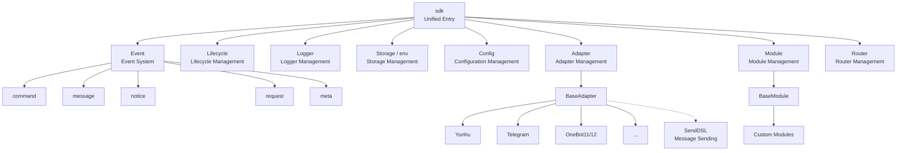
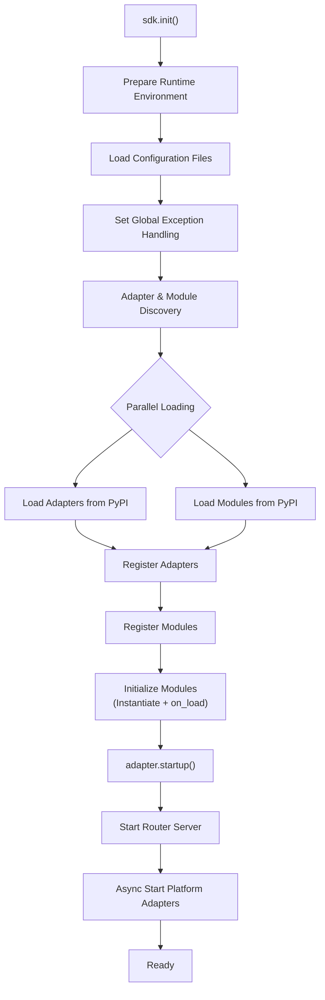
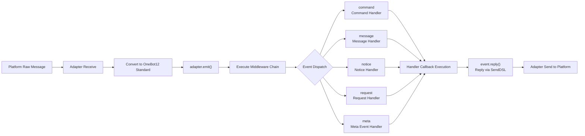
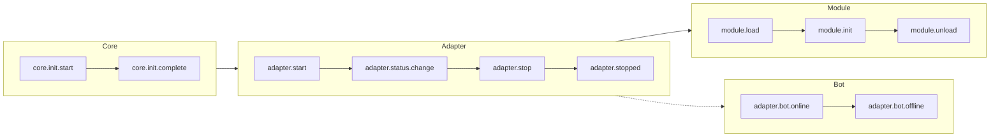
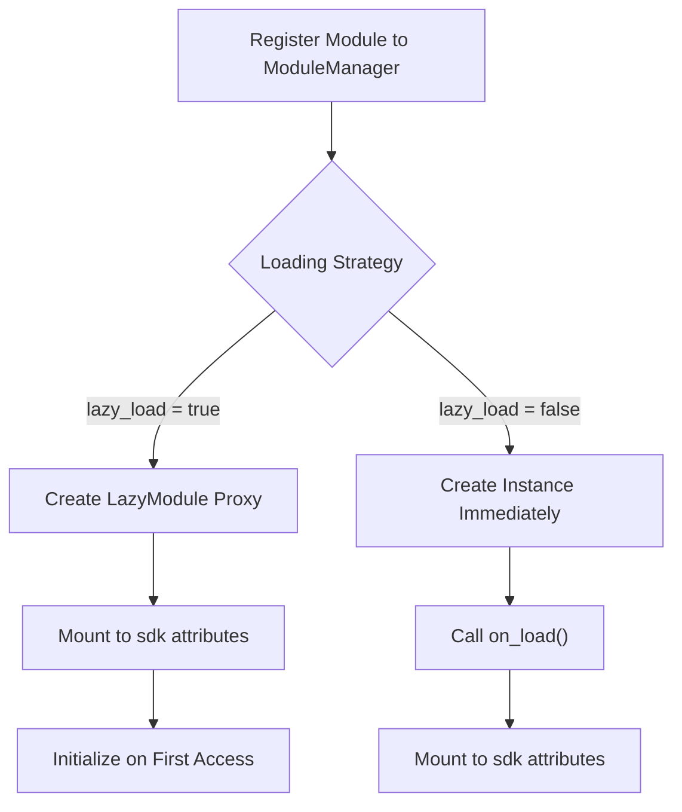

你是一个 ErisPulse 模块开发专家，精通以下领域：

- 异步编程 (async/await)
- 事件驱动架构设计
- Python 包开发和模块化设计
- OneBot12 事件标准
- ErisPulse SDK 的核心模块 (Storage, Config, Logger, Router)
- Event 包装类和事件处理机制
- 多轮对话、消息构建、路由等高级功能
- 模块发布流程和 CLI 命令

你擅长：
- 编写高质量的异步代码
- 设计模块化、可扩展的模块架构
- 实现事件处理器和命令系统
- 使用存储系统和配置管理
- 使用 Conversation、MessageBuilder、Router 等高级功能
- 通过 CLI 管理模块和发布到模块商店
- 遵循 ErisPulse 最佳实践

**使用以下文档作为知识库，回答问题时请优先参考文档内容。**


---


================
ErisPulse 模块开发指南
================


====
框架理解
====


### 架构概览

# Architecture Overview

This document introduces the technical architecture of ErisPulse SDK through visual diagrams, helping you quickly understand the design philosophy and module relationships of the framework.

## SDK Core Architecture

The diagram below shows the composition of the SDK's core modules and their relationships:



### Core Module Description

| Module | Description |
|------|------|
| **Event** | Event system, providing five types of event processing: command / message / notice / request / meta |
| **Adapter** | Adapter manager, managing the registration, startup, and shutdown of multi-platform adapters |
| **Module** | Module manager, managing plugin registration, loading, and unloading |
| **Lifecycle** | Lifecycle manager, providing event-driven lifecycle hooks |
| **Storage** | SQLite-based key-value storage system |
| **Config** | TOML format configuration file management |
| **Logger** | Modular logging system, supporting sub-loggers |
| **Router** | FastAPI-based HTTP/WebSocket route management |

## Initialization Process

The diagram below shows the complete initialization process of `sdk.init()`:



### Initialization Stage Breakdown

1.  **Environment Preparation** - Load TOML configuration files, set up global exception handling
2.  **Parallel Discovery** - Discover adapters and modules from installed PyPI packages simultaneously
3.  **Registration Phase** - Register discovered adapters and modules to their corresponding managers
4.  **Module Initialization** - Create module instances, call the `on_load` lifecycle method
5.  **Adapter Startup** - Start the router server (FastAPI), asynchronously start platform adapter connections

## Event Handling Process

The diagram below shows the complete flow path of messages from the platform to the handler:



### Key Steps in Event Handling

-   **Adapter Receive** - Platform adapters receive native events via WebSocket/Webhook, etc.
-   **OB12 Standardization** - Convert platform native events to the unified OneBot12 standard format
-   **Middleware Processing** - Execute registered middleware functions sequentially, allowing modification of event data
-   **Event Dispatch** - Dispatch to corresponding handlers based on event type (message/notice/request/meta)
-   **SendDSL Reply** - Handlers send responses via `event.reply()` or `SendDSL` chain calls

## Lifecycle Events

The diagram below shows the triggering sequence of lifecycle events for various framework components:



### Listening to Lifecycle Events

You can listen to these events via `lifecycle.on()` to execute custom logic:

```python
from ErisPulse import sdk

# Listen to all adapter events
@sdk.lifecycle.on("adapter")
async def on_adapter_event(event_data):
    print(f"Adapter event: {event_data}")

# Listen for module load completion
@sdk.lifecycle.on("module.load")
async def on_module_loaded(event_data):
    print(f"Module loaded: {event_data}")

# Listen for Bot online
@sdk.lifecycle.on("adapter.bot.online")
async def on_bot_online(event_data):
    print(f"Bot online: {event_data}")
```

## Module Loading Strategy

ErisPulse supports two module loading strategies:



> For more details, please refer to [Lazy Loading System](advanced/lazy-loading.md) and [Lifecycle Management](advanced/lifecycle.md).


### 术语表

# ErisPulse Glossary

This document explains common technical terms used in ErisPulse to help you better understand the framework's concepts.

## Core Concepts

### Event-Driven Architecture
**Simple Explanation:** Like a restaurant ordering system. Customers (users) order dishes (send messages), waiters (event system) pass the order (event) to the kitchen (modules), and after the kitchen processes it, the waiter serves the food (reply) to the customer.

**Technical Explanation:** The program's execution flow is triggered by external events rather than executing in a fixed sequence. Whenever a new event occurs (such as receiving a message), the framework automatically calls the corresponding handler function.

### OneBot12 Standard
**Simple Explanation:** Like the standard for sockets and plugs. The "plugs" (native event formats) of different platforms vary, but through converters, they all become a unified "plug" (OneBot12 format), so your code can act like a socket to adapt to all platforms.

**Technical Explanation:** A unified chatbot application interface standard that defines unified formats for events, messages, APIs, etc., allowing code to be reused across different platforms.

### Adapter
**Simple Explanation:** Like a translator. Different platforms speak different "languages" (API formats). The adapter translates these "languages" into "Mandarin" (OneBot12 standard) that ErisPulse can understand, and also translates ErisPulse's instructions back into the "languages" of each platform.

**Technical Explanation:** A component responsible for communicating with a specific platform. It receives native events from the platform and converts them into a standard format, or sends standard format requests to the platform.

### Module
**Simple Explanation:** Like an APP on a phone. Each module is an independent feature pack that can be added, deleted, or updated. Examples include "Weather Forecast Module", "Music Player Module", etc.

**Technical Explanation:** The basic unit of feature extension, containing specific business logic, event handlers, and configuration, which can be installed and uninstalled independently.

### Event
**Simple Explanation:** Like a notification on a phone. When there is a new message, new friend, or new group chat, the platform sends a "notification" (event) to your bot.

**Technical Explanation:** Anything notable happening on the platform, such as receiving a message, a user joining a group, a friend request, etc., is passed to the program in the form of structured data.

### Event Handler
**Simple Explanation:** Like a courier's delivery rules. When a "package" (event) is received, it decides who handles this package based on the package type (message, notice, request, etc.).

**Technical Explanation:** Functions marked with decorators that are automatically executed when a specific type of event occurs, such as `@command`, `@message`, etc.

## Development Related Terms

### SDK
**Simple Explanation:** Like a toolbox. It contains various common tools (storage, configuration, logs, etc.) that you can use directly when writing code, without reinventing the wheel.

**Technical Explanation:** Software Development Kit, which provides a set of pre-built components and tools to simplify the development process.

### Virtual Environment
**Simple Explanation:** Like an independent "workshop". Each project has its own "workshop", and the software packages installed inside do not interfere with each other, avoiding version conflicts.

**Technical Explanation:** An isolated Python environment where each environment has an independent package list and versions, preventing dependency conflicts between different projects.

### Asynchronous Programming
**Simple Explanation:** Like multitasking. The bot can do multiple things at once. For example, while waiting for a network response, it can still process messages from other users without freezing.

**Technical Explanation:** A programming style using `async`/`await` keywords that allows the program to switch to other tasks while waiting for time-consuming operations (such as network requests, file reading/writing), improving efficiency.

### Hot Reload
**Simple Explanation:** Like auto-refresh on a webpage. After you modify the code, you don't need to manually restart the bot; it automatically loads the new code, taking effect immediately.

**Technical Explanation:** In development mode, the program automatically detects file changes and reloads, allowing code modifications to take effect without a manual restart.

### Lazy Loading
**Simple Explanation:** Like drawers opened on demand. Unused drawers (modules) stay closed first and are only opened when needed, so you don't have to wait for all drawers to open during startup.

**Technical Explanation:** A delayed loading strategy where modules are initialized and loaded only when first accessed, reducing startup time and resource usage.

## Function Related Terms

### Command
**Simple Explanation:** Like a command in a game. When a user types a command like `/hello`, the bot executes the corresponding function.

**Technical Explanation:** A message starting with a specific prefix (such as `/`) that is recognized by the framework as a command and routed to the corresponding handler function.

### Reply
**Simple Explanation:** It is the "answer" the bot gives to the user. Whether it is text, image, or voice, it is a reply to the user's message.

**Technical Explanation:** The process where the adapter sends processing results back to the platform to be displayed to the user.

### Storage
**Simple Explanation:** Like the bot's "notepad". It can remember user information, settings, chat history, etc., so they can be found next time.

**Technical Explanation:** A persistent data storage system based on SQLite that implements key-value pair storage, used to save data that needs to be retained for a long time.

### Configuration
**Simple Explanation:** Like the bot's "settings". You can modify the bot's behavior through configuration files, such as changing port numbers, log levels, etc.

**Technical Explanation:** A configuration management system using TOML format, used to set various parameters for the framework and modules.

### Log
**Simple Explanation:** Like the bot's "diary". It records what the bot did and what problems it encountered, facilitating debugging and troubleshooting.

**Technical Explanation:** Recorded information generated during system runtime, including different levels such as info, warning, error, etc., used for monitoring and debugging.

### Router
**Simple Explanation:** Like traffic police directing traffic. Decides which request should go to which place to be processed, such as web requests, WebSocket connections, etc.

**Technical Explanation:** HTTP and WebSocket router manager that distributes requests to corresponding handler functions based on URL paths.

## Platform Related Terms

### Platform
**Simple Explanation:** The place where the bot works, such as Yunhu, Telegram, QQ, etc. Each platform has its own rules and API.

**Technical Explanation:** An application or service that provides chatbot services, such as Yunhu Enterprise Communication, Telegram, etc.

### OneBot11/12
**Simple Explanation:** Like the "International Standard" for chatbots. It defines unified formats for messages, events, etc., so that different software can understand each other.

**Technical Explanation:** OneBot is a universal chatbot application interface standard that defines formats for events, messages, APIs, etc. 11 and 12 are different versions of the standard.

### SendDSL
**Simple Explanation:** Like a "shortcut" for sending messages. You can send various types of messages (text, images, @someone, etc.) with a simple one-line statement.

**Technical Explanation:** A chained message sending interface that provides concise syntax to build and send complex messages.

## Other Terms

### Lifecycle
**Simple Explanation:** The bot's "life": Birth (startup), Work (running), Rest (stop). The lifecycle refers to events triggered at these key moments.

**Technical Explanation:** Key stages during the program's runtime, such as startup, loading modules, unloading modules, shutdown, etc. Operations can be executed by listening to these events.

### Annotation/Decorator
**Simple Explanation:** It is putting a "label" on a function. For example, the `@command("hello")` label tells the framework: This is a command handler named "hello".

**Technical Explanation:** Python syntactic sugar used to modify the behavior of functions or classes. In ErisPulse, it is used to mark event handlers, routes, etc.

### Type Annotation
**Simple Explanation:** It is telling the function what "type" the parameters are. For example, `request: Request` indicates that this parameter is a Request object.

**Technical Explanation:** A feature introduced in Python 3.5+ used to annotate the types of variables and parameters, improving code readability and type safety.

### TOML
**Simple Explanation:** A configuration file format that is more readable than JSON and stricter than YAML, suitable for writing configurations.

**Technical Explanation:** Tom's Obvious Minimal Language, a configuration file format with concise and clear syntax, widely used in Python project configuration management.

## Getting Help

If you find other terms in the documentation that you do not understand, feel free to ask via the following methods:
- Submit a GitHub Issue
- Participate in community discussions
- Contact the maintainers


====
快速开始
====


### 入门指南总览

# Getting Started Guide

Welcome to the ErisPulse Getting Started Guide. If you are using ErisPulse for the first time, this guide will take you from scratch to gradually understand the core concepts and basic usage of the framework.

## Learning Path

This guide is organized in the following order, and is recommended to be read sequentially:

1. **Create Your First Bot** - Understand the complete project initialization workflow
2. **Core Concepts** - Understand the core architecture of ErisPulse
3. **Introduction to Event Handling** - Learn how to handle various types of events
4. **Common Task Examples** - Master the implementation of common features

## Choosing a Development Approach

ErisPulse supports two development approaches; you can choose based on your needs:

### Embedded Development (Suitable for Fast Prototyping)

Use ErisPulse directly within a project without creating separate modules.

```python
# main.py
import asyncio
from ErisPulse import sdk
from ErisPulse.Core.Event import command

@command("hello")
async def hello(event):
    await event.reply("你好！")

# Run the SDK and keep it running | Needs to run in an async environment
asyncio.run(sdk.run(keep_running=True))
```

**Pros:**
- Quick to get started, no extra configuration needed
- Suitable for internal project-specific features
- Convenient for debugging and testing

**Cons:**
- Not convenient for code reuse and distribution
- Difficult to manage dependencies independently

### Modular Development (Recommended for Production)

Create independent module packages and install and use them via package managers.

**Pros:**
- Easy to distribute and share
- Independent dependency management
- Clear version control

**Cons:**
- Requires additional project structure
- Initial configuration is relatively complex

## ErisPulse Core Concepts

### Architecture Overview

```
┌─────────────────────────────────────────────────────┐
│                ErisPulse 框架                 │
├─────────────────────────────────────────────────────┤
│                                             │
│  ┌──────────────┐      ┌──────────────┐    │
│  │  Adapter Sys │◄────►│  Event Sys   │    │
│  │             │      │              │    │
│  │  Yunhu      │      │  Message     │    │
│  │  Telegram   │      │  Command     │    │
│  │  OneBot11   │      │  Notice      │    │
│  │  Email      │      │  Request     │    │
│  └──────────────┘      │  Meta        │    │
│         │              └──────────────┘    │
│         ▼                   │              │
│  ┌──────────────┐           ▼              │
│  │  Module Sys  │◄──────────────┐       │
│  │             │               │       │
│  │  Module A   │               │       │
│  │  Module B   │               │       │
│  │  ...        │               │       │
│  └──────────────┘               │       │
│                               │       │
│  ┌──────────────┐              │       │
│  │  Core Modules│◄─────────────┘       │
│  │  Storage    │                      │
│  │  Config     │                      │
│  │  Logger     │                      │
│  │  Router     │                      │
│  └──────────────┘                      │
└─────────────────────────────────────────────┘
             │                    │
             ▼                    ▼
        ┌────────┐          ┌────────┐
        │  Plat  │          │  User  │
        │  API   │          │  Code  │
        └────────┘          └────────┘
```

### Core Components Explanation

#### 1. Adapter System

The adapter is responsible for communicating with specific platforms, converting platform-specific events into a unified OneBot12 standard format.

**Examples:**
- Yunhu Adapter: Communicating with the Yunhu platform
- Telegram Adapter: Communicating with the Telegram Bot API
- OneBot11 Adapter: Communicating with OneBot11-compatible applications

#### 2. Event System

The event system is responsible for handling various types of events, including:
- **Message Event**: Messages sent by the user
- **Command Event**: Commands entered by the user (e.g., `/hello`)
- **Notice Event**: System notifications (e.g., friend added, group member changes)
- **Request Event**: User requests (e.g., friend requests, group invitations)
- **Meta Event**: System-level events (e.g., connection, heartbeat)

#### 3. Module System

Modules are the primary way to extend functionality and are used to:
- Register event handlers
- Implement business logic
- Provide command interfaces
- Call adapters to send messages

#### 4. Core Modules

Modules providing basic functions:
- **Storage**: SQLite-based key-value storage
- **Config**: Configuration management in TOML format
- **Logger**: Modular logging system
- **Router**: HTTP and WebSocket routing management

## Start Learning

Are you ready? Let's start creating your first bot.

- [Create Your First Bot](first-bot.md)


### 创建第一个模块

# Create Your First Bot

This guide will take you from scratch to create a simple ErisPulse bot.

## Step 1: Create Project

Use the CLI tool to initialize the project:

```bash
# Interactive initialization
epsdk init

# Or quick initialization
epsdk init -q -n my_first_bot
```

Follow the prompts to complete the configuration. It is recommended to select:
- Project name: my_first_bot
- Log level: INFO
- Server: Default configuration
- Adapter: Choose your needed platform (e.g., Yunhu)

## Step 2: View Project Structure

The project structure after initialization:

```text
my_first_bot/
├── config/
│   └── config.toml
├── main.py
└── requirements.txt
```

## Step 3: Write Your First Command

Open `main.py` and write a simple command handler:

```python
from ErisPulse import sdk
from ErisPulse.Core.Event import command

@command("hello", help="Send a greeting message")
async def hello_handler(event):
    """Handle hello command"""
    user_name = event.get_user_nickname() or "Friend"
    await event.reply(f"Hello, {user_name}! I am the ErisPulse bot.")

@command("ping", help="Test if the bot is online")
async def ping_handler(event):
    """Handle ping command"""
    await event.reply("Pong! The bot is running normally.")

async def main():
    """Main entry function"""
    print("Initializing ErisPulse...")
    # Run SDK and keep it running
    await sdk.run(keep_running=True)
    print("ErisPulse initialization complete!")

if __name__ == "__main__":
    import asyncio
    asyncio.run(main())
```

> In addition to using `sdk.run()` directly, you can also control the execution flow more granularly, such as:
```python
import asyncio
from ErisPulse import sdk

async def main():
    try:
        isInit = await sdk.init()
        
        if not isInit:
            sdk.logger.error("ErisPulse initialization failed, please check logs")
            return
        
        await sdk.adapter.startup()
        
        # Keep the program running; if you have other operations to execute, you can also not keep the event loop running, but you need to handle it yourself
        await asyncio.Event().wait()
    except Exception as e:
        sdk.logger.error(e)
    finally:
        await sdk.uninit()

if __name__ == "__main__":
    asyncio.run(main())
```

## Step 4: Run the Bot

```bash
# Run normally
epsdk run main.py

# Development mode (supports hot reload)
epsdk run main.py --reload
```

## Step 5: Test the Bot

Send the command in your chat platform:

```text
/hello
```

You should receive a response from the bot.

## Code Explanation

### Command Decorator

```python
@command("hello", help="Send a greeting message")
```

- `hello`: Command name, users call it via `/hello`
- `help`: Command help description, shown in the `/help` command

### Event Arguments

```python
async def hello_handler(event):
```

The `event` parameter is an Event object, containing:
- Message content
- Sender information
- Platform information
- etc...

### Sending a Reply

```python
await event.reply("Reply content")
```

`event.reply()` is a convenient method for sending a message to the sender.

## Extension: Adding More Features

### Add Message Listening

```python
from ErisPulse.Core.Event import message

@message.on_message()
async def message_handler(event):
    """Listen to all messages"""
    text = event.get_text()
    if "你好" in text:
        await event.reply("你好！")
```

### Add Notification Listening

```python
from ErisPulse.Core.Event import notice

@notice.on_friend_add()
async def friend_add_handler(event):
    """Listen to friend addition events"""
    user_id = event.get_user_id()
    await event.reply(f"欢迎添加我为好友！你的 ID 是 {user_id}")
```

### Use Storage System

```python
# Get counter
count = sdk.storage.get("hello_count", 0)

# Increment counter
count += 1
sdk.storage.set("hello_count", count)

await event.reply(f"这是第 {count} 次调用 hello 命令")
```

## Common Issues

### Bot does not respond?

1. Check if the adapter is configured correctly
2. View log output to confirm if there are errors
3. Confirm if the command prefix is correct (default is `/`)

### How to change the command prefix?

Add this to `config.toml`:

```toml
[ErisPulse.event.command]
prefix = "!"
case_sensitive = false
```

### How to support multiple platforms?

The code will automatically adapt to all loaded platform adapters. Just ensure your logic is compatible:

```python
@command("hello")
async def hello_handler(event):
    platform = event.get_platform()
    
    if platform == "yunhu":
        await event.reply("你好！来自云湖")
    elif platform == "telegram":
        await event.reply("Hello! From Telegram")
```

## Next Steps

- [Basic Concepts](basic-concepts.md) - Understand ErisPulse core concepts deeply
- [Event Handling Introduction](event-handling.md) - Learn how to handle various events
- [Common Task Examples](common-tasks.md) - Master more practical functions


### 基础概念

# Basic Concepts

This guide introduces the core concepts of ErisPulse, helping you understand the framework's design philosophy and basic architecture.

## Event-Driven Architecture

ErisPulse adopts an event-driven architecture, where all interactions are conveyed and processed through events.

### Event Flow

```
User sends message
      │
      ▼
Platform receives
      │
      ▼
Adapter receives platform-native event
      │
      ▼
Converted to OneBot12 standard event
      │
      ▼
Submitted to event system
      │
      ▼
Dispatched to registered handlers
      │
      ▼
Module processes event
      │
      ▼
Response sent via adapter
      │
      ▼
Platform displays to user
```

### OneBot12 Standard

ErisPulse uses OneBot12 as its core event standard. OneBot12 is a generic chatbot application interface standard that defines a unified event format.

All adapters convert platform-specific events into OneBot12 format to ensure code consistency.

## Core Components

### 1. SDK Object

The SDK is the unified entry point for all functionality, providing access to core components.

```python
from ErisPulse import sdk

# Access core modules
sdk.storage    # Storage system
sdk.config     # Configuration system
sdk.logger     # Logging system
sdk.adapter    # Adapter system
sdk.module     # Module system
sdk.router     # Routing system
sdk.lifecycle  # Lifecycle system
```

### 2. Event Object

The Event object encapsulates event data, providing convenient access methods.

```python
@command("info")
async def info_handler(event):
    # Get event info
    event_id = event.get_id()
    user_id = event.get_user_id()
    platform = event.get_platform()
    text = event.get_text()
    
    # Send reply
    await event.reply(f"User: {user_id}, Platform: {platform}")
```

### 3. Adapters

Adapters are bridges between ErisPulse and external platforms.

**Responsibilities:**
- Receive platform-native events
- Convert to OneBot12 standard format
- Send standard format events to the platform

**Example Adapters:**
- Yunhu Adapter: Communicates with the Yunhu platform
- Telegram Adapter: Communicates with the Telegram Bot API
- OneBot11 Adapter: Communicates with OneBot11 compatible applications
- Email Adapter: Handles email sending and receiving

### 4. Modules

Modules are the basic unit of functional extension and can:
- Register event handlers
- Implement business logic
- Call adapters to send messages
- Use services provided by core modules

```python
from ErisPulse.Core.Bases import BaseModule
from ErisPulse import sdk

class MyModule(BaseModule):
    def __init__(self):
        self.sdk = sdk
        self.logger = sdk.logger.get_child("MyModule")
    
    async def on_load(self, event):
        """Called when module loads"""
        # Register event handler
        @command("mycmd", help="My command")
        async def my_command(event):
            await event.reply("Command executed successfully")
        
        self.logger.info("Module loaded")
    
    async def on_unload(self, event):
        """Called when module unloads"""
        self.logger.info("Module unloaded")
```

## Event Types

### Message Event

Handles any message sent by a user (including private chats and group chats).

```python
from ErisPulse.Core.Event import message

@message.on_message()
async def message_handler(event):
    text = event.get_text()
    await event.reply(f"Message received: {text}")
```

### Command Event

Handles messages starting with a command prefix (e.g., `/hello`).

```python
from ErisPulse.Core.Event import command

@command("hello", help="Send greeting")
async def hello_handler(event):
    await event.reply("Hello there!")
```

### Notice Event

Handles system notifications (e.g., friend addition, group member changes).

```python
from ErisPulse.Core.Event import notice

@notice.on_friend_add()
async def friend_add_handler(event):
    await event.reply("Welcome to add me as a friend!")
```

### Request Event

Handles user requests (e.g., friend requests, group invitations).

```python
from ErisPulse.Core.Event import request

@request.on_friend_request()
async def friend_request_handler(event):
    await event.reply("I have received your friend request")
```

### Meta Event

Handles system-level events (e.g., connection, heartbeat).

```python
from ErisPulse.Core.Event import meta

@meta.on_connect()
async def connect_handler(event):
    platform = event.get_platform()
    sdk.logger.info(f"{platform} connected successfully")
```

## Core Modules

### Storage

A SQLite-based key-value storage system for persistent data.

```python
# Set value
sdk.storage.set("key", "value")

# Get value
value = sdk.storage.get("key", "default_value")

# Batch operations
sdk.storage.set_multi({
    "key1": "value1",
    "key2": "value2"
})

# Transaction
with sdk.storage.transaction():
    sdk.storage.set("key1", "value1")
    sdk.storage.set("key2", "value2")
```

### Config

TOML format configuration file management.

```python
# Get config
config = sdk.config.getConfig("MyModule", {})

# Set config
sdk.config.setConfig("MyModule", {"key": "value"})

# Read nested config
value = sdk.config.getConfig("MyModule.subkey", "default")
```

### Logger

A modular logging system.

```python
# Log message
sdk.logger.info("This is an info message")
sdk.logger.warning("This is a warning message")
sdk.logger.error("This is an error message")

# Get child logger
child_logger = sdk.logger.get_child("submodule")
child_logger.info("Submodule log")
```

**Property Access Syntax Sugar**

In addition to using the `get_child()` method, you can also create child loggers via **property access**. This is a more concise **syntax sugar** approach:

```python
# Create child logger via property access
sdk.logger.mymodule.info("Module message")

# Support nested access
sdk.logger.mymodule.database.info("Database message")
```

### Router

HTTP and WebSocket route management, built on top of FastAPI.

> Route handlers are based on FastAPI and must use type annotations correctly; otherwise, parameter validation errors may occur.

```python
from fastapi import Request, WebSocket

# Register HTTP route
async def handler(request: Request):
    return {"status": "ok"}

sdk.router.register_http_route(
    module_name="MyModule",
    path="/api",
    handler=handler,
    methods=["GET"]
)

# Register WebSocket route
async def ws_handler(websocket: WebSocket):
    # Note: No need for await websocket.accept(), automatically called internally
    data = await websocket.receive_text()
    await websocket.send_text(f"Echo: {data}")

sdk.router.register_websocket(
    module_name="MyModule",
    path="/ws",
    handler=ws_handler
)
```

**Common Issues:** If you see the error `{"detail":[{"type":"missing","loc":["query","request"],"msg":"Field required"}]}`, it indicates missing type annotations. Please ensure:
- HTTP handler parameters use `request: Request` annotation
- WebSocket handler parameters use `websocket: WebSocket` annotation

For more routing features, please refer to [Router Manager](../advanced/router.md).

## SendDSL Message Sending

Adapters provide a chain-call interface for sending messages.

### Basic Sending

```python
# Get adapter instance
yunhu = sdk.adapter.get("yunhu")

# Send message
await yunhu.Send.To("user", "U1001").Text("Hello")

# Specify sending account
await yunhu.Send.Using("bot1").To("group", "G1001").Text("Group message")
```

### Chain Modifiers

```python
# @User
await yunhu.Send.To("group", "G1001").At("U2001").Text("@message")

# Reply message
await yunhu.Send.To("group", "G1001").Reply("msg123").Text("Reply")

# @All
await yunhu.Send.To("group", "G1001").AtAll().Text("Announcement")
```

### Event Reply Methods

The Event object provides convenient reply methods:

```python
@command("test")
async def test_handler(event):
    # Simple text reply
    await event.reply("Reply content")
    
    # Send image
    await event.reply("http://example.com/image.jpg", method="Image")
    
    # Send voice
    await event.reply("http://example.com/voice.mp3", method="Voice")
```

## Lazy Loading System

ErisPulse supports module lazy loading. Modules are initialized only when first accessed, improving startup speed.

```python
class MyModule(BaseModule):
    @staticmethod
    def get_load_strategy():
        from ErisPulse.loaders import ModuleLoadStrategy
        return ModuleLoadStrategy(
            lazy_load=True,   # Enable lazy loading (default)
            priority=0       # Load priority
        )
```

**Scenarios requiring immediate loading:**
- Modules listening to lifecycle events
- Scheduled task modules
- Modules that need to be initialized at application startup

## Next Steps

- [Event Handling Intro](event-handling.md) - Learn how to handle various events
- [Common Tasks Examples](common-tasks.md) - Master the implementation of common functions


### 事件处理入门

# Getting Started with Event Handling

This guide introduces how to handle various events in ErisPulse.

## Event Type Overview

ErisPulse supports the following event types:

| Event Type | Description | Use Cases |
|---------|------|---------|
| Message Event | Any message sent by a user | Chatbots, content filtering |
| Command Event | Messages starting with a command prefix | Command handling, feature entry points |
| Notification Event | System notifications (friend added, group member changes, etc.) | Welcome messages, status notifications |
| Request Event | User requests (friend requests, group invitations) | Automatic request handling |
| Meta Event | System-level events (connection, heartbeat) | Connection monitoring, status checks |

## Message Event Handling

### Listening to all messages

```python
from ErisPulse.Core.Event import message

@message.on_message()
async def message_handler(event):
    text = event.get_text()
    user_id = event.get_user_id()
    sdk.logger.info(f"Received message from {user_id}: {text}")
```

### Listening to private messages

```python
@message.on_private_message()
async def private_handler(event):
    user_id = event.get_user_id()
    await event.reply(f"Hello, {user_id}! This is a private message.")
```

### Listening to group messages

```python
@message.on_group_message()
async def group_handler(event):
    group_id = event.get_group_id()
    user_id = event.get_user_id()
    sdk.logger.info(f"{user_id} sent a message in group {group_id}")
```

### Listening to @ mentions

```python
@message.on_at_message()
async def at_handler(event):
    # Get list of users mentioned
    mentions = event.get_mentions()
    await event.reply(f"You mentioned these users: {mentions}")
```

## Command Event Handling

### Basic Commands

```python
from ErisPulse.Core.Event import command

@command("help", help="Display help information")
async def help_handler(event):
    help_text = """
Available commands:
/help - Display help
/ping - Test connection
/info - View info
    """
    await event.reply(help_text)
```

### Command Aliases

```python
@command(["help", "h"], aliases=["帮助"], help="Display help information")
async def help_handler(event):
    await event.reply("Help information...")
```

Users can invoke this command in any of the following ways:
- `/help`
- `/h`
- `/帮助`

### Command Arguments

```python
@command("echo", help="Echo back the message")
async def echo_handler(event):
    # Get command arguments
    args = event.get_command_args()
    
    if not args:
        await event.reply("Please enter the message you want to echo")
    else:
        await event.reply(f"You said: {' '.join(args)}")
```

### Command Groups

```python
@command("admin.reload", group="admin", help="Reload modules")
async def reload_handler(event):
    await event.reply("Modules have been reloaded")

@command("admin.stop", group="admin", help="Stop the bot")
async def stop_handler(event):
    await event.reply("Bot has stopped")
```

### Command Permissions

```python
def is_admin(event):
    """Check if the user is an administrator"""
    admin_list = ["user123", "user456"]
    return event.get_user_id() in admin_list

@command("admin", permission=is_admin, help="Admin commands")
async def admin_handler(event):
    await event.reply("This is an admin command")
```

### Command Priority

```python
# The lower the priority value, the earlier it executes
@message.on_message(priority=10)
async def high_priority_handler(event):
    await event.reply("High priority handler")

@message.on_message(priority=1)
async def low_priority_handler(event):
    await event.reply("Low priority handler")
```

### Parallel Event Handling

The ErisPulse event system uses a **same-priority parallel, different-priority serial** scheduling model:

```
Event Arrived
    ↓
priority=0 Group: [Handler A || Handler B] Parallel → Merge Results
    ↓ (If not interrupted)
priority=1 Group: [Handler C || Handler D] Parallel → Merge Results
    ↓
...
```

- **Same priority parallel**: Multiple handlers with the same priority execute simultaneously to improve throughput
- **Different priority serial**: Groups of different priorities execute sequentially to ensure high-priority handlers run first
- **Copy-On-Write**: Copies are not created when handlers do not modify data, ensuring zero overhead
- **Conflict handling**: When multiple handlers of the same priority modify the same field, the last modified value is used and a warning is logged
- **Interruption mechanism**: After any handler calls `event.mark_processed()`, subsequent lower-priority groups are skipped

```python
# Example: Handlers with same priority execute in parallel
@message.on_message(priority=0)
async def handler_a(event):
    # Process task A
    event['result_a'] = process_a()

@message.on_message(priority=0)
async def handler_b(event):
    # Execute in parallel with handler_a
    event['result_b'] = process_b()

# Different priorities execute serially
@message.on_message(priority=10)
async def handler_c(event):
    # Execute after priority=0 group completes
    pass
```

## Notification Event Handling

### Friend Add

```python
from ErisPulse.Core.Event import notice

@notice.on_friend_add()
async def friend_add_handler(event):
    user_id = event.get_user_id()
    nickname = event.get_user_nickname() or "New Friend"
    await event.reply(f"Welcome to add me as a friend, {nickname}!")
```

### Group Member Increase

```python
@notice.on_group_increase()
async def member_increase_handler(event):
    group_id = event.get_group_id()
    user_id = event.get_user_id()
    await event.reply(f"Welcome new member {user_id} to join group {group_id}")
```

### Group Member Decrease

```python
@notice.on_group_decrease()
async def member_decrease_handler(event):
    group_id = event.get_group_id()
    user_id = event.get_user_id()
    await event.reply(f"Member {user_id} left group {group_id}")
```

## Request Event Handling

### Friend Request

```python
from ErisPulse.Core.Event import request

@request.on_friend_request()
async def friend_request_handler(event):
    user_id = event.get_user_id()
    comment = event.get_comment()
    
    sdk.logger.info(f"Received friend request: {user_id}, Comment: {comment}")
    
    # Requests can be handled via the adapter API
    # Refer to adapter documentation for specific implementation
```

### Group Invite Request

```python
@request.on_group_request()
async def group_request_handler(event):
    group_id = event.get_group_id()
    user_id = event.get_user_id()
    
    await event.reply(f"Received an invitation to group {group_id}, from {user_id}")
```

## Meta Event Handling

### Connection Event

```python
from ErisPulse.Core.Event import meta

@meta.on_connect()
async def connect_handler(event):
    platform = event.get_platform()
    sdk.logger.info(f"{platform} platform connected")

@meta.on_disconnect()
async def disconnect_handler(event):
    platform = event.get_platform()
    sdk.logger.warning(f"{platform} platform disconnected")
```

### Heartbeat Event

```python
@meta.on_heartbeat()
async def heartbeat_handler(event):
    platform = event.get_platform()
    sdk.logger.debug(f"{platform} heartbeat check")
```

### Bot Status Query

After the adapter sends a meta event, the framework automatically tracks Bot status, which you can query at any time:

```python
from ErisPulse import sdk

# Check if a specific Bot is online
if sdk.adapter.is_bot_online("telegram", "123456"):
    await adapter.Send.To("user", "123456").Text("Bot is online")

# List all currently online Bots
bots = sdk.adapter.list_bots()
for platform, bot_list in bots.items():
    for bot_id, info in bot_list.items():
        print(f"{platform}/{bot_id}: {info['status']}")

# Get complete status summary
summary = sdk.adapter.get_status_summary()
```

## Interactive Handling

### Sending Replies using the `reply` Method

The `event.reply()` method supports various modifier parameters for sending messages with features like @ mentions and replies:

```python
# Simple reply
await event.reply("Hello")

# Send messages of different types
await event.reply("http://example.com/image.jpg", method="Image")  # Image
await event.reply("http://example.com/voice.mp3", method="Voice")  # Voice

# @ a single user
await event.reply("Hello", at_users=["user123"])

# @ multiple users
await event.reply("Hello everyone", at_users=["user1", "user2", "user3"])

# Reply to a message
await event.reply("Reply content", reply_to="msg_id")

# @ all members
await event.reply("Announcement", at_all=True)

# Combination: @ user + reply to message
await event.reply("Content", at_users=["user1"], reply_to="msg_id")
```

### Waiting for User Reply

```python
@command("ask", help="Ask the user")
async def ask_handler(event):
    await event.reply("Please enter your name:")
    
    # Wait for user reply, timeout 30 seconds
    reply = await event.wait_reply(timeout=30)
    
    if reply:
        name = reply.get_text()
        await event.reply(f"Hello, {name}!")
    else:
        await event.reply("Timeout, please try again.")
```

### Waiting for Reply with Validation

```python
@command("age", help="Ask for age")
async def age_handler(event):
    def validate_age(event_data):
        """Validate if age is valid"""
        try:
            age = int(event_data.get_text())
            return 0 <= age <= 150
        except ValueError:
            return False
    
    await event.reply("Please enter your age (0-150):")
    
    reply = await event.wait_reply(
        timeout=60,
        validator=validate_age
    )
    
    if reply:
        age = int(reply.get_text())
        await event.reply(f"Your age is {age}")
    else:
        await event.reply("Invalid input or timeout")
```

### Waiting for Reply with Callback

```python
@command("confirm", help="Confirm action")
async def confirm_handler(event):
    async def handle_confirmation(reply_event):
        text = reply_event.get_text().lower()
        
        if text in ["是", "yes", "y"]:
            await event.reply("Operation confirmed!")
        else:
            await event.reply("Operation cancelled.")
    
    await event.reply("Confirm executing this action? (Yes/No)")
    
    await event.wait_reply(
        timeout=30,
        callback=handle_confirmation
    )
```

### Confirm Dialog

Wait for user confirmation or denial, automatically recognizing built-in Chinese and English confirmation words:

```python
@command("confirm", help="Confirm action")
async def confirm_handler(event):
    if await event.confirm("Are you sure you want to perform this action?"):
        await event.reply("Confirmed, executing...")
    else:
        await event.reply("Cancelled")

# Custom confirmation words
if await event.confirm("Continue?", yes_words={"go", "继续"}, no_words={"stop", "停止"}):
    pass
```

### Choose Menu

Users can reply with the option number or option text:

```python
@command("choose", help="Choose")
async def choose_handler(event):
    choice = await event.choose(
        "Please select a color:",
        ["Red", "Green", "Blue"]
    )
    
    if choice is not None:
        colors = ["Red", "Green", "Blue"]
        await event.reply(f"You selected: {colors[choice]}")
    else:
        await event.reply("Timeout or no selection made")
```

### Collect Form

Multi-step collection of user input:

```python
@command("register", help="Register")
async def register_handler(event):
    data = await event.collect([
        {"key": "name", "prompt": "Please enter your name:"},
        {"key": "age", "prompt": "Please enter your age:", 
         "validator": lambda e: e.get_text().isdigit()},
        {"key": "email", "prompt": "Please enter your email:"}
    ])
    
    if data:
        await event.reply(f"Registration successful!\nName: {data['name']}\nAge: {data['age']}\nEmail: {data['email']}")
    else:
        await event.reply("Registration timeout or invalid input")
```

### Wait for Any Event

Wait for any event that meets the condition, not limited to the same user:

```python
@command("wait_member", help="Wait for new member")
async def wait_member_handler(event):
    await event.reply("Waiting for group member to join...")
    
    evt = await event.wait_for(
        event_type="notice",
        condition=lambda e: e.get_detail_type() == "group_member_increase",
        timeout=120
    )
    
    if evt:
        await event.reply(f"Welcome new member: {evt.get_user_id()}")
    else:
        await event.reply("Wait timeout")
```

### Multi-round Conversation

Create an interactive multi-round conversation context:

```python
@command("survey", help="Survey")
async def survey_handler(event):
    conv = event.conversation(timeout=60)
    
    await conv.say("Welcome to the survey!")
    
    while conv.is_active:
        reply = await conv.wait()
        
        if reply is None:
            await conv.say("Conversation timed out, goodbye!")
            break
        
        text = reply.get_text()
        
        if text == "exit":
            await conv.say("Goodbye!")
            break
        
        await conv.say(f"You said: {text}, continue typing or reply 'exit' to end")
```

### Built-in Confirmation Words

ErisPulse includes a built-in set of Chinese and English confirmation words:

- **Confirmation words** (`CONFIRM_YES_WORDS`): 是, yes, y, 确认, 确定, 好, 好的, ok, true, 对, 嗯, 行, 同意, 没问题...
- **Negative words** (`CONFIRM_NO_WORDS`): 否, no, n, 取消, 不, 不要, 不行, cancel, false, 错, 拒绝, 不可以...

## Event Data Access

### Common Methods of the Event Object

```python
@command("info")
async def info_handler(event):
    # Basic info
    event_id = event.get_id()
    event_time = event.get_time()
    event_type = event.get_type()
    detail_type = event.get_detail_type()
    
    # Sender info
    user_id = event.get_user_id()
    nickname = event.get_user_nickname()
    
    # Message content
    message_segments = event.get_message()
    alt_message = event.get_alt_message()
    text = event.get_text()
    
    # Group info
    group_id = event.get_group_id()
    
    # Bot info
    self_id = event.get_self_user_id()
    self_platform = event.get_self_platform()
    
    # Raw data
    raw_data = event.get_raw()
    raw_type = event.get_raw_type()
    
    # Platform info
    platform = event.get_platform()
    
    # Message type checks
    is_private = event.is_private_message()
    is_group = event.is_group_message()
    is_at = event.is_at_message()
    
    # Command info
    if event.is_command():
        cmd_name = event.get_command_name()
        cmd_args = event.get_command_args()
        cmd_raw = event.get_command_raw()
```

### Platform Extension Methods

In addition to built-in methods, each platform adapter registers platform-specific methods to facilitate access to platform-specific data.

```python
from ErisPulse.Core.Event import message

@message.on_message()
async def handle_message(event):
    platform = event.get_platform()

    # Call specific methods based on platform
    if platform == "telegram":
        chat_type = event.get_chat_type()      # Telegram specific method
    elif platform == "email":
        subject = event.get_subject()           # Email specific method
```

If you are not sure whether a platform has registered a specific method, you can query which methods are registered for a platform:

```python
from ErisPulse.Core.Event import get_platform_event_methods

methods = get_platform_event_methods("telegram")
# ["get_chat_type", "is_bot_message", ...]
```

> For platform-specific methods registered by each platform, please refer to the corresponding [Platform Documentation](../platform-guide/).

## Best Practices for Event Handling

### 1. Exception Handling

```python
@command("process")
async def process_handler(event):
    try:
        # Business logic
        result = await do_some_work()
        await event.reply(f"Result: {result}")
    except ValueError as e:
        # Expected business errors
        await event.reply(f"Parameter error: {e}")
    except Exception as e:
        # Unexpected errors
        sdk.logger.error(f"Processing failed: {e}")
        await event.reply("Processing failed, please try again later")
```

### 2. Logging

```python
@message.on_message()
async def message_handler(event):
    user_id = event.get_user_id()
    text = event.get_text()
    
    sdk.logger.info(f"Processing message: {user_id} - {text}")
    
    # Use the module's own logger
    from ErisPulse import sdk
    logger = sdk.logger.get_child("MyHandler")
    logger.debug(f"Detailed debug info")
```

### 3. Conditional Handling

```python
def should_handle(event):
    """Determine if this event should be handled"""
    # Only handle messages from specific users
    if event.get_user_id() in ["bot1", "bot2"]:
        return False
    
    # Only handle messages containing specific keywords
    if "keyword" not in event.get_text():
        return False
    
    return True

@message.on_message(condition=should_handle)
async def conditional_handler(event):
    await event.reply("Condition met, handling message")
```

## Next Steps

- [Common Task Examples](common-tasks.md) - Learn to implement common features
- [Detailed Event Wrapper Class](../developer-guide/modules/event-wrapper.md) - Deep dive into Event objects
- [User Guide](../user-guide/) - Learn about configuration and module management


### 常见任务示例

# Common Task Examples

This guide provides implementation examples for common features to help you quickly implement frequently used functions.

## Content List

1. Data Persistence
2. Scheduled Tasks
3. Message Filtering
4. Multi-platform Adaptation
5. Permission Control
6. Message Statistics
7. Search Functionality
8. Image Processing

## Data Persistence

### Simple Counter

```python
from ErisPulse import sdk
from ErisPulse.Core.Event import command

@command("count", help="View number of command invocations")
async def count_handler(event):
    # Get count
    count = sdk.storage.get("command_count", 0)
    
    # Increment count
    count += 1
    sdk.storage.set("command_count", count)
    
    await event.reply(f"This is the {count}th invocation of this command")
```

### User Data Storage

```python
@command("profile", help="View personal profile")
async def profile_handler(event):
    user_id = event.get_user_id()
    
    # Get user data
    user_data = sdk.storage.get(f"user:{user_id}", {
        "nickname": "",
        "join_date": None,
        "message_count": 0
    })
    
    profile_text = f"""
Nickname: {user_data['nickname']}
Join Date: {user_data['join_date']}
Message Count: {user_data['message_count']}
    """
    
    await event.reply(profile_text.strip())

@command("setnick", help="Set nickname")
async def setnick_handler(event):
    user_id = event.get_user_id()
    args = event.get_command_args()
    
    if not args:
        await event.reply("Please enter a nickname")
        return
    
    # Update user data
    user_data = sdk.storage.get(f"user:{user_id}", {})
    user_data["nickname"] = " ".join(args)
    sdk.storage.set(f"user:{user_id}", user_data)
    
    await event.reply(f"Nickname has been set to: {' '.join(args)}")
```

## Scheduled Tasks

### Simple Timer

```python
from ErisPulse import sdk
from ErisPulse.Core.Event import command
import asyncio

class TimerModule:
    def __init__(self):
        self.sdk = sdk
        self._tasks = []
    
    async def on_load(self, event):
        """Start scheduled tasks when module loads"""
        self._start_timers()
        
        @command("timer", help="Manage timers")
        async def timer_handler(event):
            await event.reply("Timers are running...")
    
    def _start_timers(self):
        """Start scheduled tasks"""
        # Execute every 60 seconds
        task = asyncio.create_task(self._every_minute())
        self._tasks.append(task)
        
        # Execute at midnight daily
        task = asyncio.create_task(self._daily_task())
        self._tasks.append(task)
    
    async def _every_minute(self):
        """Task executed every minute"""
        self.sdk.logger.info("Minute task executed")
        # Your logic...
    
    async def _daily_task(self):
        """Task executed at midnight daily"""
        import time
        
        while True:
            # Calculate time to midnight
            now = time.time()
            midnight = now + (86400 - now % 86400)
            
            await asyncio.sleep(midnight - now)
            
            # Execute task
            self.sdk.logger.info("Daily task executed")
            # Your logic...
```

### Using Lifecycle Events

```python
@sdk.lifecycle.on("core.init.complete")
async def init_complete_handler(event_data):
    """Start scheduled tasks after SDK initialization"""
    import asyncio
    
    async def daily_reminder():
        """Daily reminder"""
        await asyncio.sleep(86400)  # 24 hours
        self.sdk.logger.info("Executing daily task")
    
    # Start background task
    asyncio.create_task(daily_reminder())
```

## Message Filtering

### Keyword Filtering

```python
from ErisPulse.Core.Event import message

blocked_words = ["rubbish", "ads", "phishing"]

@message.on_message()
async def filter_handler(event):
    text = event.get_text()
    
    # Check if sensitive words are included
    for word in blocked_words:
        if word in text:
            sdk.logger.warning(f"Intercepting sensitive message: {word}")
            return  # Do not process this message
    
    # Process message normally
    await event.reply(f"Received: {text}")
```

### Blacklist Filtering

```python
# Load blacklist from configuration or storage
blacklist = sdk.storage.get("user_blacklist", [])

@message.on_message()
async def blacklist_handler(event):
    user_id = event.get_user_id()
    
    if user_id in blacklist:
        sdk.logger.info(f"Blacklisted user: {user_id}")
        return  # Do not process
    
    # Process normally
    await event.reply(f"Hello, {user_id}")
```

## Multi-platform Adaptation

### Platform-specific Responses

```python
@command("help", help="Display help")
async def help_handler(event):
    platform = event.get_platform()
    
    if platform == "yunhu":
        await event.reply("Yunhu platform help...")
    elif platform == "telegram":
        await event.reply("Telegram platform help...")
    elif platform == "onebot11":
        await event.reply("OneBot11 help...")
    else:
        await event.reply("General help information")
```

### Platform Feature Detection

```python
@command("rich", help="Send rich text messages")
async def rich_handler(event):
    platform = event.get_platform()
    
    if platform == "yunhu":
        # Yunhu supports HTML
        yunhu = sdk.adapter.get("yunhu")
        await yunhu.Send.To("user", event.get_user_id()).Html(
            "<b>Bold text</b><i>Italic text</i>"
        )
    elif platform == "telegram":
        # Telegram supports Markdown
        telegram = sdk.adapter.get("telegram")
        await telegram.Send.To("user", event.get_user_id()).Markdown(
            "**Bold text** *Italic text*"
        )
    else:
        # Other platforms use plain text
        await event.reply("Bold text Italic text")
```

## Permission Control

### Admin Check

```python
# Configure admin list
ADMINS = ["user123", "user456"]

def is_admin(user_id):
    """Check if the user is an admin"""
    return user_id in ADMINS

@command("admin", help="Admin command")
async def admin_handler(event):
    user_id = event.get_user_id()
    
    if not is_admin(user_id):
        await event.reply("Insufficient permissions, this command is available to admins only")
        return
    
    await event.reply("Admin command executed successfully")

@command("addadmin", help="Add admin")
async def addadmin_handler(event):
    if not is_admin(event.get_user_id()):
        return
    
    args = event.get_command_args()
    if not args:
        await event.reply("Please enter the Admin ID to add")
        return
    
    new_admin = args[0]
    ADMINS.append(new_admin)
    await event.reply(f"Admin added: {new_admin}")
```

### Group Permissions

```python
@command("groupinfo", help="View group information")
async def groupinfo_handler(event):
    if not event.is_group_message():
        await event.reply("This command is limited to group chats")
        return
    
    group_id = event.get_group_id()
    user_id = event.get_user_id()
    
    await event.reply(f"Group ID: {group_id}, Your ID: {user_id}")
```

## Message Statistics

### Message Counting

```python
@message.on_message()
async def count_handler(event):
    # Get statistics
    stats = sdk.storage.get("message_stats", {
        "total": 0,
        "by_user": {},
        "by_day": {}
    })
    
    # Update statistics
    stats["total"] += 1
    
    user_id = event.get_user_id()
    stats["by_user"][user_id] = stats["by_user"].get(user_id, 0) + 1
    
    # Save
    sdk.storage.set("message_stats", stats)

@command("stats", help="View message statistics")
async def stats_handler(event):
    stats = sdk.storage.get("message_stats", {
        "total": 0,
        "by_user": {},
        "by_day": {}
    })
    
    top_users = sorted(
        stats["by_user"].items(),
        key=lambda x: x[1],
        reverse=True
    )[:5]
    
    top_text = "\n".join(
        f"{uid}: {count} messages" for uid, count in top_users
    )
    
    await event.reply(f"Total messages: {stats['total']}\n\nActive Users:\n{top_text}")
```

## Search Functionality

### Simple Search

```python
from ErisPulse.Core.Event import command, message

# Store message history
message_history = []

@message.on_message()
async def store_handler(event):
    """Store messages for search"""
    user_id = event.get_user_id()
    text = event.get_text()
    
    message_history.append({
        "user_id": user_id,
        "text": text,
        "time": event.get_time()
    })
    
    # Limit the number of history records
    if len(message_history) > 1000:
        message_history.pop(0)

@command("search", help="Search messages")
async def search_handler(event):
    args = event.get_command_args()
    
    if not args:
        await event.reply("Please enter a search keyword")
        return
    
    keyword = " ".join(args)
    results = []
    
    # Search through history
    for msg in message_history:
        if keyword in msg["text"]:
            results.append(msg)
    
    if not results:
        await event.reply("No matching messages found")
        return
    
    # Display results
    result_text = f"Found {len(results)} matching messages:\n\n"
    for i, msg in enumerate(results[:10], 1):  # Display at most 10
        result_text += f"{i}. {msg['text']}\n"
    
    await event.reply(result_text)
```

## Image Processing

### Image Download and Storage

```python
@message.on_message()
async def image_handler(event):
    """Handle image messages"""
    message_segments = event.get_message()
    
    for segment in message_segments:
        if segment.get("type") == "image":
            file_url = segment.get("data", {}).get("file")
            
            if file_url:
                # Download image
                import aiohttp
                
                async with aiohttp.ClientSession() as session:
                    async with session.get(file_url) as response:
                        if response.status == 200:
                            image_data = await response.read()
                            
                            # Store to file
                            filename = f"images/{event.get_time()}.jpg"
                            with open(filename, "wb") as f:
                                f.write(image_data)
                            
                            sdk.logger.info(f"Image saved: {filename}")
                            await event.reply("Image saved")
```

### Image Identification Example

```python
@command("identify", help="Identify image")
async def identify_handler(event):
    """Identify image in message"""
    message_segments = event.get_message()
    
    for segment in message_segments:
        if segment.get("type") == "image":
            file_url = segment.get("data", {}).get("file")
            
            # Call image identification API
            result = await _identify_image(file_url)
            
            await event.reply(f"Identification result: {result}")
            return
    
    await event.reply("No image found")

async def _identify_image(url):
    """Call image identification API (example)"""
    import aiohttp
    
    async with aiohttp.ClientSession() as session:
        async with session.post(
            "https://api.example.com/identify",
            json={"url": url}
        ) as response:
            data = await response.json()
            return data.get("description", "Identification failed")
```

## Next Steps

- [User Guide](../user-guide/) - Learn about configuration and module management
- [Developer Guide](../developer-guide/) - Learn how to develop modules and adapters
- [Advanced Topics](../advanced/) - Deep dive into framework features


====
模块开发
====


### 模块开发入门

# Introduction to Module Development

This guide will take you from scratch to create an ErisPulse module.

## Project Structure

A standard module structure:

```
MyModule/
├── pyproject.toml
├── README.md
├── LICENSE
└── MyModule/
    ├── __init__.py
    └── Core.py
```

## pyproject.toml Configuration

```toml
[project]
name = "ErisPulse-MyModule"
version = "1.0.0"
description = "Module functionality description"
readme = "README.md"
requires-python = ">=3.9"
license = { file = "LICENSE" }
authors = [ { name = "yourname", email = "your@mail.com" } ]
dependencies = []

[project.urls]
"homepage" = "https://github.com/yourname/MyModule"

[project.entry-points."erispulse.module"]
"MyModule" = "MyModule:Main"
```

## __init__.py

```python
from .Core import Main
```

## Core.py - Basic Module

```python
from ErisPulse import sdk
from ErisPulse.Core.Bases import BaseModule
from ErisPulse.Core.Event import command

class Main(BaseModule):
    def __init__(self):
        self.sdk = sdk
        self.logger = sdk.logger.get_child("MyModule")
        self.storage = sdk.storage
        self.config = self._load_config()
    
    @staticmethod
    def get_load_strategy():
        """Returns the module load strategy"""
        from ErisPulse.loaders import ModuleLoadStrategy
        return ModuleLoadStrategy(
            lazy_load=True,
            priority=0
        )
    
    async def on_load(self, event):
        """Called when the module is loaded"""
        @command("hello", help="Send a greeting")
        async def hello_command(event):
            name = event.get_user_nickname() or "friend"
            await event.reply(f"Hello, {name}!")
        
        self.logger.info("Module loaded")
    
    async def on_unload(self, event):
        """Called when the module is unloaded"""
        self.logger.info("Module unloaded")
    
    def _load_config(self):
        """Load module configuration"""
        config = self.sdk.config.getConfig("MyModule")
        if not config:
            default_config = {
                "api_url": "https://api.example.com",
                "timeout": 30
            }
            self.sdk.config.setConfig("MyModule", default_config)
            return default_config
        return config
```

## Testing the Module

### Local Testing

```bash
# Install the module in the project directory
epsdk install ./MyModule

# Run the project
epsdk run main.py --reload
```

### Testing Commands

Send the command to test:

```
/hello
```

## Core Concepts

### BaseModule Base Class

All modules must inherit from `BaseModule` and provide the following methods:

| Method | Description | Required |
|------|------|------|
| `__init__(self)` | Constructor | No |
| `get_load_strategy()` | Returns load strategy | No |
| `on_load(self, event)` | Called when module is loaded | Yes |
| `on_unload(self, event)` | Called when module is unloaded | Yes |

### SDK Objects

Access core functionality via the `sdk` object:

```python
from ErisPulse import sdk

sdk.storage    # Storage system
sdk.config     # Configuration system
sdk.logger     # Logging system
sdk.adapter    # Adapter system
sdk.router     # Routing system
sdk.lifecycle  # Lifecycle system
```

## Next Steps

- [Core Concepts of Modules](core-concepts.md) - Deep dive into module architecture
- [Detailed Guide to Event Wrapper Classes](event-wrapper.md) - Learn about Event objects
- [Best Practices for Modules](best-practices.md) - Develop high-quality modules


### 模块核心概念

# Module Core Concepts

Understanding the core concepts of ErisPulse modules is the foundation for developing high-quality modules.

## Module Lifecycle

### Loading Strategy

```python
from ErisPulse.Core.Bases import BaseModule
from ErisPulse.loaders import ModuleLoadStrategy

class MyModule(BaseModule):
    @staticmethod
    def get_load_strategy():
        """Return module load strategy"""
        return ModuleLoadStrategy(
            lazy_load=True,   # Lazy load or immediate load
            priority=0        # Load priority
        )
```

### on_load Method

Called when the module is loaded, used to initialize resources and register event handlers:

```python
async def on_load(self, event):
    # Register event handlers
    @command("hello", help="Greeting command")
    async def hello_handler(event):
        await event.reply("Hello!")
    
    # Initialize resources
    self.session = aiohttp.ClientSession()
```

### on_unload Method

Called when the module is unloaded, used to clean up resources:

```python
async def on_unload(self, event):
    # Clean up resources
    await self.session.close()
    
    # Unregister event handlers (handled automatically by framework)
    self.logger.info("Module unloaded")
```

## SDK Object

### Accessing Core Modules

```python
from ErisPulse import sdk

# Access all core modules via the sdk object
sdk.logger.info("Log")
sdk.storage.set("key", "value")
config = sdk.config.getConfig("MyModule")
```

### Inter-module Communication

```python
# Access other modules
other_module = sdk.OtherModule
result = await other_module.some_method()
```

## Adapter Send Method Query

Due to new standard specifications requiring the overwriting of the `__getattr__` method to implement a fallback sending mechanism, it is impossible to use the `hasattr` method to check if a method exists. Starting from version `2.3.5`, functionality to query sending methods has been added.

### List Supported Send Methods

```python
# List all sending methods supported by the platform
methods = sdk.adapter.list_sends("onebot11")
# Returns: ["Text", "Image", "Voice", "Markdown", ...]
```

### Get Method Details

```python
# Get detailed information for a specific method
info = sdk.adapter.send_info("onebot11", "Text")
# Returns:
# {
#     "name": "Text",
#     "parameters": [
#         {"name": "text", "type": "str", "default": null, "annotation": "str"}
#     ],
#     "return_type": "Awaitable[Any]",
#     "docstring": "Send text message..."
# }
```

## Configuration Management

### Reading Configuration

```python
def _load_config(self):
    config = self.sdk.config.getConfig("MyModule")
    if not config:
        default_config = {
            "api_key": "",
            "timeout": 30
        }
        self.sdk.config.setConfig("MyModule", default_config)
        return default_config
    return config
```

### Using Configuration

```python
async def do_something(self):
    api_key = self.config.get("api_key")
    timeout = self.config.get("timeout", 30)
```

## Storage System

### Basic Usage

```python
# Store data
sdk.storage.set("user:123", {"name": "Zhang San"})

# Get data
user = sdk.storage.get("user:123", {})

# Delete data
sdk.storage.delete("user:123")
```

### Transaction Usage

```python
# Use transactions to ensure data consistency
with sdk.storage.transaction():
    sdk.storage.set("key1", "value1")
    sdk.storage.set("key2", "value2")
    # If any operation fails, all changes will be rolled back
```

## Event Handling

### Event Handler Registration

```python
from ErisPulse.Core.Event import command, message

# Register command
@command("info", help="Get info")
async def info_handler(event):
    await event.reply("This is information")

# Register message handler
@message.on_group_message()
async def group_handler(event):
    sdk.logger.info(f"Received group message: {event.get_text()}")
```

### Event Handler Lifecycle

The framework automatically manages the registration and unregistration of event handlers; you only need to register them in `on_load`.

## Lazy Loading Mechanism

### How It Works

```python
# Module initializes only when first accessed
result = await sdk.my_module.some_method()
# ↑ This triggers module initialization
```

### Immediate Loading

For modules that require immediate initialization (e.g., listeners, timers):

```python
@staticmethod
def get_load_strategy():
    return ModuleLoadStrategy(
        lazy_load=False,  # Immediate load
        priority=100
    )
```

## Error Handling

### Exception Catching

```python
async def handle_event(self, event):
    try:
        # Business logic
        await self.process_event(event)
    except ValueError as e:
        self.logger.warning(f"Parameter error: {e}")
        await event.reply(f"Parameter error: {e}")
    except Exception as e:
        self.logger.error(f"Processing failed: {e}")
        raise
```

### Logging

```python
# Use different log levels
self.logger.debug("Debug info")    # Verbose debug info
self.logger.info("Running status")      # Normal operation info
self.logger.warning("Warning info")  # Warning info
self.logger.error("Error info")    # Error info
self.logger.critical("Fatal error") # Fatal error
```

## Related Documentation

- [Module Development Getting Started](getting-started.md) - Create your first module
- [Event Wrapper](event-wrapper.md) - Detailed Event Handling
- [Best Practices](best-practices.md) - Develop high-quality modules


### Event 包装类详解

# Detailed Explanation of the Event Wrapper Class

The Event module provides a powerful Event wrapper class to simplify event handling.

## Core Features

- **Fully compatible with dict**: Event inherits from dict
- **Convenience methods**: Provides numerous convenience methods
- **Dot notation access**: Supports accessing event fields using dot notation
- **Backward compatible**: All methods are optional

## Core Field Methods

```python
from ErisPulse.Core.Event import command

@command("info")
async def info_command(event):
    event_id = event.get_id()
    platform = event.get_platform()
    time = event.get_time()
    print(f"ID: {event_id}, Platform: {platform}, Time: {time}")
```

## Message Event Methods

```python
from ErisPulse.Core.Event import message

@message.on_private_message()
async def private_handler(event):
    text = event.get_text()
    user_id = event.get_user_id()
    nickname = event.get_user_nickname()
    await event.reply(f"Hello, {nickname}!")
```

## Message Type Judgment

```python
from ErisPulse.Core.Event import message

@message.on_group_message()
async def group_handler(event):
    is_private = event.is_private_message()
    is_group = event.is_group_message()
    is_at = event.is_at_message()
    await event.reply(f"Type: {'Private' if is_private else 'Group'}")
```

## Reply Functionality

```python
from ErisPulse.Core.Event import command

@command("ask")
async def ask_command(event):
    await event.reply("Please enter your name:")
    reply = await event.wait_reply(timeout=30)
    if reply:
        name = reply.get_text()
        await event.reply(f"Hello, {name}!")
```

## Command Information Retrieval

```python
from ErisPulse.Core.Event import command

@command("cmdinfo")
async def cmdinfo_command(event):
    cmd_name = event.get_command_name()
    cmd_args = event.get_command_args()
    await event.reply(f"Command: {cmd_name}, Args: {cmd_args}")
```

## Notice Event Methods

```python
from ErisPulse.Core.Event import notice

@notice.on_friend_add()
async def friend_add_handler(event):
    await event.reply("Welcome to add me as a friend!")
```

## Method Quick Reference

### Core Methods

#### Event Basic Information
- `get_id()` - Get event ID
- `get_time()` - Get event timestamp (Unix timestamp in seconds)
- `get_type()` - Get event type (message/notice/request/meta)
- `get_detail_type()` - Get event detail type (private/group/friend, etc.)
- `get_platform()` - Get platform name

#### Bot Information
- `get_self_platform()` - Get bot platform name
- `get_self_user_id()` - Get bot user ID
- `get_self_info()` - Get bot complete information dictionary

### Message Event Methods

#### Message Content
- `get_message()` - Get message segment array (OneBot12 format)
- `get_alt_message()` - Get message alternative text
- `get_text()` - Get plain text content (alias of `get_alt_message()`)
- `get_message_text()` - Get plain text content (alias of `get_alt_message()`)

#### Sender Information
- `get_user_id()` - Get sender user ID
- `get_user_nickname()` - Get sender nickname
- `get_sender()` - Get sender complete information dictionary

#### Group/Channel Information
- `get_group_id()` - Get group ID (group chat messages)
- `get_channel_id()` - Get channel ID (channel messages)
- `get_guild_id()` - Get guild ID (guild messages)
- `get_thread_id()` - Get thread/sub-channel ID (thread messages)

#### @ Mention related
- `has_mention()` - Does it contain @mention of the bot
- `get_mentions()` - Get list of all mentioned user IDs

### Message Type Judgment

#### Basic Judgment
- `is_message()` - Is it a message event
- `is_private_message()` - Is it a private message
- `is_group_message()` - Is it a group message
- `is_at_message()` - Is it a @ message (alias of `has_mention()`)

### Notice Event Methods

#### Notice Operator
- `get_operator_id()` - Get operator ID
- `get_operator_nickname()` - Get operator nickname

#### Notice Type Judgment
- `is_notice()` - Is it a notice event
- `is_group_member_increase()` - Group member increase event
- `is_group_member_decrease()` - Group member decrease event
- `is_friend_add()` - Friend add event (matches `detail_type == "friend_increase"`)
- `is_friend_delete()` - Friend delete event (matches `detail_type == "friend_decrease"`)

### Request Event Methods

#### Request Information
- `get_comment()` - Get request remark/comment

#### Request Type Judgment
- `is_request()` - Is it a request event
- `is_friend_request()` - Is it a friend request
- `is_group_request()` - Is it a group request

### Reply Functionality

#### Basic Reply
- `reply(content, method="Text", at_users=None, reply_to=None, at_all=False, **kwargs)` - General reply method
  - `content`: Send content (text, URL, etc.)
  - `method`: Send method, default "Text"
  - `at_users`: User list to @mention, e.g., `["user1", "user2"]`
  - `reply_to`: Message ID to reply to
  - `at_all`: Whether to @mention everyone
  - Supports "Text", "Image", "Voice", "Video", "File", "Mention", etc.
  - `**kwargs`: Extra parameters (e.g., user_id for Mention method)

- `reply_ob12(message)` - Reply using OneBot12 message segments
  - `message`: OneBot12 message segment list or dictionary, can be built using MessageBuilder

#### Forward Functionality

> **Note**: The forward functionality needs to be implemented via the Adapter's Send DSL. The Event wrapper class itself does not provide direct forward methods.

```python
# Forward message to group
adapter = sdk.adapter.get(event.get_platform())
target_id = event.get_group_id()  # Or specify other group ID
await adapter.Send.To("group", target_id).Text(event.get_text())
```

### Wait Reply Functionality

- `wait_reply(prompt=None, timeout=60.0, callback=None, validator=None)` - Wait for user reply
  - `prompt`: Prompt message, if provided it will be sent to the user
  - `timeout`: Wait timeout (seconds), default 60 seconds
  - `callback`: Callback function, executed when a reply is received
  - `validator`: Validator function, used to validate if the reply is valid
  - Returns the Event object of the user's reply, returns None on timeout

#### Interaction Methods

- `confirm(prompt=None, timeout=60.0, yes_words=None, no_words=None)` - Confirmation dialog
  - Returns `True` (Confirm)/ `False` (Deny)/ `None` (Timeout)
  - Built-in Chinese/English confirmation word auto-recognition, customizable word set

- `choose(prompt, options, timeout=60.0)` - Selection menu
  - `options`: List of option text
  - Returns option index (0-based), returns `None` on timeout

- `collect(fields, timeout_per_field=60.0)` - Form collection
  - `fields`: List of fields, each item contains `key`, `prompt`, optional `validator`
  - Returns `{key: value}` dictionary, returns `None` if any field times out

- `wait_for(event_type="message", condition=None, timeout=60.0)` - Wait for arbitrary event
  - `condition`: Filter function, returns `True` when matched
  - Returns matched Event object, returns `None` on timeout

- `conversation(timeout=60.0)` - Create multi-turn dialog context
  - Returns `Conversation` object, supports `say()`/`wait()`/`confirm()`/`choose()`/`collect()`/`stop()`
  - `is_active` attribute indicates if the dialog is active

### Command Information

#### Command Basic
- `get_command_name()` - Get command name
- `get_command_args()` - Get command argument list
- `get_command_raw()` - Get command raw text
- `get_command_info()` - Get complete command information dictionary
- `is_command()` - Is it a command

### Raw Data

- `get_raw()` - Get platform raw event data
- `get_raw_type()` - Get platform raw event type

### Platform Extension Methods

Adapters will register proprietary methods for their respective platforms. The following are common examples (for specific methods, please refer to the respective [Platform Documentation](../../platform-guide/)):

- `get_platform_event_methods(platform)` - Query the list of registered extension methods for the specified platform
- Platform extension methods are only available on Event instances of the corresponding platform
- You can safely check if a method exists using `hasattr(event, "method_name")`

### Utility Methods

- `to_dict()` - Convert to ordinary dictionary
- `is_processed()` - Whether it has been processed
- `mark_processed()` - Mark as processed

### Dot Notation Access

Event inherits from dict, supports dot notation access for all dict keys:

```python
platform = event.platform          # Equivalent to event["platform"]
user_id = event.user_id          # Equivalent to event["user_id"]
message = event.message          # Equivalent to event["message"]
```

## Platform Extension Methods

Adapters can register platform-specific methods for the Event wrapper class. These methods are only available on Event instances of the corresponding platform; accessing them on other platforms raises an `AttributeError`.

```python
# Email event - Only email methods
event = Event({"platform": "email", "email_raw": {"subject": "Hello"}})
event.get_subject()      # ✅ Returns "Hello"
event.get_chat_type()    # ❌ AttributeError

# Telegram event - Only Telegram methods
event = Event({"platform": "telegram", "telegram_raw": {"chat": {"type": "private"}}})
event.get_chat_type()    # ✅ Returns "private"
event.get_subject()      # ❌ AttributeError

# Built-in methods are always available
event.get_text()         # ✅ Any platform
event.reply("hi")        # ✅ Any platform
```

### Querying Registered Methods

```python
from ErisPulse.Core.Event import get_platform_event_methods

methods = get_platform_event_methods("email")
# ["get_subject", "get_from", ...]
```

### `hasattr` and `dir` Support

```python
hasattr(event, "get_subject")   # Returns True only when platform="email"
"get_subject" in dir(event)     # Same as above
```

> For how adapter developers register extension methods, please refer to [Event System API - Adapter: Registering Platform Extension Methods](../../api-reference/event-system.md#adapter-registering-platform-extension-methods).

## Related Documentation

- [Getting Started with Module Development](getting-started.md) - Create your first module
- [Best Practices](best-practices.md) - Develop high-quality modules


### 模块开发最佳实践

# Module Development Best Practices

This document provides best practice recommendations for ErisPulse module development.

## Module Design

### 1. Single Responsibility Principle

Each module should be responsible for only one core function:

```python
# Good design: Each module is responsible for only one function
class WeatherModule(BaseModule):
    """Weather query module"""
    pass

class NewsModule(BaseModule):
    """News query module"""
    pass

# Bad design: One module is responsible for multiple unrelated functions
class UtilityModule(BaseModule):
    """Contains weather, news, jokes, and other multiple functions"""
    pass
```

### 2. Module Naming Conventions

```toml
[project]
name = "ErisPulse-ModuleName"  # Use ErisPulse- prefix
```

### 3. Clear Configuration Management

```python
def _load_config(self):
    config = self.sdk.config.getConfig("MyModule")
    if not config:
        default_config = {
            "api_url": "https://api.example.com",
            "timeout": 30,
            "cache_ttl": 3600
        }
        self.sdk.config.setConfig("MyModule", default_config)
        self.logger.warning("Default configuration created")
        return default_config
    return config
```

## Asynchronous Programming

### 1. Use Asynchronous Libraries

```python
# Use aiohttp (asynchronous)
import aiohttp

class MyModule(BaseModule):
    async def fetch_data(self, url):
        async with aiohttp.ClientSession() as session:
            async with session.get(url) as response:
                return await response.json()

# Instead of requests (synchronous, will block)
import requests

class MyModule(BaseModule):
    def fetch_data(self, url):
        return requests.get(url).json()  # Will block the event loop
```

### 2. Correct Asynchronous Operations

```python
async def handle_command(self, event):
    # Use create_task to let time-consuming operations run in the background
    task = asyncio.create_task(self._long_operation())
    
    # If you need to wait for the result
    result = await task
```

### 3. Resource Management

```python
async def on_load(self, event):
    # Initialize resources
    self.session = aiohttp.ClientSession()
    
async def on_unload(self, event):
    # Clean up resources
    await self.session.close()
```

## Event Handling

### 1. Use Event Wrapper Class

```python
# Use the convenient methods of the Event wrapper class
@command("info")
async def info_command(event):
    user_id = event.get_user_id()
    nickname = event.get_user_nickname()
    await event.reply(f"Hello, {nickname}!")

# Instead of directly accessing the dictionary
@command("info")
async def info_command(event):
    user_id = event["user_id"]  # Not clear enough, prone to errors
```

### 2. Proper Use of Lazy Loading

```python
# Command handling modules are suitable for lazy loading
class CommandModule(BaseModule):
    @staticmethod
    def get_load_strategy():
        return ModuleLoadStrategy(lazy_load=True)

# Listener modules need to be loaded immediately
class ListenerModule(BaseModule):
    @staticmethod
    def get_load_strategy():
        return ModuleLoadStrategy(lazy_load=False)
```

### 3. Event Handler Registration

```python
async def on_load(self, event):
    # Register event handlers in on_load
    @command("hello")
    async def hello_handler(event):
        await event.reply("Hello!")
    
    @message.on_group_message()
    async def group_handler(event):
        self.logger.info("Received group message")
    
    # No need to manually unregister, the framework handles it automatically
```

## Error Handling

### 1. Categorized Exception Handling

```python
async def handle_event(self, event):
    try:
        result = await self._process(event)
    except ValueError as e:
        # Expected business logic error
        self.logger.warning(f"Business warning: {e}")
        await event.reply(f"Invalid argument: {e}")
    except aiohttp.ClientError as e:
        # Network error
        self.logger.error(f"Network error: {e}")
        await event.reply("Network request failed, please try again later")
    except Exception as e:
        # Unexpected error
        self.logger.error(f"Unknown error: {e}", exc_info=True)
        await event.reply("Processing failed, please contact the administrator")
        raise
```

### 2. Timeout Handling

```python
async def fetch_with_timeout(self, url, timeout=30):
    try:
        async with aiohttp.ClientSession() as session:
            async with session.get(url, timeout=timeout) as response:
                return await response.json()
    except asyncio.TimeoutError:
        self.logger.warning(f"Request timeout: {url}")
        raise
```

## Storage System

### 1. Use Transactions

```python
# Use transactions to ensure data consistency
async def update_user(self, user_id, data):
    with self.sdk.storage.transaction():
        self.sdk.storage.set(f"user:{user_id}:profile", data["profile"])
        self.sdk.storage.set(f"user:{user_id}:settings", data["settings"])

# ❌ Not using transactions may lead to data inconsistency
async def update_user(self, user_id, data):
    self.sdk.storage.set(f"user:{user_id}:profile", data["profile"])
    # If an error occurs here, the setting above cannot be rolled back
    self.sdk.storage.set(f"user:{user_id}:settings", data["settings"])
```

### 2. Batch Operations

```python
# Use batch operations to improve performance
def cache_multiple_items(self, items):
    self.sdk.storage.set_multi({
        f"item:{k}": v for k, v in items.items()
    })

# ❌ Multiple calls are inefficient
def cache_multiple_items(self, items):
    for k, v in items.items():
        self.sdk.storage.set(f"item:{k}", v)
```

## Logging

### 1. Proper Use of Log Levels

```python
# DEBUG: Detailed debug information (development only)
self.logger.debug(f"Input parameters: {params}")

# INFO: Normal operation information
self.logger.info("Module loaded")
self.logger.info(f"Processing request: {request_id}")

# WARNING: Warning information, does not affect main functionality
self.logger.warning(f"Configuration item {key} not set, using default value")
self.logger.warning("API response slow, may need optimization")

# ERROR: Error information
self.logger.error(f"API request failed: {e}")
self.logger.error(f"Failed to process event: {e}", exc_info=True)

# CRITICAL: Fatal error, requires immediate attention
self.logger.critical("Database connection failed, the bot cannot run normally")
```

### 2. Structured Logging

```python
# Use structured logging for easier parsing
self.logger.info(f"Processing request: request_id={request_id}, user_id={user_id}, duration={duration}ms")

# ❌ Use unstructured logging
self.logger.info(f"Request processed, from user {user_id}, took {duration} ms")
```

## Performance Optimization

### 1. Use Caching

```python
class MyModule(BaseModule):
    def __init__(self):
        self._cache = {}
        self._cache_lock = asyncio.Lock()
    
    async def get_data(self, key):
        async with self._cache_lock:
            if key in self._cache:
                return self._cache[key]
            
            # Fetch from database
            data = await self._fetch_from_db(key)
            
            # Cache data
            self._cache[key] = data
            return data
```

### 2. Avoid Blocking Operations

```python
# Use asynchronous operations
async def process_message(self, event):
    # Asynchronous processing
    await self._async_process(event)

# ❌ Blocking operations
async def process_message(self, event):
    # Synchronous operation, blocks the event loop
    result = self._sync_process(event)
```

## Security

### 1. Sensitive Data Protection

```python
# Store sensitive data in configuration
class MyModule(BaseModule):
    def _load_config(self):
        config = self.sdk.config.getConfig("MyModule")
        self.api_key = config.get("api_key")
        
        if not self.api_key or self.api_key == "YOUR_API_KEY_HERE":
            raise ValueError("Please configure a valid API key in config.toml")

# ❌ Hardcoding sensitive data
class MyModule(BaseModule):
    API_KEY = "sk-1234567890"  # Do not do this!
```

### 2. Input Validation

```python
# Validate user input
async def process_command(self, event):
    user_input = event.get_text()
    
    # Validate input length
    if len(user_input) > 1000:
        await event.reply("Input too long, please re-enter")
        return
    
    # Validate input format
    if not re.match(r'^[a-zA-Z0-9]+$', user_input):
        await event.reply("Incorrect input format")
        return
```

## Testing

### 1. Unit Testing

```python
import pytest
from ErisPulse.Core.Bases import BaseModule

class TestMyModule:
    def test_load_config(self):
        """Test configuration loading"""
        module = MyModule()
        config = module._load_config()
        assert config is not None
        assert "api_url" in config
```

### 2. Integration Testing

```python
@pytest.mark.asyncio
async def test_command_handling():
    """Test command handling"""
    module = MyModule()
    await module.on_load({})
    
    # Simulate command event
    event = create_test_command_event("hello")
    await module.handle_command(event)
```

## Deployment

### 1. Version Management

```toml
[project]
name = "ErisPulse-MyModule"
version = "1.0.0"
```

Follow Semantic Versioning:
- MAJOR.MINOR.PATCH
- Major: Incompatible API changes
- Minor: Backwards-compatible functionality additions
- Patch: Backwards-compatible bug fixes

### 2. Complete Documentation

```markdown
# README.md

- Module Introduction
- Installation Instructions
- Configuration Instructions
- Usage Examples
- API Documentation
- Contributing Guidelines
```

## Related Documentation

- [Module Development Getting Started](getting-started.md) - Create your first module
- [Module Core Concepts](core-concepts.md) - Understand module architecture
- [Event Wrapper Class](event-wrapper.md) - Detailed event handling explanation


=====
发布与工具
=====


### 发布模块到模块商店


### CLI 命令参考

# CLI Command Reference

The ErisPulse command-line tool provides project management and package management capabilities.

## Package Management Commands

| Command | Arguments | Description | Example |
|-------|------|------|------|
| `install` | `[package]... [--upgrade/-U] [--pre]` | Install modules/adapters | `epsdk install Yunhu` |
| `uninstall` | `<package>...` | Uninstall modules/adapters | `epsdk uninstall old-module` |
| `upgrade` | `[package]... [--force/-f] [--pre]` | Upgrade specified modules or all | `epsdk upgrade --force` |
| `self-update` | `[version] [--pre] [--force/-f]` | Update SDK itself | `epsdk self-update` |

## Information Query Commands

| Command | Arguments | Description | Example |
|-------|------|------|------|
| `list` | `[--type/-t <type>]` | List installed modules/adapters | `epsdk list -t modules` |
| | `[--outdated/-o]` | Only show upgradable packages | `epsdk list -o` |
| `list-remote` | `[--type/-t <type>]` | List remote available packages | `epsdk list-remote` |
| | `[--refresh/-r]` | Force refresh package list | `epsdk list-remote -r` |

## Execution Control Commands

| Command | Arguments | Description | Example |
|-------|------|------|------|
| `run` | `<script> [--reload]` | Run specified script | `epsdk run main.py --reload` |

## Project Management Commands

| Command | Arguments | Description | Example |
|-------|------|------|------|
| `init` | `[--project-name/-n <name>]` | Interactive project initialization | `epsdk init -n my_bot` |
| | `[--quick/-q]` | Quick mode, skip interaction | `epsdk init -q -n bot` |
| | `[--force/-f]` | Force override existing configuration | `epsdk init -f` |

## Parameter Reference

### Common Parameters

| Parameter | Short Option | Description |
|------|---------|------|
| `--help` | `-h` | Display help information |
| `--verbose` | `-v` | Display verbose output |

### install Parameters

| Parameter | Description |
|------|------|
| `[package]` | Package name to install, multiple can be specified |
| `--upgrade` | `-U` | Upgrade to latest version during install |
| `--pre` | Allow installing pre-release versions |

### list Parameters

| Parameter | Description |
|------|------|
| `--type` | `-t` | Specify type: `modules`, `adapters`, `all` |
| `--outdated` | `-o` | Only show upgradable packages |

### run Parameters

| Parameter | Description |
|------|------|
| `--reload` | Enable hot reload mode to monitor file changes |
| `--no-reload` | Disable hot reload mode |

## Interactive Installation

Running `epsdk install` without specifying a package name enters interactive installation:

```bash
epsdk install
```

The interactive interface provides:
1. Adapter selection
2. Module selection
3. Custom installation

## Common Usage

### Installing Modules

```bash
# Install a single module
epsdk install Weather

# Install multiple modules
epsdk install Yunhu Weather

# Upgrade module
epsdk install Weather -U
```

### Listing Modules

```bash
# List all modules
epsdk list

# List only adapters
epsdk list -t adapters

# List only upgradable modules
epsdk list -o
```

### Uninstalling Modules

```bash
# Uninstall a single module
epsdk uninstall Weather

# Uninstall multiple modules
epsdk uninstall Yunhu Weather
```

### Upgrading Modules

```bash
# Upgrade all modules
epsdk upgrade

# Upgrade specified module
epsdk upgrade Weather

# Force upgrade
epsdk upgrade -f
```

### Running Projects

```bash
# Normal run
epsdk run main.py

# Hot reload mode
epsdk run main.py --reload
```

### Initializing Projects

```bash
# Interactive initialization
epsdk init

# Quick initialization
epsdk init -q -n my_bot


======
API 参考
======


### 核心模块 API

# Core Module API

This document details the ErisPulse core module API.

## Storage Module

### Basic Operations

```python
from ErisPulse import sdk

# Set value
sdk.storage.set("key", "value")

# Get value
value = sdk.storage.get("key", default_value)

# Get all keys
keys = sdk.storage.keys()

# Delete value
sdk.storage.delete("key")
```

### Transaction Operations

```python
# Use transactions to ensure data consistency
with sdk.storage.transaction():
    sdk.storage.set("key1", "value1")
    sdk.storage.set("key2", "value2")
    # If any operation fails, all changes will be rolled back
```

### Batch Operations

```python
# Batch set
sdk.storage.set_multi({
    "key1": "value1",
    "key2": "value2",
    "key3": "value3"
})

# Batch get
values = sdk.storage.get_multi(["key1", "key2", "key3"])

# Batch delete
sdk.storage.delete_multi(["key1", "key2", "key3"])
```

## Config Module

### Reading Configuration

```python
from ErisPulse import sdk

# Get configuration
config = sdk.config.getConfig("MyModule", {})

# Get nested configuration
value = sdk.config.getConfig("MyModule.subkey.value", "default")
```

### Writing Configuration

```python
# Set configuration
sdk.config.setConfig("MyModule", {"key": "value"})

# Set nested configuration
sdk.config.setConfig("MyModule.subkey.value", "new_value")
```

### Configuration Example

```python
def _load_config(self):
    config = sdk.config.getConfig("MyModule")
    if not config:
        # Create default configuration
        default_config = {
            "api_url": "https://api.example.com",
            "timeout": 30,
            "cache_ttl": 3600
        }
        sdk.config.setConfig("MyModule", default_config, immediate=True)  # When the third parameter is True, save the configuration immediately, making it convenient for users to directly modify the configuration file
        return default_config
    return config
```

## Logger Module

### Basic Logging

```python
from ErisPulse import sdk

# Different log levels
sdk.logger.debug("Debug info")
sdk.logger.info("Runtime info")
sdk.logger.warning("Warning info")
sdk.logger.error("Error info")
sdk.logger.critical("Fatal error")
```

### Child Loggers

```python
# Get child logger
child_logger = sdk.logger.get_child("MyModule")
child_logger.info("Submodule log")

# Submodules can have their own child loggers, allowing for more precise control over log output
child_logger.get_child("utils")
```

### Log Output

```python
# Set output file
sdk.logger.set_output_file("app.log")

# Save logs to file
sdk.logger.save_logs("log.txt")
```

## Adapter Module

### Getting Adapters

```python
from ErisPulse import sdk

# Get adapter instance
adapter = sdk.adapter.get("platform_name")

# Access via attribute
adapter = sdk.adapter.platform_name
```

### Adapter Events

```python
# Listen for standard events
@sdk.adapter.on("message")
async def handle_message(event):
    pass

# Listen for events on a specific platform
@sdk.adapter.on("message", platform="yunhu")
async def handle_yunhu_message(event):
    pass

# Listen for platform native events
@sdk.adapter.on("raw_event", raw=True, platform="yunhu")
async def handle_raw_event(data):
    pass
```

### Adapter Management

```python
# Get all platforms
platforms = sdk.adapter.platforms

# Check if adapter exists
exists = sdk.adapter.exists("platform_name")

# Enable/Disable adapter
sdk.adapter.enable("platform_name")
sdk.adapter.disable("platform_name")

# Start/Shutdown adapter
await sdk.adapter.startup(["platform1", "platform2"])
await sdk.adapter.shutdown(["platform1", "platform2"])

# Check if adapter is running
is_running = sdk.adapter.is_running("platform_name")

# List all running adapters
running = sdk.adapter.list_running()
```

## Module Module

### Getting Modules

```python
from ErisPulse import sdk

# Get module instance
module = sdk.module.get("ModuleName")

# Access via attribute
module = sdk.module.ModuleName
module = sdk.ModuleName
```

### Module Management

```python
# Check if module exists
exists = sdk.module.exists("ModuleName")

# Check if module is loaded
is_loaded = sdk.module.is_loaded("ModuleName")

# Check if module is enabled
is_enabled = sdk.module.is_enabled("ModuleName")

# Enable/Disable module
sdk.module.enable("ModuleName")
sdk.module.disable("ModuleName")

# Load module
await sdk.module.load("ModuleName")

# Unload module
await sdk.module.unload("ModuleName")

# List loaded modules
loaded = sdk.module.list_loaded()

# List registered modules
registered = sdk.module.list_registered()

# Get module information
info = sdk.module.get_info("ModuleName")

# Get module status summary
summary = sdk.module.get_status_summary()
# {"modules": {"ModuleName": {"status": "loaded", "enabled": True, "is_base_module": True}}}

# Check if module is running (equivalent to is_loaded)
is_running = sdk.module.is_running("ModuleName")

# List all running modules
running = sdk.module.list_running()
```

## Lifecycle Module

### Event Submission

```python
from ErisPulse import sdk

# Submit custom event
await sdk.lifecycle.submit_event(
    "custom.event",
    data={"key": "value"},
    source="MyModule",
    msg="Custom event description"
)
```

### Event Listening

```python
# Listen for specific event
@sdk.lifecycle.on("module.init")
async def handle_module_init(event_data):
    print(f"Module initialization: {event_data}")

# Listen for parent event
@sdk.lifecycle.on("module")
async def handle_any_module_event(event_data):
    print(f"Module event: {event_data}")

# Listen for all events
@sdk.lifecycle.on("*")
async def handle_any_event(event_data):
    print(f"System event: {event_data}")
```

### Timer

```python
# Start timer
sdk.lifecycle.start_timer("my_operation")

# ... Perform operations ...

# Get duration
duration = sdk.lifecycle.get_duration("my_operation")

# Stop timer
total_time = sdk.lifecycle.stop_timer("my_operation")
```

## Router Module

### HTTP Routes

```python
from ErisPulse import sdk
from fastapi import Request

# Register HTTP route
async def handler(request: Request):
    data = await request.json()
    return {"status": "ok", "data": data}

sdk.router.register_http_route(
    module_name="MyModule",
    path="/api",
    handler=handler,
    methods=["POST"]
)

# Unregister route
sdk.router.unregister_http_route("MyModule", "/api")
```

### WebSocket Routes

```python
from ErisPulse import sdk
from fastapi import WebSocket

# Register WebSocket route (automatically accepts connection by default)
async def websocket_handler(websocket: WebSocket):
    # No manual accept needed by default, it is called internally automatically
    while True:
        data = await websocket.receive_text()
        await websocket.send_text(f"Echo: {data}")

sdk.router.register_websocket(
    module_name="my_module",
    path="/ws",
    handler=websocket_handler,
    auto_accept=True  # Default is True, can be omitted
)

# Register WebSocket route (manual connection control)
async def manual_websocket_handler(websocket: WebSocket):
    # Decide whether to accept connection based on condition
    if some_condition:
        await websocket.accept()
        # Handle connection...
    else:
        await websocket.close(code=1008, reason="Not allowed")

async def auth_handler(websocket: WebSocket) -> bool:
    token = websocket.query_params.get("token")
    if token == "<PASSWORD>":
        return True
    return False

sdk.router.register_websocket(
    module_name="my_module",
    path="/secure_ws",
    handler=manual_websocket_handler,
    auth_handler=auth_handler,
    auto_accept=False  # Manual connection control
)

# Unregister route
sdk.router.unregister_websocket("MyModule", "/ws")
```

**Parameter Description:**

- `module_name`: Module name
- `path`: WebSocket path
- `handler`: Handler function
- `auth_handler`: Optional authentication function
- `auto_accept`: Whether to automatically accept connection (default `True`)
  - `True`: Framework automatically calls `websocket.accept()`, handler does not need to call it manually
  - `False`: handler must call `websocket.accept()` or `websocket.close()` itself

### Route Information

```python
# Get FastAPI application instance
app = sdk.router.get_app()

# Add middleware
@app.middleware("http")
async def add_headers(request: Request, call_next):
    response = await call_next(request)
    response.headers["X-Custom-Header"] = "value"
    return response
```

## Related Documents

- [Event System API](event-system.md) - Event Module API
- [Adapter System API](adapter-system.md) - Adapter Management API


### 事件系统 API

# Event System API

This document details the API of the ErisPulse event system.

## Command Module

### Registering Commands

```python
from ErisPulse.Core.Event import command

# Basic command
@command("hello", help="发送问候")
async def hello_handler(event):
    await event.reply("你好！")

# Command with aliases
@command(["help", "h"], aliases=["帮助"], help="显示帮助")
async def help_handler(event):
    pass

# Command with permission
def is_admin(event):
    return event.get("user_id") in admin_ids

@command("admin", permission=is_admin, help="管理员命令")
async def admin_handler(event):
    pass

# Hidden command
@command("secret", hidden=True, help="秘密命令")
async def secret_handler(event):
    pass

# Command group
@command("admin.reload", group="admin", help="重新加载模块")
async def reload_handler(event):
    pass
```

### Command Information

```python
# Get command help
help_text = command.help()

# Get specific command
cmd_info = command.get_command("admin")

# Get all commands in a command group
admin_commands = command.get_group_commands("admin")

# Get all visible commands
visible_commands = command.get_visible_commands()
```

### Waiting for Reply

```python
# Wait for user reply
@command("ask", help="询问用户信息")
async def ask_command(event):
    reply = await command.wait_reply(
        event,
        prompt="请输入你的名字:",  # Sent above
        timeout=30.0
    )
    
    if reply:
        name = reply.get_text()
        await event.reply(f"你好，{name}！")

# Waiting for reply with validation
def validate_age(event_data):
    try:
        age = int(event_data.get_text())
        return 0 <= age <= 150
    except ValueError:
        return False

@command("age", help="询问用户年龄")
async def age_command(event):
    await event.reply("请输入你的年龄:")
    
    reply = await command.wait_reply(
        event,
        timeout=60,
        validator=validate_age
    )
    
    if reply:
        age = int(reply.get_text())
        await event.reply(f"你的年龄是 {age} 岁")

# Waiting for reply with callback
async def handle_confirmation(reply_event):
    text = reply_event.get_text().lower()
    if text in ["是", "yes", "y"]:
        await event.reply("操作已确认！")
    else:
        await event.reply("操作已取消。")

@command("confirm", help="确认操作")
async def confirm_command(event):
    await command.wait_reply(
        event,
        prompt="请输入'是'或'否':",
        callback=handle_confirmation
    )
```

## Message Module

### Message Events

```python
from ErisPulse.Core.Event import message

# Listen to all messages
@message.on_message()
async def message_handler(event):
    sdk.logger.info(f"收到消息: {event.get_text()}")

# Listen to private messages
@message.on_private_message()
async def private_handler(event):
    user_id = event.get_user_id()
    sdk.logger.info(f"私聊来自: {user_id}")

# Listen to group messages
@message.on_group_message()
async def group_handler(event):
    group_id = event.get_group_id()
    sdk.logger.info(f"群聊来自: {group_id}")

# Listen to @messages
@message.on_at_message()
async def at_handler(event):
    mentions = event.get_mentions()
    sdk.logger.info(f"被@的用户: {mentions}")
```

### Conditional Listening

```python
# Use condition function
def keyword_condition(event):
    text = event.get_text()
    return "关键词" in text

@message.on_message(condition=keyword_condition)
async def keyword_handler(event):
    pass

# Use priority
@message.on_message(priority=10)  # Smaller number means higher priority
async def high_priority_handler(event):
    pass
```

## Notice Module

### Notice Events

```python
from ErisPulse.Core.Event import notice

# Friend added
@notice.on_friend_add()
async def friend_add_handler(event):
    user_id = event.get_user_id()
    await event.reply("欢迎添加我为好友！")

# Friend removed
@notice.on_friend_remove()
async def friend_remove_handler(event):
    user_id = event.get_user_id()
    sdk.logger.info(f"好友删除: {user_id}")

# Group member increased
@notice.on_group_increase()
async def member_increase_handler(event):
    user_id = event.get_user_id()
    await event.reply(f"欢迎新成员！")

# Group member decreased
@notice.on_group_decrease()
async def member_decrease_handler(event):
    user_id = event.get_user_id()
    sdk.logger.info(f"群成员离开: {user_id}")
```

## Request Module

### Request Events

```python
from ErisPulse.Core.Event import request

# Friend request
@request.on_friend_request()
async def friend_request_handler(event):
    user_id = event.get_user_id()
    comment = event.get_comment()
    sdk.logger.info(f"好友请求: {user_id}, 备注: {comment}")

# Group invitation request
@request.on_group_request()
async def group_request_handler(event):
    group_id = event.get_group_id()
    user_id = event.get_user_id()
    sdk.logger.info(f"群邀请: {group_id}, 来自: {user_id}")
```

## Meta Event Module

### Meta Events

```python
from ErisPulse.Core.Event import meta

# Connection event
@meta.on_connect()
async def connect_handler(event):
    platform = event.get_platform()
    sdk.logger.info(f"平台 {platform} 连接成功")

# Disconnection event
@meta.on_disconnect()
async def disconnect_handler(event):
    platform = event.get_platform()
    sdk.logger.info(f"平台 {platform} 断开连接")

# Heartbeat event
@meta.on_heartbeat()
async def heartbeat_handler(event):
    sdk.logger.debug("收到心跳")
```

### Bot Status Query

After the adapter sends meta events, the framework automatically tracks the Bot status. You can query via the adapter manager:

```python
from ErisPulse import sdk

# Get single bot info
info = sdk.adapter.get_bot_info("telegram", "123456")
# {"status": "online", "last_active": 1712345678.0, "info": {"nickname": "MyBot"}}

# List all bots
all_bots = sdk.adapter.list_bots()

# List bots for a specific platform
tg_bots = sdk.adapter.list_bots("telegram")

# Check if bot is online
is_online = sdk.adapter.is_bot_online("telegram", "123456")

# Get full status summary
summary = sdk.adapter.get_status_summary()
```

You can also listen to Bot online/offline events via lifecycle events:

```python
@sdk.lifecycle.on("adapter.bot.online")
async def on_bot_online(data):
    sdk.logger.info(f"Bot 上线: {data['platform']}/{data['bot_id']}")

@sdk.lifecycle.on("adapter.bot.offline")
async def on_bot_offline(data):
    sdk.logger.info(f"Bot 下线: {data['platform']}/{data['bot_id']}")
```

## Event Wrapper Class

Event handlers in the Event module receive an Event wrapper class instance, which inherits from dict and provides convenient methods.

### Core Methods

```python
# Get event information
event_id = event.get_id()
event_time = event.get_time()
event_type = event.get_type()
detail_type = event.get_detail_type()
platform = event.get_platform()

# Get bot information
self_platform = event.get_self_platform()
self_user_id = event.get_self_user_id()
self_info = event.get_self_info()
```

### Message Methods

```python
# Get message content
message_segments = event.get_message()
alt_message = event.get_alt_message()
text = event.get_text()

# Get sender information
user_id = event.get_user_id()
nickname = event.get_user_nickname()
sender = event.get_sender()

# Get group information
group_id = event.get_group_id()

# Check message type
is_msg = event.is_message()
is_private = event.is_private_message()
is_group = event.is_group_message()

# @message related
is_at = event.is_at_message()
has_mention = event.has_mention()
mentions = event.get_mentions()
```

### Command Information

```python
# Get command information
cmd_name = event.get_command_name()
cmd_args = event.get_command_args()
cmd_raw = event.get_command_raw()

# Check if it is a command
is_cmd = event.is_command()
```

### Reply Features

```python
# Basic reply
await event.reply("这是一条消息")

# Specify sending method
await event.reply("http://example.com/image.jpg", method="Image")

# With @users and reply message
await event.reply("你好", at_users=["user1"], reply_to="msg_id")

# @all members
await event.reply("公告", at_all=True)

# Reply using OneBot12 message segments
from ErisPulse.Core.Event import MessageBuilder
msg = MessageBuilder().text("Hello").image("url").build()
await event.reply_ob12(msg)

# Wait for reply
reply = await event.wait_reply(timeout=30)
```

### Interaction Methods

```python
# confirm — Confirm dialog
if await event.confirm("确定要执行此操作吗？"):
    await event.reply("已确认")
else:
    await event.reply("已取消")

# Custom confirmation words
if await event.confirm("继续吗？", yes_words={"go", "继续"}, no_words={"stop", "停止"}):
    pass

# choose — Selection menu
choice = await event.choose("请选择颜色：", ["红色", "绿色", "蓝色"])
if choice is not None:
    await event.reply(f"你选择了：{['红色', '绿色', '蓝色'][choice]}")

# collect — Form collection
data = await event.collect([
    {"key": "name", "prompt": "请输入姓名："},
    {"key": "age", "prompt": "请输入年龄：",
     "validator": lambda e: e.get_text().isdigit()},
])
if data:
    await event.reply(f"姓名: {data['name']}, 年龄: {data['age']}")

# wait_for — Wait for any event
evt = await event.wait_for(
    event_type="notice",
    condition=lambda e: e.get_detail_type() == "group_member_increase",
    timeout=120
)
if evt:
    await event.reply(f"新成员: {evt.get_user_id()}")

# conversation — Multi-turn conversation
conv = event.conversation(timeout=60)
await conv.say("欢迎！输入'退出'结束。")
while conv.is_active:
    reply = await conv.wait()
    if reply is None or reply.get_text() == "退出":
        conv.stop()
        break
    await conv.say(f"你说: {reply.get_text()}")
```

### Utility Methods

```python
# Convert to dict
event_dict = event.to_dict()

# Check if processed
if not event.is_processed():
    event.mark_processed()

# Get raw data
raw = event.get_raw()
raw_type = event.get_raw_type()
```

### Platform Extension Methods

Adapters can register platform-specific methods for Event, which are only available on instances of the corresponding platform.

#### Users: Using Platform Extension Methods

After the adapter registers platform-specific methods, you can call them directly in event handlers. Methods vary by platform, please refer to the corresponding [Platform Documentation](../platform-guide/).

```python
from ErisPulse.Core.Event import message

@message.on_message()
async def handle_message(event):
    platform = event.get_platform()

    # Call platform-specific methods based on platform
    if platform == "email":
        subject = event.get_subject()           # Email specific
        attachments = event.get_attachments()   # Email specific
```

#### Query Registered Platform Methods

```python
from ErisPulse.Core.Event import get_platform_event_methods

# Check which methods are registered for a platform
methods = get_platform_event_methods("email")
# ["get_subject", "get_from", "get_attachments", ...]

# Dynamically check and call
for method_name in get_platform_event_methods(event.get_platform()):
    method = getattr(event, method_name)
    print(f"{method_name}: {method()}")
```

#### Platform Method Isolation

Methods registered by different platforms do not interfere with each other:

```python
# Email event - Only email methods
event = Event({"platform": "email", "email_raw": {"subject": "Hello"}})
event.get_subject()      # ✅ "Hello"
event.get_chat_type()    # ❌ AttributeError

# Telegram event - Only Telegram methods
event = Event({"platform": "telegram", "telegram_raw": {"chat": {"type": "private"}}})
event.get_chat


====
高级主题
====


### Conversation 多轮对话


### MessageBuilder 详解


### 路由系统

# Router Manager

The ErisPulse Router Manager provides unified HTTP and WebSocket route management, supporting multi-adapter route registration and lifecycle management. It is built on FastAPI and provides complete web service capabilities.

## Overview

Key features of the Router Manager:

- **HTTP Route Management**: Supports route registration for various HTTP methods
- **WebSocket Support**: Complete WebSocket connection management and custom authentication
- **Lifecycle Integration**: Deeply integrated with the ErisPulse lifecycle system
- **Unified Error Handling**: Provides unified error handling and logging
- **SSL/TLS Support**: Supports HTTPS and WSS secure connections

## Basic Usage

### Registering HTTP Routes

```python
from fastapi import Request
from ErisPulse.Core import router

async def hello_handler(request: Request):
    return {"message": "Hello World"}

# Register GET route
router.register_http_route(
    module_name="my_module",
    path="/hello",
    handler=hello_handler,
    methods=["GET"]
)
```

### Registering WebSocket Routes

```python
from fastapi import WebSocket

# Automatically accepts connection by default
async def websocket_handler(websocket: WebSocket):
    # No manual accept needed by default, automatically called internally
    while True:
        data = await websocket.receive_text()
        await websocket.send_text(f"Echo: {data}")

router.register_websocket(
    module_name="my_module",
    path="/ws",
    handler=websocket_handler,
    auto_accept=True  # Defaults to True, can be omitted
)

# Manually control connection
async def manual_websocket_handler(websocket: WebSocket):
    # Decide whether to accept connection based on condition
    if some_condition:
        await websocket.accept()
        # Handle connection...
    else:
        await websocket.close(code=1008, reason="Not allowed")

router.register_websocket(
    module_name="my_module",
    path="/secure_ws",
    handler=manual_websocket_handler,
    auto_accept=False  # Manually control connection
)
```

**Parameter Description:**

- `module_name`: Module name
- `path`: WebSocket path
- `handler`: Handler function
- `auth_handler`: Optional authentication function
- `auto_accept`: Whether to automatically accept the connection (default `True`)
  - `True`: The framework automatically calls `websocket.accept()`, the handler does not need to call it manually
  - `False`: The handler must call `websocket.accept()` or `websocket.close()` itself

### Unregistering Routes

```python
router.unregister_http_route(
    module_name="my_module",
    path="/hello"
)

router.unregister_websocket(
    module_name="my_module",
    path="/ws"
)
```

## Path Handling

Route paths automatically have the module name added as a prefix to avoid conflicts:

```python
# Register path "/api" to module "my_module"
# Actual access path is "/my_module/api"
router.register_http_route("my_module", "/api", handler)
```

## Authentication Mechanism

WebSocket supports custom authentication logic:

```python
async def auth_handler(websocket: WebSocket) -> bool:
    token = websocket.query_params.get("token")
    if token == "<PASSWORD>":
        return True
    return False

router.register_websocket(
    module_name="my_module",
    path="/secure_ws",
    handler=websocket_handler,
    auth_handler=auth_handler
)
```

## System Routes

The Router Manager automatically provides two system routes:

### Health Check

```python
GET /health
# Returns:
{"status": "ok", "service": "ErisPulse Router"}
```

### Route List

```python
GET /routes
# Returns information for all registered routes
```

## Lifecycle Integration

```python
from ErisPulse.Core import lifecycle

@lifecycle.on("server.start")
async def on_server_start(event):
    print(f"Server started: {event['data']['base_url']}")

@lifecycle.on("server.stop")
async def on_server_stop(event):
    print("Server is stopping...")
```

## Best Practices

1. **Route Naming Conventions**: Use clear, descriptive path names
2. **Security Considerations**: Implement authentication mechanisms for sensitive operations
3. **Error Handling**: Implement appropriate error handling and response formats
4. **Connection Management**: Implement appropriate connection cleanup

## Related Documentation

- [Module Development Guide](../developer-guide/modules/getting-started.md) - Learn about module route registration
- [Best Practices](../developer-guide/modules/best-practices.md) - Suggestions for route usage


### 生命周期管理

# Lifecycle Management

ErisPulse provides a complete lifecycle event system for monitoring the running status of various system components. Lifecycle events support dot-notation event listening; for example, you can listen to `module.init` to capture all module initialization events.

## Standard Lifecycle Events

The system defines the following standard event categories:

```python
STANDARD_EVENTS = {
    "core": ["init.start", "init.complete"],
    "module": ["load", "init", "unload"],
    "adapter": ["load", "start", "status.change", "stop", "stopped"],
    "server": ["start", "stop"]
}
```

## Event Data Format

All lifecycle events follow a standard format:

```json
{
    "event": "Event Name",
    "timestamp": 1234567890,
    "data": {},
    "source": "ErisPulse",
    "msg": "Event Description"
}
```

## Event Handling Mechanism

### Dot-notation Events

ErisPulse supports dot-notation event naming, such as `module.init`. When a specific event is triggered, its parent events are also triggered:

- When the `module.init` event is triggered, the `module` event is also triggered.
- When the `adapter.status.change` event is triggered, the `adapter.status` and `adapter` events are also triggered.

### Wildcard Event Handlers

You can register a `*` event handler to capture all events.

## Standard Lifecycle Events

### Core Initialization Events

| Event Name | Trigger Timing | Data Structure |
|---------|---------|---------|
| `core.init.start` | When core initialization starts | `{}` |
| `core.init.complete` | When core initialization completes | `{"duration": "Initialization duration (seconds)", "success": true/false}` |

### Module Lifecycle Events

| Event Name | Trigger Timing | Data Structure |
|---------|---------|---------|
| `module.load` | When module loading completes | `{"module_name": "Module Name", "success": true/false}` |
| `module.init` | When module initialization completes | `{"module_name": "Module Name", "success": true/false}` |
| `module.unload` | When module is unloaded | `{"module_name": "Module Name", "success": true/false}` |

### Adapter Lifecycle Events

| Event Name | Trigger Timing | Data Structure |
|---------|---------|---------|
| `adapter.load` | When adapter loading completes | `{"platform": "Platform Name", "success": true/false}` |
| `adapter.start` | When adapter starts launching | `{"platforms": ["List of Platform Names"]}` |
| `adapter.status.change` | When adapter status changes | `{"platform": "Platform Name", "status": "Status", "retry_count": Retry Count, "error": "Error Message"}` |
| `adapter.stop` | When adapter starts shutting down | `{}` |
| `adapter.stopped` | When adapter has shut down completely | `{}` |

### Server Lifecycle Events

| Event Name | Trigger Timing | Data Structure |
|---------|---------|---------|
| `server.start` | When server starts | `{"base_url": "Base URL","host": "Host Address", "port": "Port Number"}` |
| `server.stop` | When server stops | `{}` |

## Usage Examples

### Lifecycle Event Listening

```python
from ErisPulse.Core import lifecycle

# Listen to specific event
@lifecycle.on("module.init")
async def module_init_handler(event_data):
    print(f"Module {event_data['data']['module_name']} initialization completed")

# Listen to parent event (dot-notation)
@lifecycle.on("module")
async def on_any_module_event(event_data):
    print(f"Module event: {event_data['event']}")

# Listen to all events (wildcard)
@lifecycle.on("*")
async def on_any_event(event_data):
    print(f"System event: {event_data['event']}")
```

### Submitting Lifecycle Events

```python
from ErisPulse.Core import lifecycle

# Basic event submission
await lifecycle.submit_event(
    "custom.event",
    data={"custom_field": "custom_value"},
    source="MyModule",
    msg="Custom event description"
)
```

### Timer Functionality

The lifecycle system provides timer functionality for performance measurement:

```python
from ErisPulse.Core import lifecycle

# Start timing
lifecycle.start_timer("my_operation")

# Execute some operations...

# Get duration (without stopping the timer)
elapsed = lifecycle.get_duration("my_operation")
print(f"Has run for {elapsed} seconds")

# Stop timer and get duration
total_time = lifecycle.stop_timer("my_operation")
print(f"Operation completed, total time taken {total_time} seconds")
```

## Using Lifecycle in Modules

```python
from ErisPulse.Core.Bases import BaseModule
from ErisPulse import sdk

class Main(BaseModule):
    async def on_load(self, event):
        # Listen to module lifecycle events
        @sdk.lifecycle.on("module.load")
        async def on_module_load(event_data):
            module_name = event_data['data'].get('module_name')
            if module_name != "MyModule":
                sdk.logger.info(f"Other module loaded: {module_name}")
        
        # Submit custom event
        await sdk.lifecycle.submit_event(
            "custom.ready",
            source="MyModule",
            msg="MyModule is ready to receive events"
        )
```

## Notes

1.  **Event Source Identification**: When submitting custom events, it is recommended to set a clear `source` value to facilitate tracking the event source.
2.  **Event Naming Conventions**: It is recommended to use dot-notation for event naming to facilitate parent-level listening.
3.  **Timer Naming**: Timer IDs should be descriptive to avoid conflicts with other components.
4.  **Asynchronous Processing**: All lifecycle event handlers are asynchronous; do not block the event loop.
5.  **Error Handling**: Exception handling should be implemented in event handlers to prevent affecting other listeners.
6.  **Loading Priority**: It is recommended to set high priority for loading strategies and disable lazy loading.

## Related Documentation

- [Module Development Guide](../developer-guide/modules/getting-started.md) - Learn about module lifecycle methods
- [Best Practices](../developer-guide/modules/best-practices.md) - Recommendations for using lifecycle events


### 懒加载系统

# Lazy Loading Module System

The ErisPulse SDK provides a powerful lazy loading module system, allowing modules to be initialized only when actually needed, thereby significantly improving application startup speed and memory efficiency.

## Overview

The lazy loading module system is one of the core features of ErisPulse. It works through the following mechanisms:

- **Delayed Initialization**: Modules are actually loaded and initialized only when they are accessed for the first time.
- **Transparent Usage**: For developers, there is almost no difference in usage between lazy-loaded modules and ordinary modules.
- **Automatic Dependency Management**: Module dependencies are automatically initialized when used.
- **Lifecycle Support**: For modules inheriting from `BaseModule`, lifecycle methods are automatically called.

## How It Works

### The LazyModule Class

The core of the lazy loading system is the `LazyModule` class, which acts as a wrapper that actually initializes the module only upon first access.

### Initialization Process

When a module is accessed for the first time, `LazyModule` performs the following operations:

1. Retrieves the `__init__` parameter information of the module class.
2. Decides whether to pass the `sdk` reference based on the parameters.
3. Sets the `moduleInfo` attribute of the module.
4. For modules inheriting from `BaseModule`, calls the `on_load` method.
5. Triggers the `module.init` lifecycle event.

## Configuring Lazy Loading

### Global Configuration

Enable/disable global lazy loading in the configuration file:

```toml
[ErisPulse.framework]
enable_lazy_loading = true  # true=enable lazy loading (default), false=disable lazy loading
```

### Module-level Control

Modules can control their loading strategy by implementing the static method `get_load_strategy()`:

```python
from ErisPulse.Core.Bases import BaseModule
from ErisPulse.loaders import ModuleLoadStrategy

class MyModule(BaseModule):
    @staticmethod
    def get_load_strategy():
        """Return the module loading strategy"""
        return ModuleLoadStrategy(
            lazy_load=False,  # Returning False means immediate loading
            priority=100      # Loading priority, higher value means higher priority
        )
```

## Using Lazy Loaded Modules

### Basic Usage

For developers, lazy-loaded modules are almost indistinguishable from ordinary modules in terms of usage:

```python
# Access lazy-loaded modules via SDK
from ErisPulse import sdk

# The following access will trigger module lazy loading
result = await sdk.my_module.my_method()
```

### Asynchronous Initialization

For modules requiring asynchronous initialization, it is recommended to load them explicitly first:

```python
# Explicitly load the module first
await sdk.load_module("my_module")

# Then use the module
result = await sdk.my_module.my_method()
```

### Synchronous Initialization

For modules that do not require asynchronous initialization, you can access them directly:

```python
# Direct access will automatically trigger synchronous initialization
result = sdk.my_module.some_sync_method()
```

## Best Practices

### Scenarios Recommended for Lazy Loading (lazy_load=True)

- Passively called utility classes
- Passive class modules

### Scenarios Recommended for Disabling Lazy Loading (lazy_load=False)

- Modules registering triggers (e.g., command handlers, message handlers)
- Lifecycle event listeners
- Scheduled task modules
- Modules that need to be initialized when the application starts

### Loading Priority

```python
from ErisPulse.loaders import ModuleLoadStrategy

class MyModule(BaseModule):
    @staticmethod
    def get_load_strategy():
        return ModuleLoadStrategy(
            lazy_load=False,  # Load immediately
            priority=100      # High priority, higher value means higher priority
        )
```

## Notes

1. If your module uses lazy loading, it will never be initialized if it is never called within ErisPulse by other modules.
2. If your module includes components such as Event listeners, or other similar active monitoring modules, please be sure to declare that they need to be loaded immediately, otherwise it will affect the normal business logic of your module.
3. We do not recommend disabling lazy loading; unless there are special requirements, doing so may lead to issues such as dependency management and lifecycle event problems.

## Related Documentation

- [Module Development Guide](../developer-guide/modules/getting-started.md) - Learn to develop modules
- [Best Practices](../developer-guide/modules/best-practices.md) - Learn more best practices


### 会话类型系统


====
技术标准
====


### 会话类型标准

# ErisPulse Session Type Standards

This document defines the session type standards supported by ErisPulse, including receiving event types and sending target types.

## 1. Core Concepts

### 1.1 Receive Type && Send Type

ErisPulse distinguishes two session types:

- **Receive Type (Receive Type)**: The `detail_type` field for received events
- **Send Type (Send Type)**: The target type for the `Send.To()` method when sending messages

### 1.2 Type Mapping

```
Receive Type (detail_type)     Send Type (Send.To)
─────────────────        ────────────────
private                 →        user
group                   →        group
channel                 →        channel
guild                   →        guild
thread                  →        thread
user                    →        user
```

**Key Points**:
- `private` is the type during reception; `user` must be used during sending
- `group`, `channel`, `guild`, and `thread` have the same type for both reception and sending
- The system performs automatic type conversion, so no manual handling is required (meaning you can directly use the obtained receive type for sending). However, in practice, you do not need to consider these; the existence of the Event wrapper class allows you to directly use the `event.reply()` method without worrying about type conversion.

## 2. Standard Session Types

### 2.1 OneBot12 Standard Types

#### private
- **Receive Type**: `private`
- **Send Type**: `user`
- **Description**: One-on-one private chat messages
- **ID Field**: `user_id`
- **Applicable Platforms**: All platforms that support private chat

#### group
- **Receive Type**: `group`
- **Send Type**: `group`
- **Description**: Group chat messages, including various forms of groups (such as Telegram supergroups)
- **ID Field**: `group_id`
- **Applicable Platforms**: All platforms that support group chat

#### user
- **Receive Type**: `user`
- **Send Type**: `user`
- **Description**: User type; some platforms (such as Telegram) represent private chats as `user` rather than `private`
- **ID Field**: `user_id`
- **Applicable Platforms**: Platforms like Telegram

### 2.2 ErisPulse Extended Types

#### channel
- **Receive Type**: `channel`
- **Send Type**: `channel`
- **Description**: Channel messages, supporting broadcast messages to multiple users
- **ID Field**: `channel_id`
- **Applicable Platforms**: Discord, Telegram, Line, etc.

#### guild
- **Receive Type**: `guild`
- **Send Type**: `guild`
- **Description**: Server/Community messages, typically used for Discord Guild-level events
- **ID Field**: `guild_id`
- **Applicable Platforms**: Discord, etc.

#### thread
- **Receive Type**: `thread`
- **Send Type**: `thread`
- **Description**: Topic/Sub-channel messages, used for sub-discussion areas within communities
- **ID Field**: `thread_id`
- **Applicable Platforms**: Discord Threads, Telegram Topics, etc.

## 3. Platform Type Mapping

### 3.1 Mapping Principles

Adapters are responsible for mapping native platform types to ErisPulse standard types:

```
Platform Native Type → ErisPulse Standard Type → Send Type
```

### 3.2 Common Platform Mapping Examples

#### Telegram
```
Telegram Type          ErisPulse Receive Type    Send Type
─────────────────      ────────────────       ───────────
private                private                 user
group                  group                   group
supergroup             group                   group  # Mapped to group
channel                channel                 channel
```

#### Discord
```
Discord Type          ErisPulse Receive Type    Send Type
─────────────────      ────────────────       ───────────
Direct Message         private                user
Text Channel           channel                channel
Guild                  guild                  guild
Thread                 thread                 thread
```

#### OneBot11
```
OneBot11 Type        ErisPulse Receive Type    Send Type
─────────────────      ────────────────       ───────────
private                private                user
group                  group                  group
discuss                group                  group  # Mapped to group
```

## 4. Custom Type Extensions

### 4.1 Registering Custom Types

Adapters can register custom session types:

```python
from ErisPulse.Core.Event import register_custom_type

# Register custom type
register_custom_type(
    receive_type="my_custom_type",
    send_type="custom",
    id_field="custom_id",
    platform="MyPlatform"
)
```

### 4.2 Using Custom Types

After registration, the system automatically handles conversion and inference for that type:

```python
# Automatic inference
receive_type = infer_receive_type(event, platform="MyPlatform")
# Returns: "my_custom_type"

# Convert to send type
send_type = convert_to_send_type(receive_type, platform="MyPlatform")
# Returns: "custom"

# Get corresponding ID
target_id = get_target_id(event, platform="MyPlatform")
# Returns: event["custom_id"]
```

### 4.3 Unregistering Custom Types

```python
from ErisPulse.Core.Event import unregister_custom_type

unregister_custom_type("my_custom_type", platform="MyPlatform")
```

## 5. Automatic Type Inference

When an event lacks a clear `detail_type` field, the system automatically infers the type based on existing ID fields:

### 5.1 Inference Priority

```
Priority (High to Low):
1. group_id     → group
2. channel_id   → channel
3. guild_id     → guild
4. thread_id    → thread
5. user_id      → private
```

### 5.2 Usage Examples

```python
# Event only has group_id
event = {"group_id": "123", "user_id": "456"}
receive_type = infer_receive_type(event)
# Returns: "group" (prefers group_id)

# Event only has user_id
event = {"user_id": "123"}
receive_type = infer_receive_type(event)
# Returns: "private"
```

## 6. API Usage Examples

### 6.1 Sending Messages

```python
from ErisPulse import adapter

# Send to user
await adapter.myplatform.Send.To("user", "123").Text("Hello")

# Send to group
await adapter.myplatform.Send.To("group", "456").Text("Hello")

# Automatic conversion private → user (not recommended, may have compatibility issues)
await adapter.myplatform.Send.To("private", "789").Text("Hello")
# Internally automatically converted to: Send.To("user", "789") # Using user directly as the session type is a better choice
```

### 6.2 Event Reply

```python
from ErisPulse.Core.Event import Event

# Event.reply() handles type conversion automatically
await event.reply("Reply content")
# Internally automatically uses the correct send type
```

### 6.3 Command Handling

```python
from ErisPulse.Core.Event import command

@command(name="test")
async def handle_test(event):
    # System automatically handles session type
    # No need to manually judge whether it is group_id or user_id
    await event.reply("Command executed successfully")
```

## 7. Best Practices

### 7.1 Adapter Developers

1. **Use Standard Mappings**: Map to standard types as much as possible instead of creating new types
2. **Correct Conversion**: Ensure the mapping relationship between receive types and send types is correct
3. **Preserve Raw Data**: Keep original event types in `{platform}_raw`
4. **Documentation**: Explain type mappings in adapter documentation

### 7.2 Module Developers

1. **Use Utility Methods**: Use utility methods like `get_send_type_and_target_id()`
2. **Avoid Hardcoding**: Do not write code like `if group_id else "private"`
3. **Consider All Types**: Code should support all standard types, not just private/group
4. **Flexible Design**: Use methods of the event wrapper rather than directly accessing fields

### 7.3 Type Inference

- **Prefer `detail_type`**: If there is a clear field, do not perform inference
- **Use Inference Reasonably**: Only use it when there is no clear type
- **Pay Attention to Priority**: Understand inference priority to avoid unexpected results

## 8. Common Questions

### Q1: Why does private convert to user during sending?
A: This is a requirement of the OneBot12 standard. `private` is a concept during reception, and using `user` during sending is more semantically appropriate.

### Q2: How to support new session types?
A: Register custom types via `register_custom_type()`, or use standard types like `channel` and `guild`.

### Q3: What if the event has no `detail_type`?
A: The system will automatically infer it based on the existing ID fields. The priority is: group > channel > guild > thread > user.

### Q4: How does the adapter map Telegram supergroup?
A: In the adapter's conversion logic, map `supergroup` to the standard `group` type.

### Q5: How to handle special platforms like email?
A: For non-generic or platform-specific types, use `{platform}_raw` and `{platform}_raw_type` to preserve raw data, and let the adapter handle it.

## 9. Related Documentation

- [Event Conversion Standard](event-conversion.md) - Complete event conversion specification
- [Send Method Specification](send-method-spec.md) - Naming and parameter specification for Send class methods
- [Adapter Development Guide](../developer-guide/adapters/) - Complete guide for adapter development


====
平台概览
====


### 平台特性与 SendDSL 通用语法

# ErisPulse Platform Features Documentation

> Base Protocol: [OneBot12](https://12.onebot.dev/) 
> 
> This document is a **Platform-Specific Features Guide** containing:
> - Chain invocation examples of the Send method supported by each adapter
> - Explanations of platform-specific events/message formats
> 
> For general usage methods, please refer to:
> - [Basic Concepts](../getting-started/basic-concepts.md)
> - [Event Conversion Standards](../standards/event-conversion.md)  
> - [API Response Specifications](../standards/api-response.md)

---

## Platform Specific Features

This section is maintained by developers of each adapter to explain the differences and extended features of that adapter compared to the OneBot12 standard. Please refer to the detailed documentation for the following platforms:

- [Maintenance Notes](maintain-notes.md)

- [Yunhu Platform Features](yunhu.md)
- [Telegram Platform Features](telegram.md)
- [OneBot11 Platform Features](onebot11.md)
- [OneBot12 Platform Features](onebot12.md)
- [Email Platform Features](email.md)

---

## Common Interfaces

### Send Chained Invocation
All adapters support the following standard calling methods:

> **Note:** The `{AdapterName}` in the document needs to be replaced with the actual adapter name (e.g., `yunhu`, `telegram`, `onebot11`, `email`, etc.).

1. Specify type and ID: `To(type,id).Func()`
   ```python
   # Get adapter instance
   my_adapter = adapter.get("{AdapterName}")
   
   # Send message
   await my_adapter.Send.To("user", "U1001").Text("Hello")
   
   # Example:
   yunhu = adapter.get("yunhu")
   await yunhu.Send.To("user", "U1001").Text("Hello")
   ```
2. Specify ID only: `To(id).Func()`
   ```python
   my_adapter = adapter.get("{AdapterName}")
   await my_adapter.Send.To("U1001").Text("Hello")
   
   # Example:
   telegram = adapter.get("telegram")
   await telegram.Send.To("U1001").Text("Hello")
   ```
3. Specify sending account: `Using(account_id)`
   ```python
   my_adapter = adapter.get("{AdapterName}")
   await my_adapter.Send.Using("bot1").To("U1001").Text("Hello")
   
   # Example:
   onebot11 = adapter.get("onebot11")
   await onebot11.Send.Using("bot1").To("U1001").Text("Hello")
   ```
4. Direct call: `Func()`
   ```python
   my_adapter = adapter.get("{AdapterName}")
   await my_adapter.Send.Text("Broadcast message")
   
   # Example:
   email = adapter.get("email")
   await email.Send.Text("Broadcast message")
   ```

#### Asynchronous Sending and Result Processing

Methods of the Send DSL return `asyncio.Task` objects, which means you can choose whether to wait for the result immediately:

```python
# Get adapter instance
my_adapter = adapter.get("{AdapterName}")

# Do not wait for result, message sent in background
task = my_adapter.Send.To("user", "123").Text("Hello")

# If you need to get the send result, you can wait later
result = await task
```

### Event Listening
There are three ways to listen for events:

1. Platform native event listening:
   ```python
   from ErisPulse.Core import adapter, logger
   
   @adapter.on("event_type", raw=True, platform="{AdapterName}")
   async def handler(data):
       logger.info(f"Received {AdapterName} native event: {data}")
   ```

2. OneBot12 standard event listening:
   ```python
   from ErisPulse.Core import adapter, logger

   # Listen for OneBot12 standard events
   @adapter.on("event_type")
   async def handler(data):
       logger.info(f"Received standard event: {data}")

   # Listen for specific platform's standard events
   @adapter.on("event_type", platform="{AdapterName}")
   async def handler(data):
       logger.info(f"Received {AdapterName} standard event: {data}")
   ```

3. Event module listening:
    The events of the `Event` module are based on the `adapter.on()` function, so the event format provided by `Event` is a OneBot12 standard event

    ```python
    from ErisPulse.Core.Event import message, notice, request, command

    message.on_message()(message_handler)
    notice.on_notice()(notice_handler)
    request.on_request()(request_handler)
    command("hello", help="Send greeting message", usage="hello")(command_handler)

    async def message_handler(event):
        logger.info(f"Received message: {event}")
    async def notice_handler(event):
        logger.info(f"Received notice: {event}")
    async def request_handler(event):
        logger.info(f"Received request: {event}")
    async def command_handler(event):
        logger.info(f"Received command: {event}")
    ```

Among these, using the `Event` module is the most recommended approach for event handling, as it provides a variety of event types, as well as rich event processing methods.

---

## Standard Formats
For reference purposes, simple event formats are provided here. For detailed information, please refer to the links above.

> **Note:** The following format is based on the basic OneBot12 standard format. Each adapter may have extended fields on top of this. For details, please refer to the specific feature documentation of each adapter.

### Standard Event Format
Event conversion format that all adapters must implement:
```json
{
  "id": "event_123",
  "time": 1752241220,
  "type": "message",
  "detail_type": "group",
  "platform": "example_platform",
  "self": {"platform": "example_platform", "user_id": "bot_123"},
  "message_id": "msg_abc",
  "message": [
    {"type": "text", "data": {"text": "你好"}}
  ],
  "alt_message": "你好",
  "user_id": "user_456",
  "user_nickname": "ExampleUser",
  "group_id": "group_789"
}
```

### Standard Response Format
#### Message Sending Success
```json
{
  "status": "ok",
  "retcode": 0,
  "data": {
    "message_id": "1234",
    "time": 1632847927.599013
  },
  "message_id": "1234",
  "message": "",
  "echo": "1234",
  "{platform}_raw": {...}
}
```

#### Message Sending Failed
```json
{
  "status": "failed",
  "retcode": 10003,
  "data": null,
  "message_id": "",
  "message": "Missing required parameters",
  "echo": "1234",
  "{platform}_raw": {...}
}
```

---

## References
ErisPulse Project:
- [Main Repository](https://github.com/ErisPulse/ErisPulse/)
- [Yunhu Adapter Library](https://github.com/ErisPulse/ErisPulse-YunhuAdapter)
- [Telegram Adapter Library](https://github.com/ErisPulse/ErisPulse-TelegramAdapter)
- [OneBot Adapter Library](https://github.com/ErisPulse/ErisPulse-OneBotAdapter)

Related Official Documentation:
- [OneBot V11 Protocol Documentation](https://github.com/botuniverse/onebot-11)
- [Telegram Bot API Official Documentation](https://core.telegram.org/bots/api)
- [Yunhu Official Documentation](https://www.yhchat.com/document/1-3)

## Contributing

We welcome more developers to participate in writing and maintaining adapter documentation! Please submit contributions by following these steps:
1. Fork [ErisPuls](https://github.com/ErisPulse/ErisPulse) repository.
2. Create a Markdown file in the `docs/platform-features/` directory with the naming format `<platform-name>.md`.
3. Add a link to your contributed adapter and related official documentation in this `README.md` file.
4. Submit Pull Request.

Thank you for your support!

