你是一个 ErisPulse 模块开发专家，精通以下领域：

- 异步编程 (async/await)
- 事件驱动架构设计
- Python 包开发和模块化设计
- OneBot12 事件标准
- ErisPulse SDK 的核心模块 (Storage, Config, Logger, Router)
- Event 包装类和事件处理机制
- 多轮对话、消息构建、路由等高级功能
- 模块发布流程和 CLI 命令

你擅长：
- 编写高质量的异步代码
- 设计模块化、可扩展的模块架构
- 实现事件处理器和命令系统
- 使用存储系统和配置管理
- 使用 Conversation、MessageBuilder、Router 等高级功能
- 通过 CLI 管理模块和发布到模块商店
- 遵循 ErisPulse 最佳实践

**使用以下文档作为知识库，回答问题时请优先参考文档内容。**


---


================
ErisPulse 模块开发指南
================


====
框架理解
====


### 架构概览

# Architecture Overview

This document introduces the technical architecture of the ErisPulse SDK through visual diagrams to help you quickly understand the framework's design philosophy and module relationships.

Please directly return the complete translated Markdown content without any additional text.

Once again, please note: if the document contains language switch lines (lines with language names separated by `` | ``), strictly follow the formatting requirements outlined in point 8 above, and do not write incorrect formats such as ``[**Label**](file)``.

## SDK Core Architecture

The following diagram illustrates the core modules of the SDK and their relationships:


```mermaid
graph TB
    SDK["sdk<br/>Unified Entry Point"]

    SDK --> Event["Event<br/>Event System"]
    SDK --> Lifecycle["Lifecycle<br/>Lifecycle Management"]
    SDK --> Logger["Logger<br/>Log Management"]
    SDK --> Storage["Storage / env<br/>Storage Management"]
    SDK --> Config["Config<br/>Configuration Management"]
    SDK --> AdapterMgr["Adapter<br/>Adapter Management"]
    SDK --> ModuleMgr["Module<br/>Module Management"]
    SDK --> Router["Router<br/>Routing Management"]
    SDK --> Client["HttpClient<br/>HTTP Client"]
    Event --> Command["command"]
    Event --> Message["message"]
    Event --> Notice["notice"]
    Event --> Request["request"]
    Event --> Meta["meta"]
    Event --> Conversation["Conversation<br/>Branch + Persistence"]

    AdapterMgr --> BaseAdapter["BaseAdapter"]
    BaseAdapter --> P1["CloudLake"]
    BaseAdapter --> P2["Telegram"]
    BaseAdapter --> P3["OneBot11/12"]
    BaseAdapter --> PN["..."]

    ModuleMgr --> BaseModule["BaseModule"]
    BaseModule --> CM["Custom Module"]

    BaseAdapter -.-> SendDSL["SendDSL<br/>Message Sending"]
```

### Core Module Descriptions

| Module | Description |
|--------|-------------|
| **Event** | Event system providing handling for five event types: command / message / notice / request / meta, as well as Conversation for multi-turn dialogue |
| **Adapter** | Adapter manager responsible for registering, starting, and shutting down adapters for multiple platforms |
| **Module** | Module manager responsible for registering, loading, and unloading plugins, supporting dependency declaration and topological sorting |
| **Lifecycle** | Lifecycle manager providing event-driven lifecycle hooks |
| **Storage** | Key-value storage system based on SQLite, supporting generic SQL chainable queries |
| **Config** | Configuration file management in TOML format |
| **Logger** | Modular logging system supporting sub-loggers |
| **Router** | HTTP/WebSocket routing management, abstracting the underlying backend (currently FastAPI + Uvicorn), supporting decorator-based routing, middleware, grouping, rate limiting, CORS |
| **HttpClient** | Unified HTTP/WS client abstracting the underlying request library (currently aiohttp), providing request statistics, retry logic, logging, WebSocket client, and ErisPulse exception handling. The client and server WebSocket share the `WebSocketConnectionBase` base class |

## Initialization Process

The following diagram illustrates the complete initialization process of `sdk.init()`:

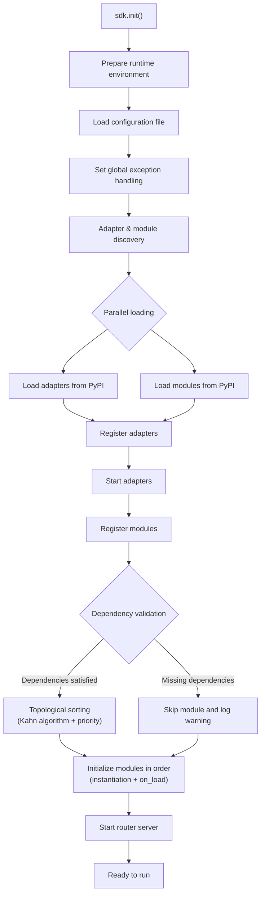
```mermaid
flowchart TD
    A["sdk.init()"] --> B["Prepare runtime environment"]
    B --> B1["Load configuration file"]
    B1 --> B2["Set global exception handling"]
    B2 --> C["Adapter & module discovery"]
    C --> D{"Parallel loading"}
    D --> D1["Load adapters from PyPI"]
    D --> D2["Load modules from PyPI"]
    D1 & D2 --> E["Register adapters"]
    E --> E1["Start adapters"]
    E1 --> F["Register modules"]
    F --> F1{"Dependency validation"}
    F1 -->|"Missing dependencies"| F2["Skip module and log warning"]
    F1 -->|"Dependencies satisfied"| F3["Topological sorting<br/>(Kahn algorithm + priority)"]
    F3 --> G["Initialize modules in order<br/>(instantiation + on_load)"]
    F2 --> G
    G --> H["Start router server"]
    H --> K["Ready to run"]
```

### Detailed Explanation of Initialization Stages

> The complete initialization chain is broken down into (Finder / Loader / Manager / Router), the underlying entry points (`init()` / `init_task()` / `init_sync()`), and manual full startup can be found in [Startup Process and Manual Control](advanced/startup.md).

## Event Handling Flow

The following diagram illustrates the complete flow path of messages from the platform to the handlers:

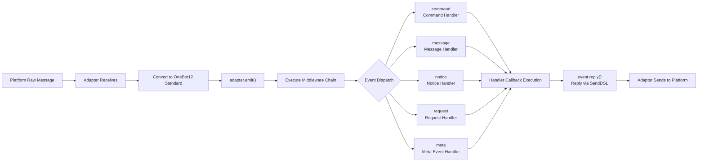
```mermaid
flowchart LR
    A["Platform Raw Message"] --> B["Adapter Receives"]
    B --> C["Convert to OneBot12 Standard"]
    C --> D["adapter.emit()"]
    D --> E["Execute Middleware Chain"]
    E --> F{"Event Dispatch"}
    F --> G1["command<br/>Command Handler"]
    F --> G2["message<br/>Message Handler"]
    F --> G3["notice<br/>Notice Handler"]
    F --> G4["request<br/>Request Handler"]
    F --> G5["meta<br/>Meta Event Handler"]
    G1 & G2 & G3 & G4 & G5 --> H["Handler Callback Execution"]
    H --> I["event.reply()<br/>Reply via SendDSL"]
    I --> J["Adapter Sends to Platform"]
```

### Detailed Event Handling Chain

The above diagram shows the "result"; below is a breakdown of what the framework does behind the scenes after `adapter.emit()` — this is a three-layer dispatch chain:

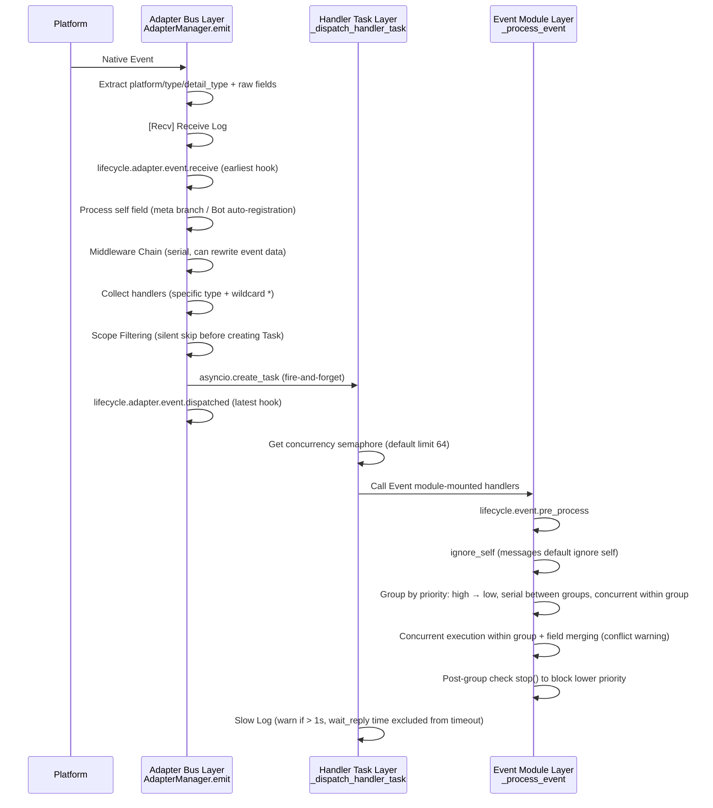
```mermaid
sequenceDiagram
    participant P as Platform
    participant A as Adapter Bus Layer<br/>AdapterManager.emit
    participant T as Handler Task Layer<br/>_dispatch_handler_task
    participant E as Event Module Layer<br/>_process_event

    P->>A: Native Event
    A->>A: Extract platform/type/detail_type + raw fields
    A->>A: [Recv] Receive Log
    A->>A: lifecycle.adapter.event.receive (earliest hook)
    A->>A: Process self field (meta branch / Bot auto-registration)
    A->>A: Middleware Chain (serial, can rewrite event data)
    A->>A: Collect handlers (specific type + wildcard *)
    A->>A: Scope Filtering (silent skip before creating Task)
    A->>T: asyncio.create_task (fire-and-forget)
    A->>A: lifecycle.adapter.event.dispatched (latest hook)
    T->>T: Get concurrency semaphore (default limit 64)
    T->>E: Call Event module-mounted handlers
    E->>E: lifecycle.event.pre_process
    E->>E: ignore_self (messages default ignore self)
    E->>E: Group by priority: high → low, serial between groups, concurrent within group
    E->>E: Concurrent execution within group + field merging (conflict warning)
    E->>E: Post-group check stop() to block lower priority
    T->>T: Slow Log (warn if > 1s, wait_reply time excluded from timeout)
```

**What the framework does at each step and what you can intervene:**

| Stage | What the framework does | What you can intervene |
|------|-------------|-----------|
| Receive | Extract standard fields, retain `{platform}_raw` raw data; write `[Recv]` log | Listen `adapter.event.receive` to get earliest event |
| self field | Meta events go through connect/disconnect/heartbeat branches; ordinary events auto-register Bot and trigger `adapter.bot.online` | Listen `adapter.bot.online` / `bot.offline` |
| Middleware | **Serial** execution, if return value is not None it replaces event data | Register middleware to rewrite or intercept events |
| Dispatch Collection | First get specific type handler, then get `*` wildcard handler | — |
| Scope Filtering | Determine `scope.is_allowed` by owner (session level > Bot level > platform level), **silently skip if not allowed** | Configure scope whitelist/blacklist |
| Scheduling | Each matching handler gets an independent `asyncio.Task`, `emit()` **returns immediately without waiting** for handler completion | — |
| Priority | High priority group executes first; **serial between groups, concurrent within group** (each handler holds its own event copy, modifies fields and merges back to original event, conflict issues WARNING) | `@command(..., priority=N)` / specify priority during registration |
| Blocking | After each group is processed, check `event.is_stopped()`, if triggered, **lower priority groups are not executed** | `event.mark_processed(stop=True)` / `event.done()` |

> **Common Misunderstandings**:
> 1. **Scope filtering is silent** — filtered handlers do not report errors or respond, only visible in TRACE-level logs (`core.scope.denied`). If "my module did not receive the message," first check scope binding.
> 2. **Handlers are naturally concurrent** — the framework already creates independent Tasks for each handler, you **do not need** to wrap them with `asyncio.create_task` yourself.
> 3. **No blocking within the same priority group** — `mark_processed(stop=True)` only blocks lower priority groups, handlers already running concurrently within the same group are not interrupted mid-execution.
> 4. **Slow log threshold is fixed at 1 second** — handlers taking over 1s will issue a WARNING in the log (time spent waiting for `wait_reply` is excluded from the timeout), but execution is not interrupted.

> For details on scope binding and priority, see [Scope System](docs/en/advanced/scope.md); for full semantics of claim/blocking, see [Event Handling Introduction](docs/en/getting-started/event-handling.md); for concurrency limit configuration, see [Configuration Guide](docs/en/user-guide/configuration.md#Framework_Configuration).

## Lifecycle Events

The following diagram shows the order in which lifecycle events are triggered for each component in the framework:

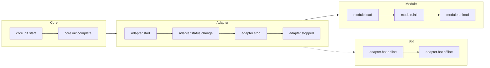
```mermaid
flowchart LR
    subgraph Core["Core"]
        direction LR
        C1["core.init.start"] --> C2["core.init.complete"]
    end

    subgraph AdapterLife["Adapter"]
        direction LR
        A1["adapter.start"] --> A2["adapter.status.change"] --> A3["adapter.stop"] --> A4["adapter.stopped"]
    end

    subgraph ModuleLife["Module"]
        direction LR
        M1["module.load"] --> M2["module.init"] --> M3["module.unload"]
    end

    subgraph BotLife["Bot"]
        direction LR
        B1["adapter.bot.online"] --> B2["adapter.bot.offline"]
    end

    Core --> AdapterLife
    AdapterLife --> ModuleLife
    AdapterLife -.-> BotLife
```

### Listening to Lifecycle Events

> For the complete event listener methods (`lifecycle.on()` / `once()` / `has_handlers()`), the full list of lifecycle events, and their data formats, see [Lifecycle Management](advanced/lifecycle.md).

## Module Loading Strategies

ErisPulse supports three module loading strategies, declared by the `ModuleLoadStrategy` returned by `get_load_strategy()`:

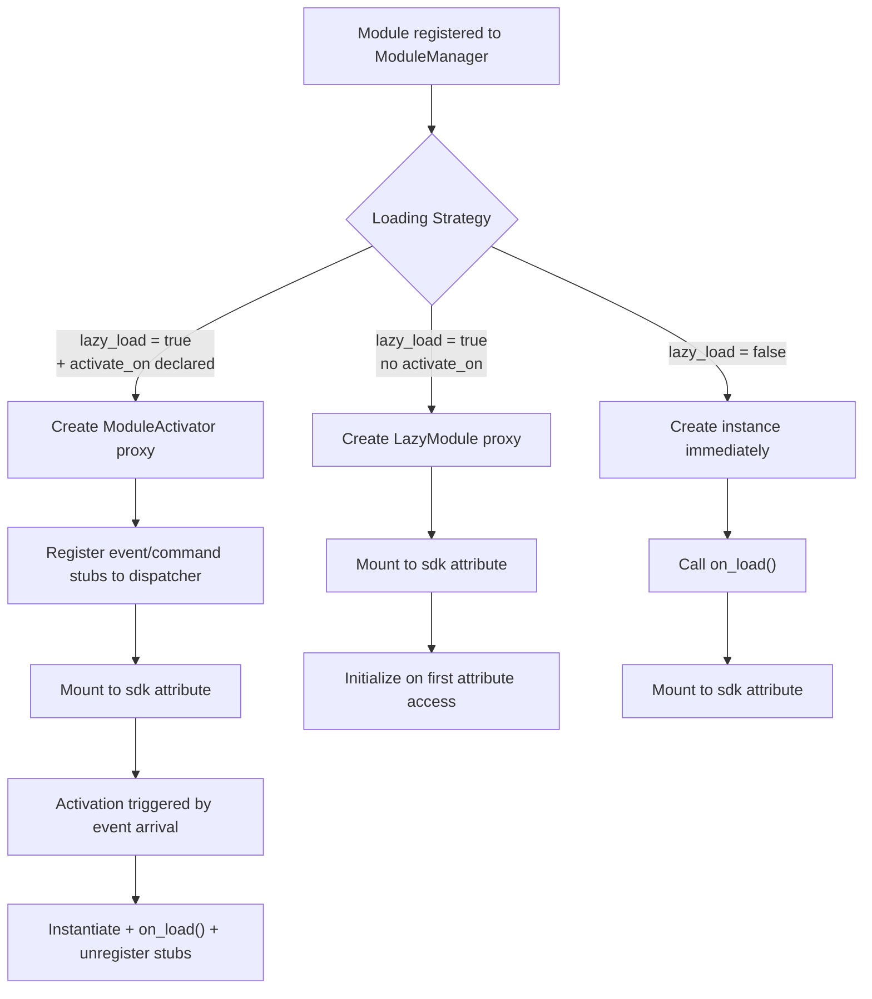
```mermaid
flowchart TD
    A["Module registered to ModuleManager"] --> B{"Loading Strategy"}
    B -->|"lazy_load = true<br/>+ activate_on declared"| C["Create ModuleActivator proxy"]
    B -->|"lazy_load = true<br/>no activate_on"| D["Create LazyModule proxy"]
    B -->|"lazy_load = false"| E["Create instance immediately"]
    C --> F["Register event/command stubs to dispatcher"]
    F --> G["Mount to sdk attribute"]
    G --> H["Activation triggered by event arrival"]
    H --> I["Instantiate + on_load() + unregister stubs"]
    D --> J["Mount to sdk attribute"]
    J --> K["Initialize on first attribute access"]
    E --> L["Call on_load()"]
    L --> M["Mount to sdk attribute"]
```

> For more details, please refer to [Lazy Loading System](advanced/lazy-loading.md), [Lifecycle Management](advanced/lifecycle.md), and module documentation.

### Event-Driven Lazy Activation (`activate_on`) Trigger Architecture

> [!NOTE]
> This feature requires ErisPulse **2.8.0+**.

`activate_on` allows modules to be loaded only when the **first matching event/command arrives**, avoiding constant memory usage while ensuring events are not lost:

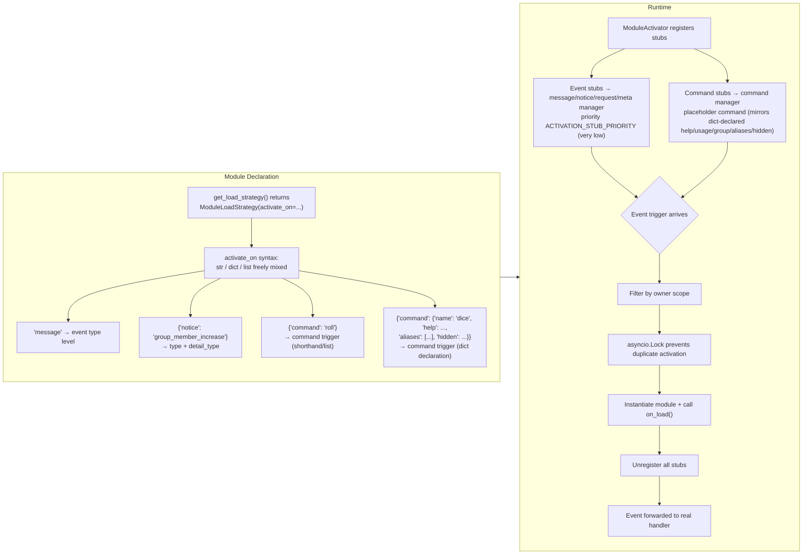
```mermaid
flowchart LR
    subgraph Declare["Module Declaration"]
        S1["get_load_strategy() returns<br/>ModuleLoadStrategy(activate_on=...)"] --> S2["activate_on syntax:<br/>str / dict / list freely mixed"]
        S2 --> S2a["'message' → event type level"]
        S2 --> S2b["{'notice': 'group_member_increase'}<br/>→ type + detail_type"]
        S2 --> S2c["{'command': 'roll'}<br/>→ command trigger (shorthand/list)"]
        S2 --> S2d["{'command': {'name': 'dice', 'help': ...,<br/>'aliases': [...], 'hidden': ...}}<br/>→ command trigger (dict declaration)"]
    end

    subgraph Runtime["Runtime"]
        R1["ModuleActivator registers stubs"] --> R1a["Event stubs → message/notice/request/meta manager<br/>priority ACTIVATION_STUB_PRIORITY (very low)"]
        R1 --> R1b["Command stubs → command manager<br/>placeholder command (mirrors dict-declared help/usage/group/aliases/hidden)"]
        R1a --> R2{"Event trigger arrives"}
        R1b --> R2
        R2 --> R3["Filter by owner scope"]
        R3 --> R4["asyncio.Lock prevents duplicate activation"]
        R4 --> R5["Instantiate module + call on_load()"]
        R5 --> R6["Unregister all stubs"]
        R6 --> R7["Event forwarded to real handler"]
    end

    Declare --> Runtime
```

**Trigger Semantics Key Points:**

> Complete `activate_on` syntax (str / dict / list), command dict declaration, placeholder command help fallback chain, scope filtering, and failure semantics are described in [Lazy Loading System](advanced/lazy-loading.md#event-driven-lazy-activationactivate_on).

## Local Plugin Folder Architecture

> [!NOTE]
> This feature requires ErisPulse **2.8.0+**.

Local plugins (in the `plugins/` directory) do not need to be packaged for release; the framework automatically discovers and loads them during startup:

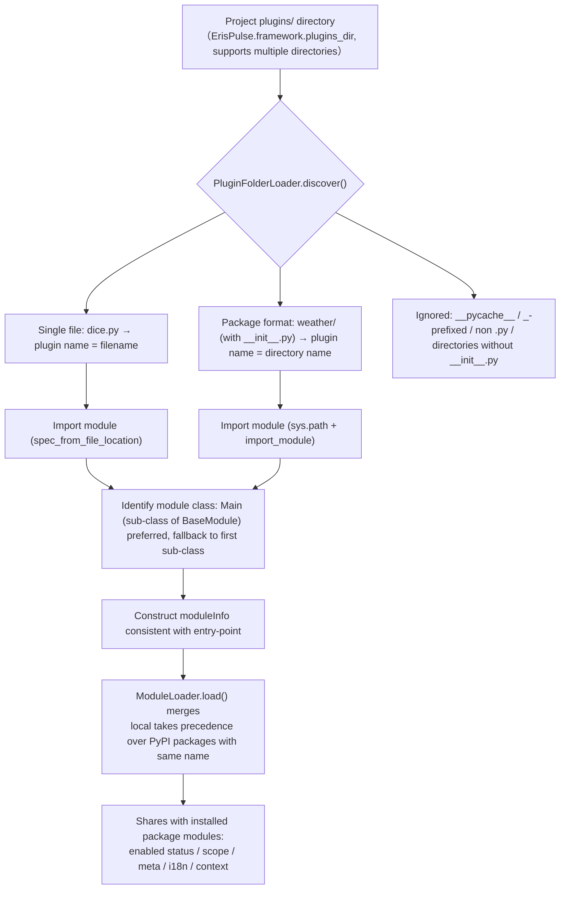
```mermaid
flowchart TD
    A["Project plugins/ directory<br/>（ErisPulse.framework.plugins_dir, supports multiple directories）"] --> B{"PluginFolderLoader.discover()"}
    B --> C["Single file: dice.py → plugin name = filename"]
    B --> D["Package format: weather/ (with __init__.py) → plugin name = directory name"]
    B --> E["Ignored: __pycache__ / _-prefixed / non .py / directories without __init__.py"]
    C --> F["Import module (spec_from_file_location)"]
    D --> G["Import module (sys.path + import_module)"]
    F --> H["Identify module class: Main (sub-class of BaseModule) preferred, fallback to first sub-class"]
    G --> H
    H --> I["Construct moduleInfo consistent with entry-point"]
    I --> J["ModuleLoader.load() merges<br/>local takes precedence over PyPI packages with same name"]
    J --> K["Shares with installed package modules:<br/>enabled status / scope / meta / i18n / context"]
```

**Conventions and Features:**

- Plugin name origin: filename for single files, directory name for package format
- Local plugin `moduleInfo.meta.source == "plugin_folder"`, seamlessly coexists with PyPI-installed package modules
- When names conflict, local takes precedence (for easy local override and debugging), and disabled plugins remove corresponding entry-point entries

Please directly return the complete translated Markdown content, without any additional text.

## Local Plugin Hot Reload Architecture

Hot reload monitors plugin file changes and automatically reloads the corresponding plugin:

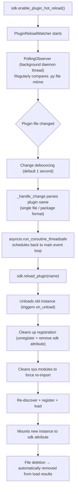
```mermaid
flowchart TD
    A["sdk.enable_plugin_hot_reload()"] --> B["PluginReloadWatcher starts"]
    B --> C["PollingObserver (background daemon thread)<br/>Regularly compares .py file mtime"]
    C --> D{"Plugin file changed"}
    D --> E["Change debouncing (default 1 second)"]
    E --> F["_handle_change parses plugin name<br/>(single file / package format)"]
    F --> G["asyncio.run_coroutine_threadsafe<br/>schedules back to main event loop"]
    G --> H["sdk.reload_plugin(name)"]
    H --> I["Unloads old instance (triggers on_unload)"]
    I --> J["Cleans up registration (unregister + remove sdk attribute)"]
    J --> K["Cleans sys.modules to force re-import"]
    K --> L["Re-discover + register + load"]
    L --> M["Mounts new instance to sdk attribute"]
    M --> N["File deletion → automatically removed from load results"]
```

7. **Important: Path replacement rule**
   - Replace `docs/en/` in document links with `docs/en/`
   - For example: `docs/en/quick-start.md` should be changed to `docs/en/quick-start.md`
   - For links pointing to non-current language version files (e.g., `README.xx.md` format), keep them unchanged
   - This ensures links point to the correct language version of the document


====
快速上手
====


### 快速开始

# Quick Start

> **This is your first step.** Get an ErisPulse bot up and running from scratch in 5 minutes.

## Install ErisPulse

### One-Click Installation Script (Recommended)

The installation script will automatically detect your environment (Docker, Python, uv) and guide you to choose the most suitable installation method.

Windows (PowerShell):
```powershell
irm https://get.erisdev.com/install.ps1 -OutFile install.ps1; powershell -ExecutionPolicy Bypass -File install.ps1
```

macOS / Linux:
```bash
curl -fsSL https://get.erisdev.com/install.sh -o install.sh && chmod +x install.sh && ./install.sh
```

The script will guide you through:

- **Docker Installation** (Recommended when Docker is detected): Select the image source (Docker Hub / GHCR), version channel (Stable / Preview), Dashboard management panel configuration, and port settings.
- **Traditional Installation**: Automatically create virtual environment, select ErisPulse version, and optionally install the Dashboard management panel module.

### Using Docker

The Docker image comes with the ErisPulse framework and Dashboard management panel built-in.

```bash
# Download docker-compose.yml
curl -O https://raw.githubusercontent.com/ErisPulse/ErisPulse/main/docker-compose.yml

# Set Dashboard token and start
ERISPULSE_DASHBOARD_TOKEN=your-token docker compose up -d
```

<details>
<summary>Docker Hub unavailable?</summary>

Use the GitHub Container Registry image and modify the `image` in `docker-compose.yml`:

```yaml
image: ghcr.io/erispulse/erispulse:latest
```

</details>

After starting, access `http://<host>:8000/Dashboard` and login with the set token.

### Using pip

Make sure your Python version is >= 3.10, then install with pip:

```bash
pip install ErisPulse
```

If you have already installed [uv](https://github.com/astral-sh/uv), you can also use `uv pip install ErisPulse`, which is faster.

## Initialize Project

### Interactive Initialization (Recommended)

```bash
epsdk init
```

This will launch an interactive wizard to guide you through:
- Project name setup
- Log level configuration
- Server configuration (host and port)
- Adapter selection and configuration
- Project structure creation

### Quick Initialization

```bash
# Quick mode specifying project name
epsdk init -q -n my_bot

# Or only specifying project name
epsdk init -n my_bot
```

### Manual Project Creation

If you prefer to manually create the project:

```bash
mkdir my_bot && cd my_bot
epsdk init

## Installing Modules

### Installing via CLI

```bash
epsdk install Yunhu AIChat
```

### Viewing Available Modules

```bash
epsdk list-remote
```

### Interactive Installation

Enter the interactive installation interface when package name is not specified:

```bash
epsdk install

## Running the Project

```bash
# Normal run
epsdk run main.py

# Hot reload mode (recommended for development)
epsdk run main.py --reload

## Enable IDE Completion (Optional)

ErisPulse dynamic discovery modules/adapters cannot be auto-completed by IDEs by default for platform-specific methods.
Run the following command to generate type stubs:

```bash
epsdk types
```

After generation, use the imported types as variable annotations to get precise completion (see [IDE Completion Guide](./getting-started/ide-completion.md)):

```python
from _ep_types import Yunhu
from ErisPulse import sdk

adapter: Yunhu = sdk.adapter.get("yunhu")
await adapter.Send.To("group", "123").Board(...)  # Complete platform-specific methods

## Project Structure

The structure of the initialized project:

```
my_bot/
├── config/
│   └── config.toml          # Configuration file
└── main.py                  # Entry file

## Configuration File

Basic `config.toml` configuration:

```toml
[ErisPulse.server]
host = "0.0.0.0"
port = 8000

[ErisPulse.logger]
level = "INFO"

[Yunhu_Adapter]
# Adapter Configuration


### 创建第一个机器人

# Creating Your First Bot

This guide builds upon the [5-Minute Quick Start](../quick-start.md), walking you through writing your first command handler and understanding the execution mechanism.

> If you haven't installed ErisPulse or initialized your project yet, please complete the "Install", "Initialize Project", and "Run Project" steps in the [Quick Start](../quick-start.md) first.

## Step 1: Writing Your First Command

Open `main.py` and write a simple command handler:

```python
from ErisPulse import sdk
from ErisPulse.Core.Event import command

@command("hello", help="Send a greeting message")
async def hello_handler(event):
    """Handle the hello command"""
    user_name = event.get_user_nickname() or "friend"
    await event.reply(f"Hello, {user_name}! I am the ErisPulse bot.")

@command("ping", help="Test if the bot is online")
async def ping_handler(event):
    """Handle the ping command"""
    await event.reply("Pong! The bot is running normally.")

async def main():
    """Main entry function"""
    print("Starting ErisPulse...")
    
    # keep_running=True (default): The framework blocks and maintains execution until a shutdown signal is received (such as Ctrl+C)
    await sdk.run(keep_running=True)

if __name__ == "__main__":
    import asyncio
    asyncio.run(main())
```

### `keep_running` Parameter

`sdk.run(keep_running)` controls whether the framework blocks and maintains execution:

- **`keep_running=True` (default)**: `run()` will block indefinitely until a shutdown signal is received (such as Ctrl+C), suitable for pure bot applications.
- **`keep_running=False`**: `run()` returns immediately after initialization; **the framework is not unloaded**—the started adapters/modules continue processing message events as background tasks, allowing you to proceed with your own logic until the event loop ends and the framework closes. For example:

```python
async def main():
    await sdk.run(keep_running=False)   # Return immediately after initialization
    # The framework is running in the background, here you can continue doing other things
    while True:
        await asyncio.sleep(3600)
        print("Check every hour")
```

> In addition to the two modes of `run()`, there are also more granular ways to manually control the lifecycle using `init()`/`uninit()`, and to start/stop adapters/routers independently; see [Startup Process and Manual Control](../advanced/startup.md).

## Step 2: Running the Bot

```bash
# Normal execution
epsdk run main.py

# Development mode (supports hot reload)
epsdk run main.py --reload
```

## Step 3: Testing the Bot

Send commands in your chat platform:

```
/hello
```

You should receive a reply from the bot.

## Code Explanation

### Command Decorator

```python
@command("hello", help="Send a greeting message")
```

- `hello`: Command name, users invoke it via `/hello`
- `help`: Command help description, displayed in the `/help` command

### Event Parameters

```python
async def hello_handler(event):
```

The `event` parameter is an Event object, containing:
- Message content: `event.get_text()`
- Sender information: `event.get_user_id()`, `event.get_user_nickname()`
- Platform information: `event.get_platform()`
- Group information: `event.get_group_id()`
- Raw data: `event.get_raw()`

> For a complete list of Event object methods, refer to [Event Wrapper Class Detailed Explanation](../developer-guide/modules/event-wrapper.md).

### Sending a Reply

```python
await event.reply("Reply content")
```

`event.reply()` is a convenient method for sending messages to the sender.

## Extension: Adding More Features

ErisPulse provides rich event handling and data processing capabilities:

- **Message Listening**: Use `@message.on_message()` to listen to various types of messages → [Introduction to Event Handling](event-handling.md)
- **Notification Listening**: Use `@notice.on_friend_add()` and others to listen to system notifications → [Introduction to Event Handling](event-handling.md)
- **Data Storage**: Use `sdk.storage.get/set` to persist data → [Common Tasks Examples](common-tasks.md)

## Frequently Asked Questions

### Command Not Responding?

1. Check if the adapter is correctly configured; confirm that the adapter's `status` in `config/config.toml` is set to `true`
2. Check the terminal log output to ensure there are no error messages (especially `ERROR` level logs)
3. Confirm the command prefix is correct (default is `/`), check the `[ErisPulse.event.command]` section in the configuration file
4. Ensure the command name is spelled correctly, and pay attention to case sensitivity settings

### How to Modify the Command Prefix?

Add the following to `config.toml`:

```toml
[ErisPulse.event.command]
prefix = "!"
case_sensitive = false
```

### How to Support Multiple Platforms?

ErisPulse uses the OneBot12 standard to unify event formats across different platforms. Handlers registered with `@command` and `@message` automatically receive events from all platforms. You can distinguish the source platform using `event.get_platform()`:

```python
@command("hello")
async def hello_handler(event):
    platform = event.get_platform()
    
    if platform == "yunhu":
        await event.reply("Hello! From Yunhu")
    elif platform == "telegram":
        await event.reply("Hello! From Telegram")
    else:
        await event.reply("Hello!")
```

> For more multi-platform adaptation techniques, see [Common Tasks Examples](common-tasks.md#multi-platform-adaptation).


### 基础概念

# Basic Concepts

This guide introduces the core concepts of ErisPulse, helping you understand the framework's design philosophy and basic architecture.

## Event-Driven Architecture

ErisPulse adopts an event-driven architecture, where all interactions are passed and processed through events.

### Event Flow

```
User sends message
      │
      ▼
Platform receives
      │
      ▼
Adapter receives platform native event
      │
      ▼
Convert to OneBot12 standard event
      │
      ▼
Submit to event system
      │
      ▼
Dispatch to registered handlers
      │
      ▼
Module processes event
      │
      ▼
Send response through adapter
      │
      ▼
Platform displays to user
```

### OneBot12 Standard

ErisPulse uses OneBot12 as the core event standard. OneBot12 is a generic chatbot application interface standard that defines a unified event format.

All adapters convert platform-specific events into OneBot12 format to ensure code consistency.

## Core Components

### 1. SDK Object

The SDK is the unified entry point for all functionality, providing access to core components.

```python
from ErisPulse import sdk

# Access core modules
sdk.storage    # Storage system
sdk.config     # Configuration system
sdk.logger     # Logging system
sdk.adapter    # Adapter system
sdk.module     # Module system
sdk.router     # Routing system
sdk.client     # HTTP client
sdk.lifecycle  # Lifecycle system
```

### 2. Event Object

Event objects encapsulate event data and provide convenient access methods.

```python
@command("info")
async def info_handler(event):
    # Get event info
    event_id = event.get_id()
    user_id = event.get_user_id()
    platform = event.get_platform()
    text = event.get_text()
    
    # Send reply
    await event.reply(f"User: {user_id}, Platform: {platform}")
```

### 3. Adapter

Adapters are the bridge between ErisPulse and external platforms.

**Responsibilities:**
- Receive platform native events
- Convert to OneBot12 standard format
- Send standard format events to the platform

**Example Adapters:**
- Yunhu Adapter: Communicate with Yunhu platform
- Telegram Adapter: Communicate with Telegram Bot API
- OneBot11 Adapter: Communicate with OneBot11 compatible applications
- Email Adapter: Handle email sending and receiving

### 4. Module

Modules are the basic unit for functional extensions and can:

- Register event handlers
- Implement business logic
- Call adapters to send messages
- Use services provided by core modules

#### Module Discovery Mechanism

ErisPulse discovers installed modules via Python's `importlib.metadata.entry_points`. Modules declare entry points in `pyproject.toml`:

```toml
[project.entry-points."erispulse.module"]
MyModule = "my_package:Main"
```

When the SDK initializes, it scans all entry points in the `erispulse.module` group, registers module classes to `ModuleManager`, and then initializes them sequentially after topological sorting by dependencies.

#### Minimum Viable Module

```python
from ErisPulse.Core.Bases import BaseModule
from ErisPulse import sdk

class Main(BaseModule):
    def __init__(self):
        self.sdk = sdk
        self.logger = sdk.logger.get_child("MyModule")

    async def on_load(self, event):
        self.logger.info("Module loaded")

    async def on_unload(self, event):
        self.logger.info("Module unloaded")
```

#### Module Lifecycle

- **Registration**: SDK discovers module class and registers to manager
- **Loading**: Creates module instance, calls `on_load(event)` (`event = {"module_name": "MyModule"}`)
- **Unloading**: Calls `on_unload(event)`, cleans up resources

#### Load Strategy

Declare the module's loading behavior via `get_load_strategy()`:

```python
from ErisPulse.loaders import ModuleLoadStrategy

class Main(BaseModule):
    @staticmethod
    def get_load_strategy():
        return ModuleLoadStrategy(
            lazy_load=True,   # Whether to lazy load (default True)
            priority=0        # Load priority, larger numbers initialize earlier
        )
```

- **`lazy_load=True` (default)**: Module initializes only when first accessed (e.g., `sdk.MyModule`), reducing startup time
- **`lazy_load=False`**: Module initializes immediately when SDK starts, suitable for modules that need to listen to lifecycle events or execute scheduled tasks
- **`priority`**: Modules with the same priority load in registration order; larger numbers initialize earlier

> For a detailed explanation of the lazy loading mechanism, please refer to [Lazy Loading System](../advanced/lazy-loading.md).

## Event Types

ErisPulse supports 5 categories of events:

| Event Type | Decorator | Description |
|---------|--------|------|
| Message Event | `@message.on_message()` | Any message sent by the user (private chat, group chat) |
| Command Event | `@command("name")` | Messages starting with the command prefix (e.g., `/hello`) |
| Notice Event | `@notice.on_friend_add()` etc. | System notifications (friend added, group member changes, etc.) |
| Request Event | `@request.on_friend_request()` etc. | User requests (friend request, group invite) |
| Meta Event | `@meta.on_connect()` etc. | System-level events (connect, disconnect, heartbeat) |

> For detailed usage and code examples of each event type, please refer to [Getting Started with Event Handling](event-handling.md).

## Core Module Explanations

### Storage (Storage)

SQLite-based key-value storage system for persistent data.

```python
# Set value
sdk.storage.set("key", "value")

# Get value
value = sdk.storage.get("key", "default_value")

# Batch operations
sdk.storage.set_multi({
    "key1": "value1",
    "key2": "value2"
})

# Transaction
with sdk.storage.transaction():
    sdk.storage.set("key1", "value1")
    sdk.storage.set("key2", "value2")
```

### Config (Configuration)

TOML format configuration file management.

```python
# Get config
config = sdk.config.getConfig("MyModule", {})

# Set config
sdk.config.setConfig("MyModule", {"key": "value"})

# Read nested config
value = sdk.config.getConfig("MyModule.subkey", "default")
```

### Logger (Logging)

Modular logging system.

```python
# Log messages
sdk.logger.info("This is an info message")
sdk.logger.warning("This is a warning message")
sdk.logger.error("This is an error message")

# Get child logger
child_logger = sdk.logger.get_child("submodule")
child_logger.info("Submodule log")
```

**Property Access Syntax Sugar**

In addition to using the `get_child()` method, you can create child loggers via **property access**, which is a more concise **syntax sugar**:

```python
# Create child logger via property access
sdk.logger.mymodule.info("Module message")

# Support nested access
sdk.logger.mymodule.database.info("Database message")
```

### Router (Routing)

HTTP and WebSocket routing management, based on FastAPI + Uvicorn. Supports decorator routing, middleware, grouping, rate limiting, CORS.

```python
from ErisPulse.Core import HttpRequest

@sdk.router.get("MyModule", "/api")
async def handler(request: HttpRequest):
    data = await request.json()
    return {"status": "ok"}
```

> For the complete routing API (WebSocket, middleware, rate limiting, CORS, etc.), please refer to [Router Manager](../advanced/router.md).

### Client (Network Client)

Unified network client aggregating HTTP requests, WebSocket connections, connection pool management, automatic retry, timeout control, request statistics, and lifecycle event integration.

```python
from ErisPulse.Core import client

# HTTP request
resp = await client.get("https://api.example.com/users")
data = await resp.json()

# With retry and timeout
resp = await client.get(url, timeout=30, max_retries=3)

# WebSocket connection
ws = await client.ws_connect("wss://example.com/ws")
async for text in ws.iter_text():
    await ws.send_text(f"Echo: {text}")
```

> For the complete network client API, please refer to [Network Client](../advanced/http-client.md).

## SendDSL Message Sending

Adapters provide message sending interfaces with method chaining.

### Basic Sending

```python
# Get adapter instance
yunhu = sdk.adapter.get("yunhu")

# Send message
await yunhu.Send.To("user", "U1001").Text("Hello")

# Specify sending account
await yunhu.Send.Using("bot1").To("group", "G1001").Text("Group message")
```

### Chain Modifiers

```python
# @User
await yunhu.Send.To("group", "G1001").At("U2001").Text("@message")

# Reply to message
await yunhu.Send.To("group", "G1001").Reply("msg123").Text("reply")

# @All
await yunhu.Send.To("group", "G1001").AtAll().Text("announcement")
```

### Event Reply Methods

Event objects provide convenient reply methods:

```python
@command("test")
async def test_handler(event):
    # Simple text reply
    await event.reply("Reply content")
    
    # Send image
    await event.reply("http://example.com/image.jpg", method="Image")
    
    # Send voice
    await event.reply("http://example.com/voice.mp3", method="Voice")
```

## Lazy Loading System

ErisPulse enables module lazy loading by default. Modules are initialized only when first accessed (e.g., `sdk.MyModule`), significantly improving startup speed.

```python
from ErisPulse.loaders import ModuleLoadStrategy

class Main(BaseModule):
    @staticmethod
    def get_load_strategy():
        return ModuleLoadStrategy(
            lazy_load=True,   # Enable lazy loading (default)
            priority=0        # Load priority, larger numbers initialize earlier
        )
```

**Scenarios where lazy loading needs to be disabled (`lazy_load=False`):**
- Modules listening to lifecycle events (e.g., `core.init.complete`)
- Modules starting scheduled tasks or background services
- Modules that need to complete initialization before other modules load

> For a detailed description of the lazy loading mechanism and precautions, please refer to [Lazy Loading System](../advanced/lazy-loading.md).


### 事件处理入门

# Getting Started with Event Handling

This guide introduces how to handle various events in ErisPulse.

Please return the complete Markdown content directly without any other text.

## Event Type Overview

ErisPulse supports the following event types:

| Event Type | Description | Use Cases |
|---------|------|---------|
| Message Event | Any message sent by a user | Chatbots, Content Filtering |
| Command Event | Messages starting with a command prefix | Command Handling, Feature Entry Points |
| Notice Event | System notifications (friend addition, group member changes, etc.) | Welcome Messages, Status Notifications |
| Request Event | User requests (friend requests, group invitations) | Automatic Request Handling |
| Meta Event | System-level events (connection, heartbeat) | Connection Monitoring, Status Checks |

## Message Event Handling

> **Tip**: It is recommended to use the `Event` type annotation in event handlers to receive IDE auto-completion and type checking support.

```python
from ErisPulse.Core.Event import Event  # Import the event type for annotation
```

### Listen to all messages

```python
from ErisPulse.Core.Event import message, Event

@message.on_message()
async def message_handler(event: Event):
    text = event.get_text()
    user_id = event.get_user_id()
    sdk.logger.info(f"Received message from {user_id}: {text}")
```

### Listen to private messages

```python
@message.on_private_message()
async def private_handler(event: Event):
    user_id = event.get_user_id()
    await event.reply(f"Hello, {user_id}! This is a private message.")
```

### Listen to group messages

```python
@message.on_group_message()
async def group_handler(event: Event):
    group_id = event.get_group_id()
    user_id = event.get_user_id()
    sdk.logger.info(f"User {user_id} sent a message in group {group_id}")
```

### Listen to @mentions

```python
@message.on_at_message()
async def at_handler(event: Event):
    # Get the list of users mentioned
    mentions = event.get_mentions()
    await event.reply(f"You mentioned these users: {mentions}")

## Command Event Handling

### Basic Commands

```python
from ErisPulse.Core.Event import command

@command("help", help="Show help information")
async def help_handler(event):
    help_text = """
Available commands:
/help - Show help
/ping - Test connection
/info - View information
    """
    await event.reply(help_text)
```

### Command Aliases

```python
@command(["help", "h"], aliases=["帮助"], help="Show help information")
async def help_handler(event):
    await event.reply("Help information...")
```

Users can invoke the command using any of the following:
- `/help`
- `/h`
- `/帮助`

### Command Parameters

```python
@command("echo", help="Echo message")
async def echo_handler(event):
    # Get command arguments
    args = event.get_command_args()
    
    if not args:
        await event.reply("Please enter the message to echo")
    else:
        await event.reply(f"You said: {' '.join(args)}")
```

### Command Groups

```python
@command("admin.reload", group="admin", help="Reload module")
async def reload_handler(event):
    await event.reply("Module has been reloaded")

@command("admin.stop", group="admin", help="Stop bot")
async def stop_handler(event):
    await event.reply("Bot has been stopped")
```

### Command Permissions

```python
def is_master(event):
    """Check if user is framework master"""
    master_list = ["user123", "user456"]
    return event.get_user_id() in master_list

@command("master", permission=is_master, help="Master command")
async def master_handler(event):
    await event.reply("This is a master command")
```

### Command Priority

```python
# Higher priority number means earlier execution
@message.on_message(priority=10)
async def high_priority_handler(event):
    await event.reply("High priority handler")

@message.on_message(priority=1)
async def low_priority_handler(event):
    await event.reply("Low priority handler")
```

### Parallel Event Processing

ErisPulse event system uses a **parallel within same priority, serial between different priorities** scheduling model:

```
Event arrives
    ↓
priority=10 group: [handler C || handler D] parallel → merge results
    ↓ (if not interrupted)
priority=0 group: [handler A || handler B] parallel → merge results
    ↓
...
```

- **Parallel within same priority**: Multiple handlers with the same priority execute simultaneously, increasing throughput
- **Serial between priorities**: Groups with different priorities execute in order (higher priority numbers execute first), ensuring high-priority handlers run first
- **Copy-On-Write**: No copy is created if handlers do not modify data, ensuring zero overhead
- **Conflict handling**: When multiple handlers at the same priority modify the same field, the last modification is used and a warning log is recorded
- **Interrupt mechanism**: After any handler calls `event.done()` (default) or `event.done(claim=False)`, subsequent lower priority groups are skipped. The difference between claiming and blocking is explained in the following section [**Link Control: Claiming and Blocking**](#link-control-claiming-and-blocking)

```python
# Example: Parallel execution of handlers with the same priority
@message.on_message(priority=0)
async def handler_a(event):
    # Process task A
    event['result_a'] = process_a()

@message.on_message(priority=0)
async def handler_b(event):
    # Executes in parallel with handler_a
    event['result_b'] = process_b()

# Serial execution of handlers with different priorities
@message.on_message(priority=10)
async def handler_c(event):
    # Highest priority, executes first
    pass
```

> **Concurrency limit**: All matching handlers' Tasks are **immediately created**, but a semaphore limits the **number of concurrent executions** by default to **64** (`ErisPulse.framework.handler_max_concurrency`, supports hot update). Tasks exceeding the limit queue on the semaphore and enter only after previous ones complete. This acts as your "pressure relief valve" during event surges.
>
> **Slow logs**: If a single handler takes more than **1 second**, the framework logs a WARNING (`handler_slow`). The `wait_reply` waiting time is excluded from the timing, so delays caused by "waiting for replies" won't trigger a false slow log.

## Scope Filtering: Why Didn't My Module Receive Messages

Event distribution performs scope filtering **before creating the handler Task**—determining `scope.is_allowed` based on the module owner (session level > Bot level > platform level). If it fails, the event is silently skipped without error or response.

```python
# Assuming config.toml blocks MyModule in a specific group:
[ErisPulse.scope]
block = { yunhu = { group_123 = ["MyModule"] } }
```

When messages arrive in this group, neither commands nor event handlers of `MyModule` will be scheduled. This is not a bug, but the scope mechanism—when troubleshooting "module not responding," check scope binding first.

- Three filtering points: adapter bus level (before Task creation), Event module level (within each priority group), command level (before permission check)
- Filtering logs are only visible at **TRACE** level (`core.scope.denied`); default INFO level shows no trace
- Framework-level handlers (e.g., command dispatcher with `scope_exempt=True`) are not affected by scope

> For details on three-level scope binding, whitelist/blacklist, priority overrides, and the implicit "default_allow" rejection semantics, see [Scope System](../../advanced/scope.md).

## Link Control: Claim and Stop

> [!NOTE]
> The `claim=` / `stop=` parameters of `event.done()` / `event.mark_processed()` require ErisPulse **2.7.1+**.

ErisPulse decouples the orthogonal semantics of "Claim" and "Stop", unified through `event.done()`, making it easy to overlay log, audit, permission, and other observation layers around command processing.

**Precise definitions of the two concepts:**

- **Claim (认领)**: Marks the event as handled by this processor (writes to `_processed`). The command dispatcher will **skip claiming events**—avoiding multiple command processors processing the same message. Typical scenario: Claim after successful command matching, preventing the command dispatcher from intervening again.
- **Stop (阻断)**: Prevents the event from propagating to **lower priority** processors (writes to `_propagation_stopped`). Lower priority processors (e.g., `on_message`) will no longer see the event. Typical scenario: High priority processors have fully processed the event, and no lower priority execution is desired.

| `event.done(...)` | Claim | Stop | Scenario |
|-------------------|-------|------|----------|
| `event.done()` | ✔ | ✔ | Standard practice for commands / processors |
| `event.done(stop=False)` | ✔ | ✘ | Only claim, allowing low priority observers (logs / stats) to continue seeing the event |
| `event.done(claim=False)` | ✘ | ✔ | Only stop (e.g., firewall / rate limiting), but do not deduplicate commands |

`event.done(claim=, stop=)` is an alias for `event.mark_processed(claim=, stop=)`, with completely equivalent parameters and behavior.

```python
@command("help")
async def help_cmd(event):
    event.done()            # Claim + Stop (standard practice for command processing)

@message.on_message(priority=50)
async def observer(event):
    event.done(stop=False)  # Only claim: low priority processors still execute (logs / stats)

@message.on_message(priority=100)
async def firewall(event):
    if denied(event):
        event.done(claim=False)  # Only stop: low priority processors do not execute, but no deduplication
```

### Block Configuration for Commands and Replies

After successful command matching / matching a reply via `wait_reply`, propagation is blocked by default (backwards compatible). You can allow the flow by configuring it so that lower priority processors (logs / audit / permission) can also observe these messages:

```toml
[ErisPulse.event.command]
block = false   # Command messages continue to flow to low priority processors

[ErisPulse.event.wait_reply]
block = false   # Replies consumed by wait_reply continue to flow to low priority processors

## Notification Event Handling

### Friend Add

```python
from ErisPulse.Core.Event import notice

@notice.on_friend_add()
async def friend_add_handler(event):
    user_id = event.get_user_id()
    nickname = event.get_user_nickname() or "New Friend"
    await event.reply(f"Welcome to add me as a friend, {nickname}!")
```

### Group Member Increase

```python
@notice.on_group_increase()
async def member_increase_handler(event):
    group_id = event.get_group_id()
    user_id = event.get_user_id()
    await event.reply(f"Welcome new member {user_id} to join group {group_id}")
```

### Group Member Decrease

```python
@notice.on_group_decrease()
async def member_decrease_handler(event):
    group_id = event.get_group_id()
    user_id = event.get_user_id()
    await event.reply(f"Member {user_id} has left group {group_id}")

## Request Event Handling

### Friend Request

```python
from ErisPulse.Core.Event import request

@request.on_friend_request()
async def friend_request_handler(event):
    user_id = event.get_user_id()
    comment = event.get_comment()
    
    sdk.logger.info(f"Received friend request: {user_id}, comment: {comment}")
    
    # Requests can be handled via adapter API
    # Please refer to the documentation of each adapter for specific implementations
```

### Group Invitation Request

```python
@request.on_group_request()
async def group_request_handler(event):
    group_id = event.get_group_id()
    user_id = event.get_user_id()
    
    await event.reply(f"Received group {group_id} invitation from {user_id}")

## Meta Events Handling

### Connection Events

```python
from ErisPulse.Core.Event import meta

@meta.on_connect()
async def connect_handler(event):
    platform = event.get_platform()
    sdk.logger.info(f"{platform} platform connected")

@meta.on_disconnect()
async def disconnect_handler(event):
    platform = event.get_platform()
    sdk.logger.warning(f"{platform} platform disconnected")
```

### Heartbeat Events

```python
@meta.on_heartbeat()
async def heartbeat_handler(event):
    platform = event.get_platform()
    sdk.logger.debug(f"{platform} heartbeat check")
```

### Bot Status Query

After the adapter sends a meta event, the framework automatically tracks the Bot's status. You can query it at any time:

```python
from ErisPulse import sdk

# Check if a specific Bot is online
if sdk.adapter.is_bot_online("telegram", "123456"):
    telegram = sdk.adapter.get("telegram")
    await telegram.Send.To("user", "123456").Text("Bot is online")

# List all currently online Bots
bots = sdk.adapter.list_bots()
for platform, bot_list in bots.items():
    for bot_id, info in bot_list.items():
        print(f"{platform}/{bot_id}: {info['status']}")

# Get a full status summary
summary = sdk.adapter.get_status_summary()

## Interactive Processing

### Sending Replies Using the `reply` Method

The `event.reply()` method supports various modifiers to facilitate sending messages with @, reply, and other features:

```python
# Simple reply
await event.reply("Hello")

# Sending different types of messages
await event.reply("http://example.com/image.jpg", method="Image")  # Image
await event.reply("http://example.com/voice.mp3", method="Voice")  # Voice

# @ single user
await event.reply("Hello", at_users=["user123"])

# @ multiple users
await event.reply("Hello everyone", at_users=["user1", "user2", "user3"])

# Reply to a message
await event.reply("Reply content", reply_to="msg_id")

# @ all members
await event.reply("Notice", at_all=True)

# Combination: @ user + reply to message
await event.reply("Content", at_users=["user1"], reply_to="msg_id")
```

### Waiting for User Reply

```python
@command("ask", help="Ask user")
async def ask_handler(event):
    await event.reply("Please enter your name:")
    
    # Wait for user reply, timeout 30 seconds
    reply = await event.wait_reply(timeout=30)
    
    if reply:
        name = reply.get_text()
        await event.reply(f"Hello, {name}!")
    else:
        await event.reply("Timeout, please try again.")
```

### Waiting for Reply with Validation

```python
@command("age", help="Ask age")
async def age_handler(event):
    def validate_age(event_data):
        """Validate if age is valid"""
        try:
            age = int(event_data.get_text())
            return 0 <= age <= 150
        except ValueError:
            return False
    
    await event.reply("Please enter your age (0-150):")
    
    reply = await event.wait_reply(
        timeout=60,
        validator=validate_age
    )
    
    if reply:
        age = int(reply.get_text())
        await event.reply(f"Your age is {age} years old")
    else:
        await event.reply("Invalid input or timeout")
```

### Waiting for Reply with Callback

```python
@command("confirm", help="Confirm operation")
async def confirm_handler(event):
    async def handle_confirmation(reply_event):
        text = reply_event.get_text().lower()
        
        if text in ["是", "yes", "y"]:
            await event.reply("Operation confirmed!")
        else:
            await event.reply("Operation cancelled.")
    
    await event.reply("Confirm to execute this operation? (Yes/No)")
    
    await event.wait_reply(
        timeout=30,
        callback=handle_confirmation
    )
```

### Confirming Dialogue (confirm)

Waits for user confirmation or negation, automatically recognizing built-in Chinese and English confirmation words:

```python
@command("confirm", help="Confirm operation")
async def confirm_handler(event):
    if await event.confirm("Are you sure you want to execute this operation?"):
        await event.reply("Confirmed, executing...")
    else:
        await event.reply("Cancelled")

# Custom confirmation words
if await event.confirm("Continue?", yes_words={"go", "继续"}, no_words={"stop", "停止"}):
    pass
```

### Choice Menu (choose)

Users can reply with the option number or option text:

```python
@command("choose", help="Choose")
async def choose_handler(event):
    choice = await event.choose(
        "Please select a color:",
        ["Red", "Green", "Blue"]
    )
    
    if choice is not None:
        colors = ["Red", "Green", "Blue"]
        await event.reply(f"You selected: {colors[choice]}")
    else:
        await event.reply("Timeout: No choice made")
```

**Merged Mode**: When `merge_prompt=True`, options are merged into the prompt message and sent in a single message using the user-specified `method`:

```python
# Send merged prompt + options using Markdown
choice = await event.choose(
    "## Please select a color\n{options}\nPlease reply with the number",
    ["Red", "Green", "Blue"],
    method="Markdown",
    merge_prompt=True,
)
```

> The `{options}` placeholder controls the insertion position of options; if omitted, they are appended to the end of the prompt.
> The `placeholder` parameter can be used to customize the placeholder (e.g., `placeholder="[choices]"`).
> `options_format="auto"` (default) selects the style automatically based on method: Markdown → unordered list, Html → ordered list, others → plain text list.
> For text-based methods (Text/Markdown/Html, etc.), options are merged by default; for non-text methods (Image, etc.), they are split into two messages by default.

### Collecting Forms (collect)

Collects user input in multiple steps:

```python
@command("register", help="Register")
async def register_handler(event):
    data = await event.collect([
        {"key": "name", "prompt": "Please enter your name:"},
        {"key": "age", "prompt": "Please enter your age:", 
         "validator": lambda e: e.get_text().isdigit()},
        {"key": "email", "prompt": "Please enter your email:"}
    ])
    
    if data:
        await event.reply(f"Registration successful!\nName: {data['name']}\nAge: {data['age']}\nEmail: {data['email']}")
    else:
        await event.reply("Registration timeout or invalid input")
```

### Waiting for Any Event (wait_for)

Waits for any event meeting the conditions, not limited to the same user:

```python
@command("wait_member", help="Wait for new member")
async def wait_member_handler(event):
    await event.reply("Waiting for group member to join...")
    
    evt = await event.wait_for(
        event_type="notice",
        condition=lambda e: e.get_detail_type() == "group_member_increase",
        timeout=120
    )
    
    if evt:
        await event.reply(f"Welcome new member: {evt.get_user_id()}")
    else:
        await event.reply("Timeout waiting")
```

### Multi-turn Dialogue (conversation)

Creates an interactive multi-turn dialogue context:

```python
@command("survey", help="Survey")
async def survey_handler(event):
    conv = event.conversation(timeout=60)
    
    await conv.say("Welcome to the survey!")
    
    while conv.is_active:
        reply = await conv.wait()
        
        if reply is None:
            await conv.say("Conversation timeout, goodbye!")
            break
        
        text = reply.get_text()
        
        if text == "退出":
            await conv.say("Goodbye!")
            break
        
        await conv.say(f"You said: {text}, continue typing or reply '退出' to end")
```

### Built-in Confirmation Words

ErisPulse includes built-in sets of Chinese and English confirmation words:

- **Confirmation Words** (`CONFIRM_YES_WORDS`): 是, yes, y, 确认, 确定, 好, 好的, ok, true, 对, 嗯, 行, 同意, 没问题...
- **Negation Words** (`CONFIRM_NO_WORDS`): 否, no, n, 取消, 不, 不要, 不行, cancel, false, 错, 拒绝, 不可以...

## Event Data Access

### Common Methods of the Event Object

```python
@command("info")
async def info_handler(event):
    # Basic info
    event_id = event.get_id()
    event_time = event.get_time()
    event_type = event.get_type()
    detail_type = event.get_detail_type()
    
    # Sender info
    user_id = event.get_user_id()
    nickname = event.get_user_nickname()
    
    # Message content
    message_segments = event.get_message()
    alt_message = event.get_alt_message()
    text = event.get_text()
    
    # Group info
    group_id = event.get_group_id()
    
    # Bot info
    self_id = event.get_self_user_id()
    self_platform = event.get_self_platform()
    
    # Raw data
    raw_data = event.get_raw()
    raw_type = event.get_raw_type()
    
    # Platform info
    platform = event.get_platform()
    
    # Message type judgment
    is_private = event.is_private_message()
    is_group = event.is_group_message()
    is_at = event.is_at_message()
    
    # Command info
    if event.is_command():
        cmd_name = event.get_command_name()
        cmd_args = event.get_command_args()
        cmd_raw = event.get_command_raw()
```

### Platform Extension Methods

In addition to built-in methods, platform adapters also register platform-specific methods to facilitate access to platform-specific data.

```python
from ErisPulse.Core.Event import message

@message.on_message()
async def handle_message(event):
    platform = event.get_platform()

    # Call specific methods according to the platform
    if platform == "telegram":
        chat_type = event.get_chat_type()      # Telegram specific method
    elif platform == "email":
        subject = event.get_subject()           # Email specific method
```

If you are unsure whether a platform has registered a specific method, you can query which methods a platform has registered:

```python
from ErisPulse.Core.Event import get_platform_event_methods

methods = get_platform_event_methods("telegram")
# ["get_chat_type", "is_bot_message", ...]
```

> For the platform-specific methods registered on each platform, please refer to the corresponding [Platform Documentation](../platform-guide/).

## Best Practices for Event Handling

### 1. Exception Handling

```python
@command("process")
async def process_handler(event):
    try:
        # Business logic
        result = await do_some_work()
        await event.reply(f"Result: {result}")
    except ValueError as e:
        # Expected business error
        await event.reply(f"Parameter error: {e}")
    except Exception as e:
        # Unexpected error
        sdk.logger.error(f"Processing failed: {e}")
        await event.reply("Processing failed, please try again later")
```

### 2. Logging

```python
@message.on_message()
async def message_handler(event):
    user_id = event.get_user_id()
    text = event.get_text()
    
    sdk.logger.info(f"Processing message: {user_id} - {text}")
    
    # Use the module's own logger
    from ErisPulse import sdk
    logger = sdk.logger.get_child("MyHandler")
    logger.debug(f"Detailed debug info")
```

### 3. Conditional Handling

```python
@message.on_message(priority=0)
async def conditional_handler(event):
    """Conditional handling - Logic inside the handler"""
    # Only process messages from specific users
    if event.get_user_id() in ["bot1", "bot2"]:
        return
    
    # Only process messages containing specific keywords
    if "keyword" not in event.get_text():
        return
    
    await event.reply("Conditions met, processing message")


### IDE 补全

# Type Stub Generation (IDE Completion)

ErisPulse dynamically discovers modules/adapters via entry-points, and the exact types of user classes are not known at the static level. The `epsdk types` command scans installed modules/adapters and generates a type stub file, allowing users to use these types as variable annotations to obtain IDE completion.

## Core Design Principles

The stub file **only exports types**, without providing any runtime instances:

- All imports are under ``TYPE_CHECKING``, **zero runtime overhead, zero behavior change**
- Type names use the PascalCase form of the entry-point name (e.g., ``yunhu`` → ``Yunhu``), corresponding to the names passed into ``sdk.adapter.get()`` / ``sdk.module.get()``
- Users use ``sdk.module.get(...)`` / ``sdk.adapter.get(...)`` as usual to get instances, but use imported types for **variable annotations**

## Basic Usage

Run in the project root directory:

```bash
epsdk types
```

This generates `_ep_types.py` in the current directory, containing types for all installed modules/adapters.

## Using in Code

```python
from _ep_types import MyModule, Yunhu
from ErisPulse import sdk

# Using imported types as variable annotations enables IDE completion for the class methods
my_mod: MyModule = sdk.module.get("MyModule")
my_mod.hello()                  # ← IDE completes hello

my_adapter: Yunhu = sdk.adapter.get("yunhu")
await my_adapter.Send.To("group", "123").Board(...)   # ← Completes platform-specific methods
```

## How It Works

1. Scan `erispulse.adapter` / `erispulse.module` entry-points
2. Use a subprocess to introspect in the target Python environment, collecting actual class information for each adapter/module (including module path and qualified name)
3. Generate a `.py` file, where:
   - All ``from xxx import Yyy as Zzz`` are under ``TYPE_CHECKING``
   - ``Zzz`` is the PascalCase form of the entry-point name
4. The IDE reads the ``TYPE_CHECKING`` section to provide completion; no code is executed at runtime

Example of generated stub:

```python
# _ep_types.py (auto-generated)
from typing import TYPE_CHECKING

if TYPE_CHECKING:
    # Adapters
    from MyAdapter.Core import MyAdapter as MyAdapter
    from YunhuAdapter.Core import YunhuAdapter as Yunhu

    # Modules
    from MyModule.Core import Main as MyModule

    __all__ = ['MyAdapter', 'Yunhu', 'MyModule']
```

## Command Options

| Option | Description |
|--------|-------------|
| `-o, --output PATH` | Specify the output file path (default `./_ep_types.py`) |
| `--force` | Overwrite existing stub file |
| `--adapters-only` | Only scan adapters |
| `--modules-only` | Only scan modules |

## When to Regenerate

- After installing/uninstalling new modules or adapters
- After modules/adapters update their public API
- When IDE completion fails or types are outdated

## Relationship with SendDSL Standard Methods

The `SendDSL` base class already includes standard send methods (Text/Image/Voice/Video/File), so any way of obtaining a `SendDSL` instance can complete these methods. The `types` command is mainly used to complete **platform-specific methods** (e.g., Yunhu's `Board`, Sandbox's `Dice`) and **module-specific methods**.


====
模块开发
====


### 模块开发入门

# Getting Started with Module Development

This guide walks you through creating an ErisPulse module from scratch.

## Project Structure

A standard module structure:

```
MyModule/
├── pyproject.toml
├── README.md
├── LICENSE
└── MyModule/
    ├── __init__.py
    └── Core.py

## pyproject.toml Configuration

```toml
[project]
name = "ErisPulse-MyModule"
version = "1.0.0"
description = "Module description"
readme = "README.md"
requires-python = ">=3.10"
license = { file = "LICENSE" }
authors = [ { name = "yourname", email = "your@mail.com" } ]
dependencies = []

[project.urls]
"homepage" = "https://github.com/yourname/MyModule"

[project.entry-points."erispulse.module"]
"MyModule" = "MyModule:Main"

## __init__.py

```python
from .Core import Main

## Core.py - Core Module

```python
from ErisPulse import sdk
from ErisPulse.Core.Bases import BaseModule
from ErisPulse.Core.Event import command

class Main(BaseModule):
    def __init__(self, sdk):
        self.sdk = sdk
        self.logger = sdk.logger.get_child("MyModule")
        self.storage = sdk.storage
    
    @staticmethod
    def get_load_strategy():
        """Returns the module loading strategy"""
        from ErisPulse.loaders import ModuleLoadStrategy
        return ModuleLoadStrategy(
            lazy_load=True,
            priority=0,
            depends=[],  # Optional: list of other modules this module depends on
            # Optional: event-driven lazy activation - declare triggers, module will auto-load when first matching event/command arrives
            # activate_on=[{"command": {"name": "hello", "help": "Send greeting"}}],
        )
    
    async def on_load(self, event):
        """Called when the module is loaded"""
        @command("hello", help="Send greeting")
        async def hello_command(event):
            name = event.get_user_nickname() or "friend"
            await event.reply(f"Hello, {name}!")
        
        self.logger.info("Module loaded")
    
    async def on_unload(self, event):
        """Called when the module is unloaded"""
        self.logger.info("Module unloaded")
```

> **Configuration Reading**: The basic example above does not use configuration. When configuration is needed, it is recommended to declare a nested `ConfigClass` and read it in real time through `self.cfg` (see [Module Core Concepts](core-concepts.md#declarative-configuration-recommended)). The old method of manually calling `_load_config()` is deprecated.

## Test Module

### Local Testing

```bash
# Install module in the project directory
epsdk install ./MyModule

# Run the project
epsdk run main.py --reload
```

### Test Commands

Send a command test:

```
/hello

## Core Concepts

### BaseModule Base Class

All modules must inherit from `BaseModule`, providing the following methods:

| Method | Description | Required |
|------|------|------|
| `__init__(self, sdk)` | Constructor (framework passes in `sdk` instance) | No |
| `get_load_strategy()` | Return the load strategy | No |
| `get_meta()` | Return module metadata (optional) | No |
| `on_load(self, event)` | Called when the module is loaded | Yes |
| `on_unload(self, event)` | Called when the module is unloaded | Yes |

### Module Meta Information

> [!NOTE]
> This feature requires ErisPulse **2.8.0+**.

Declare module metadata (what the module does, its category, etc.) via `get_meta()`.  
Metadata is **generic module introduction data** for consumption by help modules, dashboard module lists, module stores, and other interfaces/ecosystem modules.

Consistent with `get_load_strategy()` returning `ModuleLoadStrategy`, **it is recommended to return an instance of the `ModuleMeta` configuration class** (with typed attributes and IDE completion), but direct return of a dict is also compatible:

```python
class MyModule(BaseModule):
    @staticmethod
    def get_meta() -> ModuleMeta:
        return ModuleMeta(
            name="Weather",               # Display name (default registration name)
            description="Weather lookup",  # Module description
            version="1.0.0",
            author="ErisDev",
            group="Tools",               # Functional group
            tags=["Weather", "Lookup"],
        )
```

Compatible syntax (dict):

```python
class MyModule(BaseModule):
    @staticmethod
    def get_meta() -> dict:
        return {
            "name": "Weather",
            "description": "Weather lookup",
            "version": "1.0.0",
            "author": "ErisDev",
            "group": "Tools",
            "tags": ["Weather", "Lookup"],
        }
```

- `module.get_meta("MyModule")` reads the parsed metadata (class declaration > registration info, automatically completes the module's command name).
- `module.get_commands_overview()` aggregates "module meta + its registered commands (aliases/groups/help)", organized by module as a command overview.
- The module owning a command can be obtained via `cmd_info["owner"]` (automatically injected by the context system during registration).

#### i18n Support for Meta Fields

Metadata field values can be plain strings, or an i18n dictionary `{"i18n": "key.path", "default": "fallback text"}` (consistent with the `description` configuration convention).  
Translation keys are declared and registered via `I18nClass`, and `module.get_meta()` automatically resolves them to the current language text:

```python
class MyModule(BaseModule):
    class I18nClass(BaseI18n):
        meta_description: I18nKey = I18nKey(
            default="Weather lookup",
            zh_CN="查询城市天气",
            en="Weather lookup",
        )

    @staticmethod
    def get_meta() -> ModuleMeta:
        return ModuleMeta(
            name="Weather",
            description={"i18n": "MyModule.meta_description", "default": "Weather lookup"},
        )
```

### SDK Object

Access core functionality through the `sdk` object:

```python
from ErisPulse import sdk

sdk.storage    # Storage system
sdk.config     # Configuration system
sdk.logger     # Logging system
sdk.adapter    # Adapter system
sdk.router     # Routing system
sdk.lifecycle  # Lifecycle system
```

Please directly return the translated complete Markdown content, without including any other text.


### 模块核心概念

# Core Concepts of Modules

Understanding the core concepts of the ErisPulse module is the foundation for developing high-quality modules.

## Module Lifecycle

### Loading Strategy

```python
from ErisPulse.Core.Bases import BaseModule
from ErisPulse.loaders import ModuleLoadStrategy

class MyModule(BaseModule):
    @staticmethod
    def get_load_strategy():
        """Return the module loading strategy"""
        return ModuleLoadStrategy(
            lazy_load=True,   # Whether to load lazily or immediately
            priority=0,       # Loading priority (higher number loads earlier)
            depends=["OtherModule"]  # Optional: declare dependencies on other modules
        )
```

> If the modules declared in `depends` are not registered, the current module will be skipped and a warning will be logged. The loading order is determined by topological sorting, with modules at the same level sorted by `priority` in descending order.

> [!NOTE]
> **Cascading Unload / Cascading Reload** (ErisPulse **2.8.0+**): When unloading a module that is depended on by other modules, the dependent modules will be **cascadingly unloaded first** (with a log indicating the cascade chain); when hot-reloading local plugins, dependent plugins will also be **cascadingly reloaded**, preventing dependent modules from continuing to run with invalid instance references. Circular dependencies will be rejected at load time with a `RuntimeError`.

### on_load Method

Called when the module is loaded, used for initializing resources and registering event handlers:

```python
async def on_load(self, event):
    # Register event handlers
    @command("hello", help="Greeting command")
    async def hello_handler(event):
        await event.reply("Hello!")

    # Use SDK's built-in HTTP client (automatically manages connection pool, no need to manually create session)
    # Send requests via sdk.client
```

### on_unload Method

Called when the module is unloaded, used for cleaning up resources:

```python
async def on_unload(self, event):
    # Clean up custom resources
    # sdk.client is managed by the framework, no need to manually close
    
    # Cancel event handlers (handled automatically by the framework)
    self.logger.info("Module has been unloaded")
```

> Creation and cleanup of background tasks (`self.spawn()` / framework's fallback cancellation) are detailed in [Lifecycle Management](../../advanced/lifecycle.md#background-task-ownership-and-automatic-cancellation).

### Unload vs. Purge (彻底卸载)

> [!NOTE]
> This feature requires ErisPulse **2.8.0+**.

`unload()` by default only **cancels loading** (unloads instances and resources), but retains registration stubs (module class and metadata) — the module can still be rediscovered by `discover` and re-instantiated by `load()` without needing to re-register.

When you need to **completely unload** (release module class references, clean `sys.modules` so that plugins and their exclusive dependencies can be garbage collected), pass `purge=True`:

```python
# Only cancel loading: retain registration stubs, can be reloaded anytime
await sdk.module.unload("MyModule")

# Completely unload: delete registration stubs + clean sys.modules (plugin source)
await sdk.module.unload("MyModule", purge=True)
```

| Semantics | `unload()` default | `unload(purge=True)` |
|-----------|---------------------|----------------------|
| Unload instances and resources (events/task/routing/lifecycle/i18n) | ✅ | ✅ |
| Retain registration stubs (module class and metadata) | ✅ | ❌ Deleted |
| Clean `sys.modules` (only for plugin folder sources) | ❌ | ✅ |
| Module class can be garbage collected | ❌ | ✅ |
| Reload | `load()` directly available | Must first `register()` + `load()` |

> When `purge=True`, cascading unloaded dependents are also purged; after unloading, the framework will `gc.collect()` and check if module class/instance can be collected, residual references will be warned in logs (including the referencing party, DEBUG level).

### Lifecycle Overview

Putting the above methods together, the framework does **all the behind-the-scenes work** when loading and unloading a module:

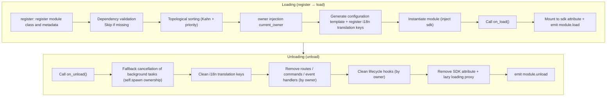
```mermaid
flowchart TD
    subgraph Load["Loading (register → load)"]
        L1["register: register module class and metadata"] --> L2["Dependency validation<br/>Skip if missing"]
        L2 --> L3["Topological sorting (Kahn + priority)"]
        L3 --> L4["owner injection current_owner"]
        L4 --> L5["Generate configuration template + register i18n translation keys"]
        L5 --> L6["Instantiate module (inject sdk)"]
        L6 --> L7["Call on_load()"]
        L7 --> L8["Mount to sdk attribute + emit module.load"]
    end

    subgraph Unload["Unloading (unload)"]
        U1["Call on_unload()"] --> U2["Fallback cancellation of background tasks (self.spawn ownership)"]
        U2 --> U3["Clean i18n translation keys"]
        U3 --> U4["Remove routes / commands / event handlers (by owner)"]
        U4 --> U5["Clean lifecycle hooks (by owner)"]
        U5 --> U6["Remove SDK attribute + lazy loading proxy"]
        U6 --> U7["emit module.unload"]
    end

    Load --> Unload
```

**What the framework does for you during loading** (you only need to write `on_load`, the rest is automatic):

| Stage | Framework automatically does |
|-------|------------------------------|
| owner injection | Wrap module name with `owner_scope` during instantiation — commands/events/hooks/background tasks registered in `on_load` are **automatically assigned to this module** and cleaned up in one click when unloaded |
| configuration template | For modules declaring `ConfigClass`, the framework automatically generates/fills the `ErisPulse.<ModuleName>` configuration section |
| i18n translation keys | For modules declaring `I18nClass`, translation keys are automatically registered (automatically unregistered on unload) |
| dependency topology | Sort by `depends` declaration to ensure dependent modules load first; circular dependencies are rejected with `RuntimeError` |
| SDK mounting | After instantiation, mount to `sdk.<ModuleName>`, allowing access via `sdk.MyModule.xxx` |

**What the framework cleans up for you during unloading** (corresponding to U1→U7 above): After `on_unload` completes, it performs fallback cleanup — background tasks are forcibly cancelled (created via `self.spawn`, graceful shutdown should be handled manually in `on_unload`), i18n keys, routes, commands/event handlers, lifecycle hooks, and finally removes the SDK attribute. `purge=True` additionally deletes registration stubs and cleans `sys.modules`.

> This automatic cleanup is the foundation for "you only need to write `on_load`/`on_unload`, no need to manually unregister" — the framework uses owner assignment to make "who registers, who cleans" a one-click process.

## SDK Objects

### Accessing Core Modules

```python
from ErisPulse import sdk

# Access all core modules through the sdk object
sdk.logger.info("Log")
sdk.storage.set("key", "value")
config = sdk.config.getConfig("MyModule")
```

### Inter-module Communication

```python
# Access other modules
other_module = sdk.OtherModule
result = await other_module.some_method()

## Adapter Send Method Query

Due to the new standard specifications requiring the use of the `__getattr__` method rewrite to implement the fallback send mechanism, it is no longer possible to use the `hasattr` method to check for the existence of methods. Starting from `2.3.5`, a function to query send methods has been added.

### List Supported Send Methods

```python
# List all send methods supported by the platform
methods = sdk.adapter.list_sends("onebot11")
# Returns: ["Text", "Image", "Voice", "Markdown", ...]
```

### Get Method Details

```python
# Get detailed information about a specific method
info = sdk.adapter.send_info("onebot11", "Text")
# Returns:
# {
#     "name": "Text",
#     "parameters": [
#         {"name": "text", "type": "str", "default": null, "annotation": "str"}
#     ],
#     "return_type": "Awaitable[Any]",
#     "docstring": "Send text message..."
# }

## Configuration Management

### Declarative Configuration (Recommended)

Starting from v2.5.2, modules can declare configuration classes using `ConfigClass`, which integrates with the adapter's configuration Schema system. Configuration is read in real-time via `self.cfg`, and changes take effect immediately:

```python
from dataclasses import dataclass, field
from ErisPulse.Core.Bases import BaseModule
from ErisPulse.Core.Bases import BaseConfig

@dataclass
class MyModuleConfig(BaseConfig):
    api_key: str = field(
        default="",
        metadata={
            "description": {"i18n": "my_module.api_key", "default": "API Key"},
            "required": True,
            "secret": True,
            "ui": {"widget": "password", "group": "basic", "order": 1},
        },
    )
    timeout: int = field(
        default=30,
        metadata={
            "description": {"i18n": "my_module.timeout", "default": "Timeout (seconds)"},
            "ui": {"widget": "number", "group": "advanced", "order": 2},
        },
    )

class MyModule(BaseModule):
    ConfigClass = MyModuleConfig

    def __init__(self, sdk):
        self.sdk = sdk
        self.logger = sdk.logger.get_child("MyModule")

    async def on_load(self, event):
        self.logger.info("Module loaded")

    async def on_unload(self, event):
        pass

    async def do_something(self):
        cfg = self.cfg  # Real-time reading, type-safe
        api_key = cfg.api_key
        timeout = cfg.timeout
```

`BaseConfig` is a generic configuration base class suitable for adapters, modules, external projects, and any scenario. Configuration fields support i18n multilingual descriptions (see [i18n documentation](../../advanced/i18n.md#multilingual-configuration-field-descriptions)).

### Declarative Translation Keys (v2.7.0+)

Starting from v2.7.0, modules can also declare translation keys through a nested class `I18nClass`, similar to declaring `ConfigClass`. The framework automatically registers all declared translation keys during loading, eliminating the need for manual `i18n.register()`. Registration occurs before configuration template generation, ensuring that referenced i18n keys are available in configuration descriptions.

```python
from ErisPulse.Core.Bases import BaseConfig, BaseI18n, I18nKey

class MyModule(BaseModule):
    # Configuration class (optional)
    @dataclass
    class ConfigClass(BaseConfig):
        welcome_msg: str = field(
            default="Welcome",
            metadata={
                "description": {"i18n": "mymodule.welcome_msg", "default": "Welcome message"},
            },
        )

    # Translation key collection class (optional)
    class I18nClass(BaseI18n):
        # Property names are automatically concatenated into full key paths: <module name>.<property name>
        welcome_msg: I18nKey = I18nKey(
            default="Welcome Message",   # Fallback for language-agnostic use
            zh_CN="欢迎消息",
            zh_TW="歡迎訊息",
            en="Welcome Message",
            ja="ウェルカムメッセージ",
            ru="Приветственное сообщение",
        )
        hello: I18nKey = I18nKey(
            default="Hello, {name}!",
            zh_CN="你好，{name}！",
            zh_TW="你好，{name}！",
            en="Hello, {name}!",
            ja="こんにちは、{name}！",
            ru="Привет, {name}!",
        )
```

See more details in [Recommended i18n Usage](../../advanced/i18n.md#recommended-usage-declaring-translation-keys-via-i18nclass-v270).

### Manual Configuration Reading (Deprecated)

> **Deprecated**: Please use [Declarative Configuration](#declarative-configuration-recommended) + real-time reading via `self.cfg`.

```python
class MyModule(BaseModule):
    def __init__(self, sdk):
        self.sdk = sdk

    def _load_config(self):
        config = self.sdk.config.getConfig("MyModule")
        if not config:
            self.sdk.config.setConfig("MyModule", {"api_key": "", "timeout": 30})
            return {"api_key": "", "timeout": 30}
        return config
```

Please return the complete translated Markdown content without any additional text.

## Storage System

### Basic Usage

```python
# Store data
sdk.storage.set("user:123", {"name": "Zhang San"})

# Retrieve data
user = sdk.storage.get("user:123", {})

# Delete data
sdk.storage.delete("user:123")
```

### Transaction Usage

```python
# Use transaction to ensure data consistency
with sdk.storage.transaction():
    sdk.storage.set("key1", "value1")
    sdk.storage.set("key2", "value2")
    # If any operation fails, all changes will be rolled back

## Event Handling

### Event Handler Registration

```python
from ErisPulse.Core.Event import command, message

# Register command
@command("info", help="Get information")
async def info_handler(event):
    await event.reply("This is information")

# Register message handler
@message.on_group_message()
async def group_handler(event):
    sdk.logger.info(f"Received group message: {event.get_text()}")
```

### Event Handler Lifecycle

The framework automatically manages the registration and unregistration of event handlers; you only need to register them in `on_load`.

## Lazy Loading Mechanism

### How It Works

```python
# Module is initialized only when first accessed
result = await sdk.my_module.some_method()
# ↑ This triggers module initialization
```

### Immediate Load

For modules that need to be initialized immediately (e.g., listeners, timers):

```python
@staticmethod
def get_load_strategy():
    return ModuleLoadStrategy(
        lazy_load=False,  # Load immediately
        priority=100
    )

## Error Handling

### Exception Handling

```python
async def handle_event(self, event):
    try:
        # Business logic
        await self.process_event(event)
    except ValueError as e:
        self.logger.warning(f"Parameter error: {e}")
        await event.reply(f"Parameter error: {e}")
    except Exception as e:
        self.logger.error(f"Processing failed: {e}")
        raise
```

### Logging

```python
# Use different log levels
self.logger.debug("Debug info")    # Detailed debug information
self.logger.info("Running status")      # Normal running information
self.logger.warning("Warning info")  # Warning information
self.logger.error("Error info")    # Error information
self.logger.critical("Fatal error") # Fatal error


### Event 包装类详解

# Event Wrapper Class Details

The Event module provides a powerful Event wrapper class that simplifies event handling.

Please directly return the complete translated Markdown content without including any other text.

Once again, please note: If the document contains a language switch line (a line with language names separated by `` | ``), strictly adhere to the format requirements in point 8 above and do not write incorrect formats such as ``[**Label**](file)``.

## Core Features

- **Full Dictionary Compatibility**: Event inherits from dict
- **Convenient Methods**: Provides a large number of convenient methods
- **Dot-style Access**: Supports accessing event fields using dot notation
- **Backward Compatibility**: All methods are optional

Please directly return the complete translated Markdown content without any additional text.

## Core Field Methods

```python
from ErisPulse.Core.Event import command

@command("info")
async def info_command(event):
    event_id = event.get_id()
    platform = event.get_platform()
    time = event.get_time()
    print(f"ID: {event_id}, Platform: {platform}, Time: {time}")
```

7. **Important: Path Replacement Rules**
   - Replace `docs/en/` in document links with `docs/en/`
   - For example: `docs/en/quick-start.md` should be changed to `docs/en/quick-start.md`
   - For links pointing to non-current language version files (such as `README.xx.md` format links), keep them unchanged
   - This ensures that links point to the correct language version of the document

## Message Event Methods

```python
from ErisPulse.Core.Event import message

@message.on_private_message()
async def private_handler(event):
    text = event.get_text()
    user_id = event.get_user_id()
    nickname = event.get_user_nickname()
    await event.reply(f"Hello, {nickname}!")
```

7. **Important: Path Replacement Rules**
   - Replace `docs/en/` in document links with `docs/en/`
   - For example: `docs/en/quick-start.md` should be changed to `docs/en/quick-start.md`
   - For links pointing to non-current language version files (e.g., `README.xx.md`), keep them unchanged
   - This ensures links point to the correct language version of the documentation

## Message Type Detection

```python
from ErisPulse.Core.Event import message

@message.on_group_message()
async def group_handler(event):
    is_private = event.is_private_message()
    is_group = event.is_group_message()
    is_at = event.is_at_message()
    await event.reply(f"Type: {'Private Chat' if is_private else 'Group Chat'}")
```

7. **Important: Path Replacement Rule**
   - Replace `docs/en/` in document links with `docs/en/`
   - For example: `docs/en/quick-start.md` should be changed to `docs/en/quick-start.md`
   - For links pointing to non-current language version files (such as `README.xx.md`), keep them unchanged
   - This ensures links point to the correct language version of the document

## Reply Function

```python
from ErisPulse.Core.Event import command

@command("ask")
async def ask_command(event):
    await event.reply("Please enter your name:")
    reply = await event.wait_reply(timeout=30)
    if reply:
        name = reply.get_text()
        await event.reply(f"Hello, {name}!")
```

Please directly return the complete translated Markdown content, without including any other text.

Once again, if the document contains a language switching line (with each language name separated by `` | ``), be sure to strictly follow the format requirements in item 8 above, and do not write incorrect formats such as ``[**Label**](file)``.

## Command Information Retrieval

```python
from ErisPulse.Core.Event import command

@command("cmdinfo")
async def cmdinfo_command(event):
    cmd_name = event.get_command_name()
    cmd_args = event.get_command_args()
    await event.reply(f"Command: {cmd_name}, Arguments: {cmd_args}")
```

[**English**](docs/en/command-info.md)

## Notification Event Method

```python
from ErisPulse.Core.Event import notice

@notice.on_friend_add()
async def friend_add_handler(event):
    await event.reply("Welcome to add me as a friend!")
```

Please directly return the complete translated Markdown content without any additional text.

Once again, if the document contains a language switch line (with each language name separated by `` | ``), strictly follow the format requirement in item 8 above and do not write incorrect formats such as ``[**Label**](file)``.

# Method Quick Reference

### Core Methods

#### Event Basic Information
- `get_id()` - Get event ID
- `get_time()` - Get event timestamp (Unix seconds)
- `get_type()` - Get event type (message/notice/request/meta)
- `get_detail_type()` - Get detailed event type (private/group/friend, etc.)
- `get_platform()` - Get platform name

#### Bot Information
- `get_self_platform()` - Get bot platform name
- `get_self_user_id()` - Get bot user ID
- `get_self_account_id()` - Get bot account ID (multi-Bot mode)
- `get_self_info()` - Get complete bot information dictionary

#### Session Identifiers
- `get_target_id()` - Get unified target ID (returns `group_id` for group chat, `channel_id` for channel, `user_id` for private chat; returns first non-empty value in order: group → channel → guild → thread → user)
- `get_session_id()` - Get unique session identifier, format: `{platform}:{detail_type}:{target_id}`

### Message Event Methods

#### Message Content
- `get_message()` - Get message segment array (OneBot12 format)
- `get_alt_message()` - Get alternative message text
- `get_text()` - Get plain text content (`get_alt_message()` alias)
- `get_message_text()` - Get plain text content (`get_alt_message()` alias)

#### Sender Information
- `get_user_id()` - Get sender user ID
- `get_user_nickname()` - Get sender nickname
- `get_sender()` - Get sender complete information dictionary

#### Group/Channel Information
- `get_group_id()` - Get group ID (group chat message)
- `get_channel_id()` - Get channel ID (channel message)
- `get_guild_id()` - Get server ID (server message)
- `get_thread_id()` - Get topic/subchannel ID (topic message)

#### @Message Related
- `has_mention()` - Whether message contains @bot
- `get_mentions()` - Get list of all mentioned user IDs

### Message Type Detection

#### Basic Detection
- `is_message()` - Whether event is a message event
- `is_private_message()` - Whether event is a private message
- `is_group_message()` - Whether event is a group message
- `is_at_message()` - Whether event is an @message (`has_mention()` alias)

### Notification Event Methods

#### Notification Operator
- `get_operator_id()` - Get operator ID
- `get_operator_nickname()` - Get operator nickname

#### Notification Type Detection
- `is_notice()` - Whether event is a notification event
- `is_group_member_increase()` - Group member increase event
- `is_group_member_decrease()` - Group member decrease event
- `is_friend_add()` - Friend add event (matches `detail_type == "friend_increase"`)
- `is_friend_delete()` - Friend delete event (matches `detail_type == "friend_decrease"`)

### Request Event Methods

#### Request Information
- `get_comment()` - Get request comment

#### Request Type Detection
- `is_request()` - Whether event is a request event
- `is_friend_request()` - Whether event is a friend request
- `is_group_request()` - Whether event is a group request

### Reply Functionality

#### Basic Reply
- `reply(content, method="Text", at_sender=False, quote=False, at_users=None, reply_to=None, at_all=False, via=None, **kwargs)` - General reply method
  - `content`: Content to send (text, URL, etc.)
  - `method`: Sending method, default "Text", options include "Image"/"Voice"/"Video"/"File", etc.
  - `at_sender`: Whether to @ sender (auto-extract user_id)
  - `quote`: Whether to quote reply current message (auto-extract message_id)
  - `at_users`: List of users to @, e.g., `["user1", "user2"]`
  - `reply_to`: Manually specify message ID to reply to
  - `at_all`: Whether to @ all members
  - `**kwargs`: Additional parameters (e.g., user_id for Mention method)

- `reply_ob12(message)` - Reply using OneBot12 message segments
  - `message`: OneBot12 message segment list or dictionary, can be built with MessageBuilder

#### Platform Capability Query
- `supports(method)` - Check if current platform supports a sending method (e.g., `"Image"`, `"Voice"`), returns `bool`
- `available_methods()` - List all available sending methods on current platform, returns list of method names

#### Forward Functionality

> **Note**: Forward functionality requires implementation through the adapter's Send DSL; the Event wrapper class itself does not provide a direct forward method.

```python
# Forward message to group
adapter = sdk.adapter.get(event.get_platform())
target_id = event.get_group_id()  # or specify other group ID
await adapter.Send.To("group", target_id).Text(event.get_text())
```

### Wait Reply Functionality

- `wait_reply(prompt=None, timeout=60.0, callback=None, validator=None, method="Text")` - Wait for user reply
  - `prompt`: Prompt message, if provided will be sent to user
  - `timeout`: Timeout duration (seconds), default 60 seconds
  - `callback`: Callback function, executed when reply is received
  - `validator`: Validation function, used to verify if reply is valid
  - `method`: Sending method for prompt, default "Text"
  - Returns Event object of user reply, returns None on timeout

#### Interactive Methods

- `confirm(prompt=None, timeout=60.0, yes_words=None, no_words=None, method="Text", hint=False)` - Confirmation dialog
  - Returns `True` (confirmed) / `False` (denied) / `None` (timeout)
  - Built-in Chinese/English confirmation words auto-detection, customizable word sets
  - `method`: Sending method, default "Text"; supports "Image"/"Markdown" and other non-text methods for sending prompt
  - `hint`: Whether to automatically append confirmation word prompt at the end of the prompt (e.g., "（是/否）"), default False

- `choose(prompt, options, timeout=60.0, method="Text", options_format="auto", merge_prompt=False, placeholder="{options}")` - Selection menu
  - `options`: List of option text
  - Returns option index (0-based), returns `None` on timeout
  - `method`: Sending method, default "Text"; text-based methods (Text/Markdown/md/Html/h5) automatically merge options to the end
  - `options_format`: Option format (default: "auto", automatically selects built-in style based on method)
    - `"auto"`: Markdown→unordered list (`- 1. Option`), Html→ordered list (`<ol>`), others→plain text list
    - `"list"`: One per line, e.g., ``1. Option A\n2. Option B``
    - `"inline"`: Display in single line, e.g., ``1.A | 2.B``
    - `"md"`: Markdown unordered list
    - `"html"`: Html ordered list
    - `callable`: Custom function, receives ``list[str]`` and returns ``str``
  - `merge_prompt`: Whether to forcibly merge into a single message, default False
    - `False` (default): Text-based methods automatically merge; non-text methods send prompt first then Text options
    - `True`: Regardless of method, always merge into a single message, sent using the specified method
  - `placeholder`: Option insertion placeholder, default `{options}`; the position in prompt containing this marker is replaced with option text, setting to empty string appends to the end always

- `collect(fields, timeout_per_field=60.0)` - Form collection
  - `fields`: Field list, each item contains `key`, `prompt`, optional `validator`, optional `method`
  - Returns `{key: value}` dictionary, returns `None` if any field times out
  - Each field supports `method` key to specify sending method, e.g., collecting image with `{"key": "avatar", "prompt": "Please send avatar", "method": "Image"}`
  - Each field can optionally have `options` key (list), when provided, this field becomes a multiple-choice question (automatically calls choose logic)
  - Each field can optionally have `options_format`, `merge_prompt`, `placeholder` keys, controlling option format, message merging behavior, and placeholder

- `wait_for(event_type="message", condition=None, timeout=60.0)` - Wait for any event
  - `condition`: Filter function, returns `True` when matched
  - Returns matched Event object, returns `None` on timeout

- `conversation(timeout=60.0)` - Create multi-turn conversation context
  - Returns `Conversation` object, supports `say()`/`wait()`/`confirm()`/`choose()`/`collect()`/`stop()`
  - `is_active` attribute indicates whether conversation is active

#### Interactive Method Examples

**confirm() - Confirmation dialog:**

```python
@command("delete", help="Delete data")
async def delete_handler(event):
    if await event.confirm("Are you sure you want to delete all data?"):
        sdk.storage.delete("all_data")
        await event.reply("Data has been deleted")
    else:
        await event.reply("Cancelled")
```

**confirm() - With prompt words:**

```python
# hint=True will append "（是/否）" at the end of the prompt
if await event.confirm("Continue?", hint=True):
    await event.reply("Continued")
# User sees: Continue?（是/否）
```

**choose() - Selection menu:**

```python
@command("color", help="Choose color")
async def color_handler(event):
    choice = await event.choose("Please choose a color:", ["Red", "Green", "Blue"])
    if choice is not None:
        colors = ["Red", "Green", "Blue"]
        await event.reply(f"You chose: {colors[choice]}")
```

**choose() - Option formatting and message merging:**

```python
# inline format: options displayed in the same line
choice = await event.choose("Please choose:", ["A", "B", "C"], options_format="inline")
# Output: 1.A | 2.B | 3.C

# Custom format
choice = await event.choose("Please choose:", ["Cat", "Dog"],
    options_format=lambda opts: " / ".join(opts))
# Output: Cat / Dog

# options_format="auto" (default): automatically selects built-in style based on method
# Markdown → unordered list
choice = await event.choose(
    "## Please choose", ["Cat", "Dog"],
    method="Markdown",  # auto recognizes as md list
)
# Output:
# ## Please choose
# - 1. Cat
# - 2. Dog

# Html → ordered list
choice = await event.choose(
    "<h2>Please choose</h2>", ["Cat", "Dog"],
    method="Html", merge_prompt=True,  # auto recognizes as html list
)
# Output:
# <h2>Please choose</h2>
# <ol><li>1. Cat</li><li>2. Dog</li></ol>

# Merge mode + placeholder
choice = await event.choose(
    "## Please choose\n{options}\nPlease reply with number",
    ["Cat", "Dog"],
    method="Markdown", merge_prompt=True,
)

# Custom placeholder
choice = await event.choose(
    "Choose: [choices]",
    ["Cat", "Dog"],
    placeholder="[choices]",
)
```

**collect() - Form collection:**

```python
@command("register", help="Register")
async def register_handler(event):
    data = await event.collect([
        {"key": "name", "prompt": "Please enter your name:"},
        {"key": "age", "prompt": "Please enter your age:",
         "validator": lambda e: e.get_text().isdigit()},
    ])
    if data:
        await event.reply(f"Registration successful! {data['name']}, {data['age']} years old")
```

**Non-Text Method Reply:**

```python
await event.reply("http://example.com/img.jpg", method="Image")
await event.reply("http://example.com/audio.mp3", method="Voice")

from ErisPulse.Core.Event import MessageBuilder
segments = MessageBuilder.text("Look at this image:").image("http://example.com/img.jpg").build()
await event.reply_ob12(segments)
```

> For complete conversation multi-turn dialogue usage, refer to [Conversation Multi-Turn Dialogue](../../advanced/conversation.md).

### Command Information

#### Command Basics
- `get_command_name()` - Get command name
- `get_command_args()` - Get command argument list
- `get_command_raw()` - Get raw command text
- `get_command_info()` - Get complete command information dictionary
- `is_command()` - Whether event is a command

### Raw Data

- `get_raw()` - Get raw platform event data
- `get_raw_type()` - Get raw platform event type

### Platform Extension Methods

Adapters can register platform-specific methods for the Event wrapper class. Methods are only available on Event instances of the corresponding platform; accessing them on other platforms raises `AttributeError`.

Platform methods take precedence over built-in methods via `Event.__getattribute__`, allowing overwriting of built-in interactive methods like `confirm`, `choose`, `collect`, `wait_reply` to provide platform-specific implementations (e.g., buttons, cards). Built-in implementations are exported as `_builtin_*` functions for overwriting.

```python
# Email event - only email methods
event = Event({"platform": "email", "email_raw": {"subject": "Hello"}})
event.get_subject()      # ✅ Returns "Hello"
event.get_chat_type()    # ❌ AttributeError

# Telegram event - only Telegram methods
event = Event({"platform": "telegram", "telegram_raw": {"chat": {"type": "private"}}})
event.get_chat_type()    # ✅ Returns "private"
event.get_subject()      # ❌ AttributeError

# Built-in methods always available
event.get_text()         # ✅ Any platform
event.reply("hi")        # ✅ Any platform
```

### Query Registered Methods

```python
from ErisPulse.Core.Event import get_platform_event_methods

methods = get_platform_event_methods("email")
# ["get_subject", "get_from", ...]
```

### `hasattr` and `dir` Support

```python
hasattr(event, "get_subject")   # Returns True only when platform="email"
"get_subject" in dir(event)     # Same as above
```

### Cross-Platform Extension (Wildcard)

`register_event_method` and `register_event_mixin` support passing `"*"` as platform name, making registered methods available on Event instances of **all platforms**. Suitable for features requiring cross-platform reuse, such as AI dialogue, context management.

```python
from ErisPulse.Core.Event.wrapper import register_event_method

@register_event_method("*")
async def ai_chat(self, prompt: str):
    # self is Event instance, can access event data and built-in methods
    await self.reply(f"AI: {prompt}")
```

After registration, any platform's event handler can call `event.ai_chat(...)`.

Method resolution priority (from high to low): platform-specific methods → wildcard methods → built-in methods → dictionary key access.

> For adapter developers registering extension methods, refer to [Event System API - Cross-Platform Extension (Wildcard)](../../api-reference/event-system.md#跨平台扩展通配符).


### 模块开发最佳实践

# Module Development Best Practices

This document provides best practice recommendations for ErisPulse module development.

## Module Design

### 1. Single Responsibility Principle

Each module should only be responsible for one core function:

```python
# Good design: Each module is responsible for only one feature
class WeatherModule(BaseModule):
    """Weather query module"""
    pass

class NewsModule(BaseModule):
    """News query module"""
    pass

# Bad design: One module responsible for multiple unrelated functions
class UtilityModule(BaseModule):
    """Contains multiple features like weather, news, jokes, etc."""
    pass
```

### 2. Module Naming Convention

```toml
[project]
name = "ErisPulse-ModuleName"  # Use ErisPulse- prefix
```

### 3. Clear Configuration Management

Declarative configuration (`ConfigClass` + `BaseConfig`) is recommended to obtain capabilities such as type safety, automatic template generation, WebUI form support, etc.:

```python
from dataclasses import dataclass, field
from ErisPulse.Core.Bases import BaseConfig

@dataclass
class MyModuleConfig(BaseConfig):
    api_url: str = field(default="https://api.example.com", metadata={
        "description": {"i18n": "my_module.api_url", "default": "API Address"},
    })
    timeout: int = field(default=30, metadata={
        "description": {"i18n": "my_module.timeout", "default": "Timeout (seconds)"},
    })
    cache_ttl: int = field(default=3600, metadata={
        "description": {"i18n": "my_module.cache_ttl", "default": "Cache TTL (seconds)"},
    })

class MyModule(BaseModule):
    ConfigClass = MyModuleConfig

    async def do_something(self):
        cfg = self.cfg  # Type-safe, reads in real-time
        await self._fetch(cfg.api_url, timeout=cfg.timeout)
```

You can also continue to use manual ways to read and write configuration storage (see [Module Core Concepts](core-concepts.md#Configuration Management)).

### Declarative Translation Keys (v2.7.0+)

Modules can declare translation keys centrally through `I18nClass`, and the framework automatically registers them to the i18n system without manually calling `i18n.register()`.

```python
from ErisPulse.Core.Bases import BaseI18n, I18nKey

class MyModule(BaseModule):
    class I18nClass(BaseI18n):
        # Business translation keys with placeholders
        welcome: I18nKey = I18nKey(
            default="Welcome, {name}!",
            zh_CN="欢迎你，{name}！",
            zh_TW="歡迎你，{name}！",
            en="Welcome, {name}!",
            ja="ようこそ、{name}！",
            ru="Добро пожаловать, {name}!",
        )
        # Translation for configuration field descriptions
        api_url: I18nKey = I18nKey(
            default="API URL",
            zh_CN="API 地址",
            zh_TW="API 位址",
            en="API URL",
            ja="API URL",
            ru="API URL",
        )
```

For detailed usage, please see [i18n documentation](../../advanced/i18n.md#Recommended Approach Declare Translation Keys via I18nClass v270).

## Asynchronous Programming

### 1. Using Asynchronous Libraries

```python
# Recommended to use the SDK's built-in HTTP client (asynchronous, with automatic logging and statistics)
from ErisPulse.Core import client

class MyModule(BaseModule):
    async def fetch_data(self, url):
        resp = await client.get(url)
        return await resp.json()

# Alternatively, you can use sdk.client (same effect)
from ErisPulse import sdk

class MyModule(BaseModule):
    async def fetch_data(self, url):
        resp = await sdk.client.get(url)
        return await resp.json()

# Do not directly import aiohttp (not convenient for unified framework management)
import aiohttp

class MyModule(BaseModule):
    async def fetch_data(self, url):
        async with aiohttp.ClientSession() as session:
            async with session.get(url) as response:
                return await response.json()

# Do not use requests (synchronous, blocks the event loop)
import requests

class MyModule(BaseModule):
    def fetch_data(self, url):
        return requests.get(url).json()  # blocks the event loop
```

### 2. Correct Asynchronous Operations

```python
async def handle_command(self, event):
    # Time-consuming operations that require waiting for results: directly await (clear lifecycle)
    result = await self._long_operation()

async def on_load(self, event):
    # Background tasks (polling/timed/fire-and-forget): use self.spawn(),
    # the framework cancels them after on_unload when the module is unloaded, avoiding holding self and causing leaks
    self.spawn(self._poll())
```

> [!NOTE]  
> Background tasks are recommended to use `self.spawn()` (ErisPulse **2.8.0+**), rather than `asyncio.create_task`—the raw tasks created by the latter do not belong to the module, and will not be automatically cleaned up during unloading, causing the module instance to be unable to be reclaimed due to holding a reference to `self` (hot reload leak). See [Lifecycle Management](../../advanced/lifecycle.md#background-task-ownership-and-automatic-cancellation).

### 3. Resource Management

```python
async def on_load(self, event):
    # The SDK client automatically manages the connection pool, no need to manually create a session
    pass

async def on_unload(self, event):
    # If a custom client is needed, remember to clean up resources
    pass

## Event Handling

### 1. Using Event Wrapper Classes

```python
# Convenient method using Event wrapper class
@command("info")
async def info_command(event):
    user_id = event.get_user_id()
    nickname = event.get_user_nickname()
    await event.reply(f"Hello, {nickname}!")

# Instead of directly accessing the dictionary
@command("info")
async def info_command(event):
    user_id = event["user_id"]  # Less clear, prone to errors
```

### 2. Reasonable Use of Lazy Loading

```python
# Infrequent command module: declare activate_on trigger, automatically activates on first matching command (maintains lazy loading)
class CommandModule(BaseModule):
    @staticmethod
    def get_load_strategy():
        return ModuleLoadStrategy(lazy_load=True, activate_on=[
            {"command": {"name": "dice", "help": "Roll a dice", "aliases": ["d"]}},
        ])

# Infrequent listener module: declare event trigger, automatically activates when event arrives
class ListenerModule(BaseModule):
    @staticmethod
    def get_load_strategy():
        return ModuleLoadStrategy(lazy_load=True, activate_on=[
            {"notice": "group_member_increase"},
        ])

# Modules with high-frequency triggers (process every message) or those that must be ready at startup: load immediately
class HotListenerModule(BaseModule):
    @staticmethod
    def get_load_strategy():
        return ModuleLoadStrategy(lazy_load=False)

# Utility modules are suitable for lazy loading
class UtilityModule(BaseModule):
    @staticmethod
    def get_load_strategy():
        return ModuleLoadStrategy(lazy_load=True)
```

> For the complete syntax of `activate_on` (event three-form / command shorthand and dict declaration / help fallback chain), see  
> [Lazy-Loading Module System](../../advanced/lazy-loading.md#event-driven-lazy-activation-activate_on).

### 3. Event Handler Registration

```python
async def on_load(self, event):
    # Register event handlers in on_load
    @command("hello")
    async def hello_handler(event):
        await event.reply("Hello!")
    
    @message.on_group_message()
    async def group_handler(event):
        self.logger.info("Received group message")
    
    # No need to manually deregister, the framework handles it automatically

## Error Handling

### 1. Categorized Exception Handling

```python
async def handle_event(self, event):
    try:
        result = await self._process(event)
    except ValueError as e:
        # Expected business errors
        self.logger.warning(f"Business warning: {e}")
        await event.reply(f"Parameter error: {e}")
    except aiohttp.ClientError as e:
        # Network errors (It is recommended to use sdk.client + ClientError instead)
        # Old code using aiohttp directly still works, but new code recommends using the ErisPulse exception system
        self.logger.error(f"Network error: {e}")
        await event.reply("Network request failed, please try again later")
    except Exception as e:
        # Unexpected errors
        self.logger.error(f"Unknown error: {e}", exc_info=True)
        await event.reply("Processing failed, please contact the administrator")
        raise
```

### 2. Timeout Handling

```python
# It is recommended to use the SDK built-in client (which comes with timeout and retry logic)
from ErisPulse.Core import client
from ErisPulse.Core.Bases.errors import ClientTimeoutError

async def fetch_with_timeout(self, url, timeout=30):
    try:
        resp = await client.get(url, timeout=timeout)
        return await resp.json()
    except ClientTimeoutError:
        self.logger.warning(f"Request timeout: {url}")
        raise

## Storage System

### 1. Using Transactions

```python
# Use transactions to ensure data consistency
async def update_user(self, user_id, data):
    with self.sdk.storage.transaction():
        self.sdk.storage.set(f"user:{user_id}:profile", data["profile"])
        self.sdk.storage.set(f"user:{user_id}:settings", data["settings"])

# ❌ Not using transactions may lead to data inconsistency
async def update_user(self, user_id, data):
    self.sdk.storage.set(f"user:{user_id}:profile", data["profile"])
    # If an error occurs here, the previous setting cannot be rolled back
    self.sdk.storage.set(f"user:{user_id}:settings", data["settings"])
```

### 2. Batch Operations

```python
# Use batch operations to improve performance
def cache_multiple_items(self, items):
    self.sdk.storage.set_multi({
        f"item:{k}": v for k, v in items.items()
    })

# ❌ Multiple calls are inefficient
def cache_multiple_items(self, items):
    for k, v in items.items():
        self.sdk.storage.set(f"item:{k}", v)

## Logging

### 1. Use Log Levels Appropriately

```python
# DEBUG: Detailed debug information (only for development)
self.logger.debug(f"Input parameters: {params}")

# INFO: Normal operation information
self.logger.info("Module loaded")
self.logger.info(f"Processing request: {request_id}")

# WARNING: Warning messages, do not affect main functionality
self.logger.warning(f"Configuration item {key} not set, using default value")
self.logger.warning("API response slow, may need optimization")

# ERROR: Error messages
self.logger.error(f"API request failed: {e}")
self.logger.error(f"Event processing failed: {e}", exc_info=True)

# CRITICAL: Fatal error, requires immediate handling
self.logger.critical("Database connection failed, bot cannot run normally")
```

### 2. Structured Logging

```python
# Use structured logging for easier parsing
self.logger.info(f"Processing request: request_id={request_id}, user_id={user_id}, duration={duration}ms")

# ❌ Using non-structured logging
self.logger.info(f"Processed request, from user {user_id}, took {duration} ms")

## Performance Optimization

### 1. Use Caching

```python
class MyModule(BaseModule):
    def __init__(self):
        self._cache = {}
        self._cache_lock = asyncio.Lock()
    
    async def get_data(self, key):
        async with self._cache_lock:
            if key in self._cache:
                return self._cache[key]
            
            # Fetch from database
            data = await self._fetch_from_db(key)
            
            # Cache data
            self._cache[key] = data
            return data
```

### 2. Avoid Blocking Operations

```python
# Use async operations
async def process_message(self, event):
    # Async processing
    await self._async_process(event)

# ❌ Blocking operation
async def process_message(self, event):
    # Synchronous operation, blocks event loop
    result = self._sync_process(event)

## Security

### 1. Sensitive Data Protection

```python
# Sensitive data is stored in the configuration (declarative ConfigClass, secret fields do not appear in logs/export)
from dataclasses import dataclass, field
from ErisPulse.Core.Bases import BaseModule, BaseConfig

@dataclass
class MyModuleConfig(BaseConfig):
    api_key: str = field(
        default="",
        metadata={"description": "API Key", "secret": True},
    )

class MyModule(BaseModule):
    ConfigClass = MyModuleConfig

    def check_api_key(self):
        if not self.cfg.api_key or self.cfg.api_key == "YOUR_API_KEY_HERE":
            raise ValueError("Please configure a valid API Key in config.toml")

# ❌ Hardcoded sensitive data
class MyModule(BaseModule):
    API_KEY = "sk-1234567890"  # Do not do this!
```

### 2. Input Validation

```python
# Validate user input
async def process_command(self, event):
    user_input = event.get_text()
    
    # Validate input length
    if len(user_input) > 1000:
        await event.reply("Input too long, please re-enter")
        return
    
    # Validate input format
    if not re.match(r'^[a-zA-Z0-9]+$', user_input):
        await event.reply("Invalid input format")
        return

## Testing

### 1. Unit Tests

```python
import pytest
from ErisPulse.Core.Bases import BaseModule

class TestMyModule:
    def test_config_defaults(self):
        """Test configuration default values"""
        config = MyModule.ConfigClass()
        assert config.timeout == 30
```

### 2. Integration Tests

```python
@pytest.mark.asyncio
async def test_command_handling():
    """Test command handling"""
    module = MyModule()
    await module.on_load({})
    
    # Simulate command event
    event = create_test_command_event("hello")
    await module.handle_command(event)

## Deployment

### 1. Version Management

```toml
[project]
name = "ErisPulse-MyModule"
version = "1.0.0"
```

Follow semantic versioning:
- MAJOR.MINOR.PATCH
- Major version: Incompatible API changes
- Minor version: Backward-compatible feature additions
- Patch version: Backward-compatible bug fixes

### 2. README Header

The README generated by `epsdk create` already includes the ErisPulse header (Logo + badge row). Two recommended modes:

**Mode A — ErisPulse Logo Only (Default):**

```markdown
<div align="center">


# MyModule

**One-sentence description**

<p>
  <a href="https://pypi.org/project/ErisPulse-MyModule/"></a>
  <a href="https://pypi.org/project/ErisPulse-MyModule/"></a>
  <a href="./LICENSE"></a>
  <a href="https://github.com/ErisPulse/ErisPulse"></a>
</p>

</div>
```

**Mode B — Module Icon × ErisPulse Logo (When Custom Icon is Available):**

```markdown
<div align="center">


<span style="font-size:44px;color:#c8c8c8;margin:0 18px;vertical-align:middle;">×</span>


# MyModule
(Badge row same as above)
</div>
```

Badges such as GitHub Stars, Downloads, etc. can be added as needed. The logo can also be downloaded to the project locally (`.github/assets/ErisPulseLogo.png`) and referenced using a relative path.

Please directly return the complete translated Markdown content, without any additional text.

Once again, if the document contains a language switch row (with language names separated by `` | ``), strictly follow the format requirement in item 8 above, and do not write incorrect formats such as ``[**Label**](file)``.


=====
发布与工具
=====


### 发布模块到模块商店

# Publishing and Module Store Guide

Publish your developed module or adapter to the ErisPulse Module Store, allowing other users to easily discover and install it.

## Module Store Overview

The ErisPulse Module Store is a centralized module registry where users can browse, search, and install community-contributed modules and adapters through the CLI tool.

### Browsing and Discovery

```bash
# List all available packages remotely
epsdk list-remote

# Show only modules
epsdk list-remote -t modules

# Show only adapters
epsdk list-remote -t adapters

# Force refresh remote package list
epsdk list-remote -r
```

You can also browse the module store online at [ErisPulse official website](https://www.erisdev.com/#market).

### Supported Submission Types

| Type | Description | Entry-point Group |
|------|-------------|-------------------|
| Module | Extend bot functionality, implement business logic | `erispulse.module` |
| Adapter | Connect to new messaging platforms | `erispulse.adapter` |

## Quick Publishing

The entire process only requires three steps: configure the project → publish to PyPI → submit to the module store.

### 1. Configure pyproject.toml

Ensure the project directory contains `pyproject.toml` and `README.md`, and configure entry-points according to the type:

#### Module

```toml
[project]
name = "ErisPulse-MyModule"
version = "1.0.0"
description = "Module functionality description"
requires-python = ">=3.10"
license = { text = "MIT" }
authors = [ { name = "yourname" } ]
dependencies = [
    "ErisPulse>=2.0.0",
]

[project.entry-points."erispulse.module"]
"MyModule" = "MyModule:Main"
```

#### Adapter

```toml
[project]
name = "ErisPulse-MyAdapter"
version = "1.0.0"
description = "Adapter functionality description"
requires-python = ">=3.10"

[project.entry-points."erispulse.adapter"]
"myplatform" = "MyAdapter:MyAdapter"
```

> **Note**: It is recommended that package names start with `ErisPulse-` for easy identification by users. The entry-point key (e.g., `"MyModule"`) will serve as the module's access name in the SDK.

### 2. Publish to PyPI

```bash
# Build + Publish (requires PyPI account)
pip install build twine
python -m build
python -m twine upload dist/*
```

After successful publication, verify installation:

```bash
pip install ErisPulse-MyModule
```

### 3. Submit to Module Store

Go to [ErisPulse Module Store](https://www.erisdev.com/#market), click "Submit Module", log in, and fill in the module information.

Supported login methods: **GitHub**, **Codeberg**, **Yunhu**, choose any one.

Key points to fill in:
- Module name, description, repository address
- Minimum SDK version: If unsure, fill in the version number of the latest [ErisPulse release](https://pypi.org/project/ErisPulse/)

After submission, it takes effect immediately, and users can install via the module source. The module will be marked as "unverified", and after the maintainer's review, it will be changed to "verified".

> **About verification status**:
> - "Unverified" only means it has not yet been officially reviewed, not that the module has problems
> - When users install unverified modules via `epsdk install`, they will receive a risk warning and must confirm before continuing installation

### 4. Manage Published Modules

After clicking "Submit Module" and logging in on the module store, switch to the "My Modules" tab to:

- **Edit** — Modify module description, repository address, tags, etc. The version number will automatically sync from PyPI
- **Delete** — Remove the module from the module store (irreversible)

> Newly submitted modules may take a few minutes to appear in the "My Modules" list.

## Update Published Modules

1. Update the `version` in `pyproject.toml`
2. Rebuild and upload: `python -m build && python -m twine upload dist/*`
3. The module store will automatically sync the latest version from PyPI

Users can upgrade via `epsdk upgrade MyModule`.

## Pre-release Checklist

Before pushing to PyPI, please confirm the following items one by one:

### Code Quality

- [ ] All public APIs have type annotations (function signatures and return values)
- [ ] All public methods have docstrings (`"""..."""` format, including `:param` / `:return` / `:raises`)
- [ ] Passed `ruff check` (no warnings)
- [ ] Test coverage ≥ 80%
- [ ] Passed all `pytest` cases

### Compatibility

- [ ] `pyproject.toml` declares the minimum SDK version: `dependencies = ["ErisPulse>=x.y.z"]`
- [ ] Tested on Python 3.10 / 3.11 / 3.12 / 3.13
- [ ] Tested on target operating systems (Windows / Linux / macOS, if applicable)
- [ ] No circular import dependencies

### Configuration

- [ ] If using declarative configuration (`ConfigClass` + `BaseConfig` / `BotAccountConfig`), configuration fields have `description` (recommended i18n format) and `ui` metadata
- [ ] If i18n translation keys are registered, all 5 languages (zh-CN / zh-TW / en / ja / ru) are covered
- [ ] Sensitive fields are marked with `secret=True`

### Documentation

- [ ] `README.md` has installation instructions and basic usage examples
- [ ] `README.md` explains configuration methods (configuration file examples + environment variables)
- [ ] `CHANGELOG.md` records all changes
- [ ] Adapter updates platform feature documentation (supported Send types, event types, etc.)

### Publishing

- [ ] `pyproject.toml` version number has been updated
- [ ] Build passed: `python -m build`
- [ ] Pushed to PyPI: `python -m twine upload dist/*`
- [ ] Installation verified: `pip install ErisPulse-xxx && epsdk run`

## Development Mode Testing

Before formal release, you can test locally using editable mode:

```bash
epsdk install -e /path/to/MyModule
# or
pip install -e /path/to/MyModule
```

## Frequently Asked Questions

### Must package names start with `ErisPulse-`?

Not mandatory, but strongly recommended. This helps users identify ErisPulse ecosystem packages on PyPI.

### Can a package register multiple modules?

Yes. Configure multiple key-value pairs in `entry-points`:

```toml
[project.entry-points."erispulse.module"]
"ModuleA" = "MyPackage:ModuleA"
"ModuleB" = "MyPackage:ModuleB"
```

### How long does the review take?

Typically completed within 1-3 working days. You can check the verification status in the "My Modules" section of the module store.

## Distributing Applications via Docker Images

If your application is not suitable for publishing to PyPI (e.g., contains private dependencies or requires pre-configured environments), you can publish Docker images via **GitHub Container Registry (GHCR)**, allowing other users to start with one click using `docker pull`.

### Applicable Scenarios

- You have a **complete robot application** (module + configuration + entry script) and want to distribute it with one click
- Modules/adapters depend on **private packages** or have special installation processes, making them unsuitable for PyPI
- You want to provide an **out-of-the-box deployment solution**, lowering the barrier to user adoption

### 1. Create Dockerfile

Build based on the ErisPulse official image, just add your module:

```dockerfile
FROM erispulse/erispulse:latest

LABEL org.opencontainers.image.title="ErisPulse-MyModule" \
      org.opencontainers.image.description="Module description" \
      org.opencontainers.image.url="https://github.com/yourname/ErisPulse-MyModule" \
      org.opencontainers.image.source="https://github.com/yourname/ErisPulse-MyModule"

COPY pyproject.toml README.md ./
COPY MyModule/ ./MyModule/

RUN uv pip install --system -e .
```

If the module requires additional system dependencies (e.g., SSH client, etc.), add them after `RUN uv pip install`:

```dockerfile
RUN apt-get update && apt-get install -y --no-install-recommends \
    openssh-client \
    && rm -rf /var/lib/apt/lists/*
```

> `erispulse/erispulse:latest` already includes ErisPulse, ErisPulse-Dashboard, Python runtime, and uv, no need to install repeatedly.

### 2. Create GitHub Actions Workflow

In `.github/workflows/docker-publish.yml`, create:

```yaml
name: Publish Docker Image

on:
  workflow_dispatch:
  push:
    branches:
      - main
    tags:
      - "v*"

permissions:
  contents: read
  packages: write

env:
  REGISTRY: ghcr.io
  IMAGE_NAME: ${{ github.repository_owner }}/my-bot

jobs:
  docker-publish:
    runs-on: ubuntu-latest

    steps:
      - name: Checkout code
        uses: actions/checkout@v4

      - name: Set up QEMU (multi-architecture support)
        uses: docker/setup-qemu-action@v3

      - name: Set up Docker Buildx
        uses: docker/setup-buildx-action@v3

      - name: Login to GitHub Container Registry
        uses: docker/login-action@v3
        with:
          registry: ${{ env.REGISTRY }}
          username: ${{ github.actor }}
          password: ${{ secrets.GITHUB_TOKEN }}

      - name: Extract Docker metadata
        id: meta
        uses: docker/metadata-action@v5
        with:
          images: ${{ env.REGISTRY }}/${{ env.IMAGE_NAME }}
          tags: |
            type=semver,pattern={{version}}
            type=semver,pattern={{major}}.{{minor}}
            type=raw,value=latest

      - name: Build and push Docker image
        uses: docker/build-push-action@v6
        with:
          context: .
          file: ./Dockerfile
          platforms: linux/amd64,linux/arm64
          push: true
          tags: ${{ steps.meta.outputs.tags }}
          labels: ${{ steps.meta.outputs.labels }}
          cache-from: type=gha
          cache-to: type=gha,mode=max
```

> `GITHUB_TOKEN` is automatically provided by GitHub Actions, no need to manually create a key.

### 3. Trigger Build

Push code or tag to trigger automatic build:

```bash
# Push to main branch to trigger
git push origin main

# Or tag to trigger
git tag v1.0.0
git push origin v1.0.0
```

You can also manually trigger it on the GitHub repository's **Actions** page.

### 4. Set Image as Public

GHCR images are private by default, and need to be set to Public in GitHub settings before other users can pull without logging in:

1. Go to repository → **Packages** → Click the corresponding Package
2. **Package settings** → **Danger Zone** → **Change visibility** → **Public**

### 5. User Usage

After building, users can start with one line using `docker run`:

```bash
docker run -d \
  --name my-bot \
  -p 8000:8000 \
  -v $(pwd)/config:/app/config \
  -e TZ=Asia/Shanghai \
  -e ERISPULSE_DASHBOARD_TOKEN=your-token \
  --restart unless-stopped \
  ghcr.io/<your-username>/my-bot:latest
```

Or use `docker-compose.yml`:

```yaml
services:
  my-bot:
    image: ghcr.io/<your-username>/my-bot:latest
    container_name: my-bot
    ports:
      - "8000:8000"
    volumes:
      - ./config:/app/config
    environment:
      - TZ=Asia/Shanghai
      - ERISPULSE_DASHBOARD_TOKEN=${ERISPULSE_DASHBOARD_TOKEN:-}
    restart: unless-stopped
```

### Publish to Docker Hub Simultaneously

Extend the workflow, add Docker Hub login before the login step, and add the Docker Hub address in `images`:

```yaml
      - name: Login to Docker Hub
        uses: docker/login-action@v3
        with:
          registry: docker.io
          username: ${{ secrets.DOCKERHUB_USERNAME }}
          password: ${{ secrets.DOCKERHUB_TOKEN }}

      - name: Extract Docker metadata
        id: meta
        uses: docker/metadata-action@v5
        with:
          images: |
            docker.io/<your-dockerhub-username>/my-bot
            ghcr.io/${{ github.repository_owner }}/my-bot
```

> You need to add `DOCKERHUB_USERNAME` and `DOCKERHUB_TOKEN` in the repository **Settings → Secrets**.

### Docker Image vs PyPI Publishing

| Feature | Docker Image (GHCR) | PyPI Publishing |
|---------|---------------------|-----------------|
| Distribution Method | `docker pull` one-click run | `pip install` + manual configuration |
| Applicability | Complete applications/solutions | Individual modules/adapters |
| Private Dependencies | Native support | Requires private PyPI source |
| Module Store | Not applicable | Can be submitted to module store |
| Multi-architecture | Supports amd64/arm64 | Architecture-agnostic |

These two methods are not contradictory—you can simultaneously publish modules to the module store via PyPI and provide ready-to-use Docker images via GHCR.


### CLI 命令参考

# CLI Command Reference

The ErisPulse command-line tool (`epsdk`) provides project management and package management features.

> **Tip**: You can view detailed parameter descriptions for any command using `epsdk <command> --help`.

---

docs/en/quick-start.md | docs/en/project-management.md | docs/en/package-management.md | docs/en/cli-reference.md

## Package Management Commands

| Command | Alias | Parameters | Description |
|---------|-------|------------|-------------|
| `install` | `i`, `add` | `[package]... [--upgrade/-U] [--pre] [-e PATH] [--user] [--no-deps] [-t DIR] [--index-url URL] [--extra-index-url URL] [--no-cache-dir] [-r FILE] [-c FILE] [--force-reinstall] [--ignore-installed] [--compile/--no-compile] [--prefix DIR] [--src DIR] [--config-settings SETTINGS] [--no-binary FORMAT] [--only-binary FORMAT] [--prefer-binary] [--build-isolation/--no-build-isolation] [--upgrade-strategy {eager,only-if-needed,to-satisfy-only}] [--break-system-packages] [--no-uv]` | Install modules/adapters |
| `uninstall` | `rm`, `remove` | `<package>... [--no-uv]` | Uninstall modules/adapters |
| `upgrade` | `up` | `[package]... [--force/-f] [--pre] [--no-uv]` | Upgrade specified modules or all |
| `self-update` | `su`, `update` | `[version] [--pre] [--force/-f] [--no-uv]` | Update the SDK itself |

## Diagnostic Commands

| Command | Alias | Parameters | Description |
|---------|-------|------------|-------------|
| `doctor` | `diag` | `[--verbose]` | Diagnose environment and output health report |

### install

Install ErisPulse modules or adapter packages. If no package name is specified, enter the interactive installation interface.

**Aliases:** `i`, `add`

**Parameters:**

| Parameter | Short | Description |
|-----------|-------|-------------|
| `[package]...` | | Package names to install, multiple can be specified |
| `--upgrade` | `-U` | Upgrade to the latest version during installation |
| `--pre` | | Allow installation of pre-release versions |
| `--editable` | `-e` | Install in editable mode (requires path specification) |
| `--user` | | Install to user site-packages directory |
| `--no-deps` | | Do not install dependencies |
| `--target` | `-t` | Install to a specified directory |
| `--index-url` | | Specify PyPI mirror source address |
| `--extra-index-url` | | Additional PyPI mirror source address (can be specified multiple times) |
| `--no-cache-dir` | | Disable cache |
| `--requirement` | `-r` | Install from requirements file |
| `--constraint` | `-c` | Install from constraint file |
| `--force-reinstall` | | Force reinstallation |
| `--ignore-installed` | | Ignore already installed packages |
| `--compile` | | Compile .pyc files after installation |
| `--no-compile` | | Do not compile .pyc files after installation |
| `--prefix` | | Install to a specified prefix directory |
| `--src` | | Source code directory used for editable installation |
| `--config-settings` | | Pass configuration to the build backend (can be specified multiple times) |
| `--no-binary` | | Restrict not to use binary packages (format like `:all:`) |
| `--only-binary` | | Restrict to use only binary packages (format like `:all:`) |
| `--prefer-binary` | | Prefer binary packages |
| `--build-isolation` | | Enable build isolation |
| `--no-build-isolation` | | Disable build isolation |
| `--upgrade-strategy` | | Upgrade strategy: `eager`, `only-if-needed`, `to-satisfy-only` |
| `--break-system-packages` | | Allow modification of Python packages managed by the system package manager |
| `--no-uv` | | Use pip instead of uv |

**Examples:**

```bash
# Install a single module
epsdk install Weather

# Install multiple modules
epsdk install Yunhu Weather

# Install from mirror source and upgrade
epsdk install Weather -U --index-url https://pypi.tuna.tsinghua.edu.cn/simple

# Install in editable mode (development mode)
epsdk install -e ./my-adapter
```

### uninstall

Uninstall installed ErisPulse modules or adapter packages. If no package name is specified, enter the interactive uninstallation interface.

**Aliases:** `rm`, `remove`

**Parameters:**

| Parameter | Description |
|-----------|-------------|
| `<package>...` | Package names to uninstall, multiple can be specified |
| `--no-uv` | Use pip instead of uv |

**Examples:**

```bash
# Uninstall a single module
epsdk uninstall Weather

# Uninstall multiple modules
epsdk uninstall Yunhu Weather
```

### upgrade

Upgrade installed ErisPulse components. If no package name is specified, upgrade all interactively.

**Alias:** `up`

**Parameters:**

| Parameter | Short | Description |
|-----------|-------|-------------|
| `[package]...` | | Package names to upgrade, multiple can be specified |
| `--force` | `-f` | Force upgrade, skip confirmation |
| `--pre` | | Allow upgrade to pre-release versions |
| `--no-uv` | | Use pip instead of uv |

**Examples:**

```bash
# Upgrade all packages
epsdk upgrade

# Upgrade specified package
epsdk upgrade Weather

# Force upgrade (skip confirmation)
epsdk upgrade -f
```

### self-update

Update ErisPulse SDK itself to the latest version.

**Aliases:** `su`, `update`

**Parameters:**

| Parameter | Short | Description |
|-----------|-------|-------------|
| `[version]` | | Specify the target version number to update to |
| `--pre` | | Allow update to pre-release versions |
| `--force` | `-f` | Force update, skip confirmation |
| `--no-uv` | | Use pip instead of uv |

**Examples:**

```bash
# Update to the latest stable version
epsdk self-update

# Update to a specified version
epsdk self-update 1.2.3

# Allow pre-release version
epsdk self-update --pre

# Force update
epsdk self-update -f

## Information Query Commands

| Command | Alias | Parameters | Description |
|---------|-------|------------|-------------|
| `list` | `l`, `ls` | `[--type/-t {modules,adapters,all}] [--outdated/-o]` | List installed components |
| `list-remote` | `lsr` | `[--type/-t {modules,adapters,all}] [--refresh/-r]` | List remote available components |

### list

List installed ErisPulse modules and adapters.

**Alias:** `l`, `ls`

**Parameters:**

| Parameter | Short Parameter | Description |
|-----------|-----------------|-------------|
| `--type` | `-t` | Specify type: `modules`, `adapters`, `all` (default) |
| `--outdated` | `-o` | Only display packages that can be upgraded |

**Examples:**

```bash
# List all installed components
epsdk list

# Only list modules
epsdk list -t modules

# Only list adapters
epsdk list -t adapters

# Only display packages that can be upgraded
epsdk list -o
```

### list-remote

List ErisPulse modules and adapters available in the remote repository.

**Alias:** `lsr`

**Parameters:**

| Parameter | Short Parameter | Description |
|-----------|-----------------|-------------|
| `--type` | `-t` | Specify type: `modules`, `adapters`, `all` (default) |
| `--refresh` | `-r` | Force refresh the remote package list cache |

**Examples:**

```bash
# List all remote available components
epsdk list-remote

# Only list remote modules
epsdk list-remote -t modules

# List after forcing cache refresh
epsdk list-remote -r

## Runtime Control Commands

| Command | Alias | Parameters | Description |
|---------|-------|------------|-------------|
| `run` | `r` | `[script] [--reload]` | Run a specified script or SDK |

### run

Run ErisPulse project scripts or directly start the SDK. Hot reload mode is supported.

**Alias:** `r`

**Parameters:**

| Parameter | Description |
|-----------|-------------|
| `[script]` | The script file to run. If not specified, the SDK is run. |
| `--reload` | Enable hot reload mode, which monitors file changes and automatically restarts. |

**Examples:**

```bash
# Run SDK directly
epsdk run

# Run a specified script file
epsdk run main.py

# Run in hot reload mode (automatically restarts on file changes)
epsdk run main.py --reload

# SDK in hot reload mode
epsdk run --reload
```

---

7. **Important: Path Replacement Rule**
   - Replace `docs/en/` in document links with `docs/en/`
   - For example: `docs/en/quick-start.md` should be changed to `docs/en/quick-start.md`
   - For links pointing to non-current language version files (e.g., `README.xx.md` format), keep them unchanged
   - This ensures links point to the correct language version of the documentation

## Project Management Commands

| Command | Alias | Parameters | Description |
|---------|-------|------------|-------------|
| `init` | — | `[--project-name/-n <name>] [--quick/-q] [--force/-f] [--here] [--no-uv]` | Initialize an ErisPulse project |
| `create` | — | `{module,adapter} [--name/-n <name>] [--description/-d <desc>] [--author/-a <name>] [--email/-e <mail>] [--homepage <url>] [--output/-o <dir>] [--force/-f]` | Create a scaffold for a module/adapter |

### init

Initialize a new ErisPulse project. Supports both interactive and quick mode.

**Parameters:**

| Parameter | Short Parameter | Description |
|-----------|-----------------|-------------|
| `--project-name` | `-n` | Project name |
| `--quick` | `-q` | Quick mode, skips the interactive wizard |
| `--force` | `-f` | Force overwrite existing configuration files |
| `--here` | | Initialize in the current directory, without creating a subdirectory |
| `--no-uv` | | Use pip instead of uv |

**Examples:**

```bash
# Interactive initialization
epsdk init

# Quick initialization
epsdk init -q -n my_bot

# Force overwrite existing configuration
epsdk init -f

# Initialize in the current directory
epsdk init --here -n my_bot
```

### create

Create a scaffold project for an ErisPulse module or adapter.

**Parameters:**

| Parameter | Short Parameter | Description |
|-----------|-----------------|-------------|
| `{module,adapter}` | | Type to create: `module` or `adapter` |
| `--name` | `-n` | Project name (PascalCase) |
| `--description` | `-d` | Project description |
| `--author` | `-a` | Author name |
| `--email` | `-e` | Author email |
| `--homepage` | | Project homepage URL |
| `--output` | `-o` | Output directory (defaults to current directory) |
| `--force` | `-f` | Force overwrite existing directory |
| `--local` | | Create a local plugin (only available for `module`): generates `plugins/<name>/` package structure, allows installation without packaging |

**Examples:**

```bash
# Interactive creation (guided selection of type and filling in information)
epsdk create

# Directly create a Module project
epsdk create module -n MyModule

# Create a local plugin (placed in the project's `plugins/` directory, automatically discovered at startup, supports hot reload)
epsdk create module -n MyModule --local

# Directly create an Adapter project
epsdk create adapter -n MyAdapter

# Full parameters
epsdk create module -n MyModule -d "Module description" -a "Author" -e "mail@example.com"

# Specify output directory
epsdk create module -n MyModule -o ./projects

# Force overwrite existing directory
epsdk create module -n MyModule -f

## Language Commands

| Command | Alias | Parameters | Description |
|---------|-------|------------|-------------|
| `i18n` | `language`, `lang` | `[lang] [--list/-l]` | View or switch the CLI display language |

### i18n

View the current CLI language, list supported languages, or switch the display language. If no parameter is specified, enter the interactive selection interface.

**Aliases:** `language`, `lang`

**Parameters:**

| Parameter | Short Parameter | Description |
|-----------|-----------------|-------------|
| `[lang]` | | The language code to switch to (e.g., `zh-CN`, `en`, `ja`, `ru`) |
| `--list` | `-l` | List all supported languages |

**Examples:**

```bash
# Interactive language selection
epsdk i18n

# Switch to English
epsdk i18n en

# Switch to Japanese
epsdk i18n ja

# List all supported languages
epsdk i18n --list
```

---

7. **Important: Path Replacement Rule**
   - Replace `docs/en/` in document links with `docs/en/`
   - For example: `docs/en/quick-start.md` should be changed to `docs/en/quick-start.md`
   - For links pointing to non-current language version files (e.g., `README.xx.md`-formatted links), keep them unchanged to ensure links point to the correct language version of the document

## Type Stub Commands

| Command | Alias | Parameters | Description |
|---------|-------|------------|-------------|
| `types` | `t`, `stub` | `[--output/-o <path>] [--force] [--adapters-only] [--modules-only]` | Generate type stub files to enable IDE completion |

### types

Scans installed ErisPulse modules and adapters, generating `.pyi` type stub files to provide accurate code completion and type checking support in IDEs.

**Aliases:** `t`, `stub`

**Parameters:**

| Parameter | Short Parameter | Description |
|-----------|-----------------|-------------|
| `--output` | `-o` | Output path (default: `ep-stubs/` in current directory) |
| `--force` | | Force overwrite existing stub files |
| `--adapters-only` | | Generate type stubs only for adapters |
| `--modules-only` | | Generate type stubs only for modules |

> **Note:** `--adapters-only` and `--modules-only` are mutually exclusive; if both are specified, `--modules-only` takes precedence.

**Examples:**

```bash
# Generate type stubs for all installed modules and adapters
epsdk types

# Generate stubs only for adapters
epsdk types --adapters-only

# Output to a specified directory
epsdk types -o ./typings

# Force overwrite existing files
epsdk types --force

## Global Parameters

The following parameters are applicable to all commands:

| Parameter | Short Parameter | Description |
|-----------|-----------------|-------------|
| `--help` | `-h` | Show help information |
| `--version` | `-V` | Show version information |
| `--verbose` | `-v` | Show verbose output (can be stacked with `-vv`/`-vvv`) |
| `--no-color` | | Disable colored output (suitable for CI / log collection) |
| `--yes` | `-y` | Automatically confirm all interactive prompts (non-interactive execution) |

---

Please directly return the complete translated Markdown content, without any additional text.

## Environment Diagnosis

### doctor

> [!NOTE]
> This command requires ErisPulse **2.7.0+**.

Diagnose the current CLI runtime environment and output a health report. Used to troubleshoot issues like "why can't it be installed / connected".

| Parameter | Description |
|-----------|-------------|
| `--verbose` | Show detailed diagnostic information |

**Checks**:
- **Python**: Interpreter version and path
- **Installation Backend**: Whether `uv` or `pip` is used
- **Target Interpreter**: The actual target Python environment where packages are installed
- **Configuration File**: Whether `config/config.toml` exists
- **PyPI Connectivity**: Whether PyPI can be accessed (and display the number of discovered components)
- **System Proxy**: Whether a proxy is detected

```bash
# Run environment diagnosis
epsdk doctor

# Use alias
epsdk diag

## Interactive Installation

Running `epsdk install` without specifying a package name enters interactive installation:

```bash
epsdk install
```

The interactive interface provides:
1. Adapter selection
2. Module selection
3. Custom installation

For example: `docs/en/quick-start.md` should be changed to `docs/en/quick-start.md`
For links pointing to non-current language version files (e.g., `README.xx.md` format links), keep them unchanged to ensure links point to the correct language version of the document.

## Common Usage

### Install Modules

```bash
# Install a single module
epsdk install Weather

# Install multiple modules
epsdk install Yunhu Weather

# Upgrade a module
epsdk install Weather -U
```

### List Components

```bash
# List all components
epsdk list

# List only adapters
epsdk list -t adapters

# List only upgradable components
epsdk list -o

# View remote available components
epsdk list-remote
```

### Uninstall Components

```bash
# Uninstall a single component
epsdk uninstall Weather

# Uninstall multiple components
epsdk uninstall Yunhu Weather
```

### Upgrade Components

```bash
# Upgrade all components
epsdk upgrade

# Upgrade specified components
epsdk upgrade Weather

# Force upgrade
epsdk upgrade -f
```

### Run Project

```bash
# Run normally
epsdk run main.py

# Hot reload mode
epsdk run main.py --reload
```

### Switch Language

```bash
# Interactive language selection
epsdk i18n

# Switch directly to English
epsdk i18n en

# List supported languages
epsdk i18n --list
```

### Generate Type Stubs

```bash
# Generate all type stubs
epsdk types

# Generate only module type stubs
epsdk types --modules-only
```

### Initialize Project

```bash
# Interactive initialization
epsdk init

# Quick initialization
epsdk init -q -n my_bot
```

### Create Scaffolding

```bash
# Interactive creation (guided selection of type and filling in information)
epsdk create

# Direct creation of Module project
epsdk create module -n MyModule

# Direct creation of Adapter project
epsdk create adapter -n MyAdapter

# Full parameters
epsdk create module -n MyModule -d "Module description" -a "Author" -e "mail@example.com"

# Force overwrite existing directory
epsdk create module -n MyModule -f


======
API 参考
======


### 核心模块 API

# Core Modules API

This document provides a quick reference for the ErisPulse core modules' APIs, including method signatures and brief descriptions. For detailed usage and examples, please click the "Full Documentation" link for each module.

### Overview
**MurmurHash**: <a href="docs/en/murmurhash.md">Full Documentation</a>
**Pkg**: <a href="docs/en/pkg.md">Full Documentation</a>
**Pz**: <a href="docs/en/pz.md">Full Documentation</a>

### MurmurHash
The **MurmurHash** module provides a custom implementation of MurmurHash3. It supports 32-bit and 128-bit hashing. This implementation is optimized for hashing large amounts of data.

#### Public API

```go
package murmurhash

// Hash32 computes the 32-bit hash of the input data.
func Hash32(data []byte) uint32
```

#### Examples

```go
package main

import (
	"fmt"
	"erispulse/docs/en/murmurhash"
)

func main() {
	data := []byte("ErisPulse")
	hash := murmurhash.Hash32(data)
	fmt.Printf("Hash: %d\n", hash)
}
```

---

### Pkg
**Pkg** is a utility module designed to manage and retrieve package information. It helps developers handle dependencies and versioning logic.

#### Public API

```go
package pkg

// GetVersion returns the current version of the application.
func GetVersion() string
```

#### Examples

```go
package main

import (
	"fmt"
	"erispulse/docs/en/pkg"
)

func main() {
	version := pkg.GetVersion()
	fmt.Printf("Application Version: %s\n", version)
}
```

---

### Pz
**Pz** is a specialized module for defining and executing standard project templates. It provides a flexible framework to scaffold projects based on pre-configured structures.

#### Public API

```go
package pz

// Init initializes the project scaffolding process.
// projectPath: The root directory path for the project.
// templateName: The name of the template to use.
func Init(projectPath string, templateName string) error
```

#### Examples

```go
package main

import (
	"fmt"
	"erispulse/docs/en/pz"
)

func main() {
	path := "/my/new/project"
	template := "web-app"
	err := pz.Init(path, template)
	if err != nil {
		fmt.Printf("Failed to initialize project: %v\n", err)
	} else {
		fmt.Println("Project initialized successfully.")
	}
}
```

---

### API Summary

| Module | Status | Description |
| :--- | :--- | :--- |
| **MurmurHash** | ✅ Stable | Fast hashing algorithm implementation. |
| **Pkg** | ✅ Stable | Dependency and version management utilities. |
| **Pz** | ✅ Stable | Project scaffolding and template engine. |

---

## Storage Module

A key-value storage system based on SQLite, supporting general SQL chained queries.

### Basic Operations

```python
from ErisPulse import sdk

sdk.storage.set("key", "value")
value = sdk.storage.get("key", default_value)
keys = sdk.storage.keys()
sdk.storage.delete("key")
```

### Batch Operations

```python
sdk.storage.set_multi({"key1": "val1", "key2": "val2"})
values = sdk.storage.get_multi(["key1", "key2"])
sdk.storage.delete_multi(["key1", "key2"])
```

### Transaction Operations

```python
with sdk.storage.transaction():
    sdk.storage.set("key1", "value1")
    sdk.storage.set("key2", "value2")
```

### Attribute Access

```python
sdk.storage.my_key          # equivalent to sdk.storage.get("my_key")
sdk.storage.my_key = "val"  # equivalent to sdk.storage.set("my_key", "val")
```

### SQL Chained Queries

The Storage module provides a generic SQL query builder in chained call style, supporting CRUD operations on custom tables.

```python
sdk.storage.CreateTable("users", {
    "id": "INTEGER PRIMARY KEY AUTOINCREMENT",
    "name": "TEXT NOT NULL",
})

sdk.storage.Table("users").Insert({"name": "Alice"}).Execute()
rows = sdk.storage.Table("users").Select("name").Where("id > ?", 0).Execute()
```

> For the complete chained query API (Select/Insert/Update/Delete/Where/OrderBy/Limit, AlterTable, transactions, etc.), please refer to [SQL Query Builder](../advanced/sql-builder.md).

### Storage Backend Abstraction

`StorageManager` inherits from the `BaseStorage` abstract base class, supporting extension to other storage mediums (Redis, MySQL, etc.).

```python
from ErisPulse.Core.Bases.storage import BaseStorage, BaseQueryBuilder
```

### Async Interfaces

Both the Storage and Config modules provide async methods (prefix `a`), which can be safely called in async handlers. Sync methods continue to be retained, requiring no modification to existing code.

```python
# Async Storage
value = await sdk.storage.aget("key")
await sdk.storage.aset("key", "value")
await sdk.storage.adelete("key")
keys = await sdk.storage.aget_all_keys()
await sdk.storage.aclear()

# Async Batch Operations
values = await sdk.storage.aget_multi(["k1", "k2"])
await sdk.storage.aset_multi({"k1": "v1", "k2": "v2"})
await sdk.storage.adelete_multi(["k1", "k2"])

# Async Config
value = await sdk.config.agetConfig("MyModule.key")
await sdk.config.asetConfig("MyModule.key", "value")
await sdk.config.aforce_save()
await sdk.config.areload()

## Config Module

TOML format configuration file management, supporting dot-separated key paths.

### API Overview

| Method | Description |
|------|------|
| `getConfig(key, default)` | Read configuration, supports dot path like `"MyModule.subkey"` |
| `setConfig(key, value, immediate=False)` | Write configuration. `immediate=True` saves to file immediately |
| `force_save()` | Force write configuration in memory to file |
| `reload()` | Reload configuration from file |
| `agetConfig(key, default)` | Asynchronously read configuration |
| `asetConfig(key, value, immediate)` | Asynchronously write configuration |
| `aforce_save()` | Asynchronously force save |
| `areload()` | Asynchronously reload |

### Example

```python
config = sdk.config.getConfig("MyModule", {})
value = sdk.config.getConfig("MyModule.timeout", 30)

sdk.config.setConfig("MyModule", {"key": "value"})
sdk.config.setConfig("MyModule.timeout", 60, immediate=True)
```

> `setConfig` uses lazy write (saves in batch every 5 seconds) by default. Setting `immediate=True` can persist to the config file immediately. Configuration changes trigger the `config.set` lifecycle event.

## Logger Module

A modular logging system based on Rich output, supporting child loggers and module-level control.

### Basic Usage

```python
sdk.logger.debug("debug message")
sdk.logger.info("runtime information")
sdk.logger.warning("warning message")
sdk.logger.error("error message")
sdk.logger.critical("fatal error")
```

### Child Loggers

```python
child_logger = sdk.logger.get_child("MyModule")
child_logger.info("child module log")

child_logger.get_child("utils")  # Nested child loggers are supported
```

### Log Level Control

```python
sdk.logger.set_level("DEBUG")                          # Global level
sdk.logger.set_module_level("MyModule", "DEBUG")       # Module level

# Supported levels (from lowest to highest):
# TRACE, DEBUG, INFO, WARNING, ERROR, CRITICAL
# TRACE is the lowest level; it outputs framework-internal detailed debugging information (event dispatching, routing registration, etc.)
sdk.logger.set_level("TRACE")                          # Enable all logs
```

### Log Subscription (Push Mode)

Provides a way for modules such as Dashboard to receive structured logs in real-time, supporting level filtering and historical log replay.

> **Explicit Subscription for Low-Level Logs**: The `min_level` of the subscriber can be lower than the global log level. In this case, low-level logs are **pushed only to matching subscribers**, and will not be output to the console or written to memory, thereby avoiding pollution of the main log stream.
>
> ```python
> # Global level is INFO, but DEBUG logs can still be subscribed separately
> @sdk.logger.handler("debug-tracer", min_level="DEBUG")
> def on_debug(log_data: dict): ...
> ```

```python
# Decorator style
@sdk.logger.handler("my-handler", min_level="INFO")
def on_log(log_data: dict):
    # log_data = {
    #     "timestamp": "2026-06-29T22:00:00.123456",
    #     "level": "WARNING", "level_num": 30,
    #     "module": "ErisPulse.Core.adapter",
    #     "message": "Strict mode: ...",
    # }
    pass

# Direct call style
sdk.logger.handler("my-handler", min_level="INFO")(on_log)
sdk.logger.remove_handler("my-handler")
```

| Method | Description |
|--------|-------------|
| `handler(id, *, min_level)(func)` | Decorator or direct call. `id` is empty, uses function name. `min_level` can be lower than global level (low-level logs are only pushed to subscribers, not console/memory). Registers and replays historical logs automatically. |
| `remove_handler(id)` | Removes a subscriber. |

### Output Control

```python
sdk.logger.set_output_file("app.log")
sdk.logger.save_logs("log.txt")
sdk.logger.get_logs("MyModule")
sdk.logger.set_memory_limit(1000)

## Adapter Module

The adapter manager manages the registration, startup, and shutdown of multi-platform adapters.

### API Overview

| Method | Description |
|------|------|
| `get(platform)` | Get adapter instance |
| `exists(platform)` | Check if adapter is registered |
| `enable(platform)` / `disable(platform)` | Enable/disable adapter |
| `is_enabled(platform)` | Check if enabled |
| `startup(platforms)` / `shutdown(platforms)` | Start/stop adapter |
| `is_running(platform)` | Check if adapter is running |
| `list_running()` | List all running adapters |
| `platforms` | Get list of all platform names |

### Adapter Events

```python
@sdk.adapter.on("message")
async def handle_message(event):
    pass

@sdk.adapter.on("message", platform="yunhu")
async def handle_yunhu_message(event):
    pass
```

### Bot Status Query

```python
sdk.adapter.get_bot_info("telegram", "123456")
sdk.adapter.list_bots("telegram")
sdk.adapter.is_bot_online("telegram", "123456")
sdk.adapter.get_status_summary()
```

> For the complete adapter management API, please refer to [Adapter System API](adapter-system.md).

## Module

The module manager manages the registration, loading, and unloading of plugins.

### API Overview

| Method | Description |
|--------|-------------|
| `get(name)` | Get module instance or lazy load proxy (returns proxy if registered but not yet loaded) |
| `exists(name)` | Check if already registered |
| `is_loaded(name)` | Check if already loaded |
| `is_enabled(name)` | Check if enabled |
| `enable(name)` / `disable(name)` | Enable/disable module |
| `load(name)` / `unload(name)` | Load/unload module |
| `list_registered()` | List registered modules |
| `list_loaded()` | List loaded modules |
| `get_info(name)` | Get module info |
| `get_status_summary()` | Get module status summary |

### Property Access

```python
module = sdk.module.get("ModuleName")
module = sdk.module.ModuleName
module = sdk.ModuleName  # Equivalent shortcut

## Lifecycle Module

An event-driven lifecycle manager that provides event emission and listening capabilities.

### API Overview

| Method | Description |
|------|------|
| `on(event, priority=0)` | Decorator to register event handlers, supporting dot notation matching and wildcards `*` |
| `register(event, handler, priority=0)` | Functional registration of handlers |
| `unregister(event, handler=None)` | Remove handlers |
| `emit(event, data)` | Asynchronously trigger an event |
| `emit_sync(event, data)` | Synchronously trigger an event |
| `submit_event(event_type, msg, data, source)` | Submit a standard format event (legacy compatible) |
| `start_timer(id)` / `stop_timer(id)` | Performance timers |

### Example

```python
@sdk.lifecycle.on("module.init")
async def handle_module_init(event_data):
    print(f"模块初始化: {event_data}")

@sdk.lifecycle.on("module")
async def handle_any_module_event(event_data):
    print(f"模块事件: {event_data}")

await sdk.lifecycle.emit("custom.event", {"key": "value"})
```

> For a complete list of standard events and detailed usage, please refer to [Lifecycle Management](../advanced/lifecycle.md).

## Router Module

HTTP/WebSocket router manager, based on FastAPI + Uvicorn, supports decorator routing, middleware, grouping, rate limiting, and CORS.

> For the complete router API documentation (decorator routing, WebSocket, middleware, rate limiting, CORS, security headers, etc.), please refer to [Router Manager](../advanced/router.md).

### Quick Reference

```python
# HTTP route
@sdk.router.get("MyModule", "/api")
async def handler(request: HttpRequest):
    return {"status": "ok"}

# WebSocket route
@sdk.router.ws("MyModule", "/ws")
async def ws_handler(ws: WebSocketConnection):
    async for text in ws.iter_text():
        await ws.send_text(f"Echo: {text}")

# Route grouping
group = sdk.router.group("MyModule", prefix="/v1")
@group.get("/users")
async def list_users(request: HttpRequest):
    return {"users": []}

## HTTP Client Module

A unified network client that aggregates HTTP requests, WebSocket connections, connection pool management, automatic retry, request statistics, and lifecycle event integration.

> For complete network client documentation (request methods, response objects, WebSocket client, exception hierarchy, etc.), please refer to [Network Client](../advanced/http-client.md).

### Quick Reference

```python
from ErisPulse.Core import client

# HTTP request
resp = await client.get("https://api.example.com/users")
data = await resp.json()

# WebSocket
ws = await client.ws_connect("wss://example.com/ws")
async for text in ws.iter_text():
    await ws.send_text(f"Echo: {text}")

## SDK Debugging

### dump_state()

Exports a snapshot of the framework's current runtime state, used for debugging and diagnostics.

```python
import json
state = sdk.dump_state()
print(json.dumps(state, indent=2, ensure_ascii=False, default=str))
```

The returned structure contains the status of the following subsystems:

| Field | Description |
|------|------|
| `sdk` | SDK initialization status, Python version, runtime platform, timestamp |
| `adapters` | List of registered/started adapters, online status of bots on each platform |
| `modules` | List of registered/enabled/disabled/lazy-loaded modules |
| `events` | Count of various event handlers (message/notice/request/meta/commands) |
| `router` | Server runtime status, number of HTTP/WebSocket routes |

> Added in 2.5.2


### 事件系统 API

# Event System API

This document details the API of the ErisPulse event system.

The event system dispatches platform events into five types of handlers:

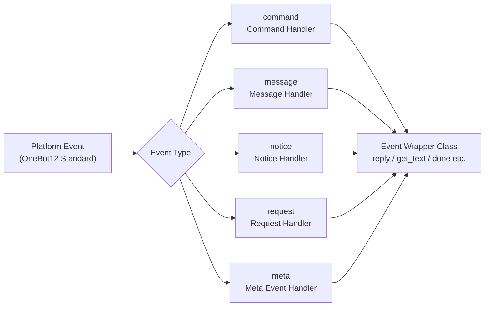
```mermaid
flowchart LR
    A["Platform Event<br/>(OneBot12 Standard)"] --> B{"Event Type"}
    B --> C["command<br/>Command Handler"]
    B --> D["message<br/>Message Handler"]
    B --> E["notice<br/>Notice Handler"]
    B --> F["request<br/>Request Handler"]
    B --> G["meta<br/>Meta Event Handler"]
    C & D & E & F & G --> H["Event Wrapper Class<br/>reply / get_text / done etc."]
```

Please return the complete translated Markdown content directly, without including any other text.

Reminder: If the document contains language switching lines (lines separated by `` | ``), strictly adhere to the format requirements above, do not write incorrect formats like ``[**Label**](file)``.

## Command Module

### Registering Commands

```python
from ErisPulse.Core.Event import command

# Basic command
@command("hello", help="Send greeting")
async def hello_handler(event):
    await event.reply("Hello!")

# Command with aliases
@command(["help", "h"], aliases=["Help"], help="Display help")
async def help_handler(event):
    pass

# Command with permissions
def is_admin(event):
    return event.get("user_id") in admin_ids

@command("admin", permission=is_admin, help="Admin command")
async def admin_handler(event):
    pass

# Hidden command
@command("secret", hidden=True, help="Secret command")
async def secret_handler(event):
    pass

# Command group
@command("admin.reload", group="admin", help="Reload modules")
async def reload_handler(event):
    pass
```

### Command Information

```python
# Get command help
help_text = command.help()

# Get specific command
cmd_info = command.get_command("admin")

# Get all commands in a command group
admin_commands = command.get_group_commands("admin")

# Get all visible commands
visible_commands = command.get_visible_commands()
```

### Waiting for Replies

```python
# Wait for user reply
@command("ask", help="Ask for user info")
async def ask_command(event):
    reply = await command.wait_reply(
        event,
        prompt="Please enter your name:",  # Sent above
        timeout=30.0
    )
    
    if reply:
        name = reply.get_text()
        await event.reply(f"Hello, {name}!")

# Waiting for reply with validation
def validate_age(event_data):
    try:
        age = int(event_data.get_text())
        return 0 <= age <= 150
    except ValueError:
        return False

@command("age", help="Ask for user age")
async def age_command(event):
    await event.reply("Please enter your age:")
    
    reply = await command.wait_reply(
        event,
        timeout=60,
        validator=validate_age
    )
    
    if reply:
        age = int(reply.get_text())
        await event.reply(f"Your age is {age} years old")

# Waiting for reply with callback
async def handle_confirmation(reply_event):
    text = reply_event.get_text().lower()
    if text in ["Yes", "yes", "y"]:
        await event.reply("Operation confirmed!")
    else:
        await event.reply("Operation canceled.")

@command("confirm", help="Confirm operation")
async def confirm_command(event):
    await command.wait_reply(
        event,
        prompt="Please enter 'Yes' or 'No':",
        callback=handle_confirmation
    )

## Message Module

### Message Events

```python
from ErisPulse.Core.Event import message

# Listen to all messages
@message.on_message()
async def message_handler(event):
    sdk.logger.info(f"Received message: {event.get_text()}")

# Listen to private messages
@message.on_private_message()
async def private_handler(event):
    user_id = event.get_user_id()
    sdk.logger.info(f"Private chat from: {user_id}")

# Listen to group messages
@message.on_group_message()
async def group_handler(event):
    group_id = event.get_group_id()
    sdk.logger.info(f"Group chat from: {group_id}")

# Listen to @ messages
@message.on_at_message()
async def at_handler(event):
    mentions = event.get_mentions()
    sdk.logger.info(f"Mentioned users: {mentions}")
```

### Conditional Listening

```python
# Use priority to control execution order
@message.on_message(priority=10)  # Higher numeric value means higher priority
async def high_priority_handler(event):
    pass

# Implement conditional filtering inside the handler
@message.on_message()
async def filtered_handler(event):
    if "Keyword" not in event.get_text():
        return
    # Process messages containing the keyword
    pass

## Notice Module

### Notice Events

```python
from ErisPulse.Core.Event import notice

# Friend added
@notice.on_friend_add()
async def friend_add_handler(event):
    user_id = event.get_user_id()
    await event.reply("Welcome to add me as a friend!")

# Friend removed
@notice.on_friend_remove()
async def friend_remove_handler(event):
    user_id = event.get_user_id()
    sdk.logger.info(f"Friend removed: {user_id}")

# Group member increased
@notice.on_group_increase()
async def member_increase_handler(event):
    user_id = event.get_user_id()
    await event.reply(f"Welcome new member!")

# Group member decreased
@notice.on_group_decrease()
async def member_decrease_handler(event):
    user_id = event.get_user_id()
    sdk.logger.info(f"Group member left: {user_id}")

## Request Module

### Request Events

```python
from ErisPulse.Core.Event import request

# Friend request
@request.on_friend_request()
async def friend_request_handler(event):
    user_id = event.get_user_id()
    comment = event.get_comment()
    sdk.logger.info(f"Friend request: {user_id}, comment: {comment}")

# Group invite request
@request.on_group_request()
async def group_request_handler(event):
    group_id = event.get_group_id()
    user_id = event.get_user_id()
    sdk.logger.info(f"Group invite: {group_id}, from: {user_id}")

## Meta Meta-Event Module

### Meta Event

```python
from ErisPulse.Core.Event import meta

# Connection event
@meta.on_connect()
async def connect_handler(event):
    platform = event.get_platform()
    sdk.logger.info(f"Platform {platform} connected successfully")

# Disconnection event
@meta.on_disconnect()
async def disconnect_handler(event):
    platform = event.get_platform()
    sdk.logger.info(f"Platform {platform} disconnected")

# Heartbeat event
@meta.on_heartbeat()
async def heartbeat_handler(event):
    sdk.logger.debug("Heartbeat received")
```

### Bot Status Query

After the adapter sends a meta event, the framework automatically tracks the Bot status. For the query API and lifecycle event listeners, please refer to [Adapter System API - Bot Status Management](adapter-system.md#bot-status-management).

Please return the complete translated Markdown content directly, without including any other text.

## Event Wrapper Class

The Event module's event handlers receive an Event wrapper instance, which inherits from dict and provides convenient methods.

### Core Methods

```python
# Get event information
event_id = event.get_id()
event_time = event.get_time()
event_type = event.get_type()
detail_type = event.get_detail_type()
platform = event.get_platform()

# Get bot information
self_platform = event.get_self_platform()
self_user_id = event.get_self_user_id()
self_info = event.get_self_info()
```

### Session Identifier

```python
# Unified target ID: Returns group_id for group chats, user_id for private chats, etc.
target_id = event.get_target_id()

# Unique session identifier, format: {platform}:{detail_type}:{target_id}
session_id = event.get_session_id()
# Examples: "telegram:private:12345", "qq:group:67890"
```

`get_target_id()` returns the first non-empty value in the following order: `group_id` → `channel_id` → `guild_id` → `thread_id` → `user_id`. Suitable for scenarios like context management, state storage, etc., that require a unified identifier for the session.

### Message Methods

```python
# Get message content
message_segments = event.get_message()
alt_message = event.get_alt_message()
text = event.get_text()

# Get sender information
user_id = event.get_user_id()
nickname = event.get_user_nickname()
sender = event.get_sender()

# Get group information
group_id = event.get_group_id()

# Check message type
is_msg = event.is_message()
is_private = event.is_private_message()
is_group = event.is_group_message()

# @ message related
is_at = event.is_at_message()
has_mention = event.has_mention()
mentions = event.get_mentions()
```

### Command Information

```python
# Get command information
cmd_name = event.get_command_name()
cmd_args = event.get_command_args()
cmd_raw = event.get_command_raw()

# Check if it is a command
is_cmd = event.is_command()
```

### Reply Functionality

```python
# Basic reply
await event.reply("This is a message")

# Specify sending method
await event.reply("http://example.com/image.jpg", method="Image")

# Reply with @ users and message
await event.reply("Hello", at_users=["user1"], reply_to="msg_id")

# @ all members
await event.reply("Announcement", at_all=True)

# Use platform-specific modifier methods (via parameter)
await event.reply("Board content", method="Board",
                  via=[("Expire", 3600), ("ForMember", "114514")])

# Get send chain, freely append modifier methods and sending methods (suitable for multiple consecutive modifiers / action-oriented methods)
await event.send_chain().Expire(3600).Board("Board content")
await event.send_chain().DismissBoard()

# Use OneBot12 message segment reply
from ErisPulse.Core.Event import MessageBuilder
msg = MessageBuilder().text("Hello").image("url").build()
await event.reply_ob12(msg)

# Wait for reply
reply = await event.wait_reply(timeout=30)
```

### Platform Capability Query

```python
# Check if the current platform supports a certain sending method
if event.supports("Image"):
    await event.reply(url, method="Image")

# List all available sending methods for the current platform
methods = event.available_methods()
# ["Text", "Image", "Voice", ...]
```

### Reply Methods

The `reply()` method supports specifying the sending type via the `method` parameter, as well as two convenient boolean parameters:

```python
# Simple text reply
await event.reply("Hello")

# Reply and @ sender
await event.reply("Hello", at_sender=True)

# Reply and quote the current message
await event.reply("Received", quote=True)

# Combined usage
await event.reply("Received", at_sender=True, quote=True)

# Send image (using method parameter)
if event.supports("Image"):
    await event.reply("http://example.com/img.jpg", method="Image")
else:
    await event.reply("[Image] http://example.com/img.jpg")
```

**Parameter Description**:

| Parameter | Type | Description |
|-----------|------|-------------|
| `content` | str | Content to send |
| `method` | str | Sending method, default "Text", optional "Image"/"Voice"/"Video"/"File" etc. |
| `at_sender` | bool | Whether to @ the sender (automatically extracts user_id) |
| `quote` | bool | Whether to quote the reply to the current message (automatically extracts message_id) |
| `at_users` | list[str] | List of users to @ |
| `reply_to` | str | Manually specify the message ID to reply to |
| `at_all` | bool | Whether to @ all members |

### Interactive Methods

```python
# confirm — Confirm the conversation (returns True/False/None)
if await event.confirm("Are you sure you want to execute this action?"):
    await event.reply("Confirmed")

# Send confirmation prompt using non-Text method
if await event.confirm("http://example.com/image.jpg", method="Image"):
    await event.reply("Confirmed image prompt")

# choose — Select from menu (returns option index or None)
choice = await event.choose("Please select a color:", ["Red", "Green", "Blue"])

# options_format="auto" (default) automatically selects style based on method:
# Markdown → Unordered list (- 1.Option), Html → Ordered list (<ol>), others → plain text list
# Text-based methods (Markdown/Html, etc.) merge options to the end by default
# merge_prompt=True can force any method to merge; placeholder can customize placeholder
choice = await event.choose(
    "## Please select\n{options}", ["A", "B"],
    method="Markdown", merge_prompt=True,
)

# collect — Form collection (returns {key: value} dict or None)
data = await event.collect([
    {"key": "name", "prompt": "Please enter your name:"},
    {"key": "age", "prompt": "Please enter your age:",
     "validator": lambda e: e.get_text().isdigit()},
    {"key": "avatar", "prompt": "Please send avatar:", "method": "Image"},
])

# wait_for — Wait for any event satisfying conditions
evt = await event.wait_for(event_type="notice", condition=lambda e: ..., timeout=120)

# conversation — Multi-turn dialogue context
conv = event.conversation(timeout=60)
await conv.say("Welcome!")
```

> For complete parameter descriptions and more examples of interactive methods, please refer to [Event Wrapper Class Details](../developer-guide/modules/event-wrapper.md) and [Conversation Multi-turn Dialogue](../advanced/conversation.md).

### Utility Methods

```python
# Convert to dict (filters out internal keys starting with _)
event_dict = event.to_dict()

# Get raw data
raw = event.get_raw()
raw_type = event.get_raw_type()
```

### Control Flow

`event.done(claim=, stop=)` unifies the control of two orthogonal semantics: "Claim" and "Stop":

- **Claim (claim)**: Marks the event as processed (`_processed`), so the command dispatcher skips re-processing it
- **Stop (stop)**: Prevents propagation to lower priority handlers (`_propagation_stopped`)

```python
# Claim + Stop (default)
event.done()

# Claim only, no stop (low priority observers can still see it)
event.done(stop=False)

# Stop only, no claim (e.g., firewall / rate limiting)
event.done(claim=False)

# mark_processed is the main method, done is an alias
event.mark_processed()             # equivalent to event.done()
event.mark_processed(stop=False)   # equivalent to event.done(stop=False)

# Query status
event.is_processed()  # Whether already claimed
event.is_stopped()    # Whether propagation is already stopped
```

### Platform Extension Methods

Adapters can register platform-specific methods for the Event, which are only available on instances of the corresponding platform.

#### Users: Using Platform Extension Methods

After an adapter registers platform-specific methods, you can call them directly in event handlers. Methods vary by platform, please refer to the corresponding [Platform Documentation](../platform-guide/).

```python
from ErisPulse.Core.Event import message

@message.on_message()
async def handle_message(event):
    platform = event.get_platform()

    # Call platform-specific methods based on platform
    if platform == "email":
        subject = event.get_subject()           # Email specific
        attachments = event.get_attachments()   # Email specific
```

#### Query Platform Registered Methods

```python
from ErisPulse.Core.Event import get_platform_event_methods

# View which methods are registered for a platform
methods = get_platform_event_methods("email")
# ["get_subject", "get_from", "get_attachments", ...]

# Dynamically judge and call
for method_name in get_platform_event_methods(event.get_platform()):
    method = getattr(event, method_name)
    print(f"{method_name}: {method()}")
```

#### Platform Method Isolation

Methods registered by different platforms do not interfere with each other:

```python
# Email event - Only email methods
event = Event({"platform": "email", "email_raw": {"subject": "Hello"}})
event.get_subject()      # ✅ "Hello"
event.get_chat_type()    # ❌ AttributeError

# Telegram event - Only Telegram methods
event = Event({"platform": "telegram", "telegram_raw": {"chat": {"type": "private"}}})
event.get_chat_type()    # ✅ "private"
event.get_subject()      # ❌ AttributeError
```

#### `hasattr` / `dir` Support

```python
hasattr(event, "get_subject")   # Returns True only when platform="email"
"get_subject" in dir(event)     # Same as above
```

### Adapters: Registering Platform Extension Methods

Adapters can register platform-specific methods for the Event using decorators. The first argument of the method is `self` (Event instance), allowing free access to event data.

#### Registering a Single Method

```python
from ErisPulse.Core.Event import register_event_method

@register_event_method("email")
def get_subject(self):
    """Get email subject"""
    return self.get("email_raw", {}).get("subject", "")

@register_event_method("email")
def get_from(self):
    """Get sender"""
    return self.get("email_raw", {}).get("from", {})
```

#### Batch Registration (Mixin Classes)

When there are many methods, it is recommended to use a Mixin class for batch registration:

```python
from ErisPulse.Core.Event import register_event_mixin

class EmailEventMixin:
    def get_subject(self):
        return self.get("email_raw", {}).get("subject", "")

    def get_from(self):
        return self.get("email_raw", {}).get("from", "")

    def get_attachments(self):
        return self.get("email_raw", {}).get("attachments", [])

# Register all methods at once
register_event_mixin("email", EmailEventMixin)
```

#### Return Value Specification

| Scenario | Return Value | User Usage |
|----------|-------------|------------|
| Returning data (text, dict, etc.) | Direct return value | `subject = event.get_subject()` |
| Executing operations (sending messages, etc.) | Returns `asyncio.Task` | `task = event.do_something()` Optional `await` |

> **Suggestion**: Methods that do not return data should return `asyncio.Task`, allowing users to decide for themselves whether to `await`, ensuring the operation completes even if not `await`ed.

```python
@register_event_method("email")
def forward_email(self, to_address: str):
    """Forward email — returns Task, user can decide whether to await"""
    import asyncio
    return asyncio.create_task(
        self._do_forward(to_address)
    )

# User can await to wait for result
await event.forward_email("user@example.com")

# Or not await, operation executes in background
event.forward_email("user@example.com")
```

#### Unregistering Methods

```python
from ErisPulse.Core.Event import unregister_event_method, unregister_platform_event_methods

# Unregister single method
unregister_event_method("email", "get_subject")

# Unregister all methods for a platform (called during adapter shutdown)
unregister_platform_event_methods("email")
```

#### Overriding Built-in Methods

`register_event_mixin` / `register_event_method` support overriding built-in Event methods (such as `confirm`, `choose`, `collect`, `wait_reply`, `reply`, etc.). Registered platform methods take precedence over built-in methods via `Event.__getattribute__`, so adapters can provide platform-specific interactive implementations.

Built-in implementations are exported as `_builtin_*` functions, and overrideers can call them as a fallback:

```python
from ErisPulse.Core.Event import register_event_mixin, _builtin_choose

class YunhuEventMixin:
    async def choose(self, prompt, options, timeout=60, method="Text"):
        # Yunhu platform uses button components
        buttons = [[{"text": opt} for opt in options]]
        await self.reply(prompt)
        # ...wait for button callback or text reply...
        # Fallback to built-in logic
        return await _builtin_choose(self, None, options, timeout, "Text")

register_event_mixin("yunhu", YunhuEventMixin)

## Cross-Platform Extensions (Wildcards)

`register_event_method` and `register_event_mixin` support passing `"*"` as the platform name, making the registered methods available on **all** platform Event instances. This is suitable for functional modules requiring cross-platform reuse, such as AI conversations and context management.

### Registering Cross-Platform Methods

```python
from ErisPulse.Core.Event.wrapper import register_event_method

@register_event_method("*")
async def ai_chat(self, prompt: str):
    """self is the Event instance, allowing free access to event data and built-in methods"""
    await self.reply(f"AI: {prompt}")
```

After registration, event handlers on all platforms can invoke it:

```python
from ErisPulse.Core.Event import message

@message.on_message()
async def handler(event):
    await event.ai_chat(event.get_text())
```

### Method Resolution Order

When accessing Event methods via attributes, the resolution order is:

1. **Platform-Specific Methods** (overrides for the current platform)
2. **Wildcard Methods** (cross-platform methods registered with `"*"`)
3. **Built-in Methods** (e.g., `reply`, `confirm`)
4. **Dictionary Key Access**

> Therefore, wildcard methods can override built-in methods (such as `reply`), but they will be further overridden by platform-specific methods with the same name.

## Priority System

Event handlers support priorities, where higher numerical values indicate higher priority:

```python
# High priority handler executes first
@message.on_message(priority=10)
async def high_priority_handler(event):
    pass

# Low priority handler executes later
@message.on_message(priority=0)
async def low_priority_handler(event):
    pass


====
高级主题
====


### Conversation 多轮对话

# Conversation Multi-turn Conversations

The `Conversation` class provides convenient methods for multi-turn interactions within the same session, suitable for scenarios such as guided operations, information collection, and conversational question-answering.

Please directly return the complete translated Markdown content without including any other text.

Once again, please note: if the document contains a language switch line (with each language name separated by `` | ``), strictly follow the format requirements above in item 8, and do not write incorrect formats such as ``[**Label**](file)``.

## Creating Conversations

Create a conversation using the `conversation()` method of the `Event` object:

```python
from ErisPulse.Core.Event import command

@command("quiz")
async def quiz_handler(event):
    conv = event.conversation(timeout=30)

    await conv.say("🎮 Welcome to the quiz!")

    answer = await conv.choose("Question 1: Who created Python?", [
        "Guido van Rossum",
        "James Gosling",
        "Dennis Ritchie",
    ])

    if answer is None:
        await conv.say("Time's up, try again next time!")
        return

    if answer == 0:
        await conv.say("Correct!")
    else:
        await conv.say("Wrong, the correct answer is Guido van Rossum")

    conv.stop()
```

Please directly return the complete translated Markdown content without any additional text.

## Core API

### say(content, **kwargs)

Send a message, returns `self` for method chaining:

```python
await conv.say("First line").say("Second line").say("Third line")
```

You can also specify the send method:

```python
await conv.say("https://example.com/image.jpg", method="Image")
```

### wait(prompt=None, timeout=None)

Wait for a user reply, returns an `Event` object or `None` (if timeout):

```python
# Simple wait
resp = await conv.wait()
if resp:
    text = resp.get_text()

# Wait after sending a prompt
resp = await conv.wait(prompt="Please enter your name:")

# Use custom timeout (overrides the conversation default timeout)
resp = await conv.wait(prompt="Please reply within 10 seconds:", timeout=10)
```

### confirm(prompt=None, **kwargs)

Wait for user confirmation (yes/no), returns `True` / `False` / `None` (if timeout):

```python
result = await conv.confirm("Are you sure you want to delete all data?")
if result is True:
    await conv.say("Deleted")
elif result is False:
    await conv.say("Cancelled")
else:
    await conv.say("Timed out without reply")
```

Built-in recognized confirmation words: `是/yes/y/确认/确定/好/ok/true/对/嗯/行/同意/没问题/可以/当然...`

Built-in recognized denial words: `否/no/n/取消/不/不要/不行/cancel/false/错/不对/别/拒绝...`

### choose(prompt, options, **kwargs)

Wait for user selection from options, returns the option index (0-based) or `None`:

```python
choice = await conv.choose("Please select a color:", ["red", "green", "blue"])
if choice is not None:
    colors = ["red", "green", "blue"]
    await conv.say(f"You selected {colors[choice]}")
```

Users can select by entering a number (`1`/`2`/`3`) or option text (`red`).

`options_format="auto"` (default) automatically chooses the built-in style based on method: Markdown→unordered list, Html→ordered list, others→plain text list.  
Also supports `"list"`, `"inline"`, `"md"`, `"html"`, or a custom function.

Supports `merge_prompt=True` to merge into a single message, and placeholder to control option insertion position (default `{options}`, can be customized via `placeholder`):

```python
choice = await conv.choose(
    "## Please select\n{options}",
    ["Option A", "Option B"],
    method="Markdown",
    merge_prompt=True,
)

# Custom placeholder
choice = await conv.choose(
    "Select: [choices]",
    ["Option A", "Option B"],
    placeholder="[choices]",
)
```

### collect(fields, **kwargs)

Collect information in multiple steps, returns a data dictionary or `None`:

```python
data = await conv.collect([
    {"key": "name", "prompt": "Please enter your name"},
    {"key": "age", "prompt": "Please enter your age",
     "validator": lambda e: e.get("alt_message", "").strip().isdigit(),
     "retry_prompt": "Age must be a number, please re-enter"},
    {"key": "city", "prompt": "Please enter your city"},
])

if data:
    await conv.say(f"Registration successful!\nName: {data['name']}\nAge: {data['age']}\nCity: {data['city']}")
else:
    await conv.say("Registration interrupted")
```

Field configuration:

| Parameter | Description | Default |
|-----------|-------------|---------|
| `key` | Field key name (required) | - |
| `prompt` | Prompt message | `"Please enter {key}"` |
| `validator` | Validation function, receives Event, returns bool | None |
| `retry_prompt` | Retry prompt on validation failure | `"Invalid input, please re-enter"` |
| `max_retries` | Maximum retry attempts | 3 |
| `condition` | Condition function, receives collected data dict, returns bool | None |

**Conditional fields**: Use `condition` to implement dynamic forms, where the field is only collected if the condition is met:

```python
data = await conv.collect([
    {"key": "has_car", "prompt": "Do you have a car? (yes/no)"},
    {"key": "car_brand", "prompt": "Please enter the car brand",
     "condition": lambda d: d.get("has_car", "").lower() in ("yes", "y", "是")},
])
```

### stop()

Manually end the conversation, sets `is_active` to `False`:

```python
conv.stop()
```

### is_active

Whether the conversation is active:

```python
if conv.is_active:
    await conv.say("The conversation is still ongoing")

## Active State Management

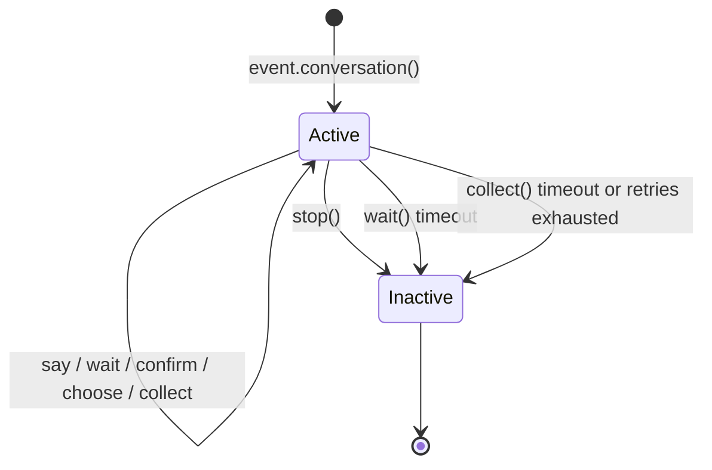
```mermaid
stateDiagram-v2
    state "Active" as active
    state "Inactive" as inactive
    [*] --> active: event.conversation()
    active --> active: say / wait / confirm / choose / collect
    active --> inactive: stop()
    active --> inactive: wait() timeout
    active --> inactive: collect() timeout or retries exhausted
    inactive --> [*]
```

The conversation will automatically become inactive in the following cases:

1. When the `stop()` method is called
2. When `wait()` times out and returns `None`
3. When `collect()` times out at any step or exhausts retries and returns `None`

After becoming inactive, all interaction methods (`wait`/`confirm`/`choose`/`collect`) will immediately return `None` without further waiting for user input.

## Branches and Jumps

### @conv.branch(name) Decorator

Use `branch()` to register conversation branches, and use `goto()` to jump between branches:

```python
@command("menu")
async def menu_handler(event):
    conv = event.conversation(timeout=60)

    @conv.branch("main")
    async def main_menu():
        await conv.say("=== Main Menu ===\n1. Personal Information\n2. Settings\n3. Exit")
        resp = await conv.wait()
        if resp is None:
            return
        text = resp.get_text().strip()
        if text == "1":
            await conv.goto("profile")
        elif text == "2":
            await conv.goto("settings")
        elif text == "3":
            await conv.say("Goodbye!")
            conv.stop()

    @conv.branch("profile")
    async def profile():
        await conv.say("=== Personal Information ===\nName: Alice\n0. Return")
        resp = await conv.wait()
        if resp and resp.get_text().strip() == "0":
            await conv.goto("main")

    @conv.branch("settings")
    async def settings():
        await conv.say("=== Settings ===\n1. Notification Switch\n0. Return")
        resp = await conv.wait()
        if resp and resp.get_text().strip() == "0":
            await conv.goto("main")

    await conv.start()  # Start from the first registered branch
```

### conv.start(name=None)

Start the conversation, defaulting to the first registered branch:

```python
await conv.start()          # Start from the first branch
await conv.start("settings") # Start from the specified branch
```

Please directly return the complete translated Markdown content without including any other text.

## Context and Persistence

### conv.context

Each conversation instance has a built-in `context` dictionary to share state between branches:

```python
@conv.branch("step1")
async def step1():
    conv.context["username"] = resp.get_text().strip()
    await conv.goto("step2")

@conv.branch("step2")
async def step2():
    name = conv.context.get("username", "Unknown")
    await conv.say(f"Hello, {name}!")
```

### save() / resume() / clear_saved()

Conversations support persistence, allowing them to be resumed after timeout or interruption:

```python
# Save conversation state
conv_id = conv.save()
# conv_id = "user_123_group_456"  # Automatically generated based on user and group

# ... later in the same session ...
conv2 = event.conversation()
if conv2.resume():
    await conv2.say("Welcome back! Continuing the previous conversation")
else:
    await conv2.say("No previous conversation found")

# Clear saved conversation
conv.clear_saved()
```

Please directly return the complete translated Markdown content without any additional text.

## Typical Flow Patterns

### Guided Registration

```python
@command("register")
async def register_handler(event):
    conv = event.conversation(timeout=60)

    await conv.say("Welcome! Let's register.")

    data = await conv.collect([
        {"key": "username", "prompt": "Please enter a username (3-20 characters)",
         "validator": lambda e: 3 <= len(e.get_text().strip()) <= 20},
        {"key": "email", "prompt": "Please enter your email address",
         "validator": lambda e: "@" in e.get_text() and "." in e.get_text(),
         "retry_prompt": "Invalid email format, please try again"},
    ])

    if not data:
        await event.reply("Registration cancelled.")
        return

    confirmed = await conv.confirm(
        f"Confirm registration information?\nUsername: {data['username']}\nEmail: {data['email']}"
    )

    if confirmed:
        await conv.say("✅ Registration successful!")
    else:
        await conv.say("❌ Registration cancelled.")
```

### Looping Conversation

```python
@command("chat")
async def chat_handler(event):
    conv = event.conversation(timeout=120)
    await conv.say("Entering conversation mode. Type 'exit' to end.")

    while conv.is_active:
        resp = await conv.wait()
        if resp is None:
            await conv.say("Timeout, conversation ended.")
            break

        text = resp.get_text().strip()

        if text == "exit":
            await conv.say("Goodbye!")
            conv.stop()
        elif text == "help":
            await conv.say("Available commands: exit, help, status")
        elif text == "status":
            await conv.say("Conversation is active.")
        else:
            await conv.say(f"You said: {text}")


### MessageBuilder 详解

# MessageBuilder Detailed Explanation

`MessageBuilder` is the OneBot12 standard message segment construction tool provided by ErisPulse, used to build structured message content to be used with `Send.Raw_ob12()`.

## Import Methods

`MessageBuilder` supports the following two import methods (the effects are the same, the first is recommended):

```python
from ErisPulse.Core.Event import MessageBuilder        # Recommended, through package export
from ErisPulse.Core.Event.message_builder import MessageBuilder  # Direct module import
```

## Double Mode Mechanism

MessageBuilder provides two usage modes, implementing different behaviors at the class level and instance level through Python descriptor mechanism (`__get__`): when calling methods through the class, `__get__` returns the execution result of the static method; when calling through the instance, it returns `self` to support chaining calls.

### Chaining Mode (Instance)

Used by instantiating `MessageBuilder()`, each method returns `self`, supporting chaining calls, finally using `.build()` to get the message segment list:

```python
from ErisPulse.Core.Event.message_builder import MessageBuilder

segments = (
    MessageBuilder()
    .text("Hello!")
    .image("https://example.com/photo.jpg")
    .build()
)
# [
#     {"type": "text", "data": {"text": "Hello!"}},
#     {"type": "image", "data": {"file": "https://example.com/photo.jpg"}}
# ]
```

### Quick Build Mode (Static)

Called directly on the class, each method returns a message segment list directly, suitable for single-segment messages:

```python
# Directly returns list[dict], no need for .build()
segments = MessageBuilder.text("Hello!")
# [{"type": "text", "data": {"text": "Hello!"}}]
```

## Message Segment Types

| Method | Type | Data Parameters | Description |
|--------|------|-----------------|-------------|
| `text(text)` | text | `text` | Text message |
| `image(file)` | image | `file` | Image message |
| `audio(file)` | audio | `file` | Audio message |
| `video(file)` | video | `file` | Video message |
| `file(file, filename?)` | file | `file`, `filename` | File message |
| `mention(user_id, user_name?)` | mention | `user_id`, `user_name` | @Mention user |
| `at(user_id, user_name?)` | mention | `user_id`, `user_name` | Alias for `mention` |
| `reply(message_id)` | reply | `message_id` | Reply message |
| `at_all()` | mention_all | - | @All members |
| `custom(type, data)` | Custom | Custom | Custom message segment |

## Using with Send

The message segment list is sent through `Send.Raw_ob12()`:

```python
from ErisPulse import sdk
from ErisPulse.Core.Event.message_builder import MessageBuilder

# Chaining build + send
segments = (
    MessageBuilder()
    .mention("user123", "Zhang San")
    .text(" Please check this image")
    .image("https://example.com/photo.jpg")
    .build()
)
await sdk.adapter.myplatform.Send.To("group", "group456").Raw_ob12(segments)
```

### Replying with Events

```python
from ErisPulse.Core.Event import command

@command("report")
async def report_handler(event):
    await event.reply_ob12(
        MessageBuilder()
        .text("📊 Daily Report Summary\n")
        .text("Tasks completed today: 5\n")
        .text("Tasks in progress: 3")
        .build()
    )
```

## Utility Methods

### copy()

Copy the current builder, used to create multiple message variants based on the same base content:

```python
base = MessageBuilder().text("Base content").mention("admin")

# Build different messages based on the same prefix
msg1 = base.copy().text(" Variant A").build()
msg2 = base.copy().text(" Variant B").image("img.jpg").build()
```

### clear()

Clear added message segments, reuse the same builder:

```python
builder = MessageBuilder()

for user_id in ["user1", "user2", "user3"]:
    builder.clear()
    msg = builder.mention(user_id).text(" Hello!").build()
    await adapter.Send.To("user", user_id).Raw_ob12(msg)
```

### len() / bool()

```python
builder = MessageBuilder()
print(bool(builder))   # False

builder.text("Hello")
print(len(builder))    # 1
print(bool(builder))   # True
```

## Custom Message Segments

Use the `custom()` method to add platform-specific extended message segments:

```python
# Add platform-specific message segments
segments = (
    MessageBuilder()
    .text("Please fill out the form:")
    .custom("yunhu_form", {"form_id": "12345"})
    .build()
)
```

> Custom message segments are only valid in the corresponding platform's adapter, other adapters will ignore unknown message segments.

## Complete Examples

### Multi-element Message

```python
segments = (
    MessageBuilder()
    .reply(event.get_id())                    # Reply to original message
    .mention(event.get_user_id())             # @Sender
    .text(" This is your query result:\n")             # Text
    .image("https://example.com/chart.png")   # Image
    .text("\nDetailed data is in the attachment:")
    .file("https://example.com/data.csv", filename="data.csv")
    .build()
)
await event.reply_ob12(segments)
```

### Static Factory + Chaining Mix

```python
# Quick build single-segment message
simple_msg = MessageBuilder.text("Simple text")

# Chaining build complex message
complex_msg = (
    MessageBuilder()
    .at_all()
    .text(" 📢 Announcement:")
    .text("Meeting at 3 PM today")
    .build()
)
```


### HTTP 客户端

# Network Client

ErisPulse provides a unified network client that aggregates HTTP requests, WebSocket connections, and connection pool management. Modules and adapters **must prioritize** using this client instead of directly importing third-party libraries such as `aiohttp`, `httpx`, or `requests`.

## Overview

The main features of the network client are:

- **Unified interface**: Provides `get` / `post` / `put` / `delete` / `patch` / `request` methods
- **WebSocket client**: Establishes a client WebSocket connection via `ws_connect`
- **Automatic logging**: All requests are automatically logged and tracked for statistics
- **Lifecycle integration**: Each request triggers the `client.request` lifecycle event, and WebSocket connections trigger the `client.ws.connect` event
- **Retry support**: Configurable automatic retry count and interval
- **Timeout control**: Independent connection timeout and request timeout
- **Connection pool reuse**: Connection pool management based on aiohttp.ClientSession
- **Exception system**: aiohttp exceptions are automatically converted to ErisPulse exceptions (ClientError system)

## Quick Start

### HTTP Requests

```python
from ErisPulse.Core import client

# GET request
resp = await client.get("https://httpbin.org/get")
data = await resp.json()
print(resp.status)  # 200

# POST request
resp = await client.post(
    "https://httpbin.org/post",
    json={"key": "value"},
)
data = await resp.json()
```

### WebSocket Connection

```python
from ErisPulse.Core import client

ws = await client.ws_connect("wss://example.com/ws")

async for text in ws.iter_text():
    await ws.send_text(f"Echo: {text}")
```

## HttpResponse

All request methods return an `HttpResponse` object:

```python
from ErisPulse.Core import client

resp = await client.get("https://httpbin.org/get")

resp.status       # int - HTTP status code (e.g., 200, 404)
resp.reason       # str | None - status description (e.g., "OK")
resp.headers      # response headers (case-insensitive)
resp.content_type # str | None - Content-Type
resp.url          # final URL (may change due to redirects)
resp.raw          # underlying native response object (currently aiohttp.ClientResponse)

# Read response body
body = await resp.read()       # bytes
text = await resp.text()       # str
data = await resp.json()       # parse JSON
text = await resp.text("gbk")  # specify encoding
```

## Request Methods

### GET

```python
from ErisPulse.Core import client

resp = await client.get(
    "https://api.example.com/users",
    params={"page": "1", "limit": "10"},
    headers={"Authorization": "Bearer token"},
)
```

### POST

```python
from ErisPulse.Core import client

# JSON request body
resp = await client.post(
    "https://api.example.com/users",
    json={"name": "Alice", "age": 30},
)

# Form request body
resp = await client.post(
    "https://api.example.com/login",
    data={"username": "admin", "password": "123"},
)

# Raw data
resp = await client.post(
    "https://api.example.com/upload",
    data=b"raw bytes",
    headers={"Content-Type": "application/octet-stream"},
)

# File upload (using files parameter, no need to import aiohttp)
# Format: {field name: file object/bytes/(filename, file)/(filename, file, content_type)}
resp = await client.post(
    "https://api.example.com/upload",
    data={"description": "Avatar"},            # Optional: also carry regular form fields
    files={
        "file": ("photo.png", open("photo.png", "rb"), "image/png"),
    },
)

# Simplified syntax: directly pass file object
resp = await client.post(
    "https://api.example.com/upload",
    files={"file": open("photo.png", "rb")},
)

# Upload in-memory data directly (no need to write to disk)
import io

resp = await client.post(
    "https://api.example.com/upload",
    files={"file": ("data.txt", io.BytesIO(b"file content"), "text/plain")},
)
```

### PUT / DELETE / PATCH

```python
from ErisPulse.Core import client

resp = await client.put("https://api.example.com/users/1", json={"name": "Bob"})
resp = await client.delete("https://api.example.com/users/1")
resp = await client.patch("https://api.example.com/users/1", json={"age": 31})
```

### Generic request

```python
from ErisPulse.Core import client

resp = await client.request(
    "OPTIONS",
    "https://api.example.com/resource",
    headers={"Origin": "https://example.com"},
)
```

## Parameter Explanation

### HTTP Request Parameters

| Parameter | Type | Description |
|-----------|------|-------------|
| `url` | `str` | Request URL |
| `params` | `dict[str, str]` | Query parameters (optional) |
| `headers` | `dict[str, str]` | Additional request headers (optional) |
| `data` | `Any` | Request body (form or raw data) (optional) |
| `json` | `Any` | JSON request body (optional) |
| `files` | `dict[str, Any]` | File upload fields (optional, automatically builds multipart/form-data) |
| `timeout` | `float` | Timeout for this request (seconds) (optional, overrides default value) |
| `max_retries` | `int` | Maximum retry attempts for this request (optional, overrides default value) |

### ws_connect Parameters

| Parameter | Type | Description |
|-----------|------|-------------|
| `url` | `str` | WebSocket server URL |
| `headers` | `dict[str, str]` | Additional request headers (optional) |
| `heartbeat` | `float` | Heartbeat interval in seconds (optional) |

## Timeout and Retry

```python
from ErisPulse.Core import HttpClient

# Create a client with custom timeout
client = HttpClient(
    timeout=60,           # Total request timeout 60s
    connect_timeout=5,    # Connection timeout 5s
    max_retries=3,        # Automatic retry 3 times on failure
    retry_delay=2,        # Retry interval 2s
)

# Override timeout for a single request
resp = await client.get("https://slow-api.example.com/data", timeout=120)
```

## Custom Default Headers

```python
client = HttpClient(
    headers={
        "Authorization": "Bearer token",
        "X-App-Id": "my-app",
    },
    user_agent="MyBot/1.0",
)
```

## Request Statistics

```python
from ErisPulse.Core import client

# View statistics
stats = client.stats
# {"total_requests": 42, "total_errors": 1, "total_bytes_sent": 0, "total_bytes_received": 0}

# Reset statistics
client.reset_stats()
```

## Lifecycle Events

### HTTP Request Events

The `client.request` event is triggered after each request, which can be used for monitoring:

```python
from ErisPulse.Core import lifecycle

@lifecycle.on("client.request")
async def on_request(event_data):
    print(f"{event_data['method']} {event_data['url']} -> {event_data['status']} ({event_data['elapsed']}s)")
```

### WebSocket Connection Events

The `client.ws.connect` event is triggered after each WebSocket connection is established:

```python
from ErisPulse.Core import lifecycle

@lifecycle.on("client.ws.connect")
async def on_ws_connect(event_data):
    print(f"WS connection: {event_data['url']}")
```

## Context Management

```python
# As a context manager, automatically closes the session
async with HttpClient(timeout=30) as client:
    resp = await client.get("https://httpbin.org/get")
    data = await resp.json()
```

## WebSocket Client

Establish a WebSocket client connection via `client.ws_connect()`, returning a `ClientWebSocket` object. The client and server WebSocket share the same `WebSocketConnectionBase` base class, with identical send/receive/iter interfaces.

### Basic Usage

```python
from ErisPulse.Core import client

ws = await client.ws_connect("wss://example.com/ws", heartbeat=30)

await ws.send_text("Hello")
await ws.send_bytes(b"\x00\x01\x02")
await ws.send_json({"type": "ping"})
```

### Receiving Messages

#### Advanced Methods (Recommended)

Automatically filter message types and raise `WebSocketDisconnect` when disconnected:

```python
from ErisPulse.Core import client
from ErisPulse.Core.Bases.errors import WebSocketDisconnect

ws = await client.ws_connect("wss://example.com/ws")

# Single message receive
text = await ws.receive_text()    # str
data = await ws.receive_bytes()   # bytes
obj = await ws.receive_json()     # dict / list

# Iterative receive (automatically stops when disconnected)
async for text in ws.iter_text():
    print(text)

async for data in ws.iter_bytes():
    print(data)

async for obj in ws.iter_json():
    print(obj)
```

#### Low-Level Methods

Use `receive()` and `iter_messages()` to handle raw message types, distinguishing TEXT / BINARY / CLOSE / ERROR:

```python
from ErisPulse.Core import client
from ErisPulse.Core.Bases.websocket import WSMessage

ws = await client.ws_connect("wss://example.com/ws")

# Single raw message receive
msg = await ws.receive()
# msg.type  -> WSMessage.TEXT / WSMessage.BINARY / WSMessage.CLOSE / WSMessage.ERROR
# msg.data  -> str | bytes | None

# Iterative raw message receive (stops automatically on CLOSE/ERROR)
async for msg in ws.iter_messages():
    if msg.type == WSMessage.TEXT:
        print(f"Text: {msg.data}")
    elif msg.type == WSMessage.BINARY:
        print(f"Binary: {len(msg.data)} bytes")
```

### WSMessage

`WSMessage` is a unified WebSocket message type, independent of the underlying library:

| Attribute | Type | Description |
|-----------|------|-------------|
| `type` | `str` | Message type: `WSMessage.TEXT` / `WSMessage.BINARY` / `WSMessage.CLOSE` / `WSMessage.ERROR` |
| `data` | `Any` | Message data |

### ClientWebSocket Attributes

| Attribute | Type | Description |
|-----------|------|-------------|
| `url` | `URL` | Connection URL |
| `headers` | `Headers` | Response headers |
| `closed` | `bool` | Whether the connection is closed |
| `raw` | `object` | Underlying native object (aiohttp.ClientWebSocketResponse) |

### Lifecycle Hooks

Consistent with `server-side WebSocketConnection`, supports `on_disconnect` and `on_error` callbacks:

```python
from ErisPulse.Core import client

ws = await client.ws_connect("wss://example.com/ws")

@ws.on_disconnect
async def handle_disconnect(ws, reason="unknown"):
    print(f"Connection disconnected: {reason}")

@ws.on_error
async def handle_error(ws, error=""):
    print(f"Connection error: {error}")
```

### Closing Connection

```python
await ws.close(code=1000, reason="Normal closure")
```

## Exception System

ErisPulse defines a unified exception hierarchy. Requests initiated via `sdk.client` automatically convert underlying aiohttp exceptions into ErisPulse exceptions.

> **Backward Compatibility**: Old modules/adapters that directly use `aiohttp.ClientSession` are unaffected. Exception conversion only applies when requests are initiated via `sdk.client`. Code directly using aiohttp still catches `aiohttp.ClientError` and other native exceptions. Both methods can coexist.

### Exception Hierarchy

```
ErisPulseError
├── ClientError                  # Base class for all HTTP/WS client request exceptions
│   ├── ClientConnectionError    # Connection failed (DNS resolution failed, connection refused, network unreachable)
│   ├── ClientTimeoutError       # Connection timeout or request timeout
│   └── HTTPStatusError          # HTTP 4xx/5xx status code error
└── WebSocketError               # Base class for WebSocket exceptions
    └── WebSocketDisconnect      # WebSocket connection disconnected (common to client and server)
```

### Exception Handling

```python
from ErisPulse.Core import client
from ErisPulse.Core.Bases.errors import (
    ClientError,
    ClientConnectionError,
    ClientTimeoutError,
    HTTPStatusError,
    WebSocketDisconnect,
    WebSocketError,
)

# HTTP request exception handling
try:
    resp = await client.get("https://api.example.com/data")
    data = await resp.json()
except ClientConnectionError:
    print("Cannot connect to the server")
except ClientTimeoutError:
    print("Request timeout")
except ClientError as e:
    print(f"Request failed: {e}")

# WebSocket exception handling
try:
    ws = await client.ws_connect("wss://example.com/ws")
    async for text in ws.iter_text():
        await ws.send_text(f"Echo: {text}")
except WebSocketDisconnect as e:
    print(f"Connection disconnected: code={e.code}, reason={e.reason}")
except WebSocketError as e:
    print(f"WebSocket error: {e}")
```

### Unified Exception Handling

Use `ClientError` to catch all HTTP/WS client request exceptions:

```python
from ErisPulse.Core.Bases.errors import ClientError

try:
    resp = await client.get("https://api.example.com/data")
except ClientError as e:
    print(f"Client error: {e}")
```

### HTTPStatusError

When you need to check the status code after a request and raise an exception, you can manually use:

```python
from ErisPulse.Core.Bases.errors import HTTPStatusError

resp = await client.get("https://api.example.com/data")
if resp.status >= 400:
    raise HTTPStatusError(resp.status, await resp.text())
```

## Using in Adapters

Adapters can use the global client or create their own client instance to send platform API requests:

```python
from ErisPulse.Core import client
from ErisPulse.Core.Bases import BaseAdapter
from ErisPulse.Core.Bases.errors import ClientError

class MyAdapter(BaseAdapter):
    async def call_api(self, endpoint, **params):
        try:
            resp = await client.post(
                f"https://api.platform.com/{endpoint}",
                json=params,
                headers={"Authorization": f"Bearer {self.token}"},
            )
            return await resp.json()
        except ClientError as e:
            self.logger.error(f"API call failed: {e}")
            raise
```

> You can also use `from ErisPulse import sdk` to access `sdk.client`, which has the same effect.

## Best Practices

1. **Prefer the global client**: Use `from ErisPulse.Core import client` to obtain the global singleton, facilitating unified management and monitoring by the framework.
2. **Avoid directly importing aiohttp**: Use `client` instead of `aiohttp.ClientSession`, allowing seamless switching of the underlying implementation without code changes. Old code using aiohttp directly still works, and both methods can coexist.
3. **Use the ErisPulse exception system**: When making requests via `sdk.client`, catch `ClientError` instead of `aiohttp.ClientError`, ensuring code independence from specific HTTP libraries. Old code using aiohttp directly remains unaffected.
4. **Set reasonable timeouts**: Configure appropriate timeout values based on API response speed to avoid long blocking.
5. **Use retry mechanisms**: Enable retries for unstable APIs to improve reliability.
6. **Monitor request statistics**: Use `sdk.client.stats` or the `client.request` lifecycle event to monitor request status.
7. **Use advanced WebSocket methods**: Prefer advanced methods like `iter_text` / `iter_json`, and only use `iter_messages` when distinguishing message types is necessary.


### SQL 查询构建器

# SQL Query Builder

The Storage module of ErisPulse provides a chain-style generic SQL query builder, supporting creation, querying, updating, and deletion operations for custom tables.

## Architecture Design

```
Bases/storage.py                    Core/storage.py
┌─────────────────────┐             ┌──────────────────────────┐
│  BaseStorage (ABC)  │◄────────────│  StorageManager          │
│  BaseQueryBuilder   │             │  (SQLite concrete impl)  │
│    (ABC)            │             │                          │
└─────────────────────┘             │  SQLiteQueryBuilder      │
                                    │  AlterTableBuilder       │
                                    └──────────────────────────┘
```

- `BaseStorage` / `BaseQueryBuilder` are abstract base classes that define unified interfaces, supporting future expansion to other storage media (Redis, MySQL, etc.)
- `StorageManager` is the current concrete implementation for SQLite, fully backward compatible

## Import

```python
from ErisPulse import sdk
# or
from ErisPulse.Core import storage

# ABC base classes (for type hinting or custom implementations)
from ErisPulse.Core.Bases.storage import BaseStorage, BaseQueryBuilder
```

## Table Management

### Create Table

```python
sdk.storage.CreateTable("users", {
    "id": "INTEGER PRIMARY KEY AUTOINCREMENT",
    "name": "TEXT NOT NULL",
    "age": "INTEGER DEFAULT 0",
    "email": "TEXT"
})
```

### Check if Table Exists

```python
if sdk.storage.HasTable("users"):
    print("users table already exists")
```

### Drop Table

```python
sdk.storage.DropTable("users")
```

### Alter Table Structure

```python
# Add column
sdk.storage.AlterTable("users").AddColumn("email", "TEXT").Execute()

# Rename table
sdk.storage.AlterTable("users").RenameTo("members").Execute()

# Chain multiple operations
sdk.storage.AlterTable("users") \
    .AddColumn("phone", "TEXT") \
    .AddColumn("address", "TEXT") \
    .Execute()
```

## Chain-style Queries

### Insert Data

```python
# Single row insertion (pass dictionary)
sdk.storage.Table("users").Insert({"name": "Alice", "age": 30}).Execute()

# Batch insertion (pass list of dictionaries)
sdk.storage.Table("users").InsertMulti([
    {"name": "Bob", "age": 25},
    {"name": "Charlie", "age": 35},
    {"name": "Dave", "age": 40}
]).Execute()
```

### Query Data

> **Important**: `Select()` returns `list[tuple]` (list of tuples), not dictionaries. You need to access values by index following column order.

```python
# Query all columns
rows = sdk.storage.Table("users").Select().Execute()
# rows: [(1, "Alice", 30), (2, "Bob", 25), ...]

# Query specific columns
rows = sdk.storage.Table("users").Select("name", "age").Execute()
# rows: [("Alice", 30), ("Bob", 25), ...]

# Access by index
for row in rows:
    name = row[0]   # "Alice"
    age = row[1]    # 30
```

#### Convert tuples to dictionaries

```python
columns = ["id", "name", "age"]
rows = sdk.storage.Table("users").Select(*columns).Execute()

# Method 1: Using zip in loop
for row in rows:
    record = dict(zip(columns, row))
    print(record["name"], record["age"])

# Method 2: Convert to list of dictionaries in one go
records = [dict(zip(columns, row)) for row in rows]
```

#### Get single record

```python
row = sdk.storage.Table("users").Select("name", "age") \
    .Where("id = ?", 1) \
    .ExecuteOne()

# row is tuple or None
if row is not None:
    name = row[0]  # "Alice"
    age = row[1]   # 30
```

### Conditional Filtering

> `Where(condition, *params)` supports passing multiple parameters corresponding to multiple `?` placeholders.

```python
# Single condition (one placeholder, one parameter)
rows = sdk.storage.Table("users").Select("name") \
    .Where("age > ?", 18) \
    .Execute()

# Multiple placeholders in one Where
rows = sdk.storage.Table("users").Select("name") \
    .Where("age > ? AND age < ?", 20, 40) \
    .Execute()

# Multiple Where calls (AND connected)
rows = sdk.storage.Table("users").Select("name") \
    .Where("age > ?", 20) \
    .Where("age < ?", 40) \
    .Execute()
```

### Sorting, Pagination

```python
# Ascending order
rows = sdk.storage.Table("users").Select("name", "age") \
    .OrderBy("name") \
    .Execute()

# Descending order
rows = sdk.storage.Table("users").Select("name") \
    .OrderBy("age", desc=True) \
    .Execute()

# Pagination
rows = sdk.storage.Table("users").Select("name") \
    .OrderBy("id") \
    .Limit(10) \
    .Offset(20) \
    .Execute()
```

### Update Data

```python
# Conditional update
sdk.storage.Table("users") \
    .Update({"age": 31}) \
    .Where("name = ?", "Alice") \
    .Execute()

# Full update
sdk.storage.Table("users") \
    .Update({"status": "active"}) \
    .Execute()
```

### Delete Data

```python
# Conditional deletion
sdk.storage.Table("users") \
    .Delete() \
    .Where("name = ?", "Bob") \
    .Execute()

# Full deletion
sdk.storage.Table("users").Delete().Execute()
```

### Count and Existence Check

```python
# Count
count = sdk.storage.Table("users").Count()
count = sdk.storage.Table("users").Where("age > ?", 18).Count()

# Existence check
exists = sdk.storage.Table("users").Where("name = ?", "Alice").Exists()
```

## Reuse Query Conditions

Use `copy()` for deep copy of the builder to reuse base conditions:

```python
base = sdk.storage.Table("users").Where("age > ?", 20)

# Query based on same conditions
rows = base.copy().Select("name").OrderBy("name").Limit(5).Execute()

# Count based on same conditions
count = base.copy().Count()

# Check existence based on same conditions
exists = base.copy().Where("name = ?", "Alice").Exists()
```

## Reset Builder

```python
builder = sdk.storage.Table("users").Select("name").Where("age > ?", 18)
builder.clear()

# Rebuild query
builder.Select("name", "age").Where("name = ?", "Alice")
rows = builder.Execute()
```

## Using in Transactions

Chain-style operations fully support transactions:

```python
# Commit transaction
with sdk.storage.transaction():
    sdk.storage.Table("users").Insert({"name": "Eve", "age": 22}).Execute()
    sdk.storage.Table("users").Update({"age": 23}).Where("name = ?", "Eve").Execute()

# Rollback example
try:
    with sdk.storage.transaction():
        sdk.storage.Table("users").Delete().Where("name = ?", "Alice").Execute()
        raise Exception("force rollback")
except Exception:
    pass
# Alice's record still exists
```

## Return Value Explanation

| Operation | Return Type | Description |
|-----------|------------|-------------|
| `Select().Execute()` | `list[tuple]` | List of tuples, arranged in column order |
| `Select().ExecuteOne()` | `tuple \| None` | Single tuple or None |
| `Insert().Execute()` | `int` | Affected rows count |
| `InsertMulti().Execute()` | `int` | Inserted rows count |
| `Update().Execute()` | `int` | Affected rows count |
| `Delete().Execute()` | `int` | Affected rows count |
| `Count()` | `int` | Matching rows count |
| `Exists()` | `bool` | Whether it exists |

### Return Value Processing Examples

```python
# Select returns tuples, access by index
rows = sdk.storage.Table("users").Select("name", "age").Execute()
first_name = rows[0][0]  # First row, first column (name)
first_age = rows[0][1]   # First row, second column (age)

# Recommended: Use column names list + zip to convert to dictionary for better readability
cols = ["name", "age"]
rows = sdk.storage.Table("users").Select(*cols).Execute()
for row in rows:
    d = dict(zip(cols, row))
    print(d["name"], d["age"])

# ExecuteOne returns single tuple or None
row = sdk.storage.Table("users").Select("name").Where("id = ?", 1).ExecuteOne()
name = row[0] if row else None

# Insert/Update/Delete return affected rows count
affected = sdk.storage.Table("users").Delete().Where("age < ?", 18).Execute()
print(f"Deleted {affected} records")
```

## Parameterized Queries

All WHERE parameters use `?` placeholders, with parameters passed as subsequent arguments to `Where()` (**not** as tuples or lists):

```python
# Correct ✓ — Multiple parameters passed one by one
sdk.storage.Table("users").Where("age > ? AND name = ?", 18, "Alice").Execute()

# Correct ✓ — Multiple Where calls
sdk.storage.Table("users").Where("age > ?", 18).Where("name = ?", "Alice").Execute()

# Incorrect ✗ — Don't pass tuple
sdk.storage.Table("users").Where("age > ? AND name = ?", (18, "Alice")).Execute()
# This would treat the entire tuple as the value for the first placeholder

# Incorrect ✗ — Has SQL injection risk
sdk.storage.Table("users").Where(f"name = '{user_input}'").Execute()
```

### Where Parameter Passing Rules

```python
# Where(condition: str, *params: Any)
# params are variable arguments, pass them one by one

# Single parameter
.Where("name = ?", "Alice")

# Multiple parameters
.Where("age > ? AND age < ?", 18, 60)

# LIKE query
.Where("name LIKE ?", "A%")

# IN query (requires manually constructing placeholders)
.Where("name IN (?, ?, ?)", "Alice", "Bob", "Charlie")
```

## Custom Storage Backend

Inherit from `BaseStorage` and `BaseQueryBuilder` to implement custom storage backends:

```python
from ErisPulse.Core.Bases.storage import BaseStorage, BaseQueryBuilder

class MyQueryBuilder(BaseQueryBuilder):
    def Execute(self):
        # Implement specific execution logic
        ...

    def ExecuteOne(self):
        ...

    def Count(self):
        ...

    def Exists(self):
        ...


class MyStorage(BaseStorage):
    def get(self, key, default=None):
        ...

    def set(self, key, value):
        ...

    # Implement other abstract methods...
    def Table(self, table_name):
        return MyQueryBuilder(self, table_name)
```


### 路由系统

# Router Manager

The ErisPulse Router Manager provides unified HTTP and WebSocket routing management, supporting multi-adapter route registration and lifecycle management. The underlying implementation uses an abstraction layer (currently FastAPI + Uvicorn).

## Overview

The main features of the Router Manager are:

- **Decorator Routes**: Supports `@http` / `@get` / `@post` / `@put` / `@delete` / `@ws` decorators for quick registration
- **Automatic Injection**: Route handlers do not require importing FastAPI types; the framework automatically injects abstract objects
- **Route Grouping**: Supports `RouteGroup` with prefixes and version numbers
- **Route Middleware**: Supports request interception with glob pattern matching
- **Rate Limiting**: Built-in sliding window rate limiting
- **CORS Support**: One-click enablement of cross-origin resource sharing
- **Security Headers**: Automatic addition of security response headers
- **Automatic Documentation**: Interactive documentation based on OpenAPI
- **WebSocket Support**: Complete WebSocket connection management, custom authentication, and lifecycle hooks
- **Lifecycle Integration**: Deep integration with ErisPulse lifecycle system
- **SSL/TLS Support**: Support for HTTPS and WSS secure connections
- **Homepage Entry**: Support for modules to register quick entry buttons on the root route `/`, with internationalization support

## Abstract Types

ErisPulse provides server-side abstraction types, allowing modules to avoid direct dependencies on FastAPI:

| Abstract Type | FastAPI Correspondence | Description |
|---------------|------------------------|-------------|
| `HttpRequest` | `fastapi.Request` | HTTP request encapsulation, fully compatible interface |
| `WebSocketConnection` | `fastapi.WebSocket` | WebSocket connection encapsulation, additional lifecycle hooks |
| `WebSocketDisconnect` | `fastapi.WebSocketDisconnect` | WebSocket disconnect exception |

> `WebSocketConnection` inherits from `WebSocketConnectionBase`, sharing the same send/receive/iter/close interface with the client-side WebSocket (`ClientWebSocket`). The same business logic code can be used for both client and server WebSocket.
>
> The underlying FastAPI native object is accessible via the `.raw` property. Code using FastAPI types directly is also fully compatible.

## Decorator Routes (Recommended)

### HTTP Decorators

```python
from ErisPulse.Core import router
@router.get("my_module", "/info")
async def get_info(request):
    return {"method": request.method, "path": str(request.url)}

# Also explicitly annotate with abstract types
from ErisPulse.Core import HttpRequest

@router.post("my_module", "/data")
async def post_data(request: HttpRequest):
    data = await request.json()
    return {"received": data}

@router.put("my_module", "/data/{item_id}")
async def update_data(request):
    return {"updated": True}

@router.delete("my_module", "/data/{item_id}")
async def delete_data(request):
    return {"deleted": True}
```

> **Automatic Injection Rule**: When the first parameter of a handler is named `request` or `req` and has no FastAPI type annotation, the framework automatically injects `HttpRequest`. Handlers without parameters or with non-request parameter names are unaffected.

### WebSocket Decorators

```python
from ErisPulse.Core import WebSocketConnection, WebSocketDisconnect

# Basic WebSocket
@router.ws("my_module", "/ws")
async def websocket_handler(ws):
    async for msg in ws.iter_text():
        await ws.send_text(f"Echo: {msg}")

# WebSocket with lifecycle hooks
@router.ws("my_module", "/ws/chat")
async def chat(ws: WebSocketConnection):
    @ws.on_disconnect
    async def on_disconnect(ws, reason="unknown"):
        print(f"User disconnected: {reason}")

    @ws.on_error
    async def on_error(ws, error=""):
        print(f"Connection error: {error}")

    async for msg in ws.iter_text():
        await ws.send_text(f"Echo: {msg}")

# WebSocket with authentication
async def ws_auth(ws: WebSocketConnection) -> bool:
    token = ws.query_params.get("token")
    return token == "secret"

@router.ws("my_module", "/secure_ws", auth_handler=ws_auth)
async def secure_ws_handler(ws):
    while True:
        data = await ws.receive_text()
        await ws.send_text(f"Echo: {data}")
```

> **Note**: WebSocket handlers and authentication handlers also support automatic injection. You can obtain `WebSocketConnection` without parameter annotations. Using `fastapi.WebSocket` also allows passing native objects, but abstract types are recommended.

## Traditional Registration Methods

```python
async def hello_handler(request):
    return {"message": "Hello World"}

# Basic registration
router.register_http_route(
    module_name="my_module",
    path="/hello",
    handler=hello_handler,
    methods=["GET"],
)

# With rate limiting and documentation information
router.register_http_route(
    module_name="my_module",
    path="/api/data",
    handler=data_handler,
    methods=["POST"],
    rate_limit="10/minute",
    summary="Data endpoint",
    tags=["API"],
)
```

### WebSocket Registration

```python
from ErisPulse.Core import WebSocketConnection

async def websocket_handler(ws: WebSocketConnection):
    async for msg in ws.iter_text():
        await ws.send_text(f"Echo: {msg}")

# Basic registration
router.register_websocket(
    module_name="my_module",
    path="/ws",
    handler=websocket_handler,
)

# Registration with authentication (recommended)
async def auth_handler(ws: WebSocketConnection) -> bool:
    token = ws.query_params.get("token")
    return token == "secret"

router.register_websocket(
    module_name="my_module",
    path="/secure_ws",
    handler=websocket_handler,
    auth_handler=auth_handler,
)
```

**Parameter Description:**

| Parameter | Description | Default Value |
|-----------|-------------|---------------|
| `module_name` | Module name (required) | - |
| `path` | WebSocket path | - |
| `handler` | Handler function | - |
| `auth_handler` | Authentication function, returning `False` will automatically close the connection | `None` |
| `auto_accept` | Whether to automatically `accept()` | `True` |

> **Recommendation**: Use `auth_handler` for connection confirmation, rather than setting `auto_accept=False`. Only set `auto_accept=False` if you need to fully control the connection process.

## WebSocket Lifecycle Hooks

`WebSocketConnection` provides callback registration for disconnection and errors, eliminating the need for manual try/catch:

```python
from ErisPulse.Core import WebSocketConnection

@router.ws("my_module", "/ws")
async def my_ws(ws: WebSocketConnection):
    # Decorator way to register
    @ws.on_disconnect
    async def on_close(ws, reason="unknown"):
        print(f"Disconnect reason: {reason}")

    # Can also call directly
    async def on_err(ws, error=""):
        print(f"Error: {error}")
    ws.on_error(on_err)

    # Normal business logic
    async for msg in ws.iter_text():
        await ws.send_text(f"Echo: {msg}")
```

## Route Grouping

```python
# Create a route group with a prefix
group = router.group("my_module", prefix="/v1")

@group.get("/users")
async def list_users(request):
    return {"users": []}

@group.post("/users")
async def create_user(request):
    return {"created": True}

# Actual path: /my_module/v1/users
```

## Route Middleware

Middleware supports glob pattern matching for paths:

```python
@router.middleware("/my_module/*")
async def auth_middleware(request, call_next):
    token = request.headers.get("Authorization")
    if not token:
        return {"error": "Unauthorized"}
    return await call_next(request)

@router.middleware("/my_module/admin/*")
async def admin_middleware(request, call_next):
    return await call_next(request)
```

## Request Correlation ID (X-Request-ID)

Starting from version 2.7.0, each HTTP request carries an `X-Request-ID` correlation ID for logging and trace linking:

- **Generation Rule**: Prioritize using the `X-Request-ID` header provided by the client (for distributed tracing scenarios); otherwise, generate a UUID automatically
- **Response Header**: The response will write back the `X-Request-ID`, making it easy for the client to match requests with logs
- **Lifecycle Events**: The `server.request` and `server.response` event data will include a new `request_id` field

```python
# Listen for request events in modules, linking requests and responses by request_id
@sdk.lifecycle.on("server.request")
async def on_request(data):
    print(f"[{data['request_id']}] {data['method']} {data['path']}")

@sdk.lifecycle.on("server.response")
async def on_response(data):
    print(f"[{data['request_id']}] -> {data['status_code']}")
```

Clients can customize the ID for cross-service tracing:

```bash
curl -H "X-Request-ID: my-trace-id" http://localhost:8080/my_module/health
```

## Rate Limiting

Sliding window algorithm is used for route rate limiting:

```python
@router.get("my_module", "/limited", rate_limit="10/minute")
async def limited_endpoint(request):
    return {"ok": True}

@router.post("my_module", "/submit", rate_limit="5/minute")
async def submit_data(request):
    return {"submitted": True}
```

Rate limiting format: `{count}/{time window}`, such as `10/minute`, `100/hour`.

## CORS Configuration

```python
router.setup_cors(
    allow_origins=["https://example.com"],
    allow_methods=["GET", "POST"],
    allow_headers=["*"],
)
```

CORS can also be configured via `config.toml`:

```toml
[router.cors]
allow_origins = ["https://example.com"]
allow_methods = ["GET", "POST"]
allow_headers = ["*"]
```

## Security Headers

```python
router.setup_security_headers()
```

Automatically adds security headers such as `X-Content-Type-Options`, `X-Frame-Options`, and `X-XSS-Protection`.

CORS can also be configured via `config.toml`:

```toml
[router.security]
enabled = true
```

## Automatic Documentation

The Router enables OpenAPI interactive documentation by default:

```python
# Disable documentation
router.disable_docs()

# Customize documentation information
router.set_docs_info(
    title="My API",
    description="API documentation",
    version="1.0.0"
)
```

## Path Handling

Route paths automatically add the module name as a prefix to avoid conflicts:

```python
# Register path "/api" to module "my_module"
# Actual access path is "/my_module/api"
router.register_http_route("my_module", "/api", handler)
```

## System Routes

The routing manager automatically provides the following system routes:

### Health Check

```
GET /health
# Returns:
{"status": "ok", "service": "ErisPulse Router"}
```

### Root Page

```
GET /
# Returns ErisPulse branded page
```

The root route `/` displays the ErisPulse branded page and automatically detects Dashboard availability, adding an entry button.

## Homepage Entry

The routing manager allows external modules to register quick entry buttons on the root route `/`, making it easier for users to access the management pages of various modules.

### Register Entry

```python
# Simple registration
router.register_home_entry(
    name="My Dashboard",
    url="/mymodule/admin",
)

# Registration with icon (SVG)
router.register_home_entry(
    name="Console",
    url="/console",
    icon_svg='<svg width="18" height="18" viewBox="0 0 24 24" fill="none" stroke="currentColor" stroke-width="1.8"><path d="M4 17l6-6-6-6"/><path d="M12 19h8"/></svg>',
)

# Internationalization support (project i18n dictionary format)
router.register_home_entry(
    name={"i18n": "mymodule.home.entry", "default": "My Dashboard"},
    url="/mymodule/admin",
)
```

**Parameter Description:**

| Parameter | Type | Description | Required |
|-----------|------|-------------|----------|
| `name` | `str` / `dict` | Button display text; use internationalization when passing a dictionary `{"i18n": "key", "default": "text"}` | Yes |
| `url` | `str` | Button link address | Yes |
| `icon_svg` | `str` | Optional SVG icon markup | No |

### Dashboard Auto-Registration

When `sdk.Dashboard` is detected as available, the routing manager automatically adds a Dashboard button at the beginning of the entry list, without manual registration.

## Lifecycle Integration

```python
from ErisPulse.Core import lifecycle

@lifecycle.on("server.start")
async def on_server_start(event):
    print(f"Server started: {event['data']['base_url']}")

@lifecycle.on("server.stop")
async def on_server_stop(event):
    print("Server is stopping...")
```

## Best Practices

1. **Prefer Abstract Types**: Use `HttpRequest` / `WebSocketConnection` instead of `fastapi.Request` / `fastapi.WebSocket` to avoid hard dependencies
2. **Leverage Automatic Injection**: Name the first parameter of a handler `request` or `req`, and obtain `HttpRequest` without any type annotation
3. **Explicitly Pass module_name**: The first parameter of a decorator must be the module name; it cannot be omitted
4. **Use Route Grouping**: Use `group()` to organize multiple routes for the same module
5. **Security Considerations**: Implement authentication mechanisms and security headers for sensitive operations
6. **Reasonable Rate Limiting**: Set rate limits for high-frequency endpoints
7. **Use Lifecycle Hooks**: Handle WebSocket exceptions via `@ws.on_disconnect` / `@ws.on_error` to avoid manual try/catch


### 生命周期管理

# Lifecycle Management

ErisPulse provides a unified hook/lifecycle system for monitoring the operational status of system components and implementing extension features such as auditing, statistics, and custom logic.

The system supports three triggering methods:
- `await lifecycle.emit("event", data)` — A concise version that passes arbitrary data
- `lifecycle.emit_sync("event", data)` — The synchronous version (used in non-async contexts)
- `await lifecycle.submit_event("event", ...)` — Compatible with the old version, automatically constructs standard event formats

Please directly return the complete translated Markdown content, without including any other text.

Once again, if the document contains language switch lines (with language names separated by `` | ``), strictly follow the format requirements above in item 8, and do not write incorrect formats such as ``[**Label**](file)``.

## Event Handling Mechanism

### Registering Handlers

```python
from ErisPulse import sdk

# Decorator pattern
@sdk.lifecycle.on("module.load")
async def on_module_load(data):
    print(f"Module loaded: {data}")

# Programmatic registration
sdk.lifecycle.register("module.load", on_module_load, priority=10)

# Unregister
sdk.lifecycle.unregister("module.load", on_module_load)

# Batch unregister by owner (automatically called by framework during module/adapter unload)
removed = sdk.lifecycle.unregister_by_owner("MyModule")
print(f"Cleaned up {removed} lifecycle hooks")
```

### Priority

Handlers support the `priority` parameter, where a higher value means earlier execution (consistent with the module loader):

```python
@sdk.lifecycle.on("adapter.event.receive", priority=10)  # First to execute
async def first_handler(data):
    pass

@sdk.lifecycle.on("adapter.event.receive", priority=0)  # Later execution
async def second_handler(data):
    pass
```

### Dot-Structure Events

When a specific event is triggered, its parent events are also triggered:
- Triggering `module.load` also triggers `module`
- Triggering `adapter.event.receive` also triggers `adapter.event` and `adapter`

### Wildcards

Register `*` to capture all events:

```python
@sdk.lifecycle.on("*")
async def on_anything(data):
    print(f"Received event: {data}")
```

### One-Time Registration (`once`)

Since version 2.7.0, handlers registered with `lifecycle.once()` are automatically unregistered after being triggered once, suitable for one-time hooks such as "first ready":

```python
@sdk.lifecycle.once("core.init.complete")
async def on_first_ready(data):
    print("First ready, will not trigger again")
```

- Same priority semantics as `on()` (higher `priority` value means earlier execution)
- Automatic unregistration, no need for manual `unregister`
- Supports both synchronous and asynchronous handlers

### Listener Query (`has_handlers`)

In hot-path short-circuit scenarios, use `has_handlers()` to check if any listeners exist before proceeding, avoiding unnecessary event iteration and task scheduling:

```python
if sdk.lifecycle.has_handlers("message.sending"):
    await sdk.lifecycle.emit("message.sending", send_ctx)
```

- Covers three types of matching: exact event names, wildcards `*`, and parent events
- Returns `False` if there are no listeners, allowing safe skipping of `emit`

## Hook Breakpoints Overview

A typical lifecycle event sequence for a message from platform entry into framework processing:

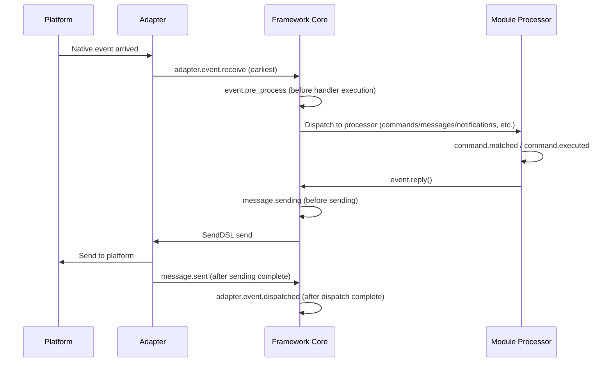
```mermaid
sequenceDiagram
    participant P as Platform
    participant A as Adapter
    participant F as Framework Core
    participant M as Module Processor

    P->>A: Native event arrived
    A->>F: adapter.event.receive (earliest)
    F->>F: event.pre_process (before handler execution)
    F->>M: Dispatch to processor (commands/messages/notifications, etc.)
    M->>M: command.matched / command.executed
    M->>F: event.reply()
    F->>F: message.sending (before sending)
    F->>A: SendDSL send
    A->>P: Send to platform
    A->>F: message.sent (after sending complete)
    F->>F: adapter.event.dispatched (after dispatch complete)
```

The framework includes the following built-in hook breakpoints, which users can listen to at any breakpoint using `@sdk.lifecycle.on()` to implement custom logic.

### Core Initialization

| Hook Name | Trigger Timing | Data |
|-----------|----------------|------|
| `core.init.start` | SDK initialization starts | `{}` |
| `core.init.complete` | SDK initialization completes | `{"duration": float, "success": bool, "adapters": {"enabled": [str], "disabled": [str]}, "modules": {"enabled": [str], "disabled": [str]}, "error": str (only on failure)}` |
| `core.uninit.complete` | SDK deinitialization completes | `{"duration": float, "success": bool, "adapters_closed": int, "modules_unloaded": int, "module_properties_cleared": int, "module_properties_to_clear": [str], "error": str (only on failure)}` |

### Configuration Changes

| Hook Name | Trigger Timing | Data |
|-----------|----------------|------|
| `config.set` | A configuration item is modified | `{"key": str, "old_value": Any, "new_value": Any}` |
| `config.updated` | Entire config tree change detected after external edit of config.toml | `{"old_config": dict, "new_config": dict, "config_file": str}` |

**Example: Configuration Audit**

```python
@sdk.lifecycle.on("config.set")
def audit_config(data):
    print(f"[Audit] {data['key']}: {data['old_value']} -> {data['new_value']}")
```

### Module Lifecycle

| Hook Name | Trigger Timing | Data |
|-----------|----------------|------|
| `module.register` | Module class registered to manager | `{"module_name": str, "success": bool}` |
| `module.load` | Module loading completes (successful instantiation) | `{"module_name": str, "success": bool}` |
| `module.init` | Module initialization completes (including lazy loading) | `{"module_name": str, "success": bool}` |
| `module.unload` | Module unloading | `{"module_name": str, "success": bool}` |

### Adapter Lifecycle

| Hook Name | Trigger Timing | Data |
|-----------|----------------|------|
| `adapter.load` | Adapter registration completes | `{"platform": str, "success": bool}` |
| `adapter.start` | Adapter starts | `{"platforms": [str]}` |
| `adapter.status.change` | Adapter status changes | `{"platform": str, "status": str, "retry_count": int, "error": str (only on failure)}` |
| `adapter.stop` | Adapter stops | `{"platforms": [str]}` |
| `adapter.stopped` | Adapter stop completes | `{"platforms": [str]}` |
| `adapter.bot.online` | Bot goes online | `{"platform": str, "bot_id": str, "info": dict, "status": str}` |
| `adapter.bot.offline` | Bot goes offline | `{"platform": str, "bot_id": str, "status": str}` |

### Event Reception and Processing

| Hook Name | Trigger Timing | Data |
|-----------|----------------|------|
| `adapter.event.receive` | External platform event received (earliest) | `{"platform": str, "event_type": str, "raw_event_type": str}` |
| `adapter.event.dispatched` | Event dispatch completes | `{"platform": str, "event_type": str, "raw_event_type": str, "onebot_handlers_count": int}` |
| `event.pre_process` | Before event handler execution begins | `{"event_type": str, "platform": str, "detail_type": str}` |

**Example: Event Counting**

```python
event_counter = {}

@sdk.lifecycle.on("adapter.event.receive")
def count_events(data):
    platform = data["platform"]
    event_counter[platform] = event_counter.get(platform, 0) + 1

@sdk.lifecycle.on("adapter.event.dispatched")
def log_unhandled(data):
    if data["onebot_handlers_count"] == 0:
        print(f"[Unprocessed] {data['platform']}/{data['event_type']}")
```

### Message Sending

| Hook Name | Trigger Timing | Data |
|-----------|----------------|------|
| `message.sending` | Message about to be sent | `{"platform": str, "method": str, "detail_type": str, "target_id": str, "bot_id": str}` |
| `message.sent` | Message sending completes | `{"platform": str, "method": str, "detail_type": str, "target_id": str, "bot_id": str}` |

**Example: Message Sending Audit**

```python
@sdk.lifecycle.on("message.sending")
def log_sending(data):
    print(f"[Sending] -> {data['platform']}/{data['detail_type']}/{data['target_id']} via {data['method']}")
```

### Command System

| Hook Name | Trigger Timing | Data |
|-----------|----------------|------|
| `command.matched` | Command matched and about to execute | `{"command": str, "args": list[str], "platform": str, "user_id": str}` |
| `command.executed` | Command execution completes | `{"command": str, "args": list[str], "platform": str, "user_id": str, "success": bool, "error": str (only on failure)}` |

**Example: Command Counting**

```python
@sdk.lifecycle.on("command.matched")
def count_commands(data):
    print(f"[Command] /{data['command']} from {data['user_id']}@{data['platform']}")
```

### HTTP Routing

| Hook Name | Trigger Timing | Data |
|-----------|----------------|------|
| `server.request` | HTTP request received | `{"method": str, "path": str, "client_ip": str}` |
| `server.response` | HTTP response sent | `{"method": str, "path": str, "status_code": int, "client_ip": str}` |

**Example: Request Logging**

```python
@sdk.lifecycle.on("server.response")
def log_http(data):
    print(f"[HTTP] {data['method']} {data['path']} -> {data['status_code']}")
```

### WebSocket

| Hook Name | Trigger Timing | Data |
|-----------|----------------|------|
| `server.start` | Router server starts | `{"base_url": str, "host": str, "port": int}` |
| `server.stop` | Router server stops | `{}` |
| `server.websocket.connect` | WebSocket connection established | `{"path": str, "module_name": str, "client_ip": str}` |
| `server.websocket.disconnect` | WebSocket connection disconnected | `{"path": str, "module_name": str, "reason": str, "error": str (only on abnormal)}` |

**Example: WebSocket Connection Monitoring**

```python
@sdk.lifecycle.on("server.websocket.connect")
def on_ws_connect(data):
    print(f"[WS] Connection: {data['path']} from {data['client_ip']}")

@sdk.lifecycle.on("server.websocket.disconnect")
def on_ws_disconnect(data):
    print(f"[WS] Disconnection: {data['path']} ({data['reason']})")

## Standard Event Definitions

```python
STANDARD_EVENTS = {
    "core": ["init.start", "init.complete", "uninit.complete"],
    "module": ["load", "init", "unload", "register"],
    "adapter": [
        "load", "start", "status.change", "stop", "stopped",
        "event.receive", "event.dispatched",
        "bot.online", "bot.offline",
    ],
    "server": [
        "start", "stop",
        "request", "response",
        "websocket.connect", "websocket.disconnect",
    ],
    "event": ["pre_process"],
    "message": ["sending", "sent"],
    "command": ["matched", "executed"],
    "config": ["set"],
}

## Complete API Reference

### Registration and Unregistration

| Method | Description |
|------|------|
| `@lifecycle.on(event, *, priority=0)` | Decorator to register a handler |
| `lifecycle.register(event, handler, *, priority=0)` | Register programmatically |
| `lifecycle.unregister(event, handler=None)` | Unregister (removes all handlers for the event if handler=None) |

### Triggering

| Method | Description |
|------|------|
| `await lifecycle.emit(event, data=None)` | Asynchronously trigger, handlers returning non-None can modify data |
| `lifecycle.emit_sync(event, data=None)` | Synchronously trigger, asynchronous handlers are scheduled using create_task |
| `await lifecycle.submit_event(event_type, *, source, msg, data)` | Backward compatibility, automatically constructs standard event format |

### Utilities

| Method | Description |
|------|------|
| `lifecycle.start_timer(timer_id)` | Start timing |
| `lifecycle.get_duration(timer_id)` | Get elapsed time (in seconds) |
| `lifecycle.stop_timer(timer_id)` | Stop timing and return elapsed time |
| `lifecycle.list_hooks()` | List all registered hooks and the number of handlers |
| `lifecycle.clear()` | Clear all handlers and timers |

## Module Usage Example

```python
from ErisPulse.Core.Bases import BaseModule
from ErisPulse import sdk

class Main(BaseModule):
    async def on_load(self, event):
        # Implement simple message counting
        self.msg_count = 0
        
        @sdk.lifecycle.on("adapter.event.receive")
        async def count(data):
            if data["event_type"] == "message":
                self.msg_count += 1
        
        # Monitor all commands
        @sdk.lifecycle.on("command.matched")
        async def log_cmd(data):
            sdk.logger.info(f"Command executed: /{data['command']} by {data['user_id']}")
        
        # Configuration change audit
        @sdk.lifecycle.on("config.set")
        def audit(data):
            sdk.logger.info(f"Configuration change: {data['key']} = {data['new_value']}")

## Background Task Ownership and Automatic Cancellation

> [!NOTE]
> This feature requires ErisPulse **2.8.0+**.

If asyncio background tasks created by a module are not canceled in `on_unload`, they will hold a reference to `self`, preventing the module instance from being recycled (old instances remain after hot reload). The framework provides the following fallback mechanisms:

- **`self.spawn(coro)`** (recommended within modules): Tasks are automatically assigned to the module name, and when the module is unloaded, the framework cancels unfinished tasks after `on_unload` and logs a warning.
- **`spawn_background(coro)`** (`ErisPulse.runtime`): Automatically captures the current `owner_scope` context; `cancel_owner_tasks(owner)` cancels tasks by ownership, and `cancel_all_background_tasks()` is provided as a fallback for `sdk.uninit()`.
- **Adapters**: When closing, background tasks under the platform name are also canceled as a fallback.

```python
async def on_load(self, event):
    # Recommended: Use self.spawn() for background tasks, the framework automatically cancels them after unloading
    self.spawn(self._poll())

async def on_unload(self, event):
    # For scenarios requiring fine-grained control, it is still recommended to manually cancel and await cleanup
    if self._poll_task:
        self._poll_task.cancel()
        await asyncio.gather(self._poll_task, return_exceptions=True)

async def _poll(self):
    while True:
        await asyncio.sleep(60)
        ...
```

> [!IMPORTANT]
> The framework's fallback is a **forced cancel** (`cancel_owner_tasks`), which occurs after `on_unload` returns. Therefore, tasks that require graceful cleanup (flushing buffers, persisting state, closing connections) **must** be manually `cancel()` + `await`ed in `on_unload`—don't expect the fallback to preserve cleanup logic. The framework only guarantees that tasks holding a reference to `self` are not left behind, not that the cleanup is graceful. For tasks that need to `await` results, directly `await` them instead of assigning them to background tasks.

## Notes

1. **Processors can be synchronous or asynchronous**: The system automatically identifies and correctly invokes them.
2. **Data passing**: In `emit()` mode, if a processor returns a non-None value, it modifies the data passed to subsequent processors.
3. **Event naming convention**: It is recommended to use dot-notation for event names, which facilitates listening to parent events.
4. **Error isolation**: An exception in a single processor does not affect the execution of other processors.
5. **Synchronous trigger limitation**: In `emit_sync()`, asynchronous processors are scheduled in fire-and-forget mode, and their return values cannot be returned.
6. **Lifecycle cleanup**: When `sdk.uninit()` is called, all registered processors and timers are cleaned up.
7. **Loading priority**: If you need to listen to events during the framework initialization phase, it is recommended to set a high priority and disable lazy loading.

Please directly return the complete translated Markdown content, without including any other text.


### 懶加载系统

# Lazy-Loaded Module System

The ErisPulse SDK provides a powerful lazy-loaded module system that allows modules to be initialized only when needed, significantly improving application startup speed and memory efficiency.

Please directly return the complete translated Markdown content without any additional text.

Once again, please note: if the document contains a language switch line (with language names separated by `` | ``), strictly adhere to the format requirements outlined above in point 8. Do not write incorrect formats such as ``[**Label**](file)``.

## Overview

The lazy loading module system is one of the core features of ErisPulse. It works in the following ways:

- **Lazy Initialization**: Modules are only actually loaded and initialized when first accessed.
- **Transparent Usage**: For developers, lazy-loaded modules are almost indistinguishable from regular modules in terms of usage.
- **Automatic Dependency Management**: Module dependencies are automatically initialized when used.
- **Lifecycle Support**: For modules that inherit from `BaseModule`, lifecycle methods are automatically invoked.

Please replace all `docs/en/` in document links with `docs/en/`. For example, `docs/en/quick-start.md` should be changed to `docs/en/quick-start.md`. For links pointing to non-current language version files (e.g., `README.xx.md` format), keep them unchanged to ensure links point to the correct language version of the document.

## How It Works

### LazyModule Class

The core of the lazy loading system is the `LazyModule` class, which is a wrapper that actually initializes the module only when it is first accessed.

### Initialization Process

When the module is first accessed, `LazyModule` performs the following operations:

1. Retrieves the `__init__` parameter information of the module class
2. Determines whether to pass a `sdk` reference based on the parameters
3. Sets the `moduleInfo` property of the module
4. For modules that inherit from `BaseModule`, calls the `on_load` method
5. Triggers the `module.init` lifecycle event

The following is the translated content without any additional text or formatting:

## Event-Driven Lazy Activation (`activate_on`)

> [!NOTE]
> This feature requires ErisPulse **2.8.0+**.

Modules with `lazy_load=True` are loaded by default only on the **first attribute access**. If a module registers command/event handlers, the traditional approach would require `lazy_load=False` to load immediately. `activate_on` provides a third option: **declare triggers, and automatically activate the module when the first matching event/command arrives**—it neither stays in memory nor loses the trigger entry point.

```python
from ErisPulse.loaders import ModuleLoadStrategy

class MyModule(BaseModule):
    @staticmethod
    def get_load_strategy():
        return ModuleLoadStrategy(
            lazy_load=True,
            activate_on=[
                # ---- Event triggers (passive arrival, no user awareness required) ----
                "message",                                    # Type-level: any message event
                {"notice": "group_member_increase"},          # Type + single detail_type
                {"message": ["private", "group"]},            # Type + multiple detail_types

                # ---- Command triggers (active input, placeholder commands visible to Help) ----
                {"command": "roll"},                          # Shorthand: command name
                {"command": ["roll", "dice"]},                # List of command names
                {"command": {                                 # Dict declaration (name is required)
                    "name": "dice",
                    "help": "Roll a die",
                    "usage": "/dice",
                    "group": "Entertainment",
                    "aliases": ["d"],
                    "hidden": False,
                }},
            ],
        )
```

### Command Dict Declaration Parameters

The dict format mirrors the user-level parameters of the `@command()` decorator, used to register placeholder commands before the module loads:

| Parameter | Type | Default | Description |
|-----------|------|---------|-------------|
| `name` | `str` | **Required** | Command name; must match `@command(name)` in `on_load`, otherwise the placeholder is unregistered after activation, and the command does not exist |
| `help` | `str` | Fallback chain | Description displayed in Help; if not declared, it falls back to the chain (see below) |
| `usage` | `str` | Auto-generated | Usage line, defaulting to `{prefix}{name}` |
| `group` | `str` | `None` | Command group |
| `aliases` | `list[str]` | `[]` | Aliases are registered simultaneously; **activating the module is triggered by inputting aliases** |
| `hidden` | `bool` | `False` | If `True`, the placeholder command is also hidden (aligned with the hidden semantics of the real command after activation); users who know the command name can still trigger activation by inputting it |

**Not supported**: `priority` / `permission` / `master`: The placeholder command's mission is only to trigger activation; permission checks are performed by the real command after activation (blocking permissions during the placeholder stage would make "activating by inputting a command" ineffective).

### Placeholder Command Help Fallback Chain

When the module is not loaded, the command description displayed in Help is taken in the following order (the first match is used):

1. The command-level `help` declared in the dict (most precise)
2. The `description` from the module's `get_meta()`
3. The module's `__description__` attribute
4. The `Summary` from package metadata (PyPI package summary)
5. A generic prompt: "This command comes from a lazy-loaded module X; the module will be automatically loaded on first use"

### Trigger Semantics

- **Event stub**: Registered to the corresponding event manager with very low priority (`ACTIVATION_STUB_PRIORITY`), acting as a fallback trigger after all ordinary handlers; after activation, the current event is forwarded to the module's real handler
- **Command stub**: Registers a placeholder command; after activation, the placeholder is unregistered, and the real command takes over the current trigger
- **Reentrancy protection**: An `asyncio.Lock` ensures activation occurs only once, even under concurrent triggers
- **Scope filtering**: The stub carries the module owner's identity, so it does not trigger if the module is not enabled for the Bot / session / platform
- **Failure semantics**: If activation fails, it is not retried, and the stub is also unregistered
- **Deduplication**: When the same command name is declared using a mix of shorthand and dict forms, deduplication occurs (dict takes precedence); if the dict lacks `name` or the event `detail_type` is incorrectly written as a dict, a warning is issued and it is ignored

> For the architecture diagram and complete semantics, see [Architecture Overview](../architecture.md#event-driven-lazy-activation-activate_on-trigger-architecture).

## Configure Lazy Loading

### Global Configuration

Enable/disable lazy loading in the configuration file:

```toml
[ErisPulse.framework]
enable_lazy_loading = true  # true=enable lazy loading (default), false=disable lazy loading
```

### Module-Level Control

Modules can control their loading strategy by implementing the `get_load_strategy()` static method:

```python
from ErisPulse.Core.Bases import BaseModule
from ErisPulse.loaders import ModuleLoadStrategy

class MyModule(BaseModule):
    @staticmethod
    def get_load_strategy():
        """Return the module loading strategy"""
        return ModuleLoadStrategy(
            lazy_load=False,  # Return False to indicate immediate loading
            priority=100      # Loading priority, higher value means higher priority
        )
```

7. **Important: Path Replacement Rule**
   - Replace `docs/en/` in document links with `docs/en/`
   - For example: `docs/en/quick-start.md` should be changed to `docs/en/quick-start.md`
   - For links pointing to non-current language version files (e.g., `README.xx.md` format links), keep them unchanged
   - This ensures that links point to the correct language version of the document

## Using Lazy-Loaded Modules

### Basic Usage

For developers, lazy-loaded modules are almost indistinguishable from regular modules in usage:

```python
# Accessing a lazy-loaded module through the SDK
from ErisPulse import sdk

# The following access will trigger the lazy loading of the module
result = await sdk.my_module.my_method()
```

### Unified Module Access Entry

Whether accessed through the SDK attribute, the module manager attribute, or queried via `module.get()`, for "registered but not yet loaded" lazy-loaded modules, the same lazy-loading proxy is returned. The module is only truly initialized when its attributes are accessed:

```python
# All three methods return the same lazy-loading proxy (when the module is not loaded), with consistent behavior and transparent to the user
sdk.my_module          # Entry point that triggers loading
sdk.module.my_module   # Also returns the lazy-loading proxy
sdk.module.get("my_module")  # Also returns the lazy-loading proxy; itself does not trigger loading

# Accessing any attribute of the proxy will truly initialize the module
result = await sdk.my_module.my_method()
```

`module.get()` is a **query** interface and does not trigger loading by itself:
- If the module is already loaded → returns the real instance
- If the module is registered but not loaded → returns the lazy-loading proxy (module is initialized only when attributes are accessed)
- If the module is not registered → returns `None`

To explicitly trigger loading, use `await sdk.load_module("my_module")`.

### Asynchronous Initialization

For modules requiring asynchronous initialization, it is recommended to load them explicitly first:

```python
# First, explicitly load the module
await sdk.load_module("my_module")

# Then use the module
result = await sdk.my_module.my_method()
```

### Synchronous Initialization

For modules that do not require asynchronous initialization, you can directly access them:

```python
# Direct access will automatically trigger synchronous initialization
result = sdk.my_module.some_sync_method()

## Best Practices

When choosing a loading strategy, refer to the following decision flow:

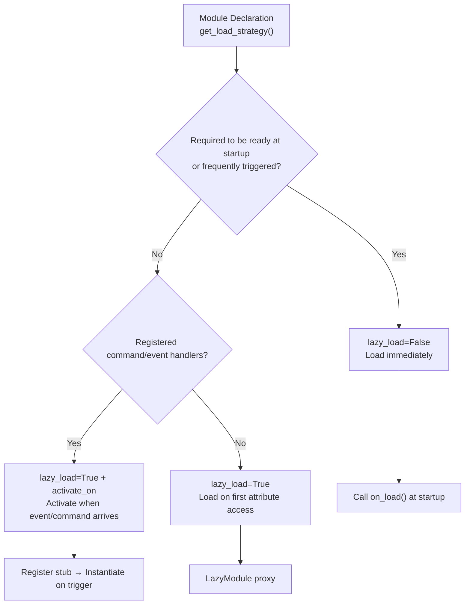
```mermaid
flowchart TD
    A["Module Declaration<br/>get_load_strategy()"] --> B{"Required to be ready at startup<br/>or frequently triggered?"}
    B -->|"Yes"| C["lazy_load=False<br/>Load immediately"]
    B -->|"No"| D{"Registered command/event handlers?"}
    D -->|"Yes"| E["lazy_load=True + activate_on<br/>Activate when event/command arrives"]
    D -->|"No"| F["lazy_load=True<br/>Load on first attribute access"]
    C --> G["Call on_load() at startup"]
    E --> H["Register stub → Instantiate on trigger"]
    F --> I["LazyModule proxy"]
```

### Recommended Scenarios for Lazy Loading (lazy_load=True)

- Passive utility classes (e.g., data query modules, format converters, etc., which are only needed when called by other modules)
- Modules that register command/event handlers but are not used frequently — use `activate_on` to declare triggers, and automatically activate when the first matching event/command arrives, without abandoning lazy loading

### Recommended Scenarios for Disabling Lazy Loading (lazy_load=False)

- Modules that need to be ready at startup (e.g., core modules providing basic services to other modules)
- High-frequency listeners (each message needs to be processed) — `activate_on` forwarding has an activation overhead, so immediate loading is more direct in high-frequency scenarios
- Scheduled task modules
- Modules that need to be initialized at application startup

> The `priority` parameter controls the initialization order among immediately loaded modules; higher values initialize earlier. Modules with the same priority are loaded in registration order.

docs/en/best-practices.md

## Notes

1. If your module uses lazy loading, and other modules have never been called within ErisPulse, your module will never be initialized.
2. If your module contains modules that listen to Events, or other actively listening modules, there are two options: declare an `activate_on` trigger (maintain lazy loading, activate automatically when the event arrives), or declare that it needs to be loaded immediately (`lazy_load=False`), otherwise it will affect the normal operation of your module.
3. We do not recommend disabling lazy loading unless there are special requirements, otherwise it may bring you problems such as dependency management and lifecycle events.
4. In the command dict declaration of `activate_on`, `name` must be consistent with the real command name registered by `@command()` in the module's `on_load` — otherwise, after the module is activated, the placeholder command will be unregistered, and the declared command inconsistent with the implementation will not exist.

Please directly return the complete translated Markdown content, without including any other text.

Once again, if the document contains a language switch line (with each language name separated by `` | ``), be sure to strictly follow the format requirements above in item 8, and do not write incorrect formats such as ``[**Label**](file)``.


### 国际化（i18n）系统

# Internationalization (i18n) System

ErisPulse v2.5.0 integrates a complete internationalization support system. The framework core and the CLI interface can automatically switch display text based on your system language, and it also supports external modules registering their own translations.

## Supported Languages

| Language | Code | Description |
|------|------|------|
| Simplified Chinese | `zh-CN` | Default language (Framework's native language) |
| Traditional Chinese | `zh-TW` | Traditional Chinese (Hong Kong/Macau/Taiwan) |
| English | `en` | English (General fallback language) |
| 日本語 | `ja` | Japanese |
| Русский | `ru` | Russian |

## Quick Start

### Switch via Environment Variables

```bash
# Windows PowerShell
$env:ERISPULSE_LANG = "en"
epsdk run

# macOS / Linux
ERISPULSE_LANG=ja epsdk run
```

### Switch via Configuration File

Add the following to `config/config.toml`:

```toml
[ErisPulse.i18n]
language = "zh-TW"
```

Set to `"auto"` (default) to automatically detect the system language.

### Manually Switch in Code

```python
from ErisPulse import i18n

# Manually set language
i18n.set_language("en")
print(i18n.get_language())  # "en"

# Reset to auto-detection
i18n.reset_language()
```

---

## Language Detection Mechanism

The framework detects the user's language in the following order of priority:

1. **Environment Variable `ERISPULSE_LANG`** — Highest priority, used for testing and temporary switching.
2. **Windows API** — `GetUserDefaultLocaleName` (Windows only, not affected by the `LANG` variable overridden by tools like Git Bash).
3. **Environment Variables** — `LANGUAGE` > `LC_ALL` > `LC_MESSAGES` > `LANG` (Unix/macOS standards).
4. **System Locale** — `locale.getlocale()` / `locale.getdefaultlocale()`.
5. **Fallback** — en (English).

### Proximity Mapping Principle

When the detected language is not an exact match, map it to a supported language based on proximity:

- `zh-TW`, `zh-HK`, `zh-MO`, `zh-Hant` → **Traditional Chinese**
- All other `zh-*` (e.g., `zh-CN`, `zh-SG`) → **Simplified Chinese**
- `en-US`, `en-GB`, `en-AU`, etc. → **English**
- `ja-JP` → **Japanese**
- `ru-RU` → **Russian**
- Other unrecognized languages → **Simplified Chinese (Fallback)**

## Using i18n in Modules

You can register translation texts for your own module to enable multi-language support for your module.

### Recommended Approach: Declare Translation Keys via I18nClass (v2.7.0+)

Starting from v2.7.0, modules/adapters can declare translation keys via the nested class `I18nClass`, similar to declaring `ConfigClass`. The framework will **automatically register** all declared translation keys upon loading, without the need to manually call `i18n.register()`.

```python
from dataclasses import dataclass, field

from ErisPulse.Core.Bases import BaseConfig, BaseI18n, BaseModule, I18nKey


class MyModule(BaseModule):
    # Configuration class (optional)
    @dataclass
    class ConfigClass(BaseConfig):
        welcome_msg: str = field(
            default="欢迎",
            metadata={
                # This references the i18n key mymodule.welcome_msg
                "description": {"i18n": "mymodule.welcome_msg", "default": "Welcome Message"},
            },
        )

    # Translation key collection class (optional)
    # Declared keys will be automatically registered by the framework, with priority over ConfigClass default configuration generation
    class I18nClass(BaseI18n):
        # Property names are automatically concatenated into the full key path: <ModuleName>.<PropertyName>
        welcome_msg: I18nKey = I18nKey(
            default="Welcome Message",   # Language-agnostic fallback, not registered to any language
            zh_CN="欢迎消息",
            en="Welcome Message",
            ja="ウェルカムメッセージ",
            ru="Приветственное сообщение",
            zh_TW="歡迎訊息",
        )
        # Other translation keys used by the business logic
        hello: I18nKey = I18nKey(
            default="Hello, {name}!",
            zh_CN="你好，{name}！",
            zh_TW="你好，{name}！",
            en="Hello, {name}!",
            ja="こんにちは、{name}！",
            ru="Привет, {name}!",
        )

        # Can also explicitly specify the full key path (not using property name concatenation)
        custom: I18nKey = I18nKey(
            key="mymodule.deep.nested.key",
            default="Default text",
            zh_CN="默认文本",
            zh_TW="預設文本",
            en="Default text",
            ja="デフォルトテキスト",
            ru="Текст по умолчанию",
        )
```

#### Why recommend I18nClass?

| Scenario | Manual i18n.register() | I18nClass Declarative |
|----------|------------------------|------------------------|
| i18n keys referenced in config descriptions | Manual registration required, must be done before config generation | Framework automatically registers before config generation |
| Multi-language translation declarations | Scattered across various on_load() calls | Centralized in a class, easy to read at a glance |
| Naming consistency of keys | Prone to typos | Property names used as key suffixes, IDE completion available |
| Cleanup on unload | Manual unregister_domain() required | Framework uses unified domain registration |

#### I18nClass Key Path Rules

- **Default**: Uses ``<ModuleRegistrationName>.<PropertyName>`` as the full key path
  - Example: Module name is ``MyModule``, property ``welcome`` → key path ``MyModule.welcome``
- **Explicit**: Specify arbitrary dotted path via ``I18nKey(key="...")`` parameter
  - Suitable for deeply nested key names (e.g., ``mymodule.config.basic.token``)

#### Usage in Adapters

Adapters also support `I18nClass`, and the usage is exactly the same:

```python
from ErisPulse.Core import BaseAdapter
from ErisPulse.Core.Bases import BaseConfig, BaseI18n, I18nKey


class MyAdapter(BaseAdapter):
    @dataclass
    class ConfigClass(BaseConfig):
        endpoint: str = field(
            default="",
            metadata={
                # The config description references the adapter.MyAdapter.endpoint key
                "description": {"i18n": "MyAdapter.endpoint", "default": "API Endpoint"},
            },
        )

    class I18nClass(BaseI18n):
        # Centralized declaration of i18n keys referenced by config descriptions and other business keys
        endpoint: I18nKey = I18nKey(
            default="API Endpoint",
            zh_CN="API 地址",
            zh_TW="API 位址",
            en="API Endpoint",
            ja="APIアドレス",
            ru="API адрес",
        )
```

The adapter's `I18nClass` will be automatically registered during the `__init__` stage (i.e., before configuration template generation), ensuring i18n keys referenced by config descriptions are available.

### Manually Registering Custom Translations (Legacy Approach)

If you do not use `I18nClass`, you can also directly call `i18n.register()` to register translation texts.

```python
from ErisPulse import i18n

# Register Chinese translations
i18n.register("zh-CN", {
    "my_module.welcome": "欢迎使用我的模块！",
    "my_module.goodbye": "再见！",
    "my_module.hello": "你好，{name}！",
}, domain="my_module")

# Register English translations
i18n.register("en", {
    "my_module.welcome": "Welcome to my module!",
    "my_module.goodbye": "Goodbye!",
    "my_module.hello": "Hello, {name}!",
}, domain="my_module")
```

### Using Translations

```python
from ErisPulse import i18n

# Simple translation
i18n.t("my_module.welcome")  # Automatically uses the current language

# With formatting parameters
i18n.t("my_module.hello", name="Alice")

# Specify a default value (returned when the translation key does not exist)
i18n.t("my_module.unknown_key", default="Default text")
```

### Using in Module Class

```python
from dataclasses import dataclass, field
from ErisPulse import i18n
from ErisPulse.Core.Bases import BaseConfig, BaseModule

@dataclass
class MyModuleConfig(BaseConfig):
    welcome_msg: str = field(
        default="欢迎",
        metadata={
            "description": {"i18n": "my_module.welcome_msg", "default": "Welcome Message"},
            "ui": {"widget": "text", "group": "basic", "order": 1},
        },
    )

class MyModule(BaseModule):
    ConfigClass = MyModuleConfig

    async def on_load(self, event):
        # Real-time reading of configuration (reflects latest value on every access)
        self.logger.info(self.cfg.welcome_msg)
        self.logger.info(i18n.t("my_module.welcome"))

    @command("hello")
    async def hello_handler(self, event):
        name = event.get_user_nickname() or "friend"
        await event.reply(i18n.t("my_module.hello", name=name))

    async def on_unload(self, event):
        pass
```

### Unloading Translations

```python
# Unload the entire domain translations
i18n.unregister_domain("my_module")

## Multi-language Configuration Fields

Since v2.5.2, the configuration Schema fully supports i18n. All user-visible text fields can reference i18n keys, and the WebUI and other consumers will automatically resolve them to the corresponding text based on the current language.

### Supported i18n Fields

| Field | Location | Description |
|------|------|------|
| `description` | field metadata | Field description |
| `options[].label` | `ui.options` | select control option label |
| `placeholder` | `ui.placeholder` | Input placeholder |
| `group_labels` | `_schema_meta` | Group display name (Dashboard partition title) |

Adopts the unified `{"i18n": "key", "default": "text"}` format; pure strings are passed through as-is (backward compatible).

### Declaring i18n Fields

All user-visible text fields support i18n:

```python
from dataclasses import dataclass, field
from ErisPulse.Core.Bases import BaseConfig

@dataclass
class MyAdapterConfig(BaseConfig):
    # description i18n
    token: str = field(
        default="",
        metadata={
            "description": {"i18n": "my_adapter.token", "default": "Platform Token"},
            "required": True,
            "secret": True,
            "ui": {
                "widget": "password",
                "group": "basic",
                "order": 1,
                # placeholder i18n
                "placeholder": {"i18n": "my_adapter.token.ph", "default": "Please enter Token"},
            },
        },
    )
    # options label i18n
    mode: str = field(
        default="a",
        metadata={
            "description": {"i18n": "my_adapter.mode", "default": "Runtime Mode"},
            "ui": {
                "widget": "select",
                "group": "basic",
                "order": 2,
                "options": [
                    {"label": {"i18n": "my_adapter.mode.a", "default": "Mode A"}, "value": "a"},
                    {"label": {"i18n": "my_adapter.mode.b", "default": "Mode B"}, "value": "b"},
                ],
            },
        },
    )

    # group_labels i18n (Group display name)
    _schema_meta = {
        "group_labels": {
            "basic": {"i18n": "my_adapter.group.basic", "default": "Basic Settings"},
        }
    }
```

`default` is the fallback text — displayed when the translation is not registered or lookup fails.

### secret Masking and Configuration Validation

Fields marked with `"secret": True` automatically gain **masking protection** (since 2.7.0):

- **Template Generation Masking**: When `dataclass_to_toml_with_comments()` generates the configuration template, the real values of secret fields are not written to the file (displayed as empty placeholders), preventing sensitive information from being written to disk
- **Universal Masking Utility**: `redact_secret(value)` replaces non-empty values with `***`; empty values are returned as-is. Can be used in scenarios like log output

```python
from ErisPulse.Core.Bases.config_schema import redact_secret

redact_secret("sk-xxxxxx")  # '***'
redact_secret("")           # ''
```

**Configuration Validation** (`validate_config()`) supports (in addition to `required` non-empty checks since 2.7.0):

| Validation Item | Metadata | Example |
|--------|--------|------|
| Type Matching | Field declared type | Passing a string to an `int` field raises an error |
| Enum Constraint | `ui.options` or top-level `options` | Value must belong to allowed options |
| Numeric Range | Top-level `min` / `max` | `metadata={"min": 1, "max": 65535}` |

```python
from ErisPulse.Core.Bases.config_schema import validate_config

@dataclass
class C(BaseConfig):
    mode: str = field(default="a", metadata={"ui": {"widget": "select", "options": ["a", "b"]}})
    port: int = field(default=80, metadata={"min": 1, "max": 65535})

errors = validate_config(C(mode="x", port=70000))  # Two errors: enum + range
```

### Registering Configuration Translations

The i18n keys for configuration fields work like normal translation keys; register them using `i18n.register()`:

```python
from ErisPulse import i18n

# Register Chinese (consistent with default, or different)
i18n.register("zh-CN", {
    "my_adapter.token": "平台 Token",
}, domain="my_adapter")

# Register English
i18n.register("en", {
    "my_adapter.token": "Platform Token",
}, domain="my_adapter")
```
> **Recommended Approach**: Use `I18nClass` to declare translation keys; the framework will register them automatically (see the "Recommended Approach" section above),
> eliminating the need to manually call `i18n.register()` or `register_config_i18n()`.

A convenience function `register_config_i18n()` is also provided, which can automatically extract keys from the configuration class and register them:

```python
from ErisPulse.Core.Bases.config_schema import register_config_i18n

# Automatically extracts description.default as zh-CN translation
register_config_i18n(MyAdapterConfig, "zh-CN")

# Manually provide English translation
register_config_i18n(MyAdapterConfig, "en", {
    "my_adapter.token": "Platform Token",
})
```

### How WebUI Consumes It

In the schema returned by `get_config_schema()`, i18n dictionaries are passed through as-is. The WebUI frontend can call `i18n.t()` to resolve based on the current language.

If you need the server to resolve it to a string directly (e.g., for a frontend that does not support i18n), use `resolve_config_schema()`, which resolves `description`, `options[].label`, `placeholder`, and `group_labels` all to the current language's text:

```python
from ErisPulse.Core.Bases.config_schema import resolve_config_schema

# All i18n fields are resolved to current language strings
schema = resolve_config_schema(MyAdapterConfig)
print(schema["fields"]["token"]["description"])    # "平台 Token" or "Platform Token"
print(schema["fields"]["token"]["placeholder"])   # "请输入 Token" or "Enter Token"
print(schema["fields"]["mode"]["options"][0]["label"])  # "模式A" or "Mode A"
print(schema["group_labels"]["basic"])             # "基本设置" or "Basic"
```

> The actual definitions of types and utility functions like `BaseConfig`, `BotAccountConfig`, `register_config_i18n()`, `resolve_config_schema()` etc. are located in `ErisPulse.Core.Bases.config_schema`.
> `ErisPulse.runtime.config_schema` is kept as a compatibility shim,
> **it is recommended to import uniformly from `ErisPulse.Core.Bases`** (with the exception of i18n translation key related types,
> which are located in `ErisPulse.Core.Bases.i18n_schema`).

## API Reference

### I18nManager

#### Core Methods

| Method | Description |
|--------|-------------|
| `t(key, default=None, **kwargs)` | Get the translation text (`gettext()` is an alias) |
| `set_language(lang)` | Manually set the language |
| `get_language()` | Get the current language |
| `reset_language()` | Reset to auto-detect (and re-detect environment) |
| `get_supported_languages()` | Get a list of all supported languages |
| `has_translation(key, lang=None)` | Check if a translation key exists |
| `register(lang, translations, domain)` | Register custom translations |
| `unregister_domain(domain)` | Unload all translations for a specified domain |
| `reload()` | Reload built-in translations and re-detect language |

#### `t()` Method Details

```python
def t(self, key, /, default=None, **kwargs):
```

- `key` — Translation key (positional argument only, does not conflict with `key=` in `**kwargs`)
- `default` — Default value to return if translation does not exist, defaults to `None` (returns the key name itself)
- `**kwargs` — Formatting parameters, used to fill `{placeholder}` in the translation value

Example:

```python
# Translation definition: "greeting": "你好，{name}！欢迎来到{place}。"
i18n.t("greeting", name="Alice", place="ErisPulse")
# Returns: "你好，Alice！欢迎来到ErisPulse。"
```

### BaseI18n / I18nKey (Declarative Translation Keys)

Starting from v2.7.0, `ErisPulse.Core.Bases` provides translation key declaration tools based on class attributes (recommended to import uniformly from `ErisPulse.Core.Bases`):

> ``I18nKey.default`` is the **language-agnostic fallback text** and is not registered to any language.
> For translations to take effect, you must explicitly pass at least one language argument (``zh_CN=`` / ``en=`` / ``ja=`` etc.).
> This allows developers from different countries to freely use their native language to fill ``default``, without the framework making any assumptions.

| Name | Description |
|------|-------------|
| `I18nKey(default, *, key=None, zh_CN, zh_TW, en, ja, ru)` | Single translation key declaration, `default` is language-agnostic fallback |
| `BaseI18n` | Translation key collection base class (naming aligned with `BaseConfig`), subclasses declare multiple `I18nKey` as class attributes |
| `BaseI18n.register(prefix="", domain="app")` | Class method: registers all declared keys to the i18n system |
| `key` | Alias for `I18nKey` (more concise to write) |

Usage Example:

```python
from ErisPulse.Core.Bases import BaseI18n, key

class MyKeys(BaseI18n):
    # Concise alias syntax
    hello = key(
        default="Hello",
        zh_CN="你好",
        zh_TW="你好",
        en="Hello",
        ja="こんにちは",
        ru="Привет",
    )
    bye = key(
        default="Bye",
        zh_CN="再见",
        zh_TW="再見",
        en="Bye",
        ja="さようなら",
        ru="До свидания",
    )

# Usage independent of class (manual registration)
MyKeys.register(prefix="myapp.", domain="myapp")
```

### Accessing from SDK Instance

```python
from ErisPulse import sdk

# sdk.i18n is the same object as the directly imported i18n
sdk.i18n.set_language("en")
print(sdk.i18n.t("core.sdk.init.starting"))
```

---

## Runtime Configuration

### Reading i18n Configuration via API

```python
from ErisPulse.Core.Bases import I18nConfig
from ErisPulse.runtime import get_i18n_config

config = get_i18n_config()
print(config["language"])  # "auto" or specific language code

# I18nConfig is a dataclass, can be used to generate config template
schema = I18nConfig.__dataclass_fields__
```

### Configuration Item Explanation

In the `[ErisPulse.i18n]` section of `config/config.toml`:

```toml
[ErisPulse.i18n]
# Display language, optional values:
# - "auto"      — Automatically detect system language (default)
# - "zh-CN"     — Simplified Chinese
# - "zh-TW"     — Traditional Chinese
# - "en"        — English
# - "ja"        — Japanese
# - "ru"        — Russian
language = "auto"
```

---

## Best Practices

### Translating Key Naming

It is recommended to use dot-separated namespace format:

```
<Module Name>.<Category>.<Description>
```

For example: `my_module.command.hello_desc`, `core.adapter.start_failed`

### Multilingual Coverage

It is not necessary to provide translations for all languages at once. Missing languages will automatically fall back to English, and if English is also unavailable, the key name itself will be displayed.

### Dynamic Content

For dynamically generated content (such as usernames, counts, etc.), use `{placeholder}` formatting:

```python
# Translation definition
"user_count": "Current online users: {count} people"

# Usage
i18n.t("user_count", count=len(users))
```

### Log Messages

If your module uses the framework's Logger, these messages will also automatically use the current language:

```python
self.logger.info(i18n.t("my_module.startup"))

## Relationship with CLI i18n

The CLI has a **standalone** internationalization module (`ErisPulse.CLI.i18n`), which is completely decoupled from the internationalization module of the framework core.

- **Core i18n** — Used by the framework core module, external modules can register translations
- **CLI i18n** — Used internally by the command line interface, does not share translation data with Core

This design ensures that translation changes in the CLI will not affect the stability of the framework core.


### 模块作用域系统

# Module Scope System

> [!NOTE]
> This feature requires ErisPulse **2.8.0+**.

The module scope system is used to control which modules a "certain Bot" can use, achieving module isolation in multi-Bot scenarios. By default, all modules are available to all Bots; filtering only begins after configuration binding, and **no changes are required for modules or adapters** to adapt.

{!--< tips >!--}
1. The scope is bound to modules based on the dimension of 「adapter platform + Bot identifier + session identifier」
2. Supports both whitelist (`modules`) and blacklist (`blocked`) methods
3. Modules disabled by scope silently ignore messages and do not reply with prompts
4. Supports dynamic addition and removal at runtime via `sdk.scope.bind()` / `unbind()`, which can be persisted
{!--< /tips >!--}

Please directly return the complete translated Markdown content without including any other text.

Once again, if the document contains a language switch line (with language names separated by `` | ``), strictly follow the format requirement in point 8 above, and do not write incorrect formats such as ``[**Label**](file)``.

## How It Works

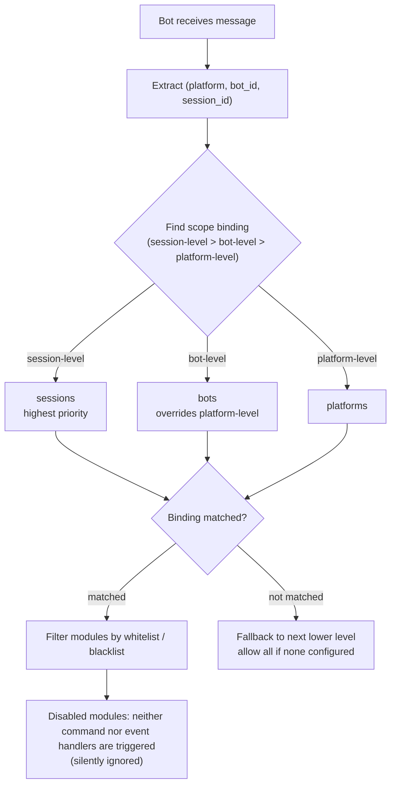
```mermaid
flowchart TD
    A["Bot receives message"] --> B["Extract (platform, bot_id, session_id)"]
    B --> C{"Find scope binding<br/>(session-level > bot-level > platform-level)"}
    C -->|"session-level"| D["sessions<br/>highest priority"]
    C -->|"bot-level"| E["bots<br/>overrides platform-level"]
    C -->|"platform-level"| F["platforms"]
    D & E & F --> G{"Binding matched?"}
    G -->|"matched"| H["Filter modules by whitelist / blacklist"]
    G -->|"not matched"| I["Fallback to next lower level<br/>allow all if none configured"]
    H --> J["Disabled modules: neither command nor event handlers are triggered<br/>(silently ignored)"]
```

- **Resolution priority: session-level > bot-level > platform-level**, if a higher priority has no binding rules, fall back to the next lower level; if none is configured, allow all modules.
- When event data lacks `self` (Bot cannot be identified), skip bot-level and determine based on session-level / platform-level.
- Framework-level resources (handlers with empty owner, command dispatcher, event bus) are always allowed, unaffected by scope.

Please directly return the complete translated Markdown content, without any additional text.

## Configuration File

```toml
[ErisPulse.scope]
default_allow = true        # Allow all by default (false = implicit strict mode)
cache_size = 1024           # LRU cache size for is_allowed

# Platform-level bindings (applies to all Bots / Sessions on this platform)
[ErisPulse.scope.platforms.onebot11]
modules = ["Chat", "Translate"]   # Whitelist: only these modules can be used on this platform
blocked = ["Danger"]              # Blacklist: these modules are disabled on this platform

# Bot-level bindings (applies to all sessions for this Bot, overrides platform-level)
[ErisPulse.scope.bots.onebot11."123456"]
modules = ["Chat"]
blocked = []

# Session-level bindings (applies to a specific group / channel / private chat, most specific)
[ErisPulse.scope.sessions.onebot11."789012345"]
modules = ["Chat"]                # Only Chat is allowed for this group
blocked = []
```

Semantics (module names match **case-insensitively**):

| Config | Effect |
|--------|--------|
| Only `modules` (whitelist) | Only listed modules are allowed |
| Only `blocked` (blacklist) | Listed modules are blocked, everything else is allowed |
| Both configured | Whitelist restricts the scope, then Blacklist removes items from the whitelist |
| Both empty / not configured | Follows `default_allow`: `true` (default) allows all; `false` implicitly denies |

> `modules` and `blocked` both support strings or string lists. Module names are case-insensitive (`"Chat"` is equivalent to `"chat"`).
> Session identifiers are the event's Group ID (`group_id`), Channel ID (`channel_id`), or Private chat User ID (`user_id`).
> **Session identifiers are isolated across platforms**: The `(platform, session_id)` combination uniquely identifies a session. `789` for `onebot11` does not affect `789` for `telegram`.

## Runtime API

### Checking if a module is allowed

```python
from ErisPulse import sdk

# Check if a certain Bot is allowed to use a certain module
allowed = sdk.scope.is_allowed("onebot11", "123456", "Chat")

# Check for a specific session (Group / Channel / Direct Message)
allowed = sdk.scope.is_allowed("onebot11", "123456", "Chat", "789012345")
```

### Dynamic Binding / Unbinding

```python
# Bind Bot-level whitelist (persisted to config)
sdk.scope.bind("onebot11", "123456", modules=["Chat", "Translate"])

# Bind session-level whitelist (3rd parameter is session_id)
sdk.scope.bind("onebot11", "123456", "789012345", modules=["Chat"])

# Bind platform-level blacklist
sdk.scope.bind("onebot11", blocked=["Danger"])

# Only effective at runtime (invalidated after restart)
sdk.scope.bind("onebot11", "123456", modules=["Chat"], persist=False)

# Merge instead of replace: add Music to existing whitelist (default bind is replace)
sdk.scope.bind("onebot11", "123456", modules=["Music"], merge=True)

# Remove bindings (restore allow all); you can specify session_id to remove session-level bindings
sdk.scope.unbind("onebot11", "123456")
sdk.scope.unbind("onebot11", "123456", "789012345")
```

> `bind()` **replaces** the entire binding for the target by default; when `merge=True`, it merges new modules/disables into existing bindings.

### Query Bindings

```python
# Get active bindings (can specify session)
sdk.scope.get("onebot11", "123456")              # {"modules": ["Chat"], "blocked": []}
sdk.scope.get("onebot11", "123456", "789012345") # Session-level active bindings
sdk.scope.get("onebot11")                        # Platform-level bindings, None if not exists

# List all bindings (platforms / bots / sessions buckets)
sdk.scope.list_bindings()
```

### Filtering Statistics (Debug)

```python
# View the count of bindings silently filtered by the scope and cache hit status
sdk.scope.get_stats()
# {"is_allowed_calls": 10, "filtered_count": 3, "cache_hits": 5, "cache_misses": 5}

sdk.scope.reset_stats()
```

### Topology Tree Data

```python
# Scope part (for Dashboard display)
sdk.scope.get_topology()

## FAQ and Considerations

### 1. Configuration Hierarchy

Parsing Priority: **Session > Bot > Platform**. Higher priority bindings **completely override** lower priority ones.

```toml
# Platform level only allows Chat
[ErisPulse.scope.platforms.onebot11]
modules = ["Chat"]

# But Bot level only allows Music → This bot can ultimately only use Music, cannot use Chat!
[ErisPulse.scope.bots.onebot11."123456"]
modules = ["Music"]
```

- To "allow Chat at platform level and add Music at Bot level", you must **list both at Bot level simultaneously**: `modules = ["Chat", "Music"]`.
- Similarly, the lower-level blacklist is overridden by the upper-level whitelist: Platform level `blocked=["Danger"]` + Bot level `modules=["Danger"]` → Bot level completely overrides, Danger is usable. The higher the hierarchy and the more specific it is, the more it takes precedence.

### 2. It is "Event-by-Event" Judgment, not "Sticky"

Scope judgment applies **only to the current event**, without cross-event memory:
- Session g1 has module A disabled → For this **message** on g1, A does not trigger; the **next** message is judged independently, if the binding hasn't changed it still won't trigger, if the binding changes it takes effect immediately (LRU cache will automatically invalidate).
- Session g2 has no binding configured → Falls back to Bot level / Platform level judgment; if neither exists, follows `default_allow`.

### 3. Module Not Responding

When you send a message and the module doesn't react, suspect the scope first rather than the module / adapter:

```python
# Add a line in the module code or a temporary script to locate
from ErisPulse import sdk
print(sdk.scope.is_allowed(event.get_platform(), <bot_id>, "MyModule", <session_id>))
print(sdk.scope.get_stats())          # filtered_count > 0 indicates it was indeed filtered
```

Being filtered is **silent** (no reply, to avoid exposing scope rules to users), but `filtered_count` will accumulate.

### 4. Session Identifier Cross-Platform Isolation

The `(platform, session_id)` combination is the unique identifier. `[ErisPulse.scope.sessions.onebot11."789"]` only applies to the onebot11 platform and does not affect a telegram session with the same `789`.

### 5. Performance

`is_allowed()` results are cached with **LRU Cache** (default 1024 entries, `scope.cache_size` is adjustable),
config changes / `bind()` / `unbind()` automatically invalidate the cache, making the overhead for high-frequency event paths extremely small.

## Topology Tree API

`ModuleManager.get_topology()` and `AdapterManager.get_topology()` provide data on module/adapter ownership, while `sdk.get_topology()` aggregates all three:

```python
from ErisPulse import sdk

topology = sdk.get_topology()
# {
#   "modules": {                                   # Module -> Owned Resources
#     "Chat": {
#       "loaded": True, "enabled": True,
#       "load_strategy": {"lazy": False, "priority": 50},
#       "info": {...},
#       "commands": ["chat", "translate"],
#       "handlers": {"message": 2, "notice": 1},
#       "routes": {"http": ["/Chat/api"], "ws": [], "sse": []},
#       "lifecycle_hooks": 3,
#       "scope_applies": True,
#     }
#   },
#   "adapters": {                                  # Adapter -> Bot -> Scope
#     "onebot11": {
#       "status": "started", "enabled": True,
#       "bots": {"123456": {"status": "online", "last_active": ..., "info": {...}, "scope": {...}}},
#       "scope": {"modules": [...], "blocked": [...]},
#     }
#   },
#   "scope": {"platforms": {...}, "bots": {...}, "sessions": {...}}   # All scopes bound
# }
```

- Module topology aggregates commands, event handlers, HTTP/WS/SSE routes, and lifecycle hooks registered by the module, facilitating the drawing of the module resource tree.
- Adapter topology aggregates adapter status, subordinate Bot status, and platform-level/Bot-level scope bindings.


### 启动流程与手动控制

# Startup Flow and Manual Control

ErisPulse's `await sdk.run()` / `await sdk.init()` encapsulates the entire startup chain into a single line of code. However, when you need to fully customize the startup process (for example, partial loading, dynamic registration, hot plugging, or injecting custom loading strategies), you need to understand what happens inside this chain and how to manually drive each step.

This article breaks down the startup chain into independent components, explains their respective responsibilities, call order, and provides an example of manually initiating the full startup process.

> This article assumes you have already run through [the first bot](../getting-started/first-bot.md) and understand the two modes of `sdk.run(keep_running=True/False)`. This article focuses on the internal breakdown of the chain within `init()`, as well as lower-level entry points such as `init()` / `init_task()` / `init_sync()`.

7. **Important: Path Replacement Rules**
   - Replace `docs/en/` in document links with `docs/en/`
   - For example: `docs/en/quick-start.md` should be changed to `docs/en/quick-start.md`
   - For links pointing to non-current language version files (such as links in the form of `README.xx.md`), keep them unchanged
   - This ensures that links point to the correct language version of the document

## SDK Top-Level Entry Overview

In addition to the two `keep_running` modes of `run()`, the SDK provides several lower-level initialization entries, which differ in **asynchronicity, return value, and whether exceptions are wrapped**:

| Entry | Asynchronicity | Return Value | Exception Handling | Use Case |
|------|--------|--------|----------|----------|
| `await sdk.run(True)` | async, blocking | `None` (automatically `uninit` on shutdown) | Module/adapter errors are intercepted, not crashing the process | Pure bot applications |
| `await sdk.run(False)` | async, non-blocking | `None` (not automatically unloaded) | Same as above | Execute custom logic after initialization |
| `await sdk.init()` | async, requires await | `bool` | Internal component exceptions are caught, returns `False` on failure | Manual lifecycle control (paired with `uninit()`) |
| `sdk.init_task()` | async, returns Task without blocking | `asyncio.Task` | Same as `init()` | Concurrently execute other initialization tasks, or when event loop is not yet running |
| `sdk.init_sync()` | **Synchronous**, blocks current thread | `bool` | Same as `init()` | Command-line scripts, synchronous entry points without event loop |

> **Common Misunderstanding**: `await sdk.init()` is **not equivalent** to `await sdk.run(keep_running=False)`. Two differences: ① `init()` returns `bool` (returns `False` on failure), `run()` returns `None`; ② `init()` only performs initialization, **does not automatically unload**, while `run()` automatically calls `uninit()` when the event loop ends. Therefore, when manual pairing of unloading or custom lifecycle control is needed, use `init()` + `uninit()`.

docs/en/sdk-overview.md

## Overview of the Startup Process

`sdk.init()` (specifically its internal `Initializer.init()`) initiates the entire framework in the following sequence:

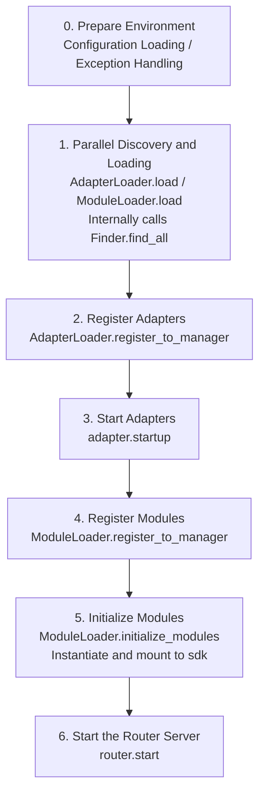
```mermaid
flowchart TD
    A[0. Prepare Environment<br/>Configuration Loading / Exception Handling] --> B
    B[1. Parallel Discovery and Loading<br/>AdapterLoader.load / ModuleLoader.load<br/>Internally calls Finder.find_all] --> C
    C[2. Register Adapters<br/>AdapterLoader.register_to_manager] --> D
    D[3. Start Adapters<br/>adapter.startup] --> E
    E[4. Register Modules<br/>ModuleLoader.register_to_manager] --> F
    F[5. Initialize Modules<br/>ModuleLoader.initialize_modules<br/>Instantiate and mount to sdk] --> G
    G[6. Start the Router Server<br/>router.start]
```

Corresponding core components:

| Layer | Component | Responsibility |
|----|------|------|
| Discovery | `AdapterFinder` / `ModuleFinder` | **Discover** adapters/modules from entry-points of installed packages |
| Loading | `AdapterLoader` / `ModuleLoader` | Discovery + Import + Read metadata + Determine enable/disable, return object list |
| Registration | `*Loader.register_to_manager` | Register objects to corresponding managers |
| Management | `sdk.adapter` / `sdk.module` | Maintain adapter/module instances, provide start/stop interfaces |
| Initialization | `ModuleLoader.initialize_modules` | Create module instances and mount to `sdk` (handle dependency topological sorting) |
| Routing | `sdk.router` | HTTP / WebSocket server |

> **Important**: `Finder` and `Loader` are two layers. The `Loader` internally **already holds** a `Finder` (e.g., `AdapterLoader` comes with its own `AdapterFinder`, `ModuleLoader` comes with its own `ModuleFinder`). In most scenarios, you only need to use the `Loader`; only when you need "list without importing" would you use `Finder` alone.

[**English**](docs/en/quick-start.md)

## Detailed Explanation of Each Step

### 1. Discovery Layer: Finder

The Finder is only responsible for "finding which packages provide adapters/modules", without importing or instantiating them.

```python
from ErisPulse.finders import AdapterFinder, ModuleFinder

adapter_finder = AdapterFinder()
module_finder = ModuleFinder()

# Find all installed adapters/modules entry-points
adapter_entries = adapter_finder.find_all()    # list[EntryPoint]
module_entries = module_finder.find_all()      # list[EntryPoint]

# Find a single one by name
entry = module_finder.find_by_name("MyModule")  # EntryPoint | None
```

Each `EntryPoint` can be loaded via `.load()` to get the corresponding class, but usually you don't need to do this manually — the Loader handles it.

### 2. Loading Layer: Loader

The Loader, built on top of the Finder, handles "importing + reading metadata + determining enable/disable".

```python
from ErisPulse.loaders import AdapterLoader, ModuleLoader
from ErisPulse import sdk

adapter_loader = AdapterLoader()
module_loader = ModuleLoader()

# Internally, load() calls finder.find_all() → processes each entry-point → returns a triple
adapter_objs, enabled_adapters, disabled_adapters = await adapter_loader.load(sdk.adapter)
module_objs, enabled_modules, disabled_modules = await module_loader.load(sdk.module)
```

The triple returned by `load()`:

| Return Value | Meaning |
|--------------|---------|
| `objs` (`dict`) | Name → Object (adapter class / module wrapper object) |
| `enabled` (`list[str]`) | Names that are enabled (not disabled in configuration) |
| `disabled` (`list[str]`) | Names that are disabled |

#### Diagnostic Information on Loading Failure

When a module/adapter raises an exception during loading or initialization, the framework skips that component and continues loading others, while outputting a **summary of user code frames**. This allows you to locate the error at the default INFO level, without manually switching to DEBUG:

```
[ERROR] [ModuleLoader] Failed to load module MyModule from entry-point, skipped: 'NoneType' object has no attribute 'platform'
  → MyModule/Core.py:42 in on_load
      adapter = sdk.platform
  → AttributeError: 'NoneType' object has no attribute 'platform'
  → Tip: Increase log level to DEBUG to view full stack trace; check implementation code of module MyModule
```

The diagnostic information is generated by the `ErisPulse.runtime.diagnostics` module, which automatically filters out internal framework frames and retains only your code frames. If you need to reuse this in custom loading logic:

```python
from ErisPulse.runtime import log_diagnostic

try:
    risky_init()
except Exception as e:
    log_diagnostic(e)  # Automatically extracts user code frames and writes to ERROR log
```

This module also provides two low-level functions: `extract_user_frame()` (returns structured frame information) and `format_diagnostic_block()` (returns multi-line text).

### 3. Registration Layer: register_to_manager

Registers the objects produced by the Loader into the manager, so that `sdk.adapter` / `sdk.module` can recognize them.

```python
# Register adapters (returns bool, indicating whether all succeeded)
await adapter_loader.register_to_manager(enabled_adapters, adapter_objs, sdk.adapter)

# Register modules
await module_loader.register_to_manager(enabled_modules, module_objs, sdk.module)
```

After registration, adapters are registered in the adapter manager and modules in the module manager, but **they are not yet started/initialized**.

### 4. Starting Adapters

```python
# Start all registered adapters
await sdk.adapter.startup()
# Or specify platform
await sdk.adapter.startup("yunhu")
await sdk.adapter.startup(["yunhu", "telegram"])
```

> Registration ≠ Startup. `register_to_manager` only registers; `startup` calls the adapter's `start()` method to establish a connection with the platform.

### 5. Initializing Modules

Modules have an additional step — they need to be **instantiated** and mounted onto `sdk` (so you can call `sdk.MyModule.xxx`). This step also handles module dependencies and topological sorting.

```python
success = await module_loader.initialize_modules(
    enabled_modules, module_objs, sdk.module, sdk
)
```

After successful instantiation, the module appears on `sdk.<ModuleName>`.

### 6. Starting the Router Server

```python
await sdk.router.start(
    host="0.0.0.0",
    port=8000,
    ssl_certfile=None,
    ssl_keyfile=None,
)
```

The router server is responsible for receiving webhook/WebSocket callbacks from adapters. Without starting it, server-mode adapters cannot receive messages.

[**English**](docs/en/quick-start.md)

## Complete Manual Startup Example

The following code is **equivalent** to the core flow of `await sdk.init()`, but each step is exposed to you, allowing you to insert custom logic at any point:

```python
import asyncio
from ErisPulse import sdk
from ErisPulse.loaders import AdapterLoader, ModuleLoader

async def manual_startup():
    # 0. Prepare environment (load configuration, register global exception handling)
    #    _prepare_environment is a pre-step within init(); in manual flow, it must be called first,
    #    otherwise Loader will not read the configuration and will misjudge all adapters/modules as disabled.
    if not await sdk._prepare_environment():
        print("Environment preparation failed")
        return False

    # 1. Create loaders (each internally holds a Finder)
    adapter_loader = AdapterLoader()
    module_loader = ModuleLoader()

    # 2. Parallel discovery and loading (consistent with internal gather in init())
    (adapter_objs, enabled_adapters, disabled_adapters), \
    (module_objs, enabled_modules, disabled_modules) = await asyncio.gather(
        adapter_loader.load(sdk.adapter),
        module_loader.load(sdk.module),
    )

    # 3. Register adapters
    await adapter_loader.register_to_manager(
        enabled_adapters, adapter_objs, sdk.adapter
    )

    # 4. Start adapters
    if enabled_adapters:
        await sdk.adapter.startup()

    # 5. Register modules
    await module_loader.register_to_manager(
        enabled_modules, module_objs, sdk.module
    )

    # 6. Initialize modules (instantiation + mount to sdk)
    if enabled_modules:
        await module_loader.initialize_modules(
            enabled_modules, module_objs, sdk.module, sdk
        )

    # 7. Start route server
    await sdk.router.start(host="0.0.0.0", port=8000)

    print("Manual startup completed")
    return True

async def main():
    ok = await manual_startup()
    if ok:
        # Block to maintain running (manual flow does not automatically block)
        await asyncio.Event().wait()

if __name__ == "__main__":
    asyncio.run(main())
```

### When to Use Manual Startup?

In most cases, manual startup is **not required**, as `await sdk.run()` already handles all the above steps. Manual startup is valuable only in these scenarios:

- **Partial loading**: Load only specified adapters/modules, skipping others
- **Dynamic registration**: Register new adapters/modules at runtime based on conditions
- **Custom order**: Need to disrupt the default loading order (e.g., start a specific module before starting adapters)
- **Injection strategies**: Inject custom strict mode managers, loading strategies, etc., into the Loader
- **Debugging/diagnosis**: When failure occurs at a certain step, manually drive the process to locate the issue

## Runtime Fine-grained Control

Even after using `sdk.run()` to complete the startup, you can still control individual subsystems at runtime without restarting the entire SDK:

### Hot Restart of Adapters

```python
# Hot restart a specific adapter (to fix connection, without affecting other platforms)
await sdk.adapter.shutdown("yunhu")
await sdk.adapter.startup("yunhu")

# Bring up a new platform during runtime
await sdk.adapter.startup("telegram")

# Temporarily take a platform offline
await sdk.adapter.shutdown("telegram")
```

> `adapter.startup()` requires the adapter to be **registered** with the manager. Registration occurs internally within `init()`/`run()`, so this allows fine-grained control after startup.

### Router Server

```python
# Temporarily take the webhook server offline
await sdk.router.stop()

# Restart it (for example, after changing the port)
await sdk.router.start(host="0.0.0.0", port=9000)
```

### On-demand Module Loading

```python
# Manually load a (possibly lazily loaded) module
await sdk.load_module("MyModule")
```

[**English**](docs/en/quick-start.md)

## Graceful Shutdown

Starting from version 2.7.0, `sdk.shutdown()` provides **programmatic graceful shutdown**: it sets a shutdown event, allowing the main loop that is suspended by `await sdk.run(keep_running=True)` to return, which in turn triggers `uninit()` to complete resource cleanup.

```python
# Call from any coroutine to trigger graceful exit (run() suspends and returns, and uninit() is automatically called)
sdk.shutdown()
```

Typical use cases:

```python
async def shutdown_after_idle():
    await asyncio.sleep(3600)
    sdk.shutdown()  # Gracefully exit after being idle for 1 hour
```

**Signal Handling**: `run()` internally registers `SIGTERM` / `SIGHUP` handlers, converting system signals into graceful shutdown—when stopping services via container orchestration (Docker `docker stop`) or `systemd`, the process will complete `uninit()` cleanup instead of being forcefully killed.

- Windows does not support `loop.add_signal_handler`, so the signal handler is automatically skipped (graceful shutdown can still be triggered using `sdk.shutdown()` or Ctrl+C)
- Repeatedly calling `sdk.shutdown()` is safe (subsequent calls after the event is set are no-ops)

docs/en/quick-start.md

## Uninstall Process

The reverse operation of startup is `await sdk.uninit()`, which cleans up in the reverse order:

1. Shut down all adapters (`adapter.shutdown()`)
2. Unload all modules
3. Clean up all event handlers
4. Clean up module properties on managers and the SDK

In manual startup scenarios, remember to call `uninit()` before exiting to ensure a graceful shutdown:

```python
try:
    await asyncio.Event().wait()   # Keep running
finally:
    await sdk.uninit()

## Restart

The SDK provides two restart methods, both of which do not require you to uninstall first—the framework will handle it automatically:

| Method | Call | Behavior | Applicable Scenarios |
|------|------|------|----------|
| Hot Restart | `await sdk.restart()` | `uninit()` within the same process, then re-`init()`, reloading adapters/modules | Reload configuration, hot update modules |
| Hard Restart | `await sdk.hard_restart()` | After `uninit()`, exit the entire process and start a new process by the parent process (`epsdk run`) | Suspected memory/resource leaks, requiring a completely clean restart |

```python
# Hot restart: reload within the same process (most commonly used)
await sdk.restart()

# Hard restart: exit the process, effective only when started via `epsdk run`
await sdk.hard_restart()
```

> **Two points to note**:
> 1. Both methods execute the restart in a background task, **immediately returning `True` to indicate that the "restart task has been scheduled,"** not that the restart has completed. The actual restart occurs in the background to avoid interrupting the current event chain.
> 2. `hard_restart()` **must be executed through `epsdk run main.py` to take effect.** The principle is: after unloading, the process exits with **exit code 42**; the parent process of `epsdk run` detects code 42 and restarts a new process; if started directly via `python main.py`, the process exits with code 42 and terminates without automatic restart.

### When to Use Hard Restart?

Hard restart is not just a "more thorough restart," it is more suitable and even more efficient than hot restart in the following scenarios:

- **Side effects of binary libraries (C extensions):** Hot restart occurs within the same process and cannot release C extensions, open file descriptors, threads, and other process-level resources; hard restart uses a new process, thus thoroughly clearing these side effects.
- **Resource leak troubleshooting:** When suspected memory or handle leaks exist, hard restart provides a clean environment.
- **Frequent restarts sensitive to performance:** Hard restart eliminates the overhead of uninstalling and reloading within the same process, making it more efficient than hot restart in practice.

> The "Framework Restart" function in the Dashboard management panel internally calls `hard_restart()`.
> Additionally, hard restart has a requirement: it must be started using the `epsdk run` command, otherwise the program will just throw exit code 42 and exit. The `run` command checks for exit code 42 to restart the process, which must be noted carefully!!!

## Restart

The SDK provides two restart methods, both of which do not require you to uninstall first—the framework will handle it automatically:

| Method | Call | Behavior | Applicable Scenarios |
|------|------|------|----------|
| Hot Restart | `await sdk.restart()` | `uninit()` within the same process, then re-`init()`, reloading adapters/modules | Reload configuration, hot update modules |
| Hard Restart | `await sdk.hard_restart()` | After `uninit()`, exit the entire process and start a new process by the parent process (`epsdk run`) | Suspected memory/resource leaks, requiring a completely clean restart |

```python
# Hot restart: reload within the same process (most commonly used)
await sdk.restart()

# Hard restart: exit the process, effective only when started via `epsdk run`
await sdk.hard_restart()
```

> **Two points to note**:
> 1. Both methods execute the restart in a background task, **immediately returning `True` to indicate that the "restart task has been scheduled,"** not that the restart has completed. The actual restart occurs in the background to avoid interrupting the current event chain.
> 2. `hard_restart()` **must be executed through `epsdk run main.py` to take effect.** The principle is: after unloading, the process exits with **exit code 42**; the parent process of `epsdk run` detects code 42 and restarts a new process; if started directly via `python main.py`, the process exits with code 42 and terminates without automatic restart.

### When to Use Hard Restart?

Hard restart is not just a "more thorough restart," it is more suitable and even more efficient than hot restart in the following scenarios:

- **Side effects of binary libraries (C extensions):** Hot restart occurs within the same process and cannot release C extensions, open file descriptors, threads, and other process-level resources; hard restart uses a new process, thus thoroughly clearing these side effects.
- **Resource leak troubleshooting:** When suspected memory or handle leaks exist, hard restart provides a clean environment.
- **Frequent restarts sensitive to performance:** Hard restart eliminates the overhead of uninstalling and reloading within the same process, making it more efficient than hot restart in practice.

> The "Framework Restart" function in the Dashboard management panel internally calls `hard_restart()`.
> Additionally, hard restart has a requirement: it must be started using the `epsdk run` command, otherwise the program will just throw exit code 42 and exit. The `run` command checks for exit code 42 to restart the process, which must be noted carefully!!!


====
技术标准
====


### 会话类型标准

# ErisPulse Session Type Standard

This document defines the session type standard supported by ErisPulse, including received event types and sent target types.

Please directly return the complete translated Markdown content, without including any other text.

Once again, if the document contains language switch lines (lines with each language name separated by `` | ``), strictly follow the format requirement in item 8 above, and do not write incorrect formats such as ``[**Label**](file)``.

## 1. Core Concepts

### 1.1 Receive Type && Send Type

ErisPulse distinguishes two session types:

- **Receive Type**: The `detail_type` field of events used for receiving
- **Send Type**: The target type used when sending messages via the `Send.To()` method

### 1.2 Type Mapping Relationship

```
Receive Type (detail_type)     Send Type (Send.To)
─────────────────        ────────────────
private                 →        user
group                   →        group
channel                 →        channel
guild                   →        guild
thread                  →        thread
user                    →        user
```

**Key Points**:
- `private` is the type used for receiving; `user` must be used for sending
- `group`, `channel`, `guild`, and `thread` have the same type for both receiving and sending
- The system automatically performs type conversion, so manual handling is not required (meaning you can directly use the received type for sending). In practice, you do not need to consider these details, as the Event wrapper class exists, allowing you to directly use the `event.reply()` method without considering type conversion

## 2. Quick Start

This section provides a quick guide for getting started with ErisPulse. For more detailed information, please refer to the [Quick Start Guide](docs/en/quick-start.md).

### 2.1 Installation

To install ErisPulse, you can use the following command:

```bash
pip install erispulse
```

### 2.2 Basic Usage

Here is a simple example of how to use ErisPulse:

```python
import erispulse

# Initialize the session
session = erispulse.Session()

# Define a handler for receiving messages
@session.on('message')
def on_message(event):
    # Reply to the received message
    event.reply("Hello, this is a reply!")

# Start the session
session.run()
```

For more detailed examples and advanced usage, please refer to the [Quick Start Guide](docs/en/quick-start.md).

## 3. API Reference

This section provides an overview of the ErisPulse API. For detailed documentation, please refer to the [API Reference](docs/en/api-reference.md).

### 3.1 Session Class

The `Session` class is the main entry point for interacting with ErisPulse. It provides methods for initializing the session, defining event handlers, and starting the session.

### 3.2 Event Class

The `Event` class represents an event received from the session. It provides methods for accessing event data and sending replies.

## 4. Contributing

If you would like to contribute to ErisPulse, please refer to the [Contributing Guide](docs/en/contributing.md).

## 5. License

ErisPulse is licensed under the MIT License. For more information, please refer to the [License](docs/en/license.md).

## 2. Standard Session Types

### 2.1 OneBot12 Standard Types

#### private
- **Receive Type**: `private`
- **Send Type**: `user`
- **Description**: One-on-one private chat messages
- **ID Field**: `user_id`
- **Applicable Platforms**: All platforms supporting private chats

#### group
- **Receive Type**: `group`
- **Send Type**: `group`
- **Description**: Group chat messages, including various forms of groups (such as Telegram supergroups)
- **ID Field**: `group_id`
- **Applicable Platforms**: All platforms supporting group chats

#### user
- **Receive Type**: `user`
- **Send Type**: `user`
- **Description**: User type, some platforms (such as Telegram) represent private chats as user rather than private
- **ID Field**: `user_id`
- **Applicable Platforms**: Telegram and other platforms

### 2.2 ErisPulse Extended Types

#### channel
- **Receive Type**: `channel`
- **Send Type**: `channel`
- **Description**: Channel messages, supporting broadcast-style messages to multiple users
- **ID Field**: `channel_id`
- **Applicable Platforms**: Discord, Telegram, Line, etc.

#### guild
- **Receive Type**: `guild`
- **Send Type**: `guild`
- **Description**: Server/community messages, typically used for Discord Guild-level events
- **ID Field**: `guild_id`
- **Applicable Platforms**: Discord and other platforms

#### thread
- **Receive Type**: `thread`
- **Send Type**: `thread`
- **Description**: Topic/sub-channel messages, used for sub-discussion areas within communities
- **ID Field**: `thread_id`
- **Applicable Platforms**: Discord Threads, Telegram Topics, etc.

## 3. Platform Type Mapping

### 3.1 Mapping Principles

Adapters are responsible for mapping the native types of platforms to ErisPulse standard types:

```
Platform native type → ErisPulse standard type → Sending type
```

### 3.2 Common Platform Mapping Examples

#### Telegram
```
Telegram Type          ErisPulse Receive Type    Sending Type
─────────────────      ────────────────       ───────────
private                private                 user
group                  group                   group
supergroup             group                   group  # Mapped to group
channel                channel                 channel
```

#### Discord
```
Discord Type          ErisPulse Receive Type    Sending Type
─────────────────      ────────────────       ───────────
Direct Message         private                user
Text Channel           channel                channel
Guild                  guild                  guild
Thread                 thread                 thread
```

#### OneBot11
```
OneBot11 Type        ErisPulse Receive Type    Sending Type
─────────────────      ────────────────       ───────────
private                private                user
group                  group                  group
discuss                group                  group  # Mapped to group
```

Please directly return the complete translated Markdown content without any additional text.

Once again, if the document contains language switch lines (lines with language names separated by `` | ``), strictly follow the format requirement in point 8 above, and do not write incorrect formats such as ``[**Label**](file)``.

## 4. Custom Type Extension

### 4.1 Register Custom Type

Adapters can register custom session types:

```python
from ErisPulse.Core.Event import register_custom_type

# Register custom type
register_custom_type(
    receive_type="my_custom_type",
    send_type="custom",
    id_field="custom_id",
    platform="MyPlatform"
)
```

### 4.2 Use Custom Type

After registration, the system will automatically handle the conversion and inference of this type:

```python
# Automatic inference
receive_type = infer_receive_type(event, platform="MyPlatform")
# Returns: "my_custom_type"

# Convert to send type
send_type = convert_to_send_type(receive_type, platform="MyPlatform")
# Returns: "custom"

# Get corresponding ID
target_id = get_target_id(event, platform="MyPlatform")
# Returns: event["custom_id"]
```

### 4.3 Unregister Custom Type

```python
from ErisPulse.Core.Event import unregister_custom_type

unregister_custom_type("my_custom_type", platform="MyPlatform")

## 5. Automatic Type Inference

When an event does not have a clear `detail_type` field, the system will automatically infer the type based on the existing ID fields:

> [!NOTE]
> **Behavior change in 2.7.0+**: `detail_type` is directly used only if it is a **known session type** (standard or custom). For `notice`/`request` events, `detail_type` (e.g., `group_member_increase`, `friend_increase`) is a **semantic subtype** rather than a session type, and the correct session type will be inferred based on the ID fields instead.

### 5.1 Inference Priority

```
Priority (from high to low):
1. group_id     → group
2. channel_id   → channel
3. guild_id     → guild
4. thread_id    → thread
5. user_id      → private
```

### 5.2 Usage Examples

```python
# Event has only group_id
event = {"group_id": "123", "user_id": "456"}
receive_type = infer_receive_type(event)
# Returns: "group" (group_id is prioritized)

# Event has only user_id
event = {"user_id": "123"}
receive_type = infer_receive_type(event)
# Returns: "private"

# For notice events, detail_type is a semantic subtype; in 2.7.0+, it is inferred from ID fields
event = {"type": "notice", "detail_type": "group_member_increase", "group_id": "123"}
receive_type = infer_receive_type(event)
# Returns: "group" (not "group_member_increase")
```

Please directly return the complete translated Markdown content, without any additional text.

Once again, if the document contains a language switch line (with language names separated by `` | ``), be sure to strictly follow the format requirement in point 8 above, and do not write incorrect formats such as ``[**Label**](file)``.

## 6. API Usage Examples

### 6.1 Sending Messages

```python
from ErisPulse import adapter

# Send to user
await adapter.myplatform.Send.To("user", "123").Text("Hello")

# Send to group
await adapter.myplatform.Send.To("group", "456").Text("Hello")

# Automatically convert private → user (not recommended, may have compatibility issues)
await adapter.myplatform.Send.To("private", "789").Text("Hello")
# Internally automatically converted to: Send.To("user", "789") # Using user directly as session type is a better choice
```

### 6.2 Event Reply

```python
from ErisPulse.Core.Event import Event

# Event.reply() automatically handles type conversion
await event.reply("Reply content")
# Internally automatically uses the correct sending type
```

### 6.3 Command Handling

```python
from ErisPulse.Core.Event import command

@command(name="test")
async def handle_test(event):
    # System automatically handles session type
    # No need to manually check group_id or user_id
    await event.reply("Command executed successfully")

## 7. Core API Reference

### 7.1 Type Conversion

```python
from ErisPulse.Core.Event import convert_to_send_type, convert_to_receive_type

# Receive type → Send type
convert_to_send_type("private")  # → "user"
convert_to_send_type("group")    # → "group"

# Send type → Receive type
convert_to_receive_type("user")   # → "private"
convert_to_receive_type("group")  # → "group"
```

### 7.2 ID Field Query

```python
from ErisPulse.Core.Event import get_id_field, get_receive_type

get_id_field("group")    # → "group_id"
get_id_field("private")  # → "user_id"

get_receive_type("group_id")  # → "group"
get_receive_type("user_id")   # → "private"
```

### 7.3 One-step Retrieval of Send Information

```python
from ErisPulse.Core.Event import get_send_type_and_target_id

event = {"detail_type": "private", "user_id": "123"}
send_type, target_id = get_send_type_and_target_id(event)
# send_type = "user", target_id = "123"

# Directly used with Send.To()
await adapter.Send.To(send_type, target_id).Text("Hello")
```

### 7.4 Retrieve Target ID

```python
from ErisPulse.Core.Event import get_target_id

event = {"detail_type": "group", "group_id": "456"}
get_target_id(event)  # → "456"

## 8. Utility Methods

```python
from ErisPulse.Core.Event import (
    is_standard_type,
    is_valid_send_type,
    get_standard_types,
    get_send_types,
    clear_custom_types,
)

is_standard_type("private")     # True
is_standard_type("custom_type") # False

is_valid_send_type("user")      # True
is_valid_send_type("invalid")   # False

get_standard_types()  # {"private", "group", "channel", "guild", "thread", "user"}
get_send_types()      # {"user", "group", "channel", "guild", "thread"}

clear_custom_types()                # Clear all
clear_custom_types(platform="discord")  # Clear only for specified platform
```

Please directly return the complete translated Markdown content, without any additional text.

Once again, if the document contains language switch lines (lines with language names separated by `` | ``), strictly follow the format requirements in point 8 above, and do not write incorrect formats such as ``[**Label**](file)``.

## 9. Best Practices

### 7.1 Adapter Developers

1. **Use Standard Mappings**: Map to standard types as much as possible, rather than creating new types
2. **Correct Transformations**: Ensure the mapping relationship between received and sent types is correct
3. **Retain Raw Data**: Keep original event types in `{platform}_raw`
4. **Document Mappings**: Explain type mapping relationships in the adapter documentation

### 7.2 Module Developers

1. **Use Utility Methods**: Use utility methods like `get_send_type_and_target_id()`
2. **Avoid Hardcoding**: Do not write code like `if group_id else "private"`
3. **Support All Types**: Code should support all standard types, not just private/group
4. **Flexible Design**: Use event wrapper methods, not direct field access

### 7.3 Type Inference

- **Prefer detail_type**: If there is a clear field, do not perform inference
- **Use Inference Reasonably**: Only use inference when there is no clear type
- **Pay Attention to Priority**: Understand inference priority to avoid unexpected results

## 10. FAQ

### Q1: Why does private need to be converted to user when sending?

A: This is a requirement of the OneBot12 standard. `private` is a concept for receiving, and using `user` when sending is more semantically correct.

### Q2: How to support new session types?

A: Register custom types using `register_custom_type()`, or directly use standard types such as `channel`, `guild`, etc.

### Q3: What to do if an event does not have detail_type?

A: The system will automatically infer based on the available ID fields. The priority order is: group > channel > guild > thread > user.

### Q4: How does the adapter map Telegram supergroup?

A: In the adapter's conversion logic, map `supergroup` to the standard `group` type.

### Q5: How to handle special platforms like email?

A: For non-generic or platform-specific types, use `{platform}_raw` and `{platform}_raw_type` to retain raw data, and let the adapter handle it accordingly.

[**English**](docs/en/quick-start.md)

## 11. Related Documents

- [Event Conversion Standard](event-conversion.md) - Complete event conversion specification
- [Send Method Specification](send-method-spec.md) - Naming and parameter specification for methods in the Send class
- [Adapter Development Guide](../developer-guide/adapters/) - Complete guide for adapter development

Please directly return the translated complete Markdown content, without including any other text.

Once again, if the document contains a language switch line (with each language name separated by `` | ``), be sure to strictly follow the format requirement in item 8 above, and do not write the incorrect format ``[**Label**](file)``.


====
生态模块
====


### ErisPulse-App 安装与使用

# ErisPulse-App

[ErisPulse-App](https://github.com/ErisPulse/ErisPulse-App) is an **official cross-platform client** maintained directly by ErisDev (releases available for Android / Windows / Linux / macOS),
providing a fully native graphical management interface: create, run, and manage multiple bot instances on your phone or computer,
without the need for a terminal, or a separate Python environment.

> [!IMPORTANT]
> ErisPulse-App is a **standalone installed client application**, not a module installed via `epsdk install`.
> It comes with a built-in Python runtime and ErisPulse SDK, ready to use out of the box—**you can run it directly on your phone**.

## Feature Overview

- **Multi-instance Management**: Create / Start / Stop / Delete multiple instances, automatic port and access token allocation, support for new environments or cloning existing environments
- **Overview Dashboard**: Adapter / Module / Online Bots / Total Events statistics, CPU / Memory usage alerts with color changes
- **Module Store**: Search and tag filtering, one-click Install / Upgrade / Uninstall, specify version installation, pip mirror source and Git package support
- **Event Stream + Event Builder**: Real-time event viewing, visual construction and submission of test events to adapters
- **Monitoring**: Log / Lifecycle / Audit unified view
- **Command Management**: Global settings such as Prefix and Aliases, start/stop and platform allow/deny lists
- **Bot Overview / Config / File Management**: Native interface for direct instance operations
- **Background Persistence**: Android foreground service keep-alive; Windows minimized to system tray, closing the window does not interrupt the instance
- **Dynamic Module Windows**: Registered module pages automatically appear in the sidebar navigation (grouped with Dashboard), click to jump directly

Please return the complete translated Markdown content directly, without including any other text.

Reminder again: If the document contains language switching lines (lines with language names separated by ``|``), please strictly adhere to the format requirements in item 8 above, and do not write incorrect formats like ``[**Label**](file)``.

## Supported Platforms

All platform installers can be downloaded from [GitHub Releases](https://github.com/ErisPulse/ErisPulse-App/releases). Simply select the appropriate package as needed:

| Platform | Package | Description |
|----------|--------|-------------|
| Android | `online-*.apk` / `offline-*.apk` | **Run directly on phone**, no computer required |
| Windows | `windows-x64-setup.exe` / `windows-x64.zip` | Installer / Portable version |
| Linux | `linux-x64.tar.gz` | Extract and run |
| macOS | `macos-arm64.zip` | Apple Silicon (arm64) |

A single Flutter codebase covers all platforms.

---

## Installation (Android / Mobile Direct Run)

Download and install the APK from [GitHub Releases](https://github.com/ErisPulse/ErisPulse-App/releases). There are two builds available:

| Build | Runtime Image | Use Case |
|------|-----------|---------|
| `erispulse-app-online-*.apk` | Downloaded on first launch | Smaller installer, suitable for good network connectivity |
| `erispulse-app-offline-*.apk` | Packaged into APK | Offline self-contained, no internet required after installation |

The installation steps for both builds are identical:

1. Download and install the APK, and grant notification permission at startup (required to keep background services alive)
2. Click "Run First Initialization" once the initialization banner appears on the home page (includes progress and log view)
3. Create an instance and start it
4. Configure adapters and Model API Keys in the built-in management interface

> The offline package is self-contained — no network is required after installation. If the download is slow or unstable during the first launch, you can switch the download source to a mirror (ghfast / gh-proxy) in the settings page.

### Installation (Desktop: Windows / Linux / macOS)

1. Download the corresponding platform installer from [GitHub Releases](https://github.com/ErisPulse/ErisPulse-App/releases)
   (Windows `setup.exe` or portable `zip`, Linux `tar.gz`, macOS `zip`)
2. Install and launch
3. On the welcome page, select the ErisPulse SDK version to install (default is the latest) and install it
4. Create an instance and launch it

---

## How It Works

```
┌────────────────────────────────────────────────────┐
│  ErisPulse-App (Flutter)                            │
│                                                    │
│  Native UI ── Dashboard REST / WS API              │
│       │                                            │
│       ├── Android: Foreground Service + proot + Ubuntu rootfs│
│       │        + Python + ErisPulse instance       │
│       └── Desktop: Built-in Python + Direct process management│
└────────────────────────────────────────────────────┘
```

- **Android**: The instance runs inside a foreground service (background isolate) managed `proot` (user-mode chroot). The bot continues to run after the UI closes, with automatic crash recovery.
- **Desktop**: The instance runs as a direct child process of the App; Windows supports minimizing to the system tray for background persistence (closing the window does not interrupt the instance). Upon App restart, management of still-running instances is automatically resumed; upon exit, all instances are stopped uniformly.
- Native UI across all platforms communicates with the instance via the REST / WebSocket API at `127.0.0.1:<port>/Dashboard/*`, sharing the same API as [ErisPulse-Dashboard](docs/en/dashboard.md)

---

## Relationship with SDK

- App comes with a built-in ErisPulse SDK: Android side is bundled in the Ubuntu image, desktop side is installed via PyPI (Welcome page optional versions, default is latest)
- The instance within the App is equivalent to the instance created by the CLI `epsdk`, and the same modules / adapters can be used
- Module developers can register custom pages via [Dashboard View API Registration](dashboard.md):
  The view will automatically appear in the App sidebar navigation (groups are consistent with Dashboard), click to jump to the corresponding page rendering

---

Please return the complete translated Markdown content directly, without any other text.

Reminder again: If the document contains language switching lines (lines separated by ` | ` with language names), please strictly follow rule 8 above and do not write formats like `[**Label**](file)`.


### Dashboard 使用与视窗注册

# ErisPulse-Dashboard

[ErisPulse-Dashboard](https://pypi.org/project/ErisPulse-Dashboard/) is a **Web Management Panel Module** directly maintained by ErisDev, providing ErisPulse with a visual runtime management interface: module control, configuration editing, log viewing, event stream monitoring, etc.

> [!IMPORTANT]
> Dashboard is **not** a built-in feature of the ErisPulse framework and requires separate installation:
>
> ```bash
> epsdk install Dashboard
> ```

Dashboard also supports other ErisPulse modules to register custom management pages to the sidebar. Once registered, users can directly switch to the module's dedicated view page in the Dashboard without the need for additional development of independent frontend interfaces.

> [!NOTE]
> View registration is an **optional feature**.
>
> - If the Dashboard module is **not installed** or **not loaded**, calling `sdk.Dashboard.register_view()` will throw an exception
> - Please be sure to wrap registration code with `try/except` to ensure other functionality of the module itself is not affected
> - It is recommended to check if the Dashboard is available before registering: `hasattr(sdk, 'Dashboard') and sdk.Dashboard`

---

## How it works

```
Module on_load()
  → Calls sdk.Dashboard.register_view(...)
  → Dashboard backend stores view info
  → WebSocket notifies frontend
  → Frontend dynamically creates sidebar nav item + page container
  → User clicks to view module view
```

---

## Register API

```python
sdk.Dashboard.register_view(
    id="MyModule",                    # Required, unique identifier
    title="My Module",                # Chinese display name
    title_en="My Module",             # English display name
    icon_svg='<svg>...</svg>',        # Sidebar icon SVG
    html_content='<div>...</div>',     # Page HTML content
    js_content='function xxx() {}',    # Page JavaScript logic
    css_content='.my-style {}',        # Optional custom CSS
    iframe_url='',                     # iframe mode URL (choose one between html_content and iframe_url)
    loader="loadMyModuleView",         # JS function name to call when switching to this page
    group="group_extensions",          # Sidebar group
    group_title="",                    # Custom group Chinese name
    group_title_en="",                 # Custom group English name
)
```

### Parameter Description

| Parameter | Type | Required | Description |
|-----------|------|----------|-------------|
| `id` | `str` | Yes | Unique identifier for the view, recommended to use module name |
| `title` | `str` | No | Chinese display name, defaults to `id` |
| `title_en` | `str` | No | English display name, defaults to `title` |
| `icon_svg` | `str` | No | Full SVG string for the sidebar icon |
| `html_content` | `str` | No* | Page HTML content for injection mode |
| `js_content` | `str` | No | Page JavaScript code |
| `css_content` | `str` | No | Page custom CSS styles |
| `iframe_url` | `str` | No* | URL for iframe mode, will be ignored if `html_content` is set |
| `loader` | `str` | No | JS function name to automatically call when page is activated |
| `group` | `str` | No | Sidebar group identifier, default is `group_extensions` |
| `group_title` | `str` | No | Custom group Chinese title |
| `group_title_en` | `str` | No | Custom group English title |

> *At least one of `html_content` and `iframe_url` must be provided, otherwise the page will be blank.

---

## Two Injection Modes

### Mode 1: HTML/JS Injection (Recommended)

Provide HTML, JS, CSS strings directly, and Dashboard will inject the content into the page. This mode is fully consistent with Dashboard styles; it is recommended to use the CSS class names provided by Dashboard.

```python
sdk.Dashboard.register_view(
    id="HelloPage",
    title="Hello Page", title_en="Hello",
    icon_svg='<svg viewBox="0 0 24 24" fill="none" stroke="currentColor" stroke-width="2"><circle cx="12" cy="12" r="10"/></svg>',
    html_content='<h1 class="page-title">Hello World</h1><div class="card"><div class="card-body">This is an example page</div></div>',
    group="group_tools",
)
```

> For a complete weather module example (including API routes, JS interaction, etc.), see [Complete Module Example](#complete-module-example) below.

### Mode 2: iframe Embedding

Module provides its own HTML page URL (must register routes by itself), and Dashboard embeds it via iframe. Suitable for scenarios requiring completely independent UI or complex interactions.

```python
sdk.Dashboard.register_view(
    id="MyVisualizer",
    title="Data Visualizer", title_en="Data Visualizer",
    iframe_url="/MyVisualizer/view",
    group="group_tools",
)
```

> The iframe mode will automatically append a `token` parameter to the URL for authentication.

---

## Sidebar Groups

Modules can specify which sidebar group the view belongs to. Dashboard includes the following built-in groups:

| Group ID | Chinese Name | Position |
|----------|--------------|----------|
| `group_overview` | Overview | Group 1 |
| `group_events` | Events | Group 2 |
| `group_extensions` | Extensions | Group 3 (Default) |
| `group_system` | System | Group 4 |
| `group_tools` | Tools | Group 5 |

Specify a built-in group name, and the module view will be appended to the end of that group:

```python
group="group_tools"  # Appends to the "Tools" group
```

You can also use a custom group name (not starting with `group_`), and Dashboard will automatically create a new group:

```python
group="my_group",
group_title="My Group",
group_title_en="My Group",
```

---

## Common CSS Class Names

When using the HTML injection mode for module views, you can directly use the existing CSS class names provided by Dashboard to maintain visual consistency:

| Class Name | Usage |
|------------|-------|
| `page-title` | Page title, e.g., `<h1 class="page-title">Title</h1>` |
| `card` | Card container |
| `card-header` | Card title bar |
| `card-body` | Card content area |
| `grid-2` | Two-column grid layout |
| `grid-3` | Three-column grid layout |
| `btn` | Base button |
| `btn-primary` | Primary button (blue) |
| `btn-secondary` | Secondary button |
| `btn-icon` | Icon button |
| `btn-danger` | Dangerous action button |

Dashboard uses CSS variables to control theme colors, which you can reference directly in your module view:

| CSS Variable | Usage |
|--------------|-------|
| `var(--bg-p)` | Primary background color |
| `var(--bg-s)` | Secondary background color |
| `var(--bg-t)` | Tertiary background color (cards, etc.) |
| `var(--tx-p)` | Primary text color |
| `var(--tx-s)` | Secondary text color |
| `var(--tx-t)` | Tertiary text color |
| `var(--bd)` | Border color |
| `var(--accent)` | Accent color |
| `var(--ok-c)` | Success color |
| `var(--er-c)` | Error color |

These variables automatically switch according to Dashboard's light/dark theme; no extra processing is needed by the module.

---

## Authentication & API Calls

When calling a module's own API in the JS of a module view, you need to carry the Dashboard's Token for authentication:

```javascript
var token = localStorage.getItem('__ep_tk__');
var resp = await fetch('/YourModule/api/data', {
    headers: { 'Authorization': 'Bearer ' + token }
});
var data = await resp.json();
```

Module API endpoints can decide whether to verify the Token themselves. If verification is required, extract it from the request headers:

```python
async def _api_data(self, request):
    token = request.headers.get("Authorization", "").replace("Bearer ", "")
    if not token:
        return {"error": "Unauthorized"}, 401
    return {"data": "hello"}
```

---

## Complete Module Example

The following is a complete weather module example demonstrating how to register a view, provide API data, and clean up resources on unload:

```python
from ErisPulse import sdk
from ErisPulse.Core.Bases import BaseModule
from ErisPulse.Core.Event import command


class Main(BaseModule):
    def __init__(self):
        self.sdk = sdk
        self.logger = sdk.logger.get_child("Weather")
        self.config = self._load_config()

    @staticmethod
    def get_load_strategy():
        from ErisPulse.loaders import ModuleLoadStrategy
        return ModuleLoadStrategy(lazy_load=False, priority=50)

    async def on_load(self, event):
        self._register_routes()
        self._register_dashboard_view()
        self.logger.info("Weather module loaded")

    async def on_unload(self, event):
        self._unregister_routes()
        if hasattr(self.sdk, 'Dashboard') and self.sdk.Dashboard:
            self.sdk.Dashboard.unregister_view("Weather")
        self.logger.info("Weather module unloaded")

    def _load_config(self):
        config = self.sdk.config.getConfig("Weather")
        if not config:
            default = {"city": "Beijing", "api_key": ""}
            self.sdk.config.setConfig("Weather", default)
            return default
        return config

    def _register_routes(self):
        r = self.sdk.router
        r.register_http_route("Weather", "/api/current",
                              handler=self._api_current, methods=["GET"])

    def _unregister_routes(self):
        r = self.sdk.router
        try:
            r.unregister_http_route("Weather", "/api/current")
        except Exception:
            pass

    async def _api_current(self, request):
        return {
            "city": self.config.get("city", "Beijing"),
            "temp": 25,
            "humidity": 60,
        }

    def _register_dashboard_view(self):
        try:
            dashboard = self.sdk.Dashboard
            dashboard.register_view(
                id="Weather",
                title="Weather", title_en="Weather",
                icon_svg='<svg viewBox="0 0 24 24" fill="none" stroke="currentColor" stroke-width="2"><circle cx="12" cy="12" r="5"/><line x1="12" y1="1" x2="12" y2="3"/><line x1="12" y1="21" x2="12" y2="23"/><line x1="4.22" y1="4.22" x2="5.64" y2="5.64"/><line x1="18.36" y1="18.36" x2="19.78" y2="19.78"/><line x1="1" y1="12" x2="3" y2="12"/><line x1="21" y1="12" x2="23" y2="12"/><line x1="4.22" y1="19.78" x2="5.64" y2="18.36"/><line x1="18.36" y1="5.64" x2="19.78" y2="4.22"/></svg>',
                html_content='''
                    <h1 class="page-title">Weather Query</h1>
                    <p style="color:var(--tx-s);margin-bottom:16px">View current weather information</p>
                    <div class="grid-2">
                        <div class="card">
                            <div class="card-header">Current Weather</div>
                            <div class="card-body">
                                <div id="weather-info" style="font-size:14px;color:var(--tx-s)">Click refresh to load</div>
                            </div>
                        </div>
                        <div class="card">
                            <div class="card-header">Actions</div>
                            <div class="card-body">
                                <button class="btn btn-primary" onclick="refreshWeather()">Refresh</button>
                            </div>
                        </div>
                    </div>
                ''',
                js_content='''
                    async function loadWeatherView() { await refreshWeather(); }
                    async function refreshWeather() {
                        var el = document.getElementById('weather-info');
                        if (!el) return;
                        el.textContent = 'Loading...';
                        try {
                            var resp = await fetch('/Weather/api/current', {
                                headers: { 'Authorization': 'Bearer ' + localStorage.getItem('__ep_tk__') }
                            });
                            var data = await resp.json();
                            el.innerHTML = '<p>City: ' + (data.city || '--') + '</p>' +
                                           '<p>Temp: ' + (data.temp || '--') + '°C</p>' +
                                           '<p>Humidity: ' + (data.humidity || '--') + '%</p>';
                        } catch (e) {
                            el.textContent = 'Load failed: ' + e.message;
                        }
                    }
                ''',
                loader="loadWeatherView",
                group="group_tools",
            )
        except Exception as e:
            self.logger.warning(f"Failed to register Dashboard view: {e}")
```

---

## Unregister View

When a module is unloaded, call `unregister_view()` to clean up the registered view:

```python
async def on_unload(self, event):
    if hasattr(self.sdk, 'Dashboard') and self.sdk.Dashboard:
        self.sdk.Dashboard.unregister_view("Weather")
```

After unregistration, the Dashboard frontend will remove sidebar navigation items and page content in real-time via WebSocket, without requiring a page refresh.

---

## Considerations

1. **Loading Order** — The loading priority of Dashboard is `99999` (high priority). Your module's priority should be lower than this value (e.g., `50`) to ensure Dashboard loads first
2. **Defensive Programming** — Wrap view registration with `try/except`, as the Dashboard module might not be installed or loaded
3. **Resource Cleanup** — Call `unregister_view()` in `on_unload` to remove registered views
4. **ID Uniqueness** — The `id` parameter must be unique across the entire Dashboard; it is recommended to use the module name directly
5. **SVG Icon** — `icon_svg` should be a complete `<svg>` tag; recommended size is `viewBox="0 0 24 24"` using `stroke="currentColor"` to inherit the Dashboard theme color
6. **JS Function Naming** — Function names in `js_content` should be unique (e.g., `loadWeatherView`) to avoid conflicts with other modules
7. **Dynamic Updates** — After a module registers/unregisters views, the Dashboard frontend will update the sidebar in real-time via WebSocket, without page refresh


### Takumi 图片渲染

# ErisPulse-Takumi

[ErisPulse-Takumi](https://pypi.org/project/ErisPulse-Takumi/) is a **third-party image rendering module** maintained by ccd2s, based on [takumi-py](https://github.com/BalconyJH/takumi-py), enabling bots to render HTML, node trees, Jinja templates, SVG, and animations into images. The module includes **built-in Chinese and English fonts** (Noto Sans SC / Roboto / Source Code Pro), requiring no additional configuration.

> [!IMPORTANT]
> Takumi is **not** a built-in feature of the ErisPulse framework and must be installed separately:
>
> ```bash
> epsdk install Takumi
> ```

Use Cases:

- Render data/statistics into card images
- Render Markdown / long text into images with stable layout, avoiding platform style differences
- Generate SVG / animations to achieve dynamic visual effects
- Mixed Chinese and English text and images (built-in fonts are ready to use out of the box)

---

## Installation and Enablement

```bash
epsdk install Takumi
```

After installation, the module is automatically loaded. Confirm its enablement in the configuration:

```toml
[Takumi]
enabled = true
```

---

Please return the complete translated Markdown content directly, without including any other text.

Again, if the document contains language switch lines (lines where language names are separated by `` | ``), please strictly adhere to the format requirement in item 8 above, and do not write incorrect formats like ``[**Label**](file)``.

## Quick Start

After modules are automatically loaded, retrieve them via the module manager, or use the `sdk` shortcut:

```python
from ErisPulse import sdk

takumi = sdk.module.get("Takumi")
# Equivalent: takumi = sdk.Takumi
```

### Render HTML

```python
png = takumi.render_html(
    """
    <div class="card">
      <h1>Hello, ErisPulse</h1>
      <p>Rendered by Takumi</p>
    </div>
    """,
    stylesheets=["""
    .card {
      width: 800px;
      padding: 48px;
      color: white;
      background: #111827;
      font-family: "Noto Sans SC";
    }
    """],
    width=800,
    height=None,   # Auto-expand based on content
    lang="zh-CN",
)
```

### Render Node Tree

```python
png = takumi.render_node(
    {
        "type": "text",
        "text": "中文和 English 都可直接渲染",
        "style": {"fontSize": 48, "color": "#111827"},
    },
    width=800,
    height=None,
    lang="zh-CN",
)
```

`png` is `bytes`, which can be sent via `event.reply(png, method="Image")` (see [Sending Rendered Results](#sending-rendered-results)).

---

## Rendering API

`sdk.Takumi` proxies all capabilities of the underlying `takumi_py.Renderer`: all rendering, measuring, SVG, animation, and templating methods can be called directly on `sdk.Takumi`. For these methods, the module automatically injects the **builtin font fallback stack** (`takumi.families`) when called, without requiring manual passing of `font_families`; if explicitly passed, the caller's settings are respected.

### Method Overview

| Category | Method | Return | Description |
|----------|--------|--------|-------------|
| Static Rendering | `render_html(html, ...)` | `bytes` | Render HTML string |
| | `render_node(node, ...)` | `bytes` | Render node tree (dict) |
| | `render_template(name, ctx, ...)` | `bytes` | Render Jinja template |
| | `render_compiled(node, ...)` | `bytes` | Render precompiled node |
| SVG Output | `render_svg_html(html, ...)` | `str` | Output SVG (HTML input) |
| | `render_svg_node(node, ...)` | `str` | Output SVG (node tree input) |
| | `render_svg_template(name, ctx, ...)` | `str` | Output SVG (template input) |
| | `render_svg_compiled(node, ...)` | `str` | Output SVG (precompiled input) |
| Animation | `render_animation(scenes, ...)` | `bytes` | Encode multi-frame animation |
| | `render_sequence_at_time(scenes, time_ms, ...)` | `bytes` | Capture frame at a sequence moment |
| Measuring | `measure_node(node, ...)` | `dict` | Measure node tree layout |
| | `measure_html(html, ...)` | `dict` | Measure HTML layout |
| | `measure_compiled(node, ...)` | `dict` | Measure precompiled node |
| Compiling | `compile_node(node)` | `CompiledNode` | Compile node tree |
| | `compile_html(html, ...)` | `CompiledNode` | Compile HTML |
| Fonts | `register_font(font)` | `list[str]` | Register custom font, returns list of families |
| | `register_fonts(fonts)` | `list[str]` | Batch register fonts |

> `CompiledNode` exposes a `resource_urls()` method, allowing pre-discovery of HTTP(S) image references to be loaded, facilitating preparation of resources in advance.

### Common Parameters

The following parameters apply to static rendering and SVG methods (animation methods have additional parameters like `fps`, see corresponding examples):

| Parameter | Type | Default | Description |
|-----------|------|---------|-------------|
| `stylesheets` | `list[str]` | `None` | List of document-level CSS strings; inline `style` is still parsed together with HTML |
| `width` | `int \| None` | `1200` | Viewport width (pixels); `None` infers from layout |
| `height` | `int \| None` | `630` | Canvas height (pixels); `None` auto-stretches to content (see [Viewport and Output Format](#viewport-and-output-format)) |
| `lang` | `str \| None` | `None` | BCP-47 language tag (e.g., `zh-CN`), affecting text shaping and line breaking |
| `font_families` | `list[str]` | Auto-injected | Font fallback stack; convenience methods default to injecting builtin fonts |
| `format` | `str` | `"png"` | Output format (see [Viewport and Output Format](#viewport-and-output-format)) |
| `device_pixel_ratio` | `float` | `1.0` | Device pixel ratio, controlling output resolution |
| `time_ms` | `int` | `0` | Animation sampling moment (milliseconds) |
| `dithering` | `str` | `"none"` | Dithering algorithm: `none` / `ordered-bayer` / `floyd-steinberg` |
| `quality` | `int \| None` | `None` | Lossy encoding quality |
| `lossless` | `bool \| None` | `None` | Whether to encode losslessly |
| `images` | `list` | `None` | Image resources for this render (either `ImageResource` or a `(src, bytes)` tuple) |
| `keyframes` | `Mapping` | `None` | Structured keyframes, no need to write `@keyframes` |
| `options` | `RenderOptions` | — | Aggregate parameters via `RenderOptions(...)`, fields consistent with the table above |

For complete field definitions, see `takumi_py.RenderOptions`.

### Node Tree Example

```python
png = takumi.render_node(
    {
        "type": "container",
        "style": {"padding": "32px", "backgroundColor": "#111827"},
        "children": [
            {"type": "text", "text": "Title", "style": {"fontSize": 32, "color": "white"}},
            {"type": "text", "text": "Body", "style": {"fontSize": 18, "color": "#9ca3af"}},
        ],
    },
    width=800,
    height=None,
    lang="zh-CN",
)
```

### Jinja Template Example

```python
png = takumi.render_template(
    "card.html.jinja",
    {"title": "Takumi", "subtitle": "Jinja to image"},
    stylesheets=["""
    .card {
      width: 800px;
      padding: 48px;
      color: white;
      background: #111827;
    }
    """],
    width=800,
    height=None,
    lang="zh-CN",
)
```

> You can inject custom Jinja filters via `filters={...}` or pass a full `jinja2.Environment` via `environment=...`. See the [takumi-py template documentation](https://github.com/BalconyJH/takumi-py/blob/main/docs/guides/templates.md) for template directory and environment configuration.

### SVG Output Example

```python
svg = takumi.render_svg_html(
    '<div class="card">Hello</div>',
    stylesheets=[".card { width: 800px; color: black; }"],
    width=800,
    height=None,
)
```

### Animation Example

```python
from takumi_py import AnimationScene

webp = takumi.render_animation(
    [
        AnimationScene(
            {"type": "container", "style": {"width": "100%", "height": "100%", "backgroundColor": "black"}},
            duration_ms=100,
        ),
        AnimationScene(
            {"type": "container", "style": {"width": "100%", "height": "100%", "backgroundColor": "white"}},
            duration_ms=100,
        ),
    ],
    width=64,
    height=64,
    fps=20,
    format="webp",
)
```

> Each frame is composed by `AnimationScene(node, duration_ms=...)`, where `duration_ms` must be a positive number.

## Viewport and Output Formats

### Output Format

| Scenario | `format` Value |
|----------|---------------|
| Static Image | `png` (default) / `jpeg` / `jpg` / `webp` / `ico` / `raw` |
| Animation | `webp` (default) / `apng` / `gif` |

`format="raw"` returns row-major RGBA byte stream for custom pixel-level processing.

### About width and height

The roles of `width` and `height` are asymmetrical:

- `width` is the **viewport width**. Text and layout wrap/reflow based on it. **Should be set** to a specific value (e.g., `800`). Otherwise, the canvas stretches based on the natural width of the content and text will not wrap, making the size uncontrollable.
- `height` is the **canvas height**, which grows with the content. The default value of `height` is `630`; when `height=None` is passed, Takumi **automatically extends the canvas based on the content** (auto viewport).

> [!TIP]
> **Recommended combination: Fixed `width` + `height=None`.** Pass a specific `height` only when you need a fixed-size canvas or a cropping effect.

> [!NOTE]
> Either `width` / `height` can technically be passed as `None` to infer from the layout (e.g., when a node declares its own size); when both are provided, the output size is determined.

## Fonts

### Built-in Fonts

| Font | Family | Category |
|------|--------|----------|
| Noto Sans SC | `Noto Sans SC` | sans-serif |
| Roboto | `Roboto` | sans-serif |
| Roboto Italic | `Roboto` | sans-serif (italic) |
| Source Code Pro | `Source Code Pro` | monospace |
| Source Code Pro Italic | `Source Code Pro` | monospace (italic) |

Module attributes:

| Attribute | Description |
|-----------|-------------|
| `takumi.fonts` | List of built-in font filenames |
| `takumi.families` | List of registered font families |

### Automatic Injection

All rendering, measurement, SVG, animation, and template methods on `sdk.Takumi` automatically inject `takumi.families` as a font fallback stack. If calling `takumi.renderer` (native instance) or a standalone instance created via `create_renderer()`, you must manually pass `font_families=takumi.families`.

### Custom Fonts

```python
from takumi_py import FontResource

families = takumi.renderer.register_font(
    FontResource(
        font_bytes,
        name="MyFont",
        weight=400,
        style="normal",
        generic_family="sans-serif",
    )
)
```

`register_font` returns a list of registered family names, which can be passed as `font_families` in subsequent rendering.

## Renderer Instance

### Native Renderer

`takumi.renderer` is the original `takumi_py.Renderer` instance. When calling directly, `font_families` must be passed manually:

```python
png = takumi.renderer.render_html(
    "<div>Hello</div>",
    font_families=takumi.families,
    lang="zh-CN",
)
```

### Standalone Renderer

Create a standalone `Renderer` when isolation of fonts / images / resources is required (long-lived processes, multi-tenant scenarios). Built-in fonts are automatically registered:

```python
renderer = takumi.create_renderer(cache_max_bytes=64 * 1024 * 1024)

png = renderer.render_html(
    "<div>Standalone Renderer</div>",
    font_families=takumi.families,
    width=800,
    height=None,
    lang="zh-CN",
)
```

`create_renderer()` accepts the constructor parameters of `takumi_py.Renderer`:

| Parameter | Type | Default | Description |
|-----------|------|---------|-------------|
| `load_default_fonts` | `bool` | `False` | Whether to load takumi-py's built-in fonts (built-in fonts are always loaded) |
| `fonts` | `list[FontResource]` | `None` | Additional custom fonts to register |
| `cache_max_bytes` | `int \| None` | `None` | Upper limit for resource cache (bytes); `0` to disable |
| `persistent_images` | `list` | `None` | Persistent image resources |

> Standalone instances do not go through the module proxy. Therefore, to preserve a unified built-in font fallback stack, you must explicitly pass `font_families=takumi.families`. If `font_families` is explicitly passed, the module respects the caller's setting and no longer injects the default fallback stack; `RenderOptions(font_families=...)` is also valid.

## Sending Rendered Results

The rendered image is in `bytes`, which can be sent directly via event reply:

```python
from ErisPulse import sdk

takumi = sdk.Takumi
png = takumi.render_html("<div>hello</div>", lang="zh-CN")

# Method 1: Reply using Image method
await event.reply(png, method="Image")

# Method 2: Reply via OneBot12 message segment
from ErisPulse.Core.Event import MessageBuilder
await event.reply_ob12(
    MessageBuilder().image(png).build()
)
```

> Image handling across different platforms is unified by the adapter. See [MessageBuilder Details](../advanced/message-builder.md) and [Send Method Specifications](../standards/send-method-spec.md).

---

## Configuration

```toml
[Takumi]
enabled = true
```

---


====
平台概览
====


### 平台特性与 SendDSL 通用语法

# ErisPulse Platform Features Documentation

> Baseline Protocol: [OneBot12](https://12.onebot.dev/)  
> This document is a **platform-specific features guide**, including:  
> - Examples of chainable `Send` method calls supported by each adapter  
> - Platform-specific event/message format explanations  
>  
> General usage methods can be found at:  
> - [Basic Concepts](../getting-started/basic-concepts.md)  
> - [Event Conversion Standards](../standards/event-conversion.md)  
> - [API Response Specifications](../standards/api-response.md)  

---

## Platform-Specific Features

This section is maintained by each adapter developer to explain differences and extended features between the adapter and the OneBot12 standard. Please refer to the detailed documentation for each platform below:

- [Maintenance Notes](maintain-notes.md)  
- [Yunhu Platform Features](docs/en/yunhu.md)  
- [Yunhu User Platform Features](docs/en/yunhu_user.md)  
- [Telegram Platform Features](docs/en/telegram.md)  
- [OneBot11 Platform Features](docs/en/onebot11.md)  
- [OneBot12 Platform Features](docs/en/onebot12.md)  
- [Email Platform Features](docs/en/email.md)  
- [Kook (Let's Play Together) Platform Features](docs/en/kook.md)  
- [Matrix Platform Features](docs/en/matrix.md)  
- [Official QQ Bot Platform Features](docs/en/qqbot.md)  
- [Huafeng Café](docs/en/ideaura.md)  
- [Discord](docs/en/discord.md)  
- [Webhook Protocol Bridge](docs/en/webhook.md)  
- [WeChat Official Account](docs/en/wechatmp.md)  

> Additionally, there is a `sandbox` adapter, but this adapter does not require a platform-specific features document.

---

## General Interfaces

### Chainable `Send` Calls  
All adapters support the following standard calling methods:

> **Note:** `{AdapterName}` in the documentation must be replaced with the actual adapter name (e.g., `yunhu`, `telegram`, `onebot11`, `email`, etc.).

1. Specify type and ID: `To(type, id).Func()`  
   ```python
   # Get adapter instance
   my_adapter = adapter.get("{AdapterName}")
   
   # Send message
   await my_adapter.Send.To("user", "U1001").Text("Hello")
   
   # Example:
   yunhu = adapter.get("yunhu")
   await yunhu.Send.To("user", "U1001").Text("Hello")
   ```
2. Specify only ID: `To(id).Func()`  
   ```python
   my_adapter = adapter.get("{AdapterName}")
   await my_adapter.Send.To("U1001").Text("Hello")
   
   # Example:
   telegram = adapter.get("telegram")
   await telegram.Send.To("U1001").Text("Hello")
   ```
3. Specify sending account: `Using(account_id)`  
   ```python
   my_adapter = adapter.get("{AdapterName}")
   await my_adapter.Send.Using("bot1").To("U1001").Text("Hello")
   
   # Example:
   onebot11 = adapter.get("onebot11")
   await onebot11.Send.Using("bot1").To("U1001").Text("Hello")
   ```
4. Direct call: `Func()`  
   ```python
   my_adapter = adapter.get("{AdapterName}")
   await my_adapter.Send.Text("Broadcast message")
   
   # Example:
   email = adapter.get("email")
   await email.Send.Text("Broadcast message")
   ```

#### Asynchronous Sending and Result Handling

The methods of the Send DSL return an `asyncio.Task` object, meaning you can choose whether to wait for the result immediately:

```python
# Get adapter instance
my_adapter = adapter.get("{AdapterName}")

# Send message in the background without waiting for result
task = my_adapter.Send.To("user", "123").Text("Hello")

# If you need to get the sending result, you can wait later
result = await task
```

#### Send Rule Decorators

In practical development, it is often necessary to: execute subsequent logic only after successful sending, automatically retry on failure, cancel on timeout, or monitor sending progress. The Send DSL includes a set of built-in send rule decorators that can be attached via chainable methods:

| Method | Description |
|--------|-------------|
| `.Hook(callback)` | Callback executed after successful sending (can be called multiple times) |
| `.Retry(times=1)` | Automatically retry N times on failure (total of N+1 attempts including the first) |
| `.Timeout(seconds)` | Single send timeout, cancel if exceeded (can be stacked with Retry) |
| `.Defer(seconds)` | Delay sending (in-process timing, not persisted) |
| `.OnProgress(callback)` | Progress callback at each stage, passing SendContext |
| `.OnError(callback)` | Error callback when final failure occurs (triggers only once) |

```python
yunhu = adapter.get("yunhu")

# Deduct points only after successful sending
await (yunhu.Send.To("user", "123")
       .Hook(lambda r: deduct_points("123"))
       .Text("Purchase successful"))

# Retry on failure + timeout cancellation + progress monitoring
def on_progress(ctx):
    print(f"Stage: {ctx.stage}, Attempt: {ctx.attempt + 1}/{ctx.max_attempts}")

task = (yunhu.Send.To("user", "123")
        .Retry(3)              # Retry up to 3 times
        .Timeout(10)           # 10-second timeout per attempt
        .OnProgress(on_progress)
        .OnError(lambda ctx: notify_admin(ctx.error))
        .Text("Important notification"))
```

Rule methods return `self`, so they must be called before the sending method (e.g., `Text`, `Image`, etc.). `SendContext` contains fields such as `stage` (pending/sending/retrying/success/failed/timeout), `attempt`, `elapsed`, `error`, `result`, etc., for monitoring purposes.

#### Batch Build Mode (Build)

Build multiple send methods in a single chain, then execute them all at once. This is suitable for scenarios where you need to send multiple messages at once:

```python
yunhu = adapter.get("yunhu")

# Build multiple messages and send them all at once
results = await (yunhu.Send.To("user", "123")
                .Build()                     # Enter build mode
                .Text("Notification 1")
                .Image("pic.jpg")
                .Text("Notification 2")
                .send_all())                 # Execute all at once
# results = [Text result, Image result, Text result]
```

`.send_all()` executes **in parallel** by default (high efficiency). To ensure message arrival order, call `.Sequential()` for sequential execution:

```python
# Sequential execution (ensures order) + retry on failure
await (yunhu.Send.To("group", "456")
       .Build()
       .Sequential()                # Send in order
       .Retry(2)                     # Retry failed items individually
       .Text("First message").Text("Second message")
       .send_all())
```

Batch execution uses a **fail-continue** strategy: if one message fails, it does not interrupt others, and failed items are automatically retried. The batch also supports batch-level `Hook` (triggered after all succeed), `OnError` (triggered when any fail), and `OnProgress` (progress callback).

> For more detailed rules and batch build instructions, see [SendDSL Detailed Explanation](../developer-guide/adapters/send-dsl.md).

### Event Listening  
There are three ways to listen for events:

1. Native platform event listening:
   ```python
   from ErisPulse.Core import adapter, logger
   
   @adapter.on("event_type", raw=True, platform="{AdapterName}")
   async def handler(data):
       logger.info(f"Received native {AdapterName} event: {data}")
   ```

2. OneBot12 standard event listening:
   ```python
   from ErisPulse.Core import adapter, logger

   # Listen for OneBot12 standard events
   @adapter.on("event_type")
   async def handler(data):
       logger.info(f"Received standard event: {data}")

   # Listen for standard events specific to a platform
   @adapter.on("event_type", platform="{AdapterName}")
   async def handler(data):
       logger.info(f"Received {AdapterName} standard event: {data}")
   ```

3. Event module listening:  
   Events based on the `Event` module use the `adapter.on()` function, so the event format provided by the `Event` module is a OneBot12 standard event.

   ```python
   from ErisPulse.Core.Event import message, notice, request, command

   message.on_message()(message_handler)
   notice.on_notice()(notice_handler)
   request.on_request()(request_handler)
   command("hello", help="Send a greeting message", usage="hello")(command_handler)

   async def message_handler(event):
       logger.info(f"Received message: {event}")
   async def notice_handler(event):
       logger.info(f"Received notice: {event}")
   async def request_handler(event):
       logger.info(f"Received request: {event}")
   async def command_handler(event):
       logger.info(f"Received command: {event}")
   ```

The most recommended approach is to use the `Event` module for event handling, as it provides a rich set of event types and various event handling methods.

---

## Standard Formats  
For easy reference, here are simple event formats. For detailed information, please refer to the links above.

> **Note:** The following formats are based on the OneBot12 standard. Each adapter may have extended fields based on this standard. For details, please refer to the specific features documentation for each adapter.

### Standard Event Format  
All adapters must implement the event conversion format:
```json
{
  "id": "event_123",
  "time": 1752241220,
  "type": "message",
  "detail_type": "group",
  "platform": "example_platform",
  "self": {"platform": "example_platform", "user_id": "bot_123"},
  "message_id": "msg_abc",
  "message": [
    {"type": "text", "data": {"text": "Hello"}}
  ],
  "alt_message": "Hello",
  "user_id": "user_456",
  "user_nickname": "ExampleUser",
  "group_id": "group_789"
}
```

### Standard Response Format  
#### Message Sent Successfully
```json
{
  "status": "ok",
  "retcode": 0,
  "data": {
    "message_id": "1234",
    "time": 1632847927.599013
  },
  "message_id": "1234",
  "message": "",
  "echo": "1234",
  "{platform}_raw": {...}
}
```

#### Message Sent Failed
```json
{
  "status": "failed",
  "retcode": 10003,
  "data": null,
  "message_id": "",
  "message": "Missing required parameters",
  "echo": "1234",
  "{platform}_raw": {...}
}
```

---

## References  
ErisPulse Project:  
- [Main Repository](https://github.com/ErisPulse/ErisPulse/)  
- [Yunhu Adapter Repository](https://github.com/ErisPulse/ErisPulse-YunhuAdapter)  
- [Telegram Adapter Repository](https://github.com/ErisPulse/ErisPulse-TelegramAdapter)  
- [OneBot Adapter Repository](https://github.com/ErisPulse/ErisPulse-OneBotAdapter)  

Related Official Documentation:  
- [OneBot V11 Protocol Documentation](https://github.com/botuniverse/onebot-11)  
- [Telegram Bot API Official Documentation](https://core.telegram.org/bots/api)  
- [Yunhu Official Documentation](https://www.yhchat.com/document/1-3)  

## Contributing  

We welcome more developers to contribute to writing and maintaining adapter documentation! Please follow these steps to submit contributions:  
1. Fork the [ErisPulse](https://github.com/ErisPulse/ErisPulse) repository.  
2. Create a Markdown file in the `docs/platform-features/` directory, naming it as `<Platform Name>.md`.  
3. Add a link to your contributed adapter and related official documentation in this `README.md` file.  
4. Submit a Pull Request.  

Thank you for your support!

