你是一个 ErisPulse 模块开发专家，精通以下领域：

- 异步编程 (async/await)
- 事件驱动架构设计
- Python 包开发和模块化设计
- OneBot12 事件标准
- ErisPulse SDK 的核心模块 (Storage, Config, Logger, Router)
- Event 包装类和事件处理机制
- 多轮对话、消息构建、路由等高级功能
- 模块发布流程和 CLI 命令

你擅长：
- 编写高质量的异步代码
- 设计模块化、可扩展的模块架构
- 实现事件处理器和命令系统
- 使用存储系统和配置管理
- 使用 Conversation、MessageBuilder、Router 等高级功能
- 通过 CLI 管理模块和发布到模块商店
- 遵循 ErisPulse 最佳实践

**使用以下文档作为知识库，回答问题时请优先参考文档内容。**


---


================
ErisPulse 模块开发指南
================


====
框架理解
====


### 架构概览

# Architecture Overview

This document introduces the technical architecture of the ErisPulse SDK through visual diagrams, helping you quickly understand the framework's design principles and module relationships.

## SDK Core Architecture

The following diagram illustrates the core modules of the SDK and their relationships:

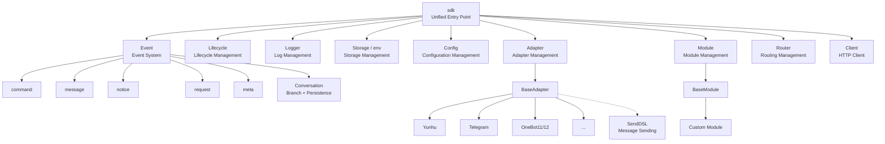
```mermaid
graph TB
    SDK["sdk<br/>Unified Entry Point"]

    SDK --> Event["Event<br/>Event System"]
    SDK --> Lifecycle["Lifecycle<br/>Lifecycle Management"]
    SDK --> Logger["Logger<br/>Log Management"]
    SDK --> Storage["Storage / env<br/>Storage Management"]
    SDK --> Config["Config<br/>Configuration Management"]
    SDK --> AdapterMgr["Adapter<br/>Adapter Management"]
    SDK --> ModuleMgr["Module<br/>Module Management"]
    SDK --> Router["Router<br/>Routing Management"]
    SDK --> Client["Client<br/>HTTP Client"]
    Event --> Command["command"]
    Event --> Message["message"]
    Event --> Notice["notice"]
    Event --> Request["request"]
    Event --> Meta["meta"]
    Event --> Conversation["Conversation<br/>Branch + Persistence"]

    AdapterMgr --> BaseAdapter["BaseAdapter"]
    BaseAdapter --> P1["Yunhu"]
    BaseAdapter --> P2["Telegram"]
    BaseAdapter --> P3["OneBot11/12"]
    BaseAdapter --> PN["..."]

    ModuleMgr --> BaseModule["BaseModule"]
    BaseModule --> CM["Custom Module"]

    BaseAdapter -.-> SendDSL["SendDSL<br/>Message Sending"]
```

### Core Module Descriptions

| Module | Description |
|--------|-------------|
| **Event** | Event system providing handling for five types of events: command / message / notice / request / meta, as well as Conversation for multi-turn dialogues |
| **Adapter** | Adapter manager managing the registration, startup, and shutdown of multi-platform adapters |
| **Module** | Module manager managing plugin registration, loading, and unloading, supporting dependency declaration and topological sorting |
| **Lifecycle** | Lifecycle manager providing event-driven lifecycle hooks |
| **Storage** | Key-value storage system based on SQLite, supporting general SQL chain query |
| **Config** | Configuration file management in TOML format |
| **Logger** | Modular logging system supporting sub-loggers |
| **Router** | HTTP/WebSocket routing management, abstracting the underlying backend (currently FastAPI + Uvicorn), supporting decorator-based routing, middleware, grouping, rate limiting, and CORS |
| **Client** | Unified HTTP/WS client (previously `HttpClient` before 2.8.0, now retained as a compatibility alias), abstracting the underlying request library (currently aiohttp), providing request statistics, retry, logging, WebSocket client, and ErisPulse exception system. The client and server WebSocket share the `WebSocketConnectionBase` base class |

## Initialization Process

The following diagram illustrates the complete initialization process of `sdk.init()`:

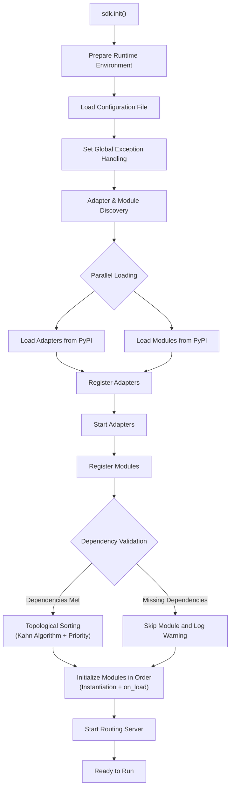
```mermaid
flowchart TD
    A["sdk.init()"] --> B["Prepare Runtime Environment"]
    B --> B1["Load Configuration File"]
    B1 --> B2["Set Global Exception Handling"]
    B2 --> C["Adapter & Module Discovery"]
    C --> D{"Parallel Loading"}
    D --> D1["Load Adapters from PyPI"]
    D --> D2["Load Modules from PyPI"]
    D1 & D2 --> E["Register Adapters"]
    E --> E1["Start Adapters"]
    E1 --> F["Register Modules"]
    F --> F1{"Dependency Validation"}
    F1 -->|"Missing Dependencies"| F2["Skip Module and Log Warning"]
    F1 -->|"Dependencies Met"| F3["Topological Sorting<br/>(Kahn Algorithm + Priority)"]
    F3 --> G["Initialize Modules in Order<br/>(Instantiation + on_load)"]
    F2 --> G
    G --> H["Start Routing Server"]
    H --> K["Ready to Run"]
```

### Detailed Initialization Stages

> The complete initialization chain is broken down into (Finder / Loader / Manager / Router), with low-level entry points (`init()` / `init_task()` / `init_sync()`) and full manual startup described in [Startup Process and Manual Control](advanced/startup.md).

## Event Handling Flow

The following diagram shows the complete flow path of messages from the platform to the handler:

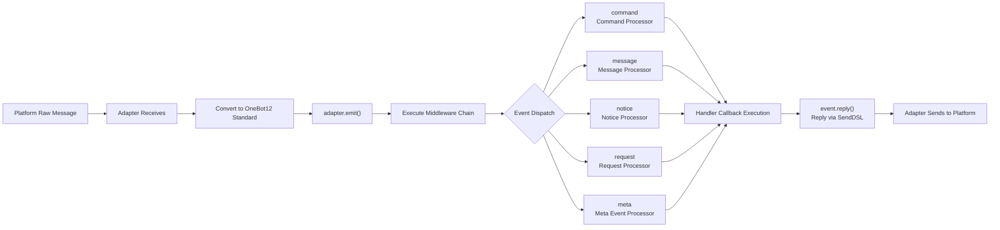
```mermaid
flowchart LR
    A["Platform Raw Message"] --> B["Adapter Receives"]
    B --> C["Convert to OneBot12 Standard"]
    C --> D["adapter.emit()"]
    D --> E["Execute Middleware Chain"]
    E --> F{"Event Dispatch"}
    F --> G1["command<br/>Command Processor"]
    F --> G2["message<br/>Message Processor"]
    F --> G3["notice<br/>Notice Processor"]
    F --> G4["request<br/>Request Processor"]
    F --> G5["meta<br/>Meta Event Processor"]
    G1 & G2 & G3 & G4 & G5 --> H["Handler Callback Execution"]
    H --> I["event.reply()<br/>Reply via SendDSL"]
    I --> J["Adapter Sends to Platform"]
```

### Detailed Explanation of the Event Handling Chain

The above diagram shows the "result"; below, we break down what the framework does behind the scenes after `adapter.emit()` — this is a three-layer dispatch chain:

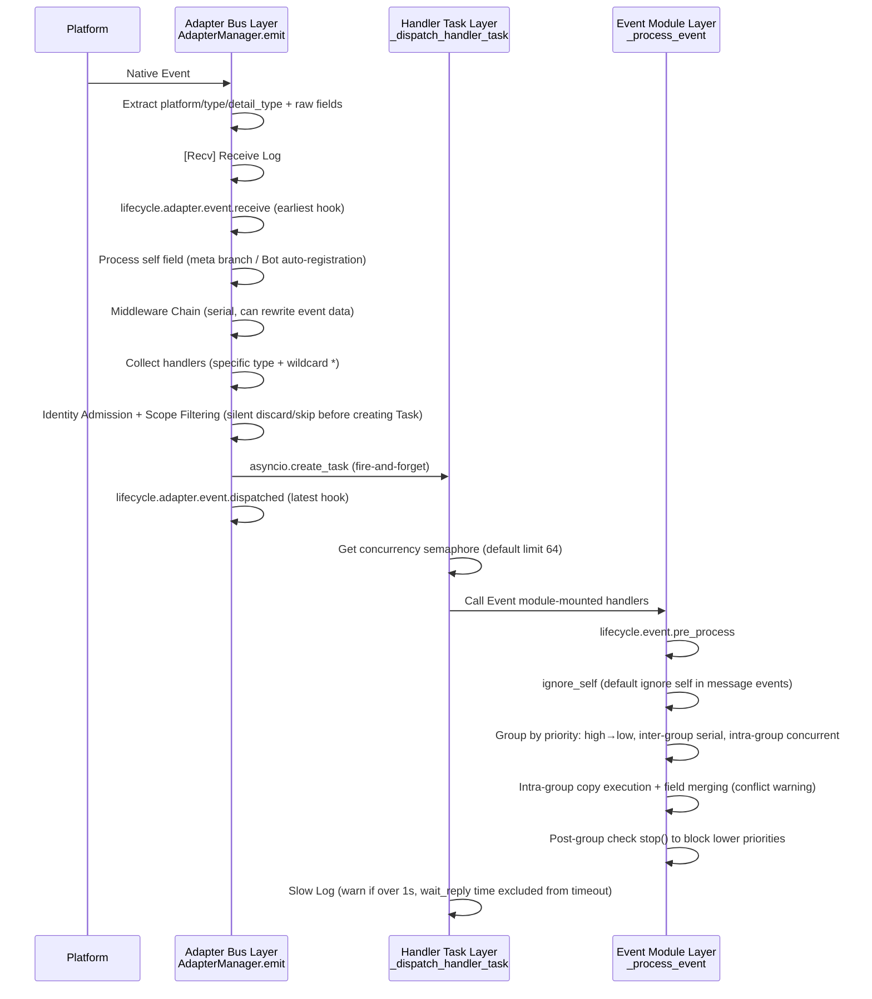
```mermaid
sequenceDiagram
    participant P as Platform
    participant A as Adapter Bus Layer<br/>AdapterManager.emit
    participant T as Handler Task Layer<br/>_dispatch_handler_task
    participant E as Event Module Layer<br/>_process_event

    P->>A: Native Event
    A->>A: Extract platform/type/detail_type + raw fields
    A->>A: [Recv] Receive Log
    A->>A: lifecycle.adapter.event.receive (earliest hook)
    A->>A: Process self field (meta branch / Bot auto-registration)
    A->>A: Middleware Chain (serial, can rewrite event data)
    A->>A: Collect handlers (specific type + wildcard *)
    A->>A: Identity Admission + Scope Filtering (silent discard/skip before creating Task)
    A->>T: asyncio.create_task (fire-and-forget)
    A->>A: lifecycle.adapter.event.dispatched (latest hook)
    T->>T: Get concurrency semaphore (default limit 64)
    T->>E: Call Event module-mounted handlers
    E->>E: lifecycle.event.pre_process
    E->>E: ignore_self (default ignore self in message events)
    E->>E: Group by priority: high→low, inter-group serial, intra-group concurrent
    E->>E: Intra-group copy execution + field merging (conflict warning)
    E->>E: Post-group check stop() to block lower priorities
    T->>T: Slow Log (warn if over 1s, wait_reply time excluded from timeout)
```

**What the framework does at each step and what you can intervene:**

| Stage | What the framework does | What you can intervene |
|------|-------------|-----------|
| Receive | Extract standard fields, retain `{platform}_raw` raw data; write `[Recv]` log | Listen to `adapter.event.receive` to get the earliest event |
| Self Field | Meta events go through connect/disconnect/heartbeat branches; normal events auto-register Bot and trigger `adapter.bot.online` | Listen to `adapter.bot.online` / `bot.offline` |
| Middleware | **Serial** execution, if return value is not None, replace event data | Register middleware to rewrite or intercept events |
| Dispatch Collection | First get specific type handlers, then get `*` wildcard handlers | — |
| Identity Dimension | At the dispatch entrance, determine whether to accept the event based on user > session > Bot > adapter (`scope.is_identity_allowed`), **if rejected, the entire event is discarded** | `ErisPulse.scope.identity` binding |
| Scope Filtering | Determine `scope.is_allowed` based on module owner (session level > Bot level > platform level), **if not passed, silently skip** | Configure scope whitelist/blacklist |
| Scheduling | Each matching handler is an independent `asyncio.Task`, `emit()` **does not wait** for handler completion before returning | — |
| Priority | High-priority groups execute first; **inter-group serial, intra-group concurrent** (each group holds its own event copy, changes are merged back into the original event, conflicts trigger WARNING) | `@command(..., priority=N)` / specify priority during registration |
| Blocking | After each group is processed, check `event.is_stopped()`, if triggered, **no lower priority will be executed** | `event.mark_processed(stop=True)` / `event.done()` |

> **Common Misconceptions**:
> 1. **Scope filtering is silent** — handlers that are filtered out do not report errors or responses, only visible in TRACE-level logs (`core.scope.denied`). If "my module did not receive the message," prioritize checking the scope binding.
> 2. **Handlers are naturally concurrent** — the framework already creates an independent Task for each handler, so you **do not need** to wrap it with `asyncio.create_task`.
> 3. **No blocking within the same priority group** — `mark_processed(stop=True)` only prevents lower-priority groups from executing, but handlers in the same group that are already running concurrently will not be interrupted.
> 4. **Slow log threshold is fixed at 1 second** — if a handler takes over 1 second, a WARNING will be logged (`wait_reply` waiting time has been excluded from the timeout), but execution is not interrupted.

> For details on the three-level module binding of scope, identity admission, and outbound action restrictions, see [Scope (scope)](advanced/scope.md); for event scope text filtering and command user ACL, see [Event Handling Introduction](getting-started/event-handling.md); for concurrency limit configuration, see [Configuration Guide](user-guide/configuration.md#Framework-Configuration).

## Lifecycle Events

The following diagram illustrates the order in which lifecycle events are triggered by various components of the framework:

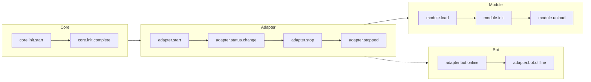
```mermaid
flowchart LR
    subgraph Core["Core"]
        direction LR
        C1["core.init.start"] --> C2["core.init.complete"]
    end

    subgraph AdapterLife["Adapter"]
        direction LR
        A1["adapter.start"] --> A2["adapter.status.change"] --> A3["adapter.stop"] --> A4["adapter.stopped"]
    end

    subgraph ModuleLife["Module"]
        direction LR
        M1["module.load"] --> M2["module.init"] --> M3["module.unload"]
    end

    subgraph BotLife["Bot"]
        direction LR
        B1["adapter.bot.online"] --> B2["adapter.bot.offline"]
    end

    Core --> AdapterLife
    AdapterLife --> ModuleLife
    AdapterLife -.-> BotLife
```

### Listening to Lifecycle Events

> For the complete event listening methods (`lifecycle.on()` / `once()` / `has_handlers()`), a full list of lifecycle events, and their data formats, see [Lifecycle Management](advanced/lifecycle.md).

## Module Loading Strategies

ErisPulse supports three module loading strategies, as declared by the `ModuleLoadStrategy` returned by `get_load_strategy()`:

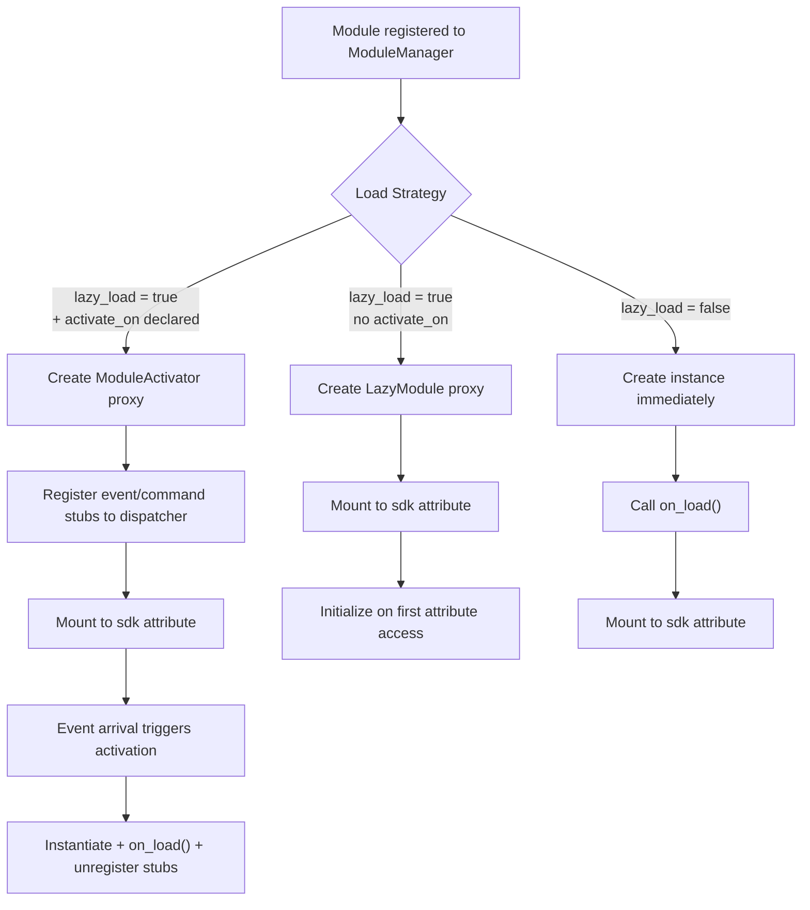
```mermaid
flowchart TD
    A["Module registered to ModuleManager"] --> B{"Load Strategy"}
    B -->|"lazy_load = true<br/>+ activate_on declared"| C["Create ModuleActivator proxy"]
    B -->|"lazy_load = true<br/>no activate_on"| D["Create LazyModule proxy"]
    B -->|"lazy_load = false"| E["Create instance immediately"]
    C --> F["Register event/command stubs to dispatcher"]
    F --> G["Mount to sdk attribute"]
    G --> H["Event arrival triggers activation"]
    H --> I["Instantiate + on_load() + unregister stubs"]
    D --> J["Mount to sdk attribute"]
    J --> K["Initialize on first attribute access"]
    E --> L["Call on_load()"]
    L --> M["Mount to sdk attribute"]
```

> For more details, refer to [Lazy Loading System](advanced/lazy-loading.md), [Lifecycle Management](advanced/lifecycle.md), and the module documentation.

### Event-Driven Lazy Activation (`activate_on`) Trigger Architecture

> [!NOTE]
> This feature requires ErisPulse **2.8.0+**.

The `activate_on` directive allows a module to load only when the **first matching event/command arrives**, avoiding memory residency while ensuring no events are lost:

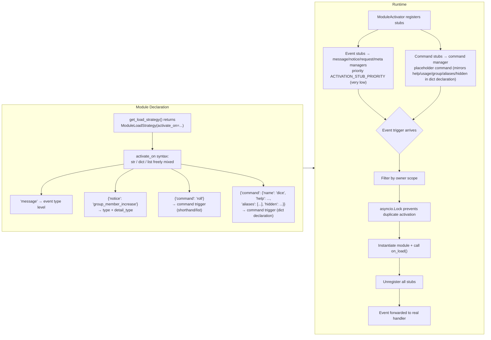
```mermaid
flowchart LR
    subgraph Declare["Module Declaration"]
        S1["get_load_strategy() returns<br/>ModuleLoadStrategy(activate_on=...)"] --> S2["activate_on syntax: <br/>str / dict / list freely mixed"]
        S2 --> S2a["'message' → event type level"]
        S2 --> S2b["{'notice': 'group_member_increase'}<br/>→ type + detail_type"]
        S2 --> S2c["{'command': 'roll'}<br/>→ command trigger (shorthand/list)"]
        S2 --> S2d["{'command': {'name': 'dice', 'help': ...,<br/>'aliases': [...], 'hidden': ...}}<br/>→ command trigger (dict declaration)"]
    end

    subgraph Runtime["Runtime"]
        R1["ModuleActivator registers stubs"] --> R1a["Event stubs → message/notice/request/meta managers<br/>priority ACTIVATION_STUB_PRIORITY (very low)"]
        R1 --> R1b["Command stubs → command manager<br/>placeholder command (mirrors help/usage/group/aliases/hidden in dict declaration)"]
        R1a --> R2{"Event trigger arrives"}
        R1b --> R2
        R2 --> R3["Filter by owner scope"]
        R3 --> R4["asyncio.Lock prevents duplicate activation"]
        R4 --> R5["Instantiate module + call on_load()"]
        R5 --> R6["Unregister all stubs"]
        R6 --> R7["Event forwarded to real handler"]
    end

    Declare --> Runtime
```

**Trigger Semantics Highlights:**

> The complete `activate_on` syntax (str / dict / list), command dict declaration, placeholder command help fallback chain, scope filtering, and failure semantics are detailed in [Lazy Loading System](advanced/lazy-loading.md#event-driven-lazy-activationactivate_on).

## Local Plugin Folder Architecture

> [!NOTE]
> This feature requires ErisPulse **2.8.0+**.

Local plugins (in the `plugins/` directory) do not require packaging and publishing; the framework automatically discovers and loads them at startup:

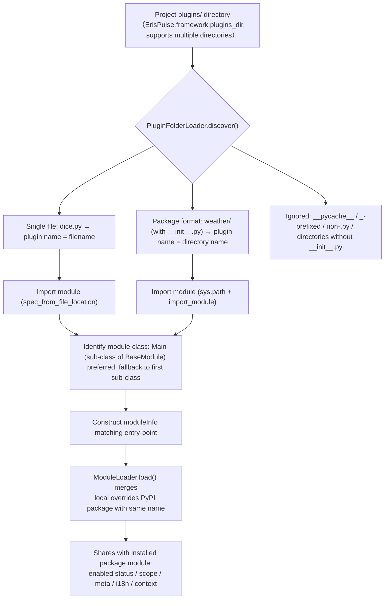
```mermaid
flowchart TD
    A["Project plugins/ directory<br/>（ErisPulse.framework.plugins_dir, supports multiple directories）"] --> B{"PluginFolderLoader.discover()"}
    B --> C["Single file: dice.py → plugin name = filename"]
    B --> D["Package format: weather/ (with __init__.py) → plugin name = directory name"]
    B --> E["Ignored: __pycache__ / _-prefixed / non-.py / directories without __init__.py"]
    C --> F["Import module (spec_from_file_location)"]
    D --> G["Import module (sys.path + import_module)"]
    F --> H["Identify module class: Main (sub-class of BaseModule) preferred, fallback to first sub-class"]
    G --> H
    H --> I["Construct moduleInfo matching entry-point"]
    I --> J["ModuleLoader.load() merges<br/>local overrides PyPI package with same name"]
    J --> K["Shares with installed package module:<br/>enabled status / scope / meta / i18n / context"]
```

**Conventions and Features:**

- Plugin name source: filename for single files, directory name for package format
- Local plugin `moduleInfo.meta.source == "plugin_folder"`, seamlessly coexists with PyPI installed package modules
- When names match, local takes precedence (for easy local override and debugging), and disabled state also removes corresponding entry-point entries

## Hot Module Reload Architecture

Hot reload applies consistently to **all module sources**: local plugins can automatically trigger reloads by monitoring file changes, and any module can be manually reloaded via `sdk.reload_module()` / `sdk.module.reload()`. For PyPI-installed packages, calling reload after pip upgrade will take effect.

```mermaid
flowchart TD
    A["sdk.enable_plugin_hot_reload()<br/>（Auto monitoring, only for local plugin directories）"] --> B["PluginReloadWatcher starts"]
    B --> C["PollingObserver (background daemon thread)<br/>Regularly compares .py file mtime"]
    C --> D{"Plugin file changed"}
    D --> E["Change debouncing (default 1 second)"]
    E --> F["_handle_change parses plugin name<br/>（Single file / package format）"]
    F --> G["asyncio.run_coroutine_threadsafe<br/>Schedules back to main event loop"]
    G --> H["sdk.reload_module(name)<br/>（Can also manually call for any module）"]
    H --> I["Unloads old instance (triggers on_unload)<br/>Collects dependents for cascading reload"]
    I --> J{"Module source?"}
    J -->|"plugin_folder"| K["Clears registration and plugin sys.modules<br/>Rescans plugins/ directory"]
    J -->|"PyPI installed package"| L["Clears registration + clears package sys.modules subtree by top_level<br/>Refreshes import cache and re-loads entry-point"]
    K --> M["Re-registers + re-loads"]
    L --> M
    M --> N["Mounts new instance to sdk property"]
    N --> O["Cascading reload of dependents<br/>（Full plugin reload / re-instantiation of PyPI package）"]
    K -.->|"File deleted"| P["Removes from loaded results"]
    L -.->|"entry-point disappeared (uninstalled)| P
```

The only difference between the two sources is in the discovery phase; registration, loading, and cascading reload are completely consistent:

- **Local Plugins** (`moduleInfo.meta.source == "plugin_folder"`): After clearing `sys.modules` corresponding to the plugin name, rescan the `plugins/` directory; if the file is deleted, remove it from the loaded results.
- **PyPI-installed Packages**: Clear the `sys.modules` subtree of the package according to `meta.top_level`, refresh the import cache (to break the 60-second entry-point cache), then re-query and re-import; if the entry-point disappears (pip uninstalled), remove it from the loaded results.


====
快速上手
====


### 快速开始

# Quick Start

> **This is your first step.** Get an ErisPulse robot up and running in 5 minutes from scratch.

## Install ErisPulse

### One-Click Installation Script (Recommended)

The installation script will automatically detect your environment (Docker, Python, uv) and guide you to choose the most suitable installation method.

Windows (PowerShell):
```powershell
irm https://get.erisdev.com/install.ps1 -OutFile install.ps1; powershell -ExecutionPolicy Bypass -File install.ps1
```

macOS / Linux:
```bash
curl -fsSL https://get.erisdev.com/install.sh -o install.sh && chmod +x install.sh && ./install.sh
```

The script will guide you through:

- **Docker Installation** (Recommended when Docker is detected): Choose image source (Docker Hub / GHCR), version channel (Stable / Pre-release), Dashboard management panel configuration, port settings
- **Traditional Installation**: Automatically create a virtual environment, select ErisPulse version, optionally install Dashboard management panel module

### Using Docker

The Docker image already includes the ErisPulse framework and Dashboard management panel.

```bash
# Download docker-compose.yml
curl -O https://raw.githubusercontent.com/ErisPulse/ErisPulse/main/docker-compose.yml

# Set Dashboard token and start
ERISPULSE_DASHBOARD_TOKEN=your-token docker compose up -d
```

<details>
<summary>Unable to access Docker Hub?</summary>

Use GitHub Container Registry image by modifying the `image` in `docker-compose.yml`:

```yaml
image: ghcr.io/erispulse/erispulse:latest
```

</details>

After startup, access `http://<host>:8000/Dashboard` and log in using the set token.

### Using pip

Ensure your Python version is >= 3.10, then install using pip:

```bash
pip install ErisPulse
```

If you have already installed [uv](https://github.com/astral-sh/uv), you can also use `uv pip install ErisPulse` for faster installation.

## Initialize Project

### Interactive Initialization (Recommended)

```bash
epsdk init
```

This will start an interactive wizard that guides you through:
- Project name setting
- Log level configuration
- Server configuration (host and port)
- Adapter selection and configuration
- Project structure creation

### Quick Initialization

```bash
# Quick mode with a specified project name
epsdk init -q -n my_bot

# Or just specify the project name
epsdk init -n my_bot
```

### Manual Project Creation

If you prefer to create the project manually:

```bash
mkdir my_bot && cd my_bot
epsdk init
```

## Installing Modules

### Installing via CLI

```bash
epsdk install Yunhu AIChat
```

### Viewing Available Modules

```bash
epsdk list-remote
```

### Interactive Installation

Without specifying a package name, enter the interactive installation interface:

```bash
epsdk install
```

## Running the Project

```bash
# Run normally
epsdk run main.py

# Hot reload mode (recommended for development)
epsdk run main.py --reload
```

## Enable IDE Completion (Optional)

ErisPulse dynamically discovers modules/adapters, and IDEs cannot complete platform-specific methods by default.  
Run the following command to generate type stubs:

```bash
epsdk types
```

After generation, use the imported types as variable annotations to obtain precise completion (see [IDE Completion Guide](./getting-started/ide-completion.md)):

```python
from _ep_types import Yunhu
from ErisPulse import sdk

adapter: Yunhu = sdk.adapter.get("yunhu")
await adapter.Send.To("group", "123").Board(...)  # Completion for platform-specific methods
```

## Project Structure

After initialization, the project structure is as follows:

```
my_bot/
├── config/
│   └── config.toml          # Configuration file
└── main.py                  # Entry file

```

## Configuration File

Basic `config.toml` configuration:

```toml
[ErisPulse.server]
host = "0.0.0.0"
port = 8000

[ErisPulse.logger]
level = "INFO"

[Yunhu_Adapter]
# Adapter configuration
```


### 创建第一个机器人

# Create Your First Bot

This guide builds on the [5-Minute Quick Start](../quick-start.md) to walk you through writing your first command handler and understanding the underlying mechanics.

> If you haven't installed ErisPulse or initialized your project yet, please complete the "Install," "Initialize Project," and "Run Project" steps in the [Quick Start](../quick-start.md) first.

## Step 1: Write Your First Command

Open `main.py` and write a simple command handler:

```python
from ErisPulse import sdk
from ErisPulse.Core.Event import command

@command("hello", help="Send a greeting message")
async def hello_handler(event):
    """Handle the hello command"""
    user_name = event.get_user_nickname() or "friend"
    await event.reply(f"Hello, {user_name}! I am the ErisPulse bot.")

@command("ping", help="Test if the bot is online")
async def ping_handler(event):
    """Handle the ping command"""
    await event.reply("Pong! The bot is running normally.")

async def main():
    """Main entry function"""
    print("Starting ErisPulse...")
    
    # keep_running=True (default): The framework blocks and stays running until a shutdown signal is received (e.g., Ctrl+C)
    await sdk.run(keep_running=True)

if __name__ == "__main__":
    import asyncio
    asyncio.run(main())
```

### `keep_running` Parameter

`sdk.run(keep_running)` controls whether the framework blocks and remains running:

- **`keep_running=True` (default)**: `run()` will block indefinitely until a shutdown signal (e.g., Ctrl+C) is received, suitable for pure bot applications.
- **`keep_running=False`**: `run()` returns immediately after initialization. **The framework is not unloaded**—active adapters/modules continue processing message events as background tasks. You can then proceed with your own logic until the event loop ends and the framework shuts down. For example:

```python
async def main():
    await sdk.run(keep_running=False)   # Returns immediately after initialization
    # The framework is running in the background, here you can continue doing other things
    while True:
        await asyncio.sleep(3600)
        print("Check every hour")
```

> Besides the two modes of `run()`, there are also more granular ways to manually control the lifecycle, such as `init()`/`uninit()` and individually starting/stopping adapters/routes. See [Startup Process and Manual Control](../advanced/startup.md).

## Step 2: Run the Robot

```bash
# Run normally
epsdk run main.py

# Development mode (supports hot reload)
epsdk run main.py --reload
```

## Step 3: Test the Bot

Send the following command in your chat platform:

```
/hello
```

You should receive a reply from the bot.

## Code Explanation

### Command Decorator

```python
@command("hello", help="Send a greeting message")
```

- `hello`: The command name, which users invoke via `/hello`
- `help`: The help description, displayed in the `/help` command

### Event Parameters

```python
async def hello_handler(event):
```

The `event` parameter is an Event object, containing:
- Message content: `event.get_text()`
- Sender information: `event.get_user_id()`, `event.get_user_nickname()`
- Platform information: `event.get_platform()`
- Group information: `event.get_group_id()`
- Raw data: `event.get_raw()`

> For a complete list of Event object methods, refer to [Event Wrapper Class Details](../developer-guide/modules/event-wrapper.md).

### Sending a Reply

```python
await event.reply("Reply content")
```

`event.reply()` is a convenient method for sending messages back to the sender.

## Extensions: Adding More Features

ErisPulse provides rich event handling and data processing capabilities:

- **Message Listening**: Use `@message.on_message()` to listen to various types of messages → [Event Handling Introduction](event-handling.md)
- **Notification Listening**: Use `@notice.on_friend_add()` and others to listen to system notifications → [Event Handling Introduction](event-handling.md)
- **Data Storage**: Use `sdk.storage.get/set` to persist data → [Common Tasks Examples](common-tasks.md)

## FAQ

### No response from command?

1. Check if the adapter is correctly configured, and confirm that the `status` of the adapter in `config/config.toml` is set to `true`.
2. Check the terminal log output to confirm if there are any error messages (especially those with `ERROR` level).
3. Confirm that the command prefix is correct (the default is `/`), and check the `[ErisPulse.event.command]` section in the configuration file.
4. Confirm that the command name is spelled correctly, and pay attention to case sensitivity settings.

### How to change the command prefix?

Add the following to `config.toml`:

```toml
[ErisPulse.event.command]
prefix = "!"
case_sensitive = false
```

### How to support multiple platforms?

ErisPulse uses the OneBot12 standard to unify the event formats of different platforms. Handlers registered with `@command` and `@message` will automatically receive events from all platforms. You can distinguish the source platform using `event.get_platform()`:

```python
@command("hello")
async def hello_handler(event):
    platform = event.get_platform()
    
    if platform == "yunhu":
        await event.reply("你好！来自云湖")
    elif platform == "telegram":
        await event.reply("Hello! From Telegram")
    else:
        await event.reply("你好！")
```

> For more multi-platform adaptation techniques, please refer to [Common Tasks Examples](common-tasks.md#multi-platform-adaptation).


### 基础概念

# Core Concepts

This guide introduces the core concepts of ErisPulse, helping you understand the framework's design philosophy and basic architecture.

## Event-Driven Architecture

ErisPulse adopts an event-driven architecture, where all interactions are passed and processed through events.

### Event Flow

```
User sends message
      │
      ▼
Platform receives
      │
      ▼
Adapter receives native platform event
      │
      ▼
Converts to OneBot12 standard event
      │
      ▼
Submits to event system
      │
      ▼
Distributes to registered handlers
      │
      ▼
Module processes event
      │
      ▼
Sends response via adapter
      │
      ▼
Platform displays to user
```

### OneBot12 Standard

ErisPulse uses OneBot12 as its core event standard. OneBot12 is a generic chatbot application programming interface standard that defines a unified event format.

All adapters convert platform-specific events into OneBot12 format, ensuring code consistency.

## Core Components

### 1. SDK Object

The SDK is the unified entry point for all features, providing access to core components.

```python
from ErisPulse import sdk

# Access core modules
sdk.storage    # Storage system
sdk.config     # Configuration system
sdk.logger     # Logging system
sdk.adapter    # Adapter system
sdk.module     # Module system
sdk.router     # Router system
sdk.client     # HTTP client
sdk.lifecycle  # Lifecycle system
```

### 2. Event Object

The Event object encapsulates event data and provides convenient access methods.

```python
@command("info")
async def info_handler(event):
    # Get event information
    event_id = event.get_id()
    user_id = event.get_user_id()
    platform = event.get_platform()
    text = event.get_text()
    
    # Send reply
    await event.reply(f"User: {user_id}, Platform: {platform}")
```

### 3. Adapters

Adapters serve as bridges between ErisPulse and external platforms.

**Responsibilities:**
- Receive native platform events
- Convert them into OneBot12 standard format
- Send standard format events back to the platform

**Example Adapters:**
- Yunhu adapter: Communicates with the Yunhu platform
- Telegram adapter: Communicates with the Telegram Bot API
- OneBot11 adapter: Communicates with OneBot11-compatible applications
- Email adapter: Handles email sending and receiving

### 4. Modules

Modules are the basic units for functionality extensions, capable of:

- Registering event handlers
- Implementing business logic
- Calling adapters to send messages
- Using services provided by core modules

#### Module Discovery Mechanism

ErisPulse discovers installed modules via Python's `importlib.metadata.entry_points`. Modules declare entry points in `pyproject.toml`:

```toml
[project.entry-points."erispulse.module"]
MyModule = "my_package:Main"
```

During SDK initialization, all entry points under the `erispulse.module` group are scanned, the module class is registered to `ModuleManager`, and then initialized in topological order based on dependencies.

#### Minimal Viable Module

```python
from ErisPulse.Core.Bases import BaseModule
from ErisPulse import sdk

class Main(BaseModule):
    def __init__(self):
        self.sdk = sdk
        self.logger = sdk.logger.get_child("MyModule")

    async def on_load(self, event):
        self.logger.info("Module loaded")

    async def on_unload(self, event):
        self.logger.info("Module unloaded")
```

#### Module Lifecycle

- **Registration**: SDK discovers the module class and registers it with the manager
- **Loading**: Creates the module instance and calls `on_load(event)` (`event = {"module_name": "MyModule"}`)
- **Unloading**: Calls `on_unload(event)` and cleans up resources

#### Loading Strategy

Declare the module's loading behavior using `get_load_strategy()`:

```python
from ErisPulse.loaders import ModuleLoadStrategy

class Main(BaseModule):
    @staticmethod
    def get_load_strategy():
        return ModuleLoadStrategy(
            lazy_load=True,   # Whether to lazy load (default: True)
            priority=0        # Loading priority; higher values are initialized first
        )
```

- **`lazy_load=True` (default)**: The module is initialized only when first accessed via `sdk.MyModule`, reducing startup time
- **`lazy_load=False`**: The module is initialized immediately during SDK startup, suitable for modules that need to listen to lifecycle events or execute scheduled tasks
- **`priority`**: Modules with the same priority are loaded in registration order; higher values are initialized first

> For detailed information about the lazy loading mechanism, refer to [Lazy Loading System](../advanced/lazy-loading.md).

## Event Types

ErisPulse supports five types of events:

| Event Type | Decorator | Description |
|---------|--------|------|
| Message Event | `@message.on_message()` | Any message sent by the user (private chat, group chat) |
| Command Event | `@command("name")` | Messages starting with a command prefix (e.g., `/hello`) |
| Notice Event | `@notice.on_friend_add()` etc. | System notifications (friend added, group member changes, etc.) |
| Request Event | `@request.on_friend_request()` etc. | User requests (friend requests, group invitations) |
| Meta Event | `@meta.on_connect()` etc. | System-level events (connection, disconnection, heartbeat) |

> For detailed usage and code examples of each event type, refer to [Event Handling Introduction](event-handling.md).

## Core Module Descriptions

### Storage (Storage)

A key-value storage system based on SQLite, used for persistent data storage.

```python
# Set value
sdk.storage.set("key", "value")

# Get value
value = sdk.storage.get("key", "default_value")

# Batch operations
sdk.storage.set_multi({
    "key1": "value1",
    "key2": "value2"
})

# Transactions
with sdk.storage.transaction():
    sdk.storage.set("key1", "value1")
    sdk.storage.set("key2", "value2")
```

### Config (Configuration)

TOML-based configuration file management.

```python
# Get configuration
config = sdk.config.getConfig("MyModule", {})

# Set configuration
sdk.config.setConfig("MyModule", {"key": "value"})

# Read nested configuration
value = sdk.config.getConfig("MyModule.subkey", "default")
```

### Logger (Logging)

A modular logging system.

```python
# Log messages
sdk.logger.info("This is an info message")
sdk.logger.warning("This is a warning message")
sdk.logger.error("This is an error message")

# Get child logger
child_logger = sdk.logger.get_child("submodule")
child_logger.info("Submodule log message")
```

**Attribute Access Syntactic Sugar**

In addition to using the `get_child()` method, you can also create a child logger using **attribute access**, which is a more concise **syntactic sugar**:

```python
# Create child logger using attribute access
sdk.logger.mymodule.info("Module message")

# Supports nested access
sdk.logger.mymodule.database.info("Database message")
```

### Router (Routing)

HTTP and WebSocket routing management, based on FastAPI + Uvicorn. Supports decorator-based routing, middleware, grouping, rate limiting, and CORS.

```python
from ErisPulse.Core import HttpRequest

@sdk.router.get("MyModule", "/api")
async def handler(request: HttpRequest):
    data = await request.json()
    return {"status": "ok"}
```

> For the complete routing API (WebSocket, middleware, rate limiting, CORS, etc.), refer to [Router Manager](../advanced/router.md).

### Client (Network Client)

A unified network client that aggregates HTTP requests, WebSocket connections, connection pool management, automatic retries, timeout control, request statistics, and lifecycle event integration.

```python
from ErisPulse.Core import client

# HTTP request
resp = await client.get("https://api.example.com/users")
data = await resp.json()

# With retry and timeout
resp = await client.get(url, timeout=30, max_retries=3)

# WebSocket connection
ws = await client.ws_connect("wss://example.com/ws")
async for text in ws.iter_text():
    await ws.send_text(f"Echo: {text}")
```

> For the complete network client API, refer to [Network Client](../advanced/http-client.md).

## SendDSL Message Sending

Adapters provide a chain-call interface for message sending.

### Basic Sending

```python
# Get adapter instance
yunhu = sdk.adapter.get("yunhu")

# Send message
await yunhu.Send.To("user", "U1001").Text("Hello")

# Specify sending account
await yunhu.Send.Using("bot1").To("group", "G1001").Text("Group message")
```

### Chain Modifiers

```python
# @ user
await yunhu.Send.To("group", "G1001").At("U2001").Text("@ message")

# Reply to message
await yunhu.Send.To("group", "G1001").Reply("msg123").Text("Reply")

# @ all
await yunhu.Send.To("group", "G1001").AtAll().Text("Announcement")
```

### Event Reply Methods

The Event object provides convenient reply methods:

```python
@command("test")
async def test_handler(event):
    # Simple text reply
    await event.reply("Reply content")
    
    # Send image
    await event.reply("http://example.com/image.jpg", method="Image")
    
    # Send voice
    await event.reply("http://example.com/voice.mp3", method="Voice")
```

## Lazy Loading System

ErisPulse enables module lazy loading by default. Modules are only initialized when first accessed (e.g., `sdk.MyModule`), significantly improving startup speed.

```python
from ErisPulse.loaders import ModuleLoadStrategy

class Main(BaseModule):
    @staticmethod
    def get_load_strategy():
        return ModuleLoadStrategy(
            lazy_load=True,   # Enable lazy loading (default)
            priority=0        # Loading priority; higher values are initialized first
        )
```

**Scenarios requiring disabling lazy loading (`lazy_load=False`):**
- Modules that listen to lifecycle events (e.g., `core.init.complete`)
- Modules that start scheduled tasks or background services
- Modules that need to complete initialization before other modules load

> For detailed information about the lazy loading mechanism and considerations, refer to [Lazy Loading System](../advanced/lazy-loading.md).


### 事件处理入门

# Event Handling Introduction

This guide introduces how to handle various events in ErisPulse.

## Event Type Overview

ErisPulse supports the following event types:

| Event Type | Description | Use Cases |
|------------|-------------|-----------|
| Message Event | Any message sent by a user | Chatbots, content filtering |
| Command Event | Messages starting with a command prefix | Command handling, feature entry points |
| Notification Event | System notifications (friend addition, group member changes, etc.) | Welcome messages, status notifications |
| Request Event | User requests (friend requests, group invitations) | Automatic request handling |
| Meta Event | System-level events (connection, heartbeat) | Connection monitoring, status checks |

## Message Event Handling

> **Note**: It is recommended to use the `Event` type annotation in event handlers to get IDE auto-completion and type checking support.

```python
from ErisPulse.Core.Event import Event  # Import the Event type for annotations
```

### Listening to All Messages

```python
from ErisPulse.Core.Event import message, Event

@message.on_message()
async def message_handler(event: Event):
    text = event.get_text()
    user_id = event.get_user_id()
    sdk.logger.info(f"Received message from {user_id}: {text}")
```

### Listening to Private Messages

```python
@message.on_private_message()
async def private_handler(event: Event):
    user_id = event.get_user_id()
    await event.reply(f"Hello, {user_id}! This is a private message.")
```

### Listening to Group Messages

```python
@message.on_group_message()
async def group_handler(event: Event):
    group_id = event.get_group_id()
    user_id = event.get_user_id()
    sdk.logger.info(f"Message sent by {user_id} in group {group_id}")
```

### Listening to @ Messages

```python
@message.on_at_message()
async def at_handler(event: Event):
    # Get the list of mentioned users
    mentions = event.get_mentions()
    await event.reply(f"You mentioned these users: {mentions}")
```

### Wildcard and Regex Matching

The four message decorators (`on_message` / `on_private_message` / `on_group_message` / `on_at_message`) all support `pattern` (glob wildcards) and `regex` (regular expressions). Messages that do not match **will not trigger** the handler:

```python
# Glob wildcards: * for any string, ? for single character, [seq] for character set
@message.on_message(pattern="签到*")
async def signin_handler(event: Event):
    await event.reply("Check-in successful")

# Regular expression: match amount
@message.on_message(regex=r"\d+\s*元")
async def price_handler(event: Event):
    await event.reply(f"Received amount: {event.get_text()}")

# Both pattern and regex given → both must match
@message.on_message(pattern="*元", regex=r"\d+\s*元")
async def combined_handler(event: Event):
    pass
```

The `wait_reply` function also supports these two parameters (see [Wait for Reply](docs/en/developer-guide/modules/event-wrapper.md#wait-for-reply-function)).

## Command Event Handling

### Basic Commands

```python
from ErisPulse.Core.Event import command

@command("help", help="Display help information")
async def help_handler(event):
    help_text = """
Available commands:
/help - Display help
/ping - Test connection
/info - View information
    """
    await event.reply(help_text)
```

### Command Aliases

```python
@command(["help", "h"], aliases=["帮助"], help="Display help information")
async def help_handler(event):
    await event.reply("Help information...")
```

Users can invoke the command using any of the following:
- `/help`
- `/h`
- `/帮助`

### Command Arguments

```python
@command("echo", help="Echo message")
async def echo_handler(event):
    # Get command arguments
    args = event.get_command_args()
    
    if not args:
        await event.reply("Please enter a message to echo")
    else:
        await event.reply(f"You said: {' '.join(args)}")
```

### Command Groups

```python
@command("admin.reload", group="admin", help="Reload module")
async def reload_handler(event):
    await event.reply("Module reloaded")

@command("admin.stop", group="admin", help="Stop bot")
async def stop_handler(event):
    await event.reply("Bot stopped")
```

### Command Permissions and Access Control

Command permissions are checked in three layers, from top to bottom (if upper layer denies, lower layers are not checked):

```python
# ① Command ACL (user-side configuration): User whitelist/blacklist per command, denies with "Permission denied"
# ② master=True —— Only the framework owner can execute (automatically checked by framework, denies with "Permission denied")
@command("restart", master=True, help="Restart module")
async def restart_handler(event):
    await event.reply("Module restarted")

# ③ permission=custom function —— Command-specific control logic (returns True to execute)
def is_admin(event):
    return event.get_user_id() in {"user123", "user456"}

@command("panel", permission=is_admin, help="Admin panel")
async def panel_handler(event):
    await event.reply("Welcome to admin panel")
```

**Command User ACL** (`ErisPulse.event.command.acl`): Users can configure user whitelist/blacklist for any command. Command names support exact match and glob patterns (e.g., `"roll*"`), denies with "Permission denied":

```toml
# config.toml —— Only allow user 123456 to execute restart; deny user 666 entirely
[ErisPulse.event.command.acl.restart]
allow = ["onebot11:123456"]
deny = ["onebot11:666"]
```

Check order: `deny` match → deny; `allow` non-empty and no match → deny; if no ACL configured, follow `event.command.default_allow` (false = strict mode, no ACL means deny; true = delegate to developer's default `master=True` / `permission`). Runtime API (command names support glob):

```python
from ErisPulse.Core.Event import command

command.allow_user("restart", "onebot11", "123456")   # Allow list
command.deny_user("restart", "onebot11", "666")       # Deny list
command.remove_acl("restart")                          # Clear whitelist/blacklist
command.get_acl("restart")                             # Query current list
```

> Command handlers are imported from event package: `from ErisPulse.Core.Event import command`; can also access via SDK event package: `sdk.Event.command` (both are the same singleton). Usually already imported in modules with command decorator (`from ErisPulse.Core.Event import command`).

For cross-command / cross-user **event-level** access control (whether a message from a certain person / group / bot is received), use **identity scope** (`scope.identity`); for **module-level** availability (which modules can be used), use **module scope** (`scope.platforms / bots / sessions`). See [Scope](../advanced/scope.md).

> Recommendation: Use `master=True` / `permission` for command internal logic; use identity scope for user / group access control; use module scope for module availability control.

### Command Priority

```python
# Higher priority value executes earlier
@message.on_message(priority=10)
async def high_priority_handler(event):
    await event.reply("High priority handler")

@message.on_message(priority=1)
async def low_priority_handler(event):
    await event.reply("Low priority handler")
```

### Parallel Event Handling

ErisPulse's event system uses a **parallel execution within same priority, serial execution across priorities** scheduling model:

```
Event arrives
    ↓
priority=10 group: [Handler C || Handler D] parallel → merge result
    ↓ (if not interrupted)
priority=0 group: [Handler A || Handler B] parallel → merge result
    ↓
...
```

- **Parallel within same priority**: Multiple handlers with the same priority execute simultaneously, increasing throughput
- **Serial across priorities**: Different priority groups execute in order (higher value executes first), ensuring high-priority handlers run first
- **Copy-On-Write**: No copy is created if handlers do not modify, ensuring zero overhead
- **Conflict handling**: When multiple handlers in the same priority modify the same field, the last modification is used and a warning log is recorded
- **Interruption mechanism**: After any handler calls `event.done()` (default) or `event.done(claim=False)`, subsequent lower-priority groups are skipped. See [Link Control: Claim and Block](#link-control-claim-and-block) for the difference between claim and block.

```python
# Example: Parallel execution of handlers with same priority
@message.on_message(priority=0)
async def handler_a(event):
    # Process task A
    event['result_a'] = process_a()

@message.on_message(priority=0)
async def handler_b(event):
    # Executes in parallel with handler_a
    event['result_b'] = process_b()

# Serial execution across priorities
@message.on_message(priority=10)
async def handler_c(event):
    # Highest priority, executes first
    pass
```

> **Concurrency limit**: All matching handlers' tasks are created immediately, but a semaphore limits the **maximum concurrent execution count**, default is **64** (`ErisPulse.framework.handler_max_concurrency`, supports hot update). Tasks exceeding the limit wait in the semaphore queue until previous tasks complete. This serves as your "pressure relief valve" during event peaks.
>
> **Slow logs**: If a single handler takes more than **1 second**, the framework logs a WARNING (`handler_slow`). Time spent waiting for `wait_reply` is excluded from the timing, so waiting for replies won't trigger a slow log.

## Scope Filtering: Why Didn't My Module Receive the Message?

After an event arrives, there are two **silent** filters (neither reply nor error is returned):

1. **Identity dimension** (`ErisPulse.scope.identity`): When an event enters the distribution entry point, it is determined whether to accept or reject based on User > Group > Bot > Adapter.
   Events that are rejected are discarded entirely, and no handler (including the command dispatcher) will be triggered.
2. **Module dimension** (`ErisPulse.scope`): When an event reaches a module's handler/command, it is determined whether the module is available based on Session > Bot > Platform.
   If it does not pass, it is silently skipped.

```toml
# Example 1: Do not propagate all messages from a specific group
[ErisPulse.scope.identity.sessions.onebot11."group_123"]
deny = true

# Example 2: Block MyModule for a specific Bot
[ErisPulse.scope.bots.onebot11."123456"]
blocked = ["MyModule"]
```

At this point, when messages from that group arrive, the `MyModule` command and event handlers **will not be scheduled**. This is not a bug but a filtering mechanism—when troubleshooting "module not responding," prioritize checking the identity and module binding of the scope.

- Filter logs are only visible at the **TRACE** level (`core.scope.identity_denied` / `core.scope.denied`), and no traces are visible by default at the INFO level.
- Framework-level handlers (such as the command dispatcher `scope_exempt=True`) are not affected by the **module dimension**, but are affected by the **identity dimension** (the entire event has already been discarded).
- There is a third filter before command execution: command user ACL (replies "insufficient permissions" when denied, see previous section).
- The fourth filter is **event overwriting** (see next section).

> For scope configuration, matching syntax, and runtime API, see [Scope](../../advanced/scope.md).

## Event Overriding: Overwrite Any Event Type Behavior Without Modifying Module Code

> [!NOTE]
> This feature requires ErisPulse **2.8.0+**.

Event handlers declare parameters (such as `pattern`, `regex`, `master`, `hidden`, etc.) during registration as **developer defaults** only. The unified overriding system allows users to overwrite the behavior of any module by **event type**—each OneBot12 standard type (meta / message / notice / request) and ErisPulse extension type (command) has its own set of overridable parameters:

| Event Type | Overridable Parameters | Function |
|------------|------------------------|----------|
| `message` | `pattern` / `regex` / `detail_types` | Text trigger condition + message subtype whitelist |
| `notice` | `detail_types` / `pattern` / `regex` | Notification subtype whitelist + text condition |
| `request` | `detail_types` / `pattern` / `regex` | Request subtype whitelist + text condition |
| `meta` | `detail_types` | Meta-event subtype whitelist (e.g., connect / heartbeat) |
| `command` | `master` / `hidden` / `aliases` / `prefix` / `help` / `usage` | Command implementation parameters (user preference) |
| `acl` (command-specific) | `allow` / `deny` | Command user white/blacklist (by command name glob) |

```toml
# message: Overwrite text trigger condition (AND with code condition)
[ErisPulse.event.overrides.message.ChatModule]
pattern = "闲聊*"

# notice: Only respond to specific notification subtypes
[ErisPulse.event.overrides.notice.MyModule]
detail_types = ["group_increase"]

# command: Overwrite implementation parameters (user preference—can tighten or loosen developer defaults)
[ErisPulse.event.overrides.command.MyModule.restart]
master = true
hidden = true

# acl: Command user white/blacklist (cross-command glob)
[ErisPulse.event.overrides.acl."roll*"]
allow = ["onebot11:u_vip"]

# ACL fallback (false = strict mode: deny without ACL)
acl_default_allow = true
```

Runtime API (`from ErisPulse.Core.Event import overrides` or `sdk.Event.overrides`, **type-specific sub-namespaces**—each type symmetrically provides `set` / `get` / `delete` three functions):

```python
from ErisPulse.Core.Event import overrides

overrides.message.set("ChatModule", pattern="闲聊*")   # message text condition
overrides.notice.set("MyModule", detail_types=["group_increase"])
overrides.command.set("MyModule", "restart", master=True)  # command parameters
overrides.acl.set("roll*", deny=["onebot11:u_bad"])    # command user blacklist

overrides.message.get("ChatModule")     # {"pattern": "闲聊*"}
overrides.message.delete("ChatModule")  # Restore developer default
```

- Overriding conditions and handler code conditions **both take effect** (AND semantics); `command` parameters and developer declarations are **deep merged** (overriding takes precedence)
- `detail_types`: Events without `detail_type` are allowed (prevents accidental blocking of unknown events)
- `pattern` / `regex`: Events without text (e.g., connect / heartbeat) are not constrained and are directly allowed
- The `command` override key `master` is synchronized to storage key `must_master`; disabled commands are uniformly denied via `acl`
- Configuration changes take effect immediately (hot reload), with format validation warnings (unknown parameters / invalid entries are ignored)

## Link Control: Claiming and Blocking

> [!NOTE]  
> The `claim=` / `stop=` parameters for `event.done()` / `event.mark_processed()` require ErisPulse **2.7.1+**.

ErisPulse decouples the two orthogonal semantics of "claiming" and "blocking", controlling them uniformly through `event.done()`, which facilitates the addition of observation layers such as logging, auditing, and permission around command handling.

**Precise definitions of the two concepts:**

- **Claiming (claim):** Mark the event as processed by this handler (write to `_processed`). When the command dispatcher sees a claimed event, it will **skip de-duplication**—preventing the same message from being repeatedly processed by multiple command handlers. Typical scenario: Claim after a command match is successful, preventing the command dispatcher from intervening again.
- **Blocking (stop):** Prevent the event from propagating to **lower-priority** handlers (write to `_propagation_stopped`). Lower-priority handlers (e.g., `on_message`) will no longer see the event. Typical scenario: The high-priority handler has fully processed the event, and lower-priority handlers should not execute again.

| `event.done(...)` | Claim | Block | Scenario |
|-------------------|-------|-------|----------|
| `event.done()` | ✔ | ✔ | Standard practice after command / handler completes processing |
| `event.done(stop=False)` | ✔ | ✘ | Only claim: lower-priority observers (logging / statistics) still see the event |
| `event.done(claim=False)` | ✘ | ✔ | Only block (e.g., firewall / rate-limiting), but do not perform command de-duplication |

`event.done(claim=, stop=)` is an alias for `event.mark_processed(claim=, stop=)`, and both have identical parameters and behavior.

```python
@command("help")
async def help_cmd(event):
    event.done()            # Claim + Block (standard practice after command processing completes)

@message.on_message(priority=50)
async def observer(event):
    event.done(stop=False)  # Only claim: lower-priority handlers still execute (logging / statistics)

@message.on_message(priority=100)
async def firewall(event):
    if denied(event):
        event.done(claim=False)  # Only block: lower-priority handlers do not execute, but no de-duplication is performed
```

### block Configuration for Commands and Replies

By default, command matching success or `wait_reply` matching a reply will block propagation (for backward compatibility). You can configure this to allow lower-priority handlers (logging / auditing / permission) to observe these messages:

```toml
[ErisPulse.event.command]
block = false   # Command messages continue to flow to lower-priority handlers

[ErisPulse.event.wait_reply]
block = false   # Replies consumed by wait_reply continue to flow to lower-priority handlers
```

## Notification Event Handling

### Friend Added

```python
from ErisPulse.Core.Event import notice

@notice.on_friend_add()
async def friend_add_handler(event):
    user_id = event.get_user_id()
    nickname = event.get_user_nickname() or "New Friend"
    await event.reply(f"Welcome to add me as a friend, {nickname}!")
```

### Group Member Increased

```python
@notice.on_group_increase()
async def member_increase_handler(event):
    group_id = event.get_group_id()
    user_id = event.get_user_id()
    await event.reply(f"Welcome new member {user_id} to join group {group_id}")
```

### Group Member Decreased

```python
@notice.on_group_decrease()
async def member_decrease_handler(event):
    group_id = event.get_group_id()
    user_id = event.get_user_id()
    await event.reply(f"Member {user_id} has left group {group_id}")
```

## Request Event Handling

### Friend Requests

```python
from ErisPulse.Core.Event import request

@request.on_friend_request()
async def friend_request_handler(event):
    user_id = event.get_user_id()
    comment = event.get_comment()
    
    sdk.logger.info(f"Received friend request: {user_id}, comment: {comment}")
    
    # You can handle the request through the adapter API
    # Refer to each adapter's documentation for specific implementation
```

### Group Invitation Requests

```python
@request.on_group_request()
async def group_request_handler(event):
    group_id = event.get_group_id()
    user_id = event.get_user_id()
    
    await event.reply(f"Received group invitation: {group_id}, from {user_id}")
```

## Meta Event Handling

### Connection Events

```python
from ErisPulse.Core.Event import meta

@meta.on_connect()
async def connect_handler(event):
    platform = event.get_platform()
    sdk.logger.info(f"{platform} platform connected")

@meta.on_disconnect()
async def disconnect_handler(event):
    platform = event.get_platform()
    sdk.logger.warning(f"{platform} platform disconnected")
```

### Heartbeat Events

```python
@meta.on_heartbeat()
async def heartbeat_handler(event):
    platform = event.get_platform()
    sdk.logger.debug(f"{platform} heartbeat detected")
```

### Bot Status Query

After the adapter sends a meta event, the framework automatically tracks the Bot status, and you can query it at any time:

```python
from ErisPulse import sdk

# Check if a specific Bot is online
if sdk.adapter.is_bot_online("telegram", "123456"):
    telegram = sdk.adapter.get("telegram")
    await telegram.Send.To("user", "123456").Text("Bot is online")

# List all currently online Bots
bots = sdk.adapter.list_bots()
for platform, bot_list in bots.items():
    for bot_id, info in bot_list.items():
        print(f"{platform}/{bot_id}: {info['status']}")

# Get a complete status summary
summary = sdk.adapter.get_status_summary()
```

## Interactive Processing

### Using the reply method to send responses

The `event.reply()` method supports various modifiers, making it convenient to send messages with features like @ mentions and replies:

```python
# Simple reply
await event.reply("Hello")

# Send different types of messages
await event.reply("http://example.com/image.jpg", method="Image")  # Image
await event.reply("http://example.com/voice.mp3", method="Voice")  # Voice

# @ a single user
await event.reply("Hello", at_users=["user123"])

# @ multiple users
await event.reply("Hello everyone", at_users=["user1", "user2", "user3"])

# Reply to a message
await event.reply("Reply content", reply_to="msg_id")

# @ all members
await event.reply("Announcement", at_all=True)

# Combine: @ user + reply to message
await event.reply("Content", at_users=["user1"], reply_to="msg_id")
```

### Waiting for user replies

```python
@command("ask", help="Ask user")
async def ask_handler(event):
    await event.reply("Please enter your name:")
    
    # Wait for user reply, timeout after 30 seconds
    reply = await event.wait_reply(timeout=30)
    
    if reply:
        name = reply.get_text()
        await event.reply(f"Hello, {name}!")
    else:
        await event.reply("Timeout, please try again.")
```

### Waiting for replies with validation

```python
@command("age", help="Ask for age")
async def age_handler(event):
    def validate_age(event_data):
        """Validate if age is valid"""
        try:
            age = int(event_data.get_text())
            return 0 <= age <= 150
        except ValueError:
            return False
    
    await event.reply("Please enter your age (0-150):")
    
    reply = await event.wait_reply(
        timeout=60,
        validator=validate_age
    )
    
    if reply:
        age = int(reply.get_text())
        await event.reply(f"Your age is {age} years old")
    else:
        await event.reply("Invalid input or timeout")
```

### Waiting for replies with callback

```python
@command("confirm", help="Confirm operation")
async def confirm_handler(event):
    async def handle_confirmation(reply_event):
        text = reply_event.get_text().lower()
        
        if text in ["yes", "y", "是"]:
            await event.reply("Operation confirmed!")
        else:
            await event.reply("Operation canceled.")
    
    await event.reply("Confirm this operation? (Yes/No)")
    
    await event.wait_reply(
        timeout=30,
        callback=handle_confirmation
    )
```

### Confirmation dialog (confirm)

Wait for user confirmation or denial, automatically recognizing built-in Chinese and English confirmation words:

```python
@command("confirm", help="Confirm operation")
async def confirm_handler(event):
    if await event.confirm("Are you sure you want to execute this operation?"):
        await event.reply("Confirmed, executing...")
    else:
        await event.reply("Cancelled")

# Custom confirmation words
if await event.confirm("Continue?", yes_words={"go", "continue"}, no_words={"stop", "stop"}):
    pass
```

### Selection menu (choose)

Users can reply with option numbers or option text:

```python
@command("choose", help="Choose")
async def choose_handler(event):
    choice = await event.choose(
        "Please select a color:",
        ["Red", "Green", "Blue"]
    )
    
    if choice is not None:
        colors = ["Red", "Green", "Blue"]
        await event.reply(f"You selected: {colors[choice]}")
    else:
        await event.reply("Timeout, no selection made")
```

**Merge mode**: When `merge_prompt=True`, options are merged into the prompt message and sent as a single message using the specified `method`:

```python
# Send merged prompt + options using Markdown
choice = await event.choose(
    "## Please select a color\n{options}\nPlease reply with the number",
    ["Red", "Green", "Blue"],
    method="Markdown",
    merge_prompt=True,
)
```

> The `{options}` placeholder controls where options are inserted; if not specified, they are appended to the end of the prompt.
> You can customize the placeholder using the `placeholder` parameter (e.g., `placeholder="[choices]"`).
> `options_format="auto"` (default) automatically chooses the style based on the method: unordered list for Markdown, ordered list for Html, plain text list otherwise.
> Text-based methods (Text/Markdown/Html, etc.) default to merging options at the end; non-text methods (Image, etc.) default to splitting into two messages.

### Collect form (collect)

Collect user input in multiple steps:

```python
@command("register", help="Register")
async def register_handler(event):
    data = await event.collect([
        {"key": "name", "prompt": "Please enter your name:"},
        {"key": "age", "prompt": "Please enter your age:", 
         "validator": lambda e: e.get_text().isdigit()},
        {"key": "email", "prompt": "Please enter your email:"}
    ])
    
    if data:
        await event.reply(f"Registration successful!\nName: {data['name']}\nAge: {data['age']}\nEmail: {data['email']}")
    else:
        await event.reply("Registration timeout or invalid input")
```

### Wait for any event (wait_for)

Wait for any event that meets a condition, not limited to the same user:

```python
@command("wait_member", help="Wait for new member")
async def wait_member_handler(event):
    await event.reply("Waiting for new member to join...")
    
    evt = await event.wait_for(
        event_type="notice",
        condition=lambda e: e.get_detail_type() == "group_member_increase",
        timeout=120
    )
    
    if evt:
        await event.reply(f"Welcome new member: {evt.get_user_id()}")
    else:
        await event.reply("Timeout")
```

### Multi-turn conversation (conversation)

Create an interactive multi-turn conversation context:

```python
@command("survey", help="Survey")
async def survey_handler(event):
    conv = event.conversation(timeout=60)
    
    await conv.say("Welcome to the survey!")
    
    while conv.is_active:
        reply = await conv.wait()
        
        if reply is None:
            await conv.say("Conversation timeout, goodbye!")
            break
        
        text = reply.get_text()
        
        if text == "Exit":
            await conv.say("Goodbye!")
            break
        
        await conv.say(f"You said: {text}, continue typing or reply 'Exit' to end")
```

### Built-in confirmation words

ErisPulse includes built-in Chinese and English confirmation word sets:

- **Confirmation words** (`CONFIRM_YES_WORDS`): Yes, yes, y, confirm, sure, ok, good, good, ok, true, right, hmm, okay, agree, no problem...
- **Denial words** (`CONFIRM_NO_WORDS`): No, no, n, cancel, no, don't, no, cancel, false, wrong, refuse, not allowed...

## Event Data Access

### Common Event Object Methods

```python
@command("info")
async def info_handler(event):
    # Basic information
    event_id = event.get_id()
    event_time = event.get_time()
    event_type = event.get_type()
    detail_type = event.get_detail_type()
    
    # Sender information
    user_id = event.get_user_id()
    nickname = event.get_user_nickname()
    
    # Message content
    message_segments = event.get_message()
    alt_message = event.get_alt_message()
    text = event.get_text()
    
    # Group information
    group_id = event.get_group_id()
    
    # Bot information
    self_id = event.get_self_user_id()
    self_platform = event.get_self_platform()
    
    # Raw data
    raw_data = event.get_raw()
    raw_type = event.get_raw_type()
    
    # Platform information
    platform = event.get_platform()
    
    # Message type checking
    is_private = event.is_private_message()
    is_group = event.is_group_message()
    is_at = event.is_at_message()
    
    # Command information
    if event.is_command():
        cmd_name = event.get_command_name()
        cmd_args = event.get_command_args()
        cmd_raw = event.get_command_raw()
```

### Platform-Specific Extension Methods

In addition to built-in methods, each platform adapter also registers platform-specific methods, allowing you to access platform-specific data.

```python
from ErisPulse.Core.Event import message

@message.on_message()
async def handle_message(event):
    platform = event.get_platform()

    # Call platform-specific methods based on platform
    if platform == "telegram":
        chat_type = event.get_chat_type()      # Telegram-specific method
    elif platform == "email":
        subject = event.get_subject()           # Email-specific method
```

If you are unsure whether a platform has registered a specific method, you can query which methods are registered for a particular platform:

```python
from ErisPulse.Core.Event import get_platform_event_methods

methods = get_platform_event_methods("telegram")
# ["get_chat_type", "is_bot_message", ...]
```

> For platform-specific registered methods, please refer to the corresponding [platform documentation](../platform-guide/).

## Event Handling Best Practices

### 1. Exception Handling

```python
@command("process")
async def process_handler(event):
    try:
        # Business logic
        result = await do_some_work()
        await event.reply(f"Result: {result}")
    except ValueError as e:
        # Expected business error
        await event.reply(f"Parameter error: {e}")
    except Exception as e:
        # Unexpected error
        sdk.logger.error(f"Processing failed: {e}")
        await event.reply("Processing failed, please try again later")
```

### 2. Logging

```python
@message.on_message()
async def message_handler(event):
    user_id = event.get_user_id()
    text = event.get_text()
    
    sdk.logger.info(f"Processing message: {user_id} - {text}")
    
    # Use a logger specific to the module
    from ErisPulse import sdk
    logger = sdk.logger.get_child("MyHandler")
    logger.debug(f"Verbose debug information")
```

### 3. Conditional Handling

```python
@message.on_message(priority=0)
async def conditional_handler(event):
    """Conditional handling - perform checks inside the handler"""
    # Only process messages from specific users
    if event.get_user_id() in ["bot1", "bot2"]:
        return
    
    # Only process messages containing specific keywords
    if "keyword" not in event.get_text():
        return
    
    await event.reply("Condition met, processing message")
```


### IDE 补全

# Type Stub Generation (IDE Completion)

ErisPulse dynamically discovers modules/adapters via entry-points, and the entry points cannot statically know the specific types of user classes.  
The `epsdk types` command scans installed modules/adapters to generate a type stub file, allowing users to use these types as variable annotations to obtain IDE completion.

## Core Design Principles

Stub files **export only types** and provide no runtime instances:

- All imports are under ``TYPE_CHECKING``, **zero runtime overhead, no behavior changes**
- Type names use PascalCase form of entry-point names (e.g., ``yunhu`` → ``Yunhu``), matching the names passed to ``sdk.adapter.get()`` / ``sdk.module.get()``
- Users use ``sdk.module.get(...)`` / ``sdk.adapter.get(...)`` as usual to get instances in their code, only using imported types for **variable annotations**

## Basic Usage

Run the following command in the project root directory:

```bash
epsdk types
```

This will generate `_ep_types.py` in the current directory, containing types for all installed modules/adapters.

## Using in Code

```python
from _ep_types import MyModule, Yunhu
from ErisPulse import sdk

# By using the imported types as variable annotations, IDE will provide completion for the class's methods
my_mod: MyModule = sdk.module.get("MyModule")
my_mod.hello()                  # ← IDE completes hello

my_adapter: Yunhu = sdk.adapter.get("yunhu")
await my_adapter.Send.To("group", "123").Board(...)   # ← Completes platform-specific methods
```

## How It Works

1. Scan `erispulse.adapter` / `erispulse.module` entry-points
2. Inspect each adapter/module's actual class information (including module path and qualified name) within the target Python environment via a subprocess
3. Generate a `.py` file, where:
   - All `from xxx import Yyy as Zzz` statements are included under `TYPE_CHECKING`
   - `Zzz` is the PascalCase form of the entry-point name
4. The IDE reads the `TYPE_CHECKING` section to provide code completion; no code is executed at runtime

Example of generated stubs:

```python
# _ep_types.py (auto-generated)
from typing import TYPE_CHECKING

if TYPE_CHECKING:
    # Adapters
    from MyAdapter.Core import MyAdapter as MyAdapter
    from YunhuAdapter.Core import YunhuAdapter as Yunhu

    # Modules
    from MyModule.Core import Main as MyModule

    __all__ = ['MyAdapter', 'Yunhu', 'MyModule']
```

## Command Options

| Option | Description |
|--------|-------------|
| `-o, --output PATH` | Specify the output file path (default: `./_ep_types.py`) |
| `--force` | Overwrite existing stub files |
| `--adapters-only` | Scan only adapters |
| `--modules-only` | Scan only modules |

## When to Regenerate

- After installing/uninstalling new modules or adapters
- After modules/adapters update their public APIs
- When IDE auto-completion fails or types are outdated

## Relationship with SendDSL Standard Methods

The `SendDSL` base class already has built-in standard sending methods (Text/Image/Voice/Video/File), and any instance of `SendDSL` obtained through any method can complete these methods.  
The `types` command is mainly used to complete **platform-specific methods** (such as `Board` for Yunhu, `Dice` for Sandbox) and **module-specific methods**.


====
模块开发
====


### 模块开发入门

# Getting Started with Module Development

This guide walks you through creating an ErisPulse module from scratch.

## Project Structure

A standard module structure:

```
MyModule/
├── pyproject.toml
├── README.md
├── LICENSE
└── MyModule/
    ├── __init__.py
    └── Core.py
```

## pyproject.toml Configuration

```toml
[project]
name = "ErisPulse-MyModule"
version = "1.0.0"
description = "Module function description"
readme = "README.md"
requires-python = ">=3.10"
license = { file = "LICENSE" }
authors = [ { name = "yourname", email = "your@mail.com" } ]
dependencies = []

[project.urls]
"homepage" = "https://github.com/yourname/MyModule"

[project.entry-points."erispulse.module"]
"MyModule" = "MyModule:Main"
```

## __init__.py

```python
from .Core import Main
```

## Core.py - Core Module

```python
from ErisPulse import sdk
from ErisPulse.Core.Bases import BaseModule
from ErisPulse.Core.Event import command

class Main(BaseModule):
    def __init__(self, sdk):
        self.sdk = sdk
        self.logger = sdk.logger.get_child("MyModule")
        self.storage = sdk.storage
    
    @staticmethod
    def get_load_strategy():
        """Returns the module loading strategy"""
        from ErisPulse.loaders import ModuleLoadStrategy
        return ModuleLoadStrategy(
            lazy_load=True,
            priority=0,
            depends=[],  # Optional: List of other modules this module depends on
            # Optional: Event-driven lazy activation — declare triggers, module loads automatically when the first matching event/command arrives
            # activate_on=[{"command": {"name": "hello", "help": "Send a greeting"}}],
        )
    
    async def on_load(self, event):
        """Called when the module is loaded"""
        @command("hello", help="Send a greeting")
        async def hello_command(event):
            name = event.get_user_nickname() or "friend"
            await event.reply(f"Hello, {name}!")
        
        self.logger.info("Module loaded")
    
    async def on_unload(self, event):
        """Called when the module is unloaded"""
        self.logger.info("Module unloaded")
```

> **Configuration Reading**: The basic example above does not use configuration. When configuration reading is needed, it is recommended to declare a nested `ConfigClass` and read it in real time via `self.cfg` (see [Core Module Concepts](core-concepts.md#declarative-configuration-recommended)). The old method of manually calling `_load_config()` has been deprecated.

## Testing Module

### Local Testing

```bash
# Install the module in the project directory
epsdk install ./MyModule

# Run the project
epsdk run main.py --reload
```

### Test Commands

Send a command to test:

```
/hello
```

## Core Concepts

### BaseModule Base Class

All modules must inherit from `BaseModule`, providing the following methods:

| Method | Description | Required |
|--------|-------------|----------|
| `__init__(self, sdk)` | Constructor (framework passes `sdk` instance) | No |
| `get_load_strategy()` | Returns the load strategy | No |
| `get_meta()` | Returns module metadata (optional) | No |
| `on_load(self, event)` | Called when the module is loaded | Yes |
| `on_unload(self, event)` | Called when the module is unloaded | Yes |

### Module Meta Information

> [!NOTE]
> This feature requires ErisPulse **2.8.0+**.

Declare module metadata (what the module does, its category, etc.) via `get_meta()`.  
Metadata is the **general introduction data** of a module, consumed by help modules, dashboard module lists, module stores, and other interfaces/ecosystem modules.

Similar to `get_load_strategy()` returning `ModuleLoadStrategy`, **it is recommended to return an instance of the `ModuleMeta` configuration class** (with type hints and IDE completion), but direct return of a dict is also supported:

```python
class MyModule(BaseModule):
    @staticmethod
    def get_meta() -> ModuleMeta:
        return ModuleMeta(
            name="Weather",               # Display name (default registration name)
            description="Query city weather",  # Module description
            version="1.0.0",
            author="ErisDev",
            group="Tools",               # Function group
            tags=["Weather", "Query"],
        )
```

Alternative dict-based approach:

```python
class MyModule(BaseModule):
    @staticmethod
    def get_meta() -> dict:
        return {
            "name": "Weather",
            "description": "Query city weather",
            "version": "1.0.0",
            "author": "ErisDev",
            "group": "Tools",
            "tags": ["Weather", "Query"],
        }
```

- `module.get_meta("MyModule")` retrieves the parsed metadata (class declaration > registered info, automatically completing the module's command name).
- `module.get_commands_overview()` aggregates "module meta + its registered commands (aliases/groups/help)" into a module-organized command overview.
- The module owner of a command can be obtained via `cmd_info["owner"]` (automatically injected by the context system during registration).

#### i18n Support for Meta Fields

The values of meta information fields can be plain strings or i18n dictionaries `{"i18n": "key.path", "default": "fallback text"}` (consistent with the `description` configuration convention).  
Translation keys are declared and registered via `I18nClass`. When reading with `module.get_meta()`, the values are automatically resolved into the current language text:

```python
class MyModule(BaseModule):
    class I18nClass(BaseI18n):
        meta_description: I18nKey = I18nKey(
            default="Weather lookup",
            zh_CN="查询城市天气",
            en="Weather lookup",
        )

    @staticmethod
    def get_meta() -> ModuleMeta:
        return ModuleMeta(
            name="Weather",
            description={"i18n": "MyModule.meta_description", "default": "Weather lookup"},
        )
```

### SDK Object

Access core features through the `sdk` object:

```python
from ErisPulse import sdk

sdk.storage    # Storage system
sdk.config     # Configuration system
sdk.logger     # Logging system
sdk.adapter    # Adapter system
sdk.router     # Routing system
sdk.lifecycle  # Lifecycle system
```


### 模块核心概念

# Core Concepts of Modules

Understanding the core concepts of ErisPulse modules is the foundation for developing high-quality modules.

## Module Lifecycle

### Load Strategy

```python
from ErisPulse.Core.Bases import BaseModule
from ErisPulse.loaders import ModuleLoadStrategy

class MyModule(BaseModule):
    @staticmethod
    def get_load_strategy():
        """Return the module load strategy"""
        return ModuleLoadStrategy(
            lazy_load=True,   # Whether to load lazily or immediately
            priority=0,       # Load priority (higher number loads earlier)
            depends=["OtherModule"]  # Optional: declare dependencies on other modules
        )
```

> If the modules declared in `depends` are not registered, the current module will be skipped and a warning will be logged. The loading order is determined by topological sorting, with modules at the same level sorted by `priority` in descending order.

> [!NOTE]
> **Cascading Unload / Cascading Reload** (ErisPulse **2.8.0+**): When a module that is depended on by other modules is unloaded, the modules depending on it will be **cascadingly unloaded first** (with the cascade chain explained in logs); when hot-reloading any module (local plugin / PyPI-installed package), the modules depending on it will also be **cascadingly reloaded**, preventing dependent modules from continuing to run with invalid instance references. Declaring circular dependencies will be rejected at load time with a `RuntimeError`.

### on_load Method

Called when the module is loaded, used to initialize resources and register event handlers:

```python
async def on_load(self, event):
    # Register event handlers
    @command("hello", help="Greeting command")
    async def hello_handler(event):
        await event.reply("Hello!")
    
    # Use the SDK's built-in HTTP client (automatically manages connection pool, no need to manually create session)
    # Requests can be sent via sdk.client
```

### on_unload Method

Called when the module is unloaded, used to clean up resources:

```python
async def on_unload(self, event):
    # Clean up custom resources
    # sdk.client is managed by the framework, no need to manually close it
    
    # Cancel event handlers (handled automatically by the framework)
    self.logger.info("Module has been unloaded")
```

> Creation and cleanup of background tasks (`self.spawn()` / framework's default cancellation) are detailed in [Lifecycle Management](../../advanced/lifecycle.md#background-task-ownership-and-automatic-cancellation).

### Unload vs. Purge (Complete Unload)

> [!NOTE]
> This feature requires ErisPulse **2.8.0+**.

`unload()` by default only **unloads** (unloads the instance and resources), but retains registration stubs (module class and metadata) — the module can still be rediscovered by `discover` and re-instantiated with `load()`, without needing to re-`register()`.

When you need to **completely unload** (release module class references, clean up `sys.modules`, allowing the plugin and its exclusive dependencies to be garbage collected), pass `purge=True`:

```python
# Only unload: retain registration stubs, can be reloaded anytime
await sdk.module.unload("MyModule")

# Completely unload: delete registration stubs + clean up sys.modules (for plugin folder sources)
await sdk.module.unload("MyModule", purge=True)
```

| Semantics | `unload()` default | `unload(purge=True)` |
|-----------|--------------------|----------------------|
| Unload instance and resources (events/task/routes/lifecycle/i18n) | ✅ | ✅ |
| Retain registration stubs (module class and metadata) | ✅ | ❌ Deleted |
| Clean up `sys.modules` (only for plugin folder sources) | ❌ | ✅ |
| Module class can be garbage collected | ❌ | ✅ |
| Reload | `load()` directly usable | Must re-register + load first |

> When `purge=True`, cascading unloaded dependents are also purged; after unloading, the framework will `gc.collect()` and check if the module class/instance is collectible, residual references will be warned in logs (including the referencing party, at DEBUG level).

### Lifecycle Overview

Putting all the above methods together, here is what the framework does **behind the scenes** when loading and unloading a module:

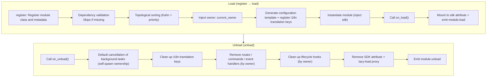
```mermaid
flowchart TD
    subgraph Load["Load (register → load)"]
        L1["register: Register module class and metadata"] --> L2["Dependency validation<br/>Skips if missing"]
        L2 --> L3["Topological sorting (Kahn + priority)"]
        L3 --> L4["Inject owner: current_owner"]
        L4 --> L5["Generate configuration template + register i18n translation keys"]
        L5 --> L6["Instantiate module (inject sdk)"]
        L6 --> L7["Call on_load()"]
        L7 --> L8["Mount to sdk attribute + emit module.load"]
    end

    subgraph Unload["Unload (unload)"]
        U1["Call on_unload()"] --> U2["Default cancellation of background tasks (self.spawn ownership)"]
        U2 --> U3["Clean up i18n translation keys"]
        U3 --> U4["Remove routes / commands / event handlers (by owner)"]
        U4 --> U5["Clean up lifecycle hooks (by owner)"]
        U5 --> U6["Remove SDK attribute + lazy-load proxy"]
        U6 --> U7["Emit module.unload"]
    end

    Load --> Unload
```

**What the framework does for you during loading** (you only need to write `on_load`, the rest is automatic):

| Step | What the framework does automatically |
|------|---------------------------------------|
| Owner injection | Wrap the module name with `owner_scope` during instantiation — commands/events/hooks/background tasks registered in `on_load` are **automatically assigned to this module**, and cleaned up in one click when unloaded by owner |
| Configuration template | For modules declaring `ConfigClass`, the framework automatically generates/fills the `ErisPulse.<ModuleName>` configuration section |
| i18n translation keys | For modules declaring `I18nClass`, translation keys are automatically registered (unregistered automatically on unload) |
| Dependency topology | Sorts by `depends` declaration to ensure dependent modules are loaded first; circular dependencies are rejected with `RuntimeError` |
| SDK mounting | After instantiation, it is mounted to `sdk.<ModuleName>`, allowing you to access `sdk.MyModule.xxx` |

**What the framework cleans up for you during unloading** (corresponding to U1→U7 above): After `on_unload` completes, it performs a default cleanup — background tasks are forcibly canceled (`self.spawn` created, graceful termination should be handled manually in `on_unload`), i18n keys, routes, commands/event handlers, lifecycle hooks, and finally removes the SDK attribute. `purge=True` additionally deletes registration stubs and cleans up `sys.modules`.

> This automatic cleanup is the foundation for the principle that "you only need to write `on_load`/`on_unload`, not manually unregister" — the framework uses owner assignment to make "who registers, who cleans up" into a one-click process.

## SDK Objects

### Accessing Core Modules

```python
from ErisPulse import sdk

# Access all core modules through the sdk object
sdk.logger.info("Log")
sdk.storage.set("key", "value")
config = sdk.config.getConfig("MyModule")
```

### Inter-module Communication

```python
# Access other modules
other_module = sdk.OtherModule
result = await other_module.some_method()
```

## Adapter Send Method Query

Due to the new standard specification requiring the use of the rewritten `__getattr__` method to implement the fallback sending mechanism, it is no longer possible to use the `hasattr` method to check if a method exists. Starting from `2.3.5`, a new feature has been added to query send methods.

### List Supported Send Methods

```python
# List all send methods supported by the platform
methods = sdk.adapter.list_sends("onebot11")
# Returns: ["Text", "Image", "Voice", "Markdown", ...]
```

### Get Method Detailed Information

```python
# Get detailed information about a specific method
info = sdk.adapter.send_info("onebot11", "Text")
# Returns:
# {
#     "name": "Text",
#     "parameters": [
#         {"name": "text", "type": "str", "default": null, "annotation": "str"}
#     ],
#     "return_type": "Awaitable[Any]",
#     "docstring": "Send a text message..."
# }
```

## Configuration Management

### Declarative Configuration (Recommended)

Starting from v2.5.2, modules can declare configuration classes using `ConfigClass`, which uses the same configuration Schema system as adapters. Configuration is read in real-time via `self.cfg`, and changes take effect immediately:

```python
from dataclasses import dataclass, field
from ErisPulse.Core.Bases import BaseModule
from ErisPulse.Core.Bases import BaseConfig

@dataclass
class MyModuleConfig(BaseConfig):
    api_key: str = field(
        default="",
        metadata={
            "description": {"i18n": "my_module.api_key", "default": "API key"},
            "required": True,
            "secret": True,
            "ui": {"widget": "password", "group": "basic", "order": 1},
        },
    )
    timeout: int = field(
        default=30,
        metadata={
            "description": {"i18n": "my_module.timeout", "default": "Timeout (seconds)"},
            "ui": {"widget": "number", "group": "advanced", "order": 2},
        },
    )

class MyModule(BaseModule):
    ConfigClass = MyModuleConfig

    def __init__(self, sdk):
        self.sdk = sdk
        self.logger = sdk.logger.get_child("MyModule")

    async def on_load(self, event):
        self.logger.info("Module loaded")

    async def on_unload(self, event):
        pass

    async def do_something(self):
        cfg = self.cfg  # Real-time reading, type-safe
        api_key = cfg.api_key
        timeout = cfg.timeout
```

`BaseConfig` is a generic configuration base class suitable for adapters, modules, external projects, and any scenario. Configuration fields support i18n multilingual descriptions (see [i18n documentation](../../advanced/i18n.md#multilingual-configuration-fields)).

### Declarative Translation Keys (v2.7.0+)

Starting from v2.7.0, modules can also declare translation keys in a similar way to `ConfigClass`, by defining a nested class `I18nClass`. The framework automatically registers all declared translation keys during loading, eliminating the need to manually call `i18n.register()`. Registration occurs before configuration template generation, ensuring that referenced i18n keys are available in configuration descriptions.

```python
from ErisPulse.Core.Bases import BaseConfig, BaseI18n, I18nKey

class MyModule(BaseModule):
    # Configuration class (optional)
    @dataclass
    class ConfigClass(BaseConfig):
        welcome_msg: str = field(
            default="Welcome",
            metadata={
                "description": {"i18n": "mymodule.welcome_msg", "default": "Welcome message"},
            },
        )

    # Translation key collection class (optional)
    class I18nClass(BaseI18n):
        # Property names are automatically concatenated into full key paths: <module_name>.<property_name>
        welcome_msg: I18nKey = I18nKey(
            default="Welcome Message",   # Fallback for language-agnostic use
            zh_CN="欢迎消息",
            zh_TW="歡迎訊息",
            en="Welcome Message",
            ja="ウェルカムメッセージ",
            ru="Приветственное сообщение",
        )
        hello: I18nKey = I18nKey(
            default="Hello, {name}!",
            zh_CN="你好，{name}！",
            zh_TW="你好，{name}！",
            en="Hello, {name}!",
            ja="こんにちは、{name}！",
            ru="Привет, {name}!",
        )
```

For more details, see [Recommended i18n Writing Style](../../advanced/i18n.md#recommended-style-using-i18nclass-to-declare-translation-keys-v270).

### Manual Configuration Reading (Deprecated)

> **Deprecated**: Please use [Declarative Configuration](#declarative-configuration-recommended) + real-time reading via `self.cfg`.

```python
class MyModule(BaseModule):
    def __init__(self, sdk):
        self.sdk = sdk

    def _load_config(self):
        config = self.sdk.config.getConfig("MyModule")
        if not config:
            self.sdk.config.setConfig("MyModule", {"api_key": "", "timeout": 30})
            return {"api_key": "", "timeout": 30}
        return config
```

## Storage System

### Basic Usage

```python
# Store data
sdk.storage.set("user:123", {"name": "Zhang San"})

# Retrieve data
user = sdk.storage.get("user:123", {})

# Delete data
sdk.storage.delete("user:123")
```

### Transaction Usage

```python
# Use transactions to ensure data consistency
with sdk.storage.transaction():
    sdk.storage.set("key1", "value1")
    sdk.storage.set("key2", "value2")
    # If any operation fails, all changes will be rolled back
```

## Event Handling

### Event Handler Registration

```python
from ErisPulse.Core.Event import command, message

# Register command
@command("info", help="Get information")
async def info_handler(event):
    await event.reply("This is information")

# Register message handler
@message.on_group_message()
async def group_handler(event):
    sdk.logger.info(f"Received group message: {event.get_text()}")
```

### Event Handler Lifecycle

The framework automatically manages the registration and unregistration of event handlers; you only need to register them in `on_load`.

## Lazy Loading Mechanism

### How It Works

```python
# Modules are only initialized when first accessed
result = await sdk.my_module.some_method()
# ↑ This triggers module initialization
```

### Immediate Loading

For modules that need to be initialized immediately (such as listeners or timers):

```python
@staticmethod
def get_load_strategy():
    return ModuleLoadStrategy(
        lazy_load=False,  # Load immediately
        priority=100
    )
```

## Error Handling

### Exception Handling

```python
async def handle_event(self, event):
    try:
        # Business logic
        await self.process_event(event)
    except ValueError as e:
        self.logger.warning(f"Parameter error: {e}")
        await event.reply(f"Parameter error: {e}")
    except Exception as e:
        self.logger.error(f"Processing failed: {e}")
        raise
```

### Logging

```python
# Use different log levels
self.logger.debug("Debug information")    # Detailed debug information
self.logger.info("Running status")         # Normal running information
self.logger.warning("Warning information") # Warning information
self.logger.error("Error information")     # Error information
self.logger.critical("Critical error")     # Critical error
```


### Event 包装类详解

# Event Wrapper Class Details

The Event module provides a powerful Event wrapper class that simplifies event handling.

## Type Annotate the event Parameter

The `event` parameter of event handlers is an **Event wrapper class** (a subclass of dict). It is highly recommended to add type annotations for it:

```python
from ErisPulse.Core.Event import Event

@message.on_private_message()
async def handler(event: Event):
    text = event.get_text()   # IDE auto-completes all convenient methods
    await event.reply(text)   # Spelling errors can be detected during static checking
```

Without type annotations, the IDE cannot recognize methods on Event (`get_text()` / `reply()` / `wait_reply()` / platform extension methods are not suggested), and you have to rely on memory for spelling.

> **Note**: The `event` in event handler callbacks is an **Event wrapper class** (annotated as `Event`); the `event` in module lifecycle methods `on_load` / `on_unload` is a regular **dict** (annotated as `dict`), and these two should not be confused.

## Core Features

- **Full Dictionary Compatibility**: The Event class inherits from dict.
- **Convenient Methods**: Provides a large number of convenient methods.
- **Dot Access**: Supports accessing event fields using dot notation.
- **Backward Compatibility**: All methods are optional.

## Core Field Methods

```python
from ErisPulse.Core.Event import command

@command("info")
async def info_command(event: Event):
    event_id = event.get_id()
    platform = event.get_platform()
    time = event.get_time()
    print(f"ID: {event_id}, Platform: {platform}, Time: {time}")
```

## Message Event Methods

```python
from ErisPulse.Core.Event import message

@message.on_private_message()
async def private_handler(event: Event):
    text = event.get_text()
    user_id = event.get_user_id()
    nickname = event.get_user_nickname()
    await event.reply(f"Hello, {nickname}!")
```

## Message Type Detection

```python
from ErisPulse.Core.Event import message

@message.on_group_message()
async def group_handler(event: Event):
    is_private = event.is_private_message()
    is_group = event.is_group_message()
    is_at = event.is_at_message()
    await event.reply(f"Type: {'Private Chat' if is_private else 'Group Chat'}")
```

## Reply Functionality

```python
from ErisPulse.Core.Event import command

@command("ask")
async def ask_command(event: Event):
    await event.reply("Please enter your name:")
    reply = await event.wait_reply(timeout=30)
    if reply:
        name = reply.get_text()
        await event.reply(f"Hello, {name}!")

@command("price")
async def price_command(event: Event):
    await event.reply("Please enter the amount (e.g., 5 yuan):")
    # The reply must match the regular expression; otherwise, continue waiting until timeout
    reply = await event.wait_reply(timeout=30, regex=r"\d+\s*元")
    if reply:
        await event.reply(f"Received amount: {reply.get_text()}")
```

## Command Information Retrieval

```python
from ErisPulse.Core.Event import command

@command("cmdinfo")
async def cmdinfo_command(event: Event):
    cmd_name = event.get_command_name()
    cmd_args = event.get_command_args()
    await event.reply(f"Command: {cmd_name}, Arguments: {cmd_args}")
```

## Notification Event Methods

```python
from ErisPulse.Core.Event import notice

@notice.on_friend_add()
async def friend_add_handler(event: Event):
    await event.reply("Welcome to add me as a friend!")
```

## Method Quick Reference

### Core Methods

#### Event Basic Information
- `get_id()` - Get event ID
- `get_time()` - Get event timestamp (Unix seconds)
- `get_type()` - Get event type (message/notice/request/meta)
- `get_detail_type()` - Get event detail type (private/group/friend, etc.)
- `get_platform()` - Get platform name

#### Bot Information
- `get_self_platform()` - Get bot platform name
- `get_self_user_id()` - Get bot user ID
- `get_self_account_id()` - Get bot account ID (multi-Bot mode)
- `get_self_info()` - Get complete bot info dictionary

#### Session Identifiers
- `get_target_id()` - Get unified target ID (returns `group_id` for group chats, `channel_id` for channels, `user_id` for private chats, returns the first non-empty value in order: group → channel → guild → thread → user)
- `get_session_id()` - Get unique session identifier, format: `{platform}:{detail_type}:{target_id}`

### Message Event Methods

#### Message Content
- `get_message()` - Get message segment array (OneBot12 format)
- `get_alt_message()` - Get alternative message text
- `get_text()` - Get plain text content (alias of `get_alt_message()`)
- `get_message_text()` - Get plain text content (alias of `get_alt_message()`)

#### Sender Information
- `get_user_id()` - Get sender user ID
- `get_user_nickname()` - Get sender nickname
- `get_sender()` - Get complete sender info dictionary

#### Group/Channel Information
- `get_group_id()` - Get group ID (group chat message)
- `get_channel_id()` - Get channel ID (channel message)
- `get_guild_id()` - Get server ID (server message)
- `get_thread_id()` - Get topic/subchannel ID (topic message)

#### @Message Related
- `has_mention()` - Whether the message contains a mention of the bot
- `get_mentions()` - Get list of all mentioned user IDs

### Message Type Checks

#### Basic Checks
- `is_message()` - Whether it is a message event
- `is_private_message()` - Whether it is a private message
- `is_group_message()` - Whether it is a group chat message
- `is_at_message()` - Whether it is an @message (alias of `has_mention()`)

### Notification Event Methods

#### Operator Information
- `get_operator_id()` - Get operator ID
- `get_operator_nickname()` - Get operator nickname

#### Notification Type Checks
- `is_notice()` - Whether it is a notification event
- `is_group_member_increase()` - Group member increase event
- `is_group_member_decrease()` - Group member decrease event
- `is_friend_add()` - Friend add event (matches `detail_type == "friend_increase"`)
- `is_friend_delete()` - Friend delete event (matches `detail_type == "friend_decrease"`)

### Request Event Methods

#### Request Information
- `get_comment()` - Get request comment

#### Request Type Checks
- `is_request()` - Whether it is a request event
- `is_friend_request()` - Whether it is a friend request
- `is_group_request()` - Whether it is a group request

### Reply Functionality

#### Basic Reply
- `reply(content, method="Text", at_sender=False, quote=False, at_users=None, reply_to=None, at_all=False, via=None, **kwargs)` - General reply method
  - `content`: Content to send (text, URL, etc.)
  - `method`: Sending method, default "Text", optional "Image"/"Voice"/"Video"/"File", etc.
  - `at_sender`: Whether to @ sender (auto-extract user_id)
  - `quote`: Whether to quote reply current message (auto-extract message_id)
  - `at_users`: List of users to @, e.g., `["user1", "user2"]`
  - `reply_to`: Manually specify the message ID to reply to
  - `at_all`: Whether to @ all members
  - `**kwargs`: Additional parameters (e.g., user_id for Mention method)

- `reply_ob12(message)` - Reply using OneBot12 message segments
  - `message`: OneBot12 message segment list or dictionary, can be built with MessageBuilder

#### Platform Capability Query
- `supports(method)` - Check if current platform supports a sending method (e.g., `"Image"`, `"Voice"`), returns `bool`
- `available_methods()` - List all available sending methods for current platform, returns list of method names

#### Forwarding Functionality

> **Note**: Forwarding functionality needs to be implemented through the adapter's Send DSL; the Event wrapper class itself does not provide a direct forwarding method.

```python
# Forward message to group
adapter = sdk.adapter.get(event.get_platform())
target_id = event.get_group_id()  # or specify other group ID
await adapter.Send.To("group", target_id).Text(event.get_text())
```

### Wait Reply Functionality

- `wait_reply(prompt=None, timeout=60.0, callback=None, validator=None, method="Text", pattern=None, regex=None)` - Wait for user reply
  - `prompt`: Prompt message, if provided, it will be sent to the user
  - `timeout`: Timeout for waiting (seconds), default 60 seconds
  - `callback`: Callback function, executed when a reply is received
  - `validator`: Validation function, used to verify if the reply is valid
  - `method`: Sending method for the prompt, default "Text"
  - `pattern`: Glob wildcard (`*` / `?` / `[seq]`), reply text must match, otherwise continue waiting
  - `regex`: Regular expression, reply text must match (either `pattern` or `regex`), otherwise continue waiting
  - Returns the Event object of the user's reply, returns None on timeout

#### Interaction Methods

- `confirm(prompt=None, timeout=60.0, yes_words=None, no_words=None, method="Text", hint=False)` - Confirmation dialog
  - Returns `True` (confirmed) / `False` (denied) / `None` (timeout)
  - Built-in English and Chinese confirmation words are automatically recognized, customizable word sets are supported
  - `method`: Sending method, default "Text"; supports "Image"/"Markdown", etc., for non-text prompts
  - `hint`: Whether to automatically append confirmation word hints (e.g., "（是/否）") at the end of the prompt, default False

- `choose(prompt, options, timeout=60.0, method="Text", options_format="auto", merge_prompt=False, placeholder="{options}")` - Selection menu
  - `options`: List of option texts
  - Returns the index (0-based) of the selected option, returns `None` on timeout
  - `method`: Sending method, default "Text"; text-based methods (Text/Markdown/md/Html/h5) automatically merge options at the end
  - `options_format`: Option format (default: "auto", automatically select built-in style based on method)
    - `"auto"`: Markdown→unordered list (`- 1. Option`), Html→ordered list (`<ol>`), others→plain text list
    - `"list"`: One per line, e.g., ``1. Option A\n2. Option B``
    - `"inline"`: Display in a single line, e.g., ``1.A | 2.B``
    - `"md"`: Markdown unordered list
    - `"html"`: Html ordered list
    - `callable`: Custom function, receives ``list[str]`` and returns ``str``
  - `merge_prompt`: Whether to forcibly merge into a single message, default False
    - `False` (default): Text-based methods automatically merge; non-text methods send prompt first, then Text options
    - `True`: Regardless of method, always merge into a single message, sent using the specified method
  - `placeholder`: Option insertion placeholder, default `{options}`; the marked location in prompt is replaced with option text, set to empty string to always append at the end

- `collect(fields, timeout_per_field=60.0)` - Form collection
  - `fields`: List of fields, each containing `key`, `prompt`, optional `validator`, optional `method`
  - Returns `{key: value}` dictionary, returns `None` if any field times out
  - Each field supports `method` key to specify sending method, e.g., collecting images with `{"key": "avatar", "prompt": "Please send avatar", "method": "Image"}`
  - Each field can have an optional `options` key (list), when provided, the field becomes a selection question (automatically calls choose logic)
  - Each field can have optional `options_format`, `merge_prompt`, `placeholder` keys to control option format, message merging behavior, and placeholder

- `wait_for(event_type="message", condition=None, timeout=60.0)` - Wait for any event
  - `condition`: Filter function, returns `True` when matched
  - Returns the matching Event object, returns `None` on timeout

- `conversation(timeout=60.0)` - Create multi-turn conversation context
  - Returns `Conversation` object, supports `say()`/`wait()`/`confirm()`/`choose()`/`collect()`/`stop()`
  - `is_active` property indicates whether the conversation is active

#### Interaction Method Examples

**confirm() - Confirmation dialog:**

```python
@command("delete", help="Delete data")
async def delete_handler(event: Event):
    if await event.confirm("Are you sure you want to delete all data?"):
        sdk.storage.delete("all_data")
        await event.reply("Data has been deleted")
    else:
        await event.reply("Cancelled")
```

**confirm() - With prompt words:**

```python
# hint=True will append "（是/否）" at the end of the prompt
if await event.confirm("Continue?", hint=True):
    await event.reply("Continued")
# User sees: Continue?（是/否）
```

**choose() - Selection menu:**

```python
@command("color", help="Choose color")
async def color_handler(event: Event):
    choice = await event.choose("Choose color:", ["Red", "Green", "Blue"])
    if choice is not None:
        colors = ["Red", "Green", "Blue"]
        await event.reply(f"You chose: {colors[choice]}")
```

**choose() - Option formatting and message merging:**

```python
# inline format: options displayed in a single line
choice = await event.choose("Choose:", ["A", "B", "C"], options_format="inline")
# Output: 1.A | 2.B | 3.C

# Custom format
choice = await event.choose("Choose:", ["Cat", "Dog"],
    options_format=lambda opts: " / ".join(opts))
# Output: Cat / Dog

# options_format="auto" (default): automatically select built-in style based on method
# Markdown → unordered list
choice = await event.choose(
    "## Choose", ["Cat", "Dog"],
    method="Markdown",  # auto recognizes as md list
)
# Output:
# ## Choose
# - 1. Cat
# - 2. Dog

# Html → ordered list
choice = await event.choose(
    "<h2>Choose</h2>", ["Cat", "Dog"],
    method="Html", merge_prompt=True,  # auto recognizes as html list
)
# Output:
# <h2>Choose</h2>
# <ol><li>1. Cat</li><li>2. Dog</li></ol>

# Merge mode + placeholder
choice = await event.choose(
    "## Choose\n{options}\nReply with number",
    ["Cat", "Dog"],
    method="Markdown", merge_prompt=True,
)

# Custom placeholder
choice = await event.choose(
    "Choose: [choices]",
    ["Cat", "Dog"],
    placeholder="[choices]",
)
```

**collect() - Form collection:**

```python
@command("register", help="Register")
async def register_handler(event: Event):
    data = await event.collect([
        {"key": "name", "prompt": "Enter your name:"},
        {"key": "age", "prompt": "Enter your age:",
         "validator": lambda e: e.get_text().isdigit()},
    ])
    if data:
        await event.reply(f"Registration successful! {data['name']}, {data['age']} years old")
```

**Non-Text method reply:**

```python
await event.reply("http://example.com/img.jpg", method="Image")
await event.reply("http://example.com/audio.mp3", method="Voice")

from ErisPulse.Core.Event import MessageBuilder
segments = MessageBuilder.text("Look at this image:").image("http://example.com/img.jpg").build()
await event.reply_ob12(segments)
```

> For complete usage of Conversation multi-turn dialogue, please refer to [Conversation Multi-turn Dialogue](../../advanced/conversation.md).

### Command Information

#### Command Basics
- `get_command_name()` - Get command name
- `get_command_args()` - Get command argument list
- `get_command_raw()` - Get raw command text
- `get_command_info()` - Get complete command info dictionary
- `is_command()` - Whether it is a command

### Raw Data

- `get_raw()` - Get raw platform event data
- `get_raw_type()` - Get raw platform event type

### Platform Extension Methods

Adapters can register platform-specific methods for the Event wrapper class. These methods are only available on Event instances of the corresponding platform; accessing them on other platforms raises `AttributeError`.

Platform methods take precedence over built-in methods via `Event.__getattribute__`, allowing overwriting of built-in interactive methods such as `confirm`, `choose`, `collect`, `wait_reply` to provide platform-specific features (e.g., buttons, cards). The built-in implementation is exported as `_builtin_*` functions for overwriting.

```python
# Email event - only email methods
event = Event({"platform": "email", "email_raw": {"subject": "Hello"}})
event.get_subject()      # ✅ Returns "Hello"
event.get_chat_type()    # ❌ AttributeError

# Telegram event - only Telegram methods
event = Event({"platform": "telegram", "telegram_raw": {"chat": {"type": "private"}}})
event.get_chat_type()    # ✅ Returns "private"
event.get_subject()      # ❌ AttributeError

# Built-in methods always available
event.get_text()         # ✅ Any platform
event.reply("hi")        # ✅ Any platform
```

### Query Registered Methods

```python
from ErisPulse.Core.Event import get_platform_event_methods

methods = get_platform_event_methods("email")
# ["get_subject", "get_from", ...]
```

### `hasattr` and `dir` Support

```python
hasattr(event, "get_subject")   # Returns True only if platform="email"
"get_subject" in dir(event)     # Same as above
```

### Cross-Platform Extension (Wildcard)

`register_event_method` and `register_event_mixin` support passing `"*"` as the platform name, registering methods that are available on Event instances of **all platforms**. Suitable for AI chat, context management, and other features requiring cross-platform reuse.

```python
from ErisPulse.Core.Event.wrapper import register_event_method

@register_event_method("*")
async def ai_chat(self, prompt: str):
    # self is the Event instance, can access event data and built-in methods
    await self.reply(f"AI: {prompt}")
```

After registration, any platform's event handler can call `event.ai_chat(...)`.

Method resolution priority (from high to low): platform-specific method → wildcard method → built-in method → dictionary key access.

> For adapter developers registering extension methods, please refer to [Event System API - Cross-Platform Extension (Wildcard)](../../api-reference/event-system.md#跨平台扩展通配符).


### 模块开发最佳实践

# Module Development Best Practices

This document provides best practices for developing ErisPulse modules.

## Module Design

### 1. Single Responsibility Principle

Each module should only be responsible for one core function:

```python
# Good design: Each module is responsible for one function
class WeatherModule(BaseModule):
    """Weather query module"""
    pass

class NewsModule(BaseModule):
    """News query module"""
    pass

# Bad design: A module is responsible for multiple unrelated functions
class UtilityModule(BaseModule):
    """Contains weather, news, jokes, and other functions"""
    pass
```

### 2. Module Naming Convention

```toml
[project]
name = "ErisPulse-ModuleName"  # Use ErisPulse- prefix
```

### 3. Clear Configuration Management

It is recommended to use declarative configuration (`ConfigClass` + `BaseConfig`) to achieve type safety, automatic template generation, and WebUI form support:

```python
from dataclasses import dataclass, field
from ErisPulse.Core.Bases import BaseConfig

@dataclass
class MyModuleConfig(BaseConfig):
    api_url: str = field(default="https://api.example.com", metadata={
        "description": {"i18n": "my_module.api_url", "default": "API address"},
    })
    timeout: int = field(default=30, metadata={
        "description": {"i18n": "my_module.timeout", "default": "Timeout (seconds)"},
    })
    cache_ttl: int = field(default=3600, metadata={
        "description": {"i18n": "my_module.cache_ttl", "default": "Cache TTL (seconds)"},
    })

class MyModule(BaseModule):
    ConfigClass = MyModuleConfig

    async def do_something(self):
        cfg = self.cfg  # Type-safe, real-time reading
        await self._fetch(cfg.api_url, timeout=cfg.timeout)
```

Alternatively, you can continue using manual configuration storage (see [Module Core Concepts](core-concepts.md#configuration-management)).

### Declarative Translation Keys (v2.7.0+)

Modules can centrally declare translation keys via `I18nClass`, and the framework automatically registers them into the i18n system, eliminating the need for manual `i18n.register()` calls.

```python
from ErisPulse.Core.Bases import BaseI18n, I18nKey

class MyModule(BaseModule):
    class I18nClass(BaseI18n):
        # Business translation keys with placeholders
        welcome: I18nKey = I18nKey(
            default="Welcome, {name}!",
            zh_CN="Welcome, {name}!",
            zh_TW="Welcome, {name}!",
            en="Welcome, {name}!",
            ja="ようこそ、{name}！",
            ru="Добро пожаловать, {name}!",
        )
        # Configuration field description translations
        api_url: I18nKey = I18nKey(
            default="API URL",
            zh_CN="API address",
            zh_TW="API address",
            en="API URL",
            ja="API URL",
            ru="API URL",
        )
```

See [i18n documentation](../../advanced/i18n.md#recommended-usage-by-declaring-translation-keys-via-i18nclass-v270) for detailed usage.

## Asynchronous Programming

### 1. Use Asynchronous Libraries

```python
# Recommended to use SDK built-in HTTP client (asynchronous, automatic logging and statistics)
from ErisPulse.Core import client

class MyModule(BaseModule):
    async def fetch_data(self, url):
        resp = await client.get(url)
        return await resp.json()

# Alternatively, use sdk.client (same effect)
from ErisPulse import sdk

class MyModule(BaseModule):
    async def fetch_data(self, url):
        resp = await sdk.client.get(url)
        return await resp.json()

# Do not use aiohttp directly (not convenient for framework management)
import aiohttp

class MyModule(BaseModule):
    async def fetch_data(self, url):
        async with aiohttp.ClientSession() as session:
            async with session.get(url) as response:
                return await response.json()

# Do not use requests (synchronous, blocks event loop)
import requests

class MyModule(BaseModule):
    def fetch_data(self, url):
        return requests.get(url).json()  # Blocks event loop
```

### 2. Correct Asynchronous Operations

```python
from ErisPulse.Core.Event import Event  # Event: Event annotation provides IDE completion

async def handle_command(self, event: Event):
    # Time-consuming operations that require waiting: directly await (clear lifecycle)
    result = await self._long_operation()

async def on_load(self, event: dict):
    # Background tasks (polling/timer/fire-and-forget): use self.spawn(),
    # When the module unloads, the framework cancels it after on_unload, avoiding holding self and causing leaks
    self.spawn(self._poll())
```

> [!NOTE]
> Background tasks are recommended to use `self.spawn()` (ErisPulse **2.8.0+**), rather than `asyncio.create_task`—the latter creates bare tasks not belonging to the module, which are not automatically cleaned up when the module unloads, holding the `self` reference and causing module instances to not be recycled (hot reload leak). See [Lifecycle Management](../../advanced/lifecycle.md#background-task-ownership-and-automatic-cancellation).

### 3. Resource Management

```python
async def on_load(self, event):
    # SDK clients automatically manage connection pools, no need to manually create sessions
    pass
    
async def on_unload(self, event):
    # If a custom client is needed, remember to clean up resources
    pass
```

## Event Handling

### 1. Use Event Wrapper Class

```python
# Use convenient methods of Event wrapper class
@command("info")
async def info_command(event: Event):
    user_id = event.get_user_id()
    nickname = event.get_user_nickname()
    await event.reply(f"Hello, {nickname}!")

# Not directly accessing dictionary
@command("info")
async def info_command(event: Event):
    user_id = event["user_id"]  # Less clear, prone to errors
```

### 2. Reasonable Use of Lazy Loading

```python
# Low-frequency command module: declare activate_on trigger, automatically activate on the first matching command arrival (maintain lazy loading)
class CommandModule(BaseModule):
    @staticmethod
    def get_load_strategy():
        return ModuleLoadStrategy(lazy_load=True, activate_on=[
            {"command": {"name": "dice", "help": "Roll a die", "aliases": ["d"]}},
        ])

# Low-frequency listener module: declare event trigger, automatically activate when event arrives
class ListenerModule(BaseModule):
    @staticmethod
    def get_load_strategy():
        return ModuleLoadStrategy(lazy_load=True, activate_on=[
            {"notice": "group_member_increase"},
        ])

# High-frequency triggers (every message) or modules that must be ready at startup: load immediately
class HotListenerModule(BaseModule):
    @staticmethod
    def get_load_strategy():
        return ModuleLoadStrategy(lazy_load=False)

# Utility modules are suitable for lazy loading
class UtilityModule(BaseModule):
    @staticmethod
    def get_load_strategy():
        return ModuleLoadStrategy(lazy_load=True)
```

> `activate_on`'s complete syntax (event three forms / command shorthand and dict declaration / help fallback chain) is described in
> [Lazy Loading Module System](../../advanced/lazy-loading.md#event-driven-lazy-activation-activate_on).

### 3. Event Handler Registration

```python
async def on_load(self, event):
    # Register event handlers in on_load
    @command("hello")
    async def hello_handler(event: Event):
        await event.reply("Hello!")
    
    @message.on_group_message()
    async def group_handler(event: Event):
        self.logger.info("Received group message")
    
    # No need to manually unregister, the framework handles it automatically
```

## Error Handling

### 1. Categorized Exception Handling

```python
async def handle_event(self, event: Event):
    try:
        result = await self._process(event)
    except ValueError as e:
        # Expected business error
        self.logger.warning(f"Business warning: {e}")
        await event.reply(f"Parameter error: {e}")
    except aiohttp.ClientError as e:
        # Network error (recommended to use sdk.client + ClientError instead)
        # Old code using aiohttp still works, but new code is recommended to use ErisPulse exception system
        self.logger.error(f"Network error: {e}")
        await event.reply("Network request failed, please try again later")
    except Exception as e:
        # Unexpected error
        self.logger.error(f"Unknown error: {e}", exc_info=True)
        await event.reply("Processing failed, please contact the administrator")
        raise
```

### 2. Timeout Handling

```python
# Recommended to use SDK built-in client (includes timeout and retry)
from ErisPulse.Core import client
from ErisPulse.Core.Bases.errors import ClientTimeoutError

async def fetch_with_timeout(self, url, timeout=30):
    try:
        resp = await client.get(url, timeout=timeout)
        return await resp.json()
    except ClientTimeoutError:
        self.logger.warning(f"Request timeout: {url}")
        raise
```

## Storage System

### 1. Use Transactions

```python
# Use transactions to ensure data consistency
async def update_user(self, user_id, data):
    with self.sdk.storage.transaction():
        self.sdk.storage.set(f"user:{user_id}:profile", data["profile"])
        self.sdk.storage.set(f"user:{user_id}:settings", data["settings"])

# ❌ Not using transactions may cause data inconsistency
async def update_user(self, user_id, data):
    self.sdk.storage.set(f"user:{user_id}:profile", data["profile"])
    # If an error occurs here, the above setting cannot be rolled back
    self.sdk.storage.set(f"user:{user_id}:settings", data["settings"])
```

### 2. Batch Operations

```python
# Use batch operations to improve performance
def cache_multiple_items(self, items):
    self.sdk.storage.set_multi({
        f"item:{k}": v for k, v in items.items()
    })

# ❌ Multiple calls are inefficient
def cache_multiple_items(self, items):
    for k, v in items.items():
        self.sdk.storage.set(f"item:{k}", v)
```

## Logging

### 1. Reasonable Use of Log Levels

```python
# DEBUG: Detailed debug information (only for development)
self.logger.debug(f"Input parameters: {params}")

# INFO: Normal operation information
self.logger.info("Module loaded")
self.logger.info(f"Processing request: {request_id}")

# WARNING: Warning information, does not affect main functionality
self.logger.warning(f"Configuration item {key} not set, using default value")
self.logger.warning("API response slow, optimization may be needed")

# ERROR: Error information
self.logger.error(f"API request failed: {e}")
self.logger.error(f"Event processing failed: {e}", exc_info=True)

# CRITICAL: Critical error, requires immediate handling
self.logger.critical("Database connection failed, the robot cannot operate normally")
```

### 2. Structured Logging

```python
# Use structured logging for easier parsing
self.logger.info(f"Processing request: request_id={request_id}, user_id={user_id}, duration={duration}ms")

# ❌ Use unstructured logging
self.logger.info(f"Processing request, from user {user_id}, took {duration} milliseconds")
```

## Performance Optimization

### 1. Use Caching

```python
class MyModule(BaseModule):
    def __init__(self):
        self._cache = {}
        self._cache_lock = asyncio.Lock()
    
    async def get_data(self, key):
        async with self._cache_lock:
            if key in self._cache:
                return self._cache[key]
            
            # Fetch from database
            data = await self._fetch_from_db(key)
            
            # Cache data
            self._cache[key] = data
            return data
```

### 2. Avoid Blocking Operations

```python
# Use asynchronous operations
async def process_message(self, event: Event):
    # Asynchronous processing
    await self._async_process(event)

# ❌ Blocking operation
async def process_message(self, event: Event):
    # Synchronous operation, blocks event loop
    result = self._sync_process(event)
```

## Security

### 1. Protection of Sensitive Data

```python
# Sensitive data stored in configuration (declarative ConfigClass, secret fields do not enter logs/export)
from dataclasses import dataclass, field
from ErisPulse.Core.Bases import BaseModule, BaseConfig

@dataclass
class MyModuleConfig(BaseConfig):
    api_key: str = field(
        default="",
        metadata={"description": "API key", "secret": True},
    )

class MyModule(BaseModule):
    ConfigClass = MyModuleConfig

    def check_api_key(self):
        if not self.cfg.api_key or self.cfg.api_key == "YOUR_API_KEY_HERE":
            raise ValueError("Please configure a valid API key in config.toml")

# ❌ Hardcoded sensitive data
class MyModule(BaseModule):
    API_KEY = "sk-1234567890"  # Do not do this!
```

### 2. Input Validation

```python
# Validate user input
async def process_command(self, event: Event):
    user_input = event.get_text()
    
    # Validate input length
    if len(user_input) > 1000:
        await event.reply("Input too long, please re-enter")
        return
    
    # Validate input format
    if not re.match(r'^[a-zA-Z0-9]+$', user_input):
        await event.reply("Input format is incorrect")
        return
```

## Testing

### 1. Unit Tests

```python
import pytest
from ErisPulse.Core.Bases import BaseModule

class TestMyModule:
    def test_config_defaults(self):
        """Test configuration default values"""
        config = MyModule.ConfigClass()
        assert config.timeout == 30
```

### 2. Integration Tests

```python
@pytest.mark.asyncio
async def test_command_handling():
    """Test command handling"""
    module = MyModule()
    await module.on_load({})
    
    # Simulate command event
    event = create_test_command_event("hello")
    await module.handle_command(event)
```

## Deployment

### 1. Version Management

```toml
[project]
name = "ErisPulse-MyModule"
version = "1.0.0"
```

Follow semantic versioning:
- MAJOR.MINOR.PATCH
- Major version: Incompatible API changes
- Minor version: Backward-compatible feature additions
- Patch version: Backward-compatible bug fixes

### 2. README Header

The README generated by `epsdk create` already includes the ErisPulse header (Logo + badge line). Two recommended modes:

**Mode A — Only ErisPulse Logo (Default):**

```markdown
<div align="center">


# MyModule

**One-sentence description**

<p>
  <a href="https://pypi.org/project/ErisPulse-MyModule/"></a>
  <a href="https://pypi.org/project/ErisPulse-MyModule/"></a>
  <a href="./LICENSE"></a>
  <a href="https://github.com/ErisPulse/ErisPulse"></a>
</p>

</div>
```

**Mode B — Module Icon × ErisPulse Logo (with custom icon):**

```markdown
<div align="center">


<span style="font-size:44px;color:#c8c8c8;margin:0 18px;vertical-align:middle;">×</span>


# MyModule
(Shields same as above)
</div>
```

You can add GitHub Stars, Downloads, and other badges as needed. Logos can also be downloaded locally to the project (`.github/assets/ErisPulseLogo.png`) and referenced with relative paths.


=====
发布与工具
=====


### 发布模块到模块商店

# Publishing and Module Store Guide

Publish your developed modules or adapters to the ErisPulse Module Store, allowing other users to easily discover and install them.

## Overview of the Module Store

The ErisPulse Module Store is a centralized module registry, allowing users to browse, search, and install community-contributed modules and adapters through the CLI tool.

### Browsing and Discovery

```bash
# List all packages available remotely
epsdk list-remote

# Show only modules
epsdk list-remote -t modules

# Show only adapters
epsdk list-remote -t adapters

# Force refresh the remote package list
epsdk list-remote -r
```

You can also visit the [ErisPulse official website](https://www.erisdev.com/#market) to browse the module store online.

### Supported Submission Types

| Type | Description | Entry-point Group |
|------|------|-------------------|
| Module | Extend bot functionality, implement business logic | `erispulse.module` |
| Adapter | Connect to new messaging platforms | `erispulse.adapter` |

## Quick Start

The entire process only requires three steps: configure your project → publish to PyPI → submit to the Module Store.

### 1. Configure pyproject.toml

Ensure your project directory includes `pyproject.toml` and `README.md`, and configure entry-points according to the type:

#### Module

```toml
[project]
name = "ErisPulse-MyModule"
version = "1.0.0"
description = "Module feature description"
requires-python = ">=3.10"
license = { text = "MIT" }
authors = [ { name = "yourname" } ]
dependencies = [
    "ErisPulse>=2.0.0",
]

[project.entry-points."erispulse.module"]
"MyModule" = "MyModule:Main"
```

#### Adapter

```toml
[project]
name = "ErisPulse-MyAdapter"
version = "1.0.0"
description = "Adapter feature description"
requires-python = ">=3.10"

[project.entry-points."erispulse.adapter"]
"myplatform" = "MyAdapter:MyAdapter"
```

> **Note**: It is recommended that package names start with `ErisPulse-` for easier identification by users. The entry-point key name (e.g., `"MyModule"`) will be the module's access name in the SDK.

### 2. Publish to PyPI

```bash
# Build + Publish (requires a PyPI account)
pip install build twine
python -m build
python -m twine upload dist/*
```

After successful publication, verify installation:

```bash
pip install ErisPulse-MyModule
```

### 3. Submit to Module Store

Go to [ErisPulse Module Store](https://www.erisdev.com/#market), click "Submit Module", log in, and fill in the module information.

Supported login methods: **GitHub**, **Codeberg**, **Yunhu**, choose any one.

Key points to fill in:
- Module name, description, repository address
- Minimum SDK version: If unsure, fill in the version number of the latest [ErisPulse release](https://pypi.org/project/ErisPulse/) 

After submission, it becomes effective immediately, and users can install via the module source. The module will be marked as "Unverified", and after the maintainer's review, it will be changed to "Verified".

> **About verification status**:
> - "Unverified" only means it has not yet been officially reviewed, not that the module has problems
> - When users install unverified modules via `epsdk install`, they will receive a risk warning and must confirm before continuing installation

### 4. Manage Published Modules

After clicking "Submit Module" and logging in at the Module Store, switch to the "My Modules" tab, where you can:

- **Edit** — Modify module description, repository address, tags, etc. The version number will automatically sync from PyPI
- **Delete** — Remove the module from the Module Store (irreversible)

> Newly submitted modules may take a few minutes to appear in the "My Modules" list.

## Updating Published Modules

1. Update the `version` in `pyproject.toml`
2. Rebuild and upload: `python -m build && python -m twine upload dist/*`
3. The module store will automatically sync the latest version from PyPI

Users can upgrade by running `epsdk upgrade MyModule`.

## Pre-release Checklist

Before pushing to PyPI, please confirm each item below:

### Code Quality

- [ ] All public APIs have type annotations (function signatures and return values)
- [ ] All public methods have docstrings (`"""..."""` format, including `:param` / `:return` / `:raises`)
- [ ] Passes `ruff check` (no warnings)
- [ ] Test coverage ≥ 80%
- [ ] All `pytest` test cases pass

### Compatibility

- [ ] `pyproject.toml` declares the minimum SDK version: `dependencies = ["ErisPulse>=x.y.z"]`
- [ ] Tested on Python 3.10 / 3.11 / 3.12 / 3.13
- [ ] Tested on target operating systems (Windows / Linux / macOS, as applicable)
- [ ] No circular import dependencies

### Configuration

- [ ] If using declarative configuration (`ConfigClass` + `BaseConfig` / `BotAccountConfig`), configuration fields have `description` (preferably in i18n format) and `ui` metadata
- [ ] If i18n translation keys are registered, all 5 languages (zh-CN / zh-TW / en / ja / ru) are covered
- [ ] Sensitive fields are marked with `secret=True`

### Documentation

- [ ] `README.md` includes installation instructions and basic usage examples
- [ ] `README.md` explains configuration methods (example config file + environment variables)
- [ ] `CHANGELOG.md` records all changes
- [ ] Adapter documentation is updated with platform features (supported Send types, event types, etc.)

### Release

- [ ] Version number in `pyproject.toml` has been updated
- [ ] Build succeeded: `python -m build`
- [ ] Uploaded to PyPI: `python -m twine upload dist/*`
- [ ] Installation verified: `pip install ErisPulse-xxx && epsdk run`

## Development Mode Testing

Before the official release, you can test locally using the editable mode:

```bash
epsdk install -e /path/to/MyModule
# or
pip install -e /path/to/MyModule
```

## FAQ

### Must package names start with `ErisPulse-`?

No, it's not mandatory, but it is highly recommended. This helps users identify packages in the ErisPulse ecosystem on PyPI.

### Can a single package register multiple modules?

Yes. You can configure multiple key-value pairs in `entry-points`:

```toml
[project.entry-points."erispulse.module"]
"ModuleA" = "MyPackage:ModuleA"
"ModuleB" = "MyPackage:ModuleB"
```

### How long does the review process take?

Typically, it takes 1-3 business days. You can check the verification status in the module store under "My Modules."

## Distributing Applications via Docker Images

If your application is not suitable for publishing to PyPI (for example, it contains private dependencies or requires a pre-configured environment), you can publish a Docker image via **GitHub Container Registry (GHCR)**, allowing other users to `docker pull` and start it with a single command.

### Use Cases

- You have a **complete robot application** (module + configuration + entry script) and want to distribute it with a single click
- The module/adapter depends on **private packages** or has a special installation process that is not suitable for PyPI
- You want to provide an **out-of-the-box** deployment solution to lower the user's entry barrier

### 1. Create a Dockerfile

Build based on the ErisPulse official image, simply add your module:

```dockerfile
FROM erispulse/erispulse:latest

LABEL org.opencontainers.image.title="ErisPulse-MyModule" \
      org.opencontainers.image.description="Module description" \
      org.opencontainers.image.url="https://github.com/yourname/ErisPulse-MyModule" \
      org.opencontainers.image.source="https://github.com/yourname/ErisPulse-MyModule"

COPY pyproject.toml README.md ./
COPY MyModule/ ./MyModule/

RUN uv pip install --system -e .
```

If the module requires additional system dependencies (such as SSH client, etc.), add them after `RUN uv pip install`:

```dockerfile
RUN apt-get update && apt-get install -y --no-install-recommends \
    openssh-client \
    && rm -rf /var/lib/apt/lists/*
```

> `erispulse/erispulse:latest` already includes ErisPulse, ErisPulse-Dashboard, Python runtime, and uv, so there's no need to install them again.

### 2. Create a GitHub Actions Workflow

Create in `.github/workflows/docker-publish.yml`:

```yaml
name: Publish Docker Image

on:
  workflow_dispatch:
  push:
    branches:
      - main
    tags:
      - "v*"

permissions:
  contents: read
  packages: write

env:
  REGISTRY: ghcr.io
  IMAGE_NAME: ${{ github.repository_owner }}/my-bot

jobs:
  docker-publish:
    runs-on: ubuntu-latest

    steps:
      - name: Checkout code
        uses: actions/checkout@v4

      - name: Set up QEMU (multi-architecture support)
        uses: docker/setup-qemu-action@v3

      - name: Set up Docker Buildx
        uses: docker/setup-buildx-action@v3

      - name: Login to GitHub Container Registry
        uses: docker/login-action@v3
        with:
          registry: ${{ env.REGISTRY }}
          username: ${{ github.actor }}
          password: ${{ secrets.GITHUB_TOKEN }}

      - name: Extract Docker metadata
        id: meta
        uses: docker/metadata-action@v5
        with:
          images: ${{ env.REGISTRY }}/${{ env.IMAGE_NAME }}
          tags: |
            type=semver,pattern={{version}}
            type=semver,pattern={{major}}.{{minor}}
            type=raw,value=latest

      - name: Build and push Docker image
        uses: docker/build-push-action@v6
        with:
          context: .
          file: ./Dockerfile
          platforms: linux/amd64,linux/arm64
          push: true
          tags: ${{ steps.meta.outputs.tags }}
          labels: ${{ steps.meta.outputs.labels }}
          cache-from: type=gha
          cache-to: type=gha,mode=max
```

> `GITHUB_TOKEN` is automatically provided by GitHub Actions, no need to manually create a key.

### 3. Trigger the Build

Pushing code or tagging will automatically trigger the build:

```bash
# Push to main branch to trigger
git push origin main

# Or tag to trigger
git tag v1.0.0
git push origin v1.0.0
```

You can also manually trigger it in the GitHub repository's **Actions** page.

### 4. Set the Image as Public

GHCR images are private by default, and must be set to Public in GitHub so other users can pull without logging in:

1. Go to the repository → **Packages** → Click on the corresponding Package
2. **Package settings** → **Danger Zone** → **Change visibility** → **Public**

### 5. User Usage

After the build is complete, users can start it with `docker run` in a single line:

```bash
docker run -d \
  --name my-bot \
  -p 8000:8000 \
  -v $(pwd)/config:/app/config \
  -e TZ=Asia/Shanghai \
  -e ERISPULSE_DASHBOARD_TOKEN=your-token \
  --restart unless-stopped \
  ghcr.io/<your-username>/my-bot:latest
```

Or use `docker-compose.yml`:

```yaml
services:
  my-bot:
    image: ghcr.io/<your-username>/my-bot:latest
    container_name: my-bot
    ports:
      - "8000:8000"
    volumes:
      - ./config:/app/config
    environment:
      - TZ=Asia/Shanghai
      - ERISPULSE_DASHBOARD_TOKEN=${ERISPULSE_DASHBOARD_TOKEN:-}
    restart: unless-stopped
```

### Publish to Docker Hub as well

Extend the workflow by adding Docker Hub login before the login step, and in the `images` add the Docker Hub address:

```yaml
      - name: Login to Docker Hub
        uses: docker/login-action@v3
        with:
          registry: docker.io
          username: ${{ secrets.DOCKERHUB_USERNAME }}
          password: ${{ secrets.DOCKERHUB_TOKEN }}

      - name: Extract Docker metadata
        id: meta
        uses: docker/metadata-action@v5
        with:
          images: |
            docker.io/<your-dockerhub-username>/my-bot
            ghcr.io/${{ github.repository_owner }}/my-bot
```

> You need to add `DOCKERHUB_USERNAME` and `DOCKERHUB_TOKEN` in the repository **Settings → Secrets**.

### Docker Image vs PyPI Publishing

| Feature | Docker Image (GHCR) | PyPI Publishing |
|-------|---------------------|-----------------|
| Distribution Method | `docker pull` to run with one click | `pip install` + manual configuration |
| Applicability | Complete applications/solutions | Single modules/adapters |
| Private Dependencies | Natively supported | Requires a private PyPI source |
| Module Store | Not applicable | Can be submitted to the module store |
| Multi-architecture | Supports amd64/arm64 | Architecture-agnostic |

The two methods are not mutually exclusive—you can publish the module to the module store via PyPI and provide an out-of-the-box Docker image via GHCR.


### CLI 命令参考

# CLI Command Reference

The ErisPulse command-line tool (`epsdk`) provides project management and package management functions.

> **Tip**: You can view detailed parameter descriptions for any command using `epsdk <command> --help`.

---

## Package Management Commands

| Command | Alias | Parameters | Description |
|---------|-------|------------|-------------|
| `install` | `i`, `add` | `[package]... [--upgrade/-U] [--pre] [-e PATH] [--user] [--no-deps] [-t DIR] [--index-url URL] [--extra-index-url URL] [--no-cache-dir] [-r FILE] [-c FILE] [--force-reinstall] [--ignore-installed] [--compile/--no-compile] [--prefix DIR] [--src DIR] [--config-settings SETTINGS] [--no-binary FORMAT] [--only-binary FORMAT] [--prefer-binary] [--build-isolation/--no-build-isolation] [--upgrade-strategy {eager,only-if-needed,to-satisfy-only}] [--break-system-packages] [--no-uv]` | Install modules/adapters |
| `uninstall` | `rm`, `remove` | `<package>... [--no-uv]` | Uninstall modules/adapters |
| `upgrade` | `up` | `[package]... [--force/-f] [--pre] [--no-uv]` | Upgrade specified modules or all |
| `self-update` | `su`, `update` | `[version] [--pre] [--force/-f] [--no-uv]` | Update the SDK itself |

## Diagnostic Commands

| Command | Alias | Parameters | Description |
|---------|-------|------------|-------------|
| `doctor` | `diag` | `[--verbose]` | Diagnose environment and output health report |

### install

Install ErisPulse module or adapter packages. If no package name is specified, enter the interactive installation interface.

**Aliases:** `i`, `add`

**Parameters:**

| Parameter | Short | Description |
|-----------|-------|-------------|
| `[package]...` | | Package names to install, multiple can be specified |
| `--upgrade` | `-U` | Upgrade to the latest version during installation |
| `--pre` | | Allow installation of pre-release versions |
| `--editable` | `-e` | Install in editable mode (requires path) |
| `--user` | | Install to user site-packages directory |
| `--no-deps` | | Do not install dependencies |
| `--target` | `-t` | Install to specified directory |
| `--index-url` | | Specify PyPI mirror source URL |
| `--extra-index-url` | | Additional PyPI mirror source URL (can be specified multiple times) |
| `--no-cache-dir` | | Disable cache |
| `--requirement` | `-r` | Install from requirements file |
| `--constraint` | `-c` | Install from constraint file |
| `--force-reinstall` | | Force reinstallation |
| `--ignore-installed` | | Ignore already installed packages |
| `--compile` | | Compile .pyc files after installation |
| `--no-compile` | | Do not compile .pyc files after installation |
| `--prefix` | | Install to specified prefix directory |
| `--src` | | Source code directory used for editable installation |
| `--config-settings` | | Pass configuration to build backend (can be specified multiple times) |
| `--no-binary` | | Restrict not to use binary packages (format like `:all:`) |
| `--only-binary` | | Restrict to use only binary packages (format like `:all:`) |
| `--prefer-binary` | | Prefer binary packages |
| `--build-isolation` | | Enable build isolation |
| `--no-build-isolation` | | Disable build isolation |
| `--upgrade-strategy` | | Upgrade strategy: `eager`, `only-if-needed`, `to-satisfy-only` |
| `--break-system-packages` | | Allow modification of system package manager managed Python packages |
| `--no-uv` | | Use pip instead of uv |

**Examples:**

```bash
# Install a single module
epsdk install Weather

# Install multiple modules
epsdk install Yunhu Weather

# Install from mirror source and upgrade
epsdk install Weather -U --index-url https://pypi.tuna.tsinghua.edu.cn/simple

# Editable mode installation (development mode)
epsdk install -e ./my-adapter
```

### uninstall

Uninstall installed ErisPulse modules or adapter packages. If no package name is specified, enter the interactive uninstallation interface.

**Aliases:** `rm`, `remove`

**Parameters:**

| Parameter | Description |
|-----------|-------------|
| `<package>...` | Package names to uninstall, multiple can be specified |
| `--no-uv` | Use pip instead of uv |

**Examples:**

```bash
# Uninstall a single module
epsdk uninstall Weather

# Uninstall multiple modules
epsdk uninstall Yunhu Weather
```

### upgrade

Upgrade installed ErisPulse components. If no package name is specified, enter interactive upgrade of all.

**Aliases:** `up`

**Parameters:**

| Parameter | Short | Description |
|-----------|-------|-------------|
| `[package]...` | | Package names to upgrade, multiple can be specified |
| `--force` | `-f` | Force upgrade, skip confirmation |
| `--pre` | | Allow upgrade to pre-release versions |
| `--no-uv` | | Use pip instead of uv |

**Examples:**

```bash
# Upgrade all packages
epsdk upgrade

# Upgrade specified package
epsdk upgrade Weather

# Force upgrade (skip confirmation)
epsdk upgrade -f
```

### self-update

Update the ErisPulse SDK itself to the latest version.

**Aliases:** `su`, `update`

**Parameters:**

| Parameter | Short | Description |
|-----------|-------|-------------|
| `[version]` | | Specify the target version to update to |
| `--pre` | | Allow updating to pre-release versions |
| `--force` | `-f` | Force update, skip confirmation |
| `--no-uv` | | Use pip instead of uv |

**Examples:**

```bash
# Update to the latest stable version
epsdk self-update

# Update to a specific version
epsdk self-update 1.2.3

# Allow pre-release versions
epsdk self-update --pre

# Force update
epsdk self-update -f
```

---

## Information Query Commands

| Command | Alias | Parameters | Description |
|---------|-------|------------|-------------|
| `list` | `l`, `ls` | `[--type/-t {modules,adapters,all}] [--outdated/-o]` | List installed components |
| `list-remote` | `lsr` | `[--type/-t {modules,adapters,all}] [--refresh/-r]` | List remote available components |

### list

List installed ErisPulse modules and adapters.

**Aliases:** `l`, `ls`

**Parameters:**

| Parameter | Short | Description |
|-----------|-------|-------------|
| `--type` | `-t` | Specify type: `modules`, `adapters`, `all` (default) |
| `--outdated` | `-o` | Only display upgradable packages |

**Examples:**

```bash
# List all installed components
epsdk list

# List only modules
epsdk list -t modules

# List only adapters
epsdk list -t adapters

# Only show upgradable packages
epsdk list -o
```

### list-remote

List available ErisPulse modules and adapters in the remote repository.

**Aliases:** `lsr`

**Parameters:**

| Parameter | Short | Description |
|-----------|-------|-------------|
| `--type` | `-t` | Specify type: `modules`, `adapters`, `all` (default) |
| `--refresh` | `-r` | Force refresh remote package list cache |

**Examples:**

```bash
# List all remote available components
epsdk list-remote

# List only remote modules
epsdk list-remote -t modules

# Force refresh cache and list
epsdk list-remote -r
```

---

## Configuration Commands

| Command | Alias | Parameters | Description |
|---------|-------|------------|-------------|
| `config` | `cfg`, `conf` | `[name] [--list/-l]` | Interactively configure declarative configuration items for adapters/modules |

### config

Interactively fill in declarative configuration items for adapters/modules. The wizard is driven by the adapter/module's declared configuration class (`ConfigClass` / `AccountConfigClass`), generating forms and validating automatically, without manually writing `config.toml`.

Adapters additionally support multi-account (bot account) management: adding/editing/deleting accounts, and enabling/disabling switches.

**Aliases:** `cfg`, `conf`

**Parameters:**

| Parameter | Short | Description |
|-----------|-------|-------------|
| `[name]` | | Target name (adapter platform name or module name), leave blank to enter interactive selection |
| `--list` | `-l` | Only list the configuration status of all targets, do not enter the wizard |

**Examples:**

```bash
# View configuration status of all adapters/modules
epsdk config --list

# Interactive selection of target for configuration
epsdk config

# Directly configure specified adapter
epsdk config yunhu

# Directly configure specified module
epsdk config MyModule
```

**Description:**

- Configuration status is divided into four levels: `Ready` (validation passed), `Incomplete` (missing or validation failed required fields), `Not Configured` (never generated), `No Configuration` (target did not declare configuration class)
- Field values are marked with source: existing configuration displays `Current: value`, unconfigured displays schema default value `Default: value`; pressing Enter retains the value
- Secret-type fields (declared as `secret`) do not echo input, pressing Enter retains the set value
- In interactive selection mode, after a single wizard ends, it returns to the selection menu (status refreshed), allowing continuous configuration of multiple targets, leaving blank exits
- If global form validation fails and re-entry is abandoned, the current wizard ends without writing any configuration (to avoid generating "enabled but incomplete configuration" semi-finished states)
- After saving, immediately write to `config/config.toml`, visible in Dashboard and running SDK; running adapters need to restart the process to apply new account configurations
- After `epsdk install` (interactive installation) and `epsdk init` successfully install an adapter, if configuration declaration is detected, it automatically guides into this wizard; when installing directly via command line, only configuration prompts are printed

---

## Runtime Control Commands

| Command | Alias | Parameters | Description |
|---------|-------|------------|-------------|
| `run` | `r` | `[script] [--reload]` | Run specified script or SDK |

### run

Run ErisPulse project script or directly start the SDK. Supports hot-reload mode.

**Aliases:** `r`

**Parameters:**

| Parameter | Description |
|-----------|-------------|
| `[script]` | Script file to run, if not specified, run the SDK |
| `--reload` | Enable hot-reload mode, monitor file changes and automatically restart |

**Examples:**

```bash
# Directly run the SDK
epsdk run

# Run specified script file
epsdk run main.py

# Hot-reload mode run (restart automatically on file change)
epsdk run main.py --reload

# SDK hot-reload mode
epsdk run --reload
```

---

## Project Management Commands

| Command | Alias | Parameters | Description |
|---------|-------|------------|-------------|
| `init` | — | `[--project-name/-n <name>] [--quick/-q] [--force/-f] [--here] [--no-uv]` | Initialize ErisPulse project |
| `create` | — | `{module,adapter} [--name/-n <name>] [--description/-d <desc>] [--author/-a <name>] [--email/-e <mail>] [--homepage <url>] [--output/-o <dir>] [--force/-f]` | Create module/adapter scaffold |

### init

Initialize a new ErisPulse project. Supports interactive and quick modes.

**Parameters:**

| Parameter | Short | Description |
|-----------|-------|-------------|
| `--project-name` | `-n` | Project name |
| `--quick` | `-q` | Quick mode, skip interactive wizard |
| `--force` | `-f` | Force overwrite existing configuration files |
| `--here` | | Initialize in current directory, do not create subdirectory |
| `--no-uv` | | Use pip instead of uv |

**Examples:**

```bash
# Interactive initialization
epsdk init

# Quick initialization
epsdk init -q -n my_bot

# Force overwrite existing configuration
epsdk init -f

# Initialize in current directory
epsdk init --here -n my_bot
```

### create

Create ErisPulse module or adapter scaffold project.

**Parameters:**

| Parameter | Short | Description |
|-----------|-------|-------------|
| `{module,adapter}` | | Type to create: `module` or `adapter` |
| `--name` | `-n` | Project name (PascalCase) |
| `--description` | `-d` | Project description |
| `--author` | `-a` | Author name |
| `--email` | `-e` | Author email |
| `--homepage` | | Project homepage URL |
| `--output` | `-o` | Output directory (default current directory) |
| `--force` | `-f` | Force overwrite existing directory |
| `--local` | | Create local plugin (only `module` available): generate `plugins/<name>/` package structure,免打包安装 (no packaging required for installation) |

**Examples:**

```bash
# Interactive creation (guides type selection and information entry)
epsdk create

# Directly create Module project
epsdk create module -n MyModule

# Create local plugin (placed in project plugins/ directory, automatically discovered on startup, supports hot-reload)
epsdk create module -n MyModule --local

# Directly create Adapter project
epsdk create adapter -n MyAdapter

# Full parameters
epsdk create module -n MyModule -d "Module description" -a "Author" -e "mail@example.com"

# Specify output directory
epsdk create module -n MyModule -o ./projects

# Force overwrite existing directory
epsdk create module -n MyModule -f
```

---

## Language Commands

| Command | Alias | Parameters | Description |
|---------|-------|------------|-------------|
| `i18n` | `language`, `lang` | `[lang] [--list/-l]` | View or switch CLI display language |

### i18n

View current CLI language, list supported languages, switch display language. If no parameter is specified, enter interactive selection interface.

**Aliases:** `language`, `lang`

**Parameters:**

| Parameter | Short | Description |
|-----------|-------|-------------|
| `[lang]` | | Language code to switch to (e.g., `zh-CN`, `en`, `ja`, `ru`) |
| `--list` | `-l` | List all supported languages |

**Examples:**

```bash
# Interactive language selection
epsdk i18n

# Switch to English
epsdk i18n en

# Switch to Japanese
epsdk i18n ja

# List all supported languages
epsdk i18n --list
```

---

## Type Stub Commands

| Command | Alias | Parameters | Description |
|---------|-------|------------|-------------|
| `types` | `t`, `stub` | `[--output/-o <path>] [--force] [--adapters-only] [--modules-only]` | Generate type stub files to enable IDE completion |

### types

Scan installed ErisPulse modules and adapters, generate `.pyi` type stub files for them, enabling accurate code completion and type checking support in IDEs.

**Aliases:** `t`, `stub`

**Parameters:**

| Parameter | Short | Description |
|-----------|-------|-------------|
| `--output` | `-o` | Output path (default `ep-stubs/` in current directory) |
| `--force` | | Force overwrite existing stub files |
| `--adapters-only` | | Generate type stubs only for adapters |
| `--modules-only` | | Generate type stubs only for modules |

> **Note:** `--adapters-only` and `--modules-only` are mutually exclusive; if both are specified, `--modules-only` takes precedence.

**Examples:**

```bash
# Generate type stubs for all installed modules and adapters
epsdk types

# Generate stubs only for adapters
epsdk types --adapters-only

# Output to specified directory
epsdk types -o ./typings

# Force overwrite existing files
epsdk types --force
```

---

## Global Parameters

The following parameters apply to all commands:

| Parameter | Short | Description |
|-----------|-------|-------------|
| `--help` | `-h` | Display help information |
| `--version` | `-V` | Display version information |
| `--verbose` | `-v` | Display detailed output (can be stacked with `-vv`/`-vvv`) |
| `--no-color` | | Disable colored output (suitable for CI / log collection) |
| `--yes` | `-y` | Automatically confirm all interactive prompts (non-interactive operation) |

---

## Environment Diagnosis

### doctor

> [!NOTE]
> This command requires ErisPulse **2.7.0+**.

Diagnose the current CLI runtime environment and output a health report. Used to troubleshoot issues like "why can't it install / connect."

| Parameter | Description |
|-----------|-------------|
| `--verbose` | Display detailed diagnostic information |

**Check items**:
- **Python**: Interpreter version and path
- **Installation backend**: Whether `uv` or `pip` is used
- **Target interpreter**: The actual Python environment where packages are installed
- **Configuration file**: Whether `config/config.toml` exists
- **PyPI connectivity**: Whether PyPI can be accessed (and display the number of discovered components)
- **System proxy**: Whether a proxy is detected

```bash
# Run environment diagnosis
epsdk doctor

# Use alias
epsdk diag
```

---

## Interactive Installation

Running `epsdk install` without specifying a package name enters interactive installation:

```bash
epsdk install
```

The interactive interface provides:
1. Adapter selection
2. Module selection
3. Custom installation

## Common Usage

### Install Modules

```bash
# Install a single module
epsdk install Weather

# Install multiple modules
epsdk install Yunhu Weather

# Upgrade module
epsdk install Weather -U
```

### List Components

```bash
# List all components
epsdk list

# List only adapters
epsdk list -t adapters

# List only upgradable components
epsdk list -o

# View remote available components
epsdk list-remote
```

### Uninstall Components

```bash
# Uninstall a single component
epsdk uninstall Weather

# Uninstall multiple components
epsdk uninstall Yunhu Weather
```

### Configure Components

```bash
# View configuration status
epsdk config --list

# Interactive selection of target for configuration
epsdk config

# Configure specified adapter
epsdk config yunhu
```

### Upgrade Components

```bash
# Upgrade all components
epsdk upgrade

# Upgrade specified component
epsdk upgrade Weather

# Force upgrade
epsdk upgrade -f
```

### Run Project

```bash
# Normal run
epsdk run main.py

# Hot-reload mode
epsdk run main.py --reload
```

### Switch Language

```bash
# Interactive language selection
epsdk i18n

# Directly switch to English
epsdk i18n en

# List supported languages
epsdk i18n --list
```

### Generate Type Stubs

```bash
# Generate all type stubs
epsdk types

# Generate only module type stubs
epsdk types --modules-only
```

### Initialize Project

```bash
# Interactive initialization
epsdk init

# Quick initialization
epsdk init -q -n my_bot
```

### Create Scaffold

```bash
# Interactive creation (guides type selection and information entry)
epsdk create

# Directly create Module project
epsdk create module -n MyModule

# Directly create Adapter project
epsdk create adapter -n MyAdapter

# Full parameters
epsdk create module -n MyModule -d "Module description" -a "Author" -e "mail@example.com"

# Force overwrite existing directory
epsdk create module -n MyModule -f
```


======
API 参考
======


### 核心模块 API

# Core Module API

This document provides a quick reference for the ErisPulse core module API, including method signatures and brief descriptions. Click the "Full Documentation" link for each module to view detailed usage and examples.

## Storage Module

A key-value storage system based on SQLite, supporting generic SQL chainable queries.

### Basic Operations

```python
from ErisPulse import sdk

sdk.storage.set("key", "value")
value = sdk.storage.get("key", default_value)
keys = sdk.storage.keys()
sdk.storage.delete("key")
```

### Batch Operations

```python
sdk.storage.set_multi({"key1": "val1", "key2": "val2"})
values = sdk.storage.get_multi(["key1", "key2"])
sdk.storage.delete_multi(["key1", "key2"])
```

### Transaction Operations

```python
with sdk.storage.transaction():
    sdk.storage.set("key1", "value1")
    sdk.storage.set("key2", "value2")
```

### Attribute Access

```python
sdk.storage.my_key          # equivalent to sdk.storage.get("my_key")
sdk.storage.my_key = "val"  # equivalent to sdk.storage.set("my_key", "val")
```

### SQL Chainable Queries

The Storage module provides a chainable query builder style for generic SQL queries, supporting CRUD operations on custom tables.

```python
sdk.storage.CreateTable("users", {
    "id": "INTEGER PRIMARY KEY AUTOINCREMENT",
    "name": "TEXT NOT NULL",
})

sdk.storage.Table("users").Insert({"name": "Alice"}).Execute()
rows = sdk.storage.Table("users").Select("name").Where("id > ?", 0).Execute()
```

> For the complete chainable query API (Select/Insert/Update/Delete/Where/OrderBy/Limit, AlterTable, transactions, etc.), refer to [SQL Query Builder](../advanced/sql-builder.md).

### Storage Backend Abstraction

`StorageManager` inherits from the `BaseStorage` abstract base class, supporting extension to other storage mediums (Redis, MySQL, etc.).

```python
from ErisPulse.Core.Bases.storage import BaseStorage, BaseQueryBuilder
```

### Asynchronous Interfaces

The Storage and Config modules both provide asynchronous methods (prefixed with `a`), which can be safely called within asynchronous handlers. Synchronous methods are retained for backward compatibility, requiring no modifications to existing code.

```python
# Asynchronous Storage
value = await sdk.storage.aget("key")
await sdk.storage.aset("key", "value")
await sdk.storage.adelete("key")
keys = await sdk.storage.aget_all_keys()
await sdk.storage.aclear()

# Asynchronous Batch Operations
values = await sdk.storage.aget_multi(["k1", "k2"])
await sdk.storage.aset_multi({"k1": "v1", "k2": "v2"})
await sdk.storage.adelete_multi(["k1", "k2"])

# Asynchronous Configuration
value = await sdk.config.agetConfig("MyModule.key")
await sdk.config.asetConfig("MyModule.key", "value")
await sdk.config.aforce_save()
await sdk.config.areload()
```

## Config Module

TOML-based configuration file management, supporting dot-separated key paths.

### API Overview

| Method | Description |
|------|------|
| `getConfig(key, default)` | Retrieve configuration, supports dot paths like `"MyModule.subkey"` |
| `setConfig(key, value, immediate=False)` | Write configuration. If `immediate=True`, save immediately to file |
| `force_save()` | Force-write in-memory configuration to file |
| `reload()` | Reload configuration from file |
| `agetConfig(key, default)` | Asynchronously retrieve configuration |
| `asetConfig(key, value, immediate)` | Asynchronously write configuration |
| `aforce_save()` | Asynchronously force save |
| `areload()` | Asynchronously reload |

### Example

```python
config = sdk.config.getConfig("MyModule", {})
value = sdk.config.getConfig("MyModule.timeout", 30)

sdk.config.setConfig("MyModule", {"key": "value"})
sdk.config.setConfig("MyModule.timeout", 60, immediate=True)
```

> `setConfig` uses delayed write by default (batch save every 5 seconds). Setting `immediate=True` will immediately persist to the configuration file. Configuration changes trigger the `config.set` lifecycle event.

## Logger Module

A modular logging system based on Rich output, supporting sub-loggers and module-level control.

### Basic Usage

```python
sdk.logger.debug("Debug message")
sdk.logger.info("Info message")
sdk.logger.warning("Warning message")
sdk.logger.error("Error message")
sdk.logger.critical("Critical error")
```

### Sub-loggers

```python
child_logger = sdk.logger.get_child("MyModule")
child_logger.info("Submodule log")

child_logger.get_child("utils")  # Supports nesting
```

### Log Level Control

```python
sdk.logger.set_level("DEBUG")                          # Global level
sdk.logger.set_module_level("MyModule", "DEBUG")       # Module level

# Supported levels (from low to high):
# TRACE, DEBUG, INFO, WARNING, ERROR, CRITICAL
# TRACE is the lowest level, outputting detailed framework internal debug information (event dispatch, route registration, etc.)
sdk.logger.set_level("TRACE")                          # Enable all logs
```

### Log Subscription (Push Mode)

For modules like Dashboard to receive structured logs in real-time, supporting level filtering and historical replay.

> **Explicitly subscribe to lower-level logs**: The `min_level` of a subscriber can be lower than the global log level. In this case, low-level logs are **only pushed to matching subscribers**, not output to the console, nor written to memory, thus avoiding pollution of the main log stream.
>
> ```python
> # Global level is INFO, but you can still subscribe to DEBUG logs individually
> @sdk.logger.handler("debug-tracer", min_level="DEBUG")
> def on_debug(log_data: dict): ...
> ```

```python
# Decorator approach
@sdk.logger.handler("my-handler", min_level="INFO")
def on_log(log_data: dict):
    # log_data = {
    #     "timestamp": "2026-06-29T22:00:00.123456",
    #     "level": "WARNING", "level_num": 30,
    #     "module": "ErisPulse.Core.adapter",
    #     "message": "Strict mode:...",
    # }
    pass

# Direct call approach
sdk.logger.handler("my-handler", min_level="INFO")(on_log)
sdk.logger.remove_handler("my-handler")
```

| Method | Description |
|------|------|
| `handler(id, *, min_level)(func)` | Decorator/functional approach. If `id` is empty, the function name is used. `min_level` can be lower than the global level (low-level logs are only pushed to matching subscribers, not to console/memory). History logs are automatically replayed upon registration |
| `remove_handler(id)` | Remove subscriber |

### Output Control

```python
sdk.logger.set_output_file("app.log")
sdk.logger.save_logs("log.txt")
sdk.logger.get_logs("MyModule")
sdk.logger.set_memory_limit(1000)
```

## Adapter Module

Adapter manager, managing registration, startup, and shutdown of multi-platform adapters.

### API Overview

| Method | Description |
|------|------|
| `get(platform)` | Retrieve adapter instance |
| `exists(platform)` | Check if adapter is registered |
| `enable(platform)` / `disable(platform)` | Enable/disable adapter |
| `is_enabled(platform)` | Check if enabled |
| `startup(platforms)` / `shutdown(platforms)` | Start/stop adapter |
| `is_running(platform)` | Check if adapter is running |
| `list_running()` | List all running adapters |
| `platforms` | Retrieve list of all platform names |

### Adapter Events

```python
@sdk.adapter.on("message")
async def handle_message(event):
    pass

@sdk.adapter.on("message", platform="yunhu")
async def handle_yunhu_message(event):
    pass
```

### Bot Status Query

```python
sdk.adapter.get_bot_info("telegram", "123456")
sdk.adapter.list_bots("telegram")
sdk.adapter.is_bot_online("telegram", "123456")
sdk.adapter.get_status_summary()
```

> For the complete adapter management API, see [Adapter System API](adapter-system.md).

## Module Module

Module manager, managing plugin registration, loading, and unloading.

### API Overview

| Method | Description |
|------|------|
| `get(name)` | Retrieve module instance or lazy-loaded proxy (returns proxy if registered but not loaded) |
| `exists(name)` | Check if registered |
| `is_loaded(name)` | Check if loaded |
| `is_enabled(name)` | Check if enabled |
| `enable(name)` / `disable(name)` | Enable/disable module |
| `load(name)` / `unload(name)` | Load/unload module |
| `list_registered()` | List all registered modules |
| `list_loaded()` | List all loaded modules |
| `get_info(name)` | Retrieve module information |
| `get_status_summary()` | Retrieve module status summary |

### Attribute Access

```python
module = sdk.module.get("ModuleName")
module = sdk.module.ModuleName
module = sdk.ModuleName  # Equivalent shortcut
```

## Lifecycle Module

Event-driven lifecycle manager, providing event submission and listening functionality.

### API Overview

| Method | Description |
|------|------|
| `on(event, priority=0)` | Decorator to register event handler, supports dot matching and wildcard `*` |
| `register(event, handler, priority=0)` | Functional approach to register handler |
| `unregister(event, handler=None)` | Remove handler |
| `emit(event, data)` | Asynchronously trigger event |
| `emit_sync(event, data)` | Synchronously trigger event |
| `submit_event(event_type, msg, data, source)` | Submit standard format event (compatible with old version) |
| `start_timer(id)` / `stop_timer(id)` | Performance timer |

### Example

```python
@sdk.lifecycle.on("module.init")
async def handle_module_init(event_data):
    print(f"Module initialized: {event_data}")

@sdk.lifecycle.on("module")
async def handle_any_module_event(event_data):
    print(f"Module event: {event_data}")

await sdk.lifecycle.emit("custom.event", {"key": "value"})
```

> For the complete list of standard events and detailed usage, see [Lifecycle Management](../advanced/lifecycle.md).

## Router Module

HTTP/WebSocket router manager, based on FastAPI + Uvicorn, supporting decorator routing, middleware, grouping, rate limiting, CORS.

> For the complete router API documentation (decorator routing, WebSocket, middleware, rate limiting, CORS, security headers, etc.), see [Router Manager](../advanced/router.md).

### Quick Reference

```python
# HTTP route
@sdk.router.get("MyModule", "/api")
async def handler(request: HttpRequest):
    return {"status": "ok"}

# WebSocket route
@sdk.router.ws("MyModule", "/ws")
async def ws_handler(ws: WebSocketConnection):
    async for text in ws.iter_text():
        await ws.send_text(f"Echo: {text}")

# Route grouping
group = sdk.router.group("MyModule", prefix="/v1")
@group.get("/users")
async def list_users(request: HttpRequest):
    return {"users": []}
```

## HTTP Client Module

Unified network client, aggregating HTTP requests, WebSocket connections, connection pooling, automatic retries, request statistics, and lifecycle event integration.

> For the complete network client documentation (request methods, response objects, WebSocket client, exception system, etc.), see [Network Client](../advanced/http-client.md).

### Quick Reference

```python
from ErisPulse.Core import client

# HTTP request
resp = await client.get("https://api.example.com/users")
data = await resp.json()

# WebSocket
ws = await client.ws_connect("wss://example.com/ws")
async for text in ws.iter_text():
    await ws.send_text(f"Echo: {text}")
```

## SDK Debugging

### dump_state()

Exports a snapshot of the current runtime state of the framework, for debugging and diagnostics.

```python
import json
state = sdk.dump_state()
print(json.dumps(state, indent=2, ensure_ascii=False, default=str))
```

The returned structure includes the status of the following subsystems:

| Field | Description |
|------|------|
| `sdk` | SDK initialization status, Python version, running platform, timestamp |
| `adapters` | List of registered/started adapters, online status of Bots on each platform |
| `modules` | List of registered/enabled/disabled/lazy-loaded modules |
| `events` | Number of handlers for each type of event (message/notice/request/meta/commands) |
| `router` | Server running status, number of HTTP/WebSocket routes |

> Added in 2.5.2

## Interaction Session

Manages wait_reply suspended waiting and session mutual exclusion leases (`sdk.interaction`).

### Common Methods

```python
# Query current session owner (who is interacting with this user)
owner = sdk.interaction.get_owner_of(event)

# Acquire session mutual exclusion lease (returns None if occupied)
lease = sdk.interaction.acquire(event)
if lease:
    try:
        ...  # Exclusive interaction
    finally:
        lease.release()

# Context manager form (raises SessionOccupiedError if occupied)
with sdk.interaction.hold(event) as lease:
    ...

# Suspended session count
sdk.interaction.counts()  # {'waits': 2, 'leases': 1, 'owners': {'Chat': 3}}
```

When a module is unloaded or an adapter is closed, its suspended waits are automatically canceled (the waiting party immediately returns `None`), and replies are automatically checked for scope permissions (if the user is blocked or the module is unbound, the wait is terminated).

> Added in 2.8.0-dev.2

## Transcript Session Inbox

Automatic recording and querying of recent message streams per session (`sdk.transcript`), serving as a common base for context memory modules like AI conversation and anti-spam.

### Common Methods

```python
# Convenient query (recommended): recent 20 messages in current session (including user and bot, ascending by time)
messages = await event.history(20)
for m in messages:
    print(m["role"], ":", m["text"])

# Manager API
sdk.transcript.append(event, "user", "text")
sdk.transcript.get(event, n=20)
sdk.transcript.clear(event)
```

Configuration (`ErisPulse.transcript`): `enabled` (default on), `max_per_session` (default 50), `ttl_hours` (default 168 hours). Data is stored in a separate SQLite table, with lazy cleanup for over-limit or expired entries.

> Added in 2.8.0-dev.2


### 事件系统 API

# Event System API

This document provides a detailed introduction to the ErisPulse event system API.

The event system categorizes platform events by type and distributes them to five types of handlers:

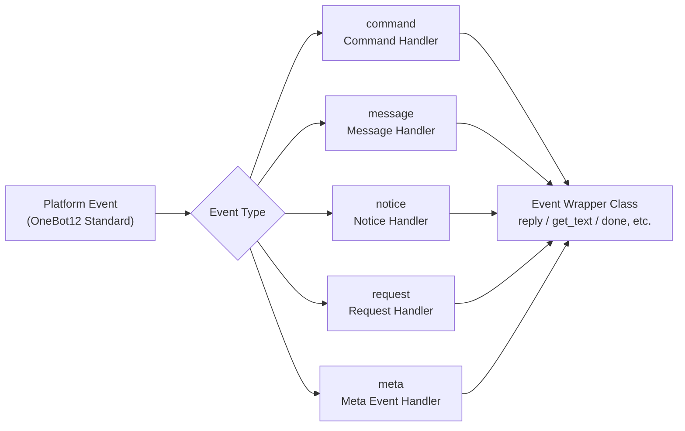
```mermaid
flowchart LR
    A["Platform Event<br/> (OneBot12 Standard)"] --> B{"Event Type"}
    B --> C["command<br/>Command Handler"]
    B --> D["message<br/>Message Handler"]
    B --> E["notice<br/>Notice Handler"]
    B --> F["request<br/>Request Handler"]
    B --> G["meta<br/>Meta Event Handler"]
    C & D & E & F & G --> H["Event Wrapper Class<br/>reply / get_text / done, etc."]
```

## Command Command Module

### Registering Commands

```python
from ErisPulse.Core.Event import command

# Basic command
@command("hello", help="Send a greeting")
async def hello_handler(event):
    await event.reply("Hello!")

# Command with aliases
@command(["help", "h"], aliases=["帮助"], help="Show help")
async def help_handler(event):
    pass

# Command with permission
def is_admin(event):
    return event.get("user_id") in admin_ids

@command("admin", permission=is_admin, help="Admin command")
async def admin_handler(event):
    pass

# Hidden command
@command("secret", hidden=True, help="Secret command")
async def secret_handler(event):
    pass

# Command group
@command("admin.reload", group="admin", help="Reload module")
async def reload_handler(event):
    pass
```

### Command Information

All command query APIs support optional **session context**: pass `event=` (Event or dict) or explicitly `platform=` / `bot_id=` / `session_id=` (explicit parameters take precedence when overlapped with event), i.e., filter commands unavailable in the current session by scope module dimension (see advanced/scope.md); all are optional keyword arguments, and if not provided, the original full behavior is maintained.

```python
# Get command help
help_text = command.help()

# Session-aware help: only list commands available in the current session
help_text = command.help(event=event)

# Get specific command (returns merged and overridden effective parameters; returns None if session unavailable)
cmd_info = command.get_command("admin")
cmd_info = command.get_command("admin", event=event)

# Get all commands (filters out unavailable module commands in session-aware mode)
all_commands = command.get_commands()
all_commands = command.get_commands(event=event)

# Get all commands in a command group (supports session-aware filtering)
admin_commands = command.get_group_commands("admin")
admin_commands = command.get_group_commands("admin", event=event)

# Get all visible commands
visible_commands = command.get_visible_commands()

# Session-aware visible commands (either event or explicit keywords are sufficient)
visible_commands = command.get_visible_commands(event=event)
visible_commands = command.get_visible_commands(
    platform=event.get("platform"),
    bot_id=event.get_self_account_id(),
    session_id=event.get_session_id(),
)
```

### Waiting for Replies

```python
# Wait for user reply
@command("ask", help="Ask for user information")
async def ask_command(event):
    reply = await command.wait_reply(
        event,
        prompt="Please enter your name:",  # Already sent above
        timeout=30.0
    )
    
    if reply:
        name = reply.get_text()
        await event.reply(f"Hello, {name}!")

# Wait for reply with validation
def validate_age(event_data):
    try:
        age = int(event_data.get_text())
        return 0 <= age <= 150
    except ValueError:
        return False

@command("age", help="Ask for user age")
async def age_command(event):
    await event.reply("Please enter your age:")
    
    reply = await command.wait_reply(
        event,
        timeout=60,
        validator=validate_age
    )
    
    if reply:
        age = int(reply.get_text())
        await event.reply(f"Your age is {age} years old")

# Wait for reply with callback
async def handle_confirmation(reply_event):
    text = reply_event.get_text().lower()
    if text in ["是", "yes", "y"]:
        await event.reply("Operation confirmed!")
    else:
        await event.reply("Operation cancelled.")

@command("confirm", help="Confirm operation")
async def confirm_command(event):
    await command.wait_reply(
        event,
        prompt="Please enter '是' or '否':",
        callback=handle_confirmation
    )
```

## Message Module

### Message Events

```python
from ErisPulse.Core.Event import message

# Listen to all messages
@message.on_message()
async def message_handler(event):
    sdk.logger.info(f"Received message: {event.get_text()}")

# Listen to private messages
@message.on_private_message()
async def private_handler(event):
    user_id = event.get_user_id()
    sdk.logger.info(f"Private message from: {user_id}")

# Listen to group messages
@message.on_group_message()
async def group_handler(event):
    group_id = event.get_group_id()
    sdk.logger.info(f"Group message from: {group_id}")

# Listen to @ messages
@message.on_at_message()
async def at_handler(event):
    mentions = event.get_mentions()
    sdk.logger.info(f"Users mentioned: {mentions}")
```

### Conditional Listening

```python
# Use priority to control execution order
@message.on_message(priority=10)  # Higher values mean higher priority
async def high_priority_handler(event):
    pass

# Implement conditional filtering within the handler
@message.on_message()
async def filtered_handler(event):
    if "keyword" not in event.get_text():
        return
    # Process messages containing the keyword
    pass
```

## Notice Notification Module

### Notification Events

```python
from ErisPulse.Core.Event import notice

# Friend Added
@notice.on_friend_add()
async def friend_add_handler(event):
    user_id = event.get_user_id()
    await event.reply("Welcome to add me as a friend!")

# Friend Removed
@notice.on_friend_remove()
async def friend_remove_handler(event):
    user_id = event.get_user_id()
    sdk.logger.info(f"Friend removed: {user_id}")

# Group Member Added
@notice.on_group_increase()
async def member_increase_handler(event):
    user_id = event.get_user_id()
    await event.reply(f"Welcome new member!")

# Group Member Removed
@notice.on_group_decrease()
async def member_decrease_handler(event):
    user_id = event.get_user_id()
    sdk.logger.info(f"Group member left: {user_id}")
```

## Request Request Module

### Request Events

```python
from ErisPulse.Core.Event import request

# Friend request
@request.on_friend_request()
async def friend_request_handler(event):
    user_id = event.get_user_id()
    comment = event.get_comment()
    sdk.logger.info(f"Friend request: {user_id}, comment: {comment}")

# Group invitation request
@request.on_group_request()
async def group_request_handler(event):
    group_id = event.get_group_id()
    user_id = event.get_user_id()
    sdk.logger.info(f"Group invitation: {group_id}, from: {user_id}")
```

## Meta Meta Event Module

### Meta Events

```python
from ErisPulse.Core.Event import meta

# Connection event
@meta.on_connect()
async def connect_handler(event):
    platform = event.get_platform()
    sdk.logger.info(f"Connection successful on platform {platform}")

# Disconnection event
@meta.on_disconnect()
async def disconnect_handler(event):
    platform = event.get_platform()
    sdk.logger.info(f"Disconnected from platform {platform}")

# Heartbeat event
@meta.on_heartbeat()
async def heartbeat_handler(event):
    sdk.logger.debug("Received heartbeat")
```

### Bot Status Query

After the adapter sends a meta event, the framework will automatically track the Bot status. For query APIs and lifecycle event listeners, please refer to [Adapter System API - Bot Status Management](adapter-system.md#bot-status-management).

## Event Wrapper Class

Event module's event handlers receive an Event wrapper class instance, which inherits from dict and provides convenient methods.

### Core Methods

```python
# Get event information
event_id = event.get_id()
event_time = event.get_time()
event_type = event.get_type()
detail_type = event.get_detail_type()
platform = event.get_platform()

# Get bot information
self_platform = event.get_self_platform()
self_user_id = event.get_self_user_id()
self_info = event.get_self_info()
```

### Session Identifiers

```python
# Unified target ID: returns group_id for group chats, user_id for private chats, etc.
target_id = event.get_target_id()

# Unique session identifier, format: {platform}:{detail_type}:{target_id}
session_id = event.get_session_id()
# Example: "telegram:private:12345", "qq:group:67890"
```

`get_target_id()` returns the first non-empty value in the following order: `group_id` → `channel_id` → `guild_id` → `thread_id` → `user_id`. This is suitable for scenarios requiring unified session identifiers, such as context management and state storage.

### Message Methods

```python
# Get message content
message_segments = event.get_message()
alt_message = event.get_alt_message()
text = event.get_text()

# Get sender information
user_id = event.get_user_id()
nickname = event.get_user_nickname()
sender = event.get_sender()

# Get group information
group_id = event.get_group_id()

# Check message type
is_msg = event.is_message()
is_private = event.is_private_message()
is_group = event.is_group_message()

# @ message related
is_at = event.is_at_message()
has_mention = event.has_mention()
mentions = event.get_mentions()
```

### Command Information

```python
# Get command information
cmd_name = event.get_command_name()
cmd_args = event.get_command_args()
cmd_raw = event.get_command_raw()

# Check if it is a command
is_cmd = event.is_command()
```

### Reply Functionality

```python
# Basic reply
await event.reply("This is a message")

# Specify sending method
await event.reply("http://example.com/image.jpg", method="Image")

# Reply with @user and reply to message
await event.reply("Hello", at_users=["user1"], reply_to="msg_id")

# @all members
await event.reply("Announcement", at_all=True)

# Use platform-specific modifier methods (via parameter)
await event.reply("Board content", method="Board",
                  via=[("Expire", 3600), ("ForMember", "114514")])

# Get send chain, freely append modifier methods and send methods (suitable for multiple modifiers / action-type methods)
await event.send_chain().Expire(3600).Board("Board content")
await event.send_chain().DismissBoard()

# Reply using OneBot12 message segments
from ErisPulse.Core.Event import MessageBuilder
msg = MessageBuilder().text("Hello").image("url").build()
await event.reply_ob12(msg)

# Wait for reply
reply = await event.wait_reply(timeout=30)
```

### Platform Capability Query

```python
# Check if current platform supports a specific sending method
if event.supports("Image"):
    await event.reply(url, method="Image")

# List all available sending methods on current platform
methods = event.available_methods()
# ["Text", "Image", "Voice", ...]
```

### Reply Methods

The `reply()` method supports specifying the sending type via the `method` parameter and two convenient boolean parameters:

```python
# Simple text reply
await event.reply("Hello")

# Reply and @ sender (automatically extract user_id)
await event.reply("Hello", at_sender=True)

# Reply and quote current message (automatically extract message_id)
await event.reply("Received", quote=True)

# Combine usage
await event.reply("Received", at_sender=True, quote=True)

# Send image (using method parameter)
if event.supports("Image"):
    await event.reply("http://example.com/img.jpg", method="Image")
else:
    await event.reply("[Image] http://example.com/img.jpg")
```

**Parameter Description**:

| Parameter | Type | Description |
|-----------|------|-------------|
| `content` | str | Content to send |
| `method` | str | Sending method, default "Text", optional "Image"/"Voice"/"Video"/"File" etc. |
| `at_sender` | bool | Whether to @ sender (automatically extract user_id) |
| `quote` | bool | Whether to quote reply current message (automatically extract message_id) |
| `at_users` | list[str] | List of @ users |
| `reply_to` | str | Manually specify the message ID to reply to |
| `at_all` | bool | Whether to @ all members |

### Interaction Methods

```python
# confirm — confirmation dialog (returns True/False/None)
if await event.confirm("Are you sure to execute this operation?"):
    await event.reply("Confirmed")

# Use non-Text method to send confirmation prompt
if await event.confirm("http://example.com/image.jpg", method="Image"):
    await event.reply("Confirmed image prompt")

# choose — selection menu (returns option index or None)
choice = await event.choose("Please select color:", ["Red", "Green", "Blue"])

# options_format="auto" (default) automatically chooses style based on method:
# Markdown→unordered list (- 1. option), Html→ordered list (<ol>), others→plain text list
# Text-based methods (Markdown/Html etc.) merge options to the end by default
# merge_prompt=True forces any method to merge; placeholder can customize placeholder
choice = await event.choose(
    "## Please select\n{options}", ["A", "B"],
    method="Markdown", merge_prompt=True,
)

# collect — form collection (returns {key: value} dict or None)
data = await event.collect([
    {"key": "name", "prompt": "Please enter name:"},
    {"key": "age", "prompt": "Please enter age:",
     "validator": lambda e: e.get_text().isdigit()},
    {"key": "avatar", "prompt": "Please send avatar:", "method": "Image"},
])

# wait_for — wait for any event satisfying condition
evt = await event.wait_for(event_type="notice", condition=lambda e: ..., timeout=120)

# conversation — multi-turn conversation context
conv = event.conversation(timeout=60)
await conv.say("Welcome!")
```

> For complete parameter descriptions and more examples of interaction methods, please refer to [Event Wrapper Class Details](../developer-guide/modules/event-wrapper.md) and [Conversation Multi-turn Dialogue](../advanced/conversation.md).

### Utility Methods

```python
# Convert to dictionary (filter out keys starting with _)
event_dict = event.to_dict()

# Get raw data
raw = event.get_raw()
raw_type = event.get_raw_type()
```

### Link Control

`event.done(claim=, stop=)` uniformly controls two orthogonal semantics: "claim" and "block":

- **Claim (claim)**: Mark the event as processed (`_processed`), so the command dispatcher skips it for deduplication.
- **Block (stop)**: Prevent propagation to lower-priority handlers (`_propagation_stopped`).

```python
# Claim + Block (default)
event.done()

# Only claim, do not block (lower-priority observers still see it)
event.done(stop=False)

# Only block, do not claim (e.g., firewall / rate limiting)
event.done(claim=False)

# mark_processed is the main method, done is its alias
event.mark_processed()             # equivalent to event.done()
event.mark_processed(stop=False)   # equivalent to event.done(stop=False)

# Query status
event.is_processed()  # whether it has been claimed
event.is_stopped()    # whether propagation has been blocked
```

### Platform Extension Methods

Adapters can register platform-specific methods for Event, available only on instances of the corresponding platform.

#### User: Using Platform Extension Methods

After adapters register platform-specific methods, you can directly call them in event handlers. Each platform's methods differ; please refer to the corresponding [platform documentation](../platform-guide/).

```python
from ErisPulse.Core.Event import message

@message.on_message()
async def handle_message(event):
    platform = event.get_platform()

    # Call specific methods based on platform
    if platform == "email":
        subject = event.get_subject()           # Email specific
        attachments = event.get_attachments()   # Email specific
```

#### Query Registered Platform Methods

```python
from ErisPulse.Core.Event import get_platform_event_methods

# View which methods are registered for a specific platform
methods = get_platform_event_methods("email")
# ["get_subject", "get_from", "get_attachments", ...]

# Dynamically check and call
for method_name in get_platform_event_methods(event.get_platform()):
    method = getattr(event, method_name)
    print(f"{method_name}: {method()}")
```

#### Platform Method Isolation

Methods registered for different platforms do not interfere with each other:

```python
# Email event - only email methods
event = Event({"platform": "email", "email_raw": {"subject": "Hello"}})
event.get_subject()      # ✅ "Hello"
event.get_chat_type()    # ❌ AttributeError

# Telegram event - only Telegram methods
event = Event({"platform": "telegram", "telegram_raw": {"chat": {"type": "private"}}})
event.get_chat_type()    # ✅ "private"
event.get_subject()      # ❌ AttributeError
```

#### `hasattr` / `dir` Support

```python
hasattr(event, "get_subject")   # True only when platform="email"
"get_subject" in dir(event)     # Same as above
```

#### Adapter: Registering Platform Extension Methods

Adapters can register platform-specific methods for Event using decorators. The first parameter of the method is `self` (Event instance), allowing free access to event data.

#### Single Method Registration

```python
from ErisPulse.Core.Event import register_event_method

@register_event_method("email")
def get_subject(self):
    """Get email subject"""
    return self.get("email_raw", {}).get("subject", "")

@register_event_method("email")
def get_from(self):
    """Get sender"""
    return self.get("email_raw", {}).get("from", {})
```

#### Batch Registration (Mixin Class)

When there are many methods, it is recommended to use a Mixin class for batch registration:

```python
from ErisPulse.Core.Event import register_event_mixin

class EmailEventMixin:
    def get_subject(self):
        return self.get("email_raw", {}).get("subject", "")

    def get_from(self):
        return self.get("email_raw", {}).get("from", {})

    def get_attachments(self):
        return self.get("email_raw", {}).get("attachments", [])

# Register all methods at once
register_event_mixin("email", EmailEventMixin)
```

#### Return Value Specification

| Scenario | Return Value | User Usage |
|----------|--------------|------------|
| Return data (text, dict, etc.) | Return the value directly | `subject = event.get_subject()` |
| Execute operation (send message, etc.) | Return `asyncio.Task` | `task = event.do_something()` (optional `await`) |

> **Recommendation**: Methods that do not return data should return `asyncio.Task`, so users can decide whether to `await`. Even if not `awaited`, the operation will be executed.

```python
@register_event_method("email")
def forward_email(self, to_address: str):
    """Forward email — return Task, user can decide whether to await"""
    import asyncio
    return asyncio.create_task(
        self._do_forward(to_address)
    )

# User can await to wait for result
await event.forward_email("user@example.com")

# Or not await, operation executes in background
event.forward_email("user@example.com")
```

#### Unregister Methods

```python
from ErisPulse.Core.Event import unregister_event_method, unregister_platform_event_methods

# Unregister single method
unregister_event_method("email", "get_subject")

# Unregister all methods for a platform (call during adapter shutdown)
unregister_platform_event_methods("email")
```

#### Overriding Built-in Methods

`register_event_mixin` / `register_event_method` supports overriding Event built-in methods (such as `confirm`, `choose`, `collect`, `wait_reply`, `reply`, etc.). Registered platform methods take precedence over built-in methods via `Event.__getattribute__`, allowing adapters to provide platform-specific interaction implementations.

Built-in implementations are exported as `_builtin_*` functions, and overridden methods can call them as fallback:

```python
from ErisPulse.Core.Event import register_event_mixin, _builtin_choose

class YunhuEventMixin:
    async def choose(self, prompt, options, timeout=60, method="Text"):
        # Yunhu platform uses button components
        buttons = [[{"text": opt} for opt in options]]
        await self.reply(prompt)
        # ...wait for button callback or text reply...
        # Fall back to built-in logic
        return await _builtin_choose(self, None, options, timeout, "Text")

register_event_mixin("yunhu", YunhuEventMixin)
```

## Cross-Platform Extension (Wildcard)

`register_event_method` and `register_event_mixin` support passing `"*"` as the platform name. The registered methods are available on Event instances across **all platforms**. This is suitable for reusable functional modules such as AI chat and context management that require cross-platform use.

### Registering Cross-Platform Methods

```python
from ErisPulse.Core.Event.wrapper import register_event_method

@register_event_method("*")
async def ai_chat(self, prompt: str):
    """self is the Event instance, allowing free access to event data and built-in methods"""
    await self.reply(f"AI: {prompt}")
```

After registration, all platform event handlers can call the method:

```python
from ErisPulse.Core.Event import message

@message.on_message()
async def handler(event):
    await event.ai_chat(event.get_text())
```

### Method Resolution Priority

When accessing Event methods via attributes, the resolution order is as follows:

1. **Platform-specific methods** (overrides for the current platform)
2. **Wildcard methods** (`"*"` registered cross-platform methods)
3. **Built-in methods** (`reply`, `confirm`, etc.)
4. **Dictionary key access**

> Therefore, wildcard methods can override built-in methods (such as `reply`), but they can be further overridden by platform-specific methods with the same name.

## Priority System

Event handlers support priorities, where a higher number indicates a higher priority:

```python
# High-priority handlers execute first
@message.on_message(priority=10)
async def high_priority_handler(event):
    pass

# Low-priority handlers execute later
@message.on_message(priority=0)
async def low_priority_handler(event):
    pass
```


====
高级主题
====


### Conversation 多轮对话

# Conversation Multi-turn Conversations

The `Conversation` class provides convenient methods for multi-turn interactions within the same session, suitable for scenarios such as guided operations, information collection, and conversational question answering.

## Creating a Conversation

Create a conversation using the `conversation()` method of the `Event` object:

```python
from ErisPulse.Core.Event import command

@command("quiz")
async def quiz_handler(event):
    conv = event.conversation(timeout=30)

    await conv.say("🎮 Welcome to the quiz!")

    answer = await conv.choose("Question 1: Who created Python?", [
        "Guido van Rossum",
        "James Gosling",
        "Dennis Ritchie",
    ])

    if answer is None:
        await conv.say("Time's up, try again next time!")
        return

    if answer == 0:
        await conv.say("Correct!")
    else:
        await conv.say("Incorrect, the correct answer is Guido van Rossum")

    conv.stop()
```

## Core API

### say(content, **kwargs)

Send a message, returning `self` to support method chaining:

```python
await conv.say("First line").say("Second line").say("Third line")
```

You can also specify the sending method:

```python
await conv.say("https://example.com/image.jpg", method="Image")
```

### wait(prompt=None, timeout=None)

Wait for the user's reply, returning an `Event` object or `None` (if timeout occurs):

```python
# Simple wait
resp = await conv.wait()
if resp:
    text = resp.get_text()

# Wait after sending a prompt
resp = await conv.wait(prompt="Please enter your name:")

# Use custom timeout (overrides the default conversation timeout)
resp = await conv.wait(prompt="Please reply within 10 seconds:", timeout=10)
```

### confirm(prompt=None, **kwargs)

Wait for user confirmation (yes/no), returning `True` / `False` / `None` (if timeout occurs):

```python
result = await conv.confirm("Are you sure you want to delete all data?")
if result is True:
    await conv.say("Deleted")
elif result is False:
    await conv.say("Cancelled")
else:
    await conv.say("Timed out without reply")
```

Built-in recognized confirmation words: `yes/y/是/确认/确定/好/ok/true/对/嗯/行/同意/没问题/可以/当然...`

Built-in recognized denial words: `no/n/否/取消/不/不要/不行/cancel/false/错/不对/别/拒绝...`

### choose(prompt, options, **kwargs)

Wait for the user to select from options, returning the option index (0-based) or `None`:

```python
choice = await conv.choose("Please select a color:", ["Red", "Green", "Blue"])
if choice is not None:
    colors = ["Red", "Green", "Blue"]
    await conv.say(f"You selected {colors[choice]}")
```

Users can select by entering a number (`1`/`2`/`3`) or the option text (`Red`).

`options_format="auto"` (default) automatically selects the built-in style based on the method: Markdown→unordered list, Html→ordered list, others→plain text list.
Also supports `"list"`,"`inline`", "`md`", "`html`", or a custom function.

Supports `merge_prompt=True` to merge into a single message, and placeholder to control the option insertion position (default `{options}`, customizable via `placeholder`):

```python
choice = await conv.choose(
    "## Please select\n{options}",
    ["Option A", "Option B"],
    method="Markdown",
    merge_prompt=True,
)

# Custom placeholder
choice = await conv.choose(
    "Please select: [choices]",
    ["Option A", "Option B"],
    placeholder="[choices]",
)
```

### collect(fields, **kwargs)

Collect information in multiple steps, returning a data dictionary or `None`:

```python
data = await conv.collect([
    {"key": "name", "prompt": "Please enter your name"},
    {"key": "age", "prompt": "Please enter your age",
     "validator": lambda e: e.get("alt_message", "").strip().isdigit(),
     "retry_prompt": "Age must be a number, please re-enter"},
    {"key": "city", "prompt": "Please enter your city"},
])

if data:
    await conv.say(f"Registration successful!\nName: {data['name']}\nAge: {data['age']}\nCity: {data['city']}")
else:
    await conv.say("Registration interrupted")
```

Field configuration:

| Parameter | Description | Default |
|-----------|-------------|---------|
| `key` | Field key name (required) | - |
| `prompt` | Prompt message | `"Please enter {key}"` |
| `validator` | Validation function, receives Event, returns bool | None |
| `retry_prompt` | Retry prompt on validation failure | `"Invalid input, please re-enter"` |
| `max_retries` | Maximum retry attempts | 3 |
| `condition` | Condition function, receives collected data dict, returns bool | None |

**Conditional fields**: Use `condition` to implement dynamic forms, collecting only when the condition is met:

```python
data = await conv.collect([
    {"key": "has_car", "prompt": "Do you have a car? (Yes/No)"},
    {"key": "car_brand", "prompt": "Please enter the car brand",
     "condition": lambda d: d.get("has_car", "").lower() in ("yes", "y", "是")},
])
```

### stop()

Manually end the conversation, setting `is_active` to `False`:

```python
conv.stop()
```

### is_active

Whether the conversation is active:

```python
if conv.is_active:
    await conv.say("The conversation is still ongoing")
```

## Active State Management

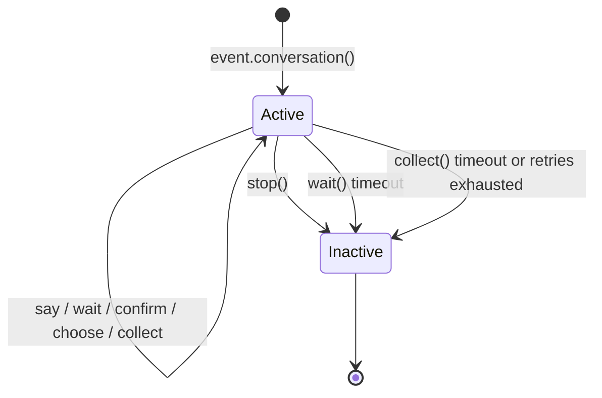
```mermaid
stateDiagram-v2
    state "Active" as active
    state "Inactive" as inactive
    [*] --> active: event.conversation()
    active --> active: say / wait / confirm / choose / collect
    active --> inactive: stop()
    active --> inactive: wait() timeout
    active --> inactive: collect() timeout or retries exhausted
    inactive --> [*]
```

The conversation will automatically become inactive in the following cases:

1. The `stop()` method is called
2. `wait()` times out and returns `None`
3. `collect()` returns `None` due to any step timing out or exhausting retries

After becoming inactive, all interactive methods (`wait`/`confirm`/`choose`/`collect`) will immediately return `None` and will not continue to wait for user input.

## Branches and Jumps

### `@conv.branch(name)` Decorator

Use `branch()` to register a conversation branch, and use `goto()` to jump between branches:

```python
@command("menu")
async def menu_handler(event):
    conv = event.conversation(timeout=60)

    @conv.branch("main")
    async def main_menu():
        await conv.say("=== Main Menu ===\n1. Personal Info\n2. Settings\n3. Exit")
        resp = await conv.wait()
        if resp is None:
            return
        text = resp.get_text().strip()
        if text == "1":
            await conv.goto("profile")
        elif text == "2":
            await conv.goto("settings")
        elif text == "3":
            await conv.say("Goodbye!")
            conv.stop()

    @conv.branch("profile")
    async def profile():
        await conv.say("=== Personal Info ===\nName: Alice\n0. Return")
        resp = await conv.wait()
        if resp and resp.get_text().strip() == "0":
            await conv.goto("main")

    @conv.branch("settings")
    async def settings():
        await conv.say("=== Settings ===\n1. Notification Toggle\n0. Return")
        resp = await conv.wait()
        if resp and resp.get_text().strip() == "0":
            await conv.goto("main")

    await conv.start()  # Start from the first registered branch
```

### conv.start(name=None)

Start the conversation, defaulting to the first registered branch:

```python
await conv.start()          # Start from the first branch
await conv.start("settings") # Start from the specified branch
```

## Context and Persistence

### conv.context

Each conversation instance has a built-in `context` dictionary to share state across branches:

```python
@conv.branch("step1")
async def step1():
    conv.context["username"] = resp.get_text().strip()
    await conv.goto("step2")

@conv.branch("step2")
async def step2():
    name = conv.context.get("username", "unknown")
    await conv.say(f"Hello, {name}!")
```

### save() / resume() / clear_saved()

Conversations support persistence, allowing them to be resumed after timeout or interruption:

```python
# Save conversation state (usually not called manually, see "Auto Checkpoints" below)
await conv.save()

# ... later in the same session ...
conv2 = event.conversation()
if await conv2.resume():
    await conv2.say("Welcome back! Continuing from the previous conversation")
else:
    await conv2.say("No previous conversation found")

# Clear saved conversation
await conv.clear_saved()
```

Storage keys include a target dimension (`conversation:{platform}:{user_id}:{target_id}`), ensuring conversations for the same user in different sessions do not overwrite each other; old-format archives (without target) are automatically migrated during `resume()`.

## Automatic Checkpoints and Restart Recovery

### Automatic Archiving

The framework automatically maintains checkpoints at the following times, typically without needing to manually call `save()`:

| Timing | Behavior |
|--------|----------|
| `goto()` / `start()` jump to a branch | Automatically saves (current branch + context) |
| `stop()` / `wait()` timeout / `collect()` failure | Automatically clears (conversation terminal state) |

### Checkpoint TTL

Checkpoints are timestamped, and those exceeding `ErisPulse.interaction.checkpoint_ttl` (default: 24 hours) are automatically discarded during recovery:

```toml
[ErisPulse.interaction]
checkpoint_ttl = 86400  # seconds
```

### Automatic Recovery on Restart

After a framework restart, in-progress conversations (waiting coroutines in memory) are lost, but checkpoints remain. By registering a **resume handler** via `register_resume_handler`, the framework can automatically resume a conversation when the first message of that session arrives after a restart:

```python
from ErisPulse.Core.Event.wrapper import Conversation

@Conversation.register_resume_handler()  # Optional: platform="onebot11" to limit platform
def make_conversation(event) -> Conversation:
    # Factory responsibility: Rebuild conversation and re-register all branches
    conv = event.conversation(timeout=60)

    @conv.branch("menu")
    async def menu(conv, event):
        ...

    return conv
```

After registration, when a user previously in the `menu` branch sends their first message after a restart, the framework automatically: restores context → claims the message → resumes the conversation from the archived branch. If no factory is registered, this mechanism incurs zero overhead.

### Manual Recovery (When Not Using Automatic Mechanism)

```python
@command("continue")
async def continue_handler(event):
    conv = event.conversation()
    # ... register branches ...
    if await conv.resume():
        conv.goto(conv.get_current_branch())
```

## Typical Flow Patterns

### Guided Registration

```python
@command("register")
async def register_handler(event):
    conv = event.conversation(timeout=60)

    await conv.say("Welcome to register!")

    data = await conv.collect([
        {"key": "username", "prompt": "Please enter a username (3-20 characters)",
         "validator": lambda e: 3 <= len(e.get_text().strip()) <= 20},
        {"key": "email", "prompt": "Please enter your email address",
         "validator": lambda e: "@" in e.get_text() and "." in e.get_text(),
         "retry_prompt": "Invalid email format, please try again"},
    ])

    if not data:
        await event.reply("Registration canceled")
        return

    confirmed = await conv.confirm(
        f"Confirm registration information?\nUsername: {data['username']}\nEmail: {data['email']}"
    )

    if confirmed:
        await conv.say("✅ Registration successful!")
    else:
        await conv.say("❌ Registration canceled")
```

### Looping Conversation

```python
@command("chat")
async def chat_handler(event):
    conv = event.conversation(timeout=120)
    await conv.say("Entering chat mode, type 'exit' to end")

    while conv.is_active:
        resp = await conv.wait()
        if resp is None:
            await conv.say("Timeout, conversation ended")
            break

        text = resp.get_text().strip()

        if text == "exit":
            await conv.say("Goodbye!")
            conv.stop()
        elif text == "help":
            await conv.say("Available commands: exit, help, status")
        elif text == "status":
            await conv.say("Conversation is active")
        else:
            await conv.say(f"You said: {text}")
```


### MessageBuilder 详解

# MessageBuilder Explained

`MessageBuilder` is a OneBot12 standard message segment builder provided by ErisPulse, used to construct structured message content, and should be used in conjunction with `Send.Raw_ob12()`.

## Import Methods

`MessageBuilder` supports the following two import methods (both have the same effect; the first is recommended):

```python
from ErisPulse.Core.Event import MessageBuilder        # Recommended, import via package export
from ErisPulse.Core.Event.message_builder import MessageBuilder  # Directly import the module
```

## Dual Mode Mechanism

The `MessageBuilder` provides two usage modes, implemented through Python's descriptor mechanism (`__get__`), achieving different behaviors at the class and instance levels: when methods are called through the class, `__get__` returns the execution result of the static method; when called through an instance, it returns `self` to support method chaining.

### Chaining Mode (Instance)

Use by instantiating `MessageBuilder()`. Each method returns `self`, supporting method chaining, and finally use `.build()` to obtain the message segment list:

```python
from ErisPulse.Core.Event.message_builder import MessageBuilder

segments = (
    MessageBuilder()
    .text("Hello!")
    .image("https://example.com/photo.jpg")
    .build()
)
# [
#     {"type": "text", "data": {"text": "Hello!"}},
#     {"type": "image", "data": {"file": "https://example.com/photo.jpg"}}
# ]
```

### Quick Build Mode (Static)

Call methods directly through the class. Each method directly returns a list of message segments, suitable for single-segment messages:

```python
# Directly returns list[dict], no need for .build()
segments = MessageBuilder.text("Hello!")
# [{"type": "text", "data": {"text": "Hello!"}}]
```

## Message Segment Types

| Method | Type | Data Parameters | Description |
|------|------|---------|------|
| `text(text)` | text | `text` | Text message |
| `image(file)` | image | `file` | Image message |
| `audio(file)` | audio | `file` | Audio message |
| `video(file)` | video | `file` | Video message |
| `file(file, filename?)` | file | `file`, `filename` | File message |
| `mention(user_id, user_name?)` | mention | `user_id`, `user_name` | @Mention a user |
| `at(user_id, user_name?)` | mention | `user_id`, `user_name` | Alias of `mention` |
| `reply(message_id)` | reply | `message_id` | Reply to a message |
| `at_all()` | mention_all | - | @All members |
| `custom(type, data)` | Custom | Custom | Custom message segment |

## Using with Send

The constructed list of message segments is sent using `Send.Raw_ob12()`:

```python
from ErisPulse import sdk
from ErisPulse.Core.Event.message_builder import MessageBuilder

# Build and send using chaining
segments = (
    MessageBuilder()
    .mention("user123", "Zhang San")
    .text(" Please check this image")
    .image("https://example.com/photo.jpg")
    .build()
)
await sdk.adapter.myplatform.Send.To("group", "group456").Raw_ob12(segments)
```

### Replying with Event

```python
from ErisPulse.Core.Event import command

@command("report")
async def report_handler(event):
    await event.reply_ob12(
        MessageBuilder()
        .text("📊 Daily Report Summary\n")
        .text("Tasks completed today: 5\n")
        .text("Tasks in progress: 3")
        .build()
    )
```

## Utility Methods

### copy()

Creates a copy of the current builder, allowing multiple message variants to be created based on the same base content:

```python
base = MessageBuilder().text("Base content").mention("admin")

# Build different messages based on the same prefix
msg1 = base.copy().text(" Variant A").build()
msg2 = base.copy().text(" Variant B").image("img.jpg").build()
```

### clear()

Clears previously added message segments, allowing reuse of the same builder:

```python
builder = MessageBuilder()

for user_id in ["user1", "user2", "user3"]:
    builder.clear()
    msg = builder.mention(user_id).text(" Hello!").build()
    await adapter.Send.To("user", user_id).Raw_ob12(msg)
```

### len() / bool()

```python
builder = MessageBuilder()
print(bool(builder))   # False

builder.text("Hello")
print(len(builder))    # 1
print(bool(builder))   # True
```

## Custom Message Segments

Use the `custom()` method to add platform-specific message segments:

```python
# Add platform-specific message segments
segments = (
    MessageBuilder()
    .text("Please fill out the form:")
    .custom("yunhu_form", {"form_id": "12345"})
    .build()
)
```

> Custom message segments are only effective in the corresponding platform adapter; other adapters will ignore unrecognized message segments.

## Complete Examples

### Multi-element Message

```python
segments = (
    MessageBuilder()
    .reply(event.get_id())                    # Reply to the original message
    .mention(event.get_user_id())             # @ sender
    .text(" This is your query result:\n")    # Text
    .image("https://example.com/chart.png")   # Image
    .text("\nSee the attachment for detailed data:")
    .file("https://example.com/data.csv", filename="data.csv")
    .build()
)
await event.reply_ob12(segments)
```

### Static Factory + Chain Mixing

```python
# Quickly build a single-segment message
simple_msg = MessageBuilder.text("Simple text")

# Chain-build a complex message
complex_msg = (
    MessageBuilder()
    .at_all()
    .text(" 📢 Announcement:")
    .text("Meeting at 3 PM today")
    .build()
)
```


### HTTP 客户端

# Network Client

ErisPulse provides a unified network client that aggregates HTTP requests, WebSocket connections, and connection pool management. Modules and adapters **must** use this client by preference, rather than importing third-party libraries such as `aiohttp`, `httpx`, or `requests`.

## Overview

The main features of the network client:

- **Unified Interface**: Provides `get` / `post` / `put` / `delete` / `patch` / `request` methods
- **WebSocket Client**: Establishes a client WebSocket connection via `ws_connect`
- **Automatic Logging**: All requests are automatically logged and statistics are recorded
- **Lifecycle Integration**: Each request triggers the `client.request` lifecycle event, and WS connections trigger the `client.ws.connect` event
- **Retry Support**: Configurable automatic retry count and interval
- **Timeout Control**: Independent connection timeout and request timeout
- **Connection Pool Reuse**: Connection pool management based on aiohttp.ClientSession
- **Exception System**: aiohttp exceptions are automatically converted to ErisPulse exceptions (ClientError system)

## Quick Start

### HTTP Requests

```python
from ErisPulse.Core import client

# GET request
resp = await client.get("https://httpbin.org/get")
data = await resp.json()
print(resp.status)  # 200

# POST request
resp = await client.post(
    "https://httpbin.org/post",
    json={"key": "value"},
)
data = await resp.json()
```

### WebSocket Connection

```python
from ErisPulse.Core import client

ws = await client.ws_connect("wss://example.com/ws")

async for text in ws.iter_text():
    await ws.send_text(f"Echo: {text}")
```

## HttpResponse

All request methods return an `HttpResponse` object:

```python
from ErisPulse.Core import client

resp = await client.get("https://httpbin.org/get")

resp.status       # int - HTTP status code (e.g., 200, 404)
resp.reason       # str | None - status description (e.g., "OK")
resp.headers      # response headers (case-insensitive)
resp.content_type # str | None - Content-Type
resp.url          # final URL (may change due to redirects)
resp.raw          # underlying native response object (currently aiohttp.ClientResponse)

# Read response body
body = await resp.read()       # bytes
text = await resp.text()       # str
data = await resp.json()       # parse JSON
text = await resp.text("gbk")  # specify encoding
```

## Request Methods

### GET

```python
from ErisPulse.Core import client

resp = await client.get(
    "https://api.example.com/users",
    params={"page": "1", "limit": "10"},
    headers={"Authorization": "Bearer token"},
)
```

### POST

```python
from ErisPulse.Core import client

# JSON request body
resp = await client.post(
    "https://api.example.com/users",
    json={"name": "Alice", "age": 30},
)

# Form request body
resp = await client.post(
    "https://api.example.com/login",
    data={"username": "admin", "password": "123"},
)

# Raw data
resp = await client.post(
    "https://api.example.com/upload",
    data=b"raw bytes",
    headers={"Content-Type": "application/octet-stream"},
)

# File upload (using files parameter, no need to import aiohttp)
# Format: {field_name: file_object/bytes/(filename, file)/(filename, file, content_type)}
resp = await client.post(
    "https://api.example.com/upload",
    data={"description": "avatar"},           # Optional: include regular form fields
    files={
        "file": ("photo.png", open("photo.png", "rb"), "image/png"),
    },
)

# Simplified syntax: directly pass file object
resp = await client.post(
    "https://api.example.com/upload",
    files={"file": open("photo.png", "rb")},
)

# Upload data directly from memory (no disk storage required)
import io

resp = await client.post(
    "https://api.example.com/upload",
    files={"file": ("data.txt", io.BytesIO(b"file content"), "text/plain")},
)
```

### PUT / DELETE / PATCH

```python
from ErisPulse.Core import client

resp = await client.put("https://api.example.com/users/1", json={"name": "Bob"})
resp = await client.delete("https://api.example.com/users/1")
resp = await client.patch("https://api.example.com/users/1", json={"age": 31})
```

### General request

```python
from ErisPulse.Core import client

resp = await client.request(
    "OPTIONS",
    "https://api.example.com/resource",
    headers={"Origin": "https://example.com"},
)
```

## Parameters

### HTTP Request Parameters

| Parameter | Type | Description |
|-----------|------|-------------|
| `url` | `str` | Request URL |
| `params` | `dict[str, str]` | Query parameters (optional) |
| `headers` | `dict[str, str]` | Additional request headers (optional) |
| `data` | `Any` | Request body (form or raw data) (optional) |
| `json` | `Any` | JSON request body (optional) |
| `files` | `dict[str, Any]` | File upload fields (optional, automatically constructs multipart/form-data) |
| `timeout` | `float` | Request timeout (seconds) (optional, overrides default) |
| `max_retries` | `int` | Maximum retry count for this request (optional, overrides default) |

### ws_connect Parameters

| Parameter | Type | Description |
|-----------|------|-------------|
| `url` | `str` | WebSocket server URL |
| `headers` | `dict[str, str]` | Additional request headers (optional) |
| `heartbeat` | `float` | Heartbeat interval in seconds (optional) |

## Timeouts and Retries

```python
from ErisPulse.Core import Client

# Create a client with custom timeouts
client = Client(
    timeout=60,           # Total request timeout of 60s
    connect_timeout=5,    # Connection timeout of 5s
    max_retries=3,        # Automatic retry 3 times on failure
    retry_delay=2,        # Retry interval of 2s
)

# Override timeout for a single request
resp = await client.get("https://slow-api.example.com/data", timeout=120)
```

> [!NOTE]
> The client class was renamed to `Client` starting from version 2.8.0 (the property name `sdk.client` remains unchanged); the old name `HttpClient` is retained as a compatibility alias, so no changes are needed for legacy code.

## Custom Default Headers

```python
client = Client(
    headers={
        "Authorization": "Bearer token",
        "X-App-Id": "my-app",
    },
    user_agent="MyBot/1.0",
)
```

## Request Statistics

```python
from ErisPulse.Core import client

# View statistics
stats = client.stats
# {"total_requests": 42, "total_errors": 1, "total_bytes_sent": 0, "total_bytes_received": 0}

# Reset statistics
client.reset_stats()
```

## Lifecycle Events

### HTTP Request Events

The `client.request` event is triggered after each request completes and can be used for monitoring:

```python
from ErisPulse.Core import lifecycle

@lifecycle.on("client.request")
async def on_request(event_data):
    print(f"{event_data['method']} {event_data['url']} -> {event_data['status']} ({event_data['elapsed']}s)")
```

### WebSocket Connection Events

The `client.ws.connect` event is triggered after each WebSocket connection is established:

```python
from ErisPulse.Core import lifecycle

@lifecycle.on("client.ws.connect")
async def on_ws_connect(event_data):
    print(f"WS connection: {event_data['url']}")
```

## Context Management

```python
# As a context manager, automatically closes the session
async with Client(timeout=30) as client:
    resp = await client.get("https://httpbin.org/get")
    data = await resp.json()
```

## WebSocket Client

Establish a WebSocket client connection using `client.ws_connect()`, which returns a `ClientWebSocket` object. The client and server WebSocket share the same base class `WebSocketConnectionBase`, and their send/receive/iter interfaces are completely consistent.

### Basic Usage

```python
from ErisPulse.Core import client

ws = await client.ws_connect("wss://example.com/ws", heartbeat=30)

await ws.send_text("Hello")
await ws.send_bytes(b"\x00\x01\x02")
await ws.send_json({"type": "ping"})
```

### Receiving Messages

#### High-Level Methods (Recommended)

Automatically filter message types and raise `WebSocketDisconnect` on disconnection:

```python
from ErisPulse.Core import client
from ErisPulse.Core.Bases.errors import WebSocketDisconnect

ws = await client.ws_connect("wss://example.com/ws")

# Receive single message
text = await ws.receive_text()    # str
data = await ws.receive_bytes()   # bytes
obj = await ws.receive_json()     # dict / list

# Iterate messages (automatically stops on disconnection)
async for text in ws.iter_text():
    print(text)

async for data in ws.iter_bytes():
    print(data)

async for obj in ws.iter_json():
    print(obj)
```

#### Low-Level Methods

Use `receive()` and `iter_messages()` to handle raw message types, allowing differentiation between TEXT / BINARY / CLOSE / ERROR:

```python
from ErisPulse.Core import client
from ErisPulse.Core.Bases.websocket import WSMessage

ws = await client.ws_connect("wss://example.com/ws")

# Receive single raw message
msg = await ws.receive()
# msg.type  -> WSMessage.TEXT / WSMessage.BINARY / WSMessage.CLOSE / WSMessage.ERROR
# msg.data  -> str | bytes | None

# Iterate raw messages (automatically stops on CLOSE/ERROR)
async for msg in ws.iter_messages():
    if msg.type == WSMessage.TEXT:
        print(f"Text: {msg.data}")
    elif msg.type == WSMessage.BINARY:
        print(f"Binary: {len(msg.data)} bytes")
```

### WSMessage

`WSMessage` is a unified WebSocket message type independent of the underlying library:

| Attribute | Type | Description |
|-----------|------|-------------|
| `type` | `str` | Message type: `WSMessage.TEXT` / `WSMessage.BINARY` / `WSMessage.CLOSE` / `WSMessage.ERROR` |
| `data` | `Any` | Message data |

### ClientWebSocket Properties

| Property | Type | Description |
|----------|------|-------------|
| `url` | `URL` | Connection URL |
| `headers` | `Headers` | Response headers |
| `closed` | `bool` | Whether the connection is closed |
| `raw` | `object` | Underlying native object (aiohttp.ClientWebSocketResponse) |

### Lifecycle Hooks

Consistent with `server-side WebSocketConnection`, supports `on_disconnect` and `on_error` callbacks:

```python
from ErisPulse.Core import client

ws = await client.ws_connect("wss://example.com/ws")

@ws.on_disconnect
async def handle_disconnect(ws, reason="unknown"):
    print(f"Connection disconnected: {reason}")

@ws.on_error
async def handle_error(ws, error=""):
    print(f"Connection error: {error}")
```

### Closing the Connection

```python
await ws.close(code=1000, reason="Normal closure")
```

## Exception System

ErisPulse defines a unified exception hierarchy. Requests initiated through `sdk.client` automatically convert underlying aiohttp exceptions into ErisPulse exceptions.

> **Backward Compatibility**: Old modules/adapters that directly use `aiohttp.ClientSession` are completely unaffected. Exception conversion only takes effect when requests are initiated through `sdk.client`. Code that directly uses aiohttp continues to catch native exceptions such as `aiohttp.ClientError`. Both approaches can coexist.

### Exception Hierarchy

```
ErisPulseError
├── ClientError                  # Base class for all HTTP/WS client request exceptions
│   ├── ClientConnectionError    # Connection failed (DNS resolution failed, connection refused, network unreachable)
│   ├── ClientTimeoutError       # Connection timeout or request timeout
│   └── HTTPStatusError          # HTTP 4xx/5xx status code errors
└── WebSocketError               # Base class for WebSocket exceptions
    └── WebSocketDisconnect      # WebSocket connection disconnected (applicable to both client and server)
```

### Exception Handling

```python
from ErisPulse.Core import client
from ErisPulse.Core.Bases.errors import (
    ClientError,
    ClientConnectionError,
    ClientTimeoutError,
    HTTPStatusError,
    WebSocketDisconnect,
    WebSocketError,
)

# HTTP request exception handling
try:
    resp = await client.get("https://api.example.com/data")
    data = await resp.json()
except ClientConnectionError:
    print("Unable to connect to the server")
except ClientTimeoutError:
    print("Request timed out")
except ClientError as e:
    print(f"Request failed: {e}")

# WebSocket exception handling
try:
    ws = await client.ws_connect("wss://example.com/ws")
    async for text in ws.iter_text():
        await ws.send_text(f"Echo: {text}")
except WebSocketDisconnect as e:
    print(f"Connection disconnected: code={e.code}, reason={e.reason}")
except WebSocketError as e:
    print(f"WebSocket error: {e}")
```

### Unified Exception Handling

Use `ClientError` to catch all HTTP/WS client request exceptions uniformly:

```python
from ErisPulse.Core.Bases.errors import ClientError

try:
    resp = await client.get("https://api.example.com/data")
except ClientError as e:
    print(f"Client error: {e}")
```

### HTTPStatusError

When you need to check the status code after a request and raise an exception, you can use it manually:

```python
from ErisPulse.Core.Bases.errors import HTTPStatusError

resp = await client.get("https://api.example.com/data")
if resp.status >= 400:
    raise HTTPStatusError(resp.status, await resp.text())
```

## Using in Adapters

Adapters can use the global client or create their own client instance to send platform API requests:

```python
from ErisPulse.Core import client
from ErisPulse.Core.Bases import BaseAdapter
from ErisPulse.Core.Bases.errors import ClientError

class MyAdapter(BaseAdapter):
    async def call_api(self, endpoint, **params):
        try:
            resp = await client.post(
                f"https://api.platform.com/{endpoint}",
                json=params,
                headers={"Authorization": f"Bearer {self.token}"},
            )
            return await resp.json()
        except ClientError as e:
            self.logger.error(f"API call failed: {e}")
            raise
```

> You can also use `sdk.client` via `from ErisPulse import sdk`, which has the same effect.

## Best Practices

1. **Prefer using the global client**: Use `from ErisPulse.Core import client` to obtain the global singleton, which facilitates unified management and monitoring by the framework.
2. **Avoid directly importing aiohttp**: Use `client` instead of `aiohttp.ClientSession`, so that future changes to the underlying implementation do not require code modifications. Code that directly uses aiohttp will continue to work normally, and both approaches can coexist.
3. **Use ErisPulse's exception system**: When making requests via `sdk.client`, catch `ClientError` instead of `aiohttp.ClientError` to ensure your code does not depend on a specific HTTP library. Code that directly uses aiohttp remains unaffected.
4. **Set timeouts appropriately**: Set reasonable timeout values based on the API response speed to avoid prolonged blocking.
5. **Use retry mechanisms**: Enable retries for unstable APIs to improve reliability.
6. **Monitor request statistics**: Monitor request situations through `sdk.client.stats` or lifecycle events of `client.request`.
7. **Use advanced methods for WebSocket**: Prefer advanced methods such as `iter_text` / `iter_json`, and use `iter_messages` only when distinguishing message types is necessary.


### SQL 查询构建器

# SQL Query Builder

The Storage module in ErisPulse provides a chain-call style generic SQL query builder, supporting custom table creation, querying, updating, and deleting operations.

## Architecture Design

```
Bases/storage.py                    Core/storage.py
┌─────────────────────┐             ┌──────────────────────────┐
│  BaseStorage (ABC)  │◄────────────│  StorageManager          │
│  BaseQueryBuilder   │             │  (SQLite concrete impl)  │
│    (ABC)            │             │                          │
└─────────────────────┘             │  SQLiteQueryBuilder      │
                                    │  AlterTableBuilder       │
                                    └──────────────────────────┘
```

- `BaseStorage` / `BaseQueryBuilder` are abstract base classes that define a unified interface, supporting future expansion to other storage media (Redis, MySQL, etc.)
- `StorageManager` is the current SQLite concrete implementation, fully backward compatible.

## Importing

```python
from ErisPulse import sdk
# or
from ErisPulse.Core import storage

# ABC base classes (for type annotation or custom implementation)
from ErisPulse.Core.Bases.storage import BaseStorage, BaseQueryBuilder
```

## Table Management

### Creating a Table

```python
sdk.storage.CreateTable("users", {
    "id": "INTEGER PRIMARY KEY AUTOINCREMENT",
    "name": "TEXT NOT NULL",
    "age": "INTEGER DEFAULT 0",
    "email": "TEXT"
})
```

### Checking if a Table Exists

```python
if sdk.storage.HasTable("users"):
    print("users table exists")
```

### Dropping a Table

```python
sdk.storage.DropTable("users")
```

### Modifying Table Structure

```python
# Adding a column
sdk.storage.AlterTable("users").AddColumn("email", "TEXT").Execute()

# Renaming a table
sdk.storage.AlterTable("users").RenameTo("members").Execute()

# Chaining multiple operations
sdk.storage.AlterTable("users") \
    .AddColumn("phone", "TEXT") \
    .AddColumn("address", "TEXT") \
    .Execute()
```

## Chainable Queries

### Inserting Data

```python
# Single row insertion (passing a dictionary)
sdk.storage.Table("users").Insert({"name": "Alice", "age": 30}).Execute()

# Batch insertion (passing a list of dictionaries)
sdk.storage.Table("users").InsertMulti([
    {"name": "Bob", "age": 25},
    {"name": "Charlie", "age": 35},
    {"name": "Dave", "age": 40}
]).Execute()
```

### Querying Data

> **Important**: `Select()` returns a `list[tuple]` (list of tuples), not a dictionary. You need to access values by column index.

```python
# Select all columns
rows = sdk.storage.Table("users").Select().Execute()
# rows: [(1, "Alice", 30), (2, "Bob", 25), ...]

# Select specific columns
rows = sdk.storage.Table("users").Select("name", "age").Execute()
# rows: [("Alice", 30), ("Bob", 25), ...]

# Access values by index
for row in rows:
    name = row[0]   # "Alice"
    age = row[1]    # 30
```

#### Converting Tuples to Dictionaries

It is recommended to call `ToDict()` directly on the chain; the SELECT result will automatically be returned as a dictionary (column name → value):

```python
# ToDict chain: result is list[dict], column names are automatically taken from query metadata (SELECT * is also supported)
rows = sdk.storage.Table("users").Select("name", "age").ToDict().Execute()
# rows: [{"name": "Alice", "age": 30}, {"name": "Bob", "age": 25}, ...]

for row in rows:
    print(row["name"], row["age"])

# ExecuteOne also works
row = sdk.storage.Table("users").Select("name", "age") \
    .Where("id = ?", 1) \
    .ToDict() \
    .ExecuteOne()
# row: {"name": "Alice", "age": 30} or None
```

> `ToDict()` is a chainable marker (returns self): chains without calling it retain the original `list[tuple]` behavior, fully backward compatible; `copy()` will preserve this flag.

Manual zip method (equivalent to ToDict, suitable for scenarios where the chain cannot be modified):

```python
columns = ["id", "name", "age"]
rows = sdk.storage.Table("users").Select(*columns).Execute()

# Method 1: zip in loop
for row in rows:
    record = dict(zip(columns, row))
    print(record["name"], record["age"])

# Method 2: convert to list of dictionaries at once
records = [dict(zip(columns, row)) for row in rows]
```

#### Getting a Single Record

```python
row = sdk.storage.Table("users").Select("name", "age") \
    .Where("id = ?", 1) \
    .ExecuteOne()

# row is a tuple or None
if row is not None:
    name = row[0]  # "Alice"
    age = row[1]   # 30
```

### Filtering Conditions

> `Where(condition, *params)` supports passing multiple parameters, corresponding to multiple `?` placeholders.

```python
# Single condition (one placeholder, one parameter)
rows = sdk.storage.Table("users").Select("name") \
    .Where("age > ?", 18) \
    .Execute()

# Using multiple placeholders in one Where
rows = sdk.storage.Table("users").Select("name") \
    .Where("age > ? AND age < ?", 20, 40) \
    .Execute()

# Multiple Where calls (AND connected)
rows = sdk.storage.Table("users").Select("name") \
    .Where("age > ?", 20) \
    .Where("age < ?", 40) \
    .Execute()
```

### Sorting and Pagination

```python
# Ascending order
rows = sdk.storage.Table("users").Select("name", "age") \
    .OrderBy("name") \
    .Execute()

# Descending order
rows = sdk.storage.Table("users").Select("name") \
    .OrderBy("age", desc=True) \
    .Execute()

# Pagination
rows = sdk.storage.Table("users").Select("name") \
    .OrderBy("id") \
    .Limit(10) \
    .Offset(20) \
    .Execute()
```

### Updating Data

```python
# Conditional update
sdk.storage.Table("users") \
    .Update({"age": 31}) \
    .Where("name = ?", "Alice") \
    .Execute()

# Full update
sdk.storage.Table("users") \
    .Update({"status": "active"}) \
    .Execute()
```

### Deleting Data

```python
# Conditional delete
sdk.storage.Table("users") \
    .Delete() \
    .Where("name = ?", "Bob") \
    .Execute()

# Full delete
sdk.storage.Table("users").Delete().Execute()
```

### Counting and Existence Check

```python
# Count
count = sdk.storage.Table("users").Count()
count = sdk.storage.Table("users").Where("age > ?", 18).Count()

# Existence check
exists = sdk.storage.Table("users").Where("name = ?", "Alice").Exists()
```

## Reusing Query Conditions

Use `copy()` to deep copy the builder and reuse base conditions:

```python
base = sdk.storage.Table("users").Where("age > ?", 20)

# Query based on the same condition
rows = base.copy().Select("name").OrderBy("name").Limit(5).Execute()

# Count based on the same condition
count = base.copy().Count()

# Existence check based on the same condition
exists = base.copy().Where("name = ?", "Alice").Exists()
```

## Resetting the Builder

```python
builder = sdk.storage.Table("users").Select("name").Where("age > ?", 18)
builder.clear()

# Rebuild the query
builder.Select("name", "age").Where("name = ?", "Alice")
rows = builder.Execute()
```

## Using in Transactions

Chainable operations fully support transactions:

```python
# Commit transaction
with sdk.storage.transaction():
    sdk.storage.Table("users").Insert({"name": "Eve", "age": 22}).Execute()
    sdk.storage.Table("users").Update({"age": 23}).Where("name = ?", "Eve").Execute()

# Rollback example
try:
    with sdk.storage.transaction():
        sdk.storage.Table("users").Delete().Where("name = ?", "Alice").Execute()
        raise Exception("force rollback")
except Exception:
    pass
# Alice's record still exists
```

## Asynchronous Native API

Starting from version 2.8.0, the storage layer uses asynchronous operations as the native primary interface. All terminating methods have corresponding asynchronous versions with an `a` prefix. It is recommended to use these in asynchronous handlers (to avoid temporary blocking of the event loop due to synchronous compatibility layers):

```python
# Asynchronous transaction
async with sdk.storage.atransaction():
    await sdk.storage.aset("key1", "value1")
    await sdk.storage.aset("key2", {"nested": True})

# Asynchronous chainable query
rows = await sdk.storage.Table("users").Select("name", "age").ToDict().aExecute()
row = await sdk.storage.Table("users").Select("*").Where("id = ?", 1).aExecuteOne()
total = await sdk.storage.Table("users").Where("age > ?", 18).aCount()
exists = await sdk.storage.Table("users").Where("name = ?", "Alice").aExists()

# Asynchronous KV operations
await sdk.storage.aset("app.name", "MyApp")
value = await sdk.storage.aget("app.name")
keys = await sdk.storage.aget_all_keys()
```

| Synchronous (Compatibility Layer) | Asynchronous Native |
|------|------|
| `get` / `set` / `delete` | `aget` / `aset` / `adelete` |
| `get_all_keys` / `clear` | `aget_all_keys` / `aclear` |
| `get_multi` / `set_multi` / `delete_multi` | `aget_multi` / `aset_multi` / `adelete_multi` |
| `transaction()` | `atransaction()` |
| `CreateTable` / `DropTable` / `HasTable` | `aCreateTable` / `aDropTable` / `aHasTable` |
| `Execute` / `ExecuteOne` / `Count` / `Exists` | `aExecute` / `aExecuteOne` / `aCount` / `aExists` |

## Return Value Description

| Operation | Return Type | Description |
|------|---------|------|
| `Select().Execute()` | `list[tuple]` | List of tuples, ordered by column |
| `Select().ExecuteOne()` | `tuple \| None` | Single tuple or None |
| `Insert().Execute()` | `int` | Number of affected rows |
| `InsertMulti().Execute()` | `int` | Number of inserted rows |
| `Update().Execute()` | `int` | Number of affected rows |
| `Delete().Execute()` | `int` | Number of affected rows |
| `Count()` | `int` | Number of matching rows |
| `Exists()` | `bool` | Whether exists |

### Example of Return Value Handling

```python
# Select returns tuples, access by index
rows = sdk.storage.Table("users").Select("name", "age").Execute()
first_name = rows[0][0]  # First row, first column (name)
first_age = rows[0][1]   # First row, second column (age)

# Recommended: Use column name list + zip to convert to dictionary, code is more readable
cols = ["name", "age"]
rows = sdk.storage.Table("users").Select(*cols).Execute()
for row in rows:
    d = dict(zip(cols, row))
    print(d["name"], d["age"])

# ExecuteOne returns a single tuple or None
row = sdk.storage.Table("users").Select("name").Where("id = ?", 1).ExecuteOne()
name = row[0] if row else None

# Insert/Update/Delete returns number of affected rows
affected = sdk.storage.Table("users").Delete().Where("age < ?", 18).Execute()
print(f"Deleted {affected} records")
```

## Parameterized Queries

All WHERE parameters use `?` placeholders, and parameters are passed as subsequent arguments to `Where()` (not as a tuple or list):

```python
# Correct ✓ — multiple parameters passed individually
sdk.storage.Table("users").Where("age > ? AND name = ?", 18, "Alice").Execute()

# Correct ✓ — multiple Where calls
sdk.storage.Table("users").Where("age > ?", 18).Where("name = ?", "Alice").Execute()

# Incorrect ✗ — do not pass a tuple
sdk.storage.Table("users").Where("age > ? AND name = ?", (18, "Alice")).Execute()
# This will treat the entire tuple as the value for the first placeholder

# Incorrect ✗ — SQL injection risk exists
sdk.storage.Table("users").Where(f"name = '{user_input}'").Execute()
```

### Where Parameter Passing Rules

```python
# Where(condition: str, *params: Any)
# params are variable arguments, passed one by one

# Single parameter
.Where("name = ?", "Alice")

# Multiple parameters
.Where("age > ? AND age < ?", 18, 60)

# LIKE query
.Where("name LIKE ?", "A%")

# IN query (need to manually construct placeholders)
.Where("name IN (?, ?, ?)", "Alice", "Bob", "Charlie")
```

## Custom Storage Backend

Starting from version 2.8.0, the abstract layer uses **asynchronous methods as the native contract**: inherit `BaseStorage` and implement asynchronous abstract methods. Synchronous `get/set/Execute` and others are provided automatically by the base class bridge:

```python
from ErisPulse.Core.Bases.storage import BaseStorage, BaseQueryBuilder

class MyQueryBuilder(BaseQueryBuilder):
    async def aExecute(self):
        # Implement specific execution logic
        ...

    async def aExecuteOne(self):
        ...

    async def aCount(self):
        ...

    async def aExists(self):
        ...


class MyStorage(BaseStorage):
    async def aget(self, key, default=None):
        ...

    async def aset(self, key, value):
        ...

    # Implement other asynchronous abstract methods and transaction connection hook ...
    def Table(self, table_name):
        return MyQueryBuilder(self, table_name)
```

> [!TIP]
> If you do not want to implement transaction connection routing (`conn` keyword argument), keep the class attribute
> `_SUPPORTS_CONN_ROUTING = False` (default), and transaction functionality is still available (with limited isolation).
> Pure SQL backends can directly inherit `Core/Bases/sql_base.py`'s `SQLStorageBase` +
> `SQLQueryBuilder`, requiring only connection management and dialect execution funnel implementation, see
> [Storage Backends](docs/en/storage-backends.md).


### 路由系统

# Router Manager

The ErisPulse Router Manager provides unified HTTP and WebSocket routing management, supporting multi-adapter route registration and lifecycle management. The underlying layer is encapsulated through an abstraction layer (currently FastAPI + Uvicorn).

## Overview

The main features of the routing manager:

- **Decorator Routes**: Support for quick registration with `@http` / `@get` / `@post` / `@put` / `@delete` / `@ws` decorators
- **Automatic Injection**: Route handlers do not require importing FastAPI types; the framework automatically injects abstract objects
- **Route Grouping**: Support for `RouteGroup` with prefix and version number
- **Route Middleware**: Support for request interception with glob pattern matching
- **Rate Limiting**: Built-in sliding window rate limiting
- **CORS Support**: One-click enablement of cross-origin resource sharing
- **Security Headers**: Automatic addition of security response headers
- **Automatic Documentation**: Interactive documentation based on OpenAPI
- **WebSocket Support**: Complete WebSocket connection management, custom authentication, and lifecycle hooks
- **Lifecycle Integration**: Deep integration with the ErisPulse lifecycle system
- **SSL/TLS Support**: Support for HTTPS and WSS secure connections
- **Home Entry Point**: Support for registering quick entry buttons for modules at the root route `/`, with internationalization support

## Abstract Types

ErisPulse provides server-side abstract types, allowing modules to avoid direct dependencies on FastAPI:

| Abstract Type | FastAPI Equivalent | Description |
|---------------|--------------------|-------------|
| `HttpRequest` | `fastapi.Request` | HTTP request wrapper, fully compatible interface |
| `WebSocketConnection` | `fastapi.WebSocket` | WebSocket connection wrapper, with additional lifecycle hooks |
| `WebSocketDisconnect` | `fastapi.WebSocketDisconnect` | WebSocket disconnection exception |

> `WebSocketConnection` inherits from `WebSocketConnectionBase` and shares the same send/receive/iter/close interface with the client-side WebSocket (`ClientWebSocket`). Business logic code can be reused between client and server WebSocket connections.
>
> The underlying native FastAPI object can be accessed via the `.raw` attribute. Code that directly uses FastAPI types is fully compatible as well.

## Decorator-based Routing (Recommended)

### HTTP Decorators

```python
from ErisPulse.Core import router
@router.get("my_module", "/info")
async def get_info(request):
    return {"method": request.method, "path": str(request.url)}

# You can also explicitly annotate abstract types
from ErisPulse.Core import HttpRequest

@router.post("my_module", "/data")
async def post_data(request: HttpRequest):
    data = await request.json()
    return {"received": data}

@router.put("my_module", "/data/{item_id}")
async def update_data(request):
    return {"updated": True}

@router.delete("my_module", "/data/{item_id}")
async def delete_data(request):
    return {"deleted": True}
```

> **Automatic Injection Rule**: When the first parameter of a handler is named `request` or `req` and has no FastAPI type annotation, the framework automatically injects `HttpRequest`. Handlers with no parameters or non-request parameter names are unaffected.

### WebSocket Decorators

```python
from ErisPulse.Core import WebSocketConnection, WebSocketDisconnect

# Basic WebSocket
@router.ws("my_module", "/ws")
async def websocket_handler(ws):
    async for msg in ws.iter_text():
        await ws.send_text(f"Echo: {msg}")

# WebSocket with lifecycle hooks
@router.ws("my_module", "/ws/chat")
async def chat(ws: WebSocketConnection):
    @ws.on_disconnect
    async def on_disconnect(ws, reason="unknown"):
        print(f"User disconnected: {reason}")

    @ws.on_error
    async def on_error(ws, error=""):
        print(f"Connection error: {error}")

    async for msg in ws.iter_text():
        await ws.send_text(f"Echo: {msg}")

# WebSocket with authentication
async def ws_auth(ws: WebSocketConnection) -> bool:
    token = ws.query_params.get("token")
    return token == "secret"

@router.ws("my_module", "/secure_ws", auth_handler=ws_auth)
async def secure_ws_handler(ws):
    while True:
        data = await ws.receive_text()
        await ws.send_text(f"Echo: {data}")
```

> **Note**: WebSocket handlers and authentication handlers also support automatic injection. You can obtain `WebSocketConnection` without parameter annotations. You can also pass in the native object by annotating with `fastapi.WebSocket`, but abstract types are recommended.

## Traditional Registration Methods

```python
async def hello_handler(request):
    return {"message": "Hello World"}

# Basic registration
router.register_http_route(
    module_name="my_module",
    path="/hello",
    handler=hello_handler,
    methods=["GET"],
)

# With rate limiting and documentation
router.register_http_route(
    module_name="my_module",
    path="/api/data",
    handler=data_handler,
    methods=["POST"],
    rate_limit="10/minute",
    summary="Data API",
    tags=["API"],
)
```

### WebSocket Registration

```python
from ErisPulse.Core import WebSocketConnection

async def websocket_handler(ws: WebSocketConnection):
    async for msg in ws.iter_text():
        await ws.send_text(f"Echo: {msg}")

# Basic registration
router.register_websocket(
    module_name="my_module",
    path="/ws",
    handler=websocket_handler,
)

# With authentication (recommended)
async def auth_handler(ws: WebSocketConnection) -> bool:
    token = ws.query_params.get("token")
    return token == "secret"

router.register_websocket(
    module_name="my_module",
    path="/secure_ws",
    handler=websocket_handler,
    auth_handler=auth_handler,
)
```

**Parameter Description:**

| Parameter | Description | Default |
|-----------|-------------|---------|
| `module_name` | Module name (required) | - |
| `path` | WebSocket path | - |
| `handler` | Handler function | - |
| `auth_handler` | Authentication function, returns `False` to automatically close the connection | `None` |
| `auto_accept` | Whether to automatically `accept()` | `True` |

> **Recommendation**: Use `auth_handler` for connection confirmation instead of setting `auto_accept=False`. Only set `auto_accept=False` if you need full control over the connection process.

## WebSocket Lifecycle Hooks

`WebSocketConnection` provides callback registration for disconnection and errors, eliminating the need for manual try/catch:

```python
from ErisPulse.Core import WebSocketConnection

@router.ws("my_module", "/ws")
async def my_ws(ws: WebSocketConnection):
    # Register using decorator
    @ws.on_disconnect
    async def on_close(ws, reason="unknown"):
        print(f"Disconnect reason: {reason}")

    # Alternatively, register directly
    async def on_err(ws, error=""):
        print(f"Error: {error}")
    ws.on_error(on_err)

    # Normal business logic
    async for msg in ws.iter_text():
        await ws.send_text(f"Echo: {msg}")
```

## Route Groups

```python
# Create a route group with a prefix
group = router.group("my_module", prefix="/v1")

@group.get("/users")
async def list_users(request):
    return {"users": []}

@group.post("/users")
async def create_user(request):
    return {"created": True}

# Actual path: /my_module/v1/users
```

## Route Middleware

Middleware supports glob pattern matching for paths:

```python
@router.middleware("/my_module/*")
async def auth_middleware(request, call_next):
    token = request.headers.get("Authorization")
    if not token:
        return {"error": "Unauthorized"}
    return await call_next(request)

@router.middleware("/my_module/admin/*")
async def admin_middleware(request, call_next):
    return await call_next(request)
```

## Request Correlation ID (X-Request-ID)

Starting from version 2.7.0, each HTTP request carries a `X-Request-ID` correlation ID, which is used for log and distributed tracing correlation:

- **Generation Rule**: The client-provided `X-Request-ID` header is prioritized (in distributed tracing scenarios); otherwise, a UUID is generated automatically.
- **Response Header**: The response will include a `X-Request-ID`, which helps the client match requests with logs.
- **Lifecycle Events**: The `server.request` and `server.response` event data now include a `request_id` field.

```python
# Listen for request events in the module and correlate requests and responses by request_id
@sdk.lifecycle.on("server.request")
async def on_request(data):
    print(f"[{data['request_id']}] {data['method']} {data['path']}")

@sdk.lifecycle.on("server.response")
async def on_response(data):
    print(f"[{data['request_id']}] -> {data['status_code']}")
```

Clients can customize the ID to facilitate cross-service tracing:

```bash
curl -H "X-Request-ID: my-trace-id" http://localhost:8080/my_module/health
```

## Rate Limiting

Rate limiting for routes using the sliding window algorithm:

```python
@router.get("my_module", "/limited", rate_limit="10/minute")
async def limited_endpoint(request):
    return {"ok": True}

@router.post("my_module", "/submit", rate_limit="5/minute")
async def submit_data(request):
    return {"submitted": True}
```

Rate limiting format: `{count}/{time window}`, for example `10/minute`, `100/hour`.

## CORS Configuration

```python
router.setup_cors(
    allow_origins=["https://example.com"],
    allow_methods=["GET", "POST"],
    allow_headers=["*"],
)
```

CORS can also be configured via `config.toml`:

```toml
[router.cors]
allow_origins = ["https://example.com"]
allow_methods = ["GET", "POST"]
allow_headers = ["*"]
```

## Security Headers

```python
router.setup_security_headers()
```

Automatically adds security headers such as `X-Content-Type-Options`, `X-Frame-Options`, and `X-XSS-Protection`.

It can also be configured via `config.toml`:

```toml
[router.security]
enabled = true
```

## Automatic Documentation

Router enables OpenAPI interactive documentation by default:

```python
# Disable documentation
router.disable_docs()

# Customize documentation information
router.set_docs_info(
    title="My API",
    description="API documentation",
    version="1.0.0"
)
```

## Path Handling

Route paths are automatically prefixed with the module name to avoid conflicts:

```python
# Register the path "/api" to the module "my_module"
# The actual accessible path is "/my_module/api"
router.register_http_route("my_module", "/api", handler)
```

## System Routes

The routing manager automatically provides the following system routes:

### Health Check

```
GET /health
# Returns:
{"status": "ok", "service": "ErisPulse Router"}
```

### Root Page

```
GET /
# Returns ErisPulse brand page
```

The root route `/` displays the ErisPulse brand page, automatically detects the availability of the Dashboard and adds an entry button.

## Home Entry

The router manager allows external modules to register quick-access entry buttons on the root route `/`, making it convenient for users to quickly access the management pages of various modules.

### Registering an Entry

```python
# Simple registration
router.register_home_entry(
    name="My Dashboard",
    url="/mymodule/admin",
)

# Registration with an icon (SVG)
router.register_home_entry(
    name="Dashboard",
    url="/console",
    icon_svg='<svg width="18" height="18" viewBox="0 0 24 24" fill="none" stroke="currentColor" stroke-width="1.8"><path d="M4 17l6-6-6-6"/><path d="M12 19h8"/></svg>',
)

# Registration with internationalization support (project i18n dictionary format)
router.register_home_entry(
    name={"i18n": "mymodule.home.entry", "default": "My Dashboard"},
    url="/mymodule/admin",
)
```

**Parameter Description:**

| Parameter | Type | Description | Required |
|-----------|------|-------------|----------|
| `name` | `str` / `dict` | Button display text; when passing a dictionary `{"i18n": "key", "default": "text"}`, internationalization is used | Yes |
| `url` | `str` | Button link address | Yes |
| `icon_svg` | `str` | Optional SVG icon markup | No |

### Automatic Dashboard Registration

When `sdk.Dashboard` is detected as available, the router manager automatically adds a Dashboard button as the first entry in the list, eliminating the need for manual registration.

## Lifecycle Integration

```python
from ErisPulse.Core import lifecycle

@lifecycle.on("server.start")
async def on_server_start(event):
    print(f"Server has started: {event['data']['base_url']}")

@lifecycle.on("server.stop")
async def on_server_stop(event):
    print("Server is stopping...")
```

## Best Practices

1. **Prefer abstract types**: Use `HttpRequest` / `WebSocketConnection` instead of `fastapi.Request` / `fastapi.WebSocket` to avoid hard dependencies.
2. **Leverage automatic injection**: Name the first parameter of a handler `request` or `req` to automatically receive an `HttpRequest` without any type annotation.
3. **Explicitly pass module_name**: The first parameter of a decorator must be the module name and cannot be omitted.
4. **Use route grouping**: Organize multiple routes from the same module using `group()`.
5. **Security considerations**: Implement authentication mechanisms and security headers for sensitive operations.
6. **Apply rate limiting appropriately**: Set rate limits for high-frequency endpoints.
7. **Use lifecycle hooks**: Handle WebSocket exceptions using `@ws.on_disconnect` / `@ws.on_error` to avoid manual try/catch blocks.


### 生命周期管理

# Lifecycle Management

ErisPulse provides a unified hook/lifecycle system to monitor the running status of system components and implement extended features such as auditing, statistics, and custom logic.

The system supports three triggering methods:
- `await lifecycle.emit("event", data)` — a concise version, passing arbitrary data
- `lifecycle.emit_sync("event", data)` — a synchronous version (for non-async contexts)
- `await lifecycle.submit_event("event", ...)` — backward compatible with older versions, automatically constructs standard event formats

## Event Handling Mechanism

### Registering Handlers

```python
from ErisPulse import sdk

# Decorator pattern
@sdk.lifecycle.on("module.load")
async def on_module_load(data):
    print(f"Module loaded: {data}")

# Programmatic registration
sdk.lifecycle.register("module.load", on_module_load, priority=10)

# Unregister
sdk.lifecycle.unregister("module.load", on_module_load)

# Batch unregister by owner (automatically called by the framework during module/adapter unload)
removed = sdk.lifecycle.unregister_by_owner("MyModule")
print(f"Cleaned up {removed} lifecycle hooks")
```

### Priority

Handlers support the `priority` parameter, where higher values execute earlier (consistent with the module loader):

```python
@sdk.lifecycle.on("adapter.event.receive", priority=10)  # Executes first
async def first_handler(data):
    pass

@sdk.lifecycle.on("adapter.event.receive", priority=0)  # Executes later
async def second_handler(data):
    pass
```

### Dot-Structure Events

When a specific event is triggered, its parent events are also triggered:
- Triggering `module.load` also triggers `module`
- Triggering `adapter.event.receive` also triggers `adapter.event` and `adapter`

### Wildcards

Register `*` to capture all events:

```python
@sdk.lifecycle.on("*")
async def on_anything(data):
    print(f"Received event: {data}")
```

### One-Time Registration (once)

Since version 2.7.0, handlers registered with `lifecycle.once()` are automatically unregistered after being triggered once, suitable for one-time hooks such as "first ready":

```python
@sdk.lifecycle.once("core.init.complete")
async def on_first_ready(data):
    print("First ready, will not trigger again")
```

- Same priority semantics as `on()` (`priority` value higher means earlier execution)
- Automatic unregistration, no manual `unregister` required
- Supports both synchronous and asynchronous handlers

### Listener Query (has_handlers)

For hot-path short-circuit scenarios, use `has_handlers()` to check if there are any listeners before avoiding unnecessary event traversal and task scheduling:

```python
if sdk.lifecycle.has_handlers("message.sending"):
    await sdk.lifecycle.emit("message.sending", send_ctx)
```

- Covers **exact event names**, **wildcards `*`**, and **parent event** matching
- Returns `False` if no listeners are present, allowing safe skipping of `emit`

## Hook Breakpoints Overview

A typical lifecycle event sequence for a message from platform entry to completion in the framework:

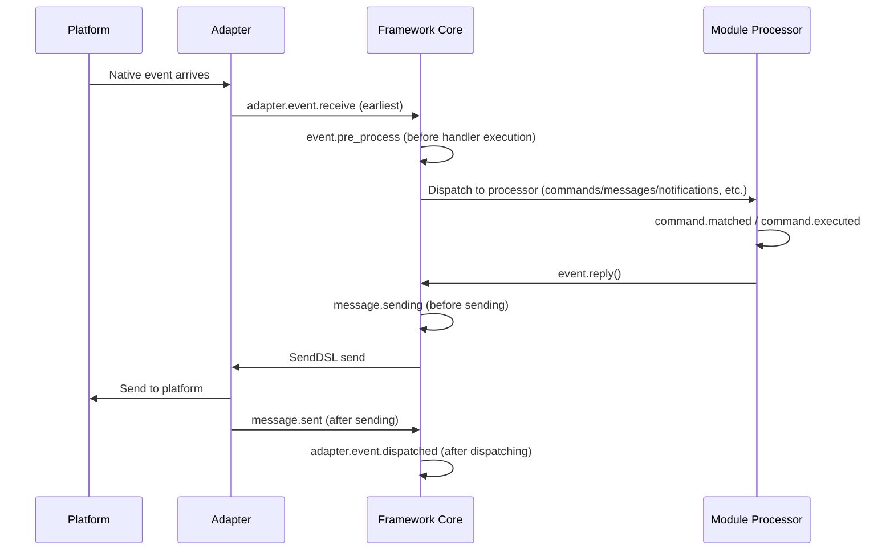
```mermaid
sequenceDiagram
    participant P as Platform
    participant A as Adapter
    participant F as Framework Core
    participant M as Module Processor

    P->>A: Native event arrives
    A->>F: adapter.event.receive (earliest)
    F->>F: event.pre_process (before handler execution)
    F->>M: Dispatch to processor (commands/messages/notifications, etc.)
    M->>M: command.matched / command.executed
    M->>F: event.reply()
    F->>F: message.sending (before sending)
    F->>A: SendDSL send
    A->>P: Send to platform
    A->>F: message.sent (after sending)
    F->>F: adapter.event.dispatched (after dispatching)
```

The framework provides the following built-in hook breakpoints, which users can listen to using `@sdk.lifecycle.on()` to implement custom logic.

### Core Initialization

| Hook Name | Trigger Timing | Data |
|---------|---------|------|
| `core.init.start` | SDK initialization starts | `{}` |
| `core.init.complete` | SDK initialization completes | `{"duration": float, "success": bool, "adapters": {"enabled": [str], "disabled": [str]}, "modules": {"enabled": [str], "disabled": [str]}, "error": str (only on failure)}` |
| `core.uninit.complete` | SDK uninitialization completes | `{"duration": float, "success": bool, "adapters_closed": int, "modules_unloaded": int, "module_properties_cleared": int, "module_properties_to_clear": [str], "error": str (only on failure)}` |

### Configuration Changes

| Hook Name | Trigger Timing | Data |
|---------|---------|------|
| `config.set` | A configuration item is modified | `{"key": str, "old_value": Any, "new_value": Any}` |
| `config.updated` | After detecting a full tree change from external editing of config.toml | `{"old_config": dict, "new_config": dict, "config_file": str}` |

**Example: Configuration Audit**

```python
@sdk.lifecycle.on("config.set")
def audit_config(data):
    print(f"[Audit] {data['key']}: {data['old_value']} -> {data['new_value']}")
```

### Module Lifecycle

| Hook Name | Trigger Timing | Data |
|---------|---------|------|
| `module.register` | Module class registered to manager | `{"module_name": str, "success": bool}` |
| `module.load` | Module loaded (instance created successfully) | `{"module_name": str, "success": bool}` |
| `module.init` | Module initialized (including lazy loading) | `{"module_name": str, "success": bool}` |
| `module.unload` | Module unloaded | `{"module_name": str, "success": bool}` |

### Adapter Lifecycle

| Hook Name | Trigger Timing | Data |
|---------|---------|------|
| `adapter.load` | Adapter registered | `{"platform": str, "success": bool}` |
| `adapter.start` | Adapter started | `{"platforms": [str]}` |
| `adapter.status.change` | Adapter status changes | `{"platform": str, "status": str, "retry_count": int, "error": str (only on failure)}` |
| `adapter.stop` | Adapter stopped | `{"platforms": [str]}` |
| `adapter.stopped` | Adapter stopped completely | `{"platforms": [str]}` |
| `adapter.bot.online` | Bot goes online | `{"platform": str, "bot_id": str, "info": dict, "status": str}` |
| `adapter.bot.offline` | Bot goes offline | `{"platform": str, "bot_id": str, "status": str}` |

### Event Reception and Processing

| Hook Name | Trigger Timing | Data |
|---------|---------|------|
| `adapter.event.receive` | External platform event received (earliest) | `{"platform": str, "event_type": str, "raw_event_type": str}` |
| `adapter.event.dispatched` | Event dispatching completes | `{"platform": str, "event_type": str, "raw_event_type": str, "onebot_handlers_count": int}` |
| `event.pre_process` | Before event handler execution begins | `{"event_type": str, "platform": str, "detail_type": str}` |

**Example: Event Counting**

```python
event_counter = {}

@sdk.lifecycle.on("adapter.event.receive")
def count_events(data):
    platform = data["platform"]
    event_counter[platform] = event_counter.get(platform, 0) + 1

@sdk.lifecycle.on("adapter.event.dispatched")
def log_unhandled(data):
    if data["onebot_handlers_count"] == 0:
        print(f"[Unhandled] {data['platform']}/{data['event_type']}")
```

### Message Sending

| Hook Name | Trigger Timing | Data |
|---------|---------|------|
| `message.sending` | Message about to be sent | `{"platform": str, "method": str, "detail_type": str, "target_id": str, "bot_id": str}` |
| `message.sent` | Message sent successfully | `{"platform": str, "method": str, "detail_type": str, "target_id": str, "bot_id": str}` |

**Example: Message Sending Audit**

```python
@sdk.lifecycle.on("message.sending")
def log_sending(data):
    print(f"[Sending] -> {data['platform']}/{data['detail_type']}/{data['target_id']} via {data['method']}")
```

### Command System

| Hook Name | Trigger Timing | Data |
|---------|---------|------|
| `command.matched` | Command matched and about to execute | `{"command": str, "args": list[str], "platform": str, "user_id": str}` |
| `command.executed` | Command execution completes | `{"command": str, "args": list[str], "platform": str, "user_id": str, "success": bool, "error": str (only on failure)}` |

**Example: Command Counting**

```python
@sdk.lifecycle.on("command.matched")
def count_commands(data):
    print(f"[Command] /{data['command']} from {data['user_id']}@{data['platform']}")
```

### HTTP Routing

| Hook Name | Trigger Timing | Data |
|---------|---------|------|
| `server.request` | HTTP request received | `{"method": str, "path": str, "client_ip": str}` |
| `server.response` | HTTP response sent | `{"method": str, "path": str, "status_code": int, "client_ip": str}` |

**Example: Request Logging**

```python
@sdk.lifecycle.on("server.response")
def log_http(data):
    print(f"[HTTP] {data['method']} {data['path']} -> {data['status_code']}")
```

### WebSocket

| Hook Name | Trigger Timing | Data |
|---------|---------|------|
| `server.start` | Routing server started | `{"base_url": str, "host": str, "port": int}` |
| `server.stop` | Routing server stopped | `{}` |
| `server.websocket.connect` | WebSocket connection established | `{"path": str, "module_name": str, "client_ip": str}` |
| `server.websocket.disconnect` | WebSocket connection closed | `{"path": str, "module_name": str, "reason": str, "error": str (only on abnormal closure)}` |

**Example: WebSocket Connection Monitoring**

```python
@sdk.lifecycle.on("server.websocket.connect")
def on_ws_connect(data):
    print(f"[WS] Connected: {data['path']} from {data['client_ip']}")

@sdk.lifecycle.on("server.websocket.disconnect")
def on_ws_disconnect(data):
    print(f"[WS] Disconnected: {data['path']} ({data['reason']})")
```

## Standard Event Definitions

```python
STANDARD_EVENTS = {
    "core": ["init.start", "init.complete", "uninit.complete"],
    "module": ["load", "init", "unload", "register"],
    "adapter": [
        "load", "start", "status.change", "stop", "stopped",
        "event.receive", "event.dispatched",
        "bot.online", "bot.offline",
    ],
    "server": [
        "start", "stop",
        "request", "response",
        "websocket.connect", "websocket.disconnect",
    ],
    "event": ["pre_process"],
    "message": ["sending", "sent"],
    "command": ["matched", "executed"],
    "config": ["set"],
}
```

## Complete API Reference

### Registration and Unregistration

| Method | Description |
|------|------|
| `@lifecycle.on(event, *, priority=0)` | Decorator-based handler registration |
| `lifecycle.register(event, handler, *, priority=0)` | Programmatic registration |
| `lifecycle.unregister(event, handler=None)` | Unregister (if handler=None, unregister all handlers for this event) |

### Triggering

| Method | Description |
|------|------|
| `await lifecycle.emit(event, data=None)` | Asynchronous trigger, handler returning non-None modifies data |
| `lifecycle.emit_sync(event, data=None)` | Synchronous trigger, asynchronous handlers scheduled with create_task |
| `await lifecycle.submit_event(event_type, *, source, msg, data)` | Backward compatible, automatically constructs standard event format |

### Utilities

| Method | Description |
|------|------|
| `lifecycle.start_timer(timer_id)` | Start timing |
| `lifecycle.get_duration(timer_id)` | Get elapsed time (in seconds) |
| `lifecycle.stop_timer(timer_id)` | Stop timing and return elapsed time |
| `lifecycle.list_hooks()` | List all registered hooks and handler counts |
| `lifecycle.clear()` | Clear all handlers and timers |

## Example Usage in Modules

```python
from ErisPulse.Core.Bases import BaseModule
from ErisPulse import sdk

class Main(BaseModule):
    async def on_load(self, event):
        # Implement simple message counting
        self.msg_count = 0
        
        @sdk.lifecycle.on("adapter.event.receive")
        async def count(data):
            if data["event_type"] == "message":
                self.msg_count += 1
        
        # Monitor all commands
        @sdk.lifecycle.on("command.matched")
        async def log_cmd(data):
            sdk.logger.info(f"Command executed: /{data['command']} by {data['user_id']}")
        
        # Configuration change audit
        @sdk.lifecycle.on("config.set")
        def audit(data):
            sdk.logger.info(f"Configuration change: {data['key']} = {data['new_value']}")
```

## Background Task Ownership and Automatic Cancellation

> [!NOTE]
> This feature requires ErisPulse **2.8.0+**.

Background tasks created by modules that are not canceled in `on_unload` will hold a reference to `self`, preventing the module instance from being recycled (residual old instances after hot reload). The framework provides the following fallback mechanism:

- **`self.spawn(coro)`** (recommended within modules): Tasks are automatically assigned to the module name, and when the module is unloaded, the framework cancels unfinished tasks after `on_unload` and logs a warning.
- **`spawn_background(coro)`** (`ErisPulse.runtime`): Automatically captures the current `owner_scope` context; `cancel_owner_tasks(owner)` cancels tasks by assignment, `cancel_all_background_tasks()` is used as a fallback in `sdk.uninit()`.
- **Adapters**: When closing, background tasks under the platform name are also canceled as a fallback.

```python
async def on_load(self, event):
    # Recommended: Use self.spawn() for background tasks, framework automatically cancels them as a fallback when unloaded
    self.spawn(self._poll())

async def on_unload(self, event):
    # For fine-grained control, still recommend manually canceling and waiting for completion
    if self._poll_task:
        self._poll_task.cancel()
        await asyncio.gather(self._poll_task, return_exceptions=True)

async def _poll(self):
    while True:
        await asyncio.sleep(60)
        ...
```

> [!IMPORTANT]
> The framework's fallback is a **forced cancel** (`cancel_owner_tasks`), which occurs after `on_unload` returns. Therefore, tasks requiring graceful termination (flushing buffers, persisting state, closing connections) **must** be manually `cancel()` and `await`ed in `on_unload`—do not rely on the fallback to preserve termination logic. The framework only guarantees that tasks holding a reference to `self` are cleaned up, not that they terminate gracefully. For tasks requiring `await` results, directly `await` them, do not delegate them to background tasks.

## Notes

1. **Handlers can be synchronous or asynchronous**: The system automatically recognizes and correctly calls them.
2. **Data passing**: In `emit()` mode, if a handler returns a non-None value, it modifies the data passed to subsequent handlers.
3. **Event naming conventions**: It is recommended to use dot-structure naming for events to facilitate using parent event listeners.
4. **Error isolation**: An exception in a single handler does not affect the execution of other handlers.
5. **Synchronous triggering limitation**: In `emit_sync()`, asynchronous handlers are scheduled in a fire-and-forget manner, and their return values cannot be returned.
6. **Lifecycle cleanup**: When `sdk.uninit()` is called, all registered handlers and timers are cleared.
7. **Loading priority**: If you need to listen to events during the framework initialization phase, it is recommended to set a high priority and disable lazy loading.


### 懶加载系统

# Lazy-Loaded Module System

The ErisPulse SDK provides a powerful lazy-loaded module system that allows modules to be initialized only when they are actually needed, significantly improving application startup speed and memory efficiency.

## Overview

The lazy-loaded module system is one of the core features of ErisPulse, which works as follows:

- **Lazy Initialization**: Modules are only loaded and initialized when they are first accessed.
- **Transparent Usage**: For developers, lazy-loaded modules are almost indistinguishable from regular modules in usage.
- **Automatic Dependency Management**: Module dependencies are automatically initialized when they are used.
- **Lifecycle Support**: For modules that inherit from `BaseModule`, lifecycle methods are automatically invoked.

## Working Principle

### LazyModule Class

The core of the lazy loading system is the `LazyModule` class, which acts as a wrapper that actually initializes the module only when it is first accessed.

### Initialization Process

When a module is first accessed, `LazyModule` performs the following operations:

1. Retrieves the `__init__` parameter information of the module class.
2. Determines whether to pass the `sdk` reference based on the parameters.
3. Sets the `moduleInfo` attribute of the module.
4. For modules that inherit from `BaseModule`, calls the `on_load` method.
5. Triggers the `module.init` lifecycle event.

## Event-Driven Lazy Activation (`activate_on`)

> [!NOTE]
> This feature requires ErisPulse **2.8.0+**.

Modules with `lazy_load=True` are loaded only on their **first attribute access** by default. If a module registers command/event handlers, the traditional approach would require `lazy_load=False` to load immediately. `activate_on` provides a third option: **declare triggers, and the module activates automatically when the first matching event/command arrives**—neither staying in memory constantly nor losing the trigger entry.

```python
from ErisPulse.loaders import ModuleLoadStrategy

class MyModule(BaseModule):
    @staticmethod
    def get_load_strategy():
        return ModuleLoadStrategy(
            lazy_load=True,
            activate_on=[
                # ---- Event triggers (passive arrival, no user awareness) ----
                "message",                                    # Type-level: any message event
                {"notice": "group_member_increase"},          # Type + single detail_type
                {"message": ["private", "group"]},            # Type + multiple detail_types

                # ---- Command triggers (active input, placeholder commands visible in Help) ----
                {"command": "roll"},                          # Shorthand: command name
                {"command": ["roll", "dice"]},                # List of command names
                {"command": {                                 # Dict declaration (name required)
                    "name": "dice",
                    "help": "Roll a dice",
                    "usage": "/dice",
                    "group": "Entertainment",
                    "aliases": ["d"],
                    "hidden": False,
                }},
            ],
        )
```

### Command Dict Declaration Parameters

The dict form mirrors the user-level parameters of the `@command()` decorator, used to register placeholder commands before module loading:

| Parameter | Type | Default | Description |
|-----------|------|---------|-------------|
| `name` | `str` | **Required** | Command name; must match `@command(name)` in `on_load`, otherwise the placeholder is unregistered after activation, and the command becomes unavailable |
| `help` | `str` | Fallback chain | Description shown in Help; if not declared, falls back to the chain (see below) |
| `usage` | `str` | Auto-generated | Usage line, defaulting to `{prefix}{name}` |
| `group` | `str` | `None` | Command group |
| `aliases` | `list[str]` | `[]` | Aliases are registered simultaneously; **inputting an alias also triggers activation** |
| `hidden` | `bool` | `False` | If `True`, the placeholder command is hidden (aligned with the hidden semantics of the activated real command); users who know the command name can still trigger activation |

**Not supported**: `priority` / `permission` / `master`: The placeholder command's role is only to trigger activation. Permission checks are performed by the real command after activation (blocking permissions at the placeholder stage would make "activating on command input" ineffective).

### Placeholder Command Help Fallback Chain

When the module is not loaded, the Help displays command descriptions according to the following priority (first match wins):

1. The command-level `help` declared in the dict (most precise)
2. The module's `get_meta()` `description`
3. The module's `__description__` attribute
4. The package metadata's `Summary` (PyPI package summary)
5. Generic prompt: "This command comes from a lazy-loaded module X. The module will be automatically loaded on first use."

### Trigger Semantics

- **Event stub**: Registered to the corresponding event manager with very low priority (`ACTIVATION_STUB_PRIORITY`), acting as a fallback after all regular handlers; after activation, the current event is forwarded to the module's real handler
- **Command stub**: Registers a placeholder command; after activation, the placeholder is unregistered, and the real command takes over the current trigger
- **Reentrancy protection**: An `asyncio.Lock` ensures activation occurs only once, even under concurrent triggers
- **Scope filtering**: The stub includes the module owner identity, and does not trigger if the module is not enabled for the Bot / session / platform
- **Failure semantics**: Activation failure does not retry; the stub is also unregistered
- **Deduplication**: When mixing shorthand and dict declarations of the same command name, deduplication occurs (dict takes precedence); if the dict is missing `name` or the event `detail_type` is incorrectly written as a dict, a warning is issued and it is ignored

> For architecture diagrams and full semantics, see [Architecture Overview](../architecture.md#event-driven-lazy-activationactivate_on-trigger-architecture).

## Configuring Lazy Loading

### Global Configuration

Enable or disable global lazy loading in the configuration file:

```toml
[ErisPulse.framework]
enable_lazy_loading = true  # true=enable lazy loading (default), false=disable lazy loading
```

### Module-Level Control

Modules can control their loading strategy by implementing the `get_load_strategy()` static method:

```python
from ErisPulse.Core.Bases import BaseModule
from ErisPulse.loaders import ModuleLoadStrategy

class MyModule(BaseModule):
    @staticmethod
    def get_load_strategy():
        """Returns the module loading strategy"""
        return ModuleLoadStrategy(
            lazy_load=False,  # Return False to indicate immediate loading
            priority=100      # Loading priority, higher value means higher priority
        )
```

## Using Lazy-Loaded Modules

### Basic Usage

For developers, lazy-loaded modules are almost indistinguishable from regular modules in usage:

```python
# Accessing a lazy-loaded module through the SDK
from ErisPulse import sdk

# The following access triggers the module's lazy loading
result = await sdk.my_module.my_method()
```

### Unified Module Access Entry

Whether accessed through SDK attributes, module manager attributes, or via `module.get()`, for "registered but not yet loaded" lazy-loaded modules, the same lazy-loading proxy is returned. Accessing its attributes triggers the actual initialization:

```python
# All three methods return the same lazy-loading proxy (when the module is not loaded), behaving consistently and transparently to the user
sdk.my_module          # Entry point that triggers loading
sdk.module.my_module   # Also returns the lazy-loading proxy
sdk.module.get("my_module")  # Also returns the lazy-loading proxy, itself does not trigger loading

# Accessing any attribute of the proxy triggers the actual initialization of the module
result = await sdk.my_module.my_method()
```

`module.get()` is a **query** interface and does not trigger loading by itself:
- If the module is already loaded → returns the actual instance
- If the module is registered but not yet loaded → returns the lazy-loading proxy (initialization occurs when an attribute is accessed)
- If the module is not registered → returns `None`

To explicitly trigger loading, use `await sdk.load_module("my_module")`.

### Asynchronous Initialization

For modules requiring asynchronous initialization, it is recommended to load them explicitly first:

```python
# Explicitly load the module first
await sdk.load_module("my_module")

# Then use the module
result = await sdk.my_module.my_method()
```

### Synchronous Initialization

For modules that do not require asynchronous initialization, you can access them directly:

```python
# Direct access will automatically initialize synchronously
result = sdk.my_module.some_sync_method()
```

## Best Practices

When choosing a loading strategy, you can refer to the following decision flow:


```mermaid
flowchart TD
    A["Module Declaration<br/>get_load_strategy()"] --> B{"Do you need it ready at startup<br/>or frequently triggered?"}
    B -->|"Yes"| C["lazy_load=False<br/>Load Immediately"]
    B -->|"No"| D{"Registered Command / Event Handlers?"}
    D -->|"Yes"| E["lazy_load=True + activate_on<br/>Activate when event/command arrives"]
    D -->|"No"| F["lazy_load=True<br/>Load on first attribute access"]
    C --> G["Call on_load() at startup"]
    E --> H["Register stub → Instantiate on trigger"]
    F --> I["LazyModule Proxy"]
```

### Recommended Scenarios for Lazy Loading (lazy_load=True)

- Passive utility modules (e.g., data query modules, format converters, etc., which are only needed when called by other modules)
- Modules that register command/event handlers but are not frequently used — use `activate_on` to declare triggers, and activate automatically when the first matching event/command arrives, without giving up lazy loading

### Recommended Scenarios for Disabling Lazy Loading (lazy_load=False)

- Modules that need to be ready immediately at startup (e.g., core modules that provide foundational services to other modules)
- High-frequency listeners (e.g., every message must be processed) — `activate_on` forwarding has some activation overhead, so immediate loading is more direct in high-frequency scenarios
- Scheduled task modules
- Modules that need to be initialized at application startup

> The `priority` parameter controls the initialization order of immediately loaded modules; higher values are initialized first. Modules with the same priority are loaded in registration order.

## Notes

1. If your module uses lazy loading, and other modules have never been called within ErisPulse, your module will never be initialized.
2. If your module contains modules that listen for Events, or other actively listening modules, you have two options: declare an `activate_on` trigger (to keep lazy loading and automatically activate when the event arrives), or declare that it needs to be loaded immediately (`lazy_load=False`), otherwise it may affect the normal operation of your module.
3. We do not recommend disabling lazy loading unless there is a special requirement, otherwise it may cause issues such as dependency management and lifecycle events.
4. In the `activate_on` command dict declaration, `name` must be consistent with the actual command name registered in the module's `on_load` with `@command()`—otherwise, after the module is activated, the placeholder command will be unregistered, and a command with inconsistent declaration and implementation will not exist.


### 国际化（i18n）系统

# Internationalization (i18n) System

ErisPulse v2.5.0 includes full internationalization support. Both the framework core and CLI interface can automatically switch display text according to your system language, and external modules can also register their own translations.

## Supported Languages

| Language | Code | Description |
|------|------|------|
| Simplified Chinese | `zh-CN` | Default language (native framework language) |
| Traditional Chinese | `zh-TW` | Traditional Chinese (Hong Kong/Macau/Taiwan) |
| English | `en` | English (general fallback language) |
| 日本語 | `ja` | Japanese |
| Русский | `ru` | Russian |

## Quick Experience

### Switch via Environment Variable

```bash
# Windows PowerShell
$env:ERISPULSE_LANG = "en"
epsdk run

# macOS / Linux
ERISPULSE_LANG=ja epsdk run
```

### Switch via Configuration File

Add to `config/config.toml`:

```toml
[ErisPulse.i18n]
language = "zh-TW"
```

Set to `"auto"` (default) to automatically detect system language.

### Switch Manually in Code

```python
from ErisPulse import i18n

# Manually set language
i18n.set_language("en")
print(i18n.get_language())  # "en"

# Reset to auto-detect
i18n.reset_language()
```

---

## Language Detection Mechanism

The framework detects user language with the following priority:

1. **Environment variable `ERISPULSE_LANG`** — Highest priority, for testing and temporary switching
2. **Windows API** — `GetUserDefaultLocaleName` (Windows only, not affected by tools like Git Bash that override `LANG`)
3. **Environment variables** — `LANGUAGE` > `LC_ALL` > `LC_MESSAGES` > `LANG` (Unix/macOS standard)
4. **System Locale** — `locale.getlocale()` / `locale.getdefaultlocale()`
5. **Fallback** — en (English)

### Nearest Mapping Principle

When detected language does not match exactly, map to the nearest supported language:

- `zh-TW`, `zh-HK`, `zh-MO`, `zh-Hant` → **Traditional Chinese**
- All other `zh-*` (e.g. `zh-CN`, `zh-SG`) → **Simplified Chinese**
- `en-US`, `en-GB`, `en-AU` etc. → **English**
- `ja-JP` → **Japanese**
- `ru-RU` → **Russian**
- Other unrecognized languages → **Simplified Chinese (fallback)**

---

## Using i18n in Modules

You can register translation text for your own modules to make them support multiple languages.

### Recommended Approach: Declare Translation Keys via I18nClass (v2.7.0+)

From v2.7.0, modules/adapters can declare translation keys by nesting the `I18nClass` class, similar to declaring a `ConfigClass`. The framework will **automatically register** all declared translation keys without requiring manual `i18n.register()` calls.

```python
from dataclasses import dataclass, field

from ErisPulse.Core.Bases import BaseConfig, BaseI18n, BaseModule, I18nKey


class MyModule(BaseModule):
    # Configuration class (optional)
    @dataclass
    class ConfigClass(BaseConfig):
        welcome_msg: str = field(
            default="欢迎",
            metadata={
                # Reference i18n key mymodule.welcome_msg here
                "description": {"i18n": "mymodule.welcome_msg", "default": "Welcome message"},
            },
        )

    # Translation key collection class (optional)
    # Declared keys will be automatically registered by the framework, with higher priority than default configuration generated from ConfigClass
    class I18nClass(BaseI18n):
        # Property names are automatically concatenated into full key paths: <module name>.<property name>
        welcome_msg: I18nKey = I18nKey(
            default="Welcome Message",   # Language-agnostic fallback, not registered to any language
            zh_CN="欢迎消息",
            en="Welcome Message",
            ja="ウェルカムメッセージ",
            ru="Приветственное сообщение",
            zh_TW="歡迎訊息",
        )
        # Other business-related translation keys
        hello: I18nKey = I18nKey(
            default="Hello, {name}!",
            zh_CN="你好，{name}！",
            zh_TW="你好，{name}！",
            en="Hello, {name}!",
            ja="こんにちは、{name}！",
            ru="Привет, {name}!",
        )

        # You can also explicitly specify the full key path (not using property name concatenation)
        custom: I18nKey = I18nKey(
            key="mymodule.deep.nested.key",
            default="Default text",
            zh_CN="默认文本",
            zh_TW="預設文本",
            en="Default text",
            ja="デフォルトテキスト",
            ru="Текст по умолчанию",
        )
```

#### Why is I18nClass Recommended?

| Scenario | Manual i18n.register() | I18nClass Declarative |
|------|-----------------------|------------------|
| Configuration description referencing i18n keys | Need manual registration, and must be done before configuration generation | Framework automatically registers before configuration generation |
| Multi-language translation declaration | Scattered in various on_load() methods | Centralized in class, clearly visible |
| Key naming consistency | Prone to spelling errors | Property names as key suffixes, IDE can auto-complete |
| Unloading cleanup | Need manual unregister_domain() | Framework uses unified domain registration |

#### I18nClass Key Path Rules

- **Default**: Use ``<module registration name>.<property name>`` as the full key path
  - Example: Module name is ``MyModule``, property ``welcome`` → key path ``MyModule.welcome``
- **Explicit**: Use the ``I18nKey(key="...")`` parameter to specify any dot-separated path
  - Suitable for deeply nested key names (e.g. ``mymodule.config.basic.token``)

#### Using in Adapters

Adapters also support `I18nClass`, with identical usage:

```python
from ErisPulse.Core import BaseAdapter
from ErisPulse.Core.Bases import BaseConfig, BaseI18n, I18nKey


class MyAdapter(BaseAdapter):
    @dataclass
    class ConfigClass(BaseConfig):
        endpoint: str = field(
            default="",
            metadata={
                # Configuration description references adapter.MyAdapter.endpoint key
                "description": {"i18n": "MyAdapter.endpoint", "default": "API address"},
            },
        )

    class I18nClass(BaseI18n):
        # Central declaration of configuration description referenced keys and other business keys' multilingual translations
        endpoint: I18nKey = I18nKey(
            default="API Endpoint",
            zh_CN="API address",
            zh_TW="API address",
            en="API Endpoint",
            ja="API address",
            ru="API address",
        )
```

The `I18nClass` of adapters is automatically registered during the `__init__` phase (before configuration template generation), ensuring that i18n keys referenced in configuration descriptions are available.

### Manual Registration of Custom Translations (Old Approach)

If you do not use `I18nClass`, you can directly call `i18n.register()` to register translation text.

```python
from ErisPulse import i18n

# Register Chinese translations
i18n.register("zh-CN", {
    "my_module.welcome": "Welcome to my module!",
    "my_module.goodbye": "Goodbye!",
    "my_module.hello": "Hello, {name}!",
}, domain="my_module")

# Register English translations
i18n.register("en", {
    "my_module.welcome": "Welcome to my module!",
    "my_module.goodbye": "Goodbye!",
    "my_module.hello": "Hello, {name}!",
}, domain="my_module")
```

### Using Translations

```python
from ErisPulse import i18n

# Simple translation
i18n.t("my_module.welcome")  # Automatically uses current language

# With formatted parameters
i18n.t("my_module.hello", name="Alice")

# Specify default value (returns when translation key does not exist)
i18n.t("my_module.unknown_key", default="Default text")
```

### Using in Module Classes

```python
from dataclasses import dataclass, field
from ErisPulse import i18n
from ErisPulse.Core.Bases import BaseConfig, BaseModule

@dataclass
class MyModuleConfig(BaseConfig):
    welcome_msg: str = field(
        default="欢迎",
        metadata={
            "description": {"i18n": "my_module.welcome_msg", "default": "Welcome message"},
            "ui": {"widget": "text", "group": "basic", "order": 1},
        },
    )

class MyModule(BaseModule):
    ConfigClass = MyModuleConfig

    async def on_load(self, event):
        # Real-time configuration access (reflects latest value on each access)
        self.logger.info(self.cfg.welcome_msg)
        self.logger.info(i18n.t("my_module.welcome"))

    @command("hello")
    async def hello_handler(self, event):
        name = event.get_user_nickname() or "friend"
        await event.reply(i18n.t("my_module.hello", name=name))

    async def on_unload(self, event):
        pass
```

### Unregistering Translations

```python
# Unregister all translations in a domain
i18n.unregister_domain("my_module")
```

---

## Multi-language Configuration Fields

From v2.5.2, configuration Schema fully supports i18n. All user-visible text fields can reference i18n keys, and WebUI and other consumers will automatically resolve them into corresponding text based on the current language.

### Supported i18n Fields

| Field | Location | Description |
|------|------|------|
| `description` | field metadata | Field description |
| `options[].label` | `ui.options` | Select control option labels |
| `placeholder` | `ui.placeholder` | Input box placeholder |
| `group_labels` | `_schema_meta` | Group display names (Dashboard partition titles) |

All use the `{"i18n": "key", "default": "text"}` format. Pure strings are passed through as-is (for backward compatibility).

### Declaring i18n Fields

All user-visible text fields support i18n:

```python
from dataclasses import dataclass, field
from ErisPulse.Core.Bases import BaseConfig

@dataclass
class MyAdapterConfig(BaseConfig):
    # description i18n
    token: str = field(
        default="",
        metadata={
            "description": {"i18n": "my_adapter.token", "default": "Platform Token"},
            "required": True,
            "secret": True,
            "ui": {
                "widget": "password",
                "group": "basic",
                "order": 1,
                # placeholder i18n
                "placeholder": {"i18n": "my_adapter.token.ph", "default": "Enter Token"},
            },
        },
    )
    # options label i18n
    mode: str = field(
        default="a",
        metadata={
            "description": {"i18n": "my_adapter.mode", "default": "Operation mode"},
            "ui": {
                "widget": "select",
                "group": "basic",
                "order": 2,
                "options": [
                    {"label": {"i18n": "my_adapter.mode.a", "default": "Mode A"}, "value": "a"},
                    {"label": {"i18n": "my_adapter.mode.b", "default": "Mode B"}, "value": "b"},
                ],
            },
        },
    )

    # group_labels i18n (group display names)
    _schema_meta = {
        "group_labels": {
            "basic": {"i18n": "my_adapter.group.basic", "default": "Basic Settings"},
        }
    }
```

`default` is the fallback text—shown when translation is not registered or lookup fails.

### Secret Masking and Configuration Validation

Fields marked as `"secret": True` will automatically receive **masking protection** (from v2.7.0):

- **Template generation masking**: When `dataclass_to_toml_with_comments()` generates configuration templates, secret fields' real values are not written to the file (displaying empty placeholders), preventing sensitive information from being written to disk
- **General masking utility**: `redact_secret(value)` replaces non-empty values with `***`, returning empty values as-is, suitable for scenarios like logging output

```python
from ErisPulse.Core.Bases.config_schema import redact_secret

redact_secret("sk-xxxxxx")  # '***'
redact_secret("")           # ''
```

**Configuration validation** (`validate_config()`) supports additional checks beyond `required` non-empty checks (from v2.7.0):

| Validation | Metadata | Example |
|--------|--------|------|
| Type matching | Field declaration type | `int` field passed a string raises an error |
| Enum constraint | `ui.options` or top-level `options` | Value must be among allowed options |
| Numeric range | Top-level `min` / `max` | `metadata={"min": 1, "max": 65535}` |

```python
from ErisPulse.Core.Bases.config_schema import validate_config

@dataclass
class C(BaseConfig):
    mode: str = field(default="a", metadata={"ui": {"widget": "select", "options": ["a", "b"]}})
    port: int = field(default=80, metadata={"min": 1, "max": 65535})

errors = validate_config(C(mode="x", port=70000))  # Two errors: enum + range
```

### Registering Configuration Translations

Configuration field i18n keys and regular translation keys are registered the same way using `i18n.register()`:

```python
from ErisPulse import i18n

# Register Chinese (same as default, but can differ)
i18n.register("zh-CN", {
    "my_adapter.token": "Platform Token",
}, domain="my_adapter")

# Register English
i18n.register("en", {
    "my_adapter.token": "Platform Token",
}, domain="my_adapter")
```
> **Recommended approach**: Use `I18nClass` to declare translation keys, and the framework will automatically register them (see the "Recommended approach" section above), eliminating the need to manually call `i18n.register()` or `register_config_i18n()`.

A convenient function `register_config_i18n()` is also provided, which automatically extracts keys from the configuration class and registers them:

```python
from ErisPulse.Core.Bases.config_schema import register_config_i18n

# Automatically extract description.default as zh-CN translation
register_config_i18n(MyAdapterConfig, "zh-CN")

# Manually provide English translation
register_config_i18n(MyAdapterConfig, "en", {
    "my_adapter.token": "Platform Token",
})
```

### How WebUI Consumes

`get_config_schema()` returns a schema where the i18n dictionary is passed through as-is. The WebUI frontend can use `i18n.t()` to resolve based on the current language.

If you need the server to directly resolve into strings (e.g., for frontends that do not support i18n), use `resolve_config_schema()`, which resolves `description`, `options[].label`, `placeholder`, and `group_labels` into the current language's text:

```python
from ErisPulse.Core.Bases.config_schema import resolve_config_schema

# All i18n fields are resolved into the current language's string
schema = resolve_config_schema(MyAdapterConfig)
print(schema["fields"]["token"]["description"])    # "Platform Token" or "Platform Token"
print(schema["fields"]["token"]["placeholder"])   # "Enter Token" or "Enter Token"
print(schema["fields"]["mode"]["options"][0]["label"])  # "Mode A" or "Mode A"
print(schema["group_labels"]["basic"])             # "Basic Settings" or "Basic"
```

> `BaseConfig`, `BotAccountConfig`, `register_config_i18n()`, `resolve_config_schema()`
> and other types and utility functions are actually defined in `ErisPulse.Core.Bases.config_schema`.
> `ErisPulse.runtime.config_schema` is retained as a compatibility shim,
> **recommended to import uniformly from `ErisPulse.Core.Bases`** (except for i18n translation key related types,
> which are located in `ErisPulse.Core.Bases.i18n_schema`).

## API Reference

### I18nManager

#### Core Methods

| Method | Description |
|------|------|
| `t(key, default=None, **kwargs)` | Get translated text (`gettext()` is an alias) |
| `set_language(lang)` | Manually set language |
| `get_language()` | Get current language |
| `reset_language()` | Reset to auto-detection (and re-detect environment) |
| `get_supported_languages()` | Get list of all supported languages |
| `has_translation(key, lang=None)` | Check if translation key exists |
| `register(lang, translations, domain)` | Register custom translations |
| `unregister_domain(domain)` | Unload all translations in specified domain |
| `reload()` | Reload built-in translations and re-detect language |

#### `t()` Method Details

```python
def t(self, key, /, default=None, **kwargs):
```

- `key` — Translation key (positional argument only, does not conflict with `**kwargs`'s `key=`)
- `default` — Default value returned when translation does not exist, default is `None` (returns key name itself)
- `**kwargs` — Formatting parameters, used to fill placeholders in translation values

Example:

```python
# Translation definition: "greeting": "你好，{name}！欢迎来到{place}。"
i18n.t("greeting", name="Alice", place="ErisPulse")
# Returns: "你好，Alice！欢迎来到ErisPulse。"
```

### BaseI18n / I18nKey (Declarative Translation Keys)

Starting from v2.7.0, `ErisPulse.Core.Bases` provides a translation key declaration tool based on class attributes (recommended to import uniformly from `ErisPulse.Core.Bases`):

> ``I18nKey.default`` is a **language-agnostic fallback text** and is not registered to any language.
> To make translations effective, at least one language parameter must be explicitly passed (``zh_CN=`` / ``en=`` / ``ja=`` etc.).
> This allows developers from various countries to freely use their native language to fill in ``default``, with no assumptions made by the framework.

| Name | Description |
|------|------|
| `I18nKey(default, *, key=None, zh_CN, zh_TW, en, ja, ru)` | Declaration of a single translation key, `default` is a language-agnostic fallback |
| `BaseI18n` | Translation key collection base class (naming aligned with `BaseConfig`), sub-classes declare multiple `I18nKey` via class attributes |
| `BaseI18n.register(prefix="", domain="app")` | Class method: register all declared keys to the i18n system |
| `key` | Alias for `I18nKey` (more concise writing)

Usage example:

```python
from ErisPulse.Core.Bases import BaseI18n, key

class MyKeys(BaseI18n):
    # Concise alias writing
    hello = key(
        default="Hello",
        zh_CN="你好",
        zh_TW="你好",
        en="Hello",
        ja="こんにちは",
        ru="Привет",
    )
    bye = key(
        default="Bye",
        zh_CN="再见",
        zh_TW="再見",
        en="Bye",
        ja="さようなら",
        ru="До свидания",
    )

# Standalone use (manual registration)
MyKeys.register(prefix="myapp.", domain="myapp")
```

### Accessing from SDK Instance

```python
from ErisPulse import sdk

# sdk.i18n is the same object as directly imported i18n
sdk.i18n.set_language("en")
print(sdk.i18n.t("core.sdk.init.starting"))
```

---

## Runtime Configuration

### Reading i18n Configuration via Configuration API

```python
from ErisPulse.Core.Bases import I18nConfig
from ErisPulse.runtime import get_i18n_config

config = get_i18n_config()
print(config["language"])  # "auto" or specific language code

# I18nConfig is a dataclass, suitable for generating configuration templates
schema = I18nConfig.__dataclass_fields__
```

### Configuration Item Description

In the `[ErisPulse.i18n]` section of `config/config.toml`:

```toml
[ErisPulse.i18n]
# Display language, possible values:
# - "auto"      — Auto-detect system language (default)
# - "zh-CN"     — Simplified Chinese
# - "zh-TW"     — Traditional Chinese
# - "en"        — English
# - "ja"        — Japanese
# - "ru"        — Russian
language = "auto"
```

---

## Best Practices

### Translation Key Naming

It is recommended to use dot-separated namespace format:

```
<module name>.<category>.<description>
```

For example: `my_module.command.hello_desc`, `core.adapter.start_failed`

### Multi-language Coverage

There is no need to provide translations for all languages at once; missing languages will automatically fall back to English, and if English is also missing, the key name itself will be displayed.

### Dynamic Content

For dynamically generated content (such as usernames, quantities, etc.), use `{placeholder}` formatting:

```python
# Translation definition
"user_count": "Current online users: {count} people"

# Usage
i18n.t("user_count", count=len(users))
```

### Log Messages

If your module uses the framework's Logger, these messages will also automatically use the current language:

```python
self.logger.info(i18n.t("my_module.startup"))
```

---

## Relationship with CLI i18n

The CLI has an **independent** internationalization module (`ErisPulse.CLI.i18n`), which is completely decoupled from the framework core's internationalization module.

- **Core i18n** — Used by framework core modules, external modules can register translations
- **CLI i18n** — Used internally by the command-line interface, does not share translation data with Core

This design ensures that changes to CLI translations do not affect the stability of the framework core.


### 统一控制面（scope）

# Scope

> [!NOTE]
> This feature requires ErisPulse **2.8.0+**.

Scope answers four questions: **which modules are available, who receives events, what text a module processes, and what a module can do externally**.  
The control is entirely given to the user: the **upper layer** (configured via `ErisPulse.scope` or runtime `sdk.scope`) that registers modules / adapters / processors / outbound calls declares these uniformly. The event pipeline automatically reads and executes these configurations at entry, processor filtering, and outbound gateways.

| Dimension | Controls What | Rejection Behavior | Configuration Path |
|-----------|---------------|--------------------|--------------------|
| **① Module** | Which modules are available (platform / Bot / session three levels) | Silent ignore (no reply, no claim) | `scope.platforms / bots / sessions` |
| **② Identity** | Whether to receive events (adapter / Bot / session / user four levels) | Complete discard at entry (silent) | `scope.identity.*` |
| **③ Outbound** | Which outbound calls a module can initiate (messages / API / requests, method-level white/blacklists) | Failure response (`retcode=34601`) | `scope.actions` |

> **Related Systems**: Commands are special message event processors, and their user allow/deny lists (ACL) and implementation parameter overrides are self-managed by the command system (`ErisPulse.event.command`). See [Event Handling Introduction](../getting-started/event-handling.md) and [Configuration Guide](../user-guide/configuration.md).

{!--< tips >!--}
1. Import the singleton via `from ErisPulse.Core import scope` (same object as `sdk.scope`)
2. Check permissions: `scope.is_allowed(...)` / `scope.is_identity_allowed(...)` / `scope.is_action_allowed(...)` correspond to the three gates ①②③
3. Read/Write: Dimensional parameter methods (IDE can auto-complete) — `scope.set_module(...)` / `scope.set_identity(...)` / `scope.set_action(...)`; there are also dictionary-style fallback methods `scope.get(path)` / `scope.set(path, v)` / `scope.delete(path)`
4. Event processor text condition overrides are described in [Event Handling Introduction · Event Overriding](../getting-started/event-handling.md#event-overriding-does-not-change-module-code-to-override-the-behavior-of-any-event-type); command ACL / parameter overrides are described in [Event Handling Introduction](../getting-started/event-handling.md)
{!--< /tips >!--}

## Matching Entry Syntax (Unified Across the System)

All "name lists" (module names, identity keys, outbound entries) across the scope share the same matching syntax (`ErisPulse.Core.text_match`):

| Syntax | Example | Description |
|--------|---------|-------------|
| Exact Name | `"Chat"` | Full value comparison, **case-insensitive** |
| Glob | `"Tool*"` or `"spam_*"` | `*` matches any string / `?` matches any single character / `[seq]` matches any character in the set, case-insensitive |
| Regular Expression | `"re:^Danger.*"` | Declared with `re:` prefix, uses regex `search` matching, case-insensitive by default |

- Invalid regular expressions **silently degrade** to "no match" (no error thrown, no crash)
- Decorator parameters (`pattern=` / `regex=`) have fixed semantics: `pattern` is glob, `regex` is the raw regex source (without `re:` prefix); regular expression entries in scope configurations **must** include the `re:` prefix

## Global Fallback: `default_allow`

`default_allow` is the **single global** fallback switch (default `true`), which uniformly affects both decision dimensions:

- **Module dimension**: If no binding is matched → `default_allow` determines whether to allow or deny.
- **Identity dimension**: If no policy is matched → `default_allow` determines whether to allow or deny.

Setting it to `false` enables the "implicit deny" strict mode: whitelist-based management, where **anything not explicitly allowed is denied**.

> **Exception**: The **outbound dimension** is **not affected** by `default_allow` — it is an independent tightening switch. By default, all outbound traffic is allowed, and only explicit rules impose restrictions (calls owned by the framework layer with an empty owner are always allowed). This ensures that strict global mode does not accidentally block all module message responses. Command ACL has its own `ErisPulse.event.command.default_allow` fallback, which does not interfere with this mechanism.

## Configuration File

```toml
[ErisPulse.scope]
default_allow = true        # Global fallback (false = strict implicit deny mode)
cache_size = 1024           # LRU cache size

# ── ① Module Level (Priority: Session > Bot > Platform) ──
[ErisPulse.scope.platforms.onebot11]
modules = ["Chat", "Tool*"]   # Whitelist: exact names / globs / re: regex
blocked = ["re:^Danger"]
[ErisPulse.scope.bots.onebot11."123456"]
modules = ["Chat"]
merge = true                  # Append to platform-level bindings (default is full override)
[ErisPulse.scope.sessions.onebot11."789012345"]
modules = ["Chat"]

# ── ② Identity Level (Priority: User > Session > Bot > Adapter) ──
[ErisPulse.scope.identity.adapters.onebot11]
deny = true                   # Drop all events from this adapter
[ErisPulse.scope.identity.bots.onebot11."123456"]
deny = true
[ErisPulse.scope.identity.sessions.onebot11."g_blocked"]
deny = true
[ErisPulse.scope.identity.users.onebot11]
allow = ["u_admin"]           # User keys support globs / re: regex
deny = ["u_bad", "spam_*"]

# ── ③ Outbound Level (Default: allow all, only explicitly deny) ──
[ErisPulse.scope.actions.MyModule]
send = { deny = true }                                    # Deny all sending
api = { allow = ["get_*"] }                               # Only allow standard query APIs
request = { deny = true }                                 # Deny processing requests
```

## ① Module-level

Answer: "In a given context, which modules are available?" By default, all modules are open; filtering starts only after configuration binding.  
**No changes are required for modules or adapters.**

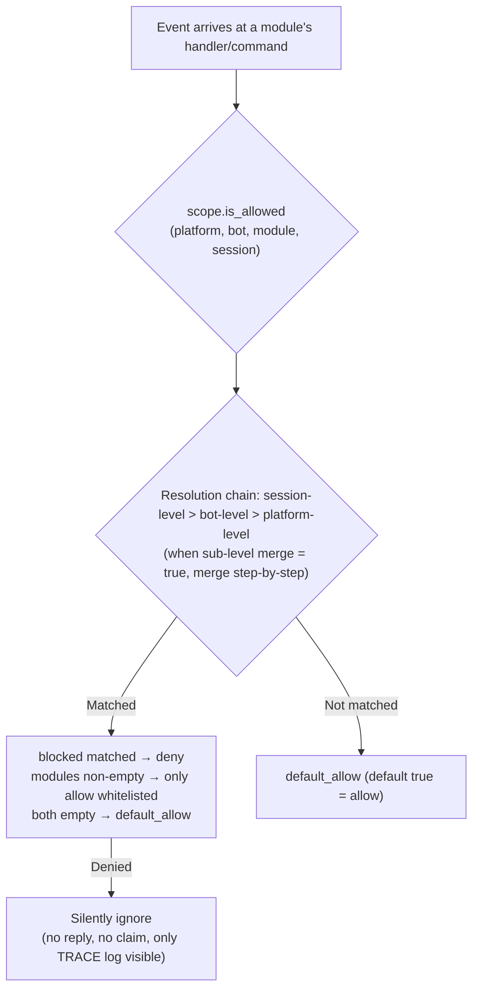
```mermaid
flowchart TD
    A["Event arrives at a module's handler/command"] --> B{"scope.is_allowed<br/>(platform, bot, module, session)"}
    B --> C{"Resolution chain: session-level > bot-level > platform-level<br/>(when sub-level merge = true, merge step-by-step)"}
    C -->|"Matched"| D["blocked matched → deny<br/>modules non-empty → only allow whitelisted<br/>both empty → default_allow"]
    C -->|"Not matched"| E["default_allow (default true = allow)"]
    D -->|"Denied"| Z["Silently ignore<br/>(no reply, no claim, only TRACE log visible)"]
```

- **Resolution priority: session-level > bot-level > platform-level**, higher priority bindings **fully override** lower ones;  
  When a sub-level binding specifies `merge = true`, it instead performs a **step-by-step union** with lower levels (merge `modules` and `blocked` individually, `merge` itself is a control key, not counted as an entry)
- **Silent semantics**: Commands and handlers from filtered modules are not triggered, replied to, or claimed (to prevent cross-command mis-matching),  
  visible only in TRACE-level logs (`core.scope.denied`)
- **Framework-level handlers** (`scope_exempt=True` or owner is empty) are unaffected; modules with empty names (framework-level resources) are always allowed
- **Session-aware help and command queries**: Command query APIs (`command.help` / `get_command` / `get_commands` / `get_group_commands` / `get_visible_commands`,  
  and `module.get_commands_overview`) all support optional `event=` or explicit `platform=` / `bot_id=` / `session_id=` keywords — commands from modules unavailable in the current session  
  no longer appear in results (`get_command` returns None, single command help is treated as "not registered",  
  consistent with silent semantics); if no context is provided, full behavior is retained

### Binding Inheritance (merge)

By default, the semantics of full override are clear and predictable; when you need to **append** to an upper-level binding, specify `merge = true` in the sub-level:

```toml
[ErisPulse.scope.platforms.onebot11]
modules = ["Chat", "Tool"]      # Platform-level: allow Chat, Tool

[ErisPulse.scope.bots.onebot11."123456"]
modules = ["Music"]
merge = true                    # The effective modules for this bot = ["Chat", "Tool", "Music"]
```

- **Merge rules**: `modules` and `blocked` each take the **union**; within a binding, `blocked` still takes precedence over `modules`
- **Chained merge**: Platform → Bot → Session, each level independently decides whether to merge or override

## ② Identity Dimension (Event Admission)

Answer "Whose events are accepted or rejected." Rejected events are **completely discarded at the distribution entry point**—they do not enter middleware or any processor (including framework-level), and are only visible in TRACE-level logs (`core.scope.identity_denied`).

- **Resolution Priority: User > Session > Bot > Adapter**, taking the most specific configured policy; deny takes precedence over allow
- Each level binding is a binary policy: `{ allow = true }` or `{ deny = true }`
- User keys support glob / regex (e.g., `"spam_*"` to block a batch of spam users)
- Typical usage — deny at an upper level, allow for specific individuals to make "exceptional passes":

```toml
[ErisPulse.scope.identity.adapters.onebot11]
deny = true
[ErisPulse.scope.identity.users.onebot11]
allow = ["u_admin"]   # Even if the adapter-level denies, events from u_admin are still passed
```

## ③ Outbound Dimension (Limiting Modules Initiating Outbound Calls)

Constraints on **outbound actions initiated by modules**: message sending / standard API actions / request handling.  
The three types of actions correspond to underlying DSLs: `Event.reply` and `Send` (send), `Api` / `call_api` (api), and `Request`'s accept/reject (request). Outbound calls initiated by modules during event handler execution carry the module owner, which are uniformly judged by this dimension.

### Rule Format (Inline Table)

Each action's rule is an inline table: `{ allow = [...], deny = true|[...] }`. Only one rule per action is allowed (TOML keys cannot be repeated; either full denial or fine-grained control is chosen):

```toml
[ErisPulse.scope.actions.MyModule]
send = { deny = true }                                  # Deny all sending (Event.reply / Send DSL)
# Or method-level granularity: send = { allow = ["Text", "Image*"], deny = ["File"] }
api = { allow = ["get_*"] }                             # Only allow query-type standard APIs
# Or action-level blacklist: api = { deny = ["set_*", "leave_*"] }
request = { deny = true }                               # Prohibit handling request accept/reject
```

- `send` entries match **method names** (`Text` / `Image` / `File` ...),  
  `api` entries match **standard action names** (`get_group_info` / `set_group_name` ...)
- Entries support exact names / glob / `re:` regex (consistent with the global system syntax, case-insensitive)
- Writing a single string in `allow` is equivalent to a single-entry list: `send = { allow = "Text" }`

### Judgment Semantics

**Default: Allow All** — Calls without configuration or with an empty owner (internal framework calls) are allowed.  
After configuration, rules are judged in the following order:

1. `deny = true` → Reject  
2. The called name matches an entry in the `deny` list → Reject  
3. The `allow` list is non-empty and the called name does not match (or the call has no name) → Reject  
4. All others are allowed

Rejected calls do not initiate any network requests and directly return a standard failure response  
(`retcode = 34601`, see [api-response §5.3](../standards/api-response.md#53-framework-extension-response-codes-34xxx-customization-in-the-lowest-three-digits-of-the-platform-error-segment)).  
The three actions are independent and can be limited individually.

```python
# Runtime API
sdk.scope.set_action("MyModule", "send", deny=True)              # Deny all message sending
sdk.scope.set_action("MyModule", "send", allow=["Text"])         # Allow only text messages
sdk.scope.is_action_allowed("MyModule", "send", name="Image")    # False
sdk.scope.is_action_allowed("MyModule", "api", name="get_user_info")  # Judged by rules
sdk.scope.delete_action("MyModule", "send")                      # Restore allowed
sdk.scope.get_action("MyModule", "send")                         # Get current rule for this action
```

## Runtime API

The scope runtime API consists of three layers: **Decision** (Three Questions), **Dimensional Read/Write** (per-dimension `set` / `get` / `delete` parametric methods with full type annotations, IDE auto-complete), and **Dictionary-style Fallback** (dot-path access to any section).

```python
from ErisPulse import sdk

scope = sdk.scope
```

### Decision (Three Questions)

```python
scope.is_allowed("onebot11", "123456", "Chat")                 # ① Module Dimension
scope.is_allowed("onebot11", "123456", "Chat", "789012345")    # With session-level
scope.is_allowed("onebot11", "123456", None)                   # Framework-level resource -> True

scope.is_identity_allowed("onebot11", "123456", "group_9", "u1")   # ② Identity Dimension

scope.is_action_allowed("MyModule", "send")                    # ④ Outbound Dimension
scope.is_action_allowed("MyModule", "send", name="Image")      # Fine-grained method level
```

### ① Module Dimension

```python
# Binding (hierarchy determined by parameters: session_id > bot_id > platform-level)
scope.set_module("onebot11", bot_id="123456", modules=["Chat", "Tool*"])
scope.set_module("onebot11", blocked=["re:^Danger"])                       # Platform-level
scope.set_module("onebot11", bot_id="123456", session_id="g9", modules=["Chat"])  # Session-level
scope.set_module("onebot11", bot_id="123456", modules=["Music"], merge=True)      # Union with existing entries
scope.set_module("onebot11", bot_id="123456", modules=["Chat"], persist=False)    # Runtime-only

# Read / Delete
scope.get_module("onebot11", bot_id="123456")   # {"modules": ["Chat"], "blocked": []}
scope.delete_module("onebot11", bot_id="123456")
```

> `merge=True` is **write-time union** (merges with existing bindings at this level); cross-level merge during resolution is controlled by the `merge = true` configuration key described in [Binding Inheritance](#binding-inheritance-merge)—these are independent mechanisms.

### ② Identity Dimension

```python
# Binding strategy (hierarchy determined by parameters: user > session > bot > adapter; allow / deny only)
scope.set_identity("onebot11", user_id="u_bad", deny=True)
scope.set_identity("onebot11", user_id="spam_*", deny=True)    # Keys support glob / re: regex
scope.set_identity("onebot11", bot_id="123456", session_id="g9", allow=True)

# Read / Delete
scope.get_identity("onebot11", user_id="u_bad")   # {"deny": True}
scope.delete_identity("onebot11", user_id="u_bad")
```

### ③ Outbound Dimension

```python
# Set restriction rules (allow: str|list; deny: bool|str|list; complete rule replacement semantics)
scope.set_action("MyModule", "send", deny=True)                    # Disable all sending
scope.set_action("MyModule", "send", allow=["Text"])               # Allow only text messages
scope.set_action("MyModule", "api", deny=["set_*", "leave_*"])     # Disable management APIs

# Read / Delete
scope.get_action("MyModule", "send")       # {"allow": ["Text"]} original rule
scope.delete_action("MyModule", "send")    # Remove single action
scope.delete_action("MyModule")            # Remove all action restrictions for this module
```

### General

```python
scope.get("platforms")   # Dictionary-style fallback: dot-path read any section
scope.topology()         # Full configuration tree (for Dashboard)
scope.stats()
# {"module_calls": .., "module_filtered": .., "identity_checks": .., "identity_denied": ..,
#  "action_checks": .., "action_denied": .., "cache_hits": .., "cache_misses": ..}
scope.reset_stats()
scope.clear()           # Clear all configuration (memory-only)
```

### Advanced: Dictionary-style Dot-Path Fallback

Dimensional methods cover daily scenarios; when you need direct access to any node (or future added dimensions), use dictionary-style API—`get` / `set` / `delete` accepts dot-paths (deep dict merge, immediate read after write), and provides `scope[path]` / `scope[path] = v` / `del scope[path]` / `path in scope` protocol:

```python
scope.set("bots.onebot11.123456", {"modules": ["Chat"], "blocked": []})
scope.set("identity.users.onebot11.u_bad", {"deny": True})
scope.get("actions.MyModule.send")

scope["platforms.onebot11"]        # Read (throws KeyError if not exists)
scope["platforms.onebot11"] = {...}  # Write
del scope["platforms.onebot11"]      # Delete
"actions.MyModule" in scope          # Existence check
```

## Caching and Hot Updates

- `is_allowed` / `is_identity_allowed` / `is_action_allowed` results are cached with **LRU caching** (configurable via `scope.cache_size`), and become invalid automatically on `set` / `delete` or configuration hot updates (`config.updated` / `config.set`)
- All dimension configurations take effect **immediately**, no restart required
- Scopes are evaluated "per event" and do not retain memory across events: if the configuration changes, the next event will be evaluated according to the new rules

## Configuration Format Validation

During loading or hot reloading, the configuration format is validated section by section: sections with incorrect types (e.g., `platforms` written as a string), invalid outbound rules (e.g., `allow` written as a number), unknown action names, and unknown top-level keys (e.g., `alow` with a typo) will output a **WARNING** and the corresponding section or entry will be ignored, while other valid configurations will still take effect—mistakes will no longer silently fail.

## Frequently Asked Questions and Precautions

### 1. Configuration Hierarchy and Overriding

- Module level: Session level > Bot level > Platform level, **overall override** (when `merge = true` at sub-level, merge entries as a union).
  To allow "Chat on platform, then Music on Bot", you can set `merge = true` at Bot level, or list both.
- Identity level: User > Session > Bot > Adapter, take the **most specific** configured policy (exceptions can be allowed).
- Command user allow/deny lists: Exact command name takes precedence over glob keys (see `event.command.acl`).

### 2. Module/Command Not Responding

First suspect the scope rather than the module itself:

```python
from ErisPulse import sdk

print(sdk.scope.is_allowed(event.get_platform(), bot_id, "MyModule", session_id))
print(sdk.scope.is_identity_allowed(event.get_platform(), bot_id, session_id, user_id))
print(sdk.scope.stats())   # module_filtered / identity_denied > 0 indicates silent filtering
```

Filtering is **silent** (no reply at module and identity levels to avoid exposing rules), but statistics are accumulated;
ACL rejection at command level will explicitly reply "insufficient permissions".

### 3. Outbound Action Rejection Troubleshooting

```python
from ErisPulse import sdk

print(sdk.scope.get("actions.MyModule"))
print(sdk.scope.stats())   # action_denied > 0 indicates intercepted calls
```

Interruption is **explicit**: rejected calls return a standard failure response with `retcode = 34601` (no network request initiated).

### 4. Session Identifier Cross-Platform Isolation

The combination `(platform, session_id)` is the unique identifier. `scope.sessions.onebot11."789"` only applies to onebot11, and does not affect a session with the same `789` on telegram. The same applies to user keys at the identity level.

## Topology Tree API

`ModuleManager.get_topology()` and `AdapterManager.get_topology()` provide data about module/adapter ownership relationships. `sdk.get_topology()` provides a one-click aggregation (including scope `scope`):

```python
from ErisPulse import sdk

topology = sdk.get_topology()
# {
#   "modules": {                                   # Module → Owned resources
#     "Chat": {
#       "loaded": True, "enabled": True,
#       "commands": ["chat", "translate"],
#       "handlers": {"message": 2, "notice": 1},
#       "routes": {"http": ["/Chat/api"], "ws": [], "sse": []},
#       "lifecycle_hooks": 3,
#     }
#   },
#   "adapters": {                                  # Adapter → Bot → Scope
#     "onebot11": {
#       "status": "started", "enabled": True,
#       "bots": {"123456": {"status": "online", "scope": {...}}},
#       "scope": {"modules": [...], "blocked": [...]},
#     }
#   },
#   "scope": {                                     # Scope (modules / identity / outbound actions)
#     "platforms": {...}, "bots": {...}, "sessions": {...},
#     "identity": {"adapters": {...}, "bots": {...}, "sessions": {...}, "users": {...}},
#     "actions": {...},
#   },
# }
```

- The module topology aggregates commands, event handlers, HTTP/WS/SSE routes, and lifecycle hooks registered by the module, which is helpful for drawing a module resource tree.
- The adapter topology aggregates the status of each adapter, the status of its subordinate Bots, and the platform-level/Bot-level scope binding (at the module level).


### 归属权（owner）系统

# Ownership (owner) System

Ownership is the cornerstone of the "plug-and-play" nature of modules: all framework resources registered during module loading are automatically attributed, and are automatically reclaimed when the module is unloaded/disabled—module authors only need to declare resources, without writing cleanup logic manually.

> **Related Systems**: Scope determines "whether a resource is active" during event dispatch, while ownership determines "who owns the resource and who will reclaim it upon unload." See [Unified Control Plane (scope)](scope.md) for scope details, and [Lifecycle Management](lifecycle.md#后台任务归属与自动取消) for background tasks.

{!--< tips >!--}
1. Ownership is automatically recorded at the **moment of registration** based on `current_owner`, requiring zero code changes from the module.
2. Unload and disable share the same cleanup chain (`_cleanup_module_registrations`), where failures at each step only trigger warnings and do not interrupt the process.
3. Resources with user configuration semantics (persistent overrides / scope rules / command ACLs) are **not** cleaned up when the module is unloaded.
{!--< /tips >!--}

## Owner Context Mechanism

Ownership is passed through the context variable `current_owner` (`ErisPulse.runtime.context`):

```python
from ErisPulse.runtime import owner_scope, get_current_owner

with owner_scope("MyModule"):
    # All resources registered in this block are automatically attributed to MyModule
    assert get_current_owner() == "MyModule"
```

The framework automatically injects the owner at the following points (module/adapter code does not need to manually wrap these):

| Timing | Owner Value | Location |
|--------|-------------|----------|
| Module `load()` | Module name | Throughout instantiation + `on_load` |
| Adapter `start()` / `restart()` | Platform name | Throughout adapter startup |
| `activate_on` lazy-load stub registration | Module name | Placeholder command/handler registration |
| Event handler execution | Handler's owning module name | handler / command entry re-injected |

Re-injection during execution means that commands registered in `on_load` and subsequently called within their execution (e.g., `sdk.adapter.on()`, `overrides.*.set(persist=False)`) are still automatically attributed to the module.

## Full Overview of Owned Resources

All resources registered within the module loading context are recorded with ownership and automatically reclaimed upon unload/disable:

| Resource | Registration Method | Cleanup Call |
|----------|---------------------|--------------|
| Commands | `@command()` / command dict declaration | `command.unregister_by_owner()` |
| Event Handlers | `@message` / `@notice` / `@request` / `@meta` | `handler.unregister_by_owner()` |
| Adapter Event Listeners | `sdk.adapter.on()` / `raw=True` | `adapter.unregister_handlers_by_owner()` |
| Adapter Middlewares | `@sdk.adapter.middleware` | Same as above |
| Routes (HTTP/WS/SSE) | `router.http()` / `websocket()` / `sse()` | Double fallback by namespace + owner |
| Route Middlewares | `@router.middleware()` / `add_middleware()` | `router.unregister_all_by_owner()` |
| Dashboard Home Entry | `router.register_home_entry()` | `unregister_home_entries_by_owner()` |
| Custom Session Types | `register_custom_type()` | `unregister_custom_types_by_owner()` |
| Background Tasks | `self.spawn()` | `cancel_owner_tasks()` |
| Lifecycle Hooks | `lifecycle.register()` | `lifecycle.unregister_by_owner()` |
| Master Provider | `master.provider` | `master.unregister_by_owner()` |
| i18n Translation Keys | `I18nClass` declaration (domain=module name) | `i18n.unregister_domain()` |
| Runtime Event Overrides | `overrides.*.set(persist=False)` | `overrides.unregister_by_owner()` |
| Interactive Sessions (wait_reply / leases) | `event.wait_reply()` / `sdk.interaction.acquire()` | `interaction.cancel_by_owner()` (waiter immediately receives cancellation) |
| Context Data | `runtime/context` recorded by owner | Precise cleanup by module |

Corresponding adapter-side resources (with platform name as owner) are reclaimed during adapter `shutdown()` / `restart()` via `_cleanup_adapter_resources`, including:

| Resource | Cleanup Call |
|----------|--------------|
| Adapter's own `on()` handlers and middlewares | `adapter.unregister_handlers_by_owner(platform)` |
| Platform event method extensions (`EventMixin`) | `unregister_platform_event_methods(platform)` |
| Custom session types | `unregister_custom_types_by_owner(platform)` |
| Interactive sessions (platform-pending wait_reply / leases) | `interaction.cancel_by_platform(platform)` |
| i18n translation domains (domain=config key) | `i18n.unregister_domain(config key)` |
| Fine-grained named route | `router.unregister_all_by_owner(platform)` |

## Unload/Disable Cleanup Sequence

`unload()` and `disable()` share the same cleanup chain (each step is independently wrapped in try/except, failures only log warnings, **do not interrupt subsequent cleanup**):

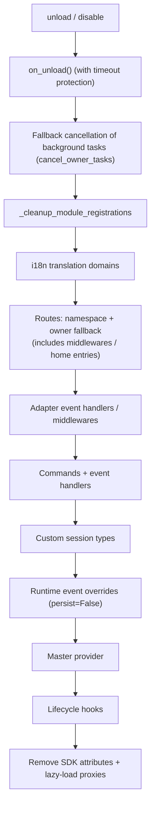
```mermaid
flowchart TD
    A["unload / disable"] --> B["on_unload() (with timeout protection)"]
    B --> C["Fallback cancellation of background tasks (cancel_owner_tasks)"]
    C --> D["_cleanup_module_registrations"]
    D --> D1["i18n translation domains"]
    D1 --> D2["Routes: namespace + owner fallback<br/>(includes middlewares / home entries)"]
    D2 --> D3["Adapter event handlers / middlewares"]
    D3 --> D4["Commands + event handlers"]
    D4 --> D5["Custom session types"]
    D5 --> D6["Runtime event overrides (persist=False)"]
    D6 --> D7["Master provider"]
    D7 --> D8["Lifecycle hooks"]
    D8 --> E["Remove SDK attributes + lazy-load proxies"]
```

`sdk.uninit()` also includes global fallback on exit: all adapters shutdown → all modules unload → `router.stop()` (clear routes/middlewares/home entries) → `cancel_all_background_tasks()` → clear event handlers and hooks.

## Design Boundaries: Resources Not Cleared on Unload

Ownership only recovers **runtime resources registered by module code**. The following resources belong to **user configuration semantics** (controlled by the user, possibly intentionally configured), and are retained persistently after module unload:

| Resource | Semantics | Description |
|----------|-----------|-------------|
| `overrides.*.set(persist=True)` | Persistent overrides | Written to configuration file, effective across restarts; not deleted on module unload (explicitly configured by user) |
| `scope.set_action()` and other scope rules | Permission control plane | Managed by user/Dashboard, rules not reclaimed on module unload |
| `overrides.acl.set(persist=True)` | Command ACLs | Same as above |
| Conversation `save()` persistence | Multi-turn conversation archiving | Data assets are not cleared |

Runtime temporary writes (`persist=False`) are reclaimed by owner—**persistence or not is the boundary between "user assets" and "module runtime state."**

## Module Author Guide

### Recommended Usage

```python
from ErisPulse import sdk
from ErisPulse.Core.Event import command
from ErisPulse.runtime import owner_scope, spawn_background

class MyModule(BaseModule):
    async def on_load(self, event):
        # Framework resources: automatically attributed, no manual cleanup needed
        self.task = self.spawn(self.polling())      # Background task
        sdk.router.register_home_entry("My Module", "/my")  # Home entry

        # Module-specific resources: include in owner_scope to integrate into ownership system
        with owner_scope("MyModule"):
            self.client.on_event(self._handle)      # Hypothetical custom registration

    async def on_unload(self, event):
        # Framework resources have been automatically reclaimed, only clean up resources not covered by owner_scope
        await self.client.close()
```

### Notes

- **Registration during import has no ownership**: Hooks/handlers registered at the module level (during import) occur before `owner_scope` is active, and are treated as framework-level resources (owner=None) and **not cleaned up**. Always register inside `on_load()`.
- **Custom domain i18n registration**: If `i18n.register(domain=...)` uses a domain different from the module name, it will not be automatically reclaimed. Keep domain=module name.
- **Background tasks must use `self.spawn()`**: Bare `asyncio.create_task` is not attributed to the module and will not be cancelled on unload (see [Lifecycle Management](lifecycle.md#后台任务归属与自动取消)).
- Cleanup chain "failures only warn": Single-step cleanup exceptions do not block other resource cleanup; logs are visible at DEBUG/WARNING level, and TRACE can be enabled for troubleshooting.


### 启动流程与手动控制

# Startup Process and Manual Control

ErisPulse's `await sdk.run()` / `await sdk.init()` encapsulates the entire startup chain into a single line of code. However, when you need to fully customize the startup process (for example, partial loading, dynamic registration, hot plugging, injecting custom loading strategies), you need to understand what happens inside this chain and how to manually drive each step.

This article breaks down the startup chain into independent components, explains the responsibilities of each, the order of calls, and provides an example of how to manually perform a complete startup.

> This article assumes you have already run through [the first bot](../getting-started/first-bot.md) and understand the two modes of `sdk.run(keep_running=True/False)`. This article focuses on the internal breakdown of the `init()` chain and lower-level entry points such as `init()` / `init_task()` / `init_sync()`.

## Overview of SDK Top-Level Entry Points

In addition to the two `keep_running` modes of `run()`, the SDK also provides several lower-level initialization entry points, which differ in terms of **asynchronicity, return value, and whether exceptions are wrapped**:

| Entry Point | Asynchronicity | Return Value | Exception Handling | Use Case |
|-------------|----------------|--------------|--------------------|----------|
| `await sdk.run(True)` | async, blocks and maintains | `None` (automatically `uninit` when closed) | Module/adapter errors are intercepted, not crashing the process | Pure bot application |
| `await sdk.run(False)` | async, does not block | `None` (does not automatically unload) | Same as above | Execute custom logic after initialization |
| `await sdk.init()` | async, requires await | `bool` | Internal component exceptions are caught, returns `False` on failure | Manual lifecycle control (paired with `uninit()`) |
| `sdk.init_task()` | async, returns Task without blocking | `asyncio.Task` | Same as `init()` | Concurrently execute other initializations, or when event loop is not yet running |
| `sdk.init_sync()` | **Synchronous**, blocks current thread | `bool` | Same as `init()` | Command-line scripts, synchronous entry point without event loop |

> **Common Misconception**: `await sdk.init()` is **not equivalent** to `await sdk.run(keep_running=False)`. There are two differences: ① `init()` returns `bool` (returns `False` on failure), while `run()` returns `None`; ② `init()` only performs initialization and **does not automatically unload**, whereas `run()` automatically `uninit()` when the event loop ends. Therefore, when manually pairing unloading or customizing the lifecycle, use `init()` + `uninit()`.

## Chain Startup Overview

`sdk.init()` (specifically, its internal `Initializer.init()`) initiates the framework in the following sequence:


```mermaid
flowchart TD
    A[0. Prepare Environment<br/>Configuration Loading / Exception Handling] --> B
    B[1. Parallel Discovery and Loading<br/>AdapterLoader.load / ModuleLoader.load<br/>Internal call to Finder.find_all] --> C
    C[2. Register Adapters<br/>AdapterLoader.register_to_manager] --> D
    D[3. Start Adapters<br/>adapter.startup] --> E
    E[4. Register Modules<br/>ModuleLoader.register_to_manager] --> F
    F[5. Initialize Modules<br/>ModuleLoader.initialize_modules<br/>Instantiate and mount to sdk] --> G
    G[6. Start Router Server<br/>router.start]
```

Corresponding core components:

| Layer | Component | Responsibility |
|----|------|------|
| Discovery | `AdapterFinder` / `ModuleFinder` | **Discover** adapters/modules from entry-points of installed packages |
| Loading | `AdapterLoader` / `ModuleLoader` | Discovery + Import + Read metadata + Determine enable/disable, return object list |
| Registration | `*Loader.register_to_manager` | Register objects to corresponding managers |
| Management | `sdk.adapter` / `sdk.module` | Maintain adapter/module instances, provide startup/shutdown interfaces |
| Initialization | `ModuleLoader.initialize_modules` | Create module instances and mount to `sdk` (handle dependency topological sorting) |
| Routing | `sdk.router` | HTTP / WebSocket server |

> **Important**: `Finder` and `Loader` are two layers. The `Loader` internally **already holds** a `Finder` (`AdapterLoader` has its own `AdapterFinder`, `ModuleLoader` has its own `ModuleFinder`). In most scenarios, you only need to use `Loader`. You would only use `Finder` separately when you need to "list without importing".

## Detailed Explanation of Each Step

### 1. Discovery Layer: Finder

The Finder is responsible only for "finding which packages provide adapters/modules", without importing or instantiating them.

```python
from ErisPulse.finders import AdapterFinder, ModuleFinder

adapter_finder = AdapterFinder()
module_finder = ModuleFinder()

# Find all installed adapter/module entry-points
adapter_entries = adapter_finder.find_all()    # list[EntryPoint]
module_entries = module_finder.find_all()      # list[EntryPoint]

# Find a single entry-point by name
entry = module_finder.find_by_name("MyModule")  # EntryPoint | None
```

Each `EntryPoint` can be loaded via `.load()` to obtain the corresponding class, but typically you do not need to do this manually—the Loader will handle it.

### 2. Loading Layer: Loader

The Loader performs "importing + reading metadata + determining enabled/disabled" on top of the Finder.

```python
from ErisPulse.loaders import AdapterLoader, ModuleLoader
from ErisPulse import sdk

adapter_loader = AdapterLoader()
module_loader = ModuleLoader()

# load() internally: calls finder.find_all() → processes each entry-point → returns a triple
adapter_objs, enabled_adapters, disabled_adapters = await adapter_loader.load(sdk.adapter)
module_objs, enabled_modules, disabled_modules = await module_loader.load(sdk.module)
```

The triple returned by `load()`:

| Return Value | Meaning |
|--------------|---------|
| `objs` (`dict`) | Name → Object (adapter class / module wrapper object) |
| `enabled` (`list[str]`) | Names that are enabled (not disabled in configuration) |
| `disabled` (`list[str]`) | Names that are disabled |

#### Diagnostic Information on Loading Failures

When a module/adapter throws an exception during loading or initialization, the framework skips that component and continues loading others, while outputting a **user code frame summary**. This allows you to locate the error position at the default INFO level, without manually enabling DEBUG:

```
[ERROR] [ModuleLoader] Failed to load module MyModule from entry-point, skipped: 'NoneType' object has no attribute 'platform'
  → MyModule/Core.py:42 in on_load
      adapter = sdk.platform
  → AttributeError: 'NoneType' object has no attribute 'platform'
  → Hint: Increase log level to DEBUG to view full stack trace; check implementation code of module MyModule
```

Diagnostic information is generated through the `ErisPulse.runtime.diagnostics` module, which automatically filters out internal framework frames and retains only your code frames. If you need to reuse this in custom loading logic:

```python
from ErisPulse.runtime import log_diagnostic

try:
    risky_init()
except Exception as e:
    log_diagnostic(e)  # Automatically extracts user code frames and writes to ERROR log
```

This module also provides two low-level functions: `extract_user_frame()` (returns structured frame information) and `format_diagnostic_block()` (returns multi-line text).

### 3. Registration Layer: register_to_manager

Registers the objects produced by the Loader into the manager, so that `sdk.adapter` / `sdk.module` can recognize them.

```python
# Register adapters (returns bool indicating success)
await adapter_loader.register_to_manager(enabled_adapters, adapter_objs, sdk.adapter)

# Register modules
await module_loader.register_to_manager(enabled_modules, module_objs, sdk.module)
```

After registration, adapters are registered into the adapter manager, and modules are registered into the module manager, but **they are not yet started/instantiated**.

### 4. Starting Adapters

```python
# Start all registered adapters
await sdk.adapter.startup()
# Or specify a platform
await sdk.adapter.startup("yunhu")
await sdk.adapter.startup(["yunhu", "telegram"])
```

> Registration ≠ Starting. `register_to_manager` only registers; `startup` calls the adapter's `start()` method to establish a connection with the platform.

### 5. Initializing Modules

Modules have an additional step compared to adapters—they need to be **instantiated** and attached to `sdk` (so you can call `sdk.MyModule.xxx`). This step also handles module dependencies and topological sorting.

```python
success = await module_loader.initialize_modules(
    enabled_modules, module_objs, sdk.module, sdk
)
```

After successful instantiation, the module appears at `sdk.<ModuleName>`.

### 6. Starting the Router Server

```python
await sdk.router.start(
    host="0.0.0.0",
    port=8000,
    ssl_certfile=None,
    ssl_keyfile=None,
)
```

The router server is responsible for receiving webhook/WebSocket callbacks from adapters. Without starting it, server-mode adapters cannot receive messages.

## Complete Manual Startup Example

The following code is **equivalent** to the core process of `await sdk.init()`, but exposes every step, allowing you to insert custom logic at any point:

```python
import asyncio
from ErisPulse import sdk
from ErisPulse.loaders import AdapterLoader, ModuleLoader

async def manual_startup():
    # 0. Prepare environment (load configuration, register global exception handling)
    #    _prepare_environment is a pre-step inside init(); for manual flow, it must be called first,
    #    otherwise the Loader won't read the configuration and will incorrectly disable all adapters/modules.
    if not await sdk._prepare_environment():
        print("Environment preparation failed")
        return False

    # 1. Create loaders (each internally holds a Finder)
    adapter_loader = AdapterLoader()
    module_loader = ModuleLoader()

    # 2. Parallel discovery and loading (same as internal gather in init())
    (adapter_objs, enabled_adapters, disabled_adapters), \
    (module_objs, enabled_modules, disabled_modules) = await asyncio.gather(
        adapter_loader.load(sdk.adapter),
        module_loader.load(sdk.module),
    )

    # 3. Register adapters
    await adapter_loader.register_to_manager(
        enabled_adapters, adapter_objs, sdk.adapter
    )

    # 4. Start adapters
    if enabled_adapters:
        await sdk.adapter.startup()

    # 5. Register modules
    await module_loader.register_to_manager(
        enabled_modules, module_objs, sdk.module
    )

    # 6. Initialize modules (instantiation + attach to sdk)
    if enabled_modules:
        await module_loader.initialize_modules(
            enabled_modules, module_objs, sdk.module, sdk
        )

    # 7. Start the routing server
    await sdk.router.start(host="0.0.0.0", port=8000)

    print("Manual startup completed")
    return True

async def main():
    ok = await manual_startup()
    if ok:
        # Block to keep running (manual flow won't automatically block)
        await asyncio.Event().wait()

if __name__ == "__main__":
    asyncio.run(main())
```

### When Should You Use Manual Startup?

In most cases, **manual startup is not necessary** as `await sdk.run()` already handles all the above steps. Manual startup is only valuable in these scenarios:

- **Partial loading**: Load only specific adapters/modules, skipping others
- **Dynamic registration**: Register new adapters/modules at runtime based on conditions
- **Custom order**: Need to change the default loading order (e.g., start a module before starting an adapter)
- **Injection strategies**: Inject custom strict-mode managers, loading strategies, etc., into the Loader
- **Debugging/diagnosis**: Manually drive execution at a specific step when failure occurs to locate the issue

## Runtime Fine-grained Control

Even after using `sdk.run()` to start the SDK, you can still control individual subsystems at runtime without having to restart the entire SDK:

### Hot Restart of Adapters

```python
# Hot restart a specific adapter (to fix a connection, without affecting other platforms)
await sdk.adapter.shutdown("yunhu")
await sdk.adapter.startup("yunhu")

# Bring up a new platform during runtime
await sdk.adapter.startup("telegram")

# Temporarily take a platform offline
await sdk.adapter.shutdown("telegram")
```

> `adapter.startup()` requires the adapter to be **registered** with the manager. Registration occurs internally within `init()`/`run()`, so this is a fine-grained control that operates **after** startup.

### Router Server

```python
# Temporarily take the webhook server offline
await sdk.router.stop()

# Restart it (for example, after changing the port)
await sdk.router.start(host="0.0.0.0", port=9000)
```

### On-demand Module Loading

```python
# Manually load a module (which may be lazily loaded)
await sdk.load_module("MyModule")
```

## Graceful Shutdown

Starting from version 2.7.0, `sdk.shutdown()` provides **programmatic graceful shutdown**: it sets a shutdown event, allowing the main loop that is hanging with `await sdk.run(keep_running=True)` to return, which in turn triggers `uninit()` to complete resource cleanup.

```python
# Call from any coroutine to trigger graceful exit (run() will return and uninit is automatically triggered)
sdk.shutdown()
```

Typical use cases:

```python
async def shutdown_after_idle():
    await asyncio.sleep(3600)
    sdk.shutdown()  # Gracefully exit after being idle for 1 hour
```

**Signal Handling**: `run()` internally registers `SIGTERM` / `SIGHUP` handlers, converting system signals into graceful shutdown—when stopping services via container orchestration (e.g., Docker `docker stop`) or `systemd`, the process will complete `uninit()` cleanup instead of being forcefully killed.

- On Windows, `loop.add_signal_handler` is not supported, so signal handlers are automatically skipped (graceful shutdown can still be triggered via `sdk.shutdown()` or Ctrl+C)
- Repeatedly calling `sdk.shutdown()` is safe (subsequent calls after the event is set are no-ops)

## Uninstall Process

The reverse operation of startup is `await sdk.uninit()`, which performs cleanup in the reverse order:

1. Shut down all adapters (`adapter.shutdown()`)
2. Unload all modules
3. Clean up all event handlers
4. Clean up module properties on managers and the SDK

In scenarios where the process is manually started, remember to call `uninit()` before exiting to ensure a graceful shutdown:

```python
try:
    await asyncio.Event().wait()   # Keep running
finally:
    await sdk.uninit()
```

## Restart

The SDK provides two restart methods, both of which do not require you to manually uninstall first—the framework handles it automatically:

| Method | Call | Behavior | Use Case |
|------|------|------|----------|
| Hot Restart | `await sdk.restart()` | Re-initialize (`init()`) after `uninit()` in the same process, reloading adapters/modules | Reload configuration, hot update modules |
| Hard Restart | `await sdk.hard_restart()` | After `uninit()`, exit the process with **exit code 42**, and let an external supervisor start a new process | Suspected memory/resource leaks, or when a completely clean restart is needed |

```python
# Hot restart: Reload within the same process (most common)
await sdk.restart()

# Hard restart: Exit the process, let an external supervisor restart (see "Supervisor Guide" below)
await sdk.hard_restart()
```

> **Two points to note**:
> 1. Both methods execute the restart in the background, **immediately returning `True` to indicate that the "restart task has been scheduled"**, not that the restart is completed. The actual restart runs in the background to avoid interrupting the current event chain.
> 2. The principle of `hard_restart()` is: after unloading and saving the configuration, exit the process with **exit code 42** (`HARD_RESTART_EXIT_CODE`) — **it does not start a new process itself**. It must be restarted by an external supervisor that detects exit code 42. If you run `python main.py` directly without any supervisor, the process exits with code 42 and **does not automatically restart** (the framework will issue a warning).

### When to Use Hard Restart?

Hard restart is not just a "more thorough restart"—it is more suitable and even more efficient than hot restart in the following scenarios:

- **Binary library (C extension) side effects**: Hot restart occurs within the same process and cannot release C extensions, open file descriptors, threads, or other process-level resources. Hard restart starts a new process, completely clearing these side effects.
- **Resource leak troubleshooting**: When you suspect memory or handle leaks, hard restart provides a clean environment.
- **Frequent restarts sensitive to performance**: Hard restart avoids the overhead of unloading and reloading within the same process, making it more efficient than hot restart.

> The "Framework Restart" function in the Dashboard management panel internally calls `hard_restart()`.

### Exit Code 42 Contract

Hard restart is a cross-process collaboration: **SDK is responsible for exiting (code 42), and the supervisor is responsible for restarting**.

| Role | Behavior |
|------|------|
| SDK (when hard restarted) | `uninit()` → Save configuration → `os._exit(42)` |
| Supervisor | Detects child process exit code 42 → Restart the same command |

> `sdk.is_supervised()` can check if the current process was started by a supervisor (by checking the environment variable `ERISPULSE_SUPERVISED`). The CLI `run` command automatically injects this flag when starting a subprocess; external supervisors like systemd or Docker do not inject it, so `is_supervised()` returns `False`, and the framework will issue a "no supervisor detected" warning after hard restart.

### Supervisor Guide

Choose a supervisor that suits your needs to make hard restart work effectively:

#### 1. CLI run command (Development/Simple Deployment, Recommended)

`epsdk run main.py` includes a built-in supervision loop: it detects the child process exit code, restarts immediately if it is 42; for other abnormal exit codes, it automatically retries with exponential backoff; `Ctrl+C` first gracefully terminates the child process (exit code 0 is considered normal, so it will not be restarted).

```bash
epsdk run main.py
```

#### 2. systemd (Linux Server)

`RestartForceExitStatus=42` makes exit code 42 trigger a restart (by default `on-failure` only applies to non-zero codes):

```ini
[Service]
ExecStart=/usr/bin/python3 /opt/mybot/main.py
Restart=on-failure
RestartForceExitStatus=42
RestartSec=2
User=mybot
```

#### 3. Docker / docker-compose

The container's PID 1 is the application process, and it exits with code 42, causing the container to exit—use the `restart` policy to make it automatically restart:

```yaml
services:
  bot:
    build: .
    restart: unless-stopped   # Restart for any exit (including 42)
```

#### 4. PM2 (Node Ecosystem Operations)

```bash
pm2 start main.py --name mybot --interpreter python3
# 42 is treated as an exit code, and PM2 restarts by default; set restart_delay to debounce
pm2 set mybot.restart_delay 2000
```

#### 5. supervisord

```ini
[program:mybot]
command=python3 /opt/mybot/main.py
autorestart=true
exitcodes=0,2,42    # 42 is also considered "normal exit, restart needed"
```

#### 6. Pure Python Custom Supervisor

```python
import subprocess, sys, time

while True:
    p = subprocess.Popen([sys.executable, "main.py"])
    code = p.wait()
    if code == 42:          # Hard restart request
        time.sleep(0.5)
        continue
    if code == 0:           # Normal exit
        break
    time.sleep(3)           # Abnormal exit, retry with backoff
```

> **Behavior without a supervisor**: Running directly with `python main.py`, calling `hard_restart()` causes the process to exit with code 42 and not restart. In this case, you should integrate one of the supervisors above.


====
技术标准
====


### 会话类型标准

# ErisPulse Session Type Standards

This document defines the session type standards supported by ErisPulse, including receiving event types and sending target types.

## 1. Core Concepts

### 1.1 Receive Type && Send Type

ErisPulse distinguishes two session types:

- **Receive Type**: The `detail_type` field used for receiving events
- **Send Type**: The target type used in the `Send.To()` method when sending messages

### 1.2 Type Mapping Relationship

```
Receive Type (detail_type)    Send Type (Send.To)
─────────────────             ────────────────
private                       →        user
group                         →        group
channel                       →        channel
guild                         →        guild
thread                        →        thread
user                          →        user
```

**Key Points**:
- `private` is the receive type; `user` must be used for sending
- `group`, `channel`, `guild`, and `thread` have the same type for both receiving and sending
- The system automatically performs type conversion, so manual handling is not required (meaning you can directly use the received type for sending). In practice, you don't need to worry about these details, as the wrapper class of Event allows you to directly use the `event.reply()` method without considering type conversion.

## 2. Standard Session Types

### 2.1 OneBot12 Standard Types

#### private
- **Receive Type**: `private`
- **Send Type**: `user`
- **Description**: One-on-one private chat messages
- **ID Field**: `user_id`
- **Applicable Platforms**: All platforms that support private chats

#### group
- **Receive Type**: `group`
- **Send Type**: `group`
- **Description**: Group chat messages, including various forms of group (e.g., Telegram supergroup)
- **ID Field**: `group_id`
- **Applicable Platforms**: All platforms that support group chats

#### user
- **Receive Type**: `user`
- **Send Type**: `user`
- **Description**: User type, some platforms (e.g., Telegram) represent private chats as `user` rather than `private`
- **ID Field**: `user_id`
- **Applicable Platforms**: Telegram and similar platforms

### 2.2 ErisPulse Extended Types

#### channel
- **Receive Type**: `channel`
- **Send Type**: `channel`
- **Description**: Channel messages, supporting broadcast-style messages to multiple users
- **ID Field**: `channel_id`
- **Applicable Platforms**: Discord, Telegram, Line, etc.

#### guild
- **Receive Type**: `guild`
- **Send Type**: `guild`
- **Description**: Server/community messages, typically used for Discord Guild-level events
- **ID Field**: `guild_id`
- **Applicable Platforms**: Discord and similar platforms

#### thread
- **Receive Type**: `thread`
- **Send Type**: `thread`
- **Description**: Thread/subchannel messages, used for sub-discussion areas within communities
- **ID Field**: `thread_id`
- **Applicable Platforms**: Discord Threads, Telegram Topics, etc.

## 3. Platform Type Mapping

### 3.1 Mapping Principles

The adapter is responsible for mapping the native types of platforms to ErisPulse standard types:

```
Platform native type → ErisPulse standard type → Sending type
```

### 3.2 Common Platform Mapping Examples

#### Telegram
```
Telegram Type          ErisPulse Receive Type    Sending Type
─────────────────      ────────────────       ───────────
private                private                 user
group                  group                   group
supergroup             group                   group  # Mapped to group
channel                channel                 channel
```

#### Discord
```
Discord Type          ErisPulse Receive Type    Sending Type
─────────────────      ────────────────       ───────────
Direct Message         private                user
Text Channel           channel                channel
Guild                  guild                  guild
Thread                 thread                 thread
```

#### OneBot11
```
OneBot11 Type        ErisPulse Receive Type    Sending Type
─────────────────      ────────────────       ───────────
private                private                user
group                  group                  group
discuss                group                  group  # Mapped to group
```

## 4. Custom Type Extension

### 4.1 Register Custom Type

The adapter can register custom session types:

```python
from ErisPulse.Core.Event import register_custom_type

# Register custom type
register_custom_type(
    receive_type="my_custom_type",
    send_type="custom",
    id_field="custom_id",
    platform="MyPlatform"
)
```

### 4.2 Use Custom Type

After registration, the system will automatically handle conversion and inference for this type:

```python
# Automatic inference
receive_type = infer_receive_type(event, platform="MyPlatform")
# Returns: "my_custom_type"

# Convert to send type
send_type = convert_to_send_type(receive_type, platform="MyPlatform")
# Returns: "custom"

# Get corresponding ID
target_id = get_target_id(event, platform="MyPlatform")
# Returns: event["custom_id"]
```

### 4.3 Unregister Custom Type

```python
from ErisPulse.Core.Event import unregister_custom_type

unregister_custom_type("my_custom_type", platform="MyPlatform")
```

## 5. Automatic Type Inference

When an event does not have an explicit `detail_type` field, the system automatically infers the type based on the available ID fields:

> [!NOTE]
> **Behavior change in 2.7.0+**: `detail_type` is directly adopted only if it is a **known session type** (standard or custom). For `notice`/`request` events, `detail_type` (e.g., `group_member_increase`, `friend_increase`) is a **semantic subtype** rather than a session type, and the correct session type will be inferred from the ID field instead.

### 5.1 Inference Priority

```
Priority (from highest to lowest):
1. group_id     → group
2. channel_id   → channel
3. guild_id     → guild
4. thread_id    → thread
5. user_id      → private
```

### 5.2 Usage Examples

```python
# Event has only group_id
event = {"group_id": "123", "user_id": "456"}
receive_type = infer_receive_type(event)
# Returns: "group" (group_id is prioritized)

# Event has only user_id
event = {"user_id": "123"}
receive_type = infer_receive_type(event)
# Returns: "private"

# For notice events, detail_type is a semantic subtype; 2.7.0+ will infer from ID fields
event = {"type": "notice", "detail_type": "group_member_increase", "group_id": "123"}
receive_type = infer_receive_type(event)
# Returns: "group" (not "group_member_increase")
```

## 6. API Usage Examples

### 6.1 Sending Messages

```python
from ErisPulse import adapter

# Send to a user
await adapter.myplatform.Send.To("user", "123").Text("Hello")

# Send to a group
await adapter.myplatform.Send.To("group", "456").Text("Hello")

# Automatically convert private → user (not recommended, may cause compatibility issues)
await adapter.myplatform.Send.To("private", "789").Text("Hello")
# Internally automatically converted to: Send.To("user", "789") # Using user as session type directly is a better choice
```

### 6.2 Event Reply

```python
from ErisPulse.Core.Event import Event

# Event.reply() automatically handles type conversion
await event.reply("Reply content")
# Internally automatically uses the correct sending type
```

### 6.3 Command Handling

```python
from ErisPulse.Core.Event import command

@command(name="test")
async def handle_test(event):
    # The system automatically handles session type
    # No need to manually determine group_id or user_id
    await event.reply("Command executed successfully")
```

## 7. Core API Reference

### 7.1 Type Conversion

```python
from ErisPulse.Core.Event import convert_to_send_type, convert_to_receive_type

# Receive type → Send type
convert_to_send_type("private")  # → "user"
convert_to_send_type("group")    # → "group"

# Send type → Receive type
convert_to_receive_type("user")   # → "private"
convert_to_receive_type("group")  # → "group"
```

### 7.2 ID Field Query

```python
from ErisPulse.Core.Event import get_id_field, get_receive_type

get_id_field("group")    # → "group_id"
get_id_field("private")  # → "user_id"

get_receive_type("group_id")  # → "group"
get_receive_type("user_id")   # → "private"
```

### 7.3 One-step Retrieval of Send Information

```python
from ErisPulse.Core.Event import get_send_type_and_target_id

event = {"detail_type": "private", "user_id": "123"}
send_type, target_id = get_send_type_and_target_id(event)
# send_type = "user", target_id = "123"

# Directly used in Send.To()
await adapter.Send.To(send_type, target_id).Text("Hello")
```

### 7.4 Retrieve Target ID

```python
from ErisPulse.Core.Event import get_target_id

event = {"detail_type": "group", "group_id": "456"}
get_target_id(event)  # → "456"
```

## 8. Utility Methods

```python
from ErisPulse.Core.Event import (
    is_standard_type,
    is_valid_send_type,
    get_standard_types,
    get_send_types,
    clear_custom_types,
)

is_standard_type("private")     # True
is_standard_type("custom_type") # False

is_valid_send_type("user")      # True
is_valid_send_type("invalid")   # False

get_standard_types()  # {"private", "group", "channel", "guild", "thread", "user"}
get_send_types()      # {"user", "group", "channel", "guild", "thread"}

clear_custom_types()                # Clear all
clear_custom_types(platform="discord")  # Clear only for the specified platform
```

## 9. Best Practices

### 7.1 Adapter Developers

1. **Use Standard Mappings**: Map to standard types as much as possible, rather than creating new types.
2. **Correct Conversion**: Ensure the mapping relationship between received and sent types is correct.
3. **Retain Raw Data**: Keep the raw event type in `{platform}_raw`.
4. **Document Mappings**: Explain the type mapping relationships in the adapter documentation.

### 7.2 Module Developers

1. **Use Utility Methods**: Use utility methods like `get_send_type_and_target_id()`.
2. **Avoid Hardcoding**: Do not write code like `if group_id else "private"`.
3. **Consider All Types**: Code should support all standard types, not just private/group.
4. **Flexible Design**: Use event wrapper methods, rather than directly accessing fields.

### 9. Type Inference

- **Prefer detail_type**: If there is a clear field, do not perform inference.
- **Use Inference Judiciously**: Only use inference when there is no clear type.
- **Pay Attention to Priority**: Understand the inference priority to avoid unexpected results.

## 10. Frequently Asked Questions

### Q1: Why is `private` converted to `user` when sending?

A: This is a requirement of the OneBot12 specification. `private` is a concept for receiving, and using `user` when sending is more semantically appropriate.

### Q2: How to support new session types?

A: Register custom types using `register_custom_type()`, or directly use standard types such as `channel` and `guild`.

### Q3: What to do if an event does not have a `detail_type`?

A: The system will automatically infer based on the available ID fields. The priority order is: group > channel > guild > thread > user.

### Q4: How does the adapter map Telegram supergroup?

A: In the adapter's conversion logic, map `supergroup` to the standard `group` type.

### Q5: How to handle special platforms such as email?

A: For non-generic or platform-specific types, use `{platform}_raw` and `{platform}_raw_type` to preserve raw data, and let the adapter handle it.

## 11. Related Documentation

- [Event Conversion Standard](event-conversion.md) - Complete event conversion specification
- [Send Method Specification](send-method-spec.md) - Naming and parameter specification for methods in the Send class
- [Adapter Development Guide](../developer-guide/adapters/) - Complete guide to adapter development


====
生态模块
====


### ErisPulse-App 安装与使用

# ErisPulse-App

[ErisPulse-App](https://github.com/ErisPulse/ErisPulse-App) is the **official multi-platform client** directly maintained by ErisDev (released for Android / Windows / Linux / macOS), providing a fully native graphical management interface: create, run, and manage multiple bot instances on your phone or computer, without the need for a terminal or a separate Python environment.

> [!IMPORTANT]
> ErisPulse-App is an **independently installed client application**, not a module installed via `epsdk install`. It includes a built-in Python runtime and ErisPulse SDK, ready to use upon installation—**can even run directly on mobile devices**.

## Feature Overview

- **Multiple Instance Management**: Create / Start / Stop / Delete multiple instances, with ports and access tokens automatically assigned. Supports new environments or cloning existing environments.
- **Overview Dashboard**: Adapter / Module / Online Robot / Total Event Count statistics, CPU / Memory usage alerts with color changes.
- **Module Store**: Search and tag filtering, one-click install / upgrade / uninstall, install specific versions, support for pip mirror sources and Git packages.
- **Event Stream + Event Builder**: Real-time event viewing, visual construction of test events and submission to adapters.
- **Monitoring**: Unified view of logs / lifecycle / audit.
- **Command Management**: Global settings such as prefixes and aliases, enable/disable and platform whitelists/blacklists.
- **Robot Overview / Configuration / File Management**: Direct native interface operations on instances.
- **Background Persistence**: Android foreground service for survival; Windows minimize to system tray, closing the window does not interrupt instances.
- **Dynamic Module Windows**: Automatically appear in the sidebar navigation (same group as Dashboard) for pages registered by modules, click to navigate directly.

## Supported Platforms

All platform installers can be downloaded from [GitHub Releases](https://github.com/ErisPulse/ErisPulse-App/releases); simply choose the one that suits your needs:

| Platform | Installer | Description |
|----------|-----------|-------------|
| Android | `online-*.apk` / `offline-*.apk` | **Run directly on your phone**, no computer required |
| Windows | `windows-x64-setup.exe` / `windows-x64.zip` | Installer version / portable version |
| Linux | `linux-x64.tar.gz` | Extract and use |
| macOS | `macos-arm64.zip` | Apple Silicon (arm64) |

A single Flutter codebase covers all platforms.

## Installation Method (Android / Direct Phone Execution)

Download the APK from [GitHub Releases](https://github.com/ErisPulse/ErisPulse-App/releases) and install it. There are two builds available:

| Build | Runtime Image | Use Case |
|-------|---------------|----------|
| `erispulse-app-online-*.apk` | Downloaded on first launch | Smaller installation package, suitable for good network conditions |
| `erispulse-app-offline-*.apk` | Embedded in the APK | Offline self-contained, no internet required after installation |

Both builds follow the same installation steps:

1. Download and install the APK, and allow notification permissions when prompted (to keep the background service alive).
2. After the initialization banner appears on the home screen, click to run the first initialization (including progress and log views).
3. Create an instance and start it.
4. Configure adapters and model API keys in the App's built-in management interface.

> The offline package is self-contained—no internet connection is required after installation. If the download is slow or unstable on first launch, you can switch the download source to a mirror (ghfast / gh-proxy) in the settings page.

### Installation Method (Desktop: Windows / Linux / macOS)

1. Download the installation package for your platform from [GitHub Releases](https://github.com/ErisPulse/ErisPulse-App/releases)  
   (Windows: `setup.exe` or portable `zip`, Linux: `tar.gz`, macOS: `zip`)
2. Install and launch the application.
3. On the welcome page, select the ErisPulse SDK version to install (default is the latest).
4. Create an instance and start it.

---

## How It Works

```
┌────────────────────────────────────────────────────┐
│  ErisPulse-App (Flutter)                            │
│                                                    │
│  Native UI ── Dashboard REST / WS API              │
│       │                                            │
│       ├── Android: Foreground Service + proot + Ubuntu rootfs │
│       │        + Python + ErisPulse Instance       │
│       └── Desktop: Built-in Python + Direct Process Management │
└────────────────────────────────────────────────────┘
```

- **Android**: The instance runs within a proot (userspace chroot) hosted by a foreground service (background isolate). Even after the UI is closed, the bot continues to run and automatically restarts on crash.
- **Desktop**: The instance runs as a direct child process of the App. On Windows, it supports minimizing to the system tray to stay in the background (closing the window does not interrupt the instance). When the App restarts, it automatically resumes management of any still-running instances, and all instances are stopped together when exiting.
- On all platforms, the native UI communicates with the instance through the REST / WebSocket API at `127.0.0.1:<port>/Dashboard/*`, sharing the same API as [ErisPulse-Dashboard](dashboard.md).

## Relationship with SDK

- ErisPulse SDK is embedded in the App: Android is bundled in the Ubuntu image, desktop is installed from PyPI (optional version on welcome page, default latest)
- Instances in the App are equivalent to those created by the command line `epsdk`, and can use the same modules/adapters
- Module developers can register custom pages via the [Dashboard window registration API](dashboard.md): the window will automatically appear in the App's side navigation (grouped the same as Dashboard), and clicking will navigate to the corresponding page for rendering

---


### Dashboard 使用与视窗注册

# ErisPulse-Dashboard

[ErisPulse-Dashboard](https://pypi.org/project/ErisPulse-Dashboard/) is a **web management panel module** directly maintained by ErisDev, providing a visual runtime management interface for ErisPulse: module start/stop, configuration editing, log viewing, event stream monitoring, and more.

> [!IMPORTANT]
> Dashboard **is not** a built-in feature of the ErisPulse framework and must be installed separately:
>
> ```bash
> epsdk install Dashboard
> ```

The Dashboard also supports other ErisPulse modules registering custom management pages to the sidebar. After registration, users can directly switch to the dedicated view page of that module within the Dashboard, without needing to develop an additional standalone frontend interface.

> [!NOTE]
> View registration is an **optional feature**.
>
> - If the Dashboard module is **not installed** or **not loaded**, calling `sdk.Dashboard.register_view()` will raise an exception
> - Be sure to wrap registration code with `try/except` to ensure other features of the module are not affected
> - It is recommended to check if Dashboard is available before registering: `hasattr(sdk, 'Dashboard') and sdk.Dashboard`

## How It Works

```
Module on_load()
  → Calls sdk.Dashboard.register_view(...)
  → Dashboard backend stores view information
  → WebSocket notifies frontend
  → Frontend dynamically creates sidebar navigation item + page container
  → User clicks to view module view
```

---

## Register API

```python
sdk.Dashboard.register_view(
    id="MyModule",                    # Required, unique identifier
    title="我的模块",                  # Chinese name
    title_en="My Module",             # English name
    icon_svg='<svg>...</svg>',        # SVG icon for sidebar
    html_content='<div>...</div>',     # HTML content for the page
    js_content='function xxx() {}',    # JavaScript logic for the page
    css_content='.my-style {}',        # Optional custom CSS
    iframe_url='',                     # URL for iframe mode (either this or html_content)
    loader="loadMyModuleView",         # JS function name called when switching to this page
    group="group_extensions",          # Sidebar group
    group_title="",                    # Custom group Chinese title
    group_title_en="",                 # Custom group English title
)
```

### Parameter Description

| Parameter | Type | Required | Description |
|-----------|------|----------|-------------|
| `id` | `str` | Yes | Unique identifier for the view, recommended to use the module name |
| `title` | `str` | No | Chinese display name, defaults to `id` |
| `title_en` | `str` | No | English display name, defaults to `title` |
| `icon_svg` | `str` | No | Full SVG string for the sidebar icon |
| `html_content` | `str` | No* | HTML content for the injected mode page |
| `js_content` | `str` | No | JavaScript code for the page |
| `css_content` | `str` | No | Custom CSS styles for the page |
| `iframe_url` | `str` | No* | URL for iframe mode, if set, `html_content` is ignored |
| `loader` | `str` | No | Name of the JS function automatically called when the page is activated |
| `group` | `str` | No | Sidebar group identifier, default is `group_extensions` |
| `group_title` | `str` | No | Custom Chinese title for the group |
| `group_title_en` | `str` | No | Custom English title for the group |

> *Either `html_content` or `iframe_url` must be provided; otherwise, the page will be blank.

---

## Two Injection Modes

### Mode 1: HTML/JS Injection (Recommended)

Directly provide HTML, JS, and CSS strings. The Dashboard will inject the content into the page. This mode is fully consistent with the Dashboard's styling, and it is recommended to use the CSS class names provided by the Dashboard.

```python
sdk.Dashboard.register_view(
    id="HelloPage",
    title="你好页面", title_en="Hello",
    icon_svg='<svg viewBox="0 0 24 24" fill="none" stroke="currentColor" stroke-width="2"><circle cx="12" cy="12" r="10"/></svg>',
    html_content='<h1 class="page-title">Hello World</h1><div class="card"><div class="card-body">这是一个示例页面</div></div>',
    group="group_tools",
)
```

> For a complete weather module example (including API routes, JS interactions, etc.), see the [Complete Module Example](#complete-module-example) below.

### Mode 2: iframe Embedding

The module provides its own HTML page URL (which needs to be registered separately), and the Dashboard embeds it using an iframe. This mode is suitable for scenarios requiring a completely independent UI or complex interactions.

```python
sdk.Dashboard.register_view(
    id="MyVisualizer",
    title="数据可视化", title_en="Data Visualizer",
    iframe_url="/MyVisualizer/view",
    group="group_tools",
)
```

> In iframe mode, a `token` parameter is automatically appended to the URL for authentication purposes.

## Sidebar Grouping

Modules can specify which sidebar group the window belongs to. Dashboard provides the following built-in groups:

| Group Identifier | Chinese Name | Position |
|------------------|--------------|----------|
| `group_overview` | Overview | Group 1 |
| `group_events` | Events | Group 2 |
| `group_extensions` | Extensions | Group 3 (Default) |
| `group_system` | System | Group 4 |
| `group_tools` | Tools | Group 5 |

Specify a built-in group name, and the module window will be appended to the end of that group:

```python
group="group_tools"  # Appends to the "Tools" group
```

You can also use a custom group name (not starting with `group_`), and Dashboard will automatically create a new group:

```python
group="my_group",
group_title="我的分组",
group_title_en="My Group",
```

## Common CSS Class Names

When using the HTML injection mode in module windows, you can directly use the existing CSS class names from Dashboard to maintain visual consistency:

| Class Name | Purpose |
|------------|---------|
| `page-title` | Page title, e.g., `<h1 class="page-title">Title</h1>` |
| `card` | Card container |
| `card-header` | Card header bar |
| `card-body` | Card content area |
| `grid-2` | Two-column grid layout |
| `grid-3` | Three-column grid layout |
| `btn` | Basic button |
| `btn-primary` | Primary button (blue) |
| `btn-secondary` | Secondary button |
| `btn-icon` | Icon button |
| `btn-danger` | Button for dangerous operations |

Dashboard uses CSS variables to control theme colors. You can directly reference these variables in module windows:

| CSS Variable | Purpose |
|--------------|---------|
| `var(--bg-p)` | Primary background color |
| `var(--bg-s)` | Secondary background color |
| `var(--bg-t)` | Tertiary background color (for cards, etc.) |
| `var(--tx-p)` | Primary text color |
| `var(--tx-s)` | Secondary text color |
| `var(--tx-t)` | Auxiliary text color |
| `var(--bd)` | Border color |
| `var(--accent)` | Accent color |
| `var(--ok-c)` | Success color |
| `var(--er-c)` | Error color |

These variables automatically switch based on Dashboard's light/dark theme, so modules do not need additional handling.

## Authentication and API Calls

When calling the module's own API from the JavaScript in the module window, you need to include the Dashboard's Token for authentication:

```javascript
var token = localStorage.getItem('__ep_tk__');
var resp = await fetch('/YourModule/api/data', {
    headers: { 'Authorization': 'Bearer ' + token }
});
var data = await resp.json();
```

The module's API endpoint can decide whether to validate the Token. If validation is required, you can extract it from the request headers:

```python
async def _api_data(self, request):
    token = request.headers.get("Authorization", "").replace("Bearer ", "")
    if not token:
        return {"error": "Unauthorized"}, 401
    return {"data": "hello"}
```

---

## Complete Module Example

The following is a complete weather module example, demonstrating how to register a window, provide API data, and clean up resources upon unloading:

```python
from ErisPulse import sdk
from ErisPulse.Core.Bases import BaseModule
from ErisPulse.Core.Event import command


class Main(BaseModule):
    def __init__(self):
        self.sdk = sdk
        self.logger = sdk.logger.get_child("Weather")
        self.config = self._load_config()

    @staticmethod
    def get_load_strategy():
        from ErisPulse.loaders import ModuleLoadStrategy
        return ModuleLoadStrategy(lazy_load=False, priority=50)

    async def on_load(self, event):
        self._register_routes()
        self._register_dashboard_view()
        self.logger.info("Weather module loaded")

    async def on_unload(self, event):
        self._unregister_routes()
        if hasattr(self.sdk, 'Dashboard') and self.sdk.Dashboard:
            self.sdk.Dashboard.unregister_view("Weather")
        self.logger.info("Weather module unloaded")

    def _load_config(self):
        config = self.sdk.config.getConfig("Weather")
        if not config:
            default = {"city": "Beijing", "api_key": ""}
            self.sdk.config.setConfig("Weather", default)
            return default
        return config

    def _register_routes(self):
        r = self.sdk.router
        r.register_http_route("Weather", "/api/current",
                              handler=self._api_current, methods=["GET"])

    def _unregister_routes(self):
        r = self.sdk.router
        try:
            r.unregister_http_route("Weather", "/api/current")
        except Exception:
            pass

    async def _api_current(self, request):
        return {
            "city": self.config.get("city", "Beijing"),
            "temp": 25,
            "humidity": 60,
        }

    def _register_dashboard_view(self):
        try:
            dashboard = self.sdk.Dashboard
            dashboard.register_view(
                id="Weather",
                title="Weather", title_en="Weather",
                icon_svg='<svg viewBox="0 0 24 24" fill="none" stroke="currentColor" stroke-width="2"><circle cx="12" cy="12" r="5"/><line x1="12" y1="1" x2="12" y2="3"/><line x1="12" y1="21" x2="12" y2="23"/><line x1="4.22" y1="4.22" x2="5.64" y2="5.64"/><line x1="18.36" y1="18.36" x2="19.78" y2="19.78"/><line x1="1" y1="12" x2="3" y2="12"/><line x1="21" y1="12" x2="23" y2="12"/><line x1="4.22" y1="19.78" x2="5.64" y2="18.36"/><line x1="18.36" y1="5.64" x2="19.78" y2="4.22"/></svg>',
                html_content='''
                    <h1 class="page-title">Weather Query</h1>
                    <p style="color:var(--tx-s);margin-bottom:16px">View current weather information</p>
                    <div class="grid-2">
                        <div class="card">
                            <div class="card-header">Current Weather</div>
                            <div class="card-body">
                                <div id="weather-info" style="font-size:14px;color:var(--tx-s)">Click to refresh and load</div>
                            </div>
                        </div>
                        <div class="card">
                            <div class="card-header">Actions</div>
                            <div class="card-body">
                                <button class="btn btn-primary" onclick="refreshWeather()">Refresh</button>
                            </div>
                        </div>
                    </div>
                ''',
                js_content='''
                    async function loadWeatherView() { await refreshWeather(); }
                    async function refreshWeather() {
                        var el = document.getElementById('weather-info');
                        if (!el) return;
                        el.textContent = 'Loading...';
                        try {
                            var resp = await fetch('/Weather/api/current', {
                                headers: { 'Authorization': 'Bearer ' + localStorage.getItem('__ep_tk__') }
                            });
                            var data = await resp.json();
                            el.innerHTML = '<p>City: ' + (data.city || '--') + '</p>' +
                                           '<p>Temperature: ' + (data.temp || '--') + '°C</p>' +
                                           '<p>Humidity: ' + (data.humidity || '--') + '%</p>';
                        } catch (e) {
                            el.textContent = 'Failed to load: ' + e.message;
                        }
                    }
                ''',
                loader="loadWeatherView",
                group="group_tools",
            )
        except Exception as e:
            self.logger.warning(f"Failed to register Dashboard view: {e}")
```

---

## Unregistering Views

When the module is unloaded, `unregister_view()` should be called to clean up registered views:

```python
async def on_unload(self, event):
    if hasattr(self.sdk, 'Dashboard') and self.sdk.Dashboard:
        self.sdk.Dashboard.unregister_view("Weather")
```

After unregistration, the Dashboard frontend will remove the sidebar navigation item and page content in real-time via WebSocket, without requiring a user refresh.

---

## Notes

1. **Load Order** — The Dashboard's load priority is `99999` (high priority). Your module's priority should be lower than this value (e.g., `50`), ensuring the Dashboard loads first.
2. **Defensive Programming** — Use `try/except` to wrap window registration, as the Dashboard module may not be installed or loaded.
3. **Resource Cleanup** — Call `unregister_view()` in `on_unload` to remove registered windows.
4. **ID Uniqueness** — The `id` parameter must be unique throughout the Dashboard. It is recommended to use the module name directly.
5. **SVG Icon** — `icon_svg` should be a complete `<svg>` tag. It is recommended to use `viewBox="0 0 24 24"` and `stroke="currentColor"` to inherit the Dashboard's main theme color.
6. **JS Function Naming** — The function names in `js_content` should be unique (e.g., `loadWeatherView`), to avoid conflicts with other modules.
7. **Dynamic Updates** — After registering or unregistering windows, the Dashboard frontend will update the sidebar in real time via WebSocket, without requiring a page refresh.


### Takumi 图片渲染

# ErisPulse-Takumi

[ErisPulse-Takumi](https://pypi.org/project/ErisPulse-Takumi/) is a **third-party image rendering module** maintained by ccd2s, based on [takumi-py](https://github.com/BalconyJH/takumi-py), allowing the Bot to render HTML, node trees, Jinja templates, SVG, and animations into images. The module **includes built-in Chinese and English fonts** (Noto Sans SC / Roboto / Source Code Pro), requiring no additional configuration.

> [!IMPORTANT]
> Takumi is **not** a built-in feature of the ErisPulse framework and needs to be installed separately:
>
> ```bash
> epsdk install Takumi
> ```

Applicable scenarios:

- Rendering data/statistics into card images
- Rendering Markdown / long text into well-formatted images, avoiding platform style differences
- Generating SVG / animations to achieve dynamic visual effects
- Mixed Chinese and English text and image (built-in fonts ready to use out of the box)

## Installation and Activation

```bash
epsdk install Takumi
```

After installation, the module is automatically loaded. Confirm activation in the configuration:

```toml
[Takumi]
enabled = true
```

## Quick Start

After the module is automatically loaded, it can be obtained through the module manager or using the `sdk` shortcut:

```python
from ErisPulse import sdk

takumi = sdk.module.get("Takumi")
# Equivalent syntax: takumi = sdk.Takumi
```

### Render HTML

```python
png = takumi.render_html(
    """
    <div class="card">
      <h1>Hello, ErisPulse</h1>
      <p>Rendered by Takumi</p>
    </div>
    """,
    stylesheets=["""
    .card {
      width: 800px;
      padding: 48px;
      color: white;
      background: #111827;
      font-family: "Noto Sans SC";
    }
    """],
    width=800,
    height=None,   # Auto height based on content
    lang="en",
)
```

### Render Node Tree

```python
png = takumi.render_node(
    {
        "type": "text",
        "text": "Both Chinese and English can be rendered directly",
        "style": {"fontSize": 48, "color": "#111827"},
    },
    width=800,
    height=None,
    lang="en",
)
```

`png` is a `bytes` object, which can be sent using `event.reply(png, method="Image")` (see [Sending Rendered Results](#sending-rendered-results)).

---

## Rendering API

`sdk.Takumi` proxies all capabilities of the underlying `takumi_py.Renderer`: all rendering, measurement, SVG, animation, and template methods are directly callable on `sdk.Takumi`. For these methods, the module automatically injects the built-in font fallback stack (`takumi.families`) at the time of invocation, eliminating the need to manually pass `font_families`; however, explicit input is respected if provided.

### Method Overview

| Category | Method | Return | Description |
|------|------|------|------|
| Static Rendering | `render_html(html, ...)` | `bytes` | Render HTML string |
| | `render_node(node, ...)` | `bytes` | Render node tree (dict) |
| | `render_template(name, ctx, ...)` | `bytes` | Render Jinja template |
| | `render_compiled(node, ...)` | `bytes` | Render pre-compiled node |
| SVG Output | `render_svg_html(html, ...)` | `str` | Output SVG (HTML input) |
| | `render_svg_node(node, ...)` | `str` | Output SVG (node tree input) |
| | `render_svg_template(name, ctx, ...)` | `str` | Output SVG (template input) |
| | `render_svg_compiled(node, ...)` | `str` | Output SVG (pre-compiled input) |
| Animation | `render_animation(scenes, ...)` | `bytes` | Encode multi-frame animation |
| | `render_sequence_at_time(scenes, time_ms, ...)` | `bytes` | Extract frame at a specific time from sequence |
| Measurement | `measure_node(node, ...)` | `dict` | Measure node tree layout |
| | `measure_html(html, ...)` | `dict` | Measure HTML layout |
| | `measure_compiled(node, ...)` | `dict` | Measure pre-compiled node |
| Compilation | `compile_node(node)` | `CompiledNode` | Compile node tree |
| | `compile_html(html, ...)` | `CompiledNode` | Compile HTML |
| Font | `register_font(font)` | `list[str]` | Register custom font, return family list |
| | `register_fonts(fonts)` | `list[str]` | Batch register fonts |

> `CompiledNode` exposes a `resource_urls()` method, allowing pre-discovery of HTTP(S) image references, facilitating resource preparation in advance.

### Common Parameters

The following parameters apply to static rendering and SVG methods (animation methods have additional parameters such as `fps`, see corresponding examples):

| Parameter | Type | Default | Description |
|------|------|--------|------|
| `stylesheets` | `list[str]` | `None` | List of document-level CSS strings; inline `style` is still parsed with HTML |
| `width` | `int \| None` | `1200` | Viewport width (in pixels); `None` infers width from layout |
| `height` | `int \| None` | `630` | Canvas height (in pixels); `None` auto-sizes content (see [Viewport and Output Format](#viewport-and-output-format)) |
| `lang` | `str \| None` | `None` | BCP-47 language tag (e.g., `zh-CN`), affects text shaping and line breaking |
| `font_families` | `list[str]` | Auto-injected | Font fallback stack; convenience methods auto-inject built-in fonts |
| `format` | `str` | `"png"` | Output format (see [Viewport and Output Format](#viewport-and-output-format)) |
| `device_pixel_ratio` | `float` | `1.0` | Device pixel ratio, controls output resolution |
| `time_ms` | `int` | `0` | Animation sampling time (in milliseconds) |
| `dithering` | `str` | `"none"` | Dithering algorithm: `none` / `ordered-bayer` / `floyd-steinberg` |
| `quality` | `int \| None` | `None` | Lossy encoding quality |
| `lossless` | `bool \| None` | `None` | Whether to use lossless encoding |
| `images` | `list` | `None` | Image resources for this render (`ImageResource` or `(src, bytes)` tuple) |
| `keyframes` | `Mapping` | `None` | Structured keyframes, no need to write `@keyframes` |
| `options` | `RenderOptions` | — | Aggregate parameters via `RenderOptions(...)`, fields match the above table |

Full field definitions are available in `takumi_py.RenderOptions`.

### Node Tree Example

```python
png = takumi.render_node(
    {
        "type": "container",
        "style": {"padding": "32px", "backgroundColor": "#111827"},
        "children": [
            {"type": "text", "text": "Title", "style": {"fontSize": 32, "color": "white"}},
            {"type": "text", "text": "Body", "style": {"fontSize": 18, "color": "#9ca3af"}},
        ],
    },
    width=800,
    height=None,
    lang="zh-CN",
)
```

### Jinja Template Example

```python
png = takumi.render_template(
    "card.html.jinja",
    {"title": "Takumi", "subtitle": "Jinja to image"},
    stylesheets=["""
    .card {
      width: 800px;
      padding: 48px;
      color: white;
      background: #111827;
    }
    """],
    width=800,
    height=None,
    lang="zh-CN",
)
```

> Custom Jinja filters can be injected via `filters={...}`, or a full `jinja2.Environment` can be passed via `environment=...`. Template directory and environment configuration are detailed in [takumi-py template documentation](https://github.com/BalconyJH/takumi-py/blob/main/docs/guides/templates.md).

### SVG Output Example

```python
svg = takumi.render_svg_html(
    '<div class="card">Hello</div>',
    stylesheets=[".card { width: 800px; color: black; }"],
    width=800,
    height=None,
)
```

### Animation Example

```python
from takumi_py import AnimationScene

webp = takumi.render_animation(
    [
        AnimationScene(
            {"type": "container", "style": {"width": "100%", "height": "100%", "backgroundColor": "black"}},
            duration_ms=100,
        ),
        AnimationScene(
            {"type": "container", "style": {"width": "100%", "height": "100%", "backgroundColor": "white"}},
            duration_ms=100,
        ),
    ],
    width=64,
    height=64,
    fps=20,
    format="webp",
)
```

> Each frame is constructed using `AnimationScene(node, duration_ms=...)`, where `duration_ms` must be a positive number.

## Viewport and Output Format

### Output Format

| Scenario | `format` value |
|----------|----------------|
| Static image | `png` (default) / `jpeg` / `jpg` / `webp` / `ico` / `raw` |
| Animation | `webp` (default) / `apng` / `gif` |

`format="raw"` returns a row-major RGBA byte stream, for custom pixel-level processing.

### About width and height

The roles of `width` and `height` are asymmetrical:

- `width` is the **viewport width**, text and layout wrap and reflow according to it. **Should be fixed** to a specific value (e.g. `800`), otherwise the canvas will stretch to the natural width of the content, text will not wrap, and the size will be out of control.
- `height` is the **canvas height**, which grows with the content. The default value of `height` is `630`; when `height=None` is passed, Takumi will **automatically expand the canvas height** based on the content (auto viewport).

> [!TIP]
> **Recommended combination: fixed `width` + `height=None`.** Only when a fixed canvas size or clipping effect is needed, should a specific `height` be passed.

> [!NOTE]
> Either `width` or `height` can technically be passed as `None` to let it be inferred by the layout (e.g. when node itself has already declared its size); when both are provided, the output size is determined.

## Fonts

### Built-in Fonts

| Font | Family | Category |
|------|--------|----------|
| Noto Sans SC | `Noto Sans SC` | sans-serif |
| Roboto | `Roboto` | sans-serif |
| Roboto Italic | `Roboto` | sans-serif (italic) |
| Source Code Pro | `Source Code Pro` | monospace |
| Source Code Pro Italic | `Source Code Pro` | monospace (italic) |

Module attributes:

| Attribute | Description |
|-----------|-------------|
| `takumi.fonts` | List of built-in font file names |
| `takumi.families` | List of registered font families |

### Automatic Injection

All rendering, measurement, SVG, animation, and template methods on `sdk.Takumi` automatically inject `takumi.families` as the font fallback stack. If you directly call `takumi.renderer` (native instance) or create an independent instance via `create_renderer()`, you must manually pass `font_families=takumi.families`.

### Custom Fonts

```python
from takumi_py import FontResource

families = takumi.renderer.register_font(
    FontResource(
        font_bytes,
        name="MyFont",
        weight=400,
        style="normal",
        generic_family="sans-serif",
    )
)
```

`register_font` returns a list of registered family names, which can be passed as `font_families` in subsequent rendering.

## Renderer Instances

### Native Renderer

`takumi.renderer` is the raw `takumi_py.Renderer` instance. When called directly, `font_families` must be passed manually:

```python
png = takumi.renderer.render_html(
    "<div>Hello</div>",
    font_families=takumi.families,
    lang="zh-CN",
)
```

### Standalone Renderer

For scenarios requiring isolated font/image/resource caching (long-lifecycle processes, multi-tenant scenarios), you can create a standalone `Renderer`, which automatically registers built-in fonts:

```python
renderer = takumi.create_renderer(cache_max_bytes=64 * 1024 * 1024)

png = renderer.render_html(
    "<div>Standalone Renderer</div>",
    font_families=takumi.families,
    width=800,
    height=None,
    lang="zh-CN",
)
```

`create_renderer()` accepts constructor parameters from `takumi_py.Renderer`:

| Parameter | Type | Default | Description |
|-----------|------|---------|-------------|
| `load_default_fonts` | `bool` | `False` | Whether to load fonts bundled with takumi-py (built-in fonts are always loaded) |
| `fonts` | `list[FontResource]` | `None` | Additional custom fonts to register |
| `cache_max_bytes` | `int \| None` | `None` | Maximum resource cache size (in bytes); `0` disables caching |
| `persistent_images` | `list` | `None` | Persistent image resources |

> Standalone instances bypass the module proxy, so if you want to retain a unified built-in font fallback stack, you must explicitly pass `font_families=takumi.families`. If `font_families` is explicitly passed, the module respects the caller's setting and does not inject the default fallback stack; `RenderOptions(font_families=...)` is also valid.

## Sending Rendered Results

The rendered image is in `bytes` format and can be sent directly via event reply:

```python
from ErisPulse import sdk

takumi = sdk.Takumi
png = takumi.render_html("<div>hello</div>", lang="en")

# Method 1: Reply using Image method
await event.reply(png, method="Image")

# Method 2: Reply using OneBot12 message segment
from ErisPulse.Core.Event import MessageBuilder
await event.reply_ob12(
    MessageBuilder().image(png).build()
)
```

> The adapter handles the image encapsulation for different platforms. See [MessageBuilder Detailed Explanation](../advanced/message-builder.md) and [Send Method Specification](../standards/send-method-spec.md) for more information.

---

## Configuration

```toml
[Takumi]
enabled = true
```

---


====
平台概览
====


### 平台特性与 SendDSL 通用语法

# ErisPulse PlatformFeatures Documentation

> Base Protocol: [OneBot12](https://12.onebot.dev/)  
> 
> This document is a **platform-specific feature guide**, including:
> - Examples of Send method chain calls supported by each adapter
> - Platform-specific event/message format descriptions
> 
> General usage methods are referenced in:
> - [Basic Concepts](../getting-started/basic-concepts.md)
> - [Event Conversion Standards](../standards/event-conversion.md)  
> - [API Response Specifications](../standards/api-response.md)

---

## Platform-Specific Features

This section is maintained by each adapter developer to document differences and extension features of the adapter compared to the OneBot12 standard. Please refer to the detailed documentation for each platform below:

- [Maintainer Notes](maintain-notes.md)

- [Yunhu Platform Features](yunhu.md)
- [Yunhu User Platform Features](yunhu_user.md)
- [Telegram Platform Features](telegram.md)
- [OneBot11 Platform Features](onebot11.md)
- [OneBot12 Platform Features](onebot12.md)
- [Email Platform Features](email.md)
- [Kook (Let's Game) Platform Features](kook.md)
- [Matrix Platform Features](matrix.md)
- [Official QQ Bot Platform Features](qqbot.md)
- [Ideaura Coffeehouse](ideaura.md)
- [Discord](discord.md)
- [Webhook Protocol Bridge](webhook.md)
- [WeChat Official Account](wechatmp.md)

> Additionally, there is a `sandbox` adapter, but this adapter does not require a platform-specific features documentation.

## General Interface

### Send Method Chaining

All adapters support the following standard calling methods:

> **Note:** The `{AdapterName}` in the documentation should be replaced with the actual adapter name (e.g., `yunhu`, `telegram`, `onebot11`, `email`, etc.).

1. Specify type and ID: `To(type, id).Func()`
   ```python
   # Get adapter instance
   my_adapter = adapter.get("{AdapterName}")
   
   # Send message
   await my_adapter.Send.To("user", "U1001").Text("Hello")
   
   # Example:
   yunhu = adapter.get("yunhu")
   await yunhu.Send.To("user", "U1001").Text("Hello")
   ```
2. Specify ID only: `To(id).Func()`
   ```python
   my_adapter = adapter.get("{AdapterName}")
   await my_adapter.Send.To("U1001").Text("Hello")
   
   # Example:
   telegram = adapter.get("telegram")
   await telegram.Send.To("U1001").Text("Hello")
   ```
3. Specify sender account: `Using(account_id)`
   ```python
   my_adapter = adapter.get("{AdapterName}")
   await my_adapter.Send.Using("bot1").To("U1001").Text("Hello")
   
   # Example:
   onebot11 = adapter.get("onebot11")
   await onebot11.Send.Using("bot1").To("U1001").Text("Hello")
   ```
4. Direct call: `Func()`
   ```python
   my_adapter = adapter.get("{AdapterName}")
   await my_adapter.Send.Text("Broadcast message")
   
   # Example:
   email = adapter.get("email")
   await email.Send.Text("Broadcast message")
   ```

#### Asynchronous Sending and Result Handling

The methods of the Send DSL return an `asyncio.Task` object, which means you can choose whether to wait for the result immediately:

```python
# Get adapter instance
my_adapter = adapter.get("{AdapterName}")

# Do not wait for result, message is sent in the background
task = my_adapter.Send.To("user", "123").Text("Hello")

# If you need to get the sending result, you can wait later
result = await task
```

#### Send Rule Decorators

In practical development, you often need to: execute subsequent logic only after successful sending, automatically retry on failure, cancel on timeout, monitor sending progress, etc. The Send DSL includes a set of built-in send rule decorators, which can be attached via chained methods:

| Method | Description |
|--------|-------------|
| `.Hook(callback)` | Callback executed after successful sending (can be called multiple times) |
| `.Retry(times=1)` | Automatic retry N times on failure (total of N+1 attempts including the first) |
| `.Timeout(seconds)` | Single send timeout, cancel on timeout (can be stacked with Retry) |
| `.Defer(seconds)` | Delay sending (in-process timer, not persisted) |
| `.OnProgress(callback)` | Progress callback at each stage, passing in SendContext |
| `.OnError(callback)` | Error callback on final failure (triggers only once) |

```python
yunhu = adapter.get("yunhu")

# Deduct points only after successful sending
await (yunhu.Send.To("user", "123")
       .Hook(lambda r: deduct_points("123"))
       .Text("Success"))

# Retry on failure + timeout cancellation + progress monitoring
def on_progress(ctx):
    print(f"Stage: {ctx.stage}, Attempt: {ctx.attempt + 1}/{ctx.max_attempts}")

task = (yunhu.Send.To("user", "123")
        .Retry(3)              # Retry up to 3 times
        .Timeout(10)           # Timeout of 10 seconds per attempt
        .OnProgress(on_progress)
        .OnError(lambda ctx: notify_admin(ctx.error))
        .Text("Important notification"))
```

Rule methods return `self`, and must be called before the sending methods (Text/Image, etc.). `SendContext` includes fields such as `stage` (pending/sending/retrying/success/failed/timeout), `attempt`, `elapsed`, `error`, and `result`, which are useful for monitoring.

#### Batch Build Mode (Build)

Build multiple sending methods in a single chain, then execute them all at once. This is suitable for scenarios where you need to send multiple messages in one go:

```python
yunhu = adapter.get("yunhu")

# Build multiple messages and send them all at once
results = await (yunhu.Send.To("user", "123")
                .Build()                     # Enter build mode
                .Text("Notification 1")
                .Image("pic.jpg")
                .Text("Notification 2")
                .send_all())                 # Execute all at once
# results = [Text result, Image result, Text result]
```

`.send_all()` executes by default in **parallel** (concurrent sending, high efficiency). To ensure the order of message arrival, call `.Sequential()` for sequential execution:

```python
# Sequential execution (ensures order) + retry on failure
await (yunhu.Send.To("group", "456")
       .Build()
       .Sequential()                # Send in order
       .Retry(2)                     # Retry failed items individually
       .Text("First message").Text("Second message")
       .send_all())
```

Batch execution uses a **fail-continue** strategy: failure of one message does not interrupt others, and failed items are automatically retried. The batch also supports `Hook` (triggered after all succeed), `OnError` (triggered when any fail), and `OnProgress` (progress callback) for the entire batch.

> For more detailed rules and batch build instructions, refer to [SendDSL Detailed Explanation](../developer-guide/adapters/send-dsl.md).

### Event Listening

There are three ways to listen for events:

1. Platform-native event listening:
   ```python
   from ErisPulse.Core import adapter, logger
   
   @adapter.on("event_type", raw=True, platform="{AdapterName}")
   async def handler(data):
       logger.info(f"Received native {AdapterName} event: {data}")
   ```

2. OneBot12 standard event listening:
   ```python
   from ErisPulse.Core import adapter, logger

   # Listen for OneBot12 standard events
   @adapter.on("event_type")
   async def handler(data):
       logger.info(f"Received standard event: {data}")

   # Listen for standard events from a specific platform
   @adapter.on("event_type", platform="{AdapterName}")
   async def handler(data):
       logger.info(f"Received {AdapterName} standard event: {data}")
   ```

3. Event module listening:
    Events provided by the `Event` module are based on the `adapter.on()` function, so the event format provided by `Event` is a OneBot12 standard event.

    ```python
    from ErisPulse.Core.Event import message, notice, request, command

    message.on_message()(message_handler)
    notice.on_notice()(notice_handler)
    request.on_request()(request_handler)
    command("hello", help="Send greeting message", usage="hello")(command_handler)

    async def message_handler(event):
        logger.info(f"Received message: {event}")
    async def notice_handler(event):
        logger.info(f"Received notice: {event}")
    async def request_handler(event):
        logger.info(f"Received request: {event}")
    async def command_handler(event):
        logger.info(f"Received command: {event}")
    ```

Among these, it is most recommended to use the `Event` module for event handling, as the `Event` module provides a rich set of event types and methods for handling events.

## Standard Format
For easy reference, a simple event format is provided here. For detailed information, please refer to the links above.

> **Note:** The following format is the basic OneBot12 standard format. Each adapter may have extended fields based on this format. For details, please refer to the specific feature documentation of each adapter.

### Standard Event Format
The event transformation format that all adapters must implement:
```json
{
  "id": "event_123",
  "time": 1752241220,
  "type": "message",
  "detail_type": "group",
  "platform": "example_platform",
  "self": {"platform": "example_platform", "user_id": "bot_123"},
  "message_id": "msg_abc",
  "message": [
    {"type": "text", "data": {"text": "Hello"}}
  ],
  "alt_message": "Hello",
  "user_id": "user_456",
  "user_nickname": "ExampleUser",
  "group_id": "group_789"
}
```

### Standard Response Format
#### Message Sent Successfully
```json
{
  "status": "ok",
  "retcode": 0,
  "data": {
    "message_id": "1234",
    "time": 1632847927.599013
  },
  "message_id": "1234",
  "message": "",
  "echo": "1234",
  "{platform}_raw": {...}
}
```

#### Message Sent Failed
```json
{
  "status": "failed",
  "retcode": 10003,
  "data": null,
  "message_id": "",
  "message": "Missing required parameters",
  "echo": "1234",
  "{platform}_raw": {...}
}
```

## Reference Links
ErisPulse Project:
- [Main Repository](https://github.com/ErisPulse/ErisPulse/)
- [Yunhu Adapter Library](https://github.com/ErisPulse/ErisPulse-YunhuAdapter)
- [Telegram Adapter Library](https://github.com/ErisPulse/ErisPulse-TelegramAdapter)
- [OneBot Adapter Library](https://github.com/ErisPulse/ErisPulse-OneBotAdapter)

Related Official Documentation:
- [OneBot V11 Protocol Documentation](https://github.com/botuniverse/onebot-11)
- [Telegram Bot API Official Documentation](https://core.telegram.org/bots/api)
- [Yunhu Official Documentation](https://www.yhchat.com/document/1-3)

## Contributing

We welcome more developers to contribute to and maintain adapter documentation! Please follow these steps to submit your contribution:

1. Fork the [ErisPulse](https://github.com/ErisPulse/ErisPulse) repository.
2. Create a Markdown file in the `docs/platform-features/` directory, naming it in the format `<Platform Name>.md`.
3. Add a link to your contributed adapter and the relevant official documentation in this `README.md` file.
4. Submit a Pull Request.

Thank you for your support!

