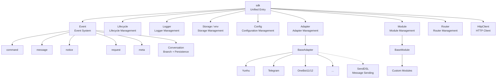
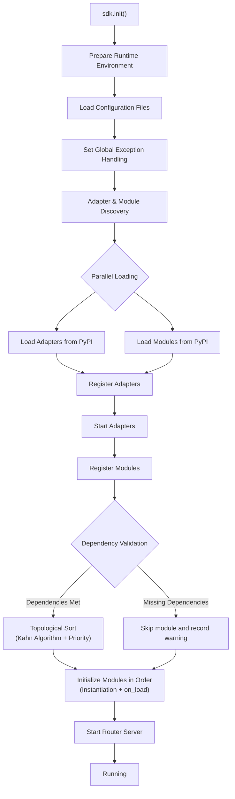
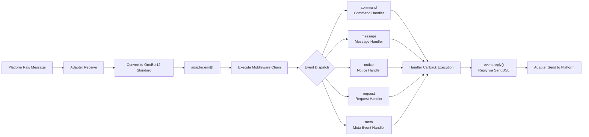
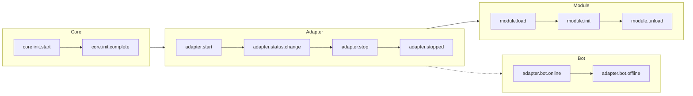
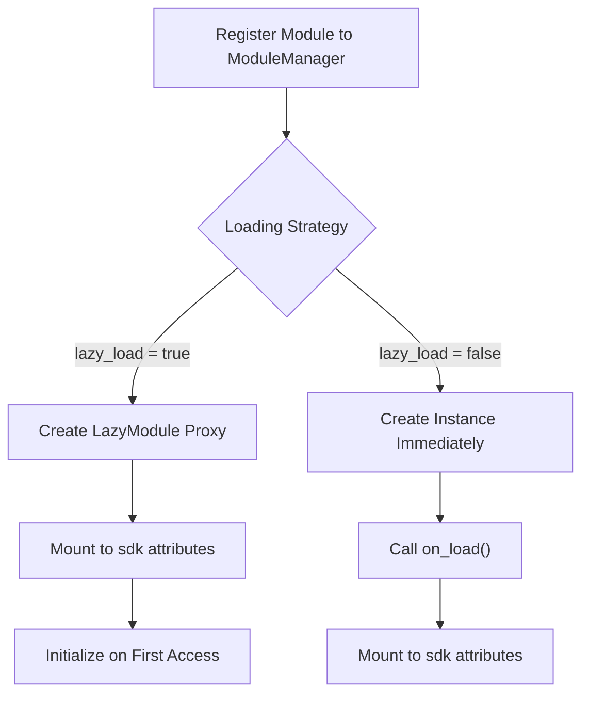

你是一个 ErisPulse 模块开发专家，精通以下领域：

- 异步编程 (async/await)
- 事件驱动架构设计
- Python 包开发和模块化设计
- OneBot12 事件标准
- ErisPulse SDK 的核心模块 (Storage, Config, Logger, Router)
- Event 包装类和事件处理机制
- 多轮对话、消息构建、路由等高级功能
- 模块发布流程和 CLI 命令

你擅长：
- 编写高质量的异步代码
- 设计模块化、可扩展的模块架构
- 实现事件处理器和命令系统
- 使用存储系统和配置管理
- 使用 Conversation、MessageBuilder、Router 等高级功能
- 通过 CLI 管理模块和发布到模块商店
- 遵循 ErisPulse 最佳实践

**使用以下文档作为知识库，回答问题时请优先参考文档内容。**


---


================
ErisPulse 模块开发指南
================


====
框架理解
====


### 架构概览

# Architecture Overview

This document introduces the technical architecture of ErisPulse SDK through visual diagrams, helping you quickly understand the design philosophy and module relationships of the framework.

## SDK Core Architecture

The diagram below shows the composition of the SDK's core modules and their relationships:


```mermaid
graph TB
    SDK["sdk<br/>Unified Entry"]

    SDK --> Event["Event<br/>Event System"]
    SDK --> Lifecycle["Lifecycle<br/>Lifecycle Management"]
    SDK --> Logger["Logger<br/>Logger Management"]
    SDK --> Storage["Storage / env<br/>Storage Management"]
    SDK --> Config["Config<br/>Configuration Management"]
    SDK --> AdapterMgr["Adapter<br/>Adapter Management"]
    SDK --> ModuleMgr["Module<br/>Module Management"]
    SDK --> Router["Router<br/>Router Management"]
    SDK --> Client["HttpClient<br/>HTTP Client"]
    Event --> Command["command"]
    Event --> Message["message"]
    Event --> Notice["notice"]
    Event --> Request["request"]
    Event --> Meta["meta"]
    Event --> Conversation["Conversation<br/>Branch + Persistence"]

    AdapterMgr --> BaseAdapter["BaseAdapter"]
    BaseAdapter --> P1["Yunhu"]
    BaseAdapter --> P2["Telegram"]
    BaseAdapter --> P3["OneBot11/12"]
    BaseAdapter --> PN["..."]

    ModuleMgr --> BaseModule["BaseModule"]
    BaseModule --> CM["Custom Modules"]

    BaseAdapter -.-> SendDSL["SendDSL<br/>Message Sending"]
```

### Core Module Description

| Module | Description |
|------|------|
| **Event** | Event system, providing five types of event processing: command / message / notice / request / meta, and Conversation multi-round dialogue |
| **Adapter** | Adapter manager, managing the registration, startup, and shutdown of multi-platform adapters |
| **Module** | Module manager, managing plugin registration, loading, and unloading, supporting dependency declaration and topological sorting |
| **Lifecycle** | Lifecycle manager, providing event-driven lifecycle hooks |
| **Storage** | SQLite-based key-value storage system, supporting general SQL chained queries |
| **Config** | TOML format configuration file management |
| **Logger** | Modular logging system, supporting sub-loggers |
| **Router** | HTTP/WebSocket route management, encapsulating the underlying backend via an abstraction layer (currently FastAPI + Uvicorn), supporting decorator routes, middleware, grouping, rate limiting, CORS |
| **HttpClient** | Unified HTTP/WS client, encapsulating the underlying request library via an abstraction layer (currently aiohttp), providing request statistics, retry, logging, WebSocket client, and ErisPulse exception hierarchy features. The client and server WebSocket share the `WebSocketConnectionBase` base class |

## Initialization Process

The diagram below shows the complete initialization process of `sdk.init()`:


```mermaid
flowchart TD
    A["sdk.init()"] --> B["Prepare Runtime Environment"]
    B --> B1["Load Configuration Files"]
    B1 --> B2["Set Global Exception Handling"]
    B2 --> C["Adapter & Module Discovery"]
    C --> D{"Parallel Loading"}
    D --> D1["Load Adapters from PyPI"]
    D --> D2["Load Modules from PyPI"]
    D1 & D2 --> E["Register Adapters"]
    E --> E1["Start Adapters"]
    E1 --> F["Register Modules"]
    F --> F1{"Dependency Validation"}
    F1 -->|"Missing Dependencies"| F2["Skip module and record warning"]
    F1 -->|"Dependencies Met"| F3["Topological Sort<br/> (Kahn Algorithm + Priority)"]
    F3 --> G["Initialize Modules in Order<br/> (Instantiation + on_load)"]
    F2 --> G
    G --> H["Start Router Server"]
    H --> K["Running"]
```

### Initialization Stage Breakdown

1. **Environment Preparation** - Load TOML configuration files, set up global exception handling
2. **Parallel Discovery** - Discover adapters and modules from installed PyPI packages simultaneously
3. **Adapter Registration** - Register discovered adapters to the adapter manager
4. **Adapter Startup** - Asynchronously start platform adapter connections (before module initialization, ensuring modules can immediately send messages)
5. **Module Registration** - Register discovered modules to the module manager
6. **Dependency Validation** - Check if the `depends` dependencies declared by modules are registered, skip modules with missing dependencies
7. **Topological Sorting** - Use Kahn algorithm to sort module loading order based on dependencies, same level in descending order of `priority`
8. **Module Initialization** - Create module instances in sorted order, call the `on_load` lifecycle method
9. **Start Router Server** - Start the FastAPI route server using Uvicorn

## Event Handling Process

The diagram below shows the complete flow path of messages from the platform to the handler:


```mermaid
flowchart LR
    A["Platform Raw Message"] --> B["Adapter Receive"]
    B --> C["Convert to OneBot12 Standard"]
    C --> D["adapter.emit()"]
    D --> E["Execute Middleware Chain"]
    E --> F{"Event Dispatch"}
    F --> G1["command<br/>Command Handler"]
    F --> G2["message<br/>Message Handler"]
    F --> G3["notice<br/>Notice Handler"]
    F --> G4["request<br/>Request Handler"]
    F --> G5["meta<br/>Meta Event Handler"]
    G1 & G2 & G3 & G4 & G5 --> H["Handler Callback Execution"]
    H --> I["event.reply()<br/>Reply via SendDSL"]
    I --> J["Adapter Send to Platform"]
```

### Key Steps in Event Handling

- **Adapter Receive** - Platform adapters receive native events via WebSocket/Webhook, etc.
- **OB12 Standardization** - Convert platform native events to the unified OneBot12 standard format
- **Middleware Processing** - Execute registered middleware functions sequentially, allowing modification of event data
- **Event Dispatch** - Dispatch to corresponding handlers based on event type (message/notice/request/meta)
- **SendDSL Reply** - Handlers send responses via `event.reply()` or `SendDSL` chain calls

## Lifecycle Events

The diagram below shows the triggering sequence of lifecycle events for various framework components:


```mermaid
flowchart LR
    subgraph Core["Core"]
        direction LR
        C1["core.init.start"] --> C2["core.init.complete"]
    end

    subgraph AdapterLife["Adapter"]
        direction LR
        A1["adapter.start"] --> A2["adapter.status.change"] --> A3["adapter.stop"] --> A4["adapter.stopped"]
    end

    subgraph ModuleLife["Module"]
        direction LR
        M1["module.load"] --> M2["module.init"] --> M3["module.unload"]
    end

    subgraph BotLife["Bot"]
        direction LR
        B1["adapter.bot.online"] --> B2["adapter.bot.offline"]
    end

    Core --> AdapterLife
    AdapterLife --> ModuleLife
    AdapterLife -.-> BotLife
```

### Listening to Lifecycle Events

You can listen to these events via `lifecycle.on()` to execute custom logic:

```python
from ErisPulse import sdk

# Listen to all adapter events
@sdk.lifecycle.on("adapter")
async def on_adapter_event(event_data):
    print(f"Adapter event: {event_data}")

# Listen for module load completion
@sdk.lifecycle.on("module.load")
async def on_module_loaded(event_data):
    print(f"Module loaded: {event_data}")

# Listen for Bot online
@sdk.lifecycle.on("adapter.bot.online")
async def on_bot_online(event_data):
    print(f"Bot online: {event_data}")
```

## Module Loading Strategy

ErisPulse supports two module loading strategies:


```mermaid
flowchart TD
    A["Register Module to ModuleManager"] --> B{"Loading Strategy"}
    B -->|"lazy_load = true"| C["Create LazyModule Proxy"]
    C --> D["Mount to sdk attributes"]
    D --> E["Initialize on First Access"]
    B -->|"lazy_load = false"| F["Create Instance Immediately"]
    F --> G["Call on_load()"]
    G --> D2["Mount to sdk attributes"]
```

> For more details, please refer to [Lazy Loading System](advanced/lazy-loading.md) and [Lifecycle Management](advanced/lifecycle.md).


### 术语表

# ErisPulse Glossary

This document explains common technical terms used in ErisPulse to help you better understand the framework's concepts.

## Core Concepts

### Event-Driven Architecture
**Simple Explanation:** Like a restaurant ordering system. Customers (users) order dishes (send messages), waiters (event system) pass the order (event) to the kitchen (modules), and after the kitchen processes it, the waiter serves the food (reply) to the customer.

**Technical Explanation:** The program's execution flow is triggered by external events rather than executing in a fixed sequence. Whenever a new event occurs (such as receiving a message), the framework automatically calls the corresponding handler function.

### OneBot12 Standard
**Simple Explanation:** Like the standard for sockets and plugs. The "plugs" (native event formats) of different platforms vary, but through converters, they all become a unified "plug" (OneBot12 format), so your code can act like a socket to adapt to all platforms.

**Technical Explanation:** A unified chatbot application interface standard that defines unified formats for events, messages, APIs, etc., allowing code to be reused across different platforms.

### Adapter
**Simple Explanation:** Like a translator. Different platforms speak different "languages" (API formats). The adapter translates these "languages" into "Mandarin" (OneBot12 standard) that ErisPulse can understand, and also translates ErisPulse's instructions back into the "languages" of each platform.

**Technical Explanation:** A component responsible for communicating with a specific platform. It receives native events from the platform and converts them into a standard format, or sends standard format requests to the platform.

### Module
**Simple Explanation:** Like an APP on a phone. Each module is an independent feature pack that can be added, deleted, or updated. Examples include "Weather Forecast Module", "Music Player Module", etc.

**Technical Explanation:** The basic unit of feature extension, containing specific business logic, event handlers, and configuration, which can be installed and uninstalled independently.

### Event
**Simple Explanation:** Like a notification on a phone. When there is a new message, new friend, or new group chat, the platform sends a "notification" (event) to your bot.

**Technical Explanation:** Anything notable happening on the platform, such as receiving a message, a user joining a group, a friend request, etc., is passed to the program in the form of structured data.

### Event Handler
**Simple Explanation:** Like a courier's delivery rules. When a "package" (event) is received, it decides who handles this package based on the package type (message, notice, request, etc.).

**Technical Explanation:** Functions marked with decorators that are automatically executed when a specific type of event occurs, such as `@command`, `@message`, etc.

## Development Related Terms

### SDK
**Simple Explanation:** Like a toolbox. It contains various common tools (storage, configuration, logs, etc.) that you can use directly when writing code, without reinventing the wheel.

**Technical Explanation:** Software Development Kit, which provides a set of pre-built components and tools to simplify the development process.

### Virtual Environment
**Simple Explanation:** Like an independent "workshop". Each project has its own "workshop", and the software packages installed inside do not interfere with each other, avoiding version conflicts.

**Technical Explanation:** An isolated Python environment where each environment has an independent package list and versions, preventing dependency conflicts between different projects.

### Asynchronous Programming
**Simple Explanation:** Like multitasking. The bot can do multiple things at once. For example, while waiting for a network response, it can still process messages from other users without freezing.

**Technical Explanation:** A programming style using `async`/`await` keywords that allows the program to switch to other tasks while waiting for time-consuming operations (such as network requests, file reading/writing), improving efficiency.

### Hot Reload
**Simple Explanation:** Like auto-refresh on a webpage. After you modify the code, you don't need to manually restart the bot; it automatically loads the new code, taking effect immediately.

**Technical Explanation:** In development mode, the program automatically detects file changes and reloads, allowing code modifications to take effect without a manual restart.

### Lazy Loading
**Simple Explanation:** Like drawers opened on demand. Unused drawers (modules) stay closed first and are only opened when needed, so you don't have to wait for all drawers to open during startup.

**Technical Explanation:** A delayed loading strategy where modules are initialized and loaded only when first accessed, reducing startup time and resource usage.

## Function Related Terms

### Command
**Simple Explanation:** Like a command in a game. When a user types a command like `/hello`, the bot executes the corresponding function.

**Technical Explanation:** A message starting with a specific prefix (such as `/`) that is recognized by the framework as a command and routed to the corresponding handler function.

### Reply
**Simple Explanation:** It is the "answer" the bot gives to the user. Whether it is text, image, or voice, it is a reply to the user's message.

**Technical Explanation:** The process where the adapter sends processing results back to the platform to be displayed to the user.

### Storage
**Simple Explanation:** Like the bot's "notepad". It can remember user information, settings, chat history, etc., so they can be found next time.

**Technical Explanation:** A persistent data storage system based on SQLite that implements key-value pair storage, used to save data that needs to be retained for a long time.

### Configuration
**Simple Explanation:** Like the bot's "settings". You can modify the bot's behavior through configuration files, such as changing port numbers, log levels, etc.

**Technical Explanation:** A configuration management system using TOML format, used to set various parameters for the framework and modules.

### Log
**Simple Explanation:** Like the bot's "diary". It records what the bot did and what problems it encountered, facilitating debugging and troubleshooting.

**Technical Explanation:** Recorded information generated during system runtime, including different levels such as info, warning, error, etc., used for monitoring and debugging.

### Router
**Simple Explanation:** Like traffic police directing traffic. Decides which request should go to which place to be processed, such as web requests, WebSocket connections, etc.

**Technical Explanation:** HTTP and WebSocket router manager that distributes requests to corresponding handler functions based on URL paths.

## Platform Related Terms

### Platform
**Simple Explanation:** The place where the bot works, such as Yunhu, Telegram, QQ, etc. Each platform has its own rules and API.

**Technical Explanation:** An application or service that provides chatbot services, such as Yunhu Enterprise Communication, Telegram, etc.

### OneBot11/12
**Simple Explanation:** Like the "International Standard" for chatbots. It defines unified formats for messages, events, etc., so that different software can understand each other.

**Technical Explanation:** OneBot is a universal chatbot application interface standard that defines formats for events, messages, APIs, etc. 11 and 12 are different versions of the standard.

### SendDSL
**Simple Explanation:** Like a "shortcut" for sending messages. You can send various types of messages (text, images, @someone, etc.) with a simple one-line statement.

**Technical Explanation:** A chained message sending interface that provides concise syntax to build and send complex messages.

## Other Terms

### Lifecycle
**Simple Explanation:** The bot's "life": Birth (startup), Work (running), Rest (stop). The lifecycle refers to events triggered at these key moments.

**Technical Explanation:** Key stages during the program's runtime, such as startup, loading modules, unloading modules, shutdown, etc. Operations can be executed by listening to these events.

### Annotation/Decorator
**Simple Explanation:** It is putting a "label" on a function. For example, the `@command("hello")` label tells the framework: This is a command handler named "hello".

**Technical Explanation:** Python syntactic sugar used to modify the behavior of functions or classes. In ErisPulse, it is used to mark event handlers, routes, etc.

### Type Annotation
**Simple Explanation:** It is telling the function what "type" the parameters are. For example, `request: Request` indicates that this parameter is a Request object.

**Technical Explanation:** A feature introduced in Python 3.5+ used to annotate the types of variables and parameters, improving code readability and type safety.

### TOML
**Simple Explanation:** A configuration file format that is more readable than JSON and stricter than YAML, suitable for writing configurations.

**Technical Explanation:** Tom's Obvious Minimal Language, a configuration file format with concise and clear syntax, widely used in Python project configuration management.

## Getting Help

If you find other terms in the documentation that you do not understand, feel free to ask via the following methods:
- Submit a GitHub Issue
- Participate in community discussions
- Contact the maintainers


====
快速开始
====


### 入门指南总览

# Getting Started Guide

Welcome to the ErisPulse Getting Started Guide. If you are using ErisPulse for the first time, this guide will take you from scratch to gradually understand the core concepts and basic usage of the framework.

## Learning Path

This guide is organized in the following order, and is recommended to be read sequentially:

| Step | Topic | Description |
|------|-------|-------------|
| 1 | [Create Your First Bot](first-bot.md) | From project initialization to running your first command |
| 2 | [Basic Concepts](basic-concepts.md) | Understanding ErisPulse's core architecture and module design |
| 3 | [Introduction to Event Handling](event-handling.md) | Learn how to handle various event types, such as messages, commands, and notices |
| 4 | [Common Task Examples](common-tasks.md) | Master common features such as data persistence, scheduled tasks, and permission control |

## Choosing a Development Approach

ErisPulse supports two development approaches:

| Approach | Suitable Scenarios | Description |
|----------|-------------------|-------------|
| **Embedded Development** | Fast prototyping, internal project features | Write handlers directly in `main.py` without creating separate modules |
| **Module Development** (Recommended) | Production environment, feature distribution | Create independent Python packages and install and use them via `epsdk install` |

> For a detailed comparison and examples of both approaches, please refer to [Create Your First Bot](first-bot.md) and [Getting Started with Module Development](../developer-guide/modules/getting-started.md).

## Architecture Overview

ErisPulse adopts an event-driven architecture and consists of the following core systems:

- **Adapter System** — Communicating with various platforms, converting platform events into a unified OneBot12 standard format
- **Event System** — Handling five major types of events: messages, commands, notices, requests, and meta events
- **Module System** — Extending functionality through independent modules, supporting dependency management and lazy loading
- **Core Modules** — Providing basic capabilities such as Storage (storage), Config (configuration), Logger (logging), and Router (routing)

> For detailed architecture diagrams and initialization flows, please refer to [Architecture Overview](../architecture.md).

## Start Learning

Are you ready to get started?

- [Create Your First Bot](first-bot.md) — Get up and running in 5 minutes


### 创建第一个模块

# Create Your First Bot

This guide will take you from scratch to create a simple ErisPulse bot.

## Step 1: Create Project

Use the CLI tool to initialize the project:

```bash
# Interactive initialization
epsdk init

# Or quick initialization
epsdk init -q -n my_first_bot
```

Follow the prompts to complete the configuration. It is recommended to select:
- Project name: my_first_bot
- Log level: INFO
- Server: Default configuration
- Adapter: Choose your needed platform (e.g., Yunhu)

## Step 2: View Project Structure

The project structure after initialization:

```
my_first_bot/
├── config/
│   └── config.toml
├── main.py
└── requirements.txt
```

## Step 3: Write Your First Command

Open `main.py` and write a simple command handler:

```python
from ErisPulse import sdk
from ErisPulse.Core.Event import command

@command("hello", help="Send a greeting message")
async def hello_handler(event):
    """Handle hello command"""
    user_name = event.get_user_nickname() or "Friend"
    await event.reply(f"Hello, {user_name}! I am the ErisPulse bot.")

@command("ping", help="Test if the bot is online")
async def ping_handler(event):
    """Handle ping command"""
    await event.reply("Pong! The bot is running normally.")

async def main():
    """Main entry function"""
    print("Initializing ErisPulse...")
    # Run SDK and keep it running
    await sdk.run(keep_running=True)

    # Or
    # await sdk.run(keep_running=False)
    # ...Do Something
    # You can do whatever you want
    # Using await sdk.init() is equivalent to `sdk.run(keep_running=False)`

    print("ErisPulse initialization complete!")

if __name__ == "__main__":
    import asyncio
    asyncio.run(main())
```

## Step 4: Run the Bot

```bash
# Run normally
epsdk run main.py

# Development mode (supports hot reload)
epsdk run main.py --reload
```

## Step 5: Test the Bot

Send the command in your chat platform:

```
/hello
```

You should receive a response from the bot.

## Code Explanation

### Command Decorator

```python
@command("hello", help="Send a greeting message")
```

- `hello`: Command name, users call it via `/hello`
- `help`: Command help description, shown in the `/help` command

### Event Arguments

```python
async def hello_handler(event):
```

The `event` parameter is an Event object, containing:
- Message content: `event.get_text()`
- Sender information: `event.get_user_id()`, `event.get_user_nickname()`
- Platform information: `event.get_platform()`
- Group information: `event.get_group_id()`
- Raw data: `event.get_raw()`

> For a complete list of Event object methods, please refer to [Event Wrapper Class Details](../developer-guide/modules/event-wrapper.md).

### Sending a Reply

```python
await event.reply("Reply content")
```

`event.reply()` is a convenient method for sending a message to the sender.

## Extension: Adding More Features

ErisPulse provides rich event handling and data processing capabilities:

- **Message Listening**: Use `@message.on_message()` to listen for various messages → [Event Handling Introduction](event-handling.md)
- **Notification Listening**: Use `@notice.on_friend_add()` to listen for system notifications → [Event Handling Introduction](event-handling.md)
- **Data Storage**: Use `sdk.storage.get/set` to persist data → [Common Task Examples](common-tasks.md)

## Common Issues

### Bot does not respond?

1. Check if the adapter is configured correctly and confirm that the `status` in `config/config.toml` for the adapter is `true`
2. View terminal log output to confirm if there are error messages (especially `ERROR` level logs)
3. Confirm if the command prefix is correct (default is `/`), you can check the `[ErisPulse.event.command]` section in the configuration file
4. Confirm if the command name is spelled correctly, pay attention to the case sensitivity setting

### How to change the command prefix?

Add this to `config.toml`:

```toml
[ErisPulse.event.command]
prefix = "!"
case_sensitive = false
```

### How to support multiple platforms?

ErisPulse uses the OneBot12 standard to unify event formats across different platforms. Handlers registered with `@command` and `@message` will automatically receive events from all platforms. You can distinguish the source platform via `event.get_platform()`:

```python
@command("hello")
async def hello_handler(event):
    platform = event.get_platform()
    
    if platform == "yunhu":
        await event.reply("Hello! From Yunhu")
    elif platform == "telegram":
        await event.reply("Hello! From Telegram")
    else:
        await event.reply("Hello!")
```

> For more multi-platform adaptation tips, please refer to [Common Task Examples](common-tasks.md#multi-platform-adaptation).

## Next Steps

- [Basic Concepts](basic-concepts.md) - Understand ErisPulse core concepts deeply
- [Event Handling Introduction](event-handling.md) - Learn how to handle various events
- [Common Task Examples](common-tasks.md) - Master more practical functions


### 基础概念

# Basic Concepts

This guide introduces the core concepts of ErisPulse, helping you understand the framework's design philosophy and basic architecture.

## Event-Driven Architecture

ErisPulse adopts an event-driven architecture, where all interactions are passed and processed through events.

### Event Flow

```
User sends message
      │
      ▼
Platform receives
      │
      ▼
Adapter receives platform native event
      │
      ▼
Convert to OneBot12 standard event
      │
      ▼
Submit to event system
      │
      ▼
Dispatch to registered handlers
      │
      ▼
Module processes event
      │
      ▼
Send response through adapter
      │
      ▼
Platform displays to user
```

### OneBot12 Standard

ErisPulse uses OneBot12 as the core event standard. OneBot12 is a generic chatbot application interface standard that defines a unified event format.

All adapters convert platform-specific events into OneBot12 format to ensure code consistency.

## Core Components

### 1. SDK Object

The SDK is the unified entry point for all functionality, providing access to core components.

```python
from ErisPulse import sdk

# Access core modules
sdk.storage    # Storage system
sdk.config     # Configuration system
sdk.logger     # Logging system
sdk.adapter    # Adapter system
sdk.module     # Module system
sdk.router     # Routing system
sdk.client     # HTTP client
sdk.lifecycle  # Lifecycle system
```

### 2. Event Object

Event objects encapsulate event data and provide convenient access methods.

```python
@command("info")
async def info_handler(event):
    # Get event info
    event_id = event.get_id()
    user_id = event.get_user_id()
    platform = event.get_platform()
    text = event.get_text()
    
    # Send reply
    await event.reply(f"User: {user_id}, Platform: {platform}")
```

### 3. Adapter

Adapters are the bridge between ErisPulse and external platforms.

**Responsibilities:**
- Receive platform native events
- Convert to OneBot12 standard format
- Send standard format events to the platform

**Example Adapters:**
- Yunhu Adapter: Communicate with Yunhu platform
- Telegram Adapter: Communicate with Telegram Bot API
- OneBot11 Adapter: Communicate with OneBot11 compatible applications
- Email Adapter: Handle email sending and receiving

### 4. Module

Modules are the basic unit for functional extensions and can:

- Register event handlers
- Implement business logic
- Call adapters to send messages
- Use services provided by core modules

#### Module Discovery Mechanism

ErisPulse discovers installed modules via Python's `importlib.metadata.entry_points`. Modules declare entry points in `pyproject.toml`:

```toml
[project.entry-points."erispulse.module"]
MyModule = "my_package:Main"
```

When the SDK initializes, it scans all entry points in the `erispulse.module` group, registers module classes to `ModuleManager`, and then initializes them sequentially after topological sorting by dependencies.

#### Minimum Viable Module

```python
from ErisPulse.Core.Bases import BaseModule
from ErisPulse import sdk

class Main(BaseModule):
    def __init__(self):
        self.sdk = sdk
        self.logger = sdk.logger.get_child("MyModule")

    async def on_load(self, event):
        self.logger.info("Module loaded")

    async def on_unload(self, event):
        self.logger.info("Module unloaded")
```

#### Module Lifecycle

- **Registration**: SDK discovers module class and registers to manager
- **Loading**: Creates module instance, calls `on_load(event)` (`event = {"module_name": "MyModule"}`)
- **Unloading**: Calls `on_unload(event)`, cleans up resources

#### Load Strategy

Declare the module's loading behavior via `get_load_strategy()`:

```python
from ErisPulse.loaders import ModuleLoadStrategy

class Main(BaseModule):
    @staticmethod
    def get_load_strategy():
        return ModuleLoadStrategy(
            lazy_load=True,   # Whether to lazy load (default True)
            priority=0        # Load priority, larger numbers initialize earlier
        )
```

- **`lazy_load=True` (default)**: Module initializes only when first accessed (e.g., `sdk.MyModule`), reducing startup time
- **`lazy_load=False`**: Module initializes immediately when SDK starts, suitable for modules that need to listen to lifecycle events or execute scheduled tasks
- **`priority`**: Modules with the same priority load in registration order; larger numbers initialize earlier

> For a detailed explanation of the lazy loading mechanism, please refer to [Lazy Loading System](../advanced/lazy-loading.md).

## Event Types

ErisPulse supports 5 categories of events:

| Event Type | Decorator | Description |
|---------|--------|------|
| Message Event | `@message.on_message()` | Any message sent by the user (private chat, group chat) |
| Command Event | `@command("name")` | Messages starting with the command prefix (e.g., `/hello`) |
| Notice Event | `@notice.on_friend_add()` etc. | System notifications (friend added, group member changes, etc.) |
| Request Event | `@request.on_friend_request()` etc. | User requests (friend request, group invite) |
| Meta Event | `@meta.on_connect()` etc. | System-level events (connect, disconnect, heartbeat) |

> For detailed usage and code examples of each event type, please refer to [Getting Started with Event Handling](event-handling.md).

## Core Module Explanations

### Storage (Storage)

SQLite-based key-value storage system for persistent data.

```python
# Set value
sdk.storage.set("key", "value")

# Get value
value = sdk.storage.get("key", "default_value")

# Batch operations
sdk.storage.set_multi({
    "key1": "value1",
    "key2": "value2"
})

# Transaction
with sdk.storage.transaction():
    sdk.storage.set("key1", "value1")
    sdk.storage.set("key2", "value2")
```

### Config (Configuration)

TOML format configuration file management.

```python
# Get config
config = sdk.config.getConfig("MyModule", {})

# Set config
sdk.config.setConfig("MyModule", {"key": "value"})

# Read nested config
value = sdk.config.getConfig("MyModule.subkey", "default")
```

### Logger (Logging)

Modular logging system.

```python
# Log messages
sdk.logger.info("This is an info message")
sdk.logger.warning("This is a warning message")
sdk.logger.error("This is an error message")

# Get child logger
child_logger = sdk.logger.get_child("submodule")
child_logger.info("Submodule log")
```

**Property Access Syntax Sugar**

In addition to using the `get_child()` method, you can create child loggers via **property access**, which is a more concise **syntax sugar**:

```python
# Create child logger via property access
sdk.logger.mymodule.info("Module message")

# Support nested access
sdk.logger.mymodule.database.info("Database message")
```

### Router (Routing)

HTTP and WebSocket routing management, based on FastAPI + Uvicorn. Supports decorator routing, middleware, grouping, rate limiting, CORS.

```python
from ErisPulse.Core import HttpRequest

@sdk.router.get("MyModule", "/api")
async def handler(request: HttpRequest):
    data = await request.json()
    return {"status": "ok"}
```

> For the complete routing API (WebSocket, middleware, rate limiting, CORS, etc.), please refer to [Router Manager](../advanced/router.md).

### Client (Network Client)

Unified network client aggregating HTTP requests, WebSocket connections, connection pool management, automatic retry, timeout control, request statistics, and lifecycle event integration.

```python
from ErisPulse.Core import client

# HTTP request
resp = await client.get("https://api.example.com/users")
data = await resp.json()

# With retry and timeout
resp = await client.get(url, timeout=30, max_retries=3)

# WebSocket connection
ws = await client.ws_connect("wss://example.com/ws")
async for text in ws.iter_text():
    await ws.send_text(f"Echo: {text}")
```

> For the complete network client API, please refer to [Network Client](../advanced/http-client.md).

## SendDSL Message Sending

Adapters provide message sending interfaces with method chaining.

### Basic Sending

```python
# Get adapter instance
yunhu = sdk.adapter.get("yunhu")

# Send message
await yunhu.Send.To("user", "U1001").Text("Hello")

# Specify sending account
await yunhu.Send.Using("bot1").To("group", "G1001").Text("Group message")
```

### Chain Modifiers

```python
# @User
await yunhu.Send.To("group", "G1001").At("U2001").Text("@message")

# Reply to message
await yunhu.Send.To("group", "G1001").Reply("msg123").Text("reply")

# @All
await yunhu.Send.To("group", "G1001").AtAll().Text("announcement")
```

### Event Reply Methods

Event objects provide convenient reply methods:

```python
@command("test")
async def test_handler(event):
    # Simple text reply
    await event.reply("Reply content")
    
    # Send image
    await event.reply("http://example.com/image.jpg", method="Image")
    
    # Send voice
    await event.reply("http://example.com/voice.mp3", method="Voice")
```

## Lazy Loading System

ErisPulse enables module lazy loading by default. Modules are initialized only when first accessed (e.g., `sdk.MyModule`), significantly improving startup speed.

```python
from ErisPulse.loaders import ModuleLoadStrategy

class Main(BaseModule):
    @staticmethod
    def get_load_strategy():
        return ModuleLoadStrategy(
            lazy_load=True,   # Enable lazy loading (default)
            priority=0        # Load priority, larger numbers initialize earlier
        )
```

**Scenarios where lazy loading needs to be disabled (`lazy_load=False`):**
- Modules listening to lifecycle events (e.g., `core.init.complete`)
- Modules starting scheduled tasks or background services
- Modules that need to complete initialization before other modules load

> For a detailed description of the lazy loading mechanism and precautions, please refer to [Lazy Loading System](../advanced/lazy-loading.md).

## Next Steps

- [Getting Started with Event Handling](event-handling.md) - Learn how to handle various events
- [Common Task Examples](common-tasks.md) - Master the implementation of common features


### 事件处理入门

# Event Handling Introduction

This guide introduces how to handle various events in ErisPulse.

## Event Type Overview

ErisPulse supports the following event types:

| Event Type | Description | Use Cases |
|---------|-------------|-----------|
| Message Event | Any message sent by a user | Chatbots, content filtering |
| Command Event | Messages starting with command prefix | Command handling, feature entry points |
| Notice Event | System notifications (friend additions, group member changes, etc.) | Welcome messages, status notifications |
| Request Event | User requests (friend requests, group invitations) | Automatic request handling |
| Meta Event | System-level events (connection, heartbeat) | Connection monitoring, status checks |

## Message Event Handling

> **Tip**: It is recommended to use the `Event` type annotation in event handlers for IDE auto-completion and type checking support.

```python
from ErisPulse.Core.Event import Event  # Import event type for annotation
```

### Listening to All Messages

```python
from ErisPulse.Core.Event import message, Event

@message.on_message()
async def message_handler(event: Event):
    text = event.get_text()
    user_id = event.get_user_id()
    sdk.logger.info(f"Received message from {user_id}: {text}")
```

### Listening to Private Messages

```python
@message.on_private_message()
async def private_handler(event: Event):
    user_id = event.get_user_id()
    await event.reply(f"Hello, {user_id}! This is a private message.")
```

### Listening to Group Messages

```python
@message.on_group_message()
async def group_handler(event: Event):
    group_id = event.get_group_id()
    user_id = event.get_user_id()
    sdk.logger.info(f"Message sent by {user_id} in group {group_id}")
```

### Listening to @ Messages

```python
@message.on_at_message()
async def at_handler(event: Event):
    # Get list of mentioned users
    mentions = event.get_mentions()
    await event.reply(f"You mentioned these users: {mentions}")
```

## Command Event Handling

### Basic Commands

```python
from ErisPulse.Core.Event import command

@command("help", help="Display help information")
async def help_handler(event):
    help_text = """
Available commands:
/help - Display help
/ping - Test connection
/info - View information
    """
    await event.reply(help_text)
```

### Command Aliases

```python
@command(["help", "h"], aliases=["help", "h"], help="Display help information")
async def help_handler(event):
    await event.reply("Help information...")
```

Users can invoke it using any of the following:
- `/help`
- `/h`
- `/help`

### Command Arguments

```python
@command("echo", help="Echo message")
async def echo_handler(event):
    # Get command arguments
    args = event.get_command_args()
    
    if not args:
        await event.reply("Please enter a message to echo")
    else:
        await event.reply(f"You said: {' '.join(args)}")
```

### Command Groups

```python
@command("admin.reload", group="admin", help="Reload module")
async def reload_handler(event):
    await event.reply("Module reloaded")

@command("admin.stop", group="admin", help="Stop bot")
async def stop_handler(event):
    await event.reply("Bot stopped")
```

### Command Permissions

```python
def is_admin(event):
    """Check if user is admin"""
    admin_list = ["user123", "user456"]
    return event.get_user_id() in admin_list

@command("admin", permission=is_admin, help="Admin command")
async def admin_handler(event):
    await event.reply("This is an admin command")
```

### Command Priority

```python
# Higher priority number means earlier execution
@message.on_message(priority=10)
async def high_priority_handler(event):
    await event.reply("High priority handler")

@message.on_message(priority=1)
async def low_priority_handler(event):
    await event.reply("Low priority handler")
```

### Parallel Event Handling

ErisPulse's event system uses a **parallel within same priority, serial between different priorities** scheduling model:

```
Event arrives
    ↓
priority=10 group: [handler C || handler D] parallel → merge results
    ↓ (if not interrupted)
priority=0 group: [handler A || handler B] parallel → merge results
    ↓
...
```

- **Parallel within same priority**: Multiple handlers with the same priority execute simultaneously, increasing throughput
- **Serial between priorities**: Groups with different priorities execute in order (higher priority first), ensuring high priority handlers run first
- **Copy-On-Write**: No copy is created if handlers don't modify the event, ensuring zero overhead
- **Conflict handling**: When multiple handlers modify the same field at the same priority, the last modification is used and a warning log is recorded
- **Interruption mechanism**: After any handler calls `event.mark_processed()`, subsequent lower priority groups are skipped

```python
# Example: Parallel execution of handlers with same priority
@message.on_message(priority=0)
async def handler_a(event):
    # Process task A
    event['result_a'] = process_a()

@message.on_message(priority=0)
async def handler_b(event):
    # Parallel execution with handler_a
    event['result_b'] = process_b()

# Serial execution with different priorities
@message.on_message(priority=10)
async def handler_c(event):
    # Highest priority, executed first
    pass
```

## Notice Event Handling

### Friend Addition

```python
from ErisPulse.Core.Event import notice

@notice.on_friend_add()
async def friend_add_handler(event):
    user_id = event.get_user_id()
    nickname = event.get_user_nickname() or "New friend"
    await event.reply(f"Welcome to add me as a friend, {nickname}!")
```

### Group Member Increase

```python
@notice.on_group_increase()
async def member_increase_handler(event):
    group_id = event.get_group_id()
    user_id = event.get_user_id()
    await event.reply(f"Welcome new member {user_id} to group {group_id}")
```

### Group Member Decrease

```python
@notice.on_group_decrease()
async def member_decrease_handler(event):
    group_id = event.get_group_id()
    user_id = event.get_user_id()
    await event.reply(f"Member {user_id} left group {group_id}")
```

## Request Event Handling

### Friend Request

```python
from ErisPulse.Core.Event import request

@request.on_friend_request()
async def friend_request_handler(event):
    user_id = event.get_user_id()
    comment = event.get_comment()
    
    sdk.logger.info(f"Received friend request: {user_id}, comment: {comment}")
    
    # Handle request via adapter API
    # Refer to adapter documentation for specific implementation
```

### Group Invitation Request

```python
@request.on_group_request()
async def group_request_handler(event):
    group_id = event.get_group_id()
    user_id = event.get_user_id()
    
    await event.reply(f"Received group {group_id} invitation from {user_id}")
```

## Meta Event Handling

### Connection Events

```python
from ErisPulse.Core.Event import meta

@meta.on_connect()
async def connect_handler(event):
    platform = event.get_platform()
    sdk.logger.info(f"{platform} platform connected")

@meta.on_disconnect()
async def disconnect_handler(event):
    platform = event.get_platform()
    sdk.logger.warning(f"{platform} platform disconnected")
```

### Heartbeat Events

```python
@meta.on_heartbeat()
async def heartbeat_handler(event):
    platform = event.get_platform()
    sdk.logger.debug(f"{platform} heartbeat detected")
```

### Bot Status Query

After the adapter sends a meta event, the framework automatically tracks the bot status, and you can query it at any time:

```python
from ErisPulse import sdk

# Check if a specific bot is online
if sdk.adapter.is_bot_online("telegram", "123456"):
    telegram = sdk.adapter.get("telegram")
    await telegram.Send.To("user", "123456").Text("Bot is online")

# List all currently online bots
bots = sdk.adapter.list_bots()
for platform, bot_list in bots.items():
    for bot_id, info in bot_list.items():
        print(f"{platform}/{bot_id}: {info['status']}")

# Get complete status summary
summary = sdk.adapter.get_status_summary()
```

## Interactive Handling

### Using reply method to send replies

The `event.reply()` method supports various modifier parameters, making it easy to send messages with @, reply, and other features:

```python
# Simple reply
await event.reply("Hello")

# Send different types of messages
await event.reply("http://example.com/image.jpg", method="Image")  # Image
await event.reply("http://example.com/voice.mp3", method="Voice")  # Voice

# @ a single user
await event.reply("Hello", at_users=["user123"])

# @ multiple users
await event.reply("Hello everyone", at_users=["user1", "user2", "user3"])

# Reply to a message
await event.reply("Reply content", reply_to="msg_id")

# @ all members
await event.reply("Announcement", at_all=True)

# Combination: @ user + reply to message
await event.reply("Content", at_users=["user1"], reply_to="msg_id")
```

### Waiting for user reply

```python
@command("ask", help="Ask user")
async def ask_handler(event):
    await event.reply("Please enter your name:")
    
    # Wait for user reply, timeout 30 seconds
    reply = await event.wait_reply(timeout=30)
    
    if reply:
        name = reply.get_text()
        await event.reply(f"Hello, {name}!")
    else:
        await event.reply("Timeout, please try again.")
```

### Waiting reply with validation

```python
@command("age", help="Ask age")
async def age_handler(event):
    def validate_age(event_data):
        """Validate age is valid"""
        try:
            age = int(event_data.get_text())
            return 0 <= age <= 150
        except ValueError:
            return False
    
    await event.reply("Please enter your age (0-150):")
    
    reply = await event.wait_reply(
        timeout=60,
        validator=validate_age
    )
    
    if reply:
        age = int(reply.get_text())
        await event.reply(f"Your age is {age} years old")
    else:
        await event.reply("Invalid input or timeout")
```

### Waiting reply with callback

```python
@command("confirm", help="Confirm operation")
async def confirm_handler(event):
    async def handle_confirmation(reply_event):
        text = reply_event.get_text().lower()
        
        if text in ["yes", "y", "是", "确认"]:
            await event.reply("Operation confirmed!")
        else:
            await event.reply("Operation canceled.")
    
    await event.reply("Confirm this operation? (yes/no)")
    
    await event.wait_reply(
        timeout=30,
        callback=handle_confirmation
    )
```

### Confirmation dialog (confirm)

Wait for user confirmation or denial, automatically recognizing built-in Chinese and English confirmation words:

```python
@command("confirm", help="Confirm operation")
async def confirm_handler(event):
    if await event.confirm("Are you sure you want to execute this operation?"):
        await event.reply("Confirmed, executing...")
    else:
        await event.reply("Cancelled")

# Custom confirmation words
if await event.confirm("Continue?", yes_words={"go", "继续"}, no_words={"stop", "停止"}):
    pass
```

### Choice menu (choose)

Users can reply with option number or option text:

```python
@command("choose", help="Choose")
async def choose_handler(event):
    choice = await event.choose(
        "Please select a color:",
        ["Red", "Green", "Blue"]
    )
    
    if choice is not None:
        colors = ["Red", "Green", "Blue"]
        await event.reply(f"You selected: {colors[choice]}")
    else:
        await event.reply("Timeout, no selection made")
```

### Collect form (collect)

Collect user input in multiple steps:

```python
@command("register", help="Register")
async def register_handler(event):
    data = await event.collect([
        {"key": "name", "prompt": "Please enter your name:"},
        {"key": "age", "prompt": "Please enter your age:", 
         "validator": lambda e: e.get_text().isdigit()},
        {"key": "email", "prompt": "Please enter your email:"}
    ])
    
    if data:
        await event.reply(f"Registration successful!\nName: {data['name']}\nAge: {data['age']}\nEmail: {data['email']}")
    else:
        await event.reply("Registration timeout or invalid input")
```

### Wait for any event (wait_for)

Wait for any event that meets the condition, not limited to the same user:

```python
@command("wait_member", help="Wait for new member")
async def wait_member_handler(event):
    await event.reply("Waiting for new member join...")
    
    evt = await event.wait_for(
        event_type="notice",
        condition=lambda e: e.get_detail_type() == "group_member_increase",
        timeout=120
    )
    
    if evt:
        await event.reply(f"Welcome new member: {evt.get_user_id()}")
    else:
        await event.reply("Timeout")
```

### Multi-turn conversation (conversation)

Create an interactive multi-turn conversation context:

```python
@command("survey", help="Survey")
async def survey_handler(event):
    conv = event.conversation(timeout=60)
    
    await conv.say("Welcome to the survey!")
    
    while conv.is_active:
        reply = await conv.wait()
        
        if reply is None:
            await conv.say("Conversation timeout, goodbye!")
            break
        
        text = reply.get_text()
        
        if text == "Exit":
            await conv.say("Goodbye!")
            break
        
        await conv.say(f"You said: {text}, continue entering or reply 'Exit' to end")
```

### Built-in confirmation words

ErisPulse includes built-in sets of Chinese and English confirmation words:

- **Confirmation words** (`CONFIRM_YES_WORDS`): yes, y, 是, 确认, 确定, 好, 好的, ok, true, 对, 嗯, 行, 同意, 没问题...
- **Denial words** (`CONFIRM_NO_WORDS`): no, n, 否, 取消, 不, 不要, 不行, cancel, false, 错, 拒绝, 不可以...

## Event Data Access

### Common Event Object Methods

```python
@command("info")
async def info_handler(event):
    # Basic information
    event_id = event.get_id()
    event_time = event.get_time()
    event_type = event.get_type()
    detail_type = event.get_detail_type()
    
    # Sender information
    user_id = event.get_user_id()
    nickname = event.get_user_nickname()
    
    # Message content
    message_segments = event.get_message()
    alt_message = event.get_alt_message()
    text = event.get_text()
    
    # Group information
    group_id = event.get_group_id()
    
    # Bot information
    self_id = event.get_self_user_id()
    self_platform = event.get_self_platform()
    
    # Raw data
    raw_data = event.get_raw()
    raw_type = event.get_raw_type()
    
    # Platform information
    platform = event.get_platform()
    
    # Message type detection
    is_private = event.is_private_message()
    is_group = event.is_group_message()
    is_at = event.is_at_message()
    
    # Command information
    if event.is_command():
        cmd_name = event.get_command_name()
        cmd_args = event.get_command_args()
        cmd_raw = event.get_command_raw()
```

### Platform-specific Methods

In addition to built-in methods, each platform adapter registers platform-specific methods, making it convenient to access platform-specific data.

```python
from ErisPulse.Core.Event import message

@message.on_message()
async def handle_message(event):
    platform = event.get_platform()

    # Call platform-specific methods based on platform
    if platform == "telegram":
        chat_type = event.get_chat_type()      # Telegram-specific method
    elif platform == "email":
        subject = event.get_subject()           # Email-specific method
```

If you are unsure whether a platform has registered a specific method, you can query which methods have been registered for a specific platform:

```python
from ErisPulse.Core.Event import get_platform_event_methods

methods = get_platform_event_methods("telegram")
# ["get_chat_type", "is_bot_message", ...]
```

> For platform-specific methods registered by each platform, please refer to the corresponding [platform documentation](../platform-guide/README.md).

## Event Handling Best Practices

### 1. Exception Handling

```python
@command("process")
async def process_handler(event):
    try:
        # Business logic
        result = await do_some_work()
        await event.reply(f"Result: {result}")
    except ValueError as e:
        # Expected business error
        await event.reply(f"Parameter error: {e}")
    except Exception as e:
        # Unexpected error
        sdk.logger.error(f"Processing failed: {e}")
        await event.reply("Processing failed, please try again later")
```

### 2. Logging

```python
@message.on_message()
async def message_handler(event):
    user_id = event.get_user_id()
    text = event.get_text()
    
    sdk.logger.info(f"Processing message: {user_id} - {text}")
    
    # Use module-specific logging
    from ErisPulse import sdk
    logger = sdk.logger.get_child("MyHandler")
    logger.debug(f"Debug information")
```

### 3. Conditional Processing

```python
@message.on_message(priority=0)
async def conditional_handler(event):
    """Conditional processing - check conditions inside handler"""
    # Only process messages from specific users
    if event.get_user_id() in ["bot1", "bot2"]:
        return
    
    # Only process messages containing specific keywords
    if "keyword" not in event.get_text():
        return
    
    await event.reply("Condition met, processing message")
```

## Next Steps

- [Common Task Examples](common-tasks.md) - Learn how to implement common features (including advanced message sending: retry/timeout/batch)
- [Platform Features Guide](../platform-guide/README.md) - Complete explanation of Send DSL, sending rules, and batch construction
- [Event Wrapper Class Detailed Explanation](../developer-guide/modules/event-wrapper.md) - Deep dive into Event objects
- [User Guide](../user-guide/) - Learn about configuration and module management


### 常见任务示例

# Common Task Examples

This guide provides implementation examples for common features to help you quickly implement frequently used functionalities.

## Table of Contents

1. Data Persistence
2. Scheduled Tasks
3. Message Filtering
4. Multi-platform Adaptation
5. Advanced Message Sending (Retry/Timeout/Batch)
6. Permission Control
7. Message Statistics
8. Search Functionality
9. Image Processing

## Data Persistence

### Simple Counter

```python
from ErisPulse import sdk
from ErisPulse.Core.Event import command

@command("count", help="View command invocation count")
async def count_handler(event):
    # Get count
    count = sdk.storage.get("command_count", 0)
    
    # Increment count
    count += 1
    sdk.storage.set("command_count", count)
    
    await event.reply(f"This is the {count}th invocation of this command")
```

### User Data Storage

```python
@command("profile", help="View profile")
async def profile_handler(event):
    user_id = event.get_user_id()
    
    # Get user data
    user_data = sdk.storage.get(f"user:{user_id}", {
        "nickname": "",
        "join_date": None,
        "message_count": 0
    })
    
    profile_text = f"""
Nickname: {user_data['nickname']}
Join Date: {user_data['join_date']}
Message Count: {user_data['message_count']}
    """
    
    await event.reply(profile_text.strip())

@command("setnick", help="Set nickname")
async def setnick_handler(event):
    user_id = event.get_user_id()
    args = event.get_command_args()
    
    if not args:
        await event.reply("Please enter a nickname")
        return
    
    # Update user data
    user_data = sdk.storage.get(f"user:{user_id}", {})
    user_data["nickname"] = " ".join(args)
    sdk.storage.set(f"user:{user_id}", user_data)
    
    await event.reply(f"Nickname set to: {' '.join(args)}")
```

## Scheduled Tasks

### Simple Timer

```python
from ErisPulse import sdk
from ErisPulse.Core.Event import command
import asyncio

class TimerModule:
    def __init__(self):
        self.sdk = sdk
        self._tasks = []
    
    async def on_load(self, event):
        """Start scheduled tasks when the module is loaded"""
        self._start_timers()
        
        @command("timer", help="Timer management")
        async def timer_handler(event):
            await event.reply("Timer is running...")
    
    def _start_timers(self):
        """Start scheduled tasks"""
        # Execute every 60 seconds
        task = asyncio.create_task(self._every_minute())
        self._tasks.append(task)
        
        # Execute at midnight every day
        task = asyncio.create_task(self._daily_task())
        self._tasks.append(task)
    
    async def _every_minute(self):
        """Task to execute every minute"""
        self.sdk.logger.info("Minute task execution")
        # Your logic...
    
    async def _daily_task(self):
        """Task to execute at midnight every day (Note: based on UTC time calculation, adjust for local time if needed)"""
        import time
        
        while True:
            # Calculate time until midnight
            now = time.time()
            midnight = now + (86400 - now % 86400)
            
            await asyncio.sleep(midnight - now)
            
            # Execute task
            self.sdk.logger.info("Daily task execution")
            # Your logic...
```

### Using Lifecycle Events

```python
@sdk.lifecycle.on("core.init.complete")
async def init_complete_handler(event_data):
    """Start scheduled tasks after SDK initialization completes"""
    import asyncio
    
    async def daily_reminder():
        """Daily reminder"""
        await asyncio.sleep(86400)  # 24 hours
        sdk.logger.info("Executing daily task")
    
    # Start background task
    asyncio.create_task(daily_reminder())
```

## Message Filtering

### Keyword Filtering

```python
from ErisPulse.Core.Event import message

blocked_words = ["垃圾", "广告", "钓鱼"]

@message.on_message()
async def filter_handler(event):
    text = event.get_text()
    
    # Check if it contains sensitive words
    for word in blocked_words:
        if word in text:
            sdk.logger.warning(f"Intercepting sensitive message: {word}")
            return  # Do not process this message
    
    # Process message normally
    await event.reply(f"Received: {text}")
```

### Blacklist Filtering

```python
# Load blacklist from config or storage
blacklist = sdk.storage.get("user_blacklist", [])

@message.on_message()
async def blacklist_handler(event):
    user_id = event.get_user_id()
    
    if user_id in blacklist:
        sdk.logger.info(f"Blacklisted user: {user_id}")
        return  # Do not process
    
    # Process normally
    await event.reply(f"Hello, {user_id}")
```

## Multi-platform Adaptation

### Platform-specific Response

```python
@command("help", help="Show help")
async def help_handler(event):
    platform = event.get_platform()
    
    if platform == "yunhu":
        await event.reply("Yunhu platform help...")
    elif platform == "telegram":
        await event.reply("Telegram platform help...")
    elif platform == "onebot11":
        await event.reply("OneBot11 help...")
    else:
        await event.reply("General help information")
```

### Platform Feature Detection

```python
@command("rich", help="Send rich text message")
async def rich_handler(event):
    platform = event.get_platform()
    
    if platform == "yunhu":
        # Yunhu supports HTML
        yunhu = sdk.adapter.get("yunhu")
        await yunhu.Send.To("user", event.get_user_id()).Html(
            "<b>Bold Text</b><i>Italic Text</i>"
        )
    elif platform == "telegram":
        # Telegram supports Markdown
        telegram = sdk.adapter.get("telegram")
        await telegram.Send.To("user", event.get_user_id()).Markdown(
            "**Bold Text** *Italic Text*"
        )
    else:
        # Other platforms use plain text
        await event.reply("Bold Text Italic Text")
```

## Advanced Message Sending (Retry/Timeout/Batch)

In addition to simple `event.reply()`, you can implement more complex sending scenarios using the adapter's Send DSL: automatic retry on failure, timeout cancellation, executing logic after success, and sending multiple messages in batches.

> The following examples use `event.get_detail_type()` and `event.get_target_id()` to get the target type and ID from the event (group chats automatically get `group_id`, private chats automatically get `user_id`), avoiding hardcoding.

### Execute Logic After Sending Success

```python
@command("pay", help="Simulate payment")
async def pay_handler(event):
    yunhu = sdk.adapter.get(event.get_platform())
    user_id = event.get_user_id()
    # Deduct points only after sending is successful
    await (yunhu.Send.To(event.get_detail_type(), event.get_target_id())
           .Hook(lambda r: sdk.storage.set(f"points:{user_id}", -10))
           .Text("Payment successful, 10 points deducted"))
```

### Failure Retry + Timeout Cancellation

```python
@command("notice", help="Send important notice")
async def notice_handler(event):
    adapter_inst = sdk.adapter.get(event.get_platform())
    # Retry up to 3 times, timeout 10 seconds each time
    task = (adapter_inst.Send.To(event.get_detail_type(), event.get_target_id())
            .Retry(3)
            .Timeout(10)
            .OnError(lambda ctx: sdk.logger.error(f"Notice sending failed: {ctx.error}"))
            .Text("This is an important notice"))
    # Don't wait, send in background
```

### Batch Sending Multiple Messages

Send multiple messages in one pipeline, executed uniformly:

```python
@command("announce", help="Send announcement")
async def announce_handler(event):
    adapter_inst = sdk.adapter.get(event.get_platform())
    # Build multiple messages, send them all at once (parallel by default)
    results = await (adapter_inst.Send.To(event.get_detail_type(), event.get_target_id())
                    .Build()
                    .Text("📋 Today's Announcement")
                    .Image("https://example.com/banner.jpg")
                    .Text("See the image above for details")
                    .Retry(2)            # Individual retries for failed items
                    .send_all())
    sdk.logger.info(f"Batch sending completed, total {len(results)} items")
```

> For more complete rules and batch descriptions, please refer to [Platform Feature Guide](../platform-guide/README.md#Sending-Rules-Decorator).

## Permission Control

### Admin Check

```python
# Configure admin list
ADMINS = ["user123", "user456"]

def is_admin(user_id):
    """Check if user is admin"""
    return user_id in ADMINS

@command("admin", help="Admin command")
async def admin_handler(event):
    user_id = event.get_user_id()
    
    if not is_admin(user_id):
        await event.reply("Insufficient permissions, this command is only available to admins")
        return
    
    await event.reply("Admin command executed successfully")

@command("addadmin", help="Add admin")
async def addadmin_handler(event):
    if not is_admin(event.get_user_id()):
        return
    
    args = event.get_command_args()
    if not args:
        await event.reply("Please enter the admin ID to add")
        return
    
    new_admin = args[0]
    ADMINS.append(new_admin)
    await event.reply(f"Admin added: {new_admin}")
```

### Group Permissions

```python
@command("groupinfo", help="View group info")
async def groupinfo_handler(event):
    if not event.is_group_message():
        await event.reply("This command is limited to group chats only")
        return
    
    group_id = event.get_group_id()
    user_id = event.get_user_id()
    
    await event.reply(f"Group ID: {group_id}, Your ID: {user_id}")
```

## Message Statistics

### Message Counting

> **Note**: The following examples use `sdk.storage.get/set` for simple counting. In high-concurrency scenarios, it is recommended to use `sdk.storage.transaction()` to ensure atomicity.

```python
@message.on_message()
async def count_handler(event):
    # Get statistics
    stats = sdk.storage.get("message_stats", {
        "total": 0,
        "by_user": {},
        "by_day": {}
    })
    
    # Update statistics
    stats["total"] += 1
    
    user_id = event.get_user_id()
    stats["by_user"][user_id] = stats["by_user"].get(user_id, 0) + 1
    
    # Save
    sdk.storage.set("message_stats", stats)

@command("stats", help="View message statistics")
async def stats_handler(event):
    stats = sdk.storage.get("message_stats", {
        "total": 0,
        "by_user": {},
        "by_day": {}
    })
    
    top_users = sorted(
        stats["by_user"].items(),
        key=lambda x: x[1],
        reverse=True
    )[:5]
    
    top_text = "\n".join(
        f"{uid}: {count} messages" for uid, count in top_users
    )
    
    await event.reply(f"Total messages: {stats['total']}\n\nActive users:\n{top_text}")
```

## Search Functionality

### Simple Search

> **Note**: The following examples use an in-memory list to store message history, and **data will be lost after program restart**. For production environments, it is recommended to use `sdk.storage` or SQLite tables for persistent storage.

```python
from ErisPulse.Core.Event import command, message

# Store message history
message_history = []

@message.on_message()
async def store_handler(event):
    """Store message for searching"""
    user_id = event.get_user_id()
    text = event.get_text()
    
    message_history.append({
        "user_id": user_id,
        "text": text,
        "time": event.get_time()
    })
    
    # Limit history size
    if len(message_history) > 1000:
        message_history.pop(0)

@command("search", help="Search messages")
async def search_handler(event):
    args = event.get_command_args()
    
    if not args:
        await event.reply("Please enter a search keyword")
        return
    
    keyword = " ".join(args)
    results = []
    
    # Search history
    for msg in message_history:
        if keyword in msg["text"]:
            results.append(msg)
    
    if not results:
        await event.reply("No matching messages found")
        return
    
    # Display results
    result_text = f"Found {len(results)} matching messages:\n\n"
    for i, msg in enumerate(results[:10], 1):  # Max 10 results
        result_text += f"{i}. {msg['text']}\n"
    
    await event.reply(result_text)
```

## Image Processing

### Image Download and Storage

```python
from ErisPulse.Core import client

@message.on_message()
async def image_handler(event):
    """Process image messages"""
    message_segments = event.get_message()
    
    for segment in message_segments:
        if segment.get("type") == "image":
            file_url = segment.get("data", {}).get("file")
            
            if file_url:
                # Recommended to use SDK built-in client to download image
                resp = await client.get(file_url)
                if resp.status == 200:
                    image_data = await resp.read()
                    
                    # Save to file
                    filename = f"images/{event.get_time()}.jpg"
                    with open(filename, "wb") as f:
                        f.write(image_data)
                    
                    sdk.logger.info(f"Image saved: {filename}")
                    await event.reply("Image saved")
```

### Image Recognition Example

> **Note**: The following examples use placeholder API addresses. Please replace them with your own image recognition service when using in production.

```python
from ErisPulse.Core import client

@command("identify", help="Identify image")
async def identify_handler(event):
    """Identify image in message"""
    message_segments = event.get_message()
    
    for segment in message_segments:
        if segment.get("type") == "image":
            file_url = segment.get("data", {}).get("file")
            
            # Call image recognition API
            result = await _identify_image(file_url)
            
            await event.reply(f"Recognition result: {result}")
            return
    
    await event.reply("No image found")

async def _identify_image(url):
    """Call image recognition API (example) - using SDK built-in client"""
    resp = await client.post(
        "https://api.example.com/identify",
        json={"url": url}
    )
    data = await resp.json()
    return data.get("description", "Recognition failed")
```

## Next Steps

- [User Guide](../user-guide/) - Learn about configuration and module management
- [Developer Guide](../developer-guide/) - Learn to develop modules and adapters
- [Advanced Topics](../advanced/) - Deep dive into framework features


====
模块开发
====


### 模块开发入门

# Introduction to Module Development

This guide will take you from scratch to create an ErisPulse module.

## Project Structure

A standard module structure:

```
MyModule/
├── pyproject.toml
├── README.md
├── LICENSE
└── MyModule/
    ├── __init__.py
    └── Core.py
```

## pyproject.toml Configuration

```toml
[project]
name = "ErisPulse-MyModule"
version = "1.0.0"
description = "Module functionality description"
readme = "README.md"
requires-python = ">=3.10"
license = { file = "LICENSE" }
authors = [ { name = "yourname", email = "your@mail.com" } ]
dependencies = []

[project.urls]
"homepage" = "https://github.com/yourname/MyModule"

[project.entry-points."erispulse.module"]
"MyModule" = "MyModule:Main"
```

## __init__.py

```python
from .Core import Main
```

## Core.py - Basic Module

```python
from ErisPulse import sdk
from ErisPulse.Core.Bases import BaseModule
from ErisPulse.Core.Event import command

class Main(BaseModule):
    def __init__(self):
        self.sdk = sdk
        self.logger = sdk.logger.get_child("MyModule")
        self.storage = sdk.storage
        self.config = self._load_config()
    
    @staticmethod
    def get_load_strategy():
        """Returns the module load strategy"""
        from ErisPulse.loaders import ModuleLoadStrategy
        return ModuleLoadStrategy(
            lazy_load=True,
            priority=0,
            depends=[]  # Optional: List of other modules this module depends on
        )
    
    async def on_load(self, event):
        """Called when the module is loaded"""
        @command("hello", help="Send a greeting")
        async def hello_command(event):
            name = event.get_user_nickname() or "friend"
            await event.reply(f"Hello, {name}!")
        
        self.logger.info("Module loaded")
    
    async def on_unload(self, event):
        """Called when the module is unloaded"""
        self.logger.info("Module unloaded")
    
    def _load_config(self):
        """Load module configuration"""
        config = self.sdk.config.getConfig("MyModule")
        if not config:
            default_config = {
                "api_url": "https://api.example.com",
                "timeout": 30
            }
            self.sdk.config.setConfig("MyModule", default_config)
            return default_config
        return config
```

## Testing the Module

### Local Testing

```bash
# Install the module in the project directory
epsdk install ./MyModule

# Run the project
epsdk run main.py --reload
```

### Testing Commands

Send the command to test:

```
/hello
```

## Core Concepts

### BaseModule Base Class

All modules must inherit from `BaseModule` and provide the following methods:

| Method | Description | Required |
|------|------|------|
| `__init__(self)` | Constructor | No |
| `get_load_strategy()` | Returns load strategy | No |
| `on_load(self, event)` | Called when module is loaded | Yes |
| `on_unload(self, event)` | Called when module is unloaded | Yes |

### SDK Objects

Access core functionality via the `sdk` object:

```python
from ErisPulse import sdk

sdk.storage    # Storage system
sdk.config     # Configuration system
sdk.logger     # Logging system
sdk.adapter    # Adapter system
sdk.router     # Routing system
sdk.lifecycle  # Lifecycle system
```

## Next Steps

- [Core Concepts of Modules](core-concepts.md) - Deep dive into module architecture
- [Detailed Guide to Event Wrapper Classes](event-wrapper.md) - Learn about Event objects
- [Best Practices for Modules](best-practices.md) - Develop high-quality modules


### 模块核心概念

# Core Concepts of Modules

Understanding the core concepts of ErisPulse modules is the foundation for developing high-quality modules.

## Module Lifecycle

### Loading Strategies

```python
from ErisPulse.Core.Bases import BaseModule
from ErisPulse.loaders import ModuleLoadStrategy

class MyModule(BaseModule):
    @staticmethod
    def get_load_strategy():
        """Return the module loading strategy"""
        return ModuleLoadStrategy(
            lazy_load=True,   # Lazy load or immediate load
            priority=0,       # Loading priority (higher value loads first)
            depends=["OtherModule"]  # Optional: declare dependencies on other modules
        )
```

> If modules declared in `depends` are not registered, the current module will be skipped and a warning will be logged. The loading order is determined by topological sorting, with modules at the same level sorted by `priority` in descending order.

### on_load Method

Called when the module is loaded, used for initializing resources and registering event handlers:

```python
async def on_load(self, event):
    # Register event handlers
    @command("hello", help="Greeting command")
    async def hello_handler(event):
        await event.reply("Hello!")
    
    # Use SDK's built-in HTTP client (automatically manages connection pool, no need to manually create session)
    # Requests can be sent directly via sdk.client
```

### on_unload Method

Called when the module is unloaded, used for cleaning up resources:

```python
async def on_unload(self, event):
    # Clean up custom resources
    # sdk.client is managed by the framework, no need to manually close
    
    # Cancel event handlers (handled automatically by the framework)
    self.logger.info("Module unloaded")
```

## SDK Objects

### Accessing Core Modules

```python
from ErisPulse import sdk

# Access all core modules through the sdk object
sdk.logger.info("Logging")
sdk.storage.set("key", "value")
config = sdk.config.getConfig("MyModule")
```

### Inter-Module Communication

```python
# Access other modules
other_module = sdk.OtherModule
result = await other_module.some_method()
```

## Adapter Send Method Query

Due to the new standard specification requiring the use of the `__getattr__` method to implement a fallback sending mechanism, it is no longer possible to use the `hasattr` method to check for method existence. Starting from version `2.3.5`, a new feature to query send methods has been added.

### List Supported Send Methods

```python
# List all send methods supported by the platform
methods = sdk.adapter.list_sends("onebot11")
# Returns: ["Text", "Image", "Voice", "Markdown", ...]
```

### Get Method Details

```python
# Get detailed information about a method
info = sdk.adapter.send_info("onebot11", "Text")
# Returns:
# {
#     "name": "Text",
#     "parameters": [
#         {"name": "text", "type": "str", "default": null, "annotation": "str"}
#     ],
#     "return_type": "Awaitable[Any]",
#     "docstring": "Send a text message..."
# }
```

## Configuration Management

### Declarative Configuration (Recommended)

Starting from v2.5.2, modules can declare configuration classes using `ConfigClass`, which uses the same configuration Schema system as adapters. Configuration is read in real-time via `self.cfg`, and changes take effect immediately:

```python
from dataclasses import dataclass, field
from ErisPulse.Core.Bases import BaseModule
from ErisPulse.runtime.config_schema import BaseConfig

@dataclass
class MyModuleConfig(BaseConfig):
    api_key: str = field(
        default="",
        metadata={
            "description": {"i18n": "my_module.api_key", "default": "API Key"},
            "required": True,
            "secret": True,
            "ui": {"widget": "password", "group": "basic", "order": 1},
        },
    )
    timeout: int = field(
        default=30,
        metadata={
            "description": {"i18n": "my_module.timeout", "default": "Timeout (seconds)"},
            "ui": {"widget": "number", "group": "advanced", "order": 2},
        },
    )

class MyModule(BaseModule):
    ConfigClass = MyModuleConfig

    async def on_load(self, event):
        self.logger.info("Module loaded")

    async def on_unload(self, event):
        pass

    async def do_something(self):
        cfg = self.cfg  # Read in real-time, type-safe
        api_key = cfg.api_key
        timeout = cfg.timeout
```

`BaseConfig` is a generic configuration base class applicable to adapters, modules, and external projects in any scenario. Configuration fields support i18n multilingual descriptions (see [i18n documentation](../../advanced/i18n.md#multilingual-configuration-fields)).

### Manual Configuration Reading (Compatibility Mode)

If you do not use declarative configuration, you can also read and write configuration storage directly:

```python
def _load_config(self):
    config = self.sdk.config.getConfig("MyModule")
    if not config:
        default_config = {
            "api_key": "",
            "timeout": 30
        }
        self.sdk.config.setConfig("MyModule", default_config)
        return default_config
    return config
```

> **Note**: When using manual configuration, avoid using `self.config` as a property name. It is recommended to use `self.cfg` or a custom name to prevent conflicts with future framework properties.

## Storage System

### Basic Usage

```python
# Store data
sdk.storage.set("user:123", {"name": "Zhang San"})

# Retrieve data
user = sdk.storage.get("user:123", {})

# Delete data
sdk.storage.delete("user:123")
```

### Using Transactions

```python
# Use transactions to ensure data consistency
with sdk.storage.transaction():
    sdk.storage.set("key1", "value1")
    sdk.storage.set("key2", "value2")
    # If any operation fails, all changes will be rolled back
```

## Event Handling

### Registering Event Handlers

```python
from ErisPulse.Core.Event import command, message

# Register command
@command("info", help="Get information")
async def info_handler(event):
    await event.reply("This is information")

# Register message handler
@message.on_group_message()
async def group_handler(event):
    sdk.logger.info(f"Received group message: {event.get_text()}")
```

### Event Handler Lifecycle

The framework automatically manages the registration and unregistration of event handlers; you only need to register them in `on_load`.

## Lazy Loading Mechanism

### How It Works

```python
# The module is initialized only when first accessed
result = await sdk.my_module.some_method()
# ↑ This triggers module initialization
```

### Immediate Loading

For modules that require immediate initialization (such as listeners or timers):

```python
@staticmethod
def get_load_strategy():
    return ModuleLoadStrategy(
        lazy_load=False,  # Immediate load
        priority=100
    )
```

## Error Handling

### Exception Handling

```python
async def handle_event(self, event):
    try:
        # Business logic
        await self.process_event(event)
    except ValueError as e:
        self.logger.warning(f"Parameter error: {e}")
        await event.reply(f"Parameter error: {e}")
    except Exception as e:
        self.logger.error(f"Processing failed: {e}")
        raise
```

### Logging

```python
# Use different log levels
self.logger.debug("Debug information")    # Detailed debug information
self.logger.info("Running status")      # Normal running information
self.logger.warning("Warning information")  # Warning information
self.logger.error("Error information")    # Error information
self.logger.critical("Critical error")  # Critical error
```

## Related Documentation

- [Getting Started with Module Development](getting-started.md) - Create your first module
- [Event Wrapper Class](event-wrapper.md) - Detailed event handling
- [Best Practices](best-practices.md) - Developing high-quality modules


### Event 包装类详解

# Event Wrapper Class Detailed Explanation

The Event module provides a powerful Event wrapper class that simplifies event handling.

## Core Features

- **Full Dictionary Compatibility**: Event inherits from dict
- **Convenient Methods**: Provides a large number of convenient methods
- **Dot-style Access**: Supports accessing event fields using dot notation
- **Backward Compatibility**: All methods are optional

## Core Field Methods

```python
from ErisPulse.Core.Event import command

@command("info")
async def info_command(event):
    event_id = event.get_id()
    platform = event.get_platform()
    time = event.get_time()
    print(f"ID: {event_id}, Platform: {platform}, Time: {time}")
```

## Message Event Methods

```python
from ErisPulse.Core.Event import message

@message.on_private_message()
async def private_handler(event):
    text = event.get_text()
    user_id = event.get_user_id()
    nickname = event.get_user_nickname()
    await event.reply(f"Hello, {nickname}!")
```

## Message Type Detection

```python
from ErisPulse.Core.Event import message

@message.on_group_message()
async def group_handler(event):
    is_private = event.is_private_message()
    is_group = event.is_group_message()
    is_at = event.is_at_message()
    await event.reply(f"Type: {'Private Chat' if is_private else 'Group Chat'}")
```

## Reply Functionality

```python
from ErisPulse.Core.Event import command

@command("ask")
async def ask_command(event):
    await event.reply("Please enter your name:")
    reply = await event.wait_reply(timeout=30)
    if reply:
        name = reply.get_text()
        await event.reply(f"Hello, {name}!")
```

## Command Information Retrieval

```python
from ErisPulse.Core.Event import command

@command("cmdinfo")
async def cmdinfo_command(event):
    cmd_name = event.get_command_name()
    cmd_args = event.get_command_args()
    await event.reply(f"Command: {cmd_name}, Args: {cmd_args}")
```

## Notice Event Methods

```python
from ErisPulse.Core.Event import notice

@notice.on_friend_add()
async def friend_add_handler(event):
    await event.reply("Welcome to add me as a friend!")
```

## Method Quick Reference

### Core Methods

#### Event Basic Information
- `get_id()` - Get event ID
- `get_time()` - Get event timestamp (Unix seconds)
- `get_type()` - Get event type (message/notice/request/meta)
- `get_detail_type()` - Get event detail type (private/group/friend, etc.)
- `get_platform()` - Get platform name

#### Bot Information
- `get_self_platform()` - Get bot platform name
- `get_self_user_id()` - Get bot user ID
- `get_self_account_id()` - Get bot account ID (multi-Bot mode)
- `get_self_info()` - Get complete bot information dictionary

#### Session Identifiers
- `get_target_id()` - Get unified target ID (returns `group_id` for group chats, `channel_id` for channels, `user_id` for private chats, taking the first non-empty value in the order group → channel → guild → thread → user)
- `get_session_id()` - Get unique session identifier, format: `{platform}:{detail_type}:{target_id}`

### Message Event Methods

#### Message Content
- `get_message()` - Get message segment array (OneBot12 format)
- `get_alt_message()` - Get alternative message text
- `get_text()` - Get plain text content (`get_alt_message()` alias)
- `get_message_text()` - Get plain text content (`get_alt_message()` alias)

#### Sender Information
- `get_user_id()` - Get sender user ID
- `get_user_nickname()` - Get sender nickname
- `get_sender()` - Get complete sender information dictionary

#### Group/Channel Information
- `get_group_id()` - Get group ID (group chat messages)
- `get_channel_id()` - Get channel ID (channel messages)
- `get_guild_id()` - Get server ID (server messages)
- `get_thread_id()` - Get topic/subchannel ID (topic messages)

#### @Message Related
- `has_mention()` - Whether it contains @bot
- `get_mentions()` - Get list of all mentioned user IDs

### Message Type Detection

#### Basic Detection
- `is_message()` - Whether it is a message event
- `is_private_message()` - Whether it is a private chat message
- `is_group_message()` - Whether it is a group chat message
- `is_at_message()` - Whether it is an @ message (`has_mention()` alias)

### Notice Event Methods

#### Notice Operator
- `get_operator_id()` - Get operator ID
- `get_operator_nickname()` - Get operator nickname

#### Notice Type Detection
- `is_notice()` - Whether it is a notice event
- `is_group_member_increase()` - Group member increase event
- `is_group_member_decrease()` - Group member decrease event
- `is_friend_add()` - Friend add event (matches `detail_type == "friend_increase"`)
- `is_friend_delete()` - Friend delete event (matches `detail_type == "friend_decrease"`)

### Request Event Methods

#### Request Information
- `get_comment()` - Get request comment

#### Request Type Detection
- `is_request()` - Whether it is a request event
- `is_friend_request()` - Whether it is a friend request
- `is_group_request()` - Whether it is a group request

### Reply Functionality

#### Basic Reply
- `reply(content, method="Text", at_sender=False, reply_to_message=False, at_users=None, reply_to=None, at_all=False, **kwargs)` - General reply method
  - `content`: Content to send (text, URL, etc.)
  - `method`: Sending method, default "Text", optional "Image"/"Voice"/"Video"/"File", etc.
  - `at_sender`: Whether to @ sender (automatically extract user_id)
  - `quote`: Whether to quote reply current message (automatically extract message_id)
  - `at_users`: List of users to @, e.g., `["user1", "user2"]`
  - `reply_to`: Manually specify the message ID to reply to
  - `at_all`: Whether to @ all members
  - `**kwargs`: Additional parameters (e.g., user_id for Mention method)

- `reply_ob12(message)` - Reply using OneBot12 message segments
  - `message`: OneBot12 message segment list or dictionary, can be combined with MessageBuilder for construction

#### Platform Capability Query
- `supports(method)` - Check if current platform supports a sending method (e.g., `"Image"`, `"Voice"`), returns `bool`
- `available_methods()` - List all available sending methods on current platform, returns a list of method names

#### Forward Functionality

> **Note**: Forward functionality needs to be implemented through the adapter's Send DSL; the Event wrapper class itself does not provide a direct forward method.

```python
# Forward message to group
adapter = sdk.adapter.get(event.get_platform())
target_id = event.get_group_id()  # or specify other group ID
await adapter.Send.To("group", target_id).Text(event.get_text())
```

### Wait Reply Functionality

- `wait_reply(prompt=None, timeout=60.0, callback=None, validator=None, method="Text")` - Wait for user reply
  - `prompt`: Prompt message, if provided it will be sent to the user
  - `timeout`: Timeout time (seconds), default 60 seconds
  - `callback`: Callback function, executed when reply is received
  - `validator`: Validation function, used to validate if the reply is valid
  - `method`: Sending method, default "Text"
  - Returns the Event object of the user's reply, returns None on timeout

#### Interactive Methods

- `confirm(prompt=None, timeout=60.0, yes_words=None, no_words=None, method="Text", hint=False)` - Confirmation dialog
  - Returns `True` (confirmation) / `False` (rejection) / `None` (timeout)
  - Built-in automatic recognition of Chinese and English confirmation words, custom word sets can be defined
  - `method`: Sending method, default "Text"; supports non-text methods like "Image"/"Markdown"
  - `hint`: Whether to automatically append confirmation word prompts (e.g., "（是/否）" ) at the end of the prompt, default False

- `choose(prompt, options, timeout=60.0, method="Text", options_format="list", merge_prompt=False)` - Selection menu
  - `options`: List of option texts
  - Returns the index of the option (0-based), returns `None` on timeout
  - `method`: Sending method; text-based methods (Text/Markdown/Html) will append options to the prompt in one message; rich media methods send rich media content first, then send Text option list
  - `options_format`: Option format, supports `"list"` (default, one per line), `"inline"` (single line `1.A | 2.B`), or custom function `(list[str]) -> str`
  - `merge_prompt`: Whether to forcibly merge into one Text message when using non-text methods, default False

- `collect(fields, timeout_per_field=60.0)` - Form collection
  - `fields`: List of fields, each containing `key`, `prompt`, optional `validator`, optional `method`
  - Returns `{key: value}` dictionary, returns `None` if any field times out
  - Each field supports the `method` key to specify the sending method, e.g., collecting images with `{"key": "avatar", "prompt": "Please send avatar", "method": "Image"}`
  - Each field can optionally have the `options` key (list), when provided, the field becomes a multiple-choice question (automatically calls choose logic)
  - Each field can optionally have the `options_format` and `merge_prompt` keys to control option format and message merging behavior

- `wait_for(event_type="message", condition=None, timeout=60.0)` - Wait for any event
  - `condition`: Filter function, returns `True` when matched
  - Returns the matched Event object, returns `None` on timeout

- `conversation(timeout=60.0)` - Create multi-turn conversation context
  - Returns `Conversation` object, supports `say()`/`wait()`/`confirm()`/`choose()`/`collect()`/`stop()`
  - `is_active` property indicates whether the conversation is active

#### Interactive Method Examples

**confirm() - Confirmation Dialog:**

```python
@command("delete", help="Delete data")
async def delete_handler(event):
    if await event.confirm("Are you sure to delete all data?"):
        sdk.storage.delete("all_data")
        await event.reply("Data has been deleted")
    else:
        await event.reply("Cancelled")
```

**confirm() - With Prompt Words:**

```python
# hint=True will append "（是/否）" at the end of the prompt
if await event.confirm("Continue?", hint=True):
    await event.reply("Continued")
# User sees: Continue? (Yes/No)
```

**choose() - Selection Menu:**

```python
@command("color", help="Select color")
async def color_handler(event):
    choice = await event.choose("Please select color:", ["Red", "Green", "Blue"])
    if choice is not None:
        colors = ["Red", "Green", "Blue"]
        await event.reply(f"You selected: {colors[choice]}")
```

**choose() - Option Formatting and Message Merging:**

```python
# inline format: options displayed on the same line
choice = await event.choose("Please select:", ["A", "B", "C"], options_format="inline")
# Output: 1.A | 2.B | 3.C

# Custom format
choice = await event.choose("Please select:", ["Cat", "Dog"],
    options_format=lambda opts: " / ".join(opts))
# Output: Cat / Dog

# Non-text method + merge options into text
choice = await event.choose("Select by image:", ["Cat", "Dog"],
    method="Image", merge_prompt=True)
```

**collect() - Form Collection:**

```python
@command("register", help="Register")
async def register_handler(event):
    data = await event.collect([
        {"key": "name", "prompt": "Please enter your name:"},
        {"key": "age", "prompt": "Please enter your age:",
         "validator": lambda e: e.get_text().isdigit()},
    ])
    if data:
        await event.reply(f"Registration successful! {data['name']}, {data['age']} years old")
```

**Non-Text Method Reply:**

```python
await event.reply("http://example.com/img.jpg", method="Image")
await event.reply("http://example.com/audio.mp3", method="Voice")

from ErisPulse.Core.Event import MessageBuilder
segments = MessageBuilder.text("Look at this image:").image("http://example.com/img.jpg").build()
await event.reply_ob12(segments)
```

> For complete usage of Conversation multi-turn dialog, please refer to [Conversation Multi-turn Dialog](../../advanced/conversation.md).

### Command Information

#### Command Basics
- `get_command_name()` - Get command name
- `get_command_args()` - Get command argument list
- `get_command_raw()` - Get original command text
- `get_command_info()` - Get complete command information dictionary
- `is_command()` - Whether it is a command

### Raw Data

- `get_raw()` - Get platform raw event data
- `get_raw_type()` - Get platform raw event type

### Platform Extension Methods

Adapters can register platform-specific methods for the Event wrapper class. These methods are only available on Event instances of the corresponding platform; accessing them on other platforms raises `AttributeError`.

Platform methods take precedence over built-in methods via `Event.__getattribute__`, so they can override built-in interactive methods like `confirm`, `choose`, `collect`, `wait_reply`, providing platform-specific implementations (e.g., buttons, cards). The built-in implementation is exported as `_builtin_*` functions for overriding.

```python
# Email event - only email methods
event = Event({"platform": "email", "email_raw": {"subject": "Hello"}})
event.get_subject()      # ✅ Returns "Hello"
event.get_chat_type()    # ❌ AttributeError

# Telegram event - only Telegram methods
event = Event({"platform": "telegram", "telegram_raw": {"chat": {"type": "private"}}})
event.get_chat_type()    # ✅ Returns "private"
event.get_subject()      # ❌ AttributeError

# Built-in methods always available
event.get_text()         # ✅ Any platform
event.reply("hi")        # ✅ Any platform
```

### Query Registered Methods

```python
from ErisPulse.Core.Event import get_platform_event_methods

methods = get_platform_event_methods("email")
# ["get_subject", "get_from", ...]
```

### `hasattr` and `dir` Support

```python
hasattr(event, "get_subject")   # Only returns True when platform="email"
"get_subject" in dir(event)     # Same as above
```

### Cross-platform Extension (Wildcard)

`register_event_method` and `register_event_mixin` support passing `"*"` as the platform name, registering methods that are available on Event instances of **all platforms**. This is suitable for features requiring cross-platform reuse, such as AI chat and context management.

```python
from ErisPulse.Core.Event.wrapper import register_event_method

@register_event_method("*")
async def ai_chat(self, prompt: str):
    # self is the Event instance, can access event data and built-in methods
    await self.reply(f"AI: {prompt}")
```

After registration, any platform's event handler can call `event.ai_chat(...)`.

Method resolution priority (from high to low): platform-specific methods → wildcard methods → built-in methods → dictionary key access.

> Adapter developers register extension methods as described in [Event System API - Cross-platform Extension (Wildcard)](../../api-reference/event-system.md#跨平台扩展通配符).

## Related Documentation

- [Module Development Introduction](getting-started.md) - Create your first module
- [Best Practices](best-practices.md) - Develop high-quality modules


### 模块开发最佳实践

# Module Development Best Practices

This document provides best practice recommendations for ErisPulse module development.

## Module Design

### 1. Single Responsibility Principle

Each module should be responsible for only one core function:

```python
# Good design: Each module is responsible for only one function
class WeatherModule(BaseModule):
    """Weather query module"""
    pass

class NewsModule(BaseModule):
    """News query module"""
    pass

# Bad design: A module responsible for multiple unrelated functions
class UtilityModule(BaseModule):
    """Contains weather, news, jokes, and other functions"""
    pass
```

### 2. Module Naming Conventions

```toml
[project]
name = "ErisPulse-ModuleName"  # Use the ErisPulse- prefix
```

### 3. Clear Configuration Management

It is recommended to use declarative configuration (`ConfigClass` + `BaseConfig`) to gain capabilities such as type safety, automatic template generation, and WebUI form support:

```python
from dataclasses import dataclass, field
from ErisPulse.runtime.config_schema import BaseConfig

@dataclass
class MyModuleConfig(BaseConfig):
    api_url: str = field(default="https://api.example.com", metadata={
        "description": {"i18n": "my_module.api_url", "default": "API address"},
    })
    timeout: int = field(default=30, metadata={
        "description": {"i18n": "my_module.timeout", "default": "Timeout (seconds)"},
    })
    cache_ttl: int = field(default=3600, metadata={
        "description": {"i18n": "my_module.cache_ttl", "default": "Cache TTL (seconds)"},
    })

class MyModule(BaseModule):
    ConfigClass = MyModuleConfig

    async def do_something(self):
        cfg = self.cfg  # Type safe, real-time reading
        await self._fetch(cfg.api_url, timeout=cfg.timeout)
```

You can also continue to use the manual method to read and write configuration storage (see [Module Core Concepts](docs/en/core-concepts.md#configuration-management)).

## Asynchronous Programming

### 1. Use Asynchronous Libraries

```python
# Recommended to use SDK built-in HTTP client (asynchronous, automatic logging and statistics)
from ErisPulse.Core import client

class MyModule(BaseModule):
    async def fetch_data(self, url):
        resp = await client.get(url)
        return await resp.json()

# Can also use sdk.client (same effect)
from ErisPulse import sdk

class MyModule(BaseModule):
    async def fetch_data(self, url):
        resp = await sdk.client.get(url)
        return await resp.json()

# Do not import aiohttp directly (not convenient for unified framework management)
import aiohttp

class MyModule(BaseModule):
    async def fetch_data(self, url):
        async with aiohttp.ClientSession() as session:
            async with session.get(url) as response:
                return await response.json()

# Do not use requests (synchronous, will block event loop)
import requests

class MyModule(BaseModule):
    def fetch_data(self, url):
        return requests.get(url).json()  # Will block event loop
```

### 2. Correct Asynchronous Operations

```python
async def handle_command(self, event):
    # Use create_task to let time-consuming operations execute in background
    task = asyncio.create_task(self._long_operation())
    
    # If you need to wait for result
    result = await task
```

### 3. Resource Management

```python
async def on_load(self, event):
    # SDK client automatically manages connection pool, no need to manually create session
    pass
    
async def on_unload(self, event):
    # If custom client is needed, remember to clean up resources
    pass
```

## Event Handling

### 1. Use Event Wrapper Class

```python
# Convenient methods using Event wrapper class
@command("info")
async def info_command(event):
    user_id = event.get_user_id()
    nickname = event.get_user_nickname()
    await event.reply(f"Hello, {nickname}!")

# Instead of directly accessing dictionary
@command("info")
async def info_command(event):
    user_id = event["user_id"]  # Not clear enough, easy to make mistakes
```

### 2. Reasonable Use of Lazy Loading

```python
# Command processing modules need to load immediately
class CommandModule(BaseModule):
    @staticmethod
    def get_load_strategy():
        return ModuleLoadStrategy(lazy_load=False)

# Listener modules need to load immediately
class ListenerModule(BaseModule):
    @staticmethod
    def get_load_strategy():
        return ModuleLoadStrategy(lazy_load=False)

# Utility modules are suitable for lazy loading
class UtilityModule(BaseModule):
    @staticmethod
    def get_load_strategy():
        return ModuleLoadStrategy(lazy_load=True)
```

### 3. Event Handler Registration

```python
async def on_load(self, event):
    # Register event handlers in on_load
    @command("hello")
    async def hello_handler(event):
        await event.reply("Hello!")
    
    @message.on_group_message()
    async def group_handler(event):
        self.logger.info("Received group message")
    
    # No need to manually unregister, framework handles it automatically
```

## Error Handling

### 1. Categorized Exception Handling

```python
async def handle_event(self, event):
    try:
        result = await self._process(event)
    except ValueError as e:
        # Expected business errors
        self.logger.warning(f"Business warning: {e}")
        await event.reply(f"Parameter error: {e}")
    except aiohttp.ClientError as e:
        # Network error (recommend using sdk.client + ClientError instead)
        # Old code using aiohttp directly still works, but new code recommends using ErisPulse exception system
        self.logger.error(f"Network error: {e}")
        await event.reply("Network request failed, please try again later")
    except Exception as e:
        # Unexpected errors
        self.logger.error(f"Unknown error: {e}", exc_info=True)
        await event.reply("Processing failed, please contact administrator")
        raise
```

### 2. Timeout Handling

```python
# Recommended to use SDK built-in client (with built-in timeout and retry)
from ErisPulse.Core import client
from ErisPulse.Core.Bases.errors import ClientTimeoutError

async def fetch_with_timeout(self, url, timeout=30):
    try:
        resp = await client.get(url, timeout=timeout)
        return await resp.json()
    except ClientTimeoutError:
        self.logger.warning(f"Request timeout: {url}")
        raise
```

## Storage System

### 1. Use Transactions

```python
# Use transactions to ensure data consistency
async def update_user(self, user_id, data):
    with self.sdk.storage.transaction():
        self.sdk.storage.set(f"user:{user_id}:profile", data["profile"])
        self.sdk.storage.set(f"user:{user_id}:settings", data["settings"])

# ❌ Not using transactions may lead to data inconsistency
async def update_user(self, user_id, data):
    self.sdk.storage.set(f"user:{user_id}:profile", data["profile"])
    # If an error occurs here, the above setting cannot be rolled back
    self.sdk.storage.set(f"user:{user_id}:settings", data["settings"])
```

### 2. Batch Operations

```python
# Use batch operations to improve performance
def cache_multiple_items(self, items):
    self.sdk.storage.set_multi({
        f"item:{k}": v for k, v in items.items()
    })

# ❌ Multiple calls are inefficient
def cache_multiple_items(self, items):
    for k, v in items.items():
        self.sdk.storage.set(f"item:{k}", v)
```

## Logging

### 1. Use Log Levels Reasonably

```python
# DEBUG: Detailed debug information (only for development)
self.logger.debug(f"Input parameters: {params}")

# INFO: Normal running information
self.logger.info("Module loaded")
self.logger.info(f"Processing request: {request_id}")

# WARNING: Warning messages, do not affect main functionality
self.logger.warning(f"Config item {key} not set, using default value")
self.logger.warning("API response slow, optimization may be needed")

# ERROR: Error messages
self.logger.error(f"API request failed: {e}")
self.logger.error(f"Event processing failed: {e}", exc_info=True)

# CRITICAL: Critical errors requiring immediate handling
self.logger.critical("Database connection failed, bot cannot run properly")
```

### 2. Structured Logging

```python
# Use structured logging for easier parsing
self.logger.info(f"Processing request: request_id={request_id}, user_id={user_id}, duration={duration}ms")

# ❌ Using unstructured logging
self.logger.info(f"Processed request, from user {user_id}, took {duration} milliseconds")
```

## Performance Optimization

### 1. Use Caching

```python
class MyModule(BaseModule):
    def __init__(self):
        self._cache = {}
        self._cache_lock = asyncio.Lock()
    
    async def get_data(self, key):
        async with self._cache_lock:
            if key in self._cache:
                return self._cache[key]
            
            # Fetch from database
            data = await self._fetch_from_db(key)
            
            # Cache data
            self._cache[key] = data
            return data
```

### 2. Avoid Blocking Operations

```python
# Use asynchronous operations
async def process_message(self, event):
    # Asynchronous processing
    await self._async_process(event)

# ❌ Blocking operation
async def process_message(self, event):
    # Synchronous operation, blocks event loop
    result = self._sync_process(event)
```

## Security

### 1. Sensitive Data Protection

```python
# Sensitive data stored in configuration
class MyModule(BaseModule):
    def _load_config(self):
        config = self.sdk.config.getConfig("MyModule")
        self.api_key = config.get("api_key")
        
        if not self.api_key or self.api_key == "YOUR_API_KEY_HERE":
            raise ValueError("Please configure a valid API key in config.toml")

# ❌ Hardcoding sensitive data
class MyModule(BaseModule):
    API_KEY = "sk-1234567890"  # Do not do this!
```

### 2. Input Validation

```python
# Validate user input
async def process_command(self, event):
    user_input = event.get_text()
    
    # Validate input length
    if len(user_input) > 1000:
        await event.reply("Input too long, please re-enter")
        return
    
    # Validate input format
    if not re.match(r'^[a-zA-Z0-9]+$', user_input):
        await event.reply("Invalid input format")
        return
```

## Testing

### 1. Unit Tests

```python
import pytest
from ErisPulse.Core.Bases import BaseModule

class TestMyModule:
    def test_load_config(self):
        """Test configuration loading"""
        module = MyModule()
        config = module._load_config()
        assert config is not None
        assert "api_url" in config
```

### 2. Integration Tests

```python
@pytest.mark.asyncio
async def test_command_handling():
    """Test command handling"""
    module = MyModule()
    await module.on_load({})
    
    # Simulate command event
    event = create_test_command_event("hello")
    await module.handle_command(event)
```

## Deployment

### 1. Version Management

```toml
[project]
name = "ErisPulse-MyModule"
version = "1.0.0"
```

Follow Semantic Versioning:
- MAJOR.MINOR.PATCH
- Major version: Incompatible API changes
- Minor version: Backward-compatible new features
- Patch version: Backward-compatible bug fixes

### 2. Documentation Completeness

```markdown
# README.md

- Module introduction
- Installation instructions
- Configuration instructions
- Usage examples
- API documentation
- Contribution guide
```

## Related Documentation

- [Getting Started with Module Development](docs/en/getting-started.md) - Create your first module
- [Module Core Concepts](docs/en/core-concepts.md) - Understand module architecture
- [Event Wrapper Class](docs/en/event-wrapper.md) - Detailed explanation of event handling


=====
发布与工具
=====


### 发布模块到模块商店

# Publishing & Module Store Guide

Release the modules or adapters you develop to the ErisPulse Module Store, allowing other users to easily discover and install them.

## Module Store Overview

The ErisPulse Module Store is a centralized module registry. Users can browse, search, and install community-contributed modules and adapters via the CLI tool.

### Browsing and Discovery

```bash
# List all packages available remotely
epsdk list-remote

# View only modules
epsdk list-remote -t modules

# View only adapters
epsdk list-remote -t adapters

# Force refresh remote package list
epsdk list-remote -r
```

You can also visit [ErisPulse Official Website](https://www.erisdev.com/#market) to browse the module store online.

### Supported Submission Types

| Type | Description | Entry-point Group |
|------|-------------|------------------|
| Module (模块) | Extend bot functionality, implement business logic | `erispulse.module` |
| Adapter (适配器) | Connect new message platforms | `erispulse.adapter` |

## Quick Publish

The entire process only takes three steps: Configure project → Publish to PyPI → Submit to module store.

### 1. Configure pyproject.toml

Ensure the project directory contains `pyproject.toml` and `README.md`, and configure entry-points based on the type:

#### Module

```toml
[project]
name = "ErisPulse-MyModule"
version = "1.0.0"
description = "Module functionality description"
requires-python = ">=3.10"
license = { text = "MIT" }
authors = [ { name = "yourname" } ]
dependencies = [
    "ErisPulse>=2.0.0",
]

[project.entry-points."erispulse.module"]
"MyModule" = "MyModule:Main"
```

#### Adapter

```toml
[project]
name = "ErisPulse-MyAdapter"
version = "1.0.0"
description = "Adapter functionality description"
requires-python = ">=3.10"

[project.entry-points."erispulse.adapter"]
"myplatform" = "MyAdapter:MyAdapter"
```

> **Note**: The package name is recommended to start with `ErisPulse-` for easy user identification. The entry-point key name (e.g., `"MyModule"`) will serve as the module's access name within the SDK.

### 2. Publish to PyPI

```bash
# Build + Publish (requires PyPI account)
pip install build twine
python -m build
python -m twine upload dist/*
```

Verify installation after successful publishing:

```bash
pip install ErisPulse-MyModule
```

### 3. Submit to Module Store

Go to [ErisPulse Module Store](https://www.erisdev.com/#market), click "Submit Module", fill in module information after logging in.

Supported login methods: **GitHub**, **Codeberg**, **Cloud Lake** (Yunhu). Choose one.

Key points for filling in:
- Module name, description, repository address
- Minimum SDK version: If unsure, just fill in the version number from the [ErisPulse latest release](https://pypi.org/project/ErisPulse/)

Changes take effect immediately upon submission, and users can install via the module source. Modules will be marked as "Unverified", changing to "Verified" after the maintainer's review passes.

> **Regarding Verification Status**:
> - "Unverified" only means it has not been officially reviewed yet, it does not imply the module has issues
> - Users will receive a risk warning when installing an unverified module via `epsdk install` and must confirm to proceed with installation

### 4. Manage Published Modules

After clicking "Submit Module" and logging into the module store, switch to the "My Modules" tab to:
- **Edit** — Modify module description, repository address, tags, etc. The version number will sync automatically from PyPI
- **Delete** — Remove the module from the module store (irreversible)

> Newly submitted modules may take a few minutes to appear in the "My Modules" list.

## Update Published Modules

1. Update the `version` in `pyproject.toml`
2. Rebuild and upload: `python -m build && python -m twine upload dist/*`
3. The module store will automatically sync the latest version from PyPI

Users can upgrade via `epsdk upgrade MyModule`.

## Pre-Publish Checklist

Before pushing to PyPI, please confirm the following items one by one:

### Code Quality

- [ ] All public APIs have type annotations (function signatures and return values)
- [ ] All public methods have docstrings (`"""..."""` format, including `:param` / `:return` / `:raises`)
- [ ] Passes `ruff check` (no warnings)
- [ ] Test coverage ≥ 80%
- [ ] Passes all test cases via `pytest`

### Compatibility

- [ ] `pyproject.toml` declares minimum SDK version: `dependencies = ["ErisPulse>=x.y.z"]`
- [ ] Tested on Python 3.10 / 3.11 / 3.12 / 3.13
- [ ] Tested on target operating system (Windows / Linux / macOS, if applicable)
- [ ] No circular import dependencies

### Configuration

- [ ] If using declarative configuration (`ConfigClass` + `BaseConfig` / `BotAccountConfig`), configuration fields have `description` (recommended i18n format) and `ui` metadata
- [ ] If registered i18n translation keys, all 5 languages (zh-CN / zh-TW / en / ja / ru) are covered
- [ ] Sensitive fields are marked with `secret=True`

### Documentation

- [ ] `README.md` has installation instructions and basic usage examples
- [ ] `README.md` explains configuration method (configuration file examples + environment variables)
- [ ] `CHANGELOG.md` records all changes
- [ ] Adapters updated platform feature documentation (supported Send types, event types, etc.)

### Publishing

- [ ] `pyproject.toml` version number has been updated
- [ ] Build passes: `python -m build`
- [ ] Pushed to PyPI: `python -m twine upload dist/*`
- [ ] Installation verification passes: `pip install ErisPulse-xxx && epsdk run`

## Development Mode Testing

Before official release, you can test in editable mode locally:

```bash
epsdk install -e /path/to/MyModule
# or
pip install -e /path/to/MyModule
```

## Frequently Asked Questions

### Must the package name start with `ErisPulse-`?

Not mandatory, but strongly recommended. This helps users identify ErisPulse ecosystem packages on PyPI.

### Can a single package register multiple modules?

Yes. Configure multiple key-value pairs in `entry-points`:

```toml
[project.entry-points."erispulse.module"]
"ModuleA" = "MyPackage:ModuleA"
"ModuleB" = "MyPackage:ModuleB"
```

### How long does the review take?

Usually completed within 1-3 business days. You can check the verification status in "My Modules" in the module store.

## Distribute Applications via Docker Images

If your application is not suitable for publishing to PyPI (e.g., contains private dependencies, requires pre-configured environment), you can publish a Docker image via **GitHub Container Registry (GHCR)**, allowing other users to `docker pull` and start with one command.

### Applicable Scenarios

- You have a **complete bot application** (module + config + entry script) and want to distribute it with one click
- Module/Adapter dependencies are on **private packages** or have special installation processes, not suitable for PyPI
- Want to provide an **out-of-the-box** deployment solution to lower the barrier to entry for users

### 1. Create Dockerfile

Build based on the official ErisPulse image, just add your module:

```dockerfile
FROM erispulse/erispulse:latest

LABEL org.opencontainers.image.title="ErisPulse-MyModule" \
      org.opencontainers.image.description="Module description" \
      org.opencontainers.image.url="https://github.com/yourname/ErisPulse-MyModule" \
      org.opencontainers.image.source="https://github.com/yourname/ErisPulse-MyModule"

COPY pyproject.toml README.md ./
COPY MyModule/ ./MyModule/

RUN uv pip install --system -e .
```

If the module requires additional system dependencies (such as SSH client, etc.), add them after `RUN uv pip install`:

```dockerfile
RUN apt-get update && apt-get install -y --no-install-recommends \
    openssh-client \
    && rm -rf /var/lib/apt/lists/*
```

> `erispulse/erispulse:latest` already includes ErisPulse, ErisPulse-Dashboard, Python runtime, and uv, no need to install them repeatedly.

### 2. Create GitHub Actions Workflow

Create in `.github/workflows/docker-publish.yml`:

```yaml
name: Publish Docker Image

on:
  workflow_dispatch:
  push:
    branches:
      - main
    tags:
      - "v*"

permissions:
  contents: read
  packages: write

env:
  REGISTRY: ghcr.io
  IMAGE_NAME: ${{ github.repository_owner }}/my-bot

jobs:
  docker-publish:
    runs-on: ubuntu-latest

    steps:
      - name: Checkout code
        uses: actions/checkout@v4

      - name: Set up QEMU (multi-arch support)
        uses: docker/setup-qemu-action@v3

      - name: Set up Docker Buildx
        uses: docker/setup-buildx-action@v3

      - name: Login to GitHub Container Registry
        uses: docker/login-action@v3
        with:
          registry: ${{ env.REGISTRY }}
          username: ${{ github.actor }}
          password: ${{ secrets.GITHUB_TOKEN }}

      - name: Extract Docker metadata
        id: meta
        uses: docker/metadata-action@v5
        with:
          images: ${{ env.REGISTRY }}/${{ env.IMAGE_NAME }}
          tags: |
            type=semver,pattern={{version}}
            type=semver,pattern={{major}}.{{minor}}
            type=raw,value=latest

      - name: Build and push Docker image
        uses: docker/build-push-action@v6
        with:
          context: .
          file: ./Dockerfile
          platforms: linux/amd64,linux/arm64
          push: true
          tags: ${{ steps.meta.outputs.tags }}
          labels: ${{ steps.meta.outputs.labels }}
          cache-from: type=gha
          cache-to: type=gha,mode=max
```

> `GITHUB_TOKEN` is automatically provided by GitHub Actions, no need to manually create secrets.

### 3. Trigger Build

Push code or create a Tag to trigger auto-build:

```bash
# Push to main branch to trigger
git push origin main

# Or create a Tag to trigger
git tag v1.0.0
git push origin v1.0.0
```

You can also manually trigger it in the **Actions** tab of the GitHub repository.

### 4. Set Image to Public

GHCR images are **private** by default. You need to set them to Public in GitHub settings so that other users can pull without logging in:

1. Go to repository → **Packages** → Click on the corresponding Package
2. **Package settings** → **Danger Zone** → **Change visibility** → **Public**

### 5. User Usage

After the build is complete, users can start with one command using `docker run`:

```bash
docker run -d \
  --name my-bot \
  -p 8000:8000 \
  -v $(pwd)/config:/app/config \
  -e TZ=Asia/Shanghai \
  -e ERISPULSE_DASHBOARD_TOKEN=your-token \
  --restart unless-stopped \
  ghcr.io/<your-username>/my-bot:latest
```

Or use `docker-compose.yml`:

```yaml
services:
  my-bot:
    image: ghcr.io/<your-username>/my-bot:latest
    container_name: my-bot
    ports:
      - "8000:8000"
    volumes:
      - ./config:/app/config
    environment:
      - TZ=Asia/Shanghai
      - ERISPULSE_DASHBOARD_TOKEN=${ERISPULSE_DASHBOARD_TOKEN:-}
    restart: unless-stopped
```

### Publish to Docker Hub simultaneously

Extend the workflow, add Docker Hub login before the login steps, and add the Docker Hub address in `images`:

```yaml
      - name: Login to Docker Hub
        uses: docker/login-action@v3
        with:
          registry: docker.io
          username: ${{ secrets.DOCKERHUB_USERNAME }}
          password: ${{ secrets.DOCKERHUB_TOKEN }}

      - name: Extract Docker metadata
        id: meta
        uses: docker/metadata-action@v5
        with:
          images: |
            docker.io/<your-dockerhub-username>/my-bot
            ghcr.io/${{ github.repository_owner }}/my-bot
```

> You need to add `DOCKERHUB_USERNAME` and `DOCKERHUB_TOKEN` in **Settings → Secrets** of the repository.

### Docker Image vs PyPI Publishing

| Feature | Docker Image (GHCR) | PyPI Publishing |
|---------|---------------------|-----------------|
| Distribution | `docker pull` to run instantly | `pip install` + manual configuration |
| Scope | Complete application/solution | Single module/adapter |
| Private Dependencies | Native support | Requires private PyPI source |
| Module Store | N/A | Can be submitted to module store |
| Multi-arch | Supports amd64/arm64 | Architecture agnostic |

The two methods do not conflict—you can simultaneously publish modules to the module store via PyPI and provide out-of-the-box Docker images via GHCR.


### CLI 命令参考

# CLI Command Reference

The ErisPulse command-line tool provides project management and package management capabilities.

## Package Management Commands

| Command | Arguments | Description | Example |
|-------|------|------|------|
| `install` | `[package]... [--upgrade/-U] [--pre]` | Install modules/adapters | `epsdk install Yunhu` |
| `uninstall` | `<package>...` | Uninstall modules/adapters | `epsdk uninstall old-module` |
| `upgrade` | `[package]... [--force/-f] [--pre]` | Upgrade specified modules or all | `epsdk upgrade --force` |
| `self-update` | `[version] [--pre] [--force/-f]` | Update SDK itself | `epsdk self-update` |

## Information Query Commands

| Command | Arguments | Description | Example |
|-------|------|------|------|
| `list` | `[--type/-t <type>]` | List installed modules/adapters | `epsdk list -t modules` |
| | `[--outdated/-o]` | Only show upgradable packages | `epsdk list -o` |
| `list-remote` | `[--type/-t <type>]` | List remote available packages | `epsdk list-remote` |
| | `[--refresh/-r]` | Force refresh package list | `epsdk list-remote -r` |

## Execution Control Commands

| Command | Arguments | Description | Example |
|-------|------|------|------|
| `run` | `<script> [--reload]` | Run specified script | `epsdk run main.py --reload` |

## Project Management Commands

| Command | Arguments | Description | Example |
|-------|------|------|------|
| `init` | `[--project-name/-n <name>]` | Interactive project initialization | `epsdk init -n my_bot` |
| | `[--quick/-q]` | Quick mode, skip interaction | `epsdk init -q -n bot` |
| | `[--force/-f]` | Force override existing configuration | `epsdk init -f` |
| `create` | `[module|adapter]` | Create scaffold project | `epsdk create` |
| | `[--name/-n <name>]` | Project name (PascalCase) | `epsdk create module -n MyModule` |
| | `[--description/-d <desc>]` | Project description | `epsdk create adapter -d "xx adapter"` |
| | `[--author/-a <name>]` | Author name | `epsdk create -a yourname` |
| | `[--email/-e <mail>]` | Author email | `epsdk create -e you@mail.com` |
| | `[--homepage <url>]` | Project homepage URL | |
| | `[--output/-o <dir>]` | Output directory (default current directory) | `epsdk create -o ./projects` |
| | `[--force/-f]` | Force overwrite existing directory | `epsdk create -f` |

## Parameter Reference

### Common Parameters

| Parameter | Short Option | Description |
|------|---------|------|
| `--help` | `-h` | Display help information |
| `--verbose` | `-v` | Display verbose output |

### install Parameters

| Parameter | Description |
|------|------|
| `[package]` | Package name to install, multiple can be specified |
| `--upgrade` | `-U` | Upgrade to latest version during install |
| `--pre` | Allow installing pre-release versions |

### list Parameters

| Parameter | Description |
|------|------|
| `--type` | `-t` | Specify type: `modules`, `adapters`, `all` |
| `--outdated` | `-o` | Only show upgradable packages |

### run Parameters

| Parameter | Description |
|------|------|
| `--reload` | Enable hot reload mode to monitor file changes |
| `--no-reload` | Disable hot reload mode |

## Interactive Installation

Running `epsdk install` without specifying a package name enters interactive installation:

```bash
epsdk install
```

The interactive interface provides:
1. Adapter selection
2. Module selection
3. Custom installation

## Common Usage

### Installing Modules

```bash
# Install a single module
epsdk install Weather

# Install multiple modules
epsdk install Yunhu Weather

# Upgrade module
epsdk install Weather -U
```

### Listing Modules

```bash
# List all modules
epsdk list

# List only adapters
epsdk list -t adapters

# List only upgradable modules
epsdk list -o
```

### Uninstalling Modules

```bash
# Uninstall a single module
epsdk uninstall Weather

# Uninstall multiple modules
epsdk uninstall Yunhu Weather
```

### Upgrading Modules

```bash
# Upgrade all modules
epsdk upgrade

# Upgrade specified module
epsdk upgrade Weather

# Force upgrade
epsdk upgrade -f
```

### Running Projects

```bash
# Normal run
epsdk run main.py

# Hot reload mode
epsdk run main.py --reload
```

### Initializing Projects

```bash
# Interactive initialization
epsdk init

# Quick initialization
epsdk init -q -n my_bot
```

### Creating Scaffolds

```bash
# Interactive creation (guided selection and information filling)
epsdk create

# Directly create Module project
epsdk create module -n MyModule

# Directly create Adapter project
epsdk create adapter -n MyAdapter

# Full parameters
epsdk create module -n MyModule -d "Module description" -a "Author" -e "mail@example.com"

# Force overwrite existing directory
epsdk create module -n MyModule -f


======
API 参考
======


### 核心模块 API

# Core Module API

This document provides a quick reference for ErisPulse core module APIs, including method signatures and brief descriptions. For detailed usage and examples, please click the "Full Documentation" link for each module.

## Storage Module

A key-value storage system based on SQLite, supporting generic SQL chained queries.

### Basic Operations

```python
from ErisPulse import sdk

sdk.storage.set("key", "value")
value = sdk.storage.get("key", default_value)
keys = sdk.storage.keys()
sdk.storage.delete("key")
```

### Batch Operations

```python
sdk.storage.set_multi({"key1": "val1", "key2": "val2"})
values = sdk.storage.get_multi(["key1", "key2"])
sdk.storage.delete_multi(["key1", "key2"])
```

### Transactional Operations

```python
with sdk.storage.transaction():
    sdk.storage.set("key1", "value1")
    sdk.storage.set("key2", "value2")
```

### Attribute Access

```python
sdk.storage.my_key          # Equivalent to sdk.storage.get("my_key")
sdk.storage.my_key = "val"  # Equivalent to sdk.storage.set("my_key", "val")
```

### SQL Chained Queries

The Storage module provides a fluent-style generic SQL query builder, supporting CRUD operations on custom tables.

```python
sdk.storage.CreateTable("users", {
    "id": "INTEGER PRIMARY KEY AUTOINCREMENT",
    "name": "TEXT NOT NULL",
})

sdk.storage.Table("users").Insert({"name": "Alice"}).Execute()
rows = sdk.storage.Table("users").Select("name").Where("id > ?", 0).Execute()
```

> For the complete chained query API (Select/Insert/Update/Delete/Where/OrderBy/Limit, AlterTable, transactions, etc.), please refer to [SQL Query Builder](../advanced/sql-builder.md).

### Storage Backend Abstraction

`StorageManager` inherits from the `BaseStorage` abstract base class, supporting extension to other storage media (Redis, MySQL, etc.).

```python
from ErisPulse.Core.Bases.storage import BaseStorage, BaseQueryBuilder
```

### Asynchronous Interfaces

Both Storage and Config modules provide asynchronous methods (prefixed with `a`), which can be safely called in asynchronous handlers. Synchronous methods are retained and do not require modification of existing code.

```python
# Asynchronous storage
value = await sdk.storage.aget("key")
await sdk.storage.aset("key", "value")
await sdk.storage.adelete("key")
keys = await sdk.storage.aget_all_keys()
await sdk.storage.aclear()

# Asynchronous batch operations
values = await sdk.storage.aget_multi(["k1", "k2"])
await sdk.storage.aset_multi({"k1": "v1", "k2": "v2"})
await sdk.storage.adelete_multi(["k1", "k2"])

# Asynchronous configuration
value = await sdk.config.agetConfig("MyModule.key")
await sdk.config.asetConfig("MyModule.key", "value")
await sdk.config.aforce_save()
await sdk.config.areload()
```

## Config Module

TOML format configuration file management, supporting dot-separated key paths.

### API Overview

| Method | Description |
|------|------|
| `getConfig(key, default)` | Read configuration, supports dot paths like `"MyModule.subkey"` |
| `setConfig(key, value, immediate=False)` | Write configuration. If `immediate=True`, save immediately to file |
| `force_save()` | Forcefully write in-memory configuration to file |
| `reload()` | Reload configuration from file |
| `agetConfig(key, default)` | Asynchronously read configuration |
| `asetConfig(key, value, immediate)` | Asynchronously write configuration |
| `aforce_save()` | Asynchronously force save |
| `areload()` | Asynchronously reload |

### Examples

```python
config = sdk.config.getConfig("MyModule", {})
value = sdk.config.getConfig("MyModule.timeout", 30)

sdk.config.setConfig("MyModule", {"key": "value"})
sdk.config.setConfig("MyModule.timeout", 60, immediate=True)
```

> `setConfig` uses delayed write by default (batch saved every 5 seconds). Setting `immediate=True` will persist immediately to the configuration file. Configuration changes trigger the `config.set` lifecycle event.

## Logger Module

A modular logging system based on Rich output, supporting child loggers and module-level control.

### Basic Usage

```python
sdk.logger.debug("Debug information")
sdk.logger.info("Running information")
sdk.logger.warning("Warning information")
sdk.logger.error("Error information")
sdk.logger.critical("Critical error")
```

### Child Loggers

```python
child_logger = sdk.logger.get_child("MyModule")
child_logger.info("Submodule log")

child_logger.get_child("utils")  # Supports nesting
```

### Log Level Control

```python
sdk.logger.set_level("DEBUG")                          # Global level
sdk.logger.set_module_level("MyModule", "DEBUG")       # Module level

# Supported levels (from low to high):
# TRACE, DEBUG, INFO, WARNING, ERROR, CRITICAL
# TRACE is the lowest level, outputting detailed framework internal debug information (event dispatch, route registration, etc.)
sdk.logger.set_level("TRACE")                          # Enable all logs
```

### Log Subscription (Push Mode)

For modules like Dashboard to receive structured logs in real-time, supporting level filtering and historical log replay.

```python
# Decorator style
@sdk.logger.handler("my-handler", min_level="INFO")
def on_log(log_data: dict):
    # log_data = {
    #     "timestamp": "2026-06-29T22:00:00.123456",
    #     "level": "WARNING", "level_num": 30,
    #     "module": "ErisPulse.Core.adapter",
    #     "message": "Strict mode:...",
    # }
    pass

# Direct call style
sdk.logger.handler("my-handler", min_level="INFO")(on_log)
sdk.logger.remove_handler("my-handler")
```

| Method | Description |
|------|------|
| `handler(id, *, min_level)(func)` | Decorator/direct call dual-use. If `id` is empty, function name is used. History logs are automatically replayed on registration |
| `remove_handler(id)` | Remove subscriber |

### Output Control

```python
sdk.logger.set_output_file("app.log")
sdk.logger.save_logs("log.txt")
sdk.logger.get_logs("MyModule")
sdk.logger.set_memory_limit(1000)
```

## Adapter Module

Adapter manager, managing the registration, startup, and shutdown of multi-platform adapters.

### API Overview

| Method | Description |
|------|------|
| `get(platform)` | Get adapter instance |
| `exists(platform)` | Check if adapter is registered |
| `enable(platform)` / `disable(platform)` | Enable/disable adapter |
| `is_enabled(platform)` | Check if enabled |
| `startup(platforms)` / `shutdown(platforms)` | Startup/shutdown adapters |
| `is_running(platform)` | Check if adapter is running |
| `list_running()` | List all running adapters |
| `platforms` | Get list of all platform names |

### Adapter Events

```python
@sdk.adapter.on("message")
async def handle_message(event):
    pass

@sdk.adapter.on("message", platform="yunhu")
async def handle_yunhu_message(event):
    pass
```

### Bot Status Query

```python
sdk.adapter.get_bot_info("telegram", "123456")
sdk.adapter.list_bots("telegram")
sdk.adapter.is_bot_online("telegram", "123456")
sdk.adapter.get_status_summary()
```

> For the complete adapter management API, please refer to [Adapter System API](adapter-system.md).

## Module Module

Module manager, managing plugin registration, loading, and unloading.

### API Overview

| Method | Description |
|------|------|
| `get(name)` | Get module instance |
| `exists(name)` | Check if registered |
| `is_loaded(name)` | Check if loaded |
| `is_enabled(name)` | Check if enabled |
| `enable(name)` / `disable(name)` | Enable/disable module |
| `load(name)` / `unload(name)` | Load/unload module |
| `list_registered()` | List registered modules |
| `list_loaded()` | List loaded modules |
| `get_info(name)` | Get module info |
| `get_status_summary()` | Get module status summary |

### Attribute Access

```python
module = sdk.module.get("ModuleName")
module = sdk.module.ModuleName
module = sdk.ModuleName  # Equivalent shortcut
```

## Lifecycle Module

Event-driven lifecycle manager, providing event submission and listening functionality.

### API Overview

| Method | Description |
|------|------|
| `on(event, priority=0)` | Decorator to register event handlers, supports dot matching and wildcard `*` |
| `register(event, handler, priority=0)` | Functional registration of handlers |
| `unregister(event, handler=None)` | Remove handler |
| `emit(event, data)` | Asynchronously trigger event |
| `emit_sync(event, data)` | Synchronously trigger event |
| `submit_event(event_type, msg, data, source)` | Submit standard format event (compatible with old version) |
| `start_timer(id)` / `stop_timer(id)` | Performance timer |

### Example

```python
@sdk.lifecycle.on("module.init")
async def handle_module_init(event_data):
    print(f"Module initialization: {event_data}")

@sdk.lifecycle.on("module")
async def handle_any_module_event(event_data):
    print(f"Module event: {event_data}")

await sdk.lifecycle.emit("custom.event", {"key": "value"})
```

> For the complete standard event list and detailed usage, please refer to [Lifecycle Management](../advanced/lifecycle.md).

## Router Module

HTTP/WebSocket router manager, based on FastAPI + Uvicorn, supporting decorator routing, middleware, grouping, rate limiting, CORS.

> For the complete routing API documentation (decorator routing, WebSocket, middleware, rate limiting, CORS, security headers, etc.), please refer to [Router Manager](../advanced/router.md).

### Quick Reference

```python
# HTTP routing
@sdk.router.get("MyModule", "/api")
async def handler(request: HttpRequest):
    return {"status": "ok"}

# WebSocket routing
@sdk.router.ws("MyModule", "/ws")
async def ws_handler(ws: WebSocketConnection):
    async for text in ws.iter_text():
        await ws.send_text(f"Echo: {text}")

# Route grouping
group = sdk.router.group("MyModule", prefix="/v1")
@group.get("/users")
async def list_users(request: HttpRequest):
    return {"users": []}
```

## HTTP Client Module

Unified network client, aggregating HTTP requests, WebSocket connections, connection pool management, automatic retry, request statistics, and lifecycle event integration.

> For the complete network client documentation (request methods, response objects, WebSocket client, exception system, etc.), please refer to [Network Client](../advanced/http-client.md).

### Quick Reference

```python
from ErisPulse.Core import client

# HTTP request
resp = await client.get("https://api.example.com/users")
data = await resp.json()

# WebSocket
ws = await client.ws_connect("wss://example.com/ws")
async for text in ws.iter_text():
    await ws.send_text(f"Echo: {text}")
```

## SDK Debugging

### dump_state()

Exports a snapshot of the current runtime state of the framework, used for debugging and diagnostics.

```python
import json
state = sdk.dump_state()
print(json.dumps(state, indent=2, ensure_ascii=False, default=str))
```

The returned structure contains the states of the following subsystems:

| Field | Description |
|------|------|
| `sdk` | SDK initialization status, Python version, runtime platform, timestamp |
| `adapters` | List of registered/started adapters, online status of bots on each platform |
| `modules` | List of registered/enabled/disabled/lazy-loaded modules |
| `events` | Number of handlers for each type of event (message/notice/request/meta/commands) |
| `router` | Server running status, number of HTTP/WebSocket routes |

> Added in 2.5.2

## Related Documentation

- [Event System API](event-system.md) - Event module API
- [Adapter System API](adapter-system.md) - Adapter management API
- [SQL Query Builder](../advanced/sql-builder.md) - Complete documentation for SQL chained queries
- [Router Manager](../advanced/router.md) - Complete documentation for router manager
- [Network Client](../advanced/http-client.md) - Complete documentation for network client
- [Lifecycle Management](../advanced/lifecycle.md) - Complete documentation for lifecycle


### 事件系统 API

# Event System API

This document details the Event System API of ErisPulse.

## Command Module

### Register Commands

```python
from ErisPulse.Core.Event import command

# Basic command
@command("hello", help="Send a greeting")
async def hello_handler(event):
    await event.reply("Hello!")

# Command with aliases
@command(["help", "h"], aliases=["help"], help="Show help")
async def help_handler(event):
    pass

# Command with permissions
def is_admin(event):
    return event.get("user_id") in admin_ids

@command("admin", permission=is_admin, help="Admin command")
async def admin_handler(event):
    pass

# Hidden command
@command("secret", hidden=True, help="Secret command")
async def secret_handler(event):
    pass

# Command group
@command("admin.reload", group="admin", help="Reload module")
async def reload_handler(event):
    pass
```

### Command Info

```python
# Get command help
help_text = command.help()

# Get specific command
cmd_info = command.get_command("admin")

# Get all commands in a group
admin_commands = command.get_group_commands("admin")

# Get all visible commands
visible_commands = command.get_visible_commands()
```

### Wait for Reply

```python
# Wait for user reply
@command("ask", help="Ask user for info")
async def ask_command(event):
    reply = await command.wait_reply(
        event,
        prompt="Please enter your name:",  # Sent above
        timeout=30.0
    )
    
    if reply:
        name = reply.get_text()
        await event.reply(f"Hello, {name}!")

# Wait for reply with validation
def validate_age(event_data):
    try:
        age = int(event_data.get_text())
        return 0 <= age <= 150
    except ValueError:
        return False

@command("age", help="Ask user for age")
async def age_command(event):
    await event.reply("Please enter your age:")
    
    reply = await command.wait_reply(
        event,
        timeout=60,
        validator=validate_age
    )
    
    if reply:
        age = int(reply.get_text())
        await event.reply(f"Your age is {age} years old.")

# Wait for reply with callback
async def handle_confirmation(reply_event):
    text = reply_event.get_text().lower()
    if text in ["yes", "y"]:
        await event.reply("Operation confirmed!")
    else:
        await event.reply("Operation cancelled.")

@command("confirm", help="Confirm operation")
async def confirm_command(event):
    await command.wait_reply(
        event,
        prompt="Please enter 'yes' or 'no':",
        callback=handle_confirmation
    )
```

## Message Module

### Message Events

```python
from ErisPulse.Core.Event import message

# Listen to all messages
@message.on_message()
async def message_handler(event):
    sdk.logger.info(f"Received message: {event.get_text()}")

# Listen to private messages
@message.on_private_message()
async def private_handler(event):
    user_id = event.get_user_id()
    sdk.logger.info(f"Private message from: {user_id}")

# Listen to group messages
@message.on_group_message()
async def group_handler(event):
    group_id = event.get_group_id()
    sdk.logger.info(f"Group message from: {group_id}")

# Listen to @ mentions
@message.on_at_message()
async def at_handler(event):
    mentions = event.get_mentions()
    sdk.logger.info(f"User mentioned: {mentions}")
```

### Conditional Listening

```python
# Use priority to control execution order
@message.on_message(priority=10)  # Higher number means higher priority
async def high_priority_handler(event):
    pass

# Implement conditional filtering inside the handler
@message.on_message()
async def filtered_handler(event):
    if "keyword" not in event.get_text():
        return
    # Process messages containing keyword
    pass
```

## Notice Module

### Notice Events

```python
from ErisPulse.Core.Event import notice

# Friend added
@notice.on_friend_add()
async def friend_add_handler(event):
    user_id = event.get_user_id()
    await event.reply("Welcome to add me as a friend!")

# Friend removed
@notice.on_friend_remove()
async def friend_remove_handler(event):
    user_id = event.get_user_id()
    sdk.logger.info(f"Friend removed: {user_id}")

# Group member increase
@notice.on_group_increase()
async def member_increase_handler(event):
    user_id = event.get_user_id()
    await event.reply(f"Welcome new member!")

# Group member decrease
@notice.on_group_decrease()
async def member_decrease_handler(event):
    user_id = event.get_user_id()
    sdk.logger.info(f"Group member left: {user_id}")
```

## Request Module

### Request Events

```python
from ErisPulse.Core.Event import request

# Friend request
@request.on_friend_request()
async def friend_request_handler(event):
    user_id = event.get_user_id()
    comment = event.get_comment()
    sdk.logger.info(f"Friend request: {user_id}, comment: {comment}")

# Group invite request
@request.on_group_request()
async def group_request_handler(event):
    group_id = event.get_group_id()
    user_id = event.get_user_id()
    sdk.logger.info(f"Group invite: {group_id}, from: {user_id}")
```

## Meta Module

### Meta Events

```python
from ErisPulse.Core.Event import meta

# Connect event
@meta.on_connect()
async def connect_handler(event):
    platform = event.get_platform()
    sdk.logger.info(f"Platform {platform} connected successfully")

# Disconnect event
@meta.on_disconnect()
async def disconnect_handler(event):
    platform = event.get_platform()
    sdk.logger.info(f"Platform {platform} disconnected")

# Heartbeat event
@meta.on_heartbeat()
async def heartbeat_handler(event):
    sdk.logger.debug("Heartbeat received")
```

### Bot Status Query

After the adapter sends meta events, the framework automatically tracks Bot status. Refer to [Adapter System API - Bot Status Management](adapter-system.md#bot-状态管理) for query APIs and lifecycle event listeners.

## Event Wrapper Class

Event handlers in the Event module receive an instance of the Event wrapper class, which inherits from `dict` and provides convenient methods.

### Core Methods

```python
# Get event info
event_id = event.get_id()
event_time = event.get_time()
event_type = event.get_type()
detail_type = event.get_detail_type()
platform = event.get_platform()

# Get bot info
self_platform = event.get_self_platform()
self_user_id = event.get_self_user_id()
self_info = event.get_self_info()
```

### Session Identifier

```python
# Unified target ID: returns group_id for groups, user_id for private chats, etc.
target_id = event.get_target_id()

# Unique session identifier, format: {platform}:{detail_type}:{target_id}
session_id = event.get_session_id()
# Example: "telegram:private:12345", "qq:group:67890"
```

`get_target_id()` returns the first non-empty value in the following order: `group_id` → `channel_id` → `guild_id` → `thread_id` → `user_id`. This is suitable for scenarios like context management and state storage that require a unified identifier for sessions.

### Message Methods

```python
# Get message content
message_segments = event.get_message()
alt_message = event.get_alt_message()
text = event.get_text()

# Get sender info
user_id = event.get_user_id()
nickname = event.get_user_nickname()
sender = event.get_sender()

# Get group info
group_id = event.get_group_id()

# Check message type
is_msg = event.is_message()
is_private = event.is_private_message()
is_group = event.is_group_message()

# @ mention related
is_at = event.is_at_message()
has_mention = event.has_mention()
mentions = event.get_mentions()
```

### Command Info

```python
# Get command info
cmd_name = event.get_command_name()
cmd_args = event.get_command_args()
cmd_raw = event.get_command_raw()

# Check if it is a command
is_cmd = event.is_command()
```

### Reply Functions

```python
# Basic reply
await event.reply("This is a message")

# Specify send method
await event.reply("http://example.com/image.jpg", method="Image")

# Reply with @ user and reply to message
await event.reply("Hello", at_users=["user1"], reply_to="msg_id")

# @ everyone
await event.reply("Announcement", at_all=True)

# Reply using OneBot12 message segments
from ErisPulse.Core.Event import MessageBuilder
msg = MessageBuilder().text("Hello").image("url").build()
await event.reply_ob12(msg)

# Wait for reply
reply = await event.wait_reply(timeout=30)
```

### Platform Capability Query

```python
# Check if current platform supports a certain send method
if event.supports("Image"):
    await event.reply(url, method="Image")

# List all available send methods for the current platform
methods = event.available_methods()
# ["Text", "Image", "Voice", ...]
```

### Reply Methods

The `reply()` method supports specifying send type via the `method` parameter, as well as two convenient boolean parameters:

```python
# Simple text reply
await event.reply("Hello")

# Reply and @ sender
await event.reply("Hello", at_sender=True)

# Reply and quote current message
await event.reply("Received", reply_to_message=True)

# Combined usage
await event.reply("Received", at_sender=True, reply_to_message=True)

# Send image (using method parameter)
if event.supports("Image"):
    await event.reply("http://example.com/img.jpg", method="Image")
else:
    await event.reply("[Image] http://example.com/img.jpg")
```

**Parameter Description**:

| Parameter | Type | Description |
|------|------|------|
| `content` | str | Content to send |
| `method` | str | Send method, default "Text", options include "Image"/"Voice"/"Video"/"File" etc. |
| `at_sender` | bool | Whether to @ sender (automatically extracts user_id) |
| `quote` | bool | Whether to reply to current message (automatically extracts message_id) |
| `at_users` | list[str] | List of users to @ |
| `reply_to` | str | Manually specify the message ID to reply to |
| `at_all` | bool | Whether to @ everyone |

### Interaction Methods

```python
# confirm — Confirm dialogue (returns True/False/None)
if await event.confirm("Are you sure you want to perform this operation?"):
    await event.reply("Confirmed")

# Send confirmation prompt using non-Text method
if await event.confirm("http://example.com/image.jpg", method="Image"):
    await event.reply("Confirmed image prompt")

# choose — Choose menu (returns option index or None)
choice = await event.choose("Please choose a color:", ["Red", "Green", "Blue"])

# choose supports specifying send method, rich media methods split into two messages
choice = await event.choose("Please choose:", ["A", "B"], method="Markdown")

# collect — Form collection (returns {key: value} dict or None)
data = await event.collect([
    {"key": "name", "prompt": "Please enter name:"},
    {"key": "age", "prompt": "Please enter age:",
     "validator": lambda e: e.get_text().isdigit()},
    {"key": "avatar", "prompt": "Please send avatar:", "method": "Image"},
])

# wait_for — Wait for any event satisfying conditions
evt = await event.wait_for(event_type="notice", condition=lambda e: ..., timeout=120)

# conversation — Multi-turn dialogue context
conv = event.conversation(timeout=60)
await conv.say("Welcome!")
```

> For full parameter descriptions of interaction methods and more examples, refer to [Event Wrapper Class Detailed Explanation](../developer-guide/modules/event-wrapper.md) and [Conversation Multi-turn Dialogue](../advanced/conversation.md).

### Utility Methods

```python
# Convert to dict
event_dict = event.to_dict()

# Check if already processed
if not event.is_processed():
    event.mark_processed()

# Get raw data
raw = event.get_raw()
raw_type = event.get_raw_type()
```

### Platform Extension Methods

Adapters can register platform-specific methods for the Event, which are only available on instances corresponding to that platform.

#### User: Using Platform Extension Methods

After an adapter registers platform-specific methods, you can call them directly in event handlers. Methods vary by platform; please refer to the corresponding [Platform Documentation](../platform-guide/).

```python
from ErisPulse.Core.Event import message

@message.on_message()
async def handle_message(event):
    platform = event.get_platform()

    # Call platform-specific methods based on platform
    if platform == "email":
        subject = event.get_subject()           # Email specific
        attachments = event.get_attachments()   # Email specific
```

#### Query Platform Registered Methods

```python
from ErisPulse.Core.Event import get_platform_event_methods

# View which methods are registered for a platform
methods = get_platform_event_methods("email")
# ["get_subject", "get_from", "get_attachments", ...]

# Dynamically determine and call
for method_name in get_platform_event_methods(event.get_platform()):
    method = getattr(event, method_name)
    print(f"{method_name}: {method()}")
```

#### Platform Method Isolation

Methods registered for different platforms do not interfere with each other:

```python
# Email event - only email methods
event = Event({"platform": "email", "email_raw": {"subject": "Hello"}})
event.get_subject()      # ✅ "Hello"
event.get_chat_type()    # ❌ AttributeError

# Telegram event - only Telegram methods
event = Event({"platform": "telegram", "telegram_raw": {"chat": {"type": "private"}}})
event.get_chat_type()    # ✅ "private"
event.get_subject()      # ❌ AttributeError
```

#### `hasattr` / `dir` Support

```python
hasattr(event, "get_subject")   # Returns True only when platform="email"
"get_subject" in dir(event)     # Same as above
```

### Adapter: Register Platform Extension Methods

Adapters can register platform-specific methods for the Event using decorators. The first parameter of the method is `self` (Event instance), allowing free access to event data.

#### Register Single Method

```python
from ErisPulse.Core.Event import register_event_method

@register_event_method("email")
def get_subject(self):
    """Get email subject"""
    return self.get("email_raw", {}).get("subject", "")

@register_event_method("email")
def get_from(self):
    """Get sender"""
    return self.get("email_raw", {}).get("from", {})
```

#### Batch Registration (Mixin Class)

When there are many methods, it is recommended to use a Mixin class for batch registration:

```python
from ErisPulse.Core.Event import register_event_mixin

class EmailEventMixin:
    def get_subject(self):
        return self.get("email_raw", {}).get("subject", "")

    def get_from(self):
        return self.get("email_raw", {}).get("from", {})

    def get_attachments(self):
        return self.get("email_raw", {}).get("attachments", [])

# Register all methods at once
register_event_mixin("email", EmailEventMixin)
```

#### Return Value Specification

| Scenario | Return Value | User Usage |
|------|--------|------------|
| Return data (text, dict, etc.) | Direct return value | `subject = event.get_subject()` |
| Execute operation (send message, etc.) | Return `asyncio.Task` | `task = event.do_something()` (optional `await`) |

> **Suggestion**: Methods that return non-data should return `asyncio.Task`, so users can decide whether to `await` themselves, even if not `awaited`, the operation will complete.

```python
@register_event_method("email")
def forward_email(self, to_address: str):
    """Forward email — returns Task, user can decide to await"""
    import asyncio
    return asyncio.create_task(
        self._do_forward(to_address)
    )

# User can await to wait for result
await event.forward_email("user@example.com")

# Or not await, operation runs in background
event.forward_email("user@example.com")
```

#### Unregister Methods

```python
from ErisPulse.Core.Event import unregister_event_method, unregister_platform_event_methods

# Unregister single method
unregister_event_method("email", "get_subject")

# Unregister all methods for a platform (call during adapter shutdown)
unregister_platform_event_methods("email")
```

#### Override Built-in Methods

`register_event_mixin` / `register_event_method` support overriding Event built-in methods (such as `confirm`, `choose`, `collect`, `wait_reply`, `reply`, etc.). Registered platform methods take precedence over built-in methods via `Event.__getattribute__`, allowing adapters to provide platform-specific interaction implementations.

Built-in implementations are exported as `_builtin_*` functions, and override implementations can call them as a fallback:

```python
from ErisPulse.Core.Event import register_event_mixin, _builtin_choose

class YunhuEventMixin:
    async def choose(self, prompt, options, timeout=60, method="Text"):
        # Yunhu platform uses button components
        buttons = [[{"text": opt} for opt in options]]
        await self.reply(prompt)
        # ...wait for button callback or text reply...
        # Fallback to built-in logic
        return await _builtin_choose(self, None, options, timeout, "Text")

register_event_mixin("yunhu", YunhuEventMixin)
```

## Cross-Platform Extensions (Wildcard)

`register_event_method` and `register_event_mixin` support passing `"*"` as the platform name, making registered methods available on **all platform** Event instances. This is suitable for functional modules that require cross-platform reuse, such as AI dialogue and context management.

### Register Cross-Platform Methods

```python
from ErisPulse.Core.Event.wrapper import register_event_method

@register_event_method("*")
async def ai_chat(self, prompt: str):
    """self is Event instance, can freely access event data and built-in methods"""
    await self.reply(f"AI: {prompt}")
```

After registration, event handlers on all platforms can call it:

```python
from ErisPulse.Core.Event import message

@message.on_message()
async def handler(event):
    await event.ai_chat(event.get_text())
```

### Method Resolution Priority

When accessing Event methods via attribute access, the resolution order is:

1. **Platform-specific methods** (overrides for current platform)
2. **Wildcard methods** (cross-platform methods registered by `"*"`)
3. **Built-in methods** (such as `reply`, `confirm`, etc.)
4. **Dictionary key access**

> Therefore, wildcard methods can override built-in methods (such as `reply`), but will be further overridden by platform-specific methods with the same name.

## Priority System

Event handlers support priorities; the higher the number, the higher the priority:

```python
# High priority handlers execute first
@message.on_message(priority=10)
async def high_priority_handler(event):
    pass

# Low priority handlers execute later
@message.on_message(priority=0)
async def low_priority_handler(event):
    pass
```

## Related Documentation

- [Core Modules API](core-modules.md) - Core modules API
- [Adapter System API](adapter-system.md) - Adapter management API
- [Module Development Guide](../developer-guide/modules/) - Developing custom modules


====
高级主题
====


### Conversation 多轮对话

# Conversation Multi-turn Dialogue

The `Conversation` class provides convenient methods for multi-turn interaction within the same session, suitable for implementing guided operations, information collection, conversational Q&A, and other scenarios.

## Creating a Conversation

Create through the `Event` object's `conversation()` method:

```python
from ErisPulse.Core.Event import command

@command("quiz")
async def quiz_handler(event):
    conv = event.conversation(timeout=30)

    await conv.say("🎮 Welcome to the knowledge quiz!")

    answer = await conv.choose("Question 1: Who created Python?", [
        "Guido van Rossum",
        "James Gosling",
        "Dennis Ritchie",
    ])

    if answer is None:
        await conv.say("Timeout, please come back next time!")
        return

    if answer == 0:
        await conv.say("Correct!")
    else:
        await conv.say("Wrong, the correct answer is Guido van Rossum")

    conv.stop()
```

## Core API

### say(content, **kwargs)

Send a message, returns `self` to support method chaining:

```python
await conv.say("First line").say("Second line").say("Third line")
```

You can also specify the sending method:

```python
await conv.say("https://example.com/image.jpg", method="Image")
```

### wait(prompt=None, timeout=None)

Wait for user response, returns an `Event` object or `None` (timeout):

```python
# Simple wait
resp = await conv.wait()
if resp:
    text = resp.get_text()

# Wait after sending prompt
resp = await conv.wait(prompt="Please enter your name:")

# Use custom timeout (overrides conversation default)
resp = await conv.wait(prompt="Please reply within 10 seconds:", timeout=10)
```

### confirm(prompt=None, **kwargs)

Wait for user confirmation (yes/no), returns `True` / `False` / `None` (timeout):

```python
result = await conv.confirm("确定要删除所有数据吗？")
if result is True:
    await conv.say("已删除")
elif result is False:
    await conv.say("已取消")
else:
    await conv.say("超时未回复")
```

Built-in recognized confirmation words: `是/yes/y/确认/确定/好/ok/true/对/嗯/行/同意/没问题/可以/当然...`

Built-in recognized negation words: `否/no/n/取消/不/不要/不行/cancel/false/错/不对/别/拒绝...`

### choose(prompt, options, **kwargs)

Wait for user to select from options, returns option index (0-based) or `None`:

```python
choice = await conv.choose("请选择颜色：", ["红色", "绿色", "蓝色"])
if choice is not None:
    colors = ["红色", "绿色", "蓝色"]
    await conv.say(f"你选择了 {colors[choice]}")
```

Users can select by entering numbers (`1`/`2`/`3`) or option text (`红色`).

### collect(fields, **kwargs)

Multi-step information collection, returns a data dictionary or `None`:

```python
data = await conv.collect([
    {"key": "name", "prompt": "请输入姓名"},
    {"key": "age", "prompt": "请输入年龄",
     "validator": lambda e: e.get("alt_message", "").strip().isdigit(),
     "retry_prompt": "年龄必须是数字，请重新输入"},
    {"key": "city", "prompt": "请输入城市"},
])

if data:
    await conv.say(f"注册成功！\n姓名: {data['name']}\n年龄: {data['age']}\n城市: {data['city']}")
else:
    await conv.say("注册过程中断")
```

Field configuration:

| Parameter | Description | Default Value |
|-----------|-------------|---------------|
| `key` | Field key name (required) | - |
| `prompt` | Prompt message | `"请输入 {key}"` |
| `validator` | Validation function, receives Event, returns bool | None |
| `retry_prompt` | Retry prompt on validation failure | `"输入无效，请重新输入"` |
| `max_retries` | Maximum retry times | 3 |
| `condition` | Condition function, receives collected data dict, returns bool | None |

**Conditional Fields**: Using `condition` can implement dynamic forms, collecting a field only when the condition is met:

```python
data = await conv.collect([
    {"key": "has_car", "prompt": "你有车吗？（是/否）"},
    {"key": "car_brand", "prompt": "请输入车型",
     "condition": lambda d: d.get("has_car", "").lower() in ("是", "yes", "y")},
])
```

### stop()

Manually end the conversation, sets `is_active` to `False`:

```python
conv.stop()
```

### is_active

Whether the conversation is active:

```python
if conv.is_active:
    await conv.say("对话还在进行中")
```

## Active State Management

The conversation automatically becomes inactive in the following situations:

1. The `stop()` method is called
2. `wait()` times out and returns `None`
3. `collect()` returns `None` due to any step timing out or retries being exhausted

After becoming inactive, all interaction methods (`wait`/`confirm`/`choose`/`collect`) will immediately return `None` without continuing to wait for user input.

## Branches and Jumps

### @conv.branch(name) Decorator

Use `branch()` to register conversation branches and jump between them with `goto()`:

```python
@command("menu")
async def menu_handler(event):
    conv = event.conversation(timeout=60)

    @conv.branch("main")
    async def main_menu():
        await conv.say("=== 主菜单 ===\n1. 个人信息\n2. 设置\n3. 退出")
        resp = await conv.wait()
        if resp is None:
            return
        text = resp.get_text().strip()
        if text == "1":
            await conv.goto("profile")
        elif text == "2":
            await conv.goto("settings")
        elif text == "3":
            await conv.say("再见！")
            conv.stop()

    @conv.branch("profile")
    async def profile():
        await conv.say("=== 个人信息 ===\n姓名: Alice\n0. 返回")
        resp = await conv.wait()
        if resp and resp.get_text().strip() == "0":
            await conv.goto("main")

    @conv.branch("settings")
    async def settings():
        await conv.say("=== 设置 ===\n1. 通知开关\n0. 返回")
        resp = await conv.wait()
        if resp and resp.get_text().strip() == "0":
            await conv.goto("main")

    await conv.start()  # Start from the first registered branch
```

### conv.start(name=None)

Start the conversation, defaults to starting from the first registered branch:

```python
await conv.start()          # Start from the first branch
await conv.start("settings") # Start from the specified branch
```

## Context and Persistence

### conv.context

Each conversation instance has a built-in `context` dictionary for sharing state between branches:

```python
@conv.branch("step1")
async def step1():
    conv.context["username"] = resp.get_text().strip()
    await conv.goto("step2")

@conv.branch("step2")
async def step2():
    name = conv.context.get("username", "未知")
    await conv.say(f"你好，{name}！")
```

### save() / resume() / clear_saved()

Conversation supports persistence and can be restored after timeout or interruption:

```python
# Save conversation state
conv_id = conv.save()
# conv_id = "user_123_group_456"  # Auto-generated based on user and group

# ... later in the same session ...
conv2 = event.conversation()
if conv2.resume():
    await conv2.say("欢迎回来！继续之前的对话")
else:
    await conv2.say("没有找到之前的对话")

# Clear saved conversation
conv.clear_saved()
```

## Typical Flow Patterns

### Guided Registration

```python
@command("register")
async def register_handler(event):
    conv = event.conversation(timeout=60)

    await conv.say("欢迎注册！")

    data = await conv.collect([
        {"key": "username", "prompt": "请输入用户名（3-20个字符）",
         "validator": lambda e: 3 <= len(e.get_text().strip()) <= 20},
        {"key": "email", "prompt": "请输入邮箱地址",
         "validator": lambda e: "@" in e.get_text() and "." in e.get_text(),
         "retry_prompt": "邮箱格式不正确，请重新输入"},
    ])

    if not data:
        await event.reply("注册已取消")
        return

    confirmed = await conv.confirm(
        f"确认注册信息？\n用户名: {data['username']}\n邮箱: {data['email']}"
    )

    if confirmed:
        await conv.say("✅ 注册成功！")
    else:
        await conv.say("❌ 已取消注册")
```

### Looping Conversation

```python
@command("chat")
async def chat_handler(event):
    conv = event.conversation(timeout=120)
    await conv.say("进入对话模式，输入「退出」结束")

    while conv.is_active:
        resp = await conv.wait()
        if resp is None:
            await conv.say("超时，对话结束")
            break

        text = resp.get_text().strip()

        if text == "退出":
            await conv.say("再见！")
            conv.stop()
        elif text == "帮助":
            await conv.say("可用命令：退出、帮助、状态")
        elif text == "状态":
            await conv.say("对话活跃中")
        else:
            await conv.say(f"你说的是：{text}")
```

## Related Documentation

- [Event Wrapper](../developer-guide/modules/event-wrapper.md) - All methods of the Event object
- [Introduction to Event Handling](../getting-started/event-handling.md) - Event handling basics


### MessageBuilder 详解

# MessageBuilder Detailed Explanation

`MessageBuilder` is the OneBot12 standard message segment construction tool provided by ErisPulse, used to build structured message content to be used with `Send.Raw_ob12()`.

## Import Methods

`MessageBuilder` supports the following two import methods (the effects are the same, the first is recommended):

```python
from ErisPulse.Core.Event import MessageBuilder        # Recommended, through package export
from ErisPulse.Core.Event.message_builder import MessageBuilder  # Direct module import
```

## Double Mode Mechanism

MessageBuilder provides two usage modes, implementing different behaviors at the class level and instance level through Python descriptor mechanism (`__get__`): when calling methods through the class, `__get__` returns the execution result of the static method; when calling through the instance, it returns `self` to support chaining calls.

### Chaining Mode (Instance)

Used by instantiating `MessageBuilder()`, each method returns `self`, supporting chaining calls, finally using `.build()` to get the message segment list:

```python
from ErisPulse.Core.Event.message_builder import MessageBuilder

segments = (
    MessageBuilder()
    .text("Hello!")
    .image("https://example.com/photo.jpg")
    .build()
)
# [
#     {"type": "text", "data": {"text": "Hello!"}},
#     {"type": "image", "data": {"file": "https://example.com/photo.jpg"}}
# ]
```

### Quick Build Mode (Static)

Called directly on the class, each method returns a message segment list directly, suitable for single-segment messages:

```python
# Directly returns list[dict], no need for .build()
segments = MessageBuilder.text("Hello!")
# [{"type": "text", "data": {"text": "Hello!"}}]
```

## Message Segment Types

| Method | Type | Data Parameters | Description |
|--------|------|-----------------|-------------|
| `text(text)` | text | `text` | Text message |
| `image(file)` | image | `file` | Image message |
| `audio(file)` | audio | `file` | Audio message |
| `video(file)` | video | `file` | Video message |
| `file(file, filename?)` | file | `file`, `filename` | File message |
| `mention(user_id, user_name?)` | mention | `user_id`, `user_name` | @Mention user |
| `at(user_id, user_name?)` | mention | `user_id`, `user_name` | Alias for `mention` |
| `reply(message_id)` | reply | `message_id` | Reply message |
| `at_all()` | mention_all | - | @All members |
| `custom(type, data)` | Custom | Custom | Custom message segment |

## Using with Send

The message segment list is sent through `Send.Raw_ob12()`:

```python
from ErisPulse import sdk
from ErisPulse.Core.Event.message_builder import MessageBuilder

# Chaining build + send
segments = (
    MessageBuilder()
    .mention("user123", "Zhang San")
    .text(" Please check this image")
    .image("https://example.com/photo.jpg")
    .build()
)
await sdk.adapter.myplatform.Send.To("group", "group456").Raw_ob12(segments)
```

### Replying with Events

```python
from ErisPulse.Core.Event import command

@command("report")
async def report_handler(event):
    await event.reply_ob12(
        MessageBuilder()
        .text("📊 Daily Report Summary\n")
        .text("Tasks completed today: 5\n")
        .text("Tasks in progress: 3")
        .build()
    )
```

## Utility Methods

### copy()

Copy the current builder, used to create multiple message variants based on the same base content:

```python
base = MessageBuilder().text("Base content").mention("admin")

# Build different messages based on the same prefix
msg1 = base.copy().text(" Variant A").build()
msg2 = base.copy().text(" Variant B").image("img.jpg").build()
```

### clear()

Clear added message segments, reuse the same builder:

```python
builder = MessageBuilder()

for user_id in ["user1", "user2", "user3"]:
    builder.clear()
    msg = builder.mention(user_id).text(" Hello!").build()
    await adapter.Send.To("user", user_id).Raw_ob12(msg)
```

### len() / bool()

```python
builder = MessageBuilder()
print(bool(builder))   # False

builder.text("Hello")
print(len(builder))    # 1
print(bool(builder))   # True
```

## Custom Message Segments

Use the `custom()` method to add platform-specific extended message segments:

```python
# Add platform-specific message segments
segments = (
    MessageBuilder()
    .text("Please fill out the form:")
    .custom("yunhu_form", {"form_id": "12345"})
    .build()
)
```

> Custom message segments are only valid in the corresponding platform's adapter, other adapters will ignore unknown message segments.

## Complete Examples

### Multi-element Message

```python
segments = (
    MessageBuilder()
    .reply(event.get_id())                    # Reply to original message
    .mention(event.get_user_id())             # @Sender
    .text(" This is your query result:\n")             # Text
    .image("https://example.com/chart.png")   # Image
    .text("\nDetailed data is in the attachment:")
    .file("https://example.com/data.csv", filename="data.csv")
    .build()
)
await event.reply_ob12(segments)
```

### Static Factory + Chaining Mix

```python
# Quick build single-segment message
simple_msg = MessageBuilder.text("Simple text")

# Chaining build complex message
complex_msg = (
    MessageBuilder()
    .at_all()
    .text(" 📢 Announcement:")
    .text("Meeting at 3 PM today")
    .build()
)
```

## Related Documentation

- [Adapter SendDSL Detailed Explanation](../developer-guide/adapters/send-dsl.md) - Send chaining send interface
- [Event Conversion Standard](../standards/event-conversion.md) - Message segment conversion specification
- [Event Wrapper Class](../developer-guide/modules/event-wrapper.md) - Event.reply_ob12() method


### HTTP 客户端

# Network Client

ErisPulse provides a unified network client that aggregates HTTP requests, WebSocket connections, and connection pool management. Modules and adapters **must** prioritize using this client instead of directly importing third-party libraries such as `aiohttp`, `httpx`, or `requests`.

## Overview

The main features of the network client are:

- **Unified Interface**: Provides `get` / `post` / `put` / `delete` / `patch` / `request` methods
- **WebSocket Client**: Establishes a client WebSocket connection via `ws_connect`
- **Automatic Logging**: All requests are automatically logged and tracked for statistics
- **Lifecycle Integration**: Each request triggers the `client.request` lifecycle event, and WebSocket connections trigger the `client.ws.connect` event
- **Retry Support**: Configurable automatic retry count and interval
- **Timeout Control**: Independent connection and request timeouts
- **Connection Pool Reuse**: Connection pool management based on `aiohttp.ClientSession`
- **Exception System**: `aiohttp` exceptions are automatically converted to ErisPulse exceptions (ClientError system)

## Quick Start

### HTTP Requests

```python
from ErisPulse.Core import client

# GET request
resp = await client.get("https://httpbin.org/get")
data = await resp.json()
print(resp.status)  # 200

# POST request
resp = await client.post(
    "https://httpbin.org/post",
    json={"key": "value"},
)
data = await resp.json()
```

### WebSocket Connection

```python
from ErisPulse.Core import client

ws = await client.ws_connect("wss://example.com/ws")

async for text in ws.iter_text():
    await ws.send_text(f"Echo: {text}")
```

## HttpResponse

All request methods return an `HttpResponse` object:

```python
from ErisPulse.Core import client

resp = await client.get("https://httpbin.org/get")

resp.status       # int - HTTP status code (e.g., 200, 404)
resp.reason       # str | None - status description (e.g., "OK")
resp.headers      # response headers (case-insensitive)
resp.content_type # str | None - Content-Type
resp.url          # final URL (may change due to redirects)
resp.raw          # underlying raw response object (currently aiohttp.ClientResponse)

# Reading response body
body = await resp.read()       # bytes
text = await resp.text()       # str
data = await resp.json()       # parse JSON
text = await resp.text("gbk")  # specify encoding
```

## Request Methods

### GET

```python
from ErisPulse.Core import client

resp = await client.get(
    "https://api.example.com/users",
    params={"page": "1", "limit": "10"},
    headers={"Authorization": "Bearer token"},
)
```

### POST

```python
from ErisPulse.Core import client

# JSON request body
resp = await client.post(
    "https://api.example.com/users",
    json={"name": "Alice", "age": 30},
)

# Form request body
resp = await client.post(
    "https://api.example.com/login",
    data={"username": "admin", "password": "123"},
)

# Raw data
resp = await client.post(
    "https://api.example.com/upload",
    data=b"raw bytes",
    headers={"Content-Type": "application/octet-stream"},
)
```

### PUT / DELETE / PATCH

```python
from ErisPulse.Core import client

resp = await client.put("https://api.example.com/users/1", json={"name": "Bob"})
resp = await client.delete("https://api.example.com/users/1")
resp = await client.patch("https://api.example.com/users/1", json={"age": 31})
```

### Generic request

```python
from ErisPulse.Core import client

resp = await client.request(
    "OPTIONS",
    "https://api.example.com/resource",
    headers={"Origin": "https://example.com"},
)
```

## Parameter Explanation

### HTTP Request Parameters

| Parameter | Type | Description |
|-----------|------|-------------|
| `url` | `str` | Request URL |
| `params` | `dict[str, str]` | Query parameters (optional) |
| `headers` | `dict[str, str]` | Additional request headers (optional) |
| `data` | `Any` | Request body (form or raw data) (optional) |
| `json` | `Any` | JSON request body (optional) |
| `timeout` | `float` | Request timeout (seconds) (optional, overrides default value) |
| `max_retries` | `int` | Maximum retry attempts for this request (optional, overrides default value) |

### ws_connect Parameters

| Parameter | Type | Description |
|-----------|------|-------------|
| `url` | `str` | WebSocket server URL |
| `headers` | `dict[str, str]` | Additional request headers (optional) |
| `heartbeat` | `float` | Heartbeat interval in seconds (optional) |

## Timeout and Retry

```python
from ErisPulse.Core import HttpClient

# Create a client with custom timeouts
client = HttpClient(
    timeout=60,           # Total request timeout 60s
    connect_timeout=5,    # Connection timeout 5s
    max_retries=3,        # Automatic retry 3 times on failure
    retry_delay=2,        # Retry interval 2s
)

# Override timeout for a single request
resp = await client.get("https://slow-api.example.com/data", timeout=120)
```

## Custom Default Headers

```python
client = HttpClient(
    headers={
        "Authorization": "Bearer token",
        "X-App-Id": "my-app",
    },
    user_agent="MyBot/1.0",
)
```

## Request Statistics

```python
from ErisPulse.Core import client

# View statistics
stats = client.stats
# {"total_requests": 42, "total_errors": 1, "total_bytes_sent": 0, "total_bytes_received": 0}

# Reset statistics
client.reset_stats()
```

## Lifecycle Events

### HTTP Request Events

The `client.request` event is triggered after each request completes, useful for monitoring:

```python
from ErisPulse.Core import lifecycle

@lifecycle.on("client.request")
async def on_request(event_data):
    print(f"{event_data['method']} {event_data['url']} -> {event_data['status']} ({event_data['elapsed']}s)")
```

### WebSocket Connection Events

The `client.ws.connect` event is triggered after each WebSocket connection is established:

```python
from ErisPulse.Core import lifecycle

@lifecycle.on("client.ws.connect")
async def on_ws_connect(event_data):
    print(f"WS connection: {event_data['url']}")
```

## Context Management

```python
# As a context manager, automatically closes the session
async with HttpClient(timeout=30) as client:
    resp = await client.get("https://httpbin.org/get")
    data = await resp.json()
```

## WebSocket Client

Establish a WebSocket client connection via `client.ws_connect()`, returning a `ClientWebSocket` object. The client and server WebSocket share the same `WebSocketConnectionBase` base class, and their `send/receive/iter` interfaces are completely consistent.

### Basic Usage

```python
from ErisPulse.Core import client

ws = await client.ws_connect("wss://example.com/ws", heartbeat=30)

await ws.send_text("Hello")
await ws.send_bytes(b"\x00\x01\x02")
await ws.send_json({"type": "ping"})
```

### Receiving Messages

#### Advanced Methods (Recommended)

Automatically filters message types and raises `WebSocketDisconnect` on disconnection:

```python
from ErisPulse.Core import client
from ErisPulse.Core.Bases.errors import WebSocketDisconnect

ws = await client.ws_connect("wss://example.com/ws")

# Single message receive
text = await ws.receive_text()    # str
data = await ws.receive_bytes()   # bytes
obj = await ws.receive_json()     # dict / list

# Iterate messages (automatically stops on disconnect)
async for text in ws.iter_text():
    print(text)

async for data in ws.iter_bytes():
    print(data)

async for obj in ws.iter_json():
    print(obj)
```

#### Low-Level Methods

Use `receive()` and `iter_messages()` to handle raw message types, distinguishing between TEXT / BINARY / CLOSE / ERROR:

```python
from ErisPulse.Core import client
from ErisPulse.Core.Bases.websocket import WSMessage

ws = await client.ws_connect("wss://example.com/ws")

# Single raw message receive
msg = await ws.receive()
# msg.type  -> WSMessage.TEXT / WSMessage.BINARY / WSMessage.CLOSE / WSMessage.ERROR
# msg.data  -> str | bytes | None

# Iterate raw messages (automatically stops on CLOSE/ERROR)
async for msg in ws.iter_messages():
    if msg.type == WSMessage.TEXT:
        print(f"Text: {msg.data}")
    elif msg.type == WSMessage.BINARY:
        print(f"Binary: {len(msg.data)} bytes")
```

### WSMessage

`WSMessage` is a unified WebSocket message type independent of the underlying library:

| Attribute | Type | Description |
|-----------|------|-------------|
| `type` | `str` | Message type: `WSMessage.TEXT` / `WSMessage.BINARY` / `WSMessage.CLOSE` / `WSMessage.ERROR` |
| `data` | `Any` | Message data |

### ClientWebSocket Properties

| Property | Type | Description |
|----------|------|-------------|
| `url` | `URL` | Connection URL |
| `headers` | `Headers` | Response headers |
| `closed` | `bool` | Whether the connection is closed |
| `raw` | `object` | Underlying raw object (aiohttp.ClientWebSocketResponse) |

### Lifecycle Hooks

Consistent with `server-side WebSocketConnection`, supports `on_disconnect` and `on_error` callbacks:

```python
from ErisPulse.Core import client

ws = await client.ws_connect("wss://example.com/ws")

@ws.on_disconnect
async def handle_disconnect(ws, reason="unknown"):
    print(f"Connection closed: {reason}")

@ws.on_error
async def handle_error(ws, error=""):
    print(f"Connection error: {error}")
```

### Closing the Connection

```python
await ws.close(code=1000, reason="Normal closure")
```

## Exception System

ErisPulse defines a unified exception hierarchy. Requests initiated through `sdk.client` automatically convert underlying `aiohttp` exceptions into ErisPulse exceptions.

> **Backward Compatibility**: Old modules/adapters that directly use `aiohttp.ClientSession` remain unaffected. Exception conversion only occurs when requests are made through `sdk.client`. Code directly using `aiohttp` still catches `aiohttp.ClientError` and other native exceptions. Both approaches can coexist.

### Exception Hierarchy

```
ErisPulseError
├── ClientError                  # Base class for all HTTP/WS client request exceptions
│   ├── ClientConnectionError    # Connection failure (DNS resolution failed, connection refused, network unreachable)
│   ├── ClientTimeoutError       # Connection timeout or request timeout
│   └── HTTPStatusError          # HTTP 4xx/5xx status code errors
└── WebSocketError               # Base class for WebSocket exceptions
    └── WebSocketDisconnect      # WebSocket connection closed (common to both client and server)
```

### Exception Handling

```python
from ErisPulse.Core import client
from ErisPulse.Core.Bases.errors import (
    ClientError,
    ClientConnectionError,
    ClientTimeoutError,
    HTTPStatusError,
    WebSocketDisconnect,
    WebSocketError,
)

# Handling HTTP request exceptions
try:
    resp = await client.get("https://api.example.com/data")
    data = await resp.json()
except ClientConnectionError:
    print("Unable to connect to the server")
except ClientTimeoutError:
    print("Request timed out")
except ClientError as e:
    print(f"Request failed: {e}")

# Handling WebSocket exceptions
try:
    ws = await client.ws_connect("wss://example.com/ws")
    async for text in ws.iter_text():
        await ws.send_text(f"Echo: {text}")
except WebSocketDisconnect as e:
    print(f"Connection closed: code={e.code}, reason={e.reason}")
except WebSocketError as e:
    print(f"WebSocket error: {e}")
```

### Unified Exception Handling

Use `ClientError` to catch all HTTP/WS client request exceptions:

```python
from ErisPulse.Core.Bases.errors import ClientError

try:
    resp = await client.get("https://api.example.com/data")
except ClientError as e:
    print(f"Client error: {e}")
```

### HTTPStatusError

When you need to check the status code after a request and raise an exception manually, you can use `HTTPStatusError`:

```python
from ErisPulse.Core.Bases.errors import HTTPStatusError

resp = await client.get("https://api.example.com/data")
if resp.status >= 400:
    raise HTTPStatusError(resp.status, await resp.text())
```

## Using in Adapters

Adapters can use the global client or create their own client instance to send platform API requests:

```python
from ErisPulse.Core import client
from ErisPulse.Core.Bases import BaseAdapter
from ErisPulse.Core.Bases.errors import ClientError

class MyAdapter(BaseAdapter):
    async def call_api(self, endpoint, **params):
        try:
            resp = await client.post(
                f"https://api.platform.com/{endpoint}",
                json=params,
                headers={"Authorization": f"Bearer {self.token}"},
            )
            return await resp.json()
        except ClientError as e:
            self.logger.error(f"API call failed: {e}")
            raise
```

> You can also use `from ErisPulse import sdk` and `sdk.client`, which has the same effect.

## Best Practices

1. **Prefer the global client**: Use `from ErisPulse.Core import client` to obtain the global singleton, facilitating unified management and monitoring by the framework
2. **Avoid direct imports of aiohttp**: Use `client` instead of `aiohttp.ClientSession`, allowing seamless switching of underlying implementations without code changes. Old code using aiohttp directly still works, and both approaches can coexist
3. **Use the ErisPulse exception system**: When using `sdk.client`, catch `ClientError` instead of `aiohttp.ClientError`, ensuring code independence from specific HTTP libraries. Old code using aiohttp directly remains unaffected
4. **Set timeouts appropriately**: Set reasonable timeout values based on API response speed to avoid long blocking
5. **Use retry mechanisms**: Enable retries for unstable APIs to improve reliability
6. **Monitor request statistics**: Use `sdk.client.stats` or `client.request` lifecycle events to monitor request status
7. **Use advanced WebSocket methods**: Prefer `iter_text` / `iter_json` and other advanced methods; use `iter_messages` only when distinguishing message types is necessary

## Related Documentation

- [Router Manager](router.md) - HTTP/WebSocket server-side routing (server-side WebSocketConnection shares the same base class with client)
- [Adapter Development Guide](../developer-guide/adapters/getting-started.md) - Using HTTP client in adapters
- [Lifecycle Management](lifecycle.md) - Listening to request events


### SQL 查询构建器

# SQL Query Builder

The Storage module of ErisPulse provides a chain-style generic SQL query builder, supporting creation, querying, updating, and deletion operations for custom tables.

## Architecture Design

```
Bases/storage.py                    Core/storage.py
┌─────────────────────┐             ┌──────────────────────────┐
│  BaseStorage (ABC)  │◄────────────│  StorageManager          │
│  BaseQueryBuilder   │             │  (SQLite concrete impl)  │
│    (ABC)            │             │                          │
└─────────────────────┘             │  SQLiteQueryBuilder      │
                                    │  AlterTableBuilder       │
                                    └──────────────────────────┘
```

- `BaseStorage` / `BaseQueryBuilder` are abstract base classes that define unified interfaces, supporting future expansion to other storage media (Redis, MySQL, etc.)
- `StorageManager` is the current concrete implementation for SQLite, fully backward compatible

## Import

```python
from ErisPulse import sdk
# or
from ErisPulse.Core import storage

# ABC base classes (for type hinting or custom implementations)
from ErisPulse.Core.Bases.storage import BaseStorage, BaseQueryBuilder
```

## Table Management

### Create Table

```python
sdk.storage.CreateTable("users", {
    "id": "INTEGER PRIMARY KEY AUTOINCREMENT",
    "name": "TEXT NOT NULL",
    "age": "INTEGER DEFAULT 0",
    "email": "TEXT"
})
```

### Check if Table Exists

```python
if sdk.storage.HasTable("users"):
    print("users table already exists")
```

### Drop Table

```python
sdk.storage.DropTable("users")
```

### Alter Table Structure

```python
# Add column
sdk.storage.AlterTable("users").AddColumn("email", "TEXT").Execute()

# Rename table
sdk.storage.AlterTable("users").RenameTo("members").Execute()

# Chain multiple operations
sdk.storage.AlterTable("users") \
    .AddColumn("phone", "TEXT") \
    .AddColumn("address", "TEXT") \
    .Execute()
```

## Chain-style Queries

### Insert Data

```python
# Single row insertion (pass dictionary)
sdk.storage.Table("users").Insert({"name": "Alice", "age": 30}).Execute()

# Batch insertion (pass list of dictionaries)
sdk.storage.Table("users").InsertMulti([
    {"name": "Bob", "age": 25},
    {"name": "Charlie", "age": 35},
    {"name": "Dave", "age": 40}
]).Execute()
```

### Query Data

> **Important**: `Select()` returns `list[tuple]` (list of tuples), not dictionaries. You need to access values by index following column order.

```python
# Query all columns
rows = sdk.storage.Table("users").Select().Execute()
# rows: [(1, "Alice", 30), (2, "Bob", 25), ...]

# Query specific columns
rows = sdk.storage.Table("users").Select("name", "age").Execute()
# rows: [("Alice", 30), ("Bob", 25), ...]

# Access by index
for row in rows:
    name = row[0]   # "Alice"
    age = row[1]    # 30
```

#### Convert tuples to dictionaries

```python
columns = ["id", "name", "age"]
rows = sdk.storage.Table("users").Select(*columns).Execute()

# Method 1: Using zip in loop
for row in rows:
    record = dict(zip(columns, row))
    print(record["name"], record["age"])

# Method 2: Convert to list of dictionaries in one go
records = [dict(zip(columns, row)) for row in rows]
```

#### Get single record

```python
row = sdk.storage.Table("users").Select("name", "age") \
    .Where("id = ?", 1) \
    .ExecuteOne()

# row is tuple or None
if row is not None:
    name = row[0]  # "Alice"
    age = row[1]   # 30
```

### Conditional Filtering

> `Where(condition, *params)` supports passing multiple parameters corresponding to multiple `?` placeholders.

```python
# Single condition (one placeholder, one parameter)
rows = sdk.storage.Table("users").Select("name") \
    .Where("age > ?", 18) \
    .Execute()

# Multiple placeholders in one Where
rows = sdk.storage.Table("users").Select("name") \
    .Where("age > ? AND age < ?", 20, 40) \
    .Execute()

# Multiple Where calls (AND connected)
rows = sdk.storage.Table("users").Select("name") \
    .Where("age > ?", 20) \
    .Where("age < ?", 40) \
    .Execute()
```

### Sorting, Pagination

```python
# Ascending order
rows = sdk.storage.Table("users").Select("name", "age") \
    .OrderBy("name") \
    .Execute()

# Descending order
rows = sdk.storage.Table("users").Select("name") \
    .OrderBy("age", desc=True) \
    .Execute()

# Pagination
rows = sdk.storage.Table("users").Select("name") \
    .OrderBy("id") \
    .Limit(10) \
    .Offset(20) \
    .Execute()
```

### Update Data

```python
# Conditional update
sdk.storage.Table("users") \
    .Update({"age": 31}) \
    .Where("name = ?", "Alice") \
    .Execute()

# Full update
sdk.storage.Table("users") \
    .Update({"status": "active"}) \
    .Execute()
```

### Delete Data

```python
# Conditional deletion
sdk.storage.Table("users") \
    .Delete() \
    .Where("name = ?", "Bob") \
    .Execute()

# Full deletion
sdk.storage.Table("users").Delete().Execute()
```

### Count and Existence Check

```python
# Count
count = sdk.storage.Table("users").Count()
count = sdk.storage.Table("users").Where("age > ?", 18).Count()

# Existence check
exists = sdk.storage.Table("users").Where("name = ?", "Alice").Exists()
```

## Reuse Query Conditions

Use `copy()` for deep copy of the builder to reuse base conditions:

```python
base = sdk.storage.Table("users").Where("age > ?", 20)

# Query based on same conditions
rows = base.copy().Select("name").OrderBy("name").Limit(5).Execute()

# Count based on same conditions
count = base.copy().Count()

# Check existence based on same conditions
exists = base.copy().Where("name = ?", "Alice").Exists()
```

## Reset Builder

```python
builder = sdk.storage.Table("users").Select("name").Where("age > ?", 18)
builder.clear()

# Rebuild query
builder.Select("name", "age").Where("name = ?", "Alice")
rows = builder.Execute()
```

## Using in Transactions

Chain-style operations fully support transactions:

```python
# Commit transaction
with sdk.storage.transaction():
    sdk.storage.Table("users").Insert({"name": "Eve", "age": 22}).Execute()
    sdk.storage.Table("users").Update({"age": 23}).Where("name = ?", "Eve").Execute()

# Rollback example
try:
    with sdk.storage.transaction():
        sdk.storage.Table("users").Delete().Where("name = ?", "Alice").Execute()
        raise Exception("force rollback")
except Exception:
    pass
# Alice's record still exists
```

## Return Value Explanation

| Operation | Return Type | Description |
|-----------|------------|-------------|
| `Select().Execute()` | `list[tuple]` | List of tuples, arranged in column order |
| `Select().ExecuteOne()` | `tuple \| None` | Single tuple or None |
| `Insert().Execute()` | `int` | Affected rows count |
| `InsertMulti().Execute()` | `int` | Inserted rows count |
| `Update().Execute()` | `int` | Affected rows count |
| `Delete().Execute()` | `int` | Affected rows count |
| `Count()` | `int` | Matching rows count |
| `Exists()` | `bool` | Whether it exists |

### Return Value Processing Examples

```python
# Select returns tuples, access by index
rows = sdk.storage.Table("users").Select("name", "age").Execute()
first_name = rows[0][0]  # First row, first column (name)
first_age = rows[0][1]   # First row, second column (age)

# Recommended: Use column names list + zip to convert to dictionary for better readability
cols = ["name", "age"]
rows = sdk.storage.Table("users").Select(*cols).Execute()
for row in rows:
    d = dict(zip(cols, row))
    print(d["name"], d["age"])

# ExecuteOne returns single tuple or None
row = sdk.storage.Table("users").Select("name").Where("id = ?", 1).ExecuteOne()
name = row[0] if row else None

# Insert/Update/Delete return affected rows count
affected = sdk.storage.Table("users").Delete().Where("age < ?", 18).Execute()
print(f"Deleted {affected} records")
```

## Parameterized Queries

All WHERE parameters use `?` placeholders, with parameters passed as subsequent arguments to `Where()` (**not** as tuples or lists):

```python
# Correct ✓ — Multiple parameters passed one by one
sdk.storage.Table("users").Where("age > ? AND name = ?", 18, "Alice").Execute()

# Correct ✓ — Multiple Where calls
sdk.storage.Table("users").Where("age > ?", 18).Where("name = ?", "Alice").Execute()

# Incorrect ✗ — Don't pass tuple
sdk.storage.Table("users").Where("age > ? AND name = ?", (18, "Alice")).Execute()
# This would treat the entire tuple as the value for the first placeholder

# Incorrect ✗ — Has SQL injection risk
sdk.storage.Table("users").Where(f"name = '{user_input}'").Execute()
```

### Where Parameter Passing Rules

```python
# Where(condition: str, *params: Any)
# params are variable arguments, pass them one by one

# Single parameter
.Where("name = ?", "Alice")

# Multiple parameters
.Where("age > ? AND age < ?", 18, 60)

# LIKE query
.Where("name LIKE ?", "A%")

# IN query (requires manually constructing placeholders)
.Where("name IN (?, ?, ?)", "Alice", "Bob", "Charlie")
```

## Custom Storage Backend

Inherit from `BaseStorage` and `BaseQueryBuilder` to implement custom storage backends:

```python
from ErisPulse.Core.Bases.storage import BaseStorage, BaseQueryBuilder

class MyQueryBuilder(BaseQueryBuilder):
    def Execute(self):
        # Implement specific execution logic
        ...

    def ExecuteOne(self):
        ...

    def Count(self):
        ...

    def Exists(self):
        ...


class MyStorage(BaseStorage):
    def get(self, key, default=None):
        ...

    def set(self, key, value):
        ...

    # Implement other abstract methods...
    def Table(self, table_name):
        return MyQueryBuilder(self, table_name)
```

## Related Documents

- [Core Module API](../api-reference/core-modules.md) - Complete API for Storage module
- [Storage Base Class API](../api-reference/auto_api/ErisPulse/Core/Bases/storage.md) - BaseStorage/BaseQueryBuilder abstract interfaces
- [Message Builder](message-builder.md) - MessageBuilder chain-style reference


### 路由系统

# Router Manager

The ErisPulse Router Manager provides unified HTTP and WebSocket route management, supporting multi-adapter route registration and lifecycle management. It is encapsulated through an abstraction layer at the bottom layer (currently FastAPI + Uvicorn).

## Overview

Key features of the Router Manager:

- **Decorator Routes**: Supports `@http` / `@get` / `@post` / `@put` / `@delete` / `@ws` decorators for quick registration
- **Auto Injection**: Route handlers do not need to import FastAPI types; the framework automatically injects abstract objects
- **Route Grouping**: Supports `RouteGroup` with prefixes and version numbers
- **Route Middleware**: Supports request interception with glob pattern matching
- **Rate Limiting**: Built-in sliding window rate limiting
- **CORS Support**: One-click enable Cross-Origin Resource Sharing
- **Security Headers**: Automatically adds security response headers
- **Auto Documentation**: Interactive documentation based on OpenAPI
- **WebSocket Support**: Complete WebSocket connection management, custom authentication, and lifecycle hooks
- **Lifecycle Integration**: Deeply integrated with the ErisPulse lifecycle system
- **SSL/TLS Support**: Supports HTTPS and WSS secure connections

## Abstract Types

ErisPulse provides server-side abstract types so that modules do not need to directly depend on FastAPI:

| Abstract Type | FastAPI Equivalent | Description |
|---------------|--------------------|-------------|
| `HttpRequest` | `fastapi.Request` | HTTP request encapsulation, fully interface compatible |
| `WebSocketConnection` | `fastapi.WebSocket` | WebSocket connection encapsulation, additionally provides lifecycle hooks |
| `WebSocketDisconnect` | `fastapi.WebSocketDisconnect` | WebSocket disconnection exception |

> `WebSocketConnection` inherits from `WebSocketConnectionBase` and shares the same send/receive/iter/close interfaces as the client WebSocket (`ClientWebSocket`). Client and server WebSockets can use the same business logic code.
>
> The underlying FastAPI native object can be accessed via the `.raw` property. Code directly using FastAPI types is also fully compatible.

## Decorator Routes (Recommended)

### HTTP Decorators

```python
from ErisPulse.Core import router
@router.get("my_module", "/info")
async def get_info(request):
    return {"method": request.method, "path": str(request.url)}

# Can also explicitly annotate abstract types
from ErisPulse.Core import HttpRequest

@router.post("my_module", "/data")
async def post_data(request: HttpRequest):
    data = await request.json()
    return {"received": data}

# Continuing to use FastAPI types is also fully compatible
from fastapi import Request

@router.put("my_module", "/data/{item_id}")
async def update_data(request: Request):
    return {"updated": True}

@router.delete("my_module", "/data/{item_id}")
async def delete_data(request: Request):
    return {"deleted": True}
```

> **Auto Injection Rules**: When the first parameter of the handler is named `request` or `req` and has no FastAPI type annotation, the framework automatically injects `HttpRequest`. Handlers with no parameters or non-request parameter names are unaffected.

### WebSocket Decorators

```python
from ErisPulse.Core import WebSocketConnection, WebSocketDisconnect

# Basic WebSocket
@router.ws("my_module", "/ws")
async def websocket_handler(ws):
    async for msg in ws.iter_text():
        await ws.send_text(f"Echo: {msg}")

# WebSocket with lifecycle hooks
@router.ws("my_module", "/ws/chat")
async def chat(ws: WebSocketConnection):
    @ws.on_disconnect
    async def on_disconnect(ws, reason="unknown"):
        print(f"User disconnected: {reason}")

    @ws.on_error
    async def on_error(ws, error=""):
        print(f"Connection error: {error}")

    async for msg in ws.iter_text():
        await ws.send_text(f"Echo: {msg}")

# WebSocket with authentication
async def ws_auth(ws: WebSocketConnection) -> bool:
    token = ws.query_params.get("token")
    return token == "secret"

@router.ws("my_module", "/secure_ws", auth_handler=ws_auth)
async def secure_ws_handler(ws):
    while True:
        data = await ws.receive_text()
        await ws.send_text(f"Echo: {data}")
```

> **Note**: WebSocket handlers and authentication handlers also support auto injection. If the parameter annotation is `fastapi.WebSocket`, the native object is passed in; otherwise, `WebSocketConnection` is passed in.

## Traditional Registration Method

```python
async def hello_handler(request):
    return {"message": "Hello World"}

# Basic registration
router.register_http_route(
    module_name="my_module",
    path="/hello",
    handler=hello_handler,
    methods=["GET"],
)

# Registration with rate limiting and documentation info
router.register_http_route(
    module_name="my_module",
    path="/api/data",
    handler=data_handler,
    methods=["POST"],
    rate_limit="10/minute",
    summary="Data API",
    tags=["API"],
)
```

### WebSocket Registration

```python
from ErisPulse.Core import WebSocketConnection

async def websocket_handler(ws: WebSocketConnection):
    async for msg in ws.iter_text():
        await ws.send_text(f"Echo: {msg}")

# Basic registration
router.register_websocket(
    module_name="my_module",
    path="/ws",
    handler=websocket_handler,
)

# Registration with authentication (Recommended)
async def auth_handler(ws: WebSocketConnection) -> bool:
    token = ws.query_params.get("token")
    return token == "secret"

router.register_websocket(
    module_name="my_module",
    path="/secure_ws",
    handler=websocket_handler,
    auth_handler=auth_handler,
)
```

**Parameter Description:**

| Parameter | Description | Default Value |
|----------|-------------|---------------|
| `module_name` | Module name (required) | - |
| `path` | WebSocket path | - |
| `handler` | Handler function | - |
| `auth_handler` | Authentication function, returning `False` will automatically close the connection | `None` |
| `auto_accept` | Whether to automatically `accept()` | `True` |

> **Recommendation**: Use `auth_handler` for connection confirmation rather than disabling `auto_accept`. Only set `auto_accept=False` when you need complete control over the connection flow.

## WebSocket Lifecycle Hooks

`WebSocketConnection` provides callback registration for disconnection and errors, requiring no manual try/catch:

```python
from ErisPulse.Core import WebSocketConnection

@router.ws("my_module", "/ws")
async def my_ws(ws: WebSocketConnection):
    # Register via decorator
    @ws.on_disconnect
    async def on_close(ws, reason="unknown"):
        print(f"Disconnect reason: {reason}")

    # Can also be called directly
    async def on_err(ws, error=""):
        print(f"Error: {error}")
    ws.on_error(on_err)

    # Normal business logic
    async for msg in ws.iter_text():
        await ws.send_text(f"Echo: {msg}")
```

## Route Grouping

```python
# Create a route group with prefix
group = router.group("my_module", prefix="/v1")

@group.get("/users")
async def list_users(request):
    return {"users": []}

@group.post("/users")
async def create_user(request):
    return {"created": True}

# Actual path: /my_module/v1/users
```

## Route Middleware

Middleware supports glob pattern matching for paths:

```python
@router.middleware("/my_module/*")
async def auth_middleware(request, call_next):
    token = request.headers.get("Authorization")
    if not token:
        return {"error": "Unauthorized"}
    return await call_next(request)

@router.middleware("/my_module/admin/*")
async def admin_middleware(request, call_next):
    return await call_next(request)
```

## Rate Limiting

Use sliding window algorithm to rate limit routes:

```python
@router.get("my_module", "/limited", rate_limit="10/minute")
async def limited_endpoint(request):
    return {"ok": True}

@router.post("my_module", "/submit", rate_limit="5/minute")
async def submit_data(request):
    return {"submitted": True}
```

Rate limiting format: `{count}/{time window}`, e.g., `10/minute`, `100/hour`.

## CORS Configuration

```python
router.setup_cors(
    allow_origins=["https://example.com"],
    allow_methods=["GET", "POST"],
    allow_headers=["*"],
)
```

Can also configure through `config.toml`:

```toml
[router.cors]
allow_origins = ["https://example.com"]
allow_methods = ["GET", "POST"]
allow_headers = ["*"]
```

## Security Headers

```python
router.setup_security_headers()
```

Automatically adds security headers such as `X-Content-Type-Options`, `X-Frame-Options`, `X-XSS-Protection`, etc.

Can also configure through `config.toml`:

```toml
[router.security]
enabled = true
```

## Auto Documentation

Router defaults to OpenAPI interactive documentation:

```python
# Disable documentation
router.disable_docs()

# Customize documentation info
router.set_docs_info(
    title="My API",
    description="API Documentation",
    version="1.0.0"
)
```

## Path Handling

Route paths automatically have the module name added as a prefix to avoid conflicts:

```python
# Register path "/api" to module "my_module"
# Actual access path is "/my_module/api"
router.register_http_route("my_module", "/api", handler)
```

## System Routes

The Router Manager automatically provides two system routes:

### Health Check

```python
GET /health
# Returns:
{"status": "ok", "service": "ErisPulse Router"}
```

### Route List

```python
GET /routes
# Returns information for all registered routes
```

## Lifecycle Integration

```python
from ErisPulse.Core import lifecycle

@lifecycle.on("server.start")
async def on_server_start(event):
    print(f"Server started: {event['data']['base_url']}")

@lifecycle.on("server.stop")
async def on_server_stop(event):
    print("Server is stopping...")
```

## Best Practices

1. **Prioritize Abstract Types**: Use `HttpRequest` / `WebSocketConnection` instead of `fastapi.Request` / `fastapi.WebSocket` to avoid hard dependencies
2. **Leverage Auto Injection**: Name the first parameter of the handler `request` or `req` to get `HttpRequest` without any type annotations
3. **Explicitly Pass module_name**: The first parameter to decorators must be the module name and cannot be omitted
4. **Use Route Groups**: Use `group()` to organize multiple routes for the same module
5. **Security Considerations**: Implement authentication mechanisms and security headers for sensitive operations
6. **Reasonable Rate Limiting**: Set rate limits for high-frequency APIs
7. **Use Lifecycle Hooks**: Handle WebSocket exceptions via `@ws.on_disconnect` / `@ws.on_error` to avoid manual try/catch

## Related Documentation

- [HTTP Client](http-client.md) - Use the built-in HTTP client to send requests
- [Module Development Guide](../developer-guide/modules/getting-started.md) - Learn about module route registration
- [Best Practices](../developer-guide/modules/best-practices.md) - Suggestions for route usage


### 生命周期管理

# Lifecycle Management

ErisPulse provides a unified hooks/lifecycle system for monitoring the running status of various system components, and implementing extended functionalities such as audit, statistics, and custom logic.

The system supports three trigger methods:
- `await lifecycle.emit("event", data)` — Simplified version, passing arbitrary data
- `lifecycle.emit_sync("event", data)` — Synchronous version (for non-async contexts)
- `await lifecycle.submit_event("event", ...)` — Backward compatible, automatically builds standard event format

## Event Handling Mechanism

### Registering Handlers

```python
from ErisPulse import sdk

# Decorator pattern
@sdk.lifecycle.on("module.load")
async def on_module_load(data):
    print(f"Module loaded: {data}")

# Programmatic registration
sdk.lifecycle.register("module.load", on_module_load, priority=10)

# Unregistering
sdk.lifecycle.unregister("module.load", on_module_load)

# Batch unregister by owner (called by framework automatically when module/adapter unloads)
removed = sdk.lifecycle.unregister_by_owner("MyModule")
print(f"Cleaned up {removed} lifecycle hooks")
```

### Priority

Handlers support the `priority` parameter; higher numbers execute earlier (consistent with module loaders):

```python
@sdk.lifecycle.on("adapter.event.receive", priority=10)  # Executes first
async def first_handler(data):
    pass

@sdk.lifecycle.on("adapter.event.receive", priority=0)  # Executes later
async def second_handler(data):
    pass
```

### Dot Notation Events

Triggering a specific event also triggers its parent events:
- Triggering `module.load` also triggers `module`
- Triggering `adapter.event.receive` also triggers `adapter.event` and `adapter`

### Wildcard

Registering `*` captures all events:

```python
@sdk.lifecycle.on("*")
async def on_anything(data):
    print(f"Received event: {data}")
```

## Hook Breakpoints Overview

The framework includes the following built-in hook breakpoints; users can listen to any breakpoint via `@sdk.lifecycle.on()` to implement custom logic.

### Core Initialization

| Hook Name | Trigger Time | Data |
|---------|---------|------|
| `core.init.start` | SDK initialization starts | `{}` |
| `core.init.complete` | SDK initialization completes | `{"duration": float, "success": bool, "adapters": {"enabled": [str], "disabled": [str]}, "modules": {"enabled": [str], "disabled": [str]}, "error": str(only if failed)}` |
| `core.uninit.complete` | SDK deinitialization completes | `{"duration": float, "success": bool, "adapters_closed": int, "modules_unloaded": int, "module_properties_cleared": int, "module_properties_to_clear": [str], "error": str(only if failed)}` |

### Configuration Changes

| Hook Name | Trigger Time | Data |
|---------|---------|------|
| `config.set` | Configuration item modified | `{"key": str, "old_value": Any, "new_value": Any}` |

**Example: Configuration Audit**

```python
@sdk.lifecycle.on("config.set")
def audit_config(data):
    print(f"[Audit] {data['key']}: {data['old_value']} -> {data['new_value']}")
```

### Module Lifecycle

| Hook Name | Trigger Time | Data |
|---------|---------|------|
| `module.register` | Module class registered to manager | `{"module_name": str, "success": bool}` |
| `module.load` | Module loaded (instantiation successful) | `{"module_name": str, "success": bool}` |
| `module.init` | Module initialized (including lazy loading) | `{"module_name": str, "success": bool}` |
| `module.unload` | Module unloaded | `{"module_name": str, "success": bool}` |

### Adapter Lifecycle

| Hook Name | Trigger Time | Data |
|---------|---------|------|
| `adapter.load` | Adapter registration complete | `{"platform": str, "success": bool}` |
| `adapter.start` | Adapter started | `{"platforms": [str]}` |
| `adapter.status.change` | Adapter status changed | `{"platform": str, "status": str, "retry_count": int, "error": str(only if failed)}` |
| `adapter.stop` | Adapter stopped | `{"platforms": [str]}` |
| `adapter.stopped` | Adapter stopped complete | `{"platforms": [str]}` |
| `adapter.bot.online` | Bot went online | `{"platform": str, "bot_id": str, "info": dict, "status": str}` |
| `adapter.bot.offline` | Bot went offline | `{"platform": str, "bot_id": str, "status": str}` |

### Event Reception and Processing

| Hook Name | Trigger Time | Data |
|---------|---------|------|
| `adapter.event.receive` | Received external platform event (earliest) | `{"platform": str, "event_type": str, "raw_event_type": str}` |
| `adapter.event.dispatched` | Event dispatched | `{"platform": str, "event_type": str, "raw_event_type": str, "onebot_handlers_count": int}` |
| `event.pre_process` | Before event handler starts executing | `{"event_type": str, "platform": str, "detail_type": str}` |

**Example: Event Statistics**

```python
event_counter = {}

@sdk.lifecycle.on("adapter.event.receive")
def count_events(data):
    platform = data["platform"]
    event_counter[platform] = event_counter.get(platform, 0) + 1

@sdk.lifecycle.on("adapter.event.dispatched")
def log_unhandled(data):
    if data["onebot_handlers_count"] == 0:
        print(f"[Unhandled] {data['platform']}/{data['event_type']}")
```

### Message Sending

| Hook Name | Trigger Time | Data |
|---------|---------|------|
| `message.sending` | Message about to be sent | `{"platform": str, "method": str, "detail_type": str, "target_id": str, "bot_id": str}` |
| `message.sent` | Message sent | `{"platform": str, "method": str, "detail_type": str, "target_id": str, "bot_id": str}` |

**Example: Message Sending Audit**

```python
@sdk.lifecycle.on("message.sending")
def log_sending(data):
    print(f"[Sending] -> {data['platform']}/{data['detail_type']}/{data['target_id']} via {data['method']}")
```

### Command System

| Hook Name | Trigger Time | Data |
|---------|---------|------|
| `command.matched` | Command matched and about to execute | `{"command": str, "args": list[str], "platform": str, "user_id": str}` |
| `command.executed` | Command execution completed | `{"command": str, "args": list[str], "platform": str, "user_id": str, "success": bool, "error": str(only if failed)}` |

**Example: Command Statistics**

```python
@sdk.lifecycle.on("command.matched")
def count_commands(data):
    print(f"[Command] /{data['command']} from {data['user_id']}@{data['platform']}")
```

### HTTP Routing

| Hook Name | Trigger Time | Data |
|---------|---------|------|
| `server.request` | HTTP request received | `{"method": str, "path": str, "client_ip": str}` |
| `server.response` | HTTP response sent | `{"method": str, "path": str, "status_code": int, "client_ip": str}` |

**Example: Request Logging**

```python
@sdk.lifecycle.on("server.response")
def log_http(data):
    print(f"[HTTP] {data['method']} {data['path']} -> {data['status_code']}")
```

### WebSocket

| Hook Name | Trigger Time | Data |
|---------|---------|------|
| `server.start` | Routing server started | `{"base_url": str, "host": str, "port": int}` |
| `server.stop` | Routing server stopped | `{}` |
| `server.websocket.connect` | WebSocket connection established | `{"path": str, "module_name": str, "client_ip": str}` |
| `server.websocket.disconnect` | WebSocket connection disconnected | `{"path": str, "module_name": str, "reason": str, "error": str(only if exception)}` |

**Example: WebSocket Connection Monitoring**

```python
@sdk.lifecycle.on("server.websocket.connect")
def on_ws_connect(data):
    print(f"[WS] Connection: {data['path']} from {data['client_ip']}")

@sdk.lifecycle.on("server.websocket.disconnect")
def on_ws_disconnect(data):
    print(f"[WS] Disconnected: {data['path']} ({data['reason']})")
```

## Standard Event Definition

```python
STANDARD_EVENTS = {
    "core": ["init.start", "init.complete", "uninit.complete"],
    "module": ["load", "init", "unload", "register"],
    "adapter": [
        "load", "start", "status.change", "stop", "stopped",
        "event.receive", "event.dispatched",
        "bot.online", "bot.offline",
    ],
    "server": [
        "start", "stop",
        "request", "response",
        "websocket.connect", "websocket.disconnect",
    ],
    "event": ["pre_process"],
    "message": ["sending", "sent"],
    "command": ["matched", "executed"],
    "config": ["set"],
}
```

## Complete API Reference

### Registration and Unregistration

| Method | Description |
|------|------|
| `@lifecycle.on(event, *, priority=0)` | Decorator registration of handlers |
| `lifecycle.register(event, handler, *, priority=0)` | Programmatic registration |
| `lifecycle.unregister(event, handler=None)` | Unregister (cancel) handler; when handler=None, all handlers for that event are cancelled |

### Triggering

| Method | Description |
|------|------|
| `await lifecycle.emit(event, data=None)` | Asynchronous trigger; if handler returns non-None, data is modified |
| `lifecycle.emit_sync(event, data=None)` | Synchronous trigger; async handlers are scheduled via create_task |
| `await lifecycle.submit_event(event_type, *, source, msg, data)` | Backward compatible, automatically builds standard event format |

### Utilities

| Method | Description |
|------|------|
| `lifecycle.start_timer(timer_id)` | Start timer |
| `lifecycle.get_duration(timer_id)` | Get elapsed time (seconds) |
| `lifecycle.stop_timer(timer_id)` | Stop timer and return elapsed duration |
| `lifecycle.list_hooks()` | List all registered hooks and handler count |
| `lifecycle.clear()` | Clear all handlers and timers |

## Usage Example in Modules

```python
from ErisPulse.Core.Bases import BaseModule
from ErisPulse import sdk

class Main(BaseModule):
    async def on_load(self, event):
        # Implement simple message statistics
        self.msg_count = 0
        
        @sdk.lifecycle.on("adapter.event.receive")
        async def count(data):
            if data["event_type"] == "message":
                self.msg_count += 1
        
        # Monitor all commands
        @sdk.lifecycle.on("command.matched")
        async def log_cmd(data):
            sdk.logger.info(f"Command executed: /{data['command']} by {data['user_id']}")
        
        # Configuration change audit
        @sdk.lifecycle.on("config.set")
        def audit(data):
            sdk.logger.info(f"Config changed: {data['key']} = {data['new_value']}")
```

## Notes

1. **Handlers can be sync or async**: The system automatically detects and invokes them correctly
2. **Data passing**: In `emit()` mode, if a handler returns a non-None value, it modifies the data passed to subsequent handlers
3. **Event naming convention**: It is recommended to use dot notation for event names for easier parent-level listening
4. **Error isolation**: Exceptions in a single handler do not affect other handlers
5. **Sync trigger limitations**: Async handlers in `emit_sync()` are fired-and-forget; return values cannot be propagated back
6. **Lifecycle cleanup**: When `sdk.uninit()` is called, all registered handlers and timers are cleared
7. **Loading priority**: If you need to listen to events during the framework initialization phase, it is recommended to set a high priority and disable lazy loading

## Related Documentation

- [Module Development Guide](../developer-guide/modules/getting-started.md) - Understand module lifecycle methods
- [Best Practices](../developer-guide/modules/best-practices.md) - Recommendations for using lifecycle events


### 懒加载系统

# Lazy Loading Module System

The ErisPulse SDK provides a powerful lazy loading module system, allowing modules to be initialized only when actually needed, thereby significantly improving application startup speed and memory efficiency.

## Overview

The lazy loading module system is one of the core features of ErisPulse. It works through the following mechanisms:

- **Delayed Initialization**: Modules are actually loaded and initialized only when they are accessed for the first time.
- **Transparent Usage**: For developers, there is almost no difference in usage between lazy-loaded modules and ordinary modules.
- **Automatic Dependency Management**: Module dependencies are automatically initialized when used.
- **Lifecycle Support**: For modules inheriting from `BaseModule`, lifecycle methods are automatically called.

## How It Works

### The LazyModule Class

The core of the lazy loading system is the `LazyModule` class, which acts as a wrapper that actually initializes the module only upon first access.

### Initialization Process

When a module is accessed for the first time, `LazyModule` performs the following operations:

1. Retrieves the `__init__` parameter information of the module class.
2. Decides whether to pass the `sdk` reference based on the parameters.
3. Sets the `moduleInfo` attribute of the module.
4. For modules inheriting from `BaseModule`, calls the `on_load` method.
5. Triggers the `module.init` lifecycle event.

## Configuring Lazy Loading

### Global Configuration

Enable/disable global lazy loading in the configuration file:

```toml
[ErisPulse.framework]
enable_lazy_loading = true  # true=enable lazy loading (default), false=disable lazy loading
```

### Module-level Control

Modules can control their loading strategy by implementing the static method `get_load_strategy()`:

```python
from ErisPulse.Core.Bases import BaseModule
from ErisPulse.loaders import ModuleLoadStrategy

class MyModule(BaseModule):
    @staticmethod
    def get_load_strategy():
        """Return the module loading strategy"""
        return ModuleLoadStrategy(
            lazy_load=False,  # Returning False means immediate loading
            priority=100      # Loading priority, higher value means higher priority
        )
```

## Using Lazy Loaded Modules

### Basic Usage

For developers, lazy-loaded modules are almost indistinguishable from ordinary modules in terms of usage:

```python
# Access lazy-loaded modules via SDK
from ErisPulse import sdk

# The following access will trigger module lazy loading
result = await sdk.my_module.my_method()
```

### Asynchronous Initialization

For modules requiring asynchronous initialization, it is recommended to load them explicitly first:

```python
# Explicitly load the module first
await sdk.load_module("my_module")

# Then use the module
result = await sdk.my_module.my_method()
```

### Synchronous Initialization

For modules that do not require asynchronous initialization, you can access them directly:

```python
# Direct access will automatically trigger synchronous initialization
result = sdk.my_module.some_sync_method()
```

## Best Practices

### Scenarios Recommended for Lazy Loading (lazy_load=True)

- Passively called utility classes
- Passive class modules

### Scenarios Recommended for Disabling Lazy Loading (lazy_load=False)

- Modules registering triggers (e.g., command handlers, message handlers)
- Lifecycle event listeners
- Scheduled task modules
- Modules that need to be initialized when the application starts

> The `priority` parameter controls the initialization order of modules that are loaded immediately; the higher the value, the earlier they are initialized. Modules with the same priority are loaded in registration order.

## Notes

1. If your module uses lazy loading, it will never be initialized if it is never called within ErisPulse by other modules.
2. If your module includes components such as Event listeners, or other similar active monitoring modules, please be sure to declare that they need to be loaded immediately, otherwise it will affect the normal business logic of your module.
3. We do not recommend disabling lazy loading; unless there are special requirements, doing so may lead to issues such as dependency management and lifecycle event problems.

## Related Documentation

- [Module Development Guide](../developer-guide/modules/getting-started.md) - Learn to develop modules
- [Best Practices](../developer-guide/modules/best-practices.md) - Learn more best practices


### 会话类型系统

# Session Type System

The ErisPulse Session Type System is responsible for defining and managing message session types (private chat, group chat, channel, etc.) and providing automatic conversion between receive types and send types.

## Type Definitions

### Receive Type

Receive types come from the `detail_type` field in OneBot12 events, representing the session scenario of the event:

| Type | Description | ID Field |
|------|------------|----------|
| `private` | Private chat message | `user_id` |
| `group` | Group chat message | `group_id` |
| `channel` | Channel message | `channel_id` |
| `guild` | Server message | `guild_id` |
| `thread` | Thread/sub-channel message | `thread_id` |
| `user` | User message (extended) | `user_id` |

### Send Type

Send types are used in `Send.To(type, id)` to specify the sending target:

| Type | Description |
|------|------------|
| `user` | Send to user |
| `group` | Send to group |
| `channel` | Send to channel |
| `guild` | Send to server |
| `thread` | Send to thread |

## Type Mapping

There is a default mapping relationship between receive types and send types:

```
Receive              Send
────────────        ──────────
private        ──→     user
group          ──→     group
channel        ──→     channel
guild          ──→     guild
thread         ──→     thread
user           ──→     user
```

Key difference: **Use `private` for receiving, `user` for sending**. This is the design of the OneBot12 standard - the event describes a "private chat scenario" while sending describes a "user target".

## Automatic Inference

When an event doesn't have a clear `detail_type` field, the system automatically infers the session type based on the ID fields present in the event:

**Priority**: `group_id` > `channel_id` > `guild_id` > `thread_id` > `user_id`

```python
from ErisPulse.Core.Event.session_type import infer_receive_type

# Has group_id → inferred as group
event1 = {"group_id": "123", "user_id": "456"}
print(infer_receive_type(event1))  # "group"

# Only user_id → inferred as private
event2 = {"user_id": "456"}
print(infer_receive_type(event2))  # "private"
```

## Core API

### Type Conversion

```python
from ErisPulse.Core.Event.session_type import (
    convert_to_send_type,
    convert_to_receive_type,
)

# Receive Type → Send Type
convert_to_send_type("private")  # → "user"
convert_to_send_type("group")    # → "group"

# Send Type → Receive Type
convert_to_receive_type("user")   # → "private"
convert_to_receive_type("group")  # → "group"
```

### ID Field Query

```python
from ErisPulse.Core.Event.session_type import get_id_field, get_receive_type

# Get ID field name based on type
get_id_field("group")    # → "group_id"
get_id_field("private")  # → "user_id"

# Get type based on ID field
get_receive_type("group_id")  # → "group"
get_receive_type("user_id")   # → "private"
```

### One-Step Send Information Retrieval

```python
from ErisPulse.Core.Event.session_type import get_send_type_and_target_id

event = {"detail_type": "private", "user_id": "123"}
send_type, target_id = get_send_type_and_target_id(event)
# send_type = "user", target_id = "123"

# Direct use in Send.To()
await adapter.Send.To(send_type, target_id).Text("Hello")
```

### Get Target ID

```python
from ErisPulse.Core.Event.session_type import get_target_id

event = {"detail_type": "group", "group_id": "456"}
get_target_id(event)  # → "456"
```

## Custom Type Registration

Adapters can register custom mappings for platform-specific session types:

```python
from ErisPulse.Core.Event.session_type import register_custom_type, unregister_custom_type

# Register custom type
register_custom_type(
    receive_type="thread_reply",     # Receive type name
    send_type="thread",              # Corresponding send type
    id_field="thread_reply_id",      # Corresponding ID field
    platform="discord"               # Platform name (optional)
)

# Use custom type
convert_to_send_type("thread_reply", platform="discord")  # → "thread"
get_id_field("thread_reply", platform="discord")          # → "thread_reply_id"

# Unregister custom type
unregister_custom_type("thread_reply", platform="discord")
```

> **When specifying platform**, the registered receive type will have a platform prefix (e.g., `discord_thread_reply`) to avoid type conflicts between different platforms.

## Utility Methods

```python
from ErisPulse.Core.Event.session_type import (
    is_standard_type,
    is_valid_send_type,
    get_standard_types,
    get_send_types,
    clear_custom_types,
)

# Check if it's a standard type
is_standard_type("private")  # True
is_standard_type("custom_type")  # False

# Check if send type is valid
is_valid_send_type("user")  # True
is_valid_send_type("invalid")  # False

# Get all standard types
get_standard_types()  # {"private", "group", "channel", "guild", "thread", "user"}
get_send_types()      # {"user", "group", "channel", "guild", "thread"}

# Clear custom types
clear_custom_types()                # Clear all
clear_custom_types(platform="discord")  # Clear only specified platform
```

## Related Documentation

- [Event Conversion Standard](../standards/event-conversion.md) - Event conversion specification
- [Session Type Standard](../standards/session-types.md) - Formal definition of session types
- [Event Converter Implementation](../../developer-guide/adapters/converter.md) - Converter development guide


### 国际化（i18n）系统

# Internationalization (i18n) System

ErisPulse v2.5.0 and later includes built-in full internationalization support. The framework core and CLI interface can automatically switch display text based on your system language, and it also supports external modules registering their own translations.

## Supported Languages

| Language | Code | Description |
|----------|------|-------------|
| Simplified Chinese | `zh-CN` | Default language (Framework native language) |
| Traditional Chinese | `zh-TW` | Traditional Chinese (Hong Kong/Macau/Taiwan) |
| English | `en` | English (General fallback language) |
| 日本語 | `ja` | Japanese |
| Русский | `ru` | Russian |

## Quick Start

### Switch via Environment Variables

```bash
# Windows PowerShell
$env:ERISPULSE_LANG = "en"
epsdk run

# macOS / Linux
ERISPULSE_LANG=ja epsdk run
```

### Switch via Configuration File

Add the following to `config/config.toml`:

```toml
[ErisPulse.i18n]
language = "zh-TW"
```

Setting it to `"auto"` (default) automatically detects the system language.

### Manually Switch in Code

```python
from ErisPulse import i18n

# Manually set language
i18n.set_language("en")
print(i18n.get_language())  # "en"

# Reset to auto-detection
i18n.reset_language()
```

---

## Language Detection Mechanism

The framework detects the user language with the following priority:

1. **Environment Variable `ERISPULSE_LANG`** — Highest priority, used for testing and temporary switching
2. **Windows API** — `GetUserDefaultLocaleName` (Windows only, not affected by tools like Git Bash overwriting `LANG`)
3. **Environment Variables** — `LANGUAGE` > `LC_ALL` > `LC_MESSAGES` > `LANG` (Unix/macOS standard)
4. **System Locale** — `locale.getlocale()` / `locale.getdefaultlocale()`
5. **Fallback** — en (English)

### Proximity Mapping Principle

When the detected language is not an exact match, map it to a supported language based on the proximity principle:

- `zh-TW`, `zh-HK`, `zh-MO`, `zh-Hant` → **Traditional Chinese**
- All other `zh-*` (e.g., `zh-CN`, `zh-SG`) → **Simplified Chinese**
- `en-US`, `en-GB`, `en-AU` etc. → **English**
- `ja-JP` → **Japanese**
- `ru-RU` → **Russian**
- Other unrecognized languages → **Simplified Chinese (Fallback)**

---

## Using i18n in Modules

You can register translation text for your own module to also support multiple languages.

### Register Custom Translations

```python
from ErisPulse import i18n

# Register Chinese translation
i18n.register("zh-CN", {
    "my_module.welcome": "欢迎使用我的模块！",
    "my_module.goodbye": "再见！",
    "my_module.hello": "你好，{name}！",
}, domain="my_module")

# Register English translation
i18n.register("en", {
    "my_module.welcome": "Welcome to my module!",
    "my_module.goodbye": "Goodbye!",
    "my_module.hello": "Hello, {name}!",
}, domain="my_module")
```

### Using Translations

```python
from ErisPulse import i18n

# Simple translation
i18n.t("my_module.welcome")  # Automatically uses the current language

# With formatting parameters
i18n.t("my_module.hello", name="Alice")

# Specify a default value (returned when the translation key does not exist)
i18n.t("my_module.unknown_key", default="Default text")
```

### Using in Module Classes

```python
from dataclasses import dataclass, field
from ErisPulse import i18n
from ErisPulse.Core.Bases import BaseModule
from ErisPulse.runtime.config_schema import BaseConfig

@dataclass
class MyModuleConfig(BaseConfig):
    welcome_msg: str = field(
        default="欢迎",
        metadata={
            "description": {"i18n": "my_module.welcome_msg", "default": "Welcome message"},
            "ui": {"widget": "text", "group": "basic", "order": 1},
        },
    )

class MyModule(BaseModule):
    ConfigClass = MyModuleConfig

    async def on_load(self, event):
        # Real-time read configuration (reflects latest values on every access)
        self.logger.info(self.cfg.welcome_msg)
        self.logger.info(i18n.t("my_module.welcome"))

    @command("hello")
    async def hello_handler(self, event):
        name = event.get_user_nickname() or "friend"
        await event.reply(i18n.t("my_module.hello", name=name))

    async def on_unload(self, event):
        pass
```

### Unregister Translations

```python
# Unregister translations for an entire domain
i18n.unregister_domain("my_module")
```

---

## Multi-language Configuration Fields

Starting from v2.5.2, configuration schemas fully support i18n. All user-visible text fields can reference i18n keys, and WebUI and other consumers will automatically resolve them to the corresponding text based on the current language.

### Supported i18n Fields

| Field | Location | Description |
|-------|----------|-------------|
| `description` | field metadata | Field description |
| `options[].label` | `ui.options` | Select control option label |
| `placeholder` | `ui.placeholder` | Input box placeholder |
| `group_labels` | `_schema_meta` | Group display name (Dashboard section title) |

The unified format is `{"i18n": "key", "default": "text"}`, while pure strings are passed through as-is (backward compatible).

### Declaring i18n Fields

All user-visible text fields support i18n:

```python
from dataclasses import dataclass, field
from ErisPulse.runtime.config_schema import BaseConfig

@dataclass
class MyAdapterConfig(BaseConfig):
    # description i18n
    token: str = field(
        default="",
        metadata={
            "description": {"i18n": "my_adapter.token", "default": "Platform Token"},
            "required": True,
            "secret": True,
            "ui": {
                "widget": "password",
                "group": "basic",
                "order": 1,
                # placeholder i18n
                "placeholder": {"i18n": "my_adapter.token.ph", "default": "Please enter Token"},
            },
        },
    )
    # options label i18n
    mode: str = field(
        default="a",
        metadata={
            "description": {"i18n": "my_adapter.mode", "default": "Runtime mode"},
            "ui": {
                "widget": "select",
                "group": "basic",
                "order": 2,
                "options": [
                    {"label": {"i18n": "my_adapter.mode.a", "default": "Mode A"}, "value": "a"},
                    {"label": {"i18n": "my_adapter.mode.b", "default": "Mode B"}, "value": "b"},
                ],
            },
        },
    )

    # group_labels i18n (Group display name)
    _schema_meta = {
        "group_labels": {
            "basic": {"i18n": "my_adapter.group.basic", "default": "Basic Settings"},
        }
    }
```

`default` is the fallback text — displayed when the translation is not registered or lookup fails.

### Registering Configuration Translations

Configuration field i18n keys work the same as normal translation keys, registered using `i18n.register()`:

```python
from ErisPulse import i18n

# Register Chinese (consistent with default, can also be different)
i18n.register("zh-CN", {
    "my_adapter.token": "平台 Token",
}, domain="my_adapter")

# Register English
i18n.register("en", {
    "my_adapter.token": "Platform Token",
}, domain="my_adapter")
```

A convenience function `register_config_i18n()` is also provided to automatically extract keys from the configuration class and register them:

```python
from ErisPulse.runtime.config_schema import register_config_i18n

# Automatically extract description.default as zh-CN translation
register_config_i18n(MyAdapterConfig, "zh-CN")

# Manually provide English translation
register_config_i18n(MyAdapterConfig, "en", {
    "my_adapter.token": "Platform Token",
})
```

### How WebUI Consumes It

In the schema returned by `get_config_schema()`, i18n dictionaries are passed through as-is. The WebUI frontend can call `i18n.t()` based on the current language to resolve them.

If you need the server to resolve directly to a string (e.g., returning to a frontend that doesn't support i18n), use `resolve_config_schema()`, which resolves `description`, `options[].label`, `placeholder`, and `group_labels` to the text of the current language:

```python
from ErisPulse.runtime.config_schema import resolve_config_schema

# All i18n fields have been resolved to strings in the current language
schema = resolve_config_schema(MyAdapterConfig)
print(schema["fields"]["token"]["description"])    # "平台 Token" or "Platform Token"
print(schema["fields"]["token"]["placeholder"])   # "请输入 Token" or "Enter Token"
print(schema["fields"]["mode"]["options"][0]["label"])  # "模式A" or "Mode A"
print(schema["group_labels"]["basic"])             # "基本设置" or "Basic"
```

## API Reference

### I18nManager

#### Core Methods

| Method | Description |
|--------|-------------|
| `t(key, default=None, **kwargs)` | Gets translated text (`gettext()` is an alias) |
| `set_language(lang)` | Manually sets the language |
| `get_language()` | Gets the current language |
| `reset_language()` | Resets to auto-detection (and re-detects environment) |
| `get_supported_languages()` | Gets the list of all supported languages |
| `has_translation(key, lang=None)` | Checks if a translation key exists |
| `register(lang, translations, domain)` | Registers custom translations |
| `unregister_domain(domain)` | Unregisters all translations for a specified domain |
| `reload()` | Reloads built-in translations and re-detects language |

#### `t()` Method Details

```python
def t(self, key, /, default=None, **kwargs):
```

- `key` — Translation key (positional argument only, does not conflict with `key=` in `**kwargs`)
- `default` — Default value returned when the translation does not exist, defaults to `None` (returns the key name itself)
- `**kwargs` — Formatting parameters used to fill in `{placeholder}` in the translation value

Example:

```python
# Translation definition: "greeting": "你好，{name}！欢迎来到{place}。"
i18n.t("greeting", name="Alice", place="ErisPulse")
# Returns: "你好，Alice！欢迎来到ErisPulse。"
```

### Accessing from SDK Instance

```python
from ErisPulse import sdk

# sdk.i18n is the same object as the directly imported i18n
sdk.i18n.set_language("en")
print(sdk.i18n.t("core.sdk.init.starting"))
```

---

## Runtime Configuration

### Reading i18n Configuration via Config API

```python
from ErisPulse.runtime import get_i18n_config, I18nConfig

config = get_i18n_config()
print(config["language"])  # "auto" or specific language code

# I18nConfig is a dataclass, can be used to generate config templates
schema = I18nConfig.__dataclass_fields__
```

### Configuration Item Description

In the `[ErisPulse.i18n]` section of `config/config.toml`:

```toml
[ErisPulse.i18n]
# Display language, optional values:
# - "auto"      — Automatically detect system language (default)
# - "zh-CN"     — Simplified Chinese
# - "zh-TW"     — Traditional Chinese
# - "en"        — English
# - "ja"        — Japanese
# - "ru"        — Russian
language = "auto"
```

---

## Best Practices

### Translation Key Naming

We recommend using the dot-separated namespace format:

```
<module_name>.<category>.<description>
```

For example: `my_module.command.hello_desc`, `core.adapter.start_failed`

### Multi-language Coverage

You don't need to provide translations for all languages at once; missing languages will automatically fall back to English, and if English is also missing, the key name itself will be displayed.

### Dynamic Content

For dynamically generated content (such as usernames, counts, etc.), use the `{placeholder}` formatting:

```python
# Translation definition
"user_count": "Current online users: {count} people"

# Usage
i18n.t("user_count", count=len(users))
```

### Log Messages

If your module uses the framework's Logger, these messages will also automatically use the current language:

```python
self.logger.info(i18n.t("my_module.startup"))
```

---

## Relationship with CLI i18n

The CLI has a **separate** internationalization module (`ErisPulse.CLI.i18n`), completely decoupled from the framework core's i18n module.

- **Core i18n** — Used by the framework core module; external modules can register translations
- **CLI i18n** — Used internally by the command-line interface; does not share translation data with Core

This design ensures that translation changes to the CLI do not affect the stability of the framework core.


### Dashboard 视窗注册

# Dashboard View Registration

Dashboard supports other ErisPulse modules to register custom management pages into the Dashboard sidebar. After registration, users can directly switch to the module's exclusive view page within Dashboard without needing to develop a separate frontend interface.

> **Prerequisites**
>
> Dashboard view registration is an **optional feature** that requires the installation and loading of the [ErisPulse-Dashboard](https://pypi.org/project/ErisPulse-Dashboard/) module.
>
> - If the Dashboard module is **not installed** or **not loaded**, calling `sdk.Dashboard.register_view()` will throw an exception
> - Be sure to wrap the registration code with `try/except` to ensure other functionality of the module itself is not affected
> - It is recommended to check if Dashboard is available before registration: `hasattr(sdk, 'Dashboard') and sdk.Dashboard`

---

## How It Works

```
Module on_load()
  → Call sdk.Dashboard.register_view(...)
  → Dashboard backend stores view information
  → WebSocket notifies frontend
  → Frontend dynamically creates sidebar navigation item + page container
  → User clicks to view module window
```

---

## Registration API

```python
sdk.Dashboard.register_view(
    id="MyModule",                    # Required, unique identifier
    title="My Module",                # Chinese display name
    title_en="My Module",             # English display name
    icon_svg='<svg>...</svg>',        # Sidebar icon SVG
    html_content='<div>...</div>',     # Page HTML content
    js_content='function xxx() {}',    # Page JavaScript logic
    css_content='.my-style {}',        # Optional custom CSS
    iframe_url='',                     # iframe mode URL (exclusive with html_content)
    loader="loadMyModuleView",         # JS function name to call when switching to this page
    group="group_extensions",          # Sidebar group
    group_title="",                    # Custom group Chinese name
    group_title_en="",                 # Custom group English name
)
```

### Parameter Description

| Parameter | Type | Required | Description |
|-----------|------|----------|-------------|
| `id` | `str` | Yes | Unique identifier for the view, module name recommended |
| `title` | `str` | No | Chinese display name, defaults to `id` |
| `title_en` | `str` | No | English display name, defaults to `title` |
| `icon_svg` | `str` | No | Complete SVG string for the sidebar icon |
| `html_content` | `str` | No* | Page HTML content for injection mode |
| `js_content` | `str` | No | Page JavaScript code |
| `css_content` | `str` | No | Page custom CSS styles |
| `iframe_url` | `str` | No* | URL for iframe mode, `html_content` will be ignored when set |
| `loader` | `str` | No | JavaScript function name that is automatically called when the page is activated |
| `group` | `str` | No | Sidebar group identifier, defaults to `group_extensions` |
| `group_title` | `str` | No | Custom group Chinese title |
| `group_title_en` | `str` | No | Custom group English title |

> *At least one of `html_content` or `iframe_url` must be provided, otherwise the page will be blank.

---

## Two Injection Modes

### Mode 1: HTML/JS Injection (Recommended)

Directly provide HTML, JS, and CSS strings, and Dashboard will inject the content into the page. This mode is fully consistent with Dashboard styles, and it is recommended to use the CSS class names provided by Dashboard.

```python
sdk.Dashboard.register_view(
    id="Weather",
    title="Weather", title_en="Weather",
    icon_svg='<svg viewBox="0 0 24 24" fill="none" stroke="currentColor" stroke-width="2"><circle cx="12" cy="12" r="5"/><line x1="12" y1="1" x2="12" y2="3"/><line x1="12" y1="21" x2="12" y2="23"/><line x1="4.22" y1="4.22" x2="5.64" y2="5.64"/><line x1="18.36" y1="18.36" x2="19.78" y2="19.78"/><line x1="1" y1="12" x2="3" y2="12"/><line x1="21" y1="12" x2="23" y2="12"/><line x1="4.22" y1="19.78" x2="5.64" y2="18.36"/><line x1="18.36" y1="5.64" x2="19.78" y2="4.22"/></svg>',
    html_content='''
        <h1 class="page-title">Weather Query</h1>
        <p style="color:var(--tx-s);margin-bottom:16px">View current weather information</p>
        <div class="grid-2">
            <div class="card">
                <div class="card-header">Current Weather</div>
                <div class="card-body">
                    <div id="weather-info" style="font-size:14px;color:var(--tx-s)">Click to refresh and load</div>
                </div>
            </div>
            <div class="card">
                <div class="card-header">Operations</div>
                <div class="card-body">
                    <button class="btn btn-primary" onclick="refreshWeather()">Refresh</button>
                </div>
            </div>
        </div>
    ''',
    js_content='''
        async function loadWeatherView() { await refreshWeather(); }
        async function refreshWeather() {
            var el = document.getElementById('weather-info');
            if (!el) return;
            el.textContent = 'Loading...';
            try {
                var resp = await fetch('/Weather/api/current', {
                    headers: { 'Authorization': 'Bearer ' + localStorage.getItem('__ep_tk__') }
                });
                var data = await resp.json();
                el.innerHTML = '<p>City: ' + (data.city || '--') + '</p>' +
                               '<p>Temperature: ' + (data.temp || '--') + '°C</p>' +
                               '<p>Humidity: ' + (data.humidity || '--') + '%</p>';
            } catch (e) {
                el.textContent = 'Failed to load: ' + e.message;
            }
        }
    ''',
    loader="loadWeatherView",
    group="group_tools",
)
```

### Mode 2: iframe Embedding

The module provides its own HTML page URL (which needs to register its own route), and Dashboard embeds it via iframe. Suitable for scenarios requiring completely independent UI or complex interactions.

```python
sdk.Dashboard.register_view(
    id="MyVisualizer",
    title="Data Visualizer", title_en="Data Visualizer",
    iframe_url="/MyVisualizer/view",
    group="group_tools",
)
```

> iframe mode will automatically append a `token` parameter to the URL for authentication.

---

## Sidebar Groups

Modules can specify the sidebar group where their view should be placed. Dashboard has the following built-in groups:

| Group ID | Chinese Name | Position |
|----------|--------------|----------|
| `group_overview` | Overview | Group 1 |
| `group_events` | Events | Group 2 |
| `group_extensions` | Extensions | Group 3 (Default) |
| `group_system` | System | Group 4 |
| `group_tools` | Tools | Group 5 |

Specifying a built-in group name will append the module view to the end of that group:

```python
group="group_tools"  # Appended to "Tools" group
```

Custom group names (not starting with `group_`) can also be used, and Dashboard will automatically create a new group:

```python
group="my_group",
group_title="My Group",
group_title_en="My Group",
```

---

## Common CSS Class Names

When module views use HTML injection mode, Dashboard's existing CSS class names can be used directly to maintain visual consistency:

| Class Name | Purpose |
|------------|---------|
| `page-title` | Page title, e.g., `<h1 class="page-title">Title</h1>` |
| `card` | Card container |
| `card-header` | Card title bar |
| `card-body` | Card content area |
| `grid-2` | Two-column grid layout |
| `grid-3` | Three-column grid layout |
| `btn` | Basic button |
| `btn-primary` | Primary button (blue) |
| `btn-secondary` | Secondary button |
| `btn-icon` | Icon button |
| `btn-danger` | Danger operation button |

Dashboard uses CSS variables to control theme colors, which can be directly referenced in module views:

| CSS Variable | Purpose |
|--------------|---------|
| `var(--bg-p)` | Primary background color |
| `var(--bg-s)` | Secondary background color |
| `var(--bg-t)` | Tertiary background color (cards, etc.) |
| `var(--tx-p)` | Primary text color |
| `var(--tx-s)` | Secondary text color |
| `var(--tx-t)` | Auxiliary text color |
| `var(--bd)` | Border color |
| `var(--accent)` | Accent color |
| `var(--ok-c)` | Success color |
| `var(--er-c)` | Error color |

These variables will automatically switch based on Dashboard's light/dark theme, and no additional processing is needed from the module.

---

## Authentication and API Calls

When calling the module's own API from JavaScript in a module view, you need to carry Dashboard's Token for authentication:

```javascript
var token = localStorage.getItem('__ep_tk__');
var resp = await fetch('/YourModule/api/data', {
    headers: { 'Authorization': 'Bearer ' + token }
});
var data = await resp.json();
```

The module's API endpoints can decide whether to validate the token. If validation is needed, it can be extracted from the request header:

```python
from fastapi.responses import JSONResponse

async def _api_data(self, request):
    token = request.headers.get("Authorization", "").replace("Bearer ", "")
    if not token:
        return JSONResponse({"error": "Unauthorized"}, status_code=401)
    return JSONResponse({"data": "hello"})
```

---

## Complete Module Example

Here is a complete weather module example showing how to register a view, provide API data, and clean up resources when unloading:

```python
from ErisPulse import sdk
from ErisPulse.Core.Bases import BaseModule
from ErisPulse.Core.Event import command


class Main(BaseModule):
    def __init__(self):
        self.sdk = sdk
        self.logger = sdk.logger.get_child("Weather")
        self.config = self._load_config()

    @staticmethod
    def get_load_strategy():
        from ErisPulse.loaders import ModuleLoadStrategy
        return ModuleLoadStrategy(lazy_load=False, priority=50)

    async def on_load(self, event):
        self._register_routes()
        self._register_dashboard_view()
        self.logger.info("Weather module loaded")

    async def on_unload(self, event):
        self._unregister_routes()
        if hasattr(self.sdk, 'Dashboard') and self.sdk.Dashboard:
            self.sdk.Dashboard.unregister_view("Weather")
        self.logger.info("Weather module unloaded")

    def _load_config(self):
        config = self.sdk.config.getConfig("Weather")
        if not config:
            default = {"city": "Beijing", "api_key": ""}
            self.sdk.config.setConfig("Weather", default)
            return default
        return config

    def _register_routes(self):
        r = self.sdk.router
        r.register_http_route("Weather", "/api/current",
                              handler=self._api_current, methods=["GET"])

    def _unregister_routes(self):
        r = self.sdk.router
        try:
            r.unregister_http_route("Weather", "/api/current")
        except Exception:
            pass

    async def _api_current(self, request):
        from fastapi.responses import JSONResponse
        return JSONResponse({
            "city": self.config.get("city", "Beijing"),
            "temp": 25,
            "humidity": 60,
        })

    def _register_dashboard_view(self):
        try:
            dashboard = self.sdk.Dashboard
            dashboard.register_view(
                id="Weather",
                title="Weather", title_en="Weather",
                icon_svg='<svg viewBox="0 0 24 24" fill="none" stroke="currentColor" stroke-width="2"><circle cx="12" cy="12" r="5"/><line x1="12" y1="1" x2="12" y2="3"/><line x1="12" y1="21" x2="12" y2="23"/><line x1="4.22" y1="4.22" x2="5.64" y2="5.64"/><line x1="18.36" y1="18.36" x2="19.78" y2="19.78"/><line x1="1" y1="12" x2="3" y2="12"/><line x1="21" y1="12" x2="23" y2="12"/><line x1="4.22" y1="19.78" x2="5.64" y2="18.36"/><line x1="18.36" y1="5.64" x2="19.78" y2="4.22"/></svg>',
                html_content='''
                    <h1 class="page-title">Weather Query</h1>
                    <p style="color:var(--tx-s);margin-bottom:16px">View current weather information</p>
                    <div class="grid-2">
                        <div class="card">
                            <div class="card-header">Current Weather</div>
                            <div class="card-body">
                                <div id="weather-info" style="font-size:14px;color:var(--tx-s)">Click to refresh and load</div>
                            </div>
                        </div>
                        <div class="card">
                            <div class="card-header">Operations</div>
                            <div class="card-body">
                                <button class="btn btn-primary" onclick="refreshWeather()">Refresh</button>
                            </div>
                        </div>
                    </div>
                ''',
                js_content='''
                    async function loadWeatherView() { await refreshWeather(); }
                    async function refreshWeather() {
                        var el = document.getElementById('weather-info');
                        if (!el) return;
                        el.textContent = 'Loading...';
                        try {
                            var resp = await fetch('/Weather/api/current', {
                                headers: { 'Authorization': 'Bearer ' + localStorage.getItem('__ep_tk__') }
                            });
                            var data = await resp.json();
                            el.innerHTML = '<p>City: ' + (data.city || '--') + '</p>' +
                                           '<p>Temperature: ' + (data.temp || '--') + '°C</p>' +
                                           '<p>Humidity: ' + (data.humidity || '--') + '%</p>';
                        } catch (e) {
                            el.textContent = 'Failed to load: ' + e.message;
                        }
                    }
                ''',
                loader="loadWeatherView",
                group="group_tools",
            )
        except Exception as e:
            self.logger.warning(f"Failed to register Dashboard view: {e}")
```

---

## Unregistering Views

When a module is unloaded, `unregister_view()` should be called to clean up registered views:

```python
async def on_unload(self, event):
    if hasattr(self.sdk, 'Dashboard') and self.sdk.Dashboard:
        self.sdk.Dashboard.unregister_view("Weather")
```

After unregistering, the Dashboard frontend will remove the sidebar navigation items and page content through WebSocket in real time, no page refresh needed.

---

## Considerations

1. **Loading Order** — Dashboard has a loading priority of `99999` (high priority). Your module's priority should be lower than this value (e.g., `50`) to ensure Dashboard loads first
2. **Defensive Programming** — Use `try/except` when registering views because the Dashboard module may not be installed or loaded
3. **Resource Cleanup** — Call `unregister_view()` in `on_unload` to remove registered views
4. **ID Uniqueness** — The `id` parameter must be unique throughout Dashboard. It is recommended to use the module name directly
5. **SVG Icons** — `icon_svg` should be a complete `<svg>` tag. It is recommended to use `viewBox="0 0 24 24"` and `stroke="currentColor"` to inherit Dashboard theme colors
6. **JS Function Naming** — Function names in `js_content` should be unique (e.g., `loadWeatherView`) to avoid conflicts with other modules
7. **Dynamic Updates** — After registering/unregistering module views, the Dashboard frontend will update the sidebar through WebSocket in real time, no page refresh needed


====
技术标准
====


### 会话类型标准

# ErisPulse Session Type Standards

This document defines the session type standards supported by ErisPulse, including receiving event types and sending target types.

## 1. Core Concepts

### 1.1 Receive Type && Send Type

ErisPulse distinguishes two session types:

- **Receive Type (Receive Type)**: The `detail_type` field for received events
- **Send Type (Send Type)**: The target type for the `Send.To()` method when sending messages

### 1.2 Type Mapping

```
Receive Type (detail_type)     Send Type (Send.To)
─────────────────        ────────────────
private                 →        user
group                   →        group
channel                 →        channel
guild                   →        guild
thread                  →        thread
user                    →        user
```

**Key Points**:
- `private` is the type during reception; `user` must be used during sending
- `group`, `channel`, `guild`, and `thread` have the same type for both reception and sending
- The system performs automatic type conversion, so no manual handling is required (meaning you can directly use the obtained receive type for sending). However, in practice, you do not need to consider these; the existence of the Event wrapper class allows you to directly use the `event.reply()` method without worrying about type conversion.

## 2. Standard Session Types

### 2.1 OneBot12 Standard Types

#### private
- **Receive Type**: `private`
- **Send Type**: `user`
- **Description**: One-on-one private chat messages
- **ID Field**: `user_id`
- **Applicable Platforms**: All platforms that support private chat

#### group
- **Receive Type**: `group`
- **Send Type**: `group`
- **Description**: Group chat messages, including various forms of groups (such as Telegram supergroups)
- **ID Field**: `group_id`
- **Applicable Platforms**: All platforms that support group chat

#### user
- **Receive Type**: `user`
- **Send Type**: `user`
- **Description**: User type; some platforms (such as Telegram) represent private chats as `user` rather than `private`
- **ID Field**: `user_id`
- **Applicable Platforms**: Platforms like Telegram

### 2.2 ErisPulse Extended Types

#### channel
- **Receive Type**: `channel`
- **Send Type**: `channel`
- **Description**: Channel messages, supporting broadcast messages to multiple users
- **ID Field**: `channel_id`
- **Applicable Platforms**: Discord, Telegram, Line, etc.

#### guild
- **Receive Type**: `guild`
- **Send Type**: `guild`
- **Description**: Server/Community messages, typically used for Discord Guild-level events
- **ID Field**: `guild_id`
- **Applicable Platforms**: Discord, etc.

#### thread
- **Receive Type**: `thread`
- **Send Type**: `thread`
- **Description**: Topic/Sub-channel messages, used for sub-discussion areas within communities
- **ID Field**: `thread_id`
- **Applicable Platforms**: Discord Threads, Telegram Topics, etc.

## 3. Platform Type Mapping

### 3.1 Mapping Principles

Adapters are responsible for mapping native platform types to ErisPulse standard types:

```
Platform Native Type → ErisPulse Standard Type → Send Type
```

### 3.2 Common Platform Mapping Examples

#### Telegram
```
Telegram Type          ErisPulse Receive Type    Send Type
─────────────────      ────────────────       ───────────
private                private                 user
group                  group                   group
supergroup             group                   group  # Mapped to group
channel                channel                 channel
```

#### Discord
```
Discord Type          ErisPulse Receive Type    Send Type
─────────────────      ────────────────       ───────────
Direct Message         private                user
Text Channel           channel                channel
Guild                  guild                  guild
Thread                 thread                 thread
```

#### OneBot11
```
OneBot11 Type        ErisPulse Receive Type    Send Type
─────────────────      ────────────────       ───────────
private                private                user
group                  group                  group
discuss                group                  group  # Mapped to group
```

## 4. Custom Type Extensions

### 4.1 Registering Custom Types

Adapters can register custom session types:

```python
from ErisPulse.Core.Event import register_custom_type

# Register custom type
register_custom_type(
    receive_type="my_custom_type",
    send_type="custom",
    id_field="custom_id",
    platform="MyPlatform"
)
```

### 4.2 Using Custom Types

After registration, the system automatically handles conversion and inference for that type:

```python
# Automatic inference
receive_type = infer_receive_type(event, platform="MyPlatform")
# Returns: "my_custom_type"

# Convert to send type
send_type = convert_to_send_type(receive_type, platform="MyPlatform")
# Returns: "custom"

# Get corresponding ID
target_id = get_target_id(event, platform="MyPlatform")
# Returns: event["custom_id"]
```

### 4.3 Unregistering Custom Types

```python
from ErisPulse.Core.Event import unregister_custom_type

unregister_custom_type("my_custom_type", platform="MyPlatform")
```

## 5. Automatic Type Inference

When an event lacks a clear `detail_type` field, the system automatically infers the type based on existing ID fields:

### 5.1 Inference Priority

```
Priority (High to Low):
1. group_id     → group
2. channel_id   → channel
3. guild_id     → guild
4. thread_id    → thread
5. user_id      → private
```

### 5.2 Usage Examples

```python
# Event only has group_id
event = {"group_id": "123", "user_id": "456"}
receive_type = infer_receive_type(event)
# Returns: "group" (prefers group_id)

# Event only has user_id
event = {"user_id": "123"}
receive_type = infer_receive_type(event)
# Returns: "private"
```

## 6. API Usage Examples

### 6.1 Sending Messages

```python
from ErisPulse import adapter

# Send to user
await adapter.myplatform.Send.To("user", "123").Text("Hello")

# Send to group
await adapter.myplatform.Send.To("group", "456").Text("Hello")

# Automatic conversion private → user (not recommended, may have compatibility issues)
await adapter.myplatform.Send.To("private", "789").Text("Hello")
# Internally automatically converted to: Send.To("user", "789") # Using user directly as the session type is a better choice
```

### 6.2 Event Reply

```python
from ErisPulse.Core.Event import Event

# Event.reply() handles type conversion automatically
await event.reply("Reply content")
# Internally automatically uses the correct send type
```

### 6.3 Command Handling

```python
from ErisPulse.Core.Event import command

@command(name="test")
async def handle_test(event):
    # System automatically handles session type
    # No need to manually judge whether it is group_id or user_id
    await event.reply("Command executed successfully")
```

## 7. Best Practices

### 7.1 Adapter Developers

1. **Use Standard Mappings**: Map to standard types as much as possible instead of creating new types
2. **Correct Conversion**: Ensure the mapping relationship between receive types and send types is correct
3. **Preserve Raw Data**: Keep original event types in `{platform}_raw`
4. **Documentation**: Explain type mappings in adapter documentation

### 7.2 Module Developers

1. **Use Utility Methods**: Use utility methods like `get_send_type_and_target_id()`
2. **Avoid Hardcoding**: Do not write code like `if group_id else "private"`
3. **Consider All Types**: Code should support all standard types, not just private/group
4. **Flexible Design**: Use methods of the event wrapper rather than directly accessing fields

### 7.3 Type Inference

- **Prefer `detail_type`**: If there is a clear field, do not perform inference
- **Use Inference Reasonably**: Only use it when there is no clear type
- **Pay Attention to Priority**: Understand inference priority to avoid unexpected results

## 8. Common Questions

### Q1: Why does private convert to user during sending?
A: This is a requirement of the OneBot12 standard. `private` is a concept during reception, and using `user` during sending is more semantically appropriate.

### Q2: How to support new session types?
A: Register custom types via `register_custom_type()`, or use standard types like `channel` and `guild`.

### Q3: What if the event has no `detail_type`?
A: The system will automatically infer it based on the existing ID fields. The priority is: group > channel > guild > thread > user.

### Q4: How does the adapter map Telegram supergroup?
A: In the adapter's conversion logic, map `supergroup` to the standard `group` type.

### Q5: How to handle special platforms like email?
A: For non-generic or platform-specific types, use `{platform}_raw` and `{platform}_raw_type` to preserve raw data, and let the adapter handle it.

## 9. Related Documentation

- [Event Conversion Standard](event-conversion.md) - Complete event conversion specification
- [Send Method Specification](send-method-spec.md) - Naming and parameter specification for Send class methods
- [Adapter Development Guide](../developer-guide/adapters/) - Complete guide for adapter development


====
平台概览
====


### 平台特性与 SendDSL 通用语法

# ErisPulse Platform Features Documentation

> Baseline Protocol: [OneBot12](https://12.onebot.dev/)  
> This document is a **platform-specific features guide**, including:  
> - Examples of chainable `Send` method calls supported by each adapter  
> - Platform-specific event/message format explanations  
>  
> General usage methods can be found at:  
> - [Basic Concepts](../getting-started/basic-concepts.md)  
> - [Event Conversion Standards](../standards/event-conversion.md)  
> - [API Response Specifications](../standards/api-response.md)  

---

## Platform-Specific Features

This section is maintained by each adapter developer to explain differences and extended features between the adapter and the OneBot12 standard. Please refer to the detailed documentation for each platform below:

- [Maintenance Notes](maintain-notes.md)  
- [Yunhu Platform Features](docs/en/yunhu.md)  
- [Yunhu User Platform Features](docs/en/yunhu_user.md)  
- [Telegram Platform Features](docs/en/telegram.md)  
- [OneBot11 Platform Features](docs/en/onebot11.md)  
- [OneBot12 Platform Features](docs/en/onebot12.md)  
- [Email Platform Features](docs/en/email.md)  
- [Kook (Let's Play Together) Platform Features](docs/en/kook.md)  
- [Matrix Platform Features](docs/en/matrix.md)  
- [Official QQ Bot Platform Features](docs/en/qqbot.md)  
- [Huafeng Café](docs/en/ideaura.md)  
- [Discord](docs/en/discord.md)  
- [Webhook Protocol Bridge](docs/en/webhook.md)  
- [WeChat Official Account](docs/en/wechatmp.md)  

> Additionally, there is a `sandbox` adapter, but this adapter does not require a platform-specific features document.

---

## General Interfaces

### Chainable `Send` Calls  
All adapters support the following standard calling methods:

> **Note:** `{AdapterName}` in the documentation must be replaced with the actual adapter name (e.g., `yunhu`, `telegram`, `onebot11`, `email`, etc.).

1. Specify type and ID: `To(type, id).Func()`  
   ```python
   # Get adapter instance
   my_adapter = adapter.get("{AdapterName}")
   
   # Send message
   await my_adapter.Send.To("user", "U1001").Text("Hello")
   
   # Example:
   yunhu = adapter.get("yunhu")
   await yunhu.Send.To("user", "U1001").Text("Hello")
   ```
2. Specify only ID: `To(id).Func()`  
   ```python
   my_adapter = adapter.get("{AdapterName}")
   await my_adapter.Send.To("U1001").Text("Hello")
   
   # Example:
   telegram = adapter.get("telegram")
   await telegram.Send.To("U1001").Text("Hello")
   ```
3. Specify sending account: `Using(account_id)`  
   ```python
   my_adapter = adapter.get("{AdapterName}")
   await my_adapter.Send.Using("bot1").To("U1001").Text("Hello")
   
   # Example:
   onebot11 = adapter.get("onebot11")
   await onebot11.Send.Using("bot1").To("U1001").Text("Hello")
   ```
4. Direct call: `Func()`  
   ```python
   my_adapter = adapter.get("{AdapterName}")
   await my_adapter.Send.Text("Broadcast message")
   
   # Example:
   email = adapter.get("email")
   await email.Send.Text("Broadcast message")
   ```

#### Asynchronous Sending and Result Handling

The methods of the Send DSL return an `asyncio.Task` object, meaning you can choose whether to wait for the result immediately:

```python
# Get adapter instance
my_adapter = adapter.get("{AdapterName}")

# Send message in the background without waiting for result
task = my_adapter.Send.To("user", "123").Text("Hello")

# If you need to get the sending result, you can wait later
result = await task
```

#### Send Rule Decorators

In practical development, it is often necessary to: execute subsequent logic only after successful sending, automatically retry on failure, cancel on timeout, or monitor sending progress. The Send DSL includes a set of built-in send rule decorators that can be attached via chainable methods:

| Method | Description |
|--------|-------------|
| `.Hook(callback)` | Callback executed after successful sending (can be called multiple times) |
| `.Retry(times=1)` | Automatically retry N times on failure (total of N+1 attempts including the first) |
| `.Timeout(seconds)` | Single send timeout, cancel if exceeded (can be stacked with Retry) |
| `.Defer(seconds)` | Delay sending (in-process timing, not persisted) |
| `.OnProgress(callback)` | Progress callback at each stage, passing SendContext |
| `.OnError(callback)` | Error callback when final failure occurs (triggers only once) |

```python
yunhu = adapter.get("yunhu")

# Deduct points only after successful sending
await (yunhu.Send.To("user", "123")
       .Hook(lambda r: deduct_points("123"))
       .Text("Purchase successful"))

# Retry on failure + timeout cancellation + progress monitoring
def on_progress(ctx):
    print(f"Stage: {ctx.stage}, Attempt: {ctx.attempt + 1}/{ctx.max_attempts}")

task = (yunhu.Send.To("user", "123")
        .Retry(3)              # Retry up to 3 times
        .Timeout(10)           # 10-second timeout per attempt
        .OnProgress(on_progress)
        .OnError(lambda ctx: notify_admin(ctx.error))
        .Text("Important notification"))
```

Rule methods return `self`, so they must be called before the sending method (e.g., `Text`, `Image`, etc.). `SendContext` contains fields such as `stage` (pending/sending/retrying/success/failed/timeout), `attempt`, `elapsed`, `error`, `result`, etc., for monitoring purposes.

#### Batch Build Mode (Build)

Build multiple send methods in a single chain, then execute them all at once. This is suitable for scenarios where you need to send multiple messages at once:

```python
yunhu = adapter.get("yunhu")

# Build multiple messages and send them all at once
results = await (yunhu.Send.To("user", "123")
                .Build()                     # Enter build mode
                .Text("Notification 1")
                .Image("pic.jpg")
                .Text("Notification 2")
                .send_all())                 # Execute all at once
# results = [Text result, Image result, Text result]
```

`.send_all()` executes **in parallel** by default (high efficiency). To ensure message arrival order, call `.Sequential()` for sequential execution:

```python
# Sequential execution (ensures order) + retry on failure
await (yunhu.Send.To("group", "456")
       .Build()
       .Sequential()                # Send in order
       .Retry(2)                     # Retry failed items individually
       .Text("First message").Text("Second message")
       .send_all())
```

Batch execution uses a **fail-continue** strategy: if one message fails, it does not interrupt others, and failed items are automatically retried. The batch also supports batch-level `Hook` (triggered after all succeed), `OnError` (triggered when any fail), and `OnProgress` (progress callback).

> For more detailed rules and batch build instructions, see [SendDSL Detailed Explanation](../developer-guide/adapters/send-dsl.md).

### Event Listening  
There are three ways to listen for events:

1. Native platform event listening:
   ```python
   from ErisPulse.Core import adapter, logger
   
   @adapter.on("event_type", raw=True, platform="{AdapterName}")
   async def handler(data):
       logger.info(f"Received native {AdapterName} event: {data}")
   ```

2. OneBot12 standard event listening:
   ```python
   from ErisPulse.Core import adapter, logger

   # Listen for OneBot12 standard events
   @adapter.on("event_type")
   async def handler(data):
       logger.info(f"Received standard event: {data}")

   # Listen for standard events specific to a platform
   @adapter.on("event_type", platform="{AdapterName}")
   async def handler(data):
       logger.info(f"Received {AdapterName} standard event: {data}")
   ```

3. Event module listening:  
   Events based on the `Event` module use the `adapter.on()` function, so the event format provided by the `Event` module is a OneBot12 standard event.

   ```python
   from ErisPulse.Core.Event import message, notice, request, command

   message.on_message()(message_handler)
   notice.on_notice()(notice_handler)
   request.on_request()(request_handler)
   command("hello", help="Send a greeting message", usage="hello")(command_handler)

   async def message_handler(event):
       logger.info(f"Received message: {event}")
   async def notice_handler(event):
       logger.info(f"Received notice: {event}")
   async def request_handler(event):
       logger.info(f"Received request: {event}")
   async def command_handler(event):
       logger.info(f"Received command: {event}")
   ```

The most recommended approach is to use the `Event` module for event handling, as it provides a rich set of event types and various event handling methods.

---

## Standard Formats  
For easy reference, here are simple event formats. For detailed information, please refer to the links above.

> **Note:** The following formats are based on the OneBot12 standard. Each adapter may have extended fields based on this standard. For details, please refer to the specific features documentation for each adapter.

### Standard Event Format  
All adapters must implement the event conversion format:
```json
{
  "id": "event_123",
  "time": 1752241220,
  "type": "message",
  "detail_type": "group",
  "platform": "example_platform",
  "self": {"platform": "example_platform", "user_id": "bot_123"},
  "message_id": "msg_abc",
  "message": [
    {"type": "text", "data": {"text": "Hello"}}
  ],
  "alt_message": "Hello",
  "user_id": "user_456",
  "user_nickname": "ExampleUser",
  "group_id": "group_789"
}
```

### Standard Response Format  
#### Message Sent Successfully
```json
{
  "status": "ok",
  "retcode": 0,
  "data": {
    "message_id": "1234",
    "time": 1632847927.599013
  },
  "message_id": "1234",
  "message": "",
  "echo": "1234",
  "{platform}_raw": {...}
}
```

#### Message Sent Failed
```json
{
  "status": "failed",
  "retcode": 10003,
  "data": null,
  "message_id": "",
  "message": "Missing required parameters",
  "echo": "1234",
  "{platform}_raw": {...}
}
```

---

## References  
ErisPulse Project:  
- [Main Repository](https://github.com/ErisPulse/ErisPulse/)  
- [Yunhu Adapter Repository](https://github.com/ErisPulse/ErisPulse-YunhuAdapter)  
- [Telegram Adapter Repository](https://github.com/ErisPulse/ErisPulse-TelegramAdapter)  
- [OneBot Adapter Repository](https://github.com/ErisPulse/ErisPulse-OneBotAdapter)  

Related Official Documentation:  
- [OneBot V11 Protocol Documentation](https://github.com/botuniverse/onebot-11)  
- [Telegram Bot API Official Documentation](https://core.telegram.org/bots/api)  
- [Yunhu Official Documentation](https://www.yhchat.com/document/1-3)  

## Contributing  

We welcome more developers to contribute to writing and maintaining adapter documentation! Please follow these steps to submit contributions:  
1. Fork the [ErisPulse](https://github.com/ErisPulse/ErisPulse) repository.  
2. Create a Markdown file in the `docs/platform-features/` directory, naming it as `<Platform Name>.md`.  
3. Add a link to your contributed adapter and related official documentation in this `README.md` file.  
4. Submit a Pull Request.  

Thank you for your support!
