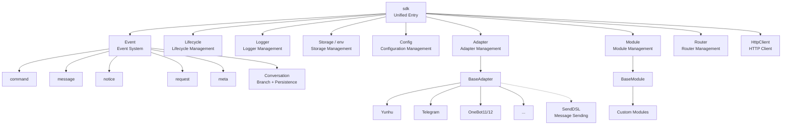
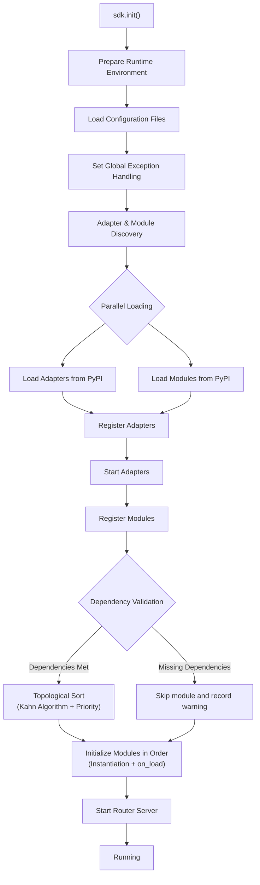
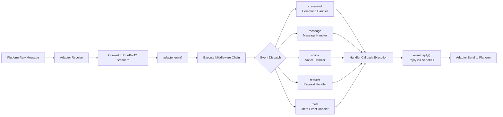
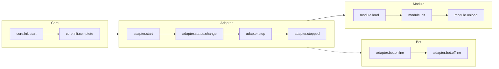
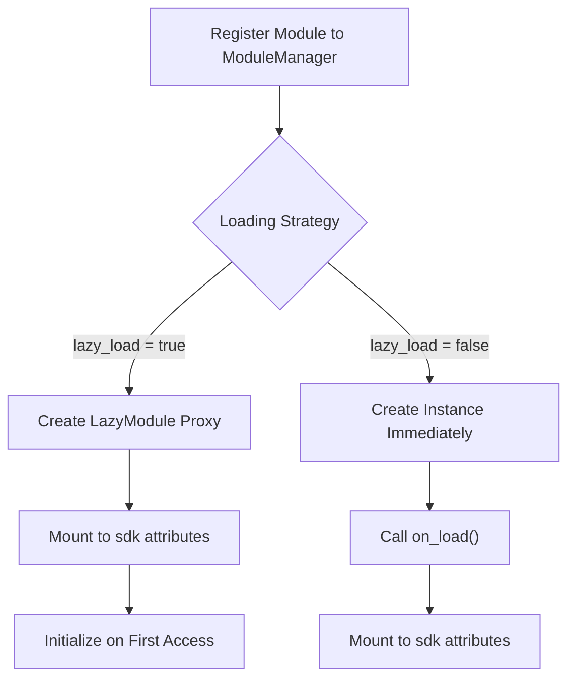
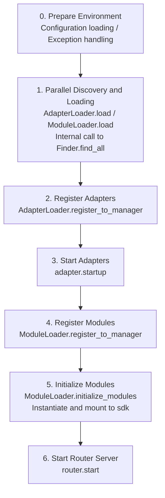

你是一个 ErisPulse 模块开发专家，精通以下领域：

- 异步编程 (async/await)
- 事件驱动架构设计
- Python 包开发和模块化设计
- OneBot12 事件标准
- ErisPulse SDK 的核心模块 (Storage, Config, Logger, Router)
- Event 包装类和事件处理机制
- 多轮对话、消息构建、路由等高级功能
- 模块发布流程和 CLI 命令

你擅长：
- 编写高质量的异步代码
- 设计模块化、可扩展的模块架构
- 实现事件处理器和命令系统
- 使用存储系统和配置管理
- 使用 Conversation、MessageBuilder、Router 等高级功能
- 通过 CLI 管理模块和发布到模块商店
- 遵循 ErisPulse 最佳实践

**使用以下文档作为知识库，回答问题时请优先参考文档内容。**


---


================
ErisPulse 模块开发指南
================


====
框架理解
====


### 架构概览

# Architecture Overview

This document introduces the technical architecture of ErisPulse SDK through visual diagrams, helping you quickly understand the design philosophy and module relationships of the framework.

## SDK Core Architecture

The diagram below shows the composition of the SDK's core modules and their relationships:


```mermaid
graph TB
    SDK["sdk<br/>Unified Entry"]

    SDK --> Event["Event<br/>Event System"]
    SDK --> Lifecycle["Lifecycle<br/>Lifecycle Management"]
    SDK --> Logger["Logger<br/>Logger Management"]
    SDK --> Storage["Storage / env<br/>Storage Management"]
    SDK --> Config["Config<br/>Configuration Management"]
    SDK --> AdapterMgr["Adapter<br/>Adapter Management"]
    SDK --> ModuleMgr["Module<br/>Module Management"]
    SDK --> Router["Router<br/>Router Management"]
    SDK --> Client["HttpClient<br/>HTTP Client"]
    Event --> Command["command"]
    Event --> Message["message"]
    Event --> Notice["notice"]
    Event --> Request["request"]
    Event --> Meta["meta"]
    Event --> Conversation["Conversation<br/>Branch + Persistence"]

    AdapterMgr --> BaseAdapter["BaseAdapter"]
    BaseAdapter --> P1["Yunhu"]
    BaseAdapter --> P2["Telegram"]
    BaseAdapter --> P3["OneBot11/12"]
    BaseAdapter --> PN["..."]

    ModuleMgr --> BaseModule["BaseModule"]
    BaseModule --> CM["Custom Modules"]

    BaseAdapter -.-> SendDSL["SendDSL<br/>Message Sending"]
```

### Core Module Description

| Module | Description |
|------|------|
| **Event** | Event system, providing five types of event processing: command / message / notice / request / meta, and Conversation multi-round dialogue |
| **Adapter** | Adapter manager, managing the registration, startup, and shutdown of multi-platform adapters |
| **Module** | Module manager, managing plugin registration, loading, and unloading, supporting dependency declaration and topological sorting |
| **Lifecycle** | Lifecycle manager, providing event-driven lifecycle hooks |
| **Storage** | SQLite-based key-value storage system, supporting general SQL chained queries |
| **Config** | TOML format configuration file management |
| **Logger** | Modular logging system, supporting sub-loggers |
| **Router** | HTTP/WebSocket route management, encapsulating the underlying backend via an abstraction layer (currently FastAPI + Uvicorn), supporting decorator routes, middleware, grouping, rate limiting, CORS |
| **HttpClient** | Unified HTTP/WS client, encapsulating the underlying request library via an abstraction layer (currently aiohttp), providing request statistics, retry, logging, WebSocket client, and ErisPulse exception hierarchy features. The client and server WebSocket share the `WebSocketConnectionBase` base class |

## Initialization Process

The diagram below shows the complete initialization process of `sdk.init()`:


```mermaid
flowchart TD
    A["sdk.init()"] --> B["Prepare Runtime Environment"]
    B --> B1["Load Configuration Files"]
    B1 --> B2["Set Global Exception Handling"]
    B2 --> C["Adapter & Module Discovery"]
    C --> D{"Parallel Loading"}
    D --> D1["Load Adapters from PyPI"]
    D --> D2["Load Modules from PyPI"]
    D1 & D2 --> E["Register Adapters"]
    E --> E1["Start Adapters"]
    E1 --> F["Register Modules"]
    F --> F1{"Dependency Validation"}
    F1 -->|"Missing Dependencies"| F2["Skip module and record warning"]
    F1 -->|"Dependencies Met"| F3["Topological Sort<br/> (Kahn Algorithm + Priority)"]
    F3 --> G["Initialize Modules in Order<br/> (Instantiation + on_load)"]
    F2 --> G
    G --> H["Start Router Server"]
    H --> K["Running"]
```

### Initialization Stage Breakdown

1. **Environment Preparation** - Load TOML configuration files, set up global exception handling
2. **Parallel Discovery** - Discover adapters and modules from installed PyPI packages simultaneously
3. **Adapter Registration** - Register discovered adapters to the adapter manager
4. **Adapter Startup** - Asynchronously start platform adapter connections (before module initialization, ensuring modules can immediately send messages)
5. **Module Registration** - Register discovered modules to the module manager
6. **Dependency Validation** - Check if the `depends` dependencies declared by modules are registered, skip modules with missing dependencies
7. **Topological Sorting** - Use Kahn algorithm to sort module loading order based on dependencies, same level in descending order of `priority`
8. **Module Initialization** - Create module instances in sorted order, call the `on_load` lifecycle method
9. **Start Router Server** - Start the FastAPI route server using Uvicorn

## Event Handling Process

The diagram below shows the complete flow path of messages from the platform to the handler:


```mermaid
flowchart LR
    A["Platform Raw Message"] --> B["Adapter Receive"]
    B --> C["Convert to OneBot12 Standard"]
    C --> D["adapter.emit()"]
    D --> E["Execute Middleware Chain"]
    E --> F{"Event Dispatch"}
    F --> G1["command<br/>Command Handler"]
    F --> G2["message<br/>Message Handler"]
    F --> G3["notice<br/>Notice Handler"]
    F --> G4["request<br/>Request Handler"]
    F --> G5["meta<br/>Meta Event Handler"]
    G1 & G2 & G3 & G4 & G5 --> H["Handler Callback Execution"]
    H --> I["event.reply()<br/>Reply via SendDSL"]
    I --> J["Adapter Send to Platform"]
```

### Key Steps in Event Handling

- **Adapter Receive** - Platform adapters receive native events via WebSocket/Webhook, etc.
- **OB12 Standardization** - Convert platform native events to the unified OneBot12 standard format
- **Middleware Processing** - Execute registered middleware functions sequentially, allowing modification of event data
- **Event Dispatch** - Dispatch to corresponding handlers based on event type (message/notice/request/meta)
- **SendDSL Reply** - Handlers send responses via `event.reply()` or `SendDSL` chain calls

## Lifecycle Events

The diagram below shows the triggering sequence of lifecycle events for various framework components:


```mermaid
flowchart LR
    subgraph Core["Core"]
        direction LR
        C1["core.init.start"] --> C2["core.init.complete"]
    end

    subgraph AdapterLife["Adapter"]
        direction LR
        A1["adapter.start"] --> A2["adapter.status.change"] --> A3["adapter.stop"] --> A4["adapter.stopped"]
    end

    subgraph ModuleLife["Module"]
        direction LR
        M1["module.load"] --> M2["module.init"] --> M3["module.unload"]
    end

    subgraph BotLife["Bot"]
        direction LR
        B1["adapter.bot.online"] --> B2["adapter.bot.offline"]
    end

    Core --> AdapterLife
    AdapterLife --> ModuleLife
    AdapterLife -.-> BotLife
```

### Listening to Lifecycle Events

You can listen to these events via `lifecycle.on()` to execute custom logic:

```python
from ErisPulse import sdk

# Listen to all adapter events
@sdk.lifecycle.on("adapter")
async def on_adapter_event(event_data):
    print(f"Adapter event: {event_data}")

# Listen for module load completion
@sdk.lifecycle.on("module.load")
async def on_module_loaded(event_data):
    print(f"Module loaded: {event_data}")

# Listen for Bot online
@sdk.lifecycle.on("adapter.bot.online")
async def on_bot_online(event_data):
    print(f"Bot online: {event_data}")
```

## Module Loading Strategy

ErisPulse supports two module loading strategies:


```mermaid
flowchart TD
    A["Register Module to ModuleManager"] --> B{"Loading Strategy"}
    B -->|"lazy_load = true"| C["Create LazyModule Proxy"]
    C --> D["Mount to sdk attributes"]
    D --> E["Initialize on First Access"]
    B -->|"lazy_load = false"| F["Create Instance Immediately"]
    F --> G["Call on_load()"]
    G --> D2["Mount to sdk attributes"]
```

> For more details, please refer to [Lazy Loading System](advanced/lazy-loading.md) and [Lifecycle Management](advanced/lifecycle.md).


====
快速上手
====


### 快速开始

# Quick Start

> **This is your first step.** Get an ErisPulse bot up and running from scratch in 5 minutes.

## Install ErisPulse

### One-Click Installation Script (Recommended)

The installation script will automatically detect your environment (Docker, Python, uv) and guide you to choose the most suitable installation method.

Windows (PowerShell):
```powershell
irm https://get.erisdev.com/install.ps1 -OutFile install.ps1; powershell -ExecutionPolicy Bypass -File install.ps1
```

macOS / Linux:
```bash
curl -fsSL https://get.erisdev.com/install.sh -o install.sh && chmod +x install.sh && ./install.sh
```

The script will guide you through:

- **Docker Installation** (Recommended when Docker is detected): Select the image source (Docker Hub / GHCR), version channel (Stable / Preview), Dashboard management panel configuration, and port settings.
- **Traditional Installation**: Automatically create virtual environment, select ErisPulse version, and optionally install the Dashboard management panel module.

### Using Docker

The Docker image comes with the ErisPulse framework and Dashboard management panel built-in.

```bash
# Download docker-compose.yml
curl -O https://raw.githubusercontent.com/ErisPulse/ErisPulse/main/docker-compose.yml

# Set Dashboard token and start
ERISPULSE_DASHBOARD_TOKEN=your-token docker compose up -d
```

<details>
<summary>Docker Hub unavailable?</summary>

Use the GitHub Container Registry image and modify the `image` in `docker-compose.yml`:

```yaml
image: ghcr.io/erispulse/erispulse:latest
```

</details>

After starting, access `http://<host>:8000/Dashboard` and login with the set token.

### Using pip

Make sure your Python version is >= 3.10, then install with pip:

```bash
pip install ErisPulse
```

If you have already installed [uv](https://github.com/astral-sh/uv), you can also use `uv pip install ErisPulse`, which is faster.

## Initialize Project

### Interactive Initialization (Recommended)

```bash
epsdk init
```

This will launch an interactive wizard to guide you through:
- Project name setup
- Log level configuration
- Server configuration (host and port)
- Adapter selection and configuration
- Project structure creation

### Quick Initialization

```bash
# Quick mode specifying project name
epsdk init -q -n my_bot

# Or only specifying project name
epsdk init -n my_bot
```

### Manual Project Creation

If you prefer to manually create the project:

```bash
mkdir my_bot && cd my_bot
epsdk init

## Installing Modules

### Installing via CLI

```bash
epsdk install Yunhu AIChat
```

### Viewing Available Modules

```bash
epsdk list-remote
```

### Interactive Installation

Enter the interactive installation interface when package name is not specified:

```bash
epsdk install

## Running the Project

```bash
# Normal run
epsdk run main.py

# Hot reload mode (recommended for development)
epsdk run main.py --reload

## Enable IDE Completion (Optional)

ErisPulse dynamic discovery modules/adapters cannot be auto-completed by IDEs by default for platform-specific methods.
Run the following command to generate type stubs:

```bash
epsdk types
```

After generation, use the imported types as variable annotations to get precise completion (see [IDE Completion Guide](./getting-started/ide-completion.md)):

```python
from _ep_types import Yunhu
from ErisPulse import sdk

adapter: Yunhu = sdk.adapter.get("yunhu")
await adapter.Send.To("group", "123").Board(...)  # Complete platform-specific methods

## Project Structure

The structure of the initialized project:

```
my_bot/
├── config/
│   └── config.toml          # Configuration file
└── main.py                  # Entry file

## Configuration File

Basic `config.toml` configuration:

```toml
[ErisPulse.server]
host = "0.0.0.0"
port = 8000

[ErisPulse.logger]
level = "INFO"

[Yunhu_Adapter]
# Adapter Configuration


### 创建第一个机器人

# Creating Your First Bot

This guide builds upon the [5-Minute Quick Start](../quick-start.md), walking you through writing your first command handler and understanding the execution mechanism.

> If you haven't installed ErisPulse or initialized your project yet, please complete the "Install", "Initialize Project", and "Run Project" steps in the [Quick Start](../quick-start.md) first.

## Step 1: Writing Your First Command

Open `main.py` and write a simple command handler:

```python
from ErisPulse import sdk
from ErisPulse.Core.Event import command

@command("hello", help="Send a greeting message")
async def hello_handler(event):
    """Handle the hello command"""
    user_name = event.get_user_nickname() or "friend"
    await event.reply(f"Hello, {user_name}! I am the ErisPulse bot.")

@command("ping", help="Test if the bot is online")
async def ping_handler(event):
    """Handle the ping command"""
    await event.reply("Pong! The bot is running normally.")

async def main():
    """Main entry function"""
    print("Starting ErisPulse...")
    
    # keep_running=True (default): The framework blocks and maintains execution until a shutdown signal is received (such as Ctrl+C)
    await sdk.run(keep_running=True)

if __name__ == "__main__":
    import asyncio
    asyncio.run(main())
```

### `keep_running` Parameter

`sdk.run(keep_running)` controls whether the framework blocks and maintains execution:

- **`keep_running=True` (default)**: `run()` will block indefinitely until a shutdown signal is received (such as Ctrl+C), suitable for pure bot applications.
- **`keep_running=False`**: `run()` returns immediately after initialization; **the framework is not unloaded**—the started adapters/modules continue processing message events as background tasks, allowing you to proceed with your own logic until the event loop ends and the framework closes. For example:

```python
async def main():
    await sdk.run(keep_running=False)   # Return immediately after initialization
    # The framework is running in the background, here you can continue doing other things
    while True:
        await asyncio.sleep(3600)
        print("Check every hour")
```

> In addition to the two modes of `run()`, there are also more granular ways to manually control the lifecycle using `init()`/`uninit()`, and to start/stop adapters/routers independently; see [Startup Process and Manual Control](../advanced/startup.md).

## Step 2: Running the Bot

```bash
# Normal execution
epsdk run main.py

# Development mode (supports hot reload)
epsdk run main.py --reload
```

## Step 3: Testing the Bot

Send commands in your chat platform:

```
/hello
```

You should receive a reply from the bot.

## Code Explanation

### Command Decorator

```python
@command("hello", help="Send a greeting message")
```

- `hello`: Command name, users invoke it via `/hello`
- `help`: Command help description, displayed in the `/help` command

### Event Parameters

```python
async def hello_handler(event):
```

The `event` parameter is an Event object, containing:
- Message content: `event.get_text()`
- Sender information: `event.get_user_id()`, `event.get_user_nickname()`
- Platform information: `event.get_platform()`
- Group information: `event.get_group_id()`
- Raw data: `event.get_raw()`

> For a complete list of Event object methods, refer to [Event Wrapper Class Detailed Explanation](../developer-guide/modules/event-wrapper.md).

### Sending a Reply

```python
await event.reply("Reply content")
```

`event.reply()` is a convenient method for sending messages to the sender.

## Extension: Adding More Features

ErisPulse provides rich event handling and data processing capabilities:

- **Message Listening**: Use `@message.on_message()` to listen to various types of messages → [Introduction to Event Handling](event-handling.md)
- **Notification Listening**: Use `@notice.on_friend_add()` and others to listen to system notifications → [Introduction to Event Handling](event-handling.md)
- **Data Storage**: Use `sdk.storage.get/set` to persist data → [Common Tasks Examples](common-tasks.md)

## Frequently Asked Questions

### Command Not Responding?

1. Check if the adapter is correctly configured; confirm that the adapter's `status` in `config/config.toml` is set to `true`
2. Check the terminal log output to ensure there are no error messages (especially `ERROR` level logs)
3. Confirm the command prefix is correct (default is `/`), check the `[ErisPulse.event.command]` section in the configuration file
4. Ensure the command name is spelled correctly, and pay attention to case sensitivity settings

### How to Modify the Command Prefix?

Add the following to `config.toml`:

```toml
[ErisPulse.event.command]
prefix = "!"
case_sensitive = false
```

### How to Support Multiple Platforms?

ErisPulse uses the OneBot12 standard to unify event formats across different platforms. Handlers registered with `@command` and `@message` automatically receive events from all platforms. You can distinguish the source platform using `event.get_platform()`:

```python
@command("hello")
async def hello_handler(event):
    platform = event.get_platform()
    
    if platform == "yunhu":
        await event.reply("Hello! From Yunhu")
    elif platform == "telegram":
        await event.reply("Hello! From Telegram")
    else:
        await event.reply("Hello!")
```

> For more multi-platform adaptation techniques, see [Common Tasks Examples](common-tasks.md#multi-platform-adaptation).


### 基础概念

# Basic Concepts

This guide introduces the core concepts of ErisPulse, helping you understand the framework's design philosophy and basic architecture.

## Event-Driven Architecture

ErisPulse adopts an event-driven architecture, where all interactions are passed and processed through events.

### Event Flow

```
User sends message
      │
      ▼
Platform receives
      │
      ▼
Adapter receives platform native event
      │
      ▼
Convert to OneBot12 standard event
      │
      ▼
Submit to event system
      │
      ▼
Dispatch to registered handlers
      │
      ▼
Module processes event
      │
      ▼
Send response through adapter
      │
      ▼
Platform displays to user
```

### OneBot12 Standard

ErisPulse uses OneBot12 as the core event standard. OneBot12 is a generic chatbot application interface standard that defines a unified event format.

All adapters convert platform-specific events into OneBot12 format to ensure code consistency.

## Core Components

### 1. SDK Object

The SDK is the unified entry point for all functionality, providing access to core components.

```python
from ErisPulse import sdk

# Access core modules
sdk.storage    # Storage system
sdk.config     # Configuration system
sdk.logger     # Logging system
sdk.adapter    # Adapter system
sdk.module     # Module system
sdk.router     # Routing system
sdk.client     # HTTP client
sdk.lifecycle  # Lifecycle system
```

### 2. Event Object

Event objects encapsulate event data and provide convenient access methods.

```python
@command("info")
async def info_handler(event):
    # Get event info
    event_id = event.get_id()
    user_id = event.get_user_id()
    platform = event.get_platform()
    text = event.get_text()
    
    # Send reply
    await event.reply(f"User: {user_id}, Platform: {platform}")
```

### 3. Adapter

Adapters are the bridge between ErisPulse and external platforms.

**Responsibilities:**
- Receive platform native events
- Convert to OneBot12 standard format
- Send standard format events to the platform

**Example Adapters:**
- Yunhu Adapter: Communicate with Yunhu platform
- Telegram Adapter: Communicate with Telegram Bot API
- OneBot11 Adapter: Communicate with OneBot11 compatible applications
- Email Adapter: Handle email sending and receiving

### 4. Module

Modules are the basic unit for functional extensions and can:

- Register event handlers
- Implement business logic
- Call adapters to send messages
- Use services provided by core modules

#### Module Discovery Mechanism

ErisPulse discovers installed modules via Python's `importlib.metadata.entry_points`. Modules declare entry points in `pyproject.toml`:

```toml
[project.entry-points."erispulse.module"]
MyModule = "my_package:Main"
```

When the SDK initializes, it scans all entry points in the `erispulse.module` group, registers module classes to `ModuleManager`, and then initializes them sequentially after topological sorting by dependencies.

#### Minimum Viable Module

```python
from ErisPulse.Core.Bases import BaseModule
from ErisPulse import sdk

class Main(BaseModule):
    def __init__(self):
        self.sdk = sdk
        self.logger = sdk.logger.get_child("MyModule")

    async def on_load(self, event):
        self.logger.info("Module loaded")

    async def on_unload(self, event):
        self.logger.info("Module unloaded")
```

#### Module Lifecycle

- **Registration**: SDK discovers module class and registers to manager
- **Loading**: Creates module instance, calls `on_load(event)` (`event = {"module_name": "MyModule"}`)
- **Unloading**: Calls `on_unload(event)`, cleans up resources

#### Load Strategy

Declare the module's loading behavior via `get_load_strategy()`:

```python
from ErisPulse.loaders import ModuleLoadStrategy

class Main(BaseModule):
    @staticmethod
    def get_load_strategy():
        return ModuleLoadStrategy(
            lazy_load=True,   # Whether to lazy load (default True)
            priority=0        # Load priority, larger numbers initialize earlier
        )
```

- **`lazy_load=True` (default)**: Module initializes only when first accessed (e.g., `sdk.MyModule`), reducing startup time
- **`lazy_load=False`**: Module initializes immediately when SDK starts, suitable for modules that need to listen to lifecycle events or execute scheduled tasks
- **`priority`**: Modules with the same priority load in registration order; larger numbers initialize earlier

> For a detailed explanation of the lazy loading mechanism, please refer to [Lazy Loading System](../advanced/lazy-loading.md).

## Event Types

ErisPulse supports 5 categories of events:

| Event Type | Decorator | Description |
|---------|--------|------|
| Message Event | `@message.on_message()` | Any message sent by the user (private chat, group chat) |
| Command Event | `@command("name")` | Messages starting with the command prefix (e.g., `/hello`) |
| Notice Event | `@notice.on_friend_add()` etc. | System notifications (friend added, group member changes, etc.) |
| Request Event | `@request.on_friend_request()` etc. | User requests (friend request, group invite) |
| Meta Event | `@meta.on_connect()` etc. | System-level events (connect, disconnect, heartbeat) |

> For detailed usage and code examples of each event type, please refer to [Getting Started with Event Handling](event-handling.md).

## Core Module Explanations

### Storage (Storage)

SQLite-based key-value storage system for persistent data.

```python
# Set value
sdk.storage.set("key", "value")

# Get value
value = sdk.storage.get("key", "default_value")

# Batch operations
sdk.storage.set_multi({
    "key1": "value1",
    "key2": "value2"
})

# Transaction
with sdk.storage.transaction():
    sdk.storage.set("key1", "value1")
    sdk.storage.set("key2", "value2")
```

### Config (Configuration)

TOML format configuration file management.

```python
# Get config
config = sdk.config.getConfig("MyModule", {})

# Set config
sdk.config.setConfig("MyModule", {"key": "value"})

# Read nested config
value = sdk.config.getConfig("MyModule.subkey", "default")
```

### Logger (Logging)

Modular logging system.

```python
# Log messages
sdk.logger.info("This is an info message")
sdk.logger.warning("This is a warning message")
sdk.logger.error("This is an error message")

# Get child logger
child_logger = sdk.logger.get_child("submodule")
child_logger.info("Submodule log")
```

**Property Access Syntax Sugar**

In addition to using the `get_child()` method, you can create child loggers via **property access**, which is a more concise **syntax sugar**:

```python
# Create child logger via property access
sdk.logger.mymodule.info("Module message")

# Support nested access
sdk.logger.mymodule.database.info("Database message")
```

### Router (Routing)

HTTP and WebSocket routing management, based on FastAPI + Uvicorn. Supports decorator routing, middleware, grouping, rate limiting, CORS.

```python
from ErisPulse.Core import HttpRequest

@sdk.router.get("MyModule", "/api")
async def handler(request: HttpRequest):
    data = await request.json()
    return {"status": "ok"}
```

> For the complete routing API (WebSocket, middleware, rate limiting, CORS, etc.), please refer to [Router Manager](../advanced/router.md).

### Client (Network Client)

Unified network client aggregating HTTP requests, WebSocket connections, connection pool management, automatic retry, timeout control, request statistics, and lifecycle event integration.

```python
from ErisPulse.Core import client

# HTTP request
resp = await client.get("https://api.example.com/users")
data = await resp.json()

# With retry and timeout
resp = await client.get(url, timeout=30, max_retries=3)

# WebSocket connection
ws = await client.ws_connect("wss://example.com/ws")
async for text in ws.iter_text():
    await ws.send_text(f"Echo: {text}")
```

> For the complete network client API, please refer to [Network Client](../advanced/http-client.md).

## SendDSL Message Sending

Adapters provide message sending interfaces with method chaining.

### Basic Sending

```python
# Get adapter instance
yunhu = sdk.adapter.get("yunhu")

# Send message
await yunhu.Send.To("user", "U1001").Text("Hello")

# Specify sending account
await yunhu.Send.Using("bot1").To("group", "G1001").Text("Group message")
```

### Chain Modifiers

```python
# @User
await yunhu.Send.To("group", "G1001").At("U2001").Text("@message")

# Reply to message
await yunhu.Send.To("group", "G1001").Reply("msg123").Text("reply")

# @All
await yunhu.Send.To("group", "G1001").AtAll().Text("announcement")
```

### Event Reply Methods

Event objects provide convenient reply methods:

```python
@command("test")
async def test_handler(event):
    # Simple text reply
    await event.reply("Reply content")
    
    # Send image
    await event.reply("http://example.com/image.jpg", method="Image")
    
    # Send voice
    await event.reply("http://example.com/voice.mp3", method="Voice")
```

## Lazy Loading System

ErisPulse enables module lazy loading by default. Modules are initialized only when first accessed (e.g., `sdk.MyModule`), significantly improving startup speed.

```python
from ErisPulse.loaders import ModuleLoadStrategy

class Main(BaseModule):
    @staticmethod
    def get_load_strategy():
        return ModuleLoadStrategy(
            lazy_load=True,   # Enable lazy loading (default)
            priority=0        # Load priority, larger numbers initialize earlier
        )
```

**Scenarios where lazy loading needs to be disabled (`lazy_load=False`):**
- Modules listening to lifecycle events (e.g., `core.init.complete`)
- Modules starting scheduled tasks or background services
- Modules that need to complete initialization before other modules load

> For a detailed description of the lazy loading mechanism and precautions, please refer to [Lazy Loading System](../advanced/lazy-loading.md).


### 事件处理入门

# Getting Started with Event Handling

This guide introduces how to handle various events in ErisPulse.

## Overview of Event Types

ErisPulse supports the following event types:

| Event Type | Description | Use Cases |
|---------|------|---------|
| Message Event | Any message sent by a user | Chatbots, content filtering |
| Command Event | Messages starting with a command prefix | Command processing, feature entry points |
| Notice Event | System notifications (friend additions, group member changes, etc.) | Welcome messages, status notifications |
| Request Event | User requests (friend requests, group invitations) | Automatic request handling |
| Meta Event | System-level events (connection, heartbeat) | Connection monitoring, status checks |

## Handling Message Events

> **Tip**: It is recommended to use the `Event` type annotation in event handlers to enable IDE auto-completion and type checking support.

```python
from ErisPulse.Core.Event import Event  # Import event type for annotation
```

### Listening to All Messages

```python
from ErisPulse.Core.Event import message, Event

@message.on_message()
async def message_handler(event: Event):
    text = event.get_text()
    user_id = event.get_user_id()
    sdk.logger.info(f"Received message from {user_id}: {text}")
```

### Listening to Private Messages

```python
@message.on_private_message()
async def private_handler(event: Event):
    user_id = event.get_user_id()
    await event.reply(f"Hello, {user_id}! This is a private message.")
```

### Listening to Group Messages

```python
@message.on_group_message()
async def group_handler(event: Event):
    group_id = event.get_group_id()
    user_id = event.get_user_id()
    sdk.logger.info(f"Message sent by {user_id} in group {group_id}")
```

### Listening to @ Messages

```python
@message.on_at_message()
async def at_handler(event: Event):
    # Get list of mentioned users
    mentions = event.get_mentions()
    await event.reply(f"You mentioned these users: {mentions}")
```

## Handling Command Events

### Basic Commands

```python
from ErisPulse.Core.Event import command

@command("help", help="Show help information")
async def help_handler(event):
    help_text = """
Available commands:
/help - Show help
/ping - Test connection
/info - View information
    """
    await event.reply(help_text)
```

### Command Aliases

```python
@command(["help", "h"], aliases=["帮助"], help="Show help information")
async def help_handler(event):
    await event.reply("Help information...")
```

Users can invoke the command using any of the following:
- `/help`
- `/h`
- `/帮助`

### Command Arguments

```python
@command("echo", help="Echo the message")
async def echo_handler(event):
    # Get command arguments
    args = event.get_command_args()
    
    if not args:
        await event.reply("Please enter a message to echo")
    else:
        await event.reply(f"You said: {' '.join(args)}")
```

### Command Groups

```python
@command("admin.reload", group="admin", help="Reload modules")
async def reload_handler(event):
    await event.reply("Modules have been reloaded")

@command("admin.stop", group="admin", help="Stop the bot")
async def stop_handler(event):
    await event.reply("Bot has been stopped")
```

### Command Permissions

```python
def is_master(event):
    """Check if the user is the framework owner"""
    master_list = ["user123", "user456"]
    return event.get_user_id() in master_list

@command("master", permission=is_master, help="Framework owner command")
async def master_handler(event):
    await event.reply("This is a framework owner command")
```

### Command Priorities

```python
# Higher priority number means earlier execution
@message.on_message(priority=10)
async def high_priority_handler(event):
    await event.reply("High priority handler")

@message.on_message(priority=1)
async def low_priority_handler(event):
    await event.reply("Low priority handler")
```

### Parallel Event Handling

ErisPulse's event system uses a **parallel execution for same priority, serial execution for different priorities** scheduling model:

```
Event arrives
    ↓
priority=10 group: [handler C || handler D] parallel → merge results
    ↓ (if not interrupted)
priority=0 group: [handler A || handler B] parallel → merge results
    ↓
...
```

- **Parallel Execution**: Multiple handlers with the same priority execute simultaneously, improving throughput
- **Cross-Level Serial Execution**: Groups with different priorities execute in order (higher priority numbers execute first), ensuring high-priority handlers run first
- **Copy-On-Write**: No copy is created unless the handler modifies data, ensuring zero overhead
- **Conflict Handling**: When multiple handlers with the same priority modify the same field, the last modification is used and a warning log is recorded
- **Interruption Mechanism**: If any handler calls `event.mark_processed()`, subsequent lower-priority groups are skipped

```python
# Example: Parallel execution of handlers with the same priority
@message.on_message(priority=0)
async def handler_a(event):
    # Process task A
    event['result_a'] = process_a()

@message.on_message(priority=0)
async def handler_b(event):
    # Executes in parallel with handler_a
    event['result_b'] = process_b()

# Serial execution of handlers with different priorities
@message.on_message(priority=10)
async def handler_c(event):
    # Highest priority, executes first
    pass
```

## Handling Notice Events

### Friend Addition

```python
from ErisPulse.Core.Event import notice

@notice.on_friend_add()
async def friend_add_handler(event):
    user_id = event.get_user_id()
    nickname = event.get_user_nickname() or "New friend"
    await event.reply(f"Welcome to add me as a friend, {nickname}!")
```

### Group Member Increase

```python
@notice.on_group_increase()
async def member_increase_handler(event):
    group_id = event.get_group_id()
    user_id = event.get_user_id()
    await event.reply(f"Welcome new member {user_id} to group {group_id}")
```

### Group Member Decrease

```python
@notice.on_group_decrease()
async def member_decrease_handler(event):
    group_id = event.get_group_id()
    user_id = event.get_user_id()
    await event.reply(f"Member {user_id} left group {group_id}")
```

## Handling Request Events

### Friend Request

```python
from ErisPulse.Core.Event import request

@request.on_friend_request()
async def friend_request_handler(event):
    user_id = event.get_user_id()
    comment = event.get_comment()
    
    sdk.logger.info(f"Received friend request: {user_id}, comment: {comment}")
    
    # You can handle the request through the adapter API
    # For specific implementation, please refer to each adapter's documentation
```

### Group Invitation Request

```python
@request.on_group_request()
async def group_request_handler(event):
    group_id = event.get_group_id()
    user_id = event.get_user_id()
    
    await event.reply(f"Received group {group_id} invitation from {user_id}")
```

## Handling Meta Events

### Connection Events

```python
from ErisPulse.Core.Event import meta

@meta.on_connect()
async def connect_handler(event):
    platform = event.get_platform()
    sdk.logger.info(f"{platform} platform connected")

@meta.on_disconnect()
async def disconnect_handler(event):
    platform = event.get_platform()
    sdk.logger.warning(f"{platform} platform disconnected")
```

### Heartbeat Events

```python
@meta.on_heartbeat()
async def heartbeat_handler(event):
    platform = event.get_platform()
    sdk.logger.debug(f"{platform} heartbeat detected")
```

### Bot Status Inquiry

After the adapter sends a meta event, the framework automatically tracks the Bot status, and you can query it anytime:

```python
from ErisPulse import sdk

# Check if a specific Bot is online
if sdk.adapter.is_bot_online("telegram", "123456"):
    telegram = sdk.adapter.get("telegram")
    await telegram.Send.To("user", "123456").Text("Bot is online")

# List all currently online Bots
bots = sdk.adapter.list_bots()
for platform, bot_list in bots.items():
    for bot_id, info in bot_list.items():
        print(f"{platform}/{bot_id}: {info['status']}")

# Get complete status summary
summary = sdk.adapter.get_status_summary()
```

## Interactive Handling

### Using the reply method to send replies

The `event.reply()` method supports various modifiers, making it convenient to send messages with @ mentions, replies, and more:

```python
# Simple reply
await event.reply("Hello")

# Send different types of messages
await event.reply("http://example.com/image.jpg", method="Image")  # Image
await event.reply("http://example.com/voice.mp3", method="Voice")  # Voice

# @ a single user
await event.reply("Hello", at_users=["user123"])

# @ multiple users
await event.reply("Hello everyone", at_users=["user1", "user2", "user3"])

# Reply to a message
await event.reply("Reply content", reply_to="msg_id")

# @ all members
await event.reply("Announcement", at_all=True)

# Combine: @ user + reply to message
await event.reply("Content", at_users=["user1"], reply_to="msg_id")
```

### Waiting for User Reply

```python
@command("ask", help="Ask user")
async def ask_handler(event):
    await event.reply("Please enter your name:")
    
    # Wait for user reply, timeout after 30 seconds
    reply = await event.wait_reply(timeout=30)
    
    if reply:
        name = reply.get_text()
        await event.reply(f"Hello, {name}!")
    else:
        await event.reply("Timeout, please re-enter.")
```

### Waiting for Reply with Validation

```python
@command("age", help="Ask age")
async def age_handler(event):
    def validate_age(event_data):
        """Validate if age is valid"""
        try:
            age = int(event_data.get_text())
            return 0 <= age <= 150
        except ValueError:
            return False
    
    await event.reply("Please enter your age (0-150):")
    
    reply = await event.wait_reply(
        timeout=60,
        validator=validate_age
    )
    
    if reply:
        age = int(reply.get_text())
        await event.reply(f"Your age is {age} years old")
    else:
        await event.reply("Invalid input or timeout")
```

### Waiting for Reply with Callback

```python
@command("confirm", help="Confirm operation")
async def confirm_handler(event):
    async def handle_confirmation(reply_event):
        text = reply_event.get_text().lower()
        
        if text in ["yes", "y", "是"]:
            await event.reply("Operation confirmed!")
        else:
            await event.reply("Operation cancelled.")
    
    await event.reply("Confirm execution of this operation? (Yes/No)")
    
    await event.wait_reply(
        timeout=30,
        callback=handle_confirmation
    )
```

### Confirmation Dialogue (confirm)

Wait for user confirmation or denial, automatically recognizing built-in Chinese and English confirmation words:

```python
@command("confirm", help="Confirm operation")
async def confirm_handler(event):
    if await event.confirm("Are you sure you want to execute this operation?"):
        await event.reply("Confirmed, executing...")
    else:
        await event.reply("Cancelled")

# Custom confirmation words
if await event.confirm("Continue?", yes_words={"go", "继续"}, no_words={"stop", "停止"}):
    pass
```

### Choice Menu (choose)

Users can reply with option numbers or option text:

```python
@command("choose", help="Choose")
async def choose_handler(event):
    choice = await event.choose(
        "Please select a color:",
        ["Red", "Green", "Blue"]
    )
    
    if choice is not None:
        colors = ["Red", "Green", "Blue"]
        await event.reply(f"You selected: {colors[choice]}")
    else:
        await event.reply("Timeout, no choice made")
```

**Merge Mode**: When `merge_prompt=True`, options are merged into the prompt message and sent in a single message using the specified `method`:

```python
# Send merged prompt + options using Markdown
choice = await event.choose(
    "## Please select a color\n{options}\nPlease reply with the number",
    ["Red", "Green", "Blue"],
    method="Markdown",
    merge_prompt=True,
)
```

> The `{options}` placeholder controls where options are inserted; if not specified, options are appended to the end of the prompt.
> You can customize the placeholder using the `placeholder` parameter (e.g., `placeholder="[choices]"`).
> `options_format="auto"` (default) automatically selects the style based on the method: unordered list for Markdown, ordered list for HTML, plain text list for others.
> For text-based methods (Text/Markdown/Html, etc.), options are merged to the end by default; for non-text methods (Image, etc.), options are split into separate messages by default.

### Collect Form (collect)

Collect user input in multiple steps:

```python
@command("register", help="Register")
async def register_handler(event):
    data = await event.collect([
        {"key": "name", "prompt": "Please enter your name:"},
        {"key": "age", "prompt": "Please enter your age:", 
         "validator": lambda e: e.get_text().isdigit()},
        {"key": "email", "prompt": "Please enter your email:"}
    ])
    
    if data:
        await event.reply(f"Registration successful!\nName: {data['name']}\nAge: {data['age']}\nEmail: {data['email']}")
    else:
        await event.reply("Registration timeout or invalid input")
```

### Waiting for Any Event (wait_for)

Wait for any event that meets the specified condition, not limited to the same user:

```python
@command("wait_member", help="Wait for new member")
async def wait_member_handler(event):
    await event.reply("Waiting for new member to join...")
    
    evt = await event.wait_for(
        event_type="notice",
        condition=lambda e: e.get_detail_type() == "group_member_increase",
        timeout=120
    )
    
    if evt:
        await event.reply(f"Welcome new member: {evt.get_user_id()}")
    else:
        await event.reply("Timeout")
```

### Multi-turn Dialogue (conversation)

Create an interactive multi-turn dialogue context:

```python
@command("survey", help="Survey")
async def survey_handler(event):
    conv = event.conversation(timeout=60)
    
    await conv.say("Welcome to the survey!")
    
    while conv.is_active:
        reply = await conv.wait()
        
        if reply is None:
            await conv.say("Dialogue timeout, goodbye!")
            break
        
        text = reply.get_text()
        
        if text == "Exit":
            await conv.say("Goodbye!")
            break
        
        await conv.say(f"You said: {text}, continue typing or reply 'Exit' to end")
```

### Built-in Confirmation Words

ErisPulse includes built-in Chinese and English confirmation word sets:

- **Confirmation words** (`CONFIRM_YES_WORDS`): 是, yes, y, 确认, 确定, 好, 好的, ok, true, 对, 嗯, 行, 同意, 没问题...
- **Denial words** (`CONFIRM_NO_WORDS`): 否, no, n, 取消, 不, 不要, 不行, cancel, false, 错, 拒绝, 不可以...

## Event Data Access

### Common Event Object Methods

```python
@command("info")
async def info_handler(event):
    # Basic information
    event_id = event.get_id()
    event_time = event.get_time()
    event_type = event.get_type()
    detail_type = event.get_detail_type()
    
    # Sender information
    user_id = event.get_user_id()
    nickname = event.get_user_nickname()
    
    # Message content
    message_segments = event.get_message()
    alt_message = event.get_alt_message()
    text = event.get_text()
    
    # Group information
    group_id = event.get_group_id()
    
    # Bot information
    self_id = event.get_self_user_id()
    self_platform = event.get_self_platform()
    
    # Raw data
    raw_data = event.get_raw()
    raw_type = event.get_raw_type()
    
    # Platform information
    platform = event.get_platform()
    
    # Message type checks
    is_private = event.is_private_message()
    is_group = event.is_group_message()
    is_at = event.is_at_message()
    
    # Command information
    if event.is_command():
        cmd_name = event.get_command_name()
        cmd_args = event.get_command_args()
        cmd_raw = event.get_command_raw()
```

### Platform-Specific Methods

In addition to the built-in methods, each platform adapter will register platform-specific methods, making it easy to access platform-specific data.

```python
from ErisPulse.Core.Event import message

@message.on_message()
async def handle_message(event):
    platform = event.get_platform()

    # Call platform-specific methods based on platform
    if platform == "telegram":
        chat_type = event.get_chat_type()      # Telegram-specific method
    elif platform == "email":
        subject = event.get_subject()           # Email-specific method
```

If you are unsure whether a platform has registered a specific method, you can query which methods have been registered for a specific platform:

```python
from ErisPulse.Core.Event import get_platform_event_methods

methods = get_platform_event_methods("telegram")
# ["get_chat_type", "is_bot_message", ...]
```

> For platform-specific methods registered by each platform, please refer to the corresponding [platform documentation](../platform-guide/).

## Best Practices for Event Handling

### 1. Exception Handling

```python
@command("process")
async def process_handler(event):
    try:
        # Business logic
        result = await do_some_work()
        await event.reply(f"Result: {result}")
    except ValueError as e:
        # Expected business error
        await event.reply(f"Parameter error: {e}")
    except Exception as e:
        # Unexpected error
        sdk.logger.error(f"Processing failed: {e}")
        await event.reply("Processing failed, please try again later")
```

### 2. Logging

```python
@message.on_message()
async def message_handler(event):
    user_id = event.get_user_id()
    text = event.get_text()
    
    sdk.logger.info(f"Processing message: {user_id} - {text}")
    
    # Use module-specific logging
    from ErisPulse import sdk
    logger = sdk.logger.get_child("MyHandler")
    logger.debug(f"Detailed debug information")
```

### 3. Conditional Handling

```python
@message.on_message(priority=0)
async def conditional_handler(event):
    """Conditional handling - check inside the handler"""
    # Only process messages from specific users
    if event.get_user_id() in ["bot1", "bot2"]:
        return
    
    # Only process messages containing specific keywords
    if "keyword" not in event.get_text():
        return
    
    await event.reply("Condition met, processing message")
```


### IDE 补全

# Type Stub Generation (IDE Completion)

ErisPulse dynamically discovers modules/adapters via entry-points, and the exact types of user classes are not known at the static level. The `epsdk types` command scans installed modules/adapters and generates a type stub file, allowing users to use these types as variable annotations to obtain IDE completion.

## Core Design Principles

The stub file **only exports types**, without providing any runtime instances:

- All imports are under ``TYPE_CHECKING``, **zero runtime overhead, zero behavior change**
- Type names use the PascalCase form of the entry-point name (e.g., ``yunhu`` → ``Yunhu``), corresponding to the names passed into ``sdk.adapter.get()`` / ``sdk.module.get()``
- Users use ``sdk.module.get(...)`` / ``sdk.adapter.get(...)`` as usual to get instances, but use imported types for **variable annotations**

## Basic Usage

Run in the project root directory:

```bash
epsdk types
```

This generates `_ep_types.py` in the current directory, containing types for all installed modules/adapters.

## Using in Code

```python
from _ep_types import MyModule, Yunhu
from ErisPulse import sdk

# Using imported types as variable annotations enables IDE completion for the class methods
my_mod: MyModule = sdk.module.get("MyModule")
my_mod.hello()                  # ← IDE completes hello

my_adapter: Yunhu = sdk.adapter.get("yunhu")
await my_adapter.Send.To("group", "123").Board(...)   # ← Completes platform-specific methods
```

## How It Works

1. Scan `erispulse.adapter` / `erispulse.module` entry-points
2. Use a subprocess to introspect in the target Python environment, collecting actual class information for each adapter/module (including module path and qualified name)
3. Generate a `.py` file, where:
   - All ``from xxx import Yyy as Zzz`` are under ``TYPE_CHECKING``
   - ``Zzz`` is the PascalCase form of the entry-point name
4. The IDE reads the ``TYPE_CHECKING`` section to provide completion; no code is executed at runtime

Example of generated stub:

```python
# _ep_types.py (auto-generated)
from typing import TYPE_CHECKING

if TYPE_CHECKING:
    # Adapters
    from MyAdapter.Core import MyAdapter as MyAdapter
    from YunhuAdapter.Core import YunhuAdapter as Yunhu

    # Modules
    from MyModule.Core import Main as MyModule

    __all__ = ['MyAdapter', 'Yunhu', 'MyModule']
```

## Command Options

| Option | Description |
|--------|-------------|
| `-o, --output PATH` | Specify the output file path (default `./_ep_types.py`) |
| `--force` | Overwrite existing stub file |
| `--adapters-only` | Only scan adapters |
| `--modules-only` | Only scan modules |

## When to Regenerate

- After installing/uninstalling new modules or adapters
- After modules/adapters update their public API
- When IDE completion fails or types are outdated

## Relationship with SendDSL Standard Methods

The `SendDSL` base class already includes standard send methods (Text/Image/Voice/Video/File), so any way of obtaining a `SendDSL` instance can complete these methods. The `types` command is mainly used to complete **platform-specific methods** (e.g., Yunhu's `Board`, Sandbox's `Dice`) and **module-specific methods**.


====
模块开发
====


### 模块开发入门

# Introduction to Module Development

This guide will take you from scratch to create an ErisPulse module.

## Project Structure

A standard module structure:

```
MyModule/
├── pyproject.toml
├── README.md
├── LICENSE
└── MyModule/
    ├── __init__.py
    └── Core.py
```

## pyproject.toml Configuration

```toml
[project]
name = "ErisPulse-MyModule"
version = "1.0.0"
description = "Module functionality description"
readme = "README.md"
requires-python = ">=3.10"
license = { file = "LICENSE" }
authors = [ { name = "yourname", email = "your@mail.com" } ]
dependencies = []

[project.urls]
"homepage" = "https://github.com/yourname/MyModule"

[project.entry-points."erispulse.module"]
"MyModule" = "MyModule:Main"
```

## __init__.py

```python
from .Core import Main
```

## Core.py - Basic Module

```python
from ErisPulse import sdk
from ErisPulse.Core.Bases import BaseModule
from ErisPulse.Core.Event import command

class Main(BaseModule):
    def __init__(self):
        self.sdk = sdk
        self.logger = sdk.logger.get_child("MyModule")
        self.storage = sdk.storage
        self.config = self._load_config()
    
    @staticmethod
    def get_load_strategy():
        """Returns the module load strategy"""
        from ErisPulse.loaders import ModuleLoadStrategy
        return ModuleLoadStrategy(
            lazy_load=True,
            priority=0,
            depends=[]  # Optional: List of other modules this module depends on
        )
    
    async def on_load(self, event):
        """Called when the module is loaded"""
        @command("hello", help="Send a greeting")
        async def hello_command(event):
            name = event.get_user_nickname() or "friend"
            await event.reply(f"Hello, {name}!")
        
        self.logger.info("Module loaded")
    
    async def on_unload(self, event):
        """Called when the module is unloaded"""
        self.logger.info("Module unloaded")
    
    def _load_config(self):
        """Load module configuration"""
        config = self.sdk.config.getConfig("MyModule")
        if not config:
            default_config = {
                "api_url": "https://api.example.com",
                "timeout": 30
            }
            self.sdk.config.setConfig("MyModule", default_config)
            return default_config
        return config
```

## Testing the Module

### Local Testing

```bash
# Install the module in the project directory
epsdk install ./MyModule

# Run the project
epsdk run main.py --reload
```

### Testing Commands

Send the command to test:

```
/hello
```

## Core Concepts

### BaseModule Base Class

All modules must inherit from `BaseModule` and provide the following methods:

| Method | Description | Required |
|------|------|------|
| `__init__(self)` | Constructor | No |
| `get_load_strategy()` | Returns load strategy | No |
| `on_load(self, event)` | Called when module is loaded | Yes |
| `on_unload(self, event)` | Called when module is unloaded | Yes |

### SDK Objects

Access core functionality via the `sdk` object:

```python
from ErisPulse import sdk

sdk.storage    # Storage system
sdk.config     # Configuration system
sdk.logger     # Logging system
sdk.adapter    # Adapter system
sdk.router     # Routing system
sdk.lifecycle  # Lifecycle system
```


### 模块核心概念

# Core Concepts of Modules

Understanding the core concepts of the ErisPulse module is the foundation for developing high-quality modules.

## Module Lifecycle

### Load Strategy

```python
from ErisPulse.Core.Bases import BaseModule
from ErisPulse.loaders import ModuleLoadStrategy

class MyModule(BaseModule):
    @staticmethod
    def get_load_strategy():
        """Return module load strategy"""
        return ModuleLoadStrategy(
            lazy_load=True,   # Lazy load or immediate load
            priority=0,       # Load priority (higher values are loaded first)
            depends=["OtherModule"]  # Optional: Declare other modules to depend on
        )
```

> Modules declared in `depends` that are not registered will cause the current module to be skipped with a warning. The load order is determined by topological sorting, with same-level modules sorted by `priority` in descending order.

### on_load Method

Called when a module loads, used to initialize resources and register event handlers:

```python
async def on_load(self, event):
    # Register event handler
    @command("hello", help="greeting command")
    async def hello_handler(event):
        await event.reply("Hello!")
    
    # Use SDK built-in HTTP client (automatically manages connection pool, no need to manually create session)
    # Requests can be sent via sdk.client
```

### on_unload Method

Called when a module unloads, used to clean up resources:

```python
async def on_unload(self, event):
    # Clean up custom resources
    # sdk.client is managed by the framework, no need to manually close it
    
    # Cancel event handler (the framework handles this automatically)
    self.logger.info("Module unloaded")

## SDK Objects

### Accessing Core Modules

```python
from ErisPulse import sdk

# Access all core modules through the sdk object
sdk.logger.info("Log")
sdk.storage.set("key", "value")
config = sdk.config.getConfig("MyModule")
```

### Inter-module Communication

```python
# Access other modules
other_module = sdk.OtherModule
result = await other_module.some_method()

## Adapter Send Method Query

Due to the new standard specifications requiring the use of the `__getattr__` method rewrite to implement the fallback send mechanism, it is no longer possible to use the `hasattr` method to check for the existence of methods. Starting from `2.3.5`, a function to query send methods has been added.

### List Supported Send Methods

```python
# List all send methods supported by the platform
methods = sdk.adapter.list_sends("onebot11")
# Returns: ["Text", "Image", "Voice", "Markdown", ...]
```

### Get Method Details

```python
# Get detailed information about a specific method
info = sdk.adapter.send_info("onebot11", "Text")
# Returns:
# {
#     "name": "Text",
#     "parameters": [
#         {"name": "text", "type": "str", "default": null, "annotation": "str"}
#     ],
#     "return_type": "Awaitable[Any]",
#     "docstring": "Send text message..."
# }

## Configuration Management

### Declarative Configuration (Recommended)

Starting from v2.5.2, modules can declare configuration classes via `ConfigClass`, using the same configuration Schema system as the adapter. Configuration is read in real-time via `self.cfg` and takes effect immediately after modification:

```python
from dataclasses import dataclass, field
from ErisPulse.Core.Bases import BaseModule
from ErisPulse.Core.Bases import BaseConfig

@dataclass
class MyModuleConfig(BaseConfig):
    api_key: str = field(
        default="",
        metadata={
            "description": {"i18n": "my_module.api_key", "default": "API Key"},
            "required": True,
            "secret": True,
            "ui": {"widget": "password", "group": "basic", "order": 1},
        },
    )
    timeout: int = field(
        default=30,
        metadata={
            "description": {"i18n": "my_module.timeout", "default": "Timeout (seconds)"},
            "ui": {"widget": "number", "group": "advanced", "order": 2},
        },
    )

class MyModule(BaseModule):
    ConfigClass = MyModuleConfig

    async def on_load(self, event):
        self.logger.info("Module loaded")

    async def on_unload(self, event):
        pass

    async def do_something(self):
        cfg = self.cfg  # Real-time reading, type safe
        api_key = cfg.api_key
        timeout = cfg.timeout
```

`BaseConfig` is the general configuration base class, suitable for any scenario including adapters, modules, and external projects. Configuration fields support i18n multi-language descriptions (see [i18n docs](../en/advanced/i18n.md#config-field-multi-language) for details).

### Declarative Translation Keys (v2.7.0+)

Starting from v2.7.0, modules can also declaratively declare translation keys through a nested class `I18nClass`, just like declaring `ConfigClass`. The framework will **automatically register** all declared translation keys upon loading, without the need to manually call `i18n.register()`, and the registration happens before configuration template generation, ensuring that the i18n keys referenced in the configuration description are available.

```python
from ErisPulse.Core.Bases import BaseConfig, BaseI18n, I18nKey

class MyModule(BaseModule):
    # Configuration class (optional)
    @dataclass
    class ConfigClass(BaseConfig):
        welcome_msg: str = field(
            default="Welcome",
            metadata={
                "description": {"i18n": "mymodule.welcome_msg", "default": "Welcome Message"},
            },
        )

    # Translation key collection class (optional)
    class I18nClass(BaseI18n):
        # Attribute names are automatically concatenated into full key paths: <module_name>.<attribute_name>
        welcome_msg: I18nKey = I18nKey(
            default="Welcome Message",   # Language-agnostic fallback
            zh_CN="欢迎消息",
            zh_TW="歡迎訊息",
            en="Welcome Message",
            ja="ウェルカムメッセージ",
            ru="Приветственное сообщение",
        )
        hello: I18nKey = I18nKey(
            default="Hello, {name}!",
            zh_CN="你好，{name}！",
            zh_TW="你好，{name}！",
            en="Hello, {name}!",
            ja="こんにちは、{name}！",
            ru="Привет, {name}!",
        )
```

See [i18n recommended usage](../en/advanced/i18n.md#recommended-usage-declarating-translation-keys-through-i18nclass-v270) for details.

### Manual Configuration Reading (Compatibility Mode)

If you do not use declarative configuration, you can also directly read and write the configuration storage:

```python
def _load_config(self):
    config = self.sdk.config.getConfig("MyModule")
    if not config:
        default_config = {
            "api_key": "",
            "timeout": 30
        }
        self.sdk.config.setConfig("MyModule", default_config)
        return default_config
    return config
```

> **Note**: When using the manual method, please avoid using `self.config` as an attribute name. It is recommended to use `self.cfg` or a custom name to avoid conflicts with future framework attributes.

## Storage System

### Basic Usage

```python
# Store data
sdk.storage.set("user:123", {"name": "Zhang San"})

# Retrieve data
user = sdk.storage.get("user:123", {})

# Delete data
sdk.storage.delete("user:123")
```

### Transaction Usage

```python
# Use transaction to ensure data consistency
with sdk.storage.transaction():
    sdk.storage.set("key1", "value1")
    sdk.storage.set("key2", "value2")
    # If any operation fails, all changes will be rolled back

## Event Handling

### Event Handler Registration

```python
from ErisPulse.Core.Event import command, message

# Register command
@command("info", help="Get information")
async def info_handler(event):
    await event.reply("This is information")

# Register message handler
@message.on_group_message()
async def group_handler(event):
    sdk.logger.info(f"Received group message: {event.get_text()}")
```

### Event Handler Lifecycle

The framework automatically manages the registration and unregistration of event handlers; you only need to register them in `on_load`.

## Lazy Loading Mechanism

### How It Works

```python
# Module is initialized only when first accessed
result = await sdk.my_module.some_method()
# ↑ This triggers module initialization
```

### Immediate Load

For modules that need to be initialized immediately (e.g., listeners, timers):

```python
@staticmethod
def get_load_strategy():
    return ModuleLoadStrategy(
        lazy_load=False,  # Load immediately
        priority=100
    )

## Error Handling

### Exception Handling

```python
async def handle_event(self, event):
    try:
        # Business logic
        await self.process_event(event)
    except ValueError as e:
        self.logger.warning(f"Parameter error: {e}")
        await event.reply(f"Parameter error: {e}")
    except Exception as e:
        self.logger.error(f"Processing failed: {e}")
        raise
```

### Logging

```python
# Use different log levels
self.logger.debug("Debug info")    # Detailed debug information
self.logger.info("Running status")      # Normal running information
self.logger.warning("Warning info")  # Warning information
self.logger.error("Error info")    # Error information
self.logger.critical("Fatal error") # Fatal error


### Event 包装类详解

# Event Wrapper Class Detailed Explanation

The Event module provides a powerful Event wrapper class that simplifies event handling.

## Core Features

- **Fully Compatible with Dictionary**: Event inherits from dict
- **Convenient Methods**: Provides a large number of convenient methods
- **Dot-style Access**: Supports accessing event fields using dot notation
- **Backward Compatibility**: All methods are optional

## Core Field Methods

```python
from ErisPulse.Core.Event import command

@command("info")
async def info_command(event):
    event_id = event.get_id()
    platform = event.get_platform()
    time = event.get_time()
    print(f"ID: {event_id}, Platform: {platform}, Time: {time}")
```

## Message Event Methods

```python
from ErisPulse.Core.Event import message

@message.on_private_message()
async def private_handler(event):
    text = event.get_text()
    user_id = event.get_user_id()
    nickname = event.get_user_nickname()
    await event.reply(f"Hello, {nickname}!")
```

## Message Type Detection

```python
from ErisPulse.Core.Event import message

@message.on_group_message()
async def group_handler(event):
    is_private = event.is_private_message()
    is_group = event.is_group_message()
    is_at = event.is_at_message()
    await event.reply(f"Type: {'Private' if is_private else 'Group'}")
```

## Reply Functionality

```python
from ErisPulse.Core.Event import command

@command("ask")
async def ask_command(event):
    await event.reply("Please enter your name:")
    reply = await event.wait_reply(timeout=30)
    if reply:
        name = reply.get_text()
        await event.reply(f"Hello, {name}!")
```

## Command Information Retrieval

```python
from ErisPulse.Core.Event import command

@command("cmdinfo")
async def cmdinfo_command(event):
    cmd_name = event.get_command_name()
    cmd_args = event.get_command_args()
    await event.reply(f"Command: {cmd_name}, Args: {cmd_args}")
```

## Notification Event Methods

```python
from ErisPulse.Core.Event import notice

@notice.on_friend_add()
async def friend_add_handler(event):
    await event.reply("Welcome to add me as a friend!")
```

## Method Quick Reference Table

### Core Methods

#### Event Basic Information
- `get_id()` - Get event ID
- `get_time()` - Get event timestamp (Unix seconds)
- `get_type()` - Get event type (message/notice/request/meta)
- `get_detail_type()` - Get event detailed type (private/group/friend etc.)
- `get_platform()` - Get platform name

#### Bot Information
- `get_self_platform()` - Get bot platform name
- `get_self_user_id()` - Get bot user ID
- `get_self_account_id()` - Get bot account ID (multi-Bot mode)
- `get_self_info()` - Get complete bot information dictionary

#### Session Identifiers
- `get_target_id()` - Get unified target ID (returns `group_id` for group chat, `channel_id` for channel, `user_id` for private chat, prioritizing non-empty values in order: group → channel → guild → thread → user)
- `get_session_id()` - Get unique session identifier, format is `{platform}:{detail_type}:{target_id}`

### Message Event Methods

#### Message Content
- `get_message()` - Get message segment array (OneBot12 format)
- `get_alt_message()` - Get alternative message text
- `get_text()` - Get plain text content (alias of `get_alt_message()`)
- `get_message_text()` - Get plain text content (alias of `get_alt_message()`)

#### Sender Information
- `get_user_id()` - Get sender user ID
- `get_user_nickname()` - Get sender nickname
- `get_sender()` - Get complete sender information dictionary

#### Group/Channel Information
- `get_group_id()` - Get group ID (group chat messages)
- `get_channel_id()` - Get channel ID (channel messages)
- `get_guild_id()` - Get server ID (server messages)
- `get_thread_id()` - Get topic/subchannel ID (topic messages)

#### @Message Related
- `has_mention()` - Whether it contains @bot
- `get_mentions()` - Get list of all mentioned user IDs

### Message Type Detection

#### Basic Detection
- `is_message()` - Whether it is a message event
- `is_private_message()` - Whether it is a private message
- `is_group_message()` - Whether it is a group message
- `is_at_message()` - Whether it is an @message (`has_mention()` alias)

### Notification Event Methods

#### Notification Operator
- `get_operator_id()` - Get operator ID
- `get_operator_nickname()` - Get operator nickname

#### Notification Type Detection
- `is_notice()` - Whether it is a notification event
- `is_group_member_increase()` - Group member increase event
- `is_group_member_decrease()` - Group member decrease event
- `is_friend_add()` - Friend add event (matches `detail_type == "friend_increase"`)
- `is_friend_delete()` - Friend delete event (matches `detail_type == "friend_decrease"`)

### Request Event Methods

#### Request Information
- `get_comment()` - Get request comment

#### Request Type Detection
- `is_request()` - Whether it is a request event
- `is_friend_request()` - Whether it is a friend request
- `is_group_request()` - Whether it is a group request

### Reply Functionality

#### Basic Reply
- `reply(content, method="Text", at_sender=False, reply_to_message=False, at_users=None, reply_to=None, at_all=False, **kwargs)` - General reply method
  - `content`: Send content (text, URL, etc.)
  - `method`: Send method, default "Text", optional "Image"/"Voice"/"Video"/"File" etc.
  - `at_sender`: Whether to @ sender (automatically extract user_id)
  - `quote`: Whether to quote reply current message (automatically extract message_id)
  - `at_users`: List of @ users, e.g. `["user1", "user2"]`
  - `reply_to`: Manually specify the message ID to reply to
  - `at_all`: Whether to @ all members
  - `**kwargs`: Additional parameters (e.g., user_id for Mention method)

- `reply_ob12(message)` - Reply using OneBot12 message segment
  - `message`: OneBot12 message segment list or dictionary, can be built with MessageBuilder

#### Platform Capability Query
- `supports(method)` - Check if current platform supports a send method (e.g., `"Image"`, `"Voice"`), returns `bool`
- `available_methods()` - List all available send methods of current platform, returns list of method names

#### Forward Functionality

> **Note**: Forward functionality needs to be implemented through the adapter's Send DSL; the Event wrapper class itself does not provide a direct forward method.

```python
# Forward message to group
adapter = sdk.adapter.get(event.get_platform())
target_id = event.get_group_id()  # or specify other group ID
await adapter.Send.To("group", target_id).Text(event.get_text())
```

### Wait Reply Functionality

- `wait_reply(prompt=None, timeout=60.0, callback=None, validator=None, method="Text")` - Wait for user reply
  - `prompt`: Prompt message, if provided will be sent to user
  - `timeout`: Timeout time (seconds), default 60 seconds
  - `callback`: Callback function, executed when reply is received
  - `validator`: Validation function, used to validate if reply is valid
  - `method`: Send prompt message method, default "Text"
  - Returns user reply Event object, returns None on timeout

#### Interaction Methods

- `confirm(prompt=None, timeout=60.0, yes_words=None, no_words=None, method="Text", hint=False)` - Confirmation dialog
  - Returns `True` (confirm) / `False` (deny) / `None` (timeout)
  - Built-in Chinese and English confirmation words automatically recognized, custom word sets can be defined
  - `method`: Send method, default "Text"; supports "Image"/"Markdown" and other non-text methods to send prompts
  - `hint`: Whether to automatically append confirmation word prompt at the end of the prompt (e.g., "（是/否）"), default False

- `choose(prompt, options, timeout=60.0, method="Text", options_format="auto", merge_prompt=False, placeholder="{options}")` - Selection menu
  - `options`: List of option texts
  - Returns option index (0-based), returns `None` on timeout
  - `method`: Send method, default "Text"; text-based methods (Text/Markdown/md/Html/h5) automatically merge options to the end
  - `options_format`: Option format (default: "auto", automatically select built-in style based on method)
    - `"auto"`: Markdown→unordered list (`- 1. Option`), Html→ordered list (`<ol>`), others→plain text list
    - `"list"`: Each line one, e.g. ``1. Option A\n2. Option B``
    - `"inline"`: Display in a single line, e.g. ``1.A | 2.B``
    - `"md"`: Markdown unordered list
    - `"html"`: Html ordered list
    - `callable`: Custom function, receives ``list[str]`` returns ``str``
  - `merge_prompt`: Whether to forcibly merge into a single message for sending, default False
    - `False` (default): Text-based methods automatically merge; non-text methods first send prompt then send Text options
    - `True`: Regardless of method, always merge into a single message and send with the user-specified method
  - `placeholder`: Option insertion placeholder, default `{options}`; the position where this marker appears in the prompt is replaced with option text, set to empty string to always append to the end

- `collect(fields, timeout_per_field=60.0)` - Form collection
  - `fields`: Field list, each item contains `key`, `prompt`, optional `validator`, optional `method`
  - Returns `{key: value}` dictionary, returns `None` if any field times out
  - Each field supports `method` key to specify send method, e.g. collecting image with `{"key": "avatar", "prompt": "Please send avatar", "method": "Image"}`
  - Each field can have optional `options` key (list), when provided this field becomes a multiple-choice question (automatically calls choose logic)
  - Each field can have optional `options_format`, `merge_prompt`, `placeholder` keys to control option format, message merge behavior, and placeholder

- `wait_for(event_type="message", condition=None, timeout=60.0)` - Wait for any event
  - `condition`: Filter function, returns `True` when matched
  - Returns matched Event object, returns `None` on timeout

- `conversation(timeout=60.0)` - Create multi-turn conversation context
  - Returns `Conversation` object, supports `say()`/`wait()`/`confirm()`/`choose()`/`collect()`/`stop()`
  - `is_active` property indicates whether the conversation is active

#### Interaction Method Examples

**confirm() - Confirmation dialog:**

```python
@command("delete", help="Delete data")
async def delete_handler(event):
    if await event.confirm("Are you sure to delete all data?"):
        sdk.storage.delete("all_data")
        await event.reply("Data has been deleted")
    else:
        await event.reply("Cancelled")
```

**confirm() - With prompt words:**

```python
# hint=True will append "（是/否）" at the end of the prompt
if await event.confirm("Continue?", hint=True):
    await event.reply("Continued")
# User sees: Continue?（是/否）
```

**choose() - Selection menu:**

```python
@command("color", help="Choose color")
async def color_handler(event):
    choice = await event.choose("Please choose color:", ["Red", "Green", "Blue"])
    if choice is not None:
        colors = ["Red", "Green", "Blue"]
        await event.reply(f"You chose: {colors[choice]}")
```

**choose() - Option formatting and message merging:**

```python
# inline format: options displayed on the same line
choice = await event.choose("Please choose:", ["A", "B", "C"], options_format="inline")
# Output: 1.A | 2.B | 3.C

# Custom format
choice = await event.choose("Please choose:", ["Cat", "Dog"],
    options_format=lambda opts: " / ".join(opts))
# Output: Cat / Dog

# options_format="auto" (default): Automatically select built-in style based on method
# Markdown → unordered list
choice = await event.choose(
    "## Please choose", ["Cat", "Dog"],
    method="Markdown",  # auto recognizes as md list
)
# Output:
# ## Please choose
# - 1. Cat
# - 2. Dog

# Html → ordered list
choice = await event.choose(
    "<h2>Please choose</h2>", ["Cat", "Dog"],
    method="Html", merge_prompt=True,  # auto recognizes as html list
)
# Output:
# <h2>Please choose</h2>
# <ol><li>1. Cat</li><li>2. Dog</li></ol>

# Merge mode + placeholder
choice = await event.choose(
    "## Please choose\n{options}\nPlease reply with number",
    ["Cat", "Dog"],
    method="Markdown", merge_prompt=True,
)

# Custom placeholder
choice = await event.choose(
    "Choose: [choices]",
    ["Cat", "Dog"],
    placeholder="[choices]",
)
```

**collect() - Form collection:**

```python
@command("register", help="Register")
async def register_handler(event):
    data = await event.collect([
        {"key": "name", "prompt": "Please enter your name:"},
        {"key": "age", "prompt": "Please enter your age:",
         "validator": lambda e: e.get_text().isdigit()},
    ])
    if data:
        await event.reply(f"Registration successful! {data['name']}, {data['age']} years old")
```

**Non-Text Method Reply:**

```python
await event.reply("http://example.com/img.jpg", method="Image")
await event.reply("http://example.com/audio.mp3", method="Voice")

from ErisPulse.Core.Event import MessageBuilder
segments = MessageBuilder.text("Look at this image:").image("http://example.com/img.jpg").build()
await event.reply_ob12(segments)
```

> Complete Conversation multi-turn dialog usage please refer to [Conversation Multi-turn Dialog](../../advanced/conversation.md).

### Command Information

#### Command Basics
- `get_command_name()` - Get command name
- `get_command_args()` - Get command argument list
- `get_command_raw()` - Get original command text
- `get_command_info()` - Get complete command information dictionary
- `is_command()` - Whether it is a command

### Raw Data

- `get_raw()` - Get platform raw event data
- `get_raw_type()` - Get platform raw event type

### Platform Extension Methods

Adapters can register platform-specific methods for the Event wrapper class. Methods are only available on Event instances of the corresponding platform, and an `AttributeError` is raised when accessed on other platforms.

Platform methods take precedence over built-in methods through `Event.__getattribute__`, allowing for overriding built-in interactive methods such as `confirm`, `choose`, `collect`, `wait_reply` to provide platform-specific implementations (e.g., buttons, cards). Built-in implementations are exported as `_builtin_*` functions for overriding.

```python
# Email event - only email methods
event = Event({"platform": "email", "email_raw": {"subject": "Hello"}})
event.get_subject()      # ✅ Returns "Hello"
event.get_chat_type()    # ❌ AttributeError

# Telegram event - only Telegram methods
event = Event({"platform": "telegram", "telegram_raw": {"chat": {"type": "private"}}})
event.get_chat_type()    # ✅ Returns "private"
event.get_subject()      # ❌ AttributeError

# Built-in methods always available
event.get_text()         # ✅ Any platform
event.reply("hi")        # ✅ Any platform
```

### Query Registered Methods

```python
from ErisPulse.Core.Event import get_platform_event_methods

methods = get_platform_event_methods("email")
# ["get_subject", "get_from", ...]
```

### `hasattr` and `dir` Support

```python
hasattr(event, "get_subject")   # Returns True only when platform="email"
"get_subject" in dir(event)     # Same as above
```

### Cross-platform Extension (Wildcard)

`register_event_method` and `register_event_mixin` support passing `"*"` as the platform name, registering methods that are available on Event instances of **all platforms**. Suitable for features that require cross-platform reuse, such as AI chat and context management.

```python
from ErisPulse.Core.Event.wrapper import register_event_method

@register_event_method("*")
async def ai_chat(self, prompt: str):
    # self is the Event instance, can access event data and built-in methods
    await self.reply(f"AI: {prompt}")
```

After registration, any platform's event handler can call `event.ai_chat(...)`.

Method resolution priority (from high to low): platform-specific methods → wildcard methods → built-in methods → dictionary key access.

> Adapter developers register extension methods as described in [Event System API - Cross-platform Extension Wildcard](../../api-reference/event-system.md#跨平台扩展通配符).


### 模块开发最佳实践

# Module Development Best Practices

This document provides best practice recommendations for ErisPulse module development.

## Module Design

### 1. Single Responsibility Principle

Each module should only be responsible for one core function:

```python
# Good design: Each module is responsible for only one feature
class WeatherModule(BaseModule):
    """Weather query module"""
    pass

class NewsModule(BaseModule):
    """News query module"""
    pass

# Bad design: One module responsible for multiple unrelated functions
class UtilityModule(BaseModule):
    """Contains multiple features like weather, news, jokes, etc."""
    pass
```

### 2. Module Naming Convention

```toml
[project]
name = "ErisPulse-ModuleName"  # Use ErisPulse- prefix
```

### 3. Clear Configuration Management

Declarative configuration (`ConfigClass` + `BaseConfig`) is recommended to obtain capabilities such as type safety, automatic template generation, WebUI form support, etc.:

```python
from dataclasses import dataclass, field
from ErisPulse.Core.Bases import BaseConfig

@dataclass
class MyModuleConfig(BaseConfig):
    api_url: str = field(default="https://api.example.com", metadata={
        "description": {"i18n": "my_module.api_url", "default": "API Address"},
    })
    timeout: int = field(default=30, metadata={
        "description": {"i18n": "my_module.timeout", "default": "Timeout (seconds)"},
    })
    cache_ttl: int = field(default=3600, metadata={
        "description": {"i18n": "my_module.cache_ttl", "default": "Cache TTL (seconds)"},
    })

class MyModule(BaseModule):
    ConfigClass = MyModuleConfig

    async def do_something(self):
        cfg = self.cfg  # Type-safe, reads in real-time
        await self._fetch(cfg.api_url, timeout=cfg.timeout)
```

You can also continue to use manual ways to read and write configuration storage (see [Module Core Concepts](core-concepts.md#Configuration Management)).

### Declarative Translation Keys (v2.7.0+)

Modules can declare translation keys centrally through `I18nClass`, and the framework automatically registers them to the i18n system without manually calling `i18n.register()`.

```python
from ErisPulse.Core.Bases import BaseI18n, I18nKey

class MyModule(BaseModule):
    class I18nClass(BaseI18n):
        # Business translation keys with placeholders
        welcome: I18nKey = I18nKey(
            default="Welcome, {name}!",
            zh_CN="欢迎你，{name}！",
            zh_TW="歡迎你，{name}！",
            en="Welcome, {name}!",
            ja="ようこそ、{name}！",
            ru="Добро пожаловать, {name}!",
        )
        # Translation for configuration field descriptions
        api_url: I18nKey = I18nKey(
            default="API URL",
            zh_CN="API 地址",
            zh_TW="API 位址",
            en="API URL",
            ja="API URL",
            ru="API URL",
        )
```

For detailed usage, please see [i18n documentation](../../advanced/i18n.md#Recommended Approach Declare Translation Keys via I18nClass v270).

## Async Programming

### 1. Using Asynchronous Libraries

```python
# It is recommended to use the SDK's built-in HTTP client (async, automatic logging and metrics)
from ErisPulse.Core import client

class MyModule(BaseModule):
    async def fetch_data(self, url):
        resp = await client.get(url)
        return await resp.json()

# You can also use sdk.client (same effect)
from ErisPulse import sdk

class MyModule(BaseModule):
    async def fetch_data(self, url):
        resp = await sdk.client.get(url)
        return await resp.json()

# Do not import aiohttp directly (inconvenient for unified framework management)
import aiohttp

class MyModule(BaseModule):
    async def fetch_data(self, url):
        async with aiohttp.ClientSession() as session:
            async with session.get(url) as response:
                return await response.json()

# Do not use requests (sync, will block the event loop)
import requests

class MyModule(BaseModule):
    def fetch_data(self, url):
        return requests.get(url).json()  # Will block the event loop
```

### 2. Correct Asynchronous Operations

```python
async def handle_command(self, event):
    # Use create_task to run time-consuming operations in the background
    task = asyncio.create_task(self._long_operation())
    
    # If waiting for the result is required
    result = await task
```

### 3. Resource Management

```python
async def on_load(self, event):
    # The SDK client automatically manages the connection pool, no need to manually create a session
    pass
    
async def on_unload(self, event):
    # If customizing the client is required, remember to clean up resources
    pass

## Event Handling

### 1. Using Event wrapper classes

```python
# Convenient method using Event wrapper class
@command("info")
async def info_command(event):
    user_id = event.get_user_id()
    nickname = event.get_user_nickname()
    await event.reply(f"Hello, {nickname}!")

# Rather than directly accessing the dict
@command("info")
async def info_command(event):
    user_id = event["user_id"]  # Not clear enough, prone to errors
```

### 2. Reasonable use of lazy loading

```python
# Command handling modules require immediate loading
class CommandModule(BaseModule):
    @staticmethod
    def get_load_strategy():
        return ModuleLoadStrategy(lazy_load=False)

# Listener modules require immediate loading
class ListenerModule(BaseModule):
    @staticmethod
    def get_load_strategy():
        return ModuleLoadStrategy(lazy_load=False)

# Utility modules suit lazy loading
class UtilityModule(BaseModule):
    @staticmethod
    def get_load_strategy():
        return ModuleLoadStrategy(lazy_load=True)
```

### 3. Event handler registration

```python
async def on_load(self, event):
    # Register event handlers in on_load
    @command("hello")
    async def hello_handler(event):
        await event.reply("Hello!")
    
    @message.on_group_message()
    async def group_handler(event):
        self.logger.info("Received group message")
    
    # No need to manually unregister, the framework handles this automatically

## Error Handling

### 1. Categorized Exception Handling

```python
async def handle_event(self, event):
    try:
        result = await self._process(event)
    except ValueError as e:
        # Expected business errors
        self.logger.warning(f"Business warning: {e}")
        await event.reply(f"Parameter error: {e}")
    except aiohttp.ClientError as e:
        # Network errors (It is recommended to use sdk.client + ClientError instead)
        # Old code using aiohttp directly still works, but new code recommends using the ErisPulse exception system
        self.logger.error(f"Network error: {e}")
        await event.reply("Network request failed, please try again later")
    except Exception as e:
        # Unexpected errors
        self.logger.error(f"Unknown error: {e}", exc_info=True)
        await event.reply("Processing failed, please contact the administrator")
        raise
```

### 2. Timeout Handling

```python
# It is recommended to use the SDK built-in client (which comes with timeout and retry logic)
from ErisPulse.Core import client
from ErisPulse.Core.Bases.errors import ClientTimeoutError

async def fetch_with_timeout(self, url, timeout=30):
    try:
        resp = await client.get(url, timeout=timeout)
        return await resp.json()
    except ClientTimeoutError:
        self.logger.warning(f"Request timeout: {url}")
        raise

## Storage System

### 1. Using Transactions

```python
# Use transactions to ensure data consistency
async def update_user(self, user_id, data):
    with self.sdk.storage.transaction():
        self.sdk.storage.set(f"user:{user_id}:profile", data["profile"])
        self.sdk.storage.set(f"user:{user_id}:settings", data["settings"])

# ❌ Not using transactions may lead to data inconsistency
async def update_user(self, user_id, data):
    self.sdk.storage.set(f"user:{user_id}:profile", data["profile"])
    # If an error occurs here, the previous setting cannot be rolled back
    self.sdk.storage.set(f"user:{user_id}:settings", data["settings"])
```

### 2. Batch Operations

```python
# Use batch operations to improve performance
def cache_multiple_items(self, items):
    self.sdk.storage.set_multi({
        f"item:{k}": v for k, v in items.items()
    })

# ❌ Multiple calls are inefficient
def cache_multiple_items(self, items):
    for k, v in items.items():
        self.sdk.storage.set(f"item:{k}", v)

## Logging

### 1. Use Log Levels Appropriately

```python
# DEBUG: Detailed debug information (only for development)
self.logger.debug(f"Input parameters: {params}")

# INFO: Normal operation information
self.logger.info("Module loaded")
self.logger.info(f"Processing request: {request_id}")

# WARNING: Warning messages, do not affect main functionality
self.logger.warning(f"Configuration item {key} not set, using default value")
self.logger.warning("API response slow, may need optimization")

# ERROR: Error messages
self.logger.error(f"API request failed: {e}")
self.logger.error(f"Event processing failed: {e}", exc_info=True)

# CRITICAL: Fatal error, requires immediate handling
self.logger.critical("Database connection failed, bot cannot run normally")
```

### 2. Structured Logging

```python
# Use structured logging for easier parsing
self.logger.info(f"Processing request: request_id={request_id}, user_id={user_id}, duration={duration}ms")

# ❌ Using non-structured logging
self.logger.info(f"Processed request, from user {user_id}, took {duration} ms")

## Performance Optimization

### 1. Use Caching

```python
class MyModule(BaseModule):
    def __init__(self):
        self._cache = {}
        self._cache_lock = asyncio.Lock()
    
    async def get_data(self, key):
        async with self._cache_lock:
            if key in self._cache:
                return self._cache[key]
            
            # Fetch from database
            data = await self._fetch_from_db(key)
            
            # Cache data
            self._cache[key] = data
            return data
```

### 2. Avoid Blocking Operations

```python
# Use async operations
async def process_message(self, event):
    # Async processing
    await self._async_process(event)

# ❌ Blocking operation
async def process_message(self, event):
    # Synchronous operation, blocks event loop
    result = self._sync_process(event)

## Security

### 1. Sensitive Data Protection

```python
# Sensitive data is stored in the configuration
class MyModule(BaseModule):
    def _load_config(self):
        config = self.sdk.config.getConfig("MyModule")
        self.api_key = config.get("api_key")
        
        if not self.api_key or self.api_key == "YOUR_API_KEY_HERE":
            raise ValueError("Please configure a valid API key in config.toml")

# ❌ Sensitive data hardcoded
class MyModule(BaseModule):
    API_KEY = "sk-1234567890"  # Do not do this!
```

### 2. Input Validation

```python
# Validate user input
async def process_command(self, event):
    user_input = event.get_text()
    
    # Validate input length
    if len(user_input) > 1000:
        await event.reply("Input is too long, please re-enter")
        return
    
    # Validate input format
    if not re.match(r'^[a-zA-Z0-9]+$', user_input):
        await event.reply("Invalid input format")
        return

## Testing

### 1. Unit Tests

```python
import pytest
from ErisPulse.Core.Bases import BaseModule

class TestMyModule:
    def test_load_config(self):
        """Test config loading"""
        module = MyModule()
        config = module._load_config()
        assert config is not None
        assert "api_url" in config
```

### 2. Integration Tests

```python
@pytest.mark.asyncio
async def test_command_handling():
    """Test command handling"""
    module = MyModule()
    await module.on_load({})
    
    # Mock command event
    event = create_test_command_event("hello")
    await module.handle_command(event)

## Deployment

### 1. Version Management

```toml
[project]
name = "ErisPulse-MyModule"
version = "1.0.0"
```

Adhere to semantic versioning:
- MAJOR.MINOR.PATCH
- Major version: Incompatible API changes
- Minor version: Backward-compatible new features
- Patch version: Backward-compatible bug fixes

### 2. README Header

The README generated by `epsdk create` comes with a built-in ErisPulse header (Logo + Badge row). Two recommended modes:

**Mode A — ErisPulse Logo only (Default):**

```markdown
<div align="center">


# MyModule

**A brief description**

<p>
  <a href="https://pypi.org/project/ErisPulse-MyModule/"></a>
  <a href="https://pypi.org/project/ErisPulse-MyModule/"></a>
  <a href="./LICENSE"></a>
  <a href="https://github.com/ErisPulse/ErisPulse"></a>
</p>

</div>
```

**Mode B — Module Icon × ErisPulse Logo (When you have a custom icon):**

```markdown
<div align="center">


<span style="font-size:44px;color:#c8c8c8;margin:0 18px;vertical-align:middle;">×</span>


# MyModule
(The badge row is the same as above)
</div>
```

You can add GitHub Stars, Downloads, and other badges as needed. The Logo can also be downloaded to the project local (`.github/assets/ErisPulseLogo.png`) and referenced with a relative path.


=====
发布与工具
=====


### 发布模块到模块商店

# Publishing and Module Store Guide

Publish your developed module or adapter to the ErisPulse Module Store, allowing other users to easily discover and install it.

## Module Store Overview

The ErisPulse Module Store is a centralized module registry where users can browse, search, and install community-contributed modules and adapters through the CLI tool.

### Browsing and Discovery

```bash
# List all available packages remotely
epsdk list-remote

# Show only modules
epsdk list-remote -t modules

# Show only adapters
epsdk list-remote -t adapters

# Force refresh remote package list
epsdk list-remote -r
```

You can also browse the module store online at [ErisPulse official website](https://www.erisdev.com/#market).

### Supported Submission Types

| Type | Description | Entry-point Group |
|------|-------------|-------------------|
| Module | Extend bot functionality, implement business logic | `erispulse.module` |
| Adapter | Connect to new messaging platforms | `erispulse.adapter` |

## Quick Publishing

The entire process only requires three steps: configure the project → publish to PyPI → submit to the module store.

### 1. Configure pyproject.toml

Ensure the project directory contains `pyproject.toml` and `README.md`, and configure entry-points according to the type:

#### Module

```toml
[project]
name = "ErisPulse-MyModule"
version = "1.0.0"
description = "Module functionality description"
requires-python = ">=3.10"
license = { text = "MIT" }
authors = [ { name = "yourname" } ]
dependencies = [
    "ErisPulse>=2.0.0",
]

[project.entry-points."erispulse.module"]
"MyModule" = "MyModule:Main"
```

#### Adapter

```toml
[project]
name = "ErisPulse-MyAdapter"
version = "1.0.0"
description = "Adapter functionality description"
requires-python = ">=3.10"

[project.entry-points."erispulse.adapter"]
"myplatform" = "MyAdapter:MyAdapter"
```

> **Note**: It is recommended that package names start with `ErisPulse-` for easy identification by users. The entry-point key (e.g., `"MyModule"`) will serve as the module's access name in the SDK.

### 2. Publish to PyPI

```bash
# Build + Publish (requires PyPI account)
pip install build twine
python -m build
python -m twine upload dist/*
```

After successful publication, verify installation:

```bash
pip install ErisPulse-MyModule
```

### 3. Submit to Module Store

Go to [ErisPulse Module Store](https://www.erisdev.com/#market), click "Submit Module", log in, and fill in the module information.

Supported login methods: **GitHub**, **Codeberg**, **Yunhu**, choose any one.

Key points to fill in:
- Module name, description, repository address
- Minimum SDK version: If unsure, fill in the version number of the latest [ErisPulse release](https://pypi.org/project/ErisPulse/)

After submission, it takes effect immediately, and users can install via the module source. The module will be marked as "unverified", and after the maintainer's review, it will be changed to "verified".

> **About verification status**:
> - "Unverified" only means it has not yet been officially reviewed, not that the module has problems
> - When users install unverified modules via `epsdk install`, they will receive a risk warning and must confirm before continuing installation

### 4. Manage Published Modules

After clicking "Submit Module" and logging in on the module store, switch to the "My Modules" tab to:

- **Edit** — Modify module description, repository address, tags, etc. The version number will automatically sync from PyPI
- **Delete** — Remove the module from the module store (irreversible)

> Newly submitted modules may take a few minutes to appear in the "My Modules" list.

## Update Published Modules

1. Update the `version` in `pyproject.toml`
2. Rebuild and upload: `python -m build && python -m twine upload dist/*`
3. The module store will automatically sync the latest version from PyPI

Users can upgrade via `epsdk upgrade MyModule`.

## Pre-release Checklist

Before pushing to PyPI, please confirm the following items one by one:

### Code Quality

- [ ] All public APIs have type annotations (function signatures and return values)
- [ ] All public methods have docstrings (`"""..."""` format, including `:param` / `:return` / `:raises`)
- [ ] Passed `ruff check` (no warnings)
- [ ] Test coverage ≥ 80%
- [ ] Passed all `pytest` cases

### Compatibility

- [ ] `pyproject.toml` declares the minimum SDK version: `dependencies = ["ErisPulse>=x.y.z"]`
- [ ] Tested on Python 3.10 / 3.11 / 3.12 / 3.13
- [ ] Tested on target operating systems (Windows / Linux / macOS, if applicable)
- [ ] No circular import dependencies

### Configuration

- [ ] If using declarative configuration (`ConfigClass` + `BaseConfig` / `BotAccountConfig`), configuration fields have `description` (recommended i18n format) and `ui` metadata
- [ ] If i18n translation keys are registered, all 5 languages (zh-CN / zh-TW / en / ja / ru) are covered
- [ ] Sensitive fields are marked with `secret=True`

### Documentation

- [ ] `README.md` has installation instructions and basic usage examples
- [ ] `README.md` explains configuration methods (configuration file examples + environment variables)
- [ ] `CHANGELOG.md` records all changes
- [ ] Adapter updates platform feature documentation (supported Send types, event types, etc.)

### Publishing

- [ ] `pyproject.toml` version number has been updated
- [ ] Build passed: `python -m build`
- [ ] Pushed to PyPI: `python -m twine upload dist/*`
- [ ] Installation verified: `pip install ErisPulse-xxx && epsdk run`

## Development Mode Testing

Before formal release, you can test locally using editable mode:

```bash
epsdk install -e /path/to/MyModule
# or
pip install -e /path/to/MyModule
```

## Frequently Asked Questions

### Must package names start with `ErisPulse-`?

Not mandatory, but strongly recommended. This helps users identify ErisPulse ecosystem packages on PyPI.

### Can a package register multiple modules?

Yes. Configure multiple key-value pairs in `entry-points`:

```toml
[project.entry-points."erispulse.module"]
"ModuleA" = "MyPackage:ModuleA"
"ModuleB" = "MyPackage:ModuleB"
```

### How long does the review take?

Typically completed within 1-3 working days. You can check the verification status in the "My Modules" section of the module store.

## Distributing Applications via Docker Images

If your application is not suitable for publishing to PyPI (e.g., contains private dependencies or requires pre-configured environments), you can publish Docker images via **GitHub Container Registry (GHCR)**, allowing other users to start with one click using `docker pull`.

### Applicable Scenarios

- You have a **complete robot application** (module + configuration + entry script) and want to distribute it with one click
- Modules/adapters depend on **private packages** or have special installation processes, making them unsuitable for PyPI
- You want to provide an **out-of-the-box deployment solution**, lowering the barrier to user adoption

### 1. Create Dockerfile

Build based on the ErisPulse official image, just add your module:

```dockerfile
FROM erispulse/erispulse:latest

LABEL org.opencontainers.image.title="ErisPulse-MyModule" \
      org.opencontainers.image.description="Module description" \
      org.opencontainers.image.url="https://github.com/yourname/ErisPulse-MyModule" \
      org.opencontainers.image.source="https://github.com/yourname/ErisPulse-MyModule"

COPY pyproject.toml README.md ./
COPY MyModule/ ./MyModule/

RUN uv pip install --system -e .
```

If the module requires additional system dependencies (e.g., SSH client, etc.), add them after `RUN uv pip install`:

```dockerfile
RUN apt-get update && apt-get install -y --no-install-recommends \
    openssh-client \
    && rm -rf /var/lib/apt/lists/*
```

> `erispulse/erispulse:latest` already includes ErisPulse, ErisPulse-Dashboard, Python runtime, and uv, no need to install repeatedly.

### 2. Create GitHub Actions Workflow

In `.github/workflows/docker-publish.yml`, create:

```yaml
name: Publish Docker Image

on:
  workflow_dispatch:
  push:
    branches:
      - main
    tags:
      - "v*"

permissions:
  contents: read
  packages: write

env:
  REGISTRY: ghcr.io
  IMAGE_NAME: ${{ github.repository_owner }}/my-bot

jobs:
  docker-publish:
    runs-on: ubuntu-latest

    steps:
      - name: Checkout code
        uses: actions/checkout@v4

      - name: Set up QEMU (multi-architecture support)
        uses: docker/setup-qemu-action@v3

      - name: Set up Docker Buildx
        uses: docker/setup-buildx-action@v3

      - name: Login to GitHub Container Registry
        uses: docker/login-action@v3
        with:
          registry: ${{ env.REGISTRY }}
          username: ${{ github.actor }}
          password: ${{ secrets.GITHUB_TOKEN }}

      - name: Extract Docker metadata
        id: meta
        uses: docker/metadata-action@v5
        with:
          images: ${{ env.REGISTRY }}/${{ env.IMAGE_NAME }}
          tags: |
            type=semver,pattern={{version}}
            type=semver,pattern={{major}}.{{minor}}
            type=raw,value=latest

      - name: Build and push Docker image
        uses: docker/build-push-action@v6
        with:
          context: .
          file: ./Dockerfile
          platforms: linux/amd64,linux/arm64
          push: true
          tags: ${{ steps.meta.outputs.tags }}
          labels: ${{ steps.meta.outputs.labels }}
          cache-from: type=gha
          cache-to: type=gha,mode=max
```

> `GITHUB_TOKEN` is automatically provided by GitHub Actions, no need to manually create a key.

### 3. Trigger Build

Push code or tag to trigger automatic build:

```bash
# Push to main branch to trigger
git push origin main

# Or tag to trigger
git tag v1.0.0
git push origin v1.0.0
```

You can also manually trigger it on the GitHub repository's **Actions** page.

### 4. Set Image as Public

GHCR images are private by default, and need to be set to Public in GitHub settings before other users can pull without logging in:

1. Go to repository → **Packages** → Click the corresponding Package
2. **Package settings** → **Danger Zone** → **Change visibility** → **Public**

### 5. User Usage

After building, users can start with one line using `docker run`:

```bash
docker run -d \
  --name my-bot \
  -p 8000:8000 \
  -v $(pwd)/config:/app/config \
  -e TZ=Asia/Shanghai \
  -e ERISPULSE_DASHBOARD_TOKEN=your-token \
  --restart unless-stopped \
  ghcr.io/<your-username>/my-bot:latest
```

Or use `docker-compose.yml`:

```yaml
services:
  my-bot:
    image: ghcr.io/<your-username>/my-bot:latest
    container_name: my-bot
    ports:
      - "8000:8000"
    volumes:
      - ./config:/app/config
    environment:
      - TZ=Asia/Shanghai
      - ERISPULSE_DASHBOARD_TOKEN=${ERISPULSE_DASHBOARD_TOKEN:-}
    restart: unless-stopped
```

### Publish to Docker Hub Simultaneously

Extend the workflow, add Docker Hub login before the login step, and add the Docker Hub address in `images`:

```yaml
      - name: Login to Docker Hub
        uses: docker/login-action@v3
        with:
          registry: docker.io
          username: ${{ secrets.DOCKERHUB_USERNAME }}
          password: ${{ secrets.DOCKERHUB_TOKEN }}

      - name: Extract Docker metadata
        id: meta
        uses: docker/metadata-action@v5
        with:
          images: |
            docker.io/<your-dockerhub-username>/my-bot
            ghcr.io/${{ github.repository_owner }}/my-bot
```

> You need to add `DOCKERHUB_USERNAME` and `DOCKERHUB_TOKEN` in the repository **Settings → Secrets**.

### Docker Image vs PyPI Publishing

| Feature | Docker Image (GHCR) | PyPI Publishing |
|---------|---------------------|-----------------|
| Distribution Method | `docker pull` one-click run | `pip install` + manual configuration |
| Applicability | Complete applications/solutions | Individual modules/adapters |
| Private Dependencies | Native support | Requires private PyPI source |
| Module Store | Not applicable | Can be submitted to module store |
| Multi-architecture | Supports amd64/arm64 | Architecture-agnostic |

These two methods are not contradictory—you can simultaneously publish modules to the module store via PyPI and provide ready-to-use Docker images via GHCR.


### CLI 命令参考

# CLI Command Reference

The ErisPulse command-line tool (`epsdk`) provides project management and package management functionality.

> **Tip**: You can view detailed parameter descriptions for all commands using `epsdk <command> --help`.

---

## Package Management Commands

| Command | Aliases | Arguments | Description |
|---------|---------|-----------|-------------|
| `install` | `i`, `add` | `[package]... [--upgrade/-U] [--pre] [-e PATH] [--user] [--no-deps] [-t DIR] [--index-url URL] [--extra-index-url URL] [--no-cache-dir] [-r FILE] [-c FILE] [--force-reinstall] [--ignore-installed] [--compile/--no-compile] [--prefix DIR] [--src DIR] [--config-settings SETTINGS] [--no-binary FORMAT] [--only-binary FORMAT] [--prefer-binary] [--build-isolation/--no-build-isolation] [--upgrade-strategy {eager,only-if-needed,to-satisfy-only}] [--break-system-packages] [--no-uv]` | Install modules/adapters |
| `uninstall` | `rm`, `remove` | `<package>... [--no-uv]` | Uninstall modules/adapters |
| `upgrade` | `up` | `[package]... [--force/-f] [--pre] [--no-uv]` | Upgrade specified modules or all |
| `self-update` | `su`, `update` | `[version] [--pre] [--force/-f] [--no-uv]` | Update the SDK itself |

## Diagnostic Commands

| Command | Aliases | Arguments | Description |
|---------|---------|-----------|-------------|
| `doctor` | `diag` | `[--verbose]` | Diagnose the environment and output a health report |

### install

Install an ErisPulse module or adapter package. If no package name is specified, an interactive installation interface is entered.

**Aliases:** `i`, `add`

**Arguments:**

| Argument | Short Flag | Description |
|----------|------------|-------------|
| `[package]...` | | Package names to install, can specify multiple |
| `--upgrade` | `-U` | Upgrade to the latest version during installation |
| `--pre` | | Allow installing pre-release versions |
| `--editable` | `-e` | Install in editable mode (path required) |
| `--user` | | Install to user site-packages directory |
| `--no-deps` | | Do not install dependencies |
| `--target` | `-t` | Install to specified directory |
| `--index-url` | | Specify PyPI mirror source address |
| `--extra-index-url` | | Additional PyPI mirror source address (can be specified multiple times) |
| `--no-cache-dir` | | Disable cache |
| `--requirement` | `-r` | Install from requirements file |
| `--constraint` | `-c` | Install from constraint file |
| `--force-reinstall` | | Force reinstall |
| `--ignore-installed` | | Ignore already installed packages |
| `--compile` | | Compile .pyc files after installation |
| `--no-compile` | | Do not compile .pyc files after installation |
| `--prefix` | | Install to specified prefix directory |
| `--src` | | Source directory for editable installs |
| `--config-settings` | | Configuration to pass to build backend (can be specified multiple times) |
| `--no-binary` | | Restrict binary packages (format like `:all:`) |
| `--only-binary` | | Restrict to binary packages only (format like `:all:`) |
| `--prefer-binary` | | Prefer binary packages |
| `--build-isolation` | | Enable build isolation |
| `--no-build-isolation` | | Disable build isolation |
| `--upgrade-strategy` | | Upgrade strategy: `eager`, `only-if-needed`, `to-satisfy-only` |
| `--break-system-packages` | | Allow modifying Python packages managed by the system package manager |
| `--no-uv` | | Use pip instead of uv |

**Examples:**

```bash
# Install a single module
epsdk install Weather

# Install multiple modules
epsdk install Yunhu Weather

# Install from a mirror source and upgrade
epsdk install Weather -U --index-url https://pypi.tuna.tsinghua.edu.cn/simple

# Install in editable mode (development mode)
epsdk install -e ./my-adapter
```

### uninstall

Uninstall an installed ErisPulse module or adapter package. If no package name is specified, an interactive uninstallation interface is entered.

**Aliases:** `rm`, `remove`

**Arguments:**

| Argument | Description |
|----------|-------------|
| `<package>...` | Package names to uninstall, can specify multiple |
| `--no-uv` | Use pip instead of uv |

**Examples:**

```bash
# Uninstall a single module
epsdk uninstall Weather

# Uninstall multiple modules
epsdk uninstall Yunhu Weather
```

### upgrade

Upgrade installed ErisPulse components. If no package name is specified, interactive upgrade for all is performed.

**Aliases:** `up`

**Arguments:**

| Argument | Short Flag | Description |
|----------|------------|-------------|
| `[package]...` | | Package names to upgrade, can specify multiple |
| `--force` | `-f` | Force upgrade, skip confirmation |
| `--pre` | | Allow upgrading to pre-release versions |
| `--no-uv` | | Use pip instead of uv |

**Examples:**

```bash
# Upgrade all packages
epsdk upgrade

# Upgrade specified package
epsdk upgrade Weather

# Force upgrade (skip confirmation)
epsdk upgrade -f
```

### self-update

Update the ErisPulse SDK itself to the latest version.

**Aliases:** `su`, `update`

**Arguments:**

| Argument | Short Flag | Description |
|----------|------------|-------------|
| `[version]` | | Specify the target version number to update to |
| `--pre` | | Allow updating to pre-release versions |
| `--force` | `-f` | Force update, skip confirmation |
| `--no-uv` | | Use pip instead of uv |

**Examples:**

```bash
# Update to the latest stable version
epsdk self-update

# Update to a specific version
epsdk self-update 1.2.3

# Allow pre-release versions
epsdk self-update --pre

# Force update
epsdk self-update -f
```

---

## Information Query Commands

| Command | Aliases | Arguments | Description |
|---------|---------|-----------|-------------|
| `list` | `l`, `ls` | `[--type/-t {modules,adapters,all}] [--outdated/-o]` | List installed components |
| `list-remote` | `lsr` | `[--type/-t {modules,adapters,all}] [--refresh/-r]` | List remotely available components |

### list

List installed ErisPulse modules and adapters.

**Aliases:** `l`, `ls`

**Arguments:**

| Argument | Short Flag | Description |
|----------|------------|-------------|
| `--type` | `-t` | Specify type: `modules`, `adapters`, `all` (default) |
| `--outdated` | `-o` | Only show packages that can be upgraded |

**Examples:**

```bash
# List all installed components
epsdk list

# List only modules
epsdk list -t modules

# List only adapters
epsdk list -t adapters

# Only show packages that can be upgraded
epsdk list -o
```

### list-remote

List ErisPulse modules and adapters available in the remote repository.

**Aliases:** `lsr`

**Arguments:**

| Argument | Short Flag | Description |
|----------|------------|-------------|
| `--type` | `-t` | Specify type: `modules`, `adapters`, `all` (default) |
| `--refresh` | `-r` | Force refresh of the remote package list cache |

**Examples:**

```bash
# List all remotely available components
epsdk list-remote

# List only remote modules
epsdk list-remote -t modules

# List after forcing cache refresh
epsdk list-remote -r
```

---

## Runtime Control Commands

| Command | Aliases | Arguments | Description |
|---------|---------|-----------|-------------|
| `run` | `r` | `[script] [--reload]` | Run specified script or SDK |

### run

Run ErisPulse project scripts or start the SDK directly. Supports hot reload mode.

**Aliases:** `r`

**Arguments:**

| Argument | Description |
|----------|-------------|
| `[script]` | Script file to run, if not specified, SDK runs |
| `--reload` | Enable hot reload mode, automatically restart on file changes |

**Examples:**

```bash
# Run SDK directly
epsdk run

# Run specified script file
epsdk run main.py

# Run in hot reload mode (auto restart on file change)
epsdk run main.py --reload

# SDK in hot reload mode
epsdk run --reload
```

---

## Project Management Commands

| Command | Aliases | Arguments | Description |
|---------|---------|-----------|-------------|
| `init` | — | `[--project-name/-n <name>] [--quick/-q] [--force/-f] [--here] [--no-uv]` | Initialize ErisPulse project |
| `create` | — | `{module,adapter} [--name/-n <name>] [--description/-d <desc>] [--author/-a <name>] [--email/-e <mail>] [--homepage <url>] [--output/-o <dir>] [--force/-f]` | Create module/adapter scaffolding |

### init

Initialize a new ErisPulse project. Supports interactive and quick modes.

**Arguments:**

| Argument | Short Flag | Description |
|----------|------------|-------------|
| `--project-name` | `-n` | Project name |
| `--quick` | `-q` | Quick mode, skip interactive wizard |
| `--force` | `-f` | Force overwrite existing configuration files |
| `--here` | | Initialize in current directory, no subdirectory creation |
| `--no-uv` | | Use pip instead of uv |

**Examples:**

```bash
# Interactive initialization
epsdk init

# Quick initialization
epsdk init -q -n my_bot

# Force overwrite existing config
epsdk init -f

# Initialize in current directory
epsdk init --here -n my_bot
```

### create

Create scaffolding for an ErisPulse module or adapter.

**Arguments:**

| Argument | Short Flag | Description |
|----------|------------|-------------|
| `{module,adapter}` | | Type to create: `module` or `adapter` |
| `--name` | `-n` | Project name (PascalCase) |
| `--description` | `-d` | Project description |
| `--author` | `-a` | Author name |
| `--email` | `-e` | Author email |
| `--homepage` | | Project homepage URL |
| `--output` | `-o` | Output directory (default current directory) |
| `--force` | `-f` | Force overwrite existing directory |

**Examples:**

```bash
# Interactive creation (guided selection of type and input)
epsdk create

# Directly create Module project
epsdk create module -n MyModule

# Directly create Adapter project
epsdk create adapter -n MyAdapter

# Full arguments
epsdk create module -n MyModule -d "Module Description" -a "Author" -e "mail@example.com"

# Specify output directory
epsdk create module -n MyModule -o ./projects

# Force overwrite existing directory
epsdk create module -n MyModule -f
```

---

## Language Command

| Command | Aliases | Arguments | Description |
|---------|---------|-----------|-------------|
| `i18n` | `language`, `lang` | `[lang] [--list/-l]` | View or switch CLI display language |

### i18n

View current CLI language, list supported languages, and switch display language. If no argument is specified, an interactive selection interface is entered.

**Aliases:** `language`, `lang`

**Arguments:**

| Argument | Short Flag | Description |
|----------|------------|-------------|
| `[lang]` | | Language code to switch to (e.g., `zh-CN`, `en`, `ja`, `ru`) |
| `--list` | `-l` | List all supported languages |

**Examples:**

```bash
# Interactive language selection
epsdk i18n

# Switch to English
epsdk i18n en

# Switch to Japanese
epsdk i18n ja

# List all supported languages
epsdk i18n --list
```

---

## Type Stub Commands

| Command | Aliases | Arguments | Description |
|---------|---------|-----------|-------------|
| `types` | `t`, `stub` | `[--output/-o <path>] [--force] [--adapters-only] [--modules-only]` | Generate type stub files to enable IDE completion |

### types

Scan installed ErisPulse modules and adapters, generate `.pyi` type stub files for them, thereby obtaining accurate code completion and type checking support in IDEs.

**Aliases:** `t`, `stub`

**Arguments:**

| Argument | Short Flag | Description |
|----------|------------|-------------|
| `--output` | `-o` | Output path (default `ep-stubs/` in current directory) |
| `--force` | | Force overwrite existing stub files |
| `--adapters-only` | | Generate type stubs only for adapters |
| `--modules-only` | | Generate type stubs only for modules |

> **Note:** `--adapters-only` and `--modules-only` are mutually exclusive. The latter takes effect if specified simultaneously.

**Examples:**

```bash
# Generate type stubs for all installed modules and adapters
epsdk types

# Generate adapter stubs only
epsdk types --adapters-only

# Output to a specific directory
epsdk types -o ./typings

# Force overwrite existing files
epsdk types --force
```

---

## Global Arguments

The following arguments apply to all commands:

| Argument | Short Flag | Description |
|----------|------------|-------------|
| `--help` | `-h` | Display help information |
| `--version` | `-V` | Display version information |
| `--verbose` | `-v` | Display verbose output (can stack `-vv`/`-vvv`) |
| `--no-color` | | Disable colored output (suitable for CI / log collection) |
| `--yes` | `-y` | Auto-confirm all interactive prompts (non-interactive run) |

---

## Environment Diagnosis

### doctor

Diagnose the current CLI runtime environment and output a health report. Used to troubleshoot "why can't I install / connect" type issues.

| Argument | Description |
|----------|-------------|
| `--verbose` | Display detailed diagnostic information |

**Checks**:
- **Python**: Interpreter version and path
- **Install Backend**: Using `uv` or `pip`
- **Target Interpreter**: The target Python environment packages are actually installed to
- **Config File**: Whether `config/config.toml` exists
- **PyPI Connectivity**: Whether PyPI can be accessed (and displays number of components found)
- **System Proxy**: Whether a proxy is detected

```bash
# Run environment diagnosis
epsdk doctor

# Using alias
epsdk diag
```

---

## Interactive Installation

Running `epsdk install` without specifying a package name enters interactive installation:

```bash
epsdk install
```

The interactive interface provides:
1. Adapter selection
2. Module selection
3. Custom installation

## Common Usage

### Install Modules

```bash
# Install a single module
epsdk install Weather

# Install multiple modules
epsdk install Yunhu Weather

# Upgrade module
epsdk install Weather -U
```

### List Components

```bash
# List all components
epsdk list

# List only adapters
epsdk list -t adapters

# List only upgradable components
epsdk list -o

# View remotely available components
epsdk list-remote
```

### Uninstall Components

```bash
# Uninstall a single component
epsdk uninstall Weather

# Uninstall multiple components
epsdk uninstall Yunhu Weather
```

### Upgrade Components

```bash
# Upgrade all components
epsdk upgrade

# Upgrade specified component
epsdk upgrade Weather

# Force upgrade
epsdk upgrade -f
```

### Run Project

```bash
# Normal run
epsdk run main.py

# Hot reload mode
epsdk run main.py --reload
```

### Switch Language

```bash
# Interactive language selection
epsdk i18n

# Switch directly to English
epsdk i18n en

# List supported languages
epsdk i18n --list
```

### Generate Type Stubs

```bash
# Generate all type stubs
epsdk types

# Generate module type stubs only
epsdk types --modules-only
```

### Initialize Project

```bash
# Interactive initialization
epsdk init

# Quick initialization
epsdk init -q -n my_bot
```

### Create Scaffolding

```bash
# Interactive creation (guided selection of type and input)
epsdk create

# Directly create Module project
epsdk create module -n MyModule

# Directly create Adapter project
epsdk create adapter -n MyAdapter

# Full arguments
epsdk create module -n MyModule -d "Module Description" -a "Author" -e "mail@example.com"

# Force overwrite existing directory
epsdk create module -n MyModule -f


======
API 参考
======


### 核心模块 API

# Core Module API

This document provides a quick reference for the ErisPulse core module APIs, including method signatures and brief descriptions. For detailed usage and examples, please click the "Full Documentation" links for each module.

## Storage Module

A key-value storage system based on SQLite, supporting general SQL chainable queries.

### Basic Operations

```python
from ErisPulse import sdk

sdk.storage.set("key", "value")
value = sdk.storage.get("key", default_value)
keys = sdk.storage.keys()
sdk.storage.delete("key")
```

### Batch Operations

```python
sdk.storage.set_multi({"key1": "val1", "key2": "val2"})
values = sdk.storage.get_multi(["key1", "key2"])
sdk.storage.delete_multi(["key1", "key2"])
```

### Transaction Operations

```python
with sdk.storage.transaction():
    sdk.storage.set("key1", "value1")
    sdk.storage.set("key2", "value2")
```

### Attribute Access

```python
sdk.storage.my_key          # Equivalent to sdk.storage.get("my_key")
sdk.storage.my_key = "val"  # Equivalent to sdk.storage.set("my_key", "val")
```

### SQL Chainable Queries

The Storage module provides a chainable-style generic SQL query builder, supporting CRUD operations for custom tables.

```python
sdk.storage.CreateTable("users", {
    "id": "INTEGER PRIMARY KEY AUTOINCREMENT",
    "name": "TEXT NOT NULL",
})

sdk.storage.Table("users").Insert({"name": "Alice"}).Execute()
rows = sdk.storage.Table("users").Select("name").Where("id > ?", 0).Execute()
```

> For the complete chainable query API (Select/Insert/Update/Delete/Where/OrderBy/Limit, AlterTable, transactions, etc.), please refer to [SQL Query Builder](../advanced/sql-builder.md).

### Storage Backend Abstraction

`StorageManager` inherits from the `BaseStorage` abstract base class, supporting extension to other storage media (Redis, MySQL, etc.).

```python
from ErisPulse.Core.Bases.storage import BaseStorage, BaseQueryBuilder
```

### Asynchronous Interfaces

Both Storage and Config modules provide asynchronous methods (prefixed with `a`), which can be safely called in asynchronous handlers. Synchronous methods are retained and require no modification of existing code.

```python
# Asynchronous Storage
value = await sdk.storage.aget("key")
await sdk.storage.aset("key", "value")
await sdk.storage.adelete("key")
keys = await sdk.storage.aget_all_keys()
await sdk.storage.aclear()

# Asynchronous Batch Operations
values = await sdk.storage.aget_multi(["k1", "k2"])
await sdk.storage.aset_multi({"k1": "v1", "k2": "v2"})
await sdk.storage.adelete_multi(["k1", "k2"])

# Asynchronous Configuration
value = await sdk.config.agetConfig("MyModule.key")
await sdk.config.asetConfig("MyModule.key", "value")
await sdk.config.aforce_save()
await sdk.config.areload()
```

## Config Module

TOML-formatted configuration file management, supporting dot-separated key paths.

### API Overview

| Method | Description |
|--------|-------------|
| `getConfig(key, default)` | Read configuration, supports dot paths like `"MyModule.subkey"` |
| `setConfig(key, value, immediate=False)` | Write configuration. If `immediate=True`, save immediately to file |
| `force_save()` | Force saving in-memory configuration to file |
| `reload()` | Reload configuration from file |
| `agetConfig(key, default)` | Asynchronously read configuration |
| `asetConfig(key, value, immediate)` | Asynchronously write configuration |
| `aforce_save()` | Asynchronously force save |
| `areload()` | Asynchronously reload |

### Example

```python
config = sdk.config.getConfig("MyModule", {})
value = sdk.config.getConfig("MyModule.timeout", 30)

sdk.config.setConfig("MyModule", {"key": "value"})
sdk.config.setConfig("MyModule.timeout", 60, immediate=True)
```

> `setConfig` uses delayed writing by default (batch saving every 5 seconds). Setting `immediate=True` will persist to the configuration file immediately. Configuration changes trigger the `config.set` lifecycle event.

## Logger Module

A modular logging system based on Rich output, supporting child loggers and module-level control.

### Basic Usage

```python
sdk.logger.debug("Debug information")
sdk.logger.info("Runtime information")
sdk.logger.warning("Warning information")
sdk.logger.error("Error information")
sdk.logger.critical("Critical error")
```

### Child Loggers

```python
child_logger = sdk.logger.get_child("MyModule")
child_logger.info("Submodule log")

child_logger.get_child("utils")  # Supports nesting
```

### Log Level Control

```python
sdk.logger.set_level("DEBUG")                          # Global level
sdk.logger.set_module_level("MyModule", "DEBUG")       # Module level

# Supported levels (from low to high):
# TRACE, DEBUG, INFO, WARNING, ERROR, CRITICAL
# TRACE is the lowest level, outputting detailed internal framework debug information (event dispatch, route registration, etc.)
sdk.logger.set_level("TRACE")                          # Enable all logs
```

### Log Subscription (Push Mode)

For modules like Dashboard to receive structured logs in real-time, supporting level filtering and historical log replay.

```python
# Decorator approach
@sdk.logger.handler("my-handler", min_level="INFO")
def on_log(log_data: dict):
    # log_data = {
    #     "timestamp": "2026-06-29T22:00:00.123456",
    #     "level": "WARNING", "level_num": 30,
    #     "module": "ErisPulse.Core.adapter",
    #     "message": "Strict mode:...",
    # }
    pass

# Direct call approach
sdk.logger.handler("my-handler", min_level="INFO")(on_log)
sdk.logger.remove_handler("my-handler")
```

| Method | Description |
|--------|-------------|
| `handler(id, *, min_level)(func)` | Decorator/multi-use direct call. If `id` is empty, use function name. Registering automatically replays historical logs |
| `remove_handler(id)` | Remove subscriber |

### Output Control

```python
sdk.logger.set_output_file("app.log")
sdk.logger.save_logs("log.txt")
sdk.logger.get_logs("MyModule")
sdk.logger.set_memory_limit(1000)
```

## Adapter Module

Adapter manager, managing registration, startup, and shutdown of multi-platform adapters.

### API Overview

| Method | Description |
|--------|-------------|
| `get(platform)` | Get adapter instance |
| `exists(platform)` | Check if adapter is registered |
| `enable(platform)` / `disable(platform)` | Enable/disable adapter |
| `is_enabled(platform)` | Check if enabled |
| `startup(platforms)` / `shutdown(platforms)` | Startup/shutdown adapters |
| `is_running(platform)` | Check if adapter is running |
| `list_running()` | List all running adapters |
| `platforms` | Get list of all platform names |

### Adapter Events

```python
@sdk.adapter.on("message")
async def handle_message(event):
    pass

@sdk.adapter.on("message", platform="yunhu")
async def handle_yunhu_message(event):
    pass
```

### Bot Status Query

```python
sdk.adapter.get_bot_info("telegram", "123456")
sdk.adapter.list_bots("telegram")
sdk.adapter.is_bot_online("telegram", "123456")
sdk.adapter.get_status_summary()
```

> For the complete adapter management API, please refer to [Adapter System API](adapter-system.md).

## Module Module

Module manager, managing registration, loading, and unloading of plugins.

### API Overview

| Method | Description |
|--------|-------------|
| `get(name)` | Get module instance or lazy-loaded proxy (returns proxy if registered but not loaded) |
| `exists(name)` | Check if registered |
| `is_loaded(name)` | Check if loaded |
| `is_enabled(name)` | Check if enabled |
| `enable(name)` / `disable(name)` | Enable/disable module |
| `load(name)` / `unload(name)` | Load/unload module |
| `list_registered()` | List registered modules |
| `list_loaded()` | List loaded modules |
| `get_info(name)` | Get module information |
| `get_status_summary()` | Get module status summary |

### Attribute Access

```python
module = sdk.module.get("ModuleName")
module = sdk.module.ModuleName
module = sdk.ModuleName  # Equivalent shortcut
```

## Lifecycle Module

Event-driven lifecycle manager, providing event submission and listening functionality.

### API Overview

| Method | Description |
|--------|-------------|
| `on(event, priority=0)` | Decorator to register event handler, supports dot matching and wildcard `*` |
| `register(event, handler, priority=0)` | Functional registration of handler |
| `unregister(event, handler=None)` | Remove handler |
| `emit(event, data)` | Asynchronously trigger event |
| `emit_sync(event, data)` | Synchronously trigger event |
| `submit_event(event_type, msg, data, source)` | Submit standard format event (compatible with old version) |
| `start_timer(id)` / `stop_timer(id)` | Performance timer |

### Example

```python
@sdk.lifecycle.on("module.init")
async def handle_module_init(event_data):
    print(f"Module initialized: {event_data}")

@sdk.lifecycle.on("module")
async def handle_any_module_event(event_data):
    print(f"Module event: {event_data}")

await sdk.lifecycle.emit("custom.event", {"key": "value"})
```

> For the complete standard event list and detailed usage, please refer to [Lifecycle Management](../advanced/lifecycle.md).

## Router Module

HTTP/WebSocket router manager, based on FastAPI + Uvicorn, supporting decorator routing, middleware, grouping, rate limiting, CORS.

> For the complete router API documentation (decorator routing, WebSocket, middleware, rate limiting, CORS, security headers, etc.), please refer to [Router Manager](../advanced/router.md).

### Quick Reference

```python
# HTTP Route
@sdk.router.get("MyModule", "/api")
async def handler(request: HttpRequest):
    return {"status": "ok"}

# WebSocket Route
@sdk.router.ws("MyModule", "/ws")
async def ws_handler(ws: WebSocketConnection):
    async for text in ws.iter_text():
        await ws.send_text(f"Echo: {text}")

# Route Grouping
group = sdk.router.group("MyModule", prefix="/v1")
@group.get("/users")
async def list_users(request: HttpRequest):
    return {"users": []}
```

## HTTP Client Module

Unified network client, aggregating HTTP requests, WebSocket connections, connection pool management, automatic retries, request statistics, and lifecycle event integration.

> For the complete network client documentation (request methods, response objects, WebSocket client, exception system, etc.), please refer to [Network Client](../advanced/http-client.md).

### Quick Reference

```python
from ErisPulse.Core import client

# HTTP Request
resp = await client.get("https://api.example.com/users")
data = await resp.json()

# WebSocket
ws = await client.ws_connect("wss://example.com/ws")
async for text in ws.iter_text():
    await ws.send_text(f"Echo: {text}")
```

## SDK Debugging

### dump_state()

Exports a snapshot of the current running state of the framework, useful for debugging and diagnostics.

```python
import json
state = sdk.dump_state()
print(json.dumps(state, indent=2, ensure_ascii=False, default=str))
```

The returned structure contains the status of the following subsystems:

| Field | Description |
|-------|-------------|
| `sdk` | SDK initialization status, Python version, running platform, timestamp |
| `adapters` | List of registered/started adapters, online status of Bots on each platform |
| `modules` | List of registered/enabled/disabled/lazy-loaded modules |
| `events` | Number of handlers for each type of event (message/notice/request/meta/commands) |
| `router` | Server running status, number of HTTP/WebSocket routes |

> Added in 2.5.2


### 事件系统 API

# Event System API

This document details the Event System API of ErisPulse.

## Command Command Module

### Register Commands

```python
from ErisPulse.Core.Event import command

# Basic command
@command("hello", help="Send greeting")
async def hello_handler(event):
    await event.reply("Hello!")

# Command with aliases
@command(["help", "h"], aliases=["Help"], help="Display help")
async def help_handler(event):
    pass

# Command with permissions
def is_admin(event):
    return event.get("user_id") in admin_ids

@command("admin", permission=is_admin, help="Admin command")
async def admin_handler(event):
    pass

# Hidden command
@command("secret", hidden=True, help="Secret command")
async def secret_handler(event):
    pass

# Command group
@command("admin.reload", group="admin", help="Reload modules")
async def reload_handler(event):
    pass
```

### Command Info

```python
# Get command help
help_text = command.help()

# Get specific command
cmd_info = command.get_command("admin")

# Get all commands in a command group
admin_commands = command.get_group_commands("admin")

# Get all visible commands
visible_commands = command.get_visible_commands()
```

### Wait for Reply

```python
# Wait for user reply
@command("ask", help="Ask for user info")
async def ask_command(event):
    reply = await command.wait_reply(
        event,
        prompt="Please enter your name:",  # Sent above
        timeout=30.0
    )
    
    if reply:
        name = reply.get_text()
        await event.reply(f"Hello, {name}!")

# Wait for reply with validation
def validate_age(event_data):
    try:
        age = int(event_data.get_text())
        return 0 <= age <= 150
    except ValueError:
        return False

@command("age", help="Ask for user age")
async def age_command(event):
    await event.reply("Please enter your age:")
    
    reply = await command.wait_reply(
        event,
        timeout=60,
        validator=validate_age
    )
    
    if reply:
        age = int(reply.get_text())
        await event.reply(f"Your age is {age} years old")

# Wait for reply with callback
async def handle_confirmation(reply_event):
    text = reply_event.get_text().lower()
    if text in ["Yes", "yes", "y"]:
        await event.reply("Operation confirmed!")
    else:
        await event.reply("Operation cancelled.")

@command("confirm", help="Confirm operation")
async def confirm_command(event):
    await command.wait_reply(
        event,
        prompt="Please enter 'Yes' or 'No':",
        callback=handle_confirmation
    )
```

## Message Message Module

### Message Events

```python
from ErisPulse.Core.Event import message

# Listen for all messages
@message.on_message()
async def message_handler(event):
    sdk.logger.info(f"Received message: {event.get_text()}")

# Listen for private messages
@message.on_private_message()
async def private_handler(event):
    user_id = event.get_user_id()
    sdk.logger.info(f"Private chat from: {user_id}")

# Listen for group messages
@message.on_group_message()
async def group_handler(event):
    group_id = event.get_group_id()
    sdk.logger.info(f"Group chat from: {group_id}")

# Listen for @ mentions
@message.on_at_message()
async def at_handler(event):
    mentions = event.get_mentions()
    sdk.logger.info(f"User mentioned: {mentions}")
```

### Conditional Listeners

```python
# Use priority to control execution order
@message.on_message(priority=10)  # Higher numbers mean higher priority
async def high_priority_handler(event):
    pass

# Implement conditional filtering inside the handler
@message.on_message()
async def filtered_handler(event):
    if "keyword" not in event.get_text():
        return
    # Process messages containing keyword
    pass
```

## Notice Notice Module

### Notice Events

```python
from ErisPulse.Core.Event import notice

# Friend added
@notice.on_friend_add()
async def friend_add_handler(event):
    user_id = event.get_user_id()
    await event.reply("Welcome to add me as a friend!")

# Friend removed
@notice.on_friend_remove()
async def friend_remove_handler(event):
    user_id = event.get_user_id()
    sdk.logger.info(f"Friend removed: {user_id}")

# Group member increase
@notice.on_group_increase()
async def member_increase_handler(event):
    user_id = event.get_user_id()
    await event.reply(f"Welcome new member!")

# Group member decrease
@notice.on_group_decrease()
async def member_decrease_handler(event):
    user_id = event.get_user_id()
    sdk.logger.info(f"Group member left: {user_id}")
```

## Request Request Module

### Request Events

```python
from ErisPulse.Core.Event import request

# Friend request
@request.on_friend_request()
async def friend_request_handler(event):
    user_id = event.get_user_id()
    comment = event.get_comment()
    sdk.logger.info(f"Friend request: {user_id}, Comment: {comment}")

# Group invite request
@request.on_group_request()
async def group_request_handler(event):
    group_id = event.get_group_id()
    user_id = event.get_user_id()
    sdk.logger.info(f"Group invite: {group_id}, From: {user_id}")
```

## Meta Meta Event Module

### Meta Events

```python
from ErisPulse.Core.Event import meta

# Connect event
@meta.on_connect()
async def connect_handler(event):
    platform = event.get_platform()
    sdk.logger.info(f"Platform {platform} connected successfully")

# Disconnect event
@meta.on_disconnect()
async def disconnect_handler(event):
    platform = event.get_platform()
    sdk.logger.info(f"Platform {platform} disconnected")

# Heartbeat event
@meta.on_heartbeat()
async def heartbeat_handler(event):
    sdk.logger.debug("Heartbeat received")
```

### Bot Status Query

After the adapter sends a meta event, the framework automatically tracks the Bot status. For querying API and lifecycle event listening, please refer to [Adapter System API - Bot Status Management](adapter-system.md#bot-status-management).

## Event Wrapper Class

Event handlers in the Event module receive an instance of an Event wrapper class, which inherits from `dict` and provides convenient methods.

### Core Methods

```python
# Get event info
event_id = event.get_id()
event_time = event.get_time()
event_type = event.get_type()
detail_type = event.get_detail_type()
platform = event.get_platform()

# Get bot info
self_platform = event.get_self_platform()
self_user_id = event.get_self_user_id()
self_info = event.get_self_info()
```

### Session Identifiers

```python
# Unified target ID: returns group_id for groups, user_id for private chats, etc.
target_id = event.get_target_id()

# Unique session identifier, format: {platform}:{detail_type}:{target_id}
session_id = event.get_session_id()
# Example: "telegram:private:12345", "qq:group:67890"
```

`get_target_id()` returns the first non-empty value in the following order: `group_id` → `channel_id` → `guild_id` → `thread_id` → `user_id`. Suitable for scenarios requiring a unified session identifier, such as context management, state storage, etc.

### Message Methods

```python
# Get message content
message_segments = event.get_message()
alt_message = event.get_alt_message()
text = event.get_text()

# Get sender info
user_id = event.get_user_id()
nickname = event.get_user_nickname()
sender = event.get_sender()

# Get group info
group_id = event.get_group_id()

# Check message type
is_msg = event.is_message()
is_private = event.is_private_message()
is_group = event.is_group_message()

# @ mention related
is_at = event.is_at_message()
has_mention = event.has_mention()
mentions = event.get_mentions()
```

### Command Info

```python
# Get command info
cmd_name = event.get_command_name()
cmd_args = event.get_command_args()
cmd_raw = event.get_command_raw()

# Check if it is a command
is_cmd = event.is_command()
```

### Reply Methods

```python
# Basic reply
await event.reply("This is a message")

# Specify send method
await event.reply("http://example.com/image.jpg", method="Image")

# Reply with @user and reply to message
await event.reply("Hello", at_users=["user1"], reply_to="msg_id")

# @ all members
await event.reply("Announcement", at_all=True)

# Use platform-specific modifiers (via parameter)
await event.reply("Dashboard content", method="Board",
                  via=[("Expire", 3600), ("ForMember", "114514")])

# Get send chain for free appending of modifiers and send methods (suitable for multiple modifiers / action methods)
await event.send_chain().Expire(3600).Board("Dashboard content")
await event.send_chain().DismissBoard()

# Use OneBot12 message segment reply
from ErisPulse.Core.Event import MessageBuilder
msg = MessageBuilder().text("Hello").image("url").build()
await event.reply_ob12(msg)

# Wait for reply
reply = await event.wait_reply(timeout=30)
```

### Platform Capability Query

```python
# Check if current platform supports a certain send method
if event.supports("Image"):
    await event.reply(url, method="Image")

# List all available send methods for current platform
methods = event.available_methods()
# ["Text", "Image", "Voice", ...]
```

### Reply Method Details

The `reply()` method supports specifying the send type via the `method` parameter, as well as two convenient boolean parameters:

```python
# Simple text reply
await event.reply("Hello")

# Reply and @ sender
await event.reply("Hello", at_sender=True)

# Reply and quote the current message
await event.reply("Received", reply_to_message=True)

# Combined usage
await event.reply("Received", at_sender=True, reply_to_message=True)

# Send image (using method parameter)
if event.supports("Image"):
    await event.reply("http://example.com/img.jpg", method="Image")
else:
    await event.reply("[Image] http://example.com/img.jpg")
```

**Parameter Description**:

| Parameter | Type | Description |
|------|------|------|
| `content` | str | Content to send |
| `method` | str | Send method, default "Text", optional "Image"/"Voice"/"Video"/"File" etc. |
| `at_sender` | bool | Whether to @ the sender (automatically extracts user_id) |
| `quote` | bool | Whether to quote and reply to the current message (automatically extracts message_id) |
| `at_users` | list[str] | List of users to @ |
| `reply_to` | str | Manually specify the message ID to reply to |
| `at_all` | bool | Whether to @ everyone |

### Interaction Methods

```python
# confirm — Confirm conversation (returns True/False/None)
if await event.confirm("Are you sure you want to perform this action?"):
    await event.reply("Confirmed")

# Send confirmation prompt using non-Text method
if await event.confirm("http://example.com/image.jpg", method="Image"):
    await event.reply("Image prompt confirmed")

# choose — Select menu (returns option index or None)
choice = await event.choose("Please select a color:", ["Red", "Green", "Blue"])

# options_format="auto" (default) automatically selects style based on method:
# Markdown → Unordered list (- Option), Html → Ordered list (<ol>), Others → Plain text list
# Text-based methods (Markdown/Html, etc.) merge options by default
# merge_prompt=True can force any method to merge; placeholder can customize placeholder
choice = await event.choose(
    "## Please select\n{options}", ["A", "B"],
    method="Markdown", merge_prompt=True,
)

# collect — Form collection (returns {key: value} dict or None)
data = await event.collect([
    {"key": "name", "prompt": "Please enter your name:"},
    {"key": "age", "prompt": "Please enter your age:",
     "validator": lambda e: e.get_text().isdigit()},
    {"key": "avatar", "prompt": "Please send avatar:", "method": "Image"},
])

# wait_for — Wait for any event that meets conditions
evt = await event.wait_for(event_type="notice", condition=lambda e: ..., timeout=120)

# conversation — Multi-turn conversation context
conv = event.conversation(timeout=60)
await conv.say("Welcome!")
```

> For complete parameter descriptions and more examples for interaction methods, please refer to [Event Wrapper Class Details](../developer-guide/modules/event-wrapper.md) and [Conversation Multi-turn Dialogue](../advanced/conversation.md).

### Utility Methods

```python
# Convert to dict
event_dict = event.to_dict()

# Check if already processed
if not event.is_processed():
    event.mark_processed()

# Get raw data
raw = event.get_raw()
raw_type = event.get_raw_type()
```

### Platform Extension Methods

Adapters can register platform-specific methods for Events, which are only available on instances of the corresponding platform.

#### User: Using Platform Extension Methods

After an adapter registers platform-specific methods, you can call them directly in event handlers. Methods vary by platform; please refer to the corresponding [Platform Documentation](../platform-guide/).

```python
from ErisPulse.Core.Event import message

@message.on_message()
async def handle_message(event):
    platform = event.get_platform()

    # Call platform-specific methods based on platform
    if platform == "email":
        subject = event.get_subject()           # Email specific
        attachments = event.get_attachments()   # Email specific
```

#### Query Platform Registered Methods

```python
from ErisPulse.Core.Event import get_platform_event_methods

# View which methods are registered for a platform
methods = get_platform_event_methods("email")
# ["get_subject", "get_from", "get_attachments", ...]

# Dynamically determine and call
for method_name in get_platform_event_methods(event.get_platform()):
    method = getattr(event, method_name)
    print(f"{method_name}: {method()}")
```

#### Platform Method Isolation

Methods registered by different platforms do not interfere:

```python
# Email event - only email methods
event = Event({"platform": "email", "email_raw": {"subject": "Hello"}})
event.get_subject()      # ✅ "Hello"
event.get_chat_type()    # ❌ AttributeError

# Telegram event - only Telegram methods
event = Event({"platform": "telegram", "telegram_raw": {"chat": {"type": "private"}}})
event.get_chat_type()    # ✅ "private"
event.get_subject()      # ❌ AttributeError
```

#### `hasattr` / `dir` Support

```python
hasattr(event, "get_subject")   # Returns True only when platform="email"
"get_subject" in dir(event)     # Same as above
```

### Adapter: Registering Platform Extension Methods

Adapters can register platform-specific methods for Events via decorators. The first parameter of the method is `self` (the Event instance), allowing free access to event data.

#### Single Method Registration

```python
from ErisPulse.Core.Event import register_event_method

@register_event_method("email")
def get_subject(self):
    """Get email subject"""
    return self.get("email_raw", {}).get("subject", "")

@register_event_method("email")
def get_from(self):
    """Get sender"""
    return self.get("email_raw", {}).get("from", {})
```

#### Batch Registration (Mixin Class)

When there are many methods, it is recommended to use a Mixin class for batch registration:

```python
from ErisPulse.Core.Event import register_event_mixin

class EmailEventMixin:
    def get_subject(self):
        return self.get("email_raw", {}).get("subject", "")

    def get_from(self):
        return self.get("email_raw", {}).get("from", {})

    def get_attachments(self):
        return self.get("email_raw", {}).get("attachments", [])

# Register all methods at once
register_event_mixin("email", EmailEventMixin)
```

#### Return Value Specification

| Scenario | Return Value | User Usage |
|------|--------|------------|
| Return data (text, dict, etc.) | Direct return value | `subject = event.get_subject()` |
| Execute operations (send messages, etc.) | Return `asyncio.Task` | `task = event.do_something()` Optional `await` |

> **Recommendation**: Methods that return non-data should return `asyncio.Task`, allowing users to decide whether to `await`; the operation will complete even if not `await`ed.

```python
@register_event_method("email")
def forward_email(self, to_address: str):
    """Forward email — returns Task, user can decide to await"""
    import asyncio
    return asyncio.create_task(
        self._do_forward(to_address)
    )

# User can await to wait for result
await event.forward_email("user@example.com")

# Or don't await, operation runs in background
event.forward_email("user@example.com")
```

#### Unregister Methods

```python
from ErisPulse.Core.Event import unregister_event_method, unregister_platform_event_methods

# Unregister single method
unregister_event_method("email", "get_subject")

# Unregister all methods for a platform (call during adapter shutdown)
unregister_platform_event_methods("email")
```

#### Overriding Built-in Methods

`register_event_mixin` / `register_event_method` support overriding Event built-in methods (such as `confirm`, `choose`, `collect`, `wait_reply`, `reply`, etc.). Registered platform methods take precedence over built-in methods via `Event.__getattribute__`, allowing adapters to provide platform-specific interaction implementations.

The built-in implementation is exported as `_builtin_*` functions; override implementations can call them as a fallback:

```python
from ErisPulse.Core.Event import register_event_mixin, _builtin_choose

class YunhuEventMixin:
    async def choose(self, prompt, options, timeout=60, method="Text"):
        # Yunhu platform uses button components
        buttons = [[{"text": opt} for opt in options]]
        await self.reply(prompt)
        # ...wait for button callback or text reply...
        # Fallback to built-in logic
        return await _builtin_choose(self, None, options, timeout, "Text")

register_event_mixin("yunhu", YunhuEventMixin)
```

## Cross-Platform Extensions (Wildcard)

`register_event_method` and `register_event_mixin` support passing `"*"` as the platform name; methods registered are available on **all platform** Event instances. Suitable for AI dialogue and context management modules requiring cross-platform reuse.

### Register Cross-Platform Methods

```python
from ErisPulse.Core.Event.wrapper import register_event_method

@register_event_method("*")
async def ai_chat(self, prompt: str):
    """self is Event instance, can freely access event data and built-in methods"""
    await self.reply(f"AI: {prompt}")
```

After registration, event handlers on all platforms can call it:

```python
from ErisPulse.Core.Event import message

@message.on_message()
async def handler(event):
    await event.ai_chat(event.get_text())
```

### Method Resolution Priority

When accessing Event methods via attributes, the resolution order is:

1. **Platform-Specific Methods** (overridden for the current platform)
2. **Wildcard Methods** (cross-platform methods registered with `"*"`)
3. **Built-in Methods** (like `reply`, `confirm`, etc.)
4. **Dictionary Key Access**

> Therefore, wildcard methods can override built-in methods (like `reply`), but can be further overridden by platform-specific methods with the same name.

## Priority System

Event handlers support priorities; higher numbers mean higher priority:

```python
# High priority handler runs first
@message.on_message(priority=10)
async def high_priority_handler(event):
    pass

# Low priority handler runs last
@message.on_message(priority=0)
async def low_priority_handler(event):
    pass
```


====
高级主题
====


### Conversation 多轮对话

# Conversation Multi-turn Conversations

The `Conversation` class provides convenient methods for multi-turn interactions within the same session, suitable for scenarios such as guided operations, information collection, and conversational question-answering.

## Creating a Conversation

Create a conversation through the `conversation()` method of an `Event` object:

```python
from ErisPulse.Core.Event import command

@command("quiz")
async def quiz_handler(event):
    conv = event.conversation(timeout=30)

    await conv.say("🎮 Welcome to the knowledge quiz!")

    answer = await conv.choose("Question 1: Who created Python?", [
        "Guido van Rossum",
        "James Gosling",
        "Dennis Ritchie",
    ])

    if answer is None:
        await conv.say("Timeout, try again next time!")
        return

    if answer == 0:
        await conv.say("Correct!")
    else:
        await conv.say("Wrong, the correct answer is Guido van Rossum")

    conv.stop()
```

## Core API

### say(content, **kwargs)

Send a message, returning `self` to support method chaining:

```python
await conv.say("Line 1").say("Line 2").say("Line 3")
```

You can also specify the sending method:

```python
await conv.say("https://example.com/image.jpg", method="Image")
```

### wait(prompt=None, timeout=None)

Wait for user reply, returning an `Event` object or `None` (timeout):

```python
# Simple wait
resp = await conv.wait()
if resp:
    text = resp.get_text()

# Wait after sending a prompt
resp = await conv.wait(prompt="Please enter your name:")

# Use custom timeout (overrides conversation default timeout)
resp = await conv.wait(prompt="Please reply within 10 seconds:", timeout=10)
```

### confirm(prompt=None, **kwargs)

Wait for user confirmation (yes/no), returning `True` / `False` / `None` (timeout):

```python
result = await conv.confirm("Are you sure you want to delete all data?")
if result is True:
    await conv.say("Deleted")
elif result is False:
    await conv.say("Cancelled")
else:
    await conv.say("Timeout, no reply received")
```

Built-in recognized confirmation words: `yes/是/y/确认/确定/好/ok/true/对/嗯/行/同意/没问题/可以/当然...`

Built-in recognized denial words: `no/否/n/取消/不/不要/不行/cancel/false/错/不对/别/拒绝...`

### choose(prompt, options, **kwargs)

Wait for user to select from options, returning the option index (0-based) or `None`:

```python
choice = await conv.choose("Please select a color:", ["Red", "Green", "Blue"])
if choice is not None:
    colors = ["Red", "Green", "Blue"]
    await conv.say(f"You selected {colors[choice]}")
```

Users can select by entering a number (`1`/`2`/`3`) or the option text (`Red`).

`options_format="auto"` (default) automatically selects a built-in style based on the method: Markdown→unordered list, Html→ordered list, others→plain text list.  
Also supports `"list"`, `"inline"`, `"md"`, `"html"`, or a custom function.

Supports `merge_prompt=True` to merge into one message, and placeholders to control option insertion position (default `{options}`, customizable via `placeholder`):

```python
choice = await conv.choose(
    "## Please select\n{options}",
    ["Option A", "Option B"],
    method="Markdown",
    merge_prompt=True,
)

# Custom placeholder
choice = await conv.choose(
    "Please select: [choices]",
    ["Option A", "Option B"],
    placeholder="[choices]",
)
```

### collect(fields, **kwargs)

Collect information in multiple steps, returning a data dictionary or `None`:

```python
data = await conv.collect([
    {"key": "name", "prompt": "Please enter your name"},
    {"key": "age", "prompt": "Please enter your age",
     "validator": lambda e: e.get("alt_message", "").strip().isdigit(),
     "retry_prompt": "Age must be a number, please re-enter"},
    {"key": "city", "prompt": "Please enter your city"},
])

if data:
    await conv.say(f"Registration successful!\nName: {data['name']}\nAge: {data['age']}\nCity: {data['city']}")
else:
    await conv.say("Registration interrupted")
```

Field configuration:

| Parameter | Description | Default |
|-----------|-------------|---------|
| `key` | Field key name (required) | - |
| `prompt` | Prompt message | `"Please enter {key}"` |
| `validator` | Validation function, receives Event, returns bool | None |
| `retry_prompt` | Retry prompt on validation failure | `"Invalid input, please re-enter"` |
| `max_retries` | Maximum retry attempts | 3 |
| `condition` | Condition function, receives collected data dict, returns bool | None |

**Conditional fields**: Use `condition` to implement dynamic forms, collecting only when the condition is met:

```python
data = await conv.collect([
    {"key": "has_car", "prompt": "Do you have a car? (Yes/No)"},
    {"key": "car_brand", "prompt": "Please enter car model",
     "condition": lambda d: d.get("has_car", "").lower() in ("yes", "是", "y")},
])
```

### stop()

Manually end the conversation, setting `is_active` to `False`:

```python
conv.stop()
```

### is_active

Whether the conversation is active:

```python
if conv.is_active:
    await conv.say("The conversation is still ongoing")
```

## Active State Management

The conversation automatically becomes inactive in the following cases:

1. The `stop()` method is called
2. `wait()` returns `None` due to timeout
3. `collect()` returns `None` due to timeout or exhausted retries in any step

After becoming inactive, all interactive methods (`wait`/`confirm`/`choose`/`collect`) immediately return `None`, without waiting for further user input.

## Branching and Jumping

### @conv.branch(name) Decorator

Use `branch()` to register conversation branches and `goto()` to jump between them:

```python
@command("menu")
async def menu_handler(event):
    conv = event.conversation(timeout=60)

    @conv.branch("main")
    async def main_menu():
        await conv.say("=== Main Menu ===\n1. Personal Info\n2. Settings\n3. Exit")
        resp = await conv.wait()
        if resp is None:
            return
        text = resp.get_text().strip()
        if text == "1":
            await conv.goto("profile")
        elif text == "2":
            await conv.goto("settings")
        elif text == "3":
            await conv.say("Goodbye!")
            conv.stop()

    @conv.branch("profile")
    async def profile():
        await conv.say("=== Personal Info ===\nName: Alice\n0. Return")
        resp = await conv.wait()
        if resp and resp.get_text().strip() == "0":
            await conv.goto("main")

    @conv.branch("settings")
    async def settings():
        await conv.say("=== Settings ===\n1. Notification Toggle\n0. Return")
        resp = await conv.wait()
        if resp and resp.get_text().strip() == "0":
            await conv.goto("main")

    await conv.start()  # Start from the first registered branch
```

### conv.start(name=None)

Start the conversation, defaulting to the first registered branch:

```python
await conv.start()          # Start from the first branch
await conv.start("settings") # Start from the specified branch
```

## Context and Persistence

### conv.context

Each conversation instance has a built-in `context` dictionary for sharing state between branches:

```python
@conv.branch("step1")
async def step1():
    conv.context["username"] = resp.get_text().strip()
    await conv.goto("step2")

@conv.branch("step2")
async def step2():
    name = conv.context.get("username", "Unknown")
    await conv.say(f"Hello, {name}!")
```

### save() / resume() / clear_saved()

Conversations support persistence, allowing recovery after timeout or interruption:

```python
# Save conversation state
conv_id = conv.save()
# conv_id = "user_123_group_456"  # Automatically generated based on user and group

# ... later in the same session ...
conv2 = event.conversation()
if conv2.resume():
    await conv2.say("Welcome back! Continuing previous conversation")
else:
    await conv2.say("No previous conversation found")

# Clear saved conversation
conv.clear_saved()
```

## Typical Flow Patterns

### Guided Registration

```python
@command("register")
async def register_handler(event):
    conv = event.conversation(timeout=60)

    await conv.say("Welcome to registration!")

    data = await conv.collect([
        {"key": "username", "prompt": "Please enter username (3-20 characters)",
         "validator": lambda e: 3 <= len(e.get_text().strip()) <= 20},
        {"key": "email", "prompt": "Please enter email address",
         "validator": lambda e: "@" in e.get_text() and "." in e.get_text(),
         "retry_prompt": "Invalid email format, please re-enter"},
    ])

    if not data:
        await event.reply("Registration cancelled")
        return

    confirmed = await conv.confirm(
        f"Confirm registration details?\nUsername: {data['username']}\nEmail: {data['email']}"
    )

    if confirmed:
        await conv.say("✅ Registration successful!")
    else:
        await conv.say("❌ Registration cancelled")
```

### Looping Conversation

```python
@command("chat")
async def chat_handler(event):
    conv = event.conversation(timeout=120)
    await conv.say("Entering chat mode, type 'exit' to end")

    while conv.is_active:
        resp = await conv.wait()
        if resp is None:
            await conv.say("Timeout, conversation ended")
            break

        text = resp.get_text().strip()

        if text == "exit":
            await conv.say("Goodbye!")
            conv.stop()
        elif text == "help":
            await conv.say("Available commands: exit, help, status")
        elif text == "status":
            await conv.say("Conversation is active")
        else:
            await conv.say(f"You said: {text}")
```


### MessageBuilder 详解

# MessageBuilder Detailed Explanation

`MessageBuilder` is the OneBot12 standard message segment construction tool provided by ErisPulse, used to build structured message content to be used with `Send.Raw_ob12()`.

## Import Methods

`MessageBuilder` supports the following two import methods (the effects are the same, the first is recommended):

```python
from ErisPulse.Core.Event import MessageBuilder        # Recommended, through package export
from ErisPulse.Core.Event.message_builder import MessageBuilder  # Direct module import
```

## Double Mode Mechanism

MessageBuilder provides two usage modes, implementing different behaviors at the class level and instance level through Python descriptor mechanism (`__get__`): when calling methods through the class, `__get__` returns the execution result of the static method; when calling through the instance, it returns `self` to support chaining calls.

### Chaining Mode (Instance)

Used by instantiating `MessageBuilder()`, each method returns `self`, supporting chaining calls, finally using `.build()` to get the message segment list:

```python
from ErisPulse.Core.Event.message_builder import MessageBuilder

segments = (
    MessageBuilder()
    .text("Hello!")
    .image("https://example.com/photo.jpg")
    .build()
)
# [
#     {"type": "text", "data": {"text": "Hello!"}},
#     {"type": "image", "data": {"file": "https://example.com/photo.jpg"}}
# ]
```

### Quick Build Mode (Static)

Called directly on the class, each method returns a message segment list directly, suitable for single-segment messages:

```python
# Directly returns list[dict], no need for .build()
segments = MessageBuilder.text("Hello!")
# [{"type": "text", "data": {"text": "Hello!"}}]
```

## Message Segment Types

| Method | Type | Data Parameters | Description |
|--------|------|-----------------|-------------|
| `text(text)` | text | `text` | Text message |
| `image(file)` | image | `file` | Image message |
| `audio(file)` | audio | `file` | Audio message |
| `video(file)` | video | `file` | Video message |
| `file(file, filename?)` | file | `file`, `filename` | File message |
| `mention(user_id, user_name?)` | mention | `user_id`, `user_name` | @Mention user |
| `at(user_id, user_name?)` | mention | `user_id`, `user_name` | Alias for `mention` |
| `reply(message_id)` | reply | `message_id` | Reply message |
| `at_all()` | mention_all | - | @All members |
| `custom(type, data)` | Custom | Custom | Custom message segment |

## Using with Send

The message segment list is sent through `Send.Raw_ob12()`:

```python
from ErisPulse import sdk
from ErisPulse.Core.Event.message_builder import MessageBuilder

# Chaining build + send
segments = (
    MessageBuilder()
    .mention("user123", "Zhang San")
    .text(" Please check this image")
    .image("https://example.com/photo.jpg")
    .build()
)
await sdk.adapter.myplatform.Send.To("group", "group456").Raw_ob12(segments)
```

### Replying with Events

```python
from ErisPulse.Core.Event import command

@command("report")
async def report_handler(event):
    await event.reply_ob12(
        MessageBuilder()
        .text("📊 Daily Report Summary\n")
        .text("Tasks completed today: 5\n")
        .text("Tasks in progress: 3")
        .build()
    )
```

## Utility Methods

### copy()

Copy the current builder, used to create multiple message variants based on the same base content:

```python
base = MessageBuilder().text("Base content").mention("admin")

# Build different messages based on the same prefix
msg1 = base.copy().text(" Variant A").build()
msg2 = base.copy().text(" Variant B").image("img.jpg").build()
```

### clear()

Clear added message segments, reuse the same builder:

```python
builder = MessageBuilder()

for user_id in ["user1", "user2", "user3"]:
    builder.clear()
    msg = builder.mention(user_id).text(" Hello!").build()
    await adapter.Send.To("user", user_id).Raw_ob12(msg)
```

### len() / bool()

```python
builder = MessageBuilder()
print(bool(builder))   # False

builder.text("Hello")
print(len(builder))    # 1
print(bool(builder))   # True
```

## Custom Message Segments

Use the `custom()` method to add platform-specific extended message segments:

```python
# Add platform-specific message segments
segments = (
    MessageBuilder()
    .text("Please fill out the form:")
    .custom("yunhu_form", {"form_id": "12345"})
    .build()
)
```

> Custom message segments are only valid in the corresponding platform's adapter, other adapters will ignore unknown message segments.

## Complete Examples

### Multi-element Message

```python
segments = (
    MessageBuilder()
    .reply(event.get_id())                    # Reply to original message
    .mention(event.get_user_id())             # @Sender
    .text(" This is your query result:\n")             # Text
    .image("https://example.com/chart.png")   # Image
    .text("\nDetailed data is in the attachment:")
    .file("https://example.com/data.csv", filename="data.csv")
    .build()
)
await event.reply_ob12(segments)
```

### Static Factory + Chaining Mix

```python
# Quick build single-segment message
simple_msg = MessageBuilder.text("Simple text")

# Chaining build complex message
complex_msg = (
    MessageBuilder()
    .at_all()
    .text(" 📢 Announcement:")
    .text("Meeting at 3 PM today")
    .build()
)
```


### HTTP 客户端

# Network Client

ErisPulse provides a unified network client that aggregates HTTP requests, WebSocket connections, and connection pool management. Modules and adapters **must prioritize** using this client instead of directly importing third-party libraries such as `aiohttp`, `httpx`, or `requests`.

## Overview

The main features of the network client are:

- **Unified interface**: Provides `get` / `post` / `put` / `delete` / `patch` / `request` methods
- **WebSocket client**: Establishes a client WebSocket connection via `ws_connect`
- **Automatic logging**: All requests are automatically logged and tracked for statistics
- **Lifecycle integration**: Each request triggers the `client.request` lifecycle event, and WebSocket connections trigger the `client.ws.connect` event
- **Retry support**: Configurable automatic retry count and interval
- **Timeout control**: Independent connection timeout and request timeout
- **Connection pool reuse**: Connection pool management based on aiohttp.ClientSession
- **Exception system**: aiohttp exceptions are automatically converted to ErisPulse exceptions (ClientError system)

## Quick Start

### HTTP Requests

```python
from ErisPulse.Core import client

# GET request
resp = await client.get("https://httpbin.org/get")
data = await resp.json()
print(resp.status)  # 200

# POST request
resp = await client.post(
    "https://httpbin.org/post",
    json={"key": "value"},
)
data = await resp.json()
```

### WebSocket Connection

```python
from ErisPulse.Core import client

ws = await client.ws_connect("wss://example.com/ws")

async for text in ws.iter_text():
    await ws.send_text(f"Echo: {text}")
```

## HttpResponse

All request methods return an `HttpResponse` object:

```python
from ErisPulse.Core import client

resp = await client.get("https://httpbin.org/get")

resp.status       # int - HTTP status code (e.g., 200, 404)
resp.reason       # str | None - status description (e.g., "OK")
resp.headers      # response headers (case-insensitive)
resp.content_type # str | None - Content-Type
resp.url          # final URL (may change due to redirects)
resp.raw          # underlying native response object (currently aiohttp.ClientResponse)

# Read response body
body = await resp.read()       # bytes
text = await resp.text()       # str
data = await resp.json()       # parse JSON
text = await resp.text("gbk")  # specify encoding
```

## Request Methods

### GET

```python
from ErisPulse.Core import client

resp = await client.get(
    "https://api.example.com/users",
    params={"page": "1", "limit": "10"},
    headers={"Authorization": "Bearer token"},
)
```

### POST

```python
from ErisPulse.Core import client

# JSON request body
resp = await client.post(
    "https://api.example.com/users",
    json={"name": "Alice", "age": 30},
)

# Form request body
resp = await client.post(
    "https://api.example.com/login",
    data={"username": "admin", "password": "123"},
)

# Raw data
resp = await client.post(
    "https://api.example.com/upload",
    data=b"raw bytes",
    headers={"Content-Type": "application/octet-stream"},
)

# File upload (using files parameter, no need to import aiohttp)
# Format: {field name: file object/bytes/(filename, file)/(filename, file, content_type)}
resp = await client.post(
    "https://api.example.com/upload",
    data={"description": "Avatar"},            # Optional: also carry regular form fields
    files={
        "file": ("photo.png", open("photo.png", "rb"), "image/png"),
    },
)

# Simplified syntax: directly pass file object
resp = await client.post(
    "https://api.example.com/upload",
    files={"file": open("photo.png", "rb")},
)

# Upload in-memory data directly (no need to write to disk)
import io

resp = await client.post(
    "https://api.example.com/upload",
    files={"file": ("data.txt", io.BytesIO(b"file content"), "text/plain")},
)
```

### PUT / DELETE / PATCH

```python
from ErisPulse.Core import client

resp = await client.put("https://api.example.com/users/1", json={"name": "Bob"})
resp = await client.delete("https://api.example.com/users/1")
resp = await client.patch("https://api.example.com/users/1", json={"age": 31})
```

### Generic request

```python
from ErisPulse.Core import client

resp = await client.request(
    "OPTIONS",
    "https://api.example.com/resource",
    headers={"Origin": "https://example.com"},
)
```

## Parameter Explanation

### HTTP Request Parameters

| Parameter | Type | Description |
|-----------|------|-------------|
| `url` | `str` | Request URL |
| `params` | `dict[str, str]` | Query parameters (optional) |
| `headers` | `dict[str, str]` | Additional request headers (optional) |
| `data` | `Any` | Request body (form or raw data) (optional) |
| `json` | `Any` | JSON request body (optional) |
| `files` | `dict[str, Any]` | File upload fields (optional, automatically builds multipart/form-data) |
| `timeout` | `float` | Timeout for this request (seconds) (optional, overrides default value) |
| `max_retries` | `int` | Maximum retry attempts for this request (optional, overrides default value) |

### ws_connect Parameters

| Parameter | Type | Description |
|-----------|------|-------------|
| `url` | `str` | WebSocket server URL |
| `headers` | `dict[str, str]` | Additional request headers (optional) |
| `heartbeat` | `float` | Heartbeat interval in seconds (optional) |

## Timeout and Retry

```python
from ErisPulse.Core import HttpClient

# Create a client with custom timeout
client = HttpClient(
    timeout=60,           # Total request timeout 60s
    connect_timeout=5,    # Connection timeout 5s
    max_retries=3,        # Automatic retry 3 times on failure
    retry_delay=2,        # Retry interval 2s
)

# Override timeout for a single request
resp = await client.get("https://slow-api.example.com/data", timeout=120)
```

## Custom Default Headers

```python
client = HttpClient(
    headers={
        "Authorization": "Bearer token",
        "X-App-Id": "my-app",
    },
    user_agent="MyBot/1.0",
)
```

## Request Statistics

```python
from ErisPulse.Core import client

# View statistics
stats = client.stats
# {"total_requests": 42, "total_errors": 1, "total_bytes_sent": 0, "total_bytes_received": 0}

# Reset statistics
client.reset_stats()
```

## Lifecycle Events

### HTTP Request Events

The `client.request` event is triggered after each request, which can be used for monitoring:

```python
from ErisPulse.Core import lifecycle

@lifecycle.on("client.request")
async def on_request(event_data):
    print(f"{event_data['method']} {event_data['url']} -> {event_data['status']} ({event_data['elapsed']}s)")
```

### WebSocket Connection Events

The `client.ws.connect` event is triggered after each WebSocket connection is established:

```python
from ErisPulse.Core import lifecycle

@lifecycle.on("client.ws.connect")
async def on_ws_connect(event_data):
    print(f"WS connection: {event_data['url']}")
```

## Context Management

```python
# As a context manager, automatically closes the session
async with HttpClient(timeout=30) as client:
    resp = await client.get("https://httpbin.org/get")
    data = await resp.json()
```

## WebSocket Client

Establish a WebSocket client connection via `client.ws_connect()`, returning a `ClientWebSocket` object. The client and server WebSocket share the same `WebSocketConnectionBase` base class, with identical send/receive/iter interfaces.

### Basic Usage

```python
from ErisPulse.Core import client

ws = await client.ws_connect("wss://example.com/ws", heartbeat=30)

await ws.send_text("Hello")
await ws.send_bytes(b"\x00\x01\x02")
await ws.send_json({"type": "ping"})
```

### Receiving Messages

#### Advanced Methods (Recommended)

Automatically filter message types and raise `WebSocketDisconnect` when disconnected:

```python
from ErisPulse.Core import client
from ErisPulse.Core.Bases.errors import WebSocketDisconnect

ws = await client.ws_connect("wss://example.com/ws")

# Single message receive
text = await ws.receive_text()    # str
data = await ws.receive_bytes()   # bytes
obj = await ws.receive_json()     # dict / list

# Iterative receive (automatically stops when disconnected)
async for text in ws.iter_text():
    print(text)

async for data in ws.iter_bytes():
    print(data)

async for obj in ws.iter_json():
    print(obj)
```

#### Low-Level Methods

Use `receive()` and `iter_messages()` to handle raw message types, distinguishing TEXT / BINARY / CLOSE / ERROR:

```python
from ErisPulse.Core import client
from ErisPulse.Core.Bases.websocket import WSMessage

ws = await client.ws_connect("wss://example.com/ws")

# Single raw message receive
msg = await ws.receive()
# msg.type  -> WSMessage.TEXT / WSMessage.BINARY / WSMessage.CLOSE / WSMessage.ERROR
# msg.data  -> str | bytes | None

# Iterative raw message receive (stops automatically on CLOSE/ERROR)
async for msg in ws.iter_messages():
    if msg.type == WSMessage.TEXT:
        print(f"Text: {msg.data}")
    elif msg.type == WSMessage.BINARY:
        print(f"Binary: {len(msg.data)} bytes")
```

### WSMessage

`WSMessage` is a unified WebSocket message type, independent of the underlying library:

| Attribute | Type | Description |
|-----------|------|-------------|
| `type` | `str` | Message type: `WSMessage.TEXT` / `WSMessage.BINARY` / `WSMessage.CLOSE` / `WSMessage.ERROR` |
| `data` | `Any` | Message data |

### ClientWebSocket Attributes

| Attribute | Type | Description |
|-----------|------|-------------|
| `url` | `URL` | Connection URL |
| `headers` | `Headers` | Response headers |
| `closed` | `bool` | Whether the connection is closed |
| `raw` | `object` | Underlying native object (aiohttp.ClientWebSocketResponse) |

### Lifecycle Hooks

Consistent with `server-side WebSocketConnection`, supports `on_disconnect` and `on_error` callbacks:

```python
from ErisPulse.Core import client

ws = await client.ws_connect("wss://example.com/ws")

@ws.on_disconnect
async def handle_disconnect(ws, reason="unknown"):
    print(f"Connection disconnected: {reason}")

@ws.on_error
async def handle_error(ws, error=""):
    print(f"Connection error: {error}")
```

### Closing Connection

```python
await ws.close(code=1000, reason="Normal closure")
```

## Exception System

ErisPulse defines a unified exception hierarchy. Requests initiated via `sdk.client` automatically convert underlying aiohttp exceptions into ErisPulse exceptions.

> **Backward Compatibility**: Old modules/adapters that directly use `aiohttp.ClientSession` are unaffected. Exception conversion only applies when requests are initiated via `sdk.client`. Code directly using aiohttp still catches `aiohttp.ClientError` and other native exceptions. Both methods can coexist.

### Exception Hierarchy

```
ErisPulseError
├── ClientError                  # Base class for all HTTP/WS client request exceptions
│   ├── ClientConnectionError    # Connection failed (DNS resolution failed, connection refused, network unreachable)
│   ├── ClientTimeoutError       # Connection timeout or request timeout
│   └── HTTPStatusError          # HTTP 4xx/5xx status code error
└── WebSocketError               # Base class for WebSocket exceptions
    └── WebSocketDisconnect      # WebSocket connection disconnected (common to client and server)
```

### Exception Handling

```python
from ErisPulse.Core import client
from ErisPulse.Core.Bases.errors import (
    ClientError,
    ClientConnectionError,
    ClientTimeoutError,
    HTTPStatusError,
    WebSocketDisconnect,
    WebSocketError,
)

# HTTP request exception handling
try:
    resp = await client.get("https://api.example.com/data")
    data = await resp.json()
except ClientConnectionError:
    print("Cannot connect to the server")
except ClientTimeoutError:
    print("Request timeout")
except ClientError as e:
    print(f"Request failed: {e}")

# WebSocket exception handling
try:
    ws = await client.ws_connect("wss://example.com/ws")
    async for text in ws.iter_text():
        await ws.send_text(f"Echo: {text}")
except WebSocketDisconnect as e:
    print(f"Connection disconnected: code={e.code}, reason={e.reason}")
except WebSocketError as e:
    print(f"WebSocket error: {e}")
```

### Unified Exception Handling

Use `ClientError` to catch all HTTP/WS client request exceptions:

```python
from ErisPulse.Core.Bases.errors import ClientError

try:
    resp = await client.get("https://api.example.com/data")
except ClientError as e:
    print(f"Client error: {e}")
```

### HTTPStatusError

When you need to check the status code after a request and raise an exception, you can manually use:

```python
from ErisPulse.Core.Bases.errors import HTTPStatusError

resp = await client.get("https://api.example.com/data")
if resp.status >= 400:
    raise HTTPStatusError(resp.status, await resp.text())
```

## Using in Adapters

Adapters can use the global client or create their own client instance to send platform API requests:

```python
from ErisPulse.Core import client
from ErisPulse.Core.Bases import BaseAdapter
from ErisPulse.Core.Bases.errors import ClientError

class MyAdapter(BaseAdapter):
    async def call_api(self, endpoint, **params):
        try:
            resp = await client.post(
                f"https://api.platform.com/{endpoint}",
                json=params,
                headers={"Authorization": f"Bearer {self.token}"},
            )
            return await resp.json()
        except ClientError as e:
            self.logger.error(f"API call failed: {e}")
            raise
```

> You can also use `from ErisPulse import sdk` to access `sdk.client`, which has the same effect.

## Best Practices

1. **Prefer the global client**: Use `from ErisPulse.Core import client` to obtain the global singleton, facilitating unified management and monitoring by the framework.
2. **Avoid directly importing aiohttp**: Use `client` instead of `aiohttp.ClientSession`, allowing seamless switching of the underlying implementation without code changes. Old code using aiohttp directly still works, and both methods can coexist.
3. **Use the ErisPulse exception system**: When making requests via `sdk.client`, catch `ClientError` instead of `aiohttp.ClientError`, ensuring code independence from specific HTTP libraries. Old code using aiohttp directly remains unaffected.
4. **Set reasonable timeouts**: Configure appropriate timeout values based on API response speed to avoid long blocking.
5. **Use retry mechanisms**: Enable retries for unstable APIs to improve reliability.
6. **Monitor request statistics**: Use `sdk.client.stats` or the `client.request` lifecycle event to monitor request status.
7. **Use advanced WebSocket methods**: Prefer advanced methods like `iter_text` / `iter_json`, and only use `iter_messages` when distinguishing message types is necessary.


### SQL 查询构建器

# SQL Query Builder

The Storage module of ErisPulse provides a chain-style generic SQL query builder, supporting creation, querying, updating, and deletion operations for custom tables.

## Architecture Design

```
Bases/storage.py                    Core/storage.py
┌─────────────────────┐             ┌──────────────────────────┐
│  BaseStorage (ABC)  │◄────────────│  StorageManager          │
│  BaseQueryBuilder   │             │  (SQLite concrete impl)  │
│    (ABC)            │             │                          │
└─────────────────────┘             │  SQLiteQueryBuilder      │
                                    │  AlterTableBuilder       │
                                    └──────────────────────────┘
```

- `BaseStorage` / `BaseQueryBuilder` are abstract base classes that define unified interfaces, supporting future expansion to other storage media (Redis, MySQL, etc.)
- `StorageManager` is the current concrete implementation for SQLite, fully backward compatible

## Import

```python
from ErisPulse import sdk
# or
from ErisPulse.Core import storage

# ABC base classes (for type hinting or custom implementations)
from ErisPulse.Core.Bases.storage import BaseStorage, BaseQueryBuilder
```

## Table Management

### Create Table

```python
sdk.storage.CreateTable("users", {
    "id": "INTEGER PRIMARY KEY AUTOINCREMENT",
    "name": "TEXT NOT NULL",
    "age": "INTEGER DEFAULT 0",
    "email": "TEXT"
})
```

### Check if Table Exists

```python
if sdk.storage.HasTable("users"):
    print("users table already exists")
```

### Drop Table

```python
sdk.storage.DropTable("users")
```

### Alter Table Structure

```python
# Add column
sdk.storage.AlterTable("users").AddColumn("email", "TEXT").Execute()

# Rename table
sdk.storage.AlterTable("users").RenameTo("members").Execute()

# Chain multiple operations
sdk.storage.AlterTable("users") \
    .AddColumn("phone", "TEXT") \
    .AddColumn("address", "TEXT") \
    .Execute()
```

## Chain-style Queries

### Insert Data

```python
# Single row insertion (pass dictionary)
sdk.storage.Table("users").Insert({"name": "Alice", "age": 30}).Execute()

# Batch insertion (pass list of dictionaries)
sdk.storage.Table("users").InsertMulti([
    {"name": "Bob", "age": 25},
    {"name": "Charlie", "age": 35},
    {"name": "Dave", "age": 40}
]).Execute()
```

### Query Data

> **Important**: `Select()` returns `list[tuple]` (list of tuples), not dictionaries. You need to access values by index following column order.

```python
# Query all columns
rows = sdk.storage.Table("users").Select().Execute()
# rows: [(1, "Alice", 30), (2, "Bob", 25), ...]

# Query specific columns
rows = sdk.storage.Table("users").Select("name", "age").Execute()
# rows: [("Alice", 30), ("Bob", 25), ...]

# Access by index
for row in rows:
    name = row[0]   # "Alice"
    age = row[1]    # 30
```

#### Convert tuples to dictionaries

```python
columns = ["id", "name", "age"]
rows = sdk.storage.Table("users").Select(*columns).Execute()

# Method 1: Using zip in loop
for row in rows:
    record = dict(zip(columns, row))
    print(record["name"], record["age"])

# Method 2: Convert to list of dictionaries in one go
records = [dict(zip(columns, row)) for row in rows]
```

#### Get single record

```python
row = sdk.storage.Table("users").Select("name", "age") \
    .Where("id = ?", 1) \
    .ExecuteOne()

# row is tuple or None
if row is not None:
    name = row[0]  # "Alice"
    age = row[1]   # 30
```

### Conditional Filtering

> `Where(condition, *params)` supports passing multiple parameters corresponding to multiple `?` placeholders.

```python
# Single condition (one placeholder, one parameter)
rows = sdk.storage.Table("users").Select("name") \
    .Where("age > ?", 18) \
    .Execute()

# Multiple placeholders in one Where
rows = sdk.storage.Table("users").Select("name") \
    .Where("age > ? AND age < ?", 20, 40) \
    .Execute()

# Multiple Where calls (AND connected)
rows = sdk.storage.Table("users").Select("name") \
    .Where("age > ?", 20) \
    .Where("age < ?", 40) \
    .Execute()
```

### Sorting, Pagination

```python
# Ascending order
rows = sdk.storage.Table("users").Select("name", "age") \
    .OrderBy("name") \
    .Execute()

# Descending order
rows = sdk.storage.Table("users").Select("name") \
    .OrderBy("age", desc=True) \
    .Execute()

# Pagination
rows = sdk.storage.Table("users").Select("name") \
    .OrderBy("id") \
    .Limit(10) \
    .Offset(20) \
    .Execute()
```

### Update Data

```python
# Conditional update
sdk.storage.Table("users") \
    .Update({"age": 31}) \
    .Where("name = ?", "Alice") \
    .Execute()

# Full update
sdk.storage.Table("users") \
    .Update({"status": "active"}) \
    .Execute()
```

### Delete Data

```python
# Conditional deletion
sdk.storage.Table("users") \
    .Delete() \
    .Where("name = ?", "Bob") \
    .Execute()

# Full deletion
sdk.storage.Table("users").Delete().Execute()
```

### Count and Existence Check

```python
# Count
count = sdk.storage.Table("users").Count()
count = sdk.storage.Table("users").Where("age > ?", 18).Count()

# Existence check
exists = sdk.storage.Table("users").Where("name = ?", "Alice").Exists()
```

## Reuse Query Conditions

Use `copy()` for deep copy of the builder to reuse base conditions:

```python
base = sdk.storage.Table("users").Where("age > ?", 20)

# Query based on same conditions
rows = base.copy().Select("name").OrderBy("name").Limit(5).Execute()

# Count based on same conditions
count = base.copy().Count()

# Check existence based on same conditions
exists = base.copy().Where("name = ?", "Alice").Exists()
```

## Reset Builder

```python
builder = sdk.storage.Table("users").Select("name").Where("age > ?", 18)
builder.clear()

# Rebuild query
builder.Select("name", "age").Where("name = ?", "Alice")
rows = builder.Execute()
```

## Using in Transactions

Chain-style operations fully support transactions:

```python
# Commit transaction
with sdk.storage.transaction():
    sdk.storage.Table("users").Insert({"name": "Eve", "age": 22}).Execute()
    sdk.storage.Table("users").Update({"age": 23}).Where("name = ?", "Eve").Execute()

# Rollback example
try:
    with sdk.storage.transaction():
        sdk.storage.Table("users").Delete().Where("name = ?", "Alice").Execute()
        raise Exception("force rollback")
except Exception:
    pass
# Alice's record still exists
```

## Return Value Explanation

| Operation | Return Type | Description |
|-----------|------------|-------------|
| `Select().Execute()` | `list[tuple]` | List of tuples, arranged in column order |
| `Select().ExecuteOne()` | `tuple \| None` | Single tuple or None |
| `Insert().Execute()` | `int` | Affected rows count |
| `InsertMulti().Execute()` | `int` | Inserted rows count |
| `Update().Execute()` | `int` | Affected rows count |
| `Delete().Execute()` | `int` | Affected rows count |
| `Count()` | `int` | Matching rows count |
| `Exists()` | `bool` | Whether it exists |

### Return Value Processing Examples

```python
# Select returns tuples, access by index
rows = sdk.storage.Table("users").Select("name", "age").Execute()
first_name = rows[0][0]  # First row, first column (name)
first_age = rows[0][1]   # First row, second column (age)

# Recommended: Use column names list + zip to convert to dictionary for better readability
cols = ["name", "age"]
rows = sdk.storage.Table("users").Select(*cols).Execute()
for row in rows:
    d = dict(zip(cols, row))
    print(d["name"], d["age"])

# ExecuteOne returns single tuple or None
row = sdk.storage.Table("users").Select("name").Where("id = ?", 1).ExecuteOne()
name = row[0] if row else None

# Insert/Update/Delete return affected rows count
affected = sdk.storage.Table("users").Delete().Where("age < ?", 18).Execute()
print(f"Deleted {affected} records")
```

## Parameterized Queries

All WHERE parameters use `?` placeholders, with parameters passed as subsequent arguments to `Where()` (**not** as tuples or lists):

```python
# Correct ✓ — Multiple parameters passed one by one
sdk.storage.Table("users").Where("age > ? AND name = ?", 18, "Alice").Execute()

# Correct ✓ — Multiple Where calls
sdk.storage.Table("users").Where("age > ?", 18).Where("name = ?", "Alice").Execute()

# Incorrect ✗ — Don't pass tuple
sdk.storage.Table("users").Where("age > ? AND name = ?", (18, "Alice")).Execute()
# This would treat the entire tuple as the value for the first placeholder

# Incorrect ✗ — Has SQL injection risk
sdk.storage.Table("users").Where(f"name = '{user_input}'").Execute()
```

### Where Parameter Passing Rules

```python
# Where(condition: str, *params: Any)
# params are variable arguments, pass them one by one

# Single parameter
.Where("name = ?", "Alice")

# Multiple parameters
.Where("age > ? AND age < ?", 18, 60)

# LIKE query
.Where("name LIKE ?", "A%")

# IN query (requires manually constructing placeholders)
.Where("name IN (?, ?, ?)", "Alice", "Bob", "Charlie")
```

## Custom Storage Backend

Inherit from `BaseStorage` and `BaseQueryBuilder` to implement custom storage backends:

```python
from ErisPulse.Core.Bases.storage import BaseStorage, BaseQueryBuilder

class MyQueryBuilder(BaseQueryBuilder):
    def Execute(self):
        # Implement specific execution logic
        ...

    def ExecuteOne(self):
        ...

    def Count(self):
        ...

    def Exists(self):
        ...


class MyStorage(BaseStorage):
    def get(self, key, default=None):
        ...

    def set(self, key, value):
        ...

    # Implement other abstract methods...
    def Table(self, table_name):
        return MyQueryBuilder(self, table_name)
```


### 路由系统

# Router Manager

The ErisPulse Router Manager provides unified HTTP and WebSocket routing management, supporting multi-adapter route registration and lifecycle management. The underlying implementation uses an abstraction layer (currently FastAPI + Uvicorn).

## Overview

The main features of the Router Manager are:

- **Decorator Routes**: Supports `@http` / `@get` / `@post` / `@put` / `@delete` / `@ws` decorators for quick registration
- **Automatic Injection**: Route handlers do not require importing FastAPI types; the framework automatically injects abstract objects
- **Route Grouping**: Supports `RouteGroup` with prefixes and version numbers
- **Route Middleware**: Supports request interception with glob pattern matching
- **Rate Limiting**: Built-in sliding window rate limiting
- **CORS Support**: One-click enablement of cross-origin resource sharing
- **Security Headers**: Automatic addition of security response headers
- **Automatic Documentation**: Interactive documentation based on OpenAPI
- **WebSocket Support**: Complete WebSocket connection management, custom authentication, and lifecycle hooks
- **Lifecycle Integration**: Deep integration with ErisPulse lifecycle system
- **SSL/TLS Support**: Support for HTTPS and WSS secure connections
- **Homepage Entry**: Support for modules to register quick entry buttons on the root route `/`, with internationalization support

## Abstract Types

ErisPulse provides server-side abstraction types, allowing modules to avoid direct dependencies on FastAPI:

| Abstract Type | FastAPI Correspondence | Description |
|---------------|------------------------|-------------|
| `HttpRequest` | `fastapi.Request` | HTTP request encapsulation, fully compatible interface |
| `WebSocketConnection` | `fastapi.WebSocket` | WebSocket connection encapsulation, additional lifecycle hooks |
| `WebSocketDisconnect` | `fastapi.WebSocketDisconnect` | WebSocket disconnect exception |

> `WebSocketConnection` inherits from `WebSocketConnectionBase`, sharing the same send/receive/iter/close interface with the client-side WebSocket (`ClientWebSocket`). The same business logic code can be used for both client and server WebSocket.
>
> The underlying FastAPI native object is accessible via the `.raw` property. Code using FastAPI types directly is also fully compatible.

## Decorator Routes (Recommended)

### HTTP Decorators

```python
from ErisPulse.Core import router
@router.get("my_module", "/info")
async def get_info(request):
    return {"method": request.method, "path": str(request.url)}

# Also explicitly annotate with abstract types
from ErisPulse.Core import HttpRequest

@router.post("my_module", "/data")
async def post_data(request: HttpRequest):
    data = await request.json()
    return {"received": data}

@router.put("my_module", "/data/{item_id}")
async def update_data(request):
    return {"updated": True}

@router.delete("my_module", "/data/{item_id}")
async def delete_data(request):
    return {"deleted": True}
```

> **Automatic Injection Rule**: When the first parameter of a handler is named `request` or `req` and has no FastAPI type annotation, the framework automatically injects `HttpRequest`. Handlers without parameters or with non-request parameter names are unaffected.

### WebSocket Decorators

```python
from ErisPulse.Core import WebSocketConnection, WebSocketDisconnect

# Basic WebSocket
@router.ws("my_module", "/ws")
async def websocket_handler(ws):
    async for msg in ws.iter_text():
        await ws.send_text(f"Echo: {msg}")

# WebSocket with lifecycle hooks
@router.ws("my_module", "/ws/chat")
async def chat(ws: WebSocketConnection):
    @ws.on_disconnect
    async def on_disconnect(ws, reason="unknown"):
        print(f"User disconnected: {reason}")

    @ws.on_error
    async def on_error(ws, error=""):
        print(f"Connection error: {error}")

    async for msg in ws.iter_text():
        await ws.send_text(f"Echo: {msg}")

# WebSocket with authentication
async def ws_auth(ws: WebSocketConnection) -> bool:
    token = ws.query_params.get("token")
    return token == "secret"

@router.ws("my_module", "/secure_ws", auth_handler=ws_auth)
async def secure_ws_handler(ws):
    while True:
        data = await ws.receive_text()
        await ws.send_text(f"Echo: {data}")
```

> **Note**: WebSocket handlers and authentication handlers also support automatic injection. You can obtain `WebSocketConnection` without parameter annotations. Using `fastapi.WebSocket` also allows passing native objects, but abstract types are recommended.

## Traditional Registration Methods

```python
async def hello_handler(request):
    return {"message": "Hello World"}

# Basic registration
router.register_http_route(
    module_name="my_module",
    path="/hello",
    handler=hello_handler,
    methods=["GET"],
)

# With rate limiting and documentation information
router.register_http_route(
    module_name="my_module",
    path="/api/data",
    handler=data_handler,
    methods=["POST"],
    rate_limit="10/minute",
    summary="Data endpoint",
    tags=["API"],
)
```

### WebSocket Registration

```python
from ErisPulse.Core import WebSocketConnection

async def websocket_handler(ws: WebSocketConnection):
    async for msg in ws.iter_text():
        await ws.send_text(f"Echo: {msg}")

# Basic registration
router.register_websocket(
    module_name="my_module",
    path="/ws",
    handler=websocket_handler,
)

# Registration with authentication (recommended)
async def auth_handler(ws: WebSocketConnection) -> bool:
    token = ws.query_params.get("token")
    return token == "secret"

router.register_websocket(
    module_name="my_module",
    path="/secure_ws",
    handler=websocket_handler,
    auth_handler=auth_handler,
)
```

**Parameter Description:**

| Parameter | Description | Default Value |
|-----------|-------------|---------------|
| `module_name` | Module name (required) | - |
| `path` | WebSocket path | - |
| `handler` | Handler function | - |
| `auth_handler` | Authentication function, returning `False` will automatically close the connection | `None` |
| `auto_accept` | Whether to automatically `accept()` | `True` |

> **Recommendation**: Use `auth_handler` for connection confirmation, rather than setting `auto_accept=False`. Only set `auto_accept=False` if you need to fully control the connection process.

## WebSocket Lifecycle Hooks

`WebSocketConnection` provides callback registration for disconnection and errors, eliminating the need for manual try/catch:

```python
from ErisPulse.Core import WebSocketConnection

@router.ws("my_module", "/ws")
async def my_ws(ws: WebSocketConnection):
    # Decorator way to register
    @ws.on_disconnect
    async def on_close(ws, reason="unknown"):
        print(f"Disconnect reason: {reason}")

    # Can also call directly
    async def on_err(ws, error=""):
        print(f"Error: {error}")
    ws.on_error(on_err)

    # Normal business logic
    async for msg in ws.iter_text():
        await ws.send_text(f"Echo: {msg}")
```

## Route Grouping

```python
# Create a route group with a prefix
group = router.group("my_module", prefix="/v1")

@group.get("/users")
async def list_users(request):
    return {"users": []}

@group.post("/users")
async def create_user(request):
    return {"created": True}

# Actual path: /my_module/v1/users
```

## Route Middleware

Middleware supports glob pattern matching for paths:

```python
@router.middleware("/my_module/*")
async def auth_middleware(request, call_next):
    token = request.headers.get("Authorization")
    if not token:
        return {"error": "Unauthorized"}
    return await call_next(request)

@router.middleware("/my_module/admin/*")
async def admin_middleware(request, call_next):
    return await call_next(request)
```

## Request Correlation ID (X-Request-ID)

Starting from version 2.7.0, each HTTP request carries an `X-Request-ID` correlation ID for logging and trace linking:

- **Generation Rule**: Prioritize using the `X-Request-ID` header provided by the client (for distributed tracing scenarios); otherwise, generate a UUID automatically
- **Response Header**: The response will write back the `X-Request-ID`, making it easy for the client to match requests with logs
- **Lifecycle Events**: The `server.request` and `server.response` event data will include a new `request_id` field

```python
# Listen for request events in modules, linking requests and responses by request_id
@sdk.lifecycle.on("server.request")
async def on_request(data):
    print(f"[{data['request_id']}] {data['method']} {data['path']}")

@sdk.lifecycle.on("server.response")
async def on_response(data):
    print(f"[{data['request_id']}] -> {data['status_code']}")
```

Clients can customize the ID for cross-service tracing:

```bash
curl -H "X-Request-ID: my-trace-id" http://localhost:8080/my_module/health
```

## Rate Limiting

Sliding window algorithm is used for route rate limiting:

```python
@router.get("my_module", "/limited", rate_limit="10/minute")
async def limited_endpoint(request):
    return {"ok": True}

@router.post("my_module", "/submit", rate_limit="5/minute")
async def submit_data(request):
    return {"submitted": True}
```

Rate limiting format: `{count}/{time window}`, such as `10/minute`, `100/hour`.

## CORS Configuration

```python
router.setup_cors(
    allow_origins=["https://example.com"],
    allow_methods=["GET", "POST"],
    allow_headers=["*"],
)
```

CORS can also be configured via `config.toml`:

```toml
[router.cors]
allow_origins = ["https://example.com"]
allow_methods = ["GET", "POST"]
allow_headers = ["*"]
```

## Security Headers

```python
router.setup_security_headers()
```

Automatically adds security headers such as `X-Content-Type-Options`, `X-Frame-Options`, and `X-XSS-Protection`.

CORS can also be configured via `config.toml`:

```toml
[router.security]
enabled = true
```

## Automatic Documentation

The Router enables OpenAPI interactive documentation by default:

```python
# Disable documentation
router.disable_docs()

# Customize documentation information
router.set_docs_info(
    title="My API",
    description="API documentation",
    version="1.0.0"
)
```

## Path Handling

Route paths automatically add the module name as a prefix to avoid conflicts:

```python
# Register path "/api" to module "my_module"
# Actual access path is "/my_module/api"
router.register_http_route("my_module", "/api", handler)
```

## System Routes

The routing manager automatically provides the following system routes:

### Health Check

```
GET /health
# Returns:
{"status": "ok", "service": "ErisPulse Router"}
```

### Root Page

```
GET /
# Returns ErisPulse branded page
```

The root route `/` displays the ErisPulse branded page and automatically detects Dashboard availability, adding an entry button.

## Homepage Entry

The routing manager allows external modules to register quick entry buttons on the root route `/`, making it easier for users to access the management pages of various modules.

### Register Entry

```python
# Simple registration
router.register_home_entry(
    name="My Dashboard",
    url="/mymodule/admin",
)

# Registration with icon (SVG)
router.register_home_entry(
    name="Console",
    url="/console",
    icon_svg='<svg width="18" height="18" viewBox="0 0 24 24" fill="none" stroke="currentColor" stroke-width="1.8"><path d="M4 17l6-6-6-6"/><path d="M12 19h8"/></svg>',
)

# Internationalization support (project i18n dictionary format)
router.register_home_entry(
    name={"i18n": "mymodule.home.entry", "default": "My Dashboard"},
    url="/mymodule/admin",
)
```

**Parameter Description:**

| Parameter | Type | Description | Required |
|-----------|------|-------------|----------|
| `name` | `str` / `dict` | Button display text; use internationalization when passing a dictionary `{"i18n": "key", "default": "text"}` | Yes |
| `url` | `str` | Button link address | Yes |
| `icon_svg` | `str` | Optional SVG icon markup | No |

### Dashboard Auto-Registration

When `sdk.Dashboard` is detected as available, the routing manager automatically adds a Dashboard button at the beginning of the entry list, without manual registration.

## Lifecycle Integration

```python
from ErisPulse.Core import lifecycle

@lifecycle.on("server.start")
async def on_server_start(event):
    print(f"Server started: {event['data']['base_url']}")

@lifecycle.on("server.stop")
async def on_server_stop(event):
    print("Server is stopping...")
```

## Best Practices

1. **Prefer Abstract Types**: Use `HttpRequest` / `WebSocketConnection` instead of `fastapi.Request` / `fastapi.WebSocket` to avoid hard dependencies
2. **Leverage Automatic Injection**: Name the first parameter of a handler `request` or `req`, and obtain `HttpRequest` without any type annotation
3. **Explicitly Pass module_name**: The first parameter of a decorator must be the module name; it cannot be omitted
4. **Use Route Grouping**: Use `group()` to organize multiple routes for the same module
5. **Security Considerations**: Implement authentication mechanisms and security headers for sensitive operations
6. **Reasonable Rate Limiting**: Set rate limits for high-frequency endpoints
7. **Use Lifecycle Hooks**: Handle WebSocket exceptions via `@ws.on_disconnect` / `@ws.on_error` to avoid manual try/catch


### 生命周期管理

# Lifecycle Management

ErisPulse provides a unified hook/lifecycle system for monitoring the runtime status of various system components, and implementing extension features such as auditing, statistics, and custom logic.

The system supports three trigger methods:
- `await lifecycle.emit("event", data)` — Simplified version, passing arbitrary data
- `lifecycle.emit_sync("event", data)` — Synchronous version (for non-async contexts)
- `await lifecycle.submit_event("event", ...)` — Compatible with old versions, automatically builds standard event format

## Event Handling Mechanism

### Registering Handlers

```python
from ErisPulse import sdk

# Decorator pattern
@sdk.lifecycle.on("module.load")
async def on_module_load(data):
    print(f"Module loaded: {data}")

# Programmatic registration
sdk.lifecycle.register("module.load", on_module_load, priority=10)

# Unregister
sdk.lifecycle.unregister("module.load", on_module_load)

# Batch unregister by owner (automatically called by framework when module/adapter is unloaded)
removed = sdk.lifecycle.unregister_by_owner("MyModule")
print(f"Cleaned up {removed} lifecycle hooks")
```

### Priority

Handlers support the `priority` parameter; larger values execute first (consistent with module loaders):

```python
@sdk.lifecycle.on("adapter.event.receive", priority=10)  # Executes first
async def first_handler(data):
    pass

@sdk.lifecycle.on("adapter.event.receive", priority=0)  # Executes later
async def second_handler(data):
    pass
```

### Dot-Named Events

Triggering a specific event also triggers its parent events:
- Triggering `module.load` also triggers `module`
- Triggering `adapter.event.receive` also triggers `adapter.event` and `adapter`

### Wildcard

Registering `*` captures all events:

```python
@sdk.lifecycle.on("*")
async def on_anything(data):
    print(f"Received event: {data}")
```

### One-time Registration (once)

Since 2.7.0, handlers registered via `lifecycle.once()` are **automatically unregistered after triggering once**, suitable for "first ready" type one-time hooks:

```python
@sdk.lifecycle.once("core.init.complete")
async def on_first_ready(data):
    print("First ready, will not trigger again")
```

- Same priority parameter semantics as `on()` (larger priority values execute first)
- Automatic unregistration, no need to manually `unregister`
- Supports both sync and async handlers

### Listener Query (has_handlers)

In hot path short-circuit scenarios, you can use `has_handlers()` to check if there are listeners first, avoiding unnecessary event traversal and task scheduling:

```python
if sdk.lifecycle.has_handlers("message.sending"):
    await sdk.lifecycle.emit("message.sending", send_ctx)
```

- Covers **exact event name, wildcard `*`, and parent events** matching
- Returns `False` when there are no listeners, allowing safe skip of `emit`

## Hook Breakpoints Overview

The framework has built-in the following hook breakpoints, and users can implement custom logic by monitoring any breakpoint via `@sdk.lifecycle.on()`.

### Core Initialization

| Hook Name | Trigger Time | Data |
|---------|-------------|------|
| `core.init.start` | SDK initialization starts | `{}` |
| `core.init.complete` | SDK initialization completes | `{"duration": float, "success": bool, "adapters": {"enabled": [str], "disabled": [str]}, "modules": {"enabled": [str], "disabled": [str]}, "error": str(only on failure)}` |
| `core.uninit.complete` | SDK uninitialization completes | `{"duration": float, "success": bool, "adapters_closed": int, "modules_unloaded": int, "module_properties_cleared": int, "module_properties_to_clear": [str], "error": str(only on failure)}` |

### Configuration Changes

| Hook Name | Trigger Time | Data |
|---------|-------------|------|
| `config.set` | A configuration item is modified | `{"key": str, "old_value": Any, "new_value": Any}` |

**Example: Configuration Audit**

```python
@sdk.lifecycle.on("config.set")
def audit_config(data):
    print(f"[Audit] {data['key']}: {data['old_value']} -> {data['new_value']}")
```

### Module Lifecycle

| Hook Name | Trigger Time | Data |
|---------|-------------|------|
| `module.register` | Module class registered to manager | `{"module_name": str, "success": bool}` |
| `module.load` | Module loading completed (instantiation successful) | `{"module_name": str, "success": bool}` |
| `module.init` | Module initialization completed (including lazy loading) | `{"module_name": str, "success": bool}` |
| `module.unload` | Module unloaded | `{"module_name": str, "success": bool}` |

### Adapter Lifecycle

| Hook Name | Trigger Time | Data |
|---------|-------------|------|
| `adapter.load` | Adapter registration completed | `{"platform": str, "success": bool}` |
| `adapter.start` | Adapter started | `{"platforms": [str]}` |
| `adapter.status.change` | Adapter status changed | `{"platform": str, "status": str, "retry_count": int, "error": str(only on failure)}` |
| `adapter.stop` | Adapter stopped | `{"platforms": [str]}` |
| `adapter.stopped` | Adapter stopped completed | `{"platforms": [str]}` |
| `adapter.bot.online` | Bot went online | `{"platform": str, "bot_id": str, "info": dict, "status": str}` |
| `adapter.bot.offline` | Bot went offline | `{"platform": str, "bot_id": str, "status": str}` |

### Event Reception and Processing

| Hook Name | Trigger Time | Data |
|---------|-------------|------|
| `adapter.event.receive` | External platform event received (earliest stage) | `{"platform": str, "event_type": str, "raw_event_type": str}` |
| `adapter.event.dispatched` | Event dispatch completed | `{"platform": str, "event_type": str, "raw_event_type": str, "onebot_handlers_count": int}` |
| `event.pre_process` | Before event handler starts executing | `{"event_type": str, "platform": str, "detail_type": str}` |

**Example: Event Statistics**

```python
event_counter = {}

@sdk.lifecycle.on("adapter.event.receive")
def count_events(data):
    platform = data["platform"]
    event_counter[platform] = event_counter.get(platform, 0) + 1

@sdk.lifecycle.on("adapter.event.dispatched")
def log_unhandled(data):
    if data["onebot_handlers_count"] == 0:
        print(f"[Unhandled] {data['platform']}/{data['event_type']}")
```

### Message Sending

| Hook Name | Trigger Time | Data |
|---------|-------------|------|
| `message.sending` | Message about to be sent | `{"platform": str, "method": str, "detail_type": str, "target_id": str, "bot_id": str}` |
| `message.sent` | Message sent completed | `{"platform": str, "method": str, "detail_type": str, "target_id": str, "bot_id": str}` |

**Example: Message Sending Audit**

```python
@sdk.lifecycle.on("message.sending")
def log_sending(data):
    print(f"[Sending] -> {data['platform']}/{data['detail_type']}/{data['target_id']} via {data['method']}")
```

### Command System

| Hook Name | Trigger Time | Data |
|---------|-------------|------|
| `command.matched` | Command matched and about to execute | `{"command": str, "args": list[str], "platform": str, "user_id": str}` |
| `command.executed` | Command execution completed | `{"command": str, "args": list[str], "platform": str, "user_id": str, "success": bool, "error": str(only on failure)}` |

**Example: Command Statistics**

```python
@sdk.lifecycle.on("command.matched")
def count_commands(data):
    print(f"[Command] /{data['command']} from {data['user_id']}@{data['platform']}")
```

### HTTP Routes

| Hook Name | Trigger Time | Data |
|---------|-------------|------|
| `server.request` | HTTP request received | `{"method": str, "path": str, "client_ip": str}` |
| `server.response` | HTTP response sent | `{"method": str, "path": str, "status_code": int, "client_ip": str}` |

**Example: Request Logging**

```python
@sdk.lifecycle.on("server.response")
def log_http(data):
    print(f"[HTTP] {data['method']} {data['path']} -> {data['status_code']}")
```

### WebSocket

| Hook Name | Trigger Time | Data |
|---------|-------------|------|
| `server.start` | Routing server started | `{"base_url": str, "host": str, "port": int}` |
| `server.stop` | Routing server stopped | `{}` |
| `server.websocket.connect` | WebSocket connection established | `{"path": str, "module_name": str, "client_ip": str}` |
| `server.websocket.disconnect` | WebSocket connection disconnected | `{"path": str, "module_name": str, "reason": str, "error": str(only on exception)}` |

**Example: WebSocket Connection Monitoring**

```python
@sdk.lifecycle.on("server.websocket.connect")
def on_ws_connect(data):
    print(f"[WS] Connection: {data['path']} from {data['client_ip']}")

@sdk.lifecycle.on("server.websocket.disconnect")
def on_ws_disconnect(data):
    print(f"[WS] Disconnection: {data['path']} ({data['reason']})")
```

## Standard Event Definition

```python
STANDARD_EVENTS = {
    "core": ["init.start", "init.complete", "uninit.complete"],
    "module": ["load", "init", "unload", "register"],
    "adapter": [
        "load", "start", "status.change", "stop", "stopped",
        "event.receive", "event.dispatched",
        "bot.online", "bot.offline",
    ],
    "server": [
        "start", "stop",
        "request", "response",
        "websocket.connect", "websocket.disconnect",
    ],
    "event": ["pre_process"],
    "message": ["sending", "sent"],
    "command": ["matched", "executed"],
    "config": ["set"],
}
```

## Complete API Reference

### Registration and Unregistration

| Method | Description |
|------|------|
| `@lifecycle.on(event, *, priority=0)` | Decorator to register a handler |
| `lifecycle.register(event, handler, *, priority=0)` | Programmatic registration |
| `lifecycle.unregister(event, handler=None)` | Unregister (when handler=None, unregisters all handlers for that event) |

### Triggering

| Method | Description |
|------|------|
| `await lifecycle.emit(event, data=None)` | Async trigger; if handler returns non-None, it modifies data passed to subsequent handlers |
| `lifecycle.emit_sync(event, data=None)` | Sync trigger; async handlers are scheduled via create_task |
| `await lifecycle.submit_event(event_type, *, source, msg, data)` | Compatible with old versions, automatically builds standard event format |

### Utilities

| Method | Description |
|------|------|
| `lifecycle.start_timer(timer_id)` | Start a timer |
| `lifecycle.get_duration(timer_id)` | Get elapsed duration (seconds) |
| `lifecycle.stop_timer(timer_id)` | Stop timer and return duration |
| `lifecycle.list_hooks()` | List all registered hooks and number of handlers |
| `lifecycle.clear()` | Clear all handlers and timers |

## Example Usage in Module

```python
from ErisPulse.Core.Bases import BaseModule
from ErisPulse import sdk

class Main(BaseModule):
    async def on_load(self, event):
        # Implement simple message counting
        self.msg_count = 0
        
        @sdk.lifecycle.on("adapter.event.receive")
        async def count(data):
            if data["event_type"] == "message":
                self.msg_count += 1
        
        # Monitor all commands
        @sdk.lifecycle.on("command.matched")
        async def log_cmd(data):
            sdk.logger.info(f"Command executed: /{data['command']} by {data['user_id']}")
        
        # Configuration change audit
        @sdk.lifecycle.on("config.set")
        def audit(data):
            sdk.logger.info(f"Config changed: {data['key']} = {data['new_value']}")
```

## Important Notes

1. **Handlers can be sync or async**: The system automatically detects and calls them correctly
2. **Data Passing**: In `emit()` mode, if a handler returns a non-None value, it modifies the data passed to subsequent handlers
3. **Event Naming Convention**: It is recommended to use dot-named events for easier parent event listening
4. **Error Isolation**: Exceptions in a single handler do not affect other handlers
5. **Sync Trigger Limitations**: In `emit_sync()`, async handlers are fired-and-forget, return values cannot be propagated back
6. **Lifecycle Cleanup**: When `sdk.uninit()` is called, all registered handlers and timers are cleaned up
7. **Loading Priority**: If you need to listen to events during framework initialization, it is recommended to set a high priority and disable lazy loading


### 懶加载系统

# Lazy-Loaded Module System

The ErisPulse SDK provides a powerful lazy-loaded module system, which allows modules to be initialized only when they are actually needed, significantly improving application startup speed and memory efficiency.

## Overview

The lazy-loaded module system is one of the core features of ErisPulse. It works in the following ways:

- **Delayed Initialization**: Modules are only loaded and initialized when they are first accessed.
- **Transparent Usage**: For developers, lazy-loaded modules are almost indistinguishable from regular modules in usage.
- **Automatic Dependency Management**: Module dependencies are automatically initialized when they are used.
- **Lifecycle Support**: For modules that inherit from `BaseModule`, lifecycle methods are automatically called.

## Working Principle

### LazyModule Class

The core of the lazy-loading system is the `LazyModule` class, which acts as a wrapper that actually initializes the module only on the first access.

### Initialization Process

When a module is first accessed, `LazyModule` performs the following operations:

1. Retrieves the `__init__` parameter information of the module class.
2. Determines whether to pass the `sdk` reference based on the parameters.
3. Sets the `moduleInfo` attribute of the module.
4. For modules that inherit from `BaseModule`, calls the `on_load` method.
5. Triggers the `module.init` lifecycle event.

## Configuring Lazy Loading

### Global Configuration

Enable/disable global lazy loading in the configuration file:

```toml
[ErisPulse.framework]
enable_lazy_loading = true  # true=enable lazy loading (default), false=disable lazy loading
```

### Module-Level Control

Modules can control their loading strategy by implementing the `get_load_strategy()` static method:

```python
from ErisPulse.Core.Bases import BaseModule
from ErisPulse.loaders import ModuleLoadStrategy

class MyModule(BaseModule):
    @staticmethod
    def get_load_strategy():
        """Returns the module loading strategy"""
        return ModuleLoadStrategy(
            lazy_load=False,  # Return False to indicate immediate loading
            priority=100      # Loading priority, higher values have higher priority
        )
```

## Using Lazy-Loaded Modules

### Basic Usage

For developers, lazy-loaded modules are almost indistinguishable from regular modules in usage:

```python
# Accessing lazy-loaded modules through SDK
from ErisPulse import sdk

# The following access triggers lazy loading of the module
result = await sdk.my_module.my_method()
```

### Unified Module Access Entry

Regardless of whether you access through SDK properties, module manager properties, or via `module.get()`, for "registered but not yet loaded" lazy-loaded modules, the same lazy-loaded proxy will be returned. Accessing its properties will trigger initialization:

```python
# All three methods return the same lazy-loaded proxy (when the module is not loaded), behavior is consistent and transparent to the user
sdk.my_module          # Entry point that triggers loading
sdk.module.my_module   # Also returns the lazy-loaded proxy
sdk.module.get("my_module")  # Also returns the lazy-loaded proxy, itself does not trigger loading

# Accessing any property of the proxy will actually initialize the module
result = await sdk.my_module.my_method()
```

`module.get()` is a **query** interface and does not trigger loading by itself:
- If the module is already loaded → returns the real instance
- If the module is registered but not loaded → returns the lazy-loaded proxy (initialization occurs when accessing properties)
- If the module is not registered → returns `None`

To explicitly trigger loading, use `await sdk.load_module("my_module")`.

### Asynchronous Initialization

For modules that require asynchronous initialization, it is recommended to load them explicitly first:

```python
# First, explicitly load the module
await sdk.load_module("my_module")

# Then use the module
result = await sdk.my_module.my_method()
```

### Synchronous Initialization

For modules that do not require asynchronous initialization, you can directly access them:

```python
# Direct access will automatically initialize synchronously
result = sdk.my_module.some_sync_method()
```

## Best Practices

### Recommended Scenarios for Lazy Loading (lazy_load=True)

- Passive utility classes (such as data query modules, format converters, etc., which are only needed when called by other modules)

### Recommended Scenarios for Disabling Lazy Loading (lazy_load=False)

- Modules that register triggers (such as command processors, message processors)
- Lifecycle event listeners
- Scheduled task modules
- Modules that need to be initialized at application startup

> The `priority` parameter controls the initialization order among modules that are loaded immediately. Higher values are initialized first. Modules with the same priority are loaded in registration order.

## Notes

1. If your module uses lazy loading, and other modules never call it within ErisPulse, your module will never be initialized.
2. If your module contains modules that listen to Events or other similar actively listening modules, be sure to declare that it needs to be loaded immediately, otherwise it may affect the normal operation of your module.
3. We do not recommend disabling lazy loading unless there is a special requirement, otherwise it may cause issues such as dependency management and lifecycle events.


### 会话类型系统

# Session Type System

The ErisPulse Session Type System is responsible for defining and managing message session types (private chat, group chat, channel, etc.) and providing automatic conversion between receive types and send types.

## Type Definitions

### Receive Type

Receive types come from the `detail_type` field in OneBot12 events, representing the session scenario of the event:

| Type | Description | ID Field |
|------|------------|----------|
| `private` | Private chat message | `user_id` |
| `group` | Group chat message | `group_id` |
| `channel` | Channel message | `channel_id` |
| `guild` | Server message | `guild_id` |
| `thread` | Thread/sub-channel message | `thread_id` |
| `user` | User message (extended) | `user_id` |

### Send Type

Send types are used in `Send.To(type, id)` to specify the sending target:

| Type | Description |
|------|------------|
| `user` | Send to user |
| `group` | Send to group |
| `channel` | Send to channel |
| `guild` | Send to server |
| `thread` | Send to thread |

## Type Mapping

There is a default mapping relationship between receive types and send types:

```
Receive              Send
────────────        ──────────
private        ──→     user
group          ──→     group
channel        ──→     channel
guild          ──→     guild
thread         ──→     thread
user           ──→     user
```

Key difference: **Use `private` for receiving, `user` for sending**. This is the design of the OneBot12 standard - the event describes a "private chat scenario" while sending describes a "user target".

## Automatic Inference

When an event doesn't have a clear `detail_type` field, the system automatically infers the session type based on the ID fields present in the event:

**Priority**: `group_id` > `channel_id` > `guild_id` > `thread_id` > `user_id`

```python
from ErisPulse.Core.Event.session_type import infer_receive_type

# Has group_id → inferred as group
event1 = {"group_id": "123", "user_id": "456"}
print(infer_receive_type(event1))  # "group"

# Only user_id → inferred as private
event2 = {"user_id": "456"}
print(infer_receive_type(event2))  # "private"
```

## Core API

### Type Conversion

```python
from ErisPulse.Core.Event.session_type import (
    convert_to_send_type,
    convert_to_receive_type,
)

# Receive Type → Send Type
convert_to_send_type("private")  # → "user"
convert_to_send_type("group")    # → "group"

# Send Type → Receive Type
convert_to_receive_type("user")   # → "private"
convert_to_receive_type("group")  # → "group"
```

### ID Field Query

```python
from ErisPulse.Core.Event.session_type import get_id_field, get_receive_type

# Get ID field name based on type
get_id_field("group")    # → "group_id"
get_id_field("private")  # → "user_id"

# Get type based on ID field
get_receive_type("group_id")  # → "group"
get_receive_type("user_id")   # → "private"
```

### One-Step Send Information Retrieval

```python
from ErisPulse.Core.Event.session_type import get_send_type_and_target_id

event = {"detail_type": "private", "user_id": "123"}
send_type, target_id = get_send_type_and_target_id(event)
# send_type = "user", target_id = "123"

# Direct use in Send.To()
await adapter.Send.To(send_type, target_id).Text("Hello")
```

### Get Target ID

```python
from ErisPulse.Core.Event.session_type import get_target_id

event = {"detail_type": "group", "group_id": "456"}
get_target_id(event)  # → "456"
```

## Custom Type Registration

Adapters can register custom mappings for platform-specific session types:

```python
from ErisPulse.Core.Event.session_type import register_custom_type, unregister_custom_type

# Register custom type
register_custom_type(
    receive_type="thread_reply",     # Receive type name
    send_type="thread",              # Corresponding send type
    id_field="thread_reply_id",      # Corresponding ID field
    platform="discord"               # Platform name (optional)
)

# Use custom type
convert_to_send_type("thread_reply", platform="discord")  # → "thread"
get_id_field("thread_reply", platform="discord")          # → "thread_reply_id"

# Unregister custom type
unregister_custom_type("thread_reply", platform="discord")
```

> **When specifying platform**, the registered receive type will have a platform prefix (e.g., `discord_thread_reply`) to avoid type conflicts between different platforms.

## Utility Methods

```python
from ErisPulse.Core.Event.session_type import (
    is_standard_type,
    is_valid_send_type,
    get_standard_types,
    get_send_types,
    clear_custom_types,
)

# Check if it's a standard type
is_standard_type("private")  # True
is_standard_type("custom_type")  # False

# Check if send type is valid
is_valid_send_type("user")  # True
is_valid_send_type("invalid")  # False

# Get all standard types
get_standard_types()  # {"private", "group", "channel", "guild", "thread", "user"}
get_send_types()      # {"user", "group", "channel", "guild", "thread"}

# Clear custom types
clear_custom_types()                # Clear all
clear_custom_types(platform="discord")  # Clear only specified platform
```


### 国际化（i18n）系统

# Internationalization (i18n) System

ErisPulse v2.5.0 integrates a complete internationalization support system. The framework core and the CLI interface can automatically switch display text based on your system language, and it also supports external modules registering their own translations.

## Supported Languages

| Language | Code | Description |
|------|------|------|
| Simplified Chinese | `zh-CN` | Default language (Framework's native language) |
| Traditional Chinese | `zh-TW` | Traditional Chinese (Hong Kong/Macau/Taiwan) |
| English | `en` | English (General fallback language) |
| 日本語 | `ja` | Japanese |
| Русский | `ru` | Russian |

## Quick Start

### Switch via Environment Variables

```bash
# Windows PowerShell
$env:ERISPULSE_LANG = "en"
epsdk run

# macOS / Linux
ERISPULSE_LANG=ja epsdk run
```

### Switch via Configuration File

Add the following to `config/config.toml`:

```toml
[ErisPulse.i18n]
language = "zh-TW"
```

Set to `"auto"` (default) to automatically detect the system language.

### Manually Switch in Code

```python
from ErisPulse import i18n

# Manually set language
i18n.set_language("en")
print(i18n.get_language())  # "en"

# Reset to auto-detection
i18n.reset_language()
```

---

## Language Detection Mechanism

The framework detects the user's language in the following order of priority:

1. **Environment Variable `ERISPULSE_LANG`** — Highest priority, used for testing and temporary switching.
2. **Windows API** — `GetUserDefaultLocaleName` (Windows only, not affected by the `LANG` variable overridden by tools like Git Bash).
3. **Environment Variables** — `LANGUAGE` > `LC_ALL` > `LC_MESSAGES` > `LANG` (Unix/macOS standards).
4. **System Locale** — `locale.getlocale()` / `locale.getdefaultlocale()`.
5. **Fallback** — en (English).

### Proximity Mapping Principle

When the detected language is not an exact match, map it to a supported language based on proximity:

- `zh-TW`, `zh-HK`, `zh-MO`, `zh-Hant` → **Traditional Chinese**
- All other `zh-*` (e.g., `zh-CN`, `zh-SG`) → **Simplified Chinese**
- `en-US`, `en-GB`, `en-AU`, etc. → **English**
- `ja-JP` → **Japanese**
- `ru-RU` → **Russian**
- Other unrecognized languages → **Simplified Chinese (Fallback)**

## Using i18n in Modules

You can register translation texts for your own module to enable multi-language support for your module.

### Recommended Approach: Declare Translation Keys via I18nClass (v2.7.0+)

Starting from v2.7.0, modules/adapters can declare translation keys via the nested class `I18nClass`, similar to declaring `ConfigClass`. The framework will **automatically register** all declared translation keys upon loading, without the need to manually call `i18n.register()`.

```python
from dataclasses import dataclass, field

from ErisPulse.Core.Bases import BaseConfig, BaseI18n, BaseModule, I18nKey


class MyModule(BaseModule):
    # Configuration class (optional)
    @dataclass
    class ConfigClass(BaseConfig):
        welcome_msg: str = field(
            default="欢迎",
            metadata={
                # This references the i18n key mymodule.welcome_msg
                "description": {"i18n": "mymodule.welcome_msg", "default": "Welcome Message"},
            },
        )

    # Translation key collection class (optional)
    # Declared keys will be automatically registered by the framework, with priority over ConfigClass default configuration generation
    class I18nClass(BaseI18n):
        # Property names are automatically concatenated into the full key path: <ModuleName>.<PropertyName>
        welcome_msg: I18nKey = I18nKey(
            default="Welcome Message",   # Language-agnostic fallback, not registered to any language
            zh_CN="欢迎消息",
            en="Welcome Message",
            ja="ウェルカムメッセージ",
            ru="Приветственное сообщение",
            zh_TW="歡迎訊息",
        )
        # Other translation keys used by the business logic
        hello: I18nKey = I18nKey(
            default="Hello, {name}!",
            zh_CN="你好，{name}！",
            zh_TW="你好，{name}！",
            en="Hello, {name}!",
            ja="こんにちは、{name}！",
            ru="Привет, {name}!",
        )

        # Can also explicitly specify the full key path (not using property name concatenation)
        custom: I18nKey = I18nKey(
            key="mymodule.deep.nested.key",
            default="Default text",
            zh_CN="默认文本",
            zh_TW="預設文本",
            en="Default text",
            ja="デフォルトテキスト",
            ru="Текст по умолчанию",
        )
```

#### Why recommend I18nClass?

| Scenario | Manual i18n.register() | I18nClass Declarative |
|----------|------------------------|------------------------|
| i18n keys referenced in config descriptions | Manual registration required, must be done before config generation | Framework automatically registers before config generation |
| Multi-language translation declarations | Scattered across various on_load() calls | Centralized in a class, easy to read at a glance |
| Naming consistency of keys | Prone to typos | Property names used as key suffixes, IDE completion available |
| Cleanup on unload | Manual unregister_domain() required | Framework uses unified domain registration |

#### I18nClass Key Path Rules

- **Default**: Uses ``<ModuleRegistrationName>.<PropertyName>`` as the full key path
  - Example: Module name is ``MyModule``, property ``welcome`` → key path ``MyModule.welcome``
- **Explicit**: Specify arbitrary dotted path via ``I18nKey(key="...")`` parameter
  - Suitable for deeply nested key names (e.g., ``mymodule.config.basic.token``)

#### Usage in Adapters

Adapters also support `I18nClass`, and the usage is exactly the same:

```python
from ErisPulse.Core import BaseAdapter
from ErisPulse.Core.Bases import BaseConfig, BaseI18n, I18nKey


class MyAdapter(BaseAdapter):
    @dataclass
    class ConfigClass(BaseConfig):
        endpoint: str = field(
            default="",
            metadata={
                # The config description references the adapter.MyAdapter.endpoint key
                "description": {"i18n": "MyAdapter.endpoint", "default": "API Endpoint"},
            },
        )

    class I18nClass(BaseI18n):
        # Centralized declaration of i18n keys referenced by config descriptions and other business keys
        endpoint: I18nKey = I18nKey(
            default="API Endpoint",
            zh_CN="API 地址",
            zh_TW="API 位址",
            en="API Endpoint",
            ja="APIアドレス",
            ru="API адрес",
        )
```

The adapter's `I18nClass` will be automatically registered during the `__init__` stage (i.e., before configuration template generation), ensuring i18n keys referenced by config descriptions are available.

### Manually Registering Custom Translations (Legacy Approach)

If you do not use `I18nClass`, you can also directly call `i18n.register()` to register translation texts.

```python
from ErisPulse import i18n

# Register Chinese translations
i18n.register("zh-CN", {
    "my_module.welcome": "欢迎使用我的模块！",
    "my_module.goodbye": "再见！",
    "my_module.hello": "你好，{name}！",
}, domain="my_module")

# Register English translations
i18n.register("en", {
    "my_module.welcome": "Welcome to my module!",
    "my_module.goodbye": "Goodbye!",
    "my_module.hello": "Hello, {name}!",
}, domain="my_module")
```

### Using Translations

```python
from ErisPulse import i18n

# Simple translation
i18n.t("my_module.welcome")  # Automatically uses the current language

# With formatting parameters
i18n.t("my_module.hello", name="Alice")

# Specify a default value (returned when the translation key does not exist)
i18n.t("my_module.unknown_key", default="Default text")
```

### Using in Module Class

```python
from dataclasses import dataclass, field
from ErisPulse import i18n
from ErisPulse.Core.Bases import BaseConfig, BaseModule

@dataclass
class MyModuleConfig(BaseConfig):
    welcome_msg: str = field(
        default="欢迎",
        metadata={
            "description": {"i18n": "my_module.welcome_msg", "default": "Welcome Message"},
            "ui": {"widget": "text", "group": "basic", "order": 1},
        },
    )

class MyModule(BaseModule):
    ConfigClass = MyModuleConfig

    async def on_load(self, event):
        # Real-time reading of configuration (reflects latest value on every access)
        self.logger.info(self.cfg.welcome_msg)
        self.logger.info(i18n.t("my_module.welcome"))

    @command("hello")
    async def hello_handler(self, event):
        name = event.get_user_nickname() or "friend"
        await event.reply(i18n.t("my_module.hello", name=name))

    async def on_unload(self, event):
        pass
```

### Unloading Translations

```python
# Unload the entire domain translations
i18n.unregister_domain("my_module")

## Multi-language Configuration Fields

Since v2.5.2, the configuration Schema fully supports i18n. All user-visible text fields can reference i18n keys, and the WebUI and other consumers will automatically resolve them to the corresponding text based on the current language.

### Supported i18n Fields

| Field | Location | Description |
|------|------|------|
| `description` | field metadata | Field description |
| `options[].label` | `ui.options` | select control option label |
| `placeholder` | `ui.placeholder` | Input placeholder |
| `group_labels` | `_schema_meta` | Group display name (Dashboard partition title) |

Adopts the unified `{"i18n": "key", "default": "text"}` format; pure strings are passed through as-is (backward compatible).

### Declaring i18n Fields

All user-visible text fields support i18n:

```python
from dataclasses import dataclass, field
from ErisPulse.Core.Bases import BaseConfig

@dataclass
class MyAdapterConfig(BaseConfig):
    # description i18n
    token: str = field(
        default="",
        metadata={
            "description": {"i18n": "my_adapter.token", "default": "Platform Token"},
            "required": True,
            "secret": True,
            "ui": {
                "widget": "password",
                "group": "basic",
                "order": 1,
                # placeholder i18n
                "placeholder": {"i18n": "my_adapter.token.ph", "default": "Please enter Token"},
            },
        },
    )
    # options label i18n
    mode: str = field(
        default="a",
        metadata={
            "description": {"i18n": "my_adapter.mode", "default": "Runtime Mode"},
            "ui": {
                "widget": "select",
                "group": "basic",
                "order": 2,
                "options": [
                    {"label": {"i18n": "my_adapter.mode.a", "default": "Mode A"}, "value": "a"},
                    {"label": {"i18n": "my_adapter.mode.b", "default": "Mode B"}, "value": "b"},
                ],
            },
        },
    )

    # group_labels i18n (Group display name)
    _schema_meta = {
        "group_labels": {
            "basic": {"i18n": "my_adapter.group.basic", "default": "Basic Settings"},
        }
    }
```

`default` is the fallback text — displayed when the translation is not registered or lookup fails.

### secret Masking and Configuration Validation

Fields marked with `"secret": True` automatically gain **masking protection** (since 2.7.0):

- **Template Generation Masking**: When `dataclass_to_toml_with_comments()` generates the configuration template, the real values of secret fields are not written to the file (displayed as empty placeholders), preventing sensitive information from being written to disk
- **Universal Masking Utility**: `redact_secret(value)` replaces non-empty values with `***`; empty values are returned as-is. Can be used in scenarios like log output

```python
from ErisPulse.Core.Bases.config_schema import redact_secret

redact_secret("sk-xxxxxx")  # '***'
redact_secret("")           # ''
```

**Configuration Validation** (`validate_config()`) supports (in addition to `required` non-empty checks since 2.7.0):

| Validation Item | Metadata | Example |
|--------|--------|------|
| Type Matching | Field declared type | Passing a string to an `int` field raises an error |
| Enum Constraint | `ui.options` or top-level `options` | Value must belong to allowed options |
| Numeric Range | Top-level `min` / `max` | `metadata={"min": 1, "max": 65535}` |

```python
from ErisPulse.Core.Bases.config_schema import validate_config

@dataclass
class C(BaseConfig):
    mode: str = field(default="a", metadata={"ui": {"widget": "select", "options": ["a", "b"]}})
    port: int = field(default=80, metadata={"min": 1, "max": 65535})

errors = validate_config(C(mode="x", port=70000))  # Two errors: enum + range
```

### Registering Configuration Translations

The i18n keys for configuration fields work like normal translation keys; register them using `i18n.register()`:

```python
from ErisPulse import i18n

# Register Chinese (consistent with default, or different)
i18n.register("zh-CN", {
    "my_adapter.token": "平台 Token",
}, domain="my_adapter")

# Register English
i18n.register("en", {
    "my_adapter.token": "Platform Token",
}, domain="my_adapter")
```
> **Recommended Approach**: Use `I18nClass` to declare translation keys; the framework will register them automatically (see the "Recommended Approach" section above),
> eliminating the need to manually call `i18n.register()` or `register_config_i18n()`.

A convenience function `register_config_i18n()` is also provided, which can automatically extract keys from the configuration class and register them:

```python
from ErisPulse.Core.Bases.config_schema import register_config_i18n

# Automatically extracts description.default as zh-CN translation
register_config_i18n(MyAdapterConfig, "zh-CN")

# Manually provide English translation
register_config_i18n(MyAdapterConfig, "en", {
    "my_adapter.token": "Platform Token",
})
```

### How WebUI Consumes It

In the schema returned by `get_config_schema()`, i18n dictionaries are passed through as-is. The WebUI frontend can call `i18n.t()` to resolve based on the current language.

If you need the server to resolve it to a string directly (e.g., for a frontend that does not support i18n), use `resolve_config_schema()`, which resolves `description`, `options[].label`, `placeholder`, and `group_labels` all to the current language's text:

```python
from ErisPulse.Core.Bases.config_schema import resolve_config_schema

# All i18n fields are resolved to current language strings
schema = resolve_config_schema(MyAdapterConfig)
print(schema["fields"]["token"]["description"])    # "平台 Token" or "Platform Token"
print(schema["fields"]["token"]["placeholder"])   # "请输入 Token" or "Enter Token"
print(schema["fields"]["mode"]["options"][0]["label"])  # "模式A" or "Mode A"
print(schema["group_labels"]["basic"])             # "基本设置" or "Basic"
```

> The actual definitions of types and utility functions like `BaseConfig`, `BotAccountConfig`, `register_config_i18n()`, `resolve_config_schema()` etc. are located in `ErisPulse.Core.Bases.config_schema`.
> `ErisPulse.runtime.config_schema` is kept as a compatibility shim,
> **it is recommended to import uniformly from `ErisPulse.Core.Bases`** (with the exception of i18n translation key related types,
> which are located in `ErisPulse.Core.Bases.i18n_schema`).

## API Reference

### I18nManager

#### Core Methods

| Method | Description |
|--------|-------------|
| `t(key, default=None, **kwargs)` | Get the translation text (`gettext()` is an alias) |
| `set_language(lang)` | Manually set the language |
| `get_language()` | Get the current language |
| `reset_language()` | Reset to auto-detect (and re-detect environment) |
| `get_supported_languages()` | Get a list of all supported languages |
| `has_translation(key, lang=None)` | Check if a translation key exists |
| `register(lang, translations, domain)` | Register custom translations |
| `unregister_domain(domain)` | Unload all translations for a specified domain |
| `reload()` | Reload built-in translations and re-detect language |

#### `t()` Method Details

```python
def t(self, key, /, default=None, **kwargs):
```

- `key` — Translation key (positional argument only, does not conflict with `key=` in `**kwargs`)
- `default` — Default value to return if translation does not exist, defaults to `None` (returns the key name itself)
- `**kwargs` — Formatting parameters, used to fill `{placeholder}` in the translation value

Example:

```python
# Translation definition: "greeting": "你好，{name}！欢迎来到{place}。"
i18n.t("greeting", name="Alice", place="ErisPulse")
# Returns: "你好，Alice！欢迎来到ErisPulse。"
```

### BaseI18n / I18nKey (Declarative Translation Keys)

Starting from v2.7.0, `ErisPulse.Core.Bases` provides translation key declaration tools based on class attributes (recommended to import uniformly from `ErisPulse.Core.Bases`):

> ``I18nKey.default`` is the **language-agnostic fallback text** and is not registered to any language.
> For translations to take effect, you must explicitly pass at least one language argument (``zh_CN=`` / ``en=`` / ``ja=`` etc.).
> This allows developers from different countries to freely use their native language to fill ``default``, without the framework making any assumptions.

| Name | Description |
|------|-------------|
| `I18nKey(default, *, key=None, zh_CN, zh_TW, en, ja, ru)` | Single translation key declaration, `default` is language-agnostic fallback |
| `BaseI18n` | Translation key collection base class (naming aligned with `BaseConfig`), subclasses declare multiple `I18nKey` as class attributes |
| `BaseI18n.register(prefix="", domain="app")` | Class method: registers all declared keys to the i18n system |
| `key` | Alias for `I18nKey` (more concise to write) |

Usage Example:

```python
from ErisPulse.Core.Bases import BaseI18n, key

class MyKeys(BaseI18n):
    # Concise alias syntax
    hello = key(
        default="Hello",
        zh_CN="你好",
        zh_TW="你好",
        en="Hello",
        ja="こんにちは",
        ru="Привет",
    )
    bye = key(
        default="Bye",
        zh_CN="再见",
        zh_TW="再見",
        en="Bye",
        ja="さようなら",
        ru="До свидания",
    )

# Usage independent of class (manual registration)
MyKeys.register(prefix="myapp.", domain="myapp")
```

### Accessing from SDK Instance

```python
from ErisPulse import sdk

# sdk.i18n is the same object as the directly imported i18n
sdk.i18n.set_language("en")
print(sdk.i18n.t("core.sdk.init.starting"))
```

---

## Runtime Configuration

### Reading i18n Configuration via API

```python
from ErisPulse.Core.Bases import I18nConfig
from ErisPulse.runtime import get_i18n_config

config = get_i18n_config()
print(config["language"])  # "auto" or specific language code

# I18nConfig is a dataclass, can be used to generate config template
schema = I18nConfig.__dataclass_fields__
```

### Configuration Item Explanation

In the `[ErisPulse.i18n]` section of `config/config.toml`:

```toml
[ErisPulse.i18n]
# Display language, optional values:
# - "auto"      — Automatically detect system language (default)
# - "zh-CN"     — Simplified Chinese
# - "zh-TW"     — Traditional Chinese
# - "en"        — English
# - "ja"        — Japanese
# - "ru"        — Russian
language = "auto"
```

---

## Best Practices

### Translating Key Naming

It is recommended to use dot-separated namespace format:

```
<Module Name>.<Category>.<Description>
```

For example: `my_module.command.hello_desc`, `core.adapter.start_failed`

### Multilingual Coverage

It is not necessary to provide translations for all languages at once. Missing languages will automatically fall back to English, and if English is also unavailable, the key name itself will be displayed.

### Dynamic Content

For dynamically generated content (such as usernames, counts, etc.), use `{placeholder}` formatting:

```python
# Translation definition
"user_count": "Current online users: {count} people"

# Usage
i18n.t("user_count", count=len(users))
```

### Log Messages

If your module uses the framework's Logger, these messages will also automatically use the current language:

```python
self.logger.info(i18n.t("my_module.startup"))

## Relationship with CLI i18n

The CLI has a **standalone** internationalization module (`ErisPulse.CLI.i18n`), which is completely decoupled from the internationalization module of the framework core.

- **Core i18n** — Used by the framework core module, external modules can register translations
- **CLI i18n** — Used internally by the command line interface, does not share translation data with Core

This design ensures that translation changes in the CLI will not affect the stability of the framework core.


### 启动流程与手动控制

# Startup Flow and Manual Control

The `await sdk.run()` / `await sdk.init()` of ErisPulse encapsulates the entire startup chain into a single line of code. However, when you need full customization of the startup process (e.g., partial loading, dynamic registration, hot-plugging, injecting custom loading strategies), you need to understand what happens inside this chain and how to manually drive each step.

This article breaks down the startup chain into independent components, explains their respective responsibilities and call order, and provides an example of manual full startup.

> This article assumes you have already run through [the first bot](../getting-started/first-bot.md) and understand the two modes of `sdk.run(keep_running=True/False)`. This article focuses on the internal breakdown of the chain within `init()`, as well as lower-level entry points such as `init()`/`init_task()`/`init_sync()`.

## Overview of SDK Top-Level Entry Points

In addition to the two `keep_running` modes of `run()`, the SDK also provides several lower-level initialization entry points, which differ in **asynchronicity, return value, and whether exceptions are wrapped**:

| Entry Point | Asynchronous | Return Value | Exception Handling | Applicable Scenarios |
|-------------|--------------|--------------|--------------------|----------------------|
| `await sdk.run(True)` | async, blocks to maintain | `None` (automatically `uninit` on shutdown) | Module/adapter errors are intercepted, not crashing the process | Pure bot application |
| `await sdk.run(False)` | async, non-blocking | `None` (no automatic unloading) | Same as above | Execute custom logic after initialization |
| `await sdk.init()` | async, requires `await` | `bool` | **Does not wrap**, exceptions are thrown upwards | Manual lifecycle control (paired with `uninit()`) |
| `sdk.init_task()` | async, returns `Task` without blocking | `asyncio.Task` | Same as `init()` | Concurrently execute other initializations or when event loop is not running |
| `sdk.init_sync()` | **Synchronous**, blocks current thread | `bool` | Same as `init()` | Command-line scripts, synchronous entry without event loop |

> **Common misconception**: `await sdk.init()` **is not equivalent to** `await sdk.run(keep_running=False)`. Two differences: ① `init()` returns `bool`, `run()` returns `None`; ② `run()` wraps the initialization and running process with try/except (intercepts module/adapter exceptions to prevent crashes), while `init()` does not wrap, and exceptions are thrown directly upwards. Use `init()` + `uninit()` when you need paired unloading or custom exception handling.

## Overview of the Startup Chain

`sdk.init()` (specifically its internal `Initializer.init()`) launches the entire framework in the following order:


```mermaid
flowchart TD
    A[0. Prepare Environment<br/>Configuration loading / Exception handling] --> B
    B[1. Parallel Discovery and Loading<br/>AdapterLoader.load / ModuleLoader.load<br/>Internal call to Finder.find_all] --> C
    C[2. Register Adapters<br/>AdapterLoader.register_to_manager] --> D
    D[3. Start Adapters<br/>adapter.startup] --> E
    E[4. Register Modules<br/>ModuleLoader.register_to_manager] --> F
    F[5. Initialize Modules<br/>ModuleLoader.initialize_modules<br/>Instantiate and mount to sdk] --> G
    G[6. Start Router Server<br/>router.start]
```

Corresponding core components:

| Layer | Component | Responsibility |
|-------|-----------|----------------|
| Discovery | `AdapterFinder` / `ModuleFinder` | **Discover** adapters/modules from entry-points of installed packages |
| Loading | `AdapterLoader` / `ModuleLoader` | Discovery + import + read metadata + determine enable/disable, return object list |
| Registration | `*Loader.register_to_manager` | Register objects to corresponding managers |
| Management | `sdk.adapter` / `sdk.module` | Maintain adapter/module instances, provide start/stop interfaces |
| Initialization | `ModuleLoader.initialize_modules` | Create module instances and mount to `sdk` (handle dependency topological sorting) |
| Routing | `sdk.router` | HTTP / WebSocket server |

> **Important**: `Finder` and `Loader` are two layers. The `Loader` internally **already holds** a `Finder` (`AdapterLoader` comes with `AdapterFinder`, `ModuleLoader` comes with `ModuleFinder`). In most scenarios, you only need to use `Loader`; only when you need "list without importing" will you use `Finder` alone.

## Detailed Explanation of Each Component

### 1. Discovery Layer: Finder

The Finder is responsible only for "finding which packages provide adapters/modules," without importing or instantiating.

```python
from ErisPulse.finders import AdapterFinder, ModuleFinder

adapter_finder = AdapterFinder()
module_finder = ModuleFinder()

# Find all installed adapters/modules entry-points
adapter_entries = adapter_finder.find_all()    # list[EntryPoint]
module_entries = module_finder.find_all()      # list[EntryPoint]

# Find a single one by name
entry = module_finder.find_by_name("MyModule")  # EntryPoint | None
```

Each `EntryPoint` can be loaded using `.load()` to get the corresponding class, but usually, you don't need to call it manually—the Loader will handle it.

### 2. Loading Layer: Loader

The Loader does "import + read metadata + determine enable/disable" on top of the Finder.

```python
from ErisPulse.loaders import AdapterLoader, ModuleLoader
from ErisPulse import sdk

adapter_loader = AdapterLoader()
module_loader = ModuleLoader()

# load() internally: calls finder.find_all() → processes each entry-point → returns a triple
adapter_objs, enabled_adapters, disabled_adapters = await adapter_loader.load(sdk.adapter)
module_objs, enabled_modules, disabled_modules = await module_loader.load(sdk.module)
```

The triple returned by `load()`:

| Return Value | Meaning |
|--------------|---------|
| `objs` (`dict`) | Name → object (adapter class / module wrapper object) |
| `enabled` (`list[str]`) | Names that are enabled (not disabled in configuration) |
| `disabled` (`list[str]`) | Names that are disabled |

#### Diagnostic Information When Loading Fails

When a module/adapter throws an exception during loading or initialization, the framework skips that component and continues loading other components, while outputting a **summary of user code frames** so you can locate the error position at the default INFO level without manually enabling DEBUG:

```
[ERROR] [ModuleLoader] Failed to load module MyModule from entry-point, skipped: 'NoneType' object has no attribute 'platform'
  → MyModule/Core.py:42 in on_load
      adapter = sdk.platform
  → AttributeError: 'NoneType' object has no attribute 'platform'
  → Hint: Increase log level to DEBUG to view full stack; check implementation code of module MyModule
```

The diagnostic information is generated by the `ErisPulse.runtime.diagnostics` module and automatically filters out internal framework frames, retaining only your code frames. If you need to reuse it in custom loading logic:

```python
from ErisPulse.runtime import log_diagnostic

try:
    risky_init()
except Exception as e:
    log_diagnostic(e)  # Automatically extract user code frames and write to ERROR log
```

This module also provides two low-level functions: `extract_user_frame()` (returns structured frame information) and `format_diagnostic_block()` (returns multi-line text).

### 3. Registration Layer: register_to_manager

Registers the objects produced by the Loader to the managers so that `sdk.adapter` / `sdk.module` can recognize them.

```python
# Register adapters (returns bool, indicating whether all succeeded)
await adapter_loader.register_to_manager(enabled_adapters, adapter_objs, sdk.adapter)

# Register modules
await module_loader.register_to_manager(enabled_modules, module_objs, sdk.module)
```

After registration, adapters enter `sdk.adapter._adapters`, and module classes enter `sdk.module`, but **they are not yet started/initialized**.

### 4. Start Adapters

```python
# Start all registered adapters
await sdk.adapter.startup()
# Or specify platform
await sdk.adapter.startup("yunhu")
await sdk.adapter.startup(["yunhu", "telegram"])
```

> Registration ≠ Startup. `register_to_manager` only registers; `startup` calls the adapter's `start()`, establishing a connection with the platform.

### 5. Initialize Modules

Modules have one extra step compared to adapters—they need to be **instantiated** and mounted to `sdk` (so you can call `sdk.MyModule.xxx`). This step also handles module dependencies and topological sorting.

```python
success = await module_loader.initialize_modules(
    enabled_modules, module_objs, sdk.module, sdk
)
```

After successful instantiation, the module appears on `sdk.<ModuleName>`.

### 6. Start Router Server

```python
await sdk.router.start(
    host="0.0.0.0",
    port=8000,
    ssl_certfile=None,
    ssl_keyfile=None,
)
```

The router server is responsible for receiving webhook/WebSocket callbacks from adapters. Without starting it, server-mode adapters cannot receive messages.

## Full Manual Startup Example

The following code is **equivalent to** the core process of `await sdk.init()`, but each step is exposed to you, allowing you to insert custom logic at any step:

```python
import asyncio
from ErisPulse import sdk
from ErisPulse.loaders import AdapterLoader, ModuleLoader

async def manual_startup():
    # 0. Prepare Environment (load configuration, register global exception handler)
    #    _prepare_environment is a pre-step inside init(); manual flow also needs to call it first,
    #    otherwise Loader cannot read configuration and will misjudge all adapters/modules as disabled.
    if not await sdk._prepare_environment():
        print("Environment preparation failed")
        return False

    # 1. Create loaders (each internally holds a Finder)
    adapter_loader = AdapterLoader()
    module_loader = ModuleLoader()

    # 2. Parallel discovery and loading (consistent with init() using gather)
    (adapter_objs, enabled_adapters, disabled_adapters), \
    (module_objs, enabled_modules, disabled_modules) = await asyncio.gather(
        adapter_loader.load(sdk.adapter),
        module_loader.load(sdk.module),
    )

    # 3. Register adapters
    await adapter_loader.register_to_manager(
        enabled_adapters, adapter_objs, sdk.adapter
    )

    # 4. Start adapters
    if enabled_adapters:
        await sdk.adapter.startup()

    # 5. Register modules
    await module_loader.register_to_manager(
        enabled_modules, module_objs, sdk.module
    )

    # 6. Initialize modules (instantiation + mount to sdk)
    if enabled_modules:
        await module_loader.initialize_modules(
            enabled_modules, module_objs, sdk.module, sdk
        )

    # 7. Start router server
    await sdk.router.start(host="0.0.0.0", port=8000)

    print("Manual startup complete")
    return True

async def main():
    ok = await manual_startup()
    if ok:
        # Block to maintain running (manual flow does not automatically block)
        await asyncio.Event().wait()

if __name__ == "__main__":
    asyncio.run(main())
```

### When to Use Manual Startup?

In most cases, manual startup is **not needed**—`await sdk.run()` has already done all of the above. Manual startup is only valuable in these scenarios:

- **Partial loading**: Load only specified adapters/modules, skipping others
- **Dynamic registration**: Register new adapters/modules at runtime based on conditions
- **Custom order**: Need to disrupt the default loading order (e.g., start a module before an adapter)
- **Inject strategies**: Inject custom strict mode managers, loading strategies, etc., into the Loader
- **Debugging/diagnosis**: Manually drive to locate issues when a step fails

## Fine-Grained Runtime Control

Even after using `sdk.run()` to complete the startup, you can still individually control each subsystem at runtime without restarting the entire SDK:

### Hot Restart/Stop Adapters

```python
# Hot restart an adapter (fix connection, does not affect other platforms)
await sdk.adapter.shutdown("yunhu")
await sdk.adapter.startup("yunhu")

# Bring up a new platform at runtime
await sdk.adapter.startup("telegram")

# Temporarily take a platform offline
await sdk.adapter.shutdown("telegram")
```

> `adapter.startup()` requires the adapter to be **registered** to the manager. Registration happens inside `init()`/`run()`, so this is fine-grained control **after** startup.

### Router Server

```python
# Temporarily take the webhook server offline
await sdk.router.stop()

# Restart (e.g., after changing the port)
await sdk.router.start(host="0.0.0.0", port=9000)
```

### Lazy Module Loading

```python
# Manually load a (possibly lazily loaded) module
await sdk.load_module("MyModule")
```

## Graceful Shutdown

Since version 2.7.0, `sdk.shutdown()` provides **programmatic graceful shutdown**: set a shutdown event to allow the main loop, which is suspended by `await sdk.run(keep_running=True)`, to return, thus triggering `uninit()` to complete resource cleanup.

```python
# Call from any coroutine to trigger graceful exit (run() suspends and returns, automatically uninit)
sdk.shutdown()
```

Typical use cases:

```python
async def shutdown_after_idle():
    await asyncio.sleep(3600)
    sdk.shutdown()  # Gracefully exit after 1 hour of idle
```

**Signal Handling**: `run()` internally registers `SIGTERM` / `SIGHUP` handlers, converting system signals into graceful shutdown—when container orchestration (Docker `docker stop`) or `systemd` stops the service, the process will go through `uninit()` cleanup instead of being forcibly killed.

- Windows does not support `loop.add_signal_handler`, so the signal handler is automatically skipped (still use `sdk.shutdown()` or Ctrl+C to trigger shutdown)
- Repeatedly calling `sdk.shutdown()` is safe (no operation after the event is set)

## Unload Process

The reverse operation of startup is `await sdk.uninit()`, which cleans up in reverse order:

1. Shut down all adapters (`adapter.shutdown()`)
2. Unload all modules
3. Clean up all event handlers
4. Clean up managers and module attributes on SDK

In manual startup scenarios, remember to call `uninit()` before exiting to ensure graceful shutdown:

```python
try:
    await asyncio.Event().wait()   # Maintain running
finally:
    await sdk.uninit()
```

## Restart

The SDK provides two restart methods, neither of which requires you to unload first—the framework handles it automatically:

| Method | Call | Behavior | Applicable Scenarios |
|--------|------|----------|----------------------|
| Hot Restart | `await sdk.restart()` | Same process `uninit()` then re-`init()`, reload adapters/modules | Reload configuration, hot-update modules |
| Hard Restart | `await sdk.hard_restart()` | `uninit()` then exit the entire process, pulled up by parent process (`epsdk run`) | Suspected memory/resource leaks, need a completely clean restart |

```python
# Hot Restart: Reload within the same process (most commonly used)
await sdk.restart()

# Hard Restart: Exit process, must be started via `epsdk run main.py` to take effect
await sdk.hard_restart()
```

> **Two points to note**:
> 1. These methods execute restarts in the background task and **immediately return `True` indicating "restart task scheduled"**, not "restart completed." Actual restart happens in the background to avoid interrupting the current event chain.
> 2. `hard_restart()` **must be started via `epsdk run main.py` to take effect**. Its principle is: after uninit, exit the process with exit code 42; the parent process of `epsdk run` detects code 42 and pulls up a new process; if started directly via `python main.py`, the process exits with code 42 and ends directly, without automatic restart.

### When to Use Hard Restart?

Hard restart is not just a "more thorough restart," it is more suitable, and even more efficient, in the following scenarios:

- **Binary library (C extension) side effects**: Hot restart occurs within the same process and cannot release C extensions, open file descriptors, threads, and other process-level resources; hard restart switches to a new process, thoroughly clearing these side effects.
- **Resource leak diagnosis**: When suspected memory or handle leaks exist, hard restart provides a clean environment.
- **Performance-sensitive frequent restarts**: Hard restart avoids the overhead of unloading and reloading within the same process, making it more efficient than hot restart in practice.

> The "Framework Restart" function in the Dashboard management panel internally calls `hard_restart()`.
> Additionally, hard restart requires the use of the `epsdk` `run` command for startup; otherwise, the program will only throw exit code 42 and exit, because the `run` command checks for exit code 42 to restart the process. This must be noted carefully!!!


====
技术标准
====


### 会话类型标准

# ErisPulse Session Type Standards

This document defines the session type standards supported by ErisPulse, including receiving event types and sending target types.

## 1. Core Concepts

### 1.1 Receive Type && Send Type

ErisPulse distinguishes two session types:

- **Receive Type (Receive Type)**: The `detail_type` field for received events
- **Send Type (Send Type)**: The target type for the `Send.To()` method when sending messages

### 1.2 Type Mapping

```
Receive Type (detail_type)     Send Type (Send.To)
─────────────────        ────────────────
private                 →        user
group                   →        group
channel                 →        channel
guild                   →        guild
thread                  →        thread
user                    →        user
```

**Key Points**:
- `private` is the type during reception; `user` must be used during sending
- `group`, `channel`, `guild`, and `thread` have the same type for both reception and sending
- The system performs automatic type conversion, so no manual handling is required (meaning you can directly use the obtained receive type for sending). However, in practice, you do not need to consider these; the existence of the Event wrapper class allows you to directly use the `event.reply()` method without worrying about type conversion.

## 2. Standard Session Types

### 2.1 OneBot12 Standard Types

#### private
- **Receive Type**: `private`
- **Send Type**: `user`
- **Description**: One-on-one private chat messages
- **ID Field**: `user_id`
- **Applicable Platforms**: All platforms that support private chat

#### group
- **Receive Type**: `group`
- **Send Type**: `group`
- **Description**: Group chat messages, including various forms of groups (such as Telegram supergroups)
- **ID Field**: `group_id`
- **Applicable Platforms**: All platforms that support group chat

#### user
- **Receive Type**: `user`
- **Send Type**: `user`
- **Description**: User type; some platforms (such as Telegram) represent private chats as `user` rather than `private`
- **ID Field**: `user_id`
- **Applicable Platforms**: Platforms like Telegram

### 2.2 ErisPulse Extended Types

#### channel
- **Receive Type**: `channel`
- **Send Type**: `channel`
- **Description**: Channel messages, supporting broadcast messages to multiple users
- **ID Field**: `channel_id`
- **Applicable Platforms**: Discord, Telegram, Line, etc.

#### guild
- **Receive Type**: `guild`
- **Send Type**: `guild`
- **Description**: Server/Community messages, typically used for Discord Guild-level events
- **ID Field**: `guild_id`
- **Applicable Platforms**: Discord, etc.

#### thread
- **Receive Type**: `thread`
- **Send Type**: `thread`
- **Description**: Topic/Sub-channel messages, used for sub-discussion areas within communities
- **ID Field**: `thread_id`
- **Applicable Platforms**: Discord Threads, Telegram Topics, etc.

## 3. Platform Type Mapping

### 3.1 Mapping Principles

Adapters are responsible for mapping native platform types to ErisPulse standard types:

```
Platform Native Type → ErisPulse Standard Type → Send Type
```

### 3.2 Common Platform Mapping Examples

#### Telegram
```
Telegram Type          ErisPulse Receive Type    Send Type
─────────────────      ────────────────       ───────────
private                private                 user
group                  group                   group
supergroup             group                   group  # Mapped to group
channel                channel                 channel
```

#### Discord
```
Discord Type          ErisPulse Receive Type    Send Type
─────────────────      ────────────────       ───────────
Direct Message         private                user
Text Channel           channel                channel
Guild                  guild                  guild
Thread                 thread                 thread
```

#### OneBot11
```
OneBot11 Type        ErisPulse Receive Type    Send Type
─────────────────      ────────────────       ───────────
private                private                user
group                  group                  group
discuss                group                  group  # Mapped to group
```

## 4. Custom Type Extensions

### 4.1 Registering Custom Types

Adapters can register custom session types:

```python
from ErisPulse.Core.Event import register_custom_type

# Register custom type
register_custom_type(
    receive_type="my_custom_type",
    send_type="custom",
    id_field="custom_id",
    platform="MyPlatform"
)
```

### 4.2 Using Custom Types

After registration, the system automatically handles conversion and inference for that type:

```python
# Automatic inference
receive_type = infer_receive_type(event, platform="MyPlatform")
# Returns: "my_custom_type"

# Convert to send type
send_type = convert_to_send_type(receive_type, platform="MyPlatform")
# Returns: "custom"

# Get corresponding ID
target_id = get_target_id(event, platform="MyPlatform")
# Returns: event["custom_id"]
```

### 4.3 Unregistering Custom Types

```python
from ErisPulse.Core.Event import unregister_custom_type

unregister_custom_type("my_custom_type", platform="MyPlatform")
```

## 5. Automatic Type Inference

When an event lacks a clear `detail_type` field, the system automatically infers the type based on existing ID fields:

### 5.1 Inference Priority

```
Priority (High to Low):
1. group_id     → group
2. channel_id   → channel
3. guild_id     → guild
4. thread_id    → thread
5. user_id      → private
```

### 5.2 Usage Examples

```python
# Event only has group_id
event = {"group_id": "123", "user_id": "456"}
receive_type = infer_receive_type(event)
# Returns: "group" (prefers group_id)

# Event only has user_id
event = {"user_id": "123"}
receive_type = infer_receive_type(event)
# Returns: "private"
```

## 6. API Usage Examples

### 6.1 Sending Messages

```python
from ErisPulse import adapter

# Send to user
await adapter.myplatform.Send.To("user", "123").Text("Hello")

# Send to group
await adapter.myplatform.Send.To("group", "456").Text("Hello")

# Automatic conversion private → user (not recommended, may have compatibility issues)
await adapter.myplatform.Send.To("private", "789").Text("Hello")
# Internally automatically converted to: Send.To("user", "789") # Using user directly as the session type is a better choice
```

### 6.2 Event Reply

```python
from ErisPulse.Core.Event import Event

# Event.reply() handles type conversion automatically
await event.reply("Reply content")
# Internally automatically uses the correct send type
```

### 6.3 Command Handling

```python
from ErisPulse.Core.Event import command

@command(name="test")
async def handle_test(event):
    # System automatically handles session type
    # No need to manually judge whether it is group_id or user_id
    await event.reply("Command executed successfully")
```

## 7. Best Practices

### 7.1 Adapter Developers

1. **Use Standard Mappings**: Map to standard types as much as possible instead of creating new types
2. **Correct Conversion**: Ensure the mapping relationship between receive types and send types is correct
3. **Preserve Raw Data**: Keep original event types in `{platform}_raw`
4. **Documentation**: Explain type mappings in adapter documentation

### 7.2 Module Developers

1. **Use Utility Methods**: Use utility methods like `get_send_type_and_target_id()`
2. **Avoid Hardcoding**: Do not write code like `if group_id else "private"`
3. **Consider All Types**: Code should support all standard types, not just private/group
4. **Flexible Design**: Use methods of the event wrapper rather than directly accessing fields

### 7.3 Type Inference

- **Prefer `detail_type`**: If there is a clear field, do not perform inference
- **Use Inference Reasonably**: Only use it when there is no clear type
- **Pay Attention to Priority**: Understand inference priority to avoid unexpected results

## 8. Common Questions

### Q1: Why does private convert to user during sending?
A: This is a requirement of the OneBot12 standard. `private` is a concept during reception, and using `user` during sending is more semantically appropriate.

### Q2: How to support new session types?
A: Register custom types via `register_custom_type()`, or use standard types like `channel` and `guild`.

### Q3: What if the event has no `detail_type`?
A: The system will automatically infer it based on the existing ID fields. The priority is: group > channel > guild > thread > user.

### Q4: How does the adapter map Telegram supergroup?
A: In the adapter's conversion logic, map `supergroup` to the standard `group` type.

### Q5: How to handle special platforms like email?
A: For non-generic or platform-specific types, use `{platform}_raw` and `{platform}_raw_type` to preserve raw data, and let the adapter handle it.

## 9. Related Documentation

- [Event Conversion Standard](event-conversion.md) - Complete event conversion specification
- [Send Method Specification](send-method-spec.md) - Naming and parameter specification for Send class methods
- [Adapter Development Guide](../developer-guide/adapters/) - Complete guide for adapter development


====
生态模块
====


### Dashboard 使用与视窗注册

# ErisPulse-Dashboard

[ErisPulse-Dashboard](https://pypi.org/project/ErisPulse-Dashboard/) is a **Web Management Panel Module** directly maintained by ErisDev, providing ErisPulse with a visual runtime management interface: module control, configuration editing, log viewing, event stream monitoring, etc.

> [!IMPORTANT]
> Dashboard is **not** a built-in feature of the ErisPulse framework and requires separate installation:
>
> ```bash
> epsdk install Dashboard
> ```

Dashboard also supports other ErisPulse modules to register custom management pages to the sidebar. Once registered, users can directly switch to the module's dedicated view page in the Dashboard without the need for additional development of independent frontend interfaces.

> [!NOTE]
> View registration is an **optional feature**.
>
> - If the Dashboard module is **not installed** or **not loaded**, calling `sdk.Dashboard.register_view()` will throw an exception
> - Please be sure to wrap registration code with `try/except` to ensure other functionality of the module itself is not affected
> - It is recommended to check if the Dashboard is available before registering: `hasattr(sdk, 'Dashboard') and sdk.Dashboard`

---

## How it works

```
Module on_load()
  → Calls sdk.Dashboard.register_view(...)
  → Dashboard backend stores view info
  → WebSocket notifies frontend
  → Frontend dynamically creates sidebar nav item + page container
  → User clicks to view module view
```

---

## Register API

```python
sdk.Dashboard.register_view(
    id="MyModule",                    # Required, unique identifier
    title="My Module",                # Chinese display name
    title_en="My Module",             # English display name
    icon_svg='<svg>...</svg>',        # Sidebar icon SVG
    html_content='<div>...</div>',     # Page HTML content
    js_content='function xxx() {}',    # Page JavaScript logic
    css_content='.my-style {}',        # Optional custom CSS
    iframe_url='',                     # iframe mode URL (choose one between html_content and iframe_url)
    loader="loadMyModuleView",         # JS function name to call when switching to this page
    group="group_extensions",          # Sidebar group
    group_title="",                    # Custom group Chinese name
    group_title_en="",                 # Custom group English name
)
```

### Parameter Description

| Parameter | Type | Required | Description |
|-----------|------|----------|-------------|
| `id` | `str` | Yes | Unique identifier for the view, recommended to use module name |
| `title` | `str` | No | Chinese display name, defaults to `id` |
| `title_en` | `str` | No | English display name, defaults to `title` |
| `icon_svg` | `str` | No | Full SVG string for the sidebar icon |
| `html_content` | `str` | No* | Page HTML content for injection mode |
| `js_content` | `str` | No | Page JavaScript code |
| `css_content` | `str` | No | Page custom CSS styles |
| `iframe_url` | `str` | No* | URL for iframe mode, will be ignored if `html_content` is set |
| `loader` | `str` | No | JS function name to automatically call when page is activated |
| `group` | `str` | No | Sidebar group identifier, default is `group_extensions` |
| `group_title` | `str` | No | Custom group Chinese title |
| `group_title_en` | `str` | No | Custom group English title |

> *At least one of `html_content` and `iframe_url` must be provided, otherwise the page will be blank.

---

## Two Injection Modes

### Mode 1: HTML/JS Injection (Recommended)

Provide HTML, JS, CSS strings directly, and Dashboard will inject the content into the page. This mode is fully consistent with Dashboard styles; it is recommended to use the CSS class names provided by Dashboard.

```python
sdk.Dashboard.register_view(
    id="HelloPage",
    title="Hello Page", title_en="Hello",
    icon_svg='<svg viewBox="0 0 24 24" fill="none" stroke="currentColor" stroke-width="2"><circle cx="12" cy="12" r="10"/></svg>',
    html_content='<h1 class="page-title">Hello World</h1><div class="card"><div class="card-body">This is an example page</div></div>',
    group="group_tools",
)
```

> For a complete weather module example (including API routes, JS interaction, etc.), see [Complete Module Example](#complete-module-example) below.

### Mode 2: iframe Embedding

Module provides its own HTML page URL (must register routes by itself), and Dashboard embeds it via iframe. Suitable for scenarios requiring completely independent UI or complex interactions.

```python
sdk.Dashboard.register_view(
    id="MyVisualizer",
    title="Data Visualizer", title_en="Data Visualizer",
    iframe_url="/MyVisualizer/view",
    group="group_tools",
)
```

> The iframe mode will automatically append a `token` parameter to the URL for authentication.

---

## Sidebar Groups

Modules can specify which sidebar group the view belongs to. Dashboard includes the following built-in groups:

| Group ID | Chinese Name | Position |
|----------|--------------|----------|
| `group_overview` | Overview | Group 1 |
| `group_events` | Events | Group 2 |
| `group_extensions` | Extensions | Group 3 (Default) |
| `group_system` | System | Group 4 |
| `group_tools` | Tools | Group 5 |

Specify a built-in group name, and the module view will be appended to the end of that group:

```python
group="group_tools"  # Appends to the "Tools" group
```

You can also use a custom group name (not starting with `group_`), and Dashboard will automatically create a new group:

```python
group="my_group",
group_title="My Group",
group_title_en="My Group",
```

---

## Common CSS Class Names

When using the HTML injection mode for module views, you can directly use the existing CSS class names provided by Dashboard to maintain visual consistency:

| Class Name | Usage |
|------------|-------|
| `page-title` | Page title, e.g., `<h1 class="page-title">Title</h1>` |
| `card` | Card container |
| `card-header` | Card title bar |
| `card-body` | Card content area |
| `grid-2` | Two-column grid layout |
| `grid-3` | Three-column grid layout |
| `btn` | Base button |
| `btn-primary` | Primary button (blue) |
| `btn-secondary` | Secondary button |
| `btn-icon` | Icon button |
| `btn-danger` | Dangerous action button |

Dashboard uses CSS variables to control theme colors, which you can reference directly in your module view:

| CSS Variable | Usage |
|--------------|-------|
| `var(--bg-p)` | Primary background color |
| `var(--bg-s)` | Secondary background color |
| `var(--bg-t)` | Tertiary background color (cards, etc.) |
| `var(--tx-p)` | Primary text color |
| `var(--tx-s)` | Secondary text color |
| `var(--tx-t)` | Tertiary text color |
| `var(--bd)` | Border color |
| `var(--accent)` | Accent color |
| `var(--ok-c)` | Success color |
| `var(--er-c)` | Error color |

These variables automatically switch according to Dashboard's light/dark theme; no extra processing is needed by the module.

---

## Authentication & API Calls

When calling a module's own API in the JS of a module view, you need to carry the Dashboard's Token for authentication:

```javascript
var token = localStorage.getItem('__ep_tk__');
var resp = await fetch('/YourModule/api/data', {
    headers: { 'Authorization': 'Bearer ' + token }
});
var data = await resp.json();
```

Module API endpoints can decide whether to verify the Token themselves. If verification is required, extract it from the request headers:

```python
async def _api_data(self, request):
    token = request.headers.get("Authorization", "").replace("Bearer ", "")
    if not token:
        return {"error": "Unauthorized"}, 401
    return {"data": "hello"}
```

---

## Complete Module Example

The following is a complete weather module example demonstrating how to register a view, provide API data, and clean up resources on unload:

```python
from ErisPulse import sdk
from ErisPulse.Core.Bases import BaseModule
from ErisPulse.Core.Event import command


class Main(BaseModule):
    def __init__(self):
        self.sdk = sdk
        self.logger = sdk.logger.get_child("Weather")
        self.config = self._load_config()

    @staticmethod
    def get_load_strategy():
        from ErisPulse.loaders import ModuleLoadStrategy
        return ModuleLoadStrategy(lazy_load=False, priority=50)

    async def on_load(self, event):
        self._register_routes()
        self._register_dashboard_view()
        self.logger.info("Weather module loaded")

    async def on_unload(self, event):
        self._unregister_routes()
        if hasattr(self.sdk, 'Dashboard') and self.sdk.Dashboard:
            self.sdk.Dashboard.unregister_view("Weather")
        self.logger.info("Weather module unloaded")

    def _load_config(self):
        config = self.sdk.config.getConfig("Weather")
        if not config:
            default = {"city": "Beijing", "api_key": ""}
            self.sdk.config.setConfig("Weather", default)
            return default
        return config

    def _register_routes(self):
        r = self.sdk.router
        r.register_http_route("Weather", "/api/current",
                              handler=self._api_current, methods=["GET"])

    def _unregister_routes(self):
        r = self.sdk.router
        try:
            r.unregister_http_route("Weather", "/api/current")
        except Exception:
            pass

    async def _api_current(self, request):
        return {
            "city": self.config.get("city", "Beijing"),
            "temp": 25,
            "humidity": 60,
        }

    def _register_dashboard_view(self):
        try:
            dashboard = self.sdk.Dashboard
            dashboard.register_view(
                id="Weather",
                title="Weather", title_en="Weather",
                icon_svg='<svg viewBox="0 0 24 24" fill="none" stroke="currentColor" stroke-width="2"><circle cx="12" cy="12" r="5"/><line x1="12" y1="1" x2="12" y2="3"/><line x1="12" y1="21" x2="12" y2="23"/><line x1="4.22" y1="4.22" x2="5.64" y2="5.64"/><line x1="18.36" y1="18.36" x2="19.78" y2="19.78"/><line x1="1" y1="12" x2="3" y2="12"/><line x1="21" y1="12" x2="23" y2="12"/><line x1="4.22" y1="19.78" x2="5.64" y2="18.36"/><line x1="18.36" y1="5.64" x2="19.78" y2="4.22"/></svg>',
                html_content='''
                    <h1 class="page-title">Weather Query</h1>
                    <p style="color:var(--tx-s);margin-bottom:16px">View current weather information</p>
                    <div class="grid-2">
                        <div class="card">
                            <div class="card-header">Current Weather</div>
                            <div class="card-body">
                                <div id="weather-info" style="font-size:14px;color:var(--tx-s)">Click refresh to load</div>
                            </div>
                        </div>
                        <div class="card">
                            <div class="card-header">Actions</div>
                            <div class="card-body">
                                <button class="btn btn-primary" onclick="refreshWeather()">Refresh</button>
                            </div>
                        </div>
                    </div>
                ''',
                js_content='''
                    async function loadWeatherView() { await refreshWeather(); }
                    async function refreshWeather() {
                        var el = document.getElementById('weather-info');
                        if (!el) return;
                        el.textContent = 'Loading...';
                        try {
                            var resp = await fetch('/Weather/api/current', {
                                headers: { 'Authorization': 'Bearer ' + localStorage.getItem('__ep_tk__') }
                            });
                            var data = await resp.json();
                            el.innerHTML = '<p>City: ' + (data.city || '--') + '</p>' +
                                           '<p>Temp: ' + (data.temp || '--') + '°C</p>' +
                                           '<p>Humidity: ' + (data.humidity || '--') + '%</p>';
                        } catch (e) {
                            el.textContent = 'Load failed: ' + e.message;
                        }
                    }
                ''',
                loader="loadWeatherView",
                group="group_tools",
            )
        except Exception as e:
            self.logger.warning(f"Failed to register Dashboard view: {e}")
```

---

## Unregister View

When a module is unloaded, call `unregister_view()` to clean up the registered view:

```python
async def on_unload(self, event):
    if hasattr(self.sdk, 'Dashboard') and self.sdk.Dashboard:
        self.sdk.Dashboard.unregister_view("Weather")
```

After unregistration, the Dashboard frontend will remove sidebar navigation items and page content in real-time via WebSocket, without requiring a page refresh.

---

## Considerations

1. **Loading Order** — The loading priority of Dashboard is `99999` (high priority). Your module's priority should be lower than this value (e.g., `50`) to ensure Dashboard loads first
2. **Defensive Programming** — Wrap view registration with `try/except`, as the Dashboard module might not be installed or loaded
3. **Resource Cleanup** — Call `unregister_view()` in `on_unload` to remove registered views
4. **ID Uniqueness** — The `id` parameter must be unique across the entire Dashboard; it is recommended to use the module name directly
5. **SVG Icon** — `icon_svg` should be a complete `<svg>` tag; recommended size is `viewBox="0 0 24 24"` using `stroke="currentColor"` to inherit the Dashboard theme color
6. **JS Function Naming** — Function names in `js_content` should be unique (e.g., `loadWeatherView`) to avoid conflicts with other modules
7. **Dynamic Updates** — After a module registers/unregisters views, the Dashboard frontend will update the sidebar in real-time via WebSocket, without page refresh


### Takumi 图片渲染

# ErisPulse-Takumi

[ErisPulse-Takumi](https://pypi.org/project/ErisPulse-Takumi/) is a **third-party image rendering module** maintained by ccd2s. Based on [takumi-py](https://github.com/BalconyJH/takumi-py), it allows you to render images in your Bot: HTML, node trees, Jinja templates, SVG, and animations are all no problem. Moreover, it **includes built-in fonts** (Noto Sans SC / Roboto / Source Code Pro), so no additional font configuration is needed.

> [!IMPORTANT]
> Takumi is **not** a built-in feature of the ErisPulse framework and requires separate installation:
>
> ```bash
> epsdk install Takumi
> ```

It is suitable for the following scenarios:

- Rendering data/statistics into exquisite card images for sending
- Rendering Markdown / long texts into images with stable layout, avoiding platform style differences
- Generating SVG / animations for dynamic visual effects
- Bilingual text and image output (built-in fonts work out of the box)

---

## Installation and Activation

```bash
epsdk install Takumi
```

After installation, the module loads automatically. Simply enable it in the configuration file:

```toml
[Takumi]
enabled = true

## Quick Start

Once modules are automatically loaded, obtain them via the Module Manager, or use the `sdk` shortcut:

```python
from ErisPulse import sdk

takumi = sdk.module.get("Takumi")
# Equivalent writing: takumi = sdk.Takumi
```

### Render HTML

The most common method — rendering a segment of HTML + CSS string into PNG:

```python
png = takumi.render_html(
    """
    <div class="card">
      <h1>Hello, ErisPulse</h1>
      <p>Rendered by Takumi</p>
    </div>
    """,
    stylesheets=["""
    .card {
      width: 800px;
      height: 400px;
      padding: 48px;
      color: white;
      background: #111827;
      font-family: "Noto Sans SC";
    }
    """],
    width=800,
    height=400,
    lang="zh-CN",
)
```

`png` is `bytes`, which can be sent via `event.reply(png, method="Image")` (see [Sending Rendered Results](#sending-rendered-results) for details).

### Render Node Tree

No need to write HTML manually; describe the structure using a dictionary. It is suitable for procedural assembly:

```python
png = takumi.render_node(
    {
        "type": "text",
        "text": "中文和 English 都可直接渲染",
        "style": {"fontSize": 48, "color": "#111827"},
    },
    width=800,
    height=200,
    lang="zh-CN",
)
```

---

Please return the complete translated Markdown content directly without any other text.

## Fonts and Renderer

### Built-in Fonts

Takumi has bundled common fonts, no additional installation required:

| Resource | Description |
|------|------|
| `takumi.fonts` | List of built-in font file names |
| `takumi.families` | List of registered font families |

Convenience methods (`render_html` / `render_node`) automatically inject this font fallback stack; if you call the underlying renderer directly, you need to pass in `font_families` yourself.

### Native Renderer

`takumi.renderer` is the raw `takumi_py.Renderer` instance. Convenience methods automatically inject the built-in font fallback stack; **when calling the renderer directly, you must pass in `families`**:

```python
png = takumi.renderer.render_html(
    "<div>Hello World</div>",
    font_families=takumi.families,
    lang="zh-CN",
)
```

### Standalone Renderer

If isolation of fonts / images / resource caches is required (e.g., long-lived processes, multi-tenant scenarios), you can create a new `Renderer`; built-in fonts are registered automatically:

```python
renderer = takumi.create_renderer(cache_max_bytes=64 * 1024 * 1024)

png = renderer.render_html(
    "<div>Standalone Renderer</div>",
    font_families=takumi.families,
    width=800,
    height=200,
    lang="zh-CN",
)
```

`create_renderer()` accepts the constructor arguments of `takumi_py.Renderer`:

- `load_default_fonts=False` (default): Only load built-in fonts
- `load_default_fonts=True`: Load both built-in and Takumi bundled fonts
- `fonts=[...]`: Register custom fonts on top of defaults

> Standalone instances do not go through the module proxy, so to preserve a unified built-in font fallback stack, you must explicitly pass `font_families=takumi.families`.

If you explicitly pass `font_families`, the module will respect the caller's settings and will no longer inject the default fallback stack. `RenderOptions(font_families=...)` is also valid.

---

## Sending Rendered Results

After the image is rendered, you can send it directly via an event reply:

```python
from ErisPulse import sdk

takumi = sdk.Takumi
png = takumi.render_html("<div>hello</div>", lang="zh-CN")

# Method 1: Reply directly using the Image method
await event.reply(png, method="Image")

# Method 2: Reply via OneBot12 message segments
from ErisPulse.Core.Event import MessageBuilder
await event.reply_ob12(
    MessageBuilder().image(png).build()
)
```

> Different platforms encapsulate images uniformly via adapters; no need to worry about underlying differences. See [MessageBuilder Details](../advanced/message-builder.md) and [Send Method Specifications](../standards/send-method-spec.md).

---

Please return the complete translated Markdown content directly without any other text.

## Practical Pitfalls (Hard-earned Lessons)

The following content is not found in the documentation. It was tested line by line while using Takumi to build an entire data visualization module (sonar charts, radar charts, etc., with dozens of nodes and the need to draw connections and labels). I've noted the valuable findings here to help you save a few hours of detours.

### 1. Don't Use SVG `<text>`, It Doesn't Render

The biggest pitfall, bar none. You want to draw nodes in an `<svg>` and annotate them with a `<text>` tag next to them—**the rendered text is empty**. Whether you add `font-family` to the `<text>` tag or set inheritance on the `<svg>` root, it doesn't work. Chinese and English text do not display at all; the chart is left with only the naked shapes.

Tested conclusion: `takumi-py` does not render inline SVG text elements. So the correct approach is:

- SVG only draws **shapes** (circles, lines, polygons)
- All text goes through **HTML**: put the `<svg>` inside a `position: relative` container, and use absolutely positioned `<div>` tags to cover the corresponding coordinates with labels

```python
W = H = 600
html = f"""
<div style='position:relative;width:{W}px;height:{H}px'>
  <svg width='{W}' height='{H}' viewBox='0 0 {W} {H}'>
    <!-- Only draw circles and lines -->
  </svg>
  <div style='position:absolute;left:{x}px;top:{y}px;transform:translate(-50%,-50%)'>Name</div>
</div>
"""
```

The prerequisite for correct coordinate matching: SVG must use **fixed** `width`/`height` (don't be lazy and write `width:100%`). This ensures 1:1 pixel mapping with the container, so the div's `left`/`top` can simply be filled with the coordinates inside the SVG.

### 2. CSS Must Go Through `stylesheets`, Don't Stuff the Entire HTML Document

The first parameter of `render_html(html, ...)` is the **body HTML**, not the complete document. If you are lazy and pass one:

```python
takumi.render_html("<!DOCTYPE html><html><head><style>...</style></head><body>...</body></html>")
```

Styles will **silently fail**—the chart will be generated, but it will look messy, just like it has no CSS. When debugging, you will suspect you wrote the CSS wrong, but actually, the passing method is incorrect. Unjustly.

The correct way is always: one parameter for body, one parameter for CSS.

```python
takumi.render_html(body_html, stylesheets=[css_str], width=..., height=..., lang="zh-CN")
```

### 3. `height` Is the Clipping Height, It Won't Auto-Expand

`width` is the viewport width, `height` is the canvas height—**content exceeding `height` is directly clipped**, just like in an image format, it won't automatically grow downward like a browser. Therefore, the total height must be estimated by yourself: sum of the height of each block + padding + card spacing, and pass that in.

The rule of thumb is **prefer more over less**. Leaving extra white space at the bottom is fine, but if the top content is clipped, the chart is useless. For dynamic content (variable number of list items), calculate it on the fly:

```python
height = padding * 2 + header_h + sum(每项高) + 间隙 * (项数 - 1) + 30  # Leave some buffer at the end
```

### 4. Font Auto-Injection Only Handles HTML Text

Convenient methods (`render_html` / `render_node`) will automatically inject the built-in font fallback stack, but it **only applies to HTML text**. That's why "text goes through HTML" in point #1 is beneficial—you also get the Chinese fonts for free without having to worry about `font_families`.

If you directly call the low-level renderer (`takumi.renderer.render_html`), you must pass `font_families=takumi.families` yourself. Don't forget.

### 5. A Debugging Trick That Works With Eyes Closed

After changing styles, you want to verify "whether a specific chunk of Chinese was actually rendered", but you are too lazy to open the image every time? Let it spit out the raw pixels to count:

```python
data = takumi.render_html(body, stylesheets=[css], width=W, height=H,
                          lang="zh-CN", format="raw")  # raw is RGBA byte stream
dark = sum(1 for i in range(0, len(data), 4)
           if data[i] < 120 and data[i+1] < 120 and data[i+2] < 120 and data[i+3] > 128)
```

In a light background, the difference in ink dot counts between "has text" and "no text" is 4000+ and 0 respectively—you can tell at a glance whether that line of `<div>` is taking effect or not. This is much faster than staring at a PNG with your eyes, which is how I verified the SVG pitfall in point #1.

### 6. Dark/Light Theme: Just Swap the Stylesheet

Takumi itself doesn't care what theme you use; all colors are in your own CSS. So making light/dark switching is very lightweight—prepare two sets of colors, and based on the current hour or user settings, choose one set to stuff into `stylesheets`:

```python
if 19 <= local_hour or local_hour < 7:
    t = {"page": "#000000", "card": "#1c1c1e", "ink": "#f5f5f7", "sep": "#38383a"}   # dark
else:
    t = {"page": "#f5f5f7", "card": "#ffffff", "ink": "#1d1d1f", "sep": "#e5e5ea"}   # light
css = CSS_TEMPLATE.replace("__INK__", t["ink"]).replace("__CARD__", t["card"])  # and so on
```

> Note: CSS built-in `var(--xxx)` variables may not necessarily work in Takumi. For safety, directly replace the color strings into the template in Python to bypass this uncertainty.

---


====
平台概览
====


### 平台特性与 SendDSL 通用语法

# ErisPulse Platform Features Documentation

> Baseline Protocol: [OneBot12](https://12.onebot.dev/)  
> This document is a **platform-specific features guide**, including:  
> - Examples of chainable `Send` method calls supported by each adapter  
> - Platform-specific event/message format explanations  
>  
> General usage methods can be found at:  
> - [Basic Concepts](../getting-started/basic-concepts.md)  
> - [Event Conversion Standards](../standards/event-conversion.md)  
> - [API Response Specifications](../standards/api-response.md)  

---

## Platform-Specific Features

This section is maintained by each adapter developer to explain differences and extended features between the adapter and the OneBot12 standard. Please refer to the detailed documentation for each platform below:

- [Maintenance Notes](maintain-notes.md)  
- [Yunhu Platform Features](docs/en/yunhu.md)  
- [Yunhu User Platform Features](docs/en/yunhu_user.md)  
- [Telegram Platform Features](docs/en/telegram.md)  
- [OneBot11 Platform Features](docs/en/onebot11.md)  
- [OneBot12 Platform Features](docs/en/onebot12.md)  
- [Email Platform Features](docs/en/email.md)  
- [Kook (Let's Play Together) Platform Features](docs/en/kook.md)  
- [Matrix Platform Features](docs/en/matrix.md)  
- [Official QQ Bot Platform Features](docs/en/qqbot.md)  
- [Huafeng Café](docs/en/ideaura.md)  
- [Discord](docs/en/discord.md)  
- [Webhook Protocol Bridge](docs/en/webhook.md)  
- [WeChat Official Account](docs/en/wechatmp.md)  

> Additionally, there is a `sandbox` adapter, but this adapter does not require a platform-specific features document.

---

## General Interfaces

### Chainable `Send` Calls  
All adapters support the following standard calling methods:

> **Note:** `{AdapterName}` in the documentation must be replaced with the actual adapter name (e.g., `yunhu`, `telegram`, `onebot11`, `email`, etc.).

1. Specify type and ID: `To(type, id).Func()`  
   ```python
   # Get adapter instance
   my_adapter = adapter.get("{AdapterName}")
   
   # Send message
   await my_adapter.Send.To("user", "U1001").Text("Hello")
   
   # Example:
   yunhu = adapter.get("yunhu")
   await yunhu.Send.To("user", "U1001").Text("Hello")
   ```
2. Specify only ID: `To(id).Func()`  
   ```python
   my_adapter = adapter.get("{AdapterName}")
   await my_adapter.Send.To("U1001").Text("Hello")
   
   # Example:
   telegram = adapter.get("telegram")
   await telegram.Send.To("U1001").Text("Hello")
   ```
3. Specify sending account: `Using(account_id)`  
   ```python
   my_adapter = adapter.get("{AdapterName}")
   await my_adapter.Send.Using("bot1").To("U1001").Text("Hello")
   
   # Example:
   onebot11 = adapter.get("onebot11")
   await onebot11.Send.Using("bot1").To("U1001").Text("Hello")
   ```
4. Direct call: `Func()`  
   ```python
   my_adapter = adapter.get("{AdapterName}")
   await my_adapter.Send.Text("Broadcast message")
   
   # Example:
   email = adapter.get("email")
   await email.Send.Text("Broadcast message")
   ```

#### Asynchronous Sending and Result Handling

The methods of the Send DSL return an `asyncio.Task` object, meaning you can choose whether to wait for the result immediately:

```python
# Get adapter instance
my_adapter = adapter.get("{AdapterName}")

# Send message in the background without waiting for result
task = my_adapter.Send.To("user", "123").Text("Hello")

# If you need to get the sending result, you can wait later
result = await task
```

#### Send Rule Decorators

In practical development, it is often necessary to: execute subsequent logic only after successful sending, automatically retry on failure, cancel on timeout, or monitor sending progress. The Send DSL includes a set of built-in send rule decorators that can be attached via chainable methods:

| Method | Description |
|--------|-------------|
| `.Hook(callback)` | Callback executed after successful sending (can be called multiple times) |
| `.Retry(times=1)` | Automatically retry N times on failure (total of N+1 attempts including the first) |
| `.Timeout(seconds)` | Single send timeout, cancel if exceeded (can be stacked with Retry) |
| `.Defer(seconds)` | Delay sending (in-process timing, not persisted) |
| `.OnProgress(callback)` | Progress callback at each stage, passing SendContext |
| `.OnError(callback)` | Error callback when final failure occurs (triggers only once) |

```python
yunhu = adapter.get("yunhu")

# Deduct points only after successful sending
await (yunhu.Send.To("user", "123")
       .Hook(lambda r: deduct_points("123"))
       .Text("Purchase successful"))

# Retry on failure + timeout cancellation + progress monitoring
def on_progress(ctx):
    print(f"Stage: {ctx.stage}, Attempt: {ctx.attempt + 1}/{ctx.max_attempts}")

task = (yunhu.Send.To("user", "123")
        .Retry(3)              # Retry up to 3 times
        .Timeout(10)           # 10-second timeout per attempt
        .OnProgress(on_progress)
        .OnError(lambda ctx: notify_admin(ctx.error))
        .Text("Important notification"))
```

Rule methods return `self`, so they must be called before the sending method (e.g., `Text`, `Image`, etc.). `SendContext` contains fields such as `stage` (pending/sending/retrying/success/failed/timeout), `attempt`, `elapsed`, `error`, `result`, etc., for monitoring purposes.

#### Batch Build Mode (Build)

Build multiple send methods in a single chain, then execute them all at once. This is suitable for scenarios where you need to send multiple messages at once:

```python
yunhu = adapter.get("yunhu")

# Build multiple messages and send them all at once
results = await (yunhu.Send.To("user", "123")
                .Build()                     # Enter build mode
                .Text("Notification 1")
                .Image("pic.jpg")
                .Text("Notification 2")
                .send_all())                 # Execute all at once
# results = [Text result, Image result, Text result]
```

`.send_all()` executes **in parallel** by default (high efficiency). To ensure message arrival order, call `.Sequential()` for sequential execution:

```python
# Sequential execution (ensures order) + retry on failure
await (yunhu.Send.To("group", "456")
       .Build()
       .Sequential()                # Send in order
       .Retry(2)                     # Retry failed items individually
       .Text("First message").Text("Second message")
       .send_all())
```

Batch execution uses a **fail-continue** strategy: if one message fails, it does not interrupt others, and failed items are automatically retried. The batch also supports batch-level `Hook` (triggered after all succeed), `OnError` (triggered when any fail), and `OnProgress` (progress callback).

> For more detailed rules and batch build instructions, see [SendDSL Detailed Explanation](../developer-guide/adapters/send-dsl.md).

### Event Listening  
There are three ways to listen for events:

1. Native platform event listening:
   ```python
   from ErisPulse.Core import adapter, logger
   
   @adapter.on("event_type", raw=True, platform="{AdapterName}")
   async def handler(data):
       logger.info(f"Received native {AdapterName} event: {data}")
   ```

2. OneBot12 standard event listening:
   ```python
   from ErisPulse.Core import adapter, logger

   # Listen for OneBot12 standard events
   @adapter.on("event_type")
   async def handler(data):
       logger.info(f"Received standard event: {data}")

   # Listen for standard events specific to a platform
   @adapter.on("event_type", platform="{AdapterName}")
   async def handler(data):
       logger.info(f"Received {AdapterName} standard event: {data}")
   ```

3. Event module listening:  
   Events based on the `Event` module use the `adapter.on()` function, so the event format provided by the `Event` module is a OneBot12 standard event.

   ```python
   from ErisPulse.Core.Event import message, notice, request, command

   message.on_message()(message_handler)
   notice.on_notice()(notice_handler)
   request.on_request()(request_handler)
   command("hello", help="Send a greeting message", usage="hello")(command_handler)

   async def message_handler(event):
       logger.info(f"Received message: {event}")
   async def notice_handler(event):
       logger.info(f"Received notice: {event}")
   async def request_handler(event):
       logger.info(f"Received request: {event}")
   async def command_handler(event):
       logger.info(f"Received command: {event}")
   ```

The most recommended approach is to use the `Event` module for event handling, as it provides a rich set of event types and various event handling methods.

---

## Standard Formats  
For easy reference, here are simple event formats. For detailed information, please refer to the links above.

> **Note:** The following formats are based on the OneBot12 standard. Each adapter may have extended fields based on this standard. For details, please refer to the specific features documentation for each adapter.

### Standard Event Format  
All adapters must implement the event conversion format:
```json
{
  "id": "event_123",
  "time": 1752241220,
  "type": "message",
  "detail_type": "group",
  "platform": "example_platform",
  "self": {"platform": "example_platform", "user_id": "bot_123"},
  "message_id": "msg_abc",
  "message": [
    {"type": "text", "data": {"text": "Hello"}}
  ],
  "alt_message": "Hello",
  "user_id": "user_456",
  "user_nickname": "ExampleUser",
  "group_id": "group_789"
}
```

### Standard Response Format  
#### Message Sent Successfully
```json
{
  "status": "ok",
  "retcode": 0,
  "data": {
    "message_id": "1234",
    "time": 1632847927.599013
  },
  "message_id": "1234",
  "message": "",
  "echo": "1234",
  "{platform}_raw": {...}
}
```

#### Message Sent Failed
```json
{
  "status": "failed",
  "retcode": 10003,
  "data": null,
  "message_id": "",
  "message": "Missing required parameters",
  "echo": "1234",
  "{platform}_raw": {...}
}
```

---

## References  
ErisPulse Project:  
- [Main Repository](https://github.com/ErisPulse/ErisPulse/)  
- [Yunhu Adapter Repository](https://github.com/ErisPulse/ErisPulse-YunhuAdapter)  
- [Telegram Adapter Repository](https://github.com/ErisPulse/ErisPulse-TelegramAdapter)  
- [OneBot Adapter Repository](https://github.com/ErisPulse/ErisPulse-OneBotAdapter)  

Related Official Documentation:  
- [OneBot V11 Protocol Documentation](https://github.com/botuniverse/onebot-11)  
- [Telegram Bot API Official Documentation](https://core.telegram.org/bots/api)  
- [Yunhu Official Documentation](https://www.yhchat.com/document/1-3)  

## Contributing  

We welcome more developers to contribute to writing and maintaining adapter documentation! Please follow these steps to submit contributions:  
1. Fork the [ErisPulse](https://github.com/ErisPulse/ErisPulse) repository.  
2. Create a Markdown file in the `docs/platform-features/` directory, naming it as `<Platform Name>.md`.  
3. Add a link to your contributed adapter and related official documentation in this `README.md` file.  
4. Submit a Pull Request.  

Thank you for your support!

