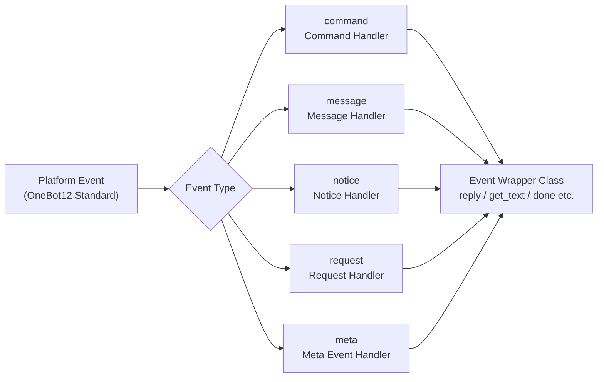

# Event System API

This document details the API of the ErisPulse event system.

The event system dispatches platform events into five types of handlers:




## Command Module

### Registering Commands

```python
from ErisPulse.Core.Event import command

# Basic command
@command("hello", help="Send greeting")
async def hello_handler(event):
    await event.reply("Hello!")

# Command with aliases
@command(["help", "h"], aliases=["Help"], help="Display help")
async def help_handler(event):
    pass

# Command with permissions
def is_admin(event):
    return event.get("user_id") in admin_ids

@command("admin", permission=is_admin, help="Admin command")
async def admin_handler(event):
    pass

# Hidden command
@command("secret", hidden=True, help="Secret command")
async def secret_handler(event):
    pass

# Command group
@command("admin.reload", group="admin", help="Reload modules")
async def reload_handler(event):
    pass
```

### Command Information

```python
# Get command help
help_text = command.help()

# Get specific command
cmd_info = command.get_command("admin")

# Get all commands in a command group
admin_commands = command.get_group_commands("admin")

# Get all visible commands
visible_commands = command.get_visible_commands()
```

### Waiting for Replies

```python
# Wait for user reply
@command("ask", help="Ask for user info")
async def ask_command(event):
    reply = await command.wait_reply(
        event,
        prompt="Please enter your name:",  # Sent above
        timeout=30.0
    )
    
    if reply:
        name = reply.get_text()
        await event.reply(f"Hello, {name}!")

# Waiting for reply with validation
def validate_age(event_data):
    try:
        age = int(event_data.get_text())
        return 0 <= age <= 150
    except ValueError:
        return False

@command("age", help="Ask for user age")
async def age_command(event):
    await event.reply("Please enter your age:")
    
    reply = await command.wait_reply(
        event,
        timeout=60,
        validator=validate_age
    )
    
    if reply:
        age = int(reply.get_text())
        await event.reply(f"Your age is {age} years old")

# Waiting for reply with callback
async def handle_confirmation(reply_event):
    text = reply_event.get_text().lower()
    if text in ["Yes", "yes", "y"]:
        await event.reply("Operation confirmed!")
    else:
        await event.reply("Operation canceled.")

@command("confirm", help="Confirm operation")
async def confirm_command(event):
    await command.wait_reply(
        event,
        prompt="Please enter 'Yes' or 'No':",
        callback=handle_confirmation
    )

## Message Module

### Message Events

```python
from ErisPulse.Core.Event import message

# Listen to all messages
@message.on_message()
async def message_handler(event):
    sdk.logger.info(f"Received message: {event.get_text()}")

# Listen to private messages
@message.on_private_message()
async def private_handler(event):
    user_id = event.get_user_id()
    sdk.logger.info(f"Private chat from: {user_id}")

# Listen to group messages
@message.on_group_message()
async def group_handler(event):
    group_id = event.get_group_id()
    sdk.logger.info(f"Group chat from: {group_id}")

# Listen to @ messages
@message.on_at_message()
async def at_handler(event):
    mentions = event.get_mentions()
    sdk.logger.info(f"Mentioned users: {mentions}")
```

### Conditional Listening

```python
# Use priority to control execution order
@message.on_message(priority=10)  # Higher numeric value means higher priority
async def high_priority_handler(event):
    pass

# Implement conditional filtering inside the handler
@message.on_message()
async def filtered_handler(event):
    if "Keyword" not in event.get_text():
        return
    # Process messages containing the keyword
    pass

## Notice Module

### Notice Events

```python
from ErisPulse.Core.Event import notice

# Friend added
@notice.on_friend_add()
async def friend_add_handler(event):
    user_id = event.get_user_id()
    await event.reply("Welcome to add me as a friend!")

# Friend removed
@notice.on_friend_remove()
async def friend_remove_handler(event):
    user_id = event.get_user_id()
    sdk.logger.info(f"Friend removed: {user_id}")

# Group member increased
@notice.on_group_increase()
async def member_increase_handler(event):
    user_id = event.get_user_id()
    await event.reply(f"Welcome new member!")

# Group member decreased
@notice.on_group_decrease()
async def member_decrease_handler(event):
    user_id = event.get_user_id()
    sdk.logger.info(f"Group member left: {user_id}")

## Request Module

### Request Events

```python
from ErisPulse.Core.Event import request

# Friend request
@request.on_friend_request()
async def friend_request_handler(event):
    user_id = event.get_user_id()
    comment = event.get_comment()
    sdk.logger.info(f"Friend request: {user_id}, comment: {comment}")

# Group invite request
@request.on_group_request()
async def group_request_handler(event):
    group_id = event.get_group_id()
    user_id = event.get_user_id()
    sdk.logger.info(f"Group invite: {group_id}, from: {user_id}")

## Meta Meta-Event Module

### Meta Event

```python
from ErisPulse.Core.Event import meta

# Connection event
@meta.on_connect()
async def connect_handler(event):
    platform = event.get_platform()
    sdk.logger.info(f"Platform {platform} connected successfully")

# Disconnection event
@meta.on_disconnect()
async def disconnect_handler(event):
    platform = event.get_platform()
    sdk.logger.info(f"Platform {platform} disconnected")

# Heartbeat event
@meta.on_heartbeat()
async def heartbeat_handler(event):
    sdk.logger.debug("Heartbeat received")
```

### Bot Status Query

After the adapter sends a meta event, the framework automatically tracks the Bot status. For the query API and lifecycle event listeners, please refer to [Adapter System API - Bot Status Management](adapter-system.md#bot-status-management).


## Event Wrapper Class

The Event module's event handlers receive an Event wrapper instance, which inherits from dict and provides convenient methods.

### Core Methods

```python
# Get event information
event_id = event.get_id()
event_time = event.get_time()
event_type = event.get_type()
detail_type = event.get_detail_type()
platform = event.get_platform()

# Get bot information
self_platform = event.get_self_platform()
self_user_id = event.get_self_user_id()
self_info = event.get_self_info()
```

### Session Identifier

```python
# Unified target ID: Returns group_id for group chats, user_id for private chats, etc.
target_id = event.get_target_id()

# Unique session identifier, format: {platform}:{detail_type}:{target_id}
session_id = event.get_session_id()
# Examples: "telegram:private:12345", "qq:group:67890"
```

`get_target_id()` returns the first non-empty value in the following order: `group_id` → `channel_id` → `guild_id` → `thread_id` → `user_id`. Suitable for scenarios like context management, state storage, etc., that require a unified identifier for the session.

### Message Methods

```python
# Get message content
message_segments = event.get_message()
alt_message = event.get_alt_message()
text = event.get_text()

# Get sender information
user_id = event.get_user_id()
nickname = event.get_user_nickname()
sender = event.get_sender()

# Get group information
group_id = event.get_group_id()

# Check message type
is_msg = event.is_message()
is_private = event.is_private_message()
is_group = event.is_group_message()

# @ message related
is_at = event.is_at_message()
has_mention = event.has_mention()
mentions = event.get_mentions()
```

### Command Information

```python
# Get command information
cmd_name = event.get_command_name()
cmd_args = event.get_command_args()
cmd_raw = event.get_command_raw()

# Check if it is a command
is_cmd = event.is_command()
```

### Reply Functionality

```python
# Basic reply
await event.reply("This is a message")

# Specify sending method
await event.reply("http://example.com/image.jpg", method="Image")

# Reply with @ users and message
await event.reply("Hello", at_users=["user1"], reply_to="msg_id")

# @ all members
await event.reply("Announcement", at_all=True)

# Use platform-specific modifier methods (via parameter)
await event.reply("Board content", method="Board",
                  via=[("Expire", 3600), ("ForMember", "114514")])

# Get send chain, freely append modifier methods and sending methods (suitable for multiple consecutive modifiers / action-oriented methods)
await event.send_chain().Expire(3600).Board("Board content")
await event.send_chain().DismissBoard()

# Use OneBot12 message segment reply
from ErisPulse.Core.Event import MessageBuilder
msg = MessageBuilder().text("Hello").image("url").build()
await event.reply_ob12(msg)

# Wait for reply
reply = await event.wait_reply(timeout=30)
```

### Platform Capability Query

```python
# Check if the current platform supports a certain sending method
if event.supports("Image"):
    await event.reply(url, method="Image")

# List all available sending methods for the current platform
methods = event.available_methods()
# ["Text", "Image", "Voice", ...]
```

### Reply Methods

The `reply()` method supports specifying the sending type via the `method` parameter, as well as two convenient boolean parameters:

```python
# Simple text reply
await event.reply("Hello")

# Reply and @ sender
await event.reply("Hello", at_sender=True)

# Reply and quote the current message
await event.reply("Received", quote=True)

# Combined usage
await event.reply("Received", at_sender=True, quote=True)

# Send image (using method parameter)
if event.supports("Image"):
    await event.reply("http://example.com/img.jpg", method="Image")
else:
    await event.reply("[Image] http://example.com/img.jpg")
```

**Parameter Description**:

| Parameter | Type | Description |
|-----------|------|-------------|
| `content` | str | Content to send |
| `method` | str | Sending method, default "Text", optional "Image"/"Voice"/"Video"/"File" etc. |
| `at_sender` | bool | Whether to @ the sender (automatically extracts user_id) |
| `quote` | bool | Whether to quote the reply to the current message (automatically extracts message_id) |
| `at_users` | list[str] | List of users to @ |
| `reply_to` | str | Manually specify the message ID to reply to |
| `at_all` | bool | Whether to @ all members |

### Interactive Methods

```python
# confirm — Confirm the conversation (returns True/False/None)
if await event.confirm("Are you sure you want to execute this action?"):
    await event.reply("Confirmed")

# Send confirmation prompt using non-Text method
if await event.confirm("http://example.com/image.jpg", method="Image"):
    await event.reply("Confirmed image prompt")

# choose — Select from menu (returns option index or None)
choice = await event.choose("Please select a color:", ["Red", "Green", "Blue"])

# options_format="auto" (default) automatically selects style based on method:
# Markdown → Unordered list (- 1.Option), Html → Ordered list (<ol>), others → plain text list
# Text-based methods (Markdown/Html, etc.) merge options to the end by default
# merge_prompt=True can force any method to merge; placeholder can customize placeholder
choice = await event.choose(
    "## Please select\n{options}", ["A", "B"],
    method="Markdown", merge_prompt=True,
)

# collect — Form collection (returns {key: value} dict or None)
data = await event.collect([
    {"key": "name", "prompt": "Please enter your name:"},
    {"key": "age", "prompt": "Please enter your age:",
     "validator": lambda e: e.get_text().isdigit()},
    {"key": "avatar", "prompt": "Please send avatar:", "method": "Image"},
])

# wait_for — Wait for any event satisfying conditions
evt = await event.wait_for(event_type="notice", condition=lambda e: ..., timeout=120)

# conversation — Multi-turn dialogue context
conv = event.conversation(timeout=60)
await conv.say("Welcome!")
```

> For complete parameter descriptions and more examples of interactive methods, please refer to [Event Wrapper Class Details](../developer-guide/modules/event-wrapper.md) and [Conversation Multi-turn Dialogue](../advanced/conversation.md).

### Utility Methods

```python
# Convert to dict (filters out internal keys starting with _)
event_dict = event.to_dict()

# Get raw data
raw = event.get_raw()
raw_type = event.get_raw_type()
```

### Control Flow

`event.done(claim=, stop=)` unifies the control of two orthogonal semantics: "Claim" and "Stop":

- **Claim (claim)**: Marks the event as processed (`_processed`), so the command dispatcher skips re-processing it
- **Stop (stop)**: Prevents propagation to lower priority handlers (`_propagation_stopped`)

```python
# Claim + Stop (default)
event.done()

# Claim only, no stop (low priority observers can still see it)
event.done(stop=False)

# Stop only, no claim (e.g., firewall / rate limiting)
event.done(claim=False)

# mark_processed is the main method, done is an alias
event.mark_processed()             # equivalent to event.done()
event.mark_processed(stop=False)   # equivalent to event.done(stop=False)

# Query status
event.is_processed()  # Whether already claimed
event.is_stopped()    # Whether propagation is already stopped
```

### Platform Extension Methods

Adapters can register platform-specific methods for the Event, which are only available on instances of the corresponding platform.

#### Users: Using Platform Extension Methods

After an adapter registers platform-specific methods, you can call them directly in event handlers. Methods vary by platform, please refer to the corresponding [Platform Documentation](../platform-guide/).

```python
from ErisPulse.Core.Event import message

@message.on_message()
async def handle_message(event):
    platform = event.get_platform()

    # Call platform-specific methods based on platform
    if platform == "email":
        subject = event.get_subject()           # Email specific
        attachments = event.get_attachments()   # Email specific
```

#### Query Platform Registered Methods

```python
from ErisPulse.Core.Event import get_platform_event_methods

# View which methods are registered for a platform
methods = get_platform_event_methods("email")
# ["get_subject", "get_from", "get_attachments", ...]

# Dynamically judge and call
for method_name in get_platform_event_methods(event.get_platform()):
    method = getattr(event, method_name)
    print(f"{method_name}: {method()}")
```

#### Platform Method Isolation

Methods registered by different platforms do not interfere with each other:

```python
# Email event - Only email methods
event = Event({"platform": "email", "email_raw": {"subject": "Hello"}})
event.get_subject()      # ✅ "Hello"
event.get_chat_type()    # ❌ AttributeError

# Telegram event - Only Telegram methods
event = Event({"platform": "telegram", "telegram_raw": {"chat": {"type": "private"}}})
event.get_chat_type()    # ✅ "private"
event.get_subject()      # ❌ AttributeError
```

#### `hasattr` / `dir` Support

```python
hasattr(event, "get_subject")   # Returns True only when platform="email"
"get_subject" in dir(event)     # Same as above
```

### Adapters: Registering Platform Extension Methods

Adapters can register platform-specific methods for the Event using decorators. The first argument of the method is `self` (Event instance), allowing free access to event data.

#### Registering a Single Method

```python
from ErisPulse.Core.Event import register_event_method

@register_event_method("email")
def get_subject(self):
    """Get email subject"""
    return self.get("email_raw", {}).get("subject", "")

@register_event_method("email")
def get_from(self):
    """Get sender"""
    return self.get("email_raw", {}).get("from", {})
```

#### Batch Registration (Mixin Classes)

When there are many methods, it is recommended to use a Mixin class for batch registration:

```python
from ErisPulse.Core.Event import register_event_mixin

class EmailEventMixin:
    def get_subject(self):
        return self.get("email_raw", {}).get("subject", "")

    def get_from(self):
        return self.get("email_raw", {}).get("from", "")

    def get_attachments(self):
        return self.get("email_raw", {}).get("attachments", [])

# Register all methods at once
register_event_mixin("email", EmailEventMixin)
```

#### Return Value Specification

| Scenario | Return Value | User Usage |
|----------|-------------|------------|
| Returning data (text, dict, etc.) | Direct return value | `subject = event.get_subject()` |
| Executing operations (sending messages, etc.) | Returns `asyncio.Task` | `task = event.do_something()` Optional `await` |

> **Suggestion**: Methods that do not return data should return `asyncio.Task`, allowing users to decide for themselves whether to `await`, ensuring the operation completes even if not `await`ed.

```python
@register_event_method("email")
def forward_email(self, to_address: str):
    """Forward email — returns Task, user can decide whether to await"""
    import asyncio
    return asyncio.create_task(
        self._do_forward(to_address)
    )

# User can await to wait for result
await event.forward_email("user@example.com")

# Or not await, operation executes in background
event.forward_email("user@example.com")
```

#### Unregistering Methods

```python
from ErisPulse.Core.Event import unregister_event_method, unregister_platform_event_methods

# Unregister single method
unregister_event_method("email", "get_subject")

# Unregister all methods for a platform (called during adapter shutdown)
unregister_platform_event_methods("email")
```

#### Overriding Built-in Methods

`register_event_mixin` / `register_event_method` support overriding built-in Event methods (such as `confirm`, `choose`, `collect`, `wait_reply`, `reply`, etc.). Registered platform methods take precedence over built-in methods via `Event.__getattribute__`, so adapters can provide platform-specific interactive implementations.

Built-in implementations are exported as `_builtin_*` functions, and overrideers can call them as a fallback:

```python
from ErisPulse.Core.Event import register_event_mixin, _builtin_choose

class YunhuEventMixin:
    async def choose(self, prompt, options, timeout=60, method="Text"):
        # Yunhu platform uses button components
        buttons = [[{"text": opt} for opt in options]]
        await self.reply(prompt)
        # ...wait for button callback or text reply...
        # Fallback to built-in logic
        return await _builtin_choose(self, None, options, timeout, "Text")

register_event_mixin("yunhu", YunhuEventMixin)

## Cross-Platform Extensions (Wildcards)

`register_event_method` and `register_event_mixin` support passing `"*"` as the platform name, making the registered methods available on **all** platform Event instances. This is suitable for functional modules requiring cross-platform reuse, such as AI conversations and context management.

### Registering Cross-Platform Methods

```python
from ErisPulse.Core.Event.wrapper import register_event_method

@register_event_method("*")
async def ai_chat(self, prompt: str):
    """self is the Event instance, allowing free access to event data and built-in methods"""
    await self.reply(f"AI: {prompt}")
```

After registration, event handlers on all platforms can invoke it:

```python
from ErisPulse.Core.Event import message

@message.on_message()
async def handler(event):
    await event.ai_chat(event.get_text())
```

### Method Resolution Order

When accessing Event methods via attributes, the resolution order is:

1. **Platform-Specific Methods** (overrides for the current platform)
2. **Wildcard Methods** (cross-platform methods registered with `"*"`)
3. **Built-in Methods** (e.g., `reply`, `confirm`)
4. **Dictionary Key Access**

> Therefore, wildcard methods can override built-in methods (such as `reply`), but they will be further overridden by platform-specific methods with the same name.

## Priority System

Event handlers support priorities, where higher numerical values indicate higher priority:

```python
# High priority handler executes first
@message.on_message(priority=10)
async def high_priority_handler(event):
    pass

# Low priority handler executes later
@message.on_message(priority=0)
async def low_priority_handler(event):
    pass

## Related Documentation

- [Core Modules API](core-modules.md) - Core Module API
- [Adapter System API](adapter-system.md) - Adapter Management API
- [Module Development Guide](../developer-guide/modules/) - Develop custom modules