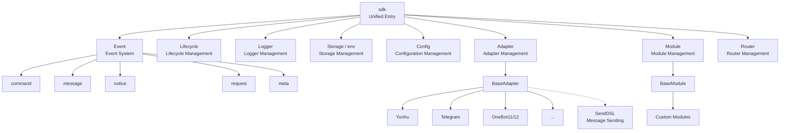
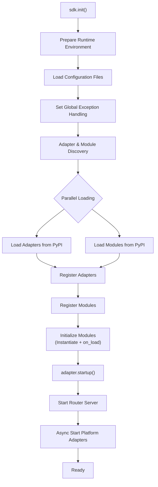
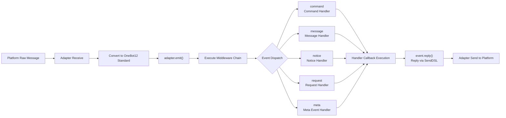
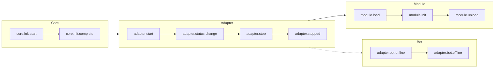
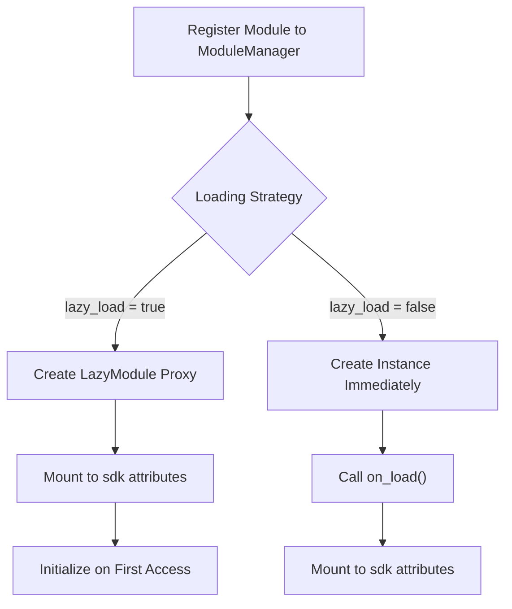

# Architecture Overview

This document introduces the technical architecture of ErisPulse SDK through visual diagrams, helping you quickly understand the design philosophy and module relationships of the framework.

## SDK Core Architecture

The diagram below shows the composition of the SDK's core modules and their relationships:



### Core Module Description

| Module | Description |
|------|------|
| **Event** | Event system, providing five types of event processing: command / message / notice / request / meta |
| **Adapter** | Adapter manager, managing the registration, startup, and shutdown of multi-platform adapters |
| **Module** | Module manager, managing plugin registration, loading, and unloading |
| **Lifecycle** | Lifecycle manager, providing event-driven lifecycle hooks |
| **Storage** | SQLite-based key-value storage system |
| **Config** | TOML format configuration file management |
| **Logger** | Modular logging system, supporting sub-loggers |
| **Router** | FastAPI-based HTTP/WebSocket route management |

## Initialization Process

The diagram below shows the complete initialization process of `sdk.init()`:



### Initialization Stage Breakdown

1.  **Environment Preparation** - Load TOML configuration files, set up global exception handling
2.  **Parallel Discovery** - Discover adapters and modules from installed PyPI packages simultaneously
3.  **Registration Phase** - Register discovered adapters and modules to their corresponding managers
4.  **Module Initialization** - Create module instances, call the `on_load` lifecycle method
5.  **Adapter Startup** - Start the router server (FastAPI), asynchronously start platform adapter connections

## Event Handling Process

The diagram below shows the complete flow path of messages from the platform to the handler:



### Key Steps in Event Handling

-   **Adapter Receive** - Platform adapters receive native events via WebSocket/Webhook, etc.
-   **OB12 Standardization** - Convert platform native events to the unified OneBot12 standard format
-   **Middleware Processing** - Execute registered middleware functions sequentially, allowing modification of event data
-   **Event Dispatch** - Dispatch to corresponding handlers based on event type (message/notice/request/meta)
-   **SendDSL Reply** - Handlers send responses via `event.reply()` or `SendDSL` chain calls

## Lifecycle Events

The diagram below shows the triggering sequence of lifecycle events for various framework components:



### Listening to Lifecycle Events

You can listen to these events via `lifecycle.on()` to execute custom logic:

```python
from ErisPulse import sdk

# Listen to all adapter events
@sdk.lifecycle.on("adapter")
async def on_adapter_event(event_data):
    print(f"Adapter event: {event_data}")

# Listen for module load completion
@sdk.lifecycle.on("module.load")
async def on_module_loaded(event_data):
    print(f"Module loaded: {event_data}")

# Listen for Bot online
@sdk.lifecycle.on("adapter.bot.online")
async def on_bot_online(event_data):
    print(f"Bot online: {event_data}")
```

## Module Loading Strategy

ErisPulse supports two module loading strategies:



> For more details, please refer to [Lazy Loading System](advanced/lazy-loading.md) and [Lifecycle Management](advanced/lifecycle.md).