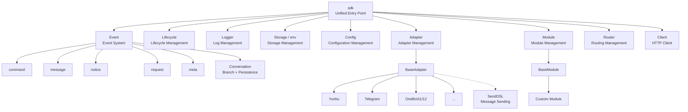
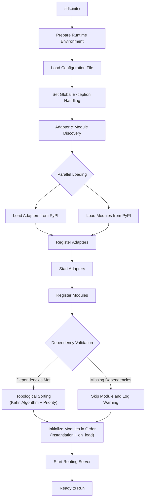
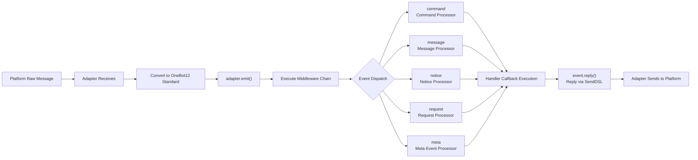
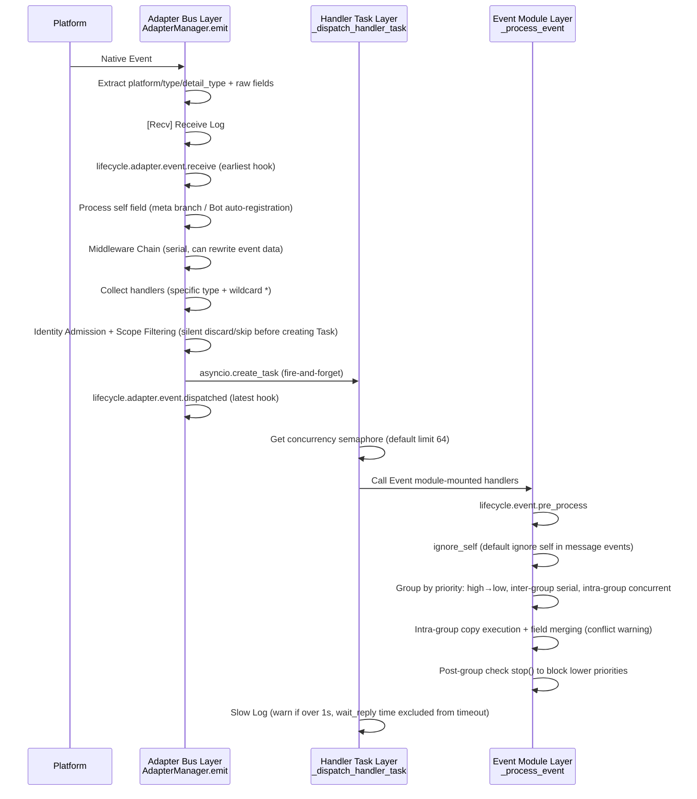
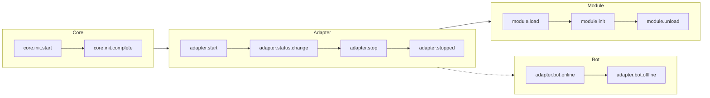
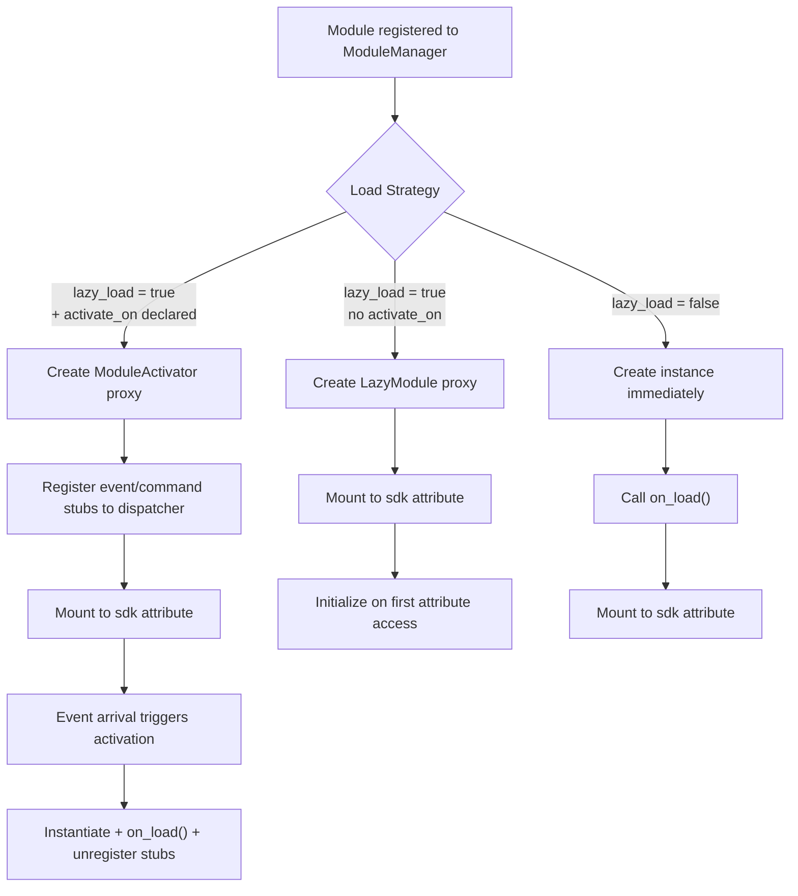
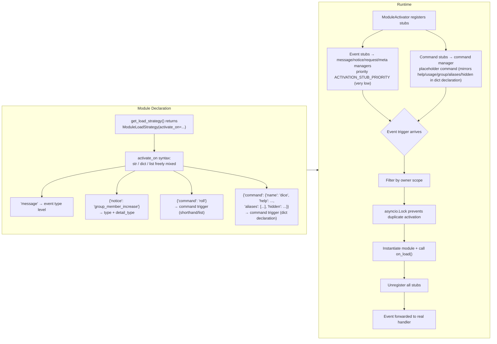
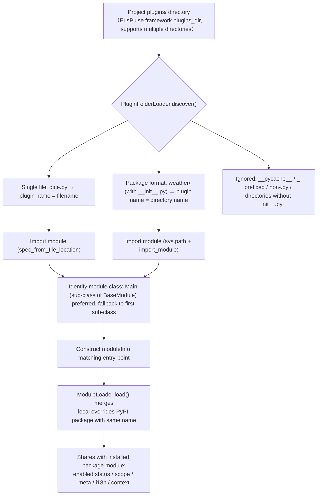

# Architecture Overview

This document introduces the technical architecture of the ErisPulse SDK through visual diagrams, helping you quickly understand the framework's design principles and module relationships.

## SDK Core Architecture

The following diagram illustrates the core modules of the SDK and their relationships:

```mermaid
graph TB
    SDK["sdk<br/>Unified Entry Point"]

    SDK --> Event["Event<br/>Event System"]
    SDK --> Lifecycle["Lifecycle<br/>Lifecycle Management"]
    SDK --> Logger["Logger<br/>Log Management"]
    SDK --> Storage["Storage / env<br/>Storage Management"]
    SDK --> Config["Config<br/>Configuration Management"]
    SDK --> AdapterMgr["Adapter<br/>Adapter Management"]
    SDK --> ModuleMgr["Module<br/>Module Management"]
    SDK --> Router["Router<br/>Routing Management"]
    SDK --> Client["Client<br/>HTTP Client"]
    Event --> Command["command"]
    Event --> Message["message"]
    Event --> Notice["notice"]
    Event --> Request["request"]
    Event --> Meta["meta"]
    Event --> Conversation["Conversation<br/>Branch + Persistence"]

    AdapterMgr --> BaseAdapter["BaseAdapter"]
    BaseAdapter --> P1["Yunhu"]
    BaseAdapter --> P2["Telegram"]
    BaseAdapter --> P3["OneBot11/12"]
    BaseAdapter --> PN["..."]

    ModuleMgr --> BaseModule["BaseModule"]
    BaseModule --> CM["Custom Module"]

    BaseAdapter -.-> SendDSL["SendDSL<br/>Message Sending"]
```

### Core Module Descriptions

| Module | Description |
|--------|-------------|
| **Event** | Event system providing handling for five types of events: command / message / notice / request / meta, as well as Conversation for multi-turn dialogues |
| **Adapter** | Adapter manager managing the registration, startup, and shutdown of multi-platform adapters |
| **Module** | Module manager managing plugin registration, loading, and unloading, supporting dependency declaration and topological sorting |
| **Lifecycle** | Lifecycle manager providing event-driven lifecycle hooks |
| **Storage** | Key-value storage system based on SQLite, supporting general SQL chain query |
| **Config** | Configuration file management in TOML format |
| **Logger** | Modular logging system supporting sub-loggers |
| **Router** | HTTP/WebSocket routing management, abstracting the underlying backend (currently FastAPI + Uvicorn), supporting decorator-based routing, middleware, grouping, rate limiting, and CORS |
| **Client** | Unified HTTP/WS client (previously `HttpClient` before 2.8.0, now retained as a compatibility alias), abstracting the underlying request library (currently aiohttp), providing request statistics, retry, logging, WebSocket client, and ErisPulse exception system. The client and server WebSocket share the `WebSocketConnectionBase` base class |

## Initialization Process

The following diagram illustrates the complete initialization process of `sdk.init()`:

```mermaid
flowchart TD
    A["sdk.init()"] --> B["Prepare Runtime Environment"]
    B --> B1["Load Configuration File"]
    B1 --> B2["Set Global Exception Handling"]
    B2 --> C["Adapter & Module Discovery"]
    C --> D{"Parallel Loading"}
    D --> D1["Load Adapters from PyPI"]
    D --> D2["Load Modules from PyPI"]
    D1 & D2 --> E["Register Adapters"]
    E --> E1["Start Adapters"]
    E1 --> F["Register Modules"]
    F --> F1{"Dependency Validation"}
    F1 -->|"Missing Dependencies"| F2["Skip Module and Log Warning"]
    F1 -->|"Dependencies Met"| F3["Topological Sorting<br/>(Kahn Algorithm + Priority)"]
    F3 --> G["Initialize Modules in Order<br/>(Instantiation + on_load)"]
    F2 --> G
    G --> H["Start Routing Server"]
    H --> K["Ready to Run"]
```

### Detailed Initialization Stages

> The complete initialization chain is broken down into (Finder / Loader / Manager / Router), with low-level entry points (`init()` / `init_task()` / `init_sync()`) and full manual startup described in [Startup Process and Manual Control](advanced/startup.md).

## Event Handling Flow

The following diagram shows the complete flow path of messages from the platform to the handler:

```mermaid
flowchart LR
    A["Platform Raw Message"] --> B["Adapter Receives"]
    B --> C["Convert to OneBot12 Standard"]
    C --> D["adapter.emit()"]
    D --> E["Execute Middleware Chain"]
    E --> F{"Event Dispatch"}
    F --> G1["command<br/>Command Processor"]
    F --> G2["message<br/>Message Processor"]
    F --> G3["notice<br/>Notice Processor"]
    F --> G4["request<br/>Request Processor"]
    F --> G5["meta<br/>Meta Event Processor"]
    G1 & G2 & G3 & G4 & G5 --> H["Handler Callback Execution"]
    H --> I["event.reply()<br/>Reply via SendDSL"]
    I --> J["Adapter Sends to Platform"]
```

### Detailed Explanation of the Event Handling Chain

The above diagram shows the "result"; below, we break down what the framework does behind the scenes after `adapter.emit()` — this is a three-layer dispatch chain:

```mermaid
sequenceDiagram
    participant P as Platform
    participant A as Adapter Bus Layer<br/>AdapterManager.emit
    participant T as Handler Task Layer<br/>_dispatch_handler_task
    participant E as Event Module Layer<br/>_process_event

    P->>A: Native Event
    A->>A: Extract platform/type/detail_type + raw fields
    A->>A: [Recv] Receive Log
    A->>A: lifecycle.adapter.event.receive (earliest hook)
    A->>A: Process self field (meta branch / Bot auto-registration)
    A->>A: Middleware Chain (serial, can rewrite event data)
    A->>A: Collect handlers (specific type + wildcard *)
    A->>A: Identity Admission + Scope Filtering (silent discard/skip before creating Task)
    A->>T: asyncio.create_task (fire-and-forget)
    A->>A: lifecycle.adapter.event.dispatched (latest hook)
    T->>T: Get concurrency semaphore (default limit 64)
    T->>E: Call Event module-mounted handlers
    E->>E: lifecycle.event.pre_process
    E->>E: ignore_self (default ignore self in message events)
    E->>E: Group by priority: high→low, inter-group serial, intra-group concurrent
    E->>E: Intra-group copy execution + field merging (conflict warning)
    E->>E: Post-group check stop() to block lower priorities
    T->>T: Slow Log (warn if over 1s, wait_reply time excluded from timeout)
```

**What the framework does at each step and what you can intervene:**

| Stage | What the framework does | What you can intervene |
|------|-------------|-----------|
| Receive | Extract standard fields, retain `{platform}_raw` raw data; write `[Recv]` log | Listen to `adapter.event.receive` to get the earliest event |
| Self Field | Meta events go through connect/disconnect/heartbeat branches; normal events auto-register Bot and trigger `adapter.bot.online` | Listen to `adapter.bot.online` / `bot.offline` |
| Middleware | **Serial** execution, if return value is not None, replace event data | Register middleware to rewrite or intercept events |
| Dispatch Collection | First get specific type handlers, then get `*` wildcard handlers | — |
| Identity Dimension | At the dispatch entrance, determine whether to accept the event based on user > session > Bot > adapter (`scope.is_identity_allowed`), **if rejected, the entire event is discarded** | `ErisPulse.scope.identity` binding |
| Scope Filtering | Determine `scope.is_allowed` based on module owner (session level > Bot level > platform level), **if not passed, silently skip** | Configure scope whitelist/blacklist |
| Scheduling | Each matching handler is an independent `asyncio.Task`, `emit()` **does not wait** for handler completion before returning | — |
| Priority | High-priority groups execute first; **inter-group serial, intra-group concurrent** (each group holds its own event copy, changes are merged back into the original event, conflicts trigger WARNING) | `@command(..., priority=N)` / specify priority during registration |
| Blocking | After each group is processed, check `event.is_stopped()`, if triggered, **no lower priority will be executed** | `event.mark_processed(stop=True)` / `event.done()` |

> **Common Misconceptions**:
> 1. **Scope filtering is silent** — handlers that are filtered out do not report errors or responses, only visible in TRACE-level logs (`core.scope.denied`). If "my module did not receive the message," prioritize checking the scope binding.
> 2. **Handlers are naturally concurrent** — the framework already creates an independent Task for each handler, so you **do not need** to wrap it with `asyncio.create_task`.
> 3. **No blocking within the same priority group** — `mark_processed(stop=True)` only prevents lower-priority groups from executing, but handlers in the same group that are already running concurrently will not be interrupted.
> 4. **Slow log threshold is fixed at 1 second** — if a handler takes over 1 second, a WARNING will be logged (`wait_reply` waiting time has been excluded from the timeout), but execution is not interrupted.

> For details on the three-level module binding of scope, identity admission, and outbound action restrictions, see [Scope (scope)](advanced/scope.md); for event scope text filtering and command user ACL, see [Event Handling Introduction](getting-started/event-handling.md); for concurrency limit configuration, see [Configuration Guide](user-guide/configuration.md#Framework-Configuration).

## Lifecycle Events

The following diagram illustrates the order in which lifecycle events are triggered by various components of the framework:

```mermaid
flowchart LR
    subgraph Core["Core"]
        direction LR
        C1["core.init.start"] --> C2["core.init.complete"]
    end

    subgraph AdapterLife["Adapter"]
        direction LR
        A1["adapter.start"] --> A2["adapter.status.change"] --> A3["adapter.stop"] --> A4["adapter.stopped"]
    end

    subgraph ModuleLife["Module"]
        direction LR
        M1["module.load"] --> M2["module.init"] --> M3["module.unload"]
    end

    subgraph BotLife["Bot"]
        direction LR
        B1["adapter.bot.online"] --> B2["adapter.bot.offline"]
    end

    Core --> AdapterLife
    AdapterLife --> ModuleLife
    AdapterLife -.-> BotLife
```

### Listening to Lifecycle Events

> For the complete event listening methods (`lifecycle.on()` / `once()` / `has_handlers()`), a full list of lifecycle events, and their data formats, see [Lifecycle Management](advanced/lifecycle.md).

## Module Loading Strategies

ErisPulse supports three module loading strategies, as declared by the `ModuleLoadStrategy` returned by `get_load_strategy()`:

```mermaid
flowchart TD
    A["Module registered to ModuleManager"] --> B{"Load Strategy"}
    B -->|"lazy_load = true<br/>+ activate_on declared"| C["Create ModuleActivator proxy"]
    B -->|"lazy_load = true<br/>no activate_on"| D["Create LazyModule proxy"]
    B -->|"lazy_load = false"| E["Create instance immediately"]
    C --> F["Register event/command stubs to dispatcher"]
    F --> G["Mount to sdk attribute"]
    G --> H["Event arrival triggers activation"]
    H --> I["Instantiate + on_load() + unregister stubs"]
    D --> J["Mount to sdk attribute"]
    J --> K["Initialize on first attribute access"]
    E --> L["Call on_load()"]
    L --> M["Mount to sdk attribute"]
```

> For more details, refer to [Lazy Loading System](advanced/lazy-loading.md), [Lifecycle Management](advanced/lifecycle.md), and the module documentation.

### Event-Driven Lazy Activation (`activate_on`) Trigger Architecture

> [!NOTE]
> This feature requires ErisPulse **2.8.0+**.

The `activate_on` directive allows a module to load only when the **first matching event/command arrives**, avoiding memory residency while ensuring no events are lost:

```mermaid
flowchart LR
    subgraph Declare["Module Declaration"]
        S1["get_load_strategy() returns<br/>ModuleLoadStrategy(activate_on=...)"] --> S2["activate_on syntax: <br/>str / dict / list freely mixed"]
        S2 --> S2a["'message' → event type level"]
        S2 --> S2b["{'notice': 'group_member_increase'}<br/>→ type + detail_type"]
        S2 --> S2c["{'command': 'roll'}<br/>→ command trigger (shorthand/list)"]
        S2 --> S2d["{'command': {'name': 'dice', 'help': ...,<br/>'aliases': [...], 'hidden': ...}}<br/>→ command trigger (dict declaration)"]
    end

    subgraph Runtime["Runtime"]
        R1["ModuleActivator registers stubs"] --> R1a["Event stubs → message/notice/request/meta managers<br/>priority ACTIVATION_STUB_PRIORITY (very low)"]
        R1 --> R1b["Command stubs → command manager<br/>placeholder command (mirrors help/usage/group/aliases/hidden in dict declaration)"]
        R1a --> R2{"Event trigger arrives"}
        R1b --> R2
        R2 --> R3["Filter by owner scope"]
        R3 --> R4["asyncio.Lock prevents duplicate activation"]
        R4 --> R5["Instantiate module + call on_load()"]
        R5 --> R6["Unregister all stubs"]
        R6 --> R7["Event forwarded to real handler"]
    end

    Declare --> Runtime
```

**Trigger Semantics Highlights:**

> The complete `activate_on` syntax (str / dict / list), command dict declaration, placeholder command help fallback chain, scope filtering, and failure semantics are detailed in [Lazy Loading System](advanced/lazy-loading.md#event-driven-lazy-activationactivate_on).

## Local Plugin Folder Architecture

> [!NOTE]
> This feature requires ErisPulse **2.8.0+**.

Local plugins (in the `plugins/` directory) do not require packaging and publishing; the framework automatically discovers and loads them at startup:

```mermaid
flowchart TD
    A["Project plugins/ directory<br/>（ErisPulse.framework.plugins_dir, supports multiple directories）"] --> B{"PluginFolderLoader.discover()"}
    B --> C["Single file: dice.py → plugin name = filename"]
    B --> D["Package format: weather/ (with __init__.py) → plugin name = directory name"]
    B --> E["Ignored: __pycache__ / _-prefixed / non-.py / directories without __init__.py"]
    C --> F["Import module (spec_from_file_location)"]
    D --> G["Import module (sys.path + import_module)"]
    F --> H["Identify module class: Main (sub-class of BaseModule) preferred, fallback to first sub-class"]
    G --> H
    H --> I["Construct moduleInfo matching entry-point"]
    I --> J["ModuleLoader.load() merges<br/>local overrides PyPI package with same name"]
    J --> K["Shares with installed package module:<br/>enabled status / scope / meta / i18n / context"]
```

**Conventions and Features:**

- Plugin name source: filename for single files, directory name for package format
- Local plugin `moduleInfo.meta.source == "plugin_folder"`, seamlessly coexists with PyPI installed package modules
- When names match, local takes precedence (for easy local override and debugging), and disabled state also removes corresponding entry-point entries

## Hot Module Reload Architecture

Hot reload applies consistently to **all module sources**: local plugins can automatically trigger reloads by monitoring file changes, and any module can be manually reloaded via `sdk.reload_module()` / `sdk.module.reload()`. For PyPI-installed packages, calling reload after pip upgrade will take effect.

```mermaid
flowchart TD
    A["sdk.enable_plugin_hot_reload()<br/>（Auto monitoring, only for local plugin directories）"] --> B["PluginReloadWatcher starts"]
    B --> C["PollingObserver (background daemon thread)<br/>Regularly compares .py file mtime"]
    C --> D{"Plugin file changed"}
    D --> E["Change debouncing (default 1 second)"]
    E --> F["_handle_change parses plugin name<br/>（Single file / package format）"]
    F --> G["asyncio.run_coroutine_threadsafe<br/>Schedules back to main event loop"]
    G --> H["sdk.reload_module(name)<br/>（Can also manually call for any module）"]
    H --> I["Unloads old instance (triggers on_unload)<br/>Collects dependents for cascading reload"]
    I --> J{"Module source?"}
    J -->|"plugin_folder"| K["Clears registration and plugin sys.modules<br/>Rescans plugins/ directory"]
    J -->|"PyPI installed package"| L["Clears registration + clears package sys.modules subtree by top_level<br/>Refreshes import cache and re-loads entry-point"]
    K --> M["Re-registers + re-loads"]
    L --> M
    M --> N["Mounts new instance to sdk property"]
    N --> O["Cascading reload of dependents<br/>（Full plugin reload / re-instantiation of PyPI package）"]
    K -.->|"File deleted"| P["Removes from loaded results"]
    L -.->|"entry-point disappeared (uninstalled)| P
```

The only difference between the two sources is in the discovery phase; registration, loading, and cascading reload are completely consistent:

- **Local Plugins** (`moduleInfo.meta.source == "plugin_folder"`): After clearing `sys.modules` corresponding to the plugin name, rescan the `plugins/` directory; if the file is deleted, remove it from the loaded results.
- **PyPI-installed Packages**: Clear the `sys.modules` subtree of the package according to `meta.top_level`, refresh the import cache (to break the 60-second entry-point cache), then re-query and re-import; if the entry-point disappears (pip uninstalled), remove it from the loaded results.