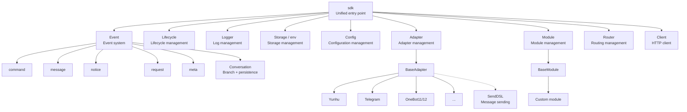
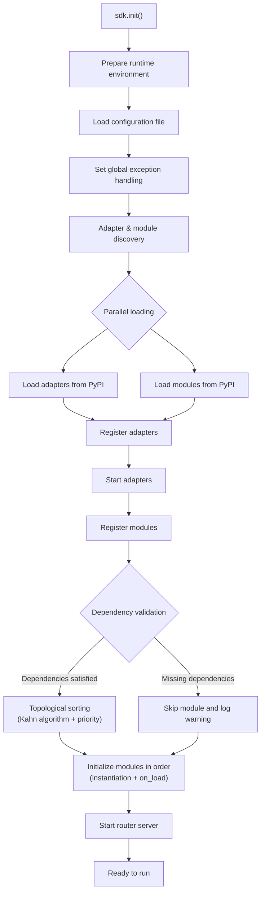
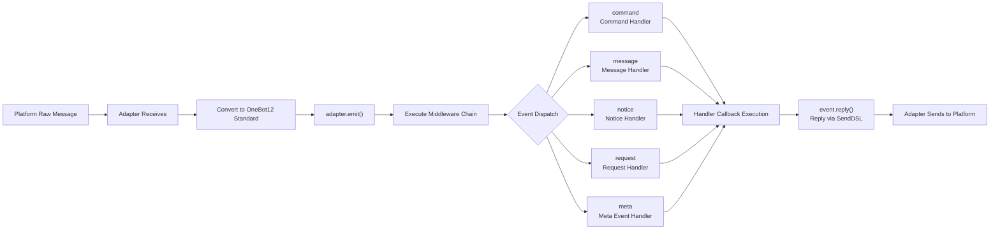
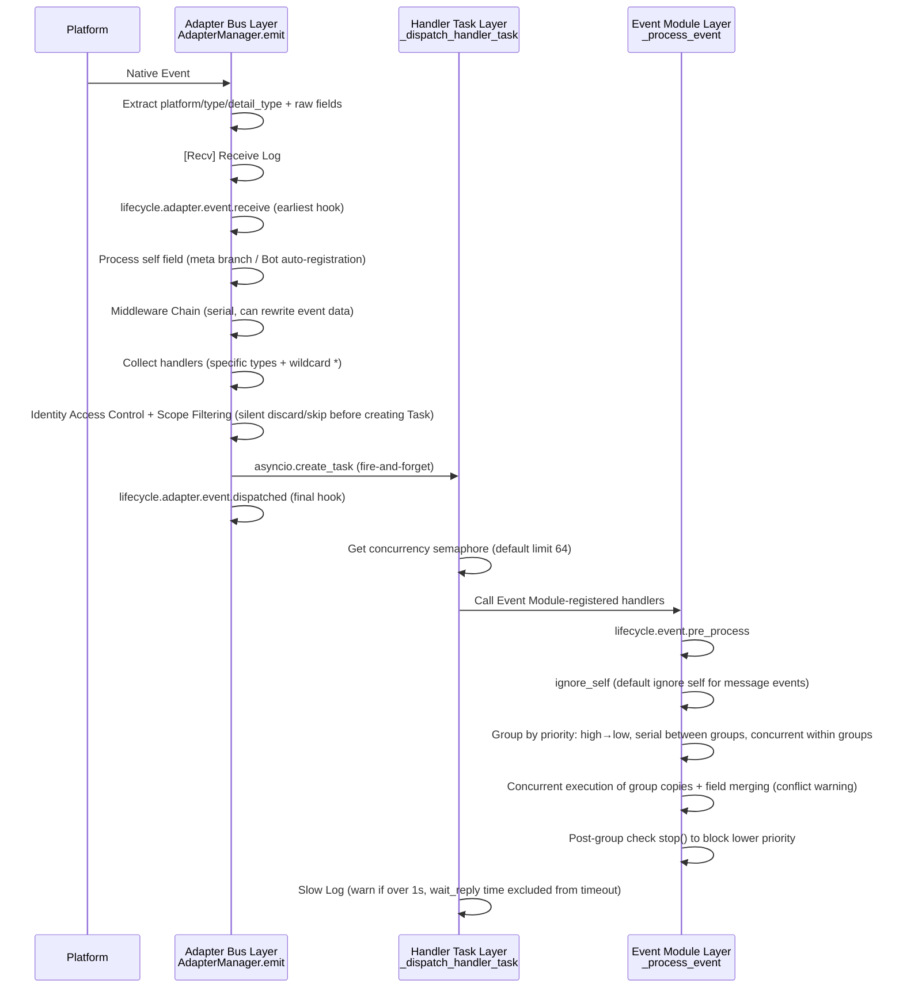
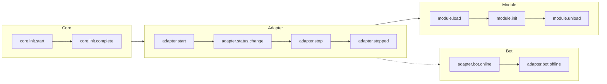
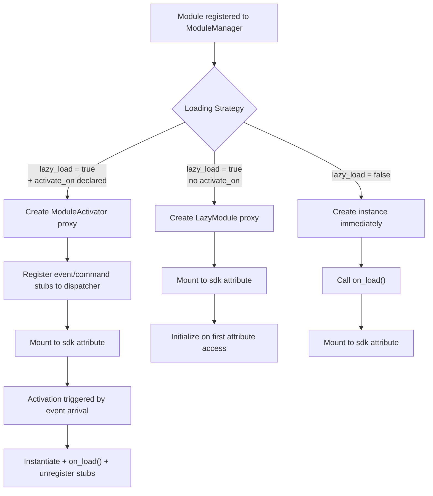
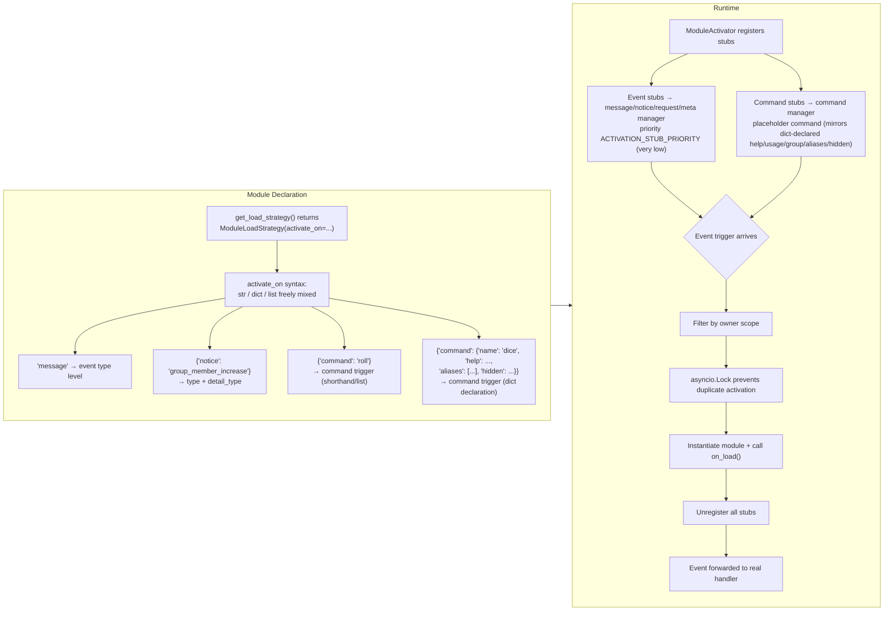
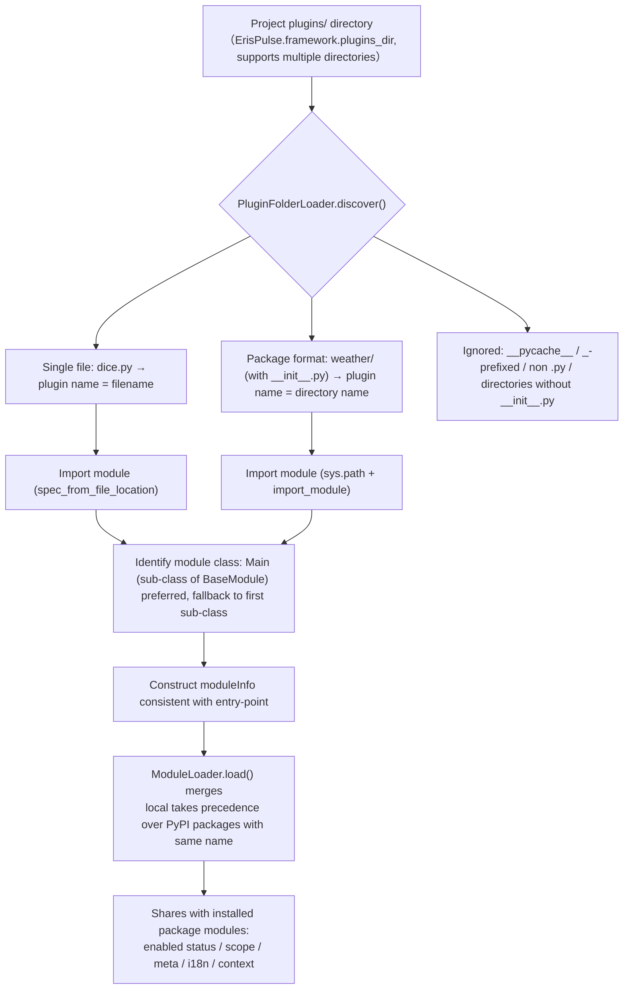
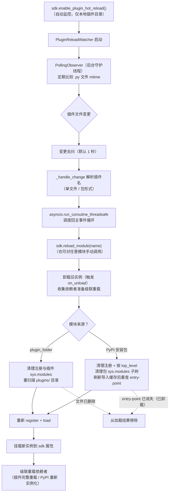

# Architecture Overview

This document introduces the technical architecture of the ErisPulse SDK through visual diagrams to help you quickly understand the framework's design philosophy and module relationships.

Please directly return the complete translated Markdown content without any additional text.

Once again, please note: if the document contains language switch lines (lines with language names separated by `` | ``), strictly follow the formatting requirements outlined in point 8 above, and do not write incorrect formats such as ``[**Label**](file)``.

## SDK Core Architecture

The following diagram illustrates the core modules of the SDK and their relationships:

```mermaid
graph TB
    SDK["sdk<br/>Unified entry point"]

    SDK --> Event["Event<br/>Event system"]
    SDK --> Lifecycle["Lifecycle<br/>Lifecycle management"]
    SDK --> Logger["Logger<br/>Log management"]
    SDK --> Storage["Storage / env<br/>Storage management"]
    SDK --> Config["Config<br/>Configuration management"]
    SDK --> AdapterMgr["Adapter<br/>Adapter management"]
    SDK --> ModuleMgr["Module<br/>Module management"]
    SDK --> Router["Router<br/>Routing management"]
    SDK --> Client["Client<br/>HTTP client"]
    Event --> Command["command"]
    Event --> Message["message"]
    Event --> Notice["notice"]
    Event --> Request["request"]
    Event --> Meta["meta"]
    Event --> Conversation["Conversation<br/>Branch + persistence"]

    AdapterMgr --> BaseAdapter["BaseAdapter"]
    BaseAdapter --> P1["Yunhu"]
    BaseAdapter --> P2["Telegram"]
    BaseAdapter --> P3["OneBot11/12"]
    BaseAdapter --> PN["..."]

    ModuleMgr --> BaseModule["BaseModule"]
    BaseModule --> CM["Custom module"]

    BaseAdapter -.-> SendDSL["SendDSL<br/>Message sending"]
```

### Core Module Descriptions

| Module | Description |
|------|------|
| **Event** | Event system, providing five types of event handling: command / message / notice / request / meta, as well as Conversation for multi-turn dialogues |
| **Adapter** | Adapter manager, managing the registration, startup, and shutdown of multi-platform adapters |
| **Module** | Module manager, managing plugin registration, loading, and unloading, supporting dependency declaration and topological sorting |
| **Lifecycle** | Lifecycle manager, providing event-driven lifecycle hooks |
| **Storage** | Key-value storage system based on SQLite, supporting general SQL chained queries |
| **Config** | Configuration file management in TOML format |
| **Logger** | Modular logging system, supporting sub-loggers |
| **Router** | HTTP/WebSocket routing management, abstracting the underlying backend (currently FastAPI + Uvicorn), supporting decorator routing, middleware, grouping, rate limiting, CORS |
| **Client** | Unified HTTP/WS client (pre-2.8.0 was `HttpClient`, compatible alias retained), abstracting the underlying request library (currently aiohttp), providing request statistics, retry, logging, WebSocket client, ErisPulse exception system, etc. The WebSocket client and server share the `WebSocketConnectionBase` base class |

## Initialization Process

The following diagram illustrates the complete initialization process of `sdk.init()`:

```mermaid
flowchart TD
    A["sdk.init()"] --> B["Prepare runtime environment"]
    B --> B1["Load configuration file"]
    B1 --> B2["Set global exception handling"]
    B2 --> C["Adapter & module discovery"]
    C --> D{"Parallel loading"}
    D --> D1["Load adapters from PyPI"]
    D --> D2["Load modules from PyPI"]
    D1 & D2 --> E["Register adapters"]
    E --> E1["Start adapters"]
    E1 --> F["Register modules"]
    F --> F1{"Dependency validation"}
    F1 -->|"Missing dependencies"| F2["Skip module and log warning"]
    F1 -->|"Dependencies satisfied"| F3["Topological sorting<br/>(Kahn algorithm + priority)"]
    F3 --> G["Initialize modules in order<br/>(instantiation + on_load)"]
    F2 --> G
    G --> H["Start router server"]
    H --> K["Ready to run"]
```

### Detailed Explanation of Initialization Stages

> The complete initialization chain is broken down into (Finder / Loader / Manager / Router), the underlying entry points (`init()` / `init_task()` / `init_sync()`), and manual full startup can be found in [Startup Process and Manual Control](advanced/startup.md).

## Event Handling Flow

The following diagram illustrates the complete message flow from the platform to the handler:

```mermaid
flowchart LR
    A["Platform Raw Message"] --> B["Adapter Receives"]
    B --> C["Convert to OneBot12 Standard"]
    C --> D["adapter.emit()"]
    D --> E["Execute Middleware Chain"]
    E --> F{"Event Dispatch"}
    F --> G1["command<br/>Command Handler"]
    F --> G2["message<br/>Message Handler"]
    F --> G3["notice<br/>Notice Handler"]
    F --> G4["request<br/>Request Handler"]
    F --> G5["meta<br/>Meta Event Handler"]
    G1 & G2 & G3 & G4 & G5 --> H["Handler Callback Execution"]
    H --> I["event.reply()<br/>Reply via SendDSL"]
    I --> J["Adapter Sends to Platform"]
```

### Detailed Explanation of the Event Handling Chain

The above diagram shows the "result"; below is the breakdown of what the framework does behind the scenes after `adapter.emit()` — this is a three-layer dispatch chain:

```mermaid
sequenceDiagram
    participant P as Platform
    participant A as Adapter Bus Layer<br/>AdapterManager.emit
    participant T as Handler Task Layer<br/>_dispatch_handler_task
    participant E as Event Module Layer<br/>_process_event

    P->>A: Native Event
    A->>A: Extract platform/type/detail_type + raw fields
    A->>A: [Recv] Receive Log
    A->>A: lifecycle.adapter.event.receive (earliest hook)
    A->>A: Process self field (meta branch / Bot auto-registration)
    A->>A: Middleware Chain (serial, can rewrite event data)
    A->>A: Collect handlers (specific types + wildcard *)
    A->>A: Identity Access Control + Scope Filtering (silent discard/skip before creating Task)
    A->>T: asyncio.create_task (fire-and-forget)
    A->>A: lifecycle.adapter.event.dispatched (final hook)
    T->>T: Get concurrency semaphore (default limit 64)
    T->>E: Call Event Module-registered handlers
    E->>E: lifecycle.event.pre_process
    E->>E: ignore_self (default ignore self for message events)
    E->>E: Group by priority: high→low, serial between groups, concurrent within groups
    E->>E: Concurrent execution of group copies + field merging (conflict warning)
    E->>E: Post-group check stop() to block lower priority
    T->>T: Slow Log (warn if over 1s, wait_reply time excluded from timeout)
```

**What the framework does at each step and what you can intervene:**

| Stage | Framework does | What You Can Intervene |
|------|-------------|-----------|
| Receiving | Extract standard fields, retain `{platform}_raw` raw data; write `[Recv]` log | Listen to `adapter.event.receive` to get earliest event |
| self field | Meta events branch into connect/disconnect/heartbeat; normal events auto-register Bot and trigger `adapter.bot.online` | Listen to `adapter.bot.online` / `bot.offline` |
| Middleware | **Serial** execution, if return value is not None then replace event data | Register middleware to rewrite/intercept events |
| Dispatch Collection | First get specific type handlers, then get `*` wildcard handlers | — |
| Identity Dimension | Entry point checks user>session>Bot>adapter to determine whether to receive event (`scope.is_identity_allowed`), **reject means discard entire event** | `ErisPulse.scope.identity` binding |
| Scope Filtering | Determine `scope.is_allowed` by module owner (session level > Bot level > platform level), **silent skip if not passed** | Configure scope whitelist/blacklist |
| Scheduling | Each matching handler is an independent `asyncio.Task`, `emit()` **does not wait** for handler completion before returning | — |
| Priority | High-priority groups execute first; **serial between groups, concurrent within groups** (each group holds its own event copy, modified fields merged back into original event, conflicts warn) | `@command(..., priority=N)` / specify priority during registration |
| Blocking | After each group is processed, check `event.is_stopped()`, if triggered, **do not execute lower priority** | `event.mark_processed(stop=True)` / `event.done()` |

> **Common Misunderstandings**:
> 1. **Scope filtering is silent** — blocked handlers do not report errors or respond, only visible in TRACE-level logs (`core.scope.denied`). "My module did not receive the message" — first check scope binding.
> 2. **Handlers are naturally concurrent** — the framework already creates independent Tasks for each handler, you **do not need** to wrap them with `asyncio.create_task` yourself.
> 3. **No blocking within same priority group** — `mark_processed(stop=True)` only blocks lower priority groups, concurrent handlers within the same group are not interrupted mid-execution.
> 4. **Slow log threshold is fixed at 1 second** — handlers taking more than 1s will trigger a WARNING in the log (`wait_reply` waiting time is excluded from the timeout), but execution is not interrupted.

> For details on module-level three-tier scope binding, identity access control, and outbound action restrictions, see [Scope (scope)](advanced/scope.md); for event scope text filtering and command user ACL, see [Event Handling Introduction](getting-started/event-handling.md); for concurrency limit configuration, see [Configuration Guide](user-guide/configuration.md#Framework-Configuration).

## Lifecycle Events

The following diagram shows the order in which lifecycle events are triggered for each component in the framework:

```mermaid
flowchart LR
    subgraph Core["Core"]
        direction LR
        C1["core.init.start"] --> C2["core.init.complete"]
    end

    subgraph AdapterLife["Adapter"]
        direction LR
        A1["adapter.start"] --> A2["adapter.status.change"] --> A3["adapter.stop"] --> A4["adapter.stopped"]
    end

    subgraph ModuleLife["Module"]
        direction LR
        M1["module.load"] --> M2["module.init"] --> M3["module.unload"]
    end

    subgraph BotLife["Bot"]
        direction LR
        B1["adapter.bot.online"] --> B2["adapter.bot.offline"]
    end

    Core --> AdapterLife
    AdapterLife --> ModuleLife
    AdapterLife -.-> BotLife
```

### Listening to Lifecycle Events

> For the complete event listener methods (`lifecycle.on()` / `once()` / `has_handlers()`), the full list of lifecycle events, and their data formats, see [Lifecycle Management](advanced/lifecycle.md).

## Module Loading Strategies

ErisPulse supports three module loading strategies, declared by the `ModuleLoadStrategy` returned by `get_load_strategy()`:

```mermaid
flowchart TD
    A["Module registered to ModuleManager"] --> B{"Loading Strategy"}
    B -->|"lazy_load = true<br/>+ activate_on declared"| C["Create ModuleActivator proxy"]
    B -->|"lazy_load = true<br/>no activate_on"| D["Create LazyModule proxy"]
    B -->|"lazy_load = false"| E["Create instance immediately"]
    C --> F["Register event/command stubs to dispatcher"]
    F --> G["Mount to sdk attribute"]
    G --> H["Activation triggered by event arrival"]
    H --> I["Instantiate + on_load() + unregister stubs"]
    D --> J["Mount to sdk attribute"]
    J --> K["Initialize on first attribute access"]
    E --> L["Call on_load()"]
    L --> M["Mount to sdk attribute"]
```

> For more details, please refer to [Lazy Loading System](advanced/lazy-loading.md), [Lifecycle Management](advanced/lifecycle.md), and module documentation.

### Event-Driven Lazy Activation (`activate_on`) Trigger Architecture

> [!NOTE]
> This feature requires ErisPulse **2.8.0+**.

`activate_on` allows modules to be loaded only when the **first matching event/command arrives**, avoiding constant memory usage while ensuring events are not lost:

```mermaid
flowchart LR
    subgraph Declare["Module Declaration"]
        S1["get_load_strategy() returns<br/>ModuleLoadStrategy(activate_on=...)"] --> S2["activate_on syntax:<br/>str / dict / list freely mixed"]
        S2 --> S2a["'message' → event type level"]
        S2 --> S2b["{'notice': 'group_member_increase'}<br/>→ type + detail_type"]
        S2 --> S2c["{'command': 'roll'}<br/>→ command trigger (shorthand/list)"]
        S2 --> S2d["{'command': {'name': 'dice', 'help': ...,<br/>'aliases': [...], 'hidden': ...}}<br/>→ command trigger (dict declaration)"]
    end

    subgraph Runtime["Runtime"]
        R1["ModuleActivator registers stubs"] --> R1a["Event stubs → message/notice/request/meta manager<br/>priority ACTIVATION_STUB_PRIORITY (very low)"]
        R1 --> R1b["Command stubs → command manager<br/>placeholder command (mirrors dict-declared help/usage/group/aliases/hidden)"]
        R1a --> R2{"Event trigger arrives"}
        R1b --> R2
        R2 --> R3["Filter by owner scope"]
        R3 --> R4["asyncio.Lock prevents duplicate activation"]
        R4 --> R5["Instantiate module + call on_load()"]
        R5 --> R6["Unregister all stubs"]
        R6 --> R7["Event forwarded to real handler"]
    end

    Declare --> Runtime
```

**Trigger Semantics Key Points:**

> Complete `activate_on` syntax (str / dict / list), command dict declaration, placeholder command help fallback chain, scope filtering, and failure semantics are described in [Lazy Loading System](advanced/lazy-loading.md#event-driven-lazy-activationactivate_on).

## Local Plugin Folder Architecture

> [!NOTE]
> This feature requires ErisPulse **2.8.0+**.

Local plugins (in the `plugins/` directory) do not need to be packaged for release; the framework automatically discovers and loads them during startup:

```mermaid
flowchart TD
    A["Project plugins/ directory<br/>（ErisPulse.framework.plugins_dir, supports multiple directories）"] --> B{"PluginFolderLoader.discover()"}
    B --> C["Single file: dice.py → plugin name = filename"]
    B --> D["Package format: weather/ (with __init__.py) → plugin name = directory name"]
    B --> E["Ignored: __pycache__ / _-prefixed / non .py / directories without __init__.py"]
    C --> F["Import module (spec_from_file_location)"]
    D --> G["Import module (sys.path + import_module)"]
    F --> H["Identify module class: Main (sub-class of BaseModule) preferred, fallback to first sub-class"]
    G --> H
    H --> I["Construct moduleInfo consistent with entry-point"]
    I --> J["ModuleLoader.load() merges<br/>local takes precedence over PyPI packages with same name"]
    J --> K["Shares with installed package modules:<br/>enabled status / scope / meta / i18n / context"]
```

**Conventions and Features:**

- Plugin name origin: filename for single files, directory name for package format
- Local plugin `moduleInfo.meta.source == "plugin_folder"`, seamlessly coexists with PyPI-installed package modules
- When names conflict, local takes precedence (for easy local override and debugging), and disabled plugins remove corresponding entry-point entries

Please directly return the complete translated Markdown content, without any additional text.

## Hot Module Reload Architecture

Hot reload operates uniformly across **all module sources**: local plugins can automatically trigger reloads by monitoring file changes, and any module can be manually reloaded via `sdk.reload_module()` or `sdk.module.reload()`. For PyPI-installed packages, reloads take effect after pip upgrades.

```mermaid
flowchart TD
    A["sdk.enable_plugin_hot_reload()<br/>（自动监控，仅本地插件目录）"] --> B["PluginReloadWatcher 启动"]
    B --> C["PollingObserver（后台守护线程）<br/>定期比较 .py 文件 mtime"]
    C --> D{"插件文件变更"}
    D --> E["变更去抖（默认 1 秒）"]
    E --> F["_handle_change 解析插件名<br/>（单文件 / 包形式）"]
    F --> G["asyncio.run_coroutine_threadsafe<br/>调度回主事件循环"]
    G --> H["sdk.reload_module(name)<br/>（也可对任意模块手动调用）"]
    H --> I["卸载旧实例（触发 on_unload）<br/>收集依赖者准备级联重载"]
    I --> J{"模块来源？"}
    J -->|"plugin_folder"| K["清理注册与插件 sys.modules<br/>重扫描 plugins/ 目录"]
    J -->|"PyPI 安装包"| L["清理注册 + 按 top_level<br/>清理包 sys.modules 子树<br/>刷新导入缓存后重查 entry-point"]
    K --> M["重新 register + load"]
    L --> M
    M --> N["挂载新实例到 sdk 属性"]
    N --> O["级联重载依赖者<br/>（插件完整重载 / PyPI 重新实例化）"]
    K -.->|"文件已删除"| P["从加载结果移除"]
    L -.->|"entry-point 已消失（已卸载）"| P
```

The difference between the two sources only occurs during discovery; registration, loading, and cascading reloads are completely consistent:

- **Local plugins** (`moduleInfo.meta.source == "plugin_folder"`): After clearing the corresponding `sys.modules` for the plugin name, rescan the `plugins/` directory; if the file is deleted, remove it from the loaded results.
- **PyPI-installed packages**: Clear the `sys.modules` subtree of the package according to `meta.top_level`, refresh the import cache (to bypass the 60-second entry-point cache), then recheck and re-import; if the entry-point disappears (pip uninstalled), remove it from the loaded results.