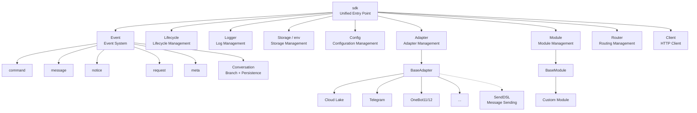
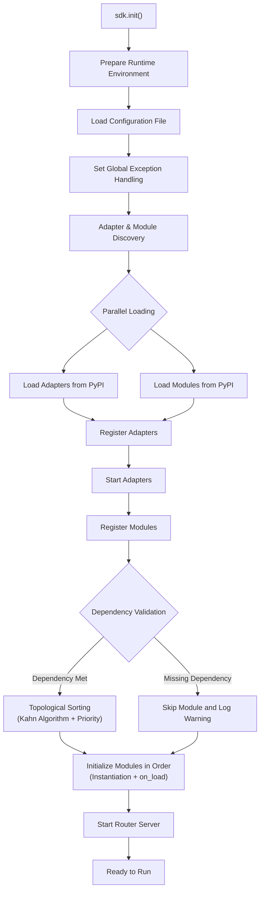
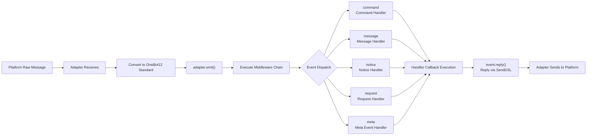
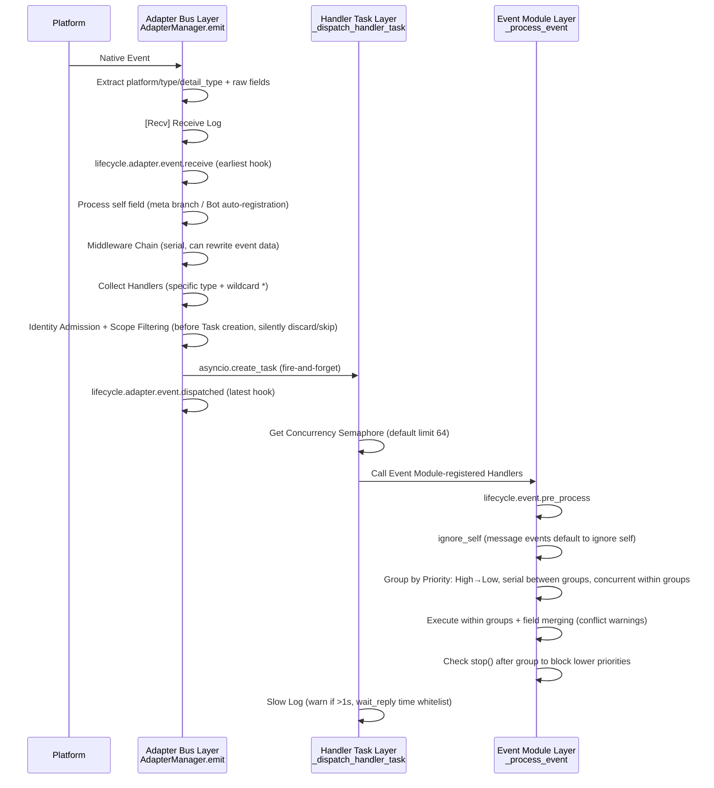
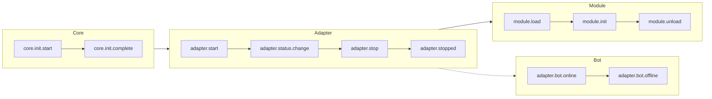
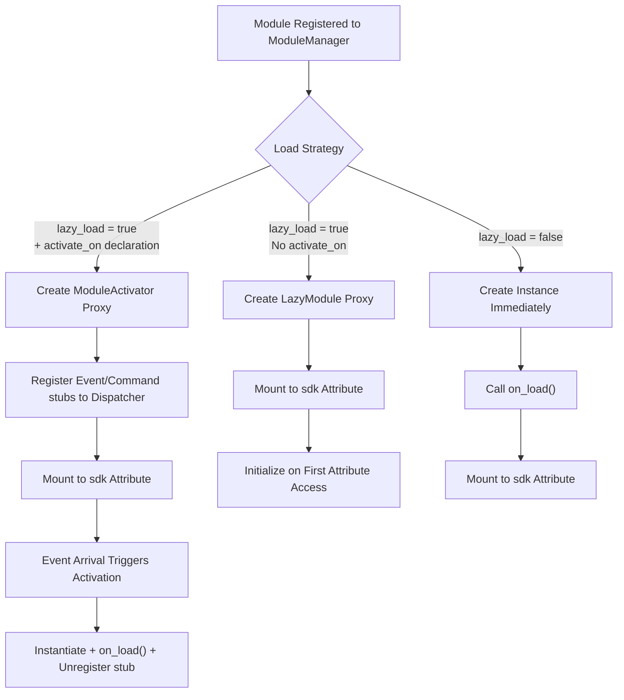
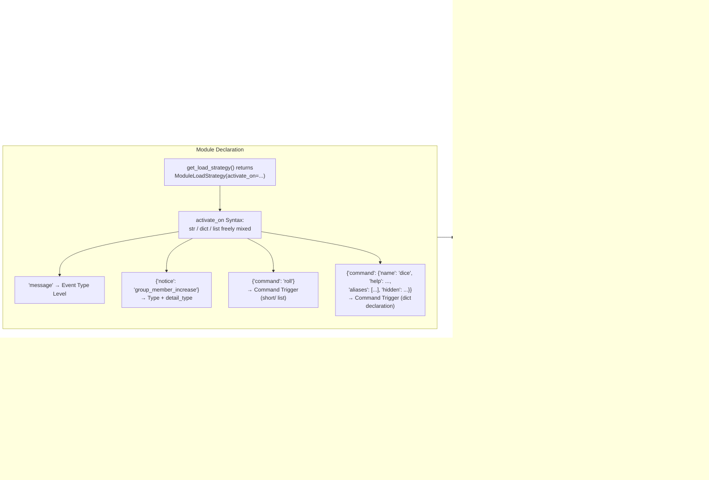
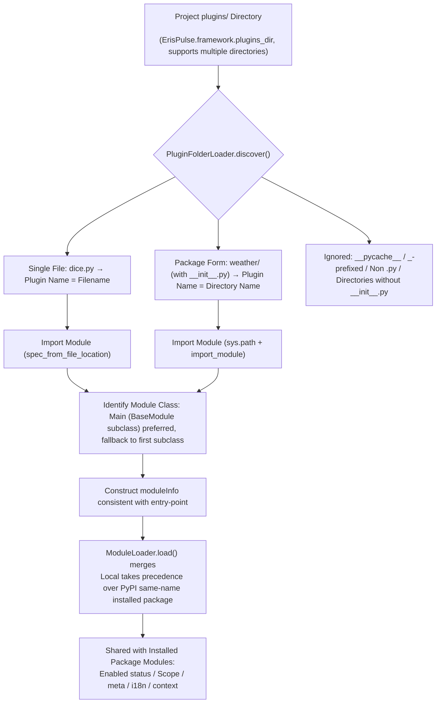
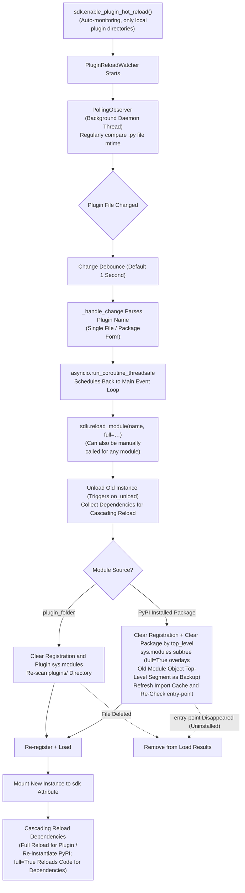

# Architecture Overview

This document introduces the technical architecture of the ErisPulse SDK through visual diagrams, helping you quickly understand the framework's design philosophy and module relationships.

## SDK Core Architecture

The following diagram shows the core module composition and their relationships:

```mermaid
graph TB
    SDK["sdk<br/>Unified Entry Point"]

    SDK --> Event["Event<br/>Event System"]
    SDK --> Lifecycle["Lifecycle<br/>Lifecycle Management"]
    SDK --> Logger["Logger<br/>Log Management"]
    SDK --> Storage["Storage / env<br/>Storage Management"]
    SDK --> Config["Config<br/>Configuration Management"]
    SDK --> AdapterMgr["Adapter<br/>Adapter Management"]
    SDK --> ModuleMgr["Module<br/>Module Management"]
    SDK --> Router["Router<br/>Routing Management"]
    SDK --> Client["Client<br/>HTTP Client"]
    Event --> Command["command"]
    Event --> Message["message"]
    Event --> Notice["notice"]
    Event --> Request["request"]
    Event --> Meta["meta"]
    Event --> Conversation["Conversation<br/>Branch + Persistence"]

    AdapterMgr --> BaseAdapter["BaseAdapter"]
    BaseAdapter --> P1["Cloud Lake"]
    BaseAdapter --> P2["Telegram"]
    BaseAdapter --> P3["OneBot11/12"]
    BaseAdapter --> PN["..."]

    ModuleMgr --> BaseModule["BaseModule"]
    BaseModule --> CM["Custom Module"]

    BaseAdapter -.-> SendDSL["SendDSL<br/>Message Sending"]
```

### Core Module Descriptions

| Module | Description |
|--------|-------------|
| **Event** | Event system, providing handling for five types of events: command / message / notice / request / meta, and Conversation for multi-turn dialogues |
| **Adapter** | Adapter manager, managing registration, startup, and shutdown of multi-platform adapters |
| **Module** | Module manager, managing plugin registration, loading, and unloading, supporting dependency declaration and topological sorting |
| **Lifecycle** | Lifecycle manager, providing event-driven lifecycle hooks |
| **Storage** | SQLite-based key-value storage system, supporting general SQL chain queries |
| **Config** | TOML-formatted configuration file management |
| **Logger** | Modular logging system, supporting sub-loggers |
| **Router** | HTTP/WebSocket routing management, encapsulating the underlying backend (currently FastAPI + Uvicorn) through an abstraction layer, supporting decorator routing, middleware, grouping, rate limiting, and CORS |
| **Client** | Unified HTTP/WS client (previously `HttpClient` before version 2.8.0, retaining a compatible alias), encapsulating the underlying request library (currently aiohttp) through an abstraction layer, providing request statistics, retry, logging, WebSocket client, and ErisPulse exception system. The WebSocket client and server share the `WebSocketConnectionBase` base class |

## Initialization Flow

The following diagram shows the complete initialization process of `sdk.init()`:

```mermaid
flowchart TD
    A["sdk.init()"] --> B["Prepare Runtime Environment"]
    B --> B1["Load Configuration File"]
    B1 --> B2["Set Global Exception Handling"]
    B2 --> C["Adapter & Module Discovery"]
    C --> D{"Parallel Loading"}
    D --> D1["Load Adapters from PyPI"]
    D --> D2["Load Modules from PyPI"]
    D1 & D2 --> E["Register Adapters"]
    E --> E1["Start Adapters"]
    E1 --> F["Register Modules"]
    F --> F1{"Dependency Validation"}
    F1 -->|"Missing Dependency"| F2["Skip Module and Log Warning"]
    F1 -->|"Dependency Met"| F3["Topological Sorting<br/>(Kahn Algorithm + Priority)"]
    F3 --> G["Initialize Modules in Order<br/>(Instantiation + on_load)"]
    F2 --> G
    G --> H["Start Router Server"]
    H --> K["Ready to Run"]
```

### Detailed Initialization Phases

> The complete initialization chain is broken down into Finder / Loader / Manager / Router layers, the underlying entry points (`init()` / `init_task()` / `init_sync()`), and manual full startup are detailed in [Startup Flow and Manual Control](advanced/startup.md).

## Event Handling Flow

The following diagram shows the complete message flow from platform to handler:

```mermaid
flowchart LR
    A["Platform Raw Message"] --> B["Adapter Receives"]
    B --> C["Convert to OneBot12 Standard"]
    C --> D["adapter.emit()"]
    D --> E["Execute Middleware Chain"]
    E --> F{"Event Dispatch"}
    F --> G1["command<br/>Command Handler"]
    F --> G2["message<br/>Message Handler"]
    F --> G3["notice<br/>Notice Handler"]
    F --> G4["request<br/>Request Handler"]
    F --> G5["meta<br/>Meta Event Handler"]
    G1 & G2 & G3 & G4 & G5 --> H["Handler Callback Execution"]
    H --> I["event.reply()<br/>Reply via SendDSL"]
    I --> J["Adapter Sends to Platform"]
```

### Detailed Event Handling Chain

The above diagram shows the result; below, we break down what happens behind the scenes after `adapter.emit()` — this is a three-layer dispatch chain:

```mermaid
sequenceDiagram
    participant P as Platform
    participant A as Adapter Bus Layer<br/>AdapterManager.emit
    participant T as Handler Task Layer<br/>_dispatch_handler_task
    participant E as Event Module Layer<br/>_process_event

    P->>A: Native Event
    A->>A: Extract platform/type/detail_type + raw fields
    A->>A: [Recv] Receive Log
    A->>A: lifecycle.adapter.event.receive (earliest hook)
    A->>A: Process self field (meta branch / Bot auto-registration)
    A->>A: Middleware Chain (serial, can rewrite event data)
    A->>A: Collect Handlers (specific type + wildcard *)
    A->>A: Identity Admission + Scope Filtering (before Task creation, silently discard/skip)
    A->>T: asyncio.create_task (fire-and-forget)
    A->>A: lifecycle.adapter.event.dispatched (latest hook)
    T->>T: Get Concurrency Semaphore (default limit 64)
    T->>E: Call Event Module-registered Handlers
    E->>E: lifecycle.event.pre_process
    E->>E: ignore_self (message events default to ignore self)
    E->>E: Group by Priority: High→Low, serial between groups, concurrent within groups
    E->>E: Execute within groups + field merging (conflict warnings)
    E->>E: Check stop() after group to block lower priorities
    T->>T: Slow Log (warn if >1s, wait_reply time whitelist)
```

**What the framework does at each step and what you can intervene:**

| Phase | What the framework does | What you can intervene |
|-------|--------------------------|------------------------|
| Receive | Extract standard fields, retain `{platform}_raw` raw data; write `[Recv]` log | Listen to `adapter.event.receive` to get the earliest event |
| self field | meta events go through connect/disconnect/heartbeat branches; normal events auto-register Bot and trigger `adapter.bot.online` | Listen to `adapter.bot.online` / `bot.offline` |
| Middleware | **Serial** execution, if return value is not None, replace event data | Register middleware to rewrite/intercept events |
| Dispatch Collection | First get specific type handlers, then get `*` wildcard handlers | — |
| Identity Dimension | At dispatch entry point, determine whether to receive events by user>session>Bot>adapter (`scope.is_identity_allowed`), **reject means discard the entire event** | `ErisPulse.scope.identity` binding |
| Scope Filtering | Determine `scope.is_allowed` by module owner (session level>Bot level>platform level), **silent skip if not passed** | Configure scope whitelist/blacklist |
| Scheduling | Each matching handler is an independent `asyncio.Task`, `emit()` **returns immediately without waiting** for handler completion | — |
| Priority | High priority groups execute first; **serial between groups, concurrent within groups** (each group holds its own event copy, modifies fields and merges back, conflicts warn), | `@command(..., priority=N)` / specify priority during registration |
| Blocking | After each group is processed, check `event.is_stopped()`, if triggered, **no lower priority is executed** | `event.mark_processed(stop=True)` / `event.done()` |

> **Common Misunderstandings**:
> 1. **Scope filtering is silent** — filtered handlers do not error or respond, only visible in TRACE-level logs (`core.scope.denied`). If "my module didn't receive a message," first check scope binding.
> 2. **Handlers are naturally concurrent** — the framework has created an independent Task for each handler, you **do not** need to wrap it with `asyncio.create_task`.
> 3. **No blocking within the same priority group** — `mark_processed(stop=True)` only blocks lower priority groups, handlers within the same group will not be interrupted.
> 4. **Slow log threshold is fixed at 1 second** — handlers taking over 1 second will issue a WARNING in the log (wait_reply time is excluded from the duration), but execution is not interrupted.

> Details on scope (scope) module-level binding, identity admission and outbound action restrictions are in [Scope (scope)](advanced/scope.md); event scope text filtering and command user ACL are in [Event Handling Introduction](getting-started/event-handling.md); concurrency limit configuration is in [Configuration Guide](user-guide/configuration.md#Framework Configuration).

## Lifecycle Events

The following diagram shows the lifecycle event trigger order for each component of the framework:

```mermaid
flowchart LR
    subgraph Core["Core"]
        direction LR
        C1["core.init.start"] --> C2["core.init.complete"]
    end

    subgraph AdapterLife["Adapter"]
        direction LR
        A1["adapter.start"] --> A2["adapter.status.change"] --> A3["adapter.stop"] --> A4["adapter.stopped"]
    end

    subgraph ModuleLife["Module"]
        direction LR
        M1["module.load"] --> M2["module.init"] --> M3["module.unload"]
    end

    subgraph BotLife["Bot"]
        direction LR
        B1["adapter.bot.online"] --> B2["adapter.bot.offline"]
    end

    Core --> AdapterLife
    AdapterLife --> ModuleLife
    AdapterLife -.-> BotLife
```

### Listening to Lifecycle Events

> Complete event listening methods (`lifecycle.on()` / `once()` / `has_handlers()`), all lifecycle event lists and data formats are in [Lifecycle Management](advanced/lifecycle.md).

## Module Loading Strategies

ErisPulse supports three module loading strategies, declared by `get_load_strategy()` returning a `ModuleLoadStrategy`:

```mermaid
flowchart TD
    A["Module Registered to ModuleManager"] --> B{"Load Strategy"}
    B -->|"lazy_load = true<br/>+ activate_on declaration"| C["Create ModuleActivator Proxy"]
    B -->|"lazy_load = true<br/>No activate_on"| D["Create LazyModule Proxy"]
    B -->|"lazy_load = false"| E["Create Instance Immediately"]
    C --> F["Register Event/Command stubs to Dispatcher"]
    F --> G["Mount to sdk Attribute"]
    G --> H["Event Arrival Triggers Activation"]
    H --> I["Instantiate + on_load() + Unregister stub"]
    D --> J["Mount to sdk Attribute"]
    J --> K["Initialize on First Attribute Access"]
    E --> L["Call on_load()"]
    L --> M["Mount to sdk Attribute"]
```

> For more details, see [Lazy Loading System](advanced/lazy-loading.md), [Lifecycle Management](advanced/lifecycle.md), and module documentation.

### Event-Driven Lazy Activation (`activate_on`) Trigger Architecture

> [!NOTE]
> This feature requires ErisPulse **2.8.0+**.

`activate_on` allows a module to load only when the **first matching event/command arrives**, avoiding constant memory usage while ensuring no events are lost:

```mermaid
flowchart LR
    subgraph Declare["Module Declaration"]
        S1["get_load_strategy() returns<br/>ModuleLoadStrategy(activate_on=...)"] --> S2["activate_on Syntax:<br/>str / dict / list freely mixed"]
        S2 --> S2a["'message' → Event Type Level"]
        S2 --> S2b["{'notice': 'group_member_increase'}<br/>→ Type + detail_type"]
        S2 --> S2c["{'command': 'roll'}<br/>→ Command Trigger (short/ list)"]
        S2 --> S2d["{'command': {'name': 'dice', 'help': ...,<br/>'aliases': [...], 'hidden': ...}}<br/>→ Command Trigger (dict declaration)"]
    end

    subgraph Runtime["Runtime"]
        R1["ModuleActivator Registers stub"] --> R1a["Event stub → message/notice/request/meta manager<br/>priority ACTIVATION_STUB_PRIORITY (very low)"]
        R1 --> R1b["Command stub → Command Manager<br/>Placeholder command (mirrors dict-declared help/usage/group/aliases/hidden)"]
        R1a --> R2{"Event Triggered"}
        R1b --> R2
        R2 --> R3["Filter by owner scope"]
        R3 --> R4["asyncio.Lock to prevent duplicate activation"]
        R4 --> R5["Instantiate module + call on_load()"]
        R5 --> R6["Unregister all stubs"]
        R6 --> R7["Event Forwarded to Real Handler"]
    end

    Declare --> Runtime
```

**Trigger Semantics Key Points:**

> The complete `activate_on` syntax (str / dict / list), command dict declaration, placeholder command help fallback chain, scope filtering, and failure semantics are in [Lazy Loading System](advanced/lazy-loading.md#Event-Driven-Lazy-Activation-activate_on).

## Local Plugin Folder Architecture

> [!NOTE]
> This feature requires ErisPulse **2.8.0+**.

Local plugins (`plugins/` directory) do not require packaging and publishing; the framework automatically discovers and loads them at startup:

```mermaid
flowchart TD
    A["Project plugins/ Directory<br/> (ErisPulse.framework.plugins_dir, supports multiple directories)"] --> B{"PluginFolderLoader.discover()"}
    B --> C["Single File: dice.py → Plugin Name = Filename"]
    B --> D["Package Form: weather/ (with __init__.py) → Plugin Name = Directory Name"]
    B --> E["Ignored: __pycache__ / _-prefixed / Non .py / Directories without __init__.py"]
    C --> F["Import Module (spec_from_file_location)"]
    D --> G["Import Module (sys.path + import_module)"]
    F --> H["Identify Module Class: Main (BaseModule subclass) preferred, fallback to first subclass"]
    G --> H
    H --> I["Construct moduleInfo consistent with entry-point"]
    I --> J["ModuleLoader.load() merges<br/>Local takes precedence over PyPI same-name installed package"]
    J --> K["Shared with Installed Package Modules:<br/>Enabled status / Scope / meta / i18n / context"]
```

**Conventions and Features:**

- Plugin name source: filename for single file, directory name for package form
- Local plugin `moduleInfo.meta.source == "plugin_folder"`, seamlessly coexists with PyPI installed package modules
- When names are the same, local takes precedence (for local override debugging), and if disabled, the same entry-point item is removed

## Module Hot Reload Architecture

Hot reload applies consistently to **all module sources**: local plugins can monitor file changes and trigger automatically, any module can be manually reloaded via `sdk.reload_module()` / `sdk.module.reload()` (PyPI installed package modules take effect after pip upgrade); `sdk.reload_all_modules()` / `sdk.module.reload_all()` can fully reload all registered modules at once (take effect after pip batch upgrade):

```mermaid
flowchart TD
    A["sdk.enable_plugin_hot_reload()<br/> (Auto-monitoring, only local plugin directories)"] --> B["PluginReloadWatcher Starts"]
    B --> C["PollingObserver (Background Daemon Thread)<br/>Regularly compare .py file mtime"]
    C --> D{"Plugin File Changed"}
    D --> E["Change Debounce (Default 1 Second)"]
    E --> F["_handle_change Parses Plugin Name<br/> (Single File / Package Form)"]
    F --> G["asyncio.run_coroutine_threadsafe<br/>Schedules Back to Main Event Loop"]
    G --> H["sdk.reload_module(name, full=…)<br/> (Can also be manually called for any module)"]
    H --> I["Unload Old Instance (Triggers on_unload)<br/>Collect Dependencies for Cascading Reload"]
    I --> J{"Module Source?"}
    J -->|"plugin_folder"| K["Clear Registration and Plugin sys.modules<br/>Re-scan plugins/ Directory"]
    J -->|"PyPI Installed Package"| L["Clear Registration + Clear Package by top_level<br/>sys.modules subtree (full=True overlays<br/>Old Module Object Top-Level Segment as Backup)<br/>Refresh Import Cache and Re-Check entry-point"]
    K --> M["Re-register + Load"]
    L --> M
    M --> N["Mount New Instance to sdk Attribute"]
    N --> O["Cascading Reload Dependencies<br/> (Full Reload for Plugin / Re-instantiate PyPI; <br/>full=True Reloads Code for Dependencies)"]
    K -.->|"File Deleted"| P["Remove from Load Results"]
    L -.->|"entry-point Disappeared (Uninstalled)"| P
```

**Differences between the two sources are only in the discovery phase**, registration, loading, and cascading reload are completely consistent:

- **Local Plugin** (`moduleInfo.meta.source == "plugin_folder"`): After clearing the plugin name corresponding `sys.modules`, re-scan the `plugins/` directory; if the file is deleted, remove it from the load results
- **PyPI Installed Package**: Clear the package's `sys.modules` subtree by `meta.top_level`, refresh the import cache (break entry-point 60-second cache) and re-check and re-import; if the entry-point disappears (pip uninstalled), remove it from the load results

**Full Reload (`full=True`) and Overall Reload (`reload_all_modules`):**

- When `top_level` metadata is missing and cannot be inferred, the default reload **does not clear** the import cache (re-import reuses old module objects, i.e., "fake reload"), the framework will explicitly warn and suggest using `full=True`—full reload will overlay old module object top-level package name for backup cleanup, ensuring the latest code runs after reload
- When `full=True`, PyPI dependencies cascade through full reload (re-import code), the default mode only re-instantiates (existing semantics)
- Reload forces activation of previously lazy-loaded modules (the previously silent difference has been changed to explicit logging); `reload_all_modules()` maintains lazy loading strategy, only re-activating modules that were loaded before the reload
- `reload_all_modules()` reloads in dependency topological order, single module failure only records diagnosis and skips (no overall rollback—on_unload side effects are irreversible, consistent with the best-effort semantics of single module hot reload); scenarios with failed reload and rollback are the same, logs will clearly indicate that the old instance is in a completed state