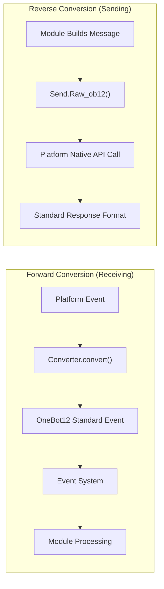

# Getting Started with Adapter Development

This guide helps you begin developing ErisPulse adapters to connect new messaging platforms.

## Adapter Introduction

### What is an Adapter

An adapter serves as the bridge between ErisPulse and various messaging platforms, responsible for:

1. **Forward Conversion**: Receiving platform events and converting them into OneBot12 standard format (Converter)
2. **Reverse Conversion**: Converting OneBot12 message segments into platform API calls (`Raw_ob12`)
3. Managing the connection with the platform (WebSocket/WebHook)
4. Providing a unified SendDSL message sending interface

### Adapter Architecture



## Directory Structure

Standard adapter package structure:

```
MyAdapter/
├── pyproject.toml          # Project configuration
├── README.md               # Project description
├── LICENSE                 # License
└── MyAdapter/
    ├── __init__.py          # Package entry point
    ├── Core.py               # Main adapter class
    └── Converter.py          # Event converter
```

## Quick Start

### 1. Create Project

```bash
mkdir MyAdapter && cd MyAdapter
```

### 2. Create pyproject.toml

```toml
[project]
name = "ErisPulse-MyAdapter"
version = "1.0.0"
description = "MyAdapter platform adapter"
readme = "README.md"
requires-python = ">=3.10"
license = { file = "LICENSE" }
authors = [ { name = "yourname", email = "your@mail.com" } ]

dependencies = [
    "ErisPulse>=2.4.0"  # ErisPulse has aiohttp built-in, usually no need to depend separately
]

[project.urls]
"homepage" = "https://github.com/yourname/MyAdapter"

[project.entry-points."erispulse.adapter"]
"MyAdapter" = "MyAdapter:MyAdapter"
```

### 3. Create Adapter Main Class

The framework provides `ConfigClass` / `AccountConfigClass` for declarative configuration management. The adapter only needs to declare the configuration class to automatically load, validate, and generate the configuration template.

```python
# MyAdapter/Core.py
from dataclasses import dataclass, field
from ErisPulse.Core import BaseAdapter
from ErisPulse.Core.Bases import BaseConfig

@dataclass
class MyAdapterConfig(BaseConfig):
    """MyAdapter Configuration"""
    api_endpoint: str = field(
        default="https://api.example.com",
        metadata={
            "description": {"i18n": "my_adapter.api_endpoint", "default": "API Address"},
            "required": False,
            "ui": {"widget": "text", "group": "connection", "order": 1},
        },
    )
    token: str = field(
        default="",
        metadata={
            "description": {"i18n": "my_adapter.token", "default": "Platform Token"},
            "required": True,
            "secret": True,
            "ui": {"widget": "password", "group": "basic", "order": 2},
        },
    )

class MyAdapter(BaseAdapter):
    ConfigClass = MyAdapterConfig  # Declare the configuration class, the framework manages it automatically
    
    # No need to override __init__! The framework handles it automatically:
    # - self.sdk / self.logger are set automatically
    # - self.cfg reads the configuration in real time
    # - self.Send / self.Request are initialized automatically
    
    def _setup_converter(self):
        from .Converter import MyPlatformConverter
        return MyPlatformConverter()
```

> ⚠️ **About `__init__`**: In the new version, `BaseAdapter.__init__(self, sdk=None)` automatically handles SDK references, log initialization, and configuration loading. Most adapters **do not need to override `__init__`**. See [__init__ Notes](#init-注意事项).

> ⚠️ **About `super().__init__()`**: `BaseAdapter.__init__()` is responsible for creating `Send` and `Request` factory instances. If you forget to call it, all message sending and request operations will report `AttributeError`. See [__init__ Notes](#init-注意事项).

### 4. Implement Required Methods

```python
class MyAdapter(BaseAdapter):
    # ... __init__ code ...
    
    async def start(self):
        """Start the adapter (must implement)"""
        # Register WebSocket or WebHook route
        router.register_websocket(
            module_name="myplatform",
            path="/ws",
            handler=self._ws_handler
        )
        self.logger.info("Adapter started")
    
    async def shutdown(self):
        """Shut down the adapter (must implement)"""
        router.unregister_websocket(
            module_name="myplatform",
            path="/ws"
        )
        # Clean up connections and resources
        self.logger.info("Adapter shut down")
    
    async def call_api(self, endpoint: str, **params):
        """Call platform API (must implement)"""
        raise NotImplementedError("call_api needs to be implemented")
```

#### Actively Send Meta Events

The adapter should actively send meta events to allow the framework to track the Bot's online status. Use `emit_meta()` to complete this in one line:

```python
class MyAdapter(BaseAdapter):
    async def _ws_handler(self, websocket):
        bot_id = self._get_bot_id()

        # Bot goes online
        await self.emit_meta("connect", bot_id, user_name="MyBot")

        try:
            while True:
                data = await websocket.receive_text()
                event = self.convert(data)
                if event:
                    await self.adapter.emit(event)
        except WebSocketDisconnect:
            pass
        finally:
            # Bot goes offline
            await self.emit_meta("disconnect", bot_id)
```

> For detailed Bot status management and meta event explanations, see [Adapter Best Practices - Bot Status Management and Meta Events](best-practices.md#bot-状态管理与-meta-事件).

### 5. Implement Send Class

`At`/`AtAll`/`Reply` decorators are already implemented by the framework's SendDSL base class. The adapter only needs to implement `Raw_ob12` and specific send methods.

The framework provides two key helper methods:
- `self._apply_modifiers(message)` — automatically merges At/AtAll/Reply decorators into message segments
- `self.send_context` — gets the send context dictionary (`target_type`, `target_id`, `account_id`)

```python
import asyncio

class MyAdapter(BaseAdapter):
    # ... other code ...

    class Send(BaseAdapter.Send):

        def Raw_ob12(self, message, **kwargs):
            """
            Send OneBot12 format message (must implement)

            Use _apply_modifiers to automatically merge decorator states,
            use send_context to get send context.
            """
            async def _do_send():
                segments = self._apply_modifiers(message)
                return await self._adapter.call_api(
                    endpoint="/send_message",
                    message=segments,
                    **self.send_context,
                    **kwargs
                )
            return asyncio.create_task(_do_send())

        # Text/Image/Voice/Video/File are inherited from the SendDSL base class,
        # defaulting to delegation to Raw_ob12, no need to repeat implementation.
        # If platform-specific logic is needed, you can override individual methods:
        # def Text(self, text: str):
        #     return self.Raw_ob12([{"type": "text", "data": {"text": text}}])
```

**Media-type send method implementation points:**

- The default implementation of the base class will encapsulate the `file` parameter as a OneBot12 message segment and pass it to `Raw_ob12`. The adapter needs to handle downloading/uploading in `Raw_ob12`.
- The `file` parameter should support both `bytes` binary data and `str` URL types.
- When a URL is passed, the file must be downloaded before uploading to the platform.
- The platform usually requires first calling the upload interface to obtain a file identifier, then calling the send interface.

**`__getattr__` Magic Method:**

- Implement case-insensitive method names (`Text`, `text`, `TEXT` can all be called)
- Undefined methods should return a prompt message instead of raising an error

**`Raw_ob12` Method:**

- Convert OneBot12 standard message format to platform format for sending
- Use `self._apply_modifiers(message)` to automatically handle At/AtAll/Reply decorators
- Use `**self.send_context` to pass send target information and account information

### 6. Implement Converter

```python
# MyAdapter/Converter.py
import time
import uuid

class MyPlatformConverter:
    def convert(self, raw_event):
        """Convert platform-native events to OneBot12 standard format"""
        if not isinstance(raw_event, dict):
            return None
        
        onebot_event = {
            "id": str(raw_event.get("event_id", uuid.uuid4())),
            "time": int(time.time()),
            "type": self._convert_event_type(raw_event.get("type")),
            "detail_type": self._convert_detail_type(raw_event),
            "platform": "myplatform",
            "self": {
                "platform": "myplatform",
                "user_id": str(raw_event.get("bot_id", ""))
            },
            "myplatform_raw": raw_event,
            "myplatform_raw_type": raw_event.get("type", "")
        }
        
        return onebot_event
    
    def _convert_event_type(self, event_type):
        """Convert event types"""
        type_map = {
            "message": "message",
            "notice": "notice"
        }
        return type_map.get(event_type, "unknown")
    
    def _convert_detail_type(self, raw_event):
        """Convert detail types"""
        return "private"  # Simplified example
```

### 7. Implement Request Class (Request Operations)

If your platform supports friend requests, group invitations, or other requests requiring the Bot to make decisions, you can implement the `Request` inner class:

```python
from ErisPulse.Core import BaseAdapter, RequestDSL

class MyAdapter(BaseAdapter):
    # ... Send and other code ...

    class Request(RequestDSL):
        """Request operation implementation (friend requests, group invitations, etc.)"""

        def accept(self, **kwargs):
            """Accept request"""
            async def _do():
                result = await self._adapter.call_api(
                    endpoint="/set_request",
                    request_id=self._request_id,
                    approve=True,
                    **kwargs,
                )
                return {
                    "status": "ok" if result.get("code") == 0 else "failed",
                    "retcode": result.get("code", 0),
                    "data": None,
                    "message_id": "",
                    "message": result.get("message", ""),
                }
            return self._create_task(_do())

        def reject(self, **kwargs):
            """Reject request"""
            async def _do():
                result = await self._adapter.call_api(
                    endpoint="/set_request",
                    request_id=self._request_id,
                    approve=False,
                    **kwargs,
                )
                return {
                    "status": "ok" if result.get("code") == 0 else "failed",
                    "retcode": result.get("code", 0),
                    "data": None,
                    "message_id": "",
                    "message": result.get("message", ""),
                }
            return self._create_task(_do())
```

Module developers use it as follows:

```python
from ErisPulse.Core.Event import request

@request.on_friend_request()
async def handle_friend_request(event):
    # Use Event convenience methods
    await event.approve()
    # Or operate directly through the adapter
    await adapter.myplatform.Request("req_id").accept()
```

> If the platform does not support request operations, you can omit implementing the `Request` inner class. The base class defaults to returning `retcode=10002` (operation not supported). See [Request Action Specification](../../standards/request-action-spec.md).

### 8. Create Package Entry Point

```python
# MyAdapter/__init__.py
from .Core import MyAdapter
```

## Dependency Declaration (Optional, 2.8.0+)

Adapters can declare dependencies on other adapters or modules to enable adapter interconnection and optional features:

```python
from typing import ClassVar

class MyAdapter(BaseAdapter):
    # Hard dependency: Adapter startup is skipped if dependency is missing (warning + status=skipped-dependency event)
    depends: ClassVar[dict] = {
        "adapters": ["onebot11"],   # Dependent adapters (by platform name)
        "modules": ["TranslateEngine"],  # Dependent modules (by registration name)
    }
    # Soft dependency: Missing does not affect startup; callbacks are received when modules are loaded/unloaded (optional feature mode)
    optional_modules: ClassVar[list] = ["TranslateEngine"]
```

- **Startup Order**: Adapters that declare hard dependencies on modules will **start after the modules are initialized**
- **Soft Dependency Notification**: `on_dependency_ready(module_name)` is called when modules in `optional_modules` (or hard dependencies) are loaded; `on_dependency_lost(module_name)` is called when modules are unloaded (default is empty implementation, can be overridden) — covers late loading and hot reload scenarios:

```python
async def on_dependency_ready(self, module_name):
    """Soft dependency module is ready: Enable corresponding optional features"""
    if module_name == "TranslateEngine":
        self._translate = self.sdk.TranslateEngine

async def on_dependency_lost(self, module_name):
    """Soft dependency module is lost: Downgrade functionality"""
    if module_name == "TranslateEngine":
        self._translate = None
```

> [!NOTE]
> This feature requires ErisPulse **2.8.0+**.

## `__init__` Notes

There are three levels in adapter development that may involve `__init__` overwriting. Below are the correct practices for each level.

### 1. BaseAdapter Level (Most Cases Do Not Need to Overwrite)

`BaseAdapter.__init__(self, sdk=None)` is responsible for creating `Send` / `Request` factory instances and automatically performs the following tasks:

- Accepts the `sdk` parameter and sets `self.sdk`, `self.logger`
- If `ConfigClass` is declared, you can read global configurations in real time via `self.cfg`
- If `AccountConfigClass` is declared, you can read multi-account configurations in real time via `self.accounts`

**In most cases, you do not need to overwrite `__init__`**; simply declare `ConfigClass`:

```python
class MyAdapter(BaseAdapter):
    ConfigClass = MyAdapterConfig  # After declaration, the framework manages configurations automatically
    
    async def start(self):
        cfg = self.cfg  # Type-safe, reads in real time
        ...
```

If you really need to customize initialization, call `super().__init__(sdk)`:

```python
class MyAdapter(BaseAdapter):
    ConfigClass = MyAdapterConfig
    
    def __init__(self, sdk=None):
        super().__init__(sdk)  # Pass sdk
        self.converter = self._setup_converter()
        self.convert = self.converter.convert
```

### 2. Send Inner Class (Most Cases Do Not Need to Overwrite)

`SendDSL.__init__` is responsible for state passing in chained calls (target type, target ID, account, etc.). **In most cases, you only need to overwrite methods** (`Raw_ob12`, `Text`, etc.), not `__init__`.

If you do need to (for example, initializing platform-specific states), **you must pass through all parameters**:

```python
class MyAdapter(BaseAdapter):
    class Send(BaseAdapter.Send):
        # Parameters: adapter, target_type, target_id, account_id
        def __init__(self, adapter, target_type=None, target_id=None, account_id=None):
            super().__init__(adapter, target_type, target_id, account_id)  # ← Must pass through
            self._my_state = None  # Platform-specific initialization
```

**Why must it be passed through?** Each step of the chained call creates a new instance via `self.__class__(...)`:

```python
adapter.Send.To("user", "123")               # → Send(adapter, "user", "123", None)
adapter.Send.To("user", "123").Using("bot1")  # → Send(adapter, "user", "123", "bot1")
```

If the `__init__` signature does not match or `super()` is not called, the chained call will break.

### 3. Request Inner Class (Most Cases Do Not Need to Overwrite)

Same as Send. The parameters are `adapter`, `request_id`, `account_id`:

```python
class MyAdapter(BaseAdapter):
    class Request(RequestDSL):
        # Parameters: adapter, request_id, account_id
        def __init__(self, adapter, request_id=None, account_id=None):
            super().__init__(adapter, request_id, account_id)  # ← Must pass through
            self._my_state = None  # Platform-specific initialization
```

### Summary

| Level | When to overwrite | What must be done |
|------|------------|-----------|
| **BaseAdapter** | When custom initialization logic is needed | `super().__init__(sdk)` (pass sdk parameter) |
| **Send Inner Class** | When initializing send-related states is needed | `super().__init__(adapter, target_type, target_id, account_id)` |
| **Request Inner Class** | When initializing request-related states is needed | `super().__init__(adapter, request_id, account_id)` |
| All three levels | Most cases | **Just declare ConfigClass, do not touch `__init__`** |

### 9. Connection Information and Route Discovery

After registering routes, the framework records all route information. Users can use the following API to view the adapter's connection address:

```python
from ErisPulse import sdk

# Get complete connection information for the adapter
info = sdk.adapter.get_connection_info("myplatform")
# {
#   "platform": "myplatform",
#   "status": "started",
#   "connection": {
#     "base_url": "http://localhost:8080",
#     "http_routes": [
#       {"path": "/myplatform/webhook", "method": "POST",
#        "url": "http://localhost:8080/myplatform/webhook"}
#     ],
#     "websocket_routes": [
#       {"path": "/myplatform/ws",
#        "url": "ws://localhost:8080/myplatform/ws"}
#     ]
#   }
# }

# List all namespaces (adapters/modules) routes
namespaces = sdk.router.list_namespaces()
# {"myplatform": {"http": ["/myplatform/webhook"], "websocket": ["/myplatform/ws"]}}

# Get complete connection URLs for the namespace
urls = sdk.router.get_module_urls("myplatform")
# {"base_url": "http://localhost:8080", "http": [...], "websocket": [...]}

# Get detailed route information for the namespace
routes = sdk.router.get_module_routes("myplatform")
# {"http": [{"path": "/myplatform/webhook", "methods": ["POST"]}],
#  "websocket": [{"path": "/myplatform/ws", "auth": false}]}
```

> **Tip**: The information returned by `get_connection_info()` is suitable for displaying to users (such as in a WebUI), helping users configure the callback address or WebSocket connection address on the platform side. The `module_name` registered during route registration must exactly match the `platform` name registered by the adapter in ErisPulse; otherwise, route discovery will not be correctly associated.

### 10. SSE (Server-Sent Events) Support

ErisPulse has built-in, server-agnostic SSE support. Modules and adapters can register SSE endpoints using `@sdk.router.sse()`.

#### Basic Usage

```python
import asyncio
from ErisPulse import sdk

@sdk.router.sse("MyModule", "/events")
async def event_stream(sse):
    """Push SSE events"""
    count = 0
    while not sse.closed:
        await sse.send({"count": count}, event="update")
        count += 1
        await asyncio.sleep(1)
```

#### Using Request Parameters

The handler can declare a `request` parameter to access client request information:

```python
@sdk.router.sse("MyModule", "/events")
async def event_stream(request, sse):
    token = request.query_params.get("token")
    if not validate_token(token):
        await sse.close()
        return

    while not sse.closed:
        data = await fetch_data(token)
        await sse.send(data)
        await asyncio.sleep(5)
```

#### SseEmitter API

| Method | Description |
|------|------|
| `sse.send(data, event=None, id=None, retry=None)` | Send an SSE event. Non-str data is automatically serialized to JSON |
| `sse.close()` | Gracefully close the SSE connection (safe to call multiple times) |
| `sse.closed` | Whether the connection is closed |
| `sse.request` | The underlying request object (can be used to read query params, headers) |

#### Using in RouteGroup

```python
api = sdk.router.group("MyModule", "/api", version="1")

@api.sse("/events")
async def events(sse):
    await sse.send({"msg": "hello"})
```

#### Route Discovery

SSE routes are automatically included in route discovery APIs:

```python
# list_namespaces will include the "sse" key
sdk.router.list_namespaces()
# {"MyModule": {"http": [...], "websocket": [...], "sse": ["/MyModule/events"]}}

# get_module_routes will mark streaming: true
sdk.router.get_module_routes("MyModule")
# {"http": [...], "websocket": [...], "sse": [{"path": "/MyModule/events", "streaming": true}]}

# get_module_urls will generate full URLs
sdk.router.get_module_urls("MyModule")
# {"sse": [{"path": "/MyModule/events", "url": "http://localhost:8080/MyModule/events"}]}
```

> **Server-agnostic design**: `SseEmitter` is decoupled from the underlying HTTP framework through callbacks. The framework provides `register_sse()` and the `@sse` decorator as unified registration entry points, allowing adapters to implement SSE endpoints without directly depending on any underlying HTTP framework.

## Next Steps

- [Adapter Core Concepts](core-concepts.md) - Learn about the adapter architecture
- [SendDSL Explained](send-dsl.md) - Learn how to send messages
- [Converter Implementation](converter.md) - Understand event conversion
- [Adapter Best Practices](best-practices.md) - Develop high-quality adapters