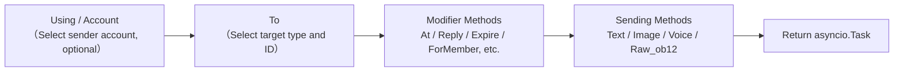
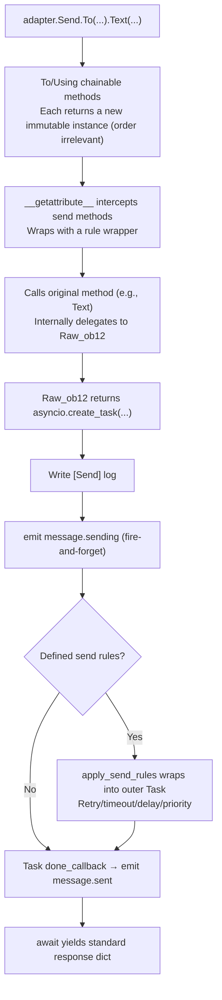

# SendDSL Detailed Explanation

SendDSL is a fluent-style message sending interface provided by the ErisPulse adapter.


## Basic Calling Methods

### 1. Specify Type and ID

```python
await adapter.Send.To("group", "123").Text("Hello")
```

### 2. Specify Only ID

```python
await adapter.Send.To("123").Text("Hello")
```

### 3. Specify Sending Account

```python
await adapter.Send.Using("bot1").Text("Hello")
```

### 4. Combination Usage

```python
await adapter.Send.Using("bot1").To("group", "123").Text("Hello")
```


## Method Chaining



   - Replace `docs/en/` with `docs/en/` in document links

## Sending Methods

All sending methods return an `asyncio.Task` object.

### Basic Methods (Built-in in Base Class)

The following standard methods are implemented by the `SendDSL` base class, **defaulting to delegation to `Raw_ob12`**. Adapter subclasses can use them directly without re-implementing, and IDEs can provide completion:

| Method Name | Description | Return Value |
|-------------|-------------|--------------|
| `Text(text: str)` | Send a text message | `asyncio.Task` |
| `Image(file: bytes \| str)` | Send an image | `asyncio.Task` |
| `Voice(file: bytes \| str)` | Send voice (OneBot12 `audio` segment) | `asyncio.Task` |
| `Video(file: bytes \| str)` | Send a video | `asyncio.Task` |
| `File(file: bytes \| str, filename: str = None)` | Send a file | `asyncio.Task` |

Adapters can override individual standard methods to provide platform-specific logic:

```python
class Send(SendDSL):
    def Raw_ob12(self, message, **kwargs):
        # Must be implemented
        ...

    # Optional: Override Text to provide platform-specific logic
    # def Text(self, text: str):
    #     return self.Raw_ob12([{"type": "text", "data": {"text": text}}])
```

### Protocol Methods

| Method Name | Description | Return Value | Required |
|-------------|-------------|--------------|----------|
| `Raw_ob12(message)` | Send a message in OneBot12 format | `asyncio.Task` | **Must be implemented** |

> **Important**: `Raw_ob12` is the core method of the adapter and **must be implemented**. It serves as the unified entry point for reverse transformation (OneBot12 → Platform). If not implemented, the base class will log an error and return a standard error response (`status: "failed"`, `retcode: 10002`). Standard methods (`Text`, `Image`, etc.) default to delegation to `Raw_ob12`.

### Platform-Specific Methods

Adapters can add platform-specific sending methods in the `Send` subclass (these will be recognized by `event.supports()` / `event.available_methods()`):

```python
class Send(SendDSL):
    def Raw_ob12(self, message, **kwargs): ...

    # Platform-specific method
    def Sticker(self, sticker_id: str):
        return self.Raw_ob12([{"type": "sticker", "data": {"id": sticker_id}}])
```

[**English**](docs/en/quick-start.md)

## Modifiers

Modifier methods return `self` to support method chaining.

### At Method

```python
# @ single user
await adapter.Send.To("group", "123").At("456").Text("Hello")

# @ multiple users
await adapter.Send.To("group", "123").At("456").At("789").Text("Hello everyone")
```

### AtAll Method

```python
# @ all group members
await adapter.Send.To("group", "123").AtAll().Text("Hello everyone")
```

### Reply Method

```python
# Reply to a message
await adapter.Send.To("group", "123").Reply("msg_id").Text("Reply content")
```

### Combined Modifiers

```python
await adapter.Send.To("group", "123").At("456").Reply("msg_id").Text("Reply to @ message")
```

### Platform-specific Modifier Methods

In addition to the built-in `At`/`AtAll`/`Reply`, adapters can define **platform-specific modifier methods**. These methods **only need to return `self`** and do not require any decorators — the framework will automatically recognize them:

- Return `self` (an instance of `SendDSL`) → modifier method, does not trigger sending wrapper/lifecycle events, continues chaining
- Return `Task`/`Awaitable` → send method

```python
class Send(SendDSL):
    def Raw_ob12(self, message, **kwargs): ...

    # Modifier method: return self, does not send
    def Expire(self, seconds: int):
        self._expire = seconds
        return self

    def ForMember(self, user_id: str):
        self._member = user_id
        return self

    # Send method: return Task, depends on the state set by modifier methods
    def Board(self, content: str, **kwargs):
        return self.Raw_ob12([{"type": "board", "data": {"text": content}}])
```

Usage:

```python
# Modifier methods can be chained continuously
await adapter.Send.To("group", "big").Expire(3600).ForMember("114").Board("Board content")

## Using Modifier Methods in Event Wrapper Classes

> [!NOTE]  
> The `reply(via=)` and `event.send_chain()` features require ErisPulse **2.7.0+**.

By default, `event.reply()` only exposes built-in modifier parameters such as `at_sender`, `at_users`, `at_all`, and `quote`. To use platform-specific modifier methods, there are two ways:

### Method 1: via parameter of reply()

Suitable for a small number of known modifier methods:

```python
await event.reply("Board content", method="Board",
                  via=[("Expire", 3600), ("ForMember", "114514")])
```

`via` is a list, where each element can be in one of the following forms:

| Form | Equivalent chained call |
|------|-------------------------|
| `"Name"` | `.Name()` |
| `("Name", arg1, arg2)` | `.Name(arg1, arg2)` |
| `("Name", (arg1,), {kw: val})` | `.Name(arg1, kw=val)` |

### Method 2: event.send_chain()

Suitable for **multiple consecutive modifier methods** or **action-type methods without content parameters** (such as recall or delete). `send_chain()` returns a send chain already configured with `To`/`Using`, allowing you to freely append any modifier methods and send methods:

```python
# Platform-specific modifier methods + board message
await event.send_chain().Expire(3600).Board("Expires after one hour")

# Multiple consecutive modifier methods
await (event.send_chain()
       .Expire(3600)
       .ForMember("114514")
       .Board("Board content", content_type="markdown"))

# Built-in modifier methods are also available
await event.send_chain().At("123").Reply("msg_id").Text("hi")

# Action-type methods without content parameters
await event.send_chain().DismissBoard()
```

> `send_chain()` returns a complete SendDSL instance, so **all chaining features are available**—not just modifier methods, but also send rules and batch building:

```python
# Send rules: retry + timeout + success callback
await (event.send_chain()
       .Retry(3).Timeout(10)
       .Hook(lambda r: print("Message sent successfully"))
       .Text("Reliable message"))

# Delayed sending + platform modifier + board
await event.send_chain().Defer(5).Expire(3600).Board("Delayed board")

# Batch building mode
results = await (event.send_chain()
                 .Build()
                 .Text("First sentence").Image("pic.jpg").Text("Second sentence")
                 .send_all())

## Account Management

### Using Method

`Using()` is used to specify the account for sending messages. The passed identifier will be matched by `_resolve_account()` with the following priority:

1. **Account name** — the key name in the configuration (e.g., `"default"`, `"bot1"`)
2. **Runtime injected bot_id** — the identifier automatically injected during event conversion
3. **Any str field** — other string fields in the configuration
4. **Fallback** — the first enabled account

```python
# Using account name
await adapter.Send.Using("account1").To("user", "123").Text("Hello")

# Using bot_id (i.e., self.user_id from the event)
await adapter.Send.Using("bot_123").To("user", "123").Text("Hello")
```

### Account Method

The `Account` method is equivalent to `Using`:

```python
await adapter.Send.Account("account1").To("user", "123").Text("Hello")

## Asynchronous Processing

### Don't Wait for Result

```python
# Message is sent in the background
task = adapter.Send.To("user", "123").Text("Hello")

# Continue executing other operations
# ...
```

### Wait for Result

```python
# Directly await to get the result
result = await adapter.Send.To("user", "123").Text("Hello")
print(f"Send result: {result}")

# Save the Task first, then wait later
task = adapter.Send.To("user", "123").Text("Hello")
# ... other operations ...
result = await task
```


## Send Rule System

SendDSL includes a set of built-in send rule decorators that can be attached via chained methods, and applied collectively when the final send occurs. These rules cover common production scenarios: timeout control, failure retry, success callback, delayed sending, priority dropping, and progress monitoring.

Rule methods **return self** (just like At/AtAll/Reply), and must be called before the send method (Text/Image, etc.). Rules propagate with new instances created by `To`/`Using`/`Account`.

### List of Rule Methods

| Method | Description |
|--------|-------------|
| `.Hook(callback)` | Callback executed after successful send (can be called multiple times, executed in order) |
| `.Retry(times=1)` | Automatic retry N times on failure (total of N+1 attempts, including the first) |
| `.Timeout(seconds)` | Single send timeout; cancels the current attempt if timeout occurs (can be stacked with Retry) |
| `.Defer(seconds=1.0)` | Delayed sending (in-process timing, not persisted) |
| `.Priority(level, drop_if_busy=False)` | Set priority; messages can be dropped during backlog |
| `.OnProgress(callback)` | Progress callback at each stage (receives `SendContext`) |
| `.OnError(callback)` | Error callback triggered only once when the final send fails |

### Logic Executed After Successful Send (Hook)

```python
# Synchronous callback
await (adapter.Send.To("user", "123")
       .Hook(lambda r: print(f"Send successful, message ID: {r['message_id']}"))
       .Text("Hello"))

# Asynchronous callback
async def deduct_points(result):
    await db.update(user_id="123", points=-1)

await adapter.Send.To("user", "123").Hook(deduct_points).Text("Deduct points")
```

Hook is only executed when the send is ultimately successful (including retry success); it does not trigger on failure, timeout, or cancellation.

### Automatic Retry on Failure (Retry)

```python
# Retry 2 times after the first failure, for a total of 3 attempts
result = await adapter.Send.To("user", "123").Retry(2).Text("With retry")
```

Retry is triggered when sending throws an exception, times out, or returns a response with `status == "failed"`.

### Automatic Cancellation on Timeout (Timeout)

```python
# Cancel if a single send exceeds 10 seconds
await adapter.Send.To("user", "123").Timeout(10).Text("With timeout")

# Timeout + Retry: Each attempt lasts 10 seconds, up to 3 attempts
await adapter.Send.To("user", "123").Timeout(10).Retry(2).Text("Timeout retry")
```

### Progress Monitoring (OnProgress / OnError)

```python
def on_progress(ctx):
    print(f"Stage: {ctx.stage}, Attempt: {ctx.attempt + 1}/{ctx.max_attempts}, Elapsed: {ctx.elapsed:.2f}s")
    if ctx.stage == "failed":
        print(f"  Error: {ctx.error!r}")

async def on_error(ctx):
    await notify_admin(f"Send to {ctx.target_id} failed: {ctx.error!r}")

await (adapter.Send.To("user", "123")
       .Retry(3).Timeout(10)
       .OnProgress(on_progress)
       .OnError(on_error)
       .Text("Monitor"))
```

`SendContext` contains the following fields: `task_id`, `platform`, `method`, `target_type`, `target_id`, `bot_id`, `stage`, `attempt`, `max_attempts`, `started_at`, `finished_at`, `elapsed`, `error`, `result`, `extra`.

Possible values for `stage`: `pending`, `sending`, `retrying`, `success`, `failed`, `timeout`, `cancelled`, `dropped`.

### Delayed Sending (Defer)

```python
# Send after 5 seconds
await adapter.Send.To("user", "123").Defer(5).Text("Delayed message")
```

> Note: Delay is in-process timing; it is lost if the process restarts and is not persisted.

### Priority and Backlog Dropping (Priority)

```python
# Low-priority message, automatically dropped during queue backlog
result = await (adapter.Send.To("user", "123")
               .Priority(-1, drop_if_busy=True)
               .Text("Discardable notification"))
# If dropped, result["status"] == "failed"
```

When `drop_if_busy` is enabled, the send is directly abandoned if the number of in-progress send tasks exceeds the threshold (default 64). The global threshold can be adjusted using `.PriorityThreshold(n)`.

### Rule Composition and Background Execution

```python
# Does not block the main flow, but rules still apply
task = (adapter.Send.To("user", "123")
        .Hook(lambda r: print("Send successful!"))
        .Retry(3)
        .Timeout(10)
        .OnProgress(on_progress)
        .Text("Hello"))

# Continue executing other operations
await handle_next_action()
```

### Rule Propagation

Rules propagate with new instances created by `To`/`Using`/`Account`, preventing loss of rules during chained calls:

```python
# Rules set before To also propagate to the instance created by To
builder = adapter.Send.Retry(3).Timeout(10)
send = builder.To("user", "123")  # send still carries Retry(3) and Timeout(10)
await send.Text("hi")
```

Rules for multiple instances are independent (hooks list is deep-copied).

## Batch Build Mode (Build)

In addition to the single-send mode, SendDSL also supports the batch build mode: multiple send methods are written in a single chain, and are executed collectively at the end. This is suitable for scenarios where "multiple messages are sent at once".

### Entering Build Mode

Call `.Build()` before the send method, which returns a `SendBuilder`. After this, send methods (Text/Image, etc.) will no longer execute immediately, but will accumulate into send intents:

```python
results = await (adapter.Send.To("user", "123")
                 .Build()                    # Enter build mode
                 .Text("First sentence")
                 .Image("pic.jpg")
                 .Text("Second sentence")
                 .send_all())                 # Execute collectively
# results = [Text result, Image result, Text result]
```

`.send_all()` returns an `asyncio.Task`, and after awaiting, you get a list of results (in the order of the intents).

### Parallel vs. Sequential

By default, execution is **parallel** (concurrent sending, total duration approximately equal to the slowest one). When the order of message arrival needs to be guaranteed, call `.Sequential()`:

```python
# Sequential: send in order
await (adapter.Send.To("group", "456")
       .Build()
       .Sequential()
       .Text("Send this first").Text("Then send this")
       .send_all())

# Parallel (default, can be explicitly called)
await (adapter.Send.To("group", "456")
       .Build()
       .Parallel()
       .Text("Parallel 1").Text("Parallel 2")
       .send_all())
```

### Continue on Failure and Retry

Batch execution uses a **continue on failure** strategy: if one message fails, it will not interrupt the sending of other messages. When combined with `.Retry()`, failed entries will automatically retry (retry applies to individual messages, not the entire batch):

```python
await (adapter.Send.To("user", "123")
       .Build()
       .Retry(2)                       # Each message retries 2 times
       .Text("May fail").Image("May also fail")
       .send_all())
```

### Batch-wide Rules and Callbacks

Rules apply uniformly to the entire batch:

| Method | Description |
|--------|-------------|
| `.Timeout(seconds)` | Single send timeout for each message |
| `.Retry(times)` | Each message retries individually (continue on failure) |
| `.Defer(seconds)` | Delay the entire batch's send |
| `.Hook(callback)` | Triggered after the entire batch succeeds, receives `results` list |
| `.OnError(callback)` | Triggered when there are failures in the batch, receives `BatchContext` |
| `.OnProgress(callback)` | Triggered when each message completes, receives `BatchContext` |

```python
def on_progress(ctx):
    print(f"Progress: {ctx.completed}/{ctx.total}, succeeded {ctx.succeeded}, failed {ctx.failed}")

async def on_error(ctx):
    print(f"There are {ctx.failed} failed messages in the batch")

results = await (adapter.Send.To("user", "123")
               .Build()
               .Retry(2).Timeout(10)
               .OnProgress(on_progress)
               .OnError(on_error)
               .Hook(lambda rs: print("Batch completed"))
               .Text("a").Text("b").Text("c")
               .send_all())
```

`BatchContext` contains: `task_id`, `total`, `completed`, `succeeded`, `failed`, `stage`, `results`, `errors`, `elapsed`, `extra`.

`stage` possible values: `pending`, `sending`, `success` (all succeeded), `partial` (partially succeeded), `failed` (all failed).

### Decorators and Rule Inheritance

Decorators and rules (At/AtAll/Reply) before `.Build()` are inherited by the entire batch and apply to each message:

```python
await (adapter.Send.To("group", "456")
       .At("789")                        # Inherited: each message mentions 789
       .Build()
       .Retry(2)                         # Inherited + appended: each message retries individually
       .Text("@Your notification")
       .Image("Announcement image")
       .send_all())
```

After entering Build mode, you can still append decorators (applying to the entire batch):

```python
await (adapter.Send.To("group", "456")
       .Build()
       .At("111").At("222")             # Appended @, applies to the entire batch
       .Text("@Multiple people")
       .send_all())
```

### Background Execution

Same as single-send, `.send_all()` returns a Task, which can be executed in the background without awaiting:

```python
task = (adapter.Send.To("user", "123")
        .Build()
        .Hook(lambda rs: print("Batch send completed"))
        .Text("a").Text("b")
        .send_all())

# Does not block the main flow
await do_something_else()

## Naming Convention

### PascalCase Naming

All send methods use PascalCase:

```python
# ✅ Correct
def Text(self, text: str):
    pass

def Image(self, file: bytes):
    pass

# ❌ Incorrect
def text(self, text: str):
    pass

def send_image(self, file: bytes):
    pass
```

### Platform-specific Methods

Platform-specific prefixes for methods are not recommended:

```python
# ✅ Recommended
def Sticker(self, sticker_id: str):
    pass

# ❌ Not recommended
def TelegramSticker(self, sticker_id: str):
    pass
```

Use `Raw` methods instead:

```python
# ✅ Recommended
await adapter.Send.Raw_ob12([{"type": "sticker", ...}])

# ❌ Not recommended
def TelegramSticker(self, ...):
    pass
```


## Internal Breakdown of the Send Chain

Behind a single `await adapter.Send.To("group", "123").Text("x")`, the framework helps you complete the following sequence of operations:



**What the framework does at each step:**

| Phase | What the framework does |
|------|-------------|
| Chainable merging | `To`/`Using`/`Account` each call **creates a new immutable instance** and inherits already set fields, so `To(...).Using(...)` and `Using(...).To(...)` are **equivalent**, order irrelevant |
| Method wrapping | Send methods (`Text`, etc.) are intercepted and wrapped by `__getattribute__`; modifier methods (`To`/`Using`/`At`/`Retry`, etc.) are **not wrapped**. Nested `Raw_ob12` calls are marked with `_in_rule_wrap` to prevent duplicate wrapping |
| Task creation | `Raw_ob12` internally uses `asyncio.create_task()` as the true task creation point; `Text()` only synchronously returns this Task, **does not block** |
| Send logging | Writes `[Send] platform/method -> target` event logs (can be suppressed with `exclude_levels=["EVENT"]`) |
| `message.sending` | The send method is called **immediately** triggered fire-and-forget (only if listeners exist, short-circuited by `has_handlers`) |
| `message.sent` | Bound to the Task's `done_callback` — **when rules are present, it covers the final result of the entire retry process**, otherwise it's simply the original Task completion |

### Account Resolution Fallback Chain

When the adapter internally calls `_resolve_account(account_id)`, it resolves to a specific account in the following order:

1. Single-account adapter (no `AccountConfigClass`) → directly returns
2. Exact match of `account_id` by account name
3. Match of `bot_id` field in each account
4. Match of any `str` field value in each account (excluding `enabled`/`name`)
5. Fallback to the first enabled account
6. All fail → raise `ValueError`

> The `account_id` you provide comes from: `Using()` explicitly specified > event `self` field (`account_id` takes precedence over `user_id`, automatically injected by `event.reply()`) > not specified (adapter falls back to the first enabled account).

### Send Rule Engine (Retry/Timeout/Delay)

Rules are wrapped into a new outer Task after `Raw_ob12` returns a Task, without affecting the main flow. Key facts:

| Rule | Description |
|------|------|
| `Retry(n)` | Total attempts `n+1`; **immediately retries on failure, no exponential backoff** |
| `Timeout(s)` | Single send timeout cancellation (`asyncio.wait_for`), retries if not exhausted |
| `Defer(s)` | Delays sleep before sending |
| `Priority(level, drop_if_busy)` | If backlog exceeds threshold, directly returns `{status:"failed", retcode:10002, message:"dropped_low_priority"}` |
| `Hook(fn)` | Only executes in order when final success occurs |
| `on_progress` / `on_error` | Callbacks at each stage / final failure |

> **Note**: Retries are "immediate retransmission" with no backoff interval; if platform rate limiting requires backoff, please manually sleep and retransmit in the `on_error` callback. Rule success is determined by `status == "ok"` in the returned dict (`retcode == 0`).

> The standard response format and complete semantics of `retcode` are detailed in [API Response Specification](../../standards/api-response.md).

## Return Values

### Task Object

All send methods return an `asyncio.Task`. The adapter only needs to implement `Raw_ob12`, and standard methods (Text/Image, etc.) are delegated to it by default:

```python
import asyncio

def Raw_ob12(self, message, **kwargs):
    async def _do_send():
        segments = self._apply_modifiers(message)
        return await self._adapter.call_api(
            endpoint="/send_message",
            message=segments,
            **self.send_context,
            **kwargs,
        )
    return asyncio.create_task(_do_send())

# Text/Image/Voice/Video/File are inherited from the base class and automatically delegated to Raw_ob12
# If you need to override standard methods, simply return an asyncio.Task:
# def Text(self, text: str):
#     return self.Raw_ob12([{"type": "text", "data": {"text": text}}])
```

### Standardized Response

`call_api` should return a standardized response. It is recommended to use the `make_response()` / `make_error()` methods:

```python
async def call_api(self, endpoint: str, **params):
    try:
        result = await self._do_api_call(endpoint, **params)
        return self.make_response(
            data=result.get("data"),
            message_id=result.get("message_id", ""),
            raw=result,
        )
    except Exception as e:
        return self.make_error(message=str(e))
```

Manual construction is also supported (the old method is still compatible):

```python
async def call_api(self, endpoint: str, **params):
    return {
        "status": "ok" or "failed",
        "retcode": 0 or error_code,
        "data": {...},
        "message_id": "msg_id" or "",
        "message": "",
        "{platform}_raw": raw_response
    }
```


## Complete Example

### Basic Usage

```python
from ErisPulse.Core import adapter

my_adapter = adapter.get("myplatform")

# Send text
await my_adapter.Send.To("user", "123").Text("Hello World!")

# Send image
await my_adapter.Send.To("group", "456").Image("https://example.com/image.jpg")

# Send file
with open("document.pdf", "rb") as f:
    await my_adapter.Send.To("user", "123").File(f.read())
```

### Chained Calls

```python
# @user + reply
await my_adapter.Send.To("group", "456").At("789").Reply("msg123").Text("Reply to @ message")

# @all + multiple modifiers
await my_adapter.Send.Using("bot1").To("group", "456").AtAll().Text("Announcement message")
```

### Raw Message and Message Building

`Raw_ob12` is the core entry point for reverse conversion (receiving OB12 message segments → platform API calls), and `MessageBuilder` is a chainable message segment builder that works with it.

> For the complete `Raw_ob12` implementation specification, `MessageBuilder` usage, and code examples, please refer to:
> - [Send Method Specification §6 Reverse Conversion Specification](../../standards/send-method-spec.md#6-反向转换规范onebot12--平台)
> - [Send Method Specification §11 Message Builder](../../standards/send-method-spec.md#11-消息构建器-messagebuilder)

## Related Documents

- [Getting Started with Adapter Development](getting-started.md) - Create an adapter
- [Core Concepts of Adapters](core-concepts.md) - Understand the adapter architecture
- [Best Practices for Adapters](best-practices.md) - Develop high-quality adapters
- [Send Method Specification](../../standards/send-method-spec.md) - Complete specification for the send method