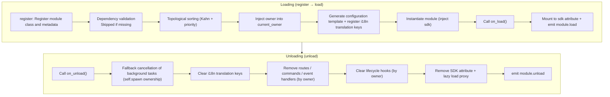

# Core Module Concepts

Understanding the core concepts of ErisPulse modules is the foundation for developing high-quality modules.

## Module Lifecycle

### Loading Strategy

```python
from ErisPulse.Core.Bases import BaseModule
from ErisPulse.loaders import ModuleLoadStrategy

class MyModule(BaseModule):
    @staticmethod
    def get_load_strategy():
        """Return the module loading strategy"""
        return ModuleLoadStrategy(
            lazy_load=True,   # Lazy loading or immediate loading
            priority=0,       # Loading priority (higher value loads first)
            depends=["OtherModule"]  # Optional: declare dependencies on other modules
        )
```

> If modules declared in `depends` are not registered, the current module will be skipped and a warning will be logged. The loading order is determined by topological sorting, with modules at the same level sorted by `priority` in descending order.

> [!NOTE]
> **Cascading Unload / Cascading Reload** (ErisPulse **2.8.0+**): When unloading a module that is depended on by other modules, the dependent modules will be **cascading unloaded first** (with logs explaining the cascade chain); when hot-reloading any module (local plugin / PyPI installed package), the dependent modules will also be **cascading reloaded**, preventing dependent modules from holding invalid instance references and continuing to run. Attempting to declare cyclic dependencies will be rejected at load time with a `RuntimeError`.

### on_load Method

Called when the module is loaded, used for initializing resources and registering event handlers:

```python
async def on_load(self, event):
    # Register event handlers
    @command("hello", help="Greeting command")
    async def hello_handler(event):
        await event.reply("Hello!")
    
    # Use the built-in HTTP client from the SDK (automatically manages connection pool, no need to manually create session)
    # Requests can be sent via sdk.client
```

### on_unload Method

Called when the module is unloaded, used for cleaning up resources:

```python
async def on_unload(self, event):
    # Clean up custom resources
    # sdk.client is managed by the framework, no need to manually close
    
    # Cancel event handlers (the framework handles this automatically)
    self.logger.info("Module unloaded")
```

> Background task creation and cleanup (`self.spawn()` / framework's fallback cancellation) are detailed in [Lifecycle Management](../../advanced/lifecycle.md#background-task-ownership-and-automatic-cancellation).

### Unload vs. Purge

> [!NOTE]
> This feature requires ErisPulse **2.8.0+**.

`unload()` by default only **cancels loading** (unloads the instance and resources), but retains the registration stub (module class and metadata) — the module can still be rediscovered and `load()` re-instantiated without needing to re-register.

When you need to **completely unload** (release the module class reference, clear `sys.modules`, allowing the plugin and its exclusive dependencies to be garbage collected), pass `purge=True`:

```python
# Only cancel loading: retain registration stub, can be reloaded anytime
await sdk.module.unload("MyModule")

# Completely unload: delete registration stub + clear sys.modules (only for plugin folder sources)
await sdk.module.unload("MyModule", purge=True)
```

| Semantics | `unload()` default | `unload(purge=True)` |
|-----------|--------------------|----------------------|
| Unload instance and resources (events/task/route/lifecycle/i18n) | ✅ | ✅ |
| Retain registration stub (module class and metadata) | ✅ | ❌ Deleted |
| Clear `sys.modules` (only for plugin folder sources) | ❌ | ✅ |
| Module class can be garbage collected | ❌ | ✅ |
| Reload | `load()` directly available | Must re-register + load |

> When `purge=True`, cascading unloaded dependents are also purged; after unloading, the framework will `gc.collect()` and check if the module class/instance is collectible, residual references will be warned in logs (with the referencing party, DEBUG level).

### Lifecycle Overview

Putting the above methods together, here is **everything the framework does behind the scenes** when loading and unloading a module:



**What the framework does for you during loading** (you only need to write `on_load`, everything else is done automatically):

| Step | Framework automatically does |
|------|-----------------------------|
| Owner injection | During instantiation, wrap the module name with `owner_scope` — all commands/events/hooks/background tasks you register in `on_load` are **automatically assigned to this module**, and cleaned up in one click during unloading |
| Configuration template | Modules that declare `ConfigClass` automatically generate/fill the `ErisPulse.<ModuleName>` configuration section |
| i18n translation keys | Modules that declare `I18nClass` automatically register translation keys (unregister automatically during unload) |
| Dependency topology | Sort according to `depends` declaration, ensuring dependent modules load first; cyclic dependencies are rejected with a `RuntimeError` |
| SDK mounting | After instantiation, mount to `sdk.<ModuleName>`, allowing you to access via `sdk.MyModule.xxx` |

**What the framework cleans up during unloading** (corresponding to U1→U7): After `on_unload` runs, it performs fallback cleanup — background tasks are forcibly cancelled (created via `self.spawn`, graceful shutdown should be handled in `on_unload`), i18n keys, routes, commands/event handlers, lifecycle hooks, and finally removes the SDK attribute. `purge=True` additionally deletes the registration stub and clears `sys.modules`.

> This automatic cleanup is the foundation for the principle that "you only need to write `on_load`/`on_unload`, no need to manually unregister" — the framework uses owner assignment to make "who registers, who cleans up" into a one-click operation.

## SDK Object

### Accessing Core Modules

```python
from ErisPulse import sdk

# Access all core modules via the sdk object
sdk.logger.info("Log")
sdk.storage.set("key", "value")
config = sdk.config.getConfig("MyModule")
```

### Inter-Module Communication

```python
# Access other modules
other_module = sdk.OtherModule
result = await other_module.some_method()
```

## Adapter Send Method Query

Due to the new standard specification requiring the use of the re-written `__getattr__` method to implement the fallback sending mechanism, it is no longer possible to use `hasattr` to check for method existence. Starting from `2.3.5`, a feature to query send methods has been added.

### List Supported Send Methods

```python
# List all send methods supported by the platform
methods = sdk.adapter.list_sends("onebot11")
# Returns: ["Text", "Image", "Voice", "Markdown", ...]
```

### Get Method Detailed Information

```python
# Get detailed information about a method
info = sdk.adapter.send_info("onebot11", "Text")
# Returns:
# {
#     "name": "Text",
#     "parameters": [
#         {"name": "text", "type": "str", "default": null, "annotation": "str"}
#     ],
#     "return_type": "Awaitable[Any]",
#     "docstring": "Send text message..."
# }
```

## Configuration Management

### Declarative Configuration (Recommended)

Starting from v2.5.2, modules can declare a configuration class via `ConfigClass`, using the same configuration Schema system as adapters. Configuration is read in real-time via `self.cfg`, and changes take effect immediately:

```python
from dataclasses import dataclass, field
from ErisPulse.Core.Bases import BaseModule
from ErisPulse.Core.Bases import BaseConfig

@dataclass
class MyModuleConfig(BaseConfig):
    api_key: str = field(
        default="",
        metadata={
            "description": {"i18n": "my_module.api_key", "default": "API Key"},
            "required": True,
            "secret": True,
            "ui": {"widget": "password", "group": "basic", "order": 1},
        },
    )
    timeout: int = field(
        default=30,
        metadata={
            "description": {"i18n": "my_module.timeout", "default": "Timeout (seconds)"},
            "ui": {"widget": "number", "group": "advanced", "order": 2},
        },
    )

class MyModule(BaseModule):
    ConfigClass = MyModuleConfig

    def __init__(self, sdk):
        self.sdk = sdk
        self.logger = sdk.logger.get_child("MyModule")

    async def on_load(self, event):
        self.logger.info("Module loaded")

    async def on_unload(self, event):
        pass

    async def do_something(self):
        cfg = self.cfg  # Real-time reading, type-safe
        api_key = cfg.api_key
        timeout = cfg.timeout
```

`BaseConfig` is a generic configuration base class, applicable to adapters, modules, and external projects in any scenario. Configuration fields support i18n multilingual descriptions (see [i18n documentation](../../advanced/i18n.md#multilingual-configuration-field-descriptions)).

The configuration Schema system also supports (v2.8.0+, see [Adapter core-concepts](../adapters/core-concepts.md#metadata-conventions)):

- **Docstring auto-generates field descriptions**: When `metadata` `description` is not declared, the docstring's `:ivar field: description` or `Attributes:` section is automatically extracted as a fallback
- **Nested dataclass configuration**: When a field type is a nested dataclass, schema/template/validation is recursively processed, and the WebUI renders it as a nested group
- **`example` non-persistent field**: Fields with `metadata={"example": True}` are not written to `config.toml`, only recorded in `config.full.example` (suitable for complex, rarely touched advanced configuration items), and become persistent after user manual setting

### Declarative Translation Keys (v2.7.0+)

Starting from v2.7.0, modules can also declare translation keys in a centralized manner, similar to declaring `ConfigClass`, by using the nested class `I18nClass`. The framework will **automatically register** all declared translation keys during loading, without requiring manual `i18n.register()` calls, and registration occurs before the configuration template is generated, ensuring that i18n keys referenced in configuration descriptions are available.

```python
from ErisPulse.Core.Bases import BaseConfig, BaseI18n, I18nKey

class MyModule(BaseModule):
    # Configuration class (optional)
    @dataclass
    class ConfigClass(BaseConfig):
        welcome_msg: str = field(
            default="Welcome",
            metadata={
                "description": {"i18n": "mymodule.welcome_msg", "default": "Welcome message"},
            },
        )

    # Translation key collection class (optional)
    class I18nClass(BaseI18n):
        # Property names are automatically concatenated into full key paths: <module_name>.<property_name>
        welcome_msg: I18nKey = I18nKey(
            default="Welcome Message",   # Language-agnostic fallback
            zh_CN="欢迎消息",
            zh_TW="歡迎訊息",
            en="Welcome Message",
            ja="ウェルカムメッセージ",
            ru="Приветственное сообщение",
        )
        hello: I18nKey = I18nKey(
            default="Hello, {name}!",
            zh_CN="你好，{name}！",
            zh_TW="你好，{name}！",
            en="Hello, {name}!",
            ja="こんにちは、{name}！",
            ru="Привет, {name}!",
        )
```

See [Recommended i18n Writing Style](../../advanced/i18n.md#recommended-writing-style-using-i18nclass-to-declare-translation-keys-v270) for more details.

### Manual Configuration Reading (Deprecated)

> **Deprecated**: Please switch to [Declarative Configuration](#declarative-configuration-recommended) + real-time reading via `self.cfg`.

```python
class MyModule(BaseModule):
    def __init__(self, sdk):
        self.sdk = sdk

    def _load_config(self):
        config = self.sdk.config.getConfig("MyModule")
        if not config:
            self.sdk.config.setConfig("MyModule", {"api_key": "", "timeout": 30})
            return {"api_key": "", "timeout": 30}
        return config
```

## Storage System

### Basic Usage

```python
# Store data
sdk.storage.set("user:123", {"name": "Zhang San"})

# Retrieve data
user = sdk.storage.get("user:123", {})

# Delete data
sdk.storage.delete("user:123")
```

### Transaction Usage

```python
# Use transactions to ensure data consistency
with sdk.storage.transaction():
    sdk.storage.set("key1", "value1")
    sdk.storage.set("key2", "value2")
    # If any operation fails, all changes will be rolled back
```

## Event Handling

### Event Handler Registration

```python
from ErisPulse.Core.Event import command, message

# Register commands
@command("info", help="Get information")
async def info_handler(event):
    await event.reply("This is information")

# Register message handlers
@message.on_group_message()
async def group_handler(event):
    sdk.logger.info(f"Received group message: {event.get_text()}")
```

### Event Handler Lifecycle

The framework automatically manages the registration and unregistration of event handlers; you only need to register them in `on_load`.

## Lazy Loading Mechanism

### Working Principle

```python
# The module is initialized only when first accessed
result = await sdk.my_module.some_method()
# ↑ This triggers module initialization
```

### Immediate Loading

For modules that need immediate initialization (such as listeners, timers):

```python
@staticmethod
def get_load_strategy():
    return ModuleLoadStrategy(
        lazy_load=False,  # Immediate loading
        priority=100
    )
```

## Error Handling

### Exception Handling

```python
async def handle_event(self, event):
    try:
        # Business logic
        await self.process_event(event)
    except ValueError as e:
        self.logger.warning(f"Parameter error: {e}")
        await event.reply(f"Parameter error: {e}")
    except Exception as e:
        self.logger.error(f"Processing failed: {e}")
        raise
```

### Logging

```python
# Use different logging levels
self.logger.debug("Debug information")    # Detailed debug information
self.logger.info("Running status")        # Normal running information
self.logger.warning("Warning information")  # Warning information
self.logger.error("Error information")    # Error information
self.logger.critical("Critical error")    # Critical error
```

## Related Documentation

- [Module Development Getting Started](getting-started.md) - Create your first module
- [Event Wrapper Class](event-wrapper.md) - Detailed event handling
- [Best Practices](best-practices.md) - Developing high-quality modules